<!-- page:1 -->
SAND2022-6171

Unlimited Release

May 2022

# Dakota, A Multilevel Parallel Object-Oriented Framework for Design Optimization, Parameter Estimation, Uncertainty Quantification, and Sensitivity Analysis: Version 6.16 User’s Manual

Brian M. Adams, William J. Bohnhoff, Keith R. Dalbey, Mohamed S. Ebeida, John P. Eddy, Michael S. Eldred, Russell W. Hooper, Patricia D. Hough, Kenneth T. Hu,

John D. Jakeman, Mohammad Khalil, Kathryn A. Maupin, Jason A. Monschke,

Elliott M. Ridgway, Ahmad A. Rushdi, D. Thomas Seidl, J. Adam Stephens, Laura P. Swiler, Anh Tran, and Justin G. Winokur

Sandia National Laboratories

P.O. Box 5800

Albuquerque, NM 87185

<!-- page:2 -->
# Abstract

The Dakota toolkit provides a flexible and extensible interface between simulation codes and iterative analysis methods. Dakota contains algorithms for optimization with gradient and nongradient-based methods; uncertainty quantification with sampling, reliability, and stochastic expansion methods; parameter estimation with nonlinear least squares methods; and sensitivity/variance analysis with design of experiments and parameter study methods. These capabilities may be used on their own or as components within advanced strategies such as surrogatebased optimization, mixed integer nonlinear programming, or optimization under uncertainty. By employing object-oriented design to implement abstractions of the key components required for iterative systems analyses, the Dakota toolkit provides a flexible and extensible problem-solving environment for design and performance analysis of computational models on high performance computers.

This report serves as a user’s manual for the Dakota software and provides capability overviews and procedures for software execution, as well as a variety of example studies.

<!-- page:3 -->
# Contents

# Preface 16

# 1 Introduction 17

1.1 Motivation for Dakota Development 17   
1.2 Dakota Capabilities 17   
1.3 Coupling Dakota to a Simulation 19   
1.4 User’s Manual Organization 20   
1.5 Files Referenced in this Manual 20   
1.6 Summary 20

# 2 Dakota Tutorial 22

2.1 Quickstart 22

2.1.1 Acquiring and Installing Dakota 22   
2.1.2 Running Dakota with a simple input file 23   
2.1.3 Examples of Dakota output . 23

2.2 Dakota Input File Format 24

2.3 Examples 28

2.3.1 Rosenbrock Test Problem 28   
2.3.2 Two-Dimensional Grid Parameter Study 28   
2.3.3 Gradient-based Unconstrained Optimization . 29   
2.3.4 Uncertainty Quantification with Monte Carlo Sampling . 30   
2.3.5 User Supplied Simulation Code Examples . 33

2.4 Dakota Command-Line Options 37

2.5 Next Steps 39

2.5.1 Problem Exploration and Method Selection 40   
2.5.2 Key Getting Started References 40

<!-- page:4 -->
# 3 Parameter Study Capabilities 42

3.1 Overview 42

3.1.1 Initial Values 43   
3.1.2 Bounds 43

3.2 Vector Parameter Study 43   
3.3 List Parameter Study 45   
3.4 Centered Parameter Study 45   
3.5 Multidimensional Parameter Study 46   
3.6 Parameter Study Usage Guidelines 48   
3.7 Example: Vector Parameter Study with Rosenbrock 48

# 4 Design of Experiments Capabilities 51

4.1 Overview 51   
4.2 Design of Computer Experiments 52   
4.3 DDACE 53

4.3.1 Central Composite Design 53   
4.3.2 Box-Behnken Design 54   
4.3.3 Orthogonal Array Designs 54   
4.3.4 Grid Design 55   
4.3.5 Monte Carlo Design 55   
4.3.6 LHS Design 55   
4.3.7 OA-LHS Design 56

4.4 FSUDace 56   
4.5 PSUADE MOAT 56   
4.6 Sensitivity Analysis 57

4.6.1 Sensitivity Analysis Overview 57   
4.6.2 Assessing Sensitivity with DACE 59

4.7 DOE Usage Guidelines 60

# 5 Uncertainty Quantification Capabilities 62

5.1 Overview 62

5.1.1 Summary of Dakota UQ Methods 62   
5.1.2 Variables and Responses for UQ 64

5.2 Sampling Methods 65

5.2.1 Uncertainty Quantification Example using Sampling Methods 66

5.2.2 Incremental Sampling 71   
5.2.3 Principal Component Analysis 72   
5.2.4 Wilks-based Sample Sizes 72

<!-- page:5 -->
5.3 Reliability Methods 72

5.3.1 Local Reliability Methods 73   
5.3.2 Global Reliability Methods . 74   
5.3.3 Uncertainty Quantification Examples using Reliability Analysis 76

5.4 Stochastic Expansion Methods 80

5.4.1 Uncertainty Quantification Examples using Stochastic Expansions 82

5.5 Importance Sampling Methods 86

5.5.1 Importance Sampling Method based on Reliability Approach 87   
5.5.2 Gaussian Process Adaptive Importance Sampling Method 88

5.6 Adaptive Sampling Methods 88

5.6.1 Adaptive sampling based on surrogates 88   
5.6.2 Adaptive sampling based on dart throwing . 90

5.7 Epistemic Nondeterministic Methods . 90

5.7.1 Interval Methods for Epistemic Analysis 91   
5.7.2 Dempster-Shafer Theory of Evidence 91

5.8 Bayesian Calibration Methods 95

5.8.1 QUESO 96   
5.8.2 DREAM 97   
5.8.3 GPMSA 98   
5.8.4 MUQ 98  
5.8.5 WASABI 98   
5.8.6 Feature Comparison 99   
5.8.7 Bayesian Calibration Example 99   
5.8.8 Chain Diagnostics 101   
5.8.9 Calibrating the Observation Error Model 101   
5.8.10 Scaling and Weighting of Residuals 103   
5.8.11 Model Evidence 103   
5.8.12 Model Discrepancy 104   
5.8.13 Bayesian Experimental Design 105

5.9 Uncertainty Quantification Usage Guidelines 109

<!-- page:6 -->
# 6 Optimization Capabilities 112

6.1 Optimization Formulations 112

6.1.1 Constraint Considerations 114

6.2 Optimizing with Dakota: Choosing a Method . 114

6.2.1 Gradient-Based Local Methods 114

6.2.2 Derivative-Free Local Methods 116

6.2.3 Derivative-Free Global Methods 118

6.3 Additional Optimization Capabilities . 122

6.3.1 Multiobjective Optimization 124

6.3.2 Optimization with User-specified or Automatic Scaling 127

6.4 Optimization Usage Guidelines . 132

6.5 Optimization Third Party Libraries 134

# 7 Nonlinear Least Squares Capabilities 136

7.1 Overview 136

7.2 Nonlinear Least Squares Fomulations . 136

7.3 Nonlinear Least Squares with Dakota 137

7.4 Solution Techniques . 137

7.4.1 Gauss-Newton 138

7.4.2 NLSSOL 138

7.4.3 NL2SOL 138

7.4.4 Additional Features . 139

7.5 Examples 139

7.6 Usage Guidelines 141

# 8 Models 142

8.1 Overview . 142

8.2 Single Models 143

8.3 Recast Models 143

8.4 Surrogate Models . 143

8.4.1 Overview of Surrogate Types 143

8.4.2 Correction Approaches 145

8.4.3 Data Fit Surrogate Models 145

8.4.4 Multifidelity Surrogate Models . 154

8.4.5 Reduced Order Models 154

8.4.6 Surrogate Model Selection 154   
8.4.7 Python Interface to the Surrogates Module 155

8.5 Nested Models 155   
8.6 Random Field Models . 156   
8.7 Active Subspace Models 157

<!-- page:7 -->
# 9 Variables 158

9.1 Overview 158   
9.2 Design Variables 158

9.2.1 Continuous Design Variables 158   
9.2.2 Discrete Design Variables 158

9.3 Uncertain Variables 160

9.3.1 Aleatory Uncertain Variables 160   
9.3.2 Epistemic Uncertain Variables 161

9.4 State Variables 162   
9.5 Management of Mixed Variables by Iterator . 162

9.5.1 View 162   
9.5.2 Domain 163   
9.5.3 Precedence 163

9.6 Dakota Parameters File Data Format 163

9.6.1 Parameters file format (standard) 163   
9.6.2 Parameters file format (APREPRO) 165

9.7 The Active Set Vector 166

9.7.1 Active set vector control 166

# 10 Interfaces 168

10.1 Overview 168   
10.2 Simulation Interfaces 168

10.2.1 Direct Simulation Interface . 168   
10.2.2 System Call Simulation Interface 169   
10.2.3 Fork Simulation Interface 169   
10.2.4 Syntax for Filter and Driver Strings 170   
10.2.5 Fork or System Call: Which to Use? 170

10.3 Building a Black-Box Interface to a Simulation Code 171

10.3.1 Generic Script Interface Files 171

10.3.2 Adapting These Scripts to Another Simulation 176   
10.3.3 Additional Examples 177

# 10.4 Simulation Interface Components 177

10.4.1 Single analysis driver without filters 177   
10.4.2 Single analysis driver with filters . 179   
10.4.3 Multiple analysis drivers without filters 179   
10.4.4 Multiple analysis drivers with filters 180

<!-- page:8 -->
# 10.5 Simulation File Management 181

10.5.1 File Saving 181   
10.5.2 File Tagging for Evaluations 182   
10.5.3 Temporary Files 182   
10.5.4 File Tagging for Analysis Drivers 183   
10.5.5 Work Directories 184

# 10.6 Batched Evaluations 186

10.6.1 File Formats 186   
10.6.2 Work Directories, Tagging, and Other Features 187

# 10.7 Parameter to Response Mapping Examples 187

# 10.8 Parameters and Results Files with dakota.interfacing 191

10.8.1 Creating Parameters and Results objects 191   
10.8.2 Parameters objects 192   
10.8.3 Results objects 193   
10.8.4 Response object 193   
10.8.5 BatchParameters object . 194   
10.8.6 BatchResults object . 194   
10.8.7 Processing Templates 194   
10.8.8 dakota.interfacing Examples 195

# 10.9 Preprocessing with dprepro and pyprepro 196

10.9.1 Changes and Updates to dprepro 197   
10.9.2 Usage 197   
10.9.3 Template Expressions 198   
10.9.4 Scripting 203   
10.9.5 Auxiliary Functions 207

# 11 Responses

211

<!-- page:9 -->
11.1 Overview 211

11.1.1 Response function types 211   
11.1.2 Gradient availability 211   
11.1.3 Hessian availability 212   
11.1.4 Field Data . 212

11.2 Dakota Results File Data Format 213

11.3 Active Variables for Derivatives . 214

# 12 Inputs to Dakota 215

12.1 Overview of Inputs 215

12.1.1 Tabular Data Formats . 215

12.2 Data Imports . 216

12.2.1 AMPL algebraic mappings: stub.nl, stub.row, and stub.col 216   
12.2.2 Genetic algorithm population import 216   
12.2.3 Calibration data import 217   
12.2.4 PCE coefficient import 217   
12.2.5 Surrogate Model Imports 218   
12.2.6 Variables/responses import to post-run . 218

# 13 Output from Dakota 219

13.1 Overview of Output Formats 219   
13.2 Standard Output 219   
13.3 Tabular Output Data . 225   
13.4 HDF5 Output 225   
13.5 Graphics Output . 226   
13.6 Error Messages Output 227   
13.7 Stochastic expansion exports 228   
13.8 Surrogate Model Exports 228   
13.9 Variables Output from Pre-run 228

# 14 Advanced Methods 229

14.1 Overview 229   
14.2 Hybrid Minimization 229   
14.3 Multistart Local Minimization . 230   
14.4 Pareto Optimization 230

<!-- page:10 -->
14.5 Mixed Integer Nonlinear Programming (MINLP) 233

14.5.1 Example MINLP Problem 235

14.6 Surrogate-Based Minimization 235

14.6.1 Surrogate-Based Local Minimization 236

14.6.2 Surrogate-Based Global Minimization 240

# 15 Advanced Model Recursions 243

15.1 Mixed Aleatory-Epistemic UQ 243

15.1.1 Interval-valued probability (IVP) . 244

15.1.2 Second-order probability (SOP) 245

15.1.3 Dempster-Shafer Theory of Evidence 245

15.2 Optimization Under Uncertainty (OUU) 247

15.2.1 Nested OUU 247

15.2.2 Surrogate-Based OUU (SBOUU) 248

15.2.3 Trust-Region Surrogate-Based OUU (TR-SBOUU) 248

15.2.4 RBDO 250

15.2.5 Stochastic Expansion-Based Design Optimization . 251

15.2.6 Epistemic OUU 251

15.3 Surrogate-Based Uncertainty Quantification 252

# 16 Advanced Simulation Code Interfaces 253

16.1 Algebraic Mappings . 253

16.2 Developing a Direct Simulation Interface 256

16.2.1 Extension 256

16.2.2 Derivation . 257

16.2.3 Sandwich 257

16.3 Existing Direct Interfaces to External Simulators 257

16.3.1 Matlab 257

16.3.2 Python 258

16.4 Scilab Script and Direct Interfaces 261

16.4.1 Scilab Script Interface 262

16.4.2 Scilab Linked Interface 262

16.4.3 Scilab Compiled Interface 262

# 17 Parallel Computing 264

<!-- page:11 -->
17.1 Overview 264

17.1.1 Categorization of parallelism 265   
17.1.2 Parallel Dakota algorithms 266

17.2 Single-level parallelism 268

17.2.1 Asynchronous Local Parallelism 269   
17.2.2 Message Passing Parallelism 273   
17.2.3 Hybrid Parallelism 276

17.3 Multilevel parallelism 278

17.3.1 Asynchronous Local Parallelism 279   
17.3.2 Message Passing Parallelism 279   
17.3.3 Hybrid Parallelism 280

17.4 Capability Summary 281

17.5 Running a Parallel Dakota Job . 281

17.5.1 Single-processor execution 282   
17.5.2 Multiprocessor execution 282

17.6 Specifying Parallelism 283

17.6.1 The interface specification 283   
17.6.2 The meta-iterator and nested model specifications 284   
17.6.3 Single-processor Dakota specification 284   
17.6.4 Multiprocessor Dakota specification 286

17.7 Application Parallelism Use Cases 290

17.7.1 Case 1: Massively Serial — Multiple serial analysis jobs . 291   
17.7.2 Case 2: Sequential Parallel — One parallel analysis job at a time 292   
17.7.3 Case 3: Evaluation Tiling — Multiple simultaneous parallel analysis jobs 292   
17.7.4 Case 4: Evaluation Submission — Parallel analysis jobs submitted to a queue . 294

18 Restart Capabilities and Utilities 295

18.1 Restart Management 295   
18.2 The Dakota Restart Utility 296

18.2.1 Print . 297   
18.2.2 To/From Neutral File Format 298   
18.2.3 To Tabular Format 299   
18.2.4 Concatenation of Multiple Restart Files 300   
18.2.5 Removal of Corrupted Data 300

<!-- page:12 -->
# 19 Simulation Failure Capturing 302

19.1 Failure detection 302   
19.2 Failure communication 303   
19.3 Failure mitigation 303

19.3.1 Abort (default) 303   
19.3.2 Retry 303   
19.3.3 Recover 303   
19.3.4 Continuation 303

19.4 Special values 304

# 20 Additional Examples 305

20.1 Textbook . 305

20.1.1 Gradient-based Constrained Optimization 307

20.2 Rosenbrock . 310

20.2.1 Least-Squares Optimization 310

20.3 Herbie, Smooth Herbie, and Shubert . 313

20.3.1 Efficient Global Optimization 314

20.4 Sobol and Ishigami Functions . 314

20.5 Cylinder Head 315

20.5.1 Constrained Gradient Based Optimization 319

20.6 Container 322

20.6.1 Constrained Gradient Based Optimization 323

20.7 Cantilever . 324

20.7.1 Constrained Gradient Based Optimization 325   
20.7.2 Optimization Under Uncertainty 325

20.8 Multiobjective Test Problems . 325

20.8.1 Multiobjective Test Problem 2 327   
20.8.2 Multiobjective Test Problem 3 327

20.9 Morris . 333

20.9.1 Morris One-at-a-Time Sensitivity Study 333

20.10Test Problems for Reliability Analyses . 336

20.10.1 Log Ratio 336   
20.10.2 Steel Section . 336   
20.10.3 Portal Frame . 337

20.10.4 Short Column 337   
20.10.5 Steel Column . 338   
20.11Test Problems for Forward Uncertainty Quantification . 339   
20.11.1 Genz functions 339   
20.11.2 Elliptic Partial differential equation with uncertain coefficients 339   
20.11.3 Damped Oscillator 340   
20.11.4 Non-linear coupled system of ODEs . 341   
20.11.5 Experimental Design . 341   
20.11.6 Bayes linear . 341

<!-- page:14 -->
# Preface

The Dakota project started in 1994 as an internal research and development activity at Sandia National Laboratories in Albuquerque, New Mexico. The original goal was to provide a common set of optimization tools for a group of engineers solving structural analysis and design problems. Prior to the Dakota project, there was no focused effort to archive optimization methods for reuse on other projects. Thus, engineers found themselves repeatedly building new custom interfaces between the engineering analysis software and optimization software. This was especially burdensome when using parallel computing, as each project developed a unique master program to coordinate concurrent simulations on a network of workstations or a parallel computer. The initial Dakota toolkit provided the engineering and analysis community at Sandia access to a variety of optimization algorithms, hiding the complexity of the optimization software interfaces from the users. Engineers could readily switch between optimization software packages by simply changing a few lines in a Dakota input file. In addition to structural analysis, Dakota has been applied to computational fluid dynamics, nonlinear dynamics, shock physics, heat transfer, electrical circuits, and many other science and engineering models.

Dakota has grown significantly beyond an optimization toolkit. In addition to its state-of-the-art optimization methods, Dakota includes methods for global sensitivity and variance analysis, parameter estimation, uncertainty quantification, and verification, as well as meta-level strategies for surrogate-based optimization, hybrid optimization, and optimization under uncertainty. Available to all these algorithms is parallel computation support; ranging from desktop multiprocessor computers to massively parallel computers typically found at national laboratories and supercomputer centers.

As of Version 5.0, Dakota is publicly released as open source under a GNU Lesser General Public License and is available for free download world-wide. See http://www.gnu.org/licenses/lgpl.html for more information on the LGPL software use agreement. Dakota Versions 3.0 through 4.2+ were licensed under the GNU General Public License. Dakota public release facilitates research and software collaborations among Dakota developers at Sandia National Laboratories and other institutions, including academic, government, and corporate entities. See the Dakota FAQ at http://dakota.sandia.gov/faq-page for more information on the public release rationale and ways to contribute.

For a listing of current and former contributors and third-party library developers, visit the Dakota webpage at http://dakota.sandia.gov.

# Contact Information:

Manager Optimizaion & Uncertainty Quantification Department

Sandia National Laboratories

P.O. Box 5800, MS-1318

Albuquerque, NM 87185-1318

Web (including support information): http://dakota.sandia.gov

<!-- page:15 -->
# Chapter 1

# Introduction

# 1.1 Motivation for Dakota Development

Computational models are commonly used in engineering design and scientific discovery activities for simulating complex physical systems in disciplines such as fluid mechanics, structural dynamics, heat transfer, nonlinear structural mechanics, shock physics, and many others. These simulators can be an enormous aid to engineers who want to develop an understanding and/or predictive capability for complex behaviors typically observed in the corresponding physical systems. Simulators often serve as virtual prototypes, where a set of predefined system parameters, such as size or location dimensions and material properties, are adjusted to improve the performance of a system, as defined by one or more system performance objectives. Such optimization or tuning of the virtual prototype requires executing the simulator, evaluating performance objective(s), and adjusting the system parameters in an iterative, automated, and directed way. System performance objectives can be formulated, for example, to minimize weight, cost, or defects; to limit a critical temperature, stress, or vibration response; or to maximize performance, reliability, throughput, agility, or design robustness. In addition, one would often like to design computer experiments, run parameter studies, or perform uncertainty quantification (UQ). These approaches reveal how system performance changes as a design or uncertain input variable changes. Sampling methods are often used in uncertainty quantification to calculate a distribution on system performance measures, and to understand which uncertain inputs contribute most to the variance of the outputs.

A primary goal for Dakota development is to provide engineers and other disciplinary scientists with a systematic and rapid means to obtain improved or optimal designs or understand sensitivity or uncertainty using simulation-based models. These capabilities generally lead to improved designs and system performance in earlier design stages, alleviating dependence on physical prototypes and testing, shortening design cycles, and reducing product development costs. In addition to providing this practical environment for answering system performance questions, the Dakota toolkit provides an extensible platform for the research and rapid prototyping of customized methods and meta-algorithms [34].

# 1.2 Dakota Capabilities

Dakota delivers a variety of iterative methods and meta-algorithms, and the ability to flexibly interface them to your simulation code. While Dakota was originally conceived to more readily interface simulation codes and optimization algorithms, recent versions go beyond optimization to include other iterative analysis methods such as uncertainty quantification with nondeterministic propagation methods, parameter estimation with nonlinear least squares solution methods, and sensitivity/- variance analysis with general-purpose design of experiments and parameter study capabilities. These capabilities may be used on their own or as building blocks within more sophisticated meta-algorithms such as hybrid optimization, surrogate-based optimization, optimization under uncertainty, or mixed aleatory/epistemic UQ.

<!-- page:16 -->
The principal classes of Dakota algorithms, with brief descriptions, are summarized here. For details, formulations, and usage guidelines, see the referenced chapters.

• Parameter Studies (Chapter 3): Parameter studies employ deterministic designs to explore the effect of parametric changes within simulation models, yielding one form of sensitivity analysis. They can help assess simulation characteristics such as smoothness, multi-modality, robustness, and nonlinearity, which affect the choice of algorithms and controls in follow-on optimization and UQ studies. Typical examples include centered, one-at-a-time variations or joint variation on a grid.   
• Design of Experiments (Chapter 4): Design and analysis of computer experiments (DACE) techniques are often used to explore the parameter space of an engineering design problem, for example to perform global sensitivity analysis. DACE methods can help reach conclusions similar to parameter studies, but the primary goal of these methods is to generate good coverage of the input parameter space. Representative methods include Latin hypercube sampling, orthogonal arrays, and Box-Behnken designs.   
• Uncertainty Quantification (Chapter 5): Uncertainty quantification methods (also referred to as nondeterministic analysis methods) compute probabilistic information about response functions based on simulations performed according to specified input parameter probability distributions. Put another way, these methods perform a forward uncertainty propagation in which probability information for input parameters is mapped to probability information for output response functions. Common approaches include Monte Carlo sampling, reliability methods, and polynomial chaos expansions.   
• Optimization (Chapter 6): Optimization solvers seek to minimize cost or maximize system performance, as predicted by the simulation model, subject to constraints on input variables or secondary simulation responses. Categories of algorithms include gradient-based, derivative-free, and global optimization. Dakota also includes capabilities for multiobjective trade-off optimization and automatic scaling of problem formulations. Advanced Dakota approaches include hybrid (multi-method), multi-start local, and Pareto-set optimization.   
• Calibration (Chapter 7): Calibration algorithms seek to maximize agreement between simulation outputs and experimental data (or desired outputs). They are used to solve inverse problems (often referred to as parameter estimation or least-squares problems). Dakota approaches include nonlinear least squares and Bayesian calibration.

Dakota includes a number of related advanced capabilities. Surrogate models are inexpensive approximate models that are intended to capture the salient features of an expensive high-fidelity model and include data fits, multifidelity, and reducedorder model surrogates. They can be used to explore the variations in response quantities over regions of the parameter space, or they can serve as inexpensive stand-ins for optimization or uncertainty quantification studies. Section 8.4 summarizes surrogate model mechanics in Dakota, while optimization methods tailored to particular surrogate approaches are surveyed in Section 14.6.

Nested models permit layering one Dakota method over another, enabling algorithms like mixed epistemic-aleatory or secondorder UQ, optimization under uncertainty, or surrogate-based UQ. Additional information on these nested approaches is provided in Section 8.5 and Chapter 15.

The methods and algorithms in Dakota are designed to exploit parallel computing resources such as those found in a desktop multiprocessor workstation, a network of workstations, or a massively parallel computing platform. This parallel computing capability is a critical technology for rendering real-world engineering design problems computationally tractable. See Chapter 17.

Dakota also has emerging capabilities in solution verification and Bayesian calibration/UQ, which are documented briefly in the Dakota Reference Manual, and in later sections of this manual.

In addition to its iterative methods and algorithms, Dakota also provides a graphical user interface that allows you to manage your Dakota studies visually. Among other features, the GUI allows you to intuitively link your Dakota study to a simulation model (see Section 1.3 below) as well as graphically plot output data from your Dakota study. For the full Dakota GUI tutorial, please visit this link: https://dakota.sandia.gov/content/latest-gui-manual.


<details>
<summary>flowchart</summary>

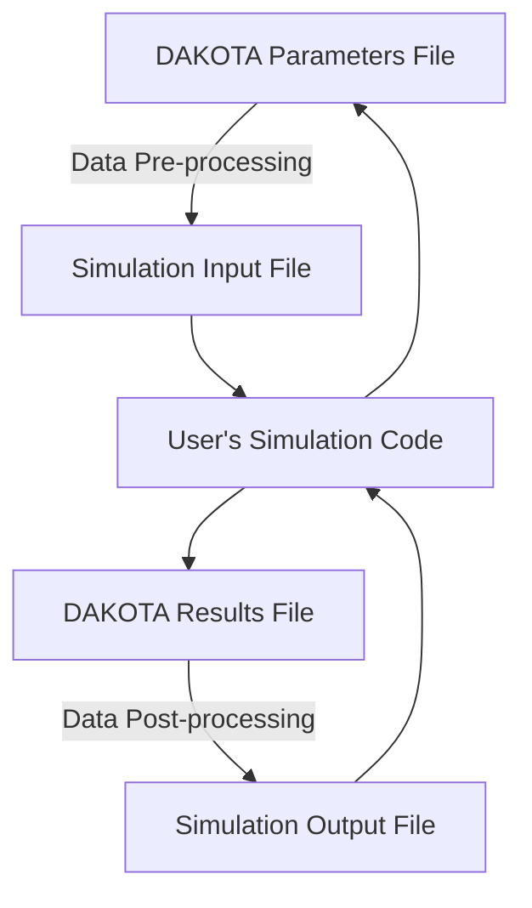
</details>

Figure 1.1: The loosely-coupled or “black-box” interface between Dakota and a user-supplied simulation code.

<!-- page:17 -->
# 1.3 Coupling Dakota to a Simulation

A key Dakota advantage is access to a broad range of iterative capabilities through a single, relatively simple, interface between Dakota and your simulator. Trying a different iterative method or meta-algorithm typically requires changing only a few commands in the Dakota text input file and starting the new analysis. It does not require intimate knowledge of the underlying software package integrated in Dakota, with its unique command syntax and interfacing requirements. In addition, Dakota will manage concurrent executions of your computational model in parallel, whether on a desktop or high-performance cluster computer.

Figure 1.1 depicts a typical loosely-coupled relationship between Dakota and the simulation code(s). Such coupling is often referred to as “black-box,” as Dakota has no (or little) awareness of the internal details of the computational model, obviating any need for its source code. Such loose coupling is the simplest and most common interfacing approach Dakota users employ. Dakota and the simulation code exchange data by reading and writing short data files. Dakota is executed with commands that the user supplies in a text input file (not shown in Figure 1.1) which specify the type of analysis to be performed (e.g., parameter study, optimization, uncertainty quantification, etc.), along with the file names associated with the user’s simulation code. During operation, Dakota automatically executes the user’s simulation code by creating a separate process external to Dakota.

The solid lines in Figure 1.1 denote file input/output (I/O) operations inherent to Dakota or the user’s simulation code. The dotted lines indicate passing or converting information that must be implemented by the user. As Dakota runs, it writes out a parameters file containing the current variable values. Dakota then starts the user’s simulation code (or, often, a short driver script wrapping it), and when the simulation completes, reads the response data from a results file. This process is repeated until all of the simulations required by the iterative study are complete.

In some cases it is advantageous to have a close coupling between Dakota and the simulation code. This close coupling is an advanced feature of Dakota and is accomplished through either a direct interface or a SAND (simultaneous analysis and design) interface. For the direct interface, the user’s simulation code is modified to behave as a function or subroutine under Dakota. This interface can be considered to be “semi-intrusive” in that it requires relatively minor modifications to the simulation code. Its major advantage is the elimination of the overhead resulting from file I/O and process creation. It can also be a useful tool for parallel processing, by encapsulating all computation in a single executable. For details on direct interfacing, see Section 16.2. A SAND interface approach is “fully intrusive” in that it requires further modifications to the simulation code so that an optimizer has access to the internal residual vector and Jacobian matrices computed by the simulation code. In a SAND approach, both the optimization method and a nonlinear simulation code are converged simultaneously. While this approach can greatly reduce the computational expense of optimization, considerable software development effort must be expended to achieve this intrusive coupling between SAND optimization methods and the simulation code. SAND may be supported in future Dakota releases.

<!-- page:18 -->
# 1.4 User’s Manual Organization

The Dakota User’s Manual is organized into the following major categories. New users should consult the Tutorial to get started, then likely the Method Tour and Interfacing to select a Dakota method and build an interface to your code.

• Tutorial (Chapter 2): How to obtain, install, and use Dakota, with a few introductory examples.   
• Method Tour (Chapters 3 through 7): Survey of the major classes of iterative methods included in Dakota, with background, mathematical formulations, usage guidelines, and summary of supporting third-party software.   
• Models (Chapters 8 through 11): Explanation of Dakota models, which manage the mapping from variables through interfaces to responses, as well as details on parameter and response file formats for simulation code interfacing.   
• Input/Output (Chapters 12 and 13): Summary of input to Dakota, including tabular data, and outputs generated by Dakota.   
• Advanced Topics:   
– Recursion with Components: Chapter 14 addresses component-based method recursions, and Chapter 15 addresses component-based model recursions.   
– Interfacing: Chapter 16 describes interfacing Dakota with engineering simulation codes in both loose- and tightly-coupled modes.   
– Parallelism: Chapter 17 describes Dakota’s parallel computing capabilities, with a summary of major application parallel modes in Section 17.7.   
– Fault Tolerance: Chapter 18 describes restart capabilities and utilities, and Chapter 19 explains ways to detect and mitigate simulation failures.

• Additional Examples (Chapter 20): Supplemental example analysis problems and discussion.

# 1.5 Files Referenced in this Manual

Dakota input files are shown in figures throughout the Manual. The filename is specified in the comments and unless specified otherwise, these files are available in the dakota/share/dakota/examples/users directory, where dakota/ refers to the directory where Dakota was installed. Some of the input files have associated files, such as output or tabular data, with the same base filename, and .sav appended to the names.

Additional files are referenced, and if the location differs then it will be specified in the text. A small number of examples refer to files included only in the source directory, which is labeled dakota\_source/. You will need a copy of the source to view these files - see Section 2.1.1.

Dakota 6.14 and newer include a refreshed Examples Library, ranging from examples of Dakota input files and basic studies through complete case studies. These can be found in binary distributions in dakota/share/dakota/examples/ official (dakota/dakota-examples in source distributions). Legacy examples, including many from the Dakota software manuals appear in other directories in dakota/share/dakota/examples (dakota/examples for source).

# 1.6 Summary

Dakota is both a production tool for engineering design and analysis activities and a research tool for the development of new algorithms in optimization, uncertainty quantification, and related areas. Because of the extensible, object-oriented design of Dakota, it is relatively easy to add new iterative methods, meta-algorithms, simulation interfacing approaches, surface fitting methods, etc. In addition, Dakota can serve as a rapid prototyping tool for algorithm development. That is, by having a broad range of building blocks available (i.e., parallel computing, surrogate models, simulation interfaces, fundamental algorithms, etc.), new capabilities can be assembled rapidly which leverage the previous software investments. For additional discussion on framework extensibility, refer to the Dakota Developers Manual [2].

<!-- page:19 -->
The capabilities of Dakota have been used to solve engineering design and optimization problems at Sandia Labs, at other Department of Energy labs, and by our industrial and academic collaborators. Often, this real-world experience has provided motivation for research into new areas of optimization. The Dakota development team welcomes feedback on the capabilities of this software toolkit, as well as suggestions for new areas of research.

<!-- page:20 -->
# Chapter 2

# Dakota Tutorial

# 2.1 Quickstart

This section provides an overview of acquiring and installing Dakota, running a simple example, and looking at the basic output available. More detailed information about downloads and installation can be found on the Dakota website http: //dakota.sandia.gov.

# 2.1.1 Acquiring and Installing Dakota

Dakota operates on most systems running Unix or Linux operating systems as well as on Windows, natively in a Command Prompt window, and (optionally) with the help of a Cygwin emulation layer. Dakota is developed and most extensively tested on Redhat Enterprise Linux with GNU compilers, but additional operating system / compiler combinations are regularly tested as well. See the Dakota website for more information on supported platforms for particular Dakota versions.

Department of Energy users: Dakota may already be available on your target system. Sandia users should visit http: //dakota.sandia.gov/ for information on supported Dakota installations on engineering networks and cluster computers, as well as for Sandia-specific downloads. At other DOE institutions, contact your system administrator about Dakota availability. If Dakota is not available for your target platform, you may still download Dakota as described below.

New users should visit http://dakota.sandia.gov/quickstart.html to get started with Dakota. This typically involves the following steps:

1. Download Dakota.

You may download binary executables for your preferred platforms or you can compile Dakota from source code. Downloads are available from http://dakota.sandia.gov/download.html.

2. Install Dakota.

Instructions are available from http://dakota.sandia.gov/content/install-dakota. Guidance is also included in Dakota distributions, e.g., dakota/share/dakota/INSTALL (or dakota\_source/INSTALL). Further platform/operating system-specific guidance can be found in dakota/share/dakota/examples/platforms (dakota\_source/examples/platforms).

3. Verify that Dakota runs.

To perform a quick check that your Dakota executable runs, open a terminal window (in Windows, cmd.exe), and type: dakota -v Dakota version information should display in your terminal window. For a more detailed description of Dakota command line options, see Section 2.4.

<!-- page:21 -->
4. Participate in Dakota user communities.

Join Dakota mail lists to get the most up-to-date guidance for downloading, compiling, installing, or running. For information about mail lists, getting help, and other available help resources, see http://dakota.sandia.gov/ content/get-help.

# 2.1.2 Running Dakota with a simple input file

This section is intended for users who are new to Dakota, to demonstrate the basics of running a simple example.

# First Steps

1. Make sure Dakota runs. You should see Dakota version information when you type: dakota -v   
2. Create a working directory   
3. Copy rosen\_multidim.in from the dakota/share/dakota/examples/users/ directory to the working directory – see Section 1.5 for help.   
4. From the working directory, run dakota -i rosen multidim.in -o rosen multidim.out > rosen multidim.stdou

# What should happen

Dakota outputs a large amount of information to help users track progress. Four files should have been created:

1. The screen output has been redirected to the file rosen\_multidim.stdout. The contents are messages from Dakota and notes about the progress of the iterator (i.e. method/algorithm).   
2. The output file rosen\_multidim.out contains information about the function evaluations.   
3. rosen\_multidim.dat is created due to the specification of tabular data and tabular data file. This summarizes the variables and responses for each function evaluation.   
4. dakota.rst is a restart file. If a Dakota analysis is interrupted, it can be often be restarted without losing all progress.

Dakota has some data processing capabilities for output analysis. The output file will contain the relevant results. In this case, the output file has details about each of the 81 function evaluations. For more advanced or customized data processing or visualization, the tabular data file can be imported into another analysis tool.

# What now?

• Assuming Dakota ran successfully, skim the three text files (restart files are in a binary format). These are described further in Section 2.1.3.   
• This example used a parameter study method, and the rosenbrock test problem. More details about the example are in Section 2.3.2 and the test problem is described in Sections 2.3.1 and 20.2.   
• Explore the many methods available in Dakota in Chapters 3– 7.   
• Try running the other examples in the same directory. These are mentioned throughout the manual and are listed in Table 2.1 for convenience.   
• Learn the syntax needed to use these methods. For help running Dakota, see Section 2.4 and for input file information, see Section 2.2.   
• Learn how to use your own analysis code with Dakota in Chapter 16.

# 2.1.3 Examples of Dakota output

Beyond numerical results, all output files provide information that allows the user to check that the actual analysis was the intended analysis. More details on all outputs can be found in Chapter 13.

# Screen output saved to a file

<!-- page:22 -->
Whenever an output file is specified for a Dakota run, the screen output itself becomes quite minimal consisting of version statements, environment statements and execution times.

# Output file

The output file is much more extensive, because it contains information on every function evaluation (See Figure 2.1). Excluding the copy of the input file at the beginning and timing information at the end, the file is organized into three basic parts:

1. Information on the problem

For this example, we see that a new restart file is being created and Dakota has carried out a multidim parameter study with 8 partitions for each of two variables.

2. Information on each function evaluation

Each function evaluation is numbered. Details for function evaluation 1 show that at input variable values x1 = −2.0 and x2 = −2.0, the direct rosenbrock function is being evaluated. There is one response with a value of 3.609e+03.

3. Summary statistics

The function evaluation summary is preceded by <<<<<. For this example 81 total evaluations were assessed; all were new, none were read in from the restart file. Correlation matrices complete the statistics and output for this problem. Successful runs will finish with <<<<< Iterator study type completed.

# Tabular output file

For this example, the default name for the tabular output file dakota\_tabular.dat was changed in the input file to rosen\_multidim.dat. This tab-delimited text file (Figure 2.1.3) summarizes the inputs and outputs to the function evaluator. The first line contains the names of the variables and responses, as well as headers for the evaluation id and interface columns.

```txt
%eval_id interface x1 x2 response_fn_1 
```

The number of function evaluations will match the number of evaluations listed in the summary part of the output file for single method approaches; the names of inputs and outputs will match the descriptors specified in the input file. The interface column is useful when a Dakota input file contains more than one simulation interface. In this instance, there is only one, and it has no id interface specified, so Dakota has supplied a default value of NO ID. This file is ideal for import into other data analysis packages.

# 2.2 Dakota Input File Format

See Section 1.5 for location of all files referenced in this manual.

There are six specification blocks that may appear in Dakota input files. These are identified in the input file using the following keywords: variables, interface, responses, model, method, and environment. While, these keyword blocks can appear in any order in a Dakota input file, there is an inherent relationship that ties them together. The simplest form of that relationship is shown in Figure 2.3 and can be summarized as follows: In each iteration of its algorithm, a method block requests a variablesto-responses mapping from its model, which the model fulfills through an interface. While most Dakota analyses satisfy this relationship, where a single method runs a single model, advanced cases are possible and are discussed in Chapter 14.

As a concrete example, a simple Dakota input file, rosen\_multidim.in, is shown in Figure 2.4 for a two-dimensional parameter study on Rosenbrock’s function. This input file will be used to describe the basic format and syntax used in all Dakota input files. The results are shown later, in Section 2.3.2.

The first block of the input file shown in Figure 2.4 is the environment block. This keyword block is used to specify the general Dakota settings such as Dakota’s graphical output (via the graphics flag) and the tabular data output (via the tabular data keyword). In advanced cases, it also identifies the top method pointer that will control the Dakota study. The environment block is optional, and at most one such block can appear in a Dakota input file.

```txt
{Writing new restart file dakota.rst
methodName = multidim_parameter_study
gradientType = none
hessianType = none

>>> Running multidim_parameter_study iterator.

Multidimensional parameter study for variable partitions of
8
8

----

Begin Function Evaluation 1

Parameters for function evaluation 1:
-2.0000000000e+00 x1
-2.0000000000e+00 x2

Direct function: invoking rosenbrock

Active response data for function evaluation 1:
Active set vector = { 1 }
3.6090000000e+03 response_fn_1
.
.
.<<<< Function evaluation summary: 81 total (81 new, 0 duplicate)

Simple Correlation Matrix among all inputs and outputs:
x1 x2 response_fn_1
x1 1.00000e+00
x2 1.73472e-17 1.00000e+00
response_fn_1 -3.00705e-03 -5.01176e-01 1.00000e+00
.
.
.<<<< Iterator multidim_parameter_study completed.} 
```  
Figure 2.1: Rosenbrock 2-D parameter study example: excerpt from output file

<!-- page:23 -->
The method block of the input file specifies which iterative method Dakota will employ and associated method options. The keyword multidim parameter study in Figure 2.4 calls for a multidimensional parameter study, while the keyword partitions specifies the number of intervals per variable (a method option). In this case, there will be eight intervals (nine data points) evaluated between the lower and upper bounds of both variables (bounds provided subsequently in the variables section), for a total of 81 response function evaluations. At least one method block is required, and multiple blocks may appear in Dakota input files for advanced studies.

The model block of the input file specifies the model that Dakota will use. A model provides the logical unit for determining how a set of variables is mapped through an interface into a set of responses when needed by an iterative method. In the default case, the model allows one to specify a single set of variables, interface, and responses. The model block is optional in this simple case. Alternatively, it can be explicitly defined as in Figure 2.4, where the keyword single specifies the use of a single model in the parameter study. If one wishes to perform more sophisticated studies such as surrogate-based analysis or optimization under uncertainty, the logical organization specified in the model block becomes critical in informing Dakota on how to manage the different components of such studies, and multiple model blocks are likely needed. See Chapter 8 for relevant advanced model specification details.

<table><tr><td>%eval_id</td><td>interface</td><td>x1</td><td>x2</td><td>response_fn_1</td></tr><tr><td>1</td><td>NO_ID</td><td>-2</td><td>-2</td><td>3609</td></tr><tr><td>2</td><td>NO_ID</td><td>-1.5</td><td>-2</td><td>1812.5</td></tr><tr><td>3</td><td>NO_ID</td><td>-1</td><td>-2</td><td>904</td></tr><tr><td>4</td><td>NO_ID</td><td>-0.5</td><td>-2</td><td>508.5</td></tr></table>

Figure 2.2: Rosenbrock 2-D parameter study example: excerpt from tabular data file   


<details>
<summary>flowchart</summary>

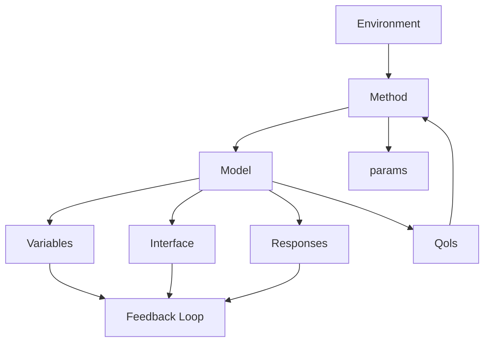
</details>

Figure 2.3: Relationship between the six blocks, for a simple study.

<!-- page:24 -->
The variables block of the input file specifies the number, type, and characteristics of the parameters that will be varied by Dakota. The variables can be classified as design variables, uncertain variables, or state variables. Design variables are typically used in optimization and calibration, uncertain variables are used in UQ and sensitivity studies, and state variables are usually fixed. In all three cases, variables can be continuous or discrete, with discrete having real, integer, and string subtypes. See Chapter 9 for more information on the types of variables supported by Dakota. The variables section shown in Figure 2.4 specifies that there are two continuous design variables. The sub-specifications for continuous design variables provide the descriptors $^ { 6 6 } \mathbf { X } 1 ^ { , 5 }$ and $^ { 6 6 } \mathbf { X } 2 ^ { , 5 }$ as well as lower and upper bounds for these variables. The information about the variables is organized in column format for readability. So, both variables $x _ { 1 }$ and $x _ { 2 }$ have a lower bound of -2.0 and an upper bound of 2.0. At least one variables block is required, and multiple blocks may appear in Dakota input files for advanced studies.

The interface block of the input file specifies the simulation code that will be used to map variables into responses as well as details on how Dakota will pass data to and from that code. In this example, the keyword direct is used to indicate the use of a function linked directly into Dakota, and data is passed directly between the two. The name of the function is identified by the analysis driver keyword. Alternatively, fork or system executions can be used to invoke instances of a simulation code that is external to Dakota as explained in Section 2.3.5.2 and Chapter 16. In this case, data is passed between Dakota and the simulation via text files. At least one interface block is required, and multiple blocks may appear in

```txt
# Dakota Input File: rosen_multidim.in
# Usage:
# dakota -i rosen_multidim.in -o rosen_multidim.out > rosen_multidim.stdout

environment
  tabular_data
    tabular_data_file = 'rosen_multidim.dat'

method
  multidim_parameter_study
    partitions = 8 8

model
  single

variables
  continuous_design = 2
    lower_bounds -2.0 -2.0
    upper_bounds 2.0 2.0
    descriptors 'x1' "x2"

interface
  analysis_drivers = 'rosenbrock'
    direct

responses
  response_functions = 1
    no_gradients
    no_hessians 
```  
Figure 2.4: Rosenbrock 2-D parameter study example: the Dakota input file.

<!-- page:25 -->
Dakota input files for advanced studies.

The responses block of the input file specifies the types of data that the interface will return to Dakota. They are categorized primarily according to usage. Objective functions are used in optimization, calibration terms in calibration, and response functions in sensitivity analysis and UQ. For the example shown in Figure 2.4, the assignment response functions = 1 indicates that there is only one response function. The responses block can include additional information returned by the interface. That includes constraints and derivative information, both discussed in Chapter 11. In this example, there are no constraints associated with Rosenbrock’s function, so the keywords for constraint specifications are omitted. The keywords no gradients and no hessians indicate that no derivatives will be provided to the method; none are needed for a parameter study. At least one responses block is required, and multiple blocks may appear in Dakota input files for advanced studies.

We close this section with a list of rules regarding the formatting of the Dakota input file.

• “Flat” text only.   
• Whitespace is ignored.   
• Comments begin with # and continue to the end of the line.   
• Keyword order is largely unimportant as long as major sections are respected and there is no ambiguity.   
• Equal signs are optional.

• Strings can be surrounded by single or double quotes (but not “fancy” quotes).   
• Scientific notation is fine.

<!-- page:26 -->
Please see the Dakota Reference Manual [3] for additional details on this input file syntax.

# 2.3 Examples

This section serves to familiarize users with how to perform parameter studies, optimization, and uncertainty quantification through their common Dakota interface. The initial examples utilize simple built in driver functions; later we show how to utilize Dakota to drive the evaluation of user supplied black box code. The examples presented in this chapter are intended to show the simplest use of Dakota for methods of each type. More advanced examples of using Dakota for specific purposes are provided in subsequent, topic-based, chapters.

# 2.3.1 Rosenbrock Test Problem

The examples shown later in this chapter use the Rosenbrock function [119] (also described in [58], among other places), which has the form:

$$
f (x _ {1}, x _ {2}) = 1 0 0 (x _ {2} - x _ {1} ^ {2}) ^ {2} + (1 - x _ {1}) ^ {2} \tag {2.1}
$$

A three-dimensional plot of this function is shown in Figure 2.5(a), where both x1 and x2 range in value from −2 to 2. Figure 2.5(b) shows a contour plot for Rosenbrock’s function. An optimization problem using Rosenbrock’s function is formulated as follows:

$$
\begin{array}{l} \text { minimize } \quad f (x _ {1}, x _ {2}) \\ \mathbf {x} \in \Re^ {2} \\ \text { subject   to } \quad - 2 \leq x _ {1} \leq 2 \tag {2.2} \\ - 2 \leq x _ {2} \leq 2 \\ \end{array}
$$

Note that there are no linear or nonlinear constraints in this formulation, so this is a bound constrained optimization problem. The unique solution to this problem lies at the point $( x _ { 1 } , x _ { 2 } ) = ( 1 , 1 )$ , where the function value is zero.

Several other test problems are available. See Chapter 20 for a description of these test problems as well as further discussion of the Rosenbrock test problem.

# 2.3.2 Two-Dimensional Grid Parameter Study

Parameter study methods in the Dakota toolkit involve the computation of response data sets at a selection of points in the parameter space. These response data sets are not linked to any specific interpretation, so they may consist of any allowable specification from the responses keyword block, i.e., objective and constraint functions, least squares terms and constraints, or generic response functions. This allows the use of parameter studies in direct coordination with optimization, least squares, and uncertainty quantification studies without significant modification to the input file.

An example of a parameter study is the 2-D parameter study example problem listed in Figure 2.4. This is executed by Dakota using the command noted in the comments:

dakota -i rosen\_multidim.in -o rosen\_multidim.out > rosen\_multidim.stdout


<details>
<summary>surface_3d</summary>

| X1   | X2   | f     |
|------|------|-------|
| -2   | 0    | 4000  |
| -1   | 0    | 2000  |
| 0    | 0    | 0     |
| 1    | 0    | -2000 |
| 2    | 0    | -4000 |
</details>

(a)


<details>
<summary>contour</summary>

| X1    | X2    |
|-------|-------|
| -2.0  | 2.0   |
| -1.5  | 1.5   |
| -1.0  | 1.0   |
| -0.5  | 0.5   |
| 0.0   | 0.0   |
| 0.5   | -0.5  |
| 1.0   | -1.0  |
| 1.5   | -1.5  |
| 2.0   | -2.0  |
</details>

(b)   
Figure 2.5: Rosenbrock’s function: (a) 3-D plot and (b) contours with $x _ { 1 }$ on the bottom axis.

<!-- page:27 -->
The output of the Dakota run is written to the file named rosen\_multidim.out while the screen output, or standard output, is redirect to rosen\_multidim.stdout. For comparison, files named rosen\_multidim.out.sav and rosen\_ multidim.stdout.sav are included in the dakota/share/dakota/examples/users directory. As for many of the examples, Dakota provides a report on the best design point located during the study at the end of these output files.

This 2-D parameter study produces the grid of data samples shown in Figure 2.6. In general, a multidimensional parameter study lets one generate a grid in multiple dimensions. The keyword multidim parameter study indicates that a grid will be generated over all variables. The keyword partitions indicates the number of grid partitions in each dimension. For this example, the number of the grid partitions are the same in each dimension (8 partitions) but it would be possible to specify (partitions = 8 2), and have only two partitions over the second input variable. Note that the graphics flag in the environment block of the input file could be commented out since, for this example, the iteration history plots created by Dakota are not particularly instructive. More interesting visualizations can be created by using the Dakota graphical user interface, or by importing Dakota’s tabular data into an external graphics/plotting package. Example graphics and plotting packages include Mathematica, Matlab, Microsoft Excel, Origin, Tecplot, Gnuplot, and Matplotlib. (Sandia National Laboratories and the Dakota developers do not endorse any of these commercial products.)

# 2.3.3 Gradient-based Unconstrained Optimization

Dakota’s optimization capabilities include a variety of gradient-based and nongradient-based optimization methods. This subsection demonstrates the use of one such method through the Dakota interface.

A Dakota input file for a gradient-based optimization of Rosenbrock’s function is listed in Figure 2.7. The format of the input file is similar to that used for the parameter studies, but there are some new keywords in the responses and method sections. First, in the responses block of the input file, the keyword block starting with numerical gradients specifies that a finite difference method will be used to compute gradients for the optimization algorithm. Note that the Rosenbrock function evaluation code inside Dakota has the ability to give analytical gradient values. (To switch from finite difference gradient estimates to analytic gradients, uncomment the analytic gradients keyword and comment out the four lines associated with the numerical gradients specification.) Next, in the method block of the input file, several new keywords have been added. In this block, the keyword conmin frcg indicates the use of the Fletcher-Reeves conjugate gradient algorithm in the CON-MIN optimization software package [143] for bound-constrained optimization. The keyword max iterations is used to indicate the computational budget for this optimization (in this case, a single iteration includes multiple evaluations of Rosenbrock’s function for the gradient computation steps and the line search steps). The keyword convergence tolerance is used to specify one of CONMIN’s convergence criteria (under which CONMIN terminates if the objective function value differs by less than the absolute value of the convergence tolerance for three successive iterations).


<details>
<summary>scatter</summary>

| X1    | X2    |
|-------|-------|
| -2.0  | 2.0   |
| -1.5  | 1.5   |
| -1.0  | 1.0   |
| -0.5  | 0.5   |
| 0.0   | 0.0   |
| 0.5   | -0.5  |
| 1.0   | -1.0  |
| 1.5   | -1.5  |
| 2.0   | -2.0  |
</details>

Figure 2.6: Rosenbrock 2-D parameter study example: location of the design points (dots) evaluated.

<!-- page:28 -->
The Dakota command is noted in the file, and copies of the outputs are in the dakota/share/dakota/examples/ users directory, with .sav appended to the name. When this example problem is executed using Dakota’s legacy X Windows-based graphics support enabled, Dakota creates some iteration history graphics similar to the screen capture shown in Figure 2.8(a). These plots show how the objective function and design parameters change in value during the optimization steps. The scaling of the horizontal and vertical axes can be changed by moving the scroll knobs on each plot. Also, the “Options” button allows the user to plot the vertical axes using a logarithmic scale. Note that log-scaling is only allowed if the values on the vertical axis are strictly greater than zero. Similar plots can also be created in Dakota’s graphical user interface.

Figure 2.8(b) shows the iteration history of the optimization algorithm. The optimization starts at the point $( x _ { 1 } , x _ { 2 } ) \ =$ (−1.2, 1.0) as given in the Dakota input file. Subsequent iterations follow the banana-shaped valley that curves around toward the minimum point at $( x _ { 1 } , x _ { 2 } ) = ( 1 . 0 , 1 . 0 )$ . Note that the function evaluations associated with the line search phase of each CONMIN iteration are not shown on the plot. At the end of the Dakota run, information is written to the output file to provide data on the optimal design point. These data include the optimum design point parameter values, the optimum objective and constraint function values (if any), plus the number of function evaluations that occurred and the amount of time that elapsed during the optimization study.

# 2.3.4 Uncertainty Quantification with Monte Carlo Sampling

Uncertainty quantification (UQ) is the process of determining the effect of input uncertainties on response metrics of interest. These input uncertainties may be characterized as either aleatory uncertainties, which are irreducible variabilities inherent in nature, or epistemic uncertainties, which are reducible uncertainties resulting from a lack of knowledge. Since sufficient data is generally available for aleatory uncertainties, probabilistic methods are commonly used for computing response distribution statistics based on input probability distribution specifications. Conversely, for epistemic uncertainties, data is generally sparse, making the use of probability theory questionable and leading to nonprobabilistic methods based on interval specifications.

The subsection demonstrates the use of Monte Carlo random sampling for Uncertainty Quantification.

Figure 2.9 shows the Dakota input file for an example problem that demonstrates some of the random sampling capabilities available in Dakota. In this example, the design parameters, x1 and x2, will be treated as uncertain parameters that have uniform distributions over the interval [-2, 2]. This is specified in the variables block of the input file, beginning with the keyword uniform uncertain. Another difference from earlier input files such as Figure 2.7 occurs in the responses

```txt
# Dakota Input File: rosen_grad_opt.in
# Usage:
# dakota -i rosen_grad_opt.in -o rosen_grad_opt.out > rosen_grad_opt.stdout

environment
  tabular_data
    tabular_data_file = 'rosen_grad_opt.dat'

method
  conmin_frcg
    convergence_tolerance = 1e-4
    max_iterations = 100

model
  single

variables
  continuous_design = 2
    initial_point -1.2 1.0
    lower_bounds -2.0 -2.0
    upper_bounds 2.0 2.0
    descriptors 'x1' "x2"

interface
  analysis_drivers = 'rosenbrock'
    direct

responses
  objective_functions = 1
# analytic_gradients
    numerical_gradients
    method_source dakota
    interval_type forward
    fd_step_size = 1.e-5
no_hessians 
```  
Figure 2.7: Rosenbrock gradient-based unconstrained optimization example: the Dakota input file.


<details>
<summary>line</summary>

| x1    | Objective Fn | x2    |
|-------|--------------|-------|
| 0     | 100          | 1.2   |
| 20    | 1            | 0.6   |
| 40    | 0.1          | 0.2   |
| 60    | 0.01         | 0.4   |
| 80    | 0.001        | 1.0   |
| 100   | 0.0001       | 1.0   |
</details>

(a)


<details>
<summary>scatter</summary>

| X1    | X2    |
|-------|-------|
| -1.0  | 1.0   |
| -0.8  | 0.8   |
| -0.6  | 0.6   |
| -0.4  | 0.4   |
| -0.2  | 0.2   |
| 0.0   | 0.0   |
| 0.2   | -0.2  |
| 0.4   | -0.4  |
| 0.6   | -0.6  |
| 0.8   | -0.8  |
| 1.0   | -1.0  |
| 1.2   | -1.2  |
| 1.4   | -1.4  |
| 1.6   | -1.6  |
| 1.8   | -1.8  |
| 2.0   | -2.0  |
</details>

(b)   
Figure 2.8: Rosenbrock gradient-based unconstrained optimization example: (a) screen capture of the legacy Dakota X Windows-based graphics and (b) sequence of design points (dots) evaluated (line search points omitted).

<!-- page:30 -->
block, where the keyword response functions is used in place of objective functions. The final changes to the input file occur in the method block, where the keyword sampling is used.

The other keywords in the methods block of the input file specify the number of samples (200), the seed for the random number generator (17), the sampling method (random), and the response threshold (100.0). The seed specification allows a user to obtain repeatable results from multiple runs. If a seed value is not specified, then Dakota’s sampling methods are designed to generate nonrepeatable behavior (by initializing the seed using a system clock). The keyword response levels allows the user to specify threshold values for which Dakota will output statistics on the response function output. Note that a unique threshold value can be specified for each response function.

In this example, Dakota will select 200 design points from within the parameter space, evaluate the value of Rosenbrock’s function at all 200 points, and then perform some basic statistical calculations on the 200 response values.

The Dakota command is noted in the file, and copies of the outputs are in the dakota/share/dakota/examples/ users directory, with .sav appended to the name. Figure 2.10 shows example results from this sampling method. Note that your results will differ from those in this file if your seed value differs or if no seed is specified.

<!-- page:31 -->
In addition to the output files discussed in the previous examples, several LHS\*.out files are generated. They are a byproduct of a software package, LHS [136], that Dakota utilizes to generate random samples and can be ignored.

As shown in Figure 2.10, the statistical data on the 200 Monte Carlo samples is printed at the end of the output file in the section that starts with “Statistics based on 200 samples.” In this section summarizing moment-based statistics, Dakota outputs the mean, standard deviation, skewness, and kurtosis estimates for each of the response functions. For example, the mean of the Rosenbrock function given uniform input uncertainties on the input variables is 455.4 and the standard deviation is 536.8. This is a very large standard deviation, due to the fact that the Rosenbrock function varies by three orders of magnitude over the input domain. The skewness is positive, meaning this is a right-tailed distribution, not a symmetric distribution. Finally, the kurtosis (a measure of the “peakedness” of the distribution) indicates that this is a strongly peaked distribution (note that we use a central, standardized kurtosis so that the kurtosis of a normal is zero). After the moment-related statistics, the 95% confidence intervals on the mean and standard deviations are printed. This is followed by the fractions (“Probability Level”) of the response function values that are below the response threshold values specified in the input file. For example, 34 percent of the sample inputs resulted in a Rosenbrock function value that was less than or equal to 100, as shown in the line listing the cumulative distribution function values. Finally, there are several correlation matrices printed at the end, showing simple and partial raw and rank correlation matrices. Correlations provide an indication of the strength of a monotonic relationship between input and outputs. More detail on correlation coefficients and their interpretation can be found in Section 5.2.1. More detail about sampling methods in general can be found in Section 5.2. Finally, Figure 2.11 shows the locations of the 200 sample sites within the parameter space of the Rosenbrock function for this example.

# 2.3.5 User Supplied Simulation Code Examples

This subsection provides examples of how to use Dakota to drive user supplied black box code.

# 2.3.5.1 Optimization with a User-Supplied Simulation Code - Case 1

Many of the previous examples made use of the direct interface to access the Rosenbrock and textbook test functions that are compiled into Dakota. In engineering applications, it is much more common to use the fork interface approach within Dakota to manage external simulation codes. In both of these cases, the communication between Dakota and the external code is conducted through the reading and writing of short text files. For this example, the C++ program rosenbrock.cpp in dakota\_source/test is used as the simulation code. This file is compiled to create the stand-alone rosenbrock executable that is referenced as the analysis driver in Figure 2.12. This stand-alone program performs the same function evaluations as Dakota’s internal Rosenbrock test function.

Figure 2.12 shows the text of the Dakota input file named rosen\_syscall.in that is provided in the directory dakota/ share/dakota/examples/users. The only differences between this input file and the one in Figure 2.7 occur in the interface keyword section. The keyword fork indicates that Dakota will use fork calls to create separate Unix processes for executions of the user-supplied simulation code. The name of the simulation code, and the names for Dakota’s parameters and results file are specified using the analysis driver, parameters file, and results file keywords, respectively.

The Dakota command is noted in the file, and copies of the outputs are in the dakota/share/dakota/examples/ users directory, with .sav appended to the name.

This run of Dakota takes longer to complete than the previous gradient-based optimization example since the fork interface method has additional process creation and file I/O overhead, as compared to the internal communication that occurs when the direct interface method is used.

To gain a better understanding of what exactly Dakota is doing with the fork interface approach, add the keywords file tag and file save to the interface specification and re-run Dakota. Check the listing of the local directory and you will see many new files with names such as params.in.1, params.in.2, etc., and results.out.1, results.out.2, etc. There is one params.in.X file and one results.out.X file for each of the function evaluations performed by Dakota. This is the file listing for params.in.1:

# $2 \mathtt { \Delta } \mathtt { v a r i a b l e s }$

```txt
# Dakota Input File: rosen_sampling.in
# Usage:
# dakota -i rosen_sampling.in -o rosen_sampling.out > rosen_sampling.stdout

environment
    tabular_data
    tabular_data_file = 'rosen_sampling.dat'

method
    sampling
    sample_type random
    samples = 200
    seed = 17
    response_levels = 100.0

model
    single

variables
    uniform_uncertain = 2
    lower_bounds -2.0 -2.0
    upper_bounds 2.0 2.0
    descriptors 'x1' 'x2'

interface
    analysis_drivers = 'rosenbrock'
    direct

responses
    response_functions = 1
    no_gradients
    no_hessians 
```  
Figure 2.9: Monte Carlo sampling example: the Dakota input file.

```txt
-1.200000000000000e+00 x1
1.000000000000000e+00 x2
1 functions
1 ASV_1:obj_fn
2 derivative_variables
1 DVV_1:x1
2 DVV_2:x2
0 analysis_components 
```

<!-- page:32 -->
The basic pattern is that of array lengths and string identifiers followed by listings of the array entries, where the arrays consist of the variables, the active set vector (ASV), the derivative values vector (DVV), and the analysis components (AC). For the variables array, the first line gives the total number of variables (2) and the “variables” string identifier, and the subsequent two lines provide the array listing for the two variable values (-1.2 and 1.0) and descriptor tags (“x1” and “x2” from the Dakota input file). The next array conveys the ASV, which indicates what simulator outputs are needed. The first line of the array gives the total number of response functions (1) and the “functions” string identifier, followed by one ASV code and descriptor tag (“ASV 1”) for each function. In this case, the ASV value of 1 indicates that Dakota is requesting that the

```csv
Statistics based on 200 samples:

Moment-based statistics for each response function:
Mean Std Dev Skewness Kurtosis
response_fn_1 4.5540183516e+02 5.3682678089e+02 1.6661798252e+00 2.7925726822e+00

95% confidence intervals for each response function:
LowerCI_Mean UpperCI_Mean LowerCI_StdDev UpperCI_StdDev
response_fn_1 3.8054757609e+02 5.3025609422e+02 4.8886795789e+02 5.9530059589e+02

Level mappings for each response function:
Cumulative Distribution Function (CDF) for response_fn_1:
Response Level Probability Level Reliability Index General Rel Index
1.000000000e+02 3.400000000e-01

Probability Density Function (PDF) histograms for each response function:
PDF for response_fn_1:
Bin Lower Bin Upper Density Value
1.1623549854e-01 1.000000000e+02 3.4039566059e-03
1.000000000e+02 2.7101710856e+03 2.5285698843e-04

Simple Correlation Matrix among all inputs and outputs:
x1 x2 response_fn_1
x1 1.0000e+00
x2 -5.85097e-03 1.0000e+00
response_fn_1 -9.57746e-02 -5.08193e-01 1.0000e+00

Partial Correlation Matrix between input and output:
response_fn_1
x1 -1.14659e-01
x2 -5.11111e-01

Simple Rank Correlation Matrix among all inputs and outputs:
x1 x2 response_fn_1
x1 1.0000e+00
x2 -6.03315e-03 1.0000e+00
response_fn_1 -1.15360e-01 -5.04661e-01 1.0000e+00

Partial Rank Correlation Matrix between input and output:
response_fn_1
x1 -1.37154e-01
x2 -5.08762e-01 
```  
Figure 2.10: Results of Monte Carlo Sampling on the Rosenbrock Function


<details>
<summary>scatter</summary>

| X1    | X2    |
|-------|-------|
| -2.0  | 1.5   |
| -1.8  | 1.3   |
| -1.6  | 1.1   |
| -1.4  | 0.9   |
| -1.2  | 0.7   |
| -1.0  | 0.5   |
| -0.8  | 0.3   |
| -0.6  | 0.1   |
| -0.4  | -0.1  |
| -0.2  | -0.3  |
| 0.0   | -0.5  |
| 0.2   | -0.7  |
| 0.4   | -0.9  |
| 0.6   | -1.1  |
| 0.8   | -1.3  |
| 1.0   | -1.5  |
| 1.2   | -1.7  |
| 1.4   | -1.9  |
| 1.6   | -2.1  |
| 1.8   | -2.3  |
| 2.0   | -2.5  |
</details>

Figure 2.11: Monte Carlo sampling example: locations in the parameter space of the 200 Monte Carlo samples using a uniform distribution for both $x _ { 1 }$ and $x _ { 2 }$ .

<!-- page:34 -->
simulation code return the response function value in the file results.out.X. (Possible ASV values: 1 = value of response function value, 2 = response function gradient, 4 = response function Hessian, and any sum of these for combinations up to 7 = response function value, gradient, and Hessian; see 9.7 for more detail.) The next array provides the DVV, which defines the variable identifiers used in computing derivatives. The first line of the array gives the number of derivative variables (2) and the “derivative variables” string identifier, followed by the listing of the two DVV variable identifiers (the first and second variables) and descriptor tags (“DVV 1” and “DVV 2”). The final array provides the AC array used to provide additional strings for use by the simulator (e.g., to provide the name of a particular mesh file). The first line of the array gives the total number of analysis components (0) and the “analysis components” string identifier, followed by the listing of the array, which is empty in this case.

The executable program rosenbrock reads in the params.in.X file and evaluates the objective function at the given values for $x _ { 1 }$ and x2. Then, rosenbrock writes out the objective function data to the results.out.X file. Here is the listing for the file results.out.1:

2.420000000000000e+01 f

The value shown above is the value of the objective function, and the descriptor ‘f’ is an optional tag returned by the simulation code. When the fork call has completed, Dakota reads in the data from the results.in.X file and processes the results. Dakota then continues with additional executions of the rosenbrock program until the optimization process is complete.

# 2.3.5.2 Optimization with a User-Supplied Simulation Code - Case 2

In many situations the user-supplied simulation code cannot be modified to read and write the params.in.Xfile and the results.out.X file, as described above. Typically, this occurs when the simulation code is a commercial or proprietary software product that has specific input file and output file formats. In such cases, it is common to replace the executable program name in the Dakota input file with the name of a Unix shell script containing a sequence of commands that read and write the necessary files and run the simulation code. For example, the executable program named rosenbrock listed in Figure 2.12 could be replaced by a Unix Bourne or C-shell script named simulator\_script, with the script containing a sequence of commands to perform the following steps: insert the data from the parameters.in.X file into the input file of the simulation code, execute the simulation code, post-process the files generated by the simulation code to compute response data, and return the response data to Dakota in the results.out.X file. The steps that are typically used in constructing and using a Unix shell script are described in Section 10.3.

<!-- page:35 -->
# 2.4 Dakota Command-Line Options

The Dakota executable file is named dakota (dakota.exe on Windows). If this command is entered at the command prompt without any arguments, a usage message similar to the following appears:

```perl
usage: dakota [options and <args>]
-help (Print this summary)
-version (Print DAKOTA version number)
-input <$val> (REQUIRED DAKOTA input file $val)
-preproc [$val] (Pre-process input file with pyprepro or tool $val)
-output <$val> (Redirect DAKOTA standard output to file $val) 
```

```txt
# Dakota Input File: rosen_syscall.in
# Usage:
# dakota -i rosen_syscall.in -o rosen_syscall.out > rosen_syscall.stdout

environment
  tabular_data
    tabular_data_file = 'rosen_syscall.dat'

method
  conmin_frcg
    convergence_tolerance = 1e-4
    max_iterations = 100

model
  single

variables
  continuous_design = 2
    initial_point -1.2 1.0
    lower_bounds -2.0 -2.0
    upper_bounds 2.0 2.0
    descriptors 'x1' "x2"

interface
  analysis_drivers = 'rosenbrock'
    fork
    parameters_file = 'params.in'
    results_file = 'results.out'

responses
  objective_functions = 1
    numerical_gradients
    method_source dakota
    interval_type forward
    fd_step_size = 1.e-5
    no_hessians 
```  
Figure 2.12: Dakota input file for gradient-based optimization using the fork call interface to an external rosenbrock simulator.

```perl
-error <$val> (Redirect DAKOTA standard error to file $val)
-parser <$val> (Parsing technology: nidr[strict][:dumpfile])
-no_input_echo (Do not echo DAKOTA input file)
-check (Perform input checks)
-pre_run [$val] (Perform pre-run (variables generation) phase)
-run [$val] (Perform run (model evaluation) phase)
-post_run [$val] (Perform post-run (final results) phase)
-read_restart [$val] (Read an existing DAKOTA restart file $val)
-stop_restart <$val> (Stop restart file processing at restart record $val)
-write_restart [$val] (Write a new DAKOTA restart file $val) 
```

<!-- page:36 -->
Of these available command line inputs, only the “-input” option is required, and “-input” can be omitted if the input file name is the final item on the command line; all other command-line inputs are optional. The “-help” option prints the usage message above. The “-version” option prints the version number of the executable. The “-check” option invokes a dry-run mode in which the input file is processed and checked for errors, but the study is not performed. The “-input” option provides the name of the Dakota input file, which can optionally be pre-processed as a template using the “-preproc” option.

The “-output” and “-error” options provide file names for redirection of the Dakota standard output (stdout) and standard error (stderr), respectively. By default, Dakota will echo the input file to the output stream, but “-no input echo” can override this behavior.

The “-parser” input is for debugging and will not be further described here. The “-read restart” and “-write restart” options provide the names of restart databases to read from and write to, respectively. The “-stop restart” option limits the number of function evaluations read from the restart database (the default is all the evaluations) for those cases in which some evaluations were erroneous or corrupted. Restart management is an important technique for retaining data from expensive engineering applications. This advanced topic is discussed in detail in Chapter 18. Note that these command line options can be abbreviated so long as the abbreviation is unique. Accordingly, the following are valid, unambiguous specifications: “-h”, “-v”, “-c”, “-i”, “-o”, “-e”, “-re”, “-s”, “-w”, “-ru”, and “-po” and can be used in place of the longer forms of the command line options.

To run Dakota with a particular input file, the following syntax can be used:

```batch
dakota -i dakota.in 
```

or more simply

```txt
dakota dakota.in 
```

This will echo the standard output (stdout) and standard error (stderr) messages to the terminal. To redirect stdout and stderr to separate files, the -o and -e command line options may be used:

```batch
dakota -i dakota.in -o dakota.out -e dakota.err 
```

or

```batch
dakota -o dakota.out -e dakota.err dakota.in 
```

Alternatively, any of a variety of Unix redirection variants can be used. The simplest of these redirects stdout to another file:

```txt
dakota dakota.in > dakota.out 
```

To run the dakota process in the background, append an ampersand symbol (&) to the command with an embedded space, e.g.,

```txt
dakota dakota.in > dakota.out & 
```

<!-- page:37 -->
Refer to [5] for more information on Unix redirection and background commands.

The specified Dakota input file may instead be an dprepro/aprepro-style template file to be pre-processed prior to running Dakota. For example it might contain template expressions in curly braces:

```tcl
# {MyLB = 2.0} {MyUB = 8.6}
variables
    uniform_uncertain 3
    upper_bounds {MyUB} {MyUB} {MyUB}
    lower_bounds {MyLB} {MyLB} {MyLB}
```

(See Section 10.9 for more information and use cases.) To pre-process the input file, specify the -preproc flag which generates an intermediate temporary input file for use in Dakota. If Dakota’s pyprepro.py utility is not available on the execution PATH and/or additional pre-processing options are needed, the tool location and syntax can be specified, for example:

```shell
# Assumes pyprepro.py is on PATH:
dakota -i dakota_rosen.tmpl -preproc

# Specify path/name of pre-processor:
dakota -i dakota_rosen.tmpl \
-preproc "/home/user/dakota/bin/pyprepro"

# Specify Python interpreter to use, for example on Windows
dakota -i dakota_rosen.tmpl -preproc "C:/python27/python.exe \
C:/dakota/6.10/bin/pyprepro/pyprepro.py"

# Specify additional options to pyprepro, e.g., include file:
dakota -i dakota_rosen.tmpl -preproc "pyprepro.py -I default.params" 
```

The “-pre run”, “-run”, and “-post run” options instruct Dakota to run one or more execution phases, excluding others. For example pre-run might generate variable sets, run (core run) might invoke the simulation to evaluate variables and produce responses, and post-run might accept variable/response sets and analyzes the results (for example, calculate correlations from a set of samples). Currently only two modes are supported and only for sampling, parameter study, and DACE methods: (1) pre-run only with optional tabular output of variables:

```batch
dakota -i dakota.in -pre_run [::myvariables.dat] 
```

and (2) post-run only with required tabular input of variables/responses:

```batch
dakota -i dakota.in -post_run myvarsresponses.dat:: 
```

# 2.5 Next Steps

After reading this chapter, you should understand the mechanics of acquiring, installing, and executing Dakota to perform simple studies. You should have a high-level appreciation for what inputs Dakota requires, how it behaves during interfacing and operation for a few kinds of studies, and what representative output is obtained. To effectively use Dakota, you will need to understand the character of your problem, select a Dakota method to help you meet your analysis goals, and develop an interface to your computational model.

# 2.5.1 Problem Exploration and Method Selection

<!-- page:38 -->
Section 1.2 provides a high-level overview of the analysis techniques available in Dakota, with references to more details and usage guidelines in the following chapters. Selecting an appropriate method to meet your analysis goals requires understanding problem characteristics. For example, in optimization, typical questions that should be addressed include: Are the design variables continuous, discrete, or mixed? Is the problem constrained or unconstrained? How expensive are the response functions to evaluate? Will the response functions behave smoothly as the design variables change or will there be nonsmoothness and/or discontinuities? Are the response functions likely to be multimodal, such that global optimization may be warranted? Is analytic gradient data available, and if not, can gradients be calculated accurately and cheaply? Questions pertinent for uncertainty quantification may include: Can I accurately model the probabilistic distributions of my uncertain variables? Are the response functions relatively linear? Am I interested in a full random process characterization of the response functions, or just statistical results?

If there is not sufficient information from the problem description and prior knowledge to answer these questions, then additional problem characterization activities may be warranted. Dakota parameter studies and design of experiments methods can help answer these questions by systematically interrogating the model. The resulting trends in the response functions can be evaluated to determine if these trends are noisy or smooth, unimodal or multimodal, relatively linear or highly nonlinear, etc. In addition, the parameter studies may reveal that one or more of the parameters do not significantly affect the results and can be omitted from the problem formulation. This can yield a potentially large savings in computational expense for the subsequent studies. Refer to Chapters 3 and 4 for additional information on parameter studies and design of experiments methods.

For a list of all the example Dakota input files, see Table 2.1. All of these input files can be found in dakota/share/ dakota/examples/users.

# 2.5.2 Key Getting Started References

The following references address many of the most common questions raised by new Dakota users:

• Dakota documentation and training materials are available from the Dakota website http://dakota.sandia. gov.   
• Dakota input file syntax (valid keywords and settings) is described in the Dakota Reference Manual [3].   
• Example input files are included throughout this manual, and are included in Dakota distributions and installations. See Section 1.5 for help finding these files.   
• Detailed method descriptions appear in the Method Tour in Chapters 3 through 7.   
• Building an interface to a simulation code: Section 10.3, and related information on parameters file formats (Section 9.6) and results file format (Section 11.2).   
• Chapter 13 describes the different Dakota output file formats, including commonly encountered error messages.   
• Chapter 18 describes the file restart and data re-use capabilities of Dakota.   
• Documentation for getting started with the Dakota Graphical User Interface may be found here: http://dakota. sandia.gov/content/latest-gui-manual.   
• Dakota’s Examples Library, which includes runnable Dakota studies, drivers, case studies, tutorials, and more is available in Dakota packages in the dakota/share/dakota/examples/official folder.

Table 2.1: List of Example Input Files 

<table><tr><td>Method Category</td><td>Specific Method</td><td>Input File Name</td><td>Reference</td></tr><tr><td>parameter study</td><td>multidimensional parameter study</td><td>rosen_multidim.in</td><td>2.4</td></tr><tr><td>parameter study</td><td>vector parameter study</td><td>rosen_ps_vector.in</td><td>3.3</td></tr><tr><td>design of comp exp</td><td>moat (Morris)</td><td>morris_ps_moat.in</td><td>20.22</td></tr><tr><td>uncertainty quantification</td><td>random sampling</td><td>rosen_sampling.in</td><td>2.9</td></tr><tr><td>uncertainty quantification</td><td>LHS sampling</td><td>textbook_uq_sampling.in</td><td>5.2</td></tr><tr><td>uncertainty quantification</td><td>polynomial chaos expansion</td><td>rosen_uq_pce.in</td><td>5.14</td></tr><tr><td>uncertainty quantification</td><td>stochastic collocation</td><td>rosen_uq_sc.in</td><td>5.17</td></tr><tr><td>uncertainty quantification</td><td>reliability Mean Value</td><td>textbook_uq_meanvalue.in</td><td>5.8</td></tr><tr><td>uncertainty quantification</td><td>reliability FORM</td><td>logratio_uq_reliability.in</td><td>5.10</td></tr><tr><td>uncertainty quantification</td><td>global interval analysis</td><td>cantilever_uq_global_interval.in</td><td>5.20</td></tr><tr><td>uncertainty quantification</td><td>global evidence analysis</td><td>textbook_uq_glob_evidence.in</td><td>5.23</td></tr><tr><td>optimization</td><td>gradient-based, unconstrained</td><td>rosen_grad_opt.in</td><td>2.7</td></tr><tr><td>optimization</td><td>gradient-based, unconstrained</td><td>rosen_syscall.in</td><td>2.12</td></tr><tr><td>optimization</td><td>gradient-based, constrained</td><td>textbook_opt_conmin.in</td><td>20.2</td></tr><tr><td>optimization</td><td>gradient-based, constrained</td><td>cantilever_opt_npsol.in</td><td>20.16</td></tr><tr><td>optimization</td><td>gradient-based, constrained</td><td>container_opt_npsol.in</td><td>13.1</td></tr><tr><td>optimization</td><td>evolutionary algorithm</td><td>rosen_opt_ea.in</td><td>6.3</td></tr><tr><td>optimization</td><td>pattern search</td><td>rosen_opt_patternsearch.in</td><td>6.1</td></tr><tr><td>optimization</td><td>efficient global optimization (EGO)</td><td>rosen_opt_ego.in</td><td>6.5</td></tr><tr><td>optimization</td><td>efficient global optimization (EGO)</td><td>herbie_shubert_opt_ego.in</td><td>20.7</td></tr><tr><td>optimization</td><td>multiobjective</td><td>textbook_opt_multiobj1.in</td><td>6.6</td></tr><tr><td>optimization</td><td>Pareto opt., moga</td><td>mogatest1.in</td><td>6.8</td></tr><tr><td>optimization</td><td>Pareto opt., moga</td><td>mogatest2.in</td><td>20.17</td></tr><tr><td>optimization</td><td>Pareto opt., moga</td><td>mogatest3.in</td><td>20.19</td></tr><tr><td>optimization</td><td>optimization with scaling</td><td>rosen_opt_scaled.in</td><td>6.10</td></tr><tr><td>calibration</td><td>nonlinear least squares</td><td>rosen_opt_nls.in</td><td>20.4</td></tr><tr><td>calibration</td><td>NLS with datafile</td><td>textbook_nls_datafile.in</td><td></td></tr><tr><td>advanced methods</td><td>hybrid minimization</td><td>textbook_hybrid_strat.in</td><td>14.1</td></tr><tr><td>advanced methods</td><td>Pareto minimization</td><td>textbook_pareto_strat.in</td><td>14.4</td></tr><tr><td>advanced methods</td><td>multistart minimization</td><td>qsf_multistart_strat.in</td><td>14.2</td></tr><tr><td>advanced methods</td><td>surrogate based global</td><td>mogatest1_opt_sbo.in</td><td>14.10</td></tr><tr><td>advanced methods</td><td>surrogate based local</td><td>rosen_opt_sbo.in</td><td>14.8</td></tr><tr><td>advanced models</td><td>opt. under uncertainty (OUU)</td><td>textbook_opt_ouu1.in</td><td>15.5</td></tr><tr><td>advanced models</td><td>second order probability</td><td>cantilever_uq_sop_rel.in</td><td>15.2</td></tr><tr><td>advanced models</td><td>sampling on a surrogate model</td><td>textbook_uq_surrogate.in</td><td></td></tr></table>

<!-- page:40 -->
# Chapter 3

# Parameter Study Capabilities

# 3.1 Overview

Dakota parameter studies explore the effect of parametric changes within simulation models by computing response data sets at a selection of points in the parameter space, yielding one type of sensitivity analysis. (For a comparison with DACE-based sensitivity analysis, see Section 4.6.) The selection of points is deterministic and structured, or user-specified, in each of the four available parameter study methods:

• Vector: Performs a parameter study along a line between any two points in an n-dimensional parameter space, where the user specifies the number of steps used in the study.   
• List: The user supplies a list of points in an n-dimensional space where Dakota will evaluate response data from the simulation code.   
• Centered: Given a point in an n-dimensional parameter space, this method evaluates nearby points along the coordinate axes of the parameter space. The user selects the number of steps and the step size.   
• Multidimensional: Forms a regular lattice or hypergrid in an n-dimensional parameter space, where the user specifies the number of intervals used for each parameter.

More detail on these parameter studies is found in Sections 3.2 through 3.5 below.

When used in parameter studies, the response data sets are not linked to any specific interpretation, so they may consist of any allowable specification from the responses keyword block, i.e., objective and constraint functions, least squares terms and constraints, or generic response functions. This allows the use of parameter studies in alternation with optimization, least squares, and uncertainty quantification studies with only minor modification to the input file. In addition, the response data sets may include gradients and Hessians of the response functions, which will be catalogued by the parameter study. This allows for several different approaches to “sensitivity analysis”: (1) the variation of function values over parameter ranges provides a global assessment as to the sensitivity of the functions to the parameters, (2) derivative information can be computed numerically, provided analytically by the simulator, or both (mixed gradients) in directly determining local sensitivity information at a point in parameter space, and (3) the global and local assessments can be combined to investigate the variation of derivative quantities through the parameter space by computing sensitivity information at multiple points.

In addition to sensitivity analysis applications, parameter studies can be used for investigating nonsmoothness in simulation response variations (so that models can be refined or finite difference step sizes can be selected for computing numerical gradients), interrogating problem areas in the parameter space, or performing simulation code verification (verifying simulation robustness) through parameter ranges of interest. A parameter study can also be used in coordination with minimization methods as either a pre-processor (to identify a good starting point) or a post-processor (for post-optimality analysis).

Parameter study methods will iterate any combination of design, uncertain, and state variables defined over continuous and discrete domains into any set of responses (any function, gradient, and Hessian definition). Parameter studies draw no distinction among the different types of continuous variables (design, uncertain, or state) or among the different types of response functions. They simply pass all of the variables defined in the variables specification into the interface, from which they expect to retrieve all of the responses defined in the responses specification. As described in Section 11.3, when gradient and/or Hessian information is being catalogued in the parameter study, it is assumed that derivative components will be computed with respect to all of the continuous variables (continuous design, continuous uncertain, and continuous state variables) specified, since derivatives with respect to discrete variables are assumed to be undefined. The specification of initial values or bounds is important for parameter studies.

<!-- page:41 -->
# 3.1.1 Initial Values

The vector and centered parameter studies use the initial values of the variables from the variables keyword block as the starting point and the central point of the parameter studies, respectively. These parameter study starting values for design, uncertain, and state variables are referenced in the following sections using the identifier “Initial Values.”

In the case of design variables, the initial\_point is used, and in the case of state variables, the initial\_state is used. In the case of uncertain variables, initial values not specified by an initial\_point are inferred from the distribution specification: all uncertain initial values are set to their means, correcting as needed. For example, mean values for bounded normal and bounded lognormal are repaired as needed to satisfy the specified distribution bounds, mean values for discrete integer range distributions are rounded down to the nearest integer, and mean values for discrete set distributions are rounded to the nearest set value. See the variables, initial\_point, and initial\_state keywords in the Dakota Reference Manual [3] for additional details on default values.

# 3.1.2 Bounds

The multidimensional parameter study uses the bounds of the variables from the variables keyword block to define the range of parameter values to study. In the case of design and state variables, the lower bounds and upper bounds specifications are used (see the Dakota Reference Manual [3] for default values when lower bounds or upper bounds are unspecified). In the case of uncertain variables, these values are either drawn or inferred from the distribution specification. Distribution lower and upper bounds can be drawn directly from required bounds specifications for uniform, loguniform, triangular, and beta distributions, as well as from optional bounds specifications for normal and lognormal. Distribution bounds are implicitly defined for histogram bin, histogram point, and interval variables (from the extreme values within the bin/point/interval specifications) as well as for binomial (0 to num trials) and hypergeometric (0 to min(num drawn,num selected)) variables. Finally, distribution bounds are inferred for normal and lognormal if optional bounds are unspecified, as well as for exponential, gamma, gumbel, frechet, weibull, poisson, negative binomial, and geometric (which have no bounds specifications); these bounds are [0, µ + 3σ] for exponential, gamma, frechet, weibull, poisson, negative binomial, geometric, and unspecified lognormal, and [µ − 3σ, µ + 3σ] for gumbel and unspecified normal.

# 3.2 Vector Parameter Study

The vector parameter study computes response data sets at selected intervals along an n-dimensional vector in parameter space. This capability encompasses both single-coordinate parameter studies (to study the effect of a single variable on a response set) as well as multiple coordinate vector studies (to investigate the response variations along some arbitrary vector; e.g., to investigate a search direction failure).

Dakota’s vector parameter study includes two possible specification formulations which are used in conjunction with the Initial Values (see Section 3.1.1) to define the vector and steps of the parameter study:

```txt
final_point (vector of reals) and num_steps (integer)
step_vector (vector of reals) and num_steps (integer) 
```

In both of these cases, the Initial Values are used as the parameter study starting point and the specification selection above defines the orientation of the vector and the increments to be evaluated along the vector. In the former case, the vector from initial to final point is partitioned by num steps, and in the latter case, the step vector is added num steps times. In the case of discrete range variables, both final point and step vector are specified in the actual values; and in the case of discrete sets (integer or real), final point is specified in the actual values but step vector must instead specify index offsets for the (ordered, unique) set. In all cases, the number of evaluations is num steps+1. Two examples are included below:

<!-- page:42 -->
Three continuous parameters with initial values of (1.0, 1.0, 1.0), num steps = 4, and either final point = (1.0, 2.0, 1.0) or step vector = (0, .25, 0):

```txt
Parameters for function evaluation 1:
    1.0000000000e+00 c1
    1.0000000000e+00 c2
    1.0000000000e+00 c3

Parameters for function evaluation 2:
    1.0000000000e+00 c1
    1.2500000000e+00 c2
    1.0000000000e+00 c3

Parameters for function evaluation 3:
    1.0000000000e+00 c1
    1.5000000000e+00 c2
    1.0000000000e+00 c3

Parameters for function evaluation 4:
    1.0000000000e+00 c1
    1.7500000000e+00 c2
    1.0000000000e+00 c3

Parameters for function evaluation 5:
    1.0000000000e+00 c1
    2.0000000000e+00 c2
    1.0000000000e+00 c3 
```

Two continuous parameters with initial values of (1.0, 1.0), one discrete range parameter with initial value of 5, one discrete real set parameter with set values of (10., 12., 18., 30., 50.) and initial value of 10., num steps = 4, and either final point = (2.0, 1.4, 13, 50.) or step vector = (.25, .1, 2, 1):

```txt
Parameters for function evaluation 1:
    1.0000000000e+00 c1
    1.0000000000e+00 c2
    5 di1
    1.0000000000e+01 dr1
Parameters for function evaluation 2:
    1.2500000000e+00 c1
    1.1000000000e+00 c2
    7 di1
    1.2000000000e+01 dr1
Parameters for function evaluation 3:
    1.5000000000e+00 c1
    1.2000000000e+00 c2
    9 di1
    1.8000000000e+01 dr1
Parameters for function evaluation 4:
    1.7500000000e+00 c1
    1.3000000000e+00 c2
    11 di1 
```

```csv
3.0000000000e+01 dr1
Parameters for function evaluation 5:
2.0000000000e+00 c1
1.4000000000e+00 c2
13 di1
5.0000000000e+01 dr1 
```

<!-- page:43 -->
An example using a vector parameter study is described in Section 3.7.

# 3.3 List Parameter Study

The list parameter study computes response data sets at selected points in parameter space. These points are explicitly specified by the user and are not confined to lie on any line or surface. Thus, this parameter study provides a general facility that supports the case where the desired set of points to evaluate does not fit the prescribed structure of the vector, centered, or multidimensional parameter studies.

The user input consists of a list of points specification which lists the requested parameter sets in succession. The list parameter study simply performs a simulation for the first parameter set (the first n entries in the list), followed by a simulation for the next parameter set (the next n entries), and so on, until the list of points has been exhausted. Since the Initial Values will not be used, they need not be specified. In the case of discrete range or discrete set variables, list values are specified using the actual values (not set indices).

An example specification that would result in the same parameter sets as in the second example in Section 3.2 would be:

```python
list_of_points = 1.0 1.0 5 10.
    1.25 1.1 7 12.
    1.5 1.2 9 18.
    1.75 1.3 11 30.
    2.0 1.4 13 50. 
```

For convenience, the points for evaluation in a list parameter study may instead be specified via the import\_points\_file specification, e.g., import points file ’listpstudy.dat’, where the file listpstudy.dat may be in freeform or annotated format 12.1.1. The ordering of the points is in input specification order, with both active and inactive variables by default.

# 3.4 Centered Parameter Study

The centered parameter study executes multiple coordinate-based parameter studies, one per parameter, centered about the specified Initial Values. This is useful for investigation of function contours in the vicinity of a specific point. For example, after computing an optimum design, this capability could be used for post-optimality analysis in verifying that the computed solution is actually at a minimum or constraint boundary and in investigating the shape of this minimum or constraint boundary.

This method requires step vector (list of reals) and steps per variable (list of integers) specifications, where the former specifies the size of the increments per variable (employed sequentially, not all at once as for the vector study in Section 3.2) and the latter specifies the number of increments per variable (employed sequentially, not all at once) for each of the positive and negative step directions. As for the vector study described in Section 3.2, step vector includes actual variable steps for continuous and discrete range variables, but employs index offsets for discrete set variables (integer or real).

For example, with Initial Values of (1.0, 1.0), a step vector of (0.1, 0.1), and a steps per variable of (2, 2), the center point is evaluated followed by four function evaluations (two negative deltas and two positive deltas) per variable:

Parameters for function evaluation 1:


<details>
<summary>scatter</summary>

| d1 | d2 |
|----|----|
| 0  | 0  |
| 1  | 1  |
| 0  | 1  |
| 1  | 0  |
| 0  | 1  |
| 1  | 0  |
| 0  | 1  |
| 1  | 0  |
| 0  | 1  |
| 1  | 0  |
| 0  | 1  |
| 1  | 0  |
| 0  | 1  |
| 1  | 0  |
| 0  | 1   |
| 1  | 0  |
| 0  | 1   |
| 1  | 0  |
| 0  | 1   |
| 1  | 0  |
| 0  | 1   |
| 1  | 0  |
| 0  | 1   |
| 1  | 0  |
| 0  | 1   |
| 1  | 0  |
</details>

Figure 3.1: Example centered parameter study.

```csv
1.0000000000e+00 d1
1.0000000000e+00 d2
Parameters for function evaluation 2:
8.0000000000e-01 d1
1.0000000000e+00 d2
Parameters for function evaluation 3:
9.0000000000e-01 d1
1.0000000000e+00 d2
Parameters for function evaluation 4:
1.1000000000e+00 d1
1.0000000000e+00 d2
Parameters for function evaluation 5:
1.2000000000e+00 d1
1.0000000000e+00 d2
Parameters for function evaluation 6:
1.0000000000e+00 d1
8.0000000000e-01 d2
Parameters for function evaluation 7:
1.0000000000e+00 d1
9.0000000000e-01 d2
Parameters for function evaluation 8:
1.0000000000e+00 d1
1.1000000000e+00 d2
Parameters for function evaluation 9:
1.0000000000e+00 d1
1.2000000000e+00 d2
```

<!-- page:44 -->
This set of points in parameter space is depicted in Figure 3.1.

# 3.5 Multidimensional Parameter Study

The multidimensional parameter study computes response data sets for an n-dimensional hypergrid of points. Each variable is partitioned into equally spaced intervals between its upper and lower bounds (see Section 3.1.2), and each combination of the values defined by these partitions is evaluated. As for the vector and centered studies described in Sections 3.2 and 3.4, partitioning occurs using the actual variable values for continuous and discrete range variables, but occurs within the space of valid indices for discrete set variables (integer or real). The number of function evaluations performed in the study is:


<details>
<summary>text_image</summary>

d2
3
2
1
0
1
2
d1
3 partitions
2 partitions
</details>

Figure 3.2: Example multidimensional parameter study

$$
\prod_ {i = 1} ^ {n} (\text { partitions } _ {i} + 1) \tag {3.1}
$$

<!-- page:45 -->
The partitions information is specified using the partitions specification, which provides an integer list of the number of partitions for each variable (i.e., partitionsi). Since the Initial Values will not be used, they need not be specified.

In a two variable example problem with d1 ∈ [0,2] and $\mathrm { d } 2 \in [ 0 , 3 ]$ (as defined by the upper and lower bounds from the variables specification) and with partitions = (2,3), the interval [0,2] is divided into two equal-sized partitions and the interval [0,3] is divided into three equal-sized partitions. This two-dimensional grid, shown in Figure 3.2, would result in the following twelve function evaluations:

```txt
Parameters for function evaluation 1:
    0.0000000000e+00 d1
    0.0000000000e+00 d2

Parameters for function evaluation 2:
    1.0000000000e+00 d1
    0.0000000000e+00 d2

Parameters for function evaluation 3:
    2.0000000000e+00 d1
    0.0000000000e+00 d2

Parameters for function evaluation 4:
    0.0000000000e+00 d1
    1.0000000000e+00 d2

Parameters for function evaluation 5:
    1.0000000000e+00 d1
    1.0000000000e+00 d2

Parameters for function evaluation 6:
    2.0000000000e+00 d1
    1.0000000000e+00 d2
```

```txt
Parameters for function evaluation 7:
    0.0000000000e+00 d1
    2.0000000000e+00 d2

Parameters for function evaluation 8:
    1.0000000000e+00 d1
    2.0000000000e+00 d2

Parameters for function evaluation 9:
    2.0000000000e+00 d1
    2.0000000000e+00 d2

Parameters for function evaluation 10:
    0.0000000000e+00 d1
    3.0000000000e+00 d2

Parameters for function evaluation 11:
    1.0000000000e+00 d1
    3.0000000000e+00 d2

Parameters for function evaluation 12:
    2.0000000000e+00 d1
    3.0000000000e+00 d2
```

<!-- page:46 -->
The first example shown in this User’s Manual is a multi-dimensional parameter study. See Section 2.3.2.

# 3.6 Parameter Study Usage Guidelines

Parameter studies, classical design of experiments (DOE), design/analysis of computer experiments (DACE), and sampling methods share the purpose of exploring the parameter space. Parameter Studies are recommended for simple studies with defined, repetitive structure. A local sensitivity analysis or an assessment of the smoothness of a response function is best addressed with a vector or centered parameter study. A multi-dimensional parameter study may be used to generate grid points for plotting response surfaces. For guidance on DACE and sampling methods, in contrast to parameter studies, see Section 4.7 and especially Table 4.4, which clarifies the different purposes of the method types.

# 3.7 Example: Vector Parameter Study with Rosenbrock

This section demonstrates a vector parameter study on the Rosenbrock test function described in Section 2.3.1. An example of multidimensional parameter study is shown in Section 2.3.2.

A vector parameter study is a study between any two design points in an n-dimensional parameter space. An input file for the vector parameter study is shown in Figure 3.3. The primary differences between this input file and the input file for the multidimensional parameter study are found in the variables and method sections. In the variables section, the keywords for the bounds are removed and replaced with the keyword initial point that specifies the starting point for the parameter study. In the method section, the vector parameter study keyword is used. The final point keyword indicates the stopping point for the parameter study, and num steps specifies the number of steps taken between the initial and final points in the parameter study.

Figure 3.4(a) shows the legacy X Windows-based graphics output created by Dakota, which can be useful for visualizing the results. Figure 3.4(b) shows the locations of the 11 sample points generated in this study. It is evident from these figures that the parameter study starts within the banana-shaped valley, marches up the side of the hill, and then returns to the valley.

```python
# Dakota Input File: rosen_ps_vector.in
environment
    tabular_data
    tabular_data_file = 'rosen_ps_vector.dat'
method
    vector_parameter_study
    final_point = 1.1 1.3
    num_steps = 10
model
    single
variables
    continuous_design = 2
    initial_point -0.3 0.2
    descriptors 'x1' "x2"
interface
    analysis_drivers = 'rosenbrock'
    direct
responses
    objective_functions = 1
    no_gradients
    no_hessians 
```  
Figure 3.3: Rosenbrock vector parameter study example: the Dakota input file – see dakota/share/dakota/ examples/users/rosen\_ps\_vector.in


<details>
<summary>line</summary>

| Panel | X-Axis | Y-Axis |
|-------|--------|--------|
| Objective Fn | 0 | 0 |
| Objective Fn | 6 | 35 |
| Objective Fn | 10 | 5 |
| Objective Fn | 12 | 0 |
| x1 | 0 | -0.4 |
| x1 | 0 | 1.2 |
| x1 | 12 | 1.2 |
| x2 | 0 | 0.2 |
| x2 | 0 | 1.4 |
| x2 | 12 | 1.4 |
</details>

(a)


<details>
<summary>scatter</summary>

| X1    | X2    |
|-------|-------|
| -0.5  | 0.2   |
| -0.3  | 0.3   |
| -0.1  | 0.4   |
| 0.0   | 0.5   |
| 0.2   | 0.6   |
| 0.4   | 0.7   |
| 0.6   | 0.8   |
| 0.8   | 0.9   |
| 1.0   | 1.0   |
| 1.2   | 1.1   |
| 1.4   | 1.2   |
| 1.6   | 1.3   |
| 1.8   | 1.4   |
| 2.0   | 1.5   |
</details>

(b)   
Figure 3.4: Rosenbrock vector parameter study example: (a) screen capture of the Dakota graphics and (b) location of the design points (dots) evaluated.

<!-- page:49 -->
# Chapter 4

# Design of Experiments Capabilities

# 4.1 Overview

Classical design of experiments (DoE) methods and the more modern design and analysis of computer experiments (DACE) methods are both techniques which seek to extract as much trend data from a parameter space as possible using a limited number of sample points. Classical DoE techniques arose from technical disciplines that assumed some randomness and nonrepeatability in field experiments (e.g., agricultural yield, experimental chemistry). DoE approaches such as central composite design, Box-Behnken design, and full and fractional factorial design generally put sample points at the extremes of the parameter space, since these designs offer more reliable trend extraction in the presence of nonrepeatability. DACE methods are distinguished from DoE methods in that the nonrepeatability component can be omitted since computer simulations are involved. In these cases, space filling designs such as orthogonal array sampling and Latin hypercube sampling are more commonly employed in order to accurately extract trend information. Quasi-Monte Carlo sampling techniques which are constructed to fill the unit hypercube with good uniformity of coverage can also be used for DACE.

Dakota supports both DoE and DACE techniques. In common usage, only parameter bounds are used in selecting the samples within the parameter space. Thus, DoE and DACE can be viewed as special cases of the more general probabilistic sampling for uncertainty quantification (see following section), in which the DoE/DACE parameters are treated as having uniform probability distributions. The DoE/DACE techniques are commonly used for investigation of global response trends, identification of significant parameters (e.g., main effects), and as data generation methods for building response surface approximations.

Dakota includes several approaches sampling and design of experiments, all implemented in included third-party software libraries. LHS (Latin hypercube sampling) [136] is a general-purpose sampling package developed at Sandia that has been used by the DOE national labs for several decades. DDACE (distributed design and analysis for computer experiments) is a more recent package for computer experiments developed at Sandia Labs [141]. DDACE provides the capability for generating orthogonal arrays, Box-Behnken designs, Central Composite designs, and random designs. The FSUDace (Florida State University’s Design and Analysis of Computer Experiments) package provides the following sampling techniques: quasi-Monte Carlo sampling based on Halton or Hammersley sequences, and Centroidal Voronoi Tessellation. Lawrence Livermore National Lab’s PSUADE (Problem Solving Environment for Uncertainty Analysis and Design Exploration) [140] includes several methods for model exploration, but only the Morris screening method is exposed in Dakota.

This chapter describes DDACE, FSUDace, and PSUADE, with a focus on designing computer experiments. Latin Hypercube Sampling, also used in uncertainty quantification, is discussed in Section 5.2.

<!-- page:50 -->
# 4.2 Design of Computer Experiments

What distinguishes design of computer experiments? Computer experiments are often different from physical experiments, such as those performed in agriculture, manufacturing, or biology. In physical experiments, one often applies the same treatment or factor level in an experiment several times to get an understanding of the variability of the output when that treatment is applied. For example, in an agricultural experiment, several fields (e.g., 8) may be subject to a low level of fertilizer and the same number of fields may be subject to a high level of fertilizer to see if the amount of fertilizer has a significant effect on crop output. In addition, one is often interested in the variability of the output within a treatment group: is the variability of the crop yields in the low fertilizer group much higher than that in the high fertilizer group, or not?

In physical experiments, the process we are trying to examine is stochastic: that is, the same treatment may result in different outcomes. By contrast, in computer experiments, often we have a deterministic code. If we run the code with a particular set of input parameters, the code will always produce the same output. There certainly are stochastic codes, but the main focus of computer experimentation has been on deterministic codes. Thus, in computer experiments we often do not have the need to do replicates (running the code with the exact same input parameters several times to see differences in outputs). Instead, a major concern in computer experiments is to create an experimental design which can sample a high-dimensional space in a representative way with a minimum number of samples. The number of factors or parameters that we wish to explore in computer experiments is usually much higher than physical experiments. In physical experiments, one may be interested in varying a few parameters, usually five or less, while in computer experiments we often have dozens of parameters of interest. Choosing the levels of these parameters so that the samples adequately explore the input space is a challenging problem. There are many experimental designs and sampling methods which address the issue of adequate and representative sample selection.

There are many goals of running a computer experiment: one may want to explore the input domain or the design space and get a better understanding of the range in the outputs for a particular domain. Another objective is to determine which inputs have the most influence on the output, or how changes in the inputs change the output. This is usually called sensitivity analysis. Another goal is to use the sampled input points and their corresponding output to create a response surface approximation for the computer code. The response surface approximation (e.g., a polynomial regression model, a Gaussian-process/Kriging model, a neural net) can then be used to emulate the computer code. Constructing a response surface approximation is particularly important for applications where running a computational model is extremely expensive: the computer model may take 10 or 20 hours to run on a high performance machine, whereas the response surface model may only take a few seconds. Thus, one often optimizes the response surface model or uses it within a framework such as surrogate-based optimization. Response surface models are also valuable in cases where the gradient (first derivative) and/or Hessian (second derivative) information required by optimization techniques are either not available, expensive to compute, or inaccurate because the derivatives are poorly approximated or the function evaluation is itself noisy due to roundoff errors. Furthermore, many optimization methods require a good initial point to ensure fast convergence or to converge to good solutions (e.g. for problems with multiple local minima). Under these circumstances, a good design of computer experiment framework coupled with response surface approximations can offer great advantages.

In addition to the sensitivity analysis and response surface modeling mentioned above, we also may want to do uncertainty quantification on a computer model. Uncertainty quantification (UQ) refers to taking a particular set of distributions on the inputs, and propagating them through the model to obtain a distribution on the outputs. For example, if input parameter A follows a normal with mean 5 and variance 1, the computer produces a random draw from that distribution. If input parameter B follows a weibull distribution with alpha = 0.5 and beta = 1, the computer produces a random draw from that distribution. When all of the uncertain variables have samples drawn from their input distributions, we run the model with the sampled values as inputs. We do this repeatedly to build up a distribution of outputs. We can then use the cumulative distribution function of the output to ask questions such as: what is the probability that the output is greater than 10? What is the 99th percentile of the output?

Note that sampling-based uncertainty quantification and design of computer experiments are very similar. There is significant overlap in the purpose and methods used for UQ and for DACE. We have attempted to delineate the differences within Dakota as follows: we use the methods DDACE, FSUDACE, and PSUADE primarily for design of experiments, where we are interested in understanding the main effects of parameters and where we want to sample over an input domain to obtain values for constructing a response surface. We use the nondeterministic sampling methods (sampling) for uncertainty quantification, where we are propagating specific input distributions and interested in obtaining (for example) a cumulative distribution function on the output. If one has a problem with no distributional information, we recommend starting with a design of experiments approach. Note that DDACE, FSUDACE, and PSUADE currently do not support distributional information: they take an upper and lower bound for each uncertain input variable and sample within that. The uncertainty quantification methods in sampling (primarily Latin Hypercube sampling) offer the capability to sample from many distributional types. The distinction between UQ and DACE is somewhat arbitrary: both approaches often can yield insight about important parameters and both can determine sample points for response surface approximations.

<!-- page:51 -->
Three software packages are available in Dakota for design of computer experiments, DDACE (developed at Sandia Labs), FSUDACE (developed at Florida State University), and PSUADE (LLNL).

# 4.3 DDACE

The Distributed Design and Analysis of Computer Experiments (DDACE) package includes both classical design of experiments methods [141] and stochastic sampling methods. The classical design of experiments methods in DDACE are central composite design (CCD) and Box-Behnken (BB) sampling. A grid-based sampling (full-factorial) method is also available. The stochastic methods are orthogonal array sampling [91] (which permits main effects calculations), Monte Carlo (random) sampling, Latin hypercube sampling, and orthogonal array-Latin hypercube sampling. While DDACE LHS supports variables with normal or uniform distributions, only uniform are supported through Dakota. Also DDACE does not allow enforcement of user-specified correlation structure among the variables.

The sampling methods in DDACE can be used alone or in conjunction with other methods. For example, DDACE sampling can be used with both surrogate-based optimization and optimization under uncertainty advanced methods. See Figure 15.5 for an example of how the DDACE settings are used in Dakota.

The following sections provide more detail about the sampling methods available for design of experiments in DDACE.

# 4.3.1 Central Composite Design

A Box-Wilson Central Composite Design, commonly called a central composite design (CCD), contains an embedded factorial or fractional factorial design with center points that is augmented with a group of ’star points’ that allow estimation of curvature. If the distance from the center of the design space to a factorial point is ±1 unit for each factor, the distance from the center of the design space to a star point is ±α with $\mid \alpha \mid > 1$ . The precise value of α depends on certain properties desired for the design and on the number of factors involved. The CCD design is specified in Dakota with the method command dace central composite.

As an example, with two input variables or factors, each having two levels, the factorial design is shown in Table 4.1 .

Table 4.1: Simple Factorial Design 

<table><tr><td>Input 1</td><td>Input 2</td></tr><tr><td>-1</td><td>-1</td></tr><tr><td>-1</td><td>+1</td></tr><tr><td>+1</td><td>-1</td></tr><tr><td>+1</td><td>+1</td></tr></table>

With a CCD, the design in Table 4.1 would be augmented with the following points shown in Table 4.2 if $\alpha = 1 . 3$ . These points define a circle around the original factorial design.

Note that the number of sample points specified in a CCD,samples, is a function of the number of variables in the problem:

$$
s a m p l e s = 1 + 2 * N u m V a r + 2 ^ {N u m V a r}
$$

Table 4.2: Additional Points to make the factorial design a CCD 

<table><tr><td>Input 1</td><td>Input 2</td></tr><tr><td>0</td><td>+1.3</td></tr><tr><td>0</td><td>-1.3</td></tr><tr><td>1.3</td><td>0</td></tr><tr><td>-1.3</td><td>0</td></tr><tr><td>0</td><td>0</td></tr></table>

<!-- page:52 -->
# 4.3.2 Box-Behnken Design

The Box-Behnken design is similar to a Central Composite design, with some differences. The Box-Behnken design is a quadratic design in that it does not contain an embedded factorial or fractional factorial design. In this design the treatment combinations are at the midpoints of edges of the process space and at the center, as compared with CCD designs where the extra points are placed at ’star points’ on a circle outside of the process space. Box-Behken designs are rotatable (or near rotatable) and require 3 levels of each factor. The designs have limited capability for orthogonal blocking compared to the central composite designs. Box-Behnken requires fewer runs than CCD for 3 factors, but this advantage goes away as the number of factors increases. The Box-Behnken design is specified in Dakota with the method command dace box behnken.

Note that the number of sample points specified in a Box-Behnken design, samples, is a function of the number of variables in the problem:

$$
s a m p l e s = 1 + 4 * N u m V a r + (N u m V a r - 1) / 2
$$

# 4.3.3 Orthogonal Array Designs

Orthogonal array (OA) sampling is a widely used technique for running experiments and systematically testing factor effects [76]. An orthogonal array sample can be described as a 4-tuple $( m , n , s , r )$ , where m is the number of sample points, n is the number of input variables, s is the number of symbols, and r is the strength of the orthogonal array. The number of sample points, m, must be a multiple of the number of symbols, s. The number of symbols refers to the number of levels per input variable. The strength refers to the number of columns where we are guaranteed to see all the possibilities an equal number of times.

For example, Table 4.3 shows an orthogonal array of strength 2 for $m = 8 ,$ , with 7 variables:

Table 4.3: Orthogonal Array for Seven Variables 

<table><tr><td>Input 1</td><td>Input 2</td><td>Input 3</td><td>Input 4</td><td>Input 5</td><td>Input 6</td><td>Input 7</td></tr><tr><td>0</td><td>0</td><td>0</td><td>0</td><td>0</td><td>0</td><td>0</td></tr><tr><td>0</td><td>0</td><td>0</td><td>1</td><td>1</td><td>1</td><td>1</td></tr><tr><td>0</td><td>1</td><td>1</td><td>0</td><td>0</td><td>1</td><td>1</td></tr><tr><td>0</td><td>1</td><td>1</td><td>1</td><td>1</td><td>0</td><td>0</td></tr><tr><td>1</td><td>0</td><td>1</td><td>0</td><td>1</td><td>0</td><td>1</td></tr><tr><td>1</td><td>0</td><td>1</td><td>1</td><td>0</td><td>1</td><td>0</td></tr><tr><td>1</td><td>1</td><td>0</td><td>0</td><td>1</td><td>1</td><td>0</td></tr><tr><td>1</td><td>1</td><td>0</td><td>1</td><td>0</td><td>0</td><td>1</td></tr></table>

<!-- page:53 -->
If one picks any two columns, say the first and the third, note that each of the four possible rows we might see there, 0 0, 0 1, 1 0, 1 1, appears exactly the same number of times, twice in this case.

DDACE creates orthogonal arrays of strength 2. Further, the OAs generated by DDACE do not treat the factor levels as one fixed value (0 or 1 in the above example). Instead, once a level for a variable is determined in the array, DDACE samples a random variable from within that level. The orthogonal array design is specified in Dakota with the method command dace oas.

The orthogonal array method in DDACE is the only method that allows for the calculation of main effects, specified with the command main effects. Main effects is a sensitivity analysis method which identifies the input variables that have the most influence on the output. In main effects, the idea is to look at the mean of the response function when variable A (for example) is at level 1 vs. when variable A is at level 2 or level 3. If these mean responses of the output are statistically significantly different at different levels of variable A, this is an indication that variable A has a significant effect on the response. The orthogonality of the columns is critical in performing main effects analysis, since the column orthogonality means that the effects of the other variables ’cancel out’ when looking at the overall effect from one variable at its different levels. There are ways of developing orthogonal arrays to calculate higher order interactions, such as two-way interactions (what is the influence of Variable A \* Variable B on the output?), but this is not available in DDACE currently. At present, one way interactions are supported in the calculation of orthogonal array main effects within DDACE. The main effects are presented as a series of ANOVA tables. For each objective function and constraint, the decomposition of variance of that objective or constraint is presented as a function of the input variables. The p-value in the ANOVA table is used to indicate if the input factor is significant. The p-value is the probability that you would have obtained samples more extreme than you did if the input factor has no effect on the response. For example, if you set a level of significance at 0.05 for your p-value, and the actual p-value is 0.03, then the input factor has a significant effect on the response.

# 4.3.4 Grid Design

In a grid design, a grid is placed over the input variable space. This is very similar to a multi-dimensional parameter study where the samples are taken over a set of partitions on each variable (see Section 3.5). The main difference is that in grid sampling, a small random perturbation is added to each sample value so that the grid points are not on a perfect grid. This is done to help capture certain features in the output such as periodic functions. A purely structured grid, with the samples exactly on the grid points, has the disadvantage of not being able to capture important features such as periodic functions with relatively high frequency (due to aliasing). Adding a random perturbation to the grid samples helps remedy this problem.

Another disadvantage with grid sampling is that the number of sample points required depends exponentially on the input dimensions. In grid sampling, the number of samples is the number of symbols (grid partitions) raised to the number of variables. For example, if there are 2 variables, each with 5 partitions, the number of samples would be 52. In this case, doubling the number of variables squares the sample size. The grid design is specified in Dakota with the method command dace grid.

# 4.3.5 Monte Carlo Design

Monte Carlo designs simply involve pure Monte-Carlo random sampling from uniform distributions between the lower and upper bounds on each of the input variables. Monte Carlo designs, specified by dace random, are a way to generate a set of random samples over an input domain.

# 4.3.6 LHS Design

DDACE offers the capability to generate Latin Hypercube designs. For more information on Latin Hypercube sampling, see Section 5.2. Note that the version of LHS in DDACE generates uniform samples (uniform between the variable bounds). The version of LHS offered with nondeterministic sampling can generate LHS samples according to a number of distribution types, including normal, lognormal, weibull, beta, etc. To specify the DDACE version of LHS, use the method command dace lhs.

<!-- page:54 -->
# 4.3.7 OA-LHS Design

DDACE offers a hybrid design which is combination of an orthogonal array and a Latin Hypercube sample. This design is specified with the method command dace oa lhs. This design has the advantages of both orthogonality of the inputs as well as stratification of the samples (see [114]).

# 4.4 FSUDace

The Florida State University Design and Analysis of Computer Experiments (FSUDace) package provides quasi-Monte Carlo sampling (Halton and Hammersley) and Centroidal Voronoi Tessellation (CVT) methods. All three methods natively generate sets of uniform random variables on the interval [0, 1] (or in Dakota, on user-specified uniform intervals).

The quasi-Monte Carlo and CVT methods are designed with the goal of low discrepancy. Discrepancy refers to the nonuniformity of the sample points within the unit hypercube. Low discrepancy sequences tend to cover the unit hypercube reasonably uniformly. Quasi-Monte Carlo methods produce low discrepancy sequences, especially if one is interested in the uniformity of projections of the point sets onto lower dimensional faces of the hypercube (usually 1-D: how well do the marginal distributions approximate a uniform?) CVT does very well volumetrically: it spaces the points fairly equally throughout the space, so that the points cover the region and are isotropically distributed with no directional bias in the point placement. There are various measures of volumetric uniformity which take into account the distances between pairs of points, regularity measures, etc. Note that CVT does not produce low-discrepancy sequences in lower dimensions, however: the lower-dimension (such as 1-D) projections of CVT can have high discrepancy.

The quasi-Monte Carlo sequences of Halton and Hammersley are deterministic sequences determined by a set of prime bases. A Halton design is specified in Dakota with the method command fsu quasi mc halton, and the Hammersley design is specified with the command fsu quasi mc hammersley. For more details about the input specification, see the Reference Manual. CVT points tend to arrange themselves in a pattern of cells that are roughly the same shape. To produce CVT points, an almost arbitrary set of initial points is chosen, and then an internal set of iterations is carried out. These iterations repeatedly replace the current set of sample points by an estimate of the centroids of the corresponding Voronoi subregions [30]. A CVT design is specified in Dakota with the method command fsu cvt.

The methods in FSUDace are useful for design of experiments because they provide good coverage of the input space, thus allowing global sensitivity analysis.

# 4.5 PSUADE MOAT

PSUADE (Problem Solving Environment for Uncertainty Analysis and Design Exploration) is a Lawrence Livermore National Laboratory tool for metamodeling, sensitivity analysis, uncertainty quantification, and optimization. Its features include nonintrusive and parallel function evaluations, sampling and analysis methods, an integrated design and analysis framework, global optimization, numerical integration, response surfaces (MARS and higher order regressions), graphical output with Pgplot or Matlab, and fault tolerance [140]. Dakota includes a prototype interface to its Morris One-At-A-Time (MOAT) screening method, a valuable tool for global sensitivity (including interaction) analysis.

The Morris One-At-A-Time method, originally proposed by M. D. Morris [106], is a screening method, designed to explore a computational model to distinguish between input variables that have negligible, linear and additive, or nonlinear or interaction effects on the output. The computer experiments performed consist of individually randomized designs which vary one input factor at a time to create a sample of its elementary effects.

With MOAT, each dimension of a k−dimensional input space is uniformly partitioned into p levels, creating a grid of $p ^ { k }$ points $\mathbf { x } \in \mathbb { R } ^ { k }$ at which evaluations of the model $y ( \mathbf x )$ might take place. An elementary effect corresponding to input i is computed by a forward difference

$$
d _ {i} (\mathbf {x}) = \frac {y (\mathbf {x} + \Delta \mathbf {e} _ {i}) - y (\mathbf {x})}{\Delta}, \tag {4.1}
$$

where $e _ { i }$ is the $i ^ { \mathrm { { t h } } }$ coordinate vector, and the step $\Delta$ is typically taken to be large (this is not intended to be a local derivative approximation). In the present implementation of MOAT, for an input variable scaled to $\begin{array} { r } { [ 0 , 1 ] , \Delta = \frac { p } { 2 ( p - 1 ) } } \end{array}$ , so the step used to find elementary effects is slightly larger than half the input range.

<!-- page:55 -->
The distribution of elementary effects $d _ { i }$ over the input space characterizes the effect of input i on the output of interest. After generating r samples from this distribution, their mean,

$$
\mu_ {i} = \frac {1}{r} \sum_ {j = 1} ^ {r} d _ {i} ^ {(j)}, \tag {4.2}
$$

modified mean

$$
\mu_ {i} ^ {*} = \frac {1}{r} \sum_ {j = 1} ^ {r} | d _ {i} ^ {(j)} |, \tag {4.3}
$$

(using absolute value) and standard deviation

$$
\sigma_ {i} = \sqrt {\frac {1}{r} \sum_ {j = 1} ^ {r} \left(d _ {i} ^ {(j)} - \mu_ {i}\right) ^ {2}} \tag {4.4}
$$

are computed for each input i. The mean and modified mean give an indication of the overall effect of an input on the output. Standard deviation indicates nonlinear effects or interactions, since it is an indicator of elementary effects varying throughout the input space.

The MOAT method is selected with method keyword psuade moat as shown in the sample Dakota input deck in Figure 4.1. The number of samples (samples) must be a positive integer multiple of (number of continuous design variables k + 1) and will be automatically adjusted if misspecified. The number of partitions (partitions) applies to each variable being studied and must be odd (the number of MOAT levels p per variable is partitions + 1, similar to Dakota multidimensional parameter studies). This will also be adjusted at runtime as necessary. Finite user-specified lower and upper bounds are required and will be scaled as needed by the method. For more information on use of MOAT sampling, see the Morris example in Section 20.9, or Saltelli, et al. [120].

# 4.6 Sensitivity Analysis

# 4.6.1 Sensitivity Analysis Overview

In many engineering design applications, sensitivity analysis techniques and parameter study methods are useful in identifying which of the design parameters have the most influence on the response quantities. This information is helpful prior to an optimization study as it can be used to remove design parameters that do not strongly influence the responses. In addition, these techniques can provide assessments as to the behavior of the response functions (smooth or nonsmooth, unimodal or multimodal) which can be invaluable in algorithm selection for optimization, uncertainty quantification, and related methods. In a post-optimization role, sensitivity information is useful is determining whether or not the response functions are robust with respect to small changes in the optimum design point.

In some instances, the term sensitivity analysis is used in a local sense to denote the computation of response derivatives at a point. These derivatives are then used in a simple analysis to make design decisions. Dakota supports this type of study through numerical finite-differencing or retrieval of analytic gradients computed within the analysis code. The desired gradient data is specified in the responses section of the Dakota input file and the collection of this data at a single point is accomplished through a parameter study method with no steps. This approach to sensitivity analysis should be distinguished from the activity of augmenting analysis codes to internally compute derivatives using techniques such as direct or adjoint differentiation, automatic differentiation (e.g., ADIFOR), or complex step modifications. These sensitivity augmentation activities are completely separate from Dakota and are outside the scope of this manual. However, once completed, Dakota can utilize these analytic gradients to perform optimization, uncertainty quantification, and related studies more reliably and efficiently.

In other instances, the term sensitivity analysis is used in a more global sense to denote the investigation of variability in the response functions. Dakota supports this type of study through computation of response data sets (typically function values

```txt
# Dakota Input File: morris_ps_moat.in
environment
    tabular_data
    tabular_data_file 'dakota_psuade.0.dat'
method
    psuade_moat
    samples = 84
    partitions = 3
    seed = 500
variables
    continuous_design = 20
    lower_bounds = 0.0 0.0 0.0 0.0 0.0 0.0 0.0 0.0 0.0 0.0 0.0
    0.0 0.0 0.0 0.0 0.0 0.0 0.0 0.0 0.0 0.0
    upper_bounds = 1.0 1.0 1.0 1.0 1.0 1.0 1.0 1.0 1.0 1.0
    1.0 1.0 1.0 1.0 1.0 1.0 1.0 1.0 1.0 1.0
interface
    analysis_drivers = 'morris'
    fork
    asynchronous evaluation_concurrency = 5
responses
    objective_functions = 1
    no_gradients
    no_hessians 
```  
Figure 4.1: Dakota input file showing the Morris One-at-a-Time method – see dakota/share/dakota/ examples/users/morris\_ps\_moat.in

<!-- page:57 -->
only, but all data sets are supported) at a series of points in the parameter space. The series of points is defined using either a vector, list, centered, or multidimensional parameter study method. For example, a set of closely-spaced points in a vector parameter study could be used to assess the smoothness of the response functions in order to select a finite difference step size, and a set of more widely-spaced points in a centered or multidimensional parameter study could be used to determine whether the response function variation is likely to be unimodal or multimodal. See Chapter 3 for additional information on these methods. These more global approaches to sensitivity analysis can be used to obtain trend data even in situations when gradients are unavailable or unreliable, and they are conceptually similar to the design of experiments methods and sampling approaches to uncertainty quantification described in the following sections.

# 4.6.2 Assessing Sensitivity with DACE

Like parameter studies (see Chapter 3), the DACE techniques are useful for characterizing the behavior of the response functions of interest through the parameter ranges of interest. In addition to direct interrogation and visualization of the sampling results, a number of techniques have been developed for assessing the parameters which are most influential in the observed variability in the response functions. One example of this is the well-known technique of scatter plots, in which the set of samples is projected down and plotted against one parameter dimension, for each parameter in turn. Scatter plots with a uniformly distributed cloud of points indicate parameters with little influence on the results, whereas scatter plots with a defined shape to the cloud indicate parameters which are more significant. Related techniques include analysis of variance (ANOVA) [107] and main effects analysis, in which the parameters which have the greatest influence on the results are identified from sampling results. Scatter plots and ANOVA may be accessed through import of Dakota tabular results (see Section 13.3) into external statistical analysis programs such as S-plus, Minitab, etc.

Running any of the design of experiments or sampling methods allows the user to save the results in a tabular data file, which then can be read into a spreadsheet or statistical package for further analysis. In addition, we have provided some functions to help determine the most important variables.

We take the definition of uncertainty analysis from [120]: “The study of how uncertainty in the output of a model can be apportioned to different sources of uncertainty in the model input.”

As a default, Dakota provides correlation analyses when running LHS. Correlation tables are printed with the simple, partial, and rank correlations between inputs and outputs. These can be useful to get a quick sense of how correlated the inputs are to each other, and how correlated various outputs are to inputs. The correlation analyses are explained further in Chapter 5.2.

We also have the capability to calculate sensitivity indices through Variance-based Decomposition (VBD). Variance-based decomposition is a global sensitivity method that summarizes how the uncertainty in model output can be apportioned to uncertainty in individual input variables. VBD uses two primary measures, the main effect sensitivity index $S _ { i }$ and the total effect index $T _ { i }$ . The main effect sensitivity index corresponds to the fraction of the uncertainty in the output, Y , that can be attributed to input $x _ { i }$ alone. The total effects index corresponds to the fraction of the uncertainty in the output, Y , that can be attributed to input $x _ { i }$ and its interactions with other variables. The main effect sensitivity index compares the variance of the conditional expectation $V a r _ { x _ { i } } [ E ( Y | x _ { i } ) ]$ against the total variance $V a r ( Y )$ . Formulas for the indices are:

$$
S _ {i} = \frac {\operatorname{Var} _ {x _ {i}} [ E (Y \mid x _ {i}) ]}{\operatorname{Var} (Y)} \tag {4.5}
$$

and

$$
T _ {i} = \frac {E (V a r (Y | x _ {- i}))}{V a r (Y)} = \frac {V a r (Y) - V a r (E [ Y | x _ {- i} ])}{V a r (Y)} \tag {4.6}
$$

${ \mathrm { w h e r e } } Y = f ( \mathbf { x } ) { \mathrm { a n d } } x _ { - i } = ( x _ { 1 } , . . . , x _ { i - 1 } , x _ { i + 1 } , . . . , x _ { m } ) .$

The calculation of $S _ { i }$ and $T _ { i }$ requires the evaluation of m-dimensional integrals which are typically approximated by Monte-Carlo sampling. More details on the calculations and interpretation of the sensitivity indices can be found in [120]. In Dakota version 5.1, we have improved calculations for the calculation of the $S _ { i }$ and $T _ { i }$ indices when using sampling. The implementation details of these calculatiosn are provided in [153]. VBD can be specified for any of the sampling or DACE methods using the command variance based decomposition. Note that VBD is extremely computationally intensive when using sampling since replicated sets of sample values are evaluated. If the user specified a number of samples, N, and a number of nondeterministic variables, M, variance-based decomposition requires the evaluation of N(M + 2) samples. To obtain sensitivity indices that are reasonably accurate, we recommend that N, the number of samples, be at least one hundred and preferably several hundred or thousands. Because of the computational cost, variance-based decomposition is turned off as a default for sampling or DACE. Another alternative, however, is to obtain these indices using one of the stochastic expansion methods described in Section 5.4. The calculation of the indices using expansion methods is much more efficient since the VBD indices are analytic functions of the coefficients in the stochastic expansion. The paper by Weirs et al. [153] compares different methods for calculating the sensitivity indices for nonlinear problems with significant interaction effects.

<!-- page:58 -->
In terms of interpretation of the sensitivity indices, a larger value of the sensitivity index, $S _ { i } ,$ means that the uncertainty in the input variable i has a larger effect on the variance of the output. Note that the sum of the main effect indices will be less than or equal to one. If the sum of the main effect indices is much less than one, it indicates that there are significant two-way, three-way, or higher order interactions that contribute significantly to the variance. There is no requirement that the sum of the total effect indices is one: in most cases, the sum of the total effect indices will be greater than one. An example of the Main and Total effects indices as calculated by Dakota using sampling is shown in Figure 4.2

```txt
Global sensitivity indices for each response function:
response_fn_1 Sobol indices:
Main Total
4.7508913283e-01 5.3242162037e-01 uuv_1
3.8112392892e-01 4.9912486515e-01 uuv_2 
```  
Figure 4.2: Dakota output for Variance-based Decomposition

Finally, we have the capability to calculate a set of quality metrics for a particular input sample. These quality metrics measure various aspects relating to the volumetric spacing of the samples: are the points equally spaced, do they cover the region, are they isotropically distributed, do they have directional bias, etc.? The quality metrics are explained in more detail in the Reference Manual.

# 4.7 DOE Usage Guidelines

Parameter studies, classical design of experiments (DOE), design/analysis of computer experiments (DACE), and sampling methods share the purpose of exploring the parameter space. When a global space-filling set of samples is desired, then the DOE, DACE, and sampling methods are recommended. These techniques are useful for scatter plot and variance analysis as well as surrogate model construction.

The distinction between DOE and DACE methods is that the former are intended for physical experiments containing an element of nonrepeatability (and therefore tend to place samples at the extreme parameter vertices), whereas the latter are intended for repeatable computer experiments and are more space-filling in nature.

The distinction between DOE/DACE and sampling is drawn based on the distributions of the parameters. DOE/DACE methods typically assume uniform distributions, whereas the sampling approaches in Dakota support a broad range of probability distributions.

To use sampling in design of experiments mode (as opposed to uncertainty quantification mode), an active view override (e.g., active all) can be included in the variables specification (see Section 9.5.1) of the Dakota input file.

Design of experiments method selection recommendations are summarized in Table 4.4.

Table 4.4: Guidelines for selection of parameter study, DOE, DACE, and sampling methods. 

<table><tr><td>Method Classification</td><td>Applications</td><td>Applicable Methods</td></tr><tr><td>parameter study</td><td>sensitivity analysis, directed parameter space investigations</td><td>centered_parameter_study, list_parameter_study, multidim_parameter_study, vector_parameter_study</td></tr><tr><td>classical design of experiments</td><td>physical experiments (parameters are uniformly distributed)</td><td>dace (box_behnken, central_composite)</td></tr><tr><td>design of computer experiments</td><td>variance analysis, space filling designs (parameters are uniformly distributed)</td><td>dace (grid, random, oas, lhs, oa_lhs), fsu_quasi_mc (halton, hammersley), fsu_cvt, psuade_moat</td></tr><tr><td>sampling</td><td>space filling designs (parameters have general probability distributions)</td><td>sampling (Monte Carlo or LHS) with optional active view override</td></tr></table>

<!-- page:60 -->
# Chapter 5

# Uncertainty Quantification Capabilities

# 5.1 Overview

At a high level, uncertainty quantification (UQ) or nondeterministic analysis is the process of (1) characterizing input uncertainties, (2) forward propagating these uncertainties through a computational model, and (3) performing statistical or interval assessments on the resulting responses. This process determines the effect of uncertainties and assumptions on model outputs or results. In Dakota, uncertainty quantification methods primarily focus on the forward propagation and analysis parts of the process (2 and 3), where probabilistic or interval information on parametric inputs are mapped through the computational model to assess statistics or intervals on outputs. For an overview of these approaches for engineering applications, consult [74]. Dakota also has emerging methods for inference or inverse UQ, such as Bayesian calibration. These methods help with (1) by inferring a statistical characterization of input parameters that is consistent with available observational data.

UQ is related to sensitivity analysis in that the common goal is to gain an understanding of how variations in the parameters affect the response functions of the engineering design problem. However, for UQ, some or all of the components of the parameter vector are considered to be uncertain as specified by particular probability distributions (e.g., normal, exponential, extreme value) or other uncertainty specifications. By assigning specific distributional structure to the inputs, distributional structure for the outputs (i.e, response statistics) can be inferred. This migrates from an analysis that is more qualitative in nature, in the case of sensitivity analysis, to an analysis that is more rigorously quantitative.

UQ methods can be distinguished by their ability to propagate aleatory or epistemic input uncertainty characterizations, where aleatory uncertainties are irreducible variabilities inherent in nature and epistemic uncertainties are reducible uncertainties resulting from a lack of knowledge. For aleatory uncertainties, probabilistic methods are commonly used for computing response distribution statistics based on input probability distribution specifications. Conversely, for epistemic uncertainties, use of probability distributions is based on subjective prior knowledge rather than objective data, and we may alternatively explore nonprobabilistic methods based on interval specifications.

# 5.1.1 Summary of Dakota UQ Methods

Dakota contains capabilities for performing nondeterministic analysis with both types of input uncertainty. These UQ methods have been developed by Sandia Labs, in conjunction with collaborators in academia [54, 55, 35, 138].

The aleatory UQ methods in Dakota include various sampling-based approaches (e.g., Monte Carlo and Latin Hypercube sampling), local and global reliability methods, and stochastic expansion (polynomial chaos expansions, stochastic collocation, and functional tensor train) approaches. The epistemic UQ methods include local and global interval analysis and Dempster-Shafer evidence theory. These are summarized below and then described in more depth in subsequent sections of this chapter. Dakota additionally supports mixed aleatory/epistemic UQ via interval-valued probability, second-order probability, and Dempster-Shafer theory of evidence. These involve advanced model recursions and are described in Section 15.1.

<!-- page:61 -->
LHS (Latin Hypercube Sampling): This package provides both Monte Carlo (random) sampling and Latin Hypercube sampling methods, which can be used with probabilistic variables in Dakota that have the following distributions: normal, lognormal, uniform, loguniform, triangular, exponential, beta, gamma, gumbel, frechet, weibull, poisson, binomial, negative binomial, geometric, hypergeometric, and user-supplied histograms. In addition, LHS accounts for correlations among the variables [83], which can be used to accommodate a user-supplied correlation matrix or to minimize correlation when a correlation matrix is not supplied. In addition to a standard sampling study, we support the capability to perform “incremental” LHS, where a user can specify an initial LHS study of N samples, and then re-run an additional incremental study which will double the number of samples (to 2N, with the first N being carried from the initial study). The full incremental sample of size 2N is also a Latin Hypercube, with proper stratification and correlation. Statistics for each increment are reported separately at the end of the study.

Reliability Methods: This suite of methods includes both local and global reliability methods. Local methods include firstand second-order versions of the Mean Value method (MVFOSM and MVSOSM) and a variety of most probable point (MPP) search methods, including the Advanced Mean Value method (AMV and AMV2), the iterated Advanced Mean Value method (AMV+ and AMV2+), the Two-point Adaptive Nonlinearity Approximation method (TANA-3), and the traditional First Order and Second Order Reliability Methods (FORM and SORM) [74]. The MPP search methods may be used in forward (Reliability Index Approach (RIA)) or inverse (Performance Measure Approach (PMA)) modes, as dictated by the type of level mappings. Each of the MPP search techniques solve local optimization problems in order to locate the MPP, which is then used as the point about which approximate probabilities are integrated (using first- or second-order integrations in combination with refinements based on importance sampling). Global reliability methods are designed to handle nonsmooth and multimodal failure surfaces, by creating global approximations based on Gaussian process models. They accurately resolve a particular contour of a response function and then estimate probabilities using multimodal adaptive importance sampling.

Stochastic Expansion Methods: Theoretical development of these techniques mirrors that of deterministic finite element analysis utilizing the notions of projection, orthogonality, and weak convergence [54], [55].

Rather than focusing on estimating specific statistics (e.g., failure probability), they form an approximation to the functional relationship between response functions and their random inputs, which provides a more complete uncertainty representation for use in more advanced contexts, such as coupled multi-code simulations. Expansion methods include polynomial chaos expansions (PCE), which expand in a basis of multivariate orthogonal polynomials (e.g., Hermite, Legendre) that are tailored to representing particular input probability distributions (e.g., normal, uniform); stochastic collocation (SC), which expand in a basis of multivariate interpolation polynomials (e.g., Lagrange); and functional tensor train (FTT), which leverages concepts from data compression to expand using low rank products of polynomial cores. For PCE, expansion coefficients may be evaluated using a spectral projection approach (based on sampling, tensor-product quadrature, Smolyak sparse grid, or cubature methods for numerical integration) or a regression approach (least squares or compressive sensing). For SC, interpolants are formed over tensor-product or sparse grids and may be local or global, value-based or gradient-enhanced, and nodal or hierarchical. In global value-based cases (Lagrange polynomials), the barycentric formulation is used [10, 90, 80] to improve numerical efficiency and stability. For FTT, regression via regularized nonlinear least squares is employed for recovering low rank coefficients, and cross-validation schemes are available to determine the best rank and polynomial basis order settings. Each of these methods provide analytic response moments and variance-based metrics; however, PDFs and CDF/CCDF mappings are computed numerically by sampling on the expansion.

Importance Sampling: Importance sampling is a method that allows one to estimate statistical quantities such as failure probabilities in a way that is more efficient than Monte Carlo sampling. The core idea in importance sampling is that one generates samples that are preferentially placed in important regions of the space (e.g. in or near the failure region or userdefined region of interest), then appropriately weights the samples to obtain an unbiased estimate of the failure probability.

Adaptive Sampling: The goal in performing adaptive sampling is to construct a surrogate model that can be used as an accurate predictor of an expensive simulation. The aim is to build a surrogate that minimizes the error over the entire domain of interest using as little data as possible from the expensive simulation. The adaptive sampling methods start with an initial LHS sample, and then adaptively choose samples that optimize a particular criteria. For example, if a set of additional possible sample points are generated, one criteria is to pick the next sample point as the point which maximizes the minimum distance to the existing points (maximin). Another criteria is to pick the sample point where the surrogate indicates the most uncertainty in its prediction.

Recently, Dakota added a new method to assess failure probabilities based on ideas from computational geometry. Part of the idea underpinning this method is the idea of throwing “darts” which are higher dimensional objects than sample points (e.g.

<!-- page:62 -->
lines, planes, etc.) The POF (Probability-of-Failure) darts method uses these objects to estimate failure probabilities.

Interval Analysis: Interval analysis is often used to model epistemic uncertainty. In interval analysis, one assumes that nothing is known about an epistemic uncertain variable except that its value lies somewhere within an interval. In this situation, it is NOT assumed that the value has a uniform probability of occurring within the interval. Instead, the interpretation is that any value within the interval is a possible value or a potential realization of that variable. In interval analysis, the uncertainty quantification problem is one of determining the resulting bounds on the output (defining the output interval) given interval bounds on the inputs. Again, any output response that falls within the output interval is a possible output with no frequency information assigned to it.

We have the capability to perform interval analysis using either global or local methods. In the global approach, one uses either a global optimization method (based on a Gaussian process surrogate model) or a sampling method to assess the bounds. The local method uses gradient information in a derivative-based optimization approach, using either SQP (sequential quadratic programming) or a NIP (nonlinear interior point) method to obtain bounds.

Dempster-Shafer Theory of Evidence: The objective of evidence theory is to model the effects of epistemic uncertainties. Epistemic uncertainty refers to the situation where one does not know enough to specify a probability distribution on a variable. Sometimes epistemic uncertainty is referred to as subjective, reducible, or lack of knowledge uncertainty. In contrast, aleatory uncertainty refers to the situation where one does have enough information to specify a probability distribution. In Dempster-Shafer theory of evidence, the uncertain input variables are modeled as sets of intervals. The user assigns a basic probability assignment (BPA) to each interval, indicating how likely it is that the uncertain input falls within the interval. The intervals may be overlapping, contiguous, or have gaps. The intervals and their associated BPAs are then propagated through the simulation to obtain cumulative distribution functions on belief and plausibility. Belief is the lower bound on a probability estimate that is consistent with the evidence, and plausibility is the upper bound on a probability estimate that is consistent with the evidence. In addition to the full evidence theory structure, we have a simplified capability for users wanting to perform pure interval analysis (e.g. what is the interval on the output given intervals on the input) using either global or local optimization methods. Interval analysis is often used to model epistemic variables in nested analyses, where probability theory is used to model aleatory variables.

Bayesian Calibration: In Bayesian calibration, uncertain input parameters are initially characterized by a “prior” distribution. A Bayesian calibration approach uses experimental data together with a likelihood function, which describes how well a realization of the parameters is supported by the data, to update this prior knowledge. The process yields a posterior distribution of the parameters most consistent with the data, such that running the model at samples from the posterior yields results consistent with the observational data.

# 5.1.2 Variables and Responses for UQ

UQ methods that perform a forward uncertainty propagation map probability or interval information for input parameters into probability or interval information for output response functions. The m functions in the Dakota response data set are interpreted as m general response functions by the Dakota methods (with no specific interpretation of the functions as for optimization and least squares).

Within the variables specification, uncertain variable descriptions are employed to define the random variable distributions (refer to Section 9.3). For Bayesian inference methods, these uncertain variable properties characterize the prior distribution to be updated and constrained by the observational data. As enumerated in Section 9.3, uncertain variables types are categorized as either aleatory or epistemic and as either continuous or discrete, where discrete types include integer ranges, integer sets, string sets, and real sets. The continuous aleatory distribution types include: normal (Gaussian), lognormal, uniform, loguniform, triangular, exponential, beta, gamma, gumbel, frechet, weibull, and histogram bin. The discrete aleatory distribution types include: poisson, binomial, negative binomial, geometric, hypergeometric, and discrete histograms for integers, strings, and reals. The epistemic distribution types include continuous intervals, discrete integer ranges, and discrete sets for integers, strings, and reals. While many of the epistemic types appear similar to aleatory counterparts, a key difference is that the latter requires probabilities for each value within a range or set, whereas the former will use, at most, a subjective belief specification.

When gradient and/or Hessian information is used in an uncertainty assessment, derivative components are normally computed with respect to the active continuous variables, which could be aleatory uncertain, epistemic uncertain, aleatory and epistemic uncertain, or all continuous variables, depending on the active view (see Section 9.5).

<!-- page:63 -->
# 5.2 Sampling Methods

Sampling techniques are selected using the sampling method selection. This method generates sets of samples according to the probability distributions of the uncertain variables and maps them into corresponding sets of response functions, where the number of samples is specified by the samples integer specification. Means, standard deviations, coefficients of variation (COVs), and 95% confidence intervals are computed for the response functions. Probabilities and reliabilities may be computed for response levels specifications, and response levels may be computed for either probability levels or reliability levels specifications (refer to the Method keywords section in the Dakota Reference Manual [3] for additional information).

Currently, traditional Monte Carlo (MC) and Latin hypercube sampling (LHS) are supported by Dakota and are chosen by specifying sample type as random or lhs. In Monte Carlo sampling, the samples are selected randomly according to the user-specified probability distributions. Latin hypercube sampling is a stratified sampling technique for which the range of each uncertain variable is divided into Ns segments of equal probability, where $N _ { s }$ is the number of samples requested. The relative lengths of the segments are determined by the nature of the specified probability distribution $( \mathrm { e . g . }$ , uniform has segments of equal width, normal has small segments near the mean and larger segments in the tails). For each of the uncertain variables, a sample is selected randomly from each of these equal probability segments. These $N _ { s }$ values for each of the individual parameters are then combined in a shuffling operation to create a set of $N _ { s }$ parameter vectors with a specified correlation structure. A feature of the resulting sample set is that every row and column in the hypercube of partitions has exactly one sample. Since the total number of samples is exactly equal to the number of partitions used for each uncertain variable, an arbitrary number of desired samples is easily accommodated (as compared to less flexible approaches in which the total number of samples is a product or exponential function of the number of intervals for each variable, i.e., many classical design of experiments methods).

Advantages of sampling-based methods include their relatively simple implementation and their independence from the scientific disciplines involved in the analysis. The main drawback of these techniques is the large number of function evaluations needed to generate converged statistics, which can render such an analysis computationally very expensive, if not intractable, for real-world engineering applications. LHS techniques, in general, require fewer samples than traditional Monte Carlo for the same accuracy in statistics, but they still can be prohibitively expensive. For further information on the method and its relationship to other sampling techniques, one is referred to the works by McKay, et al. [104], Iman and Shortencarier [83], and Helton and Davis [77]. Note that under certain separability conditions associated with the function to be sampled, Latin hypercube sampling provides a more accurate estimate of the mean value than does random sampling. That is, given an equal number of samples, the LHS estimate of the mean will have less variance than the mean value obtained through random sampling.

Figure 5.1 demonstrates Latin hypercube sampling on a two-variable parameter space. Here, the range of both parameters, x1 and $x _ { 2 } ,$ is [0, 1]. Also, for this example both $x _ { 1 }$ and x2 have uniform statistical distributions. For Latin hypercube sampling, the range of each parameter is divided into $p$ “bins” of equal probability. For parameters with uniform distributions, this corresponds to partitions of equal size. For n design parameters, this partitioning yields a total of $p ^ { n }$ bins in the parameter space. Next, $p$ samples are randomly selected in the parameter space, with the following restrictions: (a) each sample is randomly placed inside a bin, and (b) for all one-dimensional projections of the $p$ samples and bins, there will be one and only one sample in each bin. In a two-dimensional example such as that shown in Figure 5.1, these LHS rules guarantee that only one bin can be selected in each row and column. For $p = 4$ , there are four partitions in both $x _ { 1 }$ and $x _ { 2 } .$ . This gives a total of 16 bins, of which four will be chosen according to the criteria described above. Note that there is more than one possible arrangement of bins that meet the LHS criteria. The dots in Figure 5.1 represent the four sample sites in this example, where each sample is randomly located in its bin. There is no restriction on the number of bins in the range of each parameter, however, all parameters must have the same number of bins.

The actual algorithm for generating Latin hypercube samples is more complex than indicated by the description given above. For example, the Latin hypercube sampling method implemented in the LHS code [136] takes into account a user-specified correlation structure when selecting the sample sites. For more details on the implementation of the LHS algorithm, see Reference [136].


<details>
<summary>scatter</summary>

| x1    | x2    |
|-------|-------|
| 0.3   | 0.3   |
| 0.4   | 0.8   |
| 0.6   | 0.5   |
| 0.8   | 0.7   |
</details>

Figure 5.1: An example of Latin hypercube sampling with four bins in design parameters $x _ { 1 }$ and $x _ { 2 } .$ . The dots are the sample sites.

<!-- page:64 -->
In addition to Monte Carlo vs. LHS design choices, Dakota sampling methods support options for incrementally-refined designs, generation of approximately determinant-optimal (D-optimal) designs, and selection of sample sizes to satisfy Wilks’ criteria.

# 5.2.1 Uncertainty Quantification Example using Sampling Methods

The input file in Figure 5.2 demonstrates the use of Latin hypercube Monte Carlo sampling for assessing probability of failure as measured by specified response levels. The two-variable Textbook example problem (see Equation 20.1) will be used to demonstrate the application of sampling methods for uncertainty quantification where it is assumed that x1 and x2 are uniform uncertain variables on the interval [0, 1].

The number of samples to perform is controlled with the samples specification, the type of sampling algorithm to use is controlled with the sample type specification, the levels used for computing statistics on the response functions is specified with the response levels input, and the seed specification controls the sequence of the pseudo-random numbers generated by the sampling algorithms. The input samples generated are shown in Figure 5.3 for the case where samples = 5 and samples = 10 for both random (◦) and lhs (+) sample types.

Latin hypercube sampling ensures full coverage of the range of the input variables, which is often a problem with Monte Carlo sampling when the number of samples is small. In the case of samples = 5, poor stratification is evident in $x _ { 1 }$ as four out of the five Monte Carlo samples are clustered in the range $0 . 3 5 < x _ { 1 } < 0 . 5 5$ , and the regions $x _ { 1 } < 0 . 3$ and $0 . 6 < x _ { 1 } < 0 . 9$ are completely missed. For the case where samples = 10, some clustering in the Monte Carlo samples is again evident with 4 samples in the range $0 . 5 < x _ { 1 } < 0 . 5 5$ . In both cases, the stratification with LHS is superior.

The response function statistics returned by Dakota are shown in Figure 5.4. The first block of output specifies the response sample means, sample standard deviations, and skewness and kurtosis. The second block of output displays confidence intervals on the means and standard deviations of the responses. The third block defines Probability Density Function (PDF) histograms of the samples: the histogram bins are defined by the lower and upper values of the bin and the corresponding density for that bin. Note that these bin endpoints correspond to the response levels and/or probability levels defined by the user in the Dakota input file. If there are just a few levels, these histograms may be coarse. Dakota does not do

```python
# Dakota Input File: textbook_uq_sampling.in
environment
    tabular_data
    tabular_data_file = 'textbook_uq_sampling.dat'
    top_method_pointer = 'UQ'

method
    id_method = 'UQ'
    sampling
    sample_type lhs
    samples = 10
    seed = 98765
    response_levels = 0.1 0.2 0.6
    0.1 0.2 0.6
    0.1 0.2 0.6
    distribution cumulative

variables
    uniform_uncertain = 2
    lower_bounds = 0. 0.
    upper_bounds = 1. 1.
    descriptors = 'x1' 'x2'

interface
    id_interface = 'I1'
    analysis_drivers = 'text_book'
    fork
    asynchronous evaluation_concurrency = 5

responses
    response_functions = 3
    no_gradients
    no_hessians 
```  
Figure 5.2: Dakota input file for UQ example using LHS – see dakota/share/dakota/examples/ users/textbook\_uq\_sampling.in


<details>
<summary>scatter</summary>

| x1    | x2    | Symbol |
|-------|-------|--------|
| 0.1   | 0.4   | +      |
| 0.3   | 0.4   | △      |
| 0.3   | 0.1   | +      |
| 0.5   | 0.8   | +      |
| 0.5   | 0.8   | △      |
| 0.6   | 0.5   | △      |
| 0.6   | 0.1   | △      |
| 0.7   | 0.7   | +      |
| 0.9   | 0.35  | +      |
</details>


<details>
<summary>scatter</summary>

| x1    | x2    | Symbol |
|-------|-------|--------|
| 0.1   | 0.3   | △      |
| 0.2   | 0.8   | +      |
| 0.3   | 0.75  | △      |
| 0.4   | 0.85  | △      |
| 0.5   | 0.75  | △      |
| 0.6   | 0.6   | △      |
| 0.7   | 0.65  | +      |
| 0.8   | 0.35  | +      |
| 0.9   | 0.5   | +      |
| 0.15  | 0.05  | +      |
| 0.45  | 0.1   | △      |
| 0.55  | 0.7   | +      |
| 0.65  | 0.25  | △      |
| 0.75  | 0.35  | +      |
| 0.85  | 0.1   | △      |
| 0.95  | 0.25  | +      |
</details>

Figure 5.3: Distribution of input sample points for random (4) and lhs (+) sampling for samples=5 and 10.

<!-- page:66 -->
anything to optimize the bin size or spacing. Finally, the last section of the output defines the Cumulative Distribution Function (CDF) pairs. In this case, distribution cumulative was specified for the response functions, and Dakota presents the probability levels corresponding to the specified response levels (response levels) that were set. The default compute probabilities was used. Alternatively, Dakota could have provided CCDF pairings, reliability levels corresponding to prescribed response levels, or response levels corresponding to prescribed probability or reliability levels.

In addition to obtaining statistical summary information of the type shown in Figure 5.4, the results of LHS sampling also include correlations. Four types of correlations are returned in the output: simple and partial “raw” correlations, and simple and partial “rank” correlations. The raw correlations refer to correlations performed on the actual input and output data. Rank correlations refer to correlations performed on the ranks of the data. Ranks are obtained by replacing the actual data by the ranked values, which are obtained by ordering the data in ascending order. For example, the smallest value in a set of input samples would be given a rank 1, the next smallest value a rank 2, etc. Rank correlations are useful when some of the inputs and outputs differ greatly in magnitude: then it is easier to compare if the smallest ranked input sample is correlated with the smallest ranked output, for example.

Correlations are always calculated between two sets of sample data. One can calculate correlation coefficients between two input variables, between an input and an output variable (probably the most useful), or between two output variables. The simple correlation coefficients presented in the output tables are Pearson’s correlation coefficient, which is defined for two variables x and y as: $\begin{array} { r } { \mathtt { C o r r } ( x , \bar { y _ { ) } } = \frac { \sum _ { i } ( x _ { i } - \bar { x } ) ( \bar { y _ { i } } - \bar { y } ) } { \sqrt { \sum _ { i } ( x _ { i } - \bar { x } ) ^ { 2 } \sum _ { i } ( y _ { i } - \bar { y } ) ^ { 2 } } } } \end{array}$ . Partial correlation coefficients are similar to simple correlations, but a partial correlation coefficient between two variables measures their correlation while adjusting for the effects of the other variables. For example, say one has a problem with two inputs and one output; and the two inputs are highly correlated. Then the correlation of the second input and the output may be very low after accounting for the effect of the first input. The rank correlations in Dakota are obtained using Spearman’s rank correlation. Spearman’s rank is the same as the Pearson correlation coefficient except that it is calculated on the rank data.

Figure 5.5 shows an example of the correlation output provided by Dakota for the input file in Figure 5.2. Note that these correlations are presently only available when one specifies lhs as the sampling method under sampling. Also note that the simple and partial correlations should be similar in most cases (in terms of values of correlation coefficients). This is because we use a default “restricted pairing” method in the LHS routine which forces near-zero correlation amongst uncorrelated inputs.

Finally, note that the LHS package can be used for design of experiments over design and state variables by including an

```txt
Statistics based on 10 samples:

Sample moment statistics for each response function:
    Mean    Std Dev    Skewness    Kurtosis
response_fn_1   3.8383990322e-01    4.0281539886e-01    1.2404952971e+00    6.5529797327e-01
response_fn_2   7.4798705803e-02    3.4686110941e-01    4.5716015887e-01    -5.8418924529e-01
response_fn_3   7.0946176558e-02    3.4153246532e-01    5.2851897926e-01    -8.2527332042e-01

95% confidence intervals for each response function:
    LowerCI_Mean    UpperCI_Mean    LowerCI_StdDev    UpperCI_StdDev
response_fn_1   9.5683125821e-02    6.7199668063e-01    2.7707061315e-01    7.3538389383e-01
response_fn_2   -1.7333078422e-01    3.2292819583e-01    2.3858328290e-01    6.3323317325e-01
response_fn_3   -1.7337143113e-01    3.1526378424e-01    2.3491805390e-01    6.2350514636e-01

Probability Density Function (PDF) histograms for each response function:
PDF for response_fn_1:
    Bin Lower    Bin Upper    Density Value
---- ---- ----
2.3066424677e-02    1.0000000000e-01    3.8994678038e+00
1.0000000000e-01    2.0000000000e-01    2.0000000000e+00
2.0000000000e-01    6.0000000000e-01    5.0000000000e-01
6.000000000e-01    1.2250968624e+00    4.7992562123e-01

PDF for response_fn_2:
    Bin Lower    Bin Upper    Density Value
---- ---- ----
-3.5261164651e-01    1.0000000000e-01    1.1046998102e+00
1.000000000e-01    2.000000000e-01    2.000000000e+00
2.00000000e-01    6.0000000cee- e- 5. 5. 5. 5. 5. 5. 5. 5. 5. 5. 5. 5. 5. 5. 5. 5. 5. 5. 5. 5. 5. 5. 5. 5. 5. 5. 5. 5. 5. 5. 5. 5.
6. 6. 6. 6. 6. 6. 6. 6. 6. 6. 6. 6. 6. 6. 6. 6. 6. 6. 6. 6. 6. 6. 6. 6. 6. 6. 6. 6.
PDF for response_fn_3:
    Bin Lower    Bin Upper    Density Value
---- ---- ----
-3.811895128e-01    1. 1 . 1 . 1 . . . . . . . . . . . . . . . . . . . . . . . . . . . . . . . . . . . . . . . . . . . . . . . . . . . . . . . . . . . .
-3.811895128e-01    1 . 1 . . . . . . . . . . . . . . . . . . . . . . . . . . . . . . . . . . . . . . . . . . . . . . . . . .
-3.811895128e-01    1 . 1 . . . . . . . . . . . . . . . . . . . . . . . . . . . , 
```  
Figure 5.4: Dakota response function statistics from UQ sampling example.

```txt
Simple Correlation Matrix between input and output:
    x1    x2 response_fn_1 response_fn_2 response_fn_3
    x1 1.00000e+00
    x2 -7.22482e-02 1.00000e+00
response_fn_1 -7.04965e-01 -6.27351e-01 1.00000e+00
response_fn_2 8.61628e-01 -5.31298e-01 -2.60486e-01 1.00000e+00
response_fn_3 -5.83075e-01 8.33989e-01 -1.23374e-01 -8.92771e-01 1.00000e+00

Partial Correlation Matrix between input and output:
    response_fn_1 response_fn_2 response_fn_3
    x1 -9.65994e-01 9.74285e-01 -9.49997e-01
    x2 -9.58854e-01 -9.26578e-01 9.77252e-01

Simple Rank Correlation Matrix between input and output:
    x1    x2 response_fn_1 response_fn_2 response_fn_3
    x1 1.00000e+00
    x2 -6.66667e-02 1.00000e+00
response_fn_1 -6.60606e-01 -5.27273e-01 1.00000e+00
response_fn_2 8.18182e-01 -6.00000e-01 -2.36364e-01 1.00000e+00
response_fn_3 -6.24242e-01 7.93939e-01 -5.45455e-02 -9.27273e-01 1.00000e+00

Partial Rank Correlation Matrix between input and output:
    response_fn_1 response_fn_2 response_fn_3
    x1 -8.20657e-01 9.74896e-01 -9.41760e-01
    x2 -7.62704e-01 -9.50799e-01 9.65145e-01 
```  
Figure 5.5: Correlation results using LHS Sampling.

<!-- page:69 -->
active view override in the variables specification section of the Dakota input file (see Section 9.5.1). Then, instead of iterating on only the uncertain variables, the LHS package will sample over all of the active variables. In the active all view, continuous design and continuous state variables are treated as having uniform probability distributions within their upper and lower bounds, discrete design and state variables are sampled uniformly from within their sets or ranges, and any uncertain variables are sampled within their specified probability distributions.

# 5.2.2 Incremental Sampling

In many situations, one may run an initial sample set and then need to perform further sampling to get better estimates of the mean, variance, and percentiles, and to obtain more comprehensive sample coverage. We call this capability incremental sampling. Typically, a Dakota restart file (dakota.rst) would be available from the original sample, so only the newly generated samples would need to be evaluated. Incremental sampling supports continuous uncertain variables and discrete uncertain variables such as discrete distributions (e.g. binomial, Poisson, etc.) as well as histogram variables and uncertain set types.

There are two cases, incremental random and incremental Latin hypercube sampling, with incremental LHS being the most common. One major advantage of LHS incremental sampling is that it maintains the stratification and correlation structure of the original LHS sample. That is, if one generated two independent LHS samples and simply merged them, the calculation of the accuracy of statistical measures such as the mean and the variance would be slightly incorrect. However, in the incremental case, the full sample (double the original size) is a Latin Hypercube sample itself and statistical measures and their accuracy can be properly calculated. The incremental sampling capability is most useful when one is starting off with very small samples. Once the sample size is more than a few hundred, the benefit of incremental sampling diminishes.

1. Incremental random sampling: With incremental random sampling, the original sample set with N1 samples must be generated using sample type = random and samples = N1. Then, the user can duplicate the Dakota input file and add refinement samples = N2 with the number of new samples N2 to be added. Random incremental sampling does not require a doubling of samples each time. Thus, the user can specify any number of refinement samples (from an additional one sample to a large integer).

For example, if the first sample has 50 samples, and 10 more samples are desired, the second Dakota run should specify samples = 50, refinement samples = 10. In this situation, only 10 new samples will be generated, and the final statistics will be reported at the end of the study both for the initial 50 samples and for the full sample of 60. The command line syntax for running the second sample is dakota -i input60.in -r dakota.50.rst where input60.in is the input file with the refinement samples specification and dakota.50.rst is the restart file containing the initial 50 samples. Note that if the restart file has a different name, that is fine; the correct restart file name should be used.

This process can be repeated if desired,arbitrarily extending the total sample size each time, e.g, samples = 50, refinement samples = 10 3 73 102.

2. Incremental Latin hypercube sampling: With incremental LHS sampling, the original sample set with N1 samples must be generated using sample type = lhs and samples = N1. Then, the user can duplicate the Dakota input file and add refinement samples = N1. The sample size must double each time, so the first set of refinement samples must be the same size as the initial set. That is, if one starts with a very small sample size of 10, then one can use the incremental sampling capability to generate sample sizes of 20, 40, 80, etc.

For example, if the first sample has 50 samples, in the second Dakota run, the number of refinement samples should be set to 50 for a total of 100. In this situation, only 50 new samples will be generated, and at the end of the study final statistics will be reported both for the initial 50 samples and for the full sample of 100. The command line syntax for running the second sample is dakota -i input100.in -r dakota.50.rst, where input100.in is the input file with the incremental sampling specification and dakota.50.rst is the restart file containing the initial 50 samples. Note that if the restart file has a different name, that is fine; the correct restart file name should be used.

This process can be repeated if desired, doubling the total sample size each time, e.g, samples = 50, refinement samples = 50 100 200 400.

<!-- page:70 -->
# 5.2.3 Principal Component Analysis

As of Dakota 6.3, we added a capability to perform Principal Component Analysis on field response data when using LHS sampling. Principal components analysis (PCA) is a data reduction method and allows one to express an ensemble of field data with a set of principal components responsible for the spread of that data.

Dakota can calculate the principal components of the response matrix of N samples \* L responses (the field response of length L) using the keyword principal components. The Dakota implementation is under active development: the PCA capability may ultimately be specified elsewhere or used in different ways. For now, it is performed as a post-processing analysis based on a set of Latin Hypercube samples.

If the user specifies LHS sampling with field data responses and also specifies principal components, Dakota will calculate the principal components by calculating the eigenvalues and eigenvectors of a centered data matrix. Further, if the user specifies percent variance explained = 0.99, the number of components that accounts for at least 99 percent of the variance in the responses will be retained. The default for this percentage is 0.95. In many applications, only a few principal components explain the majority of the variance, resulting in significant data reduction. The principal components are written to a file, princ\_comp.txt. Dakota also uses the principal components to create a surrogate model by representing the overall response as weighted sum of M principal components, where the weights will be determined by Gaussian processes which are a function of the input uncertain variables. This reduced form then can be used for sensitivity analysis, calibration, etc.

# 5.2.4 Wilks-based Sample Sizes

Most of the sampling methods require the user to specify the number of samples in advance. However, if one specifies random sampling, one can use an approach developed by Wilks[154] to determine the number of samples that ensures a particular confidence level in a percentile of interest. The Wilks method of computing the number of samples to execute for a random sampling study is based on order statistics, eg considering the outputs ordered from smallest to largest [154, 111]. Given a probability level, α, and confidence level, β, the Wilks calculation determines the minimum number of samples required such that there is (β ∗ 100)% confidence that the (α ∗ 100)%-ile of the uncertain distribution on model output will fall below the actual (α ∗ 100)%-ile given by the sample. To be more specific, if we wish to calculate the 95% confidence limit on the $9 5 ^ { t h }$ percentile, Wilks indicates that 59 samples are needed. If we order the responses and take the largest one, that value defines a tolerance limit on the 95th percentile: we have a situation where 95% of the time, the $9 5 ^ { t h }$ percentile will fall at or below that sampled value. This represents a one sided upper treatment applicable to the largest output value. This treatment can be reversed to apply to the lowest output value by using the one sided lower option, and further expansion to include an interval containing both the smallest and the largest output values in the statistical statement can be specified via the two sided option. Additional generalization to higher order statistics, eg a statement applied to the N largest outputs (one sided upper) or the N smallest and N largest outputs (two sided), can be specified using the order option along with value N.

# 5.3 Reliability Methods

Reliability methods provide an alternative approach to uncertainty quantification which can be less computationally demanding than sampling techniques. Reliability methods for uncertainty quantification are based on probabilistic approaches that compute approximate response function distribution statistics based on specified uncertain variable distributions. These response statistics include response mean, response standard deviation, and cumulative or complementary cumulative distribution functions (CDF/CCDF). These methods are often more efficient at computing statistics in the tails of the response distributions (events with low probability) than sampling based approaches since the number of samples required to resolve a low probability can be prohibitive.

The methods all answer the fundamental question: “Given a set of uncertain input variables, X, and a scalar response function, g, what is the probability that the response function is below or above a certain level, $\bar { z } ? ^ { \prime }$ The former can be written as $P [ g ( \mathbf { X } ) \leq \bar { z } ] = F _ { g } ( \bar { z } )$ where $F _ { g } ( \bar { z } )$ is the cumulative distribution function (CDF) of the uncertain response $g ( \mathbf { X } )$ over a set of response levels. The latter can be written as $P [ g ( \mathbf { X } ) > \bar { z } ]$ and defines the complementary cumulative distribution function (CCDF).

<!-- page:71 -->
This probability calculation involves a multi-dimensional integral over an irregularly shaped domain of interest, D, where $g ( \mathbf { X } ) < z$ as displayed in Figure 5.6 for the case of two variables. The reliability methods all involve the transformation of the user-specified uncertain variables, X, with probability density function, $p ( x _ { 1 } , x _ { 2 } )$ , which can be non-normal and correlated, to a space of independent Gaussian random variables, u, possessing a mean value of zero and unit variance (i.e., standard normal variables). The region of interest, D, is also mapped to the transformed space to yield, $\mathbf { D _ { u } }$ , where $g ( \mathbf { U } ) < z$ as shown in Figure 5.7. The Nataf transformation [28], which is identical to the Rosenblatt transformation [118] in the case of independent random variables, is used in Dakota to accomplish this mapping. This transformation is performed to make the probability calculation more tractable. In the transformed space, probability contours are circular in nature as shown in Figure 5.7 unlike in the original uncertain variable space, Figure 5.6. Also, the multi-dimensional integrals can be approximated by simple functions of a single parameter, β, called the reliability index. β is the minimum Euclidean distance from the origin in the transformed space to the response surface. This point is also known as the most probable point (MPP) of failure. Note, however, the methodology is equally applicable for generic functions, not simply those corresponding to failure criteria; this nomenclature is due to the origin of these methods within the disciplines of structural safety and reliability. Note that there are local and global reliability methods. The majority of the methods available are local, meaning that a local optimization formulation is used to locate one MPP. In contrast, global methods can find multiple MPPs if they exist.


<details>
<summary>contour</summary>

| x1   | x2   |
|------|------|
| 0.0  | 0.0  |
| 0.5  | 0.5  |
| 1.0  | 1.0  |
| 1.5  | 1.5  |
| 2.0  | 2.0  |
| 2.5  | 2.5  |
| 3.0  | 3.0  |
| 3.5  | 3.5  |
| 4.0  | 4.0  |
</details>

$$
\mathrm{P} [ \mathrm{g} (\mathbf {x}) <   \mathrm{z} ] = \iint \mathrm{p} (\mathrm{x} _ {1}, \mathrm{x} _ {2}) \mathrm{d} \mathbf {x} = \mathrm{P} [ (\mathbf {x} \in \mathbf {D}) ]
$$

$$
\mathbf {x} \in D
$$

Figure 5.6: Graphical depiction of calculation of cumulative distribution function in the original uncertain variable space.

# 5.3.1 Local Reliability Methods

The Dakota Theory Manual [24] provides the algorithmic details for the local reliability methods, including the Mean Value method and the family of most probable point (MPP) search methods.

# 5.3.1.1 Method mapping

Given settings for limit state approximation, approximation order, integration approach, and other details presented to this point, it is evident that the number of algorithmic combinations is high. Table 5.1 provides a succinct mapping for some


<details>
<summary>contour</summary>

| u1 | u2 |
|----|----|
| -2 | -3 |
| 0  | 0  |
| 2  | 3  |
</details>

$$
\mathrm{P} (\mathbf {X} \in \mathrm{D}) = \mathrm{P} (\mathrm{U} \in \mathrm{D} _ {\mathrm{U}}) \approx \mathrm{f} (\beta)
$$

Figure 5.7: Graphical depiction of integration for the calculation of cumulative distribution function in the transformed uncertain variable space.   
Table 5.1: Mapping from Dakota options to standard reliability methods. 

<table><tr><td rowspan="2">MPP search</td><td colspan="2">Order of approximation and integration</td></tr><tr><td>First order</td><td>Second order</td></tr><tr><td>none</td><td>MVFOSM</td><td>MVSOSM</td></tr><tr><td>x_taylor_mean</td><td>AMV</td><td> $AMV^2$ </td></tr><tr><td>u_taylor_mean</td><td>u-space AMV</td><td>u-space  $AMV^2$ </td></tr><tr><td>x_taylor_mpp</td><td>AMV+</td><td> $AMV^2+$ </td></tr><tr><td>u_taylor_mpp</td><td>u-space AMV+</td><td>u-space  $AMV^2+$ </td></tr><tr><td>x_two_point</td><td>TANA</td><td></td></tr><tr><td>u_two_point</td><td>u-space TANA</td><td></td></tr><tr><td>no_approx</td><td>FORM</td><td>SORM</td></tr></table>

<!-- page:72 -->
of these combinations to common method names from the reliability literature, where blue indicates the most well-known combinations and gray indicates other supported combinations.

Within the Dakota specification (refer to local reliability in the keywords section of the Reference Manual [3]) within the Reference Manual), the MPP search and integration order selections are explicit in the method specification, but the order of the approximation is inferred from the associated response specification (as is done with local taylor series approximations described in Section 8.4.3.2). Thus, reliability methods do not have to be synchronized in approximation and integration order as shown in the table; however, it is often desirable to do so.

# 5.3.2 Global Reliability Methods

Global reliability methods are designed to handle nonsmooth and multimodal failure surfaces, by creating global approximations based on Gaussian process models. They accurately resolve a particular contour of a response function and then estimate probabilities using multimodal adaptive importance sampling.

The global reliability method in Dakota is called Efficient Global Reliability Analysis (EGRA) [11]. The name is due to its roots in efficient global optimization (EGO) [86, 82]. The main idea in EGO-type optimization methods is that a global approximation is made of the underlying function. This approximation, which is a Gaussian process model, is used to guide the search by finding points which maximize the expected improvement function (EIF). The EIF is used to select the location at which a new training point should be added to the Gaussian process model by maximizing the amount of improvement in the objective function that can be expected by adding that point. A point could be expected to produce an improvement in the objective function if its predicted value is better than the current best solution, or if the uncertainty in its prediction is such that the probability of it producing a better solution is high. Because the uncertainty is higher in regions of the design space with fewer observations, this provides a balance between exploiting areas of the design space that predict good solutions, and exploring areas where more information is needed.

<!-- page:73 -->
The general procedure of these EGO-type methods is:

1. Build an initial Gaussian process model of the objective function.   
2. Find the point that maximizes the EIF. If the EIF value at this point is sufficiently small, stop.   
3. Evaluate the objective function at the point where the EIF is maximized. Update the Gaussian process model using this new point. Go to Step 2.

Gaussian process (GP) models are used because they provide not just a predicted value at an unsampled point, but also an estimate of the prediction variance. This variance gives an indication of the uncertainty in the GP model, which results from the construction of the covariance function. This function is based on the idea that when input points are near one another, the correlation between their corresponding outputs will be high. As a result, the uncertainty associated with the model’s predictions will be small for input points which are near the points used to train the model, and will increase as one moves further from the training points.

The expected improvement function is used in EGO algorithms to select the location at which a new training point should be added. The EIF is defined as the expectation that any point in the search space will provide a better solution than the current best solution based on the expected values and variances predicted by the GP model. It is important to understand how the use of this EIF leads to optimal solutions. The EIF indicates how much the objective function value at a new potential location is expected to be less than the predicted value at the current best solution. Because the GP model provides a Gaussian distribution at each predicted point, expectations can be calculated. Points with good expected values and even a small variance will have a significant expectation of producing a better solution (exploitation), but so will points that have relatively poor expected values and greater variance (exploration).

The application of EGO to reliability analysis, however, is made more complicated due to the inclusion of equality constraints. In forward reliability analysis, the response function appears as a constraint rather than the objective. That is, we want to satisfy the constraint that the response equals a threshold value and is on the limit state: G(u) = ¯z. Therefore, the EIF function was modified to focus on feasibility, and instead of using an expected improvement function, we use an expected feasibility function (EFF) [11]. The EFF provides an indication of how well the response is expected to satisfy the equality constraint. Points where the expected value is close to the threshold (µG ≈ z¯) and points with a large uncertainty in the prediction will have large expected feasibility values.

The general outline of the EGRA algorithm is as follows: LHS sampling is used to generate a small number of samples from the true response function. Then, an initial Gaussian process model is constructed. Based on the EFF, the point with maximum EFF is found using the global optimizer DIRECT. The true response function is then evaluated at this new point, and this point is added to the sample set and the process of building a new GP model and maximizing the EFF is repeated until the maximum EFF is small. At this stage, the GP model is accurate in the vicinity of the limit state. The GP model is then used to calculate the probability of failure using multimodal importance sampling, which is explained below.

One method to calculate the probability of failure is to directly perform the probability integration numerically by sampling the response function. Sampling methods can be prohibitively expensive because they generally require a large number of response function evaluations. Importance sampling methods reduce this expense by focusing the samples in the important regions of the uncertain space. They do this by centering the sampling density function at the MPP rather than at the mean. This ensures the samples will lie the region of interest, thus increasing the efficiency of the sampling method. Adaptive importance sampling (AIS) further improves the efficiency by adaptively updating the sampling density function. Multimodal adaptive importance sampling [29] is a variation of AIS that allows for the use of multiple sampling densities making it better suited for cases where multiple sections of the limit state are highly probable.

Note that importance sampling methods require that the location of at least one MPP be known because it is used to center the initial sampling density. However, current gradient-based, local search methods used in MPP search may fail to converge or may converge to poor solutions for highly nonlinear problems, possibly making these methods inapplicable. The EGRA algorithm described above does not depend on the availability of accurate gradient information, making convergence more reliable for nonsmooth response functions. Moreover, EGRA has the ability to locate multiple failure points, which can provide multiple starting points and thus a good multimodal sampling density for the initial steps of multimodal AIS. The probability assessment using multimodal AIS thus incorporates probability of failure at multiple points.

# 5.3.3 Uncertainty Quantification Examples using Reliability Analysis

<!-- page:74 -->
In summary, the user can choose to perform either forward (RIA) or inverse (PMA) mappings when performing a reliability analysis. With either approach, there are a variety of methods from which to choose in terms of limit state approximations (MVFOSM, MVSOSM, x-/u-space AMV, x-/u-space AMV2, x-/u-space AMV+, x-/u-space $\mathrm { \ A M V ^ { 2 } + }$ , x-/u-space TANA, and FORM/SORM), probability integrations (first-order or second-order), limit state Hessian selection (analytic, finite difference, BFGS, or SR1), and MPP optimization algorithm (SQP or NIP) selections.

All reliability methods output approximate values of the CDF/CCDF response-probability-reliability levels for prescribed response levels (RIA) or prescribed probability or reliability levels (PMA). In addition, mean value methods output estimates of the response means and standard deviations as well as importance factors that attribute variance among the set of uncertain variables (provided a nonzero response variance estimate).

# 5.3.3.1 Mean-value Reliability with Textbook

Figure 5.8 shows the Dakota input file for an example problem that demonstrates the simplest reliability method, called the mean value method (also referred to as the Mean Value First Order Second Moment method). It is specified with method keyword local reliability. This method calculates the mean and variance of the response function based on information about the mean and variance of the inputs and gradient information at the mean of the inputs. The mean value method is extremely cheap computationally (only five runs were required for the textbook function), but can be quite inaccurate, especially for nonlinear problems and/or problems with uncertain inputs that are significantly non-normal. More detail on the mean value method can be found in the Local Reliability Methods section of the Dakota Theory Manual [24], and more detail on reliability methods in general (including the more advanced methods) is found in Section 5.3.

Example output from the mean value method is displayed in Figure 5.9. Note that since the mean of both inputs is 1, the mean value of the output for response 1 is zero. However, the mean values of the constraints are both 0.5. The mean value results indicate that variable x1 is more important in constraint 1 while x2 is more important in constraint 2, which is the case based on Equation 20.1. The importance factors are not available for the first response as the standard deviation is zero.

# 5.3.3.2 FORM Reliability with Lognormal Ratio

This example quantifies the uncertainty in the “log ratio” response function:

$$
g (x _ {1}, x _ {2}) = \frac {x _ {1}}{x _ {2}} \tag {5.1}
$$

by computing approximate response statistics using reliability analysis to determine the response cumulative distribution function:

$$
P \left[ g \left(x _ {1}, x _ {2}\right) <   \bar {z} \right] \tag {5.2}
$$

where $X _ { 1 }$ and $X _ { 2 }$ are identically distributed lognormal random variables with means of 1, standard deviations of 0.5, and correlation coefficient of 0.3.

A Dakota input file showing RIA using FORM (option 7 in limit state approximations combined with first-order integration) is listed in Figure 5.10. The user first specifies the local reliability method, followed by the MPP search approach and integration order. In this example, we specify mpp search no approx and utilize the default first-order integration to select FORM. Finally, the user specifies response levels or probability/reliability levels to determine if the problem will be solved using an RIA approach or a PMA approach. In the example figure of 5.10, we use RIA by specifying a range

```python
# Dakota Input File: textbook_uq_meanvalue.in
environment
method
    local_reliability
interface
    analysis_drivers = 'text_book'
    fork asynchronous
variables
    lognormal_uncertain = 2
    means    = 1.    1.
    std_deviations   = 0.5    0.5
    descriptors   = 'TF1ln' 'TF2ln'
responses
    response_functions = 3
    numerical_gradients
    method_source dakota
    interval_type central
    fd_gradient_step_size = 1.e-4
    no_hessians 
```  
Figure 5.8: Mean Value Reliability Method: the Dakota input file – see dakota/share/dakota/ examples/users/textbook\_uq\_meanvalue.in

```txt
MV Statistics for response_fn_1:
Approximate Mean Response = 0.0000000000e+00
Approximate Standard Deviation of Response = 0.0000000000e+00
Importance Factors not available.

MV Statistics for response_fn_2:
Approximate Mean Response = 5.0000000000e-01
Approximate Standard Deviation of Response = 1.0307764064e+00
Importance Factor for TF1ln = 9.4117647059e-01
Importance Factor for TF2ln = 5.8823529412e-02

MV Statistics for response_fn_3:
Approximate Mean Response = 5.0000000000e-01
Approximate Standard Deviation of Response = 1.0307764064e+00
Importance Factor for TF1ln = 5.8823529412e-02
Importance Factor for TF2ln = 9.4117647059e-01 
```  
Figure 5.9: Results of the Mean Value Method on the Textbook Function

<!-- page:76 -->
of response levels for the problem. The resulting output for this input is shown in Figure 5.11, with probability and reliability levels listed for each response level. Figure 5.12 shows that FORM compares favorably to an exact analytic solution for this problem. Also note that FORM does have some error in the calculation of CDF values for this problem, but it is a very small error (on the order of e-11), much smaller than the error obtained when using a Mean Value method, which will be discussed next.

```ini
# Dakota Input File: logratio_uq_reliability.in
environment
method
    local_reliability
    mpp_search no_approx
    response_levels = .4 .5 .55 .6 .65 .7
    .75 .8 .85 .9 1. 1.05 1.15 1.2 1.25 1.3
    1.35 1.4 1.5 1.55 1.6 1.65 1.7 1.75
variables
    lognormal_uncertain = 2
    means    = 1. 1
    std_deviations   = 0.5 0.5
    initial_point   = 0.6 1.4
    descriptors   = 'TF1ln' 'TF2ln'
    uncertain_correlation_matrix = 1 0.3
    0.3 1
interface
    analysis_drivers = 'log_ratio'
    direct
# fork asynch
responses
    response_functions = 1
    numerical_gradients
    method_source dakota
    interval_type central
    fd_step_size = 1.e-4
    no_hessians 
```  
Figure 5.10: Dakota input file for Reliability UQ example using FORM – see dakota/share/dakota/ examples/users/logratio\_uq\_reliability.in

If the user specifies local reliability as a method with no additional specification on how to do the MPP search (for example, by commenting out mpp search no approx in Figure 5.10), then no MPP search is done: the Mean Value method is used. The mean value results are shown in Figure 5.13 and consist of approximate mean and standard deviation of the response, the importance factors for each uncertain variable, and approximate probability/reliability levels for the prescribed response levels that have been inferred from the approximate mean and standard deviation (see Mean Value section in Reliability Methods Chapter of Dakota Theory Manual [24]). It is evident that the statistics are considerably different from the fully converged FORM results; however, these rough approximations are also much less expensive to calculate. The importance factors are a measure of the sensitivity of the response function(s) to the uncertain input variables. A comparison of the mean value results with the FORM results is shown in Figure 5.12. The mean value results are not accurate near the tail values of the CDF, and can differ from the exact solution by as much as 0.11 in CDF estimates. A comprehensive comparison

<table><tr><td colspan="3">Cumulative Distribution Function (CDF) for response_fn_1:</td></tr><tr><td>Response Level</td><td>Probability Level</td><td>Reliability Index</td></tr><tr><td>4.0000000000e-01</td><td>4.7624085962e-02</td><td>1.6683404020e+00</td></tr><tr><td>5.0000000000e-01</td><td>1.0346525475e-01</td><td>1.2620507942e+00</td></tr><tr><td>5.5000000000e-01</td><td>1.3818404972e-01</td><td>1.0885143628e+00</td></tr><tr><td>6.0000000000e-01</td><td>1.7616275822e-01</td><td>9.3008801339e-01</td></tr><tr><td>6.5000000000e-01</td><td>2.1641741368e-01</td><td>7.8434989943e-01</td></tr><tr><td>7.0000000000e-01</td><td>2.5803428381e-01</td><td>6.4941748143e-01</td></tr><tr><td>7.5000000000e-01</td><td>3.0020938124e-01</td><td>5.2379840558e-01</td></tr><tr><td>8.0000000000e-01</td><td>3.4226491013e-01</td><td>4.0628960782e-01</td></tr><tr><td>8.5000000000e-01</td><td>3.8365052982e-01</td><td>2.9590705956e-01</td></tr><tr><td>9.0000000000e-01</td><td>4.2393548232e-01</td><td>1.9183562480e-01</td></tr><tr><td>1.0000000000e+00</td><td>5.0000000000e-01</td><td>6.8682233460e-12</td></tr><tr><td>1.0500000000e+00</td><td>5.3539344228e-01</td><td>-8.8834907167e-02</td></tr><tr><td>1.1500000000e+00</td><td>6.0043460094e-01</td><td>-2.5447217462e-01</td></tr><tr><td>1.2000000000e+00</td><td>6.3004131827e-01</td><td>-3.3196278078e-01</td></tr><tr><td>1.2500000000e+00</td><td>6.5773508987e-01</td><td>-4.0628960782e-01</td></tr><tr><td>1.3000000000e+00</td><td>6.8356844630e-01</td><td>-4.7770089473e-01</td></tr><tr><td>1.3500000000e+00</td><td>7.0761025532e-01</td><td>-5.4641676380e-01</td></tr><tr><td>1.4000000000e+00</td><td>7.2994058691e-01</td><td>-6.1263331274e-01</td></tr><tr><td>1.5000000000e+00</td><td>7.6981945355e-01</td><td>-7.3825238860e-01</td></tr><tr><td>1.5500000000e+00</td><td>7.8755158269e-01</td><td>-7.9795460350e-01</td></tr><tr><td>1.6000000000e+00</td><td>8.0393505584e-01</td><td>-8.5576118635e-01</td></tr><tr><td>1.6500000000e+00</td><td>8.1906005158e-01</td><td>-9.1178881995e-01</td></tr><tr><td>1.7000000000e+00</td><td>8.3301386860e-01</td><td>-9.6614373461e-01</td></tr><tr><td>1.7500000000e+00</td><td>8.4588021938e-01</td><td>-1.0189229206e+00</td></tr></table>

Figure 5.11: Output from Reliability UQ example using FORM.


<details>
<summary>line</summary>

| Response Z | FORM   | Exact  | Mean Value |
| ---------- | ------ | ------ | ---------- |
| 0.4        | 0.05   | 0.06   | 0.15       |
| 0.6        | 0.15   | 0.16   | 0.25       |
| 0.8        | 0.30   | 0.31   | 0.40       |
| 1.0        | 0.45   | 0.46   | 0.55       |
| 1.2        | 0.60   | 0.61   | 0.70       |
| 1.4        | 0.75   | 0.76   | 0.85       |
| 1.6        | 0.85   | 0.86   | 0.90       |
| 1.8        | 0.90   | 0.91   | 0.95       |
</details>


<details>
<summary>line</summary>

| Response Z | Mean Value Error | FORM Error |
| ---------- | ---------------- | ---------- |
| 0.5        | 0.11             | 0.0        |
| 0.6        | 0.09             | 0.0        |
| 0.7        | 0.07             | 0.0        |
| 0.8        | 0.05             | 0.0        |
| 0.9        | 0.03             | 0.0        |
| 1.0        | 0.0              | 0.0        |
| 1.1        | 0.01             | 0.0        |
| 1.2        | 0.02             | 0.0        |
| 1.3        | 0.03             | 0.0        |
| 1.4        | 0.04             | 0.0        |
| 1.5        | 0.05             | 0.0        |
| 1.6        | 0.06             | 0.0        |
| 1.7        | 0.07             | 0.0        |
| 1.8        | 0.08             | 0.0        |
| 1.9        | 0.09             | 0.0        |
| 2.0        | 0.1              | 0.0        |
</details>

Figure 5.12: Comparison of the cumulative distribution function (CDF) computed by FORM, the Mean Value method, and the exact CDF for $\begin{array} { r } { g ( x _ { 1 } , x _ { 2 } ) = \frac { x _ { 1 } } { x _ { 2 } } } \end{array}$

<!-- page:78 -->
of various reliability methods applied to the logratio problem is provided in [36].

```txt
MV Statistics for response_fn_1:
Approximate Mean Response = 1.0000000000e+00
Approximate Standard Deviation of Response = 5.9160798127e-01
Importance Factor for TF1ln = 7.1428570714e-01
Importance Factor for TF2ln = 7.1428572143e-01
Importance Factor for TF1ln TF2ln = -4.2857142857e-01
Cumulative Distribution Function (CDF) for response_fn_1:
Response Level Probability Level Reliability Index General Rel Index
------------------------
------------------------
4.0000000000e-01 1.5524721837e-01 1.0141851006e+00 1.0141851006e+00
5.0000000000e-01 1.9901236093e-01 8.4515425050e-01 8.4515425050e-01
5.5000000000e-01 2.2343641149e-01 7.6063882545e-01 7.6063882545e-01
6.0000000000e-01 2.4948115037e-01 6.7612340040e-01 6.7612340040e-01
6.5000000000e-01 2.7705656603e-01 5.9160797535e-01 5.9160797535e-01
7.0000000000e-01 3.0604494093e-01 5.0709255030e-01 5.0709255030e-01
7.5000000000e-01 3.3630190949e-01 4.2257712525e-01 4.2257712525e-01
8.0000000000e-01 3.6765834596e-01 3.3806170020e-01 3.3806170020e-01
8.5000000000e-01 3.9992305332e-01 2.5354627515e-01 2.5354627515e-01
9.000000000e-01 4.3288618783e-01 1.690308501o-e-01 1.6903085OIOE-01
1.00000OOOOOOe+oo 5.OOOOOOOOOOOe+oo  0.OOOOOOOOOOOe+oo  0.OOOOOOOOOOOe+oo
1. 1. 5. 3367668O35e-  -8 .4515425O5o-e-  -8 .4515425O5o-e-  -8 .4515425O5o-e-  -8 .4515425O5o-e-  -8 .4515425O5o-e-  -8 .4515425O5o-e-  -8 .4515425O5o-e-  -<nl>
<fcel>1. 1. 6. 6. 6. 6. 6. 6. 6. 6. 6. 6. 6. 6. 6. 6. 6. 6. 6. 6. 6. 6. 6. 6. 6. 6. 6. 6. 6. 6. 6. 6. 6. 6. 6. 6 . 
```  
Figure 5.13: Output from Reliability UQ example using mean value.

Additional reliability analysis and design results are provided in Sections 20.10.1-20.10.5.

# 5.4 Stochastic Expansion Methods

The development of these techniques mirrors that of deterministic finite element analysis through the utilization of the concepts of projection, orthogonality, and weak convergence. The polynomial chaos expansion is based on a multidimensional orthogonal polynomial approximation and the stochastic collocation approach is based on a multidimensional interpolation polynomial approximation, both formed in terms of standardized random variables. A distinguishing feature of these two methodologies is that the final solution is expressed as a functional mapping, and not merely as a set of statistics as is the case for many other methodologies (sampling, reliability, et al.). This makes these techniques particularly attractive for use in multi-physics applications which link different analysis packages. The first stochastic expansion method is the polynomial chaos expansion (PCE) [54, 55]. For smooth functions (i.e., analytic, infinitely-differentiable) in L2 (i.e., possessing finite variance), exponential convergence rates can be obtained under order refinement for integrated statistical quantities of interest such as mean, variance, and probability. Dakota implements the generalized PCE approach using the Wiener-Askey scheme [157], in which Hermite, Legendre, Laguerre, Jacobi, and generalized Laguerre orthogonal polynomials are used for modeling the effect of continuous random variables described by normal, uniform, exponential, beta, and gamma probability distributions, respectively1. These orthogonal polynomial selections are optimal for these distribution types since the inner product weighting function corresponds2 to the probability density functions for these continuous distributions. Orthogonal polynomials can be computed for any positive weight function, so these five classical orthogonal polynomials may be augmented with numerically-generated polynomials for other probability distributions (e.g., for lognormal, extreme value, and histogram distributions). When independent standard random variables are used (or computed through transformation), the variable expansions are uncoupled, allowing the polynomial orthogonality properties to be applied on a per-dimension basis. This allows one to mix and match the polynomial basis used for each variable without interference with the spectral projection scheme for the response.

<!-- page:79 -->
In non-intrusive PCE, simulations are used as black boxes and the calculation of chaos expansion coefficients for response metrics of interest is based on a set of simulation response evaluations. To calculate these response PCE coefficients, two classes of approaches are available: spectral projection and regression. The spectral projection approach projects the response against each basis function using inner products and employs the polynomial orthogonality properties to extract each coefficient. Each inner product involves a multidimensional integral over the support range of the weighting function, which can be evaluated numerically using sampling, tensor-product quadrature, Smolyak sparse grid [128], or cubature [132] approaches. The regression approach finds a set of PCE coefficients which best match a set of response values obtained from either a design of computer experiments (“point collocation” [149]) or from a randomly selected subset of tensor Gauss points (“probabilistic collocation” [139]). Various methods can be used to solve the resulting linear system, including least squares methods for over-determined systems and compressed sensing methods for under-determined systems. Details of these methods are documented in the Linear regression section of the Dakota Theory Manual [24] and the necessary specifications needed to activate these techniques are listed in the keyword section of the Dakota Reference Manual [3].

Stochastic collocation (SC) is another stochastic expansion technique for UQ that is closely related to PCE. As for PCE, exponential convergence rates can be obtained under order refinement for integrated statistical quantities of interest, provided that the response functions are smooth with finite variance. The primary distinction is that, whereas PCE estimates coefficients for known multivariate orthogonal polynomial basis functions, SC forms multivariate interpolation polynomial basis functions for known coefficients. The interpolation polynomials may be either local or global and either value-based or gradientenhanced (four combinations: Lagrange interpolation, Hermite interpolation, piecewise linear spline, and piecewise cubic spline), and may be used within nodal or hierarchical interpolation formulations. Interpolation is performed on structured grids such as tensor-product or sparse grids. Starting from a tensor-product multidimensional interpolation polynomial in the value-based case (Lagrange or piecewise linear spline), we have the feature that the ith interpolation polynomial has a value of 1 at collocation point i and a value of 0 for all other collocation points, leading to the use of expansion coefficients that are just the response values at each of the collocation points. In the gradient-enhanced case (Hermite or piecewise cubic spline), SC includes both “type 1” and “type 2” interpolation polynomials, where the former interpolate the values while producing zero gradients and the latter interpolate the gradients while producing zero values (refer to [24] for additional details). Sparse interpolants are weighted sums of these tensor interpolants; however, they are only interpolatory for sparse grids based on fully nested rules and will exhibit some interpolation error at the collocation points for sparse grids based on non-nested rules. A key to maximizing performance with SC is performing collocation using the Gauss points and weights from the same optimal orthogonal polynomials used in PCE. For use of standard Gauss integration rules (not nested variants such as Gauss-Patterson or Genz-Keister) within tensor-product quadrature, tensor PCE expansions and tensor SC interpolants are equivalent in that identical polynomial approximations are generated [21]. Moreover, this equivalence can be extended to sparse grids based on standard Gauss rules, provided that a sparse PCE is formed based on a weighted sum of tensor expansions [19].

The Dakota Theory Manual [24] provides full algorithmic details for the PCE and SC methods.

A recent addition is functional tensor train (FTT) expansions which leverage concepts from data/image compression using products of dimensional basis “cores.” When the response admits a “low rank” representation, this means that the size of the cores required for an accurate recovery is not large and a compressed format for the expansion can be achieved based on a tensor train composition. In Dakota, the basis functions used within the core for each random dimension are univariate orthogonal polynomials, similar to PCE. Solution for the expansion coefficients is based on regression and employs a numerical solution of a regularized nonlinear least squares problem. Both the rank and polynomial order per dimension are resolution controls for the method, and cross-validation procedures are provided to automate the selection of the best settings for a given response data set. Additional FTT theory will be provided in future releases as this capability is promoted to a default part of the Dakota software configuration.

<!-- page:80 -->
Finally, advanced multilevel and multifidelity approaches are provided for PCE, SC, and FT, as described in the Reference Manual [3] (refer to multilevel polynomial chaos, multifidelity polynomial chaos, multilevel function train, multifidelity function train and multifidelity stoch collocation). These approaches decompose the input-output mapping and form multiple expansions in order to reduce reliance on the most expensive computational models by integrating information from low cost modeling alternatives.

# 5.4.1 Uncertainty Quantification Examples using Stochastic Expansions

# 5.4.1.1 Polynomial Chaos Expansion for Rosenbrock

A typical Dakota input file for performing an uncertainty quantification using PCE is shown in Figure 5.14. In this example, we compute CDF probabilities for six response levels of Rosenbrock’s function. Since Rosenbrock is a fourth order polynomial and we employ a fourth-order expansion using an optimal basis (Legendre for uniform random variables), we can readily obtain a polynomial expansion which exactly matches the Rosenbrock function. In this example, we select Gaussian quadratures using an anisotropic approach (fifth-order quadrature in x1 and third-order quadrature in x2), resulting in a total of 15 function evaluations to compute the PCE coefficients.

The tensor product quadature points upon which the expansion is calculated are shown in Figure 5.15. The tensor product generates all combinations of values from each individual dimension: it is an all-way pairing of points.

Once the expansion coefficients have been calculated, some statistics are available analytically and others must be evaluated numerically. For the numerical portion, the input file specifies the use of 10000 samples, which will be evaluated on the expansion to compute the CDF probabilities. In Figure 5.16, excerpts from the results summary are presented, where we first see a summary of the PCE coefficients which exactly reproduce Rosenbrock for a Legendre polynomial basis. The analytic statistics for mean, standard deviation, and COV are then presented. For example, the mean is 455.66 and the standard deviation is 606.56. The moments are followed by global sensitivity indices (Sobol’ indices).This example shows that variable x1 has the largest main effect (0.497) as compared with variable x2 (0.296) or the interaction between x1 and x2 (0.206). After the global sensitivity indices, the local sensitivities are presented, evaluated at the mean values. Finally, we see the numerical results for the CDF probabilities based on 10000 samples performed on the expansion. For example, the probability that the Rosenbrock function is less than 100 over these two uncertain variables is 0.342. Note that this is a very similar estimate to what was obtained using 200 Monte Carlo samples, with fewer true function evaluations.

# 5.4.1.2 Uncertainty Quantification Example using Stochastic Collocation

Compared to the previous PCE example, this section presents a more sophisticated example, where we use stochastic collocation built on an anisotropic sparse grid defined from numerically-generated orthogonal polynomials. The uncertain variables are lognormal in this example and the orthogonal polynomials are generated from Gauss-Wigert recursion coefficients [125] in combination with the Golub-Welsch procedure [66]. The input file is shown in Figure 5.17. Note that the dimension preference of (2, 1) is inverted to define a γ weighting vector of (0.5, 1) (and γ of 0.5) for use in the anisotropic Smolyak index set constraint (see Smolyak sparse grids section in Stochastic Expansion Methods chapter in Dakota Theory Manual [24]). In this example, we compute CDF probabilities for six response levels of Rosenbrock’s function. This example requires 19 function evaluations to calculate the interpolating polynomials in stochastic collocation and the resulting expansion exactly reproduces Rosenbrock’s function. The placement of the points generated by the sparse grid is shown in Figure 5.18.

Once the expansion coefficients have been calculated, some statistics are available analytically and others must be evaluated numerically. For the numerical portion, the input file specifies the use of 10000 samples, which will be evaluated on the expansion to compute the CDF probabilities. In Figure 5.19, excerpts from the results summary are presented. We first see the moment statistics for mean, standard deviation, skewness, and kurtosis computed by numerical integration (see Analytic moments section in Stochastic Expansion Methods chapter in Dakota Theory Manual [24]), where the numerical row corre-

```txt
# Dakota Input File: rosen_uq_pce.in
environment
method
    polynomial_chaos
    quadrature_order = 5
    dimension_preference = 5 3
    samples_on_emulator = 10000
    seed = 12347
    response_levels = .1 1. 50. 100. 500. 1000.
    variance_based_decomp #interaction_order = 1
variables
    uniform_uncertain = 2
    lower_bounds = -2. -2.
    upper_bounds = 2. 2.
    descriptors = 'x1' 'x2'
interface
    analysis_drivers = 'rosenbrock'
    direct
responses
    response_functions = 1
    no_gradients
    no_hessians 
```

Figure 5.14: Dakota input file for performing UQ using polynomial chaos expansions – see dakota/share/ dakota/examples/users/rosen\_uq\_pce.in   


<details>
<summary>scatter</summary>

| X1    | X2    | Type          |
|-------|-------|---------------|
| -1.8  | 1.6   | TP Gauss. pts |
| -1.5  | 0.0   | rosenbrock    |
| -1.2  | 0.0   | rosenbrock    |
| -0.8  | 1.6   | TP Gauss. pts |
| -0.5  | 0.0   | rosenbrock    |
| -0.2  | 0.0   | rosenbrock    |
| 0.0   | 1.6   | TP Gauss. pts |
| 0.2   | -1.5  | rosenbrock    |
| 0.5   | -1.5  | rosenbrock    |
| 0.8   | 0.0   | rosenbrock    |
| 1.0   | 1.6   | TP Gauss. pts |
| 1.2   | 0.0   | rosenbrock    |
| 1.5   | 0.0   | rosenbrock    |
| 1.8   | 1.6   | TP Gauss. pts |
| 2.0   | -1.5  | rosenbrock    |
| -2.0  | -1.5  | TP Gauss. pts |
| -1.5  | -1.5  | rosenbrock    |
| -1.0  | -1.5  | rosenbrock    |
| -0.5  | -1.5  | rosenbrock    |
| 0.0   | -1.5  | rosenbrock    |
| 0.5   | -1.5  | rosenbrock    |
| 1.0   | -1.5  | rosenbrock    |
| 1.5   | -1.5  | rosenbrock    |
| 2.0   | -1.5  | rosenbrock    |
</details>

Figure 5.15: Rosenbrock polynomial chaos example: tensor product quadrature points.

```txt
Polynomial Chaos coefficients for response_fn_1:
    coefficient u1 u2
---- ---- ----
4.5566666667e+02 P0 P0
-4.0000000000e+00 P1 P0
9.1695238095e+02 P2 P0
-9.9475983006e-14 P3 P0
3.6571428571e+02 P4 P0
-5.3333333333e+02 P0 P1
-3.9968028887e-14 P1 P1
-1.0666666667e+03 P2 P1
-3.3573144265e-13 P3 P1
1.2829737273e-12 P4 P1
2.6666666667e+02 P0 P2
2.2648549702e-13 P1 P2
4.8849813084e-13 P2 P2
2.8754776338e-13 P3 P2
-2.8477220582e-13 P4 P2

Statistics derived analytically from polynomial expansion:

Moment-based statistics for each response function:
Mean Std Dev Skewness Kurtosis
response_fn_1
expansion: 4.5566666667e+02 6.0656024184e+02
numerical: 4.5566666667e+02 6.0656024184e+02 1.9633285271e+00 3.3633861456e+00

Covariance among response functions:
[[ 3.6791532698e+05]]

Local sensitivities for each response function evaluated at uncertain variable means:
response_fn_1:
[-2.0000000000e+00 2.4055757386e-13 ]

Global sensitivity indices for each response function:
response_fn_1 Sobol indices:
Main Total
4.9746891383e-01 7.0363551328e-01 x1
2.9636448672e-01 5.0253108617e-01 x2
Interaction
2.0616659946e-01 x1 x2

Statistics based on 1000 samples performed on polynomial expansion:

Probability Density Function (PDF) histograms for each response function:
PDF for response_fn_1:
Bin Lower Bin Upper Density Value
---- ---- ----
6.8311107124e-03 1.0000000000e-01 2.0393073423e-02
1.0000000000e-01 1.0000000000e+00 1.3000000000e-02
1.000000000e+00 5.000000000e+01 4.700000000e-03
5.00000000e+01 1.00000000e+02 1.9680000e+o-3
1.00000e+o+o 5.00E+o+o +o +o +o +o +o +o +o +o +o +o +o +o +o +o +o +o +o +o +o +o +o + o + o + o + o + o + o + o + o + o + o + o + o + o + o + o + o + o + o + o + o + o + o + o + o + o + o + o + o + o + o + o + o + o + o + o + o + o + o + o + o + o + o + o + o + o + o + o + o + o + o + e

Level mappings for each response function:
Cumulative Distribution Function (CDF) for response_fn_1:
Response Level Probability Level Reliability Index General Rel Index
---- ---- ----
1.00E+o+o -o -o -o -o -o -o -o -o -o -o -o -o -o -o -o -o -o -o -o -o -o -o -o -o -o -o -o -o -o -o -o -o -o -o -o -o -o -o -o -o -o -o -o -o -o -o -o -o 
```  
Figure 5.16: Excerpt of UQ output for polynomial chaos example.

```ini
# Dakota Input File: rosen_uq_sc.in
environment
method
    stoch_collocation
    sparse_grid_level = 3
    dimension_preference = 2 1
    samples_on_emulator = 10000 seed = 12347
    response_levels = .1 1. 50. 100. 500. 1000.
    variance_based_decomp #interaction_order = 1
    output silent
variables
    lognormal_uncertain = 2
    means = 1. 1.
    std_deviations = 0.5 0.5
    descriptors = 'x1' 'x2'
interface
    analysis_drivers = 'rosenbrock'
    direct
responses
    response_functions = 1
    no_gradients
    no_hessians 
```

Figure 5.17: Dakota input file for performing UQ using stochastic collocation – see dakota/share/dakota/ examples/users/rosen\_uq\_sc.in   


<details>
<summary>scatter</summary>

| X1 | X2 |
|----|----|
| 0  | 0.6 |
| 0  | 0.7 |
| 0  | 1.0 |
| 0  | 1.0 |
| 0  | 1.0 |
| 0  | 1.0 |
| 0  | 1.0 |
| 0  | 1.5 |
| 0  | 3.8 |
| 0  | 3.8 |
| 0  | 3.8 |
| 4  | 0.6 |
| 4  | 1.0 |
| 4  | 1.5 |
| 4  | 3.8 |
| 7  | 1.0 |
| 14 | 1.0 |
| 29 | 1.0 |
</details>

Figure 5.18: Rosenbrock stochastic collocation example: sparse grid points.

<!-- page:84 -->
sponds to integration using the original response values and the expansion row corresponds to integration using values from the interpolant. The response covariance (collapsing to a single variance value for one response function) and global sensitivity indices (Sobol’ indices) are presented next. This example shows that variable x1 has the largest main effect (0.99) as compared with variable x2 (0.0007) or the interaction between x1 and x2 (0.005). Finally, we see the numerical results for the CDF probabilities based on 10000 samples performed on the expansion. For example, the probability that the Rosenbrock function is less than 100 is 0.7233. Note that these results are significantly different than the ones presented in Section 5.4.1.1 because of the different assumptions about the inputs: uniform[-2,2] versus lognormals with means of 1.0 and standard deviations of 0.5.

```txt
Statistics derived analytically from polynomial expansion:

Moment-based statistics for each response function:
Mean Std Dev Skewness Kurtosis
response_fn_1
expansion: 2.5671972656e+02 2.0484189184e+03 2.7419241630e+02 1.9594567379e+06
numerical: 2.5671972656e+02 2.0484189184e+03 2.7419241630e+02 1.9594567379e+06

Covariance among response functions:
[[ 4.1960200651e+06]]

Global sensitivity indices for each response function:
response_fn_1 Sobol indices:
Main Total
9.9391978710e-01 9.9928724777e-01 x1
7.1275222945e-04 6.0802128961e-03 x2
Interaction
5.3674606667e-03 x1 x2

Statistics based on 10000 samples performed on polynomial expansion:

Level mappings for each response function:
Cumulative Distribution Function (CDF) for response_fn_1:
Response Level Probability Level Reliability Index General Rel Index
---- ---- ---- ---- ----
1.000000000e-01 1.810000000e-02
1.000000000e+00 8.780000000e-02
5.000000000e+01 5.841000000e-01
1.000000000e+02 7.233000000e-01
5.000000000e+02 9.201000000e-01
1.000000000e+03 9.566000000e-01 
```  
Figure 5.19: Excerpt of UQ output for stochastic collocation example.

# 5.5 Importance Sampling Methods

Importance sampling is a method that allows one to estimate statistical quantities such as failure probabilities (e.g. the probability that a response quantity will exceed a threshold or fall below a threshold value) in a way that is more efficient than Monte Carlo sampling. The core idea in importance sampling is that one generates samples that preferentially samples important regions in the space (e.g. in or near the failure region or user-defined region of interest), and then appropriately weights the samples to obtain an unbiased estimate of the failure probability [130]. In importance sampling, the samples are generated from a density which is called the importance density: it is not the original probability density of the input distributions. The importance density should be centered near the failure region of interest. For black-box simulations such as those commonly interfaced with Dakota, it is difficult to specify the importance density a priori: the user often does not know where the failure region lies, especially in a high-dimensional space. [135]

<!-- page:85 -->
More formally, we define the objective of importance sampling as calculating the probability, $P ,$ that the output will exceed a threshold level. This is a failure probability, where the failure probability is defined as some scalar function, $y \left( \mathbf { X } \right)$ , exceeding a threshold, T , where the inputs, X, are randomly distributed with density, $\rho \left( \mathbf { X } \right)$ . When evaluating $y \left( \mathbf { X } \right)$ is sufficiently expensive or $P$ is sufficiently small, Monte Carlo (MC) sampling methods to estimate $P$ will be infeasible due to the large number of function evaluations required for a specified accuracy.

The probability of failure can be thought of as the mean rate of occurrence of failure. The Monte Carlo (MC) estimate of $P$ is therefore the sample mean of the indicator function, $I \left( \mathbf { X } \right)$ ,

$$
P _ {M C} = \frac {1}{N} \sum_ {i = 1} ^ {N} I (\mathbf {X} _ {\mathrm{i}}) \quad \mathbf {X} \sim \rho (\mathbf {X}), \tag {5.3}
$$

where $N$ samples, $\mathbf { X _ { i } } ,$ , are drawn from $\rho \left( \mathbf { X } \right)$ , and the indicator function $I \left( \mathbf { X } \right)$ is 1 if failure occurs and zero otherwise.

Importance sampling draws samples from the importance density $\rho ^ { \prime } \left( \mathbf { X } \right)$ and scales the sample mean by the importance density:

$$
P _ {I S} = \frac {1}{N} \sum_ {i = 1} ^ {N} \left(I \left(\mathbf {X} _ {\mathrm{i}}\right) \frac {\rho \left(\mathbf {X} _ {\mathrm{i}}\right)}{\rho^ {\prime} \left(\mathbf {X} _ {\mathrm{i}}\right)}\right) \mathbf {X} \sim \rho^ {\prime} (\mathbf {X}). \tag {5.4}
$$

This reduces the asymptotic error variance from:

$$
\sigma_ {e r r _ {M C}} ^ {2} = \frac {\mathrm{E} \left[ (I (\mathbf {X}) - P) ^ {2} \right]}{N} \tag {5.5}
$$

to

$$
\sigma_ {e r r _ {I S}} ^ {2} = \frac {\mathrm{E} \left[ \left(I (\mathbf {X}) \frac {\rho (\mathbf {X})}{\rho^ {\prime} (\mathbf {X})} - P\right) ^ {2} \right]}{N}. \tag {5.6}
$$

Inspection of Eq. 5.6 reveals $\sigma _ { e r r _ { I S } } ^ { 2 } = 0 \mathrm { i f } \rho ^ { \prime } \left( \mathbf { X } \right)$ equals the ideal importance density $\rho ^ { * } \left( \mathbf { X } \right)$

$$
\rho^ {*} (\mathbf {X}) = \frac {I (\mathbf {X}) \rho (\mathbf {X})}{P}. \tag {5.7}
$$

However, $\rho ^ { * } \left( \mathbf { X } \right)$ is unknown a priori because $I \left( \mathbf { X } \right)$ is only known where it has been evaluated. Therefore, the required $P$ in the denominator is also unknown: this is what we are trying to estimate.

If importance sampling is to be effective, the practitioner must be able to choose a good $\rho ^ { \prime } \left( \mathbf { X } \right)$ without already knowing $I \left( \mathbf { X } \right)$ everywhere. There is a danger: a poor choice for $\rho ^ { \prime } \left( \mathbf { X } \right)$ can put most of the samples in unimportant regions and make σ errIS $\sigma _ { e r r _ { I S } } ^ { 2 }$ 2 much greater than $\sigma _ { e r r _ { M C } } ^ { 2 }$ . In particular, importance sampling can be challenging for very low probability events in high-dimensional spaces where the output $y$ is calculated by a simulation. In these cases, usually one does not know anything a priori about where the failure region exists in input space. We have developed two importance sampling approaches which do not rely on the user explicitly specifying an importance density.

# 5.5.1 Importance Sampling Method based on Reliability Approach

The first method is based on ideas in reliability modeling 5.3.1. An initial Latin Hypercube sampling is performed to generate an initial set of samples. These initial samples are augmented with samples from an importance density as follows: The variables are transformed to standard normal space. In the transformed space, the importance density is a set of normal densities centered around points which are in the failure region. Note that this is similar in spirit to the reliability methods, in which importance sampling is centered around a Most Probable Point (MPP). In the case of the LHS samples, the importance sampling density will simply by a mixture of normal distributions centered around points in the failure region.

This method is specified by the keyword importance sampling. The options for importance sampling are as follows: import centers a sampling density at one of the initial LHS samples identified in the failure region. It then generates the importance samples, weights them by their probability of occurence given the original density, and calculates the required probability (CDF or CCDF level). adapt import is the same as import but is performed iteratively until the failure probability estimate converges. mm adapt import starts with all of the samples located in the failure region to build a multimodal sampling density. First, it uses a small number of samples around each of the initial samples in the failure region. Note that these samples are allocated to the different points based on their relative probabilities of occurrence: more probable points get more samples. This early part of the approach is done to search for “representative” points. Once these are located, the multimodal sampling density is set and then the multi-modal adaptive method proceeds similarly to the adaptive method (sample until convergence).

# 5.5.2 Gaussian Process Adaptive Importance Sampling Method

<!-- page:86 -->
The second importance sampling method in Dakota is the one we recommend, at least for problems that have a relatively small number of input variables (e.g. less than 10). This method, Gaussian Process Adaptive Importance Sampling, is outlined in the paper [23]. This method starts with an initial set of LHS samples and adds samples one at a time, with the goal of adaptively improving the estimate of the ideal importance density during the process. The approach uses a mixture of component densities. An iterative process is used to construct the sequence of improving component densities. At each iteration, a Gaussian process (GP) surrogate is used to help identify areas in the space where failure is likely to occur. The GPs are not used to directly calculate the failure probability; they are only used to approximate the importance density. Thus, the Gaussian process adaptive importance sampling algorithm overcomes limitations involving using a potentially inaccurate surrogate model directly in importance sampling calculations.

This method is specified with the keyword gpais. There are three main controls which govern the behavior of the algorithm. samples specifies the initial number of Latin Hypercube samples which are used to create the initial Gaussian process surrogate. emulator samples specifies the number of samples taken on the latest Gaussian process model each iteration of the algorithm. These samples are used in the construction of the next importance sampling density. The default is 10,000 samples. The third control is max iterations, which controls the number of iterations of the algorithm. Each iteration, one additional sample of the “true” simulation is taken. Thus, if samples were set at 100 and max iterations were set to 200, there would be a total of 300 function evaluations of the simulator model taken.

# 5.6 Adaptive Sampling Methods

The goal in performing adaptive sampling is to construct a surrogate model that can be used as an accurate predictor to some expensive simulation, thus it is to one’s advantage to build a surrogate that minimizes the error over the entire domain of interest using as little data as possible from the expensive simulation. The adaptive part alludes to the fact that the surrogate will be refined by focusing samples of the expensive simulation on particular areas of interest rather than rely on random selection or standard space-filling techniques.

# 5.6.1 Adaptive sampling based on surrogates

At a high-level, the adaptive sampling pipeline is a four-step process:

1. Evaluate the expensive simulation (referred to as the true model) at initial sample points   
2. Fit/refit a surrogate model   
3. Create a candidate set and score based on information from surrogate   
4. Select a candidate point to evaluate the true model and Repeat 2-4

In terms of the Dakota implementation, the adaptive sampling method currently uses Latin Hypercube sampling (LHS) to generate the initial points in Step 1 above. For Step 2, we use a Gaussian process model. The user can specify the scoring metric used to select the next point (or points) to evaluate and add to the set. We have investigated several scoring metrics with which to evaluate candidate points for Step 3. There are some classical ones such as distance (e.g. add a point which maximizes the minimum distance to all of the existing points). This distance metric tends to generate points that are spacefilling. We have investigated several methods that involve interesting topological features of the space (e.g. points that are near saddle points). These are an area of active investigation but are not currently included in Dakota. The fitness metrics for scoring candidate points currently include:

<!-- page:87 -->
Predicted Variance First introduced in [100] and later used in [124], this method uses the predicted variance of the Gaussian process surrogate as the score of a candidate point. Thus, the adaptively chosen points will be in areas of highest uncertainty according to the Gaussian process model.

Distance A candidate’s score is the Euclidean distance in domain space between the candidate and its nearest neighbor in the set of points already evaluated on the true model. Therefore, the most undersampled area of the domain will always be selected. The adaptivity of this method could be brought to question as it would chose the exact same points regardless of the surrogate model used. However, it is useful to use to compare other adaptive metrics to one that relies purely on space-filling in an equivalent context.

Gradient Similar to the above metric, a candidate’s nearest neighbor is determined as in the distance metric, only now the score is the absolute value of the difference in range space of the two points. The range space values used are predicted from the surrogate model. Though this method is called the gradient metric, it actually does not take into account how close the candidate and its neighbor are in domain space. This method attempts to evenly fill the range space of the surrogate.

Note that in our approach, a Latin Hypercube sample is generated (a new one, different from the initial sample) and the surrogate model is evaluated at this points. These are the “candidate points” that are then evaluated according to the fitness metric outlined above. The number of candidates used in practice should be high enough to fill most of the input domain: we recommend at least hundreds of points for a low- dimensional problem. All of the candidates (samples on the emulator) are given a score and then the highest-scoring candidate is selected to be evaluated on the true model.

The adaptive sampling method also can generate batches of points to add at a time. With batch or multi-point selection, the true model can be evaluated in parallel and thus increase throughput before refitting our surrogate model. This proposes a new challenge as the problem of choosing a single point and choosing multiple points off a surrogate are fundamentally different. Selecting the n best scoring candidates is more than likely to generate a set of points clustered in one area which will not be conducive to adapting the surrogate. We have implemented several strategies for batch selection of points:

Naive Selection This strategy will select the n highest scoring candidates regardless of their position. This tends to group an entire round of points in the same area.

Distance Penalized Re-weighted Scoring In this strategy, the highest scoring candidate is selected and then all remaining candidates are re-scored with a distance penalization factor added in to the score. Only points selected within a round are used for the distance penalization. The factor is the same as used in the distance penalization scoring metrics from [101]. First, compute all of the minimum distances from each remaining candidate to the selected candidates. Then, determine the median value of these distances. If the smallest distance, d, between a point and the selected set is less than the computed median distance its score is unaltered, otherwise the score is multiplied by a value ρ determined by the following equation:

$$
\rho = 1. 5 * d - 0. 5 * d ^ {3} \tag {5.8}
$$

Topological Maxima of Scoring Function In this strategy we look at the topology of the scoring function and select the n highest maxima in the topology. To determine local maxima, we construct the approximate Morse-Smale complex. If the number of local maxima is less than n, we revert to the distance strategy above. As a further extension, one may want to filter low-persistence maxima, but to keep the framework general, we chose to omit this feature as defining a threshold for what deems a critical point as ”low persistence” can vary drastically from problem to problem.

Constant Liar We adapt the constant liar strategy presented in [60] with the scoring metrics. The strategy first selects the highest scoring candidate, and then refits the surrogate using a “lie” value at the point selected and repeating until n points have been selected whereupon the lie values are removed from the surrogate and the selected points are evaluated on the true model and the surrogate is refit with these values.

The adaptive sampling method is specified by the method keyword adaptive sampling. There are many controls, including the number of candidate samples to investigate each iteration (emulator samples), the fitness metric used in scoring candidates (fitness metric), and the number of iterations to perform the adaptive sampling (max iterations). For batch selection of points, one specifies a batch selection strategy and a batch size. The details of the specification are provided in the Dakota reference manual.

# 5.6.2 Adaptive sampling based on dart throwing

<!-- page:88 -->
pof darts is a novel method for estimating the tail probability (Probability of Failure) based on random sphere-packing in the uncertain parameter space. Random points are sequentially sampled from the domain and consequently surrounded by protecting spheres, with the constraint that each new sphere center has to be outside all prior spheres [31]. The radius of each sphere is chosen such that the entire sphere lies either in the failure or the non-failure region. This radius depends of the function evaluation at the disk center, the failure threshold and an estimate of the function gradient at the disk center. After exhausting the sampling budget specified by build samples, which is the number of spheres per failure threshold, the domain is decomposed into two regions. These regions correspond to failure and non-failure categories, each represented by the union of the spheres of each type. The volume of the union of failure spheres gives a lower bound on the required estimate of the probability of failure, while the volume of the union of the non-failure spheres subtracted from the volume of the domain gives an upper estimate. After all the spheres are constructed, we construct a surrogate model, specified via a model pointer, and sample the surrogate model extensively to estimate the probability of failure for each threshold.

pof darts handles multiple response functions and allows each to have multiple failure thresholds. For each failure threshold pof darts will insert a number of spheres specified by the user-input parameter ”samples”. However, estimating the probability of failure for each failure threshold would utilize the total number of disks sampled for all failure thresholds. For each failure threshold, the sphere radii changes to generate the right spatial decomposition. The POF-Darts method is specified by the method keyword pof darts. The sample budget is specified by build samples. By default, the method employs a local approach to estimate the Lipschitz constant per sphere.

The surrogate model used by the pof darts method for extensive sampling is specified using a model pointer, and its parameters are therefore defined in that model. It can typically be any global surrogate in Dakota (e.g., Gaussian process, polynomial chaos expansion, polynomial regression, etc). POF-Darts can also use piecewise-decomposed surrogates which build local pieces of the surrogate over different domain patches. The piecewise decomposition option is a new capability added to Dakota to help construct surrogates in high-dimensional spaces, using known function evaluations as well as gradient and Hessian information, if available. The piecewise decomposition option is declared using the keyword domain decomp and currently supports polynomial, Gaussian Process (GP), and Radial Basis Functions (RBF) surroagte models only. For example: a polynomial regression global surrogate is specified with model polynomial, its order is selected using surrogate order, and the piecewise decomposition option is specified with domain decomp. The domain decomp option is parametrized by a cell type set by default to Voronoi cells, an optional number of support layers, and an optional discontinuity detection capability. See 8.4.3.10 for more details.

# 5.7 Epistemic Nondeterministic Methods

Uncertainty quantification is often used as part of the risk assessment of performance, reliability, and safety of engineered systems. Increasingly, uncertainty is separated into two categories for analysis purposes: aleatory and epistemic uncertainty [112, 78]. Aleatory uncertainty is also referred to as variability, irreducible or inherent uncertainty, or uncertainty due to chance. Examples of aleatory uncertainty include the height of individuals in a population, or the temperature in a processing environment. Aleatory uncertainty is usually modeled with probability distributions, and sampling methods such as Latin Hypercube sampling in Dakota can be used to model aleatory uncertainty. In contrast, epistemic uncertainty refers to lack of knowledge or lack of information about a particular aspect of the simulation model, including the system and environment being modeled. An increase in knowledge or information relating to epistemic uncertainty will lead to a reduction in the predicted uncertainty of the system response or performance. For epistemic uncertain variables, typically one does not know enough to specify a probability distribution on a variable. Epistemic uncertainty is referred to as subjective, reducible, or lack of knowledge uncertainty. Examples of epistemic uncertainty include little or no experimental data for a fixed but unknown physical parameter, incomplete understanding of complex physical phenomena, uncertainty about the correct model form to use, etc.

There are many approaches which have been developed to model epistemic uncertainty, including fuzzy set theory, possibility theory, and evidence theory. It is also possible to use simple interval analysis in an epistemic context. Interval analysis and evidence theory are described in more detail below.

# 5.7.1 Interval Methods for Epistemic Analysis

<!-- page:89 -->
In interval analysis, one assumes that nothing is known about an epistemic uncertain variable except that its value lies somewhere within an interval. In this situation, it is NOT assumed that the value has a uniform probability of occuring within the interval. Instead, the interpretation is that any value within the interval is a possible value or a potential realization of that variable. In interval analysis, the uncertainty quantification problem is one of determining the resulting bounds on the output (defining the output interval) given interval bounds on the inputs. Again, any output response that falls within the output interval is a possible output with no frequency information assigned to it.

We have the capability to perform interval analysis using either global\_interval\_est or local\_interval\_est. In the global approach, one uses either a global optimization method or a sampling method to assess the bounds. global interval est allows the user to specify either lhs, which performs Latin Hypercube Sampling and takes the minimum and maximum of the samples as the bounds (no optimization is performed) or ego. In the case of ego, the efficient global optimization method is used to calculate bounds. The ego method is described in Section 6.2.3. If the problem is amenable to local optimization methods (e.g. can provide derivatives or use finite difference method to calculate derivatives), then one can use local methods to calculate these bounds. local interval est allows the user to specify either sqp which is sequential quadratic programming, or nip which is a nonlinear interior point method.

Note that when performing interval analysis, it is necessary to define interval uncertain variables as described in Section 9.3. For interval analysis, one must define only one interval per input variable, in contrast with Dempster-Shafer evidence theory, where an input can have several possible intervals. Interval analysis can be considered a special case of Dempster-Shafer evidence theory where each input is defined by one input interval with a basic probability assignment of one. In Dakota, however, the methods are separate and semantic differences exist in the output presentation. If you are performing a pure interval analysis, we recommend using either global interval est or local interval est instead of global evidence or local evidence, for reasons of simplicity.

These interval methods can also be used as the outer loop within an interval-valued probability analysis for propagating mixed aleatory and epistemic uncertainty – refer to Section 15.1.1 for additional details.

An example of interval estimation is shown in Figure 5.20, with example results in Figure 5.21. This example is a demonstration of calculating interval bounds for three outputs of the cantilever beam problem. The cantilever beam problem is described in detail in Section 20.7. Given input intervals of [1,10] on beam width and beam thickness, we can see that the interval estimate of beam weight is approximately [1,100].

# 5.7.2 Dempster-Shafer Theory of Evidence

We have chosen to pursue evidence theory at Sandia as a way to model epistemic uncertainty, in part because evidence theory is a generalization of probability theory. Evidence theory is also referred to as Dempster-Shafer theory or the theory of random sets [112]. This section focuses on the use of Dempster-Shafer evidence theory for propagating epistemic uncertainties. When aleatory uncertainties are also present, we may choose either to discretize the aleatory probability distributions into sets of intervals and treat them as well-characterized epistemic variables, or we may choose to segregate the aleatory uncertainties and treat them within an inner loop. A nested Dempster-Shafer approach for propagating mixed aleatory and epistemic uncertainty is described in Section 15.1.3.

In evidence theory, there are two complementary measures of uncertainty: belief and plausibility. Together, belief and plausibility can be thought of as defining lower and upper bounds, respectively, on probabilities. Belief and plausibility define the lower and upper limits or intervals on probability values. Typical plots of cumulative and complementary cumulative belief and plausibility functions are shown in Figure 5.22 [78]. In evidence theory, it is not possible to specify one probability value. Instead, there is a range of values that is consistent with the evidence. The range of values is defined by belief and plausibility. Note that no statement or claim is made about one value within an interval being more or less likely than any other value.

In Dempster-Shafer evidence theory, the uncertain input variables are modeled as sets of intervals. The user assigns a basic probability assignment (BPA) to each interval, indicating how likely it is that the uncertain input falls within the interval. The BPAs for a particular uncertain input variable must sum to one. The intervals may be overlapping, contiguous, or have gaps. In Dakota, an interval uncertain variable is specified as interval\_uncertain. When one defines an interval type variable in Dakota, it is also necessary to specify the number of intervals defined for each variable with iuv\_num\_intervals as

```python
# Dakota Input File: cantilever_uq_global_interval.in
environment
    tabular_data
#    tabular_data_file = 'cantilever_uq_global_interval.dat'
method
    global_interval_est ego
    seed = 1234567
variables
    continuous_interval_uncertain = 2
    num_intervals = 1 1
    interval_probabilities = 1.0 1.0
    lower_bounds = 1.0 1.0
    upper_bounds = 10.0 10.0
    descriptors 'w' 't'
    continuous_state = 4
    initial_state = 40000.29.E+6 500.1000.
    descriptors = 'R' 'E' 'X' 'Y'
interface
    analysis_drivers = 'cantilever'
    direct
responses
    response_functions = 3
    descriptors = 'weight' 'stress' 'displ'
    no_gradients
    no_hessians 
```  
Figure 5.20: Dakota input file for performing UQ using interval analysis – see dakota/share/dakota/ examples/users/cantilever\_uq\_global\_interval.in

<!-- page:90 -->
Min and Max estimated values for each response function:

weight: Min = 1.0000169352e+00 Max = 9.9999491948e+01

stress: Min = -9.7749994284e-01 Max = 2.1499428450e+01

displ: Min = -9.9315672724e-01 Max = 6.7429714485e+01

Figure 5.21: Excerpt of UQ output for interval example.


<details>
<summary>line</summary>

| x    | Bel(≤x) or Prob(≤x) or PI(≤x) |
| ---- | ----------------------------- |
| 0.0  | 0.0                           |
| 0.1  | 0.1                           |
| 0.2  | 0.2                           |
| 0.3  | 0.3                           |
| 0.4  | 0.4                           |
| 0.5  | 0.5                           |
| 0.6  | 0.6                           |
| 0.7  | 0.7                           |
| 0.8  | 0.8                           |
| 0.9  | 0.9                           |
| 1.0  | 1.0                           |
</details>


<details>
<summary>line</summary>

| x    | Bel(>x) or Prob(>x) or PI(>x) |
| ---- | ------------------------------ |
| 0.0  | 1.0                            |
| 0.1  | 0.9                            |
| 0.2  | 0.8                            |
| 0.3  | 0.7                            |
| 0.4  | 0.6                            |
| 0.5  | 0.5                            |
| 0.6  | 0.4                            |
| 0.7  | 0.3                            |
| 0.8  | 0.2                            |
| 0.9  | 0.1                            |
| 1.0  | 0.0                            |
</details>

Figure 5.22: Example cumulative belief and plausibility distribution functions on left; complementary cumulative belief and plausibility distribution functions on right

<!-- page:91 -->
well the basic probability assignments per interval, iuv\_interval\_probs, and the associated bounds per each interval, iuv\_interval\_bounds. Figure 5.23 shows the input specification for interval uncertain variables. The example has two epistemic uncertain interval variables. The first uncertain variable has three intervals and the second has two. The basic probability assignments for the first variable are 0.5, 0.1, and 0.4, while the BPAs for the second variable are 0.7 and 0.3. Note that it is possible (and often the case) to define an interval uncertain variable with only ONE interval. This means that you only know that the possible value of that variable falls within the interval, and the BPA for that interval would be 1.0. In the case we have shown, the interval bounds on the first interval for the first variable are 0.6 and 0.9, and the bounds for the second interval for the first variable are 0.1 to 0.5, etc.

Once the intervals, the BPAs, and the interval bounds are defined, the user can run an epistemic analysis by specifying the method as either global evidence or local evidence in the Dakota input file. Both of these methods perform Dempster-Shafer calculations: the difference is that the local method uses a local optimization algorithm to calculate the interval bounds and the global method uses either sampling or a global optimization approach to calculate an interval bound. These differences are discussed in more detail below. The intervals and their associated BPAs are then propagated through the simulation to obtain cumulative distribution functions on belief and plausibility. As mentioned above, belief is the lower bound on a probability estimate that is consistent with the evidence, and plausibility is the upper bound on a probability estimate that is consistent with the evidence.

Figure 5.24 shows results for the first response function obtained when running the example in Figure 5.23. In this example, there are 6 output intervals (as a result of the 2 interval input variables with 3 and 2 intervals, respectively). The output intervals are ordered to obtain cumulative bound functions for both belief and plausibility. The cumulative distribution function is presented for both belief (CBF) and plausibility (CPF). The CBF value is the cumulative belief corresponding to a certain output value. For example, the belief that the output value is less than or equal to 0.2 for response 1 is 0.27, and the plausibility that the output is less than or equal to 0.2 is 1 for response 1. The belief that the output value is less than 0.6217 is 0.75, while the plausbility that the output is less than 0.0806 is 0.75. The CBF and CPF may be plotted on a graph and interpreted as bounding the cumulative distribution function (CDF), which is the probability that the output is less than or equal to a certain value. The interval bounds on probability values show the value of epistemic uncertainty analysis: the intervals are usually much larger than expected, giving one a truer picture of the total output uncertainty caused by lack of knowledge or information about the epistemic input quantities.

As in other nondeterministic methods, with local evidence or global evidence, one can specify probability levels and response levels. If response levels are specified, the belief and plausibility function values corresponding to those response levels are calculated (see Belief Prob Level and Plaus Prob Level in the tables shown in Figure 5.24). Similarly, if probability

```python
# Dakota Input File: textbook_uq_glob_evidence.in
environment
    tabular_data
    tabular_data_file = 'textbook_uq_glob_evidence.dat'
method
    global_evidence lhs
    samples = 1000
    seed = 59334
    response_levels = 0.001 0.03 0.2 0.8 0.001 0.2 0.6 0.8
    probability_levels = 0.25 0.5 0.75 0.25 0.5 0.75
    distribution cumulative
    output verbose
variables
    continuous_interval_uncertain = 2
    num_intervals = 3 2
    interval_probabilities = 0.5 0.1 0.4 0.7 0.3
    lower_bounds = 0.6 0.1 0.5 0.3 0.6
    upper_bounds = 0.9 0.5 1.0 0.5 0.8
interface
    analysis_drivers = 'text_book'
    direct
responses
    response_functions = 2
    no_gradients
    no_hessians 
```

Figure 5.23: Dakota input file for UQ example using Evidence Theory – see dakota/share/dakota/ examples/users/textbook\_uq\_glob\_evidence.in   
```csv
Belief and Plausibility for each response function:
Cumulative Belief/Plausibility Functions (CBF/CPF) for response_fn_1:
Response Level Belief Prob Level Plaus Prob Level
1.0000000000e-03 0.0000000000e+00 0.0000000000e+00
3.0000000000e-02 0.0000000000e+00 2.7000000000e-01
2.0000000000e-01 2.7000000000e-01 1.0000000000e+00
8.0000000000e-01 9.3000000000e-01 1.0000000000e+00
Probability Level Belief Resp Level Plaus Resp Level
2.5000000000e-01 2.6187288772e-01 6.2609206069e-02
5.0000000000e-01 2.9829775860e-01 6.3736734971e-02
7.500000000e-01 6.2173551556e-01 8.0596931719e-02 
```  
Figure 5.24: Results of an Epistemic Uncertainty Quantification using Evidence Theory.

<!-- page:93 -->
levels are specified, these are first interpreted to be belief values, and the corresponding response levels are calculated (see Belief Resp Level); then they are interpreted to be plausibility values and the corresponding response levels are calculated (see Plaus Resp Level in the table in Figure 5.24). We have recently added the capability to support generalized reliability mappings in the evidence methods. If the user specifies a generalized reliability level, it will be first converted to a probability, then interpreted as a belief and plausibility and the corresponding response levels will be calculated. Likewise, if response levels are specified, the corresponding belief and plausibility values will be mapped to bounds on the generalized reliability levels.

To elaborate on the differences between global evidence and local evidence: both of these methods take the Dempster-Shafer structures specified on the inputs and calculate a resulting Dempster-Shafer structure on the outputs (e.g. a cumulative belief and plausibility function). To calculate the belief and plausibility measures, it is necessary to calculate the minimum and maximum of the response function in each “interval cell combination.” For example, in a two variable problem, if the first variable had three intervals and associated BPAs assigned and the second variable had two intervals and associated BPAs assigned, there would be 6 interval cells in total. In each of these six cells, one needs to identify a minimum and maximum value of the response function. This is easy to do if the function is monotonic in both variables, but in general it is not. We offer the capability to use local optimization methods to calculate these bounds: local evidence allows the user to specify either sqp which is sequential quadratic programming, or nip which is a nonlinear interior point method. We also offer the capability to use global methods to assess these interval cell bounds. global evidence allows the user to specify either lhs, which performs Latin Hypercube Sampling and takes the minimum and maximum of the samples within each cell as the bounds (no optimization is performed) or ego. In the case of ego, the efficient global optimization method is used to calculate bounds. The ego method is described in Section 6.2.3. Note that for a situation with many uncertain variables, each with a fairly complicated Dempster-Shafer structure described by many intervals, there will be a huge number of interval calls, and the overall process of performing Dempster-Shafer analysis will be extremely expensive. Reference [137] provides more details about the implementation of the optimization methods to perform Dempster-Shafer calculations, as well as comparisons on test problems.

# 5.8 Bayesian Calibration Methods

In Bayesian calibration a “prior distribution” on a parameter is updated through a Bayesian framework involving experimental data and a likelihood function. Bayesian inference theory is best left to other sources [88] and only a brief summary is given here. In Bayesian methods, uncertain parameters are characterized by probability density functions. These probability density functions define the permissible parameter values - the support, as well as the relative plausibility of each permissible parameter value. In the context of calibration or any inference step, the probability density function that describes knowledge before the incorporation of data is called the prior, fΘ (θ).

Note: In Dakota, the prior distribution is characterized by the properties of the active uncertain variables. Correlated priors are only supported for unbounded normal, untruncated lognormal, uniform, exponential, gumbel, frechet, and weibull distributions and require a probability transformation by specifying standardized\_space.

When data are available, the likelihood function describes how well each parameter value is supported by the data. Bayes Theorem [85], shown in Equation 5.9, is used for inference: to derive the plausible parameter values, based on the prior probability density and the data d. The result is the posterior probability density function of the parameters $f _ { \Theta | D } \left( \pmb { \theta } | d \right)$ . It is interpreted the same way as the prior, but includes the information derived from the data.

$$
f _ {\Theta | D} (\boldsymbol {\theta} | \boldsymbol {d}) = \frac {f _ {\Theta} (\boldsymbol {\theta}) \mathcal {L} (\boldsymbol {\theta} ; \boldsymbol {d})}{f _ {D} (\boldsymbol {d})}. \tag {5.9}
$$

The likelihood function is used to describe how well a model’s predictions are supported by the data. The likelihood function can be written generally as:

$$
\mathcal {L} (\boldsymbol {\theta}; \boldsymbol {d}) = \mathcal {F} (q (\boldsymbol {\theta}) - \boldsymbol {d}),
$$

where θ are the parameters of model quantity of interest q. The form of the function F can greatly influence the results. The specific likelihood function used in Dakota is based on Gaussian probability density functions. This means that we assume the difference between the model quantity (e.g. quantity of interest returned from a computer simulation) and the experimental

<!-- page:94 -->
observations are Gaussian:

$$
d _ {i} = q _ {i} (\boldsymbol {\theta}) + \epsilon_ {i}, \tag {5.10}
$$

where $\epsilon _ { i }$ is a random variable that can encompass both measurement errors on $d _ { i }$ and modeling errors associated with the simulation quantity of interest qi, for each of n observations.

If we assume that all experiments and observations are independent, then the probabilistic model defined by Eq. (5.10) results in a likelihood function for θ that is the product of n normal probability density functions:

$$
\mathcal {L} (\boldsymbol {\theta}; \boldsymbol {d}) = \prod_ {i = 1} ^ {n} \frac {1}{\sigma_ {d} \sqrt {2 \pi}} \exp \left[ - \frac {(d _ {i} - q _ {i} (\boldsymbol {\theta})) ^ {2}}{2 \sigma_ {d} {} ^ {2}} \right], \tag {5.11}
$$

where ${ \sigma _ { d } } ^ { 2 }$ refers to the measurement error of the data, assumed constant across all data observations in this case.

We also support the more general case of a full covariance matrix, $\Sigma _ { d } ,$ , that specifies the covariance between each observation i and $j .$ In this case, the likelihood is commonly written in log form, where the log-likelihood is:

$$
\log \mathcal {L} (\boldsymbol {\theta}; \boldsymbol {d}) \propto - \frac {1}{2} \boldsymbol {r} ^ {T} \boldsymbol {\Sigma} _ {\boldsymbol {d}} ^ {- 1} \boldsymbol {r}, \tag {5.12}
$$

where r is the vector of residuals between the data points and the model quantity of interest, $q ( \pmb \theta ) - \pmb d .$

Dakota admits four experiment variance type options to specify the measurement error covariance: none for no measurement error specified (in this case, the variance is assumed to be one), scalar where a constant value ${ \sigma _ { d } } ^ { 2 }$ is given for all observations, diagonal where a value is specified for the diagonal elements of the covariance matrix $\Sigma _ { d }$ meaning that each observation has its own measurement error but there are no cross terms, and matrix where the full covariance matrix $\Sigma _ { d }$ is specified. The diagonal and matrix terms are only available for field response data. In contrast to earlier versions of Dakota, all measurement error variance should be specified with units of variance/covariance, not standard deviation.

Markov Chain Monte Carlo (MCMC) is the prototypical method used to estimate posterior parameter densities, given the observational data and the priors. There are many references that describe the basic algorithm [56] and this is an active research area. MCMC algorithms may require hundreds of thousands of steps to converge, depending on dimensionality, response nonlinearity, and the desired set of posterior statistics. Since each iteration involves an evaluation of the model to obtain $q ( \pmb \theta )$ , surrogate models of expensive simulations are often employed to make the MCMC process tractable.

Dakota offers five approaches for Bayesian calibration: QUESO, DREAM, GPMSA, MUQ, and WASABI. They are specified with the bayes calibration keyword in combination with the queso, dream, gpmsa, muq, or wasabi selections, respectively. The QUESO and GPMSA methods use components from the QUESO library (Quantification of Uncertainty for Estimation, Simulation, and Optimization) developed at The University of Texas at Austin. It implements the Delayed Rejection and Adaptive Metropolis [72] (DRAM) algorithm, among others. Algorithm variants selectively combine the delayed rejection and adaptive elements. The QUESO/GPMSA capability is based on the GPMSA Matlab toolbox developed at Los Alamos National Laboratory and uses tightly integrated Gaussian process models during calibration. The Dakota implementation of QUES0/GPMSA is in a prototype stage. DREAM uses an implementation of DiffeRential Evolution Adaptive Metropolis developed by John Burkardt. The DREAM approach runs concurrent chains for global exploration, and automatically tunes the proposal covariance during the process by a self-adaptive randomized subspace sampling [146]. MUQ uses components from the MIT Uncertainty Quantification library and also implements the Delayed Rejection and Adaptive Metropolis [72] (DRAM) algorithms, among others. The prototype WASABI method is an MCMC-free Bayesian calibration approach. QUESO/DRAM and variants are the most well-developed within Dakota.

# 5.8.1 QUESO

The QUESO library includes several sampling algorithm variants. One can use a standard Metropolis-Hastings algorithm (metropolis hastings), adaptive Metropolis (adaptive metropolis) for adapting the proposal covariance during the sampling, delayed rejection (delayed rejection) for backtracking from sample rejections, the full DRAM (dram) which involves both delayed rejection and adaptive Metropolis, or a multi-level algorithm (multilevel). This last option is not yet production-ready in Dakota.

<!-- page:95 -->
With any choice of sampling algorithm, one may manually set the burn in period for the MCMC chain with burn in samples. If a sub sampling period is specified, the MCMC chain is further filtered such that only the sample at the beginning of each period is in the final MCMC chain. The sub sampling period should therefore be greater than or equal to the correlation length of the samples.

With the QUESO method, one may run the MCMC sampling on the simulation model directly. However, if the model is expensive, use of a surrogate (emulator) model is recommended. Options include a Gaussian process, a polynomial chaos expansion, or a stochastic collocation expansion.

The proposal covariance refers to the covariance structure of a multivariate normal distribution, which governs sample generation in the chain. One may specify proposal covariance, followed by prior (the default), values, filename, or derivatives. With the prior setting, the proposal covariance will be set to the variance of the prior distributions of the parameters being calibrated. When specifying the proposal covariance with input file values or from a separate file, the user may specify only the diagonals of the covariance matrix or the full covariance matrix.

The derivatives option will use derivatives from the simulation or emulator model to form or approximate the Hessian of the misfit function (the negative log likelihood). Especially when derivative information is available inexpensively (e.g. from an emulator), the derivative-based proposal covariance forms a more accurate proposal distribution, resulting in lower rejection rates and faster chain mixing. When using an emulator, the derivative-based proposal covariance should be updated periodically using the posterior adaptive specification. This will add simulation truth evaluations in areas of high-likelihood to the emulator training data, thus refining the Hessian. For more detail about derivative-based formulations involving the misfit Hessian, refer to the Theory Manual.

An additional control for QUESO is to perform a logit transformation (logit transform) which performs an internal variable transformation from bounded domains to unbounded domains. This option can be helpful when regions of high posterior density exist in the corners of a multi-dimensional bounded domain. In these cases, it may be difficult to generate feasible samples from the proposal density, and transformation to unbounded domains may greatly reduce sample rejection rates.

The pre solve option will perform a deterministic gradient-based optimization before the MCMC sampling to get a good starting point for the chain. This pre-solve seeks to maximize the log-posterior (the log-likelihood minus the log-prior) to identify the maximum a posteriori probability point, also called the MAP point. The Markov Chain will then start at the MAP point, which can circumvent a lot of initial searching for high posterior probability points. The pre-solve option can be used with an emulator or with no emulator.

Credible and prediction intervals will be calculated if probability levels is specified. Credible intervals propagate uncertainties in parameter density information to the quantity of interest and quantify how well the model fits the provided data, while prediction intervals propagate both parameter and experimental measurement uncertainties and contain the next experimental or simulated observation with the specified probability. Further details can be found in [127]. If probability levels is specified, credible intervals will always be calculated. Prediction intervals will only be calculated if experiment variance type is also specified in the responses block. By specifying posterior stats, information-theoretic metrics may be calculated using the posterior distribution of parameters. If the kl divergence option is selected, the Kullback-Leibler Divergence will be calculated between the posterior and the prior distributions such that

$$
D _ {K L} = \int f _ {\Theta | D} (\boldsymbol {\theta} | \boldsymbol {d}) \log \frac {f _ {\Theta | D} (\boldsymbol {\theta} | \boldsymbol {d})}{f _ {\Theta} (\boldsymbol {\theta})} d \boldsymbol {\theta}. \tag {5.13}
$$

This quantity represents the amount of information gained about the parameters during the Bayesian update. Further details regarding the calculation and use of $D _ { K L }$ can be found in [24].

# 5.8.2 DREAM

For the DREAM method, one can define the number of chains used with the chains specification. The total number of generations per chain in DREAM is the number of samples divided by the number of chains. The number of chains randomly selected to be used in the crossover each time a crossover occurs is crossover chain pairs. There is an extra adaptation during burn-in, in which DREAM estimates a distribution of crossover probabilities that favors large jumps over smaller ones in each of the chains. Normalization is required to ensure that all of the input dimensions contribute equally. In this process, a discrete number of candidate points for each crossover value is generated, which can be specified with num cr. The gr threshold control is the convergence tolerance for the Gelman-Rubin statistic, which governs the convergence of the multiple chain process. The integer jump step forces a long jump every jump step generations. For more details about these parameters, refer to [146]. Credible and prediction intervals can be calculated by specifying probability levels, and statistics regarding the posterior may be calculated by specifying posterior stats, as described in Section 5.8.1.

<!-- page:96 -->
# 5.8.3 GPMSA

Core to GPMSA is the construction of a Gaussian process emulator from simulation runs collected at various settings of input parameters. The emulator is a statistical model of the system response, and it is used to incorporate the observational data to improve system predictions and constrain or calibrate the unknown parameters. The GPMSA code draws heavily on the theory developed in the seminal Bayesian calibration paper by Kennedy and O’Hagan [88]. The particular approach developed by the Los Alamos group, and implemented in QUESO and therefore Dakota, is provided in [79]. It includes an embedded discrepancy model and the ability to estimate various hyper-parameters of the Gaussian process, observation error model, and discrepancy model. Dakota’s GPMSA capability is an experimental prototype with a number of limitations. See the Dakota Reference Manual [3] for more information.

# 5.8.4 MUQ

MUQ is the MIT Uncertainty Quantification library. See https://bitbucket.org/mituq/muq2/src/master/ and https://mituq.bitbucket.io/index.html for additional documentation. Dakota currently exposes four MCMC approaches from MUQ: Metropolis-Hastings, Adaptive Metropolis, Delayed Rejection, and Delayed-Rejection Adaptive Metropolis. Dakota’s MUQ integration is preliminary, anticipated to extend to use MUQ components for Hamiltonian Monte Carlo and Langevin-based sampling. MUQ is an experimental Dakota capability, and as such, it is not turned on by default, and must be explicitly enabled when compiling Dakota.

# 5.8.5 WASABI

WASABI differs from the other Bayesian approaches in that it is not an MCMC-based approach. Instead, it is based on the idea of “consistent Bayes” which is outlined in [13]. This approach to stochastic inference uses measure-theoretic principles to construct a probability measure or density on model parameters that is consistent with the model and the data. The idea is that the probability measure on the parameters, when “pushed-foward” through the computational model, will give results that match the probability measure on the observational data.

We use a similar notation as with the Bayesian methods, but the interpretation is different here. The goal is to identify the posterior density on the parameters, $\pi _ { p o s t } ( \theta )$ , which is equal to the prior density on the parameters times a ratio. The numerator of the ratio, $\pi _ { D } ^ { o b s }$ , describes the relative likelihood that the output of the model corresponds to the observed data D: this is the D density of the data evaluated at the model output. q(θ) refers to the model output. $\hat { \pi } _ { D } ^ { q _ { p r i o r } }$ refers to the push-forward of the prior through the model and represents a forward propagation of uncertainty.

$$
\pi_ {p o s t} (\boldsymbol {\theta}) = \pi_ {p r i o r} (\boldsymbol {\theta}) \frac {\pi_ {D} ^ {o b s} (q (\boldsymbol {\theta}))}{\pi_ {D} ^ {q _ {p r i o r}} (q (\boldsymbol {\theta}))}. \tag {5.14}
$$

The Theory Manual [24] has more detail about the assumptions and mathematical foundations for this method. Note a major difference in interpretation of the posterior results with respect to a standard Bayesian approach: In a standard Bayesian approach, the posterior reflects an updated state of information about the prior distribution on parameter values induced by the observational data. In consistent Bayes, the posterior reflects a stochastic mapping of parameter values such that the posterior parameters, when pushed-forward through the model, give results that are consistent with the density of the observational data. WASABI is a prototype capability. See the Dakota Reference Manual [3] for more information.

Table 5.2: Capabilities of Bayesian methods in Dakota 

<table><tr><td>Capability</td><td>QUESO</td><td>MUQ</td><td>GPMSA</td><td>DREAM</td><td>WASABI</td></tr><tr><td>Prior Distributions</td><td>Any continuous variable type</td><td>Any continuous variable type</td><td>Any continuous variable type</td><td>Uniform only</td><td>Uniform only</td></tr><tr><td>Inference Type</td><td>MCMC with DR, AM, DRAM, or MH</td><td>MCMC with DR, AM, DRAM, or MH</td><td>MCMC with DR, AM, DRAM, or MH</td><td>MCMC with Differential Evolution Adaptive Metropolis</td><td>MCMC-free interval analysis</td></tr><tr><td>Can use PCE/SC Emulator</td><td>Yes</td><td>Yes</td><td>Yes</td><td>Yes</td><td>Yes</td></tr><tr><td>Can use GP Emulator</td><td>Yes</td><td>Yes</td><td>Yes (required)</td><td>Yes</td><td>Yes</td></tr><tr><td>Likelihood-based adaptive emulator update</td><td>Yes</td><td>No</td><td>No</td><td>No</td><td>No</td></tr><tr><td>Initialize with MAP pre-solve</td><td>Yes</td><td>Yes</td><td>No</td><td>No</td><td>No</td></tr><tr><td>Proposal covariance options</td><td>prior, user, derivative-based</td><td>n/a</td><td>prior, user</td><td>n/a</td><td>n/a</td></tr><tr><td>Can calibrate error covariance multipliers</td><td>Yes</td><td>Yes</td><td>Yes (internal)</td><td>Yes</td><td>No</td></tr><tr><td>Supports standardized space</td><td>Yes</td><td>Yes</td><td>Yes</td><td>Yes</td><td>Yes</td></tr><tr><td>Logit transform</td><td>Yes</td><td>Yes</td><td>Yes</td><td>No</td><td>No</td></tr><tr><td>Posterior export</td><td>samples</td><td>samples</td><td>samples</td><td>samples</td><td>samples, density</td></tr></table>

<!-- page:97 -->
# 5.8.6 Feature Comparison

Table 5.2 compares the options available with the QUESO, DREAM, GPMSA, MUQ, and WASABI implementations in Dakota.

# 5.8.7 Bayesian Calibration Example

To run a QUESO-based Bayesian calibration in Dakota, create a Dakota input file such as the one shown in Figure 5.25. Here, the QUESO DRAM (delayed rejection adaptive metropolis) solver is selected. The number of samples = 1000 indicates how many points to generate in the acceptance chain3. This example uses the mod cantilever algebraic model, so an emulator is not warranted. The proposal covariance used has diagonal element values of 1.e6 and 0.1. Two credible and prediction intervals will be calculated for each model output: a 5/95 interval and a 10/90 interval. The calibration terms in the responses section refers to the number of outputs that will be used in the calibration process: in this case, it is just two. The calibration data file has the observational data: in this case, it is a freeform file (e.g. no header or annotation) with ten experiments. For each experiment, there are two experiment values, one for stress and one for displacement, followed by two variance values for the error associated with that experiment for each quantity of interest.

```txt
method
    bayes_calibration queso
    chain_samples = 1000 seed = 348
    dram # | delayed_rejection | adaptive_metropolis | metropolis_hastings
    proposal_covariance
    values 1.0e6 1.0e-1
    diagonal
    logit_transform # default is off
    probability_levels 0.05 0.1
    0.05 0.1
    posterior_stats kl_divergence
    output debug

variables
    uniform_uncertain 2
    upper_bounds 1.e8 10.0
    lower_bounds 1.e6 0.1
    initial_point 2.85e7 2.5
    descriptors 'E' 'w'
    continuous_state 4
    initial_state 3 40000 500 1000
    descriptors 't' 'R' 'X' 'Y'

interface
    analysis_drivers = 'mod_cantilever'
    direct

responses
    calibration_terms = 2
    calibration_data_file = 'dakota_cantilever_queso.withsigma.dat'
    freeform
    num_experiments = 10
    variance_type = 'scalar' # read 2 scalar sigmas in each row
    descriptors = 'stress' 'displacement'
    no_gradients
    no_hessians 
```  
Figure 5.25: Dakota input file for Bayesian calibration

<!-- page:98 -->
When the input file shown in 5.25 is run, Dakota will run the MCMC algorithm and generate a posterior sample of θ in accordance with Bayes Theorem 5.9 and the likelihood function 5.11. Dakota’s final output summary reports an evaluation count summary and the best sample point visited during the MCMC process as measured by maximum posterior probability (an estimate of the MAP point). The final output also summarizes the moments of the posterior samples from the chain (e.g. mean of the chain, standard deviation of the chain samples, etc.), as well as the credible and prediction intervals for each model output.

Auxilliary output is also generated to a directory called QuesoDiagnostics/ in the directory from which Dakota is run. The file display\_sub0.txt contains diagnostic information regarding the MCMC process. The Matlab files contained in the QuesoDiagnostics/ directory contain the chain files. The files to load in Matlab are raw\_chain.m or filtered\_ chain.m, containing the full chain or the filtered chain values of the parameters4. In addition, the accepted chain values that Dakota generates are written to a file in the run directory called (by default) dakota\_mcmc\_tabular.dat. The first columns of this file are the posterior values of the input variables. If burn in or sub sampling period are specified, the filtered acceptance chain is instead written to the file dakota\_mcmc\_tabular.dat. This file contains the posterior values of the filtered MCMC chain, as well as the values of state variables and the resulting model responses. Finally, if one wants to see the likelihood of each point, specifying verbose output in the method section will result in the likelihoods being printed.

<!-- page:99 -->
# 5.8.8 Chain Diagnostics

The convergence of the chain produced by MCMC may require many thousands of steps, if not millions, as discussed earlier in this section. Assessing the convergence of MCMC chains is an active area of research, and the implementation of metrics for chain convergence is undergoing active development in Dakota, and can be triggered during a Bayesian calibration study through the use of the keyword chain diagnostics.

As of Dakota 6.10, confidence intervals is the only diagnostic implemented.

Suppose g is a function that represents some characteristic (e.g. moment) of an underlying distribution, such as the mean or variance. Then under the standard assumptions of an MCMC chain, the true value can be approximated by taking the ensemble mean over the MCMC chain. The confidence interval for the true moment calculated using the asymptotically valid interval estimator is given by [49]

$$
\bar {g} _ {n} \pm t _ {*} \frac {\hat {\sigma} _ {n}}{\sqrt {n}}, \tag {5.15}
$$

where $\bar { g } _ { n }$ is the estimated moment (i.e. mean or variance), t∗ is the Student’s t-value for the 95th quantile, n is the MCMC chain length, and $\scriptstyle { \hat { \sigma } } _ { n }$ is an estimate of the standard error whose square is obtained using batch means estimation. To obtain the estimate ${ \hat { \sigma } } _ { n } ,$ the Markov chain produced during calibration is broken up into “batches,” the sample moment is calculated for each batch, and $\scriptstyle { \hat { \sigma } } _ { n }$ is subsequently obtained as an unbiased estimate of the standard deviation in the moment calculations over the batches. The confidence intervals produced are 95% confidence intervals, and they are calculated for the mean and variance (first and second moments) for each parameter and each response. Further details regarding the default settings for these calculations can be found in the Dakota Theory Manual [24].

Confidence intervals may be used as a chain diagnostic by setting fixed-width stopping rules [115]. For example, if the interval width is below some threshold value, that may indicate that enough samples have been drawn. Common choices for the threshold value include:

• Fixed width:    
• Relative magnitude: $\epsilon \| \bar { g } _ { n } \|$   
• Relative standard deviation: $\epsilon \lVert \hat { \sigma } _ { n } \rVert$

If the chosen threshold is exceeded, samples may need to be increased, say by 10%, and the diagnostics reevaluated for signs of chain convergence. Furthermore, if output is set to debug, the sample moment for each batch (for each parameter and response) is output to the screen. The user can then analyze the convergence of these batch means in order to deduce whether the MCMC chain has converged.

# 5.8.9 Calibrating the Observation Error Model

As discussed in Section 12.2.3, Dakota accepts user information on the covariance $\Sigma _ { d }$ among observation errors and includes this in the likelihood formulation:

$$
\log \mathcal {L} (\boldsymbol {\theta}; \boldsymbol {d}) \propto - \frac {1}{2} \boldsymbol {r} ^ {T} \boldsymbol {\Sigma} _ {\boldsymbol {d}} ^ {- 1} \boldsymbol {r}.
$$

<!-- page:100 -->
In some cases, it can be helpful to fine tune the assumptions in this covariance during the calibration process. Dakota supports calibrating one or more multipliers on the blocks of the error covariance. So if $\Sigma _ { d }$ is block diagonal such that $\Sigma _ { d } = \mathrm { d i a g } ( \Sigma _ { d 1 } , . . . , \Sigma _ { d N } )$ , we instead formulate as $\Sigma _ { d } = \mathrm { d i a g } ( m _ { 1 } \Sigma _ { d 1 } , . . . , m _ { P } \Sigma _ { d P } )$ and calibrate the multipliers $m _ { i }$ as hyper-parameters in the Bayesian inference process.

The supported modes for calibrating observation error multipliers are shown in Figure 5.26: one, per\_experiment, per response, and both. Here, the two major blocks denote two experiments, while the inner blocks denote five response groups (two scalar, three field). The priors on the hyper-parameters mi are taken to be inverse gamma distributions, with mean and mode approximately 1.0 and standard deviation approximately 0.1.

  
Figure 5.26: Calibrating observational error covariance multipliers: (a) one multiplier on whole user-provided covariance structure, (b) multiplier per-experiment, (c) multiplier per-response, and (d) both..

# 5.8.10 Scaling and Weighting of Residuals

<!-- page:101 -->
Dakota’s scaling options, described in Section 6.3.2, can be used on Bayesian calibration problems, using the calibration\_ term\_scales keyword, to scale the residuals between the data points and the model predictions, if desired. Additionally, Bayesian calibration residuals-squared can be weighted via the calibration\_termsweights specification. Neither set of weights nor scales are adjusted during calibration. When response scaling is active, it is applied after error variance weighting and before weights application. The calibration\_terms keyword documentation in the Dakota Reference Manual [3] has more detail about weighting and scaling of the residual terms.

# 5.8.11 Model Evidence

In some situations, there are multiple models that may represent a phenomenon and the user is left with the task to determine which is most appropriate given the available data. In this case, Bayesian model selection may help. Suppose that the user has a set of models, $\mathcal { M } { = } M _ { 1 } , M _ { 2 } { \ldots } M _ { m }$ from which to choose. In the Bayesian setting, the parameters of each of these models may be updated according to Bayes’ rule:

$$
\pi_ {p o s t} (\boldsymbol {\theta} _ {i} | D, M _ {i}) = \pi_ {p r i o r} (\boldsymbol {\theta} _ {i} | M _ {i}) \frac {\pi (D | \boldsymbol {\theta} _ {i} , M _ {i})}{\pi (D | M _ {i})} \tag {5.16}
$$

where the dependence on the model has been made explicit. The denominator is used as the likelihood of a specific model of interest in a version of Bayes’ rule which calculates the posterior model plausibility as:

$$
\pi_ {p o s t} (M _ {i} | D) = \pi_ {p r i o r} (M _ {i}) \frac {\pi (D | M _ {i})}{\pi (D)} \tag {5.17}
$$

In this equation, the posterior model probability given the data is also referred to as model plausibility. The prior model plausibility, $\pi ( M _ { i } )$ , is usually taken to be uniform, meaning equally likely for all models, but it does not have to be. $\pi ( D )$ is a normalizing factor such that the sum of all model plausibilities is 1. In this context, model selection involves choosing the model with the highest posterior model plausibility. Model evidence is defined as the likelihood in Equation 5.17, denoted by $\pi ( D | M _ { i } )$ . Model evidence is determined by averaging the likelihood of its model parameters over all possible values of the model parameters, according to their prior distributions. It is also called the marginal likelihood of the model. Model evidence is defined as:

$$
\pi (D | M _ {i}) = \int \pi (D | \boldsymbol {\theta} _ {i}, M _ {i}) \pi_ {p r i o r} (\boldsymbol {\theta} _ {i} | M _ {i}) d \boldsymbol {\theta} _ {i} \tag {5.18}
$$

There are many ways to calculate model evidence. There are currently two methods implemented in Dakota. The user first specifies model evidence, then either mc approx and/or laplace approx depending on the method(s) used to calculate model evidence.

1. Monte Carlo approximation. This involves sampling from the prior distribution of the parameters, calculating the corresponding likelihood values at those samples, and estimating the integral given in Eq. 5.18 by brute force. The number of samples used in the sampling of the integral is determined by evidence\_samples. Although this method is easy, it is not efficient because each sample of the prior density requires an evaluation of the simulation model to compute the corresponding likelihood. Additionally, many prior samples will have very low (near zero) likelihood, so millions of samples may be required for accurate computation of the integral.   
2. Laplace approximation. This approach is based on the Laplace approximation, as outlined in [151]. It has the assumption that the posterior distribution is nearly Gaussian, which is not always a safe assumption. Then, with maximum a posteriori (MAP) point θˆ, the Laplace approximation of model evidence is:

$$
\int \pi (D | \boldsymbol {\theta} _ {i}, M _ {i}) \pi_ {p r i o r} (\boldsymbol {\theta} _ {i} | M _ {i}) d \boldsymbol {\theta} _ {i} \approx \pi (D | \hat {\boldsymbol {\theta}}, M _ {i}) \pi (\hat {\boldsymbol {\theta}} | M _ {i}) (2 \pi) ^ {N _ {i} / 2} \| \det (H (\hat {\boldsymbol {\theta}})) \| ^ {- 1 / 2} \tag {5.19}
$$

where $N _ { i }$ is the number of unknown parameters in the i-th model and H is the negative Hessian of the log-posterior evaluated at the MAP point θˆ. Therefore, this implementation only requires the evaluation of the model likelihood and the Hessian of the log-posterior density at the MAP point.

<!-- page:102 -->
# 5.8.12 Model Discrepancy

Whether in a Bayesian setting or otherwise, the goal of model calibration is to minimize the difference between the observational data $d _ { i }$ and the corresponding model response $q _ { i } ( \pmb \theta )$ . In the presence of scenario or configuration variables x, Eq. 5.10 can be modified,

$$
d _ {i} (x) = q _ {i} (\boldsymbol {\theta}, x) + \epsilon_ {i}, \tag {5.20}
$$

with the ensuing equations of the likelihood and Bayes’ Theorem updated likewise. The configuration variables represent experimental settings, such as temperature or pressure, that may vary between experiments.

However, it is often the case that the agreement between the data and the model after calibration is not sufficiently close. This is generally attributed to model form or structural error, and can be corrected to some extent with the use of model discrepancy. The Kennedy and O’Hagan [88] formulation takes the form

$$
d _ {i} (x) = q _ {i} (\boldsymbol {\theta}, x) + \delta_ {i} (x) + \epsilon_ {i}, \tag {5.21}
$$

where $\delta _ { i } ( x )$ represents the model discrepancy. For scalar responses, the model discrepancy is only a function of the configuration variables. Furthermore, one discrepancy model is calculated for each observable $d _ { i } , i = 1 , \ldots , n$ , yielding $\delta _ { 1 } , \ldots , \delta _ { n }$ . For field responses, a single, global δ is a function of the configuration variables as well as the independent field coordinates, which are usually points in time or space. The construction of the model discrepancy in cases with mixed scalar and field responses has not been tested.

The current implementation of the model discrepancy capability in Dakota serves as a post-processing mechanism after the completion of a Bayesian update. If model discrepancy is specified in the input file, Dakota will perform the Bayesian update as detailed in the section above, and then begin the process of approximating δ. For each scalar observable $d _ { i }$ and for each configuration $x _ { j }$ ,

$$
\delta_ {i} \left(x _ {j}\right) = d _ {i} \left(x _ {j}\right) - q _ {i} \left(\boldsymbol {\theta} ^ {*}, x _ {j}\right), \tag {5.22}
$$

where $\pmb { \theta } ^ { * }$ is the average of the calibrated posterior distribution of the model parameters. The $i ^ { t h }$ discrepancy function will be built over the computed $\delta _ { i } ( x _ { j } ) , j = 1 , \ldots , m$ . For field observable d, the discrepancy is calculated for each independent field coordinate $t _ { i }$ and for each configuration $x _ { j }$ ,

$$
\delta (t _ {i}, x _ {j}) = d (t _ {i}, x _ {j}) - q (\boldsymbol {\theta} ^ {*}, t _ {i}, x _ {j}). \tag {5.23}
$$

The global discrepancy function is then built over the computed $\delta ( t _ { i } , x _ { j } ) , i = 1 , \ldots , n , j = 1 , \ldots , m$ . For simplicity in future notation, we let $\delta _ { i } ( x _ { i } ) = \delta ( t _ { i } , x _ { i } )$ ).

The field discrepancy function is built using a Gaussian process regression model with a quadratic trend function. If instead the responses are scalars, more options for the regression model are available. Within the Dakota input file, the user may specify the discrepancy type to be either a Gaussian process or polynomial regression model with the gaussian process or polynomial commands, respectively. Additionally, the order of the trend function may be selected using the correction order command and choosing one of constant, linear, or quadratic. Any specifications using these keywords will apply to all $\delta _ { i } .$ . By default, Dakota will build a Gaussian process discrepancy model with a quadratic trend function. Information regarding how polynomial and Gaussian process models are built can be found in Sections 8.4.3.4 and 8.4.3.5, respectively.

The user may specify new “prediction” configurations at which the corrected model should be calculated. For each response and for each new configuration, $q _ { i } ( \pmb { \theta } , x _ { k , n e w } ) + \delta _ { i } ( x _ { k , n e w } )$ will be computed. The prediction configurations can be specified in one of three ways. If num prediction configs is included, Dakota will uniformly distribute the indicated number of prediction configurations throughout the domain of the configuration variable that is given in the variables block of the input file. Alternatively, the user may explicitly list desired prediction configuration locations within the input file following the prediction configs keyword, or in an external file to be read in with the import prediction configs option. If none of these three options is selected, Dakota will automatically calculate corrected model predictions at ten configurations in the scalar response case, with the predictions spread uniformly in the configuration variable domain. In the case of field responses, corrected model predictions are calculated for each value of the input configuration variable(s).

Calculations corresponding to each prediction configuration and to each observable will be output to tabular files. The responses from the discrepancy model itself is output to dakota\_discrepancy\_tabular.dat. Those from the corrected model are output to dakota\_corrected\_tabular.dat. The user may specify the output file names for the discrepancy and corrected model tabular files using the export discrepancy file and export corrected model file keywords, respectively.

<!-- page:103 -->
Variance information corresponding to each specified configuration location and for each observable is also computed. In a prediction setting for scalar responses, the variance calculated from the discrepancy model is additively combined with the variance information provided with the experimental data, such that

$$
\Sigma_ {t o t a l, i} (x) = \Sigma_ {\delta , i} (x) + \sigma_ {e x p, i} ^ {2} I \tag {5.24}
$$

for each observable i. Further details of how the variance $\Sigma _ { \delta , i } ( x )$ is computed for Gaussian process and polynomial regression models can be found in the Dakota Theory Manual [24]. The experimental variance provided for parameter calibration may vary for the same observable from experiment to experiment, thus $\sigma _ { e x p , i } ^ { 2 }$ is taken to be the maximum variance given for each observable. That is,

$$
\sigma_ {e x p, i} ^ {2} = \max _ {j} \sigma_ {i} ^ {2} (x _ {j}), \tag {5.25}
$$

where $\sigma _ { i } ^ { 2 } ( x _ { j } )$ is the variance provided for the $i ^ { t h }$ observable $d _ { i }$ , computed or measured with the configuration variable $x _ { j }$

When each corrected model value $q _ { i } ( \pmb { \theta } ^ { * } , x _ { k , n e w } ) + \delta _ { i } ( x _ { k , n e w } )$ is considered, the variance calculated via 5.24 provides a prediction interval, similar to those described in Section 5.8.1. Including $\sigma _ { e x p , i } ^ { 2 }$ in the variance calculation accounts for the uncertainty in the model predictions that arise due to uncertainties in the calibration data. These prediction variances are output to the file dakota\_discrepancy\_variance\_tabular.dat by default. The name of this file can be modified using the export corrected variance file keyword in the input script. If the response is a field, the variance information written to this file is the variance of the Gaussian process alone. Future work includes calculation of combined experimental variance and discrepancy model variance for field responses.

Additional details and an illustrative example of these calculations are given in the Dakota Theory Manual [24].

# 5.8.13 Bayesian Experimental Design

The goal of experimental design is to add observational data to the Bayesian update that informs model parameters and reduces their uncertainties. In Bayesian approaches, data from physical experiments is typically used to calibrate a model. However, another common practice is to use responses or output from a high-fidelity model as “truth data” in place of experimental data in a low-fidelity model calibration. This can be done in with a single Bayesian calibration, or it can be done iteratively with the use of experimental design, where an initial set of high-fidelity runs is augmented sequentially to find the next “best” highfidelity design point at which to run the high-fidelity model to add to the calibration data. The low-fidelity posterior parameter distribution is then updated again using Bayesian calibration. The mutual information is used as the selection criterion to guide the process of high-fidelity data acquisition.

In Dakota, design conditions, such as temperature or spatial location, can be specified using so-called configuration variables. The design selection algorithm implemented in Dakota uses a user-specified high-fidelity code to produce the “experimental” or observational data that is used in the calibration of the desired low-fidelity model. The high-fidelity model is dependent only upon the design or configuration variables while the low-fidelity model depends on both the design variables and uncertain model parameters.

An example Dakota input file that implements this Bayesian experimental design algorithm is shown in Figures 5.27-5.28. Note that there are three model blocks, one describing the model hierarchy and one each for the high-fidelity and lowfidelity models. There are two variables, interface, and responses blocks such that each model has its own specifications. The low-fidelity variables block contains information about both the design variables, which are specified with continuous state, and the parameters to be updated via Bayes’ Theorem 5.9, which are specified using one of the aleatory uncertain variable types discussed in Section 9.3.1.1. In the high-fidelity variables block, only the continuous state parameters are included. The specifications of the design variables should be consistent in both blocks. Each interface block should point to the appropriate high- or low-fidelity code, and the responses blocks should contain consistent details about the responses from each code. For example, both of the models should return the same number of calibration terms.

The mutual information experimental design algorithm is selected by specifying bayesian calibration, queso, and experimental design within the method block of the input file, and the first model block should contain the hierarchical specification of the surrogate keyword. The algorithm starts by performing a Bayesian calibration using a number of data points, specified in Dakota by initial samples. These initial data points can be pulled from external data using

```python
environment
tabular_data

method,
    bayes_calibration queso
    dram
    seed = 34785
    chain_samples = 500
    experimental_design
    initial_samples = 2
    num_candidates = 2
    import_candidate_points_file = 'dakota_bayes_expdesign.cand.dat'
    freeform
    #ksg2
    max_hifi_evaluations = 1
    model_pointer = 'HIERARCH'

model,
    id_model = 'HIERARCH'
    variables_pointer = 'ALL_VARS'
    surrogate hierarchical
    ordered_model_fidelities = 'LF' 'HF'

model,
    id_model = 'LF'
    single
    interface_pointer = 'lofi_IF'
    variables_pointer = 'ALL_VARS'
    responses_pointer = 'lofi_resp'

model,
    id_model = 'HF'
    single
    interface_pointer = 'hifi_IF'
    variables_pointer = 'CONFIG_VARS'
    responses_pointer = 'hifi_resp'

variables,
    id_variables = 'ALL_VARS'
    continuous_state = 1
    upper_bounds = 70
    lower_bounds = 10
    uniform_uncertain = 3
    upper_bounds 0.06 0 260
    lower_bounds 0 -8 0

variables,
    id_variables = 'CONFIG_VARS'
    active state
    continuous_state = 1
    upper_bounds = 70
    lower_bounds = 10 
```  
Figure 5.27: Dakota input file for Bayesian Experimental Design.

```python
interface,
    id_interface = 'hifi_IF'
    analysis_drivers = 'expdesign_high'
    fork

interface,
    id_interface = 'lofi_IF'
    analysis_drivers = 'expdesign_low'
    fork

responses,
    id_responses = 'lofi_resp'
    calibration_terms = 1
    no_gradients
    no_hessians

responses,
    id_responses = 'hifi_resp'
    calibration_terms = 1
    calibration_data_file = 'dakota_bayes_expdesign.dat'
    freeform
    num_config_variables = 1
    num_experiments = 2
    experiment_variance_type = 'none'
    no_gradients
    no_hessians 
```  
Figure 5.28: Dakota input file for Bayesian Experimental Design.

<!-- page:106 -->
the calibration data file keyword in the high-fidelity response block. In this case, num config variables should be specified and set to the number of configuration variables captured in the variables blocks. Furthermore, for use in Bayesian experimental design, calibration data file should contain the configuration variables and the corresponding high-fidelity model responses. Scalar variance information may be included for the calibration data through the use of the experimental variance type or simulation variance command within the high-fidelity responses block. The former is applied to any user-provided data, such as through the calibration data file keyword, while the latter applies only to those high-fidelity model responses produced by the high-fidelity code run by Dakota. Further information can be found in the Dakota Reference Manual [3]. If the number of points taken from this file is less than initial samples, or if no such file is provided, Latin Hypercube Sampling is used to draw samples of the design space, and the high-fidelity model is run at these points to supplement the user-specified data. After this initial calibration, a set of design conditions (i.e. configuration variables) of size num candidates is proposed. Users may specify these candidate points through the import candidate points file command. Again, if the number of points in this file is less than num candidates, or if no such file is provided, Latin Hypercube Sampling is used to draw samples of the design space.

From these candidate designs, that which maximizes the mutual information with respect to the low-fidelity model parameters is deemed “optimal.” The mutual information is approximated using the low-fidelity model and a k-nearest neighbor algorithm, as detailed in [98]. This optimal design is used in the high-fidelity model to create a new observation, which is appended to the initial data. This updated data is used to recalculate the Bayesian posterior, and the process repeats until one of three stopping criteria are met. Multiple optimal designs may be selected concurrently by specifying batch size in the input script. These designs are selected using the greedy algorithm described in detail in [24]. In this case, the high-fidelity model is run at all batch-selected optimal designs before the Bayesian posterior is recalculated with the updated data for an ensuing iteration of the experimental design algorithm.

There are two algorithms that may be used to calculate the mutual information, both of which are derived in [93]. The first algorithm discussed therein is used as the default algorithm within Dakota; the second may be selected by including the keyword ksg2 in the Dakota input script. Furthermore, the user may choose to include, during the computation of the mutual information, a stochastic error term on the low-fidelity model responses. This is done by specifying simulation variance in the responses block corresponding to the low-fidelity model. See the Dakota Theory Manual [24] for more information regarding the implementation of the mutual information calculations.

There are three criteria by which this algorithm is considered complete. The user may specify max\_hifi\_evaluations, which limits the number of high-fidelity model simulations Dakota will run. Note that this does not include any simulations needed to perform the initial Bayesian calibration of the low-fidelity model parameters. Alternatively, if the change in the mutual information from one iteration to the next is sufficiently small or if all candidate points have been exhausted, the algorithm will terminate.

Progress of the algorithm will be reported to the screen with the rest of the Dakota output. Furthermore, a summary of the algorithm’s results, including, for each iteration, the optimal design, the mutual information, and the corresponding highfidelity model response, can be found in the file experimental\_design\_output.txt.

# 5.8.13.1 One-at-a-time Implementation

There may be some applications for which the high-fidelity model must be run independently of Dakota. This algorithm may still be implemented in this case, however, it requires some extra work by the user to ensure that the high-fidelity model information is properly communicated to Dakota, as a ”dummy” high-fidelity model code must be supplied to Dakota. The data to be used in the initial Bayesian calibration should be gathered from the high-fidelity model or physical experiment and imported via the calibration data file in the high-fidelity responses block, and extra care should be taken to ensure that initial samples matches the number of experiments in this file. It is also best, for this use-case, to use import candidate points file, with num candidates exactly matching the number of candidate points in the file.

By setting max hifi evaluations to zero, Dakota will run the initial calibration of the low-fidelity model, select the optimal design (or multiple optimal designs when batch size is greater than 1) from those provided in import candidate points file, and exit without running the “dummy” high-fidelity model code. The selected design(s) will be output to the screen, as well as to experimental\_design\_output.txt, as detailed above. The high-fidelity model may then be run offline with the

<!-- page:107 -->
newly selected design point(s).

The user must update calibration data file with the new high-fidelity data when it becomes available, as well as remove the previously selected design point(s) from import candidate points file. Within the Dakota input file, initial samples, num experiments, and num candidates should be correspondingly updated. Dakota may then be run again to yield the next optimal experimental design(s). It should be noted that the stopping criteria will not be automatically evaluated by Dakota when one-at-a-time implementation is used. The user must determine when the algorithm should be terminated.

# 5.9 Uncertainty Quantification Usage Guidelines

The choice of uncertainty quantification method depends on how the input uncertainty is characterized, the computational budget, and the desired output accuracy. The recommendations for UQ methods are summarized in Table 5.3 and are discussed in the remainder of the section.

Table 5.3: Guidelines for UQ method selection. 

<table><tr><td>Method Classification</td><td>Desired Problem Characteristics</td><td>Applicable Methods</td></tr><tr><td>Sampling</td><td>nonsmooth, multimodal response functions; response evaluations are relatively inexpensive</td><td>sampling (Monte Carlo or LHS)</td></tr><tr><td>Local reliability</td><td>smooth, unimodal response functions; larger sets of random variables; estimation of tail probabilities</td><td>local_reliability (MV, AMV/AMV $^{2}$ , AMV+/AMV $^{2}$ +, TANA, FORM/SORM)</td></tr><tr><td>Global reliability</td><td>smooth or limited nonsmooth response; multimodal response; low dimensional; estimation of tail probabilities</td><td>global_reliability</td></tr><tr><td>Adaptive Sampling</td><td>smooth or limited nonsmooth response; multimodal response; low dimensional; estimation of tail probabilities</td><td>importance_sampling, gpais, adaptive_sampling, pof_darts</td></tr><tr><td>Stochastic expansions</td><td>smooth or limited nonsmooth response; multimodal response; low dimensional; estimation of moments or moment-based metrics</td><td>polynomial_chaos, stoch_collocation</td></tr><tr><td>Epistemic</td><td>uncertainties are poorly characterized</td><td>interval: local_interval_est, global_interval_est, sampling; BPA: local_evidence, global_evidence</td></tr><tr><td>Mixed UQ</td><td>some uncertainties are poorly characterized</td><td>nested UQ (IVP, SOP, DSTE) with epistemic outer loop and aleatory inner loop, sampling</td></tr></table>

# Sampling Methods

Sampling-based methods are the most robust uncertainty techniques available, are applicable to almost all simulations, and possess rigorous error bounds; consequently, they should be used whenever the function is relatively inexpensive to compute and adequate sampling can be performed. In the case of terascale computational simulations, however, the number of function evaluations required by traditional techniques such as Monte Carlo and Latin hypercube sampling (LHS) quickly becomes prohibitive, especially if tail statistics are needed.

Alternatively, one can apply the traditional sampling techniques to a surrogate function approximating the expensive computational simulation (see Section 15.3). However, if this approach is selected, the user should be aware that it is very difficult to assess the accuracy of the results obtained. Unlike the case of surrogate-based local minimization (see Section 14.6.1), there is no simple pointwise calculation to verify the accuracy of the approximate results. This is due to the functional nature of uncertainty quantification, i.e. the accuracy of the surrogate over the entire parameter space needs to be considered, not just around a candidate optimum as in the case of surrogate-based local. This issue especially manifests itself when trying to estimate low probability events such as the catastrophic failure of a system.

<!-- page:108 -->
# Reliability Methods

Local reliability methods (e.g., MV, AMV/AMV2, AMV+/AMV2+, TANA, and FORM/SORM) are more computationally efficient in general than the sampling methods and are effective when applied to reasonably well-behaved response functions; i.e., functions that are smooth, unimodal, and only mildly nonlinear. They can be used to provide qualitative sensitivity information concerning which uncertain variables are important (with relatively few function evaluations), or compute full cumulative or complementary cumulative response functions (with additional computational effort). Since they rely on gradient calculations to compute local optima (most probable points of failure), they scale well for increasing numbers of random variables, but issues with nonsmooth, discontinuous, and multimodal response functions are relevant concerns. In addition, even if there is a single MPP and it is calculated accurately, first-order and second-order integrations may fail to accurately capture the shape of the failure domain. In these cases, adaptive importance sampling around the MPP can be helpful. Overall, local reliability methods should be used with some care and their accuracy should be verified whenever possible.

An effective alternative to local reliability analysis when confronted with nonsmooth, multimodal, and/or highly nonlinear response functions is efficient global reliability analysis (EGRA). This technique employs Gaussian process global surrogate models to accurately resolve the failure domain and then employs multimodal adaptive importance sampling to resolve the probabilities. For relatively low dimensional problems (i.e, on the order of 10 variables), this method displays the efficiency of local reliability analysis with the accuracy of exhaustive sampling. While extremely promising, this method is still relatively new and is the subject of ongoing refinements as we deploy it to additional applications.

# Adaptive Sampling Methods

There are now a number of methods in Dakota which are tailored to estimating tail probabilities. These methods include both standard importance sampling and Gaussian Process Adaptive Importance Sampling, as well as adaptive sampling and the POF-darts method. These methods are suitable for smooth or limited non-smooth responses, and work well in low dimensions. GPAIS and POF-darts utilize a Gaussian process surrogate model.

# Stochastic Expansions Methods

The next class of UQ methods available in Dakota is comprised of stochastic expansion methods (polynomial chaos and stochastic collocation), which are general purpose techniques provided that the response functions possess finite second order moments. Further, these methods capture the underlying functional relationship between a key response metric and its random variables, rather than just approximating statistics such as mean and standard deviation. This class of methods parallels traditional variational methods in mechanics; in that vein, efforts are underway to compute rigorous error bounds of the approximations produced by the methods. Another strength of these methods is their potential use in a multiphysics environment as a means to propagate the uncertainty through a series of simulations while retaining as much information as possible at each stage of the analysis. The current challenge in the development of these methods, as for other global surrogate-based methods, is effective scaling for large numbers of random variables. Recent advances in adaptive collocation and sparsity detection methods address some of the scaling issues for stochastic expansions.

# Epistemic Uncertainty Quantification Methods

The final class of UQ methods available in Dakota are focused on epistemic uncertainties, or uncertainties resulting from a lack of knowledge. In these problems, the assignment of input probability distributions when data is sparse can be somewhat suspect. One approach to handling epistemic uncertainties is interval analysis (local interval est and global interval est), where a set of intervals on inputs, one interval for each input variable, is mapped to a set of intervals on outputs. To perform this process efficiently, optimization methods can be used. Another related technique is Dempster-Shafer theory of evidence (Dakota methods local evidence and global evidence), where multiple intervals per input variable (which can be overlapping, contiguous, or disjoint) are propagated, again potentially using optimization methods. The choice between local or global optimization methods for interval computation is governed by the same issues described in Section 6.4.

# Mixed Aleatoric and Epistemic Methods

For problems with a mixture of epistemic and aleatoric uncertainties, it is desirable to segregate the two uncertainty types within a nested analysis, allowing stronger probabilistic inferences for the portion of the problem where they are appropriate. In this nested approach, an outer epistemic level selects realizations of epistemic parameters (augmented variables) and/or realizations of random variable distribution parameters (inserted variables). These realizations define the objective probabilistic analysis to be performed on the inner aleatoric level. In the case where the outer loop involves propagation of subjective probability, the nested approach is known as second-order probability and the study generates a family of CDF/CCDF respresentations known as a “horse tail” plot. In the case where the outer loop is an interval propagation approach (local interval est or global interval est), the nested approach is known as interval-valued probability (see also Section 8.5) . In the case where the outer loop is an evidence-based approach (local evidence or global evidence), the approach generates epistemic belief and plausibility bounds on aleatory statistics.

<!-- page:110 -->
# Chapter 6

# Optimization Capabilities

Optimization algorithms work to minimize (or maximize) an objective function, typically calculated by the user simulation code, subject to constraints on design variables and responses. Available approaches in Dakota include well-tested and proven gradient-based, derivative-free local, and global methods for use in science and engineering design applications. Dakota also offers more advanced algorithms, e.g., to manage multi-objective optimization or perform surrogate-based minimization. This chapter summarizes optimization problem formulation, standard algorithms available in Dakota (mostly through included third-party libraries, see 6.5), some advanced capabilities, and offers usage guidelines.

# 6.1 Optimization Formulations

This section provides a basic introduction to the mathematical formulation of optimization, problems. The primary goal of this section is to introduce terms relating to these topics, and is not intended to be a description of theory or numerical algorithms. For further details, consult [6], [58], [73], [110], and [144].

A general optimization problem is formulated as follows:

${ \mathrm { m i n i m i z e } } ; \qquad f ( \mathbf { x } )$

$$
\mathbf {x} \in \Re^ {n}
$$

$\mathrm { s u b j e c t } \mathrm { t o } \mathrm { : } \qquad \mathbf { g } _ { L } \leq \mathbf { g } ( \mathbf { x } ) \leq \mathbf { g } _ { U }$

$$
\mathbf {h} (\mathbf {x}) = \mathbf {h} _ {t} \tag {6.1}
$$

$$
\mathbf {a} _ {L} \leq \mathbf {A} _ {i} \mathbf {x} \leq \mathbf {a} _ {U}
$$

$$
\mathbf {A} _ {e} \mathbf {x} = \mathbf {a} _ {t}
$$

$$
\mathbf {x} _ {L} \leq \mathbf {x} \leq \mathbf {x} _ {U}
$$

where vector and matrix terms are marked in bold typeface. In this formulation, $\mathbf { x } = [ x _ { 1 } , x _ { 2 } , \ldots , x _ { n } ]$ is an n-dimensional vector of real-valued design variables or design parameters. The n-dimensional vectors, xL and xU , are the lower and upper bounds, respectively, on the design parameters. These bounds define the allowable values for the elements of x, and the set of all allowable values is termed the design space or the parameter space. A design point or a sample point is a particular set of values within the parameter space.

The optimization goal is to minimize the objective function, $f ( \mathbf { x } )$ , while satisfying the constraints. Constraints can be categorized as either linear or nonlinear and as either inequality or equality. The nonlinear inequality constraints, $\mathbf { g } ( \mathbf { x } )$ , are “2-sided,” in that they have both lower and upper bounds, gL and $\mathbf { g } _ { U }$ , respectively. The nonlinear equality constraints, h(x), have target values specified by $\mathbf { h } _ { t }$ . The linear inequality constraints create a linear system $\mathbf { A } _ { i } \mathbf { x } .$ , where $\mathbf { A } _ { i }$ is the coefficient matrix for the linear system. These constraints are also 2-sided as they have lower and upper bounds, aL and aU , respectively. The linear equality constraints create a linear system Aex, where Ae is the coefficient matrix for the linear system and at are the target values. The constraints partition the parameter space into feasible and infeasible regions. A design point is said to be feasible if and only if it satisfies all of the constraints. Correspondingly, a design point is said to be infeasible if it violates one or more of the constraints.

<!-- page:111 -->
Many different methods exist to solve the optimization problem given by Equation 6.1, all of which iterate on x in some manner. That is, an initial value for each parameter in x is chosen, the response quantities, f (x), g(x), h(x), are computed, often by running a simulation, and some algorithm is applied to generate a new x that will either reduce the objective function, reduce the amount of infeasibility, or both. To facilitate a general presentation of these methods, three criteria will be used in the following discussion to differentiate them: optimization problem type, search goal, and search method.

The optimization problem type can be characterized both by the types of constraints present in the problem and by the linearity or nonlinearity of the objective and constraint functions. For constraint categorization, a hierarchy of complexity exists for optimization algorithms, ranging from simple bound constraints, through linear constraints, to full nonlinear constraints. By the nature of this increasing complexity, optimization problem categorizations are inclusive of all constraint types up to a particular level of complexity. That is, an unconstrained problem has no constraints, a bound-constrained problem has only lower and upper bounds on the design parameters, a linearly-constrained problem has both linear and bound constraints, and a nonlinearly-constrained problem may contain the full range of nonlinear, linear, and bound constraints. If all of the linear and nonlinear constraints are equality constraints, then this is referred to as an equality-constrained problem, and if all of the linear and nonlinear constraints are inequality constraints, then this is referred to as an inequality-constrained problem. Further categorizations can be made based on the linearity of the objective and constraint functions. A problem where the objective function and all constraints are linear is called a linear programming (LP) problem. These types of problems commonly arise in scheduling, logistics, and resource allocation applications. Likewise, a problem where at least some of the objective and constraint functions are nonlinear is called a nonlinear programming (NLP) problem. These NLP problems predominate in engineering applications and are the primary focus of Dakota.

The search goal refers to the ultimate objective of the optimization algorithm, i.e., either global or local optimization. In global optimization, the goal is to find the design point that gives the lowest feasible objective function value over the entire parameter space. In contrast, in local optimization, the goal is to find a design point that is lowest relative to a “nearby” region of the parameter space. In almost all cases, global optimization will be more computationally expensive than local optimization. Thus, the user must choose an optimization algorithm with an appropriate search scope that best fits the problem goals and the computational budget.

The search method refers to the approach taken in the optimization algorithm to locate a new design point that has a lower objective function or is more feasible than the current design point. The search method can be classified as either gradient-based or nongradient-based. In a gradient-based algorithm, gradients of the response functions are computed to find the direction of improvement. Gradient-based optimization is the search method that underlies many efficient local optimization methods. However, a drawback to this approach is that gradients can be computationally expensive, inaccurate, or even nonexistent. In such situations, nongradient-based search methods may be useful. There are numerous approaches to nongradient-based optimization. Some of the more well known of these include pattern search methods (nongradient-based local techniques) and genetic algorithms (nongradient-based global techniques).

Because of the computational cost of running simulation models, surrogate-based optimization (SBO) methods are often used to reduce the number of actual simulation runs. In SBO, a surrogate or approximate model is constructed based on a limited number of simulation runs. The optimization is then performed on the surrogate model. Dakota has an extensive framework for managing a variety of local, multipoint, global, and hierarchical surrogates for use in optimization. Finally, sometimes there are multiple objectives that one may want to optimize simultaneously instead of a single scalar objective. In this case, one may employ multi-objective methods that are described in Section 6.3.1.

This overview of optimization approaches underscores that no single optimization method or algorithm works best for all types of optimization problems. Section 6.4 offers guidelines for choosing a Dakota optimization algorithm best matched to your specific optimization problem.

<!-- page:112 -->
# 6.1.1 Constraint Considerations

Dakota’s input commands permit the user to specify two-sided nonlinear inequality constraints of the form $g _ { L _ { i } } \leq g _ { i } ( \mathbf { x } ) \leq g _ { U _ { i } }$ , as well as nonlinear equality constraints of the form $h _ { j } ( \mathbf { x } ) = h _ { t _ { j } }$ . Some optimizers (e.g., npsol , optpp , soga, and moga methods) can handle these constraint forms directly, whereas other optimizers (e.g., asynch pattern search, dot , and conmin , mesh adaptive search) require Dakota to perform an internal conversion of all constraints to one-sided inequality constraints of the form $g _ { i } ( \mathbf { x } ) \leq 0$ . In the latter case, the two-sided inequality constraints are treated as $g _ { i } ( \mathbf { x } ) - g _ { U _ { i } } \leq 0$ and $g _ { L _ { i } } - g _ { i } ( \mathbf { x } ) \leq 0$ and the equality constraints are treated as $h _ { j } ( \mathbf { x } ) - h _ { t _ { j } } \leq 0$ and $h _ { t _ { j } } - h _ { j } ( \mathbf x ) \leq 0 .$ . The situation is similar for linear constraints: asynch pattern search, npsol , optpp , soga, and moga methods support them directly, whereas dot and conmin methods do not. For linear inequalities of the form $a _ { L _ { i } } \leq \mathbf { a } _ { i } ^ { T } \mathbf { x } \leq a _ { U _ { i } }$ and linear equalities of the form $\mathbf { a } _ { i } ^ { T } \mathbf { x } = a _ { t _ { j } }$ , the nonlinear constraint arrays in dot and conmin methods are further augmented to include $\mathbf { a } _ { i } ^ { T } \mathbf { x } - a \boldsymbol { U } _ { i } \leq 0$ and $a _ { L _ { i } } - \mathbf { a } _ { i } ^ { T } \mathbf { x } \leq 0$ in the inequality case and $\mathbf { a } _ { i } ^ { T } \mathbf { x } - a _ { t _ { i } } \leq 0$ and $a _ { t _ { i } } - \mathbf { a } _ { i } ^ { T } \mathbf { x } \leq 0$ in the equality case. Awareness of these constraint augmentation procedures can be important for understanding the diagnostic data returned from the dot and conmin methods. Other optimizers fall somewhere in between. nlpql methods support nonlinear equality constraints $h _ { j } ( \mathbf { x } ) = 0$ and nonlinear one-sided inequalities $g _ { i } ( \mathbf { x } ) \geq 0 ,$ , but does not natively support linear constraints. Constraint mappings are used with NLPQL for both linear and nonlinear cases. Most coliny methods now support two-sided nonlinear inequality constraints and nonlinear constraints with targets, but do not natively support linear constraints. ROL’s (rol) augmented Lagrangian method converts inequality constraints into equality constraints with bounded slack variables. This conversion is performed internally within ROL, but might explain potentially weak convergence rates for problems with large number of inequality constraints.

When gradient and Hessian information is used in the optimization, derivative components are most commonly computed with respect to the active continuous variables, which in this case are the continuous design variables. This differs from parameter study methods (for which all continuous variables are active) and from non-deterministic analysis methods (for which the uncertain variables are active). Refer to Section 11.3 for additional information on derivative components and active continuous variables.

# 6.2 Optimizing with Dakota: Choosing a Method

This section summarizes the optimization methods available in Dakota. We group them according to search method and search goal and establish their relevance to types of problems. For a summary of this discussion, see Section 6.4.

# 6.2.1 Gradient-Based Local Methods

Gradient-based optimizers are best suited for efficient navigation to a local minimum in the vicinity of the initial point. They are not intended to find global optima in nonconvex design spaces. For global optimization methods, see 6.2.3. Gradient-based optimization methods are highly efficient, with the best convergence rates of all of the local optimization methods, and are the methods of choice when the problem is smooth, unimodal, and well-behaved. However, these methods can be among the least robust when a problem exhibits nonsmooth, discontinuous, or multimodal behavior. The derivative-free methods described in 6.2.2 are more appropriate for problems with these characteristics.

Gradient accuracy is a critical factor for gradient-based optimizers, as inaccurate derivatives will often lead to failures in the search or pre-mature termination of the method. Analytic gradients and Hessians are ideal but often unavailable. If analytic gradient and Hessian information can be provided by an application code, a full Newton method will achieve quadratic convergence rates near the solution. If only gradient information is available and the Hessian information is approximated from an accumulation of gradient data, superlinear convergence rates can be obtained. It is most often the case for engineering applications, however, that a finite difference method will be used by the optimization algorithm to estimate gradient values. Dakota allows the user to select the step size for these calculations, as well as choose between forward-difference and centraldifference algorithms. The finite difference step size should be selected as small as possible, to allow for local accuracy and convergence, but not so small that the steps are “in the noise.” This requires an assessment of the local smoothness of the response functions using, for example, a parameter study method. Central differencing will generally produce more reliable gradients than forward differencing but at roughly twice the expense.

<!-- page:113 -->
Gradient-based methods for nonlinear optimization problems can be described as iterative processes in which a sequence of subproblems, usually which involve an approximation to the full nonlinear problem, are solved until the solution converges to a local optimum of the full problem. The optimization methods available in Dakota fall into several categories, each of which is characterized by the nature of the subproblems solved at each iteration.

# 6.2.1.1 Methods for Unconstrained Problems

For unconstrained problems, conjugate gradient methods can be applied which require first derivative information. The subproblems entail minimizing a quadratic function over a space defined by the gradient and directions that are mutually conjugate with respect to the Hessian. There are a couple of options in terms of methods to be used strictly for unconstrained problems, namely the Polak-Ribiere conjugate gradient method (optpp cg) and ROL’s (Rapid Optimization Library for large-scale optimization, part of the Trilinos software suite [92]) trust-region method with truncated conjugate gradient subproblem solver (rol). ROL relies on secant updates for the Hessian, with the an approximation to the Hessian matrix at each iteration provided using only values of the gradient at current and previous iterates.

Note that ROL has been developed for, and mostly applied to, problems with analytic gradients/Hessians. Nonetheless, ROL can be used with Dakota-, or vendor-, provided finite-differencing approximations to the gradient of the objective function. However, a user relying on such approximations is advised to resort to alternative optimizers that exhibit better performance in those scenarios.

# 6.2.1.2 Methods for Bound-Constrained Problems

For bound-constrained problems, both conjugate gradient methods and quasi-Newton methods (described in the next subsection) are available in Dakota. For conjugate gradient methods, the Fletcher-Reeves conjugate gradient method (conmin frcg and dot frcg [145]) and ROL’s trust-region method with truncated conjugate gradient subproblem solver (rol) are available. Note that ROL exhibits slow/erratic convergence when finite-differencing approximations to the gradient of objective function are used. DOT (dot bfgs) provides a quasi-Newton method for such problems. We here provide a caution regarding dot frcg. In DOT Version 4.20, we have noticed inconsistent behavior of this algorithm across different versions of Linux. Our best assessment is that it is due to different treatments of uninitialized variables. As we do not know the intention of the code authors and maintaining DOT source code is outside of the Dakota project scope, we have not made nor are we recommending any code changes to address this. However, all users who use dot frcg in DOT Version 4.20 should be aware that results may not be reliable.

# 6.2.1.3 Methods for Constrained Problems

For constrained problems, the available methods fall under one of four categories, namely Sequential Quadratic Programming (SQP) methods, Newton methods, Method of Feasible Directions (MFD) methods, and the augmented Lagrangian method.

Sequential Quadratic Programming (SQP) methods are appropriate for nonlinear optimization problems with nonlinear constraints. Each subproblem involves minimizing a quadratic approximation the Lagrangian subject to linearized constraints. Only gradient information is required; Hessians are approximated by low-rank updates defined by the step taken at each iterations. It is important to note that while the solution found by an SQP method will respect the constraints, the intermediate iterates may not. SQP methods available in Dakota include dot sqp, nlpql sqp, and npsol sqp [57]. The particular implementation in nlpql sqp [121] uses a variant with distributed and non-monotone line search. Thus, this variant is designed to be more robust in the presence of inaccurate or noisy gradients common in many engineering applications. ROL’s composite-step method (rol), utilizing SQP with trust regions, for equality-constrained problems is another option (Note that ROL exhibits slow/erratic convergence when finite-differencing approximations to the gradient of objective and constraints are used). Also available is a method related to SQP: sequential linear programming (dot slp).

Newton Methods can be applied to nonlinear optimization problems with nonlinear constraints. The subproblems associated with these methods entail finding the solution to a linear system of equations derived by setting the derivative of a secondorder Taylor series expansion to zero. Unlike SQP methods, Newton methods maintain feasibility over the course of the optimization iterations. The variants of this approach correspond to the amount of derivative information provided by the user. The full Newton method (optpp newton) expects both gradients and Hessians to be provided. Quasi-Newton methods (optpp q newton) expect only gradients. The Hessian is approximated by the Broyden-Fletcher-Goldfarb-Shanno (BFGS) low-rank updates. Finally, the finite difference Newton method (optpp fd newton) expects only gradients and approximates the Hessian with second-order finite differences.

<!-- page:114 -->
Method of Feasible Directions (MFD) methods are appropriate for nonlinear optimization problems with nonlinear constraints. These methods ensure that all iterates remain feasible. Dakota includes conmin mfd [143] and dot mmfd One observed drawback to conmin mfd is that it does a poor job handling equality constraints. dot mmfd does not suffer from this problem, nor do other methods for constrained problems.

The augmented Lagrangian method provides a strategy to handle equality and inequality constraints by introducing the augmented Lagrangian function, combining the use of Lagrange multipliers and a quadratic penalty term. It is implemented in ROL (rol) exhibiting scalable performance for large-scale problems. As previously stated, ROL exhibits slow/erratic convergence when finite-differencing approximations to the gradient of objective function and/or constraints are used. Users are advised to resort to alternative optimizers until performance of ROL improves in future releases.

# 6.2.1.4 Example

We refer the reader to Section 2.3.3 for this example.

# 6.2.2 Derivative-Free Local Methods

Derivative-free methods can be more robust and more inherently parallel than gradient-based approaches. They can be applied in situations were gradient calculations are too expensive or unreliable. In addition, some derivative-free methods can be used for global optimization which gradient-based techniques (see 6.2.1), by themselves, cannot. For these reasons, derivative-free methods are often go-to methods when the problem may be nonsmooth, multimodal, or poorly behaved. It is important to be aware, however, that they exhibit much slower convergence rates for finding an optimum, and as a result, tend to be much more computationally demanding than gradient-based methods. They often require from several hundred to a thousand or more function evaluations for local methods, depending on the number of variables, and may require from thousands to tensof-thousands of function evaluations for global methods. Given the computational cost, it is often prudent to use derivative-free methods to identify regions of interest and then use gradient-based methods to home in on the solution. In addition to slow convergence, nonlinear constraint support in derivative-free methods is an open area of research and, while supported by many methods in Dakota, is not as refined as constraint support in gradient-based methods.

# 6.2.2.1 Method Descriptions

Pattern Search methods can be applied to nonlinear optimization problems with nonlinear. They generally walk through the domain according to a defined stencil of search directions. These methods are best suited for efficient navigation to a local minimum in the vicinity of the initial point; however, they sometimes exhibit limited global identification abilities if the stencil is such that it allows them to step over local minima. There are two main pattern search methods available in Dakota, and they vary according to richness of available stencil and the way constraints supported. Asynchronous Parallel Pattern Search (APPS) [68] (asynch pattern search) uses the coordinate basis as its stencil, and it handles nonlinear constraints explicitly through modification of the coordinate stencil to allow directions that parallel constraints [69]. A second variant of pattern search, coliny pattern search, has the option of using either a coordinate or a simplex basis as well as allowing more options for the stencil to evolve over the course of the optimization. It handles nonlinear constraints through the use of penalty functions. The mesh adaptive search [7], [1], [96] is similar in spirit to and falls in the same class of methods as the pattern search methods. The primary difference is that its underlying search structure is that of a mesh. The mesh adaptive search also provides a unique optimization capability in Dakota in that it can explicitly treat categorical variables, i.e., non-relaxable discrete variables as described in Section 9.2.2. Furthermore, it provides the ability to use a surrogate model to inform the priority of function evaluations with the goal of reducing the number needed.

Simplex methods for nonlinear optimization problem are similar to pattern search methods, but their search directions are defined by triangles that are reflected, expanded, and contracted across the variable space. The two simplex-based methods available in Dakota are the Parallel Direct Search method [27] (optpp pds) and the Constrained Optimization BY Linear Approximations (COBYLA) (coliny cobyla). The former handles only bound constraints, while the latter handles nonlinear constraints. One drawback of both simplex-based methods is that their current implementations do not allow them to take advantage of parallel computing resources via Dakota’s infrastructure. Additionally, we note that the implementation of COBYLA is such that the best function value is not always returned to Dakota for reporting. The user is advised to look through the Dakota screen output or the tabular output file (if generated) to confirm what the best function value and corresponding parameter values are. Furthermore, COBYLA does not always respect bound constraints when scaling is turned on. Neither bug will be fixed, as maintaining third-party source code (such as COBYLA) is outside of the Dakota project scope.

<!-- page:115 -->
A Greedy Search Heuristic for nonlinear optimization problems is captured in the Solis-Wets (coliny\_solis\_wets) method. This method takes a sampling-based approach in order to identify search directions. Note that one observed drawback to coliny\_solis\_wets is that it does a poor job solving problems with nonlinear constraints. This algorithm is also not implemented in such a way as to take advantage of parallel computing resources via Dakota’s infrastructure.

Nonlinear Optimization with Path Augmented Constraints (NOWPAC) is a provably-convergent gradient-free inequalityconstrained optimization method that solves a series of trust region surrogate-based subproblems to generate improving steps. Due to its use of an interior penalty scheme and enforcement of strict feasibility, nowpac [9] does not support linear or nonlinear equality constraints. The stochastic version is snowpac, which incorporates noise estimates in its objective and inequality constraints. snowpac modifies its trust region controls and adds smoothing from a Gaussian process surrogate in order to mitigate noise. Note that as opposed to the stochastic version (snowpac), nowpac does not currently support a feasibility restoration mode, so it is necessary to start from a feasible design. Also note that (s)nowpac is not configured with Dakota by default and requires a separate installation of the NOWPAC distribution, along with third-party libraries Eigen and NLOPT.

# 6.2.2.2 Example

The Dakota input file shown in Figure 6.1 applies a pattern search method to minimize the Rosenbrock function. We note that this example is used as a means of demonstrating the contrast between input files for gradient-based and derivative-free optimization. Since derivatives can be computed analytically and efficiently, the preferred approach to solving this problem is a gradient-based method.

The Dakota input file shown in Figure 6.1 is similar to the input file for the gradient-based optimization, except it has a different set of keywords in the method block of the input file, and the gradient specification in the responses block has been changed to no gradients. The pattern search optimization algorithm used, coliny pattern search is part of the SCOLIB library [75]. See the Dakota Reference Manual [3] for more information on the methods block commands that can be used with SCOLIB algorithms.

For this run, the optimizer was given an initial design point of $( x _ { 1 } , x _ { 2 } ) \ = \ ( 0 . 0 , 0 . 0 )$ and was limited to 2000 function evaluations. In this case, the pattern search algorithm stopped short of the optimum at $( x _ { 1 } , x _ { 2 } ) = ( 1 . 0 , 1 , 0 )$ , although it was making progress in that direction when it was terminated. (It would have reached the minimum point eventually.)

The iteration history is provided in Figures 6.2(a) and (b), which show the locations of the function evaluations used in the pattern search algorithm. Figure 6.2(c) provides a close-up view of the pattern search function evaluations used at the start of the algorithm. The coordinate pattern is clearly visible at the start of the iteration history, and the decreasing size of the coordinate pattern is evident at the design points move toward $( x _ { 1 } , x _ { 2 } ) = ( 1 . 0 , 1 . 0 )$ .

While pattern search algorithms are useful in many optimization problems, this example shows some of the drawbacks to this algorithm. While a pattern search method may make good initial progress towards an optimum, it is often slow to converge. On a smooth, differentiable function such as Rosenbrock’s function, a nongradient-based method will not be as efficient as a gradient-based method. However, there are many engineering design applications where gradient information is inaccurate or unavailable, which renders gradient-based optimizers ineffective. Thus, pattern search algorithms are often good choices in complex engineering applications when the quality of gradient data is suspect.

```python
# Dakota Input File: rosen_opt_patternsearch.in
environment
    tabular_data
    tabular_data_file = 'rosen_opt_patternsearch.dat'
method
    coliny_pattern_search
    initial_delta = 0.5
    solution_target = 1e-4
    exploratory_moves
    basic_pattern
    contraction_factor = 0.75
    max_iterations = 1000
    max_function_evaluations = 2000
    variable_tolerance = 1e-4
model
    single
variables
    continuous_design = 2
    initial_point 0.0 0.0
    lower_bounds -2.0 -2.0
    upper_bounds 2.0 2.0
    descriptors 'x1' "x2"
interface
    analysis_drivers = 'rosenbrock'
    direct
responses
    objective_functions = 1
    no_gradients
    no_hessians 
```  
Figure 6.1: Rosenbrock pattern search optimization example: the Dakota input file – see dakota/share/ dakota/examples/users/rosen\_opt\_patternsearch.in

<!-- page:116 -->
# 6.2.3 Derivative-Free Global Methods

The discussion of derivative-free global methods is identical to that in 6.2.2, so we forego repeating it here. There are two types of global optimization methods in Dakota.

# 6.2.3.1 Method Descriptions

Evolutionary Algorithms (EA) are based on Darwin’s theory of survival of the fittest. The EA algorithm starts with a randomly selected population of design points in the parameter space, where the values of the design parameters form a “genetic string,” analogous to DNA in a biological system, that uniquely represents each design point in the population. The EA then follows a sequence of generations, where the best design points in the population (i.e., those having low objective function values) are considered to be the most “fit” and are allowed to survive and reproduce. The EA simulates the evolutionary process by employing the mathematical analogs of processes such as natural selection, breeding, and mutation. Ultimately, the EA identifies a design point (or a family of design points) that minimizes the objective function of the optimization problem. An extensive discussion of EAs is beyond the scope of this text, but may be found in a variety of sources (cf., [73] pp. 149-158; [65]). EAs available in Dakota include coliny ea, soga, and moga. The latter is specifically designed for multi-objective problems, discussed further in 6.3. All variants can optimize over discrete variables, including discrete string variables, in addition to continuous variables. We note that an experimental branch and bound capability is being matured to provide a gradient-based approach to solving mixed variable global optimization problems. One key distinction is that it does not handle categorical variables (e.g., string variables). The branch and bound method is discussed further in Section 14.5.


<details>
<summary>line</summary>

| x1    | Objective Fn | x2    |
|-------|--------------|-------|
| 0     | 1.0          | 0.8   |
| 500   | 0.0          | 0.6   |
| 1000  | 0.0          | 0.7   |
| 1500  | 0.0          | 0.8   |
| 2000  | 0.0          | 0.8   |
</details>

(a)


<details>
<summary>scatter</summary>

| X1    | X2    |
|-------|-------|
| 0.0   | 0.0   |
| 0.1   | 0.1   |
| 0.2   | 0.2   |
| 0.3   | 0.3   |
| 0.4   | 0.4   |
| 0.5   | 0.5   |
| 0.6   | 0.6   |
| 0.7   | 0.7   |
| 0.8   | 0.8   |
| 0.9   | 0.9   |
| 1.0   | 1.0   |
| 1.1   | 1.1   |
| 1.2   | 1.2   |
| 1.3   | 1.3   |
| 1.4   | 1.4   |
| 1.5   | 1.5   |
| 1.6   | 1.6   |
| 1.7   | 1.7   |
| 1.8   | 1.8   |
| 1.9   | 1.9   |
| 2.0   | 2.0   |
</details>


<details>
<summary>scatter</summary>

| X1    | X2    |
|-------|-------|
| -0.5  | 0.5   |
| 0.0   | 0.0   |
| 0.5   | 0.3   |
| 0.4   | 0.2   |
| 0.3   | 0.1   |
| 0.2   | 0.0   |
| 0.1   | -0.1  |
| 0.0   | -0.2  |
| -0.1  | -0.3  |
| -0.2  | -0.4  |
| -0.3  | -0.5  |
| -0.4  | -0.6  |
| -0.5  | -0.7  |
| -0.6  | -0.8  |
| -0.7  | -0.9  |
| -0.8  | -1.0  |
| -0.9  | -1.1  |
| -1.0  | -1.2  |
| -1.1  | -1.3  |
| -1.2  | -1.4  |
| -1.3  | -1.5  |
| -1.4  | -1.6  |
| -1.5  | -1.7  |
| -1.6  | -1.8  |
| -1.7  | -1.9  |
| -1.8  | -2.0  |
| -1.9  | -2.1  |
| -2.0  | -2.2  |
| -2.1  | -2.3  |
| -2.2  | -2.4  |
| -2.3  | -2.5  |
| -2.4  | -2.6  |
| -2.5  | -2.7  |
| -2.6  | -2.8  |
| -2.7  | -2.9  |
| -2.8  | -3.0  |
| -2.9  | -3.1  |
| -3.0  | -3.2  |
| -3.1  | -3.3  |
| -3.2  | -3.4  |
| -3.3  | -3.5  |
| -3.4  | -3.6  |
| -3.5  | -3.7  |
| -3.6  | -3.8  |
| -3.7  | -3.9  |
| -3.8  | -4.0  |
| -3.9  | -4.1  |
| -4.0  | -4.2  |
| -4.1  | -4.3  |
| -4.2  | -4.4  |
| -4.3  | -4.5  |
| -4.4  | -4.6  |
| -4.5  | -4.7  |
| -4.6  | -4.8  |
| -4.7  | -4.9  |
| -4.8  | -5.0  |
| -4.9  | -5.1  |
| -5.0  | -5.2  |
</details>

Figure 6.2: Rosenbrock pattern search optimization example: (a) screen capture of the legacy Dakota X windowsbased graphics, (b) sequence of design points (dots) evaluated and (c) close-up view illustrating the shape of the coordinate pattern used.

<!-- page:117 -->
DIvision of RECTangles (DIRECT) [52] balances local search in promising regions of the design space with global search in unexplored regions. It adaptively subdivides the space of feasible design points to guarantee that iterates are generated in the neighborhood of a global minimum in finitely many iterations. Dakota includes two implementations (ncsu direct and coliny direct. In practice, DIRECT has proven an effective heuristic for many applications. For some problems, the ncsu direct implementation has outperformed the coliny direct implementation. ncsu direct can accommodate only bound constraints, while coliny direct handles nonlinear constraints using a penalty formulation of the problem.

<!-- page:118 -->
Efficient Global Optimization (EGO) is a global optimization technique that employs response surface surrogates [86, 82]. In each EGO iteration, a Gaussian process (GP) approximation for the objective function is constructed based on sample points of the true simulation. The GP allows one to specify the prediction at a new input location as well as the uncertainty associated with that prediction. The key idea in EGO is to maximize an Expected Improvement Function (EIF), defined as the expectation that any point in the search space will provide a better solution than the current best solution, based on the expected values and variances predicted by the GP model. It is important to understand how the use of this EIF leads to optimal solutions. The EIF indicates how much the objective function value at a new potential location is expected to be less than the predicted value at the current best solution. Because the GP model provides a Gaussian distribution at each predicted point, expectations can be calculated. Points with good expected values and even a small variance will have a significant expectation of producing a better solution (exploitation), but so will points that have relatively poor expected values and greater variance (exploration). The EIF incorporates both the idea of choosing points which minimize the objective and choosing points about which there is large prediction uncertainty (e.g., there are few or no samples in that area of the space, and thus the probability may be high that a sample value is potentially lower than other values). Because the uncertainty is higher in regions of the design space with few observations, this provides a balance between exploiting areas of the design space that predict good solutions, and exploring areas where more information is needed.

There are two major differences between our implementation and that of [86]: we do not use a branch and bound method to find points which maximize the EIF. Rather, we use the DIRECT algorithm. Second, we allow for multiobjective optimization and nonlinear least squares including general nonlinear constraints. Constraints are handled through an augmented Lagrangian merit function approach (see Surrogate-Based Minimization chapter in Dakota Theory Manual [24]).

# 6.2.3.2 Examples

Evolutionary algorithm: In contrast to pattern search algorithms, which are local optimization methods, evolutionary algorithms (EA) are global optimization methods. As was described above for the pattern search algorithm, the Rosenbrock function is not an ideal test problem for showcasing the capabilities of evolutionary algorithms. Rather, EAs are best suited to optimization problems that have multiple local optima, and where gradients are either too expensive to compute or are not readily available.

Figure 6.3 shows a Dakota input file that uses an EA to minimize the Rosenbrock function. For this example the EA has a population size of 50. At the start of the first generation, a random number generator is used to select 50 design points that will comprise the initial population. [A specific seed value is used in this example to generate repeatable results, although, in general, one should use the default setting which allows the EA to choose a random seed.] A two-point crossover technique is used to exchange genetic string values between the members of the population during the EA breeding process. The result of the breeding process is a population comprised of the 10 best “parent” design points (elitist strategy) plus 40 new “child” design points. The EA optimization process will be terminated after either 100 iterations (generations of the EA) or 2,000 function evaluations. The EA software available in Dakota provides the user with much flexibility in choosing the settings used in the optimization process. See [3] and [75] for details on these settings.

The EA optimization results printed at the end of this file show that the best design point found was $( x _ { 1 } , x _ { 2 } ) = ( 0 . 9 8 , 0 . 9 5 )$ . The file ea\_tabular.dat.sav provides a listing of the design parameter values and objective function values for all 2,000 design points evaluated during the running of the EA. Figure 6.4(a) shows the population of 50 randomly selected design points that comprise the first generation of the EA, and Figure 6.4(b) shows the final population of 50 design points, where most of the 50 points are clustered near $( x _ { 1 } , x _ { 2 } ) = ( 0 . 9 8 , 0 . 9 5 )$ ).

As described above, an EA is not well-suited to an optimization problem involving a smooth, differentiable objective such as the Rosenbrock function. Rather, EAs are better suited to optimization problems where conventional gradient-based optimization fails, such as situations where there are multiple local optima and/or gradients are not available. In such cases, the computational expense of an EA is warranted since other optimization methods are not applicable or impractical. In many optimization problems, EAs often quickly identify promising regions of the design space where the global minimum may be located. However, an EA can be slow to converge to the optimum. For this reason, it can be an effective approach to combine the global search capabilities of a EA with the efficient local search of a gradient-based algorithm in a hybrid optimization strategy. In this approach, the optimization starts by using a few iterations of a EA to provide the initial search for a good region of the parameter space (low objective function and/or feasible constraints), and then it switches to a gradient-based algorithm (using the best design point found by the EA as its starting point) to perform an efficient local search for an optimum design point. More information on this hybrid approach is provided in Section 14.2.

```txt
# Dakota Input File: rosen_opt_ea.in
environment
    tabular_data
    tabular_data_file = 'rosen_opt_ea.dat'
method
    coliny_ea
    max_iterations = 100
    max_function_evaluations = 2000
    seed = 11011011
    population_size = 50
    fitness_type merit_function
    mutation_type offset_normal
    mutation_rate 1.0
    crossover_type two_point
    crossover_rate 0.0
    replacement_type chc = 10

model
    single

variables
    continuous_design = 2
    lower_bounds -2.0 -2.0
    upper_bounds 2.0 2.0
    descriptors 'x1' "x2"

interface
    analysis_drivers = 'rosenbrock'
    direct

responses
    objective_functions = 1
    no_gradients
    no_hessians 
```  
Figure 6.3: Rosenbrock evolutionary algorithm optimization example: the Dakota input file – see dakota/ share/dakota/examples/users/rosen\_opt\_ea.in

<!-- page:119 -->
Efficient Global Optimization: The method is specified as efficient global. Currently we do not expose any specification controls for the underlying Gaussian process model used or for the optimization of the expected improvement function, which is currently performed by the NCSU DIRECT algorithm. The only item the user can specify is a seed which is used in the Latin Hypercube Sampling to generate the initial set of points which is used to construct the initial Gaussian process. Parallel optimization with multiple concurrent evaluations is possible by adjusting the batch size, which is consisted of two smaller batches. The first batch aims at maximizing the acquisition function, where the second batch promotes the exploration by maximizing the variance. An example specification for the EGO algorithm is shown in Figure 6.5.

There are two types of parallelization within the efficient global method: the first one is batch-sequential parallel, which is active by default, and the second one is asynchronous batch parallel. One can activate the asynchronous parallel scheme by adding nonblocking synchronization in the method block of the input script; for example, see dakota/share/dakota/examples/users/dakota\_rosenbrock\_ego\_stoch.in for how to set up an asynchronous parallel EGO script. Both of these parallel EGO variants are enabled by setting a batch size with the keyword batch size in the method block. The whole batch is further divided into two sub-batches: the first batch focuses on querying points corresponding to maximal value of the acquisition function, whereas the second batch focuses on querying points with maximal posterior variances in the GP. The size of the second batch is set with the keyword exploration, which has to be less than or equal to batch size minus 1. For further elaboration of the difference between batch-sequential parallel and asynchronous parallel, see Surrogate-Based Minimization chapter in Dakota Theory Manual [24].


<details>
<summary>scatter</summary>

| X1    | X2    |
|-------|-------|
| -1.8  | 1.7   |
| -1.5  | 1.0   |
| -1.2  | 0.0   |
| -0.9  | -0.3  |
| -0.6  | -0.8  |
| -0.3  | -1.2  |
| 0.0   | -1.5  |
| 0.3   | -1.0  |
| 0.6   | -0.5  |
| 0.9   | 0.0   |
| 1.2   | 0.5   |
| 1.5   | 1.0   |
| 1.8   | 1.5   |
| 2.0   | 2.0   |
</details>

(a)


<details>
<summary>contour</summary>

| Point Type   | X1    | X2    |
| ------------ | ----- | ----- |
| final pop    | 1.0   | 1.0   |
</details>

(b)   
Figure 6.4: Rosenbrock evolutionary algorithm optimization example: 50 design points in the (a) initial and (b) final populations selected by the evolutionary algorithm.

# 6.3 Additional Optimization Capabilities

<!-- page:120 -->
Dakota provides several capabilities which extend the services provided by the optimization software packages described in Sections 6.2.1 through 6.2.3. Those described in this section include:

• Multiobjective optimization: There are three capabilities for multiobjective optimization in Dakota. The first is MOGA, described above in Section 6.2.3.1. The second is the Pareto-set strategy, described in Section 14.4. The third is a weighting factor approach for multiobjective reduction, in which a composite objective function is constructed from a set of individual objective functions using a user-specified set of weighting factors. These latter two approaches work with any of the above single objective algorithms.   
• Scaling, where any optimizer (or least squares solver described in Section 7.4), can accept user-specified (and in some cases automatic or logarithmic) scaling of continuous design variables, objective functions (or least squares terms), and constraints. Some optimization algorithms are sensitive to the relative scaling of problem inputs and outputs, and this feature can help.

The Advanced Methods Chapter 14 offers details on the following component-based meta-algorithm approaches:

• Sequential Hybrid Minimization: This meta-algorithm allows the user to specify a sequence of minimization methods, with the results from one method providing the starting point for the next method in the sequence. An example which is useful in many engineering design problems involves the use of a nongradient-based global optimization

```python
# Dakota Input File: rosen_opt_ego.in
environment
    tabular_data
    tabular_data_file = 'rosen_opt_ego.dat'
method
    efficient_global
    seed = 123456
variables
    continuous_design = 2
    lower_bounds -2.0 -2.0
    upper_bounds 2.0 2.0
    descriptors 'x1' 'x2'
interface
    analysis_drivers = 'rosenbrock'
    direct
responses
    objective_functions = 1
    no_gradients
    no_hessians 
```  
Figure 6.5: Dakota input file for the efficient global optimization example – see dakota/share/dakota/ examples/users/dakota\_rosenbrock\_ego.in

<!-- page:122 -->
method (e.g., genetic algorithm) to identify a promising region of the parameter space, which feeds its results into a gradient-based method (quasi-Newton, SQP, etc.) to perform an efficient local search for the optimum point.

• Multistart Local Minimization: This meta-algorithm uses many local minimization runs (often gradient-based), each of which is started from a different initial point in the parameter space. This is an attractive approach in situations where multiple local optima are known to exist or may potentially exist in the parameter space. This approach combines the efficiency of local minimization methods with the parameter space coverage of a global stratification technique.   
• Pareto-Set Minimization: The Pareto-set minimization strategy allows the user to specify different sets of weights for either the individual objective functions in a multiobjective optimization problem or the individual residual terms in a least squares problem. Dakota executes each of these weighting sets as a separate minimization problem, serially or in parallel, and then outputs the set of optimal designs which define the Pareto set. Pareto set information can be useful in making trade-off decisions in engineering design problems.

# 6.3.1 Multiobjective Optimization

Multiobjective optimization refers to the simultaneous optimization of two or more objective functions. Often these are competing objectives, such as cost and performance. The optimal design in a multi-objective problem is usually not a single point. Rather, it is a set of points called the Pareto front. Each point on the Pareto front satisfies the Pareto optimality criterion, which is stated as follows: a feasible vector $X ^ { * }$ is Pareto optimal if there exists no other feasible vector X which would improve some objective without causing a simultaneous worsening in at least one other objective. Thus, if a feasible point X0 exists that CAN be improved on one or more objectives simultaneously, it is not Pareto optimal: it is said to be “dominated” and the points along the Pareto front are said to be “non-dominated.”

There are three capabilities for multiobjective optimization in Dakota. First, there is the MOGA capability described previously in Section 6.2.3.1. This is a specialized algorithm capability. The second capability involves the use of response data transformations to recast a multiobjective problem as a single-objective problem. Currently, Dakota supports the simple weighted sum approach for this transformation, in which a composite objective function is constructed from a set of individual objective functions using a user-specified set of weighting factors. This approach is optimization algorithm independent, in that it works with any of the optimization methods listed previously in this chapter. The third capability is the Pareto-set meta-algorithm described in Section 14.4. This capability also utilizes the multiobjective response data transformations to allow optimization algorithm independence; however, it builds upon the basic approach by computing sets of optima in order to generate a Pareto trade-off surface.

In the multiobjective transformation approach in which multiple objectives are combined into one, an appropriate singleobjective optimization technique is used to solve the problem. The advantage of this approach is that one can use any number of optimization methods that are especially suited for the particular problem class. One disadvantage of the weighted sum transformation approach is that a linear weighted sum objective will only find one solution on the Pareto front. Since each optimization of a single weighted objective will find only one point near or on the Pareto front, many optimizations need to be performed to get a good parametric understanding of the influence of the weights. Thus, this approach can become computationally expensive.

A multiobjective optimization problem is indicated by the specification of multiple (R) objective functions in the responses keyword block (i.e., the objective functions specification is greater than 1). The weighting factors on these objective functions can be optionally specified using the weights keyword (the default is equal weightings $\textstyle { \frac { 1 } { R } } )$ . The composite objective function for this optimization problem, F , is fterms are the individual objective function values, the ed using these weights as follows: terms are the weights, and R is th $\begin{array} { r } { F = \sum _ { k = 1 } ^ { R } w _ { k } f _ { k } } \end{array}$ , where the tive functio $f _ { k }$ $w _ { k }$ The weighting factors stipulate the relative importance of the design concerns represented by the individual objective functions; the higher the weighting factor, the more dominant a particular objective function will be in the optimization process. Constraints are not affected by the weighting factor mapping; therefore, both constrained and unconstrained multiobjective optimization problems can be formulated and solved with Dakota, assuming selection of an appropriate constrained or unconstrained single-objective optimization algorithm. When both multiobjective weighting and scaling are active, response scaling is applied prior to weighting.

```python
# Dakota Input File: textbook_opt_multiobj1.in
environment
    tabular_data
    tabular_data_file = 'textbook_opt_multiobj1.dat'
method
## (NPSOL requires a software license; if not available, try
## conmin_frcg or optpp_q_newton instead)
    npsol_sqp
    convergence_tolerance = 1.e-8
variables
    continuous_design = 2
    initial_point 0.9 1.1
    upper_bounds 5.8 2.9
    lower_bounds 0.5 -2.9
    descriptors 'x1' 'x2'
interface
    analysis_drivers = 'text_book'
    direct
responses
    objective_functions = 3
    weights = .7 .2 .1
    analytic_gradients
    no_hessians 
```  
Figure 6.6: Example Dakota input file for multiobjective optimization – see dakota/share/dakota/ examples/users/textbook\_opt\_multiobj1.in

<!-- page:123 -->
# 6.3.1.1 Multiobjective Example 1

Figure 6.6 shows a Dakota input file for a multiobjective optimization problem based on the “textbook” test problem. In the standard textbook formulation, there is one objective function and two constraints. In the multiobjective textbook formulation, all three of these functions are treated as objective functions (objective functions = 3), with weights given by the weights keyword. Note that it is not required that the weights sum to a value of one. The multiobjective optimization capability also allows any number of constraints, although none are included in this example.

Figure 6.7 shows an excerpt of the results for this multiobjective optimization problem, with output in verbose mode. The data for function evaluation 9 show that the simulator is returning the values and gradients of the three objective functions and that this data is being combined by Dakota into the value and gradient of the composite objective function, as identified by the header “Multiobjective transformation:”. This combination of value and gradient data from the individual objective functions employs the user-specified weightings of .7, .2, and .1. Convergence to the optimum of the multiobjective problem is indicated in this case by the gradient of the composite objective function going to zero (no constraints are active).

By performing multiple optimizations for different sets of weights, a family of optimal solutions can be generated which define the trade-offs that result when managing competing design concerns. This set of solutions is referred to as the Pareto set. Section 14.4 describes an algorithm for directly generating the Pareto set in order to investigate the trade-offs in multiobjective optimization problems.

```txt
----
Begin Function Evaluation    9
----
Parameters for function evaluation 9:
    5.9388064483e-01 x1
    7.4158741198e-01 x2

(text_book /tmp/fileFNNH3v /tmp/fileRktLe9)
Removing /tmp/fileFNNH3v and /tmp/fileRktLe9

Active response data for function evaluation 9:
Active set vector = { 3 3 3 } Deriv vars vector = { 1 2 }
    3.1662048106e-02 obj_fn_1
    -1.8099485683e-02 obj_fn_2
    2.5301156719e-01 obj_fn_3
    [ -2.6792982175e-01 -6.9024137415e-02 ] obj_fn_1 gradient
    [ 1.1877612897e+00 -5.0000000000e-01 ] obj_fn_2 gradient
    [ -5.0000000000e-01 1.4831748240e+00 ] obj_fn_3 gradient

----
Post-processing Function Evaluation
----
Multiobjective transformation:
    4.3844693257e-02 obj_fn
    [ 1.3827084219e-06 5.8620632776e-07 ] obj_fn gradient
    7   1 1.0E+00   9   4.38446933E-02 1.5E-06   2 T TT

Exit NPSOL - Optimal solution found.

Final nonlinear objective value =    0.4384469E-01 
```  
Figure 6.7: Dakota results for the multiobjective optimization example.

<!-- page:125 -->
# 6.3.1.2 Multiobjective Example 2

This example illustrates the use of multi-objective optimization based on a genetic algorithm method. This method is called moga. It is based on the idea that as the population evolves in a GA, solutions that are non-dominated are chosen to remain in the population. The MOGA algorithm has separate fitness assessment and selection operators called the domination count fitness assessor and below limit selector respectively. This approach of selection works especially well on multi-objective problems because it has been specifically designed to avoid problems with aggregating and scaling objective function values and transforming them into a single objective. Instead, the fitness assessor works by ranking population members such that their resulting fitness is a function of the number of other designs that dominate them. The below limit selector then chooses designs by considering the fitness of each. If the fitness of a design is above a certain limit, which in this case corresponds to a design being dominated by more than a specified number of other designs, then it is discarded. Otherwise it is kept and selected to go to the next generation. The one catch is that this selector will require that a minimum number of selections take place. The shrinkage percentage determines the minimum number of selections that will take place if enough designs are available. It is interpreted as a percentage of the population size that must go on to the subsequent generation. To enforce this, the below limit selector makes all the selections it would make anyway and if that is not enough, it relaxes its limit and makes selections from the remaining designs. It continues to do this until it has made enough selections. The moga method has many other important features. Complete descriptions can be found in the Dakota Reference Manual [3].

We demonstrate the MOGA algorithm on three examples that are taken from a multiobjective evolutionary algorithm (MOEA) test suite described by Van Veldhuizen et. al. in [16]. These three examples illustrate the different forms that the Pareto set may take. For each problem, we describe the Dakota input and show a graph of the Pareto front. These problems are all solved with the moga method. The first example is presented below, the other two examples are presented in the additional examples chapter 20.8.1 and 20.8.2.

In Van Veldhuizen’s notation, the set of all Pareto optimal design configurations (design variable values only) is denoted $\mathtt { P } ^ { * }$ or $\mathtt { P _ { t r u e } }$ and is defined as:

$$
P ^ {*} := \{x \in \Omega | \neg \exists x ^ {\prime} \in \Omega \quad \bar {f} (x ^ {\prime}) \preceq \bar {f} (x) \}
$$

The Pareto front, which is the set of objective function values associated with the Pareto optimal design configurations, is denoted $\mathtt { P F } ^ { * }$ or $\mathtt { P F } _ { \mathtt { t r u e } }$ and is defined as:

$$
P F ^ {*} := \{\bar {u} = \bar {f} = (f _ {1} (x), \dots , f _ {k} (x)) | x \in P ^ {*} \}
$$

The values calculated for the Pareto set and the Pareto front using the moga method are close to but not always exactly the true values, depending on the number of generations the moga is run, the various settings governing the GA, and the complexity of the Pareto set.

The first test problem is a case where $P _ { t r u e }$ is connected and $P F _ { t r u e }$ is concave. The problem is to simultaneously optimize $f _ { 1 }$ and $f _ { 2 }$ given three input variables, x1, x2, and $x _ { 3 } ,$ , where the inputs are bounded by $- 4 \leq x _ { i } \leq 4 \colon$

Figure 6.8 shows an input file that demonstrates some of the multi-objective capabilities available with the moga method.

In this example, the three best solutions (as specified by final solutions =3) are written to the output. Additionally, final results from moga are output to a file called finaldata1.dat in the directory in which you are running. This finaldata1.dat file is simply a list of inputs and outputs. Plotting the output columns against each other allows one to see the Pareto front generated by moga. Figure 6.9 shows an example of the Pareto front for this problem. Note that a Pareto front easily shows the trade-offs between Pareto optimal solutions. For instance, look at the point with f1 and f2 values equal to (0.9, 0.23). One cannot improve (minimize) the value of objective function f1 without increasing the value of f2: another point on the Pareto front, (0.63, 0.63) represents a better value of objective f1 but a worse value of objective f2.

# 6.3.2 Optimization with User-specified or Automatic Scaling

Some optimization problems involving design variables, objective functions, or constraints on vastly different scales may be solved more efficiently if these quantities are adjusted to a common scale (typically on the order of unity). With any

```python
# Dakota Input File: mogatest1.in
environment
    tabular_data
    tabular_data_file = 'mogatest1.dat'

method
    moga
    seed = 10983
    max_function_evaluations = 2500
    initialization_type unique_random
    crossover_type shuffle_random
    num_offspring = 2 num_parents = 2
    crossover_rate = 0.8
    mutation_type replace_uniform
    mutation_rate = 0.1
    fitness_type domination_count
    replacement_type below_limit = 6
    shrinkage_fraction = 0.9
    convergence_type metric_tracker
    percent_change = 0.05 num_generations = 40
    final_solutions = 3
    output silent

variables
    continuous_design = 3
    initial_point 0 0 0
    upper_bounds 4 4 4
    lower_bounds -4 -4 -4
    descriptors 'x1' 'x2' 'x3'

interface
    analysis_drivers = 'mogatest1'
    direct

responses
    objective_functions = 2
    no_gradients
    no_hessians 
```  
Figure 6.8: Multiple objective genetic algorithm (MOGA) example: the Dakota input file – see dakota/ share/dakota/examples/users/mogatest1.in

MOGA Test Problem #1- Concave Pareto Frontier   


<details>
<summary>scatter</summary>

| F1    | F2    |
|-------|-------|
| 0.05  | 0.98  |
| 0.06  | 0.97  |
| 0.07  | 0.96  |
| 0.08  | 0.95  |
| 0.09  | 0.94  |
| 0.10  | 0.93  |
| 0.11  | 0.92  |
| 0.12  | 0.91  |
| 0.13  | 0.90  |
| 0.14  | 0.89  |
| 0.15  | 0.88  |
| 0.16  | 0.87  |
| 0.17  | 0.86  |
| 0.18  | 0.85  |
| 0.19  | 0.84  |
| 0.20  | 0.83  |
| 0.21  | 0.82  |
| 0.22  | 0.81  |
| 0.23  | 0.80  |
| 0.24  | 0.79  |
| 0.25  | 0.78  |
| 0.26  | 0.77  |
| 0.27  | 0.76  |
| 0.28  | 0.75  |
| 0.29  | 0.74  |
| 0.30  | 0.73  |
| 0.31  | 0.72  |
| 0.32  | 0.71  |
| 0.33  | 0.70  |
| 0.34  | 0.69  |
| 0.35  | 0.68  |
| 0.36  | 0.67  |
| 0.37  | 0.66  |
| 0.38  | 0.65  |
| 0.39  | 0.64  |
| 0.40  | 0.63  |
| 0.41  | 0.62  |
| 0.42  | 0.61  |
| 0.43  | 0.60  |
| 0.44  | 0.59  |
| 0.45  | 0.58  |
| 0.46  | 0.57  |
| 0.47  | 0.56  |
| 0.48  | 0.55  |
| 0.49  | 0.54  |
| 0.50  | 0.53  |
| 0.51  | 0.52  |
| 0.52  | 0.51  |
| 0.53  | 0.50  |
| 0.54  | 0.49  |
| 0.55  | 0.48  |
| 0.56  | 0.47  |
| 0.57  | 0.46  |
| 0.58  | 0.45  |
| 0.59  | 0.44  |
| 0.60  | 0.43  |
| 0.61  | 0.42  |
| 0.62  | 0.41  |
| 0.63  | 0.40  |
| 0.64  | 0.39  |
| 0.65  | 0.38  |
| 0.66  | 0.37  |
| 0.67  | 0.36  |
| 0.68  | 0.35  |
| 0.69  | 0.34  |
| 0.70  | 0.33  |
| 0.71  | 0.32  |
| 0.72  | 0.31  |
| 0.73  | 0.30  |
| 0.74  | 0.29  |
| 0.75  | 0.28  |
| 0.76  | 0.27  |
| 0.77  | 0.26  |
| 0.78  | 0.25  |
| 0.79  | 0.24  |
| 0.80  | 0.23   |
| 0.81  | 0.22   |
| 0.82  | 0.21   |
| 0.83+ | ~-    |
</details>

Figure 6.9: Multiple objective genetic algorithm (MOGA) example: Pareto front showing trade-offs between functions f1 and f2.

<!-- page:127 -->
optimizer (or least squares solver described in Section 7.4), user-specified characteristic value scaling may be applied to any of continuous design variables, functions/residuals, nonlinear inequality and equality constraints, and linear inequality and equality constraints. Automatic scaling is available for variables or responses with one- or two-sided bounds or equalities and may be combined with user-specified scaling values. Logarithmic $( \log _ { 1 0 } )$ scaling is available and may also be combined with characteristic values. Log scaling is not available for linear constraints. Moreover, when continuous design variables are log scaled, linear constraints are not permitted in the problem formulation. Discrete variable scaling is not supported.

Scaling is enabled on a per-method basis for optimizers and calibration (least squares and Bayesian) methods by including the scaling keyword in the relevant method specification in the Dakota input file. When scaling is enabled, variables, functions, gradients, Hessians, etc., are transformed such that the optimizer iterates in the scaled variable/response space, whereas evaluations of the computational model as specified in the interface are performed on the original problem scale. Therefore using scaling does not require rewriting the interface to the simulation code. When the scaling keyword is absent, all other scale type and value specifications described below are ignored in the corresponding method, variables, and responses sections. When the method’s output level is set above normal, scaling initialization and diagnostic information will be printed.

Scaling for a particular variable or response type is enabled through the \*scale\_types and/or \*scales specifications (see the Reference Manual method section and references contained therein for a complete keyword list). Valid options for the string-valued \*scale\_types specifications include ’value’, ’auto’, or ’log’, for characteristic value, automatic, or logarithmic scaling, respectively (although not all types are valid for scaling all entities). If a single string is specified with any of these keywords it will apply to each component of the relevant vector, e.g., with continuous\_design=3, scale\_ types=’value’ will enable characteristic value scaling for each of the 3 continuous design variables.

<!-- page:128 -->
One may specify no, one, or a vector of characteristic scale values through the \*scales specifications. These characteristic values are required for ’value’, and optional for ’auto’ and ’log’. If scales are specified, but not scale types, value scaling is assumed. As with types, if a single value is specified with any of these keywords it will apply to each component of the relevant vector, e.g., if scales=3.4 is specified for continuous design variables, Dakota will apply a characteristic scaling value of 3.4 to each continuous design variable.

When scaling is enabled, the following procedures determine the transformations used to scale each component of a variables or response vector. A warning is issued if scaling would result in division by a value smaller in magnitude than 1.0e10\*DBL MIN. User-provided values violating this lower bound are accepted unaltered, whereas for automatically calculated scaling, the lower bound is enforced.

• No \*scales and no \*scale\_types specified for this component (variable or response type: no scaling performed on this component.   
• Characteristic value (’value’): the corresponding quantity is scaled (divided) by the required characteristic value provided in the corresponding \*scales specification, and bounds are adjusted as necessary. If the value is negative, the sense of inequalities are changed accordingly.   
• Automatic (’auto’): First, any characteristic values from the optional corresponding \*scales specification are applied. Then, automatic scaling will be attempted according to the following scheme:

– two-sided bounds scaled into the interval [0,1];

– one-sided bounds or targets are scaled by a characteristic value to move the bound or target to 1, and the sense of inequalities are changed if necessary;

– no bounds or targets: no automatic scaling possible for this component

Automatic scaling is not available for objective functions nor least squares terms since they lack bound constraints. Further, when automatically scaled, linear constraints are scaled by characteristic values only, not affinely scaled into [0,1].

• Logarithmic (’log’): First, any characteristic values from the optional \*scales specification are applied. Then, $\log _ { 1 0 }$ scaling is applied. Logarithmic scaling is not available for linear constraints. Further, when continuous design variables are log scaled, linear constraints are not allowed.

Scaling for linear constraints specified through linear\_inequality\_scales or linear\_equality\_scales is applied after any (user-specified or automatic) continuous variable scaling. For example, for scaling mapping unscaled continuous design variables x to scaled variables x˜:

$$
\tilde {x} ^ {j} = \frac {x ^ {j} - x _ {O} ^ {j}}{x _ {M} ^ {j}},
$$

where $x _ { M } ^ { j }$ is the final component multiplier and $\boldsymbol { x } _ { O } ^ { j }$ the offset, we have the following matrix system for linear inequality constraints

$$
a _ {L} \leq A _ {i} x \leq a _ {U}
$$

$$
a _ {L} \leq A _ {i} (\operatorname{diag} (x _ {M}) \tilde {x} + x _ {O}) \leq a _ {U}
$$

$$
a _ {L} - A _ {i} x _ {O} \leq A _ {i} \mathrm{diag} (x _ {M}) \tilde {x} \leq a _ {U} - A _ {i} x _ {O}
$$

$$
\tilde {a} _ {L} \leq \tilde {A} _ {i} \tilde {x} \leq \tilde {a} _ {U},
$$

and user-specified or automatically computed scaling multipliers are applied to this final transformed system, which accounts for any continuous design variable scaling. When automatic scaling is in use for linear constraints they are linearly scaled by characteristic values only, not affinely scaled into the interval [0, 1].

# 6.3.2.1 Scaling Example

Figure 6.10 demonstrates the use of several scaling keywords for the textbook optimization problem. The continuous design variable x1 is scaled by a characteristic value of 4.0, whereas x2 is scaled automatically into [0, 1] based on its bounds. The objective function will be scaled by a factor of 50.0, then logarithmically, the first nonlinear constraint by a factor of 15.0, and the second nonlinear constraint is not scaled.

```python
# Dakota Input File: rosen_opt_scaled.in
environment
    tabular_data
    tabular_data_file = 'rosen_opt_scaled.dat'
method
    conmin_frcg
    scaling
    output verbose
model
    single
variables
    continuous_design = 2
    initial_point -1.2 1.0
    lower_bounds -2.0 0.001
    upper_bounds 2.0 2.0
    descriptors 'x1' "x2"
    scale_types = 'value' 'log'
    scales = 4.0 0.1
interface
    analysis_drivers = 'rosenbrock'
    direct
responses
    objective_functions = 1
    primary_scale_types = 'value'
    primary_scales = 50.0
    analytic_gradients
    no_hessians 
```  
Figure 6.10: Sample usage of scaling keywords in Dakota input specification – see dakota/share/dakota/ examples/users/rosen\_opt\_scaled.in

<!-- page:130 -->
# 6.4 Optimization Usage Guidelines

In selecting an optimization method, important considerations include the type of variables in the problem (continuous, discrete, mixed), whether a global search is needed or a local search is sufficient, and the required constraint support (unconstrained, bound constrained, or generally constrained). Less obvious, but equally important, considerations include the efficiency of convergence to an optimum (i.e., convergence rate) and the robustness of the method in the presence of challenging design space features (e.g., nonsmoothness).

Table 6.1 provides a convenient reference for choosing an optimization method or strategy to match the characteristics of the user’s problem, where blank fields inherit the value from above. With respect to constraint support, it should be understood that the methods with more advanced constraint support are also applicable to the lower constraint support levels; they are listed only at their highest level of constraint support for brevity.

# Gradient-based Methods

Gradient-based optimization methods are highly efficient, with the best convergence rates of all of the optimization methods. If analytic gradient and Hessian information can be provided by an application code, a full Newton method will provide quadratic convergence rates near the solution. More commonly, only gradient information is available and a quasi-Newton method is chosen in which the Hessian information is approximated from an accumulation of gradient data. In this case, superlinear convergence rates can be obtained. First-order methods, such as the Method of Feasible Directions, may achieve only a linear rate of convergence, which may entail more iterations, but potentially at a lower cost per iteration associated with Hessian calculations. These characteristics make gradient-based optimization the methods of choice when the problem is smooth, unimodal, and well-behaved. However, when the problem exhibits nonsmooth, discontinuous, or multimodal behavior, these methods can also be the least robust since inaccurate gradients will lead to bad search directions, failed line searches, and early termination, and the presence of multiple minima will be missed.

Thus, for gradient-based optimization, a critical factor is the gradient accuracy. Analytic gradients are ideal, but are often unavailable. For many engineering applications, a finite difference method will be used by the optimization algorithm to estimate gradient values. Dakota allows the user to select the step size for these calculations, as well as choose between forward-difference and central-difference algorithms. The finite difference step size should be selected as small as possible, to allow for local accuracy and convergence, but not so small that the steps are “in the noise.” This requires an assessment of the local smoothness of the response functions using, for example, a parameter study method. Central differencing, in general, will produce more reliable gradients than forward differencing, but at roughly twice the expense.

ROL has traditionally been developed and applied to problems with analytic gradients (and Hessians). Nonetheless, ROL can be used with Dakota-provided finite-differencing approximations to the gradient of both objective and constraints. However, a user relying on such approximations is advised to resort to alternative optimizers such as DOT until performance of ROL improves in future releases.

We offer the following recommendations in deciding upon a suitable gradient-based method for a given problem

• For unconstrained and bound-constrained problems, conjugate gradient-based methods exhibit the best scalability for large-scale problems (1,000+ variables). These include the Polak-Ribiere conjugate gradient method (optpp cg), ROL’s trust-region method with truncated conjugate gradient subproblem solver (rol), and the Fletcher-Reeves conjugate gradient method (conmin frcg and dot frcg). These methods also provide good performance for small- to intermediate-sized problems. Note that due to performance issues, users relying on finite-differencing approximations to the gradient of the objective function are advised to resort to alternative optimizers such as DOT until performance of ROL improves in future releases.   
• For constrained problems, with large number of constraints with respect to number of variables, Method of Feasible Directions methods (conmin mfd and dot mmfd) and Sequential Quadratic Programming methods (nlpql sqp and npsol sqp) exhibit good performance (relatively fast convergence rates). Note that we have observed weak convergence rates while using npsol sqp for certain problems with equality constraints. Quasi-Newton method optpp q newton show moderate performance for constrained problems across all scales.

# Non-gradient-based Methods

Nongradient-based methods exhibit much slower convergence rates for finding an optimum, and as a result, tend to be much more computationally demanding than gradient-based methods. Nongradient local optimization methods, such as pattern

Table 6.1: Guidelines for optimization method selection. 

<table><tr><td>Method Classification</td><td>Desired Problem Characteristics</td><td>Applicable Methods</td></tr><tr><td>Gradient-Based Local</td><td>smooth; continuous variables; no constraints</td><td>optpp_cg, rol</td></tr><tr><td></td><td>smooth; continuous variables; bound constraints</td><td>dot_bfgs, dot_frcg conmin_frcg, rol</td></tr><tr><td></td><td>smooth; continuous variables; bound constraints, linear and nonlinear constraints</td><td>npsol_sqp, nlpql_sqp, dot_mmfd, dot_slp, dot_sqp, conmin_mfd, optpp_newton, optpp_q_newton, optpp_fd_newton, rol weighted sums (multiobjective), pareto_set strategy (multiobjective)</td></tr><tr><td>Gradient-Based Global</td><td>smooth; continuous variables; bound constraints, linear and nonlinear constraints</td><td>hybrid_strategy, multi_start strategy</td></tr><tr><td>Derivative-Free Local</td><td>nonsmooth; continuous variables; bound constraints</td><td>optpp_pds</td></tr><tr><td></td><td>nonsmooth; continuous variables; bound constraints, nonlinear constraints</td><td>coliny_cobyla, coliny_pattern_search, coliny_solis_wets,</td></tr><tr><td></td><td>nonsmooth; continuous variables; bound constraints, linear and nonlinear constraints</td><td>asynch_pattern_search, surrogate_based_local</td></tr><tr><td></td><td>nonsmooth; continuous variables; discrete variables; bound constraints, nonlinear constraints</td><td>mesh_adaptive_search</td></tr><tr><td>Derivative-Free Global</td><td>nonsmooth; continuous variables; bound constraints</td><td>ncsu_direct</td></tr><tr><td></td><td>nonsmooth; continuous variables; bound constraints, nonlinear constraints</td><td>coliny_direct, efficient_global</td></tr><tr><td></td><td>nonsmooth; continuous variables; bound constraints, linear and nonlinear constraints</td><td>surrogate_based_global</td></tr><tr><td></td><td>nonsmooth; continuous variables, discrete variables; bound constraints, nonlinear constraints</td><td>coliny_ea</td></tr><tr><td></td><td>nonsmooth; continuous variables, discrete variables; bound constraints, linear and nonlinear constraints</td><td>soga, moga (multiobjective)</td></tr></table>

<!-- page:132 -->
search algorithms, often require from several hundred to a thousand or more function evaluations, depending on the number of variables, and nongradient global optimization methods such as genetic algorithms may require from thousands to tensof-thousands of function evaluations. Clearly, for nongradient optimization studies, the computational cost of the function evaluation must be relatively small in order to obtain an optimal solution in a reasonable amount of time. In addition, nonlinear constraint support in nongradient methods is an open area of research and, while supported by many nongradient methods in Dakota, is not as refined as constraint support in gradient-based methods. However, nongradient methods can be more robust and more inherently parallel than gradient-based approaches. They can be applied in situations were gradient calculations are too expensive or unreliable. In addition, some nongradient-based methods can be used for global optimization which gradient-based techniques, by themselves, cannot. For these reasons, nongradient-based methods deserve consideration when the problem may be nonsmooth, multimodal, or poorly behaved.

# Surrogate-based Methods

The effectiveness or efficiency of optimization (and calibration) methods can often be improved through the use of surrogate models. Any Dakota optimization method can be used with a (build-once) global surrogate by specifying the id\_model of a global surrogate model with the optimizer’s model\_pointer keyword. This approach can be used with surrogates trained from (static) imported data or trained online using a Dakota design of experiments.

When online query of the underlying truth model at new design values is possible, tailored/adaptive surrogate-based methods may perform better as they refine the surrogate as the optimization progresses. The surrogate-based local approach (see Section 14.6.1) brings the efficiency of gradient-based optimization/least squares methods to nonsmooth or poorly behaved problems by smoothing noisy or discontinuous response results with a data fit surrogate model (e.g., a quadratic polynomial) and then minimizing on the smooth surrogate using efficient gradient-based techniques. The surrogate-based global approach (see Section 14.6.2) similarly employs optimizers/least squares methods with surrogate models, but rather than localizing through the use of trust regions, seeks global solutions using global methods. And the efficient global approach (see Section 6.2.3) uses the specific combination of Gaussian process surrogate models in combination with the DIRECT global optimizer. Similar to these surrogate-based approaches, the hybrid and multistart optimization component-based algorithms seek to bring the efficiency of gradient-based optimization methods to global optimization problems. In the former case, a global optimization method can be used for a few cycles to locate promising regions and then local gradient-based optimization is used to efficiently converge on one or more optima. In the latter case, a stratification technique is used to disperse a series of local gradient-based optimization runs through parameter space. Without surrogate data smoothing, however, these strategies are best for smooth multimodal problems. Section 14.2 and Section 14.3 provide more information on these approaches.

# 6.5 Optimization Third Party Libraries

As mentioned in 6, Dakota serves as a delivery vehicle for a number third-party optimization libraries. The packages are listed here along with the license status and web page where available.

• CONMIN (conmin methods) License: Public Domain (NASA).   
• DOT (dot methods) License: commercial; website: Vanderplaats Research and Development, http://www. vrand.com. Not included in the open source version of Dakota. Sandia National Laboratories and Los Alamos National Laboratory have limited seats for DOT. Other users may obtain their own copy of DOT and compile it with the Dakota source code.   
• HOPSPACK (asynch pattern search) License: LGPL; web page: https://software.sandia.gov/ trac/hopspack.   
• JEGA (soga, moga) License: LGPL   
• NCSUOpt (ncsu direct) License: MIT   
• NLPQL (nlpql methods) License: commercial; website: Prof. Klaus Schittkowski, http://www.uni-bayreuth. de/departments/math/˜kschittkowski/nlpqlp20.htm). Not included in the open source version of Dakota. Users may obtain their own copy of NLPQLP and compile it with the Dakota source code.   
• NPSOL (npsol methods) License: commercial; website: Stanford Business Software http://www.sbsi-sol-optimize. com. Not included in the open source version of Dakota. Sandia National Laboratories, Lawrence Livermore National

<!-- page:133 -->
Laboratory, and Los Alamos National Laboratory all have site licenses for NPSOL. Other users may obtain their own copy of NPSOL and compile it with the Dakota source code.

• NOMAD (mesh adaptive search) License: LGPL; website: http://www.gerad.ca/NOMAD/Project/ Home.html.   
• OPT++ (optpp methods) License: LGPL; website: http://csmr.ca.sandia.gov/opt++.   
• ROL (rol) License: BSD; website: https://trilinos.org/packages/rol.   
• SCOLIB (coliny methods) License: BSD; website: https://software.sandia.gov/trac/acro/wiki/ Packages.

<!-- page:134 -->
# Chapter 7

# Nonlinear Least Squares Capabilities

# 7.1 Overview

Any Dakota optimization algorithm can be applied to calibration problems arising in parameter estimation, system identification, and test/analysis reconciliation. However, nonlinear least-squares methods are optimization algorithms that exploit the special structure of a sum of the squares objective function [58].

To exploit the problem structure, more granularity is needed in the response data than is required for a typical optimization problem. That is, rather than using the sum-of-squares objective function and its gradient, least-squares iterators require each term used in the sum-of-squares formulation along with its gradient. This means that the m functions in the Dakota response data set consist of the individual least-squares terms along with any nonlinear inequality and equality constraints. These individual terms are often called residuals when they denote differences of observed quantities from values computed by the model whose parameters are being estimated.

The enhanced granularity needed for nonlinear least-squares algorithms allows for simplified computation of an approximate Hessian matrix. In Gauss-Newton-based methods for example, the true Hessian matrix is approximated by neglecting terms in which residuals multiply Hessians (matrices of second partial derivatives) of residuals, under the assumption that the residuals tend towards zero at the solution. As a result, residual function value and gradient information (first-order information) is sufficient to define the value, gradient, and approximate Hessian of the sum-of-squares objective function (second-order information). See Section 7.2 for additional details on this approximation.

In practice, least-squares solvers will tend to be significantly more efficient than general-purpose optimization algorithms when the Hessian approximation is a good one, e.g., when the residuals tend towards zero at the solution. Specifically, they can exhibit the quadratic convergence rates of full Newton methods, even though only first-order information is used. Gauss-Newton-based least-squares solvers may experience difficulty when the residuals at the solution are significant. Dakota has three solvers customized to take advantage of the sum of squared residuals structure in this problem formulation. Least squares solvers may experience difficulty when the residuals at the solution are significant, although experience has shown that Dakota’s NL2SOL method can handle some problems that are highly nonlinear and have nonzero residuals at the solution.

# 7.2 Nonlinear Least Squares Fomulations

Specialized least squares solution algorithms can exploit the structure of a sum of the squares objective function for problems of the form:

$$
\begin{array}{l} \text { minimize: } \quad f (\mathbf {x}) = \sum_ {i = 1} ^ {n} [ T _ {i} (\mathbf {x}) ] ^ {2} \\ \mathbf {x} \in \Re^ {p} \\ \end{array}
$$

$$
\text { subject   to: } \quad \mathbf {g} _ {L} \leq \mathbf {g} (\mathbf {x}) \leq \mathbf {g} _ {U}
$$

$$
\mathbf {h} (\mathbf {x}) = \mathbf {h} _ {t} \tag {7.1}
$$

$$
\mathbf {a} _ {L} \leq \mathbf {A} _ {i} \mathbf {x} \leq \mathbf {a} _ {U}
$$

$$
\mathbf {A} _ {e} \mathbf {x} = \mathbf {a} _ {t}
$$

$$
\mathbf {x} _ {L} \leq \mathbf {x} \leq \mathbf {x} _ {U}
$$

<!-- page:135 -->
where $f ( \mathbf { x } )$ is the objective function to be minimized and $T _ { i } ( { \bf x } )$ is the $\mathrm { i } ^ { \mathrm { t h } }$ least squares term. The bound, linear, and nonlinear constraints are the same as described previously for (6.1). Specialized least squares algorithms are generally based on the Gauss-Newton approximation. When differentiating $f ( \mathbf { x } )$ twice, terms of $T _ { i } ( \mathbf { x } ) T _ { i } ^ { \prime \prime } ( \mathbf { x } )$ and $[ T _ { i } ^ { \prime } ( { \bf x } ) ] ^ { \bar { 2 } }$ result. By assuming that the former term tends toward zero near the solution since $T _ { i } ( { \bf x } )$ tends toward zero, then the Hessian matrix of second derivatives of $f ( \mathbf { x } )$ can be approximated using only first derivatives of $T _ { i } ( \mathbf { x } )$ . As a result, Gauss-Newton algorithms exhibit quadratic convergence rates near the solution for those cases when the Hessian approximation is accurate, i.e. the residuals tend towards zero at the solution. Thus, by exploiting the structure of the problem, the second order convergence characteristics of a full Newton algorithm can be obtained using only first order information from the least squares terms.

A common example for $T _ { i } ( { \bf x } )$ might be the difference between experimental data and model predictions for a response quantity at a particular location and/or time step, i.e.:

$$
T _ {i} (\mathbf {x}) = R _ {i} (\mathbf {x}) - \overline {{R _ {i}}} \tag {7.2}
$$

where $R _ { i } ( { \bf x } )$ is the response quantity predicted by the model and $\overline { { R _ { i } } }$ is the corresponding experimental data. In this case, x would have the meaning of model parameters which are not precisely known and are being calibrated to match available data. This class of problem is known by the terms parameter estimation, system identification, model calibration, test/analysis reconciliation, etc.

# 7.3 Nonlinear Least Squares with Dakota

In order to specify a least-squares problem, the responses section of the Dakota input should be configured using calibration terms (as opposed to objective functions as for optimization). The calibration terms refer to the residuals (differences between the simulation model and the data). Note that Dakota expects the residuals, not the squared residuals, and offers options for instead returning the simulation output to Dakota together with a separate calibration data file, from which residuals will be calculated. Any linear or nonlinear constraints are handled in an identical way to that of optimization (see Section 6.1; note that neither Gauss-Newton nor NLSSOL require any constraint augmentation and NL2SOL supports neither linear nor nonlinear constraints). Gradients of the least-squares terms and nonlinear constraints are required and should be specified using either numerical gradients, analytic gradients, or mixed gradients. Since explicit second derivatives are not used by the least-squares methods, the no hessians specification should be used. Dakota’s scaling options, described in Section 6.3.2 can be used on least-squares problems, using the calibration term scales keyword to scale least-squares residuals, if desired.

# 7.4 Solution Techniques

Nonlinear least-squares problems can be solved using the Gauss-Newton algorithm, which leverages the full Newton method from OPT++, the NLSSOL algorithm, which is closely related to NPSOL, or the NL2SOL algorithm, which uses a secantbased algorithm. Details for each are provided below.

<!-- page:136 -->
# 7.4.1 Gauss-Newton

Dakota’s Gauss-Newton algorithm consists of combining an implementation of the Gauss-Newton Hessian approximation (see Section 7.2) with full Newton optimization algorithms from the OPT++ package [105] (see Section 6.2.1.3). The exact objective function value, exact objective function gradient, and the approximate objective function Hessian are defined from the least squares term values and gradients and are passed to the full-Newton optimizer from the OPT++ software package. As for all of the Newton-based optimization algorithms in OPT++, unconstrained, bound-constrained, and generally-constrained problems are supported. However, for the generally-constrained case, a derivative order mismatch exists in that the nonlinear interior point full Newton algorithm will require second-order information for the nonlinear constraints whereas the Gauss-Newton approximation only requires first order information for the least squares terms. License: LGPL.

This approach can be selected using the optpp g newton method specification. An example specification follows:

```python
method,
    optpp_g_newton
    max_iterations = 50
    convergence_tolerance = 1e-4
    output debug 
```

Refer to the Dakota Reference Manual [3] for more detail on the input commands for the Gauss-Newton algorithm.

The Gauss-Newton algorithm is gradient-based and is best suited for efficient navigation to a local least-squares solution in the vicinity of the initial point. Global optima in multimodal design spaces may be missed. Gauss-Newton supports bound, linear, and nonlinear constraints. For the nonlinearly-constrained case, constraint Hessians (required for full-Newton nonlinear interior point optimization algorithms) are approximated using quasi-Newton secant updates. Thus, both the objective and constraint Hessians are approximated using first-order information.

# 7.4.2 NLSSOL

The NLSSOL algorithm is bundled with NPSOL. It uses an SQP-based approach to solve generally-constrained nonlinear least-squares problems. It periodically employs the Gauss-Newton Hessian approximation to accelerate the search. Like the Gauss-Newton algorithm of Section 7.4.1, its derivative order is balanced in that it requires only first-order information for the least-squares terms and nonlinear constraints. License: commercial; see NPSOL 6.2.1.3.

This approach can be selected using the nlssol sqp method specification. An example specification follows:

```ini
method,
nlssol_sqp
convergence_tolerance = 1e-8 
```

Refer to the Dakota Reference Manual [3] for more detail on the input commands for NLSSOL.

# 7.4.3 NL2SOL

The NL2SOL algorithm [25] is a secant-based least-squares algorithm that is q-superlinearly convergent. It adaptively chooses between the Gauss-Newton Hessian approximation and this approximation augmented by a correction term from a secant update. NL2SOL tends to be more robust (than conventional Gauss-Newton approaches) for nonlinear functions and “large residual” problems, i.e., least-squares problems for which the residuals do not tend towards zero at the solution. License: publicly available.

<!-- page:137 -->
# 7.4.4 Additional Features

Dakota’s tailored derivative-based least squares solvers (but not general optimization solvers) output confidence intervals on estimated parameters. The reported confidence intervals are univariate (per-parameter), based on local linearization, and will contain the true value of the parameters with 95% confidence. Their calculation essentially follows the exposition in [123] and is summarized here.

Denote the variance estimate at the optimal calibrated parameters xˆ by

$$
\hat {\sigma} ^ {2} = \frac {1}{N _ {d o f}} \sum_ {i = 1} ^ {n} T _ {i} (\hat {x}) ^ {2}, \tag {7.3}
$$

where $T _ { i }$ are the least squares terms (typically residuals) discussed above and $N _ { d o f } = n - p$ denotes the number of degrees of freedom (total residuals n less the number of calibrated parameters $p ) _ { \ l }$ . Let

$$
J = \left[ \frac {\partial T (\hat {x})}{\partial x} \right] \tag {7.4}
$$

denote the $n \times p$ matrix of partial derivatives of the residuals with respect to the calibrated paramters. Then the standard error $S E _ { i }$ for calibrated parameter $x _ { i }$ is given by

$$
S E _ {i} = \hat {\sigma} \sqrt {(J ^ {T} J) _ {i i} ^ {- 1}}. \tag {7.5}
$$

Using a Student’s t-distribution with $N _ { d o f }$ degrees of freedom, the 95% confidence interval for each parameter is given by

$$
\hat {x} _ {i} \pm t (0. 9 7 5, N _ {d o f}) \cdot S E _ {i}. \tag {7.6}
$$

In the case where estimated gradients are extremely inaccurate or the model is very nonlinear, the confidence intervals reported are likely inaccurate as well. Further, confidence intervals cannot be calculated when the number of least-squares terms is less than the number of parameters to be estimated, when using vendor numerical gradients, or where there are replicate experiments. See [147] for more details about confidence intervals, and note that there are alternative approaches such as Bonferroni confidence intervals and joint confidence intervals based on linear approximations or F-tests.

Least squares calibration terms (responses) can be weighted. When observation error variance is provided alongside calibration data, its inverse is applied to yield the typical variance-weighted least squares formulation. Alternately, the calibration terms weights specification can be used to weight the squared residuals. (Neither set of weights are adjusted during calibration as they would be in iteratively re-weighted least squares.) When response scaling is active, it is applied after error variance weighting and before weights application. The calibration terms keyword documentation in the Dakota Reference Manual [3] has more detail about weighting and scaling of the residual terms.

# 7.5 Examples

Both the Rosenbrock and textbook example problems can be formulated as nonlinear least-squares problems. Refer to Chapter 20 for more information on these formulations.

Figure 7.1 shows an excerpt from the output obtained when running NL2SOL on a five-dimensional problem. Note that the optimal parameter estimates are printed, followed by the residual norm and values of the individual residual terms, followed by the confidence intervals on the parameters.

The analysis driver script (the script being driven by Dakota) has to perform several tasks in the case of parameter estimation using nonlinear least-squares methods. The analysis driver script must: (1) read in the values of the parameters supplied by Dakota; (2) run the computer simulation with these parameter values; (3) retrieve the results from the computer simulation; (4) compute the difference between each computed simulation value and the corresponding experimental or measured value; and (5) write these residuals (differences) to an external file that gets passed back to Dakota. Note there will be one line per residual term, specified with calibration terms in the Dakota input file. It is the last two steps which are different from most other Dakota applications.

```csv
<<<<< Iterator nl2sol completed.
<<<<< Function evaluation summary: 27 total (26 new, 1 duplicate)
<<<<< Best parameters = 3.7541004764e-01 x1
1.9358463401e+00 x2
-1.4646865611e+00 x3
1.2867533504e-02 x4
2.2122702030e-02 x5
<<<<< Best residual norm = 7.3924926090e-03; 0.5 * norm^2 = 2.7324473487e-05
<<<<< Best residual terms = -2.5698266189e-03
4.4759880011e-03
9.9223430643e-04
-1.0634409194e-03
...
Confidence Interval for x1 is [ 3.7116510206e-01, 3.7965499323e-01 ]
Confidence Interval for x2 is [ 1.4845485507e+00, 2.3871441295e+00 ]
Confidence Interval for x3 is [ -1.9189348458e+00, -1.0104382765e+00 ]
Confidence Interval for x4 is [ 1.1948590669e-02, 1.3786476338e-02 ]
Confidence Interval for x5 is [ 2.0289951664e-02, 2.3955452397e-02 ] 
```  
Figure 7.1: Example of confidence intervals on optimal parameters

<!-- page:138 -->
To simplify specifying a least squares problem, one may provide Dakota a data file containing experimental results or other calibration data. In the case of scalar calibration terms, this file may be specified with calibration\_data\_file. In this case, Dakota will calculate the residuals (that is, the simulation model results minus the experimental results), and the user-provided script can omit this step: the script can just return the simulation outputs of interest. An example of this can be found in the file named dakota/share/dakota/examples/users/textbook\_nls\_datafile.in. In this example, there are 3 residual terms. The data file of experimental results associated with this example is textbook\_nls\_ datafile.lsq.dat. These three values are subtracted from the least-squares terms to produce residuals for the nonlinear least-squares problem. Note that the file may be annotated (specified by annotated) or freeform (specified by freeform). The number of experiments in the calibration data file may be specified with num\_experiments, with one row of data per experiment. When multiple experiments are present, the total number of least squares terms will be the number of calibration terms times the number of experiments.

Finally, the calibration data file may contain additional information than just the observed experimental responses. If the observed data has measurement error associated with it, this can be specified in columns of such error data after the response data. The type of measurement error is specified by variance type. For scalar calibration terms, the variance type can be either none (the user does not specify a measurement variance associated with each calibration term) or scalar (the user specifies one measurement variance per calibration term). For field calibration terms, the variance type can also be diagonal or matrix. These are explained in more detail in the Reference manual. Additionally, there is sometimes the need to specify configuration variables. These are often used in Bayesian calibration analysis. These are specified as num config variables. If the user specifies a positive number of configuration variables, it is expected that they will occur in the text file before the responses.

<!-- page:139 -->
# 7.6 Usage Guidelines

Calibration problems can be transformed to general optimization problems where the objective is some type of aggregated error metric. For example, the objective could be the sum of squared error terms. However, it also could be the mean of the absolute value of the error terms, the maximum difference between the simulation results and observational results, etc. In all of these cases, one can pose the calibration problem as an optimization problem that can be solved by any of Dakota’s optimizers. In this situation, when applying an general optimization solver to a calibration problem, the guidelines in Table 6.4 still apply.

In some cases, it will be better to use a nonlinear least-squares method instead of a general optimizer to determine optimal parameter values which result in simulation responses that “best fit” the observational data. Nonlinear least squares methods exploit the special structure of a sum of the squares objective function. They can be much more efficient than general optimizers. However, these methods require the gradients of the function with respect to the parameters being calibrated. If the model is not able to produce gradients, one can use finite differencing to obtain gradients. However, the gradients must be reasonably accurate for the method to proceed. Note that the nonlinear least-squares methods only operate on a sum of squared errors as the objective. Also, the user must return each residual term separately to Dakota, whereas the user can return an aggregated error measure in the case of general optimizers.

The three nonlinear least-squares methods are the Gauss-Newton method in OPT++, NLSSOL, and NL2SOL. Any of these may be tried; they give similar performance on many problems. NL2SOL tends to be more robust than Gauss-Newton, especially for nonlinear functions and large-residual problems where one is not able to drive the residuals to zero at the solution. NLSSOL does require that the user has the NPSOL library. Note that all of these methods are local in the sense that they are gradient-based and depend on an initial starting point. Often they are used in conjunction with a multi-start method, to perform several repetitions of the optimization at different starting points in the parameter space. Another approach is to use a general global optimizer such as a genetic algorithm or DIRECT as mentioned above. This can be much more expensive, however, in terms of the number of function evaluations required.

<!-- page:140 -->
# Chapter 8

# Models

# 8.1 Overview

Chapters 3 through 7 presented the different “iterators” (or methods) available in Dakota. An iterator iterates on a model in order to map a set of variables into a set of responses. This model may involve a simple mapping involving a single interface, or it may involve recursions using sub-iterators and sub-models. These recursion capabilities were developed in order to provide mechanisms for “nesting,” “layering,” and “recasting” of software components, which allows the use of these components as building blocks to accomplish more sophisticated studies, such as surrogate-based optimization or optimization under uncertainty. In a nested relationship, a sub-iterator is executed using its sub-model for every evaluation of the nested model. In a layered relationship, on the other hand, sub-iterators and sub-models are used only for periodic updates and verifications. And in a recast relationship, the input variable and output response definitions in a sub-model are reformulated in order to support new problem definitions. In each of these cases, the sub-model is of arbitrary type, such that model recursions can be chained together in as long of a sequence as needed (e.g., layered containing nested contained layered containing single in Section 15.2.2). Figure 8.1 displays the model class hierarchy from the Dakota Developers Manual [2], with derived classes for single models, nested models, recast models, and two types of surrogate models: data fit and hierarchical/multifidelity. A third type of derived surrogate model supporting reduced-order models (ROM) is planned for future releases.

Section 8.2 describes single models, Section 8.3 describes recast models, Section 8.4 describes surrogate models of various types, Section 8.5 describes nested models, Section 8.6 describes random field models, and Section 8.7 describes active subspace models. Finally, Chapter 15 presents a number of advanced examples demonstrating these model recursions.


<details>
<summary>flowchart</summary>

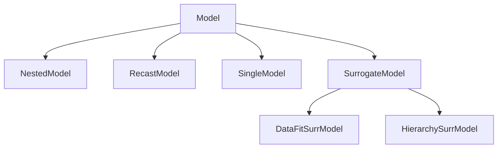
</details>

Figure 8.1: The Dakota model class hierarchy.

<!-- page:141 -->
# 8.2 Single Models

The single model is the simplest model type. It uses a single interface instance (see Chapter 10) to map variables (see Chapter 9) into responses (see Chapter 11). There is no recursion in this case. Refer to the Models chapter in the Dakota Reference Manual [3] for additional information on the single model specification.

# 8.3 Recast Models

The recast model is not directly visible to the user within the input specification. Rather, it is used “behind the scenes” to recast the inputs and outputs of a sub-model for the purposes of reformulating the problem posed to an iterator. Examples include variable and response scaling (see Section 6.3.2), transformations of uncertain variables and associated response derivatives to employ standardized random variables (see Sections 5.3 and 5.4), multiobjective optimization (see Section 6.3.1), merit functions (see Section 14.6.1), and expected improvement/feasibility (see Sections 6.2.3 and 5.3.2). Refer to the Dakota Developers Manual [2] for additional details on the mechanics of recasting problem formulations.

# 8.4 Surrogate Models

Surrogate models are inexpensive approximate models that are intended to capture the salient features of an expensive highfidelity model. They can be used to explore the variations in response quantities over regions of the parameter space, or they can serve as inexpensive stand-ins for optimization or uncertainty quantification studies (see, for example, the surrogate-based optimization methods in Section 14.6). Surrogate models supported in Dakota can be categorized into three types: data fits, multifidelity, and reduced-order model surrogates. An overview and discussion of surrogate correction is provided here, with details following.

# 8.4.1 Overview of Surrogate Types

Data fitting methods involve construction of an approximation or surrogate model using data (response values, gradients, and Hessians) generated from the original truth model. Data fit methods can be further categorized as local, multipoint, and global approximation techniques, based on the number of points used in generating the data fit. Local methods involve response data from a single point in parameter space. Available local techniques currently include:

Known Issue: When using discrete variables, there have been sometimes significant differences in data fit surrogate behavior observed across computing platforms in some cases. The cause has not yet been fully diagnosed and is currently under investigation. In addition, guidance on appropriate construction and use of surrogates with discrete variables is under development. In the meantime, users should therefore be aware that there is a risk of inaccurate results when using surrogates with discrete variables.

Taylor Series Expansion: This is a local first-order or second-order expansion centered at a single point in the parameter space.

Multipoint approximations involve response data from two or more points in parameter space, often involving the current and previous iterates of a minimization algorithm. Available techniques currently include:

TANA-3: This multipoint approximation uses a two-point exponential approximation [158, 46] built with response value and gradient information from the current and previous iterates.

Global methods, often referred to as response surface methods, involve many points spread over the parameter ranges of interest. These surface fitting methods work in conjunction with the sampling methods and design of experiments methods described in Sections 5.2 and 4.2.

Polynomial Regression: First-order (linear), second-order (quadratic), and third-order (cubic) polynomial response surfaces computed using linear least squares regression methods. Note: there is currently no use of forward- or backward-stepping regression methods to eliminate unnecessary terms from the polynomial model.

<!-- page:142 -->
An experimental least squares regression polynomial model was added in Dakota 6.12. The user may specify the basis functions in the polynomial through a total degree scheme.

Gaussian Process (GP) or Kriging Interpolation Dakota contains two supported implementations of Gaussian process, also known as Kriging [64], spatial interpolation. One of these resides in the Surfpack sub-package of Dakota, the other resides in Dakota itself. Both versions use the Gaussian correlation function with parameters that are selected by Maximum Likelihood Estimation (MLE). This correlation function results in a response surface that is C∞-continuous. Prior to Dakota 5.2, the Surfpack GP was referred to as the “Kriging” model and the Dakota version was labeled as the “Gaussian Process.” These terms are now used interchangeably. As of Dakota 5.2,the Surfpack GP is used by default. For now the user still has the option to select the Dakota GP, but the Dakota GP is deprecated and will be removed in a future release. A third experimental Gaussian process model was added in Dakota 6.12.

• Surfpack GP: Ill-conditioning due to a poorly spaced sample design is handled by discarding points that contribute the least unique information to the correlation matrix. Therefore, the points that are discarded are the ones that are easiest to predict. The resulting surface will exactly interpolate the data values at the retained points but is not guaranteed to interpolate the discarded points.   
• Dakota GP: Ill-conditioning is handled by adding a jitter term or “nugget” to diagonal elements of the correlation matrix. When this happens, the Dakota GP may not exactly interpolate the data values.   
• Experimental GP: This GP also contains a nugget parameter that may be fixed by the user or determined through MLE. When the nugget is greater than zero the mean of the GP is not forced to interpolate the response values.

Artificial Neural Networks: An implementation of the stochastic layered perceptron neural network developed by Prof. D. C. Zimmerman of the University of Houston [159]. This neural network method is intended to have a lower training (fitting) cost than typical back-propagation neural networks.

Multivariate Adaptive Regression Splines (MARS): Software developed by Prof. J. H. Friedman of Stanford University [51]. The MARS method creates a C2-continuous patchwork of splines in the parameter space.

Radial Basis Functions (RBF): Radial basis functions are functions whose value typically depends on the distance from a center point, called the centroid. The surrogate model approximation is constructed as the weighted sum of individual radial basis functions.

Moving Least Squares (MLS): Moving Least Squares can be considered a more specialized version of linear regression models. MLS is a weighted least squares approach where the weighting is “moved” or recalculated for every new point where a prediction is desired. [109]

Piecewise Decomposition Option for Global Surrogates: Typically, the previous regression techniques use all available sample points to approximate the underlying function anywhere in the domain. An alternative option is to use piecewise decomposition to locally approximate the function at some point using a few sample points from its neighborhood. This option currently supports Polynomial Regression, Gaussian Process (GP) Interpolation, and Radial Basis Functions (RBF) Regression. It requires a decomposition cell type (currently set to be Voronoi cells), an optional number of support layers of neighbors, and optional discontinuity detection parameters (jump/gradient).

In addition to data fit surrogates, Dakota supports multifidelity and reduced-order model approximations:

Multifidelity Surrogates: Multifidelity modeling involves the use of a low-fidelity physics-based model as a surrogate for the original high-fidelity model. The low-fidelity model typically involves a coarser mesh, looser convergence tolerances, reduced element order, or omitted physics. It is a separate model in its own right and does not require data from the high-fidelity model for construction. Rather, the primary need for high-fidelity evaluations is for defining correction functions that are applied to the low-fidelity results.

Reduced Order Models: A reduced-order model (ROM) is mathematically derived from a high-fidelity model using the technique of Galerkin projection. By computing a set of basis functions (e.g., eigenmodes, left singular vectors) that capture the principal dynamics of a system, the original high-order system can be projected to a much smaller system, of the size of the number of retained basis functions.

<!-- page:143 -->
# 8.4.2 Correction Approaches

Each of the surrogate model types supports the use of correction factors that improve the local accuracy of the surrogate models. The correction factors force the surrogate models to match the true function values and possibly true function derivatives at the center point of each trust region. Currently, Dakota supports either zeroth-, first-, or second-order accurate correction methods, each of which can be applied using either an additive, multiplicative, or combined correction function. For each of these correction approaches, the correction is applied to the surrogate model and the corrected model is then interfaced with whatever algorithm is being employed. The default behavior is that no correction factor is applied.

The simplest correction approaches are those that enforce consistency in function values between the surrogate and original models at a single point in parameter space through use of a simple scalar offset or scaling applied to the surrogate model. First-order corrections such as the first-order multiplicative correction (also known as beta correction [15]) and the first-order additive correction [99] also enforce consistency in the gradients and provide a much more substantial correction capability that is sufficient for ensuring provable convergence in SBO algorithms (see Section 14.6.1). SBO convergence rates can be further accelerated through the use of second-order corrections which also enforce consistency in the Hessians [37], where the second-order information may involve analytic, finite-difference, or quasi-Newton Hessians.

Correcting surrogate models with additive corrections involves

$$
\hat {f _ {h i _ {\alpha}}} (\mathbf {x}) = f _ {l o} (\mathbf {x}) + \alpha (\mathbf {x}) \tag {8.1}
$$

where multifidelity notation has been adopted for clarity. For multiplicative approaches, corrections take the form

$$
\hat {f _ {h i _ {\beta}}} (\mathbf {x}) = f _ {l o} (\mathbf {x}) \beta (\mathbf {x}) \tag {8.2}
$$

where, for local corrections, $\alpha ( \mathbf { x } )$ and $\beta ( \mathbf { x } )$ are first or second-order Taylor series approximations to the exact correction functions:

$$
\alpha (\mathbf {x}) = A \left(\mathbf {x} _ {\mathbf {c}}\right) + \nabla A \left(\mathbf {x} _ {\mathbf {c}}\right) ^ {T} \left(\mathbf {x} - \mathbf {x} _ {\mathbf {c}}\right) + \frac {1}{2} \left(\mathbf {x} - \mathbf {x} _ {\mathbf {c}}\right) ^ {T} \nabla^ {2} A \left(\mathbf {x} _ {\mathbf {c}}\right) \left(\mathbf {x} - \mathbf {x} _ {\mathbf {c}}\right) \tag {8.3}
$$

$$
\beta (\mathbf {x}) = B \left(\mathbf {x} _ {\mathbf {c}}\right) + \nabla B \left(\mathbf {x} _ {\mathbf {c}}\right) ^ {T} \left(\mathbf {x} - \mathbf {x} _ {\mathbf {c}}\right) + \frac {1}{2} \left(\mathbf {x} - \mathbf {x} _ {\mathbf {c}}\right) ^ {T} \nabla^ {2} B \left(\mathbf {x} _ {\mathbf {c}}\right) \left(\mathbf {x} - \mathbf {x} _ {\mathbf {c}}\right) \tag {8.4}
$$

where the exact correction functions are

$$
A (\mathbf {x}) = f _ {h i} (\mathbf {x}) - f _ {l o} (\mathbf {x}) \tag {8.5}
$$

$$
B (\mathbf {x}) = \frac {f _ {h i} (\mathbf {x})}{f _ {l o} (\mathbf {x})} \tag {8.6}
$$

Refer to [37] for additional details on the derivations.

A combination of additive and multiplicative corrections can provide for additional flexibility in minimizing the impact of the correction away from the trust region center. In other words, both additive and multiplicative corrections can satisfy local consistency, but through the combination, global accuracy can be addressed as well. This involves a convex combination of the additive and multiplicative corrections:

$$
\hat {f _ {h i \gamma}} (\mathbf {x}) = \gamma \hat {f _ {h i \alpha}} (\mathbf {x}) + (1 - \gamma) \hat {f _ {h i \beta}} (\mathbf {x}) \tag {8.7}
$$

where γ is calculated to satisfy an additional matching condition, such as matching values at the previous design iterate.

# 8.4.3 Data Fit Surrogate Models

A surrogate of the data fit type is a non-physics-based approximation typically involving interpolation or regression of a set of data generated from the original model. Data fit surrogates can be further characterized by the number of data points used in the fit, where a local approximation (e.g., first or second-order Taylor series) uses data from a single point, a multipoint approximation (e.g., two-point exponential approximations (TPEA) or two-point adaptive nonlinearity approximations (TANA)) uses a small number of data points often drawn from the previous iterates of a particular algorithm, and a global approximation (e.g., polynomial response surfaces, kriging/gaussian process, neural networks, radial basis functions, splines) uses a set of data points distributed over the domain of interest, often generated using a design of computer experiments.

<!-- page:144 -->
Dakota contains several types of surface fitting methods that can be used with optimization and uncertainty quantification methods and strategies such as surrogate-based optimization and optimization under uncertainty. These are: polynomial models (linear, quadratic, and cubic), first-order Taylor series expansion, kriging spatial interpolation, artificial neural networks, multivariate adaptive regression splines, radial basis functions, and moving least squares. With the exception of Taylor series methods, all of the above methods listed in the previous sentence are accessed in Dakota through the Surfpack library. All of these surface fitting methods can be applied to problems having an arbitrary number of design parameters. However, surface fitting methods usually are practical only for problems where there are a small number of parameters (e.g., a maximum of somewhere in the range of 30-50 design parameters). The mathematical models created by surface fitting methods have a variety of names in the engineering community. These include surrogate models, meta-models, approximation models, and response surfaces. For this manual, the terms surface fit model and surrogate model are used.

The data fitting methods in Dakota include software developed by Sandia researchers and by various researchers in the academic community.

# 8.4.3.1 Procedures for Surface Fitting

The surface fitting process consists of three steps: (1) selection of a set of design points, (2) evaluation of the true response quantities (e.g., from a user-supplied simulation code) at these design points, and (3) using the response data to solve for the unknown coefficients (e.g., polynomial coefficients, neural network weights, kriging correlation factors) in the surface fit model. In cases where there is more than one response quantity (e.g., an objective function plus one or more constraints), then a separate surface is built for each response quantity. Currently, most surface fit models are built using only $0 ^ { \mathrm { t h } }$ -order information (function values only), although extensions to using higher-order information (gradients and Hessians) are possible, and the Kriging model does allow construction for gradient data. Each surface fitting method employs a different numerical method for computing its internal coefficients. For example, the polynomial surface uses a least-squares approach that employs a singular value decomposition to compute the polynomial coefficients, whereas the kriging surface uses Maximum Likelihood Estimation to compute its correlation coefficients. More information on the numerical methods used in the surface fitting codes is provided in the Dakota Developers Manual [2].

The set of design points that is used to construct a surface fit model is generated using either the DDACE software package [141] or the LHS software package [83]. These packages provide a variety of sampling methods including Monte Carlo (random) sampling, Latin hypercube sampling, orthogonal array sampling, central composite design sampling, and Box-Behnken sampling. More information on these software packages is provided in Chapter 4. Optionally, the quality of a surrogate model can be assessed with surrogate metrics or diagnostics as described in Section 8.4.3.11.

# 8.4.3.2 Taylor Series

The Taylor series model is purely a local approximation method. That is, it provides local trends in the vicinity of a single point in parameter space. The first-order Taylor series expansion is:

$$
\hat {f} (\mathbf {x}) \approx f (\mathbf {x} _ {0}) + \nabla_ {\mathbf {x}} f (\mathbf {x} _ {0}) ^ {T} (\mathbf {x} - \mathbf {x} _ {0}) \tag {8.8}
$$

and the second-order expansion is:

$$
\hat {f} (\mathbf {x}) \approx f (\mathbf {x} _ {0}) + \nabla_ {\mathbf {x}} f (\mathbf {x} _ {0}) ^ {T} (\mathbf {x} - \mathbf {x} _ {0}) + \frac {1}{2} (\mathbf {x} - \mathbf {x} _ {0}) ^ {T} \nabla_ {\mathbf {x}} ^ {2} f (\mathbf {x} _ {0}) (\mathbf {x} - \mathbf {x} _ {0}) \tag {8.9}
$$

where $\mathbf { x } _ { 0 }$ is the expansion point in n-dimensional parameter space and $f ( \mathbf { x } _ { 0 } ) , \nabla _ { \mathbf { x } } f ( \mathbf { x } _ { 0 } )$ , and $\nabla _ { \mathbf x } ^ { 2 } f ( \mathbf x _ { 0 } )$ are the computed response value, gradient, and Hessian at the expansion point, respectively. As dictated by the responses specification used in building the local surrogate, the gradient may be analytic or numerical and the Hessian may be analytic, numerical, or based on quasi-Newton secant updates.

In general, the Taylor series model is accurate only in the region of parameter space that is close to $\mathbf { x } _ { \mathrm { 0 } }$ . While the accuracy is limited, the first-order Taylor series model reproduces the correct value and gradient at the point $\mathbf { x } _ { 0 } .$ , and the second-order

<!-- page:145 -->
Taylor series model reproduces the correct value, gradient, and Hessian. This consistency is useful in provably-convergent surrogate-based optimization. The other surface fitting methods do not use gradient information directly in their models, and these methods rely on an external correction procedure in order to satisfy the consistency requirements of provably-convergent SBO.

# 8.4.3.3 Two Point Adaptive Nonlinearity Approximation

The TANA-3 method [158] is a multipoint approximation method based on the two point exponential approximation [46]. This approach involves a Taylor series approximation in intermediate variables where the powers used for the intermediate variables are selected to match information at the current and previous expansion points. The form of the TANA model is:

$$
\hat {f} (\mathbf {x}) \approx f \left(\mathbf {x} _ {2}\right) + \sum_ {i = 1} ^ {n} \frac {\partial f}{\partial x _ {i}} \left(\mathbf {x} _ {2}\right) \frac {x _ {i , 2} ^ {1 - p _ {i}}}{p _ {i}} \left(x _ {i} ^ {p _ {i}} - x _ {i, 2} ^ {p _ {i}}\right) + \frac {1}{2} \epsilon (\mathbf {x}) \sum_ {i = 1} ^ {n} \left(x _ {i} ^ {p _ {i}} - x _ {i, 2} ^ {p _ {i}}\right) ^ {2} \tag {8.10}
$$

where n is the number of variables and:

$$
p _ {i} = 1 + \ln \left[ \frac {\frac {\partial f}{\partial x _ {i}} (\mathbf {x} _ {1})}{\frac {\partial f}{\partial x _ {i}} (\mathbf {x} _ {2})} \right] / \ln \left[ \frac {x _ {i , 1}}{x _ {i , 2}} \right] \tag {8.11}
$$

$$
\epsilon (\mathbf {x}) = \frac {H}{\sum_ {i = 1} ^ {n} (x _ {i} ^ {p _ {i}} - x _ {i , 1} ^ {p _ {i}}) ^ {2} + \sum_ {i = 1} ^ {n} (x _ {i} ^ {p _ {i}} - x _ {i , 2} ^ {p _ {i}}) ^ {2}} \tag {8.12}
$$

$$
H = 2 \left[ f (\mathbf {x} _ {1}) - f (\mathbf {x} _ {2}) - \sum_ {i = 1} ^ {n} \frac {\partial f}{\partial x _ {i}} (\mathbf {x} _ {2}) \frac {x _ {i , 2} ^ {1 - p _ {i}}}{p _ {i}} (x _ {i, 1} ^ {p _ {i}} - x _ {i, 2} ^ {p _ {i}}) \right] \tag {8.13}
$$

and $\mathbf { x } _ { 2 }$ and $\mathbf { x } _ { 1 }$ are the current and previous expansion points. Prior to the availability of two expansion points, a first-order Taylor series is used.

# 8.4.3.4 Linear, Quadratic, and Cubic Polynomial Models

Linear, quadratic, and cubic polynomial models are available in Dakota. The form of the linear polynomial model is

$$
\hat {f} (\mathbf {x}) \approx c _ {0} + \sum_ {i = 1} ^ {n} c _ {i} x _ {i} \tag {8.14}
$$

the form of the quadratic polynomial model is:

$$
\hat {f} (\mathbf {x}) \approx c _ {0} + \sum_ {i = 1} ^ {n} c _ {i} x _ {i} + \sum_ {i = 1} ^ {n} \sum_ {j \geq i} ^ {n} c _ {i j} x _ {i} x _ {j} \tag {8.15}
$$

and the form of the cubic polynomial model is:

$$
\hat {f} (\mathbf {x}) \approx c _ {0} + \sum_ {i = 1} ^ {n} c _ {i} x _ {i} + \sum_ {i = 1} ^ {n} \sum_ {j \geq i} ^ {n} c _ {i j} x _ {i} x _ {j} + \sum_ {i = 1} ^ {n} \sum_ {j \geq i} ^ {n} \sum_ {k \geq j} ^ {n} c _ {i j k} x _ {i} x _ {j} x _ {k} \tag {8.16}
$$

In all of the polynomial models, $\hat { f } ( \mathbf { x } )$ is the response of the polynomial model; the $x _ { i } , x _ { j } , x _ { k }$ terms are the components of the n-dimensional design parameter values; the $c _ { 0 } \ , c _ { i } \ , c _ { i j } \ , c _ { i j k }$ terms are the polynomial coefficients, and n is the number of design parameters. The number of coefficients, $n _ { c } ,$ depends on the order of polynomial model and the number of design parameters. For the linear polynomial:

$$
n _ {c _ {\text { linear }}} = n + 1 \tag {8.17}
$$

<!-- page:146 -->
for the quadratic polynomial:

$$
n _ {c _ {q u a d}} = \frac {(n + 1) (n + 2)}{2} \tag {8.18}
$$

and for the cubic polynomial:

$$
n _ {c _ {c u b i c}} = \frac {(n ^ {3} + 6 n ^ {2} + 1 1 n + 6)}{6} \tag {8.19}
$$

There must be at least $n _ { c }$ data samples in order to form a fully determined linear system and solve for the polynomial coefficients. For discrete design variables, a further requirement for a well-posed problem is for the number of distinct values that each discrete variable can take must be greater than the order of polynomial model (by at least one level). For the special case involving anisotropy in which the degree can be specified differently per dimension, the number of values for each discrete variable needs to be greater than the corresponding order along the respective dimension. In Dakota, a least-squares approach involving a singular value decomposition numerical method is applied to solve the linear system.

The utility of the polynomial models stems from two sources: (1) over a small portion of the parameter space, a low-order polynomial model is often an accurate approximation to the true data trends, and (2) the least-squares procedure provides a surface fit that smooths out noise in the data. For this reason, the surrogate-based optimization approach often is successful when using polynomial models, particularly quadratic models. However, a polynomial surface fit may not be the best choice for modeling data trends over the entire parameter space, unless it is known a priori that the true data trends are close to linear, quadratic, or cubic. See [107] for more information on polynomial models.

This surrogate model supports the domain decomposition option, further explained in 8.4.3.10.

An experimental polynomial model was added in Dakota 6.12 that uses the keyword experimental polynomial. The user specifies the order of the polynomial through the required keyword basis order according to a total degree rule.

# 8.4.3.5 Kriging/Gaussian-Process Spatial Interpolation Models

In the current release of Dakota, we have two versions of supported spatial interpolation models. There is an additional experimental version in Dakota’s standalone surrogates module that uses the keyword experimental\_gaussian\_process that is described at the end of this section. Of the supported versions, one is located in Dakota itself and the other in the Surfpack subpackage of Dakota which can be compiled in a standalone mode. These models are denoted as kriging dakota and kriging surfpack or as gaussian process dakota and gaussian process surfpack. In Dakota releases prior to 5.2, the dakota version was referred to as the gaussian process model while the surfpack version was referred to as the kriging model. As of Dakota 5.2, specifying only gaussian process or kriging will default to the surfpack version in all contexts except Bayesian calibration. For now, both versions are supported but the dakota version is deprecated and intended to be removed in a future release. The two kriging or gaussian process models are very similar: the differences between them are explained in more detail below.

The Kriging, also known as Gaussian process (GP), method uses techniques developed in the geostatistics and spatial statistics communities ( [22], [91]) to produce smooth surface fit models of the response values from a set of data points. The number of times the fitted surface is differentiable will depend on the correlation function that is used. Currently, the Gaussian correlation function is the only option for either version included in Dakota; this makes the GP model C∞-continuous. The form of the GP model is

$$
\hat {f} (\underline {{x}}) \approx \underline {{g}} (\underline {{x}}) ^ {T} \underline {{\beta}} + \underline {{r}} (\underline {{x}}) ^ {T} \underline {{\underline {{R}}}} ^ {- 1} (\underline {{f}} - \underline {{\underline {{G}}}} \underline {{\beta}}) \tag {8.20}
$$

<!-- page:147 -->
where x is the current point in n-dimensional parameter space; $g ( \underline { { x } } )$ is the vector of trend basis functions evaluated at x; β is a vector containing the generalized least squares estimates of the trend basis function coefficients; $\underline { { r } } ( \underline { { x } } )$ is the correlation vector of terms between x and the data points; $\underline { { \underline { { R } } } }$ is the correlation matrix for all of the data points; $\underline { { f } }$ is the vector of response values; and $\underline { { \underline { { G } } } }$ is the matrix containing the trend basis functions evaluated at all data points. The terms in the correlation vector and matrix are computed using a Gaussian correlation function and are dependent on an n-dimensional vector of correlation parameters, $\underline { { \theta } } ~ = ~ \{ \hat { \theta } _ { 1 } , \dots , \theta _ { n } \bar  \} ^ { T }$ . By default, Dakota determines the value of θ using a Maximum Likelihood Estimation (MLE) procedure. However, the user can also opt to manually set them in the gaussian process surfpack model by specifying a vector of correlation lengths, $\underline { { l } } = \{ l _ { 1 } , \ldots , l _ { n } \} ^ { \overline { { T } } }$ where $\theta _ { i } = 1 / ( 2 l _ { i } ^ { 2 } )$ . This definition of correlation lengths makes their effect on the GP model’s behavior directly analogous to the role played by the standard deviation in a normal (a.k.a. Gaussian) distribution. In the gaussian process surpack model, we used this analogy to define a small feasible region in which to search for correlation lengths. This region should (almost) always contain some correlation matrices that are well conditioned and some that are optimal, or at least near optimal. More details on Kriging/GP models may be found in [64].

Since a GP has a hyper-parametric error model, it can be used to model surfaces with slope discontinuities along with multiple local minima and maxima. GP interpolation is useful for both SBO and OUU, as well as for studying the global response value trends in the parameter space. This surface fitting method needs a minimum number of design points equal to the sum of the number of basis functions and the number of dimensions, n, but it is recommended to use at least double this amount.

The GP model is guaranteed to pass through all of the response data values that are used to construct the model. Generally, this is a desirable feature. However, if there is considerable numerical noise in the response data, then a surface fitting method that provides some data smoothing (e.g., quadratic polynomial, MARS) may be a better choice for SBO and OUU applications. Another feature of the GP model is that the predicted response values, ˆf(x), decay to the trend function, $\underline { { { g } } } ( \underline { { { x } } } ) ^ { T } \underline { { { \beta } } } ,$ when x is far from any of the data points from which the GP model was constructed (i.e., when the model is used for extrapolation).

As mentioned above, there are two gaussian process models in Dakota, the surfpack version and the dakota version. More details on the gaussian process dakota model can be found in [103]. The differences between these models are as follows:

• Trend Function: The GP models incorporate a parametric trend function whose purpose is to capture large-scale variations. In both models, the trend function can be a constant, linear,or reduced quadratic (main effects only, no interaction terms) polynomial. This is specified by the keyword trend followed by one of constant, linear, or reduced quadratic (in Dakota 5.0 and earlier, the reduced quadratic option for the dakota version was selected using the keyword, quadratic). The   
gaussian process surfpack model has the additional option of a full (i.e. it includes interaction terms) quadratic polynomial; this is accessed by following the trend keyword with quadratic.

• Correlation Parameter Determination: Both of the gaussian process models use a Maximum Likelihood Estimation (MLE) approach to find the optimal values of the hyper-parameters governing the mean and correlation functions. By default both models use the global optimization method called DIRECT, although they search regions with different extents. For the gaussian process dakota model, DIRECT is the only option. The gaussian process surfpack model has several options for the optimization method used. These are specified by the optimization method keyword followed by one of these strings:

– ’global’ which uses the default DIRECT optimizer,   
– ’local’ which uses the CONMIN optimizer,   
– ’sampling’ which generates several random guesses and picks the candidate with greatest likelihood, and   
– ’none’

The ’none’ option, and the starting location of the ’local’ optimization, default to the center, in log(correlation length) scale, of the small feasible region. However, these can also be user specified with the correlation lengths keyword followed by a list of n real numbers. The total number of evaluations of the gaussian process surfpack model’s likelihood function can be controlled using the max trials keyword followed by a positive integer. Note that we have found the ’global’ optimization method to be the most robust.

• Ill-conditioning. One of the major problems in determining the governing values for a Gaussian process or Kriging model is the fact that the correlation matrix can easily become ill-conditioned when there are too many input points close together. Since the predictions from the Gaussian process model involve inverting the correlation matrix, illconditioning can lead to poor predictive capability and should be avoided. The gaussian process surfpack model defines a small feasible search region for correlation lengths, which should (almost) always contain some well conditioned correlation matrices. In Dakota 5.1, the kriging (now gaussian process surfpack or kriging surfpack) model avoided ill-conditioning by explicitly excluding poorly conditioned R from consideration on the basis of their having a large (estimate of) condition number; this constraint acted to decrease the size of admissible correlation lengths. Note that a sufficiently bad sample design could require correlation lengths to be so short that any interpolatory Kriging/GP model would become inept at extrapolation and interpolation.

<!-- page:148 -->
The gaussian process dakota model has two features to overcome ill-conditioning. The first is that the algorithm will add a small amount of noise to the diagonal elements of the matrix (this is often referred to as a “nugget”) and sometimes this is enough to improve the conditioning. The second is that the user can specify to build the GP based only on a subset of points. The algorithm chooses an “optimal” subset of points (with respect to predictive capability on the remaining unchosen points) using a greedy heuristic. This option is specified with the keyword point selection in the input file.

As of Dakota 5.2, the gaussian process surfpack model has a similar capability. Points are not discarded prior to the construction of the model. Instead, within the maximum likelihood optimization loop, when the correlation matrix violates the explicit (estimate of) condition number constraint, the gaussian process surfpack model will perform a pivoted Cholesky factorization of the correlation matrix. A bisection search is then used to efficiently find the last point for which the reordered correlation matrix is not too ill-conditioned. Subsequent reordered points are excluded from the GP/Kriging model for the current set of correlation lengths, i.e. they are not used to construct this GP model or compute its likelihood. When necessary, the gaussian process surfpack model will automatically decrease the order of the polynomial trend function. Once the maximum likelihood optimization has been completed, the subset of points that is retained will be the one associated with the most likely set of correlation lengths. Note that a matrix being ill-conditioned means that its rows or columns contain a significant amount of duplicate information. Since the points that were discarded were the ones that contained the least unique information, they should be the ones that are the easiest to predict and provide maximum improvement of the condition number. However, the gaussian process surfpack model is not guaranteed to exactly interpolate the discarded points. Warning: when two very nearby points are on opposite sides of a discontinuity, it is possible for one of them to be discarded by this approach.

Note that a pivoted Cholesky factorization can be significantly slower than the highly optimized implementation of nonpivoted Cholesky factorization in typical LAPACK distributions. A consequence of this is that the gaussian process surfpack model can take significantly more time to build than the gaussian process dakota version. However, tests indicate that the gaussian process surfpack version will often be more accurate and/or require fewer evaluations of the true function than the gaussian process dakota. For this reason, the gaussian process surfpack version is the default option as of Dakota 5.2.

• Gradient Enhanced Kriging (GEK). As of Dakota 5.2, the use derivatives keyword will cause the gaussian process surfpack model to be built from a combination of function value and gradient information. The gaussian process dakota model does not have this capability. Incorporating gradient information will only be beneficial if accurate and inexpensive derivative information is available, and the derivatives are not infinite or nearly so. Here “inexpensive” means that the cost of evaluating a function value plus gradient is comparable to the cost of evaluating only the function value, for example gradients computed by analytical, automatic differentiation, or continuous adjoint techniques. It is not cost effective to use derivatives computed by finite differences. In tests, GEK models built from finite difference derivatives were also significantly less accurate than those built from analytical derivatives. Note that GEK’s correlation matrix tends to have a significantly worse condition number than Kriging for the same sample design.

This issue was addressed by using a pivoted Cholesky factorization of Kriging’s correlation matrix (which is a small sub-matrix within GEK’s correlation matrix) to rank points by how much unique information they contain. This reordering is then applied to whole points (the function value at a point immediately followed by gradient information at the same point) in GEK’s correlation matrix. A standard non-pivoted Cholesky is then applied to the reordered GEK correlation matrix and a bisection search is used to find the last equation that meets the constraint on the (estimate of) condition number. The cost of performing pivoted Cholesky on Kriging’s correlation matrix is usually negligible compared to the cost of the non-pivoted Cholesky factorization of GEK’s correlation matrix. In tests, it also resulted in more accurate GEK models than when pivoted Cholesky or whole-point-block pivoted Cholesky was performed on GEK’s correlation matrix.

<!-- page:149 -->
This surrogate model supports the domain decomposition option, further explained in 8.4.3.10.

The experimental Gaussian process model differs from the supported implementations in a few ways. First, at this time only local, gradient-based optimization methods for MLE are supported. The user may provide the num restarts keyword to specify how many optimization runs from random initial guesses are performed. The appropriate number of runs to ensure that the global minimum is found will be problem dependent, and when this keyword is omitted the optimizer is run twenty times.

Second, build data for the surrogate is scaled to have zero mean and unit variance, and fixed bounds are imposed on the kernel hyperparameters. The type of scaling and bound specification will be made user-configrable in a future release.

Third, like the other GP implementations in Dakota the user may employ a polynomial trend function by supplying the trend keyword. Supported trend functions include constant, linear, and quadratic polynomials, the last of these being a full rather than reduced quadratic. Polynomial coefficients are determined alongside the kernel hyperparmeters through MLE.

Lastly, the use may specify a fixed non-negative value for the nugget parameter or may estimate it as part of the MLE procedure through the find nugget keyword.

# 8.4.3.6 Artificial Neural Network (ANN) Models

The ANN surface fitting method in Dakota employs a stochastic layered perceptron (SLP) artificial neural network based on the direct training approach of Zimmerman [159]. The SLP ANN method is designed to have a lower training cost than traditional ANNs. This is a useful feature for SBO and OUU where new ANNs are constructed many times during the optimization process (i.e., one ANN for each response function, and new ANNs for each optimization iteration). The form of the SLP ANN model is

$$
\hat {f} (\mathbf {x}) \approx \tanh (\tanh ((\mathbf {x A} _ {0} + \theta_ {0}) \mathbf {A} _ {1} + \theta_ {1})) \tag {8.21}
$$

where x is the current point in n-dimensional parameter space, and the terms $\mathbf { A } _ { 0 } , \theta _ { 0 } , \mathbf { A } _ { 1 } , \theta _ { 1 }$ are the matrices and vectors that correspond to the neuron weights and offset values in the ANN model. These terms are computed during the ANN training process, and are analogous to the polynomial coefficients in a quadratic surface fit. A singular value decomposition method is used in the numerical methods that are employed to solve for the weights and offsets.

The SLP ANN is a non parametric surface fitting method. Thus, along with kriging and MARS, it can be used to model data trends that have slope discontinuities as well as multiple maxima and minima. However, unlike kriging, the ANN surface is not guaranteed to exactly match the response values of the data points from which it was constructed. This ANN can be used with SBO and OUU strategies. As with kriging, this ANN can be constructed from fewer than $n _ { c _ { q u a d } }$ data points, however, it is a good rule of thumb to use at least $n _ { c _ { q u a d } }$ data points when possible.

# 8.4.3.7 Multivariate Adaptive Regression Spline (MARS) Models

This surface fitting method uses multivariate adaptive regression splines from the MARS3.6 package [51] developed at Stanford University.

The form of the MARS model is based on the following expression:

$$
\hat {f} (\mathbf {x}) = \sum_ {m = 1} ^ {M} a _ {m} B _ {m} (\mathbf {x}) \tag {8.22}
$$

where the $a _ { m }$ are the coefficients of the truncated power basis functions $B _ { m } ,$ , and M is the number of basis functions. The MARS software partitions the parameter space into subregions, and then applies forward and backward regression methods to create a local surface model in each subregion. The result is that each subregion contains its own basis functions and coefficients, and the subregions are joined together to produce a smooth, C2-continuous surface model.

<!-- page:150 -->
MARS is a nonparametric surface fitting method and can represent complex multimodal data trends. The regression component of MARS generates a surface model that is not guaranteed to pass through all of the response data values. Thus, like the quadratic polynomial model, it provides some smoothing of the data. The MARS reference material does not indicate the minimum number of data points that are needed to create a MARS surface model. However, in practice it has been found that at least $n _ { c _ { q u a d } }$ , and sometimes as many as 2 to 4 times $n _ { c _ { q u a d } }$ , data points are needed to keep the MARS software from terminating. Provided that sufficient data samples can be obtained, MARS surface models can be useful in SBO and OUU applications, as well as in the prediction of global trends throughout the parameter space.

# 8.4.3.8 Radial Basis Functions

Radial basis functions are functions whose value typically depends on the distance from a center point, called the centroid, c. The surrogate model approximation is then built up as the sum of K weighted radial basis functions:

$$
\hat {f} (\mathbf {x}) = \sum_ {k = 1} ^ {K} w _ {k} \phi (\| \mathbf {x} - \mathbf {c} _ {\mathbf {k}} \|) \tag {8.23}
$$

where the φ are the individual radial basis functions. These functions can be of any form, but often a Gaussian bell-shaped function or splines are used. Our implementation uses a Gaussian radial basis function. The weights are determined via a linear least squares solution approach. See [113] for more details. This surrogate model supports the domain decomposition option, further explained in 8.4.3.10.

# 8.4.3.9 Moving Least Squares

Moving Least Squares can be considered a more specialized version of linear regression models. In linear regression, one usually attempts to minimize the sum of the squared residuals, where the residual is defined as the difference between the surrogate model and the true model at a fixed number of points. In weighted least squares, the residual terms are weighted so the determination of the optimal coefficients governing the polynomial regression function, denoted by $\hat { f } ( \mathbf { x } )$ , are obtained by minimizing the weighted sum of squares at N data points:

$$
\sum_ {n = 1} ^ {N} w _ {n} (\| \hat {f} (\mathbf {x} _ {\mathbf {n}}) - f (\mathbf {x} _ {\mathbf {n}}) \|) \tag {8.24}
$$

Moving least squares is a further generalization of weighted least squares where the weighting is “moved” or recalculated for every new point where a prediction is desired. [109] The implementation of moving least squares is still under development. We have found that it works well in trust region methods where the surrogate model is constructed in a constrained region over a few points. It does not appear to be working as well globally, at least at this point in time.

# 8.4.3.10 Piecewise Decomposition Option for Global Surrogate Models

Regression techniques typically use all available sample points to approximate the underlying function anywhere in the domain. An alternative option is to use piecewise dcomposition to locally approximate the function at some point using a few sample points from its neighborhood. This option currently supports Polynomial Regression, Gaussian Process (GP) Interpolation, and Radial Basis Functions (RBF) Regression. This option requires a decomposition cell type. A valid cell type is one where any point in the domain is assigned to some cell(s), and each cell identifies its neighbor cells. Currently, only Voronoi cells are supported. Each cell constructs its own piece of the global surrogate, using the function information at its seed and a few layers of its neighbors, parametrized by support layers. It also supports an optional discontinuity detection capability discontinuity detection, specified by either a jump threshold value jump threshold or a gradient threshold one gradient threshold.

<!-- page:151 -->
The surrogate construction uses all available data, including derivatives, not only function evaluations. The user should list the keyword use derivatives to indicate the availability of derivative information for the surrogate to use. If listed, the user can replace the default response parameters no gradients and no hessians with other response options, e.g., numerical gradients or analytic hessians. More details on using gradients and Hessians, if available, can be found in chapter 11.

The features of the current (Voronoi) piecewise decomposition choice are further explained below:

• In the Voronoi piecewise decomposition option, we decompose the high-dimensional parameter space using the implicit Voronoi tessellation around the known function evaluations as seeds. Using this approach, any point in the domain is assigned to a Voronoi cell using a simple nearest neighbor search, and the neighbor cells are then identified using Spoke Darts without constructing an explicit mesh.   
• The one-to-one mapping between the number of function evaluations and the number of Voronoi cells, regardless of the number of dimensions, eliminates the curse of dimensionality associated with standard domain decompositions. This Voronoi decomposition enables low-order piecewise polynomial approximation of the underlying function (and the associated error estimate) in the neighborhood of each function evaluation, independently. Moreover, the tessellation is naturally updated with the addition of new function evaluations.

Extending the piecewise decomposition option to other global surrogate models is under development.

# 8.4.3.11 Surrogate Diagnostic Metrics

The surrogate models provided by Dakota’s Surfpack package (polynomial, Kriging, ANN, MARS, RBF, and MLS) as well as the experimental surrogates include the ability to compute diagnostic metrics on the basis of (1) simple prediction error with respect to the training data, (2) prediction error estimated by cross-validation (iteratively omitting subsets of the training data), and (3) prediction error with respect to user-supplied hold-out or challenge data. All diagnostics are based on differences between $o ( x _ { i } )$ the observed value, and $p ( x _ { i } )$ , the surrogate model prediction for training (or omitted or challenge) data point xi. In the simple error metric case, the points xi are those used to train the model, for cross validation they are points selectively omitted from the build, and for challenge data, they are supplementary points provided by the user. The basic metrics are specified via the metrics keyword, followed by one or more of:

• sum squared: $\textstyle \sum _ { i = 1 } ^ { n } { \bigl ( } o ( x _ { i } ) - p ( x _ { i } ) { \bigr ) } ^ { 2 }$   
• mean squared: $\begin{array} { r } { \frac { 1 } { n } \sum _ { i = 1 } ^ { n } \left( o ( x _ { i } ) - p ( x _ { i } ) \right) ^ { 2 } } \end{array}$   
• root mean squared: $\begin{array} { r } { \sqrt { \frac { 1 } { n } \sum _ { i = 1 } ^ { n } \left( o ( x _ { i } ) - p ( x _ { i } ) \right) ^ { 2 } } } \end{array}$   
• sum abs: $\textstyle \sum _ { i = 1 } ^ { n } | o ( x _ { i } ) - p ( x _ { i } ) |$   
• mean abs: $\begin{array} { r } { \frac { 1 } { n } \sum _ { i = 1 } ^ { n } | o ( x _ { i } ) - p ( x _ { i } ) | } \end{array}$   
• max abs: maxi $| o ( x _ { i } ) - p ( x _ { i } ) |$   
• rsquared $\begin{array} { r } { R ^ { 2 } = \frac { \sum _ { i = 1 } ^ { n } { ( p _ { i } - \bar { o } ) ^ { 2 } } } { \sum _ { i = 1 } ^ { n } { ( o _ { i } - \bar { o } ) ^ { 2 } } } } \end{array}$ 1 (oi−o¯)2

Here, n is the number of data points used to create the model, and o¯ is the mean of the true response values. $R ^ { 2 }$ , developed for and most useful with polynomial regression, quantifies the amount of variability in the data that is captured by the model. The value of $R ^ { 2 }$ falls on in the interval [0, 1]. Values close to 1 indicate that the model matches the data closely. The remainder of the metrics measure error, so smaller values indicate better fit.

Cross-validation: With the exception of $R ^ { 2 }$ , the above metrics can be computed via a cross-validation process. The class of k-fold cross-validation metrics is used to predict how well a model might generalize to unseen data. The training data is randomly divided into k partitions. Then k models are computed, each excluding the corresponding $k ^ { t h }$ partition of the data. Each model is evaluated at the points that were excluded in its generation and any metrics specified above are computed with respect to the held out data. A special case, when k is equal to the number of data points, is known as leave-one-out cross-validation or prediction error sum of squares (PRESS). To specify k-fold cross-validation or PRESS, follow the list of metrics with cross validate and/or press, respectively.

<!-- page:152 -->
Challenge data: A user may optionally specify challenge points file, a data file in freeform or annotated format that contains additional trial point/response data, one point per row. When specified, any of the above metrics specified will be computed with respect to the challenge data.

Caution is advised when applying and interpreting these metrics. In general, lower errors are better, but for interpolatory models like Kriging models, will almost always be zero. Root-mean-squared and the absolute metrics are on the same scale as the predictions and data. R2 is meaningful for polynomial models, but less so for other model types. When possible, general 5-fold or 10-fold cross validation will provide more reliable estimates of the true model prediction error. Goodness-of-fit metrics provide a valuable tool for analyzing and comparing models but must not be applied blindly.

# 8.4.4 Multifidelity Surrogate Models

A second type of surrogate is the model hierarchy type (also called multifidelity, variable fidelity, variable complexity, etc.). In this case, a model that is still physics-based but is of lower fidelity (e.g., coarser discretization, reduced element order, looser convergence tolerances, omitted physics) is used as the surrogate in place of the high-fidelity model. For example, an inviscid, incompressible Euler CFD model on a coarse discretization could be used as a low-fidelity surrogate for a high-fidelity Navier-Stokes model on a fine discretization.

# 8.4.5 Reduced Order Models

A third type of surrogate model involves reduced-order modeling techniques such as proper orthogonal decomposition (POD) in computational fluid dynamics (also known as principal components analysis or Karhunen-Loeve in other fields) or spectral decomposition (also known as modal analysis) in structural dynamics. These surrogate models are generated directly from a high-fidelity model through the use of a reduced basis (e.g., eigenmodes for modal analysis or left singular vectors for POD) and projection of the original high-dimensional system down to a small number of generalized coordinates. These surrogates are still physics-based (and may therefore have better predictive qualities than data fits), but do not require multiple system models of varying fidelity (as required for model hierarchy surrogates).

# 8.4.6 Surrogate Model Selection

This section offers some guidance on choosing from among the available surrogate model types.

• For Surrogate Based Local Optimization, i.e. the surrogate based local method, with a trust region, either surrogate local taylor series or surrogate multipoint tana will probably work best. If for some reason you wish or need to use a global surrogate (not recommended) then the best of these options is likely to be either surrogate global gaussian process surfpack or surrogate global moving least squares.   
• For Efficient Global Optimization (EGO), i.e. the efficient global method, the default gaussian process surfpack is likely to find a more optimal value and/or use fewer true function evaluations than the alternative, gaussian process dakota. However, the surfpack version will likely take more time to build than the dakota version. Note that currently the use derivatives keyword is not recommended for use with EGO based methods.   
• For EGO based global interval estimation (EGIE), i.e. the global interval est ego method, the default gaussian process surfpack will likely work better than the alternative gaussian process dakota.   
• For Efficient Global Reliability Analysis (EGRA), i.e. the global reliability method the surfpack and dakota versions of the gaussian process tend to give similar answers with the dakota version tending to use fewer true function evaluations. Since this is based on EGO, it is likely that the default surfpack version is more accurate, although this has not been rigorously demonstrated.   
• For EGO based Dempster-Shafer Theory of Evidence, i.e. the global evidence ego method, the default gaussian process surfpack will often use significantly fewer true function evaluations than the alternative gaussian process dakota.

• When using a global surrogate to extrapolate, either the gaussian process surfpack or polynomial quadratic or polynomial cubic is recommended.   
• When there is over roughly two or three thousand data points and you wish to interpolate (or approximately interpolate) then a Taylor series, Radial Basis Function Network, or Moving Least Squares fit is recommended. The only reason that the gaussian process surfpack model is not recommended is that it can take a considerable amount of time to construct when the number of data points is very large. Use of the third party MARS package included in Dakota is generally discouraged.   
• In other situations that call for a global surrogate, the gaussian process surfpack is generally recommended. The use derivatives keyword will only be useful if accurate and an inexpensive derivatives are available. Finite difference derivatives are disqualified on both counts. However, derivatives generated by analytical, automatic differentiation, or continuous adjoint techniques can be appropriate. Currently, first order derivatives, i.e. gradients, are the highest order derivatives that can be used to construct the gaussian process surfpack model; Hessians will not be used even if they are available.

# 8.4.7 Python Interface to the Surrogates Module

<!-- page:153 -->
Dakota 6.13 onwards uses Pybind11 [84] to provide a Python interface to the surrogates module dakota.surrogates, which currently contains polynomial and Gaussian process regression surrogates. In this section we describe how to enable the interface and provide a simple demonstration.

After installing Dakota, dakota.surrogates may be used by setting the environment variable PYTHONPATH to include \$DAK\_INSTALL/share/dakota/Python. Note that doing so will also enable dakota.interfacing as described in 10.8.

The Python code snippet below shows how a Gaussian process surrogate can be built from existing Numpy arrays and an optional dictionary of configuration options, evaluated at a set of points, and serialized to disk for later use. The print options method writes the surrogate’s current configuration options to the console, which can useful for determining default settings.

import dakota.surrogates as daksurr

```lua
nugget_opts = {"estimate nugget": True}
config_opts = {"scaler name": "none", "Nugget": nugget_opts}

gp = daksurr.GaussianProcess(build_samples, build_response, config_opts)

gp.print_options()

gp_eval_surr = gp.value(eval_samples)

daksurr.save(gp, "gp.bin", True) 
```

The examples located in \$DAK\_INSTALL/share/dakota/examples/official/surrogates/library cover surrogate build/save/load workflows and other Python-accessible methods such as gradient and hessian evaluation.

As a word of caution, the configuration options for a surrogate loaded from disk will be empty because the current implementation does not serialize them, although the save command will generate a YAML file ClassName.yaml of configuration options used by the surrogate for reference.

# 8.5 Nested Models

Nested models utilize a sub-iterator and a sub-model to perform a complete iterative study as part of every evaluation of the model. This sub-iteration accepts variables from the outer level, performs the sub-level analysis, and computes a set of sublevel responses which are passed back up to the outer level. As described in the Models chapter of the Reference Manual [3], mappings are employed for both the variable inputs to the sub-model and the response outputs from the sub-model.

<!-- page:154 -->
In the variable mapping case, primary and secondary variable mapping specifications are used to map from the top-level variables into the sub-model variables. These mappings support three possibilities in any combination: (1) insertion of an active top-level variable value into an identified sub-model distribution parameter for an identified active sub-model variable, (2) insertion of an active top-level variable value into an identified active sub-model variable value, and (3) addition of an active top-level variable value as an inactive sub-model variable, augmenting the active sub-model variables.

In the response mapping case, primary and secondary response mapping specifications are used to map from the sub-model responses back to the top-level responses. These specifications provide real-valued multipliers that are applied to the subiterator response results to define the outer level response set. These nested data results may be combined with non-nested data through use of the “optional interface” component within nested models.

The nested model is used within a wide variety of multi-iterator, multi-model solution approaches. For example, optimization within optimization (for hierarchical multidisciplinary optimization), uncertainty quantification within uncertainty quantification (for mixed aleatory-epistemic UQ), uncertainty quantification within optimization (for optimization under uncertainty), and optimization within uncertainty quantification (for uncertainty of optima) are all supported, with and without surrogate model indirection. Several examples of nested model usage are provided in Chapter 15, most notably mixed epistemic-aleatory UQ in Section 15.1, optimization under uncertainty (OUU) in Section 15.2, and surrogate-based UQ in Section 15.3.

# 8.6 Random Field Models

As of Dakota 6.4, we have a preliminary capability to generate random fields. This is an experimental capability that is undergoing active development, so the following description and the associated syntax may change.

Our goal with a random field model is to have a fairly general capability, where we can generate a random field representation in one of three ways: from data, from simulation runs (e.g. running an ensemble of simulations where each one produces a field response), or from a covariance matrix defined over a mesh. Then, a random field model (such as a Karhunen-Loeve expansion) will be built based on the data. A final step is to draw realizations from the random field model to propagate to another simulation model. For example, the random field may represent a pressure or temperature boundary condition for a simulation.

The random field model is currently specified with a model type of random field. The first section of the random field specification tells Dakota what data to use to build the random field. This is specified with build source. The source of data to build the random field may be a file with data (where the N rows of data correspond to N samples of the random field and the M columns correspond to field values), or it may be a simulation that generates field data, or it may be specified given a mesh and a covariance matrix governing how the field varies over the mesh. In the case of using a simulation to generate field data, the simulation is defined with dace method pointer. In the case of using a mesh and a covariance, the form of the covariance is defined with analytic covariance.

The next section of the random field model specifies the form of the expansion, expansion form. This can be either a Karhunen-Loeve expansion or a Principal components analysis. These are very similar: both involve the eigenvalues of the covariance matrix of the field data. The only difference is in the treatment of the estimation of the coefficients of the eigenvector basis functions. In the PCA case, we have developed an approach which makes the coefficients explicit functions of the uncertain variables used to generate the random field. The specification of the random field can also include the number of bases to retain or a truncation tolerance, which defines the percent variance that the expansion should capture.

The final section of the random field model allows the user to specify a pointer to a model over which the random field will be propagated, propagation model pointer, meaning the model which will be driven with the random field input.

<!-- page:155 -->
# 8.7 Active Subspace Models

The active subspace technique [17] seeks directions in the input space for which the response function(s) show little variation. After a rotation to align with these directions, significant dimension reduction may be possible.

The Dakota model type subspace manages the input subspace identification and transforms the original simulation model into the new coordinates. This capability is new as of Dakota 6.4 and under very active development, so the following information may be outdated.

In Dakota 6.4, the active subspace model can be used in conjunction with the following uncertainty quantification methods:

• polynomial chaos   
• sampling   
• local reliability

An error message similar to:

Error: Resizing is not yet supported in method <method name>.

will be written and Dakota will exit if the active subspace model is used with a non-compatible method. The set of compatible methods will be expanded in future releases.

The active subspace implementation in Dakota 6.4 first transforms uncertain variables to standard normal distributions using a Nataf transformm before forming the subspace. This is a nonlinear transformation for non-normally distributed uncertain variables and may potentially decrease sparse structure in a fullspace model. Future Dakota releases will not use this transformation and should perform better in the general case.

The only required keyword when using a subspace model is the truth model pointer which points to the underlying model (specified by its id model) on which to build the subspace. The subspace model requires either analytical (preferred) or numerical gradients of the response functions. The active subspace model first samples the gradient of the fullspace model. The number of gradient samples can be specified with initial samples. The gradient samples are compiled into the columns of a matrix. A singular value decomposition is performed of the derivative matrix and the resulting singular values and vectors are used to determine the basis vectors and size of the active subspace.

Constantine [17] recommends choosing initial samples such that:

$$
\text { initial\_samples } = \alpha k \log (m),
$$

where α is an oversampling factor between 2 and 10, k is the number of singular values to approximate, and m is the number of fullspace variables. To ensure accurate results, k should be greater than the estimated subspace size determined by one of the truncation methods described below.

Dakota has everal metrics to estimate the size of an active subspace:

• constantine (default)   
• bing li   
• energy   
• cross validation

Additionally, if the desired subspace size is known it can be explicitly selected using the input parameter dimension. The constantine and bing li truncation methods both use bootstrap sampling of the compiled derivative matrix to estimate an active subspace size. The number of bootstrap samples used with these methods can be specified with the keyword bootstrap samples, but typically the default value works well. The energy method computes the number of bases so that the subspace representation accounts for all but a maximum percentage (specified as a decimal) of the total eigenvalue energy. This value is specified using the truncation tolerance keyword.

For more information on active subspaces please consult the Theory Manual [24] and/or references [20, 18, 17].

<!-- page:156 -->
# Chapter 9

# Variables

# 9.1 Overview

The variables specification in a Dakota input file specifies the parameter set to be iterated by a particular method. In the case of an optimization study, these variables are adjusted in order to locate an optimal design; in the case of parameter studies/sensitivity analysis/design of experiments, these parameters are perturbed to explore the parameter space; and in the case of uncertainty analysis, the variables are associated with distribution/interval characterizations which are used to compute corresponding distribution/interval characterizations for response functions. To accommodate these and other types of studies, Dakota supports design, uncertain, and state variable types for continuous and discrete variable domains. Uncertain types can be further categorized as either aleatory or epistemic, and discrete domains can include discrete range, discrete integer set, discrete string set, and discrete real set.

This chapter will present a brief overview of the main types of variables and their uses, as well as cover some user issues relating to file formats and the active set vector. For a detailed description of variables section syntax and example specifications, refer to the variables keywords in the Dakota Reference Manual [3].

# 9.2 Design Variables

Design variables are those variables which are modified in the course of determining an optimal design. These variables may be continuous (real-valued between bounds), discrete range (integer-valued between bounds), discrete set of integers (integervalued from finite set), discrete set of strings (string-valued from finite set), and discrete set of reals (real-valued from finite set).

# 9.2.1 Continuous Design Variables

The most common type of design variables encountered in engineering applications are of the continuous type. These variables may assume any real value (e.g., 12.34, -1.735e+07) within their bounds. All but a handful of the optimization algorithms in Dakota support continuous design variables exclusively.

# 9.2.2 Discrete Design Variables

Engineering design problems may contain discrete variables such as material types, feature counts, stock gauge selections, etc. These variables may assume only a fixed number of values, as compared to a continuous variable which has an uncountable number of possible values within its range. Discrete variables may involve a range of consecutive integers (x can be any integer between 1 and 10), a set of integer values (x can be 101, 212, or 355), a set of string values (x can be ’direct’, ’gmres’, or ’jacobi’), or a set of real values (e.g., x can be identically 4.2, 6.4, or 8.5).

<!-- page:157 -->
Discrete variables may be classified as either “categorical” or “noncategorical.” In the latter noncategorical case, the discrete requirement can be relaxed during the solution process since the model can still compute meaningful response functions for values outside the allowed discrete range or set. For example, a discrete variable representing the thickness of a structure is generally a noncategorical variable since it can assume a continuous range of values during the algorithm iterations, even if it is desired to have a stock gauge thickness in the end. In the former categorical case, the discrete requirement cannot be relaxed since the model cannot obtain a solution for values outside the range or set. For example, feature counts are generally categorical discrete variables, since most computational models will not support a non-integer value for the number of instances of some feature (e.g., number of support brackets). Dakota supports a categorical specification to indicate which discrete real and discrete integer variables are restricted vs. relaxable. String variables cannot be relaxed.

Gradient-based optimization methods cannot be directly applied to problems with discrete variables since derivatives only exist for a variable continuum. For problems with noncategorical variables, the experimental branch and bound capability (branch and bound) can be used to relax the discrete requirements and apply gradient-based methods to a series of generated subproblems. For problems with categorical variables, nongradient-based methods (e.g., coliny ea) are commonly used; however, most of those methods do not take advantage of any structure that may be associated with the categorical variables. The exception is mesh adaptive search. If it is possible to define a subjective relationship between the different values a given categorical variable can take on, the user can communicate that relationship in the form of an adjacency matrix. The mesh adaptive search will take that relationship into consideration. Further documentation can be found in [3] under the keywords adjacency matrix and neighbor order. Branch and bound techniques are discussed in Section 14.5 and nongradient-based methods are further described in Chapter 6.

In addition to engineering applications, many non-engineering applications in the fields of scheduling, logistics, and resource allocation contain discrete design parameters. Within the Department of Energy, solution techniques for these problems impact programs in stockpile evaluation and management, production planning, nonproliferation, transportation (routing, packing, logistics), infrastructure analysis and design, energy production, environmental remediation, and tools for massively parallel computing such as domain decomposition and meshing.

# 9.2.2.1 Discrete Design Integer Variables

There are two types of discrete design integer variables supported by Dakota.

• The discrete design range specification supports a range of consecutive integers between specified lower bounds and upper bounds.   
• The discrete\_design\_set integer specification supports a set of enumerated integer values through the elements specification. The set of values specified is stored internally as an STL set container, which enforces an ordered, unique representation of the integer data. Underlying this set of ordered, unique integers is a set of indices that run from 0 to one less than the number of set values. These indices are used by some iterative algorithms (e.g., parameter studies, SCOLIB iterators) for simplicity in discrete value enumeration when the actual corresponding set values are immaterial. In the case of parameter studies, this index representation is exposed through certain step and partition control specifications (see Chapter 3).

# 9.2.2.2 Discrete Design String Variables

There is one type of discrete design string variable supported by Dakota.

• The discrete design set string specification supports a set of enumerated string values through the elements specification. As for the discrete integer set variables described in Section 9.2.2.1, internal storage of the set values is ordered and unique and an underlying index representation is exposed for the specification of some iterative algorithms.

<!-- page:158 -->
Each string element value must be quoted in the Dakota input file and may contain alphanumeric, dash, underscore, and colon. White space, quote characters, and backslash/meta-characters are not permitted.

# 9.2.2.3 Discrete Design Real Variables

There is one type of discrete design real variable supported by Dakota.

• The discrete design set real specification specification supports a set of enumerated real values through the set values specification. As for the discrete integer set variables described in Section 9.2.2.1, internal storage of the set values is ordered and unique and an underlying index representation is exposed for the specification of some iterative algorithms.

# 9.3 Uncertain Variables

Deterministic variables (i.e., those with a single known value) do not capture the behavior of the input variables in all situations. In many cases, the exact value of a model parameter is not precisely known. An example of such an input variable is the thickness of a heat treatment coating on a structural steel I-beam used in building construction. Due to variability and tolerances in the coating process, the thickness of the layer is known to follow a normal distribution with a certain mean and standard deviation as determined from experimental data. The inclusion of the uncertainty in the coating thickness is essential to accurately represent the resulting uncertainty in the response of the building.

# 9.3.1 Aleatory Uncertain Variables

Aleatory uncertainties are irreducible variabilities inherent in nature. They are commonly modeled using probability distributions, and probabilistic methods are commonly used for propagating input aleatory uncertainties described by probability distribution specifications. The two following sections describe the continuous and discrete aleatory uncertain variables supported by Dakota.

For aleatory random variables, Dakota supports a user-supplied correlation matrix to provide correlations among the input variables. By default, the correlation matrix is set to the identity matrix, i.e., no correlation among the uncertain variables.

For additional information on random variable probability distributions, refer to [74] and [136]. Refer to the Dakota Reference Manual [3] for more detail on the uncertain variable specifications and to Chapter 5 for a description of methods available to quantify the uncertainty in the response.

# 9.3.1.1 Continuous Aleatory Uncertain Variables

• Normal: a probability distribution characterized by a mean and standard deviation. Also referred to as Gaussian. Bounded normal is also supported by some methods with an additional specification of lower and upper bounds.   
• Lognormal: a probability distribution characterized by a mean and either a standard deviation or an error factor. The natural logarithm of a lognormal variable has a normal distribution. Bounded lognormal is also supported by some methods with an additional specification of lower and upper bounds.   
• Uniform: a probability distribution characterized by a lower bound and an upper bound. Probability is constant between the bounds.   
• Loguniform: a probability distribution characterized by a lower bound and an upper bound. The natural logarithm of a loguniform variable has a uniform distribution.   
• Triangular: a probability distribution characterized by a mode, a lower bound, and an upper bound.   
• Exponential: a probability distribution characterized by a beta parameter.

• Beta: a flexible probability distribution characterized by a lower bound and an upper bound and alpha and beta parameters. The uniform distribution is a special case.   
• Gamma: a flexible probability distribution characterized by alpha and beta parameters. The exponential distribution is a special case.   
• Gumbel: the Type I Largest Extreme Value probability distribution. Characterized by alpha and beta parameters.   
• Frechet: the Type II Largest Extreme Value probability distribution. Characterized by alpha and beta parameters.   
• Weibull: the Type III Smallest Extreme Value probability distribution. Characterized by alpha and beta parameters.   
• Histogram Bin: an empirically-based probability distribution characterized by a set of (x, y) pairs that map out histogram bins (a continuous interval with associated bin count).

# 9.3.1.2 Discrete Aleatory Uncertain Variables

<!-- page:159 -->
The following types of discrete aleatory uncertain variables are available:

• Poisson: integer-valued distribution used to predict the number of discrete events that happen in a given time interval.   
• Binomial: integer-valued distribution used to predict the number of failures in a number of independent tests or trials.   
• Negative Binomial: integer-valued distribution used to predict the number of times to perform a test to have a target number of successes.   
• Geometric: integer-valued distribution used to model the number of successful trials that might occur before a failure is observed.   
• Hypergeometric: integer-valued distribution used to model the number of failures observed in a set of tests that has a known proportion of failures.   
• Histogram Point (integer, string, real): an empirically-based probability distribution characterized by a set of integervalued (i, c), string-valued (s, c), and/or real-valued $r , \scriptscriptstyle$ c pairs that map out histogram points (each a discrete point value i, s, or r, with associated count c).

# 9.3.2 Epistemic Uncertain Variables

Epistemic uncertainties are reducible uncertainties resulting from a lack of knowledge. For epistemic uncertainties, use of probability distributions is based on subjective prior knowledge rather than objective data, and we may alternatively explore non-probabilistic specifications based on intervals or Dempster-Shafer structures. Dakota currently supports the following epistemic uncertain variable types.

# 9.3.2.1 Continuous Epistemic Uncertain Variables

• Continuous Interval: a real-valued interval-based specification characterized by sets of lower and upper bounds and Basic Probability Assignments (BPAs) associated with each interval. The intervals may be overlapping, contiguous, or disjoint, and a single interval (with probability = 1) per variable is an important special case. The interval distribution is not a probability distribution, as the exact structure of the probabilities within each interval is not known. It is commonly used with epistemic uncertainty methods.

# 9.3.2.2 Discrete Epistemic Uncertain Variables

• Discrete Interval: an integer-valued variant of the Continuous Interval described above ( 9.3.2.1).   
• Discrete Set (integer, string, and real): Similar to discrete design set variables 9.2.2, these epistemic variables admit a finite number of values (elements) for type integer, string, or real, each with an associated probability.

<!-- page:160 -->
# 9.4 State Variables

State variables consist of “other” variables which are to be mapped through the simulation interface, in that they are not to be used for design and they are not modeled as being uncertain. State variables provide a convenient mechanism for parameterizing additional model inputs which, in the case of a numerical simulator, might include solver convergence tolerances, time step controls, or mesh fidelity parameters. For additional model parameterizations involving strings (e.g., “mesh1.exo”), refer to the analysis components specification described in Section 9.6.1 and in the Interface Commands chapter of the Dakota Reference Manual [3]. Similar to the design variables discussed in Section 9.2, state variables can be specified with a continuous range (real-valued between bounds), a discrete range (integer-valued between bounds), a discrete integer-valued set, a discrete string-valued set, or a discrete real-valued set.

State variables, as with other types of variables, are viewed differently depending on the method in use. Since these variables are neither design nor uncertain variables, algorithms for optimization, least squares, and uncertainty quantification do not iterate on these variables; i.e., they are not active and are hidden from the algorithm. However, Dakota still maps these variables through the user’s interface where they affect the computational model in use. This allows optimization, least squares, and uncertainty quantification studies to be executed under different simulation conditions (which will result, in general, in different results). Parameter studies and design of experiments methods, on the other hand, are general-purpose iterative techniques which do not draw a distinction between variable types. They include state variables in the set of variables to be iterated, which allows these studies to explore the effect of state variable values on the response data of interest.

In the future, state variables might be used in direct coordination with an optimization, least squares, or uncertainty quantification algorithm. For example, state variables could be used to enact model adaptivity through the use of a coarse mesh or loose solver tolerances in the initial stages of an optimization with continuous model refinement as the algorithm nears the optimal solution.

# 9.5 Management of Mixed Variables by Iterator

# 9.5.1 View

As alluded to in the previous section, the iterative method selected for use in Dakota partially determines what subset, or view, of the variables data is active in the iteration. (Section 9.5.3 contains a discussion of how user overrides, response function type, and method are used to determine active variable view.) The general case of having a mixture of various different types of variables is supported within all of the Dakota methods even though certain methods will only modify certain types of variables (e.g., optimizers and least squares methods only modify design variables, and uncertainty quantification methods typically only utilize uncertain variables). This implies that variables which are not under the direct control of a particular iterator will be mapped through the interface in an unmodified state. This allows for a variety of parameterizations within the model in addition to those which are being used by a particular iterator, which can provide the convenience of consolidating the control over various modeling parameters in a single file (the Dakota input file). An important related point is that the variable set that is active with a particular iterator is the same variable set for which derivatives are typically computed (see Section 11.3).

There are certain situations where the user may want to explicitly control the subset of variables that is considered active for a certain Dakota method. This is done by specifying the keyword active in the variables specification block, followed by one of the following: all, design, uncertain, aleatory, epistemic, or state. Specifying one of these subsets of variables will allow the Dakota method to operate on the specified variable types and override the defaults. For example, the default behavior for a nondeterministic sampling method is to sample the uncertain variables. However, if the user specified active all in the variables specification block, the sampling would be performed over all variables (e.g. design and state variables as well as uncertain variables). This may be desired in situations such as surrogate based optimization under uncertainty, where a surrogate may be built over both design and uncertain variables. Another situation where one may want the fine-grained control available by specifying one of these variable types is when one has state variables but only wants to sample over the design variables when constructing a surrogate model. Finally, more sophisticated uncertainty studies may involve various combinations of epistemic vs. aleatory variables being active in nested models.

<!-- page:161 -->
# 9.5.2 Domain

Another control that the user can specify in the variables specification block controls the domain type. We have two domains currently: mixed and relaxed. Both domain types can have design, uncertain, and state variables. The domain specifies how the discrete variables are treated. If the user specifies mixed in the variable specification block, the continuous and discrete variables are treated separately. If the user specifies relaxed in the variable specification block, the discrete variables are relaxed and treated as continuous variables. This may be useful in optimization problems involving both continuous and discrete variables when a user would like to use an optimization method that is designed for continuous variable optimization. All Dakota methods have a default value of mixed for the domain type except for the branch-and-bound method which has a default domain type of relaxed. Note that the branch-and-bound method is experimental and still under development at this time.

# 9.5.3 Precedence

If the user does not specify any explicit override of the active view of the variables, Dakota then considers the response function specification. If the user specifies objective functions or calibration terms in the response specification block, the active variables will be the design variables. If the user specifies the more generic response type, response functions, general response functions do not have a specific interpretation the way objective functions or calibration terms do. In the case of generic response functions, Dakota then tries to infer the active view from the method. If the method is a parameter study, or any of the methods available under dace, psuade, or fsu methods, the active view is set to all variables. For uncertainty quantification methods, if the method is sampling, then the view is set to aleatory if only aleatory variables are present, epistemic if only epistemic variables are present, or uncertain (covering both aleatory and epistemic) if both are present. If the uncertainty method involves interval estimation or evidence calculations, the view is set to epistemic. For other uncertainty quantification methods not mentioned in the previous sentences (e.g., reliability methods or stochastic expansion methods), the view is set to aleatory. Finally, for verification studies using the Richardson extrapolation method, the active view is set to state. Note that in surrogate-based optimization, where the surrogate is built on points defined by the method defined by the dace method pointer, the sampling used to generate the points is performed only over the design variables as a default unless otherwise specified (e.g. state variables will not be sampled for surrogate construction).

With respect to domain type, if the user does not specify an explicit override of mixed or relaxed, Dakota infers the domain type from the method. As mentioned above, all methods currently use a mixed domain as a default, except the branch-andbound method which is under development.

# 9.6 Dakota Parameters File Data Format

Simulation interfaces which employ system calls and forks to create separate simulation processes must communicate with the simulation code through the file system. This is accomplished through the reading and writing of parameters and results files. Dakota uses a particular format for this data input/output. Depending on the user’s interface specification, Dakota will write the parameters file in either standard or APREPRO format (future XML formats are planned). The former option uses a simple “value tag” format, whereas the latter option uses a “{ tag = value }” format for compatibility with the APREPRO utility [126] (as well as DPrePro, BPREPRO, and JPrePost variants).

# 9.6.1 Parameters file format (standard)

Prior to invoking a simulation, Dakota creates a parameters file which contains the current parameter values and a set of function requests. The standard format for this parameters file is shown in Figure 9.1.

Integer values are denoted by “<int>”, “<double>” denotes a double precision value, and “<string>” denotes a string value. Each of the colored blocks (black for variables, blue for active set vector, red for derivative variables vector, and green for analysis components) denotes an array which begins with an array length and a descriptive tag. These array lengths are useful for dynamic memory allocation within a simulator or filter program.

```txt
<int> variables
<double> <label_cdv_i> (i = 1 to n_cdv)
<int> <label_ddiv_i> (i = 1 to n_ddiv)
<string> <label_ddsv_i> (i = 1 to n_ddsv)
<double> <label_ddrv_i> (i = 1 to n_ddrv)
<double> <label_cauv_i> (i = 1 to n_cauv)
<int> <label_dauiv_i> (i = 1 to n_dauiv)
<string> <label_dausv_i> (i = 1 to n_dausv)
<double> <label_daurv_i> (i = 1 to n_daurv)
<double> <label_ceuv_i> (i = 1 to n_ceuv)
<int> <label_deuiv_i> (i = 1 to n_deuiv)
<string> <label_deusv_i> (i = 1 to n_deusv)
<double> <label_deurv_i> (i = 1 to n_deurv)
<double> <label_csv_i> (i = 1 to n_csv)
<int> <label_dsiv_i> (i = 1 to n_dsiv)
<string> <label_dssv_i> (i = 1 to n_dssv)
<double> <label_dsrv_i> (i = 1 to n_dsrv)
<int> functions
<int> ASV_i:label_response_i (i = 1 to m)
<int> derivative_variables
<int> DVV_i:label_cdv_i (i = 1 to p)
<int> analysis_components
<string> AC_i:analysis_driver_name_i (i = 1 to q)
<string> eval_id
<int> metadata
<string> MD_i (i = 1 to r) 
```  
Figure 9.1: Parameters file data format - standard option.

<!-- page:163 -->
The first array for variables begins with the total number of variables (n) with its identifier string “variables.” The next n lines specify the current values and descriptors of all of the variables within the parameter set in the following order: continuous design, discrete integer design (integer range, integer set), discrete string design (string set), discrete real design (real set), continuous aleatory uncertain (normal, lognormal, uniform, loguniform, triangular, exponential, beta, gamma, gumbel, frechet, weibull, histogram bin), discrete integer aleatory uncertain (poisson, binomial, negative binomial, geometric, hypergeometric, histogram point integer), discrete string aleatory uncertain (histogram point string), discrete real aleatory uncertain (histogram point real), continuous epistemic uncertain (real interval), discrete integer epistemic uncertain (interval, then set), discrete string epistemic uncertain (set), discrete real epistemic uncertain (set), continuous state, discrete integer state (integer range, integer set), discrete string state, and discrete real state (real set) variables. This ordering is consistent with the lists in Sections 9.2.2.1, 9.3.1.1 and 9.3.1.2 and the specification order in dakota.input.summary. The lengths of these vectors add to a total of n (that is, $n = n _ { c d v } + n _ { d d i v } + n _ { d d s v } + n _ { d d r v } + n _ { c a u v } + n _ { d a u i v } + n _ { d a u s v } + n _ { d a u r v } + n _ { c e u v } + n _ { d e u i v } + n _ { d e u i s }$ $n _ { d e u s v } + n _ { d e u r v } + n _ { c s v } + n _ { d s i v } + n _ { d s s v } + n _ { d s r v } )$ . If any of the variable types are not present in the problem, then its block is omitted entirely from the parameters file. The tags are the variable descriptors specified in the user’s Dakota input file, or if no descriptors have been specified, default descriptors are used.

The second array for the active set vector (ASV) begins with the total number of functions (m) and its identifier string “functions.” The next m lines specify the request vector for each of the m functions in the response data set followed by the tags “ASV i:label response”, where the label is either a user-provided response descriptor or a default-generated one. These integer codes indicate what data is required on the current function evaluation and are described further in Section 9.7.

The third array for the derivative variables vector (DVV) begins with the number of derivative variables (p) and its identifier string “derivative variables.” The next p lines specify integer variable identifiers followed by the tags “DVV i:label cdv”. These integer identifiers are used to identify the subset of variables that are active for the calculation of derivatives (gradient vectors and Hessian matrices), and correspond to the list of variables in the first array (e.g., an identifier of 2 indicates that the second variable in the list is active for derivatives). The labels are again taken from user-provided or default variable descriptors.

The fourth array for the analysis components (AC) begins with the number of analysis components (q) and its identifier string “analysis components.” The next q lines provide additional strings for use in specializing a simulation interface followed by the tags “AC i:analysis driver name”, where analysis driver name indicates the driver associated with this component. These strings are specified in a user’s input file for a set of analysis drivers using the analysis components specification. The subset of the analysis components used for a particular analysis driver is the set passed in a particular parameters file.

The next entry eval id in the parameters file is the evaluation ID, by default an integer indicating interface evaluation ID number. When hierarchical tagging is enabled as described in 10.5.2, the identifier will be a colon-separated string, e.g., 4:9:2. Several standard-format parameters file examples are shown in Section 10.7.

The final array for the metadata (MD) begins with the number of metadata fields requested (r) and its identifier string “metadata.” The next r lines provide the names of each metadata field followed by the tags “MD i”

# 9.6.2 Parameters file format (APREPRO)

For the APREPRO format option, the same data is present and the same ordering is used as in the standard format. The only difference is that values are associated with their tags within “{ tag = value }” constructs as shown in Figure 9.2. An APREPRO-format parameters file example is shown in Section 10.7.

The use of the APREPRO format option allows direct usage of these parameters files by the APREPRO utility, which is a file pre-processor that can significantly simplify model parameterization. Similar pre-processors include DPrePro, BPREPRO, and JPrePost. [Note: APREPRO is a Sandia-developed pre-processor that is not currently distributed with Dakota. DPrePro is a Perl script distributed with Dakota that performs many of the same functions as APREPRO, and is optimized for use with Dakota parameters files in either format. BPREPRO and JPrePost are additional Perl and JAVA tools, respectively, in use at other sites.] When a parameters file in APREPRO format is included within a template file (using an include directive), the APREPRO utility recognizes these constructs as variable definitions which can then be used to populate targets throughout the template file [126]. DPrePro, conversely, does not require the use of includes since it processes the Dakota parameters file and template simulation file separately to create a simulation input file populated with the variables data.

```txt
{
    DAKOTA_VARS = <int> }
{
    <label_cdv_i> = <double> } (i = 1 to n_cdv)
    <label_ddiv_i> = <int> } (i = 1 to n_ddiv)
    <label_ddsv_i> = <string> } (i = 1 to n_ddsv)
    <label_ddrv_i> = <double> } (i = 1 to n_ddrv)
    <label_cauv_i> = <double> } (i = 1 to n_cauv)
    <label_dauiv_i> = <int> } (i = 1 to n_dauiv)
    <label_dausv_i> = <string> } (i = 1 to n_dausv)
    <label_daurv_i> = <double> } (i = 1 to n_daurv)
    <label_ceuv_i> = <double> } (i = 1 to n_ceuv)
    <label_deuiv_i> = <int> } (i = 1 to n_deuiv)
    <label_deusv_i> = <string> } (i = 1 to n_deusv)
    <label_deurv_i> = <double> } (i = 1 to n_deurv)
    <label_csv_i> = <double> } (i = 1 to n_csv)
    <label_dsiv_i> = <int> } (i = 1 to ndsiv)
    <label_dssv_i> = <string> } (i = 1 to ndssv)
    <label_dsrv_i> = <double> } (i = 1 to ndsrv)
    DAKOTA_FNS = <int> }
    ASV_i:label_response_i = <int> } (i = 1 to m)
    DAKOTA_DER_VARS = <int> }
    DVV_i:label_cdv_i = <int> } (i = 1 to p)
    DAKOTA_AN_COMPS = <int> }
    AC_i:analysis_driver_name_i = <string> } (i = 1 to q)
    DAKOTA_EVAL_ID = <string> }
    DAKOTA_METADATA = <int> }
    MD_i = <string> } (i = 1 to r) 
```  
Figure 9.2: Parameters file data format - APREPRO option.

<!-- page:164 -->
# 9.7 The Active Set Vector

The active set vector contains a set of integer codes, one per response function, which describe the data needed on a particular execution of an interface. Integer values of 0 through 7 denote a 3-bit binary representation of all possible combinations of value, gradient, and Hessian requests for a particular function, with the most significant bit denoting the Hessian, the middle bit denoting the gradient, and the least significant bit denoting the value. The specific translations are shown in Table 9.1.

The active set vector in Dakota gets its name from managing the active set, i.e., the set of functions that are active on a particular function evaluation. However, it also manages the type of data that is needed for functions that are active, and in that sense, has an extended meaning beyond that typically used in the optimization literature.

# 9.7.1 Active set vector control

Active set vector control may be turned off to allow the user to simplify the supplied interface by removing the need to check the content of the active set vector on each evaluation. The Interface Commands chapter in the Dakota Reference Manual [3] provides additional information on this option (deactivate active\_set\_vector). Of course, this option trades some efficiency for simplicity and is most appropriate for those cases in which only a relatively small penalty occurs when computing and returning more data than may be needed on a particular function evaluation.

Table 9.1: Active set vector integer codes. 

<table><tr><td>Integer Code</td><td>Binary representation</td><td>Meaning</td></tr><tr><td>7</td><td>111</td><td>Get Hessian, gradient, and value</td></tr><tr><td>6</td><td>110</td><td>Get Hessian and gradient</td></tr><tr><td>5</td><td>101</td><td>Get Hessian and value</td></tr><tr><td>4</td><td>100</td><td>Get Hessian</td></tr><tr><td>3</td><td>011</td><td>Get gradient and value</td></tr><tr><td>2</td><td>010</td><td>Get gradient</td></tr><tr><td>1</td><td>001</td><td>Get value</td></tr><tr><td>0</td><td>000</td><td>No data required, function is inactive</td></tr></table>

<!-- page:166 -->
# Chapter 10

# Interfaces

# 10.1 Overview

The interface specification in a Dakota input file controls details of function evaluations. The mechanisms currently in place for function evaluations involve interfacing with one or more computational simulation codes, computing algebraic mappings (refer to Section 16.1), or a combination of the two.

This chapter will focus on mechanisms for simulation code invocation, starting with interface types in Section 10.2 and followed by a guide to constructing simulation-based interfaces in Section 10.3. This chapter also provides an overview of simulation interface components, covers issues relating to file management, and presents a number of example data mappings.

For a detailed description of interface specification syntax, refer to the interface commands chapter in the Dakota Reference Manual [3].

# 10.2 Simulation Interfaces

The invocation of a simulation code is performed using either system calls or forks or via direct linkage. In the system call and fork cases, a separate process is created for the simulation and communication between Dakota and the simulation occurs through parameter and response files. For system call and fork interfaces, the interface section must specify the details of this data transfer. In the direct case, a separate process is not created and communication occurs in memory through a prescribed API. Sections 10.2.1 through 10.2.5 provide information on the simulation interfacing approaches.

# 10.2.1 Direct Simulation Interface

The direct interface may be used to invoke simulations that are linked into the Dakota executable. This interface eliminates overhead from process creation and file I/O and can simplify operations on massively parallel computers. These advantages are balanced with the practicality of converting an existing simulation code into a library with a subroutine interface. Sandia codes for structural dynamics (Salinas), computational fluid dynamics (Sage), and circuit simulation (Xyce) and external codes such as Phoenix Integration’s ModelCenter framework and The Mathworks’ Matlab have been linked in this way, and a direct interface to Sandia’s SIERRA multiphysics framework is under development. In the latter case, the additional effort is particularly justified since SIERRA unifies an entire suite of physics codes. [Note: the “sandwich implementation” of combining a direct interface plug-in with Dakota’s library mode is discussed in the Dakota Developers Manual [2]].

In addition to direct linking with simulation codes, the direct interface also provides access to internal polynomial test functions that are used for algorithm performance and regression testing. The following test functions are available: cantilever, cyl head, log ratio, rosenbrock, short column, and text book (including text book1, text book2, text book3, and text book ouu). While these functions are also available as external programs in the dakota/share/dakota/ test directory, maintaining internally linked versions allows more rapid testing. See Chapter 20 for additional information on several of these test problems. An example input specification for a direct interface follows:

```txt
interface,
direct
analysis_driver = 'rosenbrock' 
```

<!-- page:167 -->
Additional specification examples are provided in Section 2.3 and additional information on asynchronous usage of the direct function interface is provided in Section 17.2.1.1. Guidance for usage of some particular direct simulation interfaces is in Section 16.3 and the details of adding a simulation code to the direct interface are provided in Section 16.2.

# 10.2.2 System Call Simulation Interface

Users are strongly encouraged to use the fork simulation interface if possible, though the system interface is still supported for portability and backward compatibility. The system call approach invokes a simulation code or simulation driver by using the system function from the standard C library [89]. In this approach, the system call creates a new process that communicates with Dakota through parameter and response files. The system call approach allows the simulation to be initiated via its standard invocation procedure (as a “black box”) and then coordinated with a variety of tools for pre- and post-processing. This approach has been widely used in previous studies [40, 42, 34]. The system call approach involves more process creation and file I/O overhead than the direct function approach, but this extra overhead is usually insignificant compared with the cost of a simulation. An example of a system call interface specification follows:

```python
interface,
    system
    analysis_driver = 'text_book'
    parameters_file = 'text_book.in'
    results_file = 'text_book.out'
    file_tag file_save 
```

Information on asynchronous usage of the system interface is provided in Section 17.2.1.2.

# 10.2.3 Fork Simulation Interface

The fork simulation interface uses the fork, exec, and wait families of functions to manage simulation codes or simulation drivers. (In a native MS Windows version of Dakota, similar Win32 functions, such as spawnvp(), are used instead.) Calls to fork or vfork create a copy of the Dakota process, execvp replaces this copy with the simulation code or driver process, and then Dakota uses the wait or waitpid functions to wait for completion of the new process. Transfer of variables and response data between Dakota and the simulator code or driver occurs through the file system in exactly the same manner as for the system call interface. An example of a fork interface specification follows:

```python
interface,
fork
    input_filter = 'test_3pc_if'
    output_filter = 'test_3pc_of'
    analysis_driver = 'test_3pc_ac'
    parameters_file = 'tb.in'
    results_file = 'tb.out'
    file_tag 
```

More detailed examples of using the fork call interface are provided in Section 2.3.5.1 and in Section 10.3, and information on asynchronous usage of the fork call interface is provided in Section 17.2.1.3.

# 10.2.4 Syntax for Filter and Driver Strings

<!-- page:168 -->
Dakota’s default behavior is to construct input filter, analysis driver, and output filter commands by appending the names of the parameters file and results file for the evaluation/analysis to the user-provided input filter, output filter, and analysis drivers strings. After adding its working directory to the PATH, Dakota executes these commands in its working directory or, if the work directory keyword group is present, in a work directory.

Filter and driver strings may contain absolute or relative path information and whitespace; Dakota will pass them through without modification.

Quotes are also permitted with the restriction that if double-quotes (”) are used to enclose the driver or filter string as a whole, then only single quotes (’) are allowed within it, and vice versa. The input filter string ’dprepro --var "foo=1"’ works, as does "dprepro --var ’foo=1’", but not "dprepro --var "foo=1"".

In some situations, users may not wish Dakota to append the names of the parameters or results files to filter and driver strings. The verbatim keyword prevents this behavior, and causes Dakota to execute filter and driver strings ”as is”.

Beginning with version 6.10, Dakota will substitute the tokens {PARAMETERS} and {RESULTS} in driver and filter strings with the names of the parameters and results files for that analysis/evaluation just prior to execution.

For example, if an interface block in the input file included:

```shell
input_filter 'preprocess {PARAMETERS}'
analysis_drivers 'run_sim.sh'
output_filter 'postprocess {RESULTS}'
verbatim 
```

Then, the input filter preprocess would be run with only the parameters file as a command line argument, the analysis driver run sim.sh would receive no command line arguments, and the output filter postprocess would receive only the results file name.

The combination of verbatim and substitution provide users with considerable flexibility in specifying the form of filter and driver commands.

# 10.2.5 Fork or System Call: Which to Use?

The primary operational difference between the fork and system call simulation interfaces is that, in the fork interface, the fork/exec functions return a process identifier that the wait/waitpid functions can use to detect the completion of a simulation for either synchronous or asynchronous operations. The system call simulation interface, on the other hand, must use a response file detection scheme for this purpose in the asynchronous case. Thus, an important advantage of the fork interface over the system call interface is that it avoids the potential of a file race condition when employing asynchronous local parallelism (refer to Section 17.2.1). This condition can occur when the responses file has been created but the writing of the response data set to this file has not been completed (see Section 17.2.1.2). While significant care has been taken to manage this file race condition in the system call case, the fork interface still has the potential to be more robust when performing function evaluations asynchronously.

Another advantage of the fork interface is that it has additional asynchronous capabilities when a function evaluation involves multiple analyses. As shown in Table 17.1, the fork interface supports asynchronous local and hybrid parallelism modes for managing concurrent analyses within function evaluations, whereas the system call interface does not. These additional capabilities again stem from the ability to track child processes by their process identifiers.

The only disadvantage to the fork interface compared with the system interface is that the fork/exec/wait functions are not part of the standard C library, whereas the system function is. As a result, support for implementations of the fork/exec/wait functions can vary from platform to platform. At one time, these commands were not available on some of Sandia’s massively parallel computers. However, in the more mainstream UNIX environments, availability of fork/exec/wait should not be an issue.

<!-- page:169 -->
In summary, the system call interface has been a workhorse for many years and is well tested and proven, but the fork interface supports additional capabilities and is recommended when managing asynchronous simulation code executions. Having both interfaces available has proven to be useful on a number of occasions and they will both continue to be supported for the foreseeable future.

# 10.3 Building a Black-Box Interface to a Simulation Code

To interface a simulation code to Dakota using one of the black-box interfaces (system call or fork), pre- and post-processing functionality typically needs to be supplied (or developed) in order to transfer the parameters from Dakota to the simulator input file and to extract the response values of interest from the simulator’s output file for return to Dakota (see Figures 1.1 and 10.4). This is often managed through the use of scripting languages, such as C-shell [5], Bourne shell [12], Perl [148], or Python [102]. While these are common and convenient choices for simulation drivers/filters, it is important to recognize that any executable file can be used. If the user prefers, the desired pre- and post-processing functionality may also be compiled or interpreted from any number of programming languages (C, C++, F77, F95, JAVA, Basic, etc.).

In the dakota/share/dakota/examples/official/drivers/bash/ directory, a simple example uses the Rosenbrock test function as a mock engineering simulation code. Several scripts have been included to demonstrate ways to accomplish the pre- and post-processing needs. Actual simulation codes will, of course, have different pre- and post-processing requirements, and as such, this example serves only to demonstrate the issues associated with interfacing a simulator. Modifications will almost surely be required for new applications.

# 10.3.1 Generic Script Interface Files

The dakota/share/dakota/examples/official/drivers/bash/ directory contains four important files: dakota\_ rosenbrock.in (the Dakota input file), simulator\_script.sh (the simulation driver script), templatedir/ros. template (a template simulation input file), and templatedir/rosenbrock\_bb.py (the Rosenbrock simulator).

The file dakota\_rosenbrock.in specifies the study that Dakota will perform and, in the interface section, describes the components to be used in performing function evaluations. In particular, it identifies simulator\_script.sh as its analysis driver, as shown in Figure 10.1.

The simulator\_script.sh listed in Figure 10.2 is a short driver shell script that Dakota executes to perform each function evaluation. The names of the parameters and results files are passed to the script on its command line; they are referenced in the script by \$1 and \$2, respectively. The simulator\_script.sh is divided into three parts: pre-processing, analysis, and post-processing.

In the pre-processing portion, the simulator\_script.sh uses dprepro, a template processing utility, to extract the current variable values from a parameters file (\$1) and combine them with the simulator template input file (ros.template) to create a new input file (ros.in) for the simulator. Internal to Sandia, the APREPRO utility is often used for this purpose. For external sites where APREPRO is not available, dprepro is an alternative with many of the capabilities of APREPRO that is specifically tailored for use with Dakota and is distributed with it (in dakota/scripts/pyprepro/, or dakota/bin in a binary distribution). Dakota also provides a second, more general-purpose template processing tool named pyprepro, which is as a Python-based alternative to APREPRO. This pair of tools, which permit not only parameter substitution, but execution of arbitrary Python scripting within templates, is extensively documented in Section 10.9.

Other preprocessing tools of potential interest are the BPREPRO utility (see [150]), and at Lockheed Martin sites, the JPrePost utility, a JAVA pre- and post-processor [48]. The dprepro script will be used here for simplicity of discussion. It can use either Dakota’s aprepro parameters file format (see Section 9.6.2) or Dakota’s standard format (see Section 9.6.1), so either option may be selected in the interface section of the Dakota input file. The ros.template file listed in Figure 10.3 is a template simulation input file which contains targets for the incoming variable values, identified by the strings “{x1}” and “{x2}”. These identifiers match the variable descriptors specified in dakota\_rosenbrock.in. The template input file is contrived as Rosenbrock has nothing to do with finite element analysis; it only mimics a finite element code to demonstrate the simulator template process. The dprepro script will search the simulator template input file for fields marked with

```python
# DAKOTA INPUT FILE - dakota_rosenbrock.in
# This sample Dakota input file optimizes the Rosenbrock function.
# See p. 95 in Practical Optimization by Gill, Murray, and Wright.

method
    conmin_frcg

variables
    continuous_design = 2
    cdv_initial_point = -1.0 1.0
    cdv_lower_bounds = -2.0 -2.0
    cdv_upper_bounds = 2.0 2.0
    cdv_descriptor 'x1' 'x2'

interface
    fork
    analysis_driver = 'simulator_script.sh'
    parameters_file = 'params.in'
    results_file = 'results.out'
    file_save
    work_directory named 'workdir'
    directory_tag directory_save
    link_files = 'templatedir/*
    deactivate active_set_vector

responses
    num_objective_functions = 1
    analytic_gradients
    no_hessians 
```  
Figure 10.1: The dakota\_rosenbrock.in input file.

```shell
#!/bin/sh
# Sample simulator to Dakota system call script

# The first and second command line arguments to the script are the
# names of the Dakota parameters and results files.
params=$1
results=$2

# ----
# PRE-PROCESSING
# ----
# Incorporate the parameters from Dakota into the template, writing ros.in
dprepro3 $params ros.template ros.in

# ----
# EXECUTION
# ----

./rosenbrock_bb.py

# ----
# POST-PROCESSING
# ----

# extract function value from the simulation output
grep 'Function value' ros.out | cut -c 18- > results.tmp
# extract gradients from the simulation output (in this case will be ignored
# by Dakota if not needed)
grep -i 'Function g' ros.out | cut -c 21- >> results.tmp
mv results.tmp $results 
```  
Figure 10.2: The simulator\_script.sh sample driver script.

```txt
Title of Model: Rosenbrock black box
**********************************************************************
* Description: This is an input file to the Rosenbrock black box
* Fortran simulator. This simulator is structured so
* as to resemble the input/output from an engineering
* simulation code, even though Rosenbrock's function
* is a simple analytic function. The node, element,
* and material blocks are dummy inputs.
*
* Input: x1 and x2
* Output: objective function value
**********************************************************************
node 1 location 0.0 0.0
node 2 location 0.0 1.0
node 3 location 1.0 0.0
node 4 location 1.0 1.0
node 5 location 2.0 0.0
node 6 location 2.0 1.0
node 7 location 3.0 0.0
node 8 location 3.0 1.0
element 1 nodes 1 3 4 2
element 2 nodes 3 5 6 4
element 3 nodes 5 7 8 6
element 4 nodes 7 9 10 8
material 1 elements 1 2
material 2 elements 3 4
variable 1 {x1}
variable 2 {x2}
end 
```  
Figure 10.3: Listing of the ros.template file

<!-- page:172 -->
curly brackets and then create a new file (ros.in) by replacing these targets with the corresponding numerical values for the variables. As shown in simulator\_script.sh, the names for the Dakota parameters file (\$1), template file (ros. template), and generated input file (ros.in) must be specified in the dprepro command line arguments.

The second part of the script executes the rosenbrock\_bb.py simulator. The input and output file names, ros.in and ros.out, respectively, are hard-coded into the. When the ./rosenbrock\_bb.py simulator is executed, the values for x1 and x2 are read in from ros.in, the Rosenbrock function is evaluated, and the function value is written out to ros.out.

The third part performs the post-processing and writes the response results to a file for Dakota to read. Using the UNIX “grep” utility, the particular response values of interest are extracted from the raw simulator output and saved to a temporary file (results.tmp). When complete, this file is renamed \$2, which in this example is always “results.out”. Note that moving or renaming the completed results file avoids any problems with read race conditions (see Section 17.2.1.2).

Because the Dakota input file dakota\_rosenbrock.in (Figure 10.1) specifies work directory and directory tag in its interface section, each invocation of simulator\_script.sh wakes up in its own temporary directory, which Dakota has populated with the contents of directory templatedir/. Having a separate directory for each invocation of simulator\_script.sh simplifies the script when the Dakota input file specifies asynchronous (so several instances of simulator\_script.sh might run simultaneously), as fixed names such as ros.in, ros.out, and results.tmp can be used for intermediate files. If neither asynchronous nor file tag is specified, and if there is no need (e.g., for debugging) to retain intermediate files having fixed names, then directory tag offers no benefit and can be omitted. An alternative to directory tag is to proceed as earlier versions of this chapter — prior to Dakota 5.0’s introduction of work directory — recommended: add two more steps to the simulator\_script.sh, an initial one to create a temporary directory explicitly and copy templatedir/ to it if needed, and a final step to remove the temporary directory and any files in it.

<!-- page:173 -->
When work directory is specified, Dakota adjusts the \$PATH seen by simulator\_script.sh so that simple program names (i.e., names not containing a slash) that are visible in Dakota’s directory will also be visible in the work directory. Relative path names — involving an intermediate slash but not an initial one, such as ./rosenbrock\_bb.py or a/bc/rosenbrock\_bb — will only be visible in the work directory if a link files or copy files specification (see §10.5.5) has made them visible there.

As an example of the data flow on a particular function evaluation, consider evaluation 60. The parameters file for this evaluation consists of:

```txt
2 variables
4.664752623441543e-01 x1
2.256400864298234e-01 x2
1 functions
3 ASV_1:obj_fn
2 derivative_variables
1 DVV_1:x1
2 DVV_2:x2
0 analysis_components
60 eval_id 
```

This file is called workdir/workdir.60/params.in if the line

named ’workdir’ file\_save directory\_save

in Figure 10.1 is uncommented. The first portion of the file indicates that there are two variables, followed by new values for variables x1 and x2, and one response function (an objective function), followed by an active set vector (ASV) value of 1. The ASV indicates the need to return the value of the objective function for these parameters (see Section 9.7). The dprepro script reads the variable values from this file, namely 4.664752623441543e-01 and 2.256400864298234e-01 for x1 and x2 respectively, and substitutes them in the {x1} and {x2} fields of the ros.template file. The final three lines of the resulting input file (ros.in) then appear as follows:

```txt
variable 1 0.4664752623
variable 2 0.2256400864
end 
```

where all other lines are identical to the template file. The rosenbrock\_bb simulator accepts ros.in as its input file and generates the following output to the file ros.out:

```txt
Beginning execution of model: Rosenbrock black box
Set up complete.
Reading nodes.
Reading elements.
Reading materials.
Checking connectivity...OK
**************************
Input value for x1 = 4.6647526230000003e-01
Input value for x2 = 2.2564008640000000e-01
Computing solution...Done 
```

```txt
**************************
Function value = 2.9111427884970176e-01
Function gradient = [-2.5674048470887652e+00 1.6081832124292317e+00] 
```

<!-- page:174 -->
Next, the appropriate values are extracted from the raw simulator output and returned in the results file. This post-processing is relatively trivial in this case, and the simulator\_script.sh uses the grep and cut utilities to extract the value from the “Function value” line of the ros.out output file and save it to \$results, which is the results.out file for this evaluation. This single value provides the objective function value requested by the ASV.

After 132 of these function evaluations, the following Dakota output shows the final solution using the rosenbrock\_bb.py simulator:

```txt
Exit NPSOL - Optimal solution found.

Final nonlinear objective value = 0.1165704E-06

NPSOL exits with INFORM code = 0 (see "Interpretation of output" section in NPSOL manual)

NOTE: see Fortran device 9 file (fort.9 or ftn09)
    for complete NPSOL iteration history.

<<<< Iterator npsol_sqp completed.
<<<< Function evaluation summary: 132 total (132 new, 0 duplicate)
<<<< Best parameters =
    9.9965861667e-01 x1
    9.9931682203e-01 x2

<<<< Best objective function =
    1.1657044253e-07

<<<< Best evaluation ID: 130

<<<< Iterator npsol_sqp completed.
<<<< Single Method Strategy completed.
Dakota execution time in seconds:
    Total CPU = 0.12 [parent = 0.116982, child = 0.003018]
    Total wall clock = 1.47497 
```

# 10.3.2 Adapting These Scripts to Another Simulation

To adapt this approach for use with another simulator, several steps need to be performed:

1. Create a template simulation input file by identifying the fields in an existing input file that correspond to the variables of interest and then replacing them with {} identifiers (e.g. {cdv 1}, {cdv 2}, etc.) which match the Dakota variable descriptors. Copy this template input file to a templatedir that will be used to create working directories for the simulation.   
2. Modify the dprepro arguments in simulator\_script.sh to reflect names of the Dakota parameters file (previously “\$1”), template file name (previously “ros.template”) and generated input file (previously “ros.in”). Alternatively, use APREPRO, BPREPRO, or JPrePost to perform this step (and adapt the syntax accordingly).   
3. Modify the analysis section of simulator\_script.sh to replace the rosenbrock\_bb function call with the new simulator name and command line syntax (typically including the input and output file names).   
4. Change the post-processing section in simulator\_script.sh to reflect the revised extraction process. At a minimum, this would involve changing the grep command to reflect the name of the output file, the string to search for, and the characters to cut out of the captured output line. For more involved post-processing tasks, invocation of additional tools may have to be added to the script.   
5. Modify the dakota\_rosenbrock.in input file to reflect, at a minimum, updated variables and responses specifications.

<!-- page:175 -->
These nonintrusive interfacing approaches can be used to rapidly interface with simulation codes. While generally custom for each new application, typical interface development time is on the order of an hour or two. Thus, this approach is scalable when dealing with many different application codes. Weaknesses of this approach include the potential for loss of data precision (if care is not taken to preserve precision in pre- and post-processing file I/O), a lack of robustness in post-processing (if the data capture is too simplistic), and scripting overhead (only noticeable if the simulation time is on the order of a second or less).

If the application scope at a particular site is more focused and only a small number of simulation codes are of interest, then more sophisticated interfaces may be warranted. For example, the economy of scale afforded by a common simulation framework justifies additional effort in the development of a high quality Dakota interface. In these cases, more sophisticated interfacing approaches could involve a more thoroughly developed black box interface with robust support of a variety of inputs and outputs, or it might involve intrusive interfaces such as the direct simulation interface discussed below in Section 16.2 or the SAND interface described in Section 1.3.

# 10.3.3 Additional Examples

A variety of additional examples of black-box interfaces to simulation codes are maintained in the dakota/share/dakota/ examples/official/drivers/ directory.

# 10.4 Simulation Interface Components

Figure 10.4 is an extension of Figure 1.1 that adds details of the components that make up each of the simulation interfaces (system call, fork, and direct). These components include an input filter (“IFilter”), one or more analysis drivers (“Analysis Code/Driver”), and an output filter (“OFilter”). The input and output filters provide optional facilities for managing simulation pre- and post-processing, respectively. More specifically, the input filter can be used to insert the Dakota parameters into the input files required by the simulator program, and the output filter can be used to recover the raw data from the simulation results and compute the desired response data set. If there is a single analysis code, it is often convenient to combine these pre- and post-processing functions into a single simulation driver script, and the separate input and output filter facilities are rarely used in this case. If there are multiple analysis drivers, however, the input and output filter facilities provide a convenient means for managing non-repeated portions of the pre- and post-processing for multiple analyses. That is, preand post-processing tasks that must be performed for each analysis can be performed within the individual analysis drivers, and shared pre- and post-processing tasks that are only performed once for the set of analyses can be performed within the input and output filters.

When spawning function evaluations using system calls or forks, Dakota must communicate parameter and response data with the analysis drivers and filters through use of the file system. This is accomplished by passing the names of the parameters and results files on the command line when executing an analysis driver or filter. The input filter or analysis driver read data from the parameters file and the output filter or analysis driver write the appropriate data to the responses file. While not essential when the file names are fixed, the file names must be retrieved from the command line when Dakota is changing the file names from one function evaluation to the next (i.e., using temporary files or root names tagged with numerical identifiers). In the case of a UNIX C-shell script, the two command line arguments are retrieved using \$argv[1] and \$argv[2] (see [5]). Similarly, Bourne shell scripts retrieve the two command line arguments using \$1 and \$2, and Perl scripts retrieve the two command line arguments using @ARGV[0] and @ARGV[1]. In the case of a C or C++ program, command line arguments are retrieved using argc (argument count) and argv (argument vector) [89], and for Fortran 77, the iargc function returns the argument count and the getarg subroutine returns command line arguments.

# 10.4.1 Single analysis driver without filters

If a single analysis driver is selected in the interface specification and filters are not needed (as indicated by omission of the input filter and output filter specifications), then only one process will appear in the execution syntax of the simulation interface. An example of this syntax in the system call case is:


<details>
<summary>flowchart</summary>

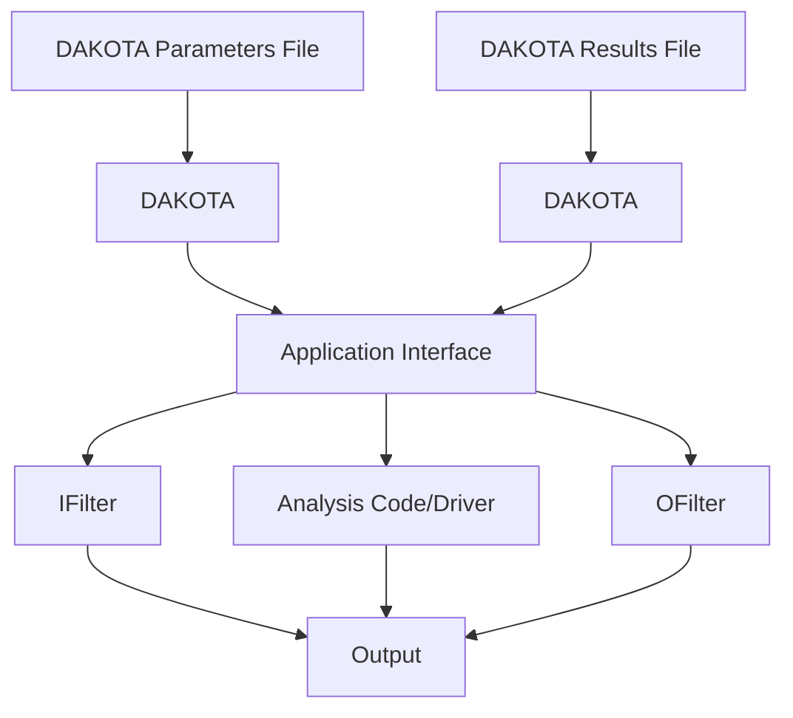
</details>

Figure 10.4: Components of the simulation interface

<!-- page:176 -->
driver params.in results.out

where “driver” is the user-specified analysis driver and “params.in” and “results.out” are the names of the parameters and results files, respectively, passed on the command line. In this case, the user need not retrieve the command line arguments since the same file names will be used each time.

For the same mapping, the fork simulation interface echoes the following syntax:

blocking fork: driver params.in results.out

for which only a single blocking fork is needed to perform the evaluation.

Executing the same mapping with the direct simulation interface results in an echo of the following syntax:

Direct function: invoking driver

where this analysis driver must be linked as a function within Dakota’s direct interface (see Section 16.2). Note that no parameter or response files are involved, since such values are passed directly through the function argument lists.

Both the system call and fork interfaces support asynchronous operations. The asynchronous system call execution syntax involves executing the system call in the background:

driver params.in.1 results.out.1 &

and the asynchronous fork execution syntax involves use of a nonblocking fork:

nonblocking fork: driver params.in.1 results.out.1

where file tagging (see Section 10.5.2) has been user-specified in both cases to prevent conflicts between concurrent analysis drivers. In these cases, the user must retrieve the command line arguments since the file names change on each evaluation. Execution of the direct interface must currently be performed synchronously since multithreading is not yet supported (see Section 17.2.1.1).

# 10.4.2 Single analysis driver with filters

<!-- page:177 -->
When filters are used, the syntax of the system call that Dakota performs is:

ifilter params.in results.out; driver params.in results.out; ofilter params.in results.out

in which the input filter (“ifilter”), analysis driver (“driver”), and output filter (“ofilter”) processes are combined into a single system call through the use of semi-colons (see [5]). All three portions are passed the names of the parameters and results files on the command line.

For the same mapping, the fork simulation interface echoes the following syntax:

blocking fork: ifilter params.in results.out; driver params.in results.out; ofilter params.in results.out

where a series of three blocking forks is used to perform the evaluation.

Executing the same mapping with the direct simulation interface results in an echo of the following syntax:

Direct function: invoking { ifilter driver ofilter }

where each of the three components must be linked as a function within Dakota’s direct interface. Since asynchronous operations are not yet supported, execution simply involves invocation of each of the three linked functions in succession. Again, no files are involved since parameter and response data are passed directly through the function argument lists.

Asynchronous executions would appear as follows for the system call interface:

(ifilter params.in.1 results.out.1; driver params.in.1 results.out.1; ofilter params.in.1 results.out.1) &

and, for the fork interface, as:

nonblocking fork: ifilter params.in.1 results.out.1; driver params.in.1 results.out.1; ofilter params.in.1 results.out.1

where file tagging of evaluations has again been user-specified in both cases. For the system call simulation interface, use of parentheses and semi-colons to bind the three processes into a single system call simplifies asynchronous process management compared to an approach using separate system calls. The fork simulation interface, on the other hand, does not rely on parentheses and accomplishes asynchronous operations by first forking an intermediate process. This intermediate process is then reforked for the execution of the input filter, analysis driver, and output filter. The intermediate process can be blocking or nonblocking (nonblocking in this case), and the second level of forks can be blocking or nonblocking (blocking in this case). The fact that forks can be reforked multiple times using either blocking or nonblocking approaches provides the enhanced flexibility to support a variety of local parallelism approaches (see Chapter 17).

# 10.4.3 Multiple analysis drivers without filters

If a list of analysis drivers is specified and filters are not needed (i.e., neither input filter nor output filter appears), then the system call syntax would appear as:

driver1 params.in results.out.1; driver2 params.in results.out.2; driver3 params.in results.out.3

<!-- page:178 -->
where “driver1”, “driver2”, and “driver3” are the user-specified analysis drivers and “params.in” and “results. out” are the user-selected names of the parameters and results files. Note that the results files for the different analysis drivers have been automatically tagged to prevent overwriting. This automatic tagging of analyses (see Section 10.5.4) is a separate operation from user-selected tagging of evaluations (see Section 10.5.2).

For the same mapping, the fork simulation interface echoes the following syntax:

```java
blocking fork: driver1 params.in results.out.1;
driver2 params.in results.out.2; driver3 params.in results.out.3 
```

for which a series of three blocking forks is needed (no reforking of an intermediate process is required).

Executing the same mapping with the direct simulation interface results in an echo of the following syntax:

```typescript
Direct function: invoking { driver1 driver2 driver3 } 
```

where, again, each of these components must be linked within Dakota’s direct interface and no files are involved for parameter and response data transfer.

Both the system call and fork interfaces support asynchronous function evaluations. The asynchronous system call execution syntax would be reported as

```txt
(driver1 params.in.1 results.out.1.1; driver2 params.in.1 results.out.1.2; driver3 params.in.1 results.out.1.3) & 
```

and the nonblocking fork execution syntax would be reported as

```txt
nonblocking fork: driver1 params.in.1 results.out.1.1;
driver2 params.in.1 results.out.1.2; driver3 params.in.1 results.out.1.3 
```

where, in both cases, file tagging of evaluations has been user-specified to prevent conflicts between concurrent analysis drivers and file tagging of the results files for multiple analyses is automatically used. In the fork interface case, an intermediate process is forked to allow a non-blocking function evaluation, and this intermediate process is then reforked for the execution of each of the analysis drivers.

# 10.4.4 Multiple analysis drivers with filters

Finally, when combining filters with multiple analysis drivers, the syntax of the system call that Dakota performs is:

```txt
ifilter params.in.1 results.out.1;
driver1 params.in.1 results.out.1.1;
driver2 params.in.1 results.out.1.2;
driver3 params.in.1 results.out.1.3;
ofilter params.in.1 results.out.1 
```

in which all processes have again been combined into a single system call through the use of semi-colons and parentheses. Note that the secondary file tagging for the results files is only used for the analysis drivers and not for the filters. This is consistent with the filters’ defined purpose of managing the non-repeated portions of analysis pre- and post-processing (e.g., overlay of response results from individual analyses; see Section 10.5.4 for additional information).

For the same mapping, the fork simulation interface echoes the following syntax:

```txt
blocking fork: ifilter params.in.1 results.out.1;
driver1 params.in.1 results.out.1.1;
driver2 params.in.1 results.out.1.2;
driver3 params.in.1 results.out.1.3;
ofilter params.in.1 results.out.1 
```

<!-- page:179 -->
for which a series of five blocking forks is used (no reforking of an intermediate process is required).

Executing the same mapping with the direct simulation interface results in an echo of the following syntax:

```txt
Direct function: invoking { ifilter driver1 driver2 driver3 ofilter } 
```

where each of these components must be linked as a function within Dakota’s direct interface. Since asynchronous operations are not supported, execution simply involves invocation of each of the five linked functions in succession. Again, no files are involved for parameter and response data transfer since this data is passed directly through the function argument lists.

Asynchronous executions would appear as follows for the system call interface:

```txt
(ifilter params.in.1 results.out.1;
    driver1 params.in.1 results.out.1.1;
    driver2 params.in.1 results.out.1.2;
    driver3 params.in.1 results.out.1.3;
    ofilter params.in.1 results.out.1) & 
```

and for the fork interface:

```txt
nonblocking fork: ifilter params.in.1 results.out.1;
driver1 params.in.1 results.out.1.1;
driver2 params.in.1 results.out.1.2;
driver3 params.in.1 results.out.1.3;
ofilter params.in.1 results.out.1 
```

where, again, user-selected file tagging of evaluations is combined with automatic file tagging of analyses. In the fork interface case, an intermediate process is forked to allow a non-blocking function evaluation, and this intermediate process is then reforked for the execution of the input filter, each of the analysis drivers, and the output filter.

A complete example of these filters and multi-part drivers can be found in dakota/share/dakota/test/dakota\_ 3pc/dakota\_3pc.in.

# 10.5 Simulation File Management

This section describes some management features used for files that transfer data between Dakota and simulation codes (i.e., when the system call or fork interfaces are used). These features can generate unique filenames when Dakota executes programs in parallel and can help one debug the interface between Dakota and a simulation code.

# 10.5.1 File Saving

Before driver execution: In Dakota 5.0 and newer, an existing results file will be removed immediately prior to executing the analysis driver. This new behavior addresses a common user problem resulting from starting Dakota with stale results files in the run directory. To override this default behavior and preserve any existing results files, specify allow existing results.

After driver execution: The file save option in the interface specification allows the user to control whether parameters and results files are retained or removed from the working directory after the analysis completes. Dakota’s default behavior is to remove files once their use is complete to reduce clutter. If the method output setting is verbose, a file remove notification will follow the function evaluation echo, e.g.,

```txt
driver /usr/tmp/aaaa20305 /usr/tmp/baaa20305
Removing /usr/tmp/aaaa20305 and /usr/tmp/baaa20305 
```

<!-- page:180 -->
However, if file save appears in the interface specification, these files will not be removed. This latter behavior is often useful for debugging communication between Dakota and simulator programs. An example of a file save specification is shown in the file tagging example below.

# 10.5.2 File Tagging for Evaluations

When a user provides parameters file and results file specifications, the file tag option in the interface specification causes Dakota to make the names of these files unique by appending the function evaluation number to the root file names. Default behavior is to not tag these files, which has the advantage of allowing the user to ignore command line argument passing and always read to and write from the same file names. However, it has the disadvantage that files may be overwritten from one function evaluation to the next. When file tag appears in the interface specification, the file names are made unique by the appended evaluation number. This uniqueness requires the user’s interface to get the names of these files from the command line. The file tagging feature is most often used when concurrent simulations are running in a common disk space, since it can prevent conflicts between the simulations. An example specification of file tag and file save is shown below:

```python
interface,
    system
    analysis_driver = 'text_book'
    parameters_file = 'text_book.in'
    results_file = 'text_book.out'
    file_tag file_save 
```

Special case: When a user specifies names for the parameters and results files and file save is used without file tag, untagged files are used in the function evaluation but are then moved to tagged files after the function evaluation is complete, to prevent overwriting files for which a file save request has been given. If the output control is set to verbose, then a notification similar to the following will follow the function evaluation echo:

```txt
driver params.in results.out
Files with non-unique names will be tagged to enable file_save:
Moving params.in to params.in.1
Moving results.out to results.out.1 
```

Hierarchical tagging: When a model’s specification includes the hierarchical tagging keyword, the tag applied to parameter and results file names of any subordinate interfaces will reflect any model hierarchy present. This option is useful for studies involving multiple models with a nested or hierarchical relationship. For example a nested model has a submethod, which itself likely operates on a sub-model, or a hierarchical approximation involves coordination of low and high fidelity models. Specifying hierarchical tagging will yield function evaluation identifiers (“tags”) composed of the evaluation IDs of the models involved, e.g., outermodel.innermodel.interfaceid = 4.9.2. This communicates the outer contexts to the analysis driver when performing a function evaluation. For an example of using hierarchical tagging in a nested model context, see dakota/share/dakota/test/dakota\_uq\_timeseries\_\*\_optinterf.in.

# 10.5.3 Temporary Files

If parameters file and results file are not specified by the user, temporary files having generated names are used. For example, a system call to a single analysis driver might appear as:

<!-- page:181 -->
driver /tmp/dakota\_params\_aaaa2035 /tmp/dakota\_results\_baaa2030

and a system call to an analysis driver with filter programs might appear as:

```shell
ifilter /tmp/dakota_params_aaaa2490 /tmp/dakota_results_baaa2490;
driver /tmp/dakota_params_aaaa2490 tmp/dakota_results_baaa2490;
ofilter /tmp/dakota_params_aaaa2490 /tmp/dakota_results_baa22490 
```

These files have unique names created by Boost filesystem utilities. This uniqueness requires the user’s interface to get the names of these files from the command line. File tagging with evaluation number is unnecessary with temporary files, but can be helpful for the user workflow to identify the evaluation number. Thus file tag requests will be honored. A file save request will be honored, but it should be used with care since the temporary file directory could easily become cluttered without the user noticing.

# 10.5.4 File Tagging for Analysis Drivers

When multiple analysis drivers are involved in performing a function evaluation with either the system call or fork simulation interface, a secondary file tagging is automatically used to distinguish the results files used for the individual analyses. This applies to both the case of user-specified names for the parameters and results files and the default temporary file case. Examples for the former case were shown previously in Section 10.4.3 and Section 10.4.4. The following examples demonstrate the latter temporary file case. Even though Unix temporary files have unique names for a particular function evaluation, tagging is still needed to manage the individual contributions of the different analysis drivers to the response results, since the same root results filename is used for each component. For the system call interface, the syntax would be similar to the following:

```txt
ifilter /var/tmp/aaawkaOKZ /var/tmp/baaxkaOKZ;
driver1 /var/tmp/aaawkaOKZ /var/tmp/baaxkaOKZ.1;
driver2 /var/tmp/aaawkaOKZ /var/tmp/baaxkaOKZ.2;
driver3 /var/tmp/aaawkaOKZ /var/tmp/baaxkaOKZ.3;
ofilter /var/tmp/aaawkaOKZ /var/tmp/baaxkaOKZ 
```

and, for the fork interface, similar to:

```txt
blocking fork:
    ifilter /var/tmp/aaawkaOKZ /var/tmp/baaxkaOKZ;
    driver1 /var/tmp/aaawkaOKZ /var/tmp/baaxkaOKZ.1;
    driver2 /var/tmp/aaawkaOKZ /var/tmp/baaxkaOKZ.2;
    driver3 /var/tmp/aaawkaOKZ /var/tmp/baaxkaOKZ.3;
    ofilter /var/tmp/aaawkaOKZ /var/tmp/baaxkaOKZ 
```

Tagging of results files with an analysis identifier is needed since each analysis driver must contribute a user-defined subset of the total response results for the evaluation. If an output filter is not supplied, Dakota will combine these portions through a simple overlaying of the individual contributions (i.e., summing the results in /var/tmp/baaxkaOKZ.1, /var/tmp/ baaxkaOKZ.2, and /var/tmp/baaxkaOKZ.3). If this simple approach is inadequate, then an output filter should be supplied to perform the combination. This is the reason why the results file for the output filter does not use analysis tagging; it is responsible for the results combination (i.e., combining /var/tmp/baaxkaOKZ.1, /var/tmp/baaxkaOKZ.2, and /var/tmp/baaxkaOKZ.3 into /var/tmp/baaxkaOKZ). In this case, Dakota will read only the results file from the output filter (i.e., /var/tmp/baaxkaOKZ) and interpret it as the total response set for the evaluation.

Parameters files are not currently tagged with an analysis identifier. This reflects the fact that Dakota does not attempt to subdivide the requests in the active set vector for different analysis portions. Rather, the total active set vector is passed to each analysis driver and the appropriate subdivision of work must be defined by the user. This allows the division of labor to be very flexible. In some cases, this division might occur across response functions, with different analysis drivers managing the data requests for different response functions. And in other cases, the subdivision might occur within response functions, with different analysis drivers contributing portions to each of the response functions. The only restriction is that each of the analysis drivers must follow the response format dictated by the total active set vector. For response data for which an analysis driver has no contribution, 0’s must be used as placeholders.

<!-- page:182 -->
# 10.5.5 Work Directories

Sometimes it is convenient for simulators and filters to run in a directory different from the one where Dakota is invoked. For instance, when performing concurrent evaluations and/or analyses, it is often necessary to cloister input and output files in separate directories to avoid conflicts. A simulator script used as an analysis driver can of course include commands to change to a different directory if desired (while still arranging to write a results file in the original directory), but Dakota has facilities that may simplify the creation of simulator scripts. When the work directory feature is enabled, Dakota will create a directory for each evaluation/analysis (with optional tagging and saving as with files). To enable the work directory feature an interface specification includes the keyword

```txt
work_directory 
```

then Dakota will arrange for the simulator and any filters to wake up in the work directory, with \$PATH adjusted (if necessary) so programs that could be invoked without a relative path to them (i.e., by a name not involving any slashes) from Dakota’s directory can also be invoked from the simulator’s (and filter’s) directory. On occasion, it is convenient for the simulator to have various files, e.g., data files, available in the directory where it runs. If, say, my/special/directory/ is such a directory (as seen from Dakota’s directory), the interface specification

```txt
work_directory named 'my/special/directory' 
```

would cause Dakota to start the simulator and any filters in that directory. If the directory did not already exist, Dakota would create it and would remove it after the simulator (or output filter, if specified) finished, unless instructed not to do so by the appearance of directory save (or its deprecated synonym dir save) in the interface specification. If named ’...’ does not appear, then directory save cannot appear either, and Dakota creates a temporary directory (using the tmpnam function to determine its name) for use by the simulator and any filters. If you specify directory tag (or the deprecated dir tag), Dakota causes each invocation of the simulator and any filters to start in a subdirectory of the work directory with a name composed of the work directory’s name followed by a period and the invocation number (1, 2, ...); this might be useful in debugging.

Sometimes it can be helpful for the simulator and filters to start in a new directory populated with some files. Adding

```txt
link_files 'templatedir/*' 
```

to the work directory specification would cause the contents of directory templatedir/ to be linked into the work directory. Linking makes sense if files are large, but when practical, it is far more reliable to have copies of the files; adding copy files to the specification would cause the contents of the template directory to be copied to the work directory. The linking or copying does not overwrite existing files unless replace also appears in the specification.

Here is a summary of possibilities for a work directory specification, with [...] denoting that ... is optional:

```txt
work_directory [ named '...']  
[ directory_tag ] # (or dir_tag)  
[ directory_save ] # (or dir_save)  
[ link_files '...' '...' ]  
[ copy_files '...' '...' ]  
[ replace ] 
```

Figure 10.5 contains an example of these specifications in a Dakota input file for constrained optimization.

```python
# Minimal example with common work directory specifications
method
    rol
    max_iterations = 60,
    variable_tolerance = 1e-6
    constraint_tolerance = 1e-6

variables
    continuous_design = 2
    initial_point 0.9 1.1
    upper_bounds 5.8 2.9
    lower_bounds 0.5 -2.9
    descriptors 'x1' 'x2'

interface
    # text_book driver must be in run directory or on PATH
    fork analysis_driver = 'text_book'
    parameters_file = 'params.in'
    results_file = 'results.out'
    work_directory named 'tb_work'
    directory_tag directory_save file_save

responses
    objective_functions = 1
    nonlinear_inequality_constraints = 2
    analytic_gradients
    no_hessians 
```  
Figure 10.5: The workdir\_textbook.in input file.

<!-- page:184 -->
# 10.6 Batched Evaluations

Beginning with release 6.11, Dakota provides for execution of evaluations in batches. Batch mode is intended to allow a user to assume greater control over where and when to run individual evaluations. It is activated using the batch keyword.

In batch mode, Dakota writes the parameters for multiple (a batch of) evaluations to a single batch parameters file and then invokes the analysis driver once for the entire batch. The pathname of the combined parameters file (and of the results file) are communicated to the driver as command line arguments. After the driver exits, Dakota expects to find results for the entire batch in a single combined results file.

The analysis driver is responsible for parsing the parameters file and performing an evaluation for each set of parameters it contains, and for returning results for all the evaluations to Dakota. The user is free to set up the driver to perform the evaluations in the batch in a way that is convenient.

By default, all currently available evaluations are added to a single batch. For example, in a sampling study that has a 1000 samples, by default all 1000 evaluations would be added to a single batch. The batch size may be limited using the size subkeyword. Setting size = 100 would result in 10 equal-size batches being run one after another in a 1000-sample study.

# 10.6.1 File Formats

The combined parameters file for a batch is simply the concatenation of all the parameters files for the evaluations in the batch. The individual parameter sets may use the default Dakota format, or the user can select the aprepro format.

The following example parameters file contains parameter sets for two evaluations.

```txt
1 variables
-4.912558193411678e-01 x1
1 functions
1 ASV_1:response_fn_1
1 derivative_variables
1 DVV_1:x1
0 analysis_components
1:1 eval_id
1 variables
-2.400695372000337e-01 x1
1 functions
1 ASV_1:response_fn_1
1 derivative_variables
1 DVV_1:x1
0 analysis_components
1:2 eval_id interface, 
```

Note that the eval id contains two pieces of information separated by a colon. The second is the evaluation number, and the first is the batch number. The batch number is an incrementing integer that uniquely identifies the batch.

The combined results file format is likewise a concatenation of the results for all the evaluations in the batch. However, a line beginning with the “#” character must separate the results for each evaluation.

The order of the evaluations in the results file must match the order in the parameters file.

The following is an example batch results file corresponding to the batch parameters file above. The initial # on the first line is optional, and a final # (not shown here) is allowed.

<!-- page:185 -->
\#

$4 \cdot 9 4 5 4 8 1 7 7 4 8 2 3 0 2 4 { \mathrm { e } } + 0 0 \quad \mathrm { f }$

\#

2.364744129789246e+00 f

# 10.6.2 Work Directories, Tagging, and Other Features

Each batch is executed in a work directory when this feature is enabled. The batch number is used to tag files and directories if tagging is requested (or Dakota automatically applies a tag to safely save a file or directory). As explained in the previous section, the batch number is an incrementing integer beginning with 1 that uniquely identifies a batch.

Batch mode restricts the use of several other Dakota features.

• No input filter or output filter is allowed.   
• Only one analysis driver is permitted.   
• failure capture modes are limited to abort and recover.

• Asynchronous evaluation is disallowed (only one batch at a time may be executed).

# 10.7 Parameter to Response Mapping Examples

In this section, interface mapping examples are presented through the discussion of several parameters files and their corresponding results files. A typical input file for 2 variables (n = 2) and 3 functions (m = 3) using the standard parameters file format (see Section 9.6.1) is as follows:

```csv
2 variables
1.50000000000000e+00 cdv_1
1.50000000000000e+00 cdv_2
3 functions
1 ASV_1
1 ASV_2
1 ASV_3
2 derivative_variables
1 DVV_1
2 DVV_2
0 analysis_components 
```

where numerical values are associated with their tags within “value tag” constructs. The number of design variables (n) and the string “variables” are followed by the values of the design variables and their tags, the number of functions (m) and the string “functions”, the active set vector (ASV) and its tags, the number of derivative variables and the string “derivative variables”, the derivative variables vector (DVV) and its tags, the number of analysis components and the string “analysis components”, and the analysis components array and its tags. The descriptive tags for the variables are always present and they are either the descriptors in the user’s variables specification, if given there, or are default descriptors. The length of the active set vector is equal to the number of functions (m). In the case of an optimization data set with an objective function and two nonlinear constraints (three response functions total), the first ASV value is associated with the objective function and the remaining two are associated with the constraints (in whatever consistent constraint order has been defined by the user). The DVV defines a subset of the variables used for computing derivatives. Its identifiers are 1-based and correspond to the full set of variables listed in the first array. Finally, the analysis components pass additional strings from the user’s analysis components specification in a Dakota input file through to the simulator. They allow the development of simulation drivers that are more flexible, by allowing them to be passed additional specifics at run time, e.g., the names of model files such as a particular mesh to use.

For the APREPRO format option (see Section 9.6.2), the same set of data appears as follows:

```txt
{ DAKOTA_VARS = 2 }
{ cdv_1 = 1.500000000000000e+00 }
{ cdv_2 = 1.500000000000000e+00 }
{ DAKOTA_FNS = 3 }
{ ASV_1 = 1 }
{ ASV_2 = 1 }
{ ASV_3 = 1 }
{ DAKOTA_DER_VARS = 2 }
{ DVV_1 = 1 }
{ DVV_2 = 2 }
{ DAKOTA_AN_COMPS = 0 } 
```

<!-- page:186 -->
where the numerical values are associated with their tags within “{ tag = value }” constructs.

The user-supplied simulation interface, comprised of a simulator program or driver and (optionally) filter programs, is responsible for reading the parameters file and creating a results file that contains the response data requested in the ASV. This response data is written in the format described in Section 11.2. Since the ASV contains all ones in this case, the response file corresponding to the above input file would contain values for the three functions:

```csv
1.250000000000000e-01 f
1.500000000000000e+00 c1
1.500000000000000e+00 c2 
```

Since function tags are optional, the following would be equally acceptable:

```csv
1.250000000000000e-01
1.500000000000000e+00
1.500000000000000e+00 
```

For the same parameters with different ASV components,

```csv
2 variables
1.50000000000000e+00 cdv_1
1.50000000000000e+00 cdv_2
3 functions
3 ASV_1
3 ASV_2
3 ASV_3
2 derivative_variables
1 DVV_1
2 DVV_2
0 analysis_components 
```

the following response data is required:

```txt
1.25000000000000e-01 f
1.50000000000000e+00 c1
1.50000000000000e+00 c2
[ 5.0000000000000e-01 5.0000000000000e-01 ]
[ 3.0000000000000e+00 -5.000000000000e-01 ]
[-5.000000000000e-01 3.00000000000e+0o] 
```

Here, we need not only the function values, but also each of their gradients. The derivatives are computed with respect to cdv 1 and cdv 2 as indicated by the DVV values. Another modification to the ASV components yields the following parameters file:

```csv
2 variables
1.50000000000000e+00 cdv_1
1.50000000000000e+00 cdv_2
3 functions
2 ASV_1
0 ASV_2
2 ASV_3
2 derivative_variables
1 DVV_1
2 DVV_2
0 analysis_components 
```

<!-- page:187 -->
for which the following results file is needed:

```json
[5.00000000000000e-01 5.00000000000000e-01]
[-5.00000000000000e-01 3.00000000000000e+00] 
```

Here, we need gradients for functions f and c2, but not for c1, presumably since this constraint is inactive.

A full Newton optimizer might make the following request:

```csv
2 variables
1.50000000000000e+00 cdv_1
1.50000000000000e+00 cdv_2
1 functions
7 ASV_1
2 derivative_variables
1 DVV_1
2 DVV_2
0 analysis_components 
```

for which the following results file,

```json
1.250000000000000e-01 f
[ 5.00000000000000e-01 5.0000000000000e-01 ]
[[ 3.0000000000000e+00 0.0000000000000e+00
    0.0000000000000e+00 3.000000000000e+00 ]] 
```

containing the objective function, its gradient vector, and its Hessian matrix, is needed. Again, the derivatives (gradient vector and Hessian matrix) are computed with respect to cdv 1 and cdv 2 as indicated by the DVV values.

Lastly, a more advanced example could have multiple types of variables present; in this example, 2 continuous design and 3 discrete design range, 2 normal uncertain, and 3 continuous state and 2 discrete state range variables. When a mixture of variable types is present, the content of the DVV (and therefore the required length of gradient vectors and Hessian matrices) depends upon the type of study being performed (see Section 11.3). For a reliability analysis problem, the uncertain variables are the active continuous variables and the following parameters file would be typical:

```csv
12 variables
1.50000000000000e+00 cdv_1
1.50000000000000e+00 cdv_2
2 ddriv_1
2 ddriv_2
2 ddriv_3
5.0000000000000e+00 nuv_1 
```

```csv
5.00000000000000e+00 nuv_2
3.50000000000000e+00 csv_1
3.50000000000000e+00 csv_2
3.50000000000000e+00 csv_3
4 dsriv_1
4 dsriv_2
3 functions
3 ASV_1
3 ASV_2
3 ASV_3
2 derivative_variables
6 DVV_1
7 DVV_2
2 analysis_components
mesh1.exo AC_1
db1.xml AC_2 
```

<!-- page:188 -->
Gradients are requested with respect to variable entries 6 and 7, which correspond to normal uncertain variables nuv 1 and nuv 2. The following response data would be appropriate:

```txt
7.943125000000000e+02 f
1.50000000000000e+00 c1
1.50000000000000e+00 c2
[ 2.56000000000000e+02 2.5600000000000e+02 ]
[ 0.0000000000000e+00 0.000000000000e+00 ]
[ 0.000000000000e+00 0.0000000000e+00 ] 
```

In a parameter study, however, no distinction is drawn between different types of continuous variables, and derivatives would be needed with respect to all continuous variables (ndvv = 7 for the continuous design variables cdv 1 and cdv 2, the normal uncertain variables nuv 1 and nuv 2, and the continuous state variables csv 1, csv 2 and csv 3). The parameters file would appear as

```csv
12 variables
1.50000000000000e+00 cdv_1
1.50000000000000e+00 cdv_2
2 ddriv_1
2 ddriv_2
2 ddriv_3
5.0000000000000e+00 nuv_1
5.0000000000000e+00 nuv_2
3.5000000000000e+00 csv_1
3.500000000000e+00 csv_2
3.50000000000e+00 csv_3
4 dsriv_1
4 dsriv_2
3 functions
3 ASV_1
3 ASV_2
3 ASV_3
7 derivative_variables
1 DVV_1
2 DVV_2
6 DVV_3 
```

```txt
7 DVV_4
8 DVV_5
9 DVV_6
10 DVV_7
2 analysis_components
mesh1.exo AC_1
db1.xml AC_2
```  
and the corresponding results would appear as

```txt
7.943125000000000e+02 f
1.50000000000000e+00 c1
1.50000000000000e+00 c2
[ 5.00000000000000e-01 5.0000000000000e-01 2.5600000000000e+02
2.5600000000000e+02 6.250000000000e+01 6.25000000000e+01
6.25000000000e+01 ]
[ 3.0000000000e+00 -5.0000e+01 0.00e+oo
o. 1. 1. 1. 1. 1. 1. 1. 1. 1. 1. 1. 1. 1. 1. 1. 1. 1. 1. 1. 1. 1. 1. 1. 1. 1. 1. 1. 1. 1. 1. 1. 1. 1. 1.
[ -5. 1. 1. 1. 1. 1. 1. 1. 1. 1. 1. 1. 1. 1. 1. 1. 1. 1. 1. 1. 1. 1. 1. 1. 1. 1. 1. 1. 1. 1. 1.
[ -5. 1. 2. 2. 2. 2. 2. 2. 2. 2. 2. 2. 2. 2. 2. 2. 2. 2. 2. 2. 2. 2. 2. 2. 2. 2. 2. 2. 2. 
```

# 10.8 Parameters and Results Files with dakota.interfacing

<!-- page:189 -->
The Python module dakota.interfacing first was made available with Dakota 6.6. (It was released with Dakota 6.5 as the module dipy.) By providing a Python interface to read and write, respectively, Dakota parameters and results files, dakota.interfacing can simplify development of black-box interfaces. The benefit may be greatest when one or more phases of the interface (pre-processing, execution, post-processing) is written in Python.

The following sections describe the components of dakota.interfacing. These components include:

• The Parameters class. Makes available the variable information for a single evaluation   
• The Results class. Collects results for a single evaluation and writes them to file   
• The BatchParameters and BatchResults classes. Containers for multiple Parameters and Results objects; used when evaluations are performed by Dakota in batch mode (Section 10.6)   
• The read parameters file function. Constructs Parameters, Results, BatchParameters, and BatchResults objects from a Dakota parameters file.

# 10.8.1 Creating Parameters and Results objects

dakota.interfacing has one free function, read parameters file, which creates Parameters, Results, BatchParameters, and BatchResults objects from a Dakota parameters file. For single, non-batch evaluation, it returns a tuple that contains (Parameters, Results). For batch evaluations, it instead returns a tuple containing (BatchParameters, BatchResults).

Its signature is:

```python
dakota.interfacing.read_parameters_file(parameters_file=None, results_file=None, ignore_asv=False, batch=False, infer_types=True, types=None) 
```

parameters file and results file are the names of the parameters file that is to be read and the results file that ultimately is to be written. The names can be absolute or relative filepaths or just filenames. If a parameters file or results file is not provided, it will be obtained from the command line arguments. (The results filename is assumed to be the last command line argument, and the parameters file the second to last.) Note that if the working directory has changed since script invocation, filenames provided as command line arguments by Dakota’s fork or system interfaces may be incorrect.

<!-- page:190 -->
If results file is set to the constant dakota.interfacing.UNNAMED, the Results or BatchResults object is constructed without a results file name. In this case, an output stream must be provided when

Results.write() or BatchResults.write() is called. Unnamed results files are most helpful when no results file will be written, as with a script intended purely for pre-processing.

By default, the returned Results or BatchResults object enforces the active set vector (see the Results class section). This behavior can be overridden, allowing any property (function, gradient, Hessian) of a response to be set, by setting ignore asv to True. The ignore asv option can be useful when setting up or debugging a driver.

The batch argument must be set to True when batch evaluation has been requested in the Dakota input file, and False when not.

The final two arguments, infer types and types, control how types are assigned to parameter values. The values initially are read as strings from the Dakota parameters file. If infer types is False and types is None, they remain as type str. If infer types is True, an attempt is made to ”guess” more convenient types. Conversion first to int and then to float are tried. If both fail, the value remains a str.

Sometimes automatic type inference does not work as desired; a user may have a string-valued variable with the element ”5”, for example, that he does not want converted to an int. Or, a user may wish to convert to a custom type, such as np.float64 instead of the built-in Python float. The types argument is useful in these cases. It can be set either to a list of types or a dict that maps variable labels to types. Types communicated using the types argument override inferred types. If types is a list, it must have a length equal to the number of variables. A dictionary, on the other hand, need not contain types for every variable. This permits variable-by-variable control over assignment and inference of types.

# 10.8.2 Parameters objects

Parameters objects make the variables, analysis components, evaluation ID, and evaluation number read from a Dakota parameters file available through a combination of key-value access and object attributes. Although Parameters objects may be constructed directly, it is advisable to use the read parameters file function instead.

Variable values can be accessed by Dakota descriptor or by index using [] on the object itself. Variables types are inferred or set as described in the previous section.

Analysis components are accessible by index only using the an comps attribute. Iterating over a Parameters object yields the variable descriptors.

Parameters objects have the attributes:

• an comps List of the analysis components (strings).   
• eval id Evaluation id (string).   
• eval num Evaluation number (final token in eval id) (int).   
• aprepro format Boolean indicating whether the parameters file was in aprepro (True) or Dakota (False) format.   
• descriptors List of the variable descriptors   
• num variables Number of variables   
• num an comps Number of analysis components   
• metadata Names of requested metadata fields (strings).   
• num metadata Number of requested metadata fields.

Parameters objects have the methods:

• items() Return an iterator that yields tuples of the descriptor and value for each parameter. (Results objects also have items().)   
• values() Return an iterator that yields the value for each parameter. (Results objects have the corresponding method responses().)

<!-- page:191 -->
# 10.8.3 Results objects

Results objects:

• communicate response requests from Dakota (active set vector and derivative variables)   
• collect response data (function values, gradients, and Hessians)   
• write Dakota results files

Results objects are collections of Response objects, which are documented in the following section. Each Response can be accessed by name (Dakota descriptor) or by index using [] on the Results object itself. Iterating over a Results object yields the response descriptors. Although Results objects may be constructed directly, it is advisable to use the read parameters file function instead.

Results objects have the attributes:

• eval id Evaluation id (a string).   
• eval num Evaluation number (final token in eval id) (int).   
• aprepro format Boolean indicating whether the parameters file was in aprepro (True) or Dakota (False) format.   
• descriptors List of the response descriptors (strings)   
• num responses Number of variables (read-only)   
• deriv vars List of the derivative variables (strings)   
• num deriv varsNumber of derivative variables (int)   
• metadata Dictionary of metadata indexable by field name or index

Results objects have the methods:

• items() Return an iterator that yields tuples of the descriptor and Response object for each response. (Parameters objects also have items().)   
• responses() Return an iterator that yields the Response object for each response. (Parameters objects have the corresponding method values().)   
• fail() Set the FAIL attribute. When the results file is written, it will contain only the word FAIL, triggering Dakota’s failure capturing behavior (See Chapter 19).   
• write(stream=None, ignore asv=None) Write the results to the Dakota results file. If stream is set, it overrides the results file name provided at construct time. It must be an open file-like object, rather than the name of a file. If ignore asv is True, the file will be written even if information requested via the active set vector is missing. Calling write() on a Results object that was generated by reading a batch parameters file will raise a BatchWriteError. Instead, write() should be called on the containing BatchResults object.

# 10.8.4 Response object

Response objects store response information. They typically are instantiated and accessed through a Results object by index or response descriptor using [].

Responses have the attributes:

• asv a collections.namedtuple with three members, function, gradient, and hessian. Each is a boolean indicating whether Dakota requested the associated information for the response. namedtuples can be accessed by index or by member.   
• function Function value for the response. A ResponseError is raised if Dakota did not request the function value (and ignore asv is False).   
• gradient Gradient for the response. Gradients must be a 1D iterable of values that can be converted to floats, such as a list or 1D numpy array. A ResponseError is raised if Dakota did not request the gradient (and ignore asv is False), or if the number of elements does not equal the number of derivative variables.   
• hessian Hessian value for the response. Hessians must be an iterable of iterables (e.g. a 2D numpy array or list of lists). A ResponseError is raised if Dakota did not request the Hessian (and ignore asv is False), or if the dimension does not correspond correctly with the number of derivative variables.

<!-- page:192 -->
# 10.8.5 BatchParameters object

BatchParameters objects are collections of Parameters objects. The individual Parameters objects can be accessed by index ([]) or by iterating the BatchParameters object. Although BatchParameters objects may be constructed directly, it is advisable to use the read parameters file function instead.

BatchParameters objects have one attribute.

• batch id The ”id” of this batch of evaluations, reported by Dakota (string).

BatchParameters objects have no methods.

# 10.8.6 BatchResults object

BatchResults objects are collections of Results objects. The individual Results objects can be accessed by index ([]) or by iterating the BatchResults object. Although BatchResults objects may be constructed directly, it is advisable to use the read parameters file function instead.

BatchResults objects have a single attribute:

• batch id The ”id” of this batch of evaluations, reported by Dakota (string)

BatchResults objects have a single method:

• write(stream=None, ignore asv=None) Write results for all evaluations to the Dakota results file. If stream is set, it overrides the results file name provided at construct time. It must be an open file-like object, rather than the name of a file. If ignore asv is True, the file will be written even if information requested via the active set vector is missing.

# 10.8.7 Processing Templates

Dakota is packaged with a sophisticated command-line template processor called dprepro. It is fully documented in Section 10.9. Templates may be processed within Python analysis drivers without externally invoking dprepro by calling the dprepro function:

dakota.interfacing.dprepro(template, parameters=None, results=None, include=None, output=None, fmt=’%0.10g’, code=’%’, code block=’’, inline=’{ }’, warn=True)

If template is a string, it is assumed to contain a template. If it is a file-like object (that has a .read() method), the template will be read from it. (Templates that are already in string form can be passed in by first wrapping them in a StringIO object.)

```python
import dakota.interfacing as di
import applic_module # fictitious application

params, results = di.read_parameters_file()

# parameters can be accessed by descriptor, as shown here, or by index
x1 = params["x1"]
x2 = params["x2"]

f = applic_module.run(x1,x2)

# Responses also can be accessed by descriptor or index
results["f"].function = f
results.write() 
```  
Figure 10.6: A simple analysis driver that uses dakota.interfacing

<!-- page:193 -->
Parameters and Results objects can be made available to the template using The parameters and results keyword arguments, and additional variable definitions can be provided in a dict via the include argument.

The output keyword is used to specify an output file for the processed template. output=None causes the output to be returned as a string. A string is interpreted as a file name, and a file-like object (that has a .write() method) is written to.

The fmt keyword sets the global numerical format for template output.

code, code block, and inline are used to specify custom delimiters for these three types of expressions within the template.

Finally, the warn keyword controls whether warnings are printed by the template engine.

# 10.8.8 dakota.interfacing Examples

In addition to those in this section, the dakota/share/dakota/examples/official/drivers/Python/di folder contains a runnable example of a Python analysis driver. This example demonstrates the dakota.interfacing module.

For most applications, using dakota.interfacing is straightforward. The first example, in Figure 10.6, is a mock analysis driver. Two variables with the descriptors x1 and x2 are read from the Dakota parameters file and used to evaluate the fictitious user function applic module.run(). The result, stored in f, is assigned to the function value of the appropriate response. (A common error is leaving off the function attribute, which is needed to distinguish the function value of the response from its gradient and Hessian.)

The Results object exposes the active set vector read from the parameters file. When analytic gradients or Hessians are available for a response, the ASV should be queried to determine what Dakota has requested for an evaluation. If an attempt is made to add unrequested information to a response, a dakota.interface.ResponseError is raised. The same exception results if a requested piece of information is missing when Results.write() is called. The ignore asv option to read parameters file and Results.write() overrides ASV checks.

In Figure 10.7, applic module.run() has been modified to return not only the function value of f, but also its gradient and Hessian. The asv attribute is examined to determine which of these to add to results["f"].

As of the 6.16 release, the direct Python interface can interoperate with dakota.interfacing using a feature of Python known as a decorator. Instead of receiving parameters from the Dakota parameters file and writing results to the results file as in Figure 10.7, the decorated Python driver works with the Python dictionary passed from the direct Python interface. An example of the decorator syntax and use of the dakota.interfacing Parameters and Results objects that get created automatically from the direct interface Python dictionary is shown in Figure 10.8. The complete driver including details of the packing functions can be found in the dakota/share/dakota/examples/official/drivers/Python/ linked\_di folder.

```python
import dakota.interfacing as di
import applic_module # fictitious application

params, results = di.read_parameters_file()

x1 = params["x1"]
x2 = params["x2"]

f, df, df2 = applic_module.run(x1,x2)

if Results.asv.function:
    results["f"].function = f
if Results.asv.gradient:
    results["f"].gradient = df
if Results.asv.hessian:
    results["f"].hessian = df2

results.write() 
```  
Figure 10.7: Examining the active set vector

# 10.9 Preprocessing with dprepro and pyprepro

<!-- page:194 -->
Dakota is packaged with two template processing tools that are intended for use in the preprocessing phase of analysis drivers.

The first tool, pyprepro, features simple parameter substitution, setting of immutable (fixed) variable names, and provides full access within templates to all of the Python programming language. As such, templates can contain loops, conditionals, lists, dictionaries, and other Python language features.

```python
from textbook import textbook_list
import dakota.interfacing as di

@di.python_interface
def decorated_driver(params, results):

    textbook_input = pack_textbook_parameters(params, results)
    fns, grads, hessians = textbook_list(textbook_input)
    results = pack_dakota_results(fns, grads, hessians, results)

    return results 
```

Figure 10.8: Decorated direct Python callback function using Parameters and Results objects constructed by the dakota.interfacing decorator

<!-- page:195 -->
The second tool, dprepro, uses the same template engine as pyprepro, and in addition understands Dakota’s parameter file formats. In particular, when using dprepro in an analysis driver, Dakota variables become available for use within templates. dprepro is also integrated with the dakota.interfacing module to provide direct access to Parameters and Results objects within templates (see Section 10.9.3.8) and to provide template processing capability within Python scripts that import dakota.interfacing.

# 10.9.1 Changes and Updates to dprepro

The version of dprepro described in this section is a replacement for an earlier version that shipped with Dakota releases prior to 6.8. Although the new version offers a wide array of new features, it largely maintains backward compatibility with the old. Users should be aware of two important differences between the two versions.

• The earlier version of dprepro was written in Perl, but the new one is written in Python. It is compatible with Python 2 (2.6 and greater) and 3. Some users, especially on Windows, may need to modify existing analysis drivers to invoke dprepro using Python instead of Perl.   
• Recent versions of Perl dprepro supported per-field output formatting in addition to the global numerical format that could be specified on the command line. This was accomplished by adding a comma- separated format string to individual substitution expressions in templates (e.g. {x1,%5.3f}). Per-field formatting remains a feature of the new dprepro, but the syntax has changed. Python-style string formatting is used, as explained in Section 10.9.5.5. Existing templates that make use of per-field formatting will need to be updated.

Although the old dprepro has been deprecated as of the 6.8 release of Dakota, it is still available in Dakota’s bin/ folder under the name dprepro.perl.

# 10.9.2 Usage

Running dprepro with the --help option at the command prompt causes its options and arguments to be listed. These are shown in Figure 10.9.

dprepro accepts three positional command line arguments. They are:

1. include: The name of a Dakota parameters file (required),   
2. infile: The name of a template file (or a dash if the template is provided on stdin) (required), and   
3. outfile: The name of the output file, which is the result of processing the template. This argument is optional, and output is written to stdout if it is missing.

# The remaining options are used to

• Set custom delimiters for Python code lines (--code) and blocks (--code-block) and for inline statements that print (--inline). The last of these is equivalent to Perl dprepro’s --left-delimiter and --right-delimiter switches, which also have been preserved to maintain backward compatibility. They default to "{ }".   
• Insert additional parameters for substitution, either from a JSON file (--json-include) or directly on the command line (--var). Variables that are defined using these options are immutable (Section 10.9.3.7).   
• Silence warnings (--no-warn)   
• Set the default numerical output format (--output-format).

The pyprepro script accepts largely the same command line options. The primary differences are that pyprepro does not require or accept Dakota-format parameters files, and it has just two positional command line arguments, the infile and outfile, both defined as above. In addition, pyprepro accepts one or more --include files. These may be used to set parameters and execute arbitrary Python scripting before template processing occurs (See Section 10.9.3.7).

<!-- page:196 -->
Figure 10.9: dprepro usage

# 10.9.3 Template Expressions

This section describes the expressions that are permitted in templates. All examples, except where otherwise noted, use the default delimiters "{ }" for inline printed expressions, % for single-line Python statements, and "" for Python code blocks.

Expressions can be of three different forms (with defaults)

• Inline single-line expressions (rendered): {expression}   
• Python code single-line (silent): % expression   
• Python code multi-line blocks (silent): 

Expressions can contain just about any valid Python code. The only important difference is that indentation is ignored and blocks must end with end. See the examples below.

# 10.9.3.1 Inline Expressions

Inline expressions are delineated with {expression} and always display.

Consider:

```txt
param1 = {param1 = 10}
param2 = {param1 + 3}
param3 = {param3 = param1**2} 
```

Returns:

```txt
param1 = 10
param2 = 13
param3 = 100 
```

In this example, the first and third line both display a value and set the parameter.

# 10.9.3.2 Python Single Line Code

A % at the start of a line is used to begin a single-line code expression. These are non-printing. Consider the following example.

```txt
% param1 = pi/4
The new value is {sin(param1)} 
```

It returns:

```txt
The new value is 0.7071067812 
```

<!-- page:197 -->
Furthermore, single lines can be used for Python logic and loops. This example demonstrates looping over an array, which is explained in further detail below. As stated previously, unlike ordinary Python, indentation is not required and is ignored. Blocks of Python code are concluded with end.

```txt
% angles = [0, pi/4, pi/2, 3*pi/4, pi]
% for angle in angles:
cos({angle}) = { cos(angle)}
% end 
```

<!-- page:198 -->
Returns:

```matlab
cos(0) = 1
cos(0.7853981634) = 0.7071067812
cos(1.570796327) = 6.123233996e-17
cos(2.35619449) = -0.7071067812
cos(3.141592654) = -1 
```

# 10.9.3.3 Code Blocks

Finally, multi-line code blocks may be specified without prepending each Python statement with %. Instead, the entire block is enclosed in . (Indentation is ignored within code blocks.)

$\{\%$ # Can have comments too!   
txt $=$ ''   
for ii in range(10): txt $+ = ^{\prime}$ {}'.format(ii)   
end $\% \}$ txt: {txt}

returns:

```javascript
txt: 0 1 2 3 4 5 6 7 8 9 
```

# 10.9.3.4 Changing Delimiters

As noted in the --help for dprepro and pyprepro, the delimiters for single-line Python statements, code blocks, and inline printed expressions can be changed. This is useful when the defaults are reserved characters in the output format.

For code blocks (default ), the innermost characters cannot be any of “{}[]()”.

# 10.9.3.5 Escaping Delimiters

All delimiters can be escaped with a leading \. A double \\ followed by the delimiter will return \. For example:

```txt
{A=5}
\ {A=5 \}
\ {A=5 \} 
```

Returns:

```txt
5
{A=5}
\ {A=5 \} 
```

Note that escaping the trailing delimiter (e.g. \}) is optional.

# 10.9.3.6 Whitespace Control

Expressions span the entire line, which can possibly introduce undesired white space. Ending a line with \\ will prevent the additional space. Consider the following:

```txt
BLOCK \\
    {
    if True:
    block = 10
    else:
    block = 20
    end
    }
    {block} 
```

Which renders as:

BLOCK 10

Without the trailing \\, the result would instead be:

```txt
BLOCK
10 
```

This can also be abused to allow spacing. Consider the following:

```txt
I want this to \\
%
render as \\
%
one line 
```

Since the % symbolize a code block (empty in this case), it will render

I want this to render as one line

# 10.9.3.7 Immutable Variables

Variables can be fixed such that they cannot be redefined (without explicitly allowing it).

In this example, the attempted reassignment of param to 20 is ignored,

```txt
% param = Immutable(10)
% param = 20
{param} 
```

<!-- page:199 -->
and the output is

10

because param is Immutable. To explicitly make a variable mutable again, call it with Mutable():

```txt
set : \{ param = Immutable(10) \} : { param = Immutable(10) }
try to reset : \{ param = 20 \} : { param = 20 }
make mutable : \{ param = Mutable(21) \} : { param = Mutable(21) }
reset : \{ param = 20 \} : { param = 20 } 
```

Returns:

```python
set : { param = Immutable(10) } : 10
try to reset : { param = 20 } : 10
make mutable : { param = Mutable(21) } : 21
reset : { param = 20 } : 20 
```

Note that any variable set on the command line by any of these three means:

• --var argument   
• --include file   
• --json-include file

is immutable. This listing is in order of precedence; variables set by a --var argument cannot be modified by --include or --json-include files. This feature is useful for overriding defaults set in templates.

Suppose the template file MyTemplate.inp contains:

```bib
param1 = {param1 = 10}
param2 = {param2 = pi} 
```

Executing pyprepro MyTemplate.in yields:

```txt
param1 = 10
param2 = 3.141592654 
```

However, for pyprepro --var "param1=30" MyTemplate.in:

```txt
param1 = 30
param2 = 3.141592654 
```

Or, if an optional --include file that is named MyInclude.inp and contains the following is added:

```txt
{param1 = 32} 
```

<!-- page:200 -->
Then running pyprepro --include MyInclude.inp MyTemplate.inp outputs:

```txt
param1 = 32
param2 = 3.141592654 
```

Note that variable definitions set using --var override definitions in --include files.

There is one caveat to variable immutability. While the variable name is reserved, the value can still be changed if it is a mutable Python object (“mutable” has different meanings for Python objects than is used in pyprepro and dprepro templates). For example:

```matlab
% param = Immutable([1,2,3])
% param.append(4) # This will work because it is modifying the object
% param = ['a', 'b', 'c'] # This won't because it is redefining
{param} 
```

Will output:

```javascript
[1, 2, 3, 4] 
```

# 10.9.3.8 DakotaParams and DakotaResults

If the dakota Python package (see Section 10.8) is available for import (e.g. has been added to the PYTHONPATH), then dprepro generates Parameters and Results objects from the Dakota parameters file. These are available for use in templates under the names DakotaParams and DakotaResults.

Use of these objects permits convenient access to information such as the evaluation ID (DakotaParams.eval id) and the active set vector entries (DakotaResults[0].asv.function). Dakota variables also become available not only directly within the template, but as members of DakotaParams. That is, if x1 is a Dakota variable, it will be available within a template both by the name x1, and as DakotaParams["x1"]. In this way, variables that have prohibited names (explained in the following section) can still be accessed using their original names.

# 10.9.3.9 Unicode Support

Variables must obey the naming conventions for the version of Python that is used to run d/pyprepro. For Python 2, only ASCII alphanumeric characters and the underscore are permitted, and identifiers must not begin with a number. In Python 3, this requirement is relaxed considerably, and many Unicode characters are permitted in identifiers.

Because Dakota itself has few such restrictions on variable names, d/pyprepro ”mangles” noncompliant names in the following ways before making them available in templates:

• Variables/parameters that begin with a number are prepended by the lowercase letter ’i’.   
• Disallowed characters such as # are replaced by underscores ( ).   
• In Python 2, non-ASCII letters are normalized to their rough ASCII equivalents (e.g. n is replaced by n). ˜

As stated in the previous section, when using dprepro with dakota.interfacing, the original variable names are always available via the DakotaParams object.

<!-- page:201 -->
# 10.9.4 Scripting

The language of pyprepro and dprepro templates is Python with a single modification: In normal Python, indentation delineates blocks of code. However, in d/pyprepro templates, indentation is ignored and blocks must end with an end statement whether they are part of multi-line code () or part of single line operation (%).

Users unfamiliar with Python, but who do have experience with other scripting languages such as MATLAB, should find it straightforward to incorporate simple Python scripts into their templates. A brief guide in basic Python programming follows. Interested users should consult any of the many available Python tutorials and guides for more advanced usage.

# 10.9.4.1 Python Coding Tips

Here are a few characteristics of Python that may be important to note by users familiar with other languages.

• Lists (array-like containers) are zero-based   
• Exponentiation is double \*\*. Example: x\*\*y (“x to the y”)   
• In many languages, blocks of code such as the bodies of loops, functions, or conditional statements, are enclosed in symbols such as { }. In ordinary Python, statements that initialize new blocks end in a colon (:), and code within the block is indented, conventionally by a single tab or by 4 spaces. In Python in d/pyprepro templates, initializing statements also end in colons, but indentation is ignored, and code blocks continue until an end statement is encountered.

# 10.9.4.2 Conditionals

Python has the standard set of conditionals. Conditional block declaration must end with a :, and the entire block must have an end statement. Consider the following example:

```matlab
% param = 10.5
% if param == 10.0:
param is 10! See: {param}
% else:
param does not equal 10, it is {param}
% end

% if 10 <= param <= 11:
param ({param}) is between 10 and 11
% else:
param is out of range
% end 
```

results in:

```txt
param does not equal 10, it is 10.5
param (10.5) is between 10 and 11 
```

Boolean operations are also possible using simple and, or, and not syntax

```txt
% param = 10.5
% if param >= 10 and param <= 11:
param is in [10 11] 
```

```txt
% else:
param is NOT in [10, 11]
% end 
```

<!-- page:202 -->
returns:

```txt
param is in [10 11] 
```

# 10.9.4.3 Loops

for loops may be used to iterate over containers that support it. As with conditionals, the declaration must end with : and the block must have an end.

To iterate over an index, from 0 to 4, use the range command.

```matlab
% for ii in range(5):
{ii}
% end 
```

This returns:

```txt
0
1
2
3
4 
```

This example demonstrates iteration over strings in a list:

```matlab
% animals = ['cat', 'mouse', 'dog', 'lion']
% for animal in animals:
I want a {animal}
%end 
```

The output is:

```txt
I want a cat
I want a mouse
I want a dog
I want a lion 
```

# 10.9.4.4 Lists

Lists are zero indexed. Negative indices are also supported, and are interpreted as offsets from the last element in the negative direction. Elements are accessed using square brackets ([]).

Consider:

```txt
% animals = ['cat', 'mouse', 'dog', 'lion']
{animals[0]}
{animals[-1]} 
```

<!-- page:203 -->
which results in:

```txt
cat lion 
```

Note that d/pyprepro tries to nicely format lists for printing. For certain types of objects, it may not work well.

```txt
{theta = [0, 45, 90, 135, 180, 225, 270, 315]} 
```

(with { } to print input) results in

```json
[0, 45, 90, 135, 180, 225, 270, 315] 
```

# 10.9.4.5 Math on lists

Unlike some tools (e.g. MATLAB) mathematical operations may not be performed on lists as a whole. Element-by-element operations can be compactly written in many cases using list comprehensions:

```txt
% theta = [0, 45, 90, 135, 180, 225, 270, 315]
{ [ sin(pi*th/180) for th in theta ] } 
```

This results in

```json
[0, 0.7071067812, 1, 0.7071067812, 1.224646799e-16, -0.7071067812, -1, -0.7071067812] 
```

Alternatively, if the NumPy package is available on the host system, lists can be converted to arrays, which do support MATLAB-style element-wise operations:

```txt
% theta = [0, 45, 90, 135, 180, 225, 270, 315]
% import numpy as np
% theta = np.array(theta) # Redefine as numpy array
{ np.sin(pi*theta/180) } 
```

Returns:

```json
[0, 0.7071067812, 1, 0.7071067812, 1.224646799e-16, -0.7071067812, -1, -0.7071067812] 
```

# 10.9.4.6 Strings

Python has powerful and extensive string support. Strings can be initialized in any of the following ways:

```txt
{mystring1=" ""
multi-line
string inline
"""
}
{mystring1}

mystring2: {mystring2}
Single quotes: {'single'}
Double quotes: {'double'} 
```  
Which returns:

```txt
multi-line
string inline

multi-line
string inline

mystring2:
another multi-line example
but in a block

Single quotes: single
Double quotes: double 
```

<!-- page:204 -->
Strings can be enclosed by either single quotes (') or double quotes ("). The choice is a matter of convenience or style.

Strings can be joined by adding them:

$\{\% \quad a = ^{\prime}A^{\prime}$ $b = ^{\prime}B^{\prime}$ $\{\% \}$ $a + ^{\prime} ^{\prime} + b\}$

returns:

A B

# 10.9.4.7 Custom Functions

Arbitrary functions can be defined using either def or lambda.

Consider the following: (note, we use indentation here for readability but indentation is ignored and the function definition is terminated with end):

```txt

{myfun1(1.2)}
{myfun2(1.2)}
{ [ myfun1(x) for x in [1,2,3,4] ] } 
```

<!-- page:205 -->
Returns:

```csv
7.84
9.84
[7, 12, 19, 28] 
```

# 10.9.5 Auxiliary Functions

Several auxiliary functions that are not part of Python are also available within templates. The first is the include function.

# 10.9.5.1 Include

Using

```txt
% include('path/to/include.txt') 
```

will insert the contents of 'path/to/include.txt'. The inserted file can contain new variable definitions, and it can access older ones. Parameters defined in the file are not immutable by default, unlike those defined in files included from the command line using the --include option.

d/pyprepro performs limited searching for included files, first in the path of the original template, and then in the path where pyprepro is executed.

# 10.9.5.2 Immutable and Mutable

As explained elsewhere, variables can be defined as Immutable(value) or Mutable(value). If a variable is Immutable, it cannot be reassigned without first explicitly make it Mutable.

Note: Unlike variables defined --include files (Section 10.9.3.7), variables from files read in using the include() function are not Immutable by default.

# 10.9.5.3 Print All Variables

all vars() and all var names() print out all defined variables. Consider the following that also demonstrates setting a comment string (two ways)

```txt
% param1 = 1
{param2 = 'two'}
all variables and values: {all_vars()}
all variables: {all_var_names()}

{all_var_names(comment='///)}
// {all_var_names()} <--- Don't do this 
```

Returns:

```javascript
two
all variables and values: {'param1': 1, 'param2': u'two'}
all variables: ['param2', 'param1']

// ['param2', 'param1']
// ['param2', 'param1'] <--- Don't do this 
```

<!-- page:206 -->
Notice the empty () at the end of all vars and all var names. If possible, it is better to use comment='//' syntax since the result of these can be multiple lines.

# 10.9.5.4 Set Global Numerical Format

As discussed elsewhere, the print format can be set on a per item basis by manually converting to a string. Alternatively, it can be (re)set globally inside the template (as well as at the command line).

```txt
{pi}
% setfmt('%0.3e')
{pi}
% setfmt() # resets
{pi} 
```

returns:

```csv
3.141592654
3.142e+00
3.141592654 
```

# 10.9.5.5 Per-field Output Formatting

Use Python string formatting syntax to set the output format of a particular expression.

```txt
{pi}
{' %0.3f' % pi } 
```

Will output:

```csv
3.141592654
3.142 
```

# 10.9.5.6 Defaults and Undefined Parameters

Directly calling undefined parameters will result in an error. There is no universal default value. However, there are the following functions:

• get – get param with optional default   
• defined – determine if the variable is defined

The usage is explained in the following examples:

```txt
Defined Parameter:
% param1 = 'one'
{ get('param1') } <-- one
{ get('param1', 'ONE') } <-- one

Undefined Parameter
{ get('param2') } <-- *blank*
{ get('param2', 0) } <-- 0

Check if defined: { defined('param2') }

% if defined('param2'):
param2 is defined: {param2}
% else:
param2 is undefined
% end 
```

returns:   
```txt
Defined Parameter:
one <-- one
one <-- one

Undefined Paremater
    <-- *blank*
0 <-- 0

Check if defined: False
param2 is undefined 
```

But notice if you have the following:   
```awk
{param3} 
```  
you will get the following error:

```txt
Error occurred:
NameError: name 'param3' is not defined 
```

<!-- page:207 -->
# 10.9.5.7 Mathematical Functions

All of the Python math module in imported with the functions:   
```txt
acos degrees gamma radians  
acosh erf hypot sin  
asin erfc isinf sinh  
asinh exp isnan sqrt  
atan expml ldexp tan  
atan2 fabs lgamma tanh  
atanh factorial log trunc 
```

```batch
ceil floor log10
copysign fmod log1p
cos frexp modf
cosh fsum 
```

<!-- page:208 -->
Also included are the following constants

<table><tr><td>Name</td><td>value</td></tr><tr><td>pi,PI</td><td>3.141592654</td></tr><tr><td>e,E</td><td>2.718281828</td></tr><tr><td>tau (2*pi)</td><td>6.283185307</td></tr><tr><td>deg (180/pi)</td><td>57.29577951</td></tr><tr><td>rad (pi/180)</td><td>0.01745329252</td></tr><tr><td>phi ((sqrt(5)+1)/2)</td><td>1.618033989</td></tr></table>

Note that all trigonometric functions assume that inputs are in radians. See Python’s math library for more details. To compute based on degrees, convert first:

```txt
{ tan( radians(45) ) }
{ tan( 45*rad) }
{ degrees( atan(1) ) }
{ atan(1) * deg } 
```

returns:

```csv
1
1
45
45 
```

# 10.9.5.8 Other Functions

Other functions, modules, and packages that are part of the Python standard library or that are available for import on the host system can be used in templates. Use of NumPy to perform element-wise operations on arrays was demonstrated in a previous section. The following example illustrates using Python’s random module to draw a sample from a uniform distribution:

```txt
% from random import random, seed
% seed(1)
{A = random() } 
```

Returns (may depend on the system)

```markdown
0.1343642441 
```

<!-- page:209 -->
# Chapter 11

# Responses

# 11.1 Overview

The responses specification in a Dakota input file controls the types of data that can be returned from an interface during Dakota’s execution. The specification includes the number and type of response functions (objective functions, nonlinear constraints, calibration terms, etc.) as well as availability of first and second derivatives (gradient vectors and Hessian matrices) for these response functions.

This chapter will present a brief overview of the response data sets and their uses, as well as cover some user issues relating to file formats and derivative vector and matrix sizing. For a detailed description of responses section syntax and example specifications, refer to the Responses Commands chapter in the Dakota Reference Manual [3].

# 11.1.1 Response function types

The types of response functions listed in the responses specification should be consistent with the iterative technique called for in the method specification:

• an optimization data set comprised of num objective functions,   
num nonlinear inequality constraints, and num nonlinear equality constraints. This data set is appropriate for use with optimization methods (e.g., the methods in Chapter 6). When using results files (11.2), the responses must be ordered: objectives, inequalities, then equalities.   
• a calibration data set comprised of calibration terms,   
num nonlinear inequality constraints, and num nonlinear equality constraints. This data set is appropriate for use with nonlinear least squares algorithms (e.g., the methods in Chapter 7). When using results files (11.2), the responses must be ordered: calibration terms, inequalities, then equalities.   
• a generic data set comprised of num response functions. This data set is appropriate for use with uncertainty quantification methods (e.g., the methods in Section 5).

Certain general-purpose iterative techniques, such as parameter studies and design of experiments methods, can be used with any of these data sets.

# 11.1.2 Gradient availability

Gradient availability for these response functions may be described by:

• no gradients: gradients will not be used.   
• numerical gradients: gradients are needed and will be approximated by finite differences.   
• analytic gradients: gradients are needed and will be supplied by the simulation code (without any finite differencing by Dakota).   
• mixed gradients: the simulation will supply some gradient components and Dakota will approximate the others by finite differences.

<!-- page:210 -->
The gradient specification also links back to the iterative method used. Gradients commonly are needed when the iterative study involves gradient-based optimization, reliability analysis for uncertainty quantification, or local sensitivity analysis.

# 11.1.3 Hessian availability

Hessian availability for the response functions is similar to the gradient availability specifications, with the addition of support for “quasi-Hessians”:

• no hessians: Hessians will not be used.   
• numerical gradients: Hessians are needed and will be approximated by finite differences. These finite differences may involve first-order differences of gradients (if analytic gradients are available for the response function of interest) or second-order differences of function values (in all other cases).   
• quasi hessians: Hessians are needed and will be approximated by secant updates (BFGS or SR1) from a series of gradient evaluations.   
• analytic hessians: Hessians are needed and are available directly from the simulation code.   
• mixed hessians: Hessians are needed and will be obtained from a mix of numerical, analytic, and “quasi” sources.

The Hessian specification also links back to the iterative method in use; Hessians commonly would be used in gradient-based optimization by full Newton methods or in reliability analysis with second-order limit state approximations or second-order probability integrations.

# 11.1.4 Field Data

Prior to Dakota 6.1, Dakota responses have been treated as scalar responses. That is, if the user specifies response functions=5, Dakota treats the five responses as five separate scalar quantities. There are some cases where responses are a “field” quantity, meaning that the responses are a function of one or more independent variables such as time and/or spatial location. In these cases, the responses should be treated as field data. For example, it can become extremely cumbersome to represent 5000 values from a time-temperature trace or a current-voltage curve in Dakota. With scalar response quantities, we ignore the independent variable(s). For example, if we have a response R as a function of time t, the user currently gives Dakota a set of discrete responses at particular times and Dakota doesn’t know the times.

With the field data capability, the user can specify that they have one field response of size 5000 x 1 (for example). Dakota will have a large set of data R = f(t), with both the response R and independent coordinates t specified to Dakota. The independent variable(s) can be useful in interpolation between simulation responses and experimental observations. It also can be useful in surrogate construction. We plan to handle correlation or structure between field responses, which is currently not handled when we treat the responses as individual, separate scalar quantities.

For all three major response types (objective\_functions, calibration\_terms, and response\_functions), one can specify field responses (e.g. with field\_objectives,

field\_calibration\_terms, and field\_responses). For each type of field response, one can specify the length of the field (e.g. lengths=5000) and the number of independent coordinates (num\_coordinates\_per\_field). The user can specify the independent coordinates by specifying read\_field\_coordinates and providing the coordinates in files named <response\_descriptor>.coords. In the case of field data from physical experiments used to calibrate field data from simulation experiments, the specification is more involved: the user should refer to the Dakota Reference manual to get the syntax. Note that at this time, field responses may be specified by the user as outlined above. All methods can handle field data, but currently the calibration methods are the only methods specialized for field data, specifically they interpolate the simulation field data to the experiment field data points to calculate the residual terms. This is applicable to nl2sol, nlssol, optpp\_g\_newton, the MCMC Bayesian methods, as well as general optimization methods that recast the residuals into a sum-of-squares error. The other methods simply handle the field responses as a number of scalar responses currently. In future versions, we are planning some additional features with methods that can handle field data, including reduction of the field data.

```txt
<double> <fn_label1>
<double> <fn_label2>
... 
<double> <fn_labelm>
[ <double> <double> .. <double> ]
[ <double> <double> .. <double> ]
... 
[ <double> <double> .. <double> ]
[[ <double> <double> .. <double> ]]
[[ <double> <double> .. <double> ]]
... 
[[ <double> <double> .. <double> ]]
<double> <md_label1>
<double> <md_label2>
... 
```  
Figure 11.1: Results file data format.

<!-- page:211 -->
# 11.2 Dakota Results File Data Format

Simulation interfaces using system calls and forks to create separate simulation processes must communicate with the simulation through the file system. This is done by reading and writing files of parameters and results. Dakota uses its own format for this data input/output. For the results file, only one format is supported (versus the two parameter-file formats described in Section 9.6). Ordering of response functions is as listed in Section 11.1.1 (e.g., objective functions or calibration terms are first, followed by nonlinear inequality constraints, followed by nonlinear equality constraints).

After a simulation, Dakota expects to read a file containing responses reflecting the current parameters and corresponding to the function requests in the active set vector. The response data must be in the format shown in Figure 11.1.

The first block of data (shown in black) conveys the requested function values and is followed by a block of requested gradients (shown in blue), followed by a block of requested Hessians (shown in red). If the amount of data in the file does not match the function request vector, Dakota will abort execution with an error message.

Function values have no bracket delimiters, but each may be followed by its own non-numeric label. Labels must be separated from numeric function values by white space (one or more blanks, tabs, or newline characters) and they must not contain any white space themselves (e.g., use “response1” or “response 1,” but not “response 1”). Labels also must not resemble numerical values.

By default, function value labels are optional and are ignored by Dakota; they are permitted only as a convenience to the user. However, if strict checking is activated by including the labeled keyword in the interface section of the Dakota input file, then labels are required for every function value. Further, labels must exactly match the response descriptors of their corresponding function values. These stricter labeling requirements enable Dakota to detect and report when function values are returned out-of-order, or when specific function values are repeated or missing.

<!-- page:212 -->
Gradient vectors are surrounded by single brackets $[ \dots n _ { d v v }$ -vector of doubles. . . ]. Labels are not used and must not be present. White space separating the brackets from the data is optional.

Hessian matrices are surrounded by double brackets $[ [ . . . n _ { d v v } \times n _ { d v v }$ matrix of doubles. . . ]]. Hessian components (numeric values for second partial derivatives) are listed by rows and separated by white space; in particular, they can be spread across multiple lines for readability. Labels are not used and must not be present. White space after the initial double bracket and before the final one is optional, but none can appear within the double brackets.

Any requested metadata values must appear at the end of the file (after any requested values, gradients, or Hessians). Their format requirements are the same as function values discussed above, and are similarly validated by the labeled keyword when specified.

The format of the numeric fields may be floating point or scientific notation. In the latter case, acceptable exponent characters $\mathrm { a r e } \ ^ { \ast } \mathrm { e } ^ { \prime \prime } \mathrm { o r } ^ { \ast } \mathrm { e } \ . ^ { \prime \prime }$ A common problem when dealing with Fortran programs is that a C++ read of a numeric field using “D” or “d” as the exponent (i.e., a double precision value from Fortran) may fail or be truncated. In this case, the “D” exponent characters must be replaced either through modifications to the Fortran source or compiler flags or through a separate post-processing step (e.g., using the UNIX sed utility).

# 11.3 Active Variables for Derivatives

An important question for proper management of both gradient and Hessian data is: if several different types of variables are used, for which variables are response function derivatives needed? That is, how is $n _ { d v v }$ determined? The short answer is that the derivative variables vector (DVV) specifies the set of variables to be used for computing derivatives, and $n _ { d v v }$ is the length of this vector.

In most cases, the DVV is defined directly from the set of active continuous variables for the iterative method in use. Since methods operate over a subset, or view, of the variables that is active in the iteration, it is this same set of variables for which derivatives are most commonly computed. Derivatives are never needed with respect to any discrete variables (since these derivatives do not in general exist) and the active continuous variables depend on view override specifications, inference by response type, and inference by method type, in that order, as described in Section 9.5.

In a few cases, derivatives are needed with respect to the inactive continuous variables. This occurs for nested iteration where a top-level iterator sets derivative requirements (with respect to its active continuous variables) on the final solution of the lower-level iterator (for which the top-level active variables are inactive). For example, in an uncertainty analysis within a nested design under uncertainty algorithm, derivatives of the lower-level response functions may be needed with respect to the design variables, which are active continuous variables at the top level but are inactive within the uncertainty quantification. These instances are the reason for the creation and inclusion of the DVV vector — to clearly indicate the variables whose partial derivatives are needed.

In all cases, if the DVV is honored, then the correct derivative components are returned. In simple cases, such as optimization and calibration studies that only specify design variables and for nondeterministic analyses that only specify uncertain variables, derivative component subsets are not an issue and the exact content of the DVV may be safely ignored.

<!-- page:213 -->
# Chapter 12

# Inputs to Dakota

# 12.1 Overview of Inputs

Dakota supports a number of command-line arguments, as described in Section 2.4. Among these are specifications for the Dakota input file and, optionally, a restart file. The syntax of the Dakota input file is described in detail in the Dakota Reference Manual [3], and the restart file is described in Chapter 18.

A Dakota input file may be prepared with a text editor such as Emacs, Vi, or WordPad, or with the Dakota graphical user interface. The Dakota GUI is built on the Java-based Eclipse Framework [33] and presents the Dakota input specification options in either a text editor view or a graphical view. The Dakota GUI includes templates and wizards for helping create Dakota studies and can invoke Dakota to run an analysis. The Dakota GUI for Linux, Windows, and Mac, is available for download from the Dakota website http://dakota.sandia.gov/, along with licensing information, separate GUI documentation, and installation tips.

# 12.1.1 Tabular Data Formats

The Dakota input file and/or command line may identify additional text files for tabular data import in contexts described in Section 12.2. Examples include data from which to build a surrogate, points at which to run a list parameter study, post-run input data, and least squares and Bayesian calibration data. Dakota writes and reads tabular data with C++ stream operators/conversions, so most integer and floating point formats are acceptable for imported numeric data. Dakota supports the following tabular formats:

• Annotated: In most contexts, Dakota tabular data defaults to “annotated” tabular format. An annotated tabular file is a whitespace-separated text file with one leading header row of comments/column labels. In most imports/exports, each subsequent row contains an evaluation ID and interface ID, followed by data for variables, or variables followed by responses, depending on context. This example shows 5 variables, followed by the 1 text book response:

<table><tr><td colspan="2">%eval_id interface</td><td>TF1ln</td><td>TF1ln</td><td>hpu_r1</td><td>hpu_r2</td><td>ModelForm</td><td>text_book</td></tr><tr><td>1</td><td>I1</td><td>0.97399</td><td>1.0476</td><td>12</td><td>4.133</td><td>3</td><td>14753</td></tr><tr><td>2</td><td>I1</td><td>0.94468</td><td>1.0636</td><td>4.133</td><td>12</td><td>3</td><td>14753</td></tr><tr><td>3</td><td>I1</td><td>1.0279</td><td>1.0035</td><td>12</td><td>4.133</td><td>3</td><td>14753</td></tr></table>

Another example is shown in Figure 13.2. Note: Dakota 6.1 and newer include a column for the interface ID. See the discussion of custom-annotated format for importing/exporting Dakota 6.0 format files.

For scalar experiment data files, each subsequent row contains an experiment ID, followed by data for configuration variables, observations, and/or observation errors, depending on context. This example shows 3 data points for each of two experiments.

%experiment d1 d2 d3

```txt
1 82 15.5 2.02
2 82.2 15.45 2 
```

<!-- page:214 -->
• Free-form: When optionally specifying freeform for a given tabular import, the data file must be provided in a freeform format, omitting the leading header row and ID column(s). The raw num rows x num cols numeric data entries may appear separated with any whitespace including arbitrary spaces, tabs, and newlines. In this format, vectors may therefore appear as a single row or single column (or mixture; entries will populate the vector in order). This example shows the free-form version of the annotated data above:

```txt
0.97399 1.0476 12 4.133 3 14753  
0.94468 1.0636 4.133 12 3 14753  
1.0279 1.0035 12 4.133 3 14753 
```

• Custom-annotated: In Dakota 6.2 and newer, a custom-annotated format is supported, to allow backward-compatibility with Dakota 6.0 tabular formats, which had a header and evaluation ID, but no interface ID. This can be specified, for example, with

```python
method
list_parameter_study
import_points_file = 'dakota_pstudy.3.dat'
custom_annotated header eval_id 
```

The custom\_annotated keyword has options to control header row, eval\_id column, and interface\_id column.

In tabular files, variables appear in input specification order as documented in the reference manual. As of Dakota 6.1, tabular I/O has columns for all of the variables (active and inactive), not only the active variables as in previous versions. To import data corresponding only to the active variables, use the keyword active\_only when specifying the import file.

Attention: Prior to October 2011, samples, calibration, and surrogate data files were free-form format. They now default to annotated format, though there are freeform and custom\_annotated options. For both formats, a warning will be generated if a specific number of data are expected, but extra is found and an error generated when there is insufficient data. Some TPLs like SCOLIB and JEGA manage their own file I/O and only support the free-form option.

# 12.2 Data Imports

The Dakota input file and/or command line may identify additional files used to import data into Dakota.

# 12.2.1 AMPL algebraic mappings: stub.nl, stub.row, and stub.col

As described in Section 16.1, an AMPL specification of algebraic input-to-output relationships may be imported into Dakota and used to define or augment the mappings of a particular interface.

# 12.2.2 Genetic algorithm population import

Genetic algorithms (GAs) from the JEGA and SCOLIB packages support a population import feature using the keywords initialization type flat file = STRING. This is useful for warm starting GAs from available data or previous runs. Refer to the Method Specification chapter in the Dakota Reference Manual [3] for additional information on this specification. The flat file must be in free-form format as described in Section 12.1.1.

<!-- page:215 -->
# 12.2.3 Calibration data import

Calibration methods (deterministic least squares and Bayesian) require residuals, or differences between model predictions q(θ) and data d:

$$
\mathbf {r} (\theta) = \mathbf {q} (\theta) - \mathbf {d}, \tag {12.1}
$$

By default, if a Dakota input file specifies responses, calibration terms, the simulation interface is required to return a vector of residuals to Dakota. If in addition the input file includes calibration data or calibration data file, Dakota assumes the interface will return the model predictions q(θ) themselves and Dakota will compute residuals based on the provided data.

There are two calibration data import mechanisms:

1. Scalar responses only with calibration data file: This uses a single tabular text file to import data values and (optionally) experiment numbers, configurations, and observation variances. Each row of the data file expresses this information for a single experiment.   
2. Field and/or scalar responses with calibration data: In order to accommodate the richer structure of field-valued responses, this specification requires separate data files per response group (descriptor) DESC, per experiment NUM. The files are named DESC.NUM.\* and must each be in a tabular text format.

The tabular data files may be specified to be annotated (default), custom annotated, or freeform format.

Calibration data imports include the following information:

• Configuration variables (optional): state variable values indicating the configuration at which this experiment was conducted; length must agree with the number of state variables active in the study. Attention: In versions of Dakota prior to 6.14, string-valued configuration variables were specified in data files with 0-based indices into the admissible values. As of Dakota 6.14, strings must be specified by value. For example a string-valued configuration variable for an experimental condition might appear in the file as low pressure vs. high pressure.   
• Experimental observations (required): experimental data values to difference with model responses; length equal to the total response length (number of scalars + sum(field lengths)).   
• Experimental variances (optional): measurement errors (variances/covariances) associated with the experimental observations

For more on specifying calibration data imports, see 7.5 and the responses >calibration terms keyword in the Dakota Reference Manual [3].

Note on variance: Field responses may optionally have scalar, diagonal, or matrix-valued error covariance information. As an example, Figure 12.1 shows an observation vector with 5 responses; 2 scalar + 3 field (each field of length >1). The corresponding covariance matrix has scalar variances $\sigma _ { 1 } ^ { 2 } , \sigma _ { 2 } ^ { 2 }$ for each of the scalars s1, $s 2 ,$ diagonal covariance $D _ { 3 }$ for field $f 3 ,$ , scalar covariance $\sigma _ { 4 } ^ { 2 }$ for field $f 4 .$ , and full matrix covariance $C _ { 5 }$ for field $f 5 .$ In total, Dakota supports block diagonal covariance Σ across the responses, with blocks $\Sigma _ { i } ,$ which could be fully dense within a given field response group. Covariance across the highest-level responses (off-diagonal blocks) is not supported, nor is covariance between experiments.

# 12.2.4 PCE coefficient import

Polynomial chaos expansion (PCE) methods compute coefficients for response expansions which employ a basis of multivariate orthogonal polynomials. Normally, the polynomial chaos method calculates these coefficients based either on a spectral projection or a linear regression (see Section 5.4). However, Dakota also supports the option of importing a set of response PCE coefficients from a file specified with

import expansion file = STRING. Each row of the free-form formatted file must be comprised of a coefficient followed by its associated multi-index (the same format used for output described in Section 13.7). This file import can be used to evaluate moments analytically or compute probabilities numerically from a known response expansion. Refer to the Method Specification chapter in the Dakota Reference Manual [3] for additional information on this specification.


<details>
<summary>heatmap</summary>

| Obs | scalar, scalar | scalar, scalar | field, diagonal | field, scalar | field, matrix |
| --- | --- | --- | --- | --- | --- |
| s1 | 0 | 0 | 0 | 0 | 0 |
| s2 | 0 | 0 | 0 | 0 | 0 |
| f3 | 0 | 0 | 0 | 0 | 0 |
| f4 | 0 | 0 | 0 | 0 | 0 |
| f5 | 0 | 0 | 0 | 0 | 0 |
| σ₁² | 0 | 0 | 0 | 0 | 0 |
| σ₁² | 0 | 0 | 0 | 0 | 0 |
| D₃ | 0 | 0 | 0 | 0 | 0 |
| σ₄²I | 0 | 0 | 0 | 0 | 0 |
| C₅ | 0 | 0 | 0 | 0 | 0 |
</details>

Figure 12.1: An example of scalar and field response data, with associated block-diagonal observation error covariance.

<!-- page:216 -->
# 12.2.5 Surrogate Model Imports

Global data fit surrogates, including some stochastic expansions, may be constructed from a variety of data sources. One of these sources is an auxiliary data file, as specified by the keyword import\_build\_points\_file. The file may be in annotated (default), custom-annotated, or free-form format with columns corresponding to variables and responses. For global surrogates specified directly via keywords model surrogate global, the use\_variable\_labels keyword will trigger validation and potential reordering of imported variable columns based on labels provided in the tabular header. Surfpack global surrogate models may also be evaluated at a user-provided file containing challenge (test) points. Refer to the model keyword in the Dakota Reference Manual [3] for additional information on these specifications.

Previously exported surfpack and experimental global surrogate models can be re-imported when used directly in the global surrogate model context. Importing from binary or text archive instead of building from data can sometimes result in significant time savings with models such as Gaussian processes. See the import\_model documentation in the Reference Manual for important caveats on its use.

# 12.2.6 Variables/responses import to post-run

The post-run mode (supported only for sampling, parameter study, and DACE methods) requires specification of a file containing parameter and response data. Annotated is the default format (see Section 12.1.1), where leading columns for evaluation and interface IDs are followed by columns for variables (active and inactive by default), then those for responses, with an ignored header row of labels and then one row per evaluation. Typically this file would be generated by executing dakota -i dakota.in -pre run ::variables.dat and then adding columns of response data to variables.dat to make varsresponses.dat. The file is specified at the command line with:

$\mathtt { d a k o t a \_ i d a k o t a . i n \_ p o s t \_ r u n } \mathtt { v a r s r e s p o n s e s . d a t } : \mathtt { m e n s t \_ m u } \mathtt { d a t } \mathtt { s m a t } \mathtt { s m a t } \mathtt { s m a t } \mathtt { s m a t } \mathtt { s m a t } \mathtt { s m a t } \mathtt { s m a t } \mathtt { s m a t } \mathtt { s m a t } \mathtt { s m a t } \mathtt { s m a t } \mathtt { s m a t } \mathtt { s m a t } \mathtt { s m a t } \mathtt { a } \mathtt { s m a t } \mathtt { s m a t } \mathtt { a } \mathtt { s m a d a } \mathtt { t } \mathtt { a } \mathtt { s m a t } \mathtt { s m a }$

To import post-run data in other formats, specify post run in the input file instead of at the command-line, and provide a format option.

<!-- page:217 -->
# Chapter 13

# Output from Dakota

# 13.1 Overview of Output Formats

While Dakota primarily targets complex numerical simulation codes run on massively parallel supercomputers, Dakota’s output focuses on succinct, text-based reporting of the iterations and function evaluations performed by an algorithm. In a number of contexts, Dakota generates tabular output useful for data analysis and visualization with external tools. Unix versions of Dakota have an optional basic graphical output capability that can be useful as a monitoring tool. The Dakota GUI increasingly provides replacement visualization facilities, and a nascent capability to write results to HDF5 has been added.

# 13.2 Standard Output

Dakota prints information on algorithm progress, function evaluations, and summary results to standard out and error (screen, terminal, or console) as it runs. Detailed information for a function evaluation may include an evaluation number, parameter values, execution syntax, the active set vector, and the response data set. This output may be redirected to a file using the command-line options described in Section 2.4.

Here, optimization of the “container” problem (see Chapter 20) is used as an example to describe Dakota output. The input file shown in Figure 13.1 specifies one equality constraint, and that Dakota’s finite difference algorithm will provide central difference numerical gradients to the NPSOL optimizer.

```python
# Dakota Input File: container_opt_npsol.in
environment
    tabular_data
    tabular_data_file = 'container_opt_npsol.dat'

method
## (NPSOL requires a software license; if not available, try
## conmin_mfd or optpp_q_newton instead)
    npsol_sqp

variables
    continuous_design = 2
    descriptors 'H' 'D'
    initial_point 4.5 4.5
    lower_bounds 0.0 0.0

interface
    analysis_drivers = 'container'
    fork
    parameters_file = 'container.in'
    results_file = 'container.out'
    file_tag

responses
    objective_functions = 1
    nonlinear_equality_constraints = 1
    numerical_gradients
    method_source dakota
    interval_type central
    fd_step_size = 0.001
    no_hessians 
```  
Figure 13.1: Dakota input file for the “container” test problem – see dakota/share/dakota/examples/ users/container\_opt\_npsol.in

<!-- page:219 -->
A partial listing of the Dakota output for the container optimization example follows:

```txt
Dakota version 5.4+ (stable) released May 2 2014.
Subversion revision 2508 built May 2 2014 15:26:14.
Running MPI Dakota executable in serial mode.
Start time: Fri May 2 15:38:11 2014 
```

```txt
Begin DAKOTA input file
/home/user/dakota/build/examples/users/container_opt_npsol.in 
```

```txt
# Dakota Input File: container_opt_npsol.in environment 
```

```txt
<SNIP> 
```

```txt
End DAKOTA input file 
```

```txt
Using Dakota input file '/home/user/dakota/build/examples/users/container_opt_npsol.in'
Writing new restart file dakota.rst 
```

```txt
>>>>> Executing environment. 
```

```txt
>>>> Running npsol_sqp iterator. 
```

```txt
Begin Dakota derivative estimation routine 
```

```txt
>>>>> Initial map for analytic portion of response: 
```

```txt
Begin Evaluation 1 
```

```txt
Parameters for evaluation 1:
4.5000000000e+00 H
4.5000000000e+00 D 
```

```txt
blocking fork: container container.in.1 container.out.1 
```

```txt
Active response data for evaluation 1:
Active set vector = { 1 1 }
    1.0713145108e+02 obj_fn
    8.0444076396e+00 nln_eq_con_1 
```

```txt
>>>>> Dakota finite difference gradient evaluation for x[1] + h: 
```

```txt
Begin Evaluation 2 
```

```txt
Parameters for evaluation 2: 
```

```txt
4.5045000000e+00 H
4.5000000000e+00 D

blocking fork: container container.in.2 container.out.2

Active response data for evaluation 2:
Active set vector = { 1 1 }
    1.0719761302e+02 obj_fn
    8.1159770472e+00 nln_eq_con_1

>>>>> Dakota finite difference gradient evaluation for x[1] - h:

____________
Begin Evaluation 3
____________
Parameters for evaluation 3:
    4.4955000000e+00 H
    4.5000000000e+00 D

blocking fork: container container.in.3 container.out.3

Active response data for evaluation 3:
Active set vector = { 1 1 }
    1.0706528914e+02 obj_fn
    7.9728382320e+00 nln_eq_con_1

>>>>> Dakota finite difference gradient evaluation for x[2] + h:

____________
Begin Evaluation 4
____________
Parameters for evaluation 4:
    4.5000000000e+00 H
    4.5045000000e+00 D

blocking fork: container container.in.4 container.out.4

Active response data for evaluation 4:
Active set vector = { 1 1 }
    1.0727959301e+02 obj_fn
    8.1876180243e+00 nln_eq_con_1

>>>>> Dakota finite difference gradient evaluation for x[2] - h:

____________
Begin Evaluation 5
____________
Parameters for evaluation 5:
    4.5000000000e+00 H
    4.4955000000e+00 D 
```

```txt
blocking fork: container container.in.5 container.out.5

Active response data for evaluation 5:
Active set vector = { 1 1 }
    1.0698339109e+02 obj_fn
    7.9013403937e+00 nln_eq_con_1

>>>> Total response returned to iterator:

Active set vector = { 3 3 } Deriv vars vector = { 1 2 }
    1.0713145108e+02 obj_fn
    8.0444076396e+00 nln_eq_con_1
[ 1.4702653619e+01 3.2911324639e+01 ] obj_fn gradient
[ 1.5904312809e+01 3.1808625618e+01 ] nln_eq_con_1 gradient

<SNIP>

>>>> Dakota finite difference gradient evaluation for x[2] - h:
----
Begin Evaluation 40
----
Parameters for evaluation 40:
    4.9873894231e+00 H
    4.0230575428e+00 D

blocking fork: container container.in.40 container.out.40

Active response data for evaluation 40:
Active set vector = { 1 1 }
    9.8301287596e+01 obj_fn
    -1.2698647501e-01 nln_eq_con_1

>>>> Total response returned to iterator:

Active set vector = { 3 3 } Deriv vars vector = { 1 2 }
    9.8432498116e+01 obj_fn
    -9.6918029158e-12 nln_eq_con_1
[ 1.3157517860e+01 3.2590159623e+01 ] obj_fn gradient
[ 1.2737124497e+01 3.1548877601e+01 ] nln_eq_con_1 gradient

NPSOL exits with INFORM code = 0 (see "Interpretation of output" section in NPSOL manual)

NOTE: see Fortran device 9 file (fort.9 or ftn09)
for complete NPSOL iteration history.
<<<< Function evaluation summary: 40 total (40 new, 0 duplicate)
<<<< Best parameters = 4.9873894231e+00 H 
```

```txt
4.0270846274e+00 D
<<<< Best objective function =
9.8432498116e+01
<<<< Best constraint values =
-9.6918029158e-12
<<<< Best evaluation ID: 36

<<<< Iterator npsol_sqp completed.
<<<< Environment execution completed.
DAKOTA execution time in seconds:
Total CPU = 0.03 [parent = 0.023997, child = 0.006003]
Total wall clock = 0.090703 
```

<!-- page:222 -->
The output begins with information on the Dakota version, compilation date, and run mode. It then echos the user input file before proceeding to execution phase. The lines following “>>>>> Running npsol sqp iterator.” show Dakota performing function evaluations 1–5 that have been requested by NPSOL. Evaluations 6 through 39 have been omitted from the listing for brevity.

Immediately following the line “Begin Function Evaluation 1”, the initial values of the design variables, the syntax of the blocking fork function evaluation, and the resulting objective and constraint function values returned by the simulation are listed. The values of the design variables are labeled with the tags H and D, respectively, according to the descriptors given in the input file, Figure 13.1. The values of the objective function and volume constraint are labeled with the tags obj fn and nln eq con 1, respectively. Note that the initial design parameters are infeasible since the equality constraint is violated (6= 0). However, by the end of the run, the optimizer finds a design that is both feasible and optimal for this example. Between the design variables and response values, the content of the system call to the simulator is displayed as “(container container.in.1 container.out.1)”, with container being the name of the simulator and container.in.1 and container.out.1 being the names of the parameters and results files, respectively.

Just preceding the output of the objective and constraint function values is the line “Active set vector = {1 1}”. The active set vector indicates the types of data that are required from the simulator for the objective and constraint functions, and values of “1” indicate that the simulator must return values for these functions (gradient and Hessian data are not required). For more information on the active set vector, see Section 9.7.

Since finite difference gradients have been specified, Dakota computes their values by making additional function evaluation requests to the simulator at perturbed parameter values. Examples of the gradient-related function evaluations have been included in the sample output, beginning with the line that reads “>>>>> Dakota finite difference evaluation for x[1] + h:”. The resulting finite difference gradients are listed after function evaluation 5 beginning with the line “>>>>> Total response returned to iterator:”. Here, another active set vector is displayed in the Dakota output file. The line “Active set vector = { 3 3 }” indicates that the total response resulting from the finite differencing contains function values and gradients.

The final lines of the Dakota output, beginning with the line “<<<<< Function evaluation summary:”, summarize the results of the optimization study. The best values of the optimization parameters, objective function, and volume constraint are presented along with the function evaluation number where they occurred, total function evaluation counts, and a timing summary. In the end, the objective function has been minimized and the equality constraint has been satisfied (driven to zero within the constraint tolerance).

The Dakota results may be intermixed with iteration information from the NPSOL library. For example lines with the heading Majr Minr Step Fun Merit function Norm gZ Violtn nZ Penalty Conv

come from Fortran write statements within NPSOL. The output is mixed since both Dakota and NPSOL are writing to the same standard output stream. The relative locations of these output contributions can vary depending on the specifics of output buffering and flushing on a particular platform and depending on whether or not the standard output is being redirected to a file. In some cases, output from the optimization library may appear on each iteration (as in this example), and in other cases, it may appear at the end of the Dakota output. Finally, a more detailed summary of the NPSOL iterations is written to the Fortran device 9 file (e.g., fort.9 or ftn09).

<table><tr><td colspan="2">%eval_id interface</td><td>H</td><td>D</td><td>obj_fn</td><td>nln_eq_con_1</td></tr><tr><td>1</td><td>NO_ID</td><td>4.5</td><td>4.5</td><td>107.1314511</td><td>8.04440764</td></tr><tr><td>2</td><td>NO_ID</td><td>5.801246882</td><td>3.596476363</td><td>94.33737399</td><td>-4.59103645</td></tr><tr><td>3</td><td>NO_ID</td><td>5.197920019</td><td>3.923577479</td><td>97.7797214</td><td>-0.6780884711</td></tr><tr><td>4</td><td>NO_ID</td><td>4.932877133</td><td>4.044776216</td><td>98.28930566</td><td>-0.1410680284</td></tr><tr><td>5</td><td>NO_ID</td><td>4.989328733</td><td>4.026133158</td><td>98.4270019</td><td>-0.005324671422</td></tr><tr><td>6</td><td>NO_ID</td><td>4.987494493</td><td>4.027041977</td><td>98.43249058</td><td>-7.307058453e-06</td></tr><tr><td>7</td><td>NO_ID</td><td>4.987391669</td><td>4.02708372</td><td>98.43249809</td><td>-2.032538049e-08</td></tr><tr><td>8</td><td>NO_ID</td><td>4.987389423</td><td>4.027084627</td><td>98.43249812</td><td>-9.691802916e-12</td></tr></table>

Figure 13.2: Dakota’s tabular output file showing the iteration history of the “container” optimization problem.

<!-- page:223 -->
# 13.3 Tabular Output Data

In a number of contexts, Dakota can output information in a whitespace-separated columnar data file, a tabular data file. The most common usage, to capture the iteration history in a tabular file, is enabled by including the keyword tabular\_data in the environment specification (see Figure 13.1). This output format facilitates the transfer of Dakota’s iteration history data to external mathematical analysis and/or graphics plotting packages (e.g., MATLAB, TECplot, Excel, S-plus, Minitab).

The default file name for the top-level tabular output data is “dakota\_tabular.dat,” though tabular\_data\_file allows specification of an alternate name. Example tabular output from the “container” optimization problem is shown in Figure 13.2. This annotated tabular format (see Section 12.1.1) file contains the complete history of data requests from NPSOL (8 requests map into a total of 40 function evaluations when including the central finite differencing). The first column is the data request number, the second column is the interface ID (which is NO ID if the user does not specify a name for the interface), the third and fourth columns are the design parameter values (labeled in the example as “H” and “D”), the fifth column is the objective function (labeled “obj fn”), and the sixth column is the nonlinear equality constraint (labeled “nln eq con 1”).

Attention: The second column labeled “interface” is new as of Dakota 6.1. It identifies which interface was used to map the variables to responses on each line of the tabular file (recall that the interface defines which simulation is being run though the analysis driver specification). Disambiguating the interface is important when using hybrid methods, multifidelity methods, or nested models. In more common, simpler analyses, users typically ignore the first two columns and only focus on the columns of inputs (variables) and outputs (responses). To generate tabular output in Dakota 6.0 format, use the custom-annotated format described in Section 12.1.1.

Attention: As of Dakota 6.1, the tabular file will include columns for all of the variables (both active and inactive) present in a given interface. Previously, Dakota only wrote the “active” variables. Recall that some variables may be inactive if they are not operated on by a particular method (e.g. uncertain variables might not be active in an optimization, design variables may not be active in a sampling study). The order of the variables printed out will be in Dakota’s standard variable ordering, which is indicated by the input specification order, and summarized in the Dakota Reference Manual.

Any evaluations from Dakota’s internal finite differencing are suppressed, to facilitate rapid plotting of the most critical data. This suppression of lower level data is consistent with the data that is sent to the graphics windows, as described in Section 13.5. If this data suppression is undesirable, Section 18.2.3 describes an approach where every function evaluation, even the ones from finite differencing, can be saved to a file in tabular format by using the Dakota restart utility.

# 13.4 HDF5 Output

Beginning with release 6.9, Dakota can write many method results such as the correlation matrices computed by sampling studies and the best parameters discovered by optimization methods to disk in HDF5 format. HDF5 is widely used in scientific software for efficiently storing and organizing data. The HDF5 standard and libraries are maintained by the HDF Group (https://hdfgroup.org). Many users may find this newly supported format more convenient than scraping or copying and pasting from Dakota’s console output.


<details>
<summary>line</summary>

| Category       | Series 1 | Series 2 |
| -------------- | -------- | -------- |
| Objective Fn   | 108      | 94       |
| nln_eq_con_1   | 8        | -6       |
| H              | 5.8      | 4.6      |
| D              | 4.6      | 3.6      |
</details>

Figure 13.3: Dakota 2D graphics for “container” problem showing history of an objective function, an equality constraint, and two variables.

<!-- page:224 -->
Currently, a large subset of Dakota’s method results are written to HDF5. Additional method results will continue to be added in future releases, and Dakota will also store other potentially useful information in HDF5, such as evaluations on interfaces and model transformations.

To enable HDF5 output, Dakota must have been built with HDF5 support. HDF5 support is considered a somewhat experimental feature in this release, and therefore HDF5 is not enabled in binaries provided on the Download page of the Dakota website; building from source is necessary. See the instructions on the Dakota website.

For a more complete description of Dakota’s HDF5 capapbility, see the ”Dakota HDF5 Output” section of the Dakota Reference Manual [3].

# 13.5 Graphics Output

This section describes Dakota’s legacy Unix / X Windows-based graphics capabilities. Historically, this capability could help Dakota users view results in graphical plots. However, this legacy capability has been completely replaced by functionality provided in the Dakota graphical user interface (GUI); see the Dakota GUI User Manual in the documentation section of the Dakota website for additional details.

The X Windows graphics option is invoked by including the graphics flag in the environment specification of the input file (see Figure 13.1). The graphics display the values of each response function (e.g., objective and constraint functions) and each parameter for the function evaluations in the study. As with the tabular output described in Section 13.3, internal finite difference evaluations are suppressed in order to omit this clutter from the graphics. Figure 13.3 shows the optimization iteration history for the container example.

If Dakota is executed on a remote machine, the DISPLAY variable in the user’s UNIX environment [59] may need to be set to the local machine in order to display the graphics window.

The scroll bars which are located on each graph below and to the right of each plot may be operated by dragging on the bars or pressing the arrows, both of which result in expansion/contraction of the axis scale. Clicking on the “Options” button results in the window shown in Figure 13.4, which allows the user to include min/max markers on the vertical axis, vertical and horizontal axis labels, and a plot legend within the corresponding graphics plot. In addition, the values of either or both axes may be plotted using a logarithmic scale (so long as all plot values are greater than zero) and an encapsulated postscript (EPS) file, named dakota graphic i.eps where i is the plot window number, can be created using the “Print” button.


<details>
<summary>text_image</summary>

Options
Graph Options
✓ Markers
□ Axis labels
□ Legend
□ Log scale - Y axis
□ Log scale - X axis
Print
OK	Cancel
</details>

Figure 13.4: Options for Dakota 2D graphics.

<!-- page:225 -->
# 13.6 Error Messages Output

A variety of error messages are printed by Dakota in the event that an error is detected in the input specification. Some of the more common input errors, and the associated error messages, are described below. See also the Common Specification Mistakes section in the Dakota Reference Manual [3].

Incorrectly spelled specifications, such as ‘‘numericl gradients’’, will result in error messages of the form:

```txt
Input line 31: unrecognized identifier 'numericl_gradients'.
Input line 31: unrecognized identifier 'method_source'.
Input line 31: unrecognized identifier 'dakota'.
Input line 31: unrecognized identifier 'interval_type'.
Input line 31: unrecognized identifier 'central'.
Input line 31: unrecognized identifier 'fd_gradient_step_size'.
Input line 31: One of the following 4 entities
must be specified for responses...
analytic_gradients
mixed_gradients
no_gradients
numerical_gradients 
```

In this example the line numbers given are approximate, as all input following an errant keywords is considered a single line through the end of the block.

The input parser catches syntax errors, but not logic errors. The fact that certain input combinations are erroneous must be detected after parsing, at object construction time. For example, if a no gradients specification for a response data set is combined with selection of a gradient-based optimization method, then this error must be detected during set-up of the optimizer (see last line of listing):

Error: gradient-based minimizers require a gradient specification.

Many such errors can be detected earlier by running dakota -check.

Another common mistake involves a mismatch between the amount of data expected on a function evaluation and the data returned by the user’s simulation code or driver. The available response data is specified in the responses keyword block, and the subset of this data needed for a particular evaluation is managed by the active set vector. For example, if Dakota expects function values and gradients to be returned (as indicated by an active set vector containing 3’s), but the user’s simulation code only returns function values, then the following error message is generated:

<!-- page:226 -->
At EOF: insufficient data for functionGradient 1

Unfortunately, descriptive error messages are not available for all possible failure modes of Dakota. If you encounter core dumps, segmentation faults, or other failures, please request help using the support mechanisms described on the Dakota website.

# 13.7 Stochastic expansion exports

Polynomial chaos expansion (PCE) methods compute coefficients for response expansions which employ a basis of multivariate orthogonal polynomials. The polynomial chaos method calculates these coefficients based on a number of approaches described in Section 5.4). One may output the PCE coefficients to a file using the keyword export expansion file = STRING. Each row of the exported file will contain a coefficient, followed by the multi-index indicating which basis terms correspond to it. Only free-form format (Section 12.1.1) is supported for this file.

When using numerical integration schemes with structured rules, Dakota can also output the integration points and corresponding weights to a tabular file. This output is generated when method output is verbose or higher. Weights and points are printed to a file dakota\_quadrature\_tabular.dat (tensor product quadrature), dakota\_sparse\_tabular.dat (sparse grids), or dakota\_cubature\_tabular.dat (cubature methods), with one line per integration point.

# 13.8 Surrogate Model Exports

Most Dakota surrogate models, including all those implemented in Surfpack, all those in the experimental surrogate module, and some stochastic expansion approaches support the keyword export\_approx\_points\_file. When specified, any approximate evaluations performed on the surrogate model will be output to the specified data file. The data file can be exported in any of the tabular formats described in Section 12.1.1 (default annotated). This facilitates plotting or external diagnostics of the surrogate model. Additionally, the Gaussian Process surrogate models can export variance predictions through export\_ approx\_variance\_file.

In addition, the Surfpack and experimental families of global surrogate models can be exported to text and binary archives for later reuse in Dakota or other contexts, such as evaluation from C or Python, or with the surfpack executable or library API. Select Surfpack models can export to a human-readable and self-documenting algebraic form, suitable for reuse in userdeveloped tools. The export\_model keyword group is used to specify model export filenames and formats. It is described in the Dakota Reference Manual [3].

# 13.9 Variables Output from Pre-run

The pre-run mode (supported only for select methods) permits specification of an output file to which Dakota will write parameter (variables) data in any supported tabular format (default annotated; see Section 12.1.1) with data columns corresponding to each variable. This file can be generated with sampling, parameter study, and DACE methods by invoking

${ \tt d a k o t a \mathrm { ~ - i ~ } } { \tt d a k o t a } . { \tt i n } \mathrm { ~ - p r e \mathrm { ~ \underline { ~ } { ~ r } u n ~ } ~ } : { \tt s u m \underline { ~ } } { \tt d a b l e s } . { \tt d a t }$

for example, to output the variables (samples) in an LHS study. If a user adds the corresponding response values to this file, it may then be imported using Dakota’s post-run mode. Command line pre-run will always export in annotated format. To export pre-run data in other formats, specify pre run in the input file instead of at the command-line, and provide a format option.

<!-- page:227 -->
# Chapter 14

# Advanced Methods

# 14.1 Overview

A variety of “meta-algorithm” capabilities have been developed in order to provide a mechanism for employing individual iterators and models as reusable components within higher-level solution approaches. This capability allows the use of existing iterative algorithm and computational model software components as building blocks to accomplish more sophisticated studies, such as hybrid, multistart, Pareto, or surrogate-based minimization. Further multi-component capabilities are enabled by the model recursion capabilities described in Chapter 8 with specific examples in Chapter 15.

# 14.2 Hybrid Minimization

In the hybrid minimization method (keyword: hybrid), a sequence of minimization methods are applied to find an optimal design point. The goal of this method is to exploit the strengths of different minimization algorithms through different stages of the minimization process. Global/local optimization hybrids (e.g., genetic algorithms combined with nonlinear programming) are a common example in which the desire for a global optimum is balanced with the need for efficient navigation to a local optimum. An important related feature is that the sequence of minimization algorithms can employ models of varying fidelity. In the global/local case, for example, it would often be advantageous to use a low-fidelity model in the global search phase, followed by use of a more refined model in the local search phase.

The specification for hybrid minimization involves a list of method identifier strings, and each of the corresponding method specifications has the responsibility for identifying the model specification (which may in turn identify variables, interface, and responses specifications) that each method will use (see the Dakota Reference Manual [3] and the example discussed below). Currently, only the sequential hybrid approach is available. The embedded and collaborative approaches are not fully functional at this time.

In the sequential hybrid minimization approach, a sequence of minimization methods is invoked in the order specified in the Dakota input file. After each method completes execution, the best solution or solutions from that method are used as the starting point(s) for the following method. The number of solutions transferred is defined by how many that method can generate and how many the user specifies with the individual method keyword final solutions. For example, currently only a few of the global optimization methods such as genetic algorithms (e.g. moga and coliny ea) and sampling methods return multiple solutions. In this case, the specified number of solutions from the previous method will be used to initialize the subsequent method. If the subsequent method cannot accept multiple input points (currently only a few methods such as the genetic algorithms in JEGA allow multiple input points), then multiple instances of the subsequent method are generated, each one initialized by one of the optimal solutions from the previous method. For example, if LHS sampling were run as the first method and the number of final solutions was 10 and the DOT conjugate gradient was the second method, there would be 10 instances of dot frcg started, each with a separate LHS sample solution as its initial point. Method switching is governed by the separate convergence controls of each method; that is, each method is allowed to run to its own internal definition of completion without interference. Individual method completion may be determined by convergence criteria (e.g., convergence tolerance) or iteration limits (e.g., max iterations).

<!-- page:228 -->
Figure 14.1 shows a Dakota input file that specifies a sequential hybrid optimization method to solve the “textbook” optimization test problem. The textbook\_hybrid\_strat.in file provided in dakota/share/dakota/examples/users starts with a coliny\_ea solution which feeds its best point into a coliny\_pattern\_search optimization which feeds its best point into optpp\_newton. While this approach is overkill for such a simple problem, it is useful for demonstrating the coordination between multiple sub-methods in the hybrid minimization algorithm.

The three optimization methods are identified using the method list specification in the hybrid method section of the input file. The identifier strings listed in the specification are ‘GA’ for genetic algorithm, ‘PS’ for pattern search, and ‘NLP’ for nonlinear programming. Following the hybrid method keyword block are the three corresponding method keyword blocks. Note that each method has a tag following the id method keyword that corresponds to one of the method names listed in the hybrid method keyword block. By following the identifier tags from method to model and from model to variables, interface, and responses, it is easy to see the specification linkages for this problem. The GA optimizer runs first and uses model ‘M1’ which includes variables ‘V1’, interface ‘I1’, and responses ‘R1’. Note that in the specification, final solutions=1, so only one (the best) solution is returned from the GA. However, it is possible to change this to final solutions=5 and get five solutions passed from the GA to the Pattern Search (for example). Once the GA is complete, the PS optimizer starts from the best GA result and again uses model ‘M1’. Since both GA and PS are nongradientbased optimization methods, there is no need for gradient or Hessian information in the ‘R1’ response keyword block. The NLP optimizer runs last, using the best result from the PS method as its starting point. It uses model ‘M2’ which includes the same ‘V1’ and ‘I1’ keyword blocks, but uses the responses keyword block ‘R2’ since the full Newton optimizer used in this example (optpp newton) needs analytic gradient and Hessian data to perform its search.

# 14.3 Multistart Local Minimization

A simple, heuristic, global minimization technique is to use many local minimization runs, each of which is started from a different initial point in the parameter space. This is known as multistart local minimization. This is an attractive method in situations where multiple local optima are known or expected to exist in the parameter space. However, there is no theoretical guarantee that the global optimum will be found. This approach combines the efficiency of local minimization methods with a user-specified global stratification (using a specified starting points list, a number of specified random starts, or both; see the Dakota Reference Manual [3] for additional specification details). Since solutions for different starting points are independent, parallel computing may be used to concurrently run the local minimizations.

An example input file for multistart local optimization on the “quasi sine” test function (see quasi\_sine\_fcn.C in dakota\_source/test) is shown in Figure 14.2. The method keyword block in the input file contains the keyword multi start, along with the set of starting points (3 random and 5 listed) that will be used for the optimization runs. The other keyword blocks in the input file are similar to what would be used in a single optimization run.

The quasi sine test function has multiple local minima, but there is an overall trend in the function that tends toward the global minimum at (x1, x2) = (0.177, 0.177). See [62] for more information on this test function. Figure 14.3 shows the results summary for the eight local optimizations performed. From the five specified starting points and the 3 random starting points (as identified by the x1, x2 headers), the eight local optima (as identified by the x1\*, x2\* headers) are all different and only one of the local optimizations finds the global minimum.

# 14.4 Pareto Optimization

The Pareto optimization method (keyword: pareto\_set) is one of three multiobjective optimization capabilities discussed in Section 6.3.1. In the Pareto optimization method, multiple sets of multiobjective weightings are evaluated. The user can specify these weighting sets in the method keyword block using a multi\_objective\_weight\_sets list, a number of

# Dakota Input File: textbook\_hybrid\_strat.in   
```ini
environment
top_method_pointer = 'HS'

method
id_method = 'HS'
hybrid sequential
method_pointer_list = 'GA' 'PS' 'NLP'

method
id_method = 'GA'
coliny_ea
seed = 1234
population_size = 5
model_pointer = 'M1'
final_solutions = 1
output verbose

method
id_method = 'PS'
coliny_pattern_search
stochastic
initial_delta = 0.1
seed = 1234
variable_tolerance = 1e-4
solution_target = 1.e-10
exploratory_moves
basic_pattern
model_pointer = 'M1'
output verbose

method
id_method = 'NLP'
optpp_newton
gradient_tolerance = 1.e-12
convergence_tolerance = 1.e-15
model_pointer = 'M2'
output verbose

model
id_model = 'M1'
single
interface_pointer = 'I1'
variables_pointer = 'V1'
responses_pointer = 'R1'

model
id_model = 'M2'
single
interface_pointer = 'I1'
variables_pointer = 'V1'
responses_pointer = 'R2'

variables
id_variables = 'V1'
continuous_design = 2
initial_point 0.6 0.7
upper_bounds 5.8 2.9
lower_bounds 0.5 -2.9
descriptors 'x1' 'x2'

interface
id_interface = 'I1'
analysis_drivers = 'text_book'
direct

responses
id_responses = 'R1'
objective_functions = 1
no_gradients
no_hessians

responses
id_responses = 'R2'
objective_functions = 1
analytic_gradients
analytic_hessians 
```  
Figure 14.1: Dakota input file for a sequential hybrid optimization method – see dakota/share/dakota/ examples/users/textbook\_hybrid\_strat.in

```ini
# Dakota Input File: qsf_multistart_strat.in
environment
top_method_pointer = 'MS'

method
id_method = 'MS'
multi_start
method_pointer = 'NLP'
random_starts = 3 seed = 123
starting_points = -0.8 -0.8
-0.8 0.8
0.8 -0.8
0.8 0.8
0.0 0.0

method
id_method = 'NLP'
## (DOT requires a software license; if not available, try
## conmin_mfd or optpp_q_newton instead)
dot_bfgs

variables
continuous_design = 2
lower_bounds -1.0 -1.0
upper_bounds 1.0 1.0
descriptors 'x1' 'x2'

interface
analysis_drivers = 'quasi_sine_fcn'
fork #asynchronous

responses
objective_functions = 1
analytic_gradients
no_hessians 
```

Figure 14.2: Dakota input file for a multistart local optimization method – see dakota/share/dakota/ examples/users/qsf\_multistart\_strat.in   
```txt
<<<< Results summary:
set_id x1 x2 x1* x2* obj_fn
1 -0.8 -0.8 -0.8543728666 -0.8543728666 0.5584096919
2 -0.8 0.8 -0.9998398719 0.177092822 0.291406596
3 0.8 -0.8 0.177092822 -0.9998398719 0.291406596
4 0.8 0.8 0.1770928217 0.1770928217 0.0602471946
5 0 0 0.03572926375 0.03572926375 0.08730499239
6 -0.7767971993 0.01810943539 -0.7024118387 0.03572951143 0.3165522387
7 -0.3291571008 -0.7697378755 0.3167607374 -0.4009188363 0.2471403213
8 0.8704730469 0.7720679005 0.177092899 0.3167611757 0.08256082751 
```  
Figure 14.3: Dakota results summary for a multistart local optimization method.

<!-- page:231 -->
random\_weight\_sets, or both (see the Dakota Reference Manual [3] for additional specification details).

Dakota performs one multiobjective optimization problem for each set of multiobjective weights. The collection of computed optimal solutions form a Pareto set, which can be useful in making trade-off decisions in engineering design. Since solutions for different multiobjective weights are independent, parallel computing may be used to concurrently execute the multiobjective optimization problems.

Figure 14.5 shows the results summary for the Pareto-set optimization method. For the four multiobjective weighting sets (as identified by the w1, w2, w3 headers), the local optima (as identified by the x1, x2 headers) are all different and correspond to individual objective function values of $( f _ { 1 } , f _ { 2 } , f _ { 3 } ) = ( 0 . 0 , 0 . 5 , 0 . 5 ) , ( 1 3 . 1 , - 1 . 2 , 8 . 1 6 ) , ( 5 3 2 . , 3 3 . 6 , - 2 . 9 )$ , and (0.125,0.0,0.0) (note: the composite objective function is tabulated under the obj fn header). The first three solutions reflect exclusive optimization of each of the individual objective functions in turn, whereas the final solution reflects a balanced weighting and the lowest sum of the three objectives. Plotting these $( f _ { 1 } , f _ { 2 } , f _ { 3 } )$ triplets on a 3-dimensional plot results in a Pareto surface (not shown), which is useful for visualizing the trade-offs in the competing objectives.

# 14.5 Mixed Integer Nonlinear Programming (MINLP)

Many nonlinear optimization problems involve a combination of discrete and continuous variables. These are known as mixed integer nonlinear programming (MINLP) problems. A typical MINLP optimization problem is formulated as follows:

$$
\mathbf {h} (\mathbf {x}, \mathbf {d}) = \mathbf {h} _ {t} \tag {14.1}
$$

$$
\mathbf {x} _ {L} \leq \mathbf {x} \leq \mathbf {x} _ {U}
$$

$$
\mathbf {d} \in \{- 2, - 1, 0, 1, 2 \}
$$

where d is a vector whose elements are integer values. In situations where the discrete variables can be temporarily relaxed (i.e., noncategorical discrete variables, see Section 9.2.2), the branch-and-bound algorithm can be applied. Categorical variables (e.g., true/false variables, feature counts, etc.) that are not relaxable cannot be used with the branch and bound method. During the branch and bound process, the discrete variables are treated as continuous variables and the integrality conditions on these variables are incrementally enforced through a sequence of optimization subproblems. By the end of this process, an optimal solution that is feasible with respect to the integrality conditions is computed.

Dakota’s branch and bound method (keyword: branch and bound) can solve optimization problems having either discrete or mixed continuous/discrete variables. This method uses the parallel branch-and-bound algorithm from the PEBBL software package [32] to generate a series of optimization subproblems (“branches”). These subproblems are solved as continuous variable problems using any of Dakota’s nonlinear optimization algorithms (e.g., DOT, NPSOL). When a solution to a branch is feasible with respect to the integrality constraints, it provides an upper bound on the optimal objective function, which can be used to prune branches with higher objective functions that are not yet feasible. Since solutions for different branches are independent, parallel computing may be used to concurrently execute the optimization subproblems.

PEBBL, by itself, targets the solution of mixed integer linear programming (MILP) problems, and through coupling with Dakota’s nonlinear optimizers, is extended to solution of MINLP problems. In the case of MILP problems, the upper bound obtained with a feasible solution is an exact bound and the branch and bound process is provably convergent to the global minimum. For nonlinear problems which may exhibit nonconvexity or multimodality, the process is heuristic in general, since there may be good solutions that are missed during the solution of a particular branch. However, the process still computes a series of locally optimal solutions, and is therefore a natural extension of the results from local optimization techniques for continuous domains. Only with rigorous global optimization of each branch can a global minimum be guaranteed when performing branch and bound on nonlinear problems of unknown structure.

In cases where there are only a few discrete variables and when the discrete values are drawn from a small set, then it may be reasonable to perform a separate optimization problem for all of the possible combinations of the discrete variables.

```ini
# Dakota Input File: textbook_pareto_strat.in
environment
top_method_pointer = 'PS'

method
id_method = 'PS'
pareto_set
method_pointer = 'NLP'
weight_sets =
1.0 0.0 0.0
0.0 1.0 0.0
0.0 0.0 1.0
0.333 0.333 0.333

method
id_method = 'NLP'
## (DOT requires a software license; if not available, try
## conmin_mfd or optpp_q_newton instead)
dot_bfgs

model
single

variables
continuous_design = 2
initial_point 0.9 1.1
upper_bounds 5.8 2.9
lower_bounds 0.5 -2.9
descriptors 'x1' 'x2'

interface
analysis_drivers = 'text_book'
direct

responses
objective_functions = 3
analytic_gradients
no_hessians 
```  
Figure 14.4: Dakota input file for the Pareto optimization method – see dakota/share/dakota/ examples/users/textbook\_pareto\_strat.in

```csv
<<<< Results summary:
set_id w1 w2 w3 x1 x2 obj_fn
1 1 0 0 0.9996554048 0.997046351 7.612301561e-11
2 0 1 0 0.5 2.9 -1.2
3 0 0 1 5.8 1.12747589e-11 -2.9
4 0.333 0.333 0.333 0.5 0.5000000041 0.041625 
```  
Figure 14.5: Dakota results summary for the Pareto-set optimization method.

<!-- page:233 -->
However, this brute force approach becomes computationally intractable if these conditions are not met. The branch-andbound algorithm will generally require solution of fewer subproblems than the brute force method, although it will still be significantly more expensive than solving a purely continuous design problem.

# 14.5.1 Example MINLP Problem

As an example, consider the following MINLP problem [43]:

${ \mathrm { m i n i m i z e : } } \qquad f ( \mathbf { x } ) = \sum _ { i = 1 } ^ { 6 } ( x _ { i } - 1 . 4 ) ^ { 4 }$

$$
g _ {1} = x _ {1} ^ {2} - \frac {x _ {2}}{2} \leq 0
$$

$$
g _ {2} = x _ {2} ^ {2} - \frac {x _ {1}}{2} \leq 0 \tag {14.2}
$$

$$
- 1 0 \leq x _ {1}, x _ {2}, x _ {3}, x _ {4} \leq 1 0
$$

$$
x _ {5}, x _ {6} \in \{0, 1, 2, 3, 4 \}
$$

This problem is a variant of the textbook test problem described in Section 20.1. In addition to the introduction of two integer variables, a modified value of 1.4 is used inside the quartic sum to render the continuous solution a non-integral solution.

Figure 14.6 shows the sequence of branches generated for this problem. The first optimization subproblem relaxes the integrality constraint on parameters $x _ { 5 }$ and $x _ { 6 } ,$ so that $0 \leq x _ { 5 } \leq 4$ and $0 \leq x _ { 6 } \leq 4$ . The values for $x _ { 5 }$ and $x _ { 6 }$ at the solution to this first subproblem are $x _ { 5 } = x _ { 6 } = 1 . 4$ . Since $x _ { 5 }$ and $x _ { 6 }$ must be integers, the next step in the solution process “branches” on parameter $x _ { 5 }$ to create two new optimization subproblems; one with $0 \leq x _ { 5 } \leq 1$ and the other with $2 \leq x _ { 5 } \leq 4 .$ . Note that, at this first branching, the bounds on $x _ { 6 }$ are still $0 \leq x _ { 6 } \leq 4$ . Next, the two new optimization subproblems are solved. Since they are independent, they can be performed in parallel. The branch-and-bound process continues, operating on both $x _ { 5 }$ and $x _ { 6 }$ , until a optimization subproblem is solved where $x _ { 5 }$ and $x _ { 6 }$ are integer-valued. At the solution to this problem, the optimal values for $x _ { 5 }$ and $x _ { 6 }$ are $x _ { 5 } = x _ { 6 } = 1$ .

In this example problem, the branch-and-bound algorithm executes as few as five and no more than seven optimization subproblems to reach the solution. For comparison, the brute force approach would require 25 optimization problems to be solved (i.e., five possible values for each of $x _ { 5 }$ and x6 ).

In the example given above, the discrete variables are integer-valued. In some cases, the discrete variables may be real-valued, such as $x \in \{ 0 . 0 , 0 . 5 , 1 . 0 , 1 . 5 , 2 . 0 \}$ . The branch-and-bound algorithm is restricted to work with integer values. Therefore, it is up to the user to perform a transformation between the discrete integer values from Dakota and the discrete real values that are passed to the simulation code (see Section 9.2.2). When integrality is not being relaxed, a common mapping is to use the integer value from Dakota as the index into a vector of discrete real values. However, when integrality is relaxed, additional logic for interpolating between the discrete real values is needed.

# 14.6 Surrogate-Based Minimization

Surrogate models approximate an original, high fidelity “truth” model, typically at reduced computational cost. In Dakota, several surrogate model selections are possible, which are categorized as data fits, multifidelity models, and reduced-order models, as described in Section 8.4. In the context of minimization (optimization or calibration), surrogate models can speed convergence by reducing function evaluation cost or smoothing noisy response functions. Three categories of surrogate-based minimization are discussed in this chapter:

• Trust region-managed surrogate-based local minimization, with data fit surrogate, multifidelity models, or reducedorder models.


<details>
<summary>flowchart</summary>

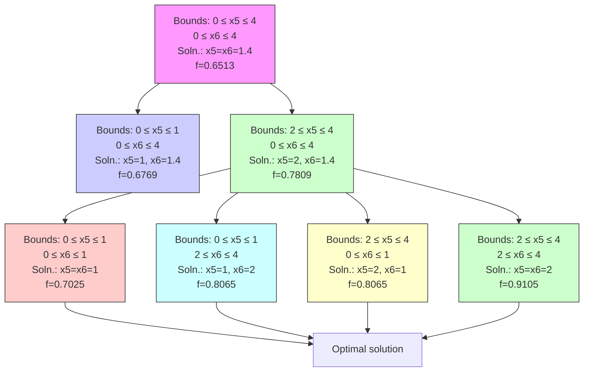
</details>

Figure 14.6: Branching history for example MINLP optimization problem.

• Surrogate-based global minimization, where a single surrogate is built (and optionally iteratively updated) over the whole design space.   
• Efficient global minimization: nongradient-based constrained and unconstrained optimization and nonlinear least squares based on Gaussian process models, guided by an expected improvement function.

# 14.6.1 Surrogate-Based Local Minimization

<!-- page:234 -->
In the surrogate-based local minimization method (keyword: surrogate based local) the minimization algorithm operates on a surrogate model instead of directly operating on the computationally expensive simulation model. The surrogate model can be based on data fits, multifidelity models, or reduced-order models, as described in Section 8.4. Since the surrogate will generally have a limited range of accuracy, the surrogate-based local algorithm periodically checks the accuracy of the surrogate model against the original simulation model and adaptively manages the extent of the approximate optimization cycles using a trust region approach.

Refer to the Dakota Theory Manual [24] for algorithmic details on iterate acceptance, merit function formulations, convergence assessment, and constraint relaxation.

# 14.6.1.1 SBO with Data Fits

When performing SBO with local, multipoint, and global data fit surrogates, it is necessary to regenerate or update the data fit for each new trust region. In the global data fit case, this can mean performing a new design of experiments on the original high-fidelity model for each trust region, which can effectively limit the approach to use on problems with, at most, tens of variables. Figure 14.7 displays this case. However, an important benefit of the global sampling is that the global data fits can tame poorly-behaved, nonsmooth, discontinuous response variations within the original model into smooth, differentiable, easily navigated surrogates. This allows SBO with global data fits to extract the relevant global design trends from noisy


<details>
<summary>contour</summary>

| Region | X Range     | Y Range     | Marker |
|--------|-------------|-------------|--------|
| Blue   | -1.5 to -0.5| -1.5 to -0.5| +      |
| Red    | -1.0 to -0.5| -0.5 to 0.0 | +      |
| Green  | -0.5 to 0.5 | 0.0 to 0.5  | +      |
| Black  | 0.5 to 1.5  | 0.5 to 1.5  | ★      |
</details>

Figure 14.7: SBO iteration progression for global data fits.

<!-- page:235 -->
simulation data.

When enforcing local consistency between a global data fit surrogate and a high-fidelity model at a point, care must be taken to balance this local consistency requirement with the global accuracy of the surrogate. In particular, performing a correction on an existing global data fit in order to enforce local consistency can skew the data fit and destroy its global accuracy. One approach for achieving this balance is to include the consistency requirement within the data fit process by constraining the global data fit calculation (e.g., using constrained linear least squares). This allows the data fit to satisfy the consistency requirement while still addressing global accuracy with its remaining degrees of freedom. Embedding the consistency within the data fit also reduces the sampling requirements. For example, a quadratic polynomial normally requires at least $( n + 1 ) ( n + 2 ) / 2$ samples for n variables to perform the fit. However, with an embedded first-order consistency constraint at a single point, the minimum number of samples is reduced by n + 1 to $( n ^ { 2 } + n ) / 2$ .

In the local and multipoint data fit cases, the iteration progression will appear as in Fig. 14.9. Both cases involve a single new evaluation of the original high-fidelity model per trust region, with the distinction that multipoint approximations reuse information from previous SBO iterates. Like model hierarchy surrogates, these techniques scale to larger numbers of design variables. Unlike model hierarchy surrogates, they generally do not require surrogate corrections, since the matching conditions are embedded in the surrogate form (as discussed for the global Taylor series approach above). The primary disadvantage to these surrogates is that the region of accuracy tends to be smaller than for global data fits and multifidelity surrogates, requiring more SBO cycles with smaller trust regions. More information on the design of experiments methods is available in Chapter 4, and the data fit surrogates are described in Section 8.4.3.

Figure 14.8 shows a Dakota input file that implements surrogate-based optimization on Rosenbrock’s function. The first method keyword block contains the SBO keyword surrogate based local, plus the commands for specifying the trust region size and scaling factors. The optimization portion of SBO, using the CONMIN Fletcher-Reeves conjugate gradient method, is specified in the following keyword blocks for method, model, variables, and responses. The model used by the optimization method specifies that a global surrogate will be used to map variables into responses (no interface specification is used by the surrogate model). The global surrogate is constructed using a DACE method which is identified with the ‘SAMPLING’ identifier. This data sampling portion of SBO is specified in the final set of keyword blocks for method, model, interface, and responses (the earlier variables specification is reused). This example problem uses the Latin hypercube sampling method in the LHS software to select 10 design points in each trust region. A single surrogate model is constructed for the objective function using a quadratic polynomial. The initial trust region is centered at the design point $( x _ { 1 } , x _ { 2 } ) = ( - 1 . 2 , 1 . 0 )$ , and extends ±0.4 (10% of the global bounds) from this point in the x1 and x2 coordinate directions.

If this input file is executed in Dakota, it will converge to the optimal design point at $( x _ { 1 } , x _ { 2 } ) = ( 1 , 1 )$ in approximately

```python
# Dakota Input File: rosen_opt_sbo.in
environment
    tabular_data
    tabular_data_file = 'rosen_opt_sbo.dat'
    top_method_pointer = 'SBLO'

method
    id_method = 'SBLO'
    surrogate_based_local
    model_pointer = 'SURROGATE'
    method_pointer = 'NLP'
    max_iterations = 500
    trust_region
    initial_size = 0.10
    minimum_size = 1.0e-6
    contract_threshold = 0.25
    expand_threshold = 0.75
    contraction_factor = 0.50
    expansion_factor = 1.50

method
    id_method = 'NLP'
    conmin_frcg
    max_iterations = 50
    convergence_tolerance = 1e-8

model
    id_model = 'SURROGATE'
    surrogate_global
    correction additive zeroth_order
    polynomial quadratic
    dace_method_pointer = 'SAMPLING'
    responses_pointer = 'SURROGATE_RESP'

variables
    continuous_design = 2
    initial_point -1.2 1.0
    lower_bounds -2.0 -2.0
    upper_bounds 2.0 2.0
    descriptors 'x1' 'x2'

responses
    id_responses = 'SURROGATE_RESP'
    objective_functions = 1
    numerical_gradients
    method_source dakota
    interval_type central
    fd_step_size = 1.e-6
    no_hessians

method
    id_method = 'SAMPLING'
    sampling
    samples = 10
    seed = 531
    sample_type lhs
    model_pointer = 'TRUTH'

model
    id_model = 'TRUTH'
    single
    interface_pointer = 'TRUE_FN'
    responses_pointer = 'TRUE_RESP'

interface
    id_interface = 'TRUE_FN'
    analysis_drivers = 'rosenbrock'
    direct
    deactivate evaluation_cache restart_file

responses
    id_responses = 'TRUE_RESP'
    objective_functions = 1
    no_gradients
    no_hessians 
```  
Figure 14.8: Dakota input file for the surrogate-based local optimization example – see dakota/share/ dakota/examples/users/rosen\_opt\_sbo.in

<!-- page:237 -->
800 function evaluations. While this solution is correct, it is obtained at a much higher cost than a traditional gradient-based optimizer (e.g., see the results obtained in Section 2.3.3). This demonstrates that the SBO method with global data fits is not really intended for use with smooth continuous optimization problems; direct gradient-based optimization can be more efficient for such applications. Rather, SBO with global data fits is best-suited for the types of problems that occur in engineering design where the response quantities may be discontinuous, nonsmooth, or may have multiple local optima [61]. In these types of engineering design problems, traditional gradient-based optimizers often are ineffective, whereas global data fits can extract the global trends of interest despite the presence of local nonsmoothness (for an example problem with multiple local optima, look in dakota/share/dakota/test for the file dakota\_sbo\_sine\_fcn.in [62]).

The surrogate-based local minimizer is only mathematically guaranteed to find a local minimum. However, in practice, SBO can often find the global minimum. Due to the random sampling method used within the SBO algorithm, the SBO method will solve a given problem a little differently each time it is run (unless the user specifies a particular random number seed in the dakota input file as is shown in Figure 14.8). Our experience on the quasi-sine function mentioned above is that if you run this problem 10 times with the same starting conditions but different seeds, then you will find the global minimum in about 70-80% of the trials. This is good performance for what is mathematically only a local optimization method.

# 14.6.1.2 SBO with Multifidelity Models

When performing SBO with model hierarchies, the low-fidelity model is normally fixed, requiring only a single high-fidelity evaluation to compute a new correction for each new trust region. Figure 14.9 displays this case. This renders the multifidelity SBO technique more scalable to larger numbers of design variables since the number of high-fidelity evaluations per iteration (assuming no finite differencing for derivatives) is independent of the scale of the design problem. However, the ability to smooth poorly-behaved response variations in the high-fidelity model is lost, and the technique becomes dependent on having a well-behaved low-fidelity model1. In addition, the parameterizations for the low and high-fidelity models may differ, requiring the use of a mapping between these parameterizations. Space mapping, corrected space mapping, POD mapping, and hybrid POD space mapping are being explored for this purpose [116, 117].

When applying corrections to the low-fidelity model, there is no concern for balancing global accuracy with the local consistency requirements. However, with only a single high-fidelity model evaluation at the center of each trust region, it is critical to use the best correction possible on the low-fidelity model in order to achieve rapid convergence rates to the optimum of the high-fidelity model [37].

A multifidelity test problem named dakota\_sbo\_hierarchical.in is available in dakota/share/dakota/test to demonstrate this SBO approach. This test problem uses the Rosenbrock function as the high fidelity model and a function named “lf rosenbrock” as the low fidelity model. Here, lf rosenbrock is a variant of the Rosenbrock function (see dakota\_source/test/lf\_rosenbrock.C for formulation) with the minimum point at $( x _ { 1 } , x _ { 2 } ) = ( 0 . 8 0 , 0 . 4 4 )$ , whereas the minimum of the original Rosenbrock function is $( x _ { 1 } , x _ { 2 } ) = ( 1 , 1 )$ . Multifidelity SBO locates the high-fidelity minimum in 11 high fidelity evaluations for additive secondorder corrections and in 208 high fidelity evaluations for additive first-order corrections, but fails for zeroth-order additive corrections by converging to the low-fidelity minimum.


<details>
<summary>scatter</summary>

| x    | y    | Color  |
| ---- | ---- | ------ |
| -1   | -1   | Blue   |
| -0.5 | 0    | Green  |
| 0    | 0    | Red    |
| 1    | 1    | Black Star |
</details>

Figure 14.9: SBO iteration progression for model hierarchies.

# 14.6.1.3 SBO with Reduced Order Models

When performing SBO with reduced-order models (ROMs), the ROM is mathematically generated from the high-fidelity model. A critical issue in this ROM generation is the ability to capture the effect of parametric changes within the ROM. Two approaches to parametric ROM are extended ROM (E-ROM) and spanning ROM (S-ROM) techniques [152]. Closely related techniques include tensor singular value decomposition (SVD) methods [95]. In the single-point and multipoint E-ROM cases, the SBO iteration can appear as in Fig. 14.9, whereas in the S-ROM, global E-ROM, and tensor SVD cases, the SBO iteration will appear as in Fig. 14.7. In addition to the high-fidelity model analysis requirements, procedures for updating the system matrices and basis vectors are also required.

<!-- page:238 -->
Relative to data fits and multifidelity models, ROMs have some attractive advantages. Compared to data fits such as regressionbased polynomial models, they are more physics-based and would be expected to be more predictive (e.g., in extrapolating away from the immediate data). Compared to multifidelity models, ROMS may be more practical in that they do not require multiple computational models or meshes which are not always available. The primary disadvantage is potential invasiveness to the simulation code for projecting the system using the reduced basis.

# 14.6.2 Surrogate-Based Global Minimization

In surrogate-based global minimization, the optimization method operates over the whole domain on a global surrogate constructed over a (static or adaptively augmented) set of truth model sample points. There are no trust regions and no convergence guarantees for the original optimization problem, though optimizers can be reasonably expected to converge as expected on the approximate (surrogate) problem.

In the first, and perhaps most common, global surrogate use case, a user wishes to use existing function evaluations or a fixed sample size (perhaps based on computational cost and allocation of resources) to build a surrogate once and optimize on it. For this single global optimization on a surrogate model, the set of surrogate build points is determined in advance. Contrast this with trust-region local methods in which the number of “true” function evaluations depends on the location and size of the trust region, the goodness of the surrogate within it, and overall problem characteristics. Any Dakota optimizer can be used with a (build-once) global surrogate by specifying the id\_model of a global surrogate model with the optimizer’s model\_ pointer keyword.

The more tailored, adaptive surrogate\_based\_global method supports the second use case: globally updating the surrogate during optimization. This method iteratively adds points to the sample set used to create the surrogate, rebuilds the surrogate, and then performs global optimization on the new surrogate. Thus, surrogate-based global optimization can be used in an iterative scheme. In one iteration, minimizers of the surrogate model are found, and a selected subset of these are passed to the next iteration. In the next iteration, these surrogate points are evaluated with the “truth” model, and then added to the set of points upon which the next surrogate is constructed. This presents a more accurate surrogate to the minimizer at each subsequent iteration, presumably driving to optimality quickly. Note that a global surrogate is constructed using the same bounds in each iteration. This approach has no guarantee of convergence.

The surrogate-based global method was originally designed for MOGA (a multi-objective genetic algorithm). Since genetic algorithms often need thousands or tens of thousands of points to produce optimal or near-optimal solutions, surrogates can help by reducing the necessary truth model evaluations. Instead of creating one set of surrogates for the individual objectives and running the optimization algorithm on the surrogate once, the idea is to select points along the (surrogate) Pareto frontier, which can be used to supplement the existing points. In this way, one does not need to use many points initially to get a very accurate surrogate. The surrogate becomes more accurate as the iterations progress.

Most single objective optimization methods will return only a single optimal point. In that case, only one point from the surrogate model will be evaluated with the “true” function and added to the pointset upon which the surrogate is based. In this case, it will take many iterations of the surrogate-based global optimization for the approach to converge, and its utility may not be as great as for the multi-objective case when multiple optimal solutions are passed from one iteration to the next to supplement the surrogate. Note that the user has the option of appending the optimal points from the surrogate model to the current set of truth points or using the optimal points from the surrogate model to replace the optimal set of points from the previous iteration. Although appending to the set is the default behavior, at this time we strongly recommend using the option replace points because it appears to be more accurate and robust.

When using the surrogate-based global method, we first recommend running one optimization on a single surrogate model. That is, set max iterations to 1. This will allow one to get a sense of where the optima are located and also what surrogate types are the most accurate to use for the problem. Note that by fixing the seed of the sample on which the surrogate is built, one can take a Dakota input file, change the surrogate type, and re-run the problem without any additional function evaluations by specifying the use of the dakota restart file which will pick up the existing function evaluations, create the new surrogate type, and run the optimization on that new surrogate. Also note that one can specify that surrogates be built for all primary functions and constraints or for only a subset of these functions and constraints. This allows one to use a ”truth” model directly for some of the response functions, perhaps due to them being much less expensive than other functions. Finally, a diagnostic threshold can be used to stop the method if the surrogate is so poor that it is unlikely to provide useful points. If the goodnessof-fit has an R-squared value less than 0.5, meaning that less than half the variance of the output can be explained or accounted for by the surrogate model, the surrogate-based global optimization stops and outputs an error message. This is an arbitrary threshold, but generally one would want to have an R-squared value as close to 1.0 as possible, and an R-squared value below 0.5 indicates a very poor fit.

<!-- page:239 -->
For the surrogate-based global method, we initially recommend a small number of maximum iterations, such as 3–5, to get a sense of how the optimization is evolving as the surrogate gets updated globally. If it appears to be changing significantly, then a larger number (used in combination with restart) may be needed.

Figure 14.10 shows a Dakota input file that implements surrogate-based global optimization on a multi-objective test function. The first method keyword block contains the keyword surrogate based global, plus the commands for specifying five as the maximum iterations and the option to replace points in the global surrogate construction. The method block identified as MOGA specifies a multi-objective genetic algorithm optimizer and its controls. The model keyword block specifies a surrogate model. In this case, a gaussian process model is used as a surrogate. The dace method pointer specifies that the surrogate will be build on 100 Latin Hypercube samples with a seed = 531. The remainder of the input specification deals with the interface to the actual analysis driver and the 2 responses being returned as objective functions from that driver.

```txt
# Dakota Input File: mogatest1_opt_sbo.in
environment
    tabular_data
    tabular_data_file = 'mogatest1_opt_sbo.dat'
    top_method_pointer = 'SBGO'

method
    id_method = 'SBGO'
    surrogate_based_global
    model_pointer = 'SURROGATE'
    method_pointer = 'MOGA'
    max_iterations = 5
    replace_points
    output verbose

method
    id_method = 'MOGA'
    moga
    seed = 10983
    population_size = 300
    max_function_evaluations = 5000
    initialization_type unique_random
    crossover_type shuffle_random
    num_offspring = 2 num_parents = 2
    crossover_rate = 0.8
    mutation_type replace_uniform
    mutation_rate = 0.1
    fitness_type domination_count
    replacement_type below_limit = 6
    shrinkage_percentage = 0.9
    niching_type distance 0.05 0.05
    postprocessor_type
    orthogonal_distance 0.05 0.05
    convergence_type metric_tracker
    percent_change = 0.05 num_generations = 10
    output silent

model
    id_model = 'SURROGATE'
    surrogate_global
    dace_method_pointer = 'SAMPLING'
    correction additive zeroth_order
    gaussian_process dakota

method
    id_method = 'SAMPLING'
    sampling
    samples = 100
    seed = 531
    sample_type lhs
    model_pointer = 'TRUTH'

model
    id_model = 'TRUTH'
    single
    interface_pointer = 'TRUE_FN'

variables
    continuous_design = 3
    initial_point 0 0 0
    upper_bounds 4 4 4
    lower_bounds -4 -4 -4
    descriptors 'x1' 'x2' 'x3'

interface
    id_interface = 'TRUE_FN'
    analysis_drivers = 'mogatest1'
    direct

responses
    objective_functions = 2
    no_gradients
    no_hessians 
```

<!-- page:241 -->
# Chapter 15

# Advanced Model Recursions

The surrogate and nested model constructs admit a wide variety of multi-iterator, multi-model solution approaches. For example, optimization within optimization (for hierarchical multidisciplinary optimization), uncertainty quantification within uncertainty quantification (for interval-valued probability, second-order probability, or Dempster-Shafer approaches to mixed aleatory-epistemic UQ), uncertainty quantification within optimization (for optimization under uncertainty), and optimization within uncertainty quantification (for uncertainty of optima) are all supported, with and without surrogate model indirection. Three important examples are highlighted: mixed aleatory-epistemic UQ, optimization under uncertainty, and surrogate-based UQ.

Starting with Dakota version 6.1, concurrency can now be exploited across sub-iteration instances. For example, multiple inner loop UQ assessments can be performed simultaneously within optimization under uncertainty or mixed aleatory-epistemic UQ studies, provided the outer loop algorithm supports concurrency in its evaluations. Both meta-iterators and nested models support iterator servers, processors per iterator, and iterator scheduling specifications which can be used to define a parallel configuration that partitions servers for supporting sub-iteration concurrency. Refer to Chapter 17 for additional information on parallel configurations, and to the Methods and Models chapters of the Reference Manual [3] for additional information on these specifications.

# 15.1 Mixed Aleatory-Epistemic UQ

Mixed UQ approaches employ nested models to embed one uncertainty quantification (UQ) within another. The outer level UQ is commonly linked to epistemic uncertainties (also known as reducible uncertainties) resulting from a lack of knowledge, and the inner UQ is commonly linked to aleatory uncertainties (also known as irreducible uncertainties) that are inherent in nature. The outer level generates sets of realizations of the epistemic parameters, and each set of these epistemic parameters in used within a separate inner loop probabilistic analysis over the aleatory random variables. In this manner, ensembles of aleatory statistics are generated, one set for each realization of the epistemic parameters.

In Dakota, we support interval-valued probability (IVP), second-order probability (SOP), and Dempster-Shafer theory of evidence (DSTE) approaches to mixed uncertainty. These three approaches differ in how they treat the epistemic variables in the outer loop: they are treated as intervals in IVP, as belief structures in DSTE, and as subjective probability distributions in SOP. This set of techniques provides a spectrum of assumed epistemic structure, from strongest assumptions in SOP to weakest in IVP.

# 15.1.1 Interval-valued probability (IVP)

<!-- page:242 -->
In IVP (also known as probability bounds analysis [47, 87, 8]), we employ an outer loop of interval estimation in combination with an aleatory inner loop. In interval analysis, it is assumed that nothing is known about the uncertain input variables except that they lie within certain intervals. The problem of uncertainty propagation then becomes an interval analysis problem: given inputs that are defined within intervals, what are the corresponding intervals on the outputs?

Starting from a specification of intervals and probability distributions on the inputs, the intervals may augment the probability distributions, insert into the probability distributions, or some combination (refer to Section 8.5 and to the Models chapter of the Reference Manual [3]). We generate an ensemble of cumulative distribution functions (CDF) or Complementary Cumulative Distribution Functions (CCDF), one CDF/CCDF result for each aleatory analysis. Plotting an entire ensemble of CDFs or CCDFs in a “horsetail” plot allows one to visualize the upper and lower bounds on the family of distributions (see Figure 15.1). Given that the ensemble stems from multiple realizations of the epistemic uncertainties, the interpretation is


<details>
<summary>line</summary>

| RESPONSE | Cumulative Distribution Function |
| -------- | --------------------------------- |
| 1000     | 0.0                               |
| 1500     | 0.1                               |
| 2000     | 0.9                               |
| 2500     | 0.95                              |
| 3000     | 0.98                              |
| 3500     | 1.0                               |
</details>

Figure 15.1: Example CDF ensemble. Commonly referred to as a “horsetail” plot.

that each CDF/CCDF instance has no relative probability of occurrence, only that each instance is possible. For prescribed response levels on the CDF/CCDF, an interval on the probability is computed based on the bounds of the ensemble at that level, and vice versa for prescribed probability levels. This interval on a statistic is interpreted simply as a possible range, where the statistic could take any of the possible values in the range.

A sample input file is shown in Figure 15.2, in which the outer epistemic level variables are defined as intervals. Samples will be generated from these intervals to select means for X and Y that are employed in an inner level reliability analysis of the cantilever problem (see Section 20.7). Figure 15.3 shows excerpts from the resulting output. In this particular example, the outer loop generates 50 possible realizations of epistemic variables, which are then sent to the inner loop to calculate statistics such as the mean weight, and cumulative distribution function for the stress and displacement reliability indices. Thus, the outer loop has 50 possible values for the mean weight, but since there is no distribution structure on these observations, only the minimum and maximum value are reported. Similarly, the minimum and maximum values of the CCDF for the stress and displacement reliability indices are reported.

When performing a mixed aleatory-epistemic analysis, response levels and probability levels should only be defined in the (inner) aleatory loop. For example, if one wants to generate an interval around possible CDFs or CCDFS, we suggest defining a number of probability levels in the inner loop (0.1, 0.2, 0.3, etc). For each epistemic instance, these will be calculated during the inner loop and reported back to the outer loop. In this way, there will be an ensemble of CDF percentiles (for example) and one will have interval bounds for each of these percentile levels defined. Finally, although the epistemic variables are often values defining distribution parameters for the inner loop, they are not required to be: they can just be separate uncertain

<!-- page:243 -->
variables in the problem.

As compared to aleatory quantities of interest (e.g., mean, variance, probability) that must be integrated over a full probability domain, we observe that the desired minima and maxima of the output ranges are local point solutions in the epistemic parameter space, such that we may employ directed optimization techniques to compute these extrema and potentially avoid the cost of sampling the full epistemic space.

In dakota/share/dakota/test, test input files such as dakota\_uq\_cantilever\_ivp\_exp.in and dakota\_ uq\_short\_column\_ivp\_exp.in replace the outer loop sampling with the local and global interval optimization methods described in Section 5.7.1. In these cases, we no longer generate horse tails and infer intervals, but rather compute the desired intervals directly.

# 15.1.2 Second-order probability (SOP)

SOP is similar to IVP in its segregation of aleatory and epistemic uncertainties and its use of nested iteration. However, rather than modeling epistemic uncertainty with a single interval per variable and computing interval-valued statistics, we instead employ subjective probability distributions and compute epistemic statistics on the aleatory statistics (for example, probabilities on probabilities – the source of the “second-order” terminology [67]). Now the different hairs of the horsetail shown in Figure 15.1 have a relative probability of occurrence and stronger inferences may be drawn. In particular, mean, 5th percentile, and 95th percentile probability values are a common example. Second-order probability is sometimes referred to as probability of frequency (PoF) analysis, referring to a probabilistic interpretation of the epistemic variables and a frequency interpretation of the aleatory variables. The PoF terminology is used in a recent National Academy of Sciences report on the Quantification of Margins and Uncertainties (QMU) [108].

Rather than employing interval estimation techniques at the outer loop in SOP, we instead apply probabilistic methods, potentially the same ones as used for the aleatory propagation on the inner loop. The previous example in Figure 15.2 can be modified to define the epistemic outer loop using uniform variables instead of interval variables (annotated test #1 in dakota/share/dakota/test/dakota\_uq\_cantilever\_sop\_rel.in). The process of generating the epistemic values is essentially the same in both cases; however, the interpretation of results is quite different. In IVP, each “hair” or individual CDF in the horsetail plot in Figure 15.1 would be interpreted as a possible realization of aleatory uncertainty conditional on a particular epistemic sample realization. The ensemble then indicates the influence of the epistemic variables (e.g. by how widespread the ensemble is). However, if the outer loop variables are defined to be uniformly distributed in SOP, then the outer loop results will be reported as statistics (such as mean and standard deviation) and not merely intervals. It is important to emphasize that these outer level output statistics are only meaningful to the extent that the outer level input probability specifications are meaningful (i.e., to the extent that uniform distributions are believed to be representative of the epistemic variables).

In dakota/share/dakota/test, additional test input files such as dakota\_uq\_cantilever\_sop\_exp.in and dakota\_uq\_short\_column\_sop\_exp.in explore other outer/inner loop probabilistic analysis combinations, particulary using stochastic expansion methods.

# 15.1.3 Dempster-Shafer Theory of Evidence

In IVP, we estimate a single epistemic output interval for each aleatory statistic. This same nested analysis procedure may be employed within the cell computations of a DSTE approach. Instead of a single interval, we now compute multiple output intervals, one for each combination of the input basic probability assignments, in order to define epistemic belief and plausibility functions on the aleatory statistics computed in the inner loop. While this can significantly increase the computational requirements, belief and plausibility functions provide a more finely resolved epistemic characterization than a basic output interval.

The single-level DSTE approach for propagating epistemic uncertainties is described in Section 5.7.2 and in the Dakota Theory Manual [24]. An example of nested DSTE for propagating mixed uncertainties can be seen in dakota/share/dakota/ test in the input file dakota\_uq\_ishigami\_dste\_exp.in.

```ini
# Dakota Input File: cantilever_uq_sop_rel.in
environment
top_method_pointer = 'EPISTEMIC'

method
id_method = 'EPISTEMIC'
sampling
samples = 50 seed = 12347
model_pointer = 'EPIST_M'

model
id_model = 'EPIST_M'
nested
sub_method_pointer = 'ALEATORY'
primary_variable_mapping = 'X' 'Y'
secondary_variable_mapping = 'mean' 'mean'
primary_response_mapping = 1.0.0.0.0.0.0.0.
0.0.0.0.0.1.0.0.0.
0.0.0.0.0.0.0.0.1.

variables_pointer = 'EPIST_V'
responses_pointer = 'EPIST_R'

variables
id_variables = 'EPIST_V'
continuous_interval_uncertain = 2
num_intervals = 1.1
interval_probabilities = 1.0 1.0
lower_bounds = 400.0 800.0
upper_bounds = 600.0 1200.0
descriptors 'X_mean' 'Y_mean'

responses
id_responses = 'EPIST_R'
response_functions = 3
descriptors = 'mean_wt' 'ccdf_beta_s' 'ccdf_beta_d'
no_gradients
no_hessians

method
id_method = 'ALEATORY'
local_reliability
mpp_search no_approx
response_levels = 0.0 0.0
num_response_levels = 0 1 1
compute reliabilities
distribution complementary
model_pointer = 'ALEAT_M'

model
id_model = 'ALEAT_M'
single
interface_pointer = 'ALEAT_I'
variables_pointer = 'ALEAT_V'
responses_pointer = 'ALEAT_R'

variables
id_variables = 'ALEAT_V'
continuous_design = 2
initial_point 2.4522 3.8826
descriptors 'w' 't'
normal_uncertain = 4
means    = 40000.29.E+6 500.1000.
std_deviations    = 2000.1.45E+6 100.100.
descriptors    = 'R' 'E' 'X' 'Y'

interface
id_interface = 'ALEAT_I'
analysis_drivers = 'cantilever'
direct
deactivate evaluation_cache restart_file

responses
id_responses = 'ALEAT_R'
response_functions = 3
descriptors = 'weight' 'stress' 'displ'
analytic_gradients
no_hessians 
```  
Figure 15.2: Dakota input file for the interval-valued probability example – see dakota/share/dakota/ examples/users/cantilever\_uq\_sop\_rel.in

```python
Statistics based on 50 samples:
Min and Max values for each response function:
mean_wt: Min = 9.5209117200e+00 Max = 9.5209117200e+00
ccdf_beta_s: Min = 1.7627715524e+00 Max = 4.2949468386e+00
ccdf_beta_d: Min = 2.0125192955e+00 Max = 3.9385559339e+00 
```  
Figure 15.3: Interval-valued statistics for cantilever beam reliability indices.

# 15.2 Optimization Under Uncertainty (OUU)

<!-- page:245 -->
Optimization under uncertainty (OUU) approaches incorporate an uncertainty quantification method within the optimization process. This is often needed in engineering design problems when one must include the effect of input parameter uncertainties on the response functions of interest. A typical engineering example of OUU would minimize the probability of failure of a structure for a set of applied loads, where there is uncertainty in the loads and/or material properties of the structural components.

In OUU, a nondeterministic method is used to evaluate the effect of uncertain variable distributions on response functions of interest (refer to Chapter 5 for additional information on nondeterministic analysis). Statistics on these response functions are then included in the objective and constraint functions of an optimization process. Different UQ methods can have very different features from an optimization perspective, leading to the tailoring of optimization under uncertainty approaches to particular underlying UQ methodologies.

If the UQ method is sampling based, then three approaches are currently supported: nested OUU, surrogate-based OUU, and trust-region surrogate-based OUU. Additional details and computational results are provided in [38].

Another class of OUU algorithms is called reliability-based design optimization (RBDO). RBDO methods are used to perform design optimization accounting for reliability metrics. The reliability analysis capabilities described in Section 5.3 provide a rich foundation for exploring a variety of RBDO formulations. [35] investigated bi-level, fully-analytic bi-level, and first-order sequential RBDO approaches employing underlying first-order reliability assessments. [36] investigated fully-analytic bi-level and second-order sequential RBDO approaches employing underlying second-order reliability assessments.

When using stochastic expansions for UQ, analytic moments and analytic design sensitivities can be exploited as described in [45]. Several approaches for obtaining design sensitivities of statistical metrics are discussed in Section 15.2.5.

Finally, when employing epistemic methods for UQ, the set of statistics available for use within optimization are intervalbased. Robustness metrics typically involve the width of the intervals, and reliability metrics typically involve the worst case upper or lower bound of the interval.

Each of these OUU methods is overviewed in the following sections.

# 15.2.1 Nested OUU

In the case of a nested approach, the optimization loop is the outer loop which seeks to optimize a nondeterministic quantity (e.g., minimize probability of failure). The uncertainty quantification (UQ) inner loop evaluates this nondeterministic quantity (e.g., computes the probability of failure) for each optimization function evaluation. Figure 15.4 depicts the nested OUU iteration where d are the design variables, u are the uncertain variables characterized by probability distributions, ru(d, u) are the response functions from the simulation, and $\mathbf { s _ { u } } ( \mathbf { d } )$ are the statistics generated from the uncertainty quantification on these response functions.

Figure 15.5 shows a Dakota input file for a nested OUU example problem that is based on the textbook test problem. In this example, the objective function contains two probability of failure estimates, and an inequality constraint contains another probability of failure estimate. For this example, failure is defined to occur when one of the textbook response functions exceeds its threshold value. The environment keyword block at the top of the input file identifies this as an OUU problem. The environment keyword block is followed by the optimization specification, consisting of the optimization method, the continuous design variables, and the response quantities that will be used by the optimizer. The mapping matrices used for incorporating UQ statistics into the optimization response data are described in the Dakota Reference Manual [3]. The uncertainty quantification specification includes the UQ method, the uncertain variable probability distributions, the interface to the simulation code, and the UQ response attributes. As with other complex Dakota input files, the identification tags given in each keyword block can be used to follow the relationships among the different keyword blocks.


<details>
<summary>flowchart</summary>

```mermaid
graph TD
    d --> u
    d --> d_bar
    d_bar --> Opt
    d --> u
    d_bar --> u_bar
    d_bar --> u_bar
    d_bar --> u
    d_bar --> u_bar
    d_bar --> u_bar
    d_bar --> u
    d_bar --> u_bar
    d_bar --> u_bar
    d_bar --> u
    d_bar --> u_bar
    d_bar --> u_bar
    d_bar --> u
    d_bar --> u_bar
    d_bar --> u
    d_bar --> u_bar
    d_bar --> u
    d_bar --> u_bar
    d_bar --> u
    d_bar --> u_bar
    d_bar --> u
    d_bar --> u
    d_bar --> u
    d_bar --> u
    d_bar --> u
    d_bar --> u
    d_bar --> u
    d_bar --> u
    d_bar --> u
    d_bar --> u
    d_bar --> u
    d_bar --> u
    d_bar --> u
    d_bar --> u
    d_bar --> u
    d_bar --> u
    d_bar --> u
    d bar --> s_u
```
</details>

Figure 15.4: Formulation 1: Nested OUU.

<!-- page:246 -->
Latin hypercube sampling is used as the UQ method in this example problem. Thus, each evaluation of the response functions by the optimizer entails 50 Latin hypercube samples. In general, nested OUU studies can easily generate several thousand function evaluations and gradient-based optimizers may not perform well due to noisy or insensitive statistics resulting from under-resolved sampling. These observations motivate the use of surrogate-based approaches to OUU.

Other nested OUU examples in the dakota/share/dakota/test directory include dakota\_ouu1\_tbch.in, which adds an additional interface for including deterministic data in the textbook OUU problem, and dakota\_ouu1\_cantilever. in, which solves the cantilever OUU problem (see Section 20.7) with a nested approach. For each of these files, the “1” identifies formulation 1, which is short-hand for the nested approach.

# 15.2.2 Surrogate-Based OUU (SBOUU)

Surrogate-based optimization under uncertainty strategies can be effective in reducing the expense of OUU studies. Possible formulations include use of a surrogate model at the optimization level, at the uncertainty quantification level, or at both levels. These surrogate models encompass both data fit surrogates (at the optimization or UQ level) and model hierarchy surrogates (at the UQ level only). Figure 15.6 depicts the different surrogate-based formulations where ˆru and ˆsu are approximate response functions and approximate response statistics, respectively, generated from the surrogate models.

SBOUU examples in the dakota/share/dakota/test directory include dakota\_sbouu2\_tbch.in, dakota\_ sbouu3\_tbch.in, and dakota\_sbouu4\_tbch.in, which solve the textbook OUU problem, and dakota\_sbouu2\_ cantilever.in, dakota\_sbouu3\_cantilever.in, and dakota\_sbouu4\_cantilever.in, which solve the cantilever OUU problem (see Section 20.7). For each of these files, the “2,” “3,” and “4” identify formulations 2, 3, and 4, which are short-hand for the “layered containing nested,” “nested containing layered,” and “layered containing nested containing layered” surrogate-based formulations, respectively. In general, the use of surrogates greatly reduces the computational expense of these OUU study. However, without restricting and verifying the steps in the approximate optimization cycles, weaknesses in the data fits can be exploited and poor solutions may be obtained. The need to maintain accuracy of results leads to the use of trust-region surrogate-based approaches.

# 15.2.3 Trust-Region Surrogate-Based OUU (TR-SBOUU)

The TR-SBOUU approach applies the trust region logic of deterministic SBO (see Section 14.6.1) to SBOUU. Trust-region verifications are applicable when surrogates are used at the optimization level, i.e., formulations 2 and 4. As a result of periodic

```ini
# Dakota Input File: textbook_opt_ouul.in
environment
top_method_pointer = 'OPTIM'

method
id_method = 'OPTIM'
## (NPSOL requires a software license; if not available, try
## conmin_mfd or optpp_q_newton instead)
npsol_sqp
convergence_tolerance = 1.e-10
model_pointer = 'OPTIM_M'

model
id_model = 'OPTIM_M'
nested
sub_method_pointer = 'UQ'
primary_response_mapping = 0.0.1.0.0.1.0.0.0.
secondary_response_mapping = 0.0.0.0.0.0.0.0.1.
variables_pointer = 'OPTIM_V'
responses_pointer = 'OPTIM_R'

variables
id_variables = 'OPTIM_V'
continuous_design = 2
initial_point 1.8 1.0
upper_bounds 2.164 4.0
lower_bounds 1.5 0.0
descriptors 'd1' 'd2'

responses
id_responses = 'OPTIM_R'
objective_functions = 1
nonlinear_inequality_constraints = 1
upper_bounds = .1
numerical_gradients
method_source dakota
interval_type central
fd_step_size = 1.e-1
no_hessians

method
id_method = 'UQ'
sampling
model_pointer = 'UQ_M'
samples = 50 sample_type lhs
seed = 1
response_levels = 3.6e+11 1.2e+05 3.5e+05
distribution complementary

model
id_model = 'UQ_M'
single
interface_pointer = 'UQ_I'
variables_pointer = 'UQ_V'
responses_pointer = 'UQ_R'

variables
id_variables = 'UQ_V'
continuous_design = 2
normal_uncertain = 2
means = 248.89 593.33
std_deviations = 12.4 29.7
descriptors = 'nuv1' 'nuv2'
uniform_uncertain = 2
lower_bounds = 199.3 474.63
upper_bounds = 298.5 712.
descriptors = 'uuv1' 'uuv2'
weibull_uncertain = 2
alphas = 12.30.
betas = 250.590.
descriptors = 'wuv1' 'wuv2'

interface
id_interface = 'UQ_I'
analysis_drivers = 'text_book_ouu'
direct

# fork asynch evaluation_concurrency = 5

responses
id_responses = 'UQ_R'
response_functions = 3
no_gradients
no_hessians 
```  
Figure 15.5: Dakota input file for the nested OUU example – see dakota/share/dakota/examples/ users/textbook\_opt\_ouu1.in


<details>
<summary>flowchart</summary>

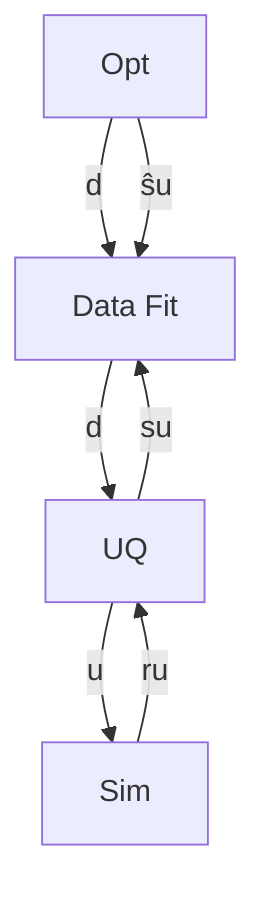
</details>

Formulation 2: layered containing nested


<details>
<summary>flowchart</summary>

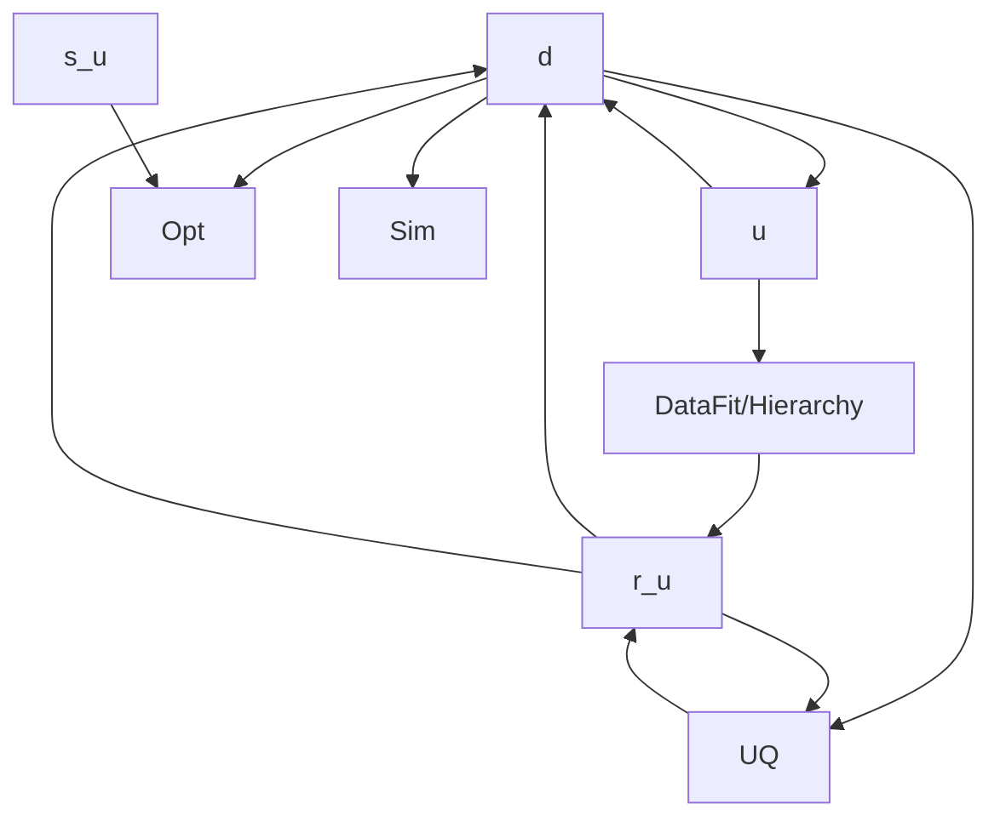
</details>

Formulation 3: nested containing layered


<details>
<summary>flowchart</summary>

```mermaid
graph TD
    A["Opt"] -->|d| B["Data Fit"]
    B -->|d| C["UQ"]
    C -->|u| D["DataFit/Hierarchy"]
    D -->|d,u| E["Sim"]
    E -->|r_u| D
    D -->|r̂_u| C
    C -->|\hat{s}_u| F["\hat{s}_u"]
    F --> A
```
</details>

Formulation 4: layered containing nested containing layered   
Figure 15.6: Formulations 2, 3, and 4 for Surrogate-based OUU.

<!-- page:248 -->
verifications and surrogate rebuilds, these techniques are more expensive than SBOUU; however they are more reliable in that they maintain the accuracy of results. Relative to nested OUU (formulation 1), TR-SBOUU tends to be less expensive and less sensitive to initial seed and starting point.

TR-SBOUU examples in the dakota/share/dakota/test directory include dakota\_trsbouu2\_tbch.in and dakota\_trsbouu4\_tbch.in, which solve the textbook OUU problem, and dakota\_trsbouu2\_cantilever.in and dakota\_trsbouu4\_cantilever.in, which solve the cantilever OUU problem (see Section 20.7).

Computational results for several example problems are available in [38].

# 15.2.4 RBDO

Bi-level and sequential approaches to reliability-based design optimization (RBDO) and their associated sensitivity analysis requirements are described in the Optimization Under Uncertainty chapter of the Dakota Theory Manual [24].

A number of bi-level RBDO examples are provided in dakota/share/dakota/test. The dakota\_rbdo\_cantilever. in, dakota\_rbdo\_short\_column.in, and dakota\_rbdo\_steel\_column.in input files solve the cantilever (see Section 20.7), short column (see Section 20.10.4), and steel column (see Section 20.10.5) OUU problems using a bi-level RBDO approach employing numerical design gradients. The dakota\_rbdo\_cantilever\_analytic.in and dakota\_ rbdo\_short\_column\_analytic.in input files solve the cantilever and short column OUU problems using a bi-level RBDO approach with analytic design gradients and first-order limit state approximations. The dakota\_rbdo\_cantilever\_ analytic2.in, dakota\_rbdo\_short\_column\_analytic2.in, and dakota\_rbdo\_steel\_column\_analytic2. in input files also employ analytic design gradients, but are extended to employ second-order limit state approximations and integrations.

Sequential RBDO examples are also provided in dakota/share/dakota/test. The dakota\_rbdo\_cantilever\_ trsb.in and dakota\_rbdo\_short\_column\_trsb.in input files solve the cantilever and short column OUU problems using a first-order sequential RBDO approach with analytic design gradients and first-order limit state approximations. The dakota\_rbdo\_cantilever\_trsb2.in, dakota\_rbdo\_short\_column\_trsb2.in, and dakota\_rbdo\_ steel\_column\_trsb2.in input files utilize second-order sequential RBDO approaches that employ second-order limit state approximations and integrations (from analytic limit state Hessians with respect to the uncertain variables) and quasi-Newton approximations to the reliability metric Hessians with respect to design variables.

# 15.2.5 Stochastic Expansion-Based Design Optimization

<!-- page:249 -->
For stochastic expansion-based approaches to optimization under uncertainty, bi-level, sequential, and multifidelity approaches and their associated sensitivity analysis requirements are described in the Optimization Under Uncertainty chapter of the Dakota Theory Manual [24].

In dakota/share/dakota/test, the dakota\_pcbdo\_cantilever.in, dakota\_pcbdo\_rosenbrock.in, dakota\_pcbdo\_short\_column.in, and dakota\_pcbdo\_steel\_column.in input files solve cantilever (see Section 20.7), Rosenbrock, short column (see Section 20.10.4), and steel column (see Section 20.10.5) OUU problems using a bi-level polynomial chaos-based approach, where the statistical design metrics are reliability indices based on moment projection (see Mean Value section in Reliability Methods Chapter of Dakota Theory Manual [24]). The test matrix in the former three input files evaluate design gradients of these reliability indices using several different approaches: analytic design gradients based on a PCE formed over only over the random variables, analytic design gradients based on a PCE formed over all variables, numerical design gradients based on a PCE formed only over the random variables, and numerical design gradients based on a PCE formed over all variables. In the cases where the expansion is formed over all variables, only a single PCE construction is required for the complete PCBDO process, whereas the expansions only over the random variables must be recomputed for each change in design variables. Sensitivities for “augmented” design variables (which are separate from and augment the random variables) may be handled using either analytic approach; however, sensitivities for “inserted” design variables (which define distribution parameters for the random variables) must be computed using dRdx dxds (refer to Stochastic Sensitivity Analysis section in Optimization Under Uncertainty chapter of Dakota Theory Manual [24]). Additional test input files include:

• dakota\_scbdo\_cantilever.in, dakota\_scbdo\_rosenbrock.in, dakota\_scbdo\_short\_column. in, and dakota\_scbdo\_steel\_column.in input files solve cantilever, Rosenbrock, short column, and steel column OUU problems using a bi-level stochastic collocation-based approach.   
• dakota\_pcbdo\_cantilever\_trsb.in, dakota\_pcbdo\_rosenbrock\_trsb.in, dakota\_pcbdo\_short\_ column\_trsb.in, dakota\_pcbdo\_steel\_column\_trsb.in, dakota\_scbdo\_cantilever\_trsb.in, dakota\_scbdo\_rosenbrock\_trsb.in, dakota\_scbdo\_short\_column\_trsb.in, and dakota\_scbdo\_ steel\_column\_trsb.in input files solve cantilever, Rosenbrock, short column, and steel column OUU problems using sequential polynomial chaos-based and stochastic collocation-based approaches.   
• dakota\_pcbdo\_cantilever\_mf.in, dakota\_pcbdo\_rosenbrock\_mf.in, dakota\_pcbdo\_short column\_mf.in, dakota\_scbdo\_cantilever\_mf.in, dakota\_scbdo\_rosenbrock\_mf.in, and dakota\_ scbdo\_short\_column\_mf.in input files solve cantilever, Rosenbrock, and short column OUU problems using multifidelity polynomial chaos-based and stochastic collocation-based approaches.

# 15.2.6 Epistemic OUU

An emerging capability is optimization under epistemic uncertainty. As described in the Nested Model section of the Reference Manual [3], epistemic and mixed aleatory/epistemic uncertainty quantification methods generate lower and upper interval bounds for all requested response, probability, reliability, and generalized reliability level mappings. Design for robustness in the presence of epistemic uncertainty could simply involve minimizing the range of these intervals (subtracting lower from upper using the nested model response mappings), and design for reliability in the presence of epistemic uncertainty could involve controlling the worst case upper or lower bound of the interval.

We now have the capability to perform epistemic analysis by using interval optimization on the “outer loop” to calculate bounding statistics of the aleatory uncertainty on the “inner loop.” Preliminary studies [44] have shown this approach is more efficient and accurate than nested sampling (which was described in Section 15.1.2). This approach uses an efficient global optimization method for the outer loop and stochastic expansion methods (e.g. polynomial chaos or stochastic collocation on the inner loop). The interval optimization is described in Section 5.7.1. Example input files demonstrating the use of interval estimation for epistemic analysis, specifically in epistemic-aleatory nesting, are: dakota\_uq\_cantilever\_sop\_exp. in, and dakota\_short\_column\_sop\_exp.in. Both files are in dakota/share/dakota/test.

# 15.3 Surrogate-Based Uncertainty Quantification

<!-- page:250 -->
Many uncertainty quantification (UQ) methods are computationally costly. For example, sampling often requires many function evaluations to obtain accurate estimates of moments or percentile values of an output distribution. One approach to overcome the computational cost of sampling is to evaluate the true function (e.g. run the analysis driver) on a fixed, small set of samples, use these sample evaluations to create a response surface approximation (e.g. a surrogate model or meta-model) of the underlying “true” function, then perform random sampling (using thousands or millions of samples) on the approximation to obtain estimates of the mean, variance, and percentiles of the response.

This approach, called “surrogate-based uncertainty quantification” is easy to do in Dakota, and one can set up input files to compare the results using no approximation (e.g. determine the mean, variance, and percentiles of the output directly based on the initial sample values) with the results obtained by sampling a variety of surrogate approximations. Example input files of a standard UQ analysis based on sampling alone vs. sampling a surrogate are shown in the textbook\_uq\_sampling.in and textbook\_uq\_surrogate.in in the dakota/share/dakota/examples/users directory.

Note that one must exercise some caution when using surrogate-based methods for uncertainty quantification. In general, there is not a single, straightforward approach to incorporate the error of the surrogate fit into the uncertainty estimates of the output produced by sampling the surrogate. Two references which discuss some of the related issues are [63] and [134]. The first reference shows that statistics of a response based on a surrogate model were less accurate, and sometimes biased, for surrogates constructed on very small sample sizes. In many cases, however, [63] shows that surrogate-based UQ performs well and sometimes generates more accurate estimates of statistical quantities on the output. The second reference goes into more detail about the interaction between sample type and response surface type (e.g., are some response surfaces more accurate when constructed on a particular sample type such as LHS vs. an orthogonal array?) In general, there is not a strong dependence of the surrogate performance with respect to sample type, but some sample types perform better with respect to some metrics and not others (for example, a Hammersley sample may do well at lowering root mean square error of the surrogate fit but perform poorly at lowering the maximum absolute deviation of the error). Much of this work is empirical and application dependent. If you choose to use surrogates in uncertainty quantification, we strongly recommend trying a variety of surrogates and examining diagnostic goodness-of-fit metrics.

Known Issue: When using discrete variables, there have been sometimes significant differences in data fit surrogate behavior observed across computing platforms in some cases. The cause has not yet been fully diagnosed and is currently under investigation. In addition, guidance on appropriate construction and use of surrogates with discrete variables is under development. In the meantime, users should therefore be aware that there is a risk of inaccurate results when using surrogates with discrete variables.

<!-- page:251 -->
# Chapter 16

# Advanced Simulation Code Interfaces

This chapter extends the interface discussion in Chapter 10 and its discussion of generic black-box interfaces to simulations (Section 10.3). It describes specialized, tightly integrated, and advanced interfaces through which Dakota can perform function evaluation mappings. It describes AMPL-based algebraic mappings (Section 16.1), tight integration of a simulation code into Dakota (Section 16.2), and specialized interfaces to Matlab, Python, and Scilab (Sections 16.3 and 16.4).

# 16.1 Algebraic Mappings

If desired, one can define algebraic input-output mappings using the AMPL code [50] and save these mappings in 3 files: stub.nl, stub.col, and stub.row, where stub is a particular root name describing a particular problem. These files names can be communicated to Dakota using the algebraic mappings input.

Dakota will use stub.col and stub.row to obtain input and output identifier strings, respectively, and will use the AMPL solver library [53] to evaluate expressions conveyed in stub.nl, and, if needed, their first and second derivatives.

As a simple example (from dakota/share/dakota/test/dakota\_ampl\*), consider algebraic mappings based on Newton’s law F = ma. The following is an AMPL input file of variable and expression declarations and output commands:

```txt
var mass;
var a;
var v;
minimize force: mass*a;
minimize energy: 0.5 * mass * v^2;
option auxfiles rc; # request stub.row and stub.col
write gfma; # write stub.nl, stub.row, stub.col 
```

When processed by an AMPL processor, three files are created (as requested by the “option auxfiles” command). The first is the dakota\_ampl\_fma.nl file containing problem statistics, expression graphs, bounds, etc.:

```csv
g3 0 1 0 # problem fma
3 0 2 0 0 # vars, constraints, objectives, ranges, eqns
0 2 # nonlinear constraints, objectives
0 0 # network constraints: nonlinear, linear
0 3 0 # nonlinear vars in constraints, objectives, both
0 0 0 1 # linear network variables; functions; arith, flags
0 0 0 0 0 # discrete variables: binary, integer, nonlinear (b,c,o)
0 4 # nonzeros in Jacobian, gradients
6 4 # max name lengths: constraints, variables
0 0 0 0 0 # common exprs: b,c,o,c1,o1
O0 0
o2
v0
v1
O1 0
o2
o2
n0.5
v0
o5
v2
n2
b
3
3
3
k2
0
0
G0 2
0 0
1 0
G1 2
0 0
2 0 
```

<!-- page:252 -->
Next, the dakota\_ampl\_fma.col file contains the set of variable descriptor strings:

```txt
mass
a
v 
```

and the dakota\_ampl\_fma.row file contains the set of response descriptor strings:

```txt
force energy 
```

The variable and objective function names declared within AMPL should be a subset of the variable descriptors and response descriptors used by Dakota (see the Dakota Reference Manual [3] for information on Dakota variable and response descriptors). Ordering of the inputs and outputs within the AMPL declaration is not important, as Dakota will reorder data as needed.

<!-- page:253 -->
The following listing shows an excerpt from dakota/share/dakota/test/dakota\_ampl\_fma.in, which demonstrates a combined algebraic/simulation-based mapping in which algebraic mappings from the fma definition are overlaid with simulation-based mappings from text book:

```python
variables,
    continuous_design = 5
    descriptor 'x1' 'mass' 'a' 'x4' 'v'
    initial_point 0.0 2.0 1.0 0.0 3.0
    lower_bounds -3.0 0.0 -5.0 -3.0 -5.0
    upper_bounds 3.0 10.0 5.0 3.0 5.0

interface,
    algebraic_mappings = 'dakota_ampl_fma.nl'
    system
    analysis_driver = 'text_book'
    parameters_file = 'tb.in'
    results_file = 'tb.out'
    file_tag

responses,
    response_descriptors = 'force' 'ineq1' 'energy'
    num_objective_functions = 1
    num_nonlinear_inequality_constraints = 1
    num_nonlinear_equality_constraints = 1
    nonlinear_equality_targets = 20.0
    analytic_gradients
    no_hessians 
```

Note that the algebraic inputs and outputs are a subset of the total inputs and outputs and that Dakota will track the algebraic contributions to the total response set using the order of the descriptor strings. In the case where both the algebraic and simulation-based components contribute to the same function, they are added together.

To solve text book algebraically (refer to Section 20.1 for definition), the following AMPL model file could be used

```txt
# Problem : Textbook problem used in DAKOTA testing
# Constrained quartic, 2 continuous variables
# Solution: x=(0.5, 0.5), obj = .125, c1 = 0, c2 = 0
#
# continuous variables
var x1 >= 0.5 <= 5.8 := 0.9;
var x2 >= -2.9 <= 2.9 := 1.1;

# objective function
minimize obj: (x1 - 1)^4 + (x2 - 1)^4;

# constraints (current required syntax for DAKOTA/AMPL interface)
minimize c1: x1^2 - 0.5*x2;
minimize c2: x2^2 - 0.5*x1;

# required for output of *.row and *.col files
option auxfiles rc; 
```

<!-- page:254 -->
Note that the nonlinear constraints should not currently be declared as constraints within AMPL. Since the Dakota variable bounds and constraint bounds/targets currently take precedence over any AMPL specification, the current approach is to declare all AMPL outputs as objective functions and then map them into the appropriate response function type (objectives, least squares terms, nonlinear inequality/equality constraints, or generic response functions) within the Dakota input specification.

# 16.2 Developing a Direct Simulation Interface

If a more efficient interface to a simulation is desired (e.g., to eliminate process creation and file I/O overhead) or if a targeted computer architecture cannot accommodate separate optimization and simulation processes (e.g., due to lightweight operating systems on compute nodes of large parallel computers), then linking a simulation code directly with Dakota may be desirable. This is an advanced capability of Dakota, and it requires a user to have access to (and knowledge of) the Dakota source code, as well as the source code of the simulation code.

Three approaches are outlined below for developing direct linking between Dakota and a simulation: extension, derivation, and sandwich. For additional information, refer to “Interfacing with Dakota as a Library” in the Dakota Developers Manual [2].

Once performed, Dakota can bind with the new direct simulation interface using the direct interface specification in combination with an analysis driver, input filter or output filter specification that corresponds to the name of the new subroutine.

# 16.2.1 Extension

The first approach to using the direct function capability with a new simulation (or new internal test function) involves extension of the existing DirectFnApplicInterface class to include new simulation member functions. In this case, the following steps are performed:

1. The functions to be invoked (analysis programs, input and output filters, internal testers) must have their main programs changed into callable functions/subroutines.   
2. The resulting callable function can then be added directly to the private member functions in DirectFnApplicInterface if this function will directly access the Dakota data structures (variables, active set, and response attributes of the class). It is more common to add a wrapper function to DirectFnApplicInterface which manages the Dakota data structures, but allows the simulator subroutine to retain a level of independence from Dakota (see Salinas, ModelCenter, and Matlab wrappers as examples).   
3. The if-else blocks in the derived map if(), derived map ac(), and derived map of() member functions of the DirectFnApplicInterface class must be extended to include the new function names as options. If the new functions are class member functions, then Dakota data access may be performed through the existing class member attributes and data objects do not need to be passed through the function parameter list. In this case, the following function prototype is appropriate:

int function\_name();

If, however, the new function names are not members of the DirectFnApplicInterface class, then an extern declaration may additionally be needed and the function prototype should include passing of the Variables, ActiveSet, and Response data members:

int function\_name(const Dakota::Variables& vars, const Dakota::ActiveSet& set, Dakota::Response& response);

4. The Dakota system must be recompiled and linked with the new function object files or libraries.

Various header files may have to be included, particularly within the DirectFnApplicInterface class, in order to recognize new external functions and compile successfully. Refer to the Dakota Developers Manual [2] for additional information on the DirectFnApplicInterface class and the Dakota data types.

<!-- page:255 -->
# 16.2.2 Derivation

As described in “Interfacing with Dakota as a Library” in the Dakota Developers Manual [2], a derivation approach can be employed to further increase the level of independence between Dakota and the host application. In this case, rather than adding a new function to the existing DirectFnApplicInterface class, a new interface class is derived from DirectFnApplicInterface which redefines the derived map if(), derived map ac(), and derived map of() virtual functions.

In the approach of Section 16.2.3 below, the class derivation approach avoids the need to recompile the Dakota library when the simulation or its direct interface class is modified.

# 16.2.3 Sandwich

In a “sandwich” implementation, a simulator provides both the “front end” and “back end” with Dakota sandwiched in the middle. To accomplish this approach, the simulation code is responsible for interacting with the user (the front end), links Dakota in as a library (refer to “Interfacing with Dakota as a Library” in the Dakota Developers Manual [2]), and plugs in a derived direct interface class to provide a closely-coupled mechanism for performing function evaluations (the back end). This approach makes Dakota services available to other codes and frameworks and is currently used by Sandia codes such as Xyce (electrical simulation), Sage (CFD), and SIERRA (multiphysics).

# 16.3 Existing Direct Interfaces to External Simulators

In addition to built-in polynomial test functions described in Section 10.2.1, Dakota includes direct interfaces to Sandia’s Salinas code for structural dynamics, Phoenix Integration’s ModelCenter framework, The Mathworks’ Matlab scientific computing environment, Scilab (as described in Section 16.4), and Python. While these can be interfaced to with a script-based approach, some usability and efficiency gains may be realized by re-compiling Dakota with these direct interfaces enabled. Some details on Matlab and Python interfaces are provided here. Note that these capabilities permit using Matlab or Python to evaluate a parameter to response mapping; they do not make Dakota algorithms available as a service, i.e., as a Matlab toolbox or Python module.

# 16.3.1 Matlab

Dakota’s direct function interface includes the capability to invoke Matlab for function evaluations, using the Matlab engine API. When using this close-coupling, the Matlab engine is started once when Dakota initializes, and then during analysis function evaluations are performed exchanging parameters and results through the Matlab C API. This eliminates the need to use the file system and the expense of initializing the Matlab engine for each function evaluation.

The Dakota/Matlab interface has been built and tested on 32-bit Linux with Matlab 7.0 (R14) and on 64-bit Linux with Matlab 7.1 (R14SP3). Configuration support for other platforms is included, but is untested. Builds on other platforms or with other versions of Matlab may require modifications to Dakota including its build system

To use the Dakota/Matlab interface, Dakota must be configured and compiled with the Matlab feature enabled. The Mathworks only provides shared object libraries for its engine API, so Dakota must be dynamically linked to at least the Matlab libraries. To compile Dakota with the Matlab interface enabled, set the CMake variable DAKOTA MATLAB:BOOL=ON, possibly with MATLAB DIR:FILEPATH=/path/to/matlab, where

MATLAB DIR is the root of your Matlab installation (it should be a directory containing directories bin/YOURPLATFORM and extern/include).

Since the Matlab libraries are linked dynamically, they must be accessible at compile time and at run time. Make sure the path to the appropriate Matlab shared object libraries is on your LD LIBRARY PATH. For example to accomplish this in BASH on 32-bit Linux, one might type

export LD\_LIBRARY\_PATH=/usr/local/matlab/bin/glnx86:\$LD\_LIBRARY\_PATH

<!-- page:256 -->
or add such a command to the .bashrc file. Then proceed with compiling as usual.

Example files corresponding to the following tutorial are available in dakota/share/dakota/examples/users/ MATLAB/linked/.

# 16.3.1.1 Dakota/Matlab input file specification

The Matlab direct interface is specified with matlab keywords in an interface specification. The Matlab m-file which performs the analysis is specified through the analysis drivers keyword. Here is a sample Dakota interface specification:

```python
interface,
matlab
analysis_drivers = 'myanalysis.m' 
```

Multiple Matlab analysis drivers are supported. Multiple analysis components are supported as for other interfaces as described in Section 10.4. The .m extension in the analysis drivers specification is optional and will be stripped by the interface before invoking the function. So myanalysis and myanalysis.m will both cause the interface to attempt to execute a Matlab function myanalysis for the evaluation.

# 16.3.1.2 Matlab .m file specification

The Matlab analysis file myanalysis.m must define a Matlab function that accepts a Matlab structure as its sole argument and returns the same structure in a variable called Dakota. A manual execution of the call to the analysis in Matlab should therefore look like:

```erlang
>> Dakota = myanalysis(Dakota) 
```

Note that the structure named Dakota will be pushed into the Matlab workspace before the analysis function is called. The structure passed from Dakota to the analysis m-function contains essentially the same information that would be passed to a Dakota direct function included in DirectApplicInterface.C, with fields shown in Figure 16.1.

The structure Dakota returned from the analysis must contain a subset of the fields shown in Figure 16.2. It may contain additional fields and in fact is permitted to be the structure passed in, augmented with any required outputs.

An example Matlab analysis driver rosenbrock.m for the Rosenbrock function is shown in Figure 16.3.

# 16.3.2 Python

Dakota’s Python direct interface has been tested on Linux with Python 2 and 3. When enabled, it allows Dakota to make function evaluation calls directly to an analysis function in a user-provided Python module. Data may flow between Dakota and Python either in multiply-subscripted lists or NumPy arrays.

The Python direct interface must be enabled when compiling Dakota. Set the CMake variable

DAKOTA PYTHON:BOOL=ON, and optionally DAKOTA PYTHON NUMPY:BOOL=ON (default is ON) to use Dakota’s NumPy array interface (requires NumPy installation providing arrayobject.h). If NumPy is not enabled, Dakota will use multiplysubscripted lists for data flow.

An example of using the Python direct interface with both lists and arrays is included in dakota/share/dakota/ examples/official/drivers/Python/linked/. The Python direct driver is selected with, for example,

```txt
interface, python 
```

```txt
Dakota.
numFns number of functions (responses, constraints)
numVars total number of variables
numACV number active continuous variables
numADIV number active discrete integer variables
numADRV number active discrete real variables
numDerivVars number of derivative variables specified in directFnDVV
xC continuous variable values ([1 x numACV])
xDI discrete integer variable values ([1 x numADIV])
xDR discrete real variable values ([1 x numADRV])
xCLabels continuous var labels (cell array of numACV strings)
xDILabels discrete integer var labels (cell array of numADIV strings)
xDRLabels discrete real var labels (cell array of numADIV strings)
directFnASV active set vector ([1 x numFns])
directFnDVV derivative variables vector ([1 x numDerivVars])
fnFlag nonzero if function values requested
gradFlag nonzero if gradients requested
hessFlag nonzero if hessians requested
currEvalId current evaluation ID 
```  
Figure 16.1: Dakota/Matlab parameter data structure.

```txt
Dakota.
fnVals ([1 x numFns], required if function values requested)
fnGrads ([numFns x numDerivVars], required if gradients requested)
fnHessians ([numFns x numDerivVars x numDerivVars], required if hessians requested)
fnLabels (cell array of numFns strings, optional)
failure (optional: zero indicates success, nonzero failure 
```  
Figure 16.2: Dakota/Matlab response data structure.

```matlab
function Dakota = rosenbrock(Dakota)
    Dakota.failure = 0;

    if ( Dakota.numVars ~ = 2 | Dakota.numADV | ...
    ( "isempty( find(Dakota.directFnASM(2,:)) | ...
    find(Dakota.directFnASM(3,:)) ) & Dakota.numDerivVars ~ = 2 ) )

    sprintf('Error: Bad number of variables in rosenbrock.m fn.\n');
    Dakota.failure = 1;

    elseif (Dakota.numFns > 2)

    % 1 fn -> opt, 2 fns -> least sq
    sprintf('Error: Bad number of functions in rosenbrock.m fn.\n');
    Dakota.failure = 1;

    else

    if Dakota.numFns > 1
    least_sq_flag = true;
    else
    least_sq_flag = false;
    end

    f0 = Dakota.xC(2)-Dakota.xC(1)*Dakota.xC(1);
    f1 = 1.-Dakota.xC(1);

    % **** f:
    if (least_sq_flag)
    if Dakota.directFnASM(1,1)
    Dakota.fnVals(1) = 10*f0;
    end
    if Dakota.directFnASM(1,2)
    Dakota.fnVals(2) = f1;
    end
    else
    if Dakota.directFnASM(1,1)
    Dakota.fnVals(1) = 100.*f0*f0+f1*f1;
    end
    end

    % **** df/dx:
    if (least_sq_flag)
    if Dakota.directFnASM(2,1)
    Dakota.fnGrads(1,1) = -20.*Dakota.xC(1);
    Dakota.fnGrads(1,2) = 10.;
    end
    if Dakota.directFnASM(2,2)
    Dakota.fnGrads(2,1) = -1.;
    Dakota.fnGrads(2,2) = 0.;
    end

    else

    if Dakota.directFnASM(2,1)
    Dakota.fnGrads(1,1) = -400.*f0*Dakota.xC(1) - 2.*f1;
    Dakota.fnGrads(1,2) = 200.*f0;
    end

    end

    % **** d^2f/dx^2:
    if (least_sq_flag)

    if Dakota.directFnASM(3,1)
    Dakota.fnHessians(1,1,1) = -20.;
    Dakota.fnHessians(1,1,2) = 0.;
    Dakota.fnHessians(1,2,1) = 0.;
    Dakota.fnHessians(1,2,2) = 0.;
    end
    if Dakota.directFnASM(3,2)
    Dakota.fnHessians(2,1:2,1:2) = 0.;
    end

    else

    if Dakota.directFnASM(3,1)
    fx = Dakota.xC(2) - 3.*Dakota.xC(1)*Dakota.xC(1);
    Dakota.fnHessians(1,1,1) = -400.*fx + 2.0;
    Dakota.fnHessians(1,1,2) = -400.*Dakota.xC(1);
    Dakota.fnHessians(1,2,1) = -400.*Dakota.xC(1);
    Dakota.fnHessians(1,2,2) = 200.;
    end

end

Dakota.fnLabels = {'f1'};
end 
```  
Figure 16.3: Sample Matlab implementation of the Rosenbrock test function for the Dakota/Matlab interface.

Table 16.1: Data dictionary passed to Python direct interface. 

<table><tr><td>Entry Name</td><td>Description</td></tr><tr><td>variables</td><td>total number of variables</td></tr><tr><td>functions</td><td>number of functions (responses, constraints)</td></tr><tr><td>metadata</td><td>number of metadata fields</td></tr><tr><td>variable_labels</td><td>variable labels in input specification order</td></tr><tr><td>function_labels</td><td>function (response, constraint) labels</td></tr><tr><td>metadata_labels</td><td>metadata field labels</td></tr><tr><td>cv</td><td>list/array of continuous variable values</td></tr><tr><td>cv_labels</td><td>continuous variable labels</td></tr><tr><td>div</td><td>list/array of discrete integer variable values</td></tr><tr><td>div_labels</td><td>discrete integer variable labels</td></tr><tr><td>dsv</td><td>list of discrete string variable values (NumPy not supported)</td></tr><tr><td>dsv_labels</td><td>discrete string variable labels</td></tr><tr><td>drv</td><td>list/array of discrete real variable values</td></tr><tr><td>drv_labels</td><td>discrete real variable labels</td></tr><tr><td>asv</td><td>active set vector</td></tr><tr><td>dvv</td><td>derivative variables vector (list of one-based variable IDs)</td></tr><tr><td>analysis_components</td><td>list of analysis components strings</td></tr><tr><td>eval_id</td><td>one-based evaluation ID number</td></tr></table>

```python
# numpy
analysis_drivers = 'python_module:analysis_function' 
```

<!-- page:259 -->
where python module denotes the module (file python\_module.py) Dakota will attempt to import into the Python environment and analysis function denotes the function to call when evaluating a parameter set. If the Python module is not in the directory from which Dakota is started, setting the PYTHONPATH environment variable to include its location can help the Python engine find it. The optional numpy keyword indicates Dakota will communicate with the Python analysis function using numarray data structures instead of the default lists.

Whether using the list or array interface, data from Dakota is passed (via kwargs) into the user function in a dictionary containing the entries shown in Table 16.1. The analysis function must return a dictionary containing the data specified by the active set vector with fields “fns”, “fnGrads”, and “fnHessians”, corresponding to function values, gradients, and Hessians, respectively. The function may optionally include a failure code in “failure” (zero indicates success, nonzero failure) and function labels in “fnLabels”. When metadata are active, they must be returned as an array of floats in the dictionary field “metadata”. See the linked interfaces example referenced above for more details.

# 16.4 Scilab Script and Direct Interfaces

Scilab is open source computation software which can be used to perform function evaluations during Dakota studies, for example to calculate the objective function in optimization. Dakota includes three Scilab interface variants: scripted, linked, and compiled. In each mode, Dakota calls Scilab to perform a function evaluation and then retrieves the Scilab results. Dakota’s Scilab interface was contributed in 2011 by Yann Collette and Yann Chapalain. The Dakota/Scilab interface variants are described next.

<!-- page:260 -->
# 16.4.1 Scilab Script Interface

Dakota distributions include a directory dakota/share/dakota/examples/users/Scilab/script/ which demonstrates script-based interfacing to Scilab. The Rosenbrock subdirectory contains four notable files:

• dakota\_scilab\_rosenbrock.in (the Dakota input file),   
• rosenbrock.sci (the Scilab computation code),   
• scilab\_rosen\_bb\_simulator.sh (the analysis driver), and   
• scilab\_rosen\_wrapper.sci (Scilab script).

The dakota\_scilab\_rosenbrock.in file specifies the Dakota study to perform. The interface type is external (fork) and the shell script scilab\_rosen\_bb\_simulator.sh is the analysis driver used to perform function evaluations.

The Scilab file rosenbrock.sci accepts variable values and computes the objective, gradient, and Hessian values of the Rosenbrock function as requested by Dakota.

The scilab\_rosen\_bb\_simulator.sh is a short shell driver script, like that described in Section 10.3, that Dakota executes to perform each function evaluation. Dakota passes the names of the parameters and results files to this script as \$argv[1] and \$argv[2], respectively. The scilab\_rosen\_bb\_simulator.sh is divided into three parts: preprocessing, analysis, and post-processing.

In the analysis portion, the scilab\_rosen\_bb\_simulator.sh uses scilab\_rosen\_wrapper.sci to extract the current variable values from the input parameters file (\$argv[1]) and communicate them to the computation code in rosenbrock.sci. The resulting objective function is transmitted to Dakota via the output result file (\$argv[1]), and the driver script cleans up any temporary files.

The directory also includes PID and FemTRUSS examples, which are run in a similar way.

# 16.4.2 Scilab Linked Interface

The Dakota/Scilab linked interface allows Dakota to communicate directly with Scilab through in-memory data structures, typically resulting in faster communication, as it does not rely on files or pipes. In this mode, Dakota publishes a data structure into the Scilab workspace, and then invokes the specified Scilab analysis driver directly. In Scilab, this structure is an mlist (http://help.scilab.org/docs/5.3.2/en\_US/mlist.html), with the same fields as in the Matlab interface 16.1, with the addition of a field dakota type, which is used to validate the names of fields in the data structure.

The linked interface is implemented in source files src/ScilabInterface.[CH] directory, and must be enabled at compile time when building Dakota from source by setting DAKOTA SCILAB:BOOL=ON, and setting appropriate environment variables at compile and run time as described in README.Scilab in dakota/share/dakota/examples/users/ Scilab/linked/. This directory also contains examples for the Rosenbrock and PID problems.

A few things to note about these examples:

1. There is no shell driver script   
2. The Dakota input file specifies the interface as ’scilab’, indicating a direct, internal interface to Scilab using the Dakota data structure described above:

```txt
interface,
scilab
analysis_driver = 'rosenbrock.sci' 
```

# 16.4.3 Scilab Compiled Interface

In “compiled interface” mode, the Dakota analysis driver is a lightweight shim, which communicates with the running application code such as Scilab via named pipes. It is similar to that for Matlab in dakota/share/dakota/examples/ users/MATLAB/compiled/, whose README is likely instructive. An example of a Scilab compiled interface is included in

<!-- page:261 -->
dakota/share/dakota/examples/users/Scilab/compiled/Rosenbrock/.

As with the other Scilab examples, there are computation code and Dakota input files. Note the difference in the Dakota input file rosenbrock.in, where the analysis driver starts the dakscilab shim program and always evaluates functions, gradients, and Hessians.

```python
interface,
fork
    analysis_driver = '../dakscilab -d -fp "exec fp.sci" -fpp "exec fpp.sci"
    parameters_file = 'r.in'
    results_file = 'r.out'
    deactivate active_set_vector 
```

The dakscilab executable results from compiling dakscilab.c and has the following behavior and options. The driver dakscilab launches a server. This server then facilitates communication between Dakota and Scilab via named pipes communication. The user can also use the first named pipe (\${DAKSCILAB PIPE}1) to communicate with the server:

```shell
echo dbg scilab_script.sce > ${DAKSCILAB_PIPE}1
echo quit > ${DAKSCILAB_PIPE}1 
```

The first command, with the keyword ’dbg’, launches the script scilab\_script.sci for evaluation in Scilab. It permits to give instructions to Scilab. The second command ’quit’ stops the server.

The dakscilab shim supports the following options for the driver call:

1. -s to start the server   
2. -si to run an init script   
3. -sf to run a final script   
4. -f -fp -fpp to specify names of objective function, gradient and hessian, then load them.

For the included PID example, the driver call is

```txt
analysis_driver = '../dakscilab -d -si "exec init_test_automatic.sce;"
    -sf "exec visualize_solution.sce;" -f "exec f_pid.sci" 
```

Here there is an initialization script (init\_test\_automatic.sce;) which is launched before the main computation. It initializes a specific Scilab module called xcos. A finalization script to visualize the xcos solution is also specified (visualize\_solution.sce). Finally, the objective function is given with the computation code called f\_pid.sci.

<!-- page:262 -->
# Chapter 17

# Parallel Computing

# 17.1 Overview

This chapter describes the various parallel computing capabilities provided by Dakota. We begin with a high-level summary.

Dakota has been designed to exploit a wide range of parallel computing resources such as those found in a desktop multiprocessor workstation, a network of workstations, or a massively parallel computing platform. This parallel computing capability is a critical technology for rendering real-world engineering design problems computationally tractable. Dakota employs the concept of multilevel parallelism, which takes simultaneous advantage of opportunities for parallel execution from multiple sources:

Parallel Simulation Codes: Dakota works equally well with both serial and parallel simulation codes.

Concurrent Execution of Analyses within a Function Evaluation: Some engineering design applications call for the use of multiple simulation code executions (different disciplinary codes, the same code for different load cases or environments, etc.) in order to evaluate a single response data set1 (e.g., objective functions and constraints) for a single set of parameters. If these simulation code executions are independent (or if coupling is enforced at a higher level), Dakota can perform them concurrently.

Concurrent Execution of Function Evaluations within an Iterator: With very few exceptions, the iterative algorithms described in Chapters 3–7 all provide opportunities for the concurrent evaluation of response data sets for different parameter sets. Whenever there exists a set of function evaluations that are independent, Dakota can perform them in parallel.

Concurrent Execution of Sub-Iterators within a Meta-iterator or Nested Model: The advanced methods described in Chapter 14 are examples of meta-iterators, and the advanced model recursions described in Sections 15.1–15.2 all utilize nested models. Both of these cases generate sets of iterator subproblems that can be executed concurrently. For example, the Pareto-set and multi-start strategies generate sets of optimization subproblems. Similarly, optimization under uncertainty (15.2) generates sets of uncertainty quantification subproblems. Whenever these subproblems are independent, Dakota can perform them in parallel.

It is important to recognize that these four parallelism sources can be combined recursively. For example, a meta-iterator can schedule and manage concurrent iterators, each of which may manage concurrent function evaluations, each of which may manage concurrent analyses, each of which may execute on multiple processors. Moreover, more than one source of sub-iteration concurrency can be exploited when combining meta-iteration and nested model sources. In an extreme example, defining the Pareto frontier for mixed-integer nonlinear programming under mixed aleatory-epistemic uncertainty might exploit up to four levels of nested sub-iterator concurrency in addition to available levels from function evaluation concurrency, analysis concurrency, and simulation parallelism. The majority of application scenarios, however, will employ one to two levels of parallelism.

<!-- page:263 -->
Navigating the body of this chapter: The range of capabilities is extensive and can be daunting at first; therefore, this chapter takes an incremental approach in first describing the simplest single-level parallel computing models (Section 17.2) using asynchronous local, message passing, and hybrid approaches. More advanced uses of Dakota can build on this foundation to exploit multiple levels of parallelism, as described in Section 17.3.

The chapter concludes with a discussion of using Dakota with applications that run as independent MPI processes (parallel application tiling, for example on a large compute cluster). This last section is a good quick start for interfacing Dakota to your parallel (or serial) application on a cluster.

# 17.1.1 Categorization of parallelism

To understand the parallel computing possibilities, it is instructive to first categorize the opportunities for exploiting parallelism into four main areas [39], consisting of coarse-grained and fine-grained parallelism opportunities within algorithms and their function evaluations:

1. Algorithmic coarse-grained parallelism: This parallelism involves the concurrent execution of independent function evaluations, where a “function evaluation” is defined as a data request from an algorithm (which may involve value, gradient, and Hessian data from multiple objective and constraint functions). This concept can also be extended to the concurrent execution of multiple “iterators” within a “meta-iterator.” Examples of algorithms containing coarse-grained parallelism include:

• Gradient-based algorithms: finite difference gradient evaluations, speculative optimization, parallel line search.   
• Nongradient-based algorithms: genetic algorithms (GAs), pattern search (PS), Monte Carlo sampling.   
• Approximate methods: design of computer experiments for building surrogate models.   
• Concurrent sub-iteration: optimization under uncertainty, branch and bound, multi-start local search, Pareto set optimization, island-model GAs.

2. Algorithmic fine-grained parallelism: This involves computing the basic computational steps of an optimization algorithm (i.e., the internal linear algebra) in parallel. This is primarily of interest in large-scale optimization problems and simultaneous analysis and design (SAND).   
3. Function evaluation coarse-grained parallelism: This involves concurrent computation of separable parts of a single function evaluation. This parallelism can be exploited when the evaluation of the response data set requires multiple independent simulations (e.g. multiple loading cases or operational environments) or multiple dependent analyses where the coupling is applied at the optimizer level (e.g., multiple disciplines in the individual discipline feasible formulation [26]).   
4. Function evaluation fine-grained parallelism: This involves parallelization of the solution steps within a single analysis code. Support for massively parallel simulation continues to grow in areas of nonlinear mechanics, structural dynamics, heat transfer, computational fluid dynamics, shock physics, and many others.

By definition, coarse-grained parallelism requires very little inter-processor communication and is therefore “embarrassingly parallel,” meaning that there is little loss in parallel efficiency due to communication as the number of processors increases. However, it is often the case that there are not enough separable computations on each algorithm cycle to utilize the thousands of processors available on massively parallel machines. For example, a thermal safety application [40] demonstrated this limitation with a pattern search optimization in which the maximum speedup exploiting only coarse-grained algorithmic parallelism was shown to be limited by the size of the design problem (coordinate pattern search has at most 2n independent evaluations per cycle for n design variables).

Fine-grained parallelism, on the other hand, involves much more communication among processors and care must be taken to avoid the case of inefficient machine utilization in which the communication demands among processors outstrip the amount of actual computational work to be performed. For example, a chemically-reacting flow application [39] illustrated this limitation for a simulation of fixed size in which it was shown that, while simulation run time did monotonically decrease with increasing number of processors, the relative parallel efficiency Eˆ of the computation for fixed model size decreased rapidly (from Eˆ ≈ 0.8 at 64 processors to Eˆ ≈ 0.4 at 512 processors). This was due to the fact that the total amount of computation was approximately fixed, whereas the communication demands were increasing rapidly with increasing numbers of processors. Therefore, there is a practical limit on the number of processors that can be employed for fine-grained parallel simulation of a particular model size, and only for extreme model sizes can thousands of processors be efficiently utilized in studies exploiting fine-grained parallelism alone.

<!-- page:264 -->
These limitations point us to the exploitation of multiple levels of parallelism, in particular the combination of coarse-grained and fine-grained approaches. This will allow us to execute fine-grained parallel simulations on sets of processors where they are most efficient and then replicate this efficiency with many coarse-grained instances involving one or more levels of nested job scheduling.

# 17.1.2 Parallel Dakota algorithms

In Dakota, the following parallel algorithms, comprised of iterators and meta-iterators, provide support for coarse-grained algorithmic parallelism. Note that, even if a particular algorithm is serial in terms of its data request concurrency, other concurrency sources (e.g., function evaluation coarse-grained and fine-grained parallelism) may still be available.

# 17.1.2.1 Parallel iterators

• Gradient-based optimizers: CONMIN, DOT, NLPQL, NPSOL, and OPT++ can all exploit parallelism through the use of Dakota’s native finite differencing routine (selected with method\_source dakota in the responses specification), which will perform concurrent evaluations for each of the parameter offsets. For n variables, forward differences result in an n + 1 concurrency and central differences result in a 2n + 1 concurrency. In addition, CONMIN, DOT, and OPT++ can use speculative gradient techniques [14] to obtain better parallel load balancing. By speculating that the gradient information associated with a given line search point will be used later and computing the gradient information in parallel at the same time as the function values, the concurrency during the gradient evaluation and line search phases can be balanced. NPSOL does not use speculative gradients since this approach is superseded by NPSOL’s gradient-based line search in user-supplied derivative mode. NLPQL also supports a distributed line search capability for generating concurrency [121]. Finally, finite-difference Newton algorithms can exploit additional concurrency in numerically evaluating Hessian matrices.   
• Nongradient-based optimizers: HOPSPACK, JEGA methods, and most SCOLIB methods support parallelism. HOPSPACK and SCOLIB methods exploit parallelism through the use of Dakota’s concurrent function evaluations; however, there are some limitations on the levels of concurrency and asynchrony that can be exploited. These are detailed in the Dakota Reference Manual. Serial SCOLIB methods include Solis-Wets (coliny\_solis\_wets) and certain exploratory\_moves options (adaptive\_pattern and multi\_step) in pattern search (coliny\_pattern\_ search). OPT++ PDS (optpp\_pds) and NCSU DIRECT (ncsu\_direct) are also currently serial due to incompatibilities in Dakota and OPT++/NCSU parallelism models. Finally, coliny\_pattern\_search and asynch\_ pattern\_search support dynamic job queues managed with nonblocking synchronization.   
• Least squares methods: in an identical manner to the gradient-based optimizers, NL2SOL, NLSSOL, and Gauss-Newton can exploit parallelism through the use of Dakota’s native finite differencing routine. In addition, NL2SOL and Gauss-Newton can use speculative gradient techniques to obtain better parallel load balancing. NLSSOL does not use speculative gradients since this approach is superseded by NLSSOL’s gradient-based line search in user-supplied derivative mode.   
• Surrogate-based minimizers: surrogate\_based\_local, surrogate\_based\_global, and efficient\_global all support parallelism in the initial surrogate construction, but subsequent concurrency varies. In the case of efficient\_global, only a single point is generated for evaluation for each subsequent cycle and there is no derivatove concurrency for this point. In the case of surrogate\_based\_local, only a single point is generated per subsequent cycle, but derivative concurrency for numerical gradient or Hessian evaluations may be available. And in the case of surrogate\_based\_global, multiple points may be generated on each subsequent cycle, depending on the multipoint return capability of specific minimizers.   
• Parameter studies: all parameter study methods (vector, list, centered, and multidim) support parallelism. These methods avoid internal synchronization points, so all evaluations are available for concurrent execution.

• Design of experiments: all dace (grid, random, oas, lhs, oa\_lhs, box\_behnken, and central\_composite), fsu\_quasi\_mc (halton and hammersley), fsu\_cvt, and psuade\_moat methods support parallelism.   
• Uncertainty quantification: all nondeterministic methods (sampling, reliability, stochastic expansion, and epistemic) support parallelism. In the case of gradient-based methods (local reliability, local interval estimation), parallelism can be exploited through the use of Dakota’s native finite differencing routine for computing gradients. In the case of many global methods (e.g., global reliability, global interval estimation, polynomial chaos), initial surrogate construction is highly parallel, but any subsequent (adaptive) refinement may have greater concurrency restrictions (including a single point per refinement cycle in some cases).

<!-- page:265 -->
# 17.1.2.2 Advanced methods

Certain advanced methods support concurrency in multiple iterator executions. Currently, the methods which can exploit this level of parallelism are:

• Hybrid minimization: when the sequential hybrid transfers multiple solution points between methods, single-point minimizers will be executed concurrently using each of the transferred solution points.   
• Pareto-set optimization: a meta-iterator for multiobjective optimization using the simple weighted-sum approach for computing sets of points on the Pareto front of nondominated solutions.   
• Multi-start iteration: a meta-iterator for executing multiple instances of an iterator from different starting points.

The hybrid minimization case will display varying levels of iterator concurrency based on differing support of multipoint solution input/output between iterators; however, the use of multiple parallel configurations among the iterator sequence should prevent parallel inefficiencies. On the other hand, pareto-set and multi-start have a fixed set of jobs to perform and should exhibit good load balancing.

# 17.1.2.3 Parallel models

Parallelism support in model classes (see Chapter 8) is an important issue for advanced model recursions such as surrogatebased minimization, optimization under uncertainty, and mixed aleatory-epistemic UQ (see Chapters 14 and 15). Support is as follows:

• Single model: parallelism is managed as specified in the model’s associated interface instance.   
• Recast model: most parallelism is forwarded on to the sub-model. An exception to this is finite differencing in the presence of variable scaling. Since it is desirable to perform offsets in the scaled space (and avoid minimum step size tolerances), this parallelism is not forwarded to the sub-model, instead being enacted at the recast level.   
• Data fit surrogate model: parallelism is supported in the construction of global surrogate models via the concurrent evaluation of points generated by design of experiments methods. Local and multipoint approximations evaluate only a single point at a time, so concurrency is available only from any numerical differencing required for gradient and Hessian data. Since the top-level iterator is interfaced only with the (inexpensive) surrogate, no parallelism is exploited there. Load balancing can be an important issue when performing evaluations to (adaptively) update existing surrogate models.   
• Hierarchical surrogate model: parallelism is supported for the low or the high fidelity models, and in some contexts, for both models at the same time. In the multifidelity optimization context, the optimizer is interfaced only with the low-fidelity model, and the high-fidelity model is used only for verifications and correction updating. For this case, the algorithmic coarse-grained parallelism supported by the optimizer is enacted on the low fidelity model and the only parallelism available for high fidelity executions arises from any numerical differencing required for high-fidelity gradient and Hessian data. In contexts that compute model discrepancies, such as multifidelity UQ, the algorithmic concurrency involves evaluation of both low and high fidelity models, so parallel schedulers can exploit simultaneous concurrency for both models.

<!-- page:266 -->
• Nested model: concurrent executions of the optional interface and concurrent executions of the sub-iterator are supported and are synchronized in succession. Currently, synchronization is blocking (all concurrent evaluations are completed before new batches are scheduled); nonblocking schedulers (see 17.2) may be supported in time. Nested model concurrency and meta-iterator concurrency (Section 17.1.2.2) may be combined within an arbitrary number of levels of recursion. Primary clients for this capability include optimization under uncertainty and mixed aleatory-epistemic UQ (see Section 8.5).

# 17.2 Single-level parallelism

Dakota’s parallel facilities support a broad range of computing hardware, from custom massively parallel supercomputers on the high end, to clusters and networks of workstations in the middle range, to desktop multiprocessors on the low end. Given the reduced scale in the middle to low ranges, it is more common to exploit only one of the levels of parallelism; however, this can still be quite effective in reducing the time to obtain a solution. Three single-level parallelism models will be discussed, and are depicted in Figure 17.1:


<details>
<summary>flowchart</summary>

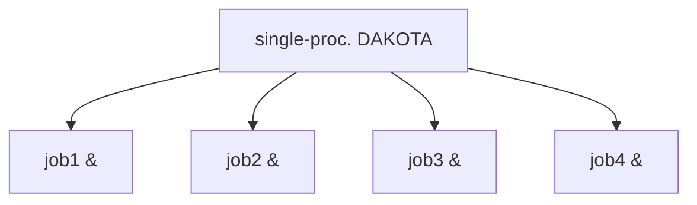
</details>

(a) asynchronous local


<details>
<summary>flowchart</summary>

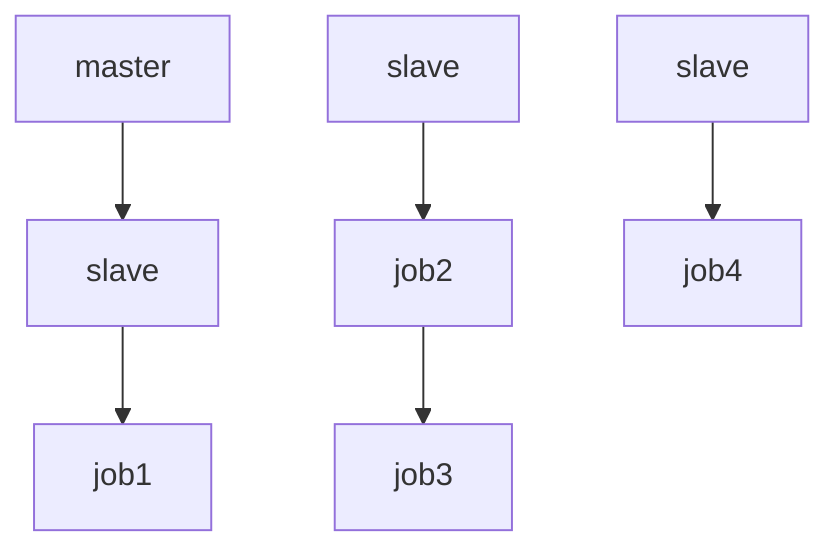
</details>

(b) message-passing   


<details>
<summary>flowchart</summary>

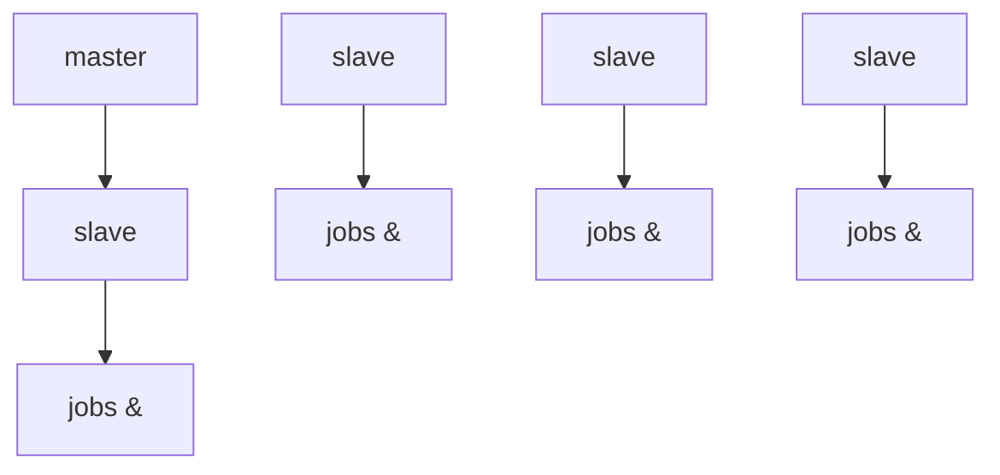
</details>

(c) hybrid   
Figure 17.1: External, internal, and hybrid job management.

• asynchronous local: Dakota executes on a single processor, but launches multiple jobs concurrently using asynchronous job launching techniques.   
• message passing: Dakota executes in parallel using message passing to communicate between processors. A single job is launched per processor using synchronous job launching techniques.   
• hybrid: a combination of message passing and asynchronous local. Dakota executes in parallel across multiple processors and launches concurrent jobs on each processor.

In each of these cases, jobs are executing concurrently and must be collected in some manner for return to an algorithm. Blocking and nonblocking approaches are provided for this, where the blocking approach is used in most cases:

• blocking synchronization: all jobs in the queue are completed before exiting the scheduler and returning the set of results to the algorithm. The job queue fills and then empties completely, which provides a synchronization point for the algorithm.

<!-- page:267 -->
• nonblocking synchronization: the job queue is dynamic, with jobs entering and leaving continuously. There are no defined synchronization points for the algorithm, which requires specialized algorithm logic (only currently supported by coliny pattern search and asynch pattern search, which are sometimes referred to as “fully asynchronous” algorithms).

Given these job management capabilities, it is worth noting that the popular term “asynchronous” can be ambiguous when used in isolation. In particular, it can be important to qualify whether one is referring to “asynchronous job launch” (synonymous with any of the three concurrent job launch approaches described above) or “asynchronous job recovery” (synonymous with the latter nonblocking job synchronization approach).

# 17.2.1 Asynchronous Local Parallelism

This section describes software components which manage simulation invocations local to a processor. These invocations may be either synchronous (i.e., blocking) or asynchronous (i.e., nonblocking). Synchronous evaluations proceed one at a time with the evaluation running to completion before control is returned to Dakota. Asynchronous evaluations are initiated such that control is returned to Dakota immediately, prior to evaluation completion, thereby allowing the initiation of additional evaluations which will execute concurrently.

The synchronous local invocation capabilities are used in two contexts: (1) by themselves to provide serial execution on a single processor, and (2) in combination with Dakota’s message-passing schedulers to provide function evaluations local to each processor. Similarly, the asynchronous local invocation capabilities are used in two contexts: (1) by themselves to launch concurrent jobs from a single processor that rely on external means (e.g., operating system, job queues) for assignment to other processors, and (2) in combination with Dakota’s message-passing schedulers to provide a hybrid parallelism (see Section 17.2.3). Thus, Dakota supports any of the four combinations of synchronous or asynchronous local combined with message passing or without.

Asynchronous local schedulers may be used for managing concurrent function evaluations requested by an iterator or for managing concurrent analyses within each function evaluation. The former iterator/evaluation concurrency supports either blocking (all jobs in the queue must be completed by the scheduler) or nonblocking (dynamic job queue may shrink or expand) synchronization, where blocking synchronization is used by most iterators and nonblocking synchronization is used by fully asynchronous algorithms such as asynch pattern search and coliny pattern search. The latter evaluation/- analysis concurrency is restricted to blocking synchronization. The “Asynchronous Local” column in Table 17.1 summarizes these capabilities.

Dakota supports three local simulation invocation approaches based on the direct function, system call, and fork simulation interfaces. For each of these cases, an input filter, one or more analysis drivers, and an output filter make up the interface, as described in Section 10.4.

# 17.2.1.1 Direct function synchronization

The direct function capability may be used synchronously. Synchronous operation of the direct function simulation interface involves a standard procedure call to the input filter, if present, followed by calls to one or more simulations, followed by a call to the output filter, if present (refer to Sections 10.2-10.4 for additional details and examples). Each of these components must be linked as functions within Dakota. Control does not return to the calling code until the evaluation is completed and the response object has been populated.

Asynchronous operation will be supported in the future and will involve the use of multithreading (e.g., POSIX threads) to accomplish multiple simultaneous simulations. When spawning a thread (e.g., using pthread create), control returns to the calling code after the simulation is initiated. In this way, multiple threads can be created simultaneously. An array of responses corresponding to the multiple threads of execution would then be recovered in a synchronize operation (e.g., using pthread join).

<!-- page:268 -->
# 17.2.1.2 System call synchronization

The system call capability may be used synchronously or asynchronously. In both cases, the system utility from the standard C library is used. Synchronous operation of the system call simulation interface involves spawning the system call (containing the filters and analysis drivers bound together with parentheses and semi-colons) in the foreground. Control does not return to the calling code until the simulation is completed and the response file has been written. In this case, the possibility of a race condition (see below) does not exist and any errors during response recovery will cause an immediate abort of the Dakota process (note: detection of the string “fail” is not a response recovery error; see Chapter 19).

Asynchronous operation involves spawning the system call in the background, continuing with other tasks (e.g., spawning other system calls), periodically checking for process completion, and finally retrieving the results. An array of responses corresponding to the multiple system calls is recovered in a synchronize operation.

In this synchronize operation, completion of a function evaluation is detected by testing for the existence of the evaluation’s results file using the stat utility [89]. Care must be taken when using asynchronous system calls since they are prone to the race condition in which the results file passes the existence test but the recording of the function evaluation results in the file is incomplete. In this case, the read operation performed by Dakota will result in an error due to an incomplete data set. In order to address this problem, Dakota contains exception handling which allows for a fixed number of response read failures per asynchronous system call evaluation. The number of allowed failures must have a limit, so that an actual response format error (unrelated to the race condition) will eventually abort the system. Therefore, to reduce the possibility of exceeding the limit on allowable read failures, the user’s interface should minimize the amount of time an incomplete results file exists in the directory where its status is being tested. This can be accomplished through two approaches: (1) delay the creation of the results file until the simulation computations are complete and all of the response data is ready to be written to the results file, or (2) perform the simulation computations in a subdirectory, and as a last step, move the completed results file into the main working directory where its existence is being queried.

If concurrent simulations are executing in a shared disk space, then care must be taken to maintain independence of the simulations. In particular, the parameters and results files used to communicate between Dakota and the simulation, as well as any other files used by this simulation, must be protected from other files of the same name used by the other concurrent simulations. With respect to the parameters and results files, these files may be made unique through the use of the file tag option (e.g., params.in.1, results.out.1, etc.) or the default temporary file option (e.g., /var/tmp/aaa0b2Mfv, etc.). However, if additional simulation files must be protected (e.g., model.i, model.o, model.g, model.e, etc.), then an effective approach is to create a tagged working subdirectory for each simulation instance. Section 10.3 provides an example system call interface that demonstrates both the use of tagged working directories and the relocation of completed results files to avoid the race condition.

# 17.2.1.3 Fork synchronization

The fork capability is quite similar to the system call; however, it has the advantage that asynchronous fork invocations can avoid the results file race condition that may occur with asynchronous system calls (see Section 10.2.5). The fork interface invokes the filters and analysis drivers using the fork and exec family of functions, and completion of these processes is detected using the wait family of functions. Since wait is based on a process id handle rather than a file existence test, an incomplete results file is not an issue.

Depending on the platform, the fork simulation interface executes either a vfork or a fork call. These calls generate a new child process with its own UNIX process identification number, which functions as a copy of the parent process (dakota). The execvp function is then called by the child process, causing it to be replaced by the analysis driver or filter. For synchronous operation, the parent dakota process then awaits completion of the forked child process through a blocking call to waitpid. On most platforms, the fork/exec procedure is efficient since it operates in a copy-on-write mode, and no copy of the parent is actually created. Instead, the parents address space is borrowed until the exec function is called.

The fork/exec behavior for asynchronous operation is similar to that for synchronous operation, the only difference being that dakota invokes multiple simulations through the fork/exec procedure prior to recovering response results for these jobs using the wait function. The combined use of fork/exec and wait functions in asynchronous mode allows the scheduling of a specified number of concurrent function evaluations and/or concurrent analyses.

<!-- page:269 -->
# 17.2.1.4 Asynchronous Local Example

The test file dakota/share/dakota/test/dakota\_dace.in computes 49 orthogonal array samples, which may be evaluated concurrently using parallel computing. When executing Dakota with this input file on a single processor, the following execution syntax may be used:

```txt
dakota -i dakota_dace.in 
```

For serial execution (the default), the interface specification within dakota\_dace.in would appear similar to

```python
interface,
    system
    analysis_driver = 'text_book' 
```

which results in function evaluation output similar to the following (for output set to quiet mode):

```txt
>>>> Running dace iterator.
DACE method = 12 Samples = 49 Symbols = 7 Seed (user-specified) = 5
----
Begin    I1 Evaluation    1
----
text_book /tmp/fileia6gVb /tmp/fileDo5MH
----
Begin    I1 Evaluation    2
----
text_book /tmp/fileyfkQGd /tmp/fileAbmBAJ
<snip>
<<<< Iterator dace completed. 
```

where it is evident that each function evaluation is being performed sequentially.

For parallel execution using asynchronous local approaches, the Dakota execution syntax is unchanged as Dakota is still launched on a single processor. However, the interface specification is augmented to include the

asynchronous keyword with optional concurrency limiter to indicate that multiple analysis driver instances will be executed concurrently:

```python
interface,
    system asynchronous evaluation_concurrency = 4
    analysis_driver = 'text_book' 
```

which results in output excerpts similar to the following:

```python
>>>> Running dace iterator.
DACE method = 12 Samples = 49 Symbols = 7 Seed (user-specified) = 5
_____
Begin    I1 Evaluation    1 
```

<!-- page:270 -->
(Asynchronous job 1 added to I1 queue)

Begin I1 Evaluation 2

(Asynchronous job 2 added to I1 queue)

<snip>

Begin I1 Evaluation 49

(Asynchronous job 49 added to I1 queue)

```txt
Blocking synchronize of 49 asynchronous evaluations
First pass: initiating 4 local asynchronous jobs
Initiating I1 evaluation 1
text_book /tmp/fileuLcfBp /tmp/file6XIhpm &
Initiating I1 evaluation 2
text_book /tmp/fileeC29dj /tmp/fileIdA22f &
Initiating I1 evaluation 3
text_book /tmp/fileuhCESc /tmp/fileajLgI9 &
Initiating I1 evaluation 4
text_book /tmp/filevJHMy6 /tmp/fileHFKip3 &
Second pass: scheduling 45 remaining local asynchronous jobs
Waiting on completed jobs
I1 evaluation 1 has completed
I1 evaluation 2 has completed
I1 evaluation 3 has completed
Initiating I1 evaluation 5
text_book /tmp/fileISsjh0 /tmp/fileSaek9W &
Initiating I1 evaluation 6
text_book /tmp/filefN271T /tmp/fileSNYVUQ &
Initiating I1 evaluation 7
text_book /tmp/filebAQaON /tmp/fileaMPpHK &
I1 evaluation 49 has completed 
```

<snip>

<<<<< Iterator dace completed.

where it is evident that each of the 49 jobs is first queued and then a blocking synchronization is performed. This synchronization uses a simple scheduler that initiates 4 jobs and then replaces completing jobs with new ones until all 49 are complete.

The default job concurrency for asynchronous local parallelism is all that is available from the algorithm (49 in this case), which could be too many for the computational resources or their usage policies. The concurrency level specification (4 in this case) instructs the scheduler to keep 4 jobs running concurrently, which would be appropriate for, e.g., a dual-processor dual-core workstation. In this case, it is the operating system’s responsibility to assign the concurrent text book jobs to available processors/cores. Specifying greater concurrency than that supported by the hardware will result in additional context switching within a multitasking operating system and will generally degrade performance. Note however that, in this example, there are a total of 5 processes running, one for Dakota and four for the concurrent function evaluations. Since the Dakota process checks periodically for job completion and sleeps in between checks, it is relatively lightweight and does not require a dedicated processor.

# 17.2.1.5 Local evaluation scheduling options

<!-- page:271 -->
The default behavior for asynchronous local parallelism is for Dakota to dispatch the next evaluation the local queue when one completes (and can optionally be specified by local evaluation scheduling dynamic. In some cases, the simulation code interface benefits from knowing which job number will replace a completed job. This includes some modes of application tiling with certain MPI implementations, where sending a job to the correct subset of available processors is done with relative node scheduling. The keywords local evaluation scheduling static forces this behavior, so a completed evaluation will be replaced with one congruent modulo the evaluation concurrency. For example, with 6 concurrent jobs, eval number 2 will be replaced with eval number 8. Examples of this usage can be seen in dakota/share/dakota/ examples/parallelism.

# 17.2.2 Message Passing Parallelism

Dakota uses a “single program-multiple data” (SPMD) parallel programming model. It uses message-passing routines from the Message Passing Interface (MPI) standard [71], [129] to communicate data between processors. The SPMD designation simply denotes that the same Dakota executable is loaded on all processors during the parallel invocation. This differs from the MPMD model (“multiple program-multiple data”) which would have the Dakota executable on one or more processors communicating directly with simulator executables on other processors. The MPMD model has some advantages, but heterogeneous executable loads are not supported by all parallel environments. Moreover, the MPMD model requires simulation code intrusion on the same order as conversion to a subroutine, so subroutine conversion (see Section 16.2) in a direct-linked SPMD model is preferred.

# 17.2.2.1 Partitioning

A level of message passing parallelism can use either of two processor partitioning models:

• Dedicated master: a single processor is dedicated to scheduling operations and the remaining processors are split into server partitions.   
• Peer partition: all processors are allocated to server partitions and the loss of a processor to scheduling is avoided.

These models are depicted in Figure 17.2. The peer partition is desirable since it utilizes all processors for computation; however, it requires either the use of sophisticated mechanisms for distributed scheduling or a problem for which static scheduling of concurrent work performs well (see Scheduling below). If neither of these characteristics is present, then use of the dedicated master partition supports a dynamic scheduling which assures that server idleness is minimized.

# 17.2.2.2 Scheduling

The following scheduling approaches are available within a level of message passing parallelism:

• Dynamic scheduling: in the dedicated master model, the master processor manages a single processing queue and maintains a prescribed number of jobs (usually one) active on each slave. Once a slave server has completed a job and returned its results, the master assigns the next job to this slave. Thus, the job assignment on the master adapts to the job completion speed on the slaves. This provides a simple dynamic scheduler in that heterogeneous processor speeds and/or job durations are naturally handled, provided there are sufficient instances scheduled through the servers to balance the variation. In the case of a peer partition, dynamic schedulers can also be employed, provided that peer 1 can employ nonblocking synchronization of its local evaluations. This allows it to balance its local work with servicing job assignments and returns from the other peers.   
• Static scheduling: if scheduling is statically determined at start-up, then no master processor is needed to direct traffic and a peer partitioning approach is applicable. If the static schedule is a good one (ideal conditions), then this approach will have superior performance. However, heterogeneity, when not known a priori, can very quickly degrade performance since there is no mechanism to adapt.


<details>
<summary>flowchart</summary>

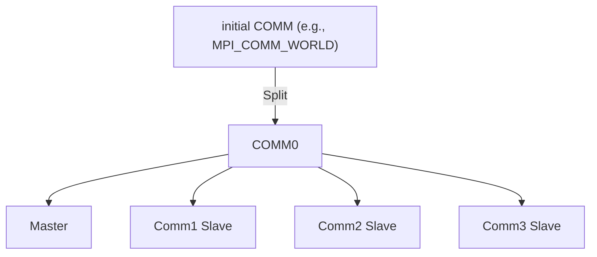
</details>

(a) Dedicated Master


<details>
<summary>flowchart</summary>

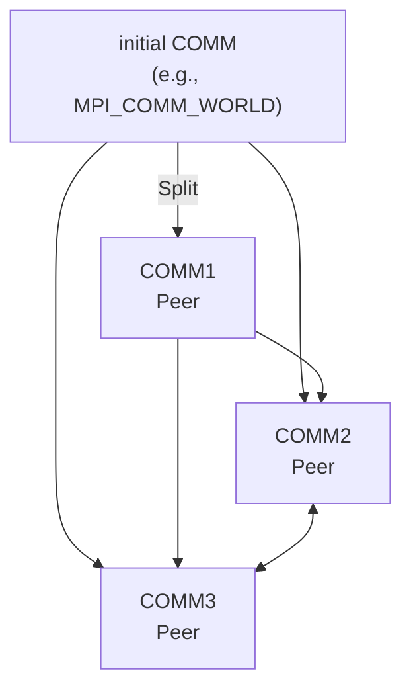
</details>

(b) Peer Partition   
Figure 17.2: Communicator partitioning models.

<!-- page:272 -->
Message passing schedulers may be used for managing concurrent sub-iterator executions within a meta-iterator, concurrent evaluations within an iterator, or concurrent analyses within an evaluation. In the former and latter cases, the message passing scheduler is currently restricted to blocking synchronization, in that all jobs in the queue are completed before exiting the scheduler and returning the set of results to the algorithm. Nonblocking message-passing scheduling is supported for the iterator–evaluation concurrency level in support of fully asynchronous algorithms (e.g., asynch pattern search and coliny pattern search) that avoid synchronization points that can harm scaling.

Message passing is also used within a fine-grained parallel simulation code, although this is separate from Dakota’s capabilities (Dakota may, at most, pass a communicator partition to the simulation). The “Message Passing” column in Table 17.1 summarizes these capabilities.

# 17.2.2.3 Message Passing Example

Revisiting the test file dakota\_dace.in, Dakota will now compute the 49 orthogonal array samples using a message passing approach. In this case, a parallel launch utility is used to execute Dakota across multiple processors using syntax similar to the following:

```shell
mpirun -np 5 -machinefile machines dakota -i dakota_dace.in 
```

Since the asynchronous local parallelism will not be used, the interface specification does not include the asynchronous keyword and would appear similar to:

```python
interface,
    system
    analysis_driver = 'text_book' 
```

The relevant excerpts from the Dakota output for a dedicated master partition and dynamic schedule, the default when the maximum concurrency (49) exceeds the available capacity (5), would appear similar to the following:

Running MPI Dakota executable in parallel on 5 processors.

DAKOTA parallel configuration:

Level

num\_servers

procs\_per\_server

partition

```txt
---- ---- ---- ----
concurrent evaluations 5 1 peer
concurrent analyses 1 1 peer
multiprocessor analysis 1 N/A N/A
Total parallelism levels = 1 (1 dakota, 0 analysis)
>>> Executing environment.
>>> Running dace iterator.
DACE method = 12 Samples = 49 Symbols = 7 Seed (user-specified) = 5
----
Begin I1 Evaluation 1
(Asynchronous job 1 added to I1 queue)
----
Begin I1 Evaluation 2
(Asynchronous job 2 added to I1 queue)
<snip>
----
Begin I1 Evaluation 49
(Asynchronous job 49 added to I1 queue)
Blocking synchronize of 49 asynchronous evaluations
Peer dynamic schedule: first pass assigning 4 jobs among 4 remote peers
Peer 1 assigning I1 evaluation 1 to peer 2
Peer 1 assigning I1 evaluation 2 to peer 3
Peer 1 assigning I1 evaluation 3 to peer 4
Peer 1 assigning I1 evaluation 4 to peer 5
Peer dynamic schedule: first pass launching 1 local jobs
Initiating I1 evaluation 5
text_book /tmp/file5LRsBu /tmp/fileT2mS65 &
Peer dynamic schedule: second pass scheduling 44 remaining jobs
Initiating I1 evaluation 5
text_book /tmp/file5LRsBu /tmp/fileT2mS65 &
Peer dynamic schedule: second pass scheduling 44 remaining jobs
I1 evaluation 5 has completed
Initiating I1 evaluation 6
text_book /tmp/fileZJaODH /tmp/filewoUJaj &
I1 evaluation 2 has returned from peer server 3
Peer 1 assigning I1 evaluation 7 to peer 3
I1 evaluation 4 has returned from peer server 5
<snip>
I1 evaluation 46 has returned from peer server 2
I1 evaluation 49 has returned from peer server 5 
```

<!-- page:274 -->
<<<<< Function evaluation summary (I1): 49 total (49 new, 0 duplicate)

<<<<< Iterator dace completed.

where it is evident that each of the 49 jobs is first queued and then a blocking synchronization is performed. This synchronization uses a dynamic scheduler that initiates five jobs, one on each of five evaluation servers, and then replaces completing jobs with new ones until all 49 are complete. It is important to note that job execution local to each of the four servers is synchronous.

# 17.2.3 Hybrid Parallelism

The asynchronous local approaches described in Section 17.2.1 can be considered to rely on external scheduling mechanisms, since it is generally the operating system or some external queue/load sharing software that allocates jobs to processors. Conversely, the message-passing approaches described in Section 17.2.2 rely on internal scheduling mechanisms to distribute work among processors. These two approaches provide building blocks which can be combined in a variety of ways to manage parallelism at multiple levels. At one extreme, Dakota can execute on a single processor and rely completely on external means to map all jobs to processors (i.e., using asynchronous local approaches). At the other extreme, Dakota can execute on many processors and manage all levels of parallelism, including the parallel simulations, using completely internal approaches (i.e., using message passing at all levels as in Figure 17.4). While all-internal or all-external approaches are common cases, many additional approaches exist between the two extremes in which some parallelism is managed internally and some is managed externally.

These combined approaches are referred to as hybrid parallelism, since the internal distribution of work based on messagepassing is being combined with external allocation using asynchronous local approaches2. Figure 17.1 depicts the asynchronous local, message-passing, and hybrid approaches for a dedicated-master partition. Approaches (b) and (c) both use MPI message-passing to distribute work from the master to the slaves, and approaches (a) and (c) both manage asynchronous jobs local to a processor. The hybrid approach (c) can be seen to be a combination of (a) and (b) since jobs are being internally distributed to slave servers through message-passing and each slave server is managing multiple concurrent jobs using an asynchronous local approach. From a different perspective, one could consider (a) and (b) to be special cases within the range of configurations supported by (c). The hybrid approach is useful for supercomputers that maintain a service/compute node distinction and for supercomputers or networks of workstations that involve clusters of symmetric multiprocessors (SMPs). In the service/compute node case, concurrent multiprocessor simulations are launched into the compute nodes from the service node partition. While an asynchronous local approach from a single service node would be sufficient, spreading the application load by running Dakota in parallel across multiple service nodes results in better performance [41]. If the number of concurrent jobs to be managed in the compute partition exceeds the number of available service nodes, then hybrid parallelism is the preferred approach. In the case of a cluster of SMPs (or network of multiprocessor workstations), message-passing can be used to communicate between SMPs, and asynchronous local approaches can be used within an SMP. Hybrid parallelism can again result in improved performance, since the total number of Dakota MPI processes is reduced in comparison to a pure message-passing approach over all processors.

Hybrid schedulers may be used for managing concurrent evaluations within an iterator or concurrent analyses within an evaluation. In the former case, blocking or nonblocking synchronization can be used, whereas the latter case is restricted to blocking synchronization. The “Hybrid” column in Table 17.1 summarizes these capabilities.

# 17.2.3.1 Hybrid Example

Revisiting the test file dakota\_dace.in, Dakota will now compute the 49 orthogonal array samples using a hybrid approach. As for the message passing case, a parallel launch utility is used to execute Dakota across multiple processors:

$\mathrm { m p i r u n ~ - n p ~ 5 ~ - m a c h i n e f i l e ~ m a c h i n e s ~ d a k o t a ~ - i ~ } \mathrm { d a k o t a \_ d a c e } . \mathrm { d a c e } . \mathrm { i n } \mathrm { ~ \Omega }$

<!-- page:275 -->
Since the asynchronous local parallelism will also be used, the interface specification includes the asynchronous keyword and appears similar to

```python
interface,
    system asynchronous evaluation_concurrency = 2
    analysis_driver = 'text_book' 
```

In the hybrid case, the specification of the desired concurrency level must be included, since the default is no longer all available (as it is for asynchronous local parallelism). Rather the default is to employ message passing parallelism, and hybrid parallelism is only available through the specification of asynchronous concurrency greater than one.

The relevant excerpts of the Dakota output for a peer partition and dynamic schedule , the default when the maximum concurrency (49) exceeds the maximum available capacity (10), would appear similar to the following:

Running MPI Dakota executable in parallel on 5 processors.

DAKOTA parallel configuration:   
```txt
Level num_servers procs_per_server partition
---- ---- ----
concurrent evaluations 5 1 peer
concurrent analyses 1 1 peer
multiprocessor analysis 1 N/A N/A 
```  
Total parallelism levels = 1 (1 dakota, 0 analysis)

```txt
>>>>> Executing environment.
>>>>> Running dace iterator.
DACE method = 12 Samples = 49 Symbols = 7 Seed (user-specified) = 5 
```

Begin I1 Evaluation 1   
```txt
(Asynchronous job 1 added to I1 queue) 
```

Begin I1 Evaluation 2   
```txt
(Asynchronous job 2 added to I1 queue)
<snip> 
```

```txt
Blocking synchronize of 49 asynchronous evaluations
Peer dynamic schedule: first pass assigning 8 jobs among 4 remote peers
Peer 1 assigning I1 evaluation 1 to peer 2
Peer 1 assigning I1 evaluation 2 to peer 3
Peer 1 assigning I1 evaluation 3 to peer 4
Peer 1 assigning I1 evaluation 4 to peer 5
Peer 1 assigning I1 evaluation 6 to peer 2
Peer 1 assigning I1 evaluation 7 to peer 3 
```

```txt
Peer 1 assigning I1 evaluation 8 to peer 4
Peer 1 assigning I1 evaluation 9 to peer 5
Peer dynamic schedule: first pass launching 2 local jobs
Initiating I1 evaluation 5
text_book /tmp/fileJU1Ez2 /tmp/fileVGZzEX &
Initiating I1 evaluation 10
text_book /tmp/fileKfUgKS /tmp/fileMgZXPN &
Peer dynamic schedule: second pass scheduling 39 remaining jobs

<snip>

I1 evaluation 49 has completed
I1 evaluation 43 has returned from peer server 2
I1 evaluation 44 has returned from peer server 3
I1 evaluation 48 has returned from peer server 4
I1 evaluation 47 has returned from peer server 2
I1 evaluation 45 has returned from peer server 3

<<<< Function evaluation summary (I1): 49 total (49 new, 0 duplicate)

<<<< Iterator dace completed. 
```

<!-- page:276 -->
where it is evident that each of the 49 jobs is first queued and then a blocking synchronization is performed. This synchronization uses a dynamic scheduler that initiates ten jobs, two on each of five evaluation servers, and then replaces completing jobs with new ones until all 49 are complete. It is important to note that job execution local to each of the four servers is asynchronous.

# 17.3 Multilevel parallelism

Parallel computers within the Department of Energy national laboratories have achieved nearly 20 quadrillion (1015) floating point operations per second (20 petaFLOPS) in Linpack benchmarks. Planning for ”exascale” systems, rated at 1000 petaFLOPS, is well underway. This performance is achieved through the use of massively parallel (MP) processing using O[105 − 106] processors. In order to harness the power of these machines for performing design, uncertainty quantification, and other systems analyses, parallel algorithms are needed which are scalable to thousands of processors.

Dakota supports an open-ended number of levels of nested parallelism which, as described in Section 17.1, can be categorized into three types of concurrent job scheduling and four types of parallelism: (a) concurrent iterators within a meta-iterator (scheduled by Dakota), (b) concurrent function evaluations within each iterator (scheduled by Dakota), (c) concurrent analyses within each function evaluation (scheduled by Dakota), and (d) multiprocessor analyses (work distributed by a parallel analysis code). In combination, these parallelism levels can minimize efficiency losses and achieve near linear scaling on MP computers. Types (a) and (b) are classified as algorithmic coarse-grained parallelism, type (c) is function evaluation coarsegrained parallelism, and type (d) is function evaluation fine-grained parallelism (see Section 17.1.1). Algorithmic fine-grained parallelism is not currently supported in Dakota, although this picture is rapidly evolving.

A particular application may support one or more of these parallelism types, and Dakota provides for convenient selection and combination of multiple levels. If multiple types of parallelism can be exploited, then the question may arise as to how the amount of parallelism at each level should be selected so as to maximize the overall parallel efficiency of the study. For performance analysis of multilevel parallelism formulations and detailed discussion of these issues, refer to [41]. In many cases, the user may simply employ Dakota’s automatic parallelism configuration facilities, which implement the recommendations from the aforementioned paper.

Figure 17.3 shows typical fixed-size scaling performance using a modified version of the extended text book problem (see Section 20.1). Three levels of parallelism (concurrent evaluations within an iterator, concurrent analyses within each evaluation, and multiprocessor analyses) are exercised within a modest partition of processors (circa year 2000). Despite the use of a fixed problem size and the presence of some idleness within the scheduling at multiple levels, the efficiency is still reasonably high3. Greater efficiencies are obtainable for scaled speedup studies (or for larger problems in fixed-size studies) and for problems optimized for minimal scheduler idleness (by, e.g., managing all concurrency in as few scheduling levels as possible). Note that speedup and efficiency are measured relative to the case of a single instance of a multiprocessor analysis, since it was desired to investigate the effectiveness of the Dakota schedulers independent from the efficiency of the parallel analysis.


<details>
<summary>line</summary>

| Number of processors | Relative speedup (solid line) | Relative speedup (dashed line) |
| -------------------- | ----------------------------- | ------------------------------ |
| 0                    | 0                             | 0                              |
| 20                   | 20                            | 20                             |
| 40                   | 40                            | 40                             |
| 60                   | 60                            | 60                             |
| 80                   | 80                            | 80                             |
| 100                  | 100                           | 100                            |
| 120                  | 120                           | 120                            |
| 140                  | 140                           | 140                            |
| 160                  | 160                           | 160                            |
| 180                  | 180                           | 180                            |
| 200                  | 200                           | 200                            |
</details>

(a) Relative speedup.


<details>
<summary>line</summary>

| Number of processors | Relative efficiency |
| -------------------- | ------------------- |
| 0                    | 1.0                 |
| 20                   | 0.95                |
| 40                   | 0.92                |
| 60                   | 0.90                |
| 80                   | 0.88                |
| 100                  | 0.86                |
| 120                  | 0.84                |
| 140                  | 0.82                |
| 160                  | 0.80                |
| 180                  | 0.78                |
| 200                  | 0.76                |
</details>

(b) Relative efficiency.   
Figure 17.3: Fixed-size scaling results for three levels of parallelism.

<!-- page:277 -->
# 17.3.1 Asynchronous Local Parallelism

In most cases, the use of asynchronous local parallelism is the termination point for multilevel parallelism, in that any level of parallelism lower than an asynchronous local level will be serialized (see discussion in Section 17.3.3). The exception to this rule is reforking of forked processes for concurrent analyses within forked evaluations. In this case, a new process is created using fork for one of several concurrent evaluations; however, the new process is not replaced immediately using exec. Rather, the new process is reforked to create additional child processes for executing concurrent analyses within each concurrent evaluation process. This capability is not supported by system calls and provides one of the key advantages to using fork over system (see Section 10.2.5).

# 17.3.2 Message Passing Parallelism

# 17.3.2.1 Partitioning of levels

Dakota uses MPI communicators to identify groups of processors. The global MPI COMM WORLD communicator provides the total set of processors allocated to the Dakota run. MPI COMM WORLD can be partitioned into new intra-communicators which each define a set of processors to be used for a multiprocessor server. Each of these servers may be further partitioned to nest one level of parallelism within the next. At the lowest parallelism level, these intra-communicators can be passed into a simulation for use as the simulation’s computational context, provided that the simulation has been designed, or can be modified, to be modular on a communicator (i.e., it does not assume ownership of MPI COMM WORLD). New intra-communicators are created with the MPI Comm split routine, and in order to send messages between these intra-communicators, new intercommunicators are created with calls to MPI Intercomm create. Multiple parallel configurations (containing a set of communicator partitions) are allocated for use in studies with multiple iterators and models (e.g., 16 servers of 64 processors each could be used for iteration on a lower fidelity model, followed by two servers of 512 processors each for subsequent iteration on a higher fidelity model), and can be alternated at run time. Each of the parallel configurations are allocated at object construction time and are reported at the beginning of the Dakota output.

<!-- page:278 -->
Each tier within Dakota’s nested parallelism hierarchy can use the dedicated master and peer partition approaches described in Section 17.2.2.1. To recursively partition the subcommunicators of Figure 17.2, COMM1 $/ 2 / 3$ in the dedicated master or peer partition case would be further subdivided using the appropriate partitioning model for the next lower level of parallelism.

# 17.3.2.2 Scheduling within levels


<details>
<summary>flowchart</summary>

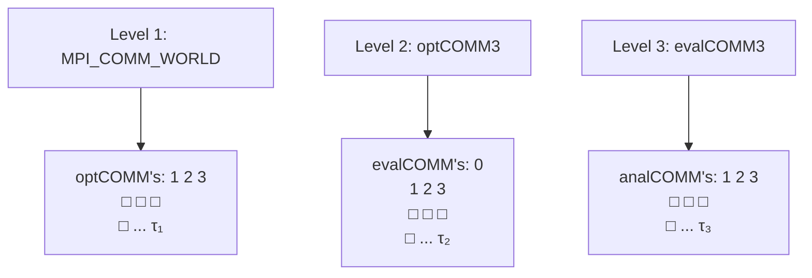
</details>

Figure 17.4: Recursive partitioning for nested parallelism.

Dakota is designed to allow the freedom to configure each parallelism level with either the dedicated master partition/dynamic scheduling combination or the peer partition/static scheduling combination. In addition, the iterator-evaluation level supports a peer partition/dynamic scheduling option, and certain external libraries may provide custom options. As an example, Figure 17.4 shows a case in which a branch and bound meta-iterator employs peer partition/distributed scheduling at level 1, each optimizer partition employs concurrent function evaluations in a dedicated master partition/dynamic scheduling model at level 2, and each function evaluation partition employs concurrent multiprocessor analyses in a peer partition/static scheduling model at level 3. In this case, MPI COMM WORLD is subdivided into optCOMM1 $/ 2 / 3 / \ldots / \tau _ { 1 }$ , each optCOMM is further subdivided into evalCOMM0 (master) and evalCOMM1 $/ 2 / 3 / \ldots / \tau _ { 2 }$ (slaves), and each slave evalCOMM is further subdivided into analCOMM1 $. / 2 / 3 / . . . / \tau _ { 3 }$ . Logic for selecting the $\tau _ { i }$ that maximize overall efficiency is discussed in [41].

# 17.3.3 Hybrid Parallelism

Hybrid parallelism approaches can take several forms when used in the multilevel parallel context. A conceptual boundary can be considered to exist for which all parallelism above the boundary is managed internally using message-passing and all parallelism below the boundary is managed externally using asynchronous local approaches. Hybrid parallelism approaches can then be categorized based on whether this boundary between internal and external management occurs within a parallelism level (intra-level) or between two parallelism levels (inter-level). In the intra-level case, the jobs for the parallelism level containing the boundary are scheduled using a hybrid scheduler, in which a capacity multiplier is used for the number of jobs to assign to each server. Each server is then responsible for concurrently executing its capacity of jobs using an asynchronous local approach. In the inter-level case, one level of parallelism manages its parallelism internally using a message-passing approach and the next lower level of parallelism manages its parallelism externally using an asynchronous local approach. That is, the jobs for the higher level of parallelism are scheduled using a standard message-passing scheduler, in which a single job is assigned to each server. However, each of these jobs has multiple components, as managed by the next lower level of parallelism, and each server is responsible for executing these sub-components concurrently using an asynchronous local approach.

For example, consider a multiprocessor Dakota run which involves an iterator scheduling a set of concurrent function evaluations across a cluster of SMPs. A hybrid parallelism approach will be applied in which message-passing parallelism is used between SMPs and asynchronous local parallelism is used within each SMP. In the hybrid intra-level case, multiple function evaluations would be scheduled to each SMP, as dictated by the capacity of the SMPs, and each SMP would manage its own set of concurrent function evaluations using an asynchronous local approach. Any lower levels of parallelism would be serialized. In the hybrid inter-level case, the function evaluations would be scheduled one per SMP, and the analysis components within each of these evaluations would be executed concurrently using asynchronous local approaches within the SMP. Thus, the distinction can be viewed as whether the concurrent jobs on each server in Figure 17.1c reflect the same level of parallelism as that being scheduled by the master (intra-level) or one level of parallelism below that being scheduled by the master (inter-level).

Table 17.1: Support of job management approaches within parallelism levels. Shown in parentheses are supported simulation interfaces and supported synchronization approaches. 

<table><tr><td>Parallelism Level</td><td>Asynchronous Local</td><td>Message Passing</td><td>Hybrid</td></tr><tr><td>concurrent iterators within a meta-iterator or nested model</td><td></td><td>X(blocking synch)</td><td></td></tr><tr><td>concurrent function evaluations within an iterator</td><td>X(system, fork)(blocking, nonblocking)</td><td>X(system, fork, direct)(blocking, nonblocking)</td><td>X(system, fork)(blocking, nonblocking)</td></tr><tr><td>concurrent analyses within a function evaluation</td><td>X(fork only)(blocking synch)</td><td>X(system, fork, direct)(blocking synch)</td><td>X(fork only)(blocking synch)</td></tr><tr><td>fine-grained parallel analysis</td><td></td><td>X</td><td></td></tr></table>

<!-- page:279 -->
# 17.4 Capability Summary

Table 17.1 shows a matrix of the supported job management approaches for each of the parallelism levels, with supported simulation interfaces and synchronization approaches shown in parentheses. The concurrent iterator and multiprocessor analysis parallelism levels can only be managed with message-passing approaches. In the former case, this is due to the fact that a separate process or thread for an iterator is not currently supported. The latter case reflects a finer point on the definition of external parallelism management. While a multiprocessor analysis can most certainly be launched (e.g., using mpirun/yod) from one of Dakota’s analysis drivers, resulting in a parallel analysis external to Dakota (which is consistent with asynchronous local and hybrid approaches), this parallelism is not visible to Dakota and therefore does not qualify as parallelism that Dakota manages (and therefore is not included in Table 17.1). The concurrent evaluation and analysis levels can be managed either with message-passing, asynchronous local, or hybrid techniques, with the exceptions that the direct interface does not support asynchronous operations (asynchronous local or hybrid) at either of these levels and the system call interface does not support asynchronous operations (asynchronous local or hybrid) at the concurrent analysis level. The direct interface restrictions are present since multithreading in not yet supported and the system call interface restrictions result from the inability to manage concurrent analyses within a nonblocking function evaluation system call. Finally, nonblocking synchronization is only supported at the concurrent function evaluation level, although it spans asynchronous local, message passing, and hybrid parallelism options.

# 17.5 Running a Parallel Dakota Job

Section 17.2 provides a few examples of serial and parallel execution of Dakota using asynchronous local, message passing, and hybrid approaches to single-level parallelism. The following sections provides a more complete discussion of the parallel execution syntax and available specification controls.

<!-- page:280 -->
# 17.5.1 Single-processor execution

The command for running Dakota on a single-processor and exploiting asynchronous local parallelism is the same as for running Dakota on a single-processor for a serial study, e.g.:

```batch
dakota -i dakota.in > dakota.out 
```

See Section 2.4 for additional information on single-processor command syntax.

# 17.5.2 Multiprocessor execution

Running a Dakota job on multiple processors requires the use of an executable loading facility such as mpirun, mpiexec, poe, or yod. On a network of workstations, the mpirun script is commonly used to initiate a parallel Dakota job, e.g.:

```batch
mpirun -np 12 dakota -i dakota.in > dakota.out
mpirun -machinefile machines -np 12 dakota -i dakota.in > dakota.out 
```

where both examples specify the use of 12 processors, the former selecting them from a default system resources file and the latter specifying particular machines in a machine file (see [70] for details).

On a massively parallel computer, the familiar mpirun/mpiexec options may be replaced with other launch scripts as dictated by the particular software stack, e.g.:

```batch
yod -sz 512 dakota -i dakota.in > dakota.out 
```

In each of these cases, MPI command line arguments are used by MPI (extracted first in the call to MPI Init) and Dakota command line arguments are used by Dakota (extracted second by Dakota’s command line handler).

Finally, when running on computer resources that employ NQS/PBS batch schedulers, the single-processor dakota command syntax or the multiprocessor mpirun command syntax might be contained within an executable script file which is submitted to the batch queue. For example, a command

```batch
qsub -l size=512 run_dakota 
```

could be submitted to a PBS queue for execution. The NQS syntax is similar:

```batch
qsub -q snl -lP 512 -lT 6:00:00 run_dakota 
```

These commands allocate 512 compute nodes for the study, and execute the run\_dakota script on a service node. If this script contains a single-processor dakota command, then Dakota will execute on a single service node from which it can launch parallel simulations into the compute nodes using analysis drivers that contain yod commands (any yod executions occurring at any level underneath the run\_dakota script are mapped to the 512 compute node allocation). If the script submitted to qsub contains a multiprocessor mpirun command, then Dakota will execute across multiple service nodes so that it can spread the application load in either a message-passing or hybrid parallelism approach. Again, analysis drivers containing yod commands would be responsible for utilizing the 512 compute nodes. And, finally, if the script submitted to qsub contains a yod of the dakota executable, then Dakota will execute directly on the compute nodes and manage all of the parallelism internally (note that a yod of this type without a qsub would be mapped to the interactive partition, rather than to the batch partition).

Not all supercomputers employ the same model for service/compute partitions or provide the same support for tiling of concurrent multiprocessor simulations within a single NQS/PBS allocation. For this reason, templates for parallel job configuration are being catalogued within dakota/share/dakota/examples/parallelism (in the software distributions) that are intended to provide guidance for individual machine idiosyncrasies.

<!-- page:281 -->
Dakota relies on hints from the runtime environment and command line arguments to detect when it has been launched in parallel. Due to the large number of HPC vendors and MPI implementations, parallel launch is not always detected properly. A parallel launch is indicated by the status message

Running MPI Dakota executable in parallel on N processors.

which is written to the console near the beginning of the Dakota run.

Beginning with release 6.5, if Dakota incorrectly detects a parallel launch, automatic detection can be overriden by setting the environment variable DAKOTA RUN PARALLEL. If the first character is set to 1, t, or T, Dakota will configure itself to run in parallel. If the variable exists but is set to anything else, Dakota will configure itself to run in serial mode.

# 17.6 Specifying Parallelism

Given an allotment of processors, Dakota contains logic based on the theoretical work in [41] to automatically determine an efficient parallel configuration, consisting of partitioning and scheduling selections for each of the parallelism levels. This logic accounts for problem size, the concurrency supported by particular iterative algorithms, and any user inputs or overrides.

Concurrency is pushed up for most parallelism levels. That is, available processors will be assigned to concurrency at the higher parallelism levels first as we partition from the top down. If more processors are available than needed for concurrency at a level, then the server size is increased to support concurrency in the next lower level of parallelism. This process is continued until all available processors have been assigned. These assignments can be overridden by the user by specifying a number of servers, processors per server, or both, for the concurrent iterator, evaluation, and analysis parallelism levels. For example, if it is desired to parallelize concurrent analyses within each function evaluation, then an evaluation servers = 1 override would serialize the concurrent function evaluations level and ensure processor availability for concurrent analyses.

The exception to this push up of concurrency occurs for concurrent-iterator parallelism levels, since iterator executions tend to have high variability in duration whenever they utilize feedback of results. For these levels, concurrency is pushed down since it is generally best to serialize the levels with the highest job variation and exploit concurrency elsewhere.

Partition type (master or peer) may also be specified for each level, and peer scheduling type (dynamic or static) may be specified at the level of evaluation concurrency. However, these selections may be overridden by Dakota if they are inconsistent with the number of user-requested servers, processors per server, and available processors.

In the following sections, the user inputs and overrides are described, followed by specification examples for single and multiprocessor Dakota executions.

# 17.6.1 The interface specification

Specifying parallelism within an interface can involve the use of the asynchronous,

evaluation\_concurrency, and analysis\_concurrency keywords to specify concurrency local to a processor (i.e., asynchronous local parallelism). This asynchronous specification has dual uses:

• When running Dakota on a single-processor, the asynchronous keyword specifies the use of asynchronous invocations local to the processor (these jobs then rely on external means to be allocated to other processors). The default behavior is to simultaneously launch all function evaluations available from the iterator as well as all available analyses within each function evaluation. In some cases, the default behavior can overload a machine or violate a usage policy, resulting in the need to limit the number of concurrent jobs using the evaluation concurrency and analysis concurrency specifications.

• When executing Dakota across multiple processors and managing jobs with a message-passing scheduler, the asynchronous keyword specifies the use of asynchronous invocations local to each server processor, resulting in a hybrid parallelism approach (see Section 17.2.3). In this case, the default behavior is one job per server, which must be overridden with an evaluation concurrency specification and/or an analysis concurrency specification. When a hybrid

<!-- page:282 -->
parallelism approach is specified, the capacity of the servers (used in the automatic configuration logic) is defined as the number of servers times the number of asynchronous jobs per server.

In both cases, the scheduling of local evaluations is dynamic by default, but may be explicitly selected or overriden using local evaluation scheduling dynamic or static.

In addition, evaluation servers, processors per evaluation, and evaluation scheduling keywords can be used to override the automatic parallel configuration for concurrent function evaluations. Evaluation scheduling may be selected to be master or peer, where the latter must be further specified to be dynamic or static.

To override the automatic parallelism configuration for concurrent analyses, the analysis servers and analysis scheduling keywords may be specified, and the processors per analysis keyword can be used to override the automatic parallelism configuration for the size of multiprocessor analyses used in a direct function simulation interface. Scheduling options for this level include master or peer, where the latter is static (no dynamic peer option supported). Each of these keywords appears as part of the interface commands specification in the Dakota Reference Manual [3].

# 17.6.2 The meta-iterator and nested model specifications

To specify concurrency in sub-iterator executions within meta-iterators and nested models, the iterator\_servers, processors\_ per\_iterator, and iterator\_scheduling keywords are used to override the automatic parallelism configuration. For this level, the available scheduling options are master or peer, where the latter is static (no dynamic peer option supported). See the method and model commands specification in the Dakota Reference Manual [3] for additional details.

# 17.6.3 Single-processor Dakota specification

Specifying a single-processor Dakota job that exploits parallelism through asynchronous local approaches (see Figure 17.1a) requires inclusion of the asynchronous keyword in the interface specification. Once the input file is defined, singleprocessor Dakota jobs are executed using the command syntax described previously in Section 17.5.1.

# 17.6.3.1 Example 1

For example, the following specification runs an NPSOL optimization which will perform asynchronous finite differencing:

```python
method,
    npsol_sqp

variables,
    continuous_design = 5
    initial_point 0.2 0.05 0.08 0.2 0.2
    lower_bounds 0.15 0.02 0.05 0.1 0.1
    upper_bounds 2.0 2.0 2.0 2.0 2.0

interface,
    system,
    asynchronous
    analysis_drivers = 'text_book'

responses,
    num_objective_functions = 1
    num_nonlinear_inequality_constraints = 2
    numerical_gradients
    interval_type central 
```

```txt
method_source dakota
fd_gradient_step_size = 1.e-4
no_hessians 
```

<!-- page:283 -->
Note that method source dakota selects Dakota’s internal finite differencing routine so that the concurrency in finite difference offsets can be exploited. In this case, central differencing has been selected and 11 function evaluations (one at the current point plus two offsets in each of five variables) can be performed simultaneously for each NPSOL response request. These 11 evaluations will be launched with system calls in the background and presumably assigned to additional processors through the operating system of a multiprocessor compute server or other comparable method. The concurrency specification may be included if it is necessary to limit the maximum number of simultaneous evaluations. For example, if a maximum of six compute processors were available, the command

```txt
evaluation_concurrency = 6 
```

could be added to the asynchronous specification within the interface keyword from the preceding example.

# 17.6.3.2 Example 2

If, in addition, multiple analyses can be executed concurrently within a function evaluation (e.g., from multiple load cases or disciplinary analyses that must be evaluated to compute the response data set), then an input specification similar to the following could be used:

```python
method,
    npsol_sqp

variables,
    continuous_design = 5
    initial_point 0.2 0.05 0.08 0.2 0.2
    lower_bounds 0.15 0.02 0.05 0.1 0.1
    upper_bounds 2.0 2.0 2.0 2.0 2.0

interface,
    fork
    asynchronous
    evaluation_concurrency = 6
    analysis_concurrency = 3
    analysis_drivers = 'text_book1' 'text_book2' 'text_book3'

responses,
    num_objective_functions = 1
    num_nonlinear_inequality_constraints = 2
    numerical_gradients
    method_source dakota
    interval_type central
    fd_gradient_step_size = 1.e-4
    no_hessians 
```

In this case, the default concurrency with just an asynchronous specification would be all 11 function evaluations and all 3 analyses, which can be limited by the evaluation\_concurrency and analysis\_concurrency specifications. The input file above limits the function evaluation concurrency, but not the analysis concurrency (a specification of 3 is the default in this case and could be omitted). Changing the input to evaluation concurrency = 1 would serialize the function evaluations, and changing the input to analysis concurrency = 1 would serialize the analyses.

# 17.6.4 Multiprocessor Dakota specification

<!-- page:284 -->
In multiprocessor executions, server evaluations are synchronous (Figure 17.1b) by default and the asynchronous keyword is only used if a hybrid parallelism approach (Figure 17.1c) is desired. Multiprocessor Dakota jobs are executed using the command syntax described previously in Section 17.5.2.

# 17.6.4.1 Example 3

To run Example 1 using a message-passing approach, the asynchronous keyword would be removed (since the servers will execute their evaluations synchronously), resulting in the following interface specification:

```python
interface,
    system,
    analysis_drivers = 'text_book' 
```

Running Dakota on 4 processors (syntax: mpirun -np 4 dakota -i dakota.in) would result in the following parallel configuration report from the Dakota output:

Dakota parallel configuration:   
```txt
Level num_servers procs_per_server partition
---- ---- ---- ---- ----
concurrent evaluations 4 1 peer
concurrent analyses 1 1 peer
multiprocessor analysis 1 N/A N/A
Total parallelism levels = 1 (1 dakota, 0 analysis) 
```

In this case, a peer partition and dynamic scheduling algorithm are automatically selected for the concurrent evaluations. If a dedicated master is desired instead, then this logic could be overriden by adding evaluation\_scheduling master:

```python
interface,
    system,
    evaluation_scheduling master
    analysis_drivers = 'text_book' 
```

Running Dakota again on 4 processors (syntax: mpirun -np 4 dakota -i dakota.in) would now result in this parallel configuration report:

Dakota parallel configuration:   
```shell
Level num_servers procs_per_server partition
---- ---- ---- ---- ----
concurrent evaluations 3 1 ded. master
concurrent analyses 1 1 peer
multiprocessor analysis 1 N/A N/A 
```

```txt
Total parallelism levels = 1 (1 dakota, 0 analysis) 
```

<!-- page:285 -->
Now the 11 jobs will be dynamically distributed among 3 slave servers, under the control of 1 dedicated master.

As a related example, consider the case where each of the workstations used in the parallel execution has multiple processors. In this case, a hybrid parallelism approach which combines message-passing parallelism with asynchronous local parallelism (see Figure 17.1c) would be a good choice. To specify hybrid parallelism, one uses the same asynchronous specification as was used for the single-processor examples, e.g.:

```python
interface,
    system
    asynchronous evaluation_concurrency = 3
    analysis_drivers = 'text_book' 
```

With 3 function evaluations concurrent on each server, the capacity of a 4 processor Dakota execution (syntax: mpirun -np 4 dakota -i dakota.in) has increased to 12 evaluations. Since all 11 jobs can now be scheduled in a single pass, a peer static scheduler is sufficient.

Dakota parallel configuration:   
```txt
Level num_servers procs_per_server partition
---- ---- ---- ---- ----
concurrent evaluations 4 1 peer
concurrent analyses 1 1 peer
multiprocessor analysis 1 N/A N/A
Total parallelism levels = 1 
```

# 17.6.4.2 Example 4

To run Example 2 using a message-passing approach, the asynchronous specification is again removed:

```python
interface,
fork
analysis_drivers = 'text_book1' 'text_book2' 'text_book3' 
```

Running this example on 6 processors (syntax: mpirun -np 6 dakota -i dakota.in) would result in the following parallel configuration report:

Dakota parallel configuration:   
```txt
Level num_servers procs_per_server partition
---- ---- ---- ---- ----
concurrent evaluations 6 1 peer
concurrent analyses 1 1 peer
multiprocessor analysis 1 N/A N/A
Total parallelism levels = 1 
```

in which all of the processors have been assigned to support evaluation concurrency due to the “push up” automatic configuration logic. To assign some of the available processors to the concurrent analysis level, the following input could be used:

```python
interface,
fork
    analysis_drivers = 'text_book1' 'text_book2' 'text_book3'
    evaluation_scheduling peer static
    evaluation_servers = 2 
```

<!-- page:286 -->
which results in the following 2-level parallel configuration:

Dakota parallel configuration:   
```ini
Level num_servers procs_per_server partition
---- ---- ---- ---- ---- ----
concurrent evaluations 2 3 peer
concurrent analyses 3 1 peer
multiprocessor analysis 1 N/A N/A
Total parallelism levels = 2 
```

The six processors available have been split into two evaluation servers of three processors each, where the three processors in each evaluation server manage the three analyses, one per processor. Note that without the scheduling override, a dedicated master partition at the evaluation level would have been chosen automatically, dividing the six available processors into one evaluation server with three processors and another with two.

Next, consider the following 3-level parallel case, in which text\_book1, text\_book2, and text\_book3 from the previous examples now execute on two processors each. In this case, the processors per analysis keyword is added and the fork interface is changed to a direct interface since the fine-grained parallelism of the three simulations is managed internally:

```python
interface,
    direct
    analysis_drivers = 'text_book1' 'text_book2' 'text_book3'
    evaluation_scheduling peer static
    evaluation_servers = 2
    processors_per_analysis = 2 
```

This results in the following parallel configuration for a 12 processor Dakota run (syntax: mpirun -np 12 dakota -i dakota.in):

Dakota parallel configuration:   
```txt
Level num_servers procs_per_server partition
---- ---- ---- ---- ----
concurrent evaluations 2 6 peer
concurrent analyses 3 2 peer
multiprocessor analysis 2 N/A N/A
Total parallelism levels = 3 (2 dakota, 1 analysis) 
```

An important point to recognize is that, since each of the parallel configuration inputs has been tied to the interface specification up to this point, these parallel configurations can be reallocated for each interface in a multi-iterator/multi-model study. For example, a Dakota execution on 40 processors might involve the following two interface specifications:

```python
interface,
    direct,
    id_interface = 'COARSE'
    analysis_driver = 'sim1'
    evaluation_scheduling peer dynamic
    processors_per_analysis = 5

interface,
    direct,
    id_interface = 'FINE'
    analysis_driver = 'sim2'
    evaluation_scheduling peer dynamic
    processors_per_analysis = 10 
```

<!-- page:287 -->
for which the coarse model would employ 8 evaluation servers of 5 processors each and the fine model would employ 4 evaluation servers of 10 processors each.

Next, consider the following 4-level parallel case that employs the Pareto set optimization meta-iterator. In this case, iterator servers and iterator scheduling peer requests are included in the method specification:

```python
method,
pareto_set
    iterator_servers = 2
    iterator_scheduling peer
    opt_method_pointer = 'NLP'
    random_weight_sets = 4 
```

Adding this pareto set method specification to the input file from the previous 12 processor example results in the following parallel configuration for a 24 processor Dakota run (syntax: mpirun -np 24 dakota -i dakota.in):

Dakota parallel configuration:   
```txt
Level num_servers procs_per_server partition
---- ---- ---- ---- ----
concurrent iterators 2 12 peer
concurrent evaluations 2 6 peer
concurrent analyses 3 2 peer
multiprocessor analysis 2 N/A N/A
Total parallelism levels = 4 (3 dakota, 1 analysis) 
```

Note that for this example, the parallel configuration is written to the file dakota.out.1 because of the use of concurrent iterators.

# 17.6.4.3 Example 5

As a final example, consider a multi-start optimization conducted on 384 processors. A job of this size must be submitted to the batch queue, using syntax similar to:

```batch
qsub -q snl -lP 384 -lT 6:00:00 run_dakota 
```

<!-- page:288 -->
where the run\_dakota script appears as

```shell
#!/bin/sh
cd /scratch/<some_workdir>
yod -sz 384 dakota -i dakota.in > dakota.out 
```

the interface specifications from the dakota.in input file appears as

```python
interface,
    direct,
    analysis_drivers = 'text_book1' 'text_book2' 'text_book3'
    evaluation_servers = 8
    evaluation_scheduling peer dynamic
    processors_per_analysis = 2 
```

and finally, an additional method section is added

```python
method,
multi_start
method_pointer = 'CPS'
iterator_servers = 8
random_starts = 8 
```

The resulting parallel configuration is reported as

Dakota parallel configuration:

```txt
Level num_servers procs_per_server partition
---- ---- ---- ---- ----
concurrent iterators 8 48 peer
concurrent evaluations 8 6 peer
concurrent analyses 3 2 peer
multiprocessor analysis 2 N/A N/A
Total parallelism levels = 4 (3 dakota, 1 analysis) 
```

Since the concurrency at each of the nested levels has a multiplicative effect on the number of processors that can be utilized, it is easy to see how large numbers of processors can be put to effective use in reducing the time to reach a solution, even when, as in this example, the concurrency per level is relatively low.

# 17.7 Application Parallelism Use Cases

This section describes several common use cases for running Dakota on parallel computing clusters with various combinations of Dakota and application parallelism. In three of the four cases addressed, the application launched by Dakota is assumed MPI-enabled and run as an independent parallel process.

The examples/parallelism/ folder in the Dakota installation includes examples of the use cases. In all four, Dakota performs a vector parameter on the ”textbook” test function described in Section 20.1. The application executed for serial demonstration is the text\_book example driver, and for parallel execution, a modified version named text\_book\_ simple\_par. Both are located in Dakota’s test/ folder. Dakota uses its fork interface to launch interface scripts written either in Bash or Python, which include mock pre-processing to prepare application input, application execution in serial or parallel, and post-processing of application results to return to Dakota.

Table 17.2: Cases for Dakota and application-level parallelism with M available processors and each application job requiring N processors. Cases 1–3 assume that Dakota and any application runs will execute wholly within a single scheduled job, whereas Case 4 is relevant when analysis jobs must be individually submitted to a scheduler. 

<table><tr><td>Case</td><td>Name</td><td>Dakota</td><td>Application</td><td>Notes</td></tr><tr><td>1</td><td>Massively Serial</td><td>parallel</td><td>serial</td><td>M simultaneous application instances, each N = 1 processor</td></tr><tr><td>2</td><td>Sequential Parallel</td><td>serial</td><td>parallel</td><td>1 simultaneous application instance on N processors</td></tr><tr><td>3</td><td>Evaluation Tiling</td><td>serial</td><td>parallel</td><td>M/N simultaneous N processor jobs</td></tr><tr><td>4</td><td>Evaluation Submission</td><td>serial</td><td>parallel</td><td>submit expensive N processor application jobs to a scheduler (e.g., qsub)</td></tr></table>

<!-- page:289 -->
The combinations of Dakota and application parallelism are summarized in Table 17.2. In each case, M denotes the total number of processors (or MPI tasks) allocated and N denotes the number of processors used by a single application analysis. For most scenarios, Cases 1–3, where Dakota and the application jobs run within a single cluster processor allocation (queued job), are preferred. However for particularly long-running or large jobs, or platforms that not supporting the first scheduling modes, Case 4 may be most appropriate.

Relevant example files for each case are included in directories

dakota/share/dakota/examples/parallelism/ with the Dakota distribution. These typically include a PBS or SLURM job submission script to launch the Dakota study, a Dakota input file, and a driver script.

# 17.7.1 Case 1: Massively Serial — Multiple serial analysis jobs

In this case, Dakota will launch multiple simultaneous single processor application runs (an embarrassingly parallel model). Dakota is run in parallel, making this example an elaboration of the message-passing single-level parallel mode described in Section 17.2. Specifically in this example, Dakota is run in parallel with M = 6 processors (pbs submission):

mpiexec -n 6 dakota dakota\_pstudy.in

and will launch M simultaneous analysis jobs, and as each job completes, another will be launched, until all jobs are complete.

• If the analysis is extremely fast, performance may be improved by launching multiple evaluation jobs local to each Dakota MPI process, specifying

asynchronous evaluation\_concurrency = [2 or more]

As discussed in Section 17.2.3, combining MPI and local (asynchronous) parallelism in this way is an example of hybrid parallelism.

• Conversely, if the analysis has large memory requirements, Dakota may be launched on fewer than the total number of available cores, which has the effect of increasing the memory available to each MPI task. This is known as undersubscription. In this case, the simulation may still be able to take advantage of thread-based parallelism technologies such as OpenMP. Users are advised to consult their HPC’s documentation or user support to determine how to control the number of MPI tasks launched per compute node.

• Hybrid parallelism is another way to reduce Dakota’s memory footprint. Dakota may be launched in parallel using one MPI task per node and configured to run multiple evaluations concurrently on each node using local parallelism.

<!-- page:290 -->
Suppose it is desired to run 160 concurrent evaluations, and the compute nodes each have 16 processors. The job script should reserve 10 nodes, assign one MPI task per node, and to run Dakota using 10 tasks. The interface section of the Dakota input file should contain:

```txt
asynchronous evaluation_concurrency = 16 
```

Note: The MPI standard does not support nested calls to MPI Init. Although some MPI implementations are tolerant of nested calls and work as naively expected, it is not possible generally to launch an MPI-enabled user simulation in parallel beneath Dakota running in parallel. This restriction includes launching parallelized user simulations on one core (i.e. mpiexec -n 1).

# 17.7.2 Case 2: Sequential Parallel — One parallel analysis job at a time

This case is relevant for multi-processor analysis jobs, typically where the analysis is expensive (i.e., is long-running or sufficient processors are not available to run more than one simultaneous analysis). Note that for extremely long-running parallel jobs, Case 4 (Evaluation Submission) below may be more appropriate.

In this case, Dakota runs in serial

dakota dakota\_pstudy.in

and the driver script launches the application with mpiexec -n K, where K ≤ M, to launch the application code within the processor allocation:

mpiexec -n 6 text\_book\_par application.in application.out

# 17.7.3 Case 3: Evaluation Tiling — Multiple simultaneous parallel analysis jobs

In this case, the nodes or processors (or MPI tasks) of a single job are partitioned into equally-sized tiles. The number of MPI tasks in each tile is N , the number needed to run the parallel application, and so there are a total of M/N tiles, where M is the total number of MPI tasks in the allocation. Dakota, which is run serially by the job script, asynchronously launches evaluations, each of which runs a parallel application on an available tile.

It is up to the user to ensure consistency among the number of nodes in the allocation, the number of processors (or MPI tasks) per node, Dakota’s evaluation concurrency, and the number of processors (or MPI tasks) per parallel application run. For instance, suppose it is desired to perform 10 concurrent runs of a parallel application, each requiring 32 processors. The compute nodes each have 16 processors. The job script must reserve 2 nodes per application run (32/16) for a total of 2 · 10 = 20 nodes. Dakota’s evaluation concurrency must be set to 10.

Under ideal circumstances, as Dakota concurrently launches evaluations of the user’s parallel application, the cluster workload manager (e.g. SLURM, PBS) performs load balancing and ensures that the runs ”land” on idle resources. In this situation, the Dakota-application interface script is relatively simple; in the execution phase, the application is run using the appropriate parallel launcher (e.g. srun), specifying the number of MPI tasks to use.

However, if load balancing is not automatically handled by the workload manager, and the user does nothing to manage tiling, then all the evaluations may land on the first few nodes, leaving the rest idle and severly degrading performance. Clearly, care must be taken to ensure that evaluations are tiled correctly.

Whether correct evaluation tiling occurs automatically can depend intimately on how the HPC adminstrators configured the workload manager and MPI. Users are advised to perform small-scale experiments to determine whether performance is as expected, and/or to contact their system administrator for guidance.

Dakota provides a few examples and tools to help users orchestrate placement of parallel applications on available resources when the resource manager does not. They are explained in the following sections.

<!-- page:291 -->
A related consideration is the memory usage of Dakota itself. If the user’s application is memory intensive, it may be desirable to reserve a node or a portion of a node for Dakota to prevent it from degrading the performance of evaluations. It is necessary in this case to determine where the job script, and hence Dakota, is run. Consulting the workload manager’s documenation or the HPC’s system administrator is advised.

# 17.7.3.1 Mpiexec server mode

Mpiexec (http://www.osc.edu/ pw/mpiexec/) works in concert with MPICH implementations, extending mpirun to run jobs in a PBS environment with additional features. It offers a background server option which can be used to tile multiple MPI jobs within a single parallel resource allocation. (Note that with MPICH, there is a difference between mpirun and mpiexec, unlike with OpenMPI, where both are typically aliases for orterun.) See the example in Case3-EvaluationTiling/ MPICH.

In this case, an mpiexec server process is started and backgrounded to service application requests for processors; Dakota runs in serial (pbs submission):

```shell
mpiexec -server &
dakota dakota_pstudy.in 
```

and asynchronously launches M/N = 3 evaluations (dakota\_pstudy.in):

```hcl
interface
fork
asynchronous evaluation_concurrency = 3
analysis_driver = 'text_book_par_driver' 
```

The simulator script calls mpiexec -n 2 to run the analysis in parallel and the mpiexec server assigns a subset of the available processors to the particular MPI task (text book par):

mpiexec -n 2 text\_book\_simple\_par application.in application.out

An error will result if more application tasks are launched than the processor allocation permits. An error may result if the application does not exit cleanly. At present similar capability is not supported by OpenMPI, although a daemon mode similar to Mpiexec has been proposed.

# 17.7.3.2 Relative node scheduling

This Evaluation Tiling variant uses OpenMPI 1.3.3 or newer. It leverages Dakota’s local\_evaluation\_scheduling static option together with integer arithmetic to schedule each evaluation on the right subset of the processor allocation. A Bash-based example is provided in Case3-EvaluationTiling/OpenMPI. Similar approaches work with some AIX/POE installations as well.

The mpitile utility, released with Dakota 6.6, transparently manages construction of relative node lists when using the Open-MPI command mpirun and the SLURM workload manager. mpitile resides in the Dakota bin/ folder and is a wrapper for mpirun. It uses a file locking mechanism to support dynamic scheduling of evaluations but also has a --static option. Using the --dedicated-master option, either an entire NODE or a TILE can be reserved for Dakota. Running mpitile with the --help option provides a basic description of its options. The script text book mpitile dynamic.sh in the OpenMPI example folder demonstrates usage of mpitile.

mpitile is based on the Python module dakota.interfacing.parallel, also released with Dakota 6.6. Interface scripts written in Python may benefit from using its API directly. An example is located at Case3-EvaluationTiling/ OpenMPI/text\_book\_di\_dynamic.py. The dakota Python package is located in dakota/share/dakota/

<!-- page:292 -->
Python/, which users should add to the environment variable PYTHONPATH.

# 17.7.3.3 Machinefile management

This Evaluation Tiling variant applies when the application must be compiled with OpenMPI or another MPI implementation that does not support a server mode for job tiling, but does support the use of machine files specifying the resources on which to run the application job. A set of scripts are used to manage the partitioning of the M processor allocation into tiles contain N processors. Each tile has an associated machines file consisting of a unique subset of the assigned resources. Note that this will not work with early OpenMPI versions with some resource managers (e.g., OpenMPI 1.2 with Torque), where machinefiles, even if a proper subset of \$PBS NODEFILE, are ignored. This will however work with OpenMPI 1.3 and newer. See the example in Case3-EvaluationTiling/MachinefileMgmt.

In this case the pbs submission script defines variables specifying how to create a separate node file for each job and sets up a set of nodefiles for use by each evaluation. As when using relative node lists, Dakota runs in serial and uses asynchronous evaluation concurrency to launch the jobs. The interface script text\_book\_par\_driver contains logic to lock a node file for the application run and return it when complete. As each job completes, the next is scheduled.

# 17.7.4 Case 4: Evaluation Submission — Parallel analysis jobs submitted to a queue

This case describes running Dakota to submit parallel jobs to a batch queue. This option is likely only useful when the cost of an individual analysis evaluation is high (such that the job requires far too many processors or hours to run all the evaluations) and there is no feedback to Dakota required to generate subsequent evaluation points. So this scenario is likely more relevant for sensitivity analysis and uncertainty quantification than optimization.

In the first pass, Dakota runs (likely interactively) in serial on a login node or other node capable of job submission:

dakota dakota\_pstudy.in

For each evaluation, the simulator script (text\_book\_par\_driver) will generate a pbs\_submission script and submit it to the scheduler. Dummy results are returned to Dakota which will exit when all jobs have been scheduled.

In the second pass, when analysis is complete, the analysis driver is changed to post process and Dakota is executed on a login node to collect the results of the study.

<!-- page:293 -->
# Chapter 18

# Restart Capabilities and Utilities

# 18.1 Restart Management

Dakota was developed for solving problems that require multiple calls to computationally expensive simulation codes. In some cases you may want to conduct the same optimization, but to a tighter final convergence tolerance. This would be costly if the entire optimization analysis had to be repeated. Interruptions imposed by computer usage policies, power outages, and system failures could also result in costly delays. However, Dakota automatically records the variable and response data from all function evaluations so that new executions of Dakota can pick up where previous executions left off.

The Dakota restart file (e.g., dakota.rst) is written in a binary format, leveraging the Boost.Serialization library. While the cross-platform portability may NOT be as general as, say, the XDR standard, experience has shown it to be a sufficiently portable format to meet most users needs. Caution should be exercised to ensure consistent endianness of the computer architectures involved when attempting to leverage the restart capability in a multi-host environment. For example, if a little endian host is used to create the restart file, it can only be reliably ported and read on a host that is also little endian. As shown in Section 2.4, the primary restart commands for Dakota are -read restart, -write restart, and -stop restart.

To write a restart file using a particular name, the -write restart command line input (may be abbreviated as -w) is used:

$\mathtt { d a k o t a \_ i d a k o t a \_ i n \_ w i t h } \mathtt { d e l t e } _ { - } \mathtt { r e s t a r t } \mathtt { m y } _ { - } \mathtt { r e s t a r t } _ { - } \mathtt { f i l e } _ { - } \mathtt { f i l e } _ { - }$

If no -write restart specification is used, then Dakota will still write a restart file, but using the default name dakota. rst instead of a user-specified name. To turn restart recording off, the user may select deactivate restart file in the interface specification (refer to the Interface Commands chapter in the Dakota Reference Manual [3] for additional information). This can increase execution speed and reduce disk storage requirements, but at the expense of a loss in the ability to recover and continue a run that terminates prematurely. Obviously, this option is not recommended when function evaluations are costly or prone to failure. Please note that using the deactivate restart file specification will result in a zero length restart file with the default name dakota.rst.

To restart Dakota from a restart file, the -read restart command line input (may be abbreviated as -r) is used:

$\mathtt { d a k o t a \_ i d a k o t a \_ i n \_ - r e a d \_ r e s t a r t } \mathtt { m y \_ r e s t a r t \_ f i l e }$

If no -read restart specification is used, then Dakota will not read restart information from any file (i.e., the default is no restart processing).

A new Dakota feature (as of version 6.0) is an input file specification block providing users with additional control in the management of the function evaluation cache, duplicate evaluation detection, and restart data file entries. In the interface’s analysis driver definition, it is possible to provide additional deactivate parameters in the specification block (e.g., deactivate strict cache equality. It should be noted that, by default, Dakota’s evaluation cache and restart capabilities are based on strict binary equality. This provides a performance advantage, as it permits a hash-based data structure to be used to search the evaluation cache. The use of the deactivate strict cache equality keywords may prevent cache misses, which can occur when attempting to use a restart file on a machine different from the one on which it was generated. Specifying those keywords in the Dakota input file when performing a restart analysis should be considered judiciously, on a case-by-case basis, since there will be a performance penalty for the non-hashed evaluation cache lookups for detection of duplicates. That said, there are situations in which it is desirable to accept the performance hit of the slower cache lookups (for example a computationally expensive analysis driver).

<!-- page:294 -->
If the -write restart and -read restart specifications identify the same file (including the case where -write restart is not specified and -read restart identifies dakota.rst), then new evaluations will be appended to the existing restart file. If the -write restart and -read restart specifications identify different files, then the evaluations read from the file identified by -read restart are first written to the -write restart file. Any new evaluations are then appended to the -write restart file. In this way, restart operations can be chained together indefinitely with the assurance that all of the relevant evaluations are present in the latest restart file.

To read in only a portion of a restart file, the -stop restart control (may be abbreviated as -s) is used to specify the number of entries to be read from the database. Note that this integer value corresponds to the restart record processing counter (as can be seen when using the print utility; see Section 18.2.1 below), which may differ from the evaluation numbers used in the previous run if, for example, any duplicates were detected (since these duplicates are not recorded in the restart file). In the case of a -stop restart specification, it is usually desirable to specify a new restart file using -write restart so as to remove the records of erroneous or corrupted function evaluations. For example, to read in the first 50 evaluations from dakota.rst:

$\mathtt { d a k o t a \_ i d a k o t a \_ i n \_ i n \_ } \mathtt { d a k o t a } \mathtt { r s t } \mathtt { \_ s p } \mathtt { \_ s p } \mathtt { \_ t y } \mathtt { d a k o t a } \mathtt { a } \mathtt { n e w } \mathtt { \_ t y } \mathtt { e m } \mathtt { e m } \mathtt { e m } \mathtt { e m } \mathtt { e m } \mathtt { e m } \mathtt { e m } \mathtt { e m } \mathtt { e m } \mathtt { e m } \mathtt { e m } \mathtt { e m } \mathtt { e m } \mathtt { e m } \mathtt { e m } \mathtt { e m } \mathtt { e m } \mathtt { e m } \mathtt { e m } \mathtt { e m } \mathtt { e m } \mathtt { e m } \mathtt { e m } \mathtt { e m } \mathtt { e m } \mathtt { e m } \mathtt { e m }$

The dakota\_new.rst file will contain the 50 processed evaluations from dakota.rst as well as any new evaluations. All evaluations following the 50th in dakota.rst have been removed from the latest restart record.

Dakota’s restart algorithm relies on its duplicate detection capabilities. Processing a restart file populates the list of function evaluations that have been performed. Then, when the study is restarted, it is started from the beginning (not a “warm” start) and many of the function evaluations requested by the iterator are intercepted by the duplicate detection code. This approach has the primary advantage of restoring the complete state of the iteration (including the ability to correctly detect subsequent duplicates) for all iterators and multi-iterator methods without the need for iterator-specific restart code. However, the possibility exists for numerical round-off error to cause a divergence between the evaluations performed in the previous and restarted studies. This has been extremely rare to date.

# 18.2 The Dakota Restart Utility

The Dakota restart utility program provides a variety of facilities for managing restart files from Dakota executions. The executable program name is dakota\_restart\_util and it has the following options, as shown by the usage message returned when executing the utility without any options:

```txt
Usage:
dakota_restart_util command <arg1> [<arg2> <arg3> ...] --options
dakota_restart_util print <restart_file>
dakota_restart_util to_neutral <restart_file> <neutral_file>
dakota_restart_util from_neutral <neutral_file> <restart_file>
dakota_restart_util to_tabular <restart_file> <text_file>
[--custom_annotated [header] [eval_id] [interface_id]]
[--output_precision <int>]
dakota_restart_util remove <double> <old_restart_file> <new_restart_file>
dakota_restart_util remove_ids <int_1> ... <int_n> <old_restart_file> <new_restart_file>
dakota_restart_util cat <restart_file_1> ... <restart_file_n> <new_restart_file>
options: 
```

```sql
--help show dakota_restart_util help message
--custom_annotated arg tabular file options: header, eval_id, interface_id
--freeform tabular file: freeform format
--output_precision arg (=10) set tabular output precision 
```

<!-- page:295 -->
Several of these functions involve format conversions. In particular, the binary format used for restart files can be converted to ASCII text and printed to the screen, converted to and from a neutral file format, or converted to a tabular format for importing into 3rd-party plotting/graphics programs. In addition, a restart file with corrupted data can be repaired by value or id, and multiple restart files can be combined to create a master database.

# 18.2.1 Print

The print option outputs the contents of a particular restart file in human-readable format, since the binary format is not convenient for direct inspection. The restart data is printed in full precision, so that (near-)exact matching of points is possible for restarted runs or corrupted data removals. For example, the following command

```batch
dakota_restart_util print dakota.rst 
```

results in output similar to the following (from the example in Section 20.5):

```txt
Restart record 1 (evaluation id 1):
Parameters:
    1.800000000000000e+00 intake_dia
    1.000000000000000e+00 flatness

Active response data:
Active set vector = { 3 3 3 3 }
    -2.4355973813420619e+00 obj_fn
    -4.7428486677140930e-01 nln_ineq_con_1
    -4.5000000000000001e-01 nln_ineq_con_2
    1.3971143170299741e-01 nln_ineq_con_3
    [ -4.3644298963447897e-01 1.4999999999999999e-01 ] obj_fn gradient
    [ 1.3855136437818300e-01 0.000000000000000e+00 ] nln_ineq_con_1 gradient
    [ 0.000000000000000e+00 1.4999999999999999e-01 ] nln_ineq_con_2 gradient
    [ 0.000000000000000e+00 -1.9485571585149869e-01 ] nln_ineq_con_3 gradient

Restart record 2 (evaluation id 2):
Parameters:
    2.164000000000001e+00 intake_dia
    1.7169994018008317e+00 flatness

Active response data:
Active set vector = { 3 3 3 3 }
    -2.4869127192988878e+00 obj_fn
    6.9256958799989843e-01 nln_ineq_con_1
    -3.4245008972987528e-01 nln_ineq_con_2
    8.7142207937157910e-03 nln_ineq_con_3
    [ -4.3644298963447897e-01 1.4999999999999999e-01 ] obj_fn gradient 
```

```txt
[ 2.9814239699997572e+01 0.000000000000000e+00 ] nln_ineq_con_1 gradient
[ 0.000000000000000e+00 1.4999999999999999e-01 ] nln_ineq_con_2 gradient
[ 0.000000000000000e+00 -1.6998301774282701e-01 ] nln_ineq_con_3 gradient
...<snip>... 
```

<!-- page:296 -->
Restart file processing completed: 11 evaluations retrieved.

# 18.2.2 To/From Neutral File Format

A Dakota restart file can be converted to a neutral file format using a command like the following:

dakota\_restart\_util to\_neutral dakota.rst dakota.neu

which results in a report similar to the following:

Writing neutral file dakota.neu Restart file processing completed: 11 evaluations retrieved.

Similarly, a neutral file can be returned to binary format using a command like the following:

dakota\_restart\_util from\_neutral dakota.neu dakota.rst

which results in a report similar to the following:

```txt
Reading neutral file dakota.neu
Writing new restart file dakota.rst
Neutral file processing completed: 11 evaluations retrieved. 
```

The contents of the generated neutral file are similar to the following (from the first two records for the example in Section 20.5):

```csv
6 7 2 1.800000000000000e+00 intake_dia 1.00000000000000e+00 flatness 0 0 0 0 NULL 4 2 1 0 3 3 3 3 1 2 obj_fn nln_ineq_con_1 nln_ineq_con_2 nln_ineq_con_3 -2.4355973813420619e+00 -4.7428486677140930e-01 -4.500000000000001e-01 1.3971143170299741e-01 -4.3644298963447897e-01 1.499999999999999e-01 1.3855136437818300e-01 0.00000000000000e+00 0.0000000000000e+00 1.499999999999999e-01 0.000000000000e+00 -1.9485571585149869e-01 1 6 7 2 2.164000000000e+00 intake_dia 1.716999401808317e+00 flatness 0 0 0 0 NULL 4 2 1 0 3 3 3 1 2 obj_fn nln_ineq_con_1 nln_ineq_con_2 nln_ineq_con_3 -2.4869127192988878e+00 6.9256958799989843e-01 -3.424508972987528e-01 8.714220793715791e-03 -4.3644298963447897e-01 1.499999999999999e-01 2.9814239699997572e+01 0.0000000000e+o+o 0.00000cooooooooooo+o+o 1.49999999999999e-01 0.000cooooooooooo+o+o -1.69983o17742827o1e-01 2 
```

This format is not intended for direct viewing (print should be used for this purpose). Rather, the neutral file capability has been used in the past for managing portability of restart data across platforms of dissimilar endianness of the computer architectures (e.g. creator of the file was little endian but the need exists to run dakota with restart on a big endian host. The neutral file format has also been shown to be useful for for advanced repair of restart records (in cases where the techniques of Section 18.2.5 were insufficient).

<!-- page:297 -->
# 18.2.3 To Tabular Format

Conversion of a binary restart file to a tabular format enables convenient import of this data into 3rd-party post-processing tools such as Matlab, TECplot, Excel, etc. This facility is similar to the tabular data option in the Dakota input file specification (described in Section 13.3), but with two important differences:

1. No function evaluations are suppressed as they are with tabular data (i.e., any internal finite difference evaluations are included).   
2. The conversion can be performed after Dakota completion, i.e., for Dakota runs executed previously.

An example command for converting a restart file to tabular format is:

```txt
dakota_restart_util to_tabular dakota.rst dakota.m 
```

which results in a report similar to the following:

Writing tabular text file dakota.m

Restart file processing completed: 10 evaluations tabulated.

The contents of the generated tabular file are similar to the following (from the example in Section 20.1.1). Note that while evaluations resulting from numerical derivative offsets would be reported (as described above), derivatives returned as part of the evaluations are not reported (since they do not readily fit within a compact tabular format):

```csv
%eval_id interface x1 x2 obj_fn nln_ineq_con_1 nln_ineq_con_2
1 NO_ID 0.9 1.1 0.0002 0.26 0.76
2 NO_ID 0.58256179 0.4772224441 0.1050555937 0.1007670171 -0.06353963386
3 NO_ID 0.5 0.4318131566 0.1667232695 0.03409342169 -0.06353739777
4 NO_ID 0.5 0.3695495062 0.2204806721 0.06522524692 -0.1134331625
5 NO_ID 0.5 0.3757758727 0.2143316122 0.06211206365 -0.1087924935
6 NO_ID 0.5 0.3695495062 0.2204806721 0.06522524692 -0.1134331625
7 NO_ID 0.5005468682 -0.5204065326 5.405888123 0.5107504335 0.02054952507
8 NO_ID 0.5000092554 0.4156974409 0.1790558059 0.04216053506 -0.07720026537
9 NO_ID 0.500000919 0.4302129149 0.1679019175 0.0348944616 -0.0649173074
10 NO_ID 0.50037519 -0.2214765079 2.288391116 0.3611135847 -0.2011357515 
```

Controlling tabular format: The command-line options --freeform and --custom annotated give control of headers in the resulting tabular file. give control of headers in the resulting tabular file. Freeform will generate a tabular file with no leading row nor columns (variable and response values only). Custom annotated format accepts any or all of the options:

• header: include %-commented header row with labels   
• eval id: include leading column with evaluation ID   
• interface id: include leading column with interface ID

For example, to recover Dakota 6.0 tabular format, which contained a header row, leading column with evaluation ID, but no interface ID:

```txt
dakota_restart_util to_tabular dakota.rst dakota.m --custom_annotated header eval_id 
```  
Resulting in

<table><tr><td>%eval_id</td><td>x1</td><td>x2</td><td>obj_fn</td><td>nln_ineq_con_1</td><td>nln_ineq_con_2</td></tr><tr><td>1</td><td>0.9</td><td>1.1</td><td>0.0002</td><td>0.26</td><td>0.76</td></tr><tr><td>2</td><td>0.90009</td><td>1.1</td><td>0.0001996404857</td><td>0.2601620081</td><td>0.759955</td></tr><tr><td>3</td><td>0.89991</td><td>1.1</td><td>0.0002003604863</td><td>0.2598380081</td><td>0.760045</td></tr><tr><td>...</td><td></td><td></td><td></td><td></td><td></td></tr></table>

Finally, --output precision <int> will generate tabular output with the specified integer digits of precision.

# 18.2.4 Concatenation of Multiple Restart Files

<!-- page:298 -->
In some instances, it is useful to combine restart files into a single master function evaluation database. For example, when constructing a data fit surrogate model, data from previous studies can be pulled in and reused to create a combined data set for the surrogate fit. An example command for concatenating multiple restart files is:

dakota\_restart\_util cat dakota.rst.1 dakota.rst.2 dakota.rst.3 dakota.rst.all

which results in a report similar to the following:

Writing new restart file dakota.rst.all

dakota.rst.1 processing completed: 10 evaluations retrieved.

dakota.rst.2 processing completed: 110 evaluations retrieved.

dakota.rst.3 processing completed: 65 evaluations retrieved.

The dakota.rst.all database now contains 185 evaluations and can be read in for use in a subsequent Dakota study using the -read restart option to the dakota executable (see Section 18.1).

# 18.2.5 Removal of Corrupted Data

On occasion, a simulation or computer system failure may cause a corruption of the Dakota restart file. For example, a simulation crash may result in failure of a post-processor to retrieve meaningful data. If 0’s (or other erroneous data) are returned from the user’s analysis driver, then this bad data will get recorded in the restart file. If there is a clear demarcation of where corruption initiated (typical in a process with feedback, such as gradient-based optimization), then use of the -stop restart option for the dakota executable can be effective in continuing the study from the point immediately prior to the introduction of bad data. If, however, there are interspersed corruptions throughout the restart database (typical in a process without feedback, such as sampling), then the remove and remove ids options of dakota\_restart\_util can be useful.

An example of the command syntax for the remove option is:

dakota\_restart\_util remove 2.e-04 dakota.rst dakota.rst.repaired

which results in a report similar to the following:

Writing new restart file dakota.rst.repaired

Restart repair completed: 65 evaluations retrieved, 2 removed, 63 saved.

where any evaluations in dakota.rst having an active response function value that matches 2.e-04 within machine precision are discarded when creating dakota.rst.repaired.

An example of the command syntax for the remove ids option is:

dakota\_restart\_util remove\_ids 12 15 23 44 57 dakota.rst dakota.rst.repaired

which results in a report similar to the following:

Writing new restart file dakota.rst.repaired

Restart repair completed: 65 evaluations retrieved, 5 removed, 60 saved.

where evaluation ids 12, 15, 23, 44, and 57 have been discarded when creating dakota.rst.repaired. An important detail is that, unlike the -stop restart option which operates on restart record numbers (see Section 18.1)), the remove ids option operates on evaluation ids. Thus, removal is not necessarily based on the order of appearance in the restart file. This distinction is important when removing restart records for a run that contained either asynchronous or duplicate evaluations, since the restart insertion order and evaluation ids may not correspond in these cases (asynchronous evaluations have ids assigned in the order of job creation but are inserted in the restart file in the order of job completion, and duplicate evaluations are not recorded which introduces offsets between evaluation id and record number). This can also be important if removing records from a concatenated restart file, since the same evaluation id could appear more than once. In this case, all evaluation records with ids matching the remove ids list will be removed.

<!-- page:299 -->
If neither of these removal options is sufficient to handle a particular restart repair need, then the fallback position is to resort to direct editing of a neutral file (refer to Section 18.2.2) to perform the necessary modifications.

<!-- page:300 -->
# Chapter 19

# Simulation Failure Capturing

Dakota provides the capability to manage failures in simulation codes within its system call, fork, and direct simulation interfaces (see Section 10.2 for simulation interface descriptions). Failure capturing consists of three operations: failure detection, failure communication, and failure mitigation.

# 19.1 Failure detection

Since the symptoms of a simulation failure are highly code and application dependent, it is the user’s responsibility to detect failures within their analysis driver, input filter, or output filter. One popular example of simulation monitoring is to rely on a simulation’s internal detection of errors. In this case, the UNIX grep utility can be used within a user’s driver/filter script to detect strings in output files which indicate analysis failure. For example, the following simple C shell script excerpt

```shell
grep ERROR analysis.out > /dev/null
if ($status == 0)
    echo "FAIL" > results.out
endif 
```

will pass the if test and communicate simulation failure to Dakota if the grep command finds the string ERROR anywhere in the analysis.out file. The /dev/null device file is called the “bit bucket” and the grep command output is discarded by redirecting it to this destination. The \$status shell variable contains the exit status of the last command executed [5], which is the exit status of grep in this case (0 if successful in finding the error string, nonzero otherwise). For Bourne shells [12], the \$? shell variable serves the same purpose as \$status for C shells. In a related approach, if the return code from a simulation can be used directly for failure detection purposes, then \$status or \$? could be queried immediately following the simulation execution using an if test like that shown above.

If the simulation code is not returning error codes or providing direct error diagnostic information, then failure detection may require monitoring of simulation results for sanity (e.g., is the mesh distorting excessively?) or potentially monitoring for continued process existence to detect a simulation segmentation fault or core dump. While this can get complicated, the flexibility of Dakota’s interfaces allows for a wide variety of user-defined monitoring approaches.

<!-- page:301 -->
# 19.2 Failure communication

Once a failure is detected, it must be communicated so that Dakota can take the appropriate corrective action. The form of this communication depends on the type of simulation interface in use.

In the system call and fork simulation interfaces, a detected simulation failure is communicated to Dakota through the results file. Instead of returning the standard results file data, the string “fail” should appear at the beginning of the results file. Any data appearing after the fail string will be ignored. Also, Dakota’s detection of this string is case insensitive, so “FAIL”, “Fail”, etc., are equally valid.

In the direct simulation interface case, a detected simulation failure is communicated to Dakota through the return code provided by the user’s analysis driver, input filter, or output filter. As shown in Section 16.2.1, the prototype for simulations linked within the direct interface includes an integer return code. This code has the following meanings: zero (false) indicates that all is normal and nonzero (true) indicates an exception (i.e., a simulation failure).

# 19.3 Failure mitigation

Once the analysis failure has been communicated, Dakota will attempt to recover from the failure using one of the following four mechanisms, as governed by the interface specification in the user’s input file (see the Interface Commands chapter in the Dakota Reference Manual [3] for additional information).

# 19.3.1 Abort (default)

If the abort option is active (the default), then Dakota will terminate upon detecting a failure. Note that if the problem causing the failure can be corrected, Dakota’s restart capability (see Chapter 18) can be used to continue the study.

# 19.3.2 Retry

If the retry option is specified, then Dakota will re-invoke the failed simulation up to the specified number of retries. If the simulation continues to fail on each of these retries, Dakota will terminate. The retry option is appropriate for those cases in which simulation failures may be resulting from transient computing environment issues, such as shared disk space, software license access, or networking problems.

# 19.3.3 Recover

If the recover option is specified, then Dakota will not attempt the failed simulation again. Rather, it will return a “dummy” set of function values as the results of the function evaluation. The dummy function values to be returned are specified by the user. Any gradient or Hessian data requested in the active set vector will be zero. This option is appropriate for those cases in which a failed simulation may indicate a region of the design space to be avoided and the dummy values can be used to return a large objective function or constraint violation which will discourage an optimizer from further investigating the region.

# 19.3.4 Continuation

If the continuation option is specified, then Dakota will attempt to step towards the failing “target” simulation from a nearby “source” simulation through the use of a continuation algorithm. This option is appropriate for those cases in which a failed simulation may be caused by an inadequate initial guess. If the “distance” between the source and target can be divided into smaller steps in which information from one step provides an adequate initial guess for the next step, then the continuation method can step towards the target in increments sufficiently small to allow for convergence of the simulations.

<!-- page:302 -->
When the failure occurs, the interval between the last successful evaluation (the source point) and the current target point is halved and the evaluation is retried. This halving is repeated until a successful evaluation occurs. The algorithm then marches towards the target point using the last interval as a step size. If a failure occurs while marching forward, the interval will be halved again. Each invocation of the continuation algorithm is allowed a total of ten failures (ten halvings result in up to 1024 evaluations from source to target) prior to aborting the Dakota process.

While Dakota manages the interval halving and function evaluation invocations, the user is responsible for managing the initial guess for the simulation program. For example, in a GOMA input file [122], the user specifies the files to be used for reading initial guess data and writing solution data. When using the last successful evaluation in the continuation algorithm, the translation of initial guess data can be accomplished by simply copying the solution data file leftover from the last evaluation to the initial guess file for the current evaluation (and in fact this is useful for all evaluations, not just continuation). However, a more general approach would use the closest successful evaluation (rather than the last successful evaluation) as the source point in the continuation algorithm. This will be especially important for nonlocal methods (e.g., genetic algorithms) in which the last successful evaluation may not necessarily be in the vicinity of the current evaluation. This approach will require the user to save and manipulate previous solutions (likely tagged with evaluation number) so that the results from a particular simulation (specified by Dakota after internal identification of the closest point) can be used as the current simulation’s initial guess. This more general approach is not yet supported in Dakota.

# 19.4 Special values

In IEEE arithmetic, “NaN” indicates “not a number” and ±“Inf” or ±“Infinity” indicates positive or negative infinity. These special values may be returned directly in function evaluation results from a simulation interface or they may be specified in a user’s input file within the recover specification described in Section 19.3.3. There is a key difference between these two cases. In the former case of direct simulation return, failure mitigation can be managed on a per response function basis. When using recover, however, the failure applies to the complete set of simulation results.

In both of these cases, the handling of NaN or Inf is managed using iterator-specific approaches. Currently, nondeterministic sampling methods (see Section 5.2), polynomial chaos expansions using either regression approaches or spectral projection with random sampling (see Section 5.4), and the NL2SOL method for nonlinear least squares (see §7.4.3) are the only methods with special numerical exception handling: the sampling methods simply omit any samples that are not finite from the statistics generation, the polynomial chaos methods omit any samples that are not finite from the coefficient estimation, and NL2SOL treats NaN or Infinity in a residual vector (i.e., values in a results file for a function evaluation) computed for a trial step as an indication that the trial step was too long and violates an unstated constraint; NL2SOL responds by trying a shorter step.

<!-- page:303 -->
# Chapter 20

# Additional Examples

This chapter contains additional examples of available methods being applied to several test problems. The examples are organized by the test problem being used. See Section 1.5 for help in finding the files referenced here.

Many of these examples are also used as code verification tests. The examples are run periodically and the results are checked against known solutions. This ensures that the algorithms are correctly implemented.

# 20.1 Textbook

The two-variable version of the “textbook” test problem provides a nonlinearly constrained optimization test case. It is formulated as:

$$
\text { minimize } \quad f = (x _ {1} - 1) ^ {4} + (x _ {2} - 1) ^ {4}
$$

$$
\text { subject   to } \quad g _ {1} = x _ {1} ^ {2} - \frac {x _ {2}}{2} \leq 0
$$

$$
g _ {2} = x _ {2} ^ {2} - \frac {x _ {1}}{2} \leq 0 \tag {20.1}
$$

$$
0. 5 \leq x _ {1} \leq 5. 8
$$

$$
- 2. 9 \leq x _ {2} \leq 2. 9
$$

Contours of this test problem are illustrated in Figure 20.1(a), with a close-up view of the feasible region given in Figure 20.1(b).

For the textbook test problem, the unconstrained minimum occurs at $( x _ { 1 } , x _ { 2 } ) = ( 1 , 1 )$ . However, the inclusion of the constraints moves the minimum to $( x _ { 1 } , x _ { 2 } ) = ( 0 . 5 , 0 . 5 )$ . Equation 20.1 presents the 2-dimensional form of the textbook problem. An extended formulation is stated as

$$
\text { minimize } \quad f = \sum_ {i = 1} ^ {n} (x _ {i} - 1) ^ {4}
$$

$$
\text { subject   to } \quad g _ {1} = x _ {1} ^ {2} - \frac {x _ {2}}{2} \leq 0 \tag {20.2}
$$

$$
g _ {2} = x _ {2} ^ {2} - \frac {x _ {1}}{2} \leq 0
$$

$$
0. 5 \leq x _ {1} \leq 5. 8
$$

$$
- 2. 9 \leq x _ {2} \leq 2. 9
$$

where n is the number of design variables. The objective function is designed to accommodate an arbitrary number of design variables in order to allow flexible testing of a variety of data sets. Contour plots for the $n = 2$ case have been shown previously in Figure 20.1.


<details>
<summary>contour</summary>

| X1  | X2  | Constraint Type |
|-----|-----|-----------------|
| -3  | 4   | textbook        |
| -2  | 3   | textbook        |
| -1  | 2   | textbook        |
| 0   | 0   | textbook        |
| 1   | -1  | textbook        |
| 2   | -2  | textbook        |
| 3   | -3  | textbook        |
| 4   | -4  | textbook        |
| -3  | 4   | constraint g1<0 |
| -2  | 3   | constraint g1<0 |
| -1  | 2   | constraint g1<0 |
| 0   | 0   | constraint g1<0 |
| 1   | -1  | constraint g1<0 |
| 2   | -2  | constraint g1<0 |
| 3   | -3  | constraint g1<0 |
| 4   | -4  | constraint g1<0 |
| -3  | 4   | constraint g2<0 |
| -2  | 3   | constraint g2<0 |
| -1  | 2   | constraint g2<0 |
| 0   | 0   | constraint g2<0 |
| 1   | -1  | constraint g2<0 |
| 2   | -2  | constraint g2<0 |
| 3   | -3  | constraint g2<0 |
| 4   | -4  | constraint g2<0 |
</details>

(a)


<details>
<summary>line</summary>

| X1    | X2    | Constraint Condition |
|-------|-------|----------------------|
| -1.0  | 1.0   | textbook             |
| -0.5  | 0.4   | constraint g1<0     |
| 0.0   | 0.0   | constraint g1<0     |
| 0.5   | 0.4   | constraint g1<0     |
| 1.0   | 1.0   | constraint g1<0     |
| -1.0  | 0.8   | constraint g2<0     |
| -0.5  | 0.2   | constraint g2<0     |
| 0.0   | -0.2  | constraint g2<0     |
| 0.5   | -0.6  | constraint g2<0     |
| 1.0   | -0.8  | constraint g2<0     |
</details>

(b)   
Figure 20.1: Contours of the textbook problem (a) on the $[ - 3 , 4 ] \times [ - 3 , 4 ]$ domain and (b) zoomed into an area containing the constrained optimum point $( x _ { 1 } , x _ { 2 } ) = ( 0 . 5 , 0 . 5 )$ . The feasible region lies at the intersection of the two constraints $g _ { 1 }$ (solid) and $g _ { 2 }$ (dashed).

<!-- page:304 -->
For the optimization problem given in Equation 20.2, the unconstrained solution

(num nonlinear inequality constraints set to zero) for two design variables is:

$$
x _ {1} = 1. 0
$$

$$
x _ {2} = 1. 0
$$

<!-- page:305 -->
with

$$
f ^ {*} = 0. 0
$$

The solution for the optimization problem constrained by $g _ { 1 }$

(num nonlinear inequality constraints set to one) is:

$$
x _ {1} = 0. 7 6 3
$$

$$
x _ {2} = 1. 1 6
$$

with

$$
f ^ {*} = 0. 0 0 3 8 8
$$

$$
{g _ {1} ^ {*}} = {0. 0 (\mathrm{active})}
$$

The solution for the optimization problem constrained by $g _ { 1 }$ and g2

(num nonlinear inequality constraints set to two) is:

$$
x _ {1} = 0. 5 0 0
$$

$$
x _ {2} = 0. 5 0 0
$$

with

$$
\begin{array}{l} f ^ {*} = 0. 1 2 5 \\ g _ {1} ^ {*} = 0. 0 (\text {active}) \\ g _ {2} ^ {*} = 0. 0 (\text {active}) \\ \end{array}
$$

Note that as constraints are added, the design freedom is restricted (the additional constraints are active at the solution) and an increase in the optimal objective function is observed.

# 20.1.1 Gradient-based Constrained Optimization

This example demonstrates the use of a gradient-based optimization algorithm on a nonlinearly constrained problem. The Dakota input file for this example is shown in Figure 20.2. This input file is similar to the input file for the unconstrained gradient-based optimization example involving the Rosenbrock function, seen in Section 2.3.3. Note the addition of commands in the responses block of the input file that identify the number and type of constraints, along with the upper bounds on these constraints. The commands direct and analysis driver = ’text book’ specify that Dakota will use its internal version of the textbook problem.

The conmin mfd keyword in Figure 20.2 tells Dakota to use the CONMIN package’s implementation of the Method of Feasible Directions (see Section 6.2.1.3 for more details).

A significantly faster alternative is the DOT package’s Modified Method of Feasible Directions, i.e. dot mmfd (see Section 6.2.1.3 for more details). However, DOT is licensed software that may not be available on a particular system. If it is installed on your system and Dakota has been configured and compiled with HAVE DOT:BOOL=ON flag, you may use it by commenting out the line with conmin mfd and uncommenting the line with dot mmfd.

The results of the optimization example are listed at the end of the output file (see Section 2.1.3. This information shows that the optimizer stopped at the point $( x _ { 1 } , x _ { 2 } ) \ : = \ : ( 0 . 5 , 0 . 5 )$ , where both constraints are approximately satisfied, and where the objective function value is 0.128. The progress of the optimization algorithm is shown in Figure 20.3(b) where the dots correspond to the end points of each iteration in the algorithm. The starting point is $( x _ { 1 } , x _ { 2 } ) = ( 0 . 9 , 1 . 1 )$ , where both constraints are violated. The optimizer takes a sequence of steps to minimize the objective function while reducing the infeasibility of the constraints. Dakota’s legacy X Windows-based graphics for the optimization are also shown in Figure 20.3(a).

```python
# Dakota Input File: textbook_opt_conmin.in
environment
    tabular_data
    tabular_data_file = 'textbook_opt_conmin.dat'

method
# dot_mmfd #DOT performs better but may not be available
    conmin_mfd
    max_iterations = 50
    convergence_tolerance = 1e-4

variables
    continuous_design = 2
    initial_point 0.9 1.1
    upper_bounds 5.8 2.9
    lower_bounds 0.5 -2.9
    descriptors 'x1' 'x2'

interface
    analysis_drivers = 'text_book'
    direct

responses
    objective_functions = 1
    nonlinear_inequality_constraints = 2
    descriptors 'f' 'c1' 'c2'
    numerical_gradients
    method_source dakota
    interval_type central
    fd_step_size = 1.e-4
    no_hessians 
```  
Figure 20.2: Textbook gradient-based constrained optimization example: the Dakota input file – see dakota/ share/dakota/examples/users/textbook\_opt\_conmin.in

  
Figure 20.3: Textbook gradient-based constrained optimization example: (a) screen capture of the legacy Dakota X Windows-based graphics shows how the objective function was reduced during the search for a feasible design point and (b) iteration history (iterations marked by solid dots).

<!-- page:308 -->
# 20.2 Rosenbrock

The Rosenbrock function [58] is a well known test problem for optimization algorithms. The standard formulation includes two design variables, and computes a single objective function. This problem can also be posed as a least-squares optimization problem with two residuals to be minimzed because the objective function is the sum of squared terms.

# Standard Formulation

The standard two-dimensional formulation can be stated as

$$
\text { minimize } f = 1 0 0 (x _ {2} - x _ {1} ^ {2}) ^ {2} + (1 - x _ {1}) ^ {2} \tag {20.3}
$$

Surface and contour plots for this function have been shown previously in Figure 2.5.

The optimal solution is:

$$
x _ {1} = 1. 0
$$

$$
x _ {2} = 1. 0
$$

with

$$
f ^ {*} = 0. 0
$$

A discussion of gradient based optimization to minimize this function is in Section 2.3.3.

# A Least-Squares Optimization Formulation

This test problem may also be used to exercise least-squares solution methods by recasting the standard problem formulation into:

$$
\text { minimize } f = \left(f _ {1}\right) ^ {2} + \left(f _ {2}\right) ^ {2} \tag {20.4}
$$

where

$$
f _ {1} = 1 0 (x _ {2} - x _ {1} ^ {2}) \tag {20.5}
$$

and

$$
f _ {2} = 1 - x _ {1} \tag {20.6}
$$

are residual terms.

The included analysis driver can handle both formulations. In the dakota/share/dakota/test directory, the rosenbrock executable (compiled from dakota\_source/test/rosenbrock.cpp) checks the number of response functions passed in the parameters file and returns either an objective function (as computed from Equation 20.3) for use with optimization methods or two least squares terms (as computed from Equations 20.5-20.6) for use with least squares methods. Both cases support analytic gradients of the function set with respect to the design variables. See Figure 2.7 (std formulation) and Figure 20.4 (least squares formulation) for examples of each usage.

# 20.2.1 Least-Squares Optimization

Least squares methods are often used for calibration or parameter estimation, that is, to seek parameters maximizing agreement of models with experimental data. The least-squares formulation was described in the previous section.

When using a least-squares approach to minimize a function, each of the least-squares terms $f _ { 1 } , f _ { 2 } , \ldots$ . is driven toward zero. This formulation permits the use of specialized algorithms that can be more efficient than general purpose optimization algorithms. See Chapter 7 for more detail on the algorithms used for least-squares minimization, as well as a discussion on the types of engineering design problems (e.g., parameter estimation) that can make use of the least-squares approach.

Figure 20.4 is a listing of the Dakota input file rosen\_opt\_nls.in. This differs from the input file shown in Figure 2.7 in several key areas. The responses block of the input file uses the keyword calibration terms = 2 instead of objective functions = 1. The method block of the input file shows that the NL2SOL algorithm [25] (nl2sol) is used in this example. (The Gauss-Newton, NL2SOL, and NLSSOL SQP algorithms are currently available for exploiting the special mathematical structure of least squares minimization problems).

```python
# Dakota Input File: rosen_opt_nls.in
environment
    tabular_data
    tabular_data_file = 'rosen_opt_nls.dat'
method
    nl2sol
    convergence_tolerance = 1e-4
    max_iterations = 100
model
    single
variables
    continuous_design = 2
    initial_point -1.2 1.0
    lower_bounds -2.0 -2.0
    upper_bounds 2.0 2.0
    descriptors 'x1' "x2"
interface
    analysis_drivers = 'rosenbrock'
    direct
responses
    calibration_terms = 2
    analytic_gradients
    no_hessians 
```  
Figure 20.4: Rosenbrock nonlinear least squares example: the Dakota input file – see dakota/share/ dakota/examples/users/rosen\_opt\_nls.in

<!-- page:309 -->
The optimization results at the end of the output file show that the least squares minimization approach has found the same optimum design point, (x1, x2) = (1.0, 1.0), as was found using the conventional gradient-based optimization approach. The iteration history of the least squares minimization is given in Figure 20.5, and shows that 14 function evaluations were needed for convergence. In this example the least squares approach required about half the number of function evaluations as did conventional gradient-based optimization. In many cases a good least squares algorithm will converge more rapidly in the vicinity of the solution.

  
Figure 20.5: Rosenbrock nonlinear least squares example: iteration history for least squares terms $f _ { 1 }$ and $f _ { 2 } .$ .

# 20.3 Herbie, Smooth Herbie, and Shubert

<!-- page:311 -->
Lee, et al. [97] developed the Herbie function as a 2D test problem for surrogate-based optimization. However, since it is separable and each dimension is identical it is easily generalized to an arbitrary number of dimensions. The generalized (to M dimensions) Herbie function is

$$
\operatorname{herb} (\underline {{x}}) = - \prod_ {k = 1} ^ {M} w _ {\text { herb }} (x _ {k})
$$

where

$$
w _ {h e r b} \left(x _ {k}\right) = \exp (- (x _ {k} - 1) ^ {2}) + \exp (- 0. 8 (x _ {k} + 1) ^ {2}) - 0. 0 5 \sin \left(8 \left(x _ {k} + 0. 1\right)\right).
$$

The Herbie function’s high frequency sine component creates a large number of local minima and maxima, making it a significantly more challenging test problem. However, when testing a method’s ability to exploit smoothness in the true response, it is desirable to have a less oscillatory function. For this reason, the “smooth Herbie” test function omits the high frequency sine term but is otherwise identical to the Herbie function. The formula for smooth Herbie is

$$
\mathrm{herb} _ {\mathrm{sm}} (\underline {{x}}) = - \prod_ {k = 1} ^ {M} w _ {s m} (x _ {k})
$$

where

$$
w _ {s m} \left(x _ {k}\right) = \exp \left(- \left(x _ {k} - 1\right) ^ {2}\right) + \exp \left(- 0. 8 \left(x _ {k} + 1\right) ^ {2}\right).
$$

Two dimensional versions of the herbie and smooth herbie test functions are plotted in Figure 20.6.


<details>
<summary>surface_3d</summary>

| x1   | x2   | z    |
| ---- | ---- | ---- |
| -2   | 0    | 0    |
| -1   | 1    | 0.5  |
| 0    | 0    | 1    |
| 1    | -1   | 0.5  |
| 2    | 0    | 0    |
</details>


<details>
<summary>surface_3d</summary>

| x1   | x2   | z    |
|------|------|------|
| -2   | 0    | -1   |
| -1   | 0.5  | -0.5 |
| 0    | 1    | 0    |
| 1    | 0.5  | -0.5 |
| 2    | 0    | -1   |
</details>

Figure 20.6: Plots of the herbie (left) and smooth herbie (right) test functions in 2 dimensions. They can accept an arbitrary number of inputs. The direction of the z-axis has been reversed (negative is up) to better view the functions’ minima.

Shubert is another separable (and therefore arbitrary dimensional) test function. Its analytical formula is

$$
\begin{array}{c} \operatorname{shu} (\underline {{x}}) = \prod_ {k = 1} ^ {M} w _ {s h u} (x _ {k}) \\ w _ {s h u} (x _ {k}) = \sum_ {i = 1} ^ {5} i \cos ((i + 1) x _ {k} + i) \end{array}
$$

<!-- page:312 -->
The 2D version of the shubert function is shown in Figure 20.8.

# 20.3.1 Efficient Global Optimization

The Dakota input file herbie\_shubert\_opt\_ego.in shows how to use efficient global optimization (ego) to minimize the 5D version of any of these 3 separable functions. The input file is shown in Figure 20.7. Note that in the variables section the 5\* preceding the values -2.0 and 2.0 for the lower bounds and upper bounds, respectively, tells Dakota to repeat them 5 times. The “interesting” region for each of these functions $\mathrm { i s } - 2 \leq x _ { k } \leq 2$ for all dimensions.

```python
# Dakota Input File: herbie_shubert_opt_ego.in
# Example of using EGO to find the minimum of the 5 dimensional version
# of the abitrary-dimensional/separable 'herbie' OR 'smooth_herbie' OR
# 'shubert' test functions
environment
    tabular_data
    tabular_data_file = 'herbie_shubert_opt_ego.dat'

method
    efficient_global    # EGO Efficient Global Optimization
    initial_samples 50
    seed = 123456

variables
    continuous_design = 5    # 5 dimensions
    lower_bounds    5*-2.0  # use 5 copies of -2.0 for bound
    upper_bounds    5*2.0  # use 5 copies of 2.0 for bound

interface
    # analysis_drivers = 'herbie'    # use this for herbie
    analysis_drivers = 'smooth_herbie'  # use this for smooth_herbie
    # analysis_drivers = 'shubert'    # use this for shubert
    direct

responses
    objective_functions = 1
    no_gradients
    no_hessians 
```  
Figure 20.7: Herbie/Shubert examples: the Dakota input file – see dakota/share/dakota/examples/ users/herbie\_shubert\_opt\_ego.in

# 20.4 Sobol and Ishigami Functions

These functions are often used to test sensitivity analysis methods. These are documented in [131]. The first is the Sobol rational function, given by the equation:

$$
f (\mathbf {x}) = \frac {(x _ {2} + 0 . 5) ^ {4}}{(x _ {1} + 0 . 5) ^ {4}} \tag {20.7}
$$


<details>
<summary>surface_3d</summary>

| x1   | x2   | z    |
| ---- | ---- | ---- |
| -2   | -2   | 0    |
| -2   | 0    | 100  |
| -2   | 100  | 200  |
| -2   | 200  | 0    |
| 0    | -2   | 0    |
| 0    | 0    | 100  |
| 0    | 100  | 200  |
| 0    | 200  | 0    |
| 2    | -2   | 0    |
| 2    | 0    | 100  |
| 2    | 100  | 200  |
| 2    | 200  | 0    |
</details>

Figure 20.8: Plot of the shubert test function in 2 dimensions. It can accept an arbitrary number of inputs.

<!-- page:313 -->
This function is monotonic across each of the inputs. However, there is substantial interaction between $x _ { 1 }$ and $x _ { 2 }$ which makes sensitivity analysis difficult. This function in shown in Figure 20.9.

The Ishigami test problem [131] is a smooth $C ^ { \infty }$ function:

$$
f (\mathbf {x}) = \sin (2 \pi x _ {1} - \pi) + 7 \sin^ {2} (2 \pi x _ {2} - \pi) + 0. 1 (2 \pi x _ {3} - \pi) ^ {4} \sin (2 \pi x _ {1} - \pi) \tag {20.8}
$$

where the distributions for $x _ { 1 } , x _ { 2 } ,$ , and $x _ { 3 }$ are iid uniform on [0,1]. This function was created as a test for global sensitivity analysis methods, but is challenging for any method based on low-order structured grids (e.g., due to term cancellation at midpoints and bounds). This function in shown in Figure 20.10.

At the opposite end of the smoothness spectrum, Sobol’s g-function [131] is $C ^ { 0 }$ with the absolute value contributing a slope discontinuity at the center of the domain:

$$
f (\mathbf {x}) = 2 \prod_ {j = 1} ^ {5} \frac {| 4 x _ {j} - 2 | + a _ {j}}{1 + a _ {j}}; \quad a = [ 0, 1, 2, 4, 8 ] \tag {20.9}
$$

The distributions for $x _ { j }$ for $j = 1 , 2 , 3 , 4 , 5$ are iid uniform on [0,1]. This function in shown in Figure 20.11.

# 20.5 Cylinder Head

The cylinder head test problem is stated as:

$$
\begin{array}{l} \text { minimize } \quad f = - 1 \left(\frac {\text { horsepower }}{2 5 0} + \frac {\text { warranty }}{1 0 0 0 0 0}\right) \\ \text { subject   to } \quad \sigma_ {\max} \leq 0. 5 \sigma_ {\text { yield }} \tag {20.10} \\ \text { warranty } \geq 1 0 0 0 0 0 \\ \text { time } _ {\text { cycle }} \leq 6 0 \\ 1. 5 \leq d _ {\text { intake }} \leq 2. 1 6 4 \\ 0. 0 \leq \text { flatness } \leq 4. 0 \\ \end{array}
$$


<details>
<summary>surface_3d</summary>

| x1    | x2    | f1(x) |
|-------|-------|-------|
| 0.0   | 0.0   | 20.0  |
| 0.5   | 0.5   | 10.0  |
| 1.0   | 1.0   | 0.0   |
</details>


<details>
<summary>contour</summary>

| x    | y    |
| ---- | ---- |
| 0.0  | 0.25 |
| 0.1  | 0.35 |
| 0.2  | 0.45 |
| 0.3  | 0.55 |
| 0.4  | 0.65 |
| 0.5  | 0.75 |
| 0.6  | 0.85 |
| 0.7  | 0.95 |
| 0.8  | 1.05 |
| 0.9  | 1.15 |
| 1.0  | 1.25 |
</details>

Figure 20.9: Plot of the sobol rational test function in 2 dimensions.


<details>
<summary>surface_3d</summary>

| x1    | x3    | f3(x) |
|-------|-------|-------|
| 0.0   | 0.0   | 0.0   |
| 0.5   | 0.5   | -10.0 |
| 1.0   | 1.0   | 0.0   |
| 0.5   | 0.5   | 15.0  |
| 0.0   | 0.0   | 20.0  |
| 0.5   | 0.5   | 10.0  |
| 1.0   | 1.0   | 0.0   |
| 0.5   | 0.5   | -15.0 |
| 0.0   | 0.0   | -20.0 |
| 0.5   | 0.5   | -10.0 |
| 1.0   | 1.0   | 0.0   |
| 0.5   | 0.5   | 15.0  |
| 0.0   | 0.0   | 20.0  |
| 0.5   | 0.5   | 10.0  |
|
| 1.0   | 1.0   | 0.0   |
| 0.5   | 0.5   | -15.0 |
| 0.0   | 0.0   | -20.0 |
| 0.5   | 0.5   | -10.0 |
| 1.0   | 1.0   | 0.0   |
| 0.0   | 0.5   | 15.0  |
| 0.5   | 1.0   | 20.0  |
| 1.0   | 1.5   | 10.0  |
| 0.5   | 2.0   | 0.0   |
| 1.0   | 2.5   | -15.0 |
| 2.5   | 3.0   | -25.0 |
| 3.5   | 3.5   | -35.0 |
| 4.5   | 4.0   | -45.0 |
| 5.5   | 4.5   | -55.0 |
| 6.5   | 5.0   | -65.0 |
| 7.5   | 5.5   | -75.0 |
| 8.5   | 6.0   | -85.0 |
| 9.5   | 6.5   | -95.0 |
| 10.5  | 7.0   | -105.0|
| 11.5  | 7.5   | -115.0|
| 12.5  | 8.0   | -125.0|
| 13.5  | 8.5   | -135.0|
| 14.5  | 9.0   | -145.0|
| 15.5  | 9.5   | -155.0|
| 16.5  | 10.0  | -165.0|
| 17.5  | 10.5  | -175.0|
| 18.5  | 11.0  | -185.0|
| 19.5  | 11.5  | -195.0|
| 20.5  | 12.0  | -205.0|
| 21.5  | 12.5  | -215.0|
| 22.5  | 13.0  | -225.0|
| 23.5  | 13.5  | -235.0|
| 24.5  | 14.0  | -245.0|
| 25.5  | 14.5  | -255.0|
| 26.5  | 15.0  | -265.0|
| 27.5  | 15.5  | -275.0|
| 28.5  | 16.0  | -285.0|
| 29.5  | 16.5  | -295.0|
| 30.5  | 17.0  | -305.0|
| 31.5  | 17.5  | -315.0|
| 32.5  | 18.0  | -325.0|
| 33.5  | 18.5  | -335.0|
| 34.5  | 19.0  | -345.0|
| 35.5  | 19.5  | -355.0|
| Note: The y-axis label 'x' is estimated based on the provided code snippet, not explicitly shown in the original image; the y-axis label 'f₃(x)' is estimated based on the original image's position.
</details>


<details>
<summary>contour</summary>

| x    | y    | value |
| ---- | ---- | ----- |
| 0.0  | 0.0  | Low   |
| 0.25 | 0.2  | Medium|
| 0.5  | 0.4  | High  |
| 0.75 | 0.6  | Medium|
| 1.0  | 0.8  | Low   |
</details>

Figure 20.10: Plot of the sobol ishigami test function as a function of x1 and x3.


<details>
<summary>surface_3d</summary>

| x2   | x1   | f2(x) |
|------|------|-------|
| 0.0  | 0.0  | 0.0   |
| 0.5  | 0.5  | 1.0   |
| 1.0  | 1.0  | 3.0   |
</details>


<details>
<summary>contour</summary>

| x    | y    | isocontours |
| ---- | ---- | ----------- |
| 0.0  | 0.0  | Red         |
| 0.1  | 0.1  | Yellow      |
| 0.2  | 0.2  | Green       |
| 0.3  | 0.3  | Blue        |
| 0.4  | 0.4  | Dark Blue   |
| 0.5  | 0.5  | Dark Blue   |
| 0.6  | 0.6  | Medium Blue |
| 0.7  | 0.7  | Light Blue  |
| 0.8  | 0.8  | Cyan        |
| 0.9  | 0.9  | Magenta     |
| 1.0  | 1.0  | Red         |
</details>

Figure 20.11: Plot of the sobol g function test function.

<!-- page:317 -->
This formulation seeks to simultaneously maximize normalized engine horsepower and engine warranty over variables of valve intake diameter $( \mathtt { d } _ { \mathtt { i n t a k e } } )$ in inches and overall head flatness (flatness) in thousandths of an inch subject to inequality constraints that the maximum stress cannot exceed half of yield, that warranty must be at least 100000 miles, and that manufacturing cycle time must be less than 60 seconds. Since the constraints involve different scales, they should be nondimensionalized (note: the nonlinear constraint scaling described in Section 6.3.2 can now do this automatically). In addition, they can be converted to the standard 1-sided form $g ( \mathbf { x } ) \leq 0$ as follows:

$$
g _ {1} = \frac {2 \sigma_ {\max}}{\sigma_ {\text { yield }}} - 1 \leq 0
$$

$$
g _ {2} = 1 - \frac {\text { warranty }}{1 0 0 0 0 0} \leq 0 \tag {20.11}
$$

$$
g _ {3} = \frac {\text { time } _ {\text { cycle }}}{6 0} - 1 \leq 0
$$

The objective function and constraints are related analytically to the design variables according to the following simple expressions:

$$
\text { warranty } = 1 0 0 0 0 0 + 1 5 0 0 0 (4 - \text { flatness })
$$

$$
\text { time } _ {\text { cycle }} = 4 5 + 4. 5 (4 - \text { flatness }) ^ {1. 5}
$$

$$
\text { horsepower } = 2 5 0 + 2 0 0 \left(\frac {\mathrm{d} _ {\text { intake }}}{1 . 8 3 3} - 1\right) \tag {20.12}
$$

$$
\sigma_ {\max} = 7 5 0 + \frac {1}{\left(\mathrm{t} _ {\text { wall }}\right) ^ {2 . 5}}
$$

$$
\mathrm{t} _ {\text { wall }} = \text { offset } _ {\text { intake }} - \text { offset } _ {\text { exhaust }} - \frac {\left(\mathrm{d} _ {\text { intake }} + \mathrm{d} _ {\text { exhaust }}\right)}{2}
$$

where the constants in Equation 20.11 and Equation 20.12 assume the following values: $\sigma _ { \tt y i e l d } = 3 0 0 0$ , offsetintake = 3.25, offsetexhaust = 1.34, and $\mathtt { d } _ { \mathtt { e x h a u s t } } = 1 . 5 5 6 .$ .

# 20.5.1 Constrained Gradient Based Optimization

An example using the cylinder head test problem is shown below:

The interface keyword specifies use of the cyl head executable (compiled from dakota\_source/test/cyl\_head. cpp) as the simulator. The variables and responses keywords specify the data sets to be used in the iteration by providing the initial point, descriptors, and upper and lower bounds for two continuous design variables and by specifying the use of one objective function, three inequality constraints, and numerical gradients in the problem. The method keyword specifies the use of the npsol sqp method to solve this constrained optimization problem. No environment keyword is specified, so the default single method approach is used.

The solution for the constrained optimization problem is:

$$
\text { intake\_dia } = 2. 1 2 2
$$

$$
\text { flatness } = 1. 7 6 9
$$

with

$$
f ^ {*} = - 2. 4 6 1
$$

$$
g _ {1} ^ {*} = 0. 0 (\text {active})
$$

$$
g _ {2} ^ {*} = - 0. 3 3 4 7 (\text { inactive })
$$

$$
g _ {3} ^ {*} = 0. 0 (\text {active})
$$

```python
# Dakota Input File: cylhead_opt_npsol.in
method
# (NPSOL requires a software license; if not available, try
# conmin_mfd or optpp_q_newton instead)
    npsol_sqp
    convergence_tolerance = 1.e-8

variables
    continuous_design = 2
    initial_point 1.8 1.0
    upper_bounds 2.164 4.0
    lower_bounds 1.5 0.0
    descriptors 'intake_dia' 'flatness'

interface
    analysis_drivers = 'cyl_head'
    fork asynchronous

responses
    objective_functions = 1
    nonlinear_inequality_constraints = 3
    numerical_gradients
    method_source dakota
    interval_type central
    fd_step_size = 1.e-4
    no_hessians 
```  
Figure 20.12: Cylinder Head Example: the Dakota input file – see dakota/share/dakota/examples/ users/cylhead\_opt\_npsol.in

<!-- page:318 -->
which corresponds to the following optimal response quantities:

```txt
warranty = 133472  
cycle_time = 60  
wall_thickness = 0.0707906  
horse_power = 281.579  
max_stress = 1500 
```

The final report from the Dakota output is as follows:

```txt
<<<< Iterator npsol_sqp completed.
<<<< Function evaluation summary: 55 total (55 new, 0 duplicate)
<<<< Best parameters = 2.1224188322e+00 intake_dia 1.7685568331e+00 flatness
<<<< Best objective function = -2.4610312954e+00
<<<< Best constraint values = 
```

```txt
1.8407497748e-13
-3.3471647504e-01
0.0000000000e+00

<<<< Best evaluation ID: 51

<<<< Environment execution completed.

Dakota execution time in seconds:
Total CPU = 0.04 [parent = 0.031995, child = 0.008005]
Total wall clock = 0.232134 
```

<!-- page:320 -->
# 20.6 Container

For this example, suppose that a high-volume manufacturer of light weight steel containers wants to minimize the amount of raw sheet material that must be used to manufacture a 1.1 quart cylindrical-shaped can, including waste material. Material for the container walls and end caps is stamped from stock sheet material of constant thickness. The seal between the end caps and container wall is manufactured by a press forming operation on the end caps. The end caps can then be attached to the container wall forming a seal through a crimping operation.


<details>
<summary>text_image</summary>

end cap
wall
</details>

Figure 20.13: Container wall-to-end-cap seal

For preliminary design purposes, the extra material that would normally go into the container end cap seals is approximated by increasing the cut dimensions of the end cap diameters by 12% and the height of the container wall by 5%, and waste associated with stamping the end caps in a specialized pattern from sheet stock is estimated as 15% of the cap area. The equation for the area of the container materials including waste is

$$
A = 2 \times \left( \begin{array}{c} \text {end cap} \\ \text {waste} \\ \text {material} \\ \text {factor} \end{array} \right) \times \left( \begin{array}{c} \text {end cap} \\ \text {seal} \\ \text {material} \\ \text {factor} \end{array} \right) \times \left( \begin{array}{c} \text {nominal} \\ \text {end cap} \\ \text {area} \end{array} \right) + \left( \begin{array}{c} \text {container} \\ \text {wall seal} \\ \text {material} \\ \text {factor} \end{array} \right) \times \left( \begin{array}{c} \text {nominal} \\ \text {container} \\ \text {wall area} \end{array} \right)
$$

or

$$
A = 2 (1. 1 5) (1. 1 2) \pi \frac {D ^ {2}}{4} + (1. 0 5) \pi D H \tag {20.13}
$$

where D and H are the diameter and height of the finished product in units of inches, respectively. The volume of the finished product is specified to be

$$
V = \pi \frac {D ^ {2} H}{4} = (1. 1 \mathrm{qt}) (5 7. 7 5 \mathrm{in} ^ {3} / \mathrm{qt}) \tag {20.14}
$$

The equation for area is the objective function for this problem; it is to be minimized. The equation for volume is an equality constraint; it must be satisfied at the conclusion of the optimization problem. Any combination of D and H that satisfies the volume constraint is a feasible solution (although not necessarily the optimal solution) to the area minimization problem, and any combination that does not satisfy the volume constraint is an infeasible solution. The area that is a minimum subject to the volume constraint is the optimal area, and the corresponding values for the parameters D and H are the optimal parameter values.

It is important that the equations supplied to a numerical optimization code be limited to generating only physically realizable values, since an optimizer will not have the capability to differentiate between meaningful and nonphysical parameter values. It is often up to the engineer to supply these limits, usually in the form of parameter bound constraints. For example, by observing the equations for the area objective function and the volume constraint, it can be seen that by allowing the diameter, D, to become negative, it is algebraically possible to generate relatively small values for the area that also satisfy the volume constraint. Negative values for D are of course physically meaningless. Therefore, to ensure that the numerically-solved optimization problem remains meaningful, a bound constraint of −D ≤ 0 must be included in the optimization problem statement. A positive value for H is implied since the volume constraint could never be satisfied if H were negative. However, a bound constraint of $- H \leq 0$ can be added to the optimization problem if desired. The optimization problem can then be stated in a standardized form as


<details>
<summary>text_image</summary>

V=1.1qt.
min.
15
10
5
0
2
4
6
8
H, in.
D, in.
</details>

Figure 20.14: A graphical representation of the container optimization problem.

$$
\begin{array}{l} \text { minimize } \quad 2 (1. 1 5) (1. 1 2) \pi \frac {D ^ {2}}{4} + (1. 0 5) ^ {2} \pi D H \\ \text { subject   to } \quad \pi \frac {D ^ {2} H}{4} = (1. 1 \mathrm{qt}) (5 7. 7 5 \mathrm{in} ^ {3} / \mathrm{qt}) \tag {20.15} \\ - D \leq 0, - H \leq 0 \\ \end{array}
$$

<!-- page:321 -->
A graphical view of the container optimization test problem appears in Figure 20.14. The 3-D surface defines the area, A, as a function of diameter and height. The curved line that extends across the surface defines the areas that satisfy the volume equality constraint, V . Graphically, the container optimization problem can be viewed as one of finding the point along the constraint line with the smallest 3-D surface height in Figure 20.14. This point corresponds to the optimal values for diameter and height of the final product.

# 20.6.1 Constrained Gradient Based Optimization

The input file for this example is named container\_opt\_npsol.in. The solution to this example problem is $( H , D ) =$ (4.99, 4.03), with a minimum area of $9 8 . 4 3 \ \mathrm { i n } ^ { 2 }$ .

The final report from the Dakota output is as follows:

```txt
<<<< Iterator npsol_sqp completed.
<<<< Function evaluation summary: 40 total (40 new, 0 duplicate)
<<<< Best parameters =
    4.9873894231e+00 H
    4.0270846274e+00 D
<<<< Best objective function =
    9.8432498116e+01
<<<< Best constraint values = 
```

```txt
-9.6301439045e-12  
<<<Best evaluation ID: 36  
<<<Environment execution completed.  
Dakota execution time in seconds:  
Total CPU = 0.18 [parent = 0.18, child = 0]  
Total wall clock = 0.809126 
```

<!-- page:322 -->
# 20.7 Cantilever

This test problem is adapted from the reliability-based design optimization literature [133], [155] and involves a simple uniform cantilever beam as shown in Figure 20.15.


<details>
<summary>text_image</summary>

L = 100"
Y
t
X
w
</details>

Figure 20.15: Cantilever beam test problem.

The design problem is to minimize the weight (or, equivalently, the cross-sectional area) of the beam subject to a displacement constraint and a stress constraint. Random variables in the problem include the yield stress R of the beam material, the Young’s modulus E of the material, and the horizontal and vertical loads, X and Y , which are modeled with normal distributions using N(40000, 2000), N(2.9E7, 1.45E6), N(500, 100), and N(1000, 100), respectively. Problem constants include L = 100in and D0 = 2.2535in. The constraints have the following analytic form:

$$
\text { stress } = \frac {6 0 0}{w t ^ {2}} Y + \frac {6 0 0}{w ^ {2} t} X \leq R \tag {20.16}
$$

$$
\text { displacement } = \frac {4 L ^ {3}}{E w t} \sqrt {\left(\frac {Y}{t ^ {2}}\right) ^ {2} + \left(\frac {X}{w ^ {2}}\right) ^ {2}} \leq D _ {0}
$$

or when scaled:

$$
g _ {S} = \frac {\text { stress }}{R} - 1 \leq 0 \tag {20.17}
$$

$$
g _ {D} = \frac {\text { displacement }}{D _ {0}} - 1 \leq 0 \tag {20.18}
$$

# Deterministic Formulation

If the random variables E, R, X, and Y are fixed at their means, the resulting deterministic design problem can be formulated as

$$
\begin{array}{l} \text { minimize } \quad f = w t \\ \text { subject   to } \quad g _ {S} \leq 0 \tag {20.19} \\ g _ {D} \leq 0 \\ 1. 0 \leq w \leq 4. 0 \\ 1. 0 \leq t \leq 4. 0 \\ \end{array}
$$

<!-- page:323 -->
# Stochastic Formulation

If the normal distributions for the random variables E, R, X, and Y are included, a stochastic design problem can be formulated as

minimize $f = wt$ subject to $\beta_{D} \geq 3$ $\beta_{S} \geq 3$ $1.0 \leq w \leq 4.0$ $1.0 \leq t \leq 4.0$ (20.20)

where a 3-sigma reliability level (probability of failure = 0.00135 if responses are normally-distributed) is being sought on the scaled constraints.

# 20.7.1 Constrained Gradient Based Optimization

The test problem is solved using cantilever\_opt\_npsol.in:

The deterministic solution is (w, t) = (2.35, 3.33) with an objective function of 7.82. The final report from the Dakota output is as follows:

```csv
<<<<< Iterator npsol_sqp completed.
<<<<< Function evaluation summary: 33 total (33 new, 0 duplicate)
<<<<< Best parameters = 2.3520341271e+00 beam_width
3.3262784077e+00 beam_thickness
4.0000000000e+04 R
2.9000000000e+07 E
5.0000000000e+02 X
1.0000000000e+03 Y
<<<<< Best objective function = 7.8235203313e+00
<<<<< Best constraint values = -1.6009000260e-02
-3.7083558446e-11
<<<<< Best evaluation ID: 31
<<<<< Environment execution completed.
Dakota execution time in seconds:
Total CPU = 0.03 [parent = 0.027995, child = 0.002005]
Total wall clock = 0.281375 
```

# 20.7.2 Optimization Under Uncertainty

Optimization under uncertainty solutions to the stochastic problem are described in [38, 35, 36], for which the solution is (w, t) = (2.45, 3.88) with an objective function of 9.52. This demonstrates that a more conservative design is needed to satisfy the probabilistic constraints.

# 20.8 Multiobjective Test Problems

Multiobjective optimization means that there are two or more objective functions that you wish to optimize simultaneously. Often these are conflicting objectives, such as cost and performance. The answer to a multi-objective problem is usually not a single point. Rather, it is a set of points called the Pareto front. Each point on the Pareto front satisfies the Pareto optimality criterion, i.e., locally there exists no other feasible vector that would improve some objective without causing a simultaneous worsening in at least one other objective. Thus a feasible point X0 from which small moves improve one or more objectives without worsening any others is not Pareto optimal: it is said to be “dominated” and the points along the Pareto front are said to be “non-dominated”.

```python
# Dakota Input File: cantilever_opt_npsol.in
method
# (NPSOL requires a software license; if not available, try
# conmin_mfd or optpp_q_newton instead)
    npsol_sqp
    convergence_tolerance = 1.e-8

variables
    continuous_design = 2
    initial_point 4.0 4.0
    upper_bounds 10.0 10.0
    lower_bounds 1.0 1.0
    descriptors 'w' 't'
    continuous_state = 4
    initial_state 40000.29.E+6 500.1000.
    descriptors 'R' 'E' 'X' 'Y'

interface
    analysis_drivers = 'cantilever'
    fork
    asynchronous evaluation_concurrency = 2

responses
    objective_functions = 1
    nonlinear_inequality_constraints = 2
    numerical_gradients
    method_source dakota
    interval_type forward
    fd_step_size = 1.e-4
    no_hessians 
```  
Figure 20.16: Cantilever Example: the Dakota input file – see dakota/share/dakota/examples/ users/cantilever\_opt\_npsol.in

<!-- page:324 -->
Often multi-objective problems are addressed by simply assigning weights to the individual objectives, summing the weighted objectives, and turning the problem into a single-objective one which can be solved with a variety of optimization techniques. While this approach provides a useful “first cut” analysis (and is supported within Dakota—see Section 6.3.1), this approach has many limitations. The major limitation is that a local solver with a weighted sum objective will only find one point on the Pareto front; if one wants to understand the effects of changing weights, this method can be computationally expensive. Since each optimization of a single weighted objective will find only one point on the Pareto front, many optimizations must be performed to get a good parametric understanding of the influence of the weights and to achieve a good sampling of the entire Pareto frontier.

There are three examples that are taken from a multiobjective evolutionary algorithm (MOEA) test suite described by Van

<!-- page:325 -->
Veldhuizen et. al. in [16]. These three examples illustrate the different forms that the Pareto set may take. For each problem, we describe the Dakota input and show a graph of the Pareto front. These problems are all solved with the moga method. The first example is discussed in Section 6.3.1. The next two are discussed below. Section 6.3.1 provide more information on multiobjective optimization.

# 20.8.1 Multiobjective Test Problem 2

The second test problem is a case where both $\mathtt { P _ { t r u e } }$ and $\mathtt { P F } _ { \mathtt { t r u e } }$ are disconnected. $\mathtt { P F } _ { \mathtt { t r u e } }$ has four separate Pareto curves. The problem is to simultaneously optimize $f _ { 1 }$ and $f _ { 2 }$ given two input variables, x1 and x2, where the inputs are bounded by $0 \leq x _ { i } \leq 1$ , and:

$$
f _ {1} (x) = x _ {1}
$$

$$
f _ {2} (x) = \left(1 + 1 0 x _ {2}\right) \times \left[ 1 - \left(\frac {x _ {1}}{1 + 1 0 x _ {2}}\right) ^ {2} - \frac {x _ {1}}{1 + 1 0 x _ {2}} \sin \left(8 \pi x _ {1}\right) \right]
$$

The input file for this example is shown in Figure 20.17, which references the mogatest2 executable (compiled from dakota\_source/test/mogatest2.cpp) as the simulator. The Pareto front is shown in Figure 20.18. Note the discontinuous nature of the front in this example.

# 20.8.2 Multiobjective Test Problem 3

The third test problem is a case where $\mathtt { P _ { t r u e } }$ is disconnected but $\mathtt { P F } _ { \mathtt { t r u e } }$ is connected. This problem also has two nonlinear constraints. The problem is to simultaneously optimize $f _ { 1 }$ and $f _ { 2 }$ given two input variables, $x _ { 1 }$ and $x _ { 2 } ,$ , where the inputs are bounded by $- 2 0 \leq x _ { i } \leq 2 0$ , and:

$$
f _ {1} (x) = (x _ {1} - 2) ^ {2} + (x _ {2} - 1) ^ {2} + 2
$$

$$
f _ {2} (x) = 9 x _ {1} - (x _ {2} - 1) ^ {2}
$$

The constraints are:

$$
0 \leq x _ {1} ^ {2} + x _ {2} ^ {2} - 2 2 5
$$

$$
0 \leq x _ {1} - 3 x _ {2} + 1 0
$$

The input file for this example is shown in Figure 20.19. It differs from Figure 20.17 in the variables and responses specifications, in the use of the mogatest3 executable (compiled from dakota\_source/test/mogatest3.cpp) as the simulator, and in the max function evaluations and mutation type MOGA controls. The Pareto set is shown in Figure 20.20. Note the discontinuous nature of the Pareto set (in the design space) in this example. The Pareto front is shown in Figure 20.21.

```python
# Dakota Input File: mogatest2.in
environment
    tabular_data
    tabular_data_file = 'mogatest2.dat'

method
    moga
    seed = 10983
    max_function_evaluations = 3000
    initialization_type unique_random
    crossover_type
    multi_point_parameterized_binary = 2
    crossover_rate = 0.8
    mutation_type replace_uniform
    mutation_rate = 0.1
    fitness_type domination_count
    replacement_type below_limit = 6
    shrinkage_fraction = 0.9
    convergence_type metric_tracker
    percent_change = 0.05 num_generations = 10
    final_solutions = 3
    output silent

variables
    continuous_design = 2
    initial_point 0.5 0.5
    upper_bounds 1 1
    lower_bounds 0 0
    descriptors 'x1' 'x2'

interface
    analysis_drivers = 'mogatest2'
    direct

responses
    objective_functions = 2
    no_gradients
    no_hessians 
```  
Figure 20.17: Dakota input file specifying the use of MOGA on mogatest2 – see dakota/share/dakota/ examples/users/mogatest2.in

MOGA Test Problem #2 - Discrete Pareto Frontier   


<details>
<summary>scatter</summary>

| F1    | F2    |
|-------|-------|
| 0.01  | 1.05  |
| 0.02  | 1.04  |
| 0.03  | 1.03  |
| 0.04  | 1.02  |
| 0.05  | 1.01  |
| 0.28  | 0.90  |
| 0.29  | 0.85  |
| 0.30  | 0.75  |
| 0.31  | 0.65  |
| 0.53  | 0.50  |
| 0.54  | 0.45  |
| 0.55  | 0.40  |
| 0.56  | 0.35  |
| 0.57  | 0.30  |
| 0.58  | 0.25  |
| 0.78  | -0.10 |
| 0.79  | -0.20 |
| 0.80  | -0.30 |
| 0.81  | -0.40 |
| 0.82  | -0.45 |
| 0.83  | -0.50 |
| 0.84  | -0.55 |
| 0.85  | -0.60 |
| 0.86  | -0.65 |
| 0.87  | -0.70 |
| 0.88  | -0.75 |
| 0.89  | -0.80 |
| 0.90  | -0.85 |
</details>

Figure 20.18: Pareto Front showing Tradeoffs between Function F1 and Function F2 for mogatest2

```python
# Dakota Input File: mogatest3.in
environment
    tabular_data
    tabular_data_file = 'mogatest3.dat'

method
    moga
    seed = 10983
    max_function_evaluations = 2000
    initialization_type unique_random
    crossover_type
    multi_point_parameterized_binary = 2
    crossover_rate = 0.8
    mutation_type offset_normal
    mutation_scale = 0.1
    fitness_type domination_count
    replacement_type below_limit = 6
    shrinkage_fraction = 0.9
    convergence_type metric_tracker
    percent_change = 0.05 num_generations = 10
    final_solutions = 3
    output silent

variables
    continuous_design = 2
    descriptors 'x1' 'x2'
    initial_point 0 0
    upper_bounds 20 20
    lower_bounds -20 -20

interface
    analysis_drivers = 'mogatest3'
    direct

responses
    objective_functions = 2
    nonlinear_inequality_constraints = 2
    upper_bounds = 0.0 0.0
    no_gradients
    no_hessians 
```  
Figure 20.19: Dakota input file specifying the use of MOGA on mogatest3 – see dakota/share/dakota/ examples/users/mogatest3.in


<details>
<summary>scatter</summary>

| X1    | X2    |
|-------|-------|
| -5.8  | 13.7  |
| -4.2  | 14.3  |
| -3.9  | 13.0  |
| -3.7  | 12.8  |
| -3.5  | 12.5  |
| -3.3  | 12.2  |
| -3.1  | 11.9  |
| -2.9  | 11.6  |
| -2.7  | 11.3  |
| -2.5  | 11.0  |
| -2.3  | 10.7  |
| -2.1  | 10.4  |
| -1.9  | 10.1  |
| -1.7  | 9.8   |
| -1.5  | 9.5   |
| -1.3  | 9.2   |
| -1.1  | 8.9   |
| -0.9  | 8.6   |
| -0.7  | 8.3   |
| -0.5  | 8.0   |
| -0.3  | 7.7   |
| -0.1  | 7.4   |
| 0.1   | 7.1   |
| 0.3   | 6.8   |
| 0.5   | 6.5   |
| 0.7   | 6.2   |
| 0.9   | 5.9   |
| 1.1   | 5.6   |
| 1.3   | 5.3   |
| 1.5   | 5.0   |
| 1.7   | 4.7   |
| 1.9   | 4.4   |
| 2.1   | 4.1   |
| 2.3   | 3.8   |
| 2.5   | 3.5   |
| 2.7   | 3.2   |
| 2.9   | 2.9   |
| 3.1   | 2.6   |
| 3.3   | 2.3   |
| 3.5   | 2.0   |
| 3.7   | 1.7   |
| 3.9   | 1.4   |
| 4.1   | 1.1   |
| 4.3   | 0.8   |
| 4.5   | 0.5   |
| 4.7   | 0.2   |
| 4.9   | -0.1  |
| 5.1   | -0.4  |
| 5.3   | -0.7  |
| 5.5   | -1.0  |
| 5.7   | -1.3  |
| 5.9   | -1.6  |
| 6.1   | -1.9  |
| 6.3   | -2.2  |
| 6.5   | -2.5  |
| 6.7   | -2.8  |
| 6.9   | -3.1  |
| 7.1   | -3.4  |
| 7.3   | -3.7  |
| 7.5   | -4.0  |
| 7.7   | -4.3  |
| 7.9   | -4.6  |
| 8.1   | -4.9  |
| 8.3   | -5.2  |
| 8.5   | -5.5  |
| 8.7   | -5.8  |
| 8.9   | -6.1  |
| 9.1   | -6.4  |
| 9.3   | -6.7  |
| 9.5   | -7.0  |
| 9.7   | -7.3  |
| 9.9   | -7.6  |
| -6.0  | -20.0 |
| -5.5  | -18.5 |
| -5.0  | -17.0 |
| -4.5  | -15.5 |
| -4.0  | -14.0 |
| -3.5  | -12.5 |
| -3.0  | -11.0 |
| -2.5  | -9.5  |
| -2.0  | -8.0  |
| -1.5  | -6.5  |
| -1.0  | -5.0  |
| -0.5  | -3.5  |
| 0.0   | -2.0  |
| 0.5   | -0.5  |
| 1.0   | 0.5   |
</details>

Figure 20.20: Pareto Set of Design Variables corresponding to the Pareto front for mogatest3

MOGA Test Problem #3 - Linear Pareto Frontier   


<details>
<summary>scatter</summary>

| F1   | F2    |
| ---- | ----- |
| 0    | 0     |
| 50   | -50   |
| 100  | -100  |
| 150  | -150  |
| 200  | -200  |
| 250  | -250  |
</details>

Figure 20.21: Pareto Front showing Tradeoffs between Function F1 and Function F2 for mogatest3

<!-- page:331 -->
# 20.9 Morris

Morris [106] includes a screening design test problem with a single-output analytical test function. The output depends on 20 inputs with first- through fourth-order interaction terms, some having large fixed coefficients and others small random coefficients. Thus the function values generated depend on the random number generator employed in the function evaluator. The computational model is:

$$
\begin{array}{l} y = \beta_ {0} + \sum_ {i = 1} ^ {2 0} \beta_ {i} w _ {i} + \sum_ {i <   j} ^ {2 0} \beta_ {i, j} w _ {i} w _ {j} + \sum_ {i <   j <   l} ^ {2 0} \beta_ {i, j, l} w _ {i} w _ {j} w _ {l} \\ + \sum_ {i <   j <   l <   s} ^ {2 0} \beta_ {i, j, l, s} w _ {i} w _ {j} w _ {l} w _ {s}, \\ \end{array}
$$

where $w _ { i } = 2 ( x _ { i } - 0 . 5 )$ except for $i = 3 , 5 ,$ , and 7, where $w _ { i } = 2 ( 1 . 1 x _ { i } / ( x _ { i } + 0 . 1 ) - 0 . 5 )$ . Large-valued coefficients are assigned as

$$
\begin{array}{l} \beta_ {i} = + 2 0 \quad i = 1, \dots , 1 0; \quad \beta_ {i, j} = - 1 5 \quad i, j = 1, \dots , 6; \\ \beta_ {i, j, l} = - 1 0 \quad i, j, l = 1, \dots , 5; \quad \beta_ {i, j, l, s} = + 5 \quad i, j, l, s = 1, \dots , 4. \\ \end{array}
$$

The remaining first- and second-order coefficients $\beta _ { i }$ and $\beta _ { i , j } ,$ , respectively, are independently generated from a standard normal distribution (zero mean and unit standard deviation); the remaining third- and fourth-order coefficients are set to zero.

Examination of the test function reveals that one should be able to conclude the following (stated and verified computationally in [120]) for this test problem:

1. the first ten factors are important;   
2. of these, the first seven have significant effects involving either interactions or curvatures; and   
3. the other three are important mainly because of their first-order effect.

# 20.9.1 Morris One-at-a-Time Sensitivity Study

The dakota input morris\_ps\_moat.in exercises the MOAT algorithm described in Section 4.5 on the Morris problem. The Dakota output obtained is shown in Figures 20.22 and 20.23. The MOAT analysis output reveals that each of the desired observations can be made for the test problem. These are also reflected in Figure 20.24. The modified mean (based on averaging absolute values of elementary effects) shows a clear difference in inputs 1–10 as compared to inputs 11–20. The standard deviation of the (signed) elementary effects indicates correctly that inputs 1–7 have substantial interaction-based or nonlinear effect on the output, while the others have less. While some of inputs 11–20 have nontrivial values of $\sigma ,$ their relatively small modified means $\mu ^ { * }$ indicate they have little overall influence.

```txt
Running MPI executable in serial mode.
Dakota version 6.0 release.
Subversion revision xxxx built May ...
Writing new restart file dakota.rst
gradientType = none
hessianType = none

>>>> Executing environment.

>>>> Running psuade_moat iterator.

PSUADE DACE method = psuade_moat Samples = 84 Seed (user-specified) = 500
Partitions = 3 (Levels = 4) 
```  
Figure 20.22: Dakota initialization output for the PSUADE MOAT method on the Morris test problem showing the study parameters.

```txt
>>> PSUADE MOAT output for function 0:
**************************
**************************
**************************
**************************
**************************
Input 1 (mod. mean & std) = 9.5329e+01 9.0823e+01
Input 2 (mod. mean & std) = 6.7297e+01 9.5242e+01
Input 3 (mod. mean & std) = 1.0648e+02 1.5479e+02
Input 4 (mod. mean & std) = 6.6231e+01 7.5895e+01
Input 5 (mod. mean & std) = 9.5717e+01 1.2733e+02
Input 6 (mod. mean & std) = 8.0394e+01 9.9959e+01
Input 7 (mod. mean & std) = 3.2722e+01 2.7947e+01
Input 8 (mod. mean & std) = 4.2013e+01 7.6090e+00
Input 9 (mod. mean & std) = 4.1965e+01 7.8535e+00
Input 10 (mod. mean & std) = 3.6809e+01 3.6151e+00
Input 11 (mod. mean & std) = 8.2655e+00 1.0311e+01
Input 12 (mod. mean & std) = 4.9299e+00 7.0591e+00
Input 13 (mod. mean & std) = 3.5455e+00 4.4025e+00
Input 14 (mod. mean & std) = 3.4151e+00 2.4905e+00
Input 15 (mod. mean & std) = 2.5143e+00 5.5168e-01
Input 16 (mod. mean & std) = 9.0344e+00 1.0115e+01
Input 17 (mod. mean & std) = 6.4357e+00 8.3820e+00
Input 18 (mod. mean & std) = 9.1886e+00 2.5373e+00
Input 19 (mod. mean & std) = 2.4105e+00 3.1102e+00
Input 20 (mod. mean & std) = 5.8234e+00 7.2403e+00
<<<< Function evaluation summary: 84 total (84 new, 0 duplicate) 
```  
Figure 20.23: Dakota analysis output for the PSUADE MOAT method on the Morris problem showing the modified mean and standard deviation of the elementary effect corresponding to each input factor.


<details>
<summary>scatter</summary>

| Point | μ*  | σ   |
|-------|-----|-----|
| 1     | 95  | 92  |
| 2     | 68  | 96  |
| 3     | 107 | 156 |
| 4     | 67  | 77  |
| 5     | 96  | 128 |
| 6     | 80  | 100 |
| 7     | 33  | 29  |
| 8     | 42  | 8   |
| 9     | 42  | 6   |
| 10    | 37  | 4   |
| 11-20 | 5   | 8   |
</details>

Figure 20.24: Standard deviation of elementary effects plotted against modified mean for Morris for each of 20 inputs. Red circles 1–7 correspond to inputs having interactions or nonlinear effects, blue squares 8–10 indicate those with mainly linear effects, and black Xs denote insignificant inputs.

# 20.10 Test Problems for Reliability Analyses

<!-- page:334 -->
This section includes several test problems and examples related to reliability analyses. These are NOT included in the dakota/share/dakota/examples/users directory, but are in the dakota/share/dakota/test directory.

# 20.10.1 Log Ratio

This test problem, mentioned previously in Section 5.3.3, has a limit state function defined by the ratio of two lognormallydistributed random variables.

$$
g (\mathbf {x}) = \frac {x _ {1}}{x _ {2}} \tag {20.21}
$$

The distributions for both $x _ { 1 }$ and $x _ { 2 }$ are Lognormal(1, 0.5) with a correlation coefficient between the two variables of 0.3.

# Reliability Analyses

First-order and second-order reliability analysis (FORM and SORM) are performed in the logratio\_uq\_reliability. in in the dakota/share/dakota/examples/users directory and dakota\_logratio\_taylor2.in in directory dakota/share/dakota/test.

For the reliability index approach (RIA), 24 response levels (.4, .5, .55, .6, .65, .7, .75, .8, .85, .9, 1, 1.05, 1.15, 1.2, 1.25, 1.3, 1.35, 1.4, 1.5, 1.55, 1.6, 1.65, 1.7, and 1.75) are mapped into the corresponding cumulative probability levels. For performance measure approach (PMA), these 24 probability levels (the fully converged results from RIA FORM) are mapped back into the original response levels. Figure 20.25 overlays the computed CDF values for a number of first-order reliability method variants as well as a Latin Hypercube reference solution of ${ 1 0 } ^ { 6 }$ samples.


<details>
<summary>line</summary>

| Response Value | MV    | x-/u-space AMV | x-/u-space AMV+ & FORM | 10^6 Latin hypercube samples |
| -------------- | ----- | -------------- | ---------------------- | ----------------------------- |
| 0.4            | 0.15  | 0.12           | 0.05                   | -                             |
| 0.5            | 0.20  | 0.18           | 0.10                   | -                             |
| 0.6            | 0.25  | 0.23           | 0.15                   | -                             |
| 0.7            | 0.30  | 0.28           | 0.20                   | -                             |
| 0.8            | 0.35  | 0.33           | 0.25                   | -                             |
| 0.9            | 0.40  | 0.38           | 0.30                   | -                             |
| 1.0            | 0.45  | 0.43           | 0.35                   | -                             |
| 1.1            | 0.50  | 0.48           | 0.40                   | -                             |
| 1.2            | 0.55  | 0.53           | 0.45                   | -                             |
| 1.3            | 0.60  | 0.58           | 0.50                   | -                             |
| 1.4            | 0.65  | 0.63           | 0.55                   | -                             |
| 1.5            | 0.70  | 0.68           | 0.60                   | -                             |
| 1.6            | 0.75  | 0.73           | 0.65                   | -                             |
| 1.7            | 0.80  | 0.78           | 0.70                   | -                             |
| 1.8            | 0.85  | 0.83           | 0.75                   | -                             |
| 1.9            | 0.90  | 0.88           | 0.80                   | -                             |
| 2.0            | 0.95  | 0.93           | 0.85                   | -                             |
</details>

(a) RIA methods


<details>
<summary>line</summary>

| Response Value | MV    | x-/u-space AMV | x-/u-space AMV+ & FORM | 10^6 Latin hypercube samples |
| -------------- | ----- | -------------- | ---------------------- | ----------------------------- |
| 0.0            | 0.05  | 0.05           | 0.05                   | 0.05                          |
| 0.5            | 0.15  | 0.10           | 0.10                   | 0.10                          |
| 1.0            | 0.40  | 0.35           | 0.35                   | 0.35                          |
| 1.5            | 0.80  | 0.75           | 0.75                   | 0.75                          |
| 2.0            | 0.85  | 0.85           | 0.85                   | 0.85                          |
</details>

(b) PMA methods   
Figure 20.25: Lognormal ratio cumulative distribution function, RIA/PMA methods.

# 20.10.2 Steel Section

This test problem is used extensively in [74]. It involves a W16x31 steel block of A36 steel that must carry an applied deterministic bending moment of 1140 kip-in. For Dakota, it has been used as a code verification test for second-order integrations in reliability methods. The limit state function is defined as:

$$
g (\mathbf {x}) = F _ {y} Z - 1 1 4 0 \tag {20.22}
$$

<!-- page:335 -->
where $F _ { y }$ is Lognormal(38., 3.8), Z is Normal(54., 2.7), and the variables are uncorrelated.

The dakota/share/dakota/test/dakota\_steel\_section.in input file computes a first-order CDF probability of $p ( g \leq 0 . ) = 1 . 2 9 7 \mathrm { e } . 0 7$ and a second-order CDF probability of $p ( g \leq 0 . ) = 1 . 3 7 5 \mathrm { e } . 0 7$ . This second-order result differs from that reported in [74], since Dakota uses the Nataf nonlinear transformation to u-space (see MPP Search Methods block in Reliability Methods chapter of Dakota Theory Manual [24]) and [74] uses a linearized transformation.

# 20.10.3 Portal Frame

This test problem is taken from [142, 81]. It involves a plastic collapse mechanism of a simple portal frame. It also has been used as a verification test for second-order integrations in reliability methods. The limit state function is defined as:

$$
g (\mathbf {x}) = x _ {1} + 2 x _ {2} + 2 x _ {3} + x _ {4} - 5 x _ {5} - 5 x _ {6} \tag {20.23}
$$

where $x _ { 1 } - x _ { 4 }$ are Lognormal(120., 12.), $x _ { 5 }$ is Lognormal(50., 15.), $x _ { 6 }$ is Lognormal(40., 12.), and the variables are uncorrelated.

While the limit state is linear in x-space, the nonlinear transformation of lognormals to u-space induces curvature. The dakota/share/dakota/test/dakota\_portal\_frame.in input file computes a first-order CDF probability of $p ( g \le 0 . ) = 9 . 4 3 3 \mathrm { e } . 0 3$ and a second-order CDF probability of $p ( g \leq 0 . ) = 1 . 2 0 1 \mathrm { e } . 0 2$ . These results agree with the published results from the literature.

# 20.10.4 Short Column

This test problem involves the plastic analysis and design of a short column with rectangular cross section (width b and depth h) having uncertain material properties (yield stress $Y )$ and subject to uncertain loads (bending moment M and axial force P ) [94]. The limit state function is defined as:

$$
g (\mathbf {x}) = 1 - \frac {4 M}{b h ^ {2} Y} - \frac {P ^ {2}}{b ^ {2} h ^ {2} Y ^ {2}} \tag {20.24}
$$

The distributions for P , M, and Y are Normal(500, 100), Normal(2000, 400), and Lognormal(5, 0.5), respectively, with a correlation coefficient of 0.5 between P and M (uncorrelated otherwise). The nominal values for b and h are 5 and 15, respectively.

# Reliability Analyses

First-order and second-order reliability analysis are performed in the dakota\_short\_column.in and dakota\_short\_ column\_taylor2.in input files in dakota/share/dakota/test. For RIA, 43 response levels (-9.0, -8.75, -8.5, - $8 , 0 , - 7 . 7 5 , - 7 . 5 , - 7 . 2 5 , - 7 . 0 , - 6 . 5 , - 6 . 0 , - 5 . 5 , - 5 . 0 , - 4 . 5 , - 4 . 0 , - 3 . 5 , - 3 . 0 , - 2 . 5 , - 2 . 0 , - 1 . 9 , - 1 . 8 , - 1 . 7 , - 1 . 6 , - 1 . 5 , - 1 . 4 , - 1 . 3 , - 1 . 2 ,$ $- 1 . 1 , - 1 . 0 , - 0 . 9 , - 0 . 8 , - 0 . 7 , - 0 . 6 , - 0 . 5 , - 0 . 4 , - 0 . 3 , - 0 . 2 , - 0 . 1 , 0 . 0 , 0 . 0 5 , 0 . 1 , 0 . 1 5 , 0 . 2 , 0 . 2 5 )$ are mapped into the corresponding cumulative probability levels. For PMA, these 43 probability levels (the fully converged results from RIA FORM) are mapped back into the original response levels. Figure 20.26 overlays the computed CDF values for several first-order reliability method variants as well as a Latin Hypercube reference solution of ${ 1 0 } ^ { 6 }$ samples.

# Reliability-Based Design Optimization

The short column test problem is also amenable to Reliability-Based Design Optimization (RBDO). An objective function of cross-sectional area and a target reliability index of 2.5 (cumulative failure probability $p ( g \leq 0 ) \leq 0 . 0 0 6 2 1 )$ are used in the


<details>
<summary>line</summary>

| Response Value | MV     | x-/u-space AMV | x-/u-space AMV+ & FORM | 10^6 Latin hypercube samples |
| -------------- | ------ | -------------- | ---------------------- | ----------------------------- |
| -10            | 0.0000 | 0.0000         | 0.0000                 | 0.0000                        |
| -8             | 0.0000 | 0.0000         | 0.0000                 | 0.0000                        |
| -6             | 0.0000 | 0.0000         | 0.0000                 | 0.0000                        |
| -4             | 0.0500 | 0.1200         | 0.1500                 | 0.1300                        |
| -2             | 0.4500 | 0.6500         | 0.7500                 | 0.7200                        |
| 0              | 1.0000 | 1.0000         | 1.0000                 | 1.0000                        |
| 2              | 1.0000 | 1.0000         | 1.0000                 | 1.0000                        |
</details>

(a) RIA methods


<details>
<summary>line</summary>

| Response Value | MV     | x-/u-space AMV | x-/u-space AMV+ & FORM | 10^6 Latin hypercube samples |
| -------------- | ------ | -------------- | ---------------------- | ----------------------------- |
| -10            | 0.0    | 0.0            | 0.0                    | 0.0                           |
| -8             | 0.0    | 0.0            | 0.0                    | 0.0                           |
| -6             | 0.0    | 0.0            | 0.0                    | 0.0                           |
| -4             | 0.1    | 0.1            | 0.1                    | 0.1                           |
| -2             | 0.4    | 0.4            | 0.4                    | 0.4                           |
| 0              | 1.0    | 1.0            | 1.0                    | 1.0                           |
| 2              | 1.0    | 1.0            | 1.0                    | 1.0                           |
</details>

(b) PMA methods   
Figure 20.26: Short column cumulative distribution function, RIA/PMA methods.

<!-- page:336 -->
design problem:

$$
5. 0 \leq b \leq 1 5. 0
$$

$$
1 5. 0 \leq h \leq 2 5. 0 \tag {20.25}
$$

As is evident from the UQ results shown in Figure 20.26, the initial design of $( b , h ) = ( 5 , 1 5 )$ ) is infeasible and the optimization must add material to obtain the target reliability at the optimal design $( b , h ) \stackrel { \cdot } { = } ( 8 . 6 8 , 2 5 . 0 )$ . Simple bi-level, fully analytic bilevel, and sequential RBDO methods are explored in inputs files dakota\_rbdo\_short\_column.in, dakota\_rbdo\_ short\_column\_analytic.in, and dakota\_rbdo\_short\_column\_trsb.in, with results as described in [35, 36]. These files are located in dakota/share/dakota/test.

# 20.10.5 Steel Column

This test problem involves the trade-off between cost and reliability for a steel column [94]. The cost is defined as

$$
C o s t = b d + 5 h \tag {20.26}
$$

where $b , d ,$ and h are the means of the flange breadth, flange thickness, and profile height, respectively. Nine uncorrelated random variables are used in the problem to define the yield stress $F _ { s }$ (lognormal with $\mu / \sigma = 4 0 0 / 3 5 \mathrm { M P a } )$ , dead weight load $P _ { 1 }$ (normal with $\mu / \sigma = 5 0 0 0 0 0 / 5 0 0 0 0 \mathrm { N } )$ , variable load $P _ { 2 }$ (gumbel with $\mu / \sigma = 6 0 0 0 0 0 / 9 0 0 0 0 \mathrm { N } )$ , variable load $P _ { 3 }$ (gumbel with $\mu / \sigma = 6 0 0 0 0 0 / 9 0 0 0 0 \mathrm { N } ) ,$ , flange breadth B (lognormal with $\mu / \sigma = b / 3$ mm), flange thickness D (lognormal with $\mu / \sigma =$ d/2 mm), profile height H (lognormal with $\mu / \sigma = h / 5$ mm), initial deflection $F _ { 0 }$ (normal with $\mu / \sigma = 3 0 / 1 0 \mathrm { m m } )$ , and Young’s modulus E (Weibull with $\mu / \sigma = 2 1 0 0 0 / 4 2 0 0$ MPa). The limit state has the following analytic form:

$$
g = F _ {s} - P \left(\frac {1}{2 B D} + \frac {F _ {0}}{B D H} \frac {E _ {b}}{E _ {b} - P}\right) \tag {20.27}
$$

where

$$
P = P _ {1} + P _ {2} + P _ {3} \tag {20.28}
$$

$$
E _ {b} = \frac {\pi^ {2} E B D H ^ {2}}{2 L ^ {2}} \tag {20.29}
$$

<!-- page:337 -->
and the column length L is 7500 mm.

This design problem (dakota\_rbdo\_steel\_column.in in dakota/share/dakota/test) demonstrates design variable insertion into random variable distribution parameters through the design of the mean flange breadth, flange thickness, and profile height. The RBDO formulation maximizes the reliability subject to a cost constraint:

$$
\mathrm{maximize} \beta
$$

$$
\text { subjectto } \quad C o s t \leq 4 0 0 0.
$$

$$
2 0 0. 0 \leq b \leq 4 0 0. 0 \tag {20.30}
$$

$$
1 0. 0 \leq d \leq 3 0. 0
$$

$$
1 0 0. 0 \leq h \leq 5 0 0. 0
$$

which has the solution $( b , d , h ) = ( 2 0 0 . 0 , 1 7 . 5 0 , 1 0 0 . 0 )$ with a maximal reliability of 3.132.

# 20.11 Test Problems for Forward Uncertainty Quantification

This section includes several test problems and examples related to forward uncertainty quantification. These are NOT included in the dakota/share/dakota/examples/users directory, but are in the dakota/share/dakota/ test directory.

# 20.11.1 Genz functions

The Genz functions have traditionally been used to test quadrature methods, however more recently they hav also been used to test forward UQ methdos. Here we consider the oscilatory and corner-peak test functions, respectively given by

$$
f _ {\mathrm{OS}} (\boldsymbol {\xi}) = \cos \left(- \sum_ {i = 1} ^ {d} c _ {i} \xi_ {i}\right), \quad \boldsymbol {\xi} \in [ 0, 1 ] ^ {d}
$$

$$
f _ {\mathrm{CP}} (\boldsymbol {\xi}) = \left(1 + \sum_ {i = 1} ^ {d} c _ {i} \xi_ {i}\right) ^ {- (d + 1)}, \quad \boldsymbol {\xi} \in [ 0, 1 ] ^ {d}
$$

The coefficients $c _ { k }$ can be used to control the effective dimensionality and the variability of these functions. In dakota we support three choices $\mathrm { o f } = ( c _ { 1 } , \ldots , c _ { d } ) ^ { T }$ , specifically

$$
c _ {k} ^ {(1)} = \frac {k - \frac {1}{2}}{d}, c _ {k} ^ {(2)} = \frac {1}{k ^ {2}} \mathrm{and} c _ {k} ^ {(3)} = \exp \left(\frac {k \log (1 0 ^ {- 8})}{d}\right), k = 1, \ldots , d
$$

normalizing such that for the oscillatory functiondifferent decay rates of the coefficients represen $\textstyle \sum _ { k = 1 } ^ { d } c _ { k } = 4 . 5$ and for the corner peak functionls of anisotropy and decreasing $\textstyle \sum _ { k = 1 } ^ { d } c _ { k } = 0 . 2 5$ . Thenality. Anisotropy refers to the dependence of the function variability.

In Dakota the genz function can be set by specifying analysis driver=’genz’. The type of coefficients decay can be set by sepcifying os1, cp1 which uses $\mathbf { c } ^ { ( 1 ) }$ , os2, cp2 which uses $\mathbf { c } ^ { ( 2 ) }$ , and os3, cp3 which uses $\mathbf { c } ^ { ( 3 ) }$ , where os is to be used with the oscillatory function and cp for the corner peak function

# 20.11.2 Elliptic Partial differential equation with uncertain coefficients

Consider the following problem with $d \geq 1$ random dimensions:

$$
- \frac {d}{d x} \left[ a (x, \boldsymbol {\xi}) \frac {d u}{d x} (x, \boldsymbol {\xi}) \right] = 1 0, \quad (x, \boldsymbol {\xi}) \in (0, 1) \times I _ {\boldsymbol {\xi}} \tag {20.31}
$$

<!-- page:338 -->
subject to the physical boundary conditions

$$
u (0, \pmb {\xi}) = 0, \quad u (1, \pmb {\xi}) = 0. \tag {20.32}
$$

We are interested in quantifying the uncertainty in the solution u at a number of locations $x \in [ 0 , 1 ]$ which can be specified by the user. This function can be run using dakota by specifying

analysis driver=’steady state diffusion 1d’.

We represent the random diffusivity field a using two types of expansions. The first option is to use represent the logarithm of the diffusivity field as Karhunen Loeve expansion ´

$$
\log (a (x, \boldsymbol {\xi})) = \bar {a} + \sigma_ {a} \sum_ {k = 1} ^ {d} \sqrt {\lambda_ {k}} \phi_ {k} (x) \xi_ {k} \tag {20.33}
$$

where $\{ \lambda _ { k } \} _ { k = 1 } ^ { d }$ 1 and $\{ \phi _ { k } ( x ) \} _ { k = 1 } ^ { d }$ are, respectively, the eigenvalues and eigenfunctions of the covariance kernel

$$
C _ {a} (x _ {1}, x _ {2}) = \exp \left[ - \frac {(x _ {1} - x _ {2}) ^ {p}}{l _ {c}} \right]. \tag {20.34}
$$

for some power $p = 1 , 2 .$ . The variability of the diffusivity field (20.33) is controlled by $\sigma _ { a }$ and the correlation length $l _ { c }$ which determines the decay of the eigenvalues $\lambda _ { k }$ . Dakota sets $\sigma _ { a } = 1$ . but allows the number of random variables $d ,$ the order of the kernel $p$ and the correlation length $l _ { c }$ to vary. The random variables can be bounded or unbounded.

The second expansion option is to represent the diffusivity by

$$
a (x, \boldsymbol {\xi}) = 1 + \sigma \sum_ {k = 1} ^ {d} \frac {1}{k ^ {2} \pi^ {2}} \cos (2 \pi k x) \boldsymbol {\xi} _ {k} \tag {20.35}
$$

where $\pmb { \xi } _ { k } \in [ - 1 , 1 ] , k = 1 , \ldots , d$ are bounded random variables. The form of (20.35) is similar to that obtained from a Karhunen-Loeve expansion. If the variables are i.i.d. uniform in [-1,1] the the diffusivity satisfies satisfies the auxiliary \` properties

$$
\mathbb {E} [ a (x, \boldsymbol {\xi}) ] = 1 \quad \text { and } \quad 1 - \frac {\sigma}{6} <   a (x, \boldsymbol {\xi}) <   1 + \frac {\sigma}{6}. \tag {20.36}
$$

This is the same test case used in [156].

# 20.11.3 Damped Oscillator

Consider a damped linear oscillator subject to external forcing with six unknown parameters ${ \pmb \xi } = ( \gamma , k , f , \omega , x _ { 0 } , x _ { 1 } )$

$$
\frac {d ^ {2} x}{d t ^ {2}} (t, \boldsymbol {\xi}) + \gamma \frac {d x}{d t} + k x = f \cos (\omega t), \tag {20.37}
$$

subject to the initial conditions

$$
x (0) = x _ {0}, \quad \dot {x} (0) = x _ {1}, \tag {20.38}
$$

Here we assume the damping coefficient $\gamma ,$ spring constant $k ,$ forcing amplitude $f$ and frequency $\omega ,$ and the initial conditions $x _ { 0 }$ and $x _ { 1 }$ are all uncertain.

This test function can be specified with analysis driver=’damped oscillator’. This function only works with the uncertain variables defined over certain ranges. These ranges are

$$
\gamma_ {k} \in [ 0. 0 8, 0. 1 2 ], k \in [ 0. 0 3, 0. 0 4 ], f \in [ 0. 0 8, 0. 1 2 ], \omega \in [ 0. 8, 1. 2 ], x _ {0} \in [ 0. 4 5, 0. 5 5 ], x _ {1} \in [ - 0. 0 5, 0. 0 5 ].
$$

Do not use this function with unbounded variables, however any bounded variables such as Beta and trucated Normal variables that satisfy the aforementioned variable bounds are fine.

# 20.11.4 Non-linear coupled system of ODEs

<!-- page:339 -->
Consider the non-linear system of ordinary differential equations governing a competitive Lotka–Volterra model of the population dynamics of species competing for some common resource. The model is given by

$$
\left\{ \begin{array}{l} \frac {d u _ {i}}{d t} = r _ {i} u _ {i} \left(1 - \sum_ {j = 1} ^ {3} \alpha_ {i j} u _ {j}\right), \quad t \in (0, 1 0 ], \\ u _ {i} (0) = u _ {i, 0} \end{array} , \right. \tag {20.39}
$$

for $i = { 1 , 2 , 3 } .$ . The initial condition, $u _ { i , 0 } ,$ , and the self-interacting terms, $\alpha _ { i i }$ , are given, but the remaining interaction parameters, $\alpha _ { i j }$ with $i \neq j$ as well as the re-productivity parameters, $r _ { i } ,$ are unknown. We approximate the solution to (20.39) in time using a Backward Euler method.

This test function can be specified with analysis driver=’predator prey’.

We assume that these parameters are bounded. We have tested this model with all 9 parameters $\xi _ { i } \in [ 0 . 3 , 0 . 7 ]$ . However larger bounds are probably valid. When using the aforemetioned ranges and 1000 time steps with $\Delta t = 0 . 0 1$ the average (over the random parameters) deterministic error is approximately $1 . 0 0 \times 1 0 ^ { - 4 }$ .

Dakota returns the population of each species $u _ { i } ( T )$ at the final time T . The final time and the number of time-steps can be changed.

# 20.11.5 Experimental Design

This example tests the Bayesian experimental design algorithm described in Section 5.8.13, in which a low-fidelity model is calibrated to optimally-selected data points of a high-fidelity model. The analysis driver for the the low and highfidelity models implement the steady state heat example given in [98]. The high-fidelity model is the analytic solution to the example described therein,

$$
T (x) = c _ {1} \exp (- \gamma x) + c _ {2} \exp (\gamma x) + T _ {a m b}, \tag {20.40}
$$

where

$$
c _ {1} = - \frac {\Phi}{K \gamma} \left[ \frac {\exp (\gamma L) (h + K \gamma)}{\exp (- \gamma L) (h - K \gamma) + \exp (\gamma L) (h + K \gamma)} \right],
$$

$$
c _ {2} = \frac {\Phi}{K \gamma} + c _ {1},
$$

$$
\gamma = \sqrt {\frac {2 (a + b) h}{a b K}}.
$$

The ambient room temperature $T _ { a m b } .$ , thermal conductivity coefficient K, convective heat transfer coefficient $h ,$ source heat flux Φ, and system dimenions a, b, and L are all set to constant values. The experimental design variable $x \in [ 1 0 , 7 0 ]$ , is called a configuration variable in Dakota and is the only variable that also appears in the low-fidelity model,

$$
y = A x ^ {2} + B x + C. \tag {20.41}
$$

The goal of this example is to calibrate the low-fidelity model parameters A, B, and C with the Bayesian experimental design algorithm. Refer to Section 5.8.13 for further details regarding the Dakota implementation of this example.

# 20.11.6 Bayes linear

This is a simple model that is only available by using the direct interface with analysis\_driver ’bayes linear’. The model is discussed extensively in [4] both on pages 93–102 and in Appendix A. The model is simply the sum of the d input parameters:

$$
y = \sum_ {i = 1} ^ {d} x _ {i} \tag {20.42}
$$

where the input varaibles $x _ { i }$ can be any uncertain variable type but are typically considered as uniform or normal uncertain inputs.

<!-- page:340 -->
# Bibliography

[1] M.A. Abramson, C. Audet, G. Couture, J.E. Dennis, Jr., S. Le Digabel, and C. Tribes. The NOMAD project. Software available at http://www.gerad.ca/nomad. 116   
[2] B. M. Adams, W. J. Bohnhoff, R. A. Canfield, K. R. Dalbey, M. S. Ebeida, J. P. Eddy, M. S. Eldred, G. Geraci, R. W. Hooper, P. D. Hough, K. T. Hu, J. D. Jakeman, K. Carson, M. Khalil, K. A. Maupin, J. A. Monschke, E. M. Ridgway, A. A. Rushdi, D. T. Seidl, J. A. Stephens, L. P. Swiler, A. Tran, D. M. Vigil, T. M. Wildey, J. G. Winokur, and (with Menhorn, F. and Zeng, X.). Dakota, A Multilevel Parallel Object-Oriented Framework for Design Optimization, Parameter Estimation, Uncertainty Quantification, and Sensitivity Analysis: Version 6.15 Developers Manual. Sandia National Laboratories, Albuquerque, NM, November 2021. Available online from http://dakota.sandia.gov/documentation.html. 20, 142, 143, 146, 168, 256, 257   
[3] B. M. Adams, W. J. Bohnhoff, R. A. Canfield, K. R. Dalbey, M. S. Ebeida, J. P. Eddy, M. S. Eldred, G. Geraci, R. W. Hooper, P. D. Hough, K. T. Hu, J. D. Jakeman, K. Carson, M. Khalil, K. A. Maupin, J. A. Monschke, E. M. Ridgway, A. A. Rushdi, D. T. Seidl, J. A. Stephens, L. P. Swiler, A. Tran, D. M. Vigil, T. M. Wildey, J. G. Winokur, and (with Menhorn, F. and Zeng, X.). Dakota, A Multilevel Parallel Object-Oriented Framework for Design Optimization, Parameter Estimation, Uncertainty Quantification, and Sensitivity Analysis: Version 6.15 Reference Manual. Sandia National Laboratories, Albuquerque, NM, November 2021. Available online from http://dakota.sandia.gov/documentation.html. 28, 40, 43, 65, 74, 81, 82, 98, 103, 108, 117, 120, 127, 138, 139, 143, 156, 158, 159, 160, 162, 166, 168, 211, 215, 216, 217, 218, 226, 227, 228, 229, 230, 233, 243, 244, 248, 251, 254, 284, 295, 303   
[4] B. M. Adams, R. W. Hooper, A. Lewis, J. A. McMahan, R. C. Smith, L. P. Swiler, and B. J. Williams. User guidelines and best practices for casl vuq analysis using dakota. Technical Report CASL-U-2014-0038-000, Consortium for the Advanced Simulation of LWRs, 2014. 341   
[5] G. Anderson and P. Anderson. The UNIX C Shell Field Guide. Prentice-Hall, Englewood Cliffs, NJ, 1986. 39, 171, 177, 179, 302   
[6] J. S. Arora. Introduction to Optimum Design. McGraw-Hill, New York, 1989. 112   
[7] C. Audet, S. Le Digabel, and C. Tribes. NOMAD user guide. Technical Report G-2009-37, Les cahiers du GERAD, 2009. 116   
[8] J. M. Aughenbaugh and C. J. J. Paredis. Probability bounds analysis as a general approach to sensitivity analysis in decision making under uncertainty. In SAE World Congress and Exposition, number SAE-2007-01-1480, Detroit, MI, 2007. SAE. 244   
[9] F. Augustin and Y. M. Marzouk. NOWPAC: A provably convergent derivative-free nonlinear optimizer with pathaugmented constraints. arXiv, math.OC:1403.1931, 2014. 117   
[10] J.-P. Berrut and L. N. Trefethen. Barycentric lagrange interpolation. SIAM Review, 46(3):501–517, 2004. 63   
[11] B. J. Bichon, M. S. Eldred, L. P. Swiler, S. Mahadevan, and J. M. McFarland. Efficient global reliability analysis for nonlinear implicit performance functions. AIAA Journal, 46(10):2459–2468, 2008. 74, 75   
[12] B. Blinn. Portable Shell Programming: An Extensive Collection of Bourne Shell Examples. Prentice Hall PTR, New Jersey, 1996. 171, 302   
[13] T. Butler, J. D. Jakeman, and T. M. Wildey. A consistent bayesian formulation for stochastic inverse problems based on push-forward measures. arXiv, math.NA:1704.00680, 2017. 98

[14] R. H. Byrd, R. B. Schnabel, and G. A. Schultz. Parallel quasi-newton methods for unconstrained optimization. Mathematical Programming, 42:273–306, 1988. 266   
[15] K. J. Chang, R. T. Haftka, G. L. Giles, and P.-J. Kao. Sensitivity-based scaling for approximating structural response. J. Aircraft, 30:283–288, 1993. 145   
[16] C. A. Coello, D. A. Van Veldhuizen, and G. B. Lamont. Evolutionary Algorithms for Solving Multi-Objective Problems. Kluwer Academic/Plenum Publishers, New York, 2002. 127, 327   
[17] P. G. Constantine. Active subspaces: Emerging ideas for dimension reduction in parameter studies, volume 2. SIAM, 2015. 157   
[18] P. G. Constantine, E. Dow, and Q. Wang. Active subspace methods in theory and practice: applications to kriging surfaces. SIAM Journal on Scientific Computing, 36(4):A1500–A1524, 2014. 157   
[19] P. G. Constantine, M. S. Eldred, and E. T. Phipps. Sparse pseudospectral approximation method. Computer Methods in Applied Mechanics and Engineering, 229–232:1–12, July 2012. 81   
[20] P. G. Constantine and D. F. Gleich. Computing active subspaces. arXiv, math.NA:1408.0545, 2014. 157   
[21] P. G. Constantine, D. F. Gleich, and G. Iaccarino. Spectral methods for parameterized matrix equations. SIAM Journal on Matrix Analysis and Applications, 31(5):2681–2699, 2010. 81   
[22] N. Cressie. Statistics of Spatial Data. John Wiley and Sons, New York, 1991. 148   
[23] K. Dalbey and L. P. Swiler. Gaussian Process Adaptive Importance Sampling. International Journal for Uncertainty Quantification, 4(2):133–149, 2014. 88   
[24] K. R. Dalbey, M. S. Eldred, J. D. Geraci, G. Jakeman, K. A. Maupin, J. A. Monschke, D. T. Seidl, L. P. Swiler, A. Tran, and (with Menhorn, F. and Zeng, X.). Dakota, a multilevel parallel object-oriented framework for design optimization, parameter estimation, uncertainty quantification, and sensitivity analysis: Version 6.15 theory manual. Technical Report SAND2021-14254, Sandia National Laboratories, Albuquerque, NM, November 2021. Available online from http://dakota.sandia.gov/documentation.html. 73, 76, 78, 81, 83, 97, 98, 101, 105, 108, 120, 122, 157, 236, 245, 250, 251, 337   
[25] J. E. Dennis, D. M. Gay, and R. E. Welsch. ALGORITHM 573: NL2SOL–an adaptive nonlinear least-squares algorithm. ACM Trans. Math. Software, 7:369–383, 1981. 138, 310   
[26] J. E. Dennis and R. M. Lewis. Problem formulations and other optimization issues in multidisciplinary optimization. In Proc. AIAA Symposium on Fluid Dynamics, number AIAA-94-2196, Colorado Springs, Colordao, June 1994. 265   
[27] J. E. Dennis and V. J. Torczon. Derivative-free pattern search methods for multidisciplinary design problems. In Proc. 5th AIAA/USAF/NASA/ISSMO Symposium on Multidisciplinary Analysis and Optimization, number AIAA-94-4349, pages 922–932, Panama City, FL, September 7–9 1994. 117   
[28] A. Der Kiureghian and P. L. Liu. Structural reliability under incomplete information. J. Eng. Mech., ASCE, 112(EM-1):85–104, 1986. 73   
[29] A. Dey and S. Mahadevan. Ductile structural system reliability analysis using adaptive importance sampling. Structural Safety, 20:137–154, 1998. 75   
[30] Q. Du, V. Faber, and M. Gunzburger. Centroidal voronoi tessellations: Applications and algorithms. SIAM Review, 41:637–676, 1999. 56   
[31] Mohamed S Ebeida, Scott A Mitchell, Laura P Swiler, Vicente J Romero, and Ahmad A Rushdi. Pof-darts: Geometric adaptive sampling for probability of failure. Reliability Engineering & System Safety, 155:64–77, 2016. 90   
[32] J. Eckstein, C. A. Phillips, and W. E. Hart. PEBBL 1.0 user guide. Technical report, October 2009. http://www. researchgate.net/publication/266173679\_PEBBL\_1.0\_User\_Guide. 233   
[33] Eclipse.org home. http://www.eclipse.org/. Last accessed: July 6, 2009. 215   
[34] M. S. Eldred. Optimization strategies for complex engineering applications. Technical Report SAND98-0340, Sandia National Laboratories, Albuquerque, NM, 1998. 17, 169   
[35] M. S. Eldred, H. Agarwal, V. M. Perez, S. F. Wojtkiewicz, Jr., and J. E. Renaud. Investigation of reliability method formulations in DAKOTA/UQ. Structure & Infrastructure Engineering: Maintenance, Management, Life-Cycle Design & Performance, 3(3):199–213, 2007. 62, 247, 325, 338

[36] M. S. Eldred and B. J. Bichon. Second-order reliability formulations in DAKOTA/UQ. In Proceedings of the 47th AIAA/ASME/ASCE/AHS/ASC Structures, Structural Dynamics and Materials Conference, number AIAA-2006-1828, Newport, RI, May 1–4 2006. 80, 247, 325, 338   
[37] M. S. Eldred, A. A. Giunta, and S. S. Collis. Second-order corrections for surrogate-based optimization with model hierarchies. In Proceedings of the 10th AIAA/ISSMO Multidisciplinary Analysis and Optimization Conference, Albany, NY,, Aug. 30–Sept. 1, 2004. AIAA Paper 2004-4457. 145, 239   
[38] M. S. Eldred, A. A. Giunta, S. F. Wojtkiewicz, Jr., and T. G. Trucano. Formulations for surrogate-based optimization under uncertainty. In Proc. 9th AIAA/ISSMO Symposium on Multidisciplinary Analysis and Optimization, number AIAA-2002-5585, Atlanta, GA, September 4–6, 2002. 247, 250, 325   
[39] M. S. Eldred and W. E. Hart. Design and implementation of multilevel parallel optimization on the Intel TeraFLOPS. In Proc. 7th AIAA/USAF/NASA/ISSMO Symposium on Multidisciplinary Analysis and Optimization, number AIAA-98- 4707, pages 44–54, St. Louis, MO, September 2–4 1998. 265   
[40] M. S. Eldred, W. E. Hart, W. J. Bohnhoff, V. J. Romero, S. A. Hutchinson, and A. G. Salinger. Utilizing object-oriented design to build advanced optimization strategies with generic implementation. In Proc. 6th AIAA/USAF/NASA/ISSMO Symposium on Multidisciplinary Analysis and Optimization, number AIAA-96-4164, pages 1568–1582, Bellevue, WA, September 4–6 1996. 169, 265   
[41] M. S. Eldred, W. E. Hart, B. D. Schimel, and B. G. van Bloemen Waanders. Multilevel parallelism for optimization on MP computers: Theory and experiment. In Proc. 8th AIAA/USAF/NASA/ISSMO Symposium on Multidisciplinary Analysis and Optimization, number AIAA-2000-4818, Long Beach, CA, 2000. 276, 278, 280, 283   
[42] M. S. Eldred, D. E. Outka, W. J. Bohnhoff, W. R. Witkowski, V. J. Romero, E. R. Ponslet, and K. S. Chen. Optimization of complex mechanics simulations with object-oriented software design. Computer Modeling and Simulation in Engineering, 1(3), August 1996. 169   
[43] M. S. Eldred and B. D. Schimel. Extended parallelism models for optimization on massively parallel computers. In Proc. 3rd World Congress of Structural and Multidisciplinary Optimization (WCSMO-3), number 16-POM-2, Amherst, NY, May 17–21 1999. 235   
[44] M. S Eldred and L. P. Swiler. Efficient algorithms for mixed aleatory-epistemic uncertainty quantification with application to radiation-hardened electronics. part 1: Algorithms and benchmark results. Technical Report SAND2009-5805, Sandia National Laboratories, Albuquerque, NM, 2009. 251   
[45] M. S. Eldred, C. G. Webster, and P. Constantine. Evaluation of non-intrusive approaches for wiener-askey generalized polynomial chaos. In Proceedings of the 10th AIAA Non-Deterministic Approaches Conference, number AIAA-2008- 1892, Schaumburg, IL, April 7–10 2008. 247   
[46] G. M. Fadel, M. F. Riley, and J.-F. M. Barthelemy. Two point exponential approximation method for structural optimization. Structural Optimization, 2(2):117–124, 1990. 143, 147   
[47] S. Ferson and W. T. Tucker. Sensitivity analysis using probability bounding. Reliability Engineering and System Safety, 91:1435–1442, 2006. 244   
[48] D. Flaggs. JPrePost user’s manual. In preparation. 171   
[49] J. M. Flegal and G. L. Jones. Batch means and spectral variance estimators in Markov chain Monte Carlo. The Annals of Statistics, 38(2):1034–1070, 2010. 101   
[50] R. Fourer, D. M. Gay, and B. W. Kernighan. AMPL: A Modeling Language for Mathematical Programming, 2nd ed. Duxbury Press/Brooks/Cole Publishing Co., Pacific Grove, CA, 2003. For small examples, e.g., at most 300 variables, a student version of AMPL suffices; see http://www.ampl.com/DOWNLOADS. 253   
[51] J. H. Friedman. Multivariate adaptive regression splines. Annals of Statistics, 19(1):1–141, March 1991. 144, 151   
[52] J. Gablonsky. Direct version 2.0 userguide technical report. Technical Report CRSC-TR01-08, North Carolina State University, Center for Research in Scientific Computation, Raleigh, NC, 2001. 119   
[53] D. M. Gay. Hooking your solver to AMPL. Technical Report Technical Report 97-4-06, Bell Laboratories, Murray Hill, NJ, 1997. Available online as http://www.ampl.com/REFS/HOOKING/index.html and http:// www.ampl.com/REFS/hooking2.pdf and http://www.ampl.com/REFS/hooking2.ps.gz. 253

[54] R. Ghanem and J. R. Red-Horse. Propagation of probabilistic uncertainty in complex physical systems using a stochastic finite element technique. Physica D, 133:137–144, 1999. 62, 63, 80   
[55] R. G. Ghanem and P. D. Spanos. Stochastic Finite Elements: A Spectral Approach. Springer-Verlag, New York, 1991. 62, 63, 80   
[56] W.R. Gilks, S. Richardson, and D.J. Spiegelhalter. Markov chain Monte Carlo in practice. Chapman & Hall, 1998. 96   
[57] P. E. Gill, W. Murray, M. A. Saunders, and M. H. Wright. User’s guide for NPSOL (Version 4.0): A Fortran package for nonlinear programming. Technical Report TR SOL-86-2, System Optimization Laboratory, Stanford University, Stanford, CA, 1986. 115   
[58] P. E. Gill, W. Murray, and M. H. Wright. Practical Optimization. Academic Press, San Diego, CA, 1981. 28, 112, 136, 310   
[59] D. Gilly. UNIX in a Nutshell. O’Reilly and Associates, Inc., Sebastopol, CA, 1992. 226   
[60] David Ginsbourger, Rodolphe Riche, and Laurent Carraro. Kriging is well-suited to parallelize optimization. In Yoel Tenne and Chi-Keong Goh, editors, Computational Intelligence in Expensive Optimization Problems, volume 2 of Adaptation, Learning, and Optimization, pages 131–162. Springer Berlin Heidelberg, 2010. 89   
[61] A. A. Giunta. Use of data sampling, surrogate models, and numerical optimization in engineering design. In Proc. 40th AIAA Aerospace Science Meeting and Exhibit, number AIAA-2002-0538, Reno, NV, January 2002. 239   
[62] A. A. Giunta and M. S. Eldred. Implementation of a trust region model management strategy in the DAKOTA optimization toolkit. In Proc. 8th AIAA/USAF/NASA/ISSMO Symposium on Multidisciplinary Analysis and Optimization, number AIAA-2000-4935, Long Beach, CA, September 6–8, 2000. 230, 239   
[63] A. A. Giunta, J. M. McFarland, L. P. Swiler, and M. S. Eldred. The promise and peril of uncertainty quantification using respone surface approximations. Structure and Infrastructure Engineering, 2(3-4):175–189, September-December 2006. 252   
[64] A. A. Giunta and L. T. Watson. A comparison of approximation modeling techniques: Polynomial versus interpolating models. In Proc. 7th AIAA/USAF/NASA/ISSMO Symposium on Multidisciplinary Analysis and Optimization, number AIAA-98-4758, pages 392–404, St. Louis, MO, 1998. 144, 149   
[65] D. E. Goldberg. Genetic Algorithms in Search, Optimization, and Machine Learning. Addison-Wessley Publishing Co., Inc., Reading, MA, 1989. 119   
[66] G. H.. Golub and J. H. Welsch. Caclulation of gauss quadrature rules. Mathematics of Computation, 23(106):221–230, 1969. 83   
[67] I. R. Goodman and H. T. Nguyen. Probability updating using second order probabilities and conditional event algebra. Information Sciences, 121:295–347, 1999. 245   
[68] G. A. Gray and T. G. Kolda. Algorithm 856: APPSPACK 4.0: Asynchronous parallel pattern search for derivative-free optimization. ACM Transactions on Mathematical Software, 32(3):485–507, September 2006. 116   
[69] J. D Griffin and T. G. Kolda. Nonlinearly-constrained optimization using asynchronous parallel generating set search. Technical Report SAND2007-3257, Sandia National Laboratories, Livermore, CA, 2007. 116   
[70] W. Gropp and E. Lusk. User’s guide for mpich, a portable implementation of MPI. Technical Report ANL/MCS-TM-ANL-96/6, Argonne National Laboratory, Mathematics and Computer Science Division, 1996. 282   
[71] W. Gropp, E. Lusk, and A. Skjellum. Using MPI, Portable Parallel Programing with the Message-Passing Interface. The MIT Press, Cambridge, MA, 1994. 273   
[72] Heikki Haario, Marko Laine, Antonietta Mira, and Eero Saksman. DRAM: Efficient adaptive MCMC. Statistics and Computing, 16:339–354, 2006. 96   
[73] R. T. Haftka and Z. Gurdal. Elements of Structural Optimization. Kluwer, Boston, 1992. 112, 119   
[74] A. Haldar and S. Mahadevan. Probability, Reliability, and Statistical Methods in Engineering Design. Wiley, New York, 2000. 62, 63, 160, 336, 337   
[75] W. E. Hart. The coliny project. Web site, 2007. http://software.sandia.gov/Acro/Coliny/. 117, 120   
[76] A. S. Hedayat, N. J. A. Sloane, and J. Stufken. Orthogonal Arrays: Theory and Applications. Springer-Verlag, New York, 1999. 54

[77] J. C. Helton and F. J. Davis. Sampling-based methods for uncertainty and sensitivity analysis. Technical Report SAND99-2240, Sandia National Laboratories, Albuquerque, NM, 2000. 65   
[78] J. C. Helton, J. D. Johnson, W. L. Oberkampf, and C. B Storlie. A sampling-based computational strategy for the representation of epistemic uncertainty in model predictions with evidence theory. Comp. Methods in Applied Mechanics and Engineering, 196:3980–3998, 2007. 90, 91   
[79] D. Higdon, J. Gattiker, B. Williams, and M. Rightley. Computer model calibration using high-dimensional output. Journal of the American Statistical Association, 103(482):570–583, 2008. 98   
[80] N. J. Higham. The numerical stability of barycentric lagrange interpolation. IMA Journal of Numerical Analysis, 24(4):547–556, 2004. 63   
[81] H.P. Hong. Simple approximations for improving second-order reliability estimates. J. Eng. Mech., ASCE, 125(5):592– 595, 1999. 337   
[82] D. Huang, T. T. Allen, W. I. Notz, and N. Zeng. Global optimization of stochastic black-box systems via sequential kriging meta-models. Journal of Global Optimization, 34:441–466, 2006. 74, 120   
[83] R. L. Iman and M. J Shortencarier. A Fortran 77 program and user’s guide for the generation of latin hypercube samples for use with computer models. Technical Report NUREG/CR-3624, SAND83-2365, Sandia National Laboratories, Albuquerque, NM, 1984. 63, 65, 146   
[84] Wenzel Jakob, Jason Rhinelander, and Dean Moldovan. pybind11 — seamless operability between c++11 and python, 2016. https://github.com/pybind/pybind11. 155   
[85] E. T. Jaynes and G. Larry. Bretthorst. Probability theory : the logic of science. Cambridge University Press, Cambridge, UK; New York, NY, 2003. 95   
[86] D. Jones, M. Schonlau, and W. Welch. Efficient global optimization of expensive black-box functions. Journal of Global Optimization, 13:455–492, 1998. 74, 120   
[87] D. R. Karanki, H. S. Kishwaha, A. K. Verma, and S. Ajit. Uncertainty analysis based on probability bounds (p-box) approach in probabilistic safety assessment. Risk Analysis, 29:662–675, 2009. 244   
[88] M. C. Kennedy and A. O’Hagan. Bayesian calibration of computer models. Journal of the Royal Statistical Society, 63:425–464, 2001. 95, 98, 104   
[89] B. W. Kernighan and D. M. Ritchie. The C Programming Language. Prentice Hall PTR, Englewood Cliffs, NJ, 2nd edition, 1988. 169, 177, 270   
[90] W. A. Klimke. Uncertainty Modeling using Fuzzy Arithmetic and Sparse Grids. PhD thesis, Universitat Stuttgart, ¨ Stuttgart, Germany, 2005. 63   
[91] J. R. Koehler and A. B. Owen. Computer experiments. In S. Ghosh and C. R. Rao, editors, Handbook of Statistics, volume 13. Elsevier Science, New York, 1996. 53, 148   
[92] D. P. Kouri, D. Ridzal, B. G. van Bloeman Waanders, and G. von Winckel. Rapid optimization library. Technical Report SAND2014-19572, Sandia National Laboratories, Albuquerque, NM, 2014. 115   
[93] Alexander Kraskov, Harald Stogbauer, and Peter Grassberger. Estimating mutual information. ¨ Physical review E, 69(6):066138, 2004. 108   
[94] N. Kuschel and R. Rackwitz. Two basic problems in reliability-based structural optimization. Math. Method Oper. Res., 46:309–333, 1997. 337, 338   
[95] L. D. Lathauwer, B. D. Moor, and J. Vandewalle. A multilinear singular value decomposition. SIAM Journal on Matrix Analysis and Applications, 21(4):1253–1278, 2000. 239   
[96] S. Le Digabel. Algorithm 909: NOMAD: Nonlinear optimization with the MADS algorithm. ACM Transactions on Mathematical Software, 37(4):1–15, 2011. 116   
[97] H. Lee, R. Gramacy, C. Linkletter, and G. Gray. Optimization Subject to Hidden Constraints via Statistical Emulation. Pacific Journal of Optimization, to appear. 313   
[98] Allison Lewis, Ralph Smith, Brian Williams, and Victor Figueroa. An information theoretic approach to use highfidelity codes to calibrate low-fidelity codes. Journal of Computational Physics, 324:24 – 43, 2016. 108, 341

[99] R. M. Lewis and S. N. Nash. A multigrid approach to the optimization of systems governed by differential equations. In Proceedings of the 8th AIAA/USAF/NASA/ISSMO Symposium on Multidisciplinary Analysis and Optimization, number AIAA-2000-4890, Long Beach, CA, Sep 2000. 145   
[100] David J. C. MacKay. Information-based objective functions for active data selection. Neural Computation, 4:590–604, 1992. 89   
[101] Daniel P. Maljovec, Bei Wang, Ana Kupresanin, Gardar Johannesson, Valerio Pascucci, and Peer-Timo Bremer. Adaptive sampling with topological scores. International Journal for Uncertainty Quantification, 1(1), 2012. 89   
[102] A. Martelli. Python in a Nutshell. O’Reilly and Associates, Cambridge, MA, 2003. 171   
[103] J. M. McFarland. Uncertainty Analysis for Computer Simulations through Validation and Calibration. PhD thesis, Vanderbilt University, Nashville, Tennesssee, 2008. available for download at http://etd.library.vanderbilt.edu/ETDdb/available/etd-03282008-125137/. 149   
[104] M. D. McKay, R. J. Beckman, and W. J. Conover. A comparison of three methods for selecting values of input variables in the analysis of output from a computer code. Technometrics, 21(2):239–245, 1979. 65   
[105] J. C. Meza, R. A. Oliva, P. D. Hough, and P. J. Williams. OPT++: an object oriented toolkit for nonlinear optimization. ACM Transactions on Mathematical Software, 33(2), 2007. 138   
[106] M. D. Morris. Factorial sampling plans for preliminary computational experiments. Technometrics, 33(2):161–174, 1991. 56, 333   
[107] R. H. Myers and D. C. Montgomery. Response Surface Methodology: Process and Product Optimization Using Designed Experiments. John Wiley & Sons, Inc., New York, 1995. 59, 148   
[108] National Research Council of the National Academies. Evaluation of Quantification of Margins and Uncertainties Methodology for Assessing and Certifying the Reliability of the Nuclear Stockpile. National Academy Press, Washington D.C., 2008. 245   
[109] A. Nealen. A short-as-possible introduction to the least squares, weighted least squares, and moving least squares methods for scattered data approximation and interpolation. Technical report, Discrete Geometric Modeling Group, Technishe Universitaet, Berlin, Germany, 2004. 144, 152   
[110] J. Nocedal and Wright S. J. Numerical Optimization. Springer Series in Operations Research. Springer, New York, 1999. 112   
[111] W.T. Nutt and G.B. Wallis. Evaluation of nuclear safety from the outputs of computer codes in the presence of uncertainties. Reliability Engineering and System Safety, 83:57–77, 2004. 72   
[112] W. .L. Oberkampf and J. C. Helton. Evidence theory for engineering applications. Technical Report SAND2003-3559P, Sandia National Laboratories, Albuquerque, NM, 2003. 90, 91   
[113] M. J. L. Orr. Introduction to radial basis function networks. Technical report, University of Edinburgh, Edinburgh, Scotland, 1996. 152   
[114] A. B. Owen. Orthogonal arrays for computer experiments, integration, and visualization. Statistica Sinica, 2(2):439– 452, 1992. 56   
[115] N. L. Robertson, M. Khalil, and B. M. Adams. Comparing MCMC diagnostics and stopping rules. In A. Cangi and M. L. Parks, editors, Center for Computing Research Summer Proceedings 2018, pages 132–144. Sandia National Laboratories, 2018. Technical Report SAND2019-5093R. 101   
[116] T. D. Robinson, M. S. Eldred, K. E. Willcox, and R. Haimes. Strategies for multifidelity optimization with variable dimensional hierarchical models. In Proceedings of the 47th AIAA/ASME/ASCE/AHS/ASC Structures, Structural Dynamics, and Materials Conference (2nd AIAA Multidisciplinary Design Optimization Specialist Conference), Newport, RI, May 1–4, 2006. AIAA Paper 2006-1819. 239   
[117] T. D. Robinson, K. E. Willcox, M. S. Eldred, and R. Haimes. Multifidelity optimization for variable-complexity design. In Proceedings of the 11th AIAA/ISSMO Multidisciplinary Analysis and Optimization Conference, Portsmouth, VA, September 6–8, 2006. AIAA Paper 2006-7114. 239   
[118] M. Rosenblatt. Remarks on a multivariate transformation. Annals of Mathematical Statistics, 23(3):470–472, 1952. 73   
[119] H. H. Rosenbrock. An automatic method for finding the greatest or least value of a function. Computer Journal, 3:175–184, 1960. 28

[120] A. Saltelli, S. Tarantola, F. Campolongo, and M. Ratto. Sensitivity Analysis in Practice: A Guide to Assessing Scientific Models. John Wiley & Sons, 2004. 57, 59, 333   
[121] K. Schittkowski. NLPQLP: A fortran implementation of a sequential quadratic programming algorithm with distributed and non-monotone line search – user’s guide. Technical report, Department of Mathematics, University of Bayreuth, Bayreuth, Germany, 2004. 115, 266   
[122] P. R. Schunk, P. A. Sackinger, R. R. Rao, K. S. Chen, and R. A. Cairncross. GOMA – a full-newton finite element program for free and moving boundary problems with coupled fluid/solid momentum, energy, mass, and chemical species transport: User’s guide. Technical Report SAND95-2937, Sandia National Laboratories, Albuquerque, NM, 1995. 304   
[123] G. A. F. Seber and C. J. Wild. Nonlinear Regression. Wiley, New Jersey, 2003. 139   
[124] Sambu Seo, Marko Wallat, Thore Graepel, and Klaus Obermayer. Gaussian process regression: Active data selection and test point rejection. In In Proceedings of the International Joint Conference on Neural Networks (IJCNN), pages 241–246. IEEE, 2000. 89   
[125] I.C. Simpson. Numerical integration over a semi-infinite interval, using the lognormal distibution. Numerische Mathematik, 31:71–76, 1978. 83   
[126] G. D. Sjaardema. APREPRO: An algebraic preprocessor for parameterizing finite element analyses. Technical Report SAND92-2291, Sandia National Laboratories, Albuquerque, NM, 1992. 163, 165   
[127] R.C. Smith. Uncertainty Quantification: Theory, Implementation, and Applications. Computational Science and Engineering. SIAM, 2013. 97   
[128] S.A. Smolyak. Quadrature and interpolation formulas for tensor products of certain classes of functions. Dokl. Akad. Nauk SSSR, 4:240–243, 1963. 81   
[129] M. Snir, S. Otto, S. Huss-Lederman, D. Walker, and J. Dongarra. MPI: The Complete Reference. MIT Press, Cambridge, MA, 1996. 273   
[130] R. Srinivasan. Importance Sampling. Springer-Verlag, 2002. 86   
[131] C. B. Storlie, L. P. Swiler, J. C. Helton, and C. J. Sallaberry. Implementation and evaluation of nonparametric regression procedures for s ensitivity analysis of computationally demanding models. Reliability Engineering and System Safety, 94:1735–1763, 2009. 314, 315   
[132] A. Stroud. Approximate Calculation of Multiple Integrals. Prentice Hall, 1971. 81   
[133] R. Sues, M. Aminpour, and Y. Shin. Reliability-based multidisciplinary optimization for aerospace systems. In Proc. 42rd AIAA/ASME/ASCE/AHS/ASC Structures, Structural Dynamics, and Materials Conference, number AIAA-2001- 1521, Seattle, WA, April 16-19 2001. 324   
[134] L. P Swiler, R. Slepoy, and A. A. Giunta. Evaluation of sampling methods in constructing response surface approximations. In Proc. 47th AIAA/ASME/ASCE/AHS/ASC Structures, Structural Dynamics, and Materials Conference, number AIAA-2006-1827, Newport, RI, May 1-4 2006. 252   
[135] L. P. Swiler and N. J. West. Importance sampling: Promises and limitations. In Proceedings of the 12th AIAA Non-Deterministic Approaches Conference, number AIAA-2010-2850, 2010. 86   
[136] L. P. Swiler and G. D. Wyss. A user’s guide to Sandia’s latin hypercube sampling software: LHS UNIX library and standalone version. Technical Report SAND04-2439, Sandia National Laboratories, Albuquerque, NM, July 2004. 33, 51, 65, 160   
[137] G. Tang, G. Iaccarino, and M. S Eldred. Global sensitivity analysis for stochastic collocation expansion. In Proceedings of the 51st AIAA/ASME/ASCE/AHS/ASC Structures, Structural Dynamics, and Materials Conference (12th AIAA Non-Deterministic Approaches conference), Orlando, FL, April 12-15, 2010. AIAA Paper 2010-XXXX. 95   
[138] G. Tang, L. P. Swiler, and M. S Eldred. Using stochastic expansion methods in evidence theory for mixed aleatoryepistemic uncertainty quantification. In Proceedings of the 51st AIAA/ASME/ASCE/AHS/ASC Structures, Structural Dynamics, and Materials Conference (12th AIAA Non-Deterministic Approaches conference), Orlando, FL, April 12- 15, 2010. AIAA Paper 2010-XXXX. 62   
[139] M.A. Tatang. Direct incorporation of uncertainty in chemical and environmental engineering systems. PhD thesis, MIT, 1995. 81

[140] C. H. Tong. The PSUADE software library. Web site, 2005. http://www.llnl.gov/CASC/uncertainty\_ quantification/#psuade. 51, 56   
[141] C. H. Tong and J. C. Meza. DDACE: A distributed object-oriented software with multiple samplings for the design and analysis of computer experiments. Draft as yet unpublished, see also http://www.sandia.gov/csit/ research/computation/ddace.php. 51, 53, 146   
[142] L. Tvedt. Distribution of quadratic forms in normal space – applications to structural reliability. J. Eng. Mech., ASCE, 116(6):1183–1197, 1990. 337   
[143] G. N. Vanderplaats. CONMIN – a FORTRAN program for constrained function minimization. Technical Report TM X-62282, NASA, 1973. See also Addendum to Technical Memorandum, 1978. 29, 116   
[144] G. N. Vanderplaats. Numerical Optimization Techniques for Engineering Design: With Applications. McGraw-Hill, New York, 1984. 112   
[145] Vanderplaats Research and Development, Inc., Colorado Springs, CO. DOT Users Manual, Version 4.20, 1995. 115   
[146] J. A. Vrugt, C. J. F. ter Braak, C. G. H. Diks, B. A. Robinson, J. M. Hyman, and D. Higdon. Accelerating Markov chain Monte Carlo simulation by self-adaptive differential evolution with randomized subspace sampling. International Journal of Nonlinear Scientific Numerical Simulation, 10(3), 2009. 96, 98   
[147] K. W. Vugrin, L. P. Swiler, R. M. Roberts, N. J. Stuckey-Mack, and S. P Sullivan. Confidence region estimation techniques for nonlinear regression in groundwater flow: Three case studies. Water Resources Research, 43, 2007. 139   
[148] L. Wall, T. Christiansen, and R. L. Schwartz. Programming Perl. O’Reilly & Associates, Cambridge, 2nd edition, 1996. 171   
[149] R. W. Walters. Towards stochastic fluid mechanics via polynomial chaos. In Proceedings of the 41st AIAA Aerospace Sciences Meeting and Exhibit, number AIAA-2003-0413, Reno, NV, January 6–9, 2003. 81   
[150] B. Walton. BPREPRO preprocessor documentation. Online document http://bwalton.com/bprepro.html. 171   
[151] Larry Wasserman. Bayesian model selection and model averaging. Journal of mathematical psychology, 44(1):92–107, 2000. 103   
[152] G. Weickum, M. S. Eldred, and K. Maute. Multi-point extended reduced order modeling for design optimization and uncertainty analysis. In Proceedings of the 47th AIAA/ASME/ASCE/AHS/ASC Structures, Structural Dynamics, and Materials Conference (2nd AIAA Multidisciplinary Design Optimization Specialist Conference), Newport, RI, May 1–4, 2006. AIAA Paper 2006-2145. 239   
[153] V. G. Weirs, J. R. Kamm, L. P. Swiler, M. Ratto, S. Tarantola, B. M. Adams, W. J. Rider, and M. S Eldred. Sensitivity analysis techniques applied to a system of hyperbolic conservation laws. Reliability Engineering and System Safety, 107:157–170, 2012. 59, 60   
[154] S. S. Wilks. Determination of sample sizes for setting tolerance limits. Ann. Math. Stat., 12(1):91–96, 1941. 72   
[155] Y.-T. Wu, Y. Shin, R. Sues, and M. Cesare. Safety-factor based approach for probability-based design optimization. In Proc. 42nd AIAA/ASME/ASCE/AHS/ASC Structures, Structural Dynamics, and Materials Conference, number AIAA-2001-1522, Seattle, WA, April 16–19 2001. 324   
[156] D. Xiu and J.S. Hesthaven. High-order collocation methods for differential equations with random inputs. SIAM J. Sci. Comput., 27(3):1118–1139 (electronic), 2005. 340   
[157] D. Xiu and G. M. Karniadakis. The wiener-askey polynomial chaos for stochastic differential equations. SIAM J. Sci. Comput., 24(2):619–644, 2002. 81   
[158] S. Xu and R. V. Grandhi. Effective two-point function approximation for design optimization. AIAA J., 36(12):2269– 2275, 1998. 143, 147   
[159] D. C. Zimmerman. Genetic algorithms for navigating expensive and complex design spaces, September 1996. Final Report for Sandia National Laboratories contract AO-7736 CA 02. 144, 151
