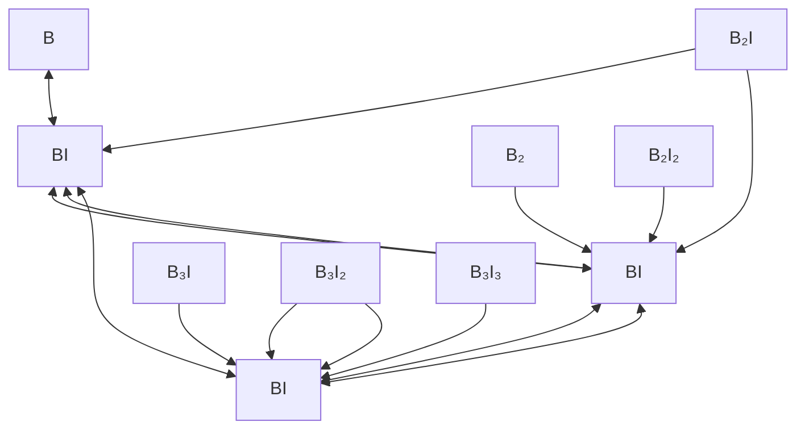

<!-- page:1 -->
# Advanced Calibration for Process Simulation User Guide

<!-- page:1 -->
Version O-2018.06, June 2018

# Copyright and Proprietary Information Notice

<!-- page:2 -->
© 2018 Synopsys, Inc. This Synopsys software and all associated documentation are proprietary to Synopsys, Inc. and may only be used pursuant to the terms and conditions of a written license agreement with Synopsys, Inc. All other use, reproduction, modification, or distribution of the Synopsys software or the associated documentation is strictly prohibited.

# Destination Control Statement

All technical data contained in this publication is subject to the export control laws of the United States of America. Disclosure to nationals of other countries contrary to United States law is prohibited. It is the reader’s responsibility to determine the applicable regulations and to comply with them.

# Disclaimer

SYNOPSYS, INC., AND ITS LICENSORS MAKE NO WARRANTY OF ANY KIND, EXPRESS OR IMPLIED, WITH REGARD TO THIS MATERIAL, INCLUDING, BUT NOT LIMITED TO, THE IMPLIED WARRANTIES OF MERCHANTABILITY AND FITNESS FOR A PARTICULAR PURPOSE.

# Trademarks

Synopsys and certain Synopsys product names are trademarks of Synopsys, as set forth at https://www.synopsys.com/company/legal/trademarks-brands.html. All other product or company names may be trademarks of their respective owners.

# Free and Open-Source Licensing Notices

If applicable, Free and Open-Source Software (FOSS) licensing notices are available in the product installation.

# Third-Party Links

Any links to third-party websites included in this document are for your convenience only. Synopsys does not endorse and is not responsible for such websites and their practices, including privacy practices, availability, and content.

Synopsys, Inc.

Mountain View, CA 94043

www.synopsys.com

<!-- page:3 -->
# About This Guide xiii

Related Publications . . xiv

Conventions . xiv

Customer Support . . . x

Accessing SolvNet. . . xv

Contacting Synopsys Support . . .

Contacting Your Local TCAD Support Team Directly. . . .

# Part I Advanced Calibration in Sentaurus Process 1

# Chapter 1 Using Advanced Calibration File of Sentaurus Process 3

Location of Advanced Calibration File. . .

Using Advanced Calibration. . .

Optional Modules . . . .

Additional Calibration by Users . . .

Earlier Versions of Advanced Calibration . .

Advanced Calibration File for Kinetic Monte Carlo Simulations . .

Sentaurus Workbench Splits: Saving in TDR Format . . .

# Chapter 2 Advanced Calibration for Silicon, SiGe, and Germanium 9

Part 1: Basic Model Switches . . .

Diffusion Models in Silicon and Germanium . 10

Dopant Cluster Models in Silicon and Germanium. .

Defect Cluster Models in Silicon and Germanium . . 13

Poisson Equation . . . 14

Channeling Dose in Analytic Implantations . . . 14

Boundary Conditions . . . 15

Numeric Solver . . . . 16

Summary of Model Switches. . . 16

Part 2: Constant Parameters . . 1

Basic Point-Defect Parameters . . . 18

Bulk Parameters for Free Interstitials . . . 18

Bulk Parameters for Free Vacancies . 19

Bulk Recombination of Point Defects . . . 19

Boundary Conditions for Point Defects . . . 19

Oxidation-Enhanced Diffusion. . . . 20

<!-- page:4 -->
Transient-Enhanced Diffusion. . . . 21

Boron Diffusion and Activation . 22

Boron Diffusion Coefficient . . 22

Effect of Fluorine . . . 23

Boron Clustering. . . . . 23

Boron Dose Loss . . . . 25

Fluorine . . 26

Arsenic Diffusion and Activation . 26

Arsenic Diffusivity . . . . 26

Arsenic Clusters . . . . 27

Arsenic Dose Loss . . . . 28

Phosphorus Diffusion and Activation . . . . 29

Phosphorus Diffusivity . . . . 29

Phosphorus Clusters . . . . 29

Phosphorus Dose Loss . . . . . . 30

Arsenic–Phosphorus Co-Diffusion . . . . 31

Indium Parameters . . . 33

Antimony Parameters . 33

Carbon Diffusion . . 34

Carbon Diffusivity in Silicon . . . . 34

Carbon Clustering in Silicon . . . . 34

Carbon in Germanium . 35

Intrinsic Carrier Concentration . 35

Oxidation . . . 36

Massoud Model Parameters for Wet Oxidation of Silicon. . . . . 36

Parameters for Wet and Dry Oxidation of SiGe. . . . . 36

Smoothing of Amorphous–Crystalline Interface. . . . 37

Selecting Implantation Tables . . . . 37

Effect of Germanium and Stress . . . 38

Arguments of SiGe\_and\_Stress\_Effect . . . . . 39

Ge Chemical Effect (Ge\_Chem\_Eff) . . . . . 39

Stress Effect (Stress\_Eff) . . . . 39

Segregation at Si–SiGe Interface (Segreg\_Model) . . . . . 40

Effect of Strained Overlayers (Strained\_Overlayer) . . . . 40

Implementation of SiGe\_and\_Stress\_Effect . . . . . . 41

Chemical SiGe Alloy Effects . . . . . 41

Stress Effects . . . . 47

Segregation at Si–SiGe Interface (Segreg\_Model) . . . . . 53

Effect of Strained Overlayers (Strained\_Overlayers). . . . . 55

Part 3: Initial Conditions After Ion Implantation . . . . 55

User-Defined Defect Initialization. . . . 56

<!-- page:5 -->
impPostProcess\_AdvCal . . 57

Scaling Factors for Point Defects and Damage . . . . 57

Values for Initial Dopant Activation . . . 59

Sum of As-Implanted Point Defects and Crystal Damage . . . . . 60

Subroutines for Setting ifactor and dfactor . . . . 60

ifactor . . . . 60

vfactor . . . 62

dfactor . . . 62

Thermal Implantations . . . . 62

Scope of Calibration . . . . 64

Damage. . . . 64

Initial Conditions . . . . 65

Implantation Preprocessing and Postprocessing . . . . . . 65

Analytic Implantation . . . . 65

Monte Carlo Implantation (General) . . . . 66

Carborane . . . . . 67

Part 4: Comprehensive and Slow Models . . . 68

Interstitial Clusters . . . 69

Boron–Interstitial Clusters . . . 71

Arsenic Parameters in AdvancedModels. . . . 73

Phosphorus Parameters in AdvancedModels. . . . 73

ChargedCluster Model for Indium. . . . 73

Fluorine Diffusion and Clustering . . . . 74

Carbon Diffusion and Clustering . . . . 75

Nitrogen Diffusion and Clustering . . . 75

Solid Phase Epitaxial Regrowth . 76

Recrystallization Speed . 77

Doping Redistribution . . . 79

Melting Laser Anneal . 82

Settings for Simulation Optimization . . . . . 83

Meshing . . . . 84

Thermodynamics of Silicon . . . . . 85

Silicon Absorptivity . . . . . 86

MLA Calibration . . . . 86

Limitations of MLA Model . . . 89

Part 5: Accelerating Simulations for Power Technologies . . . 89

Using AdvancedPowerDeviceMode . . . . 90

Variant 1: Explicitly Reverting to Standard Models . . . . . 90

Variant 2: Automatically Reverting to Standard Models . . . . . 91

Contents of AdvancedPowerDeviceMode. . . . . 91

Increased Time Steps, Deposition Steps, and Temperature Steps . . . . . . 91

<!-- page:6 -->
Simplified Physics . . . . 92

Speedup Methods Not Included in AdvancedPowerDeviceMode . . . . . . 93

References . . . . 93

# Chapter 3 Guidelines for Additional Calibration 107

Accuracy and Limitations of Advanced Calibration of Sentaurus Process . . . . . . 107

Error Control . . . 108

Point Defects . . . . . 108

Bulk Parameters . . . 108

Surface Boundary Conditions. . . . . . 109

Oxidation-Enhanced Diffusion. . . . . 109

Clusters of Interstitials . . . . 109

Vacancy Clusters . . . 111

Boron Diffusion and Clustering. . . . 111

Diffusion and Pairing in Silicon . . . . 111

Hopping Length (for ChargedReact Model) . . . . . 113

Effect of Fluorine . . . . . 114

Boron Clustering and Activation . . . . 115

Boron Dose Loss . . . . . 119

Arsenic Diffusion and Activation . . . 120

Phosphorus Diffusion and Activation . . . . 121

Phosphorus Diffusion in Silicon. . . . . 122

Phosphorus Activation in Silicon . . . . 122

Phosphorus Dose Loss at Oxide–Silicon Interfaces . . . . . . 123

Co-Diffusion of Arsenic and Phosphorus . . . . . 123

Indium Diffusion and Activation. . . 128

Nonamorphizing Condition . . . . . . 128

Amorphizing Ion Implantation . . . . 128

SPER Model Usage . . . . . 128

Antimony Diffusion and Activation . . . 131

Carbon . . . 132

Carbon–Interstitial Clusters . . . . . 132

Carbon–Boron Clusters . . . . . 133

Impact of Carbon on Hole Mobility . . . . . . 133

Molecular Implantation . . . . 134

Analytic Implantation . . . . . . 135

Sentaurus MC . . . 135

Fluorine Diffusion and Clustering . . . . . . 136

Nitrogen Diffusion and Clustering . . . . . 137

Diffusion in Strained Silicon and Silicon Germanium . . . . . 138

As-Implanted Dopant Profiles . . . . . 139

<!-- page:7 -->
Coimplantation Model . . . . 140

Preamorphization Implantation Model. . . . 141

Cold and Hot Implantation . 141

Amorphization . . . . 141

Channeling . . . . . 142

Dose Loss at Silicon–Oxide Interfaces . . . . . 143

Calibration of ThreePhaseSegregation Model . . . . . 144

Oxidation . . . . 145

Bird’s Beak in CMOS Devices. . . . 146

Diffusion in Polysilicon and Out-Diffusion From Polysilicon . . . . 146

Dopant Penetration Through Gate Oxide . . . . . 147

Diffusion and Activation in Germanium . . . 147

Performing Additional Calibration . . . . 147

Calibration Procedure . 148

Loading a User Calibration File. . . . . . 149

Recommendations . . . . . 149

Miscellaneous . . . . 149

Lateral Diffusion Along Interface . . . 150

Example of a User Calibration File . . . . . 150

Recommended Numeric Settings for Monte Carlo Implantation . . . 152

Monte Carlo Pocket Implantation . . . . . 152

MC Source/Drain Implantation . . . . 154

Additional Calibration for Power Technologies . . . . . 155

Calibration . . . 155

Meshing . . . . . 156

Recommendations for Bulk Refinement With Adaptive Meshing. . . . . . . 156

Refinement at Material Interfaces . . . 158

Calibration of Wet Etching Rate Modification by Ion Implantation . . . . 158

Calibration . . . 159

Application. . . . . . 160

References . . . . 161

# Chapter 4 Advanced Calibration for 4H-SiC Process Simulation 165

Content of Advanced Calibration File for 4H-SiC Simulation. . . . 165

Part 1: Basic Model Switches . . . . 165

Poisson Equation . . . . . 166

Dopant Cluster Models in 4H-SiC. . . 167

Dopant Transport at the Oxide–SiC Interface . . . . . . 168

Boron Evaporation From the SiC Surface . . . . 168

Part 2: Settings for Monte Carlo Implantation . . . . 169

Impact of Wafer Temperature . . . . . 170

<!-- page:8 -->
Recommendations for Fine-Tuning of Amorphization . . . . 172

Illustration of Calibration Results . . . 173

Part 3: Initial Conditions After Ion Implantation . . . 173

References. . . 174

# Part II Advanced Calibration in Sentaurus Process Kinetic Monte Carlo 177

# Chapter 5 Using Advanced Calibration File of Sentaurus Process KMC 179

Location of Advanced Calibration File. . . . 179

Using Advanced Calibration. . . . 180

Additional Calibration by Users . . . . 180

# Chapter 6 Contents of Advanced Calibration of Sentaurus Process KMC 183

Overview. . . 183

Supported Materials . . . . . 184

Part 1: Model Parameters for Implantation Damage and Point Defects . . . . . . 185

Amorphization and Recrystallization . . . . . 185

Amorphous Silicon and Germanium . . . 186

Diffusion, Generation, and Recombination . . . . 187

Charge States . . . . . . 189

Extended Defects . . . . . 190

SiGe . . . . 192

Linear Germanium Correction Factors. . . . 192

Silicon and Germanium Parameter Interpolation . . . . . . 193

Stress Effects . . . . 196

Amorphization and Recrystallization . . . . . . 196

Band Gap . . . . . . 196

Diffusion, Generation, and Recombination . . . . . 197

Extended Defects . . . . . 198

Part 2: Model Parameters for Impurities. . . . 198

Diffusion . . 198

Boron . . 200

Arsenic . . . 201

Phosphorus . . . . . 203

Indium. . . . . 205

Carbon . . . . . 205

Fluorine. . . . 206

Nitrogen . . . . . 206

Clusters . . . . . 207

Boron . . 208

<!-- page:9 -->
Arsenic . . . 208

Phosphorus . . . . . 209

Arsenic and Phosphorus . . . . . . 210

Indium. . . 210

Carbon . . . 211

Boron and Carbon. . . . . . 211

Fluorine. . . 211

Nitrogen . . . . . 212

Segregation . . . 212

Boron . 212

Arsenic . . . 213

Phosphorus . . . . 213

Indium. . . 213

Carbon . . . . 213

Fluorine. . . . . 214

Nitrogen . . . . . 214

Recrystallization . 214

Boron . . 214

Arsenic . . . . 215

Phosphorus . . . . 215

Indium. . . . . 216

Carbon . . . . . 216

Fluorine. . . 216

Nitrogen . . . . . 216

Epitaxy . . . . . . 216

Boron . . 217

Arsenic . . . 217

Phosphorus . . . . . 217

Carbon . . . . 217

SiGe . . . . 217

Linear Germanium Correction Factors. . . . . . 217

Silicon and Germanium Parameter Interpolation . . . . . 218

Stress Effects . . . . 220

Boron . . 220

Arsenic . . . . 221

Phosphorus . . . . 221

Indium. . . 222

Section 4: Model Parameters for Epitaxial Growth . . . 223

Coordinations.Planes Model . . 223

Coordinations Model . . . 224

Coordinations.Reactions Model. . . 224

<!-- page:10 -->
Epitaxial Growth. . . . . 225

Etching . . . . 226

References . . . . 227

# Chapter 7 Guidelines for Additional Calibration 239

Accuracy and Limitations of Advanced Calibration of Sentaurus Process KMC . . . . . 239

Damage and Point Defects. . . . . 240

Amorphization . . . . . . 240

Recrystallization . . . . . 241

Diffusion, Generation, and Recombination . . . . . 242

Extended Defects . . . . 242

Impurities . . . . . 243

Diffusion . . . . 243

Activation . . . . 245

Dose Loss . . . . 247

Recrystallization . . . . . 247

Stress and SiGe Effects. . . . . . 248

References . . . . 249

# Part III Advanced Calibration for Mechanics Simulations 253

# Chapter 8 Using Advanced Calibration File for Mechanics Simulations 255

Location of Advanced Calibration File. . . . . 255

Using Advanced Calibration. . . . 256

Earlier Versions of Advanced Calibration . . . . 256

# Chapter 9 Contents of Advanced Calibration for Mechanics Simulations 259

Overview . . . . 259

Switches for Interpolation in Mole Fraction–Dependent Mechanical Models . . . . . 259

Parameters for Mechanics. . . 261

Suppression of Dilatational Viscosity . . . . 261

Mole Fraction–Dependent Mechanics Parameters for SiGe . . . . . 261

Cubic Crystal Anisotropy for Silicon and Germanium . . . 262

Temperature Dependency of Stiffness Coefficients for Silicon and Germanium . . . 262

Isotropic Elastic Moduli for Germanium. . . . 263

Polysilicon . . . . . 263

Viscosity of Oxide and Nitride . . . . . . 263

Isotropic Moduli for Titanium and Titanium Silicide . . . . 264

Amorphous Germanium Oxide . . . . . 264

<!-- page:11 -->
Titanium Nitride . . 264

Hafnium Oxide . . . . 265

Silicon Carbide . . 265

References. . . . 266

<!-- page:12 -->
Contents

<!-- page:13 -->
Synopsys is working continually on improving the simulation models and optimizing the model parameters for the latest technology nodes. This effort is based on long-standing experience of model calibration for customers and a comprehensive, growing database of state-of-the-art secondary ion mass spectroscopy (SIMS) profiles. The variety of partners and data ensures that systematic and random errors in experimental work are minimized in this model representation. Advanced Calibration provides users with a set of parameters that have been calibrated to deep-submicron CMOS technology, including ultrashallow junction (USJ) formation, surface dose loss, and channel and halo dopant implantation and diffusion.

Sentaurus™ Process offers the Tcl-based scripting language Alagator for the implementation of diffusion and reaction models. This allows users to implement models or to model extensions. This possibility is also used in the Advanced Calibration of Sentaurus Process: The Advanced Calibration file of Sentaurus Process contains model selections, parameter specifications, and some model extensions. This file can be sourced at the beginning of a Sentaurus Process simulation. In analogy, the Advanced Calibration file of Sentaurus Process Kinetic Monte Carlo contains model selections and parameter specifications. This file can be sourced at the beginning of a Sentaurus Process simulation in atomistic mode as well.

The Advanced Calibration of Sentaurus Interconnect is based on the Advanced Calibration of Sentaurus Process, in particular, the part for mechanics simulations. This file can be sourced at the beginning of a Sentaurus Interconnect simulation.

Current and future efforts of Synopsys are focused on the integration of the Advanced Calibration in the process simulators Sentaurus Process, Sentaurus Process Kinetic Monte Carlo, and Sentaurus Interconnect, and on further improvements of its accuracy.

This user guide explains the Advanced Calibration files for the process simulators Sentaurus Process, Sentaurus Process Kinetic Monte Carlo, and Sentaurus Interconnect. It is intended for users who are familiar with Sentaurus Process and want to obtain a higher accuracy in process simulation. For detailed information about these process simulators, refer to the Sentaurus™ Process User Guide and the Sentaurus™ Interconnect User Guide.

The user guide is divided into the following parts:

Part I: Advanced Calibration in Sentaurus Process

The chapters in this part describe the contents and the use of the Advanced Calibration file of Sentaurus Process. They describe the use of Advanced Calibration for silicon, silicon germanium, germanium, and silicon carbide. In addition, they explain the accuracy and limitations of the Advanced Calibration of Sentaurus Process and provides guidelines for additional calibration.

<!-- page:14 -->
■ Part II: Advanced Calibration in Sentaurus Process Kinetic Monte Carlo

The chapters in this part describe the contents and the use of the Advanced Calibration file of Sentaurus Process Kinetic Monte Carlo. They explain the accuracy and limitations of the Advanced Calibration of Sentaurus Process Kinetic Monte Carlo and provides guidelines for additional calibration.

■ Part III: Advanced Calibration for Mechanics Simulations

The chapters in this part describe the contents and the use of the Advanced Calibration file for mechanics simulations for Sentaurus Process and Sentaurus Interconnect.

# Related Publications

For additional information, see:

The TCAD Sentaurus release notes, available on the Synopsys SolvNet® support site (see Accessing SolvNet on page xv).   
■ Documentation available on SolvNet at https://solvnet.synopsys.com/DocsOnWeb.

# Conventions

The following conventions are used in Synopsys documentation.

<table><tr><td>Convention</td><td>Description</td></tr><tr><td>Blue text</td><td>Identifies a cross-reference (only on the screen).</td></tr><tr><td>Bold text</td><td>Identifies a selectable icon, button, menu, or tab. It also indicates the name of a field or an option.</td></tr><tr><td>Courier font</td><td>Identifies text that is displayed on the screen or that the user must type. It identifies the names of files, directories, paths, parameters, keywords, and variables.</td></tr><tr><td>Italicized text</td><td>Used for emphasis, the titles of books and journals, and non-English words. It also identifies components of an equation or a formula, a placeholder, or an identifier.</td></tr><tr><td>Key+Key</td><td>Indicates keyboard actions, for example, Ctrl+I (press the I key while pressing the Control key).</td></tr><tr><td>Menu &gt; Command</td><td>Indicates a menu command, for example, File &gt; New (from the File menu, select New).</td></tr></table>

<!-- page:15 -->
# Customer Support

Customer support is available through the Synopsys SolvNet customer support website and by contacting the Synopsys support center.

# Accessing SolvNet

The SolvNet support site includes an electronic knowledge base of technical articles and answers to frequently asked questions about Synopsys tools. The site also gives you access to a wide range of Synopsys online services, which include downloading software, viewing documentation, and entering a call to the Support Center.

To access the SolvNet site:

1. Go to the web page at https://solvnet.synopsys.com.

2. If prompted, enter your user name and password. (If you do not have a Synopsys user name and password, follow the instructions to register.)

If you need help using the site, click Help on the menu bar.

# Contacting Synopsys Support

If you have problems, questions, or suggestions, you can contact Synopsys support in the following ways:

Go to the Synopsys Global Support Centers site on synopsys.com. There you can find e-mail addresses and telephone numbers for Synopsys support centers throughout the world.   
Go to either the Synopsys SolvNet site or the Synopsys Global Support Centers site and open a case online (Synopsys user name and password required).

# Contacting Your Local TCAD Support Team Directly

Send an e-mail message to:

support-tcad-us@synopsys.com from within North America and South America   
support-tcad-eu@synopsys.com from within Europe   
support-tcad-ap@synopsys.com from within Asia Pacific (China, Taiwan, Singapore, Malaysia, India, Australia)

<!-- page:16 -->
# About This Guide

# Customer Support

support-tcad-kr@synopsys.com from Korea   
support-tcad-jp@synopsys.com from Japan

# Part I Advanced Calibration in Sentaurus Process

<!-- page:17 -->
This part of the Advanced Calibration for Process Simulation User Guide contains the following chapters:

Chapter 1 Using Advanced Calibration File of Sentaurus Process on page 3

Chapter 2 Advanced Calibration for Silicon, SiGe, and Germanium on page 9

Chapter 3 Guidelines for Additional Calibration on page 107

Chapter 4 Advanced Calibration for 4H-SiC Process Simulation on page 165

<!-- page:19 -->
This chapter gives a brief introduction to the use of Advanced Calibration in a process simulation with Sentaurus Process.

Advanced Calibration is a selection of models and parameters, which is recommended by Synopsys to be used for accurate process simulation. In Sentaurus Process, this selection of models and parameters is contained in a text file, which can be opened with any standard text editor.

By sourcing the Advanced Calibration file at the beginning of a process simulation, the standard calibration of Synopsys is selected. If needed, you can change or extend the Advanced Calibration. This can be performed by sourcing an additional calibration file, which contains the required parameter changes, or by editing the Advanced Calibration file with a text editor.

# Location of Advanced Calibration File

The Advanced Calibration file is the ultimate product of Synopsys’ calibration efforts. For each release of Sentaurus Process, there is a new Advanced Calibration file that includes the best and latest set of models and parameters. To ensure backward compatibility, previous Advanced Calibration files are still available.

The files for the Advanced Calibration of Sentaurus Process in this release are located at:

\$STROOT/tcad/\$STRELEASE/lib/sprocess/TclLib/AdvCal

The default file is named AdvCal\_2018.06.fps. It represents the first version of Advanced Calibration O-2018.06. Older versions of the Advanced Calibration file can be found in the same directory. For example, the file AdvCal\_2017.09.fps contains the Advanced Calibration file for Version N-2017.09 and is available for backward compatibility.

The default Advanced Calibration parameter file contains parameters for Si, SiGe and Gebased processes. An additional parameter file AdvCal\_SiC\_2018.06.fps targets process simulation of semiconductor devices based on 4H-SiC.

<!-- page:20 -->
# Using Advanced Calibration

To use the Advanced Calibration of Sentaurus Process, at the beginning of the input file, insert the line:

AdvancedCalibration

or, better:

AdvancedCalibration 2018.06

Alternatively, this file can be sourced by using:

source \$AdvCalDir/AdvCal\_2018.06.fps

The procedure AdvancedCalibration has two optional parameters <version> and <material>. The order of arguments is not important. The allowed values for <material> are Si, SiGe, Ge, 4H-SiC, and SiC:

Si, SiGe, and Ge as well as no material value will call the default Advanced Calibration parameter file for Si, SiGe, and Ge materials.

4H-SiC and SiC will call the Advanced Calibration file for 4H-SiC.

For example, the following command calls the Advanced Calibration file for 4H-SiC (AdvCal\_SiC\_2018.06.fps):

AdvancedCalibration 2018.06 4H-SiC

# Optional Modules

AdvCal\_2018.06.fps includes a base set of models and parameters, and several optional modules, which are not switched on automatically. Each module can be selected by a single command after loading Advanced Calibration.

Three modules are useful for selected technologies, and their corresponding commands are as follows:

SiGe\_and\_Stress\_Effect switches on the impact of Ge and stress on dopant diffusion and activation. It is recommended for PMOS devices with SiGe pockets and also can be used for HBT devices with SiGe layers. See Effect of Germanium and Stress on page 38.

AdvancedPowerDeviceMode is used to speed up the process simulation for many types of power device. For simulation of power devices, see Part 5: Accelerating Simulations for Power Technologies on page 89 and Additional Calibration for Power Technologies on page 155.

AdvancedMLAModel is recommended for modeling melting laser anneal. See Melting Laser Anneal on page 82.   
Other modules switch on physical models that are more complex and more time-consuming alternatives to the Advanced Calibration default models:   
AdvancedFluorineModel models the impact of fluorine on transient-enhanced diffusion and on boron dose loss. It is recommended for processes that include atomic F implantations. It also can be considered for use in processes including high-dose BF2 implantations. See Fluorine Diffusion and Clustering on page 74.   
AdvancedNitrogenModel switches on equations for the diffusion and clustering of nitrogen in silicon. It can be considered for use in processes that include nitrogen implantations. See Nitrogen Diffusion and Clustering on page 75.   
AdvancedModels is used to switch on complex physical models for various clustering phenomena in silicon, such as interstitial clusters, boron–interstitial clusters, and fluorine clusters. AdvancedModels is used mainly for the purpose of fundamental research. See Part 4: Comprehensive and Slow Models on page 68.   
AdvancedSPERModel switches on the solid phase epitaxial regrowth (SPER) model and sets the calibrated parameters for it. AdvancedSPERModel adds complexity to the simulation of anneals after amorphizing implantations1 . See Solid Phase Epitaxial Regrowth on page 76.

<!-- page:21 -->
# Additional Calibration by Users

Advanced Calibration is based on the assumption that all parameters that are not changed in the parameter files are the default parameters of Sentaurus Process. To use the Advanced Calibration file AdvCal\_2018.06.fps, it must be sourced before the real process description.

After sourcing AdvCal\_2018.06.fps, you can change the model switches or parameter values of the physical models. This should ideally be performed by experienced users with a good understanding of the diffusion models of Sentaurus Process.

<!-- page:22 -->
For the process simulation of silicon technology, Advanced Calibration is usually the best starting point. You can further increase the accuracy for a certain technology by additional finetuning of a few physical parameters.

The best way to perform this is to put all additional calibration in a user calibration file, for example, my\_calibration.fps. This file includes the commands to select optional modules of Advanced Calibration such as AdvancedModels or AdvancedPowerDeviceMode, and it includes all project-specific changes to the physical models or parameters with respect to Advanced Calibration.

In the process simulation file, at the beginning of the process simulation, insert the lines:

AdvancedCalibration 2018.06

source ./my\_calibration.fps

This approach allows you to:

Separate completely the calibration and the process description.   
■ Use the Advanced Calibration file as a starting point.   
Summarize all project-specific calibration in a short and clear text file.

Detailed information about how to perform additional calibration is given in Chapter 3 on page 107.

# Earlier Versions of Advanced Calibration

You can source earlier versions of the Advanced Calibration file by inserting, for example, the line:

AdvancedCalibration 2017.09

This is converted internally to:

source \$AdvCalDir/AdvCal\_2017.09.fps

Table 1 on page 7 lists the earlier versions of the Advanced Calibration file that can be loaded with Sentaurus Process Version O-2018.06.

This possibility is available to provide backward compatibility. You can run simulations with the latest version of Sentaurus Process, but the simulations can still be based on an old calibration. For new TCAD projects, it is recommended to load the latest version of Advanced Calibration.

Table 1 Earlier versions of Advanced Calibration file and their corresponding commands 

<table><tr><td>Advanced Calibration file</td><td>Corresponding command</td></tr><tr><td>AdvCal_2017.09.fps</td><td>AdvancedCalibration 2017.09</td></tr><tr><td>AdvCal_2016.12.fps</td><td>AdvancedCalibration 2016.12</td></tr><tr><td>AdvCal_2016.03.fps</td><td>AdvancedCalibration 2016.03</td></tr><tr><td>AdvCal_2015.06.fps</td><td>AdvancedCalibration 2015.06</td></tr><tr><td>AdvCal_2014.09.fps</td><td>AdvancedCalibration 2014.09</td></tr><tr><td>AdvCal_2013.12.fps</td><td>AdvancedCalibration 2013.12</td></tr><tr><td>AdvCal_2013.03.fps</td><td>AdvancedCalibration 2013.03</td></tr><tr><td>AdvCal_2012.06.fps</td><td>AdvancedCalibration 2012.06</td></tr><tr><td>AdvCal_2011.09.fps</td><td>AdvancedCalibration 2011.09</td></tr><tr><td>AdvCal_2010.12.fps</td><td>AdvancedCalibration 2010.12</td></tr><tr><td>AdvCal_2010.03.fps</td><td>AdvancedCalibration 2010.03</td></tr><tr><td>AdvCal_2009.06.fps</td><td>AdvancedCalibration 2009.06</td></tr><tr><td>AdvCal_2008.09.fps</td><td>AdvancedCalibration 2008.09</td></tr><tr><td>AdvCal_2007.12.fps</td><td>AdvancedCalibration 2007.12</td></tr><tr><td>AdvCal_2007.03.fps</td><td>AdvancedCalibration 2007.03</td></tr><tr><td>AdvCal_2006.06.fps</td><td>AdvancedCalibration 2006.06</td></tr><tr><td>AdvCal_2005.10.fps</td><td>AdvancedCalibration 2005.10</td></tr></table>

<!-- page:23 -->
The original versions of the earlier Advanced Calibration files cannot be used in the latest version of Sentaurus Process, due to changes in the source code and the model library of Sentaurus Process, which affect the functionality of the old files. Therefore, Synopsys has adapted the earlier Advanced Calibration files to cope with those changes. Modifications have been undertaken in such a way that the choice of physical models and parameters is still the one from the corresponding release. The AdvancedCalibration command always loads the modified versions.

Most earlier versions of Advanced Calibration contain the Compatibility command. For example, AdvCal\_2017.09.fps contains the command Compatibility 2017.09, which applies the default parameters and model settings of Sentaurus Process Version N-2017.09 before setting the Advanced Calibration models and parameters.

As an exception, AdvCal\_2010.12.fps does not contain the Compatibility 2010.12 command. This command switches off the model switch pdbSet Mechanics Total.Concentration.Model 1, which was introduced in Sentaurus Process Version

<!-- page:24 -->
F-2011.09 and is considered an important improvement for stress calculation. Users who want a more complete backward compatibility with Version E-2010.12 must insert the command Compatibility 2010.12 before loading AdvCal\_2010.12.fps.

# Advanced Calibration File for Kinetic Monte Carlo Simulations

An Advanced Calibration file is available for simulations with the kinetic Monte Carlo mode of Sentaurus Process. The use and contents of this file are described in Chapter 5 on page 179 and Chapter 6 on page 183.

# Sentaurus Workbench Splits: Saving in TDR Format

Sentaurus Process can be used within Sentaurus Workbench projects. If split commands of Sentaurus Workbench are used inside the input file of Sentaurus Process, at each split command, the structure with all the data fields is saved in a TDR format file. In a subsequent tool instance, the process simulation starts by loading the previously saved structure.

Sentaurus Process does not always save and load the complete status of the process simulation. In particular, the definitions of Alagator terms and solution commands are only saved in TDR format if the keyword store is used in the term definition command lines, and Tcl procedures are only saved if they have been defined by the command fproc (rather than proc). Furthermore, entries in the parameter database are only saved if the TDR format is used for saving and loading.

The Advanced Calibration file contains the definitions of terms and procedures. In the latest file, the definitions of terms, solutions, and procedures are performed in such a way that they are saved to the TDR format and are reloaded. No additional attention is needed.

In an earlier version of the file (AdvCal\_2010.03.fps), a series of terms inside the procedure SiGe\_and\_Stress\_Effect was modified with the command MultiplyTerm. Since AddToTerm, SubFromTerm, and MultiplyTerm modify terms without the keyword store, the corresponding term modifications were not stored in the TDR format. Therefore, the command MultiplyTerm is no longer used in newer versions of Advanced Calibration.

In early versions of the Advanced Calibration files (AdvCal\_2007.12.fps and before), the definitions of terms and procedures are not saved. Therefore, when using these versions of Advanced Calibration files, you must ensure that the files are loaded at the beginning of each part of a split process simulation.

<!-- page:25 -->
This chapter explains how to use Advanced Calibration of Sentaurus Process for silicon, silicon germanium (SiGe), and germanium and documents the origin of the parameter values.

The focus of Advanced Calibration is monocrystalline silicon, germanium, and SiGe for all Ge mole fractions. The calibration for silicon and SiGe with low Ge mole fraction ( ) is the≤ 0.5 most mature and reliable. On the other hand, the one for pure Ge is less mature and reliable, and the one for SiGe with high Ge mole fraction (> 0.5) is the least mature and reliable. Many model equations and model parameters are taken from reliable publications. In addition, a rigorous calibration has been performed by Synopsys, based on a SIMS database.

The book Intrinsic Point Defects, Impurities, and Their Diffusion in Silicon by Pichler [1] is a good reference source for parameter values. It refers to more than 3000 scientific papers and gives a comprehensive overview of the experimental data available for the calibration of fundamental parameters for diffusion in silicon. For many relevant parameters, Pichler compares the results from many authors, which can be used to estimate the error bars of the parameter values.

The Advanced Calibration file AdvCal\_2018.06.fps is divided into the following parts, which contain numbered sections and are executed in sequence:

Part 1: Basic model switches   
Part 2: Constant parameters   
■ Part 3: Initial conditions after ion implantation   
■ Part 4: Comprehensive and slow models   
■ Part 5: Accelerating simulations for power technologies

# Part 1: Basic Model Switches

In Sentaurus Process, Advanced Calibration covers several alternatives for diffusion and activation models. Some models are relatively simple, such as the ChargedPair model for dopant diffusion or the Transient activation of dopants. Other models are more sophisticated (for example, the ChargedReact model for dopant diffusion and the ChargedCluster model for dopant activation) but require more equations to be solved in the diffusion solver and, therefore, require more CPU time. These different models coexist in Advanced Calibration so that, in simple limiting situations (for example, in thermal equilibrium for low dopant concentration), different models give the same results. In more complex situations, for example, during transient-enhanced diffusion (TED), the more complex models will give better results.

<!-- page:26 -->
The best choice of fundamental models depends on the problem to be solved. Part 1 of the Advanced Calibration represents a choice that is recommended by Synopsys for most applications. For most devices, the modeling of TED and dopant activation is important, and it is necessary to use some models that describe the underlying physics accurately.

It is often useful to reduce the number of equations to be solved in order to save CPU time. On the other hand, it might be sometimes necessary to select models that are more sophisticated than the default choice, even at the cost of increasing the CPU time. In this chapter, the possible changes with respect to the default model switches are explained.

The most elegant way to change a basic model switch is adding a corresponding line at the beginning of a project-specific or user-specific calibration file, which is sourced after loading the Advanced Calibration file. In this way, you can track the differences to the default suggestions of Synopsys.

CPU time is an important issue for the process simulation of power device fabrication, which often includes a large number of thermal anneals. A summary of the methods to speed up the simulation of power device processes is given in Additional Calibration for Power Technologies on page 155.

Part 4 of the Advanced Calibration file contains the procedure AdvancedModels, which offers an option to switch to a consistently calibrated set of state-of-the-art models for dopant and defect clustering with a single command line. This option is recommended for fundamental research and also can be considered to be used in very advanced CMOS technology. It is described in Part 4: Comprehensive and Slow Models on page 68.

# Diffusion Models in Silicon and Germanium

See section 1.1 of AdvCal\_2018.06.fps.

The default choice is the pair diffusion model ChargedPair. The dopants diffuse only through dopant-defect pairs, where defects can be either interstitials or vacancies. All charge states of defects and dopant-defect pairs are taken into account, and the concentration of pairs is assumed to be in local equilibrium with unpaired dopants and defects.

A more sophisticated alternative is the ChargedReact model, a so-called five-stream model, which is selected by:

pdbSet Si Dopant DiffModel ChargedReact

<!-- page:27 -->
Here, the diffusion of dopants is simulated through dopant-defect pairs. In contrast to the ChargedPair model, the simplifying assumption of local equilibrium between pairs and unpaired dopants is omitted. Instead, the kinetics of pair formation and dissolution is taken into account. This model needs more CPU time than the ChargedPair model, because additional equations need to be solved for each dopant. It is possible to select the ChargedReact model individually for some dopants. For example, it might be reasonable to select it only for boron but not for other dopants. This can be performed by adding the line:

pdbSet Si Boron DiffModel ChargedReact

It is possible to use the ChargedReact model for some dopants and the ChargedPair model for all other dopants. In contrast, it is not recommended to mix the ChargedFermi model with either of the ChargedReact or ChargedPair model, because the treatment of point defects would become inconsistent.

# Dopant Cluster Models in Silicon and Germanium

See section 1.2 of AdvCal\_2018.06.fps.

These models govern the dopant activation during thermal annealing. The simplest and fastest model is None, which means that there are no dopant clusters. This model is recommended for dopants for which clustering has no influence. This is typically the case when the maximum concentration of a dopant is far below the solid solubility. For example, in an NMOS simulation with a very low indium dose for the channel implantation (for example, ${ 1 0 } ^ { 1 2 }$ ), it is cm–2 reasonable to set the indium activation model to None, to speed up the simulation.

For the dopant impurities boron, indium, arsenic, phosphorus, and antimony in silicon as well as for the dopant impurities boron, arsenic, phosphorus, antimony, and carbon in germanium, the activation model Transient is used as the default. In this model, dopants can be bound in clusters, which consist only of dopants of one species. The equilibrium distribution of dopants into clusters and substitutional impurities is governed by the solid Solubility; the rate at which the equilibrium is reached is governed by the parameter CluRate. Both Solubility and CluRate are Arrhenius-type constants with individual parameters for each dopant.

Special models exist for boron, arsenic, phosphorus, indium, carbon, and fluorine clustering in silicon.

Boron can form so-called boron–interstitial clusters (BICs) together with silicon interstitials. BICs exist in various sizes, as $\mathrm { B } _ { \mathrm { m } } \mathrm { I } _ { \mathrm { n } }$ ‘molecules’ inside silicon, which grow or evaporate by the incorporation or emission of silicon interstitials or boron-interstitial pairs. The BIC model can be selected by using:

pdbSet Si Boron ActiveModel ChargedCluster

<!-- page:28 -->
The BIC model is not used by default because the solution of individual equations for all BICs is numerically expensive. Furthermore, the BIC model should only be used in combination with the Full model for interstitial clusters, which uses more equations than the 1Moment model for interstitial clusters, which is the Advanced Calibration default. The recommended way to use the BIC model is to execute the procedure AdvancedModels defined in part 4 of the Advanced Calibration file (see Part 4: Comprehensive and Slow Models on page 68). The selection Boron ActiveModel Transient gives satisfactory results in many situations.

Arsenic and phosphorus can form clusters together with point defects, which are so-called arsenic–vacancy (As–V), phosphorus–vacancy (P–V), and phosphorus–interstitial (P–I) clusters. To take these into account, you can switch on the ChargedCluster model for silicon using:

pdbSet Si Arsenic ActiveModel ChargedCluster

pdbSet Si Phosphorus ActiveModel ChargedCluster

In the case of arsenic, a family of four different As–V clusters and pure As clusters will form. In the case of phosphorus, two different P–V clusters, one pure P cluster, and one P–I cluster are modeled. The models can be used with both the 1Moment and Full models for interstitial clusters. The formation and dissolution of As–V, P–V, and P–I clusters change the local concentration of silicon point defects (interstitials and vacancies).

The older Cluster model, in which As4V is the only type of As cluster, is not recommended to be used, as it sometimes overestimates the impact of As-cluster formation and dissolution on the point-defect concentration in silicon. Instead, the default choice for As clustering is the Transient model, in which $\mathbf { A } \mathbf { s } _ { 3 }$ is the only As cluster and which is easy to understand and calibrate.

The activation model ChargedCluster can also be applied to simulate formation of indium clusters. This model is invoked in the procedure AdvancedModels (see Part 4: Comprehensive and Slow Models on page 68).

Carbon can form carbon–interstitial clusters in silicon, with a similar reaction chain as for BICs. The formation of carbon–interstitial clusters is activated by:

pdbSet Si Carbon ActiveModel NeutralCluster

Solving a transient equation for the formation and dissolution of Ge–B pairs in silicon is not considered necessary. Instead, in cases where the chemical effect of Ge on B diffusion needs to be taken into account, you can select a calibrated modification of B diffusivity in the presence of germanium by using:

SiGe\_and\_Stress\_Effect 1 1 1 0

immediately after sourcing the Advanced Calibration file. This is explained in Effect of Germanium and Stress on page 38.

# Defect Cluster Models in Silicon and Germanium

<!-- page:29 -->
See section 1.3 of AdvCal\_2018.06.fps.

For silicon and germanium, interstitial clustering is described by the 1Moment cluster model. In this model, the capturing and release of interstitials from {311} defects is described according to a publication by Rafferty et al. [2]. This model uses only a single equation to describe the time evolution of interstitial clusters and is considered a good compromise between accuracy and computation speed.

A complex silicon interstitial-clustering model, including small interstitial clusters, {311} defects, and dislocation loops, is used in the AdvancedModels set and described in Interstitial Clusters on page 69.

Vacancy clusters are not simulated by default in Advanced Calibration because their modeling is not needed for regular processes. If vacancy clusters are relevant, for example, in processes that include vacancy engineering, that is, the creation of a vacancy-rich region by high-energy implantation, you have the option of three different models for vacancy clusters in silicon.

The simplest model is switched on by:

pdbSet Si Vac ClusterModel 1Moment

In this case, the nucleation, growth, and dissolution of vacancy clustering are modeled with arbitrary calibrated parameters, which is analogous to the standard model for interstitial clusters.

A more comprehensive model as proposed in the ATOMICS research project [3] is enabled by:

pdbSet Si Vac ClusterModel Full

By default, if the Full model is selected for vacancy clusters, Sentaurus Process will solve seven equations for small vacancy clusters (V2–V8), with calibrated parameters including binding energies based on ab initio simulations [3].

For numeric efficiency, an alternative calibration of the Full model using fewer equations can be selected by using:

```txt
pdbSet Si Vac ClusterModel Full
pdbSet Si Vac MultiClusterModel Full {2Moment}
pdbSetDouble Si Vac CL.Size 3
pdbSetDoubleArray Si V3 kfV {0 {[expr 4*3.1415*2.97e-8*[pdbGet Si Vac D 0]]} }
pdbSetDoubleArray Si V3 krV {0 0}
pdbSetDoubleArray Si V3 kfI {0 0}
pdbSetDoubleArray Si V3 krI {0 0} 
```

<!-- page:30 -->
In this case, one equation for the small vacancy clusters V2 and two equations for the voids (DVoid for the concentration of V-clusters, and CVoid for the total concentrations of vacancies in these clusters) are solved with arbitrary calibrated parameters.

# Poisson Equation

See section 1.4 of AdvCal\_2018.06.fps.

In Advanced Calibration, the Poisson equation for the electrical potential is solved for both silicon and germanium. Alternatively, you can switch off the Poisson equation with the command:

pdbSetBoolean Si Potential Poisson 0

In this case, local charge neutrality is assumed and the number of partial differential equations is reduced by one. In most situations, local charge neutrality gives approximately the same results as the Poisson equation. At p-n junctions, the assumption of charge neutrality gives a sharper peak of the electric field than the Poisson equation, which results in slightly sharper kinks of dopant profiles at p-n junctions.

Modern submicron CMOS devices have very thin dielectrics. Therefore, the electrostatic interaction between the gate and the channel region in such devices is strong. This interaction results in the presence of an additional potential at semiconductor surfaces (under the gate) and strong electric fields in the semiconductor near semiconductor–oxide interfaces. To take this electrostatic interaction into account, the Poisson equation with proper boundary conditions can be solved in all materials, including dielectrics, especially under the gate [4]. Ideally, also quantum corrections to the distribution of electrons and holes can be taken into account in the simulation [4]. These effects, with a small but noticeable impact on CMOS device characteristics [4], are not included in the current release of Advanced Calibration for Sentaurus Process.

# Channeling Dose in Analytic Implantations

See section 1.5 of AdvCal\_2018.06.fps.

For analytic implantations, the switch ChanDoseInterpolation 1 selects the correct method of interpolation of the ion-channeling dose between the tabulated values of the Default tables.

The coimplantation model [5] for damage accumulation is switched on. This model provides a description of ion channeling for successive ion implantations.

<!-- page:31 -->
# Boundary Conditions

See section 1.6 of AdvCal\_2018.06.fps.

In the pair diffusion model, the segregation of dopants at silicon and germanium surfaces involves the capture or creation of dopant–defect pairs at the silicon side of the interface.

In the pair segregation model used in Advanced Calibration, when a dopant–defect pair diffuses to an interface between semiconductor and another material, the dopant can enter the other material (or, for three-phase segregation, the interface layer), whereas the point defect remains on the semiconductor side of the interface.

The following selection means that the point defect released can have any charge state (and not only a neutral charge state):

```csv
pdbSet Ox_Si Boundary UseUnpairedTotalInt 1
pdbSet Gas_Si Boundary UseUnpairedTotalInt 1
pdbSet Nit_Si Boundary UseUnpairedTotalInt 1 
```

Similarly, for the opposite segregation reaction, when a dopant–defect pair is formed at the silicon side of the interface, a point defect with any charge state can be consumed at the silicon side of the interface.

As a consequence of this selection, the time at which segregation equilibrium is reached in highly doped regions, where most point defects are charged, is decreased. The segregation equilibrium itself is not affected. Although the name of the Boolean parameter is UseUnpairedTotalInt, the selection is applied to both interstitials and vacancies.

The selection:

pdbSetSwitch Ox\_Si I Surf.Recomb.Vel Normalized

and the corresponding lines for vacancies and other interfaces allow the generation and recombination of point defects at silicon surfaces in all charge states.

For B, As, and P at $\mathrm { S i } – \mathrm { S i O } _ { 2 } , \mathrm { S i } – \mathrm { S i } _ { 3 } \mathrm { N } _ { 4 } , \mathrm { G e } – \mathrm { S i O } _ { 2 } ,$ and Ge–GeO interfaces, the three-phase segregation model is the default in Advanced Calibration. For In and Sb, the simpler segregation model is the default.

<!-- page:32 -->
# Numeric Solver

See section 1.7 of AdvCal\_2018.06.fps.

By default, the direct solver PARDISO is used for 1D and 2D simulations, and the iterative solver ILS is used for 3D simulations. For better performance, Advanced Calibration selects ILS to solve the linear systems also in 2D. Specific parameters can be set for ILS in 2D. While nd is selected by default for ILS.symmOrdering as the optimum for multithreaded calculations, you should consider switching to mmd for single-thread calculations.

# Summary of Model Switches

Table 2 and Table 3 on page 17 summarize the default model switches and all the alternatives supported by Advanced Calibration. For all supported model switches, the corresponding calibrated parameters are included in the Advanced Calibration file (AdvCal\_2018.06.fps) and are ready to be applied automatically when alternative models are selected. The procedure AdvancedModels, which switches on several more complex models at the same time, is explained in Part 4: Comprehensive and Slow Models on page 68.

Table 2 Model switches for silicon in Advanced Calibration 

<table><tr><td>Model</td><td>Default</td><td>Supported alternatives</td></tr><tr><td>pdbSet Si Dopant DiffModel</td><td>ChargedPair</td><td> $ChargedReact^1$ </td></tr><tr><td>pdbSet Si Boron ActiveModel</td><td>Transient</td><td>None</td></tr><tr><td>pdbSet Si Indium ActiveModel</td><td>Transient</td><td>None</td></tr><tr><td>pdbSet Si Arsenic ActiveModel</td><td>Transient</td><td>None, ChargedCluster</td></tr><tr><td>pdbSet Si Phosphorus ActiveModel</td><td>Transient</td><td>None, ChargedCluster</td></tr><tr><td>pdbSet Si Antimony ActiveModel</td><td>Transient</td><td>None</td></tr><tr><td>pdbSet Si Germanium ActiveModel</td><td>None</td><td></td></tr><tr><td>pdbSet Si Carbon ActiveModel</td><td>NeutralCluster</td><td>None</td></tr><tr><td>pdbSet Si Int ClusterModel</td><td>1Moment</td><td></td></tr><tr><td>pdbSet Si Vac ClusterModel</td><td>None</td><td>1Moment, Full</td></tr><tr><td>pdbSet Si Potential Poisson</td><td>1</td><td>0</td></tr><tr><td>pdbSet ImplantData UseCoImplant</td><td>1</td><td>0</td></tr><tr><td>pdbSet Ox_Si Boundary UseUnpairedTotalInt</td><td>1</td><td></td></tr></table>

1. If the basic choice is ChargedPair, it is possible to select ChargedReact for individual dopants.

Table 3 Model switches for germanium in Advanced Calibration 

<table><tr><td>Model</td><td>Default</td><td>Supported alternatives</td></tr><tr><td>pdbSet Ge Dopant DiffModel</td><td>ChargedPair</td><td> $ChargedReact^1$ </td></tr><tr><td>pdbSet Ge Boron ActiveModel</td><td>Transient</td><td>None</td></tr><tr><td>pdbSet Ge Arsenic ActiveModel</td><td>Transient</td><td>None</td></tr><tr><td>pdbSet Ge Phosphorus ActiveModel</td><td>Transient</td><td>None</td></tr><tr><td>pdbSet Ge Antimony ActiveModel</td><td>Transient</td><td>None</td></tr><tr><td>pdbSet Ge Carbon ActiveModel</td><td>Transient</td><td>None</td></tr><tr><td>pdbSet Ge Int ClusterModel</td><td>1Moment</td><td>None</td></tr><tr><td>pdbSet Ge Vac ClusterModel</td><td>None</td><td></td></tr><tr><td>pdbSet Ge Potential Poisson</td><td>1</td><td>0</td></tr><tr><td>pdbSet ImplantData UseCoImplant</td><td>1</td><td>0</td></tr><tr><td>pdbSet GeOx_Ge Boundary UseUnpairedTotalInt</td><td>1</td><td></td></tr></table>

1. If the basic choice is ChargedPair, it is possible to select ChargedReact for individual dopants.

<!-- page:33 -->
# Part 2: Constant Parameters

This part of the Advanced Calibration file contains the parameters for the diffusion and reaction equations, which are set at the beginning of the process simulation and remain valid for all process steps until the end of the simulation. The parameters are set for all alternatives listed in Table 2 on page 16. This allows you to select any of the alternatives models with all corresponding parameters by using a single command line, which can be ideally placed in a user calibration file, which is sourced immediately after sourcing AdvCal\_2018.06.fps.

Many parameters are taken from either the literature of carefully designed experiments or the publication by Pichler [1], which gives an outstanding, comprehensive overview on the publications of impurity diffusion and activation in silicon. Other parameters have been calibrated based on the SIMS database of Synopsys.

Model parameters, which depend on particular ion implantation steps, are included in the third part of the Advanced Calibration file and are described in Part 3: Initial Conditions After Ion Implantation on page 55. Examples of these are the number of point defects generated by ion implantation, which can depend on the implantation conditions.

<!-- page:34 -->
# Basic Point-Defect Parameters

See section 2.1 of AdvCal\_2018.06.fps.

The bulk parameters for interstitials and vacancies (sections 2.1.1–2.1.3 of AdvCal\_2018.06.fps) are the most fundamental parameters in the pair diffusion model. They have been carefully selected from the literature. Any change affects not only the diffusion of point defects, but also the diffusion of all dopant species that diffuse in dopant-defect pairs. Changing the point-defect parameters with every new technology calibration would make it difficult to compare the results of different calibration projects. Therefore, it is strongly recommended that these parameters are not changed in any way.

In principle, this is also true for the surface boundary conditions (BCs) for point defects (section 2.1.4 of AdvCal\_2018.06.fps). It is advisable not to change them because the calibration of all models for TED and the diffusion of all dopants would be affected. However, the BCs depend on the capping material and the local concentration of impurities. For polysilicon and oxynitride, the BCs can depend on the details of the process flow. Therefore, in practice, the surface recombination lengths of point defects can be considered to be calibration parameters for the fine-tuning of process simulation.

Oxidation and nitridation cause the injection of interstitials and vacancies, respectively, at the exposed surface. A calibration of interstitial injection has been performed for dry oxidation. For nitridation and wet oxidation, the surface boundary conditions for point defects are less reliable than for inert atmosphere and can be considered to be calibration parameters for the fine-tuning of diffusion processes.

# Bulk Parameters for Free Interstitials

See section 2.1.1 of AdvCal\_2018.06.fps.

For silicon, the diffusivity of interstitials Di is taken from Bracht et al. [6]. The equilibrium concentration Cstar is chosen such that the product Di\*Cstar has the value $1 . 5 9 \times { 1 0 } ^ { 2 5 } \times \mathrm { e x p } ( - 4 . 7 0 2 ~ \mathrm { e V / k T } ) ~ \mathrm { c m } ^ { - 1 } \mathrm { s } ^ { - 1 }$ . This is a reasonable compromise between conflicting suggestions in the literature [1][7][8] and is in acceptable agreement with various ‘clean’ data on silicon isotope diffusion and dopant diffusion in silicon that has been published [6][8][9]. The same value for Di\*Cstar was also used in [10].

The charge distribution for free interstitials and vacancies was taken from method.advanced of the Synopsys Taurus™ TSUPREM-4™ process simulator and is based on various publications [11][12][13]. During calibration, a small change with respect to the TSUPREM-4 parameters has been introduced for the relative abundance of negatively charged vacancies.

<!-- page:35 -->
For germanium, there is a lack of experimental data on self-interstitial properties. For the diffusivity Di of interstitials in germanium, a migration energy of 1.6 eV is assumed, which is 0.4 eV higher than calculation results for uncharged interstitials published by Vanhellemont et al. [14]. The equilibrium concentration Cstar is estimated based on the formation energy (2.78 eV), which is 0.4 eV less than the calculated value of Vanhellemont et al. [15]. This choice is partially motivated by the parameter choice for pure silicon, where the activation energy for high-temperature interstitial migration, derived from experiments by Bracht [6], is higher than the value calculated with ab initio methods. For simplicity, the prefactors for the diffusivity and the equilibrium concentration have the same values as in silicon.

# Bulk Parameters for Free Vacancies

See section 2.1.2 of AdvCal\_2018.06.fps.

For silicon, the diffusivity of vacancies Dv is taken from [6]. The equilibrium concentration Cstar is chosen such that Dv\*Cstar corresponds to the value from [6] at $1 0 1 4 . 2 5 ^ { \circ } \mathrm { C }$ . The activation energy for Dv\*Cstar (4.14 eV) is taken from [7].

For germanium, the equilibrium concentration of vacancies Cstar is based on [14], but with the formation energy reduced by 0.4 eV. The diffusion barrier of vacancies Dv is derived from the vacancy equilibrium concentration and the experimental vacancy-mediated self-diffusion coefficient of germanium following [16]. The resulting( ) 13.6 3.09 eV/kT × exp ( ) – cm( ) –2 s –1 migration barrier is 1.14 eV.

# Bulk Recombination of Point Defects

See section 2.1.3 of AdvCal\_2018.06.fps.

It is assumed that the bulk recombination is diffusion limited. Furthermore, the recombination of interstitials and vacancies, which are both positively or both negatively charged, is assumed to be suppressed by electrostatic repulsion.

# Boundary Conditions for Point Defects

See section 2.1.4 of AdvCal\_2018.06.fps.

Natural boundaries for both vacancies and interstitials are assumed. The surface recombination length is 1 nm for Si–SiO2, Ge–SiO2, and Ge–GeO2 boundaries, and 10 nm for Si–SiN boundaries. For gas–silicon and gas–germanium boundaries, which are used during epitaxy, the surface recombination for vacancies is strongly reduced.

<!-- page:36 -->
# Oxidation-Enhanced Diffusion

See section 2.1.5 of AdvCal\_2018.06.fps.

During oxidation, there is an additional flux of interstitials into silicon. The rate of interstitial injection by oxidation is proportional to the parameter theta and depends on the velocity v of the moving $\mathrm { S i } { - } \mathrm { S i O } _ { 2 }$ interface and the electron concentration at the silicon side of the interface by the factor:

$$
v ^ {(1 + G p o w)} \times \frac {m m + m + 1 + p + p p}{m m \times \left(n / n _ {i}\right) ^ {2} + m \times \left(n / n _ {i}\right) + 1 + p \times \left(n / n _ {i}\right) ^ {- 1} + p p \times \left(n / n _ {i}\right) ^ {- 2}} \tag {1}
$$

where theta, Gpow, mm, m, p, and pp are defined in AdvCal\_2018.06.fps.

For dry oxidation of silicon, the values of theta and Gpow at Oxide\_Silicon were calibrated with experimental data from [17]1 and [18] for low-doped silicon. The values of mm, m, p, and pp have been calibrated with data from ultrashallow junction (USJ) formation in dry, oxidizing atmosphere. They can be modified for the purpose of fine-tuning oxidation-enhanced diffusion for high surface doping. For wet atmosphere (partial pressure of $\mathrm { H } _ { 2 } \mathrm { O } > 0 )$ , a smaller value of theta has been calibrated from corresponding SIMS data.

Interstitial injection during dry oxidation appears to be suppressed in the case of high molefraction SiGe [19]. Therefore, the value of theta at Oxide\_Germanium, the upper molefraction limit for ${ \mathrm { S i G e } } { \mathrm { - } } { \mathrm { S i O } } _ { 2 }$ interfaces, is set to a five orders of magnitude lower value for oxidation in general compared to the value at Oxide\_Silicon for dry oxidation. For the calibration of oxidation of SiGe for all mole fractions, see SiGe Oxidation on page 46.

NOTE No calibration parameters for germanium oxidation-enhanced diffusion are included in Advanced Calibration. By default, no interstitial injection at GeOxide\_Germanium is assumed.

In addition to interstitial injection into silicon, the boundary condition for vacancies at the moving ${ \mathrm { S i } } { - } { \mathrm { S i O } } _ { 2 }$ interface during oxidation is altered. The equilibrium concentration of vacancies defined for the moving interface is lower compared to the bulk. This effect is implemented by the term VacInterfaceCStarFactorOED and is calibrated based on dopant SIMS and SiGe interdiffusion profiles of oxidation experiments.

<!-- page:37 -->
# Transient-Enhanced Diffusion

See section 2.2 of AdvCal\_2018.06.fps.

The model of Rafferty et al. [2] is used to simulate the evaporation of silicon interstitials from {311} defects. The reaction rates for the capture and evaporation of interstitials have been calibrated with transmission electron microscope (TEM) data on the dissolution of {311} defects published by Stolk et al. [20] and Saleh et al. [21].

As an initial condition, it is assumed that all interstitials generated by ion implantation are bound in {311} clusters (InitPercent = 1.0).

The selected model gives accurate results for the dissolution of {311} defects, as illustrated in Figure 15 on page 110. However, note that the model is too simple to describe the initial phase of ultrahigh interstitial supersaturation after ion implantation, which was reported by Cowern et al. [9] and is ascribed to the formation and dissolution of small interstitial clusters, and which is illustrated in Figure 6 on page 70. In addition, the model underestimates the stability of interstitial clusters in situations where dislocation loops form and where most of the excess interstitials are bound to dislocation loops rather than {311} defects. This might happen, for example, after amorphizing implantations into silicon, as illustrated in Figure 7 on page 71.

In situations where TED is not governed by {311} defects, but rather by small clusters or dislocation loops, the model is less accurate. A more comprehensive model for silicon interstitial clusters has been calibrated by Zographos et al. [22]. This is switched on if you execute the procedure AdvancedModels, defined in part 4 of the Advanced Calibration file.

The model of Rafferty et al. [2] also is used to simulate the evolution of extended interstitial defects in germanium. The reaction rates for the capture and evaporation of interstitials have been calibrated [23] with experimental data from Napolitani et al. [24], where B diffusion events are correlated quantitatively with the measured positive strain associated with the end of range (EOR) damage.

<!-- page:38 -->
# Boron Diffusion and Activation

See section 2.3 of AdvCal\_2018.06.fps.

# Boron Diffusion Coefficient

The macroscopic values for the boron diffusivity in silicon are based on the literature [1], and the diffusion of boron is assumed to be only interstitial mediated:

```powershell
pdbSetDoubleArray Si B Int D { 0 { [Arr 0.123 3.57] }
    1 { [expr [Arr 3.71 3.67]+[Arr 2.5e-6 2.5]] }
    2 { [Arr 39.8 4.37]} } 
```

Unlike in [1], the diffusivity of B using B– I + pairs is a sum of two Arrhenius expressions. The second, with an Arrhenius energy of 2.5 eV, is introduced to increase the diffusivity of B for low temperatures $( \mathrm { T } < 8 4 0 ^ { \circ } \mathrm { C } )$ in comparison to the B diffusivity suggested in [1]. It should be noted that the scientific literature [1] gives inconsistent values for B diffusivity at low temperatures. Following TSUPREM-4, the pairing constants are chosen such that the diffusivity of boron–interstitial pairs has the same order of magnitude as the diffusivity of unpaired interstitials.

The hopping length of B is taken from Giles et al. [25] and is based on B marker layer diffusion data in the temperature range of $5 0 0 ^ { \circ } \mathrm { C } - 8 0 0 ^ { \circ } \mathrm { C }$ . It is only relevant if the ChargedReact model is switched on for boron. In this case, the hopping length has an influence on the length of the tail of the profile.

The Boolean switch Kick.Out.Rate.Based.On.Lambda is set to 1. With this setting, relevant only when the ChargedCluster model is selected, the average hopping length between formation and dissolution of B–I pairs equals the parameter lambda, unless you scale the kick-out reaction rate by the user-defined term React<dopant><defect>Factor. (With Kick.Out.Rate.Based.On.Lambda 0, which was the only option in Sentaurus Process Version K-2015.06 and earlier, this is not strictly the case in strained Si and SiGe, and in the presence of diffusion enhancement factors.) To preserve backward compatibility for unstrained Si, the term ReactBoronIntFactor is defined as "1.0/BoronDiffFactor". In this way, the migration length of B–I pairs in unstrained Si regions of high F concentration is the same as in AdvCal\_2015.06.fps.

The macroscopic values for boron diffusivity in germanium are based on the literature [26], and the diffusion of boron is assumed to be only interstitial mediated [23]. For consistency with the diffusivity in silicon, a negligible contribution of B– I ++ pairs is included as well. Boron undergoes very little intrinsic or transient-enhanced diffusion in germanium.

<!-- page:39 -->
# Effect of Fluorine

It is known that boron diffusion in silicon can be reduced by the presence of fluorine. The main reason for this is that F–V clusters, which form after ion implantation, catch excess interstitials, which are also present in silicon after implantation [27]. A complete physics-based model for the interactions between B, I, and F must be very complex, because F atoms are redistributed during solid phase epitaxial regrowth of amorphized layers. Instead, in the Advanced Calibration, a simpler approach is used by default.

It is assumed that F atoms are immobile after ion implantation and that the presence of F atoms reduces directly the diffusivity of B atoms by a factor (BoronDiffFactor), which depends on the F concentration. This factor is close to 1 for F concentrations smaller than $1 \times { 1 0 } ^ { 2 0 }$ and becomes important only for very high F concentrations. It has been calibrated by comparisons of USJ boron SIMS profiles, which were made by boron implantation and annealing, and $\mathrm { B F } _ { 2 }$ implantation and annealing, respectively. This simple approach is not very predictive. Since it assumes a local B–F interaction, it is not suitable to study USJ formation after Ge+F+B cocktail implantations.

A sophisticated F–V clustering model is available. The model is invoked by the procedures AdvancedFluorineModel and AdvancedModels (see Part 4: Comprehensive and Slow Models on page 68). This model describes the fluorine effect on boron diffusion in silicon more accurately.

For germanium, no effect of fluorine on boron diffusion is assumed.

# Boron Clustering

The Transient cluster model is used for silicon and germanium. Four boron atoms form a cluster. Interstitials are not built into B clusters.

For silicon, the solid solubility value is a fit to the collection of literature data compiled by Pichler [1]. Two Arrhenius functions are combined: one covers the range $\mathrm { T } < 1 0 0 0 ^ { \circ } \mathrm { C }$ and the other, $\mathrm { T } > 1 0 0 0 ^ { \circ } \mathrm { C }$ . The active boron reaches the solid solubility if the total B concentration reaches TotSolubility, which is defined in Advanced Calibration as three times the B solid solubility. The rate at which the equilibrium between active and clustered B is reached is given by the parameter CluRate. CluRate has been calibrated by Synopsys using experimental data from the Synopsys SIMS database. With the obtained value, a significant amount of boron SIMS data can be reproduced, including ultrashallow junction profiles. However, in some situations, it is recommended to tune CluRate to improve the accuracy of fitting SIMS data or sheet resistance data in the process window of interest. In particular, in the presence of F, it might be necessary to reduce CluRate.

<!-- page:40 -->
Accelerated boron-cluster formation at the initial annealing stage after implantation is taken into account by introducing the dependency of the forward-clustering rate on the interstitial supersaturation:

term Si name=BoronTClusterForwardFac store add eqn="(Int/EqInt)^2.2"

This basically means that interstitials serve as a catalyst for boron deactivation.

For the initial activation of boron after implantation, the basic assumption is that it is given by a small value in crystalline silicon (AcInit) and by a higher value (AmInit) in recrystallized areas. In the Synopsys calibration, the initial activation of boron in recrystallized regions is smaller than the measured values reported, for example, by Colombeau et al. [28]. This is necessary because, with the chosen clustering model for boron, using initial activation levels higher than $1 \times 1 0 ^ { 2 0 } \mathrm { c m } ^ { - 3 }$ results in an overestimated transient-enhanced diffusion of boron for a number of SIMS data in the Synopsys database, where ultralow energy implantation was followed by low-temperature annealing.

For germanium, the solid solubility, the clustering rate, and the initial activation levels after implantation (AcInit and AmInit) are calibrated against published data [26][29][30] and data provided by AMAT-VSE1 . For long-time anneals (hours at 900°C), boron shows a very low solid solubility [26], which was used in earlier calibration work [23]. However, higher activation levels (similar to boron activation in silicon) have been observed after implantation and short-time anneals.

The apparent discrepancy between long-time and short-time anneals might indicate that different mechanisms are responsible for B deactivation in Ge, that is:

The formation of small B clusters as in silicon.   
■ A different mechanism that requires a higher thermal budget.

In the Transient model, only a single type of B clusters with a single deactivation reaction is assumed. In AdvCal\_2018.06.fps, the solubility of boron in Ge has been calibrated to a high value typical for post-implantation anneal with small or medium thermal budgets (up to several minutes at 860°C). As for silicon, the term BoronTClusterForwardFac for the dependency of the forward-clustering rate on the interstitial supersaturation is defined for germanium.

For the initial activation in the casgermanium, an activation level of $4 \times 1 0 ^ { 2 0 } \mathrm { c m } ^ { - 3 }$ oron-doped epitaxial growth of silicon andis assumed and defined by the EpiInit parameter.

If the BIC (ChargedCluster) model is used for silicon, good results for B activation and deactivation can be obtained with realistic assumptions for AcInit and AmInit. This is taken into account in the procedure AdvancedModels in part 4 of the Advanced Calibration file, in which the BIC model is switched on. The calibrated cluster parameters for the BIC model are contained in section 2.3.2.3 of AdvCal\_2018.06.fps.

<!-- page:41 -->
# Boron Dose Loss

For B, As, and P, the three-phase segregation model is used for dose loss modeling.

In Sentaurus Process, by default, these dopants do not share trap sites at the interface with other dopants. For the ChargedPair model and the ChargedReact diffusion model, the flux of dopants from silicon or germanium into the interface layer is proportional to the concentration of dopant–defect pairs on the silicon side of the interface, and the out-diffusion from the interface to silicon or germanium is proportional to the concentration of point defects on the silicon side of the interface.

The number CMax of trap sites at the interface and the trapping and emission rates of the threephase segregation model have been calibrated by Synopsys, based on a collection of boron SIMS profiles.

The diffusivity of trapped B atoms along the $\mathrm { S i } – \mathrm { S i O } _ { 2 } , \mathrm { G e } – \mathrm { S i O } _ { 2 } ,$ and ${ \mathrm { G e } } { \mathrm { - } } { \mathrm { G e } } 0 _ { 2 }$ interfaces is set to zero. It can be set to a value higher than zero for increasing the lateral diffusion in 2D or 3D simulations [31].

In oxide, the boron diffusivity is increased for very high B concentrations $( > 1 \times { 1 0 } ^ { 2 1 } \ \mathrm { c m } ^ { - 3 } )$ and for high F concentrations. This diffusion enhancement has been calibrated by Synopsys, based on SIMS profiles. For very high B concentration in oxide $( > 1 \times { 1 0 } ^ { 2 1 } \mathrm { \overline { { ~ c m } } } ^ { \overline { { - 3 } } } )$ , outdiffusion into the gas contributes to the dose loss. The out-diffusion rate has been calibrated by Synopsys, using SIMS data.

Spacer oxides that are formed by a TEOS process and capped by a SiN layer can contain a high concentration of hydrogen, which increases the boron diffusivity in oxide. This case is not taken into account in the Advanced Calibration file.

Out-diffusion from bare silicon surfaces (without an oxide layer between silicon and the gas ambient) has not been calibrated yet.

Dose loss parameters also are provided for nitride–silicon interfaces. These have the same values as for oxide–silicon interfaces and will be considered only as a starting point for a calibration to be performed by users.

Based on the experimental data available, boron shows no significant dose loss at the ${ \mathrm { G e } } { \mathrm { - } } { \mathrm { G e } } 0 _ { 2 }$ interface. The trapping rate at the semiconductor side is set to a lower value than for ${ \mathrm { S i - S i O } } _ { 2 } .$

<!-- page:42 -->
# Fluorine

See section 2.4 of AdvCal\_2018.06.fps.

As previously explained, Advanced Calibration offers two modeling approaches for the effects of fluorine in silicon: a very simple approach and a sophisticated approach.

In the very simple approach, it is assumed that fluorine is completely immobile after ion implantation. Three empirical effects of fluorine on B diffusion are implemented in section 2.3 of AdvCal\_2018.06.fps:

■ Fluorine reduces directly the B diffusivity in Si (using BoronDiffFactor).   
■ Fluorine increases the B diffusivity in oxide and, therefore, increases the dose loss.   
Fluorine increases the B out-diffusion from oxide to the gas and, therefore, increases the B dose loss.

The effect of fluorine on boron diffusion and dose loss has been calibrated with SIMS data from BF2 implantation and annealing. For all data, B and F have approximately the same spatial distribution after ion implantation. The calibration is valid only for this particular situation. Experimental data where fluorine was implanted separately was not taken into account in the calibration. When F is implanted separately from B, the simple approach for the influence of F on B diffusion is not predictive.

The sophisticated physics-based fluorine model is explained in Part 4: Comprehensive and Slow Models on page 68.

For germanium, the very simple approach, with the assumption that fluorine is completely immobile after ion implantation, is also chosen by default. No effect on boron diffusion is assumed.

# Arsenic Diffusion and Activation

See section 2.5 of AdvCal\_2018.06.fps.

# Arsenic Diffusivity

The values for the diffusivity of arsenic in silicon have been calibrated by Synopsys based on SIMS data. For regions with high As concentration $( > 2 . 0 \times 1 0 ^ { 2 0 } \mathrm { c m } ^ { - 3 } )$ ), the diffusivity of As is increased sharply, following the measurements by Larsen et al. [32] and using a formula that is based on the percolation theory and lattice Monte Carlo simulations [33]. It is assumed that a high concentration of P increases the diffusivity of As–V pairs in a similar way as a high concentration of As using percolation. Both vacancy and interstitial components of the diffusion coefficients were calibrated to obtain better simulation results in the high As concentration region. Following TSUPREM-4, the pairing constants are chosen such that the diffusivity of arsenic-defect pairs has the same order of magnitude as the diffusivity of unpaired defects.

<!-- page:43 -->
The macroscopic value for arsenic diffusivity in germanium is calibrated [23] based on different data [34][35][36][37][38], and the diffusion of arsenic is assumed to be dominated by ${ \mathrm { A s } } ^ { + } { \mathrm { V } } ^ { -- }$ pairs. For consistency with the diffusivity in silicon, As–I and As–V pairs with different charge states are included as well. In pure germanium, As diffusion is dominated by diffusion of $\mathbf { A } \mathbf { s } ^ { + } \mathbf { V } ^ { - }$ – – pairs. However, other arsenic-defect pair diffusivities are relevant as well, in particular, for mole fraction–interpolated diffusivities in SiGe. Under extrinsic doping, the diffusion of arsenic is strongly enhanced.

# Arsenic Clusters

Arsenic forms clusters with vacancies in silicon [1][39] and germanium [40]. However, the activation model Transient is the default one for simplicity. It is assumed that three arsenic atoms form an $\mathbf { A } \mathbf { s } _ { 3 }$ cluster. The values of the solid solubility and the clustering rate have been calibrated by Synopsys.

For silicon, the calibration includes an Arrhenius break at $8 8 0 ^ { \circ } \mathrm { C }$ for CluRate to allow for good accuracy of As deactivation at low-temperature processes:

$\mathtt { p d b S e t } \ \mathtt { S i } \ \mathtt { A s } \ \mathtt { C l u R a t e } \ \left\{ \ [ \mathtt { A r r B r e a k \ 7 . 4 9 7 4 e - 5 \ 1 . 4 0 \ 5 . 5 1 6 4 7 e 3 \ 3 . 2 \ 8 8 0 } ] \right\}$

The parameter KcEq.From.Default.Formula is set to 1. This option is relevant for molefraction interpolation in SiGe. With the option switched on, the equilibrium active concentration corresponds to the solubility specified in SiGe exactly as intended.

The impact of phosphorus on arsenic activation in silicon is taken into account by an empirical expression for the cluster dissolution rate:

term Si name=ArsenicTClusterBackwardFac store add eqn= "1.0+PActive/1e20"

A more complex As–V clustering (ChargedCluster) model can be selected as well to simulate arsenic activation in silicon. The kinetics of As cluster formation is described with a family of four neutral clusters: ${ \mathrm { A s } } _ { 2 } , { \mathrm { A s } } _ { 2 } { \mathrm { V } } , { \mathrm { A s } } _ { 3 } ,$ , and $\operatorname { A s } _ { 3 } \mathrm { V } .$ The model reaction pathway is shown in Figure 1 on page 28.

```mermaid
graph TD
    A["As"] -->|V| B["AsV"]
    A -->|AsV| C["As2V"]
    C -->|V, I| D["As2V"]
    C -->|AsI| E["As3V"]
    E -->|V| F["As3V"]
    E -->|AsV| G["As3V"]
    G -->|V| H["As3V"]
    H -->|AsV| I["As3V"]
    I -->|V| J["As3V"]
    J -->|AsI| K["As2V"]
    K -->|V, I| L["As2V"]
    L -->|AsI| M["As2V"]
    M -->|AsV| N["As2V"]
    N -->|AsI| O["As2V"]
    O -->|AsV| P["As2V"]
    P -->|AsI| Q["As2V"]
    Q -->|AsV| R["As2V"]
    R -->|AsI| S["As2V"]
    S -->|AsV| T["As2V"]
    T -->|AsI| U["As2V"]
    U -->|AsV| V["As2V"]
    V -->|AsI| W["As2V"]
    W -->|AsV| X["As2V"]
    X -->|AsI| Y["As2V"]
    Y -->|AsV| Z["As2V"]
    Z -->|AsI| AA["As2V"]
    AA -->|AsV| AB["As2V"]
    AB -->|AsI| AC["As2V"]
    AC -->|AsV| AD["As2V"]
    AD -->|AsI| AE["As2V"]
    AE -->|AsV| AF["As2V"]
    AF -->|AsI| AG["As2V"]
    AG -->|AsV| AH["As2V"]
    AH -->|AsI| AI["As2V"]
    AI -->|AsV| AJ["As2V"]
    AJ -->|AsI| AK["As2V"]
    AK -->|AsV| AL["As2V"]
    AL -->|AsI| AM["As2V"]
    AM -->|AsV| AN["As2V"]
    AN -->|AsI| AO["As2V"]
    AO -->|AsV| AP["As2V"]
    AP -->|AsI| AQ["As2V"]
    AQ -->|AsV| AR["As2V"]
    AR -->|AsI| AS["As2V"]
    AS -->|AsV| AT["As2V"]
    AT -->|AsI| AU["As2V"]
    AU -->|AsV| AV["As2V"]
    AV -->|AsI| AW["As2V"]
    AW -->|AsV| AX["As2V"]
    AX -->|AsI| AY["As2V"]
    AY -->|AsV| AZ["As2V"]
```


<details>
<summary>flowchart</summary>


</details>

Figure 1 Reaction pathway for As–V clustering model

<!-- page:44 -->
In this model, as for the BIC model, the most important calibration parameters are the formation energies (ClusterFormE). The most stable cluster type at high arsenic concentration is $\mathbf { A } \mathbf { s } _ { 3 }$ .

For the initial activation of arsenic after implantation, the basic assumption is that it is given by a small value of $2 \times 1 0 ^ { 1 6 } \mathrm { c m } ^ { - 3 }$ in nonamorphized crystalline silicon (AcInit) and by a higher value of $2 \times 1 0 ^ { 2 0 } \mathrm { c m } ^ { - 3 }$ (AmInit) in recrystallized silicon.

For germanium, the solid solubility, the clustering rate, and the initial activation levels after implantation (AcInit and AmInit) are calibrated [23] based on a collection of data [35][36] [37].

For the initial activation in the case of in situ arsenic-doped epitaxial growth of silicon and germanium, an activation level of $2 \times { 1 0 } ^ { 2 0 } \mathrm { c m } ^ { - 3 }$ is assumed and defined by the parameter EpiInit.

# Arsenic Dose Loss

Arsenic dose loss is modeled by the three-phase segregation model, following the experimental work of Kasnavi et al. [41] and the model of Oh and Ward [31]. In the Advanced Calibration, arsenic atoms do not share interface trap sites with other dopants such as P. The parameters for As dose loss have been calibrated by Synopsys based on SIMS data. The parameter CMax, which gives the maximum concentration of As atoms that can be stored per $\mathrm { c m } ^ { 2 }$ of the interface, is used to fine-tune the As dose loss. In the ChargedPair model and the ChargedReact model, the segregation rate is proportional to the concentration of As–I and As–V pairs.

<!-- page:45 -->
# Phosphorus Diffusion and Activation

See section 2.6 of AdvCal\_2018.06.fps.

# Phosphorus Diffusivity

In silicon, phosphorus diffuses predominantly through interstitials at high temperatures. The diffusivity of P–I pairs has a similar value as the fit to literature data in [1], but with an increased relative contribution of $\mathrm { P ^ { + } I ^ { 0 } }$ pairs and a reduced contribution of $\mathrm { P ^ { + } I ^ { - } }$ pairs. The diffusivity of P through P–V pairs is smaller. It is relevant only at very high P concentration and is most relevant when C co-doping is used.

The macroscopic value for phosphorus diffusivity in germanium is calibrated based on different data [34][35][36][37][42][43][44][45][46], and the diffusion of phosphorus is assumed to be dominated by P+ V– – pairs. For consistency with the diffusivity in silicon and for the purpose of mole-fraction interpolation of diffusivities in SiGe, P–I and P–V pairs with different charge states are included as well. Under extrinsic doping, the diffusion of phosphorus is strongly enhanced due to the increased abundance of mobile $\mathrm { P ^ { + } V ^ { -- } }$ pairs.

Following TSUPREM-4, the pairing constants are chosen such that the diffusivity of phosphorus-defect pairs equals approximately the diffusivity of unpaired defects.

# Phosphorus Clusters

Phosphorus forms clusters with vacancies in silicon [1][39] and germanium [47], and in addition with interstitials in silicon [1][39]. However, the activation model Transient is the default one for simplicity. The model parameters for the formation and dissolution of P clusters have been calibrated by Synopsys, based on SIMS data at high concentrations. It is assumed that three P atoms can form a ${ \mathrm { P } } _ { 3 }$ cluster.

It should be mentioned that the clustering model underestimates the stability of P complexes for extremely high P concentrations $( > \breve { 1 0 } ^ { 2 2 }$ ) in silicon near the surface, which can be cm–3 obtained after high-dose implantation (for example, $5 \times 1 0 ^ { 1 5 } \mathrm { c m } ^ { - 2 } )$ with low energy (for example, 2 keV).

A more complex P–V and P–I clustering (ChargedCluster) model can be selected as well to simulate phosphorus activation in silicon. The kinetics of P cluster formation is described with a family of four neutral clusters: $\mathrm { P } _ { 2 } , \mathrm { P } _ { 2 } \mathrm { V } , \mathrm { P } _ { 3 } \mathrm { V } ,$ and $\mathbf { P } _ { 2 } \mathbf { I } .$ . In this model, as for the BIC model, the most important calibration parameters are the formation energies (ClusterFormE). Note that the complex model does not have a higher accuracy than the default one in general.

<!-- page:46 -->
For the initial activation of phosphorus after implantation, the basic assumption is that it is given by a small value of $4 \times 1 0 ^ { 1 8 } \mathrm { c m } ^ { - 3 }$ in nonamorphized crystalline silicon (AcInit) and by a higher value of $3 . 0 \times 1 0 ^ { 2 0 } \mathrm { c m } ^ { - 3 }$ (AmInit) in recrystallized areas.

For germanium, the solid solubility, the clustering rate, and the initial activation levels after implantation (AcInit and AmInit) are calibrated based on a collection of data [35][36] [37][42][43][44][45][46].

For the initial activation in the case germanium, an activation level of $2 \times 1 0 ^ { 2 0 } \mathrm { c m } ^ { - 3 }$ horus-doped epitaxial growth of silicon andis assumed and defined by the EpiInit parameter.

# As–P Clusters in Silicon

A simple model for As–P clusters in silicon is implemented in section 2.6.2.3 of AdvCal\_2018.06.fps as an alternative approach to reduce P diffusion in the region with high As concentration. It is not switched on by default because the calibration is not reliable and because the direct modification of P diffusivity and As diffusivity in co-doped regions provides a superior overall accuracy. After sourcing the Advanced Calibration file, you can switch on the As–P cluster model with the command:

Use\_As3P\_clusters

The command Use\_As3P\_clusters is a procedure defined in section 2.6.2.3 of AdvCal\_2018.06.fps, which instructs Sentaurus Process to solve for the mixed cluster As3P. The parameters As3P\_k1 and As3P\_k2, defined in section 2.6.2.3, govern the formation and dissolution rate of such clusters.

NOTE The As–P clustering model must only be used when using the Transient cluster model for As.

# Phosphorus Dose Loss

Phosphorus dose loss is described by the three-phase segregation model. Phosphorus atoms can be incorporated into the silicon– ${ \mathrm { - } } { \mathrm { S i O } } _ { 2 }$ interface.

In addition, it is assumed that two P atoms located at the silicon– $- S \mathrm { i O } _ { 2 }$ interface can form $\mathrm { P } _ { 2 }$ pairs. The concentration of pairs increases quadratically with the concentration of unpaired P atoms trapped at the interface. The calibration of P and $\mathrm { P } _ { 2 }$ trapping at the interface is performed in such a way that, for low P concentrations at the silicon side of the interface $( < 1 { \stackrel { \bullet } { 0 } } ^ { 1 7 } \mathrm { c m } ^ { - 3 } \cdot$ ), unpaired P atoms govern the P dose loss. For high P concentrations $( > 1 0 ^ { 2 0 } \mathrm { c m } ^ { - 3 } )$ and inert anneals $( { \mathrm { S i } } { \mathrm { - } } { \mathrm { S i O } } _ { 2 }$ interface not moving), a considerable fraction of phosphorus trapped at the interface is bound in $\mathrm { P } _ { 2 }$ pairs. For oxidation $( \mathrm { S i } { - } \mathrm { S i O } _ { 2 }$ interface moving), the $\mathrm { P } _ { 2 }$ pairs are unstable even at high P concentration.

<!-- page:47 -->
This dose loss model was developed due to the need to calibrate, with a consistent set of parameters, the P dose loss for low and high interface concentrations, using the Synopsys SIMS database. The model is supported by the results of first-principles calculations on the mechanism of P segregation at the $\mathrm { S i } { - } \mathrm { S i O } _ { 2 }$ interface [48]. At the ${ \mathrm { G e } } { \mathrm { - } } { \mathrm { G e } } 0 _ { 2 }$ interface, P shows strong dose loss also at low concentrations [49].

The interface trap density, emission, and trapping rates, and the pair formation and dissolution rates have been calibrated by Synopsys based on phosphorus SIMS data ranging from ultrashallow junction formation to long-time oxidation.

The last lines of section 2.6.3 of AdvCal\_2018.06.fps contain the Alagator implementation of the $\mathrm { P } _ { 2 }$ pair trap formation at Si–SiO2 interfaces.

NOTE When using Segregation boundary conditions at Si–SiO2, Si–Si3N4, or Ge–SiO2 interfaces instead of ThreePhaseSegregation boundary conditions, switch off the solution P2trap:

pdbSet Ox\_Si P BoundaryCondition Segregation solution name=P2trap nosolve store

# Arsenic–Phosphorus Co-Diffusion

The physics of P and As diffusion is very complex if P and As are implanted and annealed together, in particular, for high As implantation doses (> ). The following empirical1014 cm–2 approaches are included in the Advanced Calibration file to achieve a good accuracy for As–P co-diffusion in silicon:

The P diffusivity is modified as a function of arsenic concentration using the terms PhosphorusIntDiffFactor and PhosphorusVacDiffFactor. These terms, if defined, are multiplied by the diffusivity of P–I and P–V pairs, respectively. The diffusivity decreases as follows (section 2.6.1.4 of AdvCal\_2018.06.fps):

```txt
term Si name=PhosphorusIntDiffFactorDopant store add \
eqn= {([Arr 3.846e21 0.5]/([Arr 3.846e21 0.5]+Arsenic))}
term Si name=PhosphorusVacDiffFactorDopant store add \
eqn= {([Arr 2.4e22 0.5]/([Arr 2.4e22 0.5]+Arsenic))} 
```

<!-- page:48 -->
The pressure effects are redefined inside the SiGe\_and\_Stress\_Effect procedure (section 2.14.2 of AdvCal\_2018.06.fps):

```txt
term Si name=PhosphorusIntDiffFactorPressure store add eqn= 1.0
term Si name=PhosphorusVacDiffFactorPressure store add eqn= 1.0
term Si name=PhosphorusIntDiffFactor store add \
eqn= {PhosphorusIntDiffFactorDopant * PhosphorusIntDiffFactorPressure}
term Si name=PhosphorusVacDiffFactor store add \
eqn= {PhosphorusVacDiffFactorDopant * PhosphorusVacDiffFactorPressure} 
```

In this implementation, PhosphorusIntDiffFactor is defined as a product of two terms. The factor PhosphorusIntDiffFactorDopant describes the modification of P–I diffusivity in the presence of As. The factor PhosphorusIntDiffFactorPressure can be used to describe the impact of pressure on P–I diffusivity. It is 1.0 by default and can be redefined to include the impact of pressure if you switch on stress effects in a process simulation with the SiGe\_and\_Stress\_Effect procedure (see Stress Effect (Stress\_Eff) on page 39). This implementation allows you to separately fine-tune the impact of dopants and the impact of stress on the diffusivity of P–I pairs.   
Similarly, the terms PhosphorusVacDiffFactor, ArsenicVacDiffFactor, and ArsenicIntDiffFactor also are defined as a product of two terms.   
The As diffusivity is modified as a function of arsenic and phosphorus concentration using the terms ArsenicVacDiffFactor and ArsenicIntDiffFactor. The diffusivity increases as follows (section 2.5.1.1 of AdvCal\_2018.06.fps):

```txt
term Si name=ArsenicIntDiffFactorDopant store add \
eqn= {(1.0+((PActive*0.6+AsActive)/[Arr 1.8e21 0.25])^3.5)}
term Si name=ArsenicVacDiffFactorDopant store add \
eqn= {(1.0+[ArrBreak 1.0 0 5.1920595e-7 -1.65 1050] \
*( (PActive*0.3+AsActive) / 2.1e20)^3.0)} 
```

The pressure effects are redefined inside SiGe\_and\_Stress\_Effect (section 2.14.2 of AdvCal\_2018.06.fps):

```txt
term Si name=ArsenicIntDiffFactorPressure store add eqn= 1.0
term Si name=ArsenicVacDiffFactorPressure store add eqn= 1.0
term Si name=ArsenicIntDiffFactor store add \
eqn= {ArsenicIntDiffFactorDopant * ArsenicIntDiffFactorPressure}
term Si name=ArsenicVacDiffFactor store add \
eqn= {ArsenicVacDiffFactorDopant * ArsenicVacDiffFactorPressure} 
```

The dissolution of As clusters is modified in the presence of substitutional P using the term ArsenicTClusterBackwardFac (section 2.5.2.1 of AdvCal\_2018.06.fps):

```txt
term Si name=ArsenicTClusterBackwardFac store add eqn="1.0+PActive/1e20" 
```

Depending on the process window of interest (window of As dose, As energy, P dose, P energy, and annealing conditions), you might need some additional fine-tuning of the P or As parameters to achieve a good fit between simulation and experimental data.

For more information, see Co-Diffusion of Arsenic and Phosphorus on page 123.

<!-- page:49 -->
# Indium Parameters

See section 2.7 of AdvCal\_2018.06.fps.

For silicon, the diffusivity values have been obtained by Synopsys from calibration of SIMS data. The pairing constants are chosen such that the diffusivity of In–I pairs is approximately equal to the diffusivity of free interstitials. The indium solid solubility and the clustering rate have been calibrated by Synopsys.

The dose loss of indium during annealing is diffusion limited. Almost all indium atoms, which diffuse to the ${ \mathrm { S i } } { - } { \mathrm { S i O } } _ { 2 }$ interface, are built into the oxide. This is reflected by a very low segregation coefficient. Furthermore, it is assumed that indium evaporates at the oxide–gas surface.

The indium diffusion and dose loss is well calibrated for typical indium channel or halo implantations below the amorphization dose. For high indium doses (typically $> \dot { 5 } \times 1 0 ^ { 1 3 } \mathrm { c m } ^ { - 2 } )$ ) and for the annealing of preamorphized wafers, the modeling of indium is not accurate for the following reason: During solid phase epitaxial regrowth (SPER), indium atoms are pushed towards the surface, due to a segregation effect between the crystalline and amorphous phases of silicon [50][51]. This segregation increases the overall dose loss of indium dramatically. However, the SPER is not modeled by default in the Advanced Calibration of Sentaurus Process, but it can be enabled by the procedure AdvancedSPERModel (see Solid Phase Epitaxial Regrowth on page 76).

Indium diffusion, clustering, and segregation in germanium has not yet been calibrated by Synopsys. Therefore, the same parameter values are assumed in germanium as in silicon.

# Antimony Parameters

See section 2.8 of AdvCal\_2018.06.fps.

The macroscopic values for antimony diffusivity in silicon are based on the literature [1]. Antimony diffuses through Sb–V pairs. In highly doped regions (antimony concentration $> 2 . 0 \times \mathrm { i } 0 ^ { 2 0 } $ ), the diffusivity is enhanced as observed by Larsen et al. [32].

The macroscopic values for antimony diffusivity in germanium are calibrated based on a single literature source [37], and the diffusion of antimony is assumed to be dominated by $\mathrm { S b ^ { + } V ^ { -- } }$ pairs. For consistency with the diffusivity in silicon, Sb–V pairs with different charge states are included as well. Their diffusivity is small in pure Ge, but is relevant for the mole-fraction interpolation of Sb–V diffusivities in SiGe.

<!-- page:50 -->
The pairing constants are chosen such that the Sb–defect pair diffusivity has a similar value as the diffusivity of the unpaired defect.

The cluster parameters and the interface segregation have been calibrated by Synopsys based on SIMS data and sheet resistance data. No ultrashallow junction Sb profiles in silicon have been used for the calibration, therefore, the model parameters are not expected to be predictive for Sb ultrashallow junction formation. The diffusivity of Sb in $\mathrm { S i O } _ { 2 }$ is taken from Aoyama et al. [52], and the ones in $\mathrm { S i } _ { 3 } \mathrm { N } _ { 4 }$ and ${ \mathrm { G e O } } _ { 2 }$ are assumed to be the same.

# Carbon Diffusion

See section 2.9 of AdvCal\_2018.06.fps.

# Carbon Diffusivity in Silicon

The macroscopic diffusivity of carbon in silicon is taken from the literature [1]. The diffusivity of C–I pairs has been calibrated by Synopsys. The Frank–Turnbull mechanism is switched off. Carbon interstitials are only formed by the kick-out mechanism.

# Carbon Clustering in Silicon

Four types of carbon–interstitial cluster are taken into account: $\mathrm { C } _ { 2 } , \mathrm { C } _ { 2 } \mathrm { I } , \mathrm { C } _ { 3 } \mathrm { I } _ { 2 } ,$ and ${ \mathrm { C } } _ { 3 } { \mathrm { I } } _ { 3 }$ . The following reactions for the formation and dissolution of clusters are considered:

■ $\mathrm { C - I + C } < = > \mathrm { C } _ { 2 } \mathrm { I }$   
■ $\mathrm { C } _ { 2 } + \mathrm { I } < = > \mathrm { C } _ { 2 } \mathrm { I }$   
■ $\mathrm { C } _ { 2 } I + \mathrm { C } \mathrm { - } \mathrm { I } < = > \mathrm { C } _ { 3 } \mathrm { I } _ { 2 }$   
■ $\mathrm { C } _ { 3 } \mathrm { I } _ { 2 } < = > \mathrm { C } _ { 3 } \mathrm { I } _ { 3 } + \mathrm { V }$

The clustering rates, together with the diffusivity of C–I pairs, have been calibrated by Synopsys using SIMS data from marker layer experiments [53][54][55] and from data on ultrashallow junction formation following Ge+C+B [56] and Ge+C+BF ‘cocktail’ implantations. The hopping length of C–I pairs is calibrated in the Sentaurus Process defaults. It is assumed that, in regions that are amorphized by ion implantation and recrystallized by solid phase epitaxy, carbon is in the substitutional state up to concentrations of $3 . { \dot { 0 } } { \times } 1 0 ^ { 2 0 } ~ \mathrm { c m } ^ { - \dot { 3 } }$ and else in $\mathrm { C } _ { 2 }$ clusters immediately after the recrystallization. In contrast, in nonamorphized regions, carbon is assumed to be mostly in ${ \mathbf { C } _ { 3 } } { \mathbf { I } _ { 2 } }$ clusters at the beginning of thermal annealing.

During the formation of C–I clusters, the concentration of free interstitials is reduced and vacancies are created. As a consequence, B diffusion is retarded and Sb diffusion is enhanced. The increase of the solid solubility of boron in regions of high carbon concentration [56] is not taken into account in the Advanced Calibration.

<!-- page:51 -->
The C–I clustering model allows you to obtain accurate results also for the analysis of phosphorus ultrashallow junction formation by Si+C+P ‘cocktail’ implantations and subsequent spike annealing [57][58].

# Carbon in Germanium

According to the literature [59], carbon diffuses very slowly through interstitials in germanium. Carbon diffusion is modeled by the ChargedPair model, but it is assumed to be uncharged.

Detailed information or experimental data on the solubility or substitutionality of carbon in germanium after implantation, SPER, or annealing is currently missing in the literature. Therefore, the current assumption is that carbon has a high solubility and initial activation after implantation (AcInit and AmInit). The Transient cluster model is used for carbon clustering, with two carbon atoms assumed to form a cluster without interstitials.

Based on atomistic simulation [60][61] and comparison with experiments [59], carbon forms mixed clusters with arsenic or phosphorus and vacancies, which reduce dopant diffusion. Mixed As–C–V and P–C–V clusters are modeled by the ComplexCluster model. The clustering and dissolution rates are calibrated [23] based on literature data [45][59].

Based on the experimental data available, carbon shows no significant dose loss at the Ge–GeO2 interface. Therefore, the simple Segregation model is used with balanced segregation.

# Intrinsic Carrier Concentration

See section 2.10 of AdvCal\_2018.06.fps.

For silicon, the intrinsic carrier concentration ni is taken from Morin and Maita [62]. As an alternative, a simplified formula (ni\_MM\_simple) has been prepared. This simplified formula is frequently used in other silicon process simulators.

The intrinsic carrier concentration is based on the one from silicon and corrections for band gap and effective density-of-states for SiGe with Ge mole fraction 1 (see Impact of Stress on Electrostatic Potential on page 47).

<!-- page:52 -->
# Oxidation

See section 2.11 of AdvCal\_2018.06.fps.

By default, the parameters of the Deal–Grove model [63] for thick oxides and the parameters of the Massoud model for the initial regime of the oxidation are well calibrated for silicon. Only the Massoud model parameters for wet oxidation are redefined in Advanced Calibration, as described in Massoud Model Parameters for Wet Oxidation of Silicon.

For germanium oxidation, only dry oxidation of Ge (100) and (111) surfaces [64] has been calibrated, and the calibration parameters are available as Sentaurus Process defaults.

SiGe oxidation has been calibrated and calibration parameters are included in Advanced Calibration, as described in Parameters for Wet and Dry Oxidation of SiGe on page 36.

# Massoud Model Parameters for Wet Oxidation of Silicon

Advanced Calibration contains parameters for the Massoud model for wet (H O) atmosphere. According to this model, for very thin oxides (thickness < 15 nm), the silicon oxidation rate is increased with respect to the Deal–Grove model for oxidation.

Without Advanced Calibration, the parameters C0 and CW default to zero for wet oxidation, which means that the Massoud model is effectively switched off and underestimates the oxide growth of thin oxides in wet atmosphere.

For silicon surfaces with a (100) crystal orientation, the calibration gives an immediate accuracy of for oxidation rates in wet or mixed atmosphere. For other crystal±15% orientations, less data was available for calibration and the parameters are less reliable. If finetuning is required, you need to consider adjusting the parameters C0 ( ) and L0 ( ).±25% ±25% If this is not sufficient, you can consider other parameters for calibration such as the initial oxide thickness, or doping and pressure dependency of the oxidation rate. For the pressure dependency of the Massoud correction term, the parameter value MassoudPress=1.0 is proposed. If necessary, slightly smaller values (for example, 0.8 or 0.9) can be considered for fine-tuning.

# Parameters for Wet and Dry Oxidation of SiGe

Advanced Calibration contains parameters for the Deal–Grove model and the Massoud model for wet and dry oxidation of SiGe. The parameters for Oxide\_Germanium, the upper molefraction limit for SiGe–SiO interfaces, are included in section 2.11.2 and section 2.11.3 of AdvCal\_2018.06.fps, and are effective when SiGe parameter interpolation is enabled (see Effect of Germanium and Stress on page 38).

<!-- page:53 -->
For details on the calibration of oxidation rates, see SiGe Oxidation on page 46.

# Smoothing of Amorphous–Crystalline Interface

See section 2.12 of AdvCal\_2018.06.fps.

After ion implantation some silicon regions can be amorphized. By default, the solid phase epitaxial regrowth is not simulated explicitly in Advanced Calibration, but the initial conditions for point defects and dopant activation are set differently in amorphized or crystalline regions.

At the amorphous–crystalline interface, there is a sharp step in the initial conditions for the diffusion solver. Unless the mesh is very fine at the amorphous–crystalline interface, this might lead to a numeric error in the result. To reduce this error, Sentaurus Process can smooth the initial point-defect concentration at the amorphous–crystalline interface with the parameter AmorpGamma. Synopsys has investigated typical situations and has found that the value AmorpGamma=0.8 often gives the smallest numeric error.

In simulations with coarse meshes (mesh spacing of 2–4 nm across amorphous–crystalline interfaces), the smallest numeric error is obtained with even smaller values of AmorpGamma, for example, AmorpGamma=0.6.

# Selecting Implantation Tables

See section 2.13 of AdvCal\_2018.06.fps.

For analytic implantation of BF2 and indium, improved tables are switched on by the lines:

pdbSet ImplantData BF2 TableVersion 2008.09

pdbSet ImplantData In TableVersion 2008.09

For high-energy boron implantations, an improved table is available, but it is not switched on by default. To select it for energy > 200 keV, set the switch:

pdbSetBoolean ImplantData B UseHighEnergyBoronTable 1

For details, refer to the corresponding explanations in Implantation Preprocessing and Postprocessing on page 65.

<!-- page:54 -->
# Effect of Germanium and Stress

See section 2.14 of AdvCal\_2018.06.fps.

Strained and relaxed SiGe, strained-silicon layers, and process-induced stress are used widely in state-of-the-art silicon process technology. Section 2.14 of AdvCal\_2018.06.fps is dedicated to the effects of Ge concentration and stress on the diffusion, clustering, and segregation of dopants and point defects. Some models and part of the calibration are summarized in [65].

NOTE In the Advanced Calibration models for the impact of Ge on dopant and defect diffusion, it is assumed that germanium is treated as an impurity in silicon (rather than being present in a separate ‘SiGe’ material).

The calibration focuses on the full Ge mole fraction range from 0% to 100%. However, it is less predictive for very high concentrations of Ge (> 50%). Most of the experimental data available for calibration covers only low Ge mole fractions (< 40%) or pure Ge (100%).

The calibration of stress and Ge effects is based on a relatively small set of measured data, many of them published marker layer experiments, which focus on equilibrium conditions. The models have not yet been tested rigorously against SIMS data for nonequilibrium annealing conditions and against electrical data from real-device fabrication processes.

The bandgap narrowing due Ge content is always taken into account.

The diffusivity for Ge in silicon and oxide [66] are defined for constant diffusion models. However, the Ge diffusion is only assumed to be constant if no SiGe effects are enabled as described in the following.

The calibration of additional physical effects related to Ge or stress is contained in the procedure SiGe\_and\_Stress\_Effect. It has four Boolean arguments: Ge\_Chem\_Eff, Stress\_Eff, Segreg\_Model, and Strained\_Overlayer. Each of these, if set to 1, will switch on additional physical effects. By default, none of these additional effects is switched on. This saves CPU time in situations where the effects can be neglected. After sourcing AdvCal\_2018.06.fps, you can switch on the required effects by a single command.

For example, the following command switches on the first three effects (chemical effect of germanium, stress effects in bulk silicon, and segregation at Si–SiGe interfaces), but not the fourth effect (strained overlayer):

SiGe\_and\_Stress\_Effect 1 1 1 0

<!-- page:55 -->
# Arguments of SiGe\_and\_Stress\_Effect

Before describing in detail the impact of SiGe\_and\_Stress\_Effect, the impact of each argument is summarized individually.

# Ge Chemical Effect (Ge\_Chem\_Eff)

Switching on Ge\_Chem\_Eff enables SiGe parameter interpolation between the silicon and germanium parameters.

NOTE Interpolation is performed only in silicon regions where the maximum Ge concentration exceeds the threshold concentration Min.Conv.Conc defined by the parameter pdbGet SiGe Ge Min.Conv.Conc. By default, Min.Conv.Conc is equal to 5e20.

Germanium content dependency of the following parameters is taken into account in AdvCal\_2018.06.fps:

Band gap, carrier effective density-of-states (DOS), intrinsic carrier concentration, and permittivity   
■ Point-defect diffusivities, equilibrium concentrations, and surface recombination rates   
Dissolution rate of {311} defects, and rate of {311} defect transformation to dislocation loops   
B, As, P, and Sb diffusivity, hopping length, solubility, clustering rate, dose loss, and initial conditions after implantation

The value of Ge\_Chem\_Eff controls the definition of the xMoleFraction field saved into the TDR file and controls whether the new or the old syntax is used for interpolation of mechanical parameters and the lattice mismatch stress simulation. For details, see Overview on page 259.

In addition, an equation for Ge diffusion in SiGe is defined, which takes into account the dependency of Si or Ge interdiffusion on the point-defect concentration.

# Stress Effect (Stress\_Eff)

Switching on Stress\_Eff causes additional physics to be taken into account. The stress effect is included for the following parameters:

Band gap   
■ Point-defect equilibrium concentration and diffusivity   
Dissolution rate of {311} defects, and rate of {311} defect transformation to dislocation loops

■ B, As, P, Sb, In, and Ge diffusivity   
■ B, As, P, and Sb solid solubility   
Formation energy of BICs and As–V clusters

<!-- page:56 -->
Except for the additional bandgap narrowing, which depends on individual strain-tensor components, only the hydrostatic pressure is used for the modification of the diffusion and activation models. Anisotropic effects, which would require the use of diffusivity tensors, are not included in Advanced Calibration. The unit of pressure in Sentaurus Process is  dyn/cm2 ( = 1 Pa).10 dyn/cm2

Sentaurus Process takes into account various stress-causing mechanisms (see Sentaurus™ Process User Guide). One of these is compressive stress from lattice mismatch due to the presence of impurities. The lattice mismatch due to Ge and C is taken into account, with the parameters adjusted according to the literature (see Mole Fraction–Dependent Mechanics Parameters for SiGe on page 261). In typical cases, the impact of carbon-induced strain on dopant diffusion and activation is small, but not negligible. Stress from lattice mismatch due to high concentrations of other stress-causing impurities, such as B or extended defects, has not been taken into account in the calibration of Advanced Calibration.

This additional stress source can be switched on with the strain\_profile command, as shown below, but – since all models are calibrated without this additional stress source – switching on stress from impurities other than Ge might require a recalibration of other process model parameters, such as B solid solubility:

strain\_profile Si species=Boron strain= { 0 -0.30 } ratio= { 0 1 }

# Segregation at Si–SiGe Interface (Segreg\_Model)

Boron and phosphorus have been found to segregate at Si–SiGe interfaces, in experiments using epitaxial layers of strained SiGe embedded in Si, or strained silicon embedded in relaxed SiGe. Boron segregates into SiGe; whereas, phosphorus is pushed out of the SiGe region. A theoretical analysis [67] indicates that the dominant driving force for this segregation is the pressure gradient in the case of boron, and the difference in band structure between Si and SiGe in the case of phosphorus. The same but weaker effect as for phosphorus is assumed for arsenic as well.

# Effect of Strained Overlayers (Strained\_Overlayer)

The model developed by Cowern [68] predicts an influence of overlayer strain on the pointdefect concentration in the silicon. That effect was confirmed by experiments showing a strong dopant diffusion change under high-level stressed nitride layers [69][70].

<!-- page:57 -->
The change of equilibrium concentration due to overlayer strain can be expressed by the factor $\exp ( \mathrm { P _ { o v } V _ { f } / k T ) }$ , in which $\mathrm { \Delta P _ { o v } }$ is the hydrostatic pressure in the overlayer, and $\mathrm { V _ { f } }$ is the volume of an atom in silicon. This effect is switched on by setting the argument Strained\_Overlayer in the procedure SiGe\_and\_Stress\_Effect to 1.

Since the impact of strained overlayers is not fully understood yet (especially in the situation where thin oxides are in between silicon and strained overlayers), the procedure SiGe\_and\_Stress\_Effect is most widely applied with the arguments 1 1 1 0:

SiGe\_and\_Stress\_Effect 1 1 1 0

# Implementation of SiGe\_and\_Stress\_Effect

# Chemical SiGe Alloy Effects

If Ge\_Chem\_Eff is equal to 1, then the SiGe parameter interpolation between the silicon and germanium parameters is enabled by:

pdbSet Si Skip.Parameter.Interpolation 0 pdbSet Ge Skip.Parameter.Interpolation 0

This also switches on the following mapping of Ge concentration to the Ge mole fraction in Si:

$$
\mathrm{xMoleFraction} = 2 \frac {C _ {\mathrm{Ge}}}{L D _ {\mathrm{Si}} + \sqrt {L D _ {\mathrm{Si}} ^ {2} + 4 C _ {\mathrm{Ge}} \left(L D _ {\mathrm{Ge}} - L D _ {\mathrm{Si}}\right)}} \tag {2}
$$

This complex formula (and a similar one for Ge material) replaces the simpler formula:

$$
\mathrm{xMoleFraction} = \frac {C _ {\mathrm{Ge}}}{L D _ {\mathrm{Si}}} \tag {3}
$$

which is used for Skip.Parameter.Interpolation 1. xMoleFraction is used for parameter interpolation in SiGe in process and device simulation models. The complex formula gives slightly higher xMoleFraction for the same Ge concentration, due to the different lattice constants of Si and Ge.

# Impact of Germanium on Electrostatic Potential

The energy bandgap change along with mole fraction shows a very nonlinear curve due to the transition between the X-valley ( ) and L-valley ( ) [71]. With enabled SiGex < 0.8 x > 0.8 parameter interpolation, the parameter delEg.Function for the generic interpolation method is used for SiGe to model such nonlinearity.

<!-- page:58 -->
The following default bandgap narrowing expression, fitting experimental data based on optical measurements from [71], is used:

$$
\Delta E g = (0. 3 7 5 8 \times (0. 7 7 9 5 - x) ^ {2} - 0. 2 2 8 3 5) - 0. 2 4 0 6 \times \exp (- ((1 - x) / 0. 1 1 7 6) ^ {2}) \tag {4}
$$

Additional effects are taken into account as follows:

The permittivity of Ge-doped silicon is calculated by the following formula, in which $\mathbf { X } _ { \mathrm { G e } }$ is the Ge concentration in Si, $\mathfrak { E } _ { \mathrm { { S i } } } = 1 1 . 7$ and $\mathfrak { E } _ { \mathrm { G e } } ~ = ~ 1 5 . 8$ :

$$
\varepsilon = (1 - \mathrm{x} _ {\mathrm{Ge}}) \times \varepsilon_ {\mathrm{Si}} + \mathrm{x} _ {\mathrm{Ge}} \times \varepsilon_ {\mathrm{Ge}} \tag {5}
$$

The mole fraction dependency of the product of the DOS in the conduction and valence bands, $N _ { \mathrm { C } } \times N _ { \mathrm { V } }$ , is assumed to be linear for computational efficiency $( 1 - \mathrm { x } _ { \mathrm { G e } } \times 0 . 7 0 5 )$ , which is a good approximation of the following nonlinear factor taken from [72]:

$$
\left(1 - \mathrm{x} _ {\mathrm{Ge}} \times 0. 4 7 / 0. 8 1\right) ^ {3 / 4} \tag {6}
$$

NOTE Since the Potential Use.DOS model is disabled, the (small) change of electron affinity between Si and SiGe is not taken into account in a precise way. For simplicity, it is assumed that the midgap energy level does not depend on the Ge concentration.

# Impact of Germanium on Point Defects

In contrast to III–V compound semiconductors, which have well-defined stoichiometry with distinct lattice sites for group III and group V atoms, SiGe allows arbitrary stoichiometry and random ordering of Si and Ge atoms. As a consequence, in SiGe, there is no need to differentiate between Si-like and Ge-like interstitials, or to define Si-type and Ge-type vacancies. Instead, it is fully sufficient to consider the density of ‘interstitials’ (extra (Si or Ge) atoms in the lattice) and ‘vacancies’ (vacant lattice sites) in the model.

In the literature, there is no agreement on the impact of Ge on point-defect parameters except for the vacancy transport capacity and equilibrium concentration. Computational studies of vacancies in SiGe have found an \~1.0 eV vacancy formation energy decrease in Ge [73][74] [75]. However, in Advanced Calibration, a decrease of the V formation energy of only 0.39 eV is assumed in germanium. The main difference of the transport capacities for silicon and germanium is modeled by different vacancy diffusivities. The interpolation between silicon and germanium is parabolic in logarithmic scale and was calibrated based on SiGe interdiffusion experiments [76].

Both the interstitial equilibrium concentration and the interstitial diffusivity in Ge are assumed to be larger than in silicon. In SiGe, a parabolic mole-fraction interpolation in logarithmic scale is applied for interstitial diffusivity, as well as for the equilibrium concentration.

<!-- page:59 -->
The I–V bulk recombination in SiGe is increased by a mole fraction–dependent factor BulkRecFac, which equals 1.0 for pure Si and pure Ge, and has its maximum value for ${ \mathrm { S i } } _ { 5 0 } { \mathrm { G e } } _ { 5 0 }$ . This increased I–V recombination in SiGe has been found to be beneficial for the modeling of phosphorus transient-enhanced diffusion in SiGe after low-dose or high-dose P implantation. I–V recombination reduces the P diffusion tail from P–I diffusion most efficiently for high-dose P implantations.

To ensure the same surface recombination length of point defects for Si, SiGe, and Ge surfaces, the SiGe interpolation of the surface recombination rate follows the interpolation of the pointdefect diffusivities.

# Impact of Germanium on Extended Defect Parameters

The {311} interstitial clusters are less stable in the presence of Ge, and the transformation of {311} defects into dislocation loops is faster [3][77][78]. The effects have been calibrated by Synopsys based on experimental data generated from the ATOMICS research project [3].

For the Moment model for I-clusters, the parameters for growth (Ikfi and Ikfc) and dissolution (Ikr) are interpolated between Si and Ge, parabolic, and in logarithmic scale.

Since the Full model for I-clusters is not defined for Ge, the parameter adjustment prefactors C311DiffIntFactor and CLoopTransfer are used instead of parameter interpolation between Si and Ge. The impact of Ge is taken into account only if Ge\_Chem\_Effect=1:

```txt
term Si name= C311DissIntFactor store add \
eqn= "(1.0+2.0*xMoleFraction+0.5*xMoleFraction*xMoleFraction)"
term Si name= CLoopTransfer store add \
eqn= "(1.0+25.*xMoleFraction+18.*xMoleFraction*xMoleFraction)" 
```

Note that the terms for C311DissIntFactor and CLoopTransfer as listed above do not include the effect of stress, which is included in the Advanced Calibration file (see Impact of Stress on Extended Defect Parameters on page 49).

# SiGe Interdiffusion

The interdiffusion model [79][80] is switched on to describe interdiffusion of Si and Ge. Its parameters were extracted and calibrated against data from [81][82][83][84][85]. While the (dominant) interdiffusivity from vacancies can be extracted reliably, the parameter error might be larger for the smaller component of interdiffusivity from the diffusion of interstitials. Data for interdiffusion during oxidation [86] was used to test assumptions on the parameters for SiGe interdiffusion using interstitials.

The biggest uncertainties in calibration exist for highly n-doped SiGe, where interdiffusion is believed to have a dominant contribution from P–V or As–V pairs, which is not yet included in the calibration, due to lack of experimental data suitable for calibration. To include contributions from dopant–vacancy pair diffusion in SiGe interdiffusion, you can define the term InterVDiffFactor, which is 1.0 by default, as a function of dopant concentration. This factor is then multiplied to the interdiffusion caused by V diffusion in SiGe.

<!-- page:60 -->
By default, for simplicity, no drift component is assumed in SiGe interdiffusion. As Ge atoms are larger in size than Si atoms, you might expect that a gradient in pressure adds a drift term to SiGe interdiffusion. To switch on this drift term, insert the following lines after calling the procedure SiGe\_and\_Stress\_Effect:

```txt
pdbSet Si Ge Interdiffusion.Drift 1
pdbSet Ge Si Interdiffusion.Drift 1
pdbSetDouble SiGe Vac D.Inter.X2 { [Arr 1.2e5 1.52] } 
```

Here, the first two lines switch on the drift contribution to interdiffusion, which effectively increases Si and Ge interdiffusion because the pressure gradient is, in many cases (and precisely in all 1D cases), parallel to the gradient of Ge concentration. The third line sets the interdiffusivity in SiGe using vacancies to a value smaller than the one calibrated for Interdiffusion.Drift 0. With this reduced value, the published interdiffusivity data used for model calibration matches Interdiffusion.Drift 1.

# Germanium Effect on Dopant Diffusivity

Arsenic, Sb, and Ge diffusion in relaxed SiGe is much faster than in Si [87][88][89]. A nonlinear dependency of the vacancy-mediated diffusivity activation energy on the Ge content was first measured for Sb by Larsen and Kringhoj [87]. In Advanced Calibration, it is assumed that the vacancy components of the As, P, and Sb diffusivities show a similar trend with Ge mole fraction and temperature, as the diffusivity of free vacancies. Therefore, the calibration of the corresponding parameters for parabolic mole-fraction interpolation started from the values for vacancies and has been fine-tuned with the help of SIMS data provided by AMAT-VSE1 [76].

There is a lack of published experimental work devoted to P diffusion in SiGe, especially for high Ge mole fractions. The marker layer experiments performed by Zangenberg [89] indicate an increase of diffusivity with small Ge contents up to \~25%, and saturation or even a little decrease of Ge content of 40%. However, P diffusivity in pure Ge [23] is much higher than the one in SiGe with Ge content . The parameters for logarithmic mole-fraction≤ 40% interpolation of P–V and P–I diffusivities have been calibrated against dedicated data provided to Synopsys by AMAT-VSE [76].

According to most experimental work [90][91][92], interstitial-meditated B diffusion in relaxed SiGe is retarded with increasing Ge content up to \~50%. For higher Ge contents, the boron diffusion is again enhanced [93]. Therefore, a linear expression for the diffusivity activation energy as derived by Ahn [94] for small Ge mole fractions is not adequate, and a parabolic one is used for the full Ge mole fraction range instead. Finally, the retardation effect of F on B diffusion decreases linearly with increasing Ge mole fraction.

<!-- page:61 -->
Table 4 summarizes the SiGe interpolation for the diffusivity components for different dopants.

Table 4 Germanium chemical effect on dopant diffusivity components 

<table><tr><td>Diffusivity component</td><td>Logarithmic parabolic interpolation factor</td><td>Comments on data used for calibration</td></tr><tr><td>Sb-V</td><td> $\ln([Arr 1.5e12 3.22]) \times x_{Ge} \times (1 - x_{Ge})$ </td><td>Marker layer experiments [87].Dedicated experiments from AMAT-VSE.</td></tr><tr><td>As-I</td><td>0</td><td>Marker layer experiments [88].USJ experiments [95][96][97].</td></tr><tr><td>As-V</td><td> $\ln([Arr 9e10 3.22]) \times x_{Ge} \times (1 - x_{Ge})$ </td><td>Marker layer experiments [88].USJ experiments [95][96][97].Dedicated experiments from AMAT-VSE.</td></tr><tr><td>B-I</td><td> $\ln(8.0 \times 10^{-3}) \times x_{Ge} \times (1 - x_{Ge})$ </td><td>Marker layer experiments [90].USJ experiments [93][98].Dedicated experiments from AMAT-VSE.</td></tr><tr><td>P-I</td><td> $\ln([Arr 8e13 2.13]) \times x_{Ge} \times (1 - x_{Ge})$ </td><td>Marker layer experiments [89].USJ experiments [95].Dedicated experiments from AMAT-VSE [76].</td></tr><tr><td>P-V</td><td> $\ln([Arr 3e13 3.46]) \times x_{Ge} \times (1 - x_{Ge})$ </td><td>Marker layer experiments [89].USJ experiments [95].Dedicated experiments from AMAT-VSE [76].</td></tr></table>

# Germanium Effect on Dopant Activation

The Solubility of boron is slightly higher in SiGe than in pure Si. For the Solubility of boron in SiGe, parabolic mole-fraction interpolation is used in logarithmic scale. For the Solubility of As, P, and Sb in SiGe, parabolic mole-fraction interpolation is used in linear scale.

The dopant clustering reaction rates CluRate are interpolated parabolically in logarithmic scale.

# Germanium Effect on Interface Segregation

The interface segregation has been calibrated based on SIMS. For B, As, and P, the ThreePhaseSegregation parameters for trapping and emission rates as well as the interface trap number CMax are interpolated between Si and Ge in logarithmic scale. In addition, parabolic interpolation is used for CMax for As and P. The interstitial fraction of dopant trapping in equilibrium is interpolated in linear scale.

# Germanium Effect on Initial Conditions After Implantation

<!-- page:62 -->
For the initial activation parameters AmInit and AcInit, linear interpolation is used for SiGe in general. In the case of boron and $\mathrm { B F } _ { 2 } ,$ logarithmic interpolation is used inside the aminit\_Boron and aminit\_BF2 procedures, which define the initial activation in amorphized regions.

The ifactor for SiGe of both As and P is interpolated linearly between Si and Ge. The interpolation is defined in the ifactor\_arsenic and ifactor\_phosphorus procedures. Similarly, mcdfactor for B, As, and P is subject to linear mole-fraction interpolation.

# SiGe Oxidation

During oxidation of SiGe, Ge enhances oxidation rates and is completely rejected from the oxide, so that it piles up at the SiO2–SiGe interface [99]. This effect is exploited by the Ge condensation technique to enrich the Ge mole fraction of SiGe layers on insulators by oxidation [100]. The selective Si consumption by oxidation at the $\mathrm { S i O } _ { 2 ^ { - } }$ –SiGe interface is compensated by the thermal diffusion of Si from the bulk SiGe layer. However, when the Ge composition of the SiGe layer exceeds approximately 80%, the Si flux by thermal diffusion from the bulk SiGe layer cannot compensate the Si consumption by oxidation, resulting in the simultaneous oxidation of Si and Ge [101].

The parameters for dry SiGe oxidation were extracted and calibrated against literature data for oxide growth rates [100][101][102][103][104][105][106][107] and Ge pileup profiles [101] [103][106][107]. The oxidation rate depends on the Ge mole fraction on the SiGe side of the SiO2–SiGe interface, which itself strongly depends on SiGe interdiffusion, which was first calibrated mainly based on inert anneals (see SiGe Interdiffusion on page 43). For strong Ge pileup by oxidation leading to high Ge mole fractions and compressive strain, SiGe interdiffusion is enhanced, which again leads to a lower and wider Ge pileup. Unfortunately, this interdependency is difficult to calibrate because the experimental Ge profiles available have, in general, limited accuracy. In addition, some uncertainties in the calibration exist for the influence of oxidation on the strain by SiGe lattice mismatch and on SiGe interdiffusion. Moreover, the self-limiting oxidation effect due to melting of the Ge pileup layer at the oxide–SiGe interface [108], or other causes [109], has not been included in the calibration.

The selective Si oxidation in general and the combined Si and Ge oxidation only at high Ge mole fraction (Ge concentration $> 3 . 8 \mathrm { e } 2 2 \mathrm { c m } ^ { - 3 } )$ have been implemented by terms for the segregation ratio and the transfer rate for Ge at the $\mathrm { S i O } _ { 2 ^ { - } }$ –SiGe interface, which depend on the oxidation rate (ReactionSpeed) and Ge concentration in silicon (Germanium\_Silicon):

```txt
term Ox /Si name=GermaniumSegregationFactor store add \
eqn= {(1.0+ReactionSpeed*[Arr 1.0e26 2.0] * \
(Germanium_Silicon>3.8e22 ? 0.0 : (1.0-Germanium_Silicon/3.8e22)) * \
(Germanium_Silicon>1.0e18 ? 1.0 : (Germanium_Silicon/1.0e18)))} 
```

```lisp
term Ox /Si name=GermaniumTransferFactor store add \
eqn= {(1.0+ReactionSpeed*[Arr 1.0e35 4.0] * \
(Germanium_Silicon>3.8e22 ? 0.0 : (1.0-Germanium_Silicon/3.8e22)) * \
(Germanium_Silicon>1.0e18 ? 1.0 : (Germanium_Silicon/1.0e18)))} 
```

<!-- page:63 -->
In addition, the parameters for wet SiGe oxidation were extracted and calibrated against literature data for oxide growth rates [110][111]. The accuracy is limited in general.

Oxidation-enhanced diffusion is suppressed already for small Ge mole fractions [19]. This effect is achieved by logarithmic scale interpolation of the interstitial injection parameter theta between a high value for Oxide\_Silicon and a low value for Oxide\_Germanium (see Oxidation-Enhanced Diffusion on page 20).

# Stress Effects

To keep the implementation short, the abbreviations Vt\_i, kT\_i, PR, and PR\_Si are defined. The pressure abbreviations PR and PR\_Si are limited by a maximum-allowed value of 4 GPa, which is defined in section 2.14 by the following parameter:

pdbSetDouble SiGe Mechanics MaxPressure 4.0e10

The definition of PR is:

```tcl
set maxP [pdbGet SiGe Mechanics MaxPressure]
if { $Stress_Eff } { set PR \
((Pressure>$maxP)?$maxP:((Pressure<(-$maxP))?(-$maxP):Pressure))
} else { set PR 0.0 } 
```

See section 2.14.2 of AdvCal\_2018.06.fps.

# Impact of Stress on Electrostatic Potential

If Stress\_Eff is equal to 1, bandgap narrowing due to stress is calculated according to the deformation potential theory as published by [112]. If Ge\_Chem\_Eff is switched on as well, the deformation potential constants are interpolated linearly between values for pure silicon and values for pure germanium. If Ge\_Chem\_Eff is switched off, the silicon parameters are used. The deformation potential constants for Si and Ge proposed by Van de Walle [113] were chosen for Advanced Calibration.

The model is switched on using the command:

pdbSet Si Potential niMod StrainDependent

# Impact of Stress on Point-Defect Parameters

<!-- page:64 -->
The diffusivities and equilibrium concentrations of interstitials and vacancies are modified in the presence of hydrostatic pressure using the terms IntDiffFactor, VacDiffFactor, IntCStarFactor, and VacCStarFactor, which are defined for both silicon and germanium, and are interpolated for SiGe:

```txt
pdbSetDouble Si Int idf -0.142e-23
pdbSetDouble Si Int icf -1.211e-23
pdbSetDouble Si Vac vdf 1.195e-23
pdbSetDouble Si Vac vcf 1.324e-23
pdbSetDouble Ge Int idf -0.142e-23
pdbSetDouble Ge Int icf -2.800e-23
pdbSetDouble Ge Vac vdf 8.000e-24
pdbSetDouble Ge Vac vcf 1.324e-23

pdbSetDouble SiGe Vac vdf.X2 1.9e-23
pdbSetDouble SiGe Vac vcf.X2 2.0e-23

term Si name=IntDiffFactor store add \
eqn= "exp($PR*[_MoleFraction::Param Si Int idf]*$kT_i)"
term Si name=VacDiffFactor store add \
eqn= "exp($PR*[_MoleFraction::Param Si Vac vdf]*$kT_i)"
term Si name=IntCStarFactor store add \
eqn= "exp($PR*[_MoleFraction::Param Si Int icf]*$kT_i)"
term Si name=VacCStarFactor store add \
eqn= "exp($PR*[_MoleFraction::Param Si Vac vcf]*$kT_i)"
term Ge name=IntDiffFactor store add \
eqn= "exp($PR*[_MoleFraction::Param Ge Int idf]*$kT_i)"
term Ge name=VacDiffFactor store add \
eqn= "exp($PR*[_MoleFraction::Param Ge Vac vdf]*$kT_i)"
term Ge name=IntCStarFactor store add \
eqn= "exp($PR*[_MoleFraction::Param Ge Int icf]*$kT_i)"
term Ge name=VacCStarFactor store add \
eqn= "exp($PR*[_MoleFraction::Param Ge Vac vcf]*$kT_i)" 
```

In SiGe, the actual definition of the mole fraction–dependent terms is performed inside the procedure \_AlloyCompound, which is defined in section 2.14.5 of AdvCal\_2018.06.fps. (Sentaurus Process calls the \_AlloyCompound procedure during diffusion preprocessing if SiGe is to be modeled as an alloy. Terms including mole fraction–interpolated parameters are best defined in this procedure.)

Compressive hydrostatic pressure decreases the equilibrium concentration of interstitials and increases the equilibrium concentration of vacancies. If Stress\_Eff=1, the diffusivities of point defects are modified as a function of pressure. The activation volumes for the above prefactors were derived from the induced strain values calculated by Diebel [114].

<!-- page:65 -->
For the vacancy diffusivity, a parabolic decrease of the activation volume is assumed between pure Si and pure Ge. The value for pure Ge has been adjusted to match experimental data reported by Kawamura et al. [115].

The modified equilibrium concentrations are used automatically by Sentaurus Process in the definition of surface boundary conditions.

The point-defect interface and bulk recombinations are diffusion-limited processes, but the modified diffusivities are not taken into account automatically in surface boundary conditions and bulk recombination rates. Therefore, together with changing the diffusivity of interstitials and vacancies, the surface and bulk recombination rates are adjusted accordingly.

In the drift-diffusion equation for point defects, the pressure gradient is implicitly taken into account as an additional force, which pushes interstitials towards regions of tensile stress and vacancies towards regions of compressive stress.

# Impact of Stress on Extended Defect Parameters

The {311} interstitial clusters are less stable in the presence of compressive hydrostatic pressure, and the transformation of {311} defects into dislocation loops is faster [3][77][78].

The corresponding parameter adjustment prefactors IClusterDissIntFactor (used in the 1Moment model for I-clusters), as well as C311DiffIntFactor and CLoopTransfer (used in the Full model for I-clusters), have been calibrated by Synopsys based on experimental data generated within the ATOMICS research project [3].

The impact of stress is taken into account only if Stress\_Eff=1:

```shell
term Si name=IClusterDissIntFactor store add eqn="exp($PR*2.6e-23*$kT_i)"
term Si name=C311DissIntFactor store add \
eqn=" (1.0+2.0*xMoleFraction+0.5*xMoleFraction*xMoleFraction)* \
exp($PR*1.6e-23*$kT_i)"
term Si name=CLoopTransfer store add \
eqn=" (1.0+25.*xMoleFraction+18.*xMoleFraction*xMoleFraction)* \
exp($PR*3.3e-23*$kT_i)" 
```

Note that the terms for C311DissIntFactor and CLoopTransfer as listed above also include the effect of Ge as included in the Advanced Calibration file (see Impact of Germanium on Extended Defect Parameters on page 43).

# Impact of Pressure on Dopant Diffusivity

The diffusivity of dopants changes as a function of hydrostatic pressure. With increasing compressive pressure, diffusion using dopant–interstitial pairs is reduced, and diffusion using dopant–vacancy pairs is increased. The following formula for the macroscopic diffusivity $\mathrm { D } _ { \mathrm { A X } }$ using AX dopant–defect pairs is used:

$$
\mathrm{D} _ {\mathrm{AX}} (\mathrm{P}) = \mathrm{D} _ {\mathrm{AX}} (\mathrm{P} = 0) \exp (- \mathrm{PV} _ {\mathrm{AX}} / \mathrm{kT}) \tag {7}
$$

<!-- page:66 -->
where is the hydrostatic pressure (positive sign means compressive pressure), and P $\mathrm { V _ { A X } }$ is the activation volume. The activation volume values for different dopants are listed in Table 5.

Table 5 Activation volumes for dopant diffusivity components in silicon 

<table><tr><td>Diffusivity component prefactor</td><td>Activation volume [cm3]</td><td>Comments on the data used</td></tr><tr><td>AntimonyVacDiffFactor</td><td>-2.334e-23</td><td>Ab initio calculations of the strain impact by Ahn [94].</td></tr><tr><td>ArsenicIntDiffFactorPressure</td><td>1.746e-23</td><td>Ab initio calculations of the strain impact by Ahn [94].</td></tr><tr><td>ArsenicVacDiffFactorPressure</td><td>-1.800e-23</td><td>Ab initio calculations of the strain impact by Ahn [94], slightly reduced during calibration against experimental data.</td></tr><tr><td>BoronIntDiffFactor</td><td>2.394e-23</td><td>Average value from ab initio calculations of the strain impact for different diffusion directions by Diebel [114].</td></tr><tr><td>GermaniumDiffFactor</td><td>-3.000e-23</td><td>Marker layer experiments by Zangenberg [89].</td></tr><tr><td>IndiumIntDiffFactor</td><td>0.936e-23</td><td>Ab initio calculations of the strain impact by Ahn [94].</td></tr><tr><td>PhosphorusIntDiffFactorPressure</td><td>2.200e-23</td><td>Average value from ab initio calculations of the strain impact for different diffusion directions by Ahn [94], slightly reduced during calibration against experimental data.</td></tr><tr><td>PhosphorusVacDiffFactorPressure</td><td>VacDiffFactor* VacCStarFactor</td><td></td></tr></table>

The pressure dependency of diffusivities by different dopant–defect pairs is illustrated in Figure 2 on page 51. The stress effect on dopant diffusivity is superimposed on the chemical effect of Ge in a multiplicative way.

The stress effect is simulated by the activation energy correction using diffusivity prefactors. For example, in the case of boron, it is performed by the term BoronIntDiffFactor, which is defined in silicon:

$\begin{array}{c} \mathtt { t e r m \ 5 i \ n a m e { = } B o r o n I n t D i . f f F a c t o r \  s t o r e \ a t o d \ e q n { = } ^ { \ n } e x p \ ( - 2 . 3 9 4 \mathtt { e } { = } 2 3 ^ { \star } \xi B \mathtt { R } ^ { \star } \xi \mathtt { k } \mathtt { T } _ { - } \mathtt { i } ) }  \end{array}$

During assembly of the diffusion equations, Sentaurus Process checks each dopant and material to assess whether such diffusion factors exist. The diffusivity through dopant–interstitial or dopant–vacancy pairs then is multiplied by the corresponding diffusion enhancement factors.


<details>
<summary>line</summary>

| Pressure [GPa] | P-V    | As_V   | P-I    | As-I   | In-I   | B-I    |
| -------------- | ------ | ------ | ------ | ------ | ------ | ------ |
| -15            | 0.01   | 0.2    | 0.3    | 0.5    | 0.7    | 0.8    |
| -10            | 0.1    | 0.4    | 0.6    | 0.9    | 1.1    | 1.2    |
| -5             | 0.3    | 0.7    | 1.0    | 1.3    | 1.5    | 1.6    |
| 0              | 0.6    | 1.0    | 1.3    | 1.7    | 1.9    | 2.0    |
| 5              | 1.0    | 1.3    | 1.6    | 2.1    | 2.3    | 2.4    |
| 10             | 1.4    | 1.6    | 2.0    | 2.5    | 2.7    | 2.8    |
| 15             | 2.0    | 2.0    | 2.4    | 3.0    | 3.2    | 3.3    |
</details>

Figure 2 Enhancement of macroscopic diffusivity using selected dopant–defect pairs as a function of hydrostatic pressure, at ${ \sf T } = 9 0 0 ^ { \circ } { \sf C }$ in pure silicon

# Impact of Pressure on Dopant Activation

<!-- page:67 -->
If Stress\_Eff is switched on, the solid solubility of dopants depends on the strain. In general, for compressive strain, the solubility of atoms smaller than Si increases; whereas, the solubility of larger atoms decreases. In the Transient model, the stress effect is taken into account by introducing pressure-dependent correction factors to Solubility and TotalSolubility:

$$
\mathrm{S} (\mathrm{P}) = \mathrm{S} (\mathrm{P} = 0) \exp (- \mathrm{PV} / \mathrm{kT}) \tag {8}
$$

where is the dopant solid solubility, and is the activation volume. The activation volumeS V values for different dopants are presented in Table 6. The same volumes were chosen for Solubility and TotalSolubility.

Table 6 Activation volumes for dopant solid solubility 

<table><tr><td>Dopant</td><td>Activation volume [cm3]</td><td>Comments on the data used</td></tr><tr><td>Antimony</td><td>5.796e-24</td><td>Theoretical value from ab initio calculations of the induced strains by Ahn et al. [116] multiplied by a factor of 0.6 according to experimental data [3].</td></tr><tr><td>Arsenic</td><td>1.062e-24</td><td>Ab initio calculations of the induced strains by Ahn et al. [116].</td></tr><tr><td>Boron</td><td>-3.636e-24</td><td>Theoretical value from ab initio calculations of the induced strains by Ahn et al. [116] multiplied by a factor of 0.2 according to experimental data [3].</td></tr><tr><td>Phosphorus</td><td>-4.596e-24</td><td>Ab initio calculations of the induced strains by Ahn et al. [116].</td></tr></table>

<!-- page:68 -->
The formulas for As and P are taken from ab initio calculations [116]. The impact of pressure on B solubility is chosen to be only 20% of the theoretical prediction in [116], as this better fits the experimental work performed in the ATOMICS research project [3] and experimental data from B ultrashallow junction formation with different variants of Ge preamorphization. The impact of pressure on Sb solubility is chosen to be 60% of the theoretical calculation in [116]. The relative change of solid solubility for different dopants as a function of pressure is shown in Figure 3.

An example of the definition of B pressure-dependent solid solubility is:

pdbSetString Si B SS.Factor "exp(3.636e-24\*\$PR\*\$kT\_i)"

pdbSetString Si B Total.SS.Factor "exp(3.636e-24\*\$PR\*\$kT\_i)"

Since the emission rate for the silicon side in the three-phase segregation models is proportional to the solid solubility, corresponding modification should also be included in the boundary condition. For example, it was performed by the following line for B:

pdbSetString Si B Side.SS.Factor "exp(3.636e-24\*\$PR\_Si\*\$kT\_i)"


<details>
<summary>line</summary>

| Pressure [GPa] | As     | B      | P      | Sb     |
| -------------- | ------ | ------ | ------ | ------ |
| -1.5           | ~1.2   | ~0.4   | ~0.3   | ~2.8   |
| -1.0           | ~1.1   | ~0.6   | ~0.5   | ~2.5   |
| -0.5           | ~1.0   | ~0.8   | ~0.7   | ~2.2   |
| 0.0            | 1.0    | 1.0    | 1.0    | 1.0    |
| 0.5            | ~0.9   | ~1.2   | ~1.2   | ~0.8   |
| 1.0            | ~0.8   | ~1.4   | ~1.4   | ~0.6   |
| 1.5            | ~0.7   | ~1.6   | ~1.6   | ~0.4   |
</details>

Figure 3 Relative change of solid solubility of As, B, P, and Sb as a function of pressure, at T = 900o C

NOTE Arbitrary Alagator expressions for the dopant solid solubility prefactors can be defined by users in Sentaurus Process. The names of terms used for the solid solubility, the total solid solubility, and the emission rate correction are SS.Factor, Total.SS.Factor, and Side.SS.Factor, respectively.

<!-- page:69 -->
In the ChargedCluster model, the solid solubility is not defined explicitly but results from the formation energies of the various clusters. Therefore, the formation energies of the clusters are modified as a function of pressure. This has been performed in such a way that the overall effect of pressure on dopant activation is similar as in the Transient model. The calibration is arbitrary, because not enough experimental data is available to calibrate the effect of pressure on each BIC or AsV cluster individually.

# Segregation at Si–SiGe Interface (Segreg\_Model)

Boron and P have been found to segregate at Si–SiGe interfaces, in experiments using epitaxial layers of strained SiGe embedded in Si, or strained Si embedded in relaxed SiGe. Boron segregates into SiGe; whereas, P is pushed out of the SiGe region. A theoretical analysis [67] indicates that the dominant driving force for this segregation is the pressure gradient in the case of B, and the difference in band structure between Si and SiGe in the case of P.

If Segreg\_Model is switched on, an additional driving force for the drift-diffusion of B, As, and P is taken into account by using the PDependent model for both Si and Ge (not shown here):

```txt
if { $Segreg_Model } {
pdbSetSwitch Si B StressModel PDependent
term Si name=BoronIntSSFactor store add \
eqn= "exp($Vt_i*(0.5*(Pressure/5.11e10)))"
term Si name=BoronIntSPFactor store add \
eqn= "exp($Vt_i*(0.5*(Pressure/5.11e10)))"

pdbSetSwitch Si AsStressModel PDependent
term Si name=ArsenicIntSSFactor store add \
eqn= "exp($Vt_i*(-0.2*xMoleFraction))"
term Si name=ArsenicIntSPFactor store add \
eqn= "exp($Vt_i*(-0.2*xMoleFraction))"
term Si name=ArsenicVacSSFactor store add \
eqn= "exp($Vt_i*(-0.2*xMoleFraction))"
term Si name=ArsenicVacSPFactor store add \
eqn= "exp($Vt_i*(-0.2*xMoleFraction))"

pdbSetSwitch Si P StressModel PDependent
term Si name=PhosphorusIntSSFactor store add \
eqn= "exp($Vt_i*(-0.6*xMoleFraction))"
term Si name=PhosphorusIntSPFactor store add \
eqn= "exp($Vt_i*(-0.6*xMoleFraction))"
term Si name=PhosphorusVacSSFactor store add \
eqn= "exp($Vt_i*(-0.6*xMoleFraction))"
term Si name=PhosphorusVacSPFactor store add \
eqn= "exp($Vt_i*(-0.6*xMoleFraction))"
} 
```

<!-- page:70 -->
In this calibration, the potentials behind the additional driving forces can be expressed as:

$$
\mathrm{E} _ {\text { mech,B }} = - 0. 5 \times \text { Pressure } / 5. 1 1 \mathrm{e} 1 0 \tag {9}
$$

$$
\mathrm{E} _ {\text { chem,As }} = 0. 2 \times \mathrm{x} _ {\mathrm{Ge}} \tag {10}
$$

$$
\mathrm{E} _ {\text { chem,P }} = 0. 6 \times \mathrm{x} _ {\mathrm{Ge}} \tag {11}
$$

where:

$\mathrm { E } _ { \mathrm { m e c h , B } }$ mech,B is the mechanical potential of substitutional boron.   
$\mathrm { E _ { c h e m , A s } }$ and $\mathrm { E _ { c h e m , P } }$ are the chemical potential of substitutional As and P, respectively, in eV.   
Pressure is the hydrostatic pressure in dyn/cm2 .   
$\mathbf { X } _ { \mathrm { G e } }$ is the fractional Ge concentration.

These formulas have been calibrated to experimental data [117][118], as illustrated in Figure 4. It should be noted that all measured data, which can be directly used for calibration, is extracted from plane wafer experiments with SiGe marker layers. In these wafers, the biaxial stress is approximately proportional to the Ge concentration. At present, a clear separation, whether the segregation is caused by a mechanical or an electrochemical potential, is not possible from available experimental data.


<details>
<summary>line</summary>

| Depth [μm] | Ge, after anneal, simulated | B, after anneal, SIMS | B, after anneal, simulated | B, initial |
| ---------- | ---------------------------- | --------------------- | -------------------------- | ---------- |
| 0.0        | ~10^17                       | ~10^17                | ~10^17                     | ~10^17     |
| 0.1        | ~10^19                       | ~10^18                | ~10^18                     | ~10^18     |
| 0.2        | ~10^18                       | ~10^18                | ~10^18                     | ~10^18     |
| 0.3        | ~10^18                       | ~10^18                | ~10^18                     | ~10^18     |
| 0.4        | ~10^18                       | ~10^18                | ~10^18                     | ~10^18     |
| 0.5        | ~10^18                       | ~10^18                | ~10^18                     | ~10^18     |
| 0.6        | ~10^17                       | ~10^17                | ~10^17                     | ~10^17     |
| 0.7        | ~10^17                       | ~10^17                | ~10^17                     | ~10^17     |
| 0.8        | ~10^17                       | ~10^17                | ~10^17                     | ~10^17     |
</details>

Figure 4 B diffusion (56 hours at $8 5 0 ^ { \circ } \mathrm { C } )$ in SiGe marker layers; SIMS data is extracted from [117] and simulations are performed with ${ \ " } { \mathsf { S i G e } } _ { - }$ \_and\_Stress\_Effect 1 1 1 0"

# Effect of Strained Overlayers (Strained\_Overlayers)

<!-- page:71 -->
The model developed by Cowern [68] predicts an influence of overlayer strain on the pointdefect concentration in the silicon. That effect was confirmed by experiments showing a strong dopant diffusion change under high-level stressed nitride layers [69][70].

The change of equilibrium concentration due to overlayer strain can be expressed by the factor $\exp ( \mathrm { P _ { o v } V _ { f } / k T } )$ , in which $\mathrm { \Delta P _ { o v } }$ is the hydrostatic pressure in the overlayer, and $\mathrm { V _ { f } }$ is the volume of an atom in Si. This effect is switched on by setting the argument Strained\_Overlayers in the procedure SiGe\_and\_Stress\_Effect to 1.

Unfortunately, it is not clear yet from experiments how intermediate layers such as an oxide layer between strained nitride and silicon influence the point-defect boundary conditions. With the current model implementation, a thin, unstrained, oxide layer would shield very effectively the impact of a strained SiN overlayer, in contrast to what has been observed in experiment [3]. Therefore, you need to be very careful in using this model in 2D or 3D process simulations, which usually include native oxide layer deposition steps. In addition, as thermal expansion is another source of stress, the temperature at which native oxide layers are deposited in the process simulation can have a significant impact on point-defect concentrations at oxide–silicon boundaries, and inaccuracies in thermal expansion coefficients at elevated temperatures will translate into inaccurate calculations of point-defect concentrations.

NOTE It is recommended to define the same internal stress values in the native oxide as in the nitride to obtain the strained overlayer effect on the pointdefect concentration in silicon.

# Part 3: Initial Conditions After Ion Implantation

In this part of the Advanced Calibration file, the initial conditions for diffusion data fields after ion implantation are set immediately after implantation or immediately before the diffusion. In particular, the concentration of point defects or point-defect clusters present after ion implantation is specified dependent on the implantation species, energy, and dose. Furthermore, a framework is provided for a user-defined specification of initial electrical activation of as-implanted dopants.

In general, the initial conditions are important for annealing steps with small thermal budget. This is typically the case in deep-submicron technology.

The contents of part 3 of the Advanced Calibration file are described in the next sections.

<!-- page:72 -->
# User-Defined Defect Initialization

See sections 3.1, 3.4, and 3.5 of AdvCal\_2018.06.fps.

The following command is selected:

pdbSet ImplantData defect.model user.defined

Using this command, Sentaurus Process expects the updating of data fields after ion implantation to be performed by the Alagator procedure UserPointDefectModel, which is defined in section 3.5. The UserPointDefectModel procedure is called once after each ion implantation1 to perform the following tasks:

■ It calls the impPostProcess\_AdvCal procedure, implemented in section 3.3 of AdvCal\_2018.06.fps. This procedure updates the data fields and parameters for initialization of defect and dopant data fields for all materials after ion implantation and before diffusion, depending on implantation conditions. The same physical parameters are applied to analytic and Monte Carlo implantations.   
For Monte Carlo implantation, it calls additional procedures. First, it calls the procedure ctrimDamageModels\_AdvCal in the case of Crystal-TRIM implantation, which is implemented in section 3.4 of AdvCal\_2018.06.fps. This is needed for storing the Monte Carlo amorphization data field. Second, it calls the procedure CoImpPostProcess if the Coimplant model is switched on. (For analytic implantations, CoImpPostProcess is already in the regular implantation postprocessing procedures of Sentaurus Process and does not need to be called again in UserPointDefectModel.)   
For Monte Carlo implantation of molecules, UserPointDefectModel is called once for each atom species. In the special case of $\mathrm { B F } _ { 2 }$ implantation, care has been taken that impPostProcess\_AdvCal is called only once (with the argument Name=Boron, but not with the argument Name=Fluorine). For all other molecular species with more than one atom species, such as $\mathrm { B } _ { 1 8 } \mathrm { H } _ { 2 2 }$ or $\mathrm { C } _ { 2 } \mathrm { B } _ { 1 0 } \mathrm { H } _ { 1 2 }$ , the procedure impPostProcess\_AdvCal is called once for each atom species. This might cause (a) the damage field to be added several times and (b) excess interstitials to be added for each implantation ion species: (a) can be compensated by setting a small value of the corresponding mcdfactor procedure for molecular species, and (b) might be wrong for molecules that include H atoms, because H is likely to remain in interstitial positions (like F). This is performed automatically in the case of $\mathrm { C } _ { 2 } \mathrm { B } _ { 1 0 } \mathrm { H } _ { 1 2 }$ in the \_AdvCal::ImpPreProcess and \_AdvCal::MCPostProcess procedures, implemented in section 3.6 of AdvCal\_2018.06.fps, as explained in Implantation Preprocessing and Postprocessing on page 65. For implantations of molecules other than $\mathrm { B F } _ { 2 }$ and $\mathrm { C _ { 2 } B _ { 1 0 } H _ { 1 2 } } ,$ such as $\mathrm { B } _ { 1 8 } \mathrm { H } _ { 2 2 } ,$ it is recommended to subtract excess interstitials generated by H as shown in Molecular Implantation on page 134.

<!-- page:73 -->
All data-field processing for dopants and point defects is performed in the Alagator procedure named impPostProcess\_AdvCal.

# impPostProcess\_AdvCal

See section 3.3 of AdvCal\_2018.06.fps.

# Scaling Factors for Point Defects and Damage

See section 3.3.1 of AdvCal\_2018.06.fps.

# Point Defects

The amount of point defects generated by ion implantation is calculated with the Advanced Calibration ‘+x’ model. The point defects are located at the same position as the as-implanted ions. The interstitial concentration originating from ion implantation is the as-implanted dopant profile multiplied by ifactor. The vacancy concentration is the as-implanted dopant profile multiplied by vfactor.

Unless specified directly in the implant command, ifactor and vfactor are calculated in the following way. If a procedure ifactor\_\${mat}\_\${Species} (for example, ifactor\_Germanium\_Arsenic) is defined for the current implantation species into a specific material, ifactor for this specific material is calculated in this procedure as a function of the implantation energy and dose. Otherwise, if a procedure ifactor\_\$Species (for example, ifactor\_Arsenic) is defined for the current implantation species (for any material), ifactor is calculated in this procedure as a function of the implantation energy and dose. Otherwise, ifactor has the value 1. Similarly, if a procedure vfactor\_\$Species is defined for the current implantation species (for a specific material or any material), vfactor (for this specific material or any material) is calculated in this procedure as a function of energy and dose. Otherwise, vfactor has the value 0.

In section 3.2 of AdvCal\_2018.06.fps, procedures are defined for the calculation of ifactor after implantation of As, B, BF2, C, C2B10H12, Ge, In, P, or Si ions. vfactor equals 0 for all implantation species. In Advanced Calibration, ifactor is calibrated for pure Si but is not defined to be silicon specific. Therefore, in the case of other materials, the same ifactor as for Si is used, unless a material-specific ifactor is defined, for example, for ifactor\_Germanium\_Germanium and ifactor\_Germanium\_Silicon.

The concept behind this type of implementation is that it is very convenient for users to finetune ifactor or vfactor for any species as a function of implantation energy and dose, according to their needs.

<!-- page:74 -->
For this purpose, it is sufficient to (re-)define a very short procedure ifactor\_\$Species or vfactor\_\$Species. This can be performed ideally after sourcing the Advanced Calibration file.

The return value of ifactor\_\$Species and ifactor\_\${mat}\_\${Species} is usually a number, but it is also possible to define an expression as the return value.

For example, after sourcing AdvCal\_2018.06.fps, you can define the following procedure to create one excess interstitial per B atom in pure Si, and a slightly reduced number of interstitials in regions that have a high concentration of Ge before the B implantation:

```txt
fproc ifactor_Boron {Energy Dose} {
    return "(1e22/(Germanium+1e22))"
} 
```

You can specify ifactor directly in the implant command. In that case, the directly specified values are used instead of the return values of ifactor\_\$Species or ifactor\_\${mat}\_\${Species}.

With Advanced Calibration loaded, you cannot define ifactor or vfactor with pdbSet commands such as:

```txt
pdbSet <material> <dopant> IFactor <value> 
```

The value of the pdb parameter IFactor is ignored, and ifactor is calculated as described in the text.

Similarly, the parameter database entries for VFactor, MCIFactor, MCVFactor, and DFactor are ignored when Advanced Calibration is used.

# Damage

The crystal damage is proportional to the concentration of displaced atoms in silicon, including Frenkel pairs. It is scaled by dfactor. The damage field is used by Sentaurus Process to determine whether a region is amorphous or crystalline at the beginning of the annealing.

By default, the damage model (AmModel) is Damage. In this case, the damage field is calculated during ion implantation, using the damage accumulation model of Sentaurus MC or Crystal-TRIM for Monte Carlo ion implantation or analytic damage profiles suggested by Hobler and Selberherr [119] for analytic ion implantation. The damage field is scaled by dfactor. For analytic implantation, dfactor can depend on implantation energy and dose if a procedure dfactor\_\$Species or dfactor\_\${mat}\_\${Species} is defined for the implantation species.

Similarly, for Monte Carlo implantation, dfactor can depend on implantation energy and dose if a procedure mcdfactor\_\$Species or mcdfactor\_\${mat}\_\${Species} is defined. These procedures are defined in section 3.2.2 of AdvCal\_2018.06.fps. For most species, the procedure mcdfactor\_\$Species returns a constant value. The calibration of damage scaling for Monte Carlo implantation has been performed for Sentaurus MC.

<!-- page:75 -->
To change the damage scaling for Monte Carlo implantation, you have the following options:

Redefine the mcdfactor\_\$Species or mcdfactor\_\${mat}\_\${Species} procedure. This is the best method.   
Define the parameter MCDFactor for a material and species. By default, MCDFactor is undefined for all materials and all species. If you define it, MCDFactor will be used instead of the return value of the mcdfactor procedures defined in the Advanced Calibration file.   
Specify the mc.dfactor argument directly in the implant command. In that case, for this particular implantation, the specified value will be used.

You can use a ‘+x’ damage model by defining a procedure AmModel\_\$Species or AmModel\_\${mat}\_\${Species}, which gives the return value ‘+1’. In this case, the crystal damage is the product of the as-implanted dopant profile and dfactor. The ‘+x’ damage model can be helpful to describe situations where buried amorphous layers are formed after medium-dose implantation of heavy ions (for example, indium implantation with 100 keV, ). With the ‘+x’ damage model, it is necessary to define very high values for6 1013 × cm–2 dfactor to adjust the measured and simulated amorphization.

# Values for Initial Dopant Activation

See section 3.3.2 of AdvCal\_2018.06.fps.

AcInit and AmInit determine the initial activation of dopants after implantation. For regions with an as-implanted dopant concentration higher than AcInit (AmInit), the surplus dopants are assumed to be in clusters at the beginning of a diffusion process. Both AcInit and AmInit are applied in subroutines of the callback procedure diffPreProcess, which is called before each diffusion simulation. AcInit is used for regions that are not amorphized by ion implantation, and AmInit is used for regions that are amorphized by ion implantation and recrystallize at the beginning of the diffusion process.

For most dopants, AcInit and AmInit are defined in part 2 of the calibration file as constant parameters. Only AcInit for B and BF2 is defined in a similar way to ifactor.

You can define AcInit and AmInit in a similar way to ifactor. If a procedure acinit\_\${mat}\_\${Species} (for example, acinit\_Germanium\_Arsenic) is defined for a specific material, AcInit for this specific material is calculated in this procedure as a function of the implantation energy and dose. Otherwise, if a procedure acinit\_\$Species (for example, acinit\_Arsenic) is defined (for any material), AcInit is calculated in this procedure as a function of the implantation energy and dose. The same applies to AmInit. By using expressions as the return value of the function acinit\_\$Species, aminit\_\$Species, it is possible to define AcInit, AmInit as terms.

# Sum of As-Implanted Point Defects and Crystal Damage

<!-- page:76 -->
See sections 3.3.3 of AdvCal\_2018.06.fps.

The data fields Int\_LastImp and Vac\_LastImp, which are generated during implantation, are added to the fields Int\_Implant and Vac\_Implant, respectively, which are used in the callback procedure diffPreProcess for generating the initial conditions for diffusion. This enables a correct treatment of several subsequent implantations of the same dopant.

Similarly, the crystal damage from individual implantation steps is added to the field Damage, which is used during diffusion preprocessing to determine amorphous regions. In Advanced Calibration, AmModel is Damage for all species by default. Therefore, the damage field Damage\_LastImp is added to Damage. Damage\_LastImp has been calculated during ion implantation using either the damage accumulation model of the Monte Carlo ion implantation or analytic damage formulas suggested by Hobler and Selberherr [119] for analytic ion implantation.

# Subroutines for Setting ifactor and dfactor

See section 3.2 of AdvCal\_2018.06.fps.

In the Advanced Calibration, ifactor, vfactor, dfactor, AcInit, and AmInit can depend on the material, species, energy, and dose of the ion implantation. All values and formulas in section 3.2 have been calibrated by Synopsys, using mainly SIMS data. The guidelines used for the calibration are explained here.

# ifactor

Giles [120] observed that using an ifactor of 1.0 gives good results for many situations. An ifactor of 1.0 means that, after the fast recombination of excess interstitials and vacancies generated by ion implantation, one interstitial atom survives per implanted ion. In AdvCal\_2018.06.fps, an ifactor of 1.0 is used for the implantation of most species.

For high dose $( > 1 \times { 1 0 } ^ { 1 4 } \ \mathrm { c m } ^ { - 2 } )$ arsenic implantation (into silicon), a higher value of ifactor is used. In this case, ifactor is set in the procedure ifactor\_Arsenic as a steady function of implantation energy and dose, and can have a value up to 9.0 for high-energy and high-dose implantation.

<!-- page:77 -->
The higher value of ifactor will reflect a consequence of amorphization of the silicon surface layer by high-dose arsenic implantation. During solid phase epitaxial regrowth (SPER) of the amorphized surface region, all point defects in that region are eliminated.

Since the interstitials generated by collisions during ion implantation are (on average) located slightly deeper than the vacancies, a larger fraction of interstitials will be located in the deeper region inside silicon, which is not amorphized, and will survive the damage annealing by SPER. After recombination of all of the vacancies and interstitials that survived SPER, there remains an average number of interstitials per implanted ion higher than 1.0 in the nonamorphized region. This consideration can be investigated quantitatively by using the full cascade mode of Monte Carlo ion implantation simulation, as illustrated in Figure 5.


<details>
<summary>line</summary>

| Depth [µm] | Damage (Amorphization Threshold: 1.15e22) | Interstitials, as-implanted | Vacancies, as-implanted | +x interstitials, ifactor=6.8 | Net interstitials in nonamorphized region | Arsenic, as-implanted |
| ---------- | ------------------------------------------ | ---------------------------- | ------------------------ | ------------------------------ | ------------------------------------------ | --------------------- |
| 0.00       | 10^22                                      | 10^22                        | 10^22                    | 10^22                          | 10^22                                      | 10^19                 |
| 0.02       | 10^22                                      | 10^21                        | 10^21                    | 10^21                          | 10^21                                      | 10^20                 |
| 0.04       | 10^21                                      | 10^19                        | 10^19                    | 10^19                          | 10^19                                      | 10^18                 |
| 0.06       | 10^20                                      | 10^18                        | 10^18                    | 10^18                          | 10^18                                      | 10^17                 |
| 0.08       | 10^19                                      | 10^17                        | 10^17                    | 10^17                          | 10^17                                      | 10^16                 |
| 0.10       | 10^18                                      | 10^16                        | 10^16                    | 10^16                          | 10^16                                      | 10^15                 |
</details>

Figure 5 Derivation of ifactor for As implantation (dose $1 { \times } 1 0 ^ { 1 5 } \mathrm { c m } ^ { - 2 }$ , energy 8 keV) by fullcascade MC simulation. The upper black solid line and the line with triangles show the interstitial and vacancy concentration, respectively, as calculated by fullcascade MC simulation. Near the surface (depth < 0.008 μm), the concentration of vacancies is higher; in other regions, the concentration of interstitials is higher than the concentration of vacancies. After SPER, only point defects in the nonamorphized region (depth > 0.022 μm) survive. The net interstitial concentration (Int – Vac; thick black line), calculated from the full-cascade MC results, is similar to the As concentration multiplied by ifactor close to 10. The dashed line shows the As concentration in the crystalline region, multiplied by 6.8, which is close to the ifactor for this process condition calculated by AdvCal\_2016.03.fps.

ifactor is set to the value 0.5 for $\mathrm { B F } _ { 2 }$ implantation into silicon. This is meant to anticipate the capability of F to eliminate interstitials, which is not taken into account in the diffusion models used by Advanced Calibration by default.

<!-- page:78 -->
If the Boolean parameter AdvCal\_IFactorsVFactorsZero is set to 1, the creation of excess interstitials and vacancies is suppressed. This parameter allows you to suppress transientenhanced diffusion (TED) after ion implantation. It can be used to speed up process simulation for process parts, where TED can be neglected.

# vfactor

vfactor is set to 0.0 for all implanted ions.

# dfactor

The damage scaling factors for analytic and Sentaurus MC implantation into silicon and germanium have been calibrated based on a wide range of experimental data, mainly TEM and RBS data from the literature. They differ from 1 to compensate for the default underestimation or overestimation of amorphization caused by implantation of these species.

For analytic implantation into silicon, the damage factor is decreased for B, but it is increased for Si. For As, BF2, Ge, In, and P implantation, dfactor depends on the implantation energy and dose.

For MC implantation with Sentaurus MC, the damage is scaled by the parameter MCDFactor, which can be set individually for each implantation species. The values of MCDFactor have been calibrated for silicon and germanium with experimental data.

Finally, to improve the accuracy for the projected ranges of Ge implantations into silicon by Sentaurus MC, the empirical correction factor parameter for energy loss per collision (nucl.cor) has been set to a value less than 1. In addition, the parameters Dacc and Dcrit, which govern the damage accumulation and amorphization during Monte Carlo ion implantation with Crystal-TRIM, have been changed for silicon to improve the reproduction of the depth of amorphous layers after Si implantation into silicon.

# Thermal Implantations

See sections 3.2, 3.6, and 3.7 of AdvCal\_2018.06.fps.

Thermal implantations involve substrates kept at temperatures that differ from room temperature. Cold or cryogenic implantations are performed below room temperature. Under these conditions, there is less dynamic annealing and the implantation amorphizes more rapidly, leading to deeper amorphous layers and less implantation channeling [121][122][123]. Hot or heated implantations are performed above room temperature. Under these conditions, there is more dynamic annealing and the implantation amorphizes less rapidly, leading to shallower amorphous layers and more implantation channeling [124][125].

<!-- page:79 -->
Dynamic annealing is lattice self-repair during the implantation. Implantation creates substantial damage, basically I and V, which can cluster into amorphous pockets. Like single I and V, the I and V in amorphous pockets can recombine and, therefore, reduce the damage. This recombination is hindered by an energy barrier, but it still occurs at relatively low temperatures during implantation.

Different implantation dose rates and temperatures lead to different balances of damage generation and lattice self-repair during implantation and, therefore, different amorphization and channeling. In addition, increased channeling due to the lower vibrational amplitude of the Si lattice at lower implantation temperatures is a much weaker effect than the reduction of channeling due to stronger amorphization.

These effects can all be simulated by default with Sentaurus Process Kinetic Monte Carlo [126] (see Amorphization on page 240). However, neither the implantation temperature nor the dose rate is taken into account by default in Advanced Calibration for Sentaurus Process. To account for the temperature dependency of implantation, section 3.2.4 contains the procedure AdvancedThermalImplantModels. On demand, this procedure switches on a consistent framework and calibration for thermal implantation.

To use this procedure, specify the command AdvancedThermalImplantModels immediately after loading the Advanced Calibration file. An implantation temperature other than room temperature must be specified in the implant command:

implant Carbon dose=1.0e+15 energy=6.0 temperature=-100

At elevated temperatures, some dopants (for example, arsenic) diffuse during implantation. Since diffusion is not modeled in continuum during implantation, you must specify a corresponding diffuse command immediately after the implant command, with the diffusion temperature of the implant command and with the diffusion time depending on the dose (for example, ) and the average dose rate (for example, ):1e15 cm–2 5e13 cm–2 s–1

implant Arsenic dose=1.0e+15 energy=2.0 temperature=450 diffuse temp=450 time=[expr 1.0e+15/5.0e+13]<s>

NOTE It is recommended to use the ChargedReact model for implant temperature diffusion. In addition, to allow diffusion at the implant temperature, the minimal diffusion temperature for which diffusion equations are solved must be set accordingly. In Advanced Calibration, it is 300°C. The minimal diffusion temperature is defined by:

pdbSetDouble Diffuse minT 300.0

The following sections describe the implementation and calibration of the procedure AdvancedThermalImplantModels.

<!-- page:80 -->
# Scope of Calibration

In AdvancedThermalImplantModels, a calibration is included only for Sentaurus MC implantation, which allows a calibration for amorphization and channeling at the same time. Since analytic implantation profiles are used for room temperature implantations in general, they might need adjustments for cold and hot implantations, which is beyond the scope of the AdvancedThermalImplantModels procedure.

The calibration covers thermal implantation from cold (–100°C) to hot (500°C) into silicon, based on data from AMAT-VSE1 [126] [127] for implanted ions included in the calibration, which are arsenic, phosphorus, boron, fluorine, carbon, germanium, and silicon.

Thermal implantation into SiGe and Ge is currently not calibrated, meaning the parameters are independent of the implant temperature. However, the AdvancedThermalImplantModels procedure is compatible with the SiGe parameter interpolation and the calibration included in the SiGe\_and\_Stress\_Effect procedure. This means that you can simulate thermal implantation into SiGe, but it is not necessarily accurate, since the SiGe parameters are linearly interpolated between the temperature-dependent Si parameters and the Ge parameters for room temperature.

NOTE Since calibration of thermal implantation is based on a specific smaller experimental dataset from AMAT-VSE, it is not necessarily identical at the default room temperature to the default calibration for damage and initial conditions.

# Damage

For Sentaurus MC implantations, the implantation damage is adjusted in section 3.2.4.2 by changing the dynamic annealing factor, that is, the parameter for the survival rate of the Frenkel pairs for the noncascade damage model, by either increasing the value for cold implantations [126] or decreasing the value for hot implantations [127]:

pdbSet Si <species> surv.rat <value>

This not only increases (or decreases) damage during implantation to influence channeling, but also leads to more (or less) amorphization at the end of the implantation.

Temperature dependencies of the survival rates are defined the implantation callback procedure AdvancedThermalImpPreProcess, so you can access the current implant temperature. This callback procedure is defined exclusively in the AdvancedThermalImplantModels procedure and is called in the procedure \_AdvCal::ImpPreProcess defined in section 3.6.

<!-- page:81 -->
The surv.rat parameter values for room temperature are also defined outside the callback procedure. In addition, the temperature-independent damage scaling factors mcdfactor are adjusted for phosphorus, carbon, and silicon in section 3.2.4.1. The mcdfactor for other implanted species are aligned with standard Advanced Calibration values.

# Initial Conditions

In section 3.2.4.4, the interstitial scaling factors ifactor are defined to be temperature dependent for arsenic and phosphorus. While the initial activation for recrystallized regions (aminit) is assumed to be independent of the implant temperature, the initial activation for crystalline regions (acinit) is defined to be temperature dependent for arsenic, phosphorus, and boron.

At room temperature, both ifactor and acinit values defined in the callback procedure AdvancedThermalImpPreProcess are aligned with standard Advanced Calibration values and with the values from SiGe parameter interpolation included in the procedure SiGe\_and\_Stress\_Effect.

If you use the ChargedReact model, which is recommended for thermal implantations, the initial distribution of arsenic and boron in substitutional and interstitial configurations is defined in section 3.2.4.3 in the callback procedure AdvancedThermalDiffPreProcess. This procedure is defined exclusively in AdvancedThermalImplantModels and is called in the \_AdvCal::DiffPreProcess procedure defined in section 3.7.

# Implantation Preprocessing and Postprocessing

See section 3.6 of AdvCal\_2018.06.fps.

# Analytic Implantation

For implantations with dose $< ~ 1 0 ^ { 1 2 } \mathrm { c m } ^ { - 2 }$ , ChanDoseScaling=1. The dose of $1 0 ^ { 1 2 } \mathrm { c m } ^ { - 2 }$ corresponds to the smallest entries in the double-Pearson Default implantation tables. With ChanDoseScaling=1, for doses smaller than the smallest entries in the table, the channeling dose scales linearly with the total dose.

For dose $> { 1 0 } ^ { 1 2 } \mathrm { c m } ^ { - 2 }$ , ChanDoseScaling is irrelevant for single implantations. For several subsequent implantations, ChanDoseScaling is sometimes important because the CoImplant model is used in Advanced Calibration. In the CoImplant model, the damage from previous implantations is converted into an equivalent dose, as described in the Sentaurus™ Process User Guide. If this equivalent dose is smaller than the smallest dose in the table used, the calculation of the channeling dose depends on ChanDoseScaling. For dose > , ChanDoseScaling=1 for backward compatibility of results obtained with1012 cm–2 the CoImplant model.

<!-- page:82 -->
Sentaurus Process offers an improved implantation table boron\_in\_silicon\_2012 for boron implantations with energy > 200 keV. To automatically select this table for energy > 200 keV, users of Advanced Calibration can set the parameter:

pdbSetBoolean ImplantData B UseHighEnergyBoronTable 1

With UseHighEnergyBoronTable set to 1, the new table is switched on for boron implantations with energy > 200 keV in the procedure \_AdvCal::ImpPreProcess, which is called at the beginning of executing an implant command. In the procedure \_AdvCal::ImpPostProcess, which is called at the end of executing an implant command, Sentaurus Process switches back to the Default table for boron implantations, which is usually preferred for low-energy boron implantations.

The table boron\_in\_silicon\_2012 uses the Taurus table format (and, additionally, for low energy (energy < 85 keV), it is identical to the Taurus table for boron implantations). In the Taurus format tables, the CoImplant model is not applied. With the improved table, to take into account the reduction of high-energy boron ion channeling due to preceding implantations, you can use the PAI model. To do this, specify the keyword pai in the corresponding implant command.

# Monte Carlo Implantation (General)

The procedures \_AdvCal::ImpPreProcess and \_AdvCal::MCPostProcess are used for the energy- and dose-dependent calibration of implantation profiles and amorphization by Sentaurus MC.

The parameters for B, BF2, H, He, and P in silicon have been adjusted to improve the accuracy of as-implanted profiles. A more accurate peak position of H, He, and P implantation profiles is achieved by the calibration of the electronic stopping correction factor, LSS.pre. The scr.par parameter, which is defined differently from the default for H and He implantation, has been calibrated to reproduce the width of the peak of as-implanted profiles and the channeling tail. The calibration for H covers the energy range 5–1500 keV. The calibration for He was tested against SIMS data from 1000 keV and 2000 keV He implantations. For highenergy implantation in the channeling direction (tilt=0), the channeling of H and He atoms is very sensitive to the tilt angle, and the calibration of scr.par is less reliable. The calibration of the parameters d.sim and nloc.pre helps to reproduce the channeling tail of low-energy B implantations. These parameters are reset to their default values in the procedure \_AdvCal::MCPostProcess.

For As, $\mathrm { B F } _ { 2 } ,$ and Ge implantation into silicon, the damage scaling defined in the callback procedure mcdfactor\_\$Species depends on the implantation energy and dose. In particular, for accurate amorphization by high-dose As implantations, a high damage scaling factor is required. However, the dose dependency of the damage scaling factor has been introduced to reduce amorphization by low- and medium-dose As implantations, such as channel or pocket implantations in CMOS technology.

<!-- page:83 -->
# Carborane

It is recommended to use Sentaurus MC for molecular implantation (see Molecular Implantation on page 134). In the case of Sentaurus MC implantation of carborane into silicon, the following settings defined in the procedures \_AdvCal::ImpPreProcess and \_AdvCal::MCPostProcess help to obtain accurate results for the amorphization and good initial conditions:

1. The procedure \_AdvCal::ImpPreProcess is called before the implantation. It adjusts amorphization by carborane implantation. With \$Energy as the energy of the carborane molecule, the following parameter values are set before the carborane implantation:

```txt
pdbSet Si B surv.rat [expr (25.0/$Energy+0.25)]
pdbSet Si C surv.rat [expr (25.0/$Energy+0.25)]
pdbSetDouble Si d.sim 0.33
pdbSetDouble Si B nloc.pre 0.37 
```

where surv.rat (‘survival rate’) scales the crystal damage, which is generated by nuclear collisions during the implantation. In particular for small energies, it must be set to very high values; otherwise, ion channeling during implantation is overestimated. In addition, the calibration of the parameters d.sim and nloc.pre helps to further improve the accuracy for the channeling tail.

2. The procedure \_AdvCal::MCPostProcess is called after the MC implantation. In the case of carborane implantation, it resets surv.rat for B and C to the default values, as there might be other B or C ion implantations later in the process simulation:

```txt
pdbSet Si B surv.rat 0.225 ; # Sentaurus Process default
pdbSet Si C surv.rat 0.45 ; # Sentaurus Process default 
```

3. The procedure \_AdvCal::MCPostProcess also switches off the hydrogen solution to save CPU time in subsequent anneals:

solution name=Hydrogen nosolve store

4. The procedure \_AdvCal::MCPostProcess also sets the number of interstitials to be generated by carborane implantation. Otherwise, Sentaurus Process adds ‘automatically’ one interstitial for each C, B, and H atom. This is not reasonable for H, which probably comes to rest in an interstitial position and is unlikely to kick out Si atoms from the lattice site. In addition, one ‘free’ interstitial per C atom might be an overestimation, because 2/3 interstitials per C are already included in ${ \mathrm { C } } _ { 3 } { \mathrm { I } } _ { 2 }$ clusters, which the C atoms are assumed to form immediately after implantation in the nonamorphized regions.

<!-- page:84 -->
Therefore, a correction of the ‘automatic’ calculation of excess interstitials is implemented:

```txt
set ifactor [ifactor_C2B10H12 $Energy $Dose]
sel z = "Int_Implant - $ifactor * Hydrogen_LastImp - 0.667*Carbon_LastImp"
Silicon name=Int_Implant store 
```

The amorphization of silicon by carborane implantation has been calibrated with TEM data provided by AMAT-VSE. The result of this calibration is summarized in Table 7.

Table 7 lists the thickness of an amorphized silicon layer after carborane implantation at room temperature. The TEM measurement is compared to Sentaurus Process simulations with default parameters and after calibration of surv.rat and the damage scaling factor. The process conditions correspond to a B dose of and to B energies of 200 eV, 500 eV,1015 cm–2 and 1.5 keV. All values are given in Å.

Table 7 Thickness of amorphized silicon layer after carborane implantation at room temperature 

<table><tr><td>Process condition</td><td>TEM</td><td>Sentaurus MC with AdvCal_2018.06.fps, no additional calibration</td><td>Sentaurus MC with AdvCal_2018.06.fps, surv.rat and damage scaling factor calibrated</td></tr><tr><td>2.67 keV 1e14</td><td>20–25</td><td>0</td><td>20</td></tr><tr><td>6.67 keV 1e14</td><td>35–40</td><td>20</td><td>41</td></tr><tr><td>20.0 keV 1e14</td><td>70–75</td><td>70</td><td>74</td></tr></table>

# Part 4: Comprehensive and Slow Models

The fourth part of AdvCal\_2018.06.fps contains the procedure AdvancedModels. This procedure switches on a consistent calibration of some advanced models for silicon, which are not used by default. To use this procedure, apply the command AdvancedModels immediately after loading the Advanced Calibration file. This switches on the following models:

The Full model for interstitial clusters. In this model, the kinetics of formation and dissolution of small interstitial clusters, {311} defects, and dislocation loops is described by seven equations [22].   
The ChargedCluster model for boron–interstitial clusters (BICs) and indium clusters. Boron-clustering kinetics is described by the formation and dissolution of six types of BIC: $\mathbf { B } _ { 2 } , \mathbf { B } _ { 2 } \mathbf { I } , \mathbf { B } _ { 2 } \mathbf { I } _ { 2 } , \mathbf { B } _ { 3 } \mathbf { I } , \mathbf { B } _ { 3 } \mathbf { I } _ { 2 } .$ , and ${ \mathbf B } _ { 3 } { \mathbf I } _ { 3 }$ . Indium clustering is described by three clusters: $\mathrm { I n } _ { 2 } , \mathrm { I n } _ { 2 } \mathrm { I } ,$ and $\displaystyle { \mathrm { I n } } _ { 2 } \mathrm { V } .$   
The ChargedCluster model for fluorine clusters. This model allows you to simulate the F effect on boron diffusion in a more accurate way compared to the model used by default.

<!-- page:85 -->
In addition, other model parameters are adjusted for As, B, P, and In diffusion. These additional adjustments have been calibrated with SIMS data. They are needed because the simulation of transient-enhanced diffusion of these dopants is affected by switching on the Full model for interstitial clusters instead of the 1Moment model, which is the default in Advanced Calibration.

The disadvantage of switching on the advanced models is that the total number of equations to be solved for dopant and defect clustering increases sharply, which leads to a typical increase of CPU time for annealing by a factor of three or more, in comparison to simulations with the Advanced Calibration standard models. Another disadvantage is that, due to the larger number of model parameters, additional calibration is typically more difficult than with the standard models.

In general, it is not recommended to use only part of the advanced models. In particular, for B USJ formation, you should not use the ChargedCluster model without switching on the Full model for interstitials, and vice versa. However, in devices where the maximum concentration of B or As is small, you might consider selecting a simple clustering model for this dopant to save CPU time.

The option AdvancedModels is recommended for fundamental research on process simulation models and for applications where the standard models are not suited to predict all trends correctly. These can include, for example, the modeling of dopant activation and defect annealing during low-temperature processes.

The next sections describe the contents of the procedure AdvancedModels.

# Interstitial Clusters

See section 4.1 of AdvCal\_2018.06.fps.

The advanced interstitial clustering model, first published in [22], is switched on by:

```txt
pdbSet Si Int ClusterModel Full
pdbSet Si Int MultiClusterModel Full { 2Moment Loop } 
```

In this model, seven equations are solved to describe the kinetics of self-interstitial clusters:

■ Three data fields (I2, I3, I4) describe small interstitial clusters (SMICs).   
Two data fields (D311, density of {311} defects, and C311, density of interstitials bound in {311} defects) describe the presence of {311} defects.   
Two data fields (DLoop, density of dislocation loops, and CLoop, density of interstitials bound in dislocation loops) describe dislocation loops.

<!-- page:86 -->
For a complete description of the model and a comparison to experimental data, refer to the literature [22].

The differences of this model to the default 1Moment model are illustrated in Figure 6 and Figure 7 on page 71.


<details>
<summary>line</summary>

| Time [s] | Experiment | Simulation: AdvancedModels | Simulation: 1Moment model |
| -------- | ---------- | --------------------------- | ------------------------- |
| 1        | 10^7       | 10^7                        | 10^4                      |
| 10       | 10^6       | 10^6                        | 10^4                      |
| 100      | 10^5       | 10^5                        | 10^4                      |
| 1000     | 10^4       | 10^4                        | 10^4                      |
| 10000    | 10^3       | 10^3                        | 10^4                      |
| 100000   | 10^3       | 10^3                        | 10^4                      |
</details>

Figure 6 Time evolution of interstitial supersaturation after low dose 40 keV silicon implantation, during annealing at $6 0 0 ^ { \circ } \mathsf { C }$ . Experimental data points are taken from [9]. For short-time anneals (< 1000 s), a high supersaturation is maintained by dissolution of SMICs (small interstitial clusters). This is reproduced correctly with the Full model, but not with the 1Moment model. For longer anneal times, the interstitial supersaturation is maintained by {311} defects. In this situation, the 1Moment model gives similar results to the Full model.

The high supersaturation of interstitials in the initial phase of low-temperature annealing is important also for USJ formation with spike annealing, since all temperature ramps start at low temperature. Therefore, if the Full model is used for interstitial clusters, a suitable calibration of transient-enhanced diffusion of dopants that diffuse together with interstitials (B, P, In) requires either a dopant–interstitial clustering model or reduced diffusivities of dopant–interstitial pairs at low temperatures.

The following command defines the initial conditions:

pdbSet Si I2 InitPercent 1.0

Excess interstitials generated by ion implantation are placed in $\mathrm { I } _ { 2 }$ clusters.


<details>
<summary>line</summary>

| Time [s] | Total Interstitials in Clusters | Simulation: Total Interstitials in Clusters, Full model | Simulation: Interstitials in Clusters, 1Moment model | TEM: Interstitials in Loops | Simulation: Interstitials in Loops, Full model | TEM: Interstitials in {311} defects | Simulation: Interstitials in {311}, Full model |
| -------- | --------------------------------- | ------------------------------------------------------ | -------------------------------------------------- | -------------------------- | ------------------------------------------- | ----------------------------------- | ------------------------------------------- |
| 100      | ~10^14                            | ~10^14                                               | ~10^14                                             | ~10^14                     | ~10^14                                      | ~10^14                              | ~10^14                                      |
| 500      | ~10^14                            | ~10^14                                               | ~10^13                                             | ~10^13                     | ~10^13                                      | ~10^13                              | ~10^13                                      |
| 1000     | ~10^14                            | ~10^14                                               | ~10^12                                             | ~10^12                     | ~10^12                                      | ~10^12                              | ~10^12                                      |
| 2000     | ~10^14                            | ~10^14                                               | ~10^12                                             | ~10^12                     | ~10^12                                      | ~10^12                              | ~10^12                                      |
| 5000     | ~10^14                            | ~10^14                                               | ~10^12                                             | ~10^12                     | ~10^12                                      | ~10^12                              | ~10^12                                      |
| 10000    | ~10^14                            | ~10^14                                               | ~10^12                                             | ~10^12                     | ~10^12                                      | ~10^12                              | ~10^12                                      |
| 20000    | ~10^14                            | ~10^14                                               | ~10^12                                             | ~10^12                     | ~10^12                                      | ~10^12                              | ~10^12                                      |
| 50000    | ~10^14                            | ~10^14                                               | ~10^12                                             | ~10^12                     | ~10^12                                      | ~10^12                              | ~10^12                                      |
| 100000   | ~10^14                            | ~10^14                                               | ~10^12                                             | ~10^12                     | ~10^12                                      | ~10^12                              | ~10^12                                      |
| 200000   | ~10^14                            | ~10^14                                               | ~10^12                                             | ~10^12                     | ~10^12                                      | ~10^12                              | ~10^12                                      |
| 500000   | ~10^14                            | ~10^14                                               | ~10^12                                             | ~10^12                     | ~10^12                                      | ~10^12                              | ~10^12                                      |
| 1000000  | ~10^14                            | ~10^14                                               | ~10^12                                             | ~10^12                     | ~10^12                                      | ~10^12                              | ~10^12                                      |
| 2000000  | ~10^14                            | ~10^14                                               | ~10^12                                             | ~10^12                     | ~10^12                                      | ~10^12                              | ~10^12                                      |
| 5000000  | ~10^14                            | ~10^14                                               | ~10^12                                             | ~10^12                     | ~10^12                                      | ~10^12                              | ~10^12                                      |
| 10000000 | ~10^14                            | ~10^14                                               | ~10^12                                             | ~10^12                     | ~10^12                                      | ~10^12                              | ~10^12                                      |
| 20000000 | ~10^14                            | ~10^14                                               | ~10^12                                             | ~10^12                     | ~10^12                                      | ~10^12                              | ~10^12                                      |
| 50000000 | ~10^14                            | ~10^14                                               | ~10^12                                             | ~10^12                     | ~10^12                                      | ~10^12                              | ~10^12                                      |
| 8766666666666666676789898989999999999999999999999999999999999999999999999999999999999999999999999999999999999999999999999999999888888888888888888888888888888888888888888888888888888888888888888888888888888888888888888888888888877777777777777777777777777777777777777777777777777777777777777777777777777777777777777777777777777775535555555555555555555555555555555555555555555555555555555555555555555555555555555555555555555555555                |
</details>

Figure 7 Time evolution of concentration of interstitials in {311} defects and dislocation loops after amorphizing silicon implantation, during annealing at $8 0 0 ^ { \circ } \mathsf { C }$ . Experimental data points (TEM) are extracted from [128]. The Full model offers a good description of interstitials bound to {311} defects and dislocation loops. In contrast, the 1Moment model underestimates the stability of interstitial clusters in situations with dislocation loops.

<!-- page:87 -->
# Boron–Interstitial Clusters

See section 4.2 of AdvCal\_2018.06.fps.

Boron–interstitial clusters (BICs) should be used in combination with the Full model for interstitial clusters. The BIC model is selected by:

pdbSet Si B ActiveModel ChargedCluster

All clusters are assumed to be electrically neutral. The most important model parameters are the formation energies of the various clusters. These have been optimized by comparison to a collection of SIMS data for various process conditions. The model reaction pathway is shown in Figure 8 on page 72.

The BIC model allows you to use realistic initial conditions (AmInit, AcInit, ifactor, dfactor) for B after ion implantation, in all situations. These are set in section 4.2.2 of AdvCal\_2018.06.fps. The scaling factors for the damage (dfactor) and for the number of interstitials (ifactor) produced by implantation of $\mathrm { B F } _ { 2 }$ have been extracted from calibrated reference simulations using the full cascade Monte Carlo engine. The ChargedReact (fivestream) diffusion model for B is switched on together with the BIC model.


<details>
<summary>flowchart</summary>


</details>

Figure 8 Reaction pathway for BIC model

<!-- page:88 -->
The BIC model describes the activation of B more accurately than the Transient cluster model. This is most evident for thermal anneals with a low thermal budget, such as lowtemperature rapid thermal annealing (RTA) or millisecond annealing [129].

An example is shown in Figure 9, where the AdvancedModels provides superior accuracy for RTA at (left). No substantial improvement is obtained for the spike anneal (right) for900°C typical CMOS technology.


<details>
<summary>line</summary>

| Depth [nm] | AdvancedModels | AdvancedCalibration default | SIMS |
| ---------- | --------------- | ---------------------------- | ---- |
| 0          | ~10^19          | ~10^19                       | ~10^19 |
| 50         | ~10^19.5        | ~10^19.5                     | ~10^19.5 |
| 100        | ~10^19.2        | ~10^19.2                     | ~10^19.2 |
| 150        | ~10^18.8        | ~10^18.8                     | ~10^18.8 |
| 200        | ~10^18.2        | ~10^18.2                     | ~10^18.2 |
| 250        | ~10^17.6        | ~10^17.6                     | ~10^17.6 |
| 300        | ~10^17.0        | ~10^17.0                     | ~10^17.0 |
| 350        | ~10^16.5        | ~10^16.5                     | ~10^16.5 |
| 400        | ~10^16.2        | ~10^16.2                     | ~10^16.2 |
</details>


<details>
<summary>line</summary>

| Depth [nm] | AdvancedModels | AdvancedCalibration default | SIMS |
| ---------- | --------------- | ---------------------------- | ---- |
| 0          | ~10^21          | ~10^21                       | ~10^21 |
| 20         | ~10^20          | ~10^20                       | ~10^20 |
| 40         | ~10^19          | ~10^19                       | ~10^19 |
| 60         | ~10^17          | ~10^17                       | ~10^17 |
</details>

Figure 9 Comparison of simulated B profiles with AdvancedModels (red lines: Full model for interstitial clusters, ChargedCluster and ChargedReact models for B) and default Advanced Calibration model (blue lines: 1Moment model for interstitial clusters, Transient model for B clusters) to SIMS data. (Left) Boron profiles after RTA at 900o C (SIMS data from [130]). AdvancedModels is significantly more accurate. (Right) Boron profiles after a spike anneal at 1050o C (SIMS data from AMAT-VSE). All simulations are performed with AdvCal\_2013.12.fps, either with or without the AdvancedModels option.

<!-- page:89 -->
# Arsenic Parameters in AdvancedModels

See section 4.3 of AdvCal\_2018.06.fps.

The five-stream (ChargedReact) diffusion model for arsenic is switched on in AdvancedModels. Other parameters do not change.

# Phosphorus Parameters in AdvancedModels

See section 4.4 of AdvCal\_2018.06.fps.

The five-stream (ChargedReact) diffusion model for phosphorus is switched on in AdvancedModels. Other parameters do not change.

# ChargedCluster Model for Indium

See section 4.5 of AdvCal\_2018.06.fps.

Three types of indium cluster are taken into account: $\mathrm { I n } _ { 2 } , \ \mathrm { I n } _ { 2 } \mathrm { I } ,$ and $\begin{array} { r } { \operatorname* { I n } _ { 2 } \mathrm { V } . } \end{array}$ The following reactions for the formation and dissolution of clusters are considered:

$\mathrm { I n { - } I + I n { < } { = } } > \mathrm { I n } _ { 2 } \mathrm { I }$   
■ $\mathrm { I n } _ { 2 } + \mathrm { I } < = > \mathrm { I n } _ { 2 } \mathrm { I }$   
■ $\mathrm { I n } _ { 2 } \mathrm { V } + \mathrm { I } < = > \mathrm { I n } _ { 2 }$

The most stable cluster type is $\begin{array} { r } { \operatorname { I n } _ { 2 } \mathrm { V } . } \end{array}$ It is assumed that $\mathrm { I n } _ { 2 } \mathrm { I }$ and $\mathbf { I n } _ { 2 }$ clusters are formed at the very beginning of thermal annealing after implantation.

The five-stream (ChargedReact) diffusion model for In is switched on in AdvancedModels. The following lines help to improve the convergence of diffusion simulation with indium:

```txt
pdbSetDouble Si In Abs.Error 1e5
pdbSetDouble Si In Rel.Error 1e-2 
```

<!-- page:90 -->
# Fluorine Diffusion and Clustering

See section 4.6 of AdvCal\_2018.06.fps.

The procedure AdvancedFluorineModel defines a physics-based model for fluorine diffusion and clustering in silicon. It can be used in combination with both models for interstitial clusters, that is, the default 1Moment model and the full model of the AdvancedModels set.

Based on the literature [131][132][133], fluorine tends to stay in the interstitial position due to a strong interstitial fluorine binding. In the context of the five-stream diffusion model ChargedReact, this means that the neutral component of ChargePair is set to a relatively high value, leading to a higher interstitial fluorine (FluorineInt) concentration than the ‘substitutional’ fluorine (Fluorine) concentration in general. Moreover, the literature [131][132][133] indicates that interstitial fluorine prefers to decorate vacancies to form socalled fluorine–vacancy clusters. In the framework of the ChargedCluster model in which ‘substitutional’ impurities cluster with silicon point defects, these clusters of interstitial fluorines and vacancies (that is, $\mathrm { F } _ { 3 } \mathrm { V } )$ result in fluorine–interstitial clusters (that is, $\mathrm { F } _ { 3 } \mathrm { I } _ { 2 } )$ through the following relation:

$$
\mathrm{F} _ {3} \mathrm{V} <   = > \mathrm{Fi} _ {3} \mathrm{V} <   = > \mathrm{F} _ {3} \mathrm{I} _ {3} \mathrm{V} <   = > \mathrm{F} _ {3} \mathrm{I} _ {2} \tag {12}
$$

The allowed cluster types are $\mathrm { F } _ { 2 } , \mathrm { F } _ { 2 } \mathrm { I } ,$ , and $\mathrm { F } _ { 3 } \mathrm { I } _ { 2 }$ with formation energies inherited ab initio [133]. The initial conditions of fluorine after ion implantation are mainly interstitial fluorine for crystalline silicon and partially clustered in $\mathrm { F } _ { 2 } \mathrm { I }$ , and $\mathrm { F } _ { 3 } \mathrm { I } _ { 2 }$ in recrystallized silicon.

The three-phase segregation model is selected as the $\mathrm { S i } { - } \mathrm { S i O } _ { 2 }$ interface model for fluorine with parameter values allowing for strong dose loss. In addition, two F atoms located in the $\mathrm { S i } { - } \mathrm { S i O } _ { 2 }$ interface are allowed to cluster with a B atom, resulting in a fluorine-dependent boron dose loss. In the presence of fluorine, some B atoms in the interface cluster with fluorine, thereby freeing interface traps for single B atoms. This leads to an increased total number of boron traps in the interface and, therefore, a stronger boron dose loss. The interface trap density, emission, and trapping rates, and the cluster formation and dissolution rates have been calibrated by Synopsys based on SIMS data. The Alagator implementation of the B–F cluster formation at ${ \mathrm { S i } } { - } { \mathrm { S i O } } _ { 2 }$ interfaces is part of the Advanced Calibration file.

See Fluorine Diffusion and Clustering on page 136 for additional fine-tuning of the model.

<!-- page:91 -->
# Carbon Diffusion and Clustering

See section 4.7 of AdvCal\_2018.06.fps.

Carbon segregation to the end-of-range defects can be modeled by the trapping of carbon by {311} defects and loops. The corresponding calibrated model can be optionally enabled by setting:

pdbSetBoolean Si C EORTrap 1

following the AdvancedModels command.

# Nitrogen Diffusion and Clustering

See section 4.9 of AdvCal\_2018.06.fps.

The procedure AdvancedNitrogenModel defines a physics-based model for nitrogen diffusion and clustering in silicon. It can be used in combination with both models for interstitial clusters, that is, the default 1Moment model and the full model of the AdvancedModels set.

According to the literature [134], nitrogen behaves differently from other group V impurities in bulk Si. While P, As, and Sb are shallow n-type dopants, substitutional nitrogen $\mathrm { N _ { s } }$ is a deeplevel impurity. Therefore, the neutral five-stream diffusion model NeutralReact is selected. Nitrogen has low solubility due to a strong interstitial nitrogen binding [134]. The stable nitrogen–interstitial $\mathrm { N _ { i } }$ pair shows strong diffusion due to a low migration barrier [134][135]. In addition, substitutional nitrogen forms stable pairs with a vacancy [136]. The reaction $\mathrm { N _ { i } }$ + $\mathrm { V } \ { < } { = } \mathrm { > N } _ { \mathrm { s } }$ has been calibrated to allow for detailed balance with the reaction $\mathrm { N } _ { \mathrm { s } } + \mathrm { I } < = > \mathrm { N } _ { \mathrm { i } } ,$ meaning that the reaction rates vanish in equilibrium.

Current understanding attributes nitrogen diffusion in silicon not only to the migration of interstitial nitrogen, but also to the migration of the nitrogen dimer ${ \mathrm { N } } _ { 2 } { \mathrm { I } } _ { 2 }$ [135]. In this calibration, the nitrogen dimer diffusion is enabled by selecting the Dimer model for nitrogen:

pdbSet Si N Dimer NDimer

and defining a diffusivity for the nitrogen dimer. The nitrogen dimer can form immobile clusters with both interstitials and vacancies, which are stable to high temperatures [137]. These complexes then can suppress the formation of large vacancy or interstitial clusters. Again, all reactions have been calibrated to allow for detailed balance.

The ThreePhaseSegregation model describes nitrogen dose loss. At oxide–silicon interfaces, the parameter Scale.PairSegregation\_Silicon is set to 1.0. This means that no silicon self-interstitials are left behind when Ni pairs cross the interface from silicon to oxide.

<!-- page:92 -->
See Nitrogen Diffusion and Clustering on page 137 for additional fine-tuning of the N and N dimer clustering model.

# Solid Phase Epitaxial Regrowth

See section 4.10 of AdvCal\_2018.06.fps.

The solid phase epitaxial regrowth (SPER) model in continuum Sentaurus Process simulates the movement of amorphous–crystalline (a/c) interfaces due to the recrystallization of the amorphous silicon and the dopant dynamics during such a process. The procedure AdvancedSPERModel containing the calibration of the SPER phase field model is not enabled by default. It can be switched on as an option and used in combination with all other models of Advanced Calibration.

The boundary movement during SPER is described with the specific solution fields, either the distance field by the level-set method or the phase field by the phase field method. The phase field method is selected by:

pdbSet Diffuse SPER.Model PhaseField

It uses a consistent mesh structure, so that the phase and the other solutions are coupled seamlessly into the Scharfetter–Gummel discretization scheme, which improves the convergence if there is high drift due to an abrupt phase change.

With the calibration parameters of AdvancedSPERModel and a decent fine mesh (1–2 nm spacing) in the amorphized region, the phase field method has proven to be robust in one and two dimensions, having no convergence or oscillation problems. The mesh spacing in amorphized regions should not exceed the phase transition width of 3 nm to allow for accurate and stable simulation results.

The use of the phase field method is straightforward. In the case of annealing after an amorphizing implantation, the phase field method assumes no diffusion in a crystalline region during SPER, so that only recrystallization, diffusion in amorphous regions, and redistribution at a/c interfaces occur.

As soon as regrowth is completed, the phase field method is disabled and the regular diffusion initialization is applied. The dopant activation in the regrowth region is performed with the pdb parameter AmInit or the term \${Sol}AmInit. Finally, the standard equations for crystalline regions are solved for the remaining annealing time.

<!-- page:93 -->
# Recrystallization Speed

The calibration includes parameters for the recrystallization speed for undoped amorphous silicon (a-Si) in the (100) orientation as based on the literature [138]. The corresponding parameters are:

```txt
pdbSet Si SPER PhaseTransWidth 0.003
pdbSet Si SPER Lambda.Fac 1.61
pdbSet Si SPER Relax.Rate { [Arr 3.08e8 2.68]/
[pdbGet Si SPER PhaseTransWidth]/[pdbGet Si SPER PhaseTransWidth]} 
```

The definitions of these parameters are explained in detail in the Sentaurus™ Process User Guide. In general, you do not need to change these parameters. The phase transition width PhaseTransWidth has been chosen to be 3 nm to guarantee good convergence for regular meshes used in process simulation, with spacing less than 3 nm in regions of the a/c interface. Finally, the parameters Relax.Rate and Lambda.Fac have been chosen to give the correct recrystallization speed for the given PhaseTransWidth.

In addition, retardation of recrystallization by the presence of fluorine is taken into account, but to a smaller extent than reported in the literature [139]. The change in recrystallization speed is defined by the factor:

```batch
pdbSet Si SPER R.Fac "(0.8+0.2*3.e18/(3.e18+Fluorine))" 
```

Enhancement of the recrystallization speed by both n-type and p-type doping is not included currently. According to Olson and Roth [138], the speed of SPER can be enhanced by a factor of approximately 10 in a-Si with a boron concentration > 2e20 cm–3. To adjust the recrystallization speed, change the expression of R.Fac.

In addition, the orientation-dependent parameters are set by:

```txt
pdbSet Si SPER R.Fac.Aniso { 100 20.0 110 10.0 111 1.0 }
pdbSet Si SPER E.Aniso { 100 0.0 110 0.0 111 0.0 } 
```

This means that the recrystallization in the (100) orientation is twice as fast as in the (110) orientation, and 20 times as fast as in the (111) direction, following [140]. In the case of recrystallization of an amorphized pocket on a (100) wafer, recrystallization towards the surface is faster than in the lateral direction (see Figure 10 on page 78). In the model, the reduced speed of SPER in the (110) and (111) directions leads to an increased snow plow effect. Whether dopants are really pushed more for SPER in the (110) direction than for SPER in the (100) direction has not been investigated yet in experiments. For the very slow regrowth in the (111) direction, the calibration of doping redistribution during SPER has not been tested yet.


<details>
<summary>heatmap</summary>

| X [um] | Y [um] | SPERRPhase (I) |
|--------|--------|----------------|
| 0.05   | 0.05   | -1.0E+DD       |
| 0.1    | 0.05   | -5.0E-01      |
| 0.1    | 0.05   | 3.0E-01       |
| 0.1    | 0.05   | 6.0E-01       |
| 0.1    | 0.05   | 1.0E+00       |
</details>


<details>
<summary>heatmap</summary>

| X [um] | Y [um] | SPERRPhase (I) |
|--------|--------|----------------|
| 0.05   | 0.05   | -1.0E+DD       |
| 0.1    | 0.05   | -5.0E-DA      |
| 0.1    | 0.05   | 0.0E+DD        |
| 0.1    | 0.05   | 5.0E-DA        |
| 0.1    | 0.05   | 1.0E+DD        |
</details>


<details>
<summary>heatmap</summary>

| X [um] | Y [um] | SPERPhase (I) |
|--------|--------|---------------|
| 0.05   | 0.05   | -1.0E-DD      |
| 0.1    | 0.05   | -8.0E-D1      |
| 0.1    | 0.05   | -6.0E-D1      |
| 0.1    | 0.05   | -4.0E-D1      |
| 0.1    | 0.05   | -2.0E-D1      |
| 0.1    | 0.05   | +1.0E-DD      |
</details>


<details>
<summary>heatmap</summary>

| X [um] | Y [um] | SPER Phase (I) |
|--------|--------|----------------|
| 0.00   | 0.00   | -1.0E+DD       |
| 0.05   | 0.05   | -5.0E-01      |
| 0.10   | 0.10   | 3.0E-01       |
| 0.15   | 0.15   | 6.0E-01       |
| 0.20   | 0.20   | 1.0E+DD        |
</details>


<details>
<summary>heatmap</summary>

| X [um] | Y [um] | SPERPhase (I) |
| ------ | ------ | ------------- |
| 0.05   | 0.05   | -1.0E+DD      |
| 0.1    | 0.0    | -5.0E-DA      |
| 0.1    | 0.05   | -2.0E-DA      |
| 0.1    | 0.1    | 3.0E-DA       |
| 0.1    | 0.15   | 6.0E-DA       |
| 0.1    | 0.2    | 1.0E+DD       |
</details>


<details>
<summary>bar</summary>

| X [μm] | Y [μm] |
| ------ | ------ |
| 0.05   | 0.05   |
| 0.05   | 0.05   |
</details>

Figure 10 Orientation-dependent SPER in 2D for an amorphized pocket on a (100) Si wafer: (upper left) SPER phase field shown in as-implanted Si, in partially recrystallized Si, and (lower right) disabled in fully recrystallized Si. In this example, regrowth is faster in the vertical (100) direction than in the lateral (110) direction.

<!-- page:94 -->
The physical mechanism behind the anisotropy of SPER velocity is that recrystallization is slowest in (111) planes, and the recrystallization front propagates along (111) nanofacets in the (100) direction and along (111) nanoridges in the (110) direction, as explained in [141]. This mechanism and its consequences on SPER near material boundaries can be modeled accurately with lattice KMC simulations [140], but not yet with continuum process simulations.

In 2D and 3D continuum process simulations, after switching on AdvancedSPERModel, you can enforce equal SPER regrowth rate in all directions by inserting the line:

$\mathtt { p d b S e t } \ \mathrm { ~ \mathsf { S i } ~ } \mathtt { S P E R } \ \mathrm { ~ \mathsf { R . F a c . A n i s o } ~ } \left\{ \begin{array} { l l } { \mathrm { ~ 1 0 0 ~ } 2 0 \mathrm { ~ . 0 ~ } 1 1 0 2 0 \mathrm { . 0 ~ . 1 1 1 ~ } 2 0 \mathrm { . 0 ~ } } \end{array} \right\}$

This might be considered the safest option when using AdvancedSPERModel because dopant redistribution during SPER in the (110) and (111) directions will not exceed the dopant redistribution in the (100) direction, which has been calibrated against SIMS data.

<!-- page:95 -->
# Doping Redistribution

A general calibration is provided for the doping or impurity redistribution of B, As, P, In, F, and C. For solutions to be redistributed during SPER, the diffusivity in a-Si (DAmor) and the segregation energy (SPER.Energy) must be defined. Nonzero diffusivities allow for diffusion in a-Si, while nonzero segregation energies allow for the snow plow effect by a semipermeable a/c interface.

# Boron

According to Venezia et al. [142], no boron is swept by the recrystallization front. The diffusivity in a-Si, which was reported to be high at the very beginning of SPER and then to become smaller during SPER, as an effect of increasing order inside a-Si [143], was set to [Arr 1.0 2.68].

Clustering of B in a-Si is not taken into account in continuum Sentaurus Process. Note that the diffusivity of boron in a-Si has the same Arrhenius energy (2.68 eV) as the velocity of the a/c interface during SPER.

# Arsenic

Following Venezia et al. [142] and Suzuki et al. [144], arsenic is swept by the recrystallization front (see Figure 11 on page 80). Note that the diffusivity of As in a-Si has the same Arrhenius energy (2.68 eV) as the velocity of the a/c interface during SPER. With this choice, the snow plow effect for As is independent of the temperature at which SPER occurs.

A very small diffusivity in a-Si has been set for As, following Duffy et al. [145] reporting little significant As diffusion at . 600°C


<details>
<summary>line</summary>

| Depth [nm] | annealed (simulation) | annealed (SIMS) | as-implanted (simulation) | as-implanted (SIMS) |
| ---------- | --------------------- | --------------- | ------------------------- | ------------------- |
| 0          | ~10^20                | ~10^20          | ~10^20                    | ~10^20              |
| 5          | ~10^21                | ~10^21          | ~10^21                    | ~10^21              |
| 10         | ~10^19                | ~10^19          | ~10^19                    | ~10^19              |
| 15         | ~10^18                | ~10^18          | ~10^18                    | ~10^18              |
| 20         | ~10^18                | ~10^18          | ~10^18                    | ~10^18              |
| 25         | ~10^18                | ~10^18          | ~10^18                    | ~10^18              |
| 30         | ~10^18                | ~10^18          | ~10^18                    | ~10^18              |
</details>

Figure 11 Simulation of recrystallization with arsenic redistribution during SPER for Ge PAI + As 2 keV $1 0 ^ { \circ _ { 1 5 } } \mathsf { c m } ^ { - 2 }$ implantation and anneal at 700o C for 2 hours [142]. The simulation results have been achieved with Advanced Calibration, with AdvancedModels and AdvancedSPERModel switched on, and with ifactor for Ge implantation set to 3.0.

<!-- page:96 -->
# Phosphorus

Phosphorus is swept by the recrystallization front, and a small diffusivity in a-Si has been set for P, following Duffy et al. [145], reporting little significant P diffusion at $6 0 0 ^ { \circ } \mathrm { C }$ .

# Indium

Following Duffy et al. [146], indium is swept by the recrystallization front. The diffusivity in a-Si has been calibrated to [Arr 1.0 2.57]. The Arrhenius energy of the diffusivity (2.57 eV) is slightly smaller than the Arrhenius energy of the recrystallization velocity (2.68 eV). As a consequence, the snow plow effect for indium depends on temperature. The lower the temperature of SPER, the more indium is pushed towards the surface (see Figure 12 on page 81).


<details>
<summary>line</summary>

| Depth [nm] | 800°C, 1 s | 600°C, 2 minutes | 550°C, 10 minutes | as-implanted | SIMS |
| ---------- | ---------- | ---------------- | ----------------- | ------------ | ---- |
| 0          | ~10^16     | ~10^17           | ~10^18            | ~10^16       | ~10^17 |
| 50         | ~10^19     | ~10^19           | ~10^19            | ~10^19       | ~10^19 |
| 100        | ~10^17     | ~10^17           | ~10^17            | ~10^17       | ~10^17 |
| 150        | ~10^16     | ~10^16           | ~10^16            | ~10^16       | ~10^16 |
</details>

Figure 12 Indium redistribution towards the surface during SPER at $5 5 0 ^ { \circ } \mathsf C , 6 0 0 ^ { \circ } \mathsf C$ , and 800o C. The snow plow effect is strongest if SPER is completed at the lowest temperature. SIMS data is taken from [146].

<!-- page:97 -->
# Carbon

Carbon is swept by the recrystallization front, and the diffusivity has been calibrated to agree with SIMS.

# Fluorine

Following the literature [139][147], fluorine is swept by the recrystallization front. For the diffusivity of F in a-Si, an Arrhenius energy of 2.6 eV has been selected, which is at the upper end of possible values reported by Nash et al. [148].

# Germanium

Germanium is assumed to diffuse in amorphized regions. For deep amorphization of Si/SiGe layers, the diffusion of Ge during SPER can result in significant broadening of the Ge profile.

<!-- page:98 -->
# Melting Laser Anneal

See section 4.11 of AdvCal\_2018.06.fps.

Melting laser anneal (MLA) uses an extremely short (submicrosecond) annealing time and achieves very high (almost 100%) levels of dopant activation and a low defect concentration in recrystallized molten regions. Therefore, MLA is ideal for backside processing without affecting the already existing front side of a thinned structure as in modern discrete power IGBTs [149][150] or backside imagers [151].

A phase field model for MLA has been implemented based on [152]. The phase field variable HeatPhase ( ) describes whether the material is liquid ( =0) or solid ( =1). Since theϕ ϕ ϕ melting or solidification process occurs too quickly to observe the dopant diffusion in a solid region, it is assumed that the dopant atoms diffuse mostly in the liquid phase. The different chemical potentials of dopants at liquid, solid, and boundary regions induce segregation effects that are taken into account by the model. During MLA, the temperature varies greatly depending on location. Therefore, the dopant diffusion equation must be solved by coupling it to the heat equation and the phase equation. The heat generation rate in the heat equation isG calculated from the laser intensity profile. Dopant diffusion is coupled to the local∂C ⁄ ∂t temperature and depends on the diffusivity , where is a function of the phase field variableD D that follows from the phase equation.ϕ

In the beginning of a laser anneal, all dopants and point defects are initialized in the standard way using the diffPreProcess procedure according to the models selected. Then, during melting, all point defects and clusters are dissolved in the liquid phase. The point defect and cluster solutions are reset to zero in a molten region during diffusion, which implies that all dopants in a liquid (and subsequently recrystallized) region are fully activated. The instant recrystallization of an amorphous region, that is, the initialization of cluster solutions, is performed before diffusion, but information about the implanted damage is taken into account for calculating the degree of structural disorder (degree of amorphization), which thenα affects the thermodynamic properties of solid material. In practically all cases, molten silicon solidifies as crystalline (single or poly, depending on the substrate), regardless of whether it was amorphous or crystalline before melting. This is taken into account by a special equation for , which gradually reduces to zero upon melting.α

Most parameters of the MLA model are already calibrated and are set as defaults in Sentaurus Process. A dedicated procedure AdvancedMLAModel is part of the Advanced Calibration file to set typical parameters necessary for MLA simulations that are not default. In addition, the procedure contains some parameters that are already default but can be used as references for calibration. This procedure is not activated by default and must be called before the diffuse command corresponding to the MLA. Typically, MLA is applied at the end of a process simulation; however, when it is followed by other anneal steps, it is necessary to restore some critical defaults that were changed in the AdvancedMLAModel procedure. In such cases, the procedure AdvancedMLAModelReset must be run after the MLA diffuse command.

<!-- page:99 -->
Equipment-specific settings (such as light absorptivity, laser intensity model, and laser pulse intensity shape) and settings for the surface reflectivity are not included in AdvancedMLAModel and, therefore, must be specified in the input file explicitly.

NOTE The IGBT Process Simulation With Backside Melt Laser Annealing and Its Device Simulations for DC, Switching, and Short-Circuit Characteristics project was created for TCAD Sentaurus to facilitate the use of the MLA model. The project demonstrates the simulation of MLA backside processing integrated in a 2D IGBT process simulation [153].

# Settings for Simulation Optimization

The seed term in the HeatPhase equation is switched on when the HeatPhase solution is larger than the value of SeedOnPhase everywhere in the structure. Since the derivation of the phase field model does not include material interfaces and the initialization of melting explicitly, it does not describe the physics precisely when the solid–liquid interface reaches region boundaries during solidification. This might lead to a large nonphysical increase in temperature (far above the melting temperature) near the surface of the silicon at the end of the recrystallization. Setting SeedOffPhase < SeedOnPhase < 1.0 allows you to switch on the seed term at the end of recrystallization, thereby suppressing the strong nonphysical increase in temperature at the surface of the silicon. Therefore, SeedOnPhase is set to 0.002 in AdvancedMLAModel. Its value can be increased if there is poor convergence of the MLA model.

AdvancedMLAModel switches off interstitial clusters together with interstitial and vacancy transport equations. This reduces the simulation time by approximately two times for typical MLA simulations:

pdbSet Si Int ClusterModel None pdbSetBoolean Defect ForcedTurnOff 1

The following settings ensure steady numeric convergence in the MLA model:

pdbSet Math NegErrCntrl 1 math fullNewton

MaxTimeStep=1.0e-9 (in seconds) provides good resolution for the beginning of the laser pulse. The following error controls for temperature and dopants allow for the automatic reduction of the time step to much smaller values (approximately ) at critical parts of10–12 s the MLA simulation during melting recrystallization. Without such a strong time-step reduction, simulated profiles would be very noisy:

pdbSet Si Temperature Abs.Error 1e-8 pdbSet Si Temperature Rel.Error 1e-6 pdbSetDouble Si Temperature Transient.Rel.Error 3.0e-6

<table><tr><td>pdbSetDouble Si Dopant</td><td>Abs.Error</td><td>1e-3</td></tr><tr><td>pdbSetDouble Si Dopant</td><td>Rel.Error</td><td>1e-8</td></tr><tr><td>pdbSetDouble Si Dopant</td><td>Transient.Rel.Error</td><td>1e-5</td></tr></table>

<!-- page:100 -->
# Meshing

The default value $\left( 1 0 ^ { - 7 } \mathrm { c m } \right)$ of the variable Heat.Phase.Width (interface thickness ) isδ typically good for simulations with melting depths of approximately 100 nm. For larger melting depths, for example, , a value of approximately 1 μm $2 { \times } 1 0 ^ { - 7 } \mathrm { c m }$ can reduce the simulation time and still maintain reasonable accuracy:

pdbSet Si Heat.Phase.Width 1e-7 ;# (cm)

Mesh spacing in the molten region must always be smaller than Heat.Phase.Width to reach proper convergence. A larger mesh spacing results in a faster simulation and less noise. Larger values of Heat.Phase.Width can speed up convergence even for a fixed mesh spacing. The simulated dopant distribution depends on both mesh spacing and Heat.Phase.Width. For an equidistant 1D mesh, the simulation results are almost the same for all mesh spacing less than Heat.Phase.Width. For an inhomogeneous 1D mesh, the simulated melting front speed changes when the solid–liquid interface reaches the region of mesh inhomogeneity, unless the maximum mesh spacing is smaller than Heat.Phase.Width/8. A mesh finer than Heat.Phase.Width/8 might result in a larger CPU time. This basically means that mesh refinements are allowed only if the background mesh is finer than Heat.Phase.Width/8. Therefore, an equidistant mesh must be used in the melting region whenever possible.

A numeric error appears in the expression for heat generation if mesh spacing is not much smaller than 1/absorptivity. The total integrated dose of HeatRate is a good indicator of the presence of such an error. It can be checked in the output file. For example, for a 0.5 nm mesh and an absorptivity=1.46e6 cm–1 the HeatRate dose is equal to 1.0004e14. The analytic total integrated HeatRate dose is equal to 1.0e14. A difference of more than ${ { 1 0 } ^ { - 3 } }$ might cause a pronounced increase of the melting depth. Two solutions are possible:

A finer mesh at the outer silicon interface. It can be limited by increasing the CPU time related to the mesh inhomogeneity constraint previously described.   
The laser fluence can be multiplied by the factor ${ 1 0 } ^ { 1 4 }$ /TotalHeatRateDose. This is performed automatically when pdbSet Heat Correct.Energy.Dose 1 is applied. This solution works well in most typical 1D cases and allows you to obtain good results at meshes, when mesh spacing does not satisfy the criterion of mesh spacing $< < ~ 1 /$ absorptivity.

<!-- page:101 -->
# Thermodynamics of Silicon

The thermodynamic properties of bulk silicon have been taken from the literature [154][155] [156] [157][158]:

```prolog
pdbSet Si Melting.Interface.Mobility 600 ;# uc (cm4/J/sec)
pdbSet Si Amorphous.Melting.Interface.Mobility 600 ;# ua (cm4/J/sec)
pdbSet Si Surface.Tension 3.45e-5 ;# gammac (J/cm2)
pdbSet Si Amorphous.Surface.Tension 3.45e-5 ;# gammaa (J/cm2)
pdbSet Si AmorpDensity 1.15e22 ;# Dmax (cm-3)
pdbSet Si MassDensity 2.33 ;# (g/cm3)
pdbSet Si LatticeDensity 5.0e22 ;# (cm-3)
pdbSet Si Melting.Point 1687 ;# Tmc0 (K)
pdbSet Si Amorphous.Melting.Point 1420 ;# Tma0 (K)
pdbSet Si Latent.Heat 1.78e6 ;# Lc (J/kg)
pdbSet Si Amorphous.Latent.Heat 1.32e6 ;# La (J/kg)

pdbSet Si SpecificHeatCapacity \
{1176.0+Temperature*(1.3e-4*Temperature-0.252)-1.19e5/Temperature}
;# Cpc (J/kg/K)

pdbSet Si Amorphous.SpecificHeatCapacity \
{1176.0+Temperature*(1.3e-4*Temperature-0.252)-1.19e5/Temperature}
;# Cpa (J/kg/K)

pdbSet Si Liquid.SpecificHeatCapacity {968.47} ;# Cpl (J/kg/K)

pdbSet Si ThermalConductivity {0.01* \
(-73.85+Temperature*(-1.36e-5*Temperature+5.72e-2)+6.21e4/Temperature)}
;# ks (W/cm/K)

pdbSet Si Amorphous.ThermalConductivity {0.018} ;# ka (W/cm/K) 
```

Note that, for better simulation robustness, the surface tension at the interface between amorphous solid and liquid silicon is set to the same value as for the interface between crystalline and liquid silicon. This is different from [155] and [158].

The temperature-dependent value of the specific heat of amorphous silicon is set to be the same as in crystalline silicon, because they are close (depending on the exact state of amorphous silicon) [159], and little experimental data is available.

Thermal conductivity of amorphous silicon is in agreement with the experimental value for room temperature from [156]. Although you might expect an increase of this thermal conductivity for larger temperatures, it was set constant due to the lack of additional data.

Thermal conductivity of liquid silicon in the parameter database of Sentaurus Process is defined according to [160]. The MLA model does not explicitly take into account the density change during the phase transition. Therefore, in quasi-1D simulations, Liquid.ThermalConductivity must be corrected for the density change, that is, the parameter given here (whose value corresponds to [160] and is close to the Sentaurus Process default) must be multiplied by the factor 2.57/2.33. This correction has a small influence on the simulation results:

```javascript
pdbSet Si Liquid.ThermalConductivity \
{(2.57/2.33)*(0.56+3.28e-4*(Temperature-[pdbGet Silicon Melting.Point]))} \
;# kl (W/cm/K) 
```

<!-- page:102 -->
The Vogel–Fulcher model is recommended for solid–liquid interface velocity simulations. The values of its parameters were set to obtain the maximum solid–liquid interface velocity of 15 m/s and 25 m/s for crystalline and amorphous silicon, respectively, as reported in [158].

# Silicon Absorptivity

The recommended value of the light absorptivity in silicon for a 308 nm laser can be set by:

```txt
pdbSet Si Absorptivity 1.46e6 ;# (cm-1) 
```

An absorptivity of 1.46e6 cm–1 corresponds to the liquid silicon and is close to the value for crystalline silicon at room temperature [161]. It increases for large temperatures, but since the value 1.46e6 is already sufficiently large, increasing absorptivity further does not greatly influence the melting dynamics. Therefore, the above constant value is recommended for the simulation of a 308 nm laser. In principle, any temperature- and phase-dependent expression can be used for absorptivity, which then becomes time dependent. In that case, the following flag must be switched on to account for this:

```txt
pdbSet Heat UpdateHeatRate 1 ;#default 0 
```

The optical properties of monocrystalline silicon at room temperature for wavelengths from 234 nm to 840 nm can be found in [162].

# MLA Calibration

Synopsys calibrated the MLA model in the framework of the ATEMOX project [163] to experimental results of the Excico UV 308 nm laser with a pulse duration of 150–200 ns. The laser irradiation area was approximately (full chip) per shot. Only flat silicon wafers1 cm2 with native oxide were used; therefore, the use of 1D simulation is fully justified in these cases. No structures with surface amorphization were considered; therefore, the resulting parameters are reliable only for MLA of crystalline silicon.

The calibration consisted of two stages:

■ Calibration of melting dynamics to fine-tune the melting depth and the melting duration using temperature- and phase-dependent reflectivity of the wafer surface. Since reflectivity for the main pulse wavelength (308 nm) was not measured directly, it was the main calibration parameter for the melting depth in this model. It was entered into the parameter Heat Intensity.Table.Factor, which scales the intensity of laser radiation depending on the temperature and the phase of the exposed silicon surface. For the silicon covered with only thin native oxide, it has the following form:

pdbSet Heat Intensity.Table.Factor "\[expr $fluence*(1-\ $SurfPhase*(0.575+4e-5*\$SurfTempK)+(1-\$SurfPhase)*0.78)$ ]"

<!-- page:103 -->
where:

\$fluence is the laser energy density (in the case of Intensity.Table normalized to 1 J/cm2 ).   
\$SurfPhase is the current phase of the silicon near the surface (it can vary between 0 for the liquid state and 1 for the solid state).   
• \$SurfTempK is the silicon surface temperature.

Emphasis was placed on keeping the surface reflectivity similar between different experiments and close to the values suggested in the calibration performed by other ATEMOX partners earlier.

Calibration of dopant diffusion in the liquid phase and its segregation at the solid–liquid interface was performed for boron and phosphorus. First, values of Melting.Seg.E were set according to experimental equilibrium partition coefficients of dopants from [164]. Second, the dopant diffusivities and interface chemical potentials were set to obtain the best visual fit of simulated profiles to SIMS profiles. Interface diffusivities (Dils.0) were set to a small value ( ) to avoid the formation of an artificial notch at the10–9 cm 2 /s maximum melting depth position. No temperature dependency was set for the diffusivities because available data could be fitted without it.

Figure 13 on page 88 shows the results of the calibration for boron, and Figure 14 on page 88 shows the results of the calibration for phosphorus.

The SIMS profiles were provided to Synopsys within the ATEMOX project (most profiles are also published). The results and parameters for boron are qualitatively similar to the ones obtained in [165]. Note that SIMS profiles are usually more smooth (and their peaks are shifted in depth by several nanometers) than simulated dopant profiles after MLA. This is caused by inaccuracy of the SIMS data (see the comparison of raw and convolved simulated profiles in [165]). The calibration for phosphorus was based on data from [166].

B 3 keV, 3e13 cm–2, tilt = 7, rot = 23; 200 ns laser pulse (Excico)   
R = SurfPhase \* (0.575+4e-5 \* SurfTempK) + (1 – SurfPhase) \* 0.715   


<details>
<summary>line</summary>

| Depth [nm] | SIMS Elas = 2.35 J/cm² | SIMS Elas = 2.05 J/cm² | SIMS Elas = 1.95 J/cm² | Simulation as-implanted | Simulation Elas = 2.35 J/cm² | Simulation Elas = 2.05 J/cm² | Simulation Elas = 1.95 J/cm² |
| ---------- | ---------------------- | ---------------------- | ---------------------- | ------------------------ | ----------------------------- | ----------------------------- | ----------------------------- |
| 0          | ~10¹⁷                  | ~10¹⁷                  | ~10¹⁷                  | ~10¹⁹                    | ~10¹⁸                         | ~10¹⁸                         | ~10¹⁸                         |
| 100        | ~10¹⁷                  | ~10¹⁷                  | ~10¹⁷                  | ~10¹⁶                    | ~10¹⁷                         | ~10¹⁷                         | ~10¹⁷                         |
| 200        | ~10¹⁷                  | ~10¹⁷                  | ~10¹⁷                  | ~10¹⁶                    | ~10¹⁷                         | ~10¹⁷                         | ~10¹⁷                         |
</details>

Figure 13 Comparison of simulated B profiles with SIMS profiles [165] for different laser energies (Elas); the same "200 ns" laser pulse shape was used for all simulated Elas shown

P 200 keV, 1e14 cm−2, tilt = 7, rot = 23; 180 ns laser pulse (Excico)   
R = SurfPhase \* (0.536 = 4e-5 \* SurfTempK) + (1 − SurfPhase) \* 0.8   


<details>
<summary>line</summary>

| Depth [nm] | SIMS as-implanted | SIMS Elas = 3.55 J/cm² | SIMS Elas = 3.0 J/cm² | SIMS Elas = 2.56 J/cm² | SIMS Elas = 2.11 J/cm² | Simulation Elas = 3.55 J/cm² | Simulation Elas = 3.0 J/cm² | Simulation Elas = 2.56 J/cm² | Simulation Elas = 2.11 J/cm² |
| ---------- | ----------------- | ---------------------- | --------------------- | ---------------------- | ---------------------- | ----------------------------- | ---------------------------- | ----------------------------- | ----------------------------- |
| 0          | ~10^16            | ~10^17                 | ~10^17                | ~10^17                 | ~10^17                 | ~10^18                        | ~10^18                       | ~10^18                        | ~10^17                        |
| 50         | ~10^17            | ~10^18                 | ~10^18                | ~10^18                 | ~10^18                 | ~10^18                        | ~10^18                       | ~10^18                        | ~10^18                        |
| 100        | ~10^18            | ~10^18                 | ~10^18                | ~10^18                 | ~10^18                 | ~10^18                        | ~10^18                       | ~10^18                        | ~10^18                        |
| 150        | ~10^18            | ~10^18                 | ~10^18                | ~10^18                 | ~10^18                 | ~10^18                        | ~10^18                       | ~10^18                        | ~10^18                        |
| 200        | ~10^18            | ~10^18                 | ~10^18                | ~10^18                 | ~10^18                 | ~10^18                        | ~10^18                       | ~10^18                        | ~10^18                        |
| 250        | ~10^18            | ~10^18                 | ~10^18                | ~10^18                 | ~10^18                 | ~10^18                        | ~10^18                       | ~10^18                        | ~10^18                        |
| 300        | ~10^18            | ~10^18                 | ~10^18                | ~10^18                 | ~10^18                 | ~10^18                        | ~10^18                       | ~10^18                        | ~10^18                        |
| 350        | ~10^17            | ~10^17                 | ~10^17                | ~10^17                 | ~10^17                 | ~10^17                        | ~10^17                       | ~10^17                        | ~10^17                        |
| 400        | ~10^16            | ~10^16                 | ~10^16                | ~10^16                 | ~10^16                 | ~10^16                        | ~10^16                       | ~10^16                        | ~10^16                        |
</details>

Figure 14 Comparison of simulated P profiles with SIMS profiles [166]; the same $" 1 8 0 ~ \mathsf { n s } ^ { \prime \prime }$ laser pulse shape was used for all simulated laser energies (Elas) shown

<!-- page:105 -->
# Limitations of MLA Model

The MLA model provides good simulation results for dopant redistribution during the melting process and dopant activation in the recrystallized region for typical quasi-1D cases. The following limitations remain in the current version of the model:

■ MLA has not been calibrated for structures with amorphous regions.   
Only simple diffusion equations for dopants are coupled with the heat equation. For the remainder (such as complex clusters), only a constant temperature is supported. This impedes the simulation and calibration of dopant activation and defect annealing in the solid phase during MLA. Therefore, a dedicated calibration of the electrical activation of dopants immediately below the melted surface-near region has not yet been performed, that is, the simulated dopant activation and defect annealing in the solid phase during submicrosecond MLA might be inaccurate.

# Part 5: Accelerating Simulations for Power Technologies

Part 5 of AdvCal\_2018.06.fps is designed for the needs of process simulations for various power devices made of silicon such as LDMOS, VDMOS, IGBT, and superjunction MOSFET.

For many power devices, process simulation is time consuming because many mesh points are needed for a proper discretization of the simulation domain and because a high number of thermal anneals and oxidations is used in the fabrication process. In addition, for many power devices, from the simulation perspective, the process simulation can be divided into two parts:

In the first part of process simulation, the concentration of dopants is small (far below solid solubility), and the overall thermal budget for thermal annealing and oxidation is large.   
In the second part of process simulation, typically associated with the formation of electrical contacts, the dopant concentration can be very high (above solid solubility), and the thermal budget for thermal annealing after implantation is small or moderate.

In these devices, usually the first part of the process simulation consists of the majority of timeconsuming process steps (in particular, oxidation steps). However, the CPU time spent for the corresponding process simulation can be reduced significantly by taking advantage of the low dopant concentration and high thermal budgets. To speed up the first part of the process simulation, you can use simpler models and simpler settings than those used by the default Advanced Calibration.

For the second part of the process simulation (typically, starting with the first high-dose dopant implantations into silicon), it is recommended to use the full set of standard Advanced Calibration models to obtain accurate results for dopant transient-enhanced diffusion and activation.

<!-- page:106 -->
Part 5 of AdvCal\_2018.06.fps contains the procedures AdvancedPowerDeviceMode and AdvancedPowerDeviceModeReset, which are designed to reduce CPU time for process simulation of power devices without sacrificing simulation accuracy. The procedure AdvancedPowerDeviceMode switches on settings for fast process simulation of the first part of power processes. The procedure AdvancedPowerDeviceModeReset reverts to the standard settings of Advanced Calibration for accurate simulation of dopant diffusion and activation in the second part of power processes.

Using AdvancedPowerDeviceMode in the first part of the process simulation and reverting to the standard models with AdvancedPowerDeviceModeReset for the second part of the process simulation typically result in a reduction of total process simulation CPU time by 20–40%, depending on the process flow. At the same time, the simulation results do not change significantly when compared to simulations where Advanced Calibration standard models are used for the completed process flow.

# Using AdvancedPowerDeviceMode

# Variant 1: Explicitly Reverting to Standard Models

<!-- page:107 -->
The procedure AdvancedPowerDeviceMode is called without arguments immediately after the AdvancedCalibration command line. The AdvancedPowerDeviceModeReset procedure is called when the first part of the process simulation (with low doping concentration in silicon) is completed and the second part of process simulation starts, for example, with high-dose (dose > ) implantations for contact regions.1014 cm–2

To select the models and parameters, the process simulation input file contains the following flow of commands:

```txt
AdvancedCalibration 2018.06
AdvancedPowerDeviceMode
source ./mycalib.fps
... ;# first part of process
AdvancedPowerDeviceModeReset
... ;# second part of process 
```

You can validate whether the acceleration or the process simulation with AdvancedPowerDeviceMode is justified by comparing the CPU time and simulation results to reference simulations, in which the lines AdvancedPowerDeviceMode and AdvancedPowerDeviceModeReset are commented out.

# Variant 2: Automatically Reverting to Standard Models

The procedure AdvancedPowerDeviceMode is called with an argument <value>, which is interpreted as a dose. Sentaurus Process calls the AdvancedPowerDeviceModeReset procedure automatically at the first implantation with dose > <value> during the implantation preprocessing. A typical value of the argument is .1014

The process simulation input file contains the following flow of commands:

```txt
AdvancedCalibration 2018.06
AdvancedPowerDeviceMode 1e14
source ./mycalib.fps
... ;# first part of process
... ;# second part of process 
```

This variant is convenient for TCAD beginners. Apart from ease of use, automatically reverting to the standard models has no advantage. In some use cases, it does not give the best results, and the first variant is preferred. Use cases, where the first variant is preferred, include:

■ Processes in which the first high-dose implantation is not intended to enter the silicon region of the device. For example, if the entire device is covered by polysilicon or photoresist, it might not be necessary to revert to the standard Advanced Calibration models at the first high-dose implantation.   
Processes in which the first high-dose implantation (dose > <value>) is part of a series of implantations. Here, the procedure AdvancedPowerDeviceModeReset must be called before the first implantation of that series, even if it is a low-dose implantation.

# Contents of AdvancedPowerDeviceMode

Synopsys has investigated the simplifications contained in AdvancedPowerDeviceMode based on a large set of various power-device simulation projects. Besides simplified physics, the simplifications also include appropriate parameters for time-stepping and numeric solvers.

# Increased Time Steps, Deposition Steps, and Temperature Steps

AdvancedPowerDeviceMode includes the lines:

```txt
# Numerics: Time steps
pdbSetDouble Diffuse InitTimeStep 1.0e-3 ;# default 1.0e-4
pdbSet Diffuse IncreaseRatio 4.0 ;# default 2.0
pdbSet Diffuse ReduceRatio 0.20 ;# default 0.25
pdbSet Math Time.Step.Function Linear ;# default Damped
# Numerics: Deposition steps
pdbSet Diffuse dThickness 0.001 ;# default 0.001; 
```

<table><tr><td></td><td></td><td></td><td>;# 0.002 is faster</td></tr><tr><td></td><td></td><td></td><td>;# but less robust</td></tr><tr><td>pdbSet</td><td>Diffuse dThicknessEpi</td><td>0.50</td><td>;# default 0.1</td></tr><tr><td colspan="4"># Numerics: Temperature steps</td></tr><tr><td>pdbSet</td><td>Diffuse MaxGrowthStep</td><td>50.0</td><td>;# default 4.0</td></tr><tr><td>pdbSet</td><td>Diffuse delT</td><td>50.0</td><td>;# default 10</td></tr><tr><td>pdbSet</td><td>Diffuse delNT</td><td>50.0</td><td>;# default 50</td></tr><tr><td>pdbSet</td><td>Diffuse delTox</td><td>50.0</td><td>;# default 50</td></tr></table>

<!-- page:108 -->
These lines increase the time steps, the deposition steps, the oxidation time steps (MaxGrowthStep), and the temperature steps compared to the default values of Advanced Calibration for Sentaurus Process.

The values are a good trade-off between simulation robustness (where small time steps help to eliminate noise from numeric errors and, in particular, to keep interfaces between oxide and silicon smooth during oxidation) and CPU time, where large time steps are favorable. To further speed up power-device process simulation, it is useful to test at least once for each technology if the parameters InitTimeStep and dThickness can be increased without loss of simulation robustness. According to Synopsys’ experience, in some power technologies, you can further reduce process simulation CPU time by an additional 20–40% by increasing InitTimeStep from 1.0e-3 to 2.0 and dThickness from 0.001 to 0.002, without affecting simulation robustness or results.

# Simplified Physics

For low dopant concentrations (<< solid solubility), you can save CPU time by switching off the equations for dopant clusters. In AdvancedPowerDeviceMode, all dopants are made electrically active by setting ActiveModel to None.

For very high thermal budgets, typical for oxidation steps used in the first part of power-device process simulations, the TED of dopants caused by interstitials created during ion implantation can be neglected compared to regular diffusion of dopants. In AdvancedPowerDeviceMode, TED is suppressed by the line:

pdbSetBoolean AdvCal\_IFactorsVFactorsZero 1

When AdvCal\_IFactorsVFactorsZero is set to 1, the generation of interstitials or vacancies by ion implantation is suppressed (as implemented in section 3.3.1 of AdvCal\_2018.06.fps). In the absence of TED, no equations need to be solved for interstitial clusters. In AdvancedPowerDeviceMode, the ClusterModel for interstitials is set to None. In addition, the parameters Abs.Error, Rel.Error, and Transient.Rel.Error for point defects are increased with respect to their default values, to allow for larger time steps in the diffusion solver.

# Speedup Methods Not Included in AdvancedPowerDeviceMode

<!-- page:109 -->
Synopsys tested other simplifications of physical models, but they were not found to be helpful in all application cases. None of them is included in AdvancedPowerDeviceMode. Some comments about most of the simplifications are:

Use the simpler ChargedFermi model for dopant diffusion instead of the ChargedPair model.   
With this choice, the simulation of oxidation-enhanced diffusion (OED) becomes very inaccurate. Using the ChargedFermi model saves CPU time (typically \~20%) and is suitable for selected technologies, but it is not recommended in general.   
Use the ChargedFermi model and – in addition – switch off the point-defect equations completely by setting the parameter ForcedTurnOff to 1.   
With this choice, OED is completely suppressed. Diffusion of B and P during oxidation is severely underestimated. This choice is not recommended.   
Use local charge neutrality instead of the Poisson equation, by adding the line pdbSetBoolean Silicon Potential Poisson 0.   
This reduces the number of equations to be solved by one. However, it is often detrimental to convergence. Therefore, in most applications, it increases the CPU time.   
■ Switch off equations in polysilicon.   
Usually, this has no impact on the CPU time.   
Use the Segregation model instead of the ThreePhaseSegregation model for dose loss of As, B, and P.   
Usually, this has no impact on the CPU time.

The biggest potential to further accelerate accurate process simulation for power devices is to define a good meshing strategy and parameters for (adaptive) meshing. Since a good mesh depends on the details of the technology, meshing strategies and parameters for adaptive meshing are not included yet in AdvancedPowerDeviceMode. A method for creating good meshes for power-device process simulation is presented in Meshing on page 156.

# References

[1] P. Pichler, Intrinsic Point Defects, Impurities, and Their Diffusion in Silicon, Computational Microelectronics, Vienna: Springer, 2004.

[2] C. S. Rafferty et al., “Simulation of cluster evaporation and transient enhanced diffusion in silicon,” Applied Physics Letters, vol. 68, no. 17, pp. 2395–2397, 1996.

[3] IST Project 027152 ATOMICS, Advanced Front-End Technology Modeling for Ultimate Integrated Circuits, for more information, go to https:// www.iisb.fraunhofer.de/content/dam/iisb2014/en/Documents/Research-Areas/ Simulation/final-report-atomics.pdf.   
[4] A. Tsibizov, A. Terterian, and C. Zechner, “Influence of Poisson equation boundary conditions and quantum corrections to carrier concentrations at material interfaces in TCAD process simulation,” Physica Status Solidi C, vol. 11, no. 1, pp. 101–104, 2014.   
[5] S. Strauss et al., “Analytic model for ion channeling in successive implantations in crystalline silicon,” Materials Science and Engineering B, vol. 124–125, pp. 376–378, December 2005.   
[6] H. Bracht, N. A. Stolwijk, and H. Mehrer, “Equilibrium Concentrations of Intrinsic Point Defects in Silicon Determined by Zinc Diffusion,” in Proceedings of the Seventh International Symposium on Silicon Materials Science and Technology (Semiconductor Silicon), vol. 94-10, San Francisco, CA, USA, pp. 593–602B, May 1994.   
[7] H. Bracht, E. E. Haller, and R. Clark-Phelps, “Silicon Self-Diffusion in Isotope Heterostructures,” Physical Review Letters, vol. 81, no. 2, pp. 393–396, 1998.   
[8] A. Ural, P. B. Griffin, and J. D. Plummer, “Self-Diffusion in Silicon: Similarity between the Properties of Native Point Defects,” Physical Review Letters, vol. 83, no. 17, pp. 3454–3457, 1999.   
[9] N. E. B. Cowern et al., “Energetics of Self-Interstitial Clusters in Si,” Physical Review Letters, vol. 82, no. 22, pp. 4460–4463, 1999.   
[10] B. Colombeau and N. E. B. Cowern, “Modelling of the chemical-pump effect and C clustering,” Semiconductor Science and Technology, vol. 19, no. 12, pp. 1339–1342, 2004.   
[11] P. M. Fahey, P. B. Griffin, and J. D. Plummer, “Point defects and dopant diffusion in silicon,” Reviews of Modern Physics, vol. 61, no. 2, pp. 289–388, 1989.   
[12] M. D. Giles, “Defect-Coupled Diffusion at High Concentrations,” IEEE Transactions on Computer-Aided Design, vol. 8, no. 5, pp. 460–467, 1989.   
[13] I. Bork and H. Matsumoto, “On the Determination of Boron Diffusivities and Boron Interstitial Pair Binding Energies in Silicon,” in International Conference on Simulation of Semiconductor Processes and Devices (SISPAD), Tokyo, Japan, pp. 91–92, September 1996.   
[14] J. Vanhellemont, P. Spiewak, and K. Sueoka, “On the solubility and diffusivity of the intrinsic point defects in germanium,” Journal of Applied Physics, vol. 101, no. 3, p. 036103, 2007.   
[15] J. Vanhellemont et al., “Intrinsic point defect properties and engineering in silicon and germanium Czochralski crystal growth,” in 5th International Symposium on Advanced Science and Technology of Silicon Materials, Kona, HI, USA, November 2008.

[16] J. Vanhellemont and E. Simoen, “Brother Silicon, Sister Germanium,” Journal of The Electrochemical Society, vol. 154, no. 7, pp. H572–H583, 2007.   
[17] P. A. Packan and J. D. Plummer, “Temperature and time dependence of B and P diffusion in Si during surface oxidation,” Journal of Applied Physics, vol. 68, no. 8, pp. 4327–4329, 1990.   
[18] P. B. Griffin and J. D. Plummer, “Process Physics Determining 2-D Impurity Profiles in VLSI Devices,” in IEDM Technical Digest, Los Angeles, CA, USA, pp. 522–525, December 1986.   
[19] E. Napolitani et al., “Silicon interstitial injection during dry oxidation of SiGe/Si layers,” Journal of Applied Physics, vol. 97, no. 3, p. 036106, 2005.   
[20] P. A. Stolk et al., “Physical mechanisms of transient enhanced dopant diffusion in ionimplanted silicon,” Journal of Applied Physics, vol. 81, no. 9, pp. 6031–6050, 1997.   
[21] H. Saleh et al., “Energy dependence of transient enhanced diffusion and defect kinetics,” Applied Physics Letters, vol. 77, no. 1, pp. 112–114, 2000.   
[22] N. Zographos, C. Zechner, and I. Avci, “Efficient TCAD Model for the Evolution of Interstitial Clusters, {311} Defects, and Dislocation Loops in Silicon,” in MRS Symposium Proceedings, Semiconductor Defect Engineering—Materials, Synthetic Structures and Devices II, vol. 994, San Francisco, CA, USA, p. 0994-F10-01, April 2007.   
[23] N. Zographos and A. Erlebach, “Process simulation of dopant diffusion and activation in germanium,” Physica Status Solidi A, vol. 211, no. 1, pp. 143–146, 2014.   
[24] E. Napolitani et al., “Transient enhanced diffusion of B mediated by self-interstitials in preamorphized Ge,” Applied Physics Letters, vol. 96, no. 20, p. 201906, 2010.   
[25] L. F. Giles et al., “Transient enhanced diffusion of B at low temperatures under extrinsic conditions,” Solid-State Electronics, vol. 49, no. 4, pp. 618–627, 2005.   
[26] S. Uppal et al., “Diffusion of boron in germanium at 800–900o C,” Journal of Applied Physics, vol. 96, no. 3, pp. 1376–1380, 2004.   
[27] G. Impellizzeri et al., “Role of fluorine in suppressing boron transient enhanced diffusion in preamorphized Si,” Applied Physics Letters, vol. 84, no. 11, pp. 1862–1864, 2004.   
[28] B. Colombeau et al., “Current Understanding and Modeling of B Diffusion and Activation Anomalies in Preamorphized Ultra-Shallow Junctions,” in MRS Symposium Proceedings, Silicon Front-End Junction Formation—Physics and Technology, vol. 810, San Francisco, CA, USA, pp. 91–102, April 2004.   
[29] A. Satta et al., “Diffusion, activation, and recrystallization of boron implanted in preamorphized and crystalline germanium,” Applied Physics Letters, vol. 87, no.17, p. 172109, 2005.

[30] B. R. Yates et al., “Anomalous activation of shallow $\mathrm { ~ \bf ~ B ~ } ^ { + }$ implants in Ge,” Materials Letters, vol. 65, no. 23–24, pp. 3540–3543, 2011.   
[31] Y.-S. Oh and D. E. Ward, “A Calibrated Model for Trapping of Implanted Dopants at Material Interface During Thermal Annealing,” in IEDM Technical Digest, San Francisco, CA, USA, pp. 509–512, December 1998.   
[32] A. N. Larsen et al., “Heavy doping effects in the diffusion of group IV and V impurities in silicon,” Journal of Applied Physics, vol. 73, no. 2, pp. 691–698, 1993.   
[33] S. T. Dunham and C. D. Wu, “Atomistic models of vacancy-mediated diffusion in silicon,” Journal of Applied Physics, vol. 78, no. 4, pp. 2362–2366, 1995.   
[34] S. Brotzmann and H. Bracht, “Intrinsic and extrinsic diffusion of phosphorus, arsenic, and antimony in germanium,” Journal of Applied Physics, vol. 103, no. 3, p. 033508, 2008.   
[35] M. Koike et al., “Diffusion and activation of n-type dopants in germanium,” Journal of Applied Physics, vol. 104, no. 2, p. 023523, 2008.   
[36] C. O. Chui et al., “Germanium n-type shallow junction activation dependences,” Applied Physics Letters, vol. 87, no. 9, p. 091909, 2005.   
[37] S. Koffel et al., “Experiments and simulation of the diffusion and activation of the ntype dopants P, As, and Sb implanted into germanium,” Microelectronic Engineering, vol. 88, no. 4, pp. 458–461, 2011.   
[38] P. Tsouroutas, D. Tsoukalas, and H. Bracht, “Experiments and simulation on diffusion and activation of codoped with arsenic and phosphorous germanium,” Journal of Applied Physics, vol. 108, no. 2, p. 024903, 2010.   
[39] B. Sahli et al., “Ab initio calculations of phosphorus and arsenic clustering parameters for the improvement of process simulation models,” Materials Science and Engineering B, vol. 154-155, pp. 193–197, December 2008.   
[40] A. Chroneos et al., “Vacancy-arsenic clusters in germanium,” Applied Physics Letters, vol. 91, no. 19, p. 192106, 2007.   
[41] R. Kasnavi et al., “Characterization of arsenic dose loss at the Si/SiO2 interface,” Journal of Applied Physics, vol. 87, no. 5, pp. 2255–2260, 2000.   
[42] A. Satta et al., “Diffusion, activation, and regrowth behavior of high dose P implants in Ge,” Applied Physics Letters, vol. 88, no. 16, p. 162118, 2006.   
[43] D. P. Brunco et al., “Germanium: The Past and Possibly A Future Material for Microelectronics,” ECS Transactions, vol. 11, no. 4, pp. 479-493, 2007.   
[44] V. Mazzocchi et al., “Experimental Investigation of the Impact of Implanted Phosphorus Dose and Anneal on Dopant Diffusion and Activation in Germanium,” in MRS Symposium Proceedings, Doping Engineering for Front-End Processing, vol. 1070, San Francisco, CA, USA, p. 1070-E01-08, March 2008.

[45] V. Mazzocchi et al., “Diffusion and activation of Boron and Phosphorus in preamorphized and crystalline Germanium using ultra fast spike anneal,” in 17th IEEE International Conference on Advanced Thermal Processing of Semiconductors – RTP, Albany, NY, USA, September 2009.   
[46] P. Tsouroutas et al., “Modeling and experiments on diffusion and activation of phosphorus in germanium,” Journal of Applied Physics, vol. 105, no. 9, p. 094910, 2009.   
[47] A. Chroneos et al., “Engineering the free vacancy and active donor concentrations in phosphorus and arsenic double donor-doped germanium,” Journal of Applied Physics, vol. 104, no. 11, p. 113724, 2008.   
[48] J. Dabrowski et al., “Mechanism of dopant segregation to SiO2/Si(001) interfaces,” Physical Review B, vol. 65, p. 245305, May 2002.   
[49] N. Ioannou et al., “Germanium substrate loss during low temperature annealing and its influence on ion-implanted phosphorous dose loss,” Applied Physics Letters, vol. 93, no. 10. p. 101910, 2008.   
[50] V. C. Venezia et al., “Dopant redistribution effects in preamorphized silicon during low temperature annealing,” in IEDM Technical Digest, Washington, DC, USA, pp. 489–492, December 2003.   
[51] C. Zechner, D. Matveev, and A. Erlebach, “Phase-field model for the dopant redistribution during solid phase epitaxial regrowth of amorphized silicon,” Materials Science and Engineering B, vol. 114–115, pp. 162–165, 2004.   
[52] T. Aoyama, H. Tashiro, and K. Suzuki, “Diffusion of Boron, Phosphorus, Arsenic, and Antimony in Thermally Grown Silicon Dioxide,” Journal of the Electrochemical Society, vol. 146, no. 5, pp. 1879–1883, 1999.   
[53] H. Rücker et al., “Suppressed diffusion of boron and carbon in carbon-rich silicon,” Applied Physics Letters, vol. 73, no. 12, pp. 1682–1684, 1998.   
[54] H. Rücker et al., “Erratum: Suppressed diffusion of boron and carbon in carbon-rich silicon,” Applied Physics Letters, vol. 75, no. 1, p. 147, 1999.   
[55] P. Lavéant et al., “Engineering the diffusion behavior of dopants (B, Sb) in silicon by incorporation of carbon,” Nuclear Instruments and Methods in Physics Research B, vol. 186, no. 1–4, pp. 292–297, 2002.   
[56] V. Moroz et al., “Optimizing boron junctions through point defect and stress engineering using carbon and germanium co-implants,” Applied Physics Letters, vol. 87, p. 051908, August 2005.   
[57] B. J. Pawlak et al., “Suppression of phosphorus diffusion by carbon co-implantation,” Applied Physics Letters, vol. 89, p. 062102, August 2006.

[58] C. Zechner et al., “Modeling Ultra Shallow Junctions Formed by Phosphorus-Carbon and Boron-Carbon Co-implantation,” in MRS Symposium Proceedings, Semiconductor Defect Engineering—Materials, Synthetic Structures and Devices II, vol. 994, San Francisco, CA, USA, p. 0994-F11-17, April 2007.   
[59] S. Brotzmann et al., “Diffusion and defect reactions between donors, C, and vacancies in Ge. I. Experimental results,” Physical Review B, vol. 77, no. 23, p. 235207, 2008.   
[60] A. Chroneos, B. P. Uberuaga, and R. W. Grimes, “Carbon, dopant, and vacancy interactions in germanium,” Journal of Applied Physics, vol. 102, no. 8, p. 083707, 2007.   
[61] A. Chroneos et al., “Diffusion and defect reactions between donors, C, and vacancies in Ge. II. Atomistic calculations of related complexes,” Physical Review B, vol. 77, no. 23, p. 235208, 2008.   
[62] F. J. Morin and J. P. Maita, “Electrical Properties of Silicon Containing Arsenic and Boron,” Physical Review, vol. 96, no. 1, pp. 28–35, 1954.   
[63] B. E. Deal and A. S. Grove, “General Relationship for the Thermal Oxidation of Silicon,” Journal of Applied Physics, vol. 36, no. 12, pp. 3770–3778, 1965.   
[64] A. Ohta et al., “Dry Oxidation of Germanium (100) and (111) Surfaces - Impact of Oxidation Temperature on Ge Oxide Growth,” in International Conference on Solid State Devices and Materials (SSDM), Kyoto, Japan, pp. 743–744, September 2012.   
[65] N. Zographos et al., “Process Modeling of Chemical and Stress Effects in SiGe,” in 19th International Conference on Ion Implantation Technology (IIT), Valladolid, Spain, pp. 212–216, June 2012.   
[66] M. Ogino, Y. Oana, and M. Watanabe, “The Diffusion Coefficient of Germanium in Silicon,” Physica Status Solidi A, vol. 72, no. 2, pp. 535–541, 1982.   
[67] C. Ahn and S. T. Dunham, “Calculation of dopant segregation ratios at semiconductor interfaces,” Physical Review B, vol. 78, no. 19, p. 195303, 2008.   
[68] N. E. Cowern, “Diffusion in a Single Crystal within a Stressed Environment,” Physical Review Letters, vol. 99, p. 155903, October 2007.   
[69] N. E. B. Cowern et al., “Overlayer stress effects on defect formation in Si and Ge,” Thin Solid Films, vol. 518, no. 9, pp. 2442–2447, 2010.   
[70] Y. Zaitsu et al., “Boron Diffusion in Compressively Stressed Float Zone-Silicon Induced by $\mathrm { S i } _ { 3 } \mathrm { N } _ { 4 }$ Films,” Journal of the Electrochemical Society, vol. 145, no. 1, pp. 258–264, 1998.   
[71] R. Braunstein, A. R. Moore, and F. Herman, “Intrinsic Optical Absorption in Germanium-Silicon Alloys,” Physical Review, vol. 109, no. 3, pp. 695–710, 1958.   
[72] Ioffe Physical Technical Institute, parameter database, for more information, go to http://www.ioffe.rssi.ru/SVA/NSM/Semicond/SiGe/bandstr.html.

[73] G. M. Dalpian et al., “Ab initio calculations of vacancies in $\mathrm { S i } _ { \mathrm { x } } \mathrm { G e } _ { 1 - \mathrm { x } } ,$ Applied Physics Letters, vol. 81, no. 18, pp. 3383–3385, 2002.   
[74] P. Venezuela et al., “Vacancy-mediated diffusion in disordered alloys: Ge self-diffusion in ${ \mathrm { S i } } _ { { \mathrm { 1 - x } } } { \mathrm { G e } } _ { \mathrm { x } } { \mathrm { , } } { \mathrm { , } }$ Physical Review B, vol. 65, no. 19, p. 193306, 2002.   
[75] P. Ramanarayanan, K. Cho, and B. M. Clemens, “Effect of composition on vacancy mediated diffusion in random binary alloys: First principles study of the $\mathrm { S i } _ { \mathrm { 1 - x } } \mathrm { G e _ { x } }$ system,” Journal of Applied Physics, vol. 94, no. 1, pp. 174–185, 2003.   
[76] N. Zographos et al., “Multiscale modeling of doping processes in advanced semiconductor devices,” Materials Science in Semiconductor Processing, vol. 62, pp. 49–61, May 2017.   
[77] R. T. Crosby, Evolution of Self-Interstitials Induced by Ion-Implantation in SiGe Alloys, Ph.D. thesis, University of Florida, USA, 2005.   
[78] V. Moroz et al., “Dissolution of extended defects in strained silicon,” Journal of Vacuum Science & Technology B, vol. 26, no. 1, pp. 439–442, 2008.   
[79] P. Castrillo et al., “Physical modeling and implementation scheme of native defect diffusion and interdiffusion in SiGe heterostructures for atomistic process simulation,” Journal of Applied Physics, vol. 109, p. 103502, May 2011.   
[80] C. Zechner and N. Zographos, “Silicon germanium interdiffusion in SiGe device fabrication: A calibrated TCAD model,” Materials Science in Semiconductor Processing, vol. 42, pp. 230–234, February 2016.   
[81] R. Kube et al., “Composition dependence of Si and Ge diffusion in relaxed $\mathrm { S i } _ { 1 - x } \mathrm { G e } _ { x }$ alloys,” Journal of Applied Physics, vol. 107, p. 073520, April 2010.   
[82] Y. Dong et al., “A unified interdiffusivity model and model verification for tensile and relaxed SiGe interdiffusion over the full germanium content range,” Journal of Applied Physics, vol. 111, p. 044909, February 2012.   
[83] G. Xia, J. L. Hoyt, and M. Canonico, “Si–Ge interdiffusion in strained Si/strained SiGe heterostructures and implications for enhanced mobility metal-oxide-semiconductor field-effect transistors,” Journal of Applied Physics, vol. 101, p. 044901, February 2007.   
[84] N. E. B. Cowern et al., “Diffusion in Strained Si(Ge),” Physical Review Letters, vol. 72, no. 16, pp. 2585–2588, 1994.   
[85] H. H. Silvestri et al., “Diffusion of silicon in crystalline germanium,” Semiconductor Science and Technology, vol. 21, no. 6, p. 758, 2006.   
[86] G. Xia and J. L. Hoyt, “Si–Ge interdiffusion under oxidizing conditions in epitaxial SiGe heterostructures with high compressive stress,” Applied Physics Letters, vol. 96, p. 122107, March 2010.   
[87] A. N. Larsen and P. Kringhoj, “Diffusion of Sb in relaxed ${ \mathrm { S i } } _ { { \mathrm { 1 - x } } } { \mathrm { G e } } _ { \mathrm { x } } , $ Applied Physics Letters, vol. 68, no. 19, pp. 2684–2686, 1996.

[88] P. Laitinen, Self- and Impurity Diffusion in Intrinsic Relaxed Silicon - Germanium, Ph.D. thesis, University of Jyväskylä, Finland, 2004.   
[89] N. Zangenberg, Defect and Diffusion Studies in Si and SiGe, Ph.D. thesis, University of Aarhus, Denmark, 2003.   
[90] P. Kuo et al., “Boron Diffusion in Si and ${ \mathrm { S i } } _ { { \mathrm { 1 - x } } } { \mathrm { G e } } _ { \mathrm { x } } ,$ in MRS Symposium Proceedings, Strained Layer Epitaxy - Materials, Processing, and Device Applications, vol. 379, pp. 373–378, 1995.   
[91] N. Moriya et al., “Boron Diffusion in Strained ${ \mathrm { S i } } _ { { \mathrm { 1 - x } } } { \mathrm { G e } } _ { \mathrm { x } }$ Epitaxial Layers,” Physical Review Letters, vol. 71, no. 6, pp. 883–886, 1993.   
[92] K. Rajendran and W. Schoenmaker, “Studies of boron diffusivity in strained ${ \mathrm { S i } } _ { { \mathrm { 1 - x } } } { \mathrm { G e } } _ { \mathrm { x } }$ epitaxial layers,” Journal of Applied Physics, vol. 89, no. 2, pp. 980–987, 2001.   
[93] S. Uppal et al., “Diffusion of Boron in Germanium and $\mathrm { S i } _ { \mathrm { 1 - x } } \mathrm { G e } _ { \mathrm { x } }$ (x>50%) alloys,” in MRS Symposium Proceedings, CMOS Front-End Materials and Process Technology, vol. 765, p. D6.16.1, January 2003.   
[94] C. Ahn, Atomic scale modeling of stress and pairing effects on dopant behavior in silicon, Ph.D. thesis, University of Washington, USA, 2007.   
[95] S. Eguchi et al., “Comparison of arsenic and phosphorus diffusion behavior in silicon–germanium alloys,” Applied Physics Letters, vol. 80, no. 10, pp. 1743–1745, 2002.   
[96] S. Eguchi et al., “Germanium-concentration dependence of arsenic diffusion in silicon germanium alloys,” Applied Physics Letters, vol. 84, no. 3, pp. 368–370, 2004.   
[97] Y.-M. Sheu et al., “Modeling Dopant Diffusion in Strained and Strain-Relaxed Epi-SiGe,” in International Conference on Simulation of Semiconductor Process and Devices (SISPAD), Tokyo, Japan, pp. 75–78, September 2005.   
[98] C. C. Wang et al., “Boron diffusion in strained and strain-relaxed SiGe,” Materials Science and Engineering B, vol. 124–125, pp. 39–44, December 2005.   
[99] F. K. LeGoues et al., “Oxidation studies of SiGe,” Journal of Applied Physics, vol. 65, no. 4, pp. 1724–1728, 1989.   
[100] T. Tezuka, N. Sugiyama, and S. Takagi, “Fabrication of strained Si on an ultrathin SiGeon-insulator virtual substrate with a high-Ge fraction,” Applied Physics Letters, vol. 79, no. 12, pp. 1798–1800, 2001.   
[101] Z. Y. Xue et al., “Study of Ge loss during Ge condensation process,” Thin Solid Films, vol. 557, pp. 120–124, April 2014.   
[102] M. Spadafora et al., “Oxidation rate enhancement of SiGe epitaxial films oxidized in dry ambient,” Applied Physics Letters, vol. 83, no. 18, pp. 3713–3715, 2003.   
[103] N. Sugiyama et al., “Temperature effects on Ge condensation by thermal oxidation of SiGe-on-insulator structures,” Journal of Applied Physics, vol. 95, no. 8, pp. 4007–4011, 2004.

[104] B. Vincent et al., “Fabrication of SiGe-on-insulator substrates by a condensation technique: an experimental and modelling study,” Semiconductor Science and Technology, vol. 22, no. 3, pp. 237–244, 2007.   
[105] E. Long et al., “Nano-structuring in SiGe by oxidation induced anisotropic Ge selforganization,” Journal of Applied Physics, vol. 113, no. 10, p. 104310, 2013.   
[106] O. Gourhant et al., “Ge Condensation using Rapid Thermal Oxidation for SGOI Substrate Preparation,” ECS Transactions, vol. 64, no. 6, pp. 469–478, 2014.   
[107] V. Boureau et al., “Strain/composition interplay in thin SiGe layers on insulator processed by Ge condensation,” Materials Science in Semiconductor Processing, vol. 42, pp. 251–254, February 2016.   
[108] T. Shimura et al., “Self-limiting oxidation of SiGe alloy on silicon-on-insulator wafers,” Applied Physics Letters, vol. 89, no. 11, p. 111923, 2006.   
[109] Y. Zhang et al., “Experimental evidence of oxidant-diffusion-limited oxidation of SiGe alloys,” Journal of Applied Physics, vol. 106, no. 6, p. 063508, 2009.   
[110] W. S. Liu et al., “Wet oxidation of GeSi at 700 °C,” Journal of Applied Physics, vol. 71, no. 8, pp. 4015–4018, 1992.   
[111] M. Tanaka et al., “Abnormal oxidation characteristics of SiGe/Si-on-insulator structures depending on piled-up Ge fraction at SiO2/SiGe interface,” Journal of Applied Physics, vol. 103, no. 5, p. 054909, 2008.   
[112] G. L. Bir and G. E. Pikus, Symmetry and Strain-Induced Effects in Semiconductors, New York: John Wiley & Sons, 1974.   
[113] C. G. Van de Walle, “Strain effects on the valence-band structure of SiGe,” in Properties of Silicon Germanium and SiGe:Carbon, EMIS Datareviews Series, pp. 135–139, London: INSPEC, The Institute of Electrical Engineers, 2000.   
[114] M. Diebel, Application of Ab-initio Calculations to Modeling of Nanoscale Diffusion and Activation in Silicon, Ph.D. thesis, University of Washington, Seattle, WA, USA, 2004.   
[115] Y. Kawamura et al., “Self-diffusion in compressively strained Ge,” Journal of Applied Physics, vol. 110, p. 034906, August 2011.   
[116] C. Ahn et al., “Stress effects on impurity solubility in crystalline materials: A general model and density-functional calculations for dopants in silicon,” Physical Review B, vol. 79, no. 7, p. 073201, 2009.   
[117] R. F. Lever, J. M. Bonar, and A. F. W. Willoughby, “Boron diffusion across silicon–silicon germanium boundaries,” Journal of Applied Physics, vol. 83, no. 4, pp. 1988–1994, 1998.   
[118] J. S. Christensen, Dopant diffusion in Si and SiGe, Ph.D. thesis, KTH, Royal Institute of Technology, Stockholm, Sweden, 2004.

[119] G. Hobler and S. Selberherr, “Two-Dimensional Modeling of Ion Implantation Induced Point Defects,” IEEE Transactions on Computer-Aided Design, vol. 7, no. 2, pp. 174–180, 1988.   
[120] M. D. Giles, “Transient Phosphorus Diffusion Below the Amorphization Threshold,” Journal of the Electrochemical Society, vol. 138, no. 4, pp. 1160–1165, 1991.   
[121] A. Renau, “Device performance and yield - A new focus for ion implantation,” in Extended Abstracts of International Workshop on Junction Technology (IWJT), Shanghai, China, May 2010.   
[122] F. Khaja et al., “Benefits of Damage Engineering for PMOS Junction Stability,” in 18th International Conference on Ion Implantation Technology (IIT), Kyoto, Japan, June 2010.   
[123] F. A. Khaja et al., “Physical understanding of cryogenic implant benefits for electrical junction stability,” Applied Physics Letters, vol. 100, no. 11, p. 112102, 2012.   
[124] M. Posselt, L. Bischoff, and J. Teichert, “Influence of dose rate and temperature on ionbeam-induced defect evolution in Si investigated by channeling implantation at different doses,” Applied Physics Letters, vol. 79, no. 10, pp. 1444–1446, 2001.   
[125] R. D. Goldberg, J. S. Williams, and R. G. Elliman, “Amorphization of silicon by elevated temperature ion irradiation,” Nuclear Instruments and Methods in Physics Research B, vol. 106, no. 1–4, pp. 242–247, 1995.   
[126] H.-J. Gossmann et al., “Predictive Process Simulation of Cryogenic Implants for Leading Edge Transistor Design,” in 19th International Conference on Ion Implantation Technology (IIT), Valladolid, Spain, pp. 225–228, June 2012.   
[127] N. Zographos, A. Tsibizov, and C. Zechner, “Continuum Modeling of Implantation and Thermal Processes for Advanced Devices Formation,” in 20th International Conference on Ion Implantation Technology (IIT), Portland, OR, USA, pp. 189–194, June 2014.   
[128] J. Li and K. S. Jones, “{311} defects in silicon: The source of the loops,” Applied Physics Letters, vol. 73, no. 25, pp. 3748–3750, 1998.   
[129] C. Zechner et al., “Simulation of dopant diffusion and activation during flash lamp annealing,” Materials Science and Engineering B, vol. 154-155, pp. 20–23, December 2008.   
[130] S. Solmi, F. Baruffaldi, and R. Canteri, “Diffusion of boron in silicon during postimplantation annealing,” Journal of Applied Physics, vol. 69, no. 4, pp. 2135–2142, 1991.   
[131] M. Diebel and S. T. Dunham, “Ab Initio Calculations to Model Anomalous Fluorine Behavior,” Physical Review Letters, vol. 93, no. 24, p. 245901, 2004.   
[132] M. Diebel and S. T. Dunham, “Reply to Ab Initio Calculations to Model Anomalous Fluorine Behavior,” Physical Review Letters, vol. 96, p. 039602, January 2006.

[133] K. Vollenweider et al., “Fluorine clustering and diffusion in silicon: Ab initio calculations and kinetic Monte Carlo model,” Journal of Vacuum Science & Technology B, vol. 28, no. 1, pp. C1G1–C1G6, 2010.   
[134] P. A. Schultz and J. S. Nelson, “Fast through-bond diffusion of nitrogen in silicon,” Applied Physics Letters, vol. 78, no. 6, pp 736–738, 2001.   
[135] N. Stoddard et al., “Ab Initio Identification of the Nitrogen Diffusion Mechanism in Silicon,” Physical Review Letters, vol. 95, no. 2, p. 025901, 2005.   
[136] J. S. Nelson, P. A. Schultz, and A. F. Wright, “Valence and atomic size dependent exchange barriers in vacancy-mediated dopant diffusion,” Applied Physics Letters, vol. 73, no. 2, pp 247–249, 1998.   
[137] J. P. Goss et al., “Vibrational modes and electronic properties of nitrogen defects in silicon,” Physical Review B, vol. 67, no. 4, p. 045206, 2003.   
[138] G. L. Olson and J. A. Roth, “Kinetics of Solid Phase Crystallization in Amorphous Silicon,” Materials Science Reports, vol. 3, no. 1, pp. 1–78, 1988.   
[139] S. Mirabella et al., “Fluorine segregation and incorporation during solid-phase epitaxy of Si,” Applied Physics Letters, vol. 86, no. 12, p. 121905, 2005.   
[140] I. Martin-Bragado and V. Moroz, “Facet formation during solid phase epitaxy regrowth: A lattice kinetic Monte Carlo model,” Applied Physics Letters, vol. 95, p. 123123, September 2009.   
[141] K. L. Saenger et al., “A study of trench-edge defect formation in (001) and (011) silicon recrystallized by solid phase epitaxy,” Journal of Applied Physics, vol. 101, no. 2, p. 024908, 2007.   
[142] V. C. Venezia et al., “Dopant redistribution effects in preamorphized silicon during low temperature annealing,” in IEDM Technical Digest, Washington, DC, USA, pp. 489–492, December 2003.   
[143] S. Mirabella et al., “Mechanism of Boron Diffusion in Amorphous Silicon,” Physical Review Letters, vol. 100, p. 155901, April 2008.   
[144] K. Suzuki et al., “Analytical Model for Redistribution Profile of Ion-Implanted Impurities During Solid-Phase Epitaxy,” IEEE Transactions on Electron Devices, vol. 54, no. 2, pp. 262–271, 2007.   
[145] R. Duffy et al., “Dopant diffusion in amorphous silicon,” in MRS Symposium Proceedings, Silicon Front-End Junction Formation—Physics and Technology, vol. 810, San Francisco, CA, USA, p. C10.2.1, April 2004.   
[146] R. Duffy et al., “Influence of preamorphization and recrystallization on indium doping profiles in silicon,” Journal of Vacuum Science & Technology B, vol. 22, no. 3, pp. 865–868, 2004.   
[147] G. Impellizzeri et al., “Fluorine in preamorphized Si: Point defect engineering and control of dopant diffusion,” Journal of Applied Physics, vol. 99, p. 103510, May 2006.

[148] G. R. Nash et al., “Activation energy for fluorine transport in amorphous silicon,” Applied Physics Letters, vol. 75, no. 23, pp. 3671–3673, 1999.   
[149] M. Rahimo et al., “Thin-Wafer Silicon IGBT With Advanced Laser Annealing and Sintering Process,” IEEE Electron Device Letters, vol. 33, no. 11, pp. 1601–1603, 2012.   
[150] T. Gutt and H. Schulze, “Deep melt activation using laser thermal annealing for IGBT thin wafer technology,” in Proceedings of the 22nd International Symposium on Power Semiconductor Devices and ICs (ISPSD), Hiroshima, Japan, pp. 29–32, June 2010.   
[151] K. Huet et al., “High Performance and High Yield Junction Formation with Full Device Exposure Laser Thermal Annealing,” in International Image Sensor Workshop (IISW), Hokkaido, Japan, p. R12, June 2011.   
[152] A. Karma and W.-J. Rappel, “Quantitative phase-field modeling of dendritic growth in two and three dimensions,” Physical Review E, vol. 57, no. 4, pp. 4323–4349, 1998.   
[153] IGBT Process Simulation With Backside Melt Laser Annealing and Its Device Simulations for DC, Switching, and Short-Circuit Characteristics, available from TCAD Sentaurus Version O-2018.06 installation, go to Applications\_Library/ Power/IGBT\_MeltLaserAnneal.   
[154] P. D. Desai, “Thermodynamic Properties of Iron and Silicon,” Journal of Physical and Chemical Reference Data, vol. 15, no. 3, pp. 967–983, 1986.   
[155] A. La Magna et al., “A phase-field approach to the simulation of the excimer laser annealing process in Si,” Journal of Applied Physics, vol. 95, no. 9, pp. 4806–4814, 2004.   
[156] B. L. Zink, R. Pietri, and F. Hellman, “Thermal Conductivity and Specific Heat of Thin-Film Amorphous Silicon,” Physical Review Letters, vol. 96, no. 5, p. 055902, 2006.   
[157] Y. He, D. Donadio, and G. Galli, “Heat transport in amorphous silicon: Interplay between morphology and disorder,” Applied Physics Letters, vol. 98, p. 144101, April 2011.   
[158] A. Mittiga, L. Fornarini, and R. Carluccio, “Numerical modeling of laser induced phase transitions in silicon,” Applied Surface Science, vol. 154–155, pp. 112–117, February 2000.   
[159] P. Roura et al., “Measurement of the specific heat and determination of the thermodynamic functions of relaxed amorphous silicon,” Journal of Applied Physics, vol. 113, p. 173515, May 2013.   
[160] E. Yamasue et al., “Thermal conductivities of silicon and germanium in solid and liquid states measured by non-stationary hot wire method with silica coated probe,” Journal of Crystal Growth, vol. 234, no. 1, pp. 121–131, 2002.   
[161] S. de Unamuno and E. Fogarassy, “A Thermal Description of the Melting of c- and a-Silicon Under Pulsed Excimer Lasers,” Applied Surface Science, vol. 36, no. 1–4, pp. 1–11, 1989.

[162] G. E. Jellison Jr., “Optical functions of silicon determined by two-channel polarization modulation ellipsometry,” Optical Materials, vol. 1, no. 1, pp. 41–47, 1992.   
[163] ICT Project 258547 ATEMOX, Advanced Technology Modeling for Extra-Functionality Devices, for more information, go to http://www.atemox.eu/index.htm.   
[164] J. P. Garandet, “New Determinations of Diffusion Coefficients for Various Dopants in Liquid Silicon,” International Journal of Thermophysics, vol. 28, no. 4, pp. 1285–1303, 2007.   
[165] M. Hackenberg et al., “Modeling Boron Profiles in Silicon after Pulsed Excimer Laser Annealing,” in 19th International Conference on Ion Implantation Technology (IIT), Valladolid, Spain, pp. 241–244, June 2012.   
[166] K. Huet et al., “Experimental and Theoretical analysis of Dopant Activation in Double Implanted Silicon by Pulsed Laser Thermal Annealing,” in 17th International Conference on Advanced Thermal Processing of Semiconductors (RTP), Albany, NY, USA, September 2009.

<!-- page:122 -->
2: Advanced Calibration for Silicon, SiGe, and Germanium References

<!-- page:123 -->
This chapter provides guidelines for additional calibration.

The Advanced Calibration file is the recommended starting point for accurate process simulation with Sentaurus Process. However, the Advanced Calibration cannot fully replace an additional calibration by the user for 2D or 3D applications. With a customized process calibration, the accuracy can always be further increased for any technology of interest. A customized calibration of process and device simulation models needs to be performed by the user or can be requested from Synopsys in the context of a customer service project.

To further improve the Advanced Calibration, Synopsys appreciates feedback from customers regarding the accuracy obtained with the parameter files for different process conditions, and suggestions for improved models or parameter values.

# Accuracy and Limitations of Advanced Calibration of Sentaurus Process

The Advanced Calibration is based on scientific literature on process simulation models and on a continual calibration effort based on the Synopsys collection of SIMS profiles from stateof-the-art device manufacturing technology. A good agreement is obtained for a large portion of the SIMS data for silicon. However, in many cases, there is a significant mismatch between simulation results obtained with Advanced Calibration and the experimental data for several reasons:

■ Many models are simplifications of real physics.   
Only a few parameters of diffusion and reaction physics in silicon can be determined by direct measurements. Therefore, the calibration is difficult.   
A very large range of possible experiment data needs to be reproduced with a single, consistent set of models. For example, in standard CMOS technology, dopant concentrations range from ${ 1 0 } ^ { 1 6 } \ \mathrm { c m } ^ { - 3 } \ \mathrm { t o } ^ { \bullet } 1 0 ^ { 2 2 } \ \mathrm { c m } ^ { - 3 }$ ; temperatures range from $5 0 0 ^ { \circ } \mathrm { C }$ to $1 3 5 0 ^ { \circ } \mathrm { C }$ .   
In extreme conditions, the models used are often overburdened. For example, the dopant clustering models, which work well at dopant concentrations up to $1 0 ^ { 2 1 } \mathrm { ~ c m } ^ { - 3 }$ , are less reliable at higher dopant concentrations, which might occur after high-dose ion implantation at very low energies.

# 3: Guidelines for Additional Calibration

<!-- page:124 -->
Accuracy and Limitations of Advanced Calibration of Sentaurus Process

The experimental data is not perfectly accurate. Errors arise from insufficient equipment calibration (implanter dose, furnace temperature), from SIMS measurements, and from missing details in the process description such as thickness of the oxide layer on top of silicon. As a result, occasionally, small discrepancies are observed between data obtained by different groups for the same nominal process conditions.   
For some physical phenomena, no adequate calibration is available, either due to the lack of a physical model in Sentaurus Process or to the lack of data for performing a reliable calibration.

In this section, the accuracy of the Advanced Calibration is discussed in detail. In particular, it will be explained for which process conditions the accuracy is limited and which parameters can be tuned by users to increase the accuracy in a process window of interest. Unless mentioned otherwise, the discussion focuses on the default model switches of Advanced Calibration. For the option AdvancedModels (part 4 of AdvCal\_2018.06.fps), see Part 4: Comprehensive and Slow Models on page 68.

# Error Control

By default, the Math option NegErrCntrl (as well as FTS.NegErrCntrl and AMS.NegErrCntrl) is switched off. When switched on, NegErrCntrl enforces stricter error control at Newton iterations and, typically, leads to an increased CPU time for the simulation of thermal annealing.

With NegErrCntrl switched off, the simulation results can include the corresponding numeric errors. For most applications, these numeric errors are irrelevant. However, it is worthwhile checking the numeric errors at least once for a process simulation setup. If simulations with and without the option NegErrCntrl produce different results, it is recommended to switch on NegErrCntrl (or FTS.NegErrCntrl and AMS.NegErrCntrl) either globally or for selected diffusion steps and data fields, to avoid numeric errors.

# Point Defects

# Bulk Parameters

The parameter values for the equilibrium concentration, diffusivity, and charge-state distribution of point defects in silicon have been chosen by Synopsys, as a careful compromise between various suggestions in recent publications [1][2][3][4][5][6][7].

The bulk recombination is based on the assumption that there is no energy barrier for I–V recombination, and that interstitials and vacancies with the same charge state do not recombine.

<!-- page:125 -->
Changing any of these parameters might affect the diffusion and activation behavior of several dopants. Therefore, for the purpose of improving the accuracy of diffusion of one dopant, it is not recommended to change point-defect parameters for both silicon and germanium, due to the possible unwanted effects on other dopants.

# Surface Boundary Conditions

At the ${ \mathrm { S i } } { - } { \mathrm { S i O } } _ { 2 }$ interface, fast recombination is assumed for interstitials and vacancies. The recombination length is assumed to be 1 nm. For interfaces to other materials (for example, nitride), the point-defect surface boundary conditions have not yet been calibrated, due to a lack of suitable data.

# Oxidation-Enhanced Diffusion

Oxidation-enhanced diffusion (OED) is simulated by interstitial injection and a reduced concentration of vacancies at the moving ${ \mathrm { S i } } { - } { \mathrm { S i O } } _ { 2 }$ interface. The interstitial injection rate depends on the local oxide growth rate at the interface. The calibration for the intrinsic condition is based on literature data for the growth of thick oxide in $\mathrm { { O } } _ { 2 }$ atmosphere. For additional fine-tuning of OED in lowly doped regions, it is recommended to adjust the parameter theta. For a separate fine-tuning of OED in highly doped regions, it is recommended to adjust the parameters m, mm for n-type doping and the parameters p, pp for ptype doping.

In the process simulation of NMOS devices, increasing the value of theta during poly reoxidation typically increases the reverse short-channel effect by enhancing the B pileup towards the $\mathrm { S i } { - } \mathrm { S i O } _ { 2 }$ interface under the gate, which is driven by the injection of interstitials at the oxidizing surfaces.

# Clusters of Interstitials

The one-moment model suggested by Rafferty et al. [8] is used in the Advanced Calibration. It gives a reasonably accurate description of Si self-interstitial supersaturation during anneals, in which the transient-enhanced diffusion (TED) is dominated by the release and capture of interstitials by {311} defects. This is the case for annealing at medium or high temperatures $( \mathrm { T } > 8 0 0 ^ { \circ } \mathrm { C } )$ after nonamorphizing ion implantation.

The model is not suitable for investigating the initial stage of TED for low-temperature annealing $( < 8 0 0 ^ { \circ } \mathrm { C } )$ . For processes where the initial phase of TED is crucial, the Rafferty model is not the most accurate choice. Instead, consider using the procedure AdvancedModels to benefit from complete modeling of small interstitial clusters, {311} defects, and dislocation loops.

# 3: Guidelines for Additional Calibration

<!-- page:126 -->
Accuracy and Limitations of Advanced Calibration of Sentaurus Process

After amorphizing implantation, dislocation loops might form at the amorphous–crystalline interface. Loops are known to be much more stable interstitial clusters than {311} defects. As an effect, the rate of interstitial release is smaller. The formation and dissolution of dislocation loops is not included in the 1Moment model for TED. However, you can imitate the presence of dislocation loops by reducing the evaporation rate Ikr in the Rafferty model, after amorphizing implantations:

pdbSetDouble Silicon ICluster Ikr {[Arr value1 value2]}

With the default value of Ikr in AdvCal\_2018.06.fps, the stability of the interstitial clusters is adjusted to the stability of {311} defects and is significantly lower than the expected stability of dislocation loops.

Figure 15 shows the TEM data on the amount of interstitials in {311} clusters after a 40 keV, silicon implantation and annealing at different temperatures. The experimental5 1013 × cm–2 $5 \times { 1 0 } ^ { 1 3 } { \mathrm { c m } } ^ { - 2 }$ data (symbols) from the literature [9] is compared to the simulation results with AdvCal\_2018.06.fps (solid lines).


<details>
<summary>line</summary>

| Time [s] | 670°C Interstitials in {311} Defects | 738°C Interstitials in {311} Defects | 815°C Interstitials in {311} Defects |
| -------- | ------------------------------------- | ------------------------------------- | ------------------------------------- |
| 1        | ~10^14                                | ~10^14                                | ~10^14                                |
| 10       | ~10^14                                | ~10^14                                | ~10^14                                |
| 100      | ~10^13                                | ~10^13                                | ~10^12                                |
| 1000     | ~10^12                                | ~10^12                                | ~10^11                                |
| 10000    | ~10^12                                | ~10^12                                | ~10^11                                |
| 100000   | ~10^12                                | ~10^12                                | ~10^11                                |
</details>

Figure 15 TEM data points on the amount of interstitials in {311} clusters after 40 keV, 5 x 1013 cm–2 silicon implantation and annealing at different temperatures [9] compared to simulation results (lines)

If the Full cluster model is switched on for interstitial clusters by AdvancedModels, the initial conditions after implantation are specified by:

pdbSet Si I2 InitPercent 1.0

This means excess interstitials are placed into $\mathrm { I } _ { 2 }$ clusters at the beginning of post-implantation anneals. In most simulations, results are not sensitive to this particular choice of initial conditions. For very low $( < 6 0 0 ^ { \circ } \mathrm { C } )$ temperature anneals of B and P, or for thermal anneals that start with a very slow ramp from very low temperatures, the TED of B and P can be sensitive to these initial conditions. In such cases, you can adjust the diffusion tail from TED at very low temperatures, by initially placing interstitials into either more stable clusters or a combination of clusters, for example:

```txt
pdbSet Si I2 InitPercent 0.5
pdbSet Si I3 InitPercent 0.5 
```

<!-- page:127 -->
# Vacancy Clusters

In the Advanced Calibration, vacancy clusters are not taken into account. This is justified for most processes, but not for the so-called defect-engineering [10], where vacancy-rich silicon regions are created near the surface by high-energy ion implantation, in order to form highly activated and steep boron profiles.

# Boron Diffusion and Clustering

# Diffusion and Pairing in Silicon

The diffusivity of boron has been measured by many groups, with similar but not fully identical results [1]. Omitting the most extreme published values, the spread between the lowest and highest diffusivities for B is approximately a factor of two for high temperatures $( 9 0 0 ^ { \circ } \mathbf { C } - 1 1 0 0 ^ { \circ } \mathbf { C } )$ . You should not change the B diffusivity by more than 30% in your own calibrations. At temperatures less than $8 0 0 ^ { \circ } \mathrm { C }$ , the B diffusivity is much less reliable. In AdvCal\_2018.06.fps, boron diffuses only using B–I pairs, with the diffusion coefficient given by:

```txt
pdbSetDoubleArray Si B Int D { 0 { [Arr 0.123 3.57] }
    1 { [expr [Arr 3.71 3.67]+[Arr 2.5e-6 2.5]] }
    2 { [Arr 39.8 4.37] } } 
```

Here, the first component represents B–I pair diffusion using $\mathbf { B } ^ { - } \mathbf { I } ^ { 0 }$ pairs, the second line represents diffusion using $\mathrm { B ^ { - } I ^ { + } }$ pairs, and the third line represents diffusion using $\mathrm { B ^ { - } I ^ { + + } }$ pairs.

The largest contribution comes from $\mathrm { B ^ { - } I ^ { + } }$ pairs. For high temperatures $( \mathrm { T } > 8 0 0 ^ { \circ } \mathrm { C } )$ , the term [Arr 3.71 3.67] dominates. At lower temperatures, a significant contribution comes also from the term [Arr 2.5e-6 2.5], which has a much smaller Arrhenius prefactor and a smaller Arrhenius energy. A fine-tuning of B diffusivity can be performed as follows:

To increase or decrease B diffusivity in general, all contributions to B diffusivity can be increased by the same factor. This factor should not be far from 1.0 in order not to contradict literature data.   
To increase or decrease B diffusivity at low temperatures only, change the prefactor of the term [Arr 2.5e-6 2.5]. For example, in NMOS simulations, this can be useful to adjust

# 3: Guidelines for Additional Calibration

<!-- page:128 -->
Accuracy and Limitations of Advanced Calibration of Sentaurus Process

the B pileup towards the gate oxide during a low-temperature spacer deposition step and to modify, thereby, the reverse short-channel effect. Sometimes, for modeling of B diffusion at very low temperatures, it is beneficial to remove the $[ \tt { A r r ~ 2 . 5 e - 6 ~ 2 . 5 } ]$ term completely.

■ To influence the shape of the B profile after thermal anneal, alter the relative contribution of the diffusivity using B– $\mathbf { \bar { I } } ^ { 0 } ,$ B– I + , and B– $^ { - } \mathrm { I } ^ { + + }$ pairs. For PMOS p-n junctions, increasing the contribution of B– $^ { - }  { \mathrm { I } } ^ { 0 }$ will decrease the steepness of the tail, while increasing the contribution of $\mathrm { B ^ { - } I ^ { + + } }$ will lead to a more box-like shape, as shown in Figure 16. For NMOS p-n junctions, where B is used as a pocket dopant, increasing the contribution of $\mathbf { B } ^ { - } \mathbf { I } ^ { 0 }$ will change the shape of the B profile near the p-n junction, as shown in Figure 17 on page 113. For B and P, these changes must be undertaken with care in order not to conflict with direct experimental data summarized in [1]. At temperatures higher than $9 0 0 ^ { \circ } \mathrm { C }$ , to preserve the agreement with literature investigation on B diffusivity, B– I + should contribute at least 75% of the B diffusivity in intrinsic silicon. For other species such as In, you might consider more significant adjustments in the charge distribution of diffusing dopant–defect pairs.


<details>
<summary>line</summary>

| Depth [μm] | B diffusivity: increased weight of B-I++ [cm⁻³] | B diffusivity: AdvCal default [cm⁻³] | B diffusivity: increased weight of B-I⁰ [cm⁻³] | As-implanted [cm⁻³] |
| ---------- | ----------------------------------------------- | ------------------------------------ | ---------------------------------------------- | ------------------- |
| 0.000      | 10²¹                                            | 10²¹                                 | 10²¹                                           | 10²¹                |
| 0.005      | ~10²⁰.⁵                                         | ~10²⁰.⁵                             | ~10²⁰.⁵                                        | ~10²⁰.⁵            |
| 0.010      | ~10²⁰                                           | ~10²⁰                               | ~10²⁰                                          | ~10¹⁹.⁵            |
| 0.015      | ~10¹⁹.⁵                                         | ~10¹⁹.⁵                             | ~10¹⁹.⁵                                        | ~10¹⁸.⁵            |
| 0.020      | ~10¹⁹                                           | ~10¹⁹                               | ~10¹⁹                                          | ~10¹⁷.⁵            |
| 0.025      | ~10¹⁸.⁵                                         | ~10¹⁸.⁵                             | ~10¹⁸.⁵                                        | ~10¹⁶.⁵            |
| 0.030      | ~10¹⁸                                           | ~10¹⁷.⁵                             | ~10¹⁷.⁵                                        | ~10¹⁵.⁵            |
| 0.035      | ~10¹⁷.⁵                                         | ~10¹⁷                               | ~10¹⁷                                          | ~10¹⁴.⁵            |
| 0.040      | ~10¹⁷                                           | ~10¹⁶.⁵                             | ~10¹⁶.⁵                                        | ~10¹³.⁵            |
</details>

Figure 16 Impact of B diffusivity on the shape of a B USJ profile. Increasing the relative contribution of diffusion using $\mathsf { B } ^ { - } \mathsf { I } ^ { + + }$ pairs to the diffusivity of B, while reducing the relative contribution of B– I + pairs, results in a more abrupt profile. Increasing the relative weight of diffusion using B– I 0 pairs results in a less steep profile.

  
Figure 17 Impact of B diffusivity on the shape of a B pocket profile. Increasing the relative contribution of diffusion using B– I ++ pairs to the diffusivity of B, while reducing the relative contribution of B– I + pairs, results in a flatter B profile at the B side of the pn junction. Increasing the relative weight of diffusion using $\mathsf { B } ^ { - } \mathsf { I } ^ { 0 }$ pairs results in a pronounced minimum of the B concentration close to the p-n junction, due to the high electric field at the p-n junction.

<!-- page:129 -->
A fine-tuning of the relative contributions of different dopant–defect charge states also can be considered as a means of calibration for all other dopants. The effect is similar to that illustrated in Figure 16 on page 112 and Figure 17. The pairing coefficient between B and interstitials is less accurately known. However, it does not have a huge effect on the simulation results.

Boron diffusion during oxidation is enhanced because of interstitial injection at the oxidizing silicon surfaces. To fine-tune boron diffusion during oxidation, first consider adjusting the parameter theta, which scales the injection of interstitials at surfaces during oxidation.

# Hopping Length (for ChargedReact Model)

The hopping length for B–I pairs has been extracted by Giles et al. [11]. It is only relevant if the five-stream model is switched on by:

$\mathtt { p d b S e t } \ \mathtt { S i l i c o n \ B o r o n } \ \mathtt { D i f f M o d e l } \ \mathtt { C h a r g e d R e a c t }$

By default, the B diffusion model is ChargedPair. This is a simplified case of the ChargedReact model and allows significantly faster simulations due to better convergence of the equations and, therefore, larger time steps.

# 3: Guidelines for Additional Calibration

<!-- page:130 -->
Accuracy and Limitations of Advanced Calibration of Sentaurus Process

The hopping length lambdaK decreases with increasing temperature. For boron, at $6 0 0 ^ { \circ } \mathrm { C }$ , it is 11 nm; at $1 0 0 0 ^ { \circ } \mathrm { C }$ , it is 1.4 nm. The ChargedReact model gives significantly different results from the ChargedPair model for the annealing of very steep B profiles at low temperatures. This is illustrated in Figure 18 where a boron marker layer is annealed at $7 0 0 ^ { \circ } \mathrm { C }$ .

Figure 18 shows that the ChargedPair model gives a Gaussian shape to the profile and the ChargedReact model gives exponential-like tails, as observed in experiment. The slope of the exponential tail is a measure for the hopping length of B–I pairs at $7 0 0 ^ { \circ } \mathrm { C }$ .


<details>
<summary>line</summary>

| Depth [nm] | Initial marker layer | ChargedReact (five-stream) | ChargedPair (three-stream) |
| ---------- | -------------------- | -------------------------- | -------------------------- |
| 0          | 10^15                | 10^15                      | 10^15                      |
| 50         | 10^16                | 10^16                      | 10^16                      |
| 100        | 10^18                | 10^18                      | 10^17.5                    |
| 150        | 10^16                | 10^16                      | 10^16                      |
| 200        | 10^15                | 10^15                      | 10^15                      |
</details>

Figure 18 Boron marker layer at depth 100 nm, before and after Si implantation and anneal at $7 0 0 \%$

Furthermore, for spike annealing of shallow B implantations, there is sometimes a small difference in the diffusion tail, which is formed at the very beginning of the ramp-up, where the temperature is still low and the interstitial supersaturation is very high. In most situations, it is well justified to use the faster ChargedPair model.

# Effect of Fluorine

The presence of fluorine can affect the diffusion and activation of boron. It has been shown [12] that F does not form clusters with B at low concentrations and, therefore, does not reduce the diffusivity of B directly. Instead, fluorine–vacancy complexes, which are present in silicon after solid phase epitaxial regrowth (SPER), were found to be able to capture silicon selfinterstitials. After capturing interstitials, F diffuses very fast towards the surface or deep into the silicon bulk. In addition, it was observed [12][13] that F is redistributed towards the surface during SPER of amorphized regions, due to a strong segregation effect at the amorphous–crystalline interface. Furthermore, the speed of SPER is reduced by the presence of F, which might cause an increased dopant redistribution during the regrowth.

<!-- page:131 -->
In Advanced Calibration, you have two options to simulate the influence of fluorine on boron diffusion. As the standard model of Advanced Calibration, the boron diffusivity is reduced in regions with a high fluorine concentration. Fluorine is assumed to be immobile. The boron diffusivity is performed by the function:

```txt
term name=BoronDiffFactor add Si \
eqn=" (1.6e20+0.025*Fluorine)/(1.6e20+Fluorine)" 
```

For many cases, the above formula for an effective reduction of B diffusivity by F is useful. The formula has been calibrated by a comparison of SIMS data for boron diffusion after boron and $\mathrm { B F } _ { 2 }$ implantation. It often works well for the simulation of $\mathrm { B F } _ { 2 }$ annealing but, sometimes, the numbers used in the above formula need to be adjusted. The formula is not expected to be predictive for the simulation of ultrashallow junction formation after separate implantation of B and F atoms at different implantation energies.

To be more predictive in the case of fluorine coimplantation, the physics-based but slower model can be used by calling the procedure:

AdvancedFluorineModel

This is called automatically if AdvancedModels is used, but it is also very useful in combination with the standard models of Advanced Calibration. For fine-tuning of the AdvancedFluorineModel, see Fluorine Diffusion and Clustering on page 136.

The diffusivity of B in oxide is increased in the presence of F. This effect has also been calibrated for the simple model based on boron SIMS data measured after BF implantation and annealing. As a result, the boron dose loss increases, as observed in the SIMS data.

# Boron Clustering and Activation

As the default, the relatively simple Transient model is chosen for the clustering and electrical activation of boron. Four substitutional B atoms can form a B cluster. Only the substitutional B atoms will be assumed to be electrically active for the device simulation.

After ion implantation, only a limited concentration of B atoms is assumed to be substitutional. This concentration depends on the implantation dose in crystalline silicon and is $7 . 0 \times { { 1 0 } ^ { 1 9 } }$ in amorphized silicon. The values have been calibrated using annealed boron SIMS profiles. It should be mentioned that Colombeau et al. [14] reported higher values for the initial activation in preamorphized silicon. The highly activated B after preamorphization and SPER was found to be deactivated by the formation of boron–interstitial clusters $\mathrm { B } _ { \mathrm { m } } \mathrm { I } _ { \mathrm { n } }$ (BICs) and reactivated during the dissolution of these BICs. However, with the B clustering model chosen in the Advanced Calibration, an initial activation well below solid solubility is necessary to reproduce SIMS data of boron ultrashallow junctions.

<!-- page:132 -->
The predictive power of the Transient boron clustering model is limited. The deactivation and subsequent activation of boron USJ formed after preamorphization and low-energy implantation cannot be simulated with the present model. For the fitting of SIMS data, a satisfactory agreement has been obtained with a high percentage of B profiles from the Synopsys database, but a good fit to all SIMS data cannot be achieved with the clustering model used. The parameters in the Advanced Calibration file are an optimized compromise for the complete collection of SIMS data of Synopsys. To optimize the accuracy in a process window, additional user calibration might be necessary.

The solid solubility is fit to data collected by Pichler [1]. A double Arrhenius function is used with a strong dependency of solubility on temperature at low temperatures and a smaller dependency at high temperatures. Advanced Calibration defaults are:

```txt
pdbSet Si B Solubility { [ArrBreak 3.1614e24 1.062 7.964e21 0.4055 1000] }
pdbSet Si B TotSolubility { [ArrBreak 9.4842e24 1.062 23.892e21 0.4055 1000] } 
```

You can sometimes achieve better results by reducing the difference in the Arrhenius energy of boron solubility between low-temperature and high-temperature regions (especially if B activation is underestimated after long-time anneals at very low temperatures). When doing so, you should change parameters carefully in such a way that B solubility is steady at the ArrBreak break temperature. For example, you can use:

```txt
pdbSet Si B Solubility { [ArrBreak 6.7155e23 0.9 2.7645e+22 0.55 1000]}  
pdbSet Si B TotSolubility { [ArrBreak 2.0146e24 0.9 8.2935e+22 0.55 1000]} 
```

In this parameter change, you keep the relation TotSolubility = 3.0\*Solubility.

Alternatively, you can consider using a single Arrhenius function for Solubility with an Arrhenius energy close to 0.65 eV. In addition, the following parameters are used frequently to fine-tune B activation during thermal annealing:

```txt
term Si name=BoronTClusterForwardFac store add eqn= "(Int/EqInt)^2.2"
pdbSet Si B AmInit 7.0e19
pdbSet Si B CluRate { [Arr 1.65e13 5.6] } 
```

The term BoronTClusterForwardFac takes into account that B clusters form faster in regions of interstitial supersaturation (Int/EqInt > 1). It works well in many applications, but not always. If B deactivation is too fast in the presence of excess interstitials, it is recommended to reduce the exponent of (Int/EqInt) in the definition of BoronTClusterForwardFac to a value smaller than 2.2, or even to set the entire term to 1.0. This might be necessary in SiGe process modeling or when modeling boron deactivation during low-temperature backend processes. In addition, as EqInt can become very small at low temperatures, you can consider replacing (Int/EqInt) by the expression ((Int+1e10)/(EqInt+1e10)) or similar. Adding 1e10 to the nominator and denominator is a measure to avoid unrealistically high values of the ratio at very low temperatures.

<!-- page:133 -->
The value of AmInit (7e19) is smaller than the B activation in recrystallized regions measured in experiments (> 2e20). Using a ‘too low’ value for AmInit compensates for the deficiency of the Transient model to accurately describe B deactivation in the first moment after SPER, when a high supersaturation of interstitials from implantation leads to the fast formation of BICs. For the simulation of processes with a very small thermal budget after implantation, it might be necessary to increase AmInit to a value close to 2.3e20 (the value used in AdvancedModels).

Finally, the clustering rate CluRate has been calibrated to reproduce boron SIMS profiles for B or BF2 implantation followed by a single rapid thermal anneal (RTA) or spike anneal. The effect of tuning the clustering rate is illustrated in Figure 19.


<details>
<summary>line</summary>

| Depth [nm] | {Arr 4.00e13 5.6} | {Arr 1.65e13 5.6} (default) | {Arr 5.00e12 5.6} | {Arr 1.00e12 5.6} |
| ---------- | ------------------ | ---------------------------- | ------------------ | ------------------ |
| 0          | ~10²¹              | ~10²¹                        | ~10²¹              | ~10²¹              |
| 20         | ~10²⁰              | ~10²⁰                        | ~10²⁰              | ~10²⁰              |
| 40         | ~10¹⁹              | ~10¹⁹                        | ~10¹⁹              | ~10¹⁹              |
| 60         | ~10¹⁸              | ~10¹⁸                        | ~10¹⁸              | ~10¹⁸              |
| 80         | ~10¹⁷              | ~10¹⁷                        | ~10¹⁷              | ~10¹⁷              |
</details>

Figure 19 Effect of boron clustering rate CluRate on final shape of a boron profile after 1 keV $1 0 ^ { 1 5 } \mathsf { c m } ^ { - 2 }$ boron implantation and spike annealing at 1050o C

If boron clusters are located in regions of high carbon concentration $( > 1 0 ^ { 2 0 } \mathrm { c m } ^ { - 3 } )$ , it might be necessary to reduce the clustering rate greatly. The profile tail at boron concentrations less than $1 0 ^ { 1 8 } \mathrm { c m } ^ { \overline { { - 3 } } }$ is formed at the beginning of annealing, where most of the boron is still clustered. Changing CluRate is a powerful method to fine-tune the junction depth and sheet resistance.

# PMOS Extension Formation

In PMOS device fabrication, the B or $\mathrm { B F } _ { 2 }$ implantation is sometimes followed by the following temperature cycle:

RTA   
■ Spacer deposition (typically, 20–120 minutes at $6 0 0 ^ { \circ } \mathrm { C } - 8 0 0 ^ { \circ } \mathrm { C } )$   
■ Spike anneal

In this case, the Advanced Calibration parameters often overestimate the release of boron atoms from boron clusters, which are located close to the surface, into silicon. It seems that, in

# 3: Guidelines for Additional Calibration

<!-- page:134 -->
Accuracy and Limitations of Advanced Calibration of Sentaurus Process

the wafer processing, the B clusters become more stable during the low-temperature spacer deposition step. However, since the model has only one type of B cluster, this type of ‘stabilization’ cannot be described. To obtain a good fit of the final B profile, it might be necessary to reduce the parameter CluRate by a factor of 5–30.

NOTE For the process simulation of PMOS extension formation, it might be necessary to reduce the parameter CluRate by a factor of 5–30.

As shown in Figure 19 on page 117, CluRate mainly influences the high-concentration regions of the B profiles. The diffusion tail in the low-concentration regions can be adjusted by fine-tuning the amount of interstitials created by ion implantation.

The most convenient way to make such an adjustment is to redefine the procedure ifactor\_Boron after sourcing the Advanced Calibration file. This is described in more detail in Performing Additional Calibration on page 147.

The diffusion tail of a boron profile formed by a spike anneal can also be adjusted by varying the stability of interstitial clusters. The higher the dissolution rate Ikr for interstitial clusters, the earlier are the interstitials released during the ramp-up of the spike anneal. Consequently, interstitials from ion implantation are available for B diffusion at a lower temperature, where they are more effective for enhancement of B diffusion.

Figure 20 illustrates the effect of increasing the interstitial dissolution rate. The diffusion in the tail region is widely driven by B atoms, which are substitutional at the beginning of the anneal. These diffuse more if Ikr is increased. Another effect of increasing Ikr is that most of the interstitials have already recombined before a substantial part of the B clusters that are near the surface are dissolved.


<details>
<summary>line</summary>

| Depth [nm] | High Ikr, high B-CluRate | High Ikr | Default |
| ---------- | ------------------------ | -------- | ------- |
| 0          | 10^21                    | 10^21    | 10^21   |
| 20         | ~10^20                   | ~10^20   | ~10^20  |
| 40         | ~10^19                   | ~10^19   | ~10^19  |
| 60         | ~10^18                   | ~10^18   | ~10^18  |
| 80         | ~10^17                   | ~10^17   | ~10^17  |
</details>

Figure 20 Effect of interstitial cluster dissolution rate Ikr on the final shape of a boron profile after 1 keV $1 0 ^ { 1 5 } \mathsf { c m } ^ { - 2 } \mathsf { B }$ implantation and spike annealing at 1050°C

<!-- page:135 -->
As a consequence, less boron can diffuse out of the B clusters, as can be seen in the dashed line of Figure 20 on page 118. By changing the rate for interstitial cluster dissolution and B cluster dissolution, both by a factor of ten (symbols in Figure 20), you can modify the B tail almost independently from the highly doped region.

In Figure 20, the solid line shows the simulation result, and the dashed line shows the result with Ikr increased by a factor of 10, and the symbols show the simulation result with Ikr increased by a factor of 10 and boron CluRate increased by a factor of 2.

# Preamorphization Implantation

If boron ultrashallow junctions are formed using a preamorphization implantation (Ge or Si), the accuracy can be reduced by an inaccurate calculation of the initial amount of interstitials in the structure. In this situation, you can consider adjusting the ifactor for Ge or Si implantation, for example, by defining a procedure ifactor\_Germanium. By default, ifactor=1 is used for Ge implantation. Since Ge has a similar mass as arsenic, a much higher value (2–10) can be justified, as illustrated for an amorphizing As implantation in Figure 5 on page 61.

# BIC Model

By executing the procedure AdvancedModels (see Part 4: Comprehensive and Slow Models on page 68), you can switch on the ChargedCluster BIC model for boron. Its disadvantage – six equations need to be solved instead of a single equation – can be compensated by an increased accuracy of results. In particular, for the simulation of B diffusion and (de)activation during low-temperature annealing, and of B (de)activation during millisecond annealing, the ChargedCluster model is sometimes better suited than the Transient cluster model. For the modeling of boron USJ formation by spike annealing, with high or extremely high $( > 1 0 ^ { 2 1 } \mathrm { c m } ^ { - \widetilde { 3 } } )$ B surface concentration, the ChargedCluster model provides similar accuracy to the Transient cluster model.

With Advanced Calibration default parameters, all clustered boron in recrystallized regions is initially placed into ${ \bf B } _ { 2 }$ clusters. Possibly, as BICs can be energetically more favorable than B clusters without interstitials bound inside, it can be beneficial to put some of the B into ${ \bf B } _ { 3 } \mathrm { I }$ clusters after implantation. This will affect B activation kinetics and TED (by the release of interstitials during dissolution of BICs), for example:

```csv
pdbSetDouble Si B2 FractionAmor 0.8 ;# default 1.0
pdbSetDouble Si B3I FractionAmor 0.2 ;# default 0.0 
```

# Boron Dose Loss

The parameters for the three-phase segregation model have been calibrated by Synopsys using SIMS data from B implantation and annealing experiments. In most situations, the dose loss of B into thermal oxide is accurately described. After $\mathrm { B F } _ { 2 }$ implantation, the dose loss of B is increased. This is taken into account by increasing the diffusivity of B in the oxide as a function of F concentration.

<!-- page:136 -->
In device manufacturing, thermal oxide is not the only dielectric material used. In oxynitride, which is frequently used in gate dielectrics, the boron diffusivity is typically reduced, depending on nitrogen concentration. Deposited oxides can contain hydrogen atoms, which drastically increase the diffusivity of B in oxide. This might be important in devices with oxide spacers that are capped by a silicon-nitride layer, which can act as a barrier for hydrogen outdiffusion.

# Arsenic Diffusion and Activation

The diffusion of arsenic in silicon is well calibrated for a wide range of process conditions, including the formation of ultrashallow junctions. Only a few accuracy problems are known to Synopsys:

The model for arsenic diffusion and clustering is not very accurate for extremely high arsenic surface concentrations, which might occur after high-dose implantation with very low implantation energy (for example, $2 \times { 1 0 } ^ { 1 5 } \mathrm { c m } ^ { - 2 }$ at an energy of 1 keV and less).   
In some situations, it is useful to perform additional fine-tuning of arsenic dose loss. In particular, the parameter CMax, which specifies the concentration of arsenic atoms that can be built into the interface layer, can be considered for the fine-tuning of As ultrashallow junctions (see Figure 21).


<details>
<summary>line</summary>

| Depth [nm] | As-implanted | CMax = {Arr 1.00e+15 0.2} | CMax = {Arr 2.64e+15 0.2} (def.) | CMax = {Arr 5.00e+15 0.2} |
| ---------- | ------------ | -------------------------- | ---------------------------------- | -------------------------- |
| 0          | ~10^21       | ~10^21                     | ~10^21                             | ~10^21                     |
| 10         | ~10^19       | ~10^20                     | ~10^20                             | ~10^20                     |
| 20         | ~10^17       | ~10^18                     | ~10^18                             | ~10^18                     |
</details>

Figure 21 Effect of CMax on simulation result for arsenic USJ formation; graphs were calculated for 1.5 keV $1 0 ^ { 1 5 } \mathsf { c m } ^ { - 2 }$ As implantation, followed by a spike anneal at $1 0 5 0 ^ { \circ } \mathrm { C }$ (simulations performed with Advanced Calibration 2013.12)

<!-- page:137 -->
For very shallow arsenic profiles, the steepness of the slope can be overestimated with the ChargedPair diffusion model. A flatter slope can be obtained with the ChargedReact model. Within the ChargedReact model, you can even adjust the steepness by tuning the arsenic–defect hopping length lambda.

Figure 22 shows a comparison for an As ultrashallow junction, calculated with the ChargedPair model and the ChargedReact model with default parameters. Note that SIMS data tends to underestimate the slope of very steep profiles because, during the SIMS measurement itself, the profile is flattened due to the ‘knock-on’ effect.


<details>
<summary>line</summary>

| Depth [nm] | ChargedReact (five-stream) | ChargedPair (three-stream) | As-implanted |
| ---------- | -------------------------- | -------------------------- | ------------ |
| 0          | 10^21                      | 10^21                      | 10^21        |
| 5          | ~10^20.5                   | ~10^20.5                   | ~10^20.5     |
| 10         | ~10^20                     | ~10^20                     | ~10^19.5     |
| 15         | ~10^20                     | ~10^20                     | ~10^18.5     |
| 20         | ~10^19                     | ~10^18.5                   | ~10^17.5     |
| 25         | ~10^18                     | ~10^17.5                   | ~10^16.5     |
| 30         | ~10^16                     | ~10^16                     | ~10^16       |
</details>

Figure 22 Comparison of simulation results with the ChargedPair and ChargedReact models for As USJ formation; graphs were calculated for 1.5 keV $1 0 ^ { 1 5 } \mathsf { c m } ^ { - 2 }$ As implantation, followed by a spike anneal at $1 0 5 0 ^ { \circ } \mathrm { C }$ (simulations performed with Advanced Calibration 2013.12)

# Phosphorus Diffusion and Activation

The calibration of diffusion of phosphorus in silicon covers a wide range of process conditions, including USJ formation and phosphorus well anneals. Phosphorus has a higher solid solubility than arsenic.

It should be mentioned though that for very high-dose and very low-energy ion implantation (for example, $5 \times 1 0 ^ { 1 5 } \ \mathrm { c m } ^ { - 2 } , 2 \mathrm { k e V } )$ , where phosphorus concentrations close to ${ { 1 0 } ^ { 2 2 } } { { \mathrm { c m } } ^ { - 3 } }$ are reached, the simulation underestimates the stability of P clusters. At such high concentrations, Si cannot be expected to show a typical behavior.

Furthermore, if P implantation at low implantation energies is followed by low-temperature thermal annealing, so-called uphill diffusion of P towards the surface has been observed in experiments [15].

<!-- page:138 -->
Uphill diffusion is not reproduced with the model for P in Advanced Calibration.

# Phosphorus Diffusion in Silicon

In Advanced Calibration, at high donor concentrations, the diffusivities are modified by the PhosphorusIntDiffFactor and PhosphorusVacDiffFactor correction factors, as explained in Arsenic–Phosphorus Co-Diffusion on page 31.

By default, the phosphorus diffusion model is ChargedPair. For advanced CMOS technology (gate length < 65 nm), if phosphorus is used for source/drain, LDD, or pocket implantation, it is recommended to use the ChargedReact model. It can be switch on using:

pdbSet Si P DiffModel ChargedReact

In the ChargedReact model, to fine-tune the steepness of an almost perfectly exponential diffusion tail, typical for post-implantation TED at low temperatures, you can consider adjusting the parameters lambdaK, which govern the average distance between the formation and dissolution of P–I and P–V pairs, for example:

```txt
pdbSet Si P Int lambdaK { [Arr 4.0e-9 -0.50] } ;# reduced
pdbSet Si P Vac lambdaK { [Arr 4.5e-9 -0.33] } ;# reduced 
```

Phosphorus diffusion during oxidation is enhanced because of interstitial injection at the oxidizing silicon surfaces. To fine-tune phosphorus diffusion during oxidation, first consider adjusting the parameter theta, which scales the injection of interstitials at surfaces during oxidation.

# Phosphorus Activation in Silicon

In Advanced Calibration, activation and deactivation of P are modeled by the Transient model, in which the only P clusters formed are P . By default, in the Transient model, interstitial supersaturation has no affect on the formation and dissolution of P clusters. In real silicon, a high supersaturation of Si self-interstitials can influence the rate of P cluster formation.

To fine-tune P clustering in post-implantation anneals with low thermal budget and high interstitial supersaturation, the Transient model for P can be tuned in a similar way as for B, by modifying forward (or backward) reaction rates with terms. For example, the P cluster formation rate will increase because of interstitial supersaturation, when defining:

```txt
term Si name=PhosphorusTClusterForwardFac store add \
eqn="((Int+1e10)/(EqInt+1e10))^0.2" 
```

<!-- page:139 -->
Here, Int is the interstitial concentration, EqInt is the equilibrium concentration of interstitials, and 1e10 (or a similar number) is used to avoid too extreme values at very low temperatures, where EqInt is very small.

# Phosphorus Dose Loss at Oxide–Silicon Interfaces

As in the case of arsenic, a useful parameter for the fine-tuning of P segregation is CMax.

# Co-Diffusion of Arsenic and Phosphorus

The physics of the co-diffusion of As and P in high concentration in silicon is very complex for several reasons:

The concentration of point defects is affected by the diffusion of As–I, As–V, P–I, and P–V pairs.   
■ The recombination of point defects in the presence of As and P is not precisely known.   
Arsenic and phosphorus can form mixed clusters.   
The Fermi-level dependence of P diffusivity has a large influence, but it is not known with high precision from the literature.   
Arsenic diffusivity sharply increases at concentrations of n-type dopants (As or P) higher than $2 { \times } 1 0 ^ { 2 0 } \mathrm { c m } ^ { - 3 }$ . Possible reasons for the increased As diffusion are:

(a) Diffusion is through small mobile clusters.   
(b) Percolation-type diffusion of As–V pairs, where vacancies can hop from one donor atom to neighboring donor atoms.

The Synopsys calibration of the co-diffusion of As and P is considered a good starting point for technology calibration, but it is not predictive for all possible process conditions. Depending on the process window of interest, different methods of parameter fine-tuning will result in a good overall agreement.

The following approaches have been identified by Synopsys to be suitable for such fine-tuning. They are listed in order of importance:

Modify the number of As or P trapping sites at the Si–SiO2 interface (CMax). This will increase or decrease the dose loss. Typically for As–P coimplants, you need to reduce CMax for P.   
Modify the terms PhosphorusVacDiffFactorDopant and PhosphorusIntDiffFactorDopant.   
Modify the number of interstitials created by ion implantation (by changing ifactor or dfactor for P or As implantation).

# 3: Guidelines for Additional Calibration

<!-- page:140 -->
Accuracy and Limitations of Advanced Calibration of Sentaurus Process

Switch on the ChargedReact model for phosphorus. When the ChargedReact model is switched on for P, the hopping length of P–I pairs (pdbSet Si P Int lambdaK) can be fine-tuned to adjust the steepness of the tail of the P profile outside the region with high As doping.   
Modify the ArsenicVacDiffFactorDopant and ArsenicTClusterBackwardFac terms.   
Create a term PhosphorusTClusterBackwardFac to enforce an influence of As on P cluster dissolution. For example:

```txt
term Si name=PhosphorusTClusterBackwardFac store add \
eqn="2.e19/(2e19+AsActive)" 
```

The impact of these parameters is illustrated in Figure 23 to Figure 28 on page 127. All of these have been calculated for the following process recipe for As–P co-diffusion:

■ P implantation: Dose $2 { \times } 1 0 ^ { 1 5 } \ \mathrm { c m } ^ { - 2 }$ , energy 8 keV   
■ As implantation: Dose $3 { \times } 1 0 ^ { 1 5 } ~ \mathrm { c m } ^ { - 2 }$ , energy 25 keV   
Spike RTA with peak temperature $1 0 5 0 ^ { \circ } \mathrm { C }$

In each figure, the straightforward simulation result, obtained with AdvCal\_2013.12.fps, is compared to the result of a simulation in which one parameter for arsenic or phosphorus has been changed from the default.


<details>
<summary>line</summary>

| Depth [nm] | Reduced CMax (dose loss) for P | AdvancedCalibration: P | AdvancedCalibration: As |
| ---------- | ------------------------------- | ---------------------- | ----------------------- |
| 0          | ~10^21                          | ~10^20                 | ~10^21                  |
| 50         | ~10^19                          | ~10^19                 | ~10^19                  |
| 100        | ~10^17                          | ~10^17                 | ~10^17                  |
</details>

Figure 23 As–P co-diffusion: The lines with triangles illustrate the impact of reducing CMax for phosphorus from {[Arr 6.0e16 0.50]} to {[Arr 1.0e16 0.5]}. The dose loss of P at the $S i \mathrm { - } S i O _ { 2 }$ interface is reduced, but the impact on the profile tails is relatively small.

NOTE While simulation results will differ slightly with the latest Advanced Calibration file, the illustrated trends with respect to parameter changes remain the same.   


<details>
<summary>line</summary>

| Depth [nm] | PhosphorusIntDiffFactor reduced in As region | AdvancedCalibration: P | AdvancedCalibration: As |
| ---------- | --------------------------------------------- | ---------------------- | ----------------------- |
| 0          | ~10^21                                        | ~10^21                 | ~10^21                  |
| 50         | ~10^19                                        | ~10^19                 | ~10^19                  |
| 100        | ~10^17                                        | ~10^18                 | ~10^18                  |
</details>

Figure 24 As–P co-diffusion: The lines with triangles illustrate the impact of changing the term PhosphorusIntDiffFactor as a function of As concentration. For this plot, the factor PhosphorusIntDiffFactorDopant has been reduced from “(\[Arr 3.846e21 0.5\]/(\[Arr 3.846e21 0.5\]+Arsenic))” (Advanced Calibration default) to “(\[Arr 3.846e21 0.5\]/(\[Arr 3.846e21 0.5\]+3.0\*Arsenic))”. As a consequence, the diffusion tail for P shifts towards a lower concentration, while the As profile and the surface-near region of the P profile have hardly changed.

# 3: Guidelines for Additional Calibration

<!-- page:142 -->
Accuracy and Limitations of Advanced Calibration of Sentaurus Process


<details>
<summary>line</summary>

| Depth [nm] | PhosphorusVacDiffFactor increased in As region | AdvancedCalibration: P | AdvancedCalibration: As |
| ---------- | --------------------------------------------- | ---------------------- | ----------------------- |
| 0          | ~10^21                                        | ~10^20                 | ~10^21                  |
| 50         | ~10^19                                        | ~10^19                 | ~10^19                  |
| 100        | ~10^17                                        | ~10^18                 | ~10^18                  |
</details>

Figure 25 As–P co-diffusion: The lines with triangles illustrate the impact of changing the term PhosphorusVacDiffFactor as a function of As concentration. For this plot, the factor PhosphorusVacDiffFactorDopant has been increased from “(\[Arr 1.667e32 3.0\]/(\[Arr 1.667e32 3.0\]+Arsenic))” to “1.0”. There is more P diffusion, but not in the P tail, which is dominated by P–I pair diffusion.


<details>
<summary>line</summary>

| Depth [nm] | Reduced ifactor for As implantation | AdvancedCalibration: P | AdvancedCalibration: As |
| ---------- | ------------------------------------ | ---------------------- | ----------------------- |
| 0          | ~10^21                               | ~10^20                 | ~10^21                  |
| 50         | ~10^19                               | ~10^19                 | ~10^20                  |
| 100        | ~10^17                               | ~10^18                 | ~10^17                  |
</details>

Figure 26 As–P co-diffusion: The lines with triangles illustrate the impact of decreasing the amount of interstitials created by the As implantation. The ifactor for As implantation was reduced from 8.7 (Advanced Calibration default for this condition) to 3.0. Phosphorus diffusion is reduced (in particular in the tail region).


<details>
<summary>line</summary>

| Depth [nm] | ChargedReact model, lambda of P-I pairs increased | ChargedReact model for As and P | AdvancedCalibration: P | AdvancedCalibration: As |
| ---------- | -------------------------------------------------- | ------------------------------- | ---------------------- | ----------------------- |
| 0          | ~10^20                                             | ~10^20                          | ~10^20                 | ~10^20                  |
| 50         | ~10^19                                             | ~10^19                          | ~10^19                 | ~10^19                  |
| 100        | ~10^18                                             | ~10^18                          | ~10^18                 | ~10^18                  |
| 150        | ~10^17                                             | ~10^17                          | ~10^17                 | ~10^17                  |
</details>

Figure 27 As–P co-diffusion: The lines with symbols illustrate the impact of using the ChargedReact diffusion model for As and P. The tail of the P profiles can be made flatter by increasing the hopping length of P–I pairs. In the line with circles, the corresponding parameter lambda has been increased by a factor of 2. (Using the ChargedReact model has a larger impact on thermal anneals at lower temperature.)


<details>
<summary>line</summary>

| Depth [nm] | As cluster stability not reduced by P | AdvancedCalibration: P | AdvancedCalibration: As |
| ---------- | ------------------------------------- | ---------------------- | ----------------------- |
| 0          | ~10^20                                | ~10^20                 | ~10^21                  |
| 50         | ~10^19                                | ~10^19                 | ~10^20                  |
| 100        | ~10^17                                | ~10^17                 | ~10^18                  |
</details>

Figure 28 As–P co-diffusion: The lines with symbols illustrate the impact of reducing the term ArsenicTClusterBackwardFac from “1.0+PActive/1e20” to “1.0”. The As clusters become more stable in the region with high P co-doping.

<!-- page:144 -->
# Indium Diffusion and Activation

# Nonamorphizing Condition

The calibration of indium diffusion in silicon and dose loss is very accurate for nonamorphizing conditions and usually does not require additional fine-tuning.

# Amorphizing Ion Implantation

If amorphous layers are created by ion implantation, the behavior of indium is more complicated and cannot be modeled correctly with the chosen set of models in the Advanced Calibration. Several things might happen:

Indium is swept out of silicon during solid phase epitaxial regrowth (SPER) of the amorphous layer [16].   
■ Indium might segregate to end-of-range defects [17].   
If a high concentration of indium is left in silicon after SPER, clusters might form due to the low solid solubility of indium.

The first effect is responsible for a pronounced increase of indium dose loss with increasing indium dose [18] for NMOS channel doping, when the indium dose is above the amorphization threshold. The procedure AdvancedSPERModel can be called to switch on a physics-based description of this effect (see Solid Phase Epitaxial Regrowth on page 76). An alternative, simple possibility for mimicking the sweep-out effect is to cut the indium concentration manually in amorphous regions, immediately after the ion implantation, using the select command of Sentaurus Process.

# SPER Model Usage

The SPER phase field model can be used to simulate indium redistribution in the amorphized silicon region. In the procedure AdvancedSPERModel, a general calibration is provided for the doping or impurity redistribution, but additional calibration might be required in certain cases. For solutions to be redistributed during SPER, the diffusivity in a-Si (DAmor) and the segregation energy (SPER.Energy) must be defined. Nonzero diffusivities allow for diffusion in a-Si, while nonzero segregation energies allow for the snow plow effect by a semipermeable a/c interface. Figure 29 on page 129 shows the sensitivities of these parameters.


<details>
<summary>line</summary>

| Depth [nm] | annealed (SIMS) | annealed (SPER.Energy=2.8) | annealed (SPER.Energy=5.6) | as-implanted (SIMS) | as-implanted |
| ---------- | --------------- | -------------------------- | -------------------------- | ------------------- | ------------ |
| 0          | ~10^17          | ~10^17                     | ~10^17                     | ~10^17              | ~10^17       |
| 50         | ~10^19          | ~10^19                     | ~10^19                     | ~10^19              | ~10^19       |
| 100        | ~10^17          | ~10^17                     | ~10^17                     | ~10^17              | ~10^17       |
| 150        | ~10^16          | ~10^16                     | ~10^16                     | ~10^16              | ~10^16       |
</details>


<details>
<summary>line</summary>

| Depth [nm] | annealed (SIMS) | annealed (SPER.Energy=2.8) | annealed (SPER.Energy=5.6) | as-implanted (SIMS) | as-implanted |
| ---------- | --------------- | -------------------------- | -------------------------- | ------------------- | ------------ |
| 0          | ~10^17          | ~10^17                     | ~10^19                     | ~10^16              | ~10^16       |
| 50         | ~10^19          | ~10^19                     | ~10^19                     | ~10^19              | ~10^19       |
| 100        | ~10^17          | ~10^17                     | ~10^17                     | ~10^17              | ~10^17       |
| 150        | ~10^16          | ~10^16                     | ~10^16                     | ~10^16              | ~10^16       |
</details>

Figure 29 Simulation of (left) incomplete and (right) complete recrystallization with indium redistribution during SPER for PAI + In 90 keV $4 0 1 3 \mathsf { c m } ^ { - 2 }$ implantation and anneal at $6 0 0 ^ { \circ } \mathsf { C } .$ The influence of SPER.Energy on the indium redistribution is shown for the calibrated value (green) and the doubled value (red). A similar influence has DAmor giving almost the same simulation results for the calibrated and the doubled value (not shown here).

<!-- page:145 -->
As stated in Solid Phase Epitaxial Regrowth on page 76, a decent fine mesh (1–2 nm spacing) in the amorphized region is required by the phase field model to be robust and accurate in one and two dimensions. The mesh spacing in amorphized regions should not exceed the phase transition width of 3 nm to allow for accurate and stable simulation results. Figure 30 on page 130 shows the mesh spacing sensitivity.


<details>
<summary>line</summary>

| Depth [nm] | SIMS        | 10 nm       | 5 nm        | 3 nm        | 2 nm        | 1 nm        |
| ---------- | ----------- | ----------- | ----------- | ----------- | ----------- | ----------- |
| 0          | 10^17       | 10^17       | 10^17       | 10^17       | 10^17       | 10^17       |
| 20         | ~10^18      | ~10^18      | ~10^18      | ~10^18      | ~10^18      | ~10^18      |
| 40         | ~10^19      | ~10^19      | ~10^19      | ~10^19      | ~10^19      | ~10^19      |
| 60         | ~10^18      | ~10^18      | ~10^18      | ~10^18      | ~10^18      | ~10^18      |
| 80         | ~10^17      | ~10^17      | ~10^17      | ~10^17      | ~10^17      | ~10^17      |
| 100        | ~10^16      | ~10^16      | ~10^16      | ~10^16      | ~10^16      | ~10^16      |
| 120        | ~10^15      | ~10^15      | ~10^15      | ~10^15      | ~10^15      | ~10^15      |
</details>


<details>
<summary>line</summary>

| Depth [nm] | SIMS       | 10 nm      | 5 nm       | 3 nm       | 2 nm       | 1 nm       |
| ---------- | ---------- | ---------- | ---------- | ---------- | ---------- | ---------- |
| 0          | 10^18      | 10^17      | 10^18      | 10^16      | 10^16      | 10^17      |
| 50         | 10^19      | 10^19      | 10^19      | 10^19      | 10^19      | 10^19      |
| 100        | 10^17      | 10^17      | 10^17      | 10^17      | 10^17      | 10^17      |
| 150        | 10^16      | 10^16      | 10^16      | 10^16      | 10^16      | 10^16      |
</details>

Figure 30 The influence of the mesh spacing on the indium redistribution is shown for the simulation of (left) incomplete and (right) complete recrystallization with indium redistribution during SPER for PAI + In 90 keV 4e13 $\mathsf { c m } ^ { - 2 }$ implantation and anneal at $6 0 0 ^ { \circ } \mathsf { C } .$ For incomplete SPER after 60 s (left), the recrystallization speed is approximately the same for spacing $< 3$ nm, while it slows down significantly for coarser meshes. The total indium redistribution after complete SPER after 120 s (right) is comparable to spacing $\Longleftarrow 3$ nm. Note that the SPER for 10 nm is not completed after 120 s, while it is completed for spacing < 10 nm.

<!-- page:146 -->
Depending on the activation energy of the diffusivity in a-Si, the doping redistribution during SPER has a specific temperature dependency. If the activation energy of the diffusivity in a-Si is similar to the SPER one (2.68 eV), the redistributed dopant shows little temperature dependency. However, if the activation energy of the diffusivity in a-Si is different from the SPER one, the dopant redistribution is temperature dependent (see Figure 31 on page 131). Therefore, you must take care about the correct anneal temperature profile during ramp-up, even at low temperatures, to ensure accurate simulation.


<details>
<summary>line</summary>

| Depth [nm] | SPER 700°C | SPER 600°C | SPER 500°C | as-implanted |
| ---------- | ---------- | ---------- | ---------- | ------------ |
| 0          | 10^20      | 10^18      | 10^17      | 10^16        |
| 50         | 10^19      | 10^19      | 10^19      | 10^19        |
| 100        | 10^17      | 10^17      | 10^17      | 10^17        |
| 150        | 10^16      | 10^16      | 10^16      | 10^16        |
</details>


<details>
<summary>line</summary>

| Depth [nm] | SPER 700°C | SPER 600°C | SPER 500°C | as-implanted |
| ---------- | ---------- | ---------- | ---------- | ------------ |
| 0          | ~10^16     | ~10^18     | ~10^20     | ~10^16       |
| 50         | ~10^19     | ~10^19     | ~10^18     | ~10^19       |
| 100        | ~10^17     | ~10^17     | ~10^17     | ~10^17       |
| 150        | ~10^16     | ~10^16     | ~10^16     | ~10^16       |
</details>

Figure 31 The influence of the anneal temperature and a-Si diffusivity on the indium redistribution is shown for the simulation of complete recrystallization with indium redistribution during SPER for PAI + In 90 keV 4e13 $\mathsf { c m } ^ { - 2 }$ implantation and anneal. If the activation energy of the diffusivity in a-Si is higher (for example, 3.3 eV) than the SPER one (2.68 eV), more In is redistributed for higher temperatures (left). If the activation energy of the diffusivity in a-Si is lower (for example, 2.2 eV) than the SPER one (2.68 eV), more In is redistributed for lower temperatures (right).

<!-- page:147 -->
# Antimony Diffusion and Activation

Antimony diffuses only with vacancies and, therefore, does not show transient enhanced diffusion with excess interstitials created by ion implantation. In addition, the diffusivity of Sb in silicon is low. The calibration of Sb diffusion and activation in silicon is based on the literature [1] and Sb data for ion implantation and subsequent annealing, with implantation energies of 50 keV and higher, and annealing temperatures ranging from $7 0 0 ^ { \circ } \mathrm { C }$ to $1 1 0 0 ^ { \circ } \mathrm { C }$ . For these conditions, the calibration is very reliable.

Antimony ultrashallow junction (USJ) formation in silicon has not been taken into account yet in the Advanced Calibration.

For users who are interested in Sb USJ formation, an additional calibration of the Sb parameters is required. In particular, it will probably be necessary to define more sophisticated initial conditions for point defects and Sb activation after low-energy ion implantation, using the procedure ifactor\_Antimony, and the parameters AcInit and AmInit.

<!-- page:148 -->
# Carbon

# Carbon–Interstitial Clusters

The NeutralCluster model has been used for C–I clusters in silicon to reproduce experimental data for USJ formation based on Ge+C+B or C+P cocktail implantations and subsequent spike anneals [19]. The model has not been calibrated yet for other process conditions where C implantation can be used, such as low-temperature annealing or As+C coimplantations.

The main effect of the C coimplantation in silicon is a reduction of interstitial supersaturation due to interstitial trapping by C–I clusters, leading to a reduction of dopant TED and deactivation. Carbon is mainly effective in combination with (pre)amorphization and recrystallization. In recrystallized regions, C is incorporated without an extra I and, therefore, is very efficient in trapping I. The simulation results are relatively sensitive to the amorphization layer thickness generated during implantation and, therefore, the dfactor of preamorphizing implantations, or self-amorphizing C implantations, are recommended fitting factors.

For additional calibration of the C–I cluster model, you can consider modifying the initial conditions for C after implantation. By default, it is assumed that, in regions amorphized by ion implantation and recrystallized by solid phase epitaxy, carbon is in the substitutional state up to concentrations of $\mathsf { \Omega } _ { 3 . 0 \times 1 0 } ^ { - } \mathsf { \Omega } _ { \mathrm { c m } } ^ { - 3 }$ immediately after recrystallization. Higher concentrations are clustered as $\mathbf { C } _ { 2 } .$ . In nonamorphized regions, carbon is assumed to be mostly in ${ \mathrm { C } } _ { 3 } { \mathrm { I } } _ { 2 }$ clusters at the beginning of thermal annealing.

This assumption can be changed by the parameters AcInit, AmInit, FractionCryst, and FractionAmor. For example:

```txt
pdbSetDouble Si Carbon AcInit 1e18
pdbSetDouble Si C2I1 FractionCryst 0.5
pdbSetDouble Si C3I2 FractionCryst 0.5
pdbSetDouble Si Carbon AmInit 1e20
pdbSetDouble Si C2 FractionAmor 1.0 
```

With these parameter values, C would be initialized as follows: In crystalline regions, only a maximum of $1 { \times } 1 0 ^ { 1 8 } \ \mathrm { c m } ^ { - 3 } \ ( \mathrm { \bar { a c } I n i t } ) \mathrm { C }$ atoms is substitutional initially. The additional C atoms are distributed to ${ \mathrm { C } } _ { 2 } { \mathrm { I } }$ clusters (50%) and to ${ \mathrm { C } } _ { 3 } { \mathrm { I } } _ { 2 }$ clusters (50%). In amorphized regions, the first $1 { \times } 1 0 ^ { 2 0 } \mathrm { c m } ^ { - 3 }$ C atoms are put into substitutional sites. If the total concentration of C is higher, the rest is put into $\mathbf { C } _ { 2 }$ clusters initially. It should be mentioned that the interstitials that are contained in the C–I clusters represent an independent additional contribution to the total number of interstitials present after implantation.

<!-- page:149 -->
For low C concentrations, the C–I model can be simplified by disabling the C2-cluster type, since it is only formed at high concentrations. The following command disables the $\mathrm { C } _ { 2 }$ cluster:

```txt
pdbSetString Si C Int ClusterSizes { {1 0} {1 1} {2 1} {3 2} {3 3} } 
```

In addition, the initial conditions should not include $\mathbf { C } _ { 2 } .$ .

# Carbon–Boron Clusters

According to [20], B and C can form relatively stable mixed clusters in silicon. The C–B clusters might not have a significant influence on B at high concentrations such as for USJ formation based on Ge+C+B coimplants, but B at low concentrations such as in B-doped NMOS channels can be deactivated by the presence of high C concentrations [21].

The following statements enable mixed C–B clusters in the form of the cluster type CBI, in addition to the C–I clusters and $\mathrm { \mathbf { B } } _ { 4 }$ clusters of Advanced Calibration:

```batch
pdbSet Si B More.Active.Model.List ComplexCluster
pdbSet Si C More.Active.Model.List ComplexCluster 
```

Arbitrary calibrated reaction rates with diffusion-limited formation and a binding energy of 2.0 eV are defined by:

```txt
pdbSet Si BCI KF { [expr 1.0e8*[DiffLimit Si Int 0.0]] }
pdbSet Si BCI KR { [Arr 1.0e5 2.0]} 
```

To increase the agreement with SIMS and spreading resistance profiles of [21], cluster types with higher C content are beneficial.

To enable the cluster type C2BI with arbitrary calibrated reaction rates, use the following statements:

```txt
pdbSet Si BCI Component.List { Boron 1 Carbon 2 Int 1 }
pdbSet Si BCI KF { [expr 2.0e8* [DiffLimit Si Int 0.0]] }
pdbSet Si BCI KR { [Arr 1.0e3 2.0]} 
```

# Impact of Carbon on Hole Mobility

Zschätzsch [22] reported that the presence of C in silicon reduces the mobility of holes in boron USJ causing an increase of the sheet resistance. To include this effect in device simulations, the following workaround can be used:

■ At the end of the process simulation, 50% (or a lower percentage) of the C atoms is added to the concentration of arsenic substitutional atoms, and the same percentage of the C atoms is added to the B substitutional atoms, using the select command of Sentaurus Process. This changes the sum of donors and acceptors, but does not change the net active concentration of dopants. If As and B are present in the device, and if the Transient model (default) is used for B and As activation, this can be performed by the lines:

```sql
select Si name=BActive z="BActive+CTotal/2.0" store
select Si name=Boron z="Boron+CTotal/2.0" store
select Si name=AsActive z="AsActive+CTotal/2.0" store
select Si name=Arsenic z="Arsenic+CTotal/2.0" store
diffuse temp=460 time=1e-30 
```

<!-- page:150 -->
In device simulations with Sentaurus Device, use the DopingDep mobility model for the mobility in highly doped regions. In the DopingDep model, the total concentration of donors and acceptors is used to calculate the carrier mobility.

An alternative method to take into account the impact of C on carrier mobility is to use a physical model interface (PMI) for the calculation of mobility in high-concentration regions. The PMI can be implemented in such a way that the presence of carbon reduces the mobility of holes.

It is not known yet if carbon co-doping also impacts the mobility of electrons.

# Molecular Implantation

Molecules such as borane $( \mathbf { B } _ { 1 0 } \mathbf { H } _ { 1 4 } , \mathbf { B } _ { 1 8 } \mathbf { H } _ { 2 2 } )$ and carborane $( \mathbf { C } _ { 2 } \mathbf { B } _ { 1 0 } \mathrm { H } _ { 1 2 } )$ can be used to implant C, B, and H at the same time $[ 2 3 ] [ 2 4 ]$ . In contrast to a subsequent implantation of C and B atoms, large molecules are implanted. For TCAD modeling, the main difference is that a molecule has a significantly higher capability to amorphize silicon. The many atoms of the molecule, which all enter the wafer at essentially the same position, are more likely to produce amorphous pockets in silicon than the implantation of individual atoms, which are not spatially correlated. This difference is most significant for low-energy implantations where the path length of the implanted atoms is relatively short. For high-energy implantations, the atoms of the molecule eventually separate so far that the damage that they produce no longer overlaps. Hydrogen is believed to out-diffuse rapidly without impact on B diffusion.

Carborane implantation is performed by implanting the species C2B10H12, which is defined by default in Sentaurus Process:

$\mathrm { i m p l a n t ~ \ C 2 B 1 0 H 1 2 ~ \ d o s e = 1 . 0 e l 4 ~ \ e n e r g y = 6 . 7 }$

While the models for B diffusion and activation, and C–I cluster formation have been found to work well after carborane implantation, care needs to be taken for the implantation and for setting the initial conditions after implantation. The file AdvCal\_2018.06.fps includes a calibration for implantation of $\mathrm { B F } _ { 2 }$ and carborane, but not for other molecules. This section summarizes the current recommendations of Synopsys for molecular implantation (other than $\mathrm { B F } _ { 2 } )$ .

<!-- page:151 -->
# Analytic Implantation

Sentaurus Process does not include implantation tables for molecules such as borane and carborane. Therefore, if analytic implantation is used for borane or carborane, Sentaurus Process converts the borane or carborane implantation into a B implantation with adjusted energy and dose. This underestimates the amorphization by borane or carborane implantation and ignores the implantation of C. Within analytic implantation, a better alternative is to replace the borane or carborane implantation directly by a combination of B and C implantation, with increased values of dfactor.

# Sentaurus MC

It is recommended to use Sentaurus MC for molecular implantation. The file AdvCal\_2018.06.fps includes a calibration for carborane implantation, with parameters integrated in callback procedures to obtain accurate results for the amorphization and good initial conditions (see Implantation Preprocessing and Postprocessing on page 65). However, for all other molecular implantations, the following settings must be defined by users in the case of a calibration:

1. Switch off the hydrogen solution to save CPU time in subsequent anneals:

solution name=Hydrogen nosolve store

2. Adjust amorphization by molecular implantation. If \$Energy is the energy of the molecule, the following parameters can be set as a function of \$Energy before the molecular implantation:

```txt
pdbSet Si B surv.rat <f($Energy)>
fproc mcdfactor_<molecule> { energy dose } { return f($energy) } 
```

where surv.rat (‘survival rate’) scales the crystal damage, which is generated by nuclear collisions during the implantation. In particular for small energies, it must be set to very high values; otherwise, ion channeling during implantation is overestimated. mcdfactor\_<molecule> will be called after the implantation for a final scaling of the crystal damage. With AdvCal\_2018.06.fps, the value is applied once for each atom species of the molecule.

After the molecular implantation, you should reset surv.rat for B (and other species in the molecule) to the default values, as there might be other B ion implantations later in the process simulation:

pdbSet Si B surv.rat 0.225 ; # Sentaurus Process default

3. Set the number of interstitials to be generated by molecular implantation. When using AdvCal\_2018.06.fps, Sentaurus Process adds automatically one interstitial for each atom of the molecule. However, this is not reasonable for H, which probably comes to rest in an interstitial position and is unlikely to kick out Si atoms from the lattice site.

<!-- page:152 -->
A correction of the ‘automatic’ calculation of excess interstitials can be implemented with the callback procedure UserMCPostProcess:

```tcl
proc ifactor_<molecule> { e d } { return 1.0 }
proc UserMCPostProcess { Species Name Energy Dose Tilt Rotation Slice Mode MCIFac MCVFac } {
    if { $Species == "<molecule>" && $Name == "Hydrogen" } {
    set ifactor [ifactor_<molecule> $Energy $Dose]
    sel z = "Int_Implant - $ifactor * Hydrogen_LastImp"
    Silicon name=Int_Implant store }
} 
```

The amorphization of silicon by molecular implantation other than carborane and $\mathrm { B F } _ { 2 }$ implantation has not been calibrated yet.

# Fluorine Diffusion and Clustering

The procedure AdvancedFluorineModel defines a physics-based model for fluorine diffusion and clustering in silicon (see Fluorine Diffusion and Clustering on page 74). The model has been calibrated to reproduce experimental data for USJ formation based on F, BF2, and cocktail implantations (Ge+F+B, Ge+C+BF2), and subsequent spike anneals [25].

The main effect of the F coimplantation is a reduction of interstitial supersaturation due to interstitial trapping by F–I clusters, leading to a reduction of dopant TED and deactivation. Fluorine is mainly effective in combination with (pre)amorphization and recrystallization. In recrystallized regions, F is incorporated as Fi or F–I clusters. The dissolution of F–I clusters leads to free F–I, by reactions that consume free I. The simulation results are relatively sensitive to the thickness of the amorphization layer generated during implantation. Therefore, the dfactor of preamorphizing implantations, or self-amorphizing F or $\mathrm { B F } _ { 2 }$ implantations, are recommended fitting factors.

For additional calibration of the F–I cluster model, you can consider modifying the initial conditions for F after implantation. By default, it is assumed that, in regions amorphized by ion implantation and recrystallized by solid phase epitaxy, fluorine is in the interstitial state up to concentrations of $1 0 ^ { \overline { { 1 8 } } }$ cm– immediately after recrystallization. Higher concentrations are clustered as $\mathrm { F } _ { 2 } \mathrm { I }$ and $\mathrm { F } _ { 3 } \mathrm { I } _ { 2 } .$ In nonamorphized regions, fluorine is assumed to be mostly in an interstitial position at the beginning of thermal annealing. This assumption can be changed by the parameters AcInit, AmInit, FractionCryst, and FractionAmor, for example:

```txt
pdbSetDouble Si F AmInit 1.0e20
pdbSetDouble Si F2I1 FractionAmor 0.0
pdbSetDouble Si F3I2 FractionAmor 1.0
pdbSetDouble Si F2I0 FractionAmor 0.0 
```

<!-- page:153 -->
With these parameter values, F would be initialized as follows: In amorphized regions, the first F atoms are put into interstitial sites. If the total concentration of F is higher than ${ 1 0 } ^ { 2 0 }$ , the rest is put into only $\mathrm { F } _ { 3 } \mathrm { I } _ { 2 }$ clusters initially. Compared to the default initial conditions, more interstitials would be present after solid phase epitaxy and, therefore, also more dopant TED.

The TED of dopants can be adjusted further by changing the stability of the F–I clusters, for example, by lowering the cluster binding energies:

pdbSetDoubleArray Si F Int ClusterFormE {Fluorine 0 F2 -2.3 F2I -3.3 F3I2 -6.2}

This will lead to an earlier decay of F–I clusters and, therefore, a stronger reduction of TED.

Finally, the fluorine-dependent boron dose loss can be disabled by:

solution name=BF nosolve store

# Nitrogen Diffusion and Clustering

The procedure AdvancedNitrogenModel defines a physics-based model for nitrogen diffusion and clustering in silicon (see Nitrogen Diffusion and Clustering on page 75). The model has been calibrated to reproduce experimental data for USJ formation based on N [26][27] and cocktail implantations (Ge+N+B, N+As), and subsequent RTA or spike anneals.

The main effect of the nitrogen coimplantation is a reduction of interstitial supersaturation due to interstitial trapping by N–I clusters, leading to a reduction of dopant TED and deactivation. Nitrogen is mainly effective in combination with (pre)amorphization and recrystallization. In recrystallized regions, N is assumed to be incorporated as $( \mathrm { N } _ { \mathrm { i } } ) _ { 2 } \mathrm { V }$ clusters that can capture free interstitials, thereby transforming into mobile $( \mathrm { N _ { i } } ) _ { 2 }$ or immobile $( \mathrm { N _ { i } } ) _ { 2 } \mathrm { I }$ clusters.

The calibration included in AdvancedNitrogenModel provides a good starting point, but often does not provide satisfactory immediate accuracy. Fine-tuning is often needed. In the following, the most important parameters for the fine-tuning of AdvancedNitrogenModel are explained.

To increase the capability of nitrogen coimplantation to decrease dopant TED, the most important method is:

Adjust the thickness of the amorphization layer generated during implantation. This can be modified by tuning the parameter dfactor (for analytic implantation) or the return value of mcdfactor\_Nitrogen (for MC implantation). The thicker the amorphous layer, the more N is initially incorporated in $( \mathrm { N } _ { \mathrm { i } } ) _ { 2 } \mathrm { V }$ clusters, which contribute most to interstitial trapping.

<!-- page:154 -->
To decrease the capability of nitrogen coimplantation to reduce TED, the most important methods are:

Define ifactor greater than 0 for nitrogen implantation. (Typical values for nitrogen are in the range 0–1).   
Change the initialization of nitrogen in recrystallized regions. Instead of putting 100% of the nitrogen into $( \mathrm { N } _ { \mathrm { i } } ) _ { 2 } \mathrm { V }$ clusters, a significant percentage of nitrogen can be initialized as $( \mathbf { N } _ { \mathrm { i } } ) _ { 2 }$ or $( \mathrm { N _ { i } } ) _ { 2 } \mathrm { I }$ by changing the corresponding values of FractionAmor. Apart from increasing TED, this also will decrease the stability of nitrogen in recrystallized regions.

To fine-tune the nitrogen profile itself, the most important methods are:

To achieve faster dissolution of nitrogen clusters, reduce the fraction of N that is initially put into $( \mathrm { N } _ { \mathrm { i } } ) _ { 2 } \mathrm { V }$ or $( \mathrm { N _ { i } } ) _ { 2 } \mathrm { I }$ clusters, using the parameters FractionCryst (for nonamorphized regions) and FractionAmor (for amorphized regions).   
To change the stability of $( \mathrm { N _ { i } } ) _ { 2 } \mathrm { I }$ clusters, reduce the binding energy for $\mathrm { ( N _ { i } ) _ { 2 } + I < = > ( N _ { i } ) _ { 2 } I } .$ The default value (parameter NDimer Int BindCluster) is 2.65 eV. Good values are typically between 2.40 eV and 2.75 eV.

# Diffusion in Strained Silicon and Silicon Germanium

Most of the calibration of the effects of Ge concentration and stress on dopant diffusivity have been performed by using published data based on marker layer experiments [28]. In this type of experiment, the diffusion of dopants is investigated by annealing experiments and subsequent SIMS measurements in wafers, which contain (biaxially) strained or relaxed Si and SiGe layers that are formed by molecular beam epitaxy (MBE). Often, the dopant atoms are built into the wafers during MBE.

The calibration for SiGe is not expected to be as accurate as the one for silicon, since it has not been tested to the same extent against data from device manufacturing processes, which combine ion implantation and rapid thermal annealing, and in which the concentration of point defects, defect clusters, and dopant–defect clusters are often far from thermal equilibrium. In particular, for elements other than B, and for high Ge mole fractions in general, little data has been published that allows for testing the accuracy of models for dopant diffusion and activation in strained Si and SiGe.

Advanced Calibration does not include any SiGe or stress effects for the implantation damage calibration. Since implantation into SiGe shows more amorphization than into pure Si [29], it is recommended to increase slightly the dfactors in the case of SiGe implantation.

In the case of Monte Carlo implantation into SiGe, more accurate results are often achieved for as-implanted profiles if you assume implantation into pure Si instead of the compound material.

<!-- page:155 -->
To treat SiGe as pure Si, the minimal concentration threshold can be increased to an arbitrary high value by the following command:

pdbSet Si SiliconGermanium.MCmin 1e30

# As-Implanted Dopant Profiles

In general, the dopant distribution after ion implantation is calculated with high accuracy. For 1D structures, similar accuracy is obtained for Monte Carlo ion implantation and for analytic tables. This is because the tables have been generated by extraction of dual Pearson parameters from Crystal-TRIM simulations [19].

NOTE Sentaurus Process checks the implantation tables and sets the implantation mode to beam dose or wafer dose, both for analytic and MC implantation, depending on the implantation tables format. As a consequence, beam dose is selected for Ge, C, F, and N, while wafer dose is selected for the other species. You can use a global switch for the same dose control for all implantations:

pdbSet ImplantData DoseControl <WaferDose | BeamDose>

The entries of the Default implantation tables, which are used by default, depend on the species, energy, dose, tilt, and capping-layer thickness. For P, they also depend on the rotation; whereas, for all other species, the Default tables have been generated with the assumption rotation=0. For thick capping layers, the majority of the implanted ions come to rest in the capping layer, and the profile in silicon does not allow an unambiguous extraction of the nine parameters of double-Pearson functions. This has resulted in some entries in the Default tables having Pearson parameters with bad values, which in turn lead to bad interpolation results between neighboring entries.

To overcome this situation, Sentaurus Process has new implantation tables for B, As, P, and Sb, which are widely identical with the Default tables, but in which the Pearson parameters extracted for thick capping layers have been replaced by the Pearson parameters extracted for the next thinner through oxides. This modification eliminates the bad entries from the tables and ensures a substantially improved interpolation quality for implantation through thick capping layers, such as tilted pocket implantations through the polysilicon gate.

These new tables are not selected in AdvCal\_2018.06.fps to keep results for as-implanted profiles backward compatible with previous versions of Advanced Calibration. To select these tables, use the commands:

<table><tr><td>pdbSetString</td><td>ImplantData</td><td>As</td><td>TableVersion</td><td>2010.12</td></tr><tr><td>pdbSetString</td><td>ImplantData</td><td>B</td><td>TableVersion</td><td>2010.12</td></tr><tr><td>pdbSetString</td><td>ImplantData</td><td>P</td><td>TableVersion</td><td>2010.12</td></tr><tr><td>pdbSetString</td><td>ImplantData</td><td>Sb</td><td>TableVersion</td><td>2010.12</td></tr></table>

# 3: Guidelines for Additional Calibration

<!-- page:156 -->
Accuracy and Limitations of Advanced Calibration of Sentaurus Process

The amount of ion channeling must be fine-tuned frequently because it depends strongly on the dose rate and the wafer temperature during the implantation, as shown by experiments of [30]. Both parameters are usually not specified in the implant command. To fine-tune ion channeling in MC implantation, use the parameter surv.rat (Sentaurus MC) or dacc (Crystal-TRIM). To fine-tune ion channeling in analytic implantation, use the parameter ratio, which specifies the fraction of ions described by the first Pearson function.

For high-energy implantation into (100) wafers with zero tilt, the dopant profile is very sensitive to a small deviation of the tilt angle from tilt=0. For such conditions, a mismatch between SIMS and simulation might be due to insufficient experimental precision in the tilt=0 ion implantation.

If several implantations are performed subsequently without an intermediate diffusion step, the ion channeling is reduced due to the increasing implantation damage. In Monte Carlo ion implantation, this is taken into account automatically; in analytic ion implantation, the CoImplant model is used for calculating the reduction of ion channeling. This model is described in the Sentaurus™ Process User Guide.

In 2D or 3D applications, the simulation results for Monte Carlo implantation and analytic implantation are often different, due to differences in the lateral distribution of dopants in structured geometries. Typically, the Monte Carlo simulation gives a more accurate lateral distribution of dopants. For CMOS technology, the difference in as-implanted profiles between Monte Carlo and analytic implantations is most important for the tilted halo implantations. The advantage of an analytic implantation is that it is much faster than a Monte Carlo implantation and that the result does not show any statistical noise. The latter is very important if you want to investigate the effect of small variations of implantation conditions on the device performance.

You can decide to use Monte Carlo implantation or analytic implantation outside of the calibration file by using one of the keywords sentaurus.mc and crystaltrim, or not.

# Coimplantation Model

The coimplantation model is switched on by default. This model will automatically reduce the ion channeling in successive ion implantations.

However, the location of the crystal damage is not taken into account by the coimplantation model. Occasionally, in 2D and 3D process simulations, successive implantations are performed into different regions of the wafer, because implantation masks are removed and other masks are deposited between the implantation steps. In this case, the earlier implantation does not reduce the ion channeling of the latter implantation, and it is recommended to switch off the coimplantation model for these ion implantations.

<!-- page:157 -->
# Preamorphization Implantation Model

For analytic simulation of low-energy implantations that follow a preamorphization implantation (PAI), the PAI model is a superior alternative to the coimplantation model. For example, this might be the case for Ge+B source–drain implantations. The PAI model is also described in the Sentaurus™ Process User Guide.

To switch it on for a single boron implantation step, insert the keyword pai in the implant command.

# Cold and Hot Implantation

Cold or cryogenic implantations are implantations with substrates kept below room temperature. Under these conditions, there is less dynamic annealing and the implantation amorphizes more rapidly, leading to deeper amorphous layers and less implantation channeling [31][32][33]. Hot or heated implantations are implantations with substrates kept above room temperature. Under these conditions, there is more dynamic annealing and the implantation amorphizes less rapidly, leading to shallower amorphous layers and more implantation channeling [30][34].

Dynamic annealing is lattice self-repair during the implantation. Implantation creates much damage, basically I and V, which can cluster into so-called amorphous pockets. Similar to single I and V, the I and V in amorphous pockets can recombine and, therefore, reduce the damage. This recombination is hindered by an energy barrier, but it still happens at relatively low temperatures during the implantation. Different implantation dose rates and temperatures lead to different balances of damage generation and lattice self-repair during the implantation and, therefore, different amorphization and channeling. In addition, the increase of channeling due to the lower vibration amplitude of the Si lattice at lower implantation temperatures is a much weaker effect than the reduction of channeling due to stronger amorphization.

These effects can all be simulated with Sentaurus Process Kinetic Monte Carlo [35] (see Amorphization on page 240). However, neither the implantation temperature nor the dose rate is taken into account in Advanced Calibration for continuum Sentaurus Process. To account for the temperature dependency of the implantation, the following measures can be taken to increase the accuracy of amorphization and channeling.

# Amorphization

To account for the changed amorphization of cold and hot implantations, you can increase or decrease the damage scaling factor dfactor. The damage can be calibrated based either on experimental data (TEM) [35] or on kinetic Monte Carlo [36] reference simulations.

# 3: Guidelines for Additional Calibration

<!-- page:158 -->
Accuracy and Limitations of Advanced Calibration of Sentaurus Process

It is possible to define an expression for the dfactor that depends on the implantation temperature. The implantation temperature specified in the implant command:

```txt
implant Carbon dose=1.0e+15 energy=6.0 temperature=-100 
```

can be accessed in the implantation callback procedures and, therefore, in the <x>factor\_\$Species procedures by the simGetDouble Diffuse temp statement, for example by:

```txt
proc dfactor_Carbon { Energy Dose } {
    set T [simGetDouble Diffuse temp] ;# in degree Celsius
    return [expr 2.0*(1.0+tanh(-(T+20.)/85.))]
} 
```

Similarly, expressions for ifactor and vfactor can be introduced.

For Sentaurus MC implantation, it is recommended to adjust the parameter surv.rat as described in the following section.

# Channeling

The analytic implantation profiles are for room temperature implantations in general and might need to be adjusted for cold and hot implantations. For adjustments of the implantation tables, you can change the ‘ratio’ of the two Pearsons to fit the channeling:

```txt
implant species=Phosphorus Silicon ratio=0.5
implant Phosphorus dose=1e+14 energy=30.0 tilt=0.0 rot=0.0
ResetImplantParams Silicon Phosphorus 
```

For Sentaurus MC implantations, the implantation channeling can be adjusted by changing the dynamic annealing factor, that is, by increasing for cold implantations [35] or decreasing for hot implantations [37] the parameter for the survival rate of the Frenkel pairs for the noncascade damage model:

```txt
pdbSet Si <species> surv.rat <value> 
```

This not only increases (or decreases) the damage during implantation to influence the channeling, but also leads to more (or less) amorphization at the end of the implantation.


<details>
<summary>line</summary>

| Depth [nm] | CTotal (−100°C) | ITotal (−100°C) | CTotal (RT) | ITotal (RT) |
| ---------- | --------------- | --------------- | ----------- | ----------- |
| 0          | ~10^20          | ~10^20          | ~10^20      | ~10^20      |
| 20         | ~10^21          | ~10^21          | ~10^21      | ~10^21      |
| 40         | ~10^20          | ~10^20          | ~10^20      | ~10^20      |
| 60         | ~10^19          | ~10^19          | ~10^19      | ~10^19      |
| 80         | ~10^18          | ~10^18          | ~10^18      | ~10^18      |
| 100        | ~10^17          | ~10^17          | ~10^17      | ~10^17      |
| 120        | ~10^17          | ~10^17          | ~10^17      | ~10^17      |
| 140        | ~10^17          | ~10^17          | ~10^17      | ~10^17      |
| 150        | ~10^17          | ~10^17          | ~10^17      | ~10^17      |
</details>

Figure 32 Total chemical carbon profiles (CTotal) for room temperature (RT) and cryogenic $( - 1 0 0 ^ { \circ } \mathsf { C } )$ carbon implantation $( 1 0 ^ { 1 5 } \mathsf { c m } ^ { - 2 } \mathsf { a t } 6 \mathsf { k e V } )$ by Sentaurus MC in good agreement with SIMS provided by $\mathsf { A M A T - V S E } ^ { 1 }$ (not depicted). The RT implantation shows more channeling than the $- 1 0 0 ^ { \circ } \mathsf { C }$ one due to an increased surv.rat parameter value for the cold implantation. At the same time, the cold implantation generates an amorphous layer up to a depth of 27 nm indicated by the initial condition of the total interstitial profile (ITotal), while the RT implantation amorphizes only marginally.

<!-- page:159 -->
# Dose Loss at Silicon–Oxide Interfaces

For As, B, and P, the ThreePhaseSegregation model is used to describe dose loss at $\mathrm { S i } { - } \mathrm { S i O } _ { 2 }$ interfaces. It takes into account that dopants can be trapped at the interface layer. In thermal equilibrium, the concentration of boron at both sides of the interface, which can be named as the segregation coefficient, can be expressed as:

$$
\begin{array}{l} \mathrm {B_ {Ox}} / \mathrm {B_ {Si}} = \mathrm {p/ n _ {i}} * \text {TrappingRate} _ {\mathrm{Si}} / \text {TrappingRate} _ {\mathrm{Ox}} * \text {EmissionRate} _ {\mathrm{Ox}} / \\ \text {EmissionRate} _ {\mathrm{Si}} * 5 \mathrm{e22} / \text {Solubility} _ {\mathrm{Si}} \end{array}
$$

Here, $\mathrm { { p / n _ { i } } }$ is the normalized hole concentration at the silicon side of the interface. $\mathrm { S o l u b i l i t y } _ { \mathrm { S i } }$ is the solid solubility of B in silicon, and the other parameters are specified in the sections on dose loss in AdvCal\_2018.06.fps. In comparison, if the simple Segregation model is used, the same relation can be expressed as:

$$
\mathrm{B} _ {\mathrm{Ox}} / \mathrm{B} _ {\mathrm{Si}} = \mathrm{p} / \mathrm{n} _ {\mathrm{i}} / \text { Segregation }
$$

<!-- page:160 -->
Here, Segregation is the parameter of the Segregation model. In some limiting cases in which the amount of dopants trapped at the interface can be neglected, you can achieve similar results with the Segregation model and the ThreePhaseSegregation model. For this, the parameter Segregation must be defined as:

$$
\begin{array}{r l} \text { Segregation } & = \text { TrappingRate } _ {\mathrm{Ox}} / \text { TrappingRate } _ {\mathrm{Si}} \\ & \quad \mathrm{xEmissionRate} _ {\mathrm{Si}} / \text { EmissionRate } _ {\mathrm{Ox}} \\ & \quad \mathrm{xSolubility} _ {\mathrm{Si}} / 5 \mathrm{e} 2 2 \end{array} \tag {13}
$$

For As, B, and P, the Advanced Calibration parameters used in the ThreePhaseSegregation model correspond to the following values of Segregation in the Segregation model:

```tcl
pdbSet Ox_Si As Segregation { [Arr 97777 0.6] }
pdbSet Ox_Si B Segregation { [ArrBreak 30349.63 1.302 76.455 0.6455 1000] }
pdbSet Ox_Si P Segregation { [Arr 46984 0.32] } 
```

When switching from the ThreePhaseSegregation model to the simpler Segregation model, consider defining the above values for Segregation, instead of the default values.

Note that, in both the ThreePhaseSegregation model and the Segregation model, segregation into oxide is enhanced for high dopant concentrations by the factor p/ni (Poni) for acceptors and n/ni (Noni) for donors, in agreement with experimental evidence.

# Calibration of ThreePhaseSegregation Model

To increase dose loss, the easiest way is to increase the value of the parameter CMax or TrappingRate\_Silicon.

During calibration, it might be necessary to change dose loss in a different way for high and low surface concentrations of a dopant. This can be achieved in two ways:

■ Decreasing CMax and at the same time increasing TrappingRate\_Silicon can have an opposite effect for high and low surface concentration. For high surface concentration, most interface traps can be filled. Reducing CMax will, therefore, reduce dose loss even for very high values of TrappingRate\_Silicon. For low surface concentration, reducing CMax might be overcompensated by an increase of TrappingRate\_Silicon.   
To increase dose loss especially for high concentrations of a dopant, you can consider to implement a pairing reaction for dopants in the interface layer, as it is done for P in AdvCal\_2018.06.fps.

Sometimes, it might be necessary to adjust dose loss in a different way for inert and oxidizing atmospheres. During oxidation, the interface moves. The dopants do not have much time to cross the interface to establish segregation equilibrium between dopants in oxide and dopants in silicon. For this reason, for oxidation, the dose loss is more sensitive to the rate at which atoms change places. Changing all trapping rates and emission rates for a dopant by the same factor will have a much greater effect on dose loss for oxidizing atmospheres than for inert atmospheres.

<!-- page:161 -->
A flexible instrument to modify dose loss is defining the terms CMaxFactor and Side.SS.Factor. CMax is multiplied by the first term, if defined, and the emission rate from the interface layer into silicon is multiplied by the second term, if defined. For example:

```txt
term name=PhosphorusCMaxFactor add Oxide /Silicon \
eqn = "2.0e14/(Arsenic+2.0e14)" store
term name=BoronCMaxFactor add Oxide /Silicon \
eqn = "(y<@<lgate/2.0>@) ? 0.2 : 1" 
```

Side.SS.Factor is used in SiGe\_and\_Stress\_Effect to take into account the modification of emission rates into strained silicon due to the impact of pressure on solid solubility. In CMOS process simulation, an important use case of CMaxFactor is to define a different dose loss into the gate oxide (which is typically oxynitride) and into the oxide spacer.

# Oxidation

Parameters for the silicon oxidation rates have not changed in AdvCal\_2018.06.fps, except for the Massoud model parameters for wet oxidation. Some comments might be useful for additional fine-tuning.

The growth of thick oxides (thickness > 30 nm) is governed by the linear rate constant (B/A) in the Deal–Grove model. For very thick oxides (thickness > 100 nm), the parabolic rate constant (A) of the Deal–Grove model also becomes important. The default values of these parameters can be considered to be well calibrated in Sentaurus Process for dry, wet, and mixed atmospheres.

For thin oxides (thickness < 5 nm), the growth rate is dominated by the Massoud correction term of the Deal–Grove model. This correction term is taken from Sentaurus Process defaults for dry oxidation and has been calibrated for wet oxidation. Recommendations for the finetuning of the Massoud correction term for wet oxidation are presented in Massoud Model Parameters for Wet Oxidation of Silicon on page 36.

For very thin oxides and oxynitrides (thickness < 2 nm), which are often grown at low temperatures, the models of Sentaurus Process are not sufficiently well calibrated to expect precise results. For CMOS gate oxides (oxynitrides), it is recommended to extract the oxide thickness from a comparison of simulated and measured C–V characteristics in accumulation, and to adjust the oxide thickness in process simulations by defining the thickness of the initial oxide layer.

<!-- page:162 -->
# Bird’s Beak in CMOS Devices

CMOS devices sometimes exhibit a so-called bird’s beak. During poly reoxidation, the gate oxide grows slightly thicker at the gate edge than in the middle of the transistor. For the calibration of the bird’s beak, in principle, you can use high-resolution TEM pictures of the gate oxide, but often the bird’s beak is too small to be visible in TEM. For thin gate oxides, the growth of the bird’s beak is dominated by the Massoud correction term of the Deal–Grove model. This correction term has been calibrated for the growth of planar oxides, and it possibly needs to be modified for the oxide geometry at the gate edge.

The most radical modification is to completely suppress oxidant diffusion in the gate oxide during poly reoxidation. This will completely eliminate the formation of a bird’s beak shape. An advantage of this approach is that the Si–SiO2 interface remains perfectly parallel to the horizontal mesh lines, which is beneficial for the convergence of device simulation.

To completely suppress oxidant diffusion in the gate oxide, define the term O2DiffFactor (H2ODiffFactor):

```txt
term name=02DiffFactor add Oxide store
eqn="((y<($lgate/2.0)) * (x>-0.01)) ? 0 : 1" 
```

In this definition, it is assumed that the gate oxide is located in the region y<(\$lgate/2.0) and x>-0.01; whereas, other oxide is located outside this region.

Besides its impact on the final shape of the gate oxide, altering the bird’s beak has an impact on the OED during poly reoxidation and, thereby, on the NMOS reverse short-channel effect.

# Diffusion in Polysilicon and Out-Diffusion From Polysilicon

The dopant diffusion in polysilicon and the out-diffusion of dopants from polysilicon have not been calibrated. In CMOS simulations, it is often sufficient to assume a constant doping profile in polysilicon, which can be adjusted manually with the help of C–V measurements.

For devices where the out-diffusion from polysilicon into silicon is important (such as in processes for the fabrication of bipolar devices), you need to select the model and parameters for the dopant flux at the interface.

<!-- page:163 -->
# Dopant Penetration Through Gate Oxide

The dopant penetration through gate oxide has not been calibrated. This is a difficult task because, instead of pure oxide, oxynitride is commonly used as the gate dielectric material. Dopant diffusion from polysilicon through the gate oxide into the channel region can be completely suppressed by the user by setting the transfer coefficient at the polysilicon–oxide interface to 0.

# Diffusion and Activation in Germanium

Sentaurus Process supports diffusion and activation in crystalline germanium with a ${ \mathrm { G e } } { \mathrm { - } } { \mathrm { G e } } 0 _ { 2 }$ interface. A basic calibration has been performed, and parameters for material properties, defect evolution, and dopant diffusion and activation have been introduced to the Sentaurus Process parameter database and Advanced Calibration.

In general, the calibration for germanium is less accurate than the one for silicon, since it is less mature and based on a smaller experimental dataset. Therefore, additional calibration might be required.

Defect recombination and dopant segregation are calibrated only for the ${ \mathrm { G e O } } _ { 2 } { \mathrm { - G e } }$ (GeOxide\_Germanium) interface. ${ \mathrm { G e O } } _ { 2 }$ is thermally unstable and water soluble, and uncapped ${ \mathrm { G e O } } _ { 2 }$ surfaces lead to germanium substrate loss even in low-temperature processes [38]. Different capping layers $( \mathrm { S i O } _ { 2 } , \mathrm { S i } _ { 3 } \mathrm { N } _ { 4 } )$ on the germanium surface can prevent substrate loss and lead to a different phosphorus dose loss [38]. However, the effect of different capping layers has not been calibrated, since surface conditions are not always specified in detail in the literature. Therefore, the dose loss might need additional calibration for specific cases. Since it is assumed that, even in the case of a $\mathrm { S i O } _ { 2 }$ capping on $\mathrm { G e } ,$ a small layer of $\mathrm { G e O } _ { 2 }$ is formed in between, specifying a ${ \mathrm { G e } } { \mathrm { - } } { \mathrm { G e } } 0 _ { 2 }$ boundary for Ge substrate simulations is reasonable. However, for usability and SiGe parameter interpolation, the parameters for the Ge–SiO2 interface are defined in Advanced Calibration by inheriting the parameter values from ${ \mathrm { G e } } { \mathrm { - } } { \mathrm { G e } } 0 _ { 2 }$ .

NOTE Sentaurus MC is recommended for implantation into germanium, since no implantation tables for germanium are available.

# Performing Additional Calibration

For the process simulation of any new technology or technology node, it is recommended to use the Advanced Calibration as a starting point.

<!-- page:164 -->
# Calibration Procedure

In many cases, Advanced Calibration gives accurate results without requiring additional parameter fine-tuning. However, in most cases, especially for the development of innovative technology, additional fine-tuning is needed for a customized TCAD calibration.

The recommended way to perform the calibration of parameters for 2D (or 3D) process simulation is:

1. Compare SIMS data from your process flow with straightforward results obtained with Advanced Calibration. Check whether the agreement is good and whether additional parameter fine-tuning is needed to improve the agreement.   
2. If additional models, or parameter fine-tuning, are needed, put the required additional calibration together in a single user calibration file, which will be sourced immediately after loading the default Advanced Calibration. For the remainder of this section, this user calibration file will be called user\_calib.fps.   
3. After a good agreement with SIMS data is obtained, make a setup for 2D process and device simulation. Before continuing with the calibration, ensure that the setup is good in terms of numerics (small CPU time, small numeric noise, and robustness).   
4. Perform 2D (or 3D) process and device simulations, and compare the simulated and measured electrical device characteristics. Analyze whether there is insufficient accuracy, which is due to process simulation calibration.   
5. Perform additional parameter fine-tuning if required. As in the case of 1D simulations, all fine-tuning in addition to the default Advanced Calibration should be put together in the user\_calib.fps file, which is sourced immediately after the following command:   
AdvancedCalibration 2018.06   
6. As a result of the fine-tuning (calibration), the same file user\_calib.fps should give accurate results in all 1D and 2D (or 3D) simulations.

It is reasonable to start with 1D simulations and SIMS data, because 1D simulations are much faster and the SIMS data provides direct information on the dopant distribution, whereas electrical device data does not always allow you to separate clearly the many effects that accumulate in a full 2D or 3D process flow.

Synopsys offers calibration service projects. In such projects, the optimized and calibrated input files for process and device simulation are created by expert application engineers at Synopsys, and the calibration steps are explained in detail to customers.

<!-- page:165 -->
# Loading a User Calibration File

An input file of a Sentaurus Process simulation with additional user calibration should have the following structure:

```tcl
# Title
AdvancedCalibration 2018.06 ; # loads the Advanced Calibration
source ./user_calib.fps ; # loads the additional calibration
line ... ; # rest of process simulation file
init ... ; # without any model parameters
implant ...
diffuse ...
deposit ...
save ...
exit 
```

All project-specific calibration is contained in a separate file user\_calib.fps, which is sourced after loading the Advanced Calibration defaults. This setup has several advantages:

The simulation input file is easier to read if it is free of physical models and parameters. Changing the process conditions does not require a high level of TCAD expertise.   
■ All project-specific calibration is contained in a single file. Often, this file is short and contains only approximately ten changes with respect to the default Advanced Calibration. Ideally, it can be printed on a single page. Therefore, it is very easy to see what has been performed in the user calibration. The calibration work becomes clearer and easier. Furthermore, the user calibration from different technologies or technology nodes can be compared and exchanged conveniently.

See Example of a User Calibration File on page 150.

# Recommendations

# Miscellaneous

This section gives some recommendations on how to avoid common errors in 2D simulations:

In process recipes that contain tilted implantations, the implantation dose is defined either per wafer area or per beam area. To ensure that Sentaurus Process uses the required definition for all species, it is strongly recommended to set the DoseControl parameter at the start of the command file:

pdbSet ImplantData DoseControl <WaferDose | BeamDose>

A few nanometers of silicon are sometimes removed in cleaning steps. This might be important to take into account after low-energy ion implantation.   
Always assume that bare Si surfaces are covered by a natural oxide of 1–2 nm thickness. In practice, this can mean that it is necessary to add deposition steps of thin oxide layers in the process simulation. The dose loss model used in Advanced Calibration works only for Si–SiO interfaces, not for Si–gas interfaces.   
In CMOS technology, the gate is not always rectangular. If possible, the gate shape should be adjusted to a TEM picture, in order to obtain the correct as-implanted extension and halo dopant profiles.   
For spike annealing and, even more importantly, for laser and flash lamp annealing, the heat cycle to be used in the diffuse statement ideally should be taken from a corresponding temperature profile measurement.

<!-- page:166 -->
# Lateral Diffusion Along Interface

The three-phase segregation model allows you to specify a dopant diffusivity in the interface layer. This model is used for B, As, and P in the Advanced Calibration. The interface diffusivities are set to 0 by using:

```txt
pdbSetDouble Ox_Si B D { 0 0 } 
```

By setting positive values of the interface diffusivity, the lateral diffusion of dopants near the Si–SiO2 interface can be increased without affecting the vertical diffusion far from the interface. This can be used, for example, to adjust the short-channel effect in deep submicron MOSFETs. More importantly, setting a positive value for the lateral diffusivity will also change the shape of the p-n junctions close to the interface [39].

# Example of a User Calibration File

The following example is a typical user calibration file, which can be the result of a CMOS calibration project, for example. The file user\_calib.fps is sourced after loading the default Advanced Calibration file:

```powershell
# Calibration file for 90nm CMOS technology.
# Six changes after loading AdvCal_2018.06.fps.

# 1) Use 2010.12 implant tables
pdbSetString ImplantData As TableVersion 2010.12
pdbSetString ImplantData B TableVersion 2010.12
pdbSetString ImplantData P TableVersion 2010.12

# 2) Adjust ion channeling and rp for high energy P implant
proc UserImpPreProcess { Species Energy Dose Tilt Rotation Slice Mode } {
    ResetImplantParams Silicon Phosphorus ; # reset to default 
```

```tcl
if { $Species == "Phosphorus" && $Energy > 300 } {
    implant species=P Si ratio=0.9
    implant species=P Si rp=[expr 1.15e-3*exp(log($Energy)*0.99)]
}
# 3) For nMOS extension (energy and dose dependence of TED)
proc ifactor_Arsenic { Energy Dose } {
    if { $Energy < 5.0 } {
    return [expr 2.0e14/($Dose+5e13) + (5-$Energy)/4.0]
    }
    return [expr 2.0e14/($Dose+5e13)]
}
# 4) For nMOS extension (dose loss)
pdbSetDouble Ox_Si Arsenic CMax { [Arr 5.0e17 0.8]}

# 5) For pMOS extension (energy and dose dependence of TED)
proc ifactor_Boron { Energy Dose } {
    if { $Energy < 2.5 } { return 0.5 } ; # pMOS extension implant
    return 1.0 ; # nMOS well implant
}
# 6) For pMOS extension (reduced diffusion after spacer deposition)
pdbSetDouble Si B CluRate { [Arr 5e11 5.42]} 
```

<!-- page:167 -->
This example calibration file, which is a hypothetical result of a CMOS calibration, can be embedded in a CMOS process simulation input file, as described in Loading a User Calibration File on page 149. Its contents are discussed briefly.

This file changes six settings of the default calibration file. The first two changes improve the accuracy of as-implanted profiles. The next two changes target As extension profiles after annealing, and the last two changes relate to the B extension diffusion in the PMOS.

The implementation of UserImpPreProcess (second change) illustrates how to adjust the Pearson parameters. You must pay attention to the following aspects:

If the modified values of the Pearson parameters should be applied only for some process conditions (for example, only for high-energy P implantation, but not for low-energy P implantation), you must ensure that the parameter changes are not permanent for all subsequent implantations. In this example, this is performed by including the command ResetImplantParams.   
When adjusting one of the Pearson parameters (rp, stdev, rp2, stdev2), you should avoid defining a fixed value. Instead, you can define them as functions of implantation parameters. In this example, rp is defined as a function of implantation energy in order not to destroy the energy dependency of rp by the calibration.

<!-- page:168 -->
With a fixed value, the calibration is valid only for a single condition, but it is not predictive for a larger process window of interest. Only for the parameters ratio, gamma, beta, gamma2, and beta2 can you use a fixed value in a larger window of interest.

A permanent change of diffusion parameters is performed with the pdbSet, pdbSetDouble, or pbdSetDoubleArray command. The initial conditions after ion implantation can also be calibrated in the user calibration file. For example, as demonstrated in the file above, the interstitial plus-factor (ifactor), which scales the amount of interstitials generated per implanted ion, can be adjusted as a function of implantation energy and dose. The default procedures of the Advanced Calibration for setting ifactor are implemented in section 3.2 of AdvCal\_2018.06.fps.

By redefining the procedures ifactor\_Arsenic and ifactor\_Boron, you can overwrite the original dependency on implantation energy and dose. Using initial conditions that depend on implantation energy and dose is a very powerful method to calibrate dopant diffusion in the energy and dose window of interest for a given technology.

# Recommended Numeric Settings for Monte Carlo Implantation

This section presents recommendations that allow for the reduction of numeric noise and CPU time for Monte Carlo implantations.

# Monte Carlo Pocket Implantation

In process simulation of CMOS devices for 65 nm or smaller gate lengths, Monte Carlo (MC) simulation is often preferred to analytic implantation models for the pocket implantation, because it allows for the calculation of the 2D (or 3D) dopant distribution under the gate corner with higher accuracy.

Recommendations are given to minimize the numeric noise and the CPU time needed for MC pocket implantations. These recommendations are given for 2D process simulation, but can be generalized for the 3D case:

In 2D CMOS process simulation with a single symmetric gate, MC implantations can be performed on a half-structure, in which the half-gate is typically at the left side of the simulation domain. The following choices can be selected for the boundary conditions at the left-side and right-side simulation domain boundaries:

pdbSet MCImplant LeftBoundary Reflect This leads to the fastest simulations. Atoms that reach the left-side boundary are reflected. A small disadvantage is that ions, which travel in crystal channels before reflection, are scattered out of their crystal channeling, which might lead to a small maximum of concentration near the symmetry plane. This disadvantage can be avoided by using TrueReflect instead of Reflect. For details, refer to the Sentaurus™ Process User Guide.

<!-- page:169 -->
pdbSet MCImplant RightBoundary Reflect

This leads to the fastest simulations. It is not perfectly precise. In particular, at the right side of the device, for implantations with rotation=90, it will result in a decay of the profile. The alternative is:

```txt
pdbSet MCImplant RightBoundary Extend
pdbSet MCImplant MinExtend 0.03 ;# example
pdbSet MCImplant ExtensionLength 0.00 
```

With this choice, the simulation domain is extended artificially by 30 nm (the best value depends on the implantation condition) at the right side to avoid the decay of the profile.

In 2D CMOS process simulation with multiple symmetric gates in periodic arrangement, the best choice is to use TrueReflect boundary conditions on both sides of the halfstructure:

```batch
pdbSet MCIimplant LeftBoundary TrueReflect
pdbSet MCIimplant RightBoundary TrueReflect 
```

With these settings, the simulation is fastest, and the shadowing of tilted implantations by the neighboring gate is taken into account correctly.

In comparison, using Reflect boundaries at both sides does not take into account the shadowing effect of the neighboring gate. (This is because, with Reflect boundaries, ions are not reflected as long as they travel in the gas phase.)

The following switches should be used:

```batch
pdbSet MCImplant TrajectoryReplication 0
pdbSet MCImplant TrajectorySplitting 0 
```

They switch off trajectory replication and the trajectory-splitting algorithm. Trajectory replication reduces CPU time, but it carries the risk that a family of trajectories is not found in the initial search of possible particle pathways. For CMOS pocket implantations, it is better to switch it off, as the benefit in CPU time does not compensate for the numeric noise corresponding to that risk.

Trajectory splitting is an algorithm developed to improve the statistics of as-implanted profiles in regions that are reached only by a few pseudoparticles. However, in CMOS pocket implantation, the focus of interest is the region of maximum as-implanted dopant concentration, and not so much the profile tails. So improving the statistics in the profile tail (at the cost of using less CPU time for the profile maxima) is not beneficial for CMOS pocket implantations.

<!-- page:170 -->
■ Reduce the interval width from 50 nm to a smaller value, for example, 2 nm:

pdbSet MCImplant Intervals dy 0.002

This increases the CPU time because for each interval a number of pseudoparticles (particles) will be followed. However, it is better to use a larger number of small intervals with a small particle number each, than to use a small number of very large intervals with a large particle number, because as a matter of statistics, in the first case, the incident pseudoparticles are more evenly distributed over the whole simulation domain.

Instead of using the same particle number for all rotation angles, use a higher particle number for implantations towards the gate corner (usually, rotation=90) and a reduced particle number for implantations away from the gate corner (usually, rotation=270). For example, a good choice for a four-rotation pocket implantation, when simulating the right half-structure of a MOSFET, is:

rotation=0: particles=1000   
rotation=90: particles=4000   
rotation=180: particles=1000   
rotation=270: particles=300

NOTE If the TrueReflect boundary condition is used at the left-side boundary, you should use the same particle number for rotation=90 and rotation=270 to ensure good statistics in the middle of the device.

# MC Source/Drain Implantation

In CMOS technology, source/drain implantations are typically performed at tilt angles close to zero. By colliding with Si lattice atoms, a small percentage of implanted ions is deflected towards the middle of the channel, which can lead to a significant reduction of the threshold voltage. The accurate modeling of this requires good statistics of the ions deflected towards the middle of the channel. This can be achieved by the following recommended settings for MC source/drain implantation:

pdbSet MCImplant TrajectorySplitting 1 pdbSetSwitch MCImplant SplitModel traj.density

With SplitModel traj.density, a particle is replaced by two child particles, with half the statistical weight each, when it reaches an element with a small trajectory density. This is much more suitable for obtaining good lateral statistics in the channel region under the gate than the default SplitModel depth.sp, where particle splitting depends on the depth (distance from the impact point) only.

<!-- page:171 -->
Using SplitModel traj.density increases the CPU time, but this is more than compensated by the improved statistics of the ions implanted in the channel region. Compared to SplitModel depth.sp, often a much smaller number of implanted particles suffices to achieve an equally small statistical noise in device characteristics due to source/drain MC implantation.

# Additional Calibration for Power Technologies

The process simulation of power technologies and smart-power technologies can require too much CPU time because of the large number of thermal anneals. Part 5: Accelerating Simulations for Power Technologies on page 89 presents a recommended choice of model switches and numeric parameters to accelerate process simulations.

# Calibration

Starting from the Advanced Calibration parameter set, a typical comprehensive calibration of process simulation for power and BCD technologies consists of:

■ The calibration of oxide thicknesses and shapes for strong oxidation steps.

For LOCOS simulation, the model for stress-dependent oxidation is recommended to be switched on:

```batch
pdbSet Oxide O2 SDO 1
pdbSet Oxide H2O SDO 1
pdbSet Oxide Oxidant SDO 1 
```

The shape of the LOCOS is usually fine-tuned against TEM reference data by calibrating the viscosity and stiffness (for example, BulkModulus) parameters for oxide and nitride, and calibrating the activation volume (parameters Vd and Vk) for stress-dependent oxidation rates.

The adjustment of dopant segregation at silicon–oxide interfaces to obtain accurate (overlap) capacitance versus gate voltage characteristics and threshold voltages. This is especially true for laterally diffused channel profiles where segregation, lateral, and vertical diffusion in oxide and silicon are strongly coupled:

Dopant and defect profiles after ion implantation: The parameter ratio, one of the double-Pearson parameters for analytic implantation, is used to scale the fraction of dopants in the first Pearson distribution.   
• The point-defect scaling factor ifactor is used to tune transient-enhanced diffusion.

<!-- page:172 -->
# Meshing

A well-designed mesh is important for 2D or 3D process simulations. The mesh should be fine enough in the critical regions to keep discretization errors small, but it should have a small total number of mesh points. Mesh refinement criteria are described in the Sentaurus™ Process User Guide.

For many applications, a good mesh can be obtained using adaptive meshing. Many adaptive refinement criteria are available to deal with different fields and situations. All functions involve some comparison between values on neighboring nodes and possible values between neighboring nodes.

# Recommendations for Bulk Refinement With Adaptive Meshing

In this section, two frequently used refinement criteria for adaptive meshing are presented. These are the relative difference error and the local dose error that correspond to the rel.error and max.dose.error arguments of the refinebox command of Sentaurus Process (see Sentaurus™ Process User Guide, Adaptive Refinement Criteria on page 746). It is advisable to define one refinement box per diffusion species. By doing so, you can choose refinement box parameters for a certain species, independently from the other species based on the implantation conditions pertaining to that particular species.

It is possible to demonstrate that, in the case of a simple Gaussian doping distribution, a simple yet effective algorithm can be formulated to facilitate the choice of parameters for adaptive meshing of refinement boxes. To bypass complex technical issues, only the algorithm itself is discussed here, not the full theoretical foundation of the algorithm.

To apply the algorithm to a process flow, you review the process flow and copy all the implantation steps pertaining to a particular implantation species into a list. After the list has been obtained, you then find the implantation with the lowest dose (Dmin) and compute the value of max.dose.error of the refinebox command as follows:

$$
\max. \text { dose.error } = \mathrm{Dmin} / 1 0 0. 0 \tag {14}
$$

As a next step, rel.error must be assigned a value that is typically between 0.5 and 1.0. The density of the mesh is sensitive to rel.error because it represents the target relative change of the field across an edge. For many typical situations, a value of 1.0 gives a coarse mesh, and a value of approximately 0.5 gives a fine mesh. The exact value of rel.error depends on the sensitivity of the simulated device characteristics to the process mesh variations and, therefore, the value must be found experimentally.

<!-- page:173 -->
Then, the implantation with the smallest energy (Emin) is found, and the corresponding standard deviation (stdev.min) is obtained as:

```txt
set moments [implant material=Silicon $Species \
energy= $Emin dose= $Dose get.moments]
set stdev.min [lindex $moments 5] 
```

The smallest implantation standard deviation value determines the smallest allowed mesh spacing that can be set in the refinebox command. The value of refine.min.edge is calculated as follows:

$$
\text { refine.min.edge } = \text { stdev.min } * \text { rel.error } / 4. 0 \tag {15}
$$

Consider a process flow containing the following boron implantations:

```txt
implant boron dose= 1e13 energy= 400
implant boron dose= 5e12 energy= 800
implant boron dose= 1e14 energy= 40
implant boron dose= 2e15 energy= 10 
```

Now, the parameters of an adaptive refinement box are obtained according to the proposed algorithm. The second implantation has the smallest dose, so max.dose.error can be set to 5e10. The last implantation has the smallest standard deviation of 24 nm and, if rel.error equals 1.0, that gives the smallest allowed mesh spacing of 6 nm. Finally, the corresponding refinement box for boron would be:

```python
refinebox name= Global_Boron adaptive Silicon \
    refine.min.edge="0.006 0.006 0.006" refine.max.edge="10 10 10" \
    max.dose.error="Boron=5e10" rel.error="Boron=1.0" \
    abs.error="Boron=1e15" 
```

where abs.error is a cut-off concentration level for the relative difference error refinement criterion.

When adaptive meshing is switched on, the default adaptive meshing parameters are applied. However, there are two issues with keeping the default refinement box. First, it applies one and the same parameter set for all species and this contradicts best practice. Second, it allows mesh refinement on implantation damage even when no damage sensitive model is used.

To disable the default adaptive refinement box, the following settings must be used along with user-defined refinement boxes:

```txt
pdbSet Grid AdaptiveField Refine.Abs.Error 1e30
pdbSet Grid AdaptiveField Refine.Rel.Error 1e30
pdbSet Grid AdaptiveField Refine.Target.Length 1e30 
```

# 3: Guidelines for Additional Calibration

<!-- page:174 -->
Calibration of Wet Etching Rate Modification by Ion Implantation

To accurately capture the amorphous–crystalline interface position, a damage refinement box must be placed. Note that this is not necessary in the first part of process simulations with AdvancedPowerDeviceMode, where models sensitive to implantation damage are switched off. A typical damage refinement box definition is:

```tcl
set targetLength 2e-4
set minValue [pdbGet Silicon AmorpDensity]
set maxValue [expr 1.001 * $minValue]

refinebox add name= PowerDeviceMesh_Damage adaptive Silicon \
    refine.fields= {Damage} refine.type= interval \
    target.length = "$targetLength" target.length.scaling= "1.0" \
    min.value= "Damage= $minValue" \
    max.value= "Damage= $maxValue" 
```

In the above examples the refinement boxes are applied globally to the entire simulation domain. However, it might be necessary to place some additional refinement boxes in the critical device areas. If that is the case, you should follow the layout (mask)-driven refinement approach (see Sentaurus™ Process User Guide, Mask-Driven Meshing on page 882).

# Refinement at Material Interfaces

For accurate modeling of dose loss at oxide–silicon interfaces, it is important to use a good mesh refinement perpendicular to the interface. At the oxide side of the interface, the meshpoint distance must not exceed the diffusion length of boron inside the oxide, which corresponds to the thermal budget used. Otherwise, the simulation result for boron dose loss (this is the dose of boron segregation from silicon into oxide) might strongly depend on the mesh.

<!-- page:175 -->
# Calibration of Wet Etching Rate Modification by Ion Implantation

Sentaurus Process allows you to scale the etching rate with a user-defined field. You specify the field using the etch.rate.modifier argument of the etch command. This feature is available only for 3D process simulations using the level set method.

In device fabrication, ion implantation can be used to modify the wet etching rate in surface regions affected by implantation. Modifying the wet etching rate for SiO2 and SiN in diluted hydrogen fluoride (HF) has been studied using data provided by Applied Materials and published data [40][41].

This section summarizes key findings and recommendations from this calibration effort. The corresponding parameter settings are not yet included in the Advanced Calibration file.

# Calibration

The wet etching rate ratio (werr) is the ratio of the wet etching rate in implanted regions versus not implanted regions. Ion implantations affect the werr of SiN and $\mathrm { S i O } _ { 2 }$ by the following mechanisms:

The etching rate increases with implantation damage as follows:

For low doses, the etching rate increases linearly with the concentration of vacancies generated by implantation. Using Sentaurus Process, you can calculate this vacancy density with a full-cascade Monte Carlo implantation simulation. Alternatively, in good approximation, the etching rate also increases linearly with the implantation damage (Damage), which you can calculate with a regular Monte Carlo implantation simulation.   
For medium and high doses, the impact of damage on the etching rate saturates towards a maximum damage-driven increase, which is a factor of approximately 2.5–6.0.   
For very high implantation doses, there is an additional chemical effect. The etching rate changes because implanted ions change the chemical composition of oxide or nitride. After thermal annealing, typically, there is no more damage effect on werr, but the chemical effect might be stable.

For the datasets studied, good agreement with measured werr has been achieved with the following formula. For the damage effect:

$$
\operatorname{werr} _ {\text { Damage }} = 1. 0 + (F - 1. 0) \cdot \frac {\text { Damage }}{\text { Damage } _ {\text { reference }}} \cdot \frac {1}{\left(1 . 0 + \left(\frac {\text { Damage }}{\text { Damage } _ {\text { reference }}}\right) ^ {\alpha}\right) ^ {1 / \alpha}} \tag {16}
$$

where:

is the saturation value for very high implantation Damage.F   
Damage is the implantation damage field as calculated with Sentaurus MC.   
is a parameter that determines the sharpness of the transition between the low damageα range at which werr increases linearly and the high damage range at which werr is close to its saturation value .F

A good fit to measured werr data for many implanted species, provided by Applied Materials has been obtained with the following calibrated coefficients:

■ Oxide: $F = 2 . 7 0 , \mathrm { D a m a g e } _ { \mathrm { r e f e r e n c e } } = 5 . 2 \cdot 1 0 ^ { 2 1 } \mathrm { c m } ^ { - 3 } , \alpha = 1 . 3$   
■ Nitride: $F = 2 . 4 5 , \mathrm { D a m a g e } _ { \mathrm { r e f e r e n c e } } = 8 . 0 \cdot 1 0 ^ { 2 1 } \mathrm { c m } ^ { - 3 } , \alpha = 1 . 5$

For data from other sources, different values might be needed to obtain an excellent match. In particular, [40] and [41] report about two times higher saturation values compared to theseF values. The reason for the difference between experimental findings from different sources is not known.

<!-- page:176 -->
In addition to the damage effect, which dominates at low and medium implantation doses, the following formula has been applied to selected cases, to model the chemical effect on the wet etching rate:

$$
\text { factor } _ {\text { chemical }} = \frac {C _ {\text { reference }} + \beta \cdot C _ {\text { species }}}{C _ {\text { reference }} + \gamma \cdot C _ {\text { species }}} \tag {17}
$$

Here, and β $\gamma$ are coefficients. With Eq. 17, for small concentrations $( C _ { \mathrm { s p e c i e s } } \ll C _ { \mathrm { r e f e r e n c e } } ) .$ , $\mathrm { f a c t o r } _ { \mathrm { c h e m i c a l } }$ equals 1.0. For huge concentrations $( C _ { \mathrm { s p e c i e s } } * ) \gg C _ { \mathrm { r e f e r e n c e } } )$ , equalsfactorchemical $\beta / \gamma$ . Some implantation species (for example, F and P) increase the etching rate; whereas, other species (such as B, C, and Si) decrease it at high implantation doses $( \mathrm { f a c t o r } _ { \mathrm { c h e m i c a l } } < 1 . 0 )$ . This chemical effect is specific for each species and has not been calibrated yet for all implantation species and concentrations. Therefore, it is the responsibility of users to find good parameters for Eq. 17 or a more suitable formula for modeling the chemical effect on werr for a particular use case.

# Application

To calculate implantation damage in oxide and nitride, use the following statements:

```txt
pdbSetBoolean Oxide Damage 1
pdbSetBoolean Nitride Damage 1 
```

Ion implantation must be simulated with Sentaurus MC. In addition, you must use the latest version of Advanced Calibration, that is:

AdvancedCalibration 2018.06

NOTE Older versions of Advanced Calibration do not support the calculation of Damage in amorphous materials such as oxide and nitride.

It is recommended to set the parameter MCDFactor to 1.0 for all implantation species in oxide and nitride:

```txt
pdbSetDouble Oxide Germanium MCDFactor 1.0
pdbSetDouble Nitride Germanium MCDFactor 1.0
pdbSetDouble Oxide Boron MCDFactor 1.0
pdbSetDouble Nitride Boron MCDFactor 1.0 
```

<!-- page:177 -->
Without these statements, the Advanced Calibration functions mcdfactor\_<species>, which are calibrated for implantation damage in silicon, are applied automatically to oxide and nitride, but it is better if you use 1.0.

After setting MCDfactor, the following example shows how to define the scaling of the etching rate for oxide as a function of implantation damage, using the calibration previously presented:

```txt
sel z="1.0+1.45*(Damage/8e21) / \
(exp(log(1.0/1.5)*(1.0+exp(log(1.5)*Damage/8e21))))" \
Oxide name= EtchScale store 
```

A subsequent etch command could be as follows:

```txt
etch time= 0.01 rate= 1 material= Oxide isotropic \
etch.rate.modifier = "EtchScale" steps=1 force.full.levelset 
```

To ensure robust results for the etching, you might need to decrease the values of the mgoals arguments dx, dy, and dz with respect to their defaults. The best choice depends on the use case. For example:

```txt
mgoals dx=0.002 dy=0.002 dz=0.002 
```

# References

[1] P. Pichler, Intrinsic Point Defects, Impurities, and Their Diffusion in Silicon, Computational Microelectronics, Vienna: Springer, 2004.   
[2] H. Bracht, N. A. Stolwijk, and H. Mehrer, “Equilibrium Concentrations of Intrinsic Point Defects in Silicon Determined by Zinc Diffusion,” in Proceedings of the Seventh International Symposium on Silicon Materials Science and Technology (Semiconductor Silicon), vol. 94-10, San Francisco, CA, USA, pp. 593–602B, May 1994.   
[3] H. Bracht, E. E. Haller, and R. Clark-Phelps, “Silicon Self-Diffusion in Isotope Heterostructures,” Physical Review Letters, vol. 81, no. 2, pp. 393–396, 1998.   
[4] A. Ural, P. B. Griffin, and J. D. Plummer, “Self-Diffusion in Silicon: Similarity between the Properties of Native Point Defects,” Physical Review Letters, vol. 83, no. 17, pp. 3454–3457, 1999.   
[5] N. E. B. Cowern et al., “Energetics of Self-Interstitial Clusters in Si,” Physical Review Letters, vol. 82, no. 22, pp. 4460–4463, 1999.   
[6] P. M. Fahey, P. B. Griffin, and J. D. Plummer, “Point defects and dopant diffusion in silicon,” Reviews of Modern Physics, vol. 61, no. 2, pp. 289–388, 1989.

[7] I. Bork and H. Matsumoto, “On the Determination of Boron Diffusivities and Boron Interstitial Pair Binding Energies in Silicon,” in International Conference on Simulation of Semiconductor Processes and Devices (SISPAD), Tokyo, Japan, pp. 91–92, September 1996.   
[8] C. S. Rafferty et al., “Simulation of cluster evaporation and transient enhanced diffusion in silicon,” Applied Physics Letters, vol. 68, no. 17, pp. 2395–2397, 1996.   
[9] P. A. Stolk et al., “Physical mechanisms of transient enhanced dopant diffusion in ionimplanted silicon,” Journal of Applied Physics, vol. 81, no. 9, pp. 6031–6050, 1997.   
[10] L. Shao et al., “Retardation of boron diffusion in silicon by defect engineering,” Applied Physics Letters, vol. 78, no. 16, pp. 2321–2323, 2001.   
[11] L. F. Giles et al., “Transient enhanced diffusion of B at low temperatures under extrinsic conditions,” Solid-State Electronics, vol. 49, no. 4, pp. 618–627, 2005.   
[12] G. Impellizzeri et al., “Role of fluorine in suppressing boron transient enhanced diffusion in preamorphized Si,” Applied Physics Letters, vol. 84, no. 11, pp. 1862–1864, 2004.   
[13] J. M. Jacques et al., “Fluorine-enhanced boron diffusion in amorphous silicon,” Applied Physics Letters, vol. 82, no. 20, pp. 3469–3471, 2003.   
[14] B. Colombeau et al., “Current Understanding and Modeling of B Diffusion and Activation Anomalies in Preamorphized Ultra-Shallow Junctions,” in MRS Symposium Proceedings, Silicon Front-End Junction Formation—Physics and Technology, vol. 810, San Francisco, CA, USA, pp. 91–102, April 2004.   
[15] R. Duffy et al., “Low-temperature diffusion of high-concentration phosphorus in silicon, a preferential movement toward the surface,” Applied Physics Letters, vol. 86, no. 8, p. 081917, 2005.   
[16] V. C. Venezia et al., “Dopant redistribution effects in preamorphized silicon during low temperature annealing,” in IEDM Technical Digest, Washington, DC, USA, pp. 489–492, December 2003.   
[17] T. Noda, “Modeling of End-of-Range (EOR) Defects for Indium Channel Engineering,” in IEDM Technical Digest, Washington, DC, USA, pp. 839–842, December 2001.   
[18] H. Graoui et al., “TCAD Modeling and Experimental Investigation of Indium for Advanced CMOS Technology,” in 14th International Conference on Ion Implantation Technology (IIT), Taos, NM, USA, pp. 126–130, September 2002.   
[19] C. Zechner et al., “Modeling Ultra Shallow Junctions Formed by Phosphorus-Carbon and Boron-Carbon Co-implantation,” in MRS Symposium Proceedings, Semiconductor Defect Engineering–Materials, Synthetic Structures and Devices II, vol. 994, San Francisco, CA, USA, p. 0994–F11–17, April 2007.   
[20] C.-L. Liu et al., “Ab initio modeling and experimental study of C–B interactions in Si,” Applied Physics Letters, vol. 80, no. 1, pp. 52–54, 2002.

[21] I. Ban, M. C. Öztürk, and E. K. Demirlioglu, “Suppression of Oxidation-Enhanced Boron Diffusion in Silicon by Carbon Implantation and Characterization of MOSFET’s with Carbon-Implanted Channels,” IEEE Transactions on Electron Devices, vol. 44, no. 9, pp. 1544–1551, 1997.   
[22] G. Zschätzsch et al., “Fundamental Study on the Impact of C Co-Implantation on Ultra Shallow B Junctions,” in Extended Abstracts of the Ninth International Workshop on Junction Technology (IWJT), Kyoto, Japan, pp. 123–126, June 2009.   
[23] B. Colombeau et al., “Ultra-Shallow Carborane Molecular Implant for 22-nm node p-MOSFET Performance Boost,” in Extended Abstracts of the Ninth International Workshop on Junction Technology (IWJT), Kyoto, Japan, pp. 27–30, June 2009.   
[24] C. I. Li et al., “Enabling Solutions for 28nm CMOS Advanced Junction Formation,” in 18th International Conference on Ion Implantation Technology (IIT), Kyoto, Japan, June 2010.   
[25] IST Project 027152 ATOMICS, Advanced Front-End Technology Modeling for Ultimate Integrated Circuits, for more information, go to https:// www.iisb.fraunhofer.de/content/dam/iisb2014/en/Documents/Research-Areas/ Simulation/final-report-atomics.pdf.   
[26] L. S. Adam et al., “Diffusion of implanted nitrogen in silicon,” Journal of Applied Physics, vol. 87, no. 5, pp. 2282–2284, 2000.   
[27] L. S. Adam et al., “Diffusion of Implanted Nitrogen in Silicon at High Doses,” in MRS Symposium Proceedings, Si Front-End Processing–Physics and Technology of Dopant-Defect Interactions III, vol. 669, p. J3.10, January 2001.   
[28] N. Zographos et al., “Process Modeling of Chemical and Stress Effects in SiGe,” in 19th International Conference on Ion Implantation Technology (IIT), Valladolid, Spain, pp. 212–216, June 2012.   
[29] R. Kögler et al., “Excess vacancies in high energy ion implanted SiGe,” Journal of Applied Physics, vol. 101, no. 3, p. 033508, 2007.   
[30] M. Posselt, L. Bischoff, and J. Teichert, “Influence of dose rate and temperature on ionbeam-induced defect evolution in Si investigated by channeling implantation at different doses,” Applied Physics Letters, vol. 79, no. 10, pp. 1444–1446, 2001.   
[31] A. Renau, “Device performance and yield - A new focus for ion implantation,” in Extended Abstracts of International Workshop on Junction Technology (IWJT), Shanghai, China, 2010.   
[32] F. Khaja et al., “Benefits of Damage Engineering for PMOS Junction Stability,” in 18th International Conference on Ion Implantation Technology (IIT), Kyoto, Japan, June 2010.   
[33] F. A. Khaja et al., “Physical understanding of cryogenic implant benefits for electrical junction stability,” Applied Physics Letters, vol. 100, no. 11, p. 112102, 2012.

[34] R. D. Goldberg, J. S. Williams, and R. G. Elliman, “Amorphization of silicon by elevated temperature ion irradiation,” Nuclear Instruments and Methods in Physics Research B, vol. 106, no. 1–4, pp. 242–247, 1995.   
[35] H.-J. Gossmann et al., “Predictive Process Simulation of Cryogenic Implants for Leading Edge Transistor Design,” in 19th International Conference on Ion Implantation Technology (IIT), Valladolid, Spain, pp. 225–228, June 2012.   
[36] A. Schmidt et al., “Compact Process Model of Temperature Dependent Amorphization Induced by Ion Implantation,” in International Conference on Simulation of Semiconductor Processes and Devices (SISPAD), Bologna, Italy, pp. 197–200, September 2010.   
[37] N. Zographos, A. Tsibizov, and C. Zechner, “Continuum Modeling of Implantation and Thermal Processes for Advanced Devices Formation,” in 20th International Conference on Ion Implantation Technology (IIT), Portland, OR, USA, pp. 189–194, June 2014.   
[38] N. Ioannou et al., “Germanium substrate loss during low temperature annealing and its influence on ion-implanted phosphorous dose loss,” Applied Physics Letters, vol. 93, no. 10, p. 101910, 2008.   
[39] Y.-S. Oh and D. E. Ward, “A Calibrated Model for Trapping of Implanted Dopants at Material Interface During Thermal Annealing,” in IEDM Technical Digest, San Francisco, CA, USA, pp. 509–512, December 1998.   
[40] E. Bellandi and V. Soncini, “SiO2 etch rate modification by ion implantation,” Thin Solid Films, vol. 524, pp. 75–80, December 2012.   
[41] R. Charavel and J.-P. Raskin, “Etch Rate Modification of SiO2 by Ion Damage,” Electrochemical and Solid-State Letters, vol. 9, no. 7, pp. G245–G247, 2006.

<!-- page:181 -->
This chapter gives an introduction to the use of Advanced Calibration for silicon carbide (SiC).

# Content of Advanced Calibration File for 4H-SiC Simulation

Sentaurus Process has one material corresponding to silicon carbide – SiliconCarbide – which also has an alias SiC. The default parameters for material SiliconCarbide correspond to the 4H-SiC polytype. The Advanced Calibration file for SiC contains the recommended settings for 4H-SiC simulations. Advanced Calibration mainly supports process simulation of the 4H-SiC polytype, because it is the most widely used SiC polytype in electronics production. Only some of its parameters are valid for other SiC polytypes, therefore, the parameter file must not be used for the simulation of other SiC polytypes as it is, but must be adapted appropriately by users. In general, this set of parameters is less mature than the one for silicon and SiGe, especially with respect to dopant activation and diffusion, and the treatment of point defects in SiC.

The Advanced Calibration file AdvCal\_SiC\_2018.06.fps for 4H-SiC is divided into the following parts, which contain numbered sections and are executed in sequence:

Part 1: Basic model switches   
■ Part 2: Settings for Monte Carlo implantation   
■ Part 3: Initial conditions after ion implantation

# Part 1: Basic Model Switches

Part 1 of the Advanced Calibration file offers a choice that is recommended by Synopsys for most SiC applications.

It is often useful to reduce the number of equations to be solved in order to save CPU time. On the other hand, it might be sometimes necessary to select models that are more sophisticated than the default choice, even at the cost of increasing the CPU time. In this chapter, the possible changes with respect to the default model switches are explained.

<!-- page:182 -->
The most elegant way to change a basic model switch is adding a corresponding line at the beginning of a project-specific or user-specific calibration file, which is sourced after loading the Advanced Calibration file. In this way, you can track the differences to the default suggestions of Synopsys.

First, maxAnnealT is increased to the melting point value in 4H-SiC ( ) from the2730°C default to allow high-temperature annealings, which are typical for SiC process1400°C simulations:

pdbSet Diffuse maxAnnealT 2730.0

The set4H-SiC procedure sets the number of lattice parameters for the 4H-SiC polytype of SiliconCarbide. Although these parameters are the default ones, the procedure is placed into the Advanced Calibration file as a reference for users who want to create their own parameter files for other SiC polytypes, based on SiliconCarbide material.

Numeric solver parameters, which are necessary to ensure correct simulation results at lowtemperature anneal (NegErrCntrl) and stable convergence with the transient activation model (fullNewton), are set by the following command:

math NegErrCntrl fullNewton

# Poisson Equation

The Poisson equation is switched on in SiC by the following command:

pdbSet SiC Potential Poisson 1

Besides the formally more correct distribution of electrostatic potential and mobile carrier densities, simulations with the Poisson equation lead to better convergence with Fermidependent models, due to smoother potential and carrier profiles.

The value of permittivity for 4H-SiC is set to 10.03, that is, the one which applies to the {0001} direction (parallel to the c-axis). The value of permittivity normal to the c-axis equals 9.66 [1]:

pdbSet SiC Potential Permittivity 10.03

The intrinsic carrier concentration (ni) of 4H-SiC is set by the density-of-states (DOS) model:

pdbSet SiC Potential Use.DOS 1

<!-- page:183 -->
# Dopant Cluster Models in 4H-SiC

In Sentaurus Process, the Solid model is the default for dopant activation in SiC. The default values of the Solubility parameters for Al and B are taken without calibration from [2]; whereas, the values of the Solubility parameters for N and P are based on theoretical work [3]. The phosphorus solubility value was increased by a factor of four to match experimental values of activation at 1700°C from [4].

A major disadvantage of the Solid model is that it does not reflect the nonequilibrium nature of dopant activation. For example, with the Solid model, the activation instantly follows the annealing temperature. In Advanced Calibration, the Transient activation model is switched on for Al, B, N, and P. Activation of dopants in SiC is a complex process, which includes dynamic interaction of dopants with different defects and defect agglomerations. It depends on the implantation conditions, the presence of co-implants, the anneal atmosphere, the ramp rates, and so on [5][6][7][8][9]. Although the Transient model itself cannot simulate such complex behavior in detail and cannot capture all the physical effects, it is still more physical than the Solid model and can emulate, to some extent, the nonequilibrium transient behavior of the activation process.

The current Advanced Calibration values of the Transient model parameters for Al, B, N, and P were obtained by qualitative calibration to sheet resistance, Hall measurements, and capacity measurements described in the literature. Most of the experimental structures had homogeneously implanted layers, obtained by multiple implantations, and were annealed at approximately 1500–1700°C [4][8][9][10][11][12][13][14][15], and at a higher temperature for aluminum [5][16]. In general, qualitative rather than quantitative agreement to published experiments was achieved. Some experimental trends (such as reduction of activation for Al with increasing annealing time at 1800°C in [5]) are not captured. Overall calibration quality is much worse than for the Transient activation model in silicon.

However, taking into account the strong dependency of the activation on particular process conditions, you should use the Transient activation parameters as a starting point for custom calibration of dopant activation. Since exact information about amorphization is not available in most publications (neither is it calibrated in Sentaurus MC for 4H-SiC), the AcInit and AmInit parameters for initial dopant activation are both set to the same value ,1015 cm–3 which is smaller than the typical background doping concentration in epitaxial layers. The calibration used the 4H-SiC device simulation parameters from Advanced Calibration for Device Simulation Version O-2018.06.

It is difficult to interpret the experimental results of dopant activation in SiC for various reasons:

Uncertainties about the value of the Hall scattering factors (especially for holes) [17][18].   
Temperature dependency of the degeneracy factors of acceptors, which is not included in the IncompleteIonization model of Sentaurus Device [19][20][21].

Uncertainties about the ionization levels of active dopants (especially for concentrations above ).1019 cm–3   
The presence of high-concentration effects (for example, hopping transport) during the ionization of active dopants and carrier transport [22].

<!-- page:184 -->
In addition, ion-implanted layers contain high concentrations of defects, which remain at relatively high concentrations even after high-temperature anneals. These defects serve as deep-doping compensation centers and carrier-scattering centers, thereby affecting the net active doping concentration, the concentrations of the mobile carriers, and the carrier mobility. An interesting approach for the consideration of such defects is suggested in [23].

NOTE Such defects have not been included in the simulations, which might explain the systematic underestimation of sheet resistance, which was observed in the calibrations.

# Dopant Transport at the Oxide–SiC Interface

Dopant dose loss is not calibrated for the oxide–SiC (Ox\_SiC) interface in TCAD Sentaurus tools. The existing Parameter Database default parameters of Sentaurus Process are copied literally from the Oxide\_Si interface and, therefore, they do not guarantee the trustworthiness of simulation results.

Since there are no trustworthy parameters for the segregation of dopants, the simplest possible HomNeumann boundary condition is set explicitly at the Ox\_SiC interface in the Advanced Calibration file. Of course, you can specify other types of boundary condition (for example, Segregation or ThreePhaseSegregation) at the Ox\_SiC interface as well as the parameters for the boundary conditions.

# Boron Evaporation From the SiC Surface

Significant boron dose loss has been observed experimentally after high-temperature (> 1500°C) anneal of 4H-SiC [2][12][24]. Advanced Calibration simulates boron dose loss by boron evaporation at SiC–gas interfaces using natural boundary conditions:

pdbSetSwitch Gas\_SiC Boundary BoundaryCondition Natural

The boron evaporation rate is controlled by the Ksurf parameter. The value of Ksurf is set in Advanced Calibration by the following command:

pdbSetDouble Gas\_SiC Boron Ksurf {[expr 1e4\*[pdbGet SiC B Dstar]]}

<!-- page:185 -->
This value is suitable for 1700°C anneals from [24], where low-temperature preannealing (2 hours at 900°C) was used to reduce boron dose loss: For high-temperature anneals without preannealing [12], an order of magnitude larger value of Ksurf is required. For the correct simulation of boron evaporation at high-temperature $\mathrm { ( > 1 5 0 0 ^ { \circ } C ) }$ anneals, it is necessary to remove the covering oxide from the SiC surface. For all other dopants except for boron, zero values of Ksurf are set at SiC–gas interfaces by default, which is equivalent to the Neumann boundary conditions for these dopants.

# Part 2: Settings for Monte Carlo Implantation

There has been additional calibration of Sentaurus MC to improve the accuracy of simulations for implantations of aluminum, boron, and nitrogen into 4H-SiC with a wafer surface orientation close to (0001).

The calibration is based on comparison of simulation results to SIMS measurements of asimplanted profiles, either taken from publications [25][26][27][28] or provided by companies who support the calibration efforts of Synopsys. The data includes implantations at room temperature as well as implantations into heated substrates (> $3 0 0 ^ { \circ } \mathbf { C } )$ . The calibration focused on the following range of implantation energies and doses:

Aluminum:

• Most implantation energies in the range between 10 keV and 5 MeV   
• Most doses in the range between $1 0 ^ { 1 3 } \mathrm { c m } ^ { - 2 }$ and $5 { \times } 1 0 ^ { 1 4 } \ \mathrm { c m } ^ { - 2 }$

Boron:

Energies between 10 keV and 5.8 MeV   
• Most doses in the range between $1 0 ^ { 1 3 } \mathrm { c m } ^ { - 2 }$ and $5 { \times } 1 0 ^ { 1 4 } \ \mathrm { c m } ^ { - 2 }$

■ Nitrogen:

Energies between 10 keV and 5.8 MeV   
. Most doses in the range between $1 0 ^ { 1 4 } \mathrm { c m } ^ { - 2 }$ and $2 { \times } 1 0 ^ { 1 5 } \ \mathrm { c m } ^ { - 2 }$ –2

In total, approximately 100 SIMS profiles have been used for the calibration, typically, with a small wafer miscut angle and a small tilt angle. When using tilted implantations into wafers with miscut, the results depend on the miscut angle, the tilt angle, the ion beam rotation angle, the direction of the miscut, and the crystal orientation of the primary wafer flat.

However, not all of the published data used for calibration has all the relevant angles and orientations explicitly specified. Therefore, assumptions were made about correct angles or data was omitted from the calibration.

<!-- page:186 -->
The calibration is widely based on implantation data for off-channel directions. It is probably less accurate for implantations that are perfectly parallel to the crystal channel directions (such as tilt zero implantations into wafers without miscut).

For hot implantations, the highest implantation energies of the experimental data that was referred are approximately 700 keV, and the reproducibility of results for a higher energy than that might be less reliable.

The displacement threshold and the temperature dependency of damage were adjusted taking into account experimental data from Kalinina [29] and the references therein. The displacement threshold in 4H-SiC is larger for Si atoms than for C atoms. It depends on the direction of the displacement, the nature of the impacting projectile, and the amount of already accumulated damage. The smallest displacement threshold value in a perfect crystal reported in the literature (for C atoms) is 18 eV [30]. In the binary collision simulators, typically some averaged values for the displacement threshold are used. Sentaurus MC allows only a single constant displacement threshold value in SiC. In Advanced Calibration for 4H-SiC, the disp.thr value has increased from the default 15 eV to 20 eV to achieve better correspondence to the real value.

# Impact of Wafer Temperature

The substrate temperature during implantation affects lattice self-repair during implantation. Implantation creates crystal damage such as Si or C interstitials and vacancies. It is possible that a part of this damage is annealed already during implantation. In particular, if the implantation is performed into heated wafers (hot implantation), the faster recombination of interstitials and vacancies at high temperatures reduces the crystal damage during implantation.

Therefore, a high wafer temperature during implantation reduces crystal damage and possible amorphization, thereby affecting ion channeling. Lattice vibration also increases at higher temperatures, but it has only a small impact on implantation and might dominate only at low damage levels.

During the calibration, it was found that best results are obtained when using slightly different model parameters for room temperature implantations and hot implantations. Therefore, two parameter sets were prepared: one for room temperature implantations and one for hot implantations. Calibration of a sophisticated, smooth dependency of Monte Carlo parameters on wafer temperature is beyond the scope of this work, due to limited data availability.

Note that different sources of data were used for calibration of parameters for room temperature and hot implantations. It is possible that differences in results are caused not only by the temperature difference itself, but also by inconsistencies between the experimental data used, due to experimental or measurement inaccuracies, or to inaccurate or incomplete specification of implantation conditions (such as wafer orientation, rotation angle, or throughoxide thickness).

<!-- page:187 -->
Table 8 lists the Sentaurus Process parameters that were changed with respect to the default values of Sentaurus Process Version O-2018.06 to improve the accuracy of Sentaurus MC. Some parameters are defined as functions of the implantation energy . For these, theE formulas are given in Table 8.

The parameters are explained in the Sentaurus™ Process User Guide. For better accuracy, some parameters are defined as smooth functions of the implantation energy (unit is keV).E The parameters that are not changed from the defaults are not included in Table 8.

Table 8 Sentaurus Process default parameters and calibrated parameters for room temperature implantation and hot implantation into SiC 

<table><tr><td>Species</td><td>Parameter</td><td>Sentaurus Process default value in Version O-2018.06</td><td>Calibrated value: Implantation at room temperature (25°C)</td><td>Calibrated value: Hot implantation</td></tr><tr><td>All (Al, B, N)</td><td>disp.thr</td><td>15</td><td>20</td><td>20</td></tr><tr><td rowspan="5">Aluminum</td><td>d.sim</td><td>0.225</td><td>0.2</td><td>0.25</td></tr><tr><td>surv.rat</td><td>0.275</td><td>0.37</td><td>0.20</td></tr><tr><td>LSS.pre</td><td>1</td><td> $E \leq 400 : 0.907$  $E > 400 : 0.06321 * \ln(E) + 0.5283$ </td><td>0.9</td></tr><tr><td>nloc.pre</td><td>0.075</td><td>0.1</td><td>0.1</td></tr><tr><td>nloc.exp</td><td>0.075</td><td>1.2</td><td>1.0</td></tr><tr><td rowspan="4">Boron</td><td>surv.rat</td><td>0.25</td><td>0.8</td><td>0.8</td></tr><tr><td>LSS.pre</td><td>1.35</td><td> $1.245 + \frac{0.04}{1 + \exp(-0.015 \times (E - 2500))}$ </td><td>1.245</td></tr><tr><td>nloc.exp</td><td>0.075</td><td>0.15</td><td>0.075</td></tr><tr><td>scr.par</td><td>0.5</td><td>0.55</td><td>0.55</td></tr><tr><td rowspan="3">Nitrogen</td><td>surv.rat</td><td>0.5</td><td>0.8</td><td>0.3</td></tr><tr><td>sat.par</td><td>1</td><td>1</td><td>2</td></tr><tr><td>LSS.pre</td><td>1.5</td><td> $E \leq 200 :$  $1.3 + 0.2 \times \left( \frac{200 - E}{200} \right)^{1.01}$  $E > 200 :$  $1.3 - 0.02 \times \frac{E - 200}{20 + (E - 200)}$ </td><td> $E \leq 400 :$  $1.25 + 0.15 \times \left( \frac{400 - E}{400} \right)^{0.6}$  $E > 400 :$  $1.25 - 0.03 \times \frac{E - 400}{20 + (E - 400)}$ </td></tr></table>

<!-- page:188 -->
To allow for the definition of energy-dependent parameters, the parameter file uses the callback procedure \_AdvCal::ImpPreProcess, which is called from Sentaurus Process at the very beginning of the execution of an implant command. The implantation conditions (species, energy, dose, and so on) are handed over as procedure arguments and are used to define the parameters dependent on species and energy.

Furthermore, the wafer temperature during implantation is accessed inside the \_AdvCal::ImpPreProcess procedure by the simGetDouble Diffuse temp statement. If the wafer temperature is < , the parameters calibrated for room temperature are used.300°C For wafer temperatures $\geq 3 0 0 ^ { \circ } \mathrm { C }$ , the parameters calibrated for hot implantation are used.

You must specify the implantation temperature (in degree Celsius) in the implant command, for example:

implant Arsenic dose= 2.0e+13 energy= 160 tilt= 0 temperature= 450

If no temperature is specified, the simGetDouble Diffuse temp function gives the default implantation temperature (by default, ), which is specified (in kelvin) by:26.84°C

pdbSet MCImplant Temperature 300.0

To overwrite the settings performed by the \_AdvCal::ImpPreProcess procedure, you can define the UserImpPreProcess procedure in your own specific parameter file. The UserImpPreProcess procedure uses syntax similar to that of \_AdvCal::ImpPreProcess (see also Example of a User Calibration File on page 150).

# Recommendations for Fine-Tuning of Amorphization

The calibration presented in this chapter is based entirely on comparison of simulated profiles to SIMS data. No calibration has been performed for a possible amorphization of SiC by highdose ion implantations, due to lack of suitable experimental data.

Users who want to study amorphization of SiC using Monte Carlo implantation should test the accuracy of TCAD results against measured data on the existence and thickness of amorphized layers after implantation. The following parameters are recommended for fine-tuning of amorphization:

surv.rat  
sat.par

A change of surv.rat has a stronger impact on the channeling tail of an as-implanted profile.

To completely suppress amorphization for hot implantations, set sat.par to a high value (for example, 10). This suppresses the increase of crystal damage beyond a level of $N _ { \mathrm { d e n s } } / { \tt s a t . p a r , }$ where $N _ { \mathrm { d e n s } }$ is the lattice density.

<!-- page:189 -->
# Illustration of Calibration Results

Typically, using the calibrated parameters will lead to a significantly better agreement between simulations results and SIMS data for high-energy implantations. This is illustrated in Figure 33. A detailed discussion of the simulation accuracy for all of the data studied is beyond the scope of this user guide.


<details>
<summary>line</summary>

| Depth [μm] | Sentaurus Process default | Advanced Calibration | SIMS |
| ---------- | ------------------------- | --------------------- | ---- |
| 0.0        | ~1e+18                    | ~1e+18                | ~1e+18 |
| 0.5        | ~1e+19                    | ~1e+19                | ~1e+18 |
| 1.0        | ~1e+20                    | ~1e+20                | ~1e+20 |
| 1.5        | ~1e+18                    | ~1e+18                | ~1e+18 |
</details>

Figure 33 Comparison of simulation results for default and calibrated parameters with nitrogen SIMS from [25]: implantation conditions are N 1000 keV, dose 1.3e15 cm–2, tilt=7, rotation=0, surface orientation (001), miscut=3.5o towards (110). The direction of the primary wafer flat (110) is assumed, and simulations have been performed with Sentaurus Process Version J-2014.09.

# Part 3: Initial Conditions After Ion Implantation

In most SiC simulations, very simple models such as the default Sentaurus Process Constant and Solid models for dopant diffusion and activation in SiC are used. Therefore, to reduce the simulation time, the point-defect transport equations are not solved in SiC by default. To compute the point-defect transport in SiC, use the following command:

pdbSet SiC Compute.Point.Defect 1

The following command provides correct initialization of the point defects in the beginning of a diffuse command:

pdbSet Diffuse Use.New.Init.Method 1

<!-- page:190 -->
# References

[1] L. Patrick and W. J. Choyke, “Static Dielectric Constant of SiC,” Physical Review B, vol. 2, no. 6, pp. 2255–2256, 1970.   
[2] M. K. Linnarsson et al., “Aluminum and boron diffusion in 4H-SiC,” in MRS Symposium Proceedings, Silicon Carbide—Materials, Processing, and Devices, vol. 742, pp. K6.1.1–K6.1.11, 2002.   
[3] M. Bockstedte, A. Mattausch, and O. Pankratov, “Solubility of nitrogen and phosphorus in 4H-SiC: A theoretical study,” Applied Physics Letters, vol. 85, no. 1, pp. 58–60, 2004.   
[4] M. Laube et al., “Electrical activation of high concentrations of N+ and P+ ions implanted into 4H–SiC,” Journal of Applied Physics, vol. 92, no. 1, pp. 549–554, 2002.   
[5] Y. Negoro et al., “Electrical activation of high-concentration aluminum implanted in 4H-SiC,” Journal of Applied Physics, vol. 96, no. 9, pp. 4916–4922, 2004.   
[6] K. A. Jones et al., “Effects of high-temperature anneals on 4H–SiC Implanted with Al or Al and Si,” Journal of Applied Physics, vol. 96, no. 10, pp. 5613–5618, 2004.   
[7] A. Poggi et al., “Effects of heating ramp rates on the characteristics of Al implanted 4H–SiC junctions,” Applied Physics Letters, vol. 88, no. 16, p. 162106, 2006.   
[8] J. Senzaki, K. Fukuda, and K. Arai, “Influences of postimplantation annealing conditions on resistance lowering in high-phosphorus-implanted 4H–SiC,” Journal of Applied Physics, vol. 94, no. 5, pp. 2942–2947, 2003.   
[9] Y. Negoro, T. Kimoto, and H. Matsunami, “Carrier compensation near tail region in aluminum- or boron-implanted 4H–SiC (0001),” Journal of Applied Physics, vol. 98, no. 4, p. 043709, 2005.   
[10] E. M. Handy et al., “Variable-dose ( – ) phosphorus ion implantation into1017 1020 cm–3 4H–SiC,” Journal of Applied Physics, vol. 88, no. 10, pp. 5630–5634, 2000.   
[11] C. P. Morath, Electrical Characterization of Ion-Implanted 4H-Silicon Carbide, Master’s thesis, Air Force Institute of Technology, Air University, Ohio, USA, March 1999.   
[12] T. Troffer et al., “Doping of SiC by Implantation of Boron and Aluminum,” Physica Status Solidi A, vol. 162, no. 1, pp. 277–298, 1997.   
[13] M. V. Rao et al., “Ion-implantation in bulk semi-insulating 4H–SiC,” Journal of Applied Physics, vol. 86, no. 2, pp. 752–758, 1999.   
[14] N. S. Saks et al., “Low-dose aluminum and boron implants in 4H and 6H silicon carbide,” Journal of Applied Physics, vol. 90, no. 6, pp. 2796–2805, 2001.   
[15] N. S. Saks, S.-H. Ryu, and A. V. Suvorov, “Low-dose n-type nitrogen implants in 4H-SiC,” Applied Physics Letters, vol. 81, no. 26, pp. 4958–4960, 2002.

[16] R. Nipoti et al., “Microwave Annealing of Very High Dose Aluminum-Implanted 4H-SiC,” Applied Physics Express, vol. 4, no. 11, p. 111301, 2011.   
[17] F. Schmid et al., “Hall Scattering Factor for Electrons and Holes in SiC,” Silicon Carbide, Advanced Texts in Physics, W. J. Choyke, H. Matsunami, and G. Pensl (eds.), Berlin: Springer, 2004.   
[18] A. Koizumi, J. Suda, and T. Kimoto, “Temperature and doping dependencies of electrical properties in Al-doped 4H-SiC epitaxial layers,” Journal of Applied Physics, vol. 106, no. 1, p. 013716, 2009.   
[19] H. Matsuura, “Investigation of a distribution function suitable for acceptors in SiC,” Journal of Applied Physics, vol. 95, no. 8, pp. 4213–4218, 2004.   
[20] H. Matsuura, “Influence of excited states of a deep substitutional dopant on majoritycarrier concentration in semiconductors,” Physical Review B, vol. 74, no. 24, p. 245216, 2006.   
[21] H. Matsuura, “Determination Methods of Densities and Energy Levels of Impurities and Defects Affecting Majority-Carrier Concentration in Next-Generation Semiconductors,” Advances in Condensed Matter and Materials Research, vol. 10, H. Geelvinck and S. Reynst (eds.), Hauppauge, New York: Nova Science Publishers, pp. 301–356, 2011.   
[22] A. Parisini et al., “Remarks on the room temperature impurity band conduction in heavily Al+ implanted 4H-SiC,” Journal of Applied Physics, vol. 118, no. 3, p. 035101, 2015.   
[23] F. Giannazzo, F. Roccaforte, and V. Raineri, “Acceptor, compensation, and mobility profiles in multiple Al implanted 4H-SiC,” Applied Physics Letters, vol. 91, no. 20, p. 202104, 2007.   
[24] H. Bracht et al., “Diffusion of boron in silicon carbide: Evidence for the kick-out mechanism,” Applied Physics Letters, vol. 77, no. 20, pp. 3188–3190, 2000.   
[25] R. Stief, Dotierung von 4H-SiC durch Ionenimplantation, Ph.D. thesis, University of Erlangen-Nuremberg, Germany, 1999.   
[26] J. Wong-Leung, M. S. Janson, and B. G. Svensson, “Effect of crystal orientation on the implant profile of 60 keV Al into 4H-SiC crystals,” Journal of Applied Physics, vol. 93, no. 11, pp. 8914–8917, 2003.   
[27] K. Mochizuki et al., “Detailed Analysis and Precise Modeling of Multiple-Energy Al Implantations Through SiO2 Layers Into 4H-SiC,” IEEE Transactions on Electron Devices, vol. 55, no. 8, pp. 1997–2003, 2008.   
[28] S. Morata, F. Torregrosa, and T. Bouchet, “Simulation of Ion Implantation in SiC: Dopant Profiling and Activation,” Materials Science Forum, vol. 615–617, pp. 449–452, March 2009.

# 4: Advanced Calibration for 4H-SiC Process Simulation References

[29] E. V. Kalinina, “The Effect of Irradiation on the Properties of SiC and Devices Based on this Compound,” Semiconductors, vol. 41, no. 7, pp. 745–783, 2007.   
[30] J. Lefèvre et al., “Silicon threshold displacement energy determined by photoluminescence in electron-irradiated cubic silicon carbide,” Journal of Applied Physics, vol. 105, no. 2, p. 023520, 2009.

# Part II Advanced Calibration in Sentaurus Process Kinetic Monte Carlo

<!-- page:193 -->
This part of the Advanced Calibration for Process Simulation User Guide contains the following chapters:

Chapter 5 Using Advanced Calibration File of Sentaurus Process KMC on page 179

Chapter 6 Contents of Advanced Calibration of Sentaurus Process KMC on page 183

Chapter 7 Guidelines for Additional Calibration on page 239

<!-- page:195 -->
This chapter gives an introduction to the use of Advanced Calibration in a process simulation with Sentaurus Process Kinetic Monte Carlo (Sentaurus Process KMC).

Advanced Calibration is a selection of models and parameters, which is recommended by Synopsys to be used for accurate process simulation. In Sentaurus Process KMC, this selection of models and parameters is contained in a text file, which can be opened with any standard text editor.

By sourcing the Advanced Calibration file at the beginning of a process simulation, the standard calibration of Synopsys is selected. If needed, you can change or extend the Advanced Calibration. This can be performed by either sourcing an additional calibration file that contains the required parameter changes or editing the Advanced Calibration file with a text editor.

# Location of Advanced Calibration File

The Advanced Calibration file is the ultimate product of Synopsys’ calibration efforts. For each release of Sentaurus Process, there is a new Advanced Calibration file that includes the best and latest set of models and parameters. To ensure backward compatibility, previous Advanced Calibration files are still available.

The files for the Advanced Calibration of Sentaurus Process KMC in this release are located at:

\$STROOT/tcad/\$STRELEASE/lib/sprocess/TclLib/AdvCal

The default file is named AdvCal\_KMC\_2018.06.fps. It represents the first version of Advanced Calibration O-2018.06. Older versions of the Advanced Calibration file can be found in the same directory. For example, the file AdvCal\_KMC\_2017.09.fps contains the Advanced Calibration file for Version N-2017.09 and is available for backward compatibility.

<!-- page:196 -->
# Using Advanced Calibration

To use the Advanced Calibration of Sentaurus Process KMC, you must select the atomistic mode by using the command SetAtomistic followed by the command AdvancedCalibration, which is the same one as for the continuum Advanced Calibration. The command AdvancedCalibration checks whether the atomistic mode is set and loads the corresponding Advanced Calibration file. Therefore, at the beginning of the input file, insert the lines:

SetAtomistic AdvancedCalibration 2018.06

To load Advanced Calibration of Sentaurus Process KMC in continuum mode, you must use the KMC flag:

AdvancedCalibration KMC

Alternatively, a local copy of this file can be sourced by using:

source ./AdvCal\_KMC\_2018.06.fps

NOTE The interoperability between Advanced Calibration for continuum Sentaurus Process and Advanced Calibration for Sentaurus Process KMC, meaning the mapping of solutions in continuum mode to particles in atomistic mode, is controlled by the commands PDE2KMC and KMC2PDE (see Sentaurus™ Process User Guide, Translating Atomistic and Nonatomistic Information on page 381).

For ultrashallow junction experiments, the recommended minimum simulation size is 500 nm x 40 nm x 40 nm. The depth (x-coordinate) of at least 500 nm is needed for accurate simulation of the point-defect evolution, and a surface (y-coordinate and z-coordinate) of 40 nm x 40 nm is needed for the accurate simulation of the damage accumulation during full cascade Monte Carlo implantation simulation.

# Additional Calibration by Users

Advanced Calibration is based on the assumption that all parameters that are not changed in the parameter files are the default parameters of Sentaurus Process KMC. To use the Advanced Calibration file AdvCal\_KMC\_2018.06.fps, it must be sourced before the real process description.

<!-- page:197 -->
After sourcing AdvCal\_KMC\_2018.06.fps, you can change the model switches or parameter values of the physical models. Ideally, this should be performed by experienced users with a good understanding of the models of Sentaurus Process KMC.

For the process simulation of silicon technology, Advanced Calibration is usually the best starting point. You can further increase the accuracy for a certain technology by additional finetuning of a few physical parameters.

The best way to perform this is to put all additional calibration in a user calibration file, for example, my\_calibration.fps. This file includes all project-specific changes of physical parameters with respect to Advanced Calibration.

In the process simulation file, at the beginning of the process simulation, you insert the lines:

SetAtomistic

AdvancedCalibration 2018.06

source ./my\_calibration.fps

This approach allows you to:

Separate the calibration and the process descriptions completely.   
■ Use the Advanced Calibration file as a starting point.   
■ Summarize all project-specific calibration in a short and clear text file.

<!-- page:199 -->
This chapter explains the contents of the Advanced Calibration file of Sentaurus Process Kinetic Monte Carlo (Sentaurus Process KMC) and documents the origin of the parameter values.

# Overview

The focus of Advanced Calibration is monocrystalline silicon, germanium, and SiGe for all Ge mole fractions. The calibration for silicon and SiGe with low Ge mole fraction $( \le 0 . 5 )$ is the most mature and reliable. On the other hand, the calibration for pure germanium is less mature and reliable, and the calibration for SiGe with high Ge mole fraction (> 0.5) is the least mature and reliable. Most of the model equations and model parameters are taken from reliable publications. In addition, a rigorous calibration has been performed by Synopsys, based on a SIMS database.

The Advanced Calibration of Sentaurus Process in continuum mode (see Chapter 2 on page 9), which has proven good accuracy for a wide range of ultrashallow junction (USJ) experiments, serves as the starting point for the Advanced Calibration of Sentaurus Process KMC. Wherever possible, the parameters are inherited from the continuum approach to the kinetic Monte Carlo (KMC) approach.

However, the calibration of the continuum models is verified and optimized for a high temperature range $( 7 0 0 ^ { \circ } \mathbf { C } - 1 1 0 0 ^ { \circ } \mathbf { C } )$ only, whereas the kinetic Monte Carlo parameters should be valid below room temperature as well. Moreover, some parameters and models cannot be translated directly from the atomistic world to the continuum world. Taking into account these two restrictions, the strategy is to translate the continuum Advanced Calibration parameters if feasible, and to prefer or calibrate the default kinetic Monte Carlo parameters where it is favorable.

The Advanced Calibration file AdvCal\_KMC\_2018.06.fps is divided into the following sections, which contain numbered subsections and are executed in sequence:

Section 1: Silicon material   
Section 2: Germanium material   
Section 3: SiGe material   
Section 4: Epitaxy

<!-- page:200 -->
The first three sections cover the KMC particle parameters and the lattice KMC (LKMC) recrystallization parameters. These three sections are divided into two parts:

■ Part 1: Model parameters for damage and point defects   
■ Part 2: Model parameters for impurities

The fourth section covers the LKMC epitaxy model parameters for silicon, germanium, and SiGe.

This chapter is organized slightly differently for simplicity:

Part 1: Model Parameters for Implantation Damage and Point Defects on page 185 for the materials silicon, germanium, and SiGe (of Sections 1–3)   
Part 2: Model Parameters for Impurities on page 198 for the materials silicon, germanium, and SiGe (of Sections 1–3)   
Section 4: Model Parameters for Epitaxial Growth on page 223

# Supported Materials

Advanced Calibration for Sentaurus Process KMC supports monocrystalline silicon, germanium, and SiGe.

Pure silicon is modeled by the Sentaurus Process material Silicon with a native oxide modeled by the Sentaurus Process material Oxide, while pure germanium is modeled by the Sentaurus Process material Germanium with the native oxide GeOxide.

SiGe is modeled by the Sentaurus Process material Silicon with a field Germanium, which Sentaurus Process KMC treats as a nonatomistic impurity in silicon.

NOTE It is not recommended to use the Sentaurus Process material SiliconGermanium, mainly to prevent any artificial boundaries between the Silicon and SiliconGermanium materials.

The Ge mole fraction dependency of SiGe can be modeled in two ways:

By default, Ge effects are modeled by linear correction factors. Furthermore, the calibration of Ge effects [1][2] is based on a relatively small set of measured data. It focuses on Ge concentration ranging between 0% and 50%, and it is not expected to be predictive for higher concentrations of Ge (> 50%).

■ Optionally, you can enable Si and Ge parameter interpolation for SiGe using the command:

KMC\_SiGe\_and\_Stress\_Effect 1 0

The procedure KMC\_SiGe\_and\_Stress\_Effect has two Boolean arguments: the first is Ge\_Chem\_Eff and the second is Stress\_Eff. Setting Ge\_Chem\_Eff to 1 disables the

<!-- page:201 -->
default linear correction factors and uses the interpolation parameters defined for SiliconGermanium by the following parameter switches:

pdbSet Si Skip.Parameter.Interpolation 0

pdbSet Ge Skip.Parameter.Interpolation 0

The calibration covers the full Ge mole fraction range (0–100%). However, due to the limited availability of experimental data for the high mole fraction range (> 50% and < 100%), the calibration is expected to be less mature in this range.

In addition, parameter interpolation for mechanical parameters in compound materials and the lattice mismatch model are enabled by the following parameter switches:

pdbSet Mechanics Parameter.Interpolation 1 pdbSet Mechanics Lattice.Constant.Mismatch 1

# Part 1: Model Parameters for Implantation Damage and Point Defects

This part describes the model parameters for implantation damage and point defects for the materials silicon, germanium, and SiGe.

# Amorphization and Recrystallization

The amorphization threshold, displacement thresholds, and interstitial–vacancy recombination in amorphous pockets have been calibrated by the comparison of literature data with simulated (temperature-dependent and dose rate–dependent) amorphous-crystalline transitions and amorphization-layer thicknesses generated by silicon, germanium, and carbon implantation into silicon [3] and into germanium [4][5][6]. The amorphization threshold is set to for both silicon and germanium, which is slightly lower than the value used1.0 1022× cm–3 for continuum Advanced Calibration and is in the range of reported values for the critical pointdefect concentration [7].

The binary collision displacement thresholds for most implanted species is 15 eV for both silicon and germanium substrate materials, which is consistent with reported values [8]. Higher displacement thresholds are used for light ions such as B, C, and F in combination with the MCImplant Cascades.Damage.Model Coupled model, which allows species-specific displacement thresholds so as not to overestimate the simulated damage compared to experimental data. This is a consequence of the limitations of the standard binary collision approximation (BCA) model, which assumes that the deposited energy that is lower than the displacement threshold is dissipated. Unfortunately, the improved BCA model (iBCA) is not a valid alternative due to its inefficiency in general applications and calibration.

<!-- page:202 -->
The recrystallization velocity in Advanced Calibration for an undoped amorphous layer on top of (100)-oriented crystalline substrate is in agreement with the literature for silicon [9] and germanium [6], both for the standard isotropic and the anisotropic lattice kinetic Monte Carlo (LKMC) mode. The activation energy for solid phase epitaxial regrowth (SPER) is 2.68 eV in the case of silicon [9] and 2.17 eV in the case of germanium [10]. In addition for the LKMC mode, the recrystallization velocity depends on the substrate orientation with approximate ratios of 20:10:1 for the orientations (100), (110), and (111), respectively, for both silicon [11] and germanium [6].

The selected LKMC model for (100) SPER is the Planar one differentiating high and low coordination [12]. To enable the optional LKMC model, you must call the following command:

pdbSet KMC Si Damage SPER.Model LKMC

In the presence of n-type and p-type doping, the recrystallization velocity is enhanced, again following the literature [9][13][14]. The effect of specific impurities on the recrystallization is described in Recrystallization on page 214.

During recrystallization, impurities and dopants can be redistributed by the recrystallization front. The selected redistribution model during recrystallization is the so-called Hops model. The amount of redistribution is impurity dependent or doping dependent, and is described in Recrystallization on page 214.

# Amorphous Silicon and Germanium

The defects in amorphous silicon, which are the dangling bonds of threefold-coordinated Si atoms and the floating bonds of fivefold-coordinated atoms, are simulated explicitly by enabling the amorphous.bonds model for silicon damage, which follows the literature [15][16].

The dangling bond and floating bond density after amorphization is set to 1.8%, and their diffusivities are assumed to be the same with a migration barrier of 2.6 eV, both as proposed by [15]. Moreover, the dangling bonds can be annihilated with floating bonds and bind to impurity atoms. For details about the interaction of dangling bonds with B atoms, see Boron on page 200.

For simplicity, the same parameters are assumed for amorphous germanium. However, the verification of this assumption has not been possible due to a lack of corresponding experimental data for amorphous germanium.

# Diffusion, Generation, and Recombination

<!-- page:203 -->
For silicon, the transport capacity for free interstitials:

```javascript
Di*Cistar = 1.59e25 exp(-4.702eV/kT) cm-1 s-1 
```

is inherited from the Advanced Calibration of continuum Sentaurus Process (see Bulk Parameters for Free Interstitials on page 18).

The macroscopic diffusivity of continuum Sentaurus Process corresponds to the microscopical diffusivities of each charge state of Sentaurus Process KMC in the following way:

```javascript
Di = (D(I0)C(I0)+D(I+)C(I+)+D(I- )C(I- ))/(C(I0)+C(I+)+C(I-)) 
```

For simplicity, the same diffusivities for charge states –1, 0, +1 and lower ones for charge states –2, +2 are assumed. Taking the diffusivity from the continuum Advanced Calibration (gained from the high-temperature experiments of Bracht et al. [17]), you have:

```javascript
Di = 51 * exp(-1.77eV/kT) cm2 s-1 
```

which is reasonable for high temperatures, but too small at room temperature. Therefore, a lower migration energy must be chosen [18], namely, 0.7 eV in the case of Advanced Calibration. The migration prefactor has been adjusted to obtain the same diffusivity as for the Advanced Calibration of continuum Sentaurus Process at . The resulting diffusivity is:950°C

```javascript
Di = 0.002 * exp(-0.7eV/kT) cm2 s-1 
```

which is the better choice for the full temperature range.

Derived from the transport capacity and the diffusivity, the equilibrium concentration is:

```txt
Cistar = 1.59e25 * exp(-4.702eV/kT) / 0.002 / exp(-0.7eV/kT) cm-3
= 7.95e27 * exp(-4.002eV/kT) cm-3 
```

The interstitial formation energy of 4.0 eV is in agreement with the literature [19].

In Sentaurus Process KMC, the interfaces set the equilibrium concentrations for point defects. According to the literature [20], the following relation is valid:

```txt
Cistar = 2/alpha/alpha*6/lambda * D0FS * exp(-EForm/kT) 
```

where the silicon lattice constant is alpha=5.43e-8cm, the jump distance is lambda=3.84e-8cm, and the Sentaurus Process KMC point-defect interface model prefactor is D0FS and the formation energy is EForm. Therefore, the parameters are:

```txt
Cistar = 2/alpha/alpha*6/lambda * 75000 * exp(-4.00eV/kT) cm-3 
```

<!-- page:204 -->
For germanium, the transport capacity for free interstitials:

```txt
Di*Cistar = 1.59e25 exp(-4.38eV/kT) cm-1 s-1 
```

is inherited from the Advanced Calibration of continuum Sentaurus Process (see Bulk Parameters for Free Interstitials on page 18) as well.

For germanium, there is a lack of experimental data on self-interstitial properties. Therefore, only the interstitial diffusivity is estimated, based on the calculated migration energy (1.2 eV) of uncharged interstitials calculated by Vanhellemont et al. [21] and based on the assumption that the prefactor is the same as for silicon, for simplicity. The equilibrium concentration is estimated, based on the formation energy (3.18 eV) calculated by Vanhellemont et al. [22] and again based on the assumption that the prefactor is the same as for silicon, for simplicity.

For vacancies in silicon, the transport capacity is also inherited from the Advanced Calibration of continuum Sentaurus Process (see Bulk Parameters for Free Vacancies on page 19):

```txt
DvCvstar = 4.60e22 * exp(-4.14eV/kT) cm-1 s-1 
```

and the default diffusivity:

```javascript
Dv = 5e-8 * exp(-0.4eV/kT) cm2 s-1 
```

for neutral vacancies has been chosen with the migration barrier of 0.4 eV [18].

Therefore, the equilibrium concentration is:

```javascript
Cvstar = 9.20e29 * exp(-3.74eV/kT) cm-3
= 2/alpha/alpha*6/lambda * 8.68e6 * exp(-3.74eV/kT) cm-3 
```

Again, the vacancy formation energy of 3.74 eV is in agreement with the literature [19].

For vacancies in germanium, the transport capacity is inherited from the Advanced Calibration of continuum Sentaurus Process (see Bulk Parameters for Free Vacancies on page 19) as well:

```txt
DvCvstar = 1.18e24 * exp(-3.09eV/kT) cm-1 s-1 
```

The formation energy of the dominating double negative-charged vacancy of 2.87 eV is based on [23]. Assuming the same prefactor as for silicon for simplicity, the equilibrium concentration is:

```txt
Cvstar = 9.20e29 * exp(-2.87eV/kT) cm-3 
```

The formation energy for the neutral vacancy is derived from the following relation [24] depending on the local Fermi level eF and the ionization energies e0:

```txt
Ef(V0) = Ef(V--) + 2*eF - e0(V-) - e0(V--) = 2.87 + 0.74 - 0.3 - 0.1 = 3.21 
```

<!-- page:205 -->
The vacancy diffusivity of neutral charge and (single and double) negative charge is derived from the vacancy equilibrium concentration and the transport capacity that is based on the experimental vacancy-mediated self-diffusion coefficient of germanium $( \overset { \cdot } { 1 3 } . 6 \times \exp { ( - 3 . 0 9 \mathrm { e V } / \mathrm { k \bar { T } } ) } ) ~ \mathrm { c m } ^ { - 2 } \mathrm { s } ^ { - 1 }$ following [25]. The resulting migration barrier (0.22 eV) is also consistent with calculations by [23].

For the $\mathrm { S i } { - } \mathrm { S i O } _ { 2 }$ and ${ \mathrm { G e } } { \mathrm { - } } { \mathrm { G e } } 0 _ { 2 }$ interfaces, the Allcharges model is selected to allow for the emission and capture of all the charge states of point defects. The recombination length of point defects at $\mathrm { S i } { - } \mathrm { S i O } _ { 2 }$ and ${ \mathrm { G e } } { \mathrm { - } } { \mathrm { G e } } 0 _ { 2 }$ interfaces is assumed to be 1 nm for continuum and kinetic Monte Carlo. The one at $\mathrm { S i - g a s }$ and Ge–gas interfaces is set to 1 nm as well. Parameters for Si–nitride and Ge–nitride interfaces are inherited from ${ \mathrm { S i } } { - } { \mathrm { S i O } } _ { 2 }$ and ${ \mathrm { G e } } { \mathrm { - } } { \mathrm { G e } } 0 _ { 2 }$ interfaces.

The bulk recombination of interstitials and vacancies in the Advanced Calibration of continuum Sentaurus Process is diffusion limited. In Sentaurus Process KMC, interstitials and vacancies form amorphous pockets when they are close (within capture radius) during their migration. The interstitial and vacancy recombine, and the amorphous pocket is dissolved if no more interstitials or vacancies are captured by the amorphous pocket beforehand. However, in contrast to the continuum Advanced Calibration, the I–V recombination is not instantaneous due to the energy barrier [26]. Therefore, the formation of I–V pairs is diffusion limited and the recombination of I–V pairs in silicon in the equation recombination rate is:

$$
v = 5. 0 e - 4 * \exp (- 0. 4 3 e V / k T) c m 2 / s
$$

The corresponding one for germanium is:

$$
v = 5. 0 e - 3 * \exp (- 0. 6 0 e V / k T) c m 2 / s
$$

The generation of I–V pairs has not been implemented in Sentaurus Process KMC due to its small contribution, whereas in continuum Advanced Calibration, the generation of I–V pairs is simulated.

Oxidation causes the injection of interstitials at the exposed surface. The calibration of Sentaurus Process KMC follows that for the continuum of interstitial injection for dry oxidation of silicon (see Oxidation-Enhanced Diffusion on page 20). No interstitial injection for oxidation of germanium is assumed.

# Charge States

The charge levels for self-interstitials and vacancies have been studied [18]. Accordingly, the concentration for positively charged interstitials is:

$$
C (I +) = C (I 0) * \exp (- (E f - e (I +)) / k T)
$$

<!-- page:206 -->
where the Fermi level is Ef and the energy level is e(I+), which is the energy needed to take an electron from the neutral interstitial measured from the valence band (Sentaurus Process KMC parameter e0(IP)).

In continuum Sentaurus Process, the concentration for positively charged interstitials is:

$$
C (I +) = C (I 0) * k 0 (I +) \exp (- (E f - E i + k E (I +)) / k T)
$$

where the Fermi level is Ef, the intrinsic level is Ei, and the charge-state parameter is k(I+)=k0(I+)\*exp(-kE(I+)/kT).

Therefore, the following relation is valid:

$$
\exp (e (I +)) / k T) = k 0 (I +) \exp ((E i - k E (I +)) / k T) \quad (E q x)
$$

The intrinsic level depends on the band gap Eg, and the effective state density of the conduction (Nc) and valence (Nv) bands [27]:

$$
\mathrm{Ei} (\mathrm{T}) = \mathrm{Eg} (\mathrm{T}) / 2 + \mathrm{kT} / 2 * \ln (\mathrm{Nv} / \mathrm{Nc})
$$

In summary, the electronic levels in continuum Sentaurus Process refer to the intrinsic level, while the electronic levels in atomistic Sentaurus Process are measured from the valence band edge. This means that due to the temperature dependence of the energy difference of the intrinsic and valence band levels, an exact translation of the charge-state parameters from continuum Sentaurus Process to Sentaurus Process KMC is not possible.

Therefore, the electronic levels for interstitials and vacancies in silicon are taken as recommended in the literature [18]. In the temperature range from to 700°C $1 1 0 0 ^ { \circ } \mathrm { C }$ , the electronic level for I+ of 0.4 eV corresponds to k0(I+)=12 and kE(I+)=0.23eV, and the one for I– of 1.0 eV corresponds to k0(I-)=0.12 and kE(I-)=0.4eV.

The electronic levels for interstitials and vacancies in germanium are calibrated with guidance from the literature [22][23].

# Extended Defects

In Sentaurus Process KMC, the evolution of extended defects of self-interstitials from small clusters to {311} defects and faulted dislocation loops is taken into account [28]. Small clusters have irregular shapes and are amorphous pockets in the terminology of kinetic Monte Carlo. Amorphous pockets capture any point defect (I and V) within their capture radius.

For silicon, the binding energies are taken from the parameter array Eb.Cluster and are based on the suggestions of [29] assuming a self-interstitial formation energy of 3.8 eV (see Table 9 on page 191). The interstitial emission prefactor D0.Cluster is 135.

Table 9 Binding energies in keV for small interstitial clusters in silicon 

<table><tr><td>N =</td><td>2</td><td>3</td><td>4</td><td>5</td><td>6</td><td>7</td><td>8</td><td>9</td><td>10</td><td>11</td><td>12</td><td>13</td><td>14</td></tr><tr><td>Cowern [29]</td><td></td><td>2.64</td><td>2.77</td><td>2.67</td><td>2.48</td><td>2.46</td><td>3.24</td><td>2.40</td><td>2.69</td><td>2.73</td><td>2.92</td><td>3.00</td><td>3.06</td></tr><tr><td>Advanced Calibration</td><td>2.40</td><td>2.50</td><td>2.77</td><td>2.67</td><td>2.48</td><td>2.46</td><td>3.24</td><td>2.40</td><td>2.69</td><td>2.73</td><td>2.92</td><td>3.00</td><td>3.06</td></tr></table>

<!-- page:207 -->
Above a threshold, the extended defects in silicon form rod-like {311} defects. The minimal size of a {311} Min.311.Size has been chosen to be 15. {311} defects capture any neutral interstitial with which they are in contact. The binding energy of this size is 2.94 keV, the one of size 60 is 2.96 keV, and the ones for the intermediate sizes are linearly interpolated. Above the size of 60, the binding energies of size are computed using the following equation:n

$$
\mathrm{Eb} (\mathrm{n}) = \mathrm {Eb\_L} - (\mathrm {Eb\_L} - \mathrm {Eb\_S}) * (\mathrm {n ^ {\wedge} a} - (\mathrm{n-a}) ^ {\wedge} \mathrm{a}) / (2 ^ {\wedge} \mathrm{a-1})
$$

where Eb\_L (Eb.LargeCluster) is equal to 3.17 keV, Eb\_S (Eb.SmallestCluster) is equal to 2.64 keV, and a (Exponent.Cluster) is equal to 3/4. The interstitial emission prefactor is the same as for amorphous pockets.

When {311} defects in silicon grow large enough, they transform into dislocation loops. The threshold size for this transformation is:

$$
n = D 0. 3 1 1. T o. L o o p * \exp (E. 3 1 1. T o. L o o p / k T)
$$

with D0.311.To.Loop equal to 4500 eV and E.311.To.Loop equal to 0.0 eV in silicon. In this calibration, dislocation loops cannot be formed directly from amorphous pockets, as the prefactor D0.AP.To.111Loop is set to 0.

Dislocation loops capture any incoming neutral interstitial. The binding energies are:

$$
\operatorname{Eb} (n) = \operatorname{Ef} (I) + \operatorname{Ef} (\mathrm{DL} (n - 1)) - \operatorname{Ef} (\mathrm{DL} (n))
$$

with the dislocation loop formation energies:

$$
\operatorname{Ef} (\mathrm{DL} (n)) = \pi \gamma R ^ {\wedge} 2 + a ^ {\wedge} 2 \mu / 6 (1 - v) R * \log (8 R / b) - n E f (I)
$$

taken from the literature [30], which are Sentaurus Process KMC defaults. The interstitial emission prefactor D0.Loop is 1e6 in silicon.

In germanium, small clusters and extended defects consisting of interstitials also have been observed [31][32][33][34][35]. As for silicon, Sentaurus Process KMC takes the binding energies from the parameter array Eb.Cluster and calculates the binding energies for defects above the size of 60. The binding energies and the interstitial emission prefactor D0.Cluster of 5 have been calibrated against literature data [33].

According to the literature [34][35], the observed extended defects in germanium are not {311} defects, but small dislocation loops. To account for this, the transformation of amorphous pockets to {311} defects is suppressed by setting D0.AP.To.311 to 0, and the transformation to dislocation loops is allowed with D0.AP.To.111Loop equal to 1e12 and E.AP.To.111Loop equal to 1.3 eV in germanium. Finally, the dislocation loop formation energies and the interstitial emission prefactor D0.Loop of 1e6 also have been calibrated against literature data [33].

<!-- page:208 -->
The binding energies for small vacancy clusters up to size 10 in silicon are taken from the ATOMICS research project [36]. The vacancy emission prefactor D0.Cluster is 5. Voids are assumed to be vacancy clusters of size 20 and higher.

For germanium, the binding energies for small vacancy clusters up to size 4 are based on the literature [37]. While the binding energies of larger clusters are inherited from the silicon calibration. The vacancy emission prefactor D0.Cluster is 5e-2. Again, voids are assumed to be vacancy clusters of size 20 and higher.

# SiGe

# Linear Germanium Correction Factors

By default, the Ge effects are modeled by linear correction factors for silicon parameters. The calibration is valid for low Ge mole fractions ranging between 0% and 50%.

# Amorphization and Recrystallization

It is assumed that there is a reduced interstitial–vacancy recombination rate during ion implantation and annealing in SiGe compared to pure silicon, according to [38]. This is performed by introducing a Ge effect for interstitial–vacancy recombination in amorphous pockets:

pdbSet KMC Si Damage Eb\_AmorphousPocketGe [expr 1.50/5.e22]

# Band Gap

Germanium reduces the band gap of silicon. The formula for Ge-induced bandgap narrowing for Ge mole fractions below 85%, which is identical to the one used for continuum Sentaurus Process (see Effect of Germanium and Stress on page 38), is:

dE(BandGap) = [Ge]/5.e22\*(0.33\*([Ge]/5.e22)-0.55) eV/cm3

and is implemented by defining:

pdbSet KMC Si BandGap GeNarrowing [expr -0.55/5.e22]

pdbSet KMC Si BandGap GeNarrowing2 [expr 0.33/5.e22/5.e22]

# Diffusion, Generation, and Recombination

<!-- page:209 -->
In the literature, there is no agreement on the impact of Ge (for low Ge mole fractions) on pointdefect diffusion and generation except for the vacancy equilibrium concentration. Computational studies of vacancies in SiGe have found an \~1.0 eV vacancy formation energy decrease in Ge [39][40][41], in line with the Advanced Calibration parameters for silicon and germanium. For computational efficiency, to prevent the abundance of vacancies in SiGe, a value lower than the published ones is used in the Advanced Calibration of Sentaurus Process KMC, also lower than the one for continuum Advanced Calibration (see Impact of Stress on Point-Defect Parameters on page 48):

pdbSet KMC Si Vac EfGe V [expr -0.50/5.e22]

No Ge effect on the interstitial equilibrium concentration is assumed. Based on molecular dynamics calculations [42], the diffusivities of interstitials and vacancies are almost unchanged for low Ge mole fractions, but they change rapidly for higher ones. Therefore, no linear Ge effect is used for the interstitial and vacancy diffusivity.

# Extended Defects

The {311} interstitial clusters are less stable in the presence of Ge, and the transformation of {311} defects into dislocation loops is faster [36][43][44]. The corresponding parameter adjustments have been calibrated by Synopsys based on experimental data generated within the ATOMICS research project [2].

The binding energies of small interstitial clusters, {311} defects, and dislocation loops are lowered in the presence of Ge:

```txt
pdbSet KMC Si Int Eb_ClusterGe [expr -0.20/5.e22]
pdbSet KMC Si Int Eb_311Ge [expr -0.20/5.e22]
pdbSet KMC Si Int Eb_LoopGe [expr -0.50/5.e22] 
```

The transformation from {311} defects to dislocation loops occurs earlier in the presence of Ge:

```htaccess
pdbSet KMC Si Int E_311toLoopGe [expr -1.00/5.e22] 
```

The binding energies of small vacancy clusters and voids are higher in the presence of Ge:

```tcl
pdbSet KMC Si Vac Eb_ClusterGe [expr 0.20/5.e22]
pdbSet KMC Si Vac Eb_VoidGe [expr 0.20/5.e22] 
```

# Silicon and Germanium Parameter Interpolation

Optionally, you can enable Si and Ge parameter interpolation for SiGe using the command:

```txt
KMC_SiGe_and_Stress_Effect 1 0 
```

<!-- page:210 -->
This disables the default linear correction factors and uses the interpolation parameters defined for SiliconGermanium. The calibration covers the full Ge mole fraction range (0–100%).

In general, prefactor parameters are interpolated in logarithmic scale, and energy parameters are interpolated in linear scale.

# Amorphization and Recrystallization

According to [38], the interstitial–vacancy recombination rate during ion implantation and annealing in SiGe is reduced, compared to the rate in pure silicon. This is in line with Advanced Calibration, where the interstitial–vacancy recombination rate at room temperature for small amorphous pockets is \~1000 times smaller in germanium compared to silicon. The SiGe interpolation for the interstitial–vacancy recombination rate prefactor is parabolic and is calibrated based on a limited experimental dataset for Ge implantation into Ge only [45][46]. Parabolic SiGe parameter interpolation is used for the displacement threshold in B implantation, which has been calibrated against experimental data from AMAT-VSE.

The (100) recrystallization of germanium is much faster than the one of silicon. For SiGe, the recrystallization activation energy is interpolated parabolically with slightly higher or constant values for Ge mole fractions up to 40% and lower values for higher Ge mole fractions, following [47]. The KMC and all LKMC recrystallization prefactors for the different orientations are interpolated parabolically (in logarithmic scale) to match the regrowth rates of SiGe of different Ge mole fractions [46][48]. As a result, the recrystallization velocity is faster for SiGe of all Ge mole fractions compared to silicon.

# Band Gap

Germanium reduces the band gap of silicon. The energy bandgap change along with the Ge mole fraction shows a very nonlinear curve due to the transition between the X-valley ( )x < 0.8 and the L-valley ( ) [49]. With SiGe parameter interpolation enabled, the Ge-inducedx > 0.8 bandgap narrowing model is used, which is identical to the one used for continuum Sentaurus Process (see Impact of Germanium on Electrostatic Potential on page 41) and is implemented by defining:

pdbSet Si KMC BandGap Alloy.Narrowing.Model

pdbSet Si KMC BandGap Eg0 1.170

pdbSet Ge KMC BandGap Eg0 0.719

# Diffusion, Generation, and Recombination

For vacancies, both equilibrium concentration and diffusivity are higher in germanium than in silicon. However, for interstitials, only the equilibrium concentration is higher, but the diffusivity is lower in germanium than in silicon. Parabolic SiGe parameter interpolation in linear scale is used for both the formation energies and the migration barriers of point defects, while prefactors are interpolated linearly in logarithmic scale.

<!-- page:211 -->
In addition, electronic levels at T=0 K are interpolated linearly between silicon and germanium.

The interpolation between silicon and germanium was calibrated based on SiGe interdiffusion experiments (see SiGe Interdiffusion). Following Castrillo et al. [50], vacancies with a double negative charge are the dominant contributor to the point-defect transport capacity starting at medium mole fractions (\~0.3) up to mole fraction 1.

NOTE SiGe oxidation is not accurately modeled by KMC. Since Sentaurus Process KMC does not allow for point-defect injection correction (needed for vacancies) and for parameter interpolation (needed for OED), SiGe interdiffusion during oxidation is incorrect and, therefore, the Ge mole-fraction oxidation rate is incorrect as well (see the continuum model in SiGe Oxidation on page 46).

# Extended Defects

The {311} interstitial clusters are less stable with higher Ge mole fractions, and the transformation of amorphous pockets and {311} defects into dislocation loops is faster [36][43][44]. Parabolic SiGe parameter interpolation is used for small and {311} defect binding energies, the minimum {311} cluster size, and the interstitial emission prefactor from dislocation loops. Other point-defect cluster parameters are interpolated linearly.

# SiGe Interdiffusion

In undoped SiGe, the interdiffusion of Si and Ge atoms is a consequence of point-defect diffusion [50] (see SiGe Interdiffusion on page 43). Contributions from a direct exchange mechanism are neglected. SiGe interdiffusion is described as the sum of a contribution from vacancy diffusion and a contribution from interstitial diffusion. The KMC interdiffusion model accounts for different Si and Ge self-diffusivities by defining the relative probability of an I (or a V) moving a Ge or Si atom [50][51][52]. Therefore, changes to the interstitial and vacancy transport capacity due to excess point defects after implantation, or due to Fermi-level effects in the case of doping, directly lead to altered SiGe interdiffusion. In addition, when taking into account stress effects in KMC (see Stress Effects on page 196), interdiffusion is naturally stress dependent because the diffusivity and equilibrium concentration of point defects are modified in strained SiGe as a function of pressure.

The parameters for SiGe interdiffusion have been extracted and calibrated against data from the literature [53][54][55][56][57][58]. While the (dominant) interdiffusivity from vacancies can be extracted reliably, the parameter error might be larger for the smaller component of interdiffusivity from the diffusion of interstitials. The biggest uncertainties in calibration exist for highly n-doped SiGe, where interdiffusion is believed to have a dominant contribution from P–V or As–V pairs, which is not yet included in the calibration, due to a lack of experimental data suitable for calibration.

<!-- page:212 -->
# Stress Effects

The stress effects on damage, diffusion, and binding in Advanced Calibration for Sentaurus Process KMC are only taken into account if the KMC Stress switch is enabled. This is accomplished by the command:

KMC\_SiGe\_and\_Stress\_Effect 0 1

The procedure KMC\_SiGe\_and\_Stress\_Effect has two Boolean arguments: the first is Ge\_Chem\_Eff and the second is Stress\_Eff, which is dedicated for stress effects.

Alternatively, the KMC Stress switch can be enabled directly:

pdbSet KMC Stress 1

The calibration of stress effects [1][2] is based on a relatively small set of measured data. The models have not yet been tested rigorously against SIMS data for all dopant species and nonequilibrium annealing conditions, and against electrical data from real-device fabrication processes.

# Amorphization and Recrystallization

No stress effect on damage accumulation is currently implemented in this calibration. Stress effects on damage accumulation are not clearly experimentally evidenced and, at least, appear not to be the primary cause of enhanced damage production in the case of implantation into strained SiGe compared to relaxed Si [59].

The stress dependency of SPER is calibrated only for LKMC. The stress effect on in-plane uniaxial stresses is nonlinear and is simulated by a model assuming that {100} events occur through a dual-timescale atomistic mechanism [12][60]. In addition, compressive hydrostatic pressure results in an enhancement of the (100) regrowth velocity [60].

# Band Gap

The bandgap narrowing for silicon due to stress is calculated according to the deformation potential theory as for continuum Sentaurus Process (see Impact of Stress on Electrostatic Potential on page 47). The deformation potential constants for Si and Ge proposed by Van de Walle were chosen for Advanced Calibration. For strained SiGe, the model uses a simple linear interpolation between Si and Ge. The model is enabled by:

pdbSet KMC Si BandGap FullNarrowing 1

# Diffusion, Generation, and Recombination

<!-- page:213 -->
Compressive hydrostatic pressure decreases the equilibrium concentration of interstitials and increases the equilibrium concentration of vacancies. Similarly, the diffusivities of point defects are modified as a function of pressure. The activation volumes for the above prefactors were derived from the induced strain values calculated by Diebel [61][62], and the value for pure germanium has been adjusted to match experimental data reported by Kawamura et al. [63], in analogy to continuum Advanced Calibration (see Impact of Stress on Point-Defect Parameters on page 48).

In addition, interstitials show an anisotropy in the diffusivity as a function of biaxial strain according to [62]. Biaxial tension (as in strained silicon on SiGe) leads to significantly higher in-plane diffusion compared to the perpendicular direction.

The diffusivities and equilibrium concentrations of interstitials and vacancies in silicon, germanium, and SiGe are modified in the presence of stress in the following way:

```txt
pdbSetArray KMC Si Int VD { IMM -0.00014,-0.00007
    IM -0.00014,-0.00007
    I -0.00014,-0.00007
    IP -0.00014,-0.00007
    IPP -0.00014,-0.00007 }
pdbSetArray KMC Ge Int VD { IMM -0.00014,-0.00007
    IM -0.00014,-0.00007
    I -0.00014,-0.00007
    IP -0.00014,-0.00007
    IPP -0.00014,-0.00007 }
pdbSendArray KMC Si Vac VD { VMM 0.0012, 0.0012
    VM 0.0012, 0.0012
    V 0.0012, 0.0012
    VP 0.0012, 0.0012
    VPP 0.0012, 0.0012 }
pdbSendArray KMC Ge Vac VD { VMM 0.0008, 0.0008
    VM 0.0008, 0.0008
    V 0.0008, 0.0008
    VP 0.0008, 0.0008
    VPP 0.0008, 0.0008 }
pdbSendArray KMC SiGe Vac VD.X2 { VMM 0.0019, 0.0019
    VM 0.0019, 0.0019
    V 0.0019, 0.0019
    VP 0.0019, 0.0019
    VPP 0.0019, 0.0019 }
pdbSet KMC Si Int VF I - 0.     -   -  -  -  -  -  -  -  -  -  -  -  -  -  -  -  -  -  -  -  -  -  -  -  -  -  -  - 
```

<!-- page:214 -->
# Extended Defects

The {311} interstitial clusters are less stable in the presence of compressive hydrostatic pressure, and the transformation of {311} defects into dislocation loops is faster [36][43][64].

The binding energies of small interstitial clusters, {311} defects, and dislocation loops are lowered in the presence of compressive hydrostatic pressure:

```txt
pdbSet KMC Si Int VFCluster -0.01
pdbSet KMC Si Int VF311 -0.01
pdbSet KMC Si Int VFLoop -0.02 
```

The transformation from {311} defects to dislocation loops occurs earlier in the presence of compressive hydrostatic pressure:

```batch
pdbSet KMC Si Int VF311toLoop -0.04 
```

The binding energies of small vacancy clusters and voids are not dependent on stress in this calibration.

# Part 2: Model Parameters for Impurities

This part describes the model parameters for impurities for the materials silicon, germanium, and SiGe.

# Diffusion

The effective diffusivity of an interstitial-mediated and a vacancy-mediated dopant X in crystalline silicon or germanium is given by the sum of the contribution of all mobile species and can be reduced in continuum models using the Maxwell–Boltzmann approximation to:

D(X-) = Si [D(X-I0) + D(X-I+)(p/ni) + D(X-I++) (p/ni) $^{2}$ ] + Sv [D(X-V0) + D(X-V+) (p/ni) + D(X-V++) (p/ni) $^{2}$ ]

for the negatively charged immobile substitutional dopant X– and:

```javascript
D(X+) = Si [D(X+I0) + D(X+I-)(n/ni) + D(X+I--)(n/ni)^2] + Sv [D(X+V0) + D(X+V-)(n/ni) + D(X+V--)(n/ni)^2] 
```

for the positively charged immobile substitutional dopant X+ , where Si is the interstitial supersaturation, Sv is the vacancy supersaturation, and n, p, and ni are the electron, hole, and intrinsic concentration, respectively.

<!-- page:215 -->
According to [18], the relation between the above diffusivity components and the microscopical parameters is:

```lisp
D(X-I0) = Uc * DiCi* * 1/Vbk(Xi-) * Vm(Xi-)  
D(X-I-) = Uc * DiCi* * 1/Vbk(Xi-) * Vm(Xi0) * exp((e0(Xi-)-ei)/kT)  
D(X-V0) = Uc * DvCv* * 1/Vbk(Xv-) * Vm(Xv-)  
D(X-V-) = Uc * DvCv* * 1/Vbk(Xv-) * Vm(Xv0) * exp((e0(Xv-)-ei)/kT) 
```

and:

```c
D(X+I0) = Uc * DiCi* * 1/Vbk(Xi+) * Vm(Xi+)  
D(X+I-) = Uc * DiCi* * 1/Vbk(Xi+) * Vm(Xi0) * exp((ei-e0(Xi+)/kT)  
D(X+V0) = Uc * DvCv* * 1/Vbk(Xv+) * Vm(Xv+)  
D(X+V-) = Uc * DvCv* * 1/Vbk(Xv+) * Vm(Xv0) * exp((ei-e0(Xv+)/kT) 
```

where the effective capture volume is Uc = 3\*lambda^3 (lambda=3.84nm is the distance in the silicon lattice from one atom to its second-nearest neighbor), the breakup frequencies are Vbk, the migration frequencies are Vm, the electronic levels are e0, and the intrinsic Fermi level is ei (at a given temperature). The breakup frequencies are:

```lisp
Vbk (Xi-) = Db (Xi-) * exp(-(Eb (Xi-) + Em (I0)) / kT)
Vbk (Xv-) = Db (Xv-) * exp(-(Eb (Xv-) + Em (V0)) / kT)
Vbk (Xi+) = Db (Xi+) * exp(-(Eb (Xi+) + Em (I0)) / kT)
Vbk (Xv+) = Db (Xi+) * exp(-(Eb (Xv+) + Em (V0)) / kT) 
```

where the migration energies are Em, the binding prefactor is Db, and the energy is Eb.

This means that the diffusivities of Sentaurus Process Advanced Calibration can be translated to a fixed relation of migration and binding parameters for Sentaurus Process KMC: The bigger the binding energy, the bigger the migration energy to obtain the same diffusivity. For this calibration of Sentaurus Process KMC, the binding prefactor and energy as well as the electronic levels were first chosen reasonably, and the migration prefactors and energies were deduced. Then, the optimal combination of binding energy and electronic levels was searched, based on SIMS calibration, while the migration energies were shifted accordingly to keep the same diffusivity.

Since kinetic Monte Carlo can also simulate diffusion during implantation at room temperature, the consideration of as-implanted SIMS data is crucial for calibration of the binding energies. For the situation of full cascade implantation, many impurities pair with the abundant point defects because of their high implant energy and, therefore, they can diffuse even at room temperature if the migration energies are small. Higher binding energies, implying higher migration energies, can suppress migration at room temperature.

<!-- page:216 -->
# Boron

For silicon, the boron diffusivities of Pichler [65], on which also the continuum Advanced Calibration Version O-2018.06 is based (see Boron Diffusion Coefficient on page 22):

```txt
D(B-I0) = 0.123 * exp(-3.566eV/kT)
D(B-I+) = 4.210 * exp(-3.671eV/kT)
D(B-I++) = 39.8 * exp(-4.373eV/kT) 
```

translate to microscopical diffusivities:

```txt
Vm(Bi-) = 4.55e-5 * exp(-0.364eV/kT)
Vm(Bi0) = 2.82e-3 * exp(-0.707eV/kT)
Vm(Bi+) = 1.29e-1 * exp(-1.912eV/kT) 
```

where the binding prefactors equal 1.0 and the energies equal 0.8 eV for B– plus a neutral interstitial and 0.1 eV for B– plus a vacancy and, for the following electronic levels for boron–interstitial pairs and boron–vacancy pairs:

```txt
pdbSetDoubleArray KMC Si B e0 {BiM 0.8
BiP 1.04
BVM 0.1
BVP -5.0} 
```

The electronic levels at T=0 for the boron–interstitial pairs with a negative and a positive charge are taken from the literature [18], while the ones for boron–vacancy pairs are calibrated. The intrinsic Fermi level, $E _ { \mathrm { f i } } ( T ) = E _ { \mathrm { g } } ( T ) / 2 - 0 . 5 \ln ( N _ { \mathrm { c } } / N _ { \mathrm { v } } ) k _ { \mathrm { B } } T$ , is used for the translation of the diffusivity from continuum to KMC simulation.

The binding energies for the negative-charged boron–interstitial and boron–vacancy pairs are derived from the following relation [18]:

$\mathrm{Eb(Bi - ) = Eb(Bi0) - e0(Bi - ) + e0(I + ) = 1.20 - 0.80 + 0.40 = 0.8}$ $\mathrm{Eb(BV - ) = Eb(BV0) - e0(BV - ) + e0(V + ) = 0.17 - 0.10 + 0.03 = 0.1}$

with a binding energy of a neutral boron–interstitial pair of 1.2 eV that is close to the reported value of 1.1 eV [66], and with a binding energy of a neutral boron–vacancy pair of 0.17 eV in agreement with the literature [67].

The substitutional B– as well as the B– paired with any V are immobile.

In addition to diffusion in crystalline silicon, Advanced Calibration enables boron diffusion in amorphous silicon mediated by dangling bonds [15][16]. The microscopical diffusivity is set to:

```javascript
Vm(Bi) = 72* exp(-2.8/kT)
```

<!-- page:217 -->
where the binding prefactors equal 1.0, and the energies equal 0.2 eV [66] for B plus a dangling bond. The coefficient for dangling bond creation per B atom in amorphous silicon is set to 0.5 to obtain good accuracy with SIMS for boron implantation into amorphous silicon [16][68][69]. However, for amorphization of boron marker layers, a coefficient of 1.0 gives better accuracy, as reported in [15].

For germanium, the boron diffusivities of Uppal [70], on which also the continuum Advanced Calibration Version O-2018.06 is based (see Boron Diffusion Coefficient on page 22):

```txt
D(B-I0) = 1.77e5 * exp(-4.65eV/kT)
D(B-I+) = 1.00e4 * exp(-4.65eV/kT)
D(B-I++) = 1.00e4 * exp(-4.65eV/kT) 
```

translate to microscopical diffusivities:

```txt
Vm(Bi-) = 65.5 * exp(-2.87eV/kT)
Vm(Bi0) = 3.70 * exp(-2.70eV/kT)
Vm(Bi+) = 3.70 * exp(-2.73eV/kT) 
```

where the binding prefactors equal 1.0, and the energies equal 1.4 eV for B– plus a neutral interstitial, 0.1 eV for B– plus a vacancy, and for the following electronic levels for boron–interstitial pairs and boron–vacancy pairs:

```txt
pdbSetDoubleArray KMC Ge B e0 {BiM 0.2
BiP 0.4
BVM 0.1
BVP -5.0} 
```

The electronic levels and binding energies for the boron–interstitial and boron–vacancy pairs are calibrated. The substitutional B– as well as B– paired with any V are immobile in germanium, similar as in silicon.

# Arsenic

For silicon, the arsenic diffusivities are close to the diffusivities reported by Martin-Bragado et al. [71], which are not the same but are similar to continuum Advanced Calibration Version O-2018.06 (see Arsenic Diffusivity on page 26):

```txt
D(As+I0) = 0.1350 * exp(-3.64eV/kT)
D(As+I-) = 4200.0 * exp(-4.80eV/kT)
D(As+V0) = 0.0780 * exp(-3.70eV/kT)
D(As+V-) = 10.900 * exp(-4.24eV/kT)
D(As+V--) = 7.500 * exp(-4.80eV/kT) 
```

corresponding to microscopical diffusivities:

```txt
Vm(Asi+) = 5.0e-5 * exp(-0.40eV/kT)
Vm(Asi0) = 1.6 * exp(-1.79eV/kT) 
```

```javascript
Vm (AsV+) = 3.8e-4 * exp (-1.90eV/kT)
Vm (AsV0) = 5.4e-2 * exp (-2.51eV/kT)
Vm (AsV-) = 9.8 * exp (-1.04eV/kT) 
```

<!-- page:218 -->
where the binding prefactor equals 1.0 and the energy equals 0.76 eV for As+ plus a neutral interstitial, and the binding prefactor equals 0.4 eV and the energy equals 1.34 eV for As+ plus a neutral vacancy, for the following electronic levels:

```txt
pdbSetDoubleArray KMC Si As e0 {AsiP 0.2
    AsiM 5.0
    AsVP 0.6
    AsVM 1.1} 
```

The electronic level at T=0 for arsenic–interstitial pairs and arsenic–vacancy pairs is calibrated. Compared to [71], the binding prefactors are doubled. In addition, the binding energy of the arsenic–interstitial pair is recalibrated based on low-temperature diffusion experiments. In agreement with [71], the binding energy for the arsenic–vacancy pair is based on [72] and is derived from the following relation [18]:

```javascript
Eb (AsV+) = Eb (AsV0) + e0 (AsV+) - e0 (V-) = 1.34 + 0.6 - 0.6 = 1.34 
```

leading to a binding energy of As+ plus a neutral vacancy that is close to another reported value [73].

The substitutional As+ as well as As+ paired with I–– are immobile.

According to measurements by Larsen et al. [74], the diffusivity of As increases sharply for regions with high As concentration $( > 2 . 0 \times 1 0 ^ { 2 0 } \mathrm { c m } ^ { - 3 } )$ . This effect has been attributed to As–V percolation, which is not simulated with Advanced Calibration for Sentaurus Process KMC. Another explanation is enhanced diffusion due to mobile clusters, in particular, As V [71], as discussed in Arsenic on page 201.

For germanium, the arsenic diffusivities, dominated by As+ V– – pairs, are based on Zographos and Erlebach [75] and are identical to the diffusivities of the continuum Advanced Calibration Version O-2018.06 (see Arsenic Diffusivity on page 26):

```txt
D(As+I0) = 0.1350 * exp(-3.64eV/kT)
D(As+I-) = 4200.0 * exp(-4.80eV/kT)
D(As+V0) = 0.0780 * exp(-3.70eV/kT)
D(As+V-) = 10.900 * exp(-4.24eV/kT)
D(As+V--) = 2.0e3 * exp(-2.90eV/kT) 
```

corresponding to microscopical diffusivities:

```txt
Vm(Asi+) = 5.0e-5 * exp(-1.22eV/kT)
Vm(Asi0) = 1.6 * exp(-2.55eV/kT)
Vm(AsV+) = 3.8e-4 * exp(-2.17eV/kT) 
```

$$
\mathrm{Vm} (\mathrm{AsV0}) = 5. 4 \mathrm{e} - 2 ^ {*} \exp (- 2. 7 8 \mathrm{eV} / \mathrm{kT})
$$

$$
\mathrm{Vm} (\mathrm{AsV} -) = 9. 8 * \exp (- 1. 3 1 \mathrm{eV} / \mathrm{kT})
$$

<!-- page:219 -->
where the binding prefactors equal 1.0, and the energy equals 0.76 eV for As+ plus a neutral interstitial, 1.68 eV for As+ plus a neutral vacancy, and for the following electronic levels:

```powershell
pdbSetDoubleArray KMC Ge As e0 {AsiP 0.2
    AsiM 5.0
    AsVP 0.3
    AsVM 0.5} 
```

The electronic levels for arsenic–vacancy pairs are based on [76]; those for arsenic–interstitial pairs are inherited from silicon. The binding energy for the arsenic–vacancy has been calibrated and is in the range of reported values [76][77]. The binding energy for arsenic–interstitial pairs are again inherited from silicon.

The substitutional As+ as well as As+ paired with I– – are immobile, as in silicon.

# Phosphorus

For silicon, the phosphorus diffusivities, with their interstitial-mediated part taken from Pichler [65]:

```txt
D(P+I0) = 0.453 * exp(-3.482eV/kT)
D(P+I-) = 1.610 * exp(-3.647eV/kT)
D(P+V0) = 7.8e-5 * exp(-3.594eV/kT)
D(P+V-) = 7.8e-6 * exp(-3.385eV/kT)
D(P+V--) = 1.6e-3 * exp(-3.469eV/kT) 
```

translate to microscopical diffusivities, with phosphorus–vacancy pair migration barriers taken from Sahli et al. [72]:

```txt
Vm(Pi+) = 1.68e-4 * exp(-1.310eV/kT)
Vm(Pi0) = 5.96e-4 * exp(-1.805eV/kT)
Vm(PV+) = 1.00e-6 * exp(-1.194eV/kT)
Vm(PV0) = 1.00e-6 * exp(-1.115eV/kT)
Vm(PV-) = 2.00e-4 * exp(-0.939eV/kT) 
```

where the binding prefactors equal 1.0 and the energies equal 1.83 eV for P+ plus a neutral interstitial and equal 1.34 eV for P+ plus a neutral vacancy and, for the following electronic levels for the phosphorus interstitials and vacancy pairs:

```txt
pdbSetDoubleArray KMC Si P e0 {PiP 0.1
    PiM 5.0
    PVP 0.3
    PVM 0.69} 
```

<!-- page:220 -->
The electronic levels at T=0 for the phosphorus–interstitial or phosphorus–vacancy pairs are based on the literature [72].

The binding energies for the phosphorus–interstitial and phosphorus–vacancy pairs are based on [72], and are derived from the following relation [18]:

$\mathrm{Eb(Pi + ) = Eb(Pi0) - e0(Pi + ) + e0(I - ) = 0.83 - 0.10 + 1.0 = 1.73}$ $\mathrm{Eb(PV + ) = Eb(PV0) - e0(PV + ) + e0(V - ) = 1.04 - 0.30 + 0.6 = 1.34}$

However, a small adjustment of +0.1 eV to the phosphorus–interstitial binding energy was selected.

The substitutional P+ is immobile as well as the P+ is paired with I––.

For germanium, the phosphorus diffusivities, dominated by P+ V–– pairs based on Zographos and Erlebach [75] and with phosphorus–interstitial contribution inherited from silicon:

$\mathrm{D(P + I0) = 0.453*exp(-3.482eV / kT)}$ $\mathrm{D(P + I - ) = 1.610*exp(-3.647eV / kT)}$ $\mathrm{D(P + V0) = 1.0e - 4*exp(-3.000eV / kT)}$ $\mathrm{D(P + V - ) = 1.0e - 4*exp(-3.000eV / kT)}$ $\mathrm{D(P + V - - ) = 2.0e - 3*exp(-2.100eV / kT)}$

translate to microscopical diffusivities:

```txt
Vm(Pi+) = 1.68e-4 * exp(-1.63eV/kT)
Vm(Pi0) = 5.96e-4 * exp(-2.07eV/kT)
Vm(PV+) = 4.90e-7 * exp(-1.34eV/kT)
Vm(PV0) = 4.90e-7 * exp(-1.61eV/kT)
Vm(PV-) = 9.80e-6 * exp(-0.48eV/kT) 
```

where the binding prefactors equal 1.0, and the energies equal 1.33 eV for P+ plus a neutral interstitial, equal 1.55 eV for P+ plus a neutral vacancy, and for the following electronic levels for the phosphorus interstitials and vacancy pairs:

```txt
pdbSetDoubleArray KMC Ge P e0 {PiP 0.10
    PiM 5.00
    PVP 0.10
    PVM 0.60} 
```

The electronic levels for phosphorus–vacancy pairs are based on [76]; those for phosphorus–interstitial pairs are inherited from silicon. The binding energy for the phosphorus–vacancy has been calibrated and is in the range of reported values [76][77]. The binding energy for phosphorus–interstitial pairs has been calibrated.

The substitutional P+ as well as P+ paired with I– – are immobile, as in silicon.

<!-- page:221 -->
# Indium

For silicon, the diffusivities of Pichler [65]:

```txt
D(In-I0) = 3.13 * exp(-3.668eV/kT)
D(In-I+) = 6.45 * exp(-3.752eV/kT) 
```

translate to microscopical diffusivities:

```txt
Vm(Ini-) = 1.15e-3 * exp(-0.426eV/kT)
Vm(Ini0) = 2.39e-3 * exp(-0.730eV/kT) 
```

where the binding prefactors equal 1.0, and the energies equal 0.76 eV for In plus a neutral interstitial and equal 1.25 eV for In plus a vacancy, for the following electronic levels:

```txt
pdbSetDoubleArray KMC Si In e0 {IniM 0.7
IniP -5.0
InVM 1.0
InVP -5.0}
```

The electronic levels at T=0 for the indium–interstitial and indium–vacancy pairs are calibrated.

The substitutional In– as well as the In– paired with I++ or any V are immobile.

NOTE Advanced Calibration for Sentaurus Process KMC does not include any parameters for indium in germanium.

# Carbon

For silicon, the diffusivity of continuum Advanced Calibration Version O-2018.06 (see Carbon Diffusion on page 34):

```txt
D(C-I0) = 6.11 * exp(-3.293eV/kT) 
```

translates to microscopical diffusivities:

```javascript
Vm(Ci-) = 2.26e-3 * exp(-0.791eV/kT) 
```

where the binding prefactor equals 1.0 and the binding energy equals 1.5 eV for C plus a neutral interstitial [78]. In addition, C–V pairing is allowed with the binding prefactor equal to 1.0 and the binding energy equal to 0.25 eV for C plus a neutral vacancy. The substitutional C and the C–V pair are both immobile.

NOTE Advanced Calibration for Sentaurus Process KMC does not include any parameters for carbon in germanium.

<!-- page:222 -->
# Fluorine

Current understanding attributes fluorine diffusion in silicon primarily to the migration of interstitial fluorine from a bond-centered site or a tetrahedral site, both of which are also the ground-state configurations of fluorine [79][80]. To comply with this model for this calibration of Sentaurus Process KMC, a very stable and mobile Fi of neutral charge has been assumed [81], similar to the advanced fluorine model of continuum Advanced Calibration Version O-2018.06 (see Fluorine Diffusion and Clustering on page 74). Note that in the context of Sentaurus Process KMC, interstitial fluorine (Fi) and fluorine–interstitial pairs (FI) are the same.

NOTE By default, Sentaurus Process KMC assigns the particle name F to the interstitial fluorine. To correctly rename the interstitial fluorine to Fi in Advanced Calibration, the Monte Carlo implantation name of fluorine is redefined by the command:

set MCnameOf(Fluorine) "FI"

The microscopical diffusivity for Fi is assumed to be:

$$
\mathrm{Vm} (\mathrm{Fi}) = 1. 0 0 \mathrm{e} - 6 * \exp (- 0. 6 0 0 \mathrm{eV} / \mathrm{kT})
$$

where the binding prefactors equal 1.0 and the energies equal 4.59 eV for F plus a neutral interstitial and 1.95 eV for F plus a neutral vacancy as reported in [81].

The substitutional F and the F paired with V are immobile.

In addition to diffusion in crystalline silicon, Advanced Calibration enables fluorine diffusion in amorphous silicon mediate by dangling bonds similar as for boron [15][16]. The microscopical diffusivity with activation energy taken from the literature [82] is set to:

$$
\mathrm{Vm} (\mathrm{Fi}) = 0. 1 5 ^ {*} \exp (- 2. 2 / \mathrm{kT})
$$

where the binding prefactors equal 1.0, and the energies equal 0.2 eV for F plus a dangling bond. The coefficient for dangling bond creation per F atom in amorphous silicon is set to 0.5 to obtain good accuracy with SIMS for fluorine implantation into amorphous silicon [69].

NOTE Advanced Calibration for Sentaurus Process KMC does not include any parameters for fluorine in germanium.

# Nitrogen

Current understanding attributes nitrogen diffusion in silicon primarily to the migration of interstitial nitrogen from a bond-centered site or a split-interstitial site, both of which are also the ground-state configurations of nitrogen, and to the migration of nitrogen dimer [83][84].

<!-- page:223 -->
Following the continuum model proposed by Adam et al. [85], a very stable and mobile Ni of neutral charge has been assumed for this calibration of Sentaurus Process KMC. The N2I2 nitrogen dimer diffusion, which is enabled by default and modeled by the special dopant Nn, is switched off for simplicity by disabling the following nonstandard interaction:

pdbSet KMC Si N SpecialReaction N,N,NnV false

NOTE By default, Sentaurus Process KMC assigns the particle name N to the interstitial nitrogen. To correctly rename the interstitial nitrogen to Ni in Advanced Calibration, the Monte Carlo implantation name of nitrogen is redefined by the command:

set MCnameOf(Nitrogen) "Ni"

Based on [84], the microscopical diffusivities for Ni and NV are defined to be:

$$
\mathrm{Vm} (\mathrm{Ni}) = 1. 7 0 \mathrm{e} - 3 * \exp (- 0. 5 6 0 \mathrm{eV} / \mathrm{kT})
$$

$$
\mathrm{Vm} (\mathrm{NV}) = 1. 0 0 \mathrm{e} - 4 * \exp (- 1. 3 6 0 \mathrm{eV} / \mathrm{kT})
$$

where the binding prefactors equal 1.0, and the energies equal 3.5 eV [83] for N plus a neutral interstitial and 1.7 eV [67] for N plus a neutral vacancy.

The substitutional N is immobile.

Nitrogen is known to introduce deep levels into the electronic band gap and, therefore, does not serve as a dopant in silicon.

NOTE Advanced Calibration for Sentaurus Process KMC does not include any parameters for nitrogen in germanium.

# Clusters

In Advanced Calibration for continuum Sentaurus Process, the transient dopant cluster model is, in general, used for dopant activation in crystalline silicon and germanium, which incorporates only impurities and no point defects in the dopant clusters (see Defect Cluster Models in Silicon and Germanium on page 13). For some impurities, the advanced models offer dopant clustering with point defects (see Part 4: Comprehensive and Slow Models on page 68). In Sentaurus Process KMC, this phenomenon can be explained by a dopant–point defect clustering mechanism or dopant precipitation or both. Obviously, a straight translation from the continuum activation model to the kinetic Monte Carlo cluster reactions is only possible if a comprehensive dopant clustering model is available. Nevertheless, additional dopant cluster calibration for Advanced Calibration of Sentaurus Process KMC is performed to obtain a good agreement with SIMS and sheet resistance measurements.

<!-- page:224 -->
For all impurity clusters, the corrections for the binding energies with bandgap narrowing are taken into account using the parameter flag:

pdbSet KMC Si BandGap Correct.Complex true

# Boron

Based on [86][87][88], a comprehensive model for boron–interstitial clustering (BIC) in silicon is implemented. The allowed BIC configurations are $\mathbf { B } _ { \mathrm { n } } \mathbf { I } _ { \mathrm { m } }$ with $0 < \mathtt { n } < 9$ and $0 \leq \mathbf { m } \leq 9$ .

The potential energies and capture volumes of $\mathrm { B } _ { 2 } , \mathrm { B } _ { 2 } \mathrm { I } , \mathrm { B } _ { 2 } \mathrm { I } _ { 2 } , \mathrm { B } _ { 2 } \mathrm { I } _ { 3 } , \mathrm { B } _ { 3 } , \mathrm { B } _ { 3 } \mathrm { I } , \mathrm { B } _ { 3 } \mathrm { I } _ { 2 } ,$ , and ${ \mathbf B } _ { 3 } { \mathbf I } _ { 3 }$ as well as the boron–interstitial pair and the interstitial emission factors were translated from the BIC model of [87], being part of the comprehensive models of continuum Advanced Calibration (see Boron–Interstitial Clusters on page 71). Since this continuum BIC model includes only the configurations $\mathrm { B } _ { 2 } , \mathrm { B } _ { 2 } \mathrm { I } , \mathrm { B } _ { 2 } \mathrm { I } _ { 2 } , \mathrm { B } _ { 3 } \mathrm { I } , \mathrm { B } _ { 3 } \mathrm { I } _ { 2 } ,$ and $\mathrm { B } _ { 3 } \mathrm { I } _ { 3 } ,$ the potential energies and capture volumes of the configurations $\mathrm { B I } _ { 2 } , \mathrm { B } _ { 2 } \mathrm { I } _ { 3 } ,$ , and ${ \bf B } _ { 3 }$ are calibrated in kinetic Monte Carlo only. The potential energies and capture volumes of all other BIC configurations are inherited from [88]. To obtain a good agreement with a wide range of SIMS, the boron–interstitial pair emission factor is adjusted.

In addition to clustering in crystalline silicon, Sentaurus Process KMC allows dopant clusters in amorphous silicon. In the case of boron, ${ \bf B } _ { 2 }$ and ${ \bf B } _ { 3 }$ clusters including one or two dangling bonds are allowed to form with potential energies calibrated to SIMS [15][68].

In the literature [89], segregation of boron to end-of-range defects is observed. To account for such an effect, the mobile boron–interstitial pairs can react with extended defects such as {311} defects and dislocation loops. The pair breaks up and the interstitial is incorporated into the extended defect, while the boron is regarded as substitutional.

For germanium, the same BIC model is implemented with identical cluster configurations and capture volumes. The potential energies of the BICs as well as the boron–interstitial pair and the interstitial emission factors were calibrated based on SIMS and sheet resistance data from the literature [90][91].

# Arsenic

Based on the works of Sahli et al. [72] and Harrison et al. [92], arsenic forms stable clusters with vacancies and with interstitials in silicon. The allowed $\mathrm { \ A s { - } V }$ clusters are $\begin{array} { r } { \mathbf { A s } _ { 2 } \mathbf { V } , \mathbf { A s } _ { 3 } \mathbf { V } , } \end{array}$ and $\mathrm { A s } _ { 4 } \mathrm { V } .$ . The allowed As–I clusters are:

$\mathrm { A s } _ { \mathrm { n } } \mathrm { I }$ with $1 < \mathtt { n } < 6$   
■ $\mathrm { A s } _ { \mathrm { n } } \mathrm { I } _ { 2 }$ with $0 < \mathtt { n } < 7$

■ $\mathrm { A s } _ { \mathrm { n } } \mathrm { I } _ { 3 }$ with $0 < \mathtt { n } < 7$   
■ $\mathrm { A s } _ { \mathrm { n } } \mathrm { I } _ { 4 }$ with $1 < \mathtt { n } < 5$

<!-- page:225 -->
The allowed arsenic agglomerates are $\mathrm { A s } _ { 2 } , \mathrm { A s } _ { 3 } .$ and $\mathrm { A s } _ { 4 } .$ . The corresponding potential energies are taken from [71], [72], or [92]. The capture volumes as well as the emission factors are calibrated.

The formation energies of $\mathrm { A s } _ { 3 } \mathrm { V } , \mathrm { A s } _ { 4 }$ , and $\mathrm { A s _ { 4 } V }$ are even lower than the isolated substitutional As $( \mathrm { E f } ( \mathrm { A s } _ { \mathrm { n } } \mathrm { V } ) = \mathrm { E p o t } ( \mathrm { A s } _ { \mathrm { n } } \mathrm { V } + \mathrm { E f } ( \mathrm { V } ) < 0 )$ in silicon and, therefore, these are the most stable clusters. Including $\mathrm { A s } _ { \mathrm { n } } \mathrm { I } _ { \mathrm { m } }$ clusters in the arsenic-clustering model improves the accuracy for lower thermal budgets and higher interstitial supersaturations compared to the model where arsenic forms only stable clusters with vacancies, but not with interstitials [93].

Following [71] and [94], $\mathrm { A s } _ { 2 } \mathrm { V }$ clusters are defined as mobile clusters:

pdbSet KMC Si As Dm\_Complex As2V 4.0

pdbSet KMC Si As Em\_Complex As2V 2.0

With $\mathrm { A s } _ { 2 } \mathrm { V }$ clusters being mobile, the high concentration effect of As diffusion in silicon [74] can be explained [71].

For germanium, the same As–V and As–I cluster model is implemented with identical cluster configurations and capture volumes. The potential energies of $\begin{array} { r } { \mathbf { A s } _ { 2 } \mathbf { V } , \mathbf { A s } _ { 3 } \mathbf { V } , } \end{array}$ and $\mathrm { A s } _ { 4 } \mathrm { V }$ are similar to the ones reported in [77], while the potential energies of the remaining arsenic clusters as well as the arsenic–point defect pair and the interstitial emission factors were calibrated. Unlike for silicon, $\mathrm { A s } _ { 2 } \mathrm { V }$ clusters are defined as immobile clusters.

# Phosphorus

For phosphorus, an approach was chosen following the suggestion of [72]. Phosphorus forms stable clusters with vacancies and with interstitials. The allowed P–V clusters are $\mathrm { P } _ { 2 } \mathrm { V } , \mathrm { P } _ { 3 } \mathrm { V } ,$ , and $\mathrm { P _ { 4 } V . }$ The allowed P–I clusters are $\mathrm { P I } _ { 2 } , \mathrm { P } _ { 2 } \mathrm { I } , \mathrm { P } _ { 2 } \mathrm { I } _ { 2 } , \mathrm { P } _ { 3 } \mathrm { I } , \mathrm { P } _ { 3 } \mathrm { I } _ { 2 } , \mathrm { P } _ { 4 } \mathrm { I } .$ , and $\mathrm { P } _ { 4 } \mathrm { I } _ { 2 }$ . The allowed phosphorus agglomerates are $\mathrm { P } _ { 2 } , \mathrm { P } _ { 3 } ,$ and $\mathrm { P } _ { 4 } .$ . The corresponding potential energies are based on [72], while the capture volumes as well as the emission factors are calibrated by comparison with experimental data.

To allow phosphorus deactivation at high concentrations and low thermal budgets, the percolation model for diffusion-less deactivation by immobile reactants is enabled. The allowed reactions are:

■ $\mathsf { P } + \mathsf { P } < = \mathsf { P } _ { 2 }$   
$\begin{array} { r l } { \mathbf { 1 } } & { { } \mathrm { ~ P + P _ { 2 } < = } 2 \mathrm { P _ { 3 } } } \end{array}$   
$\begin{array} { r l } { \mathbf { 1 } } & { { } \mathrm { ~ P + P _ { 3 } < = > P _ { 4 } ~ } } \end{array}$

■ $\mathrm { P } + \mathrm { P } _ { 2 } \mathrm { V } \hookrightarrow \to \mathrm { P } _ { 3 } \mathrm { V }$   
■ $\mathrm { P + P _ { 3 } V _ { 4 } } \mathrm { V }$

<!-- page:226 -->
For germanium, the same P–V and P–I cluster model is implemented with identical cluster configurations and capture volumes. The potential energies of $\mathrm { P } _ { 2 } \mathrm { V } , \mathrm { P } _ { 3 } \mathrm { V } ,$ and $\mathrm { P _ { 4 } V }$ are similar to the ones reported in [77], while the potential energies of the remaining phosphorus clusters as well as the phosphorus–point defect pair and the interstitial emission factors were calibrated. In line with silicon, the percolation model for diffusion-less deactivation by immobile reactants is enabled with identical parameter values.

# Arsenic and Phosphorus

According to Sahli et al. [72], arsenic and phosphorus can form mixed clusters in silicon with binding energies similar to pure arsenic or phosphorus clusters. Therefore, mixed arsenic–phosphorus clusters with interstitials or vacancies are allowed in this calibration. The allowed $\mathrm { P - A s - V }$ clusters are PAsV, $\mathrm { P A s _ { 2 } V , P _ { 2 } A s V , P A s _ { 3 } V , P _ { 2 } A s _ { 2 } V , }$ and $\mathrm { P } _ { 3 } \mathrm { A s V } .$ The allowed P–As–I clusters are PAsI, $\mathrm { P A s } _ { 2 } \mathrm { I }$ , and $\mathrm { P } _ { 2 } \mathrm { A s } ]$ I. The allowed P–As agglomerates are $\mathrm { P A s } , \mathrm { P A s } _ { 2 } .$ , and $\mathrm { P } _ { 2 } \mathrm { A s }$ . The corresponding potential energies are taken from [72], while the capture volumes as well as the emission factors are inherited from pure arsenic and phosphorus clusters.

Following [71], PAsV clusters are defined as mobile clusters:

pdbSet KMC Si P Dm\_Complex PAsV 4.0

pdbSet KMC Si P Em\_Complex PAsV 2.0

With PAsV clusters being mobile, the high concentration effect of As diffusion in silicon [74] can be explained [71].

For germanium, the same mixed arsenic–phosphorus cluster model is implemented with identical cluster configurations and capture volumes. The potential energies of PAsV, $\mathrm { P A s } _ { 2 } \mathrm { V } ,$ $\mathrm { P } _ { 2 } \mathrm { A s V } , \mathrm { P A s } _ { 3 } \mathrm { V } , \mathrm { P } _ { 2 } \mathrm { A s } _ { 2 } \mathrm { V } ,$ and $\mathrm { P } _ { 3 } \mathrm { A s V }$ are similar to the ones reported in [77], while the potential energies of the remaining arsenic clusters as well as the arsenic–point defect pair and the interstitial emission factors were calibrated. Unlike for silicon, PAsV clusters are defined as immobile clusters.

# Indium

In this calibration, indium is assumed to form indium–interstitial and indium–vacancy clusters in silicon. The allowed In–V clusters are $\ln _ { 2 } \mathsf { V } ,$ In ${ } _ { 3 } \mathrm { V } ,$ and $\mathrm { I n } _ { 4 } \mathrm { V } .$ The allowed In–I clusters are $\operatorname { I n I } _ { 2 } ,$ , In I, and $\mathrm { I n } _ { 3 } \mathrm { I } .$ The allowed In agglomerates are $\mathrm { I n } _ { 2 } , \mathrm { I n } _ { 3 } ,$ and $\mathrm { I n } _ { 4 }$ . The corresponding potential energies and capture volumes as well as the emission factors are calibrated by comparison with experimental data.

<!-- page:227 -->
In the literature [95], segregation of indium to end-of-range defects is observed. To account for such an effect, the mobile indium–interstitial pairs can react with extended defects such as {311} defects and dislocation loops, resulting in the pair being trapped at the edge of the extended defect. The corresponding binding energy and emission prefactor have been calibrated.

# Carbon

The model for carbon clustering in silicon in this calibration mainly follows the comprehensive model for carbon–interstitial clustering as proposed in [78]. The allowed carbon–interstitial cluster configurations are $\mathrm { C I _ { 2 } , C _ { 2 } , C _ { 2 } I , C _ { 2 } I _ { 2 } , C _ { 2 } I _ { 3 } , C _ { 3 } , C _ { 3 } I , C _ { 3 } I _ { 2 } , C _ { 3 } I _ { 3 } , C _ { 3 } I _ { 4 } , C _ { 4 } I _ { 1 } , C _ { 4 } I _ { 2 } , C _ { 4 } I _ { 3 } , C _ { 4 } I _ { 4 } . }$ , $\mathrm { C _ { 4 } I _ { 5 } , C _ { 5 } I _ { 3 } , C _ { 5 } I _ { 4 } , C _ { 5 } I _ { 5 } , C _ { 5 } I _ { 6 } , \bar { C _ { 6 } } I _ { 4 } , \bar { C _ { 6 } } \bar { I _ { 5 } } , \bar { C _ { 6 } } \bar { I _ { 6 } } , }$ and $\mathrm { C } _ { 6 } \mathrm { I } _ { 7 }$ . In addition, the carbon–vacancy clusters $\mathrm { C } _ { 2 } \mathrm { V }$ and $\mathrm { C } _ { 3 } \mathrm { V }$ are allowed. The corresponding potential energies and capture volumes as well as the emission factors are calibrated by comparison with experimental data.

To account for segregation of carbon to end-of range defects in silicon, the mobile carbon–interstitial pairs can react with {311} defects and dislocation loops [78]. The pair breaks up and the interstitial is incorporated into the extended defect, while the carbon is regarded as substitutional.

# Boron and Carbon

According to [96][97], boron and carbon can form relatively stable mixed clusters in silicon. Therefore, mixed boron–carbon clusters with interstitials are allowed in silicon in this calibration. The allowed B–C–I clusters are BCI, $\mathrm { B _ { 2 } C I , \mathrm { B C _ { 2 } I , \mathrm { B C _ { 2 } I _ { 2 } , \mathrm { B C _ { 3 } I _ { 2 } , \mathrm { B C _ { 3 } I _ { 3 } , \mathrm { B C _ { 3 } I _ { 4 } , } } } } } }$ , $\mathrm { B C } _ { 4 } \mathrm { I } _ { 3 } , \ \mathrm { B C } _ { 5 } \mathrm { I } _ { 6 } ,$ and $\mathrm { B C } _ { 5 } \mathrm { I } _ { 7 }$ . The allowed B–C agglomerates are BC, $\mathrm { B C } _ { 2 } ,$ and $\mathbf { B } _ { 2 } \mathbf { C }$ . The corresponding potential energies as well as the emission factors are calibrated, while the capture volumes are inherited from pure boron and carbon clusters.

# Fluorine

In the literature [79][80], strongly bound fluorine–vacancy complexes in silicon are proposed. The F–V structures considered there are interstitial fluorine atoms decorating one or two vacancies. In the context of Sentaurus Process KMC, these structures are considered to be actually fluorine–interstitial clusters [81]. This means, for example, that the cluster type $\mathrm { F } _ { 3 } \mathrm { V }$ of [79][80], consisting of three interstitial F and one V, corresponds to an $\mathrm { F } _ { 3 } \mathrm { I } _ { 2 }$ in Sentaurus Process KMC. The allowed F–I clusters in silicon are $\mathrm { F I } _ { 2 } , \mathrm { F } _ { 2 } , \mathrm { F } _ { 2 } \mathrm { I } , \mathrm { F } _ { 3 } , \mathrm { F } _ { 3 } \mathrm { I } , \mathrm { F } _ { 3 } \mathrm { I } _ { 2 } , \mathrm { F } _ { 4 } , \mathrm { F } _ { 4 } \mathrm { I } , \mathrm { F } _ { 4 } \mathrm { I } _ { 2 } ,$ $\mathrm { F _ { 4 } I _ { 3 } , F _ { 5 } , F _ { 5 } I , F _ { 5 } I _ { 2 } , F _ { 5 } I _ { 3 } , F _ { 6 } , F _ { 6 } I _ { 1 } , F _ { 6 } I _ { 2 } , F _ { 6 } I _ { 3 } , F _ { 6 } I _ { 4 } , F _ { 7 } I _ { 3 } , F _ { 7 } I _ { 4 } , \bar { F } _ { 8 } I _ { 4 } , \bar { F } _ { 8 } I _ { 5 } }$ , and $\mathrm { F _ { 9 } I } _ { 5 } .$ The allowed F–V clusters are $\mathrm { F V } _ { 2 } , \mathrm { F } _ { 2 } \mathrm { V } , \mathrm { F } _ { 2 } \mathrm { V } _ { 2 } .$ , and $\mathrm { F } _ { 3 } \mathrm { V } .$ The allowed fluorine agglomerates are $\mathrm { F } _ { 2 } , \mathrm { F } _ { 3 } , \mathrm { F } _ { 4 } , \mathrm { F } _ { 5 } ,$ and $\mathrm { F } _ { 6 } .$ The corresponding potential energies are taken from [81]. The capture volumes as well as the emission factors are calibrated.

<!-- page:228 -->
# Nitrogen

According to the literature [98], nitrogen can cluster with interstitials and vacancies in silicon. The nitrogen dimer ${ \mathrm { N } } _ { 2 } { \mathrm { I } } _ { 2 }$ is supposed to be very stable and even mobile [84]. In this calibration, nitrogen dimer is allowed to diffuse in silicon by setting:

pdbSet KMC Si N Dm\_Complex N2I2 67.0e-5

$\mathtt { p d b S e t } \mathtt { K M C } \mathtt { S i } \mathtt { N } \mathtt { E m } \_ \mathtt { C o m p l e x } \mathtt { N } 2 \mathtt { I } 2 \ \ - \ 2 . 3 8$

All other nitrogen–interstitial clusters are assumed to be immobile. The allowed N–I clusters are $\mathrm { N I } _ { 2 } , \mathrm { N } _ { 2 } \mathrm { I } , \mathrm { N } _ { 2 } \mathrm { I } _ { 2 } ,$ , and ${ \mathrm { N } } _ { 2 } { \mathrm { I } } _ { 3 }$ . The only allowed N agglomerate is $\mathrm { N } _ { 2 } .$ The corresponding potential energies and capture volumes as well as the emission factors are calibrated by comparison with experimental data.

# Segregation

The $\mathrm { S i } – \mathrm { S i O } _ { 2 } , \mathrm { G e } – \mathrm { S i O } _ { 2 } ,$ and ${ \mathrm { G e } } { \mathrm { - } } { \mathrm { G e } } 0 _ { 2 }$ interface model accounting for dopant segregation is the three-phase segregation model, similar to the one of continuum Sentaurus Process and [98]. The Sentaurus Process KMC parameters EMax.Surf and C0Max.Surf correspond to the continuum parameter CMax, which defines the number of trap sites at the interface. While the interface segregation of the continuum model is controlled by dopant trapping and the parameters of the emission rates for each side of the interface, the parameters of the kinetic Monte Carlo interface model are the barrier and binding energies of dopants on each side of the interface.

In the following sections, calibration of $\mathrm { S i } – \mathrm { S i O } _ { 2 } , \mathrm { G e } – \mathrm { S i O } _ { 2 } ,$ and ${ \mathrm { G e } } { \mathrm { - } } { \mathrm { G e } } 0 _ { 2 }$ segregation is explained for different dopants and impurities. In general, parameters for Si–nitride and Ge–nitride interfaces are inherited from ${ \mathrm { S i } } { - } { \mathrm { S i O } } _ { 2 }$ and ${ \mathrm { G e } } { \mathrm { - } } { \mathrm { G e } } 0 _ { 2 }$ interfaces and are not explained explicitly.

# Boron

At the ${ \mathrm { S i } } { - } { \mathrm { S i O } } _ { 2 }$ interface, the number of interface traps for boron is temperature independent and corresponds to the one for Advanced Calibration for continuum Sentaurus Process at $6 4 7 ^ { \circ } \mathrm { C }$ (see Boron Dose Loss on page 25). Interface barrier and binding energies for boron were calibrated based on a collection of boron SIMS profiles, for both crystalline and amorphous silicon.

The parameters of the ${ \mathrm { G e } } { \mathrm { - } } { \mathrm { S i O } } _ { 2 }$ and ${ \mathrm { G e } } { \mathrm { - } } { \mathrm { G e } } 0 _ { 2 }$ interfaces are set to the same values as for the $\mathrm { S i } { - } \mathrm { S i O } _ { 2 }$ interface.

Since the interface barrier for boron trapping at the silicon side is relatively low, the limiting factor for boron dose loss, in general, is the number of interface traps. In the presence of fluorine trapped in the interface (such as in the case of $\mathrm { B F } _ { 2 }$ implantation or fluorine coimplantation after annealing), the number of boron interface traps is increased by the Factor.Max.Surf and Exp.Max.Surf parameters. As a result, boron dose loss is enhanced, similar as for continuum Sentaurus Process (see Fluorine Diffusion and Clustering on page 74).

<!-- page:229 -->
# Arsenic

At the ${ \mathrm { S i } } { - } { \mathrm { S i O } } _ { 2 }$ interface, the number of interface traps for arsenic is temperature independent and corresponds to the one for Advanced Calibration for continuum Sentaurus Process at $4 3 6 ^ { \circ } \mathrm { C }$ (see Arsenic Dose Loss on page 28). Interface barrier and binding energies for arsenic were calibrated based on a collection of arsenic SIMS profiles.

The parameters of the ${ \mathrm { G e } } { \mathrm { - } } { \mathrm { S i O } } _ { 2 }$ and ${ \mathrm { G e } } { \mathrm { - } } { \mathrm { G e } } 0 _ { 2 }$ interfaces are set to the same values as for the $\mathrm { S i } { - } \mathrm { S i O } _ { 2 }$ interface.

# Phosphorus

At the $\mathrm { S i } { - } \mathrm { S i O } _ { 2 }$ interface, the number of interface traps for phosphorus is much higher than the value from Advanced Calibration for continuum Sentaurus Process (see Phosphorus Dose Loss on page 30), because of the lack of $\mathrm { P } _ { 2 }$ accumulation at the interface for KMC. The interface barrier and binding energies for phosphorus were calibrated based on a collection of boron SIMS profiles. In addition, a high prefactor for dopant emission from the interface to the oxide was chosen to allow for strong phosphorus dose loss.

The parameters for interface barriers, interface binding energies, interface traps, and emission to oxide for the ${ \mathrm { G e } } { \mathrm { - } } { \mathrm { S i O } } _ { 2 }$ and ${ \mathrm { G e } } { \mathrm { - } } { \mathrm { G e } } 0 _ { 2 }$ interfaces were calibrated based on a collection of phosphorus SIMS profiles.

# Indium

The number of interface traps at the ${ \mathrm { S i } } { - } { \mathrm { S i O } } _ { 2 }$ interface for indium cannot be taken from Advanced Calibration for continuum Sentaurus Process, where no third phase is modeled (see Indium Parameters on page 33), and is set to a high value to allow for strong dose loss. The $\mathrm { S i } { - } \mathrm { S i O } _ { 2 }$ interface barrier and binding energies for indium were calibrated based on a collection of indium SIMS profiles.

# Carbon

The number of interface traps at the ${ \mathrm { S i } } { - } { \mathrm { S i O } } _ { 2 }$ interface for carbon cannot be taken from Advanced Calibration for continuum Sentaurus Process, where no third phase is modeled.

<!-- page:230 -->
The number of interface traps, the interface barrier, and the binding energies for carbon have been calibrated based on a collection of carbon SIMS profiles.

# Fluorine

The number of ${ \mathrm { S i } } { - } { \mathrm { S i O } } _ { 2 }$ interface traps, the ${ \mathrm { S i } } { - } { \mathrm { S i O } } _ { 2 }$ interface barrier, and the binding energies for fluorine have been calibrated to allow strong dose loss from silicon. In addition, fluorine diffusion in oxide is strongly reduced to save CPU time.

# Nitrogen

The number of ${ \mathrm { S i } } { - } { \mathrm { S i O } } _ { 2 }$ interface traps, the ${ \mathrm { S i } } { - } { \mathrm { S i O } } _ { 2 }$ interface barrier, and the binding energies for nitrogen have been calibrated to allow strong dose loss from silicon. In addition, the nitrogen emitted from the interface to the oxide is evaporated, and the nitrogen diffusion in oxide is strongly reduced to save CPU time.

# Recrystallization

Solid phase epitaxial regrowth (SPER) can affect the impurity distribution. The recrystallization front can move dopants away, changing the concentration profiles [99]. Sentaurus Process KMC can model this effect by sweeping the dopant concentration stored in amorphous defects when the amorphous defects recrystallize [3]. The parameters Pref.RecrystDeposit and Ener.RecrystDeposit define the probability of a dopant remaining in the same position after the recrystallization front passes and, therefore, the parameters control the number of swept dopants.

In Sentaurus Process, the initial level of active concentration in amorphized regions after recrystallization can be specified per dopant as AmInit. For Sentaurus Process KMC, this corresponds to the prefactor C0.Recryst.Max.Active and the activation energy E.Recryst.Max.Active. For this calibration, the deposited dopant-cluster types during SPER are specified by Recryst.Deposit.Complex because the Recryst.Max.Size parameter is unset. The improved algorithm enabled by the Fix.Recryst.Max.Active parameter is used for better resolution of the activation level for lower concentrations.

# Boron

According to [99], no boron is swept by the recrystallization front in silicon. Therefore, the Pref.RecrystDeposit value is set to 100% [3]. The maximum active boron concentration after silicon recrystallization is temperature dependent, with $2 . 4 \times { { 1 0 } ^ { 2 0 } }$ at $5 5 0 ^ { \circ } \mathrm { C }$ and $5 . 4 \times { 1 0 } ^ { 2 0 } \mathrm { c m } ^ { - 2 }$ at $1 0 5 0 ^ { \circ } \mathrm { C }$ close to reported values [100]. These values are higher than the one for continuum Advanced Calibration (see Boron–Interstitial Clusters on page 71). The exceeding boron concentration is deposited as ${ \bf B } _ { 2 }$ clusters [101]. Finally, boron has no effect on the silicon recrystallization velocity other than the doping effect (see Amorphization and Recrystallization on page 185).

<!-- page:231 -->
As for silicon, no boron is swept by the recrystallization front in germanium. Therefore, the Pref.RecrystDeposit value is set to 100%. The maximum active boron concentration after germanium recrystallization is $5 . 0 \times 1 0 ^ { 2 0 } \mathrm { c m } ^ { - 2 } \ [ 9 1 ]$ for all temperatures. The exceeding boron concentration is deposited as ${ \bf B } _ { 2 }$ clusters, in analogy to silicon. Finally, boron has no effect on the germanium recrystallization velocity other than the doping effect (see Amorphization and Recrystallization on page 185).

# Arsenic

Following [99], arsenic is swept by the recrystallization front in silicon The Pref.RecrystDeposit value is set to 20%. The maximum active arsenic concentration after silicon recrystallization is temperature dependent, with $6 . 0 \times 1 0 ^ { 2 0 } \mathrm { c m } ^ { - 2 }$ at $5 5 0 ^ { \circ } \mathrm { C }$ and $1 . 3 \times 1 0 ^ { 2 1 } \mathrm { ~ c m } ^ { - 2 }$ at $1 0 5 0 ^ { \circ } \mathrm { C }$ . These values are higher than the one for continuum Advanced Calibration. The exceeding arsenic concentration is deposited as $\mathbf { A } \mathbf { s } _ { 2 }$ and ${ \bf A } { \bf s } _ { 3 }$ clusters in the ratio 1:1. Finally, arsenic is assumed to have no effect on the recrystallization velocity other than the doping effect (see Amorphization and Recrystallization on page 185).

As for silicon, arsenic is assumed to be swept by the recrystallization front in germanium. The Pref.RecrystDeposit value is set to 50%. The maximum active arsenic concentration after germanium recrystallization is $1 . 0 \times 1 0 ^ { 2 0 } \mathrm { c m } ^ { - 2 }$ for all temperatures. The exceeding arsenic concentration is deposited as $\mathbf { A } \mathbf { s } _ { 2 }$ clusters only. Finally, arsenic has no effect on the germanium recrystallization velocity other than the doping effect (see Amorphization and Recrystallization on page 185).

# Phosphorus

For silicon, the Pref.RecrystDeposit value for phosphorus is set to 25%. The maximum active phosphorus concentration after silicon recrystallization is temperature dependent, with $1 . 1 \times \mathrm { i } 0 ^ { 2 1 } ~ \mathrm { c m } ^ { - 2 }$ at $5 5 0 ^ { \circ } \mathrm { C }$ and $2 . 4 \times { 1 0 } ^ { 2 1 } ~ \mathrm { c m } ^ { - 2 }$ at $1 0 5 0 ^ { \circ } \mathrm { C }$ . These values are higher than the one for continuum Advanced Calibration. The exceeding phosphorus concentration is deposited as $\mathrm { P } _ { 3 }$ clusters. Finally, phosphorus has no effect on the recrystallization velocity other than the doping effect (see Amorphization and Recrystallization on page 185).

As for silicon, phosphorus is assumed to be swept by the recrystallization front in germanium. The $\mathtt { P r e f }$ .RecrystDeposit value is set to 50%. The maximum active phosphorus concentration after germanium recrystallization is $1 . 0 \times 1 0 ^ { 2 0 } \mathrm { c m } ^ { - 2 }$ for all temperatures. The exceeding phosphorus concentration is deposited as $\mathrm { P } _ { 2 }$ clusters only. Finally, phosphorus has no effect on the germanium recrystallization velocity other than the doping effect (see Amorphization and Recrystallization on page 185).

<!-- page:232 -->
# Indium

Following [99], [102], and [103], indium is swept by the recrystallization front in silicon, and its incorporation during SPER of silicon is temperature dependent [104]. The Ener.RecrystDeposit value is set to $0 . 3 \mathrm { e V } .$ The maximum active indium concentration after silicon recrystallization is temperature dependent, with $1 . 1 \times 1 0 ^ { 2 0 } \mathrm { c m } ^ { - 2 }$ at $5 5 0 ^ { \circ } \mathrm { C }$ and $2 . 4 \times 1 0 ^ { 2 0 } \mathrm { c m } ^ { - 2 }$ at $1 0 5 0 ^ { \circ } \mathrm { C }$ . These values are higher and more realistic than the one for continuum Advanced Calibration. The exceeding indium concentration is deposited as $\mathbf { I n } _ { 2 }$ clusters. Finally, indium has no effect on the recrystallization velocity other than the doping effect (see Amorphization and Recrystallization on page 185).

# Carbon

For silicon, the Pref.RecrystDeposit value for carbon is set to 50%. The maximum substitutional carbon concentration after silicon recrystallization is temperature dependent, with $6 . 0 { \times } 1 0 ^ { 2 0 } \mathrm { c m } ^ { - 2 }$ at $5 5 0 ^ { \circ } \mathrm { C }$ and $1 . 3 { \times } 1 0 ^ { 2 1 } \ \mathrm { c m } ^ { - 2 ^ { * } } \ \mathrm { a t } 1 0 5 0 ^ { \circ } \mathrm { C }$ . The exceeding carbon concentration is deposited as $\mathbf { C } _ { 2 } \ [ 7 8 ]$ and $\mathrm { C } _ { 3 } .$ Finally, carbon has an impurity effect on the recrystallization velocity with a recrystallization activation energy of 2.8 eV for 100% carbon.

# Fluorine

Following [105], fluorine is swept by the recrystallization front in silicon, and its incorporation during SPER of silicon is temperature dependent. The Ener.RecrystDeposit value is set to $0 . 5 \mathrm { e V } .$ Concentrations below $1 { \times } 1 0 ^ { 1 8 } \ \mathrm { c m } ^ { - 2 }$ are deposited as interstitial fluorine, while the rest is deposited as $\mathrm { F } _ { 4 } \mathrm { I } _ { 3 }$ clusters. Finally, fluorine has an impurity effect on the recrystallization velocity with a recrystallization activation energy of 3.1 eV for 100% fluorine [9].

# Nitrogen

In this calibration, no nitrogen is swept by the recrystallization front in silicon. Concentrations below $1 { \times } 1 0 ^ { 1 9 } \ \mathrm { c m } ^ { - 2 }$ are deposited as interstitial nitrogen, while the rest is deposited as $\mathrm { N } _ { 2 } \mathrm { I }$ clusters.

# Epitaxy

In Sentaurus Process, selective epitaxial growth (SEG) of silicon, SiGe, and germanium with in situ doping can be simulated by specifying total chemical concentrations of dopants in the epi.doping argument of the diffuse command. The initial level of active concentration in epitaxially grown regions can be specified per dopant as EpiInit.

<!-- page:233 -->
For Sentaurus Process KMC and using LKMC for SEG, this corresponds to the prefactor C0.Epi.Max.Active and the activation energy E.Epi.Max.Active. The deposited inactive dopant-cluster types during SEG are specified by Epi.Deposit.Complex.

<!-- page:234 -->
# Boron

For the initial activation in the case of in situ boron-doped epitaxial growth of silicon or germanium, an activation level of or , respectively, is assumed. The4 20×10 cm–3 5 20×10 cm–3 exceeding boron concentration is deposited as ${ \bf B } _ { 2 }$ clusters.

# Arsenic

For the initial activation in the case of in situ arsenic-doped epitaxial growth of silicon or germanium, an activation level of or , respectively, is assumed.2.5 20×10 cm–3 1.0 20×10 cm–3 The exceeding arsenic concentration is deposited as $\mathbf { A } \mathbf { s } _ { 2 }$ clusters.

# Phosphorus

For the initial activation in the case of in situ phosphorus-doped epitaxial growth of silicon or germanium, an activation level of $2 . 5 { \times } 1 0 ^ { 2 0 } ~ \mathrm { c m } ^ { - 3 } ~ \mathrm { o r } ~ 1 . 0 { \times } 1 0 ^ { 2 0 } ~ \mathrm { c m } ^ { - 3 }$ , respectively, is assumed. The exceeding phosphorus concentration is deposited as $\mathrm { P } _ { 2 }$ clusters.

# Carbon

The maximum substitutional carbon concentration in epitaxially grown silicon is assumed to be $8 { \times } 1 0 ^ { 2 0 } ~ \mathrm { c m } ^ { - 3 }$ , which corresponds to 1.6%. The exceeding carbon concentration is deposited as $\mathrm { C } _ { 2 }$ clusters.

# SiGe

# Linear Germanium Correction Factors

By default, the Ge effects are modeled by linear correction factors for silicon parameters. The calibration is valid for low Ge mole fractions ranging between 0% and 50%.

For low Ge mole fractions, the chemical effect of Ge on dopants is indirect by point defects, which themselves encounter a Ge chemical effect, and is direct mainly for dopant–defect pair diffusion [1][2]. There is no experimental evidence for any chemical effect of Ge on dopant solubility.

# Boron

Boron diffusion is retarded in relaxed SiGe in comparison to the one in Si (see Germanium Effect on Dopant Diffusivity on page 44). The linear expression for the diffusivity activation energy was derived by Ahn [106] and confirmed for low mole fractions by measurements performed within the ATOMICS research project [36]. In this calibration, the migration barrier and the formation energy of B–I pairs are increased in the presence of Ge:

```txt
pdbSet KMC Si B EmGe BiM [expr 0.23/5.e22]
pdbSet KMC Si B EmGe Bi [expr 0.23/5.e22]
pdbSet KMC Si B EmGe BiP [expr 0.23/5.e22]
pdbSet KMC Si B EfGe BiM [expr 0.30/5.e22] 
```

To allow for boron segregation into SiGe [107], the formation energy of substitutional B decreases in the presence of Ge [51]:

```txt
pdbSet KMC Si B EfGe B [expr -0.50/5.e22] 
```

In addition, boron diffusion in amorphous SiGe is retarded in comparison to amorphous silicon [108]. Again, the migration barrier and the formation energy of boron and danglingbond pairs increase in the presence of Ge.

# Arsenic

Arsenic diffusion is enhanced in relaxed SiGe in comparison to the one in Si [109][110][111] (see Germanium Effect on Dopant Diffusivity on page 44). In this calibration, the migration barrier of As–I pairs is increased in the presence of Ge, while the migration barrier of As–V pairs is lowered in the presence of Ge. The corresponding pair formation energies are independent of Ge content.

# Phosphorus

Phosphorus diffusion is enhanced in relaxed SiGe in comparison to the one in Si [110][112]. In this calibration, the migration barrier of P–I pairs is decreased in the presence of Ge, while the migration barrier of P–V pairs is unchanged in the presence of Ge. The P–I pair formation energy is independent of Ge content, while the formation energy of P–V pairs is increased in the presence of Ge.

# Silicon and Germanium Parameter Interpolation

Optionally, you can enable Si and Ge parameter interpolation for SiGe using the command:

```txt
KMC_SiGe_and_Stress_Effect 1 0 
```

This disables the default linear correction factors and uses the interpolation parameters defined for SiliconGermanium. The calibration covers the full Ge mole fraction range (0–100%).

<!-- page:235 -->
In general, prefactor parameters are interpolated in logarithmic scale, and energy parameters are interpolated in linear scale.

# Boron

According to experimental work [36][113], interstitial-meditated B diffusion in relaxed SiGe is retarded with increasing Ge content up to \~50%. For higher Ge content, boron diffusion is again enhanced [114]. Therefore, a parabolic dependency on Ge mole fraction of the diffusivity is assumed for the full Ge mole fraction range instead (see Germanium Effect on Dopant Diffusivity on page 44). However, the calibration based on SIMS for Si, SiGe [114][115], and Ge [34][70] revealed no need for parabolic interpolation of the microscopic parameters for the boron–interstitials (migration energy, prefactor, and binding energy) but for the ionization energies only. The nonlinear effect of Ge on macroscopic boron diffusivity in SiGe is a consequence of the parabolic dependency of interstitials on the Ge mole fraction.

For BIC potential energies and the initial activation after SPER, linear interpolation is assumed. The boron–interstitial cluster emission prefactor is interpolated parabolically.

# Arsenic

Arsenic diffusion is enhanced in relaxed SiGe in comparison to the one in silicon [109] [110][111] (see Germanium Effect on Dopant Diffusivity on page 44). In Advanced Calibration, only the migration rate of ${ \mathrm { A s } } ^ { + } { \mathrm { V } } ^ { -- }$ is larger in germanium than in silicon. For all other As–V and As–I pairs, they are larger in silicon than in germanium. Based on SIMS data provided to Synopsys by AMAT-VSE, parabolic interpolation for the arsenic–interstitial and arsenic–vacancy migration energy has been calibrated.

For the arsenic-cluster potential energies, the cluster emission prefactors, and the initial activation after SPER, parabolic interpolation is assumed. Moreover, the prefactor for $\mathrm { A s } _ { 2 } \mathrm { V }$ migration is interpolated parabolically to limit cluster diffusion in SiGe.

For the interface with ${ \mathrm { S i O } } _ { 2 } ,$ parabolic interpolation is used for the number of interface traps and the ${ \mathrm { A s } } ^ { + } { \mathrm { V } } ^ { -- }$ energy barrier.

# Phosphorus

As for arsenic, phosphorus diffusion is enhanced in relaxed SiGe in comparison to the one in silicon [110][112] (see Germanium Effect on Dopant Diffusivity on page 44). In Advanced Calibration, the migration rate of P+ V– – and P–I pairs is larger in germanium than silicon. For all other P–V pairs, they are larger in silicon than in germanium. Based on SIMS data provided to Synopsys by AMAT-VSE [46] and SIMS data from the literature [116], parabolic interpolation for the phosphorus–interstitial and phosphorus–vacancy migration energy has been calibrated.

<!-- page:236 -->
For the phosphorus-cluster potential energies and the cluster emission prefactors, parabolic interpolation is assumed.

For the interface with SiO2, parabolic interpolation is used for the P+ V– – energy barrier.

# Stress Effects

The stress effects on dopants in Advanced Calibration for Sentaurus Process KMC are taken into account only if the KMC Stress switch is enabled. This is accomplished by the command:

```txt
KMC_SiGe_and_Stress_Effect 0 1 
```

The procedure KMC\_SiGe\_and\_Stress\_Effect has two Boolean arguments: the first is Ge\_Chem\_Eff and the second is Stress\_Eff, which is dedicated for stress effects.

Alternatively, the KMC Stress switch can be enabled directly:

pdbSet KMC Stress 1

The calibration of stress effects [1][2] is based on a relatively small set of measured data. The models have not yet been tested rigorously against SIMS data for all dopant species and nonequilibrium annealing conditions, and against electrical data from real-device fabrication processes.

The stress effect on dopants is indirect by stress-dependent point defects and is direct mainly for dopant–defect pair diffusion [1][2]. Dopant diffusion in Si or SiGe can be anisotropic in the presence of biaxial strain and, therefore, anisotropic diffusion tensors are used [117]. Dopant solubilities are changed in the presence of stress according to [118]. However, in this calibration, the dopant–defect cluster stability is kept independent of stress due to the limited availability of experimental data for calibration.

# Boron

According to first-principles density functional theory calculations [61][119][120], boron diffusion in silicon shows an anisotropy as a function of biaxial strain. Biaxial tension (as in strained Si on SiGe) leads to significantly higher in-plane diffusion compared to the perpendicular direction. The diffusion barrier along the strain plane is decreased (with a value similar to continuum Advanced Calibration (see Impact of Pressure on Dopant Diffusivity on page 49)), while the barrier in the vertical direction remains unchanged:

```csv
pdbSetArray KMC Si B VD { BiM -0.0024,0.0
Bi -0.0024,0.0
BiP -0.0024,0.0 } 
```

<!-- page:237 -->
The formation energy of B–I pairs is independent of strain. To allow for boron segregation into SiGe [51], the formation energy of substitutional B decreases in the presence of strain:

```txt
pdbSetDoubleArray KMC Si B VF { B -0.03
    BiM 0.0 }
pdbSetDoubleArray KMC Ge B VF { B -0.03
    BiM 0.0 }
```

# Arsenic

According to first-principles density functional theory calculations [106][120], arsenic in silicon undergoes a total diffusivity enhancement under compressive strain [111] and little change under tensile strain [121]. The migration barrier of As–I pairs is increased under compressive strain, while the migration barrier of As–V pairs is lowered under compressive strain, with values similar to continuum Advanced Calibration (see Impact of Pressure on Dopant Diffusivity on page 49). The diffusivity enhancement or retardation is isotropic and larger for the vacancy mechanism than for the interstitial mechanism:

```txt
pdbSetArray KMC Si As VD { AsiP -0.0040,-0.0040
    Asi -0.0040,-0.0040
    AsVP 0.0018,0.0018
    AsV 0.0018,0.0018
    AsVM 0.0018,0.0018 }
pdbSetArray KMC Ge As VD { AsiP -0.0040,-0.0040
    Asi -0.0040,-0.0040
    AsVP 0.0018,0.0018
    AsV 0.0018,0.0018
    AsVM 0.0018,0.0018 } 
```

<!-- page:238 -->
In this calibration, the formation energies of As–I and As–V pairs are independent of strain. To allow for arsenic segregation out of SiGe, the formation energy of substitutional As increases slightly in the presence of strain:

```txt
pdbSetDoubleArray KMC Si As VF { Asi 0.008
    AsiP 0.0
    AsVP 0.0 }
pdbSetDoubleArray KMC Ge As VF { Asi 0.008
    AsiP 0.0
    AsVP 0.0 } 
```

# Phosphorus

According to first-principles density functional theory calculations [106], phosphorus undergoes a total diffusivity retardation under compressive strain and enhancement under tensile strain. The migration barrier of P–I pairs is increased under compressive strain, while the migration barrier of P–V pairs is lowered under compressive strain, with values similar to continuum Advanced Calibration (see Impact of Pressure on Dopant Diffusivity on page 49). While strain has negligible impact on in-plane diffusivity, out-of-plane diffusivity is a modest function of strain:

```txt
pdbSetArray KMC Si P VD { PiP -0.0022,-0.0022
    Pi -0.0022,-0.0022
    PVP 0.0040,0.0040
    PV 0.0040,0.0040
    PVM 0.0040,0.0040 }
pdbSetArray KMC Ge P VD { PiP -0.0011,-0.0011
    Pi -0.0011,-0.0011
    PVP 0.0020,0.0020
    PV 0.0020,0.0020
    PVM 0.0020,0.0020 } 
```

In this calibration, the formation energies of P–I and P–V pairs are independent of strain. To allow for phosphorus segregation out of SiGe [116], the formation energy of substitutional P increases slightly in the presence of strain:

```txt
pdbSetDoubleArray KMC Si P VF { Pi 0.004
    PiP 0.0
    PVP 0.0 }
pdbSetDoubleArray KMC Ge P VF { Pi 0.04
    PiP 0.0
    PVP 0.0 } 
```

# Indium

According to first-principles density functional theory calculations [106], indium undergoes a total diffusivity retardation under compressive strain and enhancement under tensile strain. The migration barrier of In–I pairs is increased under compressive strain, with values similar to continuum Advanced Calibration (see Impact of Pressure on Dopant Diffusivity on page 49). The diffusivity enhancement or retardation is isotropic:

```txt
pdbSetArray KMC Si In VD { IniM -0.0009, -0.0009
Ini -0.0009, -0.0009
IniP -0.0009, -0.0009 }
```

In this calibration, the formation energy of In–I pairs is independent of strain:

```txt
pdbSetDoubleArray KMC Si In VF { IniM 0.0 } 
```

# Section 4: Model Parameters for Epitaxial Growth

<!-- page:239 -->
This section describes the model parameters for epitaxial growth.

Selective epitaxial growth is simulated by LKMC, which must be enabled by:

pdbSet KMC Epitaxy true

The default LKMC model for epitaxial growth is the Coordinations.Planes model.

# Coordinations.Planes Model

The default model for selective epitaxial growth simulation is the one reported by Martin-Bragado and Moroz [122]. The (default) model switch is:

pdbSet LKMC Epitaxy.Model Coordinations.Planes

This computationally efficient atomistic model can reproduce the growth rates and shapes of selectively grown Si and SiGe. The growth process, which in reality depends on many aspects such as adsorption, desorption, surface diffusion, simultaneous etching, and chemistry as well as gas composition and pressure, is modeled simply by surface orientation–dependent net growth rates. Therefore, the calibration being part of Advanced Calibration is only a baseline one, but it cannot predict the absolute growth of all epitaxial processes due to the limited set of parameters included in the model. To fit the absolute growth, the recommended scaling factors are either the epi.thickness argument of the diffuse Epi command or the parameter:

pdbSet KMC Si Epitaxy prefactor.thickness <value>

The parameters for epitaxial growth of undoped (100) silicon and (100) germanium are based on low-temperature chemical vapor deposition (CVD) experiments [123][124][125]. The growth rates show an exponential dependency on temperature in the hydrogen desorption–limited regime of silicon $( \leq 8 0 0 ^ { \circ } \mathrm { C } )$ and germanium $( \leq 7 0 0 ^ { \circ } \mathrm { C } )$ . The activation energies associated with the growth processes are 1.9 eV for silicon (dichlorosilane [123] and disilane [125]) and 0.4 eV for germanium (germane [123]). The prefactors for the different orientations and the correction energy for {311} planes are defined to have average values and to be in line with [122].

Linear SiGe parameter interpolation is assumed for epitaxial growth. The growth prefactors are interpolated in logarithmic scale, and the activation energies are interpolated in linear scale. In general, SiGe growth is faster than silicon growth and is performed at lower temperatures.

<!-- page:240 -->
# Coordinations Model

An alternative model for selective epitaxial growth simulation is enabled by:

pdbSet LKMC Epitaxy.Model Coordinations

In contrast to the Coordinations.Planes model, the growth rates of the Coordinations model are based on species-dependent bonds and atomistic gas molecule arrival rates. The Coordinations model requires the specification of epitaxial gas conditions by specifying ambients in the diffuse, temp\_ramp, or gas\_flow commands. In addition, it is assumed that the net growth process is anisotropic and depends on the total binding energy of the site, which is the summation of all neighbor binding energies up to the third nearest neighbors of the diamond lattice [126]. Again, growth rates and faceting of selectively grown Si and SiGe can be reproduced, but many aspects of the growth process such as desorption, surface diffusion, simultaneous etching, and chemistry are ignored.

The parameters for epitaxial growth of undoped (100) silicon and (100) germanium are again based on low-temperature CVD experiments and are defined for the ambients dichlorosilane [123], germane [123], silane [124], and disilane [125]. The growth rates show an exponential dependency on temperature in the hydrogen desorption–limited regime of silicon $( \leq 8 0 0 ^ { \circ } \mathrm { C } )$ and germanium $( \leq 7 0 0 ^ { \circ } \mathrm { C } )$ .

The calibrated parameters are set as the defaults of Sentaurus Process and, therefore, they are not included in the Advanced Calibration file.

# Coordinations.Reactions Model

A second alternative model for selective epitaxial growth simulation is enabled by:

pdbSet LKMC Epitaxy.Model Coordinations.Reactions

In line with the Coordinations model, the growth rates of the Coordinations.Reactions model are based on species-dependent bonds and atomistic gas molecule arrival rates. The Coordinations.Reactions model requires the specification of epitaxial gas conditions by specifying ambients in the diffuse, temp\_ramp, or gas\_flow commands. Its anisotropic net growth process depends on the total binding energy of the site, which is the summation of all neighbor binding energies up to the third nearest neighbors of the diamond lattice [126].

In addition, surface chemistry such as molecule adsorption, desorption, dissociation, and etching is modeled explicitly to take into account the hydrogen passivation of the surface and desorption. This allows a calibration for the entire temperature range including the hydrogen desorption–limited regime at low temperatures and the precursor supply- and dissociationlimited regime at high temperatures [46]. However, surface diffusion ignored for efficiency, which will likely lead to rougher surfaces in the simulation compared to reality.

<!-- page:241 -->
# Epitaxial Growth

The parameters for epitaxial growth of undoped (100) silicon and (100) germanium are again based on CVD experiments for the ambients dichlorosilane, germane, silane, disilane, phosphine, and diborane.

# Silicon Growth

Epitaxial growth of undoped silicon for dichlorosilane ambients with $\mathrm { H } _ { 2 }$ carrier gas is calibrated against data from the literature [123][127][128]. In this calibration, dichlorosilane $\mathrm { ( S i H } _ { 2 } \mathrm { C l } _ { 2 } )$ adsorption is modeled by decomposition into the surface passivating products silylene (SiH\*), hydrogen (H\*), and chlorine (Cl\*). Silylene decomposes into Si and a passivating $\mathrm { H ^ { * } }$ by a surface reaction; however, for this specific reaction, $\mathrm { H ^ { * } }$ is supposed to desorb immediately.

Epitaxial growth of undoped silicon for silane and disilane ambients with and without $\mathrm { H } _ { 2 }$ carrier gas is calibrated against data from the literature [129][130][131]. Silane $\mathrm { ( S i H _ { 4 } ) }$ and disilane $\mathrm { ( S i _ { 2 } H _ { 6 } ) }$ adsorption is modeled by decomposition into the surface passivating products silylene $\mathrm { ( S i H } _ { 2 } ^ { * }$ or $\mathrm { S i H } _ { 3 } { ^ { * } } )$ and $\mathrm { H ^ { * } }$ . Silylenes decompose into Si and two to three passivating H\* by a surface reaction; however, for this specific reaction, $\mathrm { H ^ { * } }$ is supposed to desorb immediately.

In situ doped epitaxial growth of silicon for phosphine and diborane ambients with $\mathrm { H } _ { 2 }$ carrier gas is calibrated against data from the literature [132][133]. In line with silane and disilane, the adsorption of phosphine (PH3) and diborane $\mathbf { ( B _ { 2 } H _ { 6 } ) }$ is modeled by decomposition into the surface passivating products $\mathrm { P H } _ { 2 } ^ { * }$ or $\mathrm { B H } _ { 2 } ^ { * }$ , and H\*. $\mathrm { P H } _ { 2 } ^ { * }$ and $\mathrm { B H } _ { 2 } ^ { * }$ decompose into P or B and two passivating $\mathrm { H ^ { * } }$ by surface reactions; however, for these specific reactions, $\mathrm { H ^ { * } }$ is supposed to desorb immediately. In addition, surface segregation for P is assumed as suggested in the literature [132][134]. The exchange of the subsurface P with the surface Si leads to a P-rich surface that influences the epitaxial growth and limits P incorporation in the bulk.

# Germanium and SiGe

To simulate germanium or SiGe epitaxial growth using the Coordinations.Reactions model, it is recommended to switch on an optional parameter set by calling:

LKMC\_SiGe\_Epitaxy

This enables a ten times higher hydrogen adsorption and desorption rate compared to the standard rates, which are needed to realize simulated germanium growth rates that are not growth time dependent. The higher hydrogen adsorption and desorption rates allow for a quick saturation of hydrogen coverage of the germanium surface and, therefore, stabilize the growth velocity. As a consequence, other adsorption rates have been adjusted to compensate for the higher hydrogen reaction rates. However, silicon growth can also be accurately simulated with the parameter set of LKMC\_SiGe\_Epitaxy, but the simulation times are one order of magnitude slower compared to the standard parameter set due to many more hydrogen events.

<!-- page:242 -->
Epitaxial growth of undoped germanium for germane ambients with $\mathrm { H } _ { 2 }$ carrier gas is calibrated against data from the literature [135][136]. Germane $\mathrm { ( G e H } _ { 4 } )$ adsorption is modeled by decomposition into the surface passivating products germylene $( \mathrm { G e H } _ { 2 } ^ { * } )$ and $\mathrm { H ^ { * } }$ . Germylene decomposes into $\mathrm { G e }$ and two passivating $\mathrm { H ^ { * } }$ by a surface reaction; however, for this specific reaction, $\mathrm { H ^ { * } }$ is supposed to desorb immediately.

Epitaxial growth of undoped SiGe for dichlorosilane and germane ambients with $\mathrm { H } _ { 2 }$ carrier gas is calibrated against data from the literature [128][129][136][137][138]. To have both the growth rate and the grown Ge mole fraction in the correct range, surface segregation for Ge must be assumed as suggested in the literature [134]. The exchange of the subsurface Ge with the surface Si leads to a Ge-rich surface that influences the epitaxial growth and limits Ge incorporation in the bulk. In situ doped epitaxial growth of SiGe for diborane ambients with $\mathrm { H } _ { 2 }$ carrier gas is calibrated against data from the literature [139].

Moreover, LKMC\_SiGe\_Epitaxy accounts for a Ge mole fraction–dependent lattice density when transferring the LKMC particles to KMC by setting:

pdbSet LKMC Lattice.Density.Correction 1

Therefore, to activate both Ge parameter interpolation and Ge mole fraction–dependent lattice density for KMC, it is recommended to also call:

KMC\_SiGe\_and\_Stress\_Effect 1 \*

# Etching

Etching of undoped silicon for HCl ambients with $\mathrm { H } _ { 2 }$ carrier gas is calibrated against data from the literature [140][141][142]. In this calibration, HCl adsorption is modeled by decomposition into the surface passivating products hydrogen (H\*) and chlorine (Cl\*). The etching process itself is modeled by an etch reaction by a surface passivating species $\mathrm { S i H C l ^ { * } - C l ^ { * } }$ and a silicon surface atom form SiHCl\* – which desorbs. The inclusion of $\mathrm { H ^ { * } }$ in this reaction is neglected.

The faster etching of (110) silicon compared to the (100) silicon is achieved by a strong bonding of $\mathrm { S i H C l ^ { * } }$ to the nearest neighbor (2 in the case of (100) silicon and 1 in the case of (110) silicon).

For low temperatures, the process is SiHCl\* formation/desorption limited as well as hydrogen passivation limited, as shown in experiments [140] where the orientation dependency is strong for low temperatures and low for high temperatures. For high temperatures, the process is HCl adsorption limited, as demonstrated in experiments [141] where the etch rates depend strongly on the $\mathrm { H C l } / \mathrm { H } _ { 2 }$ gas flow ratio at high temperatures.

<!-- page:243 -->
Etching of undoped germanium and SiGe for HCl ambients with $\mathrm { H } _ { 2 }$ carrier gas is calibrated against data from the literature [143] in analogy to the one for silicon. The accuracy of simulations with and without LKMC\_SiGe\_Epitaxy is comparable.

NOTE The current calibration for epitaxial growth and etching is based on simplistic assumptions for the surface chemistry and does not utilize the full potential of the Coordinations.Reactions model. More complex and physical surface reactions could be used, but accurate calibration is currently trailing.

# References

[1] N. Zographos et al., “Process Modeling of Chemical and Stress Effects in SiGe,” in 19th International Conference on Ion Implantation Technology (IIT), Valladolid, Spain, pp. 212–216, June 2012.   
[2] N. Zographos and I. Martin-Bragado, “Process modeling of stress and chemical effects in SiGe alloys using kinetic Monte Carlo,” Journal of Computational Electronics, vol. 13, no. 1, pp. 59–69, 2014.   
[3] N. Zographos and I. Martin-Bragado, “A Comprehensive Atomistic Kinetic Monte Carlo Model for Amorphization/Recrystallization and its Effects on Dopants,” in MRS Symposium Proceedings, Doping Engineering for Front-End Processing, vol. 1070, p. 1070-E03-01, 2008.   
[4] T. E. Haynes and O. W. Holland, “Comparative study of implantation-induced damage in GaAs and Ge: Temperature and flux dependence,” Applied Physics Letters, vol. 59, no. 4, pp. 452–454, 1991.   
[5] S. Koffel et al., “Amorphization kinetics of germanium during ion implantation,” Journal of Applied Physics, vol. 105, no. 1, p. 013528, 2009.   
[6] B. L. Darby et al., “Self-implantation energy and dose effects on Ge solid-phase epitaxial growth,” Nuclear Instruments and Methods in Physics Research B, vol. 269, no. 1, pp. 20–22, 2011.   
[7] L. Pelaz et al., “Atomistic modeling of amorphization and recrystallization in silicon,” Applied Physics Letters, vol. 82, no. 13, pp. 2038–2040, 2003.   
[8] J. J. Loferski and P. Rappaport, “Radiation Damage in Ge and Si Detected by Carrier Lifetime Changes: Damage Thresholds,” Physical Review, vol. 111, no. 2, pp. 432–439, 1958.

[9] G. L. Olson and J. A. Roth, “Kinetics of Solid Phase Crystallization in Amorphous Silicon,” Materials Science Reports, vol. 3, pp. 1–78, 1988.   
[10] G.-Q. Lu, E. Nygren, and M. J. Aziz, “Pressure-enhanced crystallization kinetics of amorphous Si and Ge: Implications for point-defect mechanisms,” Journal of Applied Physics, vol. 70, no. 10, pp. 5323–5345, 1991.   
[11] L. Csepregi et al., “Substrate-orientation dependence of the epitaxial regrowth rate from Si-implanted amorphous Si,” Journal of Applied Physics, vol. 49, no. 7, pp. 3906–3911, 1978.   
[12] B. Sklenard et al., “An atomistic investigation of the impact of in-plane uniaxial stress during solid phase epitaxial regrowth,” Applied Physics Letters, vol. 102, no. 15, p. 151907, 2013.   
[13] B. C. Johnson and J. C. McCallum, “Dopant-enhanced solid-phase epitaxy in buried amorphous silicon layers,” Physical Review B, vol. 76, no. 4, p. 045216, 2007.   
[14] D. D’Angelo et al., “Role of the strain in the epitaxial regrowth rate of heavily doped amorphous Si films,” Applied Physics Letters, vol. 93, p. 231901, December 2008.   
[15] S. Mirabella et al., “Mechanism of Boron Diffusion in Amorphous Silicon,” Physical Review Letters, vol. 100, p. 155901, April 2008.   
[16] I. Martin-Bragado and N. Zographos, “Indirect boron diffusion in amorphous silicon modeled by kinetic Monte Carlo,” Solid-State Electronics, vol. 55, no. 1, pp. 25–28, 2011.   
[17] H. Bracht, N. A. Stolwijk, and H. Mehrer, “Equilibrium Concentrations of Intrinsic Point Defects in Silicon Determined by Zinc Diffusion,” in Proceedings of the Seventh International Symposium on Silicon Materials Science and Technology (Semiconductor Silicon), vol. 94-10, San Francisco, CA, USA, pp. 593–602B, May 1994.   
[18] I. Martin-Bragado et al., “Physical atomistic kinetic Monte Carlo modeling of Fermilevel effects on species diffusing in silicon,” Physical Review B, vol. 72, p. 035202, July 2005.   
[19] L. Pelaz et al., “Front-end process modeling in silicon,” The European Physical Journal B, vol. 72, no. 3, pp. 323–359, 2009.   
[20] I. Martin-Bragado, Simulación atomística de procesos para Microelectrónica, Ph.D. thesis, Universidad de Valladolid, Valladolid, Spain, 2004.   
[21] J. Vanhellemont, P. Spiewak, and K. Sueoka, “On the solubility and diffusivity of the intrinsic point defects in germanium,” Journal of Applied Physics, vol. 101, no. 3, p. 036103, 2007.   
[22] J. Vanhellemont et al., “Intrinsic point defect properties and engineering in silicon and germanium Czochralski crystal growth,” in 5th International Symposium on Advanced Science and Technology of Silicon Materials, Kona, HI, USA, November 2008.

[23] P. Spiewak, J. Vanhellemont, and K. J. Kurzydlowski, “Improved calculation of vacancy properties in Ge using the Heyd-Scuseria-Ernzerhof range-separated hybrid functional,” Journal of Applied Physics, vol. 110, no. 6, p. 063534, 2011.   
[24] I. Martin-Bragado et al., “Fermi-level effects in semiconductor processing: A modeling scheme for atomistic kinetic Monte Carlo simulators,” Journal of Applied Physics, vol. 98, no. 5, p. 053709, 2005.   
[25] J. Vanhellemont and E. Simoen, “Brother Silicon, Sister Germanium,” Journal of The Electrochemical Society, vol. 154, no. 7, pp. H572–H583, 2007.   
[26] L. Pelaz, L. A. Marqués, and J. Barbolla, “Ion-beam-induced amorphization and recrystallization in silicon,” Journal of Applied Physics, vol. 96, no. 11, pp. 5947–5976, 2004.   
[27] S. M. Sze, Physics of Semiconductor Devices, New York: John Wiley & Sons, 2nd ed., 1981.   
[28] I. Martin-Bragado et al., “From point defects to dislocation loops: A comprehensive modelling framework for self-interstitial defects in silicon,” Solid-State Electronics, vol. 52, no. 9, pp. 1430–1436, 2008.   
[29] N. E. B. Cowern et al., “Cluster ripening and transient enhanced diffusion in silicon,” Materials Science in Semiconductor Processing, vol. 2, no. 4, pp. 369–376, 1999.   
[30] F. Cristiano et al., “Formation energies and relative stability of perfect and faulted dislocation loops in silicon,” Journal of Applied Physics, vol. 87, no. 12, pp. 8420–8428, 2000.   
[31] D. P. Hickey et al., “Regrowth-related defect formation and evolution in 1 MeV amorphized (001) Ge,” Applied Physics Letters, vol. 90, no. 13, p. 132114, 2007.   
[32] S. Koffel et al., “End of range defects in Ge,” Journal of Applied Physics, vol. 105, no. 12, p. 126110, 2009.   
[33] E. Napolitani et al., “Transient enhanced diffusion of B mediated by self-interstitials in preamorphized Ge,” Applied Physics Letters, vol. 96, no. 20, p. 201906, 2010.   
[34] F. Panciera et al., “End-of-range defects in germanium and their role in boron deactivation,” Applied Physics Letters, vol. 97, no. 1, p. 012105, 2010.   
[35] S. Boninelli et al., “Role of the Ge surface during the end of range dissolution,” Applied Physics Letters, vol. 101, no. 16, p. 162103, 2012.   
[36] IST Project 027152 ATOMICS, Advanced Front-End Technology Modeling for Ultimate Integrated Circuits, for more information, go to https:// www.iisb.fraunhofer.de/content/dam/iisb2014/en/Documents/Research-Areas/ Simulation/final-report-atomics.pdf.   
[37] A. Chroneos, R. W. Grimes, and H. Bracht, “Fluorine codoping in germanium to suppress donor diffusion and deactivation,” Journal of Applied Physics, vol. 106, no. 6, p. 063707, 2009.

[38] R. Kögler et al., “Excess vacancies in high energy ion implanted SiGe,” Journal of Applied Physics, vol. 101, no. 3, p. 033508, 2007.   
[39] G. M. Dalpian et al., “Ab initio calculations of vacancies in ${ \mathrm { S i } } _ { \mathrm { x } } { \mathrm { G e } } _ { 1 - \mathrm { x } } , ;$ Applied Physics Letters, vol. 81, no. 18, pp. 3383–3385, 2002.   
[40] P. Venezuela et al., “Vacancy-mediated diffusion in disordered alloys: Ge self-diffusion in ${ \mathrm { S i } } _ { { \mathrm { 1 - x } } } { \mathrm { G e } } _ { \mathrm { x } } { \mathrm { , } } { \mathrm { , } }$ Physical Review B, vol. 65, no. 19, p. 193306, 2002.   
[41] P. Ramanarayanan, K. Cho, and B. M. Clemens, “Effect of composition on vacancy mediated diffusion in random binary alloys: First principles study of the ${ \mathrm { S i } } _ { { \mathrm { 1 - x } } } { \mathrm { G e } } _ { \mathrm { x } }$ system,” Journal of Applied Physics, vol. 94, no. 1, pp. 174–185, 2003.   
[42] M. Haran, J. A. Catherwood, and P. Clancy, “Effects of Ge content on the diffusion of group-V dopants in SiGe alloys,” Applied Physics Letters, vol. 88, no. 17, p. 173502, 2006.   
[43] P. F. Fazzini et al., “Effect of Germanium content and strain on the formation of extended defects in ion implanted Silicon/Germanium,” Thin Solid Films, vol. 518, no. 9, pp. 2338–2341, 2010.   
[44] R. T. Crosby, Evolution of Self-Interstitials Induced by Ion-Implantation in SiGe Alloys, Ph.D. thesis, University of Florida, Gainesville, FL, USA, 2005.   
[45] A. Belafhaili et al., “Influence of the Germanium content on the amorphization of silicon–germanium alloys during ion implantation,” Materials Science in Semiconductor Processing, vol. 16, no. 6, pp. 1655–1658, 2013.   
[46] N. Zographos et al., “Multiscale modeling of doping processes in advanced semiconductor devices,” Materials Science in Semiconductor Processing, vol. 62, pp. 49–61, May 2017.   
[47] K. Y. Suh and H. H. Lee, “Composition dependence of activation energy in solid phase epitaxial growth of $\mathrm { S i } _ { \mathrm { 1 - x } } \mathrm { G e } _ { \mathrm { x } }$ alloys,” Journal of Applied Physics, vol. 80, no. 12, pp. 6716–6719, 1996.   
[48] T. E. Haynes et al., “Composition dependence of solid-phase epitaxy in silicongermanium alloys: Experiment and theory,” Physical Review B, vol. 51, no. 12, pp. 7762–7772, 1995.   
[49] R. Braunstein, A. R. Moore, and F. Herman, “Intrinsic Optical Absorption in Germanium-Silicon Alloys,” Physical Review, vol. 109, no. 3, pp. 695–710, 1958.   
[50] P. Castrillo et al., “Physical modeling and implementation scheme of native defect diffusion and interdiffusion in SiGe heterostructures for atomistic process simulation,” Journal of Applied Physics, vol. 109, p. 103502, May 2011.   
[51] P. Castrillo et al., “Atomistic Modeling of Defect Diffusion in SiGe,” in International Conference on Simulation of Semiconductor Processes and Devices (SISPAD), Vienna, Austria, pp. 9–12, September 2007.

[52] P. Castrillo et al., “Atomistic modeling of defect diffusion and interdiffusion in SiGe heterostructures,” Thin Solid Films, vol. 518, no. 9, pp. 2448–2453, 2010.   
[53] R. Kube et al., “Composition dependence of Si and Ge diffusion in relaxed ${ \mathrm { S i } } _ { { \mathrm { 1 - x } } } { \mathrm { G e } } _ { \mathrm { x } }$ alloys,” Journal of Applied Physics, vol. 107, no. 7, p. 073520, 2010.   
[54] Y. Dong et al., “A unified interdiffusivity model and model verification for tensile and relaxed SiGe interdiffusion over the full germanium content range,” Journal of Applied Physics, vol. 111, no. 4, p. 044909, 2012.   
[55] G. Xia et al., “Strain dependence of Si–Ge interdiffusion in epitaxial $\mathrm { S i } / \mathrm { S i } _ { \mathrm { 1 - y } } \mathrm { G e } _ { \mathrm { y } } / \mathrm { S i }$ heterostructures on relaxed ${ \mathrm { S i } } _ { 1 - x } { \mathrm { G e } } _ { x }$ substrates,” Applied Physics Letters, vol. 88, no. 1, p. 013507, 2006.   
[56] G. Xia, J. L. Hoyt, and M. Canonico, “Si-Ge interdiffusion in strained Si/strained SiGe heterostructures and implications for enhanced mobility metal-oxide-semiconductor field-effect transistors,” Journal of Applied Physics, vol. 101, p. 044901, February 2007.   
[57] N. E. B. Cowern et al., “Diffusion in Strained Si(Ge),” Physical Review Letters, vol. 72, no. 16, pp. 2585–2588, 1994.   
[58] H. H. Silvestri et al., “Diffusion of silicon in crystalline germanium,” Semiconductor Science and Technology, vol. 21, no. 6, p. 758, 2006.   
[59] M. Vos et al., “Channeling studies of implantation damage in SiGe superlattices and SiGe alloys,” Nuclear Instruments and Methods in Physics Research B, vol. 66, no. 3, pp. 361–368, 1992.   
[60] B. Sklenard et al., “Atomistic investigation of the impact of stress during solid phase epitaxial regrowth,” Physica Status Solidi C, vol. 11, no. 1, pp. 97–100, 2014.   
[61] M. Diebel and S. T. Dunham, “Ab-initio Calculations to Predict Stress Effects on Defects and Diffusion in Silicon,” in International Conference on Simulation of Semiconductor Processes and Devices (SISPAD), Boston, MA, USA, pp. 147–150, September 2003.   
[62] M. Diebel, Application of Ab-initio Calculations to Modeling of Nanoscale Diffusion and Activation in Silicon, Ph.D. thesis, University of Washington, Seattle, WA, USA, 2004.   
[63] Y. Kawamura et al., “Self-diffusion in compressively strained Ge,” Journal of Applied Physics, vol. 110, p. 034906, August 2011.   
[64] V. Moroz et al., “Dissolution of extended defects in strained silicon,” Journal of Vacuum Science & Technology B, vol. 26, no. 1, pp. 439–442, 2008.   
[65] P. Pichler, Intrinsic Point Defects, Impurities, and Their Diffusion in Silicon, Computational Microelectronics, Vienna: Springer, 2004.   
[66] J. Zhu et al., “Ab initio pseudopotential calculations of B diffusion and pairing in Si,” Physical Review B, vol. 54, no. 7, p. 4741–4747, 1996.

[67] J. S. Nelson, P. A. Schultz, and A. F. Wright, “Valence and atomic size dependent exchange barriers in vacancy-mediated dopant diffusion,” Applied Physics Letters, vol. 73, no. 2, pp. 247–249, 1998.   
[68] V. C. Venezia et al., “Boron diffusion in amorphous silicon,” Materials Science and Engineering B, vol. 124–125, pp. 245–248, December 2005.   
[69] R. Duffy et al., “Dopant diffusion in amorphous silicon,” in MRS Symposium Proceedings, Silicon Front-End Junction Formation—Physics and Technology, San Francisco, CA, USA, vol. 810, pp. C10.2.1–C10.2.6, April 2004.   
[70] S. Uppal et al., “Diffusion of boron in germanium at 800–900o C,” Journal of Applied Physics, vol. 96, no. 3, pp. 1376–1380, 2004.   
[71] I. Martin-Bragado, N. Zographos, and P. Castrillo, “Atomistic modelling and simulation of arsenic diffusion including mobile arsenic clusters,” Physica Status Solidi A, vol. 211, no. 1, pp. 147–151, 2014.   
[72] B. Sahli et al., “Ab initio calculations of phosphorus and arsenic clustering parameters for the improvement of process simulation models,” Materials Science and Engineering B, vol. 154-155, pp. 193–197, December 2008.   
[73] D. C. Mueller, E. Alonso, and W. Fichtner, “Arsenic deactivation in Si: Electronic structure and charge states in vacancy-impurity clusters,” Physical Review B, vol. 68, no. 4, p. 045208, 2003.   
[74] A. N. Larsen et al., “Heavy doping effects in the diffusion of group IV and V impurities in silicon,” Journal of Applied Physics, vol. 73, no. 2, pp. 691–698, 1993.   
[75] N. Zographos and A. Erlebach, “Process simulation of dopant diffusion and activation in germanium,” Physica Status Solidi A, vol. 211, no. 1, pp. 143–146, 2014.   
[76] A. Chroneos, “Dopant-defect interactions in Ge: Density functional theory calculations,” Materials Science in Semiconductor Processing, vol. 15, no. 6, pp. 691–696, 2012.   
[77] A. Chroneos et al., “Engineering the free vacancy and active donor concentrations in phosphorus and arsenic double donor-doped germanium,” Journal of Applied Physics, vol. 104, no. 11, p. 113724, 2008.   
[78] N. Zographos and I. Martin-Bragado, “Atomistic Modeling of Carbon Co-Implants and Rapid Thermal Anneals in Silicon,” in 15th IEEE International Conference on Advanced Thermal Processing of Semiconductors (RTP), Catania, Italy, pp. 119–122, October 2007.   
[79] M. Diebel and S. T. Dunham, “Ab Initio Calculations to Model Anomalous Fluorine Behavior,” Physical Review Letters, vol. 93, no. 24, p. 245901, 2004.   
[80] M. Diebel and S. T. Dunham, “Reply to Ab Initio Calculations to Model Anomalous Fluorine Behavior,” Physical Review Letters, vol. 96, p. 039602, January 2006.

[81] K. Vollenweider et al., “Fluorine clustering and diffusion in silicon: Ab initio calculations and kinetic Monte Carlo model,” Journal of Vacuum Science & Technology B, vol. 28, no. 1, pp. C1G1–C1G6, 2010.   
[82] G. R. Nash et al., “Activation energy for fluorine transport in amorphous silicon,” Applied Physics Letters, vol. 75, no. 23, pp. 3671–3673, 1999.   
[83] P. A. Schultz and J. S. Nelson, “Fast through-bond diffusion of nitrogen in silicon,” Applied Physics Letters, vol. 78, no. 6, pp. 736–738, 2001.   
[84] N. Stoddard et al., “Ab Initio Identification of the Nitrogen Diffusion Mechanism in Silicon,” Physical Review Letters, vol. 95, no. 2, p. 025901, 2005.   
[85] L. S. Adam et al., “Physical integrated diffusion-oxidation model for implanted nitrogen in silicon,” Journal of Applied Physics, vol. 91, no. 4, pp. 1894–1900, 2002.   
[86] L. Pelaz et al., “B diffusion and clustering in ion implanted Si: The role of B cluster precursors,” Applied Physics Letters, vol. 70, no. 17, pp. 2285–2287, 1997.   
[87] C. Zechner et al., “Simulation of dopant diffusion and activation during flash lamp annealing,” Materials Science and Engineering B, vol. 154-155, pp. 20–23, December 2008.   
[88] M. Aboy et al., “Kinetics of large B clusters in crystalline and preamorphized silicon,” Journal of Applied Physics, vol. 110, no. 7, p. 073524, 2011.   
[89] J. Xia et al., “Boron segregation to extended defects induced by self-ion implantation into silicon,” Journal of Applied Physics, vol. 85, no. 11, pp. 7597–7603, 1999.   
[90] A. Satta et al., “Diffusion, activation, and recrystallization of boron implanted in preamorphized and crystalline germanium,” Applied Physics Letters, vol. 87, no.17, p. 172109, 2005.   
[91] B. R. Yates et al., “Anomalous activation of shallow B+ implants in Ge,” Materials Letters, vol. 65, no. 23–24, pp. 3540–3543, 2011.   
[92] S. A. Harrison, T. F. Edgar, and G. S. Hwang, “Interstitial-Mediated Arsenic Clustering in Ultrashallow Junction Formation,” Electrochemical and Solid-State Letters, vol. 9, no. 12, pp. G354–G357, 2006.   
[93] R. Pinacho et al., “Modeling arsenic deactivation through arsenic-vacancy clusters using an atomistic kinetic Monte Carlo approach,” Applied Physics Letters, vol. 86, p. 252103, June 2005.   
[94] J. Xie and S. P. Chen, “Diffusion and Clustering in Heavily Arsenic-Doped Silicon: Discrepancies and Explanation,” Physical Review Letters, vol. 83, no. 9, pp. 1795–1798, 1999.   
[95] T. Noda, S. Odanaka, and H. Umimoto, “Effects of end-of-range dislocation loops on transient enhanced diffusion of indium implanted in silicon,” Journal of Applied Physics, vol. 88, no. 9, pp. 4980–4984, 2000.

[96] C.-L. Liu et al., “Ab initio modeling and experimental study of C–B interactions in Si,” Applied Physics Letters, vol. 80, no. 1, pp. 52–54, 2002.   
[97] Y. Shimizu et al., “Impact of carbon coimplantation on boron behavior in silicon: Carbon–boron coclustering and suppression of boron diffusion,” Applied Physics Letters, vol. 98, no. 23, p. 232101, 2011.   
[98] Y.-S. Oh and D. E. Ward, “A Calibrated Model for Trapping of Implanted Dopants at Material Interface During Thermal Annealing,” in IEDM Technical Digest, San Francisco, CA, USA, pp. 509–512, December 1998.   
[99] V. C. Venezia et al., “Dopant redistribution effects in preamorphized silicon during low temperature annealing,” in IEDM Technical Digest, Washington, DC, USA, pp. 489–492, December 2003.   
[100] S. H. Jain et al., “Metastable boron active concentrations in Si using flash assisted solid phase epitaxy,” Journal of Applied Physics, vol. 96, no. 12, pp. 7357–7360, 2004.   
[101] D. De Salvador et al., “Experimental evidence of B clustering in amorphous Si during ultrashallow junction formation,” Applied Physics Letters, vol. 89, p. 241901, December 2006.   
[102] C. Zechner, D. Matveev, and A. Erlebach, “Phase-field model for the dopant redistribution during solid phase epitaxial regrowth of amorphized silicon,” Materials Science and Engineering B, vol. 114–115, pp. 162–165, 2004.   
[103] O. Dokumaci et al., “Transient Enhanced Diffusion and Dose Loss of Indium in Silicon,” in MRS Symposium Proceedings, Si Front-End Processing—Physics and Technology of Dopant-Defect Interactions, San Francisco, CA, USA, vol. 568, pp. 205–210, April 1999.   
[104] R. Duffy et al., “Influence of preamorphization and recrystallization on indium doping profiles in silicon,” Journal of Vacuum Science & Technology B, vol. 22, no. 3, pp. 865–868, 2004.   
[105] G. Impellizzeri et al., “Fluorine in preamorphized Si: Point defect engineering and control of dopant diffusion,” Journal of Applied Physics, vol. 99, p. 103510, May 2006.   
[106] C. Ahn, Atomic scale modeling of stress and pairing effects on dopant behavior in silicon, Ph.D. thesis, University of Washington, Seattle, WA, USA, 2007.   
[107] R. F. Lever, J. M. Bonar, and A. F. W. Willoughby, “Boron diffusion across silicon–silicon germanium boundaries,” Journal of Applied Physics, vol. 83, no. 4, pp. 1988–1994, 1998.   
[108] L. A. Edelman et al., “Boron diffusion in amorphous silicon-germanium alloys,” Applied Physics Letters, vol. 92, no. 17, p. 172108, 2008.   
[109] P. Laitinen, Self- and Impurity Diffusion in Intrinsic Relaxed Silicon - Germanium, Ph.D. thesis, University of Jyväskylä, Finland, January 2004.

[110] S. Eguchi et al., “Comparison of arsenic and phosphorus diffusion behavior in silicon–germanium alloys,” Applied Physics Letters, vol. 80, no. 10, pp. 1743–1745, 2002.   
[111] Y.-M. Sheu et al., “Modeling Dopant Diffusion in Strained and Strain-Relaxed Epi-SiGe,” in International Conference on Simulation of Semiconductor Process and Devices (SISPAD), Tokyo, Japan, pp. 75–78, September 2005.   
[112] N. Zangenberg, Defect and Diffusion Studies in Si and SiGe, Ph.D. thesis, University of Aarhus, Denmark, January 2003.   
[113] P. Kuo et al., “Boron Diffusion in Si and ${ \mathrm { S i } } _ { 1 - \mathrm { x } } { \mathrm { G e } } _ { \mathrm { x } } , \cdots$ in MRS Symposium Proceedings, Strained Layer Epitaxy - Materials, Processing, and Device Applications, vol. 379, pp. 373–378, 1995.   
[114] S. Uppal et al., “Diffusion of Boron in Germanium and $\mathrm { S i } _ { \mathrm { 1 - x } } \mathrm { G e _ { x } }$ (x>50%) alloys,” in MRS Symposium Proceedings, CMOS Front-End Materials and Process Technology, vol. 765, p. D6.16.1, January 2003.   
[115] C. C. Wang et al., “Boron diffusion in strained and strain-relaxed SiGe,” Materials Science and Engineering B, vol. 124–125, pp. 39–44, December 2005.   
[116] J. S. Christensen et al., “Diffusion of phosphorus in relaxed ${ \mathrm { S i } } _ { { \mathrm { 1 - x } } } { \mathrm { G e } } _ { \mathrm { x } }$ films and strained $\mathrm { S i / S i _ { 1 - x } G e _ { x } }$ heterostructures,” Journal of Applied Physics, vol. 94, no. 10, pp. 6533–6540, 2003.   
[117] I. Martin-Bragado et al., “Anisotropic dopant diffusion in Si under stress using both continuum and atomistic methods,” Journal of Computational Electronics, vol. 7, no. 3, pp. 103–106, 2008.   
[118] C. Ahn et al., “Stress effects on impurity solubility in crystalline materials: A general model and density-functional calculations for dopants in silicon,” Physical Review B, vol. 79, no. 7, p. 073201, 2009.   
[119] L. Lin et al., “Boron diffusion in strained Si: A first-principles study,” Journal of Applied Physics, vol. 96, no. 10, pp. 5543–5547, 2004.   
[120] S. T. Dunham et al., “Calculations of effect of anisotropic stress/strain on dopant diffusion in silicon under equilibrium and nonequilibrium conditions,” Journal of Vacuum Science & Technology B, vol. 24, no. 1, pp. 456–461, 2006.   
[121] N. Sugii et al., “Recrystallization, redistribution, and electrical activation of strainedsilicon $/ \mathrm { S i } _ { 0 . 7 } \mathrm { G e } _ { 0 . 3 }$ heterostructures with implanted arsenic,” Journal of Applied Physics, vol. 96, no. 1, pp. 261–268, 2004.   
[122] I. Martin-Bragado and V. Moroz, “Modeling of {311} facets using a lattice kinetic Monte Carlo three-dimensional model for selective epitaxial growth of silicon,” Applied Physics Letters, vol. 98, no. 15, p. 153111, 2011.   
[123] P. M. Garone et al., “Silicon vapor phase epitaxial growth catalysis by the presence of germane,” Applied Physics Letters, vol. 56, no. 13, pp. 1275–1277, 1990.

[124] M. Liehr et al., “Kinetics of silicon epitaxy using SiH4 in a rapid thermal chemical vapor deposition reactor,” Applied Physics Letters, vol. 56, no. 7, pp. 629–631, 1990.   
[125] H.-C. Tseng et al., “Effects of isolation materials on facet formation for silicon selective epitaxial growth,” Applied Physics Letters, vol. 71, no. 16, pp. 2328–2330, 1997.   
[126] R. Chen et al., “A New Kinetic Lattice Monte Carlo Modeling Framework for the Source-Drain Selective Epitaxial Growth Process,” in International Conference on Simulation of Semiconductor Processes and Devices (SISPAD), Glasgow, Scotland, pp. 9–12, September 2013.   
[127] D. Dutartre, A. Talbot, and N. Loubet, “Facet Propagation in Si and SiGe Epitaxy or Etching,” ECS Transactions, vol. 3, no. 7, pp. 473–487, 2006.   
[128] J. M. Hartmann et al., “Growth kinetics of Si and SiGe on Si(100), Si(110) and Si(111) surfaces,” Journal of Crystal Growth, vol. 294, no. 2, pp. 288–295, 2006.   
[129] J. M. Hartmann et al., “A benchmarking of silane, disilane and dichlorosilane for the low temperature growth of group IV layers,” Thin Solid Films, vol. 520 no. 8, pp. 3185–3189, 2012.   
[130] J. M. Hartmann et al., “SiGe growth kinetics and doping in reduced pressure-chemical vapor deposition,” Journal of Crystal Growth, vol. 236, no. 1–3, pp. 10–20, 2002.   
[131] J. M. Hartmann et al., “Potentialities of disilane for the low temperature epitaxy of intrinsic and boron-doped SiGe,” Thin Solid Films, vol. 557, pp. 19–26, April 2014.   
[132] J. M. Hartmann et al., “Disilane-based cyclic deposition/etch of Si, Si:P and $\mathrm { S i } _ { \mathrm { 1 - y } } \mathrm { C _ { y } \mathrm { : P } }$ layers: I. The elementary process steps,” Semiconductor Science and Technology, vol. 28, no. 2, p. 025017, 2013.   
[133] Y. Bogumilowicz and J. M. Hartmann, “Reduced-pressure chemical vapor deposition of boron-doped Si and Ge layers,” Thin Solid Films, vol. 557, pp. 4–9, April 2014.   
[134] S. Fukatsu et al., “Self-limitation in the surface segregation of Ge atoms during Si molecular beam epitaxial growth,” Applied Physics Letters, vol. 59, no. 17, pp. 2103–2105, 1991.   
[135] J. Aubin et al., “Very low temperature epitaxy of Ge and Ge rich SiGe alloys with ${ \mathrm { G e } } _ { 2 } { \mathrm { H } } _ { 6 }$ in a Reduced Pressure – Chemical Vapour Deposition tool,” Journal of Crystal Growth, vol. 445, pp. 65–72, July 2016.   
[136] Y. Bogumilowicz et al., “High-temperature growth of very high germanium content SiGe virtual substrates,” Journal of Crystal Growth, vol. 290, no. 2, pp. 523–531, 2006.   
[137] J. M. Hartmann, “Low temperature growth kinetics of high Ge content SiGe in reduced pressure-chemical vapor deposition,” Journal of Crystal Growth, vol. 305, no. 1, pp. 113–121, 2007.   
[138] J. M. Hartmann et al., “Reduced Pressure–Chemical Vapour Deposition of Si/SiGe heterostructures for nanoelectronics,” Materials Science and Engineering B, vol. 154–155, pp. 76–84, December 2008.

[139] J. M. Hartmann et al., “Growth kinetics and boron doping of very high Ge content SiGe for source/drain engineering,” Journal of Crystal Growth, vol. 310, no. 1, pp. 62–70, 2008.   
[140] J. M. Hartmann et al., “HCl selective etching of SiGe versus Si in stacks grown on (110),” ECS Transactions, vol. 33, no. 6, pp. 985–993, 2010.   
[141] N. Loubet, A. Talbot, and D. Dutartre, “Silicon Etching Study in a RT-CVD Reactor with the HCl/H2 Gas Mixture,” in MRS Symposium Proceedings, vol. 910, January 2006.   
[142] V. Destefanis et al., “Low-thermal surface preparation, HCl etch and Si/SiGe selective epitaxy on (1 1 0) silicon surfaces,” Semiconductor Science and Technology, vol. 23, no. 10, p. 105018, 2008.   
[143] Y. Bogumilowicz et al., “Chemical vapour etching of Si, SiGe and Ge with HCl; applications to the formation of thin relaxed SiGe buffers and to the revelation of threading dislocations,” Semiconductor Science and Technology, vol. 20, no. 2, pp.127–134, 2005.

<!-- page:254 -->
6: Contents of Advanced Calibration of Sentaurus Process KMC References

<!-- page:255 -->
This chapter provides guidelines for additional calibration.

The Advanced Calibration file is the recommended starting point for accurate process simulation with Sentaurus Process Kinetic Monte Carlo (Sentaurus Process KMC). However, Advanced Calibration cannot fully replace an additional calibration by the user. With a customized process calibration, the accuracy can always be further increased for any technology of interest. A customized calibration of process and device simulation models needs to be performed by the user or can be requested from Synopsys in the context of a customer service project.

To further improve the Advanced Calibration, Synopsys appreciates feedback from customers regarding the accuracy obtained with the parameter files for different process conditions, and suggestions for improved models or parameter values.

# Accuracy and Limitations of Advanced Calibration of Sentaurus Process KMC

The Advanced Calibration is based on scientific literature of process simulation models and on a continual calibration effort based on the Synopsys collection of SIMS profiles from state-ofthe-art device manufacturing technology. A good agreement is obtained for a wide range of SIMS data. However, in some cases, there is a significant mismatch between kinetic Monte Carlo simulation results obtained with Advanced Calibration and the experimental data, for similar reasons as for continuum simulations listed in Accuracy and Limitations of Advanced Calibration of Sentaurus Process on page 107.

In this section, the accuracy of the Advanced Calibration for Sentaurus Process KMC is discussed. In particular, it will explain for which process conditions the accuracy is limited and which parameters can be fine-tuned by users to increase the accuracy in a process window of interest.

<!-- page:256 -->
# Damage and Point Defects

# Amorphization

The calibration of amorphization and recrystallization in silicon follows Zographos and Martin-Bragado [1]. In Figure 34, the accuracy of the damage accumulation during implantation is shown by the comparison of literature data with simulated amorphization-layer thicknesses generated by germanium implantation.


<details>
<summary>line</summary>

| Implantation Energy [keV] | Experiments | Sentaurus MC | Crystal-TRIM |
| ------------------------- | ----------- | ------------ | ------------ |
| 0                         | 5           | 4            | 3            |
| 5                         | 10          | 9            | 8            |
| 10                        | 15          | 14           | 13           |
| 15                        | 20          | 19           | 18           |
| 20                        | 25          | 24           | 23           |
| 25                        | 30          | 29           | 28           |
| 30                        | 35          | 34           | 33           |
| 35                        | 40          | 39           | 38           |
| 40                        | 45          | 44           | 43           |
| 45                        | 50          | 50           | 49           |
| 50                        | 55          | 54           | 53           |
| 55                        | 60          | 60           | 60           |
| 60                        | 65          | 64           | 63           |
</details>

Figure 34 Amorphous layer thickness versus Ge implantation energy, dose $1 \times 1 0 ^ { 1 5 } \ c m ^ { - 2 } ;$ comparison of experiments (squares) and simulations (solid lines) at dose rate of $5 \times 1 0 ^ { 1 2 } c m ^ { - 2 } s ^ { - 1 }$

Obviously, the implantation dose rate as well as the implantation temperature strongly influence the amorphization and need to be considered by the user.

NOTE The default implantation dose rate is $1 \times 1 0 ^ { 1 2 } \mathrm { c m } ^ { - 2 } \mathrm { s } ^ { - 1 }$ and is not changed within Advanced Calibration because it is considered to be a process parameter.

To adjust the dose rate, define the dose.rate argument of the implant command or redefine the following procedure before the implant command:

```tcl
proc DoseRate { dose } {
    set refDose 5e13 ; # dose rate of 5e13 cm-2 s-1
    expr $dose/$refDose
} 
```

<!-- page:257 -->
If the dose rate and temperature are not known exactly, they can be used as fitting parameters to adjust the damage and amorphization-layer thicknesses of implantations.

# Germanium Preamorphization

In the case of germanium preamorphization implantation, the as-implanted germanium profiles for Sentaurus MC implantation are often slightly shallower than corresponding SIMS profiles and, therefore, the amorphization-layer thickness can also be slightly shallower.

The lower amorphization can be compensated partly by lowering the displacement threshold for the damage generation of Sentaurus MC implantation from 15 eV to 13 eV. However, the as-implanted germanium profiles for Crystal-TRIM implantation are, in general, slightly deeper and more accurate compared to SIMS and, therefore, could be used as an alternative. The difference between the amorphous-layer thicknesses for the two different Monte Carlo implant engines can be seen in Figure 34 on page 240.

# Cold and Hot Implantation

The damage accumulation has been calibrated on data of different implantation dose rates and temperature [1]. Therefore, the trends for implantation temperature dependency should be modeled accurately, for example, the increased amorphization during implantation at cold temperatures (lower than room temperature) [2], the decreased amorphization [3], and enhanced channeling during implantation at hot temperatures [4].

If the amorphization is underestimated, the displacement threshold for the damage generation of Sentaurus MC implantation can be decreased:

pdbSet Si B casc.dis 670

If the implant channeling is overestimated, the proportional factor for the switching probability from the crystalline to the amorphous model can be increased:

pdbSet Si B casc.amo 4.0

# Recrystallization

While the recrystallization velocity for an undoped amorphous–silicon layer on top of (100)- oriented crystalline silicon is well known [5] and might not require any changes, its enhancement in the presence of n-type and p-type doping is less certain [6][7]. Therefore, the corresponding silicon damage parameters V0.Recryst.ntype and V0.Recryst.ptype can be used as fitting parameters. Since the diffusivities of dopants in crystallized and amorphous silicon are usually very different, the recrystallization velocity can influence the overall diffusion.

# 7: Guidelines for Additional Calibration

Accuracy and Limitations of Advanced Calibration of Sentaurus Process KMC

It is also known that the recrystallization depends on substrate orientation; however, by default, the recrystallization velocity in Advanced Calibration for Sentaurus Process KMC is independent of it. To enable the substrate orientation dependency, you should select:

pdbSet KMC Si Damage SPER.Model LKMC

# Diffusion, Generation, and Recombination

The parameter values for the equilibrium concentration and diffusivity of point defects have been inherited from continuum Advanced Calibration and have been chosen by Synopsys as a careful compromise between various suggestions in recent publications (see Point Defects on page 108). The I–V pair recombination rate is part of the amorphization calibration (see Amorphization on page 240).

Changing any of these parameters might affect the diffusion and activation behavior of several dopants. Therefore, for the purpose of improving the accuracy of diffusion of one dopant, it is not recommended to change point-defect parameters, due to the possible unwanted effects on other dopants.

# Extended Defects

Like the advanced TED model in the Advanced Calibration of continuum Sentaurus Process (see Interstitial Clusters on page 69), the comprehensive KMC model for extended defects of self-interstitials in silicon [8] describes accurately the initial phase of ultrahigh interstitial supersaturation after ion implantation, which was reported in [9] and is ascribed to the formation and dissolution of small interstitial clusters (see Figure 35).


<details>
<summary>line</summary>

| Time [s] | Interstitial Supersaturation (Red) | Interstitial Supersaturation (Green) | Interstitial Supersaturation (Blue) |
| -------- | ---------------------------------- | ------------------------------------ | ----------------------------------- |
| 1        | 10^8                               | 10^6                                 | 10^4                                |
| 10       | 10^7                               | 10^5                                 | 10^3                                |
| 100      | 10^7                               | 10^4                                 | 10^2                                |
| 1000     | 10^6                               | 10^4                                 | 10^3                                |
| 10000    | 10^5                               | 10^3                                 | 10^4                                |
| 100000   | 10^5                               | 10^3                                 | 10^4                                |
</details>

Figure 35 Self-interstitial supersaturation evolution: comparison of experiments (squares) and simulations (solid lines) for anneals at $6 0 0 ^ { \circ } \mathsf { C }$ (red), $7 0 0 ^ { \circ } \mathsf { C }$ (green), and $8 0 0 ^ { \circ } \mathsf { C }$ (blue) (experimental data from [9])

The binding energies of larger cluster sizes have been calibrated from transmission electron microscope (TEM) data on the dissolution of {311} defects published by Stolk et al. [10] and Saleh et al. [11].

The calibration of the transformation rate from {311} defects to dislocation loops is based on data from the literature [12][13][14][15]. Due to low dislocation loop statistics in KMC, this calibration is difficult and not as accurate as for {311} dissolution. Therefore, the following parameters can be used as fitting parameters:

pdbSet KMC Si Int D0.311.To.Loop 4500

pdbSet KMC Si Int E.311.To.Loop 0.0

The parameters for voids have been calibrated on a limited experimental dataset only [16] and, therefore, are subject to additional calibration in the case of vacancy engineering implantation.

# Impurities

# Diffusion

In general, the diffusivities are inherited from Advanced Calibration of continuum Sentaurus Process and are based on the literature and SIMS calibration. For details about the translation of the diffusivities to the migration and binding parameters for Sentaurus Process KMC, see Diffusion on page 198.

For fine-tuning of the diffusivity, the binding, migration, and ionization energies of dopant–point defect pairs can be adjusted slightly. The influence of the binding, migration, and ionization energies is shown in Figure 36.


<details>
<summary>line</summary>

| Depth [nm] | Eb+0.2 eV | Eb       | Eb-0.2 eV |
| ---------- | --------- | -------- | --------- |
| 0          | 10^21     | 10^21    | 10^21     |
| 50         | ~10^19    | ~10^18   | ~10^17    |
| 100        | ~10^17    | ~10^16   | ~10^16    |
</details>


<details>
<summary>line</summary>

| Depth [nm] | Em-0.2 eV | Em     | Em+0.2 eV |
| ---------- | --------- | ------ | --------- |
| 0          | 10^21     | 10^21  | 10^21     |
| 50         | ~10^19    | ~10^18 | ~10^17    |
| 100        | ~10^18    | ~10^17 | ~10^16    |
</details>


<details>
<summary>line</summary>

| Depth [nm] | e0        | e0+0.2 eV | e0-0.2 eV |
| ---------- | --------- | --------- | --------- |
| 0          | 10^21     | 10^21     | 10^21     |
| 50         | 10^18     | 10^19     | 10^18     |
| 100        | 10^17     | 10^18     | 10^17     |
</details>

Figure 36 The influence of the binding (left), migration (middle), and ionization (right) energies on boron diffusion in silicon; the process conditions are B 1e15, 0.5 keV implantation followed by 1050o C spike anneal

# 7: Guidelines for Additional Calibration

Accuracy and Limitations of Advanced Calibration of Sentaurus Process KMC

The higher the binding energy, the more stable is the mobile pair and, therefore, the dopant encounters more diffusion. In contrast, the higher the migration barrier, the less the pair is mobile and, therefore, the dopant diffuses less.

A lower ionization level of a charge state allows that charge state to be more populated and, therefore, to have more influence on the overall diffusion. If the different charge states have different migration rates, changing the ionization levels results in a different overall migration rate.

NOTE Changing the binding energy and ionization levels of pairs also changes the impurity cluster formation, in particular, for reactions where the pair is involved. Since the binding energies of clusters are computed using the potential energies of the reactant, the potential energy of the pair (given by $- E _ { b } ( A _ { i } ^ { - } ) - e ( - , 0 ) ( A _ { i } )$ for negative substitutional ) alsoA influences the cluster stability. In addition, the migration barrier of the pair is involved in the emission of pairs from impurity clusters.

# Antimony

Advanced Calibration for Sentaurus Process KMC includes no parameters for antimony diffusion because the default parameters are based already on the translation of the continuum Advanced Calibration parameters and are verified against SIMS data.

# Co-Diffusion of Arsenic and Phosphorus

As elaborated in Co-Diffusion of Arsenic and Phosphorus on page 123, the physics of the codiffusion of arsenic and phosphorus in high concentration is very complex for several reasons. In general, Advanced Calibration for Sentaurus Process KMC underestimates the diffusion of arsenic in the presence of phosphorus at high concentrations. One reason for this might be the lack of an arsenic percolation-type diffusion model.

# Diffusion in Amorphous Silicon

In Advanced Calibration for Sentaurus Process KMC, boron and fluorine are the only diffusing species in amorphous silicon. There is no evidence for significant diffusion of other species [17].

The boron diffusion, in combination with clustering, in amorphous silicon was calibrated [18] using literature data on completely amorphized SOI structures [19][20] and deeply preamorphized bulk silicon structures [17]. The calibrated parameters for diffusion and clustering mediated by dangling bonds allow for good general agreement with experiments. The transient behavior of boron diffusion is well reproduced by the annihilation of dangling and floating bonds.

The coefficient for dangling bond creation per B atom in amorphous silicon is set to 0.5 in Advanced Calibration to obtain good accuracy with SIMS for boron implantation into amorphous silicon [19]. However, for amorphization of boron marker layers, a coefficient of 1.0 gives better accuracy, as reported in [18][20]. Therefore, the parameter:

pdbSet KMC aSi B gamma 1.0

can be used as a fitting parameter, similar to the ifactor for ion implantation in continuum process simulation.

# Activation

The responsible mechanism for deactivation/activation is the clustering/declustering of dopant–defect clusters. In Sentaurus Process KMC, the parameters for the dopant–defect cluster model are the potential energies, the emission prefactors, and the capture volumes. For recalibration, the most recommended fitting parameter is the emission prefactor D0.Cluster for dopant–defect pairs, while the one for point defects should not be changed for reasons of microscopic reversability.

Decreasing the emission prefactor results in decreasing the declustering rate, making the clusters more stable. Moreover, the solubility of impurities is governed by the potential energies of the clusters. Since most dopants can form several different cluster types, the potential energies of more than one cluster can influence the overall deactivation/activation.

Therefore, the best way to tune the solid solubility of dopants is either to apply an overall shift for all cluster energies or to change the potential energy of the most stable clusters. The influence of the emission prefactor, the potential energies of all clusters, and the potential energy of the most stable cluster is illustrated in Figure 37.


<details>
<summary>line</summary>

| Depth [nm] | 2°D0       | 0.5°D0     | Other      |
| ---------- | ---------- | ---------- | ---------- |
| 0          | 10^21      | 10^21      | 10^21      |
| 50         | 10^18      | 10^18      | 10^18      |
| 100        | 10^17      | 10^17      | 10^17      |
</details>


<details>
<summary>line</summary>

| Depth [nm] | Epot+0.5 eV | Epot-0.5 eV | Epot-0.5 eV |
| ---------- | ----------- | ----------- | ----------- |
| 0          | 10^21       | 10^21       | 10^21       |
| 50         | 10^18       | 10^18       | 10^18       |
| 100        | 10^17       | 10^17       | 10^17       |
</details>


<details>
<summary>line</summary>

| Depth [nm] | E(B3I)+0.5 eV | E(B3I)−0.5 eV | E(B3I)−0.5 eV |
| ---------- | ------------- | ------------- | ------------- |
| 0          | 10^21         | 10^21         | 10^21         |
| 50         | ~10^18        | ~10^18        | ~10^18        |
| 100        | ~10^17        | ~10^17        | ~10^17        |
</details>

Figure 37 The influence of the BI emission prefactor (left), BIC potential energies (middle), and $\mathsf { B } _ { 3 } \mathsf { I }$ potential energy (right) on boron diffusion; the process conditions are B 1e15, 0.5 keV implantation into silicon followed by $1 0 5 0 ^ { \circ } \mathsf { C }$ spike anneal

Finally, the capture volumes, which are specified relative to the substitutional dopant, are based on realistic guesses and can be changed only slightly.

# Segregation at End-of-Range Defects

Segregation of impurities to end-of-range defects is modeled by an interaction of the mobile impurity–interstitial pairs with extended defects such as {311} defects and dislocation loops. The pair breaks up and the interstitial is incorporated into the extended defect, while the impurity is regarded as substitutional. Obviously, the location of the impurity segregation depends on the end-of-range location, which depends on the amorphization-layer thickness generated by amorphizing implantation.

For carbon, this model works reasonably accurately [21]. However, in the case of indium, the segregation effect seems to be stronger [22] and can be modeled by selecting the following model:

```txt
pdbSet KMC Si In 311.Dopant.Model 1
pdbSet KMC Si In Loop.Dopant.Model 1 
```

In this case, the neutral pair does not break up, but it is attached to the extended defect and stays attached until the dissolution of the extended defect.

# Boron Interaction With Fluorine

It is known that the presence of fluorine can reduce diffusion and enhance the activation of boron. In Advanced Calibration, no direct interaction between boron and fluorine is assumed, as suggested by [23]. However, direct boron–fluorine interaction has been proposed by others [24]. Therefore, similar to boron–carbon clusters as proposed by [25] and described in Boron and Carbon on page 211, you can study the direct interaction of boron with fluorine. To add fluorine–boron–interstitial clusters, for example BFI and BF, you must define the allowed reactions:

```csv
pdbSet KMC Si B ReactionsPointDefect Bi,F true
pdbSet KMC Si F ReactionsPointDefect Fi,B true
pdbSet KMC Si B ReactionsCluster BF,I true
pdbSet KMC Si B ReactionsCluster BFI,V true 
```

and specify the corresponding binding energy, capture volume, and emission prefactors:

```csv
pdbSet KMC Si B Etotal.Complex BF -0.7
pdbSet KMC Si B Etotal.Complex BFI -5.6
pdbSet KMC Si B CaptVol.Complex BF 1.3
pdbSet KMC Si B CaptVol.Complex BFI 1.5
pdbSet KMC Si B D0.Cluster BF,Bi 0.01
pdbSet KMC Si B D0.Cluster BF,Fi 0.0001
pdbSet KMC Si B D0.Cluster BF,I 0.5
pdbSet KMC Si B D0.Cluster BF,V 0.5
```

# Dose Loss

The dopant dose loss is controlled by the three-phase segregation model for the silicon–oxide interface model. Dopant trapping at the interface is diffusion limited; therefore, the dopant–point defect migration parameters also have an influence on the dose loss. The recommended fitting parameters for dose loss are the parameters for the maximum surface concentration of trapped particles C0Max.Surf and EMax.Surf as well as the parameter for the interface barrier EBarrier\_SurfSi.

# Recrystallization

For experiments with amorphizing conditions, the recrystallization parameters allow for a wide range of optimization, but the complex parameter interactions must be taken into account carefully. The maximum active doping concentration after recrystallization is an influential and sometimes critical parameter both for activation and diffusion, and the corresponding parameters C0.Recryst.Max.Active and E.Recryst.Max.Active serve as fitting parameters.

However, since the activation of doping during SPER usually is temperature dependent [26], the accurate anneal temperature at SPER is critical. Therefore, the specification of the accurate temperature profile during the anneal, especially the initial phase of the ramp-up with temperatures at and above, is important. In addition, the doping and impurity500°C concentrations have an effect on the recrystallization velocity and can influence the activation during SPER. The corresponding parameters V0.Recryst.ntype and V0.Recryst.ptype are candidates for recalibration parameters. Finally, the portion of swept impurities by the recrystallization front can also be adjusted from case to case.

# Fluorine Effect

A special case is fluorine with its retarding effect on recrystallization [5]. By strongly slowing down SPER, the presence of (coimplanted) fluorine can not only result in incorporation of an higher active doping concentration during temperature ramp-up, but also allow more time for dopant diffusion in amorphous silicon.

In the case of boron, with its higher diffusivity in amorphous silicon than crystalline silicon [20], the influence of diffusion in amorphous silicon is enhanced. Therefore, for finetuning, you can tune not only the fluorine parameters for redistribution during SPER (Pref.RecrystDeposit and Ener.RecrystDeposit), but also the fluorine parameters for slowing down the recrystallization (E.Recryst and E.Recryst.Exponent).

# BF2 Implantation

While for boron implantation after preamorphization implantation, no boron is moved by the recrystallization front, this could be the case for BF . Therefore, you can allow some portion of the boron swept by the recrystallization front by adjusting Pref.RecrystDeposit.

In addition, the length of boron diffusion can be controlled by the incorporation of fluorine during SPER. Most fluorine is incorporated into silicon as fluorine interstitials and as so-called F–V clusters [27][28]. In the context of Sentaurus Process KMC, the F–V clusters are F–I clusters (see Fluorine on page 206) containing fewer interstitials than fluorine. Finally, the amount of interstitials incorporated into F–I clusters during SPER also influences the boron diffusion.

# Stress and SiGe Effects

The calibration of the effects of Ge concentration and stress on defect and dopant diffusion, and clustering is part of Advanced Calibration for Sentaurus Process KMC. By default, the Ge effects are modeled by linear correction factors for silicon parameters and are valid only for low Ge mole fractions ranging between 0% and 50%. Optionally, you can enable Si and Ge parameter interpolation for SiGe using the following command with the first argument set to true:

KMC\_SiGe\_and\_Stress\_Effect 1 0

This disables the default linear correction factors and uses the interpolation parameters defined for SiliconGermanium. The calibration covers the full range of the Ge mole fraction (0–100%).

The stress effects on damage, diffusion, and binding in Advanced Calibration for Sentaurus Process KMC are taken into account only if the KMC Stress switch is enabled. Stress effects are recommended to be enabled by using the following command with the second argument set to true:

KMC\_SiGe\_and\_Stress\_Effect 0 1

The calibration of Ge and stress effects [29][30] is based on a relatively small set of measured data. The models have not yet been tested rigorously against SIMS data for all dopant species and nonequilibrium annealing conditions, and against electrical data from real-device fabrication processes. Further calibration for specific applications might be required.

# Stress Calculation

Sentaurus Process KMC uses the stress provided by Sentaurus Process, but Sentaurus Process KMC does not compute it. The stress fields are updated from Sentaurus Process for each diffuse step.

For calculating stress, it is recommended to use the mechanics parameters from Advanced Calibration for Sentaurus Process in continuum mode. Therefore, Advanced Calibration should also be called before enabling the KMC mode by SetAtomistic.

For details about the mechanics parameters, see Parameters for Mechanics on page 261.

# Dopant Activation Under Stress

In Advanced Calibration for Sentaurus Process KMC, no stress effects are included for dopant–defect clusters. However, the solid solubility of dopants in silicon depends on the strain [31] and is modeled in continuum Advanced Calibration (see Impact of Pressure on Dopant Activation on page 51). In general, for compressive strain, the solubility of atoms smaller than Si increases; whereas, the solubility of larger atoms decreases. To change the cluster stability under strain, the stress correction volumes for potential energy can be defined for individual clusters:

pdbSet KMC Si As VF.Complex As4V -0.01

# References

[1] N. Zographos and I. Martin-Bragado, “A Comprehensive Atomistic Kinetic Monte Carlo Model for Amorphization/Recrystallization and its Effects on Dopants,” in MRS Symposium Proceedings, Doping Engineering for Front-End Processing, vol. 1070, p. 1070-E03-01, 2008.   
[2] H.-J. Gossmann et al., “Predictive Process Simulation of Cryogenic Implants for Leading Edge Transistor Design,” in 19th International Conference on Ion Implantation Technology (IIT), Valladolid, Spain, pp. 225–228, June 2012.   
[3] R. D. Goldberg, J. S. Williams, and R. G. Elliman, “Amorphization of silicon by elevated temperature ion irradiation,” Nuclear Instruments and Methods in Physics Research B, vol. 106, no. 1–4, pp. 242–247, 1995.   
[4] M. Posselt, L. Bischoff, and J. Teichert, “Influence of dose rate and temperature on ionbeam-induced defect evolution in Si investigated by channeling implantation at different doses,” Applied Physics Letters, vol. 79, no. 10, pp. 1444–1446, 2001.   
[5] G. L. Olson and J. A. Roth, “Kinetics of Solid Phase Crystallization in Amorphous Silicon,” Materials Science Reports, vol. 3, pp. 1–78, 1988.   
[6] B. C. Johnson and J. C. McCallum, “Dopant-enhanced solid-phase epitaxy in buried amorphous silicon layers,” Physical Review B, vol. 76, no. 4, p. 045216, 2007.   
[7] D. D’Angelo et al., “Role of the strain in the epitaxial regrowth rate of heavily doped amorphous Si films,” Applied Physics Letters, vol. 93, no. 23, p. 231901, 2008.

[8] I. Martin-Bragado et al., “From point defects to dislocation loops: A comprehensive TCAD model for self-interstitial defects in silicon,” in 37th European Solid-State Device Research Conference (ESSDERC), Munich, Germany, pp. 334–337, September 2007.   
[9] N. E. B. Cowern et al., “Energetics of Self-Interstitial Clusters in Si,” Physical Review Letters, vol. 82, no. 22, pp. 4460–4463, 1999.   
[10] P. A. Stolk et al., “Physical mechanisms of transient enhanced dopant diffusion in ionimplanted silicon,” Journal of Applied Physics, vol. 81, no. 9, pp. 6031–6050, 1997.   
[11] H. Saleh et al., “Energy dependence of transient enhanced diffusion and defect kinetics,” Applied Physics Letters, vol. 77, no. 1, pp. 112–114, 2000.   
[12] J. Li and K. S. Jones, “{311} defects in silicon: The source of the loops,” Applied Physics Letters, vol. 73, no. 25, pp. 3748–3750, 1998.   
[13] F. Cristiano et al., “Ion beam induced defects in crystalline silicon,” Nuclear Instruments and Methods in Physics Research B, vol. 216, pp. 46–56, February 2004.   
[14] Y. Lamrani et al., “Direct evidence of the recombination of silicon interstitial atoms at the silicon surface,” Nuclear Instruments and Methods in Physics Research B, vol. 216, pp. 281–285, February 2004.   
[15] P. Calvo et al., “Thermal evolution of {113} defects in silicon: transformation against dissolution,” Nuclear Instruments and Methods in Physics Research B, vol. 216, pp. 173–177, February 2004.   
[16] V. C. Venezia et al., “Depth profiling of vacancy clusters in MeV-implanted Si using Au labeling,” Applied Physics Letters, vol. 73, no. 20, pp. 2980–2982, 1998.   
[17] R. Duffy et al., “Dopant diffusion in amorphous silicon,” in MRS Symposium Proceedings, Silicon Front-End Junction Formation—Physics and Technology, vol. 810, San Francisco, CA, USA, p. C10.2.1, April 2004.   
[18] I. Martin-Bragado and N. Zographos, “Indirect boron diffusion in amorphous silicon modeled by kinetic Monte Carlo,” Solid-State Electronics, vol. 55, no. 1, pp. 22–28, 2011.   
[19] V. C. Venezia et al., “Boron diffusion in amorphous silicon,” Materials Science and Engineering B, vol. 124–125, pp. 245–248, December 2005.   
[20] S. Mirabella et al., “Mechanism of Boron Diffusion in Amorphous Silicon,” Physical Review Letters, vol. 100, p. 155901, April 2008.   
[21] N. Zographos and I. Martin-Bragado, “Atomistic Modeling of Carbon Co-Implants and Rapid Thermal Anneals in Silicon,” in 15th IEEE International Conference on Advanced Thermal Processing of Semiconductors (RTP), Catania, Italy, pp. 119–122, October 2007.

[22] T. Noda, S. Odanaka, and H. Umimoto, “Effects of end-of-range dislocation loops on transient enhanced diffusion of indium implanted in silicon,” Journal of Applied Physics, vol. 88, no. 9, pp. 4980–4984, 2000.   
[23] G. Impellizzeri et al., “Fluorine in preamorphized Si: Point defect engineering and control of dopant diffusion,” Journal of Applied Physics, vol. 99, p. 103510, May 2006.   
[24] A. Halimaoui et al., “Investigation of Fluorine Effect on the Boron Diffusion by Mean of Boron Redistribution in Shallow Delta-doped Layers,” in MRS Symposium Proceedings, Silicon Front-End Junction Formation–Physics and Technology, vol. 810, San Francisco, CA, USA, p. C3.10, April 2004.   
[25] C.-L. Liu et al., “Ab initio modeling and experimental study of C–B interactions in Si,” Applied Physics Letters, vol. 80, no. 1, pp. 52–54, 2002.   
[26] S. H. Jain et al., “Metastable boron active concentrations in Si using flash assisted solid phase epitaxy,” Journal of Applied Physics, vol. 96, no. 12, pp. 7357–7360, 2004.   
[27] M. Diebel and S. T. Dunham, “Ab Initio Calculations to Model Anomalous Fluorine Behavior,” Physical Review Letters, vol. 93, no. 24, p. 245901, 2004.   
[28] M. Diebel and S. T. Dunham, “Reply to Ab Initio Calculations to Model Anomalous Fluorine Behavior,” Physical Review Letters, vol. 96, p. 039602, January 2006.   
[29] N. Zographos et al., “Process Modeling of Chemical and Stress Effects in SiGe,” in 19th International Conference on Ion Implantation Technology (IIT), Valladolid, Spain, pp. 212–216, June 2012.   
[30] N. Zographos and I. Martin-Bragado, “Process modeling of stress and chemical effects in SiGe alloys using kinetic Monte Carlo,” Journal of Computational Electronics, July 2013.   
[31] C. Ahn et al., “Stress effects on impurity solubility in crystalline materials: A general model and density-functional calculations for dopants in silicon,” Physical Review B, vol. 79, no. 7, p. 073201, 2009.

<!-- page:258 -->
7: Guidelines for Additional Calibration References

# Part III Advanced Calibration for Mechanics Simulations

This part of the Advanced Calibration for Process Simulation User Guide contains the following chapters:

Chapter 8 Using Advanced Calibration File for Mechanics Simulations on page 255

Chapter 9 Contents of Advanced Calibration for Mechanics Simulations on page 259

This chapter describes the use of the Advanced Calibration file for mechanics simulations using Sentaurus Process and Sentaurus Interconnect.

Advanced Calibration is a selection of models and parameters that is recommended by Synopsys to be used for accurate process simulation, including mechanics simulation. In Sentaurus Process and Sentaurus Interconnect, this selection of models and parameters is contained in a text file, which can be opened with any standard text editor.

By sourcing the Advanced Calibration file at the beginning of a simulation, the standard calibration of Synopsys is selected. If needed, you can change or extend Advanced Calibration. This can be performed by either sourcing an additional calibration file, which contains the required parameter changes, or editing the Advanced Calibration file with a text editor.

# Location of Advanced Calibration File

The Advanced Calibration file is the ultimate product of Synopsys’ calibration efforts. For each release of Sentaurus Process and Sentaurus Interconnect, there is a new Advanced Calibration file that includes the best and latest set of models and parameters. To ensure backward compatibility, the previous Advanced Calibration files are still available.

The files for the Advanced Calibration of Sentaurus Process in this release are located at:

\$STROOT/tcad/\$STRELEASE/lib/sprocess/TclLib/AdvCal

The default file is named AdvCal\_2018.06.fps. It represents the first version of Advanced Calibration Version O-2018.06. Older versions of the Advanced Calibration file can be found in the same directory. For example, the file AdvCal\_2017.09.fps contains the Advanced Calibration file for Version N-2017.09 and is available for backward compatibility. Mechanical parameters are located only in the Advanced Calibration file for silicon, SiGe, and germanium (the default one). Currently, there are no settings related to mechanics in the Advanced Calibration file for 4H-SiC process simulation.

The files for the Advanced Calibration of Sentaurus Interconnect in this release are located at:

\$STROOT/tcad/\$STRELEASE/lib/sinterconnect/TclLib/AdvCal

The default file is named AdvCal\_2018.06.sis. It represents the first version of Advanced Calibration Version O-2018.06. Older versions of the Advanced Calibration file can be found in the same directory. For example, the file AdvCal\_2017.09.sis contains the Advanced Calibration file for Version N-2017.09 and is available for backward compatibility.

# Using Advanced Calibration

To use Advanced Calibration for mechanics simulations in Sentaurus Process and Sentaurus Interconnect, at the beginning of the input file, insert the line:

AdvancedCalibration 2018.06

Alternatively, this file can be sourced by using:

source \$AdvCalDir/AdvCal\_2018.06.fps

or:

source \$AdvCalDir/AdvCal\_2018.06.sis

The recommended set of mechanical models and parameters is located in section 2.15 of the default Advanced Calibration file (in Sentaurus Process, it is the file for Si-, SiGe-, and Gebased technology). In earlier versions of Advanced Calibration (E-2010.12 to K-2015.06), this set is activated manually by calling the AdvancedCalibrationMechanics procedure.

NOTE The set is applied by default, and the procedure AdvancedCalibrationMechanics is deprecated.

# Earlier Versions of Advanced Calibration

You can source earlier versions of the Advanced Calibration file by inserting, for example, the line:

AdvancedCalibration 2017.09

This is converted internally to:

source \$AdvCalDir/AdvCal\_2017.09.fps

After sourcing the Advanced Calibration file, insert the line:

AdvancedCalibrationMechanics

This command calls the procedure including the parameters for mechanics simulation.

For earlier versions of the Advanced Calibration file of Sentaurus Process, see Earlier Versions of Advanced Calibration on page 6.

Table 10 lists the earlier versions of the Advanced Calibration file that can be loaded with Sentaurus Interconnect Version O-2018.06.

Table 10 Earlier versions of Advanced Calibration file and their corresponding commands 

<table><tr><td>Advanced Calibration file</td><td>Corresponding command</td></tr><tr><td>AdvCal_2017.09.sis</td><td>AdvancedCalibration 2017.09</td></tr><tr><td>AdvCal_2016.12.sis</td><td>AdvancedCalibration 2016.12</td></tr><tr><td>AdvCal_2016.03.sis</td><td>AdvancedCalibration 2016.03</td></tr><tr><td>AdvCal_2015.06.sis</td><td>AdvancedCalibration 2015.06</td></tr><tr><td>AdvCal_2014.09.sis</td><td>AdvancedCalibration 2014.09</td></tr><tr><td>AdvCal_2013.12.sis</td><td>AdvancedCalibration 2013.12</td></tr><tr><td>AdvCal_2013.03.sis</td><td>AdvancedCalibration 2013.03</td></tr></table>

This possibility is available to provide backward compatibility. You can run simulations with the latest version of Sentaurus Interconnect, but the simulations can still be based on an old calibration. For new TCAD projects, it is recommended to load the latest version of Advanced Calibration.

This chapter describes the models and parameters used in Advanced Calibration for mechanics simulations.

# Overview

A set of recommended mechanical parameters for the materials of the most common electronics as well as appropriate settings for mechanics simulations are included in section 2.15 of the Advanced Calibration file. In previous versions of Advanced Calibration (E-2010.12 to K-2015.06), this set was placed in the AdvancedCalibrationMechanics procedure. This procedure was not switched on by default and had to be invoked explicitly to load the modified parameters described here. After sourcing the Advanced Calibration file of Version O-2018.06, the set is applied by default without calling the procedure AdvancedCalibrationMechanics.

NOTE The procedure AdvancedCalibrationMechanics is deprecated in Advanced Calibration.

The set of mechanical parameters contains values from the literature (with corresponding references for the values that differ from the default ones) for silicon, germanium, polysilicon, $\mathrm { S i O } _ { 2 }$ (Oxide), $\mathrm { S i } _ { 3 } \mathrm { N } _ { 4 }$ (Nitride), TiN (TiNitride), $\mathrm { H f O } _ { 2 } , \ \mathrm { G e O } _ { 2 }$ (GeOxide), and SiC (SiliconCarbide). The set is incomplete, that is, it does not include all parameters for all the materials and mechanical models available in Sentaurus Process and Sentaurus Interconnect, but it serves as an aggregated source of the most recent (and, sometimes, different from the default) parameters for mechanical simulations.

# Switches for Interpolation in Mole Fraction–Dependent Mechanical Models

The set of recommended mechanical models and parameters includes the parameter interpolation syntax (see Sentaurus™ Process User Guide, Alloy Materials and Parameter Interpolation on page 24) as well as the older syntax including deprecated syntax for Ge mole fraction dependency of mechanical parameters in Ge-doped silicon.

Using the new syntax is the best choice for devices with SiGe regions. However, the usage of the parameter interpolation can noticeably increase the simulation time for diffusion in the presence of Ge in silicon with the concentration > Min.Conv.Conc (or similarly, the presence of Si in germanium) even in cases where the influence of the Ge content on diffusion is not important. This might occur, for example, in a simulation of silicon devices with Ge preamorphization implantation (PAI) simulated with Monte Carlo implantation. Typically, within Advanced Calibration, these two cases are differentiated by the usage of the SiGe\_and\_Stress\_Effect procedure:

Where the Ge mole fraction is important for diffusion, use SiGe\_and\_Stress\_Effect with the Ge\_Chem\_Eff=1 argument.   
Where the Ge mole fraction is not important for diffusion, you can either:

• Not call SiGe\_and\_Stress\_Effect at all, which corresponds to:   
SiGe\_and\_Stress\_Effect 0 0 0 0   
• Call SiGe\_and\_Stress\_Effect 0 \* \* \* (where \* is either 0 or 1).

Depending on the value of the argument Ge\_Chem\_Eff, either the modern syntax (for Ge\_Chem\_Eff=1) or the older syntax (for Ge\_Chem\_Eff=0) is used for mechanics simulations.

The following lines defining the default behavior of Advanced Calibration are included in section 2.14 of AdvCal\_2018.06.fps:

```txt
pdbSet Si Skip.Parameter.Interpolation 1
pdbSet Ge Skip.Parameter.Interpolation 1
pdbSet Mechanics Lattice.Constant.Mismatch 0
pdbSet Mechanics Parameter.Interpolation 0 
```

The above lines switch off parameter interpolation in SiGe (as well as interpolation of elastic constants and the coefficients of thermal expansion in all materials) and switch off the default lattice mismatch model for alloy materials. The same settings are applied in the procedure SiGe\_and\_Stress\_Effect when Ge\_Chem\_Eff=0. If Ge\_Chem\_Eff=1, the opposite values are set for the above four parameters.

When the model of parameter interpolation for mechanical parameters in compound materials is disabled using the following command, the deprecated syntax for interpolation of mechanical parameters in SiGe becomes active:

pdbSet Mechanics Parameter.Interpolation 0

In addition, the following command activates the old Conc.Strain model for Ge impurity in silicon:

pdbSet Mechanics Lattice.Constant.Mismatch 0

Besides the usage of the modern or older syntax (and corresponding models), these switches determine which definition of the Ge mole fraction is used. That is, the models corresponding to the modern syntax use a more precise definition (see Eq. 2, p. 41). Whereas, the old mechanical models use the old definition (see Eq. 3, p. 41).

The value of the Si Skip.Parameter.Interpolation parameter controls which definition of the mole fraction is used for the xMoleFraction field saved into a TDR file after diffusion for material SiliconGermanium derived from material Silicon.

The following parameter setting leads to the new mole fraction definition being used for saving the xMoleFraction field:

pdbSet Si Skip.Parameter.Interpolation 0

Both the modern and older mechanics syntax allow similar functionality for SiGe simulations (and even very close results for low Ge mole fractions), but the modern syntax is superior in terms of functionality and precision for large mole fractions.

NOTE Versions O-2018.06 to K-2015.06 of the Advanced Calibration file for Sentaurus Interconnect do not include settings for mole fraction dependency of mechanical parameters and concentration-dependent stress models, which are present in the version for Sentaurus Process.

# Parameters for Mechanics

The parameters for mechanics simulations are described here.

# Suppression of Dilatational Viscosity

In Sentaurus Process and Sentaurus Interconnect, the viscoelastic response can be applied to both the deviatoric and volumetric parts. In fact, solid materials do not demonstrate dilatational viscosity. To restrict the viscoelastic response to the deviatoric part only, the following flag is set:

pdbSet Mechanics NoBulkRelax 1

# Mole Fraction–Dependent Mechanics Parameters for SiGe

A simple linear interpolation between parameter values in silicon and germanium is used to calculate the elastic stiffness constants and the linear thermal expansion coefficient in SiGe.

NOTE Due to some limitations in Sentaurus Process, you should use only temperature-independent coefficients of thermal expansion.

By default and in the case of Ge\_Chem\_Eff=0, the mole fraction–dependent model is invoked by the following older syntax:

```tcl
pdbSetBoolean Si IsCompound 1
pdbSetString Mechanics BCompoundList {Silicon Germanium}
pdbSetDoubleArray SiliconGermanium CompoundInterp {0 0 1 1} 
```

For epitaxially grown materials, the correct thermal stress model is set by the following string:

pdbSetBoolean Mechanics Compound.ThExpCoeff 1

The definition of lattice mismatch strain with respect to the relaxed local lattice constant is set by the following line:

pdbSet Mechanics Lattice.Mismatch.Strain LCC

Quadratic interpolation for the strain calculation using the lattice mismatch model in binary ${ \mathrm { S i } } _ { { \mathrm { 1 - x } } } { \mathrm { G e } } _ { \mathrm { x } }$ materials (lattice constant $a _ { \mathrm { S i G e } } = 5 . 4 3 1 + 0 . 2 0 1 \mathrm { x } + 0 . 0 2 6 \mathrm { x } ^ { 2 } \mathrm { \AA }$ and $\mathrm { S i } _ { \mathrm { 1 - x } } \mathrm { C } _ { \mathrm { x } }$ materials (lattice constant $a _ { \mathrm { S i C } } = 5 . 4 3 1 - 2 . 4 5 4 2 \mathrm { x } ~ + 0 . 5 9 \mathrm { x } ^ { 2 } \mathring { \mathrm { A } } )$ is introduced [1]. In the parameter Conc.Strain, the strain is specified as a piecewise linear function of the mole fraction (the older mole fraction definition is used then; see Eq. 3, p. 41). The modern syntax for the quadratic lattice constant interpolation for the lattice mismatch model in SiGe is given by:

pdbSet SiGe LatticeConstant.X2 -0.026

# Cubic Crystal Anisotropy for Silicon and Germanium

For calculating stress, silicon and germanium are treated as anisotropic materials, defined by the following lines:

```batch
pdbSet Si Mechanics Anisotropic 1
pdbSet Ge Mechanics Anisotropic 1 
```

# Temperature Dependency of Stiffness Coefficients for Silicon and Germanium

Temperature dependency of the stiffness coefficients for silicon and germanium have been introduced using the temperature derivatives at 300 K [2]. Both the modern syntax (using T1) and the older syntax (using Rate) are provided. The temperature dependency of the elastic coefficients of crystalline silicon and germanium leads to an approximately 10% reduction of their values at $1 0 0 0 ^ { \circ } \mathrm { C }$ in comparison to the room temperature ones.

# Isotropic Elastic Moduli for Germanium

Germanium isotropic elastic moduli are calculated in the Voigt–Reuss–Hill [3] polycrystalline approximation from its single-crystal anisotropic elastic constants:

pdbSet Ge Mechanics BulkModulus 75.00e10

pdbSet Ge Mechanics ShearModulus 54.44e10

# Polysilicon

Polysilicon bulk modulus and shear modulus are calculated from the measured Young’s modulus and the Poisson ratio [4]. Polysilicon is known to be a plastic material at high temperatures with a temperature-dependent plasticity threshold [5][6]. It is taken into account by the Arrhenius-type dependency of the yield stress as follows:

pdbSet PolySi Mechanics FirstYield 5.75e8

pdbSet PolySi Mechanics FirstYieldW -0.23

The temperature-dependent yield stress can be used to increase accuracy of the stress memorization effect simulation [7]. The plasticity model is not switched on in Advanced Calibration. If needed, it can be switched on by the line:

pdbSetBoolean PolySilicon Mechanics IsPlastic 1

Temperature dependency has been introduced for the elastic moduli of polysilicon following the values for crystalline silicon [2]. The given rate values have been derived from the temperature dependency of the isotropic elastic moduli of polysilicon, which were calculated from the elastic constants of silicon in the Voigt–Reuss–Hill polycrystalline approximation. Both the modern syntax (using T1) and the older syntax (using Rate) are provided. The temperature dependency of the elastic moduli of polysilicon leads to an approximately 10% reduction of their values at in comparison to the room temperature ones.1000°C

# Viscosity of Oxide and Nitride

Temperature dependency also was included for the oxide and nitride stress-dependent viscosity activation volumes [8]:

pdbSet Ox Mechanics Vcrit0 1.25e-20

pdbSet Ox Mechanics VcritW 0.35

pdbSet Nit Mechanics Vcrit0 4.7e-21

pdbSet Nit Mechanics VcritW 0.35

# Isotropic Moduli for Titanium and Titanium Silicide

For Ti (Titanium) and $\mathrm { T i S i } _ { 2 }$ (TiSilicide), isotropic moduli based on the literature [9][10] are suggested:

```batch
pdbSet Ti Mechanics BulkModulus 106.e10
pdbSet Ti Mechanics ShearModulus 42.e10
pdbSet TiSi2 Mechanics BulkModulus 128.3e10
pdbSet TiSi2 Mechanics ShearModulus 59.2e10 
```

The values for $\mathrm { T i S i } _ { 2 }$ are obtained from the measured value of the biaxial elastic modulus (220 GPa) [10] and the assumed Poisson ratio 0.30. No reliable measurement of the Poisson ratio for the stable (C54) phase of $\mathrm { T i S i } _ { 2 }$ was found in the literature. The value $0 . 2 2 \pm 0 . 0 7$ from [11] appears to be unreliable because it uses an improbably large value of the elastic modulus (259 GPa) obtained for bulk material from [12]. The spread of the elastic coefficient values is, in general, large for silicides: The values can vary by approximately 50% depending on the exact silicide stoichiometry and process conditions [13].

# Amorphous Germanium Oxide

Isotropic elastic moduli and the linear coefficient of thermal expansion (LCTE) are introduced for vitreous (amorphous) $\mathrm { G e O } _ { 2 } { \mathrm { : } }$

```batch
pdbSet GeOx Mechanics BulkModulus 23.87e10
pdbSet GeOx Mechanics ShearModulus 18.10e10
pdbSet GeOx Mechanics ThExpCoeff 9.06e-6 
```

The values of the elastic moduli at $2 5 ^ { \circ } \mathrm { C }$ are taken from [14]. These values correspond to the Young’s modulus of 43.34 GPa, which is smaller than reported in [15].53.5 GPa 10% ± $\mathrm { L C T E } = 9 . 0 6 \mathrm { e } { - } 6 \mathrm { K } ^ { - 1 }$ at $6 6 0 ^ { \circ } \mathrm { C }$ is taken from [16]. In [15], $\mathrm { L C T E } = 1 . 0 \mathrm { e } { - } 6 \mathrm { K } ^ { - 1 }$ was measured at room temperature and, in addition, $\mathrm { L C T E } = 7 . 5 \mathrm { e } { - } 6 \mathrm { K } ^ { - 1 }$ and $7 . 7 \mathrm { e } { - } 6 \mathrm { K } ^ { - 1 }$ were referenced.

# Titanium Nitride

Isotropic elastic moduli and the LCTE are introduced for TiN (TiNitride):

```batch
pdbSet TiNitride Mechanics BulkModulus 300e10
pdbSet TiNitride Mechanics ShearModulus 180e10
pdbSet TiNitride Mechanics ThExpCoeff 9.35e-6 
```

The structure of TiN films is typically polycrystalline with cubic lattice and preferable [100] or [111] orientation [17], but for certain deposition conditions, it can be also amorphous [18].

The above TiN elastic moduli are obtained by averaging the measured values for coating films [19] and Voigt–Reuss–Hill isotropic ones calculated from single-crystal measurements [20]. They result in a Young’s modulus equal to 450 GPa. Elastic moduli of TiN vary substantially depending on the deposition conditions and the film thickness, for example, experimental Young’s modulus values vary from 200 GPa to 488 GPa [19]–[26]. LCTE of TiN is taken from [22].

# Hafnium Oxide

Isotropic elastic moduli and the LCTE are introduced for $\operatorname { H f O } _ { 2 } { \mathrm { : } }$

pdbSet HfO2 Mechanics BulkModulus 234.615e10

pdbSet HfO2 Mechanics ShearModulus 109.2e10

pdbSet HfO2 Mechanics ThExpCoeff 8.5e-6

The above elastic moduli are obtained for monoclinic $\mathrm { H f O } _ { 2 }$ in [27], and they correspond to a Young’s modulus of 283.6 GPa. Depending on the manufacturing conditions, the structure of $\mathrm { H f O } _ { 2 }$ film can be amorphous or polycrystalline with a monoclinic or an orthorhombic lattice, or even a combination of the three [28][29]. Reported experimental Young’s modulus values of $\mathrm { H f O } _ { 2 }$ vary from 152 GPa to 370 GPa [27][30][31][32][33]. The above isotropic LCTE of $\mathrm { H f O } _ { 2 }$ was calculated by averaging the anisotropic LCTE components of monoclinic $\mathrm { H f O } _ { 2 }$ from [34].

# Silicon Carbide

Isotropic elastic moduli and the LCTE are introduced for SiC (SiliconCarbide):

pdbSet SiC Mechanics BulkModulus 220.552e10

pdbSet SiC Mechanics ShearModulus 191.106e10

pdbSetDouble SiC Mechanics ThExpCoeff 3.25622e-6

The above SiC isotropic elastic moduli are calculated in the Voigt–Reuss–Hill approximation from experimental anisotropic elastic constants reported in [35]. The measurements of singlecrystal samples showed that 4H and 6H-SiC have the same elastic constants within experimental uncertainties [35]. For 3C-SiC, isotropic elastic moduli based on a Young’s modulus of 410 GPa and a Poisson ratio of 0.19 measured for single-crystal thin-film samples in [36] are BulkModulus=220e10 and ShearModulus=172e10 dyn/cm2 . Measurements reported in [36] had substantial spread, depending on the structure of the samples. Additional references on experimental measurements of 3C-SiC elastic properties can be found in [37]. The above isotropic LCTE of SiC was calculated by averaging the anisotropic LCTE components of hexagonal 4H-SiC at 300 K from [38][39]. Both 6H and 3C polytypes have similar values of LCTE [40][41][42][43]. The results of LCTE measurements for 3C, 4H, and 6H-SiC were extended analytically for other SiC polytypes in [44].

<!-- page:265 -->
# References

[1] D. De Salvador et al., “Lattice parameter of $\mathrm { S i _ { 1 - x - y } G e _ { x } C _ { y } }$ alloys,” Physical Review B, vol. 61, no. 19, pp. 13005–13013, 2000.   
[2] S. Adachi, Handbook on Physical Properties of Semiconductors, vol. 1, (p. 57, Table 2.3.5 and p. 142, Table 3.3.9), New York: Springer, 2004.   
[3] R. Hill, “The Elastic Behaviour of a Crystalline Aggregate,” The Proceedings of the Physical Society, vol. 65, no. 389A, pp. 349–354, 1952.   
[4] W. N. Sharpe, Jr. et al., “Measurements of Young’s Modulus, Poisson’s Ratio, and Tensile Strength of Polysilicon,” in Tenth Annual International Workshop on Micro Electro Mechanical Systems (MEMS), Nagoya, Japan, pp. 424–429, January 1997.   
[5] C.-S. Oh, G. Coles, and W. N. Sharpe, Jr., “High Temperature Behavior of Polysilicon,” in MRS Symposium Proceedings, Nano- and Microelectromechanical Systems (NEMS and MEMS) and Molecular Machines, vol. 741, Boston, MA, USA, pp. J3.6.1–J3.6.6, December 2002.   
[6] Yu. V. Milman, I. V. Gridneva, and A. A. Golubenko, “Construction of Stress-Strain Curves for Brittle Materials by Indentation in a Wide Temperature Range,” Science of Sintering, vol. 39, no. 1, pp. 67–75, 2007.   
[7] C. Ortolland et al., “Stress Memorization Technique—Fundamental Understanding and Low-Cost Integration for Advanced CMOS Technology Using a Nonselective Process,” IEEE Transactions on Electron Devices, vol. 56, no. 8, pp. 1690–1697, 2009.   
[8] V. Senez et al., “Two-Dimensional Simulation of Local Oxidation of Silicon: Calibrated Viscoelastic Flow Analysis,” IEEE Transactions on Electron Devices, vol. 43, no. 5, pp. 720–731, 1996.   
[9] Materials Properties Handbook: Titanium Alloys, R. Boyer, G. Welsch, and E. W. Collings (eds.), Materials Park, Ohio: ASM International, 1994.   
[10] J. T. Pan and I. Blech, “In situ stress measurement of refractory metal silicides during sintering,” Journal of Applied Physics, vol. 55, no. 8, pp. 2874–2880, 1984.   
[11] P. J. J. Wessels et al., “Stresses in sputtered Ti-Si multilayers and polycrystalline silicide films,” Journal of Applied Physics, vol. 63, no. 10, pp. 4979–4982, 1988.   
[12] G. V. Samsonov and I. M. Vinitskii, Handbook of Refractory Compounds, p. 287, New York: IFI/Plenum, 1980.   
[13] J. F. Jongste et al., “Elastic constants and thermal expansion coefficient of metastable C49 TiSi2,” Journal of Applied Physics, vol. 73, no. 6, pp. 2816–2820, 1993.   
[14] N. Soga, “Pressure Derivatives of the Elastic Constants of Vitreous Germania at ,25° –78.5°, and –195.8°C,” Journal of Applied Physics, vol. 40, no. 8, pp. 3382–3385, 1969.

[15] S. Spinner and G. W. Cleek, “Temperature Dependence of Young’s Modulus of Vitreous Germania and Silica,” Journal of Applied Physics, vol. 31, no. 8, pp. 1407–1410, 1960.   
[16] D. B. Dingwell, R. Knoche, and S. L. Webb, “A Volume Temperature Relationship for Liquid ${ \mathrm { G e O } } _ { 2 }$ and some Geophysically Relevant Derived Parameters for Network Liquids,” Physics and Chemistry of Minerals, vol. 19, no. 7, pp. 445–453, 1993.   
[17] P. Patsalas, C. Gravalidis, and S. Logothetidis, “Surface kinetics and subplantation phenomena affecting the texture, morphology, stress, and growth evolution of titanium nitride films,” Journal of Applied Physics, vol. 96, no. 11, pp. 6234–6246, 2004.   
[18] M. Leskelä and M. Ritala, “Atomic layer deposition (ALD): from precursors to thin film structures,” Thin Solid Films, vol. 409, no. 1, pp. 138–146, 2002.   
[19] A. S. Maxwell, S. Owen-Jones, and N. M. Jennett, “Measurement of Young’s modulus and Poisson’s ratio of thin coatings using impact excitation and depth-sensing indentation,” Review of Scientific Instruments, vol. 75, no. 4, pp. 970–975, 2004.   
[20] J. O. Kim et al., “Elastic constants of single-crystal transition-metal nitride films measured by line-focus acoustic microscopy,” Journal of Applied Physics, vol. 72, no. 5, pp. 1805–1811, 1992.   
[21] P. Jedrzejowski, J. E. Klemberg-Sapieha, L. Martinu, “Relationship between the mechanical properties and the microstructure of nanocomposite $\mathrm { T i N } / \mathrm { S i N } _ { 1 . 3 }$ coatings prepared by low temperature plasma enhanced chemical vapor deposition,” Thin Solid Films, vol. 426, no. 1–2, pp. 150–159, 2003.   
[22] H. O. Pierson, Handbook of Refractory Carbides and Nitrides: Properties, Characteristics, Processing and Applications, Westwood, New Jersey: Noyes Publications, p. 193, 1996.   
[23] R. Berriche et al., “Evaluation of Hard TiN Coatings by Depth Sensing Indentation and Scratch Testing Methods,” Advanced Performance Materials, vol. 4, no. 4, pp. 357–370, 1997.   
[24] T. Namazu et al., “Direct Measurement Technique of Strain in XRD Tensile Test for Evaluating Poisson’s Ratio of Micro-Thick TiN Films,” in IEEE International Conference on Micro Electro Mechanical Systems (MEMS), Maastricht, The Netherlands, pp. 157–160, January 2004.   
[25] K. Holmberg et al., “Residual stresses in TiN, DLC and MoS2 coated surfaces with regard to their tribological fracture behaviour,” Wear, vol. 267, no. 12, pp. 2142–2156, 2009.   
[26] H. Chen et al., “Strength and elastic moduli of TiN from radial x-ray diffraction under nonhydrostatic compression up to 45 GPa,” Journal of Applied Physics, vol. 107, no. 11, p.113503, 2010.

[27] S. L. Dole, O. Hunter, Jr., and C. J. Wooge, “Elastic Properties of Monoclinic Hafnium Oxide at Room Temperature,” Journal of the American Ceramic Society, vol. 60, no. 11–12, pp. 488–490, 1977.   
[28] M. C. Cheynet et al., “Crystal structure and band gap determination of $\mathrm { H f O } _ { 2 }$ thin films,” Journal of Applied Physics, vol. 101, no. 5, p. 054101, 2007.   
[29] M. Franta et al., “Microstructure of $\mathrm { H f O } _ { 2 }$ and $\mathrm { H f _ { x } S i _ { l - x } O _ { y } }$ Dielectric Films Prepared on Si for Advanced CMOS Application,” in Sixth International Conference on Advanced Semiconductor Devices and Microsystems (ASDAM), Smolenice Castle, Slovakia, pp. 47–50, October 2006.   
[30] D. K. Venkatachalam et al., “Nanomechanical properties of sputter-deposited $\mathrm { H f O } _ { 2 }$ and $\mathrm { H f _ { x } S i _ { 1 - x } O _ { 2 } }$ thin films,” Journal of Applied Physics, vol. 110, no. 4, p. 043527, 2011.   
[31] K. Tapily et al., “Nanoindentation Investigation of $\mathrm { H f O } _ { 2 }$ and ${ \bf A l } _ { 2 } { \bf O } _ { 3 }$ Films Grown by Atomic Layer Deposition,” Journal of the Electrochemical Society, vol. 155, no.7, pp. H545–H551, 2008.   
[32] K. Tapily et al., “Nanomechanical study of amorphous and polycrystalline ALD $\mathrm { H f O } _ { 2 }$ thin films,” International Journal of Surface Science and Engineering, vol. 5, no 2-3, pp. 193–204, 2011.   
[33] R. G. Munro, “Elastic Moduli Data for Polycrystalline Ceramics,” NISTIR 6853, National Institute of Standards and Technology, Gaithersburg, Maryland, https://srdata.nist.gov/CeramicDataPortal/elasticity, 2002.   
[34] R. N. Patil and E. C. Subbarao, “Axial Thermal Expansion of $\mathrm { Z r O } _ { 2 }$ and $\mathrm { H f O } _ { 2 }$ in the Range Room Temperature to $1 4 0 0 ^ { \circ } \mathrm { C } \ ,$ ” Journal of Applied Crystallography, vol. 2, no. 6, pp. 281–288, 1969.   
[35] K. Kamitani et al., “The elastic constants of silicon carbide: A Brillouin-scattering study of 4H and 6H SiC single crystals,” Journal of Applied Physics vol. 82, no. 6, pp. 3152–3154, 1997.   
[36] K. M. Jackson et al., “Mechanical Properties of 3C Thin-Film Silicon Carbide,” in SEM Annual Conference on Experimental Mechanics, Milwaukee, WI, USA, June 2002.   
[37] K. M. Jackson et al., “Mechanical Properties of Epitaxial 3C Silicon Carbide Thin Films,” Journal of Microelectromechanical Systems, vol. 14, no. 4, pp. 664–672, 2005.   
[38] Z. Li and R. C. Bradt, “Thermal expansion of the hexagonal (4H) polytype of SiC,” Journal of Applied Physics, vol. 60, no. 2, pp. 612–614, 1986.   
[39] NIST Structural Ceramics Database (SCD), SCD Citation Number: Z00390 (go to https://srdata.nist.gov/CeramicDataPortal/Scd/Z00390).   
[40] Z. Li and R. C. Bradt, “Thermal Expansion of the Hexagonal (6H) Polytype of Silicon Carbide,” Journal of the American Ceramic Society, vol. 69, no. 12, pp. 863–866, 1986.   
[41] NIST Structural Ceramics Database (SCD), SCD Citation Number: Z00077 (go to https://srdata.nist.gov/CeramicDataPortal/Scd/Z00077).

[42] Z. Li and R. C. Bradt, “Thermal expansion of the cubic (3C) polytype of SiC,” Journal of Materials Science, vol. 21, no. 12, pp. 4366–4368, 1986.   
[43] NIST Structural Ceramics Database (SCD), SCD Citation Number: Z00011 (go to https://srdata.nist.gov/CeramicDataPortal/Scd/Z00011).   
[44] Z. Li and R. C. Bradt, “Thermal Expansion and Thermal Expansion Anisotropy of SiC Polytypes,” Journal of the American Ceramic Society, vol. 70, no. 7, pp. 445–448, 1987.

<!-- page:286 -->
9: Contents of Advanced Calibration for Mechanics Simulations References
