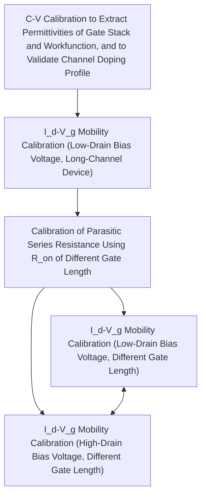

<!-- page:1 -->
# Advanced Calibration for Device Simulation User Guide

<!-- page:1 -->
Version O-2018.06, June 2018

# Copyright and Proprietary Information Notice

<!-- page:2 -->
© 2018 Synopsys, Inc. This Synopsys software and all associated documentation are proprietary to Synopsys, Inc. and may only be used pursuant to the terms and conditions of a written license agreement with Synopsys, Inc. All other use, reproduction, modification, or distribution of the Synopsys software or the associated documentation is strictly prohibited.

# Destination Control Statement

All technical data contained in this publication is subject to the export control laws of the United States of America. Disclosure to nationals of other countries contrary to United States law is prohibited. It is the reader’s responsibility to determine the applicable regulations and to comply with them.

# Disclaimer

SYNOPSYS, INC., AND ITS LICENSORS MAKE NO WARRANTY OF ANY KIND, EXPRESS OR IMPLIED, WITH REGARD TO THIS MATERIAL, INCLUDING, BUT NOT LIMITED TO, THE IMPLIED WARRANTIES OF MERCHANTABILITY AND FITNESS FOR A PARTICULAR PURPOSE.

# Trademarks

Synopsys and certain Synopsys product names are trademarks of Synopsys, as set forth at https://www.synopsys.com/company/legal/trademarks-brands.html. All other product or company names may be trademarks of their respective owners.

# Third-Party Links

Any links to third-party websites included in this document are for your convenience only. Synopsys does not endorse and is not responsible for such websites and their practices, including privacy practices, availability, and content.

Synopsys, Inc.

690 E. Middlefield Road

Mountain View, CA 94043

www.synopsys.com

<!-- page:3 -->
# About This Guide vii

Related Publications . . . vii

Conventions . vii

Customer Support . . . viii

Accessing SolvNet. . . viii

Contacting Synopsys Support . . . viii

Contacting Your Local TCAD Support Team Directly. . . . ix

# Chapter 1 Introduction to Advanced Calibration Device 1

Overview of Advanced Calibration Device . . .

Location of Advanced Calibration Device Files . . .

Target Devices and Technologies . . .

Content of Parameter Files . . . .

Special Parameter Files . . . .

Using Advanced Calibration Device. . . .

# Chapter 2 Guide to Device Simulations 11

Specifying Simulation Cases . .

Accessing Parameter Files and Model Frameworks . . . 12

Path A: Basic CMOS Simulation Command File Sections . . . 12

Path B: Add Influence of Mechanical Stress to Physics Section Shown in Path A . . 13

Path C: Add High-k Mobility Degradation to Physics Section Shown in Path B . . . . 15

Path D: Thin-Layer MOS Simulations Including Thin-Film Effects . . . . 16

Path E: FinFET Simulations . . 1

Path F: Smart-Power HVMOS and LDMOS Devices. . . 18

Path G: GaN HEMT Simulations . . 19

Path H: SiC Diode Simulations . . . 20

Path I: InGaAs FinFET Simulations . . 22

References. . . 23

# Chapter 3 Calibration Methodology for Device Simulations 25

Calibration of CMOS Devices . . . 25

C–V Calibration . . . . 25

Id–Vg Mobility Calibration . . . . 27

Calibration of Parasitic Series Resistance . . . 29

<!-- page:4 -->
Id–Vg Mobility Calibration at Low-Drain Bias Voltage. . . . 30

Id–Vg Mobility Calibration at High-Drain Bias Voltage . . . . 31

References. . . 32

# Chapter 4 Descriptions of Models 33

Overview of Models . . . . 33

CMOS Devices . . . . 33

Unstrained Band Structure and Electrostatics . . . . 33

Strained Band Structure and Electrostatics . . . 33

Unstrained Low-Field Mobility . . . . . 34

Strained Low-Field Mobility . . . . . 37

Influence of Mechanical Stress. . . . 37

First-Order (Linear) Piezoresistance Mobility Model . . . . 39

Second-Order Piezoresistance Mobility Model . . . . 39

Nonlinear Piezoresistance Models for Electrons and Holes (MCmob and SBmob). . . 40

Intel Stress-Induced Hole Mobility Model (hSixBand) . . . . . 41

eSubband Model for Electrons . . . . 41

hSubband Model for Holes. . . . 42

Unstrained High-Field Mobility . . . . 42

Strained High-Field Mobility. . . . 43

Gallium Nitride HEMTs . . . . 44

Silicon Carbide Devices . . . . 44

Silicon Smart-Power Devices . . . . 44

# Chapter 5 Quality of Fitting and Extraction 45

Low-Field Mobility of Planar CMOS Devices With Silicon Channel . . . . 45

Oxide–Silicon Interface . . . . 45

Influence of Metal Gate on Inversion Layer Mobility. . . . . 52

Influence of High-k Gate Stack on Inversion Layer Mobility. . . . . . 53

Extraction of Contact Resistance Parameters . . . . 54

Extraction of Parameters for Mobility Models in Accumulation Regime. . . . . . . . . . 54

Basic Properties of Silicon Carbide Devices . . . . 56

Basic Properties of Indium Gallium Arsenide Devices . . . . 63

Permittivity . . 63

Lattice Heat Capacity. . . . . 63

Thermal Conductivity . . . . 64

Band Gap and Electron Affinity . . 64

Density-of-States . . . . . . 65

Bandgap Narrowing. . . . . . 67

<!-- page:5 -->
Quantization Effects . 69

Low-Field Bulk Mobility and Its Doping Dependency . . . . . 71

Philips Unified Mobility Model . . . . 73

Inversion Layer Mobility . . . . 74

Inversion and Accumulation Layer Mobility Model . . . . . 74

Interface Charge Mobility Model . . . . 76

Strained Low-Field Mobility . . . . 77

Multivalley Electron Mobility Model. . . . 77

Piezoresistance Mobility Model . . . . 78

Basic Properties of Silicon Germanium Devices . . . . 78

Permittivity . . . 78

Thermal Conductivity . 78

Band Structure . . . 79

Bulk Low-Field Mobility . . . . . 81

Ballistic Mobility . . . . . 81

References . . . . 83

# Appendix A MCmob and SBmob PMI Models 89

Features of the MCmob and SBmob Models . . . 8 9

Parameters . . . 90

Specifying Device Coordinate Systems. . . . . 92

Specifying Local Coordinate Systems. . . . 92

Using Parameters . . . . 94

Parameter Interface . . . . 95

Parameter Interface and Equations of SBmob Model . . . 96

<!-- page:6 -->
Contents

<!-- page:7 -->
The Synopsys Sentaurus™ Device tool is a quantum drift-diffusion device simulator that solves semiconductor equations in one, two, or three spatial dimensions.

Extensions for hydrodynamic transport, solving the heat conduction equation, and many other features are also available. Because of the many models and corresponding model parameters and their dependency on fabrication processes and device types, it is difficult to derive automatically a well-adjusted device simulation environment for specific simulation tasks. Therefore, preselection of models and precalibration of parameter sets are necessary. Advanced Calibration Device refers to the preselection of models and the precalibration of parameter sets.

This user guide describes the contents and use of the Advanced Calibration Device files and is designed to give users fast access to parameter sets and model selections needed for device simulation. This user guide is intended for users who are familiar with Sentaurus Device and want to achieve a higher accuracy in device simulation. Refer to the Sentaurus™ Device User Guide.

# Related Publications

For additional information, see:

The TCAD Sentaurus release notes, available on the Synopsys SolvNet® support site (see Accessing SolvNet).   
■ Documentation available on SolvNet at https://solvnet.synopsys.com/DocsOnWeb.

# Conventions

The following conventions are used in Synopsys documentation.

<table><tr><td>Convention</td><td>Description</td></tr><tr><td>Blue text</td><td>Identifies a cross-reference (only on the screen).</td></tr><tr><td>Bold text</td><td>Identifies a selectable icon, button, menu, or tab. It also indicates the name of a field or an option.</td></tr><tr><td>Courier font</td><td>Identifies text that is displayed on the screen or that the user must type. It identifies the names of files, directories, paths, parameters, keywords, and variables.</td></tr><tr><td>Italicized text</td><td>Used for emphasis, the titles of books and journals, and non-English words. It also identifies components of an equation or a formula, a placeholder, or an identifier.</td></tr><tr><td>Key+Key</td><td>Indicates keyboard actions, for example, Ctrl+I (press the I key while pressing the Control key).</td></tr><tr><td>Menu &gt; Command</td><td>Indicates a menu command, for example, File &gt; New (from the File menu, select New).</td></tr></table>

<!-- page:8 -->
# Customer Support

Customer support is available through the Synopsys SolvNet customer support website and by contacting the Synopsys support center.

# Accessing SolvNet

The SolvNet support site includes an electronic knowledge base of technical articles and answers to frequently asked questions about Synopsys tools. The site also gives you access to a wide range of Synopsys online services, which include downloading software, viewing documentation, and entering a call to the Support Center.

To access the SolvNet site:

1. Go to the web page at https://solvnet.synopsys.com.   
2. If prompted, enter your user name and password. (If you do not have a Synopsys user name and password, follow the instructions to register.)

If you need help using the site, click Help on the menu bar.

# Contacting Synopsys Support

If you have problems, questions, or suggestions, you can contact Synopsys support in the following ways:

Go to the Synopsys Global Support Centers site on synopsys.com. There you can find e-mail addresses and telephone numbers for Synopsys support centers throughout the world.   
Go to either the Synopsys SolvNet site or the Synopsys Global Support Centers site and open a case online (Synopsys user name and password required).

# Contacting Your Local TCAD Support Team Directly

<!-- page:9 -->
# Send an e-mail message to:

■ support-tcad-us@synopsys.com from within North America and South America   
support-tcad-eu@synopsys.com from within Europe   
support-tcad-ap@synopsys.com from within Asia Pacific (China, Taiwan, Singapore, Malaysia, India, Australia)   
support-tcad-kr@synopsys.com from Korea   
support-tcad-jp@synopsys.com from Japan

<!-- page:11 -->
This chapter introduces the use of Advanced Calibration Device in Sentaurus Device simulations.

# Overview of Advanced Calibration Device

Advanced Calibration Device is a set of models and parameters that is recommended for device simulations of certain device types and technologies. This set of models and parameters is contained in text files, which standard text editors can open.

You select the standard Synopsys calibration by starting Sentaurus Device with the corresponding Advanced Calibration Device command file section and by loading the Advanced Calibration Device parameter file from that command file.

For more information about how to use the command file that defines models and the parameter file that defines the parameters of the models selected in the command file, refer to the Sentaurus™ Device User Guide.

This user guide describes the parameter file and command file sections for Advanced Calibration Device.

# Location of Advanced Calibration Device Files

Each release of TCAD Sentaurus provides new Advanced Calibration Device files that include the latest set of models and parameters. The MaterialDB folder of the standard installation of Sentaurus Device stores the parameter files and is located at:

\$STROOT/tcad/\$STRELEASE/lib/sdevice/MaterialDB

See Table 1 on page 3 for a list of the available material-related parameter files.

<!-- page:12 -->
# Target Devices and Technologies

Advanced Calibration Device provides a set of parameters for CMOS technologies from micrometer dimensions down to the 14 nm node, including planar gate-first and gate-last technologies, nonplanar technologies for the 14 nm node, and technologies beyond 14 nm likely based on novel channel materials (silicon, SiGe, Ge, and III–V).

In addition, Advanced Calibration Device provides parameters and models for silicon smartpower and power devices (IGBT, LDMOS, NMOS, and PMOS), GaN HEMTs, InGaAs channel devices, SiC diodes, and SiC FETs.

The main process features of planar and nonplanar bulk and SOI technology nodes covered by the model and parameter sets are:

Stress and crystallographic orientation engineering   
■ Poly/SiON or $\mathrm { S i O } _ { 2 }$ gate stacks and metal/HfO2/SiON or $\mathrm { S i O } _ { 2 }$ gate stacks   
Gate-first and gate-last technologies   
Silicon, germanium, SiGe, or InGaAs channels

For these devices and technologies, Advanced Calibration Device provides model selections and parameter sets for the simulation of the following device properties:

Electrostatic properties and quantization   
■ Low-field and high-field mobility   
Stress dependency of mobility   
Ballistic resistance

NOTE The parameter sets must be considered as initial parameter sets, that is, starting points for further calibration.

# Content of Parameter Files

The information presented here relates to the models presented in Chapter 2 on page 11 and to the files stored in the MaterialDB folder of Sentaurus Device.

Table 1 on page 3 lists the content and features of the material-related parameter files. References and additional comments for the parameters can be found in the parameter files.

<!-- page:13 -->
When simulating silicon or SiGe CMOS, or silicon smart-power devices, you must load one or more of the following files:

Silicon.par   
Germanium.par   
SiliconGermanium.par   
Siliconc100.par   
Siliconc110.par   
SiliconGermaniumc100.par   
SiliconGermaniumc110.par

When simulating wide-bandgap devices, depending on the material, you must load one or more of the following files:

AlGaN.par, AlInGaN.par, AlInN.par, AlN.par   
Ga2O3.par   
GaN.par   
InGaN.par, InN.par

When simulating III–V arsenide devices, you must load one or more of the following files:

AlAs.par   
GaAs.par   
InAs.par   
InGaAs.par

When simulating SiC devices, you must load one of the following files:

SiliconCarbide.par   
4H-SiC.par   
6H-SiC.par

Table 1 Parameter files in MaterialDB folder of Sentaurus Device 

<table><tr><td>Parameter file</td><td>Material</td><td>Parameters</td></tr><tr><td>AlAs.par</td><td>AlAs</td><td>PermittivityHeat capacitanceThermal conductivityBand gap and affinityDensity-of-statesParameters in Multivalley sectionOptical parametersOther model parameter sections are available in the parameter file but are not yet updated and reviewed.</td></tr><tr><td>AlGaAs.par</td><td>AlGaAs</td><td>PermittivityHeat capacitanceThermal conductivityBand gap and affinityDensity-of-statesParameters in Multivalley sectionOptical parametersOther model parameter sections are available in the parameter file but are not yet updated and reviewed.</td></tr><tr><td>AlGaN.par</td><td>AlGaN</td><td>For most models, mole fraction dependency is interpolated linearly between the corner materials GaN and AlNU-shape of thermal conductivity is described by a piecewise linear spline function in the parameter fileMole fraction-dependent band gap (parabolic interpolation)Mole fraction-dependent mass is interpolated linearly between GaN and AlN for density-of-states calculationMole fraction-dependent mobility with doping dependency is described by a piecewise linear spline function in the parameter fileMole fraction-dependent high field dependency is described by a piecewise linear spline function in the parameter fileMole fraction-dependent impact ionization is described by a piecewise linear spline function in the parameter file</td></tr><tr><td>AlInGaN.par</td><td>AlInGaN</td><td>For most models, mole fraction dependency is interpolated linearly between the corner materials AlN, GaN, and InN</td></tr><tr><td>AlInN.par</td><td>AlInN</td><td>For most models, mole fraction dependency is interpolated linearly between the corner materials AlN and InN</td></tr><tr><td>AlN.par</td><td>AlN</td><td>Isotropic and anisotropic permittivityThermal conductivityLattice heat capacityBand gap and affinityDensity-of-states and massesMobility with doping dependencyHigh field dependencyShockley-Read-HallAugerImpact ionizationPiezoelectric polarizationOptical material propertiesMechanical compliance parameters</td></tr><tr><td>Ga2O3.par</td><td> $Ga_{2}O_{3}$ </td><td>PermittivityHeat capacitanceThermal conductivityBand structure (band gap and affinity)Density-of-states for electronsHigh-field saturationImpact ionization</td></tr><tr><td>GaAs.par</td><td>GaAs</td><td>PermittivityHeat capacitanceThermal conductivityBand structure (band gap, affinity, and parameters for the Multivalley section)Bandgap narrowingDensity-of-statesBulk and inversion mobility for different surface and channel orientationsQuantization parametersOptical propertiesOther model parameter sections are available in the parameter file but are not yet updated and reviewed.</td></tr><tr><td>GaAsSb.par</td><td>GaAsSb</td><td>PermittivityHeat capacitanceThermal conductivityBand gap and affinityDensity-of-statesParameters in Multivalley section</td></tr><tr><td>GaN.par</td><td>GaN</td><td>Isotropic and anisotropic permittivityThermal conductivityLattice heat capacityBand gap and affinityDensity-of-states and massesMobility with doping dependencyHigh field dependencyShockley-Read-HallAugerRadiative recombinationImpact ionizationPiezoelectric polarizationOptical material propertiesMechanical compliance parameters</td></tr><tr><td>GaSb.par</td><td>GaSb</td><td>PermittivityHeat capacitanceThermal conductivityBand gap and affinityDensity-of-statesParameters in Multivalley section</td></tr><tr><td>Germanium.par</td><td>Germanium</td><td>PermittivityHeat capacitanceThermal conductivityBand gap and bandgap narrowingDensity-of-statesBulk mobilityHigh field dependencyOptical propertiesOther model parameter sections are available in the parameter file but are not yet updated and reviewed.</td></tr><tr><td>InAs.par</td><td>InAs</td><td>PermittivityHeat capacitanceThermal conductivityBand structure (band gap, affinity, and parameters for the Multivalley section)Bandgap narrowingDensity-of-statesBulk and inversion mobility for different surface and channel orientationsQuantization parametersOptical propertiesOther model parameter sections are available in the parameter file but are not yet updated and reviewed.</td></tr><tr><td>InGaAs.par</td><td>InGaAs</td><td>PermittivityHeat capacitanceThermal conductivityBand structure (band gap, affinity, and parameters for the Multivalley section)Bandgap narrowingDensity-of-statesBulk and inversion mobility for different surface and channel orientationsQuantization parametersOptical propertiesOther model parameter sections are available in the parameter file but are not yet updated and reviewed.</td></tr><tr><td>InGaN.par</td><td>InGaN</td><td>For most models, mole fraction dependency is interpolated linearly between the corner materials GaN and InN</td></tr><tr><td>InGaSb.par</td><td>InGaSb</td><td>PermittivityHeat capacitanceThermal conductivityBand gap and affinityDensity-of-statesParameters in Multivalley section</td></tr><tr><td>InN.par</td><td>InN</td><td>Isotropic and anisotropic permittivityHeat capacitanceThermal conductivityBand gap and affinityDensity-of-statesMobility with doping dependencyHigh field dependencyImpact ionizationPiezoelectric polarizationMechanical compliance parameters</td></tr><tr><td>InSb.par</td><td>InSb</td><td>PermittivityHeat capacitanceThermal conductivityBand gap and affinityDensity-of-statesParameters in Multivalley section</td></tr><tr><td>Silicon.parSiliconc100.parSiliconc110.par</td><td>Si</td><td>PermittivityHeat capacitanceThermal conductivityBand gap and bandgap narrowingDensity-of-statesQuantizationBulk and inversion mobility for different surface and channel orientations, and film thicknessesHigh field dependencyOther model parameter sections are available in the parameter file but are not yet updated and reviewed.</td></tr><tr><td>SiliconCarbide.par4H-SiC.par6H-SiC.par</td><td>SiC</td><td>Isotropic and anisotropic permittivityIsotropic and anisotropic thermal conductivityHeat capacitanceBand gap and bandgap narrowingDensity-of-statesMobility with doping dependencyAnisotropic mobilityIsotropic and anisotropic high field dependencyShockley-Read-HallAugerIsotropic and anisotropic impact ionizationIncomplete ionization</td></tr><tr><td>SiliconGermanium.parSiliconGermaniumc100.parSiliconGermaniumc110.par</td><td>SiGe (0–100%) can be used for Ge as well</td><td>All models are mole fraction dependentPermittivityHeat capacitanceThermal conductivityBand gap and bandgap narrowingDensity-of-statesQuantizationBulk and inversion mobility for different surface and channel orientations, and film thicknessesHigh field dependencyOther model parameter sections are available in the parameter file but are not yet updated and reviewed.</td></tr></table>

<!-- page:18 -->
# Special Parameter Files

The MaterialDB/custom directory of Sentaurus Device contains the following special parameter files that reflect certain application cases:

GaAs\_DEEPEN.par, InAs\_DEEPEN.par, and InGaAs\_DEEPEN.par contain parameters in the Bandgap and Multivalley sections extracted from hybrid functional calculations within the scope of the European Union DEEPEN project.   
For AlN\_DEEPEN.par, GaN\_DEEPEN.par, and InN\_DEEPEN.par, the parameters in the Piezoelectric\_Polarization section are included, based on the results of hybrid functional calculations. In addition, the bowing parameters are updated in the Bandgap section for the AlGaN\_DEEPEN.par, AlInN\_DEEPEN.par, and InGaN\_DEEPEN.par files.   
GatePolySilicon.par is for the polysilicon gate of FETs.   
In52Al48As.par and In53Ga47As.par contain material parameters specifically for $\mathrm { I n } _ { 0 . 5 2 } \mathrm { A l } _ { 0 . 4 8 } \mathrm { A s }$ and $\mathrm { I n } _ { 0 . 5 3 } \mathrm { G a } _ { 0 . 4 7 } \mathrm { A s }$ alloys, respectively, which are lattice matched to InP material. To be recognized in Sentaurus Device, these two material names can be manually added to the datexcodes.txt file.   
mcmob.par and sbmob.par contain the default parameter set for the MCmob and SBmob models (see Appendix A on page 89).   
StrainedSi\_SiGe.par contains in-plane transport parameters at 300 K for silicon under biaxial tensile strain present when a thin silicon film is grown on top of a relaxed SiGe substrate (in-plane refers to charge transport that is parallel to the interface to SiGe as is the case for MOSFETs). This parameter file defines parameters for the materials StrainedSilicon, Silicon, and Oxide. Further explanation can be found in the header of this parameter file.   
SiGeHBT.par contains transport parameters at 300 K for SiGe under biaxial compressive strain present when a thin SiGe film is grown on top of a relaxed silicon substrate, such as

<!-- page:19 -->
occurs in the base of npn-SiGe heterojunction bipolar transistors. The electron parameters refer to the out-of-plane direction (that is, perpendicular to the SiGe–silicon interface), and the hole parameters refer to the in-plane direction (that is, parallel to the SiGe–silicon interface). The transport parameters have been obtained from full-band Monte Carlo simulations. Further explanation can be found in the header of this parameter file.

StrainedSilicon.par contains the same parameters as StrainedSi\_SiGe.par for a strained Silicon material, but it does not contain the corresponding material sections for Silicon and Oxide.

# Using Advanced Calibration Device

To use Advanced Calibration Device, you can look up the parameter files and the command files that are best suited for your device and technology requirements in Chapter 2 on page 11.

The European Union projects DEEPEN and III-V-MOS have generated additional parameter sets that complement the general parameter files of Advanced Calibration Device. The parameter files from the DEEPEN project are stored in the MaterialDB/custom folder for AlGaN, AlInN, AlN, GaAs, GaN, InAs, InGaAs, InGaN, and InN (see Special Parameter Files on page 8).

In addition, the following TCAD simulation projects are available and can be delivered on request (see Contacting Your Local TCAD Support Team Directly on page ix):

■ III–V arsenide channel DG-FET   
III–V arsenide channel FDSOI-FET   
■ III–V arsenide channel FinFET

Each project contains documentation about the objectives of the project, parameter settings, and models.

In Version O-2018.06, parameter sets and experience have accumulated for the simulation of band-to-band tunneling in silicon and SiGe devices using the dynamic nonlocal path band-toband tunneling model. These parameter sets can be delivered on request.

<!-- page:21 -->
This chapter provides a guide for the quick selection of parameter sets and device models.

# Specifying Simulation Cases

Table 2 and Table 3 on page 12 present typical simulation cases, where a path is defined that you can use to select the proper device simulation parameter set and the appropriate Physics section for the command file. In the tables, the characters A to I indicate different paths that are described in subsequent sections.

Table 2 Specifying the simulation case: CMOS 

<table><tr><td rowspan="2"></td><td colspan="16">Node</td><td></td></tr><tr><td>&gt;130 nm</td><td colspan="3">32–130 nm</td><td colspan="4">14–32 nm</td><td colspan="8">&lt; 14 nm</td><td></td></tr><tr><td>Selection path</td><td>A</td><td>B</td><td>C</td><td>C</td><td>B</td><td>C</td><td>C</td><td>C</td><td>E</td><td>D</td><td>E</td><td>E</td><td>I</td><td>I</td><td>E</td><td>E</td><td>E</td></tr><tr><td>Planar bulk and SOI</td><td>X</td><td>X</td><td>X</td><td>X</td><td>X</td><td>X</td><td>X</td><td>X</td><td></td><td></td><td></td><td></td><td></td><td></td><td></td><td></td><td></td></tr><tr><td>FinFET</td><td></td><td></td><td></td><td></td><td></td><td></td><td></td><td></td><td>X</td><td></td><td>X</td><td>X</td><td>X</td><td></td><td></td><td></td><td></td></tr><tr><td>Nanowire</td><td></td><td></td><td></td><td></td><td></td><td></td><td></td><td></td><td></td><td></td><td></td><td></td><td></td><td>X</td><td>X</td><td>X</td><td>X</td></tr><tr><td>Thin-layer SOI</td><td></td><td></td><td></td><td></td><td></td><td></td><td></td><td></td><td></td><td>X</td><td></td><td></td><td></td><td></td><td></td><td></td><td></td></tr><tr><td>Si</td><td>X</td><td>X</td><td>X</td><td></td><td>X</td><td>X</td><td></td><td>X</td><td>X</td><td>X</td><td></td><td></td><td></td><td></td><td>X</td><td></td><td></td></tr><tr><td>SiGe</td><td></td><td></td><td></td><td>X</td><td></td><td></td><td>X</td><td></td><td></td><td></td><td>X</td><td></td><td></td><td></td><td></td><td>X</td><td></td></tr><tr><td>Ge</td><td></td><td></td><td></td><td></td><td></td><td></td><td></td><td></td><td></td><td></td><td></td><td>X</td><td></td><td></td><td></td><td></td><td>X</td></tr><tr><td>InGaAs</td><td></td><td></td><td></td><td></td><td></td><td></td><td></td><td></td><td></td><td></td><td></td><td></td><td>X</td><td>X</td><td></td><td></td><td></td></tr><tr><td>Gate-first</td><td>X</td><td>X</td><td></td><td></td><td>X</td><td></td><td></td><td></td><td></td><td></td><td></td><td></td><td></td><td></td><td></td><td></td><td></td></tr><tr><td>Gate-first with metal gate</td><td></td><td></td><td>X</td><td>X</td><td></td><td>X</td><td>X</td><td></td><td></td><td></td><td></td><td></td><td></td><td></td><td></td><td></td><td></td></tr><tr><td>Gate-last with metal gate</td><td></td><td></td><td></td><td></td><td></td><td></td><td></td><td>X</td><td>X</td><td>X</td><td>X</td><td>X</td><td>X</td><td>X</td><td>X</td><td>X</td><td>X</td></tr><tr><td>Without stress</td><td>X</td><td></td><td></td><td></td><td></td><td></td><td></td><td></td><td></td><td></td><td></td><td></td><td>X</td><td>X</td><td>X</td><td></td><td></td></tr><tr><td>With stress</td><td></td><td>X</td><td>X</td><td>X</td><td>X</td><td>X</td><td>X</td><td>X</td><td>X</td><td>X</td><td>X</td><td>X</td><td></td><td></td><td></td><td>X</td><td>X</td></tr></table>

Table 3 Specifying the simulation case: Smart power and power 

<table><tr><td rowspan="2"></td><td colspan="5">Device</td></tr><tr><td>HVMOS</td><td>LDMOS</td><td>HEMT</td><td>Diode</td><td>IGBT</td></tr><tr><td>Selection path</td><td>F</td><td>F</td><td>G</td><td>H</td><td>F</td></tr><tr><td>Si</td><td>X</td><td>X</td><td></td><td></td><td>X</td></tr><tr><td>SiC</td><td></td><td></td><td></td><td>X</td><td></td></tr><tr><td>GaN</td><td></td><td></td><td>X</td><td></td><td></td></tr></table>

# Accessing Parameter Files and Model Frameworks

The following sections describe the parameter files and the model frameworks. For information about handling and loading parameter files, refer to the Sentaurus™ Device User Guide.

# Path A: Basic CMOS Simulation Command File Sections

Quantization uses the density gradient model of Sentaurus Device (eQuantumPotential and hQuantumPotential). However, for technologies with gate oxide thicknesses greater than 3 nm, you can neglect quantum correction without greatly affecting the simulation of the gate capacitance and the threshold voltage.

The orientation of the conducting interface is detected automatically. However, you must define the channel or the current flow direction manually using the correct mobility parameter file. The corresponding parameter files are located in the MaterialDB folder.

For the <110> channel direction, you must load the Siliconc110.par file. For the <100> channel direction, you must load the Siliconc100.par file.

```txt
Physics {Fermi}
Physics (Material="Silicon") {
    eQuantumPotential(AutoOrientation density)
    hQuantumPotential(AutoOrientation density)
    Mobility (Enormal (IALMob(AutoOrientation)) HighFieldSaturation)
    # For PMOS, it is useful to use PhononCombination=2 in the IALMob.
    EffectiveIntrinsicDensity(OldSlotboom)
    Recombination(SRH)
    # Recombination(SRH Band2Band(Model=NonlocalPath))
    # For off-current calculation, band-to-band
    # tunneling models must be switched on.
} 
```

# Path B: Add Influence of Mechanical Stress to Physics Section Shown in Path A

Taking into account mechanical stress, you must combine the low-field mobility model with a model describing the stress influence. You can model the mobility change by mechanical stress in one of the following ways:

Use the eSubband and hSubband models for a more physics-based calculation of the mobility enhancement by mechanical stress in silicon devices that is directly based on band structure and subbands. For the subband models, you must set the channel direction in the command file when it is not the <110> channel.   
Use the MCmob physical model interface (PMI) model (parameters are extracted from Sentaurus Device Monte Carlo) or the SBmob PMI model (parameters are extracted from Sentaurus Band Structure). For the MCmob and SBmob models, you must set the channel direction in the parameter file (see Appendix A on page 89).

The orientation of the conducting interface is detected automatically. However, you must define the channel or the current flow direction manually using the correct mobility parameter file. The corresponding parameter files are located in the MaterialDB folder.

For the <110> channel direction, you must load the Siliconc110.par file. For the <100> channel direction, you must load the Siliconc100.par file.

With subband models, you must use the following syntax:

```txt
Physics {Fermi}
Physics (Material="Silicon") {
    eQuantumPotential(AutoOrientation density)
    hQuantumPotential(AutoOrientation density)
    Mobility (Enormal (IALMob(AutoOrientation)) HighFieldSaturation)
    # For the inclusion of ballistic effects, you can use the command
    # BalMob(KVM Frensley Fermi) in the Mobility statement.
    # For PMOS, it is useful to use PhononCombination=2 in the IALMob.
    EffectiveIntrinsicDensity(OldSlotboom)
    Recombination(SRH)
    # Recombination(SRH Band2Band(Model=NonlocalPath))
    # For off-current calculation, band-to-band
    # tunneling models must be switched on. 
```

eMultivalley(MLDA kpDOS -density)

# hMultivalley for holes.   
# For holes, defining kpDOS and parfile   
# together results in double-counting   
# for holes when gamma hole valleys are   
# defined in the parameter file.

# 2: Guide to Device Simulations

<!-- page:22 -->
Accessing Parameter Files and Model Frameworks

```txt
Piezo (
    Model (
    Mobility (
    saturationfactor=0.2
    eSubband(Fermi EffectiveMass Scattering(MLDA))
    # eSubband(Fermi EffectiveMass Scattering(MLDA) -RelChDir110)
    # for <100> channel.
    # hSubband(Fermi EffectiveMass Scattering(MLDA)) for holes
    # For holes, the replacement of the option Fermi by the option
    # Doping can result in speedup of the simulation.
    )
    DOS(eMass hMass)
    DeformationPotential(Minimum ekp hkp)
    )
) 
```

With the MCmob model or SBmob model, you must use the following syntax:

```txt
Physics {Fermi}
Physics (Material="Silicon") {
    eQuantumPotential(AutoOrientation density)
    hQuantumPotential(AutoOrientation density)
    Mobility (Enormal (IALMob(AutoOrientation)) HighFieldSaturation)
    # For PMOS, it is useful to use PhononCombination=2 in the IALMob.
    EffectiveIntrinsicDensity(OldSlotboom)
    Recombination(SRH)
    # Recombination(SRH Band2Band(Model=NonlocalPath))
    # For off-current calculation, band-to-band
    # tunneling models must be switched on.

Piezo (
    Model (
    Mobility (
    saturationfactor=0.2
    efactor(Kanda sfactor=SBmob(Type=0))  # Type=1 for holes
    #efactor(Kanda sfactor=MCmob(Type=0))  # when using MCmob.
    )
    DOS(eMass hMass)
    DeformationPotential(Minimum ekp hkp)
    )
    )
} 
```

These command file sections are designed for electron transport (NMOS). For hole transport (PMOS), replace eSubband with hSubband, eMultivalley with hMultivalley, and specify Type=1 for MCmob and SBmob.

# Path C: Add High-k Mobility Degradation to Physics Section Shown in Path B

<!-- page:23 -->
The orientation of the conducting interface is detected automatically. However, you must define the channel or the current flow direction manually using the correct mobility parameter file. The corresponding parameter files are located in the MaterialDB folder.

You must load the following parameter files for the corresponding channel direction:

■ For the silicon <100> channel direction, load the Siliconc100.par file.   
■ For the silicon <110> channel direction, load the Siliconc110.par file.   
■ For the SiGe <100> channel direction, load the SiliconGermaniumc100.par file.   
■ For the SiGe <110> channel direction, load the SiliconGermaniumc110.par file.

```txt
Physics {Fermi}

Physics (Material="Silicon") {
    #or Physics (Material="SiliconGermanium") {
    eQuantumPotential(AutoOrientation density)
    hQuantumPotential(AutoOrientation density)
    Mobility (
    Enormal (
    IALMob(AutoOrientation)
    # For PMOS, it is useful to use PhononCombination=2 in the IALMob
    RPS    # Used for remote phonon scattering (RPS).
    NegInterfaceCharge (SurfaceName="s1")
    # Used for remote Coulomb scattering (RCS)
    # and remote dipole scattering (RDS).
    PosInterfaceCharge (SurfaceName="s1")
    # Used for RCS and RDS.
    )
    HighFieldSaturation)    # To include ballistic effects, you can
    # use the BalMob(KVM Frensley Fermi)
    # command in the Mobility statement.

EffectiveIntrinsicDensity(OldSlotboom)
    # For SiGe with high Ge mole fraction or for pure
    # Ge, it is recommended to switch off the Fermi
    # correction and to use
    # EffectiveIntrinsicDensity(OldSlotboom NoFermi)

Recombination(SRH)
    # Recombination(SRH Band2Band)  # For off-current calculation, band-to-band
    # tunneling models must be switched on.

eMultivalley(MLDA kpDOS -density)  # hMultivalley for holes.
    # For SiGe, use eMultivalley(MLDA kpDOS parfile -density) 
```

<!-- page:24 -->
# 2: Guide to Device Simulations

Accessing Parameter Files and Model Frameworks

```txt
Piezo (
    Model (
    Mobility (
    saturationfactor=0.2
    eSubband(Fermi EffectiveMass Scattering(MLDA))
    # eSubband(Fermi EffectiveMass Scattering(MLDA) -RelChDir110)
    # for <100> channel.
    # hSubband(Fermi EffectiveMass Scattering(MLDA)) for holes
    # For holes, the replacement of the option Fermi by the option
    # Doping can result in speedup of the simulation.
    )
    DOS(eMass hMass)
    DeformationPotential(Minimum ekp hkp)
    )
) 
```

The surface name specifies the surface or interface that causes the mobility degradation, for example, the HfO –oxide interface in the high-k gate stack of a MOS transistor. The surface must be defined in the Math section of the command file. For more information about high-k mobility degradation models, see Unstrained Low-Field Mobility on page 34.

# Path D: Thin-Layer MOS Simulations Including Thin-Film Effects

The Mobility command in the Physics section of Path C must be replaced by:

```python
Mobility (
ThinLayer (IALMob(AutoOrientation))
# For PMOS, it is useful to use PhononCombination=2 in the IALMob.
Enormal (
RPS    # Used for remote phonon scattering (RPS).
NegInterfaceCharge (SurfaceName="s1")
# Used for remote Coulomb scattering (RCS)
# and remote dipole scattering (RDS).
PosInterfaceCharge (SurfaceName="s1")
# Used for RCS and RDS.
)
HighFieldSaturation) 
```

All other options and statements remain the same.

# Path E: FinFET Simulations

You can use the same Physics section as shown in Path C. The AutoOrientation option for the density gradient model must be switched on. As a starting point for calibration, the same parameter files Siliconc100.par, Siliconc110.par, SiliconGermaniumc100.par, and SiliconGermaniumc110.par can also be used. However, because the interface quality of the fin sidewalls can be very different from the interface quality of a planar transistor, parameter adjustments are often necessary.

In general, the electron inversion mobility of FinFETs is higher at the (110) sidewalls than in planar (110) transistors [1].

Table 4 and Table 5 show the approach for modeling planar and nonplanar FinFET devices regarding orientation-related parameters.

Table 4 Parameter files for planar FETs and FinFETs with silicon channel 

<table><tr><td>Device</td><td>Number of conducting planes</td><td>Conducting plane orientation</td><td>Channel orientation</td><td>Parameter file to load</td></tr><tr><td>Planar MOS</td><td>1</td><td>(100)</td><td>&lt;100&gt;</td><td>Siliconc100.par</td></tr><tr><td>Planar MOS</td><td>1</td><td>(110)</td><td>&lt;100&gt;</td><td>Siliconc100.par</td></tr><tr><td>Planar MOS</td><td>1</td><td>(100)</td><td>&lt;110&gt;</td><td>Siliconc110.par</td></tr><tr><td>Planar MOS</td><td>1</td><td>(110)</td><td>&lt;110&gt;</td><td>Siliconc110.par</td></tr><tr><td>FinFET</td><td>3</td><td>(100)</td><td>&lt;100&gt;</td><td>Siliconc100.par</td></tr><tr><td>FinFET</td><td>3</td><td>(100)(110)</td><td>&lt;110&gt;&lt;110&gt;</td><td>Siliconc110.par</td></tr></table>

Table 5 Parameter files for planar FETs and FinFETs with SiGe channel 

<table><tr><td>Device</td><td>Number of conducting planes</td><td>Conducting plane orientation</td><td>Channel orientation</td><td>Parameter file to load</td></tr><tr><td>Planar MOS</td><td>1</td><td>(100)</td><td>&lt;100&gt;</td><td>SiliconGermaniumc100.par</td></tr><tr><td>Planar MOS</td><td>1</td><td>(110)</td><td>&lt;100&gt;</td><td>SiliconGermaniumc100.par</td></tr><tr><td>Planar MOS</td><td>1</td><td>(100)</td><td>&lt;110&gt;</td><td>SiliconGermaniumc110.par</td></tr><tr><td>Planar MOS</td><td>1</td><td>(110)</td><td>&lt;110&gt;</td><td>SiliconGermaniumc110.par</td></tr><tr><td>FinFET</td><td>3</td><td>(100)</td><td>&lt;100&gt;</td><td>SiliconGermaniumc100.par</td></tr><tr><td>FinFET</td><td>3</td><td>(100)(110)</td><td>&lt;110&gt;&lt;110&gt;</td><td>SiliconGermaniumc110.par</td></tr></table>

For very short gate lengths (less than 15 nm), the isotropic density gradient model can overestimate the leakage current in the transport direction (source/drain tunneling). In those cases, the alpha parameter in the density gradient model can help to suppress the current in the transport direction. For FinFET simulations with a gate length below 15 nm, using alpha(1) < 0.1 is a good starting point. For more information about handling and using the anisotropic density gradient model, refer to the Sentaurus™ Device User Guide.

When using EparallelToInterface as a driving force in the high-field saturation model, the electric field components that are normal to the channel direction and in-plane with the fin cross section can lower the mobility. This is an artifact and makes the use of this driving force very questionable.

NOTE Using the DOS(eMass hMass) model in the Piezo section and the temperature equation at the same time might result in convergence problems. Using the NumericalIntegration option, for example, DOS(hMass(NumericalIntegration)), can improve the numeric behavior.

# Path F: Smart-Power HVMOS and LDMOS Devices

In principle, you should use Path A for silicon-based smart-power devices exhibiting a traditional polysilicon/oxide gate stack when no mechanical stress occurs in the structure. When mechanical stress occurs in the structure, you must use Path B. However, in many cases, the linear piezoresistance model might be sufficient because the mechanical stress is relatively low. For complex devices or 3D simulation structures, you might need to simplify the model complexity to reduce simulation time or to achieve convergence. You can use the following simplified Physics section in those cases:

```powershell
Physics {Fermi}
Physics (Material="Silicon") {
    Mobility (Enormal (IALMob(AutoOrientation)) HighFieldSaturation)
    # For PMOS, it is useful to use PhononCombination=2 in the IALMob.
    EffectiveIntrinsicDensity(OldSlotboom)
    Recombination (Auger SRH(DopingDep TemDep))
    # Recombination(Auger SRH(DopingDep TemDep) Band2Band)
    # For off-current calculation, band-to-band tunneling models must be
    # switched on.
} 
```

Quantum correction is neglected here, resulting in better simulation performance. The loss of accuracy can mostly be compensated by a corresponding workfunction shift and a reduction of the gate isolation permittivity. For devices with a gate isolation oxide thickness greater than 3 nm, the influence of quantum correction decreases. The Physics section above is designed for $\mathrm { I _ { d } - V _ { d } }$ and $\mathrm { I _ { d } { - } V _ { g } }$ simulations, but it does not include the models for breakdown, substrate current, and complex electrostatic discharge simulation. In addition, you must switch on the commands needed to account for self-heating.

Parameter files and the model section have been tested for LDMOS devices. No tests or investigations have been conducted for IGBTs, thyristors, or bipolar devices.

# Path G: GaN HEMT Simulations

For numeric reasons, the well-known extended Canali model is used to simulate high-field effects. The use of the transferred electron models, which are physically more suited to the simulation of GaN HEMTs, is limited because of poor convergence.

It is known that the surface roughness at interfaces to the GaN channel influences the channel mobility. However, no model is included for mobility in the 2D electron gas because of missing model parameters.

Typically, you should use the density gradient model for quantum correction. However, no model for quantum correction is included because of missing parameters.

The values for the trap concentration and the energy level given here are typical for nitridepassivated GaN HEMTs. However, the actual values depend on the device and might differ from the values presented here. In addition to the interface traps shown in the command file Physics section here, bulk traps are important and must be implemented in the simulation, for example, when investigating current collapse effects.

For III–V nitride wide-bandgap materials, you must load the parameter files GaN.par, AlGaN.par, AlN.par, InGaN.par, and InN.par, which contain the material parameters.

The following Physics section should be used together with the parameter files:

```txt
Physics {
Mobility (
DopingDependence(Arora) # Masetti model can be used as well. Model
# parameters are in the parameter files
# GaN.par, AlGaN.par, and AlN.par.
HighFieldSaturation
)
EffectiveIntrinsicDensity(noBandGapNarrowing)
Piezoelectric_Polarization(strain)
Recombination(Radiative)
Fermi
Thermodynamic
Thermionic
HeteroInterface
eBarrierTunneling "STUN" 
```

```txt
eBarrierTunneling "DTUN"
}
Physics (MaterialInterface="AlGaN/Nitride") {
    Traps(Donor Level Conc=1E13 EnergyMid=0.4 FromMidBandGap)
    # The values for the trap concentration and the
    # energy are calibration parameters.
    Piezoelectric_Polarization(strain activation=0)
} 
```

# Path H: SiC Diode Simulations

The parameter files 4H-SiC.par and 6H-SiC.par contain the material parameters for SiCbased wide-bandgap materials.

The following Physics section should be used together with the parameter files:

```txt
Physics {
    eMobility (
    DopingDependence(Arora)  # For 6H-SiC, Arora parameters are not
    # available in the parameter file.
    # Therefore, it is recommended to switch
    # to the Masetti model.

    HighFieldSaturation
)
hMobility (
    DopingDependence(Arora)  # For 6H-SiC, Arora parameters are not
    # available in the parameter file.
    # Therefore, it is recommended to switch
    # to the Masetti model.

    HighFieldSaturation
)
EffectiveIntrinsicDensity(Slotboom NoFermi)
IncompleteIonization
Recombination(SRH(DopingDep TempDep Tunneling) Band2Band Avalanche (Okuto))
    # For forward characteristics, you can
    # neglect the commands Band2Band and
    # Tunneling.
    # This can improve convergence behavior.
Fermi
#Thermodynamic  # Add for thermodynamic simulations.
#AnalyticTEP  # Add for thermodynamic simulations.
Temperature=300.0
eBarrierTunneling "NLM" (Twoband Transmission)
    # Nonlocal mesh definition in Math section necessary.
Traps (
    Donor Level EnergyMid=1.0 FromConductionband Conc=1e14 
```

```txt
eXSection=1.0e-12 hXSection=1.0e-12 PooleFrenkel TrapVolume=1.0e-9
HuangRhys=0.1 PhononEnergy=0.05 eBarrierTunneling (Twoband)
    # Bulk traps are often necessary for the physically
    # correct calculation of the thermal behavior of the
    # reverse leakage current.
}

Physics (Electrode="top") {
    # MSPeltierHeat    # Add for thermodynamic simulations.
    Schottky BarrierLowering
} 
```

Depending on how the mobility model was calibrated, that is, whether or not the total chemical concentration or the active concentration was used, you can add IncompleteIonization to the Mobility statement. For holes, the suggested parameters for the Arora model in the 4H-SiC.par file have been calibrated to the total acceptor concentration. In addition, scattering on the neutral impurities is often comparable to scattering on the ionized impurities for 4H-SiC p-type layers.

NOTE Using the IncompleteIonization model might cause convergence problems.

To distinguish between cubic and hexagonal 4H-SiC lattice sites, you can activate the following option in the IncompleteIonization statement of the Physics section of the command file:

IncompleteIonization(Split (Doping="NitrogenActive" Weights=(0.5 0.5)))

The corresponding parameters must be defined in the parameter file. Precalibrated values are in the 4H-SiC.par and 6H-SiC.par files for phosphorus and nitrogen. For phosphorus, the parameters corresponding to hexagonal sites are active, and modification of the datexcodes.txt file is necessary to treat both sites.

The values for the trap concentration, the energy levels, and other parameters in the Traps command are typical. However, the actual values depend on the device and might differ from the values presented here. Especially for the leakage current in reverse mode, tunneling by defect traps can play an important role and should be investigated.

The use of the NoFermi option depends on the extraction of the parameters for the bandgap narrowing model. This option is applied if you use parameters for bandgap narrowing that have been extracted assuming Fermi statistics.

When including heat generation and conduction, a lumped model (thermal network) using the thermal resistance of layers and material regions that are not included in the simulation can improve the simulation results.

You can use an alternative model, the JainRoulston model, which is physically more suited for bandgap narrowing.

For 2D and 3D structures, anisotropic material properties for mobility, permittivity, thermal conductivity, and impact ionization must be taken into account in the simulation. This can be performed by the following statement in the Physics section:

Aniso (Mobility Poisson Temperature Avalanche)

The corresponding parameters must be defined in the parameter file. Precalibrated values are in the 4H-SiC.par (same as SiliconCarbide.par) and 6H-SiC.par files for mobility, permittivity, thermal conductivity, impact ionization, incomplete ionization, high-field saturation, and other models.

# Path I: InGaAs FinFET Simulations

For InGaAs FinFET devices with a gate width less than 10 nm, the following quantization models of Sentaurus Device are available to model quantized distributions of carriers:

■ Use the modified local-density approximation (MLDA) model with the ThinLayer option specified in the command file to activate size quantization with the multivalley model. For a 2D structure, the layer thickness can be extracted automatically, and the depletion at corner regions corresponds better to the results of the Schrödinger equation using the MaxFit option. Setting MaxFitWeight=0.35 is advisable to start with, although an adjustment might be required depending on fin geometries.   
Use the density gradient model with the multivalley model. The quantization parameter ( -γ parameter) of the density gradient model depends on the layer thickness and the fin geometry. Therefore, it is advisable to calibrate the solutions from the Schrödinger equation in test structures with a similar channel geometry.

In addition, the inversion and accumulation layer mobility (IALMob) model is available to model inversion-type n-channel InGaAs FinFETs. The parameters have been calibrated to available experimental data under the condition of PhononCombination=1.

The parameter files GaAs.par, InGaAs.par, and InAs.par contain the material parameters for III–V arsenide materials.

For the MLDA model, you must use the following Physics section with the parameter files:

```txt
Physics {Fermi}  
Physics (Material="InGaAs") {Mobility (eHighFieldSaturation # In case of convergence problems, you can use # eHighFieldSaturation(EparallelToInterface). 
```

```txt
Enormal(IALMob(PhononCombination=1))
)
EffectiveIntrinsicDensity(BandGapNarrowing(JainRoulston) NoFermi)
Recombination(SRH Auger)
eMultiValley(MLDA Nonparabolicity ThinLayer)
LayerThickness(MaxFitWeight=0.35)
} 
```

For the density gradient model, you must use the following Physics section with the parameter files:

Physics {Fermi}  
Physics (Material="InGaAs") {Mobility (eHighFieldSaturation # In case of convergence problems, you can use # eHighFieldSaturation(EparallelToInterface).Enormal(IALMob(PhononCombination=1))EffectiveIntrinsicDensity(BandGapNarrowing(JainRoulston) NoFermi)Recombination(SRH Auger)eMultiValley(Nonparabolicity)eQuantumPotential(Density) # $\gamma$ -parameter requires calibration.}

# References

[1] C. D. Young et al., “(110) and (100) Sidewall-oriented FinFETs: A performance and reliability investigation,” Solid-State Electronics, vol. 78, pp. 2–10, December 2012.

<!-- page:26 -->
2: Guide to Device Simulations References

This chapter describes the basic calibration methodology used to improve the accuracy of CMOS device simulations.

# Calibration of CMOS Devices

Figure 1 shows a general flow of the calibration methodology used for CMOS devices. Different measurements and layout configurations allow you to separate device simulation model parameters. However, in many cases, iterations are necessary.   


<details>
<summary>flowchart</summary>


</details>

Figure 1 Calibration methodology used for CMOS devices $( \mathsf { I } _ { \mathsf { d } } - \mathsf { V } _ { \mathsf { g } }$ calibration can be complemented by involving mobility measurements)

The next sections describe this calibration methodology in detail. It is assumed that all process calibration issues are solved beforehand and the doping profile is correct.

# C–V Calibration

Capacitance–voltage (C–V) calibration is the first step in the device calibration and is strongly connected to the doping profile and to process simulation or calibration. Because it is assumed that the doping profile is correct, the bottom of the C–V curve (marked in Figure 2 on page 26) fits the experiment already.

# 3: Calibration Methodology for Device Simulations

Calibration of CMOS Devices

C–V calibration is performed on large-area MOS transistors or MOS capacitor test structures at low frequency. Therefore, in some cases, you can have slightly different workfunctions compared to smaller transistor devices.


<details>
<summary>line</summary>

| Phase | Term                                      | Value |
|-------|-------------------------------------------|-------|
| A     | Extract workfunction                        | Low   |
| B     | Extract average gate-stack permittivity       | High  |
| C     | Check poly depletion and high-frequency effects; iterate with B regarding average gate-stack permittivity | High  |
</details>

Figure 2 C–V calibration methodology (NMOS)

Table 6 Main steps and extracted parameters of C–V calibration 

<table><tr><td>Step</td><td>Target</td><td>Parameter to extract</td><td>Validity range of parameter</td><td>Comments</td></tr><tr><td>A</td><td>Region of weak or moderate inversion</td><td>Workfunction</td><td>Metal gate workfunction: NMOS (4.0–4.7 eV)PMOS (4.5–5.2 eV)Polygate barrier: -0.2 V – 0.2 V</td><td>Workfunction or barrier voltages extracted from C–V and used for long-channel I–V simulation can require corrections, particularly when special C–V test structures are used.</td></tr><tr><td>B</td><td>Accumulation part of C–V</td><td>Average permittivity of gate isolation</td><td>Permittivity of high-k material: 14–25Permittivity of interfacial oxide: 3.9–6</td><td>For high-k gate stacks with several material layers, first the permittivity of the interfacial oxide layer is adjusted.Second, the permittivity of the high-k material is calibrated.</td></tr><tr><td>C</td><td>Inversion part of C–V</td><td>Poly doping in case of polygate</td><td>Depends on process conditions</td><td>-</td></tr></table>

# $\mathsf { I } _ { \mathsf { d } } - \mathsf { V } _ { \mathsf { g } }$ Mobility Calibration

The calibration of long-channel devices is necessary to extract low-field mobility parameters. Typically, for this, you use the $\mathrm { I _ { d } { - } V _ { g } }$ characteristics of devices with a gate length greater than 500 nm, at a low-drain bias voltage smaller than 100 mV. An iterative process extracts the parameters of the mobility model in different voltage regions (see Figure 3, Figure 4, and Table 7 on page 28).


<details>
<summary>line</summary>

| Point | Description                                      | X-Coordinate | Y-Coordinate |
|-------|--------------------------------------------------|--------------|--------------|
| A     | Extract workfunction                            | 0            | 0            |
| B     | Extract delta parameter of surface roughness model | 1            | 2            |
| C     | Extract C parameter of surface phonon mobility degradation term | 2            | 3            |
</details>

Figure 3 Long-channel $\mathsf { I } _ { \mathsf { d } } - \mathsf { V } _ { \mathsf { g } }$ mobility calibration methodology in linear scale


<details>
<summary>text_image</summary>

D: Extract D1_inv, D2_inv, and nu0_inv of 2D Coulomb scattering term of IALMob model
D and E: Extract Conc parameter in the trap model
</details>

Figure 4 Long-channel ${ \sf I } _ { { \sf d } } { - \sf V } _ { \sf g }$ mobility calibration methodology in logarithmic scale

Table 7 Main steps and extracted parameters of long-channel ${ \sf I } _ { \sf d } { - \sf V } _ { \sf g }$ mobility calibration 

<table><tr><td>Step</td><td>Target</td><td>Parameter to extract</td><td>Validity range of parameter</td><td>Comments</td></tr><tr><td>A</td><td>Threshold voltage</td><td>Workfunction</td><td>Depends on gate material. Stress in the metal gate, grain sizes, and orientations influence the workfunction and can result in a dependency on gate length and geometric parameters.</td><td>Typically, metal gate workfunctions of 4.1 eV for NMOS and 4.9 eV for PMOS are used. Take initial value from C–V calibration. Note there can be an influence of remote Coulomb or dipole scattering (RCS or RDS), or 2D impurity Coulomb scattering on the threshold voltage, which couples workfunction and mobility extraction.</td></tr><tr><td>B</td><td>Strong inversion – high gate bias voltage</td><td>delta parameter of surface roughness model</td><td>Depends on process conditions and other parameters. No validity range is known.</td><td>Surface roughness can change when changing process conditions and surface orientations. Fine-tuning is always necessary to fit  $I_d-V_g$  characteristics.</td></tr><tr><td>C</td><td>Linear region of  $I_d-V_g$  curve</td><td>C parameter of surface phonon mobility degradation term</td><td>Depends on process conditions and other parameters. No validity range is known.</td><td>Extraction requires mostly an iteration between steps B and C and, sometimes, even between steps B, C, and D. Interface properties and material composition at the interface can change when changing process conditions. Fine-tuning is always necessary to fit  $I_d-V_g$  characteristics.</td></tr><tr><td>D</td><td>Transition between logarithmic and linear slope – threshold voltage region</td><td>1. Parameters of 2D Coulomb mobility degradation term2. Parameters of InterfaceCharge model</td><td>1. No validity range is known2. No validity range is known</td><td>Calibration focuses on the Coulomb roll-off visible in the  $\mu(E_{\text{eff}})$  curve, but it also can be done to the bending of the  $I_d-V_g$  curve between subthreshold and linear region. These mobility degradation terms also affect the threshold voltage and the drain-induced barrier lowering (DIBL) of the device.</td></tr><tr><td>E</td><td>Subthreshold region</td><td>Parameters of InterfaceCharge model</td><td>No validity range is known</td><td>Calibration focuses on the Coulomb roll-off visible in the  $\mu(E_{\text{eff}})$  curve, but it also can be done to the subthreshold region. This mobility degradation term also affects the threshold voltage and the DIBL of the device.</td></tr></table>

# Calibration of Parasitic Series Resistance

With the inclusion of a ballistic mobility model that gives a finite resistance for an infinitely small channel length, the calibration of the channel mobility is coupled to the calibration of the source/drain channel series resistance. Therefore, the extraction of this series resistance is most important for the calibration of the parameters of the ballistic mobility model. Iterations might be needed to update the extracted series resistance when changing parameters of the ballistic mobility model in the calibration of the channel mobility.


<details>
<summary>text_image</summary>

Ron
R0
F: Extract source/drain series resistance
Gate Length
</details>

Figure 5 Extraction methodology of source/drain series resistance

Eq. 1 shows the parameters R0 and Rs forming the on-resistance:

$$
R _ {\text { on }} = R 0 + L g \cdot R s \tag {1}
$$

Table 8 Main step and extracted parameter of source/drain series resistance 

<table><tr><td>Step</td><td>Target</td><td>Parameter to extract</td><td>Validity range of parameter</td><td>Comments</td></tr><tr><td>F</td><td>Measured dependency of on-resistance at low-drain bias voltage on gate length</td><td>On-resistance at zero gate length (R0 in Eq. 1)</td><td>R0 is determined by contact and source/drain series resistance. The value depends on the technology node and device type, and can vary greatly. No validity range is known.</td><td>R0 extraction is especially important for step G (extraction of “ballistic” resistance).</td></tr></table>

# $\mathsf { I } _ { \mathsf { d } } - \mathsf { V } _ { \mathsf { g } }$ Mobility Calibration at Low-Drain Bias Voltage

Reference [1] discusses a possible overestimation of the current response close to equilibrium when having strong electrical built-in fields, for example, caused by p-n junctions. This effect might be connected to deviations from the Einstein relation in certain situations, but it is not considered in the calibration methodology because of convergence issues. This means, to some extent, that the calibration of the parameters of the ballistic mobility model includes this physically different effect.

  
Figure 6 Short-channel ${ \sf I } _ { { \sf d } } { - \sf V } _ { \sf g }$ mobility calibration methodology in linear scale, with lowdrain bias voltage

Table 9 Main step and extracted parameter of ${ \sf I } _ { { \sf d } } { - \sf V } _ { \sf g }$ mobility calibration at low-drain bias voltage 

<table><tr><td>Step</td><td>Target</td><td>Parameter to extract</td><td>Validity range of parameter</td><td>Comments</td></tr><tr><td>G</td><td>Moderate and strong inversion</td><td>Adjust “ballistic resistance” mobility contribution using parameters of the ballistic mobility models in Sentaurus Device</td><td>No validity range</td><td>This involves iteration with step F.</td></tr></table>

# $\mathsf { I } _ { \mathsf { d } } - \mathsf { V } _ { \mathsf { g } }$ Mobility Calibration at High-Drain Bias Voltage

This step extracts the saturation velocity. The extraction of vsat0 from $\mathrm { I _ { d s a t } }$ roll-off data or $\mathrm { I _ { d } { - } V _ { g } }$ curves at large drain bias voltage, using experiments or Monte Carlo simulation, is straightforward. However, the calibration of both $\mathrm { I _ { d s a t } }$ and $\mathrm { I _ { d l i n } }$ at the same time using vsat0, source/drain resistance, and ballistic mobility parameters is more challenging.

Nevertheless, it is mostly possible to achieve a good agreement during the device calibration because of the inclusion of the ballistic mobility model [2].

  
Figure 7 Short-channel ${ \sf I } _ { { \sf d } } { - \sf V } _ { \sf g }$ mobility calibration methodology in linear scale, with highdrain bias voltage

Table 10 Main step and extracted parameter of $\mathsf { I } _ { \mathsf { d } } { - } \mathsf { V } _ { \mathsf { g } }$ mobility calibration at high-drain bias voltage 

<table><tr><td>Step</td><td>Target</td><td>Parameter to extract</td><td>Validity range of parameter</td><td>Comments</td></tr><tr><td>H</td><td>Whole  $I_d-V_g$  curve and  $I_{dsat}$ </td><td>Adjust vsat0</td><td>For silicon: &lt; 5e7 cm/s</td><td>This might involve iteration with steps F and G.</td></tr></table>

<!-- page:33 -->
# References

[1] A. T. Pham, C. Jungemann, and B. Meinerzhagen, “Modeling and validation of piezoresistive coefficients in Si hole inversion layers,” Solid-State Electronics, vol. 53, no. 12, pp. 1325–1333, 2009.

[2] A. Erlebach, K. H. Lee, and F. M. Bufler, “Empirical Ballistic Mobility Model for Drift-Diffusion Simulation,” in Proceedings of the 46th European Solid-State Device Research Conference (ESSDERC), Lausanne, Switzerland, pp. 420–423, September 2016.

This chapter presents a review of selected models of Sentaurus Device.

# Overview of Models

Given the many models implemented in Sentaurus Device for the simulation of device characteristics, it is often difficult to quickly design appropriate command files for device simulation. Therefore, this chapter presents a review of selected models, which are evaluated with respect to their capabilities in simulating certain device aspects.

In the quantum drift-diffusion (QDD) approximation, electron and hole mobilities determine charge carrier transport. Advanced Calibration Device focuses on low-field mobility and highfield mobility, with and without mechanical stress, for planar and nonplanar silicon and SiGe FETs. In addition, there is a discussion of models and parameters for InGaAs, AlGaN, and SiC devices.

# CMOS Devices

This section discusses models relevant to CMOS devices.

# Unstrained Band Structure and Electrostatics

In Sentaurus Device, the band gap, the electron affinity, the bandgap narrowing, and the density-of-states define the bulk band structure. The temperature dependency of these quantities and the doping dependency of the bandgap narrowing are represented by empirical functions.

# Strained Band Structure and Electrostatics

The band structure changes with the mechanical stress in the device. The dependency of the conduction and valence bands and, therefore, of the band gap and electron affinity, on the mechanical stress or strain is described by the deformation potential model where the band structure information comes from the calculation. You can also extract the stressk p⋅ dependency of the density-of-states from the calculation.k p⋅

# Unstrained Low-Field Mobility

In the limit of low-driving fields, several mechanisms can degrade mobility. Typically, MISFET simulation takes into account mobility degradation by ionized dopants, surface roughness scattering, surface phonon scattering, and bulk phonon scattering. For high-k gate stacks, you must consider additional remote scattering mechanisms such as remote Coulomb scattering (RCS), remote phonon scattering (RPS), and remote dipole scattering (RDS). A crucial point is the transition between bulk mobility and inversion or accumulation layer mobility. Because of the transition from 3D to 2D charge carrier gas, the scattering behavior of electrons and holes changes and screening becomes different. Furthermore, the mobility model must include dependency on the channel material (for example, the germanium mole fraction), the channel direction, and the surface orientation. For thin silicon films in the range of a few nanometers, additional contributions come into effect that cause a dependency of the mobility on the film thickness.

In summary, a drift-diffusion or QDD low-field mobility model for the simulation of SiON/ $\mathrm { S i O } _ { 2 }$ or high-k gate stack FETs without mechanical stress should have the following features:

■ Mobility degradation by ionized impurities – impurity Coulomb scattering (ICS)   
Mobility degradation by the roughness of the surface or interface – surface roughness scattering (SRS)   
■ Mobility degradation by interaction with bulk phonons – bulk phonon scattering (BPS)   
Mobility degradation by interaction with surface phonons – surface phonon scattering (SPS)   
■ Mobility degradation by charges in the gate isolator (high-k gate stack) (RCS)   
■ Mobility degradation by different permittivity in the gate isolator (high-k gate stack) (RPS)   
Mobility degradation by dipole configurations in the gate isolator (high-k gate stack) (RDS)   
Mole fraction dependency of the low-field mobility model parameters (for example, alloy scattering)   
■ Transition between bulk scattering and scattering in 2D charge carrier gas for ICS   
Parameters for different channel and surface or interface orientations; channel: <100> and <110>; surface: (100) and (110)   
■ Mobility degradation for very thin silicon films   
■ Mobility in thin films, including influence of quantization

Sentaurus Device offers the following low-field mobility degradation models for MISFET simulation:

Bulk phonon-limited mobility model (BPS):

Physics { ConstantMobility }

Mobility degradation by ionized impurities (in some cases, it contains bulk phonon-limited mobility, in the low-doping limit) (ICS):

• Masetti model provides mole fraction–dependent model parameters:   
Physics { Mobility ( DopingDependence (Masetti) ) }   
• Arora model provides mole fraction–dependent model parameters:   
Physics { Mobility ( DopingDependence (Arora) ) }   
Philips unified mobility model includes screening and carrier–carrier scattering, and provides mole fraction–dependent model parameters:   
Physics { Mobility (PhuMob) }   
University of Bologna bulk mobility model is specially calibrated for an extended temperature range and provides mole fraction–dependent model parameters:   
Physics { Mobility ( DopingDependence (UniBo2) ) }   
• Carrier–carrier scattering models (Conwell–Weisskopf and Brooks–Herring):   
Physics { Mobility (CarrierCarrierScattering) }

■ Mobility degradation at interfaces:

Enhanced Lombardi model includes automatic detection of surface orientation and provides mole fraction–dependent model parameters:

Physics { Mobility ( Enormal (Lombardi) ) }

Inversion and accumulation layer mobility model includes automatic detection of surface orientation, provides mole fraction–dependent model parameters, and contains the Philips unified mobility model, the enhanced Lombardi model, and additional terms for Coulomb scattering in 2D electron gas:

Physics { Mobility ( Enormal (IALMob) ) }

University of Bologna surface mobility model is specially calibrated for an extended temperature range, includes screening of bulk ICS, no special model for ICS in 2D charge carrier gas, and simplified Lombardi-style model for acoustic phonon and surface roughness scattering:

Physics { Mobility ( Enormal (UniBo) ) }

2D Coulomb scattering model for ionized impurities, which must not be used with the PhuMob model or any other DopingDependence model because mobility degradation is counted twice, is designed for Coulomb scattering (ICS) in 2D charge carrier gas:

```txt
Physics { Mobility (Enormal (Lombardi Coulomb2D)) } 
```

2D Coulomb scattering models for positive and negative charges at remote interfaces allow you to distinguish between RCS and RDS:

```txt
Physics { Mobility ( Enormal (Lombardi NegInterfaceCharge
    PosInterfaceCharge) ) } 
```

Thin-layer mobility model describes mobility degradation due to finite silicon film thickness, includes dependency of phonon scattering on quantization as well as additional empirical mobility degradation terms, and includes automatic detection of surface orientation. The model can be combined with Enormal-like models:

```txt
Physics { Mobility (ThinLayer) } 
```

Because of the use of Mathiessen’s rule, several combinations of these mobility models are possible. For MISFETs, you usually need to combine bulk phonon and Coulomb scattering with scattering at interfaces and surfaces. Historically, the following combinations have been used:

1. DopingDependence(Masetti) + Lombardi   
2. PhuMob + Lombardi   
3. IALMob   
4. IALMob + RPS + NegInterfaceCharge + PosInterfaceCharge   
5. RPS + NegInterfaceCharge + PosInterfaceCharge + ThinLayer(IALMob)

Combination 2 has been the standard for a long time. However, several problems require a change to another low-field mobility model. First, the transition between 3D bulk Coulomb scattering and Coulomb scattering in the inversion layer is not described correctly because the PhuMob model, which is a bulk model, is used for the mobility degradation by scattering at ionized impurities from accumulation to strong inversion. This causes problems in describing the onset of moderate or strong inversion around the threshold voltage in the Id–Vg curve. Second, in thin silicon layers, it is mandatory to include the dependency on the film thickness.

NOTE For these reasons, you must change the low-field mobility framework and switch to combination 3, 4, or 5. For MISFET simulation, the recommended models are combination 3 (devices without high-k gate stacks), combination 4 (devices with high-k gate stacks), and combination 5 (thin films).

# Strained Low-Field Mobility

# Influence of Mechanical Stress

Modeling the influence of stress on the channel mobility must deal with several typical cases. These cases must be simulated accurately to minimize additional device calibration. The typical cases are as follows:

Planar silicon channel PMOS with compressive stress between 0.5 GPa and 2 GPa in the channel direction and up to 2 GPa tensile stress normal to the silicon surface (gate-first with SiGe pockets and dual stress liner (DSL))   
Planar silicon channel PMOS with compressive stress between 1 GPa and 3 GPa in the channel direction and less than 500 MPa normal to the silicon surface (gate-last with SiGe pockets)   
Planar silicon channel NMOS with tensile stress between 1 GPa and 2 GPa in the channel direction and less than 500 MPa normal to the silicon surface (gate-last with SiC pockets)   
Planar silicon channel NMOS with tensile stress between 300 MPa and 1.5 GPa in the channel direction and up to 2 GPa compressive stress in the normal direction (gate-first with DSL and stress memorization technique)   
Planar PMOS channel with biaxial strained SiGe channel and stress between 1 MPa and 4 GPa in the channel direction and up to 2 GPa tensile stress in the normal direction (gatefirst with DSL and SiGe pockets)   
Nonplanar silicon channel NMOS (FinFET) with mixed compressive or tensile stress components of up to 2 GPa depending on the configuration (for example, with SiC pockets wrapped around the fin and metal gate as a liner replacement)   
Nonplanar silicon channel PMOS (FinFET) with mixed compressive or tensile stress components of up to 2 GPa depending on the configuration (for example, with SiGe pockets wrapped around the fin and metal gate as a liner replacement)   
Nonplanar SiGe or Ge channel NMOS (FinFET) with mixed compressive or tensile stress components of up to 4 GPa depending on the configuration   
Nonplanar SiGe or Ge channel PMOS (FinFET) with mixed compressive or tensile stress components of up to 4 GPa depending on the configuration

You must simulate stress configurations for several wafer orientations (such as (001) and (110)), channel directions (such as <100> and <110>), and channel materials (such as silicon and SiGe). Typically, all three stress components $( \mathrm { s _ { x x } , \ \mathrm { s _ { y y } , } }$ and $\mathbf { s } _ { \mathrm { z z } } )$ are important. A model validity check, which is limited to uniaxial or biaxial stress configurations, is not sufficient. In addition, the response of mobility degradation components (such as phonon scattering, Coulomb scattering, and remote scattering) to mechanical stress differs and requires the separate treatment of each component.

Typically, in Sentaurus Device, the total mobility is scaled with a stress enhancement factor calculated with the models discussed here. The following models in Sentaurus Device describe the influence of stress on mobility:

Piezoresistance mobility models:

First-Order (Linear) Piezoresistance Mobility Model on page 39   
Second-Order Piezoresistance Mobility Model on page 39   
Nonlinear Piezoresistance Models for Electrons and Holes (MCmob and SBmob) on page 40

Occupation-based and band structure–based models:

Intel Stress-Induced Hole Mobility Model (hSixBand) on page 41   
eSubband Model for Electrons on page 41   
hSubband Model for Holes on page 42

You can choose several additional options. For the piezoresistance mobility models, the Kanda option includes the dependency of the stress-induced mobility change on doping concentration. Differences in the influence of mechanical stress on minority and majority carriers can be considered by an additional fitting parameter. You can also calibrate the influence of the normal electric field in a MIS structure and of the germanium mole fraction on the first-order piezoresistive coefficients. Because the first-order and second-order piezoresistance mobility models are bulk models, the default piezoresistive coefficients are not accurate for inversion layers and must be adjusted. The first-order and second-order piezoresistance mobility models can be used as factor models or tensor models, thereby introducing anisotropic properties.

You can fine-tune the influence of the saturation velocity on stress-dependent mobility by setting the SaturationFactor parameter that controls how strongly the saturation velocity depends on stress as follows:

Setting SaturationFactor=0 means the mobility change is applied to the low-field mobility only.   
Setting SaturationFactor=1 means the mobility change applies to the total mobility. This is the default in Sentaurus Device.

Because it is known from Monte Carlo simulation and from experiments that short-channel transistors show a much lower mobility enhancement due to mechanical stress, it is better to apply the mobility change to the low-field mobility only. Further adjustment of this parameter should be performed with good references only.

The occupation-based and band structure–based models characterize the dependency of occupation and band structure on mechanical stress for the calculation of the mobility. These models have their own dependency on the doping concentration, and a Kanda-like option is not necessary. In addition, the electric field dependency should be a result of the model itself.

# First-Order (Linear) Piezoresistance Mobility Model

This model uses the piezoresistance tensor with constant coefficients to calculate the stressinduced mobility change.

# Options

The model can be used as a factor (isotropic) model or a tensor (anisotropic) model. The piezoresistive coefficients can depend on the normal electric field in an inversion layer. Minority and majority charge carrier transport can be distinguished. You can include dependency on the doping concentration. Calibration of dependency of the influence of mechanical stress on the saturation velocity is possible.

# Advantages

The model is well adjusted to measurements for the bulk case. It is fully transformable, so it can consider all stress configurations and current directions in a bulk situation. It is easy to use and to calibrate.

# Disadvantages

It is accurate for low stress only (< 200 MPa). Tensor symmetry is broken for nonbulk conditions as in an inversion layer, which is not reflected by the model. The default piezoresistive coefficients are not accurate for inversion layers.

# Second-Order Piezoresistance Mobility Model

This model uses the 6th-grade piezoresistance tensor with constant coefficients to calculate the stress-induced mobility change.

# Options

The model can be used as a factor (isotropic) model or a tensor (anisotropic) model. Minority and majority charge carrier transport can be distinguished. You can include dependency on the doping concentration. Calibration of dependency of the influence of mechanical stress on the saturation velocity is possible.

# Advantages

Parameters are available for the bulk case. The model is fully transformable, so it can consider all stress configurations and current directions in a bulk situation.

# Disadvantages

It is accurate for low and moderate stress values only (< 500 MPa). Tensor symmetry is broken for nonbulk conditions as in an inversion layer, which is not reflected by the model. The default piezoresistive coefficients are not accurate for inversion layers.

# Nonlinear Piezoresistance Models for Electrons and Holes (MCmob and SBmob)

These models use nonlinear piezoresistive coefficients and higher-order cross-term corrections that are extracted from Monte Carlo simulation, Sentaurus Band Structure simulation, or other sources (experiments and simulations available from the literature).

# Options

Minority and majority charge carrier transport can be distinguished. You can include dependency on the doping concentration. Calibration of dependency of the influence of mechanical stress on the saturation velocity is possible. Germanium mole fraction dependency of the model coefficients can be switched on. Parameters for different orientations can be used and an auto-orientation option is available. You can load complete parameter sets using the Sentaurus Device parameter file.

# Advantages

Parameters are available for strong inversion and for different channel materials (silicon and SiGe). The model can be extended to other conditions when there are reference tools such as Monte Carlo simulations or experiments. The model is available for different channel and wafer orientations. It is fast and can be calibrated easily.

# Disadvantages

Interpolation especially for untypical stress conditions must always be validated. The physics is in the reference tool, for example, the Monte Carlo simulator. Improving the model without improving the reference tool or without obtaining better experiments is not possible, except with respect to the interpolation. The settings for the local coordinate system must be specified in the Sentaurus Device parameter file.

# Intel Stress-Induced Hole Mobility Model (hSixBand)

This model uses the change of band structure and occupation to calculate stress-dependent mobility.

# Options

You can switch on dependency on the doping or carrier concentration.

# Advantages

The model is derived from physical assumptions.

# Disadvantages

Calibration is not straightforward. Only silicon as a channel material is available. The influence of surface orientation cannot be described. The model has been developed and calibrated for uniaxial stress in the <110> direction. The combination of the component normal to the MIS plane with the in-plane stress components is not validated.

# eSubband Model for Electrons

This model uses the change of band structure and occupation to calculate the mobility change.

# Options

You can switch on dependency on the doping or carrier concentration. Stress-related change in the scattering can be included. Change of effective mass with stress can be added to the model. For the inversion layer, the MLDA option can be used.

# Advantages

The MLDA option allows you to move from bulk to inversion layer conditions, and to take surface or channel orientation dependency into account. The model is derived from physical assumptions. The model is validated and calibrated for silicon and SiGe for different channel and surface orientations. Mole fraction dependency for SiGe is available.

# Disadvantages

Calibration is not straightforward.

# hSubband Model for Holes

This model uses the change of band structure and occupation to calculate stress-dependent mobility.

# Options

You can switch on dependency on the doping or carrier concentration. Stress-related change in the scattering can be included. Change of effective mass with stress can be added to the model. For the inversion layer, the MLDA option can be used.

# Advantages

The MLDA option allows you to move from bulk to inversion layer conditions, and to take surface or channel orientation dependency into account. The model is derived from physical assumptions. The model is validated and calibrated for silicon and SiGe for different channel and surface orientations. Mole fraction dependency for SiGe is available.

# Disadvantages

Calibration is not straightforward.

# Unstrained High-Field Mobility

The low-field mobility models are valid for small driving forces only. To take into account high-field effects, the additional high-field saturation model is introduced in the drift-diffusion model framework.

NOTE Calibrated mole fraction–dependent parameters are available and extensive experience exists. Numeric problems are known or are already solved.

The high-field saturation model should limit the velocity-field relation to the saturation velocity of the material when there is sufficient scattering, and it must provide a way to calibrate the influence of ballistic and quasiballistic transport on the charge carrier transport. In addition, it should allow you to calibrate the germanium mole fraction dependency of the model parameters. Furthermore, because of deficiencies in the drift-diffusion model to describe the current response close to equilibrium, a model is needed that allows you to compensate or, at least, to calibrate for this deficiency.

In summary, a drift-diffusion or QDD high-field mobility model for the simulation of SiON/ SiO2 or high-k gate stack FETs without mechanical stress should have the following features:

■ Limiting the drift velocity to the saturation velocity for cases with sufficient scattering   
■ Possibility to calibrate the model with respect to ballistic and quasiballistic transport   
Germanium mole fraction–dependent model parameters   
■ Possibility to calibrate the model with respect to current response close to equilibrium   
Orientation-dependent model parameters

Sentaurus Device offers the following high-field mobility models for MISFET simulations:

Extended Canali model is the main model for drift-diffusion simulation and can also be used with the hydrodynamic model. It has calibrated parameters for silicon and SiGe for situations where ballistic or quasiballistic transport is not present. Calibration to shortchannel devices where quasiballistic transport occurs can be done using model parameters:

```txt
Physics { Mobility (HighfieldSaturation) } 
```

Transferred electron model is specially designed for GaAs and materials with a similar band structure:

```txt
Physics { Mobility ( HighfieldSaturation (TransferredElectronEffect) ) } 
```

Basic model is a simple model with carrier temperature as the driving force and requires the hydrodynamic model:

```txt
Physics { Mobility ( HighfieldSaturation (CarrierTempDriveBasic) ) } 
```

Meinerzhagen–Engl model is a Canali-like high-field saturation model with carrier temperature as the variable and requires the hydrodynamic model:

```txt
Physics { Mobility ( HighfieldSaturation (CarrierTempDriveME) ) } 
```

The common model for drift-diffusion or QDD simulations is the extended Canali model.

# Strained High-Field Mobility

In the QDD model, the dependency of high-field mobility on mechanical stress is determined by the strain dependency of the saturation velocity. The saturation velocity covers both the strain dependency of the physical saturation velocity and the strain dependency of the quasiballistic transport. The model is again the Canali model where the parameter SaturationFactor controls the stress dependency.

# Gallium Nitride HEMTs

GaN HEMTs have unique qualities that require special attention. First, there is the large band gap that results in very low charge-carrier densities and numeric problems. Second, in the onstate, the current conduction is performed using a 2D electron gas channel in the GaN layer. This has implications for the modeling of mobility. Third, most of these structures use material combinations in addition to pure GaN and AlN, such as AlGaN. The mole fraction of these alloys determines the thermal conductivity, the mobility, and the band gap. For that reason, you need mole fraction–dependent parameters that make the transition from GaN to AlN. In general, linear or parabolic interpolation between GaN and AlN is not sufficient because of the alloy influence. Furthermore, there is the influence of strain causing polarization in the device. In addition, traps strongly influence the device operation, and the saturation velocity behavior differs from silicon.

# Silicon Carbide Devices

As another wide-bandgap material, SiC shows some differences to silicon as well. There are numeric problems connected with the small densities caused by the large band gap. The anisotropy of the mobility and of the avalanche coefficients is difficult to handle numerically. Traps, contact behavior, incomplete ionization, and tunneling play more critical roles in SiC devices than in silicon devices. You must include the incomplete ionization (IncompleteIonization) model in the simulation because of the wide band gap of SiC. Anisotropic behavior can be considered for thermal conductivity, mobility, and impact ionization.

# Silicon Smart-Power Devices

Model requirements are similar to those for silicon deep-submicron devices (see Path A: Basic CMOS Simulation Command File Sections on page 12) fabricated by gate-first processes, but with a greater variety of process and doping conditions and layout specifications. In addition, there is a need for:

■ High accuracy over a wide temperature range up to very high temperatures   
■ Good modeling capabilities for avalanche and breakdown   
■ Good modeling capabilities for electrostatic discharge (ESD)

For avalanche generation, the UniBo2 model is calibrated for a temperature range from 300 K to 773 K and is best suited for ESD and high-temperature simulations. It also is recommended for room-temperature breakdown simulations.

This chapter discusses fitting quality and extraction issues.

# Low-Field Mobility of Planar CMOS Devices With Silicon Channel

This section discusses the requirements and the quality of the extraction of the parameters for the low-field mobility of planar CMOS devices.

# Oxide–Silicon Interface

This section briefly explains how the low-field mobility parameter sets have been calibrated.

Data from Takagi et al. [1][2], Nakamura et al. [3], and Nayfeh et al. [4] has been used to calibrate mobility in the transistor channel. All data is from pure polysilicon $\mathrm { S i O } _ { 2 }$ gate stacks with oxide thicknesses of 25 nm for Takagi, 2 nm for Nakamura, and 5 nm for Nayfeh.

This data does not have high-k gate stacks and, therefore, allows you to extract the model parameters of surface phonon, surface roughness, and Coulomb scattering at ionized impurities. On the other hand, process-induced variations in surface roughness and the material composition of the first atomic layers at the isolator–silicon interface can influence mobility and result in different mobilities for different gate-formation process steps. These differences cannot be reflected by a single parameter set. Therefore, the parameter set presented here is a starting point for calibration.

Usually, the extraction of low-field mobility as a function of the effective electric field $E _ { \mathrm { e f f } }$ begins with measuring the drain current in the linear regime and, from that, the mobility is calculated for each gate voltage. At the same time, the inversion charge per area $N _ { \mathrm { i n v } }$ is calculated from C–V characteristics. Because $E _ { \mathrm { e f f } }$ is not measured, it must be calculated from $N _ { \mathrm { i n v } }$ using $E _ { \mathrm { e f f } } = E _ { \mathrm { e f f } } ( N _ { \mathrm { d e p l } } , N _ { \mathrm { i n v } } , \eta )$ . Mostly, the depletion approximation with $N _ { \mathrm { d e p l } }$ as the depletion charge is used for this, where the doping is extracted from other experiments and is assumed to be constant. The result is the dependency $\mu = \mu ( E _ { \mathrm { e f f } } )$ . To obtain the universal behavior, that is, the doping-independent behavior of the mobility for strong inversion, the fitting parameter is introduced in the equation used to determine the effective field. You mustη use different values for to obtain the universal behavior for different charge carriers andη surface orientations (electrons: 1/2 for (100) and 1/3 for (110), holes: 1/3).

These standard parameters provide mostly good universal behavior for a (100) surface orientation and low-to-moderate doping. For a (110) surface orientation, high doping, or nonplanar and double-gate devices, the universal behavior is mostly not fully achieved. In general, it remains a question of whether the use of this extraction method, and especially the use of the same in the extraction from measurement and simulation, is correct.η

$\mathrm { ~ I f ~ } \boldsymbol { \eta } \mathrm { ~ = ~ } 1$ , then $E _ { \mathrm { e f f } }$ corresponds exactly to the electric field at the interface in the depletion approximation. However, lowers the field strength, thereby taking into account that theη < 1 current flow not only is at the surface but also is distributed a few nanometers into the depth of the silicon. Because it is unclear whether the field and current density distribution and the local dependency of mobility on the electric field are described sufficiently in the simulation, it might be difficult to achieve universal behavior in simulations with the same parameter asη in measurement.

Often, this universality is achieved only by introducing an artificial doping dependency for surface phonon scattering (SPS) and surface roughness scattering (SRS) in the Lombardi terms for the mobility models. However, it is unclear whether this doping dependency exists at all, or whether it is only a result of this forced parameter fitting. It can result in an unusual situation where the mobility degradation in intrinsic or very low–doped regions is actually stronger than in high-doped regions and drops to completely unrealistic values.

Because of this, another extraction methodology is used for the mobility parameters. The mobility model is calibrated to the measured $\mu = \mu ( N _ { \mathrm { i n v } } )$ curves. For this, no calibration of is necessary, and universal behavior is not requested. After this, a check is performed withη $\mu = \mu ( E _ { \mathrm { e f f } } )$ but additional calibration is performed only if there are strong disagreements.

Figure 8 to Figure 16 show the agreement between measurement and simulation.

When simulating CMOS devices with precalibrated parameter sets, you must always take into account that these parameter sets are initial parameter sets that can undergo additional finetuning and major changes. The reasons are mainly connected to the dependency of mobility degradation on the processing.

For example, the interface or surface roughness depends on the process conditions and the materials involved. Applying the parameters already extracted to modern FinFET devices with a <110> channel direction often underestimates the inversion mobility, because the surface roughness–related mobility degradation is smaller on the (110) fin sidewalls than in the planar (110) case [5].

Similarly, for surface phonon–related interface mobility, the process conditions and the materials involved introduce some uncertainties that do not allow you to derive a parameter set that is valid for several device types or technology generations. Recalibration is usually required.

The strength of remote Coulomb scattering (RCS) or remote dipole scattering (RDS) depends on the number of charges in the high-k gate stack and their position. The model must be calibrated to measurements when switching it on. RCS and RDS have the same origin: the mobility degradation by charges in the high-k gate stack. The difference is in the presence of both negative and positive charges in the case of RDS. For remote phonon scattering (RPS), the parameters are extracted from Monte Carlo simulation. Depending on the properties of the high-k gate stack, fine-tuning might be necessary. However, because it is difficult to extract the correct parameters without having mobility measurements for different interfacial layer thicknesses and different temperatures, you should keep the parameters for RPS and focus on the calibration of RCS and RDS.

The Philips unified mobility (PhuMob) model is calibrated to bulk mobility measurements. Usually, fine-tuning is necessary only when performing a custom calibration with highaccuracy requirements. In addition, mobility fine-tuning cannot be separated from the calibration of the doping concentration or dopant activation. Therefore, you should keep the default parameters.

In the framework of the inversion and accumulation layer mobility (IALMob) model, when going to inversion layer conditions, 3D Coulomb scattering turns to 2D Coulomb scattering, the PhuMob model is switched off, and the 2D Coulomb scattering model takes over. The 2D Coulomb scattering model is a very simple description of reality with many fitting parameters. This model mainly influences the onset of the I–V curves. The default parameters are not very good, and additional calibration is necessary.

The stress dependency of mobility resulting from hSubband (holes), eSubband (electrons), MCmob, and SBmob simulations has been compared to the literature and in-house Monte Carlo (Sentaurus Device Monte Carlo) and Kubo–Greenwood (Sentaurus Band Structure) simulations [6][7][8].


<details>
<summary>line</summary>

| Areal Inversion Density [cm⁻²] | Mobility [cm²/V/s] (Black) | Mobility [cm²/V/s] (Red) | Mobility [cm²/V/s] (Green) | Mobility [cm²/V/s] (Blue) | Mobility [cm²/V/s] (Brown) | Mobility [cm²/V/s] (Pink) |
| ------------------------------ | --------------------------- | ------------------------ | -------------------------- | ------------------------- | -------------------------- | ------------------------- |
| 0                              | 800                         | 700                      | 600                        | 450                       | 350                        | 200                       |
| 1.0e+13                        | 400                         | 350                      | 300                        | 250                       | 200                        | 150                       |
| 2.0e+13                        | 250                         | 200                      | 180                        | 150                       | 120                        | 100                       |
| 3.0e+13                        | 150                         | 120                      | 100                        | 80                        | 60                         | 50                        |
</details>

Figure 8 Electron mobility versus areal inversion density for (100) surface in linear scale, with (top to bottom) channel doping of 3.9e15, 2e16, 7.2e16, 3e17, 7.7e17, and 2.4e18


<details>
<summary>line</summary>

| Areal Inversion Density [cm⁻²] | Mobility [cm²/V/s] (Black) | Mobility [cm²/V/s] (Red) | Mobility [cm²/V/s] (Green) | Mobility [cm²/V/s] (Blue) | Mobility [cm²/V/s] (Brown) | Mobility [cm²/V/s] (Pink) |
| ------------------------------ | -------------------------- | ------------------------ | -------------------------- | ------------------------- | ------------------------- | ------------------------- |
| 1.0e+11                        | ~350                       | ~340                     | ~330                       | ~280                      | ~120                      | ~30                       |
| 1.0e+12                        | ~300                       | ~290                     | ~280                       | ~260                      | ~180                      | ~150                      |
| 1.0e+13                        | ~150                       | ~140                     | ~130                       | ~120                      | ~100                      | ~80                       |
</details>

Figure 9 Electron mobility versus areal inversion density for (100) surface in logarithmic scale with (top to bottom) channel doping of 3.9e15, 2e16, 7.2e16, 3e17, 7.7e17, and 2.4e18


<details>
<summary>line</summary>

| Areal Inversion Density [cm⁻²] | Mobility [cm²/V/s] (Red) | Mobility [cm²/V/s] (Green) | Mobility [cm²/V/s] (Blue) | Mobility [cm²/V/s] (Black) |
| ------------------------------ | ------------------------- | --------------------------- | -------------------------- | --------------------------- |
| 0                              | ~250                      | ~180                        | ~220                       | ~80                         |
| 1.0e+13                        | ~100                      | ~90                         | ~110                       | ~60                         |
| 2.0e+13                        | ~60                       | ~50                         | ~70                        | ~40                         |
| 3.0e+13                        | ~30                       | ~25                         | ~35                        | ~20                         |
</details>

Figure 10 Hole mobility versus areal inversion density for (100) surface in linear scale with (top to bottom) channel doping of 7.8e15, 1.6e16, 5.1e16, 2.7e17, and 6.6e17


<details>
<summary>line</summary>

| Areal Inversion Density [cm⁻²] | Mobility [cm²/V/s] (Black) | Mobility [cm²/V/s] (Red) | Mobility [cm²/V/s] (Green) | Mobility [cm²/V/s] (Blue) |
| ------------------------------ | -------------------------- | ------------------------ | -------------------------- | ------------------------- |
| 1.0e+11                        | ~100                       | ~100                     | ~200                       | ~300                      |
| 1.0e+12                        | ~50                        | ~100                     | ~150                       | ~200                      |
| 1.0e+13                        | ~10                        | ~50                      | ~50                        | ~50                       |
</details>

Figure 11 Hole mobility versus areal inversion density for (100) surface in logarithmic scale with (top to bottom) channel doping of 7.8e15, 1.6e16, 5.1e16, 2.7e17, and 6.6e17


<details>
<summary>line</summary>

| Effective Field [V/cm] | Mobility [cm²/V/s] |
| ---------------------- | ------------------ |
| 0                      | 800                |
| 1e+05                  | 400                |
| 2e+05                  | 200                |
| 3e+05                  | 100                |
| 4e+05                  | 50                 |
| 5e+05                  | 30                 |
| 6e+05                  | 20                 |
| 7e+05                  | 15                 |
| 8e+05                  | 10                 |
| 9e+05                  | 8                  |
| 1e+06                  | 6                  |
| 1.2e+06                | 5                  |
| 1.4e+06                | 4                  |
| 1.6e+06                | 3                  |
| 1.8e+06                | 2                  |
| 2e+06                  | 1                  |
</details>

Figure 12 Electron mobility versus effective field for (100) surface in linear scale with (top to bottom) channel doping of 3.9e15, 2e16, 7.2e16, 3e17, 7.7e17, and 2.4e18


<details>
<summary>line</summary>

| Effective Field [V/cm] | Mobility [cm²/V/s] |
| ---------------------- | ------------------ |
| 1.0e+05                | ~100               |
| 1.0e+06                | ~100               |
</details>

Figure 13 Electron mobility versus effective field for (100) surface in logarithmic scale with (top to bottom) channel doping of 3.9e15, 2e16, 7.2e16, 3e17, 7.7e17, and 2.4e18


<details>
<summary>line</summary>

| Areal Inversion Density [cm⁻²] | Mobility [cm²/V/s] (Black) | Mobility [cm²/V/s] (Pink) | Mobility [cm²/V/s] (Green) | Mobility [cm²/V/s] (Blue) | Mobility [cm²/V/s] (Red) |
| ------------------------------ | --------------------------- | -------------------------- | --------------------------- | -------------------------- | ------------------------- |
| 0                              | ~600                        | ~580                       | ~450                        | ~320                       | ~150                      |
| 1.0e+13                        | ~400                        | ~350                       | ~250                        | ~150                       | ~100                      |
| 2.0e+13                        | ~250                        | ~200                       | ~150                        | ~100                       | ~70                       |
| 3.0e+13                        | ~150                        | ~120                       | ~100                        | ~70                        | ~50                       |
</details>

Figure 14 Electron mobility versus areal inversion density for (100) surface as a reference and for (110)/<100> and (110)/<110> in linear scale, with channel doping between 5e17 and 9e17


<details>
<summary>line</summary>

| Areal Inversion Density [cm⁻²] | Mobility [cm²/V/s] (Black) | Mobility [cm²/V/s] (Red) | Mobility [cm²/V/s] (Green) |
| ------------------------------ | -------------------------- | ------------------------ | -------------------------- |
| 0                              | 50                         | 130                      | 200                        |
| 1.0e+13                        | 60                         | 90                       | 150                        |
| 2.0e+13                        | 40                         | 50                       | 100                        |
</details>

Figure 15 Hole mobility versus areal inversion density for (100) surface as a reference and for (110)/<100> and (110)/<110> in linear scale, with channel doping between 4.5e17 and 6.6e17


<details>
<summary>line</summary>

| Effective Field and Areal Inversion Density [cm⁻²] | Mobility [cm²/V/s] (Black) | Mobility [cm²/V/s] (Red) | Mobility [cm²/V/s] (Green) |
| -------------------------------------------------- | --------------------------- | ------------------------ | -------------------------- |
| 10⁵                                                | ~70                         | ~80                      | ~150                       |
| 10⁶                                                | ~60                         | ~90                      | ~200                       |
| 10⁷                                                | ~50                         | ~80                      | ~150                       |
| 10⁸                                                | ~45                         | ~75                      | ~140                       |
| 10⁹                                                | ~40                         | ~70                      | ~130                       |
| 10¹⁰                                               | ~35                         | ~65                      | ~120                       |
| 10¹¹                                               | ~40                         | ~70                      | ~130                       |
| 10¹²                                               | ~80                         | ~120                     | ~200                       |
| 10¹³                                               | ~60                         | ~90                      | ~150                       |
| 10¹⁴                                               | ~30                         | ~50                      | ~80                        |
</details>

Figure 16 Hole mobility versus effective field and areal inversion density for (100) surface as a reference and for (110)/<100> and (110)/<110> in double logarithmic scale, with channel doping between 4.5e17 and 6.6e17

# Influence of Metal Gate on Inversion Layer Mobility

The parameter set used to produce the results shown in Figure 8 to Figure 16 is derived from measurements on devices with a polysilicon/oxide gate stack. In devices with a metal/oxide gate stack, the channel mobility can differ because of the influence of the metal gate. The same applies to the comparison between polysilicon/HfO2 and $\mathrm { m e t a l / H f O } _ { 2 }$ gate stacks.

Usually, the transition from the polysilicon gate to the metal gate results in improved mobility. One reason for this could be the better screening of surface phonons and charges in the gate stack by the charge carriers in the metal gate [9].

Table 11 Influence of different gate materials on the inversion layer mobility for electrons [9] 

<table><tr><td>Gate stack</td><td>Maximum mobility [cm2/V/s]</td><td>Mobility at  $E_{\text{eff}} = 1$  MV/cm [cm2/V/s]</td></tr><tr><td>HfO2/Polysilicon</td><td>175</td><td>145</td></tr><tr><td>HfO2/TiN</td><td>245</td><td>200</td></tr></table>

The increasing mobility caused by the metal gate can be reflected by an increase of the IALMob parameters B, C, and delta by a factor of 1.4.

# Influence of High-k Gate Stack on Inversion Layer Mobility

The parameter set used to produce the results shown in Figure 8 to Figure 16 is derived from measurements on devices with a polysilicon/oxide gate stack. In devices with a high-k isolation (for example, with $\mathrm { H f O } _ { 2 } )$ , the channel mobility can degrade because of the influence of charges in the gate isolator (RCS or RDS) and RPS.

Often, the charges are arranged in dipole-like configurations. The RCS-related mobility degradation depends on the number and the arrangement of charges in the gate isolator, especially on their distance to the inversion layer. RCS depends greatly on the process conditions and the materials used in the gate stack, and so the variation between technologies and process splits and even over the wafer and between wafers can be large. Therefore, it is not possible to provide well-calibrated default parameters, and custom calibration to the process and device under consideration is usually required. However, the model should describe the major tendencies such as dependency on the thickness of the interfacial oxide or on the concentration of charges in the gate stack.

Table 12 and Table 13 list model parameters for the RPS model and for the InterfaceCharge models that fulfill these requirements.

Table 12 Recommended parameters and values for RPS model 

<table><tr><td>Parameter</td><td>Value for electrons</td><td>Value for holes</td><td>Comments</td></tr><tr><td>d_crit</td><td>1.0e-7 cm</td><td>1.0e-7 cm</td><td>Distance between high-k interface and silicon interface.</td></tr><tr><td>l_crit</td><td>7.7e-8 cm</td><td>7.7e-8 cm</td><td>[10]</td></tr><tr><td>murps0</td><td>124 cm2/(Vs)</td><td>124 cm2/(Vs)</td><td>Extracted from Sentaurus Device Monte Carlo simulation.</td></tr></table>

Table 13 Recommended parameters and values for InterfaceCharge models (RCS and RDS, NegInterfaceCharge and PosInterfaceCharge models use the same parameters) 

<table><tr><td>Parameter</td><td>Value for electrons</td><td>Value for holes</td><td>Comments</td></tr><tr><td>c_exp</td><td>0.5</td><td>0.5</td><td></td></tr><tr><td>E0</td><td>1.0e-6</td><td>1.0e-6</td><td></td></tr><tr><td>l_crit</td><td>7.7e-8</td><td>7.7e-8</td><td>[10]</td></tr><tr><td>mu1</td><td>250</td><td>250</td><td></td></tr></table>

# Extraction of Contact Resistance Parameters

Stavitski et al. [11] measured the contact resistance between PtSi and NiSi, and silicon. Based on this data, the parameters for the Schottky resistance (SchottkyResist) model in Sentaurus Device have been extracted (see Table 14).

Table 14 Parameters for the SchottkyResist model for PtSi and NiSi 

<table><tr><td>Parameter</td><td>Value for electrons</td><td>Value for holes</td></tr><tr><td colspan="3">PtSi</td></tr><tr><td>barrier</td><td>0.8 eV</td><td>0.4 eV</td></tr><tr><td>mt</td><td>0.08</td><td>0.08</td></tr><tr><td>Rinf</td><td> $3.0e-10 \Omega cm^{2}$ </td><td> $3.0e-10 \Omega cm^{2}$ </td></tr><tr><td colspan="3">NiSi</td></tr><tr><td>barrier</td><td>0.6 eV</td><td>0.6 eV</td></tr><tr><td>mt</td><td>0.08</td><td>0.08</td></tr><tr><td>Rinf</td><td> $1.0e-9 \Omega cm^{2}$ </td><td> $5.0e-10 \Omega cm^{2}$ </td></tr></table>

NOTE No additional tests or validations have been performed with this parameter set. In addition, the parameters are not included in the parameter files in the MaterialDB folder.

# Extraction of Parameters for Mobility Models in Accumulation Regime

In the accumulation regime, mobility is influenced by the same mobility degradation mechanisms as in the inversion regime. However, model parameters and the importance of single mobility degradation mechanisms can vary. Especially at higher background doping concentrations, the screening of Coulomb scattering differs between accumulation and inversion.

Because of the importance of the on-state and the measurement data available, the focus is on high accumulation areal densities. Reference [12] provides some specific and well explained measurements of mobilities in accumulation layers in planar bulk devices for different background doping concentrations at room temperature. These measurements have been used as a reference for the simulations with Sentaurus Device using the inversion and accumulation layer mobility (IALMob) model.

Despite small differences between accumulation and inversion layer mobility in the on-state claimed in [12], a calibrated parameter set is presented that improves the agreement for electrons. The parameter set also shows how to adjust the accumulation layer model parameters without changing much in the inversion regime. Table 15 shows the parameters used for calibration.

Table 15 Parameters of the IALMob model used for calibration (electrons) 

<table><tr><td>Parameter</td><td>Recommended value</td></tr><tr><td>lambda</td><td>0.02</td></tr><tr><td>alpha_ph2d_A</td><td>0.0</td></tr><tr><td>alpha_ph2d_D</td><td>2.0e-14</td></tr><tr><td>lambda_ph2d_A</td><td>0.0</td></tr><tr><td>lambda_ph2d_D</td><td>1.0</td></tr><tr><td>alpha_sr_A</td><td>0.0</td></tr><tr><td>alpha_sr_D</td><td>2.0e-14</td></tr><tr><td>lambda_sr</td><td>0.02</td></tr><tr><td>lambda_sr_A</td><td>0.0</td></tr><tr><td>lambda_sr_D</td><td>1.0</td></tr><tr><td>D1_acc</td><td>1200</td></tr><tr><td>D2_acc</td><td>1200</td></tr></table>

Essentially with these parameter settings, the doping dependence for the inversion case remains switched off and, when there is no accumulation doping, there is no change in the results. However, with alpha\_ph2d\_D or alpha\_sr\_D, and lambda or lambda\_sr larger than zero, the doping dependence for the accumulation regime is switched on. In this way, you can separate the accumulation and inversion regimes.

The parameter set in Table 15 gives reasonable agreement to the measurements in [12] (see Figure 17 on page 56).


<details>
<summary>line</summary>

| Effective Electric Field [V/cm] | measurement, doping=1e16 | simulation, doping=1e16 | measurement, doping=4.8e16 | simulation, doping=4.8e16 | measurement, doping=7.5e16 | simulation, doping=7.5e16 | measurement, doping=1.5e17 | simulation, doping=1.5e17 |
| ------------------------------- | ------------------------ | ----------------------- | -------------------------- | ------------------------- | -------------------------- | ------------------------- | -------------------------- | ------------------------- |
| 0                               | 1200                     | 1200                    | 1200                       | 1200                      | 1200                       | 1200                      | 1200                       | 1200                      |
| 50000                           | 800                      | 800                     | 800                        | 800                       | 800                        | 800                       | 800                        | 800                       |
| 100000                          | 400                      | 400                     | 400                        | 400                       | 400                        | 400                       | 400                        | 400                       |
| 150000                          | 200                      | 200                     | 200                        | 200                       | 200                        | 200                       | 200                        | 200                       |
</details>

Figure 17 Mobility versus effective electric field for electrons and different donor doping concentrations; red lines: simulation and black lines: measurements from [12]

# Basic Properties of Silicon Carbide Devices

Parameter values and corresponding references can be found in the 4H-SiC.par and 6H-SiC.par files and in [13].

All silicon carbide (SiC) polytypes are indirect semiconductors, and the maximum of the upper valence bands is located at the center ( -point) of the Brillouin zone. Conduction band minimaΓ of 3C-SiC, 6H-SiC, and 4H-SiC are located at point X, point U on the (L-M) line, and point M, respectively.

Photoluminescence or absorption measurements give an exciton band gap $E _ { \mathrm { g x } }$ . There are no reliable measured values for binding energies $E _ { \mathrm { x } }$ of free excitons, which are required to obtain the indirect band gap $E _ { \mathrm { g } } = E _ { \mathrm { g x } } + E _ { \mathrm { x } }$ . Since measured values of $E _ { \mathrm { x } }$ range from 10 mV to 80 mV, a mean direct band gap can be assumed by shifting $E _ { \mathrm { g x } }$ by 40 mV. In the parameter file, a value of Eg0=3.285 eV is used.

Temperature dependency of the band gap is measured for 6H-SiC in the temperature ranges from 6 K to 200 K and from 300 K to 700 K. The dependency of 3C-SiC is measured in the temperature range from 295 K to 700 K. The dependency of 4H-SiC is assumed to be similar because no experimental data is available.

The effective mass of electrons and holes has been measured by optically detected by either cyclotron resonance or Raman scattering and has been compared to theoretical calculation. The theoretical calculation reproduced well the experimental results.

There is no published measured data of bandgap narrowing. The theoretical calculation was first performed by Lindefelt [14] and followed by Persson et al. [15]. The former model constitutes an extension of a semiempirical method originally developed by Jain and Roulston [16]. The latter is based on random phase approximation. Both calculations give the analytic form of band-edge displacement depending on the doping density. The analytic form corresponds to the JainRoulston model implemented in Sentaurus Device.


<details>
<summary>line</summary>

| Ionized Impurity Concentration [cm⁻³] | Lindefelt n-type | Lindefelt p-type | Slotboom n-type | Slotboom p-type | Persson n-type | Persson p-type |
| ------------------------------------- | ---------------- | ---------------- | --------------- | --------------- | -------------- | -------------- |
| 10¹⁷                                  | ~20              | ~10              | ~30             | ~5              | ~20            | ~10            |
| 10¹⁸                                  | ~60              | ~30              | ~90             | ~20             | ~60            | ~40            |
| 10¹⁹                                  | ~120             | ~60              | ~180            | ~40             | ~120           | ~80            |
| 10²⁰                                  | ~280             | ~120             | ~320            | ~80             | ~280           | ~160           |
| 10²¹                                  | ~620             | ~270             | ~370            | ~160            | ~620           | ~310           |
</details>

Figure 18 Results of bandgap narrowing of 4H-SiC from [14] and [15] with the Slotboom model implemented in Sentaurus Device with calibrated coefficients

Electron affinity is calculated assuming the linear dependency of hexagonality together with the measured band offset of the conduction band for 3C-SiC or 6H-SiC, and the calculated result of the band offset of the valence band.

Parameter sets for the Hatakeyama model [17] and the Okuto–Crowell impact ionization model are implemented in the parameter files (see Content of Parameter Files on page 2). The parameter set for the Okuto–Crowell impact ionization model along the c-axis corresponds to the one reported by Niwa et al. [18].

Figure 19 and Figure 20 show the comparison of the impact ionization coefficients of different references.   


<details>
<summary>line</summary>

| Inverse of Electric Field [cm/V] | Konstantinov | Hatakeyama | Niwa |
| -------------------------------- | ------------ | ---------- | ---- |
| 3.0e-07                          | 1.00e+05     | 1.00e+05   | 1.00e+05 |
| 5.0e-07                          | 1.00e+04     | 1.00e+04   | 1.00e+04 |
| 7.0e-07                          | 1.00e+03     | 1.00e+03   | 1.00e+03 |
| 9.0e-07                          | 1.00e+02     | 1.00e+02   | 1.00e+02 |
</details>

Figure 19 Hole impact ionization coefficient along the c-axis of 4H-SiC [17][18][19]


<details>
<summary>line</summary>

| Inverse of Electric Field [cm/V] | Impact Ionization Coefficient [cm⁻¹] (Konstantinov) | Impact Ionization Coefficient [cm⁻¹] (Hatakeyama) | Impact Ionization Coefficient [cm⁻¹] (Niwa) |
| -------------------------------- | -------------------------------------------------- | ------------------------------------------------- | ------------------------------------------ |
| 3.0e-07                          | ~1.0e+04                                           | ~1.0e+04                                          | ~1.0e+05                                   |
| 4.0e-07                          | ~1.0e+03                                           | ~1.0e+03                                          | ~1.0e+04                                   |
| 5.0e-07                          | ~1.0e+02                                           | ~1.0e+02                                          | ~1.0e+03                                   |
| 6.0e-07                          | ~1.0e+01                                           | ~1.0e+01                                          | ~1.0e+02                                   |
| 7.0e-07                          | ~1.0e+01                                           | ~1.0e+01                                          | ~1.0e+01                                   |
| 8.0e-07                          | ~1.0e+01                                           | ~1.0e+01                                          | ~1.0e+01                                   |
| 9.0e-07                          | ~1.0e+01                                           | ~1.0e+01                                          | ~1.0e+01                                   |
</details>

Figure 20 Electron impact ionization coefficient along the c-axis of 4H-SiC [17][18][19]

Temperature dependency of thermal conductivity of 4H-SiC and 6H-SiC perpendicular to the c-axis has been reported. At low temperatures, $\mathrm { T } ^ { \dot { 3 } }$ dependency and $\mathrm { T } ^ { 2 }$ dependency are observed for 4H-SiC and 6H-SiC, respectively. $\mathrm { T } ^ { 2 }$ dependency is attributed to the scattering of phonons by electrons in the impurity band. Thermal conductivity in 6H-SiC single crystals decreases with increasing electron concentration, and the slope at low temperature can be represented by the $\mathrm { T } ^ { 2 }$ law, which confirms the dominance of electron scattering. Temperature dependency of thermal conductivity using data from [20], [21], [22], and [23] as cited in [24] is implemented in the parameter files (see Content of Parameter Files on page 2). Experimental data is that in the direction perpendicular to the c-axis.

Parameter sets for the Masetti and Arora doping-dependent mobility models are implemented in the parameter files (see Content of Parameter Files on page 2).

Figure 21 and Figure 22 show a comparison with different literature data.   


<details>
<summary>line</summary>

| Concentration [cm⁻³] | Schaffer [24] | Masetti | Arora | Arora2 | Roschke [25] | Kagamihara [26] |
| --------------------- | ------------- | ------- | ----- | ------ | ------------ | --------------- |
| 10¹⁵                  | ~270          | ~265    | ~270  | ~260   | ~275         | ~235            |
| 10¹⁶                  | ~240          | ~235    | ~240  | ~230   | ~250         | ~200            |
| 10¹⁷                  | ~180          | ~175    | ~180  | ~170   | ~190         | ~160            |
| 10¹⁸                  | ~100          | ~95     | ~100  | ~90    | ~110         | ~80             |
| 10¹⁹                  | ~40           | ~35     | ~40   | ~30    | ~50          | ~30             |
| 10²⁰                  | ~10           | ~8      | ~10   | ~6     | ~30          | ~10             |
| 10²¹                  | ~5            | ~4      | ~5    | ~3     | ~15          | ~5              |
</details>

Figure 21 Doping-dependent electron mobility at 500 K for n-doped 4H-SiC [25][26][27]


<details>
<summary>line</summary>

| Concentration [cm⁻³] | Schaffer [24] | Masetti | Arora | Arora2 | Roschke [25] | Kagamihara [26] |
| --------------------- | ------------- | ------- | ----- | ------ | ------------ | --------------- |
| 10¹⁵                  | ~900          | ~900    | ~900  | ~950   | ~950         | ~900            |
| 10¹⁶                  | ~700          | ~750    | ~750  | ~850   | ~850         | ~750            |
| 10¹⁷                  | ~400          | ~450    | ~450  | ~550   | ~550         | ~450            |
| 10¹⁸                  | ~200          | ~250    | ~250  | ~350   | ~350         | ~250            |
| 10¹⁹                  | ~100          | ~150    | ~150  | ~250   | ~250         | ~150            |
| 10²⁰                  | ~50           | ~75     | ~75   | ~100   | ~100         | ~75             |
| 10²¹                  | ~25           | ~50     | ~50   | ~75    | ~75          | ~50             |
</details>

Figure 22 Doping-dependent electron mobility at 300 K for n-doped 4H-SiC [25][26][27]

For high-field saturation, all measured data refers to the current flow perpendicular to the c-axis. Parameters for the Canali model are extracted and implemented in the parameter file.


<details>
<summary>line</summary>

| Electric Field [V/cm] | Khan 296 K [27] | Khan 593 K [27] | Lades 296 K [28] | Lades 573 K [28] |
| --------------------- | --------------- | --------------- | ---------------- | ---------------- |
| 1000                  | ~10^5           | ~10^5           | ~10^5            | ~10^5            |
| 10000                 | ~10^6           | ~10^6           | ~10^6            | ~10^6            |
| 100000                | ~10^7           | ~10^7           | ~10^7            | ~10^7            |
| 1000000               | ~10^7           | ~10^7           | ~10^7            | ~10^7            |
</details>

Figure 23 Drift velocity of electrons in 4H-SiC, parallel to basal plane (0001) [28][29]

A nitrogen atom residing on the C lattice site becomes the shallow donor in SiC. A phosphorus atom also is used as a shallow donor (like nitrogen) and has approximately the same ionization energy $E _ { \mathrm { c } } - 9 3 \mathrm { m e V }$ at the cubic site and $E _ { \mathrm { c } } - 5 3$ at the hexagonal site. However, unlike meV nitrogen, P mainly substitutes at a silicon site, and less than 10% of substitutional P is located at C sites.

Phosphorus has a slightly larger ionization energy at C sites than at Si sites. The ionization energy of N and P donors decreases with increasing donor concentration. Experimental data for cubic and hexagonal N donors in 6H-SiC is available. For N donors in 4H-SiC, experimental data of donor concentration dependency and fitting with empirically formula has been reported.

Aluminum and boron residing on Si lattice sites become acceptors in SiC. For Al acceptors in 4H-SiC, experimental data of acceptor doping concentration dependency and fitting with empirical formulas have been reported [30][31][32].

Figure 24 to Figure 28 show the experimental data and the fit implemented in the SiC.par parameter file.


<details>
<summary>line</summary>

| N_AI [cm⁻³] | Ionization Energy [meV] (09Koizumi) | Ionization Energy [meV] (05Pernot) | Ionization Energy [meV] (97Troffer) |
| ----------- | ----------------------------------- | ---------------------------------- | ----------------------------------- |
| 10¹⁵        | ~260                                | ~200                               | ~240                                |
| 10¹⁶        | ~255                                | ~200                               | ~230                                |
| 10¹⁷        | ~250                                | ~200                               | ~200                                |
| 10¹⁸        | ~240                                | ~180                               | ~190                                |
| 10¹⁹        | ~200                                | ~160                               | ~180                                |
| 10²⁰        | ~140                                | ~140                               | —                                   |
| 10²¹        | ~0                                  | ~30                                | —                                   |
</details>

Figure 24 Ionization energy for aluminum-doped 4H-SiC with extracted fit function [30][31] [32]


<details>
<summary>line</summary>

| N_N [cm⁻³] | Ionization Energy [meV] |
| ---------- | ------------------------ |
| 10^15      | 68                       |
| 10^15.5    | 64                       |
| 10^16      | 57                       |
| 10^16.5    | 53                       |
| 10^17      | 40                       |
| 10^18      | 0                        |
</details>

Figure 25 Ionization energy for nitrogen-doped 4H-SiC (hexagonal site) with extracted fit function [27]


<details>
<summary>line</summary>

| N_N [cm⁻³] | Ionization Energy [meV] |
| ---------- | ------------------------ |
| 10^15      | 120                      |
| 10^16      | 115                      |
| 10^17      | 100                      |
| 10^18      | 80                       |
| 10^19      | 0                        |
</details>

Figure 26 Ionization energy for nitrogen-doped 4H-SiC (cubic site) with extracted fit function [27]


<details>
<summary>scatter</summary>

| Donor Concentration [cm⁻³] | Hexagonal Ionization Energy [meV] | Cubic Ionization Energy [meV] |
| -------------------------- | ---------------------------------- | ----------------------------- |
| 1.0e+15                    | 53.0                               | 101.0                         |
| 1.0e+16                    | 51.0                               | 100.5                         |
| 1.0e+17                    | 49.0                               | 100.0                         |
| 1.0e+18                    | 47.0                               | 95.0                          |
| 1.0e+19                    | 45.0                               | 90.0                          |
| 1.0e+20                    | 26.0                               | 74.0                          |
| 1.0e+21                    | 0.0                                | 45.0                          |
</details>

Figure 27 Ionization energy for phosphorus-doped 4H-SiC with extracted fit function


<details>
<summary>scatter</summary>

| N_N [cm⁻³] | Ionization Energy [meV] | Shape      |
| ---------- | ------------------------ | ---------- |
| 10¹⁶       | ~95                      | hexagonal  |
| 10¹⁶       | ~85                      | hexagonal  |
| 10¹⁶       | ~145                     | cubic      |
| 10¹⁷       | ~85                      | hexagonal  |
| 10¹⁷       | ~135                     | cubic      |
| 10¹⁷       | ~140                     | cubic      |
| 10¹⁸       | ~70                      | hexagonal  |
| 10¹⁸       | ~60                      | hexagonal  |
| 10¹⁸       | ~120                     | cubic      |
| 10¹⁹       | ~50                      | hexagonal  |
| 10¹⁹       | ~30                      | hexagonal  |
| 10¹⁹       | ~95                      | cubic      |
| 10²⁰       | ~5                       | hexagonal  |
| 10²⁰       | ~5                       | cubic      |
| 10²⁰       | ~5                       | cubic      |
| 10²¹       | ~0                       | hexagonal  |
| 10²¹       | ~0                       | hexagonal  |
| 10²¹       | ~0                       | cubic      |
| 10²¹       | ~0                       | cubic      |
</details>

Figure 28 Ionization energy for nitrogen-doped 6H-SiC with extracted fit function

# Basic Properties of Indium Gallium Arsenide Devices

Parameter values and references can be found in the InGaAs.par file. The following sections briefly show the results of parameter calibration and review various aspects of the calibration.

# Permittivity

The permittivity values for GaAs and InAs materials have been reviewed following the data reported by Adachi [33]. Since there is no experimental data for semiconductor alloys, a linear interpolation scheme has been adopted for indium gallium arsenide $( \mathrm { { I n } _ { 1 - x } \mathrm { { G a } _ { x } \mathrm { { A s } ) } } }$ alloys.

# Lattice Heat Capacity

Similarly, a linear interpolation scheme for heat capacity is used for $\mathrm { I n } _ { \mathrm { 1 - x } } \mathrm { G a } _ { \mathrm { x } } \mathrm { A s }$ alloys, in which the heat capacity values for GaAs and InAs at 300 K are updated with the ones reported by Adachi [34].

# Thermal Conductivity

The mole fraction dependency of thermal conductivity for $\mathrm { I n } _ { \mathrm { 1 - x } } \mathrm { G a } _ { \mathrm { x } } \mathrm { A s }$ alloys has been measured by Abrahams et al. [35] and Arasly et al. [36] at 300 K. Due to a random distribution of Ga and In atoms in the sub-lattice sites, the thermal conductivity values for $\ln _ { \mathrm { 1 - x } } \mathrm { G a _ { x } A s }$ alloys tend to be smaller than for the corresponding binary materials. Figure 29 shows the thermal conductivity model and comparison to experimental data.


<details>
<summary>line</summary>

| x-Ga | Experimental data | Interpolation in MaterialDB |
|------|-------------------|-----------------------------|
| 0.0  | 0.30              | 0.30                        |
| 0.1  | 0.23              | 0.23                        |
| 0.2  | 0.17              | 0.17                        |
| 0.3  | 0.08              | 0.08                        |
| 0.4  | 0.06              | 0.06                        |
| 0.5  | 0.05              | 0.05                        |
| 0.6  | 0.06              | 0.06                        |
| 0.7  | 0.07              | 0.07                        |
| 0.8  | 0.10              | 0.10                        |
| 0.9  | 0.20              | 0.20                        |
| 1.0  | 0.45              | 0.45                        |
</details>

Figure 29 Thermal conductivity versus Ga mole fraction for $\ln _ { 1 - x } G a _ { x } A s$ alloys at 300 K; experimental data is taken from [35] and [36], and binary data is taken from [37]

# Band Gap and Electron Affinity

InGaAs ternary materials are direct bandgap materials over the entire composition range, and both the maxima of the upper valence bands and the minima of the conduction band are located at the -point of the Brillouin zone. Photoluminescence and photoreflectance measurementsΓ are often used to determine the bandgap energies of $\mathrm { I n _ { 1 - x } G a _ { x } A s } [ 3 8 ] [ 3 9 ] [ 4 0 ]$ . In the case of the lattice-matched alloy to InP, $\begin{array} { r } { \operatorname { I n } _ { 0 . 5 3 } \mathrm { G a } _ { 0 . 4 7 } \mathrm { A s } . } \end{array}$ which has been investigated extensively, the bandgap energy is generally recognized to be 0.816 eV at 0 K. Therefore, a temperatureindependent bowing parameter of 0.477 eV is suggested [41]. As for the Varshni parameters, the values for In ${ \bf \Phi } _ { \mathrm { 1 - x } } \mathbf { G a } _ { \mathrm { x } } \mathbf { A } \mathbf { s }$ alloys are determined through a linear interpolation based on the ones from GaAs and InAs. Figure 30 on page 65 shows the composition dependency of bandgap energy at 300 K, plotted with the new set of the bowing parameter and Varshni parameters. The revised bandgap model fits well to the experimental data.

The electron affinity values for the GaAs and InAs binary materials are taken from Adachi [33] and are further derived to obtain the values at 0 K using the revised Varshni parameters. Since little experimental data is available, linearly interpolated electron affinity values are assumed for $\begin{array} { r } { { { \mathrm { I n } } _ { 1 - \mathrm { x } } } { { \mathrm { G a } } _ { \mathrm { x } } } { { \mathrm { A s } } } } \end{array}$ alloys in the parameter file.


<details>
<summary>line</summary>

| x-Ga | Band Gap [eV] (Experimental data) | Band Gap [eV] (Vurgaftman) |
|------|------------------------------------|-----------------------------|
| 0.0  | 0.3                                | 0.3                         |
| 0.2  | 0.5                                | 0.5                         |
| 0.4  | 0.7                                | 0.7                         |
| 0.6  | 0.9                                | 0.9                         |
| 0.8  | 1.2                                | 1.2                         |
| 1.0  | 1.4                                | 1.4                         |
</details>

Figure 30 Band gap versus Ga mole fraction for $\begin{array} { r } { \ln _ { 1 - x } { \ G a _ { x } { A } s } } \end{array}$ alloys at 300 K; experimental data is taken from [38], [39], and [40]; binary data is taken from [41]

# Density-of-States

The electron effective masses of the -valley of the Γ $\begin{array} { r } { { { \mathrm { I n } } _ { 1 - \mathrm { x } } } { { \mathrm { G a } } _ { \mathrm { x } } } { { \mathrm { A s } } } } \end{array}$ alloys have been measured extensively [34], and the results are shown in Figure 31.


<details>
<summary>line</summary>

| x-Ga | Experimental data | Interpolation in MaterialDB |
|------|-------------------|-----------------------------|
| 0.0  | 0.024             | 0.024                       |
| 0.1  | 0.028             | 0.028                       |
| 0.2  | 0.032             | 0.032                       |
| 0.3  | 0.036             | 0.036                       |
| 0.4  | 0.040             | 0.040                       |
| 0.5  | 0.044             | 0.044                       |
| 0.6  | 0.048             | 0.048                       |
| 0.7  | 0.052             | 0.052                       |
| 0.8  | 0.056             | 0.056                       |
| 0.9  | 0.060             | 0.060                       |
| 1.0  | 0.064             | 0.064                       |
</details>

Figure 31 Electron effective mass of the Γ-valley versus Ga mole fraction for $\ln _ { 1 - x } G a _ { x } A s$ alloys at 300 K; experimental data is reprinted from Adachi [34]

A simple linear interpolation scheme using the corresponding GaAs and InAs binary data yields a good fit to the experimental data. In the InGaAs.par file, the composition dependency of density-of-states for electrons is a set of tabulated values that are computed from the electron effective masses at 300 K using:

$$
N _ {\mathrm{C}} (3 0 0 \mathrm{K}) = 2. 5 0 9 4 \times 1 0 ^ {1 9} \left(\frac {m _ {\mathrm{e}}}{m _ {0}}\right) ^ {\frac {3}{2}} \tag {2}
$$

Regarding the hole effective masses for $\begin{array} { r } { { { \mathrm { I n } } _ { 1 - \mathrm { x } } } { { \mathrm { G a } } _ { \mathrm { x } } } { { \mathrm { A s } } } } \end{array}$ alloys, Vurgaftman et al. proposed a bowing parameter for each Luttinger valence band parameter: $\forall _ { 1 } , \ \forall _ { 2 }$ , and $\gamma _ { 3 }$ [41]. In measurement, , defined as κ( ) x $\kappa = - 1 / 3 \gamma _ { 1 } + 2 / 3 \gamma _ { 2 } + \gamma _ { 3 } - 2 / 3$ , has been reported for $x = 0 . 4 7$ and $x = 0 . 8 2 – 0 . 9 2$ [42][43][44].

Figure 32 shows that the interpolation scheme from Vurgaftman et al. agrees well with the experimental data to some extent and is used to calculate the composition dependency of the overall hole effective masses, mp. $\mathrm { m } _ { \mathrm { p } } ^ { \ } .$


<details>
<summary>line</summary>

| x-Ga | k    |
|------|------|
| 0.0  | 7.5  |
| 0.45 | 3.2  |
| 0.8  | 1.8  |
| 0.9  | 1.3  |
| 1.0  | 1.2  |
</details>

Figure 32 κ-values versus Ga mole fraction for $\ln _ { 1 - x } G a _ { x } A \mathfrak { s }$ alloys; experimental data is taken from [33], [42], [43], and [44]; red line represents the interpolation function suggested by [41]

Similarly, a set of tabulated values of density-of-states for holes at 300 K is computed using:

$$
N _ {\mathrm{V}} (3 0 0 \mathrm{K}) = 2. 5 0 9 4 \times 1 0 ^ {1 9} \left(\frac {m _ {\mathrm{p}}}{m _ {0}}\right) ^ {\frac {3}{2}} \tag {3}
$$

Advanced Calibration Device includes these tabulated values (see Figure 33 on page 67).


<details>
<summary>line</summary>

| x-Ga | N_v300 [cm⁻³] |
|------|---------------|
| 0.0  | 8.0e+18       |
| 0.2  | 9.5e+18       |
| 0.4  | 1.05e+19      |
| 0.6  | 1.15e+19      |
| 0.8  | 1.25e+19      |
| 1.0  | 1.30e+19      |
</details>

Figure 33 Valence band density-of-states at 300 K versus Ga mole fraction for $\ln _ { 1 - x } G a _ { x } A s$ alloys; experimental data is computed based on Luttinger parameters taken from [42]; red line is computed following the interpolation scheme suggested by [41]

# Bandgap Narrowing

Doping-dependent bandgap narrowing for GaAs, InAs, and $\ln _ { \mathrm { 1 - x } } \mathrm { G a _ { x } A s }$ materials is accessed using the Jain–Roulston model [45]. The coefficients for p-type doping $( A _ { \mathrm { p } } , B _ { \mathrm { p } } , C _ { \mathrm { p } }$ , and $D _ { \mathfrak { p } } )$ in GaAs material are derived from [45], in which the quantities are refined with available upto-date basic material parameters of GaAs.

Figure 34 on page 68 shows the extent of bandgap narrowing for p-GaAs obtained with the Jain–Roulston model, and it agrees well with the experimental data measured using photoluminescence in the carrier density range from 2.7e17 to 3.9e20 [46]–[50]. Forcm–3 p-InAs, the coefficients are retrieved in the same way, but the model validation cannot be qualified due to a lack of experimental data (see Figure 35 on page 68).

Regarding n-type GaAs and InAs, the formulas in the Jain–Roulston model cannot describe the doping dependencies of bandgap narrowing. Therefore, the corresponding coefficients $( A _ { \mathfrak { n } }$ , $B _ { \mathrm { n } } , C _ { \mathrm { n } }$ , and $D _ { \mathfrak { n } } )$ are determined preferably through curve fitting based on experimental data. As shown in Figure 34, the bandgap narrowing for n-GaAs with fitted Jain–Roulston coefficients agrees well with experimental data [46][51]. It should be noted that, for n-InAs, the bandgap narrowing value reaches nearly 0.2 eV at the carrier density of 3e18 [52],cm–3 and a higher density is probable, which would alter the band structure drastically. Therefore, a minimum band gap (EgMin) value of 0.15 eV is set in the Bandgap model to avoid the occurrence of an unusually low (or negative) band gap.

Since there is little experimental data reported in the literature to resolve the mole fraction dependency of bandgap narrowing for $\begin{array} { r } { \operatorname { I n } _ { 1 - \mathrm { x } } \mathbf { G a } _ { \mathrm { x } } \mathbf { A s } . } \end{array}$ , a simple linear interpolation scheme is adopted for each coefficient in the Jain–Roulston model.


<details>
<summary>line</summary>

| Carrier Density [cm⁻³] | Experimental data (p) | Jain–Roulston (p) | Experimental data (n) | Jain–Roulston (n) |
| ---------------------- | --------------------- | ----------------- | --------------------- | ----------------- |
| 1e+17                  | ~0.01                 | ~0.01             | ~0.04                 | ~0.03             |
| 1e+18                  | ~0.03                 | ~0.02             | ~0.09                 | ~0.06             |
| 1e+19                  | ~0.05                 | ~0.04             | ~0.13                 | ~0.10             |
| 1e+20                  | ~0.10                 | ~0.08             | ~0.20                 | ~0.15             |
| 1e+21                  | ~0.20                 | ~0.15             | ~0.25                 | ~0.22             |
</details>

Figure 34 Doping-dependent bandgap narrowing for p-GaAs and n-GaAs at 300 K; experiment data is taken from [46]–[51]; black line is computed following Jain–Roulston model with up-to-date GaAs basic material parameters, and red line is fitted curve based on experimental data from [46] and [51]


<details>
<summary>line</summary>

| Carrier Density [cm⁻³] | Bandgap Narrowing [eV] (Jain-Roulston (p)) | Bandgap Narrowing [eV] (Experimental data (n)) |
| ---------------------- | ------------------------------------------ | ----------------------------------------------- |
| 1e+17                  | ~0.01                                      | ~0.01                                           |
| 1e+18                  | ~0.03                                      | ~0.04                                           |
| 1e+19                  | ~0.06                                      | ~0.16                                           |
| 1e+20                  | ~0.10                                      | —                                               |
| 1e+21                  | ~0.20                                      | —                                               |
</details>

Figure 35 Doping-dependent bandgap narrowing for p-InAs and n-InAs at 300 K; black line is computed following Jain–Roulston model with up-to-date InAs basic material parameters, and red line is fitted curve based on experimental data from [52]

# Quantization Effects

The quantization model is considered in MOS devices to obtain the correct densities and field distributions in channels. The density gradient model in Sentaurus Device would be the first choice for planar and nonplanar $\mathrm { I n } _ { \mathrm { 1 - x } } \mathrm { G a } _ { \mathrm { x } } \mathrm { A s }$ device simulations, and then a calibration to the solutions from the Schrödinger equations is required to extract the corresponding quantization parameters.

The 1D Schrödinger solver in Sentaurus Band Structure provides a reference in terms of carrier density distribution in the inversion layer, and the fitting factor ( ) in the density gradientγ model then is fitted by minimizing the root-mean-square error of the charge integral over a range of applied gate voltages between these two approaches. The quantization parameter depends on the carrier polarity, the lattice orientation, the material composition, the layer thickness, the channel geometry, and the strain. The QuantumPotentialParameters parameter set provides the fitted values for simulations of unstrainedγ $\mathrm { I n } _ { \mathrm { 1 - x } } \mathrm { G a } _ { \mathrm { x } } \mathrm { A s }$ alloys, for both the bulk configuration and the double-gate configuration with channel thicknesses of 10 nm and 20 nm.

For $\mathrm { I n } _ { \mathrm { 1 - x } } \mathrm { G a } _ { \mathrm { x } } \mathrm { A s }$ materials, you cannot neglect the electron occupancy in the L-valley at a higher gate voltage. Therefore, including the multivalley band structure model in the simulation allows you to determine the electron density-of-states more accurately.


<details>
<summary>line</summary>

| Gate Voltage [V] | Sentaurus Band Structure-Schrödinger (cm⁻²) | DG (e_gamma=1.67) (cm⁻²) | DG/MV (e_gamma=1.78) (cm⁻²) |
| ---------------- | ------------------------------------------- | ------------------------ | --------------------------- |
| 0.0              | 0.0e+00                                     | 0.0e+00                  | 0.0e+00                     |
| 0.5              | ~2.0e+12                                    | ~2.0e+12                 | ~2.0e+12                    |
| 1.0              | ~9.0e+13                                    | ~8.0e+12                 | ~9.5e+13                    |
</details>

Figure 36 Inversion electron densities for a 10 nm thick double-gate (110) MOS structure with $\mathsf { I n } _ { 0 . 5 3 } \mathsf { G a } _ { 0 . 4 7 } \mathsf { A s }$ channel: red line is simulated with the density gradient model and blue line is simulated with the multivalley and density gradient models; in both cases, e\_gamma parameters have been optimized

The parameters for the MultiValley model in the InGaAs.par file with mole fraction dependency have been reviewed following the literature [34][41] and the band-structure calculation using the empirical pseudopotential method.

As shown in Figure 36 on page 69, the electron charge integral in a 10 nm thick $\mathrm { I n } _ { 0 . 5 3 } \mathrm { G a } _ { 0 . 4 7 } \mathrm { A s }$ double-gate structure simulated with the multivalley and density gradient models fits better to the result obtained with the Schrödinger solver of Sentaurus Band Structure, compared to the one with the density gradient model only. A similar conclusion can be drawn when observing the carrier distributions at a 1 V gate voltage along the 10 nm channel, as shown in Figure 37.


<details>
<summary>line</summary>

| Distance [µm] | Sentaurus Band Structure-Schrödinger | DG (e_gamma=1.67) | DG/MV (e_gamma=1.78) |
| ------------- | ------------------------------------- | ----------------- | -------------------- |
| 0.000         | 0.0e+00                               | 0.0e+00           | 0.0e+00              |
| 0.001         | ~5.0e+18                              | ~4.0e+18          | ~6.0e+18             |
| 0.002         | ~1.0e+19                              | ~8.0e+18          | ~1.2e+19             |
| 0.003         | ~1.3e+19                              | ~1.0e+19          | ~1.3e+19             |
| 0.004         | ~1.4e+19                              | ~1.0e+19          | ~1.3e+19             |
| 0.005         | ~1.3e+19                              | ~1.0e+19          | ~1.3e+19             |
| 0.006         | ~1.4e+19                              | ~1.0e+19          | ~1.3e+19             |
| 0.007         | ~1.3e+19                              | ~1.0e+19          | ~1.3e+19             |
| 0.008         | ~1.0e+19                              | ~8.0e+18          | ~1.2e+19             |
| 0.009         | ~5.0e+18                              | ~4.0e+18          | ~6.0e+18             |
| 0.010         | 0.0e+00                               | 0.0e+00           | 0.0e+00              |
</details>

Figure 37 Carrier distributions at gate voltage of 1 V for a 10 nm thick double-gate (110) MOS structure with $\mathsf { I n } _ { 0 . 5 3 } \mathsf { G a } _ { 0 . 4 7 } \mathsf { A s }$ channel: red line is simulated with the density gradient model and blue line is simulated with the multivalley and density gradient models; in both cases, e\_gamma parameters have been optimized

Figure 38 on page 71 shows the tabulated values of fitted e\_gamma and h\_gamma parameters using the density gradient and multivalley models, which are provided in the InGaAs.par file for bulk (100) and (110) orientations. It is evident that there is no orientation dependency for the electron quantization parameter, and the compositional variation is also less distinct compared to the hole quantization parameter. The quantization parameter is also a function of layer thickness, as shown in Figure 39 on page 71.

It is important to implement the corresponding quantization parameters designated for a specific layer thickness during simulations, since the discrepancy on the charge distribution is very susceptible to thin layers. For example, the e\_gamma value optimized for a 10 nm channel width could still be used for quantum correction on a 20 nm thick channel, but with a slightly larger error. However, the same value might be only appropriate to use for thin layers down to 8 nm. If the layer thickness is less than 8 nm, you should perform a quantization calibration again to extract the correct quantization parameter.


<details>
<summary>line</summary>

| x-Ga | n-Bulk100 | n-Bulk110 | p-Bulk100 | p-Bulk110 |
|------|-----------|-----------|-----------|-----------|
| 0.0  | 5.0       | 1.8       | 5.0       | 4.2       |
| 0.2  | 4.9       | 1.8       | 4.9       | 4.0       |
| 0.4  | 4.8       | 1.8       | 4.8       | 3.8       |
| 0.6  | 4.7       | 1.8       | 4.7       | 3.6       |
| 0.8  | 4.6       | 1.8       | 4.6       | 3.3       |
| 1.0  | 4.5       | 1.8       | 4.5       | 2.8       |
</details>

Figure 38 Fitted gamma values versus Ga mole fraction for bulk MOS structures with $\ln _ { 1 - x } G a _ { x } A s$ alloys using density gradient and multivalley models


<details>
<summary>line</summary>

| x-Ga | n-DG110-10nm | p-DG110-10nm | n-DG110-20nm | p-DG110-20nm |
|------|--------------|--------------|--------------|--------------|
| 0.0  | 2.0          | 5.0          | 1.5          | 4.5          |
| 0.2  | 2.0          | 4.8          | 1.5          | 4.2          |
| 0.4  | 2.0          | 4.5          | 1.5          | 3.8          |
| 0.6  | 2.0          | 4.2          | 1.5          | 3.4          |
| 0.8  | 2.0          | 3.8          | 1.5          | 2.8          |
| 1.0  | 2.0          | 2.8          | 1.5          | 1.8          |
</details>

Figure 39 Fitted gamma values versus Ga mole fraction for 10 nm and 20 nm double-gate MOS structures with $\ln _ { 1 - x } G a _ { x } A s$ alloys using density gradient and multivalley models

# Low-Field Bulk Mobility and Its Doping Dependency

Low-field bulk mobility is a critical parameter to determine the current–voltage characteristics of InGaAs MIS devices, and it is dependent on mole fraction, temperature, doping, inversion charge, and channel direction for unstrained InGaAs materials.

Accurate theoretical models accounting for diverse scattering mechanisms can be complex and might apply only to limited conditions. Therefore, empirical fitting based on available experimental data can be an alternative.

The coefficients in the ConstantMobility and DopingDependence parameter sets of the InGaAs.par file have been reviewed and implemented following the empirical mobility model suggested in [53].

Reference [53] provides calibrated parameters in the empirical Caughey–Thomas mobility model for temperature and doping dependency, for unstrained GaAs, InAs, and $\mathrm { I n } _ { 0 . 5 3 } \mathrm { G a } _ { 0 . 4 7 } \mathrm { A s }$ materials. These parameters are transformed to the parameters of the Arora model for use in Sentaurus Device. Figure 40 demonstrates the doping dependency of electron mobility for unstrained GaAs and $\mathrm { I n } _ { 0 . 5 3 } \mathrm { G a } _ { 0 . 4 7 } \mathrm { A s }$ using the Arora model.


<details>
<summary>scatter</summary>

| Doping Concentration [cm⁻³] | Electron Mobility [cm²/Vs] |
| --------------------------- | -------------------------- |
| 1e+13                       | 9000                       |
| 1e+14                       | 8500                       |
| 1e+15                       | 7500                       |
| 1e+16                       | 6000                       |
| 1e+17                       | 4000                       |
| 1e+18                       | 2000                       |
| 1e+19                       | 1000                       |
</details>


<details>
<summary>scatter</summary>

| Doping Concentration [cm⁻³] | Electron Mobility [cm²/Vs] |
| --------------------------- | -------------------------- |
| 1.0e+13                     | 15000                      |
| 1.0e+14                     | 12500                      |
| 1.0e+15                     | 10000                      |
| 1.0e+16                     | 8000                       |
| 1.0e+17                     | 4000                       |
| 1.0e+18                     | 2000                       |
| 1.0e+19                     | 500                        |
</details>

Figure 40 Doping-dependent low-field electron mobility for (left) GaAs and (right) $\mathsf { I n } _ { 0 . 5 3 } \mathsf { G a } _ { 0 . 4 7 } \mathsf { A s }$ at 300 K; red lines are computed using the Arora model with fitted parameters from [53]

The doping dependency of low-field mobility for $\mathrm { I n } _ { \mathrm { 1 - x } } \mathrm { G a } _ { \mathrm { x } } \mathrm { A s }$ alloys, apart from $\mathrm { I n } _ { 0 . 5 3 } \mathrm { G a } _ { 0 . 4 7 } \mathrm { A s }$ material, is usually less investigated. Therefore, a two-sectional linear interpolation scheme is used, based on InAs, $\mathrm { I n } _ { 0 . 5 3 } \mathrm { G a } _ { 0 . 4 7 } \mathrm { A s }$ , and GaAs for each parameter in the Arora model.

Figure 41 on page 73 shows the compositional dependency of the low-field electron mobility for $\mathrm { I n } _ { \mathrm { 1 - x } } \mathrm { G a } _ { \mathrm { x } } \mathrm { A s }$ alloys suggested in the InGaAs.par file with some experimental data.


<details>
<summary>line</summary>

| x-Ga | Experimental data | Interpolation in MaterialDB |
|------|-------------------|-----------------------------|
| 0    | 30000             | 34000                       |
| 0.4  | 15000             | 14000                       |
| 1    | 8000              | 9000                        |
</details>

Figure 41 Low-field electron mobility at 300 K versus Ga mole fraction for $\ln _ { 1 - x } G a _ { x } A s$ alloys; experimental data is reprinted from [54]; red line is the interpolation curve suggested in the InGaAs.par file

# Philips Unified Mobility Model

This model describes both majority and minority carrier mobility in bulk, taking into account phonon scattering, impurity scattering, carrier–carrier scattering, and screening of scattering processes. In the MaterialDB folder, the parameters for majority carrier mobility in InAs, $\mathrm { I n } _ { 0 . 5 3 } \mathrm { G a } _ { 0 . 4 7 } \mathrm { A s }$ , and GaAs materials have been calibrated without considering the minority impurity scattering where other coefficients, such as the clustering functions and the screening parameters, are preserved as the default ones from silicon material.

The maximum carrier mobility $\left( \mu _ { \operatorname* { m a x } } \right)$ , the minimum carrier mobility $( \mu _ { \mathrm { m i n } } )$ , and the exponent ( ) for θ $\mathrm { I n } _ { \mathrm { 1 - x } } \mathrm { G a } _ { \mathrm { x } } \mathrm { A s }$ alloys are transformed from the corresponding ConstantMobility and Arora models. Then, the reference density $( N _ { \mathrm { r e f } } )$ and the exponent ( ) coefficients can beα fitted to the doping-dependent mobility given by the Arora model within a doping range between 1.0e13 cm–3 and 1.0e20 cm–3 for GaAs and $\mathrm { I n } _ { 0 . 5 3 } \mathrm { G a } _ { 0 . 4 7 } \mathrm { A s }$ . Since the intrinsic density of InAs is relatively larger compared to GaAs and $\begin{array} { r } { \operatorname { I n } _ { 0 . 5 3 } \mathrm { { G a } } _ { 0 . 4 7 } \mathrm { { A s } } . } \end{array}$ the fitting range for InAs is limited to the range from 1e15 cm–3 to 1e20 cm–3.

Figure 42 on page 74 presents the electron and hole mobility in $\mathrm { I n } _ { 0 . 5 3 } \mathrm { G a } _ { 0 . 4 7 } \mathrm { A s }$ material at various doping levels for the Philips unified mobility model with fitted coefficients.


<details>
<summary>line</summary>

| N_D [cm⁻³] | Arora model | Philips unified mobility model |
| ---------- | ----------- | ------------------------------ |
| 1e+13      | 14000       | 14000                          |
| 1e+15      | 12500       | 12500                          |
| 1e+16      | 8500        | 8500                           |
| 1e+17      | 5000        | 5000                           |
| 1e+18      | 2500        | 2500                           |
| 1e+19      | 1000        | 1000                           |
</details>


<details>
<summary>line</summary>

| N_A [cm⁻³] | Arora model | Philips unified mobility model |
| ---------- | ----------- | ------------------------------- |
| 1e+13      | 320         | 320                             |
| 1e+15      | 300         | 300                             |
| 1e+16      | 270         | 270                             |
| 1e+17      | 220         | 220                             |
| 1e+18      | 150         | 150                             |
| 1e+19      | 50          | 50                              |
</details>

Figure 42 Doping-dependent low field mobility for (left) electron and (right) hole majority carriers in $\mathsf { I n } _ { 0 . 5 3 } \mathsf { G a } _ { 0 . 4 7 } \mathsf { A s }$ alloy at 300 $\mathsf { K } ;$ red lines are computed with the Philips unified mobility model with fitted parameters suggested in the InGaAs.par file

# Inversion Layer Mobility

# Inversion and Accumulation Layer Mobility Model

In a MOSFET device, the surface roughness and the surface phonon scattering can degrade carrier mobility at the proximity of a semiconductor–insulator interface due to a high electric field, normal to the channel interface imposed across the channel region. Since $\mathrm { I n } _ { \mathrm { 1 - x } } \mathrm { G a } _ { \mathrm { x } } \mathrm { A s }$ alloys have the potential to realize n-MOSFET devices, parameter calibration with respect to available experimental data is required to establish a more accurate mobility degradation model.

This section describes how the parameters in the MaterialDB folder have been calibrated for the inversion and accumulation layer mobility (IALMob) model.

The calibration methodology involves two main steps and concerns mainly the electron mobility in the inversion layer. First, with some initial calibrations with respect to the experimental data to account for the process variations, the 1D mobility calculator of Sentaurus Band Structure provides a reference in terms of mobility in the inversion layer for the entire mole fraction range. The experimental data used in this step was reported by Xuan et al. [55] on an inversion-type n-channel $\mathrm { I n } _ { 0 . 5 3 } \mathrm { G a } _ { 0 . 4 7 } \mathrm { A s }$ MOSFET with 8 nm thick atomic layer deposition (ALD) ${ \bf A l } _ { 2 } { \bf O } _ { 3 }$ as the gate dielectric. Second, the coefficients of each scattering mechanism of the IALMob model are extracted by comparing the mobility values between these two simulation approaches.

Figure 43 shows the dispersion curves of the mobility field in the $\mathrm { I n } _ { 0 . 5 3 } \mathrm { G a } _ { 0 . 4 7 } \mathrm { A s }$ inversion layer simulated using the 1D mobility calculator of Sentaurus Band Structure with various combinations of the alloy, surface roughness (SR), phonon (PH), and Coulomb (CO) scattering models, in which parameters and of the surface-roughness power-spectrum model withΔ Λ exponential density function have been optimized for the effective electric field in the range 0.6–1.0 MV/cm. Afterwards, the mobility offset with respect to experimental data, after considering all the available scattering models such as alloy, surface roughness, phonon, and Coulomb scattering, as well as the fixed charge trap model, can be reduced further in the range 0.1–0.4 MV/cm by adjusting the interface charge density.


<details>
<summary>line</summary>

| E_eff [MV/cm] | Xuan et al. | Sband (Alloy+SR) | Sband (Alloy+SR+PH) | Sband (Alloy+SR+PH+CO) | Sband (Alloy+SR+PH+CO+Nit) |
| ------------- | ----------- | ---------------- | ------------------- | ---------------------- | --------------------------- |
| 0.0           | ~1000       | ~15000           | ~8000               | ~6000                  | ~4000                       |
| 0.5           | ~2000       | ~3000            | ~2500               | ~2000                  | ~1500                       |
| 1.0           | ~500        | ~500             | ~500                | ~500                   | ~500                        |
</details>

Figure 43 Effective electron mobility versus effective electric field for $\mathsf { I n } _ { 0 . 5 3 } \mathsf { G a } _ { 0 . 4 7 } \mathsf { A s }$ (p-doping=1e17 cm–3 in channel) MOSFET with ${ \mathsf { A L D A l } } _ { 2 } { \mathsf { O } } _ { 3 } ;$ simulation results are obtained using 1D mobility calculator of Sentaurus Band Structure with various combinations of scattering models, in which the surface roughness parameters $_ { ( \Delta = 2 . 2 e - 7 }$ cm; Λ=4.6e-8 cm) and the interface charge density $( \mathsf { N } _ { \mathrm { i t } } { = } 4 . 3 \mathsf { e } 1 2 \mathsf { c m } ^ { - 2 } )$ have been calibrated; experimental data is taken from [55]

For the IALMob model, the calibration has been performed with the parameters of 3D phonon scattering and 3D Coulomb scattering taken from the constant mobility model and the Philips unified mobility model, respectively, and the 2D and 3D parts of phonon scattering are combined with PhononCombination=1. Since it is necessary to distinguish the contribution of various scattering mechanisms in the IALMob model, first 2D Coulomb scattering is disregarded by designating a large value in factors such as $\mathrm { D } _ { 1 , \mathrm { i n v } }$ and $\mathrm { D } _ { 2 , \mathrm { i n v } } .$ Then, the resulting effective mobility values are compared to Sentaurus Band Structure results, for which only surface roughness scattering and phonon scattering are activated, for p-doping between 1e15 and 1e18 cm–3.

At this step, the reviewed parameters principally include coefficients accounting for 2D phonon scattering (B, C, and ) and those representing surface roughness scattering ( , A\*,λ δ and $\lambda _ { \mathrm { s r } } )$ , where the andλ $\lambda _ { \mathrm { s r } }$ coefficients describe the doping dependencies of phonon and surface roughness scattering, respectively. Other parameters are kept as the ones for silicon material.

After the coefficients for surface roughness scattering and 2D phonon scattering are determined, the parameters for 2D Coulomb scattering $( \mathrm { D } _ { 1 , \mathrm { i n v } } , \mathrm { D } _ { 2 , \mathrm { i n v } }$ and $\mathbf { v } _ { 1 , \mathrm { i n v } } )$ can be fitted with respect to Sentaurus Band Structure results when Coulomb scattering is implemented.

Figure 44 compares the effective electron mobility versus sheet density at various p-doping levels in the channel region between the IALMob model with calibrated parameters and Sentaurus Band Structure results for $\begin{array} { r } { \operatorname { I n } _ { 0 . 5 3 } \mathrm { G a } _ { 0 . 4 7 } \mathrm { A s } . } \end{array}$ , In $\mathbf { A } \mathbf { s } ,$ and GaAs. Regarding the interpolation scheme for the IALMob model in $\mathrm { I n } _ { \mathrm { 1 - x } } \mathrm { G a } _ { \mathrm { x } } \mathrm { A s }$ alloys, a two-sectional linear curve is used, based on $\mathrm { I n } _ { 0 . 5 3 } \mathrm { G a } _ { 0 . 4 7 } \mathrm { A s }$ , InAs, and GaAs for each parameter previously mentioned.


<details>
<summary>line</summary>

| Sheet Density [cm⁻²] | Sband (1e15) | Sband (1e16) | Sband (1e17) | Sband (1e18) | IALMob (1e15) | IALMob (1e16) | IALMob (1e17) | IALMob (1e18) |
|----------------------|--------------|--------------|--------------|--------------|---------------|---------------|---------------|---------------|
| 0                    | ~12000       | ~9000        | ~6000        | ~2000        | ~8000         | ~7000         | ~5000         | ~2000         |
| 5e+12                | ~4000        | ~3500        | ~2500        | ~1000        | ~3000         | ~2500         | ~2000         | ~1000         |
| 1e+13                | ~2000        | ~1500        | ~1000        | ~500         | ~1500         | ~1000         | ~500          | ~250          |
</details>


<details>
<summary>line</summary>

| Sheet Density [cm⁻²] | Sband (1e15) | Sband (1e16) | Sband (1e17) | IALMob (1e15) | IALMob (1e16) | IALMob (1e17) |
|----------------------|--------------|--------------|--------------|---------------|---------------|---------------|
| 0                    | ~30000       | ~28000       | ~20000       | ~30000        | ~28000        | ~20000        |
| 5e+12                | ~10000       | ~8000        | ~6000        | ~10000        | ~8000         | ~6000         |
| 1e+13                | ~3000        | ~2500        | ~2000        | ~3000         | ~2500         | ~2000         |
</details>


<details>
<summary>line</summary>

| Sheet Density [cm⁻²] | Sband (1e15) | Sband (1e16) | Sband (1e17) | Sband (1e18) | IALMob (1e15) | IALMob (1e16) | IALMob (1e17) |
|----------------------|--------------|--------------|--------------|--------------|---------------|---------------|---------------|
| 0                    | ~7500        | ~6000        | ~3000        | ~500         | ~7500         | ~6000         | ~3000         |
| 1e+13                | ~1000        | ~800         | ~500         | ~200         | ~1000         | ~800          | ~500          |
</details>

Figure 44 Effective electron mobility versus sheet density for (left) $\begin{array} { r } { \mathsf { I n } _ { 0 . 5 3 } \mathsf { G a } _ { 0 . 4 7 } \mathsf { A s } , } \end{array}$ , (middle) InAs, and (right) GaAs MOSFET with ALD ${ \sf A l } _ { 2 } { \sf O } _ { 3 }$ at various p-doping levels in the channel region; dotted lines are obtained using 1D mobility calculator of Sentaurus Band Structure in combination with surface roughness, phonon, and Coulomb scattering models, and the alloy scattering model is further considered for $\begin{array} { r } { \mathsf { I n } _ { 0 . 5 3 } \mathsf { G a } _ { 0 . 4 7 } \mathsf { A s } ; } \end{array}$ solid lines are obtained using the IALMob model with calibrated parameters suggested in the InGaAs.par file

# Interface Charge Mobility Model

Following the results of the mobility calibration for the IALMob model, the mobility degradation model due to interface charges has been fine-tuned, including the NegInterfaceCharge and PosInterfaceCharge models in Sentaurus Device. As shown in Figure 43 on page 75, the Sentaurus Band Structure mobility calculator can fit well to the experimental data from Xuan et al. [55] when interface charge density $( \mathrm { { N } _ { i t } ) }$ is fitted to be 4.3e12 cm–2.

To calibrate parameters such as $\mu _ { \mathrm { l } } , C _ { \mathrm { t r a n s } } , l _ { \mathrm { c r i t } }$ , and $E _ { 0 }$ for the NegInterfaceCharge and PosInterfaceCharge models, the mobility values for two more $\mathrm { N _ { i t } }$ levels, 0 and 2.0e12, are also computed using Sentaurus Band Structure. Figure 45 on page 77 presents the curves of mobility versus field for $\mathrm { I n } _ { 0 . 5 3 } \mathrm { G a } _ { 0 . 4 7 } \mathrm { A s }$ material when implementing the IALMob model and the negative and positive interface charge mobility models with calibrated parameters with respect to Sentaurus Band Structure results. Similar to other mobility models, the interpolation scheme for the NegInterfaceCharge and PosInterfaceCharge models in $\mathrm { I n } _ { \mathrm { 1 - x } } \mathrm { G a }$ xAs alloys uses a two-sectional linear curve based on InAs, $\mathrm { I n } _ { 0 . 5 3 } \mathrm { G a } _ { 0 . 4 7 } \mathrm { A s }$ , and GaAs.

  
Figure 45 Effective electron mobility versus effective electric field for $\mathsf { I n } _ { 0 . 5 3 } \mathsf { G a } _ { 0 . 4 7 } \mathsf { A s }$ (p-doping=1e17 $\mathsf { c m } ^ { - 3 }$ in channel) MOSFET with ALD $\mathsf { A l } _ { 2 } \mathsf { O } _ { 3 } ;$ dotted lines are obtained using 1D mobility calculator of Sentaurus Band Structure with alloy, surface roughness, phonon, and Coulomb scattering models, as well as interface trap model with charge density of 0, 2.0e12, and $4 . { \dot { 3 } } \mathsf { e } 1 2 \mathsf { c m } ^ { - 2 }$ ; solid lines are obtained using the NegInterfaceCharge and PosInterfaceCharge models with calibrated parameters suggested in the InGaAs.par file

# Strained Low-Field Mobility

# Multivalley Electron Mobility Model

Mechanical stress in devices can change the band structure and carrier mobility, and is considered an approach to enhance mobility. The multivalley electron mobility (eSubband) model with default parameters has been tested on several $\mathrm { I n } _ { 1 - \mathrm { x } } \mathrm { G a } _ { \mathrm { y } }$ As-based FETs on which either uniaxial or biaxial stress is applied [56][57][58][59]. The simulations reproduce the trend of electron mobility enhancement for tensile stress. However, the enhancement generally tends to be lower than for experimental data.

Since the investigated device structures and conditions are very diverse and incomplete, a more unified and better set of model parameters has not been established (for example, to consider the dependencies on mole fraction and geometry for $\mathrm { I n } _ { \mathrm { 1 - x } } \mathrm { G a } _ { \mathrm { x } } \mathrm { A s }$ materials) and default parameters have been kept.

# Piezoresistance Mobility Model

Due to a lack of published experimental results for In1–xGaxAs alloys, the related piezoresistive coefficients are difficult to determine. Nainani et al. [60] demonstrated the conductivity extraction for $\mathrm { n - I n } _ { 0 . 2 } \mathrm { G a } _ { 0 . 8 } \mathrm { A s }$ material using the transfer length method and suggested a similar value for the longitudinal piezoresistive coefficient for $\mathrm { n - I n } _ { 0 . 2 } \mathrm { G a } _ { 0 . 8 } \mathrm { A s }$ as for n-Si.

# Basic Properties of Silicon Germanium Devices

The SiliconGermaniumc100.par and SiliconGermaniumc110.par files contain the parameters for silicon germanium (SiGe) MOS devices. See Content of Parameter Files on page 2.

# Permittivity

The low-frequency relative dielectric constant values are interpolated linearly between the corner values of 11.7 (silicon) and 16.2 (germanium) for each Ge mole fraction (see [61]).

# Thermal Conductivity

The mole fraction dependency of the thermal conductivity is extracted from data from Schaffler [61] (see Figure 46). Data is implemented piecewise linearly in the parameter file.


<details>
<summary>line</summary>

| Mole Fraction | Wagner | Schaffler | Maycock | Cheaito | Yonenaga | Lee |
| ------------- | ------ | --------- | ------- | ------- | -------- | --- |
| 0.0           | 1.3    | 1.6       | 1.5     | 0.5     | 0.5      | 0.5 |
| 0.2           | 0.1    | 0.1       | 0.1     | 0.1     | 0.1      | 0.1 |
| 0.4           | 0.1    | 0.1       | 0.1     | 0.1     | 0.1      | 0.1 |
| 0.6           | 0.1    | 0.1       | 0.1     | 0.1     | 0.1      | 0.1 |
| 0.8           | 0.1    | 0.1       | 0.1     | 0.1     | 0.1      | 0.1 |
| 1.0           | 0.5    | 0.6       | 0.6     | 0.4     | 0.4      | 0.4 |
| 1.2           | 0.5    | 0.6       | 0.6     | 0.4     | 0.4      | 0.4 |
</details>

Figure 46 Thermal conductivity versus mole fraction [61][62][63][64][65][66]; solid line is the implementation in the parameter file

# Band Structure

Band structure data (band gap and affinity) is extracted from [67] (see Figure 47 and Figure 48 on page 80). The bandgap narrowing is extracted from Jain and Roulston [16] (see Figure 49 on page 80) where the OldSlotboom model is used for fitting (refer to the Sentaurus™ Device User Guide).

Linear interpolation between silicon and germanium values is performed for the prefactor of the OldSlotboom model to describe the mole fraction dependency. All data is implemented piecewise linearly in the parameter file.


<details>
<summary>line</summary>

| Mole Fraction | Sentaurus Device parameter set | Experimental data |
| ------------- | ------------------------------ | ----------------- |
| 0.0           | 1.12                           | 1.12              |
| 0.1           | 1.08                           | 1.07              |
| 0.2           | 1.03                           | 1.02              |
| 0.3           | 0.99                           | 0.98              |
| 0.4           | 0.95                           | 0.94              |
| 0.5           | 0.93                           | 0.92              |
| 0.6           | 0.91                           | 0.91              |
| 0.7           | 0.89                           | 0.89              |
| 0.8           | 0.88                           | 0.88              |
| 0.9           | 0.82                           | 0.83              |
| 1.0           | 0.67                           | 0.67              |
</details>

Figure 47 Band gap as a function of mole fraction


<details>
<summary>line</summary>

| Mole Fraction | Conduction Band Energy [eV] | Valence Band Energy [eV] |
| ------------- | --------------------------- | ------------------------ |
| 0.0           | -4.1                        | -5.2                     |
| 0.1           | -4.1                        | -5.1                     |
| 0.2           | -4.1                        | -5.0                     |
| 0.3           | -4.1                        | -4.9                     |
| 0.4           | -4.1                        | -4.8                     |
| 0.5           | -4.1                        | -4.7                     |
| 0.6           | -3.9                        | -4.6                     |
| 0.7           | -3.9                        | -4.5                     |
| 0.8           | -3.8                        | -4.4                     |
| 0.9           | -3.8                        | -4.3                     |
| 1.0           | -3.9                        | -4.2                     |
</details>

Figure 48 Conduction and valence bands as a function of mole fraction


<details>
<summary>scatter</summary>

| Material           | Dopant Concentration [cm⁻³] | Bandgap Narrowing [meV] |
| ------------------ | --------------------------- | ------------------------ |
| Silicon            | 10^17                       | 5                        |
| Silicon            | 10^18                       | 65                       |
| Silicon            | 10^19                       | 85                       |
| Silicon            | 10^20                       | 125                      |
| Germanium, exp.    | 10^18                       | 25                       |
| Germanium, exp.    | 10^19                       | 40                       |
| Germanium, exp.    | 10^20                       | 70                       |
| Germanium           | 10^18                       | 30                       |
| Germanium           | 10^19                       | 45                       |
| Germanium           | 10^20                       | 65                       |
</details>

Figure 49 Bandgap narrowing for silicon and germanium; a prefactor of 5 meV for the OldSlotboom model is used

# Bulk Low-Field Mobility

The bulk low-field mobility PhuMob model parameters for silicon, SiGe, and germanium are extracted from different measurements with the focus on the data from Golikova et al. [68] and Fistul' et al. [69]. Figure 50 shows the results of this calibration for germanium. The model parameters are implemented piecewise linearly.


<details>
<summary>line</summary>

| Charge Carrier Concentration [cm⁻³] | n, Model | n, Fistul¹ | p, Model | p, Mirabella | p, Sze | p, Golikova |
| ----------------------------------- | -------- | ---------- | -------- | ------------ | ------ | ----------- |
| 10¹⁵                                | ~5000    | ~2000      | ~2000    | -            | -      | -           |
| 10¹⁶                                | ~3000    | ~1500      | ~1500    | -            | ~1500  | ~1500       |
| 10¹⁷                                | ~1500    | ~800       | ~800     | -            | ~800   | ~800        |
| 10¹⁸                                | ~600     | ~400       | ~400     | -            | ~400   | ~400        |
| 10¹⁹                                | ~300     | ~200       | ~200     | -            | ~200   | ~200        |
| 10²⁰                                | ~150     | ~100       | ~100     | -            | ~100   | ~100        |
| 10²¹                                | ~70      | ~50        | ~50      | -            | ~50    | ~50         |
| 10²²                                | ~40      | ~30        | ~30      | -            | ~30    | ~30         |
</details>

Figure 50 Measurements from different sources [68][69][70][71], with [72] used as the reference measurement, for the doping dependency of electron and hole mobility in Ge and the implementation in the Sentaurus Device parameter files (lines)

# Ballistic Mobility

Quasiballistic transport is important and should be considered when scaling devices towards short channels. For this, it is required to extend the drift-diffusion (DD) model by combining an additional ballistic mobility with the standard drift-diffusion mobility. In Sentaurus Device, the ballistic mobility can be described by either the channel length-dependent model or the kinetic velocity model (KVM) [73]. The latter has the advantage of avoiding explicit channel length dependence and is used to extract the corresponding ballistic mobility parameters.

The ballistic mobility model parameters are calibrated with the solution of the subband-based Boltzmann transport equation (subband-BTE) as reference. The fitting parameter (k) in the KVM is mostly determined by fitting the on-state current at low field over a range of channel lengths between these two approaches. Moreover, the power-dependent parameter (beta0) and the saturation velocity (vsat0) in the high-field saturation model are adjusted as well by fitting the on-state current at high field. In this way, ballistic mobility can be separated from high-field drift-diffusion mobility. Note that, the ballistic mobility model parameters and the high-field saturation model parameters can depend on the carrier polarity, the channel geometry, the layer thickness, the material composition, and the strain.

The devices used for parameter extraction are 3D square SiGe n-type MOSFET nanowires with a cross-sectional area of . The gate length5 nm 5 nm × $( L _ { \mathrm { g a t e } } )$ varies from 200 nm to 7 nm, and the channel direction is along the <110> crystal orientation.

To activate the KVM, specify the following command in the Physics section of the Sentaurus Device command file:

```txt
Mobility (
BalMob ( KVM(Full) Fermi Frensley )
) 
```

Here, the thermionic emission and free carrier acceleration terms are both considered in the KVM. As the first step, the long-channel mobility is calibrated to the subband-BTE simulation at on-state using the inversion and accumulation layer mobility (IALMob) model in driftdiffusion. Second, the channel access resistance $( R _ { 0 } )$ is extracted from the gate length dependence of the total resistance using the equation $R \ = \ R _ { 0 } + R ^ { \prime } L _ { \mathrm { g a t e } }$ . The difference of $R _ { 0 }$ between the subband-BTE and drift-diffusion simulations can be added in the Sentaurus Device simulation either as an additional lumped resistance or by modifying the mobility model parameters in source/drain regions. After that, the parameters of the KVM and the highfield saturation model are optimized to match the on-state current at low-drain and high-drain bias voltages. It is likely that you must iterate the calibration procedures previously mentioned to optimize the parameters. For a detailed description, see Chapter 4 on page 33.

Figure 51 on page 83 shows the on-state drain current obtained using the drift-diffusion simulation with the KVM at low-drain and high-drain bias voltages. The parameters of the KVM and the high-field saturation model have been optimized with respect to the simulation results of the Subband-BTE solver over a wide range of channel lengths and for germanium mole fractions from 0 to 1.


<details>
<summary>line</summary>

| Channel Length [nm] | SBTE (Vd=0.05 V) | DD+KVM (Vd=0.05 V) | SBTE (Vd=0.5 V) | DD+KVM (Vd=0.5 V) |
| ------------------- | ---------------- | ------------------ | --------------- | ----------------- |
| 0                   | ~120             | ~120               | ~600            | ~600              |
| 20                  | ~80              | ~80                | ~450            | ~450              |
| 40                  | ~60              | ~60                | ~300            | ~300              |
| 60                  | ~50              | ~50                | ~220            | ~220              |
| 80                  | ~40              | ~40                | ~170            | ~170              |
| 100                 | ~30              | ~30                | ~110            | ~110              |
| 120                 | ~25              | ~25                | ~90             | ~90               |
| 140                 | ~20              | ~20                | ~70             | ~70               |
| 160                 | ~15              | ~15                | ~60             | ~60               |
| 180                 | ~10              | ~10                | ~50             | ~50               |
| 200                 | ~5               | ~5                 | ~40             | ~40               |
</details>

Figure 51 Drain current versus channel length for 5 nm x 5 nm Si n-type MOSFET nanowire at low-drain and high-drain bias voltages; squares obtained using Subband-BTE solver in combination with surface roughness, phonon, and Coulomb scattering models; dashed lines obtained using KVM with calibrated parameters (k=6.3, Tfactor=1.52, and Bfactor=0.3 in KVM; beta0=0.74 and vsat0=4e7 in high-field saturation model)

<!-- page:42 -->
# References

[1] S. Takagi et al., “On the Universality of Inversion Layer Mobility in Si MOSFET’s: Part I—Effects of Substrate Impurity Concentration,” IEEE Transactions on Electron Devices, vol. 41, no. 12, pp. 2357–2362, 1994.   
[2] S. Takagi et al., “On the Universality of Inversion Layer Mobility in Si MOSFET’s: Part II—Effects of Surface Orientation,” IEEE Transactions on Electron Devices, vol. 41, no. 12, pp. 2363–2368, 1994.   
[3] H. Nakamura et al., “Effects of Selecting Channel Direction in Improving Performance of Sub-100 nm MOSFETs Fabricated on (110) Surface Si Substrate,” Japanese Journal of Applied Physics, vol. 43, no. 4B, pp. 1723–1728, 2004.   
[4] H. M. Nayfeh et al., “Influence of High Channel Doping on the Inversion Layer Electron Mobility in Strained Silicon n-MOSFETs,” IEEE Electron Device Letters, vol. 24, no. 4, pp. 248–250, 2003.   
[5] C. D. Young et al., “(110) and (100) Sidewall-oriented FinFETs: A performance and reliability investigation,” Solid-State Electronics, vol. 78, pp. 2–10, December 2012.

[6] A. T. Pham, C. Jungemann, and B. Meinerzhagen, “Modeling and validation of piezoresistive coefficients in Si hole inversion layers,” Solid-State Electronics, vol. 53, no. 12, pp. 1325–1333, 2009.   
[7] F. M. Bufler, A. Erlebach, and M. Oulmane, “Hole Mobility Model With Silicon Inversion Layer Symmetry and Stress-Dependent Piezoconductance Coefficients,” IEEE Electron Device Letters, vol. 30, no. 9, pp. 996–998, 2009.   
[8] P. Packan et al., “High Performance Hi-K + Metal Gate Strain Enhanced Transistors on (110) Silicon,” in IEDM Technical Digest, San Francisco, CA, USA, pp. 1–4, December 2008.   
[9] R. Chau et al., “High- /Metal–Gate Stack and Its MOSFET Characteristics,” IEEEκ Electron Device Letters, vol. 25, no. 6, pp. 408–410, 2004.   
[10] M. Cassé et al., “Carrier Transport in HfO2/Metal Gate MOSFETs: Physical Insight Into Critical Parameters,” IEEE Transactions on Electron Devices, vol. 53, no. 4, pp. 759–768, 2006.   
[11] N. Stavitski et al., “Evaluation of Transmission Line Model Structures for Silicide-to-Silicon Specific Contact Resistance Extraction,” IEEE Transactions on Electron Devices, vol. 55, no. 5, pp. 1170–1176, 2008.   
[12] J. B. McKeon et al., “Experimental Determination of Electron and Hole Mobilities in MOS Accumulation Layers,” IEEE Electron Device Letters, vol. 18, no. 5, pp. 200–202, 1997.   
[13] Y. Asahi, Physical parameters for 4H-SiC and 6H-SiC, Internal Report, Mountain View, California: Synopsys, Inc., November 2012.   
[14] U. Lindefelt, “Doping-induced band edge displacements and band gap narrowing in 3C–, 4H–, 6H–SiC, and Si,” Journal of Applied Physics, vol. 84, no. 5, pp. 2628–2637, 1998.   
[15] C. Persson, U. Lindefelt, and B. E. Sernelius, “Bang gap narrowing in n-type and p-type 3C–, 2H–, 4H–, 6H–SiC, and Si,” Journal of Applied Physics, vol. 86, no. 8, pp. 4419–4427, 1999.   
[16] S. C. Jain and D. J. Roulston, “A Simple Expression for Band Gap Narrowing (BGN) in Heavily Doped Si, Ge, GaAs and $\mathrm { G e } _ { x } \mathrm { S i } _ { 1 - x }$ Strained Layers,” Solid-State Electronics, vol. 34, no. 5, pp. 453–465, 1991.   
[17] T. Hatakeyama et al., “Impact ionization coefficients of 4H silicon carbide,” Applied Physics Letters, vol. 85, no. 8, pp. 1380–1382, 2004.   
[18] H. Niwa, J. Suda, and T. Kimoto, “Temperature Dependence of Impact Ionization Coefficients in 4H-SiC,” Materials Science Forum, vol. 778-780, pp. 461–466, 2014.   
[19] A. O. Konstantinov et al., “Ionization rates and critical fields in 4H silicon carbide,” Applied Physics Letters, vol. 71, no. 1, pp. 90–92, 1997.

[20] Y. S. Touloukian and E. H. Buyco, Specific Heat–Nonmetallic Solids, Thermophysical Properties of Matter, TPRC Data Series, vol. 5, IFI/Plenum: New York, 1970.   
[21] Y. S. Touloukian and C. Y. Ho (eds.), Thermal Conductivity–Nonmetallic Solids, Thermophysical Properties of Matter, TPRC Data Series, vol. 2, IFI/Plenum: New York, 1970.   
[22] E. A. Burgemeister, W. von Muench, and E. Pettenpaul, “Thermal conductivity and electrical properties of 6H silicon carbide,” Journal of Applied Physics, vol. 50, no. 9, pp. 5790–5794, 1979.   
[23] D. Morelli et al., “Carrier concentration dependence of the thermal conductivity of silicon carbide,” in 5th Silicon Carbide and Related Materials Conference, Washington, DC, USA, pp. 313–315, November 1993.   
[24] D. T. Morelli et al., “Phonon-electron scattering in single crystal silicon carbide,” Applied Physics Letters, vol. 63, no. 23, pp. 3143–3145, 1993.   
[25] W. J. Schaffer et al., “Conductivity Anisotropy in Epitaxial 6H and 4H SiC,” in MRS Symposium Proceedings, Diamond, SiC and Nitride Wide Bandgap Semiconductors, vol. 339, San Francisco, CA, USA, pp. 595–600, April 1994.   
[26] M. Roschke and F. Schwierz, “Electron Mobility Models for 4H, 6H, and 3C SiC,” IEEE Transactions on Electron Devices, vol. 48, no. 7, pp. 1442–1447, 2001.   
[27] S. Kagamihara et al., “Parameters required to simulate electric characteristics of SiC devices for n-type 4H–SiC,” Journal of Applied Physics, vol. 96, no. 10, pp. 5601–5606, 2004.   
[28] I. A. Khan and J. A. Cooper, Jr., “Measurement of High Field Electron Transport in Silicon Carbide,” Materials Science Forum, vol. 264-268, pp. 509–512, February 1998.   
[29] M. Lades, Modeling and Simulation of Wide Bandgap Semiconductor Devices: 4H/ 6H-SiC, Ph.D. thesis, Technischen Universität, Munich, Germany, 2000.   
[30] A. Koizumi, J. Suda, and T. Kimoto, “Temperature and doping dependencies of electrical properties in Al-doped 4H-SiC epitaxial layers,” Journal of Applied Physics, vol. 106, no. 1, p. 013716, 2009.   
[31] J. Pernot, S. Contreras and J. Camassel, “Electrical transport properties of aluminumimplanted 4H–SiC,” Journal of Applied Physics, vol. 98, no. 2, p. 023706, 2005.   
[32] T. Troffer et al., “Doping of SiC by Implantation of Boron and Aluminum,” Physica Status Solidi (a), vol. 162, no. 1, pp. 277–298, 1997.   
[33] S. Adachi, Properties of Group-IV, III–V and II–VI Semiconductors, West Sussex, England: John Wiley & Sons, 2005.   
[34] S. Adachi, Properties of Semiconductor Alloys: Group-IV, III–V and II–VI Semiconductors, West Sussex, England: John Wiley & Sons, 2009.

[35] M. S. Abrahams, R. Braunstein, and F. D. Rosi, “Thermal, Electrical and Optical Properties of (In,Ga)As Alloys,” Journal of Physics and Chemistry of Solids, vol. 10, no. 2–3, pp. 204–210, 1959.   
[36] D. G. Arasly, R. N. Ragimov, and M. I. Aliev, “Characteristics of phonon scattering in $\mathrm { G a } _ { x } \mathrm { I n } _ { 1 - x } \mathrm { A s }$ solid solutions,” Soviet Physics Semiconductors, vol. 24, no. 2, pp. 225–226, 1990.   
[37] S. Adachi, “Lattice thermal conductivity of group-IV and III-V semiconductor alloys,” Journal of Applied Physics, vol. 102, p. 063502, September 2007.   
[38] R. E. Nahory, M. A. Pollack, and J. C. DeWinter, “Growth and characterization of liquid-phase epitaxial $\mathrm { I n } _ { x } \mathrm { G a } _ { 1 - x } \mathrm { A s } , ^ { \prime \prime }$ Journal of Applied Physics, vol. 46, no. 2, pp. 775–782, 1975.   
[39] T. J. Kim et al., “Dielectric functions of I $1 _ { x } \mathrm { G a } _ { 1 - x } \mathrm { A s }$ alloys,” Physical Review B, vol. 68, no. 11, p. 115323, 2003.   
[40] D. K. Gaskill et al., “Band-gap determination by photoreflectance of InGaAs and InAlAs lattice matched to InP,” Applied Physics Letters, vol. 56, no. 13, pp. 1269–1271, 1990.   
[41] I. Vurgaftman, J. R. Meyer, and L. R. Ram-Mohan, “Band parameters for III–V compound semiconductors and their alloys,” Journal of Applied Physics, vol. 89, no. 11, pp. 5815–5875, 2001.   
[42] K. Alavi, R. L. Aggarwal, and S. H. Groves, “Interband magnetoabsorption of $\mathrm { I n } _ { 0 . 5 3 } \mathrm { G a } _ { 0 . 4 7 } \mathrm { A s } , ^ { \prime }$ Physical Review B, vol. 21, no. 3, pp. 1311–1315, 1980.   
[43] R. J. Warburton et al., “Valence band spin splitting in strained $\mathrm { I n _ { 0 . 1 8 } G a _ { 0 . 8 2 } A s / G a A s }$ quantum wells,” Semiconductor Science and Technology, vol. 6, no. 5, pp. 359–364, 1991.   
[44] N. J. Traynor et al., “Highly nonlinear Zeeman splitting of excitons in semiconductor quantum wells,” Physical Review B, vol. 55, no. 23, pp. 15701–15705, 1997.   
[45] S. C. Jain, J. M. McGregor, and D. J. Roulston, “Band-gap narrowing in novel III-V semiconductors,” Journal of Applied Physics, vol. 68, no. 7, pp. 3747–3749, 1990.   
[46] G. Borghs et al., “Band-gap narrowing in highly doped n- and p-type GaAs studied by photoluminescence spectroscopy,” Journal of Applied Physics, vol. 66, no. 9, pp. 4381–4386, 1989.   
[47] B. J. Aitchison et al., “Enhanced hot-electron photoluminescence from heavily carbondoped GaAs,” Applied Physics Letters, vol. 56, no. 12, pp. 1154–1156, 1990.   
[48] D. Olego and M. Cardona, “Photoluminescence in heavily doped GaAs. I. Temperature and hole-concentration dependence,” Physical Review B, vol. 22, no. 2, pp. 886–893, 1980.

[49] Z. H. Lu, M. C. Hanna, and A. Majerfeld, “Determination of band gap narrowing and hole density for heavily C-doped GaAs by photoluminescence spectroscopy,” Applied Physics Letters, vol. 64, no. 1, pp. 88–90, 1994.   
[50] B. P. Yan, J. S. Luo, and Q. L. Zhang, “Study of band-gap narrowing effect and nonradiative recombination centers for heavily C-doped GaAs by photoluminescence spectroscopy,” Journal of Applied Physics, vol. 77, no. 9, pp. 4822–4824, 1995.   
[51] H. Yao and A. Compaan, “Plasmons, photoluminescence, and band-gap narrowing in very heavily doped n-GaAs,” Applied Physics Letters, vol. 57, no. 2, pp. 147–149, 1990.   
[52] N. A. Semikolenova, I. M. Nesmelova, and E. N. Khabarov, “Investigation of the impurity interaction mechanism in indium arsenide,” Soviet Physics Semiconductors, vol. 12, no. 10, pp. 1139–1142, 1978.   
[53] M. Sotoodeh, A. H. Khalid, A. A. Rezazadeh, “Empirical low-field mobility model for III–V compounds applicable in device simulation codes,” Journal of Applied Physics, vol. 87, no. 6, pp. 2890–2900, 2000.   
[54] Ch. Köpf, H. Kosina, and S. Selberherr, “Physical Models for Strained and Relaxed GaInAs Alloys: Band Structure and Low-Field Transport,” Solid-State Electronics, vol. 41, no. 8, pp. 1139–1152, 1997.   
[55] Y. Xuan et al., “Submicrometer Inversion-Type Enhancement-Mode InGaAs MOSFET With Atomic-Layer-Deposited ${ \bf A l } _ { 2 } { \bf O } _ { 3 }$ as Gate Dielectric,” IEEE Electron Device Letters, vol. 28, no. 11, pp. 935–938, 2007.   
[56] S. Suthram et al., “Strain Additivity in III-V Channels for CMOSFETs beyond 22nm Technology Node,” in Symposium on VLSI Technology, Honolulu, HI, USA, pp. 182–183, June 2008.   
[57] L. Xia and J. A. del Alamo, “Mobility Enhancement in Indium-rich N-channel $\mathrm { I n } _ { x } \mathrm { G a } _ { 1 - x } \mathrm { A s }$ HEMTs by Application of <110> Uniaxial Strain,” in International Conference on Indium Phosphide and Related Materials (IPRM), Takamatsu, Japan, pp. 1–4, May 2010.   
[58] S. H. Kim et al., “Enhancement Technologies and Physical Understanding of Electron Mobility in III-V n-MOSFETs with Strain and MOS Interface Buffer Engineering,” in IEDM Technical Digest, Washington, DC, USA, pp. 311–314, December 2011.   
[59] C. Rossel et al., “Strain effects on n-InGaAs heterostructure-on-insulator made by direct wafer bonding,” Solid-State Electronics, vol. 98, pp. 88–92, August 2014.   
[60] A. Nainani et al., “Study of piezoresistance under uniaxial stress for technologically relevant III-V semiconductors using wafer bending experiments,” Applied Physics Letters, vol. 96, no. 24, p. 242110, 2010.   
[61] F. Schaffler, Properties of Advanced Semiconductor Materials GaN, AlN, InN, BN, SiC, SiGe, New York: John Wiley & Sons, 2001.   
[62] M. Wagner, Simulation of Thermoelectric Devices, Ph.D. thesis, TU Vienna, Austria, November 2007.

[63] R. Cheaito et al., “Experimental Investigation of Size Effects on the Thermal Conductivity of Silicon-Germanium Alloy Thin Films,” Physical Review Letters, vol. 109, no. 19, p. 195901, 2012.   
[64] I. Yonenaga et al., “Thermal and Electrical Properties of Czochralski Grown GeSi Alloys,” in Proceedings of the 17th International Conference on Thermoelectrics (ICT), Nagoya, Japan, pp. 402–405, May 1998.   
[65] P. D. Maycock, “Thermal Conductivity of Silicon, Germanium, III–V Compounds and III–V Alloys,” Solid-State Electronics, vol. 10, no. 3, pp. 161–168, 1967.   
[66] S.-M. Lee, D. G. Cahill, and R. Venkatasubramanian, “Thermal conductivity of Si–Ge superlattices,” Applied Physics Letters, vol. 70, no. 22, pp. 2957–2959, 1997.   
[67] C. Penn, T. Fromherz, and G. Bauer, Properties of Silicon Germanium and SiGe:Carbon, EMIS Datareviews Series, no. 12, London: INSPEC, 2000.   
[68] O. A. Golikova, B. Ya. Moizhes, and L. S. Stil'bans, “Hole Mobility of Germanium as a Function of Concentration and Temperature,” Soviet Physics - Solid State, vol. 3, no. 10, pp, 2259–2265, 1962.   
[69] V. I. Fistul', M. I. Iglitsyn, and É. M. Omel'yanovskii, “Mobility of Electrons in Germanium Strongly Doped With Arsenic,” Soviet Physics - Solid State, vol. 4, no. 4, pp. 784–785, 1962.   
[70] S. M. Sze and J. C. Irvin, “Resistivity, Mobility and Impurity Levels in GaAs, Ge, and Si at K,” Solid-State Electronics, vol. 11, no. 6, pp. 599–602, 1968.300°   
[71] S. Mirabella et al., “Activation and carrier mobility in high fluence B implanted germanium,” Applied Physics Letters, vol. 92, p. 251909, June 2008.   
[72] L. Hutin et al., “Activation level in boron-doped thin germanium-on-insulator (GeOI): Extraction method and impact of mobility,” Materials Science in Semiconductor Processing, vol. 11, no. 5–6, pp. 267–270, 2008.   
[73] O. Penzin et al., “Kinetic Velocity Model to Account for Ballistic Effects in the Drift-Diffusion Transport Approach,” IEEE Transactions on Electron Devices, vol. 64, no. 11, pp. 4599–4606, 2017.

<!-- page:99 -->
This appendix describes the physical model interface (PMI) models MCmob and SBmob.

# Features of the MCmob and SBmob Models

The PMI models MCmob and SBmob of Sentaurus Device are based on nonlinear relations between the mobility enhancement and the stress components where the coefficients of the equations are extracted from reference tools such as Sentaurus Band Structure (SBmob) or Sentaurus Device Monte Carlo (MCmob). The corresponding command file sections are explained in Chapter 2 on page 11.

The features of the MCmob model are as follows:

Calculates the hole mobility enhancement by stress for silicon and SiGe for mole fractions from 0% to 100% for the channel direction and wafer orientation combinations <110>/ (001), <110>/(110), and <100>/(001)   
Calculates the electron mobility enhancement by stress for silicon for the channel direction and wafer orientation combinations <110>/(001), <110>/(110), and <100>/(001)   
■ Determines the crystallographic surface or interface orientation automatically

The features of the SBmob model are as follows:

Calculates the electron and hole mobility enhancement by stress for silicon and SiGe for mole fractions from 0% to 100% for the channel direction and wafer orientation combinations <110>/(001), <110>/(110), and <100>/(001)   
■ Determines the crystallographic surface or interface orientation automatically

These models are designed for semiconductor–isolator interfaces as in a MIS structure where the bulk symmetry typical for the standard piezoresistance model is broken. This makes it necessary to determine the direction of the interface normal with respect to the device coordinate system.

NOTE This detection is not performed fully and automatically, and you must specify parameters in the Sentaurus Device parameter file (see Parameters on page 90).

<!-- page:100 -->
# Parameters

You use the same parameters and parameter syntax for both the MCmob and SBmob models.

Table 16 Parameters of the MCmob and SBmob models 

<table><tr><td>Parameter</td><td>Description</td></tr><tr><td>autoorientation</td><td>Switches on the detection of the crystallographic surface orientation. Valid options are:0: No detection of crystallographic surface orientation, but crystallographic surface orientation is defined by waferori.1: Detects crystallographic surface orientation.2: Detects crystallographic surface orientation and adaptation of local coordinate system (coordinate system used to match the stress components to the MIS plane orientation and channel direction at each mesh node) for FinFET-like structures with &lt;110&gt; channel orientation.3: Detects crystallographic surface orientation; local coordinate systems are defined using parameters in the Sentaurus Device parameter file.Default: 0</td></tr><tr><td>channelori</td><td>Sets the channel direction. Valid options are:100: &lt;100&gt; channel direction.110: &lt;110&gt; channel direction.Default: 110</td></tr><tr><td>ConstantMoleFraction</td><td>Switches between reading the mole-fraction distribution from a TDR file and setting the constant mole fraction in the parameter file. Valid options are:0: Read from TDR file.1: User sets mole fraction in Sentaurus Device parameter file.</td></tr><tr><td>ConstantStress</td><td>Switches between reading the distribution of stress components from a TDR file and setting the constant stress components in the parameter file. Valid options are:0: Read from TDR file.1: User sets constant stress components in Sentaurus Device parameter file.</td></tr><tr><td>coordinatesystem</td><td>Specifies the global coordinate system in Sentaurus Device. Default: 0.See Specifying Device Coordinate Systems on page 92.</td></tr><tr><td>corrections</td><td>Controls interpolation in the stress space. Valid options are:0: Results in a linear superposition of the mobility response to the uniaxial stress components.1: Switches on cross-corrections (terms with mixed stress components).You must define the cross-corrections in the parameter file (default: all cross-corrections are set to zero).Default: 0NOTE This parameter is available only for the MCmob model.</td></tr><tr><td>DeltaMuPrefactorx</td><td>Scales the mobility enhancement caused by stress in the current flow direction.</td></tr><tr><td>DeltaMuPrefactory</td><td>Scales the mobility enhancement caused by stress normal to the MIS interface.</td></tr><tr><td>DeltaMuPrefactorz</td><td>Scales the mobility enhancement caused by stress in-plane with the MIS interface and normal to the current flow direction.</td></tr><tr><td>MoleFraction</td><td>SiGe mole fraction when ConstantMoleFraction=1.</td></tr><tr><td>referenceplanecoordinatex1</td><td>Coordinate of the first reference plane in the x-direction of the device coordinate system (yz plane, default: 1e6).</td></tr><tr><td>referenceplanecoordinatex2</td><td>Coordinate of the second reference plane in the x-direction of the device coordinate system (yz plane, default: 1e6).</td></tr><tr><td>referenceplanecoordinatey1</td><td>Coordinate of the first reference plane in the y-direction of the device coordinate system (xz plane, default: 1e6).</td></tr><tr><td>referenceplanecoordinatey2</td><td>Coordinate of the second reference plane in the y-direction of the device coordinate system (xz plane, default: 1e6).</td></tr><tr><td>referenceplanecoordinatez1</td><td>Coordinate of the first reference plane in the z-direction of the device coordinate system (xy plane, default: 1e6).</td></tr><tr><td>referenceplanecoordinatez2</td><td>Coordinate of the second reference plane in the z-direction of the device coordinate system (xy plane, default: 1e6).</td></tr><tr><td>referenceplanesystemx1</td><td>Defines the local coordinate system for the reference plane parallel to the yz plane at the position x=referenceplanecoordinatex1 (default: -1).</td></tr><tr><td>referenceplanesystemx2</td><td>Defines the local coordinate system for the reference plane parallel to the yz plane at the position x=referenceplanecoordinatex2 (default: -1).</td></tr><tr><td>referenceplanesystemy1</td><td>Defines the local coordinate system for the reference plane parallel to the xz plane at the position y=referenceplanecoordinatey1 (default: -1).</td></tr><tr><td>referenceplanesystemy2</td><td>Defines the local coordinate system for the reference plane parallel to the xz plane at the position y=referenceplanecoordinatey2 (default: -1).</td></tr><tr><td>referenceplanesystemz1</td><td>Defines the local coordinate system for the reference plane parallel to the xy plane at the position y=referenceplanecoordinatez1 (default: -1).</td></tr><tr><td>referenceplanesystemz2</td><td>Defines the local coordinate system for the reference plane parallel to the xy plane at the position y=referenceplanecoordinatez2 (default: -1).</td></tr><tr><td>Stress_xx</td><td> $S_{xx}$  stress component in the device coordinate system when ConstantStress=1.</td></tr><tr><td>Stress_yy</td><td> $S_{yy}$  stress component in the device coordinate system when ConstantStress=1.</td></tr><tr><td>Stress_zz</td><td> $S_{zz}$  stress component in the device coordinate system when ConstantStress=1.</td></tr><tr><td>waferori</td><td>Sets the wafer orientation. Valid options are:• 100: (001) wafer orientation.• 110: (110) wafer orientation.Default: 100</td></tr></table>

<!-- page:102 -->
# Specifying Device Coordinate Systems

For planar devices with one conducting MIS plane, you can use the default parameters and no additional information is necessary when a device coordinate system has the following configuration:

■ x: Channel direction   
■ y: Normal to the MIS interface   
z: In-plane with the MIS interface but normal to the channel direction, and the wafer orientation equals (100)

For other device coordinate systems and one conducting MIS plane, you must set the parameter coordinatesystem in the Sentaurus Device parameter file for the following configurations:

coordinatesystem=1:   
x: Channel direction   
z: Direction normal to the MIS interface   
y: In-plane with the MIS interface but normal to the channel direction

coordinatesystem=2:

y: Channel direction

x: Direction normal to the MIS interface

z: In-plane with the MIS interface but normal to the channel direction

coordinatesystem=3:

y: Channel direction

z: Direction normal to the MIS interface

x: In-plane with the MIS interface but normal to the channel direction

coordinatesystem=4:

z: Channel direction

x: Direction normal to the MIS interface

y: In-plane with the MIS interface but normal to the channel direction

coordinatesystem=5:

z: Channel direction

y: Direction normal to the MIS interface

x: In-plane with the MIS interface but normal to the channel direction

# Specifying Local Coordinate Systems

For general applications and for FinFETs with <100> channel direction and (100) wafer orientation, you must define the local coordinate system manually in the Sentaurus Device parameter file using the referenceplanesystem\* parameters.

<!-- page:103 -->
You can specify the following configurations of the local coordinate system:

■ For a MIS interface in the xz plane close to referenceplanecoordinatey1 or referenceplanecoordinatey2:

referenceplanesystemy1=0 or referenceplanesystemy2=0 specifies: x: Channel direction y: Direction normal to the MIS interface z: In-plane with the MIS interface but normal to the channel direction

referenceplanesystemy1=1 or referenceplanesystemy2=1 specifies: z: Channel direction y: Direction normal to the MIS interface x: In-plane with the MIS interface but normal to the channel direction

■ For a MIS interface in the xy plane close to referenceplanecoordinatez1 or referenceplanecoordinatez2:

referenceplanesystemz1=0 or referenceplanesystemz2=0 specifies: x: Channel direction z: Direction normal to the MIS interface y: In-plane with the MIS interface but normal to the channel direction

referenceplanesystemz1=1 or referenceplanesystemz2=1 specifies: y: Channel direction z: Direction normal to the MIS interface x: In-plane with the MIS interface but normal to the channel direction

■ For a MIS interface in the yz plane close to referenceplanecoordinatex1 or referenceplanecoordinatex2:

referenceplanesystemx1=0 or referenceplanesystemx2=0 specifies: y: Channel direction x: Direction normal to the MIS interface z: In-plane with the MIS interface but normal to the channel direction

referenceplanesystemx1=1 or referenceplanesystemx2=1 specifies: z: Channel direction x: Direction normal to the MIS interface y: In-plane with the MIS interface but normal to the channel direction

For the simulation of a planar MIS transistor, using the waferori and coordinatesystem parameters is sufficient. Instead of using waferori, you can set autoorientation=1 to detect automatically the crystallographic wafer or surface orientation. In this case, waferori is overwritten by the automatically detected orientation.

For other applications or for FinFETs with <100> channel orientation, you can use the referenceplanesystem\* parameters to define the local coordinate system where the crystallographic surface orientation is detected automatically. For that, set autoorientation=3.

<!-- page:104 -->
# Using Parameters

The following examples illustrate how to use the parameters for different orientations and coordinate systems.

# Example 1

Planar MISFET with (100) wafer orientation and device coordinate system where x=channel direction, y=wafer normal direction, and z=device width direction:

Use default parameter values.

# Example 2

Planar MISFET with (100) wafer orientation and device coordinate system where x=channel direction, z=wafer normal direction, and y=device width direction, specify:

coordinatesystem=1

# Example 3

Planar MISFET with (110) wafer orientation and device coordinate system where x=channel direction, z=wafer normal direction, and y=device width direction, specify either:

coordinatesystem=1 autoorientation=1

or:

coordinatesystem=1 waferori=1

# Example 4

FinFET with (100) wafer orientation, <110> channel orientation, and device coordinate system where x=channel direction, y=wafer normal direction, and z=fin width direction, specify:

autoorientation=2

<!-- page:105 -->
# Example 5

FinFET with (100) wafer orientation, <110> channel orientation, and device coordinate system where x=channel direction, z=wafer normal direction, and y=fin width direction, specify:

```txt
coordinatesystem=1
autoorientation=2 
```

# Example 6

FinFET with (100) wafer orientation, <100> channel orientation, and device coordinate system where x=channel direction, z=wafer normal direction, and y=fin width direction, specify:

```txt
coordinatesystem=1
autoorientation=3
referenceplanesystemy1=0
referenceplanesystemy2=0
referenceplanesystemz1=0
referenceplanecoordinatey1=@W/2.0@
referenceplanecoordinatey2=@W/2.0@
referenceplanecoordinatez1=@H@ 
```


<details>
<summary>text_image</summary>

Fin
H
referenceplanecoordinatey1=-W/2
referenceplanecoordinatey2=W/2
referenceplanecoordinatez1=H
referenceplanesystemy1=0
referenceplanesystemy2=0
referenceplanesystemz1=0
Z
-W/2
Y
W/2
</details>

Figure 52 Cross section of a FinFET structure normal to the channel direction with height (H) and width (W); the origin of the coordinate system is at y=0 and z=0

# Parameter Interface

The MCmob and SBmob models have a parameter interface that allows you to change all the coefficients of the fit and interpolation functions. In this way, you can define the mobility response to mechanical stress using the Sentaurus Device parameter file. For historical reasons, the syntax of the interface differs for MCmob and SBmob. Parameter Interface and Equations of SBmob Model explains the parameter interface of SBmob and its related implementations and equations.

<!-- page:106 -->
Some settings must be specified in the Sentaurus Device command file. The Type parameter defines the device type: NMOS $\left( \mathrm { T y p e } = 0 \right)$ or PMOS (Type=1). The Kanda option switches on the Kanda model (refer to the Sentaurus™ Device User Guide).

Additional parameter files and explanations are available on request. Contact TCAD Support (see Contacting Your Local TCAD Support Team Directly on page ix) or Consulting and Engineering (tcad-services@synopsys.com).

# Parameter Interface and Equations of SBmob Model

The following polynomial describes the mobility response to the uniaxial stress components ${ \mathbf s } _ { \mathrm { x x } } , { \mathbf s } _ { \mathrm { y y } }$ , and $\mathbf { s } _ { \mathbf { z } \mathbf { z } } \mathbf { : }$

$$
\frac {\Delta \mu}{\mu} = a _ {6} \cdot s _ {i} ^ {1} + a _ {5} \cdot s _ {i} ^ {2} + a _ {4} \cdot s _ {i} ^ {3} + a _ {3} \cdot s _ {i} ^ {4} + a _ {2} \cdot s _ {i} ^ {5} + a _ {1} \cdot s _ {i} ^ {6} \tag {4}
$$

where is xx, yy, or zz. Eq. 4 considers one stress component only and sets the other two stressi components to zero.

The parameter interface allows you to define the coefficients of the polynomials for the mobility response to uniaxial stress. Table 17 lists most of these coefficients. Those not listed can be derived from information in the table.

Table 17 Coefficients of polynomials for mobility response to uniaxial stress 

<table><tr><td>Coefficient</td><td>Description</td></tr><tr><td>aunics100c1106h</td><td>Coefficient  $a_6$  of the hole mobility response to stress in the channel direction for (100) surface orientation and &lt;110&gt; channel direction. The other five coefficients are named as follows: · aunics100c1105h · aunics100c1104h · aunics100c1103h · aunics100c1102h · aunics100c1101h</td></tr><tr><td>aunins100c1101h</td><td>Coefficient  $a_1$  of the hole mobility response to the stress normal to the MIS interface for (100) surface orientation and &lt;110&gt; channel direction.</td></tr><tr><td>auniws100c1001h</td><td>Coefficient  $a_1$  of the hole mobility response to stress in the width direction of the device for (100) surface orientation and &lt;100&gt; channel direction.</td></tr><tr><td>auniws100c1101h</td><td>Coefficient  $a_1$  of the hole mobility response to stress in the width direction of the device for (100) surface orientation and &lt;110&gt; channel direction.</td></tr><tr><td>auniws110c1001h</td><td>Coefficient  $a_{1}$  of the hole mobility response to stress in the width direction of the device for (110) surface orientation and &lt;100&gt; channel direction.</td></tr><tr><td>auniws110c1101h</td><td>Coefficient  $a_{1}$  of the hole mobility response to stress in the width direction of the device for (110) surface orientation and &lt;110&gt; channel direction.</td></tr></table>

<!-- page:107 -->
All $a _ { i }$ coefficients are mole fraction dependent. You can define the mole fraction dependency in the parameter file using the following syntax (default: 11 mole fraction positions at 0, 0.1, 0.2, 0.3, 0.4, 0.5, 0.6, 0.7, 0.8, 0.9, and 1.0):

= (0, 1, 2, 3, 4, 5, 6, 7, 8, 9, 10) (arbitrary values are used here)ai

To improve interpolation for high stress and for cases where the mobility response becomes independent of the stress or behaves linearly, additional coefficients for the mobility response to uniaxial stress are introduced. In the parameter file, these coefficients have the same name and syntax as the parameters for the $a _ { i }$ coefficients but have higher numbers (see Table 18).

Table 18 Additional coefficients of polynomials for mobility response to uniaxial stress 

<table><tr><td>Coefficient</td><td>Description</td></tr><tr><td>auniws100c1107h</td><td>Sets the negative stress value in GPa for the switch between the 6th-order polynomial and linear slope for the hole mobility response to stress in the width direction of the device for (100) surface orientation and &lt;110&gt; channel direction (see Figure 53 on page 98).</td></tr><tr><td>auniws100c1108h</td><td>Sets the slope in 1/Pa for the linear slope for stress values less than auniws100c1107h for the hole mobility response to stress in the width direction of the device for (100) surface orientation and &lt;110&gt; channel direction (see Figure 53).</td></tr><tr><td>auniws100c1109h</td><td>Sets the positive stress value in GPa for the switch between the 6th-order polynomial and linear slope for the hole mobility response to stress in the width direction of the device for (100) surface orientation and &lt;110&gt; channel direction (see Figure 53).</td></tr><tr><td>auniws100c11010h</td><td>Sets the slope in 1/Pa for the linear slope for stress values greater than auniws100c1109h for the hole mobility response to stress in the width direction of the device for (100) surface orientation and &lt;110&gt; channel direction (see Figure 53).</td></tr></table>


<details>
<summary>line</summary>

| S_zz | Mobility Enhancement |
|------|----------------------|
| 0    | 0                    |
| 6th-order polynomial | Linear Slope          |
| >6th-order polynomial | auniws100c110h9        |
</details>

Figure 53 Use of the ai parameters in fitting uniaxial stress curves
