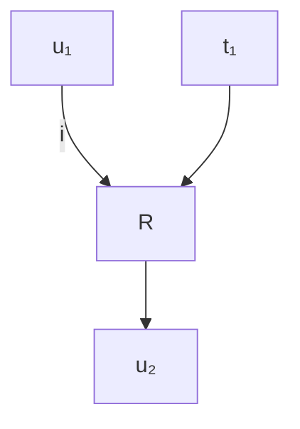
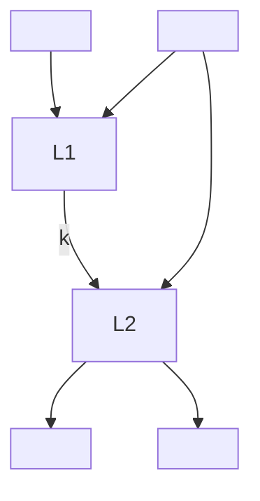
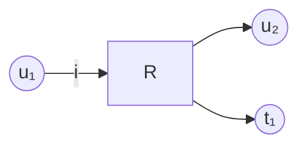
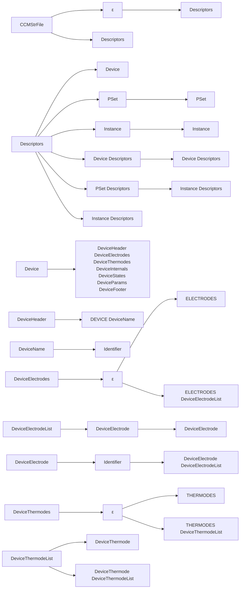

```mermaid
graph TD
    A["InstanceThermodes"] --> B["ε"]
    A --> C["THERMODES"]
    A --> D["THERMODES InstanceThermodeList"]
    E["InstanceThermodeList"] --> F["InstanceThermode"]
    E --> G["InstanceThermode InstanceThermodeList"]
    H["InstanceThermode"] --> I["Identifier"]
    H --> J["Integer"]
    K["InstanceParams"] --> L["ε"]
    K --> M["PARAMETERS"]
    K --> N["PARAMETERS InstanceParamList"]
    O["InstParamList"] --> P["InstanceParam"]
    O --> Q["InstanceParam InstParamList"]
    R["InstanceParam"] --> S["ParamName = ParamValue"]
    T["InstanceFooter"] --> U["END INSTANCE"]
    V["ParamName"] --> W["Identifier"]
    X["ParamValue"] --> Y["VectorValue"]
    Z["VectorValue"] --> AA["ScalarValue"]
    AB["ScalarList"] --> AC["ScalarValue"]
    AD["ScalarValue"] --> AE["ScalarValue ScalarList"]
    AF["ScalarValue"] --> AG["Character"]
    AH["Integer"] --> AI["Real"]
    AJ["String"] --> AK["String"]
```

<!-- page:1 -->
# Compact Models User Guide

Version O-2018.06, June 2018

# Copyright and Proprietary Information Notice

<!-- page:2 -->
© 2018 Synopsys, Inc. This Synopsys software and all associated documentation are proprietary to Synopsys, Inc. and may only be used pursuant to the terms and conditions of a written license agreement with Synopsys, Inc. All other use, reproduction, modification, or distribution of the Synopsys software or the associated documentation is strictly prohibited.

# Destination Control Statement

All technical data contained in this publication is subject to the export control laws of the United States of America. Disclosure to nationals of other countries contrary to United States law is prohibited. It is the reader’s responsibility to determine the applicable regulations and to comply with them.

# Disclaimer

SYNOPSYS, INC., AND ITS LICENSORS MAKE NO WARRANTY OF ANY KIND, EXPRESS OR IMPLIED, WITH REGARD TO THIS MATERIAL, INCLUDING, BUT NOT LIMITED TO, THE IMPLIED WARRANTIES OF MERCHANTABILITY AND FITNESS FOR A PARTICULAR PURPOSE.

# Trademarks

Synopsys and certain Synopsys product names are trademarks of Synopsys, as set forth at https://www.synopsys.com/company/legal/trademarks-brands.html.

All other product or company names may be trademarks of their respective owners.

# Third-Party Links

Any links to third-party websites included in this document are for your convenience only. Synopsys does not endorse and is not responsible for such websites and their practices, including privacy practices, availability, and content.

Synopsys, Inc.

690 E. Middlefield Road

Mountain View, CA 94043

www.synopsys.com

<!-- page:3 -->
# About This Guide vii

Related Publications . . . vii

Conventions viii

Customer Support . . . viii

Accessing SolvNet. . . viii

Contacting Synopsys Support . . . ix

Contacting Your Local TCAD Support Team Directly. . . . ix

# Chapter 1 SPICE Models 1

Available SPICE Models

MOSFET Models. .

Temperature Dependencies . . .

Elementary Devices . . .

Simple Linear Resistor. . .

Capacitor . . .

Inductor . .

Coupled (Mutual) Inductors. . .

Voltage-Controlled Switch

Current-Controlled Switch. . .

Voltage Sources and Current Sources. . .

Values of Independent Sources . . .

DC Source. . .

Pulse Source . . .

Sinusoidal Source . . .

Exponential Source. . . 12

Piecewise Linear Source. . . 13

Single-Frequency FM Source. . . . . 14

Independent Voltage Source . . . . . 15

Independent Current Source . . 16

Voltage-Controlled Current Source . . .

Voltage-Controlled Voltage Source. . . . 1

Current-Controlled Current Source . . . . . 18

Current-Controlled Voltage Source . . . . 18

MOSFET Models (NMOS and PMOS) . . . . 19

Level 1 MOSFET Model and Meyer Capacitance Model. . . . . 20

Level 2 MOSFET Model and Meyer Capacitance Model. . . 22

Level 3 MOSFET Model and Meyer Capacitance Model. . . . 25

<!-- page:4 -->
Level 6 MOSFET Model and Meyer Capacitance Model. . . 28

Berkeley Short-Channel IGFET Model (BSIM1) . . . . 30

Berkeley Short-Channel IGFET Model (BSIM2) . . . . 35

Berkeley Short-Channel IGFET Model Version 3 (BSIM3). . . . . 41

Berkeley Short-Channel IGFET Model Version 4 (BSIM4). . . . . . 56

BSIMPD2.2 MOSFET Model . . . 81

Non-MOSFET Transistors and Diodes. . . 100

Diode . . . 101

Bipolar Junction Transistor . . . 102

Junction Field Effect Transistor. . . 105

GaAs MESFET . . . 107

References. . . 109

# Chapter 2 HSPICE Models 111

Overview of Available Models . . . 1

Level 1 IDS: Shichman–Hodges Model . . . 112

Level 2 IDS: Grove–Frohman Model . . . . 112

Level 3 IDS: Empirical Model . . 112

Level 28 Modified BSIM Model . . . 112

Level 49 BSIM3v3 MOS Model. . . 112

Level 53 BSIM3v3 MOS Model. . 113

Level 54 BSIM4 Model . 113

Level 57 UC Berkeley BSIM3-SOI Model. . . . 113

Level 59 UC Berkeley BSIM3-SOI Fully Depleted (FD) Model. . . . . 113

Level 61 RPI a-Si TFT Model . 114

Level 62 RPI Poly-Si TFT Model. . . 114

Level 64 STARC HiSIM Model . . . 114

Level 68 STARC HiSIM2 Model . . . 114

Level 69 PSP100 DFM Support Series Model . . . 114

Level 72 BSIM-CMG Multigate MOSFET Model. . . . 115

Level 73 STARC HiSIM-LDMOS/HiSIM-HV Model . . . . 115

Level 76: LETI-UTSOI MOSFET Model . . . . 115

# Chapter 3 Built-in Models of Sentaurus Device 117

Parameter Interface Model . 117

SPICE Temperature Interface Model . . 118

Electrothermal Resistor (Ter) Model . . . . 119

MOS Harness Model. . . 120

Example . . . . 121

Ferroelectric Capacitor Model . 122

<!-- page:5 -->
Example . . . 124

References. . . 125

# Chapter 4 Compact Model Interface in Sentaurus Device 127

Introduction . . . . 127

Analytical Description of CMI Models . . . . . 127

Sentaurus Device Analysis Methods . . . . 127

Time-Domain Model Equations . 128

Example: Coupled Inductance . . . . . 131

Frequency-Domain Model Equations . . . . . 132

State Variables and Parameters . . . . . 133

Plotting During Transient Simulations . . . 133

Hierarchical Description of CMI Models . . . . 134

Device, Parameter Set, and Instance . . . . . 134

Compact Circuit Files (.ccf). . . . . 135

C++ Interface for CMI Models . . . . 135

Data Structure for Device, Parameter Set, and Instance . . . . 136

Header Files . . . . . 136

CCMBaseDevice.h . . . . . 136

CCMBaseInstance.h . . 137

CCMBaseParam.h . 139

CCMBasePSet.h . . . . 142

Compilation of C++ (.C) Files . . . . . 143

Functions of CMI Models . . . 144

cmi\_device\_create . . . . . 144

cmi\_device\_set\_param. . . . 145

cmi\_device\_initialize . . . . . 145

cmi\_device\_get\_param . . . 145

cmi\_device\_delete . . . . . . 145

cmi\_pset\_create . . . . . 146

cmi\_pset\_set\_param. . . . . 146

cmi\_pset\_initialize . . . . . . 146

cmi\_pset\_get\_param . . . . . 146

cmi\_pset\_delete . . . . . 147

cmi\_instance\_create. . . . . 147

cmi\_instance\_set\_param . . . . . 147

cmi\_instance\_initialize . . . . 147

cmi\_instance\_get\_param . . . . . 148

cmi\_instance\_get\_rhs. . . . . . 148

cmi\_instance\_get\_jacobian . . . . . 148

cmi\_instance\_is\_physical . 149

<!-- page:6 -->
cmi\_instance\_delete. . . . 149

cmi\_instance\_get\_hb\_rhs. . . . . . 149

cmi\_instance\_get\_hb\_jacobian . . . . . 150

CMIModels.h. . . . 150

Runtime Support . . . . 152

cmi\_starttime . . . . . 152

cmi\_stoptime . . . . . 152

cmi\_min\_timestep . . . . . 152

cmi\_max\_timestep . . . . . . . 152

cmi\_set\_event . . . . 153

cmi\_set\_max\_timestep. . . . . . . 153

cmi\_hb\_spectrum\_nb\_basefrequencies . . . . . 153

cmi\_hb\_spectrum\_index\_frequency . . . . . . 153

cmi\_hb\_spectrum\_index\_circfrequency . . . . 153

cmi\_hb\_spectrum\_index\_multiindex. . . . . . 154

cmi\_hb\_spectrum\_parameters . . . . . 154

CMISupport.h . . 154

Command File of Sentaurus Device . . . . 155

Electrothermal Models. . . 156

Summary . . . 157

Example: Implementing Coupled Inductances . . . . . 158

Model Equations . . . 158

coupled.ccf. . . . 158

coupled.C . . 159

Example: Implementing the Electrothermal Resistor Model . . . . . 163

Model Equations . . . 163

tres.ccf . . . 164

tres.C . . 165

CMI Models With Frequency-Domain Assembly . . . . 169

Admittance sd\_hb\_pGC. . . . 170

Impedance sd\_hb\_sRL. . . . 170

Harmonic Voltage Source sd\_hb\_vsource. . . . 171

Harmonic Current Source sd\_hb\_isource . . . 172

Multitone Voltage Source sd\_hb\_vsource2. . . . 173

Multitone Current Source sd\_hb\_isource2 . 174

Syntax of Compact Circuit (.ccf) Files . . . . . 176

<!-- page:7 -->
This user guide should be used in conjunction with the Sentaurus™ Device User Guide and Sentaurus™ Interconnect User Guide. It provides details about different types of compact model that are available:

SPICE models based on the Berkeley SPICE model version 3F51234. The BSIM3v3.2, BSIM4.1.0, and BSIMPD2.2 MOS models are also available.   
Frequently used Synopsys HSPICE® models.   
Built-in models, which are available only in Sentaurus Device. They work in a similar way to SPICE models. However, they provide additional functionality not found in SPICE models.   
User-defined models, which are available only in Sentaurus Device. They can be implemented using a compact model interface. The model code must be implemented in C++ and is linked to Sentaurus Device dynamically at runtime. No access to the source code of Sentaurus Device is necessary. The speed of user-defined models is comparable to that of built-in models in Sentaurus Device.

# Related Publications

For additional information, see:

The TCAD Sentaurus release notes, available on the Synopsys SolvNet® support site (see Accessing SolvNet on page viii).   
■ Documentation available on SolvNet at https://solvnet.synopsys.com/DocsOnWeb.

<!-- page:8 -->
# Conventions

The following conventions are used in Synopsys documentation.

<table><tr><td>Convention</td><td>Description</td></tr><tr><td>Blue text</td><td>Identifies a cross-reference (only on the screen).</td></tr><tr><td>Bold text</td><td>Identifies a selectable icon, button, menu, or tab. It also indicates the name of a field or option.</td></tr><tr><td>Courier font</td><td>Identifies text that is displayed on the screen or that the user must type. It identifies the names of files, directories, paths, parameters, keywords, and variables.</td></tr><tr><td>Italicized text</td><td>Used for emphasis, the titles of books and journals, and non-English words. It also identifies components of an equation or a formula, a placeholder, or an identifier.</td></tr></table>

# Customer Support

Customer support is available through the Synopsys SolvNet customer support website and by contacting the Synopsys support center.

# Accessing SolvNet

The SolvNet support site includes an electronic knowledge base of technical articles and answers to frequently asked questions about Synopsys tools. The site also gives you access to a wide range of Synopsys online services, which include downloading software, viewing documentation, and entering a call to the Support Center.

To access the SolvNet site:

1. Go to the web page at https://solvnet.synopsys.com.   
2. If prompted, enter your user name and password. (If you do not have a Synopsys user name and password, follow the instructions to register.)

If you need help using the site, click Help on the menu bar.

<!-- page:9 -->
# Contacting Synopsys Support

If you have problems, questions, or suggestions, you can contact Synopsys support in the following ways:

Go to the Synopsys Global Support Centers site on synopsys.com. There you can find email addresses and telephone numbers for Synopsys support centers throughout the world.   
Go to either the Synopsys SolvNet site or the Synopsys Global Support Centers site and open a case online (Synopsys user name and password required).

# Contacting Your Local TCAD Support Team Directly

Send an e-mail message to:

support-tcad-us@synopsys.com from within North America and South America   
support-tcad-eu@synopsys.com from within Europe   
support-tcad-ap@synopsys.com from within Asia Pacific (China, Taiwan, Singapore, Malaysia, India, Australia)   
support-tcad-kr@synopsys.com from Korea   
support-tcad-jp@synopsys.com from Japan

<!-- page:11 -->
This chapter describes the available SPICE models.

# Available SPICE Models

The following models are available:

Elementary Devices on page 3   
Voltage Sources and Current Sources on page 8   
MOSFET Models (NMOS and PMOS) on page 19   
Non-MOSFET Transistors and Diodes on page 100

NOTE The compact model for an arbitrary source (ASRC) and the models for transmission lines (LTRA, Tranline, URC) are not available.

# MOSFET Models

The following MOSFET models are implemented:

■ Mos1 is described by a square-law I–V characteristic.   
■ Mos2 [1] is an analytic model.   
■ Mos3 [1] is a semiempirical model.   
■ Mos6 [2] is a simple analytic model accurate in the short-channel region.   
■ BSIM1 [3][4][5] and BSIM2 [6] are the Berkeley short-channel IGFET models.   
BSIM3 is a physics-based, accurate, and robust MOSFET SPICE model [7][8] for circuit simulation and CMOS technology development.   
■ BSIM4 is the fourth version of the Berkeley IGFET model for SPICE.   
■ BSIMPD2.2 is a partially depleted silicon-on-insulator MOSFET model.

The Mos2, Mos3, and BSIM1 models include second-order effects such as channel-length modulation, subthreshold conduction, scattering-limited velocity saturation, small-size effects, and charge-controlled capacitances.

The BSIM3 model has extensive built-in dependencies of important dimensional and processing parameters, allowing you to model MOSFET behavior accurately over a wide range of channel lengths and channel widths. The BSIM3 model includes compact analytic expressions for the following physical phenomena:

Short-channel and narrow-channel effects on threshold voltage   
■ Nonuniform doping effect (in both lateral and vertical directions)   
Mobility reduction due to vertical field   
Bulk charge effect   
Carrier velocity saturation   
■ Drain-induced barrier lowering (DIBL)   
Channel-length modulation (CLM)   
Substrate current-induced body effect (SCBE)   
Subthreshold conduction   
Source and drain parasitic resistances

<!-- page:12 -->
The BSIM3v3.2 model also is included, which has the following enhancements and improvements relative to BSIM3v3.1:

An original and accurate charge thickness capacitance model that considers the finite charge layer thickness (quantum effects). This model is smooth, continuous, and very accurate through all regions of operation.   
■ Improved modeling of C–V characteristics at the weak to strong inversion transition.   
■ Addition of $\mathrm { T _ { o x } }$ dependency in the threshold voltage $( \mathrm { V } _ { \mathrm { t h } } )$ model.   
Addition of flat-band voltage $\mathrm { ( V _ { f b } ) }$ as a new model parameter.   
Improved substrate current scalability with channel length.   
Restructured non-quasistatic (NQS) model, addition of NQS into the pole-zero analysis, and fixed bugs in NQS codes.   
■ Addition of temperature dependency into the diode junction capacitance.   
■ DC diode model supports a resistance-free diode and current-limiting feature.   
Option of using the inversion charge of capMod 0, 1, 2, or 3 to evaluate BSIM3 thermal noise.   
Elimination of the small negative capacitance of Cgs and Cgd in the accumulation–depletion regions.   
A separate set of channel-width and channel-length dependency parameters (llc, lwc, lwlc, wlc, wwc, and wwlc) to calculate $\mathrm { w _ { e f f } }$ and $\mathrm { L } _ { \mathrm { e f f } }$ for the C–V model for a better fit of the capacitance data.   
■ Addition of parameter checking to avoid inappropriate values for certain parameters.

<!-- page:13 -->
# Temperature Dependencies

The SPICE models assume that input data has been measured at a nominal temperature of $2 7 ^ { \circ } \mathrm { C }$ . This value can be overridden for the parameter sets that provide a tnom parameter.

Similarly, the default operating temperature of all SPICE instances is $2 7 ^ { \circ } \mathrm { C }$ (300.15 K). This default can be changed for those instances that provide a temp parameter.

For details of the BSIM temperature adjustments, refer to the literature [9][10].

# Elementary Devices

The elementary device models discussed in this section include:

Simple Linear Resistor   
<!-- page:14 -->
Capacitor   
<!-- page:15 -->
Inductor   
<!-- page:16 -->
Coupled (Mutual) Inductors   
Voltage-Controlled Switch   
<!-- page:17 -->
Current-Controlled Switch

# Simple Linear Resistor

Resistors are specified by giving the value of the resistance [ ]. This value can be positive orΩ negative, but not zero.

A more general form of the resistor allows for modeling temperature effects and calculating the actual resistance value from strictly geometric information and specifications of the process.

The sheet resistance is used, with the narrowing parameter and the length and width of the device, to determine the nominal resistance by the formula:

$$
r = r s h \frac {l - n a r r o w}{w - n a r r o w} \tag {1}
$$

defw is used to supply a default value for if none is specified for the device. If either w rsh or is not specified, the standard default resistance 1 k is used. After the nominal resistancel Ω is calculated, it is adjusted for temperature by the formula:

$$
r (t e m p) = r (t n o m) \cdot \left(1 + t c _ {1} \cdot (t e m p - t n o m)\right) + t c _ {2} \cdot \left(t e m p - t n o m\right) ^ {2}) \tag {2}
$$

<table><tr><td>Device name:</td><td>Resistor</td></tr><tr><td>Default parameter set name:</td><td>Resistor_pset</td></tr><tr><td>Electrodes:</td><td>R+, R-</td></tr><tr><td>Internal variables:</td><td>None</td></tr></table>

Table 1 Resistor model parameters 

<table><tr><td>Name</td><td>Description</td><td>Type</td><td>Default</td><td>Unit</td></tr><tr><td>defw</td><td>Default device width</td><td>double</td><td>1e-05</td><td>m</td></tr><tr><td>narrow</td><td>Narrowing of resistor</td><td>double</td><td>0</td><td>m</td></tr><tr><td>rsh</td><td>Sheet resistance</td><td>double</td><td>0</td><td> $\Omega /sq$ </td></tr><tr><td>tc1</td><td>First-order temperature coefficient</td><td>double</td><td>0</td><td> $^{\circ}C^{-1}$ </td></tr><tr><td>tc2</td><td>Second-order temperature coefficient</td><td>double</td><td>0</td><td> $^{\circ}C^{-2}$ </td></tr><tr><td>tnom</td><td>Parameter measurement temperature</td><td>double</td><td>27</td><td> $^{\circ}C$ </td></tr></table>

Table 2 Resistor instance parameters 

<table><tr><td>Name</td><td>Description</td><td>Type</td><td>Default</td><td>Unit</td></tr><tr><td>resistance</td><td>Resistance</td><td>double</td><td>1000</td><td> $\Omega$ </td></tr><tr><td>temp</td><td>Instance operating temperature</td><td>double</td><td>27</td><td> $^{\circ}C$ </td></tr><tr><td>l</td><td>Length</td><td>double</td><td>0</td><td>m</td></tr><tr><td>w</td><td>Width</td><td>double</td><td>1e-05</td><td>m</td></tr></table>

# Capacitor

If the value of capacitance is not given, it can be computed from strictly geometric information and the specifications of the process as follows:

$$
\text { capacitance } = c j \cdot (l - \text { narrow }) \cdot (w - \text { narrow }) + 2 \cdot c j s w \cdot (l + w - 2 \cdot \text { narrow }) \tag {3}
$$

<table><tr><td>Device name:</td><td>Capacitor</td></tr><tr><td>Default parameter set name:</td><td>Capacitor_pset</td></tr><tr><td>Electrodes:</td><td>C+, C-</td></tr><tr><td>Internal variables:</td><td>None</td></tr></table>

Table 3 Capacitor model parameters 

<table><tr><td>Name</td><td>Description</td><td>Type</td><td>Default</td><td>Unit</td></tr><tr><td>cj</td><td>Bottom capacitance per area</td><td>double</td><td>0</td><td> $F/m^{2}$ </td></tr><tr><td>cjsw</td><td>Sidewall capacitance per meter</td><td>double</td><td>0</td><td>F/m</td></tr><tr><td>defw</td><td>Default width</td><td>double</td><td>1e-05</td><td>m</td></tr><tr><td>narrow</td><td>Width correction factor</td><td>double</td><td>0</td><td>m</td></tr></table>

Table 4 Capacitor instance parameters 

<table><tr><td>Name</td><td>Description</td><td>Type</td><td>Default</td><td>Unit</td></tr><tr><td>capacitance</td><td>Device capacitance</td><td>double</td><td>0</td><td>F</td></tr><tr><td>ic</td><td>Initial capacitor voltage</td><td>double</td><td>0</td><td>V</td></tr><tr><td>l</td><td>Device length</td><td>double</td><td>0</td><td>m</td></tr><tr><td>w</td><td>Device width</td><td>double</td><td>1e-05</td><td>m</td></tr></table>

# Inductor

<table><tr><td>Device name:</td><td>Inductor</td></tr><tr><td>Default parameter set name:</td><td>Inductor_pset</td></tr><tr><td>Electrodes:</td><td>L+, L-</td></tr><tr><td>Internal variables:</td><td>branch (current through inductor)</td></tr></table>

NOTE There are no parameters for this parameter set.

Table 5 Inductor instance parameters 

<table><tr><td>Name</td><td>Description</td><td>Type</td><td>Default</td><td>Unit</td></tr><tr><td>ic</td><td>Initial current through inductor</td><td>double</td><td>0</td><td>A</td></tr><tr><td>inductance</td><td>Inductance of inductor</td><td>double</td><td>0</td><td>H</td></tr></table>

# Coupled (Mutual) Inductors

Coupled inductors are specified by introducing a coupling k between two existing inductors. The inductors inductor1 and inductor2 must have been previously specified. Example: Implementing Coupled Inductances on page 158 discusses the implementation of coupled inductances using the compact model interface.

<table><tr><td>Device name:</td><td>mutual</td></tr><tr><td>Default parameter set name:</td><td>mutual_pset</td></tr><tr><td>Electrodes:</td><td>None</td></tr><tr><td>Internal variables:</td><td>None</td></tr></table>

NOTE There are no parameters for this parameter set.

Table 6 Coupled inductors instance parameters 

<table><tr><td>Name</td><td>Description</td><td>Type</td><td>Default</td><td>Unit</td></tr><tr><td>coefficient</td><td>(redundant parameter)</td><td>double</td><td>0</td><td>-</td></tr><tr><td>inductor1</td><td>First coupled inductor</td><td>string</td><td>“”</td><td>-</td></tr><tr><td>inductor2</td><td>Second coupled inductor</td><td>string</td><td>“”</td><td>-</td></tr><tr><td>k</td><td>Mutual inductance</td><td>double</td><td>0</td><td>-</td></tr></table>

# Voltage-Controlled Switch

The electrodes S+ and S- are the nodes between which the switch terminals are connected. The electrodes SC+ and SC- are the positive and negative controlling nodes, respectively. The switch is not ideal because it must have a finite positive resistance in the off-state. However, the value can be chosen such that it is effectively infinite compared to the other circuit elements.

The switch is switched on if the controlling voltage is greater than vt + vh. It is switched off if the controlling voltage is smaller than vt – vh.

NOTE A voltage-controlled switch must be used only for transient simulations. It will not switch on or off during a quasistationary simulation.

<table><tr><td>Device name:</td><td>Switch</td></tr><tr><td>Default parameter set name:</td><td>Switch_pset</td></tr><tr><td>Electrodes:</td><td>S+, S-, SC+, SC-</td></tr><tr><td>Internal variables:</td><td>None</td></tr></table>

Table 7 Voltage-controlled switch model parameters 

<table><tr><td>Name</td><td>Description</td><td>Type</td><td>Default</td><td>Unit</td></tr><tr><td>roff</td><td>Resistance when open</td><td>double</td><td>1e+12</td><td> $\Omega$ </td></tr><tr><td>ron</td><td>Resistance when closed</td><td>double</td><td>1</td><td> $\Omega$ </td></tr><tr><td>vh</td><td>Hysteresis voltage</td><td>double</td><td>0</td><td>V</td></tr><tr><td>vt</td><td>Threshold voltage</td><td>double</td><td>0</td><td>V</td></tr></table>

Table 8 Voltage-controlled switch instance parameters 

<table><tr><td>Name</td><td>Description</td><td>Type</td><td>Default</td><td>Unit</td></tr><tr><td>off</td><td>Switch initially open</td><td>integer</td><td>-</td><td>-</td></tr><tr><td>on</td><td>Switch initially closed</td><td>integer</td><td>-</td><td>-</td></tr></table>

# Current-Controlled Switch

The electrodes W+ and W- are the nodes between which the switch terminals are connected. The switch is controlled by the current that flows through the voltage source given by the parameter control. The direction of a positive controlling current flow is from the positive node, through the source, to the negative node.

NOTE This voltage source must be specified before the switch.

The switch is not ideal because it must have a finite positive resistance in the off-state. However, the value can always be chosen such that it is effectively infinite compared to the other circuit elements. The switch is switched on if the controlling current is greater than it + ih. It is switched off if the controlling current is smaller than it – ih.

NOTE A current-controlled switch must be used only for transient simulations.

It will not switch on or off during a quasistationary simulation.

<table><tr><td>Device name:</td><td>CSwitch</td></tr><tr><td>Default parameter set name:</td><td>CSwitch_pset</td></tr><tr><td>Electrodes:</td><td>W+, W-</td></tr><tr><td>Internal variables:</td><td>None</td></tr></table>

Table 9 Current-controlled switch model parameters 

<table><tr><td>Name</td><td>Description</td><td>Type</td><td>Default</td><td>Unit</td></tr><tr><td>ih</td><td>Hysteresis current</td><td>double</td><td>0</td><td>A</td></tr><tr><td>it</td><td>Threshold current</td><td>double</td><td>0</td><td>A</td></tr><tr><td>roff</td><td>Open resistance</td><td>double</td><td>1e+12</td><td>Ω</td></tr><tr><td>ron</td><td>Closed resistance</td><td>double</td><td>1</td><td>Ω</td></tr></table>

Table 10 Current-controlled switch instance parameters 

<table><tr><td>Name</td><td>Description</td><td>Type</td><td>Default</td><td>Unit</td></tr><tr><td>control</td><td>Name of controlling source</td><td>string</td><td>“”</td><td>-</td></tr><tr><td>off</td><td>Initially open</td><td>integer</td><td>-</td><td>-</td></tr><tr><td>on</td><td>Initially closed</td><td>integer</td><td>-</td><td>-</td></tr></table>

<!-- page:18 -->
# Voltage Sources and Current Sources

The voltage source and the current source models discussed in this section include:

Values of Independent Sources   
Independent Voltage Source   
Independent Current Source   
Voltage-Controlled Current Source   
Voltage-Controlled Voltage Source   
Current-Controlled Current Source   
Current-Controlled Voltage Source

# Values of Independent Sources

The independent voltage sources and current sources have the same parameters.

# DC Source

The parameter dc specifies the DC value of the source. For example, dc = 10 defines a DC voltage/current source of 10 V/10 A.

<!-- page:19 -->
# Pulse Source

The pulse parameter must be a vector of length 7. Its entries define a transient pulse as shown in Table 11.

Table 11 Pulse source instance parameters 

<table><tr><td>Parameter</td><td>Description</td><td>Unit</td></tr><tr><td>v1 = pulse [0]</td><td>Initial value</td><td>V or A</td></tr><tr><td>v2 = pulse [1]</td><td>Pulsed value</td><td>V or A</td></tr><tr><td>td = pulse [2]</td><td>Delay time</td><td>s</td></tr><tr><td>tr = pulse [3]</td><td>Rise time</td><td>s</td></tr><tr><td>tf = pulse [4]</td><td>Fall time</td><td>s</td></tr><tr><td>pw = pulse [5]</td><td>Pulse width</td><td>s</td></tr><tr><td>per = pulse [6]</td><td>Period</td><td>s</td></tr></table>

Such a pulse produces the values in Table 12 (see Figure 1 on page 10).

Table 12 Pulse source values 

<table><tr><td>Time</td><td>Value</td></tr><tr><td>0</td><td>v1</td></tr><tr><td>td</td><td>v1</td></tr><tr><td>td+tr</td><td>v2</td></tr><tr><td>td+tr+pw</td><td>v2</td></tr><tr><td>td+tr+pw+tf</td><td>v1</td></tr><tr><td>per+td</td><td>v1</td></tr><tr><td>per+td+tr</td><td>v2</td></tr></table>


<details>
<summary>line</summary>

| Time | Value |
|------|-------|
| td   | v1    |
| tr   | v2    |
| pw   | v2    |
| tf   | v1    |
| tr   | v2    |
| pw   | v2    |
| tf   | v1    |
</details>

Figure 1 Pulse source parameters

<!-- page:20 -->
Intermediate values are determined by linear interpolation. For example, the following specification produces the pulse shown in Figure 2:

$$
\text { pulse } = (- 0. 2 \quad 1 \quad 0. 8 \quad 0. 2 \quad 2. 0 \quad 1 \quad 5)
$$


<details>
<summary>line</summary>

| x  | y |
|----|---|
| 0  | 0 |
| 1  | 1 |
| 2  | 0.5 |
| 3  | 0 |
| 4  | 0 |
| 5  | 0 |
| 6  | 1 |
| 7  | 0.5 |
| 8  | 0 |
| 9  | 0 |
| 10 | 0 |
| 11 | 1 |
| 12 | 0.5 |
| 13 | 0 |
| 14 | 0 |
| 15 | 0 |
| 16 | 1 |
| 17 | 0.5 |
| 18 | 0 |
| 19 | 0 |
| 20 | 0 |
</details>

Figure 2 Pulse source

<!-- page:21 -->
# Sinusoidal Source

The sine parameter must be a vector of length 5. Its entries are listed in Table 13.

Table 13 Sinusoidal source instance parameters 

<table><tr><td>Parameter</td><td>Description</td><td>Unit</td></tr><tr><td>vo = sine [0]</td><td>Offset</td><td>V or A</td></tr><tr><td>va = sine [1]</td><td>Amplitude</td><td>V or A</td></tr><tr><td>freq = sine [2]</td><td>Frequency</td><td>Hz</td></tr><tr><td>td = sine [3]</td><td>Delay</td><td>s</td></tr><tr><td>theta = sine [4]</td><td>Damping factor</td><td> $s^{-1}$ </td></tr></table>

A sinusoidal source produces the values shown in Table 14.

Table 14 Sinusoidal source values 

<table><tr><td>Time</td><td>Value</td></tr><tr><td> $t \leq td$ </td><td> $vo$ </td></tr><tr><td> $t >td$ </td><td> $vo + va \cdot e^{-(t - td) \cdot theta} \cdot \sin(2 \cdot \pi \cdot freq \cdot (t - td))$ </td></tr></table>

For example, the following specification produces the sine wave shown in Figure 3:


<details>
<summary>line</summary>

| x    | y      |
| ---- | ------ |
| 0    | 0.2    |
| 5    | 0.6    |
| 10   | -0.2   |
| 15   | -0.2   |
| 20   | 0.2    |
</details>

Figure 3 Sine source

<!-- page:22 -->
# Exponential Source

The exp parameter must be a vector of length 6. Its entries are listed in Table 15.

Table 15 Exponential source instance parameters 

<table><tr><td>Parameter</td><td>Description</td><td>Unit</td></tr><tr><td>v1 = exp [0]</td><td>Initial value</td><td>V or A</td></tr><tr><td>v2 = exp [1]</td><td>Pulsed value</td><td>V or A</td></tr><tr><td>td1 = exp [2]</td><td>Rise delay time</td><td>s</td></tr><tr><td>tau1 = exp [3]</td><td>Rise time constant</td><td>s</td></tr><tr><td>td2 = exp [4]</td><td>Fall delay time</td><td>s</td></tr><tr><td>tau2 = exp [5]</td><td>Fall time constant</td><td>s</td></tr></table>

The shape of the waveform is described by Table 16.

Table 16 Exponential source values 

<table><tr><td>Time</td><td>Value</td></tr><tr><td> $t \leq td1$ </td><td> $v1$ </td></tr><tr><td> $td1 < t \leq td2$ </td><td> $v1 + (v2 - v1)\left(1 - e^{-\frac{t - td1}{tau1}}\right)$ </td></tr><tr><td> $t >td2$ </td><td> $v1 + (v2 - v1)\left(1 - e^{-\frac{t - td1}{tau1}}\right) + (v1 - v2)\left(1 - e^{-\frac{t - td2}{tau2}}\right)$ </td></tr></table>

For example, the following specification produces the shark fin shown in Figure 4 on page 13:

$$
\exp = (0. 2 \quad 0. 4 \quad 2 \quad 5 \quad 1 0 \quad 3)
$$


<details>
<summary>line</summary>

| x  | y     |
|----|-------|
| 0  | 0.200 |
| 1  | 0.200 |
| 2  | 0.240 |
| 3  | 0.270 |
| 4  | 0.290 |
| 5  | 0.310 |
| 6  | 0.330 |
| 7  | 0.345 |
| 8  | 0.355 |
| 9  | 0.360 |
| 10 | 0.365 |
| 11 | 0.350 |
| 12 | 0.325 |
| 13 | 0.295 |
| 14 | 0.270 |
| 15 | 0.245 |
| 16 | 0.225 |
| 17 | 0.215 |
| 18 | 0.210 |
| 19 | 0.205 |
| 20 | 0.200 |
</details>

Figure 4 Exponential source

<!-- page:23 -->
# Piecewise Linear Source

The parameter pwl must be a vector of even size. It consists of pairs $( t _ { k } , \nu _ { k } )$ that specify the value $\nu _ { k } \ [ \mathrm { V \ o r \ A } ]$ at the time $t \ = \ t _ { k }$ . The value of the source at intermediate values of time is determined using linear interpolation on the input values.

For example, the following specification produces the curve shown in Figure 5 on page 14:

$$
\mathrm{pwl} = (0 0 2 2 3 - 1 6 6 1 0 5 1 2 - 1 1 6 4 1 9 2 2 0 5)
$$


<details>
<summary>line</summary>

| x  | y |
|----|---|
| 0  | 0 |
| 2  | 2 |
| 3  | -1 |
| 6  | 6 |
| 10 | 5 |
| 12 | -1 |
| 16 | 4 |
| 19 | 2 |
| 20 | 5 |
</details>

Figure 5 Piecewise linear source

<!-- page:24 -->
# Single-Frequency FM Source

The parameter sffm must be a vector of size 5. Its entries are listed in Table 17.

Table 17 Single-frequency FM source instance parameters 

<table><tr><td>Parameter</td><td>Description</td><td>Unit</td></tr><tr><td>vo = sffm [0]</td><td>Offset</td><td>V or A</td></tr><tr><td>va = sffm [1]</td><td>Amplitude</td><td>V or A</td></tr><tr><td>fc = sffm [2]</td><td>Carrier frequency</td><td>Hz</td></tr><tr><td>mdi = sffm [3]</td><td>Modulation index</td><td>-</td></tr><tr><td>fs = sffm [4]</td><td>Signal frequency</td><td>Hz</td></tr></table>

The shape of the waveform is described by:

$$
v (t) = v o + v a \cdot \sin (2 \cdot \pi \cdot f c \cdot t + m d i \cdot \sin (2 \cdot \pi \cdot f s \cdot t)) \tag {4}
$$

For example, the following specification produces the signal shown in Figure 6 on page 15:

$$
\mathrm{sffm} = (1 2 1 3 0. 2 5)
$$


<details>
<summary>line</summary>

| x    | y     |
| ---- | ----- |
| 0.0  | 3.0   |
| 0.5  | 0.0   |
| 1.0  | -1.0  |
| 1.5  | 0.0   |
| 2.0  | 1.0   |
| 2.5  | 3.0   |
| 3.0  | 0.0   |
| 3.5  | -1.0  |
| 4.0  | 0.0   |
| 4.5  | 1.0   |
| 5.0  | 3.0   |
| 5.5  | 0.0   |
| 6.0  | -1.0  |
| 6.5  | 0.0   |
| 7.0  | 1.0   |
| 7.5  | 3.0   |
| 8.0  | 0.0   |
| 8.5  | -1.0  |
| 9.0  | 0.0   |
| 9.5  | 1.0   |
|10.0 | 3.0   |
|10.5 | 0.0   |
|11.0 | -1.0  |
|11.5 | 0.0   |
|12.0 | 1.0   |
|12.5 | 3.0   |
|13.0 | 0.0   |
|13.5 | -1.0  |
|14.0 | 0.0   |
|14.5 | 1.0   |
|15.0 | 3.0   |
|15.5 | 0.0   |
|16.0 | -1.0  |
|16.5 | 0.0   |
|17.0 | 1.0   |
|17.5 | 3.0   |
|18.0 | 0.0   |
|18.5 | -1.0  |
|19.0 | 0.0   |
|19.5 | 1.0   |
|20.0 | 3.0   |
</details>

Figure 6 Single-frequency FM source

<!-- page:25 -->
# Independent Voltage Source

A SPICE voltage source can be used as an ammeter in a circuit, that is, a zero-valued voltage source can be inserted into the circuit to measure the current. Voltage sources are referenced by the control parameter in current-controlled current sources (CCCS), current-controlled voltage sources (CCVS), and current-controlled switches (CSwitch).

Only one of the parameters dc, pulse, sine or sin, exp, pwl, or sffm must be specified. For DC simulations, the value of the source for the time t = 0 is used.

<table><tr><td>Device name:</td><td>Vsource</td></tr><tr><td>Default parameter set name:</td><td>Vsource_pset</td></tr><tr><td>Electrodes:</td><td>V+, V-</td></tr><tr><td>Internal variables:</td><td>branch (current through voltage source)</td></tr></table>

NOTE There are no parameters for this parameter set.

Table 18 Independent voltage source instance parameters 

<table><tr><td>Name</td><td>Description</td><td>Type</td><td>Default</td><td>Unit</td></tr><tr><td>dc</td><td>DC source value</td><td>double</td><td>0</td><td>V</td></tr><tr><td>pulse</td><td>Pulse description</td><td>double[7]</td><td>-</td><td>-</td></tr><tr><td>sine</td><td>Sinusoidal source description</td><td>double[5]</td><td>-</td><td>-</td></tr><tr><td> $sin^a$ </td><td>Sinusoidal source description</td><td>double[5]</td><td>-</td><td>-</td></tr><tr><td>exp</td><td>Exponential source description</td><td>double[6]</td><td>-</td><td>-</td></tr><tr><td>pwl</td><td>Piecewise linear description</td><td>double[]b</td><td>-</td><td>-</td></tr><tr><td>sffm</td><td>Single-frequency FM description</td><td>double[5]</td><td>-</td><td>-</td></tr></table>

a. Equivalent to the sine parameter.   
b. Vector of even size.

<!-- page:26 -->
# Independent Current Source

A current source of positive value forces the current to flow from the I+ node, through the source, to the I- node.

Only one of the parameters dc, pulse, sine or sin, exp, pwl, or sffm must be specified. For DC simulations, the value of the source for the time t = 0 is used.

<table><tr><td>Device name:</td><td>Isource</td></tr><tr><td>Default parameter set name:</td><td>Isource_pset</td></tr><tr><td>Electrodes:</td><td>I+, I-</td></tr><tr><td>Internal variables:</td><td>None</td></tr></table>

NOTE There are no parameters for this parameter set.

Table 19 Independent current source instance parameters 

<table><tr><td>Name</td><td>Description</td><td>Type</td><td>Default</td><td>Unit</td></tr><tr><td>dc</td><td>DC value of source</td><td>double</td><td>0</td><td>A</td></tr><tr><td>pulse</td><td>Pulse description</td><td>double[7]</td><td>-</td><td>-</td></tr><tr><td>sine</td><td>Sinusoidal source description</td><td>double[5]</td><td>-</td><td>-</td></tr><tr><td> $sin^a$ </td><td>Sinusoidal source description</td><td>double[5]</td><td>-</td><td>-</td></tr><tr><td>exp</td><td>Exponential source description</td><td>double[6]</td><td>-</td><td>-</td></tr><tr><td>pwl</td><td>Piecewise linear description</td><td>double[]b</td><td>-</td><td>-</td></tr><tr><td>sffm</td><td>Single-frequency FM description</td><td>double[5]</td><td>-</td><td>-</td></tr></table>

<!-- page:27 -->
a. Equivalent to the sine parameter.

b. Vector of even size.

# Voltage-Controlled Current Source

V+ and V- are the positive and negative nodes, respectively. The current flows from the positive node, through the source, to the negative node. VC+ and VC- are the positive and negative controlling nodes, respectively. The value of the current is given by:

$$
i = \text { gain } \cdot (v (V C +) - v (V C -)) \tag {5}
$$

<table><tr><td>Device name:</td><td>VCCS</td></tr><tr><td>Default parameter set name:</td><td>VCCS_pset</td></tr><tr><td>Electrodes:</td><td>V+, V-, VC+, VC-</td></tr><tr><td>Internal variables:</td><td>None</td></tr></table>

<!-- page:28 -->
NOTE There are no parameters for this parameter set.

Table 20 Voltage-controlled current source instance parameter 

<table><tr><td>Name</td><td>Description</td><td>Type</td><td>Default</td><td>Unit</td></tr><tr><td>gain</td><td>Transconductance of source (gain)</td><td>double</td><td>0</td><td> $\Omega^{-1}$ </td></tr></table>

# Voltage-Controlled Voltage Source

The positive and negative nodes are V+ and V-, respectively. The positive and negative controlling nodes are VC+ and VC-, respectively. The value of the voltage is given by:

$$
v = \text { gain } \cdot (v (V C +) - v (V C -)) \tag {6}
$$

<table><tr><td>Device name:</td><td>VCVS</td></tr><tr><td>Default parameter set name:</td><td>VCVS_pset</td></tr><tr><td>Electrodes:</td><td>V+, V-, VC+, VC-</td></tr><tr><td>Internal variables:</td><td>branch (current through voltage source)</td></tr></table>

NOTE There are no parameters for this parameter set.

Table 21 Voltage-controlled voltage source instance parameter 

<table><tr><td>Name</td><td>Description</td><td>Type</td><td>Default</td><td>Unit</td></tr><tr><td>gain</td><td>Voltage gain</td><td>double</td><td>0</td><td>-</td></tr></table>

# Current-Controlled Current Source

The positive and negative nodes are F+ and F-, respectively. The current flows from the positive node, through the source, to the negative node. The parameter control identifies the controlling voltage source, which must have been previously declared. The direction of the positive controlling current flow is from the positive node, through the voltage source control, to the negative node. The value of the current is given by:

$$
i = \text { gain } \cdot i (\text { control }) \tag {7}
$$

<table><tr><td>Device name:</td><td>CCCS</td></tr><tr><td>Default parameter set name:</td><td>CCCS_pset</td></tr><tr><td>Electrodes:</td><td> $F_{+}$ ,  $F^{-}$ </td></tr><tr><td>Internal variables:</td><td>None</td></tr></table>

NOTE There are no parameters for this parameter set.

Table 22 Current-controlled current source instance parameters 

<table><tr><td>Name</td><td>Description</td><td>Type</td><td>Default</td><td>Unit</td></tr><tr><td>control</td><td>Name of controlling source</td><td>string</td><td>“”</td><td>-</td></tr><tr><td>gain</td><td>Current gain</td><td>double</td><td>0</td><td>-</td></tr></table>

# Current-Controlled Voltage Source

H+ and H– are the positive and negative nodes, respectively. The parameter control identifies the controlling voltage source, which must have been previously declared. The direction of the positive controlling current flow is from the positive node, through the voltage source control, to the negative node. The value of the current is given by:

$$
v = \text { gain } \cdot i (\text { control }) \tag {8}
$$

<table><tr><td>Device name:</td><td>CCVS</td></tr><tr><td>Default parameter set name:</td><td>CCVS_pset</td></tr><tr><td>Electrodes:</td><td>H+, H-</td></tr><tr><td>Internal variables:</td><td>branch (current through voltage source)</td></tr></table>

NOTE There are no parameters for this parameter set.

Table 23 Current-controlled voltage source instance parameters 

<table><tr><td>Name</td><td>Description</td><td>Type</td><td>Default</td><td>Unit</td></tr><tr><td>control</td><td>Controlling voltage source</td><td>string</td><td>“”</td><td>-</td></tr><tr><td>gain</td><td>Transresistance (gain)</td><td>double</td><td>0</td><td> $\Omega$ </td></tr></table>

<!-- page:29 -->
# MOSFET Models (NMOS and PMOS)

Different SPICE MOSFET models are available: Mos1, Mos2, Mos3, Mos6, BSIM1, BSIM2, BSIM3, BSIM4, and BSIMPD2.2.

The DC characteristics are defined by the device parameters vto, kp, lambda, phi, and gamma. These parameters are computed by SPICE if process parameters (nsub, tox, …) are given, but user-specified values always override. vto is positive (negative) for enhancement mode and negative (positive) for depletion mode n-channel (p-channel) devices.

Charge storage is modeled by the constant capacitors cgso, cgdo, and cgbo, which represent overlap capacitances by the nonlinear thin-oxide capacitance that is distributed among the gate, source, drain, and bulk regions, and by the nonlinear depletion-layer capacitances for both substrate junctions divided into the bottom and the periphery, which vary as the mj and mjsw power of junction voltage, respectively, and are determined by the parameters cbd, cbs, cj, cjsw, mj, mjsw, and pb. Charge storage effects are modeled by the piecewise, linear, voltagedependent capacitance model proposed by Meyer. The thin-oxide charge-storage effects are treated differently for the Mos1 model. These voltage-dependent capacitances are included only if tox is specified in the input description. These capacitances are represented using the Meyer formulation.

There is some overlap among the parameters that describe the junctions, for example, the reverse current can be input as either is [A] or ${ \mathrm { j } } \mathbf { s } [ \mathbf { A } / { \mathrm { m } } ^ { 2 } ]$ ]. Whereas, the first is an absolute value, the second is multiplied by ad and as to give the reverse current of the drain and source junctions, respectively. The same idea also applies to the zero-bias junction capacitances cbd and cbs [F] on one hand, and $\mathsf { c j } \ [ \mathsf { F / m } ^ { 2 } ]$ on the other hand. The parasitic drain and source series resistance can be expressed as either rd and rs [ ] or rhs [ ], the latter isΩ Ω ⁄ sq multiplied by the number of squares nrd and nrs.

<!-- page:30 -->
The BSIM1, BSIM2, and BSIM3 parameters are all values obtained from process characterization. Various parameters also have corresponding parameters with length and width dependencies. For example, consider the parameter vfb (flat-band voltage) [V]. It is accompanied by the parameters lvfb and wvfb [ ]. The effective flat-band voltage isV/μm then computed by:

$$
v f b _ {e f f} = v f b + 1 0 ^ {- 6} \cdot \left(\frac {l v f b}{l _ {e f f}} + \frac {w v f b}{w _ {e f f}}\right) \tag {9}
$$

where the effective lengths and widths are given by:

$$
l _ {e f f} = l - d l \cdot 1 0 ^ {- 6} \tag {10}
$$

$$
w _ {e f f} = w - d w \cdot 1 0 ^ {- 6}
$$

# Level 1 MOSFET Model and Meyer Capacitance Model

The Mos1 model is described by a square-law I–V characteristic. l and w are the channel length and width. ad and as are the areas of the drain and source diffusions. pd and ps are the perimeters of the drain and source junctions. nrd and nrs designate the equivalent number of squares of the drain and source diffusions. These values multiply the sheet resistance rsh for an accurate representation of the parasitic series drain and source resistance of each transistor. The temp value is the temperature at which the device will operate.

Use nmos=1 to specify an NMOS transistor or pmos=1 to specify a PMOS transistor.

<table><tr><td>Device name:</td><td>Mos1</td></tr><tr><td>Default parameter set name:</td><td>Mos1_pset</td></tr><tr><td>Electrodes:</td><td>Drain, Gate, Source, Bulk</td></tr><tr><td>Internal variables:</td><td>drain (internal drain voltage, only available if rd≠0 or rsh≠0 and nrd≠0)source (internal source voltage, only available if rs≠0 or rsh≠0 and nrs≠0)</td></tr></table>

a. 1: opposite to substrate; –1: same as substrate; 0: Al gate.   
Table 24 Mos1 model parameters 

<table><tr><td>Name</td><td>Description</td><td>Type</td><td>Default</td><td>Unit</td></tr><tr><td>vto</td><td>Threshold voltage</td><td>double</td><td>0</td><td>V</td></tr><tr><td>vt0</td><td>(redundant parameter)</td><td>double</td><td>0</td><td>V</td></tr><tr><td>kp</td><td>Transconductance parameter</td><td>double</td><td>2e-05</td><td> $A/V^2$ </td></tr><tr><td>gamma</td><td>Bulk threshold parameter</td><td>double</td><td>0</td><td> $V^{1/2}$ </td></tr><tr><td>phi</td><td>Surface potential</td><td>double</td><td>0.6</td><td>V</td></tr><tr><td>lambda</td><td>Channel length modulation</td><td>double</td><td>0</td><td>V-1</td></tr><tr><td>rd</td><td>Drain Ohmic resistance</td><td>double</td><td>0</td><td>Ω</td></tr><tr><td>rs</td><td>Source Ohmic resistance</td><td>double</td><td>0</td><td>Ω</td></tr><tr><td>cbd</td><td>Base-drain junction capacitance</td><td>double</td><td>0</td><td>F</td></tr><tr><td>cbs</td><td>Base-source junction capacitance</td><td>double</td><td>0</td><td>F</td></tr><tr><td>is</td><td>Bulk junction saturation current</td><td>double</td><td>1e-14</td><td>A</td></tr><tr><td>pb</td><td>Bulk junction potential</td><td>double</td><td>0.8</td><td>V</td></tr><tr><td>cgso</td><td>Gate-source overlap capacitance</td><td>double</td><td>0</td><td>F/m</td></tr><tr><td>cgdo</td><td>Gate-drain overlap capacitance</td><td>double</td><td>0</td><td>F/m</td></tr><tr><td>cgbo</td><td>Gate-bulk overlap capacitance</td><td>double</td><td>0</td><td>F/m</td></tr><tr><td>rsh</td><td>Sheet resistance</td><td>double</td><td>0</td><td>Ω/sq</td></tr><tr><td>cj</td><td>Bottom junction capacitance per area</td><td>double</td><td>0</td><td>F/m2</td></tr><tr><td>mj</td><td>Bottom grading coefficient</td><td>double</td><td>0.5</td><td>–</td></tr><tr><td>cjsw</td><td>Side junction capacitance per area</td><td>double</td><td>0</td><td>F/m</td></tr><tr><td>mjsw</td><td>Side grading coefficient</td><td>double</td><td>0.5</td><td>–</td></tr><tr><td>js</td><td>Bulk junction saturation current density</td><td>double</td><td>0</td><td>A/m2</td></tr><tr><td>tox</td><td>Oxide thickness</td><td>double</td><td>0</td><td>m</td></tr><tr><td>ld</td><td>Lateral diffusion</td><td>double</td><td>0</td><td>m</td></tr><tr><td>u0</td><td>Surface mobility</td><td>double</td><td>0</td><td>cm2/V/s</td></tr><tr><td>uo</td><td>(redundant parameter)</td><td>double</td><td>0</td><td>cm2/V/s</td></tr><tr><td>fc</td><td>Forward bias junction fit parameter</td><td>double</td><td>0.5</td><td>–</td></tr><tr><td>nmos</td><td>N-type MOSFET model</td><td>integer</td><td>1</td><td>–</td></tr><tr><td>pmos</td><td>P-type MOSFET model</td><td>integer</td><td>0</td><td>–</td></tr><tr><td>nsub</td><td>Substrate doping</td><td>double</td><td>0</td><td>cm−3</td></tr><tr><td>tpg</td><td>Gate type</td><td>integer</td><td>0a</td><td>–</td></tr><tr><td>nss</td><td>Surface state density</td><td>double</td><td>0</td><td>cm−2</td></tr><tr><td>tnom</td><td>Parameter measurement temperature</td><td>double</td><td>27</td><td>°C</td></tr><tr><td>kf</td><td>Flicker noise coefficient</td><td>double</td><td>0</td><td>-</td></tr><tr><td>af</td><td>Flicker noise exponent</td><td>double</td><td>1</td><td>-</td></tr></table>

Table 25 Mos1 instance parameters 

<table><tr><td>Name</td><td>Description</td><td>Type</td><td>Default</td><td>Unit</td></tr><tr><td>l</td><td>Length</td><td>double</td><td>0.0001</td><td>m</td></tr><tr><td>w</td><td>Width</td><td>double</td><td>0.0001</td><td>m</td></tr><tr><td>ad</td><td>Drain area</td><td>double</td><td>0</td><td> $m^2$ </td></tr><tr><td>as</td><td>Source area</td><td>double</td><td>0</td><td> $m^2$ </td></tr><tr><td>pd</td><td>Drain perimeter</td><td>double</td><td>0</td><td>m</td></tr><tr><td>ps</td><td>Source perimeter</td><td>double</td><td>0</td><td>m</td></tr><tr><td>nrd</td><td>Drain squares</td><td>double</td><td>1</td><td>-</td></tr><tr><td>nrs</td><td>Source squares</td><td>double</td><td>1</td><td>-</td></tr><tr><td>off</td><td>Device initially off</td><td>integer</td><td>-</td><td>-</td></tr><tr><td>icvds</td><td>Initial drain–source voltage</td><td>double</td><td>0</td><td>V</td></tr><tr><td>icvgs</td><td>Initial gate–source voltage</td><td>double</td><td>0</td><td>V</td></tr><tr><td>icvbs</td><td>Initial base–source voltage</td><td>double</td><td>0</td><td>V</td></tr><tr><td>temp</td><td>Instance temperature</td><td>double</td><td>27</td><td>°C</td></tr><tr><td>ic</td><td>Vector of D–S, G–S, B–S voltages</td><td>double[3]</td><td>-</td><td>V</td></tr></table>

# Level 2 MOSFET Model and Meyer Capacitance Model

<!-- page:32 -->
The Mos2 model is an analytic model [1]. l and w are the channel length and width. ad and as are the areas of the drain and source diffusions. pd and ps are the perimeters of the drain and source junctions. nrd and nrs designate the equivalent number of squares of the drain and source diffusions. These values multiply the sheet resistance rsh for an accurate representation of the parasitic series drain and source resistance of each transistor. The temp value is the temperature at which the device will operate.

Use nmos=1 to specify an NMOS transistor or pmos=1 to specify a PMOS transistor.

<table><tr><td>Device name:</td><td>Mos2</td></tr><tr><td>Default parameter set name:</td><td>Mos2_pset</td></tr><tr><td>Electrodes:</td><td>Drain, Gate, Source, Bulk</td></tr><tr><td>Internal variables:</td><td>internal#drain (internal drain voltage, only available if rd≠0 or rsh≠0 and nrd≠0)internal#source (internal source voltage, only available if rs≠0 or rsh≠0 and nrs≠0)</td></tr></table>

Table 26 Mos2 model parameters 

<table><tr><td>Name</td><td>Description</td><td>Type</td><td>Default</td><td>Unit</td></tr><tr><td>vto</td><td>Threshold voltage</td><td>double</td><td>0</td><td>V</td></tr><tr><td>vt0</td><td>(redundant parameter)</td><td>double</td><td>0</td><td>V</td></tr><tr><td>kp</td><td>Transconductance parameter</td><td>double</td><td>2.07189e-05</td><td>A/V²</td></tr><tr><td>gamma</td><td>Bulk threshold parameter</td><td>double</td><td>0</td><td>V¹/²</td></tr><tr><td>phi</td><td>Surface potential</td><td>double</td><td>0.6</td><td>V</td></tr><tr><td>lambda</td><td>Channel length modulation</td><td>double</td><td>0</td><td>V⁻¹</td></tr><tr><td>rd</td><td>Drain Ohmic resistance</td><td>double</td><td>0</td><td>Ω</td></tr><tr><td>rs</td><td>Source Ohmic resistance</td><td>double</td><td>0</td><td>Ω</td></tr><tr><td>cbd</td><td>Base-drain junction capacitance</td><td>double</td><td>0</td><td>F</td></tr><tr><td>cbs</td><td>Base-source junction capacitance</td><td>double</td><td>0</td><td>F</td></tr><tr><td>is</td><td>Bulk junction saturation current</td><td>double</td><td>1e-14</td><td>A</td></tr><tr><td>pb</td><td>Bulk junction potential</td><td>double</td><td>0.8</td><td>V</td></tr><tr><td>cgso</td><td>Gate-source overlap capacitance</td><td>double</td><td>0</td><td>F/m</td></tr><tr><td>cgdo</td><td>Gate-drain overlap capacitance</td><td>double</td><td>0</td><td>F/m</td></tr><tr><td>cgbo</td><td>Gate-bulk overlap capacitance</td><td>double</td><td>0</td><td>F/m</td></tr><tr><td>rsh</td><td>Sheet resistance</td><td>double</td><td>0</td><td>Ω /sq</td></tr><tr><td>cj</td><td>Bottom junction capacitance per area</td><td>double</td><td>0</td><td>F/m²</td></tr><tr><td>mj</td><td>Bottom grading coefficient</td><td>double</td><td>0.5</td><td>–</td></tr><tr><td>cjsw</td><td>Side junction capacitance per area</td><td>double</td><td>0</td><td>F/m</td></tr><tr><td>mjsw</td><td>Side grading coefficient</td><td>double</td><td>0.33</td><td>–</td></tr><tr><td>js</td><td>Bulk junction saturation current density</td><td>double</td><td>0</td><td>A/m²</td></tr><tr><td>tox</td><td>Oxide thickness</td><td>double</td><td>1e-07</td><td>m</td></tr><tr><td>ld</td><td>Lateral diffusion</td><td>double</td><td>0</td><td>m</td></tr><tr><td>u0</td><td>Surface mobility</td><td>double</td><td>600</td><td> $cm^2/V/s$ </td></tr><tr><td>uo</td><td>(redundant parameter)</td><td>double</td><td>600</td><td> $cm^2/V/s$ </td></tr><tr><td>fc</td><td>Forward bias junction fit parameter</td><td>double</td><td>0.5</td><td>-</td></tr><tr><td>nmos</td><td>N-type MOSFET model</td><td>integer</td><td>1</td><td>-</td></tr><tr><td>pmos</td><td>P-type MOSFET model</td><td>integer</td><td>0</td><td>-</td></tr><tr><td>nsub</td><td>Substrate doping</td><td>double</td><td>0</td><td> $cm^{-3}$ </td></tr><tr><td>tpg</td><td>Gate type</td><td>integer</td><td> $0^a$ </td><td>-</td></tr><tr><td>nss</td><td>Surface state density</td><td>double</td><td>0</td><td> $cm^{-2}$ </td></tr><tr><td>delta</td><td>Width effect on threshold</td><td>double</td><td>0</td><td>-</td></tr><tr><td>uexp</td><td>Critical field exp. for mobility degradation</td><td>double</td><td>0</td><td>-</td></tr><tr><td>ucrit</td><td>Critical field for mobility degradation</td><td>double</td><td>10000</td><td>V/cm</td></tr><tr><td>vmax</td><td>Maximum carrier drift velocity</td><td>double</td><td>0</td><td>m/s</td></tr><tr><td>xj</td><td>Junction depth</td><td>double</td><td>0</td><td>m</td></tr><tr><td>neff</td><td>Total channel charge coefficient</td><td>double</td><td>1</td><td>-</td></tr><tr><td>nfs</td><td>Fast surface state density</td><td>double</td><td>0</td><td> $cm^{-2}$ </td></tr><tr><td>tnom</td><td>Parameter measurement temperature</td><td>double</td><td>27</td><td>°C</td></tr><tr><td>kf</td><td>Flicker noise coefficient</td><td>double</td><td>0</td><td>-</td></tr><tr><td>af</td><td>Flicker noise exponent</td><td>double</td><td>1</td><td>-</td></tr></table>

a. 1: opposite to substrate; –1: same as substrate; 0: Al gate.

Table 27 Mos2 instance parameters 

<table><tr><td>Name</td><td>Description</td><td>Type</td><td>Default</td><td>Unit</td></tr><tr><td>l</td><td>Length</td><td>double</td><td>0.0001</td><td>m</td></tr><tr><td>w</td><td>Width</td><td>double</td><td>0.0001</td><td>m</td></tr><tr><td>ad</td><td>Drain area</td><td>double</td><td>0</td><td> $m^{2}$ </td></tr><tr><td>as</td><td>Source area</td><td>double</td><td>0</td><td> $m^{2}$ </td></tr><tr><td>pd</td><td>Drain perimeter</td><td>double</td><td>0</td><td>m</td></tr><tr><td>ps</td><td>Source perimeter</td><td>double</td><td>0</td><td>m</td></tr><tr><td>nrd</td><td>Drain squares</td><td>double</td><td>1</td><td>-</td></tr><tr><td>nrs</td><td>Source squares</td><td>double</td><td>1</td><td>-</td></tr><tr><td>off</td><td>Device initially off</td><td>integer</td><td>-</td><td>-</td></tr><tr><td>icvds</td><td>Initial drain-source voltage</td><td>double</td><td>0</td><td>V</td></tr><tr><td>icvgs</td><td>Initial gate-source voltage</td><td>double</td><td>0</td><td>V</td></tr><tr><td>icvbs</td><td>Initial base-source voltage</td><td>double</td><td>0</td><td>V</td></tr><tr><td>temp</td><td>Instance operating temperature</td><td>double</td><td>27</td><td>°C</td></tr><tr><td>ic</td><td>Vector of D-S, G-S, B-S voltages</td><td>double[3]</td><td>-</td><td>V</td></tr></table>

# Level 3 MOSFET Model and Meyer Capacitance Model

<!-- page:35 -->
The Mos3 model is a semiempirical model [1]. l and w are the channel length and width. ad and as are the areas of the drain and source diffusions. pd and ps are the perimeters of the drain and source junctions. nrd and nrs designate the equivalent number of squares of the drain and source diffusions. These values multiply the sheet resistance rsh for an accurate representation of the parasitic series drain and source resistance of each transistor. The temp value is the temperature at which the device will operate.

Use nmos=1 to specify an NMOS transistor or pmos=1 to specify a PMOS transistor.

<table><tr><td>Device name:</td><td>Mos3</td></tr><tr><td>Default parameter set name:</td><td>Mos3_pset</td></tr><tr><td>Electrodes:</td><td>Drain, Gate, Source, Bulk</td></tr><tr><td>Internal variables:</td><td>internal#drain (internal drain voltage, only available if rd≠0 or rsh≠0 and nrd≠0)internal#source (internal source voltage, only available if rs≠0 or rsh≠0 and nrs≠0)</td></tr></table>

a. 1: opposite to substrate; –1: same as substrate; 0: Al gate.   
Table 28 Mos3 model parameters 

<table><tr><td>Name</td><td>Description</td><td>Type</td><td>Default</td><td>Unit</td></tr><tr><td>nmos</td><td>N-type MOSFET model</td><td>integer</td><td>1</td><td>-</td></tr><tr><td>pmos</td><td>P-type MOSFET model</td><td>integer</td><td>0</td><td>-</td></tr><tr><td>vto</td><td>Threshold voltage</td><td>double</td><td>0</td><td>V</td></tr><tr><td>vt0</td><td>(redundant parameter)</td><td>double</td><td>0</td><td>V</td></tr><tr><td>kp</td><td>Transconductance parameter</td><td>double</td><td>2.07189e-05</td><td> $A/V^2$ </td></tr><tr><td>gamma</td><td>Bulk threshold parameter</td><td>double</td><td>0</td><td>V1/2</td></tr><tr><td>phi</td><td>Surface potential</td><td>double</td><td>0.6</td><td>V</td></tr><tr><td>rd</td><td>Drain Ohmic resistance</td><td>double</td><td>0</td><td>Ω</td></tr><tr><td>rs</td><td>Source Ohmic resistance</td><td>double</td><td>0</td><td>Ω</td></tr><tr><td>cbd</td><td>Base-drain junction capacitance</td><td>double</td><td>0</td><td>F</td></tr><tr><td>cbs</td><td>Base-source junction capacitance</td><td>double</td><td>0</td><td>F</td></tr><tr><td>is</td><td>Bulk junction saturation current</td><td>double</td><td>1e-14</td><td>A</td></tr><tr><td>pb</td><td>Bulk junction potential</td><td>double</td><td>0.8</td><td>V</td></tr><tr><td>cgso</td><td>Gate-source overlap capacitance</td><td>double</td><td>0</td><td>F/m</td></tr><tr><td>cgdo</td><td>Gate-drain overlap capacitance</td><td>double</td><td>0</td><td>F/m</td></tr><tr><td>cgbo</td><td>Gate-bulk overlap capacitance</td><td>double</td><td>0</td><td>F/m</td></tr><tr><td>rsh</td><td>Sheet resistance</td><td>double</td><td>0</td><td>Ω/sq</td></tr><tr><td>cj</td><td>Bottom junction capacitance per area</td><td>double</td><td>0</td><td>F/m²</td></tr><tr><td>mj</td><td>Bottom grading coefficient</td><td>double</td><td>0.5</td><td>–</td></tr><tr><td>cjsw</td><td>Side junction capacitance per area</td><td>double</td><td>0</td><td>F/m</td></tr><tr><td>mjsw</td><td>Side grading coefficient</td><td>double</td><td>0.33</td><td>–</td></tr><tr><td>js</td><td>Bulk junction saturation current density</td><td>double</td><td>0</td><td>A/m²</td></tr><tr><td>tox</td><td>Oxide thickness</td><td>double</td><td>1e-07</td><td>m</td></tr><tr><td>ld</td><td>Lateral diffusion</td><td>double</td><td>0</td><td>m</td></tr><tr><td>u0</td><td>Surface mobility</td><td>double</td><td>600</td><td>cm²/V/s</td></tr><tr><td>uo</td><td>(redundant parameter)</td><td>double</td><td>600</td><td>cm²/V/s</td></tr><tr><td>fc</td><td>Forward bias junction fit parameter</td><td>double</td><td>0.5</td><td>–</td></tr><tr><td>nsub</td><td>Substrate doping</td><td>double</td><td>0</td><td>cm⁻³</td></tr><tr><td>tpg</td><td>Gate type</td><td>integer</td><td>0a</td><td>–</td></tr><tr><td>nss</td><td>Surface state density</td><td>double</td><td>0</td><td>cm⁻²</td></tr><tr><td>vmax</td><td>Maximum carrier drift velocity</td><td>double</td><td>0</td><td>m/s</td></tr><tr><td>xj</td><td>Junction depth</td><td>double</td><td>0</td><td>m</td></tr><tr><td>nfs</td><td>Fast surface state density</td><td>double</td><td>0</td><td>cm⁻²</td></tr><tr><td>xd</td><td>Depletion layer width</td><td>double</td><td>0</td><td>–</td></tr><tr><td>alpha</td><td>Alpha</td><td>double</td><td>0</td><td>-</td></tr><tr><td>eta</td><td> $V_{ds}$  dependence of threshold voltage</td><td>double</td><td>0</td><td>-</td></tr><tr><td>delta</td><td>Width effect on threshold</td><td>double</td><td>0</td><td>-</td></tr><tr><td>input_delta</td><td>(redundant parameter)</td><td>double</td><td>0</td><td>-</td></tr><tr><td>theta</td><td> $V_{gs}$  dependence on mobility</td><td>double</td><td>0</td><td> $V^{-1}$ </td></tr><tr><td>kappa</td><td>Kappa</td><td>double</td><td>0.2</td><td>-</td></tr><tr><td>tnom</td><td>Parameter measurement temperature</td><td>double</td><td>27</td><td>°C</td></tr><tr><td>kf</td><td>Flicker noise coefficient</td><td>double</td><td>0</td><td>-</td></tr><tr><td>af</td><td>Flicker noise exponent</td><td>double</td><td>1</td><td>-</td></tr></table>

Table 29 Mos3 instance parameters 

<table><tr><td>Name</td><td>Description</td><td>Type</td><td>Default</td><td>Unit</td></tr><tr><td>l</td><td>Length</td><td>double</td><td>0.0001</td><td>m</td></tr><tr><td>w</td><td>Width</td><td>double</td><td>0.0001</td><td>m</td></tr><tr><td>ad</td><td>Drain area</td><td>double</td><td>0</td><td> $m^2$ </td></tr><tr><td>as</td><td>Source area</td><td>double</td><td>0</td><td> $m^2$ </td></tr><tr><td>pd</td><td>Drain perimeter</td><td>double</td><td>0</td><td>m</td></tr><tr><td>ps</td><td>Source perimeter</td><td>double</td><td>0</td><td>m</td></tr><tr><td>nrd</td><td>Drain squares</td><td>double</td><td>1</td><td>-</td></tr><tr><td>nrs</td><td>Source squares</td><td>double</td><td>1</td><td>-</td></tr><tr><td>off</td><td>Device initially off</td><td>integer</td><td>-</td><td>-</td></tr><tr><td>icvds</td><td>Initial drain–source voltage</td><td>double</td><td>0</td><td>V</td></tr><tr><td>icvgs</td><td>Initial gate–source voltage</td><td>double</td><td>0</td><td>V</td></tr><tr><td>icvbs</td><td>Initial base–source voltage</td><td>double</td><td>0</td><td>V</td></tr><tr><td>ic</td><td>Vector of D–S, G–S, B–S voltages</td><td>double[3]</td><td>-</td><td>V</td></tr><tr><td>temp</td><td>Instance operating temperature</td><td>double</td><td>27</td><td>°C</td></tr></table>

# Level 6 MOSFET Model and Meyer Capacitance Model

<!-- page:38 -->
The Mos6 model [2] is a simple analytic model that is accurate in the short-channel region. l and w are the channel length and width. ad and as are the areas of the drain and source diffusions. pd and ps are the perimeters of the drain and source junctions. nrd and nrs designate the equivalent number of squares of the drain and source diffusions. These values multiply the sheet resistance rsh for an accurate representation of the parasitic series drain and source resistance of each transistor. The temp value is the temperature at which the device will operate.

The parameter ps in the parameter set was renamed ps1 to avoid ambiguity with the instance parameter of the same name.

Use nmos=1 to specify an NMOS transistor or pmos=1 to specify a PMOS transistor.

<table><tr><td>Device name:</td><td>Mos6</td></tr><tr><td>Default parameter set name:</td><td>Mos6_pset</td></tr><tr><td>Electrodes:</td><td>Drain, Gate, Source, Bulk</td></tr><tr><td>Internal variables:</td><td>drain (internal drain voltage, only available if rd ≠ 0 or rsh ≠ 0 and nrd ≠ 0)source (internal source voltage, only available if rs ≠ 0 or rsh ≠ 0 and nrs ≠ 0)</td></tr></table>

Table 30 Mos6 model parameters 

<table><tr><td>Name</td><td>Description</td><td>Type</td><td>Default</td><td>Unit</td></tr><tr><td>vto</td><td>Threshold voltage</td><td>double</td><td>0</td><td>V</td></tr><tr><td>vt0</td><td>(redundant parameter)</td><td>double</td><td>0</td><td>V</td></tr><tr><td>kv</td><td>Saturation voltage factor</td><td>double</td><td>2</td><td>-</td></tr><tr><td>nv</td><td>Saturation voltage coefficient</td><td>double</td><td>0.5</td><td>-</td></tr><tr><td>kc</td><td>Saturation current factor</td><td>double</td><td>5e-05</td><td>-</td></tr><tr><td>nc</td><td>Saturation current coefficient</td><td>double</td><td>1</td><td>-</td></tr><tr><td>nvth</td><td>Threshold voltage coefficient</td><td>double</td><td>0.5</td><td>-</td></tr><tr><td>ps1a</td><td>Saturation current modification parameter</td><td>double</td><td>0</td><td>-</td></tr><tr><td>gamma</td><td>Bulk threshold parameter</td><td>double</td><td>0</td><td> $V^{1/2}$ </td></tr><tr><td>gamma1</td><td>Bulk threshold parameter 1</td><td>double</td><td>0</td><td>-</td></tr><tr><td>sigma</td><td>Static feedback effect parameter</td><td>double</td><td>0</td><td>-</td></tr><tr><td>phi</td><td>Surface potential</td><td>double</td><td>0.6</td><td>V</td></tr><tr><td>lambda</td><td>Channel length modulation parameter</td><td>double</td><td>0</td><td>-</td></tr><tr><td>lambda0</td><td>Channel length modulation parameter 0</td><td>double</td><td>0</td><td>-</td></tr><tr><td>lambda1</td><td>Channel length modulation parameter 1</td><td>double</td><td>0</td><td>-</td></tr><tr><td>rd</td><td>Drain Ohmic resistance</td><td>double</td><td>0</td><td>Ω</td></tr><tr><td>rs</td><td>Source Ohmic resistance</td><td>double</td><td>0</td><td>Ω</td></tr><tr><td>cbd</td><td>Base-drain junction capacitance</td><td>double</td><td>0</td><td>F</td></tr><tr><td>cbs</td><td>Base-source junction capacitance</td><td>double</td><td>0</td><td>F</td></tr><tr><td>is</td><td>Bulk junction saturation current</td><td>double</td><td>1e-14</td><td>A</td></tr><tr><td>pb</td><td>Bulk junction potential</td><td>double</td><td>0.8</td><td>V</td></tr><tr><td>cgso</td><td>Gate-source overlap capacitance</td><td>double</td><td>0</td><td>F/m</td></tr><tr><td>cgdo</td><td>Gate-drain overlap capacitance</td><td>double</td><td>0</td><td>F/m</td></tr><tr><td>cgbo</td><td>Gate-bulk overlap capacitance</td><td>double</td><td>0</td><td>F/m</td></tr><tr><td>rsh</td><td>Sheet resistance</td><td>double</td><td>0</td><td>Ω/sq</td></tr><tr><td>cj</td><td>Bottom junction capacitance per area</td><td>double</td><td>0</td><td>F/m²</td></tr><tr><td>mj</td><td>Bottom grading coefficient</td><td>double</td><td>0.5</td><td>-</td></tr><tr><td>cjsw</td><td>Side junction capacitance per area</td><td>double</td><td>0</td><td>F/m</td></tr><tr><td>mjsw</td><td>Side grading coefficient</td><td>double</td><td>0.5</td><td>-</td></tr><tr><td>js</td><td>Bulk junction saturation current density</td><td>double</td><td>0</td><td>A/m²</td></tr><tr><td>ld</td><td>Lateral diffusion</td><td>double</td><td>0</td><td>m</td></tr><tr><td>tox</td><td>Oxide thickness</td><td>double</td><td>0</td><td>m</td></tr><tr><td>u0</td><td>Surface mobility</td><td>double</td><td>0</td><td>cm²/V/s</td></tr><tr><td>uo</td><td>(redundant parameter)</td><td>double</td><td>0</td><td>cm²/V/s</td></tr><tr><td>fc</td><td>Forward bias junction fit parameter</td><td>double</td><td>0.5</td><td>-</td></tr><tr><td>nmos</td><td>N-type MOSFET model</td><td>integer</td><td>1</td><td>-</td></tr><tr><td>pmos</td><td>P-type MOSFET model</td><td>integer</td><td>0</td><td>-</td></tr><tr><td>tpg</td><td>Gate type</td><td>integer</td><td>0b</td><td>-</td></tr><tr><td>nsub</td><td>Substrate doping</td><td>double</td><td>0</td><td>cm⁻³</td></tr><tr><td>nss</td><td>Surface state density</td><td>double</td><td>0</td><td> $cm^{-2}$ </td></tr><tr><td>tnom</td><td>Parameter measurement temperature</td><td>double</td><td>27</td><td>°C</td></tr></table>

<!-- page:40 -->
a. Original SPICE name: ps.

b. 1: opposite to substrate; –1: same as substrate; 0: Al gate.

Table 31 Mos6 instance parameters 

<table><tr><td>Name</td><td>Description</td><td>Type</td><td>Default</td><td>Unit</td></tr><tr><td>l</td><td>Length</td><td>double</td><td>0.0001</td><td>m</td></tr><tr><td>w</td><td>Width</td><td>double</td><td>0.0001</td><td>m</td></tr><tr><td>ad</td><td>Drain area</td><td>double</td><td>0</td><td> $m^2$ </td></tr><tr><td>as</td><td>Source area</td><td>double</td><td>0</td><td> $m^2$ </td></tr><tr><td>pd</td><td>Drain perimeter</td><td>double</td><td>0</td><td>m</td></tr><tr><td>ps</td><td>Source perimeter</td><td>double</td><td>0</td><td>m</td></tr><tr><td>nrd</td><td>Drain squares</td><td>double</td><td>0</td><td>-</td></tr><tr><td>nrs</td><td>Source squares</td><td>double</td><td>0</td><td>-</td></tr><tr><td>off</td><td>Device initially off</td><td>integer</td><td>-</td><td>-</td></tr><tr><td>icvds</td><td>Initial drain-source voltage</td><td>double</td><td>0</td><td>V</td></tr><tr><td>icvgs</td><td>Initial gate-source voltage</td><td>double</td><td>0</td><td>V</td></tr><tr><td>icvbs</td><td>Initial base-source voltage</td><td>double</td><td>0</td><td>V</td></tr><tr><td>temp</td><td>Instance temperature</td><td>double</td><td>27</td><td>°C</td></tr><tr><td>ic</td><td>Vector of D-S, G-S, B-S voltages</td><td>double[3]</td><td>-</td><td>V</td></tr></table>

# Berkeley Short-Channel IGFET Model (BSIM1)

The BSIM1 model [3][4][5] is a Berkeley short-channel IGFET model. In SPICE, this model is sometimes called a level 4 MOSFET model. l and w are the channel length and width. ad and as are the areas of the drain and source diffusions. pd and ps are the perimeters of the drain and source junctions. nrd and nrs designate the equivalent number of squares of the drain and source diffusions. These values multiply the sheet resistance rsh for an accurate representation of the parasitic series drain and source resistance of each transistor.

<!-- page:41 -->
Use nmos=1 to specify an NMOS transistor or pmos=1 to specify a PMOS transistor.

<table><tr><td>Device name:</td><td>BSIM1</td></tr><tr><td>Default parameter set name:</td><td>BSIM1_pset</td></tr><tr><td>Electrodes:</td><td>Drain, Gate, Source, Bulk</td></tr><tr><td>Internal variables:</td><td>drain (internal drain voltage, only available if  $r_{sh} \neq 0$  and  $nrd \neq 0$ )source (internal source voltage, only available if  $r_{sh} \neq 0$  and  $nrs \neq 0$ )</td></tr></table>

Table 32 BSIM1 model parameters   
a. The parameter xpart describes the channel charge partitioning. xpart=0 selects a 40/60 drain/source charge partition in saturation, while xpart=1 selects a 0/100 drain/source charge partition. 

<table><tr><td>Name</td><td>Description</td><td>Type</td><td>Default</td><td>Unit</td></tr><tr><td>vfb</td><td>Flat-band voltage</td><td>double</td><td>0</td><td>V</td></tr><tr><td>lvfb</td><td>Length dependence of vfb</td><td>double</td><td>0</td><td>V μm</td></tr><tr><td>wvfb</td><td>Width dependence of vfb</td><td>double</td><td>0</td><td>V μm</td></tr><tr><td>phi</td><td>Strong inversion surface potential</td><td>double</td><td>0</td><td>V</td></tr><tr><td>lphi</td><td>Length dependence of phi</td><td>double</td><td>0</td><td>V μm</td></tr><tr><td>wphi</td><td>Width dependence of phi</td><td>double</td><td>0</td><td>V μm</td></tr><tr><td>k1</td><td>Bulk effect coefficient 1</td><td>double</td><td>0</td><td> $V^{1/2}$ </td></tr><tr><td>lk1</td><td>Length dependence of k1</td><td>double</td><td>0</td><td> $V^{1/2}$  μm</td></tr><tr><td>wk1</td><td>Width dependence of k1</td><td>double</td><td>0</td><td> $V^{1/2}$  μm</td></tr><tr><td>k2</td><td>Bulk effect coefficient 2</td><td>double</td><td>0</td><td>-</td></tr><tr><td>lk2</td><td>Length dependence of k2</td><td>double</td><td>0</td><td>μm</td></tr><tr><td>wk2</td><td>Width dependence of k2</td><td>double</td><td>0</td><td>μm</td></tr><tr><td>eta</td><td> $V_{ds}$  dependence of threshold voltage</td><td>double</td><td>0</td><td>-</td></tr><tr><td>leta</td><td>Length dependence of eta</td><td>double</td><td>0</td><td>μm</td></tr><tr><td>weta</td><td>Width dependence of eta</td><td>double</td><td>0</td><td>μm</td></tr><tr><td>x2e</td><td> $V_{bs}$  dependence of eta</td><td>double</td><td>0</td><td> $V^{-1}$ </td></tr><tr><td>lx2e</td><td>Length dependence of x2e</td><td>double</td><td>0</td><td> $V^{-1}$  μm</td></tr><tr><td>wx2e</td><td>Width dependence of x2e</td><td>double</td><td>0</td><td> $V^{-1}$  μm</td></tr><tr><td>x3e</td><td> $V_{ds}$  dependence of eta</td><td>double</td><td>0</td><td> $V^{-1}$ </td></tr><tr><td>lx3e</td><td>Length dependence of x3e</td><td>double</td><td>0</td><td> $V^{-1}$  μm</td></tr><tr><td>wx3e</td><td>Width dependence of x3e</td><td>double</td><td>0</td><td> $V^{-1}$  μm</td></tr><tr><td>d1</td><td>Channel length reduction</td><td>double</td><td>0</td><td>μm</td></tr><tr><td>dw</td><td>Channel width reduction</td><td>double</td><td>0</td><td>μm</td></tr><tr><td>muz</td><td>Zero field mobility at VDS=0 VGS=VTH</td><td>double</td><td>0</td><td> $cm^2/V/s$ </td></tr><tr><td>x2mz</td><td> $V_{bs}$  dependence of muz</td><td>double</td><td>0</td><td> $cm^2/V^2/s$ </td></tr><tr><td>1x2mz</td><td>Length dependence of x2mz</td><td>double</td><td>0</td><td> $cm^2/V^2/s μm$ </td></tr><tr><td>wx2mz</td><td>Width dependence of x2mz</td><td>double</td><td>0</td><td> $cm^2/V^2/s μm$ </td></tr><tr><td>mus</td><td>Mobility at VDS=VDD VGS=VTH, channel length modulation</td><td>double</td><td>0</td><td> $cm^2/V^2/s$ </td></tr><tr><td>lmus</td><td>Length dependence of mus</td><td>double</td><td>0</td><td> $cm^2/V^2/s μm$ </td></tr><tr><td>wmus</td><td>Width dependence of mus</td><td>double</td><td>0</td><td> $cm^2/V^2/s μm$ </td></tr><tr><td>x2ms</td><td> $V_{bs}$  dependence of mus</td><td>double</td><td>0</td><td> $cm^2/V^2/s$ </td></tr><tr><td>1x2ms</td><td>Length dependence of x2ms</td><td>double</td><td>0</td><td> $cm^2/V^2/s μm$ </td></tr><tr><td>wx2ms</td><td>Width dependence of x2ms</td><td>double</td><td>0</td><td> $cm^2/V^2/s μm$ </td></tr><tr><td>x3ms</td><td> $V_{ds}$  dependence of mus</td><td>double</td><td>0</td><td> $cm^2/V^2/s$ </td></tr><tr><td>1x3ms</td><td>Length dependence of x3ms</td><td>double</td><td>0</td><td> $cm^2/V^2/s μm$ </td></tr><tr><td>wx3ms</td><td>Width dependence of x3ms</td><td>double</td><td>0</td><td> $cm^2/V^2/s μm$ </td></tr><tr><td>u0</td><td> $V_{gs}$  dependence of mobility</td><td>double</td><td>0</td><td> $V^{-1}$ </td></tr><tr><td>lu0</td><td>Length dependence of u0</td><td>double</td><td>0</td><td> $V^{-1} μm$ </td></tr><tr><td>wu0</td><td>Width dependence of u0</td><td>double</td><td>0</td><td> $V^{-1} μm$ </td></tr><tr><td>x2u0</td><td> $V_{bs}$  dependence of u0</td><td>double</td><td>0</td><td> $V^{-2}$ </td></tr><tr><td>1x2u0</td><td>Length dependence of x2u0</td><td>double</td><td>0</td><td> $V^{-2} μm$ </td></tr><tr><td>wx2u0</td><td>Width dependence of x2u0</td><td>double</td><td>0</td><td> $V^{-2} μm$ </td></tr><tr><td>u1</td><td> $V_{ds}$  dependence of mobility, velocity saturation</td><td>double</td><td>0</td><td>μm/V</td></tr><tr><td>lu1</td><td>Length dependence of u1</td><td>double</td><td>0</td><td>μm/V μm</td></tr><tr><td>wu1</td><td>Width dependence of u1</td><td>double</td><td>0</td><td>μm/V μm</td></tr><tr><td>x2u1</td><td> $V_{bs}$  dependence of u1</td><td>double</td><td>0</td><td>μm  $V^{-2}$ </td></tr><tr><td>1x2u1</td><td>Length dependence of x2u1</td><td>double</td><td>0</td><td>μm  $V^{-2} μm$ </td></tr><tr><td>wx2u1</td><td>Width dependence of x2u1</td><td>double</td><td>0</td><td>μm  $V^{-2} μm$ </td></tr><tr><td>x3u1</td><td> $V_{ds}$  dependence of u1</td><td>double</td><td>0</td><td> $μm\ V^{-2}$ </td></tr><tr><td>lx3u1</td><td>Length dependence of x3u1</td><td>double</td><td>0</td><td> $μm\ V^{-2}\ μm$ </td></tr><tr><td>wx3u1</td><td>Width dependence of x3u1</td><td>double</td><td>0</td><td> $μm\ V^{-2}\ μm$ </td></tr><tr><td>n0</td><td>Subthreshold slope</td><td>double</td><td>0</td><td>-</td></tr><tr><td>ln0</td><td>Length dependence of n0</td><td>double</td><td>0</td><td> $μm$ </td></tr><tr><td>wn0</td><td>Width dependence of n0</td><td>double</td><td>0</td><td> $μm$ </td></tr><tr><td>nb</td><td> $V_{bs}$  dependence of subthreshold slope</td><td>double</td><td>0</td><td>-</td></tr><tr><td>lnb</td><td>Length dependence of nb</td><td>double</td><td>0</td><td> $μm$ </td></tr><tr><td>wnb</td><td>Width dependence of nb</td><td>double</td><td>0</td><td> $μm$ </td></tr><tr><td>nd</td><td> $V_{ds}$  dependence of subthreshold slope</td><td>double</td><td>0</td><td>-</td></tr><tr><td>lnd</td><td>Length dependence of nd</td><td>double</td><td>0</td><td> $μm$ </td></tr><tr><td>wnd</td><td>Width dependence of nd</td><td>double</td><td>0</td><td> $μm$ </td></tr><tr><td>tox</td><td>Gate oxide thickness</td><td>double</td><td>0</td><td> $μm$ </td></tr><tr><td>temp</td><td>Temperature</td><td>double</td><td>0</td><td>°C</td></tr><tr><td>vdd</td><td>Supply voltage to specify mus</td><td>double</td><td>0</td><td>V</td></tr><tr><td>cgso</td><td>Gate–source overlap capacitance per unit channel width [m]</td><td>double</td><td>0</td><td>F/m</td></tr><tr><td>cgdo</td><td>Gate–drain overlap capacitance per unit channel width [m]</td><td>double</td><td>0</td><td>F/m</td></tr><tr><td>cgbo</td><td>Gate–bulk overlap capacitance per unit channel length [m]</td><td>double</td><td>0</td><td>F/m</td></tr><tr><td>xpart</td><td>Flag for channel charge partitioning</td><td>integer</td><td> $0^a$ </td><td>-</td></tr><tr><td>rsh</td><td>Source–drain diffusion sheet resistance</td><td>double</td><td>0</td><td> $Ω/sq$ </td></tr><tr><td>js</td><td>Source–drain junction saturation current per unit area</td><td>double</td><td>0</td><td> $A/m^2$ </td></tr><tr><td>pb</td><td>Source–drain junction built-in potential</td><td>double</td><td>0.1</td><td>V</td></tr><tr><td>mj</td><td>Source–drain bottom junction capacitance grading coefficient</td><td>double</td><td>0</td><td>-</td></tr><tr><td>pbsw</td><td>Source–drain side junction capacitance built-in potential</td><td>double</td><td>0.1</td><td>V</td></tr><tr><td>mjsw</td><td>Source–drain side junction capacitance grading coefficient</td><td>double</td><td>0</td><td>-</td></tr><tr><td>cj</td><td>Source-drain bottom junction capacitance per unit area</td><td>double</td><td>0</td><td> $F/m^{2}$ </td></tr><tr><td>cjsw</td><td>Source-drain side junction capacitance per unit area</td><td>double</td><td>0</td><td> $F/m^{2}$ </td></tr><tr><td>wdf</td><td>Default width of source-drain diffusion in μm</td><td>double</td><td>0</td><td>m</td></tr><tr><td>dell</td><td>Length reduction of source-drain diffusion</td><td>double</td><td>0</td><td>m</td></tr><tr><td>nmos</td><td>Flag to indicate NMOS</td><td>integer</td><td>1</td><td>-</td></tr><tr><td>pmos</td><td>Flag to indicate PMOS</td><td>integer</td><td>0</td><td>-</td></tr></table>

Table 33 BSIM1 instance parameters 

<table><tr><td>Name</td><td>Description</td><td>Type</td><td>Default</td><td>Unit</td></tr><tr><td>l</td><td>Length</td><td>double</td><td>5e-06</td><td>m</td></tr><tr><td>w</td><td>Width</td><td>double</td><td>5e-06</td><td>m</td></tr><tr><td>ad</td><td>Drain area</td><td>double</td><td>0</td><td> $m^2$ </td></tr><tr><td>as</td><td>Source area</td><td>double</td><td>0</td><td> $m^2$ </td></tr><tr><td>pd</td><td>Drain perimeter</td><td>double</td><td>0</td><td>m</td></tr><tr><td>ps</td><td>Source perimeter</td><td>double</td><td>0</td><td>m</td></tr><tr><td>nrd</td><td>Number of squares in drain</td><td>double</td><td>1</td><td>-</td></tr><tr><td>nrs</td><td>Number of squares in source</td><td>double</td><td>1</td><td>-</td></tr><tr><td>off</td><td>Device is initially off</td><td>integer</td><td>0</td><td>-</td></tr><tr><td>vds</td><td>Initial drain–source voltage</td><td>double</td><td>0</td><td>V</td></tr><tr><td>vgs</td><td>Initial gate–source voltage</td><td>double</td><td>0</td><td>V</td></tr><tr><td>vbs</td><td>Initial base–source voltage</td><td>double</td><td>0</td><td>V</td></tr><tr><td>ic</td><td>Vector of D–S, G–S, B–S initial voltages</td><td>double[3]</td><td>-</td><td>V</td></tr></table>

# Berkeley Short-Channel IGFET Model (BSIM2)

<!-- page:45 -->
The BSIM2 model [6] is a Berkeley short-channel IGFET model. In SPICE, this model is sometimes called a level 5 MOSFET model. l and w are the channel length and width. ad and as are the areas of the drain and source diffusions. pd and ps are the perimeters of the drain and source junctions. nrd and nrs designate the equivalent number of squares of the drain and source diffusions. These values multiply the sheet resistance rsh for an accurate representation of the parasitic series drain and source resistance of each transistor.

Use nmos=1 to specify an NMOS transistor or pmos=1 to specify a PMOS transistor.

<table><tr><td>Device name:</td><td>BSIM2</td></tr><tr><td>Default parameter set name:</td><td>BSIM2_pset</td></tr><tr><td>Electrodes:</td><td>Drain, Gate, Source, Bulk</td></tr><tr><td>Internal variables:</td><td>drain (internal drain voltage, only available if rsh ≠ 0 and nrd ≠ 0)source (internal source voltage, only available if rsh ≠ 0 and nrs ≠ 0)</td></tr></table>

a. The parameter xpart describes the channel charge partitioning. xpart=0 selects a 40/60 drain/source charge partition in saturation, while xpart=1 selects a 0/100 drain/source charge partition.   
Table 34 BSIM2 model parameters 

<table><tr><td>Name</td><td>Description</td><td>Type</td><td>Default</td><td>Unit</td></tr><tr><td>vfb</td><td>Flat-band voltage</td><td>double</td><td>-1</td><td>V</td></tr><tr><td>lvfb</td><td>Length dependence of vfb</td><td>double</td><td>0</td><td>V μm</td></tr><tr><td>wvfb</td><td>Width dependence of vfb</td><td>double</td><td>0</td><td>V μm</td></tr><tr><td>phi</td><td>Strong inversion surface potential</td><td>double</td><td>0.75</td><td>V</td></tr><tr><td>lphi</td><td>Length dependence of phi</td><td>double</td><td>0</td><td>V μm</td></tr><tr><td>wphi</td><td>Width dependence of phi</td><td>double</td><td>0</td><td>V μm</td></tr><tr><td>k1</td><td>Bulk effect coefficient 1</td><td>double</td><td>0.8</td><td> $V^{1/2}$ </td></tr><tr><td>lk1</td><td>Length dependence of k1</td><td>double</td><td>0</td><td> $V^{1/2}$  μm</td></tr><tr><td>wk1</td><td>Width dependence of k1</td><td>double</td><td>0</td><td> $V^{1/2}$  μm</td></tr><tr><td>k2</td><td>Bulk effect coefficient 2</td><td>double</td><td>0</td><td>-</td></tr><tr><td>lk2</td><td>Length dependence of k2</td><td>double</td><td>0</td><td>μm</td></tr><tr><td>wk2</td><td>Width dependence of k2</td><td>double</td><td>0</td><td>μm</td></tr><tr><td>eta0</td><td> $V_{ds}$  dependence of threshold voltage at VDD=0</td><td>double</td><td>0</td><td>-</td></tr><tr><td>leta0</td><td>Length dependence of eta0</td><td>double</td><td>0</td><td>μm</td></tr><tr><td>weta0</td><td>Width dependence of eta0</td><td>double</td><td>0</td><td>μm</td></tr><tr><td>etab</td><td> $V_{bs}$  dependence of eta</td><td>double</td><td>0</td><td>-</td></tr><tr><td>letab</td><td>Length dependence of etab</td><td>double</td><td>0</td><td>-</td></tr><tr><td>wetab</td><td>Width dependence of etab</td><td>double</td><td>0</td><td>-</td></tr><tr><td>d1</td><td>Channel length reduction</td><td>double</td><td>0</td><td>μm</td></tr><tr><td>dw</td><td>Channel width reduction</td><td>double</td><td>0</td><td>μm</td></tr><tr><td>mu0</td><td>Low-field mobility, at VDS=0 VGS=VTH</td><td>double</td><td>400</td><td> $cm^2/V^2/s$ </td></tr><tr><td>mu0b</td><td> $V_{bs}$  dependence of low-field mobility</td><td>double</td><td>0</td><td>-</td></tr><tr><td>lmu0b</td><td>Length dependence of mu0b</td><td>double</td><td>0</td><td>-</td></tr><tr><td>wmu0b</td><td>Width dependence of mu0b</td><td>double</td><td>0</td><td>-</td></tr><tr><td>mus0</td><td>Mobility at VDS=VDD VGS=VTH</td><td>double</td><td>500</td><td> $cm^2/V^2/s$ </td></tr><tr><td>lmus0</td><td>Length dependence of mus0</td><td>double</td><td>0</td><td>-</td></tr><tr><td>wmus0</td><td>Width dependence of mus</td><td>double</td><td>0</td><td>-</td></tr><tr><td>musb</td><td> $V_{bs}$  dependence of mus</td><td>double</td><td>0</td><td>-</td></tr><tr><td>lmusb</td><td>Length dependence of musb</td><td>double</td><td>0</td><td>-</td></tr><tr><td>wmusb</td><td>Width dependence of musb</td><td>double</td><td>0</td><td>-</td></tr><tr><td>mu20</td><td> $V_{ds}$  dependence of mu in tanh term</td><td>double</td><td>1.5</td><td>-</td></tr><tr><td>lmu20</td><td>Length dependence of mu20</td><td>double</td><td>0</td><td>-</td></tr><tr><td>wmu20</td><td>Width dependence of mu20</td><td>double</td><td>0</td><td>-</td></tr><tr><td>mu2b</td><td> $V_{bs}$  dependence of mu2</td><td>double</td><td>0</td><td>-</td></tr><tr><td>lmu2b</td><td>Length dependence of mu2b</td><td>double</td><td>0</td><td>-</td></tr><tr><td>wmu2b</td><td>Width dependence of mu2b</td><td>double</td><td>0</td><td>-</td></tr><tr><td>mu2g</td><td> $V_{gs}$  dependence of mu2</td><td>double</td><td>0</td><td>-</td></tr><tr><td>lmu2g</td><td>Length dependence of mu2g</td><td>double</td><td>0</td><td>-</td></tr><tr><td>wmu2g</td><td>Width dependence of mu2g</td><td>double</td><td>0</td><td>-</td></tr><tr><td>mu30</td><td> $V_{ds}$  dependence of mu in linear term</td><td>double</td><td>10</td><td>-</td></tr><tr><td>lmu30</td><td>Length dependence of mu30</td><td>double</td><td>0</td><td>-</td></tr><tr><td>wmu30</td><td>Width dependence of mu30</td><td>double</td><td>0</td><td>-</td></tr><tr><td>mu3b</td><td> $V_{bs}$  dependence of mu3</td><td>double</td><td>0</td><td>-</td></tr><tr><td>lmu3b</td><td>Length dependence of mu3b</td><td>double</td><td>0</td><td>-</td></tr><tr><td>wmu3b</td><td>Width dependence of mu3b</td><td>double</td><td>0</td><td>-</td></tr><tr><td>mu3g</td><td>Vgsdependence of mu3</td><td>double</td><td>0</td><td>-</td></tr><tr><td>lmu3g</td><td>Length dependence of mu3g</td><td>double</td><td>0</td><td>-</td></tr><tr><td>wmu3g</td><td>Width dependence of mu3g</td><td>double</td><td>0</td><td>-</td></tr><tr><td>mu40</td><td>Vdsdependence of mu in linear term</td><td>double</td><td>0</td><td>-</td></tr><tr><td>lmu40</td><td>Length dependence of mu40</td><td>double</td><td>0</td><td>-</td></tr><tr><td>wmu40</td><td>Width dependence of mu40</td><td>double</td><td>0</td><td>-</td></tr><tr><td>mu4b</td><td>Vbsdependence of mu4</td><td>double</td><td>0</td><td>-</td></tr><tr><td>lmu4b</td><td>Length dependence of mu4b</td><td>double</td><td>0</td><td>-</td></tr><tr><td>wmu4b</td><td>Width dependence of mu4b</td><td>double</td><td>0</td><td>-</td></tr><tr><td>mu4g</td><td>Vgsdependence of mu4</td><td>double</td><td>0</td><td>-</td></tr><tr><td>lmu4g</td><td>Length dependence of mu4g</td><td>double</td><td>0</td><td>-</td></tr><tr><td>wmu4g</td><td>Width dependence of mu4g</td><td>double</td><td>0</td><td>-</td></tr><tr><td>ua0</td><td>Linear Vgsdependence of mobility</td><td>double</td><td>0.2</td><td>-</td></tr><tr><td>lua0</td><td>Length dependence of ua0</td><td>double</td><td>0</td><td>-</td></tr><tr><td>wua0</td><td>Width dependence of ua0</td><td>double</td><td>0</td><td>-</td></tr><tr><td>uab</td><td>Vbsdependence of ua</td><td>double</td><td>0</td><td>-</td></tr><tr><td>luab</td><td>Length dependence of uab</td><td>double</td><td>0</td><td>-</td></tr><tr><td>wuab</td><td>Width dependence of uab</td><td>double</td><td>0</td><td>-</td></tr><tr><td>ub0</td><td>Quadratic Vgsdependence of mobility</td><td>double</td><td>0</td><td>-</td></tr><tr><td>lub0</td><td>Length dependence of ub0</td><td>double</td><td>0</td><td>-</td></tr><tr><td>wub0</td><td>Width dependence of ub0</td><td>double</td><td>0</td><td>-</td></tr><tr><td>ubb</td><td>Vbsdependence of ub</td><td>double</td><td>0</td><td>-</td></tr><tr><td>lubb</td><td>Length dependence of ubb</td><td>double</td><td>0</td><td>-</td></tr><tr><td>wubb</td><td>Width dependence of ubb</td><td>double</td><td>0</td><td>-</td></tr><tr><td>u10</td><td>Vdsdependence of mobility</td><td>double</td><td>0.1</td><td>-</td></tr><tr><td>lu10</td><td>Length dependence of u10</td><td>double</td><td>0</td><td>-</td></tr><tr><td>wu10</td><td>Width dependence of u10</td><td>double</td><td>0</td><td>-</td></tr><tr><td>ulb</td><td>Vbsdependence of u1</td><td>double</td><td>0</td><td>-</td></tr><tr><td>lu1b</td><td>Length dependence of u1b</td><td>double</td><td>0</td><td>-</td></tr><tr><td>wu1b</td><td>Width dependence of u1b</td><td>double</td><td>0</td><td>-</td></tr><tr><td>u1d</td><td>Vdsdependence of u1</td><td>double</td><td>0</td><td>-</td></tr><tr><td>lu1d</td><td>Length dependence of u1d</td><td>double</td><td>0</td><td>-</td></tr><tr><td>wu1d</td><td>Width dependence of u1d</td><td>double</td><td>0</td><td>-</td></tr><tr><td>n0</td><td>Subthreshold slope at VDS=0 VBS=0</td><td>double</td><td>1.4</td><td>-</td></tr><tr><td>ln0</td><td>Length dependence of n0</td><td>double</td><td>0</td><td>-</td></tr><tr><td>wn0</td><td>Width dependence of n0</td><td>double</td><td>0</td><td>-</td></tr><tr><td>nb</td><td>Vbsdependence of n</td><td>double</td><td>0.5</td><td>-</td></tr><tr><td>lnb</td><td>Length dependence of nb</td><td>double</td><td>0</td><td>-</td></tr><tr><td>wnb</td><td>Width dependence of nb</td><td>double</td><td>0</td><td>-</td></tr><tr><td>nd</td><td>Vdsdependence of n</td><td>double</td><td>0</td><td>-</td></tr><tr><td>lnd</td><td>Length dependence of nd</td><td>double</td><td>0</td><td>-</td></tr><tr><td>wnd</td><td>Width dependence of nd</td><td>double</td><td>0</td><td>-</td></tr><tr><td>vof0</td><td>Threshold voltage offset at VDS=0 VBS=0</td><td>double</td><td>1.8</td><td>-</td></tr><tr><td>lvof0</td><td>Length dependence of vof0</td><td>double</td><td>0</td><td>-</td></tr><tr><td>wvof0</td><td>Width dependence of vof0</td><td>double</td><td>0</td><td>-</td></tr><tr><td>vofb</td><td>Vbsdependence of vof</td><td>double</td><td>0</td><td>-</td></tr><tr><td>lvofb</td><td>Length dependence of vofb</td><td>double</td><td>0</td><td>-</td></tr><tr><td>wvofb</td><td>Width dependence of vofb</td><td>double</td><td>0</td><td>-</td></tr><tr><td>vofd</td><td>Vdsdependence of vof</td><td>double</td><td>0</td><td>-</td></tr><tr><td>lvofd</td><td>Length dependence of vofd</td><td>double</td><td>0</td><td>-</td></tr><tr><td>wvofd</td><td>Width dependence of vofd</td><td>double</td><td>0</td><td>-</td></tr><tr><td>ai0</td><td>Prefactor of hot-electron effect</td><td>double</td><td>0</td><td>-</td></tr><tr><td>lai0</td><td>Length dependence of ai0</td><td>double</td><td>0</td><td>-</td></tr><tr><td>wai0</td><td>Width dependence of ai0</td><td>double</td><td>0</td><td>-</td></tr><tr><td>aib</td><td>Vbsdependence of ai</td><td>double</td><td>0</td><td>-</td></tr><tr><td>laib</td><td>Length dependence of aib</td><td>double</td><td>0</td><td>-</td></tr><tr><td>waib</td><td>Width dependence of aib</td><td>double</td><td>0</td><td>-</td></tr><tr><td>bi0</td><td>Exponential factor of hot-electron effect</td><td>double</td><td>0</td><td>-</td></tr><tr><td>lbi0</td><td>Length dependence of bi0</td><td>double</td><td>0</td><td>-</td></tr><tr><td>wbi0</td><td>Width dependence of bi0</td><td>double</td><td>0</td><td>-</td></tr><tr><td>bib</td><td> $V_{bs}$  dependence of bi</td><td>double</td><td>0</td><td>-</td></tr><tr><td>lbib</td><td>Length dependence of bib</td><td>double</td><td>0</td><td>-</td></tr><tr><td>wbib</td><td>Width dependence of bib</td><td>double</td><td>0</td><td>-</td></tr><tr><td>vghigh</td><td>Upper bound of cubic spline function</td><td>double</td><td>0.2</td><td>-</td></tr><tr><td>lvghigh</td><td>Length dependence of vghigh</td><td>double</td><td>0</td><td>-</td></tr><tr><td>wvghigh</td><td>Width dependence of vghigh</td><td>double</td><td>0</td><td>-</td></tr><tr><td>vglow</td><td>Lower bound of cubic spline function</td><td>double</td><td>-0.15</td><td>-</td></tr><tr><td>lvglow</td><td>Length dependence of vglow</td><td>double</td><td>0</td><td>-</td></tr><tr><td>wvglow</td><td>Width dependence of vglow</td><td>double</td><td>0</td><td>-</td></tr><tr><td>tox</td><td>Gate oxide thickness</td><td>double</td><td>0.03</td><td>μm</td></tr><tr><td>temp</td><td>Temperature</td><td>double</td><td>27</td><td>°C</td></tr><tr><td>vdd</td><td>Maximum  $V_{ds}$ </td><td>double</td><td>5</td><td>V</td></tr><tr><td>vgg</td><td>Maximum  $V_{gs}$ </td><td>double</td><td>5</td><td>V</td></tr><tr><td>vbb</td><td>Maximum  $V_{bs}$ </td><td>double</td><td>5</td><td>V</td></tr><tr><td>cgso</td><td>Gate–source overlap capacitance per unit channel width [m]</td><td>double</td><td>0</td><td>F/m</td></tr><tr><td>cgdo</td><td>Gate–drain overlap capacitance per unit channel width [m]</td><td>double</td><td>0</td><td>F/m</td></tr><tr><td>cgbo</td><td>Gate–bulk overlap capacitance per unit channel length [m]</td><td>double</td><td>0</td><td>F/m</td></tr><tr><td>xpart</td><td>Flag for channel charge partitioning</td><td>integer</td><td> $0^a$ </td><td>-</td></tr><tr><td>rsh</td><td>Source–drain diffusion sheet resistance</td><td>double</td><td>0</td><td>Ω/sq</td></tr><tr><td>js</td><td>Source–drain junction saturation current per unit area</td><td>double</td><td>0</td><td> $A/m^2$ </td></tr><tr><td>pb</td><td>Source–drain junction built-in potential</td><td>double</td><td>0.1</td><td>V</td></tr><tr><td>mj</td><td>Source–drain bottom junction capacitance grading coefficient</td><td>double</td><td>0</td><td>-</td></tr><tr><td>pbsw</td><td>Source-drain side junction capacitance built-in potential</td><td>double</td><td>0.1</td><td>V</td></tr><tr><td>mjsw</td><td>Source-drain side junction capacitance grading coefficient</td><td>double</td><td>0</td><td>-</td></tr><tr><td>cj</td><td>Source-drain bottom junction capacitance per unit area</td><td>double</td><td>0</td><td> $F/m^2$ </td></tr><tr><td>cjsw</td><td>Source-drain side junction capacitance per unit area</td><td>double</td><td>0</td><td>F/m</td></tr><tr><td>wdf</td><td>Default width of source-drain diffusion</td><td>double</td><td>10</td><td>μm</td></tr><tr><td>dell</td><td>Length reduction of source-drain diffusion</td><td>double</td><td>0</td><td>m</td></tr><tr><td>nmos</td><td>Flag to indicate NMOS</td><td>integer</td><td>1</td><td>-</td></tr><tr><td>pmos</td><td>Flag to indicate PMOS</td><td>integer</td><td>0</td><td>-</td></tr></table>

Table 35 BSIM2 instance parameters 

<table><tr><td>Name</td><td>Description</td><td>Type</td><td>Default</td><td>Unit</td></tr><tr><td>l</td><td>Length</td><td>double</td><td>5e-06</td><td>m</td></tr><tr><td>w</td><td>Width</td><td>double</td><td>5e-06</td><td>m</td></tr><tr><td>ad</td><td>Drain area</td><td>double</td><td>0</td><td> $m^2$ </td></tr><tr><td>as</td><td>Source area</td><td>double</td><td>0</td><td> $m^2$ </td></tr><tr><td>pd</td><td>Drain perimeter</td><td>double</td><td>0</td><td>m</td></tr><tr><td>ps</td><td>Source perimeter</td><td>double</td><td>0</td><td>m</td></tr><tr><td>nrd</td><td>Number of squares in drain</td><td>double</td><td>1</td><td>-</td></tr><tr><td>nrs</td><td>Number of squares in source</td><td>double</td><td>1</td><td>-</td></tr><tr><td>off</td><td>Device is initially off</td><td>integer</td><td>0</td><td>-</td></tr><tr><td>vds</td><td>Initial drain–source voltage</td><td>double</td><td>0</td><td>V</td></tr><tr><td>vgs</td><td>Initial gate–source voltage</td><td>double</td><td>0</td><td>V</td></tr><tr><td>vbs</td><td>Initial base–source voltage</td><td>double</td><td>0</td><td>V</td></tr><tr><td>ic</td><td>Vector of D–S, G–S, B–S initial voltages</td><td>double[3]</td><td>-</td><td>V</td></tr></table>

# Berkeley Short-Channel IGFET Model Version 3 (BSIM3)

<!-- page:51 -->
The BSIM3 model is the latest physics-based MOSFET SPICE model for circuit simulation and CMOS technology development. In SPICE, this model is also called a level 8 MOSFET model.

Use nmos=1 to specify an NMOS transistor or pmos=1 to specify a PMOS transistor.

<table><tr><td>Device name:</td><td>BSIM3</td></tr><tr><td>Default parameter set name:</td><td>BSIM3_pset</td></tr><tr><td>Electrodes:</td><td>Drain, Gate, Source, Bulk</td></tr><tr><td>Internal variables:</td><td>drain (internal drain voltage, only available if rsh &gt; 0 and nrd &gt; 0)source (internal source voltage, only available if rsh &gt; 0 and nrs &gt; 0)charge (internal charge node, only available if nqsmod ≠ 0)</td></tr></table>

Table 36 BSIM3 model parameters 

<table><tr><td>Name</td><td>Description</td><td>Type</td><td>Default</td><td>Unit</td></tr><tr><td>capmod</td><td>Capacitance model selector</td><td>integer</td><td>3</td><td>-</td></tr><tr><td>mobmod</td><td>Mobility model selector</td><td>integer</td><td>1</td><td>-</td></tr><tr><td>noimod</td><td>Noise model selector</td><td>integer</td><td>1</td><td>-</td></tr><tr><td>paramchk</td><td>Model parameter checking selector</td><td>integer</td><td>0</td><td>-</td></tr><tr><td>binunit</td><td>Bin unit selector</td><td>integer</td><td>1</td><td>-</td></tr><tr><td>version</td><td>Parameter for model version</td><td>double</td><td>3.2</td><td>-</td></tr><tr><td>tox</td><td>Gate oxide thickness</td><td>double</td><td>1.5e-08</td><td>m</td></tr><tr><td>toxm</td><td>Gate oxide thickness used in extraction</td><td>double</td><td>1.5e-08</td><td>m</td></tr><tr><td>cdsc</td><td>Drain–source and channel coupling capacitance</td><td>double</td><td>0.00024</td><td> $F/m^{2}$ </td></tr><tr><td>cdscb</td><td>Body-bias dependence of cdsc</td><td>double</td><td>0</td><td> $F/V/m^{2}$ </td></tr><tr><td>cdscd</td><td>Drain-bias dependence of cdsc</td><td>double</td><td>0</td><td> $F/V/m^{2}$ </td></tr><tr><td>cit</td><td>Interface state capacitance</td><td>double</td><td>0</td><td> $F/m^{2}$ </td></tr><tr><td>nfactor</td><td>Subthreshold swing coefficient</td><td>double</td><td>1</td><td>-</td></tr><tr><td>xj</td><td>Junction depth</td><td>double</td><td>1.5e-07</td><td>m</td></tr><tr><td>vsat</td><td>Saturation velocity at tnom</td><td>double</td><td>80000</td><td>m/s</td></tr><tr><td>at</td><td>Temperature coefficient of vsat</td><td>double</td><td>33000</td><td>m/s</td></tr><tr><td>a0</td><td>Nonuniform depletion width effect coefficient</td><td>double</td><td>1</td><td>-</td></tr><tr><td>ags</td><td>Gate bias coefficient of Abulk</td><td>double</td><td>0</td><td> $V^{-1}$ </td></tr><tr><td>a1</td><td>Nonsaturation effect coefficient</td><td>double</td><td>0</td><td> $V^{-1}$ </td></tr><tr><td>a2</td><td>Nonsaturation effect coefficient</td><td>double</td><td>1</td><td>-</td></tr><tr><td>keta</td><td>Body-bias coefficient of nonuniform depletion width effect</td><td>double</td><td>-0.047</td><td> $V^{-1}$ </td></tr><tr><td>nsub</td><td>Substrate doping concentration</td><td>double</td><td>6e+16</td><td> $cm^{-3}$ </td></tr><tr><td>nch</td><td>Channel doping concentration</td><td>double</td><td>1.7e+17</td><td> $cm^{-3}$ </td></tr><tr><td>ngate</td><td>Poly-gate doping concentration</td><td>double</td><td>0</td><td> $cm^{-3}$ </td></tr><tr><td>gamma1</td><td>Vth body coefficient</td><td>double</td><td>0</td><td> $V^{1/2}$ </td></tr><tr><td>gamma2</td><td>Vth body coefficient</td><td>double</td><td>0</td><td> $V^{1/2}$ </td></tr><tr><td>vbx</td><td>Vth transition body voltage</td><td>double</td><td>0</td><td>V</td></tr><tr><td>vbm</td><td>Maximum body voltage</td><td>double</td><td>-3</td><td>V</td></tr><tr><td>xt</td><td>Doping depth</td><td>double</td><td>1.55e-07</td><td>m</td></tr><tr><td>k1</td><td>Bulk effect coefficient 1</td><td>double</td><td>0</td><td> $V^{1/2}$ </td></tr><tr><td>kt1</td><td>Temperature coefficient of Vth</td><td>double</td><td>-0.11</td><td>V</td></tr><tr><td>kt11</td><td>Temperature coefficient of Vth</td><td>double</td><td>0</td><td>Vm</td></tr><tr><td>kt2</td><td>Body coefficient of kt1</td><td>double</td><td>0.022</td><td>-</td></tr><tr><td>k2</td><td>Bulk effect coefficient 2</td><td>double</td><td>0</td><td>-</td></tr><tr><td>k3</td><td>Narrow width effect coefficient</td><td>double</td><td>80</td><td>-</td></tr><tr><td>k3b</td><td>Body effect coefficient of k3</td><td>double</td><td>0</td><td> $V^{-1}$ </td></tr><tr><td>w0</td><td>Narrow width effect parameter</td><td>double</td><td>2.5e-06</td><td>m</td></tr><tr><td>nlx</td><td>Lateral nonuniform doping effect</td><td>double</td><td>1.74e-07</td><td>m</td></tr><tr><td>dvt0</td><td>Short-channel effect coefficient 0</td><td>double</td><td>2.2</td><td>-</td></tr><tr><td>dvt1</td><td>Short-channel effect coefficient 1</td><td>double</td><td>0.53</td><td>-</td></tr><tr><td>dvt2</td><td>Short-channel effect coefficient 2</td><td>double</td><td>-0.032</td><td> $V^{-1}$ </td></tr><tr><td>dvt0w</td><td>Narrow width coefficient 0</td><td>double</td><td>0</td><td> $m^{-1}$ </td></tr><tr><td>dvt1w</td><td>Narrow width effect coefficient 1</td><td>double</td><td>5.3e+06</td><td> $m^{-1}$ </td></tr><tr><td>dvt2w</td><td>Narrow width effect coefficient 2</td><td>double</td><td>-0.032</td><td> $V^{-1}$ </td></tr><tr><td>drout</td><td>DIBL coefficient of output resistance</td><td>double</td><td>0.56</td><td>-</td></tr><tr><td>dsub</td><td>DIBL coefficient in subthreshold region</td><td>double</td><td>drout</td><td>-</td></tr><tr><td>vth0</td><td>Threshold voltage</td><td>double</td><td> $0.7^a$ </td><td>V</td></tr><tr><td>vtho</td><td>(redundant parameter)</td><td>double</td><td>0.7</td><td>V</td></tr><tr><td>ua</td><td>Linear gate dependence of mobility</td><td>double</td><td>2.25e-09</td><td>m/V</td></tr><tr><td>ua1</td><td>Temperature coefficient of ua</td><td>double</td><td>4.31e-09</td><td>m/V</td></tr><tr><td>ub</td><td>Quadratic gate dependence of mobility</td><td>double</td><td>5.87e-19</td><td> $(m/V)^2$ </td></tr><tr><td>ub1</td><td>Temperature coefficient of ub</td><td>double</td><td>-7.61e-18</td><td> $(m/V)^2$ </td></tr><tr><td>uc</td><td>Body-bias dependence of mobility</td><td>double</td><td> $-4.65e-11^b$ </td><td> $m/V^2$ </td></tr><tr><td>uc1</td><td>Temperature coefficient of uc</td><td>double</td><td> $-5.6e-11^c$ </td><td> $m/V^2$ </td></tr><tr><td>u0</td><td>Low-field mobility at tnom</td><td>double</td><td> $0.067^d$ </td><td> $cm^2/V/s$ </td></tr><tr><td>ute</td><td>Temperature coefficient of mobility</td><td>double</td><td>-1.5</td><td>-</td></tr><tr><td>voff</td><td>Threshold voltage offset</td><td>double</td><td>-0.08</td><td>V</td></tr><tr><td>tnom</td><td>Parameter measurement temperature</td><td>double</td><td>27</td><td>°C</td></tr><tr><td>cgso</td><td>Gate–source overlap capacitance per width</td><td>double</td><td>2.07188e-10</td><td>F/m</td></tr><tr><td>cgdo</td><td>Gate–drain overlap capacitance per width</td><td>double</td><td>2.07188e-10</td><td>F/m</td></tr><tr><td>cgbo</td><td>Gate–bulk overlap capacitance per length</td><td>double</td><td>0</td><td>F/m</td></tr><tr><td>xpart</td><td>Channel charge partitioning</td><td>double</td><td> $0^e$ </td><td>-</td></tr><tr><td>elm</td><td>Non-quasistatic Elmore constant parameter</td><td>double</td><td>5</td><td>-</td></tr><tr><td>delta</td><td>Effective  $V_{ds}$  parameter</td><td>double</td><td>0.01</td><td>V</td></tr><tr><td>rsh</td><td>Source–drain sheet resistance</td><td>double</td><td>0</td><td>Ω/sq</td></tr><tr><td>rdsw</td><td>Source–drain resistance per width</td><td>double</td><td>0</td><td> $Ω/μm^{wr}$ </td></tr><tr><td>prwg</td><td>Gate-bias effect on parasitic resistance</td><td>double</td><td>0</td><td> $V^{-1}$ </td></tr><tr><td>prwb</td><td>Body effect on parasitic resistance</td><td>double</td><td>0</td><td> $V^{-1/2}$ </td></tr><tr><td>prt</td><td>Temperature coefficient of parasitic resistance</td><td>double</td><td>0</td><td>Ω/μm</td></tr><tr><td>eta0</td><td>Subthreshold region DIBL coefficient</td><td>double</td><td>0.08</td><td>-</td></tr><tr><td>etab</td><td>Subthreshold region DIBL coefficient</td><td>double</td><td>-0.07</td><td> $V^{-1}$ </td></tr><tr><td>pclm</td><td>Channel-length modulation coefficient</td><td>double</td><td>1.3</td><td>-</td></tr><tr><td>pdib1c1</td><td>Drain-induced barrier-lowering coefficient</td><td>double</td><td>0.39</td><td>-</td></tr><tr><td>pdib1c2</td><td>Drain-induced barrier-lowering coefficient</td><td>double</td><td>0.0086</td><td>-</td></tr><tr><td>pdib1cb</td><td>Body effect on drain-induced barrier lowering</td><td>double</td><td>0</td><td> $V^{-1}$ </td></tr><tr><td>pscbe1</td><td>Substrate current body-effect coefficient</td><td>double</td><td>4.24e+08</td><td>V/m</td></tr><tr><td>pscbe2</td><td>Substrate current body-effect coefficient</td><td>double</td><td>1e-05</td><td>m/V</td></tr><tr><td>pvag</td><td>Gate dependence of output resistance parameter</td><td>double</td><td>0</td><td>-</td></tr><tr><td>js</td><td>Source-drain junction reverse saturation current density</td><td>double</td><td>0.0001</td><td> $A/m^2$ </td></tr><tr><td>jsw</td><td>Sidewall junction reverse saturation current density</td><td>double</td><td>0</td><td>A/m</td></tr><tr><td>pb</td><td>Source-drain junction built-in potential</td><td>double</td><td>1</td><td>V</td></tr><tr><td>nj</td><td>Source-drain junction emission coefficient</td><td>double</td><td>1</td><td>-</td></tr><tr><td>xti</td><td>Junction current temperature exponent</td><td>double</td><td>3</td><td>-</td></tr><tr><td>mj</td><td>Source-drain bottom junction capacitance grading coefficient</td><td>double</td><td>0.5</td><td>-</td></tr><tr><td>pbsw</td><td>Source-drain sidewall junction capacitance built-in potential</td><td>double</td><td>1</td><td>V</td></tr><tr><td>mjsw</td><td>Source-drain sidewall junction capacitance grading coefficient</td><td>double</td><td>0.33</td><td>-</td></tr><tr><td>pbswg</td><td>Source-drain (gate side) sidewall junction capacitance built-in potential</td><td>double</td><td>pbsw</td><td>V</td></tr><tr><td>mjswg</td><td>Source-drain (gate side) sidewall junction capacitance grading coefficient</td><td>double</td><td>mjsw</td><td>-</td></tr><tr><td>cj</td><td>Source-drain bottom junction capacitance per unit area</td><td>double</td><td>0.0005</td><td> $F/m^2$ </td></tr><tr><td>vfbcv</td><td>Flat-band voltage parameter for capmod=0 only</td><td>double</td><td>-1</td><td>-</td></tr><tr><td>vfb</td><td>Flat-band voltage</td><td>double</td><td>0</td><td>V</td></tr><tr><td>cjsw</td><td>Source-drain sidewall junction capacitance per unit periphery</td><td>double</td><td>5e-10</td><td>F/m</td></tr><tr><td>cjswg</td><td>Source-drain (gate side) sidewall junction capacitance per unit width</td><td>double</td><td>cjsw</td><td>F/m</td></tr><tr><td>tpb</td><td>Temperature coefficient of pb</td><td>double</td><td>0</td><td>-</td></tr><tr><td>tcj</td><td>Temperature coefficient of cj</td><td>double</td><td>0</td><td>-</td></tr><tr><td>tpbsw</td><td>Temperature coefficient of pbsw</td><td>double</td><td>0</td><td>-</td></tr><tr><td>tcjsw</td><td>Temperature coefficient of cjsw</td><td>double</td><td>0</td><td>-</td></tr><tr><td>tpbswg</td><td>Temperature coefficient of pbswg</td><td>double</td><td>0</td><td>-</td></tr><tr><td>tcjswg</td><td>Temperature coefficient of cjswg</td><td>double</td><td>0</td><td>-</td></tr><tr><td>acde</td><td>Exponential coefficient for finite charge thickness</td><td>double</td><td>1</td><td>-</td></tr><tr><td>moin</td><td>Coefficient for gate bias-dependent surface potential</td><td>double</td><td>15</td><td>-</td></tr><tr><td>noff</td><td>C-V switch on and off parameter</td><td>double</td><td>1</td><td>-</td></tr><tr><td>voffcv</td><td>C-V lateral-shift parameter</td><td>double</td><td>0</td><td>-</td></tr><tr><td>lint</td><td>Length reduction parameter</td><td>double</td><td>0</td><td>m</td></tr><tr><td>ll</td><td>Length reduction parameter</td><td>double</td><td>0</td><td> $m^{lln}$ </td></tr><tr><td>llc</td><td>Length reduction parameter for C-V</td><td>double</td><td>0</td><td>-</td></tr><tr><td>lln</td><td>Length reduction parameter</td><td>double</td><td>1</td><td>-</td></tr><tr><td>lw</td><td>Length reduction parameter</td><td>double</td><td>0</td><td> $m^{lwn}$ </td></tr><tr><td>lwc</td><td>Length reduction parameter for C-V</td><td>double</td><td>0</td><td>-</td></tr><tr><td>lwn</td><td>Length reduction parameter</td><td>double</td><td>1</td><td>-</td></tr><tr><td>lw1</td><td>Length reduction parameter</td><td>double</td><td>0</td><td> $m^{lwn+lln}$ </td></tr><tr><td>lwlc</td><td>Length reduction parameter for C-V</td><td>double</td><td>0</td><td>-</td></tr><tr><td>lmin</td><td>Minimum length of model</td><td>double</td><td>0</td><td>m</td></tr><tr><td>lmax</td><td>Maximum length of model</td><td>double</td><td>1</td><td>m</td></tr><tr><td>wr</td><td>Width dependence of rds</td><td>double</td><td>1</td><td>-</td></tr><tr><td>wint</td><td>Width reduction parameter</td><td>double</td><td>0</td><td>m</td></tr><tr><td>dwg</td><td>Width reduction parameter</td><td>double</td><td>0</td><td>m/V</td></tr><tr><td>dwb</td><td>Width reduction parameter</td><td>double</td><td>0</td><td> $m/V^{1/2}$ </td></tr><tr><td>wl</td><td>Width reduction parameter</td><td>double</td><td>0</td><td> $m^{wln}$ </td></tr><tr><td>wlc</td><td>Width reduction parameter for C-V</td><td>double</td><td>0</td><td>-</td></tr><tr><td>wln</td><td>Width reduction parameter</td><td>double</td><td>1</td><td>-</td></tr><tr><td>ww</td><td>Width reduction parameter</td><td>double</td><td>0</td><td> $m^{wwn}$ </td></tr><tr><td>wwc</td><td>Width reduction parameter for C-V</td><td>double</td><td>0</td><td>-</td></tr><tr><td>wwn</td><td>Width reduction parameter</td><td>double</td><td>1</td><td>-</td></tr><tr><td>wwl</td><td>Width reduction parameter</td><td>double</td><td>0</td><td>m $^{wwn+wn}$ </td></tr><tr><td>wwlc</td><td>Width reduction parameter for C-V</td><td>double</td><td>0</td><td>-</td></tr><tr><td>wmin</td><td>Minimum width of model</td><td>double</td><td>0</td><td>m</td></tr><tr><td>wmax</td><td>Maximum width of model</td><td>double</td><td>1</td><td>m</td></tr><tr><td>b0</td><td>Abulk narrow width parameter</td><td>double</td><td>0</td><td>m</td></tr><tr><td>b1</td><td>Abulk narrow width parameter</td><td>double</td><td>0</td><td>m</td></tr><tr><td>cgsl</td><td>New C-V model parameter</td><td>double</td><td>0</td><td>F/m</td></tr><tr><td>cgdl</td><td>New C-V model parameter</td><td>double</td><td>0</td><td>F/m</td></tr><tr><td>ckappa</td><td>New C-V model parameter</td><td>double</td><td>0.6</td><td>-</td></tr><tr><td>cf</td><td>Fringe capacitance parameter</td><td>double</td><td>7.29897e-11</td><td>F/m</td></tr><tr><td>clc</td><td>Vdsat parameter for C-V model</td><td>double</td><td>1e-07</td><td>m</td></tr><tr><td>cle</td><td>Vdsat parameter for C-V model</td><td>double</td><td>0.6</td><td>-</td></tr><tr><td>dwc</td><td>Delta W for C-V model</td><td>double</td><td>wint</td><td>m</td></tr><tr><td>dlc</td><td>Delta L for C-V model</td><td>double</td><td>lint</td><td>m</td></tr><tr><td>alpha0</td><td>Substrate current model parameter</td><td>double</td><td>0</td><td>m/V</td></tr><tr><td>alpha1</td><td>Substrate current model parameter</td><td>double</td><td>0</td><td>-</td></tr><tr><td>beta0</td><td>Substrate current model parameter</td><td>double</td><td>30</td><td>V</td></tr><tr><td>ijth</td><td>Diode-limiting current</td><td>double</td><td>0.1</td><td>-</td></tr><tr><td>lcdsc</td><td>Length dependence of cdsc</td><td>double</td><td>0</td><td>-</td></tr><tr><td>lcdscb</td><td>Length dependence of cdscb</td><td>double</td><td>0</td><td>-</td></tr><tr><td>lcdscd</td><td>Length dependence of cdscd</td><td>double</td><td>0</td><td>-</td></tr><tr><td>lcit</td><td>Length dependence of cit</td><td>double</td><td>0</td><td>-</td></tr><tr><td>lnfactor</td><td>Length dependence of nfactor</td><td>double</td><td>0</td><td>-</td></tr><tr><td>lxj</td><td>Length dependence of xj</td><td>double</td><td>0</td><td>-</td></tr><tr><td>lvsat</td><td>Length dependence of vsat</td><td>double</td><td>0</td><td>-</td></tr><tr><td>lat</td><td>Length dependence of at</td><td>double</td><td>0</td><td>-</td></tr><tr><td>la0</td><td>Length dependence of a0</td><td>double</td><td>0</td><td>-</td></tr><tr><td>lags</td><td>Length dependence of ags</td><td>double</td><td>0</td><td>-</td></tr><tr><td>la1</td><td>Length dependence of a1</td><td>double</td><td>0</td><td>-</td></tr><tr><td>la2</td><td>Length dependence of a2</td><td>double</td><td>0</td><td>-</td></tr><tr><td>lketa</td><td>Length dependence of keta</td><td>double</td><td>0</td><td>-</td></tr><tr><td>lnsub</td><td>Length dependence of nsub</td><td>double</td><td>0</td><td>-</td></tr><tr><td>lnch</td><td>Length dependence of nch</td><td>double</td><td>0</td><td>-</td></tr><tr><td>lngate</td><td>Length dependence of ngate</td><td>double</td><td>0</td><td>-</td></tr><tr><td>lgamma1</td><td>Length dependence of gamma1</td><td>double</td><td>0</td><td>-</td></tr><tr><td>lgamma2</td><td>Length dependence of gamma2</td><td>double</td><td>0</td><td>-</td></tr><tr><td>lvbx</td><td>Length dependence of vbx</td><td>double</td><td>0</td><td>-</td></tr><tr><td>lvbm</td><td>Length dependence of vbm</td><td>double</td><td>0</td><td>-</td></tr><tr><td>lxt</td><td>Length dependence of xt</td><td>double</td><td>0</td><td>-</td></tr><tr><td>lk1</td><td>Length dependence of k1</td><td>double</td><td>0</td><td>-</td></tr><tr><td>lkt1</td><td>Length dependence of kt1</td><td>double</td><td>0</td><td>-</td></tr><tr><td>lkt1l</td><td>Length dependence of kt1l</td><td>double</td><td>0</td><td>-</td></tr><tr><td>lkt2</td><td>Length dependence of kt2</td><td>double</td><td>0</td><td>-</td></tr><tr><td>lk2</td><td>Length dependence of k2</td><td>double</td><td>0</td><td>-</td></tr><tr><td>lk3</td><td>Length dependence of k3</td><td>double</td><td>0</td><td>-</td></tr><tr><td>lk3b</td><td>Length dependence of k3b</td><td>double</td><td>0</td><td>-</td></tr><tr><td>lw0</td><td>Length dependence of w0</td><td>double</td><td>0</td><td>-</td></tr><tr><td>lnlx</td><td>Length dependence of nlx</td><td>double</td><td>0</td><td>-</td></tr><tr><td>ldvt0</td><td>Length dependence of dvt0</td><td>double</td><td>0</td><td>-</td></tr><tr><td>ldvt1</td><td>Length dependence of dvt1</td><td>double</td><td>0</td><td>-</td></tr><tr><td>ldvt2</td><td>Length dependence of dvt2</td><td>double</td><td>0</td><td>-</td></tr><tr><td>ldvt0w</td><td>Length dependence of dvt0w</td><td>double</td><td>0</td><td>-</td></tr><tr><td>ldvt1w</td><td>Length dependence of dvt1w</td><td>double</td><td>0</td><td>-</td></tr><tr><td>ldvt2w</td><td>Length dependence of dvt2w</td><td>double</td><td>0</td><td>-</td></tr><tr><td>ldrout</td><td>Length dependence of drout</td><td>double</td><td>0</td><td>-</td></tr><tr><td>ldsub</td><td>Length dependence of dsub</td><td>double</td><td>0</td><td>-</td></tr><tr><td>lvth0</td><td>Length dependence of vto</td><td>double</td><td>0</td><td>-</td></tr><tr><td>lvtho</td><td>Length dependence of vto</td><td>double</td><td>0</td><td>-</td></tr><tr><td>lua</td><td>Length dependence of ua</td><td>double</td><td>0</td><td>-</td></tr><tr><td>lua1</td><td>Length dependence of ua1</td><td>double</td><td>0</td><td>-</td></tr><tr><td>lub</td><td>Length dependence of ub</td><td>double</td><td>0</td><td>-</td></tr><tr><td>lub1</td><td>Length dependence of ub1</td><td>double</td><td>0</td><td>-</td></tr><tr><td>luc</td><td>Length dependence of uc</td><td>double</td><td>0</td><td>-</td></tr><tr><td>luc1</td><td>Length dependence of uc1</td><td>double</td><td>0</td><td>-</td></tr><tr><td>lu0</td><td>Length dependence of u0</td><td>double</td><td>0</td><td>-</td></tr><tr><td>lute</td><td>Length dependence of ute</td><td>double</td><td>0</td><td>-</td></tr><tr><td>lvoff</td><td>Length dependence of voff</td><td>double</td><td>0</td><td>-</td></tr><tr><td>lelm</td><td>Length dependence of elm</td><td>double</td><td>0</td><td>-</td></tr><tr><td>ldelta</td><td>Length dependence of delta</td><td>double</td><td>0</td><td>-</td></tr><tr><td>lrdsw</td><td>Length dependence of rdsw</td><td>double</td><td>0</td><td>-</td></tr><tr><td>lprwg</td><td>Length dependence of prwg</td><td>double</td><td>0</td><td>-</td></tr><tr><td>lprwb</td><td>Length dependence of prwb</td><td>double</td><td>0</td><td>-</td></tr><tr><td>lprt</td><td>Length dependence of prt</td><td>double</td><td>0</td><td>-</td></tr><tr><td>leta0</td><td>Length dependence of eta0</td><td>double</td><td>0</td><td>-</td></tr><tr><td>letab</td><td>Length dependence of etab</td><td>double</td><td>0</td><td>-</td></tr><tr><td>lpclm</td><td>Length dependence of pclm</td><td>double</td><td>0</td><td>-</td></tr><tr><td>lpdiblc1</td><td>Length dependence of pdiblc1</td><td>double</td><td>0</td><td>-</td></tr><tr><td>lpdiblc2</td><td>Length dependence of pdiblc2</td><td>double</td><td>0</td><td>-</td></tr><tr><td>lpdiblcb</td><td>Length dependence of pdiblcb</td><td>double</td><td>0</td><td>-</td></tr><tr><td>lpscbe1</td><td>Length dependence of pscbe1</td><td>double</td><td>0</td><td>-</td></tr><tr><td>lpscbe2</td><td>Length dependence of pscbe2</td><td>double</td><td>0</td><td>-</td></tr><tr><td>lpvag</td><td>Length dependence of pvag</td><td>double</td><td>0</td><td>-</td></tr><tr><td>lwr</td><td>Length dependence of wr</td><td>double</td><td>0</td><td>-</td></tr><tr><td>ldwg</td><td>Length dependence of dwg</td><td>double</td><td>0</td><td>-</td></tr><tr><td>ldwb</td><td>Length dependence of dwb</td><td>double</td><td>0</td><td>-</td></tr><tr><td>lb0</td><td>Length dependence of b0</td><td>double</td><td>0</td><td>-</td></tr><tr><td>lb1</td><td>Length dependence of b1</td><td>double</td><td>0</td><td>-</td></tr><tr><td>lcgsl</td><td>Length dependence of cgsl</td><td>double</td><td>0</td><td>-</td></tr><tr><td>lcgdl</td><td>Length dependence of cgdl</td><td>double</td><td>0</td><td>-</td></tr><tr><td>lckappa</td><td>Length dependence of ckappa</td><td>double</td><td>0</td><td>-</td></tr><tr><td>lcf</td><td>Length dependence of cf</td><td>double</td><td>0</td><td>-</td></tr><tr><td>lclc</td><td>Length dependence of clc</td><td>double</td><td>0</td><td>-</td></tr><tr><td>lcle</td><td>Length dependence of cle</td><td>double</td><td>0</td><td>-</td></tr><tr><td>lalpha0</td><td>Length dependence of alpha0</td><td>double</td><td>0</td><td>-</td></tr><tr><td>lalpha1</td><td>Length dependence of alpha1</td><td>double</td><td>0</td><td>-</td></tr><tr><td>lbeta0</td><td>Length dependence of beta0</td><td>double</td><td>0</td><td>-</td></tr><tr><td>lvfbcv</td><td>Length dependence of vfbcv</td><td>double</td><td>0</td><td>-</td></tr><tr><td>lvfb</td><td>Length dependence of vfb</td><td>double</td><td>0</td><td>-</td></tr><tr><td>lacde</td><td>Length dependence of acde</td><td>double</td><td>0</td><td>-</td></tr><tr><td>lmoin</td><td>Length dependence of moin</td><td>double</td><td>0</td><td>-</td></tr><tr><td>lnoff</td><td>Length dependence of noff</td><td>double</td><td>0</td><td>-</td></tr><tr><td>lvoffcv</td><td>Length dependence of voffcv</td><td>double</td><td>0</td><td>-</td></tr><tr><td>wcdsc</td><td>Width dependence of cdsc</td><td>double</td><td>0</td><td>-</td></tr><tr><td>wcdscb</td><td>Width dependence of cdscb</td><td>double</td><td>0</td><td>-</td></tr><tr><td>wcdscd</td><td>Width dependence of cdscd</td><td>double</td><td>0</td><td>-</td></tr><tr><td>wcit</td><td>Width dependence of cit</td><td>double</td><td>0</td><td>-</td></tr><tr><td>wnfactor</td><td>Width dependence of nfactor</td><td>double</td><td>0</td><td>-</td></tr><tr><td>wxj</td><td>Width dependence of xj</td><td>double</td><td>0</td><td>-</td></tr><tr><td>wvsat</td><td>Width dependence of vsat</td><td>double</td><td>0</td><td>-</td></tr><tr><td>wat</td><td>Width dependence of at</td><td>double</td><td>0</td><td>-</td></tr><tr><td>wa0</td><td>Width dependence of a0</td><td>double</td><td>0</td><td>-</td></tr><tr><td>wags</td><td>Width dependence of ags</td><td>double</td><td>0</td><td>-</td></tr><tr><td>wa1</td><td>Width dependence of a1</td><td>double</td><td>0</td><td>-</td></tr><tr><td>wa2</td><td>Width dependence of a2</td><td>double</td><td>0</td><td>-</td></tr><tr><td>wketa</td><td>Width dependence of keta</td><td>double</td><td>0</td><td>-</td></tr><tr><td>wnsub</td><td>Width dependence of nsub</td><td>double</td><td>0</td><td>-</td></tr><tr><td>wnch</td><td>Width dependence of nch</td><td>double</td><td>0</td><td>-</td></tr><tr><td>wngate</td><td>Width dependence of ngate</td><td>double</td><td>0</td><td>-</td></tr><tr><td>wgamma1</td><td>Width dependence of gamma1</td><td>double</td><td>0</td><td>-</td></tr><tr><td>wgamma2</td><td>Width dependence of gamma2</td><td>double</td><td>0</td><td>-</td></tr><tr><td>wvbx</td><td>Width dependence of vbx</td><td>double</td><td>0</td><td>-</td></tr><tr><td>wvbm</td><td>Width dependence of vbm</td><td>double</td><td>0</td><td>-</td></tr><tr><td>wxt</td><td>Width dependence of xt</td><td>double</td><td>0</td><td>-</td></tr><tr><td>wk1</td><td>Width dependence of k1</td><td>double</td><td>0</td><td>-</td></tr><tr><td>wkt1</td><td>Width dependence of kt1</td><td>double</td><td>0</td><td>-</td></tr><tr><td>wkt11</td><td>Width dependence of kt11</td><td>double</td><td>0</td><td>-</td></tr><tr><td>wkt2</td><td>Width dependence of kt2</td><td>double</td><td>0</td><td>-</td></tr><tr><td>wk2</td><td>Width dependence of k2</td><td>double</td><td>0</td><td>-</td></tr><tr><td>wk3</td><td>Width dependence of k3</td><td>double</td><td>0</td><td>-</td></tr><tr><td>wk3b</td><td>Width dependence of k3b</td><td>double</td><td>0</td><td>-</td></tr><tr><td>ww0</td><td>Width dependence of w0</td><td>double</td><td>0</td><td>-</td></tr><tr><td>wnlx</td><td>Width dependence of nlx</td><td>double</td><td>0</td><td>-</td></tr><tr><td>wdvt0</td><td>Width dependence of dvt0</td><td>double</td><td>0</td><td>-</td></tr><tr><td>wdvt1</td><td>Width dependence of dvt1</td><td>double</td><td>0</td><td>-</td></tr><tr><td>wdvt2</td><td>Width dependence of dvt2</td><td>double</td><td>0</td><td>-</td></tr><tr><td>wdvt0w</td><td>Width dependence of dvt0w</td><td>double</td><td>0</td><td>-</td></tr><tr><td>wdvt1w</td><td>Width dependence of dvt1w</td><td>double</td><td>0</td><td>-</td></tr><tr><td>wdvt2w</td><td>Width dependence of dvt2w</td><td>double</td><td>0</td><td>-</td></tr><tr><td>wdrout</td><td>Width dependence of drout</td><td>double</td><td>0</td><td>-</td></tr><tr><td>wdsub</td><td>Width dependence of dsub</td><td>double</td><td>0</td><td>-</td></tr><tr><td>wvth0</td><td>Width dependence of vto</td><td>double</td><td>0</td><td>-</td></tr><tr><td>wvtho</td><td>Width dependence of vto</td><td>double</td><td>0</td><td>-</td></tr><tr><td>wua</td><td>Width dependence of ua</td><td>double</td><td>0</td><td>-</td></tr><tr><td>wua1</td><td>Width dependence of ua1</td><td>double</td><td>0</td><td>-</td></tr><tr><td>wub</td><td>Width dependence of ub</td><td>double</td><td>0</td><td>-</td></tr><tr><td>wub1</td><td>Width dependence of ub1</td><td>double</td><td>0</td><td>-</td></tr><tr><td>wuc</td><td>Width dependence of uc</td><td>double</td><td>0</td><td>-</td></tr><tr><td>wuc1</td><td>Width dependence of uc1</td><td>double</td><td>0</td><td>-</td></tr><tr><td>wu0</td><td>Width dependence of u0</td><td>double</td><td>0</td><td>-</td></tr><tr><td>wute</td><td>Width dependence of ute</td><td>double</td><td>0</td><td>-</td></tr><tr><td>wvoff</td><td>Width dependence of voff</td><td>double</td><td>0</td><td>-</td></tr><tr><td>welm</td><td>Width dependence of elm</td><td>double</td><td>0</td><td>-</td></tr><tr><td>wdelta</td><td>Width dependence of delta</td><td>double</td><td>0</td><td>-</td></tr><tr><td>wrdsw</td><td>Width dependence of rdsw</td><td>double</td><td>0</td><td>-</td></tr><tr><td>wprwg</td><td>Width dependence of prwg</td><td>double</td><td>0</td><td>-</td></tr><tr><td>wprwb</td><td>Width dependence of prwb</td><td>double</td><td>0</td><td>-</td></tr><tr><td>wprt</td><td>Width dependence of prt</td><td>double</td><td>0</td><td>-</td></tr><tr><td>weta0</td><td>Width dependence of eta0</td><td>double</td><td>0</td><td>-</td></tr><tr><td>wetab</td><td>Width dependence of etab</td><td>double</td><td>0</td><td>-</td></tr><tr><td>wpclm</td><td>Width dependence of pclm</td><td>double</td><td>0</td><td>-</td></tr><tr><td>wpdiblc1</td><td>Width dependence of pdiblc1</td><td>double</td><td>0</td><td>-</td></tr><tr><td>wpdiblc2</td><td>Width dependence of pdiblc2</td><td>double</td><td>0</td><td>-</td></tr><tr><td>wpdiblcb</td><td>Width dependence of pdiblcb</td><td>double</td><td>0</td><td>-</td></tr><tr><td>wpscbe1</td><td>Width dependence of pscbe1</td><td>double</td><td>0</td><td>-</td></tr><tr><td>wpscbe2</td><td>Width dependence of pscbe2</td><td>double</td><td>0</td><td>-</td></tr><tr><td>wpvag</td><td>Width dependence of pvag</td><td>double</td><td>0</td><td>-</td></tr><tr><td>wwr</td><td>Width dependence of wr</td><td>double</td><td>0</td><td>-</td></tr><tr><td>wdwg</td><td>Width dependence of dwg</td><td>double</td><td>0</td><td>-</td></tr><tr><td>wdwb</td><td>Width dependence of dwb</td><td>double</td><td>0</td><td>-</td></tr><tr><td>wb0</td><td>Width dependence of b0</td><td>double</td><td>0</td><td>-</td></tr><tr><td>wb1</td><td>Width dependence of b1</td><td>double</td><td>0</td><td>-</td></tr><tr><td>wcgs1</td><td>Width dependence of cgs1</td><td>double</td><td>0</td><td>-</td></tr><tr><td>wcgd1</td><td>Width dependence of cgdl</td><td>double</td><td>0</td><td>-</td></tr><tr><td>wckappa</td><td>Width dependence of ckappa</td><td>double</td><td>0</td><td>-</td></tr><tr><td>wcf</td><td>Width dependence of cf</td><td>double</td><td>0</td><td>-</td></tr><tr><td>wclc</td><td>Width dependence of clc</td><td>double</td><td>0</td><td>-</td></tr><tr><td>wcle</td><td>Width dependence of cle</td><td>double</td><td>0</td><td>-</td></tr><tr><td>walpha0</td><td>Width dependence of alpha0</td><td>double</td><td>0</td><td>-</td></tr><tr><td>walphal</td><td>Width dependence of alphal</td><td>double</td><td>0</td><td>-</td></tr><tr><td>wbeta0</td><td>Width dependence of beta0</td><td>double</td><td>0</td><td>-</td></tr><tr><td>wvfbcv</td><td>Width dependence of vfbcv</td><td>double</td><td>0</td><td>-</td></tr><tr><td>wvfb</td><td>Width dependence of vfb</td><td>double</td><td>0</td><td>-</td></tr><tr><td>wacde</td><td>Width dependence of acde</td><td>double</td><td>0</td><td>-</td></tr><tr><td>wmoin</td><td>Width dependence of moin</td><td>double</td><td>0</td><td>-</td></tr><tr><td>wnoff</td><td>Width dependence of noff</td><td>double</td><td>0</td><td>-</td></tr><tr><td>wvoffcv</td><td>Width dependence of voffcv</td><td>double</td><td>0</td><td>-</td></tr><tr><td>pcdsc</td><td>Cross-term dependence of cdsc</td><td>double</td><td>0</td><td>-</td></tr><tr><td>pcdscb</td><td>Cross-term dependence of cdscb</td><td>double</td><td>0</td><td>-</td></tr><tr><td>pcdscd</td><td>Cross-term dependence of cdscd</td><td>double</td><td>0</td><td>-</td></tr><tr><td>pcit</td><td>Cross-term dependence of cit</td><td>double</td><td>0</td><td>-</td></tr><tr><td>pnfactor</td><td>Cross-term dependence of nfactor</td><td>double</td><td>0</td><td>-</td></tr><tr><td>pxj</td><td>Cross-term dependence of xj</td><td>double</td><td>0</td><td>-</td></tr><tr><td>pvsat</td><td>Cross-term dependence of vsat</td><td>double</td><td>0</td><td>-</td></tr><tr><td>pat</td><td>Cross-term dependence of at</td><td>double</td><td>0</td><td>-</td></tr><tr><td>pa0</td><td>Cross-term dependence of a0</td><td>double</td><td>0</td><td>-</td></tr><tr><td>pags</td><td>Cross-term dependence of ags</td><td>double</td><td>0</td><td>-</td></tr><tr><td>pa1</td><td>Cross-term dependence of a1</td><td>double</td><td>0</td><td>-</td></tr><tr><td>pa2</td><td>Cross-term dependence of a2</td><td>double</td><td>0</td><td>-</td></tr><tr><td>pketa</td><td>Cross-term dependence of keta</td><td>double</td><td>0</td><td>-</td></tr><tr><td>pnsub</td><td>Cross-term dependence of nsub</td><td>double</td><td>0</td><td>-</td></tr><tr><td>pnch</td><td>Cross-term dependence of nch</td><td>double</td><td>0</td><td>-</td></tr><tr><td>pngate</td><td>Cross-term dependence of ngate</td><td>double</td><td>0</td><td>-</td></tr><tr><td>pgamma1</td><td>Cross-term dependence of gamma1</td><td>double</td><td>0</td><td>-</td></tr><tr><td>pgamma2</td><td>Cross-term dependence of gamma2</td><td>double</td><td>0</td><td>-</td></tr><tr><td>pvbx</td><td>Cross-term dependence of vbx</td><td>double</td><td>0</td><td>-</td></tr><tr><td>pvbm</td><td>Cross-term dependence of vbm</td><td>double</td><td>0</td><td>-</td></tr><tr><td>pxt</td><td>Cross-term dependence of xt</td><td>double</td><td>0</td><td>-</td></tr><tr><td>pk1</td><td>Cross-term dependence of k1</td><td>double</td><td>0</td><td>-</td></tr><tr><td>pkt1</td><td>Cross-term dependence of kt1</td><td>double</td><td>0</td><td>-</td></tr><tr><td>pkt1l</td><td>Cross-term dependence of kt1l</td><td>double</td><td>0</td><td>-</td></tr><tr><td>pkt2</td><td>Cross-term dependence of kt2</td><td>double</td><td>0</td><td>-</td></tr><tr><td>pk2</td><td>Cross-term dependence of k2</td><td>double</td><td>0</td><td>-</td></tr><tr><td>pk3</td><td>Cross-term dependence of k3</td><td>double</td><td>0</td><td>-</td></tr><tr><td>pk3b</td><td>Cross-term dependence of k3b</td><td>double</td><td>0</td><td>-</td></tr><tr><td>pw0</td><td>Cross-term dependence of w0</td><td>double</td><td>0</td><td>-</td></tr><tr><td>pnlx</td><td>Cross-term dependence of nlx</td><td>double</td><td>0</td><td>-</td></tr><tr><td>pdvt0</td><td>Cross-term dependence of dvt0</td><td>double</td><td>0</td><td>-</td></tr><tr><td>pdvt1</td><td>Cross-term dependence of dvt1</td><td>double</td><td>0</td><td>-</td></tr><tr><td>pdvt2</td><td>Cross-term dependence of dvt2</td><td>double</td><td>0</td><td>-</td></tr><tr><td>pdvt0w</td><td>Cross-term dependence of dvt0w</td><td>double</td><td>0</td><td>-</td></tr><tr><td>pdvt1w</td><td>Cross-term dependence of dvt1w</td><td>double</td><td>0</td><td>-</td></tr><tr><td>pdvt2w</td><td>Cross-term dependence of dvt2w</td><td>double</td><td>0</td><td>-</td></tr><tr><td>pdrout</td><td>Cross-term dependence of drout</td><td>double</td><td>0</td><td>-</td></tr><tr><td>pdsub</td><td>Cross-term dependence of dsub</td><td>double</td><td>0</td><td>-</td></tr><tr><td>pvth0</td><td>Cross-term dependence of vto</td><td>double</td><td>0</td><td>-</td></tr><tr><td>pvtho</td><td>Cross-term dependence of vto</td><td>double</td><td>0</td><td>-</td></tr><tr><td>pua</td><td>Cross-term dependence of ua</td><td>double</td><td>0</td><td>-</td></tr><tr><td>pua1</td><td>Cross-term dependence of ua1</td><td>double</td><td>0</td><td>-</td></tr><tr><td>pub</td><td>Cross-term dependence of ub</td><td>double</td><td>0</td><td>-</td></tr><tr><td>pub1</td><td>Cross-term dependence of ub1</td><td>double</td><td>0</td><td>-</td></tr><tr><td>puc</td><td>Cross-term dependence of uc</td><td>double</td><td>0</td><td>-</td></tr><tr><td>puc1</td><td>Cross-term dependence of uc1</td><td>double</td><td>0</td><td>-</td></tr><tr><td>pu0</td><td>Cross-term dependence of u0</td><td>double</td><td>0</td><td>-</td></tr><tr><td>pute</td><td>Cross-term dependence of ute</td><td>double</td><td>0</td><td>-</td></tr><tr><td>pvoff</td><td>Cross-term dependence of voff</td><td>double</td><td>0</td><td>-</td></tr><tr><td>pelm</td><td>Cross-term dependence of elm</td><td>double</td><td>0</td><td>-</td></tr><tr><td>pdelta</td><td>Cross-term dependence of delta</td><td>double</td><td>0</td><td>-</td></tr><tr><td>prdsw</td><td>Cross-term dependence of rdsw</td><td>double</td><td>0</td><td>-</td></tr><tr><td>pprwg</td><td>Cross-term dependence of prwg</td><td>double</td><td>0</td><td>-</td></tr><tr><td>pprwb</td><td>Cross-term dependence of prwb</td><td>double</td><td>0</td><td>-</td></tr><tr><td>pprt</td><td>Cross-term dependence of prt</td><td>double</td><td>0</td><td>-</td></tr><tr><td>peta0</td><td>Cross-term dependence of eta0</td><td>double</td><td>0</td><td>-</td></tr><tr><td>petab</td><td>Cross-term dependence of etab</td><td>double</td><td>0</td><td>-</td></tr><tr><td>ppclm</td><td>Cross-term dependence of pclm</td><td>double</td><td>0</td><td>-</td></tr><tr><td>ppdiblc1</td><td>Cross-term dependence of pdiblc1</td><td>double</td><td>0</td><td>-</td></tr><tr><td>ppdiblc2</td><td>Cross-term dependence of pdiblc2</td><td>double</td><td>0</td><td>-</td></tr><tr><td>ppdiblcb</td><td>Cross-term dependence of pdiblcb</td><td>double</td><td>0</td><td>-</td></tr><tr><td>ppscbe1</td><td>Cross-term dependence of pscbe1</td><td>double</td><td>0</td><td>-</td></tr><tr><td>ppscbe2</td><td>Cross-term dependence of pscbe2</td><td>double</td><td>0</td><td>-</td></tr><tr><td>ppvag</td><td>Cross-term dependence of pvag</td><td>double</td><td>0</td><td>-</td></tr><tr><td>pwr</td><td>Cross-term dependence of wr</td><td>double</td><td>0</td><td>-</td></tr><tr><td>pdwg</td><td>Cross-term dependence of dwg</td><td>double</td><td>0</td><td>-</td></tr><tr><td>pdwb</td><td>Cross-term dependence of dwb</td><td>double</td><td>0</td><td>-</td></tr><tr><td>pb0</td><td>Cross-term dependence of b0</td><td>double</td><td>0</td><td>-</td></tr><tr><td>pb1</td><td>Cross-term dependence of b1</td><td>double</td><td>0</td><td>-</td></tr><tr><td>pcgsl</td><td>Cross-term dependence of cgsl</td><td>double</td><td>0</td><td>-</td></tr><tr><td>pcgdl</td><td>Cross-term dependence of cgdl</td><td>double</td><td>0</td><td>-</td></tr><tr><td>pckappa</td><td>Cross-term dependence of ckappa</td><td>double</td><td>0</td><td>-</td></tr><tr><td>pcf</td><td>Cross-term dependence of cf</td><td>double</td><td>0</td><td>-</td></tr><tr><td>pclc</td><td>Cross-term dependence of clc</td><td>double</td><td>0</td><td>-</td></tr><tr><td>pcle</td><td>Cross-term dependence of c1e</td><td>double</td><td>0</td><td>-</td></tr><tr><td>palpha0</td><td>Cross-term dependence of alpha0</td><td>double</td><td>0</td><td>-</td></tr><tr><td>palpha1</td><td>Cross-term dependence of alpha1</td><td>double</td><td>0</td><td>-</td></tr><tr><td>pbeta0</td><td>Cross-term dependence of beta0</td><td>double</td><td>0</td><td>-</td></tr><tr><td>pvfbcv</td><td>Cross-term dependence of vfbcv</td><td>double</td><td>0</td><td>-</td></tr><tr><td>pvfb</td><td>Cross-term dependence of vfb</td><td>double</td><td>0</td><td>-</td></tr><tr><td>pacde</td><td>Cross-term dependence of acde</td><td>double</td><td>0</td><td>-</td></tr><tr><td>pmoin</td><td>Cross-term dependence of moin</td><td>double</td><td>0</td><td>-</td></tr><tr><td>pnoff</td><td>Cross-term dependence of noff</td><td>double</td><td>0</td><td>-</td></tr><tr><td>pvoffcv</td><td>Cross-term dependence of voffcv</td><td>double</td><td>0</td><td>-</td></tr><tr><td>noia</td><td>Flicker noise parameter</td><td>double</td><td> $1e+20^f$ </td><td>-</td></tr><tr><td>noib</td><td>Flicker noise parameter</td><td>double</td><td> $50000^g$ </td><td>-</td></tr><tr><td>noic</td><td>Flicker noise parameter</td><td>double</td><td> $-1.4e-12^h$ </td><td>-</td></tr><tr><td>em</td><td>Flicker noise parameter</td><td>double</td><td> $4.1e+07$ </td><td>V/m</td></tr><tr><td>ef</td><td>Flicker noise frequency exponent</td><td>double</td><td>1</td><td>-</td></tr><tr><td>af</td><td>Flicker noise exponent</td><td>double</td><td>1</td><td>-</td></tr><tr><td>kf</td><td>Flicker noise coefficient</td><td>double</td><td>0</td><td>-</td></tr><tr><td>nmos</td><td>Flag to indicate NMOS</td><td>integer</td><td>1</td><td>-</td></tr><tr><td>pmos</td><td>Flag to indicate PMOS</td><td>integer</td><td>0</td><td>-</td></tr></table>

<!-- page:65 -->
a. NMOS: 0.7; PMOS: –0.7.

b. mobmod=1,2: –4.65e-11; mobmod=3: –0.0465.

c. mobmod=1,2: –5.6e-11; mobmod=3: –0.056.

d. NMOS: 0.067; PMOS: 0.025.

e. The parameter xpart describes the channel charge partitioning. xpart=0 selects a 40/60 drain/source charge partition in saturation, while xpart=1 selects a 0/100 drain/source charge partition.

f. NMOS: 1e20; PMOS: 9.9e18.

g. NMOS: 5e4; PMOS: 2.4e3.

h. NMOS: –1.4e-12; PMOS: 1.4e-12.

Table 37 BSIM3 instance parameters 

<table><tr><td>Name</td><td>Description</td><td>Type</td><td>Default</td><td>Unit</td></tr><tr><td>l</td><td>Length</td><td>double</td><td>5e-06</td><td>m</td></tr><tr><td>w</td><td>Width</td><td>double</td><td>5e-06</td><td>m</td></tr><tr><td>ad</td><td>Drain area</td><td>double</td><td>0</td><td> $m^2$ </td></tr><tr><td>as</td><td>Source area</td><td>double</td><td>0</td><td> $m^2$ </td></tr><tr><td>pd</td><td>Drain perimeter</td><td>double</td><td>0</td><td>m</td></tr><tr><td>ps</td><td>Source perimeter</td><td>double</td><td>0</td><td>m</td></tr><tr><td>nrd</td><td>Number of squares in drain</td><td>double</td><td>1</td><td>-</td></tr><tr><td>nrs</td><td>Number of squares in source</td><td>double</td><td>1</td><td>-</td></tr><tr><td>off</td><td>Device is initially off</td><td>integer</td><td>0</td><td>-</td></tr><tr><td>nqsmod</td><td>Non-quasistatic model selector</td><td>integer</td><td>0</td><td>-</td></tr><tr><td>ic</td><td>Vector of D-S, G-S, B-S initial voltages</td><td>double[3]</td><td>-</td><td>V</td></tr></table>

# Berkeley Short-Channel IGFET Model Version 4 (BSIM4)

<!-- page:66 -->
The BSIM4 model is the fourth version of the Berkeley IGFET model for SPICE.

<table><tr><td>Device name:</td><td>BSIM4</td></tr><tr><td>Default parameter set name:</td><td>BSIM4_pset</td></tr><tr><td>Electrodes:</td><td>Drain, Gate, Source, Bulk</td></tr><tr><td>Internal variables:</td><td>drain, source, charge</td></tr></table>

Table 38 BSIM4 model parameters 

<table><tr><td>Name</td><td>Description</td><td>Type</td><td>Default</td><td>Unit</td></tr><tr><td>a0</td><td>Nonuniform depletion width effect coefficient</td><td>double</td><td>1</td><td>-</td></tr><tr><td>a1</td><td>Nonsaturation effect coefficient</td><td>double</td><td>0</td><td> $V^{-1}$ </td></tr><tr><td>a2</td><td>Nonsaturation effect coefficient</td><td>double</td><td>1</td><td>-</td></tr><tr><td>acde</td><td>Exponential coefficient for finite charge thickness</td><td>double</td><td>1</td><td> $mV^{-1}$ </td></tr><tr><td>acnqsmod</td><td>AC NQS model selector</td><td>integer</td><td>0</td><td>-</td></tr><tr><td>af</td><td>Flicker noise exponent</td><td>double</td><td>1</td><td>-</td></tr><tr><td>agidl</td><td>Pre-exponential constant for GIDL</td><td>double</td><td>0</td><td> $\Omega^{-1}$ </td></tr><tr><td>ags</td><td>Gate bias coefficient of Abulk</td><td>double</td><td>0</td><td> $V^{-1}$ </td></tr><tr><td>aigbacc</td><td>Parameter for  $I_{gb}$ </td><td>double</td><td>0.43</td><td> $F^{0.5}sg^{-0.5}m^{-1}$ </td></tr><tr><td>aigbinv</td><td>Parameter for  $I_{gb}$ </td><td>double</td><td>0.35</td><td> $F^{0.5}sg^{-0.5}m^{-1}$ </td></tr><tr><td>aigc</td><td>Parameter for  $I_{gc}$ </td><td>double</td><td>0.43 for NMOS; 0.31 for PMOS</td><td> $F^{0.5}sg^{-0.5}m^{-1}$ </td></tr><tr><td>aigsd</td><td>Parameter for  $I_{gs,d}$ </td><td>double</td><td>0.43 for NMOS; 0.31 for PMOS</td><td> $F^{0.5}sg^{-0.5}m^{-1}$ </td></tr><tr><td>alpha0</td><td>Substrate current model parameter</td><td>double</td><td>0</td><td>Am/V</td></tr><tr><td>alpha1</td><td>Substrate current model parameter</td><td>double</td><td>0</td><td>A/V</td></tr><tr><td>at</td><td>Temperature coefficient of vsat</td><td>double</td><td>33000</td><td>m/s</td></tr><tr><td>b0</td><td>Abulk narrow width parameter</td><td>double</td><td>0</td><td>m</td></tr><tr><td>b1</td><td>Abulk narrow width parameter</td><td>double</td><td>0</td><td>m</td></tr><tr><td>beta0</td><td>Substrate current model parameter</td><td>double</td><td>30</td><td>V</td></tr><tr><td>bgidl</td><td>Exponential constant for GIDL</td><td>double</td><td>2.3e+09</td><td>V/m</td></tr><tr><td>bigbacc</td><td>Parameter for  $I_{gb}$ </td><td>double</td><td>0.054</td><td> $F^{0.5}sg^{-0.5}m^{-1}V^{-1}$ </td></tr><tr><td>bigbinv</td><td>Parameter for  $I_{gb}$ </td><td>double</td><td>0.03</td><td> $F^{0.5}sg^{-0.5}m^{-1}V^{-1}$ </td></tr><tr><td>bigc</td><td>Parameter for  $I_{gc}$ </td><td>double</td><td>0.054 for NMOS; 0.024 for PMOS</td><td> $F^{0.5}sg^{-0.5}m^{-1}V^{-1}$ </td></tr><tr><td>bigsd</td><td>Parameter for  $I_{gs,d}$ </td><td>double</td><td>0.054 for NMOS; 0.024 for PMOS</td><td> $F^{0.5}sg^{-0.5}m^{-1}V^{-1}$ </td></tr><tr><td>binunit</td><td>Bin unit selector</td><td>integer</td><td>1</td><td>-</td></tr><tr><td>bvd</td><td>Drain diode breakdown voltage</td><td>double</td><td>10</td><td>V</td></tr><tr><td>bvs</td><td>Source diode breakdown voltage</td><td>double</td><td>10</td><td>V</td></tr><tr><td>capmod</td><td>Capacitance model selector</td><td>integer</td><td>2</td><td>-</td></tr><tr><td>cdsc</td><td>Drain–source and channel coupling capacitance</td><td>double</td><td>0.00024</td><td> $Fm^{-2}$ </td></tr><tr><td>cdscb</td><td>Body-bias dependence of cdsc</td><td>double</td><td>0</td><td> $FV^{-1}m^{-2}$ </td></tr><tr><td>cdscd</td><td>Drain-bias dependence of cdsc</td><td>double</td><td>0</td><td> $FV^{-1} m^{-2}$ </td></tr><tr><td>cf</td><td>Fringe capacitance parameter</td><td>double</td><td>1.07725e-10</td><td>F/m</td></tr><tr><td>cgbo</td><td>Gate–bulk overlap capacitance per length</td><td>double</td><td>0</td><td>F/m</td></tr><tr><td>cgdl</td><td>New C–V model parameter</td><td>double</td><td>0</td><td>F/m</td></tr><tr><td>cgdo</td><td>Gate–drain overlap capacitance per width</td><td>double</td><td>1.03594e-09</td><td>F/m</td></tr><tr><td>cgidl</td><td>Parameter for body-bias dependence of GIDL</td><td>double</td><td>0.5</td><td> $v^{3}$ </td></tr><tr><td>cgs1</td><td>New C–V model parameter</td><td>double</td><td>0</td><td>F/m</td></tr><tr><td>cgso</td><td>Gate–source overlap capacitance per width</td><td>double</td><td>1.03594e-09</td><td>F/m</td></tr><tr><td>cigbacc</td><td>Parameter for  $I_{gb}$ </td><td>double</td><td>0.075</td><td> $V^{-1}$ </td></tr><tr><td>cigbinv</td><td>Parameter for  $I_{gb}$ </td><td>double</td><td>0.006</td><td> $V^{-1}$ </td></tr><tr><td>cigc</td><td>Parameter for  $I_{gc}$ </td><td>double</td><td>0.075 for NMOS; 0.03 for PMOS</td><td> $V^{-1}$ </td></tr><tr><td>cigsd</td><td>Parameter for  $I_{gs,d}$ </td><td>double</td><td>0.075 for NMOS; 0.03 for PMOS</td><td> $V^{-1}$ </td></tr><tr><td>cit</td><td>Interface state capacitance</td><td>double</td><td>0</td><td> $Fm^{-2}$ </td></tr><tr><td>cjd</td><td>Drain bottom junction capacitance per unit area</td><td>double</td><td>0.0005</td><td> $Fm^{-2}$ </td></tr><tr><td>cjs</td><td>Source bottom junction capacitance per unit area</td><td>double</td><td>0.0005</td><td> $Fm^{-2}$ </td></tr><tr><td>cjswd</td><td>Drain sidewall junction capacitance per unit periphery</td><td>double</td><td>5e-10</td><td>F/m</td></tr><tr><td>cjswgd</td><td>Drain (gate side) sidewall junction capacitance per unit width</td><td>double</td><td>5e-10</td><td>F/m</td></tr><tr><td>cjswgs</td><td>Source (gate side) sidewall junction capacitance per unit width</td><td>double</td><td>5e-10</td><td>F/m</td></tr><tr><td>cjsws</td><td>Source sidewall junction capacitance per unit periphery</td><td>double</td><td>5e-10</td><td>F/m</td></tr><tr><td>ckappad</td><td>Drain–gate overlap C–V parameter</td><td>double</td><td>0.6</td><td>V</td></tr><tr><td>ckappas</td><td>Source–gate overlap C–V parameter</td><td>double</td><td>0.6</td><td>V</td></tr><tr><td>clc</td><td> $V_{dsat}$  parameter for C–V model</td><td>double</td><td>1e-07</td><td>m</td></tr><tr><td>cle</td><td> $V_{dsat}$  parameter for C–V model</td><td>double</td><td>0.6</td><td>-</td></tr><tr><td>delta</td><td>Effective  $V_{ds}$  parameter</td><td>double</td><td>0.01</td><td>V</td></tr><tr><td>diomod</td><td>Diode IV model selector</td><td>integer</td><td>1</td><td>-</td></tr><tr><td>dlc</td><td>Delta L for C–V model</td><td>double</td><td>0</td><td>m</td></tr><tr><td>dlcig</td><td>Delta L for Ig model</td><td>double</td><td>0</td><td>m</td></tr><tr><td>dmcg</td><td>Distance of mid-contact to gate edge</td><td>double</td><td>0</td><td>m</td></tr><tr><td>dmcgt</td><td>Distance of mid-contact to gate edge in test structures</td><td>double</td><td>0</td><td>m</td></tr><tr><td>dmci</td><td>Distance of mid-contact to isolation</td><td>double</td><td>0</td><td>m</td></tr><tr><td>dmdg</td><td>Distance of mid-diffusion to gate edge</td><td>double</td><td>0</td><td>m</td></tr><tr><td>drout</td><td>DIBL coefficient of output resistance</td><td>double</td><td>0.56</td><td>-</td></tr><tr><td>dsub</td><td>DIBL coefficient in subthreshold region</td><td>double</td><td>0.56</td><td>-</td></tr><tr><td>dtox</td><td>Defined as (toxe - toxp)</td><td>double</td><td>0</td><td>m</td></tr><tr><td>dvt0</td><td>Short-channel effect coefficient 0</td><td>double</td><td>2.2</td><td>-</td></tr><tr><td>dvt0w</td><td>Narrow width coefficient 0</td><td>double</td><td>0</td><td>-</td></tr><tr><td>dvt1</td><td>Short-channel effect coefficient 1</td><td>double</td><td>0.53</td><td>-</td></tr><tr><td>dvt1w</td><td>Narrow width effect coefficient 1</td><td>double</td><td>5.3e+06</td><td> $m^{-1}$ </td></tr><tr><td>dvt2</td><td>Short-channel effect coefficient 2</td><td>double</td><td>-0.032</td><td> $V^{-1}$ </td></tr><tr><td>dvt2w</td><td>Narrow width effect coefficient 2</td><td>double</td><td>-0.032</td><td> $V^{-1}$ </td></tr><tr><td>dvtp0</td><td>First parameter for Vth shift due to pocket</td><td>double</td><td>0</td><td>m</td></tr><tr><td>dvtp1</td><td>Second parameter for Vth shift due to pocket</td><td>double</td><td>0</td><td> $V^{-1}$ </td></tr><tr><td>dwb</td><td>Width reduction parameter</td><td>double</td><td>0</td><td>-</td></tr><tr><td>dwc</td><td>Delta W for C–V model</td><td>double</td><td>0</td><td>m</td></tr><tr><td>dwg</td><td>Width reduction parameter</td><td>double</td><td>0</td><td>m/V</td></tr><tr><td>dwj</td><td>Delta W for source-drain junctions</td><td>double</td><td>0</td><td>-</td></tr><tr><td>ef</td><td>Flicker noise frequency exponent</td><td>double</td><td>1</td><td>-</td></tr><tr><td>egidl</td><td>Fitting parameter for band bending</td><td>double</td><td>0.8</td><td>V</td></tr><tr><td>eigbinv</td><td>Parameter for Si band gap for Igbinv</td><td>double</td><td>1.1</td><td>V</td></tr><tr><td>em</td><td>Flicker noise parameter</td><td>double</td><td>4.1e+07</td><td>-</td></tr><tr><td>epsrox</td><td>Dielectric constant of gate oxide relative to vacuum</td><td>double</td><td>3.9</td><td>-</td></tr><tr><td>eta0</td><td>Subthreshold region DIBL coefficient</td><td>double</td><td>0.08</td><td>-</td></tr><tr><td>etab</td><td>Subthreshold region DIBL coefficient</td><td>double</td><td>-0.07</td><td> $V^{-1}$ </td></tr><tr><td>eu</td><td>Mobility exponent</td><td>double</td><td>1.67 for NMOS; 1.0 for PMOS</td><td>-</td></tr><tr><td>fnoimod</td><td>Flicker noise model selector</td><td>integer</td><td>1</td><td>-</td></tr><tr><td>fprout</td><td>Rout degradation coefficient for pocket devices</td><td>double</td><td>0</td><td> $Vm^{-0.5}$ </td></tr><tr><td>gamma1</td><td>Vth body coefficient</td><td>double</td><td>0</td><td>-</td></tr><tr><td>gamma2</td><td>Vth body coefficient</td><td>double</td><td>0</td><td>-</td></tr><tr><td>gbmin</td><td>Minimum body conductance</td><td>double</td><td>1e-12</td><td> $Ω^{-1}$ </td></tr><tr><td>geomod</td><td>Geometry-dependent parasitics model selector</td><td>integer</td><td>0</td><td>-</td></tr><tr><td>igbmod</td><td>Gate-to-body Ig model selector</td><td>integer</td><td>0</td><td>-</td></tr><tr><td>igcmod</td><td>Gate-to-channel Ig model selector</td><td>integer</td><td>0</td><td>-</td></tr><tr><td>ijthdfwd</td><td>Forward drain diode forward-limiting current</td><td>double</td><td>0.1</td><td>A</td></tr><tr><td>ijthdrev</td><td>Reverse drain diode forward-limiting current</td><td>double</td><td>0.1</td><td>A</td></tr><tr><td>ijthsfwd</td><td>Forward source diode forward-limiting current</td><td>double</td><td>0.1</td><td>A</td></tr><tr><td>ijthsrev</td><td>Reverse source diode forward-limiting current</td><td>double</td><td>0.1</td><td>A</td></tr><tr><td>jsd</td><td>Bottom drain junction reverse saturation current density</td><td>double</td><td>0.0001</td><td> $Am^{-2}$ </td></tr><tr><td>jss</td><td>Bottom source junction reverse saturation current density</td><td>double</td><td>0.0001</td><td> $Am^{-2}$ </td></tr><tr><td>jswd</td><td>Isolation edge sidewall drain junction reverse saturation current density</td><td>double</td><td>0</td><td>-</td></tr><tr><td>jswgd</td><td>Gate edge drain junction reverse saturation current density</td><td>double</td><td>0</td><td>A/m</td></tr><tr><td>jswgs</td><td>Gate edge source junction reverse saturation current density</td><td>double</td><td>0</td><td>A/m</td></tr><tr><td>jsws</td><td>Isolation edge sidewall source junction reverse saturation current density</td><td>double</td><td>0</td><td>-</td></tr><tr><td>k1</td><td>Bulk effect coefficient 1</td><td>double</td><td>0</td><td> $V^{0.5}$ </td></tr><tr><td>k2</td><td>Bulk effect coefficient 2</td><td>double</td><td>0</td><td>-</td></tr><tr><td>k3</td><td>Narrow width effect coefficient</td><td>double</td><td>80</td><td>-</td></tr><tr><td>k3b</td><td>Body effect coefficient of k3</td><td>double</td><td>0</td><td> $V^{-1}$ </td></tr><tr><td>keta</td><td>Body-bias coefficient of nonuniform depletion width effect</td><td>double</td><td>-0.047</td><td> $V^{-1}$ </td></tr><tr><td>kf</td><td>Flicker noise coefficient</td><td>double</td><td>0</td><td>-</td></tr><tr><td>kt1</td><td>Temperature coefficient of Vth</td><td>double</td><td>-0.11</td><td>V</td></tr><tr><td>kt1l</td><td>Temperature coefficient of Vth</td><td>double</td><td>0</td><td>m</td></tr><tr><td>kt2</td><td>Body coefficient of kt1</td><td>double</td><td>0.022</td><td>-</td></tr><tr><td>la0</td><td>Length dependence of a0</td><td>double</td><td>0</td><td>-</td></tr><tr><td>la1</td><td>Length dependence of a1</td><td>double</td><td>0</td><td>-</td></tr><tr><td>la2</td><td>Length dependence of a2</td><td>double</td><td>0</td><td>-</td></tr><tr><td>lacde</td><td>Length dependence of acde</td><td>double</td><td>0</td><td>-</td></tr><tr><td>lagidl</td><td>Length dependence of agidl</td><td>double</td><td>0</td><td>-</td></tr><tr><td>lags</td><td>Length dependence of ags</td><td>double</td><td>0</td><td>-</td></tr><tr><td>laigbacc</td><td>Length dependence of aigbacc</td><td>double</td><td>0</td><td>-</td></tr><tr><td>laigbinv</td><td>Length dependence of aigbinv</td><td>double</td><td>0</td><td>-</td></tr><tr><td>laigc</td><td>Length dependence of aigc</td><td>double</td><td>0</td><td>-</td></tr><tr><td>laigsd</td><td>Length dependence of aigsd</td><td>double</td><td>0</td><td>-</td></tr><tr><td>lalpha0</td><td>Length dependence of alpha0</td><td>double</td><td>0</td><td>-</td></tr><tr><td>lalpha1</td><td>Length dependence of alpha1</td><td>double</td><td>0</td><td>-</td></tr><tr><td>lat</td><td>Length dependence of at</td><td>double</td><td>0</td><td>-</td></tr><tr><td>lb0</td><td>Length dependence of b0</td><td>double</td><td>0</td><td>-</td></tr><tr><td>lb1</td><td>Length dependence of b1</td><td>double</td><td>0</td><td>-</td></tr><tr><td>lbeta0</td><td>Length dependence of beta0</td><td>double</td><td>0</td><td>-</td></tr><tr><td>lbgidl</td><td>Length dependence of bgidl</td><td>double</td><td>0</td><td>-</td></tr><tr><td>lbigbacc</td><td>Length dependence of bigbacc</td><td>double</td><td>0</td><td>-</td></tr><tr><td>lbigbinv</td><td>Length dependence of bigbinv</td><td>double</td><td>0</td><td>-</td></tr><tr><td>lbigc</td><td>Length dependence of bigc</td><td>double</td><td>0</td><td>-</td></tr><tr><td>lbigsd</td><td>Length dependence of bigsd</td><td>double</td><td>0</td><td>-</td></tr><tr><td>lcdsc</td><td>Length dependence of cdsc</td><td>double</td><td>0</td><td>-</td></tr><tr><td>lcdscb</td><td>Length dependence of cdscb</td><td>double</td><td>0</td><td>-</td></tr><tr><td>lcdscd</td><td>Length dependence of cdscd</td><td>double</td><td>0</td><td>-</td></tr><tr><td>lcf</td><td>Length dependence of cf</td><td>double</td><td>0</td><td>-</td></tr><tr><td>lcgdl</td><td>Length dependence of cgdl</td><td>double</td><td>0</td><td>-</td></tr><tr><td>lcgidl</td><td>Length dependence of cgidl</td><td>double</td><td>0</td><td>-</td></tr><tr><td>lcgsl</td><td>Length dependence of cgsl</td><td>double</td><td>0</td><td>-</td></tr><tr><td>lcigbacc</td><td>Length dependence of cigbacc</td><td>double</td><td>0</td><td>-</td></tr><tr><td>lcigbinv</td><td>Length dependence of cigbinv</td><td>double</td><td>0</td><td>-</td></tr><tr><td>lcigc</td><td>Length dependence of cigc</td><td>double</td><td>0</td><td>-</td></tr><tr><td>lcigsd</td><td>Length dependence of cigsd</td><td>double</td><td>0</td><td>-</td></tr><tr><td>lcit</td><td>Length dependence of cit</td><td>double</td><td>0</td><td>-</td></tr><tr><td>lckappad</td><td>Length dependence of ckappad</td><td>double</td><td>0</td><td>-</td></tr><tr><td>lckappas</td><td>Length dependence of ckappas</td><td>double</td><td>0</td><td>-</td></tr><tr><td>lclc</td><td>Length dependence of clc</td><td>double</td><td>0</td><td>-</td></tr><tr><td>lcle</td><td>Length dependence of cle</td><td>double</td><td>0</td><td>-</td></tr><tr><td>ldelta</td><td>Length dependence of delta</td><td>double</td><td>0</td><td>-</td></tr><tr><td>ldrout</td><td>Length dependence of drout</td><td>double</td><td>0</td><td>-</td></tr><tr><td>ldsub</td><td>Length dependence of dsub</td><td>double</td><td>0</td><td>-</td></tr><tr><td>ldvt0</td><td>Length dependence of dvt0</td><td>double</td><td>0</td><td>-</td></tr><tr><td>ldvt0w</td><td>Length dependence of dvt0w</td><td>double</td><td>0</td><td>-</td></tr><tr><td>ldvt1</td><td>Length dependence of dvt1</td><td>double</td><td>0</td><td>-</td></tr><tr><td>ldvt1w</td><td>Length dependence of dvt1w</td><td>double</td><td>0</td><td>-</td></tr><tr><td>ldvt2</td><td>Length dependence of dvt2</td><td>double</td><td>0</td><td>-</td></tr><tr><td>ldvt2w</td><td>Length dependence of dvt2w</td><td>double</td><td>0</td><td>-</td></tr><tr><td>ldvtp0</td><td>Length dependence of dvtp0</td><td>double</td><td>0</td><td>-</td></tr><tr><td>ldvtp1</td><td>Length dependence of dvtp1</td><td>double</td><td>0</td><td>-</td></tr><tr><td>ldwb</td><td>Length dependence of dwb</td><td>double</td><td>0</td><td>-</td></tr><tr><td>ldwg</td><td>Length dependence of dwg</td><td>double</td><td>0</td><td>-</td></tr><tr><td>legidl</td><td>Length dependence of egidl</td><td>double</td><td>0</td><td>-</td></tr><tr><td>leigbinv</td><td>Length dependence for eigbinv</td><td>double</td><td>0</td><td>-</td></tr><tr><td>leta0</td><td>Length dependence of eta0</td><td>double</td><td>0</td><td>-</td></tr><tr><td>letab</td><td>Length dependence of etab</td><td>double</td><td>0</td><td>-</td></tr><tr><td>leu</td><td>Length dependence of eu</td><td>double</td><td>0</td><td>-</td></tr><tr><td>lfprout</td><td>Length dependence of pdiblcb</td><td>double</td><td>0</td><td>-</td></tr><tr><td>lgamma1</td><td>Length dependence of gamma1</td><td>double</td><td>0</td><td>-</td></tr><tr><td>lgamma2</td><td>Length dependence of gamma2</td><td>double</td><td>0</td><td>-</td></tr><tr><td>lint</td><td>Length reduction parameter</td><td>double</td><td>0</td><td>m</td></tr><tr><td>lk1</td><td>Length dependence of k1</td><td>double</td><td>0</td><td>-</td></tr><tr><td>lk2</td><td>Length dependence of k2</td><td>double</td><td>0</td><td>-</td></tr><tr><td>lk3</td><td>Length dependence of k3</td><td>double</td><td>0</td><td>-</td></tr><tr><td>lk3b</td><td>Length dependence of k3b</td><td>double</td><td>0</td><td>-</td></tr><tr><td>lketa</td><td>Length dependence of keta</td><td>double</td><td>0</td><td>-</td></tr><tr><td>lkt1</td><td>Length dependence of kt1</td><td>double</td><td>0</td><td>-</td></tr><tr><td>lkt1l</td><td>Length dependence of kt1l</td><td>double</td><td>0</td><td>-</td></tr><tr><td>lkt2</td><td>Length dependence of kt2</td><td>double</td><td>0</td><td>-</td></tr><tr><td>ll</td><td>Length reduction parameter</td><td>double</td><td>0</td><td> $m^{lln}$ </td></tr><tr><td>llc</td><td>Length reduction parameter for CV</td><td>double</td><td>0</td><td>-</td></tr><tr><td>lln</td><td>Length reduction parameter</td><td>double</td><td>1</td><td>-</td></tr><tr><td>llpe0</td><td>Length dependence of lpe0</td><td>double</td><td>0</td><td>-</td></tr><tr><td>llpeb</td><td>Length dependence of lpeb</td><td>double</td><td>0</td><td>-</td></tr><tr><td>lmax</td><td>Maximum length of model</td><td>double</td><td>1</td><td>m</td></tr><tr><td>lmin</td><td>Minimum length of model</td><td>double</td><td>0</td><td>-</td></tr><tr><td>lminv</td><td>Length dependence of minv</td><td>double</td><td>0</td><td>m</td></tr><tr><td>lmoin</td><td>Length dependence of moin</td><td>double</td><td>0</td><td>-</td></tr><tr><td>lndep</td><td>Length dependence of ndep</td><td>double</td><td>0</td><td>-</td></tr><tr><td>lnfactor</td><td>Length dependence of nfactor</td><td>double</td><td>0</td><td>-</td></tr><tr><td>lngate</td><td>Length dependence of ngate</td><td>double</td><td>0</td><td>-</td></tr><tr><td>lnigbacc</td><td>Length dependence of nigbacc</td><td>double</td><td>0</td><td>-</td></tr><tr><td>lnigbinv</td><td>Length dependence of nigbinv</td><td>double</td><td>0</td><td>-</td></tr><tr><td>lnigc</td><td>Length dependence of nigc</td><td>double</td><td>0</td><td>-</td></tr><tr><td>lnoff</td><td>Length dependence of noff</td><td>double</td><td>0</td><td>-</td></tr><tr><td>lnsd</td><td>Length dependence of nsd</td><td>double</td><td>0</td><td>-</td></tr><tr><td>lnsub</td><td>Length dependence of nsub</td><td>double</td><td>0</td><td>-</td></tr><tr><td>lntox</td><td>Length dependence of ntox</td><td>double</td><td>0</td><td>-</td></tr><tr><td>lpclm</td><td>Length dependence of pclm</td><td>double</td><td>0</td><td>-</td></tr><tr><td>lpdiblc1</td><td>Length dependence of pdiblc1</td><td>double</td><td>0</td><td>-</td></tr><tr><td>lpdiblc2</td><td>Length dependence of pdiblc2</td><td>double</td><td>0</td><td>-</td></tr><tr><td>lpdiblcb</td><td>Length dependence of pdiblcb</td><td>double</td><td>0</td><td>-</td></tr><tr><td>lpdits</td><td>Length dependence of pdits</td><td>double</td><td>0</td><td>-</td></tr><tr><td>lpditsd</td><td>Length dependence of pditsd</td><td>double</td><td>0</td><td>-</td></tr><tr><td>lpe0</td><td>Equivalent length of pocket region at zero bias</td><td>double</td><td>1.74e-07</td><td>m</td></tr><tr><td>lpeb</td><td>Equivalent length of pocket region accounting for body bias</td><td>double</td><td>0</td><td>m</td></tr><tr><td>lphin</td><td>Length dependence of phin</td><td>double</td><td>0</td><td>-</td></tr><tr><td>lpigcd</td><td>Length dependence for pigcd</td><td>double</td><td>0</td><td>-</td></tr><tr><td>lpoxedge</td><td>Length dependence for poxedge</td><td>double</td><td>0</td><td>-</td></tr><tr><td>lprt</td><td>Length dependence of prt</td><td>double</td><td>0</td><td>-</td></tr><tr><td>lprwb</td><td>Length dependence of prwb</td><td>double</td><td>0</td><td>-</td></tr><tr><td>lprwg</td><td>Length dependence of prwg</td><td>double</td><td>0</td><td>-</td></tr><tr><td>lpscbe1</td><td>Length dependence of pscbe1</td><td>double</td><td>0</td><td>-</td></tr><tr><td>lpscbe2</td><td>Length dependence of pscbe2</td><td>double</td><td>0</td><td>-</td></tr><tr><td>lpvag</td><td>Length dependence of pvag</td><td>double</td><td>0</td><td>-</td></tr><tr><td>lrdsw</td><td>Length dependence of rdsw</td><td>double</td><td>0</td><td>-</td></tr><tr><td>lrdw</td><td>Length dependence of rdw</td><td>double</td><td>0</td><td>-</td></tr><tr><td>lrsw</td><td>Length dependence of rsw</td><td>double</td><td>0</td><td>-</td></tr><tr><td>lu0</td><td>Length dependence of u0</td><td>double</td><td>0</td><td>-</td></tr><tr><td>lua</td><td>Length dependence of ua</td><td>double</td><td>0</td><td>-</td></tr><tr><td>lua1</td><td>Length dependence of ua1</td><td>double</td><td>0</td><td>-</td></tr><tr><td>lub</td><td>Length dependence of ub</td><td>double</td><td>0</td><td>-</td></tr><tr><td>lub1</td><td>Length dependence of ub1</td><td>double</td><td>0</td><td>-</td></tr><tr><td>luc</td><td>Length dependence of uc</td><td>double</td><td>0</td><td>-</td></tr><tr><td>luc1</td><td>Length dependence of uc1</td><td>double</td><td>0</td><td>-</td></tr><tr><td>lute</td><td>Length dependence of ute</td><td>double</td><td>0</td><td>-</td></tr><tr><td>lvbm</td><td>Length dependence of vbm</td><td>double</td><td>0</td><td>-</td></tr><tr><td>lvbx</td><td>Length dependence of vbx</td><td>double</td><td>0</td><td>-</td></tr><tr><td>lvfb</td><td>Length dependence of vfb</td><td>double</td><td>0</td><td>-</td></tr><tr><td>lvfbcv</td><td>Length dependence of vfbcv</td><td>double</td><td>0</td><td>-</td></tr><tr><td>lvoff</td><td>Length dependence of voff</td><td>double</td><td>0</td><td>-</td></tr><tr><td>lvoffcv</td><td>Length dependence of voffcv</td><td>double</td><td>0</td><td>-</td></tr><tr><td>lvsat</td><td>Length dependence of vsat</td><td>double</td><td>0</td><td>-</td></tr><tr><td>lvth0</td><td>Length dependence of vto</td><td>double</td><td>0</td><td>-</td></tr><tr><td>lvtho</td><td>Length dependence of vto</td><td>double</td><td>0</td><td>-</td></tr><tr><td>lw</td><td>Length reduction parameter</td><td>double</td><td>0</td><td>m^lwn</td></tr><tr><td>lw0</td><td>Length dependence of w0</td><td>double</td><td>0</td><td>-</td></tr><tr><td>lwc</td><td>Length reduction parameter for CV</td><td>double</td><td>0</td><td>-</td></tr><tr><td>lw1</td><td>Length reduction parameter</td><td>double</td><td>0</td><td>m^lln+lwn</td></tr><tr><td>lwlc</td><td>Length reduction parameter for CV</td><td>double</td><td>0</td><td>-</td></tr><tr><td>lwn</td><td>Length reduction parameter</td><td>double</td><td>1</td><td>-</td></tr><tr><td>lwr</td><td>Length dependence of wr</td><td>double</td><td>0</td><td>-</td></tr><tr><td>lxj</td><td>Length dependence of xj</td><td>double</td><td>0</td><td>-</td></tr><tr><td>lxrcrg1</td><td>Length dependence of xrcrg1</td><td>double</td><td>0</td><td>-</td></tr><tr><td>lxrcrg2</td><td>Length dependence of xrcrg2</td><td>double</td><td>0</td><td>-</td></tr><tr><td>lxt</td><td>Length dependence of xt</td><td>double</td><td>0</td><td>-</td></tr><tr><td>minv</td><td>Fitting parameter for moderate inversion in Vgsteff</td><td>double</td><td>0</td><td>-</td></tr><tr><td>mjd</td><td>Drain bottom junction capacitance grading coefficient</td><td>double</td><td>0.5</td><td>-</td></tr><tr><td>mjs</td><td>Source bottom junction capacitance grading coefficient</td><td>double</td><td>0.5</td><td>-</td></tr><tr><td>mjswd</td><td>Drain sidewall junction capacitance grading coefficient</td><td>double</td><td>0.33</td><td>-</td></tr><tr><td>mjswgd</td><td>Drain (gate side) sidewall junction capacitance grading coefficient</td><td>double</td><td>0.33</td><td>-</td></tr><tr><td>mjswgs</td><td>Source (gate side) sidewall junction capacitance grading coefficient</td><td>double</td><td>0.33</td><td>-</td></tr><tr><td>mjsws</td><td>Source sidewall junction capacitance grading coefficient</td><td>double</td><td>0.33</td><td>-</td></tr><tr><td>mobmod</td><td>Mobility model selector</td><td>integer</td><td>0</td><td>-</td></tr><tr><td>moin</td><td>Coefficient for gate bias-dependent surface potential</td><td>double</td><td>15</td><td>-</td></tr><tr><td>ndep</td><td>Channel doping concentration at depletion edge</td><td>double</td><td>1.7e+17</td><td>cm-3</td></tr><tr><td>nfactor</td><td>Subthreshold swing coefficient</td><td>double</td><td>1</td><td>-</td></tr><tr><td>ngate</td><td>Poly-gate doping concentration</td><td>double</td><td>0</td><td>cm-3</td></tr><tr><td>ngcon</td><td>Number of gate contacts</td><td>double</td><td>1</td><td>-</td></tr><tr><td>nigbacc</td><td>Parameter for Igbacc slope</td><td>double</td><td>1</td><td>-</td></tr><tr><td>nigbinv</td><td>Parameter for Igbinv slope</td><td>double</td><td>3</td><td>-</td></tr><tr><td>nigc</td><td>Parameter for Igc slope</td><td>double</td><td>1</td><td>-</td></tr><tr><td>njd</td><td>Drain junction emission coefficient</td><td>double</td><td>1</td><td>-</td></tr><tr><td>njs</td><td>Source junction emission coefficient</td><td>double</td><td>1</td><td>-</td></tr><tr><td>noff</td><td>C-V switch on or off parameter</td><td>double</td><td>1</td><td>-</td></tr><tr><td>noia</td><td>Flicker noise parameter</td><td>double</td><td>6.25e+41NMOS6.188e+40PMOS</td><td> $s^{1-EF} eV^{-1} m^{-3}$ </td></tr><tr><td>noib</td><td>Flicker noise parameter</td><td>double</td><td>3.125e+26NMOS1.5e+25PMOS</td><td> $s^{1-EF} eV^{-1} m^{-3}$ </td></tr><tr><td>noic</td><td>Flicker noise parameter</td><td>double</td><td>8.75e+09</td><td> $s^{1-EF} F$ </td></tr><tr><td>nsd</td><td>Source-drain doping concentration</td><td>double</td><td>1e+20</td><td> $cm^{-3}$ </td></tr><tr><td>nsu</td><td>Substrate doping concentration</td><td>double</td><td>6e+16</td><td> $cm^{-3}$ </td></tr><tr><td>ntnoi</td><td>Thermal noise parameter</td><td>double</td><td>1</td><td>-</td></tr><tr><td>ntox</td><td>Exponent for Tox ratio</td><td>double</td><td>1</td><td>-</td></tr><tr><td>pa0</td><td>Cross-term dependence of a0</td><td>double</td><td>0</td><td>-</td></tr><tr><td>pa1</td><td>Cross-term dependence of a1</td><td>double</td><td>0</td><td>-</td></tr><tr><td>pa2</td><td>Cross-term dependence of a2</td><td>double</td><td>0</td><td>-</td></tr><tr><td>pacde</td><td>Cross-term dependence of acde</td><td>double</td><td>0</td><td>-</td></tr><tr><td>pagidl</td><td>Cross-term dependence of agidl</td><td>double</td><td>0</td><td>-</td></tr><tr><td>pags</td><td>Cross-term dependence of ags</td><td>double</td><td>0</td><td>-</td></tr><tr><td>paigbacc</td><td>Cross-term dependence of aigbacc</td><td>double</td><td>0</td><td>-</td></tr><tr><td>paigbinv</td><td>Cross-term dependence of aigbinv</td><td>double</td><td>0</td><td>-</td></tr><tr><td>paigc</td><td>Cross-term dependence of aigc</td><td>double</td><td>0</td><td>-</td></tr><tr><td>paigsd</td><td>Cross-term dependence of aigsd</td><td>double</td><td>0</td><td>-</td></tr><tr><td>palpha0</td><td>Cross-term dependence of alpha0</td><td>double</td><td>0</td><td>-</td></tr><tr><td>palpha1</td><td>Cross-term dependence of alpha1</td><td>double</td><td>0</td><td>-</td></tr><tr><td>paramchk</td><td>Model parameter checking selector</td><td>integer</td><td>1</td><td>-</td></tr><tr><td>pat</td><td>Cross-term dependence of at</td><td>double</td><td>0</td><td>-</td></tr><tr><td>pb0</td><td>Cross-term dependence of b0</td><td>double</td><td>0</td><td>-</td></tr><tr><td>pb1</td><td>Cross-term dependence of b1</td><td>double</td><td>0</td><td>-</td></tr><tr><td>pbd</td><td>Drain junction built-in potential</td><td>double</td><td>1</td><td>V</td></tr><tr><td>pbeta0</td><td>Cross-term dependence of beta0</td><td>double</td><td>0</td><td>-</td></tr><tr><td>pbgidl</td><td>Cross-term dependence of bgidl</td><td>double</td><td>0</td><td>-</td></tr><tr><td>pbigbacc</td><td>Cross-term dependence of bigbacc</td><td>double</td><td>0</td><td>-</td></tr><tr><td>pbigbinv</td><td>Cross-term dependence of bigbinv</td><td>double</td><td>0</td><td>-</td></tr><tr><td>pbigc</td><td>Cross-term dependence of bigc</td><td>double</td><td>0</td><td>-</td></tr><tr><td>pbigsd</td><td>Cross-term dependence of bigsd</td><td>double</td><td>0</td><td>-</td></tr><tr><td>pbs</td><td>Source junction built-in potential</td><td>double</td><td>1</td><td>V</td></tr><tr><td>pbswd</td><td>Drain sidewall junction capacitance built-in potential</td><td>double</td><td>1</td><td>V</td></tr><tr><td>pbswgd</td><td>Drain (gate side) sidewall junction capacitance built-in potential</td><td>double</td><td>1</td><td>V</td></tr><tr><td>pbswgs</td><td>Source (gate side) sidewall junction capacitance built-in potential</td><td>double</td><td>1</td><td>V</td></tr><tr><td>pbsws</td><td>Source sidewall junction capacitance built-in potential</td><td>double</td><td>1</td><td>V</td></tr><tr><td>pcdsc</td><td>Cross-term dependence of cdsc</td><td>double</td><td>0</td><td>-</td></tr><tr><td>pcdscb</td><td>Cross-term dependence of cdscb</td><td>double</td><td>0</td><td>-</td></tr><tr><td>pcdscd</td><td>Cross-term dependence of cdscd</td><td>double</td><td>0</td><td>-</td></tr><tr><td>pcf</td><td>Cross-term dependence of cf</td><td>double</td><td>0</td><td>-</td></tr><tr><td>pcgdl</td><td>Cross-term dependence of cgdl</td><td>double</td><td>0</td><td>-</td></tr><tr><td>pcgidl</td><td>Cross-term dependence of cgidl</td><td>double</td><td>0</td><td>-</td></tr><tr><td>pcgsl</td><td>Cross-term dependence of cgsl</td><td>double</td><td>0</td><td>-</td></tr><tr><td>pcigbacc</td><td>Cross-term dependence of cigbacc</td><td>double</td><td>0</td><td>-</td></tr><tr><td>pcigbinv</td><td>Cross-term dependence of cigbinv</td><td>double</td><td>0</td><td>-</td></tr><tr><td>pcigc</td><td>Cross-term dependence of cigc</td><td>double</td><td>0</td><td>-</td></tr><tr><td>pcigsd</td><td>Cross-term dependence of cigsd</td><td>double</td><td>0</td><td>-</td></tr><tr><td>pcit</td><td>Cross-term dependence of cit</td><td>double</td><td>0</td><td>-</td></tr><tr><td>pckappad</td><td>Cross-term dependence of ckappad</td><td>double</td><td>0</td><td>-</td></tr><tr><td>pckappas</td><td>Cross-term dependence of ckappas</td><td>double</td><td>0</td><td>-</td></tr><tr><td>pclc</td><td>Cross-term dependence of clc</td><td>double</td><td>0</td><td>-</td></tr><tr><td>pcle</td><td>Cross-term dependence of cle</td><td>double</td><td>0</td><td>-</td></tr><tr><td>pclm</td><td>Channel-length modulation coefficient</td><td>double</td><td>1.3</td><td>-</td></tr><tr><td>pdelta</td><td>Cross-term dependence of delta</td><td>double</td><td>0</td><td>-</td></tr><tr><td>pdiblc1</td><td>Drain-induced barrier-lowering coefficient</td><td>double</td><td>0.39</td><td>-</td></tr><tr><td>pdiblc2</td><td>Drain-induced barrier-lowering coefficient</td><td>double</td><td>0.0086</td><td>-</td></tr><tr><td>pdiblcb</td><td>Body effect on drain-induced barrier lowering</td><td>double</td><td>0</td><td> $V^{-1}$ </td></tr><tr><td>pdits</td><td>Coefficient for drain-induced Vth shifts</td><td>double</td><td>0</td><td> $V^{-1}$ </td></tr><tr><td>pditsd</td><td>Vds dependence of drain-induced Vth shifts</td><td>double</td><td>0</td><td> $V^{-1}$ </td></tr><tr><td>pditsl</td><td>Length dependence of drain-induced Vth shifts</td><td>double</td><td>0</td><td> $m^{-1}$ </td></tr><tr><td>pdrout</td><td>Cross-term dependence of drout</td><td>double</td><td>0</td><td>-</td></tr><tr><td>pdsub</td><td>Cross-term dependence of dsub</td><td>double</td><td>0</td><td>-</td></tr><tr><td>pdvt0</td><td>Cross-term dependence of dvt0</td><td>double</td><td>0</td><td>-</td></tr><tr><td>pdvt0w</td><td>Cross-term dependence of dvt0w</td><td>double</td><td>0</td><td>-</td></tr><tr><td>pdvt1</td><td>Cross-term dependence of dvt1</td><td>double</td><td>0</td><td>-</td></tr><tr><td>pdvt1w</td><td>Cross-term dependence of dvt1w</td><td>double</td><td>0</td><td>-</td></tr><tr><td>pdvt2</td><td>Cross-term dependence of dvt2</td><td>double</td><td>0</td><td>-</td></tr><tr><td>pdvt2w</td><td>Cross-term dependence of dvt2w</td><td>double</td><td>0</td><td>-</td></tr><tr><td>pdvtp0</td><td>Cross-term dependence of dvtp0</td><td>double</td><td>0</td><td>-</td></tr><tr><td>pdvtp1</td><td>Cross-term dependence of dvtp1</td><td>double</td><td>0</td><td>-</td></tr><tr><td>pdwb</td><td>Cross-term dependence of dwb</td><td>double</td><td>0</td><td>-</td></tr><tr><td>pdwg</td><td>Cross-term dependence of dwg</td><td>double</td><td>0</td><td>-</td></tr><tr><td>pegidl</td><td>Cross-term dependence of egidl</td><td>double</td><td>0</td><td>-</td></tr><tr><td>peigbinv</td><td>Cross-term dependence for eigbinv</td><td>double</td><td>0</td><td>-</td></tr><tr><td>permod</td><td>Pd and Ps model selector</td><td>integer</td><td>1</td><td>-</td></tr><tr><td>peta0</td><td>Cross-term dependence of eta0</td><td>double</td><td>0</td><td>-</td></tr><tr><td>petab</td><td>Cross-term dependence of etab</td><td>double</td><td>0</td><td>-</td></tr><tr><td>peu</td><td>Cross-term dependence of eu</td><td>double</td><td>0</td><td>-</td></tr><tr><td>pfprout</td><td>Cross-term dependence of pdiblcb</td><td>double</td><td>0</td><td>-</td></tr><tr><td>pgamma1</td><td>Cross-term dependence of gamma1</td><td>double</td><td>0</td><td>-</td></tr><tr><td>pgamma2</td><td>Cross-term dependence of gamma2</td><td>double</td><td>0</td><td>-</td></tr><tr><td>phin</td><td>Adjusting parameter for surface potential due to nonuniform vertical doping</td><td>double</td><td>0</td><td>V</td></tr><tr><td>pigcd</td><td>Parameter for Igc partition</td><td>double</td><td>1</td><td>-</td></tr><tr><td>pk1</td><td>Cross-term dependence of k1</td><td>double</td><td>0</td><td>-</td></tr><tr><td>pk2</td><td>Cross-term dependence of k2</td><td>double</td><td>0</td><td>-</td></tr><tr><td>pk3</td><td>Cross-term dependence of k3</td><td>double</td><td>0</td><td>-</td></tr><tr><td>pk3b</td><td>Cross-term dependence of k3b</td><td>double</td><td>0</td><td>-</td></tr><tr><td>pketa</td><td>Cross-term dependence of keta</td><td>double</td><td>0</td><td>-</td></tr><tr><td>pkt1</td><td>Cross-term dependence of kt1</td><td>double</td><td>0</td><td>-</td></tr><tr><td>pkt1l</td><td>Cross-term dependence of kt1l</td><td>double</td><td>0</td><td>-</td></tr><tr><td>pkt2</td><td>Cross-term dependence of kt2</td><td>double</td><td>0</td><td>-</td></tr><tr><td>plpe0</td><td>Cross-term dependence of lpe0</td><td>double</td><td>0</td><td>-</td></tr><tr><td>plpeb</td><td>Cross-term dependence of lpeb</td><td>double</td><td>0</td><td>-</td></tr><tr><td>pminv</td><td>Cross-term dependence of minv</td><td>double</td><td>0</td><td>-</td></tr><tr><td>pmoin</td><td>Cross-term dependence of moin</td><td>double</td><td>0</td><td>-</td></tr><tr><td>pndep</td><td>Cross-term dependence of ndep</td><td>double</td><td>0</td><td>-</td></tr><tr><td>pnfactor</td><td>Cross-term dependence of nfactor</td><td>double</td><td>0</td><td>-</td></tr><tr><td>pngate</td><td>Cross-term dependence of ngate</td><td>double</td><td>0</td><td>-</td></tr><tr><td>pnigbacc</td><td>Cross-term dependence of nigbacc</td><td>double</td><td>0</td><td>-</td></tr><tr><td>pnigbinv</td><td>Cross-term dependence of nigbinv</td><td>double</td><td>0</td><td>-</td></tr><tr><td>pnigc</td><td>Cross-term dependence of nigc</td><td>double</td><td>0</td><td>-</td></tr><tr><td>pnoff</td><td>Cross-term dependence of noff</td><td>double</td><td>0</td><td>-</td></tr><tr><td>pnsd</td><td>Cross-term dependence of nsd</td><td>double</td><td>0</td><td>-</td></tr><tr><td>pntox</td><td>Cross-term dependence of ntox</td><td>double</td><td>0</td><td>-</td></tr><tr><td>poxedge</td><td>Factor for the gate edge Tox</td><td>double</td><td>1</td><td>-</td></tr><tr><td>ppclm</td><td>Cross-term dependence of pclm</td><td>double</td><td>0</td><td>-</td></tr><tr><td>ppdiblc1</td><td>Cross-term dependence of pdiblc1</td><td>double</td><td>0</td><td>-</td></tr><tr><td>ppdiblc2</td><td>Cross-term dependence of pdiblc2</td><td>double</td><td>0</td><td>-</td></tr><tr><td>ppdiblcb</td><td>Cross-term dependence of pdiblcb</td><td>double</td><td>0</td><td>-</td></tr><tr><td>ppdits</td><td>Cross-term dependence of pdits</td><td>double</td><td>0</td><td>-</td></tr><tr><td>ppditsd</td><td>Cross-term dependence of pditsd</td><td>double</td><td>0</td><td>-</td></tr><tr><td>pphin</td><td>Cross-term dependence of phin</td><td>double</td><td>0</td><td>-</td></tr><tr><td>ppigcd</td><td>Cross-term dependence for pigcd</td><td>double</td><td>0</td><td>-</td></tr><tr><td>ppoxedge</td><td>Cross-term dependence for poxedge</td><td>double</td><td>0</td><td>-</td></tr><tr><td>pprt</td><td>Cross-term dependence of prt</td><td>double</td><td>0</td><td>-</td></tr><tr><td>pprwb</td><td>Cross-term dependence of prwb</td><td>double</td><td>0</td><td>-</td></tr><tr><td>pprwg</td><td>Cross-term dependence of prwg</td><td>double</td><td>0</td><td>-</td></tr><tr><td>ppscbe1</td><td>Cross-term dependence of pscbe1</td><td>double</td><td>0</td><td>-</td></tr><tr><td>ppscbe2</td><td>Cross-term dependence of pscbe2</td><td>double</td><td>0</td><td>-</td></tr><tr><td>ppvag</td><td>Cross-term dependence of pvag</td><td>double</td><td>0</td><td>-</td></tr><tr><td>prdsw</td><td>Cross-term dependence of rdsw</td><td>double</td><td>0</td><td>-</td></tr><tr><td>prdw</td><td>Cross-term dependence of rdw</td><td>double</td><td>0</td><td>-</td></tr><tr><td>prsw</td><td>Cross-term dependence of rsw</td><td>double</td><td>0</td><td>-</td></tr><tr><td>prt</td><td>Temperature coefficient of parasitic resistance</td><td>double</td><td>0</td><td>Ω*m</td></tr><tr><td>prwb</td><td>Body effect on parasitic resistance</td><td>double</td><td>0</td><td>V-0.5</td></tr><tr><td>prwg</td><td>Gate-bias effect on parasitic resistance</td><td>double</td><td>1</td><td>V-1</td></tr><tr><td>pscbe1</td><td>Substrate current body-effect coefficient</td><td>double</td><td>4.24e+08</td><td>V/m</td></tr><tr><td>pscbe2</td><td>Substrate current body-effect coefficient</td><td>double</td><td>1e-05</td><td>m/V</td></tr><tr><td>pu0</td><td>Cross-term dependence of u0</td><td>double</td><td>0</td><td>-</td></tr><tr><td>pua</td><td>Cross-term dependence of ua</td><td>double</td><td>0</td><td>-</td></tr><tr><td>pua1</td><td>Cross-term dependence of ua1</td><td>double</td><td>0</td><td>-</td></tr><tr><td>pub</td><td>Cross-term dependence of ub</td><td>double</td><td>0</td><td>-</td></tr><tr><td>pub1</td><td>Cross-term dependence of ub1</td><td>double</td><td>0</td><td>-</td></tr><tr><td>puc</td><td>Cross-term dependence of uc</td><td>double</td><td>0</td><td>-</td></tr><tr><td>puc1</td><td>Cross-term dependence of uc1</td><td>double</td><td>0</td><td>-</td></tr><tr><td>pute</td><td>Cross-term dependence of ute</td><td>double</td><td>0</td><td>-</td></tr><tr><td>pvag</td><td>Gate dependence of output resistance parameter</td><td>double</td><td>0</td><td>-</td></tr><tr><td>pvbm</td><td>Cross-term dependence of vbm</td><td>double</td><td>0</td><td>-</td></tr><tr><td>pvbx</td><td>Cross-term dependence of vbx</td><td>double</td><td>0</td><td>-</td></tr><tr><td>pvfb</td><td>Cross-term dependence of vfb</td><td>double</td><td>0</td><td>-</td></tr><tr><td>pvfbcv</td><td>Cross-term dependence of vfbcv</td><td>double</td><td>0</td><td>-</td></tr><tr><td>pfoff</td><td>Cross-term dependence of voff</td><td>double</td><td>0</td><td>-</td></tr><tr><td>pvoffcv</td><td>Cross-term dependence of voffcv</td><td>double</td><td>0</td><td>-</td></tr><tr><td>pvsat</td><td>Cross-term dependence of vsat</td><td>double</td><td>0</td><td>-</td></tr><tr><td>pvth0</td><td>Cross-term dependence of vto</td><td>double</td><td>0</td><td>-</td></tr><tr><td>pvtho</td><td>Cross-term dependence of vto</td><td>double</td><td>0</td><td>-</td></tr><tr><td>pw0</td><td>Cross-term dependence of w0</td><td>double</td><td>0</td><td>-</td></tr><tr><td>pwr</td><td>Cross-term dependence of wr</td><td>double</td><td>0</td><td>-</td></tr><tr><td>pxj</td><td>Cross-term dependence of xj</td><td>double</td><td>0</td><td>-</td></tr><tr><td>pxrcrg1</td><td>Cross-term dependence of xrcrg1</td><td>double</td><td>0</td><td>-</td></tr><tr><td>pxrcrg</td><td>Cross-term dependence of xrcrg2</td><td>double</td><td>0</td><td>-</td></tr><tr><td>pxt</td><td>Cross-term dependence of xt</td><td>double</td><td>0</td><td>-</td></tr><tr><td>rbdb</td><td>Resistance between bNode and dbNode</td><td>double</td><td>50</td><td>Ω</td></tr><tr><td>rbodymod</td><td>Distributed body R model selector</td><td>integer</td><td>0</td><td>-</td></tr><tr><td>rbpb</td><td>Resistance between bNodePrime and bNode</td><td>double</td><td>50</td><td>Ω</td></tr><tr><td>rbpd</td><td>Resistance between bNodePrime and bNode</td><td>double</td><td>50</td><td>Ω</td></tr><tr><td>rbps</td><td>Resistance between bNodePrime and sbNode</td><td>double</td><td>50</td><td>Ω</td></tr><tr><td>rbsb</td><td>Resistance between bNode and sbNode</td><td>double</td><td>50</td><td>Ω</td></tr><tr><td>rdsmod</td><td>Bias-dependent source-drain resistance model selector</td><td>integer</td><td>0</td><td>-</td></tr><tr><td>rdsw</td><td>Source-drain resistance per width</td><td>double</td><td>200</td><td>Ωμm WR</td></tr><tr><td>rdswmin</td><td>Source-drain resistance per width at high Vg</td><td>double</td><td>0</td><td>Ωμm WR</td></tr><tr><td>rdw</td><td>Drain resistance per width</td><td>double</td><td>100</td><td> $Ωμm^{WR}$ </td></tr><tr><td>rdwmin</td><td>Drain resistance per width at high Vg</td><td>double</td><td>0</td><td> $Ωμm^{WR}$ </td></tr><tr><td>rgatemo</td><td>Gate R model selector</td><td>integer</td><td>0</td><td>-</td></tr><tr><td>rsh</td><td>Source-drain sheet resistance</td><td>double</td><td>0</td><td>Ω/sq</td></tr><tr><td>rshg</td><td>Gate sheet resistance</td><td>double</td><td>0.1</td><td>Ω/sq</td></tr><tr><td>rsw</td><td>Source resistance per width</td><td>double</td><td>100</td><td>-</td></tr><tr><td>rswmin</td><td>Source resistance per width at high Vg</td><td>double</td><td>0</td><td>-</td></tr><tr><td>tcj</td><td>Temperature coefficient of cj</td><td>double</td><td>0</td><td> $K^{-1}$ </td></tr><tr><td>tcjsw</td><td>Temperature coefficient of cjsw</td><td>double</td><td>0</td><td> $K^{-1}$ </td></tr><tr><td>tcjswg</td><td>Temperature coefficient of cjswg</td><td>double</td><td>0</td><td> $K^{-1}$ </td></tr><tr><td>tnoia</td><td>Thermal noise parameter</td><td>double</td><td>1.5</td><td>-</td></tr><tr><td>tnoib</td><td>Thermal noise parameter</td><td>double</td><td>3.5</td><td>-</td></tr><tr><td>tnoimod</td><td>Thermal noise model selector</td><td>integer</td><td>0</td><td>-</td></tr><tr><td>tnom</td><td>Parameter measurement temperature</td><td>double</td><td>27</td><td>°C</td></tr><tr><td>toxe</td><td>Electrical gate oxide thickness</td><td>double</td><td>3e-09</td><td>m</td></tr><tr><td>toxm</td><td>Gate oxide thickness at which parameters are extracted</td><td>double</td><td>3e-09</td><td>m</td></tr><tr><td>toxp</td><td>Physical gate oxide thickness</td><td>double</td><td>3e-09</td><td>m</td></tr><tr><td>toxref</td><td>Target tox value</td><td>double</td><td>3e-09</td><td>m</td></tr><tr><td>tpb</td><td>Temperature coefficient of pb</td><td>double</td><td>0</td><td>V/K</td></tr><tr><td>tpbsw</td><td>Temperature coefficient of pbsw</td><td>double</td><td>0</td><td>V/K</td></tr><tr><td>tpbswg</td><td>Temperature coefficient of pbswg</td><td>double</td><td>0</td><td>V/K</td></tr><tr><td>trngsmod</td><td>Transient NQS model selector</td><td>integer</td><td>0</td><td>-</td></tr><tr><td>u0</td><td>Low-field mobility at tnom</td><td>double</td><td>0.067 for NMOS 0.025 for PMOS</td><td> $m^2(Vs)^{-1}$ </td></tr><tr><td>ua</td><td>Linear gate dependence of mobility</td><td>double</td><td>1e-09MOBMOD=0,11.0e-15MOBMOD=2</td><td>m/V</td></tr><tr><td>ua1</td><td>Temperature coefficient of ua</td><td>double</td><td>1e-09</td><td>m/V</td></tr><tr><td>ub</td><td>Quadratic gate dependence of mobility</td><td>double</td><td>1e-19</td><td> $m^2/V^{-2}$ </td></tr><tr><td>ub1</td><td>Temperature coefficient of ub</td><td>double</td><td>-1e-18</td><td> $m^2/V^{-2}$ </td></tr><tr><td>uc</td><td>Body-bias dependence of mobility</td><td>double</td><td>-4.65e-11MOBMOD=0,2-0.0465MOBMOD=1</td><td> $mV^{-2}$  $V^{-1}$ </td></tr><tr><td>uc1</td><td>Temperature coefficient of uc</td><td>double</td><td>-5.6e-11  $V^{-1}$ forMOBMOD 1-0.056 forMOBMOD 0,2</td><td>-</td></tr><tr><td>ute</td><td>Temperature coefficient of mobility</td><td>double</td><td>-1.5</td><td>-</td></tr><tr><td>vbm</td><td>Maximum body voltage</td><td>double</td><td>-3</td><td>V</td></tr><tr><td>vbx</td><td>Vth transition body voltage</td><td>double</td><td>0V</td><td>-</td></tr><tr><td>version</td><td>Parameter for model version</td><td>string</td><td>4.1.0</td><td>-</td></tr><tr><td>vfb</td><td>Flat-band voltage</td><td>double</td><td>0V</td><td>-</td></tr><tr><td>vfbcv</td><td>Flat-band voltage parameter for capmod=0 only</td><td>double</td><td>-1</td><td>V</td></tr><tr><td>voff</td><td>Threshold voltage offset</td><td>double</td><td>-0.08</td><td>V</td></tr><tr><td>voffcv</td><td>C-V lateral shift parameter</td><td>double</td><td>0</td><td>V</td></tr><tr><td>voff1</td><td>Length dependence parameter for Vth offset</td><td>double</td><td>0</td><td>mV</td></tr><tr><td>vsat</td><td>Saturation velocity at tnom</td><td>double</td><td>80000</td><td>m/S</td></tr><tr><td>vth0</td><td>Threshold voltage</td><td>double</td><td>0.7 NMOS0.7 PMOS</td><td>V</td></tr><tr><td>vtho</td><td>Threshold voltage</td><td>double</td><td>0.7</td><td>-</td></tr><tr><td>w0</td><td>Narrow width effect parameter</td><td>double</td><td>2.5e-06</td><td>m</td></tr><tr><td>wa0</td><td>Width dependence of a0</td><td>double</td><td>0</td><td>-</td></tr><tr><td>wa1</td><td>Width dependence of a1</td><td>double</td><td>0</td><td>-</td></tr><tr><td>wa2</td><td>Width dependence of a2</td><td>double</td><td>0</td><td>-</td></tr><tr><td>wacde</td><td>Width dependence of acde</td><td>double</td><td>0</td><td>-</td></tr><tr><td>wagidl</td><td>Width dependence of agidl</td><td>double</td><td>0</td><td>-</td></tr><tr><td>wags</td><td>Width dependence of ags</td><td>double</td><td>0</td><td>-</td></tr><tr><td>waigbacc</td><td>Width dependence of aigbacc</td><td>double</td><td>0</td><td>-</td></tr><tr><td>waigbinv</td><td>Width dependence of aigbinv</td><td>double</td><td>0</td><td>-</td></tr><tr><td>waigc</td><td>Width dependence of aigc</td><td>double</td><td>0</td><td>-</td></tr><tr><td>waigsd</td><td>Width dependence of aigsd</td><td>double</td><td>0</td><td>-</td></tr><tr><td>walpha0</td><td>Width dependence of alpha0</td><td>double</td><td>0</td><td>-</td></tr><tr><td>walphal</td><td>Width dependence of alphal</td><td>double</td><td>0</td><td>-</td></tr><tr><td>wat</td><td>Width dependence of at</td><td>double</td><td>0</td><td>-</td></tr><tr><td>wb0</td><td>Width dependence of b0</td><td>double</td><td>0</td><td>-</td></tr><tr><td>wb1</td><td>Width dependence of b1</td><td>double</td><td>0</td><td>-</td></tr><tr><td>wbeta0</td><td>Width dependence of beta0</td><td>double</td><td>0</td><td>-</td></tr><tr><td>wbgidl</td><td>Width dependence of bgidl</td><td>double</td><td>0</td><td>-</td></tr><tr><td>wbigbacc</td><td>Width dependence of bigbacc</td><td>double</td><td>0</td><td>-</td></tr><tr><td>wbigbinv</td><td>Width dependence of bigbinv</td><td>double</td><td>0</td><td>-</td></tr><tr><td>wbigc</td><td>Width dependence of bigc</td><td>double</td><td>0</td><td>-</td></tr><tr><td>wbigsd</td><td>Width dependence of bigsd</td><td>double</td><td>0</td><td>-</td></tr><tr><td>wcdsc</td><td>Width dependence of cdsc</td><td>double</td><td>0</td><td>-</td></tr><tr><td>wcdscb</td><td>Width dependence of cdscb</td><td>double</td><td>0</td><td>-</td></tr><tr><td>wcdscd</td><td>Width dependence of cdscd</td><td>double</td><td>0</td><td>-</td></tr><tr><td>wcf</td><td>Width dependence of cf</td><td>double</td><td>0</td><td>-</td></tr><tr><td>wcgdl</td><td>Width dependence of cgdl</td><td>double</td><td>0</td><td>-</td></tr><tr><td>wcgidl</td><td>Width dependence of cgidl</td><td>double</td><td>0</td><td>-</td></tr><tr><td>wcgsl</td><td>Width dependence of cgsl</td><td>double</td><td>0</td><td>-</td></tr><tr><td>wcigbacc</td><td>Width dependence of cigbacc</td><td>double</td><td>0</td><td>-</td></tr><tr><td>wcigbinv</td><td>Width dependence of cigbinv</td><td>double</td><td>0</td><td>-</td></tr><tr><td>wcigc</td><td>Width dependence of cigc</td><td>double</td><td>0</td><td>-</td></tr><tr><td>wcigsd</td><td>Width dependence of cigsd</td><td>double</td><td>0</td><td>-</td></tr><tr><td>wcit</td><td>Width dependence of cit</td><td>double</td><td>0</td><td>-</td></tr><tr><td>wckappad</td><td>Width dependence of ckappad</td><td>double</td><td>0</td><td>-</td></tr><tr><td>wckappas</td><td>Width dependence of ckappas</td><td>double</td><td>0</td><td>-</td></tr><tr><td>wclc</td><td>Width dependence of clc</td><td>double</td><td>0</td><td>-</td></tr><tr><td>wcle</td><td>Width dependence of cle</td><td>double</td><td>0</td><td>-</td></tr><tr><td>wdelta</td><td>Width dependence of delta</td><td>double</td><td>0</td><td>-</td></tr><tr><td>wdrout</td><td>Width dependence of drout</td><td>double</td><td>0</td><td>-</td></tr><tr><td>wdsub</td><td>Width dependence of dsub</td><td>double</td><td>0</td><td>-</td></tr><tr><td>wdvt0</td><td>Width dependence of dvt0</td><td>double</td><td>0</td><td>-</td></tr><tr><td>wdvt0w</td><td>Width dependence of dvt0w</td><td>double</td><td>0</td><td>-</td></tr><tr><td>wdvt1</td><td>Width dependence of dvt1</td><td>double</td><td>0</td><td>-</td></tr><tr><td>wdvt1w</td><td>Width dependence of dvt1w</td><td>double</td><td>0</td><td>-</td></tr><tr><td>wdvt2</td><td>Width dependence of dvt2</td><td>double</td><td>0</td><td>-</td></tr><tr><td>wdvt2w</td><td>Width dependence of dvt2w</td><td>double</td><td>0</td><td>-</td></tr><tr><td>wdvtp0</td><td>Width dependence of dvtp0</td><td>double</td><td>0</td><td>-</td></tr><tr><td>wdvtp1</td><td>Width dependence of dvtp1</td><td>double</td><td>0</td><td>-</td></tr><tr><td>wdwb</td><td>Width dependence of dwb</td><td>double</td><td>0</td><td>-</td></tr><tr><td>dwwg</td><td>Width dependence of dwg</td><td>double</td><td>0</td><td>-</td></tr><tr><td>wegidl</td><td>Width dependence of egidl</td><td>double</td><td>0</td><td>-</td></tr><tr><td>weigbinv</td><td>Width dependence of eigbinv</td><td>double</td><td>0</td><td>-</td></tr><tr><td>weta0</td><td>Width dependence of eta0</td><td>double</td><td>0</td><td>-</td></tr><tr><td>wetab</td><td>Width dependence of etab</td><td>double</td><td>0</td><td>-</td></tr><tr><td>weu</td><td>Width dependence of eu</td><td>double</td><td>0</td><td>-</td></tr><tr><td>wfprout</td><td>Width dependence of pdiblcb</td><td>double</td><td>0</td><td>-</td></tr><tr><td>wgamma1</td><td>Width dependence of gamma1</td><td>double</td><td>0</td><td>-</td></tr><tr><td>wgamma2</td><td>Width dependence of gamma2</td><td>double</td><td>0</td><td>-</td></tr><tr><td>wint</td><td>Width reduction parameter</td><td>double</td><td>0</td><td>m</td></tr><tr><td>wk1</td><td>Width dependence of k1</td><td>double</td><td>0</td><td>-</td></tr><tr><td>wk2</td><td>Width dependence of k2</td><td>double</td><td>0</td><td>-</td></tr><tr><td>wk3</td><td>Width dependence of k3</td><td>double</td><td>0</td><td>-</td></tr><tr><td>wk3b</td><td>Width dependence of k3b</td><td>double</td><td>0</td><td>-</td></tr><tr><td>wketa</td><td>Width dependence of keta</td><td>double</td><td>0</td><td>-</td></tr><tr><td>wkt1</td><td>Width dependence of kt1</td><td>double</td><td>0</td><td>-</td></tr><tr><td>wkt1l</td><td>Width dependence of kt1l</td><td>double</td><td>0</td><td>-</td></tr><tr><td>wkt2</td><td>Width dependence of kt2</td><td>double</td><td>0</td><td>-</td></tr><tr><td>wl</td><td>Width reduction parameter</td><td>double</td><td>0</td><td> $m^{wln}$ </td></tr><tr><td>wlc</td><td>Width reduction parameter for CV</td><td>double</td><td>0</td><td>-</td></tr><tr><td>wln</td><td>Width reduction parameter</td><td>double</td><td>1</td><td>-</td></tr><tr><td>wlpe0</td><td>Width dependence of lpe0</td><td>double</td><td>0</td><td>-</td></tr><tr><td>wlpeb</td><td>Width dependence of lpeb</td><td>double</td><td>0</td><td>-</td></tr><tr><td>wmax</td><td>Maximum width of model</td><td>double</td><td>1</td><td>m</td></tr><tr><td>wmin</td><td>Minimum width of model</td><td>double</td><td>0</td><td>m</td></tr><tr><td>wminv</td><td>Width dependence of minv</td><td>double</td><td>0</td><td>-</td></tr><tr><td>wmoin</td><td>Width dependence of moin</td><td>double</td><td>0</td><td>-</td></tr><tr><td>wndep</td><td>Width dependence of ndep</td><td>double</td><td>0</td><td>-</td></tr><tr><td>wnfactor</td><td>Width dependence of nfactor</td><td>double</td><td>0</td><td>-</td></tr><tr><td>wngate</td><td>Width dependence of ngate</td><td>double</td><td>0</td><td>-</td></tr><tr><td>wnigbacc</td><td>Width dependence of nigbacc</td><td>double</td><td>0</td><td>-</td></tr><tr><td>wnigbinv</td><td>Width dependence of nigbinv</td><td>double</td><td>0</td><td>-</td></tr><tr><td>wnigc</td><td>Width dependence of nigc</td><td>double</td><td>0</td><td>-</td></tr><tr><td>wnoff</td><td>Width dependence of noff</td><td>double</td><td>0</td><td>-</td></tr><tr><td>wnsd</td><td>Width dependence of nsd</td><td>double</td><td>0</td><td>-</td></tr><tr><td>wnsub</td><td>Width dependence of nsub</td><td>double</td><td>0</td><td>-</td></tr><tr><td>wntox</td><td>Width dependence of ntox</td><td>double</td><td>0</td><td>-</td></tr><tr><td>wpclm</td><td>Width dependence of pclm</td><td>double</td><td>0</td><td>-</td></tr><tr><td>wpdiblc1</td><td>Width dependence of pdiblc1</td><td>double</td><td>0</td><td>-</td></tr><tr><td>wpdiblc2</td><td>Width dependence of pdiblc2</td><td>double</td><td>0</td><td>-</td></tr><tr><td>wpdiblcb</td><td>Width dependence of pdiblcb</td><td>double</td><td>0</td><td>-</td></tr><tr><td>wpdits</td><td>Width dependence of pdits</td><td>double</td><td>0</td><td>-</td></tr><tr><td>wpditsd</td><td>Width dependence of pditsd</td><td>double</td><td>0</td><td>-</td></tr><tr><td>wphin</td><td>Width dependence of phin</td><td>double</td><td>0</td><td>-</td></tr><tr><td>wpigcd</td><td>Width dependence of pigcd</td><td>double</td><td>0</td><td>-</td></tr><tr><td>wpoxedge</td><td>Width dependence of poxedge</td><td>double</td><td>0</td><td>-</td></tr><tr><td>wprt</td><td>Width dependence of prt</td><td>double</td><td>0</td><td>-</td></tr><tr><td>wprwb</td><td>Width dependence of prwb</td><td>double</td><td>0</td><td>-</td></tr><tr><td>wprwg</td><td>Width dependence of prwg</td><td>double</td><td>0</td><td>-</td></tr><tr><td>wpscbe1</td><td>Width dependence of pscbe1</td><td>double</td><td>0</td><td>-</td></tr><tr><td>wpscbe2</td><td>Width dependence of pscbe2</td><td>double</td><td>0</td><td>-</td></tr><tr><td>wpvag</td><td>Width dependence of pvag</td><td>double</td><td>0</td><td>-</td></tr><tr><td>wr</td><td>Width dependence of rds</td><td>double</td><td>1</td><td>-</td></tr><tr><td>wrdsw</td><td>Width dependence of rdsw</td><td>double</td><td>0</td><td>-</td></tr><tr><td>wrdw</td><td>Width dependence of rdw</td><td>double</td><td>0</td><td>-</td></tr><tr><td>wrsw</td><td>Width dependence of rsw</td><td>double</td><td>0</td><td>-</td></tr><tr><td>wu0</td><td>Width dependence of u0</td><td>double</td><td>0</td><td>-</td></tr><tr><td>wua</td><td>Width dependence of ua</td><td>double</td><td>0</td><td>-</td></tr><tr><td>wua1</td><td>Width dependence of ua1</td><td>double</td><td>0</td><td>-</td></tr><tr><td>wub</td><td>Width dependence of ub</td><td>double</td><td>0</td><td>-</td></tr><tr><td>wub1</td><td>Width dependence of ub1</td><td>double</td><td>0</td><td>-</td></tr><tr><td>wuc</td><td>Width dependence of uc</td><td>double</td><td>0</td><td>-</td></tr><tr><td>wuc1</td><td>Width dependence of uc1</td><td>double</td><td>0</td><td>-</td></tr><tr><td>wute</td><td>Width dependence of ute</td><td>double</td><td>0</td><td>-</td></tr><tr><td>wvbm</td><td>Width dependence of vbm</td><td>double</td><td>0</td><td>-</td></tr><tr><td>wvbx</td><td>Width dependence of vbx</td><td>double</td><td>0</td><td>-</td></tr><tr><td>wvfb</td><td>Width dependence of vfb</td><td>double</td><td>0</td><td>-</td></tr><tr><td>wvfbcv</td><td>Width dependence of vfbcv</td><td>double</td><td>0</td><td>-</td></tr><tr><td>wvoff</td><td>Width dependence of voff</td><td>double</td><td>0</td><td>-</td></tr><tr><td>wvoffcv</td><td>Width dependence of voffc</td><td>double</td><td>0</td><td>-</td></tr><tr><td>wvsat</td><td>Width dependence of vsat</td><td>double</td><td>0</td><td>-</td></tr><tr><td>wvth0</td><td>Width dependence of vto</td><td>double</td><td>0</td><td>-</td></tr><tr><td>wvtho</td><td>Width dependence of vto</td><td>double</td><td>0</td><td>-</td></tr><tr><td>ww</td><td>Width reduction parameter</td><td>double</td><td>0</td><td> $m^{wwn}$ </td></tr><tr><td>ww0</td><td>Width dependence of w0</td><td>double</td><td>0</td><td>-</td></tr><tr><td>wwc</td><td>Width reduction parameter for CV</td><td>double</td><td>0</td><td>-</td></tr><tr><td>wwl</td><td>Width reduction parameter</td><td>double</td><td>0</td><td> $m^{wwn + wln}$ </td></tr><tr><td>wwlc</td><td>Width reduction parameter for CV</td><td>double</td><td>0</td><td>-</td></tr><tr><td>wwn</td><td>Width reduction parameter</td><td>double</td><td>1</td><td>-</td></tr><tr><td>wwr</td><td>Width dependence of wr</td><td>double</td><td>0</td><td>-</td></tr><tr><td>wxj</td><td>Width dependence of xj</td><td>double</td><td>0</td><td>-</td></tr><tr><td>wxrcrg1</td><td>Width dependence of xrcrg1</td><td>double</td><td>0</td><td>-</td></tr><tr><td>wxrcrg2</td><td>Width dependence of xrcrg2</td><td>double</td><td>0</td><td>-</td></tr><tr><td>wxt</td><td>Width dependence of xt</td><td>double</td><td>0</td><td>-</td></tr><tr><td>xgl</td><td>Variation in Ldrawn</td><td>double</td><td>0</td><td>m</td></tr><tr><td>xgw</td><td>Distance from gate contact center to device edge</td><td>double</td><td>0</td><td>m</td></tr><tr><td>xj</td><td>Junction depth</td><td>double</td><td>1.5e-07</td><td>m</td></tr><tr><td>xjbvd</td><td>Fitting parameter for drain diode breakdown current</td><td>double</td><td>1</td><td>-</td></tr><tr><td>xjbvs</td><td>Fitting parameter for source diode breakdown current</td><td>double</td><td>1</td><td>-</td></tr><tr><td>xpart</td><td>Channel charge partitioning</td><td>double</td><td>0</td><td>-</td></tr><tr><td>xrcrg1</td><td>First fitting parameter the bias-dependent Rg</td><td>double</td><td>12</td><td>-</td></tr><tr><td>xrcrg2</td><td>Second fitting parameter the bias-dependent Rg</td><td>double</td><td>1</td><td>-</td></tr><tr><td>xt</td><td>Doping depth</td><td>double</td><td>1.55e-07</td><td>m</td></tr><tr><td>xtid</td><td>Drain junction current temperature exponent</td><td>double</td><td>3</td><td>-</td></tr><tr><td>xtis</td><td>Source junction current temperature exponent</td><td>double</td><td>3</td><td>-</td></tr></table>

Table 39 BSIM4 instance parameters 

<table><tr><td>Name</td><td>Description</td><td>Type</td><td>Default</td><td>Unit</td></tr><tr><td>l</td><td>Length</td><td>double</td><td>5e-06</td><td>m</td></tr><tr><td>w</td><td>Width</td><td>double</td><td>5e-06</td><td>m</td></tr><tr><td>nf</td><td>Number of fingers</td><td>double</td><td>1</td><td>-</td></tr><tr><td>min</td><td>Minimize either D or S</td><td>integer</td><td>0</td><td>-</td></tr><tr><td>ad</td><td>Drain area</td><td>double</td><td>0</td><td> $m^2$ </td></tr><tr><td>as</td><td>Source area</td><td>double</td><td>0</td><td> $m^2$ </td></tr><tr><td>pd</td><td>Drain perimeter</td><td>double</td><td>0</td><td>m</td></tr><tr><td>ps</td><td>Source perimeter</td><td>double</td><td>0</td><td>m</td></tr><tr><td>nrd</td><td>Number of squares in drain</td><td>double</td><td>1</td><td>-</td></tr><tr><td>nrs</td><td>Number of squares in source</td><td>double</td><td>1</td><td>-</td></tr><tr><td>off</td><td>Device is initially off</td><td>integer</td><td>false</td><td>-</td></tr><tr><td>rbdb_ins</td><td>Body resistance</td><td>double</td><td>50</td><td>Ω</td></tr><tr><td>rbsb_ins</td><td>Body resistance</td><td>double</td><td>50</td><td>Ω</td></tr><tr><td>rbpb_ins</td><td>Body resistance</td><td>double</td><td>50</td><td>Ω</td></tr><tr><td>rbps_ins</td><td>Body resistance</td><td>double</td><td>50</td><td>Ω</td></tr><tr><td>rbpd_ins</td><td>Body resistance</td><td>double</td><td>50</td><td>Ω</td></tr><tr><td>trnqsmod_ins</td><td>Transient NQS model selector</td><td>integer</td><td>0</td><td>-</td></tr><tr><td>acnqsmod_ins</td><td>AC NQS model selector</td><td>integer</td><td>0</td><td>-</td></tr><tr><td>rbodymod_ins</td><td>Distributed body R model selector</td><td>integer</td><td>0</td><td>-</td></tr><tr><td>rgatemod_ins</td><td>Gate resistance model selector</td><td>integer</td><td>0</td><td>-</td></tr><tr><td>geomod_ins</td><td>Geometry-dependent parasitics model selector</td><td>integer</td><td>0</td><td>-</td></tr><tr><td>rgeomod</td><td>Source-drain resistance and contact model selector</td><td>integer</td><td>0</td><td>-</td></tr><tr><td>ic[]</td><td>Vector of D-S, G-S, B-S initial voltages</td><td>double</td><td>-</td><td>V</td></tr></table>

<!-- page:91 -->
# BSIMPD2.2 MOSFET Model

The BSIMPD2.2 model is a partially depleted silicon-on-insulator MOSFET model.

<table><tr><td>Device name:</td><td>B3SOI</td></tr><tr><td>Default parameter set name:</td><td>B3SOI_pset</td></tr><tr><td>Electrodes:</td><td>Drain- External drain nodeGate- Gate nodeSource- External source nodeBackgate- Substrate nodePP- External body contact node (optional)Body- Internal body contact node (optional)Temp- Temperature node (optional)</td></tr><tr><td>Internal variables:</td><td>drain (internal drain voltage, only available if rsh &gt; 0 and nrd &gt; 0 )source (internal source voltage, only available if rsh &gt; 0 and nrs &gt; 0 )</td></tr></table>

Table 40 BSIMPD2.2 model parameters 

<table><tr><td>Name</td><td>Description</td><td>Type</td><td>Default value</td><td>Unit</td></tr><tr><td colspan="5">Model control parameters</td></tr><tr><td>binunit</td><td>Bin unit selector</td><td>integer</td><td>1</td><td>-</td></tr><tr><td>capmod</td><td>Capacitance model selector</td><td>integer</td><td>2</td><td>-</td></tr><tr><td>mobmod</td><td>Mobility model selector</td><td>integer</td><td>1</td><td>-</td></tr><tr><td>noimod</td><td>Noise model selector</td><td>integer</td><td>1</td><td>-</td></tr><tr><td>paramchk</td><td>Model parameter checking selector</td><td>integer</td><td>0</td><td>-</td></tr><tr><td>shmod</td><td>Self-heating mode selector: 0 – no self-heating; 1 – self-heating</td><td>integer</td><td>0</td><td>-</td></tr><tr><td>version</td><td>Parameter for model version</td><td>double</td><td>2.0</td><td>-</td></tr><tr><td colspan="5">Process parameters</td></tr><tr><td>gamma1</td><td>Vth body coefficient</td><td>double</td><td>0.0</td><td> $V^{1/2}$ </td></tr><tr><td>gamma2</td><td>Vth body coefficient</td><td>double</td><td>0.0</td><td> $V^{1/2}$ </td></tr><tr><td>nch</td><td>Channel doping concentration</td><td>double</td><td>1.7e17</td><td> $cm^{-3}$ </td></tr><tr><td>ngate</td><td>Poly-silicon gate doping concentration</td><td>double</td><td>0.0</td><td> $cm^{-3}$ </td></tr><tr><td>nsub</td><td>Substrate doping concentration</td><td>double</td><td>6.0e16</td><td> $cm^{-3}$ </td></tr><tr><td>tbox</td><td>Buried oxide thickness</td><td>double</td><td>3.0e-7</td><td>m</td></tr><tr><td>tox</td><td>Gate oxide thickness</td><td>double</td><td>1.0e-8</td><td>m</td></tr><tr><td>tsi</td><td>Silicon film thickness</td><td>double</td><td>1.0e-7</td><td>m</td></tr><tr><td>vbm</td><td>Maximum body voltage</td><td>double</td><td>0.0</td><td>V</td></tr><tr><td>vbx</td><td>Vth transition body voltage</td><td>double</td><td>0.0</td><td>V</td></tr><tr><td>xj</td><td>Source-drain junction depth</td><td>double</td><td>tsi</td><td>m</td></tr><tr><td>xt</td><td>Doping depth</td><td>double</td><td>1.55e-7</td><td>m</td></tr><tr><td colspan="5">DC parameters</td></tr><tr><td>vth0</td><td>Threshold voltage at  $V_{bs}=0$  for long and wide device</td><td>double</td><td>0.7 (NMOS) -0.7 (PMOS)</td><td>V</td></tr><tr><td>k1</td><td>First-order body-effect coefficient</td><td>double</td><td>0.6</td><td> $V^{1/2}$ </td></tr><tr><td>k1w1</td><td>First body-effect width-dependent parameter</td><td>double</td><td>0.0</td><td>m</td></tr><tr><td>k1w2</td><td>Second body-effect width-dependent parameter</td><td>double</td><td>0.0</td><td>m</td></tr><tr><td>k2</td><td>Second-order body-effect coefficient</td><td>double</td><td>0.0</td><td>-</td></tr><tr><td>k3</td><td>Narrow width coefficient</td><td>double</td><td>80.0</td><td>-</td></tr><tr><td>k3b</td><td>Body effect coefficient of k3</td><td>double</td><td>0.0</td><td> $V^{-1}$ </td></tr><tr><td>w0</td><td>Narrow width parameter</td><td>double</td><td>2.5e-6</td><td>m</td></tr><tr><td>kb1</td><td>Backgate body charge coefficient</td><td>double</td><td>1</td><td>-</td></tr><tr><td>nlx</td><td>Lateral nonuniform doping parameter</td><td>double</td><td>1.74e-7</td><td>m</td></tr><tr><td>dvt0</td><td>First coefficient of short-channel effect on  $V_{th}$ </td><td>double</td><td>2.2</td><td>-</td></tr><tr><td>dvt1</td><td>Second coefficient of short-channel effect on  $V_{th}$ </td><td>double</td><td>0.53</td><td>-</td></tr><tr><td>dvt2</td><td>Body-bias coefficient of short-channel effect on  $V_{th}$ </td><td>double</td><td>-0.032</td><td> $V^{-1}$ </td></tr><tr><td>dvt0w</td><td>First coefficient of narrow width effect on  $V_{th}$  for small channel length</td><td>double</td><td>0.0</td><td>-</td></tr><tr><td>dvt1w</td><td>Second coefficient of narrow width effect on  $V_{th}$  for small channel length</td><td>double</td><td>5.3e6</td><td> $m^{-1}$ </td></tr><tr><td>dvt2w</td><td>Body-bias coefficient of narrow width effect for small channel length</td><td>double</td><td>-0.032</td><td> $V^{-1}$ </td></tr><tr><td>u0</td><td>Low-field mobility at Temp=Tnom</td><td>double</td><td>0.067 (NMOS) 0.025 (PMOS)</td><td> $m^2/(Vs)$ </td></tr><tr><td>ua</td><td>Coefficient of first-order mobility degradation due to vertical field</td><td>double</td><td>2.25e-9</td><td>m/V</td></tr><tr><td>ub</td><td>Coefficient of second-order mobility degradation due to vertical field</td><td>double</td><td>5.87e-19</td><td> $m^2/V^2$ </td></tr><tr><td>uc</td><td>Coefficient of mobility degradation due to body-bias effect</td><td>double</td><td>-0.0465 mobmod=3 -4.65e-11 mobmod=1,2</td><td> $V^{-1}$  $m/V^2$ </td></tr><tr><td>vsat</td><td>Saturation velocity at Temp=Tnom</td><td>double</td><td>8.0e4</td><td>m/s</td></tr><tr><td>a0</td><td>Coefficient of channel-length dependence of bulk charge effect</td><td>double</td><td>1.0</td><td>-</td></tr><tr><td>ags</td><td>Coefficient of  $V_{gs}$  dependence of bulk charge effect</td><td>double</td><td>0.0</td><td> $V^{-1}$ </td></tr><tr><td>b0</td><td>Bulk charge effect coefficient for channel width</td><td>double</td><td>0.0</td><td>m</td></tr><tr><td>b1</td><td>Bulk charge effect width offset</td><td>double</td><td>0.0</td><td>m</td></tr><tr><td>keta</td><td>Body-bias coefficient of bulk charge effect</td><td>double</td><td>-0.6</td><td> $V^{-1}$ </td></tr><tr><td>ketas</td><td>Surface potential adjustment for bulk charge effect</td><td>double</td><td>0.0</td><td>V</td></tr><tr><td>a1</td><td>First nonsaturation effect parameter</td><td>double</td><td>0.0</td><td> $V^{-1}$ </td></tr><tr><td>a2</td><td>Second nonsaturation factor</td><td>double</td><td>1.0</td><td>-</td></tr><tr><td>rdsw</td><td>Parasitic resistance per unit width</td><td>double</td><td>100.0</td><td> $Ω(\mu m)^{wr}$ </td></tr><tr><td>prwb</td><td>Body-bias dependence of rdsw</td><td>double</td><td>0.0</td><td> $V^{-1/2}$ </td></tr><tr><td>prwg</td><td>Gate-bias dependence of rdsw</td><td>double</td><td>0.0</td><td> $V^{-1}$ </td></tr><tr><td>wr</td><td>Channel-width dependence parameter of rdsw</td><td>double</td><td>1.0</td><td>-</td></tr><tr><td>nfactor</td><td>Subthreshold swing factor</td><td>double</td><td>1.0</td><td>-</td></tr><tr><td>wint</td><td>Width offset fitting parameter from I-V without bias</td><td>double</td><td>0.0</td><td>m</td></tr><tr><td>lint</td><td>Length offset fitting parameter from I-V without bias</td><td>double</td><td>0.0</td><td>m</td></tr><tr><td>dwg</td><td>Coefficient of gate bias dependence of  $W_{eff}$ </td><td>double</td><td>0.0</td><td>m/V</td></tr><tr><td>dwb</td><td>Coefficient of body bias dependence of  $W_{eff}$ </td><td>double</td><td>0.0</td><td> $m/V^{1/2}$ </td></tr><tr><td>dwbc</td><td>Width offset for body contact isolation edge</td><td>double</td><td>0.0</td><td>m</td></tr><tr><td>voff</td><td>Offset voltage in subthreshold region for large W and L</td><td>double</td><td>-0.08</td><td>V</td></tr><tr><td>eta0</td><td>DIBL coefficient in subthreshold region</td><td>double</td><td>0.08</td><td>-</td></tr><tr><td>etab</td><td>Body-bias coefficient for the subthreshold DIBL effect</td><td>double</td><td>-0.07</td><td> $V^{-1}$ </td></tr><tr><td>dsub</td><td>DIBL coefficient exponent in subthreshold region</td><td>double</td><td>0.56</td><td>-</td></tr><tr><td>cit</td><td>Interface trap capacitance</td><td>double</td><td>0.0</td><td> $F/m^2$ </td></tr><tr><td>cdsc</td><td>Coupling capacitance between source-drain and channel</td><td>double</td><td>2.4e-4</td><td> $F/m^2$ </td></tr><tr><td>cdscb</td><td>Body-bias dependence of cdsc</td><td>double</td><td>0.0</td><td> $F/(Vm^2)$ </td></tr><tr><td>cdscd</td><td>Drain-bias dependence of cdsc</td><td>double</td><td>0.0</td><td> $F/(Vm^2)$ </td></tr><tr><td>pclm</td><td>Channel length modulation parameter</td><td>double</td><td>1.3</td><td>-</td></tr><tr><td>pdiblc1</td><td>Parameter for DIBL effect on Rout</td><td>double</td><td>0.39</td><td>-</td></tr><tr><td>pdiblc2</td><td>Parameter for DIBL effect on Rout</td><td>double</td><td>0.0086</td><td>-</td></tr><tr><td>pdiblcb</td><td>Body-bias coefficient of DIBL effect on Rout</td><td>double</td><td>0.0</td><td> $V^{-1}$ </td></tr><tr><td>drout</td><td>Channel-length dependence of DIBL effect on Rout</td><td>double</td><td>0.56</td><td>-</td></tr><tr><td>pvag</td><td>Gate-bias dependence of Early voltage</td><td>double</td><td>0.0</td><td>-</td></tr><tr><td>delta</td><td>Parameter for DC  $V_{dseff}$ </td><td>double</td><td>0.01</td><td>V</td></tr><tr><td>alpha0</td><td>First parameter of impact ionization current</td><td>double</td><td>0.0</td><td>m/V</td></tr><tr><td>fbjtii</td><td>Fraction of bipolar current affecting the impact ionization</td><td>double</td><td>0.0</td><td>-</td></tr><tr><td>beta0</td><td>First  $V_{ds}$ -dependent parameter of impact ionization current</td><td>double</td><td>0.0</td><td> $V^{-1}$ </td></tr><tr><td>beta1</td><td>Second  $V_{ds}$ -dependent parameter of impact ionization current</td><td>double</td><td>0.0</td><td>-</td></tr><tr><td>beta2</td><td>Third  $V_{ds}$ -dependent parameter of impact ionization current</td><td>double</td><td>0.1</td><td>V</td></tr><tr><td>vdsatii0</td><td>Nominal drain saturation voltage at threshold for impact ionization current</td><td>double</td><td>0.9</td><td>V</td></tr><tr><td>tii</td><td>Temperature-dependent parameter for impact ionization current</td><td>double</td><td>0.0</td><td>-</td></tr><tr><td>lii</td><td>Channel length-dependent parameter at threshold for impact ionization current</td><td>double</td><td>0.0</td><td>m</td></tr><tr><td>esatii</td><td>Saturation electric field for impact ionization</td><td>double</td><td>1.0e7</td><td>V/m</td></tr><tr><td>sii0</td><td>First Vgs-dependent parameter for impact ionization current</td><td>double</td><td>0.5</td><td> $V^{-1}$ </td></tr><tr><td>sii1</td><td>Second Vgs-dependent parameter for impact ionization current</td><td>double</td><td>0.1</td><td> $V^{-1}$ </td></tr><tr><td>sii2</td><td>Third Vgs-dependent parameter for impact ionization current</td><td>double</td><td>0.0</td><td> $V^{-1}$ </td></tr><tr><td>siid</td><td>Vds-dependent parameter of drain saturation voltage for impact ionization current</td><td>double</td><td>0.0</td><td> $V^{-1}$ </td></tr><tr><td>agidl</td><td>GIDL constant</td><td>double</td><td>0.0</td><td> $Ω^{-1}$ </td></tr><tr><td>bgidl</td><td>GIDL exponential coefficient</td><td>double</td><td>0.0</td><td>V/m</td></tr><tr><td>ngidl</td><td>GIDL Vds enhancement coefficient</td><td>double</td><td>1.2</td><td>V</td></tr><tr><td>ntun</td><td>Reverse tunneling nonideality factor</td><td>double</td><td>10.0</td><td>-</td></tr><tr><td>ndiode</td><td>Diode nonideality factor</td><td>double</td><td>1.0</td><td>-</td></tr><tr><td>nrecf0</td><td>Recombination nonideality factor at forward bias</td><td>double</td><td>2.0</td><td>-</td></tr><tr><td>nrecr0</td><td>Recombination nonideality factor at reverse bias</td><td>double</td><td>10.0</td><td>-</td></tr><tr><td>isbjt</td><td>BJT injection saturation current</td><td>double</td><td>1.0e-6</td><td> $A/m^{2}$ </td></tr><tr><td>isdif</td><td>Body to source-drain injection saturation current</td><td>double</td><td>0.0</td><td> $A/m^{2}$ </td></tr><tr><td>isrec</td><td>Recombination in depletion saturation current</td><td>double</td><td>1.0e-5</td><td> $A/m^{2}$ </td></tr><tr><td>istun</td><td>Reverse tunneling saturation current</td><td>double</td><td>0.0</td><td> $A/m^{2}$ </td></tr><tr><td>ln</td><td>Electron-hole diffusion length</td><td>double</td><td>2.0e-6</td><td>m</td></tr><tr><td>vrec0</td><td>Voltage-dependent parameter for recombination current</td><td>double</td><td>0.0</td><td>V</td></tr><tr><td>vtun0</td><td>Voltage-dependent parameter for tunneling current</td><td>double</td><td>0.0</td><td>V</td></tr><tr><td>nbjt</td><td>Power coefficient of channel length-dependency for bipolar current</td><td>double</td><td>1.0</td><td>-</td></tr><tr><td>lbjt0</td><td>Reference channel length for bipolar current</td><td>double</td><td>2.0e-7</td><td>m</td></tr><tr><td>vabjt</td><td>Early voltage for bipolar current</td><td>double</td><td>10.0</td><td>V</td></tr><tr><td>aely</td><td>Channel length–dependency of Early voltage for bipolar current</td><td>double</td><td>0.0</td><td>V/m</td></tr><tr><td>ahli</td><td>High-level injection parameter for bipolar current</td><td>double</td><td>0.0</td><td>-</td></tr><tr><td>rbody</td><td>Intrinsic body contact sheet resistance</td><td>double</td><td>0.0</td><td>Ω/sq</td></tr><tr><td>rbsh</td><td>Extrinsic body contact sheet resistance</td><td>double</td><td>0.0</td><td>Ω/sq</td></tr><tr><td>rsh</td><td>Source–drain sheet resistance</td><td>double</td><td>0.0</td><td>Ω/sq</td></tr><tr><td>rhalo</td><td>Body halo sheet resistance</td><td>double</td><td>1.0e15</td><td>Ω/m</td></tr><tr><td colspan="5">Gate-to-body tunneling parameters</td></tr><tr><td>igmod</td><td>Gate current model selector</td><td>double</td><td>0</td><td>-</td></tr><tr><td>toxqm</td><td>Oxide thickness for Igb calculation</td><td>double</td><td>tox</td><td>m</td></tr><tr><td>ntox</td><td>Power term of gate current</td><td>double</td><td>1.0</td><td>-</td></tr><tr><td>toxref</td><td>Target oxide thickness</td><td>double</td><td>2.5e-9</td><td>m</td></tr><tr><td>ebg</td><td>Effective band gap in gate current calculation</td><td>double</td><td>1.2</td><td>V</td></tr><tr><td>alphagb1</td><td>First Vox-dependent parameter for gate current in inversion</td><td>double</td><td>0.35</td><td>V-1</td></tr><tr><td>betagb1</td><td>Second Vox-dependent parameter for gate current in inversion</td><td>double</td><td>0.03</td><td>V-2</td></tr><tr><td>vgb1</td><td>Third Vox-dependent parameter for gate current in inversion</td><td>double</td><td>300.0</td><td>V</td></tr><tr><td>vevb</td><td>Vaux parameter for valence band electron tunneling</td><td>double</td><td>0.075</td><td>-</td></tr><tr><td>alphagb2</td><td>First Vox-dependent parameter for gate current in accumulation</td><td>double</td><td>0.43</td><td>V-1</td></tr><tr><td>betagb2</td><td>Second Vox-dependent parameter for gate current in accumulation</td><td>double</td><td>0.05</td><td>V-2</td></tr><tr><td>vgb2</td><td>Third Vox-dependent parameter for gate current in accumulation</td><td>double</td><td>17.0</td><td>V</td></tr><tr><td>vecb</td><td>Vaux parameter for conduction band electron tunneling</td><td>double</td><td>0.026</td><td>-</td></tr><tr><td>voxh</td><td>Limit of Vox in gate current calculation</td><td>double</td><td>5.0</td><td>-</td></tr><tr><td>deltavox</td><td>Smoothing parameter in Vox smoothing function</td><td>double</td><td>0.005</td><td>-</td></tr><tr><td colspan="5">AC and capacitance parameters</td></tr><tr><td>xpart</td><td>Charge partitioning rate flag</td><td>double</td><td>0.0</td><td>-</td></tr><tr><td>cgso</td><td>Non-LDD region source-gate overlap capacitance per channel length</td><td>double</td><td>0.0</td><td>F/m</td></tr><tr><td>cgdo</td><td>Non-LDD region drain-gate overlap capacitance per channel length</td><td>double</td><td>0.0</td><td>F/m</td></tr><tr><td>cgeo</td><td>Gate substrate overlap capacitance per unit channel length</td><td>double</td><td>0.0</td><td>F/m</td></tr><tr><td>cjswg</td><td>Source-drain (gate side) sidewall junction capacitance per unit width (normalized to 100 nm  $T_{si}$ )</td><td>double</td><td>1.0e-10</td><td> $F/m^2$ </td></tr><tr><td>pbswg</td><td>Source-drain (gate side) sidewall junction capacitance build-in potential</td><td>double</td><td>0.7</td><td>V</td></tr><tr><td>mjswg</td><td>Source-drain (gate side) sidewall junction capacitance grading coefficient</td><td>double</td><td>0.5</td><td>-</td></tr><tr><td>tt</td><td>Diffusion capacitance transit time coefficient</td><td>double</td><td>1.0e-12</td><td>s</td></tr><tr><td>ndif</td><td>Power coefficient of channel length-dependency for diffusion capacitance</td><td>double</td><td>1.0</td><td>-</td></tr><tr><td>ldif0</td><td>Channel length-dependency coefficient of diffusion capacitance</td><td>double</td><td>1.0</td><td>-</td></tr><tr><td>vsdfb</td><td>Source-drain bottom diffusion capacitance flat-band voltage</td><td>double</td><td>0.0</td><td>V</td></tr><tr><td>vsdth</td><td>Source-drain bottom diffusion capacitance threshold voltage</td><td>double</td><td>0.0</td><td>V</td></tr><tr><td>csdmin</td><td>Source-drain bottom diffusion minimum capacitance</td><td>double</td><td>0.0</td><td>F</td></tr><tr><td>asd</td><td>Source-drain bottom diffusion smoothing parameter</td><td>double</td><td>0.3</td><td>-</td></tr><tr><td>csdesw</td><td>Source-drain sidewall fringing capacitance per unit length</td><td>double</td><td>0.0</td><td>F/m</td></tr><tr><td>cgsl</td><td>Light-doped source-gate region overlap capacitance</td><td>double</td><td>0.0</td><td>F/m</td></tr><tr><td>cgdl</td><td>Light-doped drain-gate region overlap capacitance</td><td>double</td><td>0.0</td><td>F/m</td></tr><tr><td>ckappa</td><td>Coefficient of bias-dependent for light-doped region overlap capacitance</td><td>double</td><td>0.6</td><td>-</td></tr><tr><td>cf</td><td>Gate to source-drain fringing field capacitance</td><td>double</td><td>0.0</td><td>F/m</td></tr><tr><td>clc</td><td>Constant term for short-channel model</td><td>double</td><td>1.0e-8</td><td>m</td></tr><tr><td>cle</td><td>Exponential term for short-channel model</td><td>double</td><td>0.0</td><td>-</td></tr><tr><td>dlc</td><td>Length offset fitting parameter for gate charge</td><td>double</td><td>0.0</td><td>m</td></tr><tr><td>dlcb</td><td>Length offset fitting parameter for body charge</td><td>double</td><td>0.0</td><td>m</td></tr><tr><td>dlbg</td><td>Length offset fitting parameter for backgate charge</td><td>double</td><td>0.0</td><td>m</td></tr><tr><td>dwc</td><td>Width offset fitting parameter for C-V</td><td>double</td><td>0.0</td><td>m</td></tr><tr><td>delvt</td><td>Threshold voltage adjust for C-V</td><td>double</td><td>0.0</td><td>V</td></tr><tr><td>fbody</td><td>Scaling factor for body charge</td><td>double</td><td>1.0</td><td>-</td></tr><tr><td>acde</td><td>Exponential coefficient for charge thickness in capmod=3 for accumulation and depletion regions</td><td>double</td><td>1.0</td><td>m/V</td></tr><tr><td>moin</td><td>Coefficient for gate bias-dependent surface potential</td><td>double</td><td>15.0</td><td> $V^{0.5}$ </td></tr><tr><td colspan="5">Temperature parameters</td></tr><tr><td>tnom</td><td>Temperature at which parameters are extracted</td><td>double</td><td>27</td><td>°C</td></tr><tr><td>ute</td><td>Temperature coefficient of mobility</td><td>double</td><td>-1.5</td><td>-</td></tr><tr><td>kt1</td><td>Temperature coefficient for  $V_{th}$ </td><td>double</td><td>-0.11</td><td>V</td></tr><tr><td>kt11</td><td>Channel-length dependence of temperature coefficient for  $V_{th}$ </td><td>double</td><td>0.0</td><td>Vm</td></tr><tr><td>kt2</td><td>Body-bias coefficient of  $V_{th}$  temperature effect</td><td>double</td><td>0.022</td><td>-</td></tr><tr><td>ua1</td><td>Temperature coefficient of ua</td><td>double</td><td>4.31e-9</td><td>m/V</td></tr><tr><td>ub1</td><td>Temperature coefficient of ub</td><td>double</td><td>-7.61e-18</td><td> $(m/V)^{2}$ </td></tr><tr><td>uc1</td><td>Temperature coefficient of uc</td><td>double</td><td>-0.056 mobmod=3 -0.056e-9 mobmod=1,2</td><td> $V^{-1}$  $m/V^{2}$ </td></tr><tr><td>at</td><td>Temperature coefficient of vsat</td><td>double</td><td>3.3e4</td><td>m/s</td></tr><tr><td>tcjswg</td><td>Temperature coefficient of cjswg</td><td>double</td><td>0.0</td><td>1/°C</td></tr><tr><td>tpbswg</td><td>Temperature coefficient of pbswg</td><td>double</td><td>0.0</td><td>V/°C</td></tr><tr><td>prt</td><td>Temperature coefficient of rdsw</td><td>double</td><td>0.0</td><td>Ω -m</td></tr><tr><td>cth0</td><td>Normalized thermal capacity</td><td>double</td><td>0.0</td><td>Ws/m°C</td></tr><tr><td>rth0</td><td>Normalized thermal resistance</td><td>double</td><td>0.0</td><td>m°C/W</td></tr><tr><td>ntrecf</td><td>Temperature coefficient for nrecf</td><td>double</td><td>0.0</td><td>-</td></tr><tr><td>ntrecr</td><td>Temperature coefficient for nrecr</td><td>double</td><td>0.0</td><td>-</td></tr><tr><td>xbjt</td><td>Power dependence of  $j_{bjt}$  on temperature</td><td>double</td><td>1.0</td><td>-</td></tr><tr><td>xdif</td><td>Power dependence of  $j_{dif}$  on temperature</td><td>double</td><td>1.0</td><td>-</td></tr><tr><td>xrec</td><td>Power dependence of  $j_{rec}$  on temperature</td><td>double</td><td>1.0</td><td>-</td></tr><tr><td>xtun</td><td>Power dependence of  $j_{tun}$  on temperature</td><td>double</td><td>0.0</td><td>-</td></tr><tr><td>wth0</td><td>Minimum width for thermal resistance calculation</td><td>double</td><td>0.0</td><td>m</td></tr><tr><td colspan="5">dW and dL parameters</td></tr><tr><td>ll</td><td>Coefficient of length dependence for length offset</td><td>double</td><td>0.0</td><td> $m^{lln}$ </td></tr><tr><td>lln</td><td>Power of length dependence for length offset</td><td>double</td><td>1.0</td><td>-</td></tr><tr><td>lw</td><td>Coefficient of width dependence for length offset</td><td>double</td><td>0.0</td><td> $m^{lwn}$ </td></tr><tr><td>lwn</td><td>Power of width dependence for length offset</td><td>double</td><td>1.0</td><td>-</td></tr><tr><td>lw1</td><td>Coefficient of length and width cross-term dependence for length offset</td><td>double</td><td>0.0</td><td> $m^{lwn+lln}$ </td></tr><tr><td>wl</td><td>Coefficient of length dependence for width offset</td><td>double</td><td>0.0</td><td> $m^{wln}$ </td></tr><tr><td>wln</td><td>Power of length dependence of width offset</td><td>double</td><td>1.0</td><td>-</td></tr><tr><td>ww</td><td>Coefficient of width dependence for width offset</td><td>double</td><td>0.0</td><td> $m^{wwn}$ </td></tr><tr><td>wwn</td><td>Power of width dependence of width offset</td><td>double</td><td>1.0</td><td>-</td></tr><tr><td>wwl</td><td>Coefficient of length and width cross-term dependence for width offset</td><td>double</td><td>0.0</td><td> $m^{wwn+wln}$ </td></tr><tr><td colspan="5">Noise parameters</td></tr><tr><td>af</td><td>Flicker noise exponent</td><td>double</td><td>1.0</td><td>-</td></tr><tr><td>ef</td><td>Flicker noise frequency exponent</td><td>double</td><td>1.0</td><td>-</td></tr><tr><td>em</td><td>Flicker noise parameter</td><td>double</td><td>4.1e7</td><td>V/m</td></tr><tr><td>kf</td><td>Flicker noise coefficient</td><td>double</td><td>0.0</td><td>-</td></tr><tr><td>noia</td><td>Flicker noise parameter</td><td>double</td><td>1e20 NMOS9.9e18 PMOS</td><td>-</td></tr><tr><td>noib</td><td>Flicker noise parameter</td><td>double</td><td>5e4 NMOS2.4e3 PMOS</td><td>-</td></tr><tr><td>noic</td><td>Flicker noise parameter</td><td>double</td><td>-1.4e-12NMOS1.4e-12PMOS</td><td>-</td></tr><tr><td>noif</td><td>Floating body excess noise ideality factor</td><td>double</td><td>1.0</td><td>-</td></tr><tr><td colspan="5">Length dependence</td></tr><tr><td>lnch</td><td>Length dependence of nch</td><td>double</td><td>0.0</td><td>-</td></tr><tr><td>lnsub</td><td>Length dependence of nsub</td><td>double</td><td>0.0</td><td>-</td></tr><tr><td>lngate</td><td>Length dependence of ngate</td><td>double</td><td>0.0</td><td>-</td></tr><tr><td>lvth0</td><td>Length dependence of vto</td><td>double</td><td>0.0</td><td>-</td></tr><tr><td>lk1</td><td>Length dependence of k1</td><td>double</td><td>0.0</td><td>-</td></tr><tr><td>lk1w1</td><td>Length dependence of k1w1</td><td>double</td><td>0.0</td><td>-</td></tr><tr><td>lk1w2</td><td>Length dependence of k1w2</td><td>double</td><td>0.0</td><td>-</td></tr><tr><td>lk2</td><td>Length dependence of k2</td><td>double</td><td>0.0</td><td>-</td></tr><tr><td>lk3</td><td>Length dependence of k3</td><td>double</td><td>0.0</td><td>-</td></tr><tr><td>lk3b</td><td>Length dependence of k3b</td><td>double</td><td>0.0</td><td>-</td></tr><tr><td>lkb1</td><td>Length dependence of kb1</td><td>double</td><td>0.0</td><td>-</td></tr><tr><td>lw0</td><td>Length dependence of w0</td><td>double</td><td>0.0</td><td>-</td></tr><tr><td>lnlx</td><td>Length dependence of nlx</td><td>double</td><td>0.0</td><td>-</td></tr><tr><td>ldvt0</td><td>Length dependence of dvt0</td><td>double</td><td>0.0</td><td>-</td></tr><tr><td>ldvt1</td><td>Length dependence of dvt1</td><td>double</td><td>0.0</td><td>-</td></tr><tr><td>ldvt2</td><td>Length dependence of dvt2</td><td>double</td><td>0.0</td><td>-</td></tr><tr><td>ldvt0w</td><td>Length dependence of dvt0w</td><td>double</td><td>0.0</td><td>-</td></tr><tr><td>ldvt1w</td><td>Length dependence of dvt1w</td><td>double</td><td>0.0</td><td>-</td></tr><tr><td>ldvt2w</td><td>Length dependence of dvt2w</td><td>double</td><td>0.0</td><td>-</td></tr><tr><td>lu0</td><td>Length dependence of u0</td><td>double</td><td>0.0</td><td>-</td></tr><tr><td>lua</td><td>Length dependence of ua</td><td>double</td><td>0.0</td><td>-</td></tr><tr><td>lub</td><td>Length dependence of ub</td><td>double</td><td>0.0</td><td>-</td></tr><tr><td>luc</td><td>Length dependence of uc</td><td>double</td><td>0.0</td><td>-</td></tr><tr><td>lvsat</td><td>Length dependence of vsat</td><td>double</td><td>0.0</td><td>-</td></tr><tr><td>la0</td><td>Length dependence of a0</td><td>double</td><td>0.0</td><td>-</td></tr><tr><td>lags</td><td>Length dependence of ags</td><td>double</td><td>0.0</td><td>-</td></tr><tr><td>lb0</td><td>Length dependence of b0</td><td>double</td><td>0.0</td><td>-</td></tr><tr><td>lb1</td><td>Length dependence of b1</td><td>double</td><td>0.0</td><td>-</td></tr><tr><td>lketa</td><td>Length dependence of keta</td><td>double</td><td>0.0</td><td>-</td></tr><tr><td>lketas</td><td>Length dependence of ketas</td><td>double</td><td>0.0</td><td>-</td></tr><tr><td>la1</td><td>Length dependence of a1</td><td>double</td><td>0.0</td><td>-</td></tr><tr><td>la2</td><td>Length dependence of a2</td><td>double</td><td>0.0</td><td>-</td></tr><tr><td>lrdsw</td><td>Length dependence of rdsw</td><td>double</td><td>0.0</td><td>-</td></tr><tr><td>lprwb</td><td>Length dependence of prwb</td><td>double</td><td>0.0</td><td>-</td></tr><tr><td>lprwg</td><td>Length dependence of prwg</td><td>double</td><td>0.0</td><td>-</td></tr><tr><td>lwr</td><td>Length dependence of wr</td><td>double</td><td>0.0</td><td>-</td></tr><tr><td>lnfactor</td><td>Length dependence of nfactor</td><td>double</td><td>0.0</td><td>-</td></tr><tr><td>ldwg</td><td>Length dependence of dwg</td><td>double</td><td>0.0</td><td>-</td></tr><tr><td>ldwb</td><td>Length dependence of dwb</td><td>double</td><td>0.0</td><td>-</td></tr><tr><td>lvoff</td><td>Length dependence of voff</td><td>double</td><td>0.0</td><td>-</td></tr><tr><td>leta0</td><td>Length dependence of eta0</td><td>double</td><td>0.0</td><td>-</td></tr><tr><td>letab</td><td>Length dependence of etab</td><td>double</td><td>0.0</td><td>-</td></tr><tr><td>ldsub</td><td>Length dependence of dsub</td><td>double</td><td>0.0</td><td>-</td></tr><tr><td>lcit</td><td>Length dependence of cit</td><td>double</td><td>0.0</td><td>-</td></tr><tr><td>lcdsc</td><td>Length dependence of cdsc</td><td>double</td><td>0.0</td><td>-</td></tr><tr><td>lcdscb</td><td>Length dependence of cdscb</td><td>double</td><td>0.0</td><td>-</td></tr><tr><td>lcdscd</td><td>Length dependence of cdscd</td><td>double</td><td>0.0</td><td>-</td></tr><tr><td>lpclm</td><td>Length dependence of pclm</td><td>double</td><td>0.0</td><td>-</td></tr><tr><td>lpdiblc1</td><td>Length dependence of pdiblc1</td><td>double</td><td>0.0</td><td>-</td></tr><tr><td>lpdiblc2</td><td>Length dependence of pdiblc2</td><td>double</td><td>0.0</td><td>-</td></tr><tr><td>lpdiblcb</td><td>Length dependence of pdiblcb</td><td>double</td><td>0.0</td><td>-</td></tr><tr><td>ldrout</td><td>Length dependence of drout</td><td>double</td><td>0.0</td><td>-</td></tr><tr><td>lpvag</td><td>Length dependence of pvag</td><td>double</td><td>0.0</td><td>-</td></tr><tr><td>ldelta</td><td>Length dependence of delta</td><td>double</td><td>0.0</td><td>-</td></tr><tr><td>lalpha0</td><td>Length dependence of alpha0</td><td>double</td><td>0.0</td><td>-</td></tr><tr><td>lfbjtii</td><td>Length dependence of fbjtii</td><td>double</td><td>0.0</td><td>-</td></tr><tr><td>lbeta0</td><td>Length dependence of beta0</td><td>double</td><td>0.0</td><td>-</td></tr><tr><td>lbeta1</td><td>Length dependence of beta1</td><td>double</td><td>0.0</td><td>-</td></tr><tr><td>lbeta2</td><td>Length dependence of beta2</td><td>double</td><td>0.0</td><td>-</td></tr><tr><td>lvdsatii0</td><td>Length dependence of vdsatii0</td><td>double</td><td>0.0</td><td>-</td></tr><tr><td>llii</td><td>Length dependence of lii</td><td>double</td><td>0.0</td><td>-</td></tr><tr><td>lesatii</td><td>Length dependence of esatii</td><td>double</td><td>0.0</td><td>-</td></tr><tr><td>lsii0</td><td>Length dependence of sii0</td><td>double</td><td>0.0</td><td>-</td></tr><tr><td>lsii1</td><td>Length dependence of sii1</td><td>double</td><td>0.0</td><td>-</td></tr><tr><td>lsii2</td><td>Length dependence of sii2</td><td>double</td><td>0.0</td><td>-</td></tr><tr><td>lsiid</td><td>Length dependence of siid</td><td>double</td><td>0.0</td><td>-</td></tr><tr><td>lagidl</td><td>Length dependence of agidl</td><td>double</td><td>0.0</td><td>-</td></tr><tr><td>lbgidl</td><td>Length dependence of bgidl</td><td>double</td><td>0.0</td><td>-</td></tr><tr><td>lngidl</td><td>Length dependence of ngidl</td><td>double</td><td>0.0</td><td>-</td></tr><tr><td>lntun</td><td>Length dependence of ntun</td><td>double</td><td>0.0</td><td>-</td></tr><tr><td>lndiode</td><td>Length dependence of ndiode</td><td>double</td><td>0.0</td><td>-</td></tr><tr><td>lnrecf0</td><td>Length dependence of nrecf0</td><td>double</td><td>0.0</td><td>-</td></tr><tr><td>lnrecr0</td><td>Length dependence of nrecr0</td><td>double</td><td>0.0</td><td>-</td></tr><tr><td>lisbjt</td><td>Length dependence of isbjt</td><td>double</td><td>0.0</td><td>-</td></tr><tr><td>lisdif</td><td>Length dependence of isdif</td><td>double</td><td>0.0</td><td>-</td></tr><tr><td>lisrec</td><td>Length dependence of isrec</td><td>double</td><td>0.0</td><td>-</td></tr><tr><td>listun</td><td>Length dependence of istun</td><td>double</td><td>0.0</td><td>-</td></tr><tr><td>lvrec0</td><td>Length dependence of vrec0</td><td>double</td><td>0.0</td><td>-</td></tr><tr><td>lvtun0</td><td>Length dependence of vtun0</td><td>double</td><td>0.0</td><td>-</td></tr><tr><td>lnbjt</td><td>Length dependence of nbjt</td><td>double</td><td>0.0</td><td>-</td></tr><tr><td>llbjt0</td><td>Length dependence of lbjt0</td><td>double</td><td>0.0</td><td>-</td></tr><tr><td>lvabjt</td><td>Length dependence of vabjt</td><td>double</td><td>0.0</td><td>-</td></tr><tr><td>laely</td><td>Length dependence of aely</td><td>double</td><td>0.0</td><td>-</td></tr><tr><td>lahli</td><td>Length dependence of ahli</td><td>double</td><td>0.0</td><td>-</td></tr><tr><td>lvsdfb</td><td>Length dependence of vsdfb</td><td>double</td><td>0.0</td><td>-</td></tr><tr><td>lvsdth</td><td>Length dependence of vsdth</td><td>double</td><td>0.0</td><td>-</td></tr><tr><td>ldelvt</td><td>Length dependence of delvt</td><td>double</td><td>0.0</td><td>-</td></tr><tr><td>lacde</td><td>Length dependence of acde</td><td>double</td><td>0.0</td><td>-</td></tr><tr><td>lmoin</td><td>Length dependence of amoin</td><td>double</td><td>0.0</td><td>-</td></tr><tr><td colspan="5">Width dependence</td></tr><tr><td>wnch</td><td>Width dependence of nch</td><td>double</td><td>0.0</td><td>-</td></tr><tr><td>wnsub</td><td>Width dependence of nsub</td><td>double</td><td>0.0</td><td>-</td></tr><tr><td>wngate</td><td>Width dependence of ngate</td><td>double</td><td>0.0</td><td>-</td></tr><tr><td>wvth0</td><td>Width dependence of vto</td><td>double</td><td>0.0</td><td>-</td></tr><tr><td>wk1</td><td>Width dependence of k1</td><td>double</td><td>0.0</td><td>-</td></tr><tr><td>wk1w1</td><td>Width dependence of k1w1</td><td>double</td><td>0.0</td><td>-</td></tr><tr><td>wk1w2</td><td>Width dependence of k1w2</td><td>double</td><td>0.0</td><td>-</td></tr><tr><td>wk2</td><td>Width dependence of k2</td><td>double</td><td>0.0</td><td>-</td></tr><tr><td>wk3</td><td>Width dependence of k3</td><td>double</td><td>0.0</td><td>-</td></tr><tr><td>wk3b</td><td>Width dependence of k3b</td><td>double</td><td>0.0</td><td>-</td></tr><tr><td>wkb1</td><td>Width dependence of kb1</td><td>double</td><td>0.0</td><td>-</td></tr><tr><td>ww0</td><td>Width dependence of w0</td><td>double</td><td>0.0</td><td>-</td></tr><tr><td>wnlx</td><td>Width dependence of nlx</td><td>double</td><td>0.0</td><td>-</td></tr><tr><td>wdvt0</td><td>Width dependence of dvt0</td><td>double</td><td>0.0</td><td>-</td></tr><tr><td>wdvt1</td><td>Width dependence of dvt1</td><td>double</td><td>0.0</td><td>-</td></tr><tr><td>wdvt2</td><td>Width dependence of dvt2</td><td>double</td><td>0.0</td><td>-</td></tr><tr><td>wdvt0w</td><td>Width dependence of dvt0w</td><td>double</td><td>0.0</td><td>-</td></tr><tr><td>wdvt1w</td><td>Width dependence of dvt1w</td><td>double</td><td>0.0</td><td>-</td></tr><tr><td>wdvt2w</td><td>Width dependence of dvt2w</td><td>double</td><td>0.0</td><td>-</td></tr><tr><td>wu0</td><td>Width dependence of u0</td><td>double</td><td>0.0</td><td>-</td></tr><tr><td>wua</td><td>Width dependence of ua</td><td>double</td><td>0.0</td><td>-</td></tr><tr><td>wub</td><td>Width dependence of ub</td><td>double</td><td>0.0</td><td>-</td></tr><tr><td>wuc</td><td>Width dependence of uc</td><td>double</td><td>0.0</td><td>-</td></tr><tr><td>wvsat</td><td>Width dependence of vsat</td><td>double</td><td>0.0</td><td>-</td></tr><tr><td>wa0</td><td>Width dependence of a0</td><td>double</td><td>0.0</td><td>-</td></tr><tr><td>wags</td><td>Width dependence of ags</td><td>double</td><td>0.0</td><td>-</td></tr><tr><td>wb0</td><td>Width dependence of b0</td><td>double</td><td>0.0</td><td>-</td></tr><tr><td>wb1</td><td>Width dependence of b1</td><td>double</td><td>0.0</td><td>-</td></tr><tr><td>wketa</td><td>Width dependence of keta</td><td>double</td><td>0.0</td><td>-</td></tr><tr><td>wketas</td><td>Width dependence of ketas</td><td>double</td><td>0.0</td><td>-</td></tr><tr><td>wa1</td><td>Width dependence of a1</td><td>double</td><td>0.0</td><td>-</td></tr><tr><td>wa2</td><td>Width dependence of a2</td><td>double</td><td>0.0</td><td>-</td></tr><tr><td>wrdsw</td><td>Width dependence of rdsw</td><td>double</td><td>0.0</td><td>-</td></tr><tr><td>wprwb</td><td>Width dependence of prwb</td><td>double</td><td>0.0</td><td>-</td></tr><tr><td>wprwg</td><td>Width dependence of prwg</td><td>double</td><td>0.0</td><td>-</td></tr><tr><td>wwr</td><td>Width dependence of wr</td><td>double</td><td>0.0</td><td>-</td></tr><tr><td>wnfactor</td><td>Width dependence of nfactor</td><td>double</td><td>0.0</td><td>-</td></tr><tr><td>wdwg</td><td>Width dependence of dwg</td><td>double</td><td>0.0</td><td>-</td></tr><tr><td>wdwb</td><td>Width dependence of dwb</td><td>double</td><td>0.0</td><td>-</td></tr><tr><td>wvoff</td><td>Width dependence of voff</td><td>double</td><td>0.0</td><td>-</td></tr><tr><td>weta0</td><td>Width dependence of eta0</td><td>double</td><td>0.0</td><td>-</td></tr><tr><td>wetab</td><td>Width dependence of etab</td><td>double</td><td>0.0</td><td>-</td></tr><tr><td>wdsub</td><td>Width dependence of dsub</td><td>double</td><td>0.0</td><td>-</td></tr><tr><td>wcit</td><td>Width dependence of cit</td><td>double</td><td>0.0</td><td>-</td></tr><tr><td>wcdsc</td><td>Width dependence of cdsc</td><td>double</td><td>0.0</td><td>-</td></tr><tr><td>wcdscb</td><td>Width dependence of cdscb</td><td>double</td><td>0.0</td><td>-</td></tr><tr><td>wcdscd</td><td>Width dependence of cdscd</td><td>double</td><td>0.0</td><td>-</td></tr><tr><td>wpclm</td><td>Width dependence of pclm</td><td>double</td><td>0.0</td><td>-</td></tr><tr><td>wpdiblc1</td><td>Width dependence of pdiblc1</td><td>double</td><td>0.0</td><td>-</td></tr><tr><td>wpdiblc2</td><td>Width dependence of pdiblc2</td><td>double</td><td>0.0</td><td>-</td></tr><tr><td>wpdiblcb</td><td>Width dependence of pdiblcb</td><td>double</td><td>0.0</td><td>-</td></tr><tr><td>wdrout</td><td>Width dependence of drout</td><td>double</td><td>0.0</td><td>-</td></tr><tr><td>wpvag</td><td>Width dependence of pvag</td><td>double</td><td>0.0</td><td>-</td></tr><tr><td>wdelta</td><td>Width dependence of delta</td><td>double</td><td>0.0</td><td>-</td></tr><tr><td>walpha0</td><td>Width dependence of alpha0</td><td>double</td><td>0.0</td><td>-</td></tr><tr><td>wfbjtii</td><td>Width dependence of fbjtii</td><td>double</td><td>0.0</td><td>-</td></tr><tr><td>wbeta0</td><td>Width dependence of beta0</td><td>double</td><td>0.0</td><td>-</td></tr><tr><td>wbetal</td><td>Width dependence of beta1</td><td>double</td><td>0.0</td><td>-</td></tr><tr><td>wbeta2</td><td>Width dependence of beta2</td><td>double</td><td>0.0</td><td>-</td></tr><tr><td>wvdsatii0</td><td>Width dependence of vdsatii0</td><td>double</td><td>0.0</td><td>-</td></tr><tr><td>wlii</td><td>Width dependence of lii</td><td>double</td><td>0.0</td><td>-</td></tr><tr><td>wesatii</td><td>Width dependence of esatii</td><td>double</td><td>0.0</td><td>-</td></tr><tr><td>wsii0</td><td>Width dependence of sii0</td><td>double</td><td>0.0</td><td>-</td></tr><tr><td>wsii1</td><td>Width dependence of sii1</td><td>double</td><td>0.0</td><td>-</td></tr><tr><td>wsii2</td><td>Width dependence of sii2</td><td>double</td><td>0.0</td><td>-</td></tr><tr><td>wsiid</td><td>Width dependence of siid</td><td>double</td><td>0.0</td><td>-</td></tr><tr><td>wagidl</td><td>Width dependence of agidl</td><td>double</td><td>0.0</td><td>-</td></tr><tr><td>wbgidl</td><td>Width dependence of bgidl</td><td>double</td><td>0.0</td><td>-</td></tr><tr><td>wngidl</td><td>Width dependence of ngidl</td><td>double</td><td>0.0</td><td>-</td></tr><tr><td>wntun</td><td>Width dependence of ntun</td><td>double</td><td>0.0</td><td>-</td></tr><tr><td>wndiode</td><td>Width dependence of ndiode</td><td>double</td><td>0.0</td><td>-</td></tr><tr><td>wnrecf0</td><td>Width dependence of nrecf0</td><td>double</td><td>0.0</td><td>-</td></tr><tr><td>wnrecr0</td><td>Width dependence of nrecr0</td><td>double</td><td>0.0</td><td>-</td></tr><tr><td>wisbjt</td><td>Width dependence of isbjt</td><td>double</td><td>0.0</td><td>-</td></tr><tr><td>wisdif</td><td>Width dependence of isdif</td><td>double</td><td>0.0</td><td>-</td></tr><tr><td>wisrec</td><td>Width dependence of isrec</td><td>double</td><td>0.0</td><td>-</td></tr><tr><td>wistun</td><td>Width dependence of istun</td><td>double</td><td>0.0</td><td>-</td></tr><tr><td>wvrec0</td><td>Width dependence of vrec0</td><td>double</td><td>0.0</td><td>-</td></tr><tr><td>wvtun0</td><td>Width dependence of vtun0</td><td>double</td><td>0.0</td><td>-</td></tr><tr><td>wnbjt</td><td>Width dependence of nbjt</td><td>double</td><td>0.0</td><td>-</td></tr><tr><td>wlbjt0</td><td>Width dependence of lbjt0</td><td>double</td><td>0.0</td><td>-</td></tr><tr><td>wvabjt</td><td>Width dependence of vabjt</td><td>double</td><td>0.0</td><td>-</td></tr><tr><td>waely</td><td>Width dependence of aely</td><td>double</td><td>0.0</td><td>-</td></tr><tr><td>wahli</td><td>Width dependence of ahli</td><td>double</td><td>0.0</td><td>-</td></tr><tr><td>wvsdfb</td><td>Width dependence of vsdfb</td><td>double</td><td>0.0</td><td>-</td></tr><tr><td>wvsdth</td><td>Width dependence of vsdth</td><td>double</td><td>0.0</td><td>-</td></tr><tr><td>wdelvt</td><td>Width dependence of delvt</td><td>double</td><td>0.0</td><td>-</td></tr><tr><td>wacde</td><td>Width dependence of acde</td><td>double</td><td>0.0</td><td>-</td></tr><tr><td>wmoin</td><td>Width dependence of amoin</td><td>double</td><td>0.0</td><td>-</td></tr><tr><td colspan="5">Cross-term dependence</td></tr><tr><td>pnch</td><td>Cross-term dependence of nch</td><td>double</td><td>0.0</td><td>-</td></tr><tr><td>pnsub</td><td>Cross-term dependence of nsub</td><td>double</td><td>0.0</td><td>-</td></tr><tr><td>pngate</td><td>Cross-term dependence of ngate</td><td>double</td><td>0.0</td><td>-</td></tr><tr><td>pvth0</td><td>Cross-term dependence of vto</td><td>double</td><td>0.0</td><td>-</td></tr><tr><td>pk1</td><td>Cross-term dependence of k1</td><td>double</td><td>0.0</td><td>-</td></tr><tr><td>pk1w1</td><td>Cross-term dependence of k1w1</td><td>double</td><td>0.0</td><td>-</td></tr><tr><td>pk1w2</td><td>Cross-term dependence of k1w2</td><td>double</td><td>0.0</td><td>-</td></tr><tr><td>pk2</td><td>Cross-term dependence of k2</td><td>double</td><td>0.0</td><td>-</td></tr><tr><td>pk3</td><td>Cross-term dependence of k3</td><td>double</td><td>0.0</td><td>-</td></tr><tr><td>pk3b</td><td>Cross-term dependence of k3b</td><td>double</td><td>0.0</td><td>-</td></tr><tr><td>pkb1</td><td>Cross-term dependence of kb1</td><td>double</td><td>0.0</td><td>-</td></tr><tr><td>pw0</td><td>Cross-term dependence of w0</td><td>double</td><td>0.0</td><td>-</td></tr><tr><td>pnlx</td><td>Cross-term dependence of nlx</td><td>double</td><td>0.0</td><td>-</td></tr><tr><td>pdvt0</td><td>Cross-term dependence of dvt0</td><td>double</td><td>0.0</td><td>-</td></tr><tr><td>pdvt1</td><td>Cross-term dependence of dvt1</td><td>double</td><td>0.0</td><td>-</td></tr><tr><td>pdvt2</td><td>Cross-term dependence of dvt2</td><td>double</td><td>0.0</td><td>-</td></tr><tr><td>pdvt0w</td><td>Cross-term dependence of dvt0w</td><td>double</td><td>0.0</td><td>-</td></tr><tr><td>pdvt1w</td><td>Cross-term dependence of dvt1w</td><td>double</td><td>0.0</td><td>-</td></tr><tr><td>pdvt2w</td><td>Cross-term dependence of dvt2w</td><td>double</td><td>0.0</td><td>-</td></tr><tr><td>pu0</td><td>Cross-term dependence of u0</td><td>double</td><td>0.0</td><td>-</td></tr><tr><td>pua</td><td>Cross-term dependence of ua</td><td>double</td><td>0.0</td><td>-</td></tr><tr><td>pub</td><td>Cross-term dependence of ub</td><td>double</td><td>0.0</td><td>-</td></tr><tr><td>puc</td><td>Cross-term dependence of uc</td><td>double</td><td>0.0</td><td>-</td></tr><tr><td>pvsat</td><td>Cross-term dependence of vsat</td><td>double</td><td>0.0</td><td>-</td></tr><tr><td>pa0</td><td>Cross-term dependence of a0</td><td>double</td><td>0.0</td><td>-</td></tr><tr><td>pags</td><td>Cross-term dependence of ags</td><td>double</td><td>0.0</td><td>-</td></tr><tr><td>pb0</td><td>Cross-term dependence of b0</td><td>double</td><td>0.0</td><td>-</td></tr><tr><td>pb1</td><td>Cross-term dependence of b1</td><td>double</td><td>0.0</td><td>-</td></tr><tr><td>pketa</td><td>Cross-term dependence of keta</td><td>double</td><td>0.0</td><td>-</td></tr><tr><td>pketas</td><td>Cross-term dependence of ketas</td><td>double</td><td>0.0</td><td>-</td></tr><tr><td>pa1</td><td>Cross-term dependence of a1</td><td>double</td><td>0.0</td><td>-</td></tr><tr><td>pa2</td><td>Cross-term dependence of a2</td><td>double</td><td>0.0</td><td>-</td></tr><tr><td>prdsw</td><td>Cross-term dependence of rdsw</td><td>double</td><td>0.0</td><td>-</td></tr><tr><td>pprwb</td><td>Cross-term dependence of prwb</td><td>double</td><td>0.0</td><td>-</td></tr><tr><td>pprwg</td><td>Cross-term dependence of prwg</td><td>double</td><td>0.0</td><td>-</td></tr><tr><td>pwr</td><td>Cross-term dependence of wr</td><td>double</td><td>0.0</td><td>-</td></tr><tr><td>pnfactor</td><td>Cross-term dependence of nfactor</td><td>double</td><td>0.0</td><td>-</td></tr><tr><td>pdwg</td><td>Cross-term dependence of dwg</td><td>double</td><td>0.0</td><td>-</td></tr><tr><td>pdwb</td><td>Cross-term dependence of dwb</td><td>double</td><td>0.0</td><td>-</td></tr><tr><td>pvoff</td><td>Cross-term dependence of voff</td><td>double</td><td>0.0</td><td>-</td></tr><tr><td>peta0</td><td>Cross-term dependence of eta0</td><td>double</td><td>0.0</td><td>-</td></tr><tr><td>petab</td><td>Cross-term dependence of etab</td><td>double</td><td>0.0</td><td>-</td></tr><tr><td>pdsub</td><td>Cross-term dependence of dsub</td><td>double</td><td>0.0</td><td>-</td></tr><tr><td>pcit</td><td>Cross-term dependence of cit</td><td>double</td><td>0.0</td><td>-</td></tr><tr><td>pcdsc</td><td>Cross-term dependence of cdsc</td><td>double</td><td>0.0</td><td>-</td></tr><tr><td>pcdscb</td><td>Cross-term dependence of cdscb</td><td>double</td><td>0.0</td><td>-</td></tr><tr><td>pcdscd</td><td>Cross-term dependence of cdscd</td><td>double</td><td>0.0</td><td>-</td></tr><tr><td>ppclm</td><td>Cross-term dependence of pclm</td><td>double</td><td>0.0</td><td>-</td></tr><tr><td>ppdiblc1</td><td>Cross-term dependence of pdiblc1</td><td>double</td><td>0.0</td><td>-</td></tr><tr><td>ppdiblc2</td><td>Cross-term dependence of pdiblc2</td><td>double</td><td>0.0</td><td>-</td></tr><tr><td>ppdiblcb</td><td>Cross-term dependence of pdiblcb</td><td>double</td><td>0.0</td><td>-</td></tr><tr><td>pdrout</td><td>Cross-term dependence of drout</td><td>double</td><td>0.0</td><td>-</td></tr><tr><td>ppvag</td><td>Cross-term dependence of pvag</td><td>double</td><td>0.0</td><td>-</td></tr><tr><td>pdelta</td><td>Cross-term dependence of delta</td><td>double</td><td>0.0</td><td>-</td></tr><tr><td>palpha0</td><td>Cross-term dependence of alpha0</td><td>double</td><td>0.0</td><td>-</td></tr><tr><td>pfbjtii</td><td>Cross-term dependence of fbjtii</td><td>double</td><td>0.0</td><td>-</td></tr><tr><td>pbeta0</td><td>Cross-term dependence of beta0</td><td>double</td><td>0.0</td><td>-</td></tr><tr><td>pbeta1</td><td>Cross-term dependence of beta1</td><td>double</td><td>0.0</td><td>-</td></tr><tr><td>pbeta2</td><td>Cross-term dependence of beta2</td><td>double</td><td>0.0</td><td>-</td></tr><tr><td>pvdsatii0</td><td>Cross-term dependence of vdsatii0</td><td>double</td><td>0.0</td><td>-</td></tr><tr><td>plii</td><td>Cross-term dependence of lii</td><td>double</td><td>0.0</td><td>-</td></tr><tr><td>pesatii</td><td>Cross-term dependence of esatii</td><td>double</td><td>0.0</td><td>-</td></tr><tr><td>psii0</td><td>Cross-term dependence of sii0</td><td>double</td><td>0.0</td><td>-</td></tr><tr><td>psii1</td><td>Cross-term dependence of sii1</td><td>double</td><td>0.0</td><td>-</td></tr><tr><td>psii2</td><td>Cross-term dependence of sii2</td><td>double</td><td>0.0</td><td>-</td></tr><tr><td>psiid</td><td>Cross-term dependence of siid</td><td>double</td><td>0.0</td><td>-</td></tr><tr><td>pagidl</td><td>Cross-term dependence of agidl</td><td>double</td><td>0.0</td><td>-</td></tr><tr><td>pbgidl</td><td>Cross-term dependence of bgidl</td><td>double</td><td>0.0</td><td>-</td></tr><tr><td>pngidl</td><td>Cross-term dependence of ngidl</td><td>double</td><td>0.0</td><td>-</td></tr><tr><td>pntun</td><td>Cross-term dependence of ntun</td><td>double</td><td>0.0</td><td>-</td></tr><tr><td>pndiode</td><td>Cross-term dependence of ndiode</td><td>double</td><td>0.0</td><td>-</td></tr><tr><td>pnrecf0</td><td>Cross-term dependence of nrecf0</td><td>double</td><td>0.0</td><td>-</td></tr><tr><td>pnrecr0</td><td>Cross-term dependence of nrecr0</td><td>double</td><td>0.0</td><td>-</td></tr><tr><td>pisbjt</td><td>Cross-term dependence of isbjt</td><td>double</td><td>0.0</td><td>-</td></tr><tr><td>pisdif</td><td>Cross-term dependence of isdif</td><td>double</td><td>0.0</td><td>-</td></tr><tr><td>pisrec</td><td>Cross-term dependence of isrec</td><td>double</td><td>0.0</td><td>-</td></tr><tr><td>pistun</td><td>Cross-term dependence of istun</td><td>double</td><td>0.0</td><td>-</td></tr><tr><td>pvrec0</td><td>Cross-term dependence of vrec0</td><td>double</td><td>0.0</td><td>-</td></tr><tr><td>pvtun0</td><td>Cross-term dependence of vtun0</td><td>double</td><td>0.0</td><td>-</td></tr><tr><td>pnbjt</td><td>Cross-term dependence of nbjt</td><td>double</td><td>0.0</td><td>-</td></tr><tr><td>plbjt0</td><td>Cross-term dependence of lbjt0</td><td>double</td><td>0.0</td><td>-</td></tr><tr><td>pvabjt</td><td>Cross-term dependence of vabjt</td><td>double</td><td>0.0</td><td>-</td></tr><tr><td>paely</td><td>Cross-term dependence of aely</td><td>double</td><td>0.0</td><td>-</td></tr><tr><td>pahli</td><td>Cross-term dependence of ahli</td><td>double</td><td>0.0</td><td>-</td></tr><tr><td>pvsdfb</td><td>Cross-term dependence of vsdfb</td><td>double</td><td>0.0</td><td>-</td></tr><tr><td>pvsdth</td><td>Cross-term dependence of vsdth</td><td>double</td><td>0.0</td><td>-</td></tr><tr><td>pdelvt</td><td>Cross-term dependence of delvt</td><td>double</td><td>0.0</td><td>-</td></tr><tr><td>pacde</td><td>Cross-term dependence of acde</td><td>double</td><td>0.0</td><td>-</td></tr><tr><td>pmoin</td><td>Cross-term dependence of amoin</td><td>double</td><td>0.0</td><td>-</td></tr></table>

Table 41 BSIMPD2.2 instance parameters 

<table><tr><td>Name</td><td>Description</td><td>Type</td><td>Default</td><td>Unit</td></tr><tr><td>l</td><td>Length</td><td>double</td><td>5e-06</td><td>m</td></tr><tr><td>w</td><td>Width</td><td>double</td><td>5e-06</td><td>m</td></tr><tr><td>ad</td><td>Drain area</td><td>double</td><td>0</td><td> $m^{2}$ </td></tr><tr><td>as</td><td>Source area</td><td>double</td><td>0</td><td> $m^{2}$ </td></tr><tr><td>pd</td><td>Drain perimeter</td><td>double</td><td>0</td><td>m</td></tr><tr><td>ps</td><td>Source perimeter</td><td>double</td><td>0</td><td>m</td></tr><tr><td>nrd</td><td>Number of squares in drain</td><td>double</td><td>1</td><td>-</td></tr><tr><td>nrs</td><td>Number of squares in source</td><td>double</td><td>1</td><td>-</td></tr><tr><td>off</td><td>Device is initially off</td><td>integer</td><td>0</td><td>-</td></tr><tr><td>bjtoff</td><td>Switch off BJT current if equal to 1</td><td>integer</td><td>0</td><td>-</td></tr><tr><td>rth0_ins</td><td>Thermal resistance per unit width if not specified, rth0_ins is extracted from model card. If specified, it overrides the one in model card.</td><td>double</td><td>0</td><td>-</td></tr><tr><td>cth0_ins</td><td>Thermal capacitance per unit width if not specified, cth0_ins is extracted from model card. If specified, it overrides the one in model card.</td><td>double</td><td>0</td><td>-</td></tr><tr><td>nrb</td><td>Number of squares in body</td><td>double</td><td>0</td><td>-</td></tr><tr><td>frbody</td><td>Layout-dependent body resistance coefficient</td><td>double</td><td>1.0</td><td>-</td></tr><tr><td>nbc</td><td>Number of body contact isolation edge</td><td>double</td><td>0</td><td>-</td></tr><tr><td>nseg</td><td>Number of segments for width partitioning</td><td>double</td><td>1</td><td>-</td></tr><tr><td>pdbcp</td><td>Perimeter length for bc parasitics at drain side</td><td>double</td><td>0</td><td>m</td></tr><tr><td>psbcp</td><td>Perimeter length for bc parasitics at source side</td><td>double</td><td>0</td><td>m</td></tr><tr><td>agbcp</td><td>Parasitic gate-to-body overlap area for body contact</td><td>double</td><td>0</td><td> $m^2$ </td></tr><tr><td>aebcp</td><td>Parasitic body-to-substrate overlap area for body contact</td><td>double</td><td>0</td><td> $m^2$ </td></tr><tr><td>vbsusr</td><td>Optional initial value of  $V_{bs}$ specified by user for transient analysis</td><td>double</td><td>0</td><td>V</td></tr><tr><td>tnodeout</td><td>Temperature node flag indicating the use of T node</td><td>integer</td><td>0</td><td>-</td></tr></table>

<!-- page:110 -->
# Non-MOSFET Transistors and Diodes

The non-MOSFET transistor and diode models discussed in this section include:

<!-- page:111 -->
Diode   
<!-- page:112 -->
Bipolar Junction Transistor   
Junction Field Effect Transistor   
GaAs MESFET

# Diode

The diode model can be used for either junction diodes or Schottky barrier diodes.

The DC characteristics of the diode are determined by the parameters is and n. An Ohmic resistance, rs, is included. Charge storage effects are modeled by a transit time, tt, and a nonlinear depletion layer capacitance, which is determined by the parameters cjo, vj, and m. The temperature dependency of the saturation current is defined by the parameters eg (the energy) and xti (the saturation current temperature exponent). The nominal temperature at which these parameters were measured is tnom. Reverse breakdown is modeled by an exponential increase in the reverse diode current and is determined by the parameters bv and ibv (both are positive numbers).

<table><tr><td>Device name:</td><td>Diode</td></tr><tr><td>Default parameter set name:</td><td>Diode_pset</td></tr><tr><td>Electrodes:</td><td>D+, D-</td></tr><tr><td>Internal variables:</td><td>internal (internal anode voltage, only available if rs ≠ 0)</td></tr></table>

Table 42 Diode model parameters 

<table><tr><td>Name</td><td>Description</td><td>Type</td><td>Default</td><td>Unit</td></tr><tr><td>af</td><td>Flicker noise exponent</td><td>double</td><td>1</td><td>-</td></tr><tr><td>bv</td><td>Reverse breakdown voltage</td><td>double</td><td>∞</td><td>V</td></tr><tr><td>cj0</td><td>(redundant parameter)</td><td>double</td><td>0</td><td>-</td></tr><tr><td>cjo</td><td>Junction capacitance</td><td>double</td><td>0</td><td>F</td></tr><tr><td>eg</td><td>Activation energy</td><td>double</td><td>1.11</td><td>eV</td></tr><tr><td>fc</td><td>Forward bias junction fit parameter</td><td>double</td><td>0.5</td><td>-</td></tr><tr><td>ibv</td><td>Current at reverse breakdown voltage</td><td>double</td><td>0.001</td><td>A</td></tr><tr><td>is</td><td>Saturation current</td><td>double</td><td>1e-14</td><td>A</td></tr><tr><td>kf</td><td>Flicker noise coefficient</td><td>double</td><td>0</td><td>-</td></tr><tr><td>m</td><td>Grading coefficient</td><td>double</td><td>0.5</td><td>-</td></tr><tr><td>n</td><td>Emission coefficient</td><td>double</td><td>1</td><td>-</td></tr><tr><td>rs</td><td>Ohmic resistance</td><td>double</td><td>0</td><td>Ω</td></tr><tr><td>tnom</td><td>Parameter measurement temperature</td><td>double</td><td>27</td><td>°C</td></tr><tr><td>tt</td><td>Transit time</td><td>double</td><td>0</td><td>s</td></tr><tr><td>vj</td><td>Junction potential</td><td>double</td><td>1</td><td>V</td></tr><tr><td>xti</td><td>Saturation current temperature exponential</td><td>double</td><td>3</td><td>-</td></tr></table>

Table 43 Diode instance parameters 

<table><tr><td>Name</td><td>Description</td><td>Type</td><td>Default</td><td>Unit</td></tr><tr><td>area</td><td>Area factor</td><td>double</td><td>1</td><td>-</td></tr><tr><td>ic</td><td>Initial device voltage</td><td>double</td><td>0</td><td>V</td></tr><tr><td>off</td><td>Initially off</td><td>integer</td><td>0</td><td>-</td></tr><tr><td>temp</td><td>Instance temperature</td><td>double</td><td>27</td><td>°C</td></tr></table>

# Bipolar Junction Transistor

The bipolar junction transistor (BJT) model is based on the integral charge model of Gummel and Poon. However, if the Gummel–Poon parameters are not specified, the model reduces to the simpler Ebers–Moll model. In either case, charge storage effects, Ohmic resistances, and a current-dependent output conductance can be included.

The bipolar junction transistor (BJT) model is an adaptation of the integral charge control model of Gummel and Poon. This modified Gummel–Poon model extends the original model to include several effects at high bias levels. The model automatically simplifies to the Ebers–Moll model when certain parameters are not specified. The parameter names used in the modified Gummel–Poon model have been chosen because they intuitive and better reflect both physical and circuit design thinking.

The DC model is defined by the following parameters:

■ is, bf, nf, ise, ikf, and ne determine the forward current gain characteristics.   
■ is, br, nr, isc, kr, and nc determine the reverse current gain characteristics.   
■ vaf and var determine the output conductance for forward and reverse regions.

Three Ohmic resistances rb, rc, and re are included, where rb can be high current–dependent. Base charge storage is modeled by forward and reverse transit times, tf and tr; the forward transit time tf being bias-dependent if required, and nonlinear depletion layer capacitances, which are determined by cje, vje, and mje for the base–emitter junction; cjc, vjc, and mjc for the base–collector junction; and cjs, vjs, and mjs for the collector–substrate junction.

The temperature dependency of the saturation current, is, is determined by the energy gap, eg, and the saturation current temperature exponent, xti. In addition, base current temperature dependency is modeled by the beta temperature exponent xtb in the new model. The values specified are assumed to have been measured at the temperature tnom. The temp value is the temperature at which the device will operate.

<!-- page:113 -->
An npn transistor is obtained by specifying npn=1, and a pnp transistor is obtained by specifying pnp=1.

<table><tr><td>Device name:</td><td>BJT</td></tr><tr><td>Default parameter set name:</td><td>BJT_pset</td></tr><tr><td>Electrodes:</td><td>collector, base, emitter, substrate</td></tr><tr><td>Internal variables:</td><td>collector (internal collector voltage, only available if rc ≠ 0)base (internal base voltage, only available if rb ≠ 0)emitter (internal emitter voltage, only available if re ≠ 0)</td></tr></table>

Table 44 BJT model parameters 

<table><tr><td>Name</td><td>Description</td><td>Type</td><td>Default</td><td>Unit</td></tr><tr><td>npn</td><td>npn-type device</td><td>integer</td><td>1</td><td>-</td></tr><tr><td>pnp</td><td>pnp-type device</td><td>integer</td><td>0</td><td>-</td></tr><tr><td>is</td><td>Saturation current</td><td>double</td><td>1e-16</td><td>A</td></tr><tr><td>bf</td><td>Ideal forward beta</td><td>double</td><td>100</td><td>-</td></tr><tr><td>nf</td><td>Forward emission coefficient</td><td>double</td><td>1</td><td>-</td></tr><tr><td>vaf</td><td>Forward Early voltage</td><td>double</td><td>∞</td><td>V</td></tr><tr><td>va</td><td>(redundant parameter)</td><td>double</td><td>∞</td><td>V</td></tr><tr><td>ikf</td><td>Forward beta roll-off corner current</td><td>double</td><td>∞</td><td>A</td></tr><tr><td>ik</td><td>(redundant parameter)</td><td>double</td><td>∞</td><td>A</td></tr><tr><td>ise</td><td>Base-emitter leakage saturation current</td><td>double</td><td>0</td><td>A</td></tr><tr><td>ne</td><td>Base-emitter leakage emission coefficient</td><td>double</td><td>1.5</td><td>-</td></tr><tr><td>br</td><td>Ideal reverse beta</td><td>double</td><td>1</td><td>-</td></tr><tr><td>nr</td><td>Reverse emission coefficient</td><td>double</td><td>1</td><td>-</td></tr><tr><td>var</td><td>Reverse Early voltage</td><td>double</td><td>∞</td><td>V</td></tr><tr><td>vb</td><td>(redundant parameter)</td><td>double</td><td>∞</td><td>V</td></tr><tr><td>ikr</td><td>Reverse beta roll-off corner current</td><td>double</td><td>∞</td><td>A</td></tr><tr><td>isc</td><td>Base-collector leakage saturation current</td><td>double</td><td>0</td><td>A</td></tr><tr><td>nc</td><td>Base–collector leakage emission coefficient</td><td>double</td><td>2</td><td>-</td></tr><tr><td>rb</td><td>Zero bias base resistance</td><td>double</td><td>0</td><td>Ω</td></tr><tr><td>irb</td><td>Current for base resistance=(rb+rbm)/2</td><td>double</td><td>∞</td><td>A</td></tr><tr><td>rbm</td><td>Minimum base resistance</td><td>double</td><td>0</td><td>Ω</td></tr><tr><td>re</td><td>Emitter resistance</td><td>double</td><td>0</td><td>Ω</td></tr><tr><td>rc</td><td>Collector resistance</td><td>double</td><td>0</td><td>Ω</td></tr><tr><td>cje</td><td>Zero bias base–emitter depletion capacitance</td><td>double</td><td>0</td><td>F</td></tr><tr><td>vje</td><td>Base–emitter built-in potential</td><td>double</td><td>0.75</td><td>V</td></tr><tr><td>pe</td><td>(redundant parameter)</td><td>double</td><td>0.75</td><td>V</td></tr><tr><td>mje</td><td>Base–emitter junction grading coefficient</td><td>double</td><td>0.33</td><td>-</td></tr><tr><td>me</td><td>(redundant parameter)</td><td>double</td><td>0.33</td><td>-</td></tr><tr><td>tf</td><td>Ideal forward transit time</td><td>double</td><td>0</td><td>s</td></tr><tr><td>xtf</td><td>Coefficient for bias dependence of tf</td><td>double</td><td>0</td><td>-</td></tr><tr><td>vtf</td><td>Voltage giving VBC dependence of tf</td><td>double</td><td>∞</td><td>V</td></tr><tr><td>itf</td><td>High-current dependence of tf</td><td>double</td><td>0</td><td>A</td></tr><tr><td>ptf</td><td>Excess phase</td><td>double</td><td>0</td><td>degree</td></tr><tr><td>cjc</td><td>Zero bias base–collector depletion capacitance</td><td>double</td><td>0</td><td>F</td></tr><tr><td>vjc</td><td>Base–collector built-in potential</td><td>double</td><td>0.75</td><td>V</td></tr><tr><td>pc</td><td>(redundant parameter)</td><td>double</td><td>0.75</td><td>V</td></tr><tr><td>mjc</td><td>Base–collector junction grading coefficient</td><td>double</td><td>0.33</td><td>-</td></tr><tr><td>mc</td><td>(redundant parameter)</td><td>double</td><td>0.33</td><td>-</td></tr><tr><td>xcjc</td><td>Fraction of base–collector cap. to internal base</td><td>double</td><td>1</td><td>-</td></tr><tr><td>tr</td><td>Ideal reverse transit time</td><td>double</td><td>0</td><td>s</td></tr><tr><td>cjs</td><td>Zero bias collector–source capacitance</td><td>double</td><td>0</td><td>F</td></tr><tr><td>ccs</td><td>(redundant parameter)</td><td>double</td><td>0</td><td>F</td></tr><tr><td>vjs</td><td>Substrate junction built-in potential</td><td>double</td><td>0.75</td><td>V</td></tr><tr><td>ps</td><td>(redundant parameter)</td><td>double</td><td>0.75</td><td>V</td></tr><tr><td>mjs</td><td>Substrate junction grading coefficient</td><td>double</td><td>0</td><td>-</td></tr><tr><td>ms</td><td>(redundant parameter)</td><td>double</td><td>0</td><td>-</td></tr><tr><td>xtb</td><td>Forward and reverse beta temperature exponent</td><td>double</td><td>0</td><td>-</td></tr><tr><td>eg</td><td>Energy gap for IS temperature dependency</td><td>double</td><td>1.11</td><td>eV</td></tr><tr><td>xti</td><td>Temperature exponent for IS</td><td>double</td><td>3</td><td>-</td></tr><tr><td>fc</td><td>Forward bias junction fit parameter</td><td>double</td><td>0.5</td><td>-</td></tr><tr><td>tnom</td><td>Parameter measurement temperature</td><td>double</td><td>27</td><td>°C</td></tr><tr><td>kf</td><td>Flicker noise coefficient</td><td>double</td><td>0</td><td>-</td></tr><tr><td>af</td><td>Flicker noise exponent</td><td>double</td><td>1</td><td>-</td></tr></table>

Table 45 BJT instance parameters 

<table><tr><td>Name</td><td>Description</td><td>Type</td><td>Default</td><td>Unit</td></tr><tr><td>area</td><td>Area factor</td><td>double</td><td>1</td><td>-</td></tr><tr><td>ic</td><td>Initial condition vector</td><td>double[2]</td><td>-</td><td>V</td></tr><tr><td>icvbe</td><td>Initial base-emitter voltage</td><td>double</td><td>0</td><td>V</td></tr><tr><td>icvce</td><td>Initial collector-emitter voltage</td><td>double</td><td>0</td><td>V</td></tr><tr><td>off</td><td>Device initially off</td><td>integer</td><td>0</td><td>-</td></tr><tr><td>temp</td><td>Instance temperature</td><td>double</td><td>27</td><td>°C</td></tr></table>

<!-- page:115 -->
# Junction Field Effect Transistor

The junction field effect transistor (JFET) model is derived from the FET model of Shichman and Hodges. The DC characteristics are defined by the following parameters:

vto and beta determine the variation of drain current with gate voltage.   
lambda determines the output conductance.   
■ is is the saturation current of the two gate junctions.

Two Ohmic resistances, rd and rs, are included. Charge storage is modeled by nonlinear depletion-layer capacitances for both gate junctions, which vary as the –1/2 power of junction voltage and are defined by the parameters cgs, cgd, and pb.

The temp value is the temperature at which the device will operate. A fitting parameter b is also available [11].

<!-- page:116 -->
The type of the transistor must be specified by setting either njf=1 or pjf=1.

<table><tr><td>Device name:</td><td>JFET</td></tr><tr><td>Default parameter set name:</td><td>JFET_pset</td></tr><tr><td>Electrodes:</td><td>Drain, Gate, Source</td></tr><tr><td>Internal variables:</td><td>source (internal source voltage, only available if rs ≠ 0)drain (internal drain voltage, only available if rd ≠ 0)</td></tr></table>

Table 46 JFET model parameters 

<table><tr><td>Name</td><td>Description</td><td>Type</td><td>Default</td><td>Unit</td></tr><tr><td>af</td><td>Flicker noise exponent</td><td>double</td><td>1</td><td>-</td></tr><tr><td>b</td><td>Doping tail parameter</td><td>double</td><td>1</td><td>-</td></tr><tr><td>beta</td><td>Transconductance parameter</td><td>double</td><td>0.0001</td><td> $A/V^2$ </td></tr><tr><td>cgd</td><td>Gate-drain junction cap</td><td>double</td><td>0</td><td>F</td></tr><tr><td>cgs</td><td>Gate-source junction capacitance</td><td>double</td><td>0</td><td>F</td></tr><tr><td>fc</td><td>Forward bias junction fit parameter</td><td>double</td><td>0.5</td><td>-</td></tr><tr><td>is</td><td>Gate junction saturation current</td><td>double</td><td>1e-14</td><td>A</td></tr><tr><td>kf</td><td>Flicker noise coefficient</td><td>double</td><td>0</td><td>-</td></tr><tr><td>lambda</td><td>Channel-length modulation parameter</td><td>double</td><td>0</td><td> $V^{-1}$ </td></tr><tr><td>njf</td><td>N-type JFET model</td><td>integer</td><td>1</td><td>-</td></tr><tr><td>pb</td><td>Gate junction potential</td><td>double</td><td>1</td><td>V</td></tr><tr><td>pjf</td><td>P-type JFET model</td><td>integer</td><td>0</td><td>-</td></tr><tr><td>rd</td><td>Drain Ohmic resistance</td><td>double</td><td>0</td><td>Ω</td></tr><tr><td>rs</td><td>Source Ohmic resistance</td><td>double</td><td>0</td><td>Ω</td></tr><tr><td>tnom</td><td>Parameter measurement temperature</td><td>double</td><td>27</td><td>°C</td></tr><tr><td>vt0</td><td>Threshold voltage</td><td>double</td><td>-2</td><td>V</td></tr><tr><td>vto</td><td>(redundant parameter)</td><td>double</td><td>-2</td><td>V</td></tr></table>

Table 47 JFET instance parameters 

<table><tr><td>Name</td><td>Description</td><td>Type</td><td>Default</td><td>Unit</td></tr><tr><td>area</td><td>Area factor</td><td>double</td><td>1</td><td>-</td></tr><tr><td>ic</td><td>Initial  $V_{DS},V_{GS}$  vector</td><td>double[2]</td><td>-</td><td>V</td></tr><tr><td>ic-vds</td><td>Initial drain–source voltage</td><td>double</td><td>0</td><td>V</td></tr><tr><td>ic-vgs</td><td>Initial gate–source voltage</td><td>double</td><td>0</td><td>V</td></tr><tr><td>off</td><td>Device initially off</td><td>integer</td><td>0</td><td>-</td></tr><tr><td>temp</td><td>Instance temperature</td><td>double</td><td>27</td><td>°C</td></tr></table>

<!-- page:117 -->
# GaAs MESFET

This model is derived from the GaAs FET model [12]. The DC characteristics are defined by the following parameters:

■ vto, b, and beta determine the variation of drain current with gate voltage.   
alpha determines saturation voltage.   
lambda determines the output conductance.

The formulas are given by:

$$
I _ {d} = \frac {\beta \cdot \left(V _ {\mathrm{gs}} - V _ {T}\right) ^ {2}}{1 + b \cdot \left(V _ {\mathrm{gs}} - V _ {T}\right)} \left(1 - \left(1 - \alpha \frac {V _ {\mathrm{ds}}}{3}\right) ^ {3}\right) (1 + \lambda \cdot V _ {\mathrm{ds}}) \quad \text { for } 0 <   V _ {\mathrm{ds}} <   \frac {3}{\alpha} \tag {11}
$$

$$
I _ {d} = \frac {\beta \cdot (V _ {\mathrm{gs}} - V _ {T}) ^ {2}}{1 + b \cdot (V _ {\mathrm{gs}} - V _ {T})} \cdot (1 + \lambda \cdot V _ {\mathrm{ds}}) \quad \text {for} V _ {\mathrm{ds}} > \frac {3}{\alpha}
$$

Two Ohmic resistances, rd and rs, are included. Charge storage is modeled by total gate charge as a function of gate–drain and gate–source voltages and is defined by the parameters cgs, cgd, and pb.

Use nmf=1 to specify an n-type device or pmf=1 to specify a p-type device.

<table><tr><td>Device name:</td><td>MES</td></tr><tr><td>Default parameter set name:</td><td>MES_pset</td></tr><tr><td>Electrodes:</td><td>Drain, Gate, Source</td></tr><tr><td>Internal variables:</td><td>source (internal source voltage, only available if rs ≠ 0)drain (internal drain voltage, only available if rd ≠ 0)</td></tr></table>

Table 48 MESFET model parameters 

<table><tr><td>Name</td><td>Description</td><td>Type</td><td>Default</td><td>Unit</td></tr><tr><td>nmf</td><td>N-type MESFET model</td><td>integer</td><td>1</td><td>-</td></tr><tr><td>pmf</td><td>P-type MESFET model</td><td>integer</td><td>0</td><td>-</td></tr><tr><td>vt0</td><td>Pinch-off voltage</td><td>double</td><td>-2</td><td>V</td></tr><tr><td>vto</td><td>(redundant parameter)</td><td>double</td><td>-2</td><td>V</td></tr><tr><td>alpha</td><td>Saturation voltage parameter</td><td>double</td><td>2</td><td> $V^{-1}$ </td></tr><tr><td>beta</td><td>Transconductance parameter</td><td>double</td><td>0.0025</td><td> $A/V^2$ </td></tr><tr><td>lambda</td><td>Channel length modulation parameter</td><td>double</td><td>0</td><td> $V^{-1}$ </td></tr><tr><td>b</td><td>Doping tail extending parameter</td><td>double</td><td>0.3</td><td> $V^{-1}$ </td></tr><tr><td>rd</td><td>Drain Ohmic resistance</td><td>double</td><td>0</td><td>Ω</td></tr><tr><td>rs</td><td>Source Ohmic resistance</td><td>double</td><td>0</td><td>Ω</td></tr><tr><td>cgs</td><td>Gate–source junction capacitance</td><td>double</td><td>0</td><td>F</td></tr><tr><td>cgd</td><td>Gate–drain junction capacitance</td><td>double</td><td>0</td><td>F</td></tr><tr><td>pb</td><td>Gate junction potential</td><td>double</td><td>1</td><td>V</td></tr><tr><td>is</td><td>Junction saturation current</td><td>double</td><td>1e-14</td><td>-</td></tr><tr><td>fc</td><td>Forward bias junction fit parameter</td><td>double</td><td>0.5</td><td>-</td></tr><tr><td>kf</td><td>Flicker noise coefficient</td><td>double</td><td>0</td><td>-</td></tr><tr><td>af</td><td>Flicker noise exponent</td><td>double</td><td>1</td><td>-</td></tr></table>

Table 49 MESFET instance parameters 

<table><tr><td>Name</td><td>Description</td><td>Type</td><td>Default</td><td>Unit</td></tr><tr><td>area</td><td>Area factor</td><td>double</td><td>1</td><td>-</td></tr><tr><td>icvds</td><td>Initial drain–source voltage</td><td>double</td><td>0</td><td>V</td></tr><tr><td>icvgs</td><td>Initial gate–source voltage</td><td>double</td><td>0</td><td>V</td></tr></table>

<!-- page:119 -->
# References

[1] A. Vladimirescu and S. Liu, The Simulation of MOS Integrated Circuits Using SPICE2, Memorandum UCB/ERL M80/7, Electronics Research Laboratory, University of California, Berkeley, CA, USA, February 1980.   
[2] T. Sakurai and A. R. Newton, A Simple MOSFET Model for Circuit Analysis and Its Application to CMOS Gate Delay Analysis and Series-Connected MOSFET Structure, Memorandum UCB/ERL M90/19, Electronics Research Laboratory, University of California, Berkeley, CA, USA, March 1990.   
[3] B. J. Sheu, D. L. Scharfetter, and P. K. Ko, SPICE2 Implementation of BSIM, Memorandum UCB/ERL M85/42, Electronics Research Laboratory, University of California, Berkeley, CA, USA, May 1985.   
[4] J. R. Pierret, A MOS Parameter Extraction Program for the BSIM Model, Memorandum UCB/ERL M84/99, Electronics Research Laboratory, University of California, Berkeley, CA, USA, November 1984.   
[5] J. R. Pierret, A MOS Parameter Extraction Program for the BSIM Model, Appendix 5: BSIM1.0 Pascal Source Code, Memorandum UCB/ERL M84/100, Electronics Research Laboratory, University of California, Berkeley, CA, USA, November 1984.   
[6] M.-C. Jeng, Design and Modeling of Deep-Submicrometer MOSFETs, Memorandum UCB/ERL M90/90, Electronics Research Laboratory, University of California, Berkeley, CA, USA, October 1990.   
[7] Y. Cheng et al., BSIM3v3 Manual, Department of Electrical Engineering and Computer Sciences, University of California, Berkeley, CA, USA, 1996.   
[8] For more information about the BSIM3 model, go to http://bsim.berkeley.edu/models/ bsim3/.   
[9] S. Pak, Analysis and SPICE Implementation of High Temperature Effects on MOSFETs, Master’s thesis, University of California, Berkeley, CA, USA, 1986.   
[10] C. K. Szeto, BSIM-CAD Modeling of Thermal Effects in MOSFET Circuits, Master’s thesis, University of California, Berkeley, CA, USA, 1988.   
[11] A. E. Parker and D. J. Skellern, “An Improved FET Model for Computer Simulators,” IEEE Transactions on Computer-Aided Design, vol. 9, no. 5, pp. 551–553, 1990.   
[12] H. Statz et al., “GaAs FET Device and Circuit Simulation in SPICE,” IEEE Transactions on Electron Devices, vol. ED-34, no. 2, pp. 160–169, 1987.

<!-- page:120 -->
1: SPICE Models

References

<!-- page:121 -->
This chapter describes the available Synopsys HSPICE® models.

# Overview of Available Models

The following HSPICE MOS models are available:

■ Level 1 IDS: Shichman–Hodges model   
■ Level 2 IDS: Grove–Frohman model   
■ Level 3 IDS: Empirical model   
■ Level 28 modified BSIM model   
■ Level 49 and Level 53 BSIM3v3 MOS models   
■ Level 54 BSIM4 model   
■ Level 57 UC Berkeley BSIM3-SOI model   
■ Level 59 UC Berkeley BSIM3-SOI fully depleted (FD) model   
■ Level 61 RPI a-Si TFT model   
■ Level 62 RPI Poly-Si TFT model   
■ Level 64 STARC HiSIM model   
■ Level 68 STARC HiSIM2 model   
■ Level 69 PSP100 DFM support series model   
■ Level 72 BSIM-CMG multigate MOSFET model   
■ Level 73 STARC HiSIM-LDMOS/HiSIM-HV model   
■ Level 76 LETI-UTSOI MOSFET model

Refer to the HSPICE® Reference Manual: MOSFET Models for detailed descriptions of these models.

To use a particular HSPICE model, a parameter set must be defined in an .scf file.

To define an NMOS transistor, specify:

```txt
nmos = 1 
```

To define a PMOS transistor, specify:

```txt
pmos = 1 
```

<!-- page:122 -->
NOTE You must define either the nmos or pmos parameter. Parameter names are case sensitive, and all names must be specified in lowercase.

The built-in defaults in Sentaurus Device and Sentaurus Interconnect might be different compared to the defaults in the HSPICE circuit simulator. Therefore, it is recommended to define all known parameters explicitly in a parameter set.

# Level 1 IDS: Shichman–Hodges Model

Device name: HMOS\_L1

Electrodes: Drain, Gate, Source, Bulk

# Level 2 IDS: Grove–Frohman Model

Device name: HMOS\_L2

Electrodes: Drain, Gate, Source, Bulk

# Level 3 IDS: Empirical Model

Device name: HMOS\_L3

Electrodes: Drain, Gate, Source, Bulk

# Level 28 Modified BSIM Model

Device name: HMOS\_L28

Electrodes: Drain, Gate, Source, Bulk

# Level 49 BSIM3v3 MOS Model

Device name: HMOS\_L49

Electrodes: Drain, Gate, Source, Bulk

<!-- page:123 -->
# Level 53 BSIM3v3 MOS Model

Device name: HMOS\_L53

Electrodes: Drain, Gate, Source, Bulk

# Level 54 BSIM4 Model

Not all model selectors are supported. The following restrictions must be observed:

Use rgatemod = 0: No gate resistance model is supported.   
■ Use rbodymod = 0: No body resistance network is supported.   
■ Use rdsmod = 0: External source/drain resistances are not supported.   
■ Use trnqsmod = 0: Transient non-quasistatic (NQS) models are not supported.   
■ Use acnqsmod = 0: AC NQS models are not supported.

Device name: HMOS\_L54

Electrodes: Drain, Gate, Source, Bulk

# Level 57 UC Berkeley BSIM3-SOI Model

Device name: HMOS\_L57

Electrodes: Drain, Gate, Source, Backgate, PP, Body, Temp

# Level 59 UC Berkeley BSIM3-SOI Fully Depleted (FD) Model

Device name: HMOS\_L59

Electrodes: Drain, Gate, Source, Backgate, PP, Body, Temp

<!-- page:124 -->
# Level 61 RPI a-Si TFT Model

The bulk node is currently not used by the model. It can simply be connected to the ground.

Device name: HMOS\_L61

Electrodes: Drain, Gate, Source, Bulk

# Level 62 RPI Poly-Si TFT Model

The bulk node is currently not used by the model. It can simply be connected to the ground.

Device name: HMOS\_L62

Electrodes: Drain, Gate, Source, Bulk, Temp

# Level 64 STARC HiSIM Model

Device name: HMOS\_L64

Electrodes: Drain, Gate, Source, Bulk

# Level 68 STARC HiSIM2 Model

Device name: HMOS\_L68

Electrodes: Drain, Gate, Source, Bulk

# Level 69 PSP100 DFM Support Series Model

Device name: HMOS\_L69

Electrodes: Drain, Gate, Source, Bulk

# Level 72 BSIM-CMG Multigate MOSFET Model

<!-- page:125 -->
The charge segmentation model (nqsmod=3) is not supported.

Device name: HMOS\_L72

Electrodes: Drain, Gate, Source, Bulk, Temp

# Level 73 STARC HiSIM-LDMOS/HiSIM-HV Model

Device name: HMOS\_L73

Electrodes: Drain, Gate, Source, Bulk, Substrate, Temp

# Level 76: LETI-UTSOI MOSFET Model

Device name: HMOS\_L76

Electrodes: Drain, Gate, Source, Bulk, Temp

<!-- page:127 -->
This chapter describes the available built-in models of Sentaurus Device.

# Parameter Interface Model

The parameter interface is a model that acts as an interface to the parameters of other compact models. It feeds voltages or temperatures as parameters into compact models, that is, the parameter interface ensures that a parameter in a compact model always has the same value as a system variable (for example, voltage and temperature).

This interface is required to use SPICE models in an electrothermal simulation. The assumption for SPICE models is that their temperature remains constant throughout a simulation. Therefore, their operating temperature is specified as a parameter.

However, this assumption is not valid for an electrothermal simulation. A mechanism is required to update the temperature parameter in a SPICE model whenever the corresponding temperature variable changes. The parameter interface can perform this operation.

The interface has only one electrode, which must be connected to the electrode or thermode that represents the required system variable. The value of the parameter identifies the circuit element and its parameter, which must be coupled with the system variable. The value of the parameter must have the form instance.name. In general, the value of the parameter can be expressed as a function of the node value :u

$$
\text { value } = \text { offset } + c _ {1} \cdot u + c _ {2} \cdot u ^ {2} + c _ {3} \cdot u ^ {3} \tag {12}
$$

By default, .value u =

<table><tr><td>Device name:</td><td>Param_Interface_Device</td></tr><tr><td>Default parameter set name:</td><td>Param_Interface</td></tr><tr><td>Electrodes:</td><td>u</td></tr><tr><td>Internal variables:</td><td>None</td></tr></table>

NOTE There are no parameters for this parameter set.

Table 50 Parameter interface instance parameters 

<table><tr><td>Name</td><td>Description</td><td>Type</td><td>Default</td><td>Unit</td></tr><tr><td>c1</td><td>Linear coefficient</td><td>double</td><td>1</td><td>-</td></tr><tr><td>c2</td><td>Quadratic coefficient</td><td>double</td><td>0</td><td>-</td></tr><tr><td>c3</td><td>Cubic coefficient</td><td>double</td><td>0</td><td>-</td></tr><tr><td>offset</td><td>Offset value</td><td>double</td><td>0</td><td>-</td></tr><tr><td>parameter</td><td>Name of parameter</td><td>string</td><td>“”</td><td>-</td></tr></table>

<!-- page:128 -->
# SPICE Temperature Interface Model

This model is used to couple the temperature of a thermode to the internal temperature of all SPICE instances. Modifications of the thermode temperature trigger a modification of the internal temperature parameter of all SPICE instances in the system.

The model has one variable and the parameters listed in Table 51.u

The output value value, which is passed as temperature to the SPICE instances, is given by:

$$
\text { value } = \text { offset } + c _ {1} \cdot u + c _ {2} \cdot u ^ {2} + c _ {3} \cdot u ^ {3} \tag {13}
$$

By default, the parameter c1 is one, and the other parameters are zero.

For a usage example, refer to the Sentaurus™ Device User Guide.

<table><tr><td>Device name:</td><td>Spice_Temperature_Interface_Device</td></tr><tr><td>Default parameter set name:</td><td>Spice_Temperature_Interface</td></tr><tr><td>Electrodes:</td><td>u</td></tr><tr><td>Internal variables:</td><td>None</td></tr></table>

Table 51 Instance parameters of the SPICE temperature interface model 

<table><tr><td>Name</td><td>Description</td><td>Type</td><td>Default</td><td>Unit</td></tr><tr><td>c1</td><td>Linear coefficient</td><td>double</td><td>1</td><td>-</td></tr><tr><td>c2</td><td>Quadratic coefficient</td><td>double</td><td>0</td><td>-</td></tr><tr><td>c3</td><td>Cubic coefficient</td><td>double</td><td>0</td><td>-</td></tr><tr><td>offset</td><td>Offset value</td><td>double</td><td>0</td><td>-</td></tr></table>

<!-- page:129 -->
# Electrothermal Resistor (Ter) Model

The built-in model Ter simulates electrothermal resistance. This device has three contacts (two electrodes and one thermode):


<details>
<summary>flowchart</summary>


</details>

The electrical behavior of the resistance is described by Ohm’s law:

$$
u _ {1} - u _ {2} = R \cdot i \tag {14}
$$

The resistance of the device, however, depends on the thermode temperature:

$$
R = r \cdot \left(1 + \alpha \cdot \left(t _ {1} - t _ {\text { ref }}\right) + \beta \cdot \left(t _ {1} - t _ {\text { ref }}\right) ^ {2}\right) \tag {15}
$$

The device also produces Joule heat, which is dissipated through the thermode:

$$
P = \left(u _ {1} - u _ {2}\right) \cdot i \tag {16}
$$

In Example: Implementing the Electrothermal Resistor Model on page 163, the implementation of an electrothermal resistor using the compact model interface is discussed.

<table><tr><td>Device name:</td><td>Ter</td></tr><tr><td>Default parameter set name:</td><td>Ter_pset</td></tr><tr><td>Electrodes:</td><td>u1, u2</td></tr><tr><td>Thermodes:</td><td>t1</td></tr><tr><td>Internal variables:</td><td>None</td></tr></table>

NOTE There are no parameters for this parameter set.

Table 52 Electrothermal resistor instance parameters 

<table><tr><td>Name</td><td>Description</td><td>Type</td><td>Default</td><td>Unit</td></tr><tr><td>alpha</td><td>Linear temperature coefficient</td><td>double</td><td>0</td><td> $K^{-1}$ </td></tr><tr><td>beta</td><td>Quadratic temperature coefficient</td><td>double</td><td>0</td><td> $K^{-2}$ </td></tr><tr><td>r</td><td>Resistance</td><td>double</td><td>1</td><td> $\Omega$ </td></tr><tr><td>tref</td><td>Reference temperature</td><td>double</td><td>300.15</td><td>K</td></tr></table>

<!-- page:130 -->
# MOS Harness Model

A standard MOSFET compact model uses four electrodes (drain, gate, source, bulk) to describe its electrical behavior. To use such a model in an electrothermal simulation, it is preferable to capture its power as well. The power generated by a MOSFET is given by:

$$
P = i _ {\mathrm{d}} u _ {\mathrm{d}} + i _ {\mathrm{g}} u _ {\mathrm{g}} + i _ {\mathrm{s}} u _ {\mathrm{s}} + i _ {\mathrm{b}} u _ {\mathrm{b}} \tag {17}
$$

where:

■ $i _ { \mathrm { d } } , i _ { \mathrm { g } } , i _ { \mathrm { s } }$ , and $i _ { \mathrm { b } }$ denote the currents at the drain, gate, source, and bulk, respectively.   
■ $u _ { \mathrm { d } } , u _ { \mathrm { g } } , u _ { \mathrm { s } }$ , and $u _ { \mathrm { b } }$ denote the voltages at the drain, gate, source, and bulk, respectively.

A MOS harness as shown in Figure 7 is an auxiliary compact model that has been designed to inject the power generated by the MOSFET into the thermal circuit. It acts as an interface between the MOSFET and the rest of the circuit.

The four internal electrodes $\mathrm { d } _ { \mathrm { i n t } } , \mathrm { g } _ { \mathrm { i n t } } , \mathrm { s } _ { \mathrm { i n t } } ,$ and $\mathbf { b } _ { \mathrm { i n t } }$ are connected to the MOSFET to monitor the voltages and currents at the four electrodes. The four external electrodes $\mathrm { d } _ { \mathrm { e x t } } , \mathrm { g } _ { \mathrm { e x t } } , \mathrm { s } _ { \mathrm { e x t } } ,$ and $\boldsymbol { \mathbf { b } } _ { \mathrm { e x t } }$ connect the device to the rest of the circuit. Finally, the thermal contact t feeds the power generated by the MOSFET into the thermal circuit.


<details>
<summary>text_image</summary>

d_ext
d_int
t
g_ext
g_int
b_int
b_ext
s_int
s_ext
</details>

Figure 7 MOS harness

NOTE The temperature at the thermal contact t is determined only by the solution of the equations in the thermal circuit. It is not possible to provide this temperature to the MOSFET compact model. 

<table><tr><td>Device name:</td><td>MOS_harness</td></tr><tr><td>Default parameter set name:</td><td>MOS_harness_pset</td></tr><tr><td>Electrodes:</td><td>drain_ext, gate_ext, source_ext, bulk_ext, drain_int, gate_int, source_int, bulk_int</td></tr><tr><td>Thermodes:</td><td>t</td></tr><tr><td>Internal variables:</td><td>i_drain, i_gate, i_source, i_bulk</td></tr></table>

NOTE There are no parameters for this device.

<!-- page:131 -->
# Example

The following Sentaurus Device simulation ramps the gate voltage of an HSPICE Level 1 NMOSFET from 0 V to 5 V. The temperature at the node tmos is determined by:

$$
t _ {\text { mos }} = t _ {3 0 0} + R _ {t} P \tag {18}
$$

where:

■ is the power of the NMOSFET.P i = dud   
■ is the value of the thermal resistance.Rt = 10 K/W

The command file for this simulation is:

```hcl
File {
    Output = "MOS_harness"
    SPICEPath = "."
}

System {
    Thermal (tmos t300)
    Set (t300 = 300)

    Vsource_pset Vg (g 0) { pw1 = (0 0 1 5) }
    Vsource_pset Vd (d 0) { dc = 5 }

    MOS_harness_pset harness (d g 0 0 di gi si bi tmos)
    l1_nmos mos (di gi si bi) { l=1e-6 w=1e-4 }
    Resistor_pset rt (tmos t300) { resistance = 10 }

    Plot "MOS_harness_circuit_des.plt" (
    time() v(g) i(harness d) t(tmos) h(harness tmos) h(rt t300) 
```

```txt
)
}
Solve {
    Transient (
    InitialTime = 0
    FinalTime = 1
    InitialStep = 0.01
    MaxStep = 0.01
    )
    { Coupled { Circuit TCircuit } }
} 
```

<!-- page:132 -->
# Ferroelectric Capacitor Model

The Landau–Khalatnikov equation [1][2] is the standard equation for ferroelectric modeling and it reads:

$$
\rho \frac {d P}{d t} + \nabla_ {\mathrm{P}} U = 0 \tag {19}
$$

where is the viscosity and P is the polarization vector.ρ

The free energy of the ferroelectric is:U

$$
U = \alpha P ^ {2} + \beta P ^ {4} + \gamma P ^ {6} - E \cdot P \tag {20}
$$

Combining Eq. 19 and Eq. 20 returns the electric field:

$$
E = 2 \alpha P + 4 \beta P ^ {3} + 6 \gamma P ^ {5} + \rho \frac {d P}{d t} \tag {21}
$$

The ferroelectric is treated as a capacitor connected to the gate of the FET. Figure 8 shows the equivalent circuit.


<details>
<summary>text_image</summary>

u₁ → i
FE ρ
u₂ → f(Q)
</details>

Figure 8 Equivalent circuit for the ferroelectric compact model interface

<!-- page:133 -->
The following equation is satisfied:

$$
\begin{array}{l} u _ {1} - u _ {2} = \left(\underbrace {2 \alpha Q + 4 \beta Q ^ {3} + 6 \gamma Q ^ {5}} _ {f (Q)} + \rho \frac {\partial Q}{\partial t}\right) t _ {\mathrm{fe}} \\ i = \frac {\partial Q}{\partial t} \\ f (Q) = 2 \alpha + 1 2 \beta Q ^ {2} + 3 0 \gamma Q ^ {4} \\ \end{array}
$$

<table><tr><td>Device name:</td><td>ferroelectric</td></tr><tr><td>Default parameter set name:</td><td>ferroelectric_pset</td></tr><tr><td>Electrodes:</td><td>u1, u2</td></tr><tr><td>Internal variables:</td><td>i, Q</td></tr></table>

Table 53 Parameters for ferroelectric capacitor 

<table><tr><td>Name</td><td>Description</td><td>Type</td><td>Default</td><td>Unit</td></tr><tr><td>t</td><td>Ferroelectric thickness</td><td>double</td><td>60e-3</td><td> $\mu m$ </td></tr><tr><td>alpha</td><td> $\alpha$  parameter</td><td>double</td><td>-4e7</td><td>m/F</td></tr><tr><td>beta</td><td> $\beta$  parameter</td><td>double</td><td>-5e6</td><td> $m^{5}/(FC^{2})$ </td></tr><tr><td>gamma</td><td> $\gamma$  parameter</td><td>double</td><td>5e7</td><td> $m^{9}/(FC^{4})$ </td></tr><tr><td>rho</td><td>Viscosity parameter</td><td>double</td><td>0</td><td> $\Omega m$ </td></tr><tr><td>Cint</td><td>Parameter to improve convergence</td><td>double</td><td>2.5e7</td><td>m/F</td></tr><tr><td>A</td><td>External MOS gate area</td><td>double</td><td>1e-8</td><td> $cm^{2}$ </td></tr><tr><td>alpha0</td><td> $\alpha = \alpha_{0}(T - T_{c})$ </td><td>double</td><td>0</td><td>m/(FK)</td></tr><tr><td>Tc</td><td>Curie temperature</td><td>double</td><td>665.7</td><td>K</td></tr><tr><td>T</td><td>Temperature</td><td>double</td><td>300</td><td>K</td></tr></table>

NOTE When $\mathsf { \Delta q } _ { 0 } = 0$ , the model takes parameter . Ifα $\mathsf { \Gamma } \mathsf { q } _ { 0 } \neq 0$ is defined in the input file, the model solves $\alpha = \alpha _ { 0 } ( T - T _ { c } )$ and ignores parameter .α $\mathbf { C } _ { \mathrm { i n t } }$ helps convergence at the switching point when $f ( Q ) \approx 0$ . The value of $\mathbf { C } _ { \mathrm { i n t } }$ is in the same order as parameter . A larger α $\mathrm { { C } _ { \mathrm { { i n t } } } }$ can improve convergence in general, but at the risk of introducing artifacts at the switching point.

<!-- page:134 -->
# Example

The following example solves the $\mathrm { I _ { d } { - } V _ { g } }$ curve and the $\mathrm { Q - V _ { g } }$ (P–E) curve for an NMOSFET based on the BSIM4 model. The gate of the NMOS is connected to the ferroelectric capacitor. Ferroelectric parameters are taken from [3]. The command file is:

```hcl
File {
    Output = "NMOS"
    Current = "NMOS"
    SPICEPath = "."
}

Electrode {
    { Name="gate" voltage=0 }
    { Name="source" voltage=0 }
    { Name="drain" voltage=0 }
    { Name="substrate" voltage=0 }
}

System {
    Vsource_pset vin ("gate" 0) { pwl = (0 0 4e -2 12e-2 2 20e-2 -2) }
    Vsource_pset vdd ("drain" 0) { dc=1 }

    ferroelectric_pset ferroelectric_inst ("gate" 2)
    {t=10e-3 alpha=-1.8e9 beta=5.8e12 gamma=0 A=32e-11}
    Resistor_pset r1 ("source" 0) { resistance=1e-8 }
    NMOS_comp_pset0 M2 ("drain" 2 "source" 0) { w=1.e-6 l=32e-9 }
    Plot "NMOS_des.plt" (time () v("gate") v(2) v("drain") i(M2,"source")
    ferroelectric_inst.Q)
}

Math {
    -ExtendedPrecision
    RhsMin = 1e-10
}

Solve {
    Coupled {Circuit}
    Transient (InitialTime = 0.0 FinalTime = 4e-2 MinStep = 1e-5
    InitialStep = 1e-4 MaxStep = 4e-4) { Coupled {Circuit} }
    NewCurrentPrefix="transient_"
    Transient (InitialTime = 4e-2 FinalTime = 20e-2 MinStep = 1e-5
    InitialStep = 1e-4 MaxStep = 8e-4) { Coupled {Circuit} }
} 
```

The output ferroelectric\_inst.Q is the charge of the ferroelectric, in units of $\mathrm { C } / \mathrm { m } ^ { 2 }$ .

<!-- page:135 -->
NOTE Transient simulations are performed because quasistationary behavior is undefined in this case (two ideal capacitors in serial – a ferroelectric and a MOS gate oxide). The first transient simulation finds the stable operating point of the system, by sweeping the gate bias to a sufficiently large value such that the ferroelectric operates well at the stable branch. The second transient simulation generates the required results.

# References

[1] G. Pahwa et al., “Analysis and Compact Modeling of Negative Capacitance Transistor with High ON-Current and Negative Output Differential Resistance—Part I: Model Description,” IEEE Transactions on Electron Devices, vol. 63, no. 12, pp. 4981–4985, 2016.   
[2] G. Pahwa et al., “Analysis and Compact Modeling of Negative Capacitance Transistor with High ON-Current and Negative Output Differential Resistance—Part II: Model Validation,” IEEE Transactions on Electron Devices, vol. 63, no. 12, pp. 4986–4992, 2016.   
[3] M. A. Wahab and M. A. Alam, A Verilog-A Compact Model for Negative Capacitance FET, Version 1.1.0, Purdue University, West Lafayette, IN, USA, April 2016.

<!-- page:136 -->
3: Built-in Models of Sentaurus Device References

<!-- page:137 -->
This chapter describes the compact model interface in Sentaurus Device.

# Introduction

Sentaurus Device provides a compact model interface (CMI) for user-defined compact models. The models are implemented in C++ and are linked to Sentaurus Device at runtime. No access to the source code of Sentaurus Device is necessary.

To implement your own CMI model, you need to know the structure and the analytic model equations of your model. The structure of your CMI model will be formalized in a compact circuit (.ccf) file.

You will provide the executable functions for the simulator using the C++ interface in a .C file. The special cmi compiler translates this .C file into a dynamically linkable library (.so) file. Sentaurus Device will finally require the .ccf file and .so file.

# Analytical Description of CMI Models

This section describes how to present your CMI model analytically and how this description is used in the simulator.

# Sentaurus Device Analysis Methods

Sentaurus Device supports several analysis methods, namely, DC, transient, AC, noise, and harmonic balance (HB), which require different CMI functions.

The standard set of CMI functions (CMI-STD) supports DC, transient, AC, and noise analysis. In addition, the one-tone HB analysis mode SDFT requires only the CMI-STD function set, while the multitone HB analysis mode MDFT requires additional functionality denoted as the CMI-HB-MDFT function set.

<!-- page:138 -->
See Sentaurus™ Device User Guide, Harmonic Balance on page 101 for a description of the different modes of harmonic balance simulations.

The CMI-STD function set is mandatory for all CMI models. The CMI-HB-MDFT set is optional, but it is required if HB-MDFT simulations are performed. Sentaurus Device automatically detects if the function set is present and uses these functions with HB-MDFT simulations. A set of provided CMI models supporting the CMI-HB-MDFT function set is described in CMI Models With Frequency-Domain Assembly on page 169.

# Time-Domain Model Equations

Sentaurus Device solves differential algebraic systems of the form:

$$
\frac {d}{d t} q (t, \varsigma (t)) + f (t, \varsigma (t)) = 0 \tag {23}
$$

The time-dependent vector $\mathsf { \mathsf { S } } ^ { ( t ) }$ consists of all the unknown system variables from all physical devices and compact models.

Each compact model works only on a subset $z ( t )$ of all unknowns $\mathsf { \mathsf { S } } ( t )$ . For example, assume that the model has $n _ { u }$ electrodes, $n _ { \tau }$ thermodes, and $n _ { x }$ internal variables.

The vector $z ( t )$ of unknowns is given by:

$$
z (t) = \left[ \begin{array}{l} u _ {1} \\ \dots \\ u _ {n _ {u}} \\ \tau_ {1} \\ \dots \\ \tau_ {n _ {\tau}} \\ x _ {1} \\ \dots \\ x _ {n _ {x}} \end{array} \right] \tag {24}
$$

where $u _ { 1 } , . . . , u _ { n _ { u } }$ are electrode voltages, $\tau _ { 1 } , . . . , \tau _ { n _ { \tau } }$ are thermode temperatures, and $x _ { 1 }$ , …, $x _ { n , \astrosun }$ are internal variables. For each unknown in the vector $z ( t )$ , a corresponding equation must be provided.

<!-- page:139 -->
Sentaurus Device requires that the equations are given in the form:

$$
\frac {d}{d t} \left[ \begin{array}{c} q _ {u _ {1}} (t, z (t)) \\ \dots \\ q _ {u _ {n _ {u}}} (t, z (t)) \\ q _ {\tau_ {1}} (t, z (t)) \\ \dots \\ q _ {\tau_ {n _ {\tau}}} (t, z (t)) \\ q _ {x _ {1}} (t, z (t)) \\ \dots \\ q _ {x _ {n _ {x}}} (t, z (t)) \end{array} \right] + \left[ \begin{array}{c} f _ {u _ {1}} (t, z (t)) \\ \dots \\ f _ {u _ {n _ {u}}} (t, z (t)) \\ f _ {\tau_ {1}} (t, z (t)) \\ \dots \\ f _ {\tau_ {n _ {\tau}}} (t, z (t)) \\ f _ {x _ {1}} (t, z (t)) \\ \dots \\ f _ {x _ {n _ {x}}} (t, z (t)) \end{array} \right] = \left[ \begin{array}{c} \text {current from electrode 1 into the model} \\ \dots \\ \text {current from electrode n} _ {u} \text {into the model} \\ \text {heat flow from thermode 1 into the model} \\ \dots \\ \text {heat flow from thermode n} _ {\tau} \text {into the model} \\ 0 \\ \dots \\ 0 \end{array} \right] \tag {25}
$$

The first $n _ { u }$ components represent the currents flowing from the electrodes into the model. Similarly, the next $n _ { \tau }$ components represent the heat flows from the thermodes. The last $n _ { x }$ equations are specific to the model.

In Sentaurus Device, the vector:

$$
q (t, z (t)) = \left[ \begin{array}{c} q _ {u _ {1}} (t, z (t)) \\ \dots \\ q _ {u _ {n _ {u}}} (t, z (t)) \\ q _ {\tau_ {1}} (t, z (t)) \\ \dots \\ q _ {\tau_ {n _ {\tau}}} (t, z (t)) \\ q _ {x _ {1}} (t, z (t)) \\ \dots \\ q _ {x _ {n _ {x}}} (t, z (t)) \end{array} \right] \tag {26}
$$

# 4: Compact Model Interface in Sentaurus Device

Analytical Description of CMI Models

is also called the transient right-hand side, and the vector:

$$
f (t, z (t)) = \left[ \begin{array}{c} f _ {u _ {1}} (t, z (t)) \\ \dots \\ f _ {u _ {n _ {u}}} (t, z (t)) \\ f _ {\tau_ {1}} (t, z (t)) \\ \dots \\ f _ {\tau_ {n _ {\tau}}} (t, z (t)) \\ f _ {x _ {1}} (t, z (t)) \\ \dots \\ f _ {x _ {n _ {x}}} (t, z (t)) \end{array} \right] \tag {27}
$$

is called the DC right-hand side. The entries in the vectors and must be computed by userq f code. Sentaurus Device deals with the differentiation with respect to time and the proper insertion into the global system of equations (see Eq. 23).

As Sentaurus Device uses the Newton method to solve Eq. 23, the following Jacobians are also required:

$$
J _ {q} = \frac {d}{d z} q (t, z (t)) = \left[ \begin{array}{c c c} \frac {d}{d u _ {1}} q _ {u _ {1}} (t, z (t)) & \dots & \frac {d}{d x _ {n _ {x}}} q _ {u _ {1}} (t, z (t)) \\ \dots & \dots & \dots \\ \frac {d}{d u _ {1}} q _ {x _ {n _ {x}}} (t, z (t)) & \dots & \frac {d}{d x _ {n _ {x}}} q _ {x _ {n _ {x}}} (t, z (t)) \end{array} \right] \tag {28}
$$

and:

$$
J _ {f} = \frac {d}{d z} f (t, z (t)) = \left[ \begin{array}{c c c} \frac {d}{d u _ {1}} f _ {u _ {1}} (t, z (t)) & \dots & \frac {d}{d x _ {n _ {x}}} f _ {u _ {1}} (t, z (t)) \\ \dots & \dots & \dots \\ \frac {d}{d u _ {1}} f _ {x _ {n _ {x}}} (t, z (t)) & \dots & \frac {d}{d x _ {n _ {x}}} f _ {x _ {n _ {x}}} (t, z (t)) \end{array} \right] \tag {29}
$$

# Example: Coupled Inductance

As an example, consider a coupled inductance:


<details>
<summary>flowchart</summary>


</details>

The behavior of the coupled inductance is described by the equations:

$$
u _ {1} - u _ {2} = L _ {1} \frac {d i _ {1}}{d t} + m \frac {d i _ {2}}{d t} \tag {30}
$$

$$
u _ {3} - u _ {4} = m \frac {d i}{d t} ^ {1} + L _ {2} \frac {d i}{d t} ^ {2}
$$

where:

$$
m = k \sqrt {L _ {1} \cdot L _ {2}} \tag {31}
$$

The vector of unknowns is given by:

$$
z (t) = \left[ \begin{array}{l} u _ {1} \\ u _ {2} \\ u _ {3} \\ u _ {4} \\ i _ {1} \\ i _ {2} \end{array} \right] \tag {32}
$$

The equations in Eq. 30 can be transformed into the form Eq. 25 by defining the vectors  q and :f

$$
q (t, z (t)) = \left[ \begin{array}{c} 0 \\ 0 \\ 0 \\ 0 \\ - L _ {1} \cdot i _ {1} - m \cdot i _ {2} \\ - m \cdot i _ {1} - L _ {2} \cdot i _ {2} \end{array} \right] \quad f (t, z (t)) = \left[ \begin{array}{c} i _ {1} \\ - i _ {1} \\ i _ {2} \\ - i _ {2} \\ u _ {1} - u _ {2} \\ u _ {3} - u _ {4} \end{array} \right] \tag {33}
$$

The Jacobians of and are given by:q f

$$
\frac {d}{d z} q (t, z (t)) = J _ {q} = \left[ \begin{array}{l l l l l l} 0 & 0 & 0 & 0 & 0 & 0 \\ 0 & 0 & 0 & 0 & 0 & 0 \\ 0 & 0 & 0 & 0 & 0 & 0 \\ 0 & 0 & 0 & 0 & 0 & 0 \\ 0 & 0 & 0 & 0 & - L _ {1} & - m \\ 0 & 0 & 0 & 0 & - m & - L _ {2} \end{array} \right] \tag {34}
$$

$$
\frac {d}{d z} f (t, z (t)) = J _ {f} = \left[ \begin{array}{l l l l l l} 0 & 0 & 0 & 0 & 1 & 0 \\ 0 & 0 & 0 & 0 & - 1 & 0 \\ 0 & 0 & 0 & 0 & 0 & 1 \\ 0 & 0 & 0 & 0 & 0 & - 1 \\ 1 & - 1 & 0 & 0 & 0 & 0 \\ 0 & 0 & 1 & - 1 & 0 & 0 \end{array} \right]
$$

See Example: Implementing Coupled Inductances on page 158.

# Frequency-Domain Model Equations

Using the time-domain model equations as a starting point, the harmonic balance analysis (HB-MDFT) is used to solve ordinary differential equations of the following form in the frequency domain:

$$
\frac {d}{d t} q (\eta (t)) + f (\eta (t)) = 0 \tag {35}
$$

In contrast to the time-domain model equations, both the conductive part and the capacitivef part are not explicitly time dependent.q

Fourier transformation of the equation leads to an algebraic equation of the form:

$$
L (X) = 0 \tag {36}
$$

where represents the spectra of all transient solution variables, and represents the spectraX L of the time-domain equation residuals.

The harmonic balance analysis uses a finite Fourier representation in the frequency domain. Let $f _ { 1 } , . . . , f _ { K }$ be a finite set of (different) positive frequencies and let $\mathfrak { o } _ { k } \mathrm { : } = 2 \pi f _ { k }$ be the associated circular frequencies.

The used Fourier representation of a real-valued scalar function is then given by:

$$
x (t) = X _ {0} + \sum_ {k \in K} \left[ X _ {k} \exp (\mathrm{i} \omega_ {k} t) + X _ {k} ^ {*} \exp (- \mathrm{i} \omega_ {k} t) \right] \tag {37}
$$

where the complex-valued vector $\boldsymbol { X } = \left( X _ { 0 } , X _ { 1 } , . . . , X _ { K } \right) ^ { \mathrm { T } }$ is the spectrum of the function .x

Restricting the considerations to one compact model, you obtain the following. Let $N = n _ { u } + n _ { \tau } + n _ { x }$ be the total number of variables of a compact model, and denote:

$$
l _ {m} (z (t)) := \frac {d}{d t} q _ {m} (z (t)) + f _ {m} (z (t)) \tag {38}
$$

as the -th residual (where represents an electrode, a thermode, or an internal equation andm m $1 \leq m \leq N )$ . Letting $L _ { m }$ denote the spectrum of the -th residual, the following 2D complex-m valued $N \times ( K + 1 )$ -array is called the HB right-hand side (RHS):

$$
L = \left(L _ {m, j}\right) _ {1 \leq m \leq N, 0 \leq j \leq K} \tag {39}
$$

The four-dimensional $N \times N \times ( K + 1 ) \times ( K + 1 )$ -array of complex numbers given by the) following equation is called the HB Jacobian:

$$
J _ {m, n: j, k} = \frac {\partial L _ {m} , j}{\partial X _ {n , k}} \tag {40}
$$

# State Variables and Parameters

Each compact model can also have internal state variables, which can be used to hold auxiliary information associated with the current operating point. However, Sentaurus Device does not provide direct support for state variables, and they must be updated by the models themselves during a simulation.

Furthermore, each compact model can have parameters (or attributes) to control its behavior. Usually, these parameters remain constant during a simulation but, occasionally, they can be modified, for example, during a quasistationary command with a goal on a model parameter.

# Plotting During Transient Simulations

Special attention is needed for plotting the electrode currents of compact models during transient simulations. When Sentaurus Device plots the current flowing from an electrode into a compact model, it evaluates only the function $f ( t , z ( t ) )$ to determine this current. In particular, the function $q ( t , z ( t ) )$ is not called. More precisely, Sentaurus Device only calls the function cmi\_instance\_get\_rhs with to evaluate the DC right-hand side (seedc ≠ 0 Functions of CMI Models on page 144).

Therefore, it is recommended that the model equations are set up so that the vector alwaysf contains the currents flowing into the compact model. This requirement is easily satisfied by introducing internal variables that represent the electrode currents. The coupled inductance previously discussed can be used as an example.

NOTE This restriction only affects the value of the electrode currents used for plotting. Sentaurus Device always works with the correct current internally during a transient simulation.

# Hierarchical Description of CMI Models

This section describes the hierarchy of compact models.

# Device, Parameter Set, and Instance

In Sentaurus Device, each compact model is described by a three-level hierarchy:

<table><tr><td>Device</td><td>The device describes the basic properties of a compact model. This includes the names of the model, electrodes, thermodes, and internal variables, and the names and types of the internal states and parameters.</td></tr><tr><td>Parameter set</td><td>Each parameter set is derived from a device. It defines default values for the parameters of a compact model. Usually, the parameters that are shared among several instances are defined in a parameter set.</td></tr><tr><td>Instance</td><td>Instances correspond to the elements in a Sentaurus Device circuit. Each instance is derived from a parameter set. It can override the values of its parameters if necessary.</td></tr></table>

For each user-defined compact model, the device, parameter set, and instance descriptions must appear in a compact circuit file with the extension .ccf. Instances can also appear in the Sentaurus Device System section.

# Compact Circuit Files (.ccf)

For example, the model of a coupled inductance can be described by the compact circuit file:

```txt
DEVICE coupled
ELECTRODES
    u1    // input voltage, high
    u2    // input voltage, low
    u3    // output voltage, high
    u4    // output voltage, low
    INTERNALS
    i1    // input current
    i2    // output current
    STATES
    double m    // mutual inductance
    PARAMETERS
    double ind1    // primary inductance
    double ind2    // secondary inductance
    double k    // coupling factor
END DEVICE

PSET coupled_pset
DEVICE coupled
PARAMETERS
k = 1
END PSET

INSTANCE coupled_inst
PSET coupled_pset
ELECTRODES n2 n0 n3 n0
PARAMETERS
ind1 = 1e-3
ind2 = 1e-3
END INSTANCE 
```

Syntax of Compact Circuit (.ccf) Files on page 176 presents the complete syntax of this language in Backus–Naur form.

# C++ Interface for CMI Models

This section presents the C++ interface used to integrate CMI models into the simulator and provides descriptions of C++ classes representing a device, a parameter set, and an instance of your model.

# Data Structure for Device, Parameter Set, and Instance

The class CCMBaseParam stores the parameters of devices, parameter sets, and instances.

Table 54 Basic data types that are supported 

<table><tr><td>Data type</td><td>C++ name</td></tr><tr><td>Character</td><td>char</td></tr><tr><td>Integer</td><td>int</td></tr><tr><td>Real</td><td>double</td></tr><tr><td>String</td><td>char*</td></tr></table>

NOTE The class CCMBaseParam manages the memory of strings. In particular, the strings are deallocated in the destructor \~CCMBaseParam by calling delete[].

The class CCMBaseParam can hold scalar or vector values of each basic type. The memory for the arrays is allocated and deallocated within the class itself. The method SetDimension resizes an array if necessary.

The classes CCMBaseDevice, CCMBasePSet, and CCMBaseInstance provide descriptors for devices, parameter sets, and instances, respectively. The number of electrodes, thermodes, internal variables, states, and parameters is obtained from the model description in the compact circuit file. CCMBasePSet provides a pointer to the device from which it was derived. Similarly, the class CCMBaseInstance has two pointers to the parent parameter set and the parent device.

The variables device\_desc, pset\_desc, and instance\_desc are provided for use within the compact models. They represent a ‘hook’ to hold additional information within devices, parameter sets, and instances, which might be required by the compact models.

# Header Files

The following header files are available for the implementation of compact models. These files are also in the directory \$STROOT/tcad/\$STRELEASE/lib/scm/include.

# CCMBaseDevice.h

class CCMBaseDevice {

protected:

```c
char* devicename; // name of this device

const int w_num_electrodes;    // number of electrodes
const int w_num_thermodes;    // number of thermodes
const int w_num_internals;    // number of internal variables
const int w_num_variables;    // total number of variables
    // w_num_variables == w_num_electrodes +
    // w_num_thermodes +
    // w_num_internals
const int w_num_states;    // number of internal states
const int w_num_parameters;    // number of parameters

public:

void* device_desc;    // user device descriptor

CCMBaseDevice (const char*const name, const int num_electrodes,
    const int num_thermodes, const int num_internals,
    const int num_states, const int num_parameters);

virtual ~CCMBaseDevice ( );

const char* Name () const { return devicename; };
// return the name of the device

int NumberElectrodes () const { return w_num_electrodes; };
// return the number of electrodes

int NumberThermodes () const { return w_num_thermodes; };
// return the number of thermodes

int NumberInternals () const { return w_num_internals; };
// return the number of internal variables

int NumberVariables () const { return w_num_variables; };
// return the total number of variables

int NumberStates () const { return w_num_states; };
// return the number of internal states

int NumberParameters () const { return w_num_parameters; }
// return the number of parameters
}; 
```

# CCMBaseInstance.h

class CCMBaseInstance {

protected:

# 4: Compact Model Interface in Sentaurus Device

C++ Interface for CMI Models

```c
char* instancename;    // name of this instance
const int w_num_electrodes;    // number of electrodes
const int w_num_thermodes;    // number of thermodes
int w_num_internals;    // number of internal variables
int w_num_variables;    // total number of variables
    // w_num_variables == w_num_electrodes +
    // w_num_thermodes +
    // w_num_internals
const int w_num_states;    // number of internal states
const int w_num_parameters;    // number of parameters

CCMBasePSet* CCMBasepset;    // backpointer to CCMBase parameter set
CCMBaseDevice* CCMBasedevice;    // backpointer to CCMBase device

public: 
```

```txt
void* instance_desc; // user instance descriptor 
```

```txt
CCMBaseInstance (const char*const name, CCMBasePSet*const pset); 
```

```txt
virtual ~CCMBaseInstance(); 
```

```cpp
const char* Name () const { return instancename; };
// return the name of the instance 
```

```txt
int NumberElectrodes () const { return w_num_electrodes; };
// return the number of electrodes 
```

```txt
int NumberThermodes () const { return w_num_thermodes; }; // return the number of thermodes 
```

```javascript
int NumberInternals () const { return w_num_internals; }; // return the number of internal variables 
```

```javascript
int NumberVariables () const { return w_num_variables; }; // return the total number of variables 
```

```cpp
int NumberStates () const { return w_num_states; }; // return the number of internal states 
```

```txt
int NumberParameters () const { return w_num_parameters; } // return the number of parameters 
```

```txt
CCMBasePSet* GetCCMBasePSet () const { return CCMBasepset; }; // return the parent parameter set 
```

```typescript
CCMBaseDevice* GetCCMBaseDevice () const { return CCMBasedevice; }; 
```

```javascript
// return the parent device
}; 
```

CCMBaseParam.h   
```cpp
enum CCMType {
    CCMType_c_char,
    CCMType_c_int,
    CCMType_c_double,
    CCMType_c_string
};

union CCMData {
    // scalars
    char c;
    int i;
    double d;
    char* s;
    // vectors
    char* c_vec;
    int* i_vec;
    double* d_vec;
    char** s_vec;
};

// helper class for CCMBaseParam
class CCMBaseParam_Index_Holder_read {
    friend class CCMBaseParam_Index_Holder_read_write;
    friend class CCMBaseParam;

    const CCMBaseParam& w_param;
    int w_index;
    CCMBaseParam_Index_Holder_read (const CCMBaseParam& parameter, int index);

public:

    // read
    operator char () const;
    operator int () const;
    operator double () const;
    operator const char* () const;
};

// helper class for CCMBaseParam
class CCMBaseParam_Index_Holder_read_write {
    friend class CCMBaseParam_Index_Holder_read;
    friend class CCMBaseParam;

    CCMBaseParam& w_param;
    int w_index; 
```

# 4: Compact Model Interface in Sentaurus Device

C++ Interface for CMI Models

```c
CCMBaseParam_Index_Holder_read_write (CCMBaseParam& parameter, int index);
public:
    // read
    operator char () const;
    operator int () const;
    operator double () const;
    operator const char* () const;

    // write
    void operator = (const char value);
    void operator = (const int value);
    void operator = (const double value);
    void operator = (const char* value);
    void operator = (const CCMBaseParam& value);
    void operator = (const CCMBaseParam_Index_Holder_read_value);
    void operator = (const CCMBaseParam_Index_Holder_read_write_value);
};

class CCMBaseParam {
    friend class CCMBaseParam_Index_Holder_read;
    friend class CCMBaseParam_Index_Holder_read_write;
    friend class CCMParam;

    void Allocate ();
    // allocate arrays if this is a vector

    void Deallocate ();
    // deallocate arrays if this is a vector

    char* name;    // name of the parameter (is used as key)
    const CCMType type;  // type of the parameter
    const int isvector;  // is this a vector?
    int dimension;    // dimension of vector, if isvector
    int defined;    // is the value of this parameter defined?
    CCMData w_value;    // value of parameter, if defined

public:

    CCMBaseParam (const char*const paramname, const CCMType paramtype, const int paramisvector, const int paramdimension);

    CCMBaseParam (const CCMBaseParam& param);

    virtual ~CCMBaseParam();

    const char* Name () const
    { return name; } 
```

```cpp
CCMType Type () const
{ return type; }

int IsVector () const
{ return isvector; }

int Dimension () const
{ return dimension; }

void SetDimension (const int dim);
// resize the vector
// the old values are lost

int Defined () const
{ return defined; }

void Defined (const int def)
{ defined = def; }

// conversion operators
operator char () const;
operator int () const;
operator double () const;
operator const char* () const;

// assignment operators
void operator = (const char value);
void operator = (const int value);
void operator = (const double value);
void operator = (const char* value);
void operator = (const CCMBaseParam& value);
void operator = (const CCMBaseParam_Index_Holder_read value);
void operator = (const CCMBaseParam_Index_Holder_read_write value);

// array access
const CCMBaseParam_Index_Holder_read operator [] (const int index) const;
CCMBaseParam_Index_Holder_read_write operator [] (const int index);

virtual void Print (std::ostream& stream) const;
// print the parameter
};

std::ostream& operator << (std::ostream& stream, const CCMBaseParam* par); 
```

# 4: Compact Model Interface in Sentaurus Device

C++ Interface for CMI Models

CCMBasePSet.h   
class CCMBasePSet {   
protected:   
```c
char* psetname;    // name of this parameter set
const int w_num_electrodes;    // number of electrodes
const int w_num_thermodes;    // number of thermodes
const int w_num_internals;    // number of internal variables
const int w_num_variables;    // total number of variables
    // w_num_variables == w_num_electrodes +
    // w_num_thermodes +
    // w_num_internals
const int w_num_states;    // number of internal states
const int w_num_parameters;    // number of parameters

CCMBaseDevice* CCMBasedevice;  // backpointer to CCMBase device
public: 
```  
void\* pset\_desc; // user parameter set descriptor

```c
CCMBasePSet (const char*const name, CCMBaseDevice*const device);
virtual ~CCMBasePSet();

const char* Name () const { return psetname; };
// return the name of the parameter set

int NumberElectrodes () const { return w_num_electrodes; };
// return the number of electrodes

int NumberThermodes () const { return w_num_thermodes; };
// return the number of thermodes

int NumberInternals () const { return w_num_internals; };
// return the number of internal variables

int NumberVariables () const { return w_num_variables; };
// return the total number of variables

int NumberStates () const { return w_num_states; };
// return the number of internal states

int NumberParameters () const { return w_num_parameters; }
// return the number of parameters 
```

```txt
CCMBaseDevice* GetCCMBaseDevice () const { return CCMBasedevice; }; // return the parent device
}; 
```

# Compilation of C++ (.C) Files

Sentaurus Device tries to load the code of a compact model from an external shared object file. The file name of the shared object file must be identical to the name of the device, and the file extension must be .so.arch, where arch depends on the architecture listed in Table 55.

Table 55 Shared object file extensions 

<table><tr><td>Architecture</td><td>Extension</td></tr><tr><td>AMD 64-bit</td><td>linux64</td></tr></table>

Special compiler flags must be used to produce a shared object file with position-independent code. The script cmi manages all the architecture-dependent details and is invoked by:

cmi options files

Table 56 Options of the cmi script 

<table><tr><td>Option</td><td>Purpose</td></tr><tr><td>-a</td><td>Prints the version of the C++ compiler invoked by Sentaurus cmi.</td></tr><tr><td>-c</td><td>Suppresses linking and produce an .o file for each source file.</td></tr><tr><td>--compiler-version</td><td>Prints the version of the C++ compiler used by Synopsys to compile TCAD Sentaurus tools.</td></tr><tr><td>-Dname=def</td><td>Defines a macro symbol to the preprocessor. The assignment =def is optional.</td></tr><tr><td>-g</td><td>Prepares the object files for debugging.</td></tr><tr><td>-h</td><td>Shows a help message.</td></tr><tr><td>-Ipathname</td><td>Appends pathname to the list of directories that are searched to look for #include files.</td></tr><tr><td>-llib</td><td>Specifies an additional library for linking with object files.</td></tr><tr><td>-Lpathname</td><td>Appends pathname to the list of directories that are searched by the linker.</td></tr><tr><td>-O</td><td>Produces optimized code.</td></tr><tr><td>--openmp</td><td>Recognizes OpenMP directives.</td></tr><tr><td>-Uname</td><td>Removes any initial definition of a macro symbol.</td></tr><tr><td>-v</td><td>Displays the compiler command.</td></tr></table>

Files ending in .C, .cc, or .cxx are assumed to be C++ source files. Files with the extension .o are passed directly to the linker.

NOTE The version of the C++ compiler used for the CMI models must be identical to the version of the C++ compiler used by Synopsys to compile Sentaurus Device. Use the command cmi -a to verify the compiler versions.

The UNIX command strings can be invoked to determine the version of the header files used during the compilation of a CMI model:

strings -a <shared object file> | fgrep 'Sentaurus TCAD version'

This command results in output such as the following:

Synopsys Sentaurus TCAD version O-2018.06

# Functions of CMI Models

Each user-defined compact model must implement a set of well-defined CMI functions. These functions support the creation, deletion, and initialization of devices, parameter sets, and instances. Furthermore, they support the numeric solution of compact device instances for the different analysis methods of Sentaurus Device. These functions are described in the following sections.

For reference, the header file CMIModels.h is provided at the end of this section, which contains the C++ declarations of these CMI functions.

NOTE All functions must conform to C linkage conventions. The prototypes of the CMI functions appear in the header file CMIModels.h.

# cmi\_device\_create

void cmi\_device\_create (CCMBaseDevice\*const device);

This function is called whenever a new device is created. It initializes the device\_desc variable.

cmi\_device\_set\_param   
```c
void
cmi_device_set_param (CCMBaseDevice*const device,
const CCMBaseParam*const param); 
```

This function assigns a new value to a device parameter. It can be called several times before cmi\_device\_initialize is invoked.

cmi\_device\_initialize   
```c
void
cmi_device_initialize (CCMBaseDevice*const device); 
```

This function is always invoked after the values of one or more parameters have changed. It can compute auxiliary variables that depend on the parameters.

cmi\_device\_get\_param   
```txt
void
cmi_device_get_param (CCMBaseDevice*const device,
CCMBaseParam*const param); 
```

This function retrieves the value of a parameter. The parameter is identified by its name, that is, by the value of param->Name(). The result should be stored in \*param.

cmi\_device\_delete   
```txt
void
cmi_device_delete (CCMBaseDevice*const device); 
```

This function is called whenever a device is deleted. It presents an opportunity to release the dynamic memory associated with the device.

# cmi\_pset\_create

```txt
void
cmi_pset_create (CCMBasePSet*const pset); 
```

This function is called whenever a new parameter set is created. It initializes the pset\_desc variable.

# cmi\_pset\_set\_param

```c
void
cmi_pset_set_param (CCMBasePSet*const pset,
const CCMBaseParam*const param); 
```

This function assigns a new value to a parameter-set parameter. It can be called several times before cmi\_pset\_initialize is invoked.

# cmi\_pset\_initialize

```txt
void
cmi_pset_initialize (CCMBasePSet*const pset); 
```

This function is always invoked after the values of one or more parameters have changed. It can compute auxiliary variables that depend on the parameters.

# cmi\_pset\_get\_param

```c
void
cmi_pset_get_param (CCMBasePSet*const pset,
CCMBaseParam*const param); 
```

This function retrieves the value of a parameter. The parameter is identified by its name, that is, by the value of param->Name(). The result should be stored in \*param.

# cmi\_pset\_delete

```txt
void
cmi_pset_delete (CCMBasePSet*const pset); 
```

This function is called whenever a parameter set is deleted. It presents an opportunity to release the dynamic memory associated with the parameter set.

# cmi\_instance\_create

```txt
void
cmi_instance_create (CCMBaseInstance*const instance); 
```

This function is called whenever a new instance is created. It initializes the instance\_desc variable.

# cmi\_instance\_set\_param

```c
void
cmi_instance_set_param (CCMBaseInstance*const instance,
const CCMBaseParam*const param); 
```

This function assigns a new value to an instance parameter. It can be called several times before cmi\_instance\_initialize is invoked.

# cmi\_instance\_initialize

```txt
void
cmi_instance_initialize (CCMBaseInstance*const instance); 
```

This function is always invoked after the values of one or more parameters have changed. It can compute auxiliary variables that depend on the parameters.

cmi\_instance\_get\_param   
```c
void
cmi_instance_get_param (CCMBaseInstance*const instance,
CCMBaseParam*const param); 
```

This function retrieves the value of a parameter. The parameter is identified by its name, that is, by the value of param->Name(). The result should be stored in \*param.

cmi\_instance\_get\_rhs   
```c
void
cmi_instance_get_rhs (CCMBaseInstance*const instance,
const int dc, const double time,
const double*const variables,
double*const rhs); 
```

This function computes either the DC right-hand side (if dc ) or the transient right-handf ≠ 0 side (if dc = 0).q

The simulation time is passed in the parameter time. The array variables contains the values of the system variables, that is, electrode voltages, thermode temperatures, and internal variables. The length of variables is given by instance->NumberVariables(). The result must be stored in rhs, which is also an array of size instance-> NumberVariables().

cmi\_instance\_get\_jacobian   
```txt
void
cmi_instance_get_jacobian (CCMBaseInstance*const instance,
    const int dc, const double time,
    const double*const variables,
    double*const*const jacobian); 
```

This function computes either the DC Jacobian $J _ { f }$ (if dc ) or the transient Jacobian≠ 0 $J _ { q }$ (if dc = 0).

The simulation time is passed in the parameter time. The array variables contains the values of the system variables, that is, electrode voltages, thermode temperatures, and internal variables. The length of variables is given by instance->NumberVariables(). The result must be stored in jacobian, which is a square matrix of dimension instance-> NumberVariables().

# cmi\_instance\_is\_physical

```c
int
cmi_instance_is_physical (CCMBaseInstance*const instance,
    const double time,
    const double*const variables); 
```

This function determines whether the given operating point lies within the valid model range. The parameter time represents the simulation time, and the system variables are passed in the parameter variables, an array of size instance->NumberVariables().

This function is called whenever a simulation step has converged. If the computed solution is acceptable, cmi\_instance\_is\_physical returns 1. Otherwise, the value 0 is returned.

A model can also control the time step during a transient simulation by calling the functions described in Runtime Support on page 152.

# cmi\_instance\_delete

```txt
void
cmi_instance_delete (CCMBaseInstance*const instance); 
```

This function is called whenever an instance is deleted. It presents an opportunity to release the dynamic memory associated with the instance.

# cmi\_instance\_get\_hb\_rhs

```c
void cmi_instance_get_hb_rhs (
    CCMBaseInstance*const instance,
    int nb_spectrum_indices,
    const CMI_MODEL_complex_type*const*const hb_variables,
    CMI_MODEL_complex_type*const*const rhs); 
```

This function computes the HB RHS. It is part of the optional function set CMI-HB-MDFT.

The parameter nb\_spectrum\_indices gives the number of components in the spectrum. The parameter hb\_variables gives the actual values of the variables in the frequency domain. It is a 2D array of size instance->NumberVariables() and nb\_spectrum\_indices.

The result must be stored in rhs, which is also a 2D array with the same sizes as hb\_variables.

cmi\_instance\_get\_hb\_jacobian   
```c
void cmi_instance_get_hb_jacobian (
    CCMBaseInstance*const instance,
    int nb_spectrum_indices,
    const CMI_MODEL_complex_type*const*const hb_variables,
    CMI_MODEL_complex_type*const*const*const jacobian); 
```

This function computes the HB Jacobian. It is part of the optional function set CMI-HB-MDFT.

The parameters nb\_spectrum\_indices and hb\_variables are the same as in the function cmi\_instance\_get\_hb\_rhs. The result must be stored in jacobian, which is a fourdimensional array of sizes instance->NumberVariables(), instance-> NumberVariables(), nb\_spectrum\_indices, and nb\_spectrum\_indices.

CMIModels.h   
```c
extern "C" {
    // subroutines for devices
    void
    cmi_device_create (CCMBaseDevice*const device);
    void
    cmi_device_set_param (CCMBaseDevice*const device, const CCMBaseParam*const param);
    void
    cmi_device_initialize (CCMBaseDevice*const device);
    void
    cmi_device_get_param (CCMBaseDevice*const device, CCMBaseParam*const param);
    void
    cmi_device_delete (CCMBaseDevice*const device);
    // subroutines for parameter sets
    void
    cmi_pset_create (CCMBasePSet*const pset);
    void
    cmi_pset_set_param (CCMBasePSet*const pset, const CCMBaseParam*const param);
    void
    cmi_pset_initialize (CCMBasePSet*const pset);
    void 
```

```c
cmi_pset_get_param (CCMBasePSet*const pset,
    CCMBaseParam*const param);

void
cmi_pset_delete (CCMBasePSet*const pset);

// subroutines for instances
void
cmi_instance_create (CCMBaseInstance*const instance);

void
cmi_instance_set_param (CCMBaseInstance*const instance,
    const CCMBaseParam*const param);

void
cmi_instance_initialize (CCMBaseInstance*const instance);

void
cmi_instance_get_param (CCMBaseInstance*const instance,
    CCMBaseParam*const param);

void
cmi_instance_get_rhs (CCMBaseInstance*const instance,
    const int dc, const double time,
    const double*const variables,
    double*const rhs);

void
cmi_instance_get_jacobian (CCMBaseInstance*const instance,
    const int dc, const double time,
    const double*const variables,
    double*const*const jacobian);

void
cmi_instance_get_hb_rhs (CCMBaseInstance*const instance,
    int nb_spectrum_indices,
    const CMI_MODEL_complex_type*const*const hb_variables,
    CMI_MODEL_complex_type*const*const rhs);

void
cmi_instance_get_hb_jacobian (CCMBaseInstance*const instance,
    int nb_spectrum_indices,
    const CMI_MODEL_complex_type*const*const hb_variables,
    CMI_MODEL_complex_type*const*const*const jacobian);

int
cmi_instance_is_physical (CCMBaseInstance*const instance,
    const double time,
    const double*const variables); 
```

```txt
void
cmi_instance_delete (CCMBaseInstance*const instance);
} // extern "C" 
```

# Runtime Support

Sentaurus Device provides functions to support the operation of compact models. The functions control the progress of an ongoing simulation.

# cmi\_starttime

```txt
double
cmi_starttime(); 
```

This function returns the start time of a transient simulation.

# cmi\_stoptime

```txt
double
cmi_stoptime (); 
```

This function returns the stop time of a transient simulation.

# cmi\_min\_timestep

```txt
double
cmi_min_timestep(); 
```

This function returns the minimum step size of Sentaurus Device during a transient simulation.

# cmi\_max\_timestep

```txt
double
cmi_max_timestep(); 
```

This function returns the maximum step size of Sentaurus Device during a transient simulation.

# cmi\_set\_event

```c
void
cmi_set_event (const double time); 
```

This function informs Sentaurus Device to synchronize with a given point in time during a transient simulation.

# cmi\_set\_max\_timestep

```txt
void
cmi_set_max_timestep (const double stepsize); 
```

This function limits the step size of Sentaurus Device during a transient simulation.

# cmi\_hb\_spectrum\_nb\_basefrequencies

```txt
int cmi_hb_spectrum_nb_basefrequencies(); 
```

This function returns the number of base frequencies (‘tones’) of the spectrum in use.

# cmi\_hb\_spectrum\_index\_frequency

```txt
double cmi_hb_spectrum_index_frequency ( int index ); 
```

This function returns the frequency associated with the spectrum component index.

# cmi\_hb\_spectrum\_index\_circfrequency

```sql
double cmi_hb_spectrum_index_circfrequency (int index); 
```

This function returns the circular frequency associated with the spectrum component index.

# cmi\_hb\_spectrum\_index\_multiindex

void cmi\_hb\_spectrum\_index\_multiindex ( int index, int\* multiindex );

This function returns the frequency of the spectrum component index (as the function cmi\_hb\_spectrum\_index\_frequency) and provides multi-index information for the spectrum index.

The function cmi\_hb\_spectrum\_nb\_basefrequencies must be used beforehand to allocate the array multiindex in the suitable size.

# cmi\_hb\_spectrum\_parameters

void cmi\_hb\_spectrum\_parameters ( double\* basefrequencies, int\* nb\_harmonics );

This function returns the base frequencies and the maximum number of harmonics of the spectrum in use in the output parameters basefrequencies and nb\_harmonics, respectively.

The function cmi\_hb\_spectrum\_nb\_basefrequencies must be used beforehand to allocate the output arrays in the suitable size.

# CMISupport.h

```txt
double
cmi_starttime ();
// Returns the starttime of a transient simulation.

double
cmi_stoptime ();
// Returns the stoptime of a transient simulation.

double
cmi_min_timestep ();
// Returns the minimum stepsize of Sentaurus Device
// during a transient simulation.

double
cmi_max_timestep ();
// Returns the maximum stepsize of Sentaurus Device
// during a transient simulation.

void 
```

```lisp
cmi_set_event (const double time);
// This subroutine tells Sentaurus Device to synchronize with
// a given point in time during a transient simulation.

void

cmi_set_max_timestep (const double stepsize);
// This subroutine limits the stepsize of Sentaurus Device
// during a transient simulation.

int

cmi_hb_spectrum_nb_basefrequencies();
// Returns the number of base frequencies ('tones')
// of the spectrum in use.

double

cmi_hb_spectrum_index_frequency (int index);
// Returns the frequency associated with the spectrum
// component 'index' of an hb vector (e.g. hb_rhs[index]).

double

cmi_hb_spectrum_index_circfrequency (int index);
// Returns the circular frequency associated with the spectrum
// component 'index' of an hb vector (e.g. hb_rhs[index]).

void

cmi_hb_spectrum_index_multiindex (int index, int* multiindex);
// Returns the frequency of the spectrum component 'index'
// (as the function 'cmi_hb_spectrum_index_frequency')
// and provides multi index information for the spectrum index.
// The function 'cmi_hb_spectrum_nb_basefrequencies' has to be used before
// to allocate the arrays in suitable size.

void

cmi_hb_spectrum_parameters (double* basefrequencies, int* nb_harmonics);
// Returns the base frequencies and maximal number of harmonics
// of the spectrum:
//    basefrequencies[it]: basefrequency of tone 'it'
//    nb_harmonics[it]    : number of harmonics in spectrum of tone 'it'
// The function 'cmi_hb_spectrum_nb_basefrequencies' has to be used before
// to allocate the arrays in suitable size. 
```

# Command File of Sentaurus Device

To load external compact models into Sentaurus Device, the search path CMIPath must be defined in the File section of the command file of Sentaurus Device. The value of CMIPath consists of a sequence of directories, for example:

```hcl
File {
    CMIPath = ". /home/paper/lib /home/pencil/sdevice/lib" 
```

```txt
} 
```

The given directories are searched for compact circuit files (extension .ccf) and the corresponding shared object files (extension .so.arch). Instances of compact models can also appear in the System section of the command file.

In this case, use the correct syntax, for example:

```txt
System {
    Electrical (n0 n1 n2 n3)
    coupled_pset coupled_inst (n2 n0 n3 n0) {ind1 = 1e-3 ind2 = 1e-3}
} 
```

# Electrothermal Models

In Sentaurus Device, circuit nodes are electrical by default. This means that their values are assumed to be voltages. However nodes can also be declared to be thermal, in which case, their values correspond to temperatures [K]. Electrical nodes are part of the electrical circuit (Circuit), and thermal nodes belong to the thermal circuit (TCircuit).

Sentaurus Device does not require that the electrodes of a compact model are connected to electrical circuit nodes or that thermodes are connected to thermal circuit nodes. Such a restriction is undesirable because several devices can be used both in electrical and thermal circuits. An example is a resistor that can be used as an electrical resistor in Circuit and as a thermal resistor in TCircuit. Similarly, voltage sources can serve as heat sources or heat sinks in the thermal circuit.

The equations in Circuit and TCircuit can be solved independently or simultaneously, depending on the commands in the Solve section:

```txt
coupled{Circuit}
coupled{TCircuit}
coupled{Circuit TCircuit}
```

This separation of equations is useful for certain types of simulation. It might be required to determine the DC operating point of a circuit by solving Circuit and TCircuit together. For a subsequent transient analysis only, the Circuit equations must be solved. Of course, it is assumed that the temperatures do not change during the transient simulation (which is a reasonable assumption for many problems).

For electrothermal models, Sentaurus Device imposes a restriction. The Circuit and TCircuit equations can be solved simultaneously, but the Jacobian of the equations does not include the cross-terms or couplings between the electrical and thermal equations. This restriction only affects models that are connected to both electrical and thermal nodes. The results of the simulation will not change. However, the speed of convergence can be impaired.

If problems are encountered due to this restriction (slow convergence or nonconvergence), a simple solution is to let all of the nodes in the System section be electrical, that is, do not declare any thermal nodes.

The temperature equations will then also become a part of Circuit, and the thermal equations will be solved simultaneously with the electrical equations.

NOTE This solution applies only to compact models. If a simulation involves physical devices with electrodes and thermodes, connect the electrodes to electrical nodes and the thermodes to thermal nodes.

# Summary

To add external compact models to Sentaurus Device:

1. Collect the equations as in Eq. 23, p. 128 for the compact model. Define the model parameters and their types. Define the electrodes, thermodes, and internal variables that are needed:

• For each electrode, compute the current flowing into the device.   
• For each thermode, compute the heat flow into the device.   
• For each internal variable, provide a corresponding model equation.

2. Write a compact circuit file (with extension .ccf). Assign default values to the parameters (this is usually performed on the level of a device or parameter set).

3. Implement all of the CMI functions (see Functions of CMI Models on page 144).

4. Use the cmi script to compile the model code and to produce a shared object file with the extension .so.arch. Each shared object file must correspond exactly to one compact model, and the file name must be identical to the device name of the compact model.

5. Define the variable CMIPath in the File section of the Sentaurus Device command file. This defines the search path for all .ccf and .so.arch files.

6. The instances of the compact model are usually defined in the .ccf files. However, they can also appear in the System section of the Sentaurus Device command file. In this case, use the correct syntax of the Sentaurus Device command file.

7. Run Sentaurus Device to perform the simulation.

# Example: Implementing Coupled Inductances

This section shows the implementation of coupled inductances as a compact model.

NOTE Coupled inductances are also available as SPICE models (see Inductor on page 5 and Coupled (Mutual) Inductors on page 6).

The source files for this example are in the directory:

\$STROOT/tcad/\$STRELEASE/lib/sdevice/src/dynamic

# Model Equations

See Example: Coupled Inductance on page 131.

coupled.ccf   
```txt
DEVICE coupled
ELECTRODES
    u1    // input voltage, high
    u2    // input voltage, low
    u3    // output voltage, high
    u4    // output voltage, low
    INTERNALS
    i1    // input current
    i2    // output current
    STATES
    double m    // mutual inductance
    PARAMETERS
    double ind1    // primary inductance
    double ind2    // secondary inductance
    double k    // coupling factor
END DEVICE

PSET coupled_pset
DEVICE coupled
PARAMETERS
k = 1
END PSET 
```

coupled.C   
```cpp
#include <stdlib.h>
#include <string.h>
#include <iostream.h>
#include <math.h>

#include "CMIModels.h"
#include "CMISupport.h"

class Parameters {
public:
    double ind1;
    double ind2;
    double k;

    Parameters ();
    void Set (const CCMBaseParam* param);
    void Get (CCMBaseParam* param);
};

Parameters::
Parameters () :
    ind1 (0.0),
    ind2 (0.0),
    k (1.0)
{
}

void Parameters::
Set (const CCMBaseParam* param)
{ if (param->Defined()) {
    if (strcmp (param->Name (), "ind1") == 0) {
    ind1 = *param;
    } else if (strcmp (param->Name (), "ind2") == 0) {
    ind2 = *param;
    } else if (strcmp (param->Name (), "k") == 0) {
    k = *param;
    }
    }
}

void Parameters::
Get (CCMBaseParam* param)
{ if (strcmp (param->Name (), "ind1") == 0) {
    *param = ind1;
    param->Defined(1);
    } else if (strcmp (param->Name (), "ind2") == 0) {
    *param = ind2;
    param->Defined(1); 
```

# 4: Compact Model Interface in Sentaurus Device

Example: Implementing Coupled Inductances

```cpp
} else if (strcmp (param->Name (), "k") == 0) {
    *param = k;
    param->Defined (1);
} else {
    param->Defined (0);
}
class Device {
public:
    Parameters par;
};
class PSet {
public:
    Parameters par;
};
class Instance {
public:
    Parameters par;
    double m;
};
extern "C" void
cmi_device_create (CCMBaseDevice*const device)
{ device->device_desc = new Device;
}
extern "C" void
cmi_device_set_param (CCMBaseDevice*const device, const CCMBaseParam*const param)
{ Device* dev = (Device*) device->device_desc;
    dev->par.Set (param);
}
extern "C" void
cmi_device_initialize (CCMBaseDevice*const device)
{
}
extern "C" void
cmi_device_get_param (CCMBaseDevice*const device, CCMBaseParam*const param)
{ Device* dev = (Device*) device->device_desc;
    dev->par.Get (param);
}
extern "C" void
cmi_device_delete (CCMBaseDevice*const device)
{ delete (Device*) device->device_desc;
} 
```

```c
extern "C" void
cmi_pset_create (CCMBasePSet*const pset)
{ pset->pset_desc = new PSet;
}

extern "C" void
cmi_pset_set_param (CCMBasePSet*const pset,
    const CCMBaseParam*const param)
{ PSet* ps = (PSet*) pset->pset_desc;
    ps->par.Set (param);
}

extern "C" void
cmi_pset_initialize (CCMBasePSet*const pset)
{
}

extern "C" void
cmi_pset_get_param (CCMBasePSet*const pset,
    CCMBaseParam*const param)
{ PSet* ps = (PSet*) pset->pset_desc;
    ps->par.Get (param);
}

extern "C" void
cmi_pset_delete (CCMBasePSet*const pset)
{ delete (PSet*) pset->pset_desc;
}

extern "C" void
cmi_instance_create (CCMBaseInstance*const instance)
{ instance->instance_desc = new Instance;
}

extern "C" void
cmi_instance_set_param (CCMBaseInstance*const instance,
    const CCMBaseParam*const param)
{ Instance* inst = (Instance*) instance->instance_desc;
    inst->par.Set (param);
}

extern "C" void
cmi_instance_initialize (CCMBaseInstance*const instance)
{ Instance* inst = (Instance*) instance->instance_desc;
    inst->m = inst->par.k * sqrt (inst->par.ind1 * inst->par.ind2);
}

extern "C" void
cmi_instance_get_param (CCMBaseInstance*const instance,
    CCMBaseParam*const param)
{ Instance* inst = (Instance*) instance->instance_desc;
    inst->par.Get (param); 
```

# 4: Compact Model Interface in Sentaurus Device

Example: Implementing Coupled Inductances

```txt
c
#define u1 (variables [0])
#define u2 (variables [1])
#define u3 (variables [2])
#define u4 (variables [3])
#define i1 (variables [4])
#define i2 (variables [5])

extern "C" void
cmi_instance_get_rhs (CCMBaseInstance*const instance,
    const int dc, const double time,
    const double*const variables,
    double*const rhs)
{ Instance* inst = (Instance*) instance->instance_desc;
    if (dc) {
    rhs [0] = i1;
    rhs [1] = -i1;
    rhs [2] = i2;
    rhs [3] = -i2;
    rhs [4] = u1-u2;
    rhs [5] = u3-u4;
    } else {
    rhs [4] = -inst->par.ind1 * i1 - inst->m * i2;
    rhs [5] = -inst->par.ind2 * i2 - inst->m * i1;
    }
}

extern "C" void
cmi_instance_get_jacobian (CCMBaseInstance*const instance,
    const int dc, const double time,
    const double*const variables,
    double*const*const jacobian)
{ Instance* inst = (Instance*) instance->instance_desc;
    if (dc) {
    jacobian[0][4] = 1.0;
    jacobian[1][4] = -1.0;
    jacobian[2][5] = 1.0;
    jacobian[3][5] = -1.0;
    jacobian[4][0] = 1.0;
    jacobian[4][1] = -1.0;
    jacobian[5][2] = 1.0;
    jacobian[5][3] = -1.0;
    } else {
    jacobian[4][4] = -inst->par.ind1;
    jacobian[4][5] = -inst->m;
    jacobian[5][4] = -inst->m;
    jacobian[5][5] = -inst->par.ind2;
    }
} 
```

```c
extern "C" int
cmi_instance_is_physical (CCMBaseInstance*const instance,
    const double time,
    const double*const variables)
{ return 1;
}
extern "C" void
cmi_instance_delete (CCMBaseInstance*const instance)
{ delete (Instance*) instance->instance_desc;
} 
```

# Example: Implementing the Electrothermal Resistor Model

This section presents the equations for the electrothermal resistor model.

NOTE This model is also available as a built-in model in Sentaurus Device (see Electrothermal Resistor (Ter) Model on page 119).

# Model Equations

An electrothermal resistance has three contacts (two electrodes and one thermode):


<details>
<summary>flowchart</summary>


</details>

The electrical behavior of the resistance is described by Ohm’s law:

$$
u _ {1} - u _ {2} = R \cdot i \tag {41}
$$

The resistance of the device, however, depends on the thermode temperature:

$$
R = r \cdot \left(1 + \alpha \cdot \left(t _ {1} - t _ {\text { ref }}\right) + \beta \cdot \left(t _ {1} - t _ {\text { ref }}\right) ^ {2}\right) \tag {42}
$$

The device also produces Joule heat, which is dissipated through the thermode:

$$
P = \left(u _ {1} - u _ {2}\right) \cdot i \tag {43}
$$

The device can be described by the following vector of unknowns:

$$
z (t) = \left[ \begin{array}{l} u _ {1} \\ u _ {2} \\ t _ {1} \\ i \end{array} \right] \tag {44}
$$

The DC right-hand side is given by:

$$
f _ {R} (t, z (t)) = \left[ \begin{array}{c} i \\ - i \\ - \left(u _ {1} - u _ {2}\right) \cdot i \\ u _ {1} - u _ {2} - R \cdot i \end{array} \right] \tag {45}
$$

The first two entries of $f _ { R }$ correspond to the current flowing into the device through the electrodes $u _ { 1 }$ and $u _ { 2 }$ . The third entry of $f _ { R }$ represents the heat flow into the device through the thermode $t _ { 1 }$ .

Eq. 41 and Eq. 43 have no derivatives with regard to time. Therefore, the transient right-hand side is zero. The Jacobian of $f _ { R }$ is given by:

$$
\frac {d}{d z} f _ {R} (t, z (t)) = J _ {f _ {R}} = \left[ \begin{array}{c c c c} 0 & 0 & 0 & 1 \\ 0 & 0 & 0 & - 1 \\ - i & i & 0 & - \left(u _ {1} - u _ {2}\right) \\ 1 & - 1 & - \frac {d R}{d t _ {1}} \cdot i & - R \end{array} \right] \tag {46}
$$

where:

$$
\frac {d R}{d t _ {1}} = r \cdot (\alpha + 2 \cdot \beta \cdot (t _ {1} - t _ {r e f})) \tag {47}
$$

# tres.ccf

```txt
DEVICE tres
ELECTRODES
u1 // input voltage 1
u2 // input voltage 2
THERMODES
t1 // thermode for Joule heat
INTERNALS
i // current through resistor
PARAMETERS 
```

```txt
double r = 1    // resistance
double alpha = 0    // linear temperature coefficient
double beta = 0    // quadratic temperature coefficient
double tref = 300.15    // reference temperature
END DEVICE

PSET tres_pset
    DEVICE tres
END PSET 
```

tres.C   
```cpp
#include <stdlib.h>
#include <string.h>
#include <iostream.h>
#include <math.h>
#include "CMIModels.h"
#include "CMISupport.h"

class Parameters {
public:
    double r; // resistance
    double alpha; // linear temperature coefficient
    double beta; // quadratic temperature coefficient
    double tref; // reference temperature

    Parameters ();
    void Set (const CCMBaseParam* param);
    void Get (CCMBaseParam* param);
};

Parameters::
Parameters () :
    r (1.0),
    alpha (0.0),
    beta (0.0),
    tref (300.15)
{
}

void Parameters::
Set (const CCMBaseParam* param)
{ if (param->Defined()) {
    if (strcmp (param->Name (), "r") == 0) {
    r = *param;
    } else if (strcmp (param->Name (), "alpha") == 0) {
    alpha = *param;
    } else if (strcmp (param->Name (), "beta") == 0) {
    beta = *param;
    }
} 
```

<!-- page:140 -->
4: Compact Model Interface in Sentaurus Device

<!-- page:173 -->
Example: Implementing the Electrothermal Resistor Model

```cpp
} else if (strcmp (param->Name (), "tref") == 0) {
    tref = *param;
}
}
void Parameters::
Get (CCMBaseParam* param)
{ if (strcmp (param->Name (), "r") == 0) {
    *param = r;
    param->Defined (1);
    } else if (strcmp (param->Name (), "alpha") == 0) {
    *param = alpha;
    param->Defined (1);
    } else if (strcmp (param->Name (), "beta") == 0) {
    *param = beta;
    param->Defined (1);
    } else if (strcmp (param->Name (), "tref") == 0) {
    *param = tref;
    param->Defined (1);
    } else {
    param->Defined (0);
    }
}
class Device {
public:
    Parameters par;
};
class PSet {
public:
    Parameters par;
};

class Instance {
public:
    Parameters par;
};

extern "C" void
cmi_device_create (CCMBaseDevice*const device)
{ device->device_desc = new Device;
}

extern "C" void
cmi_device_set_param (CCMBaseDevice*const device,
    const CCMBaseParam*const param)
{ Device* dev = (Device*) device->device_desc;
    dev->par.Set (param);
} 
```

```c
extern "C" void
cmi_device_initialize (CCMBaseDevice*const device)
{
    }
extern "C" void
cmi_device_get_param (CCMBaseDevice*const device, CCMBaseParam*const param)
{ Device* dev = (Device*) device->device_desc;
dev->par.Get (param);
}
extern "C" void
cmi_device_delete (CCMBaseDevice*const device)
{ delete (Device*) device->device_desc;
}
extern "C" void
cmi_pset_create (CCMBasePSet*const pset)
{ pset->pset_desc = new PSet;
}
extern "C" void
cmi_pset_set_param (CCMBasePSet*const pset, const CCMBaseParam*const param)
{ PSet* ps = (PSet*) pset->pset_desc;
ps->par.Set (param);
}
extern "C" void
cmi_pset_initialize (CCMBasePSet*const pset)
{
    }
extern "C" void
cmi_pset_get_param (CCMBasePSet*const pset, CCMBaseParam*const param)
{ PSet* ps = (PSet*) pset->pset_desc;
ps->par.Get (param);
}
extern "C" void
cmi_pset_delete (CCMBasePSet*const pset)
{ delete (PSet*) pset->pset_desc;
}
extern "C" void
cmi_instance_create (CCMBaseInstance*const instance)
{ instance->instance_desc = new Instance; 
```

# 4: Compact Model Interface in Sentaurus Device

<!-- page:176 -->
Example: Implementing the Electrothermal Resistor Model

```c
extern "C" void
cmi_instance_set_param (CCMBaseInstance*const instance,
    const CCMBaseParam*const param)
{ Instance* inst = (Instance*) instance->instance_desc;
    inst->par.Set (param);
}

extern "C" void
cmi_instance_initialize (CCMBaseInstance*const instance)
{ Instance* inst = (Instance*) instance->instance_desc;
}

extern "C" void
cmi_instance_get_param (CCMBaseInstance*const instance,
    CCMBaseParam*const param)
{ Instance* inst = (Instance*) instance->instance_desc;
    inst->par.Get (param);
}

#define u1 (variables [0])
#define u2 (variables [1])
#define t1 (variables [2])
#define i (variables [3])

extern "C" void
cmi_instance_get_rhs (CCMBaseInstance*const instance,
    const int dc, const double time,
    const double*const variables,
    double*const rhs)
{ Instance* inst = (Instance*) instance->instance_desc;
    if (dc) {
    double dT = t1 - inst->par.tref;
    double R = inst->par.r *
    (1.0 + (inst->par.alpha + inst->par.beta * dT) * dT);
    rhs [0] = i;
    rhs [1] = -i;
    rhs [2] = -(u1 - u2) * i;
    rhs [3] = u1 - u2 - R * i;
    } else {
    rhs [0] = 0.0;
    rhs [1] = 0.0;
    rhs [2] = 0.0;
    rhs [3] = 0.0;
    }
}

extern "C" void
cmi_instance_get_jacobian (CCMBaseInstance*const instance,
    const int dc, const double time,
    const double*const variables, 
```

```c
double*const*const jacobian)
{ Instance* inst = (Instance*) instance->instance_desc;
    if (dc) {
    double dT = t1 - inst->par.tref;
    double R = inst->par.r *
    (1.0 + (inst->par.alpha + inst->par.beta * dT) * dT);
    double dRdt1 = inst->par.r *
    (inst->par.alpha + 2.0 * inst->par.beta * dT);
    jacobian[0][3] = 1.0;
    jacobian[1][3] = -1.0;
    jacobian[2][0] = -i;
    jacobian[2][1] = i;
    jacobian[2][3] = u2 - u1;
    jacobian[3][0] = 1.0;
    jacobian[3][1] = -1.0;
    jacobian[3][2] = -i*dRdt1;
    jacobian[3][3] = -R;
    }
}

extern "C" int
cmi_instance_is_physical (CCMBaseInstance*const instance,
    const double time,
    const double*const variables)
{ return 1;
}

extern "C" void
cmi_instance_delete (CCMBaseInstance*const instance)
{ delete (Instance*) instance->instance_desc;
} 
```

# CMI Models With Frequency-Domain Assembly

<!-- page:179 -->
This section describes the provided CMI models suitable for the HB-MDFT mode.

Notation: In general, time-domain (TD) quantities are denoted by lowercase letters, while the corresponding frequency-domain (FD) quantity is denoted by uppercase letters. See Frequency-Domain Model Equations on page 132 for the Fourier representation.

Throughout this section, the following notation is used:

$u _ { i }$ is the TD voltage at electrode $n _ { i }$ .   
$u _ { i j } { : = } u _ { i } - u _ { j }$ are the voltage differences.   
■ $i _ { k }$ is the current from electrode $n _ { k }$ into the device.

<!-- page:180 -->
# Admittance sd\_hb\_pGC

The device sd\_hb\_pGC describes the behavior of a (real-valued) conductance in parallelG with a (real-valued) capacitance .C

<table><tr><td>Device name:</td><td>sd_hb_pGC</td></tr><tr><td>Device parameter set name:</td><td>sd_hb_pGC_pset</td></tr><tr><td>Electrodes:</td><td>Two electrodes  $n_{1}$  and  $n_{2}$ </td></tr><tr><td>Internal variables:</td><td>None</td></tr></table>

Table 57 Device parameters 

<table><tr><td>Symbol</td><td>Description</td><td>Range</td><td>Unit</td><td>Default</td></tr><tr><td>G</td><td>Conductance</td><td> $(-\infty, \infty)$ </td><td>S</td><td>0.</td></tr><tr><td>C</td><td>Capacitance</td><td> $(-\infty, \infty)$ </td><td>F</td><td>0.</td></tr></table>

<!-- page:181 -->
# Transient Equation:

$$
i _ {1} (t) - \left[ G u _ {1 2} (t) + C \dot {u} _ {1 2} \right] = 0 \tag {48}
$$

# DC Equation:

$$
i _ {1} - G u _ {1 2} = 0 \tag {49}
$$

# HB Equation:

For each frequency $f \geq 0$ , you have:

$$
I _ {1} (f) - \left[ G U _ {1 2} (f) + \mathrm{i} 2 \pi f C U _ {1 2} (f) \right] = 0 \tag {50}
$$

# Impedance sd\_hb\_sRL

The device sd\_hb\_sRL describes the behavior of a (real-valued) resistance in series with aR (real-valued) inductance .L

<table><tr><td>Device name:</td><td>sd_hb_sRL</td></tr><tr><td>Device parameter set name:</td><td>sd_hb_sRL_pset</td></tr><tr><td>Electrodes:</td><td>Two electrodes  $n_1$  and  $n_2$ </td></tr><tr><td>Internal variables:</td><td>Current  $i_1$  from  $n_1$  into device</td></tr></table>

Table 58 Device parameters 

<table><tr><td>Symbol</td><td>Description</td><td>Range</td><td>Unit</td><td>Default</td></tr><tr><td>R</td><td>Resistance</td><td> $(-\infty, \infty)$ </td><td> $\Omega$ </td><td>0.</td></tr><tr><td>L</td><td>Inductance</td><td> $(-\infty, \infty)$ </td><td>H</td><td>0.</td></tr></table>

# Transient Equation:

$$
[ R i _ {1} (t) + L \dot {i} _ {1} (t) ] - u _ {1 2} (t) = 0 \tag {51}
$$

# DC Equation:

$$
R i _ {1} - u _ {1 2} = 0 \tag {52}
$$

# HB Equation:

For each frequency $f \geq 0$ , you have:

$$
[ R I _ {1} (f) + \mathrm{i} 2 \pi f L I _ {1} (f) ] - U _ {1 2} (f) = 0 \tag {53}
$$

# Harmonic Voltage Source sd\_hb\_vsource

The device sd\_hb\_vsource represents a harmonic voltage source. It can operate in different modes selected by the dcmode parameter:

If dcmode=0, the DC and HB analyses are consistent and the device behaves as a constant voltage source in transient analysis.   
■ If dcmode=1, the DC behavior is given by the transient description at time $t = 0$ .

<table><tr><td>Device name:</td><td>sd_hb_vsource</td></tr><tr><td>Device parameter set name:</td><td>sd_hb_vsource_pset</td></tr><tr><td>Electrodes:</td><td>Two electrodes  $n_{1}$  and  $n_{2}$ </td></tr><tr><td>Internal variables:</td><td>Current  $i_{1}$  from  $n_{1}$  into device</td></tr></table>

Table 59 Device parameters 

<table><tr><td>Name</td><td>Description</td><td>Symbol</td><td>Domain</td><td>Unit</td><td>Default</td></tr><tr><td>dcmode</td><td>Mode of DC</td><td>-</td><td>{0,1}</td><td>1</td><td>0</td></tr><tr><td>dc</td><td>DC voltage</td><td> $V_0$ </td><td>(-∞,∞)</td><td>V</td><td>0.</td></tr><tr><td>freq</td><td>Frequency of tone</td><td> $f_1$ </td><td>[0,∞)</td><td>Hz</td><td>0.</td></tr><tr><td>mag</td><td>Magnitude of tone</td><td> $M_1$ </td><td> $[0,\infty)$ </td><td>V</td><td>0.</td></tr><tr><td>phase</td><td>Phase of tone</td><td> $\phi_1^{\text{deg}}$ </td><td> $(-\infty, \infty)$ </td><td>degree</td><td>0.</td></tr></table>

<!-- page:182 -->
Let $\omega _ { 1 } : = 2 \pi f _ { 1 } , \Phi _ { 1 } : = \pi / 1 8 0 \Phi _ { 1 } ^ { \mathrm { d e g } }$ , and $V _ { 1 } = 1 / 2 M _ { 1 } \mathrm { e x p } ( \mathrm { i } \phi _ { 1 } )$ .

# Transient Equations:

$$
u _ {1 2} (t) - V _ {0} = 0 \quad \text { if } \mathrm{dcmode} = 0
$$

$$
u _ {1 2} (t) - V _ {0} = 0 \quad \text {if dcmode} = 0 u _ {1 2} (t) - \left[ V _ {0} + M _ {1} \cos \left(\omega_ {1} t + \phi_ {1}\right) \right] = 0 \quad \text {if dcmode} = 1 \tag {54}
$$

# DC Equations:

$$
u _ {1 2} - V _ {0} = 0 \quad \text { if } \mathrm{dcmode} = 0
$$

$$
u _ {1 2} - \left[ V _ {0} + M _ {1} \cos \left(\phi_ {1}\right) \right] = 0 \quad \text { if   dcmode } = 1 \tag {55}
$$

# HB Equations:

$$
U _ {1 2} (f) - V _ {0} = 0 \quad \text { for } f = 0
$$

$$
U _ {1 2} (f) - V _ {1} = 0 \quad \text { for } f = f _ {1} \tag {56}
$$

$$
U _ {1 2} (f) = 0 \quad \text { else }
$$

# Harmonic Current Source sd\_hb\_isource

The device sd\_hb\_isource represents a harmonic current source.

It is derived in complete analogy to the harmonic voltage source ${ \tt S d } _ { - }$ \_hb\_vsource (see Harmonic Voltage Source sd\_hb\_vsource on page 171).

<table><tr><td>Device name:</td><td>sd_hb_isource</td></tr><tr><td>Device parameter set name:</td><td>sd_hb_isource_pset</td></tr><tr><td>Electrodes:</td><td>Two electrodes  $n_{1}$  and  $n_{2}$ </td></tr><tr><td>Internal variables:</td><td>None</td></tr></table>

Table 60 Device parameters 

<table><tr><td>Name</td><td>Description</td><td>Symbol</td><td>Domain</td><td>Unit</td><td>Default</td></tr><tr><td>dcmode</td><td>Mode of DC</td><td>-</td><td>{0,1}</td><td>1</td><td>0</td></tr><tr><td>dc</td><td>DC current</td><td> $I_0$ </td><td>(-∞,∞)</td><td>A</td><td>0.</td></tr><tr><td>freq</td><td>Frequency of tone</td><td> $f_1$ </td><td> $[0,\infty)$ </td><td>Hz</td><td>0.</td></tr><tr><td>mag</td><td>Magnitude of tone</td><td> $M_1$ </td><td> $[0,\infty)$ </td><td>A</td><td>0.</td></tr><tr><td>phase</td><td>Phase of tone</td><td> $\phi_1^{\text{deg}}$ </td><td> $(-\infty, \infty)$ </td><td>degree</td><td>0.</td></tr></table>

<!-- page:183 -->
Let $\omega _ { 1 } { : = } 2 \pi f _ { 1 } , \ : \phi _ { 1 } { : = } \pi / 1 8 0 \phi _ { 1 } ^ { \mathrm { d e g } }$ , and $I _ { 1 } = 1 / 2 M _ { 1 } \mathrm { e x p } ( \mathrm { i } \phi _ { 1 } )$

# Transient Equations:

$$
i _ {1} (t) - I _ {0} = 0 \quad \text { if   dcmode } = 0
$$

$$
\begin{array}{l} i _ {1} (t) - i _ {0} = 0 \quad \text {   if   dcmode   } = 0 \\ i _ {1} (t) - \left[ I _ {0} + M _ {1} \cos (\omega_ {1} t + \phi_ {1}) \right] = 0 \quad \text {   if   dcmode   } = 1 \end{array} \tag {57}
$$

# DC Equations:

$$
i _ {1} - I _ {0} = 0 \quad \text { if   dcmode } = 0
$$

$$
i _ {1} - \left[ I _ {0} + M _ {1} \cos \left(\phi_ {1}\right) \right] = 0 \quad \text { if   dcmode } = 1 \tag {58}
$$

# HB Equations:

$$
I _ {1} (f) - I _ {0} = 0 \quad \mathrm{for} f = 0
$$

$$
I _ {1} (f) - I _ {1} = 0 \quad \text { for } f = f _ {1} \tag {59}
$$

$$
I _ {1} (f) = 0 \quad \text { else }
$$

# Multitone Voltage Source sd\_hb\_vsource2

The device sd\_hb\_vsource2 represents a multitone voltage source with two tones. It is an extension of the harmonic voltage source sd\_hb\_vsource (see Harmonic Voltage Source sd\_hb\_vsource on page 171) to two-tone HB analysis by allowing the specification of two independent tones of oscillation.

<table><tr><td>Device name:</td><td>sd_hb_vsource2</td></tr><tr><td>Device parameter set name:</td><td>sd_hb_vsource2_pset</td></tr><tr><td>Electrodes:</td><td>Two electrodes  $n_{1}$  and  $n_{2}$ </td></tr><tr><td>Internal variables:</td><td>Current  $i_{1}$  from  $n_{1}$  into device</td></tr></table>

Table 61 Device parameters 

<table><tr><td>Name</td><td>Description</td><td>Symbol</td><td>Domain</td><td>Unit</td><td>Default</td></tr><tr><td>dcmode</td><td>Mode of DC</td><td>-</td><td>{0,1}</td><td>1</td><td>0</td></tr><tr><td>dc</td><td>DC voltage</td><td> $V_0$ </td><td>(-∞,∞)</td><td>V</td><td>0.</td></tr><tr><td>freq</td><td>Frequency of first tone</td><td> $f_1$ </td><td>[0,∞)</td><td>Hz</td><td>0.</td></tr><tr><td>mag</td><td>Magnitude of first tone</td><td> $M_1$ </td><td>[0,∞)</td><td>V</td><td>0.</td></tr><tr><td>phase</td><td>Phase of first tone</td><td> $\phi_1^{\text{deg}}$ </td><td>(-∞,∞)</td><td>degree</td><td>0.</td></tr><tr><td>freq2</td><td>Frequency of second tone</td><td> $f_2$ </td><td>[0,∞)</td><td>Hz</td><td>0.</td></tr><tr><td>mag2</td><td>Magnitude of second tone</td><td> $M_2$ </td><td>[0,∞)</td><td>V</td><td>0.</td></tr><tr><td>phase2</td><td>Phase of second tone</td><td> $\phi_2^{\text{deg}}$ </td><td>(-∞,∞)</td><td>degree</td><td>0.</td></tr></table>

<!-- page:184 -->
Let , , , and k ∈ { } 1 2, ωk:=2πfk φk:=π 180φkdeg ⁄ $V _ { k } = 1 / 2 M _ { k } \mathrm { e x p } ( \mathrm { i } \phi _ { k } )$

# Transient Equations:

$$
u _ {1 2} (t) - V _ {0} = 0 \quad \mathrm{if} \mathrm{dcmode} = 0
$$

$$
u _ {1 2} (t) - \left[ V _ {0} + \sum_ {k = 1} ^ {2} M _ {k} \cos (\omega_ {k} t + \phi_ {k}) \right] = 0 \quad \text { if   dcmode } = 1 \tag {60}
$$

# DC Equations:

$$
u _ {1 2} - V _ {0} = 0 \quad \text { if } \mathrm{dcmode} = 0
$$

$$
u _ {1 2} - \left[ V _ {0} + \sum_ {k = 1} ^ {2} M _ {k} \cos (\phi_ {k}) \right] = 0 \quad \text { if   dcmode } = 1 \tag {61}
$$

# HB Equations:

$$
U _ {1 2} (f) - V _ {0} = 0 \quad \text { for } f = 0
$$

$$
U _ {1 2} (f) - V _ {k} = 0 \quad \text { for } f = f _ {k} \tag {62}
$$

$$
U _ {1 2} (f) = 0 \quad \text { else }
$$

# Multitone Current Source sd\_hb\_isource2

The device sd\_hb\_isource2 represents a multitone current source with two tones. It is derived in analogy to the multitone voltage source sd\_hb\_vsource2 (see Multitone Voltage Source sd\_hb\_vsource2 on page 173).

<table><tr><td>Device name:</td><td>sd_hb_isource2</td></tr><tr><td>Device parameter set name:</td><td>sd_hb_isource2_pset</td></tr><tr><td>Electrodes:</td><td>Two electrodes  $n_{1}$  and  $n_{2}$ </td></tr><tr><td>Internal variables:</td><td>None</td></tr></table>

Table 62 Device parameters 

<table><tr><td>Name</td><td>Description</td><td>Symbol</td><td>Domain</td><td>Unit</td><td>Default</td></tr><tr><td>dcmode</td><td>Mode of DC</td><td>-</td><td>{0,1}</td><td>1</td><td>0</td></tr><tr><td>dc</td><td>DC current</td><td> $I_0$ </td><td>(-∞,∞)</td><td>A</td><td>0.</td></tr><tr><td>freq</td><td>Frequency of first tone</td><td> $f_1$ </td><td>[0,∞)</td><td>Hz</td><td>0.</td></tr><tr><td>mag</td><td>Magnitude of first tone</td><td> $M_1$ </td><td>[0,∞)</td><td>A</td><td>0.</td></tr><tr><td>phase</td><td>Phase of first tone</td><td> $\phi_1^{\text{deg}}$ </td><td>(-∞,∞)</td><td>degree</td><td>0.</td></tr><tr><td>freq2</td><td>Frequency of second tone</td><td> $f_2$ </td><td>[0,∞)</td><td>Hz</td><td>0.</td></tr><tr><td>mag2</td><td>Magnitude of second tone</td><td> $M_2$ </td><td>[0,∞)</td><td>A</td><td>0.</td></tr><tr><td>phase2</td><td>Phase of second tone</td><td> $\phi_2^{\text{deg}}$ </td><td>(-∞,∞)</td><td>degree</td><td>0.</td></tr></table>

<!-- page:185 -->
Let , , , andk ∈ { } 1 2, ωk:=2πfk φk:=π 180φkdeg ⁄ $I _ { k } = 1 / 2 M _ { k } \mathrm { e x p } ( \mathrm { i } \phi _ { k } )$

# Transient Equations:

$$
i _ {1} (t) - I _ {0} = 0 \quad \mathrm{if} \mathrm{dcmode} = 0
$$

$$
i _ {1} (t) - \left[ I _ {0} + \sum_ {k = 1} ^ {2} M _ {k} \cos (\omega_ {k} t + \phi_ {k}) \right] = 0 \quad \text { if   dcmode } = 1 \tag {63}
$$

# DC Equations:

$$
i _ {1} - I _ {0} = 0 \quad \text { if   dcmode } = 0
$$

$$
i _ {1} - \left[ I _ {0} + \sum_ {k = 1} ^ {2} M _ {k} \cos (\phi_ {k}) \right] = 0 \quad \text { if   dcmode } = 1 \tag {64}
$$

# HB Equations:

$$
I _ {1} (f) - I _ {0} = 0 \quad \text { for } f = 0
$$

$$
I _ {1} (f) - I _ {k} = 0 \quad \text { for } f = f _ {k} \tag {65}
$$

$$
I _ {1} (f) = 0 \quad \text { else }
$$

<!-- page:186 -->
# Syntax of Compact Circuit (.ccf) Files

The grammar of a compact circuit file can be defined in Backus–Naur form (BNF). The symbol denotes empty production. Terminal symbols are in Courier font. Identifiers are sequencesε of letters and digits. The first character must be a letter. An underscore (\_) is also considered to be a letter.


<details>
<summary>flowchart</summary>


</details>

<table><tr><td>DeviceThermode</td><td>→ Identifier</td></tr><tr><td>DeviceInternals</td><td>→ ε</td></tr><tr><td></td><td>| INTERNALS</td></tr><tr><td></td><td>| INTERNALS DeviceInternalList</td></tr><tr><td>DeviceInternalList</td><td>→ DeviceInternal</td></tr><tr><td></td><td>| DeviceInternal DeviceInternalList</td></tr><tr><td>DeviceInternal</td><td>→ Identifier</td></tr><tr><td>DeviceStates</td><td>→ ε</td></tr><tr><td></td><td>| STATES</td></tr><tr><td></td><td>| STATES DeviceStateList</td></tr><tr><td>DeviceStateList</td><td>→ DeviceState</td></tr><tr><td></td><td>| DeviceState DeviceStateList</td></tr><tr><td>DeviceState</td><td>→ SimpleType StateName</td></tr><tr><td></td><td>| SimpleType StateName [ Dimension ]</td></tr><tr><td>StateName</td><td>→ Identifier</td></tr><tr><td>DeviceParams</td><td>→ ε</td></tr><tr><td></td><td>| PARAMETERS</td></tr><tr><td></td><td>| PARAMETERS DeviceParamList</td></tr><tr><td>DeviceParamList</td><td>→ DeviceParam</td></tr><tr><td></td><td>| DeviceParam DeviceParamList</td></tr><tr><td>DeviceParam</td><td>→ SimpleType ParamName</td></tr><tr><td></td><td>| SimpleType ParamName ParamDefault</td></tr><tr><td></td><td>| SimpleType ParamName [ Dimension ]</td></tr><tr><td></td><td>| SimpleType ParamName [ Dimension ] ParamDefault</td></tr><tr><td>SimpleType</td><td>→ char</td></tr><tr><td></td><td>| int</td></tr></table>

# 4: Compact Model Interface in Sentaurus Device

<!-- page:188 -->
Syntax of Compact Circuit (.ccf) Files

```txt
| double
| string
Dimension → ε
| Integer
ParamDefault → = ParamValue
DeviceFooter → END DEVICE
PSet → PSetHeader PSetDevice PSetParams PSetFooter
PSetHeader → PSET PSetName
PSetName → Identifier
PSetDevice → DEVICE DeviceName
PSetParams → ε
| PARAMETERS
| PARAMETERS PSetParamList
PSetParamList → PSetParam
| PSetParam PSetParamList
PSetParam → ParamName = ParamValue
PSetFooter → END PSET
Instance → InstanceHeader InstancePSet InstanceElectrodes InstanceThermodes InstanceParams InstanceFooter
InstanceHeader → INSTANCE InstanceName
InstanceName → Identifier
InstancePSet → PSET PSetName
InstanceElectrodes → ε
| ELECTRODES
| ELECTRODES InstanceElectrodeList
InstanceElectrodeList → InstanceElectrode
| InstanceElectrode InstanceElectrodeList
InstanceElectrode → Identifier 
```


<details>
<summary>flowchart</summary>


</details>

# 4: Compact Model Interface in Sentaurus Device

<!-- page:190 -->
Syntax of Compact Circuit (.ccf) Files

In ScalarValue, Table 63 lists the values that are recognized.

Table 63 Scalar values 

<table><tr><td>Type</td><td>Value</td><td>Example</td></tr><tr><td>Character</td><td>A character enclosed in single quotation marks.</td><td>&#x27;c&#x27;</td></tr><tr><td>Integer</td><td>An optionally signed sequence of digits.</td><td>1, +2, -33</td></tr><tr><td>Real</td><td>An integer, a fixed point value, or a floating-point value as in C++.</td><td>1, -2.0, 3.4e-5</td></tr><tr><td>String</td><td>A string consisting of a sequence of characters enclosed in double quotation marks.</td><td>&quot;hello world&quot;</td></tr></table>

Real values can also consist of fixed point numbers with a scaling factor as listed in Table 64.

Table 64 Scaling factors 

<table><tr><td>Scaling factor</td><td>Value</td><td>Example</td><td></td><td>Scaling factor</td><td>Value</td><td>Example</td></tr><tr><td>t (tera)</td><td> $10^{12}$ </td><td> $1.2t = 1.2 \times 10^{12}$ </td><td></td><td>u (micro)</td><td> $10^{-6}$ </td><td> $7u = 7 \times 10^{-6}$ </td></tr><tr><td>g (giga)</td><td> $10^{9}$ </td><td> $-2.3g = -2.3 \times 10^{9}$ </td><td></td><td>n (nano)</td><td> $10^{-9}$ </td><td> $8n = 8 \times 10^{-9}$ </td></tr><tr><td>meg (mega)</td><td> $10^{6}$ </td><td> $4meg = 4 \times 10^{6}$ </td><td></td><td>p (pico)</td><td> $10^{-12}$ </td><td> $5.6p = 5.6 \times 10^{-12}$ </td></tr><tr><td>k (kilo)</td><td> $10^{3}$ </td><td> $5k = 5 \times 10^{3}$ </td><td></td><td>f (femto)</td><td> $10^{-15}$ </td><td> $0.2f = 0.2 \times 10^{-15}$ </td></tr><tr><td>m (milli)</td><td> $10^{-3}$ </td><td> $-3.2m = -3.2 \times 10^{-3}$ </td><td></td><td>a (atto)</td><td> $10^{-18}$ </td><td> $2a = 2 \times 10^{-18}$ </td></tr></table>
