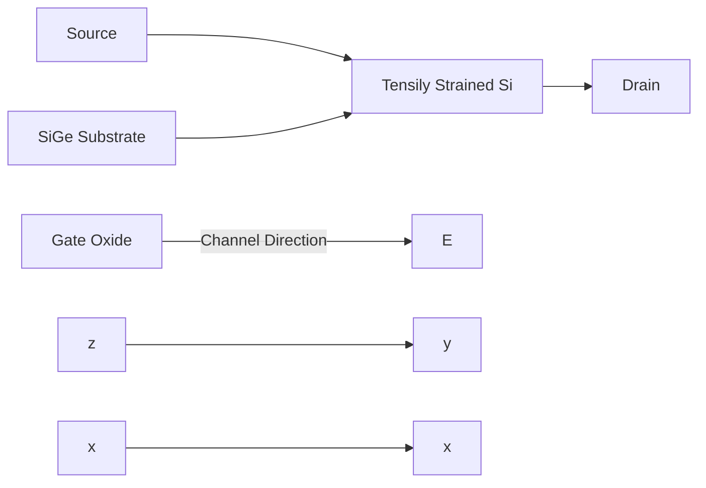

<!-- page:1 -->
# Sentaurus™ Device Monte Carlo User Guide

<!-- page:1 -->
Version O-2018.06, June 2018

# Copyright and Proprietary Information Notice

<!-- page:2 -->
© 2018 Synopsys, Inc. This Synopsys software and all associated documentation are proprietary to Synopsys, Inc. and may only be used pursuant to the terms and conditions of a written license agreement with Synopsys, Inc. All other use, reproduction, modification, or distribution of the Synopsys software or the associated documentation is strictly prohibited.

# Destination Control Statement

All technical data contained in this publication is subject to the export control laws of the United States of America. Disclosure to nationals of other countries contrary to United States law is prohibited. It is the reader’s responsibility to determine the applicable regulations and to comply with them.

# Disclaimer

SYNOPSYS, INC., AND ITS LICENSORS MAKE NO WARRANTY OF ANY KIND, EXPRESS OR IMPLIED, WITH REGARD TO THIS MATERIAL, INCLUDING, BUT NOT LIMITED TO, THE IMPLIED WARRANTIES OF MERCHANTABILITY AND FITNESS FOR A PARTICULAR PURPOSE.

# Trademarks

Synopsys and certain Synopsys product names are trademarks of Synopsys, as set forth at https://www.synopsys.com/company/legal/trademarks-brands.html.

All other product or company names may be trademarks of their respective owners.

# Third-Party Links

Any links to third-party websites included in this document are for your convenience only. Synopsys does not endorse and is not responsible for such websites and their practices, including privacy practices, availability, and content.

Synopsys, Inc.

690 E. Middlefield Road

Mountain View, CA 94043

www.synopsys.com

<!-- page:3 -->
# About This Guide xv

Related Publications . .

Conventions xvi

Customer Support . . . xvi

Accessing SolvNet. . . xvi

Contacting Synopsys Support . . . . xvii

Contacting Your Local TCAD Support Team Directly. . . . . xvii

Acknowledgments. . . . . xvii

References. . . xvii

# Part I Single-Particle Device Monte Carlo 1

# Chapter 1 Simulation Procedure 3

Initial Sentaurus Device Simulation . . .

Single-Particle Device Monte Carlo Simulation. . . .

Screen Output of Single-Particle Device Monte Carlo Simulation

Single-Particle Device Monte Carlo Results . . . 14

Ramping of Boundary Conditions . . 15

# Chapter 2 Input Specification 19

File Section . . . 19

Math Section . . . . 19

Solve Section. . . . 20

Monte Carlo Post-Solve. . . . 20

Plot Section . . . . 20

MonteCarlo Section 22

Coordinate System . . . . 30

# Chapter 3 Physical and Numeric Models 31

Models for Band Structure and Scattering Mechanisms. . . 31

Surface Roughness Scattering . . . . 35

Fermi Statistics . . . . 36

Arbitrary Lattice Temperature . . . . 39

Trajectory Calculation. . . . 39

Self-Consistent Single-Particle Approach . 41

<!-- page:4 -->
Gathering Statistics . . . . 41

Estimating Currents. . . . 42

Drain Current . . . 43

Substrate Current . . . 43

Contact Resistance. . . 43

Averages and Statistical Error of the Currents . . . . 44

Considering Traps . . . . . 45

Quantum Correction . . . . 46

Effective Quantum Correction. . . 46

Density-Gradient Monte Carlo . . . . 48

Visualizing Energy Distributions . . . . 48

Visualizing Valley Occupations . . . . 48

Averages Over Forward- and Backward-Flying Carriers . . . . . 49

Ballistic Transport . . . . 51

References . . . 52

# Chapter 4 Strained Silicon 55

Bulk Properties . . . . 55

NMOSFETs . . . . 61

On-Current Interpretation . . . . 64

PMOSFETs . . . . 66

Arbitrary Stress . . . . 67

References. . . 69

# Chapter 5 Surface and Channel Orientations 71

Changing Surface and Channel Orientations . . . 71

References . . . . 74

# Chapter 6 Stress-Dependent Built-in Analytic Band Structures 75

Stress Engineering. . . . . 75

Visualizing Band Structures . . . . 76

Hole Band Structure . . 77

Electron Band Structure . 78

References. . . 82

# Chapter 7 Transport in Strained SiGe 8 5

Hole Band Structure . . . 85

Scattering Mechanisms . . . 87

<!-- page:5 -->
Simulation Procedure and Results . . . 87

Electron Transport. . . . 89

References . . . . 90

# Chapter 8 Electron Transport in InGaAs 91

Features of Electron Transport . . 91

References. . . 92

# Chapter 9 Mobility Reduction in High-k Gate Stacks 9 3

Introduction . . . . 93

Soft-Optical Phonon Scattering . . . 94

High-k Mobility in the Presence of an Interfacial Oxide . . . . . 95

High-k Mobility in the Absence of an Interfacial Oxide . . . . . 97

Remote Coulomb Scattering . . . . 98

References. . . 99

# Chapter 10 Parallelization 101

Parallel Simulation Procedure. . . 101

Parallel Simulations and Sentaurus Workbench . . . . 102

Licensing . . . . 103

# Chapter 11 Example: NMOS Transistor 105

Simulation of an NMOS Transistor . . . 105

# Part II Band Structure and Mobility Calculation 109

# Chapter 12 Using Sentaurus Band Structure 111

Introduction to Sentaurus Band Structure. . . 1

Bulk Band Structure. .

Subband Structure and Inversion Mobility . 112

Tcl Interface . . . . 112

Starting Sentaurus Band Structure . 112

Command-Line Arguments. . . . 113

Example of Use of Command-Line Arguments . . 113

EPM Band-Structure Tutorial . . 114

Creating a Silicon Crystal . . 114

Computing Band-Structure Data . . . . 115

<!-- page:6 -->
Inspecting the Results . . . . 116

Finding Band Minima . . . 118

Computing Effective Masses . . . . 119

Parallelization . . . 120

Applying Strain . . . . . 121

Biaxial Strain . . . . 121

Uniaxial Strain . . . . 122

Strain Tensor From Stress Tensor in Principal-Axis System . . . . 122

Generating Band-Structure Tables From k-Vector Files . . . . 123

Taking Advantage of Band-Structure Symmetries . . . . 124

File Formats for Storing Band Data. . . . . 124

File Format \$SHORT\_FORMAT. . . . 125

File Format \$LONG\_FORMAT. . . . 127

Creating Band Data for Sentaurus Device Monte Carlo. . . . . 128

Analytic Band-Structure Models . . . . . 128

Visualization . . . . . 130

Complex Band Structures . . . 132

Calculating Electron Subbands and Mobility . . . . 133

Loading a 1D Device Structure . . . 133

Specifying Top-Level Physics Parameters . 133

Performing an Initial Solve . . . . . 134

Defining a Nonlocal Line . . . . . 134

Specifying a Schrödinger Solver . . . . 134

Specifying a Mobility Calculator. . . . 135

Performing a Self-Consistent Solve With the Schrödinger Equation . . . . . . . 135

Computing the Mobility. . . . . . 135

Saving Models Over the Device Structure . . . 136

Saving Models Over 2D k-Space. . . . . . 136

Ramping the Bias . . . . . . 136

# Chapter 13 Empirical Pseudopotential Method 139

Introduction to Pseudopotentials. . . . . 139

Empirical Pseudopotentials . . . . . 141

Using the Crystal Symmetry . . . . . 141

Nonlocal Corrections to the Pseudopotential. . . . . 143

Spin-Orbit Coupling . . . . . 145

Evaluating Radial Overlap Integrals. . . . . 148

Normalizing the Spin-Orbit Term . . . . . . 149

Strained Materials . . . . . 150

Bulk Strain and Internal Strain . 150

Empirical Pseudopotential Method for Strained Materials . . . . 151

<!-- page:7 -->
Local Pseudopotential in Strained Crystals . . . 151

Cubic Spline Interpolation of Local Pseudopotential. . . . 152

Friedel Interpolation Formula for Local Pseudopotential . . . . 153

Plane-Wave Normalization in Strained Crystals . . . . 153

Alloys and the Virtual Crystal Approximation . . . . . . 153

EPM Model Defaults . . . . . 154

Group Velocities and Effective Masses . . . 155

References. . . 157

# Chapter 14 Analytic Bands for Bulk Crystals 159

Conduction Bands . . . . 159

Two-Band k.p Model. . . . 159

Ellipsoidal Model. . . . 160

Nonparabolicity Model . . 162

Model Parameters . . 162

Valence Bands. . . . 163

Theory . . . 163

Luttinger–Kohn or Bir–Pikus Hamiltonian . . . . . 164

Model Parameters . . . . 165

References. . . 166

# Chapter 15 Subband and Mobility Calculations 167

Device Structure . . . 167

Regions and Materials . . . 167

Contacts . . . . 168

Nonlocal Lines and Nonlocal Areas . . . . 168

Device Coordinate Axes . . . . . 168

Axes for 1D Devices. . . . . . 168

Axes for 2D Devices. . . . 169

Files Used by Subband and Mobility Calculations. . . . . 170

Input Files . . . . . . 170

Output Files . . . . . 170

Poisson Equation. . . . 171

Boundary Conditions . . . . . . 171

Electric Field . . 172

Convergence . . . . 172

Valley Models . . . . . . 173

Common Syntax . . . . . 173

Automatic Generation of Bulk Density and Band-Edge Models . . . . . 173

Ellipsoidal Valleys . . . . . . 174

<!-- page:8 -->
ConstantEllipsoid . . . . 174

2kpEllipsoid . . . 175

Valleys Based on k.p Theory. . . . . 176

The 6kpValley Model. . . . 176

The 3kpValley Model. . . . . . 177

The 8kpValley Model. . . . 177

The 2kpValley Model. . . . 179

Default Valley Models in Silicon . . . . 179

Electrostatic Models . . . . 180

Permittivity . . . . 180

Relaxed Band Models . . . . 180

Quasi-Fermi Levels . . . . 181

Carrier Density. . . . 182

Bulk Versus Confined Carrier Density. . . . . 182

Fermi–Dirac Bulk Density Model . . . . 183

Bulk Density Model Based on an Ellipsoidal Valley . . . . . . 184

Bulk Hole Density Model Based on 6kp . . . . . 184

Multivalley Bulk Density Model . . . . 185

Default Models for Carrier Density . . 185

Maxwell–Boltzmann Statistics . . . . 186

Doping Concentration . . . . . 186

Net Density . . . . . 187

Interface Charge. . . . . 187

Fixed Interface Charge . . . . 188

Interface Traps . . . . . . 188

Visualization of Interface Charge. . . . . 190

Effective Field for Universal Mobility . . . . . 190

Strain . . . 191

Calculating Subbands . . . . 192

Polar Grid for 2D k-Space . . . . . . 192

Grid for 1D k-Space. . . . . . 193

Ladders. . . . . 193

Calculating Confined Carrier Density . . . . 194

Calculating the Thermal Injection Velocity. . . . . . 194

Calculating the Transport Mass . . . . . . 195

Automatically Created Models for Visualization and Extraction . . . . 196

Parabolic Schrödinger Solver . . . . 197

Dispersion . . . . . 198

Surface Orientation and Effective Masses . . . . 199

Usage . . . . 199

Confined k.p Schrödinger Solvers . . . . . 200

<!-- page:9 -->
Arbitrary Surface Orientations . . . . . 200

Reordering the Subband Dispersion . . . . . 201

Confined Six-Band k.p Schrödinger Equation Solver . . . . . 202

Confined Three-Band k.p Schrödinger Equation Solver . . . . . 206

Confined Two-Band k.p Schrödinger Equation Solver . . . . . . 206

Confined Eight-Band k.p Schrödinger Equation Solver . . . . . . 209

Interface Potential Spike . . . . . 212

Visualizing the Interface Potential Spike . . . . . 213

Using Sentaurus Band Structure as an External Schrödinger Solver for Sentaurus Device. . . . 213

Calculating Mobility . . . . . 215

Kubo–Greenwood Formalism . . . . 215

Momentum Relaxation Time . . . . . 216

Linear Boltzmann Transport Equation . . . . 216

Mobility Calculators . 217

k-Space Grid . . . . 218

Usage . . . . . 218

Visualization Quantities . . . . . 218

Coulomb Green’s Function . . . 219

Spatial Mobility Profile . . . . . . 219

Scattering Models . . . . 220

Common Parameters . . . 220

Valleys . . . . . 220

Transition Type. . . . . 221

Momentum Relaxation Factor . . . 221

Screening . . . 222

Scattering Model Availability by Device Dimension. . . . . . 224

Phonon Scattering . . . . . 225

Acoustic Phonon Scattering . . . . 225

Inelastic Phonon Scattering . . . . . . 226

Evaluating the Wavefunction Overlap Form-Factor . . . . 227

Polar-Optical Phonon Scattering . . . . 228

Alloy Disorder Scattering . . . . . 229

Surface Roughness Scattering . . . . 229

Surface-Roughness Power Spectrum . . . . . 230

Common Parameters. . . . . . 230

Surface Roughness Scattering From Parabolic Schrödinger for 1D . . . . . . 230

Surface Roughness Scattering From 6kp Schrödinger for 1D . . . . . 231

Isotropic Prange–Nee Surface Roughness Scattering From 6kp Schrödinger for 1D . . . . 232

Surface Roughness Scattering for 2D. . . . . . . 233

Coulomb Scattering . . . . . 234

<!-- page:10 -->
Common Parameters. . . . 235

Speeding Up the Matrix Element Calculation . . . . 235

Usage . . . . 235

Default Scattering Models . . . . . 236

References. . . 237

# Chapter 16 Sentaurus Band Structure/Tcl Command Reference 239

Overview. . . . 239

Notational Conventions of Syntax Description . . . . 240

Positional Arguments. . . . . . 240

Named Arguments . . . . . 241

Object-Oriented Tcl Commands. . . . . 242

General Settings . . . . 242

sBandGet/sBandSet . . . . 242

Classes for Band-Structure Calculation . . . . 245

Creating EPM::Crystal Objects. . . . . . 246

SiliconCrystal. . . . . 246

GermaniumCrystal. . . . 247

compute\_SiGe\_a0 . . . . 248

SiGeCrystal . . . . 249

DiamondCrystal . . . . 250

Creating User-Defined Crystals . . . . . 251

Crystal . . . . 251

Alternative Constructor. . . 252

StrainedCrystal. . . . 252

Using EPM::Crystal Objects . . . . . . 253

<EPM::Crystal> addAtom . . . . . . 254

<EPM::Crystal> apply . . . . . 255

Special Case . . . . . . 255

<EPM::Crystal> computeBandstructure . . . . 256

<EPM::Crystal> computeDOS . . . 258

<EPM::Crystal> destroy . . . . . . 259

<EPM::Crystal> get . . . . . . . 260

<EPM::Crystal> scaleKvector . . . . . 261

<EPM::Crystal> set . . . . . 262

<EPM::Crystal> status . . . . . . . 263

<EPM::Crystal> unscaleKvector . . . . . 264

Creating EPM::AtomicSpecies Objects . . . . . . 265

AtomicSpecies . . . . . . 265

Autoloading Atomic Species . . . . 269

requireAtomicSpecies . . . . . 269

<!-- page:11 -->
Using EPM::AtomicSpecies Objects . . . . . 269

<EPM::AtomicSpecies> destroy . . . . . 270

<EPM::AtomicSpecies> dynamicType . . . . . . 270

<EPM::AtomicSpecies> get . . . . . 271

<EPM::AtomicSpecies> rename . . . . . 272

<EPM::AtomicSpecies> set. . . . . . 272

<EPM::AtomicSpecies> status . . . . 273

Determining Symmetries of Band Structure From the Strain Tensor. . . . . 274

determineSymmetry. . . . . . 274

Input Files for Single-Particle Device Monte Carlo . . . . . 275

createMonteCarloFiles. . . . 275

Finding Conduction Band Valley Positions . . . . 276

findBandMinimum. . . 276

findBandMinima . . 277

Computing Analytic Band Structures . . . . . 279

AnalyticBandSolverFromSpecies . . . . . 279

AnalyticBandSolver. . . . . 280

Accessing AnalyticBandSolver Objects . . . . . . 280

<AnalyticBandSolver> apply . . 281

<AnalyticBandSolver> computeBandstructure . . . . 282

<AnalyticBandSolver> computeDOS . . . . 283

<AnalyticBandSolver> copy . . . . . 284

<AnalyticBandSolver> destroy . . . . . 284

<AnalyticBandSolver> get . . . . 285

<AnalyticBandSolver> set. . . . 285

<AnalyticBandSolver> status . . . . 286

Container Classes for Band-Structure Results . . . . . 287

Constructor: bandstructure\_t . . . . 287

Tcl Access Command <bandstructure\_t> . . . . 287

Constructor: groupVelocity\_t . . . . . 288

Tcl Access Command <groupVelocity\_t> . . . . . . 288

Constructor: inverseMass\_t . . . . . 289

Tcl Access Command <inverseMass\_t> . . . . . 289

Plotting Band-Structure Data . . . . 290

bandstructurePlot . . . . 290

attachZoomStack . . 291

Describing Elastic Properties of Materials . . . . . 291

Elasticity . . 291

<Elasticity> biaxialStrain . . . . 293

<Elasticity> biaxialStrainRatio . . . . 294

<Elasticity> strainFromStress . . . . . 295

<!-- page:12 -->
<Elasticity> uniaxialStrain . . 296

3D Vector/Matrix Auxiliary Commands . 297

crossProduct. . . . . 297

invertMatrix . . . . 297

matrixProduct. . . 298

matrixVectorProduct . . . . 299

scalarProduct . . . . 299

solveLinearEquation . . 300

transposeMatrix . . . . 301

unitVec. . . . 301

vectorAdd. . . . 302

vectorDivide. . . . 303

vectorLength . . . 303

vectorMultiply . . . . . 304

vectorSubtract . . . . 305

Tcl Support for Complex Numbers. . . . . 305

imaginaryPart. . . . . 305

realPart . . . . 306

Tcl Support for Named-Argument Parsing. . . . . 306

check\_args . . . . . 306

get\_arg . . . . . 307

get\_known\_args . . . . . . 309

get\_unknown\_args . . . . . 310

has\_arg . . . . 311

init\_arg . . . . 312

parse\_args . . . . 314

Tcl Support for Type Checking . . . . . 315

get\_type . . . . . 315

check\_type . . . . . 317

common\_type. . . . . . 318

General Utility Procedures . . . . 319

import\_array. . . . . . 319

tee . . . 320

Material Parameter Files . . . . 320

Subband and Mobility Calculations . . . . 321

AddToLogFile . . . . . 321

ComputeMass . . . . 322

ComputeMobility. . . . . . 323

ComputeVinj . . . . . . 324

Dopant . . . . . 325

Extract . . . 326

<!-- page:13 -->
GetLast . . . . 327

LoadDevice . . . . 328

Material . . . 329

Math . . . . 330

Physics . . . . . 333

Physics for Top-Level Parameters . . . . . . 333

Physics for Contacts . . . . 334

Physics for Electrostatic Models . . . . . 334

Physics for Valley Models . . . . . 336

Physics for Scattering Models . . . . . 338

Physics for Trap Models. . . . . . 340

Physics for Interface Potential Spike Models. . . . . 343

Physics of Nonlocal Lines or Nonlocal Areas . . . . 344

Save . . . . 348

SaveDitProfile . . . . . 349

SaveK. . . . 350

Solve . . . . 351

References. . . 353

<!-- page:14 -->
Contents

<!-- page:15 -->
The Sentaurus™ Device Monte Carlo User Guide consists of the module for Monte Carlo simulation – single-particle device Monte Carlo – as well as the band-structure and mobility calculator Sentaurus Band Structure.

In the single-particle device Monte Carlo simulator, one particle (electron or hole) after another is simulated in the device as it travels from one contact to another until good statistics for the charge density are obtained. Then, the nonlinear Poisson equation is solved. This procedure is iterated until convergence. The result is a self-consistent steady-state solution of the Boltzmann and Poisson equations. The tool can simulate process-simulated devices with unstructured grids. It permits you to consider silicon, germanium, or SiGe band structures under arbitrary stress conditions as well as arbitrary crystallographic surface and channel orientations, as well as InGaAs for electrons. It also permits users to import externally generated band structure tables. Alternatively, built-in analytic band models can be used for a given strain tensor (see [1] in the case of holes). The simulation results have been found to be in good agreement with measured on-currents in the nanoscale regime [2], and the tool has been applied to advanced strained-silicon devices at the scaling limit of CMOS [3]. Arbitrary lattice temperatures and mobility reduction in high-k gate stacks can be considered. The singleparticle device Monte Carlo simulator can be run in parallelized mode featuring a high speedup with the number of cores used. One-dimensional, 2D, and 3D devices can be simulated.

Sentaurus Band Structure can be used to compute tables of full-band structure under arbitrary strain for use by Monte Carlo simulation. In addition, the mobility calculator feature can be used to compute the subband structure and inversion layer mobility of 1D device structures under arbitrary strain and device orientation.

The Sentaurus™ Device Monte Carlo User Guide is divided into the following parts:

■ Part I discusses aspects of single-particle device Monte Carlo simulation.

Part II discusses aspects of Sentaurus Band Structure.

# Related Publications

For additional information, see:

The TCAD Sentaurus release notes, available on the Synopsys SolvNet® support site (see Accessing SolvNet on page xvi).

■ Documentation available on SolvNet at https://solvnet.synopsys.com/DocsOnWeb.

<!-- page:16 -->
# Conventions

The following conventions are used in Synopsys documentation.

<table><tr><td>Convention</td><td>Description</td></tr><tr><td>Blue text</td><td>Identifies a cross-reference (only on the screen).</td></tr><tr><td>Bold text</td><td>Identifies a selectable icon, button, menu, or tab. It also indicates the name of a field or an option.</td></tr><tr><td>Courier font</td><td>Identifies text that is displayed on the screen or that you must type. It identifies the names of files, directories, paths, parameters, keywords, and variables.</td></tr><tr><td>Italicized text</td><td>Used for emphasis, the titles of books and journals, and non-English words. It also identifies components of an equation or a formula, a placeholder, or an identifier.</td></tr></table>

# Customer Support

Customer support is available through the Synopsys SolvNet customer support website and by contacting the Synopsys support center.

# Accessing SolvNet

The SolvNet support site includes an electronic knowledge base of technical articles and answers to frequently asked questions about Synopsys tools. The site also gives you access to a wide range of Synopsys online services, which include downloading software, viewing documentation, and entering a call to the Support Center.

To access the SolvNet site:

1. Go to the web page at https://solvnet.synopsys.com.   
2. If prompted, enter your user name and password. (If you do not have a Synopsys user name and password, follow the instructions to register.)

If you need help using the site, click Help on the menu bar.

<!-- page:17 -->
# Contacting Synopsys Support

If you have problems, questions, or suggestions, you can contact Synopsys support in the following ways:

Go to the Synopsys Global Support Centers site on synopsys.com. There you can find email addresses and telephone numbers for Synopsys support centers throughout the world.   
Go to either the Synopsys SolvNet site or the Synopsys Global Support Centers site and open a case online (Synopsys user name and password required).

# Contacting Your Local TCAD Support Team Directly

Send an e-mail message to:

■ support-tcad-us@synopsys.com from within North America and South America   
support-tcad-eu@synopsys.com from within Europe   
support-tcad-ap@synopsys.com from within Asia Pacific (China, Taiwan, Singapore, Malaysia, India, Australia)   
support-tcad-kr@synopsys.com from Korea   
support-tcad-jp@synopsys.com from Japan

# Acknowledgments

The single-particle device Monte Carlo simulator was codeveloped by Integrated Systems Laboratory of ETH Zurich in the joint research project HYBRID with financial support by the Swiss funding agency CTI.

# References

[1] F. M. Bufler, A. Tsibizov, and A. Erlebach, “Scaling of Bulk pMOSFETs: (110) Surface Orientation Versus Uniaxial Compressive Stress,”' IEEE Electron Device Letters, vol. 27, no. 12, pp. 992–994, 2006.   
[2] R. Hudé et al., “A Simple Approach to Account for the Impact of Quantum Confinement on the Charge in Semi Classical Monte Carlo Simulations of Bulk nMOSFETs,” in 6th International Conference on ULtimate Integration of Silicon (ULIS), Bologna, Italy, pp. 159–162, April 2005.

<!-- page:18 -->
# About This Guide

References

[3] F. M. Bufler, “Exploring the Limit of Strain–Induced Performance Gain in p– and n– SSDOI–MOSFETs,” (invited paper) in IEDM Technical Digest, San Francisco, CA, USA, pp. 601–604, December 2004.

# Part I Single-Particle Device Monte Carlo

<!-- page:19 -->
This part of the Sentaurus™ Device Monte Carlo User Guide contains the following chapters:

Chapter 1 Simulation Procedure on page 3

Chapter 2 Input Specification on page 19

Chapter 3 Physical and Numeric Models on page 31

Chapter 4 Strained Silicon on page 55

Chapter 5 Surface and Channel Orientations on page 71

Chapter 6 Stress-Dependent Built-in Analytic Band Structures on page 75

Chapter 7 Transport in Strained SiGe on page 85

Chapter 8 Electron Transport in InGaAs on page 91

Chapter 9 Mobility Reduction in High-k Gate Stacks on page 93

Chapter 10 Parallelization on page 101

Chapter 11 Example: NMOS Transistor on page 105

<!-- page:21 -->
This chapter explains how to perform a single-particle device Monte Carlo simulation. For details about Sentaurus Device simulations and the input syntax, refer to the Sentaurus™ Device User Guide.

A Monte Carlo simulation has two main steps. First, a drift-diffusion simulation is run. Second, based on this, a Monte Carlo simulation is performed. Typically, the Monte Carlo method is applied to a window that excludes the polysilicon region, but covers most of the device, including almost all parts of the gate oxide.

The drift-diffusion simulation yields an electric field that is used in the initial frozen-field simulation of the iteration between a Monte Carlo transport simulation and the Poisson equation. The drift-diffusion simulation also predicts the density distribution of electrons and holes. The tool integrates these density distributions over the entire Monte Carlo window and simulates only the carrier type with the greater integral of the density. Furthermore, the tool assumes that the integrated density of the predominant carrier type is predicted correctly by the drift-diffusion simulation. Consequently, compared to a drift-diffusion simulation, a Monte Carlo simulation changes only the shape of the density distribution, but not the total charge in the Monte Carlo window.

# Initial Sentaurus Device Simulation

The command file of the drift-diffusion simulation drift\_new.cmd is:

```hcl
File {
    grid = "n5_msh.tdr"
    current = "drift_new"
    output = "drift_new"
    plot = "drift_new"
    save = "drift_new"
    param = "nmos"
}
Plot { eVelocity/Vector eCurrent/Vector hCurrent/Vector ElectricField/Vector
    eDensity hDensity potential
    ConductionBandEnergy ValenceBandEnergy
    GradConductionBand GradValenceBand
} 
```

<!-- page:22 -->
# 1: Simulation Procedure

Initial Sentaurus Device Simulation

```txt
Electrode {
    { name=gate voltage=1.2 barrier=0.06 }
    { name=bulk voltage=0 }
    { name=source voltage=0 }
    { name=drain voltage=0.0 }
}

Physics {
    mobility (
    highfieldsaturation
    Enormal
    PhuMob
    )
    EffectiveIntrinsicDensity ( Slotboom NoFermi )
}

Math {
    method=blocked
    submethod=pardiso
    wallclock
    Extrapolate
    Derivatives
    RelErrControl
    Digits=5
    ErRef(electron)=1.e10
    ErRef(hole)=1.e10
    Notdamped=50
    Iterations=50
}

Solve {
    #---- solution at initial conditions
    Poisson
    coupled {poisson electron hole}

    #---- ramp
    Quasistationary ( InitialStep=0.001 MinStep=1.0e-5 MaxStep=0.1 goal { name=drain voltage=1.2 }
    ) {
    coupled {poisson electron hole}
    }
} 
```

The NMOS transistor of the example is simulated.0.1 μm

The File section contains all of the files needed for the simulation. Grid and doping information are read from the file n5\_msh.tdr. The results are written to the following files:

drift\_new\_des.plt (terminal currents)   
drift\_new\_des.tdr (plot file of all quantities defined in the Plot section for visualization with Sentaurus Visual)

■ drift\_new\_des.sav (save file from which the Monte Carlo simulation is started)   
drift\_new\_des.log (textual output)

<!-- page:23 -->
File extensions such as .tdr do not have to appear in the command file because the program adds them automatically if they are missing. For more information about the predefined extensions, refer to the Sentaurus™ Device User Guide.

The parameter file nmos.par contains the parameter values for the various physical models specified in the Physics section and is given by:

```txt
Bandgap
{ * Eg = Eg0 + dEg0 + alpha Tpar^2 / (beta + Tpar) - alpha T^2 / (beta + T)
    Chi0 = 4.05    # [eV]
    Eg0 = 1.12    # [eV]
    dEg0(Slotboom) = 0.0e+00# [eV]
    alpha = 0.00e+00    # [eV K^-1]
    beta = 0.00e+00    # [K]
    Tpar = 300.0000e+00    # [K]
}
eDOSMass {
    Formula = 2    # [1]
    Nc300    = 2.97101e+19    # [cm-3]
}
hDOSMass {
    Formula = 2    # [1]
    Nv300    = 2.2400e+19    # [cm-3]
}
ConstantMobility:
{ * mu_const = mumax (T/T0)^(-Exponent)
    mumax = 1.423e+03, 476.070 # [cm^2/(Vs)]
}
HighFieldDependence:
{ * Caughey-Thomas model:
    * mu_highfield = mu_lowfield / (1 + (mu_lowfield E / vsat)^beta)^1/beta
    * beta = beta0 (T/T0)^betaexp.
    beta0 = 1.13417, 1.213    # [1]

* Formula1 for saturation velocity:
* vsat = vsat0 (T/T0)^(-Vsatexp)
* (Parameter Vsat_Formula has to be not equal to 2):
    vsat0 = 1.0200e+07, 8.3700e+06    # [1]
}
PhuMob:
{ * Philips Unified Mobility Model:
    mumax_As = 1.423e+03    # [cm^2/Vs]
    mumin_As = 55.9    # [cm^2/Vs]
    mumax_P = 1.423e+03    # [cm^2/Vs]
    mumax_B = 476.070    # [cm^2/Vs] 
```

```hcl
}NormalMob
{    * mu_Enorm^(-1) = mu_ac^(-1) + mu_sr^(-1) with:
    * mu_ac = B / Enorm + C (T/T0)^(-1) (N/N0)^lambda / Enorm^(1/3) )
    * mu_sr^-1 = Enorm^(A+alpha*n/N^nu) / delta + Enorm^3 / eta
    * EnormalDependence is added with factor exp(-l/l_crit), where l is
    * the distance to the nearest point of DES_c_Si/DES_c_SiO2 interface. Factor
    * is equal to 1 if l_crit > 100.
    B    = 3.6100e+07, 1.5100e+07    # [cm/s]
    C    = 4.0e+08, 4.1800e+03    # [cm^5/3/(sV^2/3)]
    N0    = 1, 1    # [cm^-3]
    lambda   = -0.2399, 0.0119    # [1]
    delta   = 3.5800e+18, 4.1000e+15    # [V/s]
    A    = 2.58, 2.18    # [1]
    alpha   = 6.8500e-21, 7.8200e-21    # [1]
    nu    = 0.0767, 0.123    # [1]
    eta    = 5.8200e+30, 2.0546e+30    # [V^2/cm*s]
    l_crit   = 1.0000e-06, 1.0000e-06    # [cm]
} 
```

<!-- page:24 -->
NOTE The single electron in the simulation carries the whole electron charge as obtained by integrating the electron density of Sentaurus Device over the whole device. Therefore, the physical models of the Sentaurus Device simulation should be as consistent as possible with the Monte Carlo model. For example, the effective densities-of-states $N _ { c }$ and $N _ { \nu }$ must correspond to the values resulting from the full band structure, and Boltzmann statistics should be used as in the Monte Carlo simulation. The parameters of Sentaurus Device listed above ensure this consistency for the simulation example.

In the Plot section, the quantities to be viewed in a visualization tool, as a function of position, are defined.

In the Electrode section, the initial voltage at the gate contact is defined to be 1.2 V and 0.0 V at all other contacts. When the polysilicon region is also included in the simulation, as in the example, the value in the barrier variable only serves to take into account the threshold shift due to quantum effects.

In the Physics section, all the adjustable physical models can be defined.

<!-- page:25 -->
NOTE For a meaningful comparison of the simulation results at high drain voltages between Sentaurus Device and single-particle device Monte Carlo, the drain currents should coincide at low drain voltages. Since the surface mobility models for Sentaurus Device and single-particle device Monte Carlo are different, the parameters of Sentaurus Device for this model (keyword Enormal in the Physics section, and ENormalMob in the parameter file nmos.par) should be adjusted at gate voltage=supply voltage, and low drain voltage (for example, 0.05 V or 0.1 V), so that the drain currents of Sentaurus Device and single-particle device Monte Carlo are approximately the same (see the previous note).

In the Math section, some parameters of the numeric methods used are specified. Extrapolation is used in the quasistationary simulation. The variables for the initial condition for a given quasistationary step are computed using an extrapolation from the previous step.

In the Solve section, the equations that Sentaurus Device must solve and how they are to be solved are defined. In this example, first, there is an independent solution of the Poisson equation. This is followed by a self-consistent solution of three equations: the Poisson equation, electron continuity equation, and hole continuity equation. This gives the solution for the specified initial conditions. Then, there is a quasistationary and simultaneous calculation of the same three equations, which ramps the voltage of the drain contact from 0 V to 1.2 V. Only at the end of the quasistationary calculation are the output files drift\_new\_des.XXX generated.

The simulation is run by typing:

sdevice drift\_new

# Single-Particle Device Monte Carlo Simulation

When the program finishes, the save file drift\_new\_des.sav is created, which corresponds to a voltage of 1.2 V at the drain contact. This solution is used to start a Monte Carlo simulation using the command file mc\_new.cmd.

```hcl
File {
    grid = "n5_msh.tdr"
    current = "mc_new"
    output = "mc_new"
    plot = "mc_new"
    load = "drift_new"
    param = "nmos"
    MonteCarloOut = "mc_new"
} 
```

<!-- page:26 -->
# 1: Simulation Procedure

Single-Particle Device Monte Carlo Simulation

```txt
MonteCarlo {
    CurrentErrorBar = 2.5
    MinCurrentComput = 19
    DrainContact = 1    # No. of drain contact in .tdr (count from 0)
    useTestFunction
    SelfConsistent(FrozenQF)
    SurfScattRatio = 0.85
    Window = Rectangle [(-0.225, -0.00201) (0.225, 4.25)]
    FinalTime = 4.0e-6    # Simulation time until stationary state
    Plot { Range = (0, 40.e-6) intervals = 100 } # Total simulation time
}
Plot {
    MCField/Vector
    eMCDensity hMCDensity
    eMCEnergy hMCEnergy
    eMCVelocity/Vector hMCVelocity/Vector
    eMC Avalanche hMC Avalanche
    eMCCurrent/Vector hMCCurrent/Vector
}
Electrode {
    { name=gate voltage=1.2 barrier=0.06 } # quantum threshold shift
    { name=bulk voltage=0 }    # bulk
    { name=source voltage=0 }    # source
    { name=drain voltage=1.2 }    # drain
}
Thermode {
    { name=gate temperature=300 }    # gate
    { name=bulk temperature=300 }    # bulk
    { name=source temperature=300 }    # source
    { name=drain temperature=300 }    # drain
}
Physics {
    mobility (
    highfieldsaturation
    Enormal
    PhuMob
    )
    EffectiveIntrinsicDensity ( Slotboom NoFermi )
}
Math {
    method=pardiso
    wallclock
    Extrapolate
    Derivatives
    RelErrControl
    Digits=5
    ErRef(electron)=1.e10
    ErRef(hole)=1.e10 
```

```txt
Notdamped=50
Iterations=50
currentweighting
}
Solve {
coupled {poisson electron hole}
montecarlo
} 
```

<!-- page:27 -->
In the File section, the names of the output files are changed and three new entries are added. The file drift\_new\_des.sav is specified to be loaded at the beginning of the simulation and is used as initial condition for the simulation. The keyword MonteCarloOut determines the prefix of the Monte Carlo output files with the results for the currents.

In the Electrode section, a voltage of 1.2 V at the drain contact is specified, which corresponds to the voltage used in the save file drift\_new\_des.sav.

In the Math section, the keyword currentweighting is added. This keyword activates the computation of the drain current by using the test function method, and the keyword useTestFunction must be present in the Sentaurus Device Monte Carlo command file if the drain current is to be estimated by the test function method. Otherwise, the drain current is calculated by direct particle counting.

To take advantage of modern multicore machines, the tool supports parallelization of particles through the keyword NumberOfSolverThreads in the Math section of the Sentaurus Device command file (see Sentaurus™ Device User Guide, Table 214 on page 1395).

In the MonteCarlo section, the number of a contact in the file n5\_msh.tdr can be given following the keyword DrainContact. For this contact, the tool computes the current and its statistical error. Despite the name DrainContact, any contact can be specified. In practice, always select a contact with a comparatively high current; otherwise, the statistical error of the computed current will be very high.

NOTE The numbering of the contact names in the grid file begins with zero.

Then, a Monte Carlo Window must be defined. The window is a rectangle with edges parallel to the axes and should consist of the entire MOSFET, excluding the polysilicon region, and including the major part of the gate oxide. The gate oxide is included so that the change of the oxide field is considered during self-consistent Monte Carlo simulations.

For self-consistent simulations, it is necessary to consider that a certain number of iterations are required to reach self-consistency between the carrier distribution and electrostatic potential. Only after this time does the simulation fluctuate around the stationary solution and the gathering of statistics begins. The tool cannot determine the simulation time required to

<!-- page:28 -->
# 1: Simulation Procedure

Single-Particle Device Monte Carlo Simulation

reach the steady state automatically; it must be specified explicitly by the keyword FinalTime.

In contrast, the maximum total simulation time is given in the Plot keyword as the second number in the Range interval. Finally, intervals specifies the number of intervals into which the maximum total simulation time is divided. After each interval, an estimation for drain and substrate currents is performed, and a plot file for visualization of the internal variables is generated (for example, mc\_new\_000001\_des.tdr after the first interval). Before reaching the steady state, the estimates for the internal variables in the plot file correspond to the last interval only. After that time, cumulative expectation values are displayed.

In the example, FinalTime = , maximum total simulation time = , and4 μs 40 μs intervals = 100. This means that the interval for one iteration lasts and cumulative0.4 μs averaging begins after ten iterations. The estimates of the internal variables in the plot files beginning with the eleventh interval correspond to averages over all but the initial ten intervals. For example, the variables in mc\_new\_000024\_des.tdr result from averaging over 14 intervals.

For solving the Poisson equation at the end of each simulation time interval, the tool always uses the carrier density distribution computed in that particular interval, rather than the density accumulated over multiple intervals. As a consequence of this approach, the number of Newton iterations needed to solve the Poisson equation and the initial residual of the Poisson equation do not systematically reduce further when the stationary state is reached.

If the keywords CurrentErrorBar and MinCurrentComput are assigned a value, the simulation can stop before the end of the maximum total simulation time. In this case, the simulation ends when the ‘relative error’ of the drain current is smaller than CurrentErrorBar and, at least, MinCurrentComput iterations (and, therefore, current computations) have been performed after the stationary state is reached.

Self-consistent simulations are activated by the keyword SelfConsistent. For stability reasons, the nonlinear Poisson equation must be used, which is specified by the option FrozenQF in parentheses following SelfConsistent.

Finally, surface roughness scattering is modeled in the tool by a combination of specular and diffusive scattering. The ratio of specular scattering is given by the keyword SurfScattRatio. The default is 85% specular scattering, that is, 15% diffusive scattering. The parameter SurfScattRatio is used to adjust the drain current of the Monte Carlo simulation to measurements (typically, if the gate voltage is equal to the supply voltage and, at a low drain voltage of, for example, 0.05 V or 0.1 V).

<!-- page:29 -->
NOTE If the simulation interval for one iteration is too short to give a reasonable estimation of the density, the accuracy of the simulation result is jeopardized. For example, this is the case if there are holes inside the inversion channel when viewing the file mc\_new\_000001\_des.tdr. In general, the simulation time for one interval depends on the device, and the figure must be established empirically. Several time intervals must be tested to ensure that the chosen time interval is long enough. Of course, the aim is to select a time interval as small as possible because this minimizes the time for reaching the stationary state.

The number of iterations required to reach the stationary state is also a figure to be established empirically. However, this is not critical since the average value of the current always converges versus the true value for a long-enough simulation time.

For too few iterations, some ‘nonstationary’ values are considered in the averaging procedure, therefore, increasing the simulation time for reaching a good current estimation. For too many iterations, some ‘stationary’ values are omitted in the averaging procedure, which also increases the simulation time for reaching a good current estimation. In addition, for a ‘reasonable error estimation,’ averaging must not begin before the stationary state is reached (see Estimating Currents on page 42).

In the Solve section, the drift-diffusion solution is recomputed for reasons of consistency. The save file that is loaded contains only the electrostatic potential, carrier densities, and lattice temperature. Quantities such as the carrier velocities are computed from these basic variables only.

In the Plot section, the quantities that are computed by the Monte Carlo simulation and can be visualized with Sentaurus Visual are defined.

# Screen Output of Single-Particle Device Monte Carlo Simulation

The Monte Carlo simulation is run by typing:

sdevice mc\_new

Sentaurus Device produces detailed output during each simulation about the specifications chosen and the convergence properties of the run. Some specifications from the MonteCarlo section can be found at the beginning of the output file.

<!-- page:30 -->
The number of window elements and boundary elements in which carriers are injected are shown immediately before the Monte Carlo simulation begins:

```rst
==================== Starting solve of next problem: MonteCarlo
==================== Number of window elements : 8063
Number of boundary elements : 66
************************** 
```

Then, the tool starts to read the input files, such as band-structure information. This can take some time because the band structure table is large. After some calculations regarding, for example, the scattering rates, some band structure data is printed that is needed, for example, as input for Sentaurus Device simulations and that changes under stress and for modified surface orientation:

```txt
Effective DOS: electron hole 2.872067300E+19 2.061158400E+19
Band-gap electronegativity (unstrained Si: 1.120 4.05) 1.120 4.050
electron: m_quant m_dos gamma 0.892 1.096 3.684
hole: m_quant m_dos gamma 0.266 0.878 9.897
eminx, eminy, eminz 0.000 0.000 0.000
emqx, emqy, emqz 0.196 0.196 0.892
hmin0, hmin1, hmin2 0.043 0.000 0.000
hmq0, hmq1, hmq2 0.233 0.212 0.266 
```

Then, the main simulation parameters are printed:

```txt
Now: Number of electrons = 1
Now: Number of holes = 0
done.
Simulation time per frozen-field iteration = 4.00000000000000E-007
Simulation time until stationary state = 4.00000000000000E-006
Maximum total simulation time = 4.00000000000000E-005 
```

The tool calculates whether to simulate an electron or a hole based on their total charge in the Monte Carlo window. Since an NMOSFET is under consideration, electrons are more numerous and, therefore, an electron is simulated.

After some checks, the main Monte Carlo routine is entered:

```txt
MC time: 0.0000e+00s: Writing plot 'mc_new_000000_des.tdr'... done.
done.
Entering propagation routine
Total simulation time (micro sec) = 7.177531000056912E-002
Number of particles propagated = 100000
Mean energy of injected particles (eV) = 5.2868258E-02
Mean propagation time per trajectory (ps) = 0.717753097065775 
```

```txt
Total simulation time (micro sec) = 0.144085571838629
Number of particles propagated = 200000
Mean energy of injected particles (eV) = 5.2735962E-02
Mean propagation time per trajectory (ps) = 0.720427856242271

Total simulation time (micro sec) = 0.214427214289264
Number of particles propagated = 300000
Mean energy of injected particles (eV) = 5.2720539E-02
Mean propagation time per trajectory (ps) = 0.714757378036568

Total simulation time (micro sec) = 0.285396316309597
Number of particles propagated = 400000
Mean energy of injected particles (eV) = 5.2756481E-02
Mean propagation time per trajectory (ps) = 0.713490787851533

Total simulation time (micro sec) = 0.355100399215986
Number of particles propagated = 500000
Mean energy of injected particles (eV) = 5.2747753E-02
Mean propagation time per trajectory (ps) = 0.710200795522990
Cumulative simulation time: .4000000E+06 psec, Particle number: 1
Leaving propagation routine
Number of propagated particles = 561614
Simulation time (micro sec) = 0.40000000000000 
```

# After the first iteration is completed, as shown above, the nonlinear Poisson equation is solved:

<!-- page:31 -->
Computing poisson-equation

using Bank/Rose nonlinear solver.

<table><tr><td>Iteration</td><td>|Rhs|</td><td>factor</td><td>|step|</td><td>error</td><td>#inner</td><td>#iterative</td><td>time</td></tr><tr><td>0</td><td>1.97e+01</td><td></td><td></td><td></td><td></td><td></td><td></td></tr><tr><td>1</td><td>2.69e+01</td><td>1.00e+00</td><td>2.28e-01</td><td>1.62e+02</td><td>0</td><td>1</td><td>0.25</td></tr><tr><td>2</td><td>5.68e+00</td><td>1.00e+00</td><td>4.69e-02</td><td>3.38e+01</td><td>0</td><td>1</td><td>0.40</td></tr><tr><td>3</td><td>4.36e-01</td><td>1.00e+00</td><td>1.04e-02</td><td>7.18e+00</td><td>0</td><td>1</td><td>0.57</td></tr><tr><td>4</td><td>3.04e-03</td><td>1.00e+00</td><td>6.62e-04</td><td>4.31e-01</td><td>0</td><td>1</td><td>0.73</td></tr></table>

Finished, because...

Error smaller than 1 ( 0.430914 ).

Accumulated (wallclock) times:

Rhs time: 0.07 s

Jacobian time: 0.08 s

Solve time: 0.53 s

Total time: 0.78 s

gamma (impurity scattering) = 1.0569807E+15

Completion status: 1.0000 %

Writing Monte Carlo output files.

<!-- page:32 -->
Preparing data sets for visualization.

<table><tr><td colspan="5">Computing test functions ... done.</td></tr><tr><td>contact</td><td>voltage</td><td>electron current</td><td>hole current</td><td>conduction current</td></tr><tr><td>source</td><td>0.000e+00</td><td>-3.574e-04</td><td>6.020e-89</td><td>-3.574e-04</td></tr><tr><td>drain</td><td>1.200e+00</td><td>3.603e-04</td><td>1.098e-89</td><td>3.603e-04</td></tr><tr><td>gate</td><td>1.200e+00</td><td>0.000e+00</td><td>0.000e+00</td><td>0.000e+00</td></tr><tr><td>bulk</td><td>0.000e+00</td><td>-2.882e-06</td><td>-7.118e-89</td><td>-2.882e-06</td></tr><tr><td colspan="5">Integrated generation rates: window whole device</td></tr><tr><td>avalanche [A]</td><td>3.375e-10</td><td>0.000e+00</td><td></td><td></td></tr><tr><td>total G-R [A]</td><td>3.375e-10</td><td>0.000e+00</td><td></td><td></td></tr></table>

MC time: 4.0000e-07s: Writing plot 'mc\_new\_000001\_des.tdr'... done. done. Entering propagation routine

Then, the first plot file mc\_new\_000001\_des.tdr is generated and the propagation routine is entered for the second iteration. This entire procedure is repeated until the end of the simulation.

# Single-Particle Device Monte Carlo Results

The plot files for the visualization of internal variables, such as density, electron temperature, and velocity, are stored in the files mc\_new\_000024\_des.tdr and so on, and can be viewed using Sentaurus Visual.

The files with the simulation results for the currents have the suffixes \_time.plt and \_average.plt. They contain estimates of the current at the contact that was specified by the keyword DrainContact (called MCdrain in the .plt file) as well as the integral of the impact ionization rate over the entire Monte Carlo window (called MCsubstrate) (see Eq. 20, p. 43).

In the file with the suffix \_time.plt, the current estimates, which correspond only to one iteration interval, are stored as a function of the simulation time. Here, it is possible to deduce the time after which the simulation has reached the stationary state and the current begins to fluctuate around its average value.

In contrast, the file with the suffix \_average.plt contains the cumulative averages over the current values stored in the file with the suffix \_time.plt. They are plotted as a function of the number of iterations after reaching the stationary state. From this construction, it follows that the fluctuations of the cumulative averages diminish over the course of the simulation time. These cumulative averages represent the final simulation result. In addition, the ‘relative errors’ of these averages can be extracted from the file with the suffix \_average.plt.

<!-- page:33 -->
For more details on the definition of these quantities, see Averages and Statistical Error of the Currents on page 44.

However, these errors only represent a reasonable criterion for stopping the simulation when the gathering of statistics begins after reaching the stationary state (see Estimating Currents on page 42). The results contained in the files with the suffixes \_time.plt and \_average.plt can be viewed by using the visualization tool Inspect.

# Ramping of Boundary Conditions

Instead of running one Sentaurus Device Monte Carlo process per bias point, it is possible to combine calculations for multiple bias points in a single Sentaurus Device Monte Carlo run. In conjunction with parallelization (see Chapter 10 on page 101), this provides a simple way to obtain Monte Carlo–based I–V curves with minimal effort. For illustration, you will add the calculation of an $\mathrm { I _ { d } - V _ { d } }$ curve to the MCpFinFET example in the Applications Library. This example can be found in the directory:

\$STROOT/tcad/\$STRELEASE/Applications\_Library/GettingStarted/sdevice/MCpFinFET

This project contains a number of Monte Carlo nodes, each of which calculates data for a single bias point. Ramping the drain voltage can be switched on in the command file of the Sentaurus Device instance called SPMC:

1. Change the Solve section to:

```swift
Solve {
    Coupled {poisson hole}
    NewCurrentPrefix="n@node@_MCRamping_" # start new plot file for MC ramp
    QuasiStationary(Goal{name="Drain" voltage=-0.05} maxstep=0.077 doZero) {
    Plugin(iterations=0 breakOnFailure) {
    Coupled {poisson hole} # total charge for MC charge scaling
    Save(filePrefix="n@node@_beforeMC") # write DD results to file
    Montecarlo # perform Monte Carlo simulation at bias point
    # Plot statements for plotting MC results should go here.
    Load(filePrefix="n@node@_beforeMC") # restore DD results
    }
    }
} 
```

2. Add the following line to the MonteCarlo section:

-InternalCurrentPlot

This disables writing of data points from the internal Boltzmann–Poisson iteration of the self-consistent Monte Carlo solver. Without -InternalCurrentPlot, the current plot file would contain a cloud of individual Monte Carlo current samples in addition to the converged Monte Carlo results.

<!-- page:34 -->
The new Solve section uses a Quasistationary statement to ramp the gate bias. At each bias point, a plug-in loop is evaluated. In the options section of the PlugIn statement, iterations=0 means that each entry of the plug-in loop is evaluated exactly once (no convergence checking), and breakOnFailure aborts the plug-in loop if one of its equations fails to converge.

The first entry in the body of the plug-in loop requests a coupled solution of the Poisson equation and the current continuity equation for holes. This prepares the initial solution for the MonteCarlo simulation that forms the third entry of the plug-in loop. Before calling MonteCarlo, the simulator status is written to a .sav file. At the end of the Plugin loop, this file is reloaded into the simulator. This procedure serves to eliminate convergence issues that otherwise could arise from the fact that a Monte Carlo simulation is not necessarily a good starting point for a drift-diffusion simulation with the inherent assumption of local equilibrium.

The NewCurrentPrefix statement sets the name of the current plot output file for the $\mathrm { I _ { d } - V _ { d } }$ curve. For each electrode, the Monte Carlo current and its absolute error are stored under2σ the names MCTotalCurrent and MCTotalCurrentError, respectively. In addition, there are TotalCurrent values, which are the currents obtained from the drift-diffusion (Coupled {poisson hole}) simulation at the end of the plug-in loop. The $\mathrm { I _ { d } - V _ { d } }$ curve from the Monte Carlo simulation (with error bars obtained by adding or subtracting MCTotalCurrent and MCTotalCurrentError) is shown in Figure 1.


<details>
<summary>line</summary>

| Drain Voltage [V] | Drain Current [A/μm] |
| ----------------- | -------------------- |
| 0.0               | 0.0000               |
| -0.1              | -0.0006              |
| -0.2              | -0.0004              |
| -0.3              | -0.0002              |
| -0.4              | -0.0010              |
| -0.5              | -0.0009              |
| -0.6              | -0.0008              |
| -0.7              | -0.0007              |
| -0.8              | -0.0006              |
| -0.9              | -0.0005              |
| -1.0              | -0.0004              |
| -1.1              | -0.0004              |
| -1.2              | -0.0003              |
| -1.3              | -0.0002              |
</details>

Figure 1 $\mathsf { I } _ { \mathsf { d } } - \mathsf { V } _ { \mathsf { d } }$ curve from Monte Carlo simulation

<!-- page:35 -->
Note that no Monte Carlo simulation is performed at zero drain bias: At zero drain bias, the current is zero, of course, but the Monte Carlo simulation is ill suited to produce this result. The relative error criterion CurrentErrorBar becomes meaningless; the simulation runs all the way to the maximum-allowed time (the upper bound of the Plot range in the MonteCarlo section); and the final result is pure Monte Carlo noise.

NOTE Single-particle device Monte Carlo always takes the total number of charge carriers from the previous simulation result. Therefore, the Quasistationary ramping statement must include a statement for calculating an appropriate starting solution. Putting only the MonteCarlo section inside the ramping statement never updates the total carrier number:

Typically, the starting solution is produced using either Coupled{poisson hole} or Coupled{poisson electron}.   
Monte Carlo results far from equilibrium might be an inadequate starting solution for a drift-diffusion calculation (local equilibrium assumed). To avoid possible convergence issues, it is recommended to use Save/Load commands to restore solution variables to their pre–Monte Carlo values before performing the next bias step. Monte Carlo results can be plotted by inserting a Plot statement between the MonteCarlo and Load statements in the Solve section.   
For $\mathrm { I _ { d } { - } V _ { g } }$ curves, it is recommended to ramp down the gate voltage from the fully switched-on state towards the threshold voltage. In deep subthreshold, the accuracy of the Monte Carlo results can be improved using a fixed total sampling time by increasing the length of the individual Monte Carlo sampling intervals (that is, by reducing the number of intervals).   
• Do not use the test function–based current evaluation (useTestFunction) for Monte Carlo currents in the subthreshold.

<!-- page:36 -->
# 1: Simulation Procedure

Ramping of Boundary Conditions

<!-- page:37 -->
In this chapter, the Monte Carlo–specific parts of the command file of Sentaurus Device are explained. For more details about the command file, refer to the Sentaurus™ Device User Guide.

A typical input file for a Monte Carlo simulation is shown in Chapter 1 on page 3.

Changes must be made in the File, Math, Solve, and Plot sections and the MonteCarlo section itself. The following sections describe the possible modifications.

# File Section

File names for the simulation are specified in this section. Each keyword uses a predefined file extension. If the extension is omitted, it is appended automatically. The following keywords can be defined for Monte Carlo purposes:

MonteCarloOut

Defines the prefix of the Monte Carlo output files for the current computations.

MonteCarloPath

Defines the path of the directory where Sentaurus Device Monte Carlo finds the data files that describe input data such as the band structure. By default, MonteCarloPath points to an installation-specific directory that contains the data files for silicon.

# Math Section

In addition to the mathematical models described in the Sentaurus™ Device User Guide, the keyword currentweighting, which is associated with terminal currents, is introduced in this section. This keyword defines the domain integration technique to be used in the evaluation of the drain current.

Parallelization of Monte Carlo simulations is controlled by the NumberOfSolverThreads keyword (see Chapter 10 on page 101).

<!-- page:38 -->
# Solve Section

This section defines the equations that Sentaurus Device must solve and how Sentaurus Device solves them. You have great flexibility as to which equations are solved and the methods used (refer to the Sentaurus™ Device User Guide).

# Monte Carlo Post-Solve

To calculate a Monte Carlo post-solve, MonteCarlo can be specified at any point in the Solve section like a partial differential equation. Of course, MonteCarlo cannot be coupled to any of the partial differential equations. However, it can be used in quasistationary simulations.

# Plot Section

In the Plot section, the variables that are to be saved in the plot file are selected. Table 1 lists the Monte Carlo–specific keywords with the corresponding keywords in drift-diffusion simulations.

Table 1 Monte Carlo–specific keywords in Plot section 

<table><tr><td>Keyword</td><td>Corresponding keyword in drift-diffusion simulations</td></tr><tr><td>eMCAvalanche, hMCAvalanche</td><td>The electron and hole parts of the averaged impact ionization rate that correspond to eAvalanche and hAvalanche.</td></tr><tr><td>eMCCurrent, hMCCurrent</td><td>The conduction current densities that correspond to eCurrent and hCurrent.</td></tr><tr><td>eMCCurrentBackward, hMCCurrentBackward</td><td>The conduction current densities of backward-flying carriers, that is, having a negative scalar product between group velocity and InjectionDirection.</td></tr><tr><td>eMCCurrentForward, hMCCurrentForward</td><td>The conduction current densities of forward-flying carriers, that is, having a positive scalar product between group velocity and InjectionDirection.</td></tr><tr><td>eMCDensity, hMCDensity</td><td>The carrier densities that correspond to eDensity and hDensity.</td></tr><tr><td>eMCDensityBackward, hMCDensityBackward</td><td>The carrier densities of backward-flying carriers, that is, having a negative scalar product between group velocity and InjectionDirection.</td></tr><tr><td>eMCDensityForward, hMCDensityForward</td><td>The carrier densities of forward-flying carriers, that is, having a positive scalar product between group velocity and InjectionDirection.</td></tr><tr><td>eMCEnergy, hMCEnergy</td><td>The average carrier energies that correspond, in the case of hydrodynamic simulations, to eTemperature and hTemperature.</td></tr><tr><td>eMCValleyDeltaX</td><td>Occupation of the Δ-valley along the  $k_x$ -axis in the crystallographic coordinate system.</td></tr><tr><td>eMCValleyDeltaY</td><td>Occupation of the Δ-valley along the  $k_y$ -axis in the crystallographic coordinate system.</td></tr><tr><td>eMCValleyDeltaZ</td><td>Occupation of the Δ-valley along the  $k_z$ -axis in the crystallographic coordinate system.</td></tr><tr><td>eMCValleyGamma</td><td>Occupation of the Γ-valley.</td></tr><tr><td>eMCValleyLMinusMinus</td><td>Occupation of the L-valley pair along the (-1,-1,1) direction in the Brillouin zone.</td></tr><tr><td>eMCValleyLMinusPlus</td><td>Occupation of the L-valley pair along the (-1,1,1) direction in the Brillouin zone.</td></tr><tr><td>eMCValleyLPlusMinus</td><td>Occupation of the L-valley pair along the (1,-1,1) direction in the Brillouin zone.</td></tr><tr><td>eMCValleyLPlusPlus</td><td>Occupation of the L-valley pair along the (1,1,1) direction in the Brillouin zone.</td></tr><tr><td>eMCVelocity, hMCVelocity</td><td>The carrier velocities that correspond to eVelocity and hVelocity.</td></tr><tr><td>eMCVelocityBackward, hMCVelocityBackward</td><td>The carrier velocities of backward-flying carriers, that is, having a negative scalar product between group velocity and InjectionDirection.</td></tr><tr><td>eMCVelocityForward, hMCVelocityForward</td><td>The carrier velocities of forward-flying carriers, that is, having a positive scalar product between group velocity and InjectionDirection.</td></tr><tr><td>hMCBandHeavyHole</td><td>Occupation of the heavy-hole band.</td></tr><tr><td>hMCBandLightHole</td><td>Occupation of the light-hole band.</td></tr><tr><td>hMCBandSplitOff</td><td>Occupation of the split-off band.</td></tr><tr><td>MCField</td><td>The driving field that corresponds to GradConductionBand (when electrons are simulated) or GradValenceBand (when holes are simulated).</td></tr></table>

<!-- page:40 -->
# MonteCarlo Section

The parameters for the interface to the Monte Carlo simulation are defined in this section.

Table 2 Parameter keywords in MonteCarlo section 

<table><tr><td>Keyword</td><td>Explanation</td></tr><tr><td>AlloyFactor = float</td><td>Prefactor of the scattering rate for alloy scattering. It is used to switch off alloy scattering by setting AlloyFactor=0.0 or to adjust the hole mobility in SiGe. Default: 1.0</td></tr><tr><td>BetaExponentialSurfaceRoughness = float</td><td>Exponential in the exponential power spectrum (unitless).Default: 1.0</td></tr><tr><td>CarrierType = autodetect | electrons | holes</td><td>Selects the carrier type used for Monte Carlo propagation.Supported values are:• autodetect (default): The carrier type is determined by integration of the electron and hole densities over the volume of the Monte Carlo window. Whichever carrier type is present in the Monte Carlo window in larger numbers is selected for propagation.• electrons: Propagate electrons.• holes: Propagate holes.</td></tr><tr><td>ChannelDirection = (integer, integer, integer)</td><td>This specifies the crystallographic orientation of the channel using a three-dimensional vector for the crystallographic direction.Default: ChannelDirection = (1 1 0)</td></tr><tr><td>CorrelationLength = float</td><td>Correlation length for normal field-dependent surface roughness scattering (in nm). Default: 1.49</td></tr><tr><td>CreateDOSFile = integer</td><td>This writes a file containing the density-of-states of the Monte Carlo band structure if CreateDOSFile=1 is specified. The default is CreateDOSFile=0, that is, no file is written.</td></tr><tr><td>CrystAngle = float</td><td>This specifies the crystallographic orientation of the channel by giving the angle (in degrees) by which the channel direction is rotated around the (001) substrate orientation with respect to CrystDirection=100 (see the keyword above). For example, CrystAngle=45 corresponds to CrystDirection=110, but other values allow for different channel orientations around the (001) substrate direction.</td></tr><tr><td>CrystDirection = integer</td><td>This specifies the crystallographic orientation of the channel, that is, the crystallographic direction parallel to the interface between silicon and  $SiO_{2}$ , which essentially corresponds to the direction of the current flow in the channel. The default is CrystDirection=110, which is the direction used in current technology.Alternatively, CrystDirection=100 can be specified. In 2D device simulation, the specified crystallographic direction is associated with the x-axis, which usually corresponds to the channel direction in a MOSFET.Note that this direction does not correspond to the substrate orientation, that is, the crystallographic direction perpendicular to the interface between silicon and  $SiO_{2}$ , which is always in the (001) direction.</td></tr><tr><td>CurrentErrorBar = float</td><td>This specifies the ‘relative error’ (in percent) of the drain current, below which the simulation is stopped (if the number of iterations after steady state is, at the same time, greater than MinCurrentComput). If absent, the simulation runs until the end of the specified, maximum simulation time.</td></tr><tr><td>DopingtoSelectSDforFermi = float</td><td>This selects all elements in the device where doping is equal to or higher than the specified value.In these elements, the maximum carrier density is set to the doping density for the computation of the Fermi energy.</td></tr><tr><td>DrainContact = stringor:DrainContact = integer</td><td>This selects the contact for which current is computed and to which the CurrentErrorBar criterion is applied (unless WithSubstrateError is specified). It is recommended to specify the contact by name (for example, DrainContact="drain"). Alternatively, the contact can be specified by its integer contact number: Starting with zero, the contact number counts the contacts in the order of their regions in the (.tdr) file and can be queried using Sentaurus Data Explorer (tdx -info).</td></tr><tr><td>EnergyDistributionPosition1 = vector</td><td>This specifies that the energy distribution for the specified position vector must be stored in a PLT file with the suffix _endist.plt.</td></tr><tr><td>EnergyDistributionPosition2 = vector</td><td>This specifies that the energy distribution for the specified position vector must be stored in a PLT file with the suffix _endist.plt.</td></tr><tr><td>EnergyDistributionPosition3 = vector</td><td>This specifies that the energy distribution for the specified position vector must be stored in a PLT file with the suffix _endist.plt.</td></tr><tr><td>EnergyDistributionPosition4 = vector</td><td>This specifies that the energy distribution for the specified position vector must be stored in a PLT file with the suffix _endist.plt.</td></tr><tr><td>EnergyDistributionPosition5 = vector</td><td>This specifies that the energy distribution for the specified position vector must be stored in a PLT file with the suffix _endist.plt.</td></tr><tr><td>EnergyDistributionPosition6 = vector</td><td>This specifies that the energy distribution for the specified position vector must be stored in a PLT file with the suffix _endist.plt.</td></tr><tr><td>EnergyDistributionPosition7 = vector</td><td>This specifies that the energy distribution for the specified position vector must be stored in a PLT file with the suffix _endist.plt.</td></tr><tr><td>EnergyDistributionPosition8 = vector</td><td>This specifies that the energy distribution for the specified position vector must be stored in a PLT file with the suffix _endist.plt.</td></tr><tr><td>EnergyDistributionPosition9 = vector</td><td>This specifies that the energy distribution for the specified position vector must be stored in a PLT file with the suffix _endist.plt.</td></tr><tr><td>FinalTime = float</td><td>This is the simulation time after which the steady state is assumed to be reached. The gathering of cumulative averages begins only after FinalTime.</td></tr><tr><td>HighKEpsilonInf = float</td><td>Optical dielectric constant (in  $\varepsilon_0$ ) of the high-k gate oxide.The default is 5.03, which corresponds to HfO2.</td></tr><tr><td>HighKEpsilonInt = float</td><td>Intermediate dielectric constant (in  $\varepsilon_0$ ) of the high-k gate oxide.The default is 6.58, which corresponds to HfO2.</td></tr><tr><td>HighKEpsilonZero = float</td><td>Static dielectric constant (in  $\varepsilon_0$ ) of the high-k gate oxide.The default is 22.0, which corresponds to HfO2.</td></tr><tr><td>HighKModus = integer</td><td>This activates soft-optical phonon scattering.Use HighKModus=2 if an interfacial oxide is present between the high-k gate oxide and the semiconductor channel.Use HighKModus=1 in the absence of an interfacial oxide; it considers two instead of one transverse-optical phonon modes of the high-k gate oxide.The default is HighKModus=0, that is, soft-optical phonon scattering is switched off.</td></tr><tr><td>H OmegaTO1 = float</td><td>Lowest-energy transverse-optical phonon energy (in meV) of the high-k gate oxide. The default is 12.40, which corresponds to HfO2.</td></tr><tr><td>H OmegaTO2 = float</td><td>Second lowest-energy transverse-optical phonon energy (in meV) of the high-k gate oxide. The default is 48.35, which corresponds to HfO2.</td></tr><tr><td>IIFactor = float</td><td>Prefactor of the scattering rate for impact ionization. It is used to switch off impact ionization by setting IIFactor=0.0 or to adjust, for example, the substrate current. Default: 1.0</td></tr><tr><td>ImpFactor = float</td><td>Prefactor of the scattering rate for impurity scattering. It is used to switch off impurity scattering by setting ImpFactor = 0.0.Default: 1.0</td></tr><tr><td>ImpWindowtoSelectSDforFermi-ImpWindowtoSelectSDforFermi</td><td>This specifies that, inside WindowImpFactor1 and WindowImpFactor2, the maximum carrier density is set to the doping density for the computation of the Fermi energy.Default: -ImpWindowtoSelectSDforFermi</td></tr><tr><td>InjectionDirection = (float,float,float)</td><td>This activates the gathering of separate statistics for forward- and backward-flying carriers. At the same time, this specifies a direction vector in device coordinates, which is used to determine whether a carrier is forward flying or backward flying.If the scalar product between InjectionDirection and the group velocity of the carrier is positive, the carrier is considered to be forward flying; in the opposite case, the carrier is considered to be backward flying.</td></tr><tr><td>InternalCurrentPlot-InternalCurrentPlot</td><td>This controls whether data points for the current plot file are added for each internal iteration of the self-consistency procedure. By default, the InternalCurrentPlot flag is enabled.To include only the final results of the self-consistency iteration (for example, for bias ramping), the flag can be disabled by using-InternalCurrentPlot.</td></tr><tr><td>Intervals = integer</td><td>This specifies the number of intervals at which plot files are to be written within the given range.end divided by Intervals also determines the simulation time for each frozen-field iteration.</td></tr><tr><td>IsInGaAs</td><td>This specifies that InGaAs is simulated instead of the default material SiGe.</td></tr><tr><td>KVecEnd = (float,float,float)</td><td>The end wavevector for visualization of the analytic band energies (activated using MCStrain) along a line from KVecStart.</td></tr><tr><td>KVecStart = (float,float,float)</td><td>The start wavevector for visualization of the analytic band energies (activated using MCStrain) along a line until KVecEnd.</td></tr><tr><td>MasettiCalibration-MasettiCalibration</td><td>This specifies that a doping-dependent calibration to the Masetti mobility measurements is used (this is the default). For deactivation, that is, to use uncalibrated impurity scattering, specify-MasettiCalibration.</td></tr><tr><td>MC1_crit = float</td><td>This specifies the decay length in the exponential prefactor of the surface roughness scattering rate (in cm). The default is 100.1, that is, there is no effect.</td></tr><tr><td>MCStrain= (float,float,float,float,float,float)</td><td>Components of the symmetric strain tensor, which determine the analytic band structures used in the simulation.The values ( $\varepsilon_{xx}, \varepsilon_{yy}, \varepsilon_{zz}, \varepsilon_{yz}, \varepsilon_{xz}, \varepsilon_{xy}$ ) must be given in the coordinate system where the three axes are aligned with the principal axes of the three pairs of ellipsoids in the first conduction band.</td></tr><tr><td>MinCurrentComput = float</td><td>This specifies the minimum number of iterations after steady state that are performed irrespective of whether the ‘relative error’ of the drain current is less than CurrentErrorBar.</td></tr><tr><td>NintHighK = float</td><td>Density of interface charges between the high-k dielectric and the interfacial oxide (in cm-2), entering the expression for the inverse microscopic relaxation time of remote Coulomb scattering (RCS). Default: 0.0</td></tr><tr><td>Normal2OxideDirection = (integer, integer, integer)</td><td>This specifies the crystallographic surface orientation, that is, the direction perpendicular to the interface between the gate oxide and channel, using a three-dimensional vector for the crystallographic direction. In bulk MOSFETs, this corresponds to the substrate orientation. The default is Normal2OxideDirection = (0 0 1). Normal2OxideDirection must be perpendicular to ChannelDirection.</td></tr><tr><td>OxideEpsilonInf = float</td><td>Optical dielectric constant (in ε0) of the interfacial oxide. The default is 2.50, which corresponds to SiO2.</td></tr><tr><td>OxideEpsilonInt = float</td><td>Intermediate dielectric constant (in ε0) of the interfacial oxide. The default is 3.05, which corresponds to SiO2.</td></tr><tr><td>OxideEpsilonZero = float</td><td>Static dielectric constant (in ε0) of the interfacial oxide. The default is 3.90, which corresponds to SiO2.</td></tr><tr><td>OxideHOmegaTO1 = float</td><td>Lowest-energy transverse-optical phonon energy (in meV) of the interfacial oxide. The default is 55.60, which corresponds to SiO2.</td></tr><tr><td>PhosphorousCalibration -PhosphorousCalibration</td><td>This activates a doping-dependent calibration to the Masetti mobility measurements for phosphorous instead of arsenic. Default: -PhosphorousCalibration</td></tr><tr><td>Plot {range intervals}</td><td>This specifies the times at which plot files are written and Poisson updates are triggered (in self-consistent mode).</td></tr><tr><td>PlotValleyOccupations -PlotValleyOccupations</td><td>This specifies that the valley or valence-band occupations for the valleys or valence bands given in the Plot section must be plotted. Default: -PlotValleyOccupations</td></tr><tr><td>Range = (start, end)</td><td>This specifies Range, where start and end are float values that denote the start time and the maximum simulation time. In the tool, start must be zero.</td></tr><tr><td>RCSHighKEpsilon = float</td><td>Dielectric constant (in ε0) of the high-k dielectric used in the expression for the inverse microscopic relaxation time of RCS. The default is 22.0, which corresponds to HfO2.</td></tr><tr><td>RoughnessMeanSquare = float</td><td>Roughness mean square (RMS) amplitude for normal field-dependent surface roughness scattering (in nm). Default: 0.3</td></tr><tr><td>SelfConsistent (frozenParams)</td><td>This defines the Monte Carlo simulation as self-consistent. If SelfConsistent is not defined, the frozen field of the initial Sentaurus Device simulation is used throughout the simulation.frozenParams defines which parameters are frozen during the Poisson solve. For stability reasons, this must be the quasi-Fermi potentials (frozenParams is equal to FrozenQuasiFermi) in the case of Sentaurus Device Monte Carlo. That is, the nonlinear Poisson equation is solved.</td></tr><tr><td>StatRatioa = float</td><td>The ratio of the time that the particle spends inside Windowa with respect to the total simulated time. In the screen output, it is reported in terms of how many copies a particle is split into when entering Windowa to achieve the specified ratio. Default: 0.5</td></tr><tr><td>SubstrateContact = string</td><td>The Monte Carlo simulator can estimate the substrate current by integrating the avalanche generation rate over the volume of the Monte Carlo window. If no SubstrateContact is specified, this current is not included in the standard Sentaurus Device current plot file. Specifying a contact name (for example,SubstrateContact="bulk") causes this current to be associated with the selected contact in the current plot file.</td></tr><tr><td>SurfaceRoughnessModel = integer</td><td>This activates a normal field-dependent surface roughness scattering rate:Use SurfaceRoughnessModel=1 for a Gaussian power spectrum.Use SurfaceRoughnessModel=2 for an exponential power spectrum.Use SurfaceRoughnessModel=3 for the Pirovano power spectrum.The default is SurfaceRoughnessModel=0, that is normal field-dependent surface roughness scattering is switched off.</td></tr><tr><td>SurfScattRatio = float</td><td>This defines the ratio between specular and diffusive scattering at  $SiO_{2}$  interfaces. A value of 1 corresponds to pure specular scattering. Default: 0.85</td></tr><tr><td>SurfScattRatioBallistic = float</td><td>This defines the ratio between specular and diffusive scattering at  $SiO_{2}$  interfaces inside WindowBallistic. A value of 1 corresponds to pure specular scattering. Default: 1</td></tr><tr><td>useTestFunction-useTestFunction</td><td>This controls whether terminal currents are evaluated by direct particle counting (-useTestFunction; this is the default) or by the test function method (useTestFunction). Direct particle counting is the more reliable approach in the subthreshold regime. Monte Carlo simulations with contact resistance must use the direct particle counting method (-useTestFunction).</td></tr><tr><td>Window shape [vector vector]</td><td>In Sentaurus Device Monte Carlo simulations,shape can be one of the following:Line in one dimensionRectangle in two dimensionsCuboid in three dimensionsThe two vectors define the corners of the window. The Monte Carlo simulation is performed in all elements that lie completely inside the defined window.</td></tr><tr><td>Windowa shape [vector vector]</td><td>In Sentaurus Device Monte Carlo simulations,shape is Rectangle.The two vectors define the corners of the rectangle. Gathering of statistics is enhanced inside Windowa.</td></tr><tr><td>WindowBallistic shape [vector vector]</td><td>In Sentaurus Device Monte Carlo simulations,shape is Rectangle.The two vectors define the corners of the rectangle. All scattering mechanisms are switched off, and the ratio of specular scattering upon surface scattering set to 1 (that is, the ratio of diffusive scattering is 0) in all elements that lie completely inside the defined rectangle.</td></tr><tr><td>WindowImpFactor1 shape [vector vector]</td><td>In Sentaurus Device Monte Carlo simulations,shape can be one of the following:Line in one dimensionRectangle in two dimensionsCuboid in three dimensionsInside the shape, the maximum carrier density is set to the doping density for the computation of the Fermi energy, if the keyword ImpWindowtoSelectSDforFermi is true.</td></tr><tr><td>WindowImpFactor2 shape [vector vector]</td><td>In Sentaurus Device Monte Carlo simulations,shape can be one of the following:Line in one dimensionRectangle in two dimensionsCuboid in three dimensionsInside the shape, the maximum carrier density is set to the doping density for the computation of the Fermi energy, if the keyword ImpWindowtoSelectSDforFermi is true.</td></tr><tr><td>WithMCBrooksHerring-WithMCBrooksHerring</td><td>This specifies that the Brooks-Herring model (with calibration to the formula of Masetti) is used for ionized impurity scattering (this is the default). For deactivation, which means that the Ridley model (with calibration to the Caughey-Thomas formula) is used, specify-WithMCBrooksHerring.</td></tr><tr><td>WithFermiDiracScreening-WithFermiDiracScreening</td><td>This specifies that not a Boltzmann distribution but a heated Fermi distribution is used for the screening of impurity scattering (this is the default). For deactivation, that is, using a Boltzmann distribution for screening, specify-WithFermiDiracScreening.</td></tr><tr><td>WithLatticeTemperatureScreening-WithLatticeTemperatureScreening</td><td>This specifies that impurity scattering is screened by the lattice temperature (this is the default) instead of the carrier temperature. For deactivation, that is, to use the carrier temperature for screening, specify -WithLatticeTemperatureScreening.</td></tr><tr><td>WithMCConwellWeisskopf-WithMCConwellWeisskopf</td><td>This specifies that the Conwell-Weisskopf model (with calibration to the formula of Masetti) is used for ionized impurity scattering instead of the Brooks-Herring model. The default is-WithMCConwellWeisskopf.</td></tr><tr><td>WithStrainedMaterial</td><td>This specifies that the material Strained Silicon is simulated with the tool. It is necessary to specify the strain level through the germanium content, yGe, in the virtual SiGe substrate, or to give the value (in MPa) for a uniaxial stress, or to specify the germanium content, xGe, in the active p-type SiGe layer, which is grown on a silicon substrate.</td></tr><tr><td>WithStressAlpha</td><td>This specifies that the influence of stress on the nonparabolicity parameter in the analytic electron band model is considered (this is the default). For deactivation, specify -WithStressAlpha.</td></tr><tr><td>WithSubstrateError</td><td>This specifies that it is not the drain current, which is the default, but the substrate current that is used to stop the simulation with an error criterion. That is, the simulation will stop if the relative error of the substrate current is below the value specified by CurrentErrorBar. In the case of substrate currents, a typical value is CurrentErrorBar=20.0.</td></tr><tr><td>xGe = float</td><td>Germanium content (in percent) in the active SiGe layer that defines the contribution of Ge phonon scattering and alloy scattering. The pseudopotential band-structure tables for (100)- $Si_{0.7}Ge_{0.3}$  under biaxial compressive strain (specify xGe=30.0 and WithStrainedMaterial) and relaxed Ge (specify xGe=100.0) are included. Alternatively, arbitrary analytic structures can be used with MCStrain.If IsInGaAs is specified, xGe corresponds to the gallium content. The pseudopotential band-structure tables for relaxed InGaAs with gallium contents of 0%, 47%, and 100% are included.</td></tr><tr><td>yGe = float</td><td>Germanium content (in percent) in the virtual SiGe substrate that defines the strain level in the silicon layer grown on top of the SiGe substrate. For current technologies, the typical value is yGe=20.0. Other supported strain levels are yGe=10.0, 30.0, and 40.0. The band structure tables of these three additionally supported strain levels can be obtained from Synopsys on request (send an email to support-tcad-eu@synopsys.com) and must be placed in corresponding directories parallel to the existing directory strain20 for yGe=20.0.</td></tr></table>

<!-- page:48 -->
NOTE Some quantities such as the band gap are taken from the parameter file. Therefore, for a Monte Carlo simulation of a strained silicon device, specify in the parameter file the correct values that correspond to the strain level considered. Alternatively, use the parameter file StrainedSilicon.par, which contains all values for typical biaxial tensile strain levels.

# Coordinate System

In the absence of stress and when using the ReadinStress option, Sentaurus Device Monte Carlo can use both the unified coordinate system and the DF–ISE coordinate system in the same way as Sentaurus Device.

If the MCStrain option or a pseudopotential table is used, the DF–ISE coordinate system with the x-axis pointing into the channel direction must be used.

<!-- page:49 -->
This chapter describes the underlying physical models and various parts of the Monte Carlo algorithm [1], emphasizing crucial aspects for computational performance. Other points are addressed briefly.

# Models for Band Structure and Scattering Mechanisms

The full band structure for Si is obtained by nonlocal pseudopotential calculations [2] where, in addition, the spin-orbit interaction is taken into account [3]. Four conduction bands and three valence bands are stored on a mesh in momentum space, with an equidistant grid spacing of $1 / 9 6 \ 2 \pi / a _ { 0 }$ , where $a _ { 0 }$ denotes the lattice constant. Within each cube, the band energy is expanded to linear order around the middle of the cube. Therefore, the group velocity is constant in each momentum-space element.

The scattering mechanisms comprise phonon scattering, impact ionization, impurity scattering, and surface roughness scattering. The phonon scattering model for electrons includes three gtype and three f-type intervalley processes [4], as well as inelastic intravalley scattering [5]. In the case of holes, optical phonon scattering and inelastic acoustic phonon scattering are considered [6]. At present, only impact ionization for electrons with the scattering rate taken from the literature [7] is considered. The comparison of the resulting velocity field characteristics at different lattice temperatures [5][6] with time-of-flight measurements [8][9][10][11] is shown in Figure 2 on page 32 and Figure 3 on page 32, respectively.

Impurity scattering is important in MOSFETs because of the highly doped source and drain contacts. Unfortunately, it is also computationally intensive due to high scattering rates at low energies, with almost no change in the momentum. This effect is particularly strong in the Brooks–Herring (BH) model, which describes the screened two-body interaction with one ionized impurity [12]. It is reduced in the Ridley (RI) statistical screening model, taking into account the probability that there is no closer scattering center [13].

The most significant reduction of the computational burden, however, is achieved by approximating the scattering rate by the inverse microscopic relaxation time, and selecting at random the state-after-scattering on the equi-energy surface. This is shown in Figure 4 on page 33 where, for purposes of illustration, density and doping concentrations have been chosen so that this effect is particularly pronounced. Comprehensive investigations [14][15] have shown that at high fields there is also almost no difference between this and the exact treatment. Since impurity scattering is only important at low energies, an analytic, isotropic, and nonparabolic band structure is used for the calculation of the inverse microscopic relaxation time up to 1.0 eV, and it neglects impurity scattering for higher electron energies.

<!-- page:50 -->
The inverse relaxation time is given by:

$$
\frac {1}{\tau_ {R I} (E)} = \frac {V}{(2 \pi) ^ {3}} \int d ^ {3} k ^ {\prime} S _ {R I} (\mathbf {k} ^ {\prime} | \mathbf {k}) (1 - \hat {\mathbf {k}} ^ {\prime} \cdot \hat {\mathbf {k}}) \tag {1}
$$

where denotes the crystal volume,V $S _ { R I } ( { \bf K } ^ { \prime } | { \bf k } )$ is the transition probability per unit time, and $\hat { \textbf { k } } = \textbf { k } / | \textbf { k } |$ .


<details>
<summary>line</summary>

| Electric Field [kV/cm] | Drift Velocity [10^7 cm/s] (ToF Exp.) - 77 K | Drift Velocity [10^7 cm/s] (MToF Exp.) - 77 K | Drift Velocity [10^7 cm/s] (ToF Exp.) - 300 K | Drift Velocity [10^7 cm/s] (MToF Exp.) - 300 K | Drift Velocity [10^7 cm/s] (ToF Exp.) - 245 K | Drift Velocity [10^7 cm/s] (MToF Exp.) - 245 K | Drift Velocity [10^7 cm/s] (ToF Exp.) - 370 K | Drift Velocity [10^7 cm/s] (MToF Exp.) - 370 K | Drift Velocity [10^7 cm/s] (ToF Exp.) - 100 K | Drift Velocity [10^7 cm/s] (MToF Exp.) - 100 K | Drift Velocity [10^7 cm/s] (ToF Exp.) - 100 K | Drift Velocity [10^7 cm/s] (MToF Exp.) - 100 K |
| ---------------------- | --------------------------------------------- | --------------------------------------------- | --------------------------------------------- | --------------------------------------------- | --------------------------------------------- | --------------------------------------------- | --------------------------------------------- | --------------------------------------------- | --------------------------------------------- | --------------------------------------------- | --------------------------------------------- | --------------------------------------------- |
| 1                      | ~0.8                                          | ~0.6                                          | ~0.2                                          | ~0.4                                          | ~0.3                                          | ~0.2                                          | ~0.1                                          | ~0.1                                          | ~0.2                                          | ~0.1                                          | ~0.1                                          | ~0.1                                          |
| 10                     | ~0.9                                          | ~0.8                                          | ~0.5                                          | ~0.7                                          | ~0.6                                          | ~0.5                                          | ~0.3                                          | ~0.3                                          | ~0.5                                          | ~0.4                                          | ~0.4                                          | ~0.4                                          |
| 100                    | ~1.0                                          | ~0.95                                         | ~0.8                                          | ~0.9                                          | ~0.8                                          | ~0.7                                          | ~0.6                                          | ~0.6                                          | ~0.8                                          | ~0.7                                          | ~0.7                                          | ~0.7                                          |
</details>

Figure 2 Comparison of full band Monte Carlo results for velocity field characteristics of Si-electrons at different lattice temperatures with corresponding time-of-flight measurements (measurements from literature [8][9])

  
Figure 3 Comparison of full band Monte Carlo results for velocity field characteristics of Si-holes at different lattice temperatures with corresponding time-of-flight measurements (measurements from [8][10][11])


<details>
<summary>line</summary>

| Energy [eV] | Brooks-Herring | Ridley | Phonons |
|-------------|----------------|--------|---------|
| 0.0         | ~10^16         | ~10^13 | ~10^12  |
| 0.2         | ~10^16         | ~10^13 | ~10^12  |
| 0.4         | ~10^16         | ~10^13 | ~10^12  |
</details>

Figure 4 Scattering rates and inverse microscopic relaxation times of impurity scattering in formulation of Brooks–Herring and Ridley (phonon scattering rate is shown for comparison)

<!-- page:51 -->
In the case of the Brooks–Herring (BH) model, the result is:

$$
\frac {1}{\tau_ {\mathrm{BH} , n} (\varepsilon)} = \frac {\pi e ^ {4} N _ {\mathrm{imp}}}{(4 \pi \varepsilon \varepsilon_ {0}) ^ {2} \sqrt {2 m _ {\mathrm{d} , n}}} \frac {1 + 2 \alpha_ {n} E _ {n}}{\left(E _ {n} (1 + \alpha_ {n} E _ {n})\right) ^ {3 / 2}} \Phi (\eta) \Theta (E _ {n}) \tag {2}
$$

with these abbreviations:

$$
\Phi (\eta) = \ln (1 + \eta) - \frac {\eta}{1 + \eta}
$$

$$
\eta = \frac {8 m _ {\mathrm{d} , n} E _ {n} (1 + \alpha_ {n} E _ {n})}{\hbar^ {2} \beta^ {2}} \tag {3}
$$

$$
E _ {n} = \varepsilon - \varepsilon_ {0, n}
$$

# where:

is the elementary charge.e   
is the valley index.n   
$N _ { \mathrm { i m p } }$ is the impurity concentration.   
■ is the static dielectric constant of silicon.ε   
$m _ { \mathrm { d } }$ is the density-of-states mass at the band edge.   
is the nonparabolicity factor.α

<!-- page:52 -->
$\beta = \sqrt { e ^ { 2 } \Big ( \frac { d n } { d \mu } - \frac { d p } { d \mu } \Big ) / \varepsilon }$ 2  dp  is the inverse screening length (where is the electron density, n p is the hole density, and is the Fermi energy). See Fermi Statistics on page 36.μ

Since the Ohmic drift mobility with the above impurity scattering model significantly deviates from experimental results, especially for high doping concentrations, a doping-dependent prefactor is introduced in Eq. 2 to reproduce the mobility measurements of [16]. This approach to impurity scattering is heuristic, but it correctly and efficiently accounts for the mobility reduction in highly doped contact regions. It is activated by the MasettiCalibration keyword, which is true by default.

By default, the calibration is for arsenic doping in n-type silicon (boron doping in p-type silicon). For phosphorus doping in n-type silicon, PhosphorousCalibration must be specified, which is false by default.

If this doping-dependent prefactor calibrated to silicon mobilities must not be used, for example, for InGaAs, it can be switched off by specifying -MasettiCalibration. The effect of degeneracy is noticeable and most important for screening, even for applications where Fermi–Dirac statistics is not important otherwise [17]. Therefore, the inverse screening length is computed, by default, under nondegenerate conditions (that is, the corresponding keyword WithFermiDiracScreening is true by default), and the Masetti calibration of the Brooks–Herring model is performed only for this case.

If the keyword WithMCConwellWeisskopf is specified, impurity scattering can also be simulated without screening using the Conwell–Weisskopf model. In this case, only the function in Eq. 3 must be changed according to [18]:Φ

$$
\Phi_ {\mathrm{CW}, n} = \ln \left(1 + \frac {1 6 \pi^ {2} \varepsilon^ {2} E _ {n} ^ {2}}{e ^ {4} N _ {\mathrm{imp}} ^ {2 / 3}}\right) \tag {4}
$$

In this case, the function does not depend on the inverse screening length .Φ β

In addition, the Conwell–Weisskopf model is calibrated by default to the Masetti mobilities in silicon, resulting in a different doping-dependent prefactor.

NOTE While the results shown were obtained with inelastic acoustic phonons, the actually employed phonon models use the elastic equipartition approximation for acoustic intravalley phonon scattering (with a coupling constant of 8.52 eV in the case of electrons; in the case of holes, all coupling constants are those of [19]). The differences in results are very small.

<!-- page:53 -->
# Surface Roughness Scattering

The following models for surface roughness scattering are available:

A combination of specular and diffusive scattering to be applied to a classical density profile where the quantum correction is considered in terms of effective oxide thickness and workfunctions   
A scattering rate proportional to the square of the normal electric field to be applied to a quantum density profile as present, for example, in a density-gradient Monte Carlo simulation

The combination of specular and diffusive scattering is a semi-empirical treatment where at random either a specular or a diffusive scattering process is selected when an electron hits the interface to the oxide. The probability of diffusive scattering can be adjusted to measured longchannel effective mobilities. The default value of 15% diffusive scattering reproduces, with high accuracy [20], the measured FinFET mobility curves [21], for both electrons and holes, and for both (100) and (110) sidewall orientations. The orientation dependency of the effective mobility results from the energy- and parallel-momentum conservation of specular surface scattering (see the detailed discussion in [20]).

In the second approach, the perturbation potential is the component of the electric field normal to the gate interface [22]. The corresponding transition rate per unit time from Fermi’s Golden Rule reads:

$$
S (\mathbf {k} ^ {\prime} | \mathbf {k}) = \frac {2 \pi}{\hbar} \left| \frac {d V}{d z} \right| ^ {2} \frac {1}{A} S (| \mathbf {K} ^ {\prime} - \mathbf {K} |) \delta_ {k _ {z} ^ {\prime}, k _ {z}} \delta \left(\frac {\hbar^ {2} K ^ {2}}{2 m ^ {*}} - \frac {\hbar^ {2} K ^ {2}}{2 m ^ {*}}\right) \tag {5}
$$

where, in analogy to the treatment of soft-optical phonon scattering [23], the scattering potential is treated parametrically for the 3D wavevector $\mathbf { k } = ( \mathbf { K } , k _ { z } )$ conserving the normal wavevector component upon scattering. is the fluctuating confining potential, is thekz V A unit area, and $m ^ { * }$ is the effective mass.

The power spectrum of surface roughness $S ( | \mathbf { K } ^ { } - \mathbf { K } | ) \stackrel { } { = } S ( \boldsymbol { Q } )$ is given by:

$$
S (Q) = \pi L ^ {2} \Delta^ {2} \exp \left(- \frac {L ^ {2} Q ^ {2}}{4}\right) \text {   for   the   Gaussian   model   (SurfaceRoughnessModel   =   1) } \tag {6}
$$

$$
S (Q) = \frac {\pi L ^ {2} \Delta^ {2}}{\left(1 + \frac {L ^ {2} Q ^ {2}}{2}\right) ^ {\beta}} \text {   for   the   exponential   model   (SurfaceRoughnessModel   =   2) } \tag {7}
$$

$$
S (Q) = \pi L ^ {2} \Delta^ {2} \exp \left(- \frac {L ^ {4} Q ^ {4}}{4}\right) \text {   for   the   Pirovano   model   (SurfaceRoughnessModel   =   3) } \tag {8}
$$

<!-- page:54 -->
# where:

■ (RoughnessMeanSquare in units of nm) is the roughness mean square amplitude.Δ   
■ (CorrelationLength in units of nm) is the correlation length.L   
For the exponential model, the exponent (BetaExponentialSurfaceRoughness)β can be specified as well.

As for elastic ionized impurity scattering, the scattering rate is approximated by the inverse microscopic relaxation rate:

$$
\frac {1}{\tau (\mathbf {k})} = \sum_ {\mathbf {k} ^ {\prime}} S (\mathbf {k} ^ {\prime} | \mathbf {k}) (1 - \cos (\phi)) \tag {9}
$$

where is the angle between the in-plane wavevector components and , and the after-φ K' K scattering state is selected at random on the equienergy surface under conservation of the wavevector component normal to the gate interface.

In addition, this rate is multiplied by exp(–z/MCl\_crit), which is analogous to the Lombardi model in drift-diffusion simulations.

This allows you to concentrate the effect of surface roughness in the vicinity of the surface (see Sentaurus™ Device User Guide, Enhanced Lombardi Model on page 338).

# Fermi Statistics

For high doping levels, degeneracy of the carrier gas can have a significant impact on the drain current. The Monte Carlo models affected by Fermi statistics can be split into two groups.

First, the expression for the inverse screening length in the Brooks–Herring model for ionized impurity scattering is:

$$
\beta = \sqrt {e ^ {2} \left(\frac {d n}{d \mu} - \frac {d p}{d \mu}\right) / \varepsilon} \tag {10}
$$

# where:

is the electron density.n   
■ is the hole density.p   
■ is the Fermi energy.μ

The expression is evaluated under degenerate conditions if WithFermiDiracScreening is specified.

<!-- page:55 -->
This keyword is true by default and is applied if Fermi statistics is not used otherwise, since screening is the only aspect that is always significantly affected by Fermi statistics (compare with Models for Band Structure and Scattering Mechanisms on page 31).

Considering nonparabolicity and valley/band splitting (for example, under stress), the density expression for Fermi statistics is given by:

$$
n = \sum_ {i} \tilde {N} _ {\mathrm{c}, i} \left(F _ {1 / 2} \left(\eta_ {i}\right) + \frac {1 5}{4} \alpha_ {i} k _ {\mathrm{B}} T F _ {3 / 2} \left(\eta_ {i}\right)\right) \tag {11}
$$

$$
\eta_ {i} = \frac {\mu - E _ {i} - E _ {\mathrm{c}}}{k _ {\mathrm{B}} T}
$$

where:

$E _ { \mathrm { c } }$ is the conduction band edge.   
$E _ { i }$ is the minimum of valley with respect to i $E _ { \mathrm { c } }$ .   
${ \bf { \alpha } } \propto _ { i }$ is the nonparabolicity factor of valley .i   
$\tilde { N } _ { { \mathrm { c } } , i }$ is the effective density-of-states of valley with respect toi $E _ { i }$ .   
■ $F _ { 1 / 2 }$ and $F _ { 3 / 2 }$ denote the Fermi–Dirac integrals of the order 1/2 and 3/2, respectively.

The Fermi energy at which the inverse screening length is evaluated in Eq. 10 is obtainedμ for given density by numerically solving:n

$$
n = \int d E D (E) \frac {1}{e ^ {\frac {E}{k _ {\mathrm{B}} T} - \eta} + 1} \tag {12}
$$

$$
\eta = \frac {\mu - E _ {c}}{k _ {\mathrm{B}} T} \tag {13}
$$

where is the total density-of-states of the band structure that is used in the Monte CarloD E( ) simulation. The Fermi energy for screening is always computed according to Eq. 12 even if Fermi statistics is not used otherwise, unless screening of impurity scattering is not used, that is, if the Conwell–Weisskopf model is used.

On the other hand, if Fermi statistics will be used completely during a Monte Carlo simulation, the following aspects are affected additionally:

■ Carriers are injected from Ohmic contacts according to a semi-Fermi function.   
The Dirichlet boundary condition for the Poisson equation is changed for Ohmic contacts (see Sentaurus™ Device User Guide, Electrical Boundary Conditions on page 203).   
1 The Pauli blocking term , with denoting the distribution function, must be( ) 1 – f f considered in the scattering term of the Boltzmann transport equation. It is implemented according to the scheme proposed by Ungersboeck and Kosina [24].

<!-- page:56 -->
Fermi statistics for these aspects is activated by specifying the keyword Fermi in the global Physics section of the command files of both the initial drift-diffusion and the actual Monte Carlo device simulations.

The Fermi energy is also needed for these aspects. The options for determining the Fermi energy are:

The density expression $n = N _ { \mathrm { c } } F _ { 1 / 2 } ( \eta )$ , where $N _ { \mathrm { c } }$ is the total effective density-of-states, is used for the Fermi energy computation.

This expression is only strictly valid for a parabolic band structure. In the general case, it is only an approximation where full-band effects come into play only by using a different value for $N _ { \mathrm { c } }$ . This option is the default.

■ The density expression in Eq. 12 is used for the Fermi energy computation.

To activate this option, a short Monte Carlo run, where CreateDOSFile=1 is specified in the MonteCarlo section of the Monte Carlo command file, must to be performed before the initial drift-diffusion simulation and the actual Monte Carlo device simulation.

This run creates a file named <MonteCarloOut>.dostot.dat, containing the densityof-states of the Monte Carlo band structure where MonteCarloOut is an output field in the File section.

To read this file in the initial drift-diffusion and the actual Monte Carlo device simulation, for example, eMultivalley(mcDOS("<MonteCarloOut>.dostot.dat")) must be specified in the Physics section of the command files of both the initial drift-diffusion and the actual Monte Carlo device simulations. For details about the options for reading this file, see Sentaurus™ Device User Guide, Using Multivalley Band Structure on page 272.

NOTE The nonparabolicity option of the multivalley model in Sentaurus Device is not supported for Fermi statistics in Monte Carlo simulations.

For high source/drain (S/D) doping and low mobilities, Monte Carlo device simulations using Fermi statistics could involve numeric instabilities. In this case, you can restrict the maximum carrier density, in S/D regions, to the maximum doping for the computation of the Fermi energy, thereby preventing a too strong mobility reduction due to Monte Carlo carrier density fluctuations. This is not an approximation for S/D regions since the carrier density equals the doping. The options to specify S/D regions in the MonteCarlo section of the Sentaurus Device Monte Carlo command file are:

a) DopingtoSelectSDforFermi selects all elements in the device where the doping is equal to or higher than the specified value.

b) WindowImpFactor1 and WindowImpFactor2 select two windows that cover the S/D regions, and ImpWindowtoSelectSDforFermi activates the maximum carrier density restriction.

<!-- page:57 -->
# Arbitrary Lattice Temperature

Performing a Monte Carlo simulation for any lattice temperature between and is50 K 500 K possible using, for example, the specification temperature=245.0 in the Physics section of both the initial Sentaurus Device command file and the Sentaurus Device Monte Carlo command file.

# Trajectory Calculation

Along lines that have been developed [25], the time during which the electron is propagated according to Newton’s law is determined as the minimum of four times:

The flight time to reach the border of the 3D momentum-space element   
The flight time to reach the border of the 2D real-space element   
The remaining time to the end of a time interval into which the whole simulation time is divided where, for example, simulation results are stored   
The stochastically selected time for a scattering event

Since momentum-space changes occur often, the equidistant tensor grid in momentum space is very useful for the calculation of the intersection with the border of a momentum-space element. There is an explicit proof of this time-step propagation scheme within the framework of basic probability theory [26].

This kind of trajectory calculation has several advantages. Within the scheme of self-scattering [4], it allows for the use of different and small upper estimates of the real scattering rates in each phase-space element. For the energy-dependent scattering rates of phonon scattering and impact ionization, an upper estimation is computed and stored for each momentum-space element. The corresponding rate for impurity scattering in Eq. 2 depends, in addition, on the impurity concentration $N _ { i m p }$ and the electron density . Therefore, an upper estimation isn determined and stored for each real-space element by using the density obtained in the previous iteration (initially from the drift-diffusion simulation).

In addition, the computation of the logarithm for the free flight time can, for the most part, be avoided by first considering the probability, $P _ { 3 }$ , that (real or fictitious) scattering occurs before the other three events:

$$
P _ {3} = 1 - e ^ {- \Gamma t _ {3}} \tag {14}
$$

where is the upper estimate of the real scattering rate andΓ $t _ { 3 }$ is the minimum of the times for the electron to leave the momentum-space element, leave the real-space element, and reach the end of the given time interval.

<!-- page:58 -->
Therefore, the collisionless time-of-flight $t _ { f }$ only needs to be computed if an equally (between 0 and 1) selected random number is smaller thanr $P _ { 3 }$ , and then is given by:

$$
t _ {f} = - \frac {1}{\Gamma} l n (1 - r) \tag {15}
$$

Another advantage is the simple integration of the Newton equations of motion, as the group velocity is constant in a momentum-space element and a constant electric field (taken from the drift-diffusion simulation) is assigned to a real-space element. However, an additional action is required for the Newton equations because the channel in MOSFETs, that is, the corresponding line from source to drain, is oriented along the crystallographic <110> direction, but the crystal momentum in the band structure calculation refers to a coordinate system with the coordinate axes parallel to the principal axes of Si.

NOTE This discussion does not refer to the growth direction of the wafer, which is in the z-direction, but to the direction within the xy plane parallel to the ${ \mathrm { S i } } { - } { \mathrm { S i O } } _ { 2 }$ interface.

Under the orthogonal transformation $\mathbf { k } ^ { \prime } = U \mathbf { k }$ , where refers to the Cartesian frame that isk' aligned with the principal axes, the equations of motion become:

$$
\frac {d}{d t} \mathbf {k} ^ {\prime} = \left(- \frac {e}{\hbar} U E (\mathbf {r})\right) \tag {16}
$$

$$
\frac {d}{d t} \mathbf {r} = (U ^ {T} \mathbf {v} ^ {\prime} (\mathbf {k} ^ {\prime})) \tag {17}
$$

with the transformation matrix:

$$
U = \left[ \begin{array}{l l l} a & b & 0 \\ - b & a & 0 \\ 0 & 0 & 1 \end{array} \right] \tag {18}
$$

where $a \ : = \ : b \ : = \ : 1 / \sqrt { 2 }$ . This transformation must also be invoked for the surface roughness scattering process.

A further advantage is the possibility to restrict computational actions to the necessary cases only, for example, updating the group velocity of a particle only when the momentum-space element is left, or accessing the table with the real scattering rates only when a scattering process is to be performed.

Finally, the selection of the state-after-scattering is modeled with linked lists in the spirit of [27]. All cubes of the irreducible wedge of the Brillouin zone are stored in a list of energy intervals when they have a common energy range. The energy after scattering determines a corresponding energy interval in the list, and a cube is selected according to its partial densityof-states by the acceptance–rejection technique [4], with a constant upper estimation of the partial densities-of-states of all cubes in this energy interval. The momentum-after-scattering is then stochastically chosen on the equi-energy plane in this cube.

# Self-Consistent Single-Particle Approach

<!-- page:59 -->
In the tool, the total simulation time as given by the second argument of the parameter Range (see Table 2 on page 22) is split into a number of intervals, the number of which is given by the parameter Intervals.

During the simulation within each interval, first, a single particle is injected from a contact. It carries the whole electron charge as obtained by integrating the electron density of the driftdiffusion simulation over the entire Monte Carlo window. The probability for injection from an edge of a contact is proportional to the length of the edge multiplied by the density in the adjacent element. When the position is selected randomly on this edge, the momentum of the particle is chosen from a velocity-weighted Maxwellian [28]. Then, the particle is propagated in a frozen electric field (initially taken from a drift-diffusion simulation) until it is absorbed at a contact. These single-particle simulations continue until the time for the current simulation interval is over.

Then, the nonlinear Poisson equation [29] is solved to achieve self-consistency and it is solved with the density computed from the simulation interval that just ended. This density does not contain statistics gathered during previous simulation intervals. After solving the Poisson equation, the tool uses the computed electric field in the next simulation interval.

The whole procedure is iterated until the end of the maximum simulation time or until a stopping criterion for the drain current is fulfilled. The tool ignores the statistical information gathered during a certain time (as specified by the parameter FinalTime (see Table 2 on page 22) at the beginning of the simulation when it computes the cumulative averages available to the user. When this ignored time span is long enough so that steady state is reached, it can be verified that the simulation results do not depend on the initial density distribution (obtained from a drift-diffusion or hydrodynamic simulation). Furthermore, the results do not depend on the duration of a simulation interval, provided it is long enough to gather sufficient statistics for the density distribution needed to solve the Poisson equation [30].

# Gathering Statistics

During the simulation within a frozen-field iteration, cumulative expectation values of microscopic quantities, such as the group velocity, energy, and impact ionization scattering rate, are collected in each real-space element. Usually, this is performed at equidistant time steps of the simulation, but this is very time-consuming CPU-wise if the time step is small.

<!-- page:60 -->
Therefore, statistics are gathered at times just before scattering [4].

Within the scheme of phase-space element–dependent upper estimations of the real scattering rate, the expectation value of a microscopic quantity A is given by:

$$
\langle A \rangle_ {r} = \frac {\sum_ {i , \mathbf {r} (t _ {i}) \in r} \Gamma_ {r , k _ {i}} ^ {- 1} A (\mathbf {k} (t _ {i}))}{\sum_ {i , \mathbf {r} (t _ {i}) \in r} \Gamma_ {r , k _ {i}} ^ {- 1}} \tag {19}
$$

denotes the momentum-space element occupied before i where the sum runs over the times $t _ { i }$ of scattering events in the real-space element $t _ { i }$ and $ { \boldsymbol { \Gamma } } _ { r , k } ^ { - 1 }$ is the inverse upper $r . \ k _ { i }$ estimation in the phase-space element ( , ). This scheme for gathering statistics is applied tor k all quantities except for the density and drift velocity, which are estimated by time averaging. In addition, since a single-particle simulation is performed, the gathering of statistics can begin at the start of the simulation without the need to reach a stationary state beforehand, as is necessary in an ensemble simulation.

In the scheme described, phase-space elements are visited by the particle according to the real particle density. It is also possible to enhance the gathering of statistics in a specified window, which as a whole has a lower probability of being visited than the region outside this window. This is achieved by the following repetition scheme. The simulation domain is divided into two parts: one with a higher probability and one with a lower probability of being visited by the electron.

The history of the electron begins in the part with the higher probability and its state is stored when it enters the region of lower probability. When the electron leaves this region, the state is changed back and the electron travels again through the low-probability region. This procedure is repeated a prescribed number of times before the electron continues along its path in the high-probability region and its statistical weight is adjusted accordingly. Therefore, the statistics in the low-probability region are improved. Whereas this scheme was used previously for hot-electron bulk transport [31], it was applied here to device simulation by identifying the low-probability and high-probability regions with, for example, the channel region and the highly doped source–drain regions, respectively.

# Estimating Currents

This section briefly explains how estimations for drain and substrate currents are obtained. These estimations are performed after each frozen-field iteration, before the field is updated for the next iteration by using the nonlinear Poisson equation. After a certain number of iterations, the stationary state is reached and the solution fluctuates around its average value.

<!-- page:61 -->
Although there is still a certain correlation between the iterations, the relative error provides a reasonable criterion to stop the simulation. Therefore, it is possible to discriminate adequately between the different simulation times that are necessary to obtain a similar accuracy, at different bias points, in analogy to a non-self-consistent simulation where there is strict statistical independence [32].

# Drain Current

The drain current $I _ { D }$ is estimated by either direct particle counting (the default) or the test function method. For details about the latter, refer to the literature and its references [33].

# Substrate Current

The substrate current $I _ { S }$ is calculated by using the expectation value of the impact ionization scattering rate $S _ { I I }$ according to:

$$
I _ {s} = e \int d ^ {2} r n (\mathbf {r}) \langle S _ {I I} \rangle (\mathbf {r}) \tag {20}
$$

where the integration is over the entire Monte Carlo window.

NOTE This formula is valid only when all generated holes can be assumed to leave the device through the substrate contact.

# Contact Resistance

A contact resistance occurs, for example, at a silicide–silicon junction, which typically forms the contacts for the source and drain of a MOSFET [34]. The contact produces an additional voltage drop, and this effectively changes the applied biases and terminal currents in the device. To account for the contact resistance in Monte Carlo simulations, the nonlinear Poisson equation coupled with the contact equation is solved (similarly as it is performed in the driftdiffusion approach) after each carrier propagation step. The contact equation accounts for Monte Carlo–computed contact currents, computes the voltage drop at each contact, and sets it in the boundary conditions of the nonlinear Poisson equation. Note that the stochastical nature of the Monte Carlo method might affect the convergence of such iterations and, therefore, by default, Monte Carlo contact currents are averaged starting from the first step. This averaging could be justified by the assumption that finally the steady-state solution should be reached.

<!-- page:62 -->
Similarly to any drift-diffusion simulation, both lumped and distributed resistances must be specified in the Electrode section:

$$
\text {   Resist   } = \text {   value   } [ \Omega \cdot \mu \mathrm{m} ^ {3 - d} ]
$$

or:

$$
\text { DistResist } = \text { value } [ \Omega \cdot \mathrm{cm} ^ {2} ]
$$

where is the dimension. For example, for 2D simulations, Resist must be specified ind (see Sentaurus™ Device User Guide, Resistive Contacts on page 215). In addition, inΩ μ⋅ m the MonteCarlo section, the statement SelfConsistent(FrozenQF) must be replaced by SelfConsistent(Coupled{Poisson Contact}), which activates the coupled solution of the Poisson and contact equations.

# Averages and Statistical Error of the Currents

The tool computes the drain current and substrate current for each simulation interval as described in Drain Current on page 43 and Substrate Current on page 43. After the tool has reached steady state, it takes cumulative averages of the currents obtained from single simulation intervals, $I _ { i }$ , to obtain their average value $\bar { I } _ { n }$ and their relative statistical error $\Delta { I _ { n } }$ :

$$
\bar {I} _ {n} = \frac {1}{n} \sum_ {i = 1} ^ {n} I _ {n} \tag {21}
$$

$$
\Delta I _ {n} = \frac {2 \overline {{\sigma}} _ {n}}{\bar {I} _ {n}} \tag {22}
$$

where the variance of the average current is:

$$
\overline {{{\sigma}}} _ {n} ^ {2} = \frac {1}{n} \frac {1}{n - 1} \sum_ {i = 1} ^ {n} (I _ {i} - \dot {I} _ {n}) ^ {2} \tag {23}
$$

and is the number of simulation intervals since the tool reached steady state (see Self-n Consistent Single-Particle Approach on page 41). The indexing of all quantities starts with 1 for the first simulation interval after steady state is reached; the tool discards the statistical information from simulation intervals before steady state is reached.

Unlike non-self-consistent simulations, the current estimations for different simulation intervals are not strictly stochastically independent, because two successive simulation intervals are coupled by the Poisson equation. Consequently, the usual interpretation of the relative error for the confidence interval of the expectation value does not hold. Nevertheless, the relative error still shows the usual $1 / { \sqrt { n } }$ behavior. Therefore, practically, the tool can use it as a stopping criterion. This is vital for the tool to adjust automatically the simulation time needed to reach the required accuracy for a particular device and bias point, which is simulated.

<!-- page:63 -->
The probability that the average value $\bar { I } _ { n }$ deviates from the (unknown) expectation value $\bar { I }$ by less than $\overline { { \sigma } } _ { n } t _ { \alpha , n - 1 }$ , that is:

$$
\left| \bar {I} _ {n} - \bar {I} \right| <   \overline {{\sigma}} _ {n} t _ {\alpha , n - 1} \tag {24}
$$

is . Here,1 – α $t _ { \alpha , n - 1 }$ is the student-t distribution function.

Use Eq. 22, Eq. 24, and the CurrentErrorBar and MinCurrentComput parameters (see Table 2 on page 22) to select the stopping criterion for a simulation.

For $n \geq 1 9$ , the student-t distribution function obeys the inequality $1 . 9 \leq t _ { 0 . 0 5 , n - 1 } \leq 2 . 1$ . Then, $[ \bar { I } _ { n } ( 1 - \Delta I _ { n } ) , \bar { I } _ { n } ( 1 + \Delta I _ { n } ) ]$ is approximately a 95% confidence interval for the true average of the current (in the case of statistically independent values). Values for the student-t distribution function can be found in the literature [35].

# Considering Traps

The electrostatic effect of acceptor-like border traps, which give rise, in particular, to Fermilevel pinning, or donor-like interface traps can be taken into account in Monte Carlo device simulations by specifying the following in the Solve section of the Sentaurus Device Monte Carlo command file:

```cmake
Coupled{ poisson electron }
Set(Traps(Frozen))
montecarlo
Set(Traps(-Frozen))
```

The parameters of the trap profiles must be specified in the Physics section for both the initial drift-diffusion simulation and the Monte Carlo device simulation. For more information, see Sentaurus™ Device User Guide, Chapter 17 on page 457.

<!-- page:64 -->
# Quantum Correction

# Effective Quantum Correction

Transport in short-channel devices is influenced both by quasiballistic and quantummechanical effects. However, the Boltzmann equation describes only semiclassical transport and does not include quantum confinement explicitly. The main quantum effects consist of a modification of the effective oxide thickness and a threshold shift. Therefore, the question arises as to how a quantum correction can be incorporated into a Monte Carlo simulation to consider these two effects. Recently, an approach was proposed that achieves this in a simple manner [36]: The oxide thickness is increased by using the difference of the charge centroids of quantum-mechanical (density gradient) and classical drift-diffusion simulations, and the threshold shift is compensated by a modification of the workfunction.

Using the modified oxide thickness (in terms of a modified dielectric constant of the gate oxide) and workfunction in the tool, the authors achieved a good agreement with measured oncurrents in sub– NMOSFETs [36]. While analytic formulas were used for the0.1 μm modifications [36], this can also be achieved fully and automatically using Sentaurus Workbench. The result is shown in Figure 5.


<details>
<summary>line</summary>

| Gate Voltage V_GS [V] | Drain Current I_D [A/cm] (DD classical) | Drain Current I_D [A/cm] (DD density gradient) | Drain Current I_D [A/cm] (DD quantum corr.) | Drain Current I_D [A/cm] (MC classical) | Drain Current I_D [A/cm] (MC quantum corr.) |
| --------------------- | -------------------------------------- | --------------------------------------------- | ----------------------------------------- | -------------------------------------- | ----------------------------------------- |
| 0.1                   | ~0.0                                   | ~0.0                                          | ~0.0                                      | ~0.0                                   | ~0.0                                      |
| 0.2                   | ~0.8                                   | ~0.6                                          | ~0.4                                      | ~0.9                                   | ~0.5                                      |
| 0.3                   | ~2.5                                   | ~2.0                                          | ~1.5                                      | ~2.4                                   | ~1.2                                      |
| 0.4                   | ~4.0                                   | ~3.5                                          | ~2.8                                      | ~3.8                                   | ~2.0                                      |
| 0.5                   | ~5.0                                   | ~4.5                                          | ~3.8                                      | ~4.8                                   | ~3.0                                      |
</details>

Figure 5 Transfer characteristics of a 45 nm bulk NMOSFET according to classical, quantum-mechanical, and quantum-corrected simulations

The three continuous curves refer to drift-diffusion simulations: The dashed curve is a classical drift-diffusion simulation, the dot-dashed curve is a density-gradient drift-diffusion simulation, and the solid curve is a drift-diffusion simulation, where the quantum correction was incorporated by the modified oxide thickness and workfunction. It can be seen that the quantum-corrected drift-diffusion simulation accurately reproduces the density-gradient simulation above the subthreshold regime.

<!-- page:65 -->
At higher gate voltages, the current is influenced by the mobility models and the emerging differences arise from the density-gradient mobility model not being calibrated to the universal mobility curve. Recalibrating this mobility would allow a perfect agreement [36], but here the aim is to use the modifications for oxide thickness and workfunction in Monte Carlo simulations.

In this respect, it can be seen that the quantum-corrected Monte Carlo curve shifts in the same way as the quantum-corrected drift-diffusion simulation.

From a technical perspective, this procedure can be implemented in the following way in a Sentaurus Workbench project [37]:

1. Process simulation and mesh generation using, for example, Sentaurus Mesh.   
2. Density-gradient simulation storing the density profile perpendicular to the interface in the source-side of the channel (in [36], it is demonstrated that the result is insensitive to the choice of the position). This is achieved by the NonLocalPlot option of Sentaurus Device while also having specified a nonlocal mesh (which is, for example, also used for Schrödinger simulations).   
3. Extraction of the quantum-mechanical charge centroid and the quantum-mechanical threshold voltage using Inspect.   
4. Analogous classical drift-diffusion simulation.   
5. Extraction of the classical charge centroid and calculation of the increased oxide thickness being converted into a reduced dielectric constant in the oxide using Inspect.   
6. Classical drift-diffusion simulation with the modified oxide thickness.   
7. Extraction of the threshold voltage for this modified classical drift-diffusion simulation using Inspect.   
8. Classical drift-diffusion simulation with the changed oxide thickness where, in addition, the workfunction is changed by the threshold voltage difference to the density-gradient simulation.   
9. Monte Carlo simulation with Sentaurus Device Monte Carlo using the modified oxide thickness and workfunction.

While this procedure might appear lengthy, this approach is fully automatic when a Sentaurus Workbench project is set up and the CPU-limiting factor is still due to the Monte Carlo simulation. From the physical perspective, this methodology has the advantage that the surface roughness scattering model can still be consistently used in the Monte Carlo simulation when considering the quantum correction. Therefore, changes in the surface mobility arising, for example, under strain are still physically taken into account and it is possible to predict the associated tendencies.

<!-- page:66 -->
For nonplanar multigate devices, this scheme must be extended to a second value of the effective workfunction in the on-state [38].

# Density-Gradient Monte Carlo

As an alternative to the effective quantum correction based on effective oxide thickness and workfunctions, a quantum density profile can be explicitly taken into account in Monte Carlo simulations.

This can be achieved by considering a quantum potential from the modified local-density approximation (MLDA) model or the density gradient model, where the corresponding gradient contributes to the driving force and leads to a quantum-density profile. This approach is activated by introducing the same corresponding keywords as in the initial drift-diffusion simulation, for example, eQuantumPotential in the Physics section and in the Coupled statement of the Solve section. See Sentaurus™ Device User Guide, Chapter 14 on page 285.

# Visualizing Energy Distributions

The energy distribution, corresponding to the product of the density-of-states multiplied by the distribution function, can be visualized for up to nine positions in a device by specifying, for example, for a 2D device simulation in units of :μm

EnergyDistributionPosition1 = (8.0e-3, -2.0e-3)

According to dimensionality, one, two, or three coordinates must be specified in the position vector. The integral of the energy distributions over energy is normalized to one. The energy distributions are stored in a file with the suffix \_endist.plt, which shows the energy distributions as a function of energy.

# Visualizing Valley Occupations

You can visualize the valley or valence-band occupations in a device by specifying the keyword PlotValleyOccupations in the MonteCarlo section of the Sentaurus Device Monte Carlo command file.

<!-- page:67 -->
In addition, the variable names corresponding to the valleys of interest must be given in the Plot section of the Sentaurus Device Monte Carlo command file, that is:

eMCValleyDeltaX, eMCValleyDeltaY, eMCValleyDeltaZ   
eMCValleyGamma, eMCValleyLMinusMinus, eMCValleyLMinusPlus, eMCValleyLPlusMinus, eMCValleyLPlusPlus   
hMCBandHeavyHole, hMCBandLightHole, hMCBandSplitOff

The valley occupation is a number between 0 and 1.

# Averages Over Forward- and Backward-Flying Carriers

To study carrier transport in more detail, averages of quantities such as group velocity can be computed over a subset of carriers. Specifically, carriers can be divided into forward-flying and backward-flying depending on whether the scalar product between their group velocity and a given direction vector is positive or negative, respectively (compare [39]). The corresponding forward and backward quantities are available for the density, current density, and drift velocity of the carrier.

You can activate the gathering of these additional statistics by specifying the keyword InjectionDirection in the MonteCarlo section. At the same time, InjectionDirection is the vector (in the device coordinate system) that determines whether a particle is forward flying or backward flying using the sign of the scalar product between its group velocity and InjectionDirection. As an illustration, based on the MCpFinFET example in the Applications Library, which can be found in the directory:

\$STROOT/tcad/\$STRELEASE/Applications\_Library/GettingStarted/sdevice/MCpFinFET

the currents of forward- and backward-flying carriers are shown in Figure 6 on page 50, and the drift velocities of forward-flying carriers are shown in Figure 7 on page 50.


<details>
<summary>line</summary>

| Channel Position [nm] | Total Current [µA/µm] | Forward Current [µA/µm] | Backward Current [µA/µm] |
| --------------------- | --------------------- | ----------------------- | ------------------------ |
| -70                   | ~12000                | ~12000                  | ~12000                   |
| -50                   | ~12000                | ~12000                  | ~12000                   |
| -30                   | ~1000                 | ~1000                   | ~1000                    |
| -10                   | ~500                  | ~500                    | ~500                     |
| 10                    | ~500                  | ~500                    | ~500                     |
| 30                    | ~1000                 | ~1000                   | ~1000                    |
| 50                    | ~12000                | ~12000                  | ~12000                   |
| 70                    | ~12000                | ~12000                  | ~12000                   |
</details>

Figure 6 Standard total current and the currents of forward- and backward-flying holes (absolute values, integrated over the fin width) along the channel of a 50 nm p-FinFET


<details>
<summary>line</summary>

| Channel Position [nm] | <100> v⁺ | <110> v⁺ | <100> v_d | <110> v_d |
| --------------------- | -------- | -------- | --------- | --------- |
| -70                   | 0.8      | 0.8      | 0.8       | 0.8       |
| -50                   | 0.8      | 0.8      | 0.8       | 0.8       |
| -30                   | 0.8      | 0.8      | 0.8       | 0.8       |
| -10                   | 1.2      | 1.2      | 1.2       | 1.2       |
| 10                    | 2.5      | 2.5      | 2.5       | 2.5       |
| 30                    | 3.0      | 3.0      | 3.0       | 3.0       |
| 50                    | 0.8      | 0.8      | 0.8       | 0.8       |
| 70                    | 0.8      | 0.8      | 0.8       | 0.8       |
</details>

Figure 7 Standard drift velocity and the drift velocity of forward-flying holes (averaged with the corresponding hole densities over the fin width) along the channel of a 50 nm p-FinFET for two crystallographic channel orientations

<!-- page:68 -->
NOTE The difference between forward and backward currents equals the total current.

Of course, in addition to specifying InjectionDirection in the MonteCarlo section, you must also include the corresponding plot variables such as hMCVelocityForward in the Plot section (see Table 1 on page 20) to be able to visualize these quantities.

<!-- page:69 -->
# Ballistic Transport

To investigate how far transport is from the ballistic limit, all scattering mechanisms can be switched off (and surface roughness scattering can be set to 100% specular) in a user-defined window in the device. Ballistic transport is activated by specifying the keyword WindowBallistic in the MonteCarlo section in analogy to the usual Monte Carlo Window. At the same time, WindowBallistic specifies the window where scattering is switched off (see Table 2 on page 22 for the syntax).

If surface roughness is still present in the ballistic window when switching off all other scattering mechanisms, SurfScattRatioBallistic can be set to a value smaller than 1 (which is the default corresponding to 100% specular scattering, that is, 0% diffusive scattering).

Figure 8 shows as an example the drift velocity profiles along the channel of a 50 nm p-type FinFET when either all scattering processes are active or scattering is switched off in a window that comprises the channel between the two gate contacts. It can be seen that the ballistic velocity is more than a factor of two higher, that is, the device operates still far from the ballistic limit (the corresponding ballistic on-current is a factor of two higher).


<details>
<summary>line</summary>

| Channel Position [nm] | Ballistic Channel | All Scattering Mechanisms |
| --------------------- | ----------------- | -------------------------- |
| -70                   | 0.0               | 0.0                        |
| -50                   | 0.0               | 0.0                        |
| -30                   | 0.5               | 0.2                        |
| -10                   | 2.5               | 0.8                        |
| 10                    | 2.8               | 1.2                        |
| 30                    | 1.5               | 1.3                        |
| 50                    | 0.0               | 0.0                        |
| 70                    | 0.0               | 0.0                        |
</details>

Figure 8 Drift velocity (averaged with the corresponding hole densities over the fin width) in the on-state (supply voltage = –1.3 V) along the channel of a 50 nm p-FinFET when all scattering mechanisms are considered or when scattering is switched off in a window below the gate contact

NOTE Ballistic transport can lead to numeric instabilities. In this case, you can set SurfScattRatioBallistic to a value smaller than 1 or reduce the size of WindowBallistic.

<!-- page:70 -->
# References

[1] F. M. Bufler, A. Schenk, and W. Fichtner, “Efficient Monte Carlo Device Modeling,” IEEE Transactions on Electron Devices, vol. 47, no. 10, pp. 1891–1897, 2000.   
[2] M. M. Rieger and P. Vogl, “Electronic-band parameters in strained ${ \mathrm { S i } } _ { 1 - x } { \mathrm { G e } } _ { x }$ alloys on $\mathrm { S i } _ { 1 \mathrm { - y } } \mathrm { G e } _ { y }$ substrates,” Physical Review B, vol. 48, no. 19, pp. 14276–14287, 1993.   
[3] F. M. Bufler, Full-Band Monte Carlo Simulation of Electrons and Holes in Strained Si and SiGe, Munich: Herbert Utz, 1998.   
[4] C. Jacoboni and L. Reggiani, “The Monte Carlo method for the solution of charge transport in semiconductors with applications to covalent materials,” Reviews of Modern Physics, vol. 55, no. 3, pp. 645–705, 1983.   
[5] F. M. Bufler et al., “Comparison of Single-Particle Monte Carlo Simulation with Measured Output Characteristics of an 0.1 n-MOSFET,” VLSI Design, vol. 15,μm no. 4, pp. 715–720, 2002.   
[6] F. M. Bufler, A. Schenk, and W. Fichtner, “Simplified model for inelastic acoustic phonon scattering of holes in Si and Ge,” Journal of Applied Physics, vol. 90, no. 5, pp. 2626–2628, 2001.   
[7] E. Cartier et al., “Impact ionization in silicon,” Applied Physics Letters, vol. 62, no. 25, pp. 3339–3341, 1993.   
[8] C. Canali, G. Ottaviani, and A. Alberigi Quaranta, “Drift Velocity of Electrons and Holes and Associated Anisotropic Effects in Silicon,” Journal of Physics and Chemistry of Solids, vol. 32, pp. 1707–1720, 1971.   
[9] P. M. Smith, M. Inoue, and J. Frey, “Electron velocity in Si and GaAs at very high electric fields,” Applied Physics Letters, vol. 37, no. 9, pp. 797–798, 1980.   
[10] C. Canali et al., “Electron and Hole Drift Velocity Measurements in Silicon and Their Empirical Relation to Electric Field and Temperature,” IEEE Transactions on Electron Devices, vol. ED-22, no. 11, pp. 1045–1047, 1975.   
[11] P. M. Smith, J. Frey, and P. Chatterjee, “High-field transport of holes in silicon,” Applied Physics Letters, vol. 39, no. 4, pp. 332–333, 1981.   
[12] H. Brooks, “Scattering by Ionized Impurities in Semiconductors,” Physical Review, vol. 83, p. 879, 1951.   
[13] B. K. Ridley, “Reconciliation of the Conwell–Weisskopf and Brooks–Herring formulae for charged-impurity scattering in semiconductors: Third-body interference,” Journal of Physics C: Solid State Physics, vol. 10, no. 10, pp. 1589–1593, 1977.   
[14] P. Graf, Entwicklung eines Monte-Carlo-Bauelementsimulators für Si/SiGe-Heterobipolartransistoren, Munich: Herbert Utz, 1999.

[15] H. Kosina, “A Method to Reduce Small-Angle Scattering in Monte Carlo Device Analysis,” IEEE Transactions on Electron Devices, vol. 46, no. 6, pp. 1196–1200, 1999.   
[16] G. Masetti, M. Severi, and S. Solmi, “Modeling of Carrier Mobility Against Carrier Concentration in Arsenic-, Phosphorus-, and Boron-Doped Silicon,” IEEE Transactions on Electron Devices, vol. ED-30, no. 7, pp. 764–769, 1983.   
[17] S.-M. Hong and C. Jungemann, “Inclusion of the Pauli Principle in a Deterministic Boltzmann Equation Solver for Semiconductor Devices,” in International Conference on Simulation of Semiconductor Processes and Devices (SISPAD), Bologna, Italy, pp. 135–138, September 2010.   
[18] D. Chattopadhyay and H. J. Queisser, “Electron scattering by ionized impurities in semiconductors,” Reviews of Modern Physics, vol. 53, no. 4, pp. 745–768, 1981.   
[19] F. M. Bufler and B. Meinerzhagen, “Hole transport in strained ${ \mathrm { S i } } _ { { \mathrm { 1 - x } } } { \mathrm { G e } } _ { \mathrm { x } }$ alloys on $\mathrm { S i _ { 1 - y } G e _ { y } }$ substrates,” Journal of Applied Physics, vol. 84, no. 10, pp. 5597–5602, 1998.   
[20] F. M. Bufler, F. O. Heinz, and L. Smith. “Efficient 3D Monte Carlo Simulation of Orientation and Stress Effects in FinFETs,” in Proceedings of the International Conference on Semiconductor Processes and Devices (SISPAD), Glasgow, Scotland, pp. 172–175 September 2013.   
[21] K. Akarvardar et al., “Impact of Fin Doping and Gate Stack on FinFET (110) and (100) Electron and Hole Mobilities,” IEEE Electron Device Letters, vol. 33, no. 3, pp. 351– 353, 2012.   
[22] M. Lundstrom, Fundamentals of carrier transport, Cambridge: Cambridge University Press, 2nd ed., 2000.   
[23] M. V. Fischetti et al., “Theoretical Study of Some Physical Aspects of Electronic Transport in nMOSFETs at the 10-nm Gate-Length,” IEEE Transactions on Electron Devices, vol. 54, no. 9, pp. 2116–2136, 2007.   
[24] E. Ungersboeck and H. Kosina, “The Effect of Degeneracy on Electron Transport in Strained Silicon Inversion Layers,” in International Conference on Simulation of Semiconductor Processes and Devices (SISPAD), Tokyo, Japan, pp. 311–314, September 2005.   
[25] J. Bude and R. Kent Smith, “Phase-space simplex Monte Carlo for semiconductor transport,” Semiconductor Science and Technology, vol. 9, pp. 840–843, 1994.   
[26] F. M. Bufler, A. Schenk, and W. Fichtner, “Proof of a simple time-step propagation scheme for Monte Carlo simulation,” Mathematics and Computers in Simulation, vol. 62, pp. 323–326, 2003.   
[27] C. Jungemann et al., “Efficient Full-Band Monte Carlo Simulation of Silicon Devices,” IEICE Transactions on Electronics, vol. E82–C, no. 6, pp. 870–879, 1999.   
[28] T. González and D. Pardo, “Physical Models of Ohmic Contact for Monte Carlo Device Simulation,” Solid-State Electronics, vol. 39, no. 4, pp. 555–562, 1996.

[29] F. Venturi et al., “A General Purpose Device Simulator Coupling Poisson and Monte Carlo Transport with Applications to Deep Submicron MOSFET’s,” IEEE Transactions on Computer-Aided Design, vol. 8, no. 4, pp. 360–369, 1989.   
[30] F. M. Bufler et al., “Single-Particle Approach to Self-Consistent Monte Carlo Device Simulation,” IEICE Transactions on Electronics, vol. E86-C, no. 3, pp. 308–313, 2003.   
[31] A. Phillips, Jr. and P. J. Price, “Monte Carlo calculations on hot electron energy tails,” Applied Physics Letters, vol. 30, no. 10, pp. 528–530, 1977.   
[32] F. M. Bufler, A. Schenk, and W. Fichtner, “Efficient Monte Carlo Device Simulation with Automatic Error Control,” in International Conference on Simulation of Semiconductor Processes and Devices (SISPAD), Seattle, WA, USA, pp. 27–30, September 2000.   
[33] P. D. Yoder, K. Gärtner, and W. Fichtner, “A generalized Ramo–Shockley theorem for classical to quantum transport at arbitrary frequencies,” Journal of Applied Physics, vol. 79, no. 4, pp. 1951–1954, 1996.   
[34] N. Stavitski et al., “Systematic TLM Measurements of NiSi and PtSi Specific Contact Resistance to n- and p-Type Si in a Broad Doping Range,” IEEE Electron Device Letters, vol. 29, no. 4, pp. 378–381, 2008.   
[35] I. N. Bronshtein and K. A. Semendyayev, Handbook of Mathematics, Berlin: Springer, 3rd ed., 1997.   
[36] R. Hudé et al., “A Simple Approach to Account for the Impact of Quantum Confinement on the Charge in Semi Classical Monte Carlo Simulations of Bulk nMOSFETs,” in 6th International Conference on ULtimate Integration of Silicon (ULIS), Bologna, Italy, pp. 159–162, April 2005.   
[37] F. M. Bufler, R. Hudé, and A. Erlebach, “On a Simple and Accurate Quantum Correction for Monte Carlo Simulation,” in 11th International Workshop on Computational Electronics (IWCE), Vienna, Austria, pp. 101–102, May 2006.   
[38] F. M. Bufler and L. Smith, “3D Monte Carlo simulation of FinFET and FDSOI devices with accurate quantum correction,” Journal of Computational Electronics, vol. 12, no. 4, pp. 651–657, 2013.   
[39] P. Palestri et al., “Understanding Quasi-Ballistic Transport in Nano-MOSFETs: Part I— Scattering in the Channel and in the Drain,” IEEE Transactions on Electron Devices, vol. 52, no. 12, pp. 2727–2735, 2005.

<!-- page:73 -->
This chapter describes how to simulate strained-silicon devices with single-particle device Monte Carlo and presents some typical results.

# Bulk Properties

Bulk silicon and bulk germanium have different lattice constants, namely, $a _ { 0 , \mathrm { S i } } = 5 . 4 3 \mathrm { ~ \AA ~ }$ and $a _ { 0 , \mathrm { G e } } = 5 . 6 5 \mathrm { \AA }$ . The lattice constant in the alloy ${ \mathrm { S i } } _ { 1 - x } { \mathrm { G e } } _ { x }$ formed from both materials varies almost linearly between the values of the pure materials. A more precise fit [1] derived from measurements [2] is:

$$
a _ {0} (x) = a _ {0, \mathrm{Si}} + 0. 2 0 0 3 2 6 x (1 - x) \mathring {\mathrm{A}} + \left(a _ {0, \mathrm{Ge}} - a _ {0, \mathrm{Si}}\right) x ^ {2} \tag {25}
$$

A difference in the lattice constants between two bulk materials can be used to form a layer under mechanical strain with possibly different transport properties. If, for example, a thin silicon film is grown on top of a thick relaxed ${ \mathrm { S i } } _ { 1 - x } { \mathrm { G e } } _ { x }$ substrate, the so-called in-plane lattice constants parallel to the interface will adopt the value of the lattice constant in the substrate if the film thickness is less than a critical thickness in the order of 10 nm.

The out-of-plane lattice constant of the layer in the perpendicular direction acquires a value according to elasticity theory. In the case of a silicon layer on a relaxed SiGe substrate, the inplane lattice constants are increased and, therefore, the silicon layer is under biaxial tensile strain. The corresponding strained-silicon channel in the conventional lateral MOSFET is schematically shown in Figure 9. The strain changes the band structure.


<details>
<summary>flowchart</summary>


</details>

Figure 9 Schematic structure of a planar MOSFET illustrating the formation and geometry of a Si channel under biaxial tensile strain

<!-- page:74 -->
In the case of electrons, four of the six valleys in the first conduction band shift upwards in energy as illustrated in Figure 10. Here, the growth direction is along the z-axis. The x- and ycoordinates correspond to the in-plane directions. Since the two energetically lower-lying valleys are predominantly populated, electrons traveling in a direction parallel to the Si–SiGe interface experience only the small transverse effective mass. Obviously, this enhances inplane transport. However, in contrast to what typical illustrations such as Figure 10 suggest, the band energies within one lower-lying valley resulting from the pseudopotential calculations are, for higher energies, no longer identical along the in-plane <110> and <100> directions.


<details>
<summary>text_image</summary>

k_z
k_y
k_x
</details>

Figure 10 Equienergy surfaces of the first conduction band in strained silicon: Four of the six valleys shift upwards in energy under strain. For a Ge content of $x = 0 . 2$ in the relaxed $\mathsf { S i } _ { 1 - x } \mathsf { G e } _ { x }$ substrate, the valley splitting amounts to 126 meV.

This is demonstrated in Figure 11 where the band energies in one lower-lying valley are plotted as a function of the modulus of the in-plane -vector for the <110> and <100> directions. Itk can be seen that the energies differ significantly above 100 meV and the band curvature is then much stronger in the <100> direction.


<details>
<summary>line</summary>

| Modulus of Relative Wave Vector (2π/a_∥) | Band Energy [eV] (<100>) | Band Energy [eV] (<110>) |
| ---------------------------------------- | ------------------------ | ------------------------ |
| 0.00                                     | 0.0                      | 0.0                      |
| 0.05                                     | ~0.08                    | ~0.06                    |
| 0.10                                     | ~0.25                    | ~0.18                    |
| 0.15                                     | ~0.5                     | ~0.3                     |
</details>

Figure 11 In-plane energy dispersion $( k _ { z } = \mathrm { \ c o n s t . } \approx 0 . 8 5 ~ 2 \pi / a _ { \perp }$ , where $a _ { \perp }$ is the out-ofplane lattice constant) along the <100> and <110> directions in a lower valley of strained Si grown on a relaxed $\mathsf { S i } _ { 0 . 8 } \mathsf { G e } _ { 0 . 2 }$ substrate

<!-- page:75 -->
This feature is not captured by the usual analytic formula for a nonparabolic, anisotropic band structure [3] where the energy dispersion in both directions is exactly the same as shown in the literature [4]. This difference is crucial for the on-current in nanoscale MOSFETs as explained in the literature [5] and discussed in NMOSFETs on page 61.

In the case of holes, the most important change concerns the splitting of the heavy-hole and light-hole bands at the –point with the light-hole band being situated at the valence-bandΓ edge, but in contrast to the case of electrons, the shape within a band is also affected by strain. This is illustrated in Figure 12 where the energy dispersions of the heavy-hole and light-hole bands in unstrained and (001)-strained Si are shown along two different crystallographic directions.

It can be clearly seen in Figure 12 (a) that the light-hole band is at the valence-band edge in strained Si. Growing strain increases the split between the bands and, therefore, decreases the occupation probability of the heavy-hole band. However, the curvature of the light-hole band structure along the <110> direction does not change further, below 130 meV, as strain increases. Only in the <011> direction does the band curvature continue to change under strain being thus the origin of the continuing decrease of the density-of-states for increasing strain as reported [6].


<details>
<summary>line</summary>

| u with (kₓ,kᵧ,k_z) = u | Energy [eV] (x=0.0) | Energy [eV] (x=0.3) | Energy [eV] (x=0.4) |
| ------------------------ | ------------------- | ------------------- | ------------------- |
| 0.00                     | 0.0                 | 0.0                 | 0.0                 |
| 0.02                     | -0.05               | -0.1                | -0.15               |
| 0.04                     | -0.1                | -0.15               | -0.2                |
| 0.06                     | -0.15               | -0.2                | -0.25               |
| 0.08                     | -0.2                | -0.25               | -0.3                |
| 0.10                     | -0.25               | -0.3                | -0.35               |
</details>

Figure 12 Energy dispersion along (a) <110> and (b) <011> direction of the heavy-hole and light-hole bands in unstrained Si and (001)–strained Si grown on a relaxed $\mathsf { S i } _ { 0 . 7 } \mathsf { G e } _ { 0 . 3 }$ and $\mathsf { S i } _ { 0 . 6 } \mathsf { G e } _ { 0 . 4 }$ substrate, respectively

The scattering mechanisms are, as usual, assumed to be unaffected by strain. The modified transport properties of electrons and holes are, therefore, entirely related to the changes of the band structures described above. Impact ionization is not considered for strained silicon.

<!-- page:76 -->
As confirmed by recent experiments [7], the strain-induced enhancement of transport saturates in the case of electrons above a germanium content of 20% in the SiGe substrate. The reason is that at this Ge content almost all electrons are already in the two lower valleys. Consequently, further increases of the valley splitting have no effect. Therefore, the investigation of electron transport in strained Si is restricted to the strain level corresponding to 20% Ge content in the substrate. In contrast, the anisotropy between the crystallographic <100> and <110> in-plane directions is studied, because the different band curvatures in Figure 11 on page 56 lead to an expectation of different transport properties.

For a small electric field, most electrons populate the two lower-lying valleys in strained Si, where they experience only the small transverse effective mass, which in conjunction with reduced intervalley scattering leads to an enhanced drift velocity. This can be seen in the velocity-field characteristics in Figure 13.

For the aforementioned analytic band structure description together with the phonon model employed, it follows from symmetry that the Ohmic mobility is, both in unstrained and strained silicon, exactly the same in the <100> and <110> directions. Figure 13 shows that this is still valid in the case of the full band structures that are used in the present Monte Carlo simulations.

In the nonlinear regime, the drift velocities begin to differ between the two crystallographic directions. In strained Si, the drift velocity is greater in the <100> direction because of the stronger band curvature shown in Figure 11. However, the maximum improvement of the velocity in the <100> direction is only 3.8%, occurring at a field strength of approximately 25 kV/cm. In contrast, the drift velocity is greater in the <110> direction in the case of unstrained silicon. This is due to valley repopulations (compare [8]) and is explained later in this section when discussing quasiballistic transport.

  
Figure 13 Velocity-field characteristics of electrons at 300 K in unstrained and strained Si grown on a relaxed $\mathsf { S i } _ { 0 . 8 } \mathsf { G e } _ { 0 . 2 }$ substrate along crystallographic <100> and <110> directions

<!-- page:77 -->
For the highest electric fields, the anisotropy vanishes for unstrained and strained silicon as energetically higher valleys and bands are being populated. The most important consequence of the increasing population of the four higher-lying valleys in strained Si is, however, the disappearance of the velocity improvement under strain. In fact, the saturation velocity is independent of strain and direction, attaining a value of approximately $1 \times 1 0 ^ { 7 } \mathrm { c m s } ^ { - 1 }$ .

Regarding the issue of a comparison with measurements, they are very scarce for strained bulk Si. However, in the case of electrons, some published experimental data is available. In this respect, the low-field drift mobility of approximately $2 2 0 0 \mathrm { { ^ circ c m } ^ { 2 } / ( V s ) }$ for a substrate Ge content of 30% is, together with a Hall factor of 1.3 [9], in good agreement with the measured Hall mobility of $2 8 0 0 \mathrm { c m } ^ { 2 } / ( \mathrm { V s } )$ [10]. In addition, the measured saturation of the drift velocity at a much lower field than in unstrained silicon [11] is reproduced by the model used in the tool (see Figure 13 on page 58 and [9]). In contrast to other theoretical models [12][13][14], which do not reproduce these experimental results, this model should be a reliable basis for the device simulation described in NMOSFETs on page 61.

Finally, quasiballistic transport, which occurs when electrons in or near equilibrium suddenly experience a strong electric field, is addressed. This can occur in time (for example, in a spatially homogeneous bulk system) or in space (for example, under stationary-state conditions in a device). The effect is that the electrons then suffer only a few scattering events over a short distance (in time or space) and, therefore, attain a higher velocity than the velocity that would correspond to the electric field in the velocity-field characteristics shown in Figure 13. Whether and to what extent quasiballistic transport occurs is fixed by (a) the strength of the driving field, (b) the scattering rate, and (c) the band curvature that determines the gain in velocity during a free flight. In this section, quasiballistic transport on the bulk level is studied by suddenly applying a strong field of 100 kV/cm to an ensemble of electrons in equilibrium. Figure 14 displays the transient velocities for electrons in unstrained and strained silicon where the field is oriented along the <100> or <110> direction. An overshoot peak emerges before the electrons finally acquire the stationary drift velocity.

  
Figure 14 Transient velocity overshoots of electrons at 300 K after a sudden application of a 100 kV/cm field in unstrained Si and strained Si grown on a relaxed $\mathsf { S i } _ { 0 . 8 } \mathsf { G e } _ { 0 . 2 }$ substrate along the crystallographic <100> and <110> directions

<!-- page:78 -->
An overshoot only occurs if the applied field is strong enough. For weak fields, the drift velocity increases monotonically until the stationary value is reached according to the Drude theory of an electron gas. In unstrained silicon, the overshoot peak is larger in the <100> direction while the velocity in the <110> direction becomes higher when the stationary state is reached. The reason is that, in the <100> direction, the electrons in four valleys experience only the small transverse effective mass and, therefore, at first, a larger drift velocity is attained. As these electrons also assume a higher energy, intervalley scattering is stronger, which then enhances the population of the two valleys with the large longitudinal mass in the transport direction. This finally leads to a smaller stationary drift velocity in the <100> direction [8] (however, the anisotropy of the stationary velocities vanishes in the limit of very high fields).

In contrast, the overshoot phenomenon in strained Si is determined solely by the two lowerlying valleys. Since neither the scattering rate in the two valleys nor the field strength is affected by changing the direction of the electric field, the anisotropy of the overshoot peak stems only from the different band curvatures shown in Figure 11 on page 56, which lead to a stronger peak in the <100> direction. It must be emphasized that the most important difference between unstrained and strained silicon consists of the much stronger anisotropy of the overshoot peak in strained Si [4][15] (31% in strained silicon versus 9% in unstrained silicon).

In the case of holes, the performance of strained-silicon PMOSFETs reported [6] is only slightly affected by the crystallographic in-plane direction. In contrast, there is a strong dependence on strain, that is, on the Ge content in the substrate as confirmed by recent experiments [16]. Therefore, the strain dependence of hole transport is investigated explicitly.

The velocity-field characteristics of holes for different strain levels are shown in Figure 15 and the corresponding transient velocity overshoot peaks are shown in Figure 16 on page 61.


<details>
<summary>line</summary>

| Electric Field [kV/cm] | Drift Velocity [10^7 cm/s] (x = 0.4) | Drift Velocity [10^7 cm/s] (x = 0.3) | Drift Velocity [10^7 cm/s] (x = 0.2) | Drift Velocity [10^7 cm/s] (x = 0.0) |
| ---------------------- | ------------------------------------- | ------------------------------------- | ------------------------------------- | ------------------------------------- |
| 1                      | ~0.1                                  | ~0.15                                 | ~0.2                                  | ~0.25                                 |
| 10                     | ~0.5                                  | ~0.6                                  | ~0.7                                  | ~0.8                                  |
| 100                    | ~1.0                                  | ~1.0                                  | ~1.0                                  | ~1.0                                  |
</details>

Figure 15 In-plane velocity-field characteristics of holes in unstrained and strained silicon at 300 K with the field parallel to the crystallographic <110> direction

<!-- page:79 -->
It is clear that both the drift velocity at low fields and the transient velocity in Figure 16 are enhanced as a function of strain. This is because the heavy-hole is pushed away from the valence-band edge under strain as shown in Figure 12 on page 57, which reduces the effective mass experienced by the holes as well as interband scattering.


<details>
<summary>line</summary>

| Time [ps] | x = 0.4 | x = 0.3 | x = 0.2 | x = 0.0 |
| --------- | ------- | ------- | ------- | ------- |
| 0.0       | 0.0     | 0.0     | 0.0     | 0.0     |
| 0.1       | 2.1     | 1.7     | 1.3     | 1.0     |
| 0.2       | 0.9     | 0.9     | 0.9     | 0.9     |
| 0.3       | 0.8     | 0.8     | 0.8     | 0.8     |
| 0.4       | 0.8     | 0.8     | 0.8     | 0.8     |
| 0.5       | 0.8     | 0.8     | 0.8     | 0.8     |
</details>

Figure 16 Transient velocity overshoots of holes at 300 K after a sudden application of a 100 kV/cm field along the crystallographic <110> direction in unstrained and strained silicon

However, as a higher field eventually increases the energy of the holes, the population of the heavy-hole band is again enhanced and, consequently, the strain-induced improvement vanishes for the saturation velocity in Figure 15 on page 60. Note that the continuing enhancement for higher Ge substrate contents is due to the increase of the light-hole band curvature in the <011> direction in Figure 12, which leads to a decrease of the density-of-states at lower energies and, therefore, to a smaller scattering rate. The overshoot peaks of holes in Figure 16 are generally smaller than those for electrons in Figure 14 on page 59 because the effective masses are larger.

# NMOSFETs

In this section, the main findings regarding the reported performance of strained-silicon NMOSFETs [5] are discussed. The focus is on the decisive issue of how the strain-induced performance enhancement scales as a function of the gate length.

MOSFETs with three different gate lengths are simulated. The scaling and simulation methodology for the comparison of unstrained and strained material is as follows. The original structure with a gate length of $L _ { \mathrm { c h } } = 1 0 0$ nm $( L _ { \mathrm { e f f } } = 5 0$ ) was taken from the literature nm [17] and then scaled to $L _ { \mathrm { c h } } = 5 0$ and nm $L _ { \mathrm { c h } } = 1 5 0$ , respectively, keeping only the oxide nm thickness constant with a value of $t _ { \mathrm { o x } } = 2$ similar to the literature [18] and readjusting a nm constant channel doping such that the off-current does not change.

<!-- page:80 -->
The geometry of the lightly doped drain (LDD) structure for the smallest simulated NMOSFET is shown in Figure 1 of the literature [5]. The maximum values of the two n–type Gaussian profiles of the LDD structure are $\bar { \mathrm { N } _ { D } } = 1 . 5 \times { 1 0 } ^ { 2 0 } { \mathrm { c m } } ^ { - 3 }$ and $\mathrm { N } _ { D } = 5 \times 1 0 ^ { \mathbf { \overline { { 1 } } } \mathbf { \overline { { 9 } } } } \mathrm { c m } ^ { - 3 }$ . The constant p–type doping levels in the channel are D $\mathbf { N } _ { A } = 2 . 0 3 \times 1 0 ^ { 1 8 } \thinspace \mathrm { c m } ^ { - 3 } , 1 . 1 8 \times 1 0 ^ { 1 8 } \thinspace \mathrm { c m } ^ { - 3 }$ , and $8 . 8 0 { \dot { \times } } 1 { \dot { 0 } } ^ { 1 7 } { \mathrm { ~ c m } } ^ { \dot { - } 3 }$ for the gate lengths of $L _ { \mathrm { c h } } = 5 0$ , 100 nm, and 150 nm, respectively, nm thereby increasing for smaller $L _ { \mathrm { c h } }$ in accordance with the scaling rules.

Again in analogy to the literature [18], no attempt was made in the different configurations to achieve the same threshold voltages $\mathrm { V } _ { T }$ , which are smaller for strained Si, in particular, due to the smaller band gap. The comparability of the drain currents between the different simulations is ensured by always applying the same gate overdrive of $\mathbf { V } _ { G S } - \mathbf { V } _ { T } = \mathbf { \Omega } _ { 1 . 0 } \mathbf { V }$ . The value of the drain voltage $\mathrm { V } _ { D S }$ , which defines the on-current, is taken to be 1.2 V [18]. The SiGe substrate is not explicitly considered in the simulation. The germanium content of the substrate, which is 20% in this study as in the experimental work [18], only serves to define the amount of strain in the MOSFET. The strain-induced change of the band gap with respect to unstrained Si was computed with the help of the model solid theory of Van de Walle [19]. The transport parameters such as the effective densities-of-states or velocity-field characteristics entering the drift–diffusion model, which was used for the determination of the threshold voltage from the slope of the transfer characteristics, were consistently taken from Monte Carlo bulk simulations or the underlying band structure calculation.

Figure 17 shows the output characteristics of the smallest simulated NMOSFET with an effective gate length of $L _ { \mathrm { e f f } } = 2 5$ based on unstrained or strained Si. nm


<details>
<summary>line</summary>

| Drain-Source Voltage V_DS [V] | strained Si, <100> | strained Si, <110> | unstrained Si, <110> |
| ----------------------------- | ------------------ | ------------------ | -------------------- |
| 0.0                           | 0.0                | 0.0                | 0.0                  |
| 0.2                           | 7.0                | 7.0                | 5.0                  |
| 0.4                           | 11.0               | 11.0               | 8.0                  |
| 0.8                           | 13.0               | 12.5               | 9.5                  |
| 1.2                           | 15.0               | 14.0               | 10.5                 |
</details>

Figure 17 Output characteristics of the smallest simulated NMOSFET with an effective channel length of 25 nm for strained Si with the channel oriented along the crystallographic <100> direction, as well as for strained and unstrained Si with orientation of the channel along <110> direction

<!-- page:81 -->
Since the drain current in the unstrained-Si device was nearly the same for both crystallographic orientations, in this case, only results with a channel orientation along the <110> direction are presented, as is usual in standard CMOS. (The substrate orientation, corresponding to the growth direction of the strained Si layer on the virtual SiGe buffer, is always in the (001) direction, that is, in the z-direction in the schematic MOSFET in Figure 9 on page 55.)

Explicit results for the anisotropy between channel orientations along the <110> and <100> directions will be restricted to strained Si. In the linear regime, the drain currents in the strained-Si NMOSFET are the same for both directions, consistent with identical bulk lowfield mobilities in Figure 13 on page 58. This shows that surface roughness scattering does not affect this symmetry. Anisotropy appears only at higher drain voltages and results in approximately a 10% higher strain-induced improvement of the on-current for the <100> direction.

Figure 18 demonstrates that the improvement by strain, despite a tendency to decrease, persists at a high level as the gate length is reduced. The enhancements in Figure 18 (a) are also in good agreement with the measured $I _ { \mathrm { o n } }$ improvement of approximately 35% reported in Figure 10 of the literature [18] for an effective gate length of $L _ { \mathrm { e f f } } = 6 7$ (assuming the channel nm orientation was in the standard <110> direction). These results show that strained-Si NMOSFETs offer also in the regime strong performance enhancements over0.1 μm conventional CMOS. Together with the demonstration of the feasibility within standard technology [18], the present work suggests that strained silicon is a viable candidate for the continuation of increasing silicon nanoelectronics performance.

  
Figure 18 Dependence of on-current on gate length: (a) improvement by strain for <100> and <110> directions relative to the unstrained case and (b) absolute values for strained and unstrained Si

<!-- page:82 -->
# On-Current Interpretation

While the simulated performance enhancements by strain in nanoscale NMOSFETs are in good agreement with measurements [18], they are surprising from a physical point of view, because Figure 13 on page 58 shows that the strain-induced velocity enhancement vanishes for high fields. Therefore, it is the goal of this section to understand the physics influencing the oncurrent by an investigation of the internal velocity profiles and especially the anisotropy in strained silicon.


<details>
<summary>line</summary>

| Position Along the Channel [nm] | Velocity [10^7 cm/s] (L_ch = 50 nm) | Velocity [10^7 cm/s] (L_ch = 100 nm) | Field [kV/cm] (L_ch = 50 nm) | Field [kV/cm] (unstrained Si <110>) |
| -------------------------------- | ------------------------------------ | ------------------------------------- | ----------------------------- | ------------------------------------ |
| 0                                | ~0.5                                 | ~0.5                                  | ~-100                         | ~-100                                |
| 20                               | ~1.5                                 | ~1.5                                  | ~-300                         | ~-300                                |
| 40                               | ~1.8                                 | ~1.8                                  | ~-700                         | ~-700                                |
| 60                               | ~1.5                                 | ~1.5                                  | ~-500                         | ~-500                                |
| 80                               | ~0.5                                 | ~0.5                                  | ~-100                         | ~-100                                |
| 100                              | ~0.0                                 | ~0.0                                  | ~-1100                        | ~-1100                               |
</details>

Figure 19 Drift velocity (a) and longitudinal electric field (b) profiles along the channel in the NMOSFETs with channel lengths of 50 nm and 100 nm, respectively, for strained Si in <100> direction as well as for strained and unstrained Si in <110> direction

The velocity and field profiles along the channel are shown in Figure 19 for the two smaller transistors. Scaling increases the electric field (Figure 19 (b)) and the drift velocity (Figure 19 (a)) in the source side of the channel and consequently enhances the on-current (see Figure 18 on page 63 (b)). The position where the longitudinal field changes the sign at the source side of the channel is taken as origin for both MOSFETs. The velocity and field are averaged with the electron density perpendicularly to the Si– ${ \mathrm { - } } \mathrm { S i O } _ { 2 }$ interface.

Since the field always starts from zero before increasing into the channel, the velocity attained along a certain distance in the source side of the channel is caused by a combination of linear, nonlinear, and quasiballistic transport. In addition, quasiballistic transport will, even in the presence of a high field, only occur if at the same time the scattering rate is small and the band curvature is sufficiently strong.

The reduction of the strain-induced $I _ { \mathrm { o n } }$ improvement for decreasing gate length in Figure 18 (a) can be attributed to a contribution of nonlinear transport because the velocity improvement by strain decreases for an increasing field in the bulk velocity-field characteristics displayed in Figure 13. On the other hand, it appears that nonlinear transport cannot explain an $I _ { \mathrm { o n } }$ improvement of 30% in the smallest NMOSFET because, after 5 nm, the field is already approximately 70 kV/cm where the strain-induced improvement in the velocityfield characteristics amounts to less than 5%. In contrast to a vanishing strain-induced improvement in the nonlinear regime, both linear and quasiballistic transport are enhanced under strain as discussed in Bulk Properties on page 55 and the correlation between an improved low-field mobility and an enhancement of the source-side velocity has been confirmed empirically [20].

<!-- page:83 -->
The difference between linear and quasiballistic transport in strained silicon is, however, that symmetry implies identical low-field mobilities in the <100> and <110> directions in contrast to strong anisotropy for quasiballistic transport as seen in Figure 14 on page 59 (the anisotropy of $I _ { \mathrm { o n } }$ in unstrained Si is nearly absent because the, on average, larger in-plane mass leads to a smaller contribution of quasiballistic transport and because the anisotropy of the overshoot peaks in Figure 14 is much weaker). Note that the maximum anisotropy in the velocity-field characteristics of strained Si is only 3.8% as shown in Figure 13 on page 58. Therefore, the 10% stronger improvement of the on-current in the <100> direction can be attributed to a contribution of quasiballistic transport. The crucial role of quasiballistic transport is also supported by the fact that the velocity in the smallest strained-silicon MOSFET is significantly anisotropic after 7 nm and appreciably above the saturation drift velocity (see Figure 19 on page 64 (a)).

It can be concluded that the correlation of the low-field mobility with $I _ { \mathrm { o n } }$ is, apart from contributing to the source–drain resistance, mainly due to a similar strain dependence as for quasiballistic transport (both the drift velocity in the linear regime in Figure 13 and the overshoot peak in Figure 14 are improved under strain).

Finally, it should be noted that models that relate the on-current to the thermal injection velocity and backscattering [21] cannot explain the anisotropy of $I _ { \mathrm { o n } }$ in strained silicon. The mean thermal injection velocity $\nu _ { \mathrm { i n j } }$ for the full band structures were computed and it was found that in strained silicon $\nu _ { \mathrm { i n j } }$ is only 1% larger in the <100> direction than in the <110> direction (in comparison, it was 4% larger in the <100> direction than the <110> direction in unstrained Si). In addition, the backscattering coefficient does not depend on the crystallographic in-plane direction because the low-field mobilities are identical and the field is nearly the same.

Therefore, it is the velocity in the source side of the channel gained due to quasiballistic transport rather than the injection velocity that determines the on-current in nanoscale MOSFETs. In a completely analogous way, the failure of such models to explain the on-current can be deduced by comparing the results of the full-band and analytic-band Monte Carlo simulations for the output characteristics in unstrained-Si NMOSFETs [22]. The analytic thermal injection velocity is only 2% greater than in the full-band case, and the low-field mobilities are identical in both models. Whereas the model of Lundstrom [21] also predicts in that case almost the same on-currents, they are actually much higher for the analytic band structure.

<!-- page:84 -->
# PMOSFETs

In this section, the analogous investigation as in NMOSFETs on page 61 for NMOSFETs is performed for PMOSFETs, that is, the strain-induced performance dependence on scaling is addressed as reported in the literature [6]. In contrast to the case of NMOSFETs, in this study of strained–Si PMOSFETs, the channel direction is fixed along the usual <110> direction and the level of strain varies, that is, the germanium content in the SiGe substrate, because the significant performance variations concern the strain dependence.

The device structures and simulation methodology are the same as for the NMOSFETs. As already mentioned, all simulations are performed for a channel direction along the usual crystallographic <110> direction, because the anisotropy in strained-Si PMOSFETs is negligible. While the on-current in the 25 nm PMOSFET is, for unstrained Si, 6% greater in the <100> direction, the difference in strained Si is already reduced to 1% for $x = 0 . 2$ . It can be seen in Figure 20 that the drain current for all voltages is continuously increased by strain.


<details>
<summary>line</summary>

| Drain-Source Voltage V_DS [V] | x = 0.4 | x = 0.3 | x = 0.2 | x = 0.0 |
| ----------------------------- | ------- | ------- | ------- | ------- |
| 0.0                           | 0.0     | 0.0     | 0.0     | 0.0     |
| 0.2                           | 4.0     | 3.5     | 3.0     | 2.5     |
| 0.4                           | 6.0     | 5.5     | 5.0     | 4.5     |
| 0.8                           | 8.0     | 7.5     | 7.0     | 6.5     |
| 1.2                           | 9.5     | 9.0     | 8.5     | 8.0     |
</details>

Figure 20 Output characteristics of smallest simulated PMOSFET for unstrained and strained Si corresponding to Ge contents in the substrate of 20%, 30%, and 40%

The variation of the on-current as a function of scaling and strain is depicted in Figure 21 on page 67. The relative strain-induced improvement of the on-current becomes smaller for a decreasing gate length (see Figure 21 (a)). Nevertheless, it can be observed that the reduction of the on-current is relatively modest and the $I _ { \mathrm { o n } }$ enhancement attained for the smallest gate length is still 20% for $x = 0 . 4$ . In particular, the reduction of the $I _ { \mathrm { o n } }$ improvement has been observed [23] where the gate length was scaled from 0.5 μm to 0. 1 μm. The dependence of the absolute currents on the gate length in Figure 21 (b) shows that scaling continues to increase the performance for both unstrained and strained silicon. The generally smaller currents in comparison to NMOSFETs are related to the smaller source-side velocities shown in Figure 7 of the literature [6].


<details>
<summary>line</summary>

| L_eff [nm] | I_on Improvement (x=0.4) | I_on Improvement (x=0.3) | I_on Improvement (x=0.2) | I_on Improvement (x=0.0) |
| ---------- | ------------------------ | ------------------------ | ------------------------ | ------------------------ |
| 50         | 1.2                      | 1.1                      | 1.0                      | 8.5                      |
| 100        | 1.25                     | 1.15                     | 1.0                      | 6.5                      |
| 150        | 1.3                      | 1.2                      | 1.0                      | 5.5                      |
</details>

Figure 21 Dependence of on-current on gate length: (a) improvement by strain relative to the unstrained case for different strain levels and (b) absolute values for strained and unstrained silicon

<!-- page:85 -->
In particular, it is interesting to observe that the on-current in the 25 nm strained-Si PMOSFET is smaller than in the corresponding unstrained-Si NMOSFET, even for , despite ax = 0.4 higher bulk low-field mobility (compare Figure 18 on page 63). The reason is that the warped band structure of holes leads to a smaller effective channel mobility (compare Figure 4 in the literature [23] with Figure 3 in [24]). On the other hand, the bulk velocity of holes in strained Si with becomes smaller above a field of 8 kV/cm than the electron velocity inx = 0.4 unstrained bulk silicon (compare Figure 15 on page 60 with Figure 13 on page 58). In addition, the bulk velocity overshoot is slightly stronger for electrons in unstrained Si. Therefore, under strain, nanoscale PMOSFET performance will also remain inferior to NMOSFET performance.

# Arbitrary Stress

Besides MOSFETs under biaxial tensile strain as discussed in the previous section, Sentaurus Device Monte Carlo can simulate devices under arbitrary stress. The corresponding bandstructure data can be generated with Sentaurus Band Structure (see Creating Band Data for Sentaurus Device Monte Carlo on page 128), or it can be computed using external programs such as solvers (send an email to support-tcad-eu@synopsys.com).k p⋅

<!-- page:86 -->
The single-particle device Monte Carlo solver is instructed to read custom band-structure data by specifying MonteCarloPath in the File section, for example:

```txt
File {
    MonteCarloPath="/home/lsmith/STRESSTABLE/SPARTA/uni110comp85/"
} 
```

Note that directory names for custom band-structure data must contain the substring SPARTA (all uppercase) to be identified correctly by the simulator.

Strain might reduce the symmetry of the band structure. Depending on the strain configuration, band-structure data must be supplied on either one octant of the Brillouin zone (orthorhombic strain) or half the Brillouin zone (for example, uniaxial compressive stress in the <110> direction). A valid set of band-structure data for orthorhombic or higher symmetry consists of an energy file a.dat and a group velocity file b.dat. In the presence of shear strain, additional files called a1.dat, a2.dat, a3.dat and b1.dat, b2.dat, b3.dat must be supplied.

Sentaurus Device Monte Carlo distinguishes between the two cases by checking for the presence of a1.dat. Sample output for the low symmetry case is shown here:

```txt
Path is /home/lsmith/STRESSTABLE/SPARTA/uni110comp85/
Entering readina
First: reading /home/lsmith/STRESSTABLE/SPARTA/uni110comp85/a1.dat.gz ...
Band structure data for non-orthorhombic symmetry to be imported
reading /home/lsmith/STRESSTABLE/SPARTA/uni110comp85/cirate_taki.dat ... done
Entering setdosb finished with the map.
Entering readinb
reading /home/lsmith/STRESSTABLE/SPARTA/uni110comp85/xi.dat ... done
reading /home/lsmith/STRESSTABLE/SPARTA/uni110comp85/rotmat.dat ... done
reading /home/lsmith/STRESSTABLE/SPARTA/uni110comp85/rot.dat ... done
reading /home/lsmith/STRESSTABLE/SPARTA/uni110comp85/a.dat.gz ... done
reading /home/lsmith/STRESSTABLE/SPARTA/uni110comp85/a1.dat.gz ... done
reading /home/lsmith/STRESSTABLE/SPARTA/uni110comp85/a2.dat.gz ... done
reading /home/lsmith/STRESSTABLE/SPARTA/uni110comp85/a3.dat.gz ... done
reading /home/lsmith/STRESSTABLE/SPARTA/uni110comp85/b.dat.gz ... done
reading /home/lsmith/STRESSTABLE/SPARTA/uni110comp85/b1.dat.gz ... done
reading /home/lsmith/STRESSTABLE/SPARTA/uni110comp85/b2.dat.gz ... done
reading /home/lsmith/STRESSTABLE/SPARTA/uni110comp85/b3.dat.gz ... done 
```

<!-- page:87 -->
# References

[1] M. M. Rieger and P. Vogl, “Electronic-band parameters in strained $\mathrm { S i } _ { 1 - x } \mathrm { G e } _ { x }$ alloys on $\mathrm { S i } _ { 1 \mathrm { - y } } \mathrm { G e } _ { y }$ substrates,” Physical Review B, vol. 48, no. 19, pp. 14276–14287, 1993.   
[2] J. P. Dismukes, L. Ekstrom, and R. J. Paff, “Lattice Parameter and Density in Germanium–Silicon Alloys,” The Journal of Physical Chemistry, vol. 68, no. 10, pp. 3021–3027, 1964.   
[3] C. Jacoboni and L. Reggiani, “The Monte Carlo method for the solution of charge transport in semiconductors with applications to covalent materials,” Reviews of Modern Physics, vol. 55, no. 3, pp. 645–705, 1983.   
[4] F. M. Bufler, S. Keith, and B. Meinerzhagen, “Anisotropic Ballistic In-Plane Transport of Electrons in Strained Si,” in International Conference on Simulation of Semiconductor Processes and Devices (SISPAD), Leuven, Belgium, pp. 239–242, September 1998.   
[5] F. M. Bufler and W. Fichtner, “Scaling of Strained-Si n-MOSFETs Into the Ballistic Regime and Associated Anisotropic Effects,” IEEE Transactions on Electron Devices, vol. 50, no. 2, pp. 278–284, 2003.   
[6] F. M. Bufler and W. Fichtner, “Scaling and Strain Dependence of Nanoscale Strained-Si p-MOSFET Performance,” IEEE Transactions on Electron Devices, vol. 50, no. 12, pp. 2461–2466, 2003.   
[7] M. T. Currie et al., “Carrier mobilities and process stability of strained Si n- and p-MOSFETs on SiGe virtual substrates,” Journal of Vacuum Science & Technology B, vol. 19, no. 6, pp. 2268–2279, 2001.   
[8] C. Canali, G. Ottaviani, and A. Alberigi Quaranta, “Drift Velocity of Electrons and Holes and Associated Anisotropic Effects in Silicon,” Journal of Physics and Chemistry of Solids, vol. 32, pp. 1707–1720, 1971.   
[9] F. M. Bufler et al., “Full band Monte Carlo investigation of electron transport in strained Si grown on ${ \mathrm { S i } } _ { { \mathrm { 1 - x } } } { \mathrm { G e } } _ { \mathrm { x } }$ substrates,” Applied Physics Letters, vol. 70, no. 16, pp. 2144– 2146, 1997.   
[10] K. Ismail et al., “Electron transport properties of Si/SiGe heterostructures: Measurements and device implications,” Applied Physics Letters, vol. 63, no. 5, pp. 660–662, 1993.   
[11] A. Sadek and K. Ismail, “Si/SiGe CMOS Possibilities,” Solid-State Electronics, vol. 38, no. 9, pp. 1731–1734, 1995.   
[12] Th. Vogelsang and K. R. Hofmann, “Electron transport in strained Si layers on ${ \mathrm { S i } } _ { 1 - x } { \mathrm { G e } } _ { x }$ substrates,” Applied Physics Letters, vol. 63, no. 2, pp.186–188, 1993.

[13] B. Fischer and K. R. Hofmann, “Full-band Monte Carlo model of electron and hole transport in strained Si including inelastic acoustic phonon scattering,” Applied Physics Letters, vol. 74, no. 15, pp. 2185–2187, 1999.   
[14] H. Miyata, T. Yamada, and D. K. Ferry, “Electron transport properties of a strained Si layer on a relaxed ${ \mathrm { S i } } _ { 1 - x } { \mathrm { G e } } _ { x }$ substrate by Monte Carlo simulation,” Applied Physics Letters, vol. 62, no. 21, pp. 2661–2663, 1993.   
[15] B. Fischer, A Full-Band Monte Carlo Charge Transport Model for Nanoscale Silicon Devices Including Strain, Aachen: Shaker, 2000.   
[16] C. W. Leitz et al., “Hole mobility enhancements and alloy scattering-limited mobility in tensile strained Si/SiGe surface channel metal–oxide–semiconductor field-effect transistors,” Journal of Applied Physics, vol. 92, no. 7, pp. 3745–3751, 2002.   
[17] P. Houlet, Y. Awano, and N. Yokoyama, “Influence of non-linear effects on very short pMOSFET device performances,” Physica B, vol. 272, pp. 572–574, 1999.   
[18] K. Rim et al., “Strained Si NMOSFETs for High Performance CMOS Technology,” in Symposium on VLSI Technology, Kyoto, Japan, pp. 59–60, June 2001.   
[19] C. G. Van de Walle, “Band lineups and deformation potentials in the model-solid theory,” Physical Review B, vol. 39, no. 3, pp. 1871–1883, 1989.   
[20] A. Lochtefeld and D. A. Antoniadis, “Investigating the Relationship Between Electron Mobility and Velocity in Deeply Scaled NMOS via Mechanical Stress,” IEEE Electron Device Letters, vol. 22, no. 12, pp. 591–593, 2001.   
[21] M. Lundstrom, “Elementary Scattering Theory of the Si MOSFET,” IEEE Electron Device Letters, vol. 18, no. 7, pp. 361–363, 1997.   
[22] F. M. Bufler et al., “Monte Carlo Simulation and Measurement of Nanoscale n-MOSFETs,” IEEE Transactions on Electron Devices, vol. 50, no. 2, pp. 418–424, 2003.   
[23] S. Keith, C. Jungemann, and B. Meinerzhagen, “Full Band Monte Carlo Device Simulation of 0.1 – 0.5 μm Strained-Si P-MOSFETs,” in Proceedings of the 28th European Solid-State Device Research Conference (ESSDERC), Bordeaux, France, vol. 28, pp. 312–315, 1998.   
[24] S. Keith, F. M. Bufler, and B. Meinerzhagen, “Full Band Monte-Carlo Device Simulation of an 0.1 μm N-Channel MOSFET in Strained Silicon Material,” in Proceedings of the 27th European Solid-State Device Research Conference (ESSDERC), Stuttgart, Germany, vol. 27, pp. 200–203, September 1997.

<!-- page:89 -->
This chapter discusses surface and channel orientations with regard to increasing the performance of PMOSFETs.

# Changing Surface and Channel Orientations

Apart from stress engineering, changing surface and channel orientations is another possibility to increase the performance of PMOSFETs [1][2]. This effect can be investigated in Sentaurus Device Monte Carlo by specifying the crystallographic orientations for the surface and channel directions. Its use in the command file is, for example:

ChannelDirection = (0 -1 1)

Normal2OxideDirection = (0 1 1)

See MonteCarlo Section on page 22 for details about these keywords.

The band structure table that is used in the tool is always stored with respect to a Cartesian coordinate system with the three axes aligned to the principal axes of the six ellipsoids as illustrated in Figure 22.


<details>
<summary>text_image</summary>

<001>
<010>
<100>
</details>

Figure 22 Equienergy surface in the first conduction band of silicon under uniaxial compressive stress in <001> direction

<!-- page:90 -->
This example corresponds to uniaxial compressive stress in the <001> direction and lifts four of the six conduction band valleys upwards in energy. Specifying the channel and surface orientations of a device entails orientating the device correspondingly, relative to the band structure in Figure 22 on page 71.

In Figure 23, a schematic of a bulk MOSFET is shown where the channel direction is in the crystallographic <hkl> orientation and the surface direction is in the crystallographic (mnp) orientation, with the directional vectors <hkl> and (mnp) to be placed into Figure 22.


<details>
<summary>flowchart</summary>

```mermaid
graph LR
    A["Source"] -->|Channel Direction| B["Drain"]
    B -->|Surface Direction| C["Gate Oxide"]
    C -->|(mnp)| D["<hkl>"]
```
</details>

Figure 23 Specification of crystallographic surface (mnp) and channel <hkl> orientation in schematic MOSFET

Note that, in 2D device simulation, the channel direction corresponds to the x-axis and the surface direction to the –y-axis. The corresponding transformation is performed internally. The specification of ChannelDirection and Normal2OxideDirection in the command file of Sentaurus Device Monte Carlo must always be specified according to the orientations as shown in Figure 23.

Figure 24 shows a comparison between measurements [1][2] and single-particle device Monte Carlo simulations of the enhancements to the effective hole mobility due to different surface and channel directions, relative to the standard (001) surface and <110> channel orientations.

  
Figure 24 Long-channel effective hole mobility enhancement for (110) surface and different <hkl> channel orientations

<!-- page:91 -->
The simulated order of the enhancement and the dependence on the channel orientation are in satisfactory agreement with the measurements in view of the differences between different measurements. The physical reason for the enhancement of the hole surface mobility for a (110) surface orientation is specular scattering at the interface, which is governed by the conservation of energy and parallel wavevector. In the standard configuration, specular scattering can revert the direction of the parallel component of the group velocity and, therefore, degrades the mobility [3], whereas for a (110) surface orientation, this effect does not occur due to the orientation of the band structure relative to the interface [4].

A corresponding Sentaurus Workbench example can be accessed from the TCAD Sentaurus Tutorial (HTML training material):

1. On the command line, type the following two commands:

```shell
cd $STROOT/tcad/$STRELEASE/Sentaurus_Training pwd 
```

2. Start a browser and copy the path of the current directory into the address.   
3. Click index.html.   
4. Click the Sentaurus Device module.   
5. Go to the Carrier Transport Models section.   
6. Click Monte Carlo Transport.

The project can be downloaded from here.

In contrast, in the case of electrons, changing the standard configuration degrades the surface mobility. However, the effect appears to be underestimated in the simulation and might require calibration, that is, it might be necessary to increase the percentage of diffusive scattering upon surface roughness scattering.

Another application of arbitrary surface and channel orientations is the possibility to use one band structure table of strained silicon more than once, the computation of which is timeconsuming with the pseudopotential method and which requires considerable disk space. For example, using the band structure table for the uniaxial compressive stress in the <001> direction illustrated in Figure 22 on page 71, together with the (001) surface and <100> channel orientations, corresponds to uniaxial stress that is perpendicular to the gate oxide interface, while using the same table with the (–100) surface and <001> channel orientations corresponds to uniaxial stress in the channel direction.

<!-- page:92 -->
# References

[1] H. Nakamura et al., “Effects of Selecting Channel Direction in Improving Performance of Sub-100 nm MOSFETs Fabricated on (110) Surface Si Substrate,” Japanese Journal of Applied Physics, vol. 43, no. 4B, pp. 1723–1728, 2004.   
[2] T. Mizuno et al., “(110)-Surface Strained-SOI CMOS Devices,” IEEE Transactions on Electron Devices, vol. 52, no. 3, pp. 367–374, 2005.   
[3] C. Jungemann, S. Keith, and B. Meinerzhagen, “Full-Band Monte Carlo Simulation of a 0.12μm-Si-PMOSFET with and without a Strained SiGe-Channel,” in IEDM Technical Digest, San Francisco, CA, USA, pp. 897–900, December 1998.   
[4] F. M. Bufler and A. Erlebach, “Monte Carlo Simulation of the Performance Dependence on Surface and Channel Orientation in Scaled pFinFETs,” in Proceedings of the 36th European Solid-State Device Research Conference (ESSDERC), Montreux, Switzerland, pp. 174–177, September 2006.

<!-- page:93 -->
This chapter describes the analytic band structures that are incorporated in single-particle device Monte Carlo for strained silicon.

# Stress Engineering

Stress engineering requires the frequent computation of the corresponding band structures. Since the accurate pseudopotential calculations are very CPU-intensive, the tool offers as a third possibility – besides using the supplied pseudopotential band tables and the capability to import external band tables – to use analytic band structures. The corresponding formulas are incorporated in the tool and are evaluated for the symmetric strain tensor, which must be specified using the variable MCStrain in the Sentaurus Device Monte Carlo command file. Its use in the command file is:

$$
\text { MCStrain } = \left(\varepsilon_ {x x}, \varepsilon_ {y y}, \varepsilon_ {z z}, \varepsilon_ {y z}, \varepsilon_ {x z}, \varepsilon_ {x y}\right) \tag {26}
$$

Here:

$$
\varepsilon_ {i j} = \frac {1}{2} \left(\frac {d u _ {i}}{d x _ {j}} + \frac {d u _ {j}}{d x _ {i}}\right) \tag {27}
$$

is the symmetric strain tensor in the Cartesian coordinate system, where the three axes are aligned to the principal axes of the three pairs of ellipsoids in the first conduction band, that is, in the same coordinate system as used for the band structure tables in Chapter 5 on page 71.  u is the displacement vector. The relation of the symmetric strain tensor to the geometry of the device is specified by ChannelDirection and Normal2OxideDirection (see Chapter 5 for a more detailed description).

NOTE The symmetric strain tensor differs from the so-called engineering or conventional strain tensor appearing in Hooke’s law, which relates the engineering strain tensor to the stress tensor. The off-diagonal components of the engineering strain tensor are larger than the offdiagonal components of the symmetric strain tensor by a factor of two.

<!-- page:94 -->
Another alternative option to performing stress-dependent MC simulations is to use the stress tensor that is defined in the Piezo section of the Sentaurus Device command file. This option should be simpler than MCStrain for users because usage of the stress tensor in the Piezo section is a typical way to perform stress-dependent drift-diffusion device simulations.

In addition, unlike MCStrain, the stress tensor should be defined in the device simulation coordinate system, and it can be simply taken from the process simulation without any transformation. To activate this option, you must specify the keyword ReadinStress. In this case, Sentaurus Device Monte Carlo automatically transforms the stress tensor from the device simulation coordinate system to the crystal one, and computes the strain tensor above using the elasticity constants defined in the LatticeParameters section of the Sentaurus Device parameter file.

This option also defines the ChannelDirection and Normal2OxideDirection vectors automatically using the corresponding X and Y vectors from the LatticeParameters section (these vectors set the device simulation coordinate system).

NOTE If the ReadinStress option is used, then the MCStrain, ChannelDirection, and Normal2OxideDirection specifications are ignored with warnings printed in the log file.

Since the influence of the position dependence of stress has been found to be negligible for gate lengths below [1], the analytic band structures allow for using Monte Carlo simulation0.1 μm directly for stress engineering in a Sentaurus Workbench project, where the strain or stress tensors are picked from the source side of the channel.

# Visualizing Band Structures

The new analytic band models for electrons and holes, which are activated by specifying MCStrain in the Sentaurus Device Monte Carlo command file, can also be visualized along a line in the Brillouin zone by giving the initial and final wavevectors of the line, for example:

$$
\begin{array}{l} \text { KVecStart } = (0. 0, 0. 0, 0. 8 5) \\ \text { KVecEnd } = (0. 2, 0. 2, 0. 8 5) \end{array} \tag {28}
$$

$$
\mathrm{KVecEnd} = (0. 2, 0. 2, 0. 8 5)
$$

which will generate a file with the suffix \_energy.plt showing the band energies along the line between both wavevectors (the parameter on the x-coordinate varies between 0 and 1, and the unit of the wavevectors is with denoting the lattice constant).2π ⁄ a a

<!-- page:95 -->
# Hole Band Structure

For holes, analytic solutions of the six-band Hamiltonian are used [2]. The values usedk p⋅ for the valence-band parameters and for the deformation potentials are shown in Table 3 together with the elastic constants in silicon. The value of the spin-orbit splitting, $\Delta _ { \mathrm { s o } } = 0 . 0 4 3 4 0 9 \ \mathrm { e V }$ , results from the pseudopotential calculation when setting $\mu = 0 . 0 0 0 1 8 \mathrm { R y }$ and $\zeta = 4 . 6 \mathring { \mathrm { A } } ^ { - 1 }$ in the literature [3].

Table 3 Valence-band parameters, deformation potentials, and elastic constants used for silicon 

<table><tr><td>Parameter</td><td>Unit</td><td>Value</td><td>Reference</td></tr><tr><td>L</td><td> $\hbar^2/(2m_0)$ </td><td>-6.69</td><td>[3]</td></tr><tr><td>M</td><td> $\hbar^2/(2m_0)$ </td><td>-4.62</td><td>[3]</td></tr><tr><td>N</td><td> $\hbar^2/(2m_0)$ </td><td>-8.56</td><td>[3]</td></tr><tr><td> $a_v$ </td><td>eV</td><td>2.46</td><td>[4]</td></tr><tr><td>b</td><td>eV</td><td>-2.35</td><td>[5]</td></tr><tr><td>d</td><td>eV</td><td>-5.32</td><td>[5]</td></tr><tr><td> $C_{11}$ </td><td>Mbar</td><td>1.675</td><td>[3]</td></tr><tr><td> $C_{12}$ </td><td>Mbar</td><td>0.65</td><td>[3]</td></tr><tr><td> $C_{44}$ </td><td>Mbar</td><td>0.8</td><td>[3]</td></tr></table>

In Figure 25 on page 78, the drain currents in unstrained-silicon PMOSFETs based on the sixband band structure are compared to the corresponding results using the pseudopotentialk p⋅ band structure. The small differences show that six-band band structures are well suitedk p⋅ to drain current simulations where the high-energy regime is not important.


<details>
<summary>line</summary>

| Gate Length [µm] | 6-band k.p Monte Carlo | Pseudopotential Monte Carlo |
| ---------------- | ---------------------- | -------------------------- |
| 0.05             | ~130                   | ~650                       |
| 0.1              | ~80                    | ~250                       |
| 0.25             | ~40                    | ~150                       |
</details>

Figure 25 Monte Carlo simulation of saturation $( \mathsf { V } _ { \mathsf { D S } } = - 1 . 1 \ \mathsf { V } )$ and linear $( \mathsf { V } _ { \mathsf { D S } } = - 0 . 1 \ \mathsf { V } )$ drain currents in scaled PMOSFETs as a function of the gate length with a band structure obtained either from the nonlocal pseudopotential method [3] or by six-band k.p calculation

<!-- page:96 -->
# Electron Band Structure

For electrons, it had been found that the standard analytic band model, which is based on different values for the longitudinal and the transverse mass and uses an isotropic nonparabolicity factor [6], overestimates the drain current at short gate lengths and high drain voltages [7] and does not include the anisotropy of quasiballistic overshoot in biaxially strained silicon [8]. Therefore, the standard analytic band model has been extended to overcome these two limitations [9]. In addition, the influence of stress is considered in terms of valley splitting [10] and a change of effective mass in the case of a nondiagonal strain tensor [11].

For a given valley, the electron energy is decomposed according to:

$$
\mathrm{E} _ {c} (\mathbf {k}) = \mathrm{E} _ {c, 0} + \mathrm{E} _ {l} (\mathbf {k}) + \mathrm{E} _ {t} (\mathbf {k}) \tag {29}
$$

where $\mathrm { E } _ { c , 0 }$ is the valley minimum. The longitudinal and transverse parts of the electron energy are given by:

$$
\mathrm{E} _ {l} (\mathbf {k}) = \frac {\hbar^ {2}}{2 m _ {l}} (k _ {l} - k _ {l, 0}) ^ {2} \tag {30}
$$

$$
\mathrm{E} _ {t} (\mathbf {k}) = \frac {\sqrt {1 + 4 \beta (\vec {k} _ {t}) C (\vec {k} _ {t})} - 1}{2 \beta (\vec {k} _ {t})} \tag {31}
$$

<!-- page:97 -->
respectively, with:

$$
\beta \left(\vec {k} _ {t}\right) = 4 \frac {k _ {y} ^ {2} k _ {z} ^ {2}}{\left(k _ {y} ^ {2} + k _ {z} ^ {2}\right) ^ {2}} \frac {\left(1 - \frac {m _ {t}}{m _ {0}}\right) ^ {2}}{\Delta \mathrm{E} _ {0}} \tag {32}
$$

$$
C (\vec {k} _ {t}) = \frac {\hbar^ {2} k _ {t} ^ {2}}{2 m _ {t}} \tag {33}
$$

$$
k _ {t} ^ {2} = k _ {y} ^ {2} + k _ {z} ^ {2} \tag {34}
$$

when taking the longitudinal direction along the $k _ { x }$ -axis. $m _ { l }$ and $m _ { t }$ denote the longitudinal effective mass and the transverse effective mass, respectively, and $m _ { 0 }$ is the free electron mass. The expansion of the square root in Eq. 31 leads, in second order, to the anisotropic nonparabolic transverse energy in Appendix B of [6] and represents the corresponding generalization to the standard nonparabolic expression. Here, however, no averaging is performed, so that the nonparabolicity factor is not an isotropic constant, but is given by Eq. 32. Since Eq. 31 is used beyond the validity of the expansion to second order, $\Delta \mathrm { E } _ { 0 }$ loses its original meaning and is fitted to the pseudopotential energy dispersion with the result shown in Figure 26.


<details>
<summary>line</summary>

| Modulus of Relative Wave Vector [2π/a] | <100> pseudopotential | <110> pseudopotential | <100> this work | <110> this work | Standard analytic (<100>=<110>) |
| -------------------------------------- | --------------------- | --------------------- | --------------- | --------------- | ------------------------------- |
| 0.05                                   | ~0.05                 | ~0.05                 | ~0.05           | ~0.05           | ~0.05                           |
| 0.1                                    | ~0.2                  | ~0.2                  | ~0.2            | ~0.2            | ~0.2                            |
| 0.15                                   | ~0.6                  | ~0.5                  | ~0.5            | ~0.4            | ~0.3                            |
</details>

Figure 26 Electron energy in a lower valley of biaxially strained silicon grown on $\mathsf { S i } _ { 0 . 8 } \mathsf { G e } _ { 0 . 2 }$ versus modulus of the wavevector (measured with respect to the valley minimum) along two directions perpendicular to the longitudinal axis of the equienergy ellipsoid

In addition, a second conduction band is introduced in the spirit of the extended zone scheme of the free electron model, where the conduction band minimum is correspondingly located at $k _ { c , 0 } = 1 . 1 5 \times 2 \pi / a$ ( is the lattice constant), resulting from a shift by a reciprocal latticea vector. The values for its effective masses are adjusted to compensate for the underestimation of the full-band density-of-states above 130 meV by the standard analytic band model. The comparison of the on-current scaling in Figure 27 when using either the pseudopotential or the new analytic electron band model now shows only a small overestimation of the drain current by the new analytic model.


<details>
<summary>line</summary>

| Gate Length [µm] | New analytic electron model | Electron pseudopotential |
| ---------------- | --------------------------- | ------------------------ |
| 0.0              | 2100                        | 2100                     |
| 0.05             | 1000                        | 900                      |
| 0.1              | 600                         | 550                      |
| 0.15             | 500                         | 450                      |
| 0.2              | 450                         | 400                      |
| 0.25             | 400                         | 350                      |
</details>

Figure 27 Monte Carlo simulation of saturation $( \mathsf { V } _ { \mathsf { D S } } = 1 . 1 \lor )$ drain current in scaled NMOSFETs as a function of gate length with a band structure obtained from either the nonlocal pseudopotential method [3] or the new analytic electron band model

<!-- page:98 -->
Under strain, the energy shift of, for example, the valley along the x-axis is given by [10]:

$$
\Delta \varepsilon_ {c, 0} ^ {(x)} = \Xi_ {d} (\varepsilon_ {x x} + \varepsilon_ {y y} + \varepsilon_ {z z}) + \Xi_ {u} \varepsilon_ {x x} + \Delta \varepsilon_ {\text { shear }}
$$

$$
\Delta \varepsilon_ {\text { shear }} = \left\{ \begin{array}{l l} - \varepsilon_ {y z} ^ {2} \Delta / (4 \kappa^ {2}) & , | \varepsilon_ {y z} | <   \kappa \\ - (2 | \varepsilon_ {y z} / \kappa | - 1) \Delta / 4 & , \text { else } \end{array} \right. \tag {35}
$$

with $\Xi _ { u } = 9 . 2 9 \ : \mathrm { e V }$ , $\kappa = \Delta / ( 4 \Xi _ { u ^ { \prime } } )$ , $\Delta = 0 . 5 3 \mathrm { e V }$ , and $\Xi _ { u ^ { \prime } } = 7 . 0 \mathrm { ~ e V }$ [12]. In addition, a nondiagonal symmetric strain tensor leads to a change of the effective mass according to [11]:

$$
C \left(\vec {k} _ {t}\right)\rightarrow C \left(\vec {k} _ {t}\right) + A \varepsilon_ {y z} k _ {y} k _ {z} \tag {36}
$$

and to a change of the nonparabolicity factor according to [13]:

$$
\beta (\vec {k} _ {t}) \rightarrow \beta (\vec {k} _ {t}) \times \frac {1 + 2 (\eta / 1 . 2) ^ {2}}{1 - (\eta / 1 . 2) ^ {2}} \tag {37}
$$

with $\boldsymbol { \eta } = \mathfrak { E } _ { y z } / \kappa$ . All values of the new analytic band model are given in Table 4 on page 81.

Table 4 Electron band parameters 

<table><tr><td></td><td> $k_{l,0}$ </td><td> $m_l$ </td><td> $m_t$ </td><td>A</td><td> $\Delta E_0$ </td></tr><tr><td>Unit</td><td>(2π/ $a_l$ )</td><td>(m0)</td><td>(m0)</td><td>(1/m0)</td><td>(eV)</td></tr><tr><td>First conduction band</td><td>0.85</td><td>0.918</td><td>0.197</td><td>173.6</td><td>0.3</td></tr><tr><td>Second conduction band</td><td>1.15</td><td>1.2</td><td>0.4</td><td>173.6</td><td>-</td></tr></table>

<!-- page:99 -->
Finally, simulation results of the new analytic electron band model are compared to pseudopotential results for the low-field mobility in Figure 28 and for the anisotropic transient velocity overshoot in Figure 29.


<details>
<summary>line</summary>

| Stress [GPa] | Biaxial, pseudopotential Ref. [12] | Uniaxial, pseudopotential Ref. [12] | Biaxial, this work | Uniaxial, this work |
| ------------ | ---------------------------------- | ----------------------------------- | ------------------ | ------------------- |
| 0            | 1400                               | 1400                                | 1400               | 1400                |
| 0.5          | 2000                               | 1900                                | 1950               | 1850                |
| 1.5          | 2250                               | 2150                                | 2150               | 2100                |
| 2.0          | -                                  | -                                   | 2150               | -                   |
| 2.5          | -                                  | -                                   | -                  | -                   |
</details>

Figure 28 Low-field drift mobility of electrons under biaxial or uniaxial <110> tensile stress; in the case of biaxial stress, the symbols correspond to substrate Ge contents of 0%, 10%, 20%, and 30%; pseudopotential results are from [14]


<details>
<summary>line</summary>

| Time [ps] | <100> Pseudopotential | <110> Pseudopotential | <100> This work | <110> This work | <100> Standard analytic |
| --------- | --------------------- | --------------------- | --------------- | --------------- | ----------------------- |
| 0.0       | 3.4                   | 2.5                   | 2.6             | 2.7             | 2.8                     |
| 0.2       | 1.2                   | 1.1                   | 1.1             | 1.1             | 1.1                     |
| 0.4       | 1.0                   | 1.0                   | 1.0             | 1.0             | 1.0                     |
| 0.6       | 1.0                   | 1.0                   | 1.0             | 1.0             | 1.0                     |
| 0.8       | 1.0                   | 1.0                   | 1.0             | 1.0             | 1.0                     |
| 1.0       | 1.0                   | 1.0                   | 1.0             | 1.0             | 1.0                     |
</details>

Figure 29 Transient in-plane velocity overshoot after a sudden application of a 100 kV/cm field to electrons in biaxially strained silicon grown on $\mathsf { S i } _ { 0 . 8 } \mathsf { G e } _ { 0 . }$ 2

<!-- page:100 -->
Good agreement between the results of the new analytic electron band model and the pseudopotential approach can be seen that suggests its usability for drain current simulations.

# References

[1] F. M. Bufler and R. Gautschi, “On the Influence of the Position-Dependence of Stress on Device Performance,” in ECS Transactions, vol. 3, no. 7, Cancun, Mexico, pp. 439– 442, October 2006.   
[2] F. M. Bufler, A. Tsibizov, and A. Erlebach, “Scaling of Bulk pMOSFETs: (110) Surface Orientation Versus Uniaxial Compressive Stress,”' IEEE Electron Device Letters, vol. 27, no. 12, pp. 992–994, 2006.   
[3] M. M. Rieger and P. Vogl, “Electronic-band parameters in strained ${ \mathrm { S i } } _ { { \mathrm { 1 - x } } } { \mathrm { G e } } _ { \mathrm { x } }$ alloys on $\mathrm { S i _ { 1 - y } G e _ { y } }$ substrates,”' Physical Review B, vol. 48, no. 19, pp. 14276–14287, 1993.   
[4] C. G. Van de Walle, “Band lineups and deformation potentials in the model-solid theory,” Physical Review B, vol. 39, no. 3, pp. 1871–1883, 1989.   
[5] C. G. Van de Walle and R. M. Martin, “Theoretical calculations of heterojunction discontinuities in the Si/Ge system,” Physical Review B, vol. 34, no. 8, pp. 5621–5634, 1986.   
[6] C. Jacoboni and L. Reggiani, “The Monte Carlo method for the solution of charge transport in semiconductors with applications to covalent materials,” Reviews of Modern Physics, vol. 55, no. 3, pp. 645–705, 1983.   
[7] F. M. Bufler et al., “Monte Carlo Simulation and Measurement of Nanoscale n-MOSFETs,” IEEE Transactions on Electron Devices, vol. 50, no. 2, pp. 418–424, 2003.   
[8] F. M. Bufler, S. Keith, and B. Meinerzhagen, “Anisotropic Ballistic In–Plane Transport of Electrons in Strained Si,” in International Conference on the Simulation of Semiconductor Processes and Devices (SISPAD), Leuven, Belgium, pp. 239–242, September 1998.   
[9] F. M. Bufler and A. Tsibizov, “Analytical Electron Band Model with Anisotropic Nonparabolicity for Strained Silicon,” in 12th International Workshop on Computational Electronics (IWCE), University of Massachusetts, Amherst, USA, pp. 100–101, October 2007.   
[10] I. Balslev, “Influence of Uniaxial Stress on the Indirect Absorption Edge in Silicon and Germanium,” Physical Review, vol. 143, no. 2, pp. 636–647, 1966.   
[11] J. C. Hensel, H. Hasegawa, and M. Nakayama, “Cyclotron Resonance in Uniaxially Stressed Silicon. II. Nature of the Covalent Bond,” Physical Review, vol. 138, no. 1A, pp. A225–A238, 1965.

[12] E. Ungersboeck et al., “The Effect of General Strain on the Band Structure and Electron Mobility of Silicon,” IEEE Transactions on Electron Devices, vol. 54, no. 9, pp. 2183– 2190, 2007.   
[13] V. A. Sverdlov et al., “Influence of Uniaxial [110] Stress on the Silicon Conduction Band Structure: Stress Dependence of the Nonparabolicity Parameter,” in International Conference on Simulation of Semiconductor Processes and Devices (SISPAD), Vienna, Austria, pp. 329–332, September 2007.   
[14] E. Ungersboeck et al., “Physical Modeling of Electron Mobility Enhancement for Arbitrarily Strained Silicon,” in 11th International Workshop on Computational Electronics (IWCE), Vienna, Austria, pp. 141–142, May 2006.

<!-- page:102 -->
6: Stress-Dependent Built-in Analytic Band Structures References

<!-- page:103 -->
This chapter describes the features of electron and hole transport in strained silicon germanium (SiGe) that can be simulated using Sentaurus Device Monte Carlo.

# Hole Band Structure

The full band structure under consideration consists of three valence bands and is obtained from nonlocal empirical pseudopotential calculations in the virtual crystal approximation including spin-orbit interaction [1]. In addition to [1], the spin-orbit interaction in silicon is taken into account by setting the corresponding parameters in Table I of [1] to $\mu = \ : 0 . 0 0 0 1 8$ and $\zeta = 8 . 6 9 2 7 \mathring { \mathrm { A } } ^ { - 1 }$ .

Strain is due to the lattice mismatch between the ${ \mathrm { S i } } _ { { \mathrm { 1 - x } } } { \mathrm { G e } } _ { \mathrm { x } }$ alloy and the (100) ${ \mathrm { S i } } _ { 1 - \mathrm { y } } { \mathrm { G e } } _ { \mathrm { y } }$ substrate. The lattice constant of the unstrained SiGe alloy can be parameterized by $[ 1 ] [ 2 ] \colon$

$$
a _ {0} (x) = a _ {0, \mathrm{Si}} + 0. 2 0 0 3 2 6 x (1 - x) \mathring {\mathrm{A}} + \left(a _ {0, \mathrm{Ge}} - a _ {0, \mathrm{Si}}\right) x ^ {2} \tag {38}
$$

with the bulk lattice constants in Si and Ge being $a _ { 0 , \mathrm { S i } } = 5 . 4 3 \mathrm { ~ \AA ~ }$ and $a _ { 0 , \mathrm { G e } } = 5 . 6 5 \mathrm { \AA }$ . Below a critical thickness, the ${ \mathrm { S i } } _ { { \mathrm { 1 - x } } } { \mathrm { G e } } _ { \mathrm { x } }$ layer is biaxially strained. Its lattice constants parallel $( a _ { \parallel } )$ and perpendicular $( a _ { \perp } )$ to the interface, between the layer and the substrate, then follow from elasticity theory with the result [1]:

$$
\begin{array}{l} a _ {\parallel} = a _ {0} (y) \\ a _ {\perp} = a _ {0} (x) \left[ 1 - 2 \frac {c _ {1 2} (x)}{c _ {1 1} (x)} \frac {a _ {\parallel} - a _ {0} (x)}{a _ {0} (x)} \right] \end{array} \tag {39}
$$

The elastic constants in Si (Ge) are $c _ { 1 1 } = 1 . 6 7 5 ~ ( 1 . 3 1 5 )$ Mbar and $c _ { 1 2 } = 0 . 6 5 0 ~ ( 0 . 4 9 4 )$ Mbar. Their values in the alloy are obtained by linear interpolation. Strain lifts the degeneracy of heavy-hole and light-hole bands at the -point, but the heavy-hole band remains at theΓ valence-band edge under biaxial compressive strain $( x > y )$ . In addition to this band-splitting, however, the effective mass of the hole band at the valence-band edge, which is decisive for transport, is reduced with increasing compressive strain. This is illustrated by the corresponding band curvatures in Figure 30 on page 86.


<details>
<summary>line</summary>

| Modulus of Wave Vector [2π/a] | Energy [eV] |
| ----------------------------- | ----------- |
| 0.00                          | 0.0         |
| 0.05                          | -0.1        |
| 0.10                          | -0.2        |
| 0.15                          | -0.3        |
</details>


<details>
<summary>line</summary>

| Modulus of Wave Vector [2π/a] | Unstrained silicon | Strained Si₀.₃Ge₀.₇ on Si |
| ----------------------------- | ------------------ | ------------------------- |
| 0.0                           | 0.0                | 0.0                       |
| 0.05                          | ~-0.05             | ~-0.08                    |
| 0.10                          | ~-0.1              | ~-0.15                    |
| 0.15                          | ~-0.15             | ~-0.2                     |
</details>

Figure 30 Energy dispersion of the topmost valence band along the $( I e f t ) < 1 0 0 >$ and (right) <110> wavevector directions for unstrained Si and strained $\mathsf { S i } _ { 0 . 7 } \mathsf { G e } _ { 0 . 3 }$ grown on a Si substrate

<!-- page:104 -->
In the case of the six-band band structure, Table 5 lists the values used for the valence-k p⋅ band parameters and for the deformation potentials in germanium, with the elastic constants, in analogy to the values for silicon in Table 3 on page 77. The value for the spin-orbit splitting, $\Delta _ { \mathrm { s o } } = 0 . 2 9 7 1 3 2 1 4 \mathrm { e V }$ , results from a pseudopotential calculation with $\mu \ : = \ : 0 . 0 0 0 9 6 5$ Ry and $\zeta = 1 0 . 0 9 1 1 \mathring { \mathrm { A } } ^ { - 1 }$ in [1].

The valence-band parameters L, M, and N in the ${ \mathrm { S i } } _ { { \mathrm { 1 - x } } } { \mathrm { G e } } _ { \mathrm { x } }$ alloy are computed according to the expression given in [1], and the other parameters are obtained by linear interpolation between the values in Si and Ge.

Table 5 Valence-band parameters, deformation potentials, and elastic constants used for germanium 

<table><tr><td>Parameter</td><td>Unit</td><td>Value</td><td>Reference</td></tr><tr><td>L</td><td> $\hbar^2/(2m_0)$ </td><td>-21.65</td><td>[1]</td></tr><tr><td>M</td><td> $\hbar^2/(2m_0)$ </td><td>-5.02</td><td>[1]</td></tr><tr><td>N</td><td> $\hbar^2/(2m_0)$ </td><td>-23.48</td><td>[1]</td></tr><tr><td> $a_v$ </td><td>eV</td><td>1.24</td><td>[3]</td></tr><tr><td>b</td><td>eV</td><td>-2.55</td><td>[4]</td></tr><tr><td>d</td><td>eV</td><td>-5.50</td><td>[4]</td></tr><tr><td> $C_{11}$ </td><td>Mbar</td><td>1.315</td><td>[1]</td></tr><tr><td> $C_{12}$ </td><td>Mbar</td><td>0.494</td><td>[1]</td></tr><tr><td> $C_{44}$ </td><td>Mbar</td><td>0.668</td><td>[1]</td></tr></table>

<!-- page:105 -->
# Scattering Mechanisms

The scattering mechanisms included in the microscopic transport model are scattering by:

■ Si-type and Ge-type phonons.   
Alloy scattering in the formulation of Harrison and Hauser [5].   
Impurity scattering.

Phonon scattering in SiGe is approximated for the transport applications by considering the scattering rates in Si and Ge, weighted by the relative fraction of the components in the alloy [1], and includes inelastic acoustic phonons as well as optical phonons [3]. The scattering rate for alloy scattering is:

$$
S _ {\text { alloy }} (\varepsilon) = \frac {\pi}{\hbar} (1 - x) x \Omega_ {\text { cell }} U ^ {2} D (\varepsilon) \tag {40}
$$

where $\Omega _ { \mathrm { c e l l } } = ( a _ { \perp } a _ { \| } ^ { 2 } ) / 4$ is the unit cell, and $\begin{array} { r } { D ( \mathfrak { E } ) = \sum _ { n } D _ { n } ( \mathfrak { E } ) } \end{array}$ is the density-of-states per spin of all three valence bands.

An important uncertainty of the transport model is the strength of alloy scattering. The underlying model of Harrison and Hauser [5] is supported by the old mobility measurements of Busch and Vogt [4] that, while being affected by a large scatter of the data and uncertainties regarding the extraction of the drift mobilities from the measurements, extend over the whole range of Ge contents and exhibit a Ge content dependency of the mobility in accordance with the model of Harrison and Hauser.

In this model, the alloy potential is the only free parameter of the microscopic SiGe transport model. Its value is crucial for transport in SiGe and, therefore, has been adjusted on the basis of comprehensive and accurate drift mobility measurements at in unstrained and low-300 K doped SiGe alloys [6] with Ge concentrations varying between 0% and 13% with the result $U = 0 . 7 \ \mathrm { e V }$ . The only change of the impurity scattering rate concerns the relative dielectric constant, which is interpolated linearly between the values of 11.7 for silicon and 16.0 for germanium.

# Simulation Procedure and Results

Simulating ${ \mathrm { S i } } _ { { \mathrm { 1 - x } } } { \mathrm { G e } } _ { \mathrm { x } }$ involves specifying the Ge content using xGe in the Sentaurus Device Monte Carlo command file, which defines the contribution of Ge phonon scattering and alloy scattering. Either the corresponding pseudopotential band-structure table is loaded $( \mathrm { S i } _ { 0 . 7 } \mathrm { G e } _ { 0 . 3 }$ under biaxial compressive strain when specifying xGe = 30.0 and WithStrainedMaterial or relaxed Ge when specifying xGe = 100.0), or the analytic six-band band structure cank p⋅ be used for which, in addition to xGe, the strain tensor MCStrain must be given. This means, for example, that specifying xGe = 30.0 with MCStrain $\qquad = \quad ( 0 , 0 , 0 , 0 , 0 , 0 , 0 )$ corresponds to unstrained SiGe, while MCStrain = (-0.0113,-0.0113,0.0087,0.0,0.0,0.0) corresponds to SiGe under biaxial compressive strain.

<!-- page:106 -->
NOTE The calibration of the doping-dependent prefactor of the impurity scattering rate and the diffusive percentage for surface roughness scattering was performed for silicon and has not been changed for germanium. Simulating germanium or germanium-rich SiGe alloys requires the use of a screening length computed according to a heated Fermi–Dirac distribution (WithFermiDiracScreening activated, which is the default), because in this case the prefactor deviates only moderately from unity and, possibly, requires changing the default value for SurfScattRatio in the Sentaurus Device Monte Carlo command file.

In Figure 31, the velocity field characteristics are shown for strained ${ \mathrm { S i } } _ { 0 . 7 } { \mathrm { G e } } _ { 0 . 3 }$ grown on a Si substrate resulting from:

■ Pseudopotential bands and elastic acoustic phonons [7].   
Pseudopotential bands and inelastic acoustic phonons.   
Six-band band structure and inelastic acoustic phonons.k p⋅

As expected, the consideration of inelastic phonons results in a smaller saturation velocity [3], and a six-band band structure involves an underestimation of the drift velocity at higherk p⋅ fields, which are, however, not important for the drain current [8].


<details>
<summary>line</summary>

| Electric Field [kV/cm] | Pseudopotential bands with elastic acoustic phonons | Pseudopotential bands with inelastic acoustic phonons | Six-band k·p with inelastic acoustic phonons |
| ---------------------- | -------------------------------------------------- | ---------------------------------------------------- | --------------------------------------------- |
| 0                      | 0.0                                                | 0.0                                                  | 0.0                                           |
| 50                     | 0.6                                                | 0.65                                                 | 0.6                                           |
| 100                    | 0.75                                               | 0.8                                                  | 0.7                                           |
| 150                    | 0.8                                                | 0.85                                                 | 0.75                                          |
| 200                    | 0.85                                               | 0.9                                                  | 0.8                                           |
</details>

Figure 31 Simulated in-plane velocity-field characteristics with the field parallel to the <100> direction of holes at 300 K for strained $\mathsf { S i } _ { 0 . 7 } \mathsf { G e } _ { 0 . 3 }$ grown on a Si substrate

<!-- page:107 -->
# Electron Transport

The scattering mechanisms and the phonon-coupling constants for electrons in silicon as well as for electrons in germanium are the same as given by Jacoboni and Reggiani [9]. The only changed values are those for intravalley scattering in order to reproduce the velocity-field characteristics with the pseudopotential band structure instead of the standard analytic band model used by Jacoboni and Reggiani. Figure 32 shows the corresponding comparison with the experimental time-of-flight results.


<details>
<summary>line</summary>

| Electric Field [kV/cm] | <100> Exp. | <100> MC | <111> Exp. | <111> MC |
| ---------------------- | ---------- | -------- | ---------- | -------- |
| 0.0                    | ~0.05      | ~0.05    | ~0.05      | ~0.05    |
| 0.1                    | ~0.2       | ~0.2     | ~0.2       | ~0.2     |
| 1.0                    | ~0.8       | ~0.8     | ~0.8       | ~0.8     |
| 10.0                   | ~1.0       | ~1.0     | ~1.0       | ~1.0     |
</details>

Figure 32 Simulated and measured velocity-field characteristics for electrons in germanium at 77 K and 300 K for transport in the crystallographic <100> and <111> directions

Electron transport in SiGe with arbitrary mole fraction, stress, and crystallographic orientation is possible. The band structures are Si-like up to xGe = 85% (only -valleys are considered)Δ and Ge-like above $\mathtt { x G e } = 8 5 \%$ (also the -valley and L-valleys are considered).Γ

The default value for the alloy potential of $U = 0 . 7 5 \mathrm { e V }$ was obtained from adjustment to drift mobility measurements as reported in [10].

<!-- page:108 -->
# References

[1] J. M. Hinckley and J. Singh, “Hole transport theory in pseudomorphic ${ \mathrm { S i } } _ { { \mathrm { 1 - x } } } { \mathrm { G e } } _ { \mathrm { x } }$ alloys grown on Si(001) substrates,” Physical Review B, vol. 41, no. 5, pp. 2912–2926, 1990.   
[2] J. P. Dismukes, L. Ekstrom, and R. J. Paff, “Lattice Parameter and Density in Germanium–Silicon Alloys,” The Journal of Physical Chemistry, vol. 68, no. 10, pp. 3021–3027, 1964.   
[3] F. M. Bufler, A. Schenk, and W. Fichtner, “Simplified model for inelastic acoustic phonon scattering of holes in Si and Ge,” Journal of Applied Physics, vol. 90, no. 5, pp. 2626–2628, 2001.   
[4] G. Busch and O. Vogt, “Elektrische Leitfähigkeit und Halleffekt von Ge-Si-Legierungen,” Helvetica Physica Acta, vol. 33, pp. 437–458, 1960.   
[5] J. W. Harrison and J. R. Hauser, “Alloy scattering in ternary III-V compounds,” Physical Review B, vol. 13, no. 12, pp. 5347–5350, 1976.   
[6] P. Gaworzewski et al., “Electrical properties of lightly doped p-type silicon-germanium single crystals,” Journal of Applied Physics, vol. 83, no. 10, pp. 5258–5263, 1998.   
[7] F. M. Bufler and B. Meinerzhagen, “Hole transport in strained ${ \mathrm { S i } } _ { { \mathrm { 1 - x } } } { \mathrm { G e } } _ { \mathrm { x } }$ alloys on $\mathrm { S i _ { 1 - y } G e _ { y } }$ substrates,” Journal of Applied Physics, vol. 84, no. 10, pp. 5597–5602, 1998.   
[8] F. M. Bufler, A. Tsibizov, and A. Erlebach, “Scaling of Bulk pMOSFETs: (110) Surface Orientation Versus Uniaxial Compressive Stress,” IEEE Electron Device Letters, vol. 27, no. 12, pp. 992–994, 2006.   
[9] C. Jacoboni and L. Reggiani, “The Monte Carlo method for the solution of charge transport in semiconductors with applications to covalent materials,” Reviews of Modern Physics, vol. 55, no. 3, pp. 645–705, 1983.   
[10] F. M. Bufler, Full-Band Monte Carlo Simulation of Electrons and Holes in Strained Si and SiGe, Munich: Herbert Utz, 1998.

<!-- page:109 -->
This chapter describes the features of electron transport in indium gallium arsenide (InGaAs) that can be simulated using Sentaurus Device Monte Carlo.

# Features of Electron Transport

With regard to InGaAs, you can simulate electrons in relaxed InGaAs using the available pseudopotential tables for GaAs (xGe=100), InAs (xGe=0), and InGaAs (xGe=47).

The scattering mechanisms and the phonon-coupling constants for GaAs are the same as given by Lundstrom [1] (including, in particular, polar-optical phonon scattering) and reproduce the measured velocity-field characteristics as shown in Figure 33.


<details>
<summary>line</summary>

| Electric Field [kV/cm] | Electron Drift Velocity [10^7 cm/s] |
| ---------------------- | ----------------------------------- |
| 0.1                    | 0.1                                 |
| 1.0                    | 1.0                                 |
| 10.0                   | 1.0                                 |
| 100.0                  | 0.5                                 |
</details>

Figure 33 Simulated and measured [2][3][4][5] velocity-field characteristics for electrons in gallium arsenide at 300 K for transport in crystallographic <100> direction

For InAs, only the band structure and the dielectric constant change. In InGaAs, alloy scattering is added and adjusted to reproduce the measured velocity-field characteristics as shown in Figure 34 on page 92.


<details>
<summary>line</summary>

| Electric Field [kV/cm] | Electron Drift Velocity [10^7 cm/s] |
| ---------------------- | ----------------------------------- |
| 0.5                    | 0.5                                 |
| 1.0                    | 1.0                                 |
| 2.0                    | 1.5                                 |
| 5.0                    | 2.0                                 |
| 10.0                   | 1.5                                 |
| 20.0                   | 1.0                                 |
| 50.0                   | 0.8                                 |
| 100.0                  | 0.6                                 |
</details>

Figure 34 Simulated and measured [5][6] velocity-field characteristics for electrons in relaxed InGaAs (gallium content = 47%) at 300 K for transport in crystallographic <100> direction

<!-- page:110 -->
# References

[1] M. Lundstrom, Fundamentals of carrier transport, Cambridge: Cambridge University Press, 2nd ed., 2000.   
[2] J. G. Ruch and G. S. Kino, “Transport Properties of GaAs,” Physical Review, vol. 174, no. 3, pp. 921–931, 1968.   
[3] T. H. Windhorn et al., “High field temperature dependent electron drift velocities in GaAs,” Applied Physics Letters, vol. 40, no. 6, pp. 513–515, 1982.   
[4] P. M. Smith, M. Inoue, and J. Frey, “Electron velocity in Si and GaAs at very high electric fields,” Applied Physics Letters, vol. 37, no. 9, pp. 797–798, 1980.   
[5] M. A. Haase et al., “Subthreshold electron velocity-field characteristics of GaAs and $\mathrm { I n } _ { 0 . 5 3 } \mathrm { G a } _ { 0 . 4 7 } \mathrm { A s } , ^ { \prime }$ Journal of Applied Physics, vol. 57, no. 6, pp. 2295–2298, 1985.   
[6] T. H. Windhorn, L. W. Cook, and G. E. Stillman, “The Electron Velocity–Field Characteristic for n–In0.53Ga0.47As at 300 K,” IEEE Electron Device Letters, vol. EDL-3, no. 1, pp.18–20, 1982.

<!-- page:111 -->
This chapter describes how to account for the mobility reduction occurring in the presence of high-k gate stacks in Sentaurus Device Monte Carlo.

# Introduction

The scaling rules require that a further reduction of the gate length is accompanied by a reduction of the equivalent oxide thickness (EOT). However, further reduction of the physical (nitrided) silicon-dioxide $( \mathrm { S i O } _ { 2 } )$ thickness below 1 nm is not possible, because the associated gate leakage current becomes too high.

An alternative is to replace $\mathrm { S i O } _ { 2 }$ with another gate-oxide material that has a higher dielectric constant so that a smaller EOT can be achieved with a physically thicker oxide, thereby suppressing the gate leakage. The current material of choice is hafnium dioxide $( \mathrm { H f O } _ { 2 } )$ , which features a relative dielectric constant of approximately 22 compared to the value of 3.9 in $\mathrm { S i O } _ { 2 }$ (new material HfO2).

However, a larger ionic polarization leading to the large static dielectric constant also involves a larger scattering potential arising from the coupling of the channel electrons with the softoptical or surface-optical phonons arising at the semiconductor–insulator interface. This leads to a degradation of the surface mobility.

There are two models in Sentaurus Device Monte Carlo that take this mobility degradation into account. The first one (activated in the Sentaurus Device Monte Carlo command file with HighKModus=2) applies to the situation where the high-k dielectric is separated from the semiconductor channel by a thin $\mathrm { S i O } _ { 2 }$ interfacial oxide (new material InterfacialOxide). Here, the scattering potential at a given electron position depends exponentially on the distance to the high-k interface and explicitly on the thickness of the interfacial oxide.

The second model (activated in the Sentaurus Device Monte Carlo command file with HighKModus=1) applies to the situation where there is no interfacial oxide between the high-k gate material and the semiconductor channel.

<!-- page:112 -->
# Soft-Optical Phonon Scattering

To illustrate the principal ingredients of soft-optical (SO) phonon scattering, the simplest case is described of a single interface between a semiconductor and an infinitely thick oxide with a single insulator transverse-optical (TO) phonon mode ${ \mathfrak { O } } _ { \mathrm { T O } }$ . The solution of the secular equation for obtaining the SO phonon dispersion:

$$
\varepsilon_ {\mathrm{s}} (Q, \omega) + \varepsilon_ {\kappa} (\omega) = 0 \tag {41}
$$

with the following expressions for the dielectric function in the semiconductor:

$$
\varepsilon_ {\mathrm{s}} (Q, \omega) = \varepsilon_ {\mathrm{s}} ^ {\infty} \tag {42}
$$

and in the high-k oxide:

$$
\varepsilon_ {\kappa} (\omega) = \varepsilon_ {\kappa} ^ {\infty} + \left(\varepsilon_ {\kappa} ^ {0} - \varepsilon_ {\kappa} ^ {\infty}\right) \frac {\omega_ {\mathrm{TO}} ^ {2}}{\omega_ {\mathrm{TO}} ^ {2} - \omega^ {2}} \tag {43}
$$

yields:

$$
\omega = \omega_ {\mathrm{SO}} = \omega_ {\mathrm{TO}} \sqrt {\frac {\varepsilon_ {\mathrm{s}} ^ {\infty} + \varepsilon_ {\kappa} ^ {0}}{\varepsilon_ {\mathrm{s}} ^ {\infty} + \varepsilon_ {\kappa} ^ {\infty}}} \tag {44}
$$

$\mathfrak { E } _ { \mathrm { s } } ^ { \infty }$ as well as the high-frequenc, and the TO phonon energy as well as the high-frequency dielectric constant lectric constantin the high-k $\mathfrak { E } _ { \kappa } ^ { \infty }$ , the low-frequency dielectric constantde. The associated scattering potential , the low-frequency dielectric constant $\mathfrak { E } _ { \kappa } ^ { 0 }$ ${ \mathfrak { O } } _ { \mathrm { T O } }$ reads [1]:

$$
\Phi_ {\mathbf {Q}} (z) = \left\{\frac {\hbar \omega_ {\mathrm{SO}}}{2 Q} \left[ \frac {1}{\varepsilon_ {\mathrm{TOT,high}} ^ {\mathrm{TO}} (Q)} - \frac {1}{\varepsilon_ {\mathrm{TOT,low}} ^ {\mathrm{TO}} (Q)} \right] \right\} ^ {1 / 2} e ^ {- Q z} \tag {45}
$$

with:

$$
\varepsilon_ {\text {TOT,high}} ^ {\mathrm{TO}} (Q) = \varepsilon_ {\mathrm{s}} ^ {\infty} + \varepsilon_ {\kappa} ^ {\infty} \tag {46}
$$

$$
\varepsilon_ {\mathrm{TOT,low}} ^ {\mathrm{TO}} (Q) = \varepsilon_ {\mathrm{s}} ^ {\infty} + \varepsilon_ {\kappa} ^ {0}
$$

in the simple case described above, where $z = 0$ is the position of the interface. Therefore,  z is the distance to the semiconductor–high-k interface, and is the 2D momentum exchangedQ upon this scattering mechanism.

<!-- page:113 -->
In semiclassical approximation, the dependence on is treated parametrically, and thez resulting scattering rate is given by [2]:

$$
S (\mathbf {k}) = \frac {e ^ {2} \pi \omega_ {\mathrm{SO}}}{(2 \pi) ^ {2}} \left(n _ {\omega_ {\mathrm{SO}}} + \frac {1}{2} \mp \frac {1}{2}\right) \int d ^ {2} Q \left[ \frac {1}{\varepsilon_ {\mathrm{TOT,high}} ^ {\mathrm{TO}} (Q)} - \frac {1}{\varepsilon_ {\mathrm{TOT,low}} ^ {\mathrm{TO}} (Q)} \right] \tag {47}
$$

$$
\times \frac {e ^ {- 2 Q z}}{Q} \delta (\varepsilon (\mathbf {k} + \mathbf {Q}) - \varepsilon (\mathbf {k}) \mp \hbar \omega_ {\mathrm{SO}})
$$

where the upper sign stands for phonon absorption and the lower sign stands for phonon emission. $n _ { \omega _ { \mathrm { S O } } }$ is the Bose–Einstein distribution. Only the 2D phonon vector is exchanged,Q while the $k _ { z }$ component of the 3D electron wavevector is conserved upon SO phononk scattering.

NOTE The actual denominator in [2] is $\left( 2 \pi \right) ^ { 3 }$ , that is, the scattering rate in Eq. 47 is larger by a factor of . The denominator 2π $\left( 2 \pi \right) ^ { 2 }$ emerges upon converting the sum over the 2D phonon vector into an integralQ according to $( \breve { 2 \pi } ) ^ { 2 } \Sigma _ { \bf Q } = A \int d ^ { 2 } Q$ , where denotes the unit area.A

# High-k Mobility in the Presence of an Interfacial Oxide

In the presence of an interfacial oxide (HighKModus=2), you also only consider the lowestenergy TO phonons of the two oxides, that is, $\mathrm { S i O } _ { 2 }$ and the high-k oxide, because these modes are the most important ones for mobility degradation. These lead to three SO phonon modes.

Using the expressions for these three SO phonon modes and for the corresponding total effective dielectric functions reported in the Appendix of reference [1], the scattering rates are evaluated according to Eq. 47 where one integration cancels due to the energy-conserving delta function, and the remaining integration is performed numerically using a parabolic approximation for the dispersion of the electron or hole energy.

The resulting scattering rates for a position directly under an interfacial oxide of 1-nm thickness are shown in Figure 35 on page 96. In contrast to bulk phonon-scattering rates, the SO phonon-scattering rates do not depend on the total electron energy, but they do depend on the parallel energy. The parallel energy is obtained from the total energy by subtracting the energy component perpendicular to the gate oxide interface (for arbitrary geometry, the direction normal to the interface is replaced by the direction pointing from the electron position along the shortest distance to the high-k interface). The perpendicular energy is approximated by multiplying the total energy by the ratio of the squares of the group-velocity component normal to the interface and of the total group velocity.

The material parameters, which can be specified in the Sentaurus Device Monte Carlo command file, are reported in Table 6 on page 96.

<!-- page:114 -->
For each real-space element of the semiconductor, the distance to the high-k oxide interfacez and the thickness $t _ { \mathrm { o x } }$ of the interfacial oxide are extracted automatically from the geometry of the device.


<details>
<summary>line</summary>

| Energy [eV] | Total bulk phonons | SO phonon emission | SO phonon absorption |
|-------------|--------------------|--------------------|----------------------|
| 0.0         | ~1e+12             | ~0                 | ~0                   |
| 0.05        | ~4e+12             | ~3e+12             | ~2e+12               |
| 0.1         | ~8e+12             | ~3e+12             | ~2e+12               |
| 0.15        | ~1e+13             | ~3e+12             | ~2e+12               |
| 0.2         | ~1e+13             | ~3e+12             | ~2e+12               |
</details>

Figure 35 Soft-optical phonon scattering rates directly under a 1-nm thick interfacial oxide for ${ \mathsf { a H f f } } { \mathsf { O } } _ { 2 }$ dielectric compared to the total bulk phonon scattering rate. These SO phonon scattering rates are computed with the denominator of [2]; according to Eq. 47, they would be larger by a factor of 2π.

Table 6 shows the lowest-energy TO phonon energies as well as high-, intermediate-, and lowfrequency dielectric constants of the high-k oxide and the interfacial oxide with the default values taken from [1], which correspond to $\mathrm { H f O } _ { 2 }$ and $\mathrm { S i O } _ { 2 } ,$ respectively.

Table 6 Material parameters for SO phonon scattering in presence of an interfacial oxide 

<table><tr><td>Parameter</td><td>Keyword</td><td>Value</td><td>Unit</td></tr><tr><td> $\hbar\omega_{TO}^{\kappa}$ </td><td>HOmegaTO1</td><td>12.40</td><td>meV</td></tr><tr><td> $\hbar\omega_{TO}^{ox}$ </td><td>OxideHOmegaTO1</td><td>55.60</td><td>meV</td></tr><tr><td> $\varepsilon_{\kappa}^{\infty}$ </td><td>HighKEpsilonInf</td><td>5.03</td><td> $\varepsilon_{0}$ </td></tr><tr><td> $\varepsilon_{\kappa}^{i}$ </td><td>HighKEpsilonInt</td><td>6.58</td><td> $\varepsilon_{0}$ </td></tr><tr><td> $\varepsilon_{\kappa}^{0}$ </td><td>HighKEpsilonZero</td><td>22.0</td><td> $\varepsilon_{0}$ </td></tr><tr><td> $\varepsilon_{ox}^{\infty}$ </td><td>OxideEpsilonInf</td><td>2.50</td><td> $\varepsilon_{0}$ </td></tr><tr><td> $\varepsilon_{ox}^{i}$ </td><td>OxideEpsilonInt</td><td>3.05</td><td> $\varepsilon_{0}$ </td></tr><tr><td> $\varepsilon_{ox}^{0}$ </td><td>OxideEpsilonZero</td><td>3.90</td><td> $\varepsilon_{0}$ </td></tr></table>

NOTE In computing the distances to the high-k oxide interface, every insulator is considered to be a high-k material except Oxynitride, Vacuum, Si3N4, SiO2, and InterfacialOxide.

<!-- page:115 -->
NOTE The thickness of the interfacial oxide is computed for the material InterfacialOxide, that is, you have to deposit in the gate stack the material InterfacialOxide between the high-k insulator and the semiconductor channel. In addition, InterfacialOxide must be used exclusively for this interfacial layer and not, for example, as spacer material.

In view of the still-debated cause of high-k mobility degradation, the approximations involved in the described SO phonon scattering model, and experimental uncertainties, calibration to mobility measurements as reported, for example, in [3], is necessary. In addition to the model parameters in Table 6 on page 96, it is therefore possible to specify the prefactor of the scattering rates for the three SO phonon modes in the Sentaurus Device Monte Carlo command file (SO1Factor, SO2Factor, and SO3Factor) that are set to 1.0 by default. If the scattering rates coincide with those of [2], these prefactors must be equal to .1 2 ⁄ ( ) π

# High-k Mobility in the Absence of an Interfacial Oxide

In the absence of an interfacial oxide, the previous model (HighKModus=2) can still be applied. In this case, however, an extended model, activated by HighKModus=1, can be used. Here, not only the lowest-energy TO phonon mode, but also the two lowest-energy transverseoptical phonon modes (TO1 and TO2) of the high-k oxide are considered.

Table 7 summarizes the material parameters associated with the two resulting SO phonon modes. It lists the two lowest-energy transverse-optical (TO1 and TO2) phonon energies as well as high-, intermediate-, and low-frequency dielectric constants of the high-k oxide with the default values taken from [1], which correspond to HfO2.

Again, the prefactor of the scattering rates of the two SO phonon modes (SO1Factor and SO2Factor) can be changed from the default value of 1.0.

Table 7 Material parameters for SO phonon scattering in absence of an interfacial oxide 

<table><tr><td>Parameter</td><td>Keyword</td><td>Value</td><td>Unit</td></tr><tr><td> $\hbar\omega_{TO1}^{\kappa}$ </td><td>HOmegaTO1</td><td>12.40</td><td>meV</td></tr><tr><td> $\hbar\omega_{TO2}^{\kappa}$ </td><td>HOmegaTO2</td><td>48.35</td><td>meV</td></tr><tr><td> $\varepsilon_{\kappa}^{\infty}$ </td><td>HighKEpsilonInf</td><td>5.03</td><td> $\varepsilon_{0}$ </td></tr><tr><td> $\varepsilon_{\kappa}^{i}$ </td><td>HighKEpsilonInt</td><td>6.58</td><td> $\varepsilon_{0}$ </td></tr><tr><td> $\varepsilon_{\kappa}^{0}$ </td><td>HighKEpsilonZero</td><td>22.0</td><td> $\varepsilon_{0}$ </td></tr></table>

<!-- page:116 -->
NOTE If this model is used in the presence of an interfacial oxide, the only effect of the interfacial oxide is to increase the distance to the high-kz interface by the thickness $t _ { \mathrm { o x } }$ of the interfacial oxide. This is not correct, however, because the interfacial oxide leads to a modification of the SO phonon spectrum and of the SO phonon scattering rates as incorporated in the model activated by HighKModus=2.

# Remote Coulomb Scattering

Another possible source for mobility degradation is scattering from interface charges between the high-k insulator and the interfacial oxide. In analogy to Eq. 47, the corresponding inverse microscopic relaxation time for unscreened remote Coulomb scattering (RCS) is:

$$
\frac {1}{\tau_ {\mathrm{RCS}} (\mathbf {k})} = \frac {e ^ {4} \pi n _ {\mathrm{S}}}{(2 \pi) ^ {2} 2 \hbar \varepsilon_ {\mathrm{eff}} ^ {2}} \int d ^ {2} Q \frac {e ^ {- 2 Q z}}{Q ^ {2}} (1 - \cos \varphi) \delta (\varepsilon (\mathbf {k} + \mathbf {Q}) - \varepsilon (\mathbf {k})) \tag {48}
$$

where $n _ { S }$ denotes the density of interface charges per unit area, and is the angle betweenϕ the 2D in-plane wavevectors of the carrier before and after scattering, and the effective dielectric constant is approximated by:

$$
\varepsilon_ {\text { eff }} = (\varepsilon_ {\kappa} ^ {0} + \varepsilon_ {s}) / 2 \tag {49}
$$

in terms of the dielectric constants of the high-k insulator and the semiconductor, respectively. For RCS, the value of the dielectric constant of the high-k insulator can be adjusted. The wavevector after scattering is selected at random under conservation of energy and the wavevector component perpendicular to the interface. Note that the effect of RCS tends to be small for realistic densities of interface charges.

Table 8 summarizes the material parameters associated with RCS and lists the density of interface charges and the dielectric constant of the high-k insulator. Again, the prefactor of the RCS rate (RCSHighKFactor) can be changed from the default value of 1.0.

Table 8 Material parameters for remote Coulomb scattering 

<table><tr><td>Parameter</td><td>Keyword</td><td>Value</td><td>Unit</td></tr><tr><td> $n_{S}$ </td><td>NintHighK</td><td>0.0</td><td> $cm^{-2}$ </td></tr><tr><td> $\varepsilon_{\kappa}^{0}$ </td><td>RCSHighKEpsilon</td><td>22.0</td><td> $\varepsilon_{0}$ </td></tr></table>

<!-- page:117 -->
# References

[1] M. V. Fischetti, D. A. Neumayer, and E. A. Cartier, “Effective electron mobility in Si inversion layers in metal–oxide–semiconductor systems with a high- insulator: Theκ role of remote phonon scattering,” Journal of Applied Physics, vol. 90, no. 9, pp. 4587– 4608, 2001.   
[2] M. V. Fischetti et al., “Theoretical Study of Some Physical Aspects of Electronic Transport in nMOSFETs at the 10-nm Gate-Length,” IEEE Transactions on Electron Devices, vol. 54, no. 9, pp. 2116–2136, 2007.   
[3] M. Cassé et al., “Carrier Transport in HfO2/Metal Gate MOSFETs: Physical Insight Into Critical Parameters,” IEEE Transactions on Electron Devices, vol. 53, no. 4, pp. 759– 768, 2006.

<!-- page:118 -->
9: Mobility Reduction in High-k Gate Stacks References

<!-- page:119 -->
This chapter describes how to use parallelization with Sentaurus Device Monte Carlo.

Single-particle device Monte Carlo is based on the propagation of independent particles through the device. Therefore, it is well suited for parallelization and makes good use of modern multicore computers.

# Parallel Simulation Procedure

The parallelization of single-particle device Monte Carlo uses several threads of execution, each of which propagates its own particle through the device. Independent propagation of #threads particles for a time Ttotal/#threads gives rise to the same sample statistics as propagating a single particle for the full time Ttotal. If Monte Carlo sampling dominates the total execution time of a simulation, this gives rise to a near linear speedup (see Figure 36).


<details>
<summary>line</summary>

| Number of Threads | Speedup |
| ----------------- | ------- |
| 1                 | 1       |
| 2                 | 2       |
| 3                 | 3       |
| 4                 | 4       |
| 6                 | 6       |
| 8                 | 7.5     |
| 10                | 9.5     |
| 12                | 11      |
</details>

Figure 36 Parallel speedup of a typical Monte Carlo simulation

You activate parallel Monte Carlo simulation by specifying multiple solver threads in the Math section of the command file:

```txt
Math {
    NumberOfSolverThreads=integer
} 
```

<!-- page:120 -->
The number of threads can either be a fixed number (for example, NumberOfSolverThreads=8) or you can instruct Sentaurus Device to autodetect the number of CPU cores in your system and use one thread per core by specifying NumberOfSolverThreads=maximum. Alternatively, you can use the keyword NumberOfThreads, but this has the side effect of setting not only the number of solver threads (the number of threads used by Monte Carlo), but also the number of assembly threads.

To take full advantage of parallelization, the wallclock time between subsequent Poisson updates must not be too small; otherwise, file writing and general bookkeeping can degrade parallel performance. As a general rule, the sampling time between Poisson updates should be several seconds (wallclock time) or more. In addition, at the onset of a Monte Carlo simulation, certain setup tasks (for example, reading band-structure files) must be performed. In very short simulations, this can be a substantial part of the total runtime; therefore, very short Monte Carlo simulations will not see the full parallel speedup.

# Parallel Simulations and Sentaurus Workbench

When scheduling parallel jobs using Sentaurus Workbench, be sure to communicate the number of threads to the scheduler; otherwise, multiple parallel simulations can be scheduled on the same machine, resulting in an excessive CPU load. The correct way to communicate the number of threads to the scheduler is shown below for the example of the Sun Grid Engine (SGE).

Suppose that, for each Sentaurus Device node, the number of threads you want to use is given by the Sentaurus Workbench parameter nThreadsMC. Then, you can instruct the scheduler to reserve nThreads queue slots by adding the following line to the project-specific gtooldb.tcl file:

```txt
set ::WB_tool(sdevice,SGE,resource) { "cpus_used=@nThreadsMC@" } 
```

The situation becomes slightly more complicated if different Sentaurus Device simulations in the same experiment need to use different numbers of threads, for example, if you have both scalar drift-diffusion simulations and parallel Monte Carlo simulations. Resources are handled at the tool level. In that case, it is recommended to create a designated tool name for the Sentaurus Device Monte Carlo nodes.

The gtooldb.tcl file below creates a new tool name sdeviceMC from the sdevice template and reconfigures sdeviceMC to request nThreadsMC queue slots from SGE; whereas, the SGE resource string for sdevice remains at the default:

```txt
proc main {} {
    copyTool sdevice sdeviceMC
    set ::WB_tool(sdeviceMC, SGE, resource) { "cpus_used=@nThreadsMC@" }
} 
```

```tcl
proc copyTool { tool newTool } {
    global WB_tool Icon WB_binaries WB_manual
    if { [lsearch $WB_tool(all) $newTool] == -1 } {
    lappend WB_tool(all) $newTool
    }
    foreach arr {WB_tool Icon WB_binaries WB_manual} {
    foreach i [array names $arr] {
    if { [regexp \\[\[:<:\]]${tool}\[\[:>:]\$i] } {
    set newName [regsub $tool $i ${newTool}]
    set ${arr}($\{newName}) [set ${arr}($i)]
    }
    }
    }
}
main 
```

<!-- page:121 -->
After adding the commands for the creation of the sdeviceMC tool name, you might have to save and reload your project for the new tool name to become available. Afterwards, you can switch the tool names of the Sentaurus Device instances intended for performing parallelized Sentaurus Device Monte Carlo simulations from sdevice to sdeviceMC in the Tool Properties dialog box.

# Licensing

Parallel Sentaurus Device Monte Carlo is based on the Sentaurus Device parallel feature and uses the same licensing. For every four threads, you need one parallel license.

For details, see Sentaurus™ Device User Guide, Parallelization on page 168.

<!-- page:122 -->
10: Parallelization Licensing

<!-- page:123 -->
This chapter presents an example of an NMOS transistor as simulated by Sentaurus Device Monte Carlo.

# Simulation of an NMOS Transistor

This example is a realistic 2D NMOS transistor with 100 nm gate length obtained from a process simulation. The geometry and the doping of the transistor are defined in a file named, for example, n5\_msh.tdr.

After the drift-diffusion simulation invoked by sdevice drift\_new is completed, the Monte Carlo simulation is performed by using sdevice mc\_new as described in Chapter 1 on page 3. Here, the emphasis is on the analysis of the simulation results. First, Figure 37 shows the output characteristics of the NMOSFET. In comparison to Sentaurus Device Monte Carlo, the drift-diffusion simulation significantly underestimates the on-current.


<details>
<summary>line</summary>

| Drain Voltage V_DS [V] | Drift-diffusion | Monte Carlo |
| ---------------------- | --------------- | ----------- |
| 0.0                    | 0.0             | 0.0         |
| 0.1                    | ~0.6            | ~0.7        |
| 0.2                    | ~1.2            | ~1.3        |
| 0.3                    | ~1.8            | ~2.1        |
| 0.5                    | ~2.5            | ~2.9        |
| 0.8                    | ~3.0            | ~3.4        |
| 1.2                    | ~3.3            | ~3.8        |
</details>

Figure 37 Output characteristics of 0.1 μm NMOSFET

The simulation example in Chapter 1 on page 3 refers only to the bias point with a drain voltage of 1.2 V, which is analyzed in detail here. In Figure 38 on page 106, the simulation results stored in the file with the suffix \_time.plt (to be viewed with Inspect) are displayed, that is, the currents as a function of the simulation time.

<!-- page:124 -->
It can be seen that the currents begin to fluctuate around their average value after approximately ten iterations (with a simulation time $\Delta t$ of per iteration). Consequently, averaging3.5 μs over the current values shown above begins after ten iterations. The resulting, cumulative, current averages are shown in Figure $^ { 3 9 }$ as a function of iterations (after steady state is reached).


<details>
<summary>line</summary>

| Time | Drain current [A/cm] |
| ---- | -------------------- |
| 0    | 0                    |
| 1    | 3.5                  |
| 2    | 3.8                  |
| 3    | 3.6                  |
| 4    | 3.9                  |
| 5    | 3.7                  |
| 6    | 3.8                  |
| 7    | 3.6                  |
| 8    | 3.9                  |
| 9    | 3.7                  |
| 10   | 3.8                  |
| 11   | 3.6                  |
| 12   | 3.9                  |
| 13   | 3.7                  |
| 14   | 3.8                  |
| 15   | 3.6                  |
| 16   | 3.9                  |
| 17   | 3.7                  |
| 18   | 3.8                  |
| 19   | 3.6                  |
| 20   | 3.9                  |
| 21   | 3.7                  |
| 22   | 3.8                  |
| 23   | 3.6                  |
| 24   | 3.9                  |
| 25   | 3.7                  |
| 26   | 3.8                  |
| 27   | 3.6                  |
| 28   | 3.9                  |
| 29   | 3.7                  |
| 30   | 3.8                  |
| 31   | 3.6                  |
| 32   | 3.9                  |
| 33   | 3.7                  |
| 34   | 3.8                  |
| 35   | 3.6                  |
| 36   | 3.9                  |
| 37   | 3.7                  |
| 38   | 3.8                  |
| 39   | 3.6                  |
| 40   | 3.9                  |
| 41   | 3.7                  |
| 42   | 3.8                  |
| 43   | 3.6                  |
| 44   | 3.9                  |
| 45   | 3.7                  |
| 46   | 3.8                  |
| 47   | 3.6                  |
| 48   | 3.9                  |
| 49   | 3.7                  |
| 50   | 3.8                  |
| 51   | 3.6                  |
| 52   | 3.9                  |
| 53   | 3.7                  |
| 54   | 3.8                  |
| 55   | 3.6                  |
| 56   | 3.9                  |
| 57   | 3.7                  |
| 58   | 3.8                  |
| 59   | 3.6                  |
| 60   | 3.9                  |
| 61   | 3.7                  |
| 62   | 3.8                  |
| 63   | 3.6                  |
| 64   | 3.9                  |
| 65   | 3.7                  |
| 66   | 3.8                  |
| 67   | 3.6                  |
| 68   | 3.9                  |
| 69   | 3.7                  |
| 70   | 3.8                  |
| 71   | 3.6                  |
| 72   | 3.9                  |
| 73   | 3.7                  |
| 74   | 3.8                  |
| 75   | 3.6                  |
| 76   | 3.9                  |
| 77   | 3.7                  |
| 78   | 3.8                  |
| 79   | 3.6                  |
| 80   | 3.9                  |
| 81   | 3.7                  |
| 82   | 3.8                  |
| 83   | 3.6                  |
| 84   | 3.9                  |
| 85   | 3.7                  |
| 86   | 3.8                  |
| 87   | 3.6                  |
| 88   | 3.9                  |
| 89   | 3.7                  |
| 90   | 3.8                  |
| 91   | 3.6                  |
| 92   | 3.9                  |
| 93   | 3.7                  |
| 94   | 3.8                  |
| 95   | 3.6                  |
| 96   | 3.9                  |
| 97   | 3.7                  |
| 98   | 3.8                  |
| 99   | 3.6                  |
|100<fcel>4                    |
</details>


<details>
<summary>line</summary>

| Simulation Time [μs] | Current [A/μm] |
| --------------------- | -------------- |
| 0                     | ~10⁻¹⁰         |
| 5                     | ~10⁻¹⁰         |
| 10                    | ~10⁻¹⁰         |
</details>

Figure 38 Drain and substrate currents calculated after consecutive time intervals  Δt corresponding to single iterations of Sentaurus Device Monte Carlo as a function of simulation time   


<details>
<summary>line</summary>

| Time (s) | Current [A/cm] |
| -------- | -------------- |
| 0        | 0              |
| 1        | 2              |
| 2        | 3.5            |
| 3        | 3.8            |
| 4        | 3.9            |
| 5        | 3.9            |
| 6        | 3.9            |
| 7        | 3.9            |
| 8        | 3.9            |
| 9        | 3.9            |
| 10       | 3.9            |
| 11       | 3.9            |
| 12       | 3.9            |
| 13       | 3.9            |
| 14       | 3.9            |
| 15       | 3.9            |
| 16       | 3.9            |
| 17       | 3.9            |
| 18       | 3.9            |
| 19       | 3.9            |
| 20       | 3.9            |
| 21       | 3.9            |
| 22       | 3.9            |
| 23       | 3.9            |
| 24       | 3.9            |
| 25       | 3.9            |
| 26       | 3.9            |
| 27       | 3.9            |
| 28       | 3.9            |
| 29       | 3.9            |
| 30       | 3.9            |
| 31       | 3.9            |
| 32       | 3.9            |
| 33       | 3.9            |
| 34       | 3.9            |
| 35       | 3.9            |
| 36       | 3.9            |
| 37       | 3.9            |
| 38       | 3.9            |
| 39       | 3.9            |
| 40       | 3.9            |
| 41       | 3.9            |
| 42       | 3.9            |
| 43       | 3.9            |
| 44       | 3.9            |
| 45       | 3.9            |
| 46       | 3.9            |
| 47       | 3.9            |
| 48       | 3.9            |
| 49       | 3.9            |
| 50       | 3.9            |
| 51       | 3.9            |
| 52       | 3.9            |
| 53       | 3.9            |
| 54       | 3.9            |
| 55       | 3.9            |
| 56       | 3.9            |
| 57       | 3.9            |
| 58       | 3.9            |
| 59       | 3.9            |
| 60       | 3.9            |
| 61       | 3.9            |
| 62       | 3.9            |
| 63       | 3.9            |
| 64       | 3.9            |
| 65       | 3.9            |
| 66       | 3.9            |
| 67       | 3.9            |
| 68       | 3.9            |
| 69       | 3.9            |
| 70       | 3.9            |
| 71       | 3.9            |
| 72       | 3.9            |
| 73       | 3.9            |
| 74       | 3.9            |
| 75       | 3.9            |
| 76       | 3.9            |
| 77       | 3.9            |
| 78       | 3.9            |
| 79       | 3.9            |
| 80       | 3.9            |
| 81       | 3.9            |
| 82       | 3.9            |
| 83       | 3.9            |
| 84       | 3.9            |
| 85       | 3.9            |
| 86       | 3.9            |
| 87       | 3.9            |
| 88       | 3.9            |
| 89       | 3.9            |
| 90       | 3.9            |
| 91       | 3.9            |
| 92       | 3.9            |
| 93       | 3.9            |
| 94       | 3.9            |
| 95       | 3.9            |
| 96       | 3.9            |
| 97       | 3.9            |
| 98       | 3.9            |
| 99       | 3.9            |
| 100      | 3.9            |
</details>


<details>
<summary>line</summary>

| Number of Iterations | Current [A/μm] |
| -------------------- | -------------- |
| 0                    | ~10⁻¹⁰         |
| 5                    | ~10⁻¹⁰         |
| 10                   | ~10⁻¹⁰         |
| 15                   | ~10⁻¹⁰         |
| 20                   | ~10⁻¹⁰         |
</details>

Figure 39 Cumulative averages for drain and substrate currents as a function of number of iterations


<details>
<summary>line</summary>

| Channel Position [nm] | Drift-diffusion Density [cm⁻³] | Monte Carlo Density [cm⁻³] |
| --------------------- | ------------------------------ | -------------------------- |
| 0                     | ~10²⁰                          | ~10²⁰                      |
| 50                    | ~10²⁰                          | ~10²⁰                      |
| 100                   | ~10¹⁹                          | ~10¹⁹                      |
| 150                   | ~10¹⁹                          | ~10¹⁸                      |
| 200                   | ~10²⁰                          | ~10²⁰                      |
</details>

Figure 40 Electron density resulting from a drift-diffusion and Monte Carlo simulation, 0.5 nm below gate oxide along the channel


<details>
<summary>line</summary>

| Channel Position [nm] | Drift-diffusion Velocity [10^7 cm/s] | Monte Carlo Velocity [10^7 cm/s] |
| --------------------- | ------------------------------------ | -------------------------------- |
| 0                     | 0                                    | 0                                |
| 50                    | ~0.1                                 | ~0.1                             |
| 100                   | ~0.6                                 | ~0.8                             |
| 150                   | ~1.0                                 | ~2.1                             |
| 200                   | 0                                    | 0                                |
</details>

Figure 41 Electron drift velocity resulting from a drift-diffusion and Monte Carlo simulation, 0.5 nm below gate oxide along the channel

<!-- page:125 -->
Finally, the internal variables in the data files drift\_new\_des.tdr and mc\_new\_000024\_des.tdr can be viewed using Sentaurus Visual, and the values can be extracted along a line. In this example, a line along the channel 0.5 nm below the gate oxide is chosen. The corresponding profiles for the electron density and drift velocity are shown in Figure 40 and Figure 41, respectively. It can be seen that the velocity at the source side of the channel is greater for the Monte Carlo model than the drift-diffusion model, which is the reason for the higher on-current.

# Part II Band Structure and Mobility Calculation

<!-- page:127 -->
This part of the Sentaurus™ Device Monte Carlo User Guide contains the following chapters:

Chapter 12 Using Sentaurus Band Structure on page 111

Chapter 13 Empirical Pseudopotential Method on page 139

Chapter 14 Analytic Bands for Bulk Crystals on page 159

Chapter 15 Subband and Mobility Calculations on page 167

Chapter 16 Sentaurus Band Structure/Tcl Command Reference on page 239

<!-- page:129 -->
This chapter describes how to use Sentaurus Band Structure.

# Introduction to Sentaurus Band Structure

Sentaurus Band Structure is a program for computing band-structure data for bulk crystalline solids, and the subband structure and inversion mobility of 1D and 2D devices.

# Bulk Band Structure

The bulk band-structure capabilities of Sentaurus Band Structure include:

The empirical pseudopotential method (EPM)   
■ A two-band method for the conduction bandsk p⋅   
■ A six-band (Luttinger–Kohn or Bir–Pikus) solver for valence bandsk p⋅

Sentaurus Band Structure handles both relaxed and arbitrarily strained crystals. Band structures for disordered alloys (for example, SiGe) are computed by applying the virtual crystal approximation (VCA). Sentaurus Band Structure supports computation of band energies and their derivatives with regard to the -vector up to second order (that is, groupk velocities and reciprocal effective-mass tensors). Sentaurus Band Structure provides material parameters for Si, Ge, and ${ \mathrm { S i } } _ { 1 - x } { \mathrm { G e } } _ { x }$ .

In addition to the usual band-structure computation at real -vectors, the EPM of Sentaurusk Band Structure also supports the construction of real lines in complex -space. These consistk of -points for which the analytic continuation of the band structure yields real eigen-energies.k The complex band structure along real lines can be used to extract the dispersion relationE ⁄ κ needed to estimate tunneling probabilities in the framework of WKB tunneling theory.

# Subband Structure and Inversion Mobility

<!-- page:130 -->
The self-consistent subband dispersion in 1D and 2D device structures, for arbitrary surface orientation and strain, can be computed using several approaches:

■ Parabolic Schrödinger equation with a perturbative nonparabolic correction   
Six-band Schrödinger equation for holesk p⋅   
Two-band Schrödinger equation for electronsk p⋅

From the subband dispersion in 1D devices, a Kubo–Greenwood algorithm can be used to compute the inversion-layer mobility using a variety of scattering mechanisms.

# Tcl Interface

To allow for maximum flexibility, Sentaurus Band Structure is driven by a Tcl interpreter into which band-structure and mobility computation capabilities have been added as applicationspecific Tcl commands. For an introduction to Tcl, refer to the Tool Command Language module in the TCAD Sentaurus Tutorial available from:

\$STROOT/tcad/\$STRELEASE/Sentaurus\_Training/index.html

where \$STROOT is an environment variable that indicates the installation location of the Synopsys TCAD distribution, and \$STRELEASE indicates the Synopsys TCAD release number.

# Starting Sentaurus Band Structure

The simplest way to start Sentaurus Band Structure is from the command line by typing:

sband

The startup message appears:

```txt
...
Initializing sBand.
sBand library path: (your-Sentaurus-Band-Structure-database-path)
sBand version (current-version) 
```

This brings up an interactive Sentaurus Band Structure session. The command prompt belongs to a Tcl interpreter; it accepts all standard Tcl commands as well as the application-specific Sentaurus Band Structure/Tcl commands described in this manual.

<!-- page:131 -->
# Command-Line Arguments

The Sentaurus Band Structure executable sband supports both interactive and batch sessions. The complete startup syntax (see Notational Conventions of Syntax Description on page 240) of the executable is:

```txt
sband [-v] [-nThreads n] [-showProgressBars] [-noLicense option]
[-|filename TclArg...] 
```

The optional switch -v puts Sentaurus Band Structure into verbose mode. The -nThreads switch can be used to set the number of worker threads used for parallel computation to n. The -showProgressBars flag causes the confined calculator to display progress bars. Thek p⋅ -noLicense flag can be used to control the behavior of Sentaurus Band Structure if, upon entering a parallel section of the program, the number of available parallel licenses is insufficient for the requested number of threads.

Table 9 Available options for -noLicense flag 

<table><tr><td>Option</td><td>Action</td></tr><tr><td>exit</td><td>Exits if insufficient parallel licenses are available.</td></tr><tr><td>reduce</td><td>(Default) Reduces the number of threads to the maximum allowed by the available number of parallel licenses.</td></tr><tr><td>throw</td><td>Throws an exception (which can be caught by the Tcl catch command).</td></tr><tr><td>wait</td><td>Waits until the required number of licenses becomes available.</td></tr></table>

If no arguments other than optional switches are supplied on the command line, Sentaurus Band Structure enters interactive mode. Otherwise, the mode is determined by the first argument that is not a switch.

If this argument is a solitary dash (-), Sentaurus Band Structure enters interactive mode. Otherwise, the argument is interpreted as the filename of a Sentaurus Band Structure/Tcl script that will be executed in batch mode. Any arguments following filename (or -) are passed to the Tcl interpreter.

# Example of Use of Command-Line Arguments

In this example, an interactive (-) Sentaurus Band Structure session is started with three command-line arguments: arg1, arg2, and arg3. It is performed by typing on the command line:

sband - arg1 arg2 arg3

<!-- page:132 -->
# 12: Using Sentaurus Band Structure

EPM Band-Structure Tutorial

Inside the Sentaurus Band Structure session, command-line arguments are stored in a Tcl list \$argv:

```txt
puts $argv 
```

Result:

```txt
arg1 arg2 arg3 
```

The number of arguments is stored in \$argc:

```txt
puts $argc 
```

Result:

3

\$argv0 is the name of the Tcl script being executed. In an interactive session, it is replaced by the executable name sband:

```txt
puts $argv0 
```

Result:

sband

# EPM Band-Structure Tutorial

This is an introduction to the EPM band-structure calculation. You will be shown how to compute the band energies of unstrained silicon at selected -vectors.k

# Creating a Silicon Crystal

First, you need to create an EPM::Crystal for unstrained silicon:

SiliconCrystal name=bulkSi

Result:

"Si" parameters from "(your-database-path)/Si\_param.tcl".

This command creates an EPM::Crystal object representing an EPM calculator for unstrained bulk silicon using default parameters. The name of the crystal is bulkSi. You can use this name as a Tcl command to call methods of the EPM::Crystal class.

<!-- page:133 -->
For example, you can display status information on bulkSi by using:

bulkSi status

Result:   
```txt
"bulkSi" is an EPM::Crystal object.
lattice constant = 5.43 [AAngstroems]
internal strain parameter: 0.53
unit cell spanned by (unit: lattice constant):
{0 0.5 0.5}
{0.5 0 0.5}
{0.5 0.5 0}
atoms in the unit cell:
species: "Si"
{0.125 0.125 0.125}
{-0.125 -0.125 -0.125} 
```

# Computing Band-Structure Data

Next, you need to specify the -vectors at which band-structure data is needed. For example,k you can select the zone center, , and the conduction-band minimum in theΓ = ( ) 0 0 0 , , -direction, x $\Delta = \left( 0 . 8 5 \cdot \frac { 2 \pi } { a _ { 0 } } , 0 , 0 \right)$ a0 :

```txt
set Gamma { 0 0 0 }
set Delta { 0.85 0 0 } 
```

In Sentaurus Band Structure, a three-dimensional vector (vector3D) is represented as a list of three numbers (see Table 50 on page 239 for type-naming conventions in Sentaurus Band Structure).

In unstrained crystals, -vectors are specified in units of k $2 \pi / a _ { 0 }$ , where $a _ { 0 }$ is the lattice constant. In strained crystals, an anisotropic metric based on the diagonal entries of the strain tensor is used; the -unit along directionk $i \in x , y , z$ becomes:

$$
\frac {2 \pi}{a _ {i}} = \frac {2 \pi}{(1 + \varepsilon_ {i i}) a _ {0}} \tag {50}
$$

Band-structure calculation at the two specified -vectors is performed by calling thek computeBandstructure method of bulkSi:

bulkSi computeBandstructure kVectors=[list \$Gamma \$Delta]

<!-- page:134 -->
# Output:

```txt
writing "energy.dat"
writing "velocity.dat"
Band-structure calculation complete! 
```

The call to bulkSi illustrates how Tcl commands in Sentaurus Band Structure use named arguments.

# The line:

bulkSi computeBandstructure kVectors=[list \$Gamma \$Delta]

means: Use the Tcl list command to construct a list containing the two -vectors \$Gammak and \$Delta, and pass this list to the computeBandstructure method of the EPM::Crystal object bulkSi using an argument name of kVectors.

A full description of the command can be found in <EPM::Crystal> computeBandstructure on page 256. The notation <EPM::Crystal> denotes the name of an object of class EPM::Crystal.

By default, <EPM::Crystal> computeBandstructure computes both band energies and their first derivatives with regard to the components of (that is, the group velocities) andk stores the results in both internal data objects and external files (default names are energy.dat, velocity.dat; the file format is described in Generating Band-Structure Tables From k-Vector Files on page 123).

These settings can be inspected and changed using the sBandGet and sBandSet commands (see sBandGet/sBandSet on page 242).

# Inspecting the Results

Band-energy results of the call to bulkSi computeBandstructure are stored in a bandstructure\_t container object of name bulkSi.bandstructure. To store the band energies at the -point in a Tcl variable EGamma, use:Γ

set EGamma [bulkSi.bandstructure get kVector=\$Gamma]

# Result:

```csv
-12.4325779396 -0.0434084085113 0.0 0.0 3.34924141875 3.37860208567 3.37860208567 4.28964364273
```

The result is a list of band energies at the specified -value in eV, ordered from the lowestk energy to the highest energy. By default, the band structure is shifted such that the highest valence-band energy at the -point is zero; this is controlled by the global parameterΓ shiftValenceBands (see sBandGet/sBandSet on page 242).

<!-- page:135 -->
Individual band energies can be accessed by calling lindex on the result of the previous command. The following example returns the silicon spin-orbit splitting energy:

set LSsplitting [expr [lindex \$EGamma 3] - [lindex \$EGamma 1]]

Alternatively, you can use the optional band argument of the method <bandstructure\_t> get. The following example returns the energy of the split-off band at . Indexing in Tcl isΓ zero based; the lowest band is band=0:

bulkSi.bandstructure get kVector=\$Gamma band=1

Group velocities can be accessed in a similar fashion. They are stored in a container object of type groupVelocity\_t and name bulkSi.groupVelocity. The unit for velocities is $\frac { \mathrm { e V } } { h } a _ { 0 }$ h for unstrained crystals with the anisotropic generalization:

$$
\frac {\mathrm{eV}}{h} a _ {i} = \frac {\mathrm{eV}}{h} (1 + \varepsilon_ {i i}) a _ {0} \tag {51}
$$

along direction $i \in x , y , z$ for strained crystals; is Planck’s constant.h = 2πh

In contrast to bandstructure\_t, each entry of groupVelocity\_t is a 3D vector $\nabla _ { \mathbf { k } } \mathfrak { E } _ { n } ( \mathbf { k } )$ instead of a scalar $\pmb { \varepsilon } _ { n } ( \mathbf { k } )$ :

bulkSi.groupVelocity get kVector=\$Gamma

<!-- page:136 -->
# Result:

$\left\{ \begin{array}{l} -4.86118497298e-16 5.96545799415e-16 -1.20600149345e-15 \\ \{7.01328040343e-15 2.95588548854e-15 3.12817509024e-15\} \\ \{-1.00799393365e-14 -6.64426133894e-15 6.86148234339e-15\} \\ \{-8.3453929703e-15 -9.35143006744e-16 1.55941477847e-14\} \\ \{-1.1541324112e-15 -1.68419123141e-15 2.09038668377e-14\} \\ \{-2.6478279379e-14 2.62866341284e-14 -5.50735119429e-16\} \\ \{-4.00283363058e-15 7.59429672475e-15 -1.37298691945e-14\} \\ \{-3.36626334074e-15 -4.74914628742e-15 -2.34160613001e-14\} \end{array} \right.$

As expected for the -point, all the velocities are essentially zero. Sentaurus Band StructureΓ uses numeric derivatives; the deviation of the results from zero is indicative of the level of numeric noise.

More interesting are the results at valence band is returned by the command: $\begin{array} { l } { \Delta = \left( 0 . 8 5 \cdot \frac { 2 \pi } { a _ { 0 } } , 0 , 0 \right) } \\ { \mathrm { { \ n m a n d } } \ddot { } } \end{array}$ . The group velocity in the highest

bulkSi.groupVelocity get kVector=\$Delta band=3

Result:

```txt
-1.29159365151 5.9538212891e-14 -4.65946642766e-14 
```

The velocity vector is parallel to the x-axis; its magnitude of is a typical value away≈ 1.29 from symmetry points.

The group velocity in the lowest conduction band is accessed by:

```txt
bulkSi.groupVelocity get kVector=$Delta band=4 
```

Result:

```csv
0.00134385756792 1.07791226662e-13 3.70164103554e-13
```

There is still a small (but numerically significant) velocity component along the x-direction, which indicates that the wave-number vector is close to, but not exactly at, the conductionΔ band minimum.

# Finding Band Minima

Sentaurus Band Structure can be used to find the position of a local minimum of an energy band (default: the lowest conduction band, band=4) near a starting vector.

The conduction band minimum near $\Delta = \left( 0 . 8 5 \cdot \frac { 2 \pi } { a _ { 0 } } , 0 , 0 \right)$ a0 is found using:

```txt
set Delta_min [findBandMinimum crystal=bulkSi kStart=$Delta] 
```

Output:

```javascript
K = 0.849880 0.000000 -0.000000; |dK| = 1.203e-04; |v| = 8.065e-05
K = 0.849880 0.000000 -0.000000; |v| = 4.410e-08; done.
0.849879655201 5.8368242931e-16 -5.07548889268e-14 
```

The lines starting with K = show the progress of the minimization process where:

is the magnitude of the last change in .dK K   
■ is the magnitude of the group velocity at the current -point.v K

The extracted position of the conduction-band minimum is:

$$
\text { Delta\_min } = \left[ \begin{array}{c} 0. 8 4 9 8 7 9 6 5 5 2 0 1 \\ 5. 8 3 6 8 2 4 2 9 3 1 \times 1 0 ^ {- 1 6} \\ - 5. 0 7 5 4 8 8 8 9 2 6 8 \times 1 0 ^ {- 1 4} \end{array} \right] \tag {52}
$$

<!-- page:137 -->
# Computing Effective Masses

Now that you have found the position of the conduction-band minimum, you can compute the effective electron masses at the minimum. To do this, you need to enable the computation of second derivatives of the band energies – the reciprocal effective-mass tensor of band m–1 n at is the Hessian matrix:k

$$
\frac {\partial^ {2} \varepsilon_ {n} (\mathbf {k})}{\partial k _ {i} \partial k _ {j}} \tag {53}
$$

of the band energy divided by $\hbar ^ { 2 }$ .

Second derivatives are enabled by the command:

sBandSet derivOrder=2

Now, calls to <EPM::Crystal> computeBandstructure will compute energies, group velocities, and reciprocal effective masses:

bulkSi computeBandstructure kVectors=[list \$Delta \$Delta\_min]

# Output:

```txt
writing "energy.dat"
writing "velocity.dat"
writing "eInvMass.dat"
Band-structure calculation complete! 
```

The inverse mass tensors for each band are stored in an inverseMass\_t container object of the name bulkSi.inverseMass. The reciprocal effective-mass tensor for the lowest conduction band at $\Delta _ { \mathrm { m i n } }$ is obtained by the Tcl command:

set invM [bulkSi.inverseMass get kVector=\$Delta\_min band=4]

# Result:

$\{1.09441250877 1.87446738737e - 08 - 1.08349502291e - 08\}$ $\{1.87446738737e - 08 5.10579737043 4.86819561794e - 10\}$ $\{-1.08349502291e - 08 4.86819561794e - 10 5.10579746899\}$

The reciprocal effective-mass tensor is represented as a list of three real row-vectors3 3 × (type signature: List#3/List#3/Double, shorthand: RealMatrix3D). To obtain the effective masses proper, the matrix of inverse masses must be inverted:

set M [invertMatrix \$invM]

<!-- page:138 -->
# 12: Using Sentaurus Band Structure

# Parallelization

Result:   
$\{0.913732246283 - 3.3545422434e - 09 1.93902000089e - 09\}$ $\{-3.3545422434e - 09 0.195855794394 - 1.86741579405e - 11\}$ $\{1.93902000089e - 09 - 1.86741579405e - 11 0.195855790613\}$

and you find the following values for the longitudinal mass:

```tcl
set m_1 [lindex [lindex $M 0] 0] 
```

Result:   
```markdown
0.913732246283
```

and the transverse mass:

```tcl
set m_t [lindex [lindex $M 1] 1] 
```

Result:   
```markdown
0.195855794394 
```

These values are in units of the free electron mass $m _ { 0 }$

Comparing these results to those obtained at instead of Δ $\Delta _ { \mathrm { m i n } }$ shows that $\left( 0 . 8 5 \cdot \frac { 2 \pi } { a _ { \circ } } , 0 , 0 \right)$ is a sufficiently good approximation to the position of the valley minimum in unstrained silicon.a0

# Parallelization

To take full advantage of modern multicore architectures, Sentaurus Band Structure supports multithreading for the computationally expensive pseudopotential calculations. The default number of worker threads is 1.

This value can be overridden by specifying the -nThreads option during the startup of Sentaurus Band Structure (see Command-Line Arguments on page 113).

At runtime, you can adjust the number of worker threads to the required number using then Tcl command:

```gitattributes
sBandSet nThreads=n 
```

Sentaurus Band Structure can detect automatically the number of hardware threads supported by the architecture on which it runs. This is performed by specifying a thread number of -1 either on the command line or using sBandSet.

<!-- page:139 -->
# Applying Strain

For crystals of cubic symmetry, Sentaurus Band Structure can compute the displacement of the atoms in the crystal lattice in response to mechanical strain (including the effect of internal strain; see Bulk Strain and Internal Strain on page 150). This information can be used to determine the effect of strain on the band structure.

If you already know the strain tensor , you can apply it to an EPM::Crystal object usingε the <EPM::Crystal> set method.

An example is:

```txt
SiliconCrystal name=strainedSi
set strain {{0.01 0 0} {0 0.01 0} {0 0 -0.00776}}
strainedSi set strain=$strain 
```

Special commands support the calculation of the strain tensor for special situations.

# Biaxial Strain

Biaxial strain resulting from growing a pseudomorphic material layer on top of a thick substrate can be computed by calling the method apply biaxialStrain on the pseudomorphic layer.

You need to provide the following information:

The direction dir of the interface between the two materials.   
Information on the in-plane strain at the interface – you specify either inPlaneStrain numerically or the substrate material, and Sentaurus Band Structure computes inPlaneStrain from the lattice mismatch.

For example:

```txt
SiliconCrystal name=silicon_layer
SiGeCrystal name=SiGe30 xGe=0.3
silicon_layer apply biaxialStrain dir=[list 0 0 1] substrate=SiGe30 puts [silicon_layer get strain] 
```

Output:

```json
{0.0113938 0.0 0.0} {0.0 0.0113938 0.0} {0.0 0.0 -0.00884294925374} 
```

Growing a pseudomorphic silicon layer on top of a (100) Si0.7Ge0.3 substrate results in of tensile in-plane strain and an out-of-plane contraction of .≈ 1.14% ≈ 0.88%

<!-- page:140 -->
# Uniaxial Strain

In situations where there is only a single direction of stress, the strain tensor can be computed from the direction of the stress dir (specified as a real 3D vector) and its magnitude (in Pa) where positive is tensile and negative is compressive).

For example:

```txt
GermaniumCrystal name=germanium
germanium apply uniaxialStrain dir=[list 0 1 1] stress=1.0e9
puts [germanium get strain] 
```

Output:

$\left\{ -0.00261270185635 \ 0.0 \ 0.0 \right\}$ $\left\{ 0.0 \ 0.0034774321266 \ 0.00374251497005 \right\}$ $\left\{ 0.0 \ 0.00374251497005 \ 0.0034774321266 \right\}$

# Strain Tensor From Stress Tensor in Principal-Axis System

If you know the stress tensor in the principal-axis coordinate system of a cubic crystal, Sentaurus Band Structure can convert it to strain by using the anisotropic Hooke’s law (Einstein convention implied):

$$
\varepsilon_ {i j} = S _ {i j k l} \sigma_ {k l} \tag {54}
$$

where denotes the strain tensor, is the stress tensor, and is the compliance tensor.ε σ S

Following the conventions of Voigt notation, pairs of indices (range: ) are combined intox y z , , a single index (range: 1…6) according to the mapping:

$$
x x \rightarrow 1 \quad y y \rightarrow 2 \quad z z \rightarrow 3 \quad y z \rightarrow 4 \quad x z \rightarrow 5 \quad x y \rightarrow 6 \tag {55}
$$

This allows certain operations involving second-rank and fourth-rank tensors to be mapped to vector matrix operations. For example, the tensor contraction on the right-hand side of Eq. 54 is mapped onto a six-dimensional matrix vector product (note that the 4,5,6 components of the strain vector must be divided by 2 during mapping to the components of the strain tensor – $\mathfrak { E } _ { y z } = \mathfrak { E } _ { 4 } / 2$ and so on):

$$
\varepsilon_ {\alpha} = C _ {\alpha \beta} \sigma_ {\beta} \tag {56}
$$

This form of Hooke’s law is implemented in the Sentaurus Band Structure/Tcl command computeStrainFromStress. Unfortunately, the reduction in effective tensor rank is at the expense of the form invariance of the anisotropic Hooke’s law. In Voigt form, it is only valid in the principal-axis coordinate system of the crystal. Therefore, stress tensors (for example, from process simulation) might need to be transformed to this coordinate system before supplying them to computeStrainFromStress.

For example:   
```txt
SiliconCrystal name=silicon
silicon apply strainFromStress stress=[list {1e9 0 0} {0 0 0} {0 0 0}]
puts [silicon get strain] 
```

Output:   
$\left\{0.00762451321992 0.0 0.0\right\}$ $\left\{0.0 - 0.00213158434106 0.0\right\}$ $\left\{0.0 0.0 - 0.00213158434106\right\}$

# Generating Band-Structure Tables From k-Vector Files

<!-- page:141 -->
Full-band Monte Carlo simulation requires band energies and group velocities on a large number of -vectors distributed throughout the Brillouin zone. For this situation, thek computeBandstructure method of EPM::Crystal allows you to supply the name of a file containing the -vectors rather than a list of -vectors. Each line of that file must contain thek k three coordinates of a -vector separated by whitespace.k

For example:   
```txt
sBandSet shiftConductionBands=1 shiftValenceBands=1 ;# enable band shifting
sBandSet automaticBandstructureFiles=1 ;# output "energy.dat", etc.
set f [open "tmp.file" "w"] ;# open k-vector file for writing
puts $f "0 0 0" ;# write some ...
puts $f "0.85 0 0" ;# ... k-vectors ...
puts $f "0 0.85 0" ;# ... into the file ...
puts $f "0 0 0.85" ;# ... "tmp.file"
close $f ;# close the file
SiliconCrystal name=bulk ;# create a bulk silicon crystal
bulk computeBandstructure kFile="tmp.file" ;# compute bands using ...
;# ... k-vectors from file 
```

Output:   
```txt
writing "energy.dat"
writing "velocity.dat"
Band-structure calculation complete! 
```

# Taking Advantage of Band-Structure Symmetries

For certain applications such as 3D plotting or full-band Monte-Carlo, it might be necessary or convenient to store band-structure data on a region that is larger than the irreducible wedge of the Brillouin zone. For crystals in the cubic system, Sentaurus Band Structure can infer automatically the symmetry group that corresponds to a particular strain configuration and can use this information to reduce the computational effort: For each set of symmetry-related -k vectors, the band-structure calculation is performed only once. Results at the remaining -k vectors are constructed by applying symmetry operations to the results at the first -vector.k

For example:

```txt
SiliconCrystal name=bulk
bulk apply uniaxialStrain stress=1e9 dir=[list 1 1 1]
set sym [determineSymmetries strain=[bulk get strain] crystalClass=cubic] 
```

Output:

$\left\{-1 - 2 - 3\right\}$ $\{2 1 3\}$ $\{3 2 1\}$ $\{1 3 2\}$

Explanation:

The symmetry group for silicon under 1 GPa of tensile stress along the [111] direction is generated by Kramer’s symmetry ({-1 -2 -3}, that is, $k _ { x }  - k _ { x } , k _ { y }  - k _ { v } , k _ { z }  - k _ { z } )$ and the permutations of the -vector components (for example, {2 1 3}, that is, k $k _ { x }  k _ { y }$ , $k _ { y }  k _ { x } , k _ { z }  k _ { z } )$ .

To make use of these symmetries during band-structure calculation, the symmetry list \$sym must be passed to the computeBandstructure call:

bulk computeBandstructure kFile="large.file" symmetries=\$sym

# File Formats for Storing Band Data

Sentaurus Band Structure supports different formats for storing band data:

\$SHORT\_FORMAT: Includes only the three highest conduction bands and the four lowest valence bands. This is the default format used by Sentaurus Band Structure (see File Format \$SHORT\_FORMAT).   
\$LONG\_FORMAT: All bands are included (see File Format \$LONG\_FORMAT on page 127).

\$TDR3DTENSOR\_FORMAT: Band data is stored as a TDR 3D tensor-product file. This format can only be selected if the -vectors form a 3D tensor-product grid.k   
\$MONTECARLO\_FORMAT: Creates band-structure data files in the format expected by the single-particle device Monte Carlo simulator (see Creating Band Data for Sentaurus Device Monte Carlo on page 128).

One or several of these formats can be selected using:

```txt
sBandSet fileFormat=Integer 
```

Formats are combined using binary OR. For example, both the short format and the long format are selected by the command:

```txt
sBandSet fileFormat=[expr $SHORT_FORMAT | $LONG_FORMAT] 
```

# File Format \$SHORT\_FORMAT

Table 10 Format of band-energy files (energy.dat) 

<table><tr><td colspan="10"> $n_k$ </td></tr><tr><td> $k_x$ </td><td> $k_y$ </td><td> $k_z$ </td><td> $-\varepsilon_{hh}$ </td><td> $-\varepsilon_{lh}$ </td><td> $-\varepsilon_{so}$ </td><td> $\varepsilon_{c1}$ </td><td> $\varepsilon_{c2}$ </td><td> $\varepsilon_{c3}$ </td><td> $\varepsilon_{c4}$ </td></tr><tr><td>⋮</td><td>⋮</td><td>⋮</td><td>⋮</td><td>⋮</td><td>⋮</td><td>⋮</td><td>⋮</td><td>⋮</td><td>⋮</td></tr></table>

The first line of this file contains the number of -vectors k $n _ { k }$ . The remaining lines list each -vector with the band energies of the three highest valence and the four lowest conductionk bands in eV. Valence-band energies are shown with a prefactor of –1.

Table 11 Format of group-velocity files (velocity.dat) 

<table><tr><td colspan="10"> $n_k$ </td></tr><tr><td> $k_x$ </td><td> $k_y$ </td><td> $k_z$ </td><td> $-\nabla_{\mathbf{k}}\varepsilon_{hh}$ </td><td> $-\nabla_{\mathbf{k}}\varepsilon_{lh}$ </td><td> $-\nabla_{\mathbf{k}}\varepsilon_{so}$ </td><td> $\nabla_{\mathbf{k}}\varepsilon_{c1}$ </td><td> $\nabla_{\mathbf{k}}\varepsilon_{c2}$ </td><td> $\nabla_{\mathbf{k}}\varepsilon_{c3}$ </td><td> $\nabla_{\mathbf{k}}\varepsilon_{c4}$ </td></tr><tr><td> $\vdots$ </td><td> $\vdots$ </td><td> $\vdots$ </td><td> $\vdots$ </td><td> $\vdots$ </td><td> $\vdots$ </td><td> $\vdots$ </td><td> $\vdots$ </td><td> $\vdots$ </td><td> $\vdots$ </td></tr></table>

The first line of this file contains the number of -vectorsk $n _ { k }$ . The remaining lines list each -vector with the group velocities of the three highest valence and the four lowest conductionk bands. Velocity units are $\frac { \mathrm { e V } } { h } a _ { x / y / z }$ , where denotes an anisotropic metric that uses theV----ax y⁄ ⁄ z ax y⁄ ⁄ z $a _ { x / y / z }$ effective lattice constant $\ddot { a } _ { i } : = ( 1 + \mathfrak { E } _ { i i } ) a _ { 0 }$ as length unit along the coordinate direction $i \in \{ x , y , z \}$ . Valence-band velocities are shown with a prefactor of –1.

Each velocity vector is output as its $\mathrm { X ^ { - } , y ^ { - } }$ , and z-components separated by whitespace.

# 12: Using Sentaurus Band Structure

<!-- page:142 -->
Taking Advantage of Band-Structure Symmetries

# Reciprocal Effective Mass Files

If derivOrder is set to 2, Sentaurus Band Structure computes electron and hole reciprocal effective masses and outputs them to the files eInvMass.dat and hInvMass.dat, respectively.

The first line of these files contains the number of -vectors. The coordinates of the -vectorsk k are not included in these files; their order is the same as in the corresponding energy and group velocity files.

For each -vector, there is a block of four lines (for the highest four valence bands or the lowestk four conduction bands) followed by a blank line. Each line lists the six independent components of the reciprocal effective-mass tensor of one band in units of the inverse of the electron mass $m _ { 0 }$ .

Table 12 Format of hole reciprocal effective mass files (hInvMass.dat) 

<table><tr><td colspan="7"> $n_k$ </td></tr><tr><td></td><td> $-\frac{1}{\hbar^2}\frac{\partial^2\varepsilon_{hh}}{\partial k_x\partial k_x}$ </td><td> $-\frac{1}{\hbar^2}\frac{\partial^2\varepsilon_{hh}}{\partial k_x\partial k_y}$ </td><td> $-\frac{1}{\hbar^2}\frac{\partial^2\varepsilon_{hh}}{\partial k_y\partial k_y}$ </td><td> $-\frac{1}{\hbar^2}\frac{\partial^2\varepsilon_{hh}}{\partial k_x\partial k_z}$ </td><td> $-\frac{1}{\hbar^2}\frac{\partial^2\varepsilon_{hh}}{\partial k_y\partial k_z}$ </td><td> $-\frac{1}{\hbar^2}\frac{\partial^2\varepsilon_{hh}}{\partial k_z\partial k_z}$ </td></tr><tr><td></td><td> $-\frac{1}{\hbar^2}\frac{\partial^2\varepsilon_{lh}}{\partial k_x\partial k_x}$ </td><td> $-\frac{1}{\hbar^2}\frac{\partial^2\varepsilon_{lh}}{\partial k_x\partial k_y}$ </td><td> $-\frac{1}{\hbar^2}\frac{\partial^2\varepsilon_{lh}}{\partial k_y\partial k_y}$ </td><td> $-\frac{1}{\hbar^2}\frac{\partial^2\varepsilon_{lh}}{\partial k_x\partial k_z}$ </td><td> $-\frac{1}{\hbar^2}\frac{\partial^2\varepsilon_{lh}}{\partial k_y\partial k_z}$ </td><td> $-\frac{1}{\hbar^2}\frac{\partial^2\varepsilon_{lh}}{\partial k_z\partial k_z}$ </td></tr><tr><td></td><td> $-\frac{1}{\hbar^2}\frac{\partial^2\varepsilon_{so}}{\partial k_x\partial k_x}$ </td><td> $-\frac{1}{\hbar^2}\frac{\partial^2\varepsilon_{so}}{\partial k_x\partial k_y}$ </td><td> $-\frac{1}{\hbar^2}\frac{\partial^2\varepsilon_{so}}{\partial k_y\partial k_y}$ </td><td> $-\frac{1}{\hbar^2}\frac{\partial^2\varepsilon_{so}}{\partial k_x\partial k_z}$ </td><td> $-\frac{1}{\hbar^2}\frac{\partial^2\varepsilon_{so}}{\partial k_y\partial k_z}$ </td><td> $-\frac{1}{\hbar^2}\frac{\partial^2\varepsilon_{so}}{\partial k_z\partial k_z}$ </td></tr><tr><td></td><td> $-\frac{1}{\hbar^2}\frac{\partial^2\varepsilon_{lo}}{\partial k_x\partial k_x}$ </td><td> $-\frac{1}{\hbar^2}\frac{\partial^2\varepsilon_{lo}}{\partial k_x\partial k_y}$ </td><td> $-\frac{1}{\hbar^2}\frac{\partial^2\varepsilon_{lo}}{\partial k_y\partial k_y}$ </td><td> $-\frac{1}{\hbar^2}\frac{\partial^2\varepsilon_{lo}}{\partial k_x\partial k_z}$ </td><td> $-\frac{1}{\hbar^2}\frac{\partial^2\varepsilon_{lo}}{\partial k_y\partial k_z}$ </td><td> $-\frac{1}{\hbar^2}\frac{\partial^2\varepsilon_{lo}}{\partial k_z\partial k_z}$ </td></tr><tr><td></td><td></td><td></td><td></td><td></td><td></td><td></td></tr><tr><td></td><td>⋮</td><td>⋮</td><td>⋮</td><td>⋮</td><td>⋮</td><td>⋮</td></tr></table>

Table 13 Format of electron reciprocal effective mass files (eInvMass.dat) 

<table><tr><td colspan="7"> $n_k$ </td></tr><tr><td></td><td> $\frac{1}{\hbar^2}\frac{\partial^2\varepsilon_{c1}}{\partial k_x\partial k_x}$ </td><td> $\frac{1}{\hbar^2}\frac{\partial^2\varepsilon_{c1}}{\partial k_y\partial k_y}$ </td><td> $\frac{1}{\hbar^2}\frac{\partial^2\varepsilon_{c1}}{\partial k_z\partial k_z}$ </td><td> $\frac{1}{\hbar^2}\frac{\partial^2\varepsilon_{c1}}{\partial k_y\partial k_z}$ </td><td> $\frac{1}{\hbar^2}\frac{\partial^2\varepsilon_{c1}}{\partial k_x\partial k_z}$ </td><td> $\frac{1}{\hbar^2}\frac{\partial^2\varepsilon_{c1}}{\partial k_x\partial k_y}$ </td></tr><tr><td></td><td> $\frac{1}{\hbar^2}\frac{\partial^2\varepsilon_{c2}}{\partial k_x\partial k_x}$ </td><td> $\frac{1}{\hbar^2}\frac{\partial^2\varepsilon_{c2}}{\partial k_y\partial k_y}$ </td><td> $\frac{1}{\hbar^2}\frac{\partial^2\varepsilon_{c2}}{\partial k_z\partial k_z}$ </td><td> $\frac{1}{\hbar^2}\frac{\partial^2\varepsilon_{c2}}{\partial k_y\partial k_z}$ </td><td> $\frac{1}{\hbar^2}\frac{\partial^2\varepsilon_{c2}}{\partial k_x\partial k_z}$ </td><td> $\frac{1}{\hbar^2}\frac{\partial^2\varepsilon_{c2}}{\partial k_x\partial k_y}$ </td></tr><tr><td></td><td> $\frac{1}{\hbar^2}\frac{\partial^2\varepsilon_{c3}}{\partial k_x\partial k_x}$ </td><td> $\frac{1}{\hbar^2}\frac{\partial^2\varepsilon_{c3}}{\partial k_y\partial k_y}$ </td><td> $\frac{1}{\hbar^2}\frac{\partial^2\varepsilon_{c3}}{\partial k_z\partial k_z}$ </td><td> $\frac{1}{\hbar^2}\frac{\partial^2\varepsilon_{c3}}{\partial k_y\partial k_z}$ </td><td> $\frac{1}{\hbar^2}\frac{\partial^2\varepsilon_{c3}}{\partial k_x\partial k_z}$ </td><td> $\frac{1}{\hbar^2}\frac{\partial^2\varepsilon_{c3}}{\partial k_x\partial k_y}$ </td></tr><tr><td></td><td> $\frac{1}{\hbar^2}\frac{\partial^2\varepsilon_{c4}}{\partial k_x\partial k_x}$ </td><td> $\frac{1}{\hbar^2}\frac{\partial^2\varepsilon_{c4}}{\partial k_y\partial k_y}$ </td><td> $\frac{1}{\hbar^2}\frac{\partial^2\varepsilon_{c4}}{\partial k_z\partial k_z}$ </td><td> $\frac{1}{\hbar^2}\frac{\partial^2\varepsilon_{c4}}{\partial k_y\partial k_z}$ </td><td> $\frac{1}{\hbar^2}\frac{\partial^2\varepsilon_{c4}}{\partial k_x\partial k_z}$ </td><td> $\frac{1}{\hbar^2}\frac{\partial^2\varepsilon_{c4}}{\partial k_x\partial k_y}$ </td></tr><tr><td></td><td></td><td></td><td></td><td></td><td></td><td></td></tr><tr><td></td><td>⋮</td><td>⋮</td><td>⋮</td><td>⋮</td><td>⋮</td><td>⋮</td></tr></table>

# File Format \$LONG\_FORMAT

In long format, data for all bands is written into files. The same sign conventions are used for electron and hole states.

Table 14 Format of band energy files (energy\_dump.dat) 

<table><tr><td colspan="7"> $n_k$ </td></tr><tr><td> $k_x$ </td><td> $k_y$ </td><td> $k_z$ </td><td> $\varepsilon_0$ </td><td> $\varepsilon_1$ </td><td>...</td><td> $\varepsilon_n$ </td></tr><tr><td>⋮</td><td>⋮</td><td>⋮</td><td>⋮</td><td>⋮</td><td>⋮</td><td>⋮</td></tr></table>

Table 15 Format of group velocity files (velocity\_dump.dat) 

<table><tr><td colspan="7"> $n_k$ </td></tr><tr><td> $k_x$ </td><td> $k_y$ </td><td> $k_z$ </td><td> $\nabla_{\mathbf{k}} \varepsilon_0$ </td><td> $\nabla_{\mathbf{k}} \varepsilon_1$ </td><td>...</td><td> $\nabla_{\mathbf{k}} \varepsilon_n$ </td></tr><tr><td>⋮</td><td>⋮</td><td>⋮</td><td>⋮</td><td>⋮</td><td>⋮</td><td>⋮</td></tr></table>

<!-- page:143 -->
Each velocity vector is output as its $\mathrm { X ^ { - } , y - }$ , and z-components separated by whitespace.

Table 16 Format of reciprocal effective mass files (invMass\_dump.dat) 

<table><tr><td> $n_{k}$ </td><td></td><td></td><td colspan="6">Inverse mass tensor for band 0</td><td colspan="3">... band 1</td></tr><tr><td> $k_{x}$ </td><td> $k_{y}$ </td><td> $k_{z}$ </td><td> $\frac{1}{\hbar^{2}}\frac{\partial^{2}\varepsilon_{0}}{\partial k_{x}\partial k_{x}}$ </td><td> $\frac{1}{\hbar^{2}}\frac{\partial^{2}\varepsilon_{0}}{\partial k_{y}\partial k_{y}}$ </td><td> $\frac{1}{\hbar^{2}}\frac{\partial^{2}\varepsilon_{0}}{\partial k_{z}\partial k_{z}}$ </td><td> $\frac{1}{\hbar^{2}}\frac{\partial^{2}\varepsilon_{0}}{\partial k_{y}\partial k_{z}}$ </td><td> $\frac{1}{\hbar^{2}}\frac{\partial^{2}\varepsilon_{0}}{\partial k_{x}\partial k_{z}}$ </td><td> $\frac{1}{\hbar^{2}}\frac{\partial^{2}\varepsilon_{0}}{\partial k_{x}\partial k_{y}}$ </td><td> $\frac{1}{\hbar^{2}}\frac{\partial^{2}\varepsilon_{1}}{\partial k_{x}\partial k_{x}}$ </td><td> $\frac{1}{\hbar^{2}}\frac{\partial^{2}\varepsilon_{1}}{\partial k_{y}\partial k_{y}}$ </td><td>...</td></tr><tr><td>⋮</td><td>⋮</td><td>⋮</td><td>⋮</td><td>⋮</td><td>⋮</td><td>⋮</td><td>⋮</td><td>⋮</td><td>⋮</td><td>⋮</td><td>⋮</td></tr></table>

Each line lists a -vector followed by the inverse mass components of the lowest band (in thek order xx, yy, zz, yz, xz, xy) followed by the inverse mass components of the next band, and so on.

# Creating Band Data for Sentaurus Device Monte Carlo

Band-structure tables for single-particle device Monte Carlo can be created using the command createMonteCarloFiles. The following example generates Monte Carlo input files for silicon under 3 GPa compressive stress in the SPARTA subdirectory of the current working directory (see createMonteCarloFiles on page 275 for additional options):

```txt
SiliconCrystal name=bulk
bulk apply uniaxialStrain stress=-3e9 dir=[list 1 1 0]
createMonteCarloFiles crystal=bulk 
```

Arbitrary Stress on page 67 describes how to instruct the Monte Carlo simulator to import custom band-structure data.

# Analytic Band-Structure Models

In addition to EPM, Sentaurus Band Structure supports a six-band method for thek p⋅ computation of valence-band energies and group velocities as well as analytic expressions for the lowest two conduction bands. Analytic band structures are computed by AnalyticBandSolver objects.

For example, you can create an AnalyticBandSolver object suitable for approximating silicon EPM results by using the command:

AnalyticBandSolverFromSpecies name=ana species=Si

An AnalyticBandSolver object can compute band energies at arbitrary -vectors. Due tok the approximations inherent in the computation methods, analytic valence bands will be inaccurate far away from the -point, whereas analytic conduction bands will be most accurateΓ in the vicinity of the band minima along the lines (that is, the global band minima of silicon-Δ like band structures). This can be clearly seen from the comparison of the EPM and analytic band-structure results for bulk silicon in Figure 42.


<details>
<summary>line</summary>

| x    | EPM       | analytical |
| ---- | --------- | ---------- |
| 0.00 | 0.0000    | 3.0000     |
| 0.05 | 0.0500    | 2.8000     |
| 0.10 | 0.1000    | 2.6000     |
| 0.15 | 0.1500    | 2.4000     |
| 0.20 | 0.2000    | 2.2000     |
| 0.25 | 0.2500    | 2.0000     |
| 0.30 | 0.3000    | 1.8000     |
| 0.35 | 0.3500    | 1.6000     |
| 0.40 | 0.4000    | 1.4000     |
| 0.45 | 0.4500    | 1.2000     |
| 0.50 | 0.5000    | 1.0000     |
| 0.55 | 0.5500    | 0.8000     |
| 0.60 | 0.6000    | 0.6000     |
| 0.65 | 0.6500    | 0.4000     |
| 0.70 | 0.7000    | 0.2000     |
| 0.75 | 0.7500    | 0.1000     |
| 0.80 | 0.8000    | 0.0500     |
| 0.85 | 0.8500    | 0.0250     |
| 0.90 | 0.9000    | 0.0125     |
| 0.95 | 0.9500    | 0.0111     |
| 1.00 | 1.0111    | 1.9999     |
</details>

Figure 42 Comparison of analytic and EPM bands for silicon

For silicon, Sentaurus Band Structure provides default parameters for both analytic conduction and valence bands. For germanium, only valence-band parameters are supplied because the analytic conduction-band expressions do not apply to materials whose -valleys are belowL their -valleys.Δ

You can enable or disable the computation of the conduction-band or valence-band energies by setting the appropriate flags:

```javascript
ana set conductionBands=Boolean
ana set valenceBands=Boolean 
```

The analytic band solver has a computeBandstructure method similar to that of EPM::Crystal. If kList is a list of -vectors, the corresponding analytic band-structurek data is computed using:

```txt
ana computeBandstructure kVectors=$kList 
```

By default, the results are stored in the container objects ana.bandstructure and ana.groupVelocity.

Depending on the settings of the valenceBands flag, the indices of the conduction bands can change. The index of the highest valence band stored in a bandstructure\_t object can be queried by the following method:

```txt
<bandstructure_t> get topValenceBand 
```

It returns –1 if no valence bands are stored.

This means that the Tcl command:

```shell
ana.bandstructure get kVector=$K \
band=[expr [ana.bandstructure get topValenceBand]] 
```

will always return the energy of the lowest conduction band at -vector K.k

# Visualization

Sentaurus Band Structure is linked with the Tk and BLT extensions to Tcl. They are activated by the Tcl commands package require Tk and package require BLT, respectively.

When activated, a Sentaurus Band Structure/Tcl script can fully use the user interface and visualization capabilities of Tk and BLT.

Figure 42 on page 129, Figure 43, and Figure 44 on page 131 show the output of interactive Sentaurus Band Structure scripts using the Tk and BLT extensions.   
  
Figure 43 Sentaurus Band Structure user interface and visualization example using Tk/BLT


<details>
<summary>line</summary>

| k_x [2pV] | Red Line 1 | Red Line 2 | Red Line 3 | Red Line 4 | Red Line 5 | Red Line 6 | Red Line 7 | Red Line 8 | Red Line 9 | Blue Line |
| --------- | ---------- | ---------- | ---------- | ---------- | ---------- | ---------- | ---------- | ---------- | ---------- | --------- |
| -1.0      | 23.0       | 15.0       | 10.0       | 5.0        | 0.0        | -5.0       | -5.0       | -5.0       | -5.0       | -5.0      |
| -0.8      | 20.0       | 18.0       | 12.0       | 6.0        | 0.0        | -4.0       | -4.0       | -4.0       | -4.0       | -4.0      |
| -0.6      | 18.0       | 16.0       | 14.0       | 7.0        | 0.0        | -3.0       | -3.0       | -3.0       | -3.0       | -3.0      |
| -0.4      | 24.0       | 14.0       | 16.0       | 8.0        | 1.0        | -2.0       | -2.0       | -2.0       | -2.0       | -2.0      |
| -0.2      | 28.0       | 12.0       | 18.0       | 9.0        | 2.0        | -1.0       | -1.0       | -1.0       | -1.0       | -1.0      |
| 0.0       | 29.0       | 10.0       | 20.0       | 10.0       | 3.0        | 0.0        | 0.0        | 0.0        | 0.0        | 0.0       |
</details>


<details>
<summary>line</summary>

| k [Zp/s] | energy [J/s] (red) | energy [J/s] (blue) |
| -------- | ------------------ | ------------------- |
| 0.0      | 30.0               | -10.0               |
| 0.05     | 30.0               | -10.0               |
| 0.1      | 15.0               | -10.0               |
| 0.15     | 10.0               | -10.0               |
| 0.2      | 15.0               | -10.0               |
| 0.25     | 15.0               | -10.0               |
| 0.3      | 15.0               | -10.0               |
</details>

Figure 44 Real band structure of silicon where the Γ-point is at the ri(left) and complex band structure of silicon between Γ and $k _ { x } { \mathrm { - } } { \mathsf { a x i s } }$ $\Gamma + 0 . 2 5 { \frac { 2 \pi i } { a _ { 0 } } } \hat { \mathbf { e } } _ { \mathbf { y } }$

The full input for the plot shown in Figure 44 (left) is:

```tcl
sBandSet derivOrder=0 ;# no derivatives are needed
SiliconCrystal name=bulk
set kList {}
for {set k 0 }{$k <= 100} {incr k} {
    lappend kList [list [expr $k/100.0] 0 0]
}
bulk computeBandstructure kVectors=$kList nBands=16
bandstructurePlot bands=bulk.bandstructure 
```

To zoom into the plot, drag the pointer over an area. To zoom out, right-click in the plot.

# Complex Band Structures

The dispersion relation for tunneling processes can be obtained by solving theE – κ eigenvalue problem for the analytic continuation of the EPM Hamiltonian to complex -vectors.k

Real eigenvalues (complex eigenvalues do not correspond to physical states and are suppressed) of this non-Hermitian eigenvalue problem correspond to evanescent states in the sense of WKB tunneling theory. Sentaurus Band Structure supports only energy computation for complex ; group velocity and effective mass extraction are only available for realk wavevectors.

The format for complex numbers in Sentaurus Band Structure is (realPart,imaginaryPart) (no spaces allowed), for example, (0,1) for .i = –1

All vector operations support complex vectors. For example, you can use the following commands to create a sequence of equally spaced -vectors between andk Γ = ( ) 0 0 0 , , kend 0.252= ---- $\mathbf { k _ { e n d } } = 0 . 2 5 \frac { 2 \pi i } { a _ { 0 } } ( 0 , 1 , 0 )$ :

```tcl
set kEnd {0 (0,0.25) 0}
set kList {}
for {set k 0} {$k <= 100} {incr k} {
    lappend kList [vectorMultiply v=$kEnd x=[expr $k/100.0]]
} 
```

The complex band structure is computed and plotted using the commands:

```shell
sBandSet derivOrder=0 ;# derivatives not supported for
    ;# complex k-vectors
SiliconCrystal name=bulk
bulk computeBandstructure kVectors=$kList nBands=16
set xproc {imaginaryPart [lindex $K 1]} ;# plot Im(k_y) on the x-axis
bandstructurePlot bands=bulk.bandstructure xproc=$xproc \
xlabel="Im(k_y) [2pi/a]" 
```

A slightly refined version of the resulting plot is shown in Figure 44 on page 131 (right). It differs from the example by using nonequidistant -vector spacing to improve the quality ofk the near-vertical sections of the band structure.

For better orientation, Figure 44 (left) displays the real band structure of silicon on the same energy scale. In both cases, valence bands are blue, and the conduction bands are red. In the real band structure, the conduction and valence bands are separated by the band gap; the complex bands link the conduction and valence bands.

# Calculating Electron Subbands and Mobility

This section introduces the subband and mobility calculation features of Sentaurus Band Structure. It describes how to compute the self-consistent subbands of a 1D device as well as the electron inversion mobility. The commands described here are from the command file eQuickStart.cmd. To obtain this file, contact Synopsys Technical Support.

# Loading a 1D Device Structure

In this example, a 1D bulk NMOS capacitor is simulated. The device structure is in a 1D TDR file called nmoscap.tdr. The device structure is loaded into Sentaurus Band Structure using the LoadDevice command:

LoadDevice tdrFile=nmoscap.tdr

This command loads the device regions, the 1D grid, the contacts, and the DopingConcentration field. After reading the TDR file, the defaultPhysics.tcl file is loaded automatically to set up several default models such as a set of valley models and the bulk carrier-density models for silicon. In addition, several default scattering models for silicon are created.

# Specifying Top-Level Physics Parameters

The orientation of the device axes and the temperature are specified using the top-level parameters of the Physics command:

Physics surfaceOrientation=[list 0 0 1] xDirection=[list 1 0 0] \ temperature=297.0

This command sets the surface orientation, that is, the z-axis, to [001] and sets the x-axis to [100]. In addition, the ambient temperature is set to 297 K.

To retrieve a list of the currently defined models in Sentaurus Band Structure, use the command:

Physics print

This command prints a model table on-screen and to the output log file.

# Performing an Initial Solve

Before solving the Schrödinger equation self-consistently, it is advisable to first solve with the classical density models. Since no Schrödinger solvers have yet been defined in this example, the following Solve command uses the default, bulk carrier-density models:

Solve V(gate)=0.5 initial

This command solves the Poisson equation at a gate bias of 0.5 V using a charge-neutral initial guess. After the solution converges, the contact biases and other information are written to the active bias log file, that is, eQuickStart.plt.

# Defining a Nonlocal Line

To compute the inversion layer, a nonlocal line is defined immediately under the oxide–silicon interface. This is performed using the Math command:

Math nonlocal name=NL1 minZ=0 maxZ=0.03

This command creates a nonlocal line starting at z=0.0, that is, the silicon–oxide interface in this example, and extending down 30 nm below the interface. The nonlocal line is named NL1, which allows you to refer to it in later commands.

# Specifying a Schrödinger Solver

After the nonlocal line is defined, the Physics command is used to associate a Schrödinger solver to the nonlocal line for computing the confined carrier density:

Physics nonlocal=NL1 eSchrodinger=Parabolic \ valleys=[list Delta1 Delta2 Delta3] Nk=32 Nphi=16 Nsubbands=32 Kmax=0.25

Here, a parabolic Schrödinger solver is assigned to the previously created nonlocal line NL1. This Schrödinger solver is specified to solve for the valleys with the names Delta1, Delta2, and Delta3. These valleys were created by default for all silicon regions in the defaultPhysics.tcl file. Parameters controlling the polar grid for computing the subband dispersion are given as well. In particular, a radial polar grid out to Kmax=0.25 with 32 points is specified along with an angular -grid with 16 points. The Schrödinger solver is alsoϕ specified to solve for the 32 lowest-lying subbands in each valley.

# Specifying a Mobility Calculator

After a nonlocal line and Schrödinger solver for that nonlocal line have been defined, you can specify a mobility calculator to use for the same nonlocal line using another Physics command:

Physics nonlocal=NL1 eMobilityCalculator=KGFromK Nk=64 Nphi=32

This command specifies that the KGFromK mobility calculator should be used to compute the electron mobility for this nonlocal line. The mobility calculation is performed over a polar grid, and the Nk and Nphi parameters specify details about this polar grid.

# Performing a Self-Consistent Solve With the Schrödinger Equation

After a nonlocal line and Schrödinger solver for that nonlocal line have been defined, subsequent solutions of the Poisson equation will solve the Poisson equation self-consistently with your specified Schrödinger equation. To solve at the last converged bias point, use:

Solve

This command solves the Poisson equation at the bias point from the previous solve, that is, 0.5 V on the gate.

# Computing the Mobility

After the Schrödinger equation has been solved, which necessarily computes the subband dispersion and wavefunctions, the inversion mobility can be computed with the previously defined mobility calculator using the ComputeMobility command:

ComputeMobility xx

This command computes the xx component of the mobility tensor and adds it to the active bias log file. Here, the xx is relative to the in-plane device coordinate system, which was previously defined using the xDirection parameter of the Physics command. The result of this calculation is added to the active bias log file under the field name mobilityXX.

The scattering models that are used in the mobility calculation were created by default for all silicon regions in the defaultPhysics.tcl file.

# Saving Models Over the Device Structure

Various physical models over the 1D device structure are saved to an xy TDR file using the Save command:

```txt
Save tdrFile=eQuickStartZ.tdr \
models=[list ConductionBandEnergy eQuasiFermiEnergy \
Delta3_0_SubbandEnergy Delta3_0_Wavefunction] 
```

This command creates a file called eQuickStartZ.tdr. The models specified by the models parameter are saved as a function of the position z. Here, the conduction band energy and electron quasi-Fermi energy are saved. In addition, two subband-related quantities for the Delta3 valley, that is, the lowest-lying ladder, are saved: the minimum energy and the wavefunction for the 0th subband of Delta3.

# Saving Models Over 2D k-Space

Details of the subband dispersion and the momentum relaxation rates can be investigated by saving a 2D TDR file with -space models for the subband dispersion and inverse momentumk relaxation time (IMRT). These models are saved using the SaveK command:

```txt
SaveK tdrFile=eQuickStartK.tdr models=[list Delta3_0_Dispersion Delta3_0_IMRT] 
```

This command saves a file called eQuickStartK.tdr with the -space dispersion of thek lowest-lying subband in this example, the Delta3\_0 subband. In addition, the IMRT for this subband is saved. The IMRT models can be used to look at the strength and anisotropy of the scattering.

# Ramping the Bias

While no built-in bias ramping feature is available, bias ramps can be performed using the Tcl commands for or foreach. For example, the following command block ramps the gate bias over three values. For each bias, a Solve is performed and an effective field is computed and added to the bias log file. Finally, at each bias the mobility is computed. The results of these calculations are saved in a new bias log file named biasRamp.plt:

```powershell
foreach Vg [list 0.5 1.0 1.5] {
    # Solve at gate bias
    Solve V(gate)=$Vg logFile=biasRamp.plt

    # Extract Eeff by integrating eEeffIntegrand and add to the bias log file
    set Eeff [Extract model=eEeffIntegrand region=sil integral]
    AddToLogFile name=Eeff value=$Eeff 
```

```txt
# Compute xx component of mobility
ComputeMobility xx
} 
```

The effective electric field that is used here is based on a predefined model that uses a sheetcharge formulation. The actual value of the effective field is computed by integrating the model with the name eEeffIntegrand over the single silicon region in the device called si1 using the Extract command. This formulation of the effective field value is used typically in measurements of mobility and provides a convenient means of comparing mobility versus effective-field data.

<!-- page:144 -->
# 12: Using Sentaurus Band Structure

Calculating Electron Subbands and Mobility

This chapter discusses the empirical pseudopotential method (EPM)

that is used to compute the electronic structure of crystalline solids.

# Introduction to Pseudopotentials

The empirical pseudopotential method (EPM) is used to compute the electronic structure of crystalline solids. To make this problem computationally tractable, the many-electron system of the crystal is approximated by a single-electron model, in which the interactions between the electrons are described by an effective potential (mean field approximation). Due to the highly oscillatory nature of the electron wavefunctions close to the atomic nuclei, the exact evaluation of the solutions of this effective single-electron system still requires a high computational effort. This effort can be reduced by the pseudopotential method.

The pseudopotential method further reduces computational complexity by separating the electrons of each atom in the crystal into inner (core) and outer (valence) electrons. Chemical bond formation in a material is dominated by the valence electrons. Core electrons are closely localized around the nuclei and do not participate in bond formation; their states are assumed to be the same as in an isolated atom.

Now, it is necessary to formulate equations that only involve possible states of the valence electrons. Because of the Pauli exclusion principle, the wavefunction of such a state must|ψ be orthogonal to the core states of all atoms ( is a collective label for the position of the|c c nucleus and all internal quantum numbers of the core states).

An arbitrary function can be converted to a function that is orthogonal to the core states by|φ subtracting its projection onto all core states:

$$
| \psi \rangle := | \phi \rangle - \sum_ {\mathbf {c}} | \mathbf {c} \rangle \langle \mathbf {c} | \phi \rangle \tag {57}
$$

Then, the Schrödinger equation for can be rewritten in terms of :|ψ |φ

$$
H | \psi \rangle = E | \psi \rangle \tag {58}
$$

$$
\left(H - \sum_ {\mathbf {c}} H | \mathbf {c} \rangle \langle \mathbf {c} |\right) | \phi \rangle = E \left(| \phi \rangle - \sum_ {\mathbf {c}} | \mathbf {c} \rangle \langle \mathbf {c} | \phi \rangle\right) \tag {59}
$$

# 13: Empirical Pseudopotential Method

Introduction to Pseudopotentials

$$
(H + \underbrace {\sum_ {\mathbf {c}} (E - E _ {\mathbf {c}}) | \mathbf {c} \rangle \langle \mathbf {c} |) | \phi \rangle} _ {=: V ^ {R}} = E | \phi \rangle \tag {60}
$$

In Eq. 60, the effect of the core electrons has been rewritten as an additional repulsive potential term $\boldsymbol { V } ^ { R }$ (the potential is repulsive because valence energies are larger than core energiesE $E _ { \mathrm { c } } )$ ).

Instead of the original Hamiltonian is obtained with the pseudopotentia $\begin{array} { c } { { H = - \displaystyle \frac { \hbar ^ { 2 } } { 2 m } \nabla ^ { 2 } + V } } \\ { { V : = \displaystyle \bar { V } + V ^ { R } . } } \end{array}$ 2-----∇2 + , an effective Hamiltonian $H = - \frac { \hbar ^ { 2 } } { 2 m } \boldsymbol { \nabla } ^ { 2 } + \tilde { V }$ 2m

The additional potential term $\boldsymbol { V } ^ { R }$ is both nonlocal and energy dependent; however, the most important features of the band structure often can be captured by an energy-independent local approximation to .VR $V ^ { R }$

For some materials, there is significant variation in published pseudopotential parameters. For example, the silicon pseudopotential used by [1] is mostly local with only a small nonlocal correction; whereas, the nonlocal parameterization of silicon in [2] has such a strong nonlocal potential that its removal would result in a direct band gap.

The importance of Eq. 60 is that, even though it involves the pseudo-wavefunction rather|φ than the true wavefunction , the energy is the true eigen-energy of the wavefunction that|ψ E corresponds to in the sense of Eq. 57.|φ

In contrast to the true wavefunction , the pseudo-wavefunction does not need to obey|ψ |φ any orthogonality restriction and, therefore, it can be expanded in an arbitrary basis, for example, plane waves.

In a periodic crystal, the Bloch theorem can be invoked: The (pseudo-)wavefunction can be written as a product of a plane wave and a lattice periodic function where the sum is taken over all reciprocal lattice vectors :G $u ( \mathbf { r } ) = \sum _ { \mathbf { G } } c _ { \mathbf { G } } \mathrm { e x p } ( i \mathbf { G } \cdot \mathbf { r } )$ ,

$$
\phi_ {n \mathbf {k}} (\mathbf {r}) = u _ {n \mathbf {k}} (\mathbf {r}) \exp (i \mathbf {k} \cdot r) = \sum_ {\mathbf {G}} c _ {\mathbf {G}} ^ {(n \mathbf {k})} \exp (i (\mathbf {G} + \mathbf {k}) \cdot \mathbf {r}) \tag {61}
$$

Substituting this into Eq. 60 results in the following equation for the Fourier coefficients of $u _ { n \mathbf { k } }$ :

$$
\sum_ {\mathbf {G} ^ {\prime}} \left(\frac {\hbar^ {2}}{2 m} (\mathbf {G} ^ {\prime} + \mathbf {k}) ^ {2} + \langle \mathbf {G} + \mathbf {k} | \tilde {V} | \mathbf {G} ^ {\prime} + \mathbf {k} \rangle\right) c _ {\mathbf {G} ^ {\prime}} ^ {(n \mathbf {k})} = E _ {n \mathbf {k}} c _ {\mathbf {G}} ^ {(n \mathbf {k})} \tag {62}
$$

# Empirical Pseudopotentials

In principle, the orthogonalization potential $\boldsymbol { V } ^ { R }$ can be obtained by solving the electronic structure of each atomic species in the crystal and by attaching projectors onto the resulting core electron states to each lattice site occupied by an atom of said species. In the EPM, however, the pseudopotential is expressed in terms of a small number of empirical parameters, which are obtained by fitting the band structure to experimental data or ab initio data.

The small size of the EPM parameter set arises from the observation that, in contrast to the bare ion potential (which has a singularity at each atomic site), the local part of theV pseudopotential $\tilde { V } _ { \mathrm { l o c } }$ is a smooth function of position without short-ranged oscillations. The periodicity of the crystal lattice implies that $\tilde { V } _ { \mathrm { l o c } }$ can be expanded in terms of plane waves whose wavevectors are taken from the reciprocal crystal lattice.

The locality of $\tilde { V } _ { \mathrm { l o c } }$ implies that its plane-wave matrix elements $\langle \mathbf { K } \vert V _ { \mathrm { l o c } } \vert \mathbf { K } ^ { \prime } \rangle$ depend only on the magnitude of the crystal momentum transfer: $\langle \mathbf { { K } } \big | \tilde { V } _ { \mathrm { { l o c } } } \big | \mathbf { { K } } ^ { \prime } \big \rangle = \tilde { V } _ { \mathrm { { l o c } } } \big ( \big \| \mathbf { { K } } - \mathbf { { K } } ^ { \prime } \big \| \big )$ . The absence of short-ranged oscillations in $V _ { \mathrm { l o c } }$ allows truncation of the local pseudopotential of large momentum transfer vectors $\mathbf { q } : = \mathbf { K } - \mathbf { K }$ .

It is traditional to include only terms up to $\left\| \mathbf { q } \right\| = { \sqrt { 1 1 } } \cdot { \frac { 2 \pi } { a } }$ in the local pseudopotential of unstrained cubic crystals ( is the unstrained lattice constant of the crystal), with the claim thata a terms with larger are ‘small’. Changing the cut-off, however, might have aq q pronounced effect on the resulting band structure, especially in the presence of shear strain (which reduces the crystal symmetry; compare with Using the Crystal Symmetry). This shows that the matrix elements, which traditionally are neglected, are not small in a strict sense; however, since a cut-off was used to calibrate the q $\tilde { V } _ { \mathrm { l o c } }$ parameters, it needs to be retained for consistency.

# Using the Crystal Symmetry

Depending on the crystal symmetry, a large number of matrix elements will vanish even within the cut-off sphere: The (pseudo)potential inside a crystal is the (pseudo)potential around an individual ion (valence electrons removed) convolved with the sublattice occupied by that atomic species:

$$
V (\mathbf {r}) = \left. \left(\sum_ {\alpha} ^ {\text { species }} V _ {\alpha} ^ {\text { ion }} * \sum_ {\mathbf {R} \in R _ {\alpha}} ^ {\text { unit   cells }} \sum_ {\tau} ^ {\alpha \text { atoms   in   cell }} \delta_ {\mathbf {R} + \tau}\right) \right| _ {\mathbf {r}} \tag {63}
$$

where $\ S _ { \mathbf { R } + }$ denotes the three-dimensional Dirac delta-distribution shifted to position + τ $\mathbf { R } + \boldsymbol \tau$ .

# 13: Empirical Pseudopotential Method

Introduction to Pseudopotentials

The double sum over unit cells and the basis (=positions of the atoms in each unit cell relative to the origin of the cell) can be rewritten as a convolution of the primitive lattice with the basis:

$$
\sum_ {\mathbf {R} \in R _ {\alpha}} \sum_ {\tau} \delta_ {\mathbf {R} + \tau} = \left(\sum_ {\mathbf {R} \in R _ {\alpha}} \delta_ {\mathbf {R}}\right) * \left(\sum_ {\tau} \delta_ {\tau}\right) \tag {64}
$$

so that its Fourier transform takes the form of a product:

$$
\left[ \sum_ {\mathbf {R} \in R _ {\alpha}} \sum_ {\tau} ^ {\text { unit   cells }} \delta_ {\mathbf {R} + \tau} \right] ^ {\wedge} (\mathbf {q}) = \sum_ {\mathbf {G} \in G _ {\alpha}} ^ {\text { reciprocal   lattice }} \delta_ {\mathbf {G}} \underbrace {\sum_ {\tau} ^ {\alpha \text { atoms   in   cell }} \exp (- i \mathbf {q} \cdot \tau)} _ {=: S _ {\alpha} (\mathbf {q}) (\text { natural   definition })} \tag {65}
$$

where the structure factor $S _ { \alpha }$ is introduced as a quantity, which encodes all relevant information on the positions of atoms of species .α

Note that this natural definition of the structure factor in Eq. 65 is not the definition usually used in the literature. The conventional definition of the structure factor is:

$$
S _ {\alpha} (\mathbf {q}) := \frac {1}{N _ {\text { atoms }}} \sum_ {\tau} ^ {\alpha \text {   atoms   in   cell }} \exp (- i \mathbf {q} \cdot \tau) \tag {66}
$$

and a factor of $N _ { \mathrm { a t o m s } }$ (the total number of atoms in the unit cell) must be included in all potential energy components for consistency (this is equivalent to using plane waves normalized on the atomic volume $\Omega _ { a } { : = } \Omega _ { c } / N _ { \mathrm { a t o m s } }$ instead of the unit cell volume $\Omega _ { c } )$ . To be able to use published pseudopotential parameterizations, Sentaurus Band Structure uses the conventional definition of the structure factor.

In terms of the structure factor, the Fourier transform of the local potential takes the form:

$$
\hat {V} (\mathbf {q}) = \sum_ {\alpha} ^ {\text { species }} \hat {V} _ {\alpha} ^ {\text { ion }} (\mathbf {q}) S _ {\alpha} (\mathbf {q}) \sum_ {\mathbf {G} \in G _ {\alpha}} \delta (\mathbf {q} - \mathbf {G}) \tag {67}
$$

Since the potential must obey the periodicity of the crystal lattice, its Fourier transform can only contain reciprocal lattice vectors as expressed by the last term of Eq. 67. This turns the Fourier integral:

$$
V (\mathbf {r}) = \frac {1}{(2 \pi) ^ {3}} \int \mathrm{d} ^ {3} q \exp (i \mathbf {q} \cdot \mathbf {r}) \hat {V} (\mathbf {q}) \tag {68}
$$

into a discrete sum:

$$
V (\mathbf {r}) = \frac {1}{(2 \pi) ^ {3}} \sum_ {\mathbf {G}} \exp (i \mathbf {G} \cdot \mathbf {r}) \sum_ {\alpha} \hat {V} _ {\alpha} ^ {\text { ion }} (\mathbf {q}) S _ {\alpha} (\mathbf {q}) \tag {69}
$$

Consequently, Fourier components of the ionic potential are needed only at reciprocal lattice vectors. Many of the Fourier components at reciprocal lattice vectors disappear because the structure factor vanishes. In (unstrained) crystals of diamond structure, for example, the local pseudopotential has only three different nonvanishing contributions inside the conventional q $\leq \frac { 2 \pi } { a } \sqrt { 1 1 }$ cut-off sphere:

$$
\| \mathbf {q} \| \in \left\{\sqrt {3} \cdot \frac {2 \pi}{a}, \sqrt {8} \cdot \frac {2 \pi}{a}, \sqrt {1 1} \cdot \frac {2 \pi}{a} \right\} \tag {70}
$$

In the absence of strain, the next higher nonvanishing contribution is at $\left\| \mathbf { q } \right\| = { \frac { 2 \pi } { \alpha } } \cdot 4$ . The symmetry reduction caused by the application of shear strain gives rise to additional terms with q $\approx \frac { 2 \pi } { a } \cdot \sqrt { 1 2 }$ . Therefore, the choice of the radius of the cut-off sphere is more critical in the presence of shear strain than in relaxed or orthorhombic strained crystals.

# Nonlocal Corrections to the Pseudopotential

To obtain a better fit to data, it is usual to introduce nonlocal corrections to the purely local empirical pseudopotential of the previous section. The nonlocal contribution to the atomic form-factor of species is usually expressed as:α

$$
\begin{array}{l} V _ {\mathrm{NL}} ^ {(\alpha)} [ \psi ] (\mathbf {r}) = \sum_ {l = 0} ^ {\infty} \langle \mathbf {r} | \underbrace {A _ {l} ^ {(\alpha)} f _ {l} (r) P _ {l}} | \psi \rangle \tag {71} \\ =: V _ {l} ^ {(\alpha)} \\ \end{array}
$$

where:

■ $f _ { l }$ models the effect of core states of angular momentum .l   
■ $P _ { l }$ is the projector on the subspace of angular momentum wavefunctions centered aroundl $\textbf { r } = \textbf { 0 }$ .

The model potential $f _ { l }$ is chosen to be either a step function $f _ { l } ( r ) = \Theta ( r - R _ { l } )$ or a Gaussian $f _ { l } ( r ) = \mathrm { e x p } ( - r ^ { 2 } / R _ { l } ^ { 2 } )$ .

# 13: Empirical Pseudopotential Method

Introduction to Pseudopotentials

For $l = 0$ , Sentaurus Band Structure uses a step-function model potential. For $l = 2$ , you can choose either a step-function potential well (nonLocalWell=Square) or a Gaussian potential well (nonLocalWell=Gaussian). All other nonlocal corrections are set to zero. In spherical coordinates, the angular momentum projector takes the form:

$$
\langle r, \theta , \phi | P _ {l} | \psi \rangle = \sum_ {m = - l} ^ {l} Y _ {l m} (\theta , \phi) \int_ {0} ^ {2 \pi} d \phi^ {\prime} \int_ {- 1} ^ {1} d \cos (\vartheta^ {\prime}) Y _ {l m} ^ {*} (\theta^ {\prime}, \phi^ {\prime}) \psi (r, \vartheta^ {\prime}, \phi^ {\prime}) \tag {72}
$$

where $Y _ { l m }$ denotes the spherical harmonics.

With this, the matrix elements for the $l = 0$ nonlocal potential with a square-well model potential can be written as $( K { : = } \| \mathbf { K } \|$ and so on):

$$
\begin{array}{l} \langle \mathbf {K} ^ {\prime} | A _ {l} \Theta (R _ {l} - r) P _ {l} | \mathbf {K} \rangle = \frac {A _ {l}}{\Omega} \int r ^ {2} d r \int d \phi \int d \cos (\theta) \exp (- i K ^ {\prime} r \cos (\theta)) Y _ {0 0} ^ {*} (\theta , \phi) \\ \begin{array}{c c c} 0 & 0 & - 1 \end{array} \\ 2 \pi \quad 1 \\ \times \int_ {0} ^ {} \mathrm{d} \phi^ {\prime} \int_ {- 1} ^ {} \mathrm{d} \cos (\theta^ {\prime}) Y _ {0 0} (\theta^ {\prime}, \phi^ {\prime}) \exp (i K r \cos (\theta^ {\prime})) \\ = \frac {4 \pi A _ {l}}{\Omega K K ^ {\prime}} \int_ {0} ^ {R _ {l}} \mathrm{d} r \sin (K r) \sin (K ^ {\prime} r) \tag {73} \\ = \frac {4 \pi A _ {l}}{\Omega} \left\{ \begin{array}{c c} \frac {1}{K ^ {2}} \left(R _ {l} - \frac {1}{K} \sin (K R _ {l}) \cos (K R _ {l})\right) & K = K ^ {\prime} \\ \frac {1}{K ^ {2} - K ^ {\prime 2}} \left(K ^ {\prime} \sin (K ^ {\prime} R _ {l}) \cos (K R _ {l}) \right. & K \neq K ^ {\prime} \\ - K \sin (K R _ {l}) \cos (K ^ {\prime} R _ {l})) \end{array} \right. \\ \end{array}
$$

is the plane-wave normalization volume; the definition of the structure factor from Eq. 66,Ω p. 142 implies $\Omega = \Omega _ { a }$ (the alternative definition without dividing by $N _ { \mathrm { a t o m s } }$ implies $\Omega = \Omega _ { c } )$ .

For arbitrary , this generalizes to [2]:l

$$
\begin{array}{l} \langle \mathbf {K} ^ {\prime} | A _ {l} \Theta (R _ {l} - r) P _ {l} | \mathbf {K} \rangle = \frac {4 \pi (2 l + 1)}{\Omega} A _ {l} P _ {l} (\cos (\angle (\mathbf {K}, \mathbf {K} ^ {\prime}))) \\ \times \left\{ \begin{array}{c c} \frac {1}{2} R _ {0} ^ {3} ((j _ {l} (K R _ {l})) ^ {2} - j _ {l - 1} (K R _ {l}) j _ {l + 1} (K R _ {l})) & K = K \\ \frac {R _ {0} ^ {2}}{K ^ {2} - K ^ {2}} K j _ {l + 1} (K R _ {l}) j _ {l} (K ^ {\prime} R _ {l}) - K ^ {\prime} j _ {l + 1} (K ^ {\prime} R _ {l}) j _ {l} (K R _ {l}) & K \neq K ^ {\prime} \end{array} \right. \tag {74} \\ \end{array}
$$

Here, $P _ { l }$ are the Legendre polynomials. For $l \ge 0 , j _ { l }$ are spherical Bessel functions of the first kind; negative indices indicate spherical Bessel functions of the second kind (sometimes called spherical Neumann functions) according to the notational convention:

$$
j _ {- n} x := (- 1) ^ {n} y _ {n - 1} (x), n \geq 1 \tag {75}
$$

The corresponding expression for the Gaussian well commonly used in conjunctionl = 2 with silicon and gallium arsenide is:

$$
\langle \mathbf {K} ^ {\prime} | A _ {2} \exp (- (r / R _ {2}) ^ {2}) P _ {2} | \mathbf {K} \rangle = 5 \pi^ {\frac {3}{2}} A _ {2} \frac {R _ {2} ^ {3}}{\Omega} P _ {2} (\cos (\angle (\mathbf {K}, \mathbf {K} ^ {\prime}))) i _ {2} \left(\frac {1}{2} R _ {2} ^ {2} K K ^ {\prime}\right) e ^ {- \frac {1}{4} R _ {2} ^ {2} (K ^ {2} + K ^ {2})} \tag {76}
$$

where $i _ { 2 }$ denotes the modified spherical Bessel function of the first kind:

$$
i _ {2} (x) = \frac {(x ^ {2} + 3) \sinh (x) - 3 x \cosh (x)}{x ^ {3}} \tag {77}
$$

The prefactors $A _ { l }$ are treated usually as energy-independent fitting constants; Chelikowsky and Cohen [2] make the prefactor for the $l = 0$ nonlocal potential energy-dependent by choosing the parameterization:

$$
A _ {0} (K ^ {\prime}, K) = \alpha_ {0} + \beta_ {0} \frac {\hbar^ {2}}{2 m _ {0}} (K ^ {\prime} K - k _ {F} ^ {2}) \tag {78}
$$

where:

$$
k _ {F} = \sqrt [ 3 ]{\frac {3 \pi N _ {\text { val }} ^ {\text { tot }}}{\Omega_ {c}}} \tag {79}
$$

is the Fermi wavevector of a Fermi gas of electron density $n = \frac { N _ { \mathrm { v a l } } ^ { \mathrm { t o t } } } { \Omega _ { c } }$ and $N _ { \mathrm { v a l } } ^ { \mathrm { t o t } }$ is the number of

# Spin-Orbit Coupling

Following the literature [1], spin-orbit coupling is included in the calculation by adding a nonlocal spin-orbit coupling potential to the atomic structure factor of each species :α

$$
V _ {L S} ^ {(\alpha)} = \sum_ {n, l} V _ {\alpha , n, l} ^ {(L S)} \mathbf {L} \cdot \mathbf {S} P _ {n, l} ^ {(\alpha)} \tag {80}
$$

# 13: Empirical Pseudopotential Method

Introduction to Pseudopotentials

Here, $P _ { n , l } ^ { ( \alpha ) }$ is the projector onto the subspace spanned by the core states of species withα principal quantum number and angular momentum quantum number :n l

$$
P _ {n, l} ^ {(\alpha)} = \sum_ {m = - l} ^ {l} | n, l, m \rangle^ {(\alpha) (\alpha)} \langle n, l, m | \tag {81}
$$

The core wavefunctions ${ \left| n , l , m \right. } ^ { ( \alpha ) }$ can be either taken from ab initio methods (Chelikowsky and Cohen [2] use the radial functions tabulated in [3]) or approximated by analytic expressions.

Sentaurus Band Structure follows [1] in pursuing the latter approach. This will later introduce the length scale $\zeta _ { n l } ^ { ( \alpha ) }$ of the radial wavefunction as an additional fitting parameter.

Typically, the dominant spin-orbit coupling contribution is the term of the outermostl = 1 closed shell $( n = N - 1$ , where is the period of element ). Other terms are usuallyN α omitted.

In evaluating the dominant term, it is convenient to switch from the usuall = 1 $Y _ { 1 m }$ basis to the chemical $\mathrm { p } _ { x } , \mathrm { p } _ { y } , \mathrm { p } _ { \mathrm { : } }$ basis:z

$$
\mathrm{p} _ {x} (\theta , \phi) = \sqrt {\frac {3}{4 \pi}} \frac {x}{r} = \sqrt {\frac {3}{4 \pi}} \sin (\theta) \cos (\phi) \tag {82}
$$

$$
\mathrm{p} _ {y} (\theta , \phi) = \sqrt {\frac {3}{4 \pi}} \frac {y}{r} = \sqrt {\frac {3}{4 \pi}} \sin (\theta) \sin (\phi) \tag {83}
$$

$$
\mathrm{p} _ {z} (\theta , \phi) = \sqrt {\frac {3}{4 \pi}} \frac {z}{r} = \sqrt {\frac {3}{4 \pi}} \cos (\theta) \tag {84}
$$

because of their vector-like transformation behavior. Writing the ${ \tt p } _ { \lambda }$ -state of shell of speciesn as:α

$$
\langle r, \theta , \phi | n, 1, \lambda \rangle^ {(\alpha)} = f _ {n, 1} ^ {(\alpha)} (r) p _ {\lambda} (\theta , \phi) \tag {85}
$$

the projection of a normalized plane wave onto this state takes the form:|K

$$
\begin{array}{l} \langle r, \theta , \phi | n, 1, \lambda \rangle^ {(\alpha) (\alpha)} \langle n, 1, \lambda | \mathbf {K} \rangle \\ = \frac {1}{\sqrt {\Omega_ {c}}} f _ {n 1} ^ {(\alpha)} (r) \mathrm{p} _ {\lambda} (\theta , \phi) \int_ {0} ^ {\infty} r ^ {2} \mathrm{d} r \int_ {0} ^ {2 \pi} \mathrm{d} \phi^ {\prime} \int_ {- 1} ^ {1} \mathrm{d} \cos (\theta^ {\prime}) \mathrm{p} _ {\lambda} (\theta^ {\prime}, \phi^ {\prime}) f _ {n 1} ^ {(\alpha)} (r ^ {\prime}) \tag {86} \\ = \frac {3 i}{\sqrt {\Omega_ {c}}} f _ {n 1} ^ {(\alpha)} (r) \mathrm{p} _ {\lambda} (\theta , \phi) \mathbf {K} \cdot \hat {\mathbf {e}} _ {\lambda} \underbrace {\frac {1}{K} \int r ^ {2} \mathrm{d} r ^ {\prime} j _ {1} (K r ^ {\prime}) f _ {n 1} ^ {(\alpha)} (r ^ {\prime})} _ {0} =: B _ {n 1} ^ {(\alpha)} (K) \\ \end{array}
$$

with the radial overlap integral $B _ { n 1 } ^ { ( \alpha ) } ( r )$ . Note the factor $\frac { 1 } { K }$ in front of the integral in the definition of the overlap integral. In place of $\frac { 1 } { K }$ , Chelikowsky and Cohen [2] have $\mathbf { \dot { a } }$ normalization constant as in reference [4]’.[ ] β

However, the normalization convention used in [4] is $\begin{array} { r } { \operatorname* { l i m } _ { K \to 0 } B _ { n l } ^ { ( \alpha ) } ( r ) = 1 } \end{array}$ , which implies a division by for functions that exhibit linear behavior in close toK K $K = 0$ . The evaluation of the overlap integral in terms of analytic expressions for the radial core wavefunctions is discussed in Evaluating Radial Overlap Integrals on page 148.

Now, the plane-wave matrix element of the projected spin-orbit coupling operator $\mathbf { L } \cdot \mathbf { S } P _ { n 1 } = \mathbf { r } \times \mathbf { p } \cdot \mathbf { S } P _ { n 1 }$ is evaluated. Without loss of generality, you can choose coordinates such that $\mathbf { K } \| \hat { \mathbf { e } } _ { z }$ . Then, the matrix element takes the form (atomic species index omitted):α

$$
\begin{array}{l} \langle \mathbf {K} ^ {\prime} | \mathbf {r} \times \mathbf {p} P _ {n 1} | \mathbf {K} \rangle \cdot \langle \chi^ {\prime} | \mathbf {S} | \chi \rangle = - \hbar (\mathbf {K} ^ {\prime} \times \langle \mathbf {K} ^ {\prime} | \mathbf {r} P _ {n 1} | \mathbf {K} \rangle) \cdot \langle \chi^ {\prime} | \mathbf {S} | \chi \rangle \\ = \frac {3 \hbar \pi i}{\Omega_ {c}} B _ {n 1} (K) \left[ \begin{array}{c c c} & \infty & 2 \pi \\ \mathbf {K} ^ {\prime} \times \int r ^ {2} \mathrm{d} r f _ {n 1} (r) \int \mathrm{d} \phi \int \mathrm{d} \cos (\theta) \mathrm{e} ^ {- i K ^ {\prime} r \cos (\theta)} \\ 0 & 0 & - 1 \end{array} \left( \begin{array}{c} K _ {x} x ^ {2} / r \\ K _ {y} y ^ {2} / r \\ K _ {z} z ^ {2} / r \end{array} \right) \right] \cdot \langle \chi^ {\prime} | \mathbf {S} | \chi \rangle \\ = \frac {3 \hbar \pi^ {2} i}{\Omega_ {c}} B _ {n 1} (K) \left[ \begin{array}{c c} \infty & 1 \\ \mathbf {K} ^ {\prime} \times \int r ^ {3} \mathrm{d} r f _ {n 1} (r) \int \mathrm{d} u \exp (- i K ^ {\prime} r u) & \left( \begin{array}{c} K _ {x} \left(1 - u ^ {2}\right) \\ K _ {y} \left(1 - u ^ {2}\right) \\ K _ {z} u ^ {2} \end{array} \right) \\ 0 & - 1 \end{array} \right] \cdot \langle \chi^ {\prime} | \mathbf {S} | \chi \rangle \tag {87} \\ = \frac {1 2 \hbar \pi^ {2} i}{\Omega_ {c}} B _ {n 1} (K) \left[ \mathbf {K} ^ {\prime} \times \frac {1}{K ^ {\prime}} \int_ {0} ^ {\infty} r ^ {2} \mathrm{d} r j _ {1} (K ^ {\prime} r) f _ {n 1} (r) \left( \begin{array}{c} K _ {x} \\ K _ {y} \\ (\text {irrelevant}) \end{array} \right) \right] \cdot \langle \chi^ {\prime} | \mathbf {S} | \chi \rangle \\ = \frac {1 2 \hbar \pi^ {2} i}{\Omega_ {c}} B _ {n 1} (K) B _ {n 1} (K ^ {\prime}) (\mathbf {K} ^ {\prime} \times \mathbf {K}) \cdot \langle \chi^ {\prime} | \mathbf {S} | \chi \rangle \\ \end{array}
$$

where $\mathbf { K } \| \hat { \mathbf { e } } _ { z }$ is invoked to exclude contributions from the -component of the vector integralz from the cross product, and you will recognize the definition of from Eq. 86.B

# Evaluating Radial Overlap Integrals

In Sentaurus Band Structure, analytic hydrogen-like radial functions are used to evaluate the overlap integrals $B _ { n l } ^ { ( \alpha ) }$ . The wavefunctions of the hydrogen atom have the form:

$$
\Psi_ {l n m} (r, \theta , \phi) \propto e ^ {- \rho / 2} L _ {n - l - 1} ^ {2 l + 1} (\rho) Y _ {l m} (\theta , \phi) \tag {88}
$$

$$
\rho := \frac {2 r}{n a _ {B}} (\text { Hydrogen }) \tag {89}
$$

where $L _ { n } ^ { m } ( \mathfrak { p } )$ are the generalized Laguerre polynomials, and $a _ { B }$ is the Bohr radius.

To accommodate the nuclear charge and screening in species , you introduce an adjustableα length scale parameter $\zeta _ { n l } ^ { ( \alpha ) }$ and replace from Eq. 89 with the expression:ρ

$$
\tilde {\rho} := \frac {2 \zeta_ {n l} ^ {(\alpha)} r}{a _ {B}} (\text { species } \alpha) \tag {90}
$$

Then, the radial part of the wavefunction is:

$$
f (r) \propto e ^ {- \tilde {\rho} / 2} L _ {n - l - 1} ^ {(2 l + 1)} (\tilde {\rho}) \tag {91}
$$

with the normalization condition:

$$
\int_ {0} ^ {\infty} r ^ {2} (f (r)) ^ {2} \mathrm{d} r = 1 \tag {92}
$$

$B _ { n \mathbf { 1 } _ { \mathbf { k } } } ^ { ( \mathbf { \alpha } ) }$ (see Eq. 86, p. 147) yields the following results in terms of the dimensionless quantity $x : = \frac { \mathrm { { } } ^ { n } \dot { a } _ { B } } { \zeta _ { n 1 } ^ { \mathrm { { \scriptsize { q } } } } } { \dot { K } } :$ :

$$
B _ {2 1} ^ {(\alpha)} (K) = \frac {1 6}{\sqrt {3}} \left(\frac {a _ {B}}{\zeta_ {2 1} ^ {(\alpha)}}\right) ^ {5 / 2} \frac {1}{\left(1 + x ^ {2}\right) ^ {3}} \tag {93}
$$

$$
B _ {3 1} ^ {(\alpha)} (K) = 1 6 \sqrt {2} \left(\frac {a _ {B}}{\zeta_ {3 1} ^ {(\alpha)}}\right) ^ {5 / 2} \frac {1 - x ^ {2}}{\left(1 + x ^ {2}\right) ^ {4}} \tag {94}
$$

$$
B _ {4 1} ^ {(\alpha)} (K) = \frac {3 2}{\sqrt {1 5}} \left(\frac {a _ {B}}{\zeta_ {4 1} ^ {(\alpha)}}\right) ^ {5 / 2} \frac {5 - 1 4 x ^ {2} + 5 x ^ {4}}{5 \left(1 + x ^ {2}\right) ^ {5}} \tag {95}
$$

A slightly different choice of model orbitals (replace $L _ { n - l - 1 } ^ { ( 2 l + 1 ) } ( \tilde { \rho } )$ with $\tilde { \rho } ^ { n - l - 1 }$ in Eq. 91) leads to the functions:

$$
B _ {3 1} ^ {(\alpha)} (K) = 1 6 \sqrt {\frac {2}{5}} \left(\frac {a _ {B}}{\zeta_ {3 1} ^ {(\alpha)}}\right) ^ {5 / 2} \frac {5 - x ^ {2}}{5 \left(1 + x ^ {2}\right) ^ {4}} \tag {96}
$$

$$
B _ {4 1} ^ {(\alpha)} (K) = \frac {3 2}{\sqrt {3 5}} \left(\frac {a _ {B}}{\zeta_ {4 1} ^ {(\alpha)}}\right) ^ {5 / 2} \frac {5 - 3 x ^ {2}}{5 \left(1 + x ^ {2}\right) ^ {5}} \tag {97}
$$

${ B } _ { 2 1 } ^ { ( \alpha ) }$ is unchanged because of $L _ { 0 } ^ { ( 3 ) } = 1$ . Up to a constant prefactor, $B _ { 3 1 } ^ { ( \alpha ) } ( K )$ is identical to the overlap integral $B ( K )$ for germanium of [1]. To keep spin-orbit parameters from [1] usable, Sentaurus Band Structure implements the overlap integrals using only the leading terms of the Laguerre polynomials.

# Normalizing the Spin-Orbit Term

It is customary (compare to [2] for example) to drop all real constant prefactorbit matrix element of Eq. 87, p. 147, to replace the spin vector-operator $\mathrm { ~ \bf ~ S ~ } = \frac { \hbar } { \mathit { \omega } } \sigma$ the spin-with the dimensionless operator $\frac { 1 } { 2 } \sigma$ (where is the formal vector of Pauli spin matrices), and to replace σ ${ B } _ { n l } ^ { ( \alpha ) }$ with the dimensionless function:2

$$
\tilde {B} _ {n l} ^ {(\alpha)} (K) := \frac {B _ {n l} ^ {(\alpha)} (K)}{\lim _ {K ^ {\prime} \rightarrow 0} B _ {n l} ^ {(\alpha)} (K ^ {\prime})} \tag {98}
$$

Then, the spin-orbit contribution to the atomic form factor (with and treated asK K' dimensionless vectors in units of $\frac { 2 \pi } { a _ { 0 } } )$ a0 reads (obvious indices omitted):

$$
\langle \mathbf {K} ^ {\prime} \chi^ {\prime} | V _ {L S} | \mathbf {K} \chi \rangle = - i \mu \tilde {B} (K) \tilde {B} (K ^ {\prime}) \mathbf {K} ^ {\prime} \times \mathbf {K} \cdot \langle \chi^ {\prime} | \sigma | \chi \rangle \tag {99}
$$

where is an energy parameter that controls the magnitude of the splitting. For correct scalingμ of the spin-orbit term in strained materials, it is necessary to return to Eq. 87: The matrix element is proportional to $1 / \Omega _ { c }$ . Therefore, under strain or in alloys, the spin-orbit terms must be multiplied by $\Omega _ { c } ^ { \mathrm { r e f } } / \Omega _ { c } ^ { \mathrm { s t r a i n e d } }$ .

# Strained Materials

# Bulk Strain and Internal Strain

Homogeneous strain has two effects on a crystalline material:

■ It deforms the shape of the unit cell according to ${ \bf r } ^ { \prime } = ( 1 + \underline { { \boldsymbol { \varepsilon } } } ) { \bf r }$ where $\underline { { \varepsilon } }$ is the bulk strain tensor.   
■ It can rearrange the ions within a unit cell in a nonbulk-like way (internal strain) [5].

To illustrate the origin of internal strain, consider a silicon atom and its four neighbors in a relaxed silicon crystal. The silicon atom sits at the center of a regular tetrahedron (circumcenter and barycenter coincide in a regular tetrahedron) whose corners are the sites of the four neighbor atoms. Now, this coordination tetrahedron is deformed by applying strain. Applying the bulk strain tensor both to the corner atoms and the central atom moves the central atomε to the barycenter of the deformed tetrahedron.

For non-orthorhombic strain $\underline { { \varepsilon } }$ , the barycenter $\tau _ { \mathbf { 0 } }$ of the deformed tetrahedron is different from its circumcenter $\tau _ { 1 }$ , which means that the bonds to the four neighbor atoms have acquired unequal lengths.

NOTE Sentaurus Band Structure uses tensor strain, which differs from ‘engineering strain’ (strain as a six-component vector; Voigt notation) by a factor of $\frac { 1 } { 2 }$ in the off-diagonal terms.

This bond-length distortion results in a force that tends to move the central atom towards the circumcenter. It is, however, opposed by noncentral (bond-bending) and nonnearest neighbor force-components. Therefore, the equilibrium position of the central atom is expected to be somewhere between the barycenter and circumcenter.

In crystals of diamond or zinc-blende structure, the effect of internal strain can be empirically described by a single scalar parameter $\zeta$ (‘internal strain parameter’), where $\zeta = 0$ corresponds to a pure bulk-like deformation of the unit cell (central atom at the barycenter of the deformed tetrahedron) and $\zeta = 1$ corresponds to equal bond lengths (central atom at the circumcenter of the deformed tetrahedron); intermediate values of $\zeta$ refer to intermediate positions:

$$
\tau (\zeta) = (1 - \zeta) \tau_ {\mathbf {0}} + \zeta \tau_ {\mathbf {1}} = \tau_ {\mathbf {0}} + \underbrace {\zeta \left(\tau_ {\mathbf {1}} - \tau_ {\mathbf {0}}\right)} _ {=: \delta (\zeta)} \tag {100}
$$

where you have introduced the ‘internal strain displacement’ as the deviation of theδ interatomic separation from the value predicted by bulk elasticity. Crystals of lowerτ symmetry might need additional parameters to describe the effect of internal strain.

# Empirical Pseudopotential Method for Strained Materials

To apply EPM to strained materials, the rigid-ion approximation [5] is invoked, that is, it is assumed that the pseudopotential around an atom does not change shape as the crystal is deformed. The effect of strain on the EPM pseudo-Hamiltonian in this approximation can be seen easily by considering Eq. 67 and Eq. 66, p. 142. Deformation of the spanning vectors of the unit cell leads to different reciprocal lattice vectors $\tilde { \mathbf { G } } = \left( 1 + \varepsilon \right) ^ { - 1 } \mathbf { G }$ , which shifts the evaluation points of the atomic form-factors $V _ { \bf \alpha } ( { \bf \alpha q } )$ in Eq. 67 to different momentum transfer vectors .q

From Eq. 66, you can see that, in the absence of internal strain displacement $( \delta = 0 )$ ), the value of the structure factor of the strained crystal at a deformed momentum transfer vector $\tilde { \mathbf { q } } = \left( 1 + \varepsilon \right) ^ { - 1 } \mathbf { q }$ is the same as the vector of the structure factor of the undeformed crystal at the momentum transfer vector :q

$$
\delta = 0 \Rightarrow \tilde {\tau} = (1 + \underline {{\varepsilon}}) \tau \Rightarrow \tilde {\tau} \cdot \tilde {\mathbf {q}} = \tau \cdot ((1 + \underline {{\varepsilon}}) (1 + \underline {{\varepsilon}}) ^ {- 1} \mathbf {q}) = \tau \cdot \mathbf {q} \tag {101}
$$

A nonzero internal strain displacement vector $\delta$ , on the other hand, might give rise to potential contributions from -vectors, which in the relaxed crystal would be suppressed by symmetryq (for example, q $= \frac { 2 \pi } { a _ { 0 } } \{ \sqrt { 4 } , \sqrt { 1 2 } \}$ in a diamond lattice under non-orthorhombic strain).

Since there are analytic expressions for the nonlocal potential and the spin-orbit term at arbitrary vectors and , the new evaluation points raise no issues beyond the question ofK K' correct plane-wave normalization in strained materials (compare to Plane-Wave Normalization in Strained Crystals on page 153). The local pseudopotential, however, needs additional attention.

# Local Pseudopotential in Strained Crystals

To describe the local pseudopotential in an unstrained diamond-structure crystal, it is sufficient to know the atomic form-factors at $\left\| \mathbf { q } \right\| \in { \frac { 2 \pi } { a _ { 0 } } } \{ { \sqrt { 3 } } , { \sqrt { 8 } } , { \sqrt { 1 1 } } \}$ .2π------ 3 8 11 { } , ,

For zinc-blende, there are additional contributions from q $\in \frac { 2 \pi } { a _ { 0 } } \{ \sqrt { 4 } , \sqrt { 1 2 } \}$

In strained crystals, however, the atomic form-factor is needed at a multitude of $\left\| \widetilde { \mathbf { q } } \right\|$ values both in the vicinity of the old sampling points and (in the presence of internal strain displacement) around locations that previously were suppressed by the crystal symmetry.q

# 13: Empirical Pseudopotential Method

# Strained Materials

This requires an analytic expression for the local form-factor $\hat { V } _ { \alpha } ^ { \mathrm { i o n } } ( \left\| \tilde { \mathbf { q } } \right\| )$ . In the literature, there are two choices for expanding the local pseudopotential sampling data to a functional form: cubic spline interpolation [1] and an analytic ansatz by Friedel et al. [6].

# Cubic Spline Interpolation of Local Pseudopotential

In this approach, the local pseudopotential $V ( q )$ for arbitrary $q$ is obtained by putting a cubic spline through the pseudopotential sample values of the unstrained crystal (for example,  V q( ) at $q \in \frac { 2 \pi } { a _ { 0 } } \{ \sqrt { 3 } , \sqrt { 8 } , \sqrt { 1 1 } \}$ for diamond structures).

The spline is made unique by requiring:

${ \cal V } ( 0 ) = - { \frac { 2 } { 3 } } \mathfrak { E } _ { F }$   
■ $V ( 3 k _ { F } ) = \overset { \triangledown } { \mathbf { 0 } }$   
$V ( 3 k _ { F } ) = 0$   
$V ^ { \prime } ( 0 ) = 0$

with the Fermi wavevector as in Eq. 79, p. 145 and Fermi energy .kF εF h kF2m= ----------- $k _ { F }$ $\varepsilon _ { F } = \frac { \hslash ^ { 2 } k _ { F } ^ { 2 } } { 2 m _ { 0 } }$

This is the method used for the treatment of strain by Rieger and Vogl [1]. There is no obvious reason why the interpolation spline through this minimal parameter set should give the correct strain response of the band structure. However, in the presence of orthorhombic strain, it yields good agreement with theoretical valence-band splitting results published by Van de Walle [7].

Additional sample values can be added to the spline to adjust the strain response without altering the unstrained band structure. If is expressly supplied, it overrides the defaultV( ) 0 value of $V ( 0 ) = - \frac { \angle } { 3 } \mathfrak { E } _ { F }$ .

The above cubic spline is typically the C2 spline with maximum smoothness where the continuity for the samples and the first-order and second-order derivatives at knots is fulfilled at the same time. However, the C1 spline also can be used. For the C1 spline, the continuity for the samples and the first-order derivative at knots is fulfilled, while the conservation of the second-order derivative at knots is not necessarily fulfilled. Therefore, the C1 spline is uniquely determined by not only the sample, but also the slope at knots. It is worth noting that the slope at knots in the C2 spline is not an independent parameter, but it is determined by the spline. Whereas, the slope at knots in the C1 spline is an independent parameter that is used to determine the spline. This gives an additional degree of freedom for adjusting the strain response of the band structure.

# Friedel Interpolation Formula for Local Pseudopotential

Friedel et al. [6] propose an analytic expression for the local pseudopotential of diamondstructure crystals with six free parameters $a _ { 1 } , . . . , a _ { 6 }$ :

$$
V (q) = \frac {1}{\Omega_ {c}} \frac {a _ {1} \left(q ^ {2} - a _ {2}\right)}{\exp \left(a _ {3} \left(q ^ {2} - a _ {4}\right)\right) + 1} \left(\tanh \left(\frac {a _ {5} - q ^ {2}}{a _ {6}}\right) + 1\right) \tag {102}
$$

This allows interpolation of $V ( q )$ at the three values that feature in unstrained silicon andq still leaves freedom for adjusting the derivatives $V ( q )$ and, therefore, the strain response.

# Plane-Wave Normalization in Strained Crystals

When going from an unstrained crystal to a strained crystal, the volume of the unit cell changes by a factor $F : = { ( \Omega _ { c } ^ { \mathrm { s t r a i n e d } } / \Omega _ { c } ^ { \mathrm { r e f } } ) } \stackrel { \cdot } { = } \mathrm { d e t } ( 1 + \varepsilon )$ . The local pseudopotential function $V ( q )$ of the unstrained crystal correspon the unstrained cell volume $\langle { \bf r } | { \bf K } \rangle ^ { ^ { ( \mathrm { r e f } ) } } = \exp ( i { \bf K } \cdot { \bf r } ) / \Omega _ { c } ^ { ^ { \mathrm { r e f } } }$ ned from plane waves normalized.

. Ωcstrained In the strained crystal, plane waves must be normalized to the deformed unit cell volume $\Omega _ { c } ^ { \mathrm { s t r a i n e d } }$ Consequently, the local form-factor of the strained crystal is:

$$
V ^ {\text {strained}} (q) = \frac {1}{F} V ^ {\text {unstrained}} (q) \tag {103}
$$

No special treatment is needed for the kinetic energy and the nonlocal potential (both terms are directly computed on the deformed crystal). However, the spin-orbit coupling term needs some attention: In going from Eq. 87, p. 147 to the normalized expression of Eq. 99, p. 149, a factor of $1 / \Omega _ { c }$ was discarded. Depending on the details of the implementation of Eq. 99, the unit conversion of and might introduce an additional factor proportional toK K' $\Omega _ { c } ^ { 2 / 3 }$ . To recover the $1 / \Omega _ { c }$ scaling behavior of Eq. 87, the spin-orbit matrix elements in a strained crystal must be multiplied by . F–5 3⁄ $\overline { { F } } ^ { - 5 / 3 }$

# Alloys and the Virtual Crystal Approximation

The band structure of statistical alloys such as ${ \mathrm { S i } } _ { 1 - x } { \mathrm { G e } } _ { x }$ can be treated by putting virtual ${ \mathrm { S i } } _ { 1 - x } { \mathrm { G e } } _ { x }$ atoms on the lattice sites of a diamond lattice with appropriate lattice spacing. These virtual atoms are statistical mixtures of the two constituent species involved; the atomic formfactor is simply the linear interpolation of the form factors of the constituent species.

As discussed in Bulk Strain and Internal Strain on page 150, it is necessary to enforce correct normalization of the plane waves on a unit cell whose volume differs from that of the reference crystals (pure silicon or pure germanium). In contrast to the situation in strained crystals where the volume ratio could be inferred from the strain tensor, correct plane-wave normalization for alloys requires storing the reference volume for each atomic species.

# EPM Model Defaults

By default, Sentaurus Band Structure uses cubic spline interpolation for the local pseudopotential. Nonlocal potential contributions and spin-orbit coupling are enabled. The default parameters for Si and Ge are summarized in Table 17.

Table 17 Default EPM parameters 

<table><tr><td rowspan="2">Equation symbol</td><td rowspan="2">Sentaurus Band Structure name</td><td rowspan="2">Unit</td><td colspan="2">Value</td><td rowspan="2">Parameter description</td></tr><tr><td>Si</td><td>Ge</td></tr><tr><td> $a_0$ </td><td>latticeConstant</td><td>Å</td><td>5.43</td><td>5.65</td><td>Unstrained lattice constant</td></tr><tr><td> $Ω_a$ </td><td>volume</td><td>Å3</td><td> $a_0^3/8$ </td><td> $a_0^3/8$ </td><td>Volume per ion</td></tr><tr><td> $N_{\text{val}}$ </td><td>nValence</td><td>1</td><td>4</td><td>4</td><td>Valence electrons per ion</td></tr><tr><td> $V_{\text{loc}}(\sqrt{3}\frac{2\pi}{a_0})$ </td><td>Vloc(3)</td><td>Ry</td><td>-0.2241</td><td>-0.221</td><td>Local form factor at  $\|q\|^2 = 3\left(\frac{2\pi}{a_0}\right)^2$ </td></tr><tr><td> $V_{\text{loc}}(\sqrt{8}\frac{2\pi}{a_0})$ </td><td>Vloc(8)</td><td>Ry</td><td>0.0520</td><td>0.019</td><td>Local form factor at  $\|q\|^2 = 8\left(\frac{2\pi}{a_0}\right)^2$ </td></tr><tr><td> $V_{\text{loc}}(\sqrt{11}\frac{2\pi}{a_0})$ </td><td>Vloc(11)</td><td>Ry</td><td>0.0724</td><td>0.056</td><td>Local form factor at  $\|q\|^2 = 11\left(\frac{2\pi}{a_0}\right)^2$ </td></tr><tr><td> $μ_{LS}$ </td><td>muLS</td><td>Ry</td><td>0.00018</td><td>0.000965</td><td>Spin-orbit splitting strength</td></tr><tr><td> $ζ_{LS}$ </td><td>zetaLS</td><td> $1/r_{Bohr}$ </td><td>4.6</td><td>5.34</td><td>Radial scaling factor for analytic core wavefunctions</td></tr><tr><td> $n_{LS}$ </td><td>nLS</td><td>1</td><td>2</td><td>3</td><td>Principal quantum number of the shell that dominates spin-orbit coupling</td></tr><tr><td> $R_0$ </td><td>R0</td><td>Å</td><td>1.06</td><td>0.0</td><td>l=0 nonlocal well radius</td></tr><tr><td> $α_0$ </td><td>A0</td><td>Ry</td><td>0.03</td><td>0.0</td><td>l=0 nonlocal well depth</td></tr><tr><td> $β_0$ </td><td>B0</td><td>1</td><td>0.0</td><td>0.0</td><td>Energy-dependent correction to the l=0 nonlocal well depth</td></tr><tr><td> $R_2$ </td><td>R2</td><td>Å</td><td>0.0</td><td>1.22</td><td>l=2 nonlocal well radius</td></tr><tr><td> $α_2$ </td><td>A2</td><td>Ry</td><td>0.0</td><td>0.275</td><td>l=2 nonlocal potential strength</td></tr><tr><td>-</td><td>nonLocalWell</td><td>-</td><td>Square</td><td>Gaussian</td><td>Nonlocal well shape</td></tr><tr><td> $\zeta$ </td><td>zeta</td><td>1</td><td>0.53</td><td>0.45</td><td>Internal strain parameter</td></tr><tr><td>-</td><td>Qcutoff</td><td> $2\pi/a_0$ </td><td> $\sqrt{11.5}$ </td><td> $\sqrt{12.44}$ </td><td>Cut-off for the local pseudopotential form factor</td></tr></table>

# Group Velocities and Effective Masses

Many applications (for example, Monte Carlo simulation) require the knowledge of group velocities:

$$
\mathbf {v} _ {n} (\mathbf {k}) = \nabla_ {\mathbf {k}} \tilde {\varepsilon} _ {n} (\mathbf {k}) \tag {104}
$$

Some applications also need the reciprocal effective-mass tensor:

$$
\left[ \frac {1}{m _ {n} ^ {*}} \right] _ {\alpha , \beta} = \pm \frac {1}{\hbar^ {2}} \frac {\partial^ {2} \tilde {\varepsilon} _ {n}}{\partial k _ {\alpha} \partial k _ {\beta}} \tag {105}
$$

The positive sign is used for electrons, the negative sign is used for holes. Obtaining these quantities by taking numeric derivatives of the band energies might encounter difficulties, for example, at crossing points of different bands. Therefore, the Hellman–Feynman theorem [8] is invoked to express the group velocities in terms of -derivatives of the Hamiltonian ratherk than derivatives of the band energies:

$$
\mathbf {v} _ {n} = \nabla_ {\mathbf {k}} \langle n \mathbf {k} | H | n \mathbf {k} \rangle = \langle n \mathbf {k} | \nabla_ {\mathbf {k}} H | n \mathbf {k} \rangle \tag {106}
$$

Sentaurus Band Structure uses numeric derivatives of the Hamiltonian matrix elements for evaluation of Eq. 106, which is considerably faster than evaluating the derivatives analytically.

For the evaluation of the effective masses, the degenerate perturbation theory is used. To obtain the effective-mass tensor at a given wavevector $\mathbf { k } _ { 0 }$ , vector is used H $( \mathbf { k } _ { 0 }$ is the unperturbed Hamiltonian $H ^ { 0 } )$ ), and the -dependent Hamiltonian is expanded in a power series aroundk $\mathbf { k } _ { 0 }$ ; terms up to second order in the $k _ { \alpha }$ are retained:

$$
H = H ^ {0} + \underbrace {\sum_ {\alpha} \delta k _ {\alpha} \frac {\partial H}{\partial k _ {\alpha}}} _ {=: H ^ {1}} + \underbrace {\sum_ {\alpha , \beta} \delta k _ {\alpha} \delta k _ {\beta} \frac {\partial^ {2} H}{\partial k _ {\alpha} \partial k _ {\beta}}} _ {=: H ^ {(2)}} \tag {107}
$$

# 13: Empirical Pseudopotential Method

Group Velocities and Effective Masses

The first-order change in band energy leads again to Eq. 106. The second-order change in energy is related to the effective masses:

$$
\delta E _ {i} ^ {(2)} = \sum_ {\alpha , \beta} \langle i ^ {0} | H ^ {(2)} | i ^ {0} \rangle + \langle i ^ {0} | H ^ {1} (1 - | i ^ {0} \rangle \langle i ^ {0} |) | i ^ {1} \rangle \tag {108}
$$

The first-order change in the wavefunction, $| i ^ { 1 } \rangle$ , is given by:

$$
\left(E _ {i} ^ {0} - E _ {j} ^ {0}\right) \langle i ^ {0} | i ^ {1} \rangle = \langle j ^ {0} | H ^ {1} | i ^ {0} \rangle , \forall i \neq j \tag {109}
$$

To avoid a contradiction (zero LHS but nonzero RHS in Eq. 109), it is essential that the $| i ^ { 0 } \rangle$ form a basis that diagonalizes $H ^ { 1 }$ on all eigenspaces of . In the absence of degeneracyH beyond the trivial degeneracy of Kramers pairs of a single-particle spin-1/2 Hamiltonian in the absence of an external magnetic field [9], this is automatically the case. Otherwise, $H ^ { 1 }$ must be diagonalized explicitly on each degenerate eigenspace of $H$ .

Although Sentaurus Band Structure supports this explicit subspace diagonalization, this approach might result in nonintuitive results (for example, linear combinations of bands with large off-diagonal mass components). Therefore, the preferred approach for extracting the (reciprocal) effective-mass tensor in the presence of degeneracy consists of applying infinitesimal strain to break the degeneracy followed by calculating the nondegenerate effective mass.

Substituting Eq. 109 and Eq. 107 into Eq. 108 yields:

$$
\delta E _ {i} ^ {(2)} = \sum_ {\alpha , \beta} \delta k _ {\alpha} \delta k _ {\beta} \left(\langle i ^ {0} | \frac {\partial^ {2} H}{\partial k _ {\alpha} \partial k _ {\beta}} | i ^ {0} \rangle + 2 \Re \left(\sum_ {j \neq i} \frac {\langle i ^ {0} | \frac {\partial H}{\partial k _ {\alpha}} | j ^ {0} \rangle \langle j ^ {0} | \frac {\partial H}{\partial k _ {\beta}} | i ^ {0} \rangle}{E _ {i} ^ {0} - E _ {j} ^ {0}}\right)\right) \tag {110}
$$

and the effective masses take the form:

$$
\left[ \frac {1}{m _ {i} ^ {*}} \right] _ {\alpha , \beta} = \frac {1}{\hbar^ {2}} \sum_ {\alpha , \beta} \left(\langle i ^ {0} | \frac {\partial^ {2} H}{\partial k _ {\alpha} \partial k _ {\beta}} | i ^ {0} \rangle + 2 \Re \left(\sum_ {j \neq i} \frac {\langle i ^ {0} | \frac {\partial H}{\partial k _ {\alpha}} | j ^ {0} \rangle \langle j ^ {0} | \frac {\partial H}{\partial k _ {\beta}} | i ^ {0} \rangle}{E _ {i} ^ {0} - E _ {j} ^ {0}}\right)\right) \tag {111}
$$

If the potential is pure local, $\nabla _ { \mathbf { k } } H$ becomes proportional to the momentum operator , and thep second-order derivative of reduces to:H

$$
\frac {\partial^ {2} H}{\partial k _ {\alpha} \partial k _ {\beta}} = \hbar^ {2} \delta_ {\alpha , \beta} \quad (\text {local potential}) \tag {112}
$$

Velocities are in units of $\mathrm { e V } / h a _ { x / y / z }$ , where $a _ { x / y / z }$ are the strained lattice constants according to the diagonal part of the strain tensor. Reciprocal effective masses are in units of $1 / m _ { 0 }$ where $m _ { 0 }$ is the free electron mass.

# References

[1] M. M. Rieger and P. Vogl, “Electronic-band parameters in strained ${ \mathrm { S i } } _ { { \mathrm { 1 - x } } } { \mathrm { G e } } _ { \mathrm { x } }$ alloys on $\mathrm { S i _ { 1 - y } G e _ { y } }$ substrates,” Physical Review B, vol. 48, no. 19, pp. 14276–14287, 1993.   
[2] J. R. Chelikowsky and M. L. Cohen, “Nonlocal pseudopotential calculations for the electronic structure of eleven diamond and zinc-blende semiconductors,” Physical Review B, vol. 14, no. 2, pp. 556–582, 1976.   
[3] F. Herman and S. Skillman, Atomic Structure Calculations, Englewood Cliffs, New Jersey: Prentice-Hall, 1963.   
[4] J. P. Walter et al., “Calculated and Measured Reflectivity of ZnTe and ZnSe,” Physical Review B, vol. 1, no. 6, pp. 2661–2667, 1970.   
[5] L. Kleinman, “Deformation Potentials in Silicon. I. Uniaxial Strain,” Physical Review, vol. 128, no. 6, pp. 2614–2621, 1962.   
[6] P. Friedel, M. S. Hybertsen, and M. Schlüter, “Local empirical pseudopotential approach to the optical properties of Si/Ge superlattices,” Physical Review B, vol. 39, no. 11, pp. 7974–7977, 1989.   
[7] C. G. Van de Walle, “Strain effects on the valence-band structure of SiGe,” Properties of Silicon Germanium and SiGe:Carbon, EMIS Datareviews Series, no. 24, E. Kaspar and K. Lyutovich (eds.), London: INSPEC, The Institution of Electrical Engineers, pp. 135–139, 2000.   
[8] R. P. Feynman, “Forces in Molecules,” Physical Review, vol. 56, no. 4, pp. 340–343, 1939.   
[9] E. O. Kane, “Energy Band Structure in p-type Germanium and Silicon,” Journal of Physics and Chemistry of Solids, vol. 1, no. 1-2, pp. 82–99, 1956.

13: Empirical Pseudopotential Method References

This chapter discusses analytic bands for bulk crystals.

# Conduction Bands

The conduction band in silicon is usually approximated by three pairs of equivalent minima located close to the X-point of the Brillouin zone $( 0 . 1 5 \frac { 2 \pi } { a _ { . } }$ away from the X-point in the direction of the -point). It is commonly accepted that, close to the minima, the electronΓ dispersion is well described by the effective-mass approximation with two masses: longitudinal mass $m _ { l } = 0 . 9 1 4 \ m _ { 0 }$ and transverse mass $m _ { t } = 0 . 1 9 6 ~ m _ { 0 }$ .

To describe a deviation of the density-of-states from pure parabolic expression, the nonparabolicity parameter is introduced.α

NOTE An applied strain modifies the crystal structure and, for a relatively small strain, the lattice constant can be defined for each crystal axis: $a _ { x } = a ( 1 + \mathfrak { E } _ { x x } ) , \ : \ : a _ { \mathrm { v } } = a ( 1 + \mathfrak { E } _ { \mathrm { v } \mathrm { v } } )$ , and $a _ { z } = a ( 1 + \mathfrak { E } _ { z z } ) $ where $\mathfrak { E } _ { x x }$ , $\mathfrak { E } _ { y y }$ , and $\mathfrak { E } _ { z z }$ are diagonal components of the strain tensor. Therefore, components of the -vector are scaled by a corresponding componentk of the lattice constant.

Without shear strain (zero off-diagonal components of the strain tensor), changes in the conduction bands are trivial and are mostly defined by a constant strain-dependent energy shift for each band. However, the presence of shear strain could greatly disturb conduction bands, and it is described here.

Due to simplifications in band physics, the provided models describe conduction bands well only in a vicinity of the band minima of each six silicon valleys. Therefore, for the defined -vector, this analytic option selects one of the six valleys and computes bands for the selectedk valley only.

# Two-Band k.p Model

As it is well described in the literature [1], the two-band model considers the firstk p⋅ conduction band $\Delta _ { 1 } ( i \ = \ 1 )$ and the second conduction band $\Delta _ { 2 ^ { \prime } } ( i = 2 )$ that are degenerate exactly at the X-point without stress. Since the minimum of the conduction band is only k0 0.152π= ------ $k _ { 0 } = 0 . 1 5 \frac { 2 \pi } { a }$ awaynerate $\boldsymbol { \mathrm { k } } \cdot \boldsymbol { \mathrm { p } }$ the X-point, the dispersion around the minimum can be well describedperturbation theory, which only includes these two bands.

In Eq. 113, only the pair of equivalent conduction-band valleys along the [001] direction is considered, but the electron dispersion of other valleys can be expressed similarly [1]:

$$
E _ {i} (\mathbf {k}) = \frac {\hbar^ {2} k _ {z} ^ {2}}{2 m _ {l}} + \frac {\hbar^ {2} (k _ {x} ^ {2} + k _ {y} ^ {2})}{2 m _ {t}} + (- 1) ^ {i - 1} \sqrt {\left(\frac {\hbar}{m _ {0}} k _ {z} p\right) ^ {2} + \left(\Xi_ {\mathrm{s}} \varepsilon_ {x y} - \frac {\hbar^ {2} k _ {x} k _ {y}}{\mathrm{M} m _ {t}}\right) ^ {2}} + \delta E _ {C} \tag {113}
$$

where:

■ $\begin{array} { r } { \delta E _ { C } = \Xi _ { \mathrm { d } } ( \pounds _ { x x } + \pounds _ { y y } + \pounds _ { z z } ) + \Xi _ { \mathrm { u } } \pounds _ { z z } } \end{array}$ for the valley in the [001] direction.   
■ $i = 1 , 2$ is the band index.   
■ $k _ { z }$ is negative with $k _ { z } = 0$ at the X-point.   
is the parameter of theM $\boldsymbol { \mathrm { k } } \cdot \boldsymbol { \mathrm { p } }$ model related to coupling between bands.   
■ $\mathfrak { E } _ { x y }$ is the shear-stress component positive for tensile stress in the [110] direction.   
$\Xi _ { \mathrm { s } }$ is the shear deformation potential, $\Xi _ { \mathrm { d } }$ is the dilation deformation potential, and $\Xi _ { \mathrm { u } }$ is the uniaxial deformation potential.

The matrix element $p$ is a dependent variable and is defined by a position of the band minima of the first band at $k _ { z } = - k _ { 0 }$ without the stress: $p = k _ { 0 } \hbar / m _ { l }$ .

# Ellipsoidal Model

This model provides pure parabolic bands with a stress-induced change of effective masses and band minima position. Analytic derivation of these changes is performed in [1] and is based on an evaluation of Eq. 113.

To simplify final expressions, the dimensionless off-diagonal strain is introduced: $\mathfrak { n } = 4 \Xi _ { u } , \mathfrak { E } _ { x y } / \Delta _ { b } .$ wheres $\Delta _ { b s } = 0 . 5 3 \mathrm { e V }$ is an energy gap between the bands $( \Delta _ { 1 }$ and $\Delta _ { 2 ^ { \prime } } )$ at $k _ { z } = - k _ { 0 }$ with no stress condition.

With stress, the first band minima position $k _ { \mathrm { m i n } } ^ { 1 }$ moves along the $k _ { z }$ -axis in the direction of the X-point as follows:

$$
k _ {\min} ^ {1} = \left\{ \begin{array}{c c} - k _ {0} \sqrt {1 - \eta^ {2}}, & | \eta | \leq 1 \\ 0, & | \eta | > 1 \end{array} \right. \tag {114}
$$

The band minima of the second band are reflected through the X-point $( k _ { \mathrm { m i n } } ^ { 2 } = - k _ { \mathrm { m i n } } ^ { 1 } )$ to have it similar to the no-stress condition.

The minima of the first band move down in energy with the following approximation:

$$
\Delta E _ {\text { shear }} ^ {1} = \left\{ \begin{array}{c} - \frac {\Delta}{4} \eta^ {2}, \quad | \eta | \leq 1 \\ - \frac {\Delta}{4} (2 | \eta | - 1), | \eta | > 1 \end{array} \right. \tag {115}
$$

The energy minima of the second band are estimated as $\Delta E _ { \mathrm { s h e a r } } ^ { 2 } = \Delta E _ { \mathrm { s h e a r } } ^ { 1 } + \eta \Delta$ .

The effective masses $m _ { l }$ and $m _ { t }$ are modified with shear strain as well. Evaluating Eq. 113 at the band minima of the first band [1] gives two branches for the transverse mass across the $m _ { t 1 }$ direction and along the $m _ { t 2 }$ stress direction:

$$
m _ {t 1} (\eta) / m _ {t} = \left\{ \begin{array}{c c} \left(1 - \frac {\eta}{M}\right) ^ {- 1}, & | \eta | \leq 1 \\ \left(1 - \frac {\operatorname{sign} (\eta)}{M}\right) ^ {- 1}, & | \eta | > 1 \end{array} \right. \tag {116}
$$

$$
m _ {t 2} (\eta) / m _ {t} = \left\{ \begin{array}{c c} \left(1 + \frac {\eta}{M}\right) ^ {- 1}, & | \eta | \leq 1 \\ \left(1 + \frac {\operatorname{sign} (\eta)}{M}\right) ^ {- 1}, & | \eta | > 1 \end{array} \right. \tag {117}
$$

$$
m _ {l} (\eta) / m _ {l} = \left\{ \begin{array}{c c} (1 - \eta^ {2}) ^ {- 1}, & | \eta | \leq 1 \\ (1 - 1 / | \eta |) ^ {- 1}, & | \eta | > 1 \end{array} \right. \tag {118}
$$

Finally, the parabolic electron dispersion of two bands is expressed as:

$$
E _ {i} (\mathbf {k}) = \frac {\hbar^ {2} (k _ {z} - k _ {\min} ^ {i}) ^ {2}}{2 m _ {l} (\eta)} + \frac {\hbar^ {2} k _ {t 1} ^ {2}}{2 m _ {t 1} (\eta)} + \frac {\hbar^ {2} k _ {t 2} ^ {2}}{2 m _ {t 2} (\eta)} + \Delta E _ {\text { shear }} ^ {i} + \delta E _ {C} \tag {119}
$$

where $k _ { t 1 }$ and $k _ { t 2 }$ are components of vector in the directions (-110) and (110), respectively,k for valleys along the (001) direction. For valleys of other directions, the electron dispersion is similar.

# Nonparabolicity Model

Generally, nonparabolic electron dispersion $E ^ { n p } ( \mathbf { k } )$ of a band with the effective mass ism introduced by $E ^ { n p } ( 1 + \alpha E ^ { n p } ) \ : = \ : \hbar ^ { 2 } \mathbf { \hat { \| } } k \mathbf { \| } ^ { 2 } / 2 m$ where is the nonparabolicity parameter.α Considering that the band minima energy $( E _ { \mathrm { m i n } } ^ { i } )$ is different for each of the $\Delta _ { 1 }$ and $\Delta _ { 2 ^ { \prime } }$ bands, the nonparabolic dispersion can be written as:

$$
E _ {i} ^ {n p} (\mathbf {k}) = \frac {1}{2 \alpha} (- 1 + \sqrt {1 + 4 (E _ {i} (\mathbf {k}) - E _ {\min} ^ {i}) \alpha}) + E _ {\min} ^ {i} \tag {120}
$$

where $E _ { i } ( { \bf k } )$ is the electron dispersion defined by Eq. 113 or Eq. 119.

In the literature [1], it is derived that the nonparabolicity parameter depends on the shearα strain , and this is accounted for in the ellipsoidal band model:η

$$
\alpha (\eta) / \alpha = \frac {1 + 2 (\eta / \mathrm{M}) ^ {2}}{1 - (\eta / \mathrm{M}) ^ {2}} \tag {121}
$$

# Model Parameters

All parameters of the analytic conduction-band model are listed in Table 18 with default values that can be modified.

Table 18 Model parameters 

<table><tr><td>Symbol</td><td>Parameter name</td><td>Default value</td><td>Unit</td></tr><tr><td> $m_{l}/m_{0}$ </td><td>ml</td><td>0.914</td><td>-</td></tr><tr><td> $m_{t}/m_{0}$ </td><td>mt</td><td>0.196</td><td>-</td></tr><tr><td> $\alpha$ (ellipsoidal)</td><td>el_alpha</td><td>{0.5 0.5}</td><td> $eV^{-1}$ </td></tr><tr><td> $\alpha$ (k·p)</td><td>kp_alpha</td><td>{0.15 0.15}</td><td> $eV^{-1}$ </td></tr><tr><td> $(1-k_{0})a/2\pi$ </td><td>K0</td><td>0.85</td><td>-</td></tr><tr><td>M</td><td>M</td><td>1.2</td><td>-</td></tr><tr><td> $\Xi_{d}$ </td><td>Xi_d</td><td>0.77</td><td>eV</td></tr><tr><td> $\Xi_{u}$ </td><td>Xi_u</td><td>9.17</td><td>eV</td></tr><tr><td> $\Xi_{u'}$ </td><td>Xi_s</td><td>7</td><td>eV</td></tr><tr><td> $\Delta_{bs}$ </td><td>dbs</td><td>0.53</td><td>eV</td></tr></table>

The nonparabolicity parameters el\_alpha and kp\_alpha take a list of two values. The first value is used for the first conduction band and the second value, for the second conduction band.

# Valence Bands

The analytic band model for valence bands in diamond-type and zinc-blende-type semiconductors is based on the six-band approach. This approach is computationallyk p⋅ inexpensive, while at the same time, it considers both the warped and nonparabolic nature of the valence bands as well as arbitrary strain. While this method can be applied for arbitrary  k in the Brillouin zone, this method is most accurate near the -point and loses accuracy a fewΓ hundred meV away from the band edge.

# Theory

The method is a perturbative approach for solving the one-electron Schrödinger equation,k p⋅ typically around an extremum of the band structure [2]. Using the Bloch theorem, the wavefunction for a state in band with wavevector can be written as:n k

$$
\phi_ {n \mathbf {k}} = u _ {n \mathbf {k}} (\mathbf {r}) \exp (i \mathbf {k} \cdot \mathbf {r}) \tag {122}
$$

where $u _ { n \mathbf { k } }$ is the periodicity of the crystal lattice. Considering both spin-orbit coupling $( H _ { \mathrm { { s o } } } )$ and strain $( H _ { \mathfrak { E } } )$ , the Schrödinger equation for $u _ { n \mathbf { k } }$ is:

$$
\left(\frac {\| \mathbf {p} \| ^ {2}}{2 m _ {0}} + V + H _ {\mathrm{so}} + \frac {\hbar \mathbf {k} \cdot \mathbf {p}}{m _ {0}} + \frac {\hbar^ {2} k ^ {2}}{2 m _ {0}} + H _ {\varepsilon}\right) u _ {n \mathbf {k}} = E _ {n \mathbf {k}} u _ {n \mathbf {k}} \tag {123}
$$

At the -point ( ) in the absence of strain, the Hamiltonian above reduces to the firstΓ k 0= three terms, and its solution for states near the band gap generates a set of six valence band states ( ) and a set of conduction band states ( ).Γv Γc

While the combined set of valence and conduction band states at without strain can serve asΓ a basis for solving Eq. 123 for arbitrary and strain, a more convenient formulation can bek obtained by treating the last three terms of the Hamiltonian using the Löwdin perturbation method [2]. In this approach, the six states are treating directly, while their coupling to theΓv $\Gamma _ { c }$ states is treated using first-order perturbation theory.

Within the $\Gamma _ { \nu }$ basis, the Hamiltonian is then reduced to a $6 \times 6$ matrix including a spin degeneracy of two. While the elements of this Hamiltonian matrix can be computed explicitly from perturbation theory, the resulting coefficients are typically taken as fitting parameters that can be extracted from experimental measurements or from more rigorous band-structure approaches such as EPM.

# Luttinger–Kohn or Bir–Pikus Hamiltonian

In the $\Gamma _ { \nu }$ basis of total angular momentum (Luttinger–Kohn basis) that diagonalizes the spinorbit Hamiltonian at the -point in the absence of strain, the Γ $6 \times 6$ Luttinger–Kohn Hamiltonian augmented by the Bir–Pikus strain terms (in the crystallographic coordinate system) is given by [3]:

<table><tr><td rowspan="7"> $H_{LK} = -$ </td><td> $|\frac{3}{2},\frac{3}{2}\rangle$ </td><td> $|\frac{3}{2},\frac{1}{2}\rangle$ </td><td> $|\frac{3}{2},-\frac{1}{2}\rangle$ </td><td> $|\frac{3}{2},-\frac{3}{2}\rangle$ </td><td> $|\frac{1}{2},\frac{1}{2}\rangle$ </td><td> $|\frac{1}{2},-\frac{1}{2}\rangle$ </td><td></td></tr><tr><td> $P+Q$ </td><td> $-S$ </td><td> $R$ </td><td> $0$ </td><td> $-\frac{S}{\sqrt{2}}$ </td><td> $\sqrt{2}R$ </td><td> $|\frac{3}{2},\frac{3}{2}\rangle$ </td></tr><tr><td></td><td> $P-Q$ </td><td> $0$ </td><td> $R$ </td><td> $-\sqrt{2}Q$ </td><td> $\sqrt{\frac{3}{2}}S$ </td><td> $|\frac{3}{2},\frac{1}{2}\rangle$ </td></tr><tr><td></td><td></td><td> $P-Q$ </td><td> $S$ </td><td> $\sqrt{\frac{3}{2}}S^{*}$ </td><td> $\sqrt{2}Q$ </td><td> $|\frac{3}{2},-\frac{1}{2}\rangle$ </td></tr><tr><td></td><td></td><td></td><td> $P+Q$ </td><td> $-\sqrt{2}R^{*}$ </td><td> $-\frac{S^{*}}{\sqrt{2}}$ </td><td> $|\frac{3}{2},-\frac{3}{2}\rangle$ </td></tr><tr><td></td><td></td><td></td><td></td><td> $P+\Delta$ </td><td> $0$ </td><td> $|\frac{1}{2},\frac{1}{2}\rangle$ </td></tr><tr><td></td><td></td><td></td><td></td><td></td><td> $P+\Delta$ </td><td> $|\frac{1}{2},-\frac{1}{2}\rangle$ </td></tr></table>

(124)

where:

$$
P = P _ {k} + P _ {\varepsilon} \quad Q = Q _ {k} + Q _ {\varepsilon} \quad R = R _ {k} + R _ {\varepsilon} \quad S = S _ {k} + S _ {\varepsilon}
$$

Luttinger–Kohn:

$$
P _ {k} = \frac {\hbar^ {2}}{2 m _ {0}} \gamma_ {1} (k _ {x} ^ {2} + k _ {y} ^ {2} + k _ {z} ^ {2})
$$

Bir–Pikus:

$$
P _ {\varepsilon} = - a (\varepsilon_ {x x} + \varepsilon_ {y y} + \varepsilon_ {z z})
$$

$$
Q _ {k} = \frac {\hbar^ {2}}{2 m _ {0}} \gamma_ {2} (k _ {x} ^ {2} + k _ {y} ^ {2} - 2 k _ {z} ^ {2})
$$

$$
Q _ {\varepsilon} = - \frac {b}{2} (\varepsilon_ {x x} + \varepsilon_ {y y} - 2 \varepsilon_ {z z})
$$

$$
R _ {k} = \frac {\hbar^ {2}}{2 m _ {0}} \sqrt {3} [ - \gamma_ {2} (k _ {x} ^ {2} - k _ {y} ^ {2}) + 2 i \gamma_ {3} k _ {x} k _ {y} ]
$$

$$
R _ {\varepsilon} = \frac {\sqrt {3}}{2} b (\varepsilon_ {x x} - \varepsilon_ {y y}) - i d \varepsilon_ {x y}
$$

$$
S _ {k} = \frac {\hbar^ {2}}{2 m _ {0}} 2 \sqrt {3} \gamma_ {3} (k _ {x} - i k _ {y}) k _ {z}
$$

$$
S _ {\varepsilon} = - d \left(\varepsilon_ {z x} - i \varepsilon_ {y z}\right)
$$

$\gamma _ { 1 } , \gamma _ { 2 } , \gamma _ { 3 }$ are the Luttinger parameters.   
$a , b ,$ are the Bir–Pikus deformation potentials.d   
■ is the spin-orbit split-off energy.Δ

The free electron mass is given by $m _ { 0 }$ , and $\mathfrak { E } _ { i j }$ is the -th element of the physical straini j , tensor. Only the upper-right part of $H _ { L K }$ is given since the matrix is Hermitian. The minus sign in front of the matrix indicates that the hole energies grow negative away from .Γ

The states written as $| j , m \rangle$ are states with total angular momentum and -projectedj z momentum . In the absence of strain, the states   m $| \frac { 3 } { 2 } , \pm \frac { 3 } { 2 } \rangle , | \frac { 3 } { 2 } , \pm \frac { 1 } { 2 } \rangle$ , and $| \frac { \mathrm { f } } { \mathit { \Omega } } , \pm \frac { 1 } { \mathit { \Omega } } \rangle$ represent the heavy-holes, light-holes, and split-off holes, respectively. In the presence of strain, these states become mixed and this simple identification cannot be made.

# Model Parameters

Table 19 lists the user-adjustable parameters for the six-band model for Si and Ge. Thek p⋅ default values were extracted from Sentaurus Band Structure EPM calculations (exception: values for the deformation potential are taken from Van de Walle [4]).a

Table 19 Parameters of six-band k.p model 

<table><tr><td>Symbol</td><td>Parameter name</td><td>Si default value</td><td>Ge default value</td><td>Unit</td></tr><tr><td> $\gamma_1$ </td><td>gamma1</td><td>4.306</td><td>10.536</td><td>1</td></tr><tr><td> $\gamma_2$ </td><td>gamma2</td><td>0.345</td><td>3.107</td><td>1</td></tr><tr><td> $\gamma_3$ </td><td>gamma3</td><td>1.44</td><td>4.397</td><td>1</td></tr><tr><td> $\Delta_{\text{so}}$ </td><td>Delta</td><td>0.0434</td><td>0.297</td><td>eV</td></tr><tr><td>a</td><td>a_v</td><td>2.46</td><td>1.25</td><td>eV</td></tr><tr><td>b</td><td>b</td><td>-2.316</td><td>-2.067</td><td>eV</td></tr><tr><td>d</td><td>d</td><td>-5.514</td><td>-3.836</td><td>eV</td></tr></table>

# References

[1] V. Sverdlov et al., “Effects of Shear Strain on the Conduction Band in Silicon: An Efficient Two-Band Theory,” in Proceedings of the 37th European Solid-Statek p⋅ Device Research Conference (ESSDERC), Munich, Germany, pp. 386–389, September 2007.   
[2] P. Y. Yu and M. Cardona, Fundamentals of Semiconductors: Physics and Materials Properties, Berlin: Springer, 3rd ed., 2005.   
[3] C. Y.-P. Chao and S. L. Chuang, “Spin-orbit-coupling effects on the valence-band structure of strained semiconductor quantum wells,” Physical Review B, vol. 46, no. 7, pp. 4110–4122, 1992.   
[4] C. G. Van de Walle, “Strain effects on the valence-band structure of SiGe,” Properties of Silicon Germanium and SiGe:Carbon, EMIS Datareviews Series, no. 24, E. Kaspar and K. Lyutovich (eds.), London: INSPEC, The Institution of Electrical Engineers, pp. 135–139, 2000.

This chapter describes the features and physical models for computing subband structure and inversion mobility.

# Device Structure

Subband and mobility calculations are performed on device structures that are typically MOS capacitors. These structures are read from a TDR file that can be created, for example, by Sentaurus Process.

# Regions and Materials

As shown in Figure 45, the different materials of a device structure are represented as regions. Each region has one material and there can be multiple regions of the same material. The materials silicon, polysilicon, and oxide $( \mathrm { S i O } _ { 2 } )$ are supported by default using the names Silicon, Polysilicon, and Oxide, respectively.


<details>
<summary>text_image</summary>

Contact
Oxide
Silicon
Grid Points in Nonlocal Line
● Grid Point
Contact
Nonlocal Area
Contact
Contact
</details>

Figure 45 (Left) One-dimensional device structure and (right) two-dimensional device structure

Each material has a material type that is either semiconductor or insulator. New materials can be introduced into Sentaurus Band Structure by the Material command (see Material on page 329). Each region has a unique name that can be used to reference the region during model specification. Each region consists of a set of points on which various models are defined, such as the vacuum potential and the electron density.

# Contacts

Contacts are used to apply bias to a device and are read automatically from the TDR file. The workfunction of a contact can be modified using the Physics contact command.

# Nonlocal Lines and Nonlocal Areas

The calculation of the confined carrier density by the solution to the Schrödinger equation and the calculation of the inversion mobility are confined to so-called nonlocal lines for 1D devices and nonlocal areas for 2D devices.

A nonlocal line or nonlocal area represents a part of the device structure. The geometry of a nonlocal line or nonlocal area is defined using the Math command. For each nonlocal line or nonlocal area, one Schrödinger solver can be associated using the Physics command. In addition, one mobility calculator also can be associated with a nonlocal line or nonlocal area using the Physics command.

# Device Coordinate Axes

The convention used to define the device coordinate axes depends on the dimensionality of the device structure.

Axes for 1D Devices   


<details>
<summary>text_image</summary>

Contact
Oxide
Silicon
z
Grid Points
in Nonlocal Line
● Grid Point
Contact
x
y
z
</details>

Figure 46 Axes for 1D devices

As shown in Figure 46 on page 168, the 1D device direction is along the z-axis. The z-axis also defines the surface orientation. This direction relative to the crystallographic coordinate system can be specified with the surfaceOrientation parameter of the Physics command.

For mobility calculations for 1D devices, the in-plane device axes are given by the x- and yaxes. The x-axis relative to the crystallographic coordinate system can be specified using the xDirection parameter of the Physics command. The specified surfaceOrientation and xDirection must be orthogonal. The y-axis is then formed from the cross product of the z-and x-axes. Table 20 lists some common surfaceOrientation and xDirection combinations.

Table 20 Common surface orientation and x-axis directions 

<table><tr><td>Surface orientation</td><td>surfaceOrientation</td><td>xDirection</td></tr><tr><td>(100)</td><td>[list 0 0 1]</td><td>[list 1 0 0]</td></tr><tr><td>(110)</td><td>[list 0 1 1]</td><td>[list 1 0 0]</td></tr><tr><td>(111)</td><td>[list 1 1 1]</td><td>[list 1 1 -2]</td></tr></table>

Axes for 2D Devices   


<details>
<summary>text_image</summary>

y
x
UCS
x
y
Non-UCS
</details>

Figure 47 Axes for 2D devices

For 2D devices, the axes of the device are always labeled as x and y. As shown in Figure 47, two different conventions are used depending on whether the unified coordinate system (UCS) is used. For UCS structures, the horizontal axis is the y-axis and the vertical axis is the x-axis. For non-UCS structures, the axis labels are exchanged. The coordinate system used, that is, UCS or non-UCS, is read from the TDR file. The direction of the x-axis and y-axis, relative to the crystallographic coordinate system, can be specified using the xDirection and yDirection parameters of the top-level Physics command.

# Files Used by Subband and Mobility Calculations

Sentaurus Band Structure uses several files to compute subband structure and mobility. With the name of the command file given by <base>.cmd, the various files are described here.

# Input Files

The input files for Sentaurus Band Structure are:

Sentaurus Band Structure command file (<base>.cmd): This is the main command (or input) file. It consists of the commands described in this manual for Sentaurus Band Structure along with intrinsic Tcl commands.   
Default physics file (defaultPhysics.tcl): This Tcl script sets the default models and parameters. This file is read automatically during the LoadDevice command and is loaded from the SBAND\_LIB directory.   
■ Input device structure (\*.tdr): This TDR file contains device structure and doping information.

# Output Files

The output files for Sentaurus Band Structure are:

Output log file (<base>.log): This file contains a log of the commands and additional information generated during the simulation.   
Bias log file (<base>.plt): This file contains the contact voltage biases and various simulation results after each call to the Solve command and each call to the AddToLogFile command. The default file name is based on the command file name. For example, if the command file is mobility.cmd, by default the bias log file is named mobility.plt. The name of the active bias log file can be changed using the logFile parameter of the Solve command.

Table 21 Quantities saved to the bias log file by default 

<table><tr><td>Quantity</td><td>Description</td><td>Unit</td></tr><tr><td>V()</td><td>Applied bias on contact.</td><td>V</td></tr><tr><td>Q()</td><td>Charge on contact.</td><td>1D:  $C/\mu m^{2}$ , 2D:  $C/\mu m$ </td></tr><tr><td>Ninv_in_well0</td><td>Integrated eDensity in semiconductor well 0.</td><td>1D:  $cm^{-2}$ , 2D:  $cm^{-1}$ </td></tr><tr><td>Pinv_in_well0</td><td>Integrated hDensity in semiconductor well 0.</td><td>1D:  $cm^{-2}$ , 2D:  $cm^{-1}$ </td></tr><tr><td>NewtonIterations</td><td>Number of Newton iterations for solving Poisson equation.</td><td>1</td></tr></table>

TDR file of real-space models (\*.tdr): The Save command saves a TDR file with userspecified models as a function of the z-coordinate for 1D structures and the xy coordinates for 2D structures. The actual file name is user specified.   
TDR file of -space models (\*.tdr): The SaveK command saves a TDR file with selectedk models over 2D -space for 1D device structures and 1D -space for 2D device structures.k k The actual file name is user specified.

# Poisson Equation

For a self-consistent solution, the Poisson equation must be solved in conjunction with models for the electron and hole carrier densities:

$$
\nabla \bullet (\varepsilon \nabla \psi_ {\text { vac }}) = - e (N _ {D} ^ {+} - N _ {A} ^ {-} + p - n) - \sigma_ {i} \cdot \delta (s - s _ {0}) \tag {125}
$$

where the solution variable, $\Psi _ { \mathrm { v a c } }$ , is the vacuum potential. The various charge densities on the right-hand side (RHS) are the net active doping concentration $N _ { D } ^ { + } - N _ { A }$ , the hole density ,p the electron density , and a representative interface charge density n $\sigma _ { i }$ . The dielectric permittivity is given by , and the absolute value of the charge on an electron is denoted by .ε e The various quantities in the Poisson equation that can be accessed for visualization and extraction using model keywords are listed in Table 22. The specification of charges at interfaces is described in Interface Charge on page 187.

Table 22 Model keywords for quantities in the Poisson equation 

<table><tr><td>Model keyword</td><td>Unit</td><td>Description</td></tr><tr><td>DopingConcentration</td><td> $cm^{-3}$ </td><td>Net active doping concentration.</td></tr><tr><td>eDensity</td><td> $cm^{-3}$ </td><td>Electron density.</td></tr><tr><td>hDensity</td><td> $cm^{-3}$ </td><td>Hole density.</td></tr><tr><td>Permittivity</td><td>1</td><td>Dielectric permittivity relative to the vacuum permittivity.</td></tr><tr><td>VacuumPotential</td><td>V</td><td>Vacuum potential.</td></tr></table>

# Boundary Conditions

At an insulator–contact boundary, a Dirichlet boundary condition is used:

$$
\Psi_ {\text { vac }} = V _ {\text { app }} - \Phi_ {\mathrm{M}} \tag {126}
$$

# 15: Subband and Mobility Calculations

# Poisson Equation

where $V _ { \mathrm { a p p } }$ is the applied bias at the contact and $\Phi _ { \mathrm { M } }$ is the contact workfunction that can be set using the workfunction parameter of the Physics command. The workfunction value is in units of eV.

At a semiconductor–contact boundary, a charge-neutrality condition is enforced:

$$
\left(N _ {D} ^ {+} - N _ {A} ^ {-} + p - n\right) = 0 \tag {127}
$$

The vacuum potential is solved in all device regions and is continuous across all internal device boundaries.

# Electric Field

The electric field is computed from the vacuum potential:

$$
\vec {E} = - \nabla \psi_ {\text { vac }} \tag {128}
$$

The electric field is computed in all materials and can be accessed for visualization or extraction purposes by the model keyword ElectricField.

# Convergence

The Poisson equation is a nonlinear equation that is solved using the Newton method. Solving the Poisson equation with carrier densities computed using one of the Schrödinger equations can lead to degraded convergence. Several parameters and options are available in the Math command to improve and handle convergence issues. In particular, the maximum number of Newton iterations to allow for convergence can be set by the iterations parameter. It is recommended to set this parameter to a relatively large value, approximately 30. The criteria for convergence can be set by the potentialUpdateTolerance and residualTolerance parameters. These parameters set the criteria that must be met for convergence on the infinity norm of the potential update and the residual of the Poisson equation. Both criteria must be met for convergence. To prevent the iterative solution from changing too much in one Newton iteration, the potentialUpdateClamp parameter can be used to set the maximum-allowed change in the potential.

In some cases, convergence can be difficult to achieve. In these cases, an algorithm that adaptively dampens the potential updates can be used to improve convergence. This algorithm can be activated using the damping parameter.

The behavior of the program when the Poisson equation fails to converge can be set using the doOnFailure parameter. By default, the program will generate a Tcl error that can be treated using the Tcl catch command in the command file. If the error is not handled in this way, the program will stop. This behavior can be suppressed by setting doOnFailure = 0, in which case, no error is generated and the simulation will continue to the next command without stopping.

# Valley Models

The conduction and valence bands in most semiconductors are composed of multiple valleys or multiple bands or both. For example, in silicon, the conduction band is composed of states from three pairs of valleys, while the valence band is composed of three bands at the Δ Γ point. A single valley is represented using a particular valley model (ValleyModel). A valley model can represent multiple bands. Valley models serve two main purposes:

To hold or compute model parameters that are then used by a Schrödinger solver or a bulk density model.   
■ To automatically generate a set of bulk density and band-edge models.

Valley models are multimodels in that more than one valley model can be defined for each region. To be able to refer to a particular ValleyModel, a name for the ValleyModel must be specified.

# Common Syntax

All valley models share a common syntax, as shown in this example:

```txt
Physics material=Silicon ValleyModel=<ModelName> name=Delta1 degeneracy=2 \
useForEBulkDensity=1 <param1>=<value1> ... 
```

The ValleyModel keyword is used to specify a particular model. A name should be associated with this model so that the valley can be later referred to by other models. The valley degeneracy must also be specified using the degeneracy parameter. Each particular model will have a set of parameters that can also be set.

# Automatic Generation of Bulk Density and Band-Edge Models

One of the reasons for creating a valley model is to provide parameters for computing the bulk carrier density for the valley. Specifying one of the parameters useForEBulkDensity or useForHBulkDensity causes a corresponding bulk carrier-density model to be created for computing the bulk carrier density for the valley. In addition, a model for the band edge of the valley also is created automatically for visualization purposes.

For valley models that model multiple bands, a bulk density model and band-edge model for each band is created automatically. For example, using the ValleyModel example above with the name of Delta1, the following models are created automatically: Delta1\_Density and Delta1\_BandEdge. These can be accessed for visualization or extraction purposes.

# Ellipsoidal Valleys

Some valleys, such as the valleys in silicon, can be modeled as ellipsoids. Two models areΔ available for this type of valley.

# ConstantEllipsoid

The valley model ConstantEllipsoid models an ellipsoidal valley in which the effective masses and band-edge shifts of the valley are constant. The three principal axes and masses can be specified independently. When used for the parabolic Schrödinger equation, the nonparabolicity for in-plane dispersion can be specified using the alpha parameter; while the nonparabolicity for quantization can be specified using the alphaZ parameter.

This model can be specified using:

```txt
Physics material=Silicon ValleyModel=ConstantEllipsoid name=Delta1 \ degeneracy=2 kl=[list 1 0 0] kt1=[list 0 1 0] kt2=[list 0 0 1] \ ml=0.9 mt1=.19 mt2=.19 alpha=0.0 Eshift=0.0 useForEBulkDensity=1 
```

The three principal axes of the ellipsoid are specified in crystallographic coordinates using the kl, kt1, and kt2 parameters along with their corresponding effective masses. Specifying useForEBulkDensity causes an eEllipsoidalDensity model to be created automatically. This model uses the parameters of the ValleyModel, except for the alpha parameter, to compute the bulk density in the valley.

Table 23 Parameters and default values for the ConstantEllipsoid valley model 

<table><tr><td>Parameter</td><td>Value in all materials</td><td>Unit</td><td>Description</td></tr><tr><td>a0</td><td>5.43e-8</td><td>cm</td><td>Relaxed lattice constant.</td></tr><tr><td>alpha</td><td>0.0</td><td> $eV^{-1}$ </td><td>Nonparabolicity parameter.</td></tr><tr><td>alphaZ</td><td>0.0</td><td> $eV^{-1}$ </td><td>Nonparabolicity parameter for quantization.</td></tr><tr><td>Eshift</td><td>0.0</td><td>eV</td><td>Energy shift relative to relaxed band edge.</td></tr><tr><td>kl</td><td>{1 0 0}</td><td>1</td><td>Longitudinal principal axis.</td></tr><tr><td>kt1</td><td>{0 1 0}</td><td>1</td><td>First transverse principal axis.</td></tr><tr><td>kt2</td><td>{0 0 1}</td><td>1</td><td>Second principal axis.</td></tr><tr><td>ml</td><td>1.0</td><td>1</td><td>Longitudinal mass.</td></tr><tr><td>mt1</td><td>1.0</td><td>1</td><td>First transverse mass.</td></tr><tr><td>mt2</td><td>1.0</td><td>1</td><td>Second transverse mass.</td></tr></table>

# 2kpEllipsoid

The valley model 2kpEllipsoid provides a more accurate, strain-dependent, ellipsoidal model for the valleys in silicon. This model treats the effective masses and band-edge shiftsΔ as a function of strain using the Ellipsoidal Model on page 160. This model is based on twoband theory, and it can be specified using a Physics command of the form:k p⋅

Physics material=Silicon ValleyModel=2kpEllipsoid name=Delta1 \ degeneracy=2 longAxis=100 useForEBulkDensity=1

Specifying useForEBulkDensity causes an eEllipsoidalDensity model to be created automatically. This model uses the model parameters of the ValleyModel, except for the alpha and alphaZ parameters, to compute the bulk density in the valley. Note that this ValleyModel represents only one ellipsoidal valley. In silicon, for example, three ellipsoidal valleys should be specified, each with a degeneracy of two. To indicate the crystallographic axis along which the valley lies, the longAxis parameter must be used.

Table 24 Parameters and default values for the 2kpEllipsoid valley model 

<table><tr><td>Parameter</td><td>Value in all materials</td><td>Unit</td><td>Description</td></tr><tr><td>a0</td><td>5.43e-8</td><td>cm</td><td>Relaxed lattice constant.</td></tr><tr><td>alpha</td><td>0.5</td><td> $eV^{-1}$ </td><td>Nonparabolicity parameter.</td></tr><tr><td>alphaZ</td><td>0.0</td><td> $eV^{-1}$ </td><td>Nonparabolicity parameter for quantization.</td></tr><tr><td>dbs</td><td>0.53</td><td>eV</td><td>Energy gap at  $\Delta$  between first and second bands.</td></tr><tr><td>Eshift</td><td>0.0</td><td>eV</td><td>Energy shift relative to relaxed band edge.</td></tr><tr><td>k0</td><td>0.15</td><td>1</td><td>Location of relaxed band minimum from the X-point.</td></tr><tr><td>longAxis</td><td>100</td><td>1</td><td>Indicates along which crystal axis the longitudinal axis of this valley is aligned. Options are 100, 010, 001.</td></tr><tr><td>M</td><td>1.2</td><td>1</td><td>Coupling parameter.</td></tr><tr><td>ml</td><td>0.916</td><td>1</td><td>Longitudinal mass.</td></tr><tr><td>mt</td><td>0.194</td><td>1</td><td>Transverse mass.</td></tr><tr><td>Xi_d</td><td>0.77</td><td>eV</td><td>Linear deformation potential at the Δ -point.</td></tr><tr><td>Xi_s</td><td>7.0</td><td>eV</td><td>Linear deformation potential at the X-point.</td></tr><tr><td>Xi_u</td><td>9.17</td><td>eV</td><td>Linear deformation potential at the Δ -point.</td></tr></table>

# Valleys Based on k.p Theory

Models based on theory allow for a more detailed treatment of band dispersion includingk p⋅ warping and anisotropic nonparabolicity. Different models based on this approach are available.

# The 6kpValley Model

The hole band structure in most semiconductors is very warped but can be modeled analytically using six-band , or Luttinger–Kohn, theory. The valley model 6kpValley is based on thek p⋅ Luttinger–Kohn model (see Luttinger–Kohn or Bir–Pikus Hamiltonian on page 164) and represents three bands at the -point.Γ

This model is controlled by seven parameters:

■ Three Luttinger–Kohn parameters (gamma1, gamma2, gamm3) that determine the band dispersion.   
The spin-orbit split-off energy (delta).   
■ Three deformation potentials $( \circ _ { - } \mathrm { v } , \mathsf { b } , \mathsf { d } )$ that determine the strain response.

This model can be created using a Physics command of the form:

Physics material=Silicon ValleyModel=6kpValley name=Gamma degeneracy=1 \ useForHBulkDensity=1

Specifying useForHBulkDensity causes a 6kpDensity model to be created automatically for each of the three bands.

Table 25 Parameters and default values for the 6kpValley valley model 

<table><tr><td>Parameter</td><td>Value in all materials</td><td>Unit</td><td>Description</td></tr><tr><td>a_v</td><td>2.1</td><td>eV</td><td>Absolute deformation potential.</td></tr><tr><td>a0</td><td>5.43e-8</td><td>cm</td><td>Relaxed lattice constant.</td></tr><tr><td>b</td><td>-2.33</td><td>eV</td><td>Deformation potential.</td></tr><tr><td>d</td><td>-4.75</td><td>eV</td><td>Deformation potential.</td></tr><tr><td>delta</td><td>0.044</td><td>eV</td><td>Spin-orbit split-off energy.</td></tr><tr><td>gamma1</td><td>4.27</td><td>1</td><td>Luttinger–Kohn parameter.</td></tr><tr><td>gamma2</td><td>0.315</td><td>1</td><td>Luttinger–Kohn parameter.</td></tr><tr><td>gamma3</td><td>1.387</td><td>1</td><td>Luttinger–Kohn parameter.</td></tr></table>

# The 3kpValley Model

Sentaurus Band Structure provides the three-band valley model, which is a simplifiedk p⋅ version of the six-band valley model. In the case of weak spin-orbit interaction, thek p⋅ resulting (subband) dispersions are very similar and, in the special case of no spin-orbit interaction (delta=0.0), the results are identical.

Using the 3kpValley model decreases the computational burden significantly, since spin degeneracy is implicitly taken into account and, therefore, the size of the Hamiltonian is reduced.

The valley model 3kpValley uses the same parameters as the 6kpValley model except that, the 3kpValley model does not use delta (see Table 25).

# The 8kpValley Model

The valley model 8kpValley describes the lowest conduction band and three valence bands around the -point. It is a suitable band structure model for direct bandgap materials.Γ Compared to the 6kpValley model, this model has the following additional parameters:

The bulk effective mass of the conduction band mc.   
The optical matrix parameter Ep.   
The deformation potential a\_c, which determines the strain response of the conduction band.

The renormalized inverse effective mass of the conduction band is denoted by Ac. Since its value is often not given in the literature, it is computed internally using the following convention [1]:

$$
\mathrm{A} _ {\mathrm{c}} := \frac {1}{m _ {\mathrm{c}}} - \frac {2 E _ {\mathrm{p}}}{3 E _ {\mathrm{g}}} - \frac {E _ {\mathrm{p}}}{3 (E _ {\mathrm{g}} + \Delta_ {\mathrm{so}})} \tag {129}
$$

The rest of the parameters for 8kpValley are exactly the same as for 6kpValley (see Table 25 on page 177). The valence band parameters are renormalized internally as well [2] (see Eq. 186, p. 210 for more details).

This model can be created using a Physics command of the form:

Physics material=GaAs ValleyModel=8kpValley name=Gamma degeneracy=1 \ useForHBulkDensity=0

Table 26 Parameters and default values for the 8kpValley valley model 

<table><tr><td>Parameter</td><td>Value in all materials</td><td>Unit</td><td>Description</td></tr><tr><td>mc</td><td>0.067</td><td>1</td><td>Bulk effective mass of the conduction band.</td></tr><tr><td>Ep</td><td>23.81</td><td>eV</td><td>Optical matrix parameter.</td></tr><tr><td>a_c</td><td>-10.62</td><td>eV</td><td>Deformation potential of the conduction band.</td></tr><tr><td>a_v</td><td>-0.85</td><td>eV</td><td>Deformation potential.</td></tr><tr><td>b</td><td>-1.85</td><td>eV</td><td>Deformation potential.</td></tr><tr><td>d</td><td>-5.10</td><td>eV</td><td>Deformation potential.</td></tr><tr><td>a0</td><td>5.65e-8</td><td>cm</td><td>Relaxed lattice constant.</td></tr><tr><td>delta</td><td>0.341</td><td>eV</td><td>Spin-orbit split-off energy.</td></tr><tr><td>gamma1</td><td>7.05</td><td>1</td><td>Luttinger–Kohn parameter.</td></tr><tr><td>gamma2</td><td>2.35</td><td>1</td><td>Luttinger–Kohn parameter.</td></tr><tr><td>gamma3</td><td>3.0</td><td>1</td><td>Luttinger–Kohn parameter.</td></tr></table>

# Spurious Solutions

The eight-band model is prone to spurious solutions, but only if certain rules for its inputk p⋅ parameters are violated. Therefore, when the 8kpValley model is used in a Schrödinger equation as explained in Usage of Eight-Band k.p Schrödinger Equation Solver on page 211, the user-defined input parameters are checked internally for consistency. If there is a violation, a warning message is printed to screen. A detailed discussion of the spurious solution problem in the eight-band model can be found in the literature [1][3]. In most cases, an artificialk p⋅ reduction of the optical matrix parameter Ep must be considered to circumvent spurious solutions.

# The 2kpValley Model

The valley model 2kpValley is used to model the valleys in the silicon conduction bandΔ using a warped, nonparabolic, strain-dependent dispersion, going beyond the simple ellipsoid approximation (see Two-Band k.p Model on page 159). The 2kpValley parameter set is described in Table 27, which is very similar to the one in Table 24 on page 175. Currently, only the 2kp Schrödinger solver can utilize this valley model.

The argument valleyDir is the identifier for the three different valleys in -space. ValidΔ k input values are {0,1,2}. See Usage of Two-Band k.p Schrödinger Equation Solver on page 208 for an example of the proper definition of the 2kpValley model.

Table 27 Parameters and default values for the 2kpValley valley model 

<table><tr><td>Parameter</td><td>Value in all materials</td><td>Unit</td><td>Description</td></tr><tr><td>a0</td><td>5.43e-8</td><td>cm</td><td>Relaxed lattice constant.</td></tr><tr><td>k0</td><td>0.15</td><td> $\frac{2\pi}{a0}$ </td><td>Location of relaxed band minimum from the X-point.</td></tr><tr><td>delta_Ec</td><td>0.128</td><td>eV</td><td>Difference between the relaxed band minimum and the conduction band energy at the X-point.</td></tr><tr><td>M</td><td>1.2</td><td>1</td><td>Coupling parameter.</td></tr><tr><td>ml</td><td>0.916</td><td>1</td><td>Longitudinal mass.</td></tr><tr><td>mt</td><td>0.194</td><td>1</td><td>Transverse mass.</td></tr><tr><td>Xi_d</td><td>0.77</td><td>eV</td><td>Dilation deformation potential.</td></tr><tr><td>Xi_s</td><td>7.0</td><td>eV</td><td>Shear deformation potential.</td></tr><tr><td>Xi_u</td><td>9.17</td><td>eV</td><td>Uniaxial deformation potential.</td></tr></table>

# Default Valley Models in Silicon

Table 28 on page 180 lists the set of valley models and corresponding bulk density and bandedge models that are created by default for all silicon and polysilicon regions.

Table 28 Default valley models for silicon 

<table><tr><td>Name</td><td>ValleyModel</td><td>Description</td></tr><tr><td>Delta1</td><td>2kpEllipsoid</td><td>Longitudinal direction along [100], ml=0.914, mt=0.196.</td></tr><tr><td>Delta2</td><td>2kpEllipsoid</td><td>Longitudinal direction along [010], ml=0.914, mt=0.196.</td></tr><tr><td>Delta3</td><td>2kpEllipsoid</td><td>Longitudinal direction along [001], ml=0.914, mt=0.196.</td></tr><tr><td>Gamma</td><td>6kpValley</td><td>Three bands at gamma, default parameters from Table 25 on page 177.</td></tr></table>

# Electrostatic Models

The electrostatic models used in the solution of the Poisson equation are described here.

# Permittivity

The dielectric permittivity is modeled as a constant value relative to the vacuum permittivity and can be set using:

Physics material=Silicon Permittivity epsilon=11.7

Table 29 Default permittivity values 

<table><tr><td>Model keyword</td><td>Parameter</td><td>Silicon</td><td>Polysilicon</td><td>Oxide</td></tr><tr><td>Permittivity</td><td>epsilon</td><td>11.7</td><td>11.7</td><td>3.9</td></tr></table>

# Relaxed Band Models


<details>
<summary>text_image</summary>

E_vac
χ
Φ_M
E_c
E_g
E_F
E_F
E_v
</details>

Metal Oxide Silicon   
Figure 48 Band diagram for a bulk MOS capacitor

Band models are used in the calculation of the carrier densities by either bulk models or the solution of a Schrödinger equation. The specification and calculation of the needed band edges for these models have two parts: the specification of the relaxed electron affinity, , and theχ band gap, $E _ { \mathrm { g } }$ , and then strain-dependent shifts computed by various valley models or by straindependent Schrödinger equations. The relaxed affinity and band gap are modeled as constant values over a region and are independent of temperature and doping. The specification of the parameters for these models can be performed using:

Physics material=Silicon Affinity chi=4.5

Physics material=Silicon Bandgap Eg=1.24

Table 30 Parameters and default values for relaxed band models 

<table><tr><td>Model keyword</td><td>Parameter</td><td>Unit</td><td>Silicon</td><td>Polysilicon</td><td>Oxide</td></tr><tr><td>Affinity</td><td>chi</td><td>eV</td><td>4.0727</td><td>4.0727</td><td>0.90</td></tr><tr><td>Bandgap</td><td>Eg</td><td>eV</td><td>1.242</td><td>1.242</td><td>9.0</td></tr></table>

The relaxed conduction-band and valence-band energies can be computed directly from the vacuum potential, the relaxed affinity, and the band gap as indicated in Table 31 and Figure 48 on page 180.

Table 31 Default valley models for silicon 

<table><tr><td>Model keyword</td><td>Equation</td><td>Unit</td></tr><tr><td>ConductionBandEnergy</td><td>$ -(\psi_{\text{vac}} + \chi) $</td><td>eV</td></tr><tr><td>ValenceBandEnergy</td><td>$ -(\psi_{\text{vac}} + \chi + E_{\text{g}}) $</td><td>eV</td></tr></table>

# Quasi-Fermi Levels

In addition to the band models, the quasi-Fermi levels are used in the calculation of the carrier densities. The quasi-Fermi levels are defined only for semiconductor regions and are modeled as fixed values tied to a particular contact value. The contact that is used to set the value of the quasi-Fermi level in a particular region is determined by looking at the connectivity of the region to the contact. The contact that is connected to a particular semiconductor region by other semiconductor regions is used to set the value of the quasi-Fermi level in that region.

If a semiconductor region is floating, in that there is no semiconducting path from a contact to that region, the quasi-Fermi level is set to 0. This case often occurs in double-gate-type structures. Table 32 on page 182 lists the different models related to quasi-Fermi levels. The models for energy are simply the negative of the models for potential. These models are used internally by Sentaurus Band Structure and can be saved for visualization purposes.

Table 32 Model keywords for models related to quasi-Fermi levels 

<table><tr><td>Model keyword</td><td>Units</td><td>Description</td></tr><tr><td>eQuasiFermiEnergy</td><td>eV</td><td>Electron quasi-Fermi energy.</td></tr><tr><td>hQuasiFermiEnergy</td><td>eV</td><td>Hole quasi-Fermi energy.</td></tr><tr><td>eQuasiFermiPotential</td><td>V</td><td>Electron quasi-Fermi potential.</td></tr><tr><td>hQuasiFermiPotential</td><td>V</td><td>Hole quasi-Fermi potential.</td></tr></table>

# Carrier Density

Several models are provided for computing the carrier densities for electrons and holes. Distinctions are made between models that treat confined carriers and those that model bulk densities, as well as between models that treat strain or do not treat strain. Carrier densities are computed only in semiconductor regions.

# Bulk Versus Confined Carrier Density

When a Schrödinger equation is defined for a carrier over a segment of the device, as determined by a nonlocal line, the carrier density over the nonlocal line is computed by integrating the subband dispersion as described in Calculating Confined Carrier Density on page 194. Outside of the nonlocal line, or for a carrier not treated by a Schrödinger equation, the carrier density is computed by a bulk density model.

The automatic treatment of the carrier density as confined or bulk is handled by the carrier density models with the names eHybridDensity and hHybridDensity. These models switch automatically from a confined density calculation to a bulk density model outside of the nonlocal line.

The density model that is used for the bulk calculation is set using the eBulkDensity and hBulkDensity keywords. For example:

Physics material=Silicon eDensity=eHybridDensity

Physics material=Silicon eBulkDensity=eFermiDensity

This example sets the primary model for computing the electron density to eHybridDensity, which automatically applies the confined calculation to all nodes on the nonlocal line. Outside of the nonlocal line, eHybridDensity automatically applies the bulk density model called eFermiDensity.

Due to the complicated nature of the electron and hole bands under strain, several model choices for the bulk density are available.

# Fermi–Dirac Bulk Density Model

Assuming parabolic dispersion within a set of valleys or bands with the same band extrema, the carrier density for electrons and holes under a Fermi–Dirac distribution function is given by:

$$
n = N _ {C} \left(\frac {T}{3 0 0}\right) ^ {3 / 2} F _ {1 / 2} \left(\frac {E _ {F n} - E _ {C}}{k _ {\mathrm{B}} T}\right) \tag {130}
$$

$$
p = N _ {V} \left(\frac {T}{3 0 0}\right) ^ {3 / 2} F _ {1 / 2} \left(\frac {E _ {V} - E _ {F p}}{k _ {\mathrm{B}} T}\right)
$$

# where:

$N _ { C }$ and $N _ { V }$ are the conduction and valence effective band density-of-states (DOS) at 300 K, respectively.   
$E _ { F n }$ and $E _ { F p }$ are the electron and hole quasi-Fermi energies, respectively.   
■ $E _ { C }$ and $E _ { V }$ are the conduction and valence band edges, respectively.   
$F _ { 1 / 2 }$ is the Fermi–Dirac integral of the order one-half.   
$k _ { \mathrm { B } }$ is the Boltzmann constant.   
■ is the ambient temperature.T

The values of $N _ { C }$ and $N _ { V }$ are independent of strain, and they can be set using the following Physics commands:

Physics material=Silicon eBulkDensity=eFermiDensity Nc=1.0e19

Physics material=Silicon hBulkDensity=hFermiDensity Nv=2.0e19

Table 33 lists the default values for $N _ { C }$ and $N _ { V }$ .   
Table 33 Default parameter values for Fermi–Dirac bulk density model 

<table><tr><td>Model name</td><td>Parameter</td><td>Unit</td><td>Silicon</td><td>Polysilicon</td></tr><tr><td>eFermiDensity</td><td>Nc</td><td> $cm^{-3}$ </td><td>2.8567e19</td><td>2.8567e19</td></tr><tr><td>hFermiDensity</td><td>Nv</td><td> $cm^{-3}$ </td><td>3.1046e19</td><td>3.1046e19</td></tr></table>

# Bulk Density Model Based on an Ellipsoidal Valley

For one band of an ellipsoidal ValleyModel, such as ConstantEllipsoid or 2kpEllipsoid, the bulk carrier densities, assuming parabolic dispersion and Fermi–Dirac statistics, can be computed using the models eEllipsoidalDensity and hEllipsoidalDensity, and are given by:

$$
n = 2 g _ {V} \left(m _ {1} m _ {2} m _ {3}\right) ^ {1 / 2} \left(\frac {k _ {\mathrm{B}} T}{2 \pi \hbar^ {2}}\right) ^ {3 / 2} F _ {1 / 2} \left(\frac {E _ {F n} - \left(E _ {C} + \Delta E _ {C}\right)}{k _ {\mathrm{B}} T}\right) \tag {131}
$$

$$
p = 2 g _ {V} (m _ {1} m _ {2} m _ {3}) ^ {1 / 2} \biggl (\frac {k _ {\mathrm{B}} T}{2 \pi \hbar^ {2}} \biggr) ^ {3 / 2} F _ {1 / 2} \biggl (\frac {(E _ {V} + \Delta E _ {V}) - E _ {F p}}{k _ {\mathrm{B}} T} \biggr)
$$

where:

$g _ { V }$ is the valley degeneracy.   
$m _ { 1 } , m _ { 2 }$ , and $m _ { 3 }$ are the principal masses of the ellipsoidal valley.   
$E _ { C } , E _ { V }$ are the relaxed conduction and valence band edges, respectively.   
$\Delta E _ { C } , \Delta E _ { \scriptscriptstyle V }$ are the shifts of the valley band edge relative to the relaxed conduction or valence band, respectively.

The valley-dependent parameters of this model, such as the masses and the band-edge shift, are defined or computed by the ValleyModel with the name specified by the valley parameter.

# Bulk Hole Density Model Based on 6kp

The valence band in silicon is composed of three bands at the point. In relaxed silicon, theseΓ are usually referred to as the heavy-hole, light-hole, and split-off bands. Under general strain, however, the bands and effective masses become mixed, making it difficult to label the bands in this way. Due to the large warping of the valence bands in silicon, a simple ellipsoidal band is not an accurate model for the valence-band dispersion. Instead, a Fermi–Dirac model in conjunction with a more accurate calculation of the hole carrier-concentration effective mass, $m _ { \mathrm { c c } }$ , in each band can be selected using the 6kpDensity model. This model obtains its parameters from the 6kpValley valley model specified by name with the valley parameter and for the band specified by the band parameter.

To compute the hole $m _ { \mathrm { c c } }$ for one of the valence bands for arbitrary strain, the band structure provided by the six-band method is integrated explicitly assuming Boltzmannk p⋅ statistics [4]. In this approximation, $m _ { \mathrm { c c } }$ is given by:

$$
m _ {\mathrm{cc}} ^ {3 / 2} = \frac {2}{\sqrt {\pi}} (k _ {\mathrm{B}} T) ^ {- 3 / 2} \int_ {0} ^ {\infty} d E m _ {\mathrm{DOS}} ^ {3 / 2} (E) \sqrt {E} e ^ {- E / k _ {\mathrm{B}} T} \tag {132}
$$

where the energy-dependent DOS mass, $m _ { \mathrm { D O S } }$ , is given by:

$$
m _ {\mathrm{DOS}} ^ {3 / 2} = \frac {\sqrt {2} \pi^ {2} \hbar^ {3}}{\sqrt {E}} \frac {1}{(2 \pi) ^ {3}} \int_ {0} ^ {2 \pi} d \varphi \int_ {0} ^ {\pi} d \theta \sin \theta \cdot \left[ \left| \frac {\partial k}{\partial E} \right| k ^ {2} \right] \tag {133}
$$

The band structure–related integrand is computed from the inverse six-band method ink p⋅ polar -space coordinates. The integrals for k $m _ { \mathrm { c c } }$ and $m _ { \mathrm { D O S } }$ are evaluated using optimized quadrature rules.

Using $m _ { \mathrm { c c } }$ , the density within the treated band is given by:

$$
p = 2 (m _ {\mathrm{cc}}) ^ {3 / 2} \left(\frac {k _ {\mathrm{B}} T}{2 \pi \hbar^ {2}}\right) ^ {3 / 2} F _ {1 / 2} \left(\frac {(E _ {V} + \Delta E _ {V}) - E _ {F p}}{k _ {\mathrm{B}} T}\right) \tag {134}
$$

where $E _ { V }$ is the relaxed valence band edge, and $\Delta E _ { V }$ is the shift of the band edge for the treated band relative to $E _ { V }$ .

# Multivalley Bulk Density Model

The conduction and valence bands in most semiconductors are composed of multiple valleys or multiple bands or both. For example, in silicon, the conduction band is composed of states from three pairs of valleys, while the valence band is composed of three bands at theΔ -point. Most of the bulk density models compute the density for only a single valley or band.Γ To obtain the total carrier density, these individual densities must be summed.

This summation can be performed automatically using the models eMultiValleyDensity and hMultiValleyDensity for electrons and holes, respectively. These models automatically sum the density from all density models created by valley models in which useForEBulkDensity or useForHDensity has been specified.

# Default Models for Carrier Density

To treat both confined and bulk carrier densities for multiple valleys and bands, the following set of models is activated by default:

```txt
Physics material=semiconductor eDensity=eHybridDensity
Physics material=semiconductor eBulkDensity=eMultiValleyDensity
Physics material=semiconductor hDensity=hHybridDensity
Physics material=semiconductor hBulkDensity=hMultiValleyDensity 
```

The actual bulk density models that are used for electrons and holes are determined by the default valley models.

# Maxwell–Boltzmann Statistics

By default, the models that compute the carrier densities use Fermi–Dirac statistics. Optionally, you can select to use Maxwell–Boltzmann statistics. In that case, the Fermi–Dirac integrals are replaced by exponential functions. This option can be selected on a region basis using the CarrierStatistics model in the Physics command. For example, to activate Maxwell– Boltzmann statistics in all regions, specify:

Physics material=all CarrierStatistics=Boltzmann

To set Fermi–Dirac statistics explicitly, specify CarrierStatistics=Fermi.

# Doping Concentration

The main doping quantities are:

Net doping concentration (DopingConcentration), which is used in the Poisson equation   
Total doping concentration (TotalConcentration), which is used for Coulomb scattering

The values of these doping quantities are determined by a set of rules that depend on which fields are read from the input TDR file.

By default, during the LoadDevice command, Sentaurus Band Structure will read the active doping concentration of all individual dopants that it recognizes. The Dopant command is used to specify properties of new dopants including quantities such as the dopant name, the element symbol, and the type of dopant (see Dopant on page 325). After a dopant has been specified, its active concentration will be loaded from the TDR file if it is present. For example, for boron, a field with the model keyword BoronActiveConcentration will be created with values from the TDR file. By default, the following dopants have been specified for all semiconductor materials: boron, arsenic, and phosphorus.

To disable the loading of individual dopants, specify the ignoreDopants parameter in the LoadDevice command (see LoadDevice on page 328). From the doping-related fields read from the TDR file, other models are created such as DonorConcentration, AcceptorConcentration, DopingConcentration, and TotalConcentration.

Based on the value of the ignoreDopants parameter, the contents of the TDR file, and the known dopants specified with the Dopants command, Table 34 on page 187 lists the rules that are used to load and create doping information.

Table 34 Rules for loading and computing doping-related models 

<table><tr><td>Model keyword</td><td>No dopants read from TDR file</td><td>At lease one dopant read from TDR file</td></tr><tr><td>AcceptorConcentration</td><td>(TotalConcentration - DopingConcentration)/2</td><td>Sum of active acceptor dopants read from TDR file</td></tr><tr><td>DonorConcentration</td><td>(TotalConcentration + DopingConcentration)/2</td><td>Sum of active donor dopants read from TDR file</td></tr><tr><td>DopingConcentration</td><td>Read from DopingConcentration or NetActive in TDR file</td><td>DonorConcentration - AcceptorConcentration</td></tr><tr><td>TotalConcentration</td><td>|DonorConcentration|</td><td>DonorConcentration + AcceptorConcentration</td></tr></table>

If required, the doping that is loaded from the TDR file can be replaced by a constant value within a region using a Physics command of the following type:

Physics region=si1 BoronActiveConcentration=ConstantModel value=1.0e18

# Net Density

The bulk net density within a semiconductor region is given simply by the RHS of the Poisson equation (Eq. 125, p. 171), excluding the interface charge, in units of . This model can becm–3 saved for visualization purposes using the model keyword NetDensity.

# Interface Charge

Either a fixed charge or trapped charge at region interfaces can be specified using the TrapModel keyword in the Physics command (see Physics on page 333). More than one value of the interface charge can be specified by issuing multiple Physics commands. The net interface charge at a particular region interface is then the sum of all the specified charges. Region interfaces can be specified in terms of region names using the regionInterface parameter or in terms of materials using the materialInterface parameter using a slash (/) to separate the regions (or materials) on either side of the interface.

For example, to specify the interface between a region named si1 and a region named ox1, the interface would be specified as regionInterface="si1/ox1". The order of the specified regions does not matter. Likewise, the materialInterface parameter can be used as a shorthand for all interfaces between regions of particular materials, for example, "Silicon/Oxide".

# Fixed Interface Charge

A fixed interface charge is specified using TrapModel=FixedCharge. This model has only the parameter conc that specifies the interface charge in units of $\mathrm { c m } ^ { - 2 }$ . Here is an example of specifying fixed charges at interfaces:

Physics regionInterface="si1/ox1" TrapModel=FixedCharge conc=1e12 name=Qss1

Physics regionInterface="si1/ox1" TrapModel=FixedCharge conc=-1e12 name=Qss2

In this example, two fixed charges are specified at the same interface. The fixed charge can be specified with either a positive or negative concentration. Note that each fixed charge can be given a unique name. This allows the value of the fixed charge to be changed later in the simulation by specifying this name, for example:

$\mathtt { P h y s i c s ~ r e g i o n I n t e r f a c e = ^ { n } s i 1 / o x 1 ^ { n } ~ T r a p M o d e 1 } \ \mathtt { n a m e } = \mathtt { Q s s 1 } \ \mathtt { c o n c = 2 e l 2 }$

During initial specification, if the name parameter is not specified, then a default name will be created.

# Interface Traps

An interface trap is specified using either TrapModel=Donor for donor-type traps or TrapModel=Acceptor for acceptor-type traps. Donor traps are positively charge when occupied by a hole; acceptor traps are negatively charged when occupied by an electron. The interface trapped-charge concentration in each type of trap is given by:

$$
E _ {\mathrm{max}}
$$

$$
\text { Donor: } \mathrm{Q} _ {\mathrm{it}} = e \int_ {E _ {\min}} D _ {\mathrm{it}} (E) f _ {D} ^ {+} (E) d E \tag {135}
$$

$$
E _ {\mathrm{max}}
$$

$$
\text { Acceptor: } \mathrm{Q} _ {\mathrm{it}} = - e \int_ {E _ {\min}} D _ {\mathrm{it}} (E) f _ {A} ^ {-} (E) d E \tag {136}
$$

where $D _ { \mathrm { i t } } ( E )$ is the energy profile of the interface trap density. The distribution functions for trap occupancy are given by $f _ { D } ^ { + } ( E )$ for the hole occupancy of a donor trap and $f _ { A } ^ { - } ( E )$ for the electron occupancy of an acceptor trap:

$$
f _ {D} ^ {+} (E) = \frac {1}{1 + \mathrm{g} \cdot e ^ {(E _ {\mathrm{F}} - E) / k _ {\mathrm{B}} T}} \tag {137}
$$

$$
f _ {A} ^ {-} (E) = \frac {1}{1 + \mathrm{g} \cdot e ^ {(E - E _ {\mathrm{F}}) / k _ {\mathrm{B}} T}} \tag {138}
$$

# where:

■ $E _ { \mathrm { F } }$ is the quasi-Fermi energy of the carrier specified using the carrierType parameter.   
g is a degeneracy parameter. Its default value is 1, which makes $f _ { D } ^ { + } ( E )$ and $f _ { A } ^ { - } ( E )$ both a standard equilibrium Fermi–Dirac distribution function. Other common values for g are g=2 for donor traps and g=4 for acceptor traps.

The energy profile of the interface trap density can be specified using the DitProfile parameter. Different types of profile are available. For all profiles, energies are specified relative to the relaxed valence band. All profiles are treated as a continuous distribution in energy and taken to have positive $D _ { \mathrm { i t } }$ . The sign of the trapped charge is determined by the trap type, either donor or acceptor:

The table profile is defined using the Tcl list parameter DitTable as a list of {Energy Dit} pairs in which the energy is given in eV relative to the relaxed valence band, and $D _ { \mathrm { i t } }$ is given in $\mathrm { e V } ^ { - 1 } \mathrm { c m } ^ { - 2 }$ . To produce a continuous $D _ { \mathrm { i t } }$ distribution from this list, linear interpolation on log( $D _ { \mathrm { i t } } )$ is performed.   
The uniform profile defines a uniform trap energy profile with a density given by the conc parameter.   
The Gaussian profile defines a Gaussian profile that is parameterized by the conc, EnergyMid, and EnergySig parameters:   
$\mathrm { c o n c \cdot } \exp { \left( - \frac { \left( E - \mathrm { E n e r g y M i d } \right) ^ { 2 } } { 2 \cdot \mathrm { E n e r g y S i g } } \right) }$   
EnergyMid is defined relative to the relaxed valence band.

The exponential profile defines an exponential profile to either side of the EnergyMid parameter. It is parameterized by the conc, EnergyMid, and EnergySig parameters:

$\mathrm { c o n c \cdot } \exp { \left( - \left| { \frac { E - E n e r g y M i d } { E n e r g y S i g } } \right| \right) }$

EnergyMid is defined relative to the relaxed valence band.

The energy range for the trap profile is defined using the Emin and Emax parameters. For analytic profiles, the default values of these parameters are the relaxed valence band and the relaxed conduction band, respectively, that is, the trap profile is contained with the relaxed band gap. You can extend the trap profile into the valence band or into the conduction band by setting Emin and Emax appropriately. For the table profile, the minimum and maximum energies from the specified DitTable list are used.

For convenience, the energy parameters Emin, Emax, and EnergyMid can be specified with one of the following values:

CondBand = Relaxed conduction band edge   
ValBand = Relaxed valence band edge   
■ MidBandGap = Middle of the relaxed band gap   
■ Numeric value = Value interpreted as relative to the relaxed valence band edge

The material or region that provides the reference band edges for defining the trap energy profile can be specified using the refMaterial or refRegion parameter, respectively. By default at a semiconductor–insulator interface, the semiconductor band edges are taken as reference. At a semiconductor–semiconductor interface, you must specify the reference region or material. Interface traps at insulator–insulator interfaces are not supported.

<!-- page:148 -->
# Visualization of Interface Charge

The spatial profile of a trapped interface charge can be saved to a TDR structure file using the Save command with the model parameters eInterfaceTrappedCharge and hInterfaceTrappedCharge for the total negative trapped charge and the total positive trapped charge, respectively. These quantities include the charge from fixed and trapped interface charges in units of .cm–2

For interface traps, the energy profile of $D _ { \mathrm { i t } }$ and other quantities for a specific trap can be saved to an xy TDR file using the SaveDitProfile command (see SaveDitProfile on page 349). With this command, you specify the trap by name and a point in the structure near the interface node for which the profile quantities are saved. Sentaurus Band Structure will locate the nearest interface point and save the quantities listed in Table 35 to the TDR file.

Table 35 Interface trap profile–related quantities saved to TDR file 

<table><tr><td>Quantity</td><td>Description</td></tr><tr><td>DistributionFunction</td><td>Distribution function for trap occupancy in units of [1].</td></tr><tr><td>Ec</td><td>Indicated by 1 at the energy of the relaxed conduction band.</td></tr><tr><td>Ev</td><td>Indicated by 1 at the energy of the relaxed valence band.</td></tr><tr><td>Ef</td><td>Indicated by 1 at the energy of the quasi-Fermi energy.</td></tr><tr><td>Energy</td><td>Energy relative to the relaxed valence band in units of eV.</td></tr><tr><td>TrapDensity</td><td>Interface trap density in units of  $eV^{-1} cm^{-2}$ .</td></tr><tr><td>TrappedChargeDensity</td><td>Density of trapped charge in units of  $eV^{-1} cm^{-2}$ .</td></tr></table>

# Effective Field for Universal Mobility

The effective field concept has proven useful for simplifying the modeling and characterization of inversion-layer mobility in silicon MOSFETs [5]. Experimentally, the effective field is defined as a linear combination of inversion sheet density, $N _ { \mathrm { i n v } }$ , and the depletion sheet density, $N _ { \mathrm { d e p } }$ , as:

$$
E _ {\text { eff }} = \frac {e}{\varepsilon_ {s}} (\eta N _ {\text { inv }} + N _ {\text { dep }}) \tag {139}
$$

where $\pmb { \varepsilon } _ { s }$ is the permittivity of the semiconductor. The weighting factor has beenη experimentally determined to be different for electrons and holes. Models have been defined to compute the integrand of this charge-based effective field. The weighting factor can be set,η for example, for electrons, using:

Physics material=Silicon eEeffIntegrand nu=0.5

Table 36 lists the model keywords and default values for .η   
Table 36 Charge-based effective field models 

<table><tr><td>Model keyword</td><td>Parameter</td><td>Unit</td><td>Silicon</td></tr><tr><td>eEeffIntegrand</td><td>nu</td><td>1</td><td>0.5</td></tr><tr><td>hEeffIntegrand</td><td>nu</td><td>1</td><td>0.333</td></tr></table>

To compute the actual effective field value, these models must be integrated over the appropriate region using the Extract command, for example:

Set Eeff [Extract model=eEeffIntegrand region=si1 integral]

Alternatively, the effective field can also be defined in terms of a weighted integral of the local electric field, $E _ { z }$ :

$$
E _ {\mathrm{eff}} = \frac {\int d x n (x) E _ {z} (x)}{\int d x n (x)} \tag {140}
$$

where can be either the electron or hole density, whichever is inverted. The calculation of then effective field in this approach is treated by providing a model for the integrand of the numerator called eDensityTimesEField for electrons and hDensityTimesEField for holes. The actual value of the effective field can then be computed by integrating over the appropriate region and dividing by the inversion sheet density, for example:

set nTimesE [Extract model=eDensityTimesEField region=si1 integral] set Ninv [Extract model=eDensity region=si1 integral] set Eeff [expr \$nTimesE/\$Ninv]

# Strain

The strain tensor in the crystallographic coordinate system is set using the CrystalStrain model keyword. Only constant strain within a region is supported. The strain tensor can be computed using the elasticity features of Sentaurus Band Structure.

The following example shows how to apply 1 GPa of uniaxial stress along <110>:

```txt
SiliconCrystal name=mySi
mySi apply uniaxialStrain dir=[list 1 1 0] stress=1.0e9
set strainTensor [mySi get strain]
Physics material=Silicon CrystalStrain strain=$strainTensor 
```

The strain tensor is used internally by many different models. In addition, the strain tensor can be saved for visualization using the CrystalStrain model keyword.

# Calculating Subbands

The confined carrier density, the subband dispersion, and the wavefunctions within an inversion layer can be computed using different Schrödinger solvers. These solvers compute the subband dispersion and wavefunctions in -space over previously defined nonlocal linesk or nonlocal areas. These results are then used to directly compute the confined carrier density. Models for the minimum energy and wavefunction of each subband are created automatically for visualization or extraction purposes.

# Polar Grid for 2D k-Space

For 1D device structures, the Schrödinger solvers are solved over a 2D -space grid in polark coordinates. To reduce the computation time, these solves are performed only over the angular section of the polar grid that is unique from a symmetry perspective. This part of the polar grid is called the irreducible wedge (IW).


<details>
<summary>text_image</summary>

k_y
k
φ
k_x
k_y
IW
φ_0
</details>

Figure 49 (Left) Polar grid over which a 1D Schrödinger equation is solved and (right) example of subband dispersion with irreducible wedge (IW) highlighted; in example, IW symmetry is IW4 and $\Phi _ { 0 } = - \pi / 4$

Figure 49 shows a polar grid and an example of a subband dispersion with its associated IW. The IW is described by two parameters: the IW symmetry that gives the number of equivalent sections that span $2 \pi$ , and the starting angle for the IW, $\Psi _ { 0 }$ , relative to the $\mathbf { k } _ { \mathbf { X } } .$ -axis. The direction of the $\mathbf { k } _ { \mathrm { x } } { - } \mathbf { a x i s }$ is specified using the xDirection parameter of the Physics command. The example in Figure 49 on page 192 has an IW symmetry of IW4 and $\varphi _ { 0 } = - \pi / 4$ . The supported IW symmetries are IW12, IW8, IW4, and IW2. The particular IW symmetry and $\Phi _ { 0 }$ that should be used during a calculation depends on the carrier, the surface orientation, and the applied strain. Some Schrödinger solvers compute the IW symmetry and $\Phi _ { 0 }$ parameter automatically, while others require you to specify these parameters in the Physics command. This is discussed in detail for each type of Schrödinger solver. For interpolation of the subband dispersion and other quantities over the polar grid, the Fourierspline approach is used [6].

The polar grid is specified using a set of parameters of the Physics nonlocal command. The specified polar grid should be sufficiently fine to properly resolve the dispersion for all the computed subbands. For the radial -grid, the grid points can be specified as uniform using thek Nk and Kmax parameters. Alternatively, the radial grid can be given as an explicit list of -k values using the kGrid parameter. The -grid is always uniformly spaced, and the totalϕ number of points spanning is specified using the Nphi parameter.2π

NOTE Nphi must be consistent with the IW symmetry, that is, Nphi must be divisible by the IW symmetry. If this is not the case, Nphi is adjusted upwards automatically to the next smallest value that is consistent with the IW symmetry.

# Grid for 1D k-Space

For 2D device structures, the solution of the 2D Schrödinger equation requires computing the dispersion on a 1D grid in -space. This -grid can be specified in the Physics nonlocalk k command using the Nk and Kmax parameters or using the kGrid parameter.

# Ladders

The bands of many semiconductors are often composed of more than one valley. For example, the conduction band in silicon is composed of three pairs of valleys. The solution of aΔ Schrödinger equation in each valley produces a ladder of subbands of increasing energy. The valleys to be included in the solution of a particular Schrödinger equation can be specified with the Physics command using the valleys parameter. The required number of subbands to compute for each ladder is specified with the Nsubbands parameter.

# Calculating Confined Carrier Density

The confined carrier density is computed directly from the subband dispersion and wavefunctions using:

$$
n (z) = \sum_ {v} n _ {v} (z)
$$

for 1D confinement (141)

$$
n _ {\mathrm{v}} (z) = \frac {g _ {\mathrm{v}}}{(2 \pi) ^ {2}} \int d \boldsymbol {k} f _ {\mathrm{FD}} (E _ {\mathrm{v}} (\boldsymbol {k})) \big | \Psi_ {\mathrm{v}} (\boldsymbol {k}; z) \big | ^ {2}
$$

$$
n (x, y) = \sum_ {v} n _ {v} (x, y)
$$

for 2D confinement (142)

$$
n _ {\mathrm{v}} (x, y) = \frac {g _ {\mathrm{v}}}{(2 \pi)} \int d k f _ {\mathrm{FD}} (E _ {\mathrm{v}} (k)) \big | \Psi_ {\mathrm{v}} (k; (x, y)) \big | ^ {2}
$$

where:

■ $g _ { \mathrm { v } }$ includes the degeneracy for both the spin and valley degeneracy of subband .ν   
■ $f _ { \mathrm { F D } }$ is the Fermi–Dirac distribution function.   
$E _ { \mathrm { v } }$ is the subband dispersion.   
$\Psi _ { \mathrm { { v } } }$ is the wavefunction.

In general, the sum over subbands, , includes multiple valleys or ladders.ν

The accurate evaluation of the integrand in Eq. 141 possibly requires a finer radial grid than that used for computing the dispersion. For this reason, a separate -grid can be specified ink the Physics command for evaluating the carrier density using the NkForNinv or kGridForNinv parameters.

If you selected Maxwell–Boltzmann statistics in the first semiconductor region in the nonlocal line or nonlocal area, the Fermi–Dirac distribution function is replaced by a Maxwell– Boltzmann distribution function.

# Calculating the Thermal Injection Velocity

The thermal injection velocity for valley along the direction υ $\hat { u }$ is computed as the occupancy-weighted average of the group velocity over one-half of -space.k

Due to inversion symmetry, this can be computed as an integral over all -space using:k

$$
v _ {\text { inj }} ^ {\mathrm{v}} = \frac {g _ {\mathrm{v}} \cdot s _ {\mathrm{v}} \sum_ {i \in \text { Subbands }} \frac {1}{(2 \pi) ^ {d}} \int f _ {\mathrm{FD}} (E _ {i} (\vec {k})) \left| \frac {1}{\bar {h}} \nabla E _ {i} (\vec {k}) \cdot \hat {u} \right| d k ^ {\mathrm{d}}}{g _ {\mathrm{v}} \cdot s _ {\mathrm{v}} \sum_ {i \in \text { Subbands }} \frac {1}{(2 \pi) ^ {d}} \int f _ {\mathrm{FD}} (E _ {i} (\vec {k})) d k ^ {\mathrm{d}}} \tag {143}
$$

where:

is the valley degeneracy.g   
is the spin degeneracy.s   
■ is the equilibrium distribution function, that is, either Fermi–Dirac or Maxwell–f Boltzmann.   
$E _ { i }$ is the subband dispersion for subband .i   
is the dimensionality of the -space dispersion. For 1D confinement, . For 2Dd k d = 2 confinement, .d = 1

The overall injection velocity for all valleys is computed from the sum of the per-valley injection velocities weighted by the valley occupancies. The calculation of the thermal injection velocity can be initiated using the ComputeVinj command (see ComputeVinj on page 324).

# Calculating the Transport Mass

The transport mass is computed from the occupancy-weighted inverse transport mass. The occupancy-weighted inverse transport mass is computed as one component of the inverse mass tensor integrated over all -space and weighted by the equilibrium Fermi–Dirac or Maxwell–k Boltzmann distribution function. For valley , the lm component of the occupancy-weightedυ inverse mass tensor is:

$$
W _ {\mathrm{lm}} ^ {\mathrm{v}} = \frac {g _ {\mathrm{v}} \cdot s _ {\mathrm{v}} \sum_ {i \in \text { Subbands }} \frac {1}{(2 \pi) ^ {d}} \int f _ {\mathrm{FD}} (E _ {i} (\vec {k})) \frac {1}{\hbar^ {2}} \frac {\partial^ {2}}{\partial k _ {l} k _ {m}} E _ {i} (\vec {k}) d k ^ {\mathrm{d}}}{g _ {\mathrm{v}} \cdot s _ {\mathrm{v}} \sum_ {i \in \text { Subbands }} \frac {1}{(2 \pi) ^ {d}} \int f _ {\mathrm{FD}} (E _ {i} (\vec {k})) d k ^ {\mathrm{d}}} \tag {144}
$$

where:

■ is the valley degeneracy.g   
is the spin degeneracy.s   
is the equilibrium distribution function, that is, either Fermi–Dirac or Maxwell–f Boltzmann.

■ $E _ { i }$ is the subband dispersion for subband .i   
is the dimensionality of the -space dispersion. For 1D confinement, . For 2Dd k d = 2 confinement, .d = 1

The overall inverse transport mass for all valleys is computed from the sum of the per-valley inverse masses weighted by the valley occupancies. The calculation of the transport mass can be initiated using the ComputeMass command (see ComputeMass on page 322).

# Automatically Created Models for Visualization and Extraction

All Schrödinger solvers automatically create for each subband a set of models for the subband energy minimum, the wavefunction value and norm at the center of the polar grid, and the carrier density profile in each subband. These models can be accessed for visualization or extraction purposes.

The names of the models start with the name of the valley or ladder for which the subband belongs and then the subband index starting at 0.

For example, the lowest-lying subband computed for the valley named Delta1 has the following models created automatically:

Delta1\_0\_SubbandEnergy   
Delta1\_0\_SubbandDensity   
Delta1\_0\_Wavefunction   
Delta1\_0\_WavefunctionValue

The next higher-lying subband within the same ladder has the following models created automatically:

Delta1\_1\_SubbandEnergy   
Delta1\_1\_SubbandDensity   
Delta1\_1\_Wavefunction   
Delta1\_1\_WavefunctionValue

For the wavefunction values, the models that are saved to the TDR file are expanded automatically to include both the real and imaginary parts for the parabolic Schrödinger solver, as well as the different vector components for the Schrödinger solvers. For example,k p⋅ when the wavefunction value for a Delta1\_0 subband from the parabolic Schrödinger solver is requested, the following models are saved to the TDR file:

Delta1\_0\_WavefunctionValue\_real, Delta1\_0\_WavefunctionValue\_imag

For the Schrödinger solvers, such as the 6kp Schrödinger solver, each vector component,k p⋅ as well as the real and imaginary parts, are saved automatically. For example, requesting the wavefunction value for the Gamma\_0 subband from the 6kp Schrödinger solver causes the following twelve models to be saved to the TDR file:

```txt
Gamma_0_WavefunctionValue_0_real, Gamma_0_WavefunctionValue_0_imag, Gamma_0_WavefunctionValue_1_real, Gamma_0_WavefunctionValue_1_imag, Gamma_0_WavefunctionValue_2_real, Gamma_0_WavefunctionValue_2_imag, Gamma_0_WavefunctionValue_3_real, Gamma_0_WavefunctionValue_3_imag, Gamma_0_WavefunctionValue_4_real, Gamma_0_WavefunctionValue_4_imag, Gamma_0_WavefunctionValue_5_real, Gamma_0_WavefunctionValue_5_imag 
```

The subband dispersion as a function of -space can be saved to a TDR file using the SaveKk command using the model name: valley-name\_subband-index\_Dispersion. For example, for a valley named Delta1, the name of the dispersion model for the lowest-lying subband is Delta1\_0\_Dispersion.

# Parabolic Schrödinger Solver

The Schrödinger solver named Parabolic is based on the solution of the parabolic Schrödinger equation with a correction for nonparabolicity computed using perturbation theory. This solver is most relevant for electrons. For an ellipsoidal valley, the parabolic Schrödinger equation is given by:

$$
- \frac {\hbar^ {2}}{2} (\nabla \cdot \underline {{W _ {c}}} \cdot \nabla \Psi) + (\tilde {E} _ {b} - E) \Psi = 0 \tag {145}
$$

# where:

is the reduced Planck’s constant.h   
■ $W _ { c }$ is the inverse mass tensor for the ladder for the confinement direction or directions.   
$\Psi$ is the wavefunction.   
is the eigenenergy at the center -point of the dispersion.E k   
$\tilde { E } _ { b }$ is the confining band-edge energy, which is typically computed in terms of the relaxed conduction or valence band edge plus some fixed or strain-dependent shift.

Dirichlet boundary conditions are applied to the boundaries of the nonlocal line or nonlocal area over which the Schrödinger equation is solved. The band parameters used in the Schrödinger equation are obtained from the valley models specified with the valleys parameter of the Physics command. These valley models must be one of the ellipsoidal models described in Ellipsoidal Valleys on page 174.

# Dispersion

For a parabolic band, the eigenenergy for a subband, $\boldsymbol { E } _ { \mathrm { v } } ^ { 0 }$ , is combined with a parabolic dispersion function to compute the total dispersion, $E _ { \mathrm { v } } ( k )$ , over the -space grid:k

$$
E _ {\mathrm{v}} (\boldsymbol {k}) = E _ {\mathrm{v}} ^ {0} + \gamma_ {\mathrm{v}} (\boldsymbol {k}) \tag {146}
$$

where the parabolic dispersion function is given by:

$$
\gamma_ {\mathrm{v}} (\boldsymbol {k}) = \frac {\hbar^ {2}}{2} (\boldsymbol {k} \cdot \underline {{W _ {d}}} \cdot \boldsymbol {k}) \tag {147}
$$

where $W _ { d }$ is the inverse mass tensor for dispersion, and is the in-plane wavevector, bothk specified relative to the in-plane device coordinates.

When nonparabolicity is considered, both the in-plane dispersion and the subband minimum energy can be altered. As described here, for computing this nonparabolic correction, three models are provided. The required model can be set using the correction parameter. Setting alpha=0 and alphaZ=0 for the associated ellipsoidal valley suppresses any of these corrections.

Setting correction=1 uses a model based on [7] in which only the in-plane dispersion is modified, resulting in a total dispersion of the form:

$$
E _ {\mathrm{v}} (\boldsymbol {k}) = E _ {\mathrm{v}} ^ {0} + \frac {1}{2 \alpha} (- 1 + \sqrt {1 + 4 \alpha \gamma_ {\mathrm{v}} (\boldsymbol {k})}) \tag {148}
$$

where is the nonparabolicity parameter. This is the default model.α

Setting correction=2 uses a model based on [8], which adds a perturbative correction to the subband minimum energy and results in a total dispersion of the form:

$$
E _ {\mathrm{v}} (\boldsymbol {k}) = E _ {\mathrm{v}} ^ {0} + \alpha_ {z} \left\langle \left(E _ {\mathrm{v}} ^ {0} - \tilde {E} _ {b}\right) \right\rangle_ {\mathrm{v}} + \frac {1}{2 \alpha} \left(- 1 + \sqrt {1 + 4 \alpha \gamma_ {\mathrm{v}} (\boldsymbol {k})}\right) \tag {149}
$$

where $\langle g \rangle _ { \mathrm { v } } = \int d S g ( \dot { \bar { x } } ) \big | \Psi _ { \mathrm { v } } ( \dot { \bar { x } } ) \big | ^ { 2 }$ . In this formulation, the in-plane dispersion is the same as in the first model in which the nonparabolicity is specified with the alpha parameter. The impact of nonparabolicity on the minimum subband energy is characterized separately by the alphaZ parameter.

Setting correction=3 uses a model based on [9] in which an alternative perturbative correction corrects both the subband minimum energy and in-plane dispersion, resulting in a total dispersion of the form:

$$
E _ {\mathrm{v}} (\boldsymbol {k}) = \langle \tilde {E} _ {b} \rangle_ {\mathrm{v}} + \frac {- 1 + \sqrt {1 + 4 \alpha \left(\gamma_ {\mathrm{v}} (\boldsymbol {k}) + E _ {\mathrm{v}} ^ {0} - \langle \tilde {E} _ {b} \rangle_ {\mathrm{v}}\right)}}{2 \alpha} \tag {150}
$$

# Surface Orientation and Effective Masses

Changes in surface orientation alter the inverse mass tensor that goes into the parabolic Schrödinger equation as well as the inverse mass tensor that is used for the dispersion. These tensors are computed automatically by transforming the inverse mass tensor of each ellipsoidal valley based on the user-specified device axes [10]. As an example, Figure 50 shows the orientations of the six -valley constant-energy ellipses for (100), (110), and (111) surfaceΔ orientations and typical x-directions.


<details>
<summary>text_image</summary>

[010]
[100]
(100)
</details>


<details>
<summary>text_image</summary>

[011̅]
[100]
(110)
</details>


<details>
<summary>text_image</summary>

[1̅10]
[112̅]
(111)
</details>

Figure 50 In-plane constant-energy ellipses for 1D confinement for silicon Δ valleys for (100), (110), and (111) surface orientations; the directions of the $\mathsf { k } _ { \mathsf { X } } \bar { \mathsf { \Omega } }$ and ky-axes for typical x-directions are also shown

For 1D confinement, the IW symmetry of the elliptical valleys is always IW4. The  ϕ0 parameter describing the start of the IW is computed automatically based on the principal axes of each ellipsoidal valley as determined by the transformed inverse mass tensor.

# Usage

The Parabolic Schrödinger solver is selected using a Physics command of the type:

$\begin{array} { r l } & { \mathrm { P h y s i c s ~ \ n o n l o c a l = N L 1 ~ e S c h r o d i n g e r { e = } P a r a b o l i c ~ \ c o r r e c t i o n { = } 1 } } \\ & { \quad \mathrm { v a l \ l e y s = [ 1 i s t ~ \mathrm { ~ D e l \ t a 1 ~ \ D e l t a 2 ~ \mathrm { ~ D e l \ t a 3 } ] ~ } \ N k { = } 2 2 ~ \mathrm { ~ K m a x = 0 ~ . ~ 3 ~ \mathrm { ~ N p h i = 1 6 } } } } \end{array}$

This example specifies that the Parabolic Schrödinger equation should be solved on the previously defined nonlocal line named NL1. Note that the valley names listed in the valleys parameter should each refer to one of the ellipsoidal valley models described in Ellipsoidal

Valleys on page 174. In this example, the nonparabolic correction model is set to model 1. Parameters for the polar grid for 1D confinement over which the subband dispersion is computed are specified as well. For 2D confinement, the Nphi parameter is ignored.

In this example, a uniformly spaced -grid is specified with a maximum -value of 0.3 andk k 22 points. The -grid is always uniformly spaced and is specified here to have 16 points.ϕ

NOTE The parameters iwSymmetry and phi0 do not need to be specified since they are computed automatically by the Parabolic solver.

# Confined k.p Schrödinger Solvers

In contrast to the Parabolic Schrödinger solver, which is based on the single-band effective mass approximation, the confined Schrödinger solvers are based on a perturbationk p⋅ method involving multiple bands.

In an extended crystal and in the absence of a confining potential well, this perturbation method results in a bulk Hamiltonian operator. For example, an expansion in terms of the sixk p⋅ valence-band states around the point results in the Luttinger–Kohn or Bir–PikusΓ Hamiltonian of Eq. 124, p. 164. This operator is a $6 \times 6$ matrix, whose elements are functions of the -vector and the strain tensor .k ε

In an inversion layer, the symmetry of the system is reduced by the presence of a surface and a confining potential well $V ( \stackrel {  } { x } )$ : Translational invariance along the confining direction or directions is lost.

This situation is addressed by the formal substitution $k _ { z }  - i \hbar \partial / \partial z$ for 1D confinement and $k _ { x } \to - i \hbar \partial / \partial x , k _ { y } \to - i \hbar \partial / \partial y$ for 2D confinement in the Hamiltonian. This turns thek p⋅ Hamiltonian into a differential operator operating on a vector valued envelope wavefunction Ψ with one component per band of the bulk Hamiltonian.k p⋅

# Arbitrary Surface Orientations

In the discussion of analytic bulk band structures (see Chapter 14 on page 159), coordinates were always assumed to be in the crystallographic coordinate system, that is, the x-, y-, and zaxes are aligned with the (100) directions of the bulk crystal. For arbitrary orientation, it is necessary to define the device coordinate system. For 1D confinement, the confinement direction is along the -axis, and thez' $\mathbf { X } ^ { \prime } \cdot$ and -axes span the surface parallel plane. For 2Dy' confinement, the - and -axes define the confinement plane. Primed coordinates refer to thex' y' device coordinate system; whereas, unprimed coordinates refer to crystal coordinates.

For arbitrary orientation, it is necessary to transform the bulk Hamiltonian from itsk p⋅ representation in the crystal coordinate system $\left( \mathrm { H } _ { \mathrm { b u l k } } \right)$ to its representation in device coordinates $\left( \mathrm { H } _ { \mathrm { b u l k } } ^ { \prime } \right)$ before replacing the confined wavevectors with confinement operators. The details of this transformation depend on the particular choice of the underlying bulk  k p⋅ model and are discussed for the case of six-band for holes and two-band k p⋅ $\boldsymbol { \mathrm { k } } \cdot \boldsymbol { \mathrm { p } }$ for electrons.

In both cases, subband energies and envelope wavefunctionsE $\vec { \Psi }$ are found by solving the eigenvalue problem (shown here for 1D confinement):

$$
\begin{array}{l} \left(\underbrace {\mathrm{H} _ {\text {bulk}} ^ {\prime} \Big | _ {\mathbf {k} ^ {\prime} = \left(k _ {x} ^ {\prime} , k _ {y} ^ {\prime} - i \hbar \partial / \partial z ^ {\prime}\right) ^ {T}}} + V (z ^ {\prime})\right) \vec {\Psi} _ {\mathrm{v} k _ {x} ^ {\prime} k _ {y} ^ {\prime}} \left(z ^ {\prime}\right) = E _ {\mathrm{v} k _ {x} ^ {\prime} k _ {y} ^ {\prime}} \vec {\Psi} _ {\mathrm{v} k _ {x} ^ {\prime} k _ {y} ^ {\prime}} \left(z ^ {\prime}\right) \tag {151} \\ =: \mathrm{H} _ {\text { confined }} ^ {\prime} \Big | _ {\boldsymbol {k} = (k _ {x} ^ {\prime} k _ {y} ^ {\prime}) ^ {T}} \\ \end{array}
$$

# Reordering the Subband Dispersion

For 2D confined systems, an algorithm is available to reorder the numerically computed subband dispersion, following the concepts outlined in [11]. As shown in Figure 51, reordering a 6kp subband dispersion allows the formation of light hole–like subbands. See the reorderDispersion argument in Physics of Nonlocal Lines or Nonlocal Areas on page 344.


<details>
<summary>line</summary>

| k     | Gamma_0_Dispersion – No Reordering | Gamma_0_Dispersion – Reordering | Gamma_2_Dispersion – No Reordering | Gamma_2_Dispersion – Reordering |
|-------|-------------------------------------|----------------------------------|------------------------------------|----------------------------------|
| -0.3  | 0.2                                 | 0.5                              | 0.25                               | 0.4                              |
| -0.2  | 0.1                                 | 0.3                              | 0.15                               | 0.35                             |
| -0.1  | 0.05                                | 0.15                             | 0.05                               | 0.2                              |
| 0.0   | 0.0                                 | 0.0                              | 0.0                                | 0.0                              |
| 0.1   | 0.05                                | 0.15                             | 0.1                                | 0.2                              |
| 0.2   | 0.1                                 | 0.3                              | 0.2                                | 0.35                             |
| 0.3   | 0.2                                 | 0.5                              | 0.25                               | 0.4                              |
</details>

Figure 51 Reordering of a 6kp subband dispersion allows the formation of light hole–like subbands

# Confined Six-Band k.p Schrödinger Equation Solver

The implementation of the confined six-band method follows [1][12]. The k p⋅ $6 \times 6$ k p⋅ Hamiltonian associated with the Luttinger–Kohn basis states can be expressed based on the $3 \times 3$ spin degenerate Hamiltonian associated with the chemical basis states.k p⋅

Within the crystallographic coordinate system , the x y z , , $3 \times 3$ spin degenerate  k p⋅ Hamiltonian associated with the chemical basis states $\left| p _ { x } \right. , \left| p _ { y } \right. , \left| p _ { z } \right.$ is expressed as follows [1]:

$$
\mathrm{H} _ {\text {bulk}} ^ {3 \times 3} = \left( \begin{array}{c c c} k _ {x} L k _ {x} + k _ {y} M k _ {y} + k _ {z} M k _ {z} & k _ {x} N ^ {+} k _ {y} + k _ {y} N ^ {-} k _ {x} & k _ {x} N ^ {+} k _ {z} + k _ {z} N ^ {-} k _ {x} \\ k _ {y} N ^ {+} k _ {x} + k _ {x} N ^ {-} k _ {y} & k _ {x} M k _ {x} + k _ {y} L k _ {y} + k _ {z} M k _ {z} & k _ {y} N ^ {+} k _ {z} + k _ {z} N ^ {-} k _ {y} \\ k _ {z} N ^ {+} k _ {x} + k _ {x} N ^ {-} k _ {z} & k _ {z} N ^ {+} k _ {y} + k _ {y} N ^ {-} k _ {z} & k _ {x} M k _ {x} + k _ {y} M k _ {y} + k _ {z} L k _ {z} \end{array} \right) \tag {152}
$$

where the parameters $L , M , N$ relate to the parametersk p⋅ $\gamma _ { 1 } , \gamma _ { 2 } , \gamma _ { 3 }$ as follows:

$$
L = \frac {\hbar^ {2}}{2 m _ {0}} (- \gamma_ {1} - 4 \gamma_ {2}) \quad M = \frac {\hbar^ {2}}{2 m _ {0}} (- \gamma_ {1} + 2 \gamma_ {2}) \quad N = \frac {\hbar^ {2}}{2 m _ {0}} (- 6 \gamma_ {3}) = N ^ {+} + N ^ {-} \tag {153}
$$

Here, andN- $N ^ { + }$ are given by [1]:

$$
N ^ {-} = M - \frac {\hbar^ {2}}{2 m _ {0}} \quad N ^ {+} = N - N ^ {-} \tag {154}
$$

Note that since $N ^ { + }$ and are different, the operator ordering established by:N-

$$
\mathrm{H} _ {\text { bulk }} ^ {3 \times 3} \left(k _ {x} \leftarrow - i \hbar \frac {d}{d x}, k _ {y} \leftarrow - i \hbar \frac {d}{d y}, k _ {z} \leftarrow - i \hbar \frac {d}{d z}\right) \tag {155}
$$

forms a nonsymmetric matrix form. This nonsymmetric-operator ordering approach has been shown to eliminate spurious solutions for the wavefunction within a heterostructure quantum well [1].

It is important to note that the six (including spin degeneracy) top valence bands at the pointΓ consist of p orbitals of the lattice atoms. The Luttinger–Kohn Hamiltonian (Eq. 124, p. 164) is expressed in terms of total angular momentum $| j , m _ { j } \rangle$ states, which are linear combinations of the chemical basis states $\left| p _ { x } , + \right. , \left| p _ { y } , + \right. , \left| p _ { z } , + \right. , \left| p _ { x } , - \right. , \left| p _ { y } , - \right.$ , and $| p _ { z } , - \rangle$ where + and – denote the spin-up and spin-down states, respectively. Therefore, the $6 \times 6 \textbf { k } \cdot \mathbf { p }$ Hamiltonian associated with the Luttinger–Kohn basis states can be expressed, based on $\mathrm { H } _ { \mathrm { b u l k } } ^ { 3 \setminus 3 }$ 3 3× , as follows:

$$
\mathrm{H} _ {\text {bulk}} =: \mathrm{H} _ {\text {bulk}} ^ {6 \times 6} = \mathrm{A} \left( \begin{array}{c c} \mathrm{H} _ {\text {bulk}} ^ {3 \times 3} & 0 \\ 0 & \mathrm{H} _ {\text {bulk}} ^ {3 \times 3} \end{array} \right) \mathrm{A} ^ {\dagger} \tag {156}
$$

where the $6 \times 6$ unitary matrix connects the Luttinger–Kohn basis states to the chemicalA basis states (compared to [13]).

To transform the bulk Hamiltonian correctly between the crystal and device coordinates, it is important to note that the chemical basis states have vector-like transformation properties. Therefore, for any fixed wavevector , the Hamiltonian in device coordinates can bek' expressed as:

$$
\left. \mathrm{H} _ {\text {bulk}} ^ {3 \times 3} \right| _ {\mathbf {k} ^ {\prime}} = \left. \mathrm{UH} _ {\text {bulk}} ^ {3 \times 3} \right| _ {\mathbf {k} = \mathrm{U} ^ {T} \mathbf {k} ^ {\prime}} \mathrm{U} ^ {T} \tag {157}
$$

where the real $3 \times 3$ rotation matrix transforms between device and crystal coordinates (forU example, $\mathbf { U } \hat { \mathbf { n } } = \left( 0 0 \mathbf { \mathbb { 1 } } \right) ^ { T } \big )$ ).

Consequently, the Luttinger–Kohn Hamiltonian associated with the device coordinate system can be expressed as:

$$
\left. \mathrm{H} _ {\text {bulk}} ^ {\prime} \right| _ {\mathbf {k} ^ {\prime}} = \mathrm{A} \left( \begin{array}{c c} \mathrm{H} _ {\text {bulk}} ^ {3 \times 3} \Big | _ {\mathbf {k} ^ {\prime}} & 0 \\ 0 & \mathrm{H} _ {\text {bulk}} ^ {3 \times 3} \Big | _ {\mathbf {k} ^ {\prime}} \end{array} \right) \mathrm{A} ^ {\dagger} = \mathrm{A} \left( \begin{array}{l l} \mathrm{U} & 0 \\ 0 & \mathrm{U} \end{array} \right) \left( \begin{array}{c c} \mathrm{H} _ {\text {bulk}} ^ {3 \times 3} \Big | _ {\mathbf {k} = \mathrm{U} ^ {T} \mathbf {k} ^ {\prime}} & 0 \\ 0 & \mathrm{H} _ {\text {bulk}} ^ {3 \times 3} \Big | _ {\mathbf {k} = \mathrm{U} ^ {T} \mathbf {k} ^ {\prime}} \end{array} \right) \left( \begin{array}{l l} \mathrm{U} ^ {T} & 0 \\ 0 & \mathrm{U} ^ {T} \end{array} \right) \mathrm{A} ^ {\dagger} \tag {158}
$$

For 1D confinement, to apply the $k _ { z } ^ { \prime }  - i \hbar \partial / \partial z ^ { \prime }$ substitution, it is useful to express the  k p⋅ Hamiltonian as a polynomial in $k _ { z } ^ { \prime }$ :

$$
\mathrm{H} _ {\text {bulk}} ^ {\prime} = k _ {z} ^ {\prime} \mathrm{H} ^ {(2)} k _ {z} ^ {\prime} + k _ {z} ^ {\prime} \mathrm{H} ^ {(1 +)} + \mathrm{H} ^ {(1 -)} k _ {z} ^ {\prime} + \mathrm{H} ^ {(0)} \tag {159}
$$

In the case of a six-band $\boldsymbol { \mathrm { k } } \cdot \boldsymbol { \mathrm { p } }$ , the $\mathrm { H } ^ { ( i ) }$ take the form:

$$
\mathrm{H} ^ {(2)} = \mathrm{M} ^ {z z} \tag {160}
$$

$$
\mathrm{H} ^ {(1 +)} = \mathrm{M} ^ {z y} k _ {y} ^ {\prime} + \mathrm{M} ^ {z x} k _ {x} ^ {\prime} \tag {161}
$$

$$
\mathrm{H} ^ {(1 -)} = k _ {y} ^ {\prime} \mathrm{M} ^ {y z} + k _ {x} ^ {\prime} \mathrm{M} ^ {x z} \tag {162}
$$

$$
\mathrm{H} ^ {(0)} = k _ {x} ^ {\prime} \mathrm{M} ^ {x x} k _ {x} ^ {\prime} + k _ {y} ^ {\prime} \mathrm{M} ^ {y y} k _ {y} ^ {\prime} + k _ {x} ^ {\prime} \mathrm{M} ^ {x y} k _ {y} ^ {\prime} + k _ {y} ^ {\prime} \mathrm{M} ^ {y x} k _ {x} ^ {\prime} + \mathrm{H} _ {\text {bulk}} ^ {\prime} \Big | _ {\mathbf {k} ^ {\prime} = 0} \tag {163}
$$

where $\mathbf { M } ^ { \alpha \beta }$ is the component of the expansion of the Hamiltonian:

$$
\mathrm{H} _ {\text {bulk}} ^ {\prime} = \left. \mathrm{H} _ {\text {bulk}} ^ {\prime} \right| _ {\mathbf {k} ^ {\prime} = 0} + \sum_ {\alpha \in \{x, y, z \}} \sum_ {\beta \in \{x, y, z \}} k _ {\alpha} ^ {\prime} \mathrm{M} ^ {\alpha \beta} k _ {\beta} ^ {\prime} \tag {164}
$$

# 15: Subband and Mobility Calculations

# Calculating Subbands

For an arbitrary surface orientation, $\mathbf { M } ^ { \alpha \beta }$ can be determined as follow:

$$
\mathrm{M} ^ {\alpha \beta} = \mathrm{A} \left( \begin{array}{c c} \mathrm{U} & 0 \\ 0 & \mathrm{U} \end{array} \right) \left( \begin{array}{c c} \mathrm{H} _ {\text {bulk}} ^ {3 \times 3, \alpha \beta} & 0 \\ 0 & \mathrm{H} _ {\text {bulk}} ^ {3 \times 3, \alpha \beta} \end{array} \right) \left( \begin{array}{c c} \mathrm{U} ^ {T} & 0 \\ 0 & \mathrm{U} ^ {T} \end{array} \right) \mathrm{A} ^ {\dagger} \tag {165}
$$

where:

$$
\mathrm{H} _ {\text {bulk}} ^ {3 \times 3, \alpha \beta} = \left( \begin{array}{c c c} U _ {\alpha x} L U _ {\beta x} + U _ {\alpha y} M U _ {\beta y} + U _ {\alpha z} M U _ {\beta z} & U _ {\alpha x} N ^ {+} U _ {\beta y} + U _ {\alpha y} N ^ {-} U _ {\beta x} & U _ {\alpha x} N ^ {+} U _ {\beta z} + U _ {\alpha z} N ^ {-} U _ {\beta x} \\ U _ {\alpha y} N ^ {+} U _ {\beta x} + U _ {\alpha x} N ^ {-} U _ {\beta y} & U _ {\alpha x} M U _ {\beta x} + U _ {\alpha y} L U _ {\beta y} + U _ {\alpha z} M U _ {\beta z} & U _ {\alpha y} N ^ {+} U _ {\beta z} + U _ {\alpha z} N ^ {-} U _ {\beta y} \\ U _ {\alpha z} N ^ {+} U _ {\beta x} + U _ {\alpha x} N ^ {-} U _ {\beta z} & U _ {\alpha z} N ^ {+} U _ {\beta y} + U _ {\alpha y} N ^ {-} U _ {\beta z} & U _ {\alpha x} M U _ {\beta x} + U _ {\alpha y} M U _ {\beta y} + U _ {\alpha z} L U _ {\beta z} \end{array} \right) \tag {166}
$$

Here, $U _ { \alpha x } , U _ { \alpha y } , U _ { \alpha z }$ and $U _ { \beta x } , U _ { \beta y } , U _ { \beta z }$ are components of the unitary rotation matrix U.

NOTE The following symmetry $\mathrm { H } _ { \mathrm { b u l k } } ^ { 3 \times 3 , \alpha \beta } = \bigl ( \mathrm { H } _ { \mathrm { b u l k } } ^ { 3 \times 3 , \beta \alpha } \bigr ) ^ { T }$ bulk(= holds.H3 3 × , βα )T

Consequently, $\mathbf { M } ^ { \alpha \beta }$ has the following symmetry: $\mathbf { M } ^ { \alpha \beta } = ( \mathbf { M } ^ { \beta \alpha } ) ^ { \dagger }$ .

Therefore, it can be shown that $\boldsymbol { \mathrm { H } } ^ { ( 1 + ) } = ( \boldsymbol { \mathrm { H } } ^ { ( 1 - ) } ) ^ { \dagger }$ holds, and $\mathrm { H } ^ { ( 2 ) } , \mathrm { H } ^ { ( 0 ) }$ are Hermitian matrices. These important symmetries ensure that the eigenproblem of the quantum confinement system is of a Hermitian type, which in turn ensures a real (noncomplex) value for the eigenenergies.

To reduce the computation time of the confined six-band Schrödinger solver, thek p⋅ symmetry of the valence subband structure for 1D confinement can be detected automatically using the algorithm based on [14]. To use this feature, specify iwSymmetry=AUTO in the Physics nonlocal command. Internally, the iwSymmetry and phi0 values, for a given configuration of the surface/channel orientation and strain, are determined automatically.

For 2D confinement, only the positive half of 1D -space needs be considered due to inversionk symmetry.

For 1D confinement, however, the iwSymmetry and phi0 values in the Physics nonlocal command are expected to be either specified manually or computed using the AUTO feature.

Table 37 lists the iwSymmetry and phi0 settings for typical cases.

Table 37 Typical symmetry settings for 1D-confined six-band $\mathsf { k } . \mathsf { p }$ 

<table><tr><td>surfaceDirection</td><td>xDirection</td><td>strain</td><td>iwSymmetry</td><td>phi0</td></tr><tr><td>(001)</td><td>[100]</td><td>-</td><td>IW8</td><td>0</td></tr><tr><td>(001)</td><td>[110]</td><td>-</td><td>IW8</td><td>0</td></tr><tr><td>(110)</td><td>[1 $\overline{1}$ 0]</td><td>-</td><td>IW4</td><td>0</td></tr><tr><td>(111)</td><td>[1 $\overline{1}$ 0]</td><td>-</td><td>IW12</td><td>0</td></tr><tr><td>(111)</td><td>[1 $\overline{1}$  $\overline{2}$ ]</td><td>-</td><td>IW12</td><td>0</td></tr><tr><td>(001)</td><td>[100]</td><td>orthorhombic</td><td>IW4</td><td>0</td></tr><tr><td>(001)</td><td>[110]</td><td>orthorhombic</td><td>IW4</td><td> $\pi/4$ </td></tr><tr><td>(001)</td><td>[100]</td><td>from [110] stress</td><td>IW4</td><td> $\pi/4$ </td></tr><tr><td>(001)</td><td>[110]</td><td>from [110] stress</td><td>IW4</td><td>0</td></tr><tr><td>(110)</td><td>[1 $\overline{1}$ 0]</td><td>from [1 $\overline{1}$ 0] stress</td><td>IW4</td><td>0</td></tr><tr><td>(111)</td><td>[1 $\overline{1}$ 0]</td><td>from [1 $\overline{1}$ 0] stress</td><td>IW4</td><td>0</td></tr><tr><td>(111)</td><td>[11 $\overline{2}$ ]</td><td>from [1 $\overline{1}$ 0] stress</td><td>IW4</td><td>0</td></tr><tr><td>(001)</td><td>[110]</td><td>arbitrary</td><td>IW2</td><td>0</td></tr><tr><td>any</td><td>any</td><td>arbitrary</td><td>IW2</td><td>0</td></tr></table>

# Usage of Six-Band k.p Schrödinger Equation Solver

The six-band Schrödinger solver is selected using the name 6kp for the hSchrodingerk p⋅ parameter of the Physics nonlocal command. For example, the 6kp solver for 1D confinement can be selected using:

```ini
Physics nonlocal=NL1 hSchrodinger=6kp valleys=[list Gamma] \
Nk=22 Kmax=0.3 iwSymmetry=AUTO nPhi=48 useKdependentWF=1 \
useNonsymBulkKPHamil=1 
```

This example specifies that the 6kp Schrödinger equation should be solved on the previously defined nonlocal line named NL1. Note that the valley name listed in the valleys parameter must refer to a 6kpValley valley model:

```txt
Physics material=Silicon ValleyModel=6kpValley name=Gamma \
degeneracy=1 useForHBulkDensity=1 
```

Parameters for the polar grid over which the subband dispersion is computed are specified as well. In this example, a uniformly spaced radial -grid is specified with a maximum -valuek k of 0.3 and 22 points. The automatic symmetry is switched on with iwSymmetry=AUTO, and the symmetry of the subband is detected automatically. Within the irreducible -rangeϕ determined by the AUTO feature, the -grid is always uniformly spaced and is specified hereϕ to have 48 points. For 2D confinement, the Nphi parameter is ignored.

The Schrödinger solvers compute the subband dispersion at each point in the IW of the specified -space grid. The wavefunctions also can be computed at each -space grid point byk k specifying useKdependentWF=1. Alternatively, the calculation of the wavefunctions can be limited to only the -vector of the subband minimum. This is indicated by specifyingk useKdependentWF=0, which is the default value for this parameter.

The nonsymmetric-operator ordering approach is used in this example by specifying useNonsymBulkKPHamil=1, which is the default value.

If useNonsymBulkKPHamil=0, the symmetric-operator ordering approach is used, which implies:

$$
N ^ {+} = N ^ {-} = \frac {N}{2} \tag {167}
$$

# Confined Three-Band k.p Schrödinger Equation Solver

The spin degenerate Hamiltonian can be expressed using the chemical basis states3 3 × k p⋅ as outlined in Confined Six-Band k.p Schrödinger Equation Solver on page 202.

# Usage of Three-Band k.p Schrödinger Equation Solver

The Physics input has been extended to enable the three-band valley model, with thek p⋅ 3kpValley keyword for the ValleyModel parameter, for example:

```txt
Physics material=Silicon ValleyModel=3kpValley name=Gamma \
degeneracy=1 gamma1=3.6 gamma2=0.67 gamma3=1.21 a_v=2.1 b=-2.33 d=-4.75 \
useForHBulkDensity=0 
```

In addition, the 3kp keyword is available for the hSchrodinger parameter, for example:

Physics nonlocal=NL1 hSchrodinger=3kp valleys=Gamma

# Confined Two-Band k.p Schrödinger Equation Solver

The Hamiltonian for two nondegenerate conduction bands associated with the 2 2 × k p⋅ Z valley is given by:

$$
\mathrm{H} _ {\text {bulk}} = \frac {\hbar^ {2}}{2} \left( \begin{array}{c c} k _ {x} \frac {1}{m _ {t}} k _ {x} + k _ {y} \frac {1}{m _ {t}} k _ {y} + k _ {z} \frac {1}{m _ {l}} k _ {z} - k _ {z} \frac {1}{m _ {l}} k _ {0} - k _ {0} \frac {1}{m _ {l}} k _ {z} & - 2 k _ {x} \left(\frac {1}{M m _ {t}}\right) ^ {+} k _ {y} - 2 k _ {y} \left(\frac {1}{M m _ {t}}\right) ^ {-} k _ {x} \\ - 2 k _ {y} \left(\frac {1}{M m _ {t}}\right) ^ {+} k _ {x} - 2 k _ {x} \left(\frac {1}{M m _ {t}}\right) ^ {-} k _ {y} & k _ {x} \frac {1}{m _ {t}} k _ {x} + k _ {y} \frac {1}{m _ {t}} k _ {y} + k _ {z} \frac {1}{m _ {l}} k _ {z} + k _ {z} \frac {1}{m _ {l}} k _ {0} + k _ {0} \frac {1}{m _ {l}} k _ {z} \end{array} \right) \tag {168}
$$

In contrast to the valence bands of the six-band method, the lowest conduction bands atk p⋅ the X point consist of spherical orbitals. This simplifies the relationship between s $\mathrm { H } _ { \mathrm { b u l k } }$ and $\mathrm { H } _ { \mathrm { b u l k } } ^ { \prime }$ to:

$$
\left. \mathrm{H} _ {\text {bulk}} ^ {\prime} \right| _ {\mathbf {k} ^ {\prime}} = \left. \mathrm{H} _ {\text {bulk}} \right| _ {\mathbf {k} = \left(\mathrm{UU} ^ {\mathrm{v}}\right) ^ {T} \mathbf {k} ^ {\prime}} \tag {169}
$$

where is the same rotation matrix as in the six-band case.U k p⋅

Here, ${ \mathrm { U } } ^ { \mathrm { v } }$ defined as:

$$
U ^ {v = X} = \left( \begin{array}{l l l} 0 & 0 & 1 \\ 1 & 0 & 0 \\ 0 & 1 & 0 \end{array} \right) \quad U ^ {v = Y} = \left( \begin{array}{l l l} 0 & 1 & 0 \\ 0 & 0 & 1 \\ 1 & 0 & 0 \end{array} \right) \quad U ^ {v = Z} = \left( \begin{array}{l l l} 1 & 0 & 0 \\ 0 & 1 & 0 \\ 0 & 0 & 1 \end{array} \right) \tag {170}
$$

is the rotation matrix used to rotate the valley to the valley.X Y, , Z Z

Unlike the six-band case, the two-band bulk Hamiltonian can contain first-order terms ink p⋅ . This can be observed in the expansion of k $\mathrm { H } _ { \mathrm { \ b u l k } } ^ { \prime }$ into $k _ { x } , k _ { y } ^ { \prime } , k _ { z } ^ { \prime }$ :

$$
\mathrm{H} _ {\text {bulk}} ^ {\prime} = \left. \mathrm{H} _ {\text {bulk}} ^ {\prime} \right| _ {\mathbf {k} ^ {\prime} = 0} + \sum_ {\alpha \in \{x, y, z \}} k _ {\alpha} ^ {\prime} \mathrm{M} ^ {\alpha +} + \sum_ {\alpha \in \{x, y, z \}} \mathrm{M} ^ {\alpha -} k _ {\alpha} ^ {\prime} + \sum_ {\alpha \in \{x, y, z \}} \sum_ {\beta \in \{x, y, z \}} k _ {\alpha} ^ {\prime} \mathrm{M} ^ {\alpha \beta} k _ {\beta} ^ {\prime} \tag {171}
$$

For an arbitrary surface orientation, the component $\mathbf { M } ^ { \alpha \beta }$ can be determined as follows:

$$
\mathrm{M} ^ {\alpha \beta} = \frac {\hbar^ {2}}{2} \left( \begin{array}{c c} \tilde {U} _ {\alpha x} \frac {1}{m _ {t}} \tilde {U} _ {\beta x} + \tilde {U} _ {\alpha y} \frac {1}{m _ {t}} \tilde {U} _ {\beta y} + \tilde {U} _ {\alpha z} \frac {1}{m _ {l}} \tilde {U} _ {\beta z} & - 2 \tilde {U} _ {\alpha x} \left(\frac {1}{M m _ {t}}\right) ^ {+} \tilde {U} _ {\beta y} - 2 \tilde {U} _ {\alpha y} \left(\frac {1}{M m _ {t}}\right) ^ {-} \tilde {U} _ {\beta x} \\ - 2 \tilde {U} _ {\alpha y} \left(\frac {1}{M m _ {t}}\right) ^ {+} \tilde {U} _ {\beta x} - 2 \tilde {U} _ {\alpha x} \left(\frac {1}{M m _ {t}}\right) ^ {-} \tilde {U} _ {\beta y} & \tilde {U} _ {\alpha x} \frac {1}{m _ {t}} \tilde {U} _ {\beta x} + \tilde {U} _ {\alpha y} \frac {1}{m _ {t}} \tilde {U} _ {\beta y} + \tilde {U} _ {\alpha z} \frac {1}{m _ {l}} \tilde {U} _ {\beta z} \end{array} \right) \tag {172}
$$

and the components $\mathbf { M } ^ { \alpha + }$ and $\mathbf { M } ^ { \mathbf { \alpha \mathbf { \alpha } } }$ are given by:

$$
\mathrm{M} ^ {\alpha +} = \mathrm{M} ^ {\alpha -} = \frac {\hbar^ {2}}{2} \left( \begin{array}{c c} - \tilde {U} _ {\alpha z} \frac {1}{m _ {l}} k _ {0} & 0 \\ 0 & \tilde {U} _ {\alpha z} \frac {1}{m _ {l}} k _ {0} \end{array} \right) \tag {173}
$$

Here, $\tilde { U } _ { \alpha x } , \tilde { U } _ { \alpha y } , \tilde { U } _ { \alpha z }$ and z $\tilde { U } _ { \beta x } , \tilde { U } _ { \beta y } , \tilde { U } _ { \beta z }$ are components of the unitary rotation matrixz $\tilde { \mathrm { ~ U ~ } } = \mathrm { { U U } } ^ { \nu }$ .

It can be easily shown that $\mathbf { M } ^ { \alpha \beta } = ( \mathbf { M } ^ { \beta \alpha } ) ^ { \dagger }$ holds.

When the components $\mathbf { M } ^ { \alpha \beta } , \mathbf { M } ^ { \alpha + }$ , and $\mathbf { M } ^ { \alpha \cdot }$ have been calculated, the matrices- $\mathrm { H } ^ { ( 2 ) } , \mathrm { H } ^ { ( 1 + ) }$ , $\mathrm { H } ^ { ( 1 - ) }$ , and $\mathrm { H } ^ { ( 0 ) ^ { \bullet } }$ can be calculated:

$$
\mathrm{H} ^ {(2)} = \mathrm{M} ^ {z z} \tag {174}
$$

$$
\mathrm{H} ^ {(1 +)} = \mathrm{M} ^ {z y} k _ {y} ^ {\prime} + \mathrm{M} ^ {z x} k _ {x} ^ {\prime} + \mathrm{M} ^ {z +} \tag {175}
$$

$$
\mathrm{H} ^ {(1 -)} = k _ {y} ^ {\prime} \mathrm{M} ^ {y z} + k _ {x} ^ {\prime} \mathrm{M} ^ {x z} + \mathrm{M} ^ {z -} \tag {176}
$$

$$
\begin{array}{l} \mathrm{H} ^ {(0)} = k _ {x} ^ {\prime} \mathrm{M} ^ {x x} k _ {x} ^ {\prime} + k _ {y} ^ {\prime} \mathrm{M} ^ {y y} k _ {y} ^ {\prime} + k _ {x} ^ {\prime} \mathrm{M} ^ {x y} k _ {y} ^ {\prime} + k _ {y} ^ {\prime} \mathrm{M} ^ {y x} k _ {x} ^ {\prime} \tag {177} \\ + k _ {x} ^ {\prime} \mathbf {M} ^ {x +} + \mathbf {M} ^ {x -} k _ {x} ^ {\prime} + k _ {y} ^ {\prime} \mathbf {M} ^ {y +} + \mathbf {M} ^ {y -} k _ {y} ^ {\prime} + \mathrm{H} _ {\text {bulk}} ^ {\prime} \Big | _ {\mathbf {k} ^ {\prime} = 0} \\ \end{array}
$$

Again, it can be shown that $\boldsymbol { \mathrm { H } } ^ { ( 1 + ) } = ( \boldsymbol { \mathrm { H } } ^ { ( 1 - ) } ) ^ { \dagger }$ holds, and $\boldsymbol { \mathrm { H } } ^ { ( 2 ) } , \boldsymbol { \mathrm { H } } ^ { ( 0 ) }$ are Hermitian matrices. These important symmetries ensure that the eigenproblem of the quantum confinement system is of a Hermitian type, which in turn ensures a real (noncomplex) value for the eigenenergies.

For 2D confinement, only the positive half of 1D -space needs be considered due to inversionk symmetry. For 1D confinement, however, the iwSymmetry and phi0 values in the Physics nonlocal command are expected to be either specified manually or computed using the AUTO feature.

# Usage of Two-Band k.p Schrödinger Equation Solver

The two-band Schrödinger solver is selected using the name 2kp for the eSchrodingerk p⋅ parameter of the Physics nonlocal command. For example, the 2kp solver for 1D confinement can be selected using:

```txt
Physics nonlocal=NL1 eSchrodinger=2kp valleys=[list X1 X2 X3] \
Nk=22 Kmax=0.3 iwSymmetry=AUTO nPhi=48 useKdependentWF=1 \
useNonsymBulkKPHamil=1 
```

This example specifies that the 2kp Schrödinger equation should be solved on the previously defined nonlocal line named NL1. Note that the valley names listed in the valleys parameter must refer to a 2kpValley valley model:

```ini
Physics material=Silicon ValleyModel=2kpValley name=X1 valleyDir=0 \
 degeneracy=1 useForEBulkDensity=1
Physics material=Silicon ValleyModel=2kpValley name=X2 valleyDir=1 \
 degeneracy=1 useForEBulkDensity=1
Physics material=Silicon ValleyModel=2kpValley name=X3 valleyDir=2 \
 degeneracy=1 useForEBulkDensity=1 
```

The argument valleyDir must be used to define the -space orientation of the respective k Δ valley.

As for the other models, the iwSymmetry=AUTO functionality for detecting thek p⋅ symmetry of -space is supported by the two-band model.k k p⋅

If useNonsymBulkKPHamil=0, the symmetric-operator ordering approach is used, which implies:

$$
\left(\frac {1}{M m _ {t}}\right) ^ {+} = \left(\frac {1}{M m _ {t}}\right) ^ {-} = \frac {1}{2} \left(\frac {1}{M m _ {t}}\right) \tag {178}
$$

# Confined Eight-Band k.p Schrödinger Equation Solver

This implementation is very similar to the $6 \times 6$ described in Confined Six-Band k.pk p⋅ Schrödinger Equation Solver on page 202. What is different here are the terms for the conduction band $H _ { \mathrm { { c c } } }$ and the coupling between the conduction band and the valence band $H _ { \mathrm { { c v } } }$ .

Choosing the chemical basis states $\left| s \right. , \left| p _ { x } \right. , \left| p _ { y } \right.$ , and $| p _ { z } \rangle$ as a basis for the Hamiltonian, the second order in the -part of the conduction band Hamiltonian can be written as:k

$$
\mathrm{H} _ {\mathrm{cc}} ^ {1 \times 1} = k ^ {\prime} \mathrm{A} _ {\mathrm{c}} k ^ {\prime} \tag {179}
$$

where the renormalized inverse effective mass is defined as in Eq. 129, p. 178 and theAc possible non-alignment of the device coordinates with the crystal coordinates is taken into account by:

$$
\boldsymbol {k} ^ {\prime} = U \boldsymbol {k} \tag {180}
$$

as in Confined Six-Band k.p Schrödinger Equation Solver on page 202. The coupling between the conduction band and the valence band is of first order in and is given by:k

$$
\mathrm{H} _ {\mathrm{cv}} ^ {1 \times 3} = [ i P (U _ {x x} + U _ {x y} + U _ {x z}) k _ {x} ^ {\prime} i P (U _ {y x} + U _ {y y} + U _ {y z}) k _ {y} ^ {\prime} i P (U _ {z x} + U _ {z y} + U _ {z z}) k _ {z} ^ {\prime} ] \tag {181}
$$

$$
\mathrm{H} _ {\mathrm{vc}} ^ {3 \times 1} = \left[ - i k _ {x} ^ {\prime} \left(U _ {x x} + U _ {x y} + U _ {x z}\right) P - i k _ {y} ^ {\prime} \left(U _ {y x} + U _ {y y} + U _ {y z}\right) P - i k _ {z} ^ {\prime} \left(U _ {z x} + U _ {z y} + U _ {z z}\right) P \right] ^ {T} \tag {182}
$$

and is defined as:P

$$
P = \sqrt {\frac {\hbar^ {2}}{2 m _ {0}} E _ {\mathrm{p}}} \tag {183}
$$

The valence band Hamiltonian part of the second order in is formally given by the samek expression as in the case of $6 \times 6 \textbf { k } \cdot \mathbf { p }$ :

$$
\mathrm{H} _ {\mathrm{vv}} ^ {3 \times 3} = \sum_ {\alpha} \sum_ {\beta} k _ {\alpha} ^ {\prime} \mathrm{M} ^ {3 \times 3, \alpha \beta} k _ {\beta} ^ {\prime} \tag {184}
$$

$$
\mathbf {M} ^ {3 \times 3, \alpha \beta} = \left( \begin{array}{c c c} U _ {\alpha x} \tilde {L} U _ {\beta x} + U _ {\alpha y} \tilde {M} U _ {\beta y} + U _ {\alpha z} \tilde {M} U _ {\beta z} & U _ {\alpha x} \tilde {N} ^ {+} U _ {\beta y} + U _ {\alpha y} \tilde {N} ^ {-} U _ {\beta x} & U _ {\alpha x} \tilde {N} ^ {+} U _ {\beta z} + U _ {\alpha z} \tilde {N} ^ {-} U _ {\beta x} \\ U _ {\alpha y} \tilde {N} ^ {+} U _ {\beta x} + U _ {\alpha x} \tilde {N} ^ {-} U _ {\beta y} & U _ {\alpha x} \tilde {M} U _ {\beta x} + U _ {\alpha y} \tilde {L} U _ {\beta y} + U _ {\alpha z} \tilde {M} U _ {\beta z} & U _ {\alpha y} \tilde {N} ^ {+} U _ {\beta z} + U _ {\alpha z} \tilde {N} ^ {-} U _ {\beta y} \\ U _ {\alpha z} \tilde {N} ^ {+} U _ {\beta x} + U _ {\alpha x} \tilde {N} ^ {-} U _ {\beta z} & U _ {\alpha z} \tilde {N} ^ {+} U _ {\beta y} + U _ {\alpha y} \tilde {N} ^ {-} U _ {\beta z} & U _ {\alpha x} \tilde {M} U _ {\beta x} + U _ {\alpha y} \tilde {M} U _ {\beta y} + U _ {\alpha z} \tilde {L} U _ {\beta z} \end{array} \right) \tag {185}
$$

# 15: Subband and Mobility Calculations

# Calculating Subbands

However, instead of the $6 \times 6 \ \mathrm { \ k \cdot \ p }$ parameters , , and , you use the renormalizedL M N parameters [2]:

$$
\tilde {L} = L + \frac {E _ {\mathrm{p}}}{E _ {\mathrm{g}} + \Delta_ {\mathrm{so}} / 3} \quad \tilde {M} = M \quad \tilde {N} = N + \frac {E _ {\mathrm{p}}}{E _ {\mathrm{g}} + \Delta_ {\mathrm{so}} / 3} \tag {186}
$$

The relation between the parameters $L , M$ , and , and the Luttinger parametersN $\gamma _ { 1 } , \gamma _ { 2 }$ , and $\gamma _ { 3 }$ is given by Eq. 153, p. 202. The definition of $N ^ { + }$ and $N$ can be found in Eq. 154, p. 202.

The Hamiltonian part of the zeroth order in has three contributions:k

■ A diagonal entry from the band edge:

$$
V ^ {4 \times 4} = \left( \begin{array}{c c} E _ {\mathrm{c}} ^ {1 \times 1} & 0 \\ 0 & E _ {\mathrm{v}} ^ {3 \times 3} \end{array} \right) \tag {187}
$$

■ A contribution from the strain :ε

$$
\mathrm{H} _ {\text {strain}} ^ {4 \times 4} = \left( \begin{array}{c c c c} a _ {\mathrm{c}} \left(\varepsilon_ {x x} + \varepsilon_ {y y} + \varepsilon_ {z z}\right) & 0 & 0 & 0 \\ 0 & l \varepsilon_ {x x} + m \left(\varepsilon_ {y y} + \varepsilon_ {z z}\right) & n \varepsilon_ {x y} & n \varepsilon_ {x z} \\ 0 & n \varepsilon_ {y x} & l \varepsilon_ {y y} + m \left(\varepsilon_ {x x} + \varepsilon_ {z z}\right) & n \varepsilon_ {y z} \\ 0 & n \varepsilon_ {z x} & n \varepsilon_ {z y} & l \varepsilon_ {z z} + m \left(\varepsilon_ {x x} + \varepsilon_ {y y}\right) \end{array} \right) \tag {188}
$$

From spin-orbit coupling. Before you can add the spin-orbit coupling, you must put all of the other terms together into:

$$
\mathrm{H} ^ {4 \times 4} = \left( \begin{array}{l l} \mathrm{H} _ {\mathrm{cc}} ^ {1 \times 1} & \mathrm{H} _ {\mathrm{cv}} ^ {1 \times 3} \\ \mathrm{H} _ {\mathrm{vc}} ^ {3 \times 1} & \mathrm{H} _ {\mathrm{vv}} ^ {3 \times 3} \end{array} \right) + V ^ {4 \times 4} + \mathrm{H} _ {\text {strain}} ^ {4 \times 4} \tag {189}
$$

and finally write:

$$
\mathrm{H} ^ {8 \times 8} = \left( \begin{array}{c c} \mathrm{H} ^ {4 \times 4} & 0 \\ 0 & \mathrm{H} ^ {4 \times 4} \end{array} \right) + \mathrm{H} _ {\mathrm{so}} \tag {190}
$$

using a spin-dependent chemical basis system $\left| s , + \right. , \left| s , - \right. , \left| p _ { x } , + \right. , \left| p _ { x } , - \right. , \left| p _ { y } , + \right. , \left| p _ { y } , - \right.$ , $| p _ { z } , + \rangle$ , and $| p _ { z } , - \rangle$ , where + and – denote the spin-up and spin-down states, respectively.

By transforming from the spin-dependent chemical basis states to the basis states of the total angular momentum [2], the spin-orbit coupling term $\mathrm { H } _ { \mathrm { s o } }$ in Eq. 190 becomes diagonal:

$$
\mathrm{H} ^ {8 \times 8} = \mathrm{AH} ^ {8 \times 8} \mathrm{A} ^ {\dagger} = \mathrm{A} \left( \begin{array}{c c} \mathrm{H} ^ {4 \times 4} & 0 \\ 0 & \mathrm{H} ^ {4 \times 4} \end{array} \right) \mathrm{A} ^ {\dagger} + \left( \begin{array}{c c c c c c c c} 0 & 0 & 0 & 0 & 0 & 0 & 0 & 0 \\ 0 & 0 & 0 & 0 & 0 & 0 & 0 & 0 \\ 0 & 0 & 0 & 0 & 0 & 0 & 0 & 0 \\ 0 & 0 & 0 & - \Delta_ {\mathrm{so}} & 0 & 0 & 0 & 0 \\ 0 & 0 & 0 & 0 & 0 & 0 & 0 & 0 \\ 0 & 0 & 0 & 0 & 0 & 0 & 0 & 0 \\ 0 & 0 & 0 & 0 & 0 & 0 & 0 & - \Delta_ {\mathrm{so}} \end{array} \right) \tag {191}
$$

The transformation matrix in Eq. 191 is given by:A

$$
A = \left( \begin{array}{c c c c c c c c} 1 & 0 & 0 & 0 & 0 & 0 & 0 & 0 \\ 0 & - \frac {1}{\sqrt {2}} & \frac {i}{\sqrt {2}} & 0 & 0 & 0 & 0 & 0 \\ 0 & 0 & 0 & \frac {2}{\sqrt {6}} & 0 & - \frac {1}{\sqrt {6}} & \frac {i}{\sqrt {6}} & 0 \\ 0 & 0 & 0 & \frac {1}{\sqrt {3}} & 0 & \frac {1}{\sqrt {3}} & - \frac {i}{\sqrt {3}} & 0 \\ 0 & 0 & 0 & 0 & 1 & 0 & 0 & 0 \\ 0 & \frac {1}{\sqrt {6}} & \frac {i}{\sqrt {6}} & 0 & 0 & 0 & 0 & \frac {2}{\sqrt {6}} \\ 0 & 0 & 0 & 0 & 0 & \frac {1}{\sqrt {2}} & \frac {i}{\sqrt {2}} & 0 \\ 0 & \frac {1}{\sqrt {3}} & \frac {i}{\sqrt {3}} & 0 & 0 & 0 & 0 & - \frac {1}{\sqrt {3}} \end{array} \right) \tag {192}
$$

From the bulk Hamiltonian in Eq. 191, you obtain the Hamiltonian for the confined system by replacing the components of the -vector with the respective derivatives, as described ink Eq. 151, p. 201 and Eq. 155, p. 202.

# Usage of Eight-Band k.p Schrödinger Equation Solver

The 8kpValley described in The 8kpValley Model on page 177 can be used in a Schrödinger equation, which is associated with the carrier type. Using the keyword eSchrodinger, the electron subbands are calculated and, using the keyword hSchrodinger, the hole subbands are calculated.

For a self-consistent simulation where both the electron and the hole charges are computed from the eight-band model, you must define two 8kpValley models and use them withk p⋅ the respective Schrödinger equation object:

```txt
Physics material=GaAs ValleyModel=8kpValley name=Gamma1 degeneracy=1 \
useForHBulkDensity=0
Physics material=GaAs ValleyModel=8kpValley name=Gamma2 degeneracy=1 \
useForEBulkDensity=0
Physics nonlocal=NL1 hSchrodinger=8kp valleys=[list Gamma1] Nk=22 Kmax=0.3 \
iwSymmetry=AUTO nPhi=48 useKdependentWF=1 useNonsymBulkKPHamil=1
Physics nonlocal=NL1 eSchrodinger=8kp valleys=[list Gamma2] Nk=22 Kmax=0.3 \
iwSymmetry=AUTO nPhi=48 useKdependentWF=1 useNonsymBulkKPHamil=1 
```

As for the six-band model, the iwSymmetry=AUTO functionality for detecting thek p⋅ symmetry of the -space is supported by the eight-band model.k k p⋅

If useNonsymBulkKPHamil=0, the symmetric-operator ordering approach is used, which implies:

$$
N ^ {+} = N ^ {-} = \frac {N}{2} \tag {193}
$$

# Handling of Subband Degeneracies

In calculations using the band models, subband degeneracies often arise.k p⋅

In some cases, these degeneracies can cause numeric issues that degrade accuracy or convergence. In these cases, it is often helpful to split the degeneracies slightly using the degenSubbandEnergySplit parameter, which specifies a value (in eV) that is added to the diagonal of the Hamiltonians to split degenerate subbands. By default, the value of thisk p⋅ parameter is zero. Effective splitting can be achieved with values as small as 1.0e-6 eV.

# Interface Potential Spike

A delta-function spike in the confining band-edge potential can be specified at region interfaces using the SpikeModel keyword in the Physics command (see Physics for Interface Potential Spike Models on page 343). The SpikeModel keyword can specify multiple models, each model being associated with a unique list of valleys. The potential spike is included as part of the confining potential when solving one of the Schrödinger equations. The value of the spike potential is specified using the value parameter in units of . For both eSchrodingerVcm and hSchrodinger solvers, a positive value of the spike potential creates a spike-like barrier at the interface, while a negative value creates a spike-like well as the interface. Region interfaces can be specified in terms of region names using the parameter regionInterface or in terms of materials using the parameter materialInterface, using a slash (/) to separate regions (or materials) on either side of the interface.

For example, to specify a spike-like barrier of 2.0e-9 at the region interface betweenVcm regions si1 and si2 to be applied for the three default -valleys in silicon, use the followingΔ command:

Physics regionInterface="si1/ox1" SpikeModel=ConstantSpike value=2.0e-9 \ valleys=[list Delta1 Delta2 Delta3] name=DeltaSpike

The only available model to use for SpikeModel is ConstantSpike, as shown in this example. This creates a constant spike-like potential along the entire specified interface. In addition, each SpikeModel can be given a unique name using the name parameter. This name can then be used in subsequent Physics SpikeModel commands to modify or remove an existing SpikeModel. In addition, this name is used to automatically generate a model for the spike potential that can be saved to a TDR file.

# Visualizing the Interface Potential Spike

The spatial profile of a specified SpikeModel can be saved to a TDR structure file using the Save command. To save a particular SpikeModel, specify the SpikeModel name in the model list for the models parameter. For example, to save the SpikeModel created in the previous example, with the name DeltaSpike, use the following command:

Save tdrFile=device.tdr models=[list DeltaSpike]

# Using Sentaurus Band Structure as an External Schrödinger Solver for Sentaurus Device

Sentaurus Device and Sentaurus Band Structure can cooperate to run 3D device simulations with 2D Schrödinger confinement. In this cooperative simulation mode, Sentaurus Device handles the 3D device structure and solves a system of equations as specified in the Solve section of its command file. However, whenever Sentaurus Device needs to update the carrier densities, it calls Sentaurus Band Structure to provide quantum-mechanical density corrections on 2D slices normal to the main transport direction (see Figure 52 on page 214).

  
Figure 52 Three-dimensional device structure with five 2D Schrödinger slices

On the Sentaurus Device side, an ExternalSchroedinger block in the command file triggers the cooperative mode (see Sentaurus™ Device User Guide, External 2D Schrödinger Solver on page 294). A Sentaurus Band Structure process can connect to a Sentaurus Device master process by executing the ConnectToMasterProcess Tcl command, for example:

```tcl
set sliceIndex [lindex $argv 0]
set offsetVector [list 0.007 0.009 [expr (0.01 * $sliceIndex)]]
ConnectToMasterProcess connectionName=SBandSDeviceLink slice=$sliceIndex \
timeout=600 transform=[list {1 0 0} {0 1 0} {0 0 1}] translate=$offsetVector 
```

The connectionName must correspond to the name of the ExternalSchroedinger block in the Sentaurus Device command file, in this example:

```txt
ExternalSchroedinger "SBandSDeviceLink" {
    NumberOfSlices=2
    ...
} 
```

Each Sentaurus Band Structure process is responsible for handling exactly one 2D slice, which is identified by a slice number between 0 and , where is the number of slices requestedN – 1 N in the ExternalSchroedinger block. The matrix transform (units: dimensionless)3 3 × and the 3D vector translate (units: ) define an affine linear transformation that relatesμm the 2D coordinates of the slice mesh to the 3D coordinates of the full device. Typically, the offset vector by which the mesh is displaced will be a function of the slice index. The timeout (in seconds) specifies how long Sentaurus Band Structure will wait for Sentaurus Device to respond to connection requests and messages before terminating with an error message.

Beyond the ConnectToMasterProcess command, Sentaurus Band Structure behaves as usual: The (2D slice) structure is loaded using LoadDevice, and a 2D Schrödinger simulator is set up in the same way as for a standalone 2D confined charge-density calculation.

When Sentaurus Device has finished its calculations, it returns control to Sentaurus Band Structure, and the usual execution of Tcl commands resumes.

NOTE The meshes of the 2D slices passed to Sentaurus Band Structure must satisfy the Delaunay criterion. A 2D cut through a 3D Delaunay mesh is usually not a Delaunay mesh.

Sentaurus Device can be configured to start one Sentaurus Band Structure process per slice automatically. In this mode, the slice index is passed to Sentaurus Band Structure as a command-line argument ([lindex \$argv 0]).

# Calculating Mobility

The calculation of the inversion-layer mobility combines the subband dispersion computed by one of the Schrödinger solvers along with a set of user-defined scattering models within either the Kubo–Greenwood formalism or using a direct solution of the linear Boltzmann transport equation. This provides a general microscopic approach for computing any component of the mobility tensor for arbitrary strain, orientation, and temperature.

# Kubo–Greenwood Formalism

A linearization of the Boltzmann transport equation in the driving electric field gives the following Kubo–Greenwood expression for the component of the low-field mobility tensorij in subband :ν

$$
\mu_ {i j} ^ {\mathrm{v}} = \frac {e}{\hbar^ {2}} \frac {1}{k _ {\mathrm{B}}} \frac {g _ {\mathrm{v}}}{T N _ {\mathrm{v}}} \int \frac {d \boldsymbol {k}}{(2 \pi) ^ {d}} \tau_ {i} ^ {\mathrm{v}} \frac {\partial E _ {\mathrm{v}}}{\partial k _ {i}} \frac {\partial E _ {\mathrm{v}}}{\partial k _ {j}} f _ {0} (E _ {\mathrm{v}}) [ 1 - f _ {0} (E _ {\mathrm{v}}) ] \tag {194}
$$

where:

■ $g _ { \mathrm { v } }$ is the degeneracy.   
$N _ { \mathrm { v } }$ is the subband inversion carrier density.   
$\boldsymbol { \tau } _ { i } ^ { \mathrm { v } }$ is the total momentum relaxation time for subband in direction ( ).ν i

# 15: Subband and Mobility Calculations

# Calculating Mobility

$E _ { \mathrm { v } }$ is the subband energy dispersion.   
$f _ { 0 }$ is the equilibrium Fermi–Dirac distribution function.   
is the dimension of -space.d k

The total mobility is then given by a weighted average over all subband mobilities:

$$
\mu_ {i j} ^ {\text {Tot}} = \frac {1}{N _ {\text {Tot}}} \sum_ {v} N _ {v} \mu_ {i j} ^ {v} \tag {195}
$$

where $N _ { \mathrm { T o t } }$ is the total inversion sheet charge density.

# Momentum Relaxation Time

The inverse momentum relaxation time (IMRT) for a given scattering mechanism for transport along the -th axis, for example, is given by an integral over final states by:i

$$
\begin{array}{l} \frac {1}{\tau_ {i} ^ {\mathrm{v}} (\boldsymbol {k})} = \sum_ {\mathrm{v} ^ {\prime}} \int \frac {d \boldsymbol {k} ^ {\prime}}{(2 \pi) ^ {2}} S _ {\mathrm{v} \boldsymbol {k}, \mathrm{v} ^ {\prime} \boldsymbol {k} ^ {\prime}} \times \Phi_ {i} (\mathrm{v} \boldsymbol {k}, \mathrm{v} ^ {\prime} \boldsymbol {k} ^ {\prime}) \\ = \frac {2 \pi}{\hbar} \sum_ {\nu^ {\prime}} \int \frac {d \boldsymbol {k} ^ {\prime}}{(2 \pi) ^ {d}} \left| M _ {\nu \boldsymbol {k}, \nu^ {\prime} \boldsymbol {k} ^ {\prime}} \right| ^ {2} \delta (E _ {\nu^ {\prime}} (\boldsymbol {k} ^ {\prime}) - E _ {\nu} (\boldsymbol {k}) \mp \hbar \omega) \times \Phi_ {i} (\nu \boldsymbol {k}, \nu^ {\prime} \boldsymbol {k} ^ {\prime}) \tag {196} \\ \end{array}
$$

where $S _ { \mathrm v k , \mathrm v ^ { \prime } k ^ { \prime } }$ is the transition rate between the initial wavevector in subband and the finalk ν wavevector $k "$ in subband . The matrix element for scattering between initial and final statesν' is denoted by $M _ { \mathrm v k , \mathrm v ^ { \prime } k ^ { \prime } }$ and $E _ { \mathrm { v } } ( k )$ is the subband dispersion.

For inelastic phonon processes, the phonon dispersion is assumed to be constant with energy . The upper sign in the energy-conserving delta function refers to absorption, while thehω lower sign refers to emission. The $\Phi _ { i }$ factor is the so-called momentum relaxation factor and takes several forms depending on various approximations and assumptions [15]. Each scattering mechanism implements a particular model for this term or provides a parameter for choosing different models. The total IMRT is computed by summing the IMRT for each of the individual scattering mechanisms.

# Linear Boltzmann Transport Equation

In the limit of the vanishing driving field, , the carrier distribution function can be written asF a small perturbation, $g _ { \mathrm { v } } ( k )$ , to the equilibrium Fermi–Dirac distribution, $f _ { 0 }$ :

$$
f _ {\mathrm{v}} (\boldsymbol {k}) = f _ {0} \left(E _ {\mathrm{v}}\right) + F \cdot g _ {\mathrm{v}} (\boldsymbol {k}) \tag {197}
$$

Inserting this form of the distribution function into the Boltzmann transport equation (BTE) and only keeping terms that are linear in the perturbation, the following linear BTE can be solved to give $g _ { \mathrm { v } } ( k )$ :

$$
\sum_ {v ^ {\prime}, k ^ {\prime}} S _ {v, v ^ {\prime}} \left(\boldsymbol {k}, \boldsymbol {k} ^ {\prime}\right) \left[ g _ {v} (\boldsymbol {k}) \frac {1 - f _ {0} \left(E _ {v ^ {\prime}} \left(\boldsymbol {k} ^ {\prime}\right)\right)}{1 - f _ {0} \left(E _ {v} (\boldsymbol {k})\right)} - g _ {v ^ {\prime}} \left(\boldsymbol {k} ^ {\prime}\right) \frac {f _ {0} \left(E _ {v} (\boldsymbol {k})\right)}{f _ {0} \left(E _ {v} ^ {\prime} \left(\boldsymbol {k} ^ {\prime}\right)\right)} \right] = - \frac {1}{\hbar} \frac {\partial f _ {0} \left(E _ {v} (\boldsymbol {k})\right)}{\partial k} \tag {198}
$$

where $S _ { \mathrm { v } , \mathrm { v " } } ( k , k ^ { \prime } )$ is the total transition rate from the initial state to the final state( ) ν, k . After( ) ν', k' $g _ { \mathrm { v } } ( k )$ has been found, the mobility in subband can be computed using:ν

$$
\mu_ {\mathrm{v}} = \frac {\tilde {g} _ {\mathrm{v}} \int \frac {d \boldsymbol {k}}{(2 \pi) ^ {\mathrm{d}}} \tilde {g} _ {\mathrm{v}} (\boldsymbol {k}) \mathbf {v} _ {\mathrm{v}} (\boldsymbol {k}) \cdot \hat {\beta}}{N _ {\mathrm{v}}} \tag {199}
$$

where:

$\tilde { g } _ { \mathrm { v } }$ is the valley and spin degeneracy.   
■ ${ \bf v } _ { \mathrm { v } }$ is the group velocity.   
is the direction.β   
$N _ { \mathrm { v } }$ is the inversion charge in subband .ν   
d is the -space dimension, either one or two.k

# Mobility Calculators

Within Sentaurus Band Structure, the evaluation of the IMRTs and the Kubo–Greenwood integral (Eq. 194) or the solution of the linear BTE is handled by a mobility calculator defined on a nonlocal line or nonlocal area.

Two types of mobility calculator are available: KGFromK and LinearBTE. The KGFromK calculator evaluates Eq. 194 and the LinearBTE calculator evaluates Eq. 199 using optimized quadrature rules over the -space grid defined in the Physics command.k

For KGFromK, the IMRTs are evaluated on the same -space as the Kubo–Greenwood integral.k For LinearBTE, Eq. 198 is solved on the same -space grid as the mobility integral.k

The mobility calculator for a nonlocal line or nonlocal area obtains the subband dispersions and wavefunctions from the Schrödinger equation assigned to the same nonlocal line or nonlocal area. The mobility calculator obtains the scattering models used in the evaluation of the IMRTs from models defined by the Physics ScatteringModel command. Typically, multiple scattering models are defined.

NOTE Mobility can be computed from the Parabolic and Schrödingerk p⋅ solvers (2kp, 3kp, 6kp, and 8kp).

# k-Space Grid

The -space grid used for the evaluation of the mobility must be specified independently ofk the -space grid used for the calculation of the subband dispersion from the Schrödingerk equation. The grid spacing of the specified -grid and -grid should be sufficiently fine tok ϕ resolve the integrand in Eq. 194.

# Usage

Using a mobility calculator involves three main steps:

1. Specify a set of scattering models.

Details on scattering models are given below.

2. Specify a mobility calculator and its parameters for a nonlocal line.

A mobility calculator for electrons, for example, can be specified for a nonlocal line using a Physics command of the form:

Physics nonlocal=NL1 eMobilityCalculator=KGFromK Nk=128 Kmax=0.3 Nphi=32

This specifies that the KGFromK mobility calculator should be used for electron mobility calculations on the nonlocal line NL1. Parameters for the polar grid used for the mobility evaluation are also specified.

3. Use the ComputeMobility command to actually compute the mobility.

For example, to compute the xx component of the mobility tensor, use the command:

set MobilityXX [ComputeMobility xx]

This command returns the computed mobility value to the Tcl variable MobilityXX. In addition, the computed value is added automatically to the bias log file. To also add the mobilities in each valley to the bias log file, specify the writeMobilityPerValley option in the ComputerMobility command.

# Visualization Quantities

The -space quantities related to the calculation of mobility can be saved to the -space TDRk k file using the SaveK command. For both mobility calculators, the IMRT can be saved using a model name of the form valley-name\_subband-index\_IMRT, for example Delta1\_0\_IMRT.

When using the LinearBTE calculator, the solution to the linear BTE can also be saved using the LinearBTE model name, for example, Delta1\_0\_LinearBTE.

# Coulomb Green’s Function

The solution of the Green’s function for the Poisson equation, known here as the Coulomb Green’s function, is used in two aspects of mobility calculations. First, it computes the Lindhard dielectric screening function, which can be used to screen certain scattering mechanisms. Second, it computes the unscreened scattering matrix element for Coulomb scattering.

The Coulomb Green’s function for a point charge at $\scriptstyle { \boldsymbol { x } } _ { 0 }$ and an in-plane wavevector $q$ is the solution of:

$$
[ \nabla \bullet \varepsilon \nabla - \varepsilon \cdot q ^ {2} ] G (q, \boldsymbol {x}, \boldsymbol {x} _ {0}) = - e \cdot \delta (\boldsymbol {x} - \boldsymbol {x} _ {0}) \tag {200}
$$

where is the dielectric permittivity. In one dimension, two different sets of boundaryε conditions can be specified for the solution of this equation. For null boundary conditions,  G is set to zero at metal contacts. This is important in high-k/metal gate devices in which the metal gate provides additional screening. Another option is to use mixed boundary conditions, which mimic semi-infinite layers on the top and bottom of the device. This is a common approximation used for conventional gate stacks.

For this boundary condition, must fulfill:G

$$
\frac {d G}{d z} = q \cdot G \tag {201}
$$

The Coulomb Green’s function is computed automatically as needed. The required boundary conditions can be set using the parameter BC for the model keyword CoulombGreensFunction, for example:

Physics material=all CoulombGreensFunction BC=mixed

By default in one dimension, the mixed boundary conditions are used. For 2D structures, the null boundary condition is always used.

# Spatial Mobility Profile

The mobility computed using the ComputeMobility command represents an effective mobility value for all subbands over the entire nonlocal line or area. This mobility value has no explicit spatial dependency.

# 15: Subband and Mobility Calculations

# Scattering Models

However, by weighting each subband mobility value by the subband inversion charge and the wavefunction norm, a spatial profile for the mobility can be computed [16]:

$$
\mu (x) = \frac {\sum_ {i} \left| \psi_ {i} (x) \right| ^ {2} n _ {i} \mu_ {i}}{n (x)} \tag {202}
$$

where:

$\Psi _ { i } , n _ { i }$ , and $\mu _ { i }$ are the wavefunction, the inversion charge, and the mobility for subband ,i respectively.   
is the local electron density.n( ) x

This spatial mobility profile can be saved to a device structure TDR file using the model keywords eMobility and hMobility, for electrons and holes, respectively, in the Save command. For example, to save the electron mobility spatial profile, use:

Save tdrFile=device\_out.tdr models=[list eMobility]

# Scattering Models

Scattering models compute the transition rate for carriers to scatter from initial to final states due to various scattering mechanisms. Currently, phonon scattering, alloy disorder scattering, surface scattering, and Coulomb scattering are supported.

# Common Parameters

As described here, several common parameters are used by different scattering models, including the list of allowed valleys involved in the transition, the type of transition, the approach for computing the momentum transfer, and, for some models, the approach for computing dielectric screening.

# Valleys

All scattering models require a description of the allowed transitions between valleys. This description consists of a list of the allowed initial/final valley pairs, as given by the valleys parameter of the Physics command, and a description of the type of transitions allowed, as given by the transitionType parameter. Each initial/final valley pair is entered as a Tcl list, for example, {Delta1 Delta2}. This indicates that transitions from the Delta1 valley to the Delta2 valley are allowed.

To allow transitions to occur between multiple valley pairs, a list of these valley pairs can be specified.

NOTE Reciprocal transitions must be listed explicitly, for example, to enable transitions also from Delta2 to Delta1 in this example, a list of the form {Delta2 Delta1} must be specified.

# Transition Type

In addition to a list of the allowed valley pairs, the type of the transition must be specified using the transitionType parameter. In general, transitions can occur between states in the same subband (intra-subband), or between states that lie in the same subband or different subbands but are still in the same valley (intravalley), or between subbands that lie in different valleys (intervalley).

For intervalley transitions, two different types of transition are distinguished based on the equivalence of the valleys. The transition type partly determines the degeneracy of the final state. Table 38 summarizes the allowed types and final-state degeneracy.

Table 38 Allowed transition types, with degeneracy of initial and final valleys denoted by $\mathfrak { g } _ { \mathsf { v } }$ and $\mathfrak { g } _ { \mathtt { v } } ^ { \ }$ , respectively 

<table><tr><td>transitionType</td><td>Final-state degeneracy</td><td>Description</td></tr><tr><td>gIntervalley</td><td> $g_v - 1$ </td><td>Only transitions between equivalent valleys are allowed.</td></tr><tr><td>Intervalley</td><td> $g'_v$ </td><td>Only transitions between non-equivalent valleys are allowed.</td></tr><tr><td>Intrasubband</td><td>1</td><td>Only transitions within the initial subband are allowed.</td></tr><tr><td>Intravalley</td><td>1</td><td>Only transitions within subbands from the same valley are allowed.</td></tr></table>

For inelastic phonon scattering, two additional common parameters must be specified: the phonon energy and the inelastic type. As specified by the inelasticType parameter, the inelastic type indicates whether phonon absorption or emission occurs during the transition. The phonon energy dispersion is assumed to be constant and is specified using the hbarOmega parameter.

# Momentum Relaxation Factor

For the Kubo–Greenwood approach, the calculation of the IMRT from the transition rate involves a factor that models the momentum transfer during scattering, that is, the momentum relaxation factor. This factor is given by:

$$
\Phi (\mathbf {v} \boldsymbol {k}, \mathbf {v} ^ {\prime} \boldsymbol {k} ^ {\prime}) = \frac {1 - f _ {0} [ E _ {\mathbf {v} ^ {\prime}} (\boldsymbol {k} ^ {\prime}) ]}{1 - f _ {0} [ E _ {\mathbf {v}} (\boldsymbol {k}) ]} \cdot \{\text { mrFactor   model } \} \tag {203}
$$

where $f _ { 0 }$ is the equilibrium Fermi–Dirac distribution function, and the mrFactor model is selected according to Table 39. For isotropic scattering models, such as nonpolar phonon scattering, this factor is computed automatically. For anisotropic mechanisms, such as surface roughness and Coulomb scattering, different mrFactor models can be selected as summarized in Table 39. The required model is selected with the mrFactor parameter. For 1D devices, by default, mrFactor=2 is used. When using the linear BTE approach, mrFactor is ignored.

Table 39 Models for mrFactor 

<table><tr><td>Model number</td><td>Equation for 1D simulation</td><td>Equation for 2D simulation</td><td>Description</td></tr><tr><td>1</td><td>1</td><td>1</td><td>Treat as isotropic.</td></tr><tr><td>2</td><td> $1 - \cos(\theta' - \theta)$ </td><td> $1 - \text{sign}(k \cdot k')$ </td><td>Consider the change in angles of the wavevectors.</td></tr><tr><td>3</td><td> $1 - \frac{k \cdot k'}{k \cdot k}$ </td><td> $1 - \frac{k'}{k}$ </td><td>Consider the change in wavevectors.</td></tr><tr><td>4</td><td> $1 - \frac{v \cdot v'}{v \cdot v}$ </td><td> $1 - \frac{v'}{v}$ </td><td>Consider the change in group velocities.</td></tr><tr><td>5</td><td> $1 - \frac{k'_x}{k_x}$ </td><td>Same as 4</td><td>Consider the change in the x-component of the wavevectors.</td></tr></table>

# Screening

Some scattering mechanisms, namely, surface roughness, Coulomb, alloy, and polar-optical phonon scattering, can be screened by carriers in inversion layers. Two different approaches for computing this dielectric screening are provided: tensor-based and scalar.

# Tensor-Based Lindhard Screening

In the tensor-based approach to dielectric screening, the screened matrix elements, $M _ { \mathrm { v v ^ { \prime } } } ^ { \mathrm { s c r } }$ , for a particular scattering mechanism are related to the unscreened matrix elements, $M _ { \mu \mu ^ { \prime } }$ , using the fourth-rank dielectric tensor $\mathfrak { E } _ { \mu \mu ^ { \prime } } ^ { \mathrm { v v ^ { \prime } } } ( q )$ νν :

$$
M _ {\mu \mu^ {\prime}} (q) = \sum_ {v v ^ {\prime}} \varepsilon_ {\mu \mu^ {\prime}} ^ {v v ^ {\prime}} (q) M _ {v v ^ {\prime}} ^ {\text {scr}} (q) \tag {204}
$$

where $q$ is the magnitude of the wavevector change between the initial and final states. Given the unscreened matrix elements and the dielectric tensor, the linear system above can be inverted to give the screened matrix elements. The dielectric tensor itself is given by:

$$
\varepsilon_ {\mu \mu^ {\prime}} ^ {v v ^ {\prime}} (q) = \delta_ {\mu v} \delta_ {\mu^ {\prime} v ^ {\prime}} + \Pi_ {v v ^ {\prime}} (q) F _ {\mu \mu^ {\prime}} ^ {v v ^ {\prime}} (q) \tag {205}
$$

where:

■ $\mu \mu ^ { \prime }$ are subbands from the same valley, and $\boldsymbol { \mathsf { v v } } ^ { \prime }$ are subbands from the same valley.   
The polarization is given by:

$$
\Pi_ {\mathrm{vv} ^ {\prime}} (q) = \frac {g _ {\mathrm{v}}}{(2 \pi) ^ {\mathrm{d}}} \int d \boldsymbol {k} \frac {f _ {0} [ E _ {\mathrm{v}} (\boldsymbol {k}) ] - f _ {0} [ E _ {\mathrm{v} ^ {\prime}} (\boldsymbol {k} + \boldsymbol {q}) ]}{E _ {\mathrm{v} ^ {\prime}} (\boldsymbol {k} + \boldsymbol {q}) - E _ {\mathrm{v}} (\boldsymbol {k})} \tag {206}
$$

where $g _ { \mathrm { v } }$ is the degeneracy, $E _ { \mathrm { v } }$ is the subband dispersion, and $f _ { 0 }$ is the Fermi–Dirac distribution function.

The screening form-factor is given by:

$$
F _ {\mu \mu^ {\prime}} ^ {v v ^ {\prime}} (q) = \int_ {- \infty} ^ {\infty} d x \int_ {- \infty} ^ {\infty} d x ^ {\prime} \vec {\psi} _ {\mu} (x) \cdot \vec {\psi} _ {\mu^ {\prime}} ^ {\dagger} (x) G (q, x, x ^ {\prime}) \vec {\psi} _ {v} (x ^ {\prime}) \cdot \vec {\psi} _ {v ^ {\prime}} ^ {\dagger} (x ^ {\prime}) \tag {207}
$$

where $\Psi _ { \mathrm { v } }$ are the wavefunctions, and is the Coulomb Green’s function given byG Eq. 200.

Treating all of the inter-subband contributions to the dielectric tensor is time consuming. Whether a scattering transition between two subbands, andμ $\mu ^ { \prime }$ , is screened is determined by the tdfDegenTol parameter in the Physics nonlocal command when specifying the mobility calculator. For two subbands that have a difference in minimum energies less than this tolerance, the inter-subband transition is screened. If the energy difference is greater than tdfDegenTol, the scattering transition is treated as unscreened. By default, tdfDegenTol is set to -1, which indicates a special algorithm is used to identify nearly degenerate subband pairs. To set a specific tolerance value, use a positive value such as 1.0e-4 eV.

NOTE It is recommended that the tensor-based approach to dielectric screening always is used for double-gate structures to properly treat nearly degenerate subbands.

# Scalar Lindhard Screening

For bulk or single-gate MOS capacitor structures, some simplifying approximations can be used to reduce the complexity of the dielectric screening calculation. In this scalar Lindhard dielectric function approach [17], all nondegenerate inter-subband matrix elements remain unscreened, while the intra-subband matrix elements are screened using:

$$
\left| M _ {\mathrm{vk}, \mathrm{vk} ^ {\prime}} \right| ^ {2} = \frac {\left| M _ {\mathrm{vk} , \mathrm{vk} ^ {\prime}} ^ {\text {unscr}} \right| ^ {2}}{\varepsilon^ {2} (q)} \tag {208}
$$

# 15: Subband and Mobility Calculations

# Scattering Models

where a scalar version of the dielectric function, , is given by:ε( ) q

$$
\varepsilon (q) = 1 + \sum_ {\mathrm{v}} F _ {\mathrm{vv}} (q) \Pi_ {\mathrm{vv}} (q) \tag {209}
$$

where:

■ $\varepsilon _ { S }$ is the permittivity of the semiconductor.   
$F _ { \mathrm { v v } }$ is the screening form-factor (Eq. 207).   
$\Pi _ { \mathrm { v v } }$ is the polarization (Eq. 206).

To treat cases with nearly degenerate subbands, you can specify the sdfDegenTol parameter in the Physics nonlocal command when specifying a mobility calculator. This parameter, specified in eV and with a default value of 1.0e-4 eV, determines whether two subbands will be considered degenerate based on the difference in their minimum subband energies. Setting this parameter to a negative value means degenerate subbands are ignored when computing and applying the scalar dielectric function.

# Usage

Screening can be activated for those scattering mechanisms that support it by using the screening parameter. In general, the following options are available, although some scattering models allow only the scalar approach:

screening=Lindhard selects the scalar Lindhard dielectric function.   
screening=LindhardTDF selects the tensor Lindhard dielectric function.   
screening=none deactivates screening.

# Scattering Model Availability by Device Dimension

Table 40 lists which scattering models are available depending on the dimensionality of the simulated device.

Table 40 Available scattering models by device dimension 

<table><tr><td>Scattering model</td><td>Available for 1D devices</td><td>Available for 2D devices</td><td>Screening options (default: bold)</td></tr><tr><td>Elastic acoustic phonon</td><td>Yes</td><td>Yes</td><td>-</td></tr><tr><td>Alloy</td><td></td><td></td><td></td></tr><tr><td>ElasticAlloy</td><td>Yes</td><td>Yes</td><td>noneLindhardLindhardtDF</td></tr><tr><td>OldElasticAlloy</td><td>Yes</td><td>Yes</td><td>-</td></tr><tr><td>Coulomb</td><td>Yes</td><td>Yes</td><td>noneLindhardLindhardtDF</td></tr><tr><td>Inelastic phonon</td><td>Yes</td><td>Yes</td><td>-</td></tr><tr><td>Polar-optical phonon</td><td>Yes</td><td>Yes</td><td>noneLindhardLindhardtDF</td></tr><tr><td>Surface roughness</td><td></td><td></td><td></td></tr><tr><td>IsotropicPrangeNee</td><td>Yes</td><td>No</td><td>noneLindhard</td></tr><tr><td>SRFor2D</td><td>No</td><td>Yes</td><td>noneLindhardLindhardtDF</td></tr><tr><td>SRFrom6kp</td><td>Yes</td><td>No</td><td>noneLindhardLindhardtDF</td></tr><tr><td>SRFromParabolic</td><td>Yes</td><td>No</td><td>noneLindhardLindhardtDF</td></tr></table>

# Phonon Scattering

Models for acoustic and inelastic phonon scattering for a heterostructure channel containing multi–SiGe layers are available.

# Acoustic Phonon Scattering

Acoustic phonon scattering is treated as an elastic isotropic process within the energy equipartition approximation.

As an example for SiGe, for both electrons and holes, the matrix element for the isotropic scattering is:

$$
\left| M _ {\mathrm{v} k, \mathrm{v} ^ {\prime} k ^ {\prime}} \right| ^ {2} = \sum_ {\iota} \left\{(1 - x _ {\iota}) \frac {k _ {\mathrm{B}} T}{\rho^ {\mathrm{Si}} (u _ {l} ^ {\mathrm{Si}}) ^ {2}} (D _ {\mathrm{ac}} ^ {\mathrm{Si}}) ^ {2} + x _ {\iota} \frac {k _ {\mathrm{B}} T}{\rho^ {\mathrm{Ge}} (u _ {l} ^ {\mathrm{Ge}}) ^ {2}} (D _ {\mathrm{ac}} ^ {\mathrm{Ge}}) ^ {2} \right\} F _ {\iota , \mathrm{v}, \mathrm{v} ^ {\prime}} \tag {210}
$$

# 15: Subband and Mobility Calculations

# Scattering Models

# where:

■ is the layer index.ι   
■ $x _ { \imath }$ is the mole fraction of layer .ι   
$\rho ^ { \mathrm { { s i } } } ( \rho ^ { \mathrm { { G e } } } )$ is the mass density of Si (Ge).   
$u _ { l } ^ { \mathrm { S i } } ( u _ { l } ^ { \mathrm { G e } } )$ is the longitudinal sound velocity of Si (Ge).   
$D _ { \mathrm { a c } } ^ { \mathrm { S i } } ( D _ { \mathrm { a c } } ^ { \mathrm { G e } } )$ is the effective deformation potential of Si (Ge), combining multiple phonon branches and angular averaging.   
■ is the so-called wavefunction overlap form-factor given by:F

$$
F _ {\mathrm{t}, \mathrm{v}, \mathrm{v} ^ {\prime}} = \int_ {\text {th layer}} d \boldsymbol {r} \left| \overrightarrow {\Psi_ {\mathrm{v}}} (\boldsymbol {r}; \mathbf {k}) \cdot \overrightarrow {\Psi_ {\mathrm{v} ^ {\prime}} ^ {*}} (\boldsymbol {r}; \mathbf {k}) \right| ^ {2} \tag {211}
$$

where $\vec { \Psi } _ { \mathrm { v } }$ is the wavefunction for subband . The integral is taken over layer only, implyingν ι a layer separation of the form factor. The vector notation indicates that the wavefunction can, in general, have multiple components. Acoustic phonon scattering is typically limited to intravalley transitions. Because this mechanism is elastic and the matrix element is isotropic, the momentum relaxation factor is simply 1.

This model is specified with the name ElasticAcousticPhonon. You must specify separately in the Tcl file the Si and Ge parts within the brackets {} on the RHS of Eq. 210. For each part, Table 41 lists the user-modifiable parameters for this model.

Table 41 Parameters for acoustic phonon scattering 

<table><tr><td>Equation parameter</td><td>Parameter name</td><td>Unit</td><td>Description</td></tr><tr><td> $\sqrt{1-x_{\text{t}}}D_{\text{ac}}^{\text{Si}}$  or  $\sqrt{x_{\text{t}}}D_{\text{ac}}^{\text{Ge}}$ </td><td>Dac</td><td>eV</td><td>Deformation potential</td></tr><tr><td> $\rho^{\text{Si}}$  or  $\rho^{\text{Ge}}$ </td><td>density</td><td>g/cm3</td><td>Mass density</td></tr><tr><td> $u_{l}^{\text{Si}}$  or  $u_{l}^{\text{Ge}}$ </td><td>ul</td><td>cm/s</td><td>Longitudinal sound velocity</td></tr></table>

# Inelastic Phonon Scattering

Inelastic phonon scattering is treated in an isotropic approximation and assumes constant phonon energy dispersion with energy $\hbar \omega ^ { \mathrm { S i } }$ and $\hbar \omega ^ { \mathrm { { \mathrm { { G e } } } } }$

The matrix element for SiGe, as an example, is given by:

$$
\left| M _ {\mathrm{v} k, \mathrm{v} ^ {\prime} k ^ {\prime}} \right| ^ {2} = \sum_ {\iota} \left\{\left(1 - x _ {\iota}\right) \left| \tilde {M} _ {\mathrm{v} k, \mathrm{v} ^ {\prime} k ^ {\prime}} ^ {\mathrm{Si}} \right| ^ {2} + x _ {\iota} \left| \tilde {M} _ {\mathrm{v} k, \mathrm{v} ^ {\prime} k ^ {\prime}} ^ {\mathrm{Ge}} \right| ^ {2} \right\} F _ {\mathrm{t}, \mathrm{v}, \mathrm{v} ^ {\prime}} \tag {212}
$$

where:

$$
\left| \tilde {M} _ {\mathrm{v} k, \mathrm{v} ^ {\prime} k} ^ {\mathrm{Si}} \right| ^ {2} = \frac {\hbar^ {2} (D t K ^ {\mathrm{Si}}) ^ {2}}{2 \rho^ {\mathrm{Si}} \hbar \omega^ {\mathrm{Si}}} \left[ N (\hbar \omega^ {\mathrm{Si}}) + \frac {1}{2} \mp \frac {1}{2} \right] \tag {213}
$$

$$
\left| \tilde {M} _ {\mathrm{v} k, \mathrm{v} ^ {\prime} k ^ {\prime}} ^ {\mathrm{Ge}} \right| ^ {2} = \frac {\hbar^ {2} (D t K ^ {\mathrm{Ge}}) ^ {2}}{2 \rho^ {\mathrm{Ge}} \hbar \omega^ {\mathrm{Ge}}} \left[ N (\hbar \omega^ {\mathrm{Ge}}) + \frac {1}{2} \mp \frac {1}{2} \right] \tag {214}
$$

Here, $N ( \hbar \omega ) = 1 / ( e ^ { \hbar \omega / k _ { \mathrm { B } } T } - 1 )$ is the phonon occupancy. The upper and lower signs ine hω k⁄ BT( ) – 1 Eq. 196 and Eq. 213 refer to absorption and emission processes, respectively.

This model is specified with the name InelasticPhonon. You must specify separately in the Tcl file the Si and Ge parts within the braces {} on the RHS of Eq. 212. For each part, the usermodifiable parameters are listed in Table 42. Note that the scattering models for emission and absorption processes must be specified separately.

Table 42 Parameters for inelastic phonon scattering 

<table><tr><td>Equation parameter</td><td>Parameter name</td><td>Unit</td><td>Description</td></tr><tr><td> $\sqrt{1 - x_{\text{t}}} DtK^{\text{Si}}$  or  $\sqrt{x_{\text{t}}} DtK^{\text{Ge}}$ </td><td>DtK</td><td>eV/cm</td><td>Deformation potential</td></tr><tr><td> $\rho^{\text{Si}}$  or  $\rho^{\text{Ge}}$ </td><td>density</td><td>g/cm3</td><td>Mass density</td></tr><tr><td> $\hbar\omega^{\text{Si}}$  or  $\hbar\omega^{\text{Ge}}$ </td><td>hbarOmega</td><td>eV</td><td>Phonon energy</td></tr></table>

# Evaluating the Wavefunction Overlap Form-Factor

For the 6kp Schrödinger solver, the wavefunction overlap form-factor (Eq. 211, p. 226) is, in general, dependent on the wavevector of the initial and final states. This -dependency can bek treated in one of two ways as set by the kdepFF parameter.

When kdepFF=0, the -dependency of the form factor is ignored, and the form factor isk always evaluated at the center of the -space grid used for the mobility calculation. For thek 6kp Schrödinger solver, the overlap form-factor between pairs of subbands that are degenerate at the -point is often very small. This suppresses inter-subband phonon scattering betweenΓ these subband pairs.

To avoid this suppression, the useDonettiOverlapFix parameter in the Math command can be used to replace the evaluation of the overlap form-factor between these degenerate subbands with the intra-subband form-factor from the subband of the initial state [17]. This modification to the form-factor calculation is not activated by default. To activate this modification, set useDonettiOverlapFix=1.

When kdepFF=1, the dependency of the form factor on the initial wavevector is treated by evaluating the initial and final wavefunctions in Eq. 211 at the initial wavevector.

# Polar-Optical Phonon Scattering

Polar-optical phonon (POP) scattering is an important scattering mechanism in materials with polar bonds such as III–Vs. POP scattering is treated as an intravalley, anisotropic scattering mechanism with a constant phonon-energy dispersion with energy .hω

The unscreened matrix element is given by:

$$
\left| \tilde {M} _ {\mathrm{v} k, \mathrm{v} ^ {\prime} k ^ {\prime}} \right| ^ {2} = e \frac {\hbar \omega}{4 q} \left(\frac {1}{\varepsilon_ {\infty}} - \frac {1}{\varepsilon_ {0}}\right) \left[ N (\hbar \omega) + \frac {1}{2} \mp \frac {1}{2} \right] H _ {\mathrm{vv} ^ {\prime}} (q) \tag {215}
$$

where:

$N ( \hbar \omega ) = 1 / ( e ^ { \hbar \omega / k _ { \mathrm { B } } T } - 1 )$ is the phonon occupancy.e hω k⁄ BT( ) – 1   
■ $q$ is the magnitude of the change in the wavevector between the initial and final states.   
■ $\scriptstyle \varepsilon _ { \infty }$ and $\mathfrak { E } _ { 0 }$ are the high-frequency and static permittivities, respectively.

The upper and lower signs in Eq. 215 refer to absorption and emission processes, respectively. The POP form-factor, $H _ { \mathrm { v v } ^ { \prime } }$ , is given by:

$$
H _ {\mathrm{vv} ^ {\prime}} (q) = \iint \left(\overrightarrow {\Psi_ {\mathrm{v}}} (z; \mathbf {k}) \cdot \overrightarrow {\Psi_ {\mathrm{v} ^ {\prime}} ^ {*}} (z; \mathbf {k})\right) e ^ {- q | z - z ^ {\prime} |} \left(\overrightarrow {\Psi_ {\mathrm{v}}} (z ^ {\prime}; \mathbf {k}) \cdot \overrightarrow {\Psi_ {\mathrm{v} ^ {\prime}} ^ {*}} (z ^ {\prime}; \mathbf {k})\right) d z d z ^ {\prime} \tag {216}
$$

By default, the wavefunctions are evaluated at the center of the -space grid. To take intok account the initial -vector dependency of the wavefunction, use the kdepFF parameter. Thek mechanism can be screened with either screening model.

This model is specified with the name POP. Table 43 lists the user-modifiable parameters for this model. Note that the scattering models for emission and absorption processes must be specified separately.

Table 43 Parameters for polar-optical phonon scattering 

<table><tr><td>Equation parameter</td><td>Parameter name</td><td>Unit</td><td>Description</td></tr><tr><td> $\varepsilon_{\infty}$ </td><td>epsInfinity</td><td> $\varepsilon_{vac}$ </td><td>High-frequency permittivity</td></tr><tr><td> $\varepsilon_0$ </td><td>eps0</td><td> $\varepsilon_{vac}$ </td><td>Static permittivity</td></tr><tr><td> $\hbar\omega$ </td><td>hbarOmega</td><td>eV</td><td>Phonon energy</td></tr></table>

# Alloy Disorder Scattering

A model for alloy disorder scattering for a heterostructure channel containing multiple semiconductor layers is available.

Alloy disorder scattering is an elastic isotropic process. For both electrons and holes, the matrix element for isotropic scattering is:

$$
\left| M _ {\mathrm{v} k, \mathrm{v} ^ {\prime} k ^ {\prime}} \right| ^ {2} = \sum_ {\mathrm{t}} (1 - x _ {\mathrm{t}}) x _ {\mathrm{t}} \frac {a _ {\mathrm{t}} ^ {3}}{8} U ^ {2} F _ {\mathrm{t}, \mathrm{v}, \mathrm{v} ^ {\prime}} \tag {217}
$$

where:

$a _ { \imath }$ is the lattice constant of the SiGe alloy in layer . The lattice constant is a modelι parameter that is typically interpolated as a function of mole fraction [18].   
■ is the alloy scattering potential, which also is provided by users.U

Because this mechanism is elastic and the matrix element is isotropic, the momentum relaxation factor is 1. Transitions due to alloy disorder are typically limited to either intrasubband or intravalley transitions.

This model is specified with the name ElasticAlloy.

Table 44 User-modifiable parameters for alloy disorder scattering 

<table><tr><td>Equation parameter</td><td>Parameter name</td><td>Unit</td><td>Description</td></tr><tr><td> $U$ </td><td>U</td><td>eV</td><td>Alloy potential</td></tr><tr><td> $a_{\text{t}}$ </td><td>a</td><td>cm</td><td>Lattice constant</td></tr></table>

# Surface Roughness Scattering

Surface roughness scattering due to semiconductor–insulator interfaces is treated as an elastic but anisotropic process. All models for surface roughness scattering share some common modeling options and user-modifiable parameters. These include which surface-roughness power-spectral density function to use, which momentum relaxation factor to use, which transition type to use, and whether carrier screening is used.

# Surface-Roughness Power Spectrum

The surface roughness of a semiconductor–insulator interface can be characterized by a powerspectral density function, . is a function of the magnitude of the difference inS q( ) S q( ) wavevectors between initial and final states: $q \ = \ | { \pmb k } ^ { \prime } - { \pmb k } |$ .

Different models for $S ( q )$ are available, specified by the names Gaussian, Exponential, and Pirovano. A particular model can be selected using the powerSpectrum parameter. All models share two common parameters, the root-mean-square (RMS) amplitude $\Delta$ and the correlation length , as summarized in Table 45.Λ

Table 45 Common parameters for surface-roughness power-spectrum models 

<table><tr><td>Equation parameter</td><td>Parameter name</td><td>Unit</td><td>Description</td></tr><tr><td> $\Delta$ </td><td>delta</td><td>cm</td><td>RMS amplitude</td></tr><tr><td> $\Lambda$ </td><td>lambda</td><td>cm</td><td>Correlation length</td></tr></table>

The different forms of the power-spectrum density function are:

■ For the Gaussian model: $S ( q ) = \pi \Delta ^ { 2 } \Lambda ^ { 2 } \mathrm { e x p } ( - q ^ { 2 } \Lambda ^ { 2 } / 4 )$ .   
■ For the Pirovano model: $S ( q ) = \pi \Delta ^ { 2 } \Lambda ^ { 2 } \mathrm { e x p } ( - q ^ { 4 } \Lambda ^ { 4 } / 4 )$ .   
For the Exponential model: $S ( q ) = \frac { \pi \Delta ^ { 2 } \Lambda ^ { 2 } } { { [ 1 + q ^ { 2 } \Lambda ^ { 2 } / 2 ] } ^ { \beta } } .$

This model provides an adjustable parameter called beta for the exponent of the denominator. To obtain a true exponential spectrum, set beta to 1.5.

# Common Parameters

By default, mrFactor=2 is used to compute the momentum transfer. For the transition type, transitions due to surface roughness are typically limited to either intra-subband or intravalley transitions. For screening, surface roughness scattering can remain unscreened or be treated using either of the screening models.

# Surface Roughness Scattering From Parabolic Schrödinger for 1D

This formulation requires that the Parabolic Schrödinger equation be used. For an SOI device, the two semiconductor–insulator interfaces are assumed to be uncorrelated and, therefore, this model is applied to both interfaces using the same model parameters.

From the Parabolic Schrödinger solver, the unscreened matrix element for surface scattering is based on an integral formulation [19][20]. For bulk MOS capacitors, this is given by:

$$
\left| M _ {\mathrm{v} \boldsymbol {k}, \mathrm{v} ^ {\prime} \boldsymbol {k}} ^ {\text {unscr}} \right| ^ {2} = \left| \int_ {z _ {\min}} ^ {z _ {\max}} \Psi_ {\mathrm{v}} (z) \hat {\mathbf {e}} _ {z} \cdot \mathbf {E} \Psi_ {\mathrm{v} ^ {\prime}} (z) d z + \left(E _ {\mathrm{v}} ^ {0} - E _ {\mathrm{v} ^ {\prime}} ^ {0}\right) \int_ {z _ {\min}} ^ {z _ {\max}} \left(\frac {d}{d z} \Psi_ {\mathrm{v} ^ {\prime}} (z)\right) \Psi_ {\mathrm{v}} (z) d z \right| ^ {2} \cdot S (q) \tag {218}
$$

For SOI MOS capacitors, this is given by:

$$
\begin{array}{l} \left| M _ {\mathrm{v} \boldsymbol {k}, \mathrm{v} ^ {\prime} \boldsymbol {k} ^ {\prime}} ^ {\text {unscr}} \right| ^ {2} = \left(- \frac {\hbar^ {2}}{W} \int_ {z _ {\min}} ^ {z _ {\max}} \Psi_ {\mathrm{v}} (z) \frac {d}{d z} \left(\frac {1}{m _ {z}} \frac {d}{d z} \left(\Psi_ {\mathrm{v} ^ {\prime}} (z)\right)\right) d z + \int_ {z _ {\min}} ^ {z _ {\max}} \Psi_ {\mathrm{v}} \hat {\mathbf {e}} _ {z} \cdot \mathbf {E} \left(1 - \frac {z}{W}\right) \Psi_ {\mathrm{v} ^ {\prime}} (z) d z \right. \tag {219} \\ \left. + \left(E _ {\mathrm{v}} ^ {0} - E _ {\mathrm{v} ^ {\prime}} ^ {0}\right) \int_ {z _ {m i n}} ^ {z _ {m a x}} \left(\frac {d}{d z} \Psi_ {\mathrm{v} ^ {\prime}} (z)\right) \left(1 - \frac {z}{W}\right) \Psi_ {\mathrm{v}} (z) d z\right) ^ {2} \cdot S (q) \\ \end{array}
$$

where:

$z _ { m i n }$ and $z _ { m a x }$ are the endpoints of the nonlocal line.   
$\hat { \mathbf { e } } _ { z } \cdot \mathbf { E }$ is the vertical component of the electric field.   
$\boldsymbol { E } _ { \mathrm { v } } ^ { 0 }$ is the minimum subband energy for subband .ν   
$\Psi _ { \mathrm { { v } } }$ is the wavefunction for subband .ν

This model for surface roughness scattering is selected by specifying SRFromParabolic for the ScatteringModel parameter. By default, mrFactor is set to use model 3.

# Surface Roughness Scattering From 6kp Schrödinger for 1D

Based on the 6kp Schrödinger solver, the unscreened matrix element for surface scattering is given by [21]:

$$
\left| M _ {\mathrm{v} k, \mathrm{v} ^ {\prime} k ^ {\prime}} ^ {\text {unscr}} \right| ^ {2} = \left| \Gamma_ {\mathrm{vv} ^ {\prime}} \right| ^ {2} \cdot S (q) \tag {220}
$$

where:

$$
\left| \Gamma_ {\mathrm{vv} ^ {\prime}} \right| ^ {2} = \left| \frac {\partial}{\partial z} \vec {\Psi} _ {\mathrm{v} ^ {\prime} \mathbf {0}} ^ {*} (0) \cdot \mathrm{H} _ {\text {bulk}} ^ {\prime} \right| _ {\mathbf {k} ^ {\prime} = \hat {\boldsymbol {e}} _ {z}} \cdot \frac {\partial}{\partial z} \vec {\Psi} _ {\mathrm{v} \mathbf {0}} (0) \Bigg | ^ {2} \tag {221}
$$

and where:

The wavefunction derivatives are evaluated at and at the semiconductor–insulatork = 0 interface.   
■ $\mathrm { H } _ { \mathrm { b u l k } } ^ { \prime }$ is the bulk Hamiltonian in device coordinates (see Eq. 152, p. 202).k p⋅

For an SOI device, the two semiconductor–insulator interfaces are assumed to be uncorrelated and, therefore, this model is applied to both interfaces using the same model parameters.

This model for surface roughness scattering is selected by specifying SRFrom6kp for the ScatteringModel parameter. By default, mrFactor is set to use model 2.

# Isotropic Prange–Nee Surface Roughness Scattering From 6kp Schrödinger for 1D

Based on the 6kp Schrödinger solver and the Prange–Nee unscreened matrix element for surface scattering, the matrix element for an isotropic formulation of the surface roughness model is given by [22]:

$$
\left| M _ {\mathrm{v} k, \mathrm{v} ^ {\prime} k ^ {\prime}} ^ {\text {unscr}} \right| ^ {2} = \left| \Gamma_ {\mathrm{vv} ^ {\prime}} \right| ^ {2} \cdot \frac {1}{(2 \pi) ^ {2}} \iint d \varphi d \varphi^ {\prime} S (q) [ 1 - \cos (\varphi - \varphi^ {\prime}) ] \tag {222}
$$

where $\left| \Gamma _ { \mathrm { v v ^ { \prime } } } \right| ^ { 2 }$ is given by Eq. 221.

For an SOI device, the two semiconductor–insulator interfaces are assumed to be uncorrelated and, therefore, this model is applied to both interfaces using the same model parameters.

The angular averaging in Eq. 222 over the initial and final states is performed on the isoenergy contour determined by the energy of the initial state.

This model for surface roughness scattering is selected by specifying IsotropicPrangeNee for the ScatteringModel parameter. Because this is an isotropic model, the mrFactor is not used.

# Usage for 1D

The names of the surface-roughness scattering models and their parameters are specified in the Physics command. For example, to specify an SRFromParabolic model, use a command of the form:

```txt
Physics material=Silicon ScatteringModel=SRFromParabolic \
valleys=[list Delta1] transitionType=Intrasubband mrFactor=1 \
screening=Lindhard powerSpectrum=Gaussian name=ElectronSR 
```

In this example, an SRFromParabolic surface-roughness scattering model is created for intra-subband transitions within the valley named Delta1. The mrFactor model is selected as model 1, and Lindhard screening is switched on. A Gaussian power spectrum is selected as well.

# Surface Roughness Scattering for 2D

For 2D device structures, surface roughness scattering is implemented as a generalization of the Prange–Nee model as applied to semiconductor–insulator boundaries of arbitrary shape [23]. The model is called SRFor2D.

Denoting the perimeter of the semiconductor–insulator boundary as and the channelC direction as , the matrix element is decomposed using a Fourier series in the wavevector,z $q _ { s }$ , around the perimeter:

$$
\left| M _ {\mathrm{v} k, \mathrm{v} ^ {\prime} k ^ {\prime}} ^ {\text {unscr}} \right| ^ {2} = \sum_ {q _ {s} = - q _ {\max}} ^ {q _ {\max}} \left| \Gamma_ {\mathrm{vv} ^ {\prime}} (q _ {s}) \right| ^ {2} \cdot S (\sqrt {q _ {s} ^ {2} + q _ {z} ^ {2}}) \tag {223}
$$

where is the usual power spectrum. The Fourier decomposed matrix element at S q( ) $q _ { s }$ is given by an integral around the perimeter of the semiconductor–insulator boundary:

$$
\Gamma_ {\mathrm{vv} ^ {\prime}} \left(q _ {s}\right) = \oint_ {C} d s \tilde {\Gamma} _ {\mathrm{vv} ^ {\prime}} (s) e ^ {i q _ {s} \cdot s} \tag {224}
$$

where the matrix element at position along the perimeter is given by:s

$$
\tilde {\Gamma} _ {\mathrm{vv} ^ {\prime}} (s) = \Delta (s) \cdot \left[\left(\nabla_ {n} \stackrel {\rightharpoonup} {\Psi} _ {\mathrm{v} \mathbf {0}} (s)\right) \cdot H ^ {n} \cdot \left(\nabla_ {n} \stackrel {\rightharpoonup *} {\Psi} _ {\mathrm{v} ^ {\prime} \mathbf {0}} (s)\right)\right] \tag {225}
$$

where is the kinetic energy part of the bulk Hamiltonian. The gradients of the wavefunctionsH' are taken along the local normal to the semiconductor–insulator interface at position . Thes local amplitude of the surface roughness at position is given by .s Δ( )s

The specification of the local surface-roughness amplitude is performed using a list of pairs where each pair consists of a surface orientation and an amplitude value in cm. During the calculation of the matrix element around the perimeter, the surface normal of each local segment snaps to the closest user-specified surface orientation, and the corresponding amplitude value is used. For example, to specify different values of the surface roughness amplitude for (100) and (110) surfaces, the delta parameter is specified as a Tcl list as follows:

$$
\text { delta } = [ \text { list } \{1 0 0 0. 2 e - 7 \} \{1 1 0 0. 5 e - 7 \} ]
$$

This specification would apply an amplitude value of 0.2 nm to surfaces that are closest to (100) and a value of 0.5 nm to surfaces closest to (110).

# Usage for 2D

As an example, to specify an SRFor2D model for a silicon device, use a command of the form:

```txt
Physics material=Silicon ScatteringModel=SRFor2D name=ElectronSR \
valleys=[list Delta1 Delta2 Delta3] transitionType=Intravalley mrFactor=3 \
powerSpectrum=Exponential beta=1.5 lambda=1.5e-7 \
delta=[list {100 0.2e-7} {110 0.5e-7}] 
```

In this example, an SRFor2D surface roughness scattering model is created for intravalley transitions within the three silicon -valleys. The mrFactor model is selected as model 3 andΔ an exponential power spectrum is selected with an exponent of 1.5. The power spectrum lambda parameter is set to 1.5 nm, while the delta parameter consists of a list of two pairs specifying an amplitude of 0.2 nm and 0.5 nm for surface orientations nearest to (100) and (110), respectively.

# Coulomb Scattering

Coulomb scattering due to bulk impurities and interface charge is activated using the model name Coulomb and is treated as an elastic, intravalley scattering mechanism. The norm of the overall screened matrix element for Coulomb scattering is given by:

$$
\left| M _ {\mu \mu^ {\prime}} ^ {\mathrm{scr}} (q) \right| ^ {2} = s \cdot \left[ \int \left| M _ {\mu \mu^ {\prime}} ^ {0, \mathrm{scr}} (q, \boldsymbol {x} _ {0}) \right| ^ {2} N _ {\mathrm{BI}} (\boldsymbol {x} _ {0}) d \boldsymbol {x} _ {0} + \left| M _ {\mu \mu^ {\prime}} ^ {0, \mathrm{scr}} (q, \boldsymbol {x} _ {i}) \right| ^ {2} N _ {\mathrm{SI}} (\boldsymbol {x} _ {i}) \right] \tag {226}
$$

# where:

$M _ { \mu \mu ^ { \mathrm { ( } q ) } } ^ { \mathrm { s c r } } ( q )$ is the overall screened matrix element, evaluated as a function of the magnitude of the wavevector difference, $q \ = \ \vert k ^ { \prime } - k \vert$ , between the initial and final states.   
■ $\scriptstyle { \boldsymbol { x } } _ { 0 }$ is the location of the bulk impurity charge.   
$N _ { \mathrm { B I } } ( \pmb { x } _ { 0 } )$ is the amount of bulk impurity charge at $\scriptstyle { \boldsymbol { x } } _ { 0 }$ that contributes to scattering. This is given by the TotalConcentration.   
$N _ { \mathrm { S I } } ( \pmb { x } _ { i } )$ is a representative interface charge at location $\mathbf { \delta } _ { \mathbf { \boldsymbol { x } } _ { i } }$ . This is given by the absolute value of all the interface charges specified using the TrapModel keyword in the Physics command as described in Interface Charge on page 187.   
is a unitless factor that is used to scale the overall squared matrix element. This iss specified using the scaleFactor parameter for Coulomb scattering. It is set to 1.0 by default.   
■ $M _ { \mu \mu ^ { \prime } } ^ { 0 , \mathrm { s c r } } ( q , \pmb { x } _ { 0 } )$ is the screened point-charge matrix element due to a point charge at $\scriptstyle { \boldsymbol { x } } _ { 0 }$

The screened point-charge matrix element is computed from the unscreened point-charge matrix element, which is given by:

$$
M _ {\mu \mu^ {\prime}} ^ {0} (q, \boldsymbol {x} _ {0}) = \int \overrightarrow {\psi_ {\mu}} (\boldsymbol {x}) \cdot \overrightarrow {\psi_ {\mu^ {\prime}} ^ {\dagger}} (\boldsymbol {x}) G (q, \boldsymbol {x}, \boldsymbol {x} _ {0}) d \boldsymbol {x} \tag {227}
$$

where:

$\widehat { \Psi _ { \mu } } ( { \pmb x } )$ is the wavefunction for subband .μ   
$G ( q , \pmb { x } , \pmb { x } _ { 0 } )$ is the Coulomb Green’s function, described in Coulomb Green’s Function on page 219.

# Common Parameters

By default, mrFactor=2 is used to compute the momentum transfer. For the transition type, Coulomb scattering must always be treated as an intravalley mechanism. For screening, Coulomb scattering must not remain unscreened. Either the scalar or tensor screening model can be used as described in Screening on page 222.

# Speeding Up the Matrix Element Calculation

The calculation of the unscreened matrix element, Eq. 227, can be time consuming when bulk doping is treated in a large 2D cross section. An algorithm to speed up this calculation is activated by default. This algorithm uses additional memory to precompute some of the needed quantities. For typical applications, this additional memory consumption should not be large. However, if this additional memory consumption becomes an issue for large applications, you can deactivate this optimization by specifying useCache=0 when activating Coulomb scattering.

# Usage

Besides setting the required screening approach, the only adjustable parameter for Coulomb scattering is the scaleFactor parameter. For each region in which Coulomb scattering is activated, the bulk TotalConcentration at all region nodes and all of the interface charges at the region interfaces are considered automatically in the Coulomb scattering calculation.

To ensure that all of the doping and interface charges in the device are considered in the Coulomb scattering calculation, it is recommended to always activate Coulomb scattering for all regions. For example, to activate Coulomb scattering for electrons in a silicon device with three valleys, it is recommended to use the following:Δ

Physics material=all ScatteringModel=Coulomb name="eCoulomb" scaleFactor=1.0 transitionType=Intravalley valleys=[list Delta1 Delta2 Delta3] screening=LindhardTDF

# Default Scattering Models

Based on the default valley models created for silicon listed in Table 31 on page 181, a set of scattering models for silicon is specified by default. Parameters common to several of the scattering models are listed in Table 46, the acoustic phonon scattering models are listed in Table 47, the inelastic phonon scattering models are listed in Table 48. For 1D devices, surface roughness scattering is also activated by default, and the default parameters are listed in Table 49 on page 237. The electron parameters here are suitable for (100) surfaces; while the hole parameters are suitable for all surface orientations.

Table 46 Default common scattering parameters for silicon 

<table><tr><td>Parameter name</td><td>Default value</td></tr><tr><td>density</td><td> $2.33 \text{ g/cm}^{3}$ </td></tr><tr><td>ul</td><td>9.05e5 cm/s</td></tr></table>

Table 47 Default acoustic phonon models and scattering parameters for silicon 

<table><tr><td>Name</td><td>ScatteringModel</td><td>Transition type</td><td>Valleys</td><td>Dac [eV]</td></tr><tr><td>ElectronAC</td><td>ElasticAcousticPhonon</td><td>Intravalley</td><td>Delta1, Delta2, Delta3</td><td>14.0</td></tr><tr><td>HoleAC</td><td>ElasticAcousticPhonon</td><td>Intravalley</td><td>Gamma</td><td>10.2</td></tr></table>

Table 48 Default inelastic phonon scattering models and parameters for silicon 

<table><tr><td>Name</td><td>ScatteringModel</td><td>Transition type</td><td>Valleys</td><td>DtK [eV/cm]</td><td> $\hbar\omega$  [meV]</td></tr><tr><td>ElectronIVf1</td><td>InelasticPhonon</td><td>Intervalley</td><td>fValleys</td><td>0.3e8</td><td>18.96</td></tr><tr><td>ElectronIVf2</td><td>InelasticPhonon</td><td>Intervalley</td><td>fValleys</td><td>2.0e8</td><td>47.4</td></tr><tr><td>ElectronIVf3</td><td>InelasticPhonon</td><td>Intervalley</td><td>fValleys</td><td>2.0e8</td><td>59.03</td></tr><tr><td>ElectronIVg1</td><td>InelasticPhonon</td><td>gIntervalley</td><td>gValleys</td><td>0.5e8</td><td>12.06</td></tr><tr><td>ElectronIVg2</td><td>InelasticPhonon</td><td>gIntervalley</td><td>gValleys</td><td>0.8e8</td><td>18.53</td></tr><tr><td>ElectronIVg3</td><td>InelasticPhonon</td><td>gIntervalley</td><td>gValleys</td><td>11.0e8</td><td>62.04</td></tr><tr><td>HoleOP</td><td>InelasticPhonon</td><td>Intravalley</td><td>Gamma</td><td>15.0e8</td><td>62.0</td></tr></table>

# Notes:

■ Both emission and absorption versions of the models in Table 48 are specified.   
fValleys refers to the valley pairs {Delta1 Delta2}, {Delta1 Delta3}, {Delta2 Delta1}, {Delta2 Delta3}, {Delta3 Delta1}, and {Delta3 Delta2}.   
gValleys refers to the valleys Delta1, Delta2, Delta3.

Table 49 Default surface scattering models and parameters for silicon for 1D devices 

<table><tr><td>Name</td><td>ScatteringModel</td><td>Valleys</td><td>delta [cm]</td><td>lambda [cm]</td></tr><tr><td>ElectronSR</td><td>SRFromParabolic</td><td>Delta1, Delta2, Delta3</td><td>0.40e-7</td><td>1.2e-7</td></tr><tr><td>HoleSR</td><td>SRFrom6kp</td><td>Gamma</td><td>0.25e-7</td><td>4.0e-7</td></tr></table>

Note that both ElectronSR and HoleSR use:

■ Intravalley transition type   
Exponential power spectrum with $\beta = 1 . 5$   
■ No dielectric screening

# References

[1] B. A. Foreman, “Elimination of spurious solutions from eight-band theory,”k p⋅ Physical Review B, vol. 56, no. 20, pp. R12748–R12751, 1997.   
[2] T. B. Bahder, “Eight-band model of strained zinc-blende crystals,” Physicalk p⋅ Review B, vol. 41, no. 17, pp. 11992–12001, 1990.   
[3] R. G. Veprek, S. Steiger, and B. Witzigmann, “Ellipticity and the spurious solution problem of envelope equations,” Physical Review B, vol. 76, p. 165320, Octoberk p⋅ 2007.   
[4] C. Y.-P. Chao and S. L. Chuang, “Spin-orbit-coupling effects on the valence-band structure of strained semiconductor quantum wells,” Physical Review B, vol. 46, no. 7, pp. 4110–4122, 1992.   
[5] S. Takagi et al., “On the Universality of Inversion Layer Mobility in Si MOSFET’s: Part I—Effects of Substrate Impurity Concentration,” IEEE Transactions on Electron Devices, vol. 41, no. 12, pp. 2357–2362, 1994.   
[6] A.-T. Pham, B. Meinerzhagen, and C. Jungemann, “A fast solver for hole inversionk p⋅ layers with an efficient 2D -space discretization,” Journal of Computationalk Electronics, vol. 7, no. 3, pp. 99–102, 2008.   
[7] C. Jungemann, A. Emunds, and W. L. Engl, “Simulation of Linear and Nonlinear Electron Transport in Homogeneous Silicon Inversion Layers,” Solid-State Electronics, vol. 36, no. 11, pp. 1529–1540, 1993.   
[8] M. V. Fischetti and S. E. Laux, “Monte Carlo study of electron transport in silicon inversion layers,” Physical Review B, vol. 48, no. 4, pp. 2244–2274, 1993.   
[9] S. Jin, M. V. Fischetti, and T.-W. Tang, “Modeling of electron mobility in gated silicon nanowires at room temperature: Surface roughness scattering, dielectric screening, and band nonparabolicity,” Journal of Applied Physics, vol. 102, p. 083715, October 2007.

[10] F. Stern and W. E. Howard, “Properties of Semiconductor Surface Inversion Layers in the Electric Quantum Limit,” Physical Review, vol. 163, no. 3, pp. 816–835, 1967.   
[11] I. Souza, N. Marzari, and D. Vanderbilt, “Maximally localized Wannier functions for entangled energy bands,” Physical Review B, vol. 65, no. 3, p. 035109, 2001.   
[12] A. T. Pham, C. Jungemann, and B. Meinerzhagen, “Microscopic modeling of hole inversion layer mobility in unstrained and uniaxially stressed Si on arbitrarily oriented substrates,” Solid-State Electronics, vol. 52, no. 9, pp. 1437–1442, 2008.   
[13] S. Rodríguez et al., “Hole confinement and energy subbands in a silicon inversion layer using the effective mass theory,” Journal of Applied Physics, vol. 86, no. 1, pp. 438–444, 1999.   
[14] S.-M. Hong, A.-T. Pham, and C. Jungemann, Deterministic Solvers for the Boltzmann Transport Equation, Springer: Vienna, 2011.   
[15] M. V. Fischetti et al., “Six-band calculation of the hole mobility in siliconk p⋅ inversion layers: Dependence on surface orientation, strain, and silicon thickness,” Journal of Applied Physics, vol. 94, no. 2, pp. 1079–1095, 2003.   
[16] Y. Lee, Modeling and Simulation of Nanowire MOSFETs, Ph.D. thesis, Tokyo Institute of Technology, Japan, March 2012.   
[17] D. Esseni and A. Abramo, “Modeling of Electron Mobility Degradation by Remote Coulomb Scattering in Ultrathin Oxide MOSFETs,” IEEE Transactions on Electron Devices, vol. 50, no. 7, pp. 1665–1674, 2003.   
[18] M. M. Rieger and P. Vogl, “Electronic-band parameters in strained ${ \mathrm { S i } } _ { { \mathrm { 1 - x } } } { \mathrm { G e } } _ { \mathrm { x } }$ alloys on $\mathrm { S i _ { 1 - y } G e _ { y } }$ substrates,” Physical Review B, vol. 48, no. 19, pp. 14276–14287, 1993.   
[19] S. Jin, M. V. Fischetti, and T.-W. Tang, “Modeling of Surface-Roughness Scattering in Ultrathin-Body SOI MOSFETs,” IEEE Transactions on Electron Devices, vol. 54, no. 9, pp. 2191–2203, 2007.   
[20] D. Esseni, “On the Modeling of Surface Roughness Limited Mobility in SOI MOSFETs and Its Correlation to the Transistor Effective Field,” IEEE Transactions on Electron Devices, vol. 51, no. 3, pp. 394–401, 2004.   
[21] A. T. Pham, C. Jungemann, and B. Meinerzhagen, “Modeling of hole inversion layer mobility in unstrained and uniaxially strained Si on arbitrarily oriented substrates,” in Proceedings of the 37th European Solid-State Device Research Conference (ESSDERC), Munich, Germany, pp. 390–393, September 2007.   
[22] A.-T. Pham, C. Jungemann, and B. Meinerzhagen, “Physics-Based Modeling of Hole Inversion-Layer Mobility in Strained-SiGe-on-Insulator,” IEEE Transactions on Electron Devices, vol. 54, no. 9, pp. 2174–2182, 2007.   
[23] S. Jin et al., “Coupled Drift-Diffusion (DD) and Multi-Subband Boltzmann Transport Equation (MSBTE) Solver for 3D Multi-Gate Transistors,” in Proceedings of the International Conference on Simulation of Semiconductor Processes and Devices (SISPAD), Glasgow, Scotland, pp. 348–351, September 2013.

This chapter presents information about the syntax used by Sentaurus Band Structure.

# Overview

Sentaurus Band Structure extends the Tcl syntax by adding named argument (name=value) parsing, type checking, support for real/complex 3D vector/matrix arithmetic, and applicationspecific commands for band-structure calculation. The type-naming scheme for arguments to Tcl commands is described in get\_type on page 315.

Table 50 summarizes the available types. Except where noted, commands use named arguments.

Table 50 Types recognized by Sentaurus Band Structure 

<table><tr><td>Type</td><td>Description</td></tr><tr><td>Numeric types</td><td>(implicit type propagation allowed from top to bottom)</td></tr><tr><td>IntegerDoubleComplex</td><td>For example: 100For example: 3.1415927; 1.0For example: (0.0,1.0) for  $i = \sqrt{-1}$  (no spaces allowed)</td></tr><tr><td>Instantiable classes</td><td></td></tr><tr><td>EPM::AtomicSpeciesEPM::RealAtomicSpeciesEPM::RealAtomicSpecies_FriedelEPM::RealAtomicSpecies_VlocProcEPM::VirtualAtomicSpeciesEPM::CrystalAnalyticBandSolverElasticityCubicElasticitybandstructure_tgroupVelocity_tinverseMass_t</td><td>Atomic species for use in an EPM::Crystal:This subclass uses cubic-spline interpolation for  $V_{\text{loc}}$ .This subclass uses Friedel formula for  $V_{\text{loc}}$ .This subclass uses a Tcl procedure for  $V_{\text{loc}}$ .This subclass describes a statistical mixture of species for VCA.EPM band-structure solver with crystal description.Band-structure solver for analytic band models.Class for storing elasticity information:Subclass for crystals of cubic symmetry.Container class for band-energy results.Container class for group-velocity results.Container class for (reciprocal) effective mass results.</td></tr><tr><td>Tcl-related types</td><td>(implicit type propagation may drop #n or /T)</td></tr><tr><td>StringArrayList</td><td rowspan="2">Any type can be propagated to a String.The type for the name of a Tcl array data-structure.A Tcl list data-structure with an arbitrary number of elements of arbitrary types.A list with n elements of arbitrary type.A list with an arbitrary number of elements of type T.A list with n elements of type T.</td></tr><tr><td>List#nList/TList#n/T</td></tr><tr><td>Shorthand notation for frequently used types:</td><td></td></tr><tr><td>vector3DRealVector3Dmatrix3DRealMatrix3D</td><td>= List#3/Complex (a 3D vector).= List#3/Double (a real 3D vector).= List#3/vector3D (a 3 × 3 matrix (three row vectors)).= List#3/RealVector3D (a real 3 × 3 matrix).</td></tr></table>

# Notational Conventions of Syntax Description

Sentaurus Band Structure supports different ways of passing arguments to commands: positional arguments and named arguments.

In both conventions, an argument enclosed by brackets is optional, for example, [opt-arg]; an argument followed by ‘…’ corresponds to zero or more arguments.

The vertical bar ‘|’ is an exclusive or operator: Of two or more arguments separated by |, exactly one must be specified. Braces are used for grouping.

# Positional Arguments

This is the usual way of passing arguments in Tcl: the argument values are listed on the command line in the sequence in which they appear in the procedure definition.

Example:

vectorSubtract {1 1 1} {0 1 2}

Result:

1 0 -1

This command takes two arguments of type vector3D and subtracts the second from the first. This is denoted by the following syntax description:

This command subtracts v from u and returns the result u – v.

Tcl syntax (positional arguments):

vectorSubtract u v   
vector3D u   
vector3D v

# Named Arguments

In named-argument parsing, the meaning of a parameter is not determined by its position in the argument list. Instead, the receiving command parses its argument list for sequences of the form name=value (or -name value) and sets up a map from argument names to argument values. Details of this mechanism are described in parse\_args on page 314.

Example:

check\_type obj=[list 1 2 2.5] type=List/Integer

Output:

"1 2 2.5" has type List#3/Double --- expected type: List/Integer.

This command checks that the object passed as argument obj can be converted to the type described by the String type. In the example, this check fails – a list of three Doubles cannot be converted to a list of integers. The obj argument must accept objects of any type. Since any Tcl object can be converted to a string, the correct type for the obj argument is String.

This leads to the following syntax description:

Syntax of command check\_type:

check\_type obj=String type=String

Description of arguments:

■ String obj – A Tcl object or the Tcl command associated with a C++ object.   
String type – A type signature string (see get\_type on page 315 for details).

# Object-Oriented Tcl Commands

In the object-oriented approach to Tcl commands, each object is represented by a command with the same name as the object. The first argument to this command specifies the method to perform on the object [1]. Many of the commands of Sentaurus Band Structure work this way. For example, if there is an EPM::Crystal called bulkSi, then there is also a command named bulkSi.

You can invoke the status method of bulkSi by using the command bulkSi status to print the status of the object, for example. In the documentation, this method is listed as <EPM::Crystal> status.

# General Settings

# sBandGet/sBandSet

Syntax   
```txt
sBandGet automaticBandstructureFiles | cutOffEnergy | dbPath | derivOrder |
    degeneratePerturbationTheory | deltaK | derivOrder | fileFormat |
    nThreads | outputPostfix | outputPrefix | Qcutoff | Q2cutoff |
    shearStrainInKVecTransform | shiftValenceBands | shiftConductionBands |
    showProgressBars | verbose | withLS | withNL

sBandSet [automaticBandstructureFiles=Boolean] [cutOffEnergy=Double]
[dbPath=String] [derivOrder=Integer] [degeneratePerturbationTheory=Boolean]
[deltaK=Double] [derivOrder=Integer] [fileFormat=String] [nThreads=Integer]
[outputPostfix=String] [outputPrefix=String] [Qcutoff=Double]
[Q2cutoff=Double] [shearStrainInKVecTransform=Boolean]
[shiftValenceBands=Boolean] [shiftConductionBands=Boolean]
[showProgressBars=Boolean] [verbose=Boolean] [withLS=Boolean]
[withNL=Boolean] 
```

# Description

The command sBandGet is used to retrieve the global Sentaurus Band Structure flags, and the command sBandSet is used to set the global flags.

sBandSet accepts any number of name=value pairs where:

name is the name of one of the global arguments of Sentaurus Band Structure listed below.   
■ value is a legal value for parameter name and sets each parameter to the requested value.

Arguments 

<table><tr><td>Argument</td><td>Description</td></tr><tr><td>automaticBandstructureFiles</td><td>Controls automatic writing of energy, group velocity, and effective mass files from:computeBandstructure.Supported values are:0: No automatic files written.1: Automatic file generation (default).</td></tr><tr><td>cutOffEnergy</td><td>Maximum kinetic energy (in Rydberg) of plane waves to be included in the basis for the Bloch wavefunctions. Default: 12.0</td></tr><tr><td>dbPath</td><td>The directory containing the default material files, the sband_util.tcl file, and so on. Default: (installation dependent)</td></tr><tr><td>degeneratePerturbationTheory</td><td>Boolean flag that controls how to resolve degeneracies during calculation of group velocities or effective masses:0: Apply a small strain perturbation to split the degenerate states (default).1: Diagonalize the perturbing Hamiltonian on the degenerate eigenspace, and apply degenerate perturbation theory.</td></tr><tr><td>deltaK</td><td>Step size (in  $1/r_{Bohr}$ ) used for taking numeric k -derivatives of the band structure. Default: 1e-4</td></tr><tr><td>derivOrder</td><td>Sets the maximum order up to which k -derivatives of the band energies are computed. Supported values are:0: Compute energies only.1: Compute energies and group velocities (default).2: Compute energies, group velocities, and effective masses.</td></tr><tr><td>fileFormat</td><td>Selects one or several output formats for automaticBandstructureFiles. Each format is associated with a predefined constant Tcl variable. Supported formats are:$SHORT_FORMAT: Outputs only three valence bands and four conduction bands.$LONG_FORMAT: Outputs all bands (no sign flips).$TDR3DTENSOR_FORMAT: Stores data as a 3D TDR tensor grid file (requires the k-vectors to form a tensor grid).$MONTECARLO_FORMAT: Stores data in the format for single-particle device Monte Carlo simulations.Multiple formats can be selected by combining their values using the binary OR operation.For example, both $SHORT_FORMAT and $LONG_FORMAT are selected using the value [expr $SHORT_FORMAT | $LONG_FORMAT].Default: $SHORT_FORMAT</td></tr><tr><td>nThreads</td><td>Sets the number of threads to use for parallel tasks. Default: 1</td></tr><tr><td>outputPostfix, outputPrefix</td><td>If automaticBandstructureFiles is set, outputPrefix and outputPostfix are, respectively, prefixes and postfixes to the file names of the automatic energy, group velocity, and effective mass file names. Default: (empty string)</td></tr></table>

# 16: Sentaurus Band Structure/Tcl Command Reference

# General Settings

<table><tr><td>Argument</td><td>Description</td></tr><tr><td>Qcutoff, Q2cutoff</td><td>Specifies the maximum  $\|\mathbf{q}\|$  (in  $2\pi/a$ ) or  $\|\mathbf{q}\|^2$  (in  $(2\pi/a)^2$ ) for evaluating the local part of the atomic form factor. In strained crystals, the norm is computed for the corresponding unstrained wavevector. Default: -1 (that is, inactive; use the per-species value; compare toAtomicSpecies on page 265).If both the per-species and the global Qcutoff or Q2cutoff are inactive (that is, they have negative values), an error is thrown during band-structure calculation.</td></tr><tr><td>shearStrainInKVecTransform</td><td>Boolean flag that controls the k-vector coordinate system in the presence of shear strain. Supported values are:0: Include only diagonal strain components in the basis (default).1: Include shear strain components in the basis.</td></tr><tr><td>shiftConductionBands</td><td>Controls normalization of the conduction-band energies. If enabled, the conduction bands shift in order to move the minimum of the lowest conduction band to zero energy. If both shiftConductionBands and shiftValenceBands are set, shiftConductionBands is applied after shiftValenceBands. Supported values are:0: Leave band structure unmodified (default).1: Shift conduction-band minimum to zero.</td></tr><tr><td>shiftValenceBands</td><td>Controls normalization of the valence-band energies. If enabled, the entire band structure shifts in order to move the maximum of the top valence band to zero energy. Selecting this argument silently includes the Gamma point in the list of k-vectors. Supported values are:0: Leave band structure unmodified.1: Shift valence-band maximum to zero (default).</td></tr><tr><td>showProgressBars</td><td>Controls display of progress bars from the confined k·p solver.Supported values are:0: Do not display progress bars (default).1: Display progress bars.</td></tr><tr><td>verbose</td><td>Controls output of additional status messages. Supported values are:0: Minimal console output (default).1: Verbose output.</td></tr><tr><td>withLS</td><td>Sets the spin-orbit flag. Supported values are:0: Ignore spin-orbit coupling.1: Use spin-orbit coupling (default).</td></tr><tr><td>withNL</td><td>Sets the nonlocal potential flag. Supported values are:0: Ignore nonlocal potential terms.1: Use nonlocal potential terms (default).</td></tr></table>

# Examples

sBandGet derivOrder

The default value of 1 means: compute energies and their first derivatives (group velocities).

sBandSet derivOrder=2

Enables computation of second derivatives of the band energies (reciprocal effective masses).

# Classes for Band-Structure Calculation

Sentaurus Band Structure supports two band-structure calculation approaches: EPM and analytic band-structure formulas. For each approach, there is a band-structure calculator class; their names are EPM::Crystal and AnalyticBandSolver.

An AnalyticalBandSolver object stores parameters that relate directly to the shape of the band structure, for example, the energy separation Delta between the heavy-hole or light-hole bands and the split-off band at the -point or the electron effective mass in the conduction-Γ band minimum.

On the other hand, an EPM::Crystal stores a geometric representation of the material under study. This description consists of the size and shape of the unit cell as well as the species and positions of the ions inside each unit cell. These ions, in turn, are described by EPM::AtomicSpecies objects. Band-structure calculation is performed by calling the computeBandstructure method on a band-structure calculator object and passing it a list of -vectors.k

Both AnalyticBandSolver and EPM::Crystal store their results in container objects. There are container objects for the band energies (bandstructure\_t) as well as for their first derivatives (groupVelocity\_t) and second derivatives (inverseMass\_t) with regard to .k

The default names for these containers are name.bandstructure, name.groupVelocity, and name.inverseMass (only EPM::Crystal computes effective masses). These names can be overwritten using the optional bandstructure, groupVelocity, and (for EPM::Crystal) inverseMass arguments to computeBandstructure.

In addition, if the automaticBandstructureFiles flag is set, the band-structure solver writes results for the highest three valence bands (four, for effective masses) and the lowest four conduction bands to files with default names of energy.dat, velocity.dat, eInvMass.dat, and hInvMass.dat. You can prefix or postfix these file names with a usersupplied string stored in the global parameters outputPrefix and outputPostfix.

Raw band-structure results in Sentaurus Band Structure will, in general, have nonzero values both for the conduction band minimum and the valence band maximum. Often, it is desirable to shift either or both of these extrema to an energy of zero. This is supported through the global flags shiftConductionBands and shiftValenceBands. Band-shifting applies to both the energies returned by <bandstructure\_t> get and the values in energy.dat. No shifting is applied to band energies when they are written manually into a bandstructure\_t object using <bandstructure\_t> set.

# Creating EPM::Crystal Objects

Sentaurus Band Structure contains commands for easy creation of standard crystals (for example, bulk silicon, bulk germanium, and silicon germanium). If your crystal is not supported by these commands, you can define a custom crystal using the Crystal command (see Crystal on page 251).

# SiliconCrystal

# Syntax

SiliconCrystal name=String

# Description

This command calls DiamondCrystal (see DiamondCrystal on page 250) to create a silicon crystal for the EPM band-structure calculation. If no AtomicSpecies of name Si exists when the SiliconCrystal command is called, the atomic species is created automatically using default parameters from the file Si\_param.tcl.

# Arguments

<table><tr><td>Argument</td><td>Description</td></tr><tr><td>name</td><td>Name of EPM::Crystal object created by this call.</td></tr></table>

# Examples

SiliconCrystal name=bulk

Creates a bulk silicon crystal called bulk using default EPM parameters.

# GermaniumCrystal

# Syntax

GermaniumCrystal name=String

# Description

This command calls DiamondCrystal (see DiamondCrystal on page 250) to create a germanium crystal for EPM band-structure calculation. If no AtomicSpecies of name Ge exists when the GermaniumCrystal command is called, the atomic species is created automatically using default parameters from the file Ge\_param.tcl.

# Arguments

<table><tr><td>Argument</td><td>Description</td></tr><tr><td>name</td><td>Name of EPM::Crystal object created by this call.</td></tr></table>

# Examples

GermaniumCrystal name=bulk

Creates a bulk Ge crystal called bulk using default EPM parameters.

# compute\_SiGe\_a0

# Syntax

```txt
compute_SiGe_a0 xGe 
```

# Description

This command returns the relaxed lattice constant (in $\mathring \mathrm { A } )$ of a SiGe crystal with germanium mole fraction xGe according to the formula [2]:

$$
a _ {\mathrm{SiGe}} = a _ {\mathrm{Si}} + 0. 2 0 0 3 2 6 \AA x _ {\mathrm{Ge}} \left(1 - x _ {\mathrm{Ge}}\right) + \left(a _ {\mathrm{Ge}} - a _ {\mathrm{Si}}\right) x _ {\mathrm{Ge}} ^ {2} \tag {228}
$$

# Arguments

<table><tr><td>Argument</td><td>Description</td></tr><tr><td>xGe</td><td>Positional argument of type Double. The germanium mole fraction.</td></tr></table>

# Examples

```batch
compute_SiGe_a0 0.5 
```

Result:

```txt
5.5350815 
```

Relaxed ${ \mathrm { S i } } _ { 0 . 5 } { \mathrm { G e } } _ { 0 . 5 }$ has a lattice constant of 5.535 Å.

# SiGeCrystal

# Syntax

SiGeCrystal name=String xGe=Double

# Description

This command calls DiamondCrystal (see DiamondCrystal on page 250) to create a ${ \mathrm { S i } } _ { { \mathrm { 1 - x } } } { \mathrm { G e } } _ { \mathrm { x } }$ crystal for EPM band-structure calculation in the virtual crystal approximation (that is, each atom is treated as a statistical mixture of a silicon and a germanium atom; see Arguments for Building a ‘Virtual’ Atomic Species on page 267).

The lattice constant is interpolated using compute\_SiGe\_a0 (see compute\_SiGe\_a0 on page 248). The internal strain coefficient and compliance tensor are interpolated linearly.

# Arguments

<table><tr><td>Argument</td><td>Description</td></tr><tr><td>name</td><td>Name of EPM::Crystal object created by this call.</td></tr><tr><td>xGe</td><td>Germanium mole fraction.</td></tr></table>

# Examples

SiGeCrystal name=SiGe30 xGe=0.3

Creates a ${ \mathrm { S i } } _ { 0 . 7 } { \mathrm { G e } } _ { 0 . 3 }$ crystal with the name SiGe30.

# DiamondCrystal

# Syntax

DiamondCrystal name=String species=EPM::AtomicSpecies [a0=Double]

# Description

This command creates a diamond structure crystal for EPM band-structure calculation. If no EPM::AtomicSpecies of name \$species exists when the DiamondCrystal command is called, the atomic species is created automatically using default parameters from the file \${species}\_param.tcl.

# Arguments

<table><tr><td>Argument</td><td>Description</td></tr><tr><td>a0</td><td>Lattice constant of the crystal (in Å). If a0 is not specified, the reference lattice spacing of species is used.</td></tr><tr><td>name</td><td>Name of EPM::Crystal object created by this call.</td></tr><tr><td>species</td><td>The crystal consists of atoms of species species.</td></tr></table>

# Examples

DiamondCrystal name=bulk species=Si

This is equivalent to SiliconCrystal name=bulk.

# Creating User-Defined Crystals

# Crystal

# Syntax

Crystal name=String a0=Double [primitiveBasis=List#3/RealVector3D]

[atoms=List/List#2] [zeta=Double] [strain=List#3/RealVector3D]

# Description

The Crystal command is a low-level command for creating a new EPM::Crystal object. All the standard crystal commands of the previous section rely on Crystal for the actual creation of the new EPM::Crystal object.

# Arguments

<table><tr><td>Argument</td><td>Description</td></tr><tr><td>a0</td><td>Lattice constant for the new crystal (in Å).</td></tr><tr><td>atoms</td><td>This list specifies the species and positions of atoms within the unit cell of the crystal. Each list entry of atoms must be of the formspecies=EPM::Crystal pos=List/RealVector3Dwhere species is the type of atoms to be inserted into the unit cell of the crystal, and pos is a list of 3D position vectors for the placement of the atoms (in units of a0).</td></tr><tr><td>name</td><td>Sets both the command name and the handle string associated with the new EPM::Crystal object.</td></tr><tr><td>primitiveBasis</td><td>Each one of the three entries of this List must convert to a (real) vector3D. Together, these three vectors span the unit cell of the new crystal (in units of a0).</td></tr><tr><td>strain</td><td>If the atomic positions and the primitiveBasis supplied during construction of a Crystal object correspond to nonzero strain, the corresponding strain tensor ( $3 \times 3$  matrix) should be supplied to the Crystal constructor for inclusion in the basis vectors of the reciprocal space. Default: zero strain</td></tr><tr><td>zeta</td><td>Sets the internal strain parameter to zeta.</td></tr></table>

# Examples

```txt
requireAtomicSpecies Si
Crystal name=bulk a0=[Si get latticeConstant] \
    primitiveBasis=[list {0 0.5 0.5} {0.5 0 0.5} {0.5 0.5 0}] \
    atoms=[list species=Si pos=[list {0.125 0.125 0.125} \
    {-0.125 -0.125 -0.125}]] 
```

Constructs a bulk silicon crystal called bulk. This is not entirely equivalent to calling SiliconCrystal name=bulk because the latter command also sets the internal strain parameter and the elasticity of the new EPM::Crystal.

# Alternative Constructor

# StrainedCrystal

# Syntax

```txt
StrainedCrystal name=String unstrained=EPM::Crystal [strain=RealMatrix3D] [zeta=Double] 
```

# Description

This procedure builds an EPM::Crystal from an unstrained crystal, the strain tensor (default: zero strain) and (optionally) the internal strain parameter zeta. If zeta is not specified, its value is inherited from the unstrained crystal. The EPM::Crystal is associated with the Tcl command name as described in the comment section of the Crystal command. unstrained is the name of the underlying unstrained crystal.

Typically, calling StrainedCrystal expressly is only necessary if multiple EPM::Crystal objects with different strain conditions need to coexist. In most other situations, it is expected that using <EPM::Crystal> set strain will result in simpler scripts.

# Arguments

<table><tr><td>Argument</td><td>Description</td></tr><tr><td>name</td><td>Name of EPM::Crystal object created by this call.</td></tr><tr><td>unstrained</td><td>The unstrained EPM::Crystal object from which the strained crystal will be built.</td></tr><tr><td>strain</td><td>The strain tensor used to deform unstrained into the final crystal. If strain is omitted, it defaults to zero.</td></tr><tr><td>zeta</td><td>The internal strain parameter of the crystal. If unstrained already contains a valid value for the internal strain parameter, this argument is optional; otherwise, it is required.</td></tr></table>

# Examples

```txt
SiliconCrystal name=unstrainedSi
set strain [[unstrained get elasticity] biaxialStrain dir=[list 0 1 1] \
    inPlaneStrain=0.01]
StrainedCrystal name=strainedSi unstrained=unstrainedSi strain=$strain 
```

First, an unstrained silicon crystal called unstrainedSi is created and, then, a new crystal strainedSi is created by deforming the unstrainedSi crystal by applying 1% of biaxial (100) strain.

# Using EPM::Crystal Objects

EPM::Crystal objects are accessed by using their name as a Tcl command name. This is denoted as <EPM::Crystal>.

The argument list might be empty (output a message identifying the associated object) or the first argument must specify a method. The available methods are:

<EPM::Crystal> addAtom   
<EPM::Crystal> apply   
<EPM::Crystal> computeBandstructure   
<EPM::Crystal> computeDOS   
<EPM::Crystal> destroy   
<EPM::Crystal> get   
<EPM::Crystal> scaleKvector   
<EPM::Crystal> set   
<EPM::Crystal> status   
<EPM::Crystal> unscaleKvector

NOTE Named-argument (name=value) parsing is used for the arguments to these methods.

# <EPM::Crystal> addAtom

# Syntax

<EPM::Crystal> addAtom species=EPM::AtomicSpecies pos=RealVector3D

# Description

This method adds an atom to the unit cell of the crystal.

# Arguments

<table><tr><td>Argument</td><td>Description</td></tr><tr><td>pos</td><td>Position of the new atom. Unit: lattice spacing  $a_0$ .</td></tr><tr><td>species</td><td>The type of atom to be added to the unit cell.</td></tr></table>

# Examples

```shell
source [sBandGet dbPath]/Si param.tcl ;# load Si parameters
Crystal name=myCrystal ;# create an empty crystal
myCrystal set a0=5.43 ;# lattice spacing is 5.43 A
myCrystal addAtom species=Si pos=[list 0.125 0.125 0.125] ;# insert 1st atom
myCrystal addAtom species=Si pos=[list -0.125 -0.125 -0.125];# insert 2nd atom
myCrystal status ;# show the crystal 
```

# Result:

```ini
myCrystal is an EPM::Crystal object.
lattice constant = 5.43 [AAngstroems]
cell spanning vectors: not yet defined.
atoms in the unit cell:
species: "Si"
{0.125 0.125 0.125}
{-0.125 -0.125 -0.125} 
```

# <EPM::Crystal> apply

# Syntax

<EPM::Crystal> apply method arg...

# Description

This method uses the elasticity of the material described by the EPM::Crystal object to apply certain strain conditions. The first argument to <EPM::Crystal> apply must be the name of a method of elasticity that returns a strain tensor, for example, biaxialStrain or uniaxialStrain.

The call:

<EPM::Crystal> apply method arg...

is equivalent to:

<EPM::Crystal> set strain=[<EPM::Crystal> get elasticity] method arg...]

# Examples

Apply 1 GPa of tensile stress along to a silicon crystal.d = ( ) 1 1 0 , , ⁄ 2

```txt
SiliconCrystal name=bulk
bulk apply uniaxialStrain dir=[list 1 1 0] stress=1.0e9
puts [bulk get strain] 
```

Output:

$\left\{0.00274646443943 0.003125 0.0\right\}$ $\left\{0.003125 0.00274646443943 0.0\right\}$ $\left\{0.0 0.0 -0.00213158434105\right\}$

# Special Case

<EPM::Crystal> apply biaxial dir=vector3D|String substrate=EPM::Crystal|AnalyticBandSolver

This call computes the in-plane strain from the lattice mismatch between the EPM::Crystal and the substrate material and then replaces the substrate parameter with inPlaneStrain=result before calling <Elasticity> biaxialStrain.

# 16: Sentaurus Band Structure/Tcl Command Reference

Using EPM::Crystal Objects

# Example:

```txt
SiliconCrystal name=silicon; SiGeCrystal name=SiGe30 xGe=0.3 silicon apply biaxialStrain substrate=SiGe30 dir=[list 0 0 1] puts [silicon get strain] 
```

Computes the strain in a pseudomorphic silicon film grown on an infinitely thick (100) Si0.7Ge0.3 substrate.

Result:

```json
{0.0113938 0 0} {0 0.0113938 0} {0 0 -0.00884294925374}
```

# <EPM::Crystal> computeBandstructure

# Syntax

```ini
<EPM::Crystal> computeBandstructure {kFile=String | kVectors=List/vector3D}
[bandstructure=bandstructure_t] [groupVelocity=groupVelocity_t]
[inverseMass=inverseMass_t] [nBands=Integer] [symmetry=List/List#3/Integer]
[remainingOnly] 
```

# Description

Computes band-structure data.

# Arguments

<table><tr><td>Argument</td><td>Description</td></tr><tr><td>kFile</td><td>Name of a file containing one k-vector per line as a space-separated list of three Doubles. Unit:  $2\pi/a_{xyz}$ </td></tr><tr><td>kVectors</td><td>The k-vectors used for the band-structure calculation as a List of vector3D. If only a single k-vector is provided, it does not need to be wrapped in a one-element list. Unit:  $2\pi/a_{xyz}$ </td></tr><tr><td>nBands</td><td>Number of bands to compute. If spin-orbit coupling is active (see sBandSet in sBandGet/sBandSet on page 242), the number of bands is internally multiplied by 2.</td></tr><tr><td>bandstructure</td><td>The bandstructure_t for storing band-energy results. If this argument is omitted, bandstructure defaults to name.bandstructure, where name is the name of the crystal object. If name.bandstructure does not exist, it is created automatically.</td></tr><tr><td>groupVelocity</td><td>The groupVelocity_t for storing group-velocity results. If this argument is omitted, groupVelocity defaults to name.groupVelocity, where name is the name of the crystal object. If name.groupVelocity does not exist, it is created automatically.</td></tr><tr><td>inverseMass</td><td>The inverseMass_t for storing reciprocal effective mass results. If this argument is omitted, inverseMass defaults to name.inverseMass, where name is the name of the Crystal object. If name.inverseMass does not exist, it is created automatically.</td></tr><tr><td>remainingOnly</td><td>If this flag is supplied, the eigen-problem is only solved at k-vectors for which the containers of the results do not yet contain data.</td></tr><tr><td>symmetry</td><td>A list of symmetry operations (see determineSymmetry on page 274 for the notation). These symmetries can be used to reduce the computational effort of band-structure calculation.</td></tr></table>

# Examples

```shell
SiliconCrystal name=bulk
set Gamma {0 0 0}; set Delta {0.85 0 0}
bulk computeBandstructure kVectors=[list $Gamma $Delta]
puts "Gamma: [bulk.bandstructure get kVector=$Gamma]"
puts "Delta: [bulk.bandstructure get kVector=$Delta]" 
```

Sets up a bulk silicon crystal and computes its band energies (in eV) at the zone center and near the conduction band minimum.

# Output:

```txt
writing "energy.dat"
writing "velocity.dat"
Gamma: -12.4325779396 -0.0434084085113 0.0 0.0
3.34924141875 3.37860208567 3.37860208567 4.28964364273
Delta: -9.3238120997 -6.92864680226 -2.94277507525 -2.94061556233
1.06286616589 1.59472285825 10.8782585993 10.8892234861 
```

# <EPM::Crystal> computeDOS

# Syntax

```txt
<EPM::Crystal> compute DOS nk=Integer carrierType=String [DOSfile=String]
[band=Integer] [nE=Integer] [maxE=Double] [maxK=Double]
[bandstructure=bandstructure_t] [algorithm=String] 
```

# Description

Computes density-of-states (DOS) data and returns it as a list of energy/DOS(energy) pairs and, optionally, writes it to a file. Band energies are computed automatically unless they are already present in bandstructure. Units: energy [eV]; DOS . The factor 2 foreV–1 cm–3 [ ] spin degeneracy is not yet included.

# Arguments

<table><tr><td>Argument</td><td>Description</td></tr><tr><td>algorithm</td><td>The numeric algorithm used for DOS calculation:•scm: State-counting method (default)•tet: Tetrahedral integration methodThe tetrahedral integration method is less susceptible to numeric noise than the state-counting method, especially at small energy intervals. For backward compatibility, the default is the state-counting method.</td></tr><tr><td>band</td><td>Restricts the DOS computation to the band with this band index.Default: Use all bands.</td></tr><tr><td>bandstructure</td><td>The bandstructure_t for storing and retrieving band-energy results. If this argument is omitted, bandstructure defaults to name.bandstructure, where name is the name of the crystal object. If name.bandstructure does not exist, it is created automatically.</td></tr><tr><td>carrierType</td><td>Values are e or electron for electron DOS, and h or hole for hole DOS.</td></tr><tr><td>DOSfile</td><td>File name for storing DOS data. Default: No file.</td></tr><tr><td>maxE</td><td>The maximum energy for DOS calculation. Default: 10 eV.</td></tr><tr><td>maxK</td><td>Includes only k-vectors with |k| &lt; maxK in the DOS calculation.Unit:  $2\pi/a_{xyz}$ . Default: 2.</td></tr><tr><td>nE</td><td>The number of energy intervals for DOS calculation. Default: 100.</td></tr><tr><td>nk</td><td>This parameter controls the density of the k-vector grid used during DOS calculation. It specifies the number of k-vector intervals along the Δ line (that is, between Γ and X).</td></tr></table>

# Examples

SiliconCrystal name=bulk

bulk computeDOS nk=100 carrierType=h DOSfile=dos\_h.dat

This example computes the hole density-of-states for unstrained bulk silicon and writes it to the file dos\_h.dat. Because of the large number of -vectors, this example has ak considerable runtime. A similar but faster example is shown in <AnalyticBandSolver> computeDOS on page 283.

# <EPM::Crystal> destroy

# Syntax

<EPM::Crystal> destroy

# Description

This method destroys the EPM::Crystal object. It has no arguments.

# <EPM::Crystal> get

# Syntax

```txt
<EPM::Crystal> get a0 | zeta | strain | elasticity | cellVolume | primitiveBasis 
```

# Description

This method provides read access to crystal parameters.

# Arguments

<table><tr><td>Argument</td><td>Description</td></tr><tr><td>a0</td><td>Lattice constant  $a_0$  in Å.</td></tr><tr><td>cellVolume</td><td>The volume of the unit cell in Å $^3$ .</td></tr><tr><td>elasticity</td><td>Name of the object describing the elasticity of the material.</td></tr><tr><td>primitiveBasis</td><td>The spanning vectors of the unit cell as List#3/Vector3D.</td></tr><tr><td>strain</td><td>The strain tensor as a 3 × 3 matrix.</td></tr><tr><td>zeta</td><td>Internal strain parameter (typically, 0 &lt; zeta &lt; 1).</td></tr></table>

# Examples

GermaniumCrystal name=bulkGe bulkGe get a0

This outputs the lattice spacing of bulk germanium: 5.65 (Å).

# <EPM::Crystal> scaleKvector

# Syntax

<EPM::Crystal> scaleKvector K=vector3D

# Description

This method returns K converted to units of $1 / r _ { \mathrm { B o h r } }$

# Arguments

<table><tr><td>Argument</td><td>Description</td></tr><tr><td>K</td><td>A k-vector in  $2\pi/a_{x/y/z}$ .</td></tr></table>

# <EPM::Crystal> set

# Syntax

```typescript
<EPM::Crystal> set a0=Double | primitiveBasis=List#3/RealVector3D | elasticity=Elasticity | cellVolume=Double | strain=RealMatrix3D | zeta=Double 
```

# Description

This method provides write access to crystal parameters in the format parameter=new value.

NOTE You must specify exactly one of the supported parameters.

# Arguments

<table><tr><td>Argument</td><td>Description</td></tr><tr><td>a0</td><td>Lattice constant  $a_0$  in Å.</td></tr><tr><td>cellVolume</td><td>The volume of the unit cell in Å $^3$ .</td></tr><tr><td>elasticity</td><td>Name of an object describing the elasticity of the material.</td></tr><tr><td>primitiveBasis</td><td>Three vectors that span the unit cell (unit is lattice constant).</td></tr><tr><td>strain</td><td>Sets the strain tensor from a 3 × 3 matrix.</td></tr><tr><td>zeta</td><td>Internal strain parameter (typically, 0 &lt; zeta &lt; 1).</td></tr></table>

# Examples

This example completes the manual construction of a silicon crystal started in the example for <EPM::Crystal> addAtom on page 254:

```txt
myCrystal set primitiveBasis=[list {0.0 0.5 0.5} {0.5 0.0 0.5} {0.5 0.5 0.0}]
myCrystal status 
```

# Result:

```txt
myCrystal is an EPM::Crystal object.
lattice constant = 5.43 [AAngstroems]
internal strain parameter: 0.53
unit cell spanned by (unit: lattice constant):
{0 0.5 0.5}
{0.5 0 0.5}
{0.5 0.5 0} 
```

```jsonl
atoms in the unit cell:
species: "Si"
{0.125 0.125 0.125}
{-0.125 -0.125 -0.125} 
```

# <EPM::Crystal> status

# Syntax

```cpp
<EPM::Crystal> status 
```

# Description

Return status information on the EPM::Crystal objects. It has no arguments.

# Examples

```txt
SiliconCrystal name=bulk bulk status 
```

Result:   
```txt
"bulk" is an EPM::Crystal object.
lattice constant = 5.43 [AAngstroems]
internal strain parameter: 0.53
unit cell spanned by (unit: lattice constant):
{0 0.5 0.5}
{0.5 0 0.5}
{0.5 0.5 0}
atoms in the unit cell:
species: "Si"
{0.125 0.125 0.125}
{-0.125 -0.125 -0.125} 
```

# <EPM::Crystal> unscaleKvector

# Syntax

<EPM::Crystal> unscaleKvector K=vector3D

# Description

This method returns K converted to units of $2 \pi / a _ { x / y / z }$

# Arguments

<table><tr><td>Argument</td><td>Description</td></tr><tr><td>K</td><td>A k-vector in  $1/r_{\text{Bohr}}$ .</td></tr></table>

# Creating EPM::AtomicSpecies Objects

# AtomicSpecies

# Syntax

```txt
AtomicSpecies name=String
{ nValence=Integer latticeConstant=Double muLS=Double zetaLS=Double
    nLS=Integer A0=Double B0=Double R0=Double A2=Double R2=Double
    [Qcutoff=Double | Q2cutoff=Double] Vloc=Array |
    { [Vloc=Array] a1=Double a2=Double a3=Double a4=Double
    a5=Double a6=Double} |
    { [Vloc=Array] VlocProc=String]} 
} |
{ species1=EPM::AtomicSpecies species2=EPM::AtomicSpecies
moleFraction=Double } 
```

# Description

This command creates a new EPM::AtomicSpecies object. The command has two variants for building:

■ A real atomic species.   
■ A virtual atomic species (that is, a statistical mixture of atoms).

# Arguments for Building a ‘Normal’ Atomic Species

This variant of the command builds an EPM::AtomicSpecies object of dynamic type EPM::RealAtomicSpecies.

<table><tr><td>Argument</td><td>Description</td></tr><tr><td>A0</td><td>Energy prefactor (in Rydberg) for the nonlocal pseudopotential at  $L = 0$ .</td></tr><tr><td>A2</td><td>Energy prefactor (in Rydberg) for the nonlocal pseudopotential at  $L = 2$ .</td></tr><tr><td>B0</td><td>Energy-dependent correction (unit: 1) to the prefactor A0 for the nonlocal  $L = 0$  pseudopotential: $\Delta A_0(\mathbf{K}_1, \mathbf{K}_2) = \frac{\hbar^2}{2m_0} (\|\mathbf{K}_1\| \cdot \|\mathbf{K}_2\| - \|\mathbf{k}_F\|^2) B_0$ </td></tr><tr><td>latticeConstant</td><td>Lattice constant  $a_0$  of the reference crystal for the new EPM::RealAtomicSpecies object.</td></tr></table>

# 16: Sentaurus Band Structure/Tcl Command Reference

Creating EPM::AtomicSpecies Objects

<table><tr><td>Argument</td><td>Description</td></tr><tr><td>muLS</td><td>Energy parameter for spin-orbit splitting (in Rydberg).</td></tr><tr><td>name</td><td>Name of the new EPM::RealAtomicSpecies object.</td></tr><tr><td>nLS</td><td>Principal quantum number of the core shell that dominates the spin-orbit interaction (usually, one less than the principal quantum number of the species).</td></tr><tr><td>nValence</td><td>Number of valence electrons.</td></tr><tr><td>Qcutoff, Q2cutoff</td><td>Specifies the maximum  $\|\mathbf{q}\|$  (in  $2\pi/a$ ) or  $\|\mathbf{q}\|^2$  (in  $(2\pi/a)^2$ ) for evaluating the local part of the atomic form factor. In strained crystals, the norm is computed for the corresponding unstrained wavevector. Default: -1 (that is, inactive; use the global cut-off value; compare to sBandGet/sBandSet on page 242).If both the per-species and the global Qcutoff or Q2cutoff are inactive (that is, they have negative values), an error is thrown during band-structure calculation.</td></tr><tr><td>R0</td><td>Well radius (in Å) for the nonlocal pseudopotential at L = 0 .</td></tr><tr><td>R2</td><td>Well radius (in Å) for the nonlocal pseudopotential at L = 2 .</td></tr><tr><td>Vloc(optional if either the Friedel parameters a1 to a6, or VlocProc are supplied)</td><td>Name of a Tcl array. The key of this field is the modulus squared of a reciprocal lattice vector (unit:  $(2\pi/a_0)^2$ ). The value type is the local pseudopotential at this wavevector in Rydberg.</td></tr><tr><td>zetaLS</td><td>Length scale parameter for spin-orbit splitting in  $1/r_{Bohr}$ .</td></tr><tr><td>Optional parameters (Friedel formula):a1, a2, a3, a4, a5, a6</td><td>If these parameters are present, Sentaurus Band Structure uses the Friedel interpolation formula (see Friedel Interpolation Formula for Local Pseudopotential on page 153) instead of a cubic spline for interpolation of the local pseudopotential. The dynamic type of the EPM::AtomicSpecies object constructed in the presence of a1 to a6 is EPM::RealAtomicSpecies_Friedel.Units: Hartree atomic units, that is,  $a_1$  in Hartree;  $a_2$ ,  $a_4$ ,  $a_5$ ,  $a_6$  in  $1/r_{Bohr}^2$ ;  $a_3$  in  $r_{Bohr}^2$ .</td></tr><tr><td>Optional parameters (local potential from Tcl procedure):VlocProc</td><td>The name of a Tcl procedure used to evaluate the local pseudopotential form factor. This procedure must take a single argument, the magnitude of the crystal-momentum transfer vector  $\|\mathbf{q}\|$  (in  $1/r_{Bohr}$ ). Before returning the value, the local pseudopotential must be multiplied by the unit cell volume per ion  $Ω_a$ . The return value of the procedure is, therefore, in Hartree. An example of VlocProc is given in Arguments for Combining the Pseudopotentials of Two Species on page 267.</td></tr></table>

# Arguments for Building a ‘Virtual’ Atomic Species

This variant of the command builds an EPM::AtomicSpecies object of dynamic type EPM::VirtualAtomicSpecies. Such an object represents a statistical mixture of two atomic species in the spirit of the virtual crystal approximation (VCA), that is, the atomic form factor is interpolated linearly between the two species involved.

<table><tr><td>Argument</td><td>Description</td></tr><tr><td>name</td><td>Name of the new EPM::VirtualAtomicSpecies object.</td></tr><tr><td>species1</td><td>First constituent species of the virtual species.</td></tr><tr><td>species2</td><td>Second constituent species of the virtual species.</td></tr><tr><td>moleFraction</td><td>Mole fraction of species2 in the virtual species.</td></tr></table>

# Examples

requireAtomicSpecies Si

requireAtomicSpecies Ge

AtomicSpecies name=SiGe\_30 species1=Si species2=Ge moleFraction=0.3

Builds a virtual atomic species for ${ \mathrm { S i } } _ { 0 . 7 } { \mathrm { G e } } _ { 0 . 3 }$ .

# Arguments for Combining the Pseudopotentials of Two Species

This variant of the command builds an EPM::AtomicSpecies object of dynamic type EPM::VirtualAtomicSpecies. Such an object represents a statistical mixture of two atomic species in the spirit of the VCA, that is, the atomic form factors of two species are combined linearly with two weighting factors.

<table><tr><td>Argument</td><td>Description</td></tr><tr><td>name</td><td>Name of the new EPM::VirtualAtomicSpecies object.</td></tr><tr><td>species1</td><td>First constituent species of the virtual species.</td></tr><tr><td>species2</td><td>Second constituent species of the virtual species.</td></tr><tr><td>preFactor1</td><td>Weighting factor associated with species1.</td></tr><tr><td>preFactor2</td><td>Weighting factor associated with species2.</td></tr></table>

# Examples

```txt
# Local pseudopotential form factor is created first.
AtomicSpecies name=Loc VlocProc=myVlocProc Q2cutoff=1000

# Nonlocal pseudopotential form factor is created next.
AtomicSpecies name=nonLoc Q2cutoff=0.0 Vloc=emptyVloc \
A0=$A0 B0=$B0 R0=$R0 A2=$A2 R2=$R2 zetaLS=$zetaLS muLS=$muLS

# Combine local and nonlocal pseudopotential form factors.
AtomicSpecies name=Loc_nonLoc species1=Loc preFactor1=1.0 \
species2=nonLoc preFactor2=1.0 
```

Combine local and nonlocal pseudopotential form factors. Here, the local and nonlocal pseudopotential form factors are multiplied by the weighting factors preFactor1 and preFactor2, respectively (all 1 in this example).

This combination is useful when you want to build an atomic species with a customized local pseudopotential form factor. In the above example, you can use your own form factor for the local pseudopotential as a function of , which is specified by the procedure myVlocProc.q You should provide this procedure. An example of the procedure myVlocProc is:

```tcl
##########
# Note:
# - This procedure must have only 1 argument q
# - Unit of q is 1/rBohr
###########
proc myVlocProc {q} {
    # Declare global variables used in this procedure.
    global rBohr; global PI; global a0

    # Convert unit of q from 1/rBohr to 2pi/a0.
    set unscale_q [expr $q / ($PI * 2.0 * $rBohr / $a0)]

    # Calculate local pseudopotential for a given unscale_q.
    set Vloc [getVloc $unscale_q]

    # Calculate unit cell volume per ion.
    set Vion [expr 0.125 * pow($a0 / $rBohr,3)]

    # Multiply Vloc and Vion, and return.
    return [expr $Vloc*$Vion]
} 
```

# Autoloading Atomic Species

# requireAtomicSpecies

# Syntax

requireAtomicSpecies name

# Description

The command requireAtomicSpecies provides an automatic loading mechanism for default atomic species from parameter files. If an EPM::AtomicSpecies object called name is not yet present, Sentaurus Band Structure searches its database directory (compare to dbPath in the description of the sBandGet and sBandSet commands) for a file called name\_param.tcl.

If such a file exists, it is source’d into the Sentaurus Band Structure/Tcl interpreter. Afterwards, Sentaurus Band Structure rechecks for the existence of the atomic species name. If the species still does not exist, an error is generated.

# Arguments

<table><tr><td>Argument</td><td>Description</td></tr><tr><td>name</td><td>Positional argument of type String.</td></tr></table>

# Examples

requireAtomicSpecies Si

This command returns the Si parameters from (your-Sentaurus-Band-Structuredatabase-path)/Si\_param.tcl.

# Using EPM::AtomicSpecies Objects

An EPM::AtomicSpecies object is accessed by using its name <EPM::AtomicSpecies> as a Tcl command name.

Using the object name as a Tcl command without arguments causes Sentaurus Band Structure to output a message that identifies the associated object. Alternatively, the first command-line argument might specify a method that will be executed on the object.

# 16: Sentaurus Band Structure/Tcl Command Reference

Using EPM::AtomicSpecies Objects

The available methods are:   
```txt
- <EPM::AtomicSpecies> destroy
- <EPM::AtomicSpecies> dynamicType
- <EPM::AtomicSpecies> get
- <EPM::AtomicSpecies> rename
- <EPM::AtomicSpecies> set
- <EPM::AtomicSpecies> status 
```

NOTE Named-argument (name=value) parsing is used for the arguments to these methods.

# <EPM::AtomicSpecies> destroy

# Syntax

<EPM::AtomicSpecies> destroy

# Description

This method destroys the EPM::AtomicSpecies object. It has no arguments.

# <EPM::AtomicSpecies> dynamicType

# Syntax

<EPM::AtomicSpecies> dynamicType

# Description

This method returns the dynamic type of the associated EPM::AtomicSpecies object, that is, one of the subclasses:

EPM::RealAtomicSpecies   
EPM::RealAtomicSpecies\_Friedel   
EPM::RealAtomicSpecies\_VlocProc   
EPM::VirtualAtomicSpecies

It has no arguments.

# Examples

```tcl
source [sBandGet dbPath]/Si_param.tcl
puts "Si has dynamic type: [Si dynamicType]"
source [sBandGet dbPath]/Ge_param.tcl
AtomicSpecies name=SiGe species1=Si species2=Ge moleFraction=0.3
puts "SiGe has dynamic type: [SiGe dynamicType]" 
```

Result:

```txt
Si has dynamic type: EPM::RealAtomicSpecies
SiGe has dynamic type: EPM::VirtualAtomicSpecies 
```

# <EPM::AtomicSpecies> get

# Syntax

```typescript
<EPM::AtomicSpecies> get nValence | latticeConstant | Vloc | VlocProc | muLS |
zetaLS | nLS | A0 | B0 | R0 | A2 | R2 | a1 | a2 | a3 | a4 | a5 | a6 |
moleFraction | Qcutoff | Q2cutoff 
```

# Description

This method returns the value of one of the settable parameters of AtomicSpecies objects (all the parameters of the AtomicSpecies command with the exception of name and species1 and species2 of an EPM::VirtualAtomicSpecies).

If the parameter is not accessible because of incorrect dynamic type of the associated object, the command fails.

NOTE Because of the special treatment of arrays in Tcl, <EPM::AtomicSpecies> get Vloc cannot directly return a Tcl array (in Tcl, arrays are not variables). Instead, it returns a List/ List#2/Double suitable for setting an array using the Tcl command array set. Vloc accepts an optional argument q2. If this parameter is present, the command returns the interpolated local pseudopotential V . loc( q 2 = q2 )

# <EPM::AtomicSpecies> rename

# Syntax

<EPM::AtomicSpecies> rename newName=String

# Description

This method changes the Tcl command name that is the handle associated with the AtomicSpecies object and the name field of the AtomicSpecies object to newName.

# Arguments

<table><tr><td>Argument</td><td>Description</td></tr><tr><td>newName</td><td>This string becomes the new Tcl command name and handle string.</td></tr></table>

# <EPM::AtomicSpecies> set

# Syntax

```txt
<EPM::AtomicSpecies> set [nValence=Integer] [latticeConstant=Double]
[[Vloc=Array] [VlocProc=String] [muLS=Double] [zetaLS=Double] [nLS=Integer]
[A0=Double] [B0=Double] [R0=Double] [A2=Double] [R2=Double] [a1=Double]
[a2=Double] [a3=Double] [a4=Double] [a5=Double] [a6=Double]
[moleFraction=Double] | [Qcutoff=Double | Q2cutoff=Double] 
```

# Description

This method allows you to modify one or several parameters of the associated EPM::AtomicSpecies object. At this time, accessible parameters are all of the parameters listed in AtomicSpecies except for name and the constituent species, species1 and species2, of an EPM::VirtualAtomicSpecies. To change the name, use <EPM::AtomicSpecies> rename.

If a parameter is not accessible because of incorrect dynamic type of the associated object, the command fails.

# <EPM::AtomicSpecies> status

# Syntax

<EPM::AtomicSpecies> status

# Description

This command outputs status information about the associated EPM::AtomicSpecies object. It has no arguments.

# Examples

requireAtomicSpecies Ge ;# load germanium parameters Ge status

The result is:   
```toml
species name = "Ge"
dynamic type: EPM::RealAtomicSpecies
nValenceElectrons: 4
Vloc entries assume a lattice constant of 5.65 AAngstroems.
Vloc(3) = -0.221 [Ry]
Vloc(8) = 0.019 [Ry]
Vloc(11) = 0.056 [Ry]
Qcutoff = 3.52704 (Q2cutoff = 12.44); # not overridden by global Qcutoff volume = 22.5453 [AAngstroem^3]
muLS = 0.000965 [Ry]
zetaLS = 5.34 [1/rBohr]
principal quantum number: 3
nonLocalWell = Gaussian
A0 = 0 [Ry]
B0 = 0 [1]
R0 = 0 [AAngstroem]
A2 = 0.275 [Ry]
R2 = 1.22 [AAngstroem] 
```

# Determining Symmetries of Band Structure From the Strain Tensor

# determineSymmetry

# Syntax

determineSymmetry crystalClass=String strain=Matrix3D

# Description

This command returns a list of symmetries for use by <EPM::Crystal> computeBandstructure on page 256. These symmetries are generators of the symmetry group that results from deforming a crystal of class crystalClass by applying strain. Each symmetry is represented by a list of three integers that describe permutations and sign flips of the coordinates of 3D -space. The symmetry {l m n} maps the -vector k k $( k _ { 1 } k _ { 2 } k _ { 3 } )$ to $( \mathrm { s g n } ( l ) k _ { | l | } \ \mathrm { s g n } ( m ) k _ { | m | } \ \mathrm { s g n } ( n ) k _ { | n | } )$ .

# Arguments

<table><tr><td>Argument</td><td>Description</td></tr><tr><td>crystalClass</td><td>The name of the symmetry class of the crystal.Supported values:&quot;cubic&quot;: The relaxed crystal has cubic symmetry.&quot;generic&quot;: Use if the crystal class is not known; only Kramer&#x27;s symmetry ( $\{ -1 -2 -3 \}$ ) is assumed.</td></tr><tr><td>strain</td><td>The strain tensor that reduces the symmetry relative to the full symmetry of the crystal class.</td></tr></table>

# Examples

See Creating Band Data for Sentaurus Device Monte Carlo on page 128.

# Input Files for Single-Particle Device Monte Carlo

# createMonteCarloFiles

# Syntax

createMonteCarloFiles crystal=EPM::Crystal|AnalyticBandSolver

[crystalClass=String] [directory=String]

# Description

This command determines the symmetry of the strained crystal (assuming cubic symmetry unless specified otherwise), performs band-structure calculation including symmetry effects, writes band-structure data files for Sentaurus Device Monte Carlo, creates an ana.dat file with the correct strained lattice constants (the other values in ana.dat are parameters for impurity scattering rates, which are retained at relaxed silicon defaults), and copies additional auxiliary files (\${STROOT\_LIB}/sparta/\*.dat) from the TCAD Sentaurus library directory to the specified output directory.

To use these files for a Sentaurus Device Monte Carlo simulation in Sentaurus Device, set MonteCarloPath in the File section of your Sentaurus Device command file to the name of the output directory of createMonteCarloFiles (see Arbitrary Stress on page 67 for further details).

# Arguments

<table><tr><td>Argument</td><td>Description</td></tr><tr><td>crystal</td><td>Calculates band-structure data using this band-structure calculator object. crystal can be either an EPM::Crystal object or an AnalyticBandSolver.</td></tr><tr><td>crystalClass</td><td>The symmetry class associated with crystal. See determineSymmetry on page 274. Default: &quot;cubic&quot;</td></tr><tr><td>directory</td><td>Output directory path. To be treated correctly by the Monte Carlo simulator, the directory name must contain SPARTA (all uppercase).</td></tr></table>

# Examples

See Creating Band Data for Sentaurus Device Monte Carlo on page 128.

# Finding Conduction Band Valley Positions

# findBandMinimum

# Syntax

```ini
findBandMinimum crystal=EPM::Crystal kStart=RealVector3D [band=Integer]
[dK_max=Double] [v_max=Double] [damping=Double] [bandstructure=String]
[groupVelocity=String] [inverseMass=String] 
```

# Description

This command uses a 3D Newton search to find the minimum of band band of crystal crystal. The search starts at -vector kStart. k

The -vector at which either of is smaller than the corresponding tolerance isk dk v returned as a Tcl list with three components (unit: $2 \pi / a _ { x / y / z } )$ .

# Arguments

<table><tr><td>Argument</td><td>Description</td></tr><tr><td>band</td><td>Finds a minimum of the band with index band. Default: 4</td></tr><tr><td>bandstructure, groupVelocity, inverseMass</td><td>These parameters can be supplied to specify the names of the container objects used by findBandMinimum to store band structure, group velocity, and reciprocal effective mass results computed during the Newton search. Upon successful completion of findBandMinimum, these container objects contain valid data at the converged minimum. If necessary, findBandMinimum construct bandstructure_t, groupVelocity_t, and inverseMass_t objects of the requested name.</td></tr><tr><td>crystal</td><td>Searches the band structure of this crystal.</td></tr><tr><td>damping</td><td>Multiplies the update vector dk with damping. Default: 1</td></tr><tr><td>dK_max</td><td>Convergence is reached if the length of the (undamped) update vector dk is less than dK_max (unit:  $2\pi/a_{x/y/z}$ ). Default: 1e-7</td></tr><tr><td>kStart</td><td>Starting point of the Newton search (unit:  $2\pi/a_{x/y/z}$ ).</td></tr><tr><td>v_max</td><td>Convergence is reached if the modulus of the gradient of the band structure (or the group velocity ||v||) at the current k-vector is smaller than v_max (unit:  $\frac{eV}{h}a_{x/y/z}$ ). Default: 1e-7</td></tr></table>

# Examples

```txt
SiliconCrystal name=bulkSi
findBandMinimum crystal=bulkSi kStart=[list 1 0 0] 
```

Output:

```txt
K = 0.855746 0.000000 -0.000000; |dK|=1.443e-01; |v| = 1.049e-01
K = 0.849893 -0.000000 0.000000; |dK|=5.853e-03; |v| = 3.936e-03
K = 0.849880 -0.000000 0.000000; |dK|=1.332e-05; |v| = 8.924e-06
K = 0.849880 -0.000000 0.000000; |v| = 4.590e-09; done. 
```

Result:

```txt
0.849879596213 -4.3193223934e-13 4.1853096846e-13
```

# findBandMinima

# Syntax

```ini
findBandMinima crystal=EPM::Crystal kStart=List/RealVector3D [band=Integer]
[dK_max=Double] [v_max=Double] [damping=Double] [bandstructure=String]
[groupVelocity=String] [inverseMass=String] [variables=List/String] 
```

# Description

This command uses 3D Newton searches to find minima of band band of crystal crystal near each of the -vectors contained in the list kStart. All the searches are performed ink parallel.

The -vectors of the minima found by findBandMinima are returned as an ordered list of 3Dk vectors. The order of the minimum vectors corresponds to that of the starting vectors in kStart. Convergence criteria are the same as in findBandMinimum (see findBandMinimum on page 276).

Arguments 

<table><tr><td>Argument</td><td>Description</td></tr><tr><td>crystal</td><td>Searches the band structure of this crystal.</td></tr><tr><td>kStart</td><td>A list of starting points (unit:  $2\pi/a_{x/y/z}$ ).</td></tr><tr><td>band</td><td>Finds minima of the band with index band. Default: 4</td></tr><tr><td>dK_max</td><td>Convergence is reached if the length of the (undamped) update vector dk is less than dK_max (unit:  $2\pi/a_{x/y/z}$ ). Default: 1e-7</td></tr><tr><td>v_max</td><td>Convergence is reached if the modulus of the gradient of the band structure (or the group velocity  $\|\mathbf{v}\|$ ) at the current k-vector is smaller than v_max (unit:  $\frac{eV}{h}a_{x/y/z}$ ).Default: 1e-7</td></tr><tr><td>damping</td><td>Multiplies the update vector dk with damping. Default: 1</td></tr><tr><td>bandstructure, groupVelocity, inverseMass</td><td>These arguments can be supplied to specify the names of the container objects used by findBandMinima to store band structure, group velocity, and reciprocal effective mass results computed during the Newton search. Upon successful completion of findBandMinima, these container objects contain valid data at all the minima that were found. If necessary, findBandMinima constructs bandstructure_t, groupVelocity_t, and inverseMass_t objects of the requested name.</td></tr><tr><td>variables</td><td>The length of this list must match the length of kStart. If this argument is supplied, findBandMinima creates or sets a variable in the scope of the calling function for each vector in kStart. The names of these variables are the entries of variables, and their values upon successful completion of findBandMinima are the positions of the band minima that were found.</td></tr></table>

# Examples

```tcl
SiliconCrystal name=silicon
silicon apply uniaxialStrain dir=[list 1 1 0] stress=3.0e9
findBandMinima crystal=silicon kStart=[list {0.85 0 0} {0 0 0.85} \
variables=[list DeltaX DeltaZ]
puts "DeltaX: \{$DeltaX \}" puts "DeltaZ: \{$DeltaZ \}" 
```

This example performs a parallel search for the conduction-band minima in the x- and zdirection and stores the -vectors of the minima in Tcl variables DeltaX and DeltaZ,k respectively.

# Output:

```txt
0: K = 0.851077 -0.008973 -0.000000; |dK|=9.037e-03; |v| = 2.777e-02
1: K = -0.000000 -0.000000 0.865961; |dK|=1.596e-02; |v| = 8.967e-03
0: K = 0.851145 -0.008965 0.000000; |dK|=6.910e-05; |v| = 5.026e-05
1: K = -0.000000 0.000000 0.866406; |dK|=4.451e-04; |v| = 2.362e-04
0: K = 0.851145 -0.008965 0.000000; |v| = 2.302e-08; done.
1: K = 0.000000 -0.000000 0.866407; |dK|=7.345e-07; |v| = 3.891e-07
1: K = 0.000000 -0.000000 0.866407; |v| = 2.550e-10; done.
0.851145300153 -0.00896520620977 2.80874278617e-13 4.56550566776e-12
-6.99094408167e-13 0.866407041341
DeltaX: { 0.851145300153 -0.00896520620977 2.80874278617e-13 }
DeltaZ: { 4.56550566776e-12 -6.99094408167e-13 0.866407041341 } 
```

# Computing Analytic Band Structures

# AnalyticBandSolverFromSpecies

# Syntax

AnalyticBandSolverFromSpecies name=String species=EPM::AtomicSpecies

# Description

The parameter files of the atomic species distributed with Sentaurus Band Structure contain EPM parameters, elasticity data, and templates for AnalyticBandSolver objects that approximate the EPM band structures.

From this information, you can create an AnalyticBandSolver object for a given atomic species using the command AnalyticBandSolverFromSpecies.

# Arguments

<table><tr><td>Argument</td><td>Description</td></tr><tr><td>name</td><td>Name of the new AnalyticBandSolver object.</td></tr><tr><td>species</td><td>Use parameters from parameter file for species species.</td></tr></table>

# Examples

AnalyticBandSolverFromSpecies name=analytic species=Si

Builds an AnalyticBandSolver object suitable for silicon.

# AnalyticBandSolver

# Syntax

AnalyticBandSolver name=String

# Description

This command creates a new AnalyticBandSolver object. The name argument becomes the command name of a new Tcl command for accessing the AnalyticBandSolver object (see Accessing AnalyticBandSolver Objects).

# Arguments

<table><tr><td>Argument</td><td>Description</td></tr><tr><td>name</td><td>Name of AnalyticBandSolver object created by this call.</td></tr></table>

# Accessing AnalyticBandSolver Objects

AnalyticBandSolver objects are accessed by using their name as a Tcl command. This is denoted as <AnalyticBandSolver>.

The argument list must be empty (output a message identifying the associated object) or first argument must specify a method. The available methods are:

<AnalyticBandSolver> apply   
<AnalyticBandSolver> computeBandstructure   
<AnalyticBandSolver> computeDOS   
<AnalyticBandSolver> copy   
<AnalyticBandSolver> destroy   
<AnalyticBandSolver> get   
<AnalyticBandSolver> set   
<AnalyticBandSolver> status

NOTE Named-argument (name=value) parsing is used for the arguments to the methods.

# <AnalyticBandSolver> apply

# Syntax

<AnalyticBandSolver> apply method arg...

# Description

This method uses the elasticity of the material described by the AnalyticBandSolver object to apply certain strain conditions. The first argument to <AnalyticBandSolver> apply must be the name of a method of elasticity that returns a strain tensor, for example, biaxialStrain or uniaxialStrain.

The call:

<AnalyticBandSolver> apply method arg...

is equivalent to:

<AnalyticBandSolver> set strain=[[<AnalyticBandSolver> get elasticity] \ method arg...]

# Examples

Apply 1 GPa of tensile stress along $\mathbf { d } = ( 1 , 1 , 0 ) / \sqrt { 2 }$ to an AnalyticBandSolver object for silicon:

AnalyticBandSolverFromSpecies name=kp species=Si kp apply uniaxialStrain dir=[list 1 1 0] stress=1.0e9 puts [kp get strain]

Output:

{0.00274646443943 0.003125 0.0} {0.003125 0.00274646443943 0.0} {0.0 0.0 -0.00213158434105}

# <AnalyticBandSolver> computeBandstructure

# Syntax

```toml
<AnalyticBandSolver> computeBandstructure
{kFile=String | kVectors=List/Vector3D} [bandstructure=bandstructure_t]
[groupVelocity=groupVelocity_t] [remainingOnly]
[symmetry=List/List#3/Integer] 
```

# Description

This command computes band-structure data.

# Arguments

<table><tr><td>Argument</td><td>Description</td></tr><tr><td>kFile</td><td>Name of a file that contains one k-vector per line as space-separated list of three Doubles. Unit:  $2\pi/a_{x/y/z}$ .</td></tr><tr><td>kVectors</td><td>The k-vectors to be used for the band-structure calculation as a List of real 3D vectors. Unit: $2\pi/a_{x/y/z}$ .</td></tr><tr><td>bandstructure</td><td>The bandstructure_t for storing the band-structure result. If this argument is omitted, bandstructure defaults to name.bandstructure, where name is the name of the crystal object. If name.bandstructure does not exist, it is created automatically.</td></tr><tr><td>groupVelocity</td><td>The groupVelocity_t for storing the group-velocity results. If this argument is omitted, groupVelocity defaults to name.groupVelocity, where name is the name of the crystal object. If name.groupVelocity does not exist, it is created automatically.</td></tr><tr><td>remainingOnly symmetry</td><td>These arguments are supported only to keep the interface compatible withcomputeBandstructure. When used withcomputeBandstructure, these arguments have no effect.</td></tr></table>

# <AnalyticBandSolver> computeDOS

# Syntax

```ini
<AnalyticBandSolver> computeDOS
nk=Integer carrierType=String [DOSfile=String] [band=Integer] [nE=Integer]
[maxE=Double] [maxK=Double] [bandstructure=bandstructure_t]
[algorithm=String] 
```

# Description

Computes density-of-states (DOS) data and returns it as a list of energy/DOS(energy) pairs and, optionally, writes it to a file. Band energies are computed automatically unless they are already present in bandstructure. Units: energy [eV]; DOS . The factor 2 foreV–1 cm–3 [ ] spin degeneracy is not yet included.

# Arguments

<table><tr><td>Argument</td><td>Description</td></tr><tr><td>algorithm</td><td>The numeric algorithm used for DOS calculation:•scm: State-counting method (default)•tet: Tetrahedral integration methodThe tetrahedral integration method is less susceptible to numeric noise than the state-counting method, especially at small energy intervals. For backward compatibility, the default is the state-counting method.</td></tr><tr><td>band</td><td>Restricts the DOS computation to the band with this band index. Default: Use all bands</td></tr><tr><td>bandstructure</td><td>The bandstructure_t for storing or retrieving band-energy results. If this argument is omitted, bandstructure defaults to name.bandstructure, where name is the name of the crystal object. If name.bandstructure does not exist, it is created automatically.</td></tr><tr><td>carrierType</td><td>Values are e or electron for electron DOS; h or hole for hole DOS.</td></tr><tr><td>DOSfile</td><td>File name for storing DOS data. Default: No file</td></tr><tr><td>maxE</td><td>The maximum energy for DOS calculation. Default: 10 eV</td></tr><tr><td>maxK</td><td>Includes only k-vectors with |k| &lt; maxK in the DOS calculation. Unit:  $2\pi/a_{xyz}$ .Default: 2</td></tr><tr><td>nE</td><td>The number of energy intervals for DOS calculation. Default: 100</td></tr><tr><td>nk</td><td>This parameter controls the density of the k-grid used during DOS calculation. It specifies the number of k-intervals along the Δ line (that is, between Γ and X).</td></tr></table>

# Examples

AnalyticBandSolverFromSpecies name=kpSi species=Si kpSi computeDOS nk=100 carrierType=h DOSfile=dos\_e.dat maxK=0.2

This example computes the hole DOS for unstrained bulk silicon using six-band and restricting the -vector range to vectors shorter than 0.2 (in thek $2 \pi / a _ { x y z }$ metric) and writes it to the file dos\_h.dat.

# <AnalyticBandSolver> copy

# Syntax

<AnalyticBandSolver> copy newName=String

# Description

This method duplicates an AnalyticBandSolver object.

# Arguments

<table><tr><td>Argument</td><td>Description</td></tr><tr><td>newName</td><td>Name of the copy of the AnalyticBandSolver object.</td></tr></table>

# <AnalyticBandSolver> destroy

# Syntax

<AnalyticBandSolver> destroy

# Description

This method destroys the AnalyticBandSolver object. It has no arguments.

# <AnalyticBandSolver> get

# Syntax

```txt
<AnalyticBandSolver> get valenceBands | conductionBands | a0 | strain |
gamma1 | gamma2 | gamma3 | Delta | a_v | b | d | method | M | K0 | ml | mt |
el_alpha | kp_alpha | Xi_u | Xi_d | Xi_s | dbs 
```

# Description

This method returns the value of one of the parameters of the analytic band-structure solver. See <AnalyticBandSolver> set for descriptions of the accessible parameters.

# <AnalyticBandSolver> set

# Syntax

```ini
<AnalyticBandSolver> set [valenceBands=Boolean] [conductionBands=Boolean]
[a0=Double] [elasticity=Elasticity] [strain=RealMatrix3D] [gamma1=Double]
[gamma2=Double] [gamma3=Double] [Delta=Double] [a_v=Double] [b=Double]
[d=Double] [method=Integer] [M=Double] [K0=RealVector3D] [ml=Double]
[mt=Double] [el_alpha=List#2/Double] [kp_alpha=List#2/Double] [Xi_u=Double]
[Xi_d=Double] [Xi_s=Double] [dbs=Double] 
```

# Description

This method sets one or more parameters of the analytic band-structure solver.

# Arguments

<table><tr><td>Argument</td><td>Description</td></tr><tr><td colspan="2">General parameters</td></tr><tr><td>strain</td><td>Strain tensor as a 3 × 3 matrix represented by a list of 3D row vectors.</td></tr><tr><td>valenceBands</td><td>Supported values are:0: Do not compute valence bands.1: Compute valence bands (default).</td></tr><tr><td>conductionBands</td><td>Supported values are:0: Do not compute conduction bands (default).1:Compute conduction bands.</td></tr><tr><td>a0</td><td>Relaxed lattice spacing in Å.</td></tr></table>

# 16: Sentaurus Band Structure/Tcl Command Reference

# Computing Analytic Band Structures

<table><tr><td>Argument</td><td>Description</td></tr><tr><td colspan="2">Valence band parameters</td></tr><tr><td>gamma1, gamma2, gamma3</td><td>Luttinger band parameters in atomic units.</td></tr><tr><td>Delta</td><td>Spin-orbit splitting energy in eV.</td></tr><tr><td>a_v, b, d</td><td>Bir-Pikus deformation potentials in eV.</td></tr><tr><td colspan="2">Conduction band parameters</td></tr><tr><td>method</td><td>Supported values are:0: Use two-band k·p (default).1: Use ellipsoidal bands.</td></tr><tr><td>M</td><td>The Sverdlov k·p parameter [3].</td></tr><tr><td>KO</td><td>Position of band minima (unit:  $2\pi/a_{x/y/z}$ ). This is not a vector.The three entries of KO are the k-space distances between the X-points along the x/y/z direction and the corresponding Δ valley minimum.</td></tr><tr><td>ml</td><td>Longitudinal electron mass [ $m_0$ ].</td></tr><tr><td>mt</td><td>Transverse electron mass [ $m_0$ ].</td></tr><tr><td>el_alpha</td><td>Nonparabolicity [eV-1] for the ellipsoidal model. The first list entry applies to the lowest conduction band; the second list entry applies to the second lowest conduction band.</td></tr><tr><td>kp_alpha</td><td>Nonparabolicity [eV-1] for the two-band k·p model. The first list entry applies to the lowest conduction band; the second list entry applies to the second lowest conduction band.</td></tr><tr><td>Xi_u, Xi_d, Xi_s</td><td>Conduction-band deformation potentials in eV.</td></tr><tr><td>dbs</td><td>Energy difference between first and second conduction bands at the band minimum.</td></tr></table>

# <AnalyticBandSolver> status

# Syntax

<AnalyticBandSolver> status

# Description

The command returns status information about the AnalyticBandSolver object. It has no arguments.

# Container Classes for Band-Structure Results

# Constructor: bandstructure\_t

# Syntax

bandstructure\_t name=String

# Description

This command creates a new bandstructure\_t object. The name argument becomes the name of a new Tcl command for accessing the bandstructure\_t object.

# Arguments

<table><tr><td>Argument</td><td>Description</td></tr><tr><td>name</td><td>Name of bandstructure_t object created by this call.</td></tr></table>

# Tcl Access Command <bandstructure\_t>

This procedure is used to access a bandstructure\_t object from Tcl.

The argument list must be empty (output a message identifying the associated object) or the first argument must specify a method. The available methods are:

<bandstructure\_t> destroy   
Destroys the associated object.   
■ <bandstructure\_t> get kVector=vector3D [band=Integer]   
Returns a list containing the band energies at -vector kVector, or (if the optionalk argument band is given) the energy of the specified band at -vector kVector.k   
<bandstructure\_t> get kVectors   
Returns a list of all -vectors for which band energies are stored.k   
<bandstructure\_t> get { valenceMax | conductionMin }   
Returns the valence-band maximum or conduction-band minimum (in eV).   
<bandstructure\_t> set kVector=vector3D energies=List/Double

Sets the band energies at kVector to the vector energies. No shifting is applied (compared with the shiftConductionBands or shiftValenceBands flags in the description of sBandGet/sBandSet on page 242).

<bandstructure\_t> set topValenceBand=Integer   
For band-shifting purposes, it treats topValenceBand as the index of the highest valence band.   
<bandstructure\_t> size   
Return the number of k points in the dataset.   
<bandstructure\_t> status   
Returns status information about the bandstructure\_t object.

# Constructor: groupVelocity\_t

# Syntax

groupVelocity\_t name=String

# Description

This command creates a new groupVelocity\_t object. The name argument becomes the command name of a new Tcl command for accessing the groupVelocity\_t object.

# Arguments

<table><tr><td>Argument</td><td>Description</td></tr><tr><td>name</td><td>Name of groupVelocity_t object created by this call.</td></tr></table>

# Tcl Access Command <groupVelocity\_t>

This procedure is used to access a groupVelocity\_t object from Tcl.

The argument list must be empty (output a message identifying the associated object) or first argument must specify a method. The available methods are:

<groupVelocity\_t> destroy   
Destroys the associated object.   
<groupVelocity\_t> get kVector=vector3D [band=Integer]

Returns a list of the group velocity vectors at -vector kVector or (if the optionalk argument band is given) the group velocity vector of the specified band at -vectork kVector. Velocities are given in units of $\frac { \mathrm { e V } } { h } a _ { x / y / z }$ where $a _ { x / y / z }$ denotes the lattice constant along the x-, y-, and z-axis, resulting from deformation under the diagonal part of the strain tensor.

<groupVelocity\_t> size   
Returns the number of -points in the dataset.k   
<groupVelocity\_t> status   
Returns status information about the groupVelocity\_t object.

# Constructor: inverseMass\_t

# Syntax

inverseMass\_t name=String

# Description

This command creates a new inverseMass\_t object. The name argument becomes the name of a new Tcl command for accessing the inverseMass\_t object.

# Arguments

<table><tr><td>Argument</td><td>Description</td></tr><tr><td>name</td><td>Name of inverseMass_t object created by this call.</td></tr></table>

# Tcl Access Command <inverseMass\_t>

This procedure is used to access an inverseMass\_t object from Tcl.

The argument list must be empty (output a message identifying the associated object) or the first argument must specify a method. The available methods are:

<inverseMass\_t> destroy   
Destroys the associated object.   
<inverseMass\_t> get kVector=vector3D [band=Integer]

Obtains a list of the reciprocal effective-mass tensors at -vector kVector or (if thek optional argument band is given) the reciprocal effective-mass tensor of the specified band at -vector kVector.k

<inverseMass\_t> size Returns the number of -points in the dataset.k

<inverseMass\_t> status Returns status information about the inverseMass\_t object.

# Plotting Band-Structure Data

# bandstructurePlot

# Syntax

bandstructurePlot bands=bandstructure\_t [graph=String] [title=String]

[xlabel=String] [xproc=String] [kVectors=List/vector3D]

# Description

This command uses the BLT and Tk Tcl packages to create xy band-structure plots.

# Arguments

<table><tr><td>Argument</td><td>Description</td></tr><tr><td>bands</td><td>Takes band-structure data from this container object.</td></tr><tr><td>graph</td><td>Name of the target blt::graph widget for the plot. Default: .g</td></tr><tr><td>title</td><td>Sets the title string of the graph to title.</td></tr><tr><td>xlabel</td><td>Sets the x-axis label to xlabel. Default: &quot;|k|  $2pi/a_0$ &quot;</td></tr><tr><td>xproc</td><td>A command that converts the k-vector &quot;$K&quot; to the x-coordinate used for the xy plot.Default: vectorLength \$KNote that the $ character must be escaped in order to defer variable expansion until $xproc is evaluated inside of bandstructurePlot.</td></tr><tr><td>kVectors</td><td>The k-vector sequence to be used for plotting. If kVectors is not specified, it defaults to the result of $bands get kVectors.</td></tr></table>

# Examples

For usage examples, see Visualization on page 130 and Complex Band Structures on page 132.

# attachZoomStack

This command adds interactive zooming capabilities to a blt::graph object.

Tcl syntax (positional arguments):

crossProduct g

• blt::graph g

# Describing Elastic Properties of Materials

# Elasticity

# Syntax

```txt
Elasticity name=String
{ type=String { s11=Double s12=Double s44=Double } |
{ c11=Double c12=Double c44=Double } |
{ e1=Elasticity e2=Elasticity x2=Double } 
```

# Description

Sentaurus Band Structure uses Elasticity objects to describe the elastic properties of materials. The information stored in an Elasticity object consists of a symmetry class and a sequence of elasticities $s _ { i j }$ (in %/GPa) that uniquely defines the compliance tensor .S

Elasticity objects are created by the command Elasticity.

NOTE Only cubic elasticity is supported. Future releases might support other symmetry classes, for example, hexagonal crystals.

# Arguments

<table><tr><td>Argument</td><td>Description</td></tr><tr><td>name</td><td>Name of Elasticity object created by this call.</td></tr><tr><td>type</td><td>Symmetry class of the crystal. Supported values: Cubic.</td></tr><tr><td>s11, s12, s44</td><td>Components of compliance tensor (unit: %/GPa = 1/Mbar).</td></tr><tr><td>c11, c12, c44</td><td>Components of stiffness tensor (unit: GPa/% = Mbar).</td></tr><tr><td>e1, e2x2</td><td>A new Elasticity object can be constructed by linear interpolation between two existing Elasticity objects, e1 and e2.x2 ∈ [0,1] is the statistical weight of e2 in the interpolated Elasticity.</td></tr></table>

The name of an Elasticity object can be used as a Tcl command. The following methods are supported:

<Elasticity> copy newName=String

Copies the Elasticity object.

<Elasticity> destroy

Destroys the Elasticity object.

<Elasticity> dynamicType

Returns the dynamic type of an Elasticity object.

<Elasticity> status

Outputs status information about the Elasticity object.

<Elasticity> biaxialStrain

See <Elasticity> biaxialStrain on page 293.

<Elasticity> biaxialStrainRatio

See <Elasticity> biaxialStrainRatio on page 294.

<Elasticity> strainFromStress

See <Elasticity> strainFromStress on page 295.

<Elasticity> uniaxialStrain

See <Elasticity> uniaxialStrain on page 296.

# <Elasticity> biaxialStrain

# Syntax

biaxialStrain dir=vector3D|String inPlaneStrain=Double

# Description

This method returns the biaxial strain tensor for a pseudomorphic material layer epitaxially grown on an infinitely thick substrate.

# Arguments

<table><tr><td>Argument</td><td>Description</td></tr><tr><td>dir</td><td>The normal direction of the interface between substrate and material as vector3D.For backward compatibility, the fixed strings 100 and 111 are recognized as synonyms for the normal vectors {0 0 1} and {1 1 1}, respectively.</td></tr><tr><td>inPlaneStrain</td><td>Strain parallel to the material boundary between the pseudomorphic layer and substrate:+: Tensile-: Compressive</td></tr></table>

# Examples

Elasticity name=E type=Cubic c11=1.675 c12=0.65 c44=0.8 E biaxialStrain dir=100 inPlaneStrain=0.01

Result:

{0.01 0 0} {0 0.01 0} {0 0 -0.00776119402986}

# <Elasticity> biaxialStrainRatio

# Syntax

computeStrainRatio dir=String

# Description

This command returns the ratio between out-of-plane and in-plane strain for a pseudomorphic material layer epitaxially grown on an infinitely thick substrate.

# Arguments

<table><tr><td>Argument</td><td>Description</td></tr><tr><td>dir</td><td>Direction of the interface between substrate and material. Supported values are 100 and 111.</td></tr></table>

# Examples

Elasticity name=E type=Cubic s11=0.762 s12=-0.213 s44=1.25

E biaxialStrainRatio dir=111

The result is -0.445643793369: 1% tensile in-plane strain leads to 0.446% compressive strain normal to the (110) interface.

# <Elasticity> strainFromStress

# Syntax

computeStrainFromStress stress=RealMatrix3D

# Description

This command returns the strain tensor that corresponds to the stress tensor stress.

NOTE Both the stress tensor and the resulting strain tensor use the principalaxis coordinate system of the crystal, which typically is different from the process or device coordinate systems of Sentaurus Process or Sentaurus Device.

# Arguments

<table><tr><td>Argument</td><td>Description</td></tr><tr><td>stress</td><td>Stress tensor represented as a list of 3D row vectors (unit: Pa).</td></tr></table>

# Examples

Elasticity name=E type=Cubic c11=1.675 c12=0.650 c44=0.8 set stress {{1.0e9 0.0 0.0} {0.0 0.0 0.0} {0.0 0.0 0.0}} E strainFromStress stress=\$stress

# Result:

$\{0.00762451321992 0.0 0.0\}$ $\{0.0 - 0.00213158434106 0.0\}$ $\{0.0 0.0 - 0.00213158434106\}$

# <Elasticity> uniaxialStrain

# Syntax

uniaxialStrain dir=RealVector3D stress=Double

# Description

This command returns the strain tensor resulting from uniaxial stress along direction dir.

# Arguments

<table><tr><td>Argument</td><td>Description</td></tr><tr><td>dir</td><td>Direction of uniaxial stress as a three-component vector. This vector does not need to be normalized.</td></tr><tr><td>stress</td><td>The stress in direction dir in Pa. Positive values: tensile. Negative values: compressive.</td></tr></table>

# Examples

SiliconCrystal name=Silicon

[Silicon get elasticity] uniaxialStrain dir=[list 1 1 1] stress=1.0e9

# Result:

{0.00112044817927 0.00208333333333 0.00208333333333}

{0.00208333333333 0.00112044817927 0.00208333333333}

{0.00208333333333 0.00208333333333 0.00112044817927}

# 3D Vector/Matrix Auxiliary Commands

# crossProduct

This command returns the cross product .u v ×

Tcl syntax (positional arguments):

crossProduct  u v

• vector3D u   
vector3D v

# Examples

crossProduct {1 0 0} {0 1 0}

Returns:

{0.0 0.0 1.0}

# invertMatrix

This command returns the inverse $\mathbf { M } ^ { - 1 }$ of a matrix M.3 3 ×

Tcl syntax (positional arguments):

invertMatrix  M

matrix3D M

# Examples

invertMatrix {{0.5 -0.5 0.0} {0.5 0.5 0.0} {0.0 0.0 2.0}}

Result:

{1.0 1.0 0.0} {-1.0 1.0 0.0} {0.0 0.0 0.5}

# 16: Sentaurus Band Structure/Tcl Command Reference

# 3D Vector/Matrix Auxiliary Commands

```txt
invertMatrix {{1 0 0} {0 1 0} {0 0 0}} 
```

# Result:

```txt
Caught an exception of type std::domain error.
Description: Cannot invert a singular matrix! 
```

```txt
invertMatrix {{0 (0,1) 0} {{(0,-1) 0 0} {0 0 1}} 
```

# Result:

$\{0(-0,1)0\} \{(0,-1)00\} \{001\}$

This complex matrix is its own inverse.

# matrixProduct

This command returns the matrix product AB.

Tcl syntax (positional arguments):

matrixProduct A B

matrix3D A   
matrix3D B

# Examples

```txt
matrixProduct {{0 1 0} {1 0 0} {0 0 2}} {{0 1 0} {1 0 0} {0 0 0.5}} 
```

# Result:

$\{1.0\ 0.0\ 0.0\}\ \{0.0\ 1.0\ 0.0\}\ \{0.0\ 0.0\ 1.0\}$

# matrixVectorProduct

This command returns the vector .y := Mx

Tcl syntax (positional arguments):

```txt
matrixVectorProduct M x
- matrix3D M
- vector3D x
```

# Examples

```txt
matrixVectorProduct {{0.5 0.5 0} {{0.5 -0.5 0} {0 0 2}} {1 0 1}
```

Result:

```txt
0.5 0.5 2.0 
```

# scalarProduct

This command returns the scalar product .u v⋅

Tcl syntax (positional arguments):

```csv
scalarProduct u v
• vector3D u
• vector3D v 
```

# Examples

```txt
scalarProduct {1 0 0} {0 1 0} 
```

Result:

```txt
0.0 
```

The vectors are orthogonal.

# solveLinearEquation

# Syntax

solveLinearEquation M=matrix3D b=vector3D

# Description

This command solves the linear equation and returns the solution vector .Mx b = x

NOTE This function uses named-argument (name=value) parsing.

# Arguments

<table><tr><td>Argument</td><td>Description</td></tr><tr><td>M</td><td>A 3 × 3 matrix M.</td></tr><tr><td>b</td><td>A three-dimensional vector b .</td></tr></table>

# Examples

```txt
set A {{0.5 -0.5 0.0}
    {0.5 0.5 0.5}
    {0.0 0.0 2.0}}
solveLinearEquation M=$A b=[list 1 0 0] 
```

Result:

```txt
1.0 -1.0 0.0 
```

NOTE The value for the b vector is wrapped into a list call to work around a limitation of Tcl (the Tcl parser does not permit argument lists of the form $\mathrm { { b } } { = } \left\{ \begin{array} { r l r l } { 1 } & { { } } & { 0 } & { { } } & { 0 } \end{array} \right\} \mathrm { ) }$ ). Alternatively, a list argument can be set by expanding a variable as shown for argument M.

# transposeMatrix

This command returns the transposed matrix .3 3 × MT

Tcl syntax (positional arguments):

transposeMatrix M

matrix3D M

# Examples

transposeMatrix {{1 2 3} {0 4 5} {0 0 6}}

Result:

{{1.0 0.0 0.0} {2.0 4.0 0.0} {3.0 5.0 6.0}

# unitVec

This command returns a unit vector along the direction of .v

Tcl syntax (positional arguments):

unitVec  v

vector3D v

# Examples

unitVec {1 1 1}

Result:

0.57735026919 0.57735026919 0.57735026919

unitVec {0 0 0}

Result:

Caught an exception of type std::domain error.

Description: Cannot construct unit vector from zero vector.

# vectorAdd

This command adds vectors and returns the result .u v +

Tcl syntax (positional arguments):

```csv
vectorAdd u v
• vector3D u
• vector3D v 
```

# Examples

```txt
vectorAdd {1 0 0} {1 1 0} 
```

Result:

```txt
2.0 1.0 0.0 
```

```txt
vectorAdd {1 0 1} {(0,1) 1 1} 
```

Result:

```txt
(1,1) 1.0 2.0 
```

# vectorDivide

This command divides a vector by a scalar and returns the result .v x v ⁄ x

Tcl syntax (positional arguments):

```txt
vectorDivide v x
• vector3D v
• Double x 
```

# Examples

```txt
vectorDivide {2 1 0} 2 
```

Result:

```txt
1.0 0.5 0.0 
```

The divisor is promoted automatically to a Double to avoid unexpected round-off effects as in expr 1/2 (result: 0) versus expr 1/2.0 (result: 0.5).

# vectorLength

This command returns the length of vector .v

Tcl syntax (positional arguments):

```txt
vectorLength v
• vector3D v 
```

# Examples

```txt
vectorLength {1 1 0} 
```

Result:

```csv
1.41421356237 
```

```txt
vectorLength {(1,1) 0 0} 
```

Result:

```csv
1.41421356237 
```

# vectorMultiply

# Syntax

vectorMultiply v=vector3D x=Double

# Description

This command multiplies a vector by a scalar and returns the result .xv

NOTE This function uses named-argument (name=value) parsing.

# Arguments

<table><tr><td>Argument</td><td>Description</td></tr><tr><td>v</td><td>A 3D vector.</td></tr><tr><td>x</td><td>A scalar.</td></tr></table>

# Examples

vectorMultiply v=[list 1 2 3] x=1.5

Result:

1.5 3.0 4.5

# vectorSubtract

This command takes two vector arguments and returns the vector difference .u v –

Tcl syntax (positional arguments):

```txt
vectorSubtract u v
• vector3D u
• vector3D v 
```

# Examples

```tcl
vectorSubtract {3.0 2.0 1.0} {1.0 2.0 3.0} 
```

Result:

```txt
2.0 0.0 -2.0 
```

# Tcl Support for Complex Numbers

# imaginaryPart

This command returns the imaginary part of a complex number.

Tcl syntax (positional arguments):

imaginaryPart  z

• Complex z

# Examples

imaginaryPart (1.5,-2.0)

Result: -2.0

# realPart

This command returns the real part of a complex number.

Tcl syntax (positional arguments):

realPart  z

• Complex z

# Examples

realPart (1.5,-2.0)

Result: 1.5

# Tcl Support for Named-Argument Parsing

# check\_args

# Syntax

check\_args arrayName

# Description

This command returns an error if the named argument array \$arrayName contains unknown arguments in the sense of get\_unknown\_args (see get\_unknown\_args on page 310).

# Arguments

<table><tr><td>Argument</td><td>Description</td></tr><tr><td>arrayName</td><td>Positional argument of type Array, which is usually a named argument array from parse_args.</td></tr></table>

Examples   
```shell
proc myProcXY args { parse args para $args
    set X [get arg para "X"]
    set Y "<undefined>"
    if { [has arg para "Y"] } {
    set Y [get arg para "Y"]
    }
    check args para
    puts "argument list is valid: X=$X; Y=$Y."
}
myProcXY X=1
myProcXY X=2 Y=yString
myProcXY X=3 Y=yStringA Z=something 
```

This test defines a Tcl procedure myProcXY with a mandatory argument X and an optional argument Y. This procedure is then called with three different argument lists.

Output:   
```txt
argument list is valid: X=1; Y=<undefined>.  
argument list is valid: X=1; Y=yString.  
Error: unknown argument { Z } detected. The following arguments are known: X Y. 
```

# get\_arg

# Syntax

get\_arg arrayName name [type]

# Description

This command obtains a named argument name from a named argument array arrayName (typically created by a call to parse\_args (see parse\_args on page 314)). If array arrayName does not have an entry at key name, an error is thrown.

An optional second argument type can be supplied to impose a type restriction on the argument value \$arrayName(\$name): If the result of argument lookup cannot be converted to type type, a type mismatch error is thrown.

As a side-effect, name is added to the list of known arguments.

# 16: Sentaurus Band Structure/Tcl Command Reference

Tcl Support for Named-Argument Parsing

Arguments 

<table><tr><td>Argument</td><td>Description</td></tr><tr><td>arrayName</td><td>Positional argument of type Array, which is usually a named argument array from parse_args.</td></tr><tr><td>name</td><td>Positional argument. Name of the argument.</td></tr><tr><td>type</td><td>Positional argument. Optional type signature string (compare with get_arg on page 307).</td></tr></table>

# Examples

```txt
parse args para { x=1.5 }
puts "test1: [get arg para "x"]" 
```

Result:

```yaml
test1: 1.5
puts "test2: [get arg para "x" Double]" 
```

Result: test2: 1.5: Successful type check.

```tcl
puts "test3: [get arg para "x" Integer]" 
```

Result:

```txt
Type mismatch error in argument "x":
"1.5" has type Double --- expected type: Integer. 
```

```txt
puts "test4: [get arg para "y"]" 
```

Result:

Argument "y" not found. The following named arguments were supplied: "x".

# get\_known\_args

# Syntax

get\_known\_args arrayName

# Description

Extracts a list of known argument names from the named argument array \$arrayName in the scope of the calling procedure. An argument name becomes known by being passed as the name argument to has\_arg (see has\_arg on page 311) or get\_arg (see get\_arg on page 307).

This function is intended for use on arrays created by parse\_args (see parse\_args on page 314).

# Arguments

<table><tr><td>Argument</td><td>Description</td></tr><tr><td>arrayName</td><td>Positional argument of type Array, which is usually a named argument array from parse_args.</td></tr></table>

# Examples

parse\_args para { x=3.0 y=test } get\_known args para

Result: <none>: Initially all arguments are unknown.

get\_arg para "x" has\_arg para "z" get\_known\_args para

Result: The get\_arg command returns 3.0 (the value of the x argument). The call to has\_arg returns 0 (no argument z is contained in the Array para.

The call to get\_known\_args returns x z, which are the names of the arguments mentioned in the two preceding calls.

# get\_unknown\_args

# Syntax

get\_unknown\_args arrayName

# Description

Extracts a list of unknown argument names from named argument array \$arrayName in the scope of the calling procedure. An argument name becomes known by being passed as the name argument to has\_arg (see has\_arg on page 311) or get\_arg (see get\_arg on page 307). All other argument names are unknown.

This function is intended for use on arrays created by parse\_args (see parse\_args on page 314).

# Arguments

<table><tr><td>Argument</td><td>Description</td></tr><tr><td>arrayName</td><td>Positional argument of type Array, which is usually a named argument array from parse_args.</td></tr></table>

# Examples

```txt
parse_args para { x=3.0 y=test }
get_unknown_args para 
```

Result: x y: Initially all arguments in para are “unknown”.

```txt
get_arg para "x"
has_arg para "z"
get_known_args para 
```

Result: The get\_arg command returns 3.0 (the value of the x argument). The call to has\_arg returns 0 (no argument z is contained in the Array para.

The call to get\_unknown\_args returns y, which is the name of the argument that was not mentioned in the two preceding calls.

# has\_arg

# Syntax

has\_arg arrayName name

# Description

This command queries whether the array \$arrayName in the scope of the calling procedure contains an entry for \$name (return value: 1) or not (return value: 0). As a side effect, name is added to the list of known arguments.

This function is intended for use on arrays created by parse\_args (see parse\_args on page 314).

# Arguments

<table><tr><td>Argument</td><td>Description</td></tr><tr><td>arrayName</td><td>Positional argument of type Array, which is usually a named argument array from parse_args.</td></tr><tr><td>name</td><td>Positional argument. Check for the presence of the argument name.</td></tr></table>

# Examples

```tcl
parse args para { x=0 }
puts "looking for x: [has arg para x]"
puts "looking for y: [has arg para y]" 
```

# Result:

looking for x: 1 Found in named argument array para.

looking for y: 0 Not found in named argument array para.

# init\_arg

# Syntax

init\_arg arrayName name defaultValue [type]

# Description

This command queries whether the array \$arrayName in the scope of the calling procedure contains a value at key \$name. If successful, this value is returned; otherwise, the procedure returns \$defaultValue.

By default, init\_arg accepts only argument values that can be promoted to the type of defaultArgument. An optional third argument type can be supplied to specify a target type different from the type of the default value. This can be useful, for example, if the default value of an argument is real, but complex values are also acceptable.

As a side effect, name is added to the list of known arguments.

This function is intended for use on arrays created by parse\_args (see parse\_args on page 314).

# Arguments

<table><tr><td>Argument</td><td>Description</td></tr><tr><td>arrayName</td><td>Positional argument of type Array, which is usually a named argument array from parse_args.</td></tr><tr><td>defaultValue</td><td>Positional argument. Default value if argument name does not exist.</td></tr><tr><td>name</td><td>Positional argument. Get value of parameter name.</td></tr><tr><td>type</td><td>Positional argument. Optional target type signature. If type is not given, the value of argument name must be convertible to the type of defaultValue. Otherwise, it must convertible to type.</td></tr></table>

# Examples

```txt
parse_args para1 { x=5.0 }
set x [init_arg para1 "x" 1.0]
set y [init_arg para1 "y" 2.0]
puts "x: $x; y: $y" 
```

Result: x: 5.0; y: 2.0 – x takes the value \$para1{"x"}=5.0; y is not listed in para and defaults to 2.0.

```txt
parse_args para2 { x=(0,1) }
puts "x: [init_arg para2 "x" 1.0]" 
```

# Result:

```txt
Type mismatch error in argument "x":
"(0,1)" has type Complex --- expected type: Double. 
```

Here, init\_arg fails because the type of the actual argument value (Complex) differs from the type of the default argument (Double).

In situations where this is required (it is acceptable to have a complex number, but the default value is real), you can provide an explicit target type:

```txt
puts "x: [init_arg para2 "x" 1.0 Complex]" 
```

# Result:

```txt
"x: (0,1)" 
```

# parse\_args

# Syntax

parse\_args arrayName argv

# Description

This command extracts named-argument declarations from the List \$argv and stores the results of this search in an array of name \$arrayName in the scope of the calling procedure. The command parse\_args supports two syntactic forms for declaring an argument name:

name=value   
-name value

The value of each extracted argument is stored as an array entry \$arrayName(\$name).

The difference between the name=value and the -name value notations is that the former is slightly more readable and the latter is more efficient, because the argument name and argument value do not need to be combined into a single string object. This allows the value object to be passed by reference and preserves its internal type representation. In addition, the parsing rules of Tcl do not allow list literals to be passed using the name=value syntax.

# Arguments

<table><tr><td>Argument</td><td>Description</td></tr><tr><td>argv</td><td>A List of command-line arguments.</td></tr><tr><td>arrayName</td><td>Name of output Array in scope of calling function.</td></tr></table>

# Examples

parse\_args A {x=5 y="string with spaces" z=word -myList {a b c}} puts "x: \$A(x); y: \$A(y); z; \$A(z); myList: \$A(myList)."

The command parse\_args extracts four named arguments x, y, z, and myList from argv and stores them in Array A.

Result:

x: 5; y: string with spaces; z: word; myList: a b c.

```tcl
proc myProc args {
    parse_args para $args
    puts "value of argument x: [get_arg para "x"]
}
myProc x="This is a string." 
```

This example shows how parse\_args is used to parse the argument list of a Tcl procedure. The first command defines a procedure myProc; myProc calls parse\_args to parse its argument list args and to store the result in Array para. get\_arg is used to report the value of the x argument passed to myProc. The second command is an example call to myProc.

Result: value of argument x: This is a string.

# Tcl Support for Type Checking

# get\_type

# Syntax

get\_type obj

# Description

This command returns the type of object obj.

# Arguments

<table><tr><td>Argument</td><td>Description</td></tr><tr><td>obj</td><td>Positional argument. Find the type of this object.</td></tr></table>

get\_type recognizes the following types:

■ Numeric types (implicit type propagation allowed from top to bottom)

Integer, for example: 100   
• Double, for example: 3.1415927; 1.0   
• Complex, for example: (0.0,1.0) for (no spaces allowed)i = –1

# 16: Sentaurus Band Structure/Tcl Command Reference

Tcl Support for Type Checking

Instantiable classes:

EPM::AtomicSpecies   
EPM::Crystal   
• bandstructure\_t   
groupVelocity\_t   
inverseMass\_t   
• AnalyticBandSolver   
Elasticity

Tcl-related types:

String – Any type can be propagated to a String.   
Array – This is the type for the name of a Tcl array data-structure (note that since, in Tcl, arrays are not variables, they are passed by reference by passing their names).   
• List – A Tcl list data-structure with an arbitrary number of arbitrary elements   
List#n – A list with n elements of arbitrary type.   
• List/T – A list with an arbitrary number of elements of type .T   
List#n/T – A list with elements of type .n T

The type of a List is analyzed recursively, for example, get\_type {{1 2} {1 3} {1 4}} returns a type signature of List#3/List#2/Integer for a List with three elements, each of which is a List with two elements of type Integer.

# Examples

```tcl
get_type {{1 2} {1 2 3} {1 2}} 
```

Returns List#3/List/Integer, that is, a list of three lists (arbitrary length) of integers.

```txt
get_type {1 1.5 "a"} 
```

Returns List#3 (no common element type other than String).

# check\_type

# Syntax

check\_type obj=String type=String

# Description

This command checks if the object obj can be converted to type type. If so, the function returns; otherwise, an exception is thrown.

NOTE This command uses named-argument (name=value) parsing for its argument list.

# Arguments

<table><tr><td>Argument</td><td>Description</td></tr><tr><td>obj</td><td>A Tcl object or the Tcl command associated with a C++ object.</td></tr><tr><td>type</td><td>A type signature string (see get_type on page 315).</td></tr></table>

# Examples

check\_type obj=1.5 type=Double

Result: success (no message)

check\_type obj=1.5 type=Integer

Result:

"1.5" has type Double --- expected type: Integer.

check\_type obj=1.0 type=Integer

Result:

"1.0" has type Double --- expected type: Integer.

# common\_type

# Syntax

common\_type type1 type2

# Description

This command takes two type signature strings type1 and type2, and returns the most specialized type to which objects of both types can be propagated.

# Arguments

<table><tr><td>Argument</td><td>Description</td></tr><tr><td>type1, type2</td><td>Positional arguments: type signature strings.</td></tr></table>

# Examples

common\_type Double Complex

Returns Complex because a real number can be promoted to a complex number but not vice versa.

common\_type List#3/List#2/Double List#3/List/Integer

Returns List#3/List/Double because an Integer can be propagated to a Double, and a List of specified length can be propagated to a list of arbitrary length.

# General Utility Procedures

# import\_array

# Syntax

import\_array arrayName [localName]

# Description

This command brings the array \$arrayName from the scope two levels up to the scope of the calling function under the name localName. If localName is not given, it defaults to theArray.

# Arguments

<table><tr><td>Argument</td><td>Description</td></tr><tr><td>arrayName</td><td>Positional argument. An Array in the scope of the caller of the caller of import_array.</td></tr><tr><td>localName</td><td>Positional argument. New name for the same array in the scope of the caller of import_array.</td></tr></table>

# Examples

```tcl
proc myProc {} {
    puts "A before import: [array exists A]"
    puts "X before import: [array exists X]"
    import array X A
    puts "A after import: [array exists A]"
    puts "A(1) = $A(1)"
}
set X(1) 5
myProc 
```

The call to import\_array makes Array visible inside myProc; the name for accessingX array from within myProc is .X A

Output of myProc:

```yaml
A before import: 0
X before import: 0
A after import: 1
A(1) = 5 
```

#

# Syntax

tee file message

# Description

This command outputs a message message both to the screen and the file descriptor file.

# Arguments

<table><tr><td>Argument</td><td>Description</td></tr><tr><td>file</td><td>Positional argument. A Tcl file descriptor.</td></tr><tr><td>message</td><td>Positional argument. Output this message.</td></tr></table>

# Examples

set f [open "tmp.file" "w"]

tee \$f "This is a test."

close \$f

exec cat tmp.file

This test opens a file tmp.file for writing ("w"), writes the message "This is a test" both to the screen and the file, closes the file, and, finally, displays the contents of tmp.file using the UNIX command cat.

Output:

This is a test.

This is a test.

# Material Parameter Files

In Sentaurus Band Structure, material parameters files are Tcl input files that can be source’d to make a given material available in a session. The installation directory of the default parameter files is \${STROOT\_LIB}/sband, and the file names have the format name\_param.tcl, where name identifies the material.

To change the directory for autoloading of parameter files to dir, use:

sBandSet dbPath=dir

# Subband and Mobility Calculations

This section describes the commands used for subband and mobility calculations.

# AddToLogFile

# Syntax

AddToLogFile name=String value=Double

# Description

This command adds a scalar value to the bias log file at the current bias.

# Arguments

<table><tr><td>Argument</td><td>Description</td></tr><tr><td>name</td><td>Name of the new field to appear in the bias log file.</td></tr><tr><td>value</td><td>Scalar value to add to the bias log file.</td></tr></table>

# Examples

AddToLogFile name=Ec1 value=\$Ec

This command adds the field called Ec1 to the current bias log file with the value given by the Tcl variable Ec.

# ComputeMass

# Syntax

ComputeMass {xx | xy | yy} direction=RealVector3D [Nk=Integer]

[nonlocal=String] [Nphi=Integer] [subbands=List]

# Description

This command computes a particular component of the inverse transport mass tensor, expressed as an effective mass in units of the free electron mass based on the last Schrödinger solution. For 2D devices, the transport direction is known and need not be specified. The calculation can be limited to a particular set of subbands using the subbands parameter. If all subbands are included in the calculation, the total mass as well as the masses per valley are computed. All computed results are stored in the bias log file. The total mass is returned from the calculation. The calculation typically requires a finer -space grid than the dispersion. Thisk finer grid can be specified using the Nk and Nphi parameters.

# Arguments

<table><tr><td>Argument</td><td>Description</td></tr><tr><td>direction</td><td>Specifies the direction, relative to the in-plane device axes, for which the directed mass tensor component should be computed. For 1D devices only.</td></tr><tr><td>Nk</td><td>Number of radial k-space grid points to use for the mass calculation. Default: 128</td></tr><tr><td>nonlocal</td><td>Name of the nonlocal line for which to compute the mass. If not specified, the first found nonlocal line is used.</td></tr><tr><td>Nphi</td><td>Number of angular k-space grid points to use for the mass calculation. For 1D devices only. Default: 128</td></tr><tr><td>subbands</td><td>Tcl list of subbands to be included in the calculation. Default: Include all subbands</td></tr><tr><td>xx</td><td>Specifies that the xx tensor component of the mass is computed. Used by default. For 1D devices only.</td></tr><tr><td>xy</td><td>Specifies that the xy tensor component of the mass is computed. For 1D devices only.</td></tr><tr><td>yy</td><td>Specifies that the yy tensor component of the mass is computed. For 1D devices only.</td></tr></table>

# Examples

set mass [ComputeMass yy subbands=[list Delta3\_0]]

This command computes the yy transport mass tensor component in a 1D device for only the Delta3\_0 subband. The computed results are added automatically to the bias log file, and the total mass is returned to the Tcl variable mass.

# ComputeMobility

# Syntax

```txt
ComputeMobility {xx | yy | xy | direction=RealVector3D} [nonlocal=String]
[writeMobilityPerValley] 
```

# Description

This command computes one component of the mobility tensor for a particular nonlocal line or nonlocal area based on the last Schrödinger solution. One tensor component in the device coordinate system can be specified, or the mobility component along one particular direction can be computed. The mobility is computed in units of .cm 2 /Vs

# Arguments

<table><tr><td>Argument</td><td>Description</td></tr><tr><td>direction</td><td>Specifies the direction, relative to the in-plane device axes, for which the directed mobility tensor component should be computed. For 1D devices only.</td></tr><tr><td>nonlocal</td><td>Name of the nonlocal line for which to compute the mobility. If not specified, the first found nonlocal line is used.</td></tr><tr><td>xx</td><td>Specifies that the xx component of the mobility tensor should be computed. For 1D devices only.</td></tr><tr><td>xy</td><td>Specifies that the xy component of the mobility tensor should be computed. For 1D devices only.</td></tr><tr><td>yy</td><td>Specifies that the yy component of the mobility tensor should be computed. For 1D devices only.</td></tr><tr><td>writeMobilityPerValley</td><td>If specified, the mobility in each valley is written to the bias log file.</td></tr></table>

# Examples

set mobility [ComputeMobility direction=[list 1 1 0]]

This command computes the mobility along the [110] direction for a 1D device structure. The result is added automatically to the bias log file and is returned to the Tcl variable mobility.

# ComputeVinj

# Syntax

```txt
ComputeVinj {x | y | direction=RealVector3D} [nonlocal=String] [Nk=Integer]
[Nphi=Integer] [subbands=List] 
```

# Description

This command computes the thermal injection velocity in units of cm/s along the user-specified direction based on the last Schrödinger solution. For 2D devices, the transport direction is known and need not be specified. The calculation can be limited to a particular set of subbands using the subbands parameter. If all subbands are included in the calculation, the total velocity as well as the velocities per valley are computed. All computed results are stored in the bias log file. The total velocity is returned from the calculation. The calculation typically requires a finer -space grid than the dispersion. This finer grid can be specified using the Nkk and Nphi parameters.

# Arguments

<table><tr><td>Argument</td><td>Description</td></tr><tr><td>direction</td><td>Specifies the direction, relative to the in-plane device axes, for which the velocity is computed. For 1D only.</td></tr><tr><td>Nk</td><td>Number of radial k-space grid points to use for the velocity calculation. Default: 128</td></tr><tr><td>nonlocal</td><td>Name of the nonlocal line for which to compute the velocity. If not specified, the first found nonlocal line is used.</td></tr><tr><td>Nphi</td><td>Number of angular k-space grid points to use for the velocity calculation. For 1D only. Default: 128</td></tr><tr><td>subbands</td><td>Tcl list of subbands to be included in the calculation. Default: Include all subbands.</td></tr><tr><td>x</td><td>Specifies that the x-component of the velocity is computed. Used by default. For 1D only.</td></tr><tr><td>y</td><td>Specifies that the y-component of the velocity is computed. For 1D only.</td></tr></table>

# Examples

set velocity [ComputeVinj direction=[list 1 1 0]]

This command computes the thermal injection velocity along the [110] direction relative to the device axes in a 1D device. The computed results are added automatically to the bias log file, and the total velocity is returned to the Tcl variable velocity.

# Dopant

# Syntax

Dopant material=String name=String symbol=String type=String

[print] [remove] [removeAll]

# Description

This command defines a new dopant. After a dopant is defined, the active concentration of the dopant will be read from the TDR file during the next LoadDevice command.

# Arguments

<table><tr><td>Argument</td><td>Description</td></tr><tr><td>material</td><td>Specifies the material for which the dopant is defined. You also can use all, insulator, or semiconductor.</td></tr><tr><td>name</td><td>Name of the dopant, for example, Boron.</td></tr><tr><td>symbol</td><td>Element symbol of the dopant, for example, B.</td></tr><tr><td>type</td><td>Dopant type, either donor or acceptor.</td></tr><tr><td>print</td><td>Prints a list of the defined dopants.</td></tr><tr><td>remove</td><td>Removes a defined dopant by name for a specific material.</td></tr><tr><td>removeAll</td><td>Removes all defined dopants.</td></tr></table>

# Examples

Dopant material=Silicon name=Boron symbol=B type=acceptor

This command defines boron as an acceptor dopant in silicon with element symbol B.

# Extract

# Syntax

```hcl
Extract model=String { z=Double | {x=Double y=Double} |
{ {region=String | nonlocal=String} integral }
} 
```

# Description

This command extracts a scalar value from the named model. It can either extract a model value at a point or integrate the model over a region or a nonlocal line or nonlocal area.

# Arguments

<table><tr><td>Argument</td><td>Description</td></tr><tr><td>integral</td><td>Indicates that the model should be integrated over the specified region.</td></tr><tr><td>model</td><td>A valid model keyword.</td></tr><tr><td>nonlocal</td><td>Name of the nonlocal line or nonlocal area over which to integrate the model.</td></tr><tr><td>region</td><td>Name of the region over which to integrate the model.</td></tr><tr><td>x</td><td>The x-coordinate where the model value should be extracted, in μm . For 2D only.</td></tr><tr><td>y</td><td>The y-coordinate where the model value should be extracted, in μm . For 2D only.</td></tr><tr><td>z</td><td>The z-coordinate where the model value should be extracted, in μm . For 1D only.</td></tr></table>

# Examples

set Ec [Extract model=ConductionBandEnergy z=0.0]

This command extracts the value of the conduction band energy at the z-coordinate of 0.0 μm and places the result into the Tcl variable named Ec.

# GetLast

# Syntax

GetLast name=String

# Description

This command obtains the latest value of the named field from the bias log file.

# Arguments

<table><tr><td>Argument</td><td>Description</td></tr><tr><td>name</td><td>Name of the field from the bias log file.</td></tr></table>

# Examples

set Vgate [GetLast name="V(Gate)"]

This command extracts the latest value for the field named V(Gate) from the bias log file and returns it to the Tcl variable Vgate.

# LoadDevice

# Syntax

LoadDevice tdrFile=String [ignoreDopants=Integer]

# Description

This command loads a 1D or 2D device structure from a TDR file.

# Arguments

<table><tr><td>Argument</td><td>Description</td></tr><tr><td>ignoreDopants</td><td>When set to 1, individual active dopants in the TDR file are ignored. Default=0, that is, known dopants are read from the TDR file.</td></tr><tr><td>tdrFile</td><td>Name of the 1D TDR file to load.</td></tr></table>

# Examples

LoadDevice tdrFile=moscap.tdr

This command reads the TDR file moscap.tdr including any doping-related fields and contacts.

# Material

# Syntax

```txt
Material {name=String type=String} | {getType name=String} | getNames |スポList 
```

# Description

This command is used to add new materials to Sentaurus Band Structure or to obtain information about the existing materials.

# Arguments

<table><tr><td>Argument</td><td>Description</td></tr><tr><td>toList</td><td>Obtain a Tcl list of known materials and their material type.</td></tr><tr><td>getNames</td><td>Obtain a Tcl list of known materials by name.</td></tr><tr><td>getType</td><td>Obtain the type of the named material.</td></tr><tr><td>name</td><td>Name of the material.</td></tr><tr><td>type</td><td>Type of the material. Options are:• semiconductor• insulator</td></tr></table>

# Examples

Material name=Germanium type=semiconductor

This command adds a new material with the name Germanium, specified as a semiconductor. Models and parameters for this material can then be specified.

# Math

# Syntax

```txt
Math { nonlocal name=String [regions=List]
    { [minZ=Double] [maxZ=Double] } |
    { [minX=Double] [maxX=Double] [minY=Double] [maxY=Double] }
} |
{ [potentialUpdateTolerance=Double] [potentialUpdateClamp=Double]
    [residualTolerance=Double] [iterations=Integer] [damping=Boolean]
    [doOnFailure=Integer] [confinedEigensolver=Integer]
    [useDonettiOverlapFix=Boolean]
} 
```

# Description

This command is used either to create the geometry of a nonlocal line or nonlocal area to set parameters related to the solution of the Poisson and Schrödinger equations, and the mobility calculations. For the specification of a nonlocal line or nonlocal area, only mesh elements fully contained within the specified geometry parameters are made part of the nonlocal line or nonlocal area.

# Arguments

NOTE Convergence of the Poisson equation requires that both the update and residual tolerances be met. 

<table><tr><td>Argument</td><td>Description</td></tr><tr><td>confinedEigensolver</td><td>Specifies which eigensolver to use for the confined k · p Schrödinger equations. Options are:0: Arpack1: Dense Lapack2: Banded Lapack (default for 1D)3: Banded Lapack with parallelized ‘inverse iteration’ algorithm (see second example for further information)4: Arpack shift-and-invert (default for 2D)</td></tr><tr><td>damping</td><td>Specifies that a damping algorithm will be used during the solution of the Poisson equation to improve convergence. Options are:0: Do not use damping (default).1: Use damping.</td></tr><tr><td>doOnFailure</td><td>Specifies the action to take when the Poisson equation does not converge. Options are:0: Continue the simulation.1: Issue a Tcl error that can be treated with the catch command (default).</td></tr><tr><td>iterations</td><td>Maximum number of allowed Newton iterations. Default: 50</td></tr><tr><td>maxX</td><td>Maximum x-coordinate of the nonlocal area, in μm. For 2D only. Default:∞</td></tr><tr><td>maxY</td><td>Maximum y-coordinate of the nonlocal area, in μm. For 2D only. Default:∞</td></tr><tr><td>maxZ</td><td>Maximum z-coordinate of the nonlocal line, in μm. For 1D only. Default:∞</td></tr><tr><td>minX</td><td>Minimum x-coordinate of the nonlocal area, in μm. For 2D only. Default:−∞</td></tr><tr><td>minY</td><td>Minimum y-coordinate of the nonlocal area, in μm. For 2D only. Default:−∞</td></tr><tr><td>minZ</td><td>Minimum z-coordinate of the nonlocal line, in μm. For 1D only. Default:−∞</td></tr><tr><td>name</td><td>Name of the nonlocal line or nonlocal area.</td></tr><tr><td>nonlocal</td><td>Specifies that a nonlocal line or nonlocal area should be defined with the specified name.</td></tr><tr><td>potentialUpdateClamp</td><td>Absolute value of the maximum-allowed update applied to the potential during one Newton iteration in volts. Default:1</td></tr><tr><td>potentialUpdateTolerance</td><td>Convergence tolerance applied to the potential update in units of the thermal voltage:  $k_B T/q$ . Default: 1.0e-5</td></tr><tr><td>regions</td><td>List of regions to be included in the nonlocal line or nonlocal area. Default: All regions</td></tr><tr><td>residualTolerance</td><td>Convergence tolerance applied to the residual of the Poisson equation in units of C/cm2. Default: 1.0</td></tr><tr><td>useDonettiOverlapFix</td><td>Specifies that the wavefunction overlap form-factor between degenerate subbands will be computed from the intra-subband form-factor. Options are:0: Do not use this modification.1: Use this modification (default).</td></tr></table>

# 16: Sentaurus Band Structure/Tcl Command Reference

Subband and Mobility Calculations

# Examples

Math nonlocal name=NL1 minZ=0 maxZ=20.0e-3 regions=[List sil]

This command creates a nonlocal line with the name NL1 consisting of mesh elements from the region with the name si1 and made of points that fall within z=0 to z=0.02 .μm μm

Math confinedEigensolver=3

This command switches from the default banded Lapack eigensolver (for calculating both confined eigenenergies and wavefunctions) to an alternative scheme that uses thek p⋅ standard Lapack eigensolver only for calculating eigenvalues; eigenvectors are then computed from the eigenvalues by a parallelized ‘inverse iteration’ scheme. In scenarios that do not use -dependent wavefunctions, this alternative algorithm can provide improved scalability onk machines with a large number of CPU cores.

Progress bars (see showProgressBars in sBandGet/sBandSet on page 242) offer some guidance on the choice of algorithm: The time taken for the wavefunction calculation at the subband minimum is framed by < and >. Progress of the calculation of the subband dispersion on the polar grid is indicated by a number of dots (.). If the completion marker (>) of the wavefunction calculation is very close to the end of the progress bar, this typically indicates a scaling bottleneck, which might be overcome by switching from eigensolver mode 2 to mode 3.

# Physics

The Physics command is used to specify a range of physical models and parameters. The types of model and parameter that can be specified are separated into different groups:

Top-level parameters   
Contact parameters   
Electrostatic physical models   
■ Valley models   
Scattering models   
Trap models   
■ Interface potential spike models   
■ Nonlocal line parameters for specifying Schrödinger solvers and mobility calculators

# Physics for Top-Level Parameters

# Syntax

```txt
Physics { [surfaceOrientation=RealVector3D] [xDirection=RealVector3D]} | { [xDirection=RealVector3D] [yDirection=RealVector3D]} | [temperature=Double] [print] 
```

# Description

This command sets the top-level, global device parameters that define the device axes and temperature. In addition, it enables printing of all defined models.

# Arguments

<table><tr><td>Argument</td><td>Description</td></tr><tr><td>print</td><td>Prints a table of all models in all regions.</td></tr><tr><td>surfaceOrientation</td><td>1D: Surface orientation relative to the crystal axes. Default: [list 0 0 1]</td></tr><tr><td>temperature</td><td>Temperature in kelvin. Default: 300</td></tr><tr><td>xDirection</td><td>1D: Direction of the in-plane x-axis relative to the crystal axes.Default: [list 1 0 0]2D: Direction of the confinement x-axis relative to the crystal axes.Default: [list 1 0 0]</td></tr><tr><td>yDirection</td><td>2D: Direction of the confinement y-axis relative to the crystal axes.Default: [list 0 1 0]</td></tr></table>

# 16: Sentaurus Band Structure/Tcl Command Reference

Subband and Mobility Calculations

# Examples

Physics surfaceOrientation=[list 0 1 1] xDirection=[list 1 0 0] \ temperature=77.0

For a 1D device, this command sets the surface orientation to [011], the x-axis direction to [100], and the ambient temperature to 77 K.

# Physics for Contacts

# Syntax

Physics contact=String workfunction=Double

# Arguments

<table><tr><td>Argument</td><td>Description</td></tr><tr><td>contact</td><td>Name of the contact.</td></tr><tr><td>workfunction</td><td>Workfunction value for the contact in eV. Default: 4.10</td></tr></table>

# Examples

Physics contact=gate workfunction=5.2

This command sets the workfunction of the gate contact to 5.2 eV.

# Physics for Electrostatic Models

Various electrostatic models are used during the solution of the Poisson equation. These models are specified for particular regions or materials. Each model is identified by a model keyword for which a particular model can be selected. Model parameters specific to each selected model are also specified using the Physics command.

# Syntax

Physics {material=String | region=String} <ModelKeyword>=String <paraName1>=<value1> ...

# Arguments

<table><tr><td>Argument</td><td>Description</td></tr><tr><td>material</td><td>Name of a material in the device. All regions of this material will have the same model and parameters set. Specify either material or region but not both. Convenient aliases are provided:• semiconductor for all semiconductor regions• insulator for all insulator regions• all for all regions</td></tr><tr><td></td><td>This is a keyword for a built-in model. The value of this parameter selects a specific model to use for the calculation of the built-in model.</td></tr><tr><td></td><td>This is the name of any valid parameter for the selected model and is used to set the value of that parameter.</td></tr><tr><td>region</td><td>Name of a region in the device for which the given model and parameters are set. Specify either material or region but not both.</td></tr></table>

# Examples

Physics material=Silicon eDensity=eFermiDensity Nc=2.9e19

This command sets the model for the electron density, with the model keyword eDensity, to the Fermi–Dirac model for electrons, with the name eFermiDensity. This model has one adjustable parameter, the effective conduction band DOS at 300 K, with the name Nc. Here, it is set to 2.9e19 .cm–3

# Modifying Parameters

When a physical model and an initial set of parameters have been specified, the model parameters can be subsequently modified with another Physics command using only the model keyword. For example, if the eDensity model was already set to the eFermiDensity model, the Nc parameter can be modified using:

Physics material=Silicon eDensity Nc=2.9e19

# Switching Models

The selected model for a model keyword can be changed with another Physics command that specifies the new model name. For example, the following commands first set the eDensity model to the Fermi–Dirac model and then change it to the multivalley model:

Physics material=Silicon eDensity=eFermiDensity Nc=2.9e19

Physics material=Silicon eDensity=eMultiValleyDensity

# 16: Sentaurus Band Structure/Tcl Command Reference

Subband and Mobility Calculations

NOTE When a new model is selected, the parameters of the old model are lost. Subsequently, reverting the model to the original model will not recover any modified parameters.

# Physics for Valley Models

Valley models are a special category of model. They hold parameters representing the band structure around valley extrema in -space. Valley models are multimodels in that more thank one ValleyModel can be defined for each region. To be able to refer to a particular ValleyModel, a name for the ValleyModel must be specified.

# Syntax

```txt
Physics {material=String | region=String} ValleyModel=String name=String degeneracy=Integer
[{useForEBulkDensity=Boolean | useForHBulkDensity=Boolean}]
[remove] [removeAll] <paraName1>=<value1> ... 
```

# Arguments

<table><tr><td>Argument</td><td>Description</td></tr><tr><td>degeneracy</td><td>The valley degeneracy.</td></tr><tr><td>material</td><td>Name of a material in the device. All regions of this material will have the same model and parameters set. Specify either material or region but not both. Convenient aliases are provided:• semiconductor for all semiconductor regions• insulator for all insulator regions• all for all regions</td></tr><tr><td>name</td><td>Unique name for this valley. This name is used by other models to refer to this valley.</td></tr><tr><td></td><td>This is the name of any valid parameter for the selected valley model and is used to set the value of that parameter.</td></tr><tr><td>region</td><td>Name of a region in the device for which the given model and parameters are set. Specify either material or region but not both.</td></tr><tr><td>remove</td><td>Keyword to indicate that a particular ValleyModel should be removed.</td></tr><tr><td>removeAll</td><td>Keyword to indicate that all valley models should be removed.</td></tr><tr><td>useForEBulkDensity</td><td>Flag to indicate if a bulk electron density model is created automatically. Options are:• 0: Bulk model not created (default).• 1: Bulk model is created.</td></tr><tr><td>useForHBulkDensity</td><td>Flag to indicate if a bulk hole density model is created automatically. Options are:0: Bulk model not created (default).1: Bulk model is created.</td></tr><tr><td>ValleyModel</td><td>Name of the selected valley model.</td></tr></table>

# Examples

Physics material=Silicon ValleyModel=2kpEllipsoid name=Delta1 \ degeneracy=2 longAxis=100 useForEBulkDensity=1 ml=0.92

This command creates a valley model based on the 2kpEllipsoid model with the name Delta1. The valley degeneracy is specified as 2, and this command sets the longitudinal axis and ml parameters of the model to 100 and 0.92, respectively. Specifying the useForEBulkDensity flag automatically creates a model to compute the bulk electron density for this valley.

# Modifying Parameters

When a valley model and an initial set of parameters have been specified, the model parameters can be modified subsequently by another Physics command using only the ValleyModel keyword and the name of the valley. For example, the Delta1 valley created in the above example can be modified using:

Physics material=Silicon ValleyModel name=Delta1 ml=0.916

# Switching Models

The selected model for a valley model can be changed by another Physics command that specifies the new model name along with the name of the original valley. For example, the model for the Delta1 valley created in the previous examples can be changed using:

Physics material=Silicon ValleyModel=ConstantEllipsoid name=Delta1 \ degeneracy=2 ml=0.92

NOTE When a new ValleyModel is selected for an existing valley, the parameters of the old model are lost. Subsequently, reverting the model to the original model will not recover any modified parameters.

# Removing Valley Models

A valley model can be removed from use by Sentaurus Band Structure by specifying the ValleyModel keyword and valley name along with the remove keyword. For example, using the Delta1 example above:

Physics material=Silicon ValleyModel name=Delta1 remove

# 16: Sentaurus Band Structure/Tcl Command Reference

Subband and Mobility Calculations

All of the valley models in use by Sentaurus Band Structure can be removed by using the removeAll keyword:

Physics material=Silicon ValleyModel removeAll

# Physics for Scattering Models

Scattering models are a special category of model. They represent the different scattering mechanisms used during the mobility calculation. Multiple scattering models can be specified using multiple Physics ScatteringModel commands.

# Syntax

Physics {material=String | region=String} ScatteringModel=String name=String valleys=List transitionType=String inelasticType=String hbarOmega=Double [remove] [removeAll] <paraName1>=<value1> ...

# Arguments

<table><tr><td>Argument</td><td>Description</td></tr><tr><td>hbarOmega</td><td>For inelastic phonon models, the phonon energy in eV. Default: 0.0</td></tr><tr><td>inelasticType</td><td>For inelastic models, indicates whether the transition is for absorption or emission. Options are:ABS (default)EMS</td></tr><tr><td>material</td><td>Name of a material in the device. All regions of this material will have the same model and parameters set. Specify either material or region but not both. Convenient aliases are provided:semiconductor for all semiconductor regionsinsulator for all insulator regionsall for all regions</td></tr><tr><td>name</td><td>Unique name for this scattering model. This name can be used in subsequent Physics commands to modify model parameters.</td></tr><tr><td></td><td>This is the name of any valid parameter for the selected model and is used to set the value of that parameter.</td></tr><tr><td>region</td><td>Name of a region in the device for which the given model and parameters are set. Specify either material or region but not both.</td></tr><tr><td>remove</td><td>Keyword to indicate that a particular scattering model should be removed.</td></tr><tr><td>removeAll</td><td>Keyword to indicate that all scattering models should be removed.</td></tr><tr><td>ScatteringModel</td><td>Name of the selected scattering model.</td></tr><tr><td>transitionType</td><td>Indicates the type of valley transitions allowed. Options are:• Intervalley• gIntervalley• Intravalley (default)• Intrasubband</td></tr><tr><td>valleys</td><td>A list of valley pairs denoting the allowed transitions.</td></tr></table>

# Examples

Physics material=Silicon ScatteringModel=ElasticAcousticPhonon name=AC1 \ valleys=[list Delta1 Delta2 Delta3] transitionType=Intravalley Dac=6.8

This command adds a model for elastic acoustic phonon-scattering to the list of scattering models in all silicon regions. This model is named AC1 and is specified to only apply to intravalley transitions. Because only intravalley transitions are allowed, the valleys to which this model will be applied can be listed singly since the initial and final valleys are the same. Here, three Delta valleys are listed. One model-specific parameter, Dac, is also specified.

```txt
set fValleys [list {Delta1 Delta2} {Delta1 Delta3} \
{Delta2 Delta1} {Delta2 Delta3} \
{Delta3 Delta1} {Delta3 Delta2}] Physics material=Silicon ScatteringModel=InelasticPhonon \
name=fIV_ABS valleys=$fValleys transitionType=Intervalley \
inelasticType=ABS hbarOmega=61.2e-3 DtK=1.0e8 
```

This command adds a model for f-type inelastic phonon-scattering to all silicon regions. The list of allowed transitions is specified as a list of initial/final valley pairs. The transition is specified as Intervalley, which applies to transitions between nonequivalent valleys. Since this transition is inelastic, the type of inelastic transition must be specified. Here, it is specified to be a transition involving phonon absorption. The phonon energy is set to 61.2 meV, and one model-specific parameter, DtK, is specified.

# Modifying Parameters

When a scattering model and an initial set of parameters have been specified, the model parameters can be subsequently modified by another Physics command using only the ScatteringModel keyword and the unique name of the model. For example, the model named fIV\_ABS created in the above example can be modified using:

Physics material=Silicon ScatteringModel name=fIV\_ABS DtK=2.0e8

# Switching Models

The selected model for a ScatteringModel can be changed by another Physics command that specifies the new model name along with the name of the original model.

NOTE When a new ScatteringModel is selected, the parameters of the old model are lost. Subsequently, reverting the model to the original model will not recover any modified parameters.

# Removing Scattering Models

A scattering model can be removed from use by Sentaurus Band Structure by specifying the ScatteringModel keyword and model name along with the remove keyword. For example, using the fIV\_ABS example above:

Physics material=Silicon ScatteringModel name=fIV\_ABS remove

All of the scattering models in use by Sentaurus Band Structure can be removed by using the removeAll keyword:

Physics material=Silicon ScatteringModel removeAll

# Physics for Trap Models

Trap models are a special category of model that enables the specification of interface charge. Two types of interface charge can be specified: fixed charge and donor (or acceptor) traps. Multiple values of interface charge can be specified using multiple Physics TrapModel commands.

# Syntax

```txt
Physics {materialInterface=String | regionInterface=String}
    TrapModel=String [name=String]
    [remove] [removeAll]
    conc=Double    # For TrapModel=FixedCharge
    carrierType=String    } For
    DitProfile=String    } TrapModel=Donor
    [conc=Double] [DitTable=List]    } or
    [EnergyMid=String] [EnergySig=Double]    } TrapModel=Acceptor
    [Emin=String] [Emax=String] [g=Double]    }
    [{refMaterial=String | refRegion=String}]  } 
```

# Arguments

<table><tr><td>Argument</td><td>Description</td></tr><tr><td>conc</td><td>Interface trap concentration:For fixed charge, this specifies a fixed charge in units of  $cm^{-2}$  and can be positive or negative.For donor or acceptor traps, this parameter is used by the analytic  $D_{it}$  profiles and is specified in units of  $eV^{-1} cm^{-2}$  and must be positive.</td></tr><tr><td>carrierType</td><td>Selects which quasi-Fermi energy is used in the distribution function for trap occupancy. Options are electron or hole. Default: electron</td></tr><tr><td>DitProfile</td><td>Profile to use for the interface trap density. Options are Exponential, Gaussian, Table, or Uniform.</td></tr><tr><td>DitTable</td><td>For DitProfile=Table, this specifies the  $D_{it}$  profile as a Tcl list of {Energy Dit} pairs in which the Energy is in eV relative to the relaxed valence band and Dit is in units of eV $^{-1}$  cm $^{-2}$ .</td></tr><tr><td>Emax</td><td>Maximum energy of  $D_{it}$  profile. Options are CondBand, ValBand, MidBandGap, or a numeric value. It is specified relative to the relaxed valence band. The default for analytic profiles is CondBand. The default for DitTable is the maximum energy from the list.</td></tr><tr><td>Emin</td><td>Minimum energy of  $D_{it}$  profile. Options are CondBand, ValBand, MidBandGap, or a numeric value. It is specified relative to the relaxed valence band. The default for analytic profiles is ValBand. The default for DitTable is the minimum energy from the list.</td></tr><tr><td>EnergyMid</td><td>Middle energy parameter used by exponential and Gaussian profiles. Options are CondBand, ValBand, MidBandGap, or a numeric value. Default: MidBandGap</td></tr><tr><td>EnergySig</td><td>Decay parameter used by the exponential and Gaussian profiles. Default value and unit is 0.1 eV.</td></tr><tr><td>g</td><td>Degeneracy parameter for trap occupancy distribution functions. Default: 1</td></tr><tr><td>materialInterface</td><td>Name of region interfaces between two materials. Material names must be separated by a slash (/), for example, "Silicon/Oxide". All interfaces between regions of these two materials will have the same model and parameters set. Specify either materialInterface or regionInterface, but not both.</td></tr><tr><td>name</td><td>Unique name for the trap model. This name can be used in subsequent Physics commands to modify model parameters.</td></tr><tr><td>refMaterial</td><td>Material that supplies the reference energy bands for the  $D_{it}$  profile. For semiconductor-insulator interfaces, this is given by the semiconductor region by default.</td></tr><tr><td>refRegion</td><td>Region that supplies the reference energy bands for the  $D_{it}$  profile. For semiconductor-insulator interfaces, this is given by the semiconductor region by default.</td></tr><tr><td>regionInterface</td><td>Name of an interface between two regions. Region names must be separated by a slash, for example, "si1/ox1". Specify either materialInterface or regionInterface, but not both.</td></tr><tr><td>remove</td><td>Keyword to indicate that a particular trap model must be removed.</td></tr><tr><td>removeAll</td><td>Keyword to indicate that all trap models must be removed.</td></tr><tr><td>TrapModel</td><td>Name of the selected trap model. Options are Acceptor, Donor, or FixedCharge.</td></tr></table>

# Examples

Physics regionInterface="si1/ox1" TrapModel=FixedCharge name=Nss1 conc=1e12

This command adds a model for a fixed interface charge to the list of interface charge models at the interface between the regions with names si1 and ox1. This model is named Nss1 and is given a surface charge concentration of using the conc model parameter.1012 cm–2

```txt
Physics regionInterface="si1/ox1" TrapModel=Donor \
name=Dit1 DitProfile=Table \
DitTable=[list {0.0 5.0e12} {0.5 2.0e12} {1.0 1.0e12}] \
Emax=MidBandGap carrierType=electron
```

This command creates a donor interface trap at the boundary between the si1 and ox1 regions. The $D _ { \mathrm { i t } }$ profile is specified as a table with three entries and extends from 0.0, that is, the valence band edge, since energies are specified relative to the valence band, to mid-gap. The carrierType parameter indicates that the electron quasi-Fermi energy should be used to compute the trap occupancy.

# Modifying Parameters

When a trap model and an initial set of parameters have been specified, the model parameters can be subsequently modified by another Physics command using only the TrapModel keyword and the unique name of the model. For example, the model named Nss1 created in the above example can be modified using:

Physics regionInterface="si1/ox1" TrapModel name=Nss1 conc=2e12

# Removing Trap Models

A trap model can be removed from use by Sentaurus Band Structure by specifying the TrapModel keyword and the model name along with the remove keyword. For example, using the Nss1 example:

Physics regionInterface="si1/ox1" TrapModel name=Nss1 remove

All of the trap models used by Sentaurus Band Structure can be removed with the removeAll keyword:

Physics regionInterface="si1/ox1" TrapModel removeAll

# Physics for Interface Potential Spike Models

Potential spike models are a special category of model that enables the specification of spikelike potential barriers or wells at region interfaces. Multiple interface spike models can specified using multiple Physics SpikeModel commands.

# Syntax

```txt
Physics {materialInterface=String | regionInterface=String}
    SpikeModel=String valleys=List value=Double
    [name=String] [remove] [removeAll] 
```

# Arguments

<table><tr><td>Argument</td><td>Description</td></tr><tr><td>materialInterface</td><td>Name of region interfaces between two materials. Material names must be separated by a slash (/), for example, &quot;Silicon/Oxide&quot;. All interfaces between regions of these two materials will have the same model and parameters set. Specify either materialInterface or regionInterface, but not both.</td></tr><tr><td>name</td><td>Unique name for the spike model. This name can be used in subsequent Physics commands to modify model parameters.</td></tr><tr><td>regionInterface</td><td>Name of an interface between two regions. Region names must be separated by a slash, for example, &quot;si1/ox1&quot;. Specify either materialInterface or regionInterface, but not both.</td></tr><tr><td>remove</td><td>Option that indicates a particular spike model must be removed.</td></tr><tr><td>removeAll</td><td>Option that indicates that all spike models must be removed.</td></tr><tr><td>SpikeModel</td><td>Name of the selected spike model. The only option is ConstantSpike.</td></tr><tr><td>valleys</td><td>List of valleys for which this SpikeModel will be applied.</td></tr><tr><td>value</td><td>Value of the potential spike in units of V cm . Positive values produce a spike-like barrier at the interface, while negative values produce a spike-like well at the interface.</td></tr></table>

# Examples

Physics regionInterface="si1/ox1" SpikeModel=ConstantSpike name=DeltaSpike \ value=2.0e-9 valleys=[list Delta1 Delta2 Delta3]

This command adds a model for a potential spike at the interface between the regions named si1 and ox1. The model is named DeltaSpike and is given a potential spike value of $2 . 0 \cdot { 1 0 } ^ { - 9 } \mathrm { V }$ using the value parameter. Using the valleys parameter, this SpikeModelcm is restricted to the valleys named Delta1, Delta2, and Delta3.

# Modifying Parameters

After you specify a spike model and an initial set of parameters, the model parameters can be subsequently modified by another Physics command using only the SpikeModel keyword and the unique name of a model. For example, the model named DeltaSpike previously created can be modified using:

Physics regionInterface="si1/ox1" SpikeModel name=DeltaSpike value=-1.0e-9

# Removing Spike Models

A spike model can be removed from use by Sentaurus Band Structure by specifying the SpikeModel keyword, the model name, and the remove option. For example, using the DeltaSpike model:

Physics regionInterface="si1/ox1" SpikeModel name=DeltaSpike remove

You can remove all spike models used by Sentaurus Band Structure with the removeAll option:

Physics regionInterface="si1/ox1" SpikeModel removeAll

# Physics of Nonlocal Lines or Nonlocal Areas

Nonlocal lines or nonlocal areas are used to indicate where a Schrödinger solve and mobility calculation should be performed. Nonlocal lines or nonlocal areas are created using the Math command. Using the Physics command, one Schrödinger solver and one mobility calculator can be assigned to a nonlocal line or nonlocal area. In addition, various parameters used by the Schrödinger solver and mobility calculator can be specified.

# Syntax

For specifying a Schrödinger solver:

```txt
Physics nonlocal=String {eSchrodinger=String| hSchrodinger=String}
valleys=List/String Nphi=Integer iwSymmetry=String phi0=Double
{{Kmax=Integer Nk=Integer} | kGrid=List/Double} Nsubbands=Integer
[{NkForNinv=Integer | kGridForNinv=List/Double}] a0=Double
[useKdependentWF=Boolean] [remove] [reorderDispersion=Boolean]
<paramName1>=<value1> 
```

For specifying a mobility calculator:

```txt
Physics nonlocal=String
{eMobilityCalculator=String | hMobilityCalculator=String}
{{Kmax=Integer Nk=Integer} | kGrid=List/Double}
Nphi=Integer [remove] <paramName1>=<value1>
[sdfDegenTol=Double] [tdfDegenTol=Double] 
```  
Arguments

<table><tr><td>Argument</td><td>Description</td></tr><tr><td>a0</td><td>Scales the  $k$ -vectors in the polar grid to units of cm $^{-1}$  by multiplying the  $k$ -vectors by 2 $\pi/a_0$ . Default: 5.43e-8 cm</td></tr><tr><td>eMobilityCalculator</td><td>Name of a particular mobility calculation approach to use for electrons on the nonlocal line.</td></tr><tr><td>eSchrodinger</td><td>Name of a Schrödinger solver to use for electrons on the nonlocal line.</td></tr><tr><td>hMobilityCalculator</td><td>Name of a particular mobility calculation approach to use for holes on the nonlocal line.</td></tr><tr><td>hSchrodinger</td><td>Name of a Schrödinger solver to use for holes on the nonlocal line.</td></tr><tr><td>iwSymmetry</td><td>For 1D, specifies the polar symmetry to apply to the calculation of the dispersion. The subband dispersion is computed only over the irreducible wedge (IW) determined by iwSymmetry and phi0. It must be one of:AUTO – Symmetry is detected automatically; only used for six-band k · p Schrödinger equation solver (hSchrodinger=6kp)IW12 – Twelve-fold symmetryIW8 – Eight-fold symmetryIW4 – Four-fold symmetryIW2 – Two-fold symmetry (default)</td></tr><tr><td>kGrid</td><td>List of values to use for the  $k$ -grid along the radial direction for the calculation of the dispersion, in units of (2 $\pi/a_0$ ).</td></tr><tr><td>kGridForNinv</td><td>List of values to use for the  $k$ -grid along the radial direction for the calculation of the carrier density, in units of (2 $\pi/a_0$ ).</td></tr><tr><td>Kmax</td><td>Maximum value of the radial  $k$ -vector magnitude for the calculation of the dispersion, in units of (2 $\pi/a_0$ ). Default: 0.3</td></tr><tr><td>Nk</td><td>Number of uniformly spaced points along the radial direction for the calculation of the dispersion. Default: 11</td></tr><tr><td>NkForNinv</td><td>Number of uniformly spaced points in the radial direction for the calculation of the carrier density. Default: 22</td></tr><tr><td>nonlocal</td><td>Name of an existing nonlocal line or nonlocal area.</td></tr><tr><td>Nphi</td><td>Number of uniformly spaced points along the angular direction from 0 to 2 $\pi$  in the polar representation of the dispersion. Ignored for 2D. Default: 48</td></tr><tr><td>Nsubbands</td><td>Number of subbands to solve for. Default: 8</td></tr><tr><td></td><td>This is the name of any valid parameter for the selected Schrödinger solver or mobility calculator, and is used to set the value of that parameter.</td></tr><tr><td>phi0</td><td>Starting angular φ value (in radians) to use in conjunction with iwSymmetry. Ignored for 2D. Default: 0.0</td></tr><tr><td>remove</td><td>Keyword to indicate that a Schrödinger solver or mobility calculator should be removed.</td></tr><tr><td>reorderDispersion</td><td>The default order of the subbands for each k -point is based on the energy value. If reordering of the subband dispersion is switched on, the order of the subbands is determined through wavefunction overlap in k -space. Options are:0 – Do not reorder subband dispersion (default).1 – Reorder subband dispersion.</td></tr><tr><td>sdfDegenTol</td><td>Subband energy difference tolerance for screening inter-subband transitions with the scalar Lindhard screening model. Default: 1.0e-4 eV</td></tr><tr><td>tdfDegenTol</td><td>Subband energy difference tolerance for screening inter-subband transitions with the tensor Lindhard screening model. Default: -1</td></tr><tr><td>useKdependentWF</td><td>Specifies that the wavefunctions should be computed at each k -point in the k -space grid. Options are:0 – Only evaluate wavefunctions at the subband minimum (default).1 – Evaluate wavefunctions at each k -point.</td></tr><tr><td>valleys</td><td>List of valleys by name that the Schrödinger solver will use.</td></tr></table>

NOTE The specification of the Schrödinger solver and the mobility calculator for a nonlocal line should be performed in separate Physics commands. The Schrödinger solver must be defined first.

The only polar grid parameters that can be specified for a mobility calculator are Nk, kGrid, and Nphi. The other parameters are taken from the corresponding Schrödinger solver previously defined for the same nonlocal line.

# Examples

Physics nonlocal=NL1 eSchrodinger=Parabolic \ valleys=[list Delta1 Delta2 Delta3] Nk=8 Nphi=16 phi=0.0 iwSymmetry=IW4 \ Kmax=0.25 Nsubbands=8 correction=3

This command assigns the Parabolic Schrödinger solver to the nonlocal line NL1. It is specified to solve the Schrödinger equation for the valleys named Delta1, Delta2, and Delta3. A polar grid with 8 radial points from 0 to Kmax=0.25 and 16 angular2π a0[ ] ⁄ points starting from phi=0 radians is specified. The IW symmetry is set to IW4, that is, a fourfold symmetry. The lowest eight subbands will be computed for each valley. The correction parameter for the Parabolic solver specifies that model 3 for the nonparabolic correction should be used.

Physics nonlocal=NL1 eMobilityCalculator=KGFromK Nk=64 Nphi=48

This command assigns the KGFromK mobility calculator to the nonlocal line NL1 for computing the electron mobility. A polar grid with 64 uniformly spaced grid points in k and 48 uniformly spaced grid point in phi is specified. The Kmax value for the radial grid is taken from that previously defined for the Schrödinger solver on the same nonlocal line.

# Modifying Parameters

When a Schrödinger solver or mobility calculator has been defined for a nonlocal line or nonlocal area, and an initial set of parameters has been specified, the parameters can be subsequently modified by another Physics command using only the eSchrodinger, hSchrodinger, eMobilityCalculator, or hMobilityCalculator keyword along with the name of the nonlocal line.

For example, a previously defined Schrödinger solver for electrons on the nonlocal line NL1 can be modified using:

Physics nonlocal=NL1 eSchrodinger Nk=22

# Switching Schrödinger Solvers and Mobility Calculators

The selected Schrödinger solver or mobility calculator for a nonlocal line or nonlocal area can be changed by another Physics command that specifies the new Schrödinger solver or mobility calculator name along with the name of the nonlocal line.

NOTE When a new Schrödinger solver or mobility calculator replaces an existing one, the original parameters are lost. Subsequently, reverting the model to the original Schrödinger solver or mobility calculator will not recover any modified parameters.

# Removing Schrödinger Solvers and Mobility Calculators

A Schrödinger solver or mobility calculator can be removed from use by Sentaurus Band Structure by specifying the eSchrodinger, hSchrodinger, eMobilityCalculator, or hMobilityCalculator keyword along with the name of the nonlocal line or nonlocal area followed by the remove keyword. For example, using the NL1 example above:

Physics nonlocal=NL1 eSchrodinger remove

#

# Syntax

To save to a TDR file:

Save tdrFile=String models=List/String [noXYTDR]

To save to a text file:

Save dataFile=String [noHeader] [highPrecision] models=List/String

# Description

This command saves a real-space TDR file or a text file with the specified models as a function of the real-space device coordinates.

# Arguments

<table><tr><td>Argument</td><td>Description</td></tr><tr><td>dataFile</td><td>Name of the xy text file to save.</td></tr><tr><td>highPrecision</td><td>If not specified, data with low precision is saved. If specified, data with higher precision is saved.</td></tr><tr><td>models</td><td>A Tcl list of models to save, given by their model keywords.</td></tr><tr><td>noHeader</td><td>If specified, the header of the xy text file is omitted. This option is especially useful for saving the vacuum potential used for the initial guess of the self-consistent process (since the Solve biasFromPotFile=String command or the Solve initialPotFile=String command accepts only a simple xy text file without header).</td></tr><tr><td>noXYTDR</td><td>For 1D structures, saves a structure-based TDR file that can be reread. By default, 1D structures are saved as xy TDR files, which are more convenient for visualization.</td></tr><tr><td>tdrFile</td><td>Name of the TDR file to save.</td></tr></table>

# Examples

Save tdrFile=solution.tdr models=[list eDensity hDensity ConductionBandEnergy]

This command saves a TDR file containing the solutions for the electron and hole densities and the conduction band energy over the device structure.

Save dataFile=mypot.xy noHeader highPrecision models=VacuumPotential

This command saves, to the xy text file mypot.xy, the solutions for the vacuum potential with high precision as a function of the z-coordinate of the 1D device structure. Here, the header of the file is omitted and only data is saved. The saved file mypot.xy can be used for the Solve biasFromPotFile=mypot.xy or Solve initialPotFile=mypot.xy command (for details, see Solve on page 351).

# SaveDitProfile

# Syntax

```txt
SaveDitProfile tdrFile=String trapName=String
{ {x=Double y=Double} | z=Double } 
```

# Description

This command saves a TDR file containing profile information for interface trap–related quantities. These quantities are extracted for the interface node closest to the specified coordinates.

# Arguments

<table><tr><td>Argument</td><td>Description</td></tr><tr><td>tdrFile</td><td>Name of the TDR file.</td></tr><tr><td>trapName</td><td>Name of the trap for which the interface trap quantities are extracted.</td></tr><tr><td>x</td><td>The x-coordinate in μm for 2D simulations.</td></tr><tr><td>y</td><td>The y-coordinate in μm for 2D simulations.</td></tr><tr><td>z</td><td>The z-coordinate in μm for 1D simulations.</td></tr></table>

# SaveK

# Syntax

SaveK tdrFile=String models=List/String [nonlocal=String] [Nk=Integer] [Kmax=Double]

# Description

This command saves a TDR file containing -space models for the subbands over a uniformlyk spaced, Cartesian, tensor-product mesh.

# Arguments

<table><tr><td>Argument</td><td>Description</td></tr><tr><td>Kmax</td><td>Maximum k -value in the Cartesian tensor-product mesh for the TDR file. The default value is determined from the k -space grid of the nonlocal line or nonlocal area.</td></tr><tr><td>models</td><td>A list of k -space models to save, prepended by the valley name and subband index. Valid models are Dispersion, IMRT, or LinearBTE for the linear BTE mobility calculator.</td></tr><tr><td>Nk</td><td>Number of k -points to use in the Cartesian tensor-product mesh for the TDR file. Default: 101</td></tr><tr><td>nonlocal</td><td>Name of the nonlocal line for which to save the subband models. By default, the first found nonlocal line is used.</td></tr><tr><td>tdrFile</td><td>Name of the TDR file.</td></tr></table>

NOTE For a 1D device, while the -space mesh used in the solution of thek Schrödinger equation and the calculation of mobility is a polar grid, the mesh used to save data to the TDR file is a Cartesian tensor-product mesh. The extent and mesh spacing of this mesh can be controlled using the Nk and Kmax parameters.

The name of each -space model saved must include a unique identifierk for the required subband. This identifier is composed of the valley name, an underscore (\_), and then the subband index. For example, Gamma\_0 would be used to identify the 0th subband of the Gamma valley. The dispersion for this subband can be saved by specifying Gamma\_0\_Dispersion.

# Examples

```txt
SaveK tdrFile=kspace.tdr nonlocal=NL1 \
models=[list Delta1_1_Dispersion Delta2_0_IMRT] 
```

This command saves a TDR file with -space models from the nonlocal line named NL1. Thek dispersion for the subband with index 1 for the valley named Delta1 is saved along with the IMRT for the Delta2 valley, subband 0.

# Solve

# Syntax

For a self-consistent solve where biases are specified:

```powershell
Solve V(ContactName1)=Double V(ContactName2)=Double [initial] \
[saveVacuumPotToFile=String] [logFile=String] 
```

For a self-consistent solve where the initial solution of the vacuum potential is read from a text file:

```txt
Solve initialPotFile=String [initial] [saveVacuumPotToFile=String] \
[logFile=String] 
```

For a self-consistent solve where biases are read from a text file:

```toml
Solve biasFromPotFile=String [initial] [saveVacuumPotToFile=String] \
[logFile=String] 
```

For a triangular potential well:

```txt
Solve Esurface=Double [Ninv=Double] [logFile=String] 
```

For a non-self-consistent solve, based on the potential read from a TDR file:

```txt
Solve potentialFile=String [potentialModel=String] [offset=Double] 
```

# Description

This command is used to solve the Poisson and Schrödinger equations.

Arguments 

<table><tr><td>Argument</td><td>Description</td></tr><tr><td>biasFromPotFile</td><td>If specified, this is the name of the vacuum potential file from which the biases of contacts are read. The vacuum potential file is a text file with two columns: The first column is the spatial coordinate, and the second column is the vacuum potential.</td></tr><tr><td>Esurface</td><td>Value of the vertical surface field (in V/cm) that is used to create a triangular potential well. Use positive values for NMOS devices, and use negative values for PMOS devices.</td></tr><tr><td>initial</td><td>If specified, a charge-neutral approximation is used as the initial guess for solving the Poisson equation.</td></tr><tr><td>initialPotFile</td><td>If specified, this is the file name for the initial guess of the vacuum potential. The vacuum potential file is a text file with two columns: The first column is the spatial coordinate, and the second column is the vacuum potential.</td></tr><tr><td>logFile</td><td>Name of the bias log file to write results to after the solve is completed. If not specified, the currently open bias log file is used.</td></tr><tr><td>Ninv</td><td>If specified, this is the target value of the total inversion density used in conjunction with Esurface. The Fermi level is adjusted automatically to meet this target value, in units of cm-2.</td></tr><tr><td>offset</td><td>Constant value (in V) by which to shift the specified potentialModel when mapping to the internal VacuumPotential. Default: 0 V</td></tr><tr><td>potentialFile</td><td>Name of the TDR file from which to read the potential for a non-self-consistent solve.</td></tr><tr><td>potentialModel</td><td>Name of the potential model to read from the specified potentialFile for a non-self-consistent solve. Default: VacuumPotential</td></tr><tr><td>saveVacuumPotToFile</td><td>If specified, this is the file name to which the vacuum potential after each iteration step is saved. The vacuum potential file is a text file with two columns: The first column is the spatial coordinate, and the second column is the vacuum potential.</td></tr><tr><td>V(ContactName1)</td><td>Specifies the bias to apply to the named contact.</td></tr></table>

NOTE No built-in bias-ramping capability is supplied. You can use a Tcl foreach loop to perform a bias ramp.

# Examples

Solve V(Gate)=1.0 V(Substrate)=0.0 initial logFile=mydata.plt

<!-- page:152 -->
This command solves the Poisson equation at a gate bias of 1.0 V and substrate bias of 0.0 V. A charge-neutral approximation is used as the initial guess, and the resulting data after convergence is written to the bias log file mydata.plt.

<!-- page:153 -->
Solve biasFromPotFile=mypot.xy initial logFile=mydata.plt

This command solves the Poisson equation where the biases are read from the text file mypot.xy. A charge-neutral approximation is used as the initial guess, and the resulting data after convergence is written to the bias log file mydata.plt.

Solve initialPotFile=mypot.xy saveVacuumPotToFile=mypot.xy

This command solves self-consistently the Schrödinger equation–Poisson equation system where the initial guess for the vacuum potential is read from the text file mypot.xy, and the vacuum potential after each iteration step is overwritten to the same text file mypot.xy. Using this command, the intermediate solution of the vacuum potential is always saved, regardless of whether the simulation is stopped either accidently or intentionally. Therefore, when the simulation is restarted, the unnecessary repetition of previous iteration steps is avoided, and the self-consistent process continues with the most-updated vacuum potential. Consequently, the total CPU time consumption is reduced.

Solve potentialFile=myfile.tdr potentialModel=ElectrostaticPotential offset=0.25

This command solves any specified models, including Schrödinger solvers, non-selfconsistently with the Poisson equation. In this example, the ElectrostaticPotential field from the myfile.tdr file is read into the program, it is shifted by a constant offset of 0.25 V, and it is interpolated onto the VacuumPotential model of the internal device mesh. Then, this VacuumPotential is used unmodified when solving any specified Schrödinger solvers or computing other models.

<!-- page:175 -->
# References

[1] J. K. Ousterhout, Tcl and the Tk Toolkit, Reading, Massachusetts: Addison-Wesley, 1994.   
[2] M. M. Rieger and P. Vogl, “Electronic band parameters in strained Si1–xGex alloys on $\mathrm { S i _ { 1 - y } G e _ { y } }$ substrates,” Physical Review B, vol. 48, no. 19, pp. 14276–14287, 1993.   
[3] V. Sverdlov et al., “Effects of Shear Strain on the Conduction Band in Silicon: An Efficient Two-Band Theory,” in Proceedings of the 37th European Solid-Statek p⋅ Device Research Conference (ESSDERC), Munich, Germany, pp. 386–389, September 2007.

<!-- page:262 -->
16: Sentaurus Band Structure/Tcl Command Reference References
