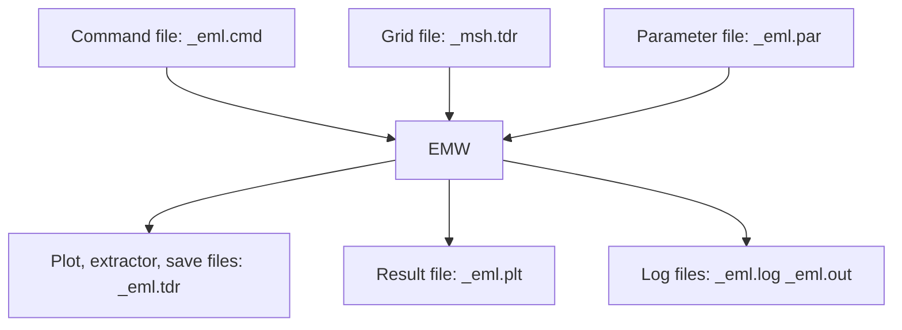

<!-- page:1 -->
# Sentaurus™ Device Electromagnetic Wave Solver User Guide

<!-- page:1 -->
Version O-2018.06, June 2018

# Copyright and Proprietary Information Notice

<!-- page:2 -->
© 2018 Synopsys, Inc. This Synopsys software and all associated documentation are proprietary to Synopsys, Inc. and may only be used pursuant to the terms and conditions of a written license agreement with Synopsys, Inc. All other use, reproduction, modification, or distribution of the Synopsys software or the associated documentation is strictly prohibited.

# Destination Control Statement

All technical data contained in this publication is subject to the export control laws of the United States of America. Disclosure to nationals of other countries contrary to United States law is prohibited. It is the reader’s responsibility to determine the applicable regulations and to comply with them.

# Disclaimer

SYNOPSYS, INC., AND ITS LICENSORS MAKE NO WARRANTY OF ANY KIND, EXPRESS OR IMPLIED, WITH REGARD TO THIS MATERIAL, INCLUDING, BUT NOT LIMITED TO, THE IMPLIED WARRANTIES OF MERCHANTABILITY AND FITNESS FOR A PARTICULAR PURPOSE.

# Trademarks

Synopsys and certain Synopsys product names are trademarks of Synopsys, as set forth at https://www.synopsys.com/company/legal/trademarks-brands.html.

All other product or company names may be trademarks of their respective owners.

# Third-Party Links

Any links to third-party websites included in this document are for your convenience only. Synopsys does not endorse and is not responsible for such websites and their practices, including privacy practices, availability, and content.

Synopsys, Inc.

690 E. Middlefield Road

Mountain View, CA 94043

www.synopsys.com

<!-- page:3 -->
# About This Guide ix

Related Publications . . ix

Conventions ix

Customer Support . . . ix

Accessing SolvNet. . .

Contacting Synopsys Support . . .

Contacting Your Local TCAD Support Team Directly. . . .

# Chapter 1 Getting Started 1

Starting EMW . .

Input and Output File Types . . . .

Command File (\*\_eml.cmd) .

Tensor-Grid File (\*\_msh.tdr). . . .

Parameter File (\*\_eml.par)

Plot, Extractor, and Save Files (\*\_eml.tdr) . . . .

Result File (\*\_eml.plt) . . .

Log Files (\*\_eml.log, \*\_eml.out)

File Compression . . .

Accessing Help on Syntax . . . .

# Chapter 2 Basic Theory of Finite-Difference Time-Domain Method 7

Basic Theory of FDTD . . .

Discretized Maxwell’s Equations . . .

Accuracy of the Finite Difference Stencil . .

Stability (Courant) Criteria 12

Modeling of Dispersive Media . . . 12

Physical Model . . . . 13

Debye Relaxation . . . . 14

Lorentzian Resonance. . . 14

Unmagnetized Plasma . . . . 15

Drude–Lorentz . . . . 15

Modified Lorentz . . 15

Drude–Modified Lorentz . . . . . 16

References. . 16

<!-- page:4 -->
# Chapter 3 Boundary Conditions 19

Introduction . . . 19

PEC and PMC Boundary Conditions . . . 19

Periodic Boundary Conditions . . . 19

Absorbing Boundary Conditions . . . . 20

Specifying Parameters of CPML Boundary Condition . . . . . 21

Combining CPML With Other Boundary Conditions . . . . 23

References. . . 24

# Chapter 4 Building the Correct Mesh 25

Generating Tensor Meshes for EMW . . 25

Using the Sentaurus Mesh Tensor-Product Generator . . . 25

Specifying Nodes per Wavelength in Meshing . . . . . 26

Meshing Examples . . . . 27

Example 1: Planar Two-Layer Silicon–Air . . . . 28

Example 2: Image Sensor . . . . 29

Inspecting and Troubleshooting Tensor-Grid Generation 31

# Chapter 5 Specifying Material Parameters 33

Introduction . . . . 33

Complex Refractive Index Model. . . 33

Complex Refractive Index Model Interface . . . . 34

Spatially Dependent Complex Refractive Index Model . . . . 35

Limitations . . . 36

Dispersive Model Parameters . . . 37

Dispersive Model Command Syntax . . . . . 37

Specifying User-Defined Dispersive Model Poles in Parameter File . . . . . 39

Explicit Specification of EMW Material Parameters . . . . 42

PEC and PMC Materials . . . 43

Precedence of Material Specification . . . . 44

# Chapter 6 Specifying Excitations 45

Overview . . . . 45

Total-Field Scattered-Field . . . 45

Specification of the Illumination Direction . . . . 46

Plane Waves . . . . 47

Specifying Excitation Regions or Boxes . . . . 47

Specifying Direction and Polarization. . . . 48

<!-- page:5 -->
Specifying Elliptical Polarization . . 51

Spatially Incoherent Illumination . . 51

Gaussian Beam or Gaussian Field Distribution . . . . 52

Temporal Dependency . . . . . 55

CODE V Interface. . . . 56

References. . . 59

# Chapter 7 Terminating Simulations 61

Options for Terminating FDTD Time-Stepping Loop . . . . . 61

Detectors . . . . 62

# Chapter 8 Extracting and Visualizing Results 65

Overview. . . 65

Plots. . . 66

Monitors 69

Extractors . 70

Sensors . 72

Reflection, Transmission, and Absorption Sensors . . . . 73

Using Multiple Domains in a Sensor . . . . 75

Nonaxis-Aligned Sensor . . . . 76

Far Field . . 77

Specifying the Far-Field Computation . . . . 79

Visualizing Results of the Far-Field Computation . . . . 82

Postprocessing of Extractors, Sensors, and Far Field . . . . 83

Discrete Fourier Transform. . . . . . 85

On-the-Fly DFT . . . 85

Defining the DFT Wavelength Table . . . . 86

Normalizing Field Values . . . 88

Downsampling of DFT . . . 88

Limitation of Single-Frequency Periodic Boundary Condition. . . . . 89

EMW Syntax . . . . . 90

References . . . 91

# Chapter 9 Parallelization 93

Overview of Parallelization . . . 93

Shared-Memory Parallelization . . . 93

Parallelization Using the Message Passing Interface . . . . 94

Domain Decomposition . . . . . 94

Installing and Running EMW MPI on DP Systems . . . . 95

<!-- page:6 -->
Choosing Between Shared-Memory Parallelization and Distributed Processing. . . . . . . 95

Hardware Acceleration Using Graphics Processing Units . . . . . 96

Installing EMW GPU. . . 96

Hardware and Software Setup . . . . 97

Optimization Settings . . . . . 97

Running EMW GPU . . . 98

General Considerations and Recommendations . . . . 99

Performance . . . 100

Monitoring . . . . 100

Limitations . . . 100

Licensing for Different Parallel Modes . . . 101

SMP Parallel Mode . . . 101

DP Parallel Mode. . . 101

Mixed DP and SMP Parallel Mode . . . . 101

Hardware-Accelerated Parallel Mode . . . . . 102

Controlling Parallel Licenses. . . . 102

References. . . 103

# Appendix A Commands 105

Boundary. . . . . 105

CodeVExcitation. . . . 107

ComplexRefractiveIndex . . . . 108

Detector . . . . 109

DFT . . 1

DispersiveMedia . . . 1

Extractor . . 112

Farfield . 115

GaussianBeamExcitation 117

Globals . . 119

Monitor . . . 121

PECMedia . . . 123

PlaneWaveExcitation . . 123

Plot . . . . 125

PMCMedia . . . 130

RTA. . . 130

Save . . . . 132

Sensor . . 133

TruncatedPlaneWaveExcitation . . . . . 136

# Appendix B Troubleshooting Simulations 139

<!-- page:7 -->
Unexpected Results. . . . 139

Simulations Run Nonstop . . . . 140

Simulator Terminates . . . . 140

# Glossary 141

<!-- page:8 -->
Contents

<!-- page:9 -->
The Synopsys Sentaurus™ Device Electromagnetic Wave Solver (EMW) is a simulation module for the numeric analysis of electromagnetic waves. EMW is a full-wave time-domain simulator based on the finite-difference time-domain (FDTD) method. It is typically used to calculate the optical carrier generation in optoelectronic devices.

EMW can compute full-wave time-domain solutions of Maxwell equations, thereby covering the entire range of electromagnetic problems from high frequency to optical applications.

# Related Publications

For additional information, see:

The TCAD Sentaurus release notes, available on the Synopsys SolvNet® support site (see Accessing SolvNet on page x).   
■ Documentation available on SolvNet at https://solvnet.synopsys.com/DocsOnWeb.

# Conventions

The following conventions are used in Synopsys documentation.

<table><tr><td>Convention</td><td>Description</td></tr><tr><td>Blue text</td><td>Identifies a cross-reference (only on the screen).</td></tr><tr><td>Bold text</td><td>Identifies a selectable icon, button, menu, or tab. It also indicates the name of a field or an option.</td></tr><tr><td>Courier font</td><td>Identifies text that is displayed on the screen or that the user must type. It identifies the names of files, directories, paths, parameters, keywords, and variables.</td></tr><tr><td>Italicized text</td><td>Used for emphasis, the titles of books and journals, and non-English words. It also identifies components of an equation or a formula, a placeholder, or an identifier.</td></tr></table>

# Customer Support

Customer support is available through the Synopsys SolvNet customer support website and by contacting the Synopsys support center.

<!-- page:10 -->
# Accessing SolvNet

The SolvNet support site includes an electronic knowledge base of technical articles and answers to frequently asked questions about Synopsys tools. The site also gives you access to a wide range of Synopsys online services, which include downloading software, viewing documentation, and entering a call to the Support Center.

To access the SolvNet site:

1. Go to the web page at https://solvnet.synopsys.com.   
2. If prompted, enter your user name and password. (If you do not have a Synopsys user name and password, follow the instructions to register.)

If you need help using the site, click Help on the menu bar.

# Contacting Synopsys Support

If you have problems, questions, or suggestions, you can contact Synopsys support in the following ways:

Go to the Synopsys Global Support Centers site on synopsys.com. There you can find email addresses and telephone numbers for Synopsys support centers throughout the world.   
Go to either the Synopsys SolvNet site or the Synopsys Global Support Centers site and open a case online (Synopsys user name and password required).

# Contacting Your Local TCAD Support Team Directly

Send an e-mail message to:

support-tcad-us@synopsys.com from within North America and South America   
support-tcad-eu@synopsys.com from within Europe   
support-tcad-ap@synopsys.com from within Asia Pacific (China, Taiwan, Singapore, Malaysia, India, Australia)   
support-tcad-kr@synopsys.com from Korea   
support-tcad-jp@synopsys.com from Japan

<!-- page:11 -->
This chapter describes the Sentaurus Device Electromagnetic Wave Solver application, how to set up simulations, and the general syntax framework.

# Starting EMW

Sentaurus Device Electromagnetic Wave Solver (EMW) is an electromagnetic solver based on the finite-difference time-domain (FDTD) method. It can numerically solve the temporal evolution of electromagnetic waves in a device structure defined on a tensor grid. The main result is the absorbed photon density distribution, which is typically used in subsequent electrical simulations.

To start EMW from the command line, use:

```txt
> emw [command_file_name] 
```

where the optional command\_file\_name is a valid command file of EMW, for example:

```txt
> emw pp1_eml.cmd 
```

To list the command-line options, use:

```txt
> emw -h 
```

To list all of the installed EMW releases, use:

```txt
> emw -releases 
```

To check the default version number, use:

```txt
> emw -v 
```

To run a particular release version, use:

```txt
> emw -rel N-2017.09 
```

<!-- page:12 -->
# Input and Output File Types

The main input and output file types used in EMW simulations are shown in Figure 1. The file names can be specified in the EMW command file.


<details>
<summary>flowchart</summary>


</details>

Figure 1 Overview of input and output files for EMW

# Command File (\*\_eml.cmd)

The command file is the main input file for EMW. It contains all the model settings and file specifications, and can be edited. This file is referred to as the command file or input file.

An EMW command file consists of several command sections of the form Section {...}, with each section describing a specific aspect of the simulation. Inside a section, each command keyword has the form keyword = value, for example:

```txt
* Plot the absolute value of the electric field at the end of the simulation
Plot {
    Name = "n@node@_Eabs"
    Quantity = {AbsElectricField, AbsMagneticField, Region}
    TickStep = 300
    StartTick = 100
    EndTick = 800
    FinalPlot = yes
} 
```

<!-- page:13 -->
# NOTE Regarding the command file:

Keywords are case insensitive, but identifiers such as region names and materials are surrounded by double quotation marks and are case sensitive.   
• Lists are defined in braces with their items separated by a comma.   
Each command must be on a single line; only list items can be wrapped before or after the comma.   
• Comments are indicated by the first character on a line being # or \*.

Typically, an EMW command file consists of the following sections:

Globals   
ComplexRefractiveIndex   
DispersiveMedia   
Boundary   
PlaneWaveExcitation   
Plot   
Extractor   
Sensor   
Monitor   
Detector

In general, the order of the sections in the command file is arbitrary. However, it is recommended that you maintain the above order because it simplifies navigation looking for a particular parameter.

# Tensor-Grid File (\*\_msh.tdr)

EMW needs a tensor grid to run FDTD simulations. A typical example of a tensor grid is shown in Figure 2 on page 4. To generate a suitable tensor-grid file with Sentaurus Mesh, see Generating Tensor Meshes for EMW on page 25 and the Sentaurus™ Mesh User Guide.


<details>
<summary>natural_image</summary>

3D structural diagram showing layered components with no visible text or symbols
</details>

Figure 2 Example of a tensor grid of a CMOS image sensor; oxide removed for visualization

<!-- page:14 -->
# Parameter File (\*\_eml.par)

EMW allows you to define the optical parameters as a complex refractive index (CRI) in the material parameter file. It uses the same CRI library as Sentaurus Device. Therefore, the same parameter file as for Sentaurus Device can be used (refer to the Sentaurus™ Device User Guide).

The optical parameters are then read from the corresponding ComplexRefractiveIndex section, for example:

```hcl
Material = "Silicon" {
    ComplexRefractiveIndex {
    Formula = 1
    NumericalTable (
    0.1908 0.84 2.73;
    ...
    )
    }
} 
```

# Plot, Extractor, and Save Files (\*\_eml.tdr)

<!-- page:15 -->
As multiple Plot, Extractor, and Save sections are allowed, the file names are defined in the corresponding sections. Extracting useful simulation results is described in more detail in Chapter 8 on page 65.

# Result File (\*\_eml.plt)

A result file is used when global values have to be stored, such as the integrated absorbed photon density in a certain volume or the photon flux through a surface. The results can be viewed using Inspect or Sentaurus Visual. For discrete Fourier transform (DFT) simulations, use Sentaurus Visual only.

# Log Files (\*\_eml.log, \*\_eml.out)

EMW generates the log file during a simulation run. It contains information about input parameters, and the models and values of physical parameters used in the simulation. The log file contains more details than the brief information written to the standard output (.out) during the simulation.

# File Compression

You can control further compression, beyond a basic standard compression for plot, sensor, extractor, and save files as well as the result file, in the Globals section by specifying CompressTDR=Yes | No.

# Accessing Help on Syntax

Help for the syntax of each keyword can be obtained by using the EMW binary with the -P command-line option. For example, to view all of the allowed options for the keyword Quantity in the Plot section, in a shell, type in a shell prompt:

```txt
> emw -P:plot:quantity
**************************
***    Sentaurus Device EMW    ***
...
Quantity = { <identifier>, ... }
Default value: { AbsElectricField } 
```

<!-- page:16 -->
# 1: Getting Started

Accessing Help on Syntax

Exclusive options are: AbsElectricDisplacement

AbsElectricField

<!-- page:17 -->
This chapter describes the basic theory of the finite-difference timedomain (FDTD) method, including the total-field scattered-field methodology and the dispersive material models.

# Basic Theory of FDTD

EMW provides a FDTD kernel that specifically targets 3D periodic structures for which light is incident at an oblique angle. Typically, periodic boundary conditions must be imposed in the lateral directions; whereas, absorbing boundary conditions are applied in the normal direction. The implementation of the kernel is based on the sine–cosine formulation [1][2] and can be applied to both coherent and incoherent excitations. Prominent application areas for the FDTD kernel with 3D oblique periodic boundary conditions are CMOS image sensors, solar cells, and photonic bandgap structures.

NOTE The sine–cosine formulation is based on two sets of field components, one with sine and one with cosine time dependency, which are advanced simultaneously in time. Therefore, the memory footprint of this method is, at least, doubled compared to the conventional FDTD algorithm.

Two-dimensional simulations using the 3D FDTD kernel with oblique periodic boundary conditions are performed by extruding the 2D structure by one layer in the third dimension.

# Discretized Maxwell’s Equations

Maxwell’s curl equations in linear, isotropic, nondispersive material are [1]:

$$
\frac {\partial \mathbf {E}}{\partial t} = \frac {1}{\varepsilon} \nabla \times \mathbf {H} - \frac {1}{\varepsilon} (\mathbf {J} + \sigma \mathbf {E}) \tag {1}
$$

$$
\frac {\partial \mathbf {H}}{\partial t} = - \frac {1}{\mu} \nabla \times \mathbf {E} - \frac {1}{\mu} (\mathbf {M} + \boldsymbol {\sigma} ^ {*} \mathbf {H})
$$

# 2: Basic Theory of Finite-Difference Time-Domain Method

# Basic Theory of FDTD

# where:

■ is the vectorial electric field in .E V/m   
is the vectorial magnetic field in .H A/m   
■ is the electric current density inJ $\mathrm { A } / \mathrm { m } ^ { 2 }$ .   
is the magnetic current density in M $\mathrm { V } / \mathrm { m } ^ { 2 }$   
is the electrical permittivity in .ε F/m   
■ is the magnetic permeability in .μ H/m   
is the electric conductivity in .σ S/m   
$\sigma ^ { * }$ is the magnetic conductivity in .Ω/m

In terms of x-, y-, and z-components, the curl equations can be decomposed into a system of six coupled scalar equations:

$$
\begin{array}{l} \frac {\partial E _ {x}}{\partial t} = \frac {1}{\varepsilon} \left[ \frac {\partial H _ {z}}{\partial y} - \frac {\partial H _ {y}}{\partial z} - (J _ {x} + \sigma E _ {x}) \right] \\ \frac {\partial E _ {y}}{\partial t} = \frac {1}{\varepsilon} \left[ \frac {\partial H _ {x}}{\partial z} - \frac {\partial H _ {z}}{\partial x} - (J _ {y} + \sigma E _ {y}) \right] \\ \frac {\partial E _ {z}}{\partial t} = \frac {1}{\varepsilon} \left[ \frac {\partial H _ {y}}{\partial x} - \frac {\partial H _ {x}}{\partial y} - \left(J _ {z} + \sigma E _ {z}\right) \right] \tag {2} \\ \frac {\partial H _ {x}}{\partial t} = \frac {1}{\mu} \left[ \frac {\partial E _ {y}}{\partial z} - \frac {\partial E _ {z}}{\partial y} - (M _ {x} + \sigma^ {*} H _ {x}) \right] \\ \frac {\partial H _ {y}}{\partial t} = \frac {1}{\mu} \left[ \frac {\partial E _ {z}}{\partial x} - \frac {\partial E _ {x}}{\partial z} - \left(M _ {y} + \sigma^ {*} H _ {y}\right) \right] \\ \frac {\partial H _ {z}}{\partial t} = \frac {1}{\mu} \left[ \frac {\partial E _ {x}}{\partial y} - \frac {\partial E _ {y}}{\partial x} - (M _ {z} + \sigma^ {*} H _ {z}) \right] \\ \end{array}
$$

Maxwell’s curl equations can be discretized by the central difference method to achieve second-order accuracy. For nonuniform grids with $\Delta x \neq \Delta y \neq \Delta z$ , the discretized $\mathrm { X ^ { - } , y - }$ , and zcomponents of the E-fields for the point ( ) are:i j k , ,

$$
\begin{array}{l} E _ {x} \bigg | _ {i + \frac {1}{2}, j, k} ^ {n + 1} = \left. C _ {a, E _ {x}} \right| _ {i + \frac {1}{2}, j, k} E _ {x} \bigg | _ {i + \frac {1}{2}, j, k} ^ {n} \\ + C _ {b, E _ {x}} \bigg | _ {i + \frac {1}{2}, j, k} \left[ \left(H _ {z} \bigg | _ {i + \frac {1}{2}, j + \frac {1}{2}, k} ^ {n + \frac {1}{2}} - H _ {z} \bigg | _ {i + \frac {1}{2}, j - \frac {1}{2}, k}\right) / \Delta y \right. \\ - \left(H _ {y} \bigg | _ {i + \frac {1}{2}, j, k + \frac {1}{2}} ^ {n + \frac {1}{2}} - H _ {y} \bigg | _ {i + \frac {1}{2}, j, k - \frac {1}{2}} ^ {n + \frac {1}{2}}\right) / \Delta z \tag {3} \\ - \left. J _ {x} \right| _ {i + \frac {1}{2}, j, k} ^ {n + \frac {1}{2}} \\ \end{array}
$$

$$
\begin{array}{l} E _ {y} \bigg | _ {i, j + \frac {1}{2}, k} ^ {n + 1} = \left. C _ {a, E _ {y}} \right| _ {i, j + \frac {1}{2}, k} E _ {y} \bigg | _ {i, j + \frac {1}{2}, k} ^ {n} \\ + C _ {b, E _ {y}} \bigg | _ {i, j + \frac {1}{2}, k} \left[ \left(H _ {x} \bigg | _ {i, j + \frac {1}{2}, k + \frac {1}{2}} ^ {n + \frac {1}{2}} - H _ {x} \bigg | _ {i, j + \frac {1}{2}, k - \frac {1}{2}} ^ {n + \frac {1}{2}}\right) / \Delta z \right. \\ - \left(H _ {z} \bigg | _ {i + \frac {1}{2}, j + \frac {1}{2}, k} ^ {n + \frac {1}{2}} - H _ {z} \bigg | _ {i - \frac {1}{2}, j + \frac {1}{2}, k}\right) / \Delta x \tag {4} \\ - \left. J _ {y} \right| _ {i, j + \frac {1}{2}, k} ^ {n + \frac {1}{2}} \\ \end{array}
$$

$$
\begin{array}{l} E _ {z} \bigg | _ {i, j, k + \frac {1}{2}} ^ {n + 1} = C _ {a, E _ {z}} \bigg | _ {i, j, k + \frac {1}{2}} E _ {z} \bigg | _ {i, j, k + \frac {1}{2}} ^ {n} \\ + C _ {b, E _ {z}} \Big | _ {i, j, k + \frac {1}{2}} \left[ \left(H _ {y} \Big | _ {i + \frac {1}{2}, j, k + \frac {1}{2}} ^ {n + \frac {1}{2}} - H _ {y} \Big | _ {i - \frac {1}{2}, j, k + \frac {1}{2}} ^ {n + \frac {1}{2}}\right) / \Delta x \right. \\ - \left(H _ {x} \bigg | _ {i, j + \frac {1}{2}, k + \frac {1}{2}} ^ {n + \frac {1}{2}} - H _ {x} \bigg | _ {i, j - \frac {1}{2}, k + \frac {1}{2}} ^ {n + \frac {1}{2}}\right) / \Delta y \tag {5} \\ - \left. J _ {z} \right| _ {i, j, k + \frac {1}{2}} ^ {n + \frac {1}{2}} \\ \end{array}
$$

where:

$$
\left. C _ {a, \gamma} \right| _ {i, j, k} = \left(1 - \frac {\sigma_ {i , j , k} \Delta t}{2 \varepsilon_ {i , j , k}}\right) / \left(1 + \frac {\sigma_ {i , j , k} \Delta t}{2 \varepsilon_ {i , j , k}}\right), \quad \gamma = E _ {x}, E _ {y}, E _ {z} \tag {6}
$$

$$
C _ {b, \gamma} \big | _ {i, j, k} = \Big (\frac {\Delta t}{\varepsilon_ {i , j , k}} \Big) / \Big (1 + \frac {\sigma_ {i , j , k} \Delta t}{2 \varepsilon_ {i , j , k}} \Big), \quad \gamma = E _ {x}, E _ {y}, E _ {z}
$$

The discretized x-, y-, and z-components of the H-fields for the point ( ) are:i j k , ,

$$
\begin{array}{l} H _ {x} \Big | _ {i, j + \frac {1}{2}, k + \frac {1}{2}} ^ {n + \frac {1}{2}} = D _ {a, H _ {x}} \Big | _ {i, j + \frac {1}{2}, k + \frac {1}{2}} H _ {x} \Big | _ {i, j + \frac {1}{2}, k + \frac {1}{2}} ^ {n - \frac {1}{2}} \\ + D _ {b, H _ {x}} \Big | _ {i, j + \frac {1}{2}, k + \frac {1}{2}} \left[ \left(E _ {y} \Big | _ {i, j + \frac {1}{2}, k + 1} ^ {n} - E _ {y} \Big | _ {i, j + \frac {1}{2}, k} ^ {n}\right) / \Delta z \right. \tag {7} \\ - \left(E _ {z} \Big | _ {i, j + 1, k + \frac {1}{2}} ^ {n} - E _ {z} \Big | _ {i, j, k + \frac {1}{2}} ^ {n}\right) / \Delta y \\ - \left. M _ {x} \right| _ {i, j + \frac {1}{2}, k + \frac {1}{2}} ^ {n} \\ \end{array}
$$

$$
\begin{array}{l} H _ {y} \bigg | _ {i + \frac {1}{2}, j, k + \frac {1}{2}} ^ {n + \frac {1}{2}} = D _ {a, H _ {y}} \bigg | _ {i + \frac {1}{2}, j, k + \frac {1}{2}} H _ {y} \bigg | _ {i + \frac {1}{2}, j, k + \frac {1}{2}} ^ {n - \frac {1}{2}} \\ + D _ {b, H _ {\mathrm{y}}} \Big | _ {i + \frac {1}{2}, j, k + \frac {1}{2}} \left[ \left(E _ {z} \Big | _ {i + 1, j, k + \frac {1}{2}} ^ {n} - E _ {z} \Big | _ {i, j, k + \frac {1}{2}} ^ {n}\right) / \Delta x \right. \tag {8} \\ - \left(E _ {x} \Big | _ {i + \frac {1}{2}, j, k + 1} ^ {n} - E _ {x} \Big | _ {i + \frac {1}{2}, j, k} ^ {n}\right) / \Delta z \\ - \left. M _ {y} \right| _ {i + \frac {1}{2}, j, k + \frac {1}{2}} ^ {n} \\ \end{array}
$$

$$
\begin{array}{l} H _ {z} \Big | _ {i + \frac {1}{2}, j + \frac {1}{2}, k} ^ {n + \frac {1}{2}} = D _ {a, H _ {z}} \Big | _ {i + \frac {1}{2}, j + \frac {1}{2}, k} H _ {z} \Big | _ {i + \frac {1}{2}, j + \frac {1}{2}, k} ^ {n - \frac {1}{2}} \\ + D _ {b, H _ {z}} \Big | _ {i + \frac {1}{2}, j + \frac {1}{2}, k} \left[ \left(E _ {x} \Big | _ {i + \frac {1}{2}, j + 1, k} ^ {n} - E _ {x} \Big | _ {i + \frac {1}{2}, j, k} ^ {n}\right) / \Delta y \right. \tag {9} \\ - \left(E _ {y} \Big | _ {i + 1, j + \frac {1}{2}, k} ^ {n} - E _ {y} \Big | _ {i, j + \frac {1}{2}, k} ^ {n}\right) / \Delta x \\ - \left. M _ {z} \right| _ {i + \frac {1}{2}, j + \frac {1}{2}, k} ^ {n} \\ \end{array}
$$

where:

$$
\left. D _ {a, \gamma} \right| _ {i, j, k} = \left(1 - \frac {\sigma_ {i , j , k} ^ {*} \Delta t}{2 \mu_ {i , j , k}}\right) / \left(1 + \frac {\sigma_ {i , j , k} ^ {*} \Delta t}{2 \mu_ {i , j , k}}\right), \quad \gamma = H _ {x}, H _ {y}, H _ {z} \tag {10}
$$

$$
D _ {b, \gamma} \big | _ {i, j, k} = \left(\frac {\Delta t}{\mu_ {i , j , k}}\right) / \left(1 + \frac {\sigma_ {i , j , k} ^ {*} \Delta t}{2 \mu_ {i , j , k}}\right), \quad \gamma = H _ {x}, H _ {y}, H _ {z}
$$

In the above equations, is the time step and it must satisfy the Stability (Courant) Criteria.Δt

NOTE Magnetic material is not supported, that is, $\mu \ = \ \mu _ { 0 }$ and $\sigma ^ { * } = 0$ in Eq. 1, p. 7 and the corresponding equations. Here, $\mu _ { 0 }$ denotes the vacuum magnetic permeability.

# Accuracy of the Finite Difference Stencil

The accuracy of the finite difference stencil critically depends on cell size and mesh uniformity. For a uniform tensor mesh, the Yee algorithm [3] is second-order accurate for both time and spatial discretization. However, the accuracy will degrade if the mesh is nonuniform, because the numeric dispersion of the finite difference method increases when the cells have large aspect ratios or abrupt grading or both.

NOTE Whenever an FDTD simulation has slow convergence or unstable results, first check whether convergence and stability can be improved by using a denser uniform mesh for the same problem.

# Stability (Courant) Criteria

The explicit FDTD-updating algorithm initially proposed by Yee [3] is conditionally stable, which means that there is an upper limit to the allowed time step for stable operation:

$$
\Delta t \leq \Delta t _ {\text { stable }} \tag {11}
$$

Time steps that are greater than $\Delta t _ { \mathrm { s t a b l e } }$ cause exponentially growing solutions. The theoretical proof of the stability criterion is usually given for the linear case on uniform grids, derived by examining how a plane wave is impacted by the FDTD discretized stencil. However, numeric experiments have shown that the following selection of is also satisfactory for rectilinearΔt (nonuniform) grids and in combination with the commonly used boundary conditions:

$$
3 \mathrm{D} \text { case: } \quad \Delta t _ {\text { stable }} = \frac {1}{\sqrt [ v ]{\frac {1}{(\Delta x) ^ {2}} + \frac {1}{(\Delta y) ^ {2}} + \frac {1}{(\Delta z) ^ {2}}}} \tag {12}
$$

$$
2 \mathrm{D} \text { case: } \quad \Delta t _ {\text { stable }} = \frac {1}{v \sqrt {\frac {1}{(\Delta x) ^ {2}} + \frac {1}{(\Delta y) ^ {2}}}} \tag {13}
$$

where denotes the phase velocity of the wave, and , , and ν Δx Δy $\Delta z$ are the space increments of the grid.

NOTE In the case of a rectilinear grid, the smallest space increments of the grid must be used in Eq. 12 and Eq. 13.

# Modeling of Dispersive Media

In the derivation of the FDTD-updating scheme, which forms the basis of EMW, it is generally assumed that the material parameters , , , and ε μ σ $\sigma _ { \mathrm { m } }$ are independent of frequency. As long as interest is restricted to model situations with quasimonochromatic excitation, the formulations in the previous sections are sufficient. However, the electromagnetic parameters of most materials generally exhibit a dependency on frequency that might be pronounced, especially in the range of visible wavelengths and frequencies.

If the excitation signal has a spectrum that is nonzero over a range of frequencies in which the material properties change significantly, the dispersive behavior must be taken into account in the simulation. In addition, for a highly absorbing material that has a complex refractive index $n + i \kappa$ such that $\kappa > n$ (especially true for some metals), the real part of the dielectric constant $\operatorname { \bf R e } [ \varepsilon _ { r } ] = n ^ { 2 } - \kappa ^ { 2 }$ becomes negative and will result in instabilities when the nondispersive FDTD is used. This problem can be solved by treating the material as dispersive.

Various approaches for taking frequency-dependent material parameters into account in FDTD have emerged [1]. Adequate treatment of material dispersion is important for simulating the propagation of short pulses as well as for efficient modeling of propagation phenomena over a wide range of frequencies in the optical and microwave regimes. The common methods are based on three main principles:

The z-transformation of Maxwell’s curl equations.   
The solution of auxiliary differential equations (ADEs) between the electric displacement density and the polarization.   
The recursive computation of the convolution integrals between the electric field and the time-domain susceptibility.

Numerous investigations have shown that the ADE method offers very good accuracy and stability with moderate computational effort. In addition, it is very flexible with respect to the modeling of common types of dispersive material.

NOTE Only the ADE method is used in EMW.

Since the majority of materials of interest for various applications is not magnetically dispersive, EMW is restricted to the modeling of frequency-dependent electric materials.

# Physical Model

If the electric permittivity depends on the frequency, the constitutive relation between the electric field and the displacement density becomes:

$$
\bar {D} (\omega) = \varepsilon (\omega) \bar {E} (\omega) = \varepsilon_ {0} \varepsilon_ {\infty} \bar {E} (\omega) + \bar {P} (\omega) = \varepsilon_ {0} [ \varepsilon_ {\infty} + \chi (\omega) ] \bar {E} (\omega) \tag {14}
$$

where:

is the permittivity (generally a complex quantity).ε ω( )   
■ $P = \mathfrak { E } _ { 0 } \chi ( \mathfrak { o } ) E ( \mathfrak { o } )$ is the electric polarization.   
■ $\chi ( \omega ) = \varepsilon ( \omega ) / \varepsilon _ { 0 } - \varepsilon _ { \times }$ is the electric susceptibility.

The frequency dispersive characteristics can be fully described by the electric susceptibility. The actual form of the susceptibility depends on the microscopic properties of the material.

Next is an overview of the common types of dispersive material model encountered in electromagnetics.

# Debye Relaxation

The Debye dispersive model describes the relaxation behavior of water molecules. Therefore, this dispersive type plays an important role in modeling electromagnetic polarization in biological tissues. The susceptibility of a multiterm Debye dispersive medium is given by:

$$
\chi (\omega) = \sum_ {p = 1} ^ {N _ {p} ^ {\text {Debye}}} \frac {\Delta \varepsilon_ {p}}{1 - i \omega \tau_ {p}} \tag {15}
$$

where:

$N _ { p } ^ { \mathrm { { \tiny ~ D e b y e } } }$ denotes the number of Debye poles.   
■ $\Delta \mathfrak { E } _ { p } = ( \mathfrak { E } _ { s } - \mathfrak { E } _ { \infty } ) A _ { p }$ is the change in the relative permittivity due to the $p ^ { \mathrm { t h } }$ pole.   
■ $A _ { p }$ is the amplitude.   
$\tau _ { p }$ is the pole relaxation time.

# Lorentzian Resonance

The Lorentzian dispersive model adequately describes the frequency-dependent response caused by damped oscillation of bounded electrons due to the applied external fields, and it is typically used for modeling semiconductors and insulators.

The susceptibility of a multiterm Lorentzian dispersive medium is given by:

$$
\chi (\omega) = \sum_ {p = 1} ^ {N _ {p} ^ {\text {Lorentz}}} \frac {\Delta \varepsilon_ {p} \omega_ {p} ^ {2}}{\omega_ {p} ^ {2} - 2 i \omega \delta_ {p} - \omega^ {2}} \tag {16}
$$

where:

Np Lorentz $N _ { p } ^ { \mathrm { \ L o r e n t z } }$ denotes the number of Lorentzian pole pairs.   
■ $\Delta \mathfrak { E } _ { p } = ( \mathfrak { E } _ { s } - \mathfrak { E } _ { \infty } ) A _ { p }$ is the change in the relative permittivity due to the $p ^ { \mathrm { t h } }$ pole pair.   
■ $A _ { p }$ is the amplitude.   
■ ${ \mathfrak { O } } _ { p }$ is the undamped frequency of the $p ^ { \mathrm { t h } }$ pole pair, and $\delta _ { p }$ is its damping factor.

# Unmagnetized Plasma

The Drude dispersive model describes the behavior that is exhibited by free electrons in metals. The susceptibility of a multiterm Drude medium is given by:

$$
\chi (\omega) = - \sum_ {p = 1} ^ {N _ {p} ^ {\text { Drude }}} \frac {\omega_ {p} ^ {2}}{\omega^ {2} + i \omega \gamma_ {p}} \tag {17}
$$

where:

dNp Drude $N _ { p } ^ { \mathrm { { \tiny ~ D r u d e } } }$ enotes the number of Drude poles.   
${ \mathfrak { O } } _ { p }$ is the Drude pole frequency.   
■ $\gamma _ { p }$ is the inverse of the pole relaxation time or Drude damping factor.

# Drude–Lorentz

For modeling certain semiconductors and metals with higher accuracy, you can combine the Lorentz and Drude models to characterize dispersive media over a wide frequency range [4]. The susceptibility of a multiterm Drude–Lorentz medium is given by:

$$
\chi (\omega) = \sum_ {p = 1} ^ {N _ {p} ^ {\text {Lorentz}}} \frac {\Delta \varepsilon_ {p} \omega_ {p} ^ {2}}{\omega_ {p} ^ {2} - 2 i \omega \delta_ {p} - \omega^ {2}} - \sum_ {p = 1} ^ {N _ {p} ^ {\text {Drude}}} \frac {\omega_ {p} ^ {2}}{\omega^ {2} + i \omega \gamma_ {p}} \tag {18}
$$

where the dispersive parameters are defined as in Eq. 16 and Eq. 17.

# Modified Lorentz

Another effective dispersive model for semiconductors and metals is the modified Lorentz model. This model offers a better description of the dielectric function of silicon, aluminum, silver, and gold in the visible wavelength range, although the parameters in this model do not necessarily have a physical meaning [5][6]. The susceptibility of a multiterm modified-Lorentz medium is given by:

$$
\chi (\omega) = \sum_ {p = 1} ^ {N _ {p} ^ {\text { ModLorentz }}} \frac {\Delta \varepsilon_ {p} (\omega_ {p} ^ {2} - i \omega \delta_ {p} ^ {'})}{\omega_ {p} ^ {2} - 2 i \omega \delta_ {p} - \omega^ {2}} \tag {19}
$$

Compared with the Lorentz model in Eq. 16, p. 14, ${ \ S _ { p } } ^ { \prime }$ in the numerator is an additional damping factor that describes the direct polarization of the dispersive medium by the time derivative of the applied electric field Eq. 19.

# Drude–Modified Lorentz

The Drude model can be combined with the modified Lorentz model to form the Drude–modified Lorentz model. The susceptibility of a multiterm Drude–modified Lorentz medium is given by:

$$
\chi (\omega) = \sum_ {p = 1} ^ {N _ {p} ^ {\text {ModLorentz}}} \frac {\Delta \varepsilon_ {p} \left(\omega_ {p} ^ {2} - i \omega \delta_ {p} ^ {\prime}\right)}{\omega_ {p} ^ {2} - 2 i \omega \delta_ {p} - \omega^ {2}} - \sum_ {p = 1} ^ {N _ {p} ^ {\text {Drude}}} \frac {\omega_ {p} ^ {2}}{\omega^ {2} + i \omega \gamma_ {p}} \tag {20}
$$

where the dispersive parameters are defined as in Eq. 17, p. 15.

The formulations of the ADEs and associated convolutional perfectly matching layers (CPMLs) of the above dispersive materials are described in detail in [1].

CAUTION Dispersive materials can be attached only to CPMLs, not to analytic absorbing boundaries. The physics and derivation of the above dispersive models are available in the literature [4][7].

For the syntax for activating the dispersive models, see Dispersive Model Parameters on page 37.

# References

[1] A. Taflove and S. C. Hagness, Computational Electrodynamics: The Finite-Difference Time-Domain Method, Boston: Artech House, 3rd ed., 2005.   
[2] P. Harms, R. Mittra, and W. Ko, “Implementation of the Periodic Boundary Condition in the Finite-Difference Time-Domain Algorithm for FSS Structures,” IEEE Transactions on Antennas and Propagation, vol. 42, no. 9, pp. 1317–1324, 1994.   
[3] K. S. Yee, “Numerical Solution of Initial Boundary Value Problems Involving Maxwell’s Equations in Isotropic Media,” IEEE Transactions on Antennas and Propagation, vol. AP-14, no. 3, pp. 302–307, 1966.   
[4] Handbook of Optical Constants of Solids III, E. D. Palik (ed.), San Diego: Academic Press, 1998.   
[5] A. Deinega and S. John, “Effective optical response of silicon to sunlight in the finitedifference time-domain method,” Optics Letters, vol. 37, no. 1, pp. 112–114, 2012.

[6] A. Vial et al., “A new model of dispersion for metals leading to a more accurate modeling of plasmonic structures using the FDTD method,” Applied Physics A, vol. 103, no. 3, pp. 849–853, 2011.   
[7] M. Dressel and G. Grüner, Electrodynamics of Solids: Optical Properties of Electrons in Matter, Cambridge: Cambridge University Press, 2002.

<!-- page:18 -->
2: Basic Theory of Finite-Difference Time-Domain Method References

This chapter describes the boundary conditions that can be set up in

Sentaurus Device Electromagnetic Wave Solver (EMW).

# Introduction

Setting the right boundary conditions and the corresponding parameters, if required by the specific type of boundary condition, can play a crucial role in the quality of the simulation results.

The typical simulation setup for CMOS image sensor (CIS) and solar-cell applications is a normal or an oblique incident plane wave with periodic boundary conditions (BCs) at the sides and absorbing BCs at the top and bottom of the structure. Periodic BCs at the sides are inherent to the sine–cosine formulation [1] and require no additional configuration parameters to be set by the user. Absorbing BCs are discussed here.

# PEC and PMC Boundary Conditions

Perfect electric conductor (PEC) and perfect magnetic conductor (PMC) boundary conditions are defined as BCs with zero tangential components of E- and H-fields, respectively.

An example of specifying PEC boundary conditions at the terminating sides in the x-direction is:

```hcl
Boundary {
    Type = PEC
    Sides = {X}
} 
```

# Periodic Boundary Conditions

Two types of periodic boundary condition are available:

■ Periodic BC for normal incidence (periodic)   
■ Periodic BC for oblique incidence (periodicoblique)

The periodic BC applies to plane wave excitations with normal incidence. The E- and Hfields are copied directly from one periodic facet to the opposing one during field update. Since only real fields are updated in the FDTD loop, the simulation is faster than the sine–cosine method [1], where both the real and imaginary fields must be updated.

The periodicoblique BC applies to plane wave excitations with both normal and oblique incidence. The E- and H-fields are updated by the sine–cosine method at periodic boundaries with a phase shift that depends on the incident angle.

NOTE For stability reasons, the use of the periodicoblique BC is recommended even for plane wave excitation with normal incidence.

# Absorbing Boundary Conditions

Three types of absorbing boundary condition are available:

Mur (Mur)   
Higdon (Higdon)   
Convolutional perfectly matched layer (CPML) (CPML)

Mur and Higdon BCs are computationally less costly than CPML BCs and do not require the specification of further-tuning parameters. Usually, the Higdon BC absorbs traveling waves incident on the boundary better than the Mur BC.

The most advanced absorbing BC is the CPML [2]. It generally gives the best results and can absorb waves impinging the boundary with a wide range of incidence angles. However, its quality depends on the choice of configuration parameters and it comes at a higher computational cost.

NOTE For sine–cosine simulation with large incident angles, it is preferable to use CPML to eliminate unwanted angle-dependent scatterings of the simulation results.

Absorbing boundaries and CPMLs can be placed on all sides of the simulation domain. This is useful for studying the scattering from a standalone structure instead of an array of structures. However, you cannot adjoin Mur and Higdon absorbing boundary conditions to CPMLs. Either all external boundaries are CPMLs or all external boundaries are Mur or Higdon absorbing BCs.

An example of specifying 25-layer CPMLs for all sides is:

```txt
Boundary {
Type = CPML
Sides = {X, Y, Z}
... 
```

```txt
Thickness = 25
} 
```

# Specifying Parameters of CPML Boundary Condition

The CPML BC is configured with three different parameter profiles, , , and , whichσ κ α determine the properties of each CPML. The number of layers can be specified independently for each side by setting the keyword Thickness to the corresponding integer value. The actual thickness of each CPML is predetermined by the tensor cell-size adjacent to the respective boundary. The two options of specifying the parameter profiles are either explicitly or by defining a polynomial grading.

For example, the profile of a five-layer CPML boundary at the bottom can be explicitlyσ specified in the command file by using:

```txt
Boundary {
    Type = CPML
    Sides = {Zmin}
    Thickness = 5
    SigmaProfile = {0.003, 0.04, 0.09, 0.12, 0.18, 0.27, 0.49, 0.78, 0.92, 1.57}
} 
```

The other profiles can be specified accordingly.

NOTE The number of values listed for each profile must be twice the number of CPMLs. The first value is assigned to the boundary interface, the second value is located half a cell into the CPML boundary, and so on. This is due to the staggered nature of the FDTD grid.

In the second option of polynomial grading, only two parameters for each profile must be specified: a maximum value and an exponent that determines how fast the value increases to its maximum within the CPML boundary. This is shown in the following command file excerpt:

```txt
Boundary {
    Type = CPML
    Sides = {Zmax}
    Thickness = 15
    SigmaMax = 4.3e5 # unit: 1/(Ohm*m), for 20 nm cell size
    OrderSigma = 3
    KappaMax = 1.
    OrderKappa = 1
    AlphaMax = 0 
```

# 3: Boundary Conditions

Absorbing Boundary Conditions

```bib
OrderAlpha = 1
...
} 
```

If the same parameters are to be used for both the lower boundary and the upper boundary in one coordinate direction, the keyword Sides can simply be set to Z in the above example.

By default, values are taken as specified in [2]:

<table><tr><td>Keyword</td><td>Default value</td></tr><tr><td>AlphaMax</td><td>0.2</td></tr><tr><td>KappaMax</td><td>15</td></tr><tr><td>OrderAlpha</td><td>1</td></tr><tr><td>OrderKappa</td><td>3</td></tr><tr><td>OrderSigma</td><td>3</td></tr><tr><td>SigmaMax</td><td> $\sigma_{\text{opt}}$ </td></tr><tr><td>Thickness</td><td>15</td></tr></table>

where $\sigma _ { \mathrm { o p t } }$ depends on the cell size and the refractive index of the neighboring region. It is calculated for each boundary individually:

$$
\sigma_ {\mathrm{opt}} = \frac {0 . 8 (m + 1)}{n \Delta Z _ {0}} \tag {21}
$$

<!-- page:20 -->
where:

is the value of OrderSigma.m   
is the refractive index.n   
■ is the cell size of the neighboring cell.Δ   
$Z _ { 0 }$ is the vacuum impedance.

According to [2], this choice of $\sigma _ { \mathrm { o p t } }$ has proven to be relatively robust for many applications.

If the CPML quality needs to be improved, you can:

Increase Thickness by a factor of two.   
■ Change SigmaMax by up to 50%.   
Change AlphaMax by up to 100%.

For more details on performance tuning of the CPML, refer to [2].

# Combining CPML With Other Boundary Conditions

The CPML boundary condition can be combined with other types of boundary condition to suit various applications. Table 1 and Table 2 list the possible combinations for 2D and 3D simulations, respectively.

NOTE For Table 1, $\mathbf { X } _ { 1 } , \mathbf { X } _ { 2 }$ can be either x,y or y,x. For Table 2, ${ \bf x } _ { 1 } , { \bf x } _ { 2 } , { \bf X } _ { 3 }$ can be either x,y,z or y,z,x or $\mathbf { \delta Z } , \mathbf { X } , \mathbf { y }$ .

Table 1 Boundary condition combinations with CPML in two dimensions 

<table><tr><td> $\mathbf{x}_{1,\text{min}}$ </td><td> $\mathbf{x}_{1,\text{max}}$ </td><td> $\mathbf{x}_{2,\text{min}}$ </td><td> $\mathbf{x}_{2,\text{max}}$ </td></tr><tr><td>PeriodicOblique</td><td>PeriodicOblique</td><td>CPML</td><td>CPML</td></tr><tr><td>Periodic</td><td>Periodic</td><td>CPML</td><td>CPML</td></tr><tr><td>PEC</td><td>PEC</td><td>CPML</td><td>CPML</td></tr><tr><td>PMC</td><td>PMC</td><td>CPML</td><td>CPML</td></tr><tr><td>PEC</td><td>CPML</td><td>CPML</td><td>CPML</td></tr><tr><td>CPML</td><td>PEC</td><td>CPML</td><td>CPML</td></tr><tr><td>PMC</td><td>CPML</td><td>CPML</td><td>CPML</td></tr><tr><td>CPML</td><td>PMC</td><td>CPML</td><td>CPML</td></tr><tr><td>CPML</td><td>CPML</td><td>CPML</td><td>CPML</td></tr></table>

Table 2 Boundary condition combinations with CPML in three dimensions 

<table><tr><td> $\mathbf{x}_{1,\text{min}}$ </td><td> $\mathbf{x}_{1,\text{max}}$ </td><td> $\mathbf{x}_{2,\text{min}}$ </td><td> $\mathbf{x}_{2,\text{max}}$ </td><td> $\mathbf{x}_{3,\text{min}}$ </td><td> $\mathbf{x}_{3,\text{max}}$ </td></tr><tr><td>Periodic Oblique</td><td>Periodic Oblique</td><td>Periodic Oblique</td><td>Periodic Oblique</td><td>CPML</td><td>CPML</td></tr><tr><td>Periodic</td><td>Periodic</td><td>Periodic</td><td>Periodic</td><td>CPML</td><td>CPML</td></tr><tr><td>Periodic Oblique</td><td>Periodic Oblique</td><td>CPML</td><td>CPML</td><td>CPML</td><td>CPML</td></tr><tr><td>Periodic</td><td>Periodic</td><td>CPML</td><td>CPML</td><td>CPML</td><td>CPML</td></tr><tr><td>CPML</td><td>CPML</td><td>CPML</td><td>CPML</td><td>CPML</td><td>CPML</td></tr></table>

# References

[1] P. Harms, R. Mittra, and W. Ko, “Implementation of the Periodic Boundary Condition in the Finite-Difference Time-Domain Algorithm for FSS Structures,” IEEE Transactions on Antennas and Propagation, vol. 42, no. 9, pp. 1317–1324, 1994.   
[2] A. Taflove and S. C. Hagness, Computational Electrodynamics: The Finite-Difference Time-Domain Method, Boston: Artech House, 3rd ed., 2005.

This chapter describes how to build suitable meshes, to control mesh size, and to set up criteria for mesh quality and stability.

# Generating Tensor Meshes for EMW

To perform FDTD simulations with EMW, a tensor mesh must be generated using Sentaurus Mesh. The size and quality of the tensor mesh have significant impact on the FDTD simulation time and the accuracy of the results.

NOTE The success of the FDTD simulation depends critically on obtaining a good-quality tensor mesh. An unstable simulation generally indicates the violation of the stability (Courant) criteria, and the first thing to inspect is the size of the smallest mesh cell and the time step.

This chapter reviews some important concepts of tensor-mesh generation for EMW using Sentaurus Mesh (refer to the Sentaurus™ Mesh User Guide for details).

# Using the Sentaurus Mesh Tensor-Product Generator

The tensor-product meshes for EMW are generated by Sentaurus Mesh using the command:

```batch
snmesh -t -emw <base_name>_msh
```

Sentaurus Mesh checks the corresponding input files <base\_name>\_bnd.tdr and <base\_name>\_msh.cmd, and then applies the tensor-mesh discretization to a device domain according to the command file specifications. The resulting tensor mesh is saved as <base\_name>\_msh.tdr.

All of the necessary controls to generate the tensor mesh are specified in the Tensor section of the command file <base\_name>\_msh.cmd, which can include different Mesh and EMW subsections:

```txt
Tensor {
    Mesh { ... }
    EMW { ... }
} 
```

<!-- page:21 -->
where:

■ The Mesh subsection defines the general tensor-grid controls.   
■ The EMW subsection defines dedicated controls for EMW applications.

In the following, the most frequently used controls to obtain a suitable mesh for EMW applications are listed:

```txt
Mesh {
    maxCellSize = float
    maxCellSize material "materialName" float
    maxCellSize direction "x|y|z" float
    maxCellSize material direction "materialName" "x|y|z" float
    minCellSize = float
    minCellSize direction "x|y|z" float
} 
```

<!-- page:23 -->
where:

maxCellSize specifies the maximum cell size allowed in the tensor grid, directionally or in all spatial directions. For efficient and accurate EMW simulations, it is suggested that maxCellSize is smaller than 1/10th of the wave periodicity in the respective materials (that is, more than 10 nodes per wavelength).   
minCellSize specifies the minimum cell size in micrometers (default is 0.0001). Since the FDTD time step in EMW depends on the minimum cell size in the tensor grid (the Courant–Friedrichs–Lewy (CFL) stability condition). For efficient and fast EMW simulations with large stable time steps, it is suggested that minCellSize is set to a value of 0.001 or larger.

# Specifying Nodes per Wavelength in Meshing

Using the EMW subsection is an alternative (or additive) solution to control the tensor-mesh generation. The controls in the EMW subsection allow for the structure to be meshed by specifying nodes per wavelength criteria directly:

```txt
EMW {
    wavelength = float
    parameter filename = "string"
    nodesperwavelength | npw {
    material "materialName" float
    material direction "materialName" "x|y|z" float
    region "regionName" float
    region direction "regionName" "x|y|z" float
    } 
```

```txt
nodesperwavelengthX | npwx = integer
nodesperwavelengthY | npwy = integer
nodesperwavelengthZ | npwz = integer
nodesperwavelength | npw = integer

ComplexRefractiveIndex WavelengthDep Real Imag
ComplexRefractiveIndex region "regionName" WavelengthDep [Real | Imag]
ComplexRefractiveIndex material "materialName" WavelengthDep [Real | Imag]

grading off
} 
```

<!-- page:24 -->
# where:

wavelength specifies the wavelength of the incident wave in micrometers (default is 0.555).   
parameter filename indicates a user-defined parameter file that contains the ComplexRefractiveIndex optical database table of the materials that are present in the device structure. Refer to the Sentaurus™ Device User Guide for details.   
nodesperwavelength | npw defines the value of the nodes per wavelength regionwise or materialwise, directionally or in all spatial directions. Alternatively, the value in each spatial direction can be set for all materials using either of the npw statements.   
ComplexRefractiveIndex defines the quantity of the complex refractive index evaluated at wavelength that should be used to refine according to nodesperwavelength | npw.   
The grading off statement is used to specify that no mesh grading should be applied at interfaces. Mesh grading causes overly thin layers at interfaces, and the cell size increases with distance from the interface.

NOTE The grading on statement (the default) results in a graded mesh that can negatively impact accuracy of the EMW simulation results, which is caused by numeric dispersion.

All controls available for material are also available for region. A complete list of controls is available in the Sentaurus™ Mesh User Guide.

# Meshing Examples

Two examples of generating suitable tensor grids for EMW simulations are presented here. First, tensor-grid generation for a simple planar two-layer silicon–air example is performed. Such simple examples are usually used to benchmark FDTD results for OpticalGeneration and PowerFluxDensity against their analytic values. Second, a Sentaurus Mesh command file is shown for tensor-grid generation that is typical for image sensor applications.

# Example 1: Planar Two-Layer Silicon–Air

Tensor-mesh generation with Sentaurus Mesh requires two input files: a boundary file and a command file. The boundary file for a simple planar two-layer silicon–air structure can be generated by Sentaurus Structure Editor using the following script (simple\_dvs.cmd):

```clojure
(sde:clear)
(sdegeo:create-cuboid (position 0 0 -2.0) (position 0.1 0.1 0.0)
"Silicon" "R.Substrate")
(sdegeo:create-cuboid (position 0 0 0.0) (position 0.1 0.1 1.0)
"Ambient" "R.Ambient")
(sdeio:save-tdr-bnd (get-body-list) "simple_bnd.tdr") 
```

Running Sentaurus Structure Editor in batch mode using the script (simple\_dvs.cmd):

```batch
sde -e -l simple_dvs.cmd 
```

produces the boundary file simple\_bnd.tdr. A possible Sentaurus Mesh command file (simple\_msh.cmd) for tensor-mesh generation can look like:

```txt
Tensor {
    Mesh {
    maxCellSize = 0.02
    maxCellSize direction "z" 0.01
    minCellSize = 0.005
    }
} 
```

Here, the controls define the maximum cell size allowed in the tensor grid to be . It is0.02 μm typical to define a fine mesh in the main propagation direction. The main propagation direction is assumed to be z in this example, so the maximum cell size in the z-direction is limited to .0.01 μm

To ensure that the FDTD time step in EMW will be sufficiently large, the minimum cell size allowed is set to .0.005 μm

Calling Sentaurus Mesh with:

```batch
snmesh -t -emw simple_msh 
```

produces the tensor-mesh file simple\_msh.tdr, which is suitable for FDTD simulation. The mesh file can be visualized with Sentaurus Visual using:

```txt
svisual simple_msh.tdr & 
```

# Example 2: Image Sensor

In this section, the meshing controls to obtain a suitable tensor mesh for an EMW image sensor simulation are described only, without the Sentaurus Structure Editor command files. For details of generating boundary files with Sentaurus Structure Editor, refer to the Sentaurus™ Structure Editor User Guide or the Sentaurus Structure Editor module of the TCAD Sentaurus Tutorial.

Image sensors contain materials with different wavelength-dependent refractive indices and, therefore, different wave periodicities in the materials.

Instead of defining maxCellSize for all materials separately to obtain a tensor grid with a reasonable number of nodes per wavelength, the EMW subsection will be used to define the nodes per wavelength criteria directly (cis\_msh.cmd):

```hcl
Tensor {
    Mesh {
    minCellSize direction "x" 0.005
    minCellSize direction "y" 0.005
    minCellSize direction "z" 0.003
    }
    EMW {
    Parameter Filename = "emw.par"
    Wavelength = 0.6
    ComplexRefractiveIndex WavelengthDep real
    npwx = 10
    npwy = 10
    npwz = 15
    grading off
    }
} 
```

In this example, minCellSize is specified for each different direction. To fully resolve thin layers in the z-direction, a denser mesh is allowed.

NOTE There is always a trade-off between high geometric resolution (small minCellSize) and the FDTD simulation time step in EMW that benefits from a larger minCellSize.

In the file emw.par, the complex refractive indices are defined, for example:

```txt
Material = "Silicon" {
    ComplexRefractiveIndex {
    Formula = 1    ** use NumericalTable
    NumericalTable (    ** wavelength [um], n [1], k [1] 
```

# 4: Building the Correct Mesh

# Meshing Examples

```solidity
...
0.5904 3.969 0.03;
0.5961 3.956 0.027;
0.6019 3.943 0.025;
0.6078 3.931 0.025;
0.6138 3.918 0.024;
...
)
}
} 
```

The wavelength is set to . The wave periodicity in the material is calculated using0.6 μm the real part of the complex refractive index at wavelength. In addition, npwx=10 and npwy=10 define that the tensor grid should consist of at least 10 nodes per wavelength for all materials in the x- and y-direction. In the main propagation direction (z-direction), a finer discretization is chosen with npwz=15.

To minimize the impact of numeric dispersion, no mesh grading is used (grading off). Applying the command file cis\_msh.cmd to a typical image sensor boundary will result in a suitable tensor mesh for EMW simulations (see Figure 3).


<details>
<summary>natural_image</summary>

3D mechanical assembly diagram showing layered components with no visible text or symbols
</details>

Figure 3 (Left) Visualization of a typical image sensor boundary (oxide and vacuum regions are not shown). (Right) Visualization of the corresponding tensor grid generated by Sentaurus Mesh using the command file cis\_msh.cmd. Grid lines are shown only in silicon. The shape of the lens is given as a staircase caused by the tensor-grid approximation.

# Inspecting and Troubleshooting Tensor-Grid Generation

If EMW simulations do not work as expected, the tensor grid is most often the problem. If the grid is too coarse, simulation results are not accurate. If the grid is too fine, the number of cells in the tensor grid will be huge (for example, 200 million cells), which will result in excessive EMW simulation times. If the smallest cell in the tensor grid is too small, the resulting FDTD time step will be small, which will also lead to excessive simulation times.

Therefore, it is recommended to perform some basic EMW inspections:

Check whether the FDTD time step is in a reasonable range: It should be between and 5 –19 ×10 s $5 { \times } { 1 0 } ^ { - 1 7 }$ for visible light excitations. Note that the FDTD time step iss proportional to the minimum cell size.   
■ Check whether the geometry is approximated well enough by the staircase tensor grid.   
Vary maxCellSize or npw to analyze whether the EMW simulation results are accurate and independent of meshing parameters.

# 4: Building the Correct Mesh

Inspecting and Troubleshooting Tensor-Grid Generation

This chapter explains how to specify material parameters and dispersive material models for Sentaurus Device Electromagnetic Wave Solver (EMW) simulations.

# Introduction

The material parameters used in EMW are based on the complex refractive index (CRI) module. Parameters used in the fundamental equations of the FDTD method (see Chapter 2 on page 7), such as permittivity and conductivity or dispersive model parameters, are derived from it internally. To maintain backward compatibility, it is still possible to specify these parameters explicitly in the parameter file.

EMW supports the same parameter file specification of the CRI that is used by different tools such as Sentaurus Device and Sentaurus Mesh and, therefore, ensures consistent input data. This includes the C++ application programming interface (API), which allows for the specification of user-defined models.

In general, the CRI is defined by selecting a model in the command file and by specifying the corresponding model parameters for each region or material in the parameter file. A model can be assigned to a material, a region, or the entire device. The name of the parameter file must be given in the Globals section using the keyword ParameterFile; otherwise, default parameters are used if they exist for a requested material.

# Complex Refractive Index Model

To activate the CRI model, a ComplexRefractiveIndex section must be defined in the command file that specifies the dependencies of the CRI for a given region or material. If neither a region nor a material is assigned to the ComplexRefractiveIndex section, it is assumed that the dependencies apply to all regions of the device structure. EMW supports all dependencies of the CRI given in Sentaurus™ Device User Guide, Complex Refractive Index Model on page 590. However, some dependencies are based on spatially varying fields such as charge carrier density or temperature, which are not natively available in the input tensor-grid file. In this case, an extra TDR file containing the datasets required by the specified dependencies must be provided, which is described in Spatially Dependent Complex Refractive Index Model on page 35.

For a spatially constant CRI, that is, its value is constant within a region or material, supported dependencies are wavelength and temperature.

The following example shows how to use a CRI in a region called substrate whose real and imaginary parts depend on the excitation wavelength and its real part depends on the global device temperature:

```txt
Globals {
    Temperature = 380 # global device temperature [K]
}
ComplexRefractiveIndex {
    Region = "substrate"
    WavelengthDep = {Real, Imag}
    TemperatureDep = {Real}
} 
```

NOTE Region sections always overwrite material sections if, for a given region, both a material and a region section exist in the command file.

Temperature dependency is supported for both a spatially constant CRI and a spatially dependent CRI. For the former, a global device temperature must be specified in the Globals section; for the latter, an external temperature profile must be loaded.

The parameter Formula in the corresponding ComplexRefractiveIndex section in the parameter file determines the type of wavelength dependency, for example, tabulated values or an analytic formula.

For more details, see Sentaurus™ Device User Guide, Wavelength Dependency on page 591 and Sentaurus™ Device User Guide, Using Complex Refractive Index on page 593.

# Complex Refractive Index Model Interface

The complex refractive index model interface (CRIMI) allows the addition of new CRI models. These models must be implemented as C++ functions, and EMW loads the functions at runtime using the dynamic loader. No access to the EMW source code is necessary.

The generated shared object file containing the model implementation can be used together with Sentaurus Device and Sentaurus Mesh.

See Sentaurus™ Device User Guide, Complex Refractive Index Model Interface on page 598 and Sentaurus™ Mesh User Guide, EMW Subsection for Computing Cell Size Automatically on page 49.

Three main steps are required for integrating user-defined models:

First, a C++ class implementing the CRI model must be written.   
■ Second, a shared object must be created that can be loaded at runtime.   
Third, the model must be activated in the command file.

The first two steps are explained in detail in the Sentaurus™ Device User Guide, C++ Application Programming Interface (API) on page 598, and Sentaurus™ Device User Guide, Shared Object Code on page 603.

To load CRI models into EMW, the CRIMIPath search path must be defined in the Globals section of the command file. The value of CRIMIPath is allowed to contain multiple directory paths, separated by whitespace, for example:

```hcl
Globals {
    CRIMIPath = ". /home/joe/lib /home/mary/sdevice/lib"
} 
```

For each CRI model that appears in the ComplexRefractiveIndex section, the given directories are searched for a corresponding shared object file, for example, modelname.so.linux64.

A CRI model can be activated in the ComplexRefractiveIndex section of the command file by specifying the name of the model as shown in the following example:

```hcl
ComplexRefractiveIndex {
    Material = "Silicon"
    CRIModel = "modelname"
} 
```

NOTE A CRI model name can only contain alphanumeric characters and underscores (\_). The first character must be either a letter or an underscore. All CRI models can be specified regionwise or materialwise.

# Spatially Dependent Complex Refractive Index Model

EMW allows for the definition of a spatially dependent CRI in contrast to a regionwise constant profile. For certain devices, the dependency of the CRI on temperature, carrier concentration, electric field, mole fraction, or any other spatially varying field might have a significant impact on their device characteristics. The CRIMI described in the previous section, paired with the ability to load arbitrary spatially varying field quantities into EMW, provides maximum flexibility for modeling any given CRI profile.

A spatially varying CRI can be either imported directly or defined in terms of the quantities on which it depends, which is controlled by the specified Type (FromFile or Inhomogeneous) in the ComplexRefractiveIndex section of the command file. The file from which the CRI or its dependencies are read is specified in the Globals section using the FieldDataFile keyword.

To model a CRI that depends on wavelength, temperature, and carrier concentration, use the following syntax:

```txt
Globals {
    FieldDataFile = "external_data_fields.tdr"
}
ComplexRefractiveIndex {
    Type = Inhomogeneous
    WavelengthDep = {Real, Imag}
    CarrierDep = {Real, Imag}
    TemperatureDep = {Real}
} 
```

If Type=FromFile in the ComplexRefractiveIndex section, the TDR file specified by FieldDataFile must contain the datasets cplxRefIndex and cplxExtCoeff, which are associated with the real and imaginary parts of the CRI, respectively.

The datasets in the TDR file can be defined on any arbitrary tensor or mixed-element grid with different region or material names than the EMW input tensor mesh. However, the grids must overlap within the global coordinate system. The CRI will be computed on the grid of the FieldDataFile and then linearly interpolated onto the EMW tensor grid.

NOTE If the CRIMI is used (see Complex Refractive Index Model Interface on page 34), you must specify Type=Inhomogeneous in the ComplexRefractiveIndex section. By default, all datasets available in the FieldDataFile are loaded and can be accessed to compute the CRI. However, they must be registered in the constructor of the respective CRI model before they can be used.

# Limitations

The use of a spatially dependent CRI is subject to the following limitations:

Dispersive media are not supported.   
■ DFT simulations are not supported.

Mole fraction dependency is only supported for wavelength dependency using numerical tables and for the CRIMI.   
If Type=FromFile in the ComplexRefractiveIndex section, the cplxRefIndex dataset in the FieldDataFile must be defined on the entire domain given by the keywords Region and Material. Partial overlap will lead to an error stating that zero relative permittivity has been encountered.

Depending on the number of datasets in FieldDataFile that will be loaded and interpolated onto the input tensor mesh, the memory usage will increase temporarily during the material initialization phase. However, the memory footprint during the time-stepping loop will not be affected significantly.

# Dispersive Model Parameters

To use one of the dispersive models described in Modeling of Dispersive Media on page 12, it is necessary to choose the regions or materials in which the selected model should be applied in the EMW command file. The corresponding dispersive model parameters either are derived from the CRI or must be supplied directly by the user.

# Dispersive Model Command Syntax

Activation of the dispersive material requires a separate DispersiveMedia section as shown here.

Assuming that materials named DispMatA and DispMatB in the tensor-product grid are of the dispersive type Debye, the following section must be included in the EMW command file:

```hcl
DispersiveMedia {
    Material = {"DispMatA" "DispMatB" ...}
    # Region = {"reg1" "reg2" ...}
    # ExcludeMaterial = {"mat1" "mat2" ...}
    # ExcludeRegion = {"reg3" "reg4" ...}
    Model = Debye    # or Lorentz or Drude or DrudeLorentz
    ModelParameters = UserDefined
    DeltaK = <float>
    InterfaceAveraging = <identifier>
} 
```

The valid dispersive models are Debye, Drude, DrudeLorentz, DrudeModLorentz, Lorentz, ModLorentz, and SingleDipoleDrude. The setting of DeltaK ( ) activatesΔk the dispersive model when . The dispersive model is always activated by settingk + Δk ≥ n

DeltaK to a large number. In addition to setting the dispersive materials by Material, you can set the materials by Region, ExcludeMaterial, and ExcludeRegion.

If InterfaceAveraging=Yes, a weighted average of the dielectric function in the frequency domain is used at the interface (electric field edges among adjacent cells). If InterfaceAveraging=No, EMW uses the material parameter of the material with the highest precedence at the interface (electric field edges among adjacent cells). The criteria for material precedence are:

Lossy dielectric < Debye < Lorentz < modified Lorentz < Drude < Drude–Lorentz < Drude–modified Lorentz < PMC < PEC.   
Within the same dispersive model, the following parameters (see Specifying User-Defined Dispersive Model Poles in Parameter File on page 39) are compared in sequence:

epsilon\_static, eps\_infinity, sigma, nPole\_E, E\_pole\_amplitude, E\_relaxation\_time, E\_pole\_frequency, E\_damping\_factors

The material with the highest value has highest precedence.

One limitation of the InterfaceAveraging keyword is that it must be Yes or No for all DispersiveMedia sections. Another limitation is that when InterfaceAveraging=Yes, all DispersiveMedia sections must not use Model=Debye. Averaging of the frequencydependent dielectric function is performed only at interfaces with at least one dispersive region. At interfaces formed by nondispersive regions, only the dielectric constants, that is, , , ,εr μr ρ and , are averaged.σ

Additional restrictions can be applied by limiting the dispersive type only to materials defined in Material but not in ExcludeMaterial, or in regions defined in Region but not in ExcludeRegion.

NOTE Only one dispersive model can be defined in each DispersiveMedia section.

For monochromatic excitations, a promising approach is to use a single-dipole Drude model (see Unmagnetized Plasma on page 15).

Setting to one, the Drude pole frequency ( ) and the Drude damping factor ( ) can beε∞ ωp γp derived from the CRI. Therefore, the dispersive model SingleDipoleDrude must be used in conjunction with the CRI library (see Complex Refractive Index Model on page 33).

The following DispersiveMedia section shows how to use the SingleDipoleDrude model:

```txt
DispersiveMedia {
    Material = {"Gold"}
    Model = SingleDipoleDrude
    ModelParameters = ComputeFromComplexRefractiveIndex 
```

```txt
DeltaK = <float>
} 
```

If ModelParameters is set to ComputeFromComplexRefractiveIndex, the poles of the specific dispersive model are extracted automatically from the CRI values. If UserDefined is set, the poles of the dispersive model are loaded from the user-defined poles table of the material parameter file (see Specifying User-Defined Dispersive Model Poles in Parameter File on page 39).

NOTE ComputeFromComplexRefractiveIndex is supported only for the dispersive model SingleDipoleDrude.

For a summary of keywords supported in the DispersiveMedia section, see Appendix A on page 105. You can consider using the dispersive model in the following situations:

When for a material.k n ≥   
When the dispersiveness (frequency dependency of and ) of a material must ben k captured, for example, in a broadband DFT simulation.

# Specifying User-Defined Dispersive Model Poles in Parameter File

The following syntax sets a material with the types Debye, Lorentz, modified Lorentz, and Drude, respectively, in a material parameter file:

```hcl
Material = "Debye_materialname" {
    EMW {
    mu_r = mu_r
    sigma_m = sigma_m
    DebyeModel (
    Epsilon_static = epsilon_s
    Epsilon_inf = epsilon_infty
    Number_E_poles = N_p
    E_polesTable (
    # amplitude, relaxation times
    A_1 tau_1
    A_2 tau_2
    ...
    )
    )
    }
}

Material = "Lorentz_materialname" {
    EMW {
    mu_r = mu_r 
```

# 5: Specifying Material Parameters

# Dispersive Model Parameters

```txt
sigma_m = sigma_m
LorentzModel (
    Epsilon_static = epsilon_s
    Epsilon_inf = epsilon_infty
    Number_E_poles = N_p
    E_polesTable (
    # amplitude, frequency (Hz), damping factor (rad/s)
    A_1 f_1 gamma_1
    A_2 f_2 gamma_2
    ...
    )
    )
}

Material = "Modified_Lorentz_materialname" {
    EMW {
    mu_r = mu_r
    sigma_m = sigma_m
    ModLorentzModel (
    Epsilon_static = epsilon_s
    Epsilon_inf = epsilon_infty
    Number_E_poles = N_p
    E_polesTable (
    # amplitude, frequency (Hz), damping factor (rad/s),
    # damping factor prime (rad/s)
    A_1 f_1 gamma_1 gamma_prime_1
    A_2 f_2 gamma_2 gamma_prime_2
    ...
    )
    )
    }
}

Material = "Drude_materialname" {
    EMW {
    mu_r = mu_r
    sigma_m = sigma_m
    DrudeModel (
    Epsilon_inf = epsilon_infty
    Number_E_poles = N_p
    E_polesTable (
    # frequency (Hz) and damping factor (rad/s)
    f_1 gamma_1
    f_2 gamma_2
    ...
    )
    )
    }
} 
```

For the Drude–Lorentz model, both the LorentzModel and DrudeModel sections must be specified simultaneously:

```hcl
Material = "DrudeLorentz_materialname" {
    EMW {
    mu_r = mu_r
    sigma_m = sigma_m
    # Both Lorentz and Drude models are specified
    # to give a combination Drude-Lorentz model
    LorentzModel (
    Epsilon_static = epsilon_s
    Epsilon_inf = epsilon_infty
    Number_E_poles = N_p
    E_polesTable (
    # amplitude, frequency (Hz), damping factor (rad/s)
    A_1 f_1 gamma_1
    A_2 f_2 gamma_2
    ...
    )
    )
    DrudeModel (
    Epsilon_inf = epsilon_infty
    Number_E_poles = N_p
    E_polesTable (
    # frequency (Hz) and damping factor (rad/s)
    f_1 gamma_1
    f_2 gamma_2
    ...
    )
    )
    }
} 
```

For the Drude–modified Lorentz model, both the ModLorentzModel and DrudeModel sections must be specified simultaneously:

```txt
Material = "DrudeModifiedLorentz_materialname" {
    EMW {
    mu_r = mu_r
    sigma_m = sigma_m
    # Both ModLorentz and Drude models are specified to give
    # a combination Drude-modified Lorentz model
    ModLorentzModel (
    Epsilon_static = epsilon_s
    Epsilon_inf = epsilon_infty
    Number_E_poles = N_p
    E_polesTable (
    # amplitude, frequency (Hz), damping factor (rad/s),
    # damping factor prime (rad/s) 
```

```txt
A_1 f_1 gamma_1 gamma_prime_1
A_2 f_2 gamma_2 gamma_prime_2
)
)
DrudeModel (
Epsilon_inf = epsilon_infty
Number_E_poles = N_p
E_polesTable (
# frequency (Hz) and damping factor (rad/s)
f_1 gamma_1
f_2 gamma_2
...
)
)
} 
```

# Explicit Specification of EMW Material Parameters

If no ComplexRefractiveIndex section in the command file exists for a specific region or material, EMW assumes that its material parameters are specified explicitly. To this end, an EMW section must be defined in the material parameter file where permittivity, permeability, and conductivity values are listed. For most simulations, the specification of values for the permittivity and conductivity is sufficient.

The following examples show EMW sections that should be added to the parameter file if the CRI model is not chosen.

For a materialwise definition, use:

```hcl
Material = "Si3N4" {
    EMW {
    epsilon_r = 2.56
    mu_r = 1.0
    sigma = 0.0
    sigma_m = 0.0
    }
} 
```

For a regionwise definition, use:

```hcl
Region = "Substrate" {
    EMW {
    epsilon_r = 16.6818
    mu_r = 1.0
    sigma = 10068.5 
```

```hcl
sigma_m = 0.0
} 
```

NOTE Region sections always overwrite material sections if, for a given region, both a material and a region section exist in the parameter file.

NOTE Since magnetic material is not supported, it is required that mu\_r=1.0 and sigma\_m=0.0 for all materials except PEC and PMC materials.

# PEC and PMC Materials

Perfect electric conductor (PEC) and perfect magnetic conductor (PMC) materials are defined as materials with zero tangential components of E- and H-fields, respectively.

The reason for replacing lossy materials by PEC and PMC is to see the ideal situation whereby the electric and magnetic losses of a system are zero.

For a two-layer structure with vacuum (region vac) above a gold substrate (region substrate), the following are equivalent sections to force the substrate to be of PEC material:

```lua
PECMedia {
    Region = {"substrate"}
}

PECMedia {
    ExcludeRegion = {"vac"}
}

PECMedia {
    Material = {"Gold"}
}

PECMedia {
    ExcludeMaterial = {"Vacuum"}
} 
```

In a similar manner, the region or material can be set to PMC by using the PMCMedia section.

# Precedence of Material Specification

In complex setups, different material models are assigned to specific regions or materials using the keywords Region, Material, ExcludeRegion, and ExcludeMaterial, in the respective material model section.

If you specify different material models for the same region, the following precedence applies (highest priority to lowest priority):

1. PECMedia   
2. PMCMedia   
3. DispersiveMedia   
4. ComplexRefractiveIndex   
5. Explicit specification in EMW section of parameter file

This chapter describes how to specify excitations.

# Overview

An excitation is defined by its spatial and temporal dependencies. The spatial dependency is characterized by a constant phase wavefront whose propagation direction and polarization can be specified by the user. For the temporal dependency, either a harmonic or a Gaussian signal is applied. Both signals can be ramped up from zero to maximum amplitude over a given number of periods to reduce numeric instabilities.

EMW provides several excitation sources to model scattering problems. The basics are plane wave excitation and a spatial Gaussian beam that can be propagated at an angle from the defined excitation plane. The defined excitation plane arises from the total-field scattered-field (TFSF) formalism, described in Total-Field Scattered-Field.

Additional excitation sources have been implemented to facilitate the modeling of experimental setups, such as that commonly used in the design of CMOS image sensors. These additional sources include an incoherent illumination source as well as an interface to input the complex vectorial beams from the Synopsys CODE V® tool.

# Total-Field Scattered-Field

In EMW, all excitations have been implemented using the TFSF formulation. This excitation method is based on splitting the simulation space into a total-field zone and a scattered-field zone. The excitation source has an effect at the interface between the two zones such that the total field $\mathbf { E } _ { \mathrm { T } }$ and the scattered field $\mathbf { E } _ { \mathrm { s } }$ are related by:

$$
\mathbf {E} _ {\mathrm{T}} = \mathbf {E} _ {\mathrm{S}} + \mathbf {E} _ {\mathrm{I}} \tag {22}
$$

where $\mathbf { E } _ { \mathrm { I } }$ denotes the excitation field (also called the incident field). Detailed descriptions of the TFSF technique can be found in the literature [1].

The TFSF excitation is used mainly for scattering problems, where a target inside the simulation space is impinged by an electromagnetic wave incident from the outside. In this case, the target is enclosed inside a total-field zone and the outer part of the simulation domain is the scattered-field zone.

In general, the geometric information associated with a TFSF excitation consists of a box that must be defined such that the scattering object is completely inside the box, that is, the totalfield zone must be a closed volume. If periodic boundaries are present, a plane (in three dimensions) or a line (in two dimensions) is sufficient to separate the two regions. In this case, the total-field zone is extended to infinity in the lateral directions and can still be considered a closed volume.


<details>
<summary>text_image</summary>

Absorbing Boundary
Scatterers
Total Field Region
Scattered Field Region
Absorbing Boundary
Scattered Field Region
Periodic Boundary
Total Field Region
Periodic Scattering Structure
</details>

Figure 4 TFSF boundary (dashed line) for (left) nonperiodic and (right) periodic structures

# Specification of the Illumination Direction

For excitations based on the TFSF formalism such as plane wave or Gaussian beam, illumination from the top or the bottom of a device structure can be specified directly in the respective excitation section:

```txt
GaussianBeamExcitation | PlaneWaveExcitation | TruncatedPlaneWaveExcitation {
    Direction = fromTop | fromBottom
} 
```

Using the keyword Direction sets the parameters determining the propagation direction to normal incidence and uses the default values for all other parameters. In addition, the excitation plane (see Specifying Excitation Regions or Boxes on page 47) is set two tensor cells away from the device boundary according to the illumination direction. Any changes to the default values as a result of specifying Direction are reported in the log file and can be overwritten by explicitly specifying the respective keyword in the command file. For example, a typical use case is changing to oblique incidence instead of normal incidence by explicitly specifying Theta and Phi.

NOTE EMW recognizes the coordinate system (unified coordinate system versus DF–ISE coordinate system) of the input tensor mesh and interprets the top and bottom of the device structure accordingly.

The specification of other excitation parameters, including the ones that are set when using Direction, is described in the following sections.

Another advantage of specifying the illumination direction is that it allows EMW to create the various sensors necessary for computing reflection, transmission, and absorption without you having to specify those sensors explicitly. See Reflection, Transmission, and Absorption Sensors on page 73 for details.

# Plane Waves

Parameters specifying the plane wave excitation such as propagation direction and polarization are defined in the PlaneWaveExcitation or TruncatedPlaneWaveExcitation section of the command file.

# Specifying Excitation Regions or Boxes

The TFSF boundary is most conveniently defined by specifying the excitation plane normal in the PlaneWaveExcitation section using the keyword PlaneX, PlaneY, or PlaneZ. Alternatively, you can specify the opposing corners of a box using the keywords BoxCorner1 and BoxCorner2. This is useful for defining truncated plane waves. If periodic boundary conditions are applied to the sides, the specified box must define a plane in three dimensions or a line in two dimensions.

NOTE In all cases, it is recommended not to have material interfaces or simulation domain boundaries within a three-cell layer of a TFSF boundary for numeric reasons.

To specify a plane wave in the z = plane, you can use:0.05 μm

```txt
PlaneWaveExcitation {
    PlaneZ = 0.05 # um
} 
```

To specify a truncated plane wave in the z = plane with a0.05 μm $0 . 6 \times 0 . 6 ~ { \mu \mathrm { m } } ^ { 2 }$ window, you can use:

```txt
TruncatedPlaneWaveExcitation {
    BoxCorner1 = {0.2, 0.2, 0.05}    # um
    BoxCorner2 = {0.8, 0.8, 0.05}    # um
    ...
} 
```

Due to the truncation, the plane-wave front diverges as it propagates away from the excitation plane. A common use of the truncated plane wave is to excite wave propagation in a waveguide. In this case, the truncated plane-wave excitation plane is placed near and parallel to the open facet of the waveguide. The area of the truncation window is set similar to the cross-sectional area of the open facet of the waveguide.

# Specifying Direction and Polarization

Using for the coordinate along the propagation direction, the plane wave is defined as:ζ

$$
\boldsymbol {E} (\boldsymbol {r}, t) = s (\zeta - v t) \hat {\boldsymbol {p}} \tag {23}
$$

$$
\boldsymbol {H} (\boldsymbol {r}, t) = \sqrt {\frac {\varepsilon}{\mu}} \hat {\boldsymbol {k}} \times \boldsymbol {E} (\boldsymbol {r}, t) \tag {24}
$$

<!-- page:25 -->
where:

is the signal.s   
■ is the phase velocity of the medium.ν   
is the unit vector specifying the polarization direction.pˆ   
is the unit wave vector of the plane wave.kˆ

In EMW, the propagation direction is defined by the two parameters Theta and Phi, which denote the angles in degrees from the z-axis and x-axis, respectively.

A third parameter Psi is used to set the polarization angle, which measures the angle between H and the $\boldsymbol { z } \times \hat { \boldsymbol { k } }$ axis (see Figure 5). In this definition, $\mathtt { P s i } = 9 0 ^ { \circ }$ and $\mathtt { P s i } = 2 7 0 ^ { \circ }$ correspond to TE polarization; whereas, $\mathtt { P s i } = 0 ^ { \circ }$ and $\mathtt { P s i } = 1 8 0 ^ { \circ }$ correspond to TM polarization.


<details>
<summary>text_image</summary>

k
z × k̂
Psi
Theta
E
H
Phi
X
Y
</details>

<table><tr><td>Z
k
H
E
X
Y</td><td>Z
k
H
E
X
Y</td><td>Z
H
k
Y
X
E</td></tr><tr><td>Theta = 0
Phi = 0
Psi = 0</td><td>Theta = 90
Phi = 0
Psi = 0</td><td>Theta = 90
Phi = 90
Psi = 0</td></tr></table>

Figure 5 Definition of coordinate system for 3D plane wave excitation and examples of parameters of 3D plane wave

The following example shows the command file specification of a typical time-harmonic plane-wave excitation in three dimensions:

```hcl
PlaneWaveExcitation {
    Amplitude = 1    # [V/m]
    Wavelength = 500    # [nm]
    Theta = 30    # [deg]
    Phi = 45    # [deg]
    Psi = 0    # [deg]
    Signal = Harmonic
    NRise = 5
    PlaneZ = 3    # [um]
} 
```

Depending on the dimension and the used coordinate system of the device, achieving a simple illumination from the top or the bottom requires specific settings for the location of the excitation plane and for the excitation angles. Using the keyword Direction, the correct values for these settings are determined automatically. See Specification of the Illumination Direction on page 46.

Two-dimensional simulations are performed by extruding the 2D structure by one layer in the third dimension (z-direction). For ease of use, an alternate definition scheme exists for this case. If Polarization=TE or Polarization=TM is set in the respective PlaneWaveExcitation section, the plane wave is completely determined when the parameter Theta is specified (see Figure 6).

For the general polarization case, that is, with neither TE nor TM selected, an additional angle Psi is defined in the same way as in the full 3D case, with Psi = as default. In addition,0° you can specify a real value in the interval [0,1] for Polarization, where Polarization=0 refers to TM excitations, and Polarization=1 refers to TE excitations.

A simple relationship between Psi and Polarization can be established: Polarization $= \sin ^ { 2 } ( \mathrm { P s i } ) $ .

NOTE This plane wave representation is valid only for homogeneous and lossfree domains, which means that all field components belonging to the excitation region should have identical material properties.


<details>
<summary>text_image</summary>

TM
H
Y
E
θ
k
X
</details>


<details>
<summary>text_image</summary>

TE
H
E
k
Y
Θ
X
</details>


<details>
<summary>text_image</summary>

General Case
H
E
Y
Θ
k
X
</details>

Figure 6 Definition of angle of incidence of 2D plane wave, where TE and TM follow Taflove and Hagness definition (see note below): (left to right) PSI=0°, 90°, and $4 5 ^ { \circ }$

NOTE TE and TM refer to the definition used by Taflove and Hagness [1], that is, TM (transverse magnetic) defines the magnetic field perpendicular to the z-direction.

# Specifying Elliptical Polarization

By default, the plane wave excitation is linearly polarized, that is, the E-field and H-field vectors always maintain fixed directions as the incident wave propagates. It is also possible to simulate plane waves that are polarized elliptically by defining the polarization parameters EllipticalPolarizationMagnitude and EllipticalPolarizationPhase in the PlaneWaveExcitation section.

For simplicity, consider a linearly polarized plane wave traveling in the z-direction, $\hat { E } ( t ) = E _ { 0 } \hat { x } \cos { ( \omega t - k z ) }$ . With the polarization parameters defined, the plane wave reads as:

$$
\vec {E} (t) = E _ {0} \frac {\hat {x} \cos (\omega t - k z) + \rho \hat {y} \cos \left(\omega t - k z + \frac {\pi}{1 8 0} \delta\right)}{\sqrt {1 + \rho^ {2}}} \tag {25}
$$

where:

is the angular frequency.ω   
is the propagation constant.k   
■ is the ratio of the polarization magnitude of the major and minor axes.ρ   
is the phase offset between the major and minor axes.δ

Therefore, the direction of the E-field can change as the wave propagates in space or as the time varies. When and , the plane wave is a circularly polarized wave.ρ = 1° δ = 90°

An example of specifying a circularly polarized plane wave in the command file is:

```txt
PlaneWaveExcitation {
    ...
    Theta = 180
    Phi = 0
    Psi = 0
    EllipticalPolarizationMagnitude = 1.0
    EllipticalPolarizationPhase = 90
} 
```

# Spatially Incoherent Illumination

To model an incoherent illumination due to a source of finite extent, you must sum the fields contributed by plane waves incident from different directions [3].

Assuming the light passes through a circular pupil and a circular objective lens before reaching the structure on the focal plane, the incident angles are limited by the half-extended angle of the objective:

$$
\theta_ {\mathrm{obj}} = \text { asin } (\sigma \mathrm{NA}), \text { for } \sigma \mathrm{NA} <   1 \tag {26}
$$

where NA is the numerical aperture of the objective lens. For circular source and pupils, the partial coherence factor is defined as the ratio of the source image dimension to the pupilσ size [4].

Since the incident angles are confined in a cone, you can synthesize the spatially incoherent illumination by a finite number of plane waves with different incident angles. The greater the number of plane waves, the more accurately the incoherent illumination can be represented. However, each incident angle corresponds to one FDTD simulation. Therefore, you might want to limit the number of plane waves to obtain satisfactory results within a reasonable simulation time.

An example of specifying a spatially incoherent illumination in the command file is:

```powershell
PlaneWaveExcitation {
    ...
    PartialCoherenceFactor = 1.0 # ratio of source image dimension to pupil size
    NumericalAperture = 0.5    # half-extended angle of objective lens = 30 deg
    NumberOfPlaneWaves = 4    # number of plane waves for incoherent excitation
} 
```

# Gaussian Beam or Gaussian Field Distribution

For applications involving converging or diverging light beams, such as light passing through a lens, it is helpful to use spatially Gaussian-distributed incident fields on the TFSF excitation plane. EMW adopts the formulation in [2] for the implementation of the Gaussian beam (see Figure 7 on page 54). Electromagnetic fields at the TFSF excitation plane are calculated by the scalar paraxial solution of a 3D fundamental-mode Gaussian beam:

$$
E (r, z ^ {\prime}) = E _ {\max} \frac {w _ {0}}{w (z ^ {\prime})} \exp \left[ \frac {- r ^ {2}}{w (z ^ {\prime}) ^ {2}} \right] \exp \left[ - i k z ^ {\prime} - i k \frac {- r ^ {2}}{2 R (z ^ {\prime})} + i \xi (z ^ {\prime}) \right] \tag {27}
$$

Following the procedure in [2] and solving the scalar wave equation in two dimensions yield the beam profile in two dimensions:

$$
E \left(r, z ^ {\prime}\right) = E _ {\max} \sqrt {\frac {w _ {0}}{w \left(z ^ {\prime}\right)}} \exp \left[ \frac {- r ^ {2}}{w \left(z ^ {\prime}\right) ^ {2}} \right] \exp \left[ - i k z ^ {\prime} - i k \frac {- r ^ {2}}{2 R \left(z ^ {\prime}\right)} + i \frac {\xi \left(z ^ {\prime}\right)}{2} \right] \tag {28}
$$

# In Eq. 27 and Eq. 28:

■ is the radial distance from the center axis of the beam.r   
$z ^ { \prime }$ is the axial distance from the beam waist.   
is the imaginary unit (for whichi $i ^ { 2 } = - 1 )$ ).   
■ $k = 2 \pi / \lambda$ is the wave number.   
$w _ { 0 }$ is the radius of the beam waist.   
■ $z _ { \ R } ^ { \prime } = \pi w _ { 0 } ^ { 2 } / \lambda$ is the Rayleigh length.   
$w ( z ^ { \prime } ) = w _ { 0 } \sqrt { 1 + { ( z ^ { \prime } / z _ { R } ^ { \prime } ) } ^ { 2 } }$ is the radius at which the field amplitude and the intensity drop to and 1 ⁄ e $1 / e ^ { 2 }$ of their axial values, respectively.   
■ $R ( z ^ { \prime } ) = z ^ { \prime } [ 1 + \bigl ( z ^ { \prime } { } _ { R } / z ^ { \prime } \bigr ) ^ { 2 } ]$ is the radius of curvature of the wave fronts of the beam.   
$\xi ( z ^ { \prime } ) = \mathrm { a t a n } ( z ^ { \prime } / z _ { \ R } ^ { \prime } )$ is the Gouy phase shift, an extra contribution to the phase that is seen in Gaussian beams.

The peak electric field $E _ { \mathrm { m a x } }$ can be set directly using the keyword Amplitude or can be calculated from the Intensity ( ). Alternatively, the total powerImax $P _ { \mathrm { m a x } }$ of the beam can be set by BeamPower. In three dimensions, $E _ { \mathrm { m a x } } = 2 \sqrt { Z _ { 0 } P _ { \mathrm { m a x } } / \pi n } / w _ { 0 }$ . In two dimensions, $E _ { \mathrm { m a x } } = \bigl ( 2 \sqrt { 2 / \pi } Z _ { 0 } P _ { \mathrm { m a x } } / n L _ { z } w _ { 0 } \bigr ) ^ { 1 / 2 }$ . Here, $Z _ { 0 }$ and denote, respectively, the vacuum waven impedance and the refractive index of the medium at the excitation plane. $L _ { z }$ is the dimensionality constant along the third dimension in the 2D case, for which the default value is . The box corners 1 μm $( \mathsf { P } _ { 1 } , \mathsf { P } _ { 2 }$ set by BoxCorner1, BoxCorner2) define the truncation window of the Gaussian beam. For oblique incidence, when the axial direction of the beam is not perpendicular to the excitation plane, the Gaussian beam is projected onto the excitation plane.

Since the implementation of Gaussian beams is based on a scalar paraxial solution, the beam quality or, from another perspective, the deviation of the beam spatial profile from the Gaussian is determined by how well the paraxial approximation $( w _ { 0 } > \lambda )$ is satisfied. In general, a smaller beam waist (tighter focus), a focal point farther away from the excitation plane, and a more tilted beam lead to a less accurate Gaussian beam profile. When the excitation condition deviates from that enforced by the paraxial approximation, enlarging the excitation plane or increasing the mesh density only leads to a marginal improvement of the results.

Due to the large phase difference in the wave front at the excitation plane, users must specify a slow ramp-up of the field to a harmonic signal.

NOTE Temporal dependency (Signal=Gauss) is disabled for Gaussian beam excitation.

For example, to specify a truncated, oblique, Gaussian beam on the z = plane0.05 μm (defined by box corners) within a $2 \times 2 ~ { \mu \mathrm { m } } ^ { 2 }$ window and with a peak intensity of ,0.1 W/cm2 the following syntax applies:

```txt
GaussianBeamExcitation {
    PlaneZ = 0.05
    BeamCenter = {0.3, 0.0, -0.4}
    BeamRadius = 0.10    # um
    Theta = 135
    Phi = 0
    ...
    Intensity = 0.1    # in W/cm^2
} 
```


<details>
<summary>text_image</summary>

Excitation Plane
Beam Radius
Beam Center
z
y
x
Simulation Coordinates
w(z)
√2.w0
z'
z0
+z0
r
α1
</details>

Figure 7 Schematic of Gaussian beam excitation

# Temporal Dependency

Signals are used to define the time dependency of the incident field in the respective excitation section. By default, a ramped harmonic signal of the following form is used:

$$
s (t) = \left\{ \begin{array}{c c} A \left\{1 - \exp \left[ \frac {- \left(t - t _ {0}\right) ^ {2}}{\tau^ {2}} \right] \right\} \sin \left(\frac {2 \pi c _ {0}}{\lambda} t + \varphi\right) & \text { for } t > t _ {0} \\ 0 & \text { otherwise } \end{array} \right. \tag {29}
$$

where:

$\tau = \frac { N _ { \tau } \lambda } { 2 c _ { \theta } }$ 2c0 determines the rise of the signal from zero to its maximum amplitude.   
denotes the wavelength.λ   
■ denotes the phase.ϕ   
The parameter $t _ { 0 }$ specifies a delay for the ramping of the signal.   
$N _ { \tau }$ is the number of signal periods before the full amplitude is reached (see Table 3 on page 56 for the corresponding keyword).   
$c _ { 0 }$ is the vacuum speed of light.

Instead of amplitude , you can specify intensity and, instead of wavelength , you canA I λ specify frequency , according to the following conversion formulas:f

$$
\begin{array}{l} A = \sqrt {2 Z I} \\ \lambda = \frac {c _ {0}}{f} \end{array} \tag {30}
$$

where is the impedance of the excitation medium.Z

Specifying Signal = Gauss selects a Gaussian signal modulated by a sinusoidal wave as time excitation of the form:

$$
s (t) = A \exp \left[ \frac {- (t - t _ {0}) ^ {2}}{2 \sigma^ {2}} \right] \sin \left(\frac {2 \pi c _ {0}}{\lambda} t + \varphi\right) \tag {31}
$$

The width of the Gaussian envelope is controlled by $\sigma = \frac { N _ { \sigma } \lambda } { c _ { 0 } }$ . For all other keywords, see Table 3. c 0

Table 3 Main keywords to control temporal signals 

<table><tr><td>Symbol</td><td>Keyword</td><td>Unit</td></tr><tr><td> $A$ </td><td>Amplitude</td><td>V/m</td></tr><tr><td> $N_{\tau}$ </td><td>Nrise</td><td>Number of periods</td></tr><tr><td> $N_{\sigma}$ </td><td>Sigma</td><td>Number of periods</td></tr><tr><td> $\lambda$ </td><td>Wavelength</td><td>Nm</td></tr><tr><td> $\varphi$ </td><td>Phase</td><td>degree</td></tr><tr><td> $t_0$ </td><td>Delay</td><td>Number of periods</td></tr><tr><td> $f$ </td><td>Frequency</td><td>Hz</td></tr><tr><td> $I$ </td><td>Intensity</td><td>W/cm2</td></tr></table>

Figure 8 illustrates the harmonic and Gaussian signal shapes.   


<details>
<summary>line</summary>

| t [s] | s(t) |
|-------|------|
| 0     | 0    |
| 1     | 0.5  |
| 2     | -0.5 |
| 3     | 0.5  |
| 4     | -0.5 |
| 5     | 0.5  |
| 6     | -0.5 |
| 7     | 0.5  |
| 8     | -0.5 |
| 9     | 0.5  |
| 10    | -0.5 |
| 11    | 0.5  |
| 12    | -0.5 |
| 13    | 0.5  |
| 14    | -0.5 |
| 15    | 0.5  |
| 16    | -0.5 |
| 17    | 0.5  |
| 18    | -0.5 |
| 19    | 0.5  |
| 20    | -0.5 |
| 21    | 0.5  |
| 22    | -0.5 |
| 23    | 0.5  |
| 24    | -0.5 |
| 25    | 0.5  |
| 26    | -0.5 |
| 27    | 0.5  |
| 28    | -0.5 |
| 29    | 0.5  |
| 30    | -0.5 |
| 31    | 0.5  |
| 32    | -0.5 |
| 33    | 0.5  |
| 34    | -0.5 |
| 35    | 0.5  |
| 36    | -0.5 |
| 37    | 0.5  |
| 38    | -0.5 |
| 39    | 0.5  |
| 40    | -0.5 |
| 41    | 0.5  |
| 42    | -0.5 |
| 43    | 0.5  |
| 44    | -0.5 |
| 45    | 0.5  |
| 46    | -0.5 |
| 47    | 0.5  |
| 48    | -0.5 |
| 49    | 0.5  |
| 50    | -0.5 |
| 51    | 0.5  |
| 52    | -0.5 |
| 53    | 0.5  |
| 54    | -0.5 |
| 55    | 0.5  |
| 56    | -0.5 |
| 57    | 0.5  |
| 58    | -0.5 |
| 59    | 0.5  |
| 60    | -0.5 |
| 61    | 0.5  |
| 62    | -0.5 |
| 63    | 0.5  |
| 64    | -0.5 |
| 65    | 0.5  |
| 66    | -0.5 |
| 67    | 0.5  |
| 68    | -0.5 |
| 69    | 0.5  |
| 70    | -0.5 |
| 71    | 0.5  |
| 72    | -0.5 |
| 73    | 0.5  |
| 74    | -0.5 |
| 75    | 0.5  |
| 76    | -0.5 |
| 77    | 0.5  |
| 78    | -0.5 |
| 79    | 0.5  |
| 80    | -0.5 |
| 81    | 0.5  |
| 82    | -0.5 |
| 83    | 0.5  |
| 84    | -0.5 |
| 85    | 0.5  |
| 86    | -0.5 |
| 87    | 0.5  |
| 88    | -0.5 |
| 89    | 0.5  |
| 90    | -0.5 |
| 91    | 0.5  |
| 92    | -0.5 |
| 93    | 0.5  |
| 94    | -0.5 |
| 95    | 0.5  |
| 96    | -0.5 |
| 97    | 0.5  |
| 98    | -0.5 |
| 99    | 0.5  |
|10   | -1   |
</details>


<details>
<summary>line</summary>

| t [s] | s(t) |
|-------|------|
| 0     | 0    |
| 1     | 0.5  |
| 2     | 0.8  |
| 3     | 0.9  |
| 4     | 0.95 |
| 5     | 0.98 |
| 6     | 0.99 |
| 7     | 0.98 |
| 8     | 0.95 |
| 9     | 0.9  |
| 10    | 0.8  |
| 11    | 0.6  |
| 12    | 0.4  |
| 13    | 0.2  |
| 14    | 0.05 |
| 15    | -0.1 |
| 16    | -0.2 |
| 17    | -0.3 |
| 18    | -0.4 |
| 19    | -0.5 |
| 20    | -0.6 |
| 21    | -0.7 |
| 22    | -0.8 |
| 23    | -0.9 |
| 24    | -0.95|
| 25    | -0.98|
| 26    | -0.99|
| 27    | -0.98|
| 28    | -0.95|
| 29    | -0.9 |
| 30    | -0.8 |
| 31    | -0.6 |
| 32    | -0.4 |
| 33    | -0.2 |
| 34    | 0    |
| 35    | 0.5  |
| 36    | 0.8  |
| 37    | 0.9  |
| 38    | 0.95 |
| 39    | 0.98 |
| 40    | 0.99 |
| 41    | 0.98 |
| 42    | 0.95 |
| 43    | 0.9  |
| 44    | 0.8  |
| 45    | 0.6  |
| 46    | 0.4  |
| 47    | 0.2  |
| 48    | 0    |
| 49    | -0.2 |
| 50    | -0.4 |
| 51    | -0.6 |
| 52    | -0.8 |
| 53    | -0.9 |
| 54    | -0.95|
| 55    | -0.98|
| 56    | -0.99|
| 57    | -0.98|
| 58    | -0.95|
| 59    | -0.9 |
| 60    | -0.8 |
| 61    | -0.6 |
| 62    | -0.4 |
| 63    | -0.2 |
| 64    | 0    |
| 65    | 0.5  |
| 66    | 0.8  |
| 67    | 0.9  |
| 68    | 0.95 |
| 69    | 0.98 |
| 70    | 0.99 |
| 71    | 0.98 |
| 72    | 0.95 |
| 73    | 0.9  |
| 74    | 0.8  |
| 75    | 0.6  |
| 76    | 0.4  |
| 77    | 0.2  |
| 78    | 0   |
| 79    | -0.2 |
| 80    | -0.4 |
| 81    | -0.6 |
| 82    | -0.8 |
| 83    | -0.9 |
| 84    | -0.95|
| 85    | -0.98|
| 86    | -0.99|
| 87    | -0.98|
| 88    | -0.95|
| 89    | -0.9 |
| 90    | -0.8 |
| 91    | -0.6 |
| 92    | -0.4 |
| 93    | -0.2 |
| 94    | 0    |
| 95    | 0.5  |
| 96    | 0.8  |
| 97    | 0.95 |
| 98    | 0.98 |
| 99    | 0.99 |
|100   | -0.1 |
</details>

Figure 8 Examples of (left) harmonic signal and (right) Gaussian signal for A = 1, $\lambda = 0 . 6 \mu \mathrm { m } , \mathsf { N } _ { \sigma } = \mathsf { N } _ { \tau } = 4$

# CODE V Interface

EMW uses the CodeVExcitation section to specify the excitation type that inputs complex vectorial field data from CODE V. The equivalence theorem is used to set up such an excitation on the excitation plane using the TFSF formalism.

CODE V is a tool that is used to design and optimize a complex lens assembly. The interface between CODE V and EMW provides a seamless flow of optical simulation and design of CMOS image sensor devices.

The syntax to specify CODE V beam excitation is:   
```hcl
CodeVExcitation {
    InputDataFile = {"zf.dat", "zfPlus20.dat"}
    AnchorPoint1 = {-1, -1, 0.28}    # [um]
    AnchorPoint2 = {-1, -1, 0.30}    # [um]
    Wavelength = 300    # [nm]
    Signal = Harmonic
    NRise = 20
    Delay = 0
    AmplitudeScaling = 1
    PhaseShift = 0
} 
```

# where:

InputDataFile specifies two slices of complex electric-field data that are output from CODE V. The beam is assumed to propagate from the first slice to the second slice.   
AnchorPoint1 and AnchorPoint2 specify the physical coordinates to position the two slices of data in EMW.   
As the absolute amplitude and the phase of the complex electric field are provided in the data files, AmplitudeScaling and PhaseShift are used to specify a relative amplitude scaling and phase shift.

For a summary of keywords supported in the CodeVExcitation section, see Appendix A on page 105.

Typically, the content of the zf.dat file is as follows:   
```txt
Wavelength: 300 nm
Grid spacing: 0.000020 0.000020 mm
Array size: 101 101
...
<field data>
... 
```

Table 4 Keywords in the CODE V data file (zf.dat) 

<table><tr><td>Keyword</td><td>Description</td><td>Unit</td></tr><tr><td>Wavelength</td><td>Wavelength of the excitation.</td><td>nm</td></tr><tr><td>Grid spacing</td><td>Grid spacing in the x- and y-directions.</td><td>mm</td></tr><tr><td>Array size</td><td>Number of electric field values in the x- and y-directions.</td><td>1</td></tr></table>

The field data part has the following format: 

<table><tr><td>ExRe (x1, y1)</td><td>ExIm (x1, y1)</td><td>EyRe (x1, y1)</td><td>EyIm (x1, y1)</td><td>EzRe (x1, y1)</td></tr><tr><td>EzIm (x1, y1)</td><td>ExRe (x2, y1)</td><td>ExIm (x2, y1)</td><td>EyRe (x2, y1)</td><td>EyIm (x2, y1)</td></tr><tr><td>EzRe (x2, y1)</td><td>EzIm (x2, y1)</td><td>...</td><td>ExRe (xn, y1)</td><td>ExIm (xn, y1)</td></tr><tr><td>EyRe (xn, y1)</td><td>EyIm (xn, y1)</td><td>EzRe (xn, y1)</td><td>EzIm (xn, y1)</td><td></td></tr><tr><td>...</td><td></td><td></td><td></td><td></td></tr><tr><td>ExRe (x1, yn)</td><td>ExIm (x1, yn)</td><td>EyRe (x1, yn)</td><td>EyIm (x1, yn)</td><td>EzRe (x1, yn)</td></tr><tr><td>EzIm (x1, yn)</td><td>ExRe (x2, yn)</td><td>ExIm (x2, yn)</td><td>EyRe (x2, yn)</td><td>EyIm (x2, yn)</td></tr><tr><td>EzRe (x2, yn)</td><td>EzIm (x2, yn)</td><td>...</td><td>ExRe (xn, yn)</td><td>ExIm (xn, yn)</td></tr><tr><td>EyRe (xn, yn)</td><td>EyIm (xn, yn)</td><td>EzRe (xn, yn)</td><td>EzIm (xn, yn)</td><td></td></tr></table>

The order of the x- and y-indices is:

$$
\begin{array}{l} \text {x1 <   x2 <   \ldots <   xn} \\ \text {y1 > y2 > \ldots > yn} \end{array}
$$

where (x1,yn) correspond to the indices of the anchor point of the field data.

The limitations of CODE V beam excitation are:

Beams in two dimensions are not supported.   
The beam propagation direction must be in the z-direction. The two slices of data must be taken in the xy plane.   
The two slices of data must be taken in vacuum or air $( \mathfrak { E } _ { r } = 1 )$ .   
To obtain the correct beam propagation, the two slices of data must vanish before reaching the xy boundaries. If this is not satisfied, spurious diffraction will emerge.   
The x (y) coordinates of AnchorPoint1 and AnchorPoint2 must be the same. Their zcoordinate difference must be the same as the EMW z–cell size between slices corresponding to AnchorPoint1 and AnchorPoint2.   
■ Only harmonic signal is allowed in the CodeVExcitation section.   
The CodeVExcitation section can be used only with the boundary conditions in Table 5.

Table 5 Allowed boundary conditions for CodeVExcitation section 

<table><tr><td> $x_{min}$ </td><td> $x_{max}$ </td><td> $y_{min}$ </td><td> $y_{max}$ </td><td> $z_{min}$ </td><td> $z_{max}$ </td></tr><tr><td>CPML</td><td>CPML</td><td>CPML</td><td>CPML</td><td>CPML</td><td>CPML</td></tr><tr><td>Periodic</td><td>Periodic</td><td>Periodic</td><td>Periodic</td><td>CPML</td><td>CPML</td></tr></table>

<!-- page:26 -->
# References

[1] A. Taflove and S. C. Hagness, Computational Electrodynamics: The Finite-Difference Time-Domain Method, Boston: Artech House, 3rd ed., 2005.   
[2] H. Kogelnik and T. Li, “Laser Beams and Resonators,” Applied Optics, vol. 5, no. 10, pp. 1550–1567, 1966.   
<!-- page:29 -->
[3] J. W. Goodman, Introduction to Fourier Optics, Englewood, Colorado: Roberts & Company, 3rd ed., 2005.   
[4] A. K.-K. Wong, Optical Imaging in Projection Microlithography, Tutorial Texts in Optical Engineering, vol. TT66, Bellingham, Washington: SPIE Press, 2005.

6: Specifying Excitations References

This chapter discusses issues pertaining to terminating simulations.

# Options for Terminating FDTD Time-Stepping Loop

There are different options for terminating the FDTD time-stepping loop:

Setting the total simulation time directly.

This option is controlled by the keyword TotalSimulationTime or TotalTimeSteps in the Globals section, which allows you to determine the simulation time either directly or in terms of the total number of time steps, respectively. However, the final state of the simulation is unclear.

Using detectors to define the termination criteria.

Applying a detector allows you to terminate the computation as soon as a certain state (such as steady state) or situation is reached. This is especially important when quantities are computed that require the instantaneous electromagnetic field distribution to be time harmonic within part or all of the simulation domain (see Extractors on page 70 and Sensors on page 72).

Sending the POSIX interrupt signal INT.

Sending the POSIX interrupt signal INT to the running process terminates the simulation. However, before quitting the process, any pending plots, monitors, extractors, or sensors scheduled for the regular completion of the simulation will be performed unless a second signal INT is received by the process. In that case, the simulation terminates immediately. A signal can be sent to a process by invoking the kill command, for example:

kill -s INT <pid>

where <pid> is the process ID, which can be extracted from the .log file. In an interactive shell, use the shortcut key combination Ctrl+C to send the signal INT to the active process.

These options for terminating a simulation are nonexclusive. For example, the first option can be used to limit the total simulation time for a simulation that shows poor or no convergence with respect to the termination criterion defined by the detector. Without such a limit, a simulation could progress indefinitely.

# Detectors

A detector works on a specified domain, which can be defined by a region of the tensor mesh or by specifying a box using the keywords BoxCorner1 and BoxCorner2 (see Chapter 8 on page 65). If nothing is specified, the detector is applied to the entire simulation domain.

For the most common case of periodicoblique boundary conditions, the detector tracks the total energy in the system at each detection period. In all other cases, a more stringent criterion is used, which checks the value of each electric field component at each detection period. However, this latter criterion tends to show noisy behavior especially for structures with high internal scattering.

By default, the period is derived from the wavelength of the excitation signal. You can explicitly select the period using the keyword Frequency. In both cases, the simulation time step is adjusted (reduced) automatically to an integer fraction of the excitation signal period.

By default, the termination criterion considers all grid nodes within the detector domain. When using the tracking criterion for electric field components, you can further reduce the number of evaluations for the corresponding coordinate direction by providing a skip factor using the keywords StepX, StepY, and StepZ. For example, choosing a skip factor of 20 instead of 10 (default) for each coordinate direction reduces the computation complexity of the detector by approximately a factor of eight.

The termination criterion depends on the time-domain excitation signal in the Excitation section and the type of the detector. Different cases are shown in Table 6.

Table 6 Detector termination criterion for different time-domain signal and detector types 

<table><tr><td>Signal</td><td>Type</td><td>Convergence criterion</td></tr><tr><td>Harmonic</td><td>Periodic</td><td>For simulations using periodicoblique boundary conditions, the total energy in the system is tracked, and its relative change is compared to the value specified by the keyword Tolerance.For all other simulations, each electrical field component is compared to the last detection period. The difference divided by the maximum field value in the simulation domain must be less than the value specified by Tolerance.</td></tr><tr><td>Harmonic</td><td>Decayed</td><td>Not allowed.</td></tr><tr><td>Gauss</td><td>Periodic</td><td>For each electrical field component, its maximum field value at the current detection period divided by its maximum field value, at all previous detection periods, is less than the value specified by the keyword Tolerance.</td></tr><tr><td>Gauss</td><td>Decayed</td><td>For each electrical field component, its maximum field value at the current detection period divided by the amplitude of the excitation Gaussian time pulse is less than the value specified by the keyword Tolerance.</td></tr></table>

NOTE Detectors can slow down a simulation considerably. This is especially critical if a large detector domain with small step parameters is used, for example, the entire simulation domain for a large tensor mesh in terms of the number of grid cells.

A detector also can terminate simulations that diverge or run into numeric problems due to, for example, a mesh that is too coarse leading to nonfinite field (NaN) values. If the keyword BreakOnError is set to Yes, the simulation stops immediately; however, the final Plot or Extractor sections are still processed. The exit code of such simulations is set to a nonzero value so that a corresponding node in Sentaurus Workbench is flagged as failed. Similarly, the keyword FailureOnUnreachedTolerance controls the exit code of a simulation that has not fallen below the value of Tolerance specified in the command file.

The keywords StartTime and StartTick allow you to restrict the time interval during which the detector is actually applied. Since the evaluation of the termination criterion for all field components might slow down the simulation substantially, it can be beneficial to delay the application of the detector. Therefore, StartTick is offset to a reasonable value automatically, according to the excitation signal and the Tolerance. To overwrite the automatic value, specify StartTick explicitly.

NOTE If the MPI parallelization is activated, the detector must be applied to the entire simulation domain to prevent slowing down the MPI speedup.

In the course of the simulation, the Detector section writes the maximum deviation of the entire Detector domain and its location therein to standard output and the log file. How the maximum deviation is computed depends on the excitation signal and the detector type, which is described in Table 6 on page 62. Sometimes, it can be useful to monitor the convergence behavior visually to have a better impression of the current state of the simulation and to decide whether an increased number of time steps would significantly reduce the maximum deviation and, therefore, lead to more accurate results.

For this purpose, the maximum deviation can be plotted over time or over the number of time steps (denoted as TickStep). The data is saved continuously in the ResultFile specified in the Globals section of the command file and can be plotted in Sentaurus Visual. Clicking the Reload button in Sentaurus Visual during the simulation adds any new data points computed in the intervening time to the existing curve.

For simulations where each electric field component is compared to the last detection period, the location of the maximum deviation is plotted as well. It might not be unique because it is possible that several vertices exhibit the same deviation. In parallelized simulations (sharedmemory parallelization (SMP) and distributed processing (DP)), the reported location of the maximum deviation can vary for different runs of the same simulation.

NOTE In DP simulations, the maximum location reported can lie outside the physical device structure in one of the CPML regions.

7: Terminating Simulations Detectors

This chapter presents how to extract useful quantities from EMW simulation results.

# Overview

EMW offers several ways of extracting and visualizing its simulation results. Besides plotting spatially resolved data such as electrical field values and material parameters that were used in the FDTD formulation, integrated data derived from it can be generated. Material parameters such as the complex refractive index can be output using plots. Field values such as the electric field can be accessed using plots or monitors. Derived physical quantities such as the absorbed photon density are computed by extractors or sensors. While extractors calculate derived physical quantities in a given geometric domain, the output of sensors is usually the result of integrating a specific quantity over a user-defined surface or volume. Whether the integration domain is a surface or a volume depends on the quantity of interest.

A major difference between plots, monitors, and sensors on the one hand and extractors on the other hand is that the former can generate output at any time step during the simulation, while the latter is restricted to the end of the simulation. If a detector has been specified and the given tolerance has not been reached before the application of extractors or sensors, a warning message is issued. Certain quantities computed by extractors and sensors rely on a quasistationary solution of the FDTD equations to produce physically meaningful results.

A common feature of plots, extractors, and sensors is the selection of an applicable 2D or 3D domain by specifying one of the following options:

One or more regions of the corresponding grid   
One or more materials of the corresponding grid (applies only to sensors)   
■ A box with the coordinates of two opposing corners using the keywords BoxCorner1 and BoxCorner2   
A plane (a line in two dimensions) normal to one of the coordinate axes using the keywords PlaneX, PlaneY, and PlaneZ

NOTE Only sensors support the specification of multiple domains (see Using Multiple Domains in a Sensor on page 75 for details). However, regions and materials as well as a box and a plane are mutually exclusive.

Monitors are used to probe field values at specific points in the grid defined by their coordinates. For plots and extractors, data can be output to either a tensor grid or a mixedelement grid. On the other hand, the results of monitors and sensors are written to a .plt file, similar to the current plot file in Sentaurus Device (see Sentaurus™ Device User Guide, Current File on page 109). The quantities of interest are specified using the keyword Quantity.

NOTE The data format of the grid file specified in the Globals section determines the data format to be used for plots and extractors.

You can control further compression, beyond a basic standard compression for plot, sensor, extractor, and save files as well as the result file, by specifying CompressTDR=Yes | No in the Globals section.

Extractors and sensors can be used in either of two ways:

■ They are applied during (sensors only) or at the end of the simulation after the FDTD timestepping loop.   
■ They are applied to previously saved results, which are loaded for postprocessing purposes.

The advantage of the latter use is that it is not always clear, at the beginning of a simulation, which subdomains are of interest. Using the postprocessing feature, you can easily extend or modify the initial sets of extractors and sensors to further investigate the simulation results without having to rerun the entire FDTD simulation, which is generally time consuming.

# Plots

Field values and material parameters can be output to either a tensor grid or a mixed-element grid. In both cases, you can output the data to either the entire grid or only a subdomain. Subdomains can be specified directly by providing the coordinates of the two opposing corners of a box. The corners with the minimum and maximum values for all coordinate axes are denoted by BoxCorner1 and BoxCorner2, respectively. Alternatively, if the requested subdomain is a line in two dimensions or a plane in three dimensions, you can use a short form and define a line or plane perpendicular to one of the coordinate axes denoted by the keywords PlaneX, PlaneY, and PlaneZ. A plane is defined by a coordinate value for the axis to which it is perpendicular. In addition to specifying explicit coordinate values, you can specify min or max, which is interpreted as the minimum or maximum device extent along the corresponding coordinate axis.

Using the keyword Region in the Plot section is another option for specifying a subdomain. When outputting in tensor-grid data format, only a single region of the input tensor-grid file can be specified. If output is requested on a mixed-element mesh, you can select several regions of the mixed-element grid file for plotting.

The exact meaning of the box corner and region depends on the grid type of the plot. For tensor plots, box corner and region refer to the input tensor grid. If the specified coordinates of a box corner do not coincide with a specific vertex of the tensor grid, the nearest vertex will be chosen instead. The dimension of the subdomain can be lower than that of the input tensor grid. Contrary to mixed-element plots, the resulting plot file only contains the specified subdomain. A typical example is a two-dimensional cut through a three-dimensional device structure.

For large (in terms of cell number) tensor meshes, visualization can be challenging, and plotting only the surface data might be a better option. In 3D device structures, the keyword Domain allows you to switch between volume and surface plots. For the latter, you can select explicitly certain faces of the domain using the keyword Sides.

For tensor plots, specifying the keyword Region in Quantity enables the visualization of the region information with the simulation results, for example:

```txt
Quantity = { AbsElectricField, AbsMagneticField, Region } 
```

NOTE The keyword Region can appear as a command in the Plot or Extractor section or as a keyword in the list of Quantity. The former restricts the plotting area to a region, and the latter instructs EMW to include region information in the plot file.

Since a 2D tensor plot is supported only in xy format, when making 2D cuts from a 3D simulation, the coordinate systems are transformed using the rules in Table 7.

Table 7 Coordinate system transformation rule for 2D cuts from a 3D simulation 

<table><tr><td>Cut</td><td>Transformation rule</td></tr><tr><td>x-cut</td><td>Y (3D) -&gt; X (2D)Z (3D) -&gt; Y (2D)X (3D) -&gt; Z (2D)</td></tr><tr><td>y-cut</td><td>Z (3D) -&gt; X (2D)X (3D) -&gt; Y (2D)Y (3D) -&gt; Z (2D)</td></tr><tr><td>z-cut</td><td>X (3D) -&gt; X (2D)Y (3D) -&gt; Y (2D)Z (3D) -&gt; Z (2D)</td></tr></table>

NOTE Only the spatial coordinates follow this rule: The sub-indices of a vector quantity are unchanged when making a 2D cut. For example, the field components AbsElectricFieldX, AbsElectricFieldY, and AbsElectricFieldZ in the 3D plot are unchanged in the 2D x-cut, y-cut, and z-cut.

When Region is specified in Quantity, Domain=Surface is disallowed for visualizing 2D surface plots. To obtain 2D plots with region information in 2D simulations, Region in Quantity and Domain=Volume are specified in the Plot or Extractor section. To obtain 2D plots with region information in 3D simulations, specify Region in Quantity, Domain=Volume, and a boxed 2D region in the Plot or Extractor section.

Plotting the results on an arbitrary mixed-element mesh is triggered by specifying the corresponding grid file in the Plot section, using the keyword GridFile. For mixed-element plots, box corner and region refer to the grid file of the respective Plot section; whereas, specifying a plane is not supported. If a subdomain has been specified, the plot quantities are interpolated between the input tensor grid and the mixed-element grid for overlapping vertices. The values of the remaining vertices are set to zero.

Another group of keywords, which apply to both tensor and mixed-element plots, controls when data is plotted. A time interval during which plotting is active can be specified by either the absolute time (in seconds) or the number of time steps. The corresponding keywords are StartTime, EndTime or StartTick, EndTick. How often a plot file is generated is determined by the value of the keyword TickStep. If neither limit of the interval is specified, plotting is disabled and only a final plot at the end of the simulation is created. Whether a final plot is generated is controlled by the keyword FinalPlot whose default value is yes.

The file name for the plots is composed of the Name of the Plot section, the tool specific file suffix eml, and a running number if more than one plot file is written.

For a list of supported plot quantities, see Plot on page 125.

The following example shows two typical tensor Plot sections and a mixed-element Plot section:

```txt
Plot {
    Name = "box"
    Quantity = {AbsElectricField, AbsMagneticField, ElectricConductivityXX}
    BoxCorner1 = {min, min, 0}
    BoxCorner2 = {max, max, 4.5}
    StartTick = 500
    EndTick = 10000 
```

```txt
TickStep = 100
FinalPlot = no
}

Plot {
    Name = "X-Normal-Cut"
    Quantity = {AbsElectricField, AbsMagneticField, ElectricConductivityXX}
    PlaneX = 1
    StartTick = 500
    EndTick = 10000
    TickStep = 100
    FinalPlot = no
}

Plot {
    Name = "mixed-element-plot"
    Quantity = {AbsElectricField, AbsMagneticField, Region}
    GridFile = "mixed-element-grid.tdr"
    Region = {"substrate", "center-box"}
} 
```

# Monitors

Monitors are used to probe field values at specific tensor-grid points in the device structure. Similar to plots and sensors, it is possible to control when fields are probed during the simulation using the keywords StartTick/Time, EndTick/Time, and TickStep/ Frequency. Monitors can also be used to observe the convergence behavior at certain locations in the device. The computational cost of monitors is much lower than that of plots because, typically, only a limited number of points are probed. The probed field values along with the coordinates of their corresponding location are written to the ResultFile specified in the Globals section.

The locations to monitor are specified as a list of coordinate vectors as shown in the following example:

```txt
Monitor {
    Name = "monitor"
    Location = { {0.5, 2, 0.1}, {0.4, 3, 0.5} } # [um]
    Quantity = { AbsElectricField, CplxEMField }
    TickStep = 100
} 
```

The quantity CplxEMField is an alias for the real and imaginary parts of all electromagnetic field components. However, it is also possible to list only specific field components such as RealElectricFieldX. For a complete list of supported quantities, see Monitor on page 121.

# Extractors

Extractors compute the quasi-monochromatic power flux density, the absorbed photon density, and the charge carrier generation rates assuming a quantum yield of 1 in absorbing semiconductor or metal media. A time-harmonic excitation signal is a prerequisite for the application of extractors. Therefore, extractors are only valid with a time-harmonic excitation signal and a steady-state solution.

NOTE The simulation must be performed until a time-harmonic state is reached with sufficient accuracy (a detector can be used for this purpose; see Terminating Simulations on page 61) before the specified extractor quantities are computed.

The absorbed photon density and carrier generation rate are computed from the intensity distribution and the electromagnetic material parameters as outlined here.

Output data is computed on the native FDTD tensor grid and can be written either to a tensorgrid file or a mixed-element grid file using linear finite-element interpolation. In both cases, it is possible to extract the required quantities only on a subdomain of the entire grid by using the keywords Region, or BoxCorner1, BoxCorner2, or PlaneX, PlaneY, PlaneZ as described in Plots on page 66. Unless a mixed-element grid file is given as GridFile in the Extractor section, output is generated in the tensor-grid format with the same discretization as the input tensor-grid file specified in the Globals section.

NOTE Specifying a tensor-grid file using GridFile is not supported.

When extracting quantities to a mixed-element grid, the quantities must be interpolated from the native FDTD tensor grid. The interpolation can be controlled with the keyword Interpolation. The options Standard and Simple stand for different variants of bilinear interpolation; whereas, Conservative employs a special algorithm [1] that conserves the spatial integral of the interpolated quantity.

The following assumptions are made in the computation of the absorbed photon density and the carrier generation rate: When light propagates in an absorbing medium with complex refractive index $n = n ^ { \prime } + i n ^ { \prime \prime } = { \sqrt { \mathfrak { E } } }$ , the corresponding k-vector also becomes complex, being given by:

$$
\boldsymbol {k} ^ {2} = n ^ {2} \boldsymbol {k} _ {0} ^ {2} = (n ^ {\prime} + i n ^ {\prime \prime}) ^ {2} \boldsymbol {k} _ {0} ^ {2} = (\varepsilon^ {\prime} + i \varepsilon^ {\prime \prime}) \boldsymbol {k} _ {0} ^ {2} \tag {32}
$$

where $\pmb { k } _ { 0 }$ is the vacuum wave vector.

To model this behavior in EMW, a nonzero conductivity must be assigned to that medium.σ Since you also have:

$$
\boldsymbol {k} ^ {2} = \omega^ {2} \varepsilon \mu \left(1 + i \frac {\sigma}{\omega \varepsilon}\right) = \boldsymbol {k} _ {0} ^ {2} \mu_ {\mathrm{r}} \left(\varepsilon_ {\mathrm{r}} + i \frac {\sigma}{\omega \varepsilon_ {0}}\right) \tag {33}
$$

the complex refractive index is correctly modeled if you set:

$$
\sigma = \frac {2 \pi c _ {0} \varepsilon_ {0} \varepsilon^ {\prime \prime}}{\lambda_ {0} \mu_ {\mathrm{r}}} \tag {34}
$$

where $\lambda _ { 0 }$ is the vacuum wavelength and $c _ { 0 }$ is the vacuum speed of light. In the microscopic world, this can correspond to a real conductivity caused by free charge carriers (in metals) or to a conductivity caused by material polarization.

The intensity distribution is given by the time-averaged Poynting vector:

$$
\boldsymbol {S} _ {\mathrm{av}} = \frac {1}{2} \Re (\boldsymbol {E} \times \overline {{\boldsymbol {H}}}) \tag {35}
$$

where the complex quantities are found from the real field values at two different times under the time-harmonic state assumption. The absorbed power density at each point is computed as:

$$
W = - \nabla \bullet S _ {\mathrm{av}} = \frac {1}{2} \sigma | E | ^ {2} \tag {36}
$$

With the photon energy given by $E _ { \mathrm { p h } } = h \nu$ , the optical carrier generation rate $G _ { \mathrm { o p t } }$ can be computed as:

$$
G _ {\text { opt }} = \eta \frac {W}{E _ {\text { ph }}} \tag {37}
$$

where is the quantum yield, which gives the average number of charge carriers generated byη a single photon; is assumed to be 1. The absorbed photon density is simply given by theη absorbed power density divided by the photon energy. The absorbed photon density and optical generation rate are written to the output file in units of , the absorbed power density iss –1 cm–3 written in units of , and the power flux density is written in units of Wcm–3 $\mathrm { \bar { W } m } ^ { - 2 }$ .

You can obtain all available output quantities in a single extractor by using the keyword Quantity as follows:

Quantity = { AbsorbedPhotonDensity, OpticalGeneration, AbsorbedPowerDensity, PowerFluxDensity }

In addition, you can visualize the region information by using the keyword Region in the Quantity statement of the Extractor section as follows:

```txt
Quantity = { AbsorbedPhotonDensity, OpticalGeneration, AbsorbedPowerDensity, PowerFluxDensity, Region } 
```

NOTE The values for the absorbed photon density and optical generation are identical except in insulator regions where the latter is always zero, independent of the imaginary part of the CRI in that medium.

# Sensors

In general, sensors compute some integral quantity based on the values of the electromagnetic field available on the simulation grid. Their results are written to a file whose name is specified using the keyword ResultFile in the Globals section. Time-averaged results are extracted by probing the time-harmonic state when using a harmonic excitation signal, or by performing Fourier transform when using a Gaussian excitation signal.

One of the basic inputs for a sensor is the specification of the integration domain. The type of geometry that is required depends on the sensor quantity of interest. Power flux density and photon flux density are integrated over a surface; while the integration domain of the absorbed photon density, absorbed power density, and optical generation is a volume defined by a box, a region, or a material of the tensor grid.

A box is defined by two corners whose coordinates are given in units of micrometers. The corners with minimum and maximum values for all three coordinate axes are called BoxCorner1 and BoxCorner2, respectively. A surface is specified by additionally selecting one or more sides of a box. If no side is given, output is generated for all six sides. An easier way to define a surface that extends to the device boundaries is to specify a plane using the keywords PlaneX, PlaneY, and PlaneZ. A plane is defined by a coordinate value for the axis to which it is perpendicular. In addition to specifying explicit coordinate values, you can specify min or max, which is interpreted as the minimum or maximum device extent along the corresponding coordinate axis.

Time-averaged sensors support two computation modes, which can be controlled with the keyword Mode. In both modes, Integrate and Average, the surface or volume integral of the given quantity is computed. For Average, the integrated value is divided by the surface or volume of the integration domain.

The following examples show how to define an optical generation sensor and a power flux density sensor for two different regions, a box, and a plane:

```lua
Sensor {
    Name = "sens1"
    Quantity = OpticalGeneration
    Region = {"substrate","ambient"}  # defined as box in Sentaurus Mesh
    BoxCorner1 = {0.5,0.5,1.5}
    BoxCorner2 = {0.9,0.9,2.9}
    Mode = {Integrate,Average}
}

Sensor {
    Name = "sens2"
    Quantity = PowerFluxDensity
    Region = {"substrate","ambient"}  # defined as box in Sentaurus Mesh
    Sides = {Zmin, Zmax}
    BoxCorner1 = {0,0,min}
    BoxCorner2 = {1,1,max}
    Mode = {Integrate,Average}
}

Sensor {
    Name = "sens3"
    Quantity = PowerFluxDensity
    PlaneZ = 0.5
    Mode = {Integrate,Average}
} 
```

NOTE Sensors whose integration domain is a surface support only box-like regions or materials; whereas, sensors computing a volume integral can have regions or materials with arbitrary shapes as input.

Instead of specifying an explicit coordinate value, you can specify min or max, which is interpreted as the minimum or maximum device extent along the corresponding coordinate axis.

Computation time for integration domains defined by regions or materials can result in longer runtimes. Therefore, specification of a box or plane is preferable whenever applicable.

# Reflection, Transmission, and Absorption Sensors

Quantifying the reflection, transmission, and absorption of light incident on a device structure, for example, a CMOS image sensor, is a common simulation task. If you specify the illumination direction with the keyword Direction in a supported Excitation section (see Specification of the Illumination Direction on page 46), EMW can generate the sensors required to compute those important figures of merit for you. This means you do not need to specify several sensors explicitly in the command file, which includes having to determine the exact location of the corresponding sensor planes. The latter can be inconvenient, for example, when your simulation tasks involve varying the device geometry. Such changes often require adjusting the location of the sensors and, therefore, mean that the command file depends on the input mesh. Specifying an empty RTA section generates four sensors with the properties shown in Table 8. For all sensor keywords not listed in the table, regular default values are used. You can overwrite the default values for a subset of keywords that control the evaluation of the sensors during FDTD time-stepping such as StartTick/Time, EndTick/Time, and TickStep by specifying them in the RTA section.

Table 8 Keywords for reflection, transmission, absorption, and total-field sensors if an empty RTA section is specified in the command file 

<table><tr><td>Sensor name</td><td>Quantity</td><td>Mode</td><td>PlaneX, PlaneY, PlaneZ</td><td>BoxCorner1, BoxCorner2</td></tr><tr><td>R</td><td>PhotonFluxDensity</td><td>Integrate</td><td>min/max</td><td>-</td></tr><tr><td>T</td><td>PhotoFluxDensity</td><td>Integrate</td><td>max/min</td><td>-</td></tr><tr><td>A</td><td>AbsorbedPhotonDensity</td><td>Integrate</td><td>-</td><td>{min,min,min},{max,max,max}</td></tr><tr><td>TF</td><td>PhotoFluxDensity</td><td>Integrate</td><td>+</td><td>-</td></tr></table>

The sensors generated by the RTA section produce the same output in the log file and are written to the result file as if they were specified explicitly in the command file. In addition, the following quantities derived from the regular sensor output are reported as design-ofexperiments parameters in the log file for automatic variable table import in Sentaurus Workbench and are written to the result file:

R: Reflection   
T: Transmission   
■ A: Absorption   
RTA: Sum of reflection, transmission, and absorption, which must equal 1 for a fully converged simulation on a sufficiently fine mesh   
Rnorm: Normalized reflection, that is, R/RTA   
Tnorm: Normalized transmission, that is, T/RTA   
Anorm: Normalized absorption, that is, A/RTA

To prevent certain quantities from being reported in the log file, you can specify explicitly the quantities you are interested in using the keyword Log in the RTA section. If you want to restrict the type of sensors generated by the RTA section by default, for example, to reduce the computational cost incurred by integrating the absorbed photon density over the whole simulation domain, select only the required sensors using the keyword Sensors. Note that specifying at least the reflection sensor is mandatory because it is needed to compute the incident field, based on the implicitly generated total-field sensor.

NOTE Normalized quantities can be computed only if the reflection, transmission, and absorption sensors are enabled either by default or specified explicitly using the keyword Sensors.

For example, if you want to compute the reflection, transmission, and absorption not only at the end of the simulation, but also during FDTD time-stepping, and to report only the normalized values in the log file, use the following RTA section:

```txt
RTA {
    StartTick = 0
    Log = {Rnorm, Tnorm, Anorm}
} 
```

NOTE The sensor named TF generated by the RTA section (see Table 8 on page 74) extracts the total field two tensor cells below or above the excitation plane, depending on whether light is incident from the top or bottom, respectively. Together with the reflection sensor, it is needed to compute the incident field for the evaluation of the reflection, transmission, and absorption.

For DFT simulations, the keywords WavelengthList, WavelengthPrecision, and WavelengthRange are also supported in the RTA section and, if specified, they overwrite the default values for sensors (see RTA on page 130).

# Using Multiple Domains in a Sensor

When more than one integration domain is specified, the keyword Domains controls how they are plotted as follows:

■ Domains = Separate (default) plots the integration value for each domain separately.   
Domains = United plots one integration value corresponding to the integration volume of the overall domain.   
■ Domains = Intersecting performs the integration only for the intersection of all the specified domains.

NOTE Regions and materials as well as a box and a plane are mutually exclusive integration domains.

For example, to extract optical generation in the intersecting domains of a region "r" and a box specification b (see Figure 9), use:

```txt
Sensor {
    Name = "GreenSensor"
    Quantity = OpticalGeneration
    Mode = {Integrate, Average}
    Region = {"r"}
    BoxCorner1 = {0, 0, min}
    BoxCorner2 = {1, 1, max}
    Domains = Intersecting
} 
```


<details>
<summary>text_image</summary>

b
b ∩ r
r
</details>

Figure 9 Quantity extraction in limited region allows users to study absorption in intersecting regions

# Nonaxis-Aligned Sensor

Power flux sensors also can be defined as nonaxis-aligned boxes (see Figure 10).


<details>
<summary>text_image</summary>

Lx
Ly
y
Lz
θ
φ
</details>

Figure 10 Nonaxis-aligned sensor showing dimensions and rotation angles

The box dimensions $\mathrm { L _ { x } , L _ { y } , }$ and $\mathrm { L } _ { \mathrm { z } }$ are defined by the keyword BoxDimensions. The center of the box is set by BoxCenter, and the orientation can be controlled by RotationAngles = { }, where the angles correspond to the definition of the plane wave excitation anglesθ ϕ ψ , , (Theta, Phi, Psi) defined in Figure 5 on page 49, when replacing E with x, H with y, and k with z.

For example, the syntax to place a sensor box centered at (1, 1, 5) is:

```hcl
Sensor {
    Name = "NonAxisAlignedSensor"
    Quantity = PowerFluxDensity
    Mode = {Integrate}
    BoxDimensions = {1.0, 1.0, 0.2}
    BoxCenter = {1.0, 1.0, 5.0}
    RotationAngles = {45, 45, 0}
} 
```

NOTE The nonaxis-aligned sensor is supported only for measuring power flux and in three dimensions.

Note that a second rotation matrix following [2] can be chosen by setting CoordinateTransformation = Standard:

$$
\overline {{{\mathbf {R}}}} (\theta , \phi , \psi) = \overline {{{\mathbf {R}}}} (\theta , \phi) \overline {{{\mathbf {R}}}} (\psi) = \left[ \begin{array}{c c c} \sin \phi & \cos \theta \cos \phi & \sin \theta \cos \phi \\ - \cos \phi & \cos \theta \sin \phi & \sin \theta \sin \phi \\ 0 & - \sin \theta & \cos \theta \end{array} \right] \left[ \begin{array}{c c c} \cos \psi & - \sin \psi & 0 \\ \sin \psi & \cos \psi & 0 \\ 0 & 0 & 1 \end{array} \right] \tag {38}
$$

# Far Field

EMW supports the computation of the far field by a near-to-far-field transformation, which is based on the derivation described in [3][4]. The near field is the result of a single FDTD simulation and it is extracted in the scattered-field region. The calculated far-field intensity is represented as a function of the polar diffraction angle, , and the azimuthal diffraction angle,θ , as illustrated in Figure 11 on page 78. To obtain the far-field power, the intensity can beφ integrated over a user-supplied solid angle. For device structures that are periodic in the x- and the y-direction, the diffraction modes for a given array size are computed a priori assuming that the array is periodic to infinity.

NOTE Far-field computation is supported only in three dimensions, and the main propagation direction of the incident light must be in the positive z-direction. The normal of the excitation plane must align with the z-axis.


<details>
<summary>text_image</summary>

Increase θ
Increase φ
Azimuthal Cut
Field Profile
Polar Cut
</details>

Figure 11 Illustration of polar plot for representation of far field

For a scattering grating array, the angles for the backscattered modes in the far-field zone can be computed by momentum matching:

$$
\left(k _ {n, m}\right) _ {x} = \left(k ^ {\text { inc }}\right) + n \frac {2 \pi}{L _ {x}} \tag {39}
$$

$$
\left(k _ {n, m}\right) _ {y} = \left(k ^ {\text { inc }}\right) + m \frac {2 \pi}{L _ {y}} \tag {40}
$$

In Eq. 39 and Eq. 40, and denote the mode order with respect to the x-direction and then m y-direction. $k ^ { \mathrm { i n c } }$ corresponds to the wavevector of the incident light, and $k _ { n , m }$ stands for the wavevector of the scattering mode of order and .n m

Eq. 39 and Eq. 40 also can be expressed in polar coordinates to obtain the polar and the azimuthal scattering angles, ${ \theta } ^ { \mathrm { { s c a } } }$ and $\phi ^ { \mathrm { s c a } }$ , for each mode, which are among the output quantities of the far-field feature:

$$
\frac {2 \pi}{\lambda} \sin \theta^ {\mathrm{sca}} \cos \phi^ {\mathrm{sca}} = \frac {2 \pi}{\lambda} \sin \theta^ {\mathrm{inc}} \cos \phi^ {\mathrm{inc}} + n \frac {2 \pi}{L _ {x}} \tag {41}
$$

$$
\frac {2 \pi}{\lambda} \sin \theta^ {\mathrm{sca}} \sin \phi^ {\mathrm{sca}} = \frac {2 \pi}{\lambda} \sin \theta^ {\mathrm{inc}} \sin \phi^ {\mathrm{inc}} + m \frac {2 \pi}{L _ {\mathrm{y}}} \tag {42}
$$

For the computation of the far field of a finite array of size $( n _ { x } , m _ { y } )$ , the near field resulting from the FDTD simulation is replicated accordingly before the near-to-far-field transformation is applied. With increasing array size, the scattering angles of the a priori calculated modes will converge with the maxima of the far-field intensity in the polar plot.

In this limit, the relative diffraction efficiency $\boldsymbol { \mathrm { \Pi } } \boldsymbol { \mathrm { \Pi } } \boldsymbol { \mathrm { \Pi } } \boldsymbol { \mathrm { \Pi } } \boldsymbol { \mathrm { \Pi } }$ of a mode defined as:

$$
\eta_ {\mathrm{rel}} = \frac {P _ {\text {mode}}}{P _ {\text {total}}} = \frac {\int E \wedge H d \Omega}{\int_ {\Omega_ {\text {total}}} E \wedge H d \Omega} \tag {43}
$$

where denotes the solid angle, can be approximated by the maxima of the far-field modes:Ω

$$
\eta_ {\text {rel}} = \frac {P _ {\text {mode}}}{P _ {\text {total}}} = \frac {S (\theta_ {\text {mode}} ^ {\text {sca}} , \phi_ {\text {mode}} ^ {\text {sca}})}{\sum_ {\text {mode} _ {i}} S (\theta_ {\text {mode} _ {i}} ^ {\text {sca}} , \phi_ {\text {mode} _ {i}} ^ {\text {sca}})} \tag {44}
$$

In Eq. 44, represents the time-averaged Poynting vector at the scattering angles andS( ) θ φ, θ . Figure 12 illustrates the computation of the relative diffraction efficiency using Eq. 43 andφ in the limit of an infinite array size using Eq. 44.


<details>
<summary>radar</summary>

| Angle | Value |
|-------|-------|
| 0     | +1    |
| +1    | 0     |
| -1    | -1    |
| 0     | 0     |
| +1    | +1    |
</details>


<details>
<summary>radar</summary>

| Angle | Value |
|---|---|
| 0 | +1 |
| 0 | -1 |
| 0 | 0 |
| 0 | 0 |
| 0 | +1 |
| 0 | 0 |
| 0 | -1 |
</details>

Figure 12 Illustration of computation of relative diffraction efficiency: (left) the power of a mode is computed by integrating over a solid angle given by the expansion of the mode and (right) in the limit of an infinite array size, the power of a mode is determined by the maximum value of the far-field intensity

# Specifying the Far-Field Computation

The far-field computation can be performed at the end of the FDTD simulation similar to sensors and extractors, or in a postprocessing step in which a previously saved near field is loaded from a file. In both cases, the far-field computation and its output are controlled by the keywords of the respective Farfield section, which are described here.

Information related to postprocessing only is given in Postprocessing of Extractors, Sensors, and Far Field on page 83.

In its simplest form, a Farfield section requires only the specification of a name and a domain representing a plane in the near-field zone:

```hcl
Farfield {
    Name = "farfield"
    BoxCorner1 = {0, 0, 0}
    BoxCorner2 = {2, 3, 0}
# OR
Region = "near-field-plane"
} 
```

This section will trigger the computation of the far field at the default distance of 1 mm from the near-field plane. As a result, the far-field intensity as a function of the polar and the azimuthal diffraction angles is written to a TDR file named farfield\_eml.tdr. In addition, the output from the computation of the far-field modes, corresponding to an infinite array size, and the integration of the far-field intensity over the entire hemisphere are saved in the ResultFile specified in the Globals section along with the output of the optional Sensor and Detector sections.

Additional keywords can be used to customize the abovementioned output. With PolarRange and AzimuthalRange, the plotting of the far-field intensity as a function of diffraction angles can be restricted to a smaller solid angle than the hemisphere, and the angular discretization can be controlled:

```lua
Farfield {
    ...
    PolarRange = {30, 70, 0.5}
    AzimuthalRange = {90, 180, 2}
} 
```

The first two entries of the range list specify the minimum angle and the maximum angle of the interval, respectively, and the third entry determines the angular discretization using an equidistant step size. All numbers are given in degrees. Only polar angles between 0° and 90° are supported where the polar angle is taken from the positive z-axis. The azimuthal angle can range from 0° to 360° and is measured from the positive x-axis in the direction of the positive y-axis.

It is also possible to save xy plots of the far-field intensity given a constant polar or azimuthal angle as they tend to be more amenable to quantitative analysis. Such angular cuts can be specified by either a range or an explicit list of angles:

```lua
Farfield {
...
PolarCutRange = {0, 90, 30} 
```

```bib
AzimuthalCutList = {0, 45, 90, 180, 270}
} 
```

In the above example, the far-field intensity as a function of the azimuthal angle is plotted for the polar angles , , , and , where the entries of the range list are the minimum0° 30° 60° 90° polar angle, the maximum polar angle, and the step size, respectively. In addition, the far-field intensity as a function of the polar angle is plotted for the azimuthal angles specified in AzimuthalCutList.

To compute the total far-field power by integrating the far-field intensity over the entire hemisphere, you can specify a list of limited integration ranges. Each range consists of six numbers where the first three and the last three numbers correspond to the azimuthal and the polar angle range including the step size, respectively:

```lua
Farfield {
    ...
    IntegrationRange = { {0, 10, 0.2, 0, 360, 0.5}, {30, 45, 0.4, 80, 100, 1.} }
} 
```

This option can be useful to integrate over the expansion of a particular mode to obtain its power. The above example shows how integrating over mode (0, 0) and mode (0, 1) according to Figure 12 on page 79 could look like.

NOTE The far-field computation is performed independently for each of the different output quantities. For example, the choice for PolarRange and AzimuthalRange does not affect the computation of the angular cuts or the integration of the far-field intensity to obtain the far-field power. This also implies that the computational effort scales with the number of output quantities requested, for example, the number of integration ranges, and their specific discretization.

For FDTD simulations with periodic boundary conditions in the lateral direction, the near-field domain can be replicated in both the x- and y-direction to better approximate the actual physical extension of the device structure for the far-field calculation. How many times the near-field domain is replicated in the respective coordinate direction is set using the keyword ArraySize:

```bib
Farfield {
    ...
    ArraySize = {10, 20}    # {nx, my}
} 
```

The radial distance at which the far field should be computed is given by the Radius keyword.

For a complete list of supported keywords in the Farfield section and their descriptions, see Farfield on page 115.

# Visualizing Results of the Far-Field Computation

This section summarizes the various output quantities produced by the far-field computation. They are saved either in the TDR file specified in the Farfield section or in the general PLT ResultFile specified in the Globals section. The name of the TDR file is derived from the OutputFilePrefix specified in the Globals section and the Farfield section name.

Table 9 Polar plot of far-field intensity saved in TDR file 

<table><tr><td>Quantity</td><td>Unit</td><td>Description</td></tr><tr><td>AzimuthalAngle</td><td>deg</td><td>Azimuthal diffraction angle.</td></tr><tr><td>FarfieldIntensity</td><td> $W sr^{-1}$ </td><td>Far-field intensity as a function of the azimuthal and polar diffraction angles.</td></tr><tr><td>FarfieldIntensityMask</td><td>1</td><td>Auxiliary field indicating for which vertices the far-field intensity has actually been computed given the AzimuthalRange and the PolarRange selected in the Farfield section. All other vertices are assigned a zero default value.</td></tr><tr><td>PolarAngle</td><td>deg</td><td>Polar diffraction angle.</td></tr></table>

Table 10 Polar cuts saved in PLT file 

<table><tr><td>Quantity</td><td>Unit</td><td>Description</td></tr><tr><td>AzimuthalAngle</td><td>deg</td><td>Azimuthal angle.</td></tr><tr><td>FarfieldIntensity_deg</td><td> $W sr^{-1}$ </td><td>Far-field intensity as a function of the azimuthal angle for a constant polar angle ofdegrees.</td></tr></table>

Table 11 Azimuthal cuts saved in PLT file 

<table><tr><td>Quantity</td><td>Unit</td><td>Description</td></tr><tr><td>FarfieldIntensity_deg</td><td> $W sr^{-1}$ </td><td>Far-field intensity as a function of the polar angle for a constant azimuthal angle ofdegrees.</td></tr><tr><td>PolarAngle</td><td>deg</td><td>Polar angle.</td></tr></table>

Table 12 Far-field power for specified integration ranges saved in PLT file 

<table><tr><td>Quantity</td><td>Unit</td><td>Description</td></tr><tr><td>AzimuthalAngleCenter</td><td>deg</td><td>Center of the azimuthal angle range for the given integration range.</td></tr><tr><td>AzimuthalAngleWidth</td><td>deg</td><td>Width of the azimuthal angle range for the given integration range.</td></tr><tr><td>IntegrationRangeIndex</td><td>1</td><td>Index to identify the far-field power corresponding to a specified integration range. It follows the order of the list entries given for the IntegrationRange keyword. The list index starts with number 1. Index 0 stands for the entire hemisphere as the integration range, which is always computed even if IntegrationRange is not specified.</td></tr><tr><td>PolarAngleCenter</td><td>deg</td><td>Center of the polar angle range for the given integration range.</td></tr><tr><td>PolarAngleWidth</td><td>deg</td><td>Width of the polar angle range for the given integration range.</td></tr><tr><td>Power</td><td>W</td><td>Far-field power for the given integration range.</td></tr></table>

Table 13 Far-field modes for infinite array structure saved in PLT file 

<table><tr><td>Quantity</td><td>Unit</td><td>Description</td></tr><tr><td>AzimuthalAngle</td><td>deg</td><td>Azimuthal scattering angle  $\phi^{sca}$  for the given mode as defined in Eq. 41 and Eq. 42.</td></tr><tr><td>ModeIndex</td><td>1</td><td>Index to identify the far-field modes of an infinite array structure as defined in Eq. 41 and Eq. 42. The index is defined by linearizing the 2D mode order where n is the fast-running index and m is the slow-running index.</td></tr><tr><td>ModeOrderX</td><td>1</td><td>Mode order n defined in Eq. 41.</td></tr><tr><td>ModeOrderY</td><td>1</td><td>Mode order m defined in Eq. 42.</td></tr><tr><td>PolarAngle</td><td>deg</td><td>Polar scattering angle  $\theta^{sca}$  for the given mode as defined in Eq. 41 and Eq. 42.</td></tr><tr><td>RelativeDiffractionEfficiency</td><td>1</td><td>Relative diffraction efficiency for the given mode according to Eq. 44.</td></tr></table>

# Postprocessing of Extractors, Sensors, and Far Field

To use the postprocessing feature of extractors, sensors, and the far field, the required underlying data must be saved in a file at the end of the FDTD simulation. This file can be loaded later by EMW to apply extractors, sensors, and the far-field computation without having to rerun the FDTD simulation, and it does not require an EMW license.

The quantities required for the postprocessing of extractors and sensors are AbsorbedPhotonDensity and PowerFluxDensity.

The syntax for saving a general results file for extractors and sensors is:

```hcl
Save {
    Name = "n@node@_save"
    Quantities = {AbsorbedPhotonDensity, PowerFluxDensity}
    # domain specification (default entire device)
    BoxCorner1 = {0, 0, 0}
    BoxCorner2 = {4, 6, 8}
    # or
    Region = {"substrate"}
} 
```

NOTE The keyword Region is not a supported entry for Quantities because the region information is saved by default in the general results file.

The postprocessing feature for the far-field computation requires only the quantity CplxEMField to be saved, which is an alias for the datasets RealElectricField, ImagElectricField, RealMagneticField, and ImagMagneticField to be written to the TDR file. For the reflected near-field, it is typically sufficient to save the quantity CplxEMField on a single plane in the near-field zone. However, at the expense of higher memory consumption and disk space usage, it is also possible to save the data in the entire 3D domain or a subdomain thereof, to allow for the selection of arbitrary near-field planes during postprocessing.

The syntax for saving a results file for far-field computation in postprocessing mode is:

```txt
Save {
    Name = "n@node@_save"
    Quantities = CplxEMField
    # plane at z=0 in near-field zone
    BoxCorner1 = {0,0,0}
    BoxCorner2 = {4,6,0}
    # or entire domain
    BoxCorner1 = {0,0,-4}
    BoxCorner2 = {4,6,8}
    # or
    Region = "near-field-region"
} 
```

The Extractor, Sensor, and Farfield sections can be specified at the same time during postprocessing, but since only one LoadFile can be read, the data therein must contain all the required quantities in a domain that includes all the domains specified in the different sections.

A Save section is like an Extractor section, however, it only supports AbsorbedPhotonDensity, IncoherentAbsorbedPhotonDensity (exclusively for incoherent FDTD simulations), PowerFluxDensity, and CplexEMField as Quantities. Further quantities allowed in extractors and sensors can be derived from those base quantities during postprocessing.

The command file used for postprocessing consists of a mandatory Globals section and the optional Sensor, Extractor, and Farfield sections:

```txt
Globals {
    OutputFilePrefix = "n@node@_"
    LoadFile = "n@node@_save_eml.tdr"
    ResultFile = "eml.plt"
}
Sensor {...}
Extractor {...}
Farfield {...} 
```

NOTE If the Globals section contains the keyword LoadFile, no other sections apart from Globals, Sensor, Extractor, and Farfield are allowed.

For details about the OutputFilePrefix keyword, see Globals on page 119.

# Discrete Fourier Transform

This section presents an overview of the discrete Fourier transform (DFT) feature that is implemented in EMW. A major motivation of the DFT is to obtain frequency responses at multiple frequencies from a single transient simulation. After obtaining electrical and magnetic fields at multiple frequencies, by executing the DFT from the time-domain simulation results, secondary quantities such as photon flux density are calculated at these frequencies of interest. This section covers the basic theory, practical considerations, and limitations of the DFT.

# On-the-Fly DFT

Suppose represents the space- and time-dependent field values in the FDTD simulation,g( ) r, t where $\boldsymbol { r } = ( x , y , z )$ and $g \ : = \ : E _ { x } , E _ { y } , E _ { z } , H _ { x } , H _ { y } , H _ { z }$ . Since the DFT in EMW is unrelated to spatial coordinates, the space-dependent variable can be omitted from the function in ther g following derivation without loss of generality.

The continuous-time Fourier transform of $g ( t )$ is:

$$
G (\omega) = \int g (t) \exp (- i \omega t) \tag {45}
$$

where $\omega = 2 \pi f$ . Within the FDTD framework, the above integration is approximated by the discrete-time Fourier transform:

$$
G (\omega) = \sum_ {n = 0} ^ {N - 1} g (n \Delta t) \exp (- i \omega n \Delta t) \tag {46}
$$

During the FDTD simulation, the field value $g ( t )$ is accumulated on the fly from the first time step at $t = 0$ until the last time step at $t = ( N - 1 ) \Delta t$ .

The resolution of the discrete spectrum, that is, $\Delta f$ , depends on both the number of DFT points ( ) and the FDTD time step ( ) by:N Δt

$$
\Delta f = \frac {1}{N \Delta t} \tag {47}
$$

Since the time step is limited by the stability (Courant) criteria, the only way to increase theΔt spectral resolution is to increase the number of time steps .N

# Defining the DFT Wavelength Table

Light is often described in wavelengths instead of frequencies in optical simulations. Therefore, the DFT section in EMW defines a wavelength table for extracting the DFT fields. The DFT wavelength table is defined by:

$$
\{\lambda | \lambda = \lambda_ {\min} + l \Delta \lambda , \Delta \lambda = (\lambda_ {\max} - \lambda_ {\min}) / (N _ {\lambda} - 1), 0 \leq l <   N _ {\lambda} \} \tag {48}
$$

The wavelength resolution $\Delta \lambda$ is calculated from the user-defined input MinWavelength $( \lambda _ { \operatorname* { m i n } } )$ ), MaxWavelength $( \lambda _ { \operatorname* { m a x } } )$ , and NumberOfWavelengths $( N _ { \lambda } )$ .

Then, the corresponding DFT frequency table is:

$$
\left\{f ^ {\text { tab }} \right\} = c _ {0} / \{\lambda \} \tag {49}
$$

where $c _ { 0 }$ is the vacuum speed of light.

NOTE In EMW, any wavelength-related keyword refers to the wavelength in vacuum.

The spectral resolution of the DFT frequency table might be different from that of the on-thefly DFT. However, the former cannot be higher than the latter in order to obtain distinctive fields, that is, min $( \Delta f ^ { \mathrm { t a b } } ) \geq \Delta f$ .

To access the DFT field for a specific wavelength or for a range of wavelengths,G( ) ω different keywords can be used:

WavelengthList: Specifies a comma-separated list of wavelengths from the wavelength table defined in the DFT section.   
WavelengthRange: Specifies a wavelength interval that includes at least one wavelength from the wavelength table defined in the DFT section. The interval boundaries do not have to coincide with any entry of the wavelength table.

The wavelengths specified using the keyword WavelengthList must match the wavelengths of the DFT wavelength table. Depending on the discretization of the wavelength table, wavelength entries with several digits after the decimal point can exist, and an exact match depends on the applied numeric precision. Therefore, the numeric precision can be controlled using the keyword WavelengthPrecision.

For a wavelength $\lambda _ { 1 }$ specified in WavelengthList to be considered an exact match with a wavelength $\lambda _ { i }$ from the DFT wavelength table, the following condition must be fulfilled, where $p$ is the value given for WavelengthPrecision:

$$
\left| \lambda_ {1} - \lambda_ {i} \right| <   0. 5 \times 1 0 ^ {- p} \tag {50}
$$

The keywords WavelengthList, WavelengthRange, and WavelengthPrecision can be specified in the Plot, Extractor, and Sensor sections for DFT simulations. If both WavelengthList and WavelengthRange are specified at the same time, the union of wavelengths is selected. The selected wavelengths can be only a subset of the table defined in Eq. 49, p. 86. In such a case, EMW automatically calculates for only the selected wavelengths to save memory and computation time.

For examples using the keywords WavelengthList and WavelengthRange, see EMW Syntax on page 90.

NOTE For DFT simulations, you must specify WavelengthList or WavelengthRange for extractors and sensors. Specifying neither of them in a Plot section selects the regular non-DFT field of the transient simulation with excitation wavelength as specified in the Excitation section if it exists or the wavelength corresponding to the automatically computed frequency given in Eq. 57, p. 90.

# Normalizing Field Values

When the input signal is a sinusoid, its Fourier-transformed input spectrum is the sum of two delta functions. Since EMW deals only with linear materials (therefore, a linear system), the output spectrum consequently consists of delta functions.

It only makes sense to extract DFT fields at the frequency of the sinusoid $f _ { c }$ :

$$
F [ \cos [ 2 \pi f _ {c} (t - t _ {0}) ] ] = \frac {1}{2} \left[ e ^ {- i 2 \pi t _ {0} \left(f - f _ {c}\right)} \delta \left(f - f _ {c}\right) + e ^ {- i 2 \pi t _ {0} \left(f + f _ {c}\right)} \delta \left(f + f _ {c}\right) \right] \tag {51}
$$

However, the output spectrum must be scaled by $e ^ { - i 2 \pi t _ { 0 } ( f - f _ { c } ) } / 2$ to obtain the same result as ine i2πt0 f fc – ( ) – ⁄ 2 the non-DFT simulation at $f = f _ { c }$ .

When the input signal is a transient Gaussian pulse, the input spectrum is a Gaussian function with its center shifted to the modulation frequency $f _ { c }$ :

$$
F \left[ e ^ {- \frac {\left(t - t _ {0}\right) ^ {2}}{2 \sigma^ {2}}} \cos \left(2 \pi f _ {c} t\right) \right] = \sqrt {\frac {\pi \sigma^ {2}}{2}} \left[ e ^ {- i 2 \pi t _ {0} \left(f - f _ {c}\right)} e ^ {- 2 \left[ \pi \sigma \left(f - f _ {c}\right) \right] ^ {2}} + e ^ {- i 2 \pi t _ {0} \left(f + f _ {c}\right)} e ^ {- 2 \left[ \pi \sigma \left(f + f _ {c}\right) \right] ^ {2}} \right] \tag {52}
$$

where $t _ { 0 }$ and are the delay and the full width at half maximum (FWHM), respectively. Fromσ the scaling property of the Fourier transform, the narrower the time-domain Gaussian pulse, the wider its spectrum. The shape of the spectrum can be designed by adjusting the FWHM.

The spectrum of a Gaussian pulse has its maximum at the modulation center frequency. The energy decays rapidly as the frequency shifts away from the center frequency.

To make the DFT useful for broadband simulation, the field values, the power flux densities, and the optical generation must be normalized by the magnitude of the input spectrum.

This normalization procedure ensures that the input power is the same for every frequency component, and EMW performs this automatically. What you obtain from the simulation is the normalized spectrum $G ( \omega ) / G _ { \mathrm { i n p u t } } ( \omega )$ instead of . In an FDTD simulation, theG( ) ω excitation waveform might not be exactly sinusoidal or Gaussian, so the input spectrum $G _ { \mathrm { i n p u t } } ( \omega )$ is obtained from on-the-fly DFT instead of the above analytic formulas.

# Downsampling of DFT

In many practical cases, the sampling frequency intrinsic to FDTD ( ) is much larger than1 ⁄ Δt the maximum DFT frequency $( f _ { \mathrm { m a x } } )$ , while the Nyquist–Shannon sampling theorem requires $f _ { \mathrm { s a m p l e } } > 2 f _ { \mathrm { m a x } }$ . Based on this theorem and anti-aliasing considerations, consider a downsampling factor such that D $1 / ( D \Delta t ) > 4 f _ { \operatorname* { m a x } }$ or $D < \lambda _ { \operatorname* { m i n } } / ( 4 c _ { 0 } \Delta t )$ . Eq. 46, p. 86 is rewritten as:

$$
G (\omega) = \sum_ {\tilde {n} = 0} ^ {\left\lfloor \frac {N - 1}{D} \right\rfloor} g (\tilde {n} D \Delta t) \exp (- i \omega \tilde {n} D \Delta t) \tag {53}
$$

where denotes round towards zero. During the FDTD simulation, the field value… $g ( t )$ is accumulated on the fly by a time step of . If is large (for example, greater than 100),DΔt D downsampling will significant reduce the computation time for the DFT calculation without the loss of accuracy.

# Limitation of Single-Frequency Periodic Boundary Condition

The limitation on broadband simulation mainly comes from the single-frequency periodic boundary condition (PBC). For the sine–cosine method, the fields are copied from one periodic boundary to another with a phase shift that is dependent on the frequency.

Suppose $S _ { \mathrm { x m i n } }$ and $S _ { \mathrm { x m a x } }$ are a pair of periodic boundaries. The following relationship is enforced to ensure the periodicity in the x-direction:

$$
\left. g (\boldsymbol {r}, t) \right| _ {\boldsymbol {r} \in S _ {\mathrm{xmin}}} = e ^ {- i k _ {x} \left(x _ {\max} - x _ {\min}\right)} \left. g (\boldsymbol {r}, t) \right| _ {\boldsymbol {r} \in S _ {\mathrm{xmax}}} \tag {54}
$$

<!-- page:32 -->
where:

${ k _ { x } = \hat { x } \cdot \hat { k } 2 \pi f _ { c } / \mathrm { v } }$ is the x-component of the wave vector.   
$g \ : = \ : E _ { x } , E _ { y } , E _ { z } , H _ { x } , H _ { y } , H _ { z }$ .   
■ denotes the speed of light in the excitation medium.ν

Since the phase shift $k _ { x } ( x _ { \mathrm { m a x } } - x _ { \mathrm { m i n } } )$ depends on the modulation (or center) frequency $f _ { c }$ of a frequency-shifted Gaussian pulse, it is only constant at $f _ { c }$ . At the other frequencies away from $f _ { c }$ , the excitation component must assume different incident angles for the PBC to maintain the same constant phase shift that was computed at $f _ { c }$ . Therefore, a broadband Gaussian excitation is equivalent to the sum of excitations with different frequencies and different incident angles.

For a structure that is doubly periodic in the x- and y-directions, suppose the incident plane is the x-plane, that is, $k _ { \mathrm { y } } = 0$ , and the DFT frequency is $f .$ . By phase-matching, you find the incident angle associated with the DFT frequency is $\alpha = \sin ^ { - 1 } [ \sin \alpha _ { c } ( f _ { c } / f ) ]$ . Similarly, if the incident plane is the y-plane, that is, $k _ { x } = 0$ , the incident angle associated with the DFT frequency is $\beta = \sin ^ { - 1 } [ \sin \beta _ { c } ( f _ { c } / f ) ]$ . However, when the incident plane is neither the x-plane nor the y-plane, the broadband injection angles must be solved by the following( ) θ φ, nonlinear equations:

$$
\left\{ \begin{array}{l} \sin \theta \cos \phi = (f _ {c} / f) \sin \theta_ {c} \cos \phi_ {c} \\ \sin \theta \sin \phi = (f _ {c} / f) \sin \theta_ {c} \sin \phi_ {c} \end{array} \right. \tag {55}
$$

When $\theta = \theta _ { c } = 0$ , the above equations hold for any DFT frequency . Therefore, the PBC isf independent of the frequency at normal incidence. In the case of normal incidence, it is unnecessary to calculate broadband injection angles even if the signal is broadband.

# EMW Syntax

To set up a DFT wavelength table with 10 wavelengths, use:

```txt
DFT {
    MinWavelength = 350    # nm
    MaxWavelength = 750    # nm
    NumberOfWavelengths = 10
} 
```

To extract DFT fields for the above wavelength table, use:

```txt
Plot/Extractor/Sensor {
    ...
    WavelengthRange = {250, 500} # 350, 394.44, 438.89, 483.33 nm
}
Plot/Extractor/Sensor {
    ...
    WavelengthList = {750, 394, 528} # 750, 394.44, 527.78 nm
} 
```

NOTE Parentheses are used to define an interval, and braces are used to define a list.

If the DFT section is specified, you must use a pulsed excitation by specifying Signal=Gauss in the PlaneWaveExcitation section or the TruncatedPlaneWaveExcitation section (see Temporal Dependency on page 55). In this case, EMW automatically calculates the pulse width, the frequency, and the delay as follows:

$$
\sigma = 2 \sqrt {\ln 2} / \left(\pi c _ {0} \left(\frac {1}{\lambda_ {\min}} - \frac {1}{\lambda_ {\max}}\right)\right) \tag {56}
$$

$$
f = \frac {c _ {0}}{2} \left(\frac {1}{\lambda_ {\min}} + \frac {1}{\lambda_ {\max}}\right) \tag {57}
$$

$$
t _ {0} = 3 \sigma \tag {58}
$$

If $\lambda _ { \operatorname* { m i n } } = \lambda _ { \operatorname* { m a x } }$ , NumberOfWavelengths must be 1, and:

$$
\sigma = \frac {\lambda_ {\min}}{c _ {0}} = \frac {\lambda_ {\max}}{c _ {0}} \tag {59}
$$

$$
f = \frac {c _ {0}}{\lambda_ {\min}} = \frac {c _ {0}}{\lambda_ {\max}} \tag {60}
$$

In Eq. 56, Eq. 57, Eq. 59, and Eq. 60, $\lambda _ { \operatorname* { m i n } } , \ \lambda _ { \operatorname* { m a x } }$ , and $c _ { 0 }$ denote MinWavelength, MaxWavelength, and the vacuum speed of light, respectively. If you specify using theσ keyword Sigma, or $f$ using the keyword Frequency or Wavelength, or $t _ { 0 }$ using the keyword Delay, EMW uses the user-defined value instead of the automatically calculated value.

To specify the downsampling rate of DFT, use:

```txt
DFT {
...
DownSampling = <integer>
} 
```

If the user-specified downsampling rate is less than $\lambda _ { \operatorname* { m i n } } / ( 4 c _ { 0 } \Delta t )$ , the user-specified value will be used. If the user-specified downsampling rate is greater than $\lambda _ { \operatorname* { m i n } } / ( 4 c _ { 0 } \Delta t )$ , an error message will be issued because DFT accuracy will not be guaranteed. If the DownSampling keyword is not specified, EMW will automatically use $\lambda _ { \operatorname* { m i n } } / ( 4 c _ { 0 } \Delta t )$ as the downsampling rate.

NOTE Do not use the DFT with the CRI library. Instead, specify epsilon\_r and sigma for each material in the parameter file, or consider using dispersive models (see Dispersive Model Parameters on page 37).

<!-- page:34 -->
# References

[1] F. Alauzet and M. Mehrenberger, “P1 -conservative solution interpolation on unstructured triangular meshes,” International Journal for Numerical Methods in Engineering, vol. 84, no. 13, pp. 1552–1588, 2010.

[2] J. A. Kong, Electromagnetic Wave Theory, Cambridge, Massachusetts: EMW Publishing, 2008.

# 8: Extracting and Visualizing Results References

[3] A. Taflove and S. C. Hagness, Computational Electromagnetics: The Finite-Difference Time-Domain Method, Boston: Artech House, 3rd ed., 2005.   
[4] C. A. Balanis, Advanced Engineering Electromagnetics, New York: John Wiley & Sons, 1989.

This chapter describes parallelization of EMW using multithreading and the message passing interface.

# Overview of Parallelization

EMW supports parallel finite-difference time-domain (FDTD) computation for wave propagation, radiation, and scattering on shared-memory parallelization (SMP) systems, distributed processing (DP) systems, and hardware-accelerated systems.

SMP and DP systems are usually referred to as multicores and clusters, respectively. EMW performs differently on SMP and DP systems, depending on the computer architectures, the bandwidth of interconnects and memory buses, and the sizes and domain decomposition of the problems to be solved. You can also use SMP on DP systems, which is referred to as the mixed DP and SMP parallel mode.

# Shared-Memory Parallelization

In general, the number of threads to be used in an EMW simulation can be specified either in the Globals section of the command file or by an environment variable. If both are specified, the value in the command file overrides the value of the environment variable. The following examples illustrate the use of both options to set the number of threads to 2.

The specification in the Globals section is:

```txt
Globals {
    ...
    NumberOfThreads = 2 # or maximum
    ...
} 
```

The specification using a UNIX environment variable (for example, C shell syntax) is:

setenv EMW\_NUMBER\_OF\_THREADS 2

You can also use the environment variable to set the number of threads to the maximum available on a given machine as follows:

setenv EMW\_NUMBER\_OF\_THREADS maximum

By default, the number of threads is set to 1.

# Parallelization Using the Message Passing Interface

Distributed computation of FDTD can be activated using EMW with the message passing interface (MPI) [1]. EMW uses the MPICH library for MPI implementation [2]. In this methodology, domain decomposition is used, and each subdomain problem of FDTD is distributed to be solved by separate processes, which can run on a single machine or multiple machines of a cluster. In addition, it is possible to have each process use SMP to speed up the computation for each subdomain. This hybrid parallelization strategy is referred to as the mixed DP and SMP parallel mode.

The best performance on a cluster is achieved if you use cluster machines with special fast interconnections between machines. The MPI job also can be distributed over a network of machines, but the speedup is limited by the speed and bandwidth of the network connections between machines.

Depending on the available hardware resources and FDTD problem size, running a simulation in mixed DP and SMP parallel mode might lead to superior performance compared to a standard DP approach.

# Domain Decomposition

The automatic domain decomposition (ADD) algorithm in EMW decomposes both 2D and 3D structures for optimal performance of the code in parallel mode.

NOTE The ADD algorithm applies only to the DP parallel mode of EMW (denoted as EMW MPI).

The algorithm chooses an integer decomposition of the number of processes to be as close as possible to the product of the square and cubic roots for 2D and 3D structures, respectively.

The scalability degrades when the number of processes is a large prime number. The best performance can be achieved for 2D and 3D structures when the number of processes can be expressed as a square and a cubic of an integer, respectively.

The minimum number of cells in each direction of each subdomain is set to ten except for the degenerated dimension in 2D structures. The ADD algorithm also does not decompose the simulation domain in the convolutional perfectly matched layer (CPML). Therefore, the number of processes cannot be arbitrarily large for a given problem. If the ADD algorithm cannot find a suitable decomposition, EMW terminates.

For a simulation domain that has a greater number of cells in one of the Cartesian directions, a domain decomposition in this direction is possible to achieve better speedup than the ADD algorithm. To enforce ADD (default) or domain decomposition in the x-, y-, or z-direction only, use the following syntax:

```txt
Globals {...
    DomainDecomposition = Automatic | X | Y | Z
} 
```

Each decomposed subdomain is solved by one MPI process.

# Installing and Running EMW MPI on DP Systems

See TCAD Parallelization Environment Setup User Guide.

# Choosing Between Shared-Memory Parallelization and Distributed Processing

In SMP systems, many cores share one set of memory. The operating system manages the distribution of multiple threads to the cores, and multithreading is largely invisible to users. Threads are not bound to specific cores, and the number of threads can be greater than the number of cores on a node. However, when a simulation requires large amounts of memory and threads need to access memory modules belonging to different CPUs, the performance of SMP programs will be adversely affected because of the limited throughput of memory buses and cache thrashing.

To obtain the best performance on SMP systems, it is recommended to choose platforms with larger CPU caches and the latest memory bus architectures. Higher throughput memories might help to improve the speedup on SMP systems.

DP systems consist of a number of individual computing nodes connected by a communication network. DP programs are managed by an MPI process manager, which distributes the computing processes and is responsible for their communication to hardware resources on the computing nodes. The best performance is achieved if each node executes a number of processes that is less than or equal to the number of its cores.

Alternatively, in the mixed DP and SMP parallel mode, the best performance is achieved when the number of MPI processes (DP) equals the number of CPUs, and the number of threads (SMP) equals the number of cores per CPU.

In contrast to SMP programs, the scalability of DP programs is often good for a large number of nodes. If the size of the problem is sufficiently large, the communication (or data exchange) cost is much less than the computing cost for each subdomain, and DP programs definitely outperform SMP programs. However, solving a small problem by domain decomposition is not efficient because of the overhead of communication between MPI processes in DP systems.

# Hardware Acceleration Using Graphics Processing Units

Hardware acceleration using graphics processing units (GPUs) has been used successfully in many fields of computational science and engineering to significantly increase the simulation performance. Due to its regular structure, the FDTD stencil is well suited to be implemented efficiently on a hardware accelerator such as a modern GPU.

To speed up FDTD simulations beyond the possibilities of SMP and DP systems, EMW can be run on NVIDIA® Tesla® GPUs [3]. EMW supports both single-GPU and multi-GPU simulations. Multi-GPU simulations can be run on a single machine with more than one GPU installed or on DP systems where each cluster machine contains at least one GPU.

After the GPU card has been installed, hardware-accelerated EMW simulations are as simple to set up and run as single-threaded simulations or simulations using SMP. Multi-GPU simulations are based on the domain decomposition method using MPI where the computation of the subdomains is handled by separate processes each accessing a dedicated GPU. For multinode multi-GPU simulations, the same considerations as outlined in Parallelization Using the Message Passing Interface on page 94 apply.

# Installing EMW GPU

To run EMW with hardware acceleration, denoted by EMW GPU, you must run it on a machine with a supported NVIDIA Tesla GPU accelerator [3] such as:

K10   
K20   
K40   
K80   
P100   
V100

For details about the hardware specifications of the Kepler (K), Pascal (P), and Volta (V) series of GPUs, see [3].

The following sections outline the steps required to set up the hardware and software to achieve the best performance.

# Hardware and Software Setup

If you do not have access to a server with a supported GPU, you must first purchase one of the accelerators previously mentioned. They differ in performance and the size of the GPU device memory, where the latter determines the maximum FDTD problem size that can be simulated on the GPU.

NOTE GPU cards are installed using the Peripheral Component Interconnect Express (PCI-e) interface, and it is important to check that the assigned server fulfills the requirements regarding power supply and heat sink as most recent GPU models are not actively cooled.

After the GPU card has been physically installed, you must install the corresponding NVIDIA® driver software, which requires root privileges. It is recommended to install the latest driver version for the given GPU model. You can download the driver software from the NVIDIA website [3].

# Optimization Settings

For high-performance computing workloads, changing the default settings of the GPU can increase performance. It is recommended to run the GPU in persistence mode, which can be activated for all GPUs by running the following command (requires root privileges):

nvidia-smi -pm 1

The NVIDIA System Management Interface (nvidia-smi) tool allows you to control the GPU and provides runtime statistics similar to the top program on Linux. It is shipped with the driver software and, by default, it is located in /usr/bin.

Memory bandwidth–limited applications such as FDTD can profit from NVIDIA GPU BOOST™ technology, which allows you to run the GPU with higher clock speeds as long as the maximum power and thermal limits are not violated. For an overview of the available clock speeds, run the following command:

nvidia-smi -q -d SUPPORTED\_CLOCKS

To list the current, default, and maximum GPU clock speeds, run the following command:

nvidia-smi -q -d CLOCK

With this information, you can set the clock speed to its maximum value:

nvidia-smi -ac <memory, graphics>

where memory is the clock speed of the memory and graphics is the clock speed of the streaming multiprocessor. Note that only supported pairs of values as shown by these query commands can be set. For example, to set the maximum clock speed of the P100 PCI-e GPU, run the following command:

nvidia-smi -ac 715,1328

To change clock speeds, root privileges are required unless your IT administrator sets the application clocks commands to unrestricted:

nvidia-smi -acp UNRESTRICTED

NOTE You must run the GPU in persistence mode to maintain the previously set clock speeds after a reboot of the server.

# Running EMW GPU

To run EMW GPU on an NVIDIA® GPU accelerated server, use the following command:

emw -hw nvidia [-n #GPUs] <command file>

By default, simulations are run on a single GPU. To run a simulation on more than one GPU, you must specify the -n command-line option. If more than one GPU accelerator is attached to the server, EMW GPU selects one of them, typically the first one listed by the nvidia-smi command. However, it is also possible to explicitly select a specific GPU device using a UNIX environment variable (for example, C shell syntax):

setenv CUDA\_VISIBLE\_DEVICES 1

This command hides all GPUs except the second one listed by the nvidia-smi command (listing of GPU devices starts with 0), which can be verified using nvidia-smi before running the simulation. For multi-GPU simulations, you can also select more than one GPU device from several devices using the following syntax:

setenv CUDA\_VISIBLE\_DEVICES "1,3"

Multi-GPU simulations on a single server do not require any other setup steps. However, for multi-GPU simulations with GPU accelerators distributed across different servers in a cluster, the same setup steps as outlined in TCAD Parallelization Environment Setup User Guide, Running TCAD Sentaurus Tools on a Cluster on page 3 apply, in particular the first two steps.

NOTE The -mpi command-line option must not be specified as it is implied by specifying more than one GPU, for both single-node and multinode simulations.

# General Considerations and Recommendations

When launching EMW GPU on a GPU-accelerated server, you must ensure that the targeted GPU has sufficient memory for the part of the program that is off-loaded to the GPU. Essentially, the arrays holding the electric and magnetic vector fields, several coefficient arrays, and some further auxiliary data must reside in GPU memory during the FDTD timestepping.

NOTE The peak GPU memory footprint during an EMW GPU simulation is considerably lower than that of a standard EMW simulation because only data required for the actual FDTD time-stepping is allocated on the GPU. Temporary data needed during preprocessing and postprocessing is kept on the host. So, the amount of CPU memory required by a standard EMW simulation is not a direct indicator of how much GPU memory is required for an equivalent EMW GPU simulation.

The GPU memory footprint is determined not only by the tensor grid size, but also by the chosen boundary conditions (for example, the CPML layer thickness) and the material models such as PEC or DispersiveMedia. In particular, dispersive media can increase the memory footprint considerably if they cover a large percentage of the total number of tensor cells. The performance measured as computational throughput can also be affected by the additional computation necessary for the dispersive models. However, for typical CMOS image sensor simulations at wavelengths longer than , only the metal lines have to be modeled0.3 μm dispersively. This limits the additional memory requirements to approximately 10% of the total GPU memory consumption for nondispersive simulations and maintains the computational throughput at a comparable level.

Table 14 provides an overview of FDTD problem sizes supported by available memory sizes of common NVIDIA® Tesla® GPU accelerators. For multi-GPU simulations, the accumulated memory of all GPUs determines the maximum supported problem size as the simulation is distributed across different GPUs using the domain decomposition method.

Table 14 Overview of maximum supported FDTD problem sizes for different NVIDIA GPU models (given values are upper limit estimates for standard simulations without dispersive media modeling) 

<table><tr><td>NVIDIA GPU model type</td><td>Available GPU memory</td><td>Maximum FDTD problem size</td></tr><tr><td>K40</td><td>12 GB</td><td>160 Mcells</td></tr><tr><td>K80</td><td>2 × 12 GB</td><td>2 × 160 or 1 × 310 Mcells</td></tr><tr><td>P100, V100</td><td>16 GB</td><td>220 Mcells</td></tr></table>

# Performance

The performance of a GPU simulation strongly depends on the occupancy of its streaming multiprocessors. For small FDTD problem sizes, there is not sufficient work to do to exploit the high level of parallelism available on a GPU, and the computational throughput will be lower than for larger problems. As a general rule, you can expect near-peak throughput for problem sizes that require at least 25% of the available GPU memory.

The theoretical throughput of multi-GPU simulations scales with the number of GPUs. However, due to the data exchange at subdomain boundaries, practical performance is slightly lower for single-node simulations and can vary strongly for multinode simulations depending on the interconnection bandwidth between the nodes of a cluster.

NOTE EMW GPU simulations are accelerated mainly by off-loading the computation of the FDTD time-stepping to the GPU. However, during preprocessing and postprocessing, several tasks are handled by the CPU of the host machine, which can take advantage of SMP. Therefore, it is recommended to set NumberOfThreads=4 or larger for best overall simulation time even for EMW GPU simulations.

# Monitoring

To monitor the use of GPU resources for an EMW GPU simulation, run the nvidia-smi command. Without any command-line options, it provides some basic usage information about the visible GPUs (see the environment variable CUDA\_VISIBLE\_DEVICES in Running EMW GPU on page 98) such as memory consumption, power usage, temperature, and utilization along with the process ID of the process, if any, accessing a specific GPU.

<!-- page:46 -->
# Limitations

EMW GPU currently supports the most commonly used simulation setups for CMOS image sensor simulations and reports an error if unsupported features are specified such as:

Lower-order absorbing boundary conditions (Higdon and Mur)   
■ Normal periodic boundary conditions   
■ Code V and Gaussian beam excitation   
Discrete Fourier transform

NOTE In principle, you can run several EMW GPU simulations concurrently, which offload computations to a GPU. However, by default, offloaded computations from different simulations are scheduled sequentially on the GPU, that is, the total simulation time will be the same as if the simulations were run one after the other. It is recommended to run only one simulation job at a time on the same GPU.

# Licensing for Different Parallel Modes

Different license features are available for running EMW in parallel mode. The type of license feature to be checked out depends on whether you run EMW in SMP parallel mode, DP parallel mode, mixed DP and SMP parallel mode, or hardware-accelerated parallel mode.

# SMP Parallel Mode

In SMP parallel mode, EMW first tries to check out a license for DP parallelization as it entitles the user to run the program with an unlimited number of threads. If it fails because the license is not available or already in use by another simulation, EMW checks out one license for SMP parallelization for every multiple of four threads specified by the user. The advantage of this order of license-checking is that DP licenses will be consumed first as they are not applicable to any other TCAD Sentaurus tools. In contrast, SMP licenses also are used by other tools such as Sentaurus Device and Sentaurus Process.

# DP Parallel Mode

Running EMW in DP parallel mode requires one license for DP parallelization for every multiple of four MPI processes. For example, an EMW simulation distributed over n nodes using 18 MPI processes checks out five licenses for DP parallelization.

# Mixed DP and SMP Parallel Mode

Since one license for DP parallelization allows the use of an unlimited number of threads, the DP licensing scheme described in DP Parallel Mode also applies to the mixed DP and SMP parallel mode.

# Hardware-Accelerated Parallel Mode

Running EMW on hardware-accelerated systems requires one license for DP parallelization for every accelerator used by the simulation. For example, an EMW simulation on a single node using two available GPUs on that node or an EMW simulation distributed over two nodes using one GPU available on each of the two nodes checks out two licenses for DP parallelization. Since one license for DP parallelization allows the use of an unlimited number of threads, hardware-accelerated EMW simulations can run with an arbitrary number of threads used for pre- and postprocessing without incurring additional license consumption.

# Controlling Parallel Licenses

You can further control the license checkout behavior described for the SMP, DP, and hardware-accelerated parallel modes by specifying the following keywords in the Globals section:

The keyword ParallelLicenses determines which licenses EMW is generally allowed to check out. This keyword supports the options MPI (to select the emwmpi license) and SMP (to select the sdevice-parallel license).   
The keyword UnavailableLicenseAction controls the behavior of EMW if none of the allowed licenses is available. Table 15 lists the options for this keyword.

Table 15 Options for UnavailableLicenseAction if insufficient parallel licenses are available 

<table><tr><td>Option</td><td>Description</td></tr><tr><td>abort</td><td>Terminate the simulation.</td></tr><tr><td>reduce</td><td>Reduce the number of threads used in SMP parallel mode to match the number of available parallel licenses.</td></tr><tr><td>serial</td><td>(Default) Continue the simulation in serial mode.</td></tr><tr><td>wait</td><td>Wait until enough parallel licenses become available.</td></tr></table>

For SMP simulations, the default values are:

```txt
ParallelLicenses = {MPI, SMP}
UnavailableLicenseAction = serial 
```

For DP simulations, the default values are:

```ini
ParallelLicenses = {MPI}
UnavailableLicenseAction = abort 
```

For hardware-accelerated simulations, the default values are:

```ini
ParallelLicenses = {MPI}
UnavailableLicenseAction = abort 
```

The following example shows how to avoid checking out an emwmpi license for an SMP parallel simulation and to terminate if the sdevice-parallel license is not available:

```hcl
Globals {
    ParallelLicenses = {SMP}
    UnavailableLicenseAction = abort
} 
```

The ability to control the parallel license behavior can be useful, for example, when several users run Sentaurus Device and EMW parallel simulations using the same pool of licenses and start them through Sentaurus Workbench.

<!-- page:69 -->
# References

[1] For more information, go to http://www.mpi-forum.org/.   
[2] For more information, go to http://www.mpich.org/.   
[3] For more information, go to http://www.nvidia.com/.

9: Parallelization

<!-- page:101 -->
References

<!-- page:115 -->
This appendix describes the command keywords available for use

with Sentaurus Device Electromagnetic Wave Solver.

# Boundary

This section is mandatory and can occur six times.

Table 16 Keywords of Boundary section 

<table><tr><td>Keyword</td><td>Unit</td><td>Default value [range]</td><td>Description</td></tr><tr><td>AlphaMax =</td><td> $\Omega^{-1}m^{-1}$ </td><td>0.2</td><td>Maximum value of PML parameter alpha used in polynomial grading of PML tensor coefficient.</td></tr><tr><td>AlphaProfile = | {, ... }</td><td> $\Omega^{-1}m^{-1}$ </td><td>-</td><td>Profile of PML parameter alpha used in grading of PML tensor coefficient. The number of points of the profile must be double the size of the (PML) Thickness parameter.</td></tr><tr><td>KappaMax =</td><td>1</td><td>15</td><td>Maximum value of PML parameter kappa used in polynomial grading of PML tensor coefficient.</td></tr><tr><td>KappaProfile = | {, ... }</td><td>1</td><td>-</td><td>Profile of PML parameter kappa used in grading of PML tensor coefficient. The number of points of the profile must be double the size of the (PML) Thickness parameter.</td></tr><tr><td>OrderAlpha =</td><td>1</td><td>1</td><td>Order of polynomial grading for PML parameter alpha used in polynomial grading of PML tensor coefficient.</td></tr><tr><td>OrderKappa =</td><td>1</td><td>3</td><td>Order of polynomial grading for PML parameter kappa used in polynomial grading of PML tensor coefficient.</td></tr><tr><td>OrderSigma =</td><td>1</td><td>3</td><td>Order of polynomial grading for PML parameter sigma used in polynomial grading of PML tensor coefficient.</td></tr><tr><td>Sides = |{, ... }</td><td>1</td><td>{ All }</td><td>Sides to which the boundary specification applies. Exclusive options are:AllXXminXmaxYYminYmaxZZminZmax</td></tr><tr><td>SigmaMax =</td><td> $\Omega^{-1}m^{-1}$ </td><td>-</td><td>Maximum value of PML parameter sigma used in polynomial grading of PML tensor coefficient. The default value is computed automatically from the grid spacing and refractive index.</td></tr><tr><td>SigmaProfile = |{, ... }</td><td> $\Omega^{-1}m^{-1}$ </td><td>-</td><td>Profile of PML parameter sigma used in grading of PML tensor coefficient. The number of points of the profile must be double the size of the (PML) Thickness parameter.</td></tr><tr><td>Thickness =</td><td>1</td><td>15</td><td>Thickness of PML boundary in terms of number of tensor-grid cells.</td></tr><tr><td>Type =</td><td>1</td><td>Periodic Oblique</td><td>Type of boundary condition. Exclusive options are:CPMLHigdonMurPECPeriodicPeriodicObliquePMC</td></tr></table>

<!-- page:117 -->
# CodeVExcitation

This section is optional and can occur only once.

Table 17 Keywords of CodeVExcitation section 

<table><tr><td>Keyword</td><td>Unit</td><td>Default value [range]</td><td>Description</td></tr><tr><td>AmplitudeScaling =</td><td>1</td><td>1</td><td>Scaling factor for electric field amplitude.</td></tr><tr><td>AnchorPoint1 = {,},</td><td>μm</td><td>-</td><td>Anchor point (of smallest coordinates) for the first data file.</td></tr><tr><td>AnchorPoint2 = {,}</td><td>μm</td><td>-</td><td>Anchor point (of smallest coordinates) for the second data file.</td></tr><tr><td>Delay =</td><td>1</td><td>0</td><td>Number of signal periods before signal starts.</td></tr><tr><td>Frequency =</td><td> $s^{-1}$ </td><td>-</td><td>Signal frequency.</td></tr><tr><td>InputDataFile = &quot;&quot; | {&quot;&quot;, ... }</td><td>1</td><td>-</td><td>Names of two input data files from CODE V.</td></tr><tr><td>NRise =</td><td>1</td><td>2</td><td>Number of signal periods before full amplitude is reached.</td></tr><tr><td>PhaseShift =</td><td>deg</td><td>0</td><td>Linear phase shift for electric field.</td></tr><tr><td>Signal =</td><td>1</td><td>Harmonic</td><td>Sets transient form of the signal. Exclusive options are:• Gauss• Harmonic</td></tr><tr><td>Wavelength =</td><td>nm</td><td>-</td><td>Signal wavelength.</td></tr></table>

<!-- page:118 -->
# ComplexRefractiveIndex

This section is optional and can occur multiple times.

Table 18 Keywords of ComplexRefractiveIndex section 

<table><tr><td>Keyword</td><td>Unit</td><td>Default value [range]</td><td>Description</td></tr><tr><td>CarrierDep = | {, ... }</td><td>1</td><td>-</td><td>Controls carrier dependency of real and imaginary parts of complex refractive index. Exclusive options are:RealImag</td></tr><tr><td>CRIModel = ""</td><td>1</td><td>-</td><td>Name of user-provided complex refractive index model.</td></tr><tr><td>Extrapolate =</td><td>1</td><td>No</td><td>Controls extrapolation behavior for interpolation of datasets in FieldDataFile specified in Globals section. Exclusive options are:YesNo</td></tr><tr><td>GainDep = | {, ... }</td><td>1</td><td>-</td><td>Controls gain dependency of real part of complex refractive index. Exclusive options are:RealLinRealLog</td></tr><tr><td>IgnoreMaterials =</td><td>1</td><td>No</td><td>Controls whether interpolation between vertices of different materials is permitted when loading datasets from FieldDataFile specified in Globals section. Exclusive options are:YesNo</td></tr><tr><td>Material = "" | {"", ... }</td><td>1</td><td>-</td><td>Names of materials to which the complex refractive index specification applies.</td></tr><tr><td>Region = "" | {"", ... }</td><td>1</td><td>-</td><td>Names of regions to which the complex refractive index specification applies.</td></tr><tr><td>TemperatureDep = | {, ... }</td><td>1</td><td>-</td><td>Controls temperature dependency of real part of complex refractive index. Exclusive options are:RealImag</td></tr><tr><td>Type =</td><td>1</td><td>Homogeneous</td><td>Controls type of complex refractive index distribution. Users can choose between a homogeneous (regionwise constant complex refractive index) and an inhomogeneous (complex refractive index may vary within a region) distribution, which is computed based on dependent data fields such as a temperature profile. Another option is to directly load an external complex refractive index profile. Exclusive options are:• Homogeneous• Inhomogeneous• FromFile</td></tr><tr><td>WavelengthDep =|{, ... }</td><td>1</td><td>-</td><td>Controls wavelength dependency of real and imaginary parts of complex refractive index. Exclusive options are:• Real• Imag</td></tr></table>

<!-- page:119 -->
# Detector

This section is optional and can occur only once.

Table 19 Keywords of Detector section 

<table><tr><td>Keyword</td><td>Unit</td><td>Default value [range]</td><td>Description</td></tr><tr><td>BoxCorner1 = { | min | max, | min | max, | min | max }</td><td>μm</td><td>-</td><td>One of the two corners of a box that specifies the detector domain. Use min or max for the minimum or maximum device extents along the corresponding coordinate axis.</td></tr><tr><td>BoxCorner2 = { | min | max, | min | max, | min | max }</td><td>μm</td><td>-</td><td>One of the two corners of a box that specifies the detector domain. Use min or max for the minimum or maximum device extents along the corresponding coordinate axis.</td></tr><tr><td>BreakOnError =</td><td>1</td><td>Yes</td><td>Specifies whether the simulation stops if an error (for example, floating-point exception) is encountered during the simulation. Final Plot or Extractor sections will still be executed. Exclusive options are:YesNo</td></tr><tr><td>FailureOnUnreachedTolerance =</td><td>1</td><td>Yes</td><td>Specifies whether the exit code of the program will be set to a nonzero value if the simulation has not reached the specified tolerance. Exclusive options are:YesNo</td></tr><tr><td>Frequency =</td><td> $s^{-1}$ </td><td>-</td><td>Detector frequency. The default value is calculated from the excitation wavelength.</td></tr><tr><td>Region = ""</td><td>1</td><td>-</td><td>Valid box or region name of the tensor grid where the detector is evaluated.</td></tr><tr><td>StartTick =</td><td>1</td><td>0</td><td>Number of tick steps when to start the detector evaluation.</td></tr><tr><td>StartTime =</td><td>s</td><td>0</td><td>Simulation time when to start the detector evaluation.</td></tr><tr><td>StepX =</td><td>1</td><td>10</td><td>Detection is performed on every-th grid point in the x-direction only.</td></tr><tr><td>StepY =</td><td>1</td><td>10</td><td>Detection is performed on every-th grid point in the y-direction only.</td></tr><tr><td>StepZ =</td><td>1</td><td>10</td><td>Detection is performed on every-th grid point in the z-direction only.</td></tr><tr><td>Tolerance =</td><td>1</td><td>0.001</td><td>The simulation is terminated when the maximum deviation is smaller than.</td></tr><tr><td>Type =</td><td>1</td><td>Periodic</td><td>Type of detector. Exclusive options are:PeriodicDecayed</td></tr></table>

<!-- page:121 -->
# DFT

This section is optional and can occur only once.

Table 20 Keywords of DFT section 

<table><tr><td>Keyword</td><td>Unit</td><td>Default value [range]</td><td>Description</td></tr><tr><td>DownSampling =</td><td>1</td><td>-</td><td>Downsampling rate of DFT.</td></tr><tr><td>MaxWavelength =</td><td>1</td><td>-</td><td>End wavelength of the DFT wavelength table.</td></tr><tr><td>MinWavelength =</td><td>1</td><td>-</td><td>Start wavelength of the DFT wavelength table.</td></tr><tr><td>NumberOfWavelengths =</td><td>1</td><td>-</td><td>Number of elements in the DFT wavelength table.</td></tr></table>

# DispersiveMedia

This section is optional and can occur multiple times.

Table 21 Keywords of DispersiveMedia section 

<table><tr><td>Keyword</td><td>Unit</td><td>Default value [range]</td><td>Description</td></tr><tr><td>DeltaK =</td><td>1</td><td>0</td><td>Activate dispersive model for  $k + DeltaK \geq n$ .</td></tr><tr><td>ExcludeMaterial = "" | { "", ... }</td><td>1</td><td>-</td><td>Names of materials to which dispersive medium specification does not apply.</td></tr><tr><td>ExcludeRegion = "" | { "", ... }</td><td>1</td><td>-</td><td>Names of regions to which dispersive medium specification does not apply.</td></tr><tr><td>InterfaceAveraging =</td><td>1</td><td>No</td><td>Controls whether interface averaging is granted for dispersive regions or materials specified in this section. Exclusive options are:YesNo</td></tr><tr><td>Material = "" | { "", ... }Model =</td><td>11</td><td>--</td><td>Names of materials to which the dispersive medium specification applies.Selects dispersive model. Exclusive options are:DebyeDrudeDrudeLorentzDrudeModLorentzLorentzModLorentzSingleDipoleDebyeSingleDipoleDrude</td></tr><tr><td>ModelParameters =</td><td>1</td><td>ComputeFrom Complex Refractive Index</td><td>Specifies how dispersive model parameters are determined. Exclusive options are:ComputeFromComplexRefractiveIndexUserDefined</td></tr><tr><td>Region = "" | {"", ... }</td><td>1</td><td>-</td><td>Names of regions to which the dispersive medium specification applies.</td></tr></table>

<!-- page:122 -->
# Extractor

This section is optional and can occur multiple times.

Table 22 Keywords of Extractor section 

<table><tr><td>Keyword</td><td>Unit</td><td>Default value [range]</td><td>Description</td></tr><tr><td>BoxCorner1 = { | min | max, | min | max, | min | max }</td><td>μm</td><td>-</td><td>One of the two corners of a box for which data must be extracted. Use min or max for the minimum or maximum device extents along the corresponding coordinate axis.</td></tr><tr><td>BoxCorner2 = { | min | max, | min | max, | min | max }</td><td>μm</td><td>-</td><td>One of the two corners of a box for which data must be extracted. Use min or max for the minimum or maximum device extents along the corresponding coordinate axis.</td></tr><tr><td>GridFile = ""</td><td>1</td><td>-</td><td>Name of mixed-element grid file for output data.</td></tr><tr><td>Interpolation =</td><td>1</td><td>Standard</td><td>Way of interpolating extraction data from tensor grid to the mixed-element grid. Exclusive options are:• Standard• Simple• Conservative</td></tr><tr><td>Name = ""</td><td>1</td><td>-</td><td>Defines the name of the extractor, which also is used for the output file name by appending_eml.tdr.</td></tr><tr><td>PlaneX = |</td><td>μm</td><td>-</td><td>Extractor domain specified as a line (in two dimensions) or a plane (in three dimensions) perpendicular to the x-axis. For, use either min or max for the minimum or maximum device extents along the corresponding coordinate axis.</td></tr><tr><td>PlaneY = |</td><td>μm</td><td>-</td><td>Extractor domain specified as a line (in two dimensions) or a plane (in three dimensions) perpendicular to the y-axis. For, use either min or max for the minimum or maximum device extents along the corresponding coordinate axis.</td></tr><tr><td>PlaneZ = |</td><td>μm</td><td>-</td><td>Extractor domain specified as a plane in three dimensions perpendicular to the z-axis. For, use either min or max for the minimum or maximum device extents along the corresponding coordinate axis.</td></tr><tr><td>Quantity = | {, ... }</td><td>1</td><td>-</td><td>Specifies the quantities to extract. Exclusive options are:AbsorbedPhotonDensityAbsorbedPowerDensityOpticalGenerationPowerFluxDensityAbsElectricFieldCplxEMFieldCplxElectricFieldRealElectricFieldRealElectricFieldXRealElectricFieldYRealElectricFieldZImagElectricFieldImagElectricFieldXImagElectricFieldYImagElectricFieldZCplxMagneticFieldAbsMagneticFieldRealMagneticFieldRealMagneticFieldXRealMagneticFieldYRealMagneticFieldZImagMagneticFieldImagMagneticFieldXImagMagneticFieldYImagMagneticFieldZRegion</td></tr><tr><td>Region = "" | { ", ... }</td><td>1</td><td>-</td><td>Regions for which data must be extracted. If not specified, data for the whole simulation domain will be extracted.</td></tr><tr><td>ScatteredFieldOnly =</td><td>1</td><td>No</td><td>Specifies whether the extractor involves only scattered fields. Exclusive options are:YesNo</td></tr><tr><td>WavelengthList = | {, ... }</td><td>nm</td><td>-</td><td>Specifies a list of wavelengths to be used by the extractor for DFT-type simulations.</td></tr><tr><td>WavelengthPrecision =</td><td>1</td><td>0</td><td>Specifies the precision used for matching wavelengths given by WavelengthList and DFT wavelengths resulting from the specification in the DFT section. It also controls the number of digits after the decimal point displayed in the wavelength-identifying part of the extractor file name.</td></tr><tr><td>WavelengthRange = {,}</td><td>nm</td><td>-</td><td>Specifies the wavelength range to be used by the extractor for DFT-type simulations given by an interval (,,).</td></tr></table>

<!-- page:125 -->
# Farfield

This section is optional and can occur multiple times.

Table 23 Keywords of Farfield section 

<table><tr><td>Keyword</td><td>Unit</td><td>Default value [range]</td><td>Description</td></tr><tr><td>ArraySize = {,}</td><td>1</td><td>{ 1 1 }</td><td>Number of times the near-field domain is replicated in each coordinate direction of the 2D plane of the near field.</td></tr><tr><td>AzimuthalCutList = | {, ... }</td><td>deg</td><td>-</td><td>Defines an explicit list of azimuthal angles. For each angle, an xy plot with constant azimuthal angle is created, whose x-axis denotes the polar angle and the y-axis denotes the far-field intensity. The list is in the format {AzimuthalAngle1, AzimuthalAngle2, ...}.</td></tr><tr><td>AzimuthalCutRange = {,},}</td><td>deg</td><td>-</td><td>Defines a list of azimuthal angles. For each angle, an xy plot with constant azimuthal angle is created, whose x-axis denotes the polar angle and the y-axis denotes the far-field intensity. The list is in the format {MinAzimuthalAngle, MaxAzimuthalAngle, AzimuthalAngleStep}.</td></tr><tr><td>AzimuthalRange = {,},}</td><td>deg</td><td>{ 0 360 1 }</td><td>Range and discretization of azimuthal angles used for far-field computation. The list is in the format {MinAzimuthalAngle, MaxAzimuthalAngle, AzimuthalAngleStep}.</td></tr><tr><td>BoxCorner1 = { | min | max, | min | max, | min | max }</td><td>μm</td><td>-</td><td>One of the two corners of a box defining the near field to be used for the far-field computation. The specified box must be a plane in the 3D simulation domain. Use min or max for the minimum or maximum device extents along the corresponding coordinate axis.</td></tr><tr><td>BoxCorner2 = { | min | max, | min | max, | min | max}</td><td>μm</td><td>-</td><td>One of the two corners of a box defining the near field to be used for the far-field computation. The specified box must be a plane in the 3D simulation domain. Use min or max for the minimum or maximum device extents along the corresponding coordinate axis.</td></tr><tr><td>IntegrationRange = {,,},{ | {,},,},...}</td><td>deg</td><td>-</td><td>Specifies a list of integration ranges and their discretization for computing the power integration. Each element of the list is in the format of {MinAzimuthalAngle, MaxAzimuthalAngle, AzimuthalAngleStep, MinPolarAngle, MaxPolarAngle, PolarAngleStep}. Note that the total power is always computed, and the corresponding integration range does not have to be specified explicitly.</td></tr><tr><td>Name = ""</td><td>1</td><td>-</td><td>Defines the name of the far field, which also is used for the output file name by appending _eml.tdr.</td></tr><tr><td>PolarCutList = {|, ...}</td><td>deg</td><td>-</td><td>Defines an explicit list of polar angles. For each angle, an xy plot with constant polar angle is created, whose x-axis denotes the azimuthal angle and the y-axis denotes the far-field intensity. The list is in the format {PolarAngle1, PolarAngle2, ...}.</td></tr><tr><td>PolarCutRange = {,,}</td><td>deg</td><td>-</td><td>Defines a list of polar angles. For each angle, an xy plot with constant polar angle is created whose x-axis denotes the azimuthal angle and the y-axis denotes the far-field intensity. The list is in the format {MinPolarAngle, MaxPolarAngle, PolarAngleStep}.</td></tr><tr><td>PolarRange = {,,}</td><td>deg</td><td>{ 0 90 1 }</td><td>Range and discretization of polar angles used for far-field computation. The list is in the format {MinPolarAngle, MaxPolarAngle, PolarAngleStep}.</td></tr><tr><td>Radius =</td><td>μm</td><td>1000</td><td>Radius (distance) at which the far field is calculated.</td></tr><tr><td>Region = ""</td><td>1</td><td>-</td><td>Near-field region to be used for the far-field computation. The specified region must be a plane in the 3D simulation domain.</td></tr><tr><td>WavelengthList = | {, ...}</td><td>nm</td><td>-</td><td>Specifies a list of wavelengths to be used by the far field for DFT-type simulations.</td></tr><tr><td>WavelengthPrecision =</td><td>1</td><td>0</td><td>Specifies the precision used for matching wavelengths given by WavelengthList and DFT wavelengths resulting from the specification in the DFT section. It also controls the number of digits after the decimal point displayed in the wavelength-identifying part of the far-field file name.</td></tr><tr><td>WavelengthRange = {, }</td><td>nm</td><td>-</td><td>Specifies the wavelength range to be used by the far field for DFT-type simulations given by an interval (,,).</td></tr></table>

<!-- page:127 -->
# GaussianBeamExcitation

This section is optional and can occur only once.

Table 24 Keywords of GaussianBeamExcitation section 

<table><tr><td>Keyword</td><td>Unit</td><td>Default value [range]</td><td>Description</td></tr><tr><td>Amplitude =</td><td> $V m^{-1}$ </td><td>1</td><td>Signal amplitude.</td></tr><tr><td>BeamCenter = {,},</td><td>μm</td><td>-</td><td>Coordinates of the center (focus) of the Gaussian beam.</td></tr><tr><td>BeamPower =</td><td>W</td><td>2.08478e-15</td><td>Signal power of the Gaussian beam.</td></tr><tr><td>BeamRadius =</td><td>μm</td><td>-</td><td>Radius (waist) of the Gaussian beam.</td></tr><tr><td>BoxCorner1 = { | min | max, | min | max, | min | max }</td><td>μm</td><td>-</td><td>One of the two corners of a box that specifies the excitation plane. Use min or max for the minimum or maximum device extents along the corresponding coordinate axis.</td></tr><tr><td>BoxCorner2 = { | min | max, | min | max, | min | max }</td><td>μm</td><td>-</td><td>One of the two corners of a box that specifies the excitation plane. Use min or max for the minimum or maximum device extents along the corresponding coordinate axis.</td></tr><tr><td>Delay =</td><td>1</td><td>0</td><td>Number of signal periods before signal starts.</td></tr><tr><td>Direction =</td><td>1</td><td>-</td><td>Illumination direction with respect to the coordinate system of the input tensor grid. This keyword automatically sets the excitation angles Theta, Phi, and Psi as well as the excitation plane Plane [X,Y,Z].Exclusive options are:• fromTop• fromBottom</td></tr><tr><td>EllipticalPolarizationMagnitude =</td><td>1</td><td>0</td><td>Polarization ratio magnitude.</td></tr><tr><td>EllipticalPolarizationPhase =</td><td>deg</td><td>0</td><td>Polarization ratio phase.</td></tr><tr><td>Frequency =</td><td> $s^{-1}$ </td><td>-</td><td>Signal frequency.</td></tr><tr><td>Intensity =</td><td>W  $cm^{-2}$ </td><td>1.32721e-07</td><td>Signal intensity.</td></tr><tr><td>NRise =</td><td>1</td><td>2</td><td>Number of signal periods before full amplitude is reached.</td></tr><tr><td>Phi =</td><td>deg</td><td>0</td><td>Azimuth angle of incidence.</td></tr><tr><td>PlaneX = |</td><td>μm</td><td>-</td><td>Excitation line (in two dimensions) or plane (in three dimensions) perpendicular to the x-axis. For, use either min or max for the minimum or maximum device extents along the corresponding coordinate axis.</td></tr><tr><td>PlaneY = |</td><td>μm</td><td>-</td><td>Excitation line (in two dimensions) or plane (in three dimensions) perpendicular to the y-axis. For, use either min or max for the minimum or maximum device extents along the corresponding coordinate axis.</td></tr><tr><td>PlaneZ = |</td><td>μm</td><td>-</td><td>Excitation plane in three dimensions perpendicular to the z-axis. For, use either min or max for the minimum or maximum device extents along the corresponding coordinate axis.</td></tr><tr><td>Polarization = |</td><td>1</td><td>0.5</td><td>Polarization, either TE or TM, or a value between 0 and 1.</td></tr><tr><td>PolarizationAngle =</td><td>deg</td><td>45</td><td>Polarization angle.</td></tr><tr><td>Psi =</td><td>deg</td><td>45</td><td>Polarization angle.</td></tr><tr><td>Region = ""</td><td>1</td><td>-</td><td>Box that specifies the excitation plane.</td></tr><tr><td>Sigma =</td><td>1</td><td>1</td><td>Width of transient Gaussian pulse in terms of number of signal periods.</td></tr><tr><td>Signal =</td><td>1</td><td>Harmonic</td><td>Sets the transient form of the signal. Exclusive options are:• Gauss• Harmonic</td></tr><tr><td>Theta =</td><td>deg</td><td>180</td><td>Polar angle of incidence.</td></tr><tr><td>Wavelength =</td><td>nm</td><td>-</td><td>Signal wavelength.</td></tr></table>

<!-- page:129 -->
# Globals

This section is mandatory and must occur only once.

Table 25 Keywords of Globals section 

<table><tr><td>Keyword</td><td>Unit</td><td>Default value [range]</td><td>Description</td></tr><tr><td>CompressTDR =</td><td>1</td><td>No</td><td>Controls whether output TDR files are compressed beyond the basic compression level. Exclusive options are:YesNo</td></tr><tr><td>CRIMIPath = ""</td><td>1</td><td>.</td><td>Search path for shared objects used by complex refractive index model interface.</td></tr><tr><td>DomainDecomposition =</td><td>1</td><td>Automatic</td><td>Overrides automatic MPI domain decomposition. Used to enforce domain decomposition in only one Cartesian direction. Exclusive options are:AutomaticXYYZ</td></tr><tr><td>FieldDataFile = ""</td><td>1</td><td>-</td><td>Data file containing datasets, for example, spatial temperature profile, on which the complex refractive index depends.</td></tr><tr><td>GridFile = ""</td><td>1</td><td>-</td><td>Tensor grid file for the simulation.</td></tr><tr><td>LoadFile = ""</td><td>1</td><td>-</td><td>Name of the results file to be loaded for postprocessing.</td></tr><tr><td>LogFile = ""</td><td>1</td><td>-</td><td>Name of the log file. By default, the name of the command file is used with the extension .log. If the name ends with .Z or .gz, a compressed log file will be written.</td></tr><tr><td>NumberOfThreads = |identifier&gt;</td><td>1</td><td>1</td><td>Number of threads to be used for shared-memory parallelization. Either NumberOfThreads = maximum or NumberOfThreads =.</td></tr><tr><td>OutputFilePrefix = ""</td><td>1</td><td>" "</td><td>String to be prepended to all output file names including the log file.</td></tr><tr><td>OverSampling =</td><td>1</td><td>1</td><td>Reduces the calculated maximum stable time step by the OverSampling factor.</td></tr><tr><td>ParallelLicenses = identifier&gt; | {, ... }</td><td>1</td><td>{ MPI SMP }</td><td>List of allowed licenses to be used by EMW when run in parallel mode. The default value for simulations started with emw -mpi is ParallelLicenses = {MPI}. Exclusive options are:• MPI• SMP</td></tr><tr><td>ParameterFile = ""</td><td>1</td><td>-</td><td>Specifies the material parameter file.</td></tr><tr><td>ResultFile = ""</td><td>1</td><td>result_eml.plt</td><td>Name of result file.</td></tr><tr><td>TdrNativeTensorGridUnit =identifier&gt;</td><td>1</td><td>Automatic</td><td>Overrides automatic detection of length unit in input tensor grid. Its use may be necessary for tensor grids in [μm ] with very small cell sizes or for tensor grids in [m] with very large cell sizes. Exclusive options are:• Automatic• m• um</td></tr><tr><td>Temperature =</td><td>K</td><td>300</td><td>Global device temperature.</td></tr><tr><td>TimeStep =</td><td>s</td><td>-</td><td>Overwrites calculated simulation time step.</td></tr><tr><td>TotalSimulationTime =</td><td>s</td><td>+inf</td><td>Maximum simulation time after which the simulation is terminated.</td></tr><tr><td>TotalTimeSteps =</td><td>1</td><td>+inf</td><td>Maximum number of time steps to be performed.</td></tr><tr><td>UnavailableLicenseAction = &lt;identifier&gt;</td><td>1</td><td>serial</td><td>Action to be taken when requested license is not available. The default value for simulations started with emw -mpi is abort. Exclusive options are:• serial• reduce• wait• abort</td></tr></table>

<!-- page:131 -->
# Monitor

This section is optional and can occur multiple times.

Table 26 Keywords of Monitor section 

<table><tr><td>Keyword</td><td>Unit</td><td>Default value [range]</td><td>Description</td></tr><tr><td>EndTick =</td><td>1</td><td>+inf</td><td>Specifies the end of the active tick step interval.</td></tr><tr><td>EndTime =</td><td>s</td><td>+inf</td><td>Specifies the end of the active time interval.</td></tr><tr><td>Frequency =</td><td> $s^{-1}$ </td><td>-</td><td>Monitor frequency. The default value is calculated from the excitation wavelength.</td></tr><tr><td>Location = {,,} | {,,}, ... }</td><td>μm</td><td>-</td><td>Locations to monitor.</td></tr><tr><td>Name = ""</td><td>1</td><td>-</td><td>Defines the name of the monitor, which also is used in the dataset name in the result file.</td></tr><tr><td>Quantity = | {, ... }</td><td>1</td><td>{AbsElectricField}</td><td>Specifies the quantities to monitor. Exclusive options are:• AbsElectricField• CplxEMField• CplxElectricField• RealElectricField• RealElectricFieldX• RealElectricFieldY• RealElectricFieldZ• ImagElectricField• ImagElectricFieldX• ImagElectricFieldY• ImagElectricFieldZ• AbsMagneticField• CplxMagneticField• RealMagneticField• RealMagneticFieldX• RealMagneticFieldY• RealMagneticFieldZ• ImagMagneticField• ImagMagneticFieldX• ImagMagneticFieldY• ImagMagneticFieldZ</td></tr><tr><td>StartTick =</td><td>1</td><td>0</td><td>Specifies the beginning of the active tick step interval.</td></tr><tr><td>StartTime =</td><td>s</td><td>0</td><td>Specifies the beginning of the active time interval.</td></tr><tr><td>TickStep =</td><td>1</td><td>-</td><td>Monitoring is performed everytick step only.</td></tr><tr><td>WavelengthList = | {, ... }</td><td>nm</td><td>-</td><td>Specifies a list of wavelengths to be used by the monitor for DFT-type simulations.</td></tr><tr><td>WavelengthPrecision =</td><td>1</td><td>0</td><td>Specifies the precision used for matching wavelengths given by WavelengthList and DFT wavelengths resulting from the specification in the DFT section. It also controls the number of digits after the decimal point displayed in the wavelength-identifying part of the monitor name in the result file.</td></tr><tr><td>WavelengthRange = {, }</td><td>nm</td><td>-</td><td>Specifies the wavelength range to be used by the plot for DFT-type simulations given by an interval (,,).</td></tr></table>

<!-- page:133 -->
# PECMedia

This section is optional and can occur multiple times.

Table 27 Keywords of PECMedia section 

<table><tr><td>Keyword</td><td>Unit</td><td>Default value [range]</td><td>Description</td></tr><tr><td>ExcludeMaterial = &quot;&quot; | { &quot;&quot;, ... }</td><td>1</td><td>-</td><td>Names of materials to which PEC medium specification does not apply.</td></tr><tr><td>ExcludeRegion = &quot;&quot; | { &quot;&quot;, ... }</td><td>1</td><td>-</td><td>Names of regions to which PEC medium specification does not apply.</td></tr><tr><td>Material = &quot;&quot; | { &quot;&quot;, ... }</td><td>1</td><td>-</td><td>Names of materials to which the PEC medium specification applies.</td></tr><tr><td>Region = &quot;&quot; | { &quot;&quot;, ... }</td><td>1</td><td>-</td><td>Names of regions to which the PEC medium specification applies.</td></tr></table>

# PlaneWaveExcitation

This section is optional and can occur only once.

Table 28 Keywords of PlaneWaveExcitation section 

<table><tr><td>Keyword</td><td>Unit</td><td>Default value [range]</td><td>Description</td></tr><tr><td>Amplitude =</td><td> $V m^{-1}$ </td><td>1</td><td>Signal amplitude.</td></tr><tr><td>BoxCorner1 = { | min | max, | min | max, | min | max }</td><td>μm</td><td>-</td><td>One of the two corners of a box that specifies the excitation plane. Use min or max for the minimum or maximum device extents along the corresponding coordinate axis.</td></tr><tr><td>BoxCorner2 = { | min | max, | min | max, | min | max }</td><td>μm</td><td>-</td><td>One of the two corners of a box that specifies the excitation plane. Use min or max for the minimum or maximum device extents along the corresponding coordinate axis.</td></tr><tr><td>Delay =</td><td>1</td><td>0</td><td>Number of signal periods before signal starts.</td></tr><tr><td>Direction =</td><td>1</td><td>-</td><td>Illumination direction with respect to the coordinate system of the input tensor grid. This keyword automatically sets the excitation angles Theta, Phi, and Psi as well as the excitation plane Plane [X,Y,Z].Exclusive options are:• fromTop• fromBottom</td></tr><tr><td>EllipticalPolarizationMagnitude =</td><td>1</td><td>0</td><td>Polarization ratio magnitude.</td></tr><tr><td>EllipticalPolarizationPhase =</td><td>deg</td><td>0</td><td>Polarization ratio phase.</td></tr><tr><td>Frequency =</td><td> $s^{-1}$ </td><td>-</td><td>Signal frequency.</td></tr><tr><td>Intensity =</td><td> $W cm^{-2}$ </td><td>1.32721e-07</td><td>Signal intensity.</td></tr><tr><td>NRise =</td><td>1</td><td>2</td><td>Number of signal periods before full amplitude is reached.</td></tr><tr><td>NumberOfPlaneWaves =</td><td>1</td><td>1</td><td>Number of excitation plane waves.</td></tr><tr><td>NumericalAperture =</td><td>1</td><td>0</td><td>Numerical aperture.</td></tr><tr><td>PartialCoherenceFactor =</td><td>1</td><td>1</td><td>Partial coherence factor.</td></tr><tr><td>Phi =</td><td>deg</td><td>0</td><td>Azimuth angle of incidence.</td></tr><tr><td>PlaneX = |</td><td>μm</td><td>-</td><td>Excitation line (in two dimensions) or plane (in three dimensions) perpendicular to the x-axis. For, use either min or max for the minimum or maximum device extents along the corresponding coordinate axis.</td></tr><tr><td>PlaneY = |</td><td>μm</td><td>-</td><td>Excitation line (in two dimensions) or plane (in three dimensions) perpendicular to the y-axis. For, use either min or max for the minimum or maximum device extents along the corresponding coordinate axis.</td></tr><tr><td>PlaneZ = |</td><td>μm</td><td>-</td><td>Excitation plane in three dimensions perpendicular to the z-axis. For, use either min or max for the minimum or maximum device extents along the corresponding coordinate axis.</td></tr><tr><td>Polarization = |</td><td>1</td><td>0.5</td><td>Polarization, either TE or TM, or a value between 0 and 1.</td></tr><tr><td>PolarizationAngle =</td><td>deg</td><td>45</td><td>Polarization angle.</td></tr><tr><td>Psi =</td><td>deg</td><td>45</td><td>Polarization angle.</td></tr><tr><td>Region = ""</td><td>1</td><td>-</td><td>Box that specifies the excitation plane.</td></tr><tr><td>Sigma =</td><td>1</td><td>1</td><td>Width of transient Gaussian pulse in terms of number of signal periods.</td></tr><tr><td>Signal =</td><td>1</td><td>Harmonic</td><td>Sets the transient form of the signal. Exclusive options are:• Gauss• Harmonic</td></tr><tr><td>Theta =</td><td>deg</td><td>180</td><td>Polar angle of incidence.</td></tr><tr><td>Wavelength =</td><td>nm</td><td>-</td><td>Signal wavelength.</td></tr></table>

<!-- page:135 -->
# Plot

This section is optional and can occur multiple times.

Table 29 Keywords of Plot section 

<table><tr><td>Keyword</td><td>Unit</td><td>Default value [range]</td><td>Description</td></tr><tr><td>BoxCorner1 = { | min | max, | min | max, | min | max }</td><td>μm</td><td>-</td><td>One of the two corners of a box for which data must be plotted. Use min or max for the minimum or maximum device extents along the corresponding coordinate axis.</td></tr><tr><td>BoxCorner2 = { | min | max, | min | max, | min | max }</td><td>μm</td><td>-</td><td>One of the two corners of a box for which data must be plotted. Use min or max for the minimum or maximum device extents along the corresponding coordinate axis.</td></tr><tr><td>Domain =</td><td>1</td><td>Volume</td><td>Specifies whether the values for the volume or only for the surface will be plotted. In the latter case, the sidewalls can be selected with Sides. Exclusive options are:SurfaceVolume</td></tr><tr><td>EndTick =</td><td>1</td><td>+inf</td><td>Specifies the end of the active tick step interval.</td></tr><tr><td>EndTime =</td><td>s</td><td>+inf</td><td>Specifies the end of the active time interval.</td></tr><tr><td>FinalPlot =</td><td>1</td><td>Yes</td><td>Controls whether at the end of the simulation a final plot is created. Exclusive options are:YesNo</td></tr><tr><td>GridFile = ""</td><td>1</td><td>-</td><td>Name of mixed-element grid file for output data.</td></tr><tr><td>Interpolation =</td><td>1</td><td>Standard</td><td>Method of interpolating plot data from the tensor grid to the mixed-element grid. Exclusive options are:StandardSimpleConservative</td></tr><tr><td>Name = ""</td><td>1</td><td>-</td><td>Defines the name of the plot, which also is used for the output file name by appending _eml.tdr.</td></tr><tr><td>PlaneX = |</td><td>μm</td><td>-</td><td>Plot domain specified as a line (in two dimensions) or a plane (in three dimensions) perpendicular to the x-axis. For, use either min or max for the minimum or maximum device extents along the corresponding coordinate axis.</td></tr><tr><td>PlaneY = |</td><td>μm</td><td>-</td><td>Plot domain specified as a line (in two dimensions) or a plane (in three dimensions) perpendicular to the y-axis. For, use either min or max for the minimum or maximum device extents along the corresponding coordinate axis.</td></tr><tr><td>PlaneZ = |</td><td>μm</td><td>-</td><td>Plot domain specified as a plane in three dimensions perpendicular to the z-axis. For, use either min or max for the minimum or maximum device extents along the corresponding coordinate axis.</td></tr><tr><td>Quantity = | {, ... }</td><td>1</td><td>{AbsElectricField}</td><td>Sets the list of quantities to be plotted. Exclusive options are:AbsElectricDisplacementAbsElectricFieldCplxEMFieldCplxElectricFieldRealElectricFieldRealElectricFieldXRealElectricFieldYRealElectricFieldZImagElectricFieldImagElectricFieldXImagElectricFieldYImagElectricFieldZAbsMagneticFieldCplxMagneticFieldRealMagneticFieldRealMagneticFieldXRealMagneticFieldYRealMagneticFieldZImagMagneticFieldImagMagneticFieldXImagMagneticFieldYImagMagneticFieldZAbsMagneticInductionConductionCurrentDensityElectricConductivityXXElectricConductivityYYElectricConductivityZZMagneticConductivityXXMagneticConductivityYYMagneticConductivityZZ</td></tr><tr><td>Quantity = | {, ... }</td><td>1</td><td>{AbsElectric Field }</td><td>RelativePermeabilityXXRelativePermeabilityYYRelativePermeabilityZZRelativePermittivityXXRelativePermittivityYYRelativePermittivityZZcplxRefIndexCplxRefIndexXXCplxRefIndexYYCplxRefIndexZZcplxExtCoeffCplxExtCoeffXXCplxExtCoeffYYCplxExtCoeffZZIncoherentRealExIncoherentRealEyIncoherentRealEzIncoherentRealHxIncoherentRealHyIncoherentRealHzIncoherentImagExIncoherentImagEyIncoherentImagEzIncoherentImagHxIncoherentImagHyIncoherentImagHzIncoherentIntensityIncoherentOpticalGenerationIncoherentAbsorbedPhotonDensityRegion</td></tr><tr><td>Region = "" | {"", ... }</td><td>1</td><td>-</td><td>Regions for which data must be plotted. If not specified, the whole simulation domain will be plotted.</td></tr><tr><td>ScatteredFieldOnly =</td><td>1</td><td>No</td><td>Specifies whether the plot involves only scattered fields. Exclusive options are:YesNo</td></tr><tr><td>Sides = | {, ... }</td><td>1</td><td>{ All }</td><td>When Domain = Surface, Sides defines the sidewall where plotting will be performed. Exclusive options are:AllXXminXmaxYYminYmaxZZminZmax</td></tr><tr><td>StartTick =</td><td>1</td><td>+inf</td><td>Specifies the beginning of the active tick step interval.</td></tr><tr><td>StartTime =</td><td>s</td><td>+inf</td><td>Specifies the beginning of the active time interval.</td></tr><tr><td>TickStep =</td><td>1</td><td>100</td><td>Plotting is performed everytick step only.</td></tr><tr><td>WavelengthList = | {, ... }</td><td>nm</td><td>-</td><td>Specifies a list of wavelengths to be used by the plot for DFT-type simulations.</td></tr><tr><td>WavelengthPrecision =</td><td>1</td><td>0</td><td>Specifies the precision used for matching wavelengths given by WavelengthList and DFT wavelengths resulting from the specification in the DFT section. It also controls the number of digits after the decimal point displayed in the wavelength-identifying part of the plot file name.</td></tr><tr><td>WavelengthRange = {, }</td><td>nm</td><td>-</td><td>Specifies the wavelength range to be used by the plot for DFT-type simulations given by an interval(,) .</td></tr><tr><td>WriteBehavior =</td><td>1</td><td>Numbered</td><td>Controls how consecutive plot instances are written to file. Exclusive options are:NumberedOverwriteOverwriteAndNumberedUse Numbered to include a counter in the file name, which increases with each plot instance. Use Overwrite to have consecutive plot instances overwrite the same file. Use OverwriteAndNumbered to constantly overwrite a file containing the latest plot as well as to have a collection of all plots in separate files distinguished by a counter in the file name.</td></tr></table>

<!-- page:140 -->
# PMCMedia

This section is optional and can occur multiple times.

Table 30 Keywords of PMCMedia section 

<table><tr><td>Keyword</td><td>Unit</td><td>Default value [range]</td><td>Description</td></tr><tr><td>ExcludeMaterial = &quot;&quot; | { &quot;&quot;, ... }</td><td>1</td><td>-</td><td>Names of materials to which PMC medium specification does not apply.</td></tr><tr><td>ExcludeRegion = &quot;&quot; | { &quot;&quot;, ... }</td><td>1</td><td>-</td><td>Names of regions to which PMC medium specification does not apply.</td></tr><tr><td>Material = &quot;&quot; | { &quot;&quot;, ... }</td><td>1</td><td>-</td><td>Names of materials to which the PMC medium specification applies.</td></tr><tr><td>Region = &quot;&quot; | { &quot;&quot;, ... }</td><td>1</td><td>-</td><td>Names of regions to which the PMC medium specification applies.</td></tr></table>

# RTA

This section is optional and can occur only once.

Table 31 Keywords of RTA section 

<table><tr><td>Keyword</td><td>Unit</td><td>Default value [range]</td><td>Description</td></tr><tr><td>EndTick =</td><td>1</td><td>+inf</td><td>Specifies the end of the active tick step interval.</td></tr><tr><td>EndTime =</td><td>s</td><td>+inf</td><td>Specifies the end of the active time interval.</td></tr><tr><td>Log = | {, ... }</td><td>1</td><td>{ all }</td><td>Specifies quantities that are written as design-of-experiments parameters to the log file and that appear in the result table of Sentaurus Workbench. Exclusive options are:RTTAA RTARnormTnormAnormallnone</td></tr><tr><td>LogPrecision =</td><td>1</td><td>3</td><td>Specifies the number of digits to the right of the decimal point of the design-of-experiments parameters written to the log file.</td></tr><tr><td>Sensors = | {, ... }</td><td>1</td><td>{ all }</td><td>Type of sensors to be activated. Exclusive options are:• R• T• A• all</td></tr><tr><td>StartTick =</td><td>1</td><td>+inf</td><td>Specifies the beginning of the active tick step interval.</td></tr><tr><td>StartTime =</td><td>s</td><td>+inf</td><td>Specifies the beginning of the active time interval.</td></tr><tr><td>TickStep =</td><td>1</td><td>100</td><td>Sensing is performed everytick step only.</td></tr><tr><td>WavelengthList = | {, ... }</td><td>nm</td><td>-</td><td>Specifies a list of wavelengths to be used by the sensor for DFT-type simulations.</td></tr><tr><td>WavelengthPrecision =</td><td>1</td><td>0</td><td>Specifies the precision used for matching wavelengths given by WavelengthList and DFT wavelengths resulting from the specification in the DFT section.</td></tr><tr><td>WavelengthRange = {, }</td><td>nm</td><td>-</td><td>Specifies the wavelength range to be used by the sensor for DFT-type simulations given by an interval (,,).</td></tr></table>

<!-- page:142 -->
# Save

This section is optional and can occur multiple times.

Table 32 Keywords of Save section 

<table><tr><td>Keyword</td><td>Unit</td><td>Default value [range]</td><td>Description</td></tr><tr><td>BoxCorner1 = { | min | max, | min | max, | min | max }</td><td>μm</td><td>-</td><td>One of the two corners of a box for which data must be saved. Use min or max for the minimum or maximum device extents along the corresponding coordinate axis.</td></tr><tr><td>BoxCorner2 = { | min | max, | min | max, | min | max }</td><td>μm</td><td>-</td><td>One of the two corners of a box for which data must be saved. Use min or max for the minimum or maximum device extents along the corresponding coordinate axis.</td></tr><tr><td>Name = ""</td><td>1</td><td>-</td><td>Defines the name of the Save section, which also is used for the output file name by appending_eml.tdr.</td></tr><tr><td>Quantity = {| {, ... }</td><td>1</td><td>-</td><td>Specifies the quantities to extract. Exclusive options are:AbsorbedPhotonDensityIncoherentAbsorbedPhotonDensityPowerFluxDensityCplxEMFieldCplxElectricFieldRealElectricFieldRealElectricFieldXRealElectricFieldYRealElectricFieldZImagElectricFieldImagElectricFieldXImagElectricFieldYImagElectricFieldZCplxMagneticFieldRealMagneticFieldRealMagneticFieldXRealMagneticFieldYRealMagneticFieldZImagMagneticFieldImagMagneticFieldXImagMagneticFieldYImagMagneticFieldZ</td></tr><tr><td>Region = "" | {"", ... }</td><td>1</td><td>-</td><td>Regions for which data must be saved. If not specified, data for the whole simulation domain will be saved.</td></tr><tr><td>WavelengthList = | {, ... }</td><td>nm</td><td>-</td><td>Specifies a list of wavelengths to be used by the Save section for DFT-type simulations.</td></tr><tr><td>WavelengthPrecision =</td><td>1</td><td>0</td><td>Specifies the precision used for matching wavelengths given by WavelengthList and DFT wavelengths resulting from the specification in the DFT section. It also controls the number of digits after the decimal point displayed in the wavelength-identifying part of the save file name.</td></tr><tr><td>WavelengthRange = {, }</td><td>nm</td><td>-</td><td>Specifies the wavelength range to be used by the Save section for DFT-type simulations given by an interval (,,).</td></tr></table>

<!-- page:143 -->
# Sensor

This section is optional and can occur multiple times.

Table 33 Keywords of Sensor section 

<table><tr><td>Keyword</td><td>Unit</td><td>Default value [range]</td><td>Description</td></tr><tr><td>BoxCenter = {,,}</td><td>μm</td><td>-</td><td>Center of a nonaxis-aligned box.</td></tr><tr><td>BoxCorner1 = { | min | max, | min | max, | min | max}</td><td>μm</td><td>-</td><td>One of the two corners of a box that specifies the sensor domain. Use min or max for the minimum or maximum device extents along the corresponding coordinate axis.</td></tr><tr><td>BoxCorner2 = { | min | max, | min | max, | min | max}</td><td>μm</td><td>-</td><td>One of the two corners of a box that specifies the sensor domain. Use min or max for the minimum or maximum device extents along the corresponding coordinate axis.</td></tr><tr><td>BoxDimensions = {,,}</td><td>μm</td><td>-</td><td>Dimensions of a nonaxis-aligned box.</td></tr><tr><td>CoordinateTransformation =</td><td>1</td><td>Unified</td><td>Type of coordinate transformation. Exclusive options are:• Standard• Unified</td></tr><tr><td>Domains =</td><td>1</td><td>Separate</td><td>Set operation on volumes defined by region and box corners for absorption and optical generation. Exclusive options are:UnitedIntersectingSeparate</td></tr><tr><td>EndTick =</td><td>1</td><td>+inf</td><td>Specifies the end of the active tick step interval.</td></tr><tr><td>EndTime =</td><td>s</td><td>+inf</td><td>Specifies the end of the active time interval.</td></tr><tr><td>Frequency =</td><td> $s^{-1}$ </td><td>-</td><td>Sensor frequency. The default value is calculated from the excitation wavelength.</td></tr><tr><td>Material = "" | {"", ... }</td><td>1</td><td>-</td><td>Materials to which sensor applies. If neither Material nor Region is specified, data for the whole simulation domain is used.</td></tr><tr><td>Mode = | {, ... }</td><td>1</td><td>{ Integrate Average }</td><td>Integrate integrates a quantity over a surface or in a volume. Average divides the integrated value by the volume or surface area. Exclusive options are:IntegrateAverage</td></tr><tr><td>Name = ""</td><td>1</td><td>-</td><td>Defines the name of the sensor, which also is used in the dataset name in the result file.</td></tr><tr><td>PlaneX = |identifier&gt;</td><td>μm</td><td>-</td><td>Sensor domain specified as a line (in two dimensions) or a plane (in three dimensions) perpendicular to the x-axis. For,, use either min or max for the minimum or maximum device extents along the corresponding coordinate axis.</td></tr><tr><td>PlaneY = |identifier&gt;</td><td>μm</td><td>-</td><td>Sensor domain specified as a line (in two dimensions) or a plane (in three dimensions) perpendicular to the y-axis. For,, use either min or max for the minimum or maximum device extents along the corresponding coordinate axis.</td></tr><tr><td>PlaneZ = |identifier&gt;</td><td>μm</td><td>-</td><td>Sensor domain specified as a plane in three dimensions perpendicular to the z-axis. For,, use either min or max for the minimum or maximum device extents along the corresponding coordinate axis.</td></tr><tr><td>Quantity =</td><td>1</td><td>-</td><td>Specifies the integration quantity. Fluxes are integrated over surfaces; all others are integrated over volume. Exclusive options are:AbsorbedPhotonDensityAbsorbedPowerDensityOpticalGenerationPowerFluxDensityPhotonFluxDensityIncoherentAbsorbedPhotonDensityIncoherentOpticalGeneration</td></tr><tr><td>Region = "" | {"", ...}</td><td>1</td><td>-</td><td>Regions to which sensor applies. If neither Region nor Material is specified, data for the whole simulation domain is used.</td></tr><tr><td>RotationAngles = {,,}</td><td>deg</td><td>{ 0 90 0 }</td><td>Rotation angles (theta, phi, psi) of a nonaxis-aligned box.</td></tr><tr><td>ScatteredFieldOnly =</td><td>1</td><td>No</td><td>Specifies whether the sensor involves only scattered fields. Exclusive options are:YesNo</td></tr><tr><td>Sides = | {, ...}</td><td>1</td><td>{ All }</td><td>If the quantity is a flux, specifies the sides for which integration is performed. Exclusive options are:AllXXminXmaxYYminYmaxZZminZmax</td></tr><tr><td>StartTick =</td><td>1</td><td>+inf</td><td>Specifies the beginning of the active tick step interval.</td></tr><tr><td>StartTime =</td><td>s</td><td>+inf</td><td>Specifies the beginning of the active time interval.</td></tr><tr><td>TickStep =</td><td>1</td><td>100</td><td>Sensing is performed everytick step only.</td></tr><tr><td>WavelengthList = | {, ...}</td><td>nm</td><td>-</td><td>Specifies a list of wavelengths to be used by the sensor for DFT-type simulations.</td></tr><tr><td>WavelengthPrecision =</td><td>1</td><td>0</td><td>Specifies the precision used for matching wavelengths given by WavelengthList and DFT wavelengths resulting from the specification in the DFT section.</td></tr><tr><td>WavelengthRange = {, }</td><td>nm</td><td>-</td><td>Specifies the wavelength range to be used by the sensor for DFT-type simulations given by an interval (,,).</td></tr></table>

<!-- page:146 -->
# TruncatedPlaneWaveExcitation

This section is optional and can occur only once.

Table 34 Keywords of TruncatedPlaneWaveExcitation section 

<table><tr><td>Keyword</td><td>Unit</td><td>Default value [range]</td><td>Description</td></tr><tr><td>Amplitude =</td><td> $V m^{-1}$ </td><td>1</td><td>Signal amplitude.</td></tr><tr><td>BoxCorner1 = { | min | max, | min | max, | min | max }</td><td>μm</td><td>-</td><td>One of the two corners of a box that specifies the excitation plane. Use min or max for the minimum or maximum device extents along the corresponding coordinate axis.</td></tr><tr><td>BoxCorner2 = { | min | max, | min | max, | min | max }</td><td>μm</td><td>-</td><td>One of the two corners of a box that specifies the excitation plane. Use min or max for the minimum or maximum device extents along the corresponding coordinate axis.</td></tr><tr><td>Delay =</td><td>1</td><td>0</td><td>Number of signal periods before signal starts.</td></tr><tr><td>Direction =</td><td>1</td><td>-</td><td>Illumination direction with respect to the coordinate system of the input tensor grid. This keyword automatically sets the excitation angles Theta, Phi, and Psi as well as the excitation plane Plane [X,Y,Z].Exclusive options are:• fromTop• fromBottom</td></tr><tr><td>EllipticalPolarizationMagnitude =</td><td>1</td><td>0</td><td>Polarization ratio magnitude.</td></tr><tr><td>EllipticalPolarizationPhase =</td><td>deg</td><td>0</td><td>Polarization ratio phase.</td></tr><tr><td>Frequency =</td><td> $s^{-1}$ </td><td>-</td><td>Signal frequency.</td></tr><tr><td>Intensity =</td><td>W cm $^{-2}$ </td><td>1.32721e-07</td><td>Signal intensity.</td></tr><tr><td>NRise =</td><td>1</td><td>2</td><td>Number of signal periods before full amplitude is reached.</td></tr><tr><td>NumberOfPlaneWaves =</td><td>1</td><td>1</td><td>Number of excitation plane waves.</td></tr><tr><td>NumericalAperture =</td><td>1</td><td>0</td><td>Numerical aperture.</td></tr><tr><td>PartialCoherenceFactor =</td><td>1</td><td>1</td><td>Partial coherence factor.</td></tr><tr><td>Phi =</td><td>deg</td><td>0</td><td>Azimuth angle of incidence.</td></tr><tr><td>PlaneX = |</td><td>μm</td><td>-</td><td>Excitation line (in two dimensions) or plane (in three dimensions) perpendicular to the x-axis. For, use either min or max for the minimum or maximum device extents along the corresponding coordinate axis.</td></tr><tr><td>PlaneY = |</td><td>μm</td><td>-</td><td>Excitation line (in two dimensions) or plane (in three dimensions) perpendicular to the y-axis. For, use either min or max for the minimum or maximum device extents along the corresponding coordinate axis.</td></tr><tr><td>PlaneZ = |</td><td>μm</td><td>-</td><td>Excitation plane in three dimensions perpendicular to the z-axis. For, use either min or max for the minimum or maximum device extents along the corresponding coordinate axis.</td></tr><tr><td>Polarization = |</td><td>1</td><td>0.5</td><td>Polarization, either TE or TM, or a value between 0 and 1.</td></tr><tr><td>PolarizationAngle =</td><td>deg</td><td>45</td><td>Polarization angle.</td></tr><tr><td>Psi =</td><td>deg</td><td>45</td><td>Polarization angle.</td></tr><tr><td>Region = ""</td><td>1</td><td>-</td><td>Box that specifies the excitation plane.</td></tr><tr><td>Sigma =</td><td>1</td><td>1</td><td>Width of transient Gaussian pulse in terms of number of signal periods.</td></tr><tr><td>Signal =</td><td>1</td><td>Harmonic</td><td>Sets the transient form of the signal. Exclusive options are:• Gauss• Harmonic</td></tr><tr><td>Theta =</td><td>deg</td><td>180</td><td>Polar angle of incidence.</td></tr><tr><td>Wavelength =</td><td>nm</td><td>-</td><td>Signal wavelength.</td></tr></table>

<!-- page:149 -->
This appendix provides troubleshooting help for Sentaurus Device Electromagnetic Wave Solver (EMW) simulations.

During simulations, EMW displays the most important issues in standard output. In Sentaurus Workbench, this is the \*.out file. In addition, EMW writes a more detailed report to the log file set in the Globals section with LogFile, by default <commandfilename>.log.

The next sections discuss problems that could arise during simulations.

# Unexpected Results

# Did the simulation converge?

If the simulation converged successfully, you should see the following line in the .out file:

Detector: Termination criterion met after 809 steps.

# Is the excitation correct?

You can double-check the excitation angle in the .out file:

```txt
Excitation angles in 3d specification: Theta = 90 deg, Phi = 90 deg, Psi = 0.0000e+00 deg.
Excitation angles in 2d specification: Theta = 0.0000e+00 deg, Psi = 0.0000e+00 deg. 
```

# Are the material parameters correct?

In the log file, you can check all values for the refractive index and extinction coefficient:

Setting parameters for region "substrate".

Complex refractive index: n = 3.939, k = 0.019767

<!-- page:150 -->
# Simulations Run Nonstop

# Did the simulation converge?

If the simulation converged successfully, you should see the following line in the .out file:

Detector: Termination criterion met after 809 steps.

# Is the value of the time step reasonable?

In the .out file, you can find the chosen time step:

Time step set to 3.2810e-17s.

It is typically in the range 1e-18 s – 1e-17 s. If it is much shorter, you probably have a very short edge of the mesh. Refer to the Sentaurus™ Mesh User Guide.

# The maximum deviation first decreases but then increases again. What can I do?

# You can:

1. From the log file, extract the time steps when the deviation starts to increase.   
2. Perform some plotting around this time step to see where the problem is located.   
3. Very often, the wave front hits a certain structure or boundary. If it is an absorbing boundary, try to improve the absorption by following the instructions in Specifying Parameters of CPML Boundary Condition on page 21.

# Simulator Terminates

# If EMW terminates:

1. Check the .out file for error messages.   
2. Remove freshly added features, or try to reduce your command file as much as possible, for example, remove all Plot, Extractor, Detector, Sensor, and Save sections.

<!-- page:151 -->
This glossary contains the most frequently used terms applicable to Sentaurus Device Electromagnetic Wave Solver (EMW).

# A

# ADD

Automatic domain decomposition.

<!-- page:152 -->
# ADE

Auxiliary differential equation.

# B

# BC

Boundary condition.

# C

# CFL

Courant–Friedrichs–Lewy.

<!-- page:153 -->
# CPML

Convolutional perfectly matching layer.

# CRI

Complex refractive index.

# CRIMI

Complex refractive index model interface.

# D

# DFT

Discrete Fourier transform.

# DP

Distributed processing.

# E

# EMW MPI

The distributed processing mode of EMW.

# F

# FDTD

Finite-difference time-domain.

# G

# GPU

Graphics processing unit.

# L

# LSF

Load Sharing Facility.

# M

# MPD

Management process or daemon.

# MPI

Message passing interface.

# N

# NaN

Not a number.

# P

# PEC

Perfect electric conductor.

# PMC

Perfect magnetic conductor.

# Q

# QSC

Qualified system configuration. The Synopsys Platforms Core Team defines and communicates the standard system configurations for the build and release environment for all Synopsys products. The environment is documented as the QSC and is part of the corresponding foundation.

# S

# SMP

Shared-memory parallelization.

# T

# TFSF

Total-field scattered-field.

<!-- page:154 -->
Glossary T
