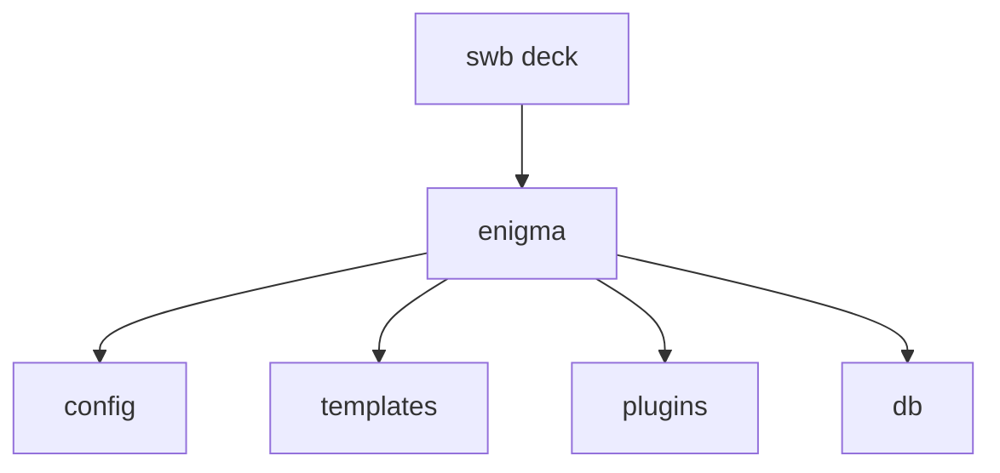
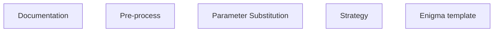
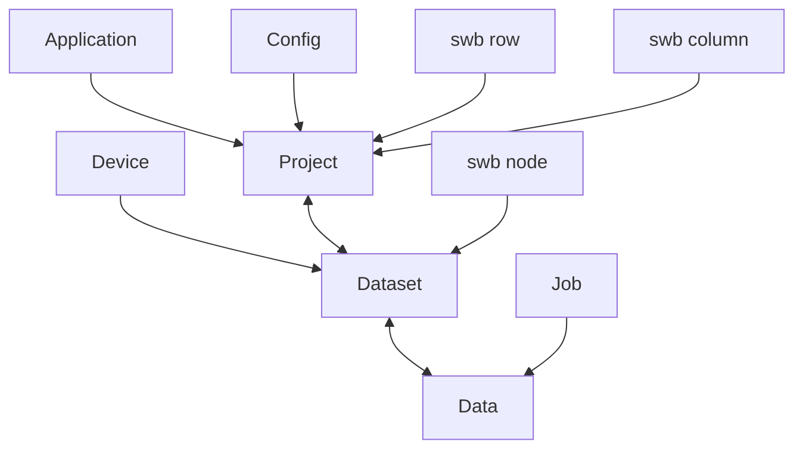
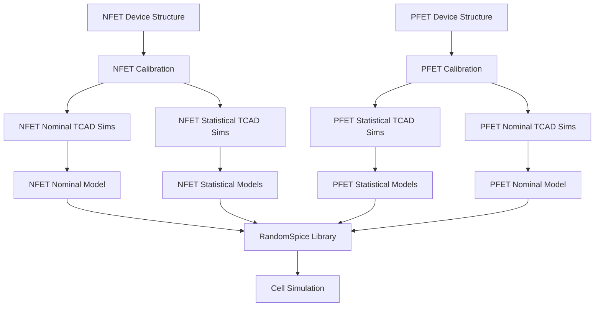
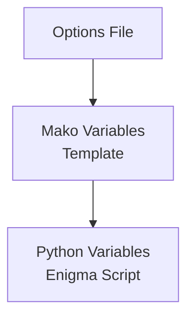
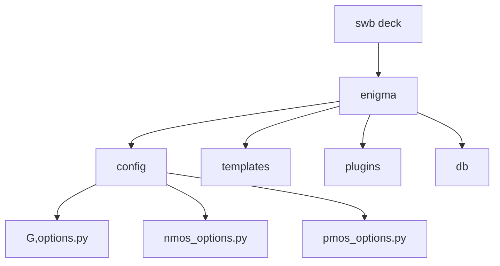
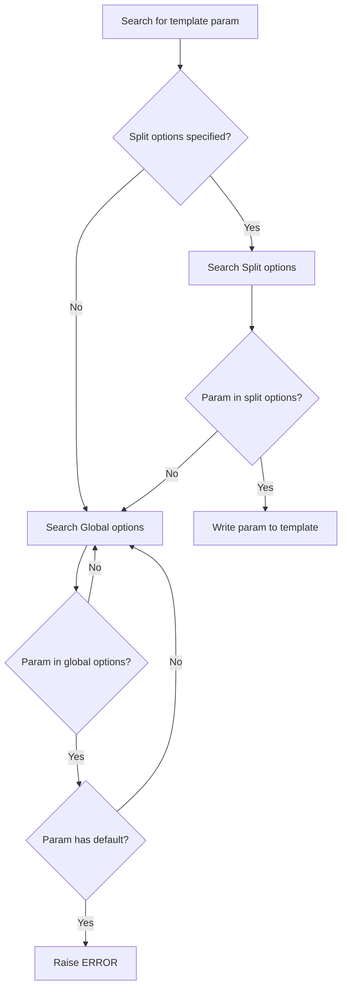
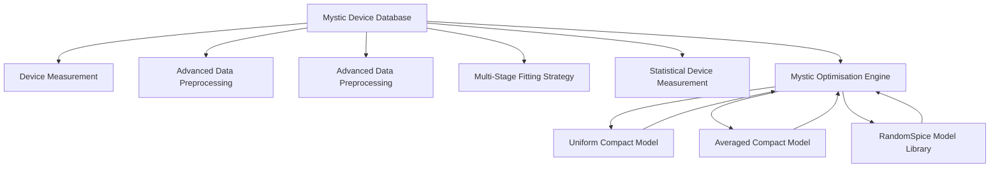

<!-- page:1 -->
# Enigma User Guide

Version O-2018.06, June 2018

# Copyright and Proprietary Information Notice

<!-- page:2 -->
© 2018 Synopsys, Inc. This Synopsys software and all associated documentation are proprietary to Synopsys, Inc. and may only be used pursuant to the terms and conditions of a written license agreement with Synopsys, Inc. All other use, reproduction, modification, or distribution of the Synopsys software or the associated documentation is strictly prohibited.

# Destination Control Statement

All technical data contained in this publication is subject to the export control laws of the United States of America. Disclosure to nationals of other countries contrary to United States law is prohibited. It is the reader’s responsibility to determine the applicable regulations and to comply with them.

# Disclaimer

SYNOPSYS, INC., AND ITS LICENSORS MAKE NO WARRANTY OF ANY KIND, EXPRESS OR IMPLIED, WITH REGARD TO THIS MATERIAL, INCLUDING, BUT NOT LIMITED TO, THE IMPLIED WARRANTIES OF MERCHANTABILITY AND FITNESS FOR A PARTICULAR PURPOSE.

# Trademarks

Synopsys and certain Synopsys product names are trademarks of Synopsys, as set forth at https://www.synopsys.com/company/legal/trademarks-brands.html. All other product or company names may be trademarks of their respective owners.

# Free and Open-Source Licensing Notices

If applicable, Free and Open-Source Software (FOSS) licensing notices are available in the product installation.

# Third-Party Links

Any links to third-party websites included in this document are for your convenience only. Synopsys does not endorse and is not responsible for such websites and their practices, including privacy practices, availability, and content.

Synopsys, Inc.

Mountain View, CA 94043

www.synopsys.com

<!-- page:3 -->
# Contents

# 1 Introduction 6

1.1 API Reference 6

# 2 Concepts 8

2.1 Enigma directory 8   
2.2 Templates 9   
2.3 Options Files 10   
2.4 Database . 12

2.4.1 Starting the database 12   
2.4.2 Stopping and deleting the database . 14   
2.4.3 Project and Dataset creation 14   
2.4.4 Copying/moving a project 14   
2.4.5 Checking the server address 15

2.5 Optimiser 15

2.5.1 Optimisation Parameters 16

2.6 The DTCO Flow 17

2.6.1 Calibration 17   
2.6.2 Garand Simulations . 20

2.6.2.1 Uniform . . . 20   
2.6.2.2 Statistical 21

2.6.3 SPICE Compact Model Extraction 21

2.6.3.1 Uniform . . . 21   
2.6.3.2 Statistical 21

2.6.4 RandomSpice Library Building 21   
2.6.5 Circuit Simulations 22

<!-- page:4 -->
# 2.7 Sentaurus Workbench Integration 22

2.7.1 Bridge Tool 22   
2.7.2 Database Nodes . 23   
2.7.3 Database Start/Stop 23   
2.7.4 Clean Database 23   
2.7.5 Dump Node Data 25

# 3 Tutorials 27

# 3.1 Running a Stand-Alone Script 27

# 3.2 Using Templates 27

3.2.1 Mako Quickstart 27   
3.2.2 Copying a Template 29   
3.2.3 Options Files 30   
3.2.4 Template Structure 35

# 3.3 Common Data Containers . 40

3.3.1 Creating and Manipulating Data 40   
3.3.2 Uploading Data 41   
3.3.3 Using Data for Optimisation 42

# 4 Example Workflows 44

# 4.1 Example Device 44

# 4.2 Calibration 44

4.2.1 Poisson Schrödinger 46   
4.2.2 Density Gradient 47   
4.2.3 Oxide Capacitance Calibration 53   
4.2.4 Mobility Model Calibration 55   
4.2.5 Garand Simulations 58

# 4.3 TCAD to SPICE Flow 62

4.3.1 Flow Step Results 65

4.3.2 Sentaurus Device 65   
4.3.3 Calibration 67   
4.3.4 Garand 70   
4.3.5 SPICE Compact Model Extraction 72   
4.3.6 Circuit Simulation 77

<!-- page:5 -->
# 5 Enigma Command Reference 79

5.1 Run Command 80   
5.2 Run\_template Command 80   
5.3 Startdb Command 81   
5.4 Stopdb Command 81   
5.5 Rmdb Command 81   
5.6 Template Command 81

5.6.1 template copy 82   
5.6.2 template ls 82

5.7 Ver Command 82

# Index 83

<!-- page:6 -->
# 1 Introduction

Enigma is the Synopsys workflow, automation and productivity framework, which delivers a powerful and flexible environment for rapid TCAD to SPICE design-technology co-optimisation (DTCO). It provides users with the capability to quickly evaluate technology changes and their impact on device and circuit performance and yield, and to automatically generate PDK quality statistical compact models based on predictive TCAD simulations. Enigma enables users to easily submit, manage and monitor very large ensembles of simulations (tens to hundreds of thousands of jobs) on computational clusters, making process exploration and variability studies straightforward to launch and process. The analysis and plotting modules in Enigma make it straightforward to analyse large amounts of data and to automatically generate report and publication-ready graphs and images. Enigma also provides an advanced optimization module that delivers fully automated calibration of Garand TCAD simulations to target data from either wafer measurements or reference device Monte Carlo simulations.

In Enigma, simulation flows are defined as Python scripts and all simulation data is captured in an integrated data management system. Simulation flows and resulting data are automatically managed by Enigma, ensuring data consistency, reliability and full reproducibility. Enigma is the optimal tool flow solution for TCAD/DTCO/PDK development by automating the steps from TCAD to SPICE circuit simulation. Through its simple and intuitive scripting interface, Enigma enables the generation of all the data required for design optimization.

Since Enigma is primarily Python-based, some familiarity with the Python language is required to use and understand Enigma. For those unfamiliar with Python, we recommend the tutorial on the Python website, and the following books:

• Programming Python by Mark Lutz   
• Dive into Python by Mark Pilgrim (Available on-line at http://www.diveintopython. net/)

# 1.1 API Reference

Since Enigma provides a toolkit for job automation and productivity, an API Reference is also included in the form of HTML documentation with the installation. These can be found in \$STROOT/tcad/O-2018.06/manuals/tcad\_spice/enigma\_api and can be opened either by running [browser\_cmd] \$STROOT/tcad/O-2018.06/manuals/tcad\_spice/enigma\_api/index.html or opening file://\$STROOT/tcad/O-2018.06/manuals/tcad\_spice/enigma\_api/index.html in your web browser.

<!-- page:8 -->
# 2 Concepts

# 2.1 Enigma directory

As Enigma normally runs within Sentaurus Workbench , it maintains a separate data directory within the Sentaurus Workbench project containing the TCAD to SPICE database, custom user-defined functions that can be imported into the Enigma environment, and any other configuration files it may need. If it does not already exist, Enigma will create this on startup. Additionally, if Enigma is run stand-alone, and not within Sentaurus Workbench, then the Enigma data directory will be created in the current working directory.

The Enigma data directory contains the following sub-directories.

config The config directory contains Enigma configuration and project options files. Note that Options files are deprecated in favour of the Sentaurus Workbench preprocessor, however they may still be used if running Enigma stand-alone. Options files are described in more detail in Section 2.3, but briefly, they contain project- and device-level configuration data and values that can be accessed through Enigma’s own preprocessor. There is a global options file named options.py, which contains values applicable across all steps of a workflow. Additionally, there can be a split or device-specific options file that, for example, contains paths to Garand or Sentaurus Device input structures, geometric information, and so on. These can be arbitrarily named, and their usage is explored in more detail in Section 3.2.

templates The templates directory contains template Enigma scripts. These are the core steps of an Enigma stand-alone workflow and are described further in Section 2.2. These templates will be processed by the Enigma preprocessor and populated using options files contained in the config directory.

plugins The plugins directory contains additional functionality used by the workflow, but not contained in the scripts. This might include helper functions that are shared across multiple workflow steps. The plugins directory enables users to add their own custom Python functions and classes that can then be imported into any Enigma execution script. Similarly to Enigma scripts, plugins are written in Python.

db The db directory contains the backend Enigma database, which is based on MongoDB.


<details>
<summary>flowchart</summary>


</details>

Figure 2.1: Layout of an Enigma data directory.

<!-- page:9 -->
# 2.2 Templates

Note: While the Enigma preprocessor is now deprecated in favour of the Sentaurus Workbench preprocessor, Enigma templates are still constructed in the same way as previously. Additionally, the Enigma preprocessor remains available for use in stand-alone mode.

Enigma provides an augmented Python environment that is used to describe the tasks being carried out in a workflow. Each step in a workflow is a script written in Python; however, it is difficult to make a fixed script generically applicable to different inputs/devices. To overcome this limitation, Enigma makes use of the Sentaurus Workbench preprocessor/Mako templating language, which makes it possible to parameterise a script and control which parts of the script are executed. Refer to the Sentaurus™Workbench User Guide for details on the Sentaurus Workbench preprocessor, and Section 3.2.1 if using the Mako preprocessor in Enigma.

Figure 2.2 shows the typical structure of an Enigma template. Normally, the first component in a template will be a documentation section, explaining the purpose of the script; which parameters are available for customisation; and which are required and which are optional. The preprocess section can be used to set up defaults for optional variables and perform validation. The parameter substitution step is not required, but is good practice as a way to map preprocessor variables into Python variables. This is explained further in Section 3.2.1. The final section of the template contains the actual strategy or steps that the template is designed to carry out. This structure is not required or enforced, however it is recommended for readability and useability.

Undoubtedly, the best way to grasp how Enigma’s templating works is by doing, therefore in Section 3.2, an example Enigma template will be built up step-by-step.


<details>
<summary>flowchart</summary>


</details>

Figure 2.2: Components of an Enigma template.

<!-- page:10 -->
# 2.3 Options Files

Note: Options files apply only if you use the Enigma preprocessor. Variable substitutions should be defined in Sentaurus Workbench when using the Sentaurus Workbench preprocessor.

In order to produce a useable script from a template file, Enigma requires information about, and values for, the parameters that have been specified in the template. These values are stored in options files. In common with most other files used by Enigma, options files are also Python files. They do however only contain variable assignments. By way of example, we show instances of both a global options files and a split/device options file. These files differ only in intent. The global options file is intended to hold configuration values that are applicable to the whole flow, or across multiple devices/splits. Conversely, the split options file should hold values that are specific to a particular device/structure.

An example global options file is shown in Listing 2.1. Here, settings for things like simulator version, queue system, supply voltages and variability parameters are specified. Listing 2.2 shows some example split options, including settings for input files and geometric information. Also note that as these are Python files, standard Python comments are supported, and values should be specified in the same way as in an Enigma or Python script.

For a particular workflow, template options files will generally be provided that can then be modified as appropriate. Additionally, when using Enigma through Sentaurus Workbench, there are several steps that automatically generate Enigma options files based on the corresponding Sentaurus Workbench parameters.

Listing 2.1: Example Enigma global options file.   
```toml
# Project name
project_prefix = "my_enigma_project"
# Garand Setup
# Garand version to use within flow
garand_version = "garand 2016.12.0"
# Cluster submission string
garand_batch_args = "-q calibration -pe openmp 4"
# Supply info
vdd_nom = 1.0 # supply voltage for the device
vdd_lin = 0.05 # Voltage for LIN simulation (usually 0.05V)
# Variability
sample_size = 200
rdd = True
ler = True
mgg = True
mgg_diam = 7
# CM extraction
spice = "hspice" 
```

Listing 2.2: Example Enigma split options file.   
```toml
# Device name
device_name = "n1"
device_type = "N"

# Input files
garand_input_file = "common/input/n1.inp"
iv_structure = "n1_garand.tdr"

# Geometric info
gate_length = 25
gate_width = 94
silicon_thickness = 1
mgg_diam = 7

# Control flag
save_data = True

# For CM extraction
initial_modelcard = "common/models/nmosinitialcard_n1" 
```

<!-- page:12 -->
# 2.4 Database

Enigma employs MongoDB for storing data and transferring data between flow stages. No specific knowledge of MongoDB is required or assumed, as Enigma manages the server process and data automatically. The data is stored in a way that maps some of the underlying database entities directly to corresponding entities in Sentaurus Workbench. This is shown in Figure 2.3. Data is grouped into projects, datasets and devices, which correspond to columns, nodes and rows in Sentaurus Workbench. An API for accessing the data contained therein is provided in Enigma. See the Enigma API Reference for a full description of this API.

# 2.4.1 Starting the database

Enigma automatically manages the database server startup, and no user intervention should be necessary. In the event of problems starting the server, the MongoDB log file can be inspected in \$DECK/enigma/db/mongod.log.


<details>
<summary>flowchart</summary>


</details>

Figure 2.3: Structure of Enigma database.

# 2.4.2 Stopping and deleting the database

<!-- page:14 -->
Normally, the database server starts when Enigma first executes a script, and then it continues to run for use by downstream stages of the deck/flow. The enigma run command accepts the flag --stopdb, which will ensure that the database server stops when Enigma exits, if this is desired. Alternatively, a running database can be shut down explicitly by running enigma stopdb or shut down and deleted by running enigma rmdb.

# 2.4.3 Project and Dataset creation

When Enigma is run through Sentaurus Workbench, it will automatically create a project for the current node number. The Sentaurus Workbench variables will be attached to the project metadata and can be used to filter the projects when querying the database in downstream stages of the tool flow. This project is then available in the Enigma environment as node\_prj.

Datasets are automatically created inside a Project upon each call to a tool within the Mystic environment. The default naming convention for these dataset is <node>-<tool\_name>-<incremental-integer>. For example the following Enigma template, run from node 1, will produce three datasets named 1-mystic-0, 1-mystic-1 and 1-mystic-2.

```txt
# stage 1 (LD)
mystic.inputfile = mystic_inputfile1
mystic.args.model = initial_modelcard
mystic()

# stage 2 (HD)
mystic.inputfile = mystic_inputfile2
mystic.args.model = None
mystic() 
```

Datasets can also named manually using the dataset argument and linked together using the previous argument, as shown below.

```txt
# stage 2 (HD)
mystic(previous=f"{node}-low-drain", dataset=f"{node}-high-drain") 
```

The tool that is being called can use these datasets to store data.

# 2.4.4 Copying/moving a project

When a Sentaurus Workbench project is moved or copied, the Enigma database will be moved or copied with it. The next time Enigma is executed, it will detect that the location of the project has changed and will start a new server process to ensure that data is not written into the database belonging to the old copy of the project.

<!-- page:15 -->
# 2.4.5 Checking the server address

If it is necessary to check where the MongoDB server is running, you can look in the file \$DECK/enigma/mongodb.conf, which lists the server hostname and port.

# 2.5 Optimiser

Enigma uses the Optimiser library for generic multi-parameter optimisation to extract optimal calibration parameters (Section 2.6.1). The Optimiser object is available in Enigma scripts with the name opt and allows access to different optimisation algorithms. These can be accessed with the use of opt.set\_method(method). Available methods are:

• TRUST\_REGION: Use Intel MKL Trust Region (TR) optimizer.   
• BOUNDED\_TRUST\_REGION: Use Intel MKL bounded TR optimizer (default).   
• scipy\_least\_squares: Use one of scipy’s least squares solvers. It can use three algorithms internally: TR (default), dogleg or Levenberg-Marquardt (unbounded only).   
• scipy\_minimize: Use one of scipy’s minimisation algorithms. Available options are: BFGS (default), TR, COBYLA, etc.

Parameters for the optimiser can be set using the opt.set\_optimisation\_parameters() method. To change the termination criteria when using TRUST\_REGION, BOUNDED\_TRUST\_REGION or scipy\_least\_squares, the following parameters can be used:

ftol Tolerance for termination by the change of the cost function (relative).

xtol Tolerance for termination by the change of the parameter (relative).

gtol Tolerance for termination by the change of the norm of the gradient of the cost function.

An API for accessing/setting the properties of the optimiser object (opt) is provided in Enigma through the Optimiser library. See the Optimiser API Reference for a full description of this API. For a complete reference of the options for each solver, please refer to their respective API documentations.

# Examples

The following examples illustrate how to change the solver and stopping criteria. To set the optimiser to the scipy implementation of TR, the command would be:

```txt
opt.set_method("scipy_least_squares") 
```

<!-- page:16 -->
To change the solver used internally by scipy from TR to Levenberg-Marquardt,

```python
opt.set_optimisation_parameters(method='lm') 
```

To set all the tolerances to 1e-3,

```python
opt.set_optimisation_parameters(ftol=1e-3, xtol=1e-3, gtol=1e-3) 
```

# 2.5.1 Optimisation Parameters

Parameters used in the optimisation process must first be set up with appropriate default values and boundaries. To set up optimisation parameters for use in Enigma, the OptParam object is provided to the user. The OptParam object has the following API:

```javascript
OptParam(name, default, minval=None, maxval=None, scale=None) 
```

# Parameters:

```txt
name Name of the model parameter, e.g. alpha.
default Default value to use for the parameter.
minval Minimum value to allow for the parameter. (maxval required if minval specified)
maxval Maximum value to allow for the parameter. (minval required if maxval specified)
scale Scaling factor for the parameter. 
```

Only the name and default value for the parameter are required. Minimum and maximum values, if given, are only applicable when using bounded optimisers. The scaling factor, if provided, is used to scale the absolute parameter values in order to improve the numerical stability of the optimisation procedure. By default a scaling factor of 1 is used, although this is not necessarily optimal when extracting parameters that have significantly different orders of magnitude.

# Examples

The following example illustrates the creation of a parameter object to represent the Yamaguchi mobility model parameter alpha for the conduction band of Silicon to be used in a Garand calibration, with a default value of 2.0, bounded between 1.0 and 3.0 and with a scaling factor of 2.

```txt
alpha = OptParam("MATERIAL Silicon.conduction.Yamaguchi.alpha", 2.0, 1.0, 3.0, 2.0) 
```

<!-- page:17 -->
More details on the input statement syntax for Garand can be found in the Garand manual.

# 2.6 The DTCO Flow

Enigma provides a platform to run a DTCO simulation flow. This section explains the general structure of a DTCO flow and how Enigma drives the execution and data management therein. Figure 2.4 shows the basic outline of the TCAD to SPICE flow.

# 2.6.1 Calibration

The first step in most Enigma workflows is a calibration step. This allows a baseline to be established with respect to: measurement, target specification or predictive simulation. Enigma enables “automated” calibration through three key features:

• Flexible scripting Python interface which allows for iterative calibration strategies with control logic and fitting to derived properties.   
• Backend application execution, scheduling and post-processing support.   
• Simple generic parameter substitution support, which enables Enigma to effectively manipulate input files without requiring complicated and highly specific input file parsers.

Enigma uses the Optimiser library for generic multi-parameter calibration. Additionally, Enigma can submit simulations in parallel with the parameters sampled in a DoE fashion to explore the parameter space. You can either use the parameter values to build a response surface optimisation, keeping only the best value found or you can use the best value as the initial condition for an optimisation. Both the optimiser-based calibration, and the response surface-based calibration flows are shown in Figure 2.5. The figure shows how Enigma can manipulate the parameterised app input files, schedule cluster-based jobs and post process output to find the optimal solution for a given problem.

It is important to note that the calibration strategy is a critical component in this process, which requires a good understanding of both the problem at hand, and the effectiveness of the chosen parameters. The following sections will cover some basic calibration examples required for a physically-based electrical calibration of drift-diffusion TCAD simulators like Garand and Sentaurus Device.

The following section outlines some basic calibration applications which are part of the standard Enigma DTCO flow. The main focus is on calibrating drift-diffusion simulations (DD) to external target data.


<details>
<summary>flowchart</summary>


</details>

Figure 2.4: Enigma DTCO Flow


<details>
<summary>flowchart</summary>

```mermaid
graph TD
    A["Target Data"] --> B["Calibration Strategy"]
    B --> C["Enigma"]
    C --> D["DB"]
    E["Model Parameters"] --> B
    F["Cluster Jobs"] --> C
    G["Fitted Data and Parameters"] --> C
    H["AutoCalibration"] --> C
    I["Nanowire"] --> B
    J["V(gate) [V"]] --> B
    K["V(gate) [V"]] --> B
    L["V(gate) [V"]] --> C
    M["V(gate) [V"]] --> C
    N["V(gate) [V"]] --> C
    O["V(gate) [V"]] --> C
```
</details>

Figure 2.5: The flow for an optimizer-based calibration.

<!-- page:20 -->
This target data may be generated by predictive advanced transport TCAD simulations or come from wafer/material measurements. The example will generally refer to Garand models used in the DTCO flow, however, the same capability is available for Sentaurus Device calibrations. The steps shown below form an electrical calibration flow, which comprehensively characterises the physical models in a DD simulator. Each stage is calibrated to trusted target data and is specifically sequenced in a manner to build up the accuracy of the underlying physical models. It is not recommended to run the stages out-of-order as this can lead to un-physical and inconsistent results.

A detailed example of a calibration workflow is given in Section 4.2.

# 2.6.2 Garand Simulations

Garand simulation is mainly utilised for predictive variability modelling using the ‘atomistic’ variability approach described in detail in the Garand manual. The different variability modules, sweep types, biases and reliabilty (BTI) parameters are set up either in the global options file (if the variability parameters are the same across nMOS and pMOS devices in the deck) or split options files, which are device specific. For more information on the options files see 2.3.

Enigma can manipulate the template Garand input file provided for many purposes. All Garand simulations (including the ones in the calibration stages outlined in 2.6.1) are scheduled to the job management system by Enigma.

# 2.6.2.1 Uniform

Although Garand uniform data is not used directly for SPICE compact model extraction in the DTCO flow (by default Sentaurus Device data is directly utilised), the data generated in this stage can be used to verify the calibration stages are correctly completed and match the target data supplied. This stage also showcases the methodology for running many different Garand sweep types, bias conditions and temperature conditions simultaneously, launching:

• $I _ { D } V _ { G }$ at multiple drain biases (and optionally multiple temperatures).   
• $I _ { D } V _ { D }$ at multiple gate biases (and optionally multiple temperatures).   
• CGGVG at multiple drain biases (and optionally multiple temperatures).

As there is no interdependency in these jobs, the full set of data above can be simulated simultaneously within the length of time of the longest single simulation from the set. All simulation data is stored in the DB backend for easy cataloging and referencing. Default plots are also generated as PNG files, as well as ’.plt’ files which can be visualised using Sentaurus Visual.

<!-- page:21 -->
# 2.6.2.2 Statistical

Statistical $I _ { D } V _ { G }$ data is generated by Garand for the purpose of device variability analysis and statistical SPICE compact model extraction. Full 3D ‘atomistic’ device simulations are performed - with the number of simulated devices controlled by the global options file. Each device instance forms an entry in a cluster array job. These array jobs are launched and monitored by Enigma.

All simulation data is stored in the DB backend for easy cataloging and referencing.

# 2.6.3 SPICE Compact Model Extraction

Compact model extraction is performed by the tool Mystic. Enigma is utilised to populate the Mystic extraction strategy with device specific information. This enables the propagation of physical information from the TCAD input file directly to the initial SPICE model card or calibration strategy. This is a critical component in enabling the use of a single extraction strategy across a very wide range of device splits and technologies.

For more information on SPICE compact model extraction using Mystic, see the Mystic User Guide.

# 2.6.3.1 Uniform

Uniform SPICE model extraction is usually split into multiple stages with individual Mystic strategy files to build up uniform compact model fits gradually in a modular way - with each subsequent step adding to the effects modelled. This is due to the fact that many effects can be separated relatively well in a SPICE model.

# 2.6.3.2 Statistical

For statistical SPICE model extraction, a subset of the SPICE model parameters is chosen and reextracted. The result of the statistical extraction is a set of correlated statistical SPICE model parameters that encapsulate the local “statistical” variability present in the TCAD simulations for each device. These parameters are saved in the database and used in the RandomSpice library creation process described in section 2.6.4.

# 2.6.4 RandomSpice Library Building

Multiple splits can be combined together in a single RandomSpice model library. This library can be used to build response surface models (RSM) that enable SPICE simulations to be run off the TCAD design-of-experiement (DoE) grid - within the extremes of this DoE. The RandomSpice library creation can be considered as the deliverable of the DTCO flow as this represents the SPICE model component of the pre-wafer PDK as it can be used for many different circuit applications.


<details>
<summary>text_image</summary>

BRIDGE
bridge
Edit Input
Clean and Synchronize With Parent Project
Synchronize With Parent Project
Open Parent Project
Open Parent Project in New SWB Instance
Preprocess
Freeze Rows/Columns
Unfreeze Rows/Columns
Hide
Show
Lock
Unlock
25
[h10]: 0.04
[h12]: 0.008
25
[h11]: 0.04
[h13]: 0.008
</details>

Figure 2.6: Open parent project from bridge tool.

<!-- page:22 -->
# 2.6.5 Circuit Simulations

SPICE circuit simulations are performed with RandomSpice and HSPICE. Enigma’s scripting capabilities can be utilised to programmatically produce multiple variants of test bench circuits - for example - the ring-oscillator (RO) example has a dummy capacitive load component at each stage and a number of fins in each inverter. Both of these quantities are parameterised and exposed on an Enigma level, as a result, an array of RandomSpice circuit simulations can be launched simultaneously. For further information on RandomSpice, see the RandomSpice User Guide.

# 2.7 Sentaurus Workbench Integration

TCAD to SPICE provides improved integration with Sentaurus Workbench. For example, the Bridge tool provides access to the parent project directly from a child project, and controls have been added to the Sentaurus Workbench GUI to make it easier to control the TCAD to SPICE database.

# 2.7.1 Bridge Tool

The Bridge tool provides options to open the corresponding parent project in either the current Sentaurus Workbench instance or in a new instance. These options are available by right-clicking the tool icon as shown in Figure 2.6.

<!-- page:23 -->
# 2.7.2 Database Nodes

Sentaurus Workbench nodes are directly represented in the TCAD to SPICE database, so that all data generated by a single node can be grouped together and referenced from any other node in the project. A snapshot of the current Sentaurus Workbench parameters is also attached to the node data in the database to assist querying the database. All Enigma commands that are run from Sentaurus Workbench receive the current node as an argument and automatically set up the appropriate database objects and attach them to Enigma’s application wrappers, so it is no longer necessary to do this manually in an Enigma script. Note that when running a node script manually on the command line, the node number must also be included on the command line. For example:

```txt
$ enigma --node 27 run n27_eng.py --scheduler sge --submitcmd "qsub -cwd -V
→ -notify -q all.q" 
```

The current project is also accessible in an Enigma script using the node\_prj variable. This can be used, for example, to attach your own metadata to the current node:

```txt
node_prj.add_metadata(doe=doe, midpoint=midpoint) 
```

Node-based representation also makes it easy to clean or save data for a particular node in the database.

# 2.7.3 Database Start/Stop

Sentaurus Workbench automatically manages starting up and closing the Enigma database. When launching jobs in a TCAD to SPICE project, Sentaurus Workbench starts the project database before any jobs are submitted and automatically closes it after all running jobs are complete. In addition, all Enigma-based tools in Sentaurus Workbench now provide options to start and stop the database manually. Note that if running jobs are detected, you are prompted to confirm if you wish to force the database to close, as this will cause running jobs to lose their database connection. Figure 2.7 shows the options available by right-clicking a tool icon.

# 2.7.4 Clean Database

During typical project cleanup in Sentaurus Workbench, the Enigma database is also cleaned up as appropriate. For example, when cleaning up an individual node, the data associated with that node in the database is also cleared. This is also done if multiple nodes are selected and cleared. This can be achieved by right-clicking the tool icon and choosing Clean Up Node Output (see Figure 2.8), or by pressing the Delete key. Additionally, when the whole project is cleaned up using the shortcut menu (see Figure 2.9), the whole Enigma database is also cleared.


<details>
<summary>text_image</summary>

Add... Ins
Delete Del
Properties...
Cut Ctrl+X
Copy Ctrl+C
Paste Ctrl+V
Paste Special... Ctrl+M
Edit Input
Start Project Database
Stop Project Database
Preprocess
Freeze Rows/Columns
Unfreeze Rows/Columns
Hide
Show
Lock
Unlock
</details>

Figure 2.7: Start/stop database from Enigma tools.


<details>
<summary>text_image</summary>

Select
Extend Selection To
Copy	Ctrl+C
Paste	Ctrl+V
Edit Value	F6
Edit Properties...
Modify Multiple Parameter Values...
Set Variable Value...
Preprocess
Run...	Ctrl+R
Quick Run...
Abort	Ctrl+T
Visualize
Quick Visualize
Node Explorer	F7
Dump Project Database
Clean Up Node Output...	Del
Configuration
</details>

Figure 2.8: Clean up node output using node shortcut menu.


<details>
<summary>text_image</summary>

Open
Folder
Cut
Copy
Paste
Delete
Rename
Project
Refresh
Preprocess
Preprocess Tcl Blocks
Run...
Abort
Project Summary
Clean Up...
Reset Status
View Log
View History
Export...
Documentation...
Runtime Editing Mode
</details>

Figure 2.9: Clean up using project shortcut menu.

<!-- page:25 -->
# 2.7.5 Dump Node Data

Node data can be saved to a CSV file by right-clicking a node and choosing Dump Project Database (see Figure 2.10) or by clicking Create Node Dump File in the Node Explorer. When you choose Dump Project Database, the Dump Options dialog box opens with options that allow some control over the output format of the data (see Figure 2.11). First, the data can be output in a wide or tall format, meaning that lists of data contained in the database are output across columns or rows, respectively. By default, both data and metadata for each node are included. However, these can be excluded by clearing the relevant check boxes. When you click OK, a file named n@node@\_eng.csv is created for each node selected. These files can be opened in any spreadsheet program, such as Microsoft Excel. These same options are available in the Node Explorer window (see Figure 2.12) and have exactly the same functions.


<details>
<summary>text_image</summary>

Select
Extend Selection To
Copy	Ctrl+C
Paste	Ctrl+V
Edit Value	F6
Edit Properties...
Modify Multiple Parameter Values...
Set Variable Value...
Preprocess
Run...	Ctrl+R
Quick Run...
Abort	Ctrl+T
Visualize
Quick Visualize
Node Explorer	F7
Dump Project Database
Hot Output...	Ctrl+W
Clean Up Node Output...	Del
Configuration
</details>

Figure 2.10: Dump node data using node shortcut menu.


<details>
<summary>text_image</summary>

Dump Options
Format:  Wide  Tall
Include Data to Dump
Include Metadata to Dump
OK  Cancel
</details>

Figure 2.11: Dump node format options.


<details>
<summary>text_image</summary>

Dump Enigma Database Content For Node
Format:  ● Wide  ○ Tall
✓ Include Data to Dump
✓ Include Metadata to Dump
Create Node Dump File
</details>

Figure 2.12: Dump node data using Node Explorer.

<!-- page:27 -->
# 3 Tutorials

# 3.1 Running a Stand-Alone Script

While one of the keys to the flexibility of Enigma is its templating system, there is no requirement to use this. Instead, a stand-alone Enigma script can be written and executed directly, as if Enigma were simply a Python interpreter, with a toolkit for interacting with the external tools that form part of the Synopsys TCAD suite. A full description of the API that can be used in Enigma scripts can be found in the Enigma API reference. To execute a script using the Enigma directly, simply use the run command as shown below.

```txt
$ enigma run my_script.py 
```

# 3.2 Using Templates

Note: Enigma templates have been deprecated in favour of the Sentaurus Workbench preprocessor, however the Enigma preprocessor remains available for stand-alone use.

As described in Section 2.2, templates are simply Enigma scripts that have been parameterised to make them more generally applicable. Enigma will populate a template with values specified either in your project options or on the command line to produce a script that can then be executed by Enigma. Enigma uses the Mako templating language to parameterise its scripts. No specific knowledge of Mako or templating languages is assumed, and Enigma makes use of only a small subset of Mako functionality, however you can refer to http://www.makotemplates.org/ for more in-depth information.

This section will demonstrate the structure of a template file, and how it can be used in the wider context of a DTCO flow, or otherwise. An overview of the general structure of a template can be seen in Figure 2.2 in Section 2.2.

# 3.2.1 Mako Quickstart

An Enigma template is no different than a stand-alone script described above, except that some of the variables have been replaced with placeholders. For example, in an Enigma template that runs an $I _ { D } V _ { G }$ curve, we might substitute fixed values of drain and substrate bias for a Mako variable. In the code snippet below, Garand is called to run a simulation with $V _ { D } = 0 . 0 5 V$ and $V _ { B } = 0 . 0 V$ .


<details>
<summary>flowchart</summary>


</details>

Figure 3.1: Illustration of Mako and Enigma variables.

```lua
garand({"bias drain":0.05, "bias substrate":0.0}) 
```

<!-- page:28 -->
This can be turned into a parameterised version as follows:

```txt
garand({"bias drain":${vd}, "bias substrate":${vb}}) 
```

A Mako variable looks like this: \${name}. This can be used anywhere in the Enigma script, and it will be substituted at the time that the template is copied by Enigma. The name inside the curly brackets must correspond to a variable that is supplied in an Enigma options file, or on the command line when the template is copied. Some examples to illustrate this will be given in Section 3.2.4.

So that it’s clear where a variable has been substituted, it is good practice to assign a Mako variable to a Python variable near the top of the script. For example, a better way to write the snippet above is as follows:

```javascript
vd = ${vd}
vb = ${vb}
garand({"bias drain":vd, "bias substrate":vb}) 
```

This makes it clear which variables and what values have been assigned in the script and provides a single location where they can be verified or edited.

It is important to remember that Mako variables only exist at the point where an Enigma template is being copied (see Figure 3.1 for a visual representation of this).

<table><tr><td>Option</td><td>Description</td></tr><tr><td>-t</td><td>Location of template directory</td></tr><tr><td>-o</td><td>Location of output script</td></tr><tr><td>-a</td><td>Override a template variable</td></tr><tr><td>-p</td><td>Location of an additional options file</td></tr></table>

Table 3.1: List of command line flags for enigma template copy.

<!-- page:29 -->
# 3.2.2 Copying a Template

Copying a template will prepare it for use by combining it with the Enigma options file(s). This can be achieved by running enigma template copy. The command takes a single mandatory argument, the name of the template to copy. In addition the command line flags shown in Table 3.1 can be used to override the default behaviour of the command.

Normally, Enigma will search several locations for both the templates and options files. For templates, the following locations will be searched, in order:

1. \$PROJECT\_DIR/enigma/templates   
2. ./templates   
3. \~/.enigma/templates   
4. \$ENIGMA\_ROOT/templates

If the -t flag is supplied on the command line, this directory will be searched before any others. In most cases, the templates will be stored in \$PROJECT\_DIR/enigma/templates.

When searching for options files used to populate the given template, Enigma will search the following directories:

1. \$PROJECT\_DIR/enigma/users/\$USERNAME/options.py   
2. \$PROJECT\_DIR/enigma/config/options.py

Similarly to the template search path, any file specified on the common line using the -p flag will be used before those listed above. Note however, that any parameter value specified using the -a flag will take precedence over any other options file.

When using the -a flag to override a parameter value, use the following syntax:

```txt
$ enigma template copy my_template -a variable value 
```

<!-- page:30 -->
Note that multiple parameter overrides can be specified in this way:

```shell
$ enigma template copy my_template -a var1 val1 -a var2 val2 -a var3 val3 
```

# 3.2.3 Options Files

As described above, Enigma searches in several locations for options files that are used to populate templates with parameters specific to your project. In the context of the TCAD to SPICE DTCO flow, options files are split into two types; global options and split-specific options. The global options file should contain parameters that are applicable across multiple steps of a flow, or to the project as a whole. This might include things like the statistical ensemble size, the supply voltage, and the simulator version.

The split-specific options file should contain parameters that are applicable only to a particular device/structure in the flow. This includes geometric information and paths to structure files. Normally all options files are placed in the project config directory. This ensures that they are available to all users of a project, while still allowing them to be locally overridden by a user if necessary. The basic structure of the config directory is shown in Figure 3.2.


<details>
<summary>flowchart</summary>


</details>

Figure 3.2: Enigma config directory structure.

This example directory would correspond to a project that contains one N- and one P-type device. For each device split added to a project, a split options file must also be added. An example global options file is shown below. Note that this file contains options that apply across the entire TCAD to SPICE workflow.

```toml
###
# Project Setup
# Prefix for different stages in the flow
project prefix = "DTCO-Project"

###
# Garand Setup

save_output = True

###
# Device Orientation
chan_direction = 'x'
vert_direction = 'z'
horiz_direction = 'y'
planar = False

###
# Device sweep specifics
ivt = 1e-7
vdd_nom = 1.0
vdd_lin = 0.05
vg_init = 0.0
idvg_step = 0.1
idvd_step = 0.05
idvg_temps = [300]
idvd_vgs = [0.4,0.6,0.8,1.0]
add_cgg = True
default_temp = 300
upload_temp = 300
units = 'nm'

###
# Plotting config
iv_loglin = True

###
# Variability parameters
disable_stat_lib = False
sample_size = 100
start_num = 1
rdd = True
ler = True 
```

```python
ler_params = [
    {"z":0.0, "dir":"y", "rms":0.667, "corr":25.0},
    {"y":0.0, "dir":"z", "rms":0.333, "corr":40.0},
]
mgg = True
mgg_diam = 7

itc = False
itc_material = "SiliconDioxide"
itc_densities = ["1e12"]

#########
# CM extraction
spice = "hspice"
spice_args = ""
mystic_verbose = False

#########
# Circuit simulation
circuit_sample_size = 100
circuit_start_num = 1
rs_batch_args = ""
spice_init_arg = ""
batch_sys = 'sge'
spice_temp = 27

#########
# Ring Oscillator
ro_vdds = [0.72,0.8,0.88]
ro_couts = ['0.1f', '0.5f']
ro_nfins = [2]

# SNM + WNM
sram_vddcs = [0.5,0.6,0.7,0.8] 
```

<!-- page:32 -->
Parameters stored in the global options file are available to populate a template during any template copy stage. Split-specific options files are slightly different, in that they are not detected automatically, and must be specified directly on the command line during the template copy stage using the -p flag, as described in Section 3.2.2, as follows:

```erb
$ enigma template copy <template_name> -p <split_options_file> 
```

Split options files take priority over global options, i.e if the same parameter is specified in both global and split options, the value in the split options file will be written to the template. An example split options file is shown below.

```python
#########
# Device parameters
device_name = "NMOS"
device_type = "N"

#########
# Input files
garand_input_file = "nmos.inp"
garand_chn_input_file = "nmos_chn.inp"
iv_structure = "nmos.vtk"
save_data = True

#########
# Device dimensions
gate_length = 100
hfin = 20
tfin = 10
gate_width = 1000
target_gate_width = 1000

upload_data = None
upload_data_stat = None 
```  
Figure 3.3 shows the search process that happens inside Enigma for each parameter found in the template. The template will only be written to file when all parameter values have been propagated successfully. If a particular value is not found in any options file, Enigma will raise an exception, indicating the name of the missing parameter.


<details>
<summary>flowchart</summary>


</details>

Figure 3.3: Template parameter population call chart.

<!-- page:35 -->
# 3.2.4 Template Structure

To illustrate the general structure of a template, we take an example used for uniform device simulation using Garand. The template can be divided into four distinct sections. The first, the docstring, is purely for user friendliness and has no functional purpose. It outlines the option file parameters that are required for the template to run, along with optional parameters that can be supplied to the template. If optional parameters are not specified directly, they are set up with sensible defaults.

The next section of the template is the Mako execution section. Everything contained inside the <% .. %> marks is executed during the enigma template copy phase. This section is used mainly for initialising values of the optional parameters using context.get().

```python
<%
import os

def numPoints(start, end, step):
    """
    Return the number of points in an voltage sweep between 'start'
    and 'end' with increment 'step'

    :param start: float - Start of voltage sweep
    :param end: float - End of voltage sweep
    :param step: float - Voltage step size
    :return: int - number of voltage points
    """
    points=0

    if end<start:
    raise ValueError("Voltage sweep end '{0}' is less than the start \
    '{1}'".format(end, start))
    if step<0:
    raise ValueError("Voltage sweep step size '{0}' is less than zero".
    → format(step))
    try:
    points=int(round((end-start)/step)) + 1
    except ZeroDivisionError, e:
    print(e.args)

    return points

# User control flags.
garand_batch_args = context.get("garand_batch_args", ")

default_temp = context.get("default_temp", 300)
idvg_temps = flatlist(context.get("idvg_temps", [default_temp])) 
```

```txt
vdd_nom = context.get("vdd_nom", 1.0)
vdd_lin = context.get("vdd_lin", 0.05)
vdd_cgg = context.get("vdd_cgg", 0.01)
idvg_vds = flatlist(context.get("idvg_vds", [vdd_lin, vdd_nom]))
vb_nom = context.get("vb", 0.0)
vb_points = context.get("vb_points", 5)
idvg_vbs = context.get("idvg_vbs", None)
idvg_start = context.get("idvg_start", -0.2)
idvg_end = context.get("idvg_end", vdd_nom + 0.2)
idvg_step_unif = context.get("idvg_step_unif", 0.05)
idvd_vgs = flatlist(context.get("idvd_vgs", [0.4, 0.5, 0.6, 0.7, 0.8]))
idvd_start = context.get("idvd_start", vdd_lin)
idvd_end = context.get("idvd_end", vdd_nom + 0.2)
idvd_step = context.get("idvd_step", 0.05)
add_cgg = context.get("add_cgg", False)
cgg_start = context.get("cgg_start", -0.5)
cgg_end = context.get("cgg_end", vdd_nom + 0.5)
cgg_step = context.get("cgg_step", 0.05)
save_output = context.get("save_output", False)
save vtk = context.get("save vtk", False)
units = context.get("units", 'um')
%> 
```

<!-- page:36 -->
The third and fourth parts of the template form the execution script created from the template. The third section is comprised of parameter definitions and is also executed during the template copy stage.

```shell
import numpy as np
#---- PARAMETRISATION FROM GLOBAL AND SPLIT OPTIONS, OR DEFAULTS ----
# Garand execution parameters
garand_version = "${garand_version}"
garand_input_file = "${os.path.abspath(garand_input_file)}"
iv_structure = "${os.path.abspath(iv_structure)}"
units = "${units}"
# Device split parameters
device_name = "${device_name}"
gate_length = ${gate_length}
gate_width = ${gate_width}
# Enigma project parameters
garand_batch_args = '${garand_batch_args}'
# Simulation parameters
default_temp = ${default_temp} 
```

```txt
idvg_temps = ${idvg_temps}

# Bias parameters
vdd_nom = ${vdd_nom}
vdd_lin = ${vdd_lin}

# Id(Vg) parameters
idvg_vds = ${idvg_vds}
vb_points = int(${vb_points})
vb_nom = ${vb_nom}
idvg_vbs = ${idvg_vbs}
idvg_start = ${idvg_start}
idvg_end = ${idvg_end}
idvg_step_unif = ${idvg_step_unif}

# Id(Vd) parameters
idvd_vgs = ${idvd_vgs}
idvd_start = ${idvd_start}
idvd_end = ${idvd_end}
idvd_step = ${idvd_step}

# Cgg(Vg) parameters
add_cgg = ${add_cgg}
vdd_cgg = ${vdd_cgg}
cgg_start = ${cgg_start}
cgg_end = ${cgg_end}
cgg_step = ${cgg_step}

# Output parameters
save_output = ${save_output}
save vtk = ${save vtk}

# Set Enigma project and output label for this stage of the flow
enigmaProjectName = device_name + "-garand-uniform"
garandOutputName = enigmaProjectName
garandExptName = enigmaProjectName
outdir = os.path.join(userdir, "output", garandOutputName)

# Determine number of points in voltage sweeps
idvg_points = ${numPoints(idvg_start,idvg_end,idvg_step_unif)}
idvd_points = ${numPoints(idvd_start,idvd_end,idvd_step)}
cgg_points = ${numPoints(cgg_start, cgg_end, cgg_step)} 
```

<!-- page:37 -->
Variable names inside the \${...} symbol are processed during the template copy to produce actual values for the parameters in the execution script. For example; for a device called “Dev1”, with a gate

length of 100 nm and a width of 200 nm:   
```hcl
device_name = "${device_name}"
gate_length = ${gate_length}
gate_width = ${gate_width} 
```

Would become:   
```toml
device_name = "Dev1"
gate_length = 100
gate_width = 200 
```

<!-- page:38 -->
The final section of the template contains the actual execution script. Using all the parameters propagated and initialised during the template copy stage, the script can be run directly, as shown in Section 3.1, and will run a set of Garand uniform simulations that could be used for compact model extraction.

```python
# ---- ENIGMA EXECUTION SCRIPT ----
# Set Enigma's Garand application parameters
garand.app = garand_version
garand.inputfile = file(garand_input_file)
garand.dev = device_name
garand.batch_args = garand_batch_args
garand.project = enigmaProjectName
garand.wait = False
garand.clear_data = True

# Setup the Garand input decks
garand.inputfile["STRUCTURE IMPORT"] = \
    "filename={0} units={1}".format(iv_structure, units)
garand.inputfile["STRUCTURE gate_length"] = gate_length
garand.inputfile["STRUCTURE current_width"] = gate_width

# Set Garand output parameters if required
if save_output:
    garand.inputfile["OUTPUT directory"] = outdir
    garand.inputfile["OUTPUT experiment"] = garandExptName
# GARAND simulation for IdVg curves. Vd=[Vdlin, Vdsat], Vg=[0, ..., Vdd]
idvg_datasets = dict()
garand.inputfile["SIMULATION sim_type"] = "IdVg"

# Set up a list of sensible substrate biases if not provided
if idvg_vbs is not None:
    idvg_vbs = np.unique(flatlist(idvg_vbs)+[vb_nom])
else:
    idvg_vbs = np.linspace(-vdd_nom, 0, vb_points) + vb_nom 
```

```python
for temp in idvg_temps:
    garand.inputfile["SIMULATION T"] = temp
    idvg_datasets[temp] = list()
    # Loop over all the back biases specified in the 'idvg_vbs' list.
    for vb in idvg_vbs:
    # Loop over all the drain voltages specified in the 'idvg_vds'
    # list.
    for vd in idvg_vds:
    ids = garand({"bias drain": vd, "bias substrate": vb,
    "bias gate": idvg_start, "bias delta":
    $\rightarrow$ idvg_step_unif,
    "bias ivpoints": idvg_points})
    idvg_datasets[temp].extend(ids)
# GARAND simulation for IdVd curves Vd=[Vdlin,...,Vdsat]
idvd_datasets = list()
garand.inputfile["SIMULATION sim_type"] = "IdVd"
garand.inputfile["SIMULATION T"] = default_temp

# Loop over all the gate voltages specified in the 'idvd_vgs' list.
for vg in idvd_vgs:
    ids = garand({"bias drain": idvd_start, "bias substrate": vb_nom,
    "bias gate": vg, "bias delta": idvd_step,
    "bias ivpoints": idvd_points})
    idvd_datasets.extend(ids)
# GARAND simulations for Cgg(Vg) curve
cgg_datasets=list()
if add_cgg:
    garand.inputfile["SIMULATION sim_type"] = "IdVg"
    garand.inputfile["SIMULATION T"] = default_temp
    garand.inputfile["SIMULATION capacitance"] = "gate"

    ids = garand({"bias drain": vdd_cgg, "bias substrate": vb_nom,
    "bias gate": cgg_start, "bias delta": cgg_step,
    "bias ivpoints": cgg_points})
    cgg_datasets.extend(ids)

json.dump([idvg_datasets, idvd_datasets, cgg_datasets],
    file(os.path.join(userdir,"data", "{0}.dat".format(
    $\rightarrow$ enigmaProjectName)), "w"))
garand.Wait() 
```

<!-- page:39 -->
Briefly, in the script above, the Garand object is first initialised with all the necessary attributes, such as application, input file and device name. Note that if any of the required attributes are missing, Enigma will produce an error message to that effect and the simulations will not run. Refer to the Enigma API Reference for full details of the interface to Garand.

<!-- page:40 -->
Additional input file overrides are then specified, which set up the path to the device structure file, the geometry of the structure, the output directory, and so on. Simulations are then carried out by looping over some of the variables supplied by the user. In this case, multiple temperatures, substrate biases and drain biases for $I _ { D } V _ { G }$ , multiple gate voltages for $I _ { D } V _ { D }$ , and an additional CV simulation is carried out if the add\_cgg option has been set to True.

Finally, information about the simulated datasets is saved to disc for use by downstream stages, e.g. plotting.

# 3.3 Common Data Containers

Enigma provides a flexible data class to represent simulation data in the extraction environment. They allow you to read in data from measurement or TCAD simulations, attach relevant metadata, manipulate it, and upload it to the Enigma database. This section outlines some of the common usage cases for the data containers in the TCAD to SPICE tool flows. For a detailed description of the common data containers please refer to the Enigma API Reference.

# 3.3.1 Creating and Manipulating Data

There are three main ways to create Data objects in the Enigma environment. From plt files (from\_plt), from csv files (from\_csv) and from the Enigma database (from\_db). Once in the environment, the Data object has an extensive API that allows you to manipulate the data and perform operations such as resampling and figure of merit calculation. The following example shows how to load low drain IdVg data from a Sentaurus Device plt file using the Data class, re-sample it with a uniform bias step and calculate the threshold voltage:

```python
ivdg_ld = Data.from_plt(plt, ivar="vgate", dvar="idrain", metadata={"bias":{"drain":0.05}})
print(idvg_ld)
bias : {'drain': 0.05}
    idrain
vgate
0.000000e+00 -1.983936e-09
-8.000000e-03 -2.512493e-09
-1.796800e-02 -3.371616e-09
-3.147796e-02 -5.019592e-09
    .
    .
    .
-7.440000e-01 -2.555683e-05 
```

```csv
-7.680000e-01 -2.629463e-05
-7.920000e-01 -2.698437e-05
-8.000000e-01 -2.720425e-05 
```

<!-- page:41 -->
Data objects can also be pushed into a pre-created dataset within the Enigma database using the to\_db method as shown in the following example:

```python
ds = dbi.create_dataset(node_prj, "iv_data", clean=True)
idvg_ld.to_db(ds) 
```

# 3.3.2 Uploading Data

Uploading data to the Enigma database allows you to use the data at downstream stages of the tool flow without having to reattach the metadata dictionary. This help prevent against data integrity mistakes and ensures consistency of the data throughout the flow. It also make the data available to other tools such as the Synopsys compact model extraction tool Mystic. There are two different ways of uploading the Data. The to\_db method pushes to a pre-created dataset from an existing object, while the upload\_ds flag of the from\_plt and from\_csv methods allows you to push to a dataset directly during initialisation. An example of this is show below.

```python
# Create a dataset to store the data in
ds = dbi.create_dataset(node_prj, "iv_data", clean=True)

# Create a dictionary of metadata
metadata = {"temperature": 300.0,
    "instances": {"l":25e-9,"rsc":100.0,"rdc":100.0},
    "nodes": ["drain","gate","source","substrate"]}}

# Create a list of plts to upload
iv_data = [<tcad-project-path>/IdVg_0_des.plt,
    <tcad-project-path>/IdVg_1_des.plt,
    <tcad-project-path>/IdVd_0_des.plt,
    <tcad-project-path>/IdVd_1_des.plt,
    <tcad-project-path>/IdVd_2_des.plt]

# Load the data in from the plt files and upload it to the database
Data.from_plt(iv_data, metadata=metadata, upload_ds=ds) 
```

After the data has been uploaded it can be loaded back in at any point in the Enigma tool flow using the dataset name and the from\_db method.

```txt
# Load only the low drain IdVg data 
```

```python
idvgld = Data.from_db("iv_data", ivar="vgate", dvar="idrain", bias_drain
    → =0.05)
# Load only the high drain IdVg data
idvghd = Data.from_db("iv_data", ivar="vgate", dvar="idrain", bias_drain
    → =0.8)
# Load all of the IdVd data
idvd = Data.from_db("iv_data", ivar="vdrain", dvar="idrain") 
```

<!-- page:42 -->
# 3.3.3 Using Data for Optimisation

In the TCAD to SPICE tool flow the data containers are used to store target data for optimisation. When used for this purpose they provide an extra column that is updated with fit values by the optimiser and perform automatic error calculation between the target and fit values. The example below show an Enigma using the data containers to facilitate a mobility calibration of Garand to Sentaurus device target data.

```python
ivld = Data.from_db("iv_data", ivar="vgate", dvar="idrain", bias_drain= vdd_lin) [0]
ivhd = Data.from_db("iv_data", ivar="vgate", dvar="idrain", bias_drain= vdd_nom) [0]

ivld.sort_index(inplace=True)
ivhd.sort_index(inplace=True)

# Calculate threshold voltage
vtg = ivld.VtGmMax()

dVdd = vdd_nom/10.0
# Resample and filter the target data
# Range of 4 Vg points around Gmax
ivld_sx = ivld.re-sample(points=4, lower=vgm-2*dVdd, upper=vgm, overwrite=False, log=True)
# Range of 6 Vg points between Gmax and Vdd
ivld_ec = ivld.re-sample(points=6, lower=vgm+dVdd, upper=vdd_nom, overwrite=False, log=True)
# Range of 3 Vg points around Vdd
ivhd_vsat = ivhd.re-sample(points=3, lower=vdd_nom-2*dVdd, upper=vdd_nom, overwrite=False, log=True)

# Perform a mobility calibration of garand based on pre-defined OptParams, strainx, alpha, ec and vsat.
# Pass the data objects is as the targets
garand.Extract([strainx], ivld_sx, {"bias drain":vdd_lin}, parallel=False) 
```

```python
garand.Extract([alpha, ec], ivld_ec, {"bias drain":vdd_lin}, parallel=False)
garand.Extract([vsat], ivhd_vsat, {"bias drain":vdd_nom}, parallel=False)

# Place the optimised parameter values
opt_vals = [strainx.value, alpha.value, ec.value, vsat.value] 
```

<!-- page:43 -->
Printing each of the data objects after the optimisation will show an extra columns for Garand simulation values and a point by point relative error value. A single error value can be obtained using the CalculateSingleError method.

<!-- page:44 -->
# 4 Example Workflows

This chapter presents examples that demonstrate the workflow for the calibration of physical models in Garand using Enigmaas well as the complete TCAD to SPICE workflow, including TCAD simulations, SPICE model extraction and circuit simulation.

In Section 4.1, the example device is described. Section 4.2 describes the calibration workflow, and Section 4.3 demonstrates the TCAD to SPICE flow.

# 4.1 Example Device

The sample device and Sentaurus Process/Sentaurus Device steps are outlined in detail in the application note “Three-Dimensional Simulation of 14/16 nm FinFETs With Round Fin Corners and Tapered Fin Shape”. In the pre-wafer DTCO (pwDTCO) deck, there is a $5 \times 5$ design of experiments (DoE) across two fin critical dimension (CD) parameters - fin thickness $T _ { F I N }$ and gate length $L _ { G a t e }$ . The DoE is documented in Table 4.1. Overall this project contains 50 individual device splits $( 2 5 \times N M O S$ and $2 5 \times P M O S )$ which enables 25 CMOS circuit splits. At the end of the flow, the output will show how the selected circuit behavior of the RO and SRAM cell varies across the device DoE for these device CDs. For simplicity, the fin profile is assumed to be rectangular so in the Sentaurus Process step $W _ { b o t t o m } = W _ { t o p }$ . Some example device cross-sections can be seen in Figure 4.1.

<table><tr><td>Dimension</td><td>Minimal</td><td>Nominal</td><td>Maximum</td></tr><tr><td> $T_{FIN}(nm)$ </td><td>13</td><td>15</td><td>17</td></tr><tr><td> $L_{Gate}(nm)$ </td><td>21</td><td>25</td><td>29</td></tr></table>

Table 4.1: DoE dimensions in the demo deck. $T _ { F I N }$ step size is 1nm while $L _ { G a t e }$ step size is 2nm which produces a $5 \times 5$ DoE space.

# 4.2 Calibration

This section will outline the calibration of physical models in Garand using Enigma.

  
Figure 4.1: Cross-section of the 14/16nm FinFET design showing the net active doping in the PMOS device at the center point of the DoE.

<!-- page:46 -->
# 4.2.1 Poisson Schrödinger

The first two stages of the flow are used to calibrate the density gradient quantum corrections to a more fundamental quantum confinement model. Here a Poisson-Schrödinger solution is used to calculate the charge distribution in the cross section of a given device, accounting for field, geometry and band structure effects such as stress and crystallographic orientation. This charge distribution is subsequently used as a target for the density gradient calibration.

In Garand, both 1D and 2D Poisson-Schrödinger (PS) solvers are available and for both nMOS and pMOS the effective mass approximation is employed. Further detail on the solver and band structure approach can be found in the Garand manual. For planar structures like bulk or FDSOI devices, there is only one confinement direction, at the interface between the channel and oxide, while for FinFET and GAA nanowire type devices, we consider two confinement directions.

For efficiency only a sliced cross-section of the channel is solved with no drain bias applied. The location of these slices and cutlines can be defined manually, or automatically using Garand’s autoslice/autocutline functionality (further information can be found in the Garand User Guide). A range of gate bias values are then simulated, typically sweeping up to the supply voltage, and the charge profile cutlines, along with integrated charge density, are then loaded into the database for use in later stages and to allow plotting for inspection.

The results are also written to “.plt” files which can be plotted in Sentaurus Visual.

The template used to run the PS simulations is garand-schrodinger.py.mako. As a FinFET is used in this example, a 2D PS solution is used here producing target charge density cutlines across and down the fin. These cutlines are written to file and loaded into the Enigma database for use in subsequent stages.

To run this stage of the flow, you would use the following commands:

```shell
$ enigma template copy garand-schrodinger -p ../../config/nMOS_options.py
$ enigma run local/nMOS-garand-schrodinger.py 
```

The same commands can be used to simulate the pMOS devices using the pMOS options file, pMOS\_options.py.

The results from these simulations are stored in <Username>/output/. There should be three PNG files for each device, shown in Figures 4.2 to 4.7.


<details>
<summary>line</summary>

| Position (nm) | 0.05V       | 0.3V        | 0.55V       | 0.8V        |
| ------------- | ----------- | ----------- | ----------- | ----------- |
| 0             | 10^12       | 10^12       | 10^12       | 10^12       |
| 40            | 10^17       | 10^16       | 10^17       | 10^17       |
| 20            | 10^18       | 10^17       | 10^18       | 10^18       |
| 0             | 10^19       | 10^18       | 10^19       | 10^20       |
</details>

Figure 4.2: nMOS Vertical Charge Density


<details>
<summary>line</summary>

| Position (nm) | 0.05V       | 0.3V        | 0.55V       | 0.8V        |
| ------------- | ----------- | ----------- | ----------- | ----------- |
| 0             | ~10^15      | ~10^18      | ~10^19      | ~10^20      |
</details>

Figure 4.3: pMOS Vertical Charge Density


<details>
<summary>line</summary>

| Position (nm) | 0.05V     | 0.3V      | 0.55V     | 0.8V      |
| ------------- | --------- | --------- | --------- | --------- |
| -7.0          | 1e+12     | 1e+12     | 1e+12     | 1e+12     |
| -6.0          | 1e+13     | 1e+13     | 1e+13     | 1e+13     |
| -5.0          | 1e+14     | 1e+14     | 1e+14     | 1e+14     |
| -4.0          | 1e+15     | 1e+15     | 1e+15     | 1e+15     |
| -3.0          | 1e+16     | 1e+16     | 1e+16     | 1e+16     |
| -2.0          | 1e+17     | 1e+17     | 1e+17     | 1e+17     |
| -1.0          | 1e+18     | 1e+18     | 1e+18     | 1e+18     |
| 0.0           | 1e+19     | 1e+19     | 1e+19     | 1e+19     |
| 1.0           | 1e+18     | 1e+18     | 1e+18     | 1e+18     |
| 2.0           | 1e+17     | 1e+17     | 1e+17     | 1e+17     |
| 3.0           | 1e+16     | 1e+16     | 1e+16     | 1e+16     |
| 4.0           | 1e+15     | 1e+15     | 1e+15     | 1e+15     |
| 5.0           | 1e+14     | 1e+14     | 1e+14     | 1e+14     |
| -7.0          | 1e+12     | 1e+12     | 1e+12     | 1e+12     |
</details>

Figure 4.4: nMOS Lateral Charge Density


<details>
<summary>line</summary>

| Position (nm) | 0.05V       | 0.3V        | 0.55V       | 0.8V        |
| ------------- | ----------- | ----------- | ----------- | ----------- |
| -4.0          | ~10^12      | ~10^12      | ~10^12      | ~10^12      |
| -3.0          | ~10^13      | ~10^16      | ~10^17      | ~10^19      |
| -2.0          | ~10^14      | ~10^17      | ~10^18      | ~10^19      |
| -1.0          | ~10^14      | ~10^17      | ~10^18      | ~10^19      |
| 0.0           | ~10^13      | ~10^17      | ~10^18      | ~10^18      |
| 1.0           | ~10^13      | ~10^17      | ~10^18      | ~10^18      |
| 2.0           | ~10^13      | ~10^17      | ~10^18      | ~10^18      |
| 3.0           | ~10^13      | ~10^17      | ~10^18      | ~10^18      |
| 4.0           | ~10^12      | ~10^12      | ~10^12      | ~10^12      |
</details>

Figure 4.5: pMOS Lateral Charge Density   
Figures 4.2 to 4.5 show the charge profiles down the height of the fin and across the width of the fin for nMOS and pMOS respectively. Figures 4.6 and 4.7 show the integrated charge density as a function of gate bias for nMOS and pMOS.

<!-- page:47 -->
# 4.2.2 Density Gradient

With target data generated, the next step is to calibrate the quantum correction model in the Garand TCAD simulator.


<details>
<summary>line</summary>

| Vg (V) | Ninv (cm⁻¹) |
| ------ | ----------- |
| 0.1    | 0.1         |
| 0.3    | 10⁶         |
| 0.5    | 10⁷         |
| 0.8    | 10⁸         |
</details>

Figure 4.6: nMOS Inversion Density


<details>
<summary>line</summary>

| Vg (V) | Ninv (/cm1) |
| ------ | ----------- |
| 0.1    | 1000        |
| 0.3    | 1000000     |
| 0.5    | 10000000    |
| 0.8    | 100000000   |
</details>

Figure 4.7: pMOS Inversion Density

<!-- page:48 -->
Density gradient (DG) corrections are used in the Garand drift-diffusion (DD) simulations to model quantum confinement effects present in modern scaled devices. In order to ensure the DG corrections are correct for a given technology, the DG model has to be calibrated to target data, for example charge distributions generated from more advanced simulation methods, which in this example is the target charge distributions are generated by the PS simulations from the previous stage. As with the PS solution, the DG calibrations are generally performed on sliced structures, to reduce simulation time, with charge distributions extracted along cutlines across and down these slices. Figure 4.8 shows cutlines in the confinement directions of a FinFET structure.

The target charge distributions can be supplied as “.plt” or “.csv” files that are read into the strategy, or can be loaded from the Enigma database. In the default supplied strategies, the target data is filtered to include a small range (defaulting to roughly +/- 3nm) around the interface, to ensure that DG reproduces the charge distribution in the performance-critical region near the oxide interface. The fitting range can be adjusted based on the device type/structure.

The DG masses are used to match the target charge distribution so the fitting parameters for the DG calibration are:


<details>
<summary>text_image</summary>

Across the fin
Down fin
</details>

Figure 4.8: Cutline definition for DG calibration.


<details>
<summary>line</summary>

| Position | ps_target_0.05 | ps_target_0.3 | ps_target_0.55 | ps_target_0.8 |
| -------- | -------------- | ------------- | -------------- | ------------- |
| 0        | 1e+12          | 1e+12         | 1e+12          | 1e+12         |
| 5        | 1e+18          | 1e+18         | 1e+18          | 1e+18         |
| 10       | 1e+18          | 1e+18         | 1e+18          | 1e+18         |
| 15       | 1e+18          | 1e+18         | 1e+18          | 1e+18         |
| 20       | 1e+18          | 1e+18         | 1e+18          | 1e+18         |
| 25       | 1e+17          | 1e+17         | 1e+17          | 1e+17         |
| 30       | 1e+16          | 1e+16         | 1e+16          | 1e+16         |
| 35       | 1e+15          | 1e+15         | 1e+15          | 1e+15         |
| 40       | 1e+14          | 1e+14         | 1e+14          | 1e+14         |
| 45       | 1e+13          | 1e+13         | 1e+13          | 1e+13         |
| 50       | 1e+12          | 1e+12         | 1e+12          | 1e+12         |
</details>


Figure 4.9: Target and results of DG fitting to PS, the fitting is only performed at the highest gate bias, near the interface, however the full cutlines at multiple gate biases are shown for verification purposes. 

<table><tr><td>Required Parameters</td><td>Description</td></tr><tr><td></td><td>DG mass for the channel material in first confinement direction.</td></tr><tr><td></td><td>DG mass for the channel material in second confinement direction.</td></tr><tr><td></td><td>DG mass for the oxide material at channel interface in first confinement direction.</td></tr><tr><td></td><td>DG mass for the oxide material at channel interface in second confinement direction.</td></tr></table>

Table 4.2: Fitting parameters used for density gradient calibration.

<!-- page:50 -->
For DG fitting the recommended approach is to use a single extraction step and perform a optimization across all confinement directions and masses simultaneously. The oxide masses are used to control the gradient of the charge towards the interface while the semiconductor masses are used to control the peak. In general, DG fitting is performed at “high gate” conditions, and gate bias dependence verified as a post-process of the fitting stage. The results of an example fit for a 14nm FinFET are show in Figure 4.9. Enigma is capable of outputting generic “.plt” results files, which can be quickly visualised with Sentaurus Visual.

A final verification step involves plotting the inversion sheet-charge density as a function of gate bias, this can be seen in 4.10. DG calibration is the starting point of the DD calibration flow in the DTCO demonstration deck. Re-running the DG calibration will erase the calibration parameters from the calibration stages further down the flow than this - inversion density calibration and mobility calibration.


<details>
<summary>line</summary>

| Vg   | ps_ninv | dg_ninv |
|------|---------|---------|
| 0.0  | 1000    | 1000    |
| 0.3  | 300000  | 300000  |
| 0.55 | 2000000 | 2000000 |
| 0.8  | 5000000 | 5000000 |
</details>

Figure 4.10: Inversion sheet-charge density as a function of gate bias, comparing PS to DG to check DG gate bias dependence.

<!-- page:51 -->
This stage uses the template garand-calib-dg.py.mako.To run this stage, you would use the following commands:

```shell
$ enigma template copy garand-calib-dg -p ../../config/nMOS_options.py
$ enigma run local/nMOS-garand-calib-dg.py 
```

Again, this can be done for both nMOS and pMOS.

This stage will write another three “.png” files per device, as show in Figures 4.11 to 4.16.


<details>
<summary>line</summary>

| Position (nm) | Charge/cm3 (Red Line) | Charge/cm3 (Black Line) |
| ------------- | ---------------------- | ------------------------ |
| 35.0          | ~10^16                 | ~10^14                   |
| 30.0          | ~10^17                 | ~10^15                   |
| 25.0          | ~10^17                 | ~10^16                   |
| 20.0          | ~10^17                 | ~10^16                   |
| 15.0          | ~10^17                 | ~10^16                   |
| 10.0          | ~10^17                 | ~10^16                   |
| 5.0           | ~10^18                 | ~10^17                   |
| 0.0           | ~10^20                 | ~10^19                   |
</details>

Figure 4.11: nMOS Vertical Charge Calibration


<details>
<summary>line</summary>

| Position (nm) | Charge/cm3 (Red Line) | Charge/cm3 (Black Line) |
| ------------- | --------------------- | ----------------------- |
| 35.0          | ~10^17                | ~10^16                  |
| 30.0          | ~10^18                | ~10^17                  |
| 25.0          | ~10^18                | ~10^17                  |
| 20.0          | ~10^18                | ~10^17                  |
| 15.0          | ~10^18                | ~10^17                  |
| 10.0          | ~10^18                | ~10^17                  |
| 5.0           | ~10^18                | ~10^17                  |
| 0.0           | ~10^20                | ~10^18                  |
</details>

Figure 4.12: pMOS Vertical Charge Calibration


<details>
<summary>line</summary>

| Position (nm) | Charge/cm3 (Red) | Charge/cm3 (Black) | Charge/cm3 (Red, Upper) |
| ------------- | ---------------- | ------------------ | ----------------------- |
| -7.5          | ~10^12           | ~10^12             | ~10^19                  |
| -5.0          | ~10^14           | ~10^17             | ~10^19                  |
| 0.0           | ~10^13           | ~10^16             | ~10^18                  |
| 5.0           | ~10^14           | ~10^17             | ~10^19                  |
| 7.5           | ~10^12           | ~10^12             | ~10^19                  |
</details>

Figure 4.13: nMOS Lateral Charge Calibration


<details>
<summary>line</summary>

| Position (nm) | Charge/cm3 (Red) | Charge/cm3 (Black) |
| ------------- | ---------------- | ------------------ |
| -7.5          | ~10^12           | ~10^12             |
| -5.0          | ~10^19           | ~10^18             |
| 0.0           | ~10^18           | ~10^17             |
| 5.0           | ~10^19           | ~10^18             |
| 7.5           | ~10^12           | ~10^12             |
</details>

Figure 4.14: pMOS Lateral Charge Calibration


<details>
<summary>line</summary>

| Vg (V) | Target     | Fit       |
| ------ | ---------- | --------- |
| 0.1    | 0.1        | 100       |
| 0.3    | 1000000    | 1000000   |
| 0.5    | 10000000   | 10000000  |
| 0.8    | 10000000   | 10000000  |
</details>

Figure 4.15: nMOS Inversion Density Calibration


<details>
<summary>line</summary>

| Vg (V) | Target     | Fit       |
| ------ | ---------- | --------- |
| 0.1    | 1000       | 1000      |
| 0.3    | 1000000    | 1000000   |
| 0.5    | -          | 10000000  |
| 0.8    | -          | 100000000 |
</details>

Figure 4.16: pMOS Inversion Density Calibration

<!-- page:53 -->
These figures show the results of the density gradient calibration against the Poisson-Schrödinger results for fin charge profiles and the integrated charge density as a function of gate bias.

# 4.2.3 Oxide Capacitance Calibration

The inversion sheet-charge density $( N _ { i n v } )$ calibration stage is utilised to calibrate the electrical properties of the gate stack - namely the work function and permittivity of user-selected oxide materials. The purpose of this calibration is to ensure that the simulation reproduces the $N _ { i n v }$ gate bias dependence. This calibration can be necessary for multiple reasons, including re-calibrating to make minor adjustments to the gate stack to account for updated measurement data, however in the DTCO flow the main purpose of this stage is to calibrate Garand to the Sentaurus Device TCAD results. Although Garand uses the effectively same structure as Sentaurus Device there may be small differences due to different quantum corrections approaches as well as minor differences in the mesh due to conversion from tetrahedral to linear.

In the DTCO flow, the $N _ { i n v }$ data is extracted from Sentaurus Device simulations by integrating the carrier charge density in the channel - in the case of a FinFET the integration area is the full fin height. Alternatively, the target data can also be provided by advanced transport simulators or from hardware data. The calibration parameters used are the gate work function and permittivity of a chosen oxide material. In general the selected oxide is the high-κ material, where some natural uncertainty in permittivity can be assumed.

In this example the calibration is treated as a two-stage fitting, with initial work-function alignment followed by a generic two-parameter optimisation of the linear region. The results of an example $N _ { i n v }$ calibration are shown in Figure 4.17. At the end of this calibration step, we can be confident that the charge distribution (from DG calibration) and charge density in the device is representative of the target data, and the process can move to mobility model calibration. $N _ { i n v }$ calibration is dependent on the output of the DG calibration step, so this has to be completed in advance. Re-running the $N _ { i n v }$ calibration will erase the calibration parameters from the calibration stage(s) further down the flow.


<details>
<summary>line</summary>

| Vg   | ninv target_sdevice | ninv_initial_garand | ninv_final_garand |
|------|---------------------|---------------------|-------------------|
| 0.0  | 1e+03               | 1e+02               | 1e+02             |
| 0.1  | 1e+04               | 1e+03               | 1e+03             |
| 0.2  | 1e+05               | 1e+04               | 1e+04             |
| 0.3  | 1e+06               | 1e+05               | 1e+05             |
| 0.4  | 1e+07               | 1e+06               | 1e+06             |
| 0.5  | 1e+07               | 1e+07               | 1e+07             |
| 0.6  | 1e+08               | 1e+08               | 1e+08             |
| 0.7  | 1e+08               | 1e+08               | 1e+08             |
| 0.8  | 1e+08               | 1e+08               | 1e+08             |
</details>

Figure 4.17: $N _ { i n v }$ as a function of gate bias, showing initial and final Garand curves as well as the reference data, which is Sentaurus Device in this case.

<!-- page:54 -->
This stage uses the template garand-calib-ninv.py.mako.

To run this stage, you would use the following commands:

```txt
$ enigma template copy garand-calib-ninv -p ../../config/nMOS_options.py
$ enigma run local/nMOS-garand-calib-ninv.py 
```

Again, you must repeat this for the pMOS device.

This stage produces two “.png” files per device, which are written to your user output folder. The results are show in Figures 4.18 to 4.21


<details>
<summary>line</summary>

| Vg (V) | Ninv (/cm²) - Target | Ninv (/cm²) - Fit |
| ------ | --------------------- | ------------------ |
| 0.0    | 100                   | 100                |
| 0.1    | 1000                  | 1000               |
| 0.2    | 10000                 | 10000              |
| 0.3    | 100000                | 100000             |
| 0.4    | 1000000               | 1000000            |
| 0.5    | 1000000               | 1000000            |
| 0.6    | 1000000               | 1000000            |
| 0.7    | 1000000               | 1000000            |
| 0.8    | 1000000               | 1000000            |
</details>

Figure 4.18: nMOS Initial Ninv Calibration


<details>
<summary>line</summary>

| Vg (V) | Fit (Ninv /cm) | Target (Ninv /cm) |
| ------ | -------------- | ----------------- |
| 0.0    | 1000           | 1000              |
| 0.1    | 10000          | 10000             |
| 0.2    | 100000         | 100000            |
| 0.3    | 1000000        | 1000000           |
| 0.4    | 1000000        | 1000000           |
| 0.5    | 1000000        | 1000000           |
| 0.6    | 1000000        | 1000000           |
| 0.7    | 1000000        | 1000000           |
| 0.8    | 1000000        | 1000000           |
</details>

Figure 4.19: nMOS Final Ninv Calibration


<details>
<summary>line</summary>

| Vg (V) | Target (NinV /cm²) | Fit (NinV /cm²) |
| ------ | ------------------ | --------------- |
| 0.0    | 100                | 1000            |
| 0.1    | 100                | 10000           |
| 0.2    | 100                | 100000          |
| 0.3    | 100                | 1000000         |
| 0.4    | 100                | 10000000        |
| 0.5    | 100                | 10000000        |
| 0.6    | 100                | 10000000        |
| 0.7    | 100                | 10000000        |
| 0.8    | 100                | 10000000        |
</details>

Figure 4.20: pMOS Initial Ninv Calibration


<details>
<summary>line</summary>

| Vg (V) | Ninv (/cm) - Fit | Ninv (/cm) - Target |
| ------ | ---------------- | ------------------- |
| 0.0    | 1000             | 1000                |
| 0.1    | 10000            | 10000               |
| 0.2    | 100000           | 100000              |
| 0.3    | 1000000          | 1000000             |
| 0.4    | 10000000         | 10000000            |
| 0.5    | 10000000         | 10000000            |
| 0.6    | 10000000         | 10000000            |
| 0.7    | 10000000         | 10000000            |
| 0.8    | 10000000         | 10000000            |
</details>

Figure 4.21: pMOS Final Ninv Calibration   
Figures 4.18 and 4.20 show the starting point of the $N _ { i n v }$ calibration for nMOS and pMOS respectively. Figures 4.19 and 4.21 show the final $N _ { i n v }$ calibration results for the two devices.

<!-- page:55 -->
# 4.2.4 Mobility Model Calibration

Calibration of the mobility models of a DD simulator is a critical step in any modern advanced technology TCAD flow. A list of available mobility models, as well as accessible calibration parameters can be found in the manuals of Sentaurus Device and Garand. In the DTCO flow, Garand DD models are calibrated to target data which can come from Sentaurus Device $I _ { D } V _ { G }$ simulations. Alternatively, the target data can also be provided by advanced transport simulators or from hardware data.

<!-- page:56 -->
Although it is possible to do a ’generic’ fitting with all selected parameters targeted at the full data range simultaneously, this is generally not recommended as it can result in longer runtimes and/or undesired parameter interaction. Additionally there may be a non-unique solution space and parameters may be pushed to unphysical values. The recommended approach is to create a calibration strategy that targets individual or small groups of parameters to specific subsets of data and includes guided looping to converge to a global solution. With this in mind, a mobility calibration strategy has to be carefully constructed, with specific attention paid to:

• Selection of appropriate mobility models for the selected device type.   
• Selection of mobility model parameters that can adjust the $I _ { D } V _ { G }$ behaviour in the appropriate data regions.   
• Orthogonality of selected parameters and their impact on the $I _ { D } V _ { G }$ characteristics.   
• Targetting of parameters to specific data ranges where they have optimal sensitivity.   
• Retaining the physical meaning of parameters by imposing physical bounds and sensible initial guesses.

An example strategy, utilised in the demo TCAD to SPICE flow can be seen in 4.22.

This is the final stage of calibration required before uniform and statistical Garand simulations can be run and the template used at this stage is garand-calib-mob-iv.py.mako.

To run this stage, you would use the following commands:

```txt
$ enigma template copy garand-calib-mob-iv -p ../../config/nMOS_options.py
$ enigma run local/nMOS-garand-calib-mob-iv.py 
```

This stage will produce a range of “.png” files for each device, one for each step of the calibration, so that you can easily monitor the progress of the calibration. Figures 4.23 to 4.26 show the initial and final $I _ { D } V _ { G }$ fits for the nMOS and pMOS devices.


<details>
<summary>flowchart</summary>

```mermaid
graph TD
    A["Start"] --> B["Initial fit work function (Based on current criterion)"]
    B --> C["Fit strainx (low V_D, around G_m,max)"]
    C --> D["Fit ec (low V_D, high V_G)"]
    D --> E["Fit vsat (high V_D, high V_G)"]
    E --> F["Fit strainx (low V_D, around G_m,max)"]
    F --> G["Update work function (low V_D, around G_m,max)"]
    G --> H["Fit strainx (low V_D, around G_m,max)"]
    H --> I["Fit ec (low V_D, high V_G)"]
    I --> J{Converged? (low V_D)}
    J -->|No| K["End"]
    J -->|Yes| L["High Drain Sub-loop"]
    L --> M["Fit vsat (high V_D, high V_G)"]
    M --> N["Update work function (high V_D, around G_m,max)"]
    N --> O["Fit vsat (high V_D, high V_G)"]
    O --> P{Converged? (high V_D)}
    P -->|No| K
    P -->|Yes| Q{Overall error target?}
    Q -->|No| K
    Q -->|Yes| R["End"]
```
</details>

Figure 4.22: Flowchart showing a mobility calibration strategy including looping and flow control. Each step includes a single parameter optimisation targeted at carefully selected subsets of the overall data. Overall convergence is achieved through looping and intelligent flow-control.


<details>
<summary>line</summary>

| Vg   | IdVg (Target) | IdVg (Fit) |
|------|---------------|------------|
| 0.0  | ~10^-8        | ~10^-9     |
| 0.1  | ~10^-7        | ~10^-8     |
| 0.2  | ~10^-6        | ~10^-7     |
| 0.3  | ~10^-5        | ~10^-6     |
| 0.4  | ~10^-4        | ~10^-5     |
| 0.5  | ~10^-4        | ~10^-4     |
| 0.6  | ~10^-4        | ~10^-4     |
| 0.7  | ~10^-4        | ~10^-4     |
| 0.8  | ~10^-4        | ~10^-4     |
</details>

Figure 4.23: nMOS Initial IV Calibration


<details>
<summary>line</summary>

| Vg   | IdVg (Target) | IdVg (Fit) |
|------|---------------|------------|
| 0.0  | ~1e-9         | ~1e-9      |
| 0.1  | ~1e-8         | ~1e-8      |
| 0.2  | ~1e-7         | ~1e-7      |
| 0.3  | ~1e-6         | ~1e-6      |
| 0.4  | ~1e-5         | ~1e-5      |
| 0.5  | ~1e-4         | ~1e-4      |
| 0.6  | ~1e-4         | ~1e-4      |
| 0.7  | ~1e-4         | ~1e-4      |
| 0.8  | ~1e-4         | ~1e-4      |
</details>

Figure 4.24: nMOS Final IV Calibration


<details>
<summary>line</summary>

| Vg   | IdVg (Target) | IdVg (Fit) |
|------|---------------|------------|
| 0.0  | ~1e-9         | ~1e-9      |
| 0.1  | ~1e-7         | ~1e-7      |
| 0.2  | ~1e-6         | ~1e-6      |
| 0.3  | ~1e-5         | ~1e-5      |
| 0.4  | ~1e-4         | ~1e-4      |
| 0.5  | ~1e-4         | ~1e-4      |
| 0.6  | ~1e-4         | ~1e-4      |
| 0.7  | ~1e-4         | ~1e-4      |
| 0.8  | ~1e-4         | ~1e-4      |
</details>

Figure 4.25: pMOS Initial IV Calibration


<details>
<summary>line</summary>

| Vg   | IdVg (Target) | IdVg (Fit) | Vg (1.2×10⁻⁴) |
|------|---------------|------------|---------------|
| 0.0  | ~10⁻⁹         | ~10⁻⁹      | 0             |
| 0.1  | ~10⁻⁸         | ~10⁻⁸      | ~1.2×10⁻⁴     |
| 0.2  | ~10⁻⁷         | ~10⁻⁷      | ~1.2×10⁻⁴     |
| 0.3  | ~10⁻⁶         | ~10⁻⁶      | ~1.2×10⁻⁴     |
| 0.4  | ~10⁻⁵         | ~10⁻⁵      | ~1.2×10⁻⁴     |
| 0.5  | ~10⁻⁵         | ~10⁻⁵      | ~1.2×10⁻⁴     |
| 0.6  | ~10⁻⁵         | ~10⁻⁵      | ~1.2×10⁻⁴     |
| 0.7  | ~10⁻⁵         | ~10⁻⁵      | ~1.2×10⁻⁴     |
| 0.8  | ~10⁻⁵         | ~10⁻⁵      | ~1.2×10⁻⁴     |
</details>

Figure 4.26: pMOS Final IV Calibration

<!-- page:58 -->
# 4.2.5 Garand Simulations

This section demonstrates how to run the Garand simulations for this demonstration device. The uniform and statistical simulation stages shown here are completely independent of each other and can be run in parallel.

The Garand input file is now fully calibrated so we are ready to begin running full uniform device simulations. This example is set up to run two uniform $I _ { D } V _ { G }$ gate bias sweeps at $V _ { D } { = } 0 . 0 5 \mathrm { V }$ and 0.8 V, three $I _ { D } V _ { D }$ drain bias sweeps at $V _ { G } { = } 0 . 4 , 0 . 6$ and 0.8 V and one $C _ { G } V _ { G }$ gate bias sweep at $V _ { D } { = } 1$ mV.


<details>
<summary>line</summary>

| Vg [V] | Id [Aum] (Red Circles) | Id [Aum] (Gray Circles) | Id [Aum] (Light Grey Circles) |
| ------ | ---------------------- | ----------------------- | ----------------------------- |
| 0.0    | ~1e-8                  | ~1e-9                   | ~1e-9                         |
| 0.2    | ~1e-6                  | ~1e-7                   | ~1e-8                         |
| 0.4    | ~1e-5                  | ~1e-6                   | ~1e-7                         |
| 0.6    | ~1e-4                  | ~1e-5                   | ~1e-6                         |
| 0.8    | ~1e-4                  | ~1e-5                   | ~1e-5                         |
| 1.0    | ~1e-4                  | ~1e-5                   | ~1e-5                         |
</details>

Figure 4.27: nMOS $I _ { D } V _ { G }$


<details>
<summary>line</summary>

| Vg [V] | Id [Aum] (1.5x10⁻⁴ Aum) | Id [Aum] (1x10⁻⁴ Aum) | Id [Aum] (5x10⁻⁵ Aum) |
| ------ | ------------------------ | ---------------------- | ---------------------- |
| 0.0    | ~10⁻⁹                    | ~10⁻⁹                  | ~10⁻⁹                  |
| 0.2    | ~10⁻⁶                    | ~10⁻⁷                  | ~10⁻⁸                  |
| 0.4    | ~10⁻⁵                    | ~10⁻⁶                  | ~10⁻⁷                  |
| 0.6    | ~10⁻⁴                    | ~10⁻⁵                  | ~10⁻⁶                  |
| 0.8    | ~10⁻⁴                    | ~10⁻⁵                  | ~10⁻⁵                  |
| 1.0    | ~10⁻⁴                    | ~10⁻⁵                  | ~10⁻⁵                  |
</details>

Figure 4.28: pMOS $I _ { D } V _ { G }$

<!-- page:59 -->
The template used here is garand-uniform.py.mako.

To run the simulations use the following commands:

```shell
$ enigma template copy garand-uniform -p ../../config/nMOS_options.py
$ enigma run local/nMOS-garand-uniform.py 
```

Remember to run the simulations for both the nMOS and pMOS devices.

Once the simulations have finished, plots can be generated using the plot-garand-uniform.py.mako template. Run the following commands for each device to generate the plots:

```shell
$ enigma template copy plot-garand-uniform \
-p ../../config/nMOS_options.py
$ enigma run local/nMOS-plot-garand-uniform.py 
```

Three “.png” files are produced for each device. One for each of $I _ { D } V _ { G } , I _ { D } V _ { D }$ and $C _ { G } V _ { D }$ . Figures 4.27 to 4.32 show the results of the uniform simulation stage for both nMOS and pMOS.


<details>
<summary>line</summary>

| Vd [V] | Vg = 0.4V | Vg = 0.6V | Vg = 0.8V |
| ------ | --------- | --------- | --------- |
| 0.0    | ~1.0e-5   | ~1.5e-5   | ~2.0e-5   |
| 0.1    | ~1.2e-5   | ~2.5e-5   | ~3.5e-5   |
| 0.2    | ~1.4e-5   | ~3.5e-5   | ~5.0e-5   |
| 0.3    | ~1.6e-5   | ~4.0e-5   | ~6.5e-5   |
| 0.4    | ~1.8e-5   | ~4.5e-5   | ~8.0e-5   |
| 0.5    | ~1.9e-5   | ~4.8e-5   | ~8.5e-5   |
| 0.6    | ~2.0e-5   | ~5.0e-5   | ~8.8e-5   |
| 0.7    | ~2.1e-5   | ~5.2e-5   | ~9.0e-5   |
| 0.8    | ~2.2e-5   | ~5.3e-5   | ~9.2e-5   |
| 0.9    | ~2.3e-5   | ~5.4e-5   | ~9.3e-5   |
| 1.0    | ~2.4e-5   | ~5.5e-5   | ~9.4e-5   |
</details>

Figure 4.29: nMOS $I _ { D } V _ { D }$


<details>
<summary>line</summary>

| Vd [V] | Vg = 0.4V | Vg = 0.6V | Vg = 0.8V |
| ------ | --------- | --------- | --------- |
| 0.0    | ~0        | ~0        | ~0        |
| 0.1    | ~0.5e-5   | ~1.5e-5   | ~2.5e-5   |
| 0.2    | ~1.0e-5   | ~2.5e-5   | ~3.5e-5   |
| 0.3    | ~1.2e-5   | ~3.0e-5   | ~4.5e-5   |
| 0.4    | ~1.4e-5   | ~3.5e-5   | ~5.5e-5   |
| 0.5    | ~1.6e-5   | ~4.0e-5   | ~6.5e-5   |
| 0.6    | ~1.8e-5   | ~4.5e-5   | ~7.5e-5   |
| 0.7    | ~2.0e-5   | ~4.8e-5   | ~8.0e-5   |
| 0.8    | ~2.2e-5   | ~5.0e-5   | ~8.5e-5   |
| 0.9    | ~2.3e-5   | ~5.2e-5   | ~9.0e-5   |
| 1.0    | ~2.4e-5   | ~5.5e-5   | ~9.5e-5   |
</details>

Figure 4.30: pMOS IDVD


<details>
<summary>line</summary>

| Vg [V] | Cgg [F]        |
| ------ | -------------- |
| -0.5   | 3.8e-17        |
| -0.4   | 3.8e-17        |
| -0.3   | 3.8e-17        |
| -0.2   | 3.8e-17        |
| -0.1   | 3.8e-17        |
| 0.0    | 3.9e-17        |
| 0.1    | 4.2e-17        |
| 0.2    | 4.6e-17        |
| 0.3    | 5.2e-17        |
| 0.4    | 6.0e-17        |
| 0.5    | 6.5e-17        |
| 0.6    | 7.0e-17        |
| 0.7    | 7.3e-17        |
| 0.8    | 7.6e-17        |
| 0.9    | 7.8e-17        |
| 1.0    | 8.0e-17        |
| 1.1    | 8.1e-17        |
| 1.2    | 8.2e-17        |
</details>

Figure 4.31: nMOS CGVG


<details>
<summary>line</summary>

| Vg [V] | Cgg [F]        |
| ------ | -------------- |
| -0.5   | 3.2e-17        |
| -0.4   | 3.3e-17        |
| -0.3   | 3.4e-17        |
| -0.2   | 3.5e-17        |
| -0.1   | 3.6e-17        |
| 0.0    | 3.8e-17        |
| 0.1    | 4.2e-17        |
| 0.2    | 4.8e-17        |
| 0.3    | 5.5e-17        |
| 0.4    | 6.2e-17        |
| 0.5    | 6.8e-17        |
| 0.6    | 7.2e-17        |
| 0.7    | 7.5e-17        |
| 0.8    | 7.8e-17        |
| 0.9    | 8.0e-17        |
| 1.0    | 8.2e-17        |
</details>

Figure 4.32: pMOS CGVG

<!-- page:60 -->
Following this, an ensemble of full 3D ’atomistic’ devices are simulated. The size of the ensemble along is specified at the global options stage, along with the inclusion of variability and/or reliability sources in the ensemble. The different variability modules, sweep types, biases and reliabilty (BTI) parameters are set up either in the global options file (if the variability parameters are the same across nMOS and pMOS devices in the deck) or split options files, which are device specific.

The template used here is garand-statistical.py.mako.

To run the simulations use the following commands:


<details>
<summary>line</summary>

| Vg [V] | Id [Aum] (1.5×10⁻⁴) | Id [Aum] (1×10⁻⁴) | Id [Aum] (5×10⁻⁵) |
| ------ | ------------------- | ----------------- | ----------------- |
| 0.0    | ~10⁻⁷               | ~10⁻⁹             | ~10⁻¹⁰            |
| 0.2    | ~10⁻⁶               | ~10⁻⁷             | ~10⁻¹⁰            |
| 0.4    | ~10⁻⁵               | ~10⁻⁶             | ~10⁻¹⁰            |
| 0.6    | ~10⁻⁵               | ~10⁻⁶             | ~10⁻¹⁰            |
| 0.8    | ~10⁻⁵               | ~10⁻⁶             | ~10⁻¹⁰            |
| 1.0    | ~10⁻⁵               | ~10⁻⁶             | ~10⁻¹⁰            |
</details>

Figure 4.33: nMOS statistical $I _ { D } V _ { G }$


<details>
<summary>line</summary>

| Vg [V] | Id [Aum] (2×10⁻⁴) | Id [Aum] (1.5×10⁻⁴) | Id [Aum] (1×10⁻⁴) | Id [Aum] (5×10⁻⁵) |
| ------ | ----------------- | ------------------- | ----------------- | ----------------- |
| 0.0    | ~10⁻⁷             | ~10⁻⁸               | ~10⁻⁹             | ~10⁻¹⁰            |
| 0.2    | ~10⁻⁶             | ~10⁻⁷               | ~10⁻⁸             | ~10⁻⁹             |
| 0.4    | ~10⁻⁵             | ~10⁻⁶               | ~10⁻⁷             | ~10⁻⁸             |
| 0.6    | ~10⁻⁴             | ~10⁻⁵               | ~10⁻⁶             | ~10⁻⁷             |
| 0.8    | ~10⁻³             | ~10⁻⁴               | ~10⁻⁵             | ~10⁻⁶             |
| 1.0    | ~10⁻²             | ~10⁻³               | ~10⁻⁴             | ~10⁻⁵             |
</details>

Figure 4.34: pMOS statistical $I _ { D } V _ { G }$

```txt
$ enigma template copy garand-statistical -p ../../config/nMOS_options.py
$ enigma run local/nMOS-garand-statistical.py 
```

<!-- page:61 -->
Remember to run the simulations for both the nMOS and pMOS devices.

Once the simulations have finished, plots can be generated using the plot-garand-statistical.py.mako template. Run the following commands for each device to generate the plots:

```shell
$ enigma template copy plot-garand-statistical -p ../../config/nMOS_options
    → .py
$ enigma run local/nMOS-plot-garand-statistical.py 
```

Two “.png” files are produced for each device - one showing the IDVG characteristics for all devices in the ensemble, and the other showing the figures of merit (FOMs) for the ensemble. Figures 4.33 to 4.36 show the results from the statistical stages for both the nMOS and pMOS.


<details>
<summary>scatter</summary>

| Model          | Cor    |
| -------------- | ------ |
| VT_lin (V)     | 0.92   |
| VT_sat (V)     | 0.47   |
| DIBL (VperV)   | 0.48   |
| Ion_lin (A)    | 0.82   |
| Ion_sat (A)    | 0.93   |
| loff_lin log10| 0.14   |
| loff_sat log10| 0.45   |
| Cor            | 0.75   |
| Cor            | 0.56   |
| Cor            | 0.89   |
| Cor            | 0.95   |
</details>

Figure 4.35: nMOS FOMs


<details>
<summary>scatter</summary>

| Model          | Cor   |
| -------------- | ----- |
| VT_lin (V)     | 0.83  |
| VT_sat (V)     | 0.52  |
| DIBL (VperV)   | 0.56  |
| Ion_lin (A)    | 0.16  |
| Ion_sat (A)    | 0.31  |
| loff_lin log10( | 0.82  |
| loff_sat log10( | 0.54  |
| Cor            | 0.99  |
| Cor            | 0.31  |
| Cor            | 0.55  |
| Cor            | 0.68  |
| Cor            | 0.97  |
| Cor            | 0.82  |
| Cor            | 0.75  |
| Cor            | 0.88  |
| Cor            | 0.09  |
| Cor            | 0.51  |
| Cor            | 0.55  |
| Cor            | 0.69  |
| Cor            | 0.74  |
| Cor            | 0.9   |
</details>

Figure 4.36: pMOS FOMs

<!-- page:62 -->
# 4.3 TCAD to SPICE Flow

In this example, we demonstrate the full TCAD to SPICE flow. The local variability simulation is provided by the local variability analysis tool Garand. Garand is specifically designed for local variability simulation using an ’atomistic’ modelling approach, which includes the main sources of local variability - random discrete dopants (RDD), fin-edge roughness (FER), gate-edge roughness (GER) and metal grain granularity (MGG) for predictive local variability simulations. Garand is also capable of efficiently introducing BTI-based reliability effects, and combining $T _ { 0 }$ variability with end-of-life PPA estimations. For more information on Garand, refer to the Garand manual. To utilise Garand’s variability capabilities within the pwDTCO flow, the following requirements have to be met:

• Structures converted from tetrahedral to rectilinear paying special attention to meshing around critical interfaces and structure edges. This can be achieved using Sentaurus Mesh.   
• Calibration of Garand density gradient (DG) correction parameters.   
• Calibration of gate stack permittivity parameters.   
• Calibration of Garand mobility models.

<!-- page:63 -->
In the demo flow provided, the calibration is performed for each device in the deck in parallel using the automated calibration capabilities of Enigma. Enigma schedules calibration jobs, post process data, and uses an internal optimizer to find the optimal parameter values for the set problem. The automation of the calibration is achieved through the implementation of a calibration strategy - in the form of a Enigma script - which can include looping, data filtering and fitting to derived quantities. More details on the calibration flow can be found in Section 4.2.

In the demo pwDTCO flow, the target data for the Garand calibration of gate stack and mobility models is produced by Sentaurus Device simulation, while the DG calibration is performed to Garand’s own Poisson-Schrödinger solver. Once Garand is calibrated to Sentaurus Device, variability simulations can be launched. The variability sources included in these simulations and the statistical ensemble sets are defined in the Global Options stage described below.

SPICE compact model extraction can be performed when all the TCAD data is generated using the extraction tool Mystic. This is a two-stage process consisting of:

• ’Uniform’ SPICE compact model extraction - capturing the $I _ { D } V _ { G } , I _ { D } V _ { D }$ and $C _ { G G } V _ { G }$ characteristics of the device simulated for each device split. The target data used for this extraction step is generated by the Sentaurus Device ’IdVg’, ’IdVd’ and ’CV’ tool stages in the project. This stage takes the specified initial SPICE compact model card as the base model for the extraction and extracts a relatively large number of the SPICE compact model parameters to fit the target data. Some physical parameters are picked up directly from the Sentaurus Workbench deck (e.g. TF IN , HF IN , LGAT E, EOT , W F , NSD and $N _ { S U B } )$ to ensure the initial model card is correctly conditioned in each split.   
• Statistical SPICE compact model extraction - capturing the impact of local variability generated by Garand. This stage takes the ’uniform’ compact model extracted in the previous step as the base model card for variability extraction and extracts a subset of the compact model parameters for each device in statistical Garand ensemble.

Figure 4.37 shows the SPICE compact model extraction flow. The left side of the figure describes the ’uniform’ SPICE model extraction steps while the right side shows the ’statistical’ SPICE model extraction steps. Once all the models are extracted, all SPICE model data is combined into a RandomSpice model library and ModelGen technology can be used to generate SPICE model cards which reproduce the TCAD device behaviour, but are not limited to the TCAD device ensemble size. Finally this model library can be utilised to simulate SPICE netlists with the usage of RandomSpice. The demo deck includes RO and SRAM simulations, however the library can be used for any other standard CMOS application. Further to this, realistic backend RC extracts can be utilised for more accurate PPA estimates.


<details>
<summary>flowchart</summary>


</details>

Figure 4.37: Mystic SPICE compact model extraction flow showing DB interaction and both ’uniform’ and ’statistical’ extraction steps.

<!-- page:65 -->
# 4.3.1 Flow Step Results

The following sections will analyze the results of each stage of the flow and explain how the results from previous stages are propagated down the chain. It will also highlight the importance of each stage with respect to the outcome of the flow as a whole.

# 4.3.2 Sentaurus Device

Sentaurus Device is used to simulate the drain current as a function of gate voltage at low and high drain biases $( I _ { D } V _ { G } )$ . It also simulates a range of drain currents as a function of drain voltage $( I _ { D } V _ { D } )$ and performs a small-signal AC analysis to give the gate capacitance as a function of gate voltage (C-V). Figure 4.38 shows $I _ { D } V _ { G }$ results at the extremities of the DoE for both NMOS and PMOS.


<details>
<summary>line</summary>

| Gate Voltage [V] | IdVg(0.05) Drain Current [A] | IdVg(0.8) Drain Current [A] |
| ---------------- | ----------------------------- | ---------------------------- |
| 0.0              | 0.0                           | 0.0                          |
| 0.2              | ~0.0e-05                     | ~1.0e-05                     |
| 0.4              | ~1.0e-05                     | ~3.0e-05                     |
| 0.6              | ~1.2e-05                     | ~6.0e-05                     |
| 0.8              | ~1.2e-05                     | ~8.0e-05                     |
</details>

a)


<details>
<summary>line</summary>

| Gate Voltage [V] | IdVg(0.05) | IdVg(0.8) |
| ---------------- | ---------- | --------- |
| 0.0              | 0.0        | 0.0       |
| 0.2              | ~0.0       | ~0.0      |
| 0.4              | ~0.5e-05   | ~1.5e-05  |
| 0.6              | ~1.0e-05   | ~4.0e-05  |
| 0.8              | ~1.2e-05   | ~6.5e-05  |
</details>

b)


<details>
<summary>line</summary>

| Gate Voltage [V] | Drain Current [A] (IdVg(-0.05)) | Drain Current [A] (IdVg(-0.8)) |
| ---------------- | -------------------------------- | ------------------------------ |
| -0.8             | -1.5e-05                         | -7.0e-06                       |
| -0.6             | -1.2e-05                         | -4.5e-05                       |
| -0.4             | -0.8e-05                         | -2.0e-05                       |
| -0.2             | -0.3e-05                         | -5.0e-06                       |
| 0.0              | 0.0                              | 0.0                            |
</details>

c)


<details>
<summary>line</summary>

| Gate Voltage [V] | Drain Current [A] (IdVg(-0.05)) | Drain Current [A] (IdVg(-0.8)) |
| ---------------- | -------------------------------- | ------------------------------ |
| -0.8             | -1.5e-05                         | -6.0e-05                       |
| -0.6             | -1.2e-05                         | -4.0e-05                       |
| -0.4             | -0.8e-05                         | -2.0e-05                       |
| -0.2             | -0.3e-05                         | 0                              |
| 0                | 0                                | 0                              |
</details>

d)   
Figure 4.38: Sentaurus Device $I _ { D } V _ { G }$ curves at the fast-fast and slow-slow corners of the DoE. a) PMOS fast-fast b) PMOS slow-slow c) NMOS fast-fast and d) NMOS slow-slow.

<!-- page:66 -->
The Sentaurus Device data is used later in the project workflow to provide target data for both uniform compact model extraction and Garand calibration.

<!-- page:67 -->
# 4.3.3 Calibration

Once the Sentaurus Device stages have been run, the variability simulator Garand must be calibrated to match the results, ensuring that the variability simulations run in Garand are physically accurate. This process is done in three stages. First, quantum confinement is calibrated to Garand’s Poisson-Schrödinger solution, which is based upon the effective mass approximation and provides a fundamental model of quantum confinement. The Poisson-Schrödinger solution is run at uniform number of bias points between vdd\_lin and vdd\_nom, and produces vertical and horizontal charge profiles of the fin. The density gradient masses used in Garand are then calibrated to to match these profiles. Figure 4.39 shows the nMOS and pMOS and the expected density gradient calibration results for the center points of the design of experiments.

For completeness, we again show the calibration results here, but for full details refer to the Calibration example in Section 4.2.

  
Figure 4.39: Horizontal density gradient calibration results across the full DoE at a) PMOS fast-fast b) PMOS slow-slow c) NMOS fast-fast and d) NMOS slow-slow.

<!-- page:68 -->
The next step in the flow is to calibrate the inversion charge in Garand. In this flow the inversion charge target data comes from the Sentaurus Visual plotting stage of the $I _ { D } V _ { G }$ Sentaurus Device simulations. The calibration is performed by adjusting the work function and dielectric permittivity of the gate stack. Figure 4.40 shows the inversion density calibration results at the extremities of the DoE.


<details>
<summary>line</summary>

| Vg   | ninv_target_sdevice | ninv_initial_garand | ninv_final_garand |
|------|---------------------|---------------------|-------------------|
| 0.0  | 1000                | 1000                | 1000              |
| 0.1  | 1000                | 1000                | 1000              |
| 0.2  | 1000                | 1000                | 1000              |
| 0.3  | 1000                | 1000                | 1000              |
| 0.4  | 1000                | 1000                | 1000              |
| 0.5  | 1000                | 1000                | 1000              |
| 0.6  | 1000                | 1000                | 1000              |
| 0.7  | 1000                | 1000                | 1000              |
| 0.8  | 1000                | 1000                | 1000              |
</details>

a)


<details>
<summary>line</summary>

| Vg   | ninv_target_sdevice | ninv_initial_garand | ninv_final_garand |
|------|---------------------|---------------------|-------------------|
| 0.0  | 1e+03               | 1e+03               | 1e+03             |
| 0.1  | 1e+04               | 1e+04               | 1e+04             |
| 0.2  | 1e+05               | 1e+05               | 1e+05             |
| 0.3  | 1e+06               | 1e+06               | 1e+06             |
| 0.4  | 1e+07               | 1e+07               | 1e+07             |
| 0.5  | 1e+07               | 1e+07               | 1e+07             |
| 0.6  | 1e+07               | 1e+07               | 1e+07             |
| 0.7  | 1e+07               | 1e+07               | 1e+07             |
| 0.8  | 1e+08               | 1e+08               | 1e+08             |
</details>

b)


<details>
<summary>line</summary>

| Vg   | ninv_target_sdevice | ninv_initial_garand | ninv_final_garand |
|------|---------------------|---------------------|-------------------|
| 0.0  | 1000                | 1000                | 1000              |
| 0.2  | 10000               | 10000               | 10000             |
| 0.4  | 1000000             | 100000              | 100000            |
| 0.6  | 10000000            | 1000000             | 1000000           |
| 0.8  | 10000000            | 1000000             | 1000000           |
</details>

c)


<details>
<summary>line</summary>

| Vg   | ninv_target_sdevice | ninv_initial_garand | ninv_final_garand |
|------|---------------------|---------------------|-------------------|
| 0.0  | 1e+02               | 1e+02               | 1e+02             |
| 0.1  | 1e+03               | 1e+03               | 1e+03             |
| 0.2  | 1e+04               | 1e+04               | 1e+04             |
| 0.3  | 1e+05               | 1e+05               | 1e+05             |
| 0.4  | 1e+06               | 1e+06               | 1e+06             |
| 0.5  | 1e+07               | 1e+07               | 1e+07             |
| 0.6  | 1e+07               | 1e+07               | 1e+07             |
| 0.7  | 1e+08               | 1e+08               | 1e+08             |
| 0.8  | 1e+08               | 1e+08               | 1e+08             |
</details>

d)   
Figure 4.40: Inversion density calibration of the corner points of the DoE a) NMOS FF b) NMOS SS c) PMOS FF and d) PMOS SS.

<!-- page:69 -->
Once the oxide capacitance calibration has been completed, the electrostatics of the Garand input file have been calibrated effectively to match the Sentaurus Device data. The final stage of the calibration process is to calibrate the mobility models in Garand to match Sentaurus Device $I _ { D } V _ { G }$ target data, which will provide us with a fully calibrated Garand input file. Figure 4.41 shows the results of this calibration at the most extreme corners of the DoE for both NMOS and PMOS. It can be seen that Garand and Sentaurus Device now match almost perfectly, meaning Garand can now be used for running the physical statistical

<!-- page:70 -->
variability simulations.


<details>
<summary>line</summary>

| vg   | ld_target | hd_target | ld_initial | hd_initial | ld_final | hd_final |
|------|-----------|-----------|------------|------------|----------|----------|
| 0.0  | 1e-07     | 1e-07     | 1e-07      | 1e-07      | 1e-07    | 1e-07    |
| 0.2  | 1e-06     | 1e-06     | 1e-06      | 1e-06      | 1e-06    | 1e-06    |
| 0.4  | 1e-05     | 1e-05     | 1e-05      | 1e-05      | 1e-05    | 1e-05    |
| 0.6  | 1e-05     | 1e-05     | 1e-05      | 1e-05      | 1e-05    | 1e-05    |
| 0.8  | 1e-05     | 1e-05     | 1e-05      | 1e-05      | 1e-05    | 1e-05    |
</details>

a)


<details>
<summary>line</summary>

| Vg   | lg(Id/A)) - ld_target | lg(Id/A)) - hd_target | lg(Id/A)) - ld_initial | lg(Id/A)) - hd_initial | lg(Id/A)) - ld_final | lg(Id/A)) - hd_final | (Vp)/m - ld_target | (Vp)/m - hd_target | (Vp)/m - ld_final | (Vp)/m - hd_final |
|------|------------------------|------------------------|------------------------|------------------------|----------------------|----------------------|--------------------|--------------------|-------------------|-------------------|
| 0.0  | 1e-08                  | 1e-08                  | 1e-08                  | 1e-08                  | 1e-08                | 1e-08                | 0.00001            | 0.00001            | 0.00001           | 0.00001           |
| 0.2  | 1e-07                  | 1e-07                  | 1e-07                  | 1e-07                  | 1e-07                | 1e-07                | 0.00002            | 0.00002            | 0.00002           | 0.00002           |
| 0.4  | 1e-06                  | 1e-06                  | 1e-06                  | 1e-06                  | 1e-06                | 1e-06                | 0.00003            | 0.00003            | 0.00003           | 0.00003           |
| 0.6  | 1e-05                  | 1e-05                  | 1e-05                  | 1e-05                  | 1e-05                | 1e-05                | 0.00004            | 0.00004            | 0.00004           | 0.00004           |
| 0.8  | 1e-05                  | 1e-05                  | 1e-05                  | 1e-05                  | 1e-05                | 1e-05                | 6e-05              | 6e-05              | 6e-05             | 6e-05             |
</details>

b)


<details>
<summary>line</summary>

| Vg   | ld_target | hd_target | ld_initial | hd_initial | ld_final | hd_final |
|------|-----------|-----------|------------|------------|----------|----------|
| 0.0  | 1e-08     | 1e-08     | 1e-08      | 1e-08      | 1e-08    | 1e-08    |
| 0.2  | 1e-06     | 1e-06     | 1e-06      | 1e-06      | 1e-06    | 1e-06    |
| 0.4  | 1e-05     | 1e-05     | 1e-05      | 1e-05      | 1e-05    | 1e-05    |
| 0.6  | 1e-05     | 1e-05     | 1e-05      | 1e-05      | 1e-05    | 1e-05    |
| 0.8  | 1e-05     | 1e-05     | 1e-05      | 1e-05      | 1e-05    | 1e-05    |
</details>

c)


<details>
<summary>line</summary>

| vg   | ld_target | hd_target | ld_initial | hd_initial | ld_final | hd_final |
|------|-----------|-----------|------------|------------|----------|----------|
| 0.0  | 1e-09     | 1e-09     | 1e-09      | 1e-09      | 1e-09    | 1e-09    |
| 0.2  | 1e-07     | 1e-07     | 1e-07      | 1e-07      | 1e-07    | 1e-07    |
| 0.4  | 1e-05     | 1e-05     | 1e-05      | 1e-05      | 1e-05    | 1e-05    |
| 0.6  | 1e-03     | 1e-03     | 1e-03      | 1e-03      | 1e-03    | 1e-03    |
| 0.8  | 1e-01     | 1e-01     | 1e-01      | 1e-01      | 1e-01    | 1e-01    |
</details>

d)   
Figure 4.41: Mobility calibration of the corner points of the DoE a) NMOS FF b) NMOS SS c) PMOS FF and d) PMOS SS.

# 4.3.4 Garand

Once the Garand simulator has been calibrated, uniform and variability device simulations can be run at each of the DoE points to generate target data for compact model extraction. The uniform simulations performed are exactly the same as those performed in the Sentaurus Device stage. For this project it is not necessary to run the uniform Garand simulations as the uniform compact models are being extracted directly from Sentaurus Device. However running and comparing the Garand uniform stage against Sentaurus Device is a useful way to check that the calibrated Garand parameters have been propagated successfully. Figure 4.42 shows an example of how high drain on-current varies across the design of experiments for both uniform and statistical simulations.

  
Figure 4.42: Variation in high drain on-current across the process space. a) and c) show the results of the Garand uniform simulations for NMOS and PMOS, b) and d) show the mean on-current for the Garand variability simulations for NMOS and PMOS.

<!-- page:72 -->
# 4.3.5 SPICE Compact Model Extraction

The compact model extraction can be done one of two ways depending on how the flow has been set up. Compact models can be extracted directly from Sentaurus Device data using the data upload functionality built in to Mystic, or from Garand data stored in the Enigma database. In this case the uniform compact model data is being extracted from Sentaurus Device, while the variability extraction is being performed on the Garand data. This mix and match approach is a valid way of building an accurate compact model as the Garand simulations have been calibrated to match Sentaurus Device.

The results from the uniform extraction stage at the center point of the DoE are shown in Figure 4.43.


<details>
<summary>line</summary>

| Vg   | Id_target_log | hd_target_log | Id_fit_log | hd_fit_log |
|------|---------------|---------------|----------|----------|
| 0.0  | 1e-07         | 1e-07         | 1e-07    | 1e-07    |
| 0.1  | 1e-06         | 1e-06         | 1e-06    | 1e-06    |
| 0.2  | 1e-05         | 1e-05         | 1e-05    | 1e-05    |
| 0.3  | 1e-04         | 1e-04         | 1e-04    | 1e-04    |
| 0.4  | 1e-03         | 1e-03         | 1e-03    | 1e-03    |
| 0.5  | 1e-02         | 1e-02         | 1e-02    | 1e-02    |
| 0.6  | 1e-01         | 1e-01         | 1e-01    | 1e-01    |
| 0.7  | 1e+00         | 1e+00         | 1e+00    | 1e+00    |
| 0.8  | 1e+01         | 1e+01         | 1e+01    | 1e+01    |
</details>

a)


<details>
<summary>line</summary>

| Vg   | ld_target_log | hd_target_log | ld_ft_log | hd_ft_log |
|------|---------------|---------------|-----------|-----------|
| 0.0  | 1e-08         | 1e-08         | 0         | 0         |
| 0.1  | 1e-07         | 1e-07         | 2e-05     | 2e-05     |
| 0.2  | 1e-06         | 1e-06         | 4e-05     | 4e-05     |
| 0.3  | 1e-05         | 1e-05         | 6e-05     | 6e-05     |
| 0.4  | 1e-05         | 1e-05         | 6e-05     | 6e-05     |
| 0.5  | 1e-05         | 1e-05         | 6e-05     | 6e-05     |
| 0.6  | 1e-05         | 1e-05         | 6e-05     | 6e-05     |
| 0.7  | 1e-05         | 1e-05         | 6e-05     | 6e-05     |
| 0.8  | 1e-05         | 1e-05         | 6e-05     | 6e-05     |
</details>

b)


<details>
<summary>line</summary>

| Vg    | ld_target_log | hd_target_log | ld_fit_log | hd_fit_log |
|-------|---------------|---------------|------------|------------|
| -0.8  | 1e-05         | 1e-05         | 6e-05      | 6e-05      |
| -0.6  | 1e-06         | 1e-06         | 4e-05      | 4e-05      |
| -0.4  | 1e-07         | 1e-07         | 2e-05      | 2e-05      |
| -0.2  | 1e-08         | 1e-08         | 1e-05      | 1e-05      |
| 0.0   | 1e-08         | 1e-08         | 0          | 0          |
</details>

c)


<details>
<summary>line</summary>

| Vg    | ld_target_log | hd_target_log | id_ft_log | hd_ft_log |
|-------|---------------|---------------|-----------|-----------|
| -0.8  | 1e-05         | 1e-05         | 6e-05     | 6e-05     |
| -0.6  | 1e-06         | 1e-06         | 4e-05     | 4e-05     |
| -0.4  | 1e-07         | 1e-07         | 2e-05     | 2e-05     |
| -0.2  | 1e-08         | 1e-08         | 1e-05     | 1e-05     |
| 0.0   | 1e-09         | 1e-09         | 0         | 0         |
</details>

d)   
Figure 4.43: Uniform model extraction $I _ { D } V _ { G }$ fits at the slow-slow and fast-fast corners of the DoE. a) NMOS FF b) NMOS SS c) PMOS FF d) PMOS SS.

<!-- page:73 -->
The uniform extraction is performed in three separate steps, using different BSIM-CMG parameter sets. The first step is to fit the low drain $I _ { D } V _ { G }$ data using a set of nine BSIM-CMG parameters. This is done by separating the curve into subthreshold and on-current regions and fitting the regions sequentially. Once a good low drain fit has been obtained, the high drain data is added fitted in the same fashion as the low drain data. Combined fitting of the low and high drain data is also performed at this stage in order to ensure that fitting of the high drain data does not sacrifice the accuracy of the low drain fit. During the high drain fit, $I _ { D } V _ { D }$ data is also taken into account. The final step of the uniform extraction is to fit the CV data. This is completely independent from the IV fitting, meaning the parameters used to fit CV will have little or no impact on the low and high drain fits that have been performed previously.


<details>
<summary>surface_3d</summary>

| LG  | ION_sat-TCAD |
| --- | ------------ |
| 21  | 0.000075     |
| 22  | 0.000070     |
| 23  | 0.000068     |
| 24  | 0.000066     |
| 25  | 0.000064     |
| 26  | 0.000062     |
| 27  | 0.000060     |
| 28  | 0.000058     |
| 29  | 0.000055     |
</details>

a)


<details>
<summary>surface_3d</summary>

| LG  | TFIN | log_sat |
| --- | ---- | ------- |
| 21  | 13.0 | 0.000070 |
| 22  | 14.0 | 0.000068 |
| 23  | 15.0 | 0.000066 |
| 24  | 16.0 | 0.000064 |
| 25  | 17.0 | 0.000062 |
| 26  | 18.0 | 0.000060 |
| 27  | 19.0 | 0.000058 |
| 28  | 20.0 | 0.000056 |
| 29  | 21.0 | 0.000055 |
</details>

b)


<details>
<summary>heatmap</summary>

| LG  | Ion_sat-error | NMOS |
| --- | ------------- | ---- |
| 21  | 0             | 0.30 |
| 22  | 1             | 0.45 |
| 23  | 2             | 0.60 |
| 24  | 3             | 0.75 |
| 25  | 4             | 0.90 |
| 26  | 5             | 1.05 |
| 27  | 6             | 1.20 |
| 28  | 7             | 1.05 |
| 29  | 8             | 0.90 |
| 29.5|       |      |
</details>

c)   
Figure 4.44: Response surface of on-current across the DoE for a) TCAD and b) Compact modeling results. c) shows the error of the compact modelling fits across the surface.

<!-- page:74 -->
Each of the DoE points contains one hundred variability $I _ { D } V _ { G }$ simulations performed with Garand. A compact model must now be extracted for each simulation in order to build up the complete picture of variability across the process space. The statistical compact model extraction - executed in the Sentaurus


<details>
<summary>scatter</summary>

| Method   | Cor    |
| -------- | ------ |
| VT_lin   | 0.83   |
| VT_lin   | 0.82   |
| VT_sat   | 0.53   |
| VT_sat   | 0.52   |
| VT_sat   | 0.6    |
| VT_sat   | 0.63   |
| VT_sat   | 0.73   |
| VT_sat   | 0.74   |
| VT_sat   | 0.97   |
| VT_sat   | 0.97   |
| VT_sat   | 0.82   |
| VT_sat   | 0.98   |
| VT_sat   | 0.98   |
| VT_sat   | 0.1    |
| VT_sat   | 0.11   |
| VT_sat   | 0.33   |
| VT_sat   | 0.36   |
| VT_sat   | 0.81   |
| VT_sat   | 0.83   |
| VT_sat   | 0.88   |
| VT_sat   | 0.88   |
| VT_sat   | 0.98   |
| VT_sat   | 0.51   |
| VT_sat   | 0.5    |
| VT_sat   | 0.59   |
| VT_sat   | 0.59   |
| VT_sat   | 0.61   |
| VT_sat   | 0.61   |
| VT_sat   | 0.76   |
| VT_sat   | 0.76   |
| VT_sat   | 0.81   |
| VT_sat   | 0.81   |
| VT_sat   | 0.75   |
| VT_sat   | 0.75   |
| VT_sat   | 0.8    |
| VT_sat   | 0.8    |
| VT_sat   | 0.9    |
| VT_sat   | 0.9    |
| VT_sat   | 0.9    |
| VT_sat   | 0.98   |
| VT_sat   | 0.98   |
| VT_sat   | 1.3e-05|
| VT_sat   | 1.2e-05|
| VT_sat   | 1.2e-05|
| VT_sat   | 1.2e-05|
| VT_sat   | 1.2e-05|
| VT_sat   | 1.2e-05|
| VT_sat   | 1.2e-05|
| VT_sat   | 1.2e-05|
| VT_sat   | 1.2e+05|
| VT_sat   | 1.2e+05|
| VT_sat   | 1.2e+05|
| VT_sat   | 1.2e+05|
| VT_sat   | 1.2e+05|
| VT_sat   | 1.2e+05|
| VT_sat   | 1.2e+05|
| VT_sat   | 1.2e+06|
| VT_sat   | 1.2e+06|
| VT_sat   | 1.2e+06|
| VT_sat   | 1.2e+06|
| VT_sat   | 1.2e+06|
| VT_sat   | 1.2e+06|
| VT_sat   | 1.2e+06|
| VT_sat   | 1.2e+06|
|
| VT_sat   | 1.2e+06|
|
| VT_sat   | 1.2e+06|
|
| VT_sat   | 1.2e+06|
|
| VT_sat   | 1.2e+06|
|
| VT_sat   | 1.2e+06|
|
| VT_sat   | 1.2e+06|
|
| VT_sat   | 1.3e-05|
|
| VT_sat   | 1.3e-05|
|
| VT_sat   | 1.3e-05|
|
| VT_sat   | 1.3e-05|
|
| VT_sat   | 1.3e-05|
|
| VT_sat   | 1.3e-05|
|
| VT_sat   | 1.3e-05|
|
| VT_sat   | 1,3e-05|
|
| VT_sat   | 1,3e-05|
|
| VT_sat   | 1,3e-05|
|
| VT_sat   | 1,3e-05|
|
| VT_sat   | 1,3e-05|
|
| VT_sat   | 1,3e-05|
|
| VT_sat   | 1,3e-05|
|
| VT_SAT   | -      |
| VT_SAT   | -      |
| DIBL     | -      |
| Ion_lin  | -      |
| Ion_sat  | -      |
| loff_lin | -      |
| loff_sat | -      |
| Cor      | -      |
| Cor      | -      |
| Cor      | -      |
| Cor      | -      |
| Cor      | -      |
| Cor      | -      |
| Cor      | -      |
| Cor      | -      |
| Cor      | -      |
| Cor      | -      |
| Cor      | -      |
| Cor      | -      |
| Cor      | -      |
| Cor      | -      |
| Cor      | <      |
| Cor      | <      |
| Cor      | <      |
| Cor      | <      |
| Cor      | <      |
| Cor      | <      |
| Cor      | <      |
| Cor      | <      |
| Cor      | <      |
| Cor      | <      |
| Cor      | <      |
| Cor      | <      |
| Cor      | <      |
| Cor      | <      |
| Cor      | <      |

| Series Label       |
|---------------------|
| VT_lin              |
| VT_sat              |
| DIBL               |
| Ion_lin             |
| Ion_sat             |
| loff_lin            |
| loff_sat           |
The chart displays correlation coefficients between two variables for each method: Cor = Cor(Cor). The values are estimated based on the provided code format.
</details>

Figure 4.45: Correlation plot of the statistical SPICE extracted device figures of merit compared to TCAD for one device in the DoE. The black dots show TCAD simulations of 200 statistical devices, while the red dots show the extracted SPICE compact model device behaviour for these devices.

<!-- page:75 -->
Workbench stage Mystic\_Variability\_Extraction - is performed with a smaller set of BSIM parameters, using the uniform point model as a starting point, meaning they are generally much faster than the uniform. This means performing one hundred or more at each DoE point is still not very computationally intensive. Further the Mystic\_Variability\_Extraction will automatically launch multiple threads, splitting the statistical ensemble up into sub-blocks, further speeding up the variability extraction process. The results of variability extraction for a single device can be seen in Figure 4.45. This plot shows that the variability extraction strategy matches the TCAD device FoMs as well as the correlations between them, which are critical in scaled devices.

Once all the variability models have been fitted, a RandomSpice library must be created to encompass all the DoE devices and variability data. This library enables the usage of ModelGen to generated local variability data outwith the 200 device TCAD ensemble. ModelGen processes the statistical variability parameters extracted by Mystic and builds generators that follow the same parameter distributions and correlations. These generators are tested in the Check\_Lib\_Stat Enigma tool stage, where a user-defined number of devices is generated in SPICE. In the example in Figure 4.46 we see the FoMs of 10,000 device generated by ModelGen compared to the 200 SPICE extracted devices.


<details>
<summary>scatter</summary>

|        | Cor    |
| ------ | ------ |
| VT_lin  | 0.93   |
| VT_sat  | 0.44   |
| DIBL   | 0.24   |
| lon_lin | 0.89   |
| lon_sat | 0.89   |
| loff_lin | 0.95   |
| loff_sat | 0.95   |
</details>

Figure 4.46: Correlation plot of 10,000 statistical SPICE ModelGen device figures of merit compared to 100 extracted SPICE model devices in the DoE. The black dots show 10,000 statistical ModelGen devices, while the red dots show the extracted SPICE compact model device behaviour for these devices.

<!-- page:76 -->
The supplied flow will create a RandomSpice library that allows for simulation on the TCAD DoE points, with optional local variability.

<!-- page:77 -->
# 4.3.6 Circuit Simulation

This project uses two different circuits to demonstrate how physically accurate variability-aware TCAD simulations can be used to assess circuit performance. The demo deck includes an RO example as well an SRAM cell. The circuit simulation conditions are set up in the Global\_Options tool step, and in this case the defaults are:

```toml
# Circuit simulation
circuit_sample_size = $CIRCUIT_ENSEMBLE
rs_batch_args = "$RS_BATCH_ARGS"
spice_init_arg = "$SPICE_INIT_ARG"

# Ring Oscillator
ro_vdds = [0.72, 0.8, 0.88]
ro_couts = ['0.1f', '0.5f']
ro_nfins = [2]

# SNM + WNM
sram_vddcs = [0.5, 0.6, 0.7, 0.8]
spice_temp = 27 
```

Looking specifically at the RO simulations, these are split into two stages:

• RandomSpice\_RO\_Surface simulates the ’uniform’ circuit response across the DoE - allowing for quick early power-performance-area (PPA) evaluation.   
• RandomSpice\_RO\_Sim simulates the ’variability’ circuit response across the DoE - allowing for evaluation of variability response across DoE thus enabling power-performance-area-yield (PPAY) evaluation. The result of one circuit example (ro\_vdd=0.8V, ro\_cout=0.1f, ro\_nfin=2) is shown in Figure 4.47

More circuit or analysis types can be added including more complicated standard cells or benchmarking structures. Further to this, RC extracts can be incorporated to the template netlists for more realistic PPA analysis.

  
Figure 4.47: Frequency and power response of the RO across the DoE, the circuit conditions are: ro\_vdd=0.8V, ro\_cout=0.1f, ro\_nfin=2. a) shows mean frequency across the DoE; b) shows the standard deviation of frequency across the DoE; c) shows the mean power/cycle across the DoE and d) shows the standard deviation of power/cycle across the DoE.

<!-- page:79 -->
# 5 Enigma Command Reference

This chapter describes the commands used by Enigma.

The general form used to invoke Enigma is as follows:

```txt
enigma [OPTIONS] COMMAND [ARGS] 
```

In this form, OPTIONS corresponds to global options that apply to all operations, and which are summarised in Table 5.2. The various commands that are available in the tool are summarised in Table 5.1. The ARGS for a particular command can then consist of further commands and the appropriate options. This will be illustrated fully for each command described in Table 5.1, but it is also important to note that all commands and options are documented within the application, and an explanation of the available options can be obtained for any command by adding the --help flag. For example, to obtain help on the template command, you would run:

```txt
enigma template --help 
```

<table><tr><td>Command</td><td>Description</td></tr><tr><td>run</td><td>Run an Enigma script</td></tr><tr><td>run_template</td><td>Copy an Enigma template and run it</td></tr><tr><td>startdb</td><td>Start an Enigma MongoDB server</td></tr><tr><td>stopdb</td><td>Stop an Enigma MongoDB server</td></tr><tr><td>rmdb</td><td>Stop and delete an Enigma MongoDB server</td></tr><tr><td>template</td><td>Manage module templates</td></tr><tr><td>ver</td><td>Show Enigma version information</td></tr></table>

Table 5.1: Commands available in Enigma.

<table><tr><td>Option</td><td>Description</td></tr><tr><td>--help</td><td>Display help message and exit</td></tr><tr><td>--version</td><td>Display version and exit</td></tr></table>

Table 5.2: Option flags available at the top level.

<!-- page:80 -->
# 5.1 Run Command

This command is used to run a script. It takes a single mandatory argument, the path to the script to run. It takes several optional flags to control the execution, which are listed in Table 5.3. The args flag can be useful if additional run-time information needs to be passed to the Enigma script, however the other flags should not be needed in the course of normal use, and are provided for advanced use cases.

<table><tr><td>Option</td><td>Short Option</td><td>Description</td></tr><tr><td>--args</td><td>-a</td><td>Additional args to be passed to the script</td></tr><tr><td>--work-dir</td><td>-w</td><td>Override the work directory</td></tr><tr><td>--db-config</td><td>-c</td><td>Override the DB configuration file (advanced usage)</td></tr><tr><td>--backend-lib</td><td>-b</td><td>Select the backend queue system library, either ipyparallel of libdrmaa</td></tr><tr><td>--scheduler</td><td></td><td>Scheduling backend to use, SGE or LSF</td></tr><tr><td>--submit-cmd</td><td></td><td>Sentaurus Workbench submit command</td></tr><tr><td>--stopdb</td><td></td><td>Stop the MongoDB server after running the script</td></tr><tr><td>--shell</td><td></td><td>Path to the shell to use for the backend job, e.g. /bin/bash</td></tr></table>

Table 5.3: Options for enigma run.

The command has the following form:

```txt
enigma run [SCRIPT_NAME]
# Example
enigma run my_script.py 
```

# 5.2 Run\_template Command

This command combines the template copy and run commands into a single command. It takes all arguments that can be passed to template copy and run, as shown in Table 5.4.

<table><tr><td>Option</td><td>Short Option</td><td>Description</td></tr><tr><td>--runtime-args</td><td>-r</td><td>Additional args to be passed to the runtime script</td></tr><tr><td>--work-dir</td><td>-w</td><td>Override the work directory</td></tr><tr><td>--db-config</td><td>-c</td><td>Override the DB configuration file (advanced usage)</td></tr><tr><td>--backend-lib</td><td>-b</td><td>Select the backend queue system library, either ipyparallel of libdrmaa</td></tr><tr><td>--scheduler</td><td>-</td><td>Scheduling backend to use, SGE or LSF</td></tr><tr><td>--submit-cmd</td><td>-</td><td>Sentaurus Workbench submit command</td></tr><tr><td>--stopdb</td><td>-</td><td>Stop the MongoDB server after running the script</td></tr><tr><td>--shell</td><td>-</td><td>Path to the shell to use for the backend job, e.g. /bin/bash</td></tr><tr><td>--template-dir</td><td>-t</td><td>Location of template directory</td></tr><tr><td>--output</td><td>-o</td><td>Location of output script</td></tr><tr><td>--arg</td><td>-a</td><td>Override a template variable</td></tr><tr><td>--params</td><td>-p</td><td>Location of an additional options file</td></tr></table>

Table 5.4: Options for enigma run\_template.

<!-- page:81 -->
# 5.3 Startdb Command

This command starts an Enigma MongoDB server and makes it available for use by further calls to Enigma and the other TCAD to SPICE tools.

# 5.4 Stopdb Command

This command stops a running MongoDB server in the current project. Note that this command must be run from the same machine that the MongoDB server is running on.

# 5.5 Rmdb Command

This command stops a running MongoDB server in the current project and delete the database folder. Note that this command must be run from the same machine that the MongoDB server is running on.

# 5.6 Template Command

This command provides sub-commands for managing Enigma templates.

<!-- page:82 -->
# 5.6.1 template copy

This sub-command copies the named template if found anywhere in the template search path, and populates it with options file variables as appropriate. An example is given in Section 3.2.2, including more details about the template and options file search paths. Table 5.5 lists the supported options.

<table><tr><td>Option</td><td>Description</td></tr><tr><td>-t</td><td>Location of template directory</td></tr><tr><td>-o</td><td>Location of output script</td></tr><tr><td>-a</td><td>Override a template variable</td></tr><tr><td>-p</td><td>Location of an additional options file</td></tr></table>

Table 5.5: Command line flags for enigma template copy.

The command has the following form:

```shell
enigma template copy [NAME] [OPTIONS]
# Example (provide split options file)
enigma template copy garand-uniform -p nmos_options.py 
```

# 5.6.2 template ls

This sub-command will lists the available module templates that were found in the template search path. It supports a single optional flag, -t, as shown in Table 5.6. This specifies an additional directory to search for templates.

<table><tr><td>Option</td><td>Description</td></tr><tr><td>-t</td><td>Location of template directory</td></tr></table>

Table 5.6: List of command line flags for enigma template ls.

```shell
enigma template ls [OPTIONS]
# Example
enigma template ls -t ~/my_templates 
```

# 5.7 Ver Command

This command shows information about the current Enigma version and its components.

<!-- page:83 -->
# Index

API Reference, 6

Calibration, 17, 67

Density gradient, 46, 47

Flow, 19

Mobility, 55

Oxide capacitance, 53

Parameter selection, 56

Parameter sensitivity, 56

Poisson Schrödinger, 46

Results, 53

Strategy, 17, 55

Target data, 20, 48, 56

Workflow, 46

Circuit simulation, 77

Command line arguments

Enigma, 79

template copy, 29

Design-technology co-optimisation, 6

DoE, 44, 76

DTCO flow, 17

Calibration, see Calibration

Structure, 17

Example device, 44

Garand, 58, 70

Statistical simulations, 21, 60

Uniform simulations, 20

Global options, 10

Mako, 27

Syntax, 35

Variables, 28

Mesh conversion, 62

Mobility models, 55

Optimiser, 15, 17

Options files, 8, 10, 28, 30

Examples, 10, 31

Search path, 29

OptParam, 16

Parameter substitution, 28, 38

Plotting, 59

Plugins, 8

PPA, 62, 77

PPAY, 77

Project directories

config, 8, 30

plugins, 8

templates, 8

Projects, 8

Python, 6

Books, 6

RandomSpice

Circuit simulations, 22

Libraries, 21

Model library, 76

Response surface, 70, 77

Ring oscillator, 77

Running scripts, 27

Scripts, 27

Sentaurus Workbench integration, 8

SPICE model extraction, 21, 63, 72

BSIM-CMG, 73

Figures of merit, 76

Flow, 63

Input data, 63

Strategy, 74

Split options, 10, 32

Split options, 29

<!-- page:84 -->
TCAD to SPICE flow, see DTCO flow

Template structure, 9

Templates, 9, 27

Copying, 29

Example, 27, 35

Parameters, 9

Populating, 28, 33

preprocessor, 35

Search path, 29

Structure, 35

Templating language, see Mako

Variability simulation, 20, 70

Workflows, 44

Calibration, 46

DTCO flow, 62

TCAD to SPICE, 62
