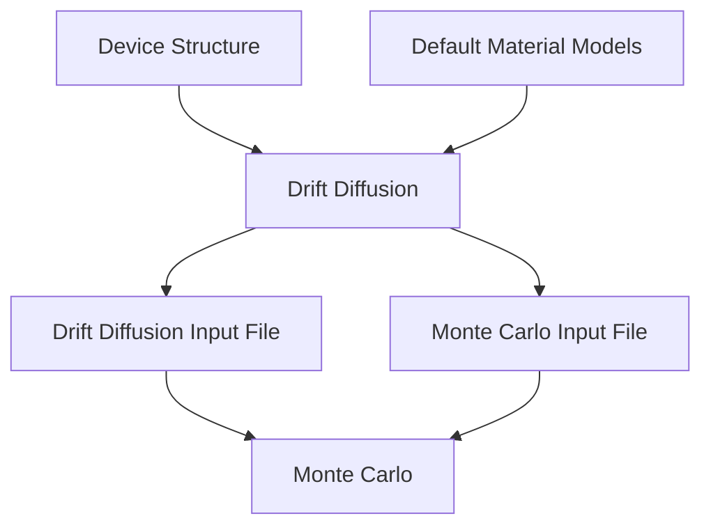
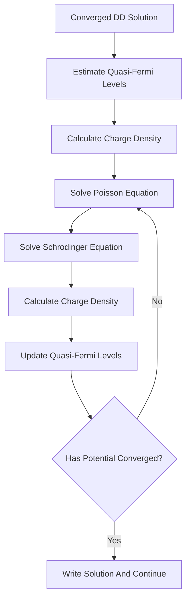
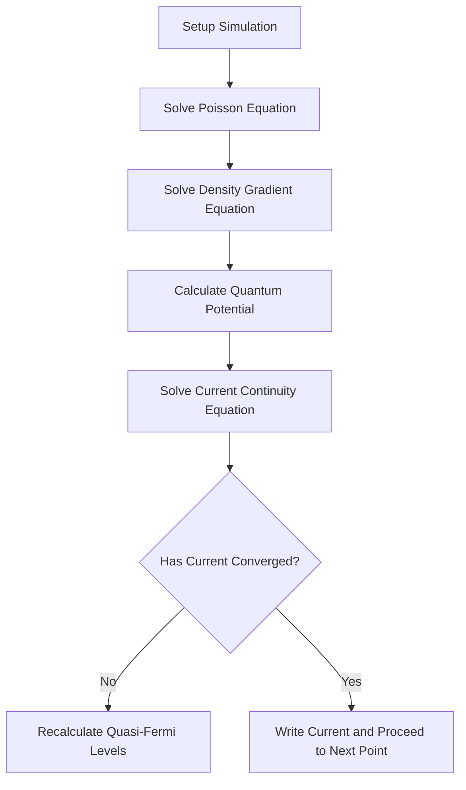
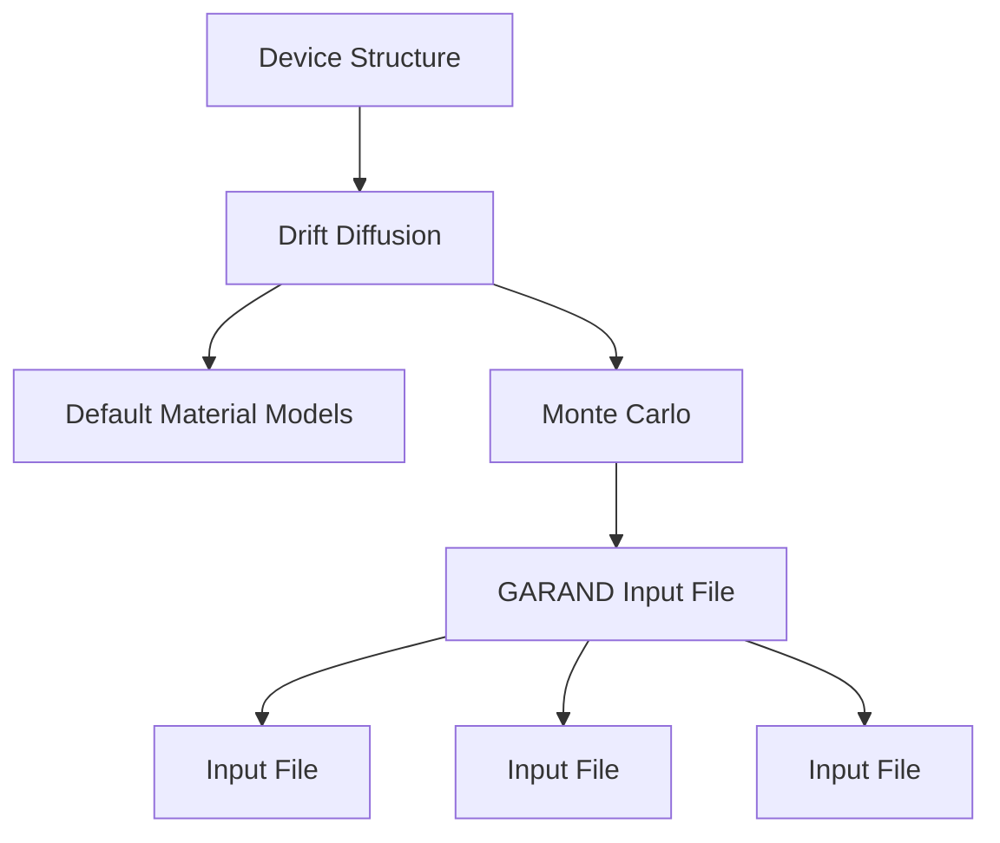

<!-- page:1 -->
# Garand User Guide

Version O-2018.06, June 2018

# Copyright and Proprietary Information Notice

<!-- page:2 -->
© 2018 Synopsys, Inc. This Synopsys software and all associated documentation are proprietary to Synopsys, Inc. and may only be used pursuant to the terms and conditions of a written license agreement with Synopsys, Inc. All other use, reproduction, modification, or distribution of the Synopsys software or the associated documentation is strictly prohibited.

# Destination Control Statement

All technical data contained in this publication is subject to the export control laws of the United States of America. Disclosure to nationals of other countries contrary to United States law is prohibited. It is the reader’s responsibility to determine the applicable regulations and to comply with them.

# Disclaimer

SYNOPSYS, INC., AND ITS LICENSORS MAKE NO WARRANTY OF ANY KIND, EXPRESS OR IMPLIED, WITH REGARD TO THIS MATERIAL, INCLUDING, BUT NOT LIMITED TO, THE IMPLIED WARRANTIES OF MERCHANTABILITY AND FITNESS FOR A PARTICULAR PURPOSE.

# Trademarks

Synopsys and certain Synopsys product names are trademarks of Synopsys, as set forth at https://www.synopsys.com/company/legal/trademarks-brands.html. All other product or company names may be trademarks of their respective owners.

# Free and Open-Source Licensing Notices

If applicable, Free and Open-Source Software (FOSS) licensing notices are available in the product installation.

# Third-Party Links

Any links to third-party websites included in this document are for your convenience only. Synopsys does not endorse and is not responsible for such websites and their practices, including privacy practices, availability, and content.

Synopsys, Inc.

Mountain View, CA 94043

www.synopsys.com

<!-- page:3 -->
# Contents

# I Garand: Drift-Diffusion Simulator 28

# 1 Introduction to Garand 29

1.1 Functionality of Garand and the Workflow . . 29   
1.1.1 Solution . 30  
1.2 Starting Garand From the Command Line 31   
1.3 Parallel Execution . 33   
1.4 Setting Up an Input File . 33   
1.4.1 Simulation Setup 33   
1.4.2 Dimensional Units 34   
1.4.3 Device Structure 35   
1.4.4 Mobility Models 35   
1.4.5 Capacitance Simulation 36   
1.4.6 Monte Carlo Transfer . 37   
1.4.7 Long-Channel Simulation 38

# 2 Importing Device Structures 39

2.1 Importing Structures From TDR Files 39   
2.2 Importing a Mesh 40   
2.3 Specifying a Mesh 40

2.3.1 Alternative Mesh Specification . . 42   
2.3.2 Automatic Mesh Specification 43

2.4 Reflecting a Structure 47   
2.5 Regions 47

2.5.1 Setting region-specific material parameters 47   
2.5.2 Adding a user-defined region . . 49

2.6 Doping Profiles 50   
2.7 Importing a Sentaurus Device TDR output file . . 51

2.7.1 Density gradient calibration parameter . 52   
2.7.2 Mobility 53

2.8 Structural Definitions With Imported Device Structures 54   
2.9 Scaling the Output Current 54   
2.10 Channel direction 54   
2.11 Specifying the Gate Length 55   
2.12 Source/drain regions 55   
2.13 Changing Materials 56   
2.14 Specifying Contacts . 56

2.14.1 Specifying Contact Locations 57   
2.14.2 Importing Contact Locations . 58   
2.14.3 Specifying the metal gate work function . 59   
2.14.4 Setting Other Contact Options 59

<!-- page:4 -->
2.15 Structural Modifications 61

2.15.1 Automatically Slicing a Structure 61   
2.15.2 Maximum Doping Limit 62   
2.15.3 Eroding the Source and Drain Contacts 62

2.16 Alloy Fractions 65

2.16.1 Importing an Alloy Fraction 65   
2.16.2 Modifying Alloy Material Properties . . 66

2.17 Stress and Strain 68

# 3 Simulation Setup 70

3.1 Bias Conditions 70

3.1.1 I-V characteristic mode 70   
3.1.2 V search mode . 71

3.2 Statistical Variability Sources . 73

3.2.1 Random Discrete Dopants 73   
3.2.2 Line Edge Roughness 76

3.2.3 Metal Gate Granularity . 83   
3.2.4 Polysilicon Gate Granularity . 84   
3.2.5 Work Function Variatio . 85   
3.2.6 Contact Resistance Variation 85

# 3.3 Statistical Reliability Modeling . . 86

3.3.1 Interface Trapped Charge . 87   
3.3.2 User-Specified Fixed Charge . . 88

<!-- page:5 -->
# 3.4 Additional Models 88

3.4.1 Density Gradient Quantum Corrections 88   
3.4.2 Schrödinger Quantum Corrections . 91   
3.4.3 Fermi-Dirac Carrier Statistics 97   
3.4.4 Contact Resistance 100   
3.4.5 Drain Leakage 101   
3.4.6 Gate Leakage . 107   
3.4.7 Interface Charge 108   
3.4.8 Analytic Interface Charge Distributions 110   
3.4.9 Random dopant mobility variation . 115

# 3.5 Numerical Solution 116

3.5.1 The modified Gummel method . 116   
3.5.2 Input file options 120

# 3.6 Output . . 123

3.6.1 Output files . 123   
3.6.2 Output for visualization 124   
3.6.3 Cutlines 128   
3.6.4 Autocutlines 129   
3.6.5 Averaged / integral cutlines 130   
3.6.6 Monte Carlo Transfer . 131

# II Garand MC: Monte Carlo Simulator 134

<!-- page:6 -->
# 4 Introduction to Garand MC 135

4.1 Functionality of Garand MC and Workflow 135   
4.2 Particle Propagation . 136

4.2.1 Particle Ensembles 136   
4.2.2 Electron Transport 136   
4.2.3 Hole Transport 137

4.3 Self-Consistency 137

4.3.1 Linear Poisson Solution 137   
4.3.2 Nonlinear Poisson Solution 137   
4.3.3 Frozen-Field Approximation 137

4.4 Quantum Corrections 138   
4.5 Fermi-Dirac Statistics . 138   
4.6 Statistics Gathering 138

4.6.1 Ramo-Shockley Current Estimation 138   
4.6.2 Charge Flux Current Estimation 138   
4.6.3 Integrated Current Density Estimation . 139   
4.6.4 Current Error Estimation 139   
4.6.5 Scattering Statistics . 139   
4.6.6 Carrier Statistics 139

# 5 Monte Carlo Input File 140

5.1 Starting Garand MC From the Command Line . 140   
5.2 Setting Up an Input File . 141

5.2.1 Comments and White Space 141

5.3 Hierarchy of the Output Directory 141   
5.3.1 Intermittent Output Files 142

5.4 Simulation Parameters 142

5.4.1 Electron and Hole Transport 143   
5.4.2 Self-Consistent Simulation . 143   
5.4.3 Field-Adjusting Time Steps 144

5.4.4 Simulation Time Steps 144   
5.4.5 Transient Time Steps 145   
5.4.6 Intermittent Time Steps . 145   
5.4.7 Statistics-Gathering Time Steps 146   
5.4.8 Nonlinear Time Steps . . 146   
5.4.9 Superparticles . 147   
5.4.10 Monte Carlo Carrier Charge Reassignment 147   
5.4.11 Tolerance 148   
5.4.12 Number of Electrons 149   
5.4.13 Number of Holes 149

<!-- page:7 -->
5.5 Contact Parameters 150

5.5.1 Decoupled Contacts 150   
5.5.2 Injection Distribution . 152   
5.5.3 Decoupled Region 152

5.6 Material Definition 153

5.6.1 Band Model . 153   
5.6.2 Mechanism Model 154   
5.6.3 Scattering Filters 155

5.7 Material Parameters . 156

5.7.1 Channel and Substrate Orientations 157   
5.7.2 Bulk Material Parameter Values 157   
5.7.3 Valley Parameter Values 158   
5.7.4 Mechanism Parameter Values 158   
5.7.5 Interface Model Definitions 159   
5.7.6 k · p Band Structure Storage . 164   
5.7.7 Strain 166   
5.7.8 Spatially Varying Material Properties 168

5.8 Long-Channel Simulations 170

5.8.1 Automatically Slicing a Device 171   
5.8.2 Refining Automatic Slicing 171

<!-- page:8 -->
# 6 Output Visualization 173

# 6.1 Initialization Fields 173

6.1.1 Donor Doping Concentration . 174   
6.1.2 Acceptor Doping Concentration 174   
6.1.3 Total Doping Concentration 174   
6.1.4 Net Doping Concentration 174   
6.1.5 Fixed Charge Concentration 174   
6.1.6 Potential 175   
6.1.7 Effective Quantum Potential 175   
6.1.8 Potentials 175   
6.1.9 Band Edges 175   
6.1.10 Electron Concentration . 175   
6.1.11 Hole Concentration . 176   
6.1.12 Mobile Carrier Concentration 176

# 6.2 Steady-State Fields 176

6.2.1 Carrier Energy 177   
6.2.2 Velocity 177   
6.2.3 Current Density . 177   
6.2.4 Mobile Carrier Properties 177

# 6.3 Output Options 177

6.3.1 Band Properties . 178   
6.3.2 Ballistic Properties 178

# 6.4 Scattering Rates . 178

# 6.5 Additional Output . 179

6.5.1 Time Evolution 179   
6.5.2 Energy and Wavevector Distributions 179   
6.5.3 Averaged and Integral Cutlines . 179

<!-- page:9 -->
# 7 Monte Carlo Simulation Models 181

7.1 Assigning Charges 181   
7.2 Interpolating Force 181   
7.3 Initializing Particles . 182

7.3.1 Position 182   
7.3.2 Energy 182   
7.3.3 Equilibrium Energy Distribution . 182   
7.3.4 Equilibrium Velocity 185   
7.3.5 Contact Injection 185

7.4 Quantum Corrections 186

7.4.1 Static Quantum Correction . 186   
7.4.2 Quantum-Corrected Potential 186

7.5 Particle Propagation . 187

7.5.1 Free Flight 187   
7.5.2 Scattering Interrupted . 187

7.6 Simulation Domain Boundaries . 187

7.6.1 Hitting a Boundary 187   
7.6.2 Heterojunction Boundaries . 188   
7.6.3 Reflective Boundaries 189   
7.6.4 Ohmic Contacts . 190   
7.6.5 Surface Roughness (Scattering Rate) . . 190

# III Material Models 191

# 8 Semiconductor Material Models 192

8.1 Defining the Semiconductor Material Model . 192   
8.2 Bulk Material Model 192

8.2.1 Crystal Lattice Parameters 193   
8.2.2 Bulk Electrical and Mechanical Properties . . 194

8.3 Band Structure Model . 195

8.3.1 Nominal Band Edge Model 195

8.3.2 Analytic Multivalley Dispersion Model 197   
8.3.3 Affinity and Band Gap 200   
8.3.4 Six-Band k · p Definition . 201

<!-- page:10 -->
# 8.4 Material Strain 203

8.4.1 Biaxial Strain 203   
8.4.2 Uniaxial Stress 204   
8.4.3 Strain-Induced Energy Shifts . 205   
8.4.4 Effective Mass 206

# 8.5 Nondefault Material Model Definitions 206

8.5.1 Removing a Valley Model 206   
8.5.2 Adding a Valley Model . 207

# 8.6 Analytic Valley Model 207

8.6.1 General Properties 207   
8.6.2 Analytic Conduction Band 209   
8.6.3 Valence Band 210   
8.6.4 Analytic Valence Band 210

# 8.7 Six-Band k · p Band Structure 211

8.7.1 k · p Model 211   
8.7.2 Strain 212   
8.7.3 Effective Valence Band Density-of-States 213   
8.7.4 Band Gap 213   
8.7.5 Electron Affinity 214   
8.7.6 Intrinsic Carrier Concentration 214

# 8.8 Selecting the Transport Model 214

# 9 Insulator Material Models 216

9.1 Default Insulators 216   
9.2 Defining the Insulator Material Model 216   
9.3 Bulk Material Model 216

9.3.1 Default Bulk Material Parameter Values . 217   
9.3.2 Nondefault Bulk Material Parameter Values . 217

# 9.4 Band Structure Model . 217

9.4.1 Nominal Band-Edge Model 217   
9.4.2 Nominal Valley Model 218

<!-- page:11 -->
# 10 Mobility Models 220

10.1 Material Mobility Models . 220

10.1.1 Default Mobility Models . 220   
10.1.2 Nondefault Mobility Models . 221

10.2 Low-Field Mobility Models 221

10.2.1 Constant Mobility Model . 221   
10.2.2 Arora Mobility Model 222   
10.2.3 Masetti Mobility Model 223   
10.2.4 Philips Unified Mobility Model 225   
10.2.5 Low-Field Mobility Modifiers 227

10.3 Perpendicular Field–Dependent Mobility Models 228

10.3.1 Calculation of the Perpendicular Electric Field 228   
10.3.2 No Model 229   
10.3.3 Yamaguchi Mobility Model 229   
10.3.4 Lombardi Mobility Model 230   
10.3.5 Thin-Layer Mobility Model 231

10.4 Lateral Field-Dependent Mobility Models 234

10.4.1 Calculation of the Lateral Electric Field 234   
10.4.2 No Model 235   
10.4.3 Caughey-Thomas Mobility Model 235

10.5 Ballistic Mobility Models . 236

10.5.1 No Model 236   
10.5.2 Shur Mobility Model . 236

10.6 Strain-Dependent Mobility Models . 237

10.6.1 No Model 238   
10.6.2 Simple Strain Enhancement Mobility Model 238   
10.6.3 Multivalley Mobility Model 240

<!-- page:12 -->
# 11 Scattering Mechanisms 241

11.1 Scattering Rate Tabulation 241

11.1.1 Default Scattering Rate Tabulation . 241   
11.1.2 Nondefault Scattering Rate Tabulation . 241

11.2 Elastic Acoustic Phonon Scattering . . 242

11.2.1 Default Elastic Acoustic Phonon Parameters 242   
11.2.2 Nondefault Elastic Acoustic Phonon Parameters 242

11.3 Inelastic Acoustic Phonon Scattering . 242

11.3.1 Default Inelastic Acoustic Phonon Parameters . 243   
11.3.2 Nondefault Inelastic Acoustic Phonon Parameters . 243

11.4 Optical Phonon Scattering 243

11.4.1 Default Optical Phonon Parameters 244   
11.4.2 Nondefault Optical Phonon Parameters 244

11.5 Polar-Optical Phonon Scattering 244

11.5.1 Default Polar Optical Phonon Parameters 245   
11.5.2 Nondefault Optical Phonon Parameters 245

11.6 Ionized Impurity Scattering . . 245

11.6.1 Default Ionized Impurity Parameters . . 246   
11.6.2 Nondefault Ionized Impurity Parameters . 246

11.7 Surface Roughness Scattering 246

11.7.1 Default Surface Roughness Parameters 246   
11.7.2 Nondefault Surface Roughness Parameters 247

11.8 Alloy Scattering . 247

11.8.1 Default Alloy Scattering Parameters . 247   
11.8.2 Nondefault Alloy Scattering Parameters . 248

# 12 Scattering Models 249

12.1 General Scattering Model . 249

12.1.1 Transition Rate: Fermi’s Golden Rule 249   
12.1.2 Scattering Rate 250   
12.1.3 Energy-Momentum Conservation 251

<!-- page:13 -->
12.2 Phonon Scattering Models 252

12.2.1 Elastic Acoustic Phonon Scattering Model . 252   
12.2.2 Inelastic Acoustic Phonon Scattering Model 253   
12.2.3 Optical Phonon Scattering Model 255   
12.2.4 Piezoelectric Phonon Scattering Model 256   
12.2.5 Polar-Optical Phonon Scattering Model 258

12.3 Ionized Impurity Scattering Models 259

12.3.1 Brooks-Herring Model 259   
12.3.2 Ridley’s Third-Body Exclusion Model . 261

12.4 Alloy Scattering Model 262

12.4.1 Analytic Band 263   
12.4.2 Full Band 263

12.5 Surface Roughness Scattering Model . 263

12.5.1 Scattering Rate 264   
12.5.2 Analytic Band 264   
12.5.3 Full Band 265

12.6 Remote Coulomb Scattering Model 265

12.6.1 Perturbation Potential . 266   
12.6.2 Matrix Element 266   
12.6.3 Scattering Rate 266   
12.6.4 Analytic Bands 267

12.7 Pauli Exclusion Principle 267

# 13 Binary Alloy Semiconductor Material Models 269

13.1 Binary Material Parameters . 269   
13.2 Binary Crystal Parameters 270   
13.3 Binary Band Parameters 270   
13.4 Binary Valley Parameters 271   
13.5 Binary Scattering Parameters . 273

13.5.1 Elastic Acoustic Phonon Scattering 273   
13.5.2 Inelastic Acoustic Phonon Scattering 273

13.5.3 Optical Phonon Scattering 273   
13.5.4 Polar-Optical Phonon Scattering 274   
13.5.5 Ionized Impurity Scattering 274   
13.5.6 Alloy Scattering 274   
13.5.7 Surface Roughness Scattering 274

<!-- page:14 -->
13.6 Interpolation Methods . 274

13.6.1 Bounded Interpolation 274   
13.6.2 Constant Interpolation 275   
13.6.3 Linear Interpolation 276   
13.6.4 Linear II Interpolation 276   
13.6.5 Piecewise Interpolation . 277   
13.6.6 Fixed Linear Interpolation 277   
13.6.7 Quadratic I Interpolation . 278   
13.6.8 Quadratic II Interpolation 279   
13.6.9 Quadratic III Interpolation 279

# IV Default Material Definitions 280

# 14 Default Materials 281

14.1 Default Material Names . 281   
14.2 Default Semiconductors . 281

14.2.1 Calibrated Material Carriers 281

14.3 Default Insulators . 282

# Silicon Material Model 283

15.1 Bulk Material Model 283

15.1.1 bulk material parameters 283   
15.1.2 Band-To-Band-Tunnelling parameters 283

15.2 Conduction Band 284

15.2.1 band edge parameters . 284   
15.2.2 mobility models 284   
15.2.3 valley minima - position and orientation 289

15.2.4 valley minima - parameters . 293   
15.2.5 X valley mechanisms - names 295   
15.2.6 X valley mechanisms - parameters 296   
15.2.7 L valley mechanisms - names 298   
15.2.8 L valley mechanisms - parameters 299   
15.2.9 Γ valley mechanisms - names 301  
15.2.10 Γ valley mechanisms - parameters 302   
15.2.11 Surface roughness parameters 303

<!-- page:15 -->
15.3 Valence Band 303

15.3.1 mobility models 304   
15.3.2 valley minima - position and orientation 307   
15.3.3 valley minima - parameters . 308  
15.3.4 HH band mechanisms - names 309   
15.3.5 HH band mechanisms - parameters 310   
15.3.6 LH band mechanisms - names 311   
15.3.7 LH band mechanisms - parameters . 312   
15.3.8 SSO band mechanisms - names . 313   
15.3.9 SSO band mechanisms - parameters 314   
15.3.10 Surface roughness parameters 315

15.4 Velocity-Field Characteristics . 315   
15.5 Low-Field Concentration-Dependent Mobility . 317   
15.6 Inversion Layer Mobility 317

16 Germanium Material Model 321

16.1 Bulk Material Model 321

16.1.1 bulk material parameters 321   
16.1.2 Band-To-Band-Tunnelling parameters 321

16.2 Conduction Band 322

16.2.1 band edge parameters . 322   
16.2.2 mobility models 322   
16.2.3 valley minima - position and orientation 326

16.2.4 valley minima - parameters . 330   
16.2.5 L valley mechanisms - names 331   
16.2.6 L valley mechanisms - parameters 332   
16.2.7 Γ valley mechanisms - names 334  
16.2.8 Γ valley mechanisms - parameters 335   
16.2.9 X valley mechanisms - names 336   
16.2.10 X valley mechanisms - parameters 337

<!-- page:16 -->
16.3 Valence Band 340

16.3.1 mobility models 341   
16.3.2 valley minima - position and orientation . 344   
16.3.3 valley minima - parameters . 345   
16.3.4 HH band mechanisms - names 346   
16.3.5 HH band mechanisms - parameters 347   
16.3.6 LH band mechanisms - names 348   
16.3.7 LH band mechanisms - parameters . 349   
16.3.8 SSO band mechanisms - names . 350   
16.3.9 SSO band mechanisms - parameters 351   
16.3.10 Surface roughness parameters 352

16.4 Velocity-Field Characteristics . 352   
16.5 Low-Field Concentration-Dependent Mobility . 353   
16.6 Inversion Layer Mobility 353

17 Indium53 Gallium47 Arsenide Material Model 356

17.1 Bulk Material Model 356

17.1.1 bulk material parameters 356   
17.1.2 Band-To-Band-Tunnelling parameters 356

17.2 Conduction Band 357

17.2.1 band edge parameters . 357   
17.2.2 mobility models 357   
17.2.3 valley minima - position and orientation 361   
17.2.4 valley minima - parameters . 365

17.2.5 L valley mechanisms - names 366   
17.2.6 L valley mechanisms - parameters 367   
17.2.7 Γ valley mechanisms - names 369  
17.2.8 Γ valley mechanisms - parameters 370   
17.2.9 X valley mechanisms - names 371   
17.2.10 X valley mechanisms - parameters . 372

<!-- page:17 -->
17.3 Valence Band 373

17.3.1 mobility models 374   
17.3.2 valley minima - position and orientation 377   
17.3.3 valley minima - parameters . 378   
17.3.4 HH band mechanisms - names 379   
17.3.5 HH band mechanisms - parameters 380   
17.3.6 LH band mechanisms - names 380   
17.3.7 LH band mechanisms - parameters . 380   
17.3.8 SSO band mechanisms - names . 380   
17.3.9 SSO band mechanisms - parameters 381

17.4 Velocity-Field Characteristics . 381   
17.5 Low-Field Concentration-Dependent Mobility . 381

# 18 Indium52 Aluminium48 Arsenide Material Model 383

18.1 Bulk Material Model 383

18.1.1 bulk material parameters 383   
18.1.2 Band-To-Band-Tunnelling parameters 383

18.2 Conduction Band 384

18.2.1 band edge parameters . 384   
18.2.2 mobility models 384   
18.2.3 valley minima - position and orientation 388   
18.2.4 valley minima - parameters . 392   
18.2.5 L valley mechanisms - names 393  
18.2.6 L valley mechanisms - parameters 394   
18.2.7 Γ valley mechanisms - names 396

18.2.8 Γ valley mechanisms - parameters 397   
18.2.9 X valley mechanisms - names 398  
18.2.10 X valley mechanisms - parameters 399

<!-- page:18 -->
# 18.3 Valence Band 400

18.3.1 mobility models 401   
18.3.2 valley minima - position and orientation . 404   
18.3.3 valley minima - parameters . 405   
18.3.4 HH band mechanisms - names 406   
18.3.5 HH band mechanisms - parameters 407   
18.3.6 LH band mechanisms - names 407   
18.3.7 LH band mechanisms - parameters . 407   
18.3.8 SSO band mechanisms - names . 407   
18.3.9 SSO band mechanisms - parameters 408

# 18.4 Velocity-Field Characteristics . 408

# 18.5 Low-Field Concentration-Dependent Mobility . 408

# 19 Gallium Arsenide Material Model 410

# 19.1 Bulk Material Model 410

19.1.1 bulk material parameters 410   
19.1.2 Band-To-Band-Tunnelling parameters 410

# 19.2 Conduction Band 411

19.2.1 band edge parameters . 411   
19.2.2 mobility models 411   
19.2.3 valley minima - position and orientation . 415   
19.2.4 valley minima - parameters . 419   
19.2.5 L valley mechanisms - names 421   
19.2.6 L valley mechanisms - parameters 421   
19.2.7 Γ valley mechanisms - names 423   
19.2.8 Γ valley mechanisms - parameters 424   
19.2.9 X valley mechanisms - names 425   
19.2.10 X valley mechanisms - parameters 426

<!-- page:19 -->
# 19.3 Valence Band 428

19.3.1 mobility models 428   
19.3.2 valley minima - position and orientation 432   
19.3.3 valley minima - parameters . 433   
19.3.4 HH band mechanisms - names 434   
19.3.5 HH band mechanisms - parameters 434   
19.3.6 LH band mechanisms - names 435   
19.3.7 LH band mechanisms - parameters . 435   
19.3.8 SSO band mechanisms - names . 435   
19.3.9 SSO band mechanisms - parameters 435

# 20 Indium Arsenide Material Model 436

# 20.1 Bulk Material Model 436

20.1.1 bulk material parameters 436   
20.1.2 Band-To-Band-Tunnelling parameters 436

# 20.2 Conduction Band 437

20.2.1 band edge parameters . 437   
20.2.2 mobility models 437   
20.2.3 valley minima - position and orientation . 441   
20.2.4 valley minima - parameters . 445   
20.2.5 L valley mechanisms - names 446   
20.2.6 L valley mechanisms - parameters 447   
20.2.7 Γ valley mechanisms - names 449   
20.2.8 Γ valley mechanisms - parameters 450   
20.2.9 X valley mechanisms - names 451   
20.2.10 X valley mechanisms - parameters . 452

# 20.3 Valence Band 453

20.3.1 mobility models 454   
20.3.2 valley minima - position and orientation . 457   
20.3.3 valley minima - parameters . 458   
20.3.4 HH band mechanisms - names . 459

20.3.5 HH band mechanisms - parameters 460   
20.3.6 LH band mechanisms - names 460   
20.3.7 LH band mechanisms - parameters . 460   
20.3.8 SSO band mechanisms - names . 460   
20.3.9 SSO band mechanisms - parameters 461

# 21 Aluminium Arsenide Material Model 462

<!-- page:20 -->
21.1 Bulk Material Model 462

21.1.1 bulk material parameters 462   
21.1.2 Band-To-Band-Tunnelling parameters 462

21.2 Conduction Band 463

21.2.1 band edge parameters . 463   
21.2.2 mobility models 463   
21.2.3 valley minima - position and orientation . 467   
21.2.4 valley minima - parameters . 471   
21.2.5 L valley mechanisms - names 472   
21.2.6 L valley mechanisms - parameters 473   
21.2.7 Γ valley mechanisms - names 475   
21.2.8 Γ valley mechanisms - parameters 476   
21.2.9 X valley mechanisms - names 477   
21.2.10 X valley mechanisms - parameters . 478

21.3 Valence Band 479

21.3.1 mobility models 480   
21.3.2 valley minima - position and orientation . 483   
21.3.3 valley minima - parameters . 484   
21.3.4 HH band mechanisms - names . 485   
21.3.5 HH band mechanisms - parameters 486   
21.3.6 LH band mechanisms - names 486   
21.3.7 LH band mechanisms - parameters . 486   
21.3.8 SSO band mechanisms - names . 486   
21.3.9 SSO band mechanisms - parameters 487

# 22 Silicon1 x Germaniumx Binary Alloy Material Model 488

<!-- page:21 -->
# 22.1 Bulk Material Model . 488

22.1.1 bulk material parameters 488   
22.1.2 Band-To-Band-Tunnelling parameters 489

# 22.2 Conduction Band 489

22.2.1 band edge parameters . 489   
22.2.2 mobility models 490   
22.2.3 valley minima - position and orientation . 495   
22.2.4 valley minima - parameters . 499   
22.2.5 L valley mechanisms - names 502   
22.2.6 L valley mechanisms - parameters 503   
22.2.7 Γ valley mechanisms - names 505   
22.2.8 Γ valley mechanisms - parameters 506   
22.2.9 X valley mechanisms - names 508   
22.2.10 X valley mechanisms - parameters . 509   
22.2.11 Surface roughness parameters 513

# 22.3 Valence Band 513

22.3.1 mobility models 515   
22.3.2 valley minima - position and orientation . 519   
22.3.3 valley minima - parameters . 520   
22.3.4 HH band mechanisms - names . 523   
22.3.5 HH band mechanisms - parameters 524   
22.3.6 LH band mechanisms - names 525   
22.3.7 LH band mechanisms - parameters . 526   
22.3.8 SSO band mechanisms - names . 527   
22.3.9 SSO band mechanisms - parameters 528   
22.3.10 Surface roughness parameters 529

# 23 Indium1 x Galliumx Arsenide Binary Alloy Material Model 531

<!-- page:22 -->
23.1 Bulk Material Model 531

23.1.1 bulk material parameters 531   
23.1.2 Band-To-Band-Tunnelling parameters 532

23.2 Conduction Band . 532

23.2.1 band edge parameters . 532   
23.2.2 mobility models 532   
23.2.3 valley minima - position and orientation . 536   
23.2.4 valley minima - parameters . 540   
23.2.5 L valley mechanisms - names 541   
23.2.6 L valley mechanisms - parameters 542   
23.2.7 Γ valley mechanisms - names 544   
23.2.8 Γ valley mechanisms - parameters 545   
23.2.9 X valley mechanisms - names 546   
23.2.10 X valley mechanisms - parameters . 547   
23.2.11 Surface roughness parameters 548

23.3 Valence Band 548

23.3.1 mobility models 549   
23.3.2 valley minima - position and orientation . 553   
23.3.3 valley minima - parameters . 554   
23.3.4 HH band mechanisms - names . 555   
23.3.5 HH band mechanisms - parameters 555   
23.3.6 LH band mechanisms - names 556   
23.3.7 LH band mechanisms - parameters . 556   
23.3.8 SSO band mechanisms - names . 556   
23.3.9 SSO band mechanisms - parameters 556

# 24 Indium1 x Aluminiumx Arsenide Binary Alloy Material Model 557

24.1 Bulk Material Model 557

24.1.1 bulk material parameters 557   
24.1.2 Band-To-Band-Tunnelling parameters 558

<!-- page:23 -->
# 24.2 Conduction Band 558

24.2.1 band edge parameters . 558   
24.2.2 mobility models 558   
24.2.3 valley minima - position and orientation . 563   
24.2.4 valley minima - parameters . 567   
24.2.5 L valley mechanisms - names 568   
24.2.6 L valley mechanisms - parameters 569   
24.2.7 Γ valley mechanisms - names 571   
24.2.8 Γ valley mechanisms - parameters 572   
24.2.9 X valley mechanisms - names 573   
24.2.10 X valley mechanisms - parameters . 574

# 24.3 Valence Band . 575

24.3.1 mobility models 576   
24.3.2 valley minima - position and orientation . 581   
24.3.3 valley minima - parameters . 582   
24.3.4 HH band mechanisms - names . 583   
24.3.5 HH band mechanisms - parameters 583   
24.3.6 LH band mechanisms - names 584   
24.3.7 LH band mechanisms - parameters . 584   
24.3.8 SSO band mechanisms - names . 584   
24.3.9 SSO band mechanisms - parameters 584

# V Appendices 585

# Appendix A Garand Materials 586

A.1 Semiconductors 586   
A.2 Insulators 587

<!-- page:24 -->
# Appendix B Input Commands 589

B.1 Syntax 589   
B.2 Bias Command 589   
B.3 Contact Command . 590   
B.4 Doping Command . 592   
B.5 Mesh Command . 593   
B.6 Model Command 593

B.6.1 Simple Models 594   
B.6.2 Using Model Identifiers 594

B.7 Output Command 599   
B.8 Reliability Command 603   
B.9 Simulation Command 604   
B.10 Structure Command 607   
B.11 Variability Command . 610

# Appendix C Deprecated Input Commands 614

C.1 Crystal Orientation 614   
C.2 Time Series 614   
C.3 Integration of stress field 614

# Appendix D Using Template Device Structures 616

D.1 Overview of Template Device Structures . . 616   
D.2 Example: Planar Bulk MOSFET 616   
D.3 Example: Bulk FinFET 619   
D.4 Doping Profiles 620

D.4.1 Importing a Doping Profile . 621   
D.4.2 Analytic Doping Profile 622

D.5 Changing Dielectric Materials 626

D.5.1 Bulk MOSFET Default Materials 627   
D.5.2 Bulk FinFET Default Materials 627   
D.5.3 SOI FinFET Default Materials 628   
D.5.4 Nanowire Default Materials 628

<!-- page:25 -->
D.6 Changing Semiconductor Materials 628

D.6.1 Bulk MOSFET Default Materials 629   
D.6.2 Bulk FinFET Default Materials 629   
D.6.3 SOI FinFET Default Materials . 629   
D.6.4 Nanowire Default Materials 630

D.7 Additional Features of the FinFET Template . . 630

D.7.1 Nonuniform Mesh Spacing . . 630   
D.7.2 Structure 630   
D.7.3 Rounding Top of Fin 631   
D.7.4 Width of Top of Fin 631  
D.7.5 Wrap Gate Oxide Around Top of STI 632   
D.7.6 Place Source and Drain Contacts at End of Fin 632

D.8 Additional Features of the Nanowire Template . . 633

D.8.1 Round Corners of Nanowire 633   
D.8.2 Include Interfacial Oxide . 633

D.9 Additional Input Commands for Template Structures . 633

D.9.1 Syntax 634   
D.9.2 Doping Command 634   
D.9.3 Mesh Command 635   
D.9.4 Simulation Command 636   
D.9.5 Structure Command 637   
D.9.6 Variability Command . 640

# Appendix E Utilities 642

E.1 The garand\_mats Utility 642

E.1.1 Running the garand\_mats Utility . . 642   
E.1.2 Named Material Model . 643   
E.1.3 User-Defined Material Properties 644

E.2 The band\_profile Utility 645

E.2.1 Running the band\_profile Utility . . 645

# Bibliography 647

# Index 653

<!-- page:26 -->
# About This Guide

This user guide describes the Synopsys® Garand device simulator for drift-diffusion simulations and the Garand MC device simulator for Monte Carlo simulations.

# Conventions

The following conventions are used in Synopsys documentation.

<table><tr><td>Convention</td><td>Description</td></tr><tr><td>Courier font</td><td>Indicates command syntax.</td></tr><tr><td>Italicized text</td><td>Indicates a user-defined value, such as object_name.</td></tr><tr><td>Bold text</td><td>Withing syntax and examples, indicates user input, that is, text you type verbatim.</td></tr><tr><td>[]</td><td>Denotes optional parameters or options.</td></tr><tr><td>...</td><td>Indicates that parameters can be repeated as many times as necessary.</td></tr><tr><td></td><td>Indicates a choice among alternatives.</td></tr></table>

# Customer Support

Customer support is available through the Synopsys SolvNet® customer support website and by contacting the Synopsys support center.

# Accessing SolvNet

The SolvNet support site includes an electronic knowledge base of technical articles and answers to frequently asked questions about Synopsys tools. The site also gives you access to a wide range of Synopsys online services, which include downloading software, viewing documentation, and entering a call to the Support Center.

To access the SolvNet site:

1. Go to the web page at https://solvnet.synopsys.com.   
2. If prompted, enter your user name and password. (If you do not have a Synopsys user name and password, follow the instructions to register.)

If you need help using the site, click Help on the menu bar.

<!-- page:27 -->
# Contacting Synopsys Support

If you have problems, questions, or suggestions, you can contact Synopsys support in the following ways:

• Go to the Synopsys Global Support Centers site on synopsys.com. There you can find email addresses and telephone numbers for Synopsys support centers throughout the world.   
• Go to either the Synopsys SolvNet site or the Synopsys Global Support Centers site and open a case online (Synopsys user name and password required).

<!-- page:28 -->
# Part I

# Garand: Drift-Diffusion Simulator

<!-- page:29 -->
# 1 Introduction to Garand

This chapter introduces the Garand device simulator.

# 1.1 Functionality of Garand and the Workflow

Garand is a three-dimensional, drift-diffusion, quantum-corrected statistical device simulator that self-consistently solves the carrier concentration and potential distribution coupled with current continuity throughout the simulation domain. The drift-diffusion model consists of the Poisson equation, which is solved to determine the electrostatic behavior within the device, while carrier transport is modeled by the current continuity equation for the majority carriers, where both the drift and diffusion components of the current are accounted for. Garand also uses the density gradient model of quantum corrections to account for quantum-mechanical confinement within the device structure.

Garand performs drift-diffusion simulations in simulation domains defined by a device structure generator. The initial simulation domain defines an idealized uniform device. Statistical sources of variability are injected into the simulation domain by Garand itself. Sources of variability can be included by specification in the drift-diffusion input file, which controls aspects of the drift-diffusion solution. Given a randomized simulation domain, driftdiffusion simulation determines the drain current given a set of contact bias values. You can perform simulations over a range of bias conditions or to determine the threshold voltage given a current criterion.

Sources of statistical variability can be applied to construct a unique device, given the definition of a uniform device structure, by the random sampling of an appropriate statistical distribution. Although the process is randomized, it is tied to devices by their number in an ensemble to ensure the ensemble can be reproduced. Each source of variability is treated independently in this way such that, for example, the distribution of discrete random dopants within a particular device in an ensemble of 10,000 has the same distribution regardless of whether other sources of variability are included, provided that the 3D doping profile has not changed (for example, due to line edge roughness).

Variability sources associated with random dopants, line edge roughness, polycrystallinity of gate materials, and interface-trapped charges are activated and configured from the simulator input file. Regions of the device affected by some variability sources can be controlled by users for an imported device structure.

Carrier transport, as described by the current continuity equation, depends on carrier mobility. Garand includes standard mobility models to calculate the bulk mobility and account for high-field effects. The mobility model parameters can be modified to calibrate I-V characteristics. These parameters are stored in the materials database and Garand provides an interface to override values in the materials database from within the simulator input file.

The extended capabilities of Garand allow for the simulation of arbitrary-shaped 3D MOSFET architectures. Garand offers direct import of TDR structure files, which must have a tensor-product mesh.

Garand is linked to an automated submission service, so that results pass automatically to a database for use with other elements of the workflow.

Figure 1.1 shows how Garand fits into the workflow. Default materials within the simulation domain are defined jointly for both Garand and Garand MC, the Monte Carlo simulator, and are inputs to both. Non-default materials can be specified using commands in the common input file for both simulators.   


<details>
<summary>flowchart</summary>


</details>

Figure 1.1: Flow diagram showing relationship between Garand simulator and Garand MC simulator

<!-- page:30 -->
# 1.1.1 Solution

The simulation domain is defined on a 3D rectilinear mesh, which provides an efficient discretization and solution scheme and is particularly important for efficient Monte Carlo simulation in which particle self-forces should be minimized. A steady-state solution is obtained by the self-consistent coupling of the electrostatic potential with majority and minority carrier concentrations. The solution is obtained iteratively by solving the nonlinear Poisson equation, obtaining a carrier concentration and field, followed by current continuity. The nonlinear Poisson equation relates electrostatic potential to carrier density, where the carrier density itself is a function of the local potential and is described by a statistical distribution model. Current continuity then conserves carrier flux given local mobility models.

# 1.1.1.1 Unipolar

Garand is designed to simulate CMOS devices and assumes that the simuated transistor is unipolar. Concentrations for both majority and minority carriers are solved self-consistently with the potential throughout the simulation domain, but current continuity is solved only for the majority carriers.

# 1.1.1.2 Nonlinear Poisson Equation: Carrier Statistics

<!-- page:31 -->
The carrier concentration as a function of electrostatic potential for both majority and minority carriers is determined assuming the Boltzmann approximation to the Fermi–Dirac distribution function. Fermi–Dirac statistics can optionally be applied to determine the carrier concentration in materials and at doping concentrations where degenerate effects become important.

# 1.1.1.3 Quantum Corrections

Quantum corrections can be included in the drift-diffusion simulation through the solution of the density gradient equation. This is coupled with both the nonlinear Poisson and current continuity solutions and can be applied to both majority and minority carrier distributions. In this model, quantum corrections amend the carrier distribution in regions of high carrier density variation. The amended carrier density then defines an effective quantum potential, used in carrier transport.

In addition, an alternative quantum-correction scheme based on the solution of the Schrödinger equation is available and is applied in a similar manner to the density gradient approach. This provides a more rigorous quantum-mechanical correction but at the expense of increased computational effort.

# 1.1.1.4 Current Continuity

Current continuity is solved for only the majority carriers and assumes a single total mobility model applied to the total carrier distribution. This treats the transport of subpopulations associated with the semiconductor material band model identically. The field in which carriers are driven is taken to be the effective quantum potential in the case of a quantum-corrected simulation. Otherwise, the electrostatic potential defines the electric field.

# 1.2 Starting Garand From the Command Line

You can start Garand from the command line as follows:

```txt
garand -f <string> [-d <integer>] [<other command-line options>] 
```

Command-line options control certain aspects of the simulation, allowing you to override the values specified in the input file as required.

<table><tr><td>Option</td><td>Description</td></tr><tr><td>-f</td><td>Mandatory. Specifies the name of the input file. Include the path if the file is not in the current working directory.</td></tr><tr><td>-d</td><td>Specifies the device number to simulate from within the statistical ensemble.This option is mandatory if you are running statistical variability simulations of an ensemble of n devices, where you must specify which device number, from 1 to n, to simulate. Otherwise, it defaults to 1.</td></tr><tr><td>--help, -h</td><td>Prints help message and exits.</td></tr><tr><td>--verbose</td><td>Generates verbose screen output. This is useful to check the convergence of the solution.</td></tr><tr><td>-vd</td><td>Specifies the drain voltage.This option is mandatory if the drain voltage is not specified in the input file with the bias drain=&lt;float&gt; command.</td></tr><tr><td>-vg</td><td>Specifies the gate voltage.This option is mandatory if the gate voltage is not specified in the input file with the bias gate=&lt;float&gt; command.</td></tr><tr><td>-dv</td><td>Specifies the equivalent of the bias delta=&lt;float&gt; command.</td></tr><tr><td>-nv</td><td>Specifies the equivalent of the bias ivpoints=&lt;integer&gt; command.</td></tr><tr><td>-vsub</td><td>Specifies the equivalent of the bias substrate=&lt;float&gt; command.</td></tr><tr><td>-style</td><td>Specifies the equivalent of the simulation sim_type=&lt;string&gt; command.</td></tr><tr><td>--user-materials</td><td>Specifies that Garand reads the default material parameters from the device_materials.mat file, which it writes, for the current device.</td></tr><tr><td>--legacy</td><td>Uses the old convention for PMOS simulations, that is, the same as for NMOS with positive applied gate and drain biases, and a positive drain current output.</td></tr><tr><td>--threads</td><td rowspan="2">Specify the number of parallel threads to use when running Garand on a multi-core system. This overrides any value specified in the input file, but will be ignored if it is larger than the number of threads allowed by the environment variable $OMP_NUM_THREADS.</td></tr><tr><td>-t</td></tr></table>

<!-- page:32 -->
When Garand runs, it writes the device\_materials.mat file that contains a reduced list of default material parameters for only the materials actually in the device structure. When starting Garand with the --usermaterials option, Garand reads material parameters from this file rather than reading the parameter files for all known materials. This speeds up the initialization of materials at the start of the simulation.

<!-- page:33 -->
# 1.3 Parallel Execution

Garand can be run in parallel on a multi-core computing environment. The number of parallel threads to use can be specifed in the input file using the command:

```txt
simulation threads=<number of threads> 
```

Alternatively, the number of threads can be specified on the command line using the -t or --threads flag, for example,

```batch
garand --threads 4
garand -t 2 
```

This command-line specification will override any value set in the input file.

If the number of threads is not set in either the input file or the command line then the Linux environment variable \$OMP\_NUM\_THREADS controls the maximum number of threads that an OpenMP parallel program can use. Garand will not use more than this number of threads, even if the you specify a higher number in the input file or on the command line.

# 1.4 Setting Up an Input File

Garand input is based on a set of commands followed by assignment of parameters as keyword–value pairs.

# 1.4.1 Simulation Setup

The simulation command controls the behavior of Garand (see Section B.9).

You must specify one keyword per line, for example:

```ini
simulation sim_type = idvg
simulation n_or_p = p
simulation T = 275.5
simulation accept_unconverged = on 
```

Garand operates in different modes depending on the setting of the sim\_type keyword. If sim\_type=idvg, Garand calculates an I-V curve (or single point). If sim\_type=idvd, Garand calculates the threshold voltage based on the current criterion specified by the threshold\_current keyword. These simulations are based on the bias conditions specified in the input file, as described in Section 3.1.

Garand is a unipolar MOSFET simulator for NMOS and PMOS devices. You specify the type of device to be simulated using the n\_or\_p keyword, which controls whether the current continuity equation for electrons or holes is solved.

When running variability simulations of a statistical sample of n devices, each device is numbered from 1 to n. Running the same device number produces the same device structure each time (that is, the same random dopant distribution, line edge roughness, and so on). Changing the value of the irand0 keyword introduces an offset in the seed number used by the random number generators and results in a different statistical ensemble that has the same device numbers.

<!-- page:34 -->
The ambient temperature, in Kelvin, is specified with the T keyword. The default is room temperature (300 K).

In Garand, the solution is usually very stable. Occasionally, particularly when using the local band-to-band tunneling model where the tunneling current dominates, the solution can oscillate between several very close values, leading to the assessment that the solution has not converged. On such occasions, Garand writes to the output file that the solution did not converge and the result is not passed to the database, thereby avoiding the accidental use of potentially erroneous results.

If you are confident that the solution will be close enough to be acceptable, then you can specify accept\_unconverged=on. With this setting, Garand writes nonconverged results to the output file and passes the results to the database. You should check such results carefully before using them.

# 1.4.2 Dimensional Units

Many commands in the Garand input file require specification of dimensions or positions within the device structure. Historically, the dimensional unit for all of the input and output were nanometers. As the unit used in other Synopsys tools is usually micrometers, the output from Garand is now in micrometers by default, however to preserve backwards compatibility for input files, the input dimensions are still specified in nanometers by default. There are several Garand commands available to control which units should be used in input and output for the specification of distances, dimensions and positions within the device structure.

To set both input and output units with one command, use:

```txt
structure units = <units> 
```

where <units> can be nm, um, mm, cm or m.

To only set the input units (overriding any units set with the structure units command), use the command:

```txt
structure input_units = <input units> 
```

where <input units> can be nm, um, mm, cm or m.

To only set the output units (overriding any units set with the structure units command), use the command:

```txt
output units = <output units> 
```

where <output units> can be nm, um, mm, cm or m.

Note: Input units only apply when referencing positions and dimensions within the structure, for example bounding boxes, mesh specification, cutline positions and LER planes. Model parameters, such as LER rms and correlation length, and MGG grain size, are still specified in nm.

<!-- page:35 -->
# 1.4.3 Device Structure

The structure command is used to specify certain aspects of the structure of the device being simulated (see Appendix B.10).

If a metal gate is specified in the input file (contact metal\_gate), then a workfunction for the gate material must be specified using the work\_function keyword of the contact command (see Appendix B.3). For a polysilicon gate, the gate potential is determined by the doping concentration in the gate. You can also adjust the potential in a polysilicon gate using the poly\_shift keyword, which adds the value specified to the potential set by the doping in the gate. For example:

```txt
contact work_function=<float>
contact poly_shift=<float> 
```

# 1.4.4 Mobility Models

You can specify up to five mobility models to use in a simulation, for each semiconductor material in the device, using the material command. For electron mobility in n-type MOSFETs, you specify:

```txt
material <semiconductor>.conduction.mobility.<model> <option> 
```

For hole mobility in p-type MOSFETs, you specify:

```txt
material <semiconductor>.valence.mobility.<model> <option> 
```

Valid choices for <model> are bulk for the low-field bulk mobility model (ionized impurity scattering), eprp for the perpendicular field–dependent mobility model (surface roughness scattering), elat for the lateral field– dependent mobility model (velocity saturation), ball for the ballistic mobility model, and strain for the straindependent mobility model. The following are valid options for each case:

<table><tr><td>Parameter</td><td>Options</td><td>Description</td></tr><tr><td rowspan="4">bulk</td><td>constant</td><td>Use a constant value of mobility (default)</td></tr><tr><td>arora</td><td>Arora mobility model</td></tr><tr><td>masetti</td><td>Masetti mobility model</td></tr><tr><td>philips</td><td>Philips mobility model</td></tr><tr><td rowspan="4">eprp</td><td>none</td><td>No perpendicular field–dependent mobility model (default)</td></tr><tr><td>yamaguchi</td><td>Yamaguchi mobility model for perpendicular field</td></tr><tr><td>lombardi</td><td>Lombardi mobility model for perpendicular field</td></tr><tr><td>thin_layer</td><td>Thin-layer mobility model</td></tr><tr><td rowspan="2">elat</td><td>none</td><td>No lateral field–dependent mobility model (default)</td></tr><tr><td>caughey</td><td>Caughey–Thomas velocity saturation model for lateral field</td></tr><tr><td rowspan="2">ball</td><td>none</td><td>No ballistic mobility model (default)</td></tr><tr><td>shur</td><td>Shur ballistic model</td></tr><tr><td rowspan="3">strain</td><td>none</td><td>No strain-dependent mobility model (default)</td></tr><tr><td>sse</td><td>Simple strain enhancement model</td></tr><tr><td>multivalley</td><td>Multivalley mobility model</td></tr></table>

<!-- page:36 -->
For example:

```kotlin
material silicon.conduction.mobility.bulk masetti
material silicon.conduction.mobility.eprp lombardi
material silicon.conduction.mobility.elat caughey 
```

Parameters for the different mobility models are material model parameters. Therefore, you can use the material command to change the mobility model parameters for a particular material. For example:

```txt
material silicon.conduction.masetti.mumin1 50.0
material germanium.valence.caughey.vsat 9e6 
```

See Chapter 10 for details.

# 1.4.5 Capacitance Simulation

If you use the simulation capacitance=<string> command, then quasistatic capacitances, $C _ { i j } \ =$ $\partial Q _ { i } / \partial V _ { j }$ , are calculated. Here, i and j each cover the following device contacts: gate (g), source (s), drain (d), and bulk (b). This involves performing extra solutions at each point of the I-V curve, and thus increases the simulation time. By default, the full capacitance matrix is calculated, and each $C _ { i j }$ for the full I-V curve is written to a file. You can simulate a subset of the full capacitance matrix by specifying which responses of contacts should be calculated. This is controlled by the capacitance keyword.

You can include multiple comma-separated contacts in the capacitance specification to calculate the capacitance for multiple contacts. For example:

```txt
simulation capacitance=source
simulation capacitance=gate,drain 
```

<!-- page:37 -->
The second command instructs Garand to calculate the capacitance for the gate and drain contacts only.

Two data columns are written to the output files: the first column is the gate or drain voltage (depending on the sim\_type keyword) and the second column is the capacitance in farads (F). The capacitance output files are written to the results directory specified by the output directory=<string> command and follow the same naming convention as the I-V data file (see Section 3.6.1). The capacitance matrix element, Cij, that the file data represents is also included in the file name, for example, device-idvg\_Vd0.05\_Cgg\_1.dat. Capacitance results will also be written to the output PLT file for plotting in Sentaurus Visual.

Capacitance data is also written to the database, if it is activated for the simulation. This data is then available for compact model extraction in Mystic (see the Mystic User Guide).

# 1.4.6 Monte Carlo Transfer

The Garand drift-diffusion simulator is used as a precursor to the Monte Carlo simulator, Garand MC. Using Garand to initialize Garand MC reduces the time for the Monte Carlo simulation to reach steady-state conditions by providing a solution of the simulation domain that captures the current transport and the electrostatics. Furthermore, it provides other simulation efficiency improvements by setting up a common mesh and simulation domain that are transferred using a Monte Carlo transfer (MCT) file, with the file extension .mct.

An MCT file must be created for all bias points you want to simulate in Garand MC, and this file can be created only when either sim\_type=idvg or sim\_type=idvd is specified in the simulation command (see Section 1.4.1). Garand creates one MCT file for every gate or drain bias point you sweep, so you can create an entire I-V curve of MCT files in one simulation run.

To specify that MCT files should be created during an I-V curve simulation in Garand, use the following command:

```txt
output mc_transfer = on 
```

By default, the mc\_transfer keyword is switched off. Each MCT file is created in an MCT folder for each bias-dependent output folder. For more information about how the output of Garand is written, see Section 3.6.6.

When MCT output is switched on, the following restrictions can affect Garand simulations:

• The VT search mode sim\_type=vt is not activated with MCT output.   
• Monte Carlo simulations do not consider contact resistance, and contact resistance should be applied only in drift-diffusion simulations. Note that contact resistance does not directly affect carrier transport in the active region of a FET device and, therefore, it does not need to be captured in Monte Carlo simulations.   
• Leakage models typically only apply in subthreshold conditions where a Monte Carlo FET simulation is not well suited. These models should be applied only in drift-diffusion simulations.   
• The current continuity solution is required for MCT files for accurate Monte Carlo initialization. Only simulations examining long-channel conditions with the remove\_source\_drain or autoslice keyword activated can neglect the current continuity solutions. For further discussion, see Section 1.4.7.

<!-- page:38 -->
# 1.4.7 Long-Channel Simulation

There are certain circumstances where a full device simulation is not necessary, such as when evaluating the channel mobility in a Monte Carlo simulation assuming infinite channel length, or when calibrating the density gradient solution under the gate of a long-channel device. In these cases, you can use the remove\_source\_drain keyword to remove the source/drain contacts and wells from the simulation domain leaving only the channel region. Removing source/drain contacts means that no bias voltage is applied (for mobility analysis in Monte Carlo simulations, a field can be specified, see Section 5.8).

Note that the lateral (the direction parallel to the source/drain plane) mesh specifications in the source/drain regions and even the channel can be relaxed significantly when using the remove\_source\_drain keyword. The only requirement is that the mesh is sufficiently fine to resolve the source/channel/drain regions.

The easiest way to do this is to use the autoslice keyword (see Section 2.15.1):

```txt
simulation autoslice = on 
```

This command slices the center of the gate and creates a cross section that can be simulated using Garand MC with periodic boundary conditions.

A more flexible approach, that can be useful for Monte Carlo simulations, can be achieved using the following command (see Section 5.8.2):

```txt
structure remove_source_drain = on 
```

However, this requires more user input. It is also advisable to ensure that quantum corrections are applied along the entire channel, which is achieved by specifying:

```txt
contact confined_boundary = on 
```

For details, see Section 5.8.

<!-- page:39 -->
# 2 Importing Device Structures

This chapter discusses how to import device structures using TDR files.

# 2.1 Importing Structures From TDR Files

A 3D TDR structure file can be read in to Garand using the command:

```python
structure import filename='structure.tdr' 
```

where structure.tdr is the name of the TDR file to be imported. This TDR file must be based on a 3D tensor-product mesh; otherwise, the command fails. You can use Sentaurus Mesh to convert a conventional finite-element TDR structure, for example as produced by Sentaurus Process, to the format required by Garand using the command:

```batch
snmesh -t -gtdr -rect <filename>_msh
```

Sentaurus Mesh looks for the corresponding <filename>\_bnd.tdr and <filename>\_msh.cmd files. The commandline options specify the following Sentaurus Mesh options:

• -t produces a tensor-product mesh with tetrahedral elements.   
• -rect converts the elements from tetrahedral to rectangular.   
• -gtdr outputs in a general TDR format.

All of these options are required to produce a TDR file that is compatible with Garand. The quality and resolution of the tensor-product mesh that Sentaurus Mesh produces can be controlled by placing commands in the <filename>\_msh.cmd file. If you intend to use the mesh from the TDR file as the simulation mesh in Garand (see Section 2.3), then it is important to control the quality of the mesh at this stage to ensure that all the important features of the structure are sufficiently resolved (such as the gate oxide), while ensuring the mesh is not so large that it will result in slow simulations in Garand. See the Sentaurus Mesh User Guide for details.

The materials in the TDR structure must be in the list of materials available in Garand. If materials are present that are not valid Garand materials with the recognized material name (see Appendix A), then an error is generated and a mapping should be provided in the input file to map the unknown material name to that of a known Garand material (see Section 2.13).

Note: Garand accepts only 3D TDR files. If the original TDR file is a 2D structure, you can extrude this structure into a 3D structure using Sentaurus Mesh. The tensor-product mesh TDR file imported by Garand should have a minimum of one mesh cell (that is, two mesh nodes) in each direction. With an imported device structure, you must specify whether the device is an n-channel or a p-channel MOSFET using the simulation n\_or\_p=<string> command (see Section 2.2).

<!-- page:40 -->
# 2.2 Importing a Mesh

Instead of specifying a mesh in the Garand input file, you can directly use the mesh in a TDR file.

To do so, you should use the command:

```txt
mesh import xmin=<xmin> xmax=<xmax> ymin=<ymin> ymax=<ymax> zmin=<zmin> zmax=<zmax> 
```

By specifying the optional parameters xmin, xmax, and so on, you can limit the region of the TDR file to be used for the simulation domain.

It is permissible to have a mesh import command along with the Garand mesh commands described in Section 2.3 in the same input file. If this is the case, first the mesh is imported from the TDR file, and then additional mesh commands are applied. This allows imported meshes to be refined, for example, to better resolve statistical variation in geometry from LER, or to be coarsened, for example, to create a quasi-2D structure by defining a single mesh space in the width direction to speed up simulations.

Note: If you reflect a structure with an imported mesh, then that imported mesh is reflected automatically to cover the reflected part of the structure. This does not apply to any additional user-specified meshing.

# 2.3 Specifying a Mesh

You can import the simulation mesh directly from a TDR file (see Section 2.2). You can also define a simulation mesh in the Garand input file. This section describes this option.

The simulation mesh should be set up to cover the region of the transfer mesh that should be simulated in Garand. The mesh is rectilinear and the mesh nodes in each of the x-, y-, and z-coordinate directions are specified independently. The mesh definition is controlled by specifying the minimum and maximum extents of a region and either the number of mesh spaces into which that region should be divided or the mesh step size that should be used. Multiple mesh statements can be given for any particular direction. If regions overlap, then the mesh spacing specified in the later statement takes precedence.

IMPORTANT: In the Garand input file, all dimensions are specified in nanometers by default. To change to a different unit in the input file for dimensions and positions within the structure, see Section 1.4.2.

The mesh command specifies how to generate the Garand mesh. The particular direction in which the mesh is applied must be specified, and the syntax is flexible:

```txt
mesh x start=<xmin> end=<xmax>
    [spaces=<spaces> | step=<step>] (first=<length>) (last=<length>)
mesh y start=<ymin> end=<ymax>
    [spaces=<spaces> | step=<step>] (first=<length>) (last=<length>)
mesh z start=<zmin> end=<zmax>
    [spaces=<spaces> | step=<step>] (first=<length>) (last=<length>) 
```

For each direction, the start point (start) and the end point (end) must be specified, along with either the number of mesh spaces (spaces) that should be in that region or the step size (step). Optionally, you can also set a specific length of the first mesh space (first), or the last mesh space (last), or both in the region.


<details>
<summary>surface_3d</summary>

| X-Axis | Y-Axis |
| ------ | ------ |
| -40    | 0      |
| -30    | 0      |
| -20    | 0      |
| -10    | 0      |
| 0      | 0      |
| 10     | 0      |
| 20     | 0      |
| 30     | 0      |
| 40     | 0      |
</details>

(a)


<details>
<summary>surface_3d</summary>

| X-Axis | Y-Axis |
| ------ | ------ |
| -40    | 0      |
| -30    | 0      |
| -20    | 0      |
| -10    | 0      |
| 0      | 0      |
| 10     | 0      |
| 20     | 0      |
| 30     | 0      |
| 40     | 0      |
</details>


<details>
<summary>line</summary>

| X-Axis | Y-Axis | Z-Axis |
| ------ | ------ | ------ |
| -40    | 0      | -140   |
| -30    | 0      | -120   |
| -20    | 0      | -100   |
| -10    | 0      | -80    |
| 0      | 0      | -60    |
| 10     | 0      | -40    |
| 20     | 0      | -20    |
| 30     | 0      | 0      |
| 40     | 0      | 20     |
</details>

Figure 2.1: Example of mesh generation steps

<!-- page:41 -->
If you specify either first or last, then the lengths of the remaining mesh spaces in the region increase or decrease geometrically to fill the region with the number of specified mesh spaces.

Note: The first or last keyword cannot be specified with step because they would be conflicting specifications.

If you specify both a first and last mesh spacing for a region, then you must not specify the number of mesh spaces (spaces). Garand automatically generates a mesh where the mesh spacing changes geometrically from first to last, with a number of mesh spaces calculated to fit the length of the region. It might not be possible to generate a mesh sequence that fits in the length of the region when using the exact values of first and last specified. The actual first and last spaces used will be reduced to values that generate a mesh that will fit the region, with the specified values being a guaranteed maximum mesh spacing.

Note: A good starting point is to fill the simulation domain with a uniform 1 nm mesh. You can check that this covers the region of the device that you want to simulate in Garand, thereby ensuring there will be at least a 1 nm mesh spacing everywhere. You can then make the mesh finer or coarser in specific regions to finely resolve certain features or to reduce the number of mesh nodes in regions, such as the substrate, where it is not necessary to have a small mesh spacing.

The following example generates an 80 nm × 30 nm × 160 nm simulation domain with 1 nm mesh spacing in each direction, as shown in Figure 2.1a:

```shell
mesh x start=-40 end=40 spaces=80
mesh y start=0 end=30 spaces=30
mesh z start=-140 end=20 spaces=160 
```

<!-- page:42 -->
The following command then overwrites the middle 30 nm in the x-direction with a 0.5 nm mesh spacing, for example to resolve the MOSFET channel region, as shown in Figure 2.1b:

```batch
mesh x start=-15 end=15 step=0.5 
```

The next command replaces the mesh from z = -140 nm to 0 nm with 25 mesh spaces in such a way that the last mesh space (at z=0) will be 1nm, as shown in Figure 2.1c:

```batch
mesh z start=-140 end=0 spaces=25 last=1 
```

# 2.3.1 Alternative Mesh Specification

There is an alternative method to specifying a mesh, which is simple but lacks some of the flexibility of the previously described method.

In this alternative method, you specify a series of key mesh points (pos) with an associated mesh spacing (dh) in each of the x-, y-, and z-directions. For example:

```txt
mesh x pos=0.0 dh=1.0 
```

The mesh spacing specified by the dh keyword is used as the mesh spacing on either side of the given position. Between the key points, the mesh spacing will change geometrically from the dh value at the first point to the dh value at the next point, in a similar way to specifying first and last in Section 2.3.

The following example demonstrates this alternative method of mesh specification, with the resultant mesh shown in Figure 2.2:

```python
mesh x pos=0 dh=10 # P1
mesh x pos=25 dh=0.5 # P2
mesh x pos=30 dh=0.5 # P3
mesh x pos=50 dh=5 # P4
mesh x pos=70 dh=0.5 # P5
mesh x pos=75 dh=0.5 # P6
mesh x pos=100 dh=10 # P7 
```

The mesh spacing starts at 10 nm at point P1. It then reduces geometrically to 0.5 nm at P2. As the spacing at P3 is also 0.5 nm, the spacing is uniform at 0.5 nm between P2 and P3. It then increases geometrically from 0.5 nm at P3 to 5 nm at P4. The sequence is then reversed through the remaining points to create a symmetric mesh.


<details>
<summary>bar</summary>

| X-Axis | Z-Axis | Value |
|--------|--------|-------|
| 0      | 0      | 0     |
| 0      | 20     | 20    |
| 0      | 40     | 40    |
| 0      | 60     | 60    |
| 0      | 80     | 80    |
| 0      | 100    | 100   |
| 20     | 0      | 0     |
| 20     | 20     | 20    |
| 20     | 40     | 40    |
| 20     | 60     | 60    |
| 20     | 80     | 80    |
| 20     | 100    | 100   |
| 40     | 0      | 0     |
| 40     | 20     | 20    |
| 40     | 40     | 40    |
| 40     | 60     | 60    |
| 40     | 80     | 80    |
| 40     | 100    | 100   |
| 60     | 0      | 0     |
| 60     | 20     | 20    |
| 60     | 40     | 40    |
| 60     | 60     | 60    |
| 60     | 80     | 80    |
| 60     | 100    | 100   |
| 80     | 0      | 0     |
| 80     | 20     | 20    |
| 80     | 40     | 40    |
| 80     | 60     | 60    |
| 80     | 80     | 80    |
| 80     | 100    | 100   |
| P1     | -      | -     |
| P2     | -      | -     |
| P3     | -      | -     |
| P4     | -      | -     |
| P5     | -      | -     |
| P6     | -      | -     |
| P7     | -      | -     |
</details>

Figure 2.2: Example of mesh generation using alternative method, showing key points specified by each mesh command

<!-- page:43 -->
For comparison, the specification of the same mesh using the syntax described in Section 2.3 would be:

<table><tr><td>mesh x start=0</td><td>end=25</td><td>first=10</td><td>last=0.5</td><td># P1 - P2</td></tr><tr><td>mesh x start=25</td><td>end=30</td><td>first=0.5</td><td>last=0.5</td><td># P2 - P3</td></tr><tr><td>mesh x start=30</td><td>end=50</td><td>first=0.5</td><td>last=5</td><td># P3 - P4</td></tr><tr><td>mesh x start=50</td><td>end=70</td><td>first=5</td><td>last=0.5</td><td># P4 - P5</td></tr><tr><td>mesh x start=70</td><td>end=75</td><td>first=0.5</td><td>last=0.5</td><td># P5 - P6</td></tr><tr><td>mesh x start=75</td><td>end=100</td><td>first=0.5</td><td>last=10</td><td># P6 - P7</td></tr></table>

# 2.3.2 Automatic Mesh Specification

The automesh command allows the position of key mesh points described in Section 2.3.1 to be determined automatically, based on the location of transitions between materials. This is particularly useful when simulating several structures where key device dimensions vary, so that a mesh line and given mesh spacing can always be specified at, for example, the start and end of the gate when the gate length changes. This facilitates large “designof-experiments” splits to be performed without having to manually adjust the mesh definition for each split.

The automesh commands are translated into mesh commands in the form described in Section 2.3.1, where a position and mesh spacing are specified, and they are then applied along with any mesh commands that are also in the input file.

You can see the autogenerated mesh commands in the automesh.inp file that can be written to the current working directory with the input file command:

output automesh=on

# 2.3.2.1 Finding the Channel Region

To find the channel region, you must specify a material that surrounds the channel. This would typically be the gate oxide material.

<!-- page:44 -->
In this example for a typical FinFET, the material specified is $\mathrm { H f O } _ { 2 }$ . The channel is assumed to lie within the bounding box around the $\mathrm { H f O } _ { 2 } ,$ which is indicated in Figure 2.3 by the magenta box. Garand then finds the tight bounding box that encompasses all of the semiconductor material that lies within the magenta box. This is shown by the white box in Figure 2.3. This white box defines the channel. In Figure 2.3, a uniform mesh has been generated within the channel that is 1 nm in the y-direction (length), and 0.5 nm in both the x-direction (width) and the z-direction (height).


<details>
<summary>natural_image</summary>

Abstract geometric pattern with red, blue, and yellow grid blocks forming a rectangular shape (no text or symbols)
</details>


<details>
<summary>natural_image</summary>

Abstract pixelated pattern with red and yellow vertical shapes against a blue background (no text or symbols)
</details>

Figure 2.3: Definition of the channel region in a FinFET


<details>
<summary>natural_image</summary>

Abstract pixelated pattern with red, blue, and yellow blocks on a grid background (no text or symbols)
</details>


<details>
<summary>natural_image</summary>

Pixelated abstract shape with red and yellow colors on blue background (no text or symbols)
</details>

Figure 2.4: Nonuniform meshing of the channel region

Often, it is necessary to have nonuniform meshing in the channel. Therefore, Garand provides the capability to specify a different mesh spacing at either side, in each direction. An option to specify a different mesh spacing in the middle of the channel is also available. Figure 2.4 illustrates a 2 nm mesh spacing at the bottom of the fin, while retaining 0.5 nm at the top. A middle mesh spacing of 4 nm has been used in the length direction and 1.5 nm in the width direction.

This can be specified in the input file with a command such as:

```ini
automesh channel mat=HfO2 dh_xstart=0.5 dh_xmid=1.5 dh_xend=0.5
dh_ystart=1.0 dh_ymid=4.0 dh_yend=1.0
dh_zstart=2.0 dh_zend=0.5 
```

<!-- page:45 -->
# 2.3.2.2 Finding Other Key Points

After the channel has been defined, it is useful to add other key points at significant transition points within a structure. To do this, you find the start and end points of contiguous blocks of material in each direction.

The start is defined as a point of transition from a region where there is none of the specified material in the crosssection plane of the structure to a region where there is at least one element of that material in the cross-section plane. The end is defined as the reverse transition where there are no elements of the given material in the crosssection plane. Each contiguous block is enumerated starting at the lowest coordinate point in each direction, so you can refer to the start of block 1 or the end of block 2, and so on.

As with the mesh specification described in Section 2.3.1, the automesh command requires a direction (x, y, or z) and a mesh spacing (dh) to be specified. The position (pos) of the mesh point to be added is determined from the material transition specified by the remaining automesh command parameters (mat, block, and transition).

In Figure 2.5, you have added a key point, with 0.5 nm mesh spacing, at the side of the silicon nitride (cyan material) closest to the source or drain. There are two blocks of silicon nitride, one in the source and one in the drain. Therefore, you can add a key point at the start of block 1 as follows:

```txt
automesh y dh=0.5 mat=Nitride block=1 transition=start 
```

You can add a key point at the end of block 2 as follows:

```txt
automesh y dh=0.5 mat=Nitride block=2 transition=end 
```


<details>
<summary>natural_image</summary>

Abstract geometric pattern with red, blue, and yellow grid blocks (no text or symbols)
</details>


<details>
<summary>natural_image</summary>

Pixelated abstract shape with red and yellow colors on blue background (no text or symbols)
</details>

Figure 2.5: Fine meshing at the ends of the spacers

<!-- page:46 -->
There is also a method to specify the mesh spacing between material transitions, for example, to coarsen the mesh. To do this, you must define the two material transitions that define the end points of the region, and then the specified mesh spacing will be applied at the midpoint between the two transitions.

If you want a 2 nm mesh spacing under the silicon nitride spacers, you can specify them between the start of block 1 of nitride and the start of block 1 of HfO2. For example:

```txt
automesh y dh=2.0 mat=Nitride block=1 transition=start
mat2=HfO2 block2=1 transition2=start 
```

Likewise at the drain end:

```txt
automesh y dh=2.0 mat=HfO2 block=1 transition=end
mat2=Nitride block2=2 transition2=end 
```

Note that there are two blocks of nitride in the y-direction, but only one block of HfO2.


<details>
<summary>natural_image</summary>

Abstract geometric pattern with red, blue, and yellow grid blocks (no text or symbols)
</details>


<details>
<summary>natural_image</summary>

Pixelated abstract shape with red and yellow colors on blue background (no text or symbols)
</details>

Figure 2.6: Coarser meshing in the middle of the spacer

An alternative way to automatically add a key mesh point at a position that is not exactly at a material transition point is to specify an offset from a given transition. This is performed by including the offset keyword in the automesh command. This offset value can be either positive or negative depending on which side of the transition point the mesh point should be added.

The following example adds a mesh point that is 10 nm before the first block of HfO2:

```txt
automesh y dh=2.0 mat=HfO2 block=1 transition=start offset=-10.0 
```

The following example adds a mesh point that is 10 nm after the first block of HfO2:

```txt
automesh y dh=2.0 mat=HfO2 block=1 transition=end offset=10.0 
```

<!-- page:47 -->
# 2.4 Reflecting a Structure

Sometimes, the structure transferred to Garand contains only half, or even a quarter, of the entire device structure. Such a structure can be transferred to Garand and the entire device can be constructed by reflecting the partial structure. This is done with the following command:

```typescript
structure reflect x+ | x- | y+ | y- | z+ | z- = [on | off] 
```

You must specify one of the options (x+, x-, y+, y-, z+, or z-) for the direction in which to reflect the structure. For example, the structure reflect x+ = on command reflects in the positive x-direction around the maximum extent in that direction in the TDR file. Multiple reflections can be specified. The following example reflects the structure in the positive x-direction and the negative y-direction:

```txt
structure reflect x+ = on
structure reflect y- = on 
```

Note: The simulation mesh specification, as described here, should cover the entire device structure after the reflections have been applied. For example, if the TDR file contains half of the device from y = 0 nm to y = 25 nm and a structure reflect y- command is applied to create the full structure, then the Garand mesh should be defined from y = -25 nm to y = 25 nm.

# 2.5 Regions

The structure in the TDR file that is being imported will consist of a number of different regions. Each region has a single material associated with it. This region information will be imported by Garand, and then specific regions can be targeted when modifying material properties, or certain model parameters. When the Garand output TDR file is written it will also contain the same regions, therefore region-specific visualization can be performed in Sentaurus Visual.

# 2.5.1 Setting region-specific material parameters

Garand material parameters are described in detail in Chapter 8. To change material parameters that apply to all parts of the structure containing that material, a material command should be used with the general form:

```xml
material <material name>.<material parameter> <value> 
```

where <material name> is the name of the material (See Appendix A for a list of valid material names), <material parameter> is the hierarchical material parameter, and <value> is the value to be assigned to that parameter. For example:

```txt
material HfO2.permittivity 20.0
material Silicon.conduction.E 4.1 
```

This will universally change the material parameter and it will be applied to every region that contains that material.

To change material parameters only in a specific region, the material command can be modified by replacing the general material name with the specific region name, i.e:

```xml
material <region name>.<material parameter> <value> 
```

<!-- page:48 -->
where <region name> is the name of the region in which the material parameter should be modified. Regionspecific material parameter statements will override any material parameter changes made to the general material. For example:

```batch
material Oxide.permittivity 4.5
material Gate_Oxide_1.permittivity 7.0 
```

will change the permittivity to 4.5 in all occurrances of the material ‘Oxide’, except in the region called ‘Gate\_Oxide\_1’ where it will be changed to 7.0.

By default, parameters are calculated based on the spatially varying mole fraction field, however this can be disabled using the command:

```txt
simulation pos_dep = off 
```

Where the underlying material is ‘SiliconGermanium’, this will result in discrete materials being defined at each node by rounding the local mole fraction to the nearest 0.1. This will result in regions being defined based on a combination of the region and material names. For instance for a mesh point contained within region ‘Silicon\_1’ with mole fraction 0.29, the resulting region created will be called ‘Silicon\_1\_Si70Ge30’.

This offers an additional option when defining parameter values, so the following statements can be used to amend the permittivity now:

```txt
material SiliconGermanium.permittivity 5.0
material Silicon_1.permittivity 6.0
material Silicon_1_Si70Ge30.permittivity 7.0 
```

In this case, all ‘SiliconGermanium’ materials in the simulation will have the permittivity 5.0, apart from those in the region called ‘Silicon\_1’ which will be changed to 6.0. Finally, the sub-region called ‘Silicon\_1\_Si70Ge30’ will have permittivity 7.0.

Alternatively, using the command:

```txt
material Si70Ge30.parameters fixed_fraction 
```

Allows material parameters for the Si70Ge30 material to be defined using that material name, so the above example would be:

```txt
material SiliconGermanium.permittivity 4.0
material Si70Ge30.permittivity 5.0
material Silicon_1.permittivity 6.0
material Silicon_1_Si70Ge30.permittivity 7.0 
```

In this case, all $\mathrm { S i _ { 1 - x } G e _ { x } }$ materials will have permittiviy 4.0, with the exception of ‘Si70Ge30’, and the ‘Silicon\_1’ region again will be further altered, following the same precedence as before.

Note: the fixed\_fraction option is included only for backwards compatibility purposes and its use is not recommended.

<!-- page:49 -->
# 2.5.2 Adding a user-defined region

The regions in the TDR structure will generally have been created in Sentaurus Process during the process simulation stage. It may sometimes be useful to have additional regions available in the structure when running Drift-Diffusion or Monte Carlo device simulations, to allow specific targetting of material parameters or application of models to a part of the device structure. Garand provides the capability to add user-defined regions. By specifying a bounding box and a material name, all mesh elements that lie completely within the bounding box, and that currently contain the specified material, will be added to a newly created region, no matter what region they currently belong to. The command to add a new region is:

```txt
structure add_region name=<region name> material=<material> xmin=<xmin> xmax=<xmax> \
ymin=<ymin> ymax=<ymax> zmin=<zmin> zmax=<zmax> new_material=<new material> 
```

<table><tr><td>Parameter</td><td>Description</td><td>Units</td></tr><tr><td></td><td>Name of the region to be created</td><td>-</td></tr><tr><td></td><td>Current material within elements that should be added to the new region</td><td>-</td></tr><tr><td></td><td>Minimum extent of the bounding box in the x-direction (optional)</td><td>[input units]*</td></tr><tr><td></td><td>Maximum extent of the bounding box in the y-direction (optional)</td><td>[input units]*</td></tr><tr><td></td><td>Minimum extent of the bounding box in the y-direction (optional)</td><td>[input units]*</td></tr><tr><td></td><td>Maximum extent of the bounding box in the y-direction (optional)</td><td>[input units]*</td></tr><tr><td></td><td>Minimum extent of the bounding box in the z-direction (optional)</td><td>[input units]*</td></tr><tr><td></td><td>Maximum extent of the bounding box in the z-direction (optional)</td><td>[input units]*</td></tr><tr><td></td><td>New material that will be contained by the new region (optional)</td><td>-</td></tr></table>

Table 2.1: Parameters for the add\_region command

Table 2.1 describes the parameters required for the add\_region command. All specified parameters must be on a single line in the input file. Not all bounding box parameters need to be specified as they will default to the maximum extent of the device structure in the given direction. By default the material in the new region will be the same as the material was already in the elements that were added to the new region, i.e. the material specifed by the <material> parameter. It is possible to choose a different material for the new region by including the optional <new material> parameter. See Appendix A for a list of valid material names that can be used for a new material.

# Notes:

• \* The default ‘input units’ for Garand are nanometers, but this can be changed. See Section 1.4.2 for how to specify the dimensional units to use in Garand.   
• For a mesh element to be included in the new region it must lie entirely within the specified bounding box. A tolerance of 0.1nm is applied when determining this, to accommodate numerical rounding issues with the extact mesh positions.

<!-- page:50 -->
# 2.6 Doping Profiles

When a full device structure is imported from a TDR file, the doping within the device is included in that file and can be transferred to the Garand simulation mesh. Garand makes an assumption about which fields in the TDR file should be imported as donor and acceptor doping concentrations. The default fields are:

Net doping concentration (that is, $N _ { D } - N _ { A } )$ :

• DopingConcentration

Total doping concentration (that is, $N _ { D } + N _ { A } ) \mathrm { . }$ :

• TotalConcentration

Total donor concentration (that is, $N _ { D } ) \mathrm { . }$

• DonorConcentration

Total acceptor concentration (that is, $N _ { A } ) \colon$

• AcceptorConcentration

# Donor dopant species:

• ArsenicActiveConcentration   
• PhosphorusActiveConcentration

# Acceptor dopant species:

• BoronActiveConcentration   
• IndiumActiveConcentration

To get total acceptor, $N _ { A }$ , and donor, $N _ { D } ,$ , concentrations, the following procedure is followed:

If DopingConcentration and TotalConcentration are present:

$$
N _ {A} = \frac {\text { TotalConcentration } - \text { DopingConcentration }}{2}
$$

$$
N _ {D} = \frac {\text { TotalConcentration } + \text { DopingConcentration }}{2}
$$

Otherwise, if total acceptor and donor concentration fields are present:

$$
N _ {A} = A c c e p t o r C o n c e n t r a t i o n
$$

$$
N _ {D} = D o n o r C o n c e n t r a t i o n
$$

<!-- page:51 -->
Otherwise, if dopant species fields are present:

$$
N _ {A} = \text { BoronActiveConcentration } + \text { IndiumActiveConcentration }
$$

$$
N _ {D} = \text { ArsenicActiveConcentration } + \text { PhosphorusActiveConcentration }
$$

Otherwise, if only DopingConcentration is present:

$$
N _ {A} = \left\{ \begin{array}{l l} 0, & D o p i n g C o n c e n t r a t i o n \geq 0 \\ | D o p i n g C o n c e n t r a t i o n |, & D o p i n g C o n c e n t r a t i o n <   0 \end{array} \right.
$$

$$
N _ {D} = \left\{ \begin{array}{l l} | D o p i n g C o n c e n t r a t i o n |, & D o p i n g C o n c e n t r a t i o n > 0 \\ 0, & D o p i n g C o n c e n t r a t i o n \leq 0 \end{array} \right.
$$

If none of these cases is met, then Garand stops with an error, as no suitable doping information has been found in the TDR file.

If there are additional dopant species fields in the TDR file that should be included in the total donor and acceptor concentrations, then these additional fields can be specified in the Garand input file. The commands to use to specify additional fields for donors and acceptors, respectively, are:

```txt
structure donor_fields = <list>
structure acceptor_fields = <list> 
```

The <list> should be a comma-separated list of the names of the fields to use, as labeled in the TDR file. For example, to explicitly reproduce the default behavior described earlier, the list of donor fields to import could be specified as:

```txt
structure donor_fields = ArsenicActiveConcentration, PhosphorusActiveConcentration 
```

Note: The default dopant fields are always imported, regardless of whether or not they are included in a donor\_fields or an acceptor\_fields specification in the input file.

# 2.7 Importing a Sentaurus Device TDR output file

As well as using a structure file produced by Sentaurus Process as an input structure, Garand can also use a TDR file produced as output from a Sentaurus Device simulation. This file will also need to be remeshed to have a tensorproduct mesh using Sentaurus Mesh. The Sentaurus Device TDR file contains the same structural information (regions, materials, contacts, etc.) and the doping concentrations will be obtained from the DonorConcentration and AcceptorConcentration fields.

One advantage of using a Sentaurus Device TDR file as input for Garand is that some of the parameters used for the Sentaurus Device simulation can be used directly in Garand without having to be calculated. This can greatly assist with the calibration of Garand to Sentaurus Device simulation results. Several options are available for parameter sets that can be used from the Sentaurus Device file, and these are described below.

# 2.7.1 Density gradient calibration parameter

<!-- page:52 -->
By importing the density gradient (DG) calibration parameter (γ) used in Sentaurus Device, an equivalent parameter can be set in Garand so that it produces the same quantum correction as that obtained in Sentaurus Device. This removes the need to calibrate the DG effective masses in Garand when comparing to Sentaurus Device simulation results. Several other parameters are required in order to convert the Sentaurus γ parameter into the density gradient effective masses used in Garand, therefore additional fields need to be present in the Sentaurus Device TDR file. The following data fields must be included in the Plot statement in the Sentaurus Device input command file:

• "eQDDGamma"  
• "hQDDGamma"   
• eRelativeEffectiveMass   
• hRelativeEffectiveMass   
• StrainedDOSeMassFactor   
• StrainedDOShMassFactor

If a Sentaurus Device output TDR file is being used as an input structure file for Garand, and these data fields are present in the file, then you can instruct Garand to import and use those fields using the command:

```python
simulation import_dg = on 
```

If all of the required data fields are not present in the TDR file then Garand will raise an error and stop execution.

# Notes:

• Garand solves the density gradient equation everywhere in the device. This is particularly necessary when simulating random discrete dopants. If a QPBox is specified in the Sentaurus Device input file, Garand will import the DG parameter only inside it. Outside the box, the default DG effective masses, or those set for a material in the Garand input file, will be used.   
• To match the Sentaurus Device density gradient quantum correction completely in Garand, the same boundary conditions at oxide interfaces must be applied in both Sentaurus Device and Garand. See Section 3.4.1.1 for how to apply the Sentaurus Device boundary conditions in Garand, or vice versa.

# 2.7.1.1 Overriding the imported Density Gradient mass in given directions

The DG mass derived from the imported γ parameter can be overriden in one or more directions by the values defined in the Garand input file. This is especially useful to avoid unwanted ”tunnelling” effects in the transport direction. To override the DG mass in the channel direction (automatically detected or specified), the following statement should be added to the input file:

```python
simulation import_dg_override_auto = on 
```

<!-- page:53 -->
or, to specify the directions to override the effective mass manually, replace auto by x, y or z. For example,

```ini
simulation import_dg_override_x = on
simulation import_dg_override_z = on 
```

will override the imported masses in the x and z directions by the default values, or those specified in the Garand input file.

# 2.7.2 Mobility

By importing the mobility, the same mobility can be used in Garand as was used in Sentaurus Device, as long as the bias conditions for the Garand simulation match the bias conditions in the Sentaurus Device simulation that produced the TDR file. The following data fields must be included in the Plot statement in the Sentaurus Device input command file to ensure that the mobility is written to the TDR file:

• eMobility   
• hMobility

If a Sentaurus Device output TDR file is being used as an input structure file for Garand, and these data fields are present in the file, then you can instruct Garand to import and use those fields using the command:

```python
simulation import_mobility = on 
```

This will import the total mobility to use in the simulation. This does, however, introduce some restrictions to the Garand simulation if the mobility is imported:

• There is no freedom to modify/calibrate the mobility in Garand.   
• If there is field-dependent mobility in the Sentaurus Device simulations, then you will need a Sentaurus Device TDR file with corresponding mobility for each I-V point at which Garand will be run.

The requirement to have a TDR file, with the corresponding mobility, for each bias point at which Garand will run is very restrictive. For this reason, there is the option to import the mobility from the TDR file and only to use it as the bulk, low-field mobility in Garand. This bulk mobility should be valid at all applied biases, and the high-field mobility effects should then be included with the relevant eprp and elat mobility models in Garand. To import the mobility as only bulk mobility use the command:

```python
simulation import_bulk_mobility = on 
```

The advantages are:

• The effects of stress, etc. on the mobility should be accounted for in the bulk mobility in Sentaurus Device, and therefore will be transferred into Garand   
• The high-field mobility models can be applied in Garand and calibrated to match the I-V curves.

<!-- page:54 -->
• Only one Sentaurus Device TDR file is required as the bulk mobility does not depend on applied bias.

The disadvantages are:

• A Sentaurus Device simulation must be run with only a bulk mobility model enabled, in order to get a valid mobility to import.

# 2.8 Structural Definitions With Imported Device Structures

The current output from Garand is given in amperes. It is no longer necessary to specify a current\_width with which to normalize the current.

For information about how to scale the output current if you are not simulating a full device structure, see Section 2.9.

# 2.9 Scaling the Output Current

Garand outputs the current flowing through the structure being simulated in amperes. If the simulation structure is not the full structure (for example half of a FinFET), then you can scale the output current to give the total current for the full structure. This is done by specifying the AreaFactor keyword.

The following example specifies that the area of the full device is two times that of the simulated structure:

```txt
structure AreaFactor = 2 
```

Therefore, the outputted current is multiplied by a scaling factor of 2.

# 2.10 Channel direction

For certain operations and models, Garand requires to identify which direction (x, y, or z) is the channel direction, i.e. the direction in which current is flowing through the channel. Garand attempts to determine this automatically as being the direction in which the distance between the mid-points of the source and drain contacts is the greatest. For most device architectures this will result in the correct assumption for the chanel direction, however for some novel architectures this my produce the wrong direction. In this case, or in general to ensure that Garand is using the correct direction, the channel direction can be specified in the input file using the command:

```txt
structure channel_dir=<direction> 
```

where <direction> is either x, y or z.

<!-- page:55 -->
# 2.11 Specifying the Gate Length

In Garand, the gate length of the transistor is needed for the Shur ballistic mobility model (see Section 10.5.2). Otherwise, the gate length is not used explicitly in Garand. However, the gate length of the simulated structure is written to the database (if database output is being used) because this information is needed within the database input files for Mystic (the Synopsys compact model extractor).

Garand attempts to estimate the gate length by calculating the distance between the maximum extents of the gate contact in the source-to-drain direction. For uniform device simulations, this is usually an accurate estimation. However, if there is gate edge roughness, then Garand calculates a different gate length for each statistical sample in the ensemble, which is not the required result as it should be the gate length of the nominal uniform device that is written to the database. For this reason, it is advisable to explicitly specify the nominal gate length of the device using the command:

```txt
structure gate_length=<length> 
```

The <length> is given in nm, unless input units have been changed in the input file.

Note: This should always be done where there is gate edge roughness in the simulation as the same nominal gate length must be set for every device in the ensemble when extracting statistical compact models.

# 2.12 Source/drain regions

For certain operations and models, Garand requires to identify the source and drain regions of the simulation structure. Garand searches for the contiguous region of majority-type doping that is in contact with the respective source and drain contacts, i.e the regions contained within the source or drain p-n junctions. In some structures with low-doped or undoped channels, however, there may not be a p-n junction between the source and drain contacts. In this case Garand needs to decide how to differentiate between the source and drain regions. By default, Garand will assume that the limit of the source or drain region is the midpoint of the simulation structure in the channel direction (see Section 2.10 about determining the channel direction). For most device architectures this will be sufficient, however for some novel architectures this may not work satisfactorily.

An alternative method to determine the source and drain regions is available, based on finding the contiguous region of majority-type doping where that doping concentration is above a specified level. Therefore, even if there is no p-n junction between the source and drain contact, as long as the doing concentration falls bellow the given level the source and drain regions can be isolated from one another.

The commands to use are as follows. To specify the default behaviour, using the middle of the structure in the channel direction as the division between source and drain, use the input file command:

```txt
structure limit_sd=middle 
```

while to specify the use of a doping limit to define the source and drain regions, use the input file command:

```txt
structure limit_sd=doping 
```

When using a doping concentration to define the limits of the source and drain regions, the doping concentration to use can be specified with the input file command:

```txt
structure limit_sd_doping=<concentration> 
```

<!-- page:56 -->
The default doping concentration is 1017 cm-3.

If the doping concentration used is too low then it may not isolate the source and drain regions. If this happens then Garand will display an error message to say so. In this case, increase the doping concentration used using the above command.

# 2.13 Changing Materials

If there are materials in the TDR file that are not Garand materials (see Appendix A) then these material names should be mapped to the names of known Garand materials. The command to do this is:

```txt
structure replace tdr_mat=<string> garand_mat=<string> 
```

where tdr\_mat specifies the name of the material used in the TDR file, and garand\_mat specifies the name of the known material in Garand. This substitution is performed at the level of the TDR reader and applies to every region in which the tdr\_mat material is present.

After the structure has been imported into Garand, you can change the material in a region to a different Garand material using the command:

```txt
structure replace region=<string> garand_mat=<string> 
```

where region specifies the name of the region in which the material should be changed, and garand\_mat specifies the name of the known material in Garand that should be used in that region.

You can also replace one material universally with a different material when importing a structure. This is achieved by using the command:

```txt
structure replace mat1=<string> mat2=<string> 
```

where mat1 specifies the material to be changed, and mat2 specifies the material with which it should be replaced. However you can no longer specify a bounding box for this material change, as that conflicts with the concept of one material per region. As the bounding box option was provided because there was no support for regions in Garand, it has now been superseded by the implementation of region support. Materials can now be changed on a region-by-region basis, and if there is a need to change the material within a given bounding box then the new add\_region option should be used to create a new region within that bounding box where the material can be changed independently of the existing regions.

# 2.14 Specifying Contacts

When importing a structure from a TDR file, you must instruct Garand where in the simulation domain to apply the different contacts. As the simulation mesh used in Garand is not necessarily the same as the mesh in the TDR file, it is not possible to do a direct one-to-one mapping between contact nodes in the TDR file and nodes in the Garand mesh where contacts should be applied. This is further complicated by deformations in the Garand structure as a result of applied line edge roughness. The specifications of contacts in Garand is therefore based around providing a bounding box that encloses the contact, and a filter option that specified which nodes within that bounding box should be used as contact nodes.

<!-- page:57 -->
To simplify the specification of contact locations, you can extract contact information from the TDR file as described here, and Garand will attempt to generate the contact specification automatically, based on the position of contact nodes and the surrounding materials. The minimum specification allowed is a source contact, drain contact, and either a metal or polysilicon gate. Not specifying a substrate contact is allowed, but a warning message will be printed.

# 2.14.1 Specifying Contact Locations

Contact locations are specified using the contact command (where a backslash (\) denotes a line continuation for the purposes of formatting in this manual only):

```txt
contact metal_gate    xmin=<xmin> xmax=<xmax> ymin=<ymin> ymax=<ymax> \
    zmin=<zmin> zmax=<zmax> filter=<string> name=<name>
contact poly_gate    xmin=<xmin> xmax=<xmax> ymin=<ymin> ymax=<ymax> \
    zmin=<zmin> zmax=<zmax> filter=<string> name=<name>
contact source    xmin=<xmin> xmax=<xmax> ymin=<ymin> ymax=<ymax> \
    zmin=<zmin> zmax=<zmax> filter=<string> name=<name>
contact drain    xmin=<xmin> xmax=<xmax> ymin=<ymin> ymax=<ymax> \
    zmin=<zmin> zmax=<zmax> filter=<string> name=<name>
contact substrate    xmin=<xmin> xmax=<xmax> ymin=<ymin> ymax=<ymax> \
    zmin=<zmin> zmax=<zmax> filter=<string> name=<name>
contact dummy_gate    xmin=<xmin> xmax=<xmax> ymin=<ymin> ymax=<ymax> \
    zmin=<zmin> zmax=<zmax> filter=<string> \
    work_function=<work function> bias=<fixed bias> 
```

Here, xmin, xmax, ymin, ymax, zmin, and zmax specify a bounding box within which the contact will be defined.

The filter keyword specifies a filter to determine which mesh nodes in the bounding box will be assigned to the contact. Valid options for filter are:

• semiconductor: Nodes that lie within and on the boundary of semiconductor regions   
• insulator: Nodes that lie within and on the boundary of insulator regions   
• void: Nodes that lie within and on the boundary of void / Gas regions (void regions are also classed as insulators)   
• metal: Nodes that lie within and on the boundary of metal regions   
• polysilicon: Nodes that lie within and on the boundary of polysilicon regions   
• xmin, xmax, ymin, ymax, zmin, and zmax: Nodes that are at the minimum or maximum extent of the simulation mesh in whichever direction is specified

<!-- page:58 -->
# Notes:

• If source, drain, and gate contacts are not defined, or if no nodes are found that match the criterion specified in the contact command for those contacts, then Garand terminates the simulation. The only exception is if the simulation solve=no command is specified (see Section 3.5.2), in which case Garand sets up the device structure and outputs the TDR file without running a simulation. This is useful for debugging the mesh and contact specification.   
• Only one filter keyword can be specified per contact command. However, multiple contact commands can be given for the same contact.   
• Source, drain, and substrate contacts will only be applied to nodes that lie within and on the boundary of semiconductor regions. Therefore, if insulator, metal, or void is chosen as the filter, then the contact will apply only to nodes where those regions bound with semiconductor regions.   
• Polysilicon gate contacts will apply only to nodes that lie within and on the boundary of polysilicon regions. Therefore, if insulator or void is chosen as the filter, then the contact will apply only to nodes where those regions bound with polysilicon regions.   
• It is not necessary to specify all bounding box limits (xmin, xmax, and so on) as they will default to the maximum extent of the simulation domain in that direction.   
• If metal or void is chosen as the filter for source or drain contacts, then the region of metal or void material enclosed by the specified bounding box will be treated as a fixed-potential region. Therefore, the bounding box should include any regions to be treated as contact plugs. In addition, any other metal attached to the contact will be added to the fixed-potential region.   
• If the input file command “contact void\_fill = on“ is included, then any void region attached to a contact with a void filter specification will be filled with a fixed-potential “plug”. This should only be used if the attached void regions are clearly isolated from any other contacts.   
• The gate, drain, source and substrate contacts can be given a name by providing one using the name keyword. This will be used as a label to identify the contact in data pushed to the database, e.g. the applied bias will be labelled as V<name> where <name> is the name of the contact.   
• In the context of a Garand simulation, a dummy gate refers to any gate contact in the structure that is not the active gate of the device being simulated, and that will not have the applied bias ramped during an ID-VG sweep. Each dummy gate can have its own work function and a fixed applied bias.   
• For dummy gate contacts, the work function and fixed bias can be specified on the contact definition statement. If omitted, the default work function is the work function of the active metal gate, and the default bias is 0.0V.

# 2.14.2 Importing Contact Locations

If the TDR structure file contains fields that define the locations of contacts, then these fields can be used to automatically generate the bounding box and filter information. To specify that the location of a contact should be taken from the structure file, you must use the import keyword in the contact command to specify the name of the field that contains the contact location. In the following example, source is the name of the field in the TDR structure file:

```python
contact source import='source' 
```

<!-- page:59 -->
Garand extracts the bounding box for the contact from the maximum and minimum extents of the contact field and attempts to set the filter based on the materials on which these contact points are bounding. It is still possible to specify any of the bounding box values or filter as previously described, and these will override the values taken automatically from the TDR structure file.

The contact fields must be present in any subsection of the full structure that is being imported. As it is common to not import the full structure, particularly omitting large substrates, it is possible that certain contacts, such as the substrate contact, might not be present in the imported subsection of the structure. In this case, it will be necessary to specify the contact location manually. For substrate contacts, it is often sufficient to specify the side of the structure on which to apply the contact.

The following example applies the substrate contact on the side of the structure that has the minimum z-value:

```txt
contact substrate filter=zmin 
```

If the structure should be reflected to create the drain from the source, or vice versa, then this reflection operation must occur before importing the structure into Garand, so as to produce two separate contacts that can be uniquely identified. If you apply the reflection in Garand, then both the source and drain contacts will be part of the same contact field and cannot be differentiated.

Note that, even when importing the mesh and the contact fields, the contacts are still described using the bounding box and filter approach rather than a direct one-to-one mapping of nodes. This is because any structural variation introduced, for example by LER, would break the one-to-one mapping of contacts to nodes. The bounding box approach allows contacts to follow any deformations in the structure, which is particularly important for gate contacts.

# 2.14.3 Specifying the metal gate work function

If a metal gate is specified for the structure then a work function for the active metal gate must be specified. This is done using the command:

```txt
contact work_function = <work function> 
```

where <work function> is the metal gate work function in eV.

For dummy metal gates, with a fixed potential, the work function is specified on the individual contact definition line, as shown above. However, if the the work function for the dummy gate is not specifed then it will default to the value specified here for the active gate.

# 2.14.4 Setting Other Contact Options

When transferring from a finite element (FE) mesh to a tensor-product finite difference (FD) Garand mesh, it is likely that some nodes on the boundaries of semiconductor regions in the FD mesh will have very low doping as they lie within insulator regions in the FE mesh. To avoid this problem at nodes within the source/drain contacts, you can fill the contacts with a given level of doping using the command:

```txt
contact fill=[ <doping> | max ] 
```

<!-- page:60 -->
where <doping> is the doping concentration in cm-3and max indicates the maximum value of doping.

The following example fills each node in the source and drain contacts with a doping concentration of 1×1020cm-3 of the majority-type doping for the contact (that is, n-type doping for an n-channel MOSFET or p-type doping for a p-channel MOSFET):

```txt
contact fill=1e20 
```

The following example fills each node in the source or drain contacts with the maximum value of doping that already exists in that contact:

```txt
contact fill=max 
```

For example, if the doping at nodes within the source contact ranges from 6.7×1017cm-3 to 2.6×1020cm-3, then every node in the contact is filled with a doping concentration of 2.6×1020cm-3.

Polysilicon gate contacts can be filled in a similar way by using the polyfill keyword:

```batch
contact polyfill=max
contact polyfill=2e20 
```

When contacts are defined on the boundary of metal or void (i.e. gas/air) regions then Garand can assume that those regions form part of the contact. A fill alogrithm is used to find all the connected nodes in the metal/void regions that should form part of the contact. In certain cases, for void regions this may not be desirable behaviour, therefore void regions are not automatically assumed to be part of the contact. To fill void regions attached to contacts, use the command:

```txt
contact void fill=on 
```

The boundary conditions for the density-gradient quantum corrections force a gradient in the carrier concentration at semiconductor/insulator interfaces. As source/drain contacts sometimes lie at such interfaces, you can use the confined\_boundary keyword to specify whether the density-gradient boundary conditions are applied within the contact:

```txt
contact confined_boundary=[ on | off ] 
```

The default is off.

For the application of contact resistance, see Section 3.4.4.

<!-- page:61 -->
# 2.15 Structural Modifications

You can modify an imported structure using various keywords, which are primarily intended for use when running a calibration of quantum corrections or initial simulations for use in Garand MC. Having large high-doped source and drain regions is not ideal when running Monte Carlo simulations because the majority of particles in the simulation are located in these high-doped regions and, therefore, do not contribute to the current through the channel, and their movements can lead to plasma oscillations.

# 2.15.1 Automatically Slicing a Structure

When calibrating density-gradient quantum corrections against the more rigorous Poisson-Schrödinger solution (see Section 3.4.2), it is usually the inversion layer charge in the middle of the channel that is of interest. Therefore, it is advantageous to simulate a slice through the middle of the channel as this is much faster to simulate, particularly when solving the Poisson-Schrödinger equation. Previously, this could be achieved by setting up the reduced structure manually and enabling the remove\_source\_drain option. This required setting up a new input file to describe this reduced structure.

You can use the autoslice keyword to automate this process as follows:

```txt
simulation autoslice=on 
```

You must set up the device structure and input file as when simulating the full device. The full structure is read by Garand and initialized. A cross-sectional slice through the middle of the gate, normal to the channel direction, is then extracted and mapped onto a 1 nm wide slice (Garand requires a 3D simulation domain), and the subsequent simulations run with this slice as the solution domain. This is illustrated for a nanowire transistor in Figure 2.7.

Note: Since the source and drain regions are removed, Garand enforces a drain bias of $\mathrm { V } _ { \mathrm { D } } { = } 0 \mathrm { V } .$


<details>
<summary>natural_image</summary>

3D diagram of stacked red and beige cubes with a color-coded thermal or stress gradient cube inset (no text or symbols)
</details>

Figure 2.7: Example nanowire transistor with resultant simulation domain obtained using autoslice keyword

<!-- page:62 -->
The autoslice is located at the mid-point of the gate in the channel direction. By default, the mid-point is the point that is half-way between the minimum and maximum extents of the gate in that direction. If the gate structure is in some way asymmetric then this may not necessarily coincide with the middle of the channel. If this is the case then there are alternative ways in which the autoslice location can be defined. These are set using the autoslice\_position command:

```erb
simulation autoslice_position=<option> 
```

where <option> can be ‘gate\_middle’, ‘gate\_mean’ or an explicit location in the channel direction.

Here, ‘gate\_middle’ is the default option decribed above. ‘gate\_mean’ will calculate the mean position of each mesh point within the gate and use the component corresponding to the channel direction to define the autoslice position. The final option is to explicitly specify a position, in input units, along the channel direction at which to do the autoslice.

When running an autoslice simulation, Garand also automatically generates output cutlines of the majority carrier density at positions in the structure that should be appropriate for calibration of the inversion layer charge density (see Section 3.6.4).

# 2.15.2 Maximum Doping Limit

You can set a limit for the doping in simulated structures. If the doping concentration in an imported structure is greater than the specified limit, then the concentration value is set to the limiting value. This is achieved with the following command:

```txt
doping max_doping=<float> 
```

The following example limits the doping in the simulated structure to 2e20 cm-3:

```txt
doping max_doping=2e20 
```

# 2.15.3 Eroding the Source and Drain Contacts

The erode\_sd keyword erodes a structure from the source and drain contacts into the semiconductor, converting the semiconductor material into a contact where particles will not be included in the Monte Carlo simulations. A doping concentration is specified in the input file and any mesh elements connected to the source/drain contacts that contain a node with doping concentration greater than the specified level are converted into part of the contact region. The command is:

```txt
structure erode_sd=<float> 
```

The following example starts at the source/drain contacts and erodes the structure converting any mesh element with doping greater than 2e20 cm-3 into part of the contact:

```txt
structure erode_sd=2e20 
```


<details>
<summary>heatmap</summary>

| Net_Doping Value |
| ---------------- |
| 5.999e+20        |
| 3.2e+19          |
| 1e+18            |
| 3.2e+16          |
| 1.000e+15        |
</details>

(a)

  
(b)

Figure 2.8: FinFET example with peak source/drain doping of $6 { \mathrm { e } } 2 0 ~ { \mathrm { c m } } ^ { - 3 }$ for (a) default structure and (b) with max $\mathtt { d o p i n g } { = } 2 { \mathrm { e } } 2 0 \mathtt { c m } ^ { - 3 }$   


<details>
<summary>line</summary>

| x [nm] | Donor concentration [cm⁻³] (Default structure) | Donor concentration [cm⁻³] (Maximum doping 2e20 cm⁻³) |
| ------ | ----------------------------------------------- | ------------------------------------------------------ |
| -30    | ~10²¹                                           | ~10²⁰                                                  |
| -20    | ~10²¹                                           | ~10²⁰                                                  |
| -10    | ~10¹⁹                                           | ~10¹⁹                                                  |
| 0      | ~10¹⁷                                           | ~10¹⁷                                                  |
| 10     | ~10¹⁹                                           | ~10¹⁹                                                  |
| 20     | ~10²¹                                           | ~10²⁰                                                  |
| 30     | ~10²¹                                           | ~10²⁰                                                  |
</details>

Figure 2.9: Donor concentration in a cutline from source to drain in the FinFET in Figure 2.8 for default structure and max\_doping=2e20 cm-3

  
(a)


<details>
<summary>surface_3d</summary>

| Net_Doping Value |
| ---------------- |
| 5.999e+20        |
</details>

(b)

Figure 2.10: FinFET example with peak source/drain doping of $6 { \mathrm { e } } 2 0 ~ { \mathrm { c m } } ^ { - 3 }$ for (a) default structure and (b) with source/drain eroded to a doping concentration of 2e20 cm-3   


<details>
<summary>line</summary>

| x [nm] | Donor concentration [cm⁻³] (Default structure) | Donor concentration [cm⁻³] (Erosion to 2e20 cm⁻³) |
| ------ | ----------------------------------------------- | ---------------------------------------------------- |
| -30    | 10²¹                                            | 10²¹                                                 |
| -20    | 10²⁰                                            | 10²⁰                                                 |
| 0      | 10¹⁷                                            | 10¹⁷                                                 |
| 20     | 10²⁰                                            | 10²⁰                                                 |
| 30     | 10²¹                                            | 10²¹                                                 |
</details>

Figure 2.11: Donor concentration in a cutline from source to drain in the FinFET shown in Figure 2.8 for default structure and erode $\mathtt { s d } { = } 2 { \mathrm { e } } 2 0 \ \mathrm { c m } ^ { - 3 }$

<!-- page:65 -->
The metallurgical contact, where boundary conditions are applied, moves to the new interface between the expanded contact region and the semiconductor, as illustrated in Figure 2.10.

To prevent the erosion function from removing too much of the structure, which can occur if there is a path of high doping that extends well into the device, you can limit the extent of the erosion so it remains within a bounding box specified for the source and drain contacts in the contact specification. Use the following command:

```python
structure restrict_erode_sd=on 
```

# 2.16 Alloy Fractions

# 2.16.1 Importing an Alloy Fraction

When importing a structure from a TDR file, Garand tries to import the xMoleFraction field, which represents the alloy fraction, x, in alloy materials such as $\begin{array} { r } { \mathrm { S i } _ { 1 - x } \mathrm { G e } _ { \mathrm { x } } , \mathrm { I n } _ { 1 - x } \mathrm { A l } _ { \mathrm { x } } \mathrm { A s } , } \end{array}$ and $\begin{array} { r } { \operatorname { I n } _ { 1 \sim x } \mathbf { G a } _ { \mathrm { x } } \mathbf { A } \mathbf { s } } \end{array}$ .

For SiGe, Garand supports full spatial variation in material parameters. Therefore, each mesh node can have a different value of xMoleFraction and that alloy fraction can affect the material parameters at that mesh node. This results in a smooth variation in material parameters .

For Monte Carlo simulations, the impact of spatially varying mole fractions can be controlled using the keyword:

```txt
simulation mc_pos_dep = off 
```

The default is to include the impact of spatially varying parameters in both Garand and Garand MC. For details, see Section 5.7.8.

Note: the mc\_pos\_dep flag will deprecated in a future release, and the behaviour will be controlled using the pos\_dep flag alone. It is recommended that if one of these flags is modified then the other is changed consistently (i.e. both on or off). This will ensure behaviour can easily be replicated in future releases.

You can deactivate importing xMoleFraction with the command:

```txt
structure xMoleFraction=off 
```

Depending on the material defined in a particular mesh cell (for example, SiGe, InAlAs, or InGaAs), Garand uses the value of xMoleFraction imported with the structure to allocate a specific fraction of the given alloy material. Traditionally, Garand has handled alloy materials by having separate materials defined for each 10% fraction of the alloy material. Therefore, the value of xMoleFraction used would be rounded to the nearest 0.1 and that fraction of the material would be assigned to the mesh.

For example, if the material specified for the mesh cell is SiGe and the value of xMoleFraction is 0.32, then xMoleFraction is rounded to the nearest 0.1 fraction (that is, 0.3) and the material assigned to the mesh cell is $\mathrm { S i } _ { 0 . 7 } \mathrm { G e } _ { 0 . 3 }$ . In Garand, alloy materials are referenced with the fraction expressed as a percentage, so the name of the material used in this case would be Si70Ge30. For a list of all Garand material names, including alloy fractions, see Appendix A.

For ${ \mathrm { S i } } _ { { \mathrm { 1 - x } } } { \mathrm { G e } } _ { \mathrm { x } } ,$ , it is possible to alter the default mapping using the following command:

```txt
structure define_sige ge_x_min=0.0 ge_x_max=1.0 mat=Si60Ge40 
```

<!-- page:66 -->
This command allocates all fractions to Si0.6Ge0.4. The bounds can be altered to limit the number of Si1-xGex materials included in a simulation, which is of particular use for pFET simulations where it is preferable to limit the number of semiconductor materials to avoid excessive memory usage due to band-structure storage.

# 2.16.2 Modifying Alloy Material Properties

The material parameters for alloy materials can be modified in the Garand input file in a similar way to non-alloy semiconductors such as silicon and germanium. However, some parameters in alloy materials are derived by interpolation between parameters of the base materials and, for these parameters, an interpolation method should be provided (see Section 13.6).

# 2.16.2.1 Silicon Germanium

If the material in a region in a TDR file is SiliconGermanium, then this is imported to Garand as SiliconGermanium, even if xMoleFraction=0 or is not present in the file. Therefore, when selecting mobility models or changing material parameters, these should be set for the SiliconGermanium material.

The following example selects the Philips model for hole mobility in SiliconGermanium:

```txt
material SiliconGermanium.valence.mobility.bulk philips 
```

If a constant value of a material parameter should be used for all fractions of SiliconGermanium, then this can be set in the same way as for a unary material.

The following example sets the density gradient mass in the x-direction to 0.15 for all values of xMoleFraction (from silicon to germanium) within regions of the material SiliconGermanium:

```txt
material SiliconGermanium.conduction.dgx 0.15 
```

Note, however, that this does not change the value in regions where the material is defined explicitly as silicon or germanium.

To define material parameters that vary with xMoleFraction, it is easier to use the piecewise linear specification where a value can be specified for a particular fraction of SiGe and the values in between are interpolated with a linear interpolation. For example, the following commands set up the value for the electron affinity (that is, the energy of the conduction band edge, E). Here, it is specified in 10% fractions from 0.0 to 1.0, and for fractions in between these 10% definitions, it is interpolated linearly between the two values on either side:

```txt
material SiliconGermanium.conduction.E xMoleFraction 0.0 piecewise 4.05
material SiliconGermanium.conduction.E xMoleFraction 0.1 piecewise 4.029
material SiliconGermanium.conduction.E xMoleFraction 0.2 piecewise 4.021
material SiliconGermanium.conduction.E xMoleFraction 0.3 piecewise 3.998
material SiliconGermanium.conduction.E xMoleFraction 0.4 piecewise 3.989
material SiliconGermanium.conduction.E xMoleFraction 0.5 piecewise 3.984
material SiliconGermanium.conduction.E xMoleFraction 0.6 piecewise 3.938
material SiliconGermanium.conduction.E xMoleFraction 0.7 piecewise 3.887 
```

```txt
material SiliconGermanium.conduction.E xMoleFraction 0.8 piecewise 3.832  
material SiliconGermanium.conduction.E xMoleFraction 0.9 piecewise 3.836  
material SiliconGermanium.conduction.E xMoleFraction 1.0 piecewise 3.92 
```

<!-- page:67 -->
For efficiency, when parameters are defined based on an imported alloy fraction field, Garand stores and reuses previously calculated parameters. The resolution used to store these parameters is 0.01, but it can be modified to make it coarser or finer, which can affect both runtimes and the accuracy of the simulations. The syntax to modify this is:

```txt
structure mole_fraction_interval = 0.001 
```

When spatially varying parmeters are disabled, the fixed fraction material definitions (for instance Si70Ge30) obtain their parameters in the same way, so the above parameter definitions will be applied for each discrete material created. Where a definition is provided with no specific mole fraction, it will be applied across all fractions. For instance, the following command:

```batch
material SiliconGermanium.crystal.y 1 1 0
material SiliconGermanium.crystal.x 0 0 1 
```

Would set the orientation for all ${ \mathrm { S i } } _ { 1 - x } { \mathrm { G e } } _ { x }$ x materials within the simulation.

Prior to N-2017.09 it was possible to modify ${ \mathrm { S i } } _ { 1 - x } { \mathrm { G e } } _ { x }$ materials by addressing directly the material name, for instance:

```txt
material Si80Ge20.permittivity 10.0 
```

This behaviour can be enabled using the following command:

```txt
material <material_name>.parameters fixed_fraction 
```

Where the material name in this case is that of the specific fixed fraction (Si70Ge30 for instance).

# 2.16.2.2 Other Alloys

For materials defined in 10% fractions, you can change the material parameters for a specific alloy fraction material (for example, In50Al50Al for In0.5Al0.5As) or simultaneously change the material parameters for all fractions of an alloy material. The following example changes the permittivity of In50Al50As to 12.0:

```txt
material In50Al50As.permittivity 12.0 
```

No other InAlAs fraction is affected in this case.

To modify the mole fraction of a given alloy material, you can use the command:

```txt
material In50Ga50As.x_fraction 0.47
```

This command alters the In50Ga50As material to be In0.53Ga0.47As. It is advisable to only redefine alloy materials to within 5% either side of the starting value to ensure the interpolation of the parameters is accurate. If the redefinition is greater than 5%, a warning is issued. A redefinition above 10% terminates Garand with an error as the interpolation might not be accurate at this point. Redefining the fraction to 0.00 or 1.00 returns the parameters for the semiconductors used to form this alloy.

<!-- page:68 -->
To modify all fractions of an alloy material, use the generic name (such as InAlAs or InGaAs) and Garand automatically applies the parameter change to all fractions of the material, including the base materials. The following example specifies the the Masetti model as the bulk electron mobility model to use for all fractions of InGaAs (from InAs to GaAs):

```txt
material InGaAs.conduction.mobility.bulk masetti 
```

If the material parameter being modified requires an interpolator for alloy materials, then the interpolator to use should be specified as it would be for a specific fraction. The interpolator will be ignored when modifying the base material parameters, but will be used for the fractions in between.

# 2.17 Stress and Strain

Garand can import a stress tensor from TDR files. It is assumed that the stress tensor is stored in a tensor field called Stress, which contains the six components, Stress-XX, Stress-YY, Stress-ZZ, Stress-XY, Stress-XZ, and Stress-YZ. Based on this imported stress tensor and a specified crystal orientation of the device structure, a resultant strain tensor will be derived. The effect of this strain on the material band structure and derived parameters is evaluated at each node in the simulation mesh. The models used to modify the band structure are described in Section 8.4.

Note: This procedure can be computationally intensive and might slow down the initialization of the simulations. By default, the impact of stress on the effective mass is neglected, but it can be enabled using the following command:

```txt
material <material>.<band>.strain_mass on 
```

To enable the inclusion of strain effects from an imported stress tensor, include the following command n the Garand input file:

```python
strain import=on 
```

To avoid the effects of artificially high “hot spots” of stress, there is a hard limit imposed on the maximum stress allowed in the simulation. This is set to 4 × 109 Pa by default, and can be modified with the command:

```txt
structure max_stress = <maximum stress> 
```

where <maximum stress> is the maximum absolute value of stress allowed in the structure in Pascals.

One effect of very high stress can be to reduce the band gap. In order to restrict any band gap reduction so the band gap does not become zero (or even negative), there is a minimum limit imposed on the band gap. By default this mimimum limit is 0.1 eV. This limit can be modified with the command:

```txt
structure min_eg = <value> 
```

where <value> is the minimum band gap limit in eV. For example, to set the limit to 0.05 eV the command would be:

```txt
structure min_eg = 0.05 
```

<!-- page:69 -->
There are further flags associated with this command that apply only to Monte Carlo simulations (see Section 5.7.8).

The effect of strain on carrier mobility can be included by enabling a strain-dependent mobility model for the strained material. Strain-dependent mobility models are described in Section 10.6.

If strain effects are included and a stress tensor has been imported from the TDR file, then both the stress and strain tensors are written to the output TDR file.

<!-- page:70 -->
# 3 Simulation Setup

# 3.1 Bias Conditions

The applied bias on each of the drain, gate, source and substrate contacts, relative to ground, can be specified, either in the input file or on the command line. The drain and gate biases must be specified. By default, the source and substrate biases are assumed to be 0.0 V.

Note: Garand uses the standard bias conventions for PMOS devices where the applied gate and drain biases are negative for standard operation. To use the old Garand convention of positive biases for PMOS devices, specify the --legacy command-line option.

The keywords for the applied bias are listed below and are set using the bias command:

```txt
bias <keyword>=<value> 
```

<table><tr><td>Command</td><td>Value</td><td>Default</td><td>Description</td></tr><tr><td>drain</td><td>float</td><td>-</td><td>Initial drain bias to apply [V]. This should generally be positive for NMOS devices and negative for PMOS devices.</td></tr><tr><td>gate</td><td>float</td><td>-</td><td>Initial gate bias to apply [V]. This should generally be positive for NMOS devices and negative for PMOS devices, unless the device is operating in accumulation mode.</td></tr><tr><td>source</td><td>float</td><td>0.0</td><td>Source bias to apply [V]. This should generally be positive for NMOS devices and negative for PMOS devices.</td></tr><tr><td>substrate</td><td>float</td><td>0.0</td><td>Substrate bias to apply [V]. To reverse bias the substrate this should be negative for NMOS devices and positive for PMOS devices.</td></tr><tr><td>delta</td><td>float</td><td>0.1</td><td>The change in gate or drain bias to be applied at each step of the I-V curve depending on the setting of simulation sim_type [V]. This should generally be positive for NMOS devices and negative for PMOS devices.</td></tr><tr><td>ivpoints</td><td>integer</td><td>1</td><td>Number of I-V points to simulate</td></tr></table>

The Garand simulator can operate in two different modes depending on the setting of simulation sim\_type (see Section 1.4.1).

# 3.1.1 I-V characteristic mode

If it is operating in the ‘I-V characteristic’ mode then:

• drain: specifies the drain bias conditions of the first point in the I-V curve

• gate: specifies the gate bias conditions of the first point in the I-V curve   
• source: specifies the source bias conditions of the whole I-V curve   
• substrate: specifies the substrate bias conditions of the whole I-V curve   
• delta: specifies the change in bias at each point of the I-V curve. This will apply to either the gate or drain contact depending on whether an $I _ { D } { - } V _ { G }$ curve or an $I _ { D } \mathrm { - } V _ { D }$ curve is being simulated.   
• ivpoints: specifies the number of I-V points to be simulated. The I-V curve will therefore cover the range gate to gate + (ivpoints-1) × delta (assuming an $I _ { D } { - } V _ { G }$ curve)

<!-- page:71 -->
Instead of specifying the number of voltage steps (ivpoints) and the change in voltage (delta) it is possible to simply specify the voltage values you want to use. When running an $I _ { D } { - } V _ { G }$ curve, providing a comma-separated list of gate voltage values as the parameters for the gate statement will run simulations at those applied gate biases. For example,

```txt
bias gate=0.0, 0.1, 0.5, 1.0 
```

will run the simulation with gate biases of 0.0 V, 0.1 V, 0.5 V and 1.0 V at the drain voltage specified by the drain statement. There should be no spaces in the line between the values specified.

Similarly, it is possible when running an $I _ { D } \mathrm { - } V _ { D }$ curve to provide a comma-separated list of drain voltage values as the parameters for the drain statement so, for example,

```txt
bias drain=-0.01,-0.05,-0.2,-0.5,-1.0 
```

will run the simulation for a PMOS device with drain biases of -0.01 V, -0.05 V, -0.2 V, -0.5 V and -1.0 V at the gate voltage specified by the gate statement. There should be no spaces in the line between the values specified.

It is also possible to specify a list of drain bias points when performing an $I _ { D } { - } V _ { G }$ simulation and Garand will produce the $I _ { D } { - } V _ { G }$ characteristics for each drain bias in the list, and similarly for a list of gate bias points when running $I _ { D } \mathrm { - } V _ { D }$ simulations.

The substrate bias may also be specified as a list, and I-V characteristics will be produced for each substrate bias given.

# 3.1.2 $V _ { T }$ search mode

If Garand is operating in the ${ } ^ { \circ } V _ { T }$ search’ mode then:

• drain: specifies the drain bias conditions at which to find $V _ { T }$   
• gate: specifies the gate bias conditions at which to start the search for $V _ { T }$ . This should be deep in the subthreshold region. As Garand outputs the current at this first point along with the value of $V _ { T }$ that is obtained, starting at $V _ { G } { = } 0 . 0 \mathrm { V }$ will therefore provide the leakage current for the device at the same time as the threshold voltage. If the initial point specified by gate is not in the subthreshold then it is likely that the $V _ { T }$ search will fail.

<!-- page:72 -->
• source: specifies the source bias conditions at which to find $V _ { T }$

• substrate: specifies the substrate bias conditions at which to find $V _ { T }$

• The VT search uses a Secant method to find the gate voltage that results in a drain current that is equal to the criterion specified by \`simulation threshold\_current’. The Secant method requires two initial points from which to interpolate the I-V curve. The first point is that specified by gate. delta specifies the change in gate bias to apply for the second point which should also be in the subthreshold regime in order that the Secant method can accurately interpolate the I-V curve.

• ivpoints: is ignored

<!-- page:73 -->
# 3.2 Statistical Variability Sources

Garand allows the impact of several statistical variability sources on device characteristics to be evaluated. These can be enable and defined via the input file, some of which have additional parameters that should be provided. These are set using the variability command like:

```txt
variability <variability_source> <keyword>=<value> 
```

# 3.2.1 Random Discrete Dopants

In the fabrication of semiconductor devices, impurity ions are introduced using ion implantation and are subject to high temperature annealing, resulting in inherently random discrete dopant (RDD) distributions. Random dopants are introduced in Garand through a rejection technique based on the continuous doping profile coming from a standard TCAD process simulation. In order to represent statistically the ‘average’ TCAD doping profile, each silicon lattice site within the device is visited and a dopant is placed based on a calculated probability that depends on the nominal continuous doping concentration at that point [27].

As the placement of discrete dopants depends only on the nominal doping profile there are no additional parameters required when enabling the simulation of RDD. It is possible to specify if all doping is discrete, or solely acceptors or donors. The generated random dopant positions will be written as particle data to the output TDR file.

<table><tr><td>Source</td><td>Parameter</td><td>Value</td><td>Default</td><td>Description</td></tr><tr><td rowspan="4">RDD</td><td>status</td><td>string</td><td>off</td><td>Specify if random discrete dopants should be included in the simulations. Options are: off: no random dopants, i.e. continuous doping on: discrete doping enabled</td></tr><tr><td>dopants</td><td>string</td><td>all</td><td>Specify which doping should be discrete: acceptors: only acceptor doping is discrete donors: only donor doping is discrete all: all doping is discrete</td></tr><tr><td>mob_comp</td><td>string</td><td>on</td><td>Specify whether mobility compensation for discrete doping should be enabled in the source/drain regions. off: no mobility compensation on: enable mobility compensation</td></tr><tr><td>xmin</td><td>float</td><td>minimum x boundary</td><td>lower x boundary of the RDD region for imported structures [input units]</td></tr><tr><td rowspan="5"></td><td>xmax</td><td>float</td><td>maximum x boundary</td><td>upper x boundary of the RDD region for imported structures [input units]</td></tr><tr><td>ymin</td><td>float</td><td>minimum y boundary</td><td>lower y boundary of the RDD region for imported structures [input units]</td></tr><tr><td>ymax</td><td>float</td><td>maximum y boundary</td><td>upper y boundary of the RDD region for imported structures [input units]</td></tr><tr><td>zmin</td><td>float</td><td>minimum z boundary</td><td>lower z boundary of the RDD region for imported structures [input units]</td></tr><tr><td>zmax</td><td>float</td><td>maximum z boundary</td><td>upper z boundary of the RDD region for imported structures [input units]</td></tr></table>

<!-- page:74 -->
By default, discrete doping will be used everywhere in the simulation domain except at nodes that form part of the contacts. The discrete doping region can be restricted to a specific part of the device structure by providing a bounding box given by xmin, xmax, ymin, ymax, zmin and zmax. It is not necessary to specify all of these parameters as by default this bounding box will fill the whole simulation domain, with the default values for the min and max parameters being the minimum or maximum extent of the simulation domain in the respective directions. For large device structures, reducing the size of the discrete doping region is advisable as initializing a random dopant distribution can take time if the simulation domain is large.

Garand also includes a model that will vary the channel mobility based on the number of discrete dopants in the region. See Section 3.4.9 for details.

# 3.2.1.1 Importing discrete dopant positions

Rather than allowing Garand to generate random dopant locations based on the continuous doping profile, you can import the positions of discrete dopants that come, for example, from a kinetic Monte Carlo (KMC) model of the ion implantation process. This is done using the RDD import option. Garand supports two file formats for imported dopant positions - a plain text file with three-column x, y and z positions, and a KMC defects file written directly by Sentaurus Process.

Three-column file This format of discrete dopant position file should have one line for each dopant to be added containing the x, y and z coordinates of the dopant in specified units. Any line that does not contain three numbers will be ignored. Acceptor and donor positions should be in separate files as each file will be treated as containing either a list of acceptor or a list of donor positions.

To import dopant positions from this format file, use the input file command:

```xml
variability RDD import species=<species_type> file='<filename>' units=<units> 
```

where <species\_type> defines which discrete dopant species is contained in the file and can be either acceptors or donors, <filename> is the name of a file containing the discrete dopant positions, and <units> specifies the physical units in which the positions are given. The options for units are m, cm, mm, um or nm for meters, centimeters, millimeters, micrometers, and nanometers respectively, with the default units being nm.

For example:   
```txt
variability RDD import species=acceptors file='B.txt' units=um
variability RDD import species=acceptors file='In.txt' units=um
variability RDD import species=donors file='As.txt' units=um
variability RDD import species=donors file='P.txt' units=um 
```

<!-- page:75 -->
KMC defects file When running a kinetic Monte Carlo implantation simulation in Sentaurus Process, it is possible to write the positions of each implanted ion to a file. This file can be read by Garand to get the discrete dopant positions for an RDD simulation. To write such a file, include a line of the form:

```txt
kmc defects.write= Defects.txt defectname= PointDefect materialname= Silicon 
```

in the Sentaurus Process command file. See the section Adding and Obtaining Defects in Simulations: add, defects.add, and defects.write in the Sentaurus Process User Guide for further information. This file will contain the discrete dopant positions (tagged as PointDefects) in the materials specified, labelled by the impurity atom (i.e. As, P, B, In), as shown below:

```txt
PointDefect As -14.548530 2.381407 1.855797  
PointDefect As -14.257627 1.564710 2.044811  
PointDefect P 0.346941 -2.112056 -0.817567  
PointDefect B 1.147740 -2.388342 0.703612 
```

The three numbers on each line are the x, y and z coordinates of the dopant in nanometers.

To ensure that the KMC dopant positions are outputted in the same coordinate system as the device structure it is important to also include the following command in your Sentaurus Process simulation command file:

```txt
math coord.-zyx 
```

To import dopant positions from this file format use the input file command:

```xml
variability RDD import species=<species_type> file='<filename>' field=<dopant field> 
```

This differs from the command for the three-column format in that it also contains the field specification that identifies the impurity atom field to read, i.e. As, P, B, In. It is the inclusion of the field specification that tells Garand that the file is a kmc defects file. Only the poistions identified by this field will be included in the simulation, based on this input file command. One import line should be given for each different field to read, for example:

```python
variability RDD import species=donors file='Defects.txt' field='As'
variability RDD import species=donors file='Defects.txt' field='P'
variability RDD import species=acceptors file='Defects.txt' field='B' 
```

which will read the fields labelled as ’As’ and ’P’ in the file (i.e. arsenic and phosphorus) and store them as donor positions, and the field labelled ’B’ (i.e. boron) and store them as acceptor positions. Here the units have not been specified, as the KMC defects file always contains the positions in nm.

Notes:

• Multiple import lines can be provided in the input file.   
• The units specified on an import line apply only to the file specified in that line and should be specified for each file if the units are not nm.   
• Multiple files can be specified containing discrete dopant positions, even for the same species type.   
• The RDD status option still applies to imported positions, so if status=off then no random dopants will be applied, if status=on and dopants=acceptors or dopants=donors, then only the specified dopant type will be applied and the other dopant type will retain a continuous doping distribution, and if dopants=all, then both imported acceptors and imported donors will be applied.   
• If only one type of imported dopant (acceptors or donors) is specified in the input file, then discrete doping will only be applied to that type of dopant, even if status=all is specified.   
• Any RDD bounding box specified will apply to imported dopants also.

<!-- page:76 -->
# 3.2.2 Line Edge Roughness

Line edge roughness (LER) is mainly due to the macromolecular structure of the photo resist and the corpuscular nature of light. LER is introduced in Garand through randomly generated lines which can be applied, for example, to the gate edges.

The random lines used to modify the device structure are generated using a Fourier synthesis technique and are characterized by two parameters, the root mean square (rms) amplitude of the line, ∆, and the longitudinal correlation length, Λ. ∆ determines the magnitude of the roughness, with the quantity usually referred to as the LER being defined as 3∆ (this is analogous to 3σ of a normal distribution, where σ is the standard deviation). Λ controls the rate at which the random lines vary along their length, with a small value resulting in fast variations and a larger value leading to more long-scale roughness.

To add line edge roughness to an arbitrary imported structure, the variability type LER is used. All the options for this particular roughness specification must be supplied on the same input file line. This is because LER can be applied in multiple directions simultaneously.

```txt
variability LER <option1>=<value1> <option2>=<value2> ... 
```

The options available are as follows:

<table><tr><td>Option</td><td>Value</td><td>Default</td><td>Description</td></tr><tr><td>status</td><td>string</td><td>off</td><td>Specify if line edge roughness specification on this input line should be included in the simulations. Options are: off: no LER on: LER is included</td></tr><tr><td>x or y or z</td><td>float</td><td>-</td><td>Specifies the position of the midpoint of the roughness in the direction in which the roughness will be applied, i.e. perpendicular to the random line [input units]Note: this option is mandatory.</td></tr><tr><td>dir</td><td>string</td><td>-</td><td>The direction in which the roughness propagates. This will be one of the directions of the plane specified by the midpoint. Valid options are ‘x’ or ‘y’ or ‘z’.Note: this option is mandatory.</td></tr><tr><td>rms</td><td>float</td><td>0.0</td><td>The rms amplitude of the random lines used for line edge roughness [nm]</td></tr><tr><td>corr</td><td>float</td><td>30.0</td><td>The correlation length of the random lines used for line edge roughness [nm]</td></tr><tr><td>lwv</td><td>float</td><td>not applied</td><td>Apply additional Gaussian line width variation, with specified standard deviation [nm]</td></tr><tr><td>nd_rolloff</td><td>float</td><td>not applied</td><td>Distance from the midpoint from which donor doping is projected when constructing overlapping single-sided doping profiles [nm]</td></tr><tr><td>na_rolloff</td><td>float</td><td>not applied</td><td>Distance from the midpoint from which acceptor doping is projected when constructing overlapping single-sided doping profiles [nm]</td></tr><tr><td>uniform</td><td>float</td><td>not applied</td><td>Applies LER with a uniform profile that moves the gate edges outwards for positive values and inwards for negative values.[nm]Note: this overrides any specification of rms and corr.</td></tr><tr><td>correlated</td><td>string</td><td>off</td><td>The applied LER should be correlated, i.e. the same random line is used on both sides of the specified midpoint.</td></tr></table>

<!-- page:77 -->
on: correlated

off: uncorrelated

The roughness is characterized by two random lines that will model the roughness on either end of the gate. The starting point is to specify a point in one direction that defines a plane normal to which the structure will be modulated to follow the roughness. This would normally be the midpoint of the gate in the channel direction. This is demonstrated in Figure 3.1 where a plane is defined at x=0.0nm. The direction in which the roughness propagates must also be specified using the dir option. This will be in one of the two directions that form the midpoint plane, and in the example of Figure 3.1 this can be either the y or z direction. An example command to set up the LER shown in Figure 3.1 would be:

```xml
variability LER status=on x=0.0 dir=y rms=<rms_value> corr=<corr_value> 
```

for the upper option and

<!-- page:78 -->
variability LER status=on x=0.0 dir=z rms=<rms\_value> corr=<corr\_value>

for the lower one, with the assumption that rms and corr would also have to be specified in order to have roughness patterns.


<details>
<summary>text_image</summary>

y
z
x
dir=y
x=0.0
dir=z
x=0.0
</details>

Figure 3.1: The specification of the midpoint and direction of the roughness when applying LER to an arbitrary imported device structure

Two random lines will be generated as described above, with rms amplitude and correlation length specified by the rms and corr options respectively. The original mid-plane is modulated by a line that is the average of the two random lines, and the two roughness patterns will be applied on either side of the modified mid-plane such that random line 1 will modulate the structure on one side and random line 2 affects the structure on the other side as shown in Figure 3.2. Modifying the mid-plane by the average of the two lines ensures that the device structure should be symmetric about this point (assuming the uniform device structure was symmetric about the original specified mid-plane) which helps when dealing with doping profiles as described below.


<details>
<summary>bar</summary>

| x [nm] | y [nm] |
| ------ | ------ |
| -10    | 20     |
| 0      | 20     |
| 10     | 20     |
</details>

(a)


<details>
<summary>area</summary>

| x [nm] | y [nm] (Red Area) | y [nm] (Blue Dashed Line) |
| ------ | ----------------- | ------------------------- |
| -20    | 20                | 20                        |
| -10    | 0                 | 0                         |
| 0      | -10               | -10                       |
| 10     | 0                 | 0                         |
| 20     | 20                | 20                        |
</details>

(b)   
Figure 3.2: Example of LER mapping from the (a) uniform structure to the (b) rough structure. The specified LER mid-plane (dashed line) is mapped to the average of the 2 random lines and either side of this middle line is moved by the rough line on that side.

<!-- page:79 -->
Two other options available for LER in this case are uniform and correlated. The uniform option allows a simulation where the roughness patterns used are in fact uniform with a constant positive or negative value which will uniformly move the gate edges outwards or inwards respectively. Each gate edge is moved by the amount specified so, for example, uniform=3.0 will increase the total gate length by 6nm while uniform=-3.0 will reduce the total gate length by 6.0nm. The correlated option produces correlated LER where the same roughness pattern is used on both gate edges.

As well as edge roughness with the given statistical properties (rms and corr) it is also possible to overlay line width variation (LWV), with a Gaussian distribution. This will move the device structure uniformly in or out from the midpoint plane depending on a random number generated from a Gaussian distribution with a given standard deviation. A positive random number R will move each side outwards by R/2 while a negative random number will move each side inwards by R/2. To specify the standard deviation of the LWV set the lwv parameter in the LER statement to the desired standard deviation in nm. If no roughness is specified, or rms = 0.0, then the variation in line edge will be uniform following the LWV specification. If there is edge roughness included, i.e. rms > 0.0, then the edge roughness will be superimposed on any line width variation coming from the LWV specification.

<!-- page:80 -->
Default doping profiles As the device structure is modulated by the random lines, so the doping profiles must also move to follow the roughness on either end of the gate. For doping profiles that were implanted using the gate/spacer as a mask, such as source/drain implantations and halos, this can be problematic as local changes in the gate length due to LER should increase or decrease the overlap of such implantations in the middle of the channel. Without further consideration, the effect on the doping profiles of shorter or longer gate lengths is shown in Figure 3.3. The original profile (black line) is considered from either the source or drain end to the midpoint and moved either inwards, such that it is truncated at the midpoint (red line) or outwards, such that past the point that was originally the midpoint the doping remains constant as there is no information available beyond this.

Reconstructed doping profiles While this default behavior will give consistent and reliable doping profiles it will result in inaccuracies in the evaluation of LER effects as it cannot reproduce the correct VT -rolloff behavior that characterizes the LER-induced variability, particularly when there are overlapping halo profiles. Garand provides a method to better approximate the varying overlap of doping profiles with varying gate length.

This method can be used when the doping in the middle of the channel (at the midpoint specified in the input file LER statement) is the sum of two implantations - one from the source side and one from the drain side. Assuming that the two implantations are symmetric, if the doping in the middle of the channel is $N _ { D m i d d l e }$ then the doping concentration of each separate doping profile at this point is $N _ { D m i d d l e } / 2$ as shown in Figure 3.4. By supplying a distance for nd\_rolloff Garand will construct a single-sided profile by considering the slope of the doping profile between the middle point, with doping concentration $N _ { D m i d d l e } / 2 ,$ and the point that is nd\_rolloff [nm] away from this point (or na\_rolloff for an acceptor profile), and projecting this slope past the middle of the device. The separated source and drain doping profiles can then be moved following the rough line for their respective sides and then summed together to obtain a full doping profile for an effectively different gate length, as shown in Figure 3.5. The parameters nd\_rolloff and na\_rolloff can be used to tune the slope of the projected doping profile and thus adjust the doping in the middle of the channel for parts of the device where the gate length is increased by the LER on both gate edges (see Figure 3.6).

Care should be taken when using this approach as it is possible to produce unrealistic doping profiles if it is applied to inappropriate cases. It should only be used when the doping is monotonically decreasing towards the midpoint. Testing using the uniform option for different resultant gate lengths and writing cutlines of the doping (see section 3.6.3) are useful to confirm that the method is giving acceptable results.


<details>
<summary>line</summary>

| x [nm] | LER = -3nm | LER = +3nm | Original |
| ------ | ---------- | ---------- | -------- |
| -30    | 10^20      | 10^20      | 10^20    |
| -20    | 10^20      | 10^19      | 10^19    |
| -10    | 10^19      | 10^18      | 10^18    |
| 0      | 10^17      | 10^16      | 10^16    |
| 10     | 10^19      | 10^18      | 10^18    |
| 20     | 10^20      | 10^20      | 10^20    |
| 30     | 10^20      | 10^20      | 10^20    |
</details>

Figure 3.3: Default behavior when LER reduces (red line) or extends (blue line) the gate length of a bulk MOSFET.


<details>
<summary>line</summary>

| x [nm] | Individual constructed profiles | Total constructed profile | Original |
| ------ | --------------------------------- | -------------------------- | -------- |
| -2     | 10^15                             | 10^17                      | 10^17    |
| -1     | 10^15                             | 10^16                      | 10^16    |
| 0      | 10^15                             | 10^16                      | 10^16    |
| 1      | 10^15                             | 10^16                      | 10^16    |
| 2      | 10^15                             | 10^17                      | 10^17    |
</details>

Figure 3.4: Method of projecting a single-sided doping profile past the middle of the channel.


<details>
<summary>line</summary>

| x [nm] | LER = -3nm | LER = +3nm | LER = 0nm | Individual constructed profiles |
| ------ | ---------- | ---------- | --------- | --------------------------------- |
| -30    | ~10^20     | ~10^20     | ~10^20    | ~10^20                            |
| -20    | ~10^20     | ~10^19     | ~10^19    | ~10^20                            |
| -10    | ~10^19     | ~10^18     | ~10^18    | ~10^19                            |
| 0      | ~10^17     | ~10^14     | ~10^16    | ~10^15                            |
| 10     | ~10^19     | ~10^18     | ~10^19    | ~10^16                            |
| 20     | ~10^20     | ~10^20     | ~10^20    | ~10^20                            |
| 30     | ~10^20     | ~10^20     | ~10^20    | ~10^20                            |
</details>

Figure 3.5: Garand provides a method to construct a single-sided doping profile by projecting the given profile past the middle of the device and then reconstruct the doping profile for a different gate length as the sum of two single-sided profiles.


<details>
<summary>line</summary>

| x [nm] | 3.0nm       | 2.0nm       | 1.0nm       | 0.5nm       |
| ------ | ----------- | ----------- | ----------- | ----------- |
| -10    | 10^19       | 10^19       | 10^19       | 10^19       |
| -8     | 10^18       | 10^18       | 10^18       | 10^18       |
| -6     | 10^17       | 10^17       | 10^17       | 10^17       |
| -4     | 10^16       | 10^16       | 10^16       | 10^16       |
| -2     | 10^15       | 10^15       | 10^15       | 10^15       |
| 0      | 10^14       | 10^14       | 10^14       | 10^13       |
| 2      | 10^15       | 10^15       | 10^15       | 10^15       |
| 4      | 10^16       | 10^16       | 10^16       | 10^16       |
| 6      | 10^17       | 10^17       | 10^17       | 10^17       |
| 8      | 10^18       | 10^18       | 10^18       | 10^18       |
| 10     | 10^19       | 10^19       | 10^19       | 10^19       |
</details>

Figure 3.6: The effect of changing the roll-off starting point on the constructed doping profile with a 3nm increase in the gate length at both the source and drain ends.

<!-- page:83 -->
# 3.2.3 Metal Gate Granularity

The polycrystalline nature of the metal gate is another potential source of statistical variability. Metal grains with different crystallographic orientations have different work functions at the metal/oxide interface, resulting in random variation of the local threshold voltage in the gate region [59, 17, 16]. Metal gate granularity is introduced in Garand through the generation of random 3D grain patterns based on a 3D Voronoi tessellation, where the specified average grain size determines the average number of grains in the gate volume. Each grain is assigned a random work function based on the probability and number of different grains specified by the user, as illustrated in Figure 3.7 for 2 possible grain work functions.

The number of different grain orientations for the gate metal depends on how many grains you define using an add\_grain statement. You must make sure that the sum of the probabilities for the defined grains equals 1.0, otherwise an error will be shown and the simulation will stop.

For each of the grain orientations, you must provide two numbers, the first is the work function for that orientation (or an offset from the specified nominal work function) and the second is the probability (between 0.0 and 1.0) for that orientation to occur, e.g.:

```txt
variability MGG add_grain workfunction=3.88 probability=0.4
variability MGG add_grain workfunction=4.08 probability=0.6 
```

if you wish to explicitly specify the values of work function to use or if you wish to specify the work functions as an offset from the nominal work function. You cannot specify both a workfunction value and a wf\_delta value on the same grain definition line.

```txt
variability MGG add_grain wf_delta=-0.12 probability=0.4
variability MGG add_grain wf_delta=+0.08 probability=0.6 
```


<details>
<summary>natural_image</summary>

3D cube diagram with red and blue polygonal faces, no text or symbols present
</details>

(a)


<details>
<summary>natural_image</summary>

3D surface visualization of a layered material structure with wavy topography (no text or symbols)
</details>

(b)


<details>
<summary>natural_image</summary>

3D surface visualization of a layered material structure with color gradient from blue to yellow (no text or symbols)
</details>


<details>
<summary>natural_image</summary>

3D surface visualization of a layered material structure with wavy topography (no text or symbols)
</details>

(d)

  
(e)   
Figure 3.7: (a) An example grain-pattern of a two-grain metal generated by a 3D Voronoi tessellation. The work function of each grain is assigned based on the probability of a particular grain orientation occurring. Electrostatic potential in the 35nm device (with 200nm width) with TiN MGG as the sole source of variability and average grain diameter of (b) 5nm, (c) 10nm and (d) 20nm. The surface plot at the top of each figure shows the 2D potential at the oxide interface.

<!-- page:84 -->
The total sum of the all the specified probabilities should be 1.0, and the weighted average (i.e. W $F _ { 1 } \times P _ { 1 } +$ $W F _ { 2 } \times P _ { 2 } + . . . + W F _ { n } \times P _ { n } \rangle$ ) should be the nominal work function without MGG. In the case where wf\_delta is specified then the weighted average of the offset values should equal zero, e.g. $( - 0 . 1 2 \times 0 . 4 ) + ( 0 . 0 8 \times \overline { { 0 } } . 6 ) = 0 . 0 .$ .

The average diameter of the metal grains to be used can be specified using the diameter parameter.

<table><tr><td>Source</td><td>Parameter</td><td>Value</td><td>Default</td><td>Description</td></tr><tr><td>MGG</td><td>status</td><td>string</td><td>off</td><td>Specify if metal gate granularity should be included in the simulations. Options are: off: no MGG on: MGG is included</td></tr><tr><td></td><td>add_grain</td><td>list of options</td><td>-</td><td>Add a grain orientation to the metal gate granularity.</td></tr><tr><td></td><td>diameter</td><td>float</td><td>5.0</td><td>Average diameter of the metal grains [nm]</td></tr></table>

# 3.2.4 Polysilicon Gate Granularity

The granularity of the polysilicon gate is an important source of statistical variability due to surface potential pinning along the grain boundaries. As with metal gate granularity, polysilicon granularity is introduced in Garand through genration of random 3D grain patterns based on a 3D Voronoi tessellation, where the specified average grain size determines the average number of grains in the gate volume. Arbitrary surface potential pinning can be introduced at the grain boundaries.

Figure 3.8 shows the effect of Fermi-level pinning on the band profiles in a highly n-doped polysilicon gate. In this case the Fermi-level has been pinned at the middle of the band gap. The pinning parameter can be used toGarand User Guide 84 set the level at which the Fermi-level should be pinned.O-2018.06

The average diameter of the polysilicon grains to be used can be specified using the diameter parameter.

<table><tr><td>Source</td><td>Parameter</td><td>Value</td><td>Default</td><td>Description</td></tr><tr><td>PGG</td><td>status</td><td>string</td><td>off</td><td>Specify if Fermi-level pinning due to polysilicon gate granularity should be included in the simulations. Options are:</td></tr></table>

<!-- page:85 -->
diameter float 40 Average diameter of the polysilicon grains [nm]

# 3.2.5 Work Function Variatio

The nominal uniform work function must be specified for a metal gate using the command

```txt
contact work_function=<value> 
```

as described in Section 1.4.3. It is possible to apply a Gaussian variation to this nominal work function so that in a statistical ensemble of devices each one will have a different uniform work function taken from a Gaussian distribution with a specified standard deviation. To specify the standard deviation of the variation the following command can be use:

```xml
contact wf_sigma=<value>
```

where wf\_sigma is the standard deviation of the Gaussian variation.

This work function variation can be used in combination with MGG. In this case the offset in work function from the nominal work function in the different metal grains will then be applied relative to the new gate work function taken from the Gaussian distribution. Therefore if the MGG has two grain orientations with work functions $W F _ { n o m } - 0 . 1 2$ and $W F _ { n o m } + 0 . 0 8$ and the work function of the device changes from $W F _ { n o m }$ to $W F _ { n e w ; }$ , then the work functions of the two metal grain orientations will then be $W F _ { n e w } - 0 . 1 2$ and $W F _ { n e w } + 0 . 0 8$ .

# 3.2.6 Contact Resistance Variation

As described in Section 3.4.4 it is possible to include source/drain resistance in the simulation using the statement:

```txt
contact resistance_lumped=<resistance> 
```

or

```txt
contact resistivity_lumped=<resistivity> 
```

or

```txt
contact resistivity_distrib=<resistivity> 
```

It is also possible to introduce statistical variation into the source and drain contact resistances. The variation is assumed to follow a Gaussian distribution with mean value equal to the nominal resistance specified in the above statement. Including a specification of a standard deviation (sigma) in the command, Gaussian variation with the given standard deviation will be applied:

```txt
contact resistance_lumped=<mean> sigma_resistance=<standard deviation> 
```

where the units of the resistance and standard deviation are Ohms [Ω]

or


<details>
<summary>line</summary>

| x [nm] | Ef     | Ec     | Ei     | Ev     |
| ------ | ------ | ------ | ------ | ------ |
| -5     | 0.0    | 0.0    | -0.6   | -1.2   |
| -4     | 0.0    | 0.0    | -0.6   | -1.2   |
| -3     | 0.0    | 0.0    | -0.6   | -1.2   |
| -2     | 0.0    | 0.0    | -0.6   | -1.0   |
| -1     | 0.2    | 0.2    | -0.4   | -0.8   |
| 0      | 0.6    | 0.6    | 0.0    | -0.5   |
| 1      | 0.2    | 0.2    | -0.4   | -0.8   |
| 2      | 0.0    | 0.0    | -0.6   | -1.0   |
| 3      | 0.0    | 0.0    | -0.6   | -1.2   |
| 4      | 0.0    | 0.0    | -0.6   | -1.2   |
| 5      | 0.0    | 0.0    | -0.6   | -1.2   |
</details>

Figure 3.8: The effect of Fermi-level pinning on the band profiles in a highly n-doped polysilicon gate.

```txt
contact resistivity_distrib=<mean> sigma_resistivity=<standard deviation> 
```

<!-- page:86 -->
where the units of the resistivity and standard deviation are $\Omega . c m ^ { 2 }$ .

Source and drain resistances will be chosen independently. The effective applied drain bias for a lumped resistance will then be $V _ { D e f f } = V _ { D } - R _ { S } I _ { S } - R _ { D } I _ { D }$ .

# 3.3 Statistical Reliability Modeling

It is becoming important to include statistical reliability information in PDKs. Accurate statistical reliability information is crucial in defining the reliability criteria, and for reliability-aware statistical design. NBTI and PBTI degradation is associated with injection and trapping of carriers in defect states in the gate stack during circuit operation. Due to the discrete nature of the fixed charges and trapped carriers, reliability problems in contemporary CMOS have a statistical nature [7].

For a particular average trapped charge density, the actual number of trapped charges will vary from transistor to transistor, and their actual position in each transistor will be unique. The impact of a particular trapped charge distribution on the transistor characteristics will be affected by the presence of the other variability sources. Random discrete dopants, for example, result in current percolation around the dopants. The trapping of carriers in the vicinity of a dominant current percolation path can result in a dramatic change of the current or the threshold voltage.

For this reason, the starting point for the simulation of statistical reliability should be the simulation of the devices including all of the above sources of variability that are appropriate for that device architecture. Random trapped charges can then be introduced to the original ensemble of these ‘fresh’ microscopically-different transistors, and the corresponding change in the parameters can be recorded.

<!-- page:87 -->
The reliability command can be used along with a number of options to add discrete trapped charges to the simulation domain, i.e.:

```txt
reliability <option> <keyword>=<value> 
```

# 3.3.1 Interface Trapped Charge

The ‘reliability ITC’ option allows interface trapped charge to be added to each ‘fresh’ device in the ensemble with a given average sheet density that should be chosen to correspond to the desired level of degradation. This sheet density is specified using the density parameter.

Traps will be generated at the interface between an insulator and a semiconductor. In order to be general, the user is required to specify the insulator material at whose interface the traps should be generated.

To restrict the presence of traps to a specific region / interface it is possible to specify a bounding box within which the traps may be added. By default the bounding box is the whole device structure. It is not necessary to specify all bounds, as the maximum extent of the simulation domain in a given direction will be used automatically if this boundary is not specified. The traps will be generated at any interface between the specified insulator and any semiconductor, but only at points that lie within the bounding box. For example,

```txt
reliability ITC status=on density=1e12 material=Oxide xmin=-15 xmax=15 
```

will statistically generate traps at the interface between silicon dioxide and semiconductors with a sheet density of 1e12 cm-2 but only between x=-15nm and x=+15nm.

Multiple ‘reliability ITC’ statements are allowed in order to specify multiple insulator materials or different bounding regions. For this reason it is required that all parameters for a particular trap region be specified on the one line, as in the example above.

<table><tr><td>Source</td><td>Parameter</td><td>Value</td><td>Default</td><td>Description</td></tr><tr><td rowspan="6">ITC</td><td>status</td><td>string</td><td>off</td><td>Specify if interface trapped charges should be included in the simulations. Options are: off: no ITC on: ITC is included</td></tr><tr><td>density</td><td>float</td><td> $1 \times 10^{11}$ </td><td>Sheet density for the trapped charges [cm-2]</td></tr><tr><td>material</td><td>string</td><td>-</td><td>Oxide material at whose interface the traps should be placed</td></tr><tr><td>xmin</td><td>float</td><td>minimum x boundary</td><td>lower x boundary of the ITC region [input units]</td></tr><tr><td>xmax</td><td>float</td><td>maximum x boundary</td><td>upper x boundary of the ITC region [input units]</td></tr><tr><td>ymin</td><td>float</td><td>minimum y boundary</td><td>lower y boundary of the ITC region [input units]</td></tr></table>

<table><tr><td>ymax</td><td>float</td><td>maximum y boundary</td><td>upper y boundary of the ITC region [input units]</td></tr><tr><td>zmin</td><td>float</td><td>minimum z boundary</td><td>lower z boundary of the ITC region [input units]</td></tr><tr><td>zmax</td><td>float</td><td>maximum z boundary</td><td>upper z boundary of the ITC region [input units]</td></tr></table>

<!-- page:88 -->
# 3.3.2 User-Specified Fixed Charge

As well as the automatic generation of discrete fixed charges based on the nominal doping profile (RDD) or an interface sheet-charge density (ITC), there is also an option for the user to explicitly specify the location of discrete acceptor-type (negative) or donor-type (positive) charges. These charges can be added to the simulation structure by using the reliability add command:

```txt
reliability add charge=<charge type> x=<x-position> y=<y-position> z=<z-position> 
```

The <charge type> can be either acceptor or donor or a fixed amount of charge (positive or negative) in units of the electronic charge as required, and is followed by the position in the 3D structure at which the charge should be placed (in the specified input units - default nm). For example, the statement:

```txt
reliability add charge=acceptor x=10.0 y=5.0 z=0.0 
```

would add an acceptor-type charge at the (10.0, 5.0, 0.0) point in the structure..

An example of a fixed amount of charge being applied is:

```txt
reliability add charge=+2.5 x=-40.0 y=25.0 z=-10.0 
```

which would add a positive charge with magnitude 2.5q (where q is the electronic charge in Coulombs) at the (-40.0, 25.0, -10.0) point in the structure.

As many charges as wanted can be included by specifying multiple reliability add commands.

# 3.4 Additional Models

# 3.4.1 Density Gradient Quantum Corrections

Although detailed quantum mechanical simulators are available based on Non-Equilibrium Green’s Functions (NEGF) [53, 52] or on the direct solutions of the Schrödinger equation [46], they are still computationally expensive. Computationally efficient methods to include the most important (first-order) quantum mechanical (QM) effects are required for the purpose of practical Computer-Aided Design of future generations of devices, especially when the important aspects of intrinsic parameter variability are concerned [4]. Therefore the computational efficiency of the simulators employed is essential.

First-order quantum corrections are usually introduced via what may be termed an effective quantum potential. In this approach, the electrostatic potential employed in classical simulators is modified by a ‘quantum correction’ term to mimic the required quantum mechanical effects, thus minimizing the change to the device simulators and enabling the computational efficiency of pre-existing simulators to be maintained. Although a number of different approaches have been proposed for including quantum corrections in classical and semi-classical simulations, it has become clear that the most popular of these within the scientific community is the density gradient (DG) approach and this is the method that has been implemented in Garand.

<!-- page:89 -->
The DG formalism introduces an additional quantum correction term, $\psi _ { q m }$ which is proportional to the secondderivative of the square root of the carrier density:

$$
\psi_ {q m} = 2 b _ {n} \frac {\nabla^ {2} \sqrt {n}}{\sqrt {n}} = \phi_ {n} - \psi + \frac {k _ {B} T}{q} \ln \left(\frac {n}{n _ {i}}\right) \tag {3.1}
$$

where $b _ { n } = \hbar ^ { 2 } / 1 2 q m _ { n }$ , and all other symbols have their usual meaning.

The DG equation can be calibrated against fully quantum-mechanical simulations based on a Poisson-Schrödinger solution or NEGF approach by considering the effective mass as a fitting parameter. Additionally, we consider the DG effective mass to be anisotropic so there are different effective mass components in each of the component directions, $m _ { x } , m _ { y }$ and $m _ { z }$ . Thus the form of the DG equation solved is

$$
\frac {2 b _ {n}}{S} \left(\frac {1}{m _ {x}} \frac {\partial^ {2} S}{\partial x ^ {2}} + \frac {1}{m _ {y}} \frac {\partial^ {2} S}{\partial y ^ {2}} + \frac {1}{m _ {z}} \frac {\partial^ {2} S}{\partial z ^ {2}}\right) = \phi_ {n} - \psi + \frac {k _ {B} T}{q} \ln \left(\frac {S ^ {2}}{n _ {i}}\right) \tag {3.2}
$$

where $b _ { n } = \hbar ^ { 2 } / 1 2 q$ and we solve for $S = { \sqrt { n } } .$

In other quantum mechanical transport approaches, such as NEGF, Neumann boundary conditions (NBC) are used in the source and drain, as the potential adjusts the electron injection to preserve charge neutrality. Garand also implements such NBC [8], rather than the Dirichlet boundary conditions for the potential at the Ohmic source/drain contacts as normally used in Drift-Diffusion simulations. The NBC work better in conjunction with the DG in the sense that they do not restrict the potential and electron concentration in the source and drain from following the distribution imposed by the quantum mechanics. This is particularly important in thin-body devices such as FinFETs and nanowires.

Ideally within DG simulations, the values of the DG effective masses would be chosen to match the results that are obtained from fully quantum-mechanical simulations such as Poisson-Schrödinger or NEGF. The DG effective masses are material parameters. Therefore if you wish to change the default values to calibrate the quantum mechanical corrections, use the material command in the input file.

For example, to change the DG effective masses for the conduction band in Silicon:

```batch
material silicon.conduction.dgx 0.5
material silicon.conduction.dgy 0.2
material silicon.conduction.dgz 0.2 
```

or, for example, to adjust the oxide masses:

```txt
material Oxide.conduction.dgx 0.15
material Oxide.conduction.dgy 0.15
material Oxide.conduction.dgz 0.15 
```

In the simulation of PMOS devices the density gradient effective masses for the valence band are used.

DG quantum corrections can be enabled using the model command:

```erb
model <keyword>=<value> 
```

<!-- page:90 -->
Available options are:

<table><tr><td>Keyword</td><td>Value</td><td>Default</td><td>Description</td></tr><tr><td>density_gradient</td><td>string</td><td>off</td><td>Select if density gradient quantum corrections should be used, off or on.</td></tr><tr><td>minority_dg</td><td>string</td><td>off</td><td>Select if the density gradient solution for minority carriers should also be used, off or on.</td></tr><tr><td>dg_doping_limit</td><td>float</td><td> $1 \times 10^{20}$ </td><td>Specify a limit in doping concentration above which the density gradient interface boundary conditions are not applied. [cm-3]</td></tr></table>

# 3.4.1.1 Boundary conditions at oxide interfaces

The semiconductor/oxide boundary conditions for the quantum potential in the DG approach require careful consideration, and Garand uses the approach of Jin, et al [39]. This method fixes the gradient of the electron concentration perpendicular to the semiconductor/oxide interface depending in the relative effective masses in the semiconductor and the oxide, accounting for penetration of the electron wave function into the oxide. The electron density penetration as a function of distance, x, from the semiconductor/oxide interface can be approximated as

$$
n (x) = n (0) \exp \left(- \frac {2 x}{x _ {p}}\right) \tag {3.3}
$$

where $n ( 0 )$ is the electron density at the interface, and $x _ { p } ,$ given by

$$
x _ {p} = - \frac {\hbar}{\sqrt {2 m _ {o x} \Phi_ {B}}} \tag {3.4}
$$

is the characteristic penetration depth obtained from the Wentzel-Kramers-Brillouin (WKB) approximation. Here $m _ { o x }$ is the electron effective mass within the oxide and $\Phi _ { B }$ is the potential barrier of the oxide. Using equation (3.3), the component of $\boldsymbol { b } _ { n } \nabla \sqrt { n }$ normal to the semiconductor/oxide interface can be written as:

$$
\mathbf {n} \cdot b _ {n} \nabla \sqrt {n} = - \left(\frac {b _ {o x}}{x _ {p}}\right) \sqrt {n} \tag {3.5}
$$

where $b _ { o x }$ is given by:

$$
b _ {o x} = \frac {\hbar^ {2}}{1 2 q m _ {o x}}. \tag {3.6}
$$

The default oxide interface boundary condition in Sentaurus Device does not modify the gradient of the carrier density in the same way as Garand does. This can present problems when trying to calibrate the effective mass parameters in Garand to match the carrier distribution in Sentaurus Device. The Sentaurus Device boundary condition can be applied in Garand by specifying the option:

```txt
model dg_sdevice_bc = on 
```

<!-- page:91 -->
Conversely, to enable the standard Garand boundary conditions in Sentaurus Device, include the specification eQuantumPotential(AutoOrientation Density Formula=1) for electrons, and hQuantumPotential(AutoOrientation Density Formula=1) for holes, in the Physics section of the command file.

# 3.4.1.2 Other density gradient model options

The effect of the boundary conditions at the semiconductor/oxide interface is to reduce the carrier concentration at the interface. This leaves uncompensated dopant atoms which will result in a spike in the electrostatic potential at the interface. This is expected behavior, however in the highly doped source and drain regions, this uncompensated charge can be high, and if it is not well resolved with a fine mesh, the resultant spike in potential can be unphysically high. For this reason it is possible to limit the application of the interface boundary conditions so that they will not be applied if the source/drain-type doping concentration is higher than a specified value. By default this limit is set to 1e20 cm-3. This can be modified with the following command:

```txt
model dg_doping_limit = <concentration> 
```

where <concentration> is the doping concentration in cm-3, for example,

```txt
model dg_doping_limit = 5e19 
```

will prevent the interface boundary conditions from being applied at interface mesh nodes where the doping concentration is greater than 5e19 cm-3.

The DG quantum corrections also provide another benefit. When simulating devices with random dopants, the sharp spikes in the electrostatic potential created by each discrete dopant can trap carriers - electrons trapped by donor ions and holes trapped by acceptor ions. The trapping of majority carriers can artificially reduce the conductivity of the device resulting in a reduction in current, while trapping of minority carriers in the bulk can affect the depletion region. These effects are also mesh-spacing dependent. The inclusion of the DG solution in the simulation can minimize these effects [70, 69].

# 3.4.2 Schrödinger Quantum Corrections

While DG quantum corrections efficiently capture the first-order QM effects in the Garand simulator, a more advanced QM model is available in Garand that better captures the impact of physical confinement through selfconsistent solution of the Poisson-Schrödinger equations. With the inclusion of a more advanced physical model, there is of course a compromise on the computational efficiency and care should be taken when utilizing the Poisson-Schrödinger QM models.

If the use\_schrod\_qc option is enabled (See Section 1.4.1) then the QM charge density from the solution of the Schrödinger equation is used to obtain a ‘quantum correction’ term in the same way as for DG quantum corrections. Using the Schrödinger ‘quantum correction’ the Garand DD loop is carried out in the same way as with DG quantum corrections (see Section 3.5.1) but with the Schrödinger solution being calculated rather than the solution of the DG equation. This Schrödinger solution is then used to calculate the quantum-corrected potential that is used in the solution of the current continuity equation.

<!-- page:92 -->
If the use\_schrod\_qc option is disabled the Poisson-Schrödinger model is coupled with the Garand DD solution in stages to allow a more computationally efficient manner of combining the impact of quantum confinement and carrier transport. To achieve this the DD simulation is carried out until convergence, then the quasi-Fermi level from the converged DD solution is used as a fixed reference within the Poisson-Schrödinger model to transfer the current transport behavior. The Poisson-Schrödinger model is then solved until convergence to obtain a QM solution of the charge density. This method is valid at low applied drain biases, including when autoslice is employed. This simulation flow is outlined in Figure 3.9.


<details>
<summary>flowchart</summary>


</details>

Figure 3.9: Flow Diagram of the Poisson-Schrödinger model.

<!-- page:93 -->
The following Schrödinger equation is solved with a spatially varying tensor effective mass, equation (3.7), using the LAPACK libraries numerical eigenvalue problem solver [2].

$$
- \frac {h ^ {2}}{2} \nabla \frac {1}{m _ {i j}} \nabla \Psi = (\Psi - E) \Psi \tag {3.7}
$$

Dirichlet boundary conditions are applied by default at the outer bounds of the Schrödinger domain so that the wavefunction is zero. This boundary condition is also applied within metals to ensure no penetration of the wavefunction into metallic regions. This default behavior can be modified through the input flags as described below (see enable\_dirichlet\_boundary).

To solve the Schrödinger equation the device is split into cross-sections in the plane perpendicular to the direction of transport. Within each cross-section the Schrödinger equation is solved for each valley in the band structure independently, and the resultant charge density for a given cross-section is taken as the sum of all of the valleys. Each cross-section is then combined to reform the 3D solution of the charge density of the device. This 3D charge density is then used in the Poisson solver to obtain the updated potential.

Due to the nature of the Schrödinger solver, it can be computationally expensive in terms of both memory usage and CPU time required. The best way to reduce the computational overhead of your solution is to reduce the number of valleys included in the relevant material band structures, for example, by removing the unoccupied higher conduction valleys, L and Γ, from Silicon. This can be achieved by removing the necessary valleys from the material definition, see 8.5.1 for more detail.

Poisson-Schrödinger quantum corrections are enabled using the model command:

```erb
model schrodinger <keyword>=<value> 
```

Available keywords are

<table><tr><td>Parameter</td><td>Value</td><td>Default</td><td>Description</td></tr><tr><td>status</td><td>string</td><td>off</td><td>Select if the Schrödinger model should be used. Options are: off: no Schrödinger on: Schrödinger is included</td></tr><tr><td>num_subbands</td><td>integer</td><td>20</td><td>Select the number of subbands to be resolved within the Schrödinger solution.</td></tr><tr><td>max_iterations</td><td>integer</td><td>50</td><td>Enforce the upper limit of iterations that are completed by the Poisson-Schrödinger solver.</td></tr><tr><td>potential_accuracy</td><td>float</td><td> $10^{-3}$ </td><td>Convergence criterion for the Poisson-Schrödinger solver, based on the absolute error of the potential.</td></tr><tr><td>enable_metal_bounds</td><td>string</td><td>off</td><td>Enable the treatment of Air materials in the Poisson-Schrödinger solver as metal.</td></tr><tr><td>enable_dirichlet_boundary</td><td>string</td><td>on</td><td>Enable the application of a Dirichlet boundary on the outer domain of the Schrödinger solution.</td></tr><tr><td>enable_complex_checks</td><td>string</td><td>off</td><td>Enable checking for complex solutions of the Schrödinger equation (only checks the num_subbands applied).</td></tr><tr><td>confinement</td><td>string</td><td>2D</td><td>Specify number of confinement directions. Options are: 1D: 1D confinement 2D: 2D confinement</td></tr><tr><td>ld_confinement_direction</td><td>string</td><td>none</td><td>For 1D confinement specify the confinement direction. Options are: x: confinement along x y: confinement along y z: confinement along z</td></tr></table>

<!-- page:94 -->
It should be noted that the energy subbands obtained from the solution of the Schrödinger eigenvalue problem are plotted in a specified output file as a function of the spatial coordinate along the transport direction. These are located within the output folder for each specific bias point.

# 3.4.2.1 Defining the Confinement Directions

By default the 2D Poisson-Schrödinger solver is selected (applicable for FinFET or nanowire structures) and the confinement mass used in equation (3.7) are extracted from the underlying band-structure model (ellipsoidal, multivalley for electrons and 6-band k·p for holes) including the effects of applied stress and can be checked via the material model file written into the results folder.

<!-- page:95 -->
The confinement directions can be defined for the relevant semiconductor materials, for instance if the channel is along the x-direction then, for a Silicon based device, the confinement would be defined as:

```txt
material Silicon.x_confinement off  
material Silicon.y_confinement on  
material Silicon.z_confinement on 
```

This is combined with the definition of the orientation, for instance:

```txt
material Silicon.crystal.x 1 1 0
material Silicon.crystal.z 0 0 1 
```

Which would align the channel along the [110] direction with a sidewall orientation of (¯110) and a substrate on (001).

The default confinement masses can be overwritten via the input file using the following commands:

```batch
material Silicon.conduction.X1.mqy 0.3  
material Silicon.conduction.X2.mqy 0.3  
material Silicon.conduction.X3.mqy 0.3  
material Silicon.conduction.X4.mqy 0.3  
material Silicon.conduction.X5.mqy 0.3  
material Silicon.conduction.X6.mqy 0.3  
material Silicon.conduction.X1.mqz 0.6  
material Silicon.conduction.X2.mqz 0.6  
material Silicon.conduction.X3.mqz 0.6  
material Silicon.conduction.X4.mqz 0.6  
material Silicon.conduction.X5.mqz 0.6  
material Silicon.conduction.X6.mqz 0.6 
```

This will set the confinement masses in the delta valleys of Silicon to 0.3 in the y-direction (sidewall) and 0.6 in the z-direction. It is necessary to specify values for all equivalent valleys (X1, X2, X3, X4, X5 and X6) otherwise default values will be applied. Similar syntax can be used for the hole masses:

```batch
material Silicon.valence.HH.mqy 0.3
material Silicon.valence.HH.mqz 0.6 
```

1D Confinement For simulation of structures with 1D confinement (bulk or FDSOI architectures for instance), the following flags should be set:

```txt
model schrodinger confinement=1D
model schrodinger 1d_confinement_direction=z 
```

Using the same orientation as for the 2D example, this would result in confinement normal to the (001) surface. The confinement directions can then be identified as:

```txt
material Silicon.x_confinement off
material Silicon.y_confinement off
material Silicon.z_confinement on 
```

And the same syntax can be used for the re-definition of the confinement masses, though only the masses for the z-direction need be considered.

<!-- page:96 -->
# 3.4.2.2 Adding Schrödinger Boundaries

In certain FET structures, there may not be a well-defined energy barrier around the area of interest. An example of such a structure is a FinFET device. The fin is the active area of interest regarding 2D confinement, however the bottom of the fin may not have a energy barrier, such as those found at oxide interfaces, leading to an open Schrödinger boundary condition in this region. Although the Schrödinger solver enforces a Dirichlet boundary condition by default (this can be disabled using the enable\_dirichlet\_boundary flag) such that the wave function is zero at the outer bounds of the Schrödinger domain, it is sometimes preferable to also enforce an energy barrier to obtain a better defined solution. It is possible to define a region in the device where an artificial energy barrier, or boundary, can be specified.

In the cases where there is an open boundary condition for the Schrödinger equation, it is advised to enable the enable\_complex\_checks which will inform the user if any of the used solutions are complex. Complex solutions should be avoided if possible by applying appropriate boundary conditions.

To add an energy barrier in the simulation domain, use the following syntax

```txt
model schrodinger boundary <keyword>=<value> 
```

The available keywords are:

<table><tr><td>Parameter</td><td>Value</td><td>Default</td><td>Description</td></tr><tr><td>xmin</td><td>float</td><td>-</td><td>Specify the boundary minimum position in x. If not specified, the x minimum of the device is assumed.[nm]</td></tr><tr><td>xmax</td><td>float</td><td>-</td><td>Specify the boundary maximum position in x. If not specified, the x maximum of the device is assumed.[nm]</td></tr><tr><td>ymin</td><td>float</td><td>-</td><td>Specify the boundary minimum position in y. If not specified, the y minimum of the device is assumed.[nm]</td></tr><tr><td>ymax</td><td>float</td><td>-</td><td>Specify the boundary maximum position in y. If not specified, the y maximum of the device is assumed.[nm]</td></tr><tr><td>zmin</td><td>float</td><td>-</td><td>Specify the boundary minimum position in z. If not specified, the z minimum of the device is assumed.[nm]</td></tr><tr><td>zmax</td><td>float</td><td>-</td><td>Specify the boundary maximum position in z. If not specified, the z maximum of the device is assumed.[nm]</td></tr><tr><td>affinity</td><td>float</td><td>-</td><td>Specify the affinity level for the energy barrier.[eV]</td></tr></table>

# 3.4.2.3 Quantum Confined Valley Splitting/Separation

The inter-valley energy separation is altered in a quantum confined system as the energy of the lowest-lying subband of a given valley represents the valley energy minima. This lowest-lying sub-band is dependent on the confinement applied and the effective mass in the confinement direction. Therefore lighter-effective-mass valleys will be pushed higher in energy than heavier-effective-mass valleys. This change in the valley minima can cause valley splitting, and/or a reduction in inter-valley energies, which in turn will have an impact on carrier transport.

<!-- page:97 -->
When both the Poisson-Schrödinger model and Monte Carlo transfer (MCT) file output (see 1.4.6) are enabled the simulation will automatically calculate the inter-valley energy separation as modified by any quantum confinement. The inter-valley energy separations are written to a .pst file alongside the MCT file and will be used to modify the Monte Carlo simulation.

# 3.4.3 Fermi-Dirac Carrier Statistics

Note: Fermi-Dirac carrier statistics are not, currently, compatible with position-dependent material parameters, for example due to mole fraction or stress.

The basic drift-diffusion simulation model is developed around the use of Maxwell-Boltzmann (MB) carrier statistics which are an approximation to Fermi-Dirac (FD) carrier statistics. MB statistics are valid for semiconductors that are in a non-degenerate condition, where only the tail of the carrier distribution function is important. The nondegenerate condition tends to be the case for most semiconductors at or above room temperature at low doping and charge densities, in particular the Silicon semiconductor material is a case where degenerate conditions do not play a strong role in the transport. There are some semiconductor materials such as the III-V semiconductor InGaAs, where degenerate conditions play a very strong role and should always be considered.

A general rule for assessing whether degeneracy plays a role in a semiconductor material is whether the effective Density-of-States (DOS), often referred to as $N _ { C }$ for the conduction band or $N _ { V }$ for the valence band, is smaller than the typical charge densities apparent in the FET simulation. If it is smaller, then degenerate conditions will occur and FD carrier statistics should be enabled. Thought should be given when enabling FD carrier statistics as it will introduce some additional computational overhead and may cause convergence instability relating to mesh density (FD carrier statistics may require finer meshing for stable solutions).

In Garand, FD carrier statistics are applied consistently and coherently within each component of the simulation. This results in modifications to the Poisson solver, density gradient solver, Schrödinger solver, and of course the current continuity solver. The FD carrier statistics are applied within a multivalley model that includes nonparabolicity corrections, and are computed for both the majority and minority carriers in any given simulation.

The electron and hole concentration in this case can be written as:

$$
n = N _ {c} \mathcal {F} _ {1 / 2} (\eta_ {n}) \tag {3.8}
$$

$$
p = N _ {v} \mathcal {F} _ {1 / 2} (\eta_ {p}) \tag {3.9}
$$

where

$$
\eta_ {i} = \frac {E _ {f , i} - E _ {c}}{k _ {B} T} \tag {3.10}
$$

and $\mathcal { F } _ { 1 / 2 }$ is the Fermi integral of order one-half.

In the drift-diffusion framework, it is straightforward to demonstrate that the current continuity equation can be still written in a Boltzmann-like form provided that the Einstein diffusion relation is modified from

$$
D = \frac {k _ {B} T}{q} \mu \tag {3.11}
$$

<!-- page:98 -->
to

$$
D = \frac {\mathcal {F} _ {1 / 2} (\eta)}{\mathcal {F} _ {- 1 / 2} (\eta)} \frac {k _ {B} T}{q} \mu \tag {3.12}
$$

and $\mathcal { F } _ { - 1 / 2 }$ is the Fermi integral of order minus one-half. It can also be easily demonstrated that this approach is equivalent to keep the conventional Einstein diffusion relation, but rewriting the current density from

$$
\overrightarrow {J} = \mu (q n \overrightarrow {E} + k _ {B} T \nabla n) \tag {3.13}
$$

to

$$
\overrightarrow {J} = \mu (q n \overrightarrow {E} + k _ {B} T \nabla n - n k _ {B} T \nabla (\ln (\gamma))) \tag {3.14}
$$

where

$$
\gamma = \frac {\mathcal {F} _ {1 / 2} (\eta)}{\exp (\eta)} \tag {3.15}
$$

Therefore, when Fermi-Dirac statistics are adopted, the formulas of the Drift-Diffusion approach remain valid provided an extra term in the carrier driving-force is introduced or, alternative, a modified non-Einstein mobilitydiffusion relation is adopted.

The set of Fermi integrals that are obtained in this approach are tabulated for maximal computational efficiency. Fermi-Dirac statistics can be enabled using the model command:

```erb
model fermi_dirac <keyword>=<value> 
```

Available options are:

<table><tr><td>Parameter</td><td>Value</td><td>Default</td><td>Description</td></tr><tr><td>status</td><td>string</td><td>off</td><td>Select if Fermi-Dirac carrier statistics should be included. Options are: off: use Maxwell-Boltzmann statistics on: use Fermi-Dirac statistics</td></tr><tr><td>etamin</td><td>integer</td><td>-300</td><td>Minimum tabulated value of the Fermi-Dirac integrals used in the carrier statistics.</td></tr><tr><td>etamax</td><td>integer</td><td>300</td><td>Maximum tabulated value of the Fermi-Dirac integrals used in the carrier statistics.</td></tr><tr><td>accuracy</td><td>integer</td><td>100</td><td>Accuracy of the tabulated values of the Fermi-Dirac integrals used in the carrier statistics.</td></tr></table>

<!-- page:99 -->
The Fermi-Dirac integrals are tabulated over a range defined in terms of the reduced thermal energy parameter, $\eta _ { k _ { B } T }$ .

$$
\eta_ {k _ {B} T} = \frac {E}{k _ {B} T} \tag {3.16}
$$

The accuracy defines how many points are tabulated per reduced thermal energy unit, i.e the number of samples per $\eta _ { k _ { B } T } ,$ therefore the accuracy is defined by

$$
\epsilon_ {F D} = \frac {k _ {B} T}{\text { accuracy }} \tag {3.17}
$$

For example, the tabulation parameters for the Fermi-Dirac integral’s minimum energy limit is calculated through

$$
E _ {\text { min }} = \eta_ {\text { min }} \times k _ {B} T \tag {3.18}
$$

and the maximum energy limit is

$$
E _ {m a x} = \eta_ {m a x} \times k _ {B} T \tag {3.19}
$$

Therefore, with the default parameters the energy range is approximately -7.5eV to 7.5eV at a room temperature of 300K. The accuracy of the tabulation, i.e. the bin size, is 0.25meV leading to 60,000 bins.

Ordinarily the user should not change the tabulation parameters for the Fermi-Dirac integrals unless they have explicit reason to do so. These parameters have been extensively tested for use in Garand simulations.

The formal mathematical definition of the tabulated Fermi-Dirac integrals applied in the carrier statistic equations is

$$
\mathcal {F} _ {t a b} = \sum_ {i} \frac {Z _ {i} m _ {d , i} ^ {*}}{Z _ {\min} m _ {d , \min} ^ {*}} \left(\mathcal {F} _ {1 / 2} (\eta - \eta_ {i}) + \frac {1 5}{4} \alpha_ {i} k _ {B} T \mathcal {F} _ {3 / 2} (\eta - \eta_ {i})\right) \tag {3.20}
$$

where i denotes the valley index, $Z _ { i }$ is the degeneracy of the valley $i , m _ { d , i } ^ { * }$ is the Density-of-States mass of valley $i , \alpha _ { i }$ is the nonparabolicity parameter of the valley i, the Fermi-Dirac integral of order $j$ is

$$
\mathcal {F} _ {j} = \frac {1}{\Gamma_ {j + 1}} \int_ {0} ^ {\infty} \frac {x ^ {j}}{1 + \exp (x - \eta)} d x \tag {3.21}
$$

and the inter-valley separation between the valley i and the minimum valley of the band is

$$
\eta_ {i} = \frac {E _ {i} - E _ {\text { min }}}{k _ {B} T} \tag {3.22}
$$

<!-- page:100 -->
# 3.4.4 Contact Resistance

A contact resistance can be applied to the source and drain contacts. This resistance can be either specified as a single lumped resistor with a given resistance in Ohms [Ω] or as a contact resistivity in Ω.cm2 that can either be applied as a lumped resistance or can be distributed across the area of the contact.

# 3.4.4.1 Resistance

```txt
contact resistance_lumped=<resistance> 
```

<!-- page:101 -->
The specified value is the contact resistance in Ohms [Ω] that will be applied to both contacts. The potential on the source and drain contacts will be uniformly modified to account for the voltage drop across the lumped resistance leading to a reduced effective applied drain voltage, i.e. $V _ { D e f f } = V _ { D } - 2 R I _ { D }$ .

It is also possible to set the source and drain contact resistances independently:

```txt
contact resistance_lumped_source=<source resistance>
contact resistance_lumped_drain=<drain resistance> 
```

During the Gummel iterations the source and drain contact potentials can be updated at the start of the iteration to reflect the voltage drop across the external contact resistances. This is not done at every iteration in order to allow the solution to stabilize before the contact potentials are updated. The application of the contact potential update is determined by the relative difference in current from one iteration to the next. If this relative difference is greater than 10-1then the contact potential is not updated. If the relative difference is less than 10-1the contact potential will be updated. This upper threshold can be adjusted by setting the resistance\_convergence\_max parameter:

```txt
contact resistance_convergence_max=<value> 
```

There is also a lower threshold (by default 5×10-4) below which the contact potential is also not updated. This allows for a stable final convergence in a regime where further changes to the contact potential would have little effect on the calculated current. This lower threshold can be adjusted by setting the resistance\_convergence\_min parameter:

```txt
contact resistance_convergence_min=<value> 
```

In addition, to help overall convergence the update to the contact potential is damped by a damping factor resistance\_damping (0.25 by default). This parameter can be adjusted using the command:

```txt
contact resistance_damping=<value> 
```

Note: a distributed contact resistance is not an option when specifying a value of contact resistance in Ohms.

# 3.4.4.2 Resistivity

# Lumped

```txt
contact resistivity_lumped=<resistivity> 
```

The specified value is the contact resistivity $( \rho _ { c } )$ in $\Omega . c m ^ { 2 }$ that will be applied to both contacts. The equivalent lumped resistance is obtained from the integration of the conductivity $( 1 / \rho _ { c } )$ over each node in the contact. The potential on the source and drain contacts will be uniformly modified to account for the voltage drop across the lumped resistance leading to a reduced effective applied drain voltage, i.e. $V _ { D e f f } = V _ { D } - 2 R I _ { D }$ .

It is also possible to set the source and drain contact resistivities independently:

```xml
contact resistivity_lumped_source=<source resistivity>
contact resistivity_lumped_drain=<drain resistivity> 
```

Lumped resistance specified by a resistivity is applied the same way as the lumped resistance described in the previous section. The same options for resistance\_convergence\_min and resistance\_damping are also available in this case.

# Distributed

```txt
contact resistivity_distrib=<resistivity> 
```

The specified value is the contact resistivity $( \rho _ { c } )$ in $\Omega . c m ^ { 2 }$ that will be applied to both contacts. This resistivity is used to calculate the contact resistance of each mesh node on the contact based on the contact area associated with that node. The boundary conditions for the current continuity equation at the source/drain contacts are modified to be consistent with the current flow into or out of each node through the resistance at that point.

It is also possible to set the source and drain contact resistivities independently:

```xml
contact resistivity_distrib_source=<source resistivity>
contact resistivity_distrib_drain=<drain resistivity> 
```

Note: Solving with distributed contact resistance will be slower than with lumped resistance. The difference in current obtained with the two methods is usually small therefore we would recommend using lumped resistance unless there is a demonstrable difference in current between the two options.

# 3.4.5 Drain Leakage

Drain Leakage simulation can be enabled using the model command and selecting a band-to-band (B2B) tunneling method to use:

```txt
model drain_leakage <keyword>=<value> 
```

The following keywords are used to enable the B2B tunneling and select which method to use.

<table><tr><td>Parameter</td><td>Value</td><td>Default</td><td>Description</td></tr><tr><td>status</td><td>string</td><td>off</td><td>Select if the Kane&#x27;s B2B tunneling model should be used. Options are: off: no B2B tunnelling on: B2B tunnelling is included</td></tr><tr><td>method</td><td>string</td><td>local</td><td>Select which method should be used for the leakage calculation local: use the local B2B model (see Section 3.4.5.1) nonlocal: use the nonlocal B2B model (see Section 3.4.5.2)</td></tr></table>

<!-- page:102 -->
# 3.4.5.1 Modified Kane Local Model

Garand offers the possibility to simulate drain leakage by means of a LOCAL BAND-TO-BAND (B2B) electronhole pairs generation model. This model is based on the original work of Kane [41], and the generation rate G $[ \mathrm { c m ^ { - 3 } s ^ { - 1 } } ]$ ] can be calculated for both direct and indirect transitions in the band gap according to the following relation [43]:

$$
G = G _ {d i r} + G _ {i n d i r} \tag {3.23}
$$

where direct and indirect components are:

$$
G _ {d i r} = A _ {d i r} \left(\frac {F}{F _ {0}}\right) ^ {P _ {d i r}} \exp \left(- \frac {B _ {d i r}}{F}\right) \tag {3.24}
$$

$$
G _ {i n d i r} = A _ {i n d i r} \left(\frac {F}{F _ {0}}\right) ^ {P _ {i n d i r}} \exp \left(- \frac {B _ {i n d i r}}{F}\right) \tag {3.25}
$$

with direct tunneling Kane coefficients expressed by:

$$
A _ {d i r} = \left(\frac {9}{\pi^ {2}}\right) \frac {g \pi \sqrt {m _ {r}} (q F _ {0}) ^ {P _ {d i r}}}{9 h ^ {2} \sqrt {E _ {g} ^ {\Gamma}}} \tag {3.26}
$$

$$
B _ {d i r} = \frac {\pi^ {2} \sqrt {m _ {r} \left(E _ {g} ^ {\Gamma}\right) ^ {3}}}{q h} \tag {3.27}
$$

and indirect tunneling Kane coefficients expressed by:

$$
A _ {i n d i r} = \frac {g \sqrt {\left(m _ {c} m _ {v}\right) ^ {3}} \left(1 + 2 N _ {p h}\right) D _ {p h} ^ {2} \left(q F _ {0}\right) ^ {P _ {i n d i r}}}{2 ^ {2 1 / 4} h ^ {5 / 2} m _ {r} ^ {5 / 4} \rho \varepsilon_ {p h} E _ {g} ^ {7 / 4}} \tag {3.28}
$$

$$
B _ {i n d i r} = \frac {2 ^ {7 / 2} \pi \sqrt {m _ {r} (E _ {g}) ^ {3}}}{3 q h} \tag {3.29}
$$

<!-- page:103 -->
where F is the local electric field; $F _ { 0 }$ is a normalization field $( 1 V / c m ) ; P _ { d i r } = 2 . 0$ for direct tunneling and $P _ { i n d i r } = 2 . 5 $ for indirect tunneling; g is a degeneracy factor; $m _ { r }$ is the reduced tunneling mass; q is the elementary charge; h is Planck’s constant; $E _ { a } ^ { \Gamma }$ is the direct band gap at the Γ point; $m _ { v } \left( m _ { c } \right)$ ) is the valence (conduction) band density-of-states effective mass; $\breve { N } _ { p h } = 1 / \left[ e x p \left( \varepsilon _ { p h } / k T \right) - 1 \right]$ is the Bose function for the phonons at temperature $T ,$ , with k being the Boltzmann constant; $D _ { p h }$ is the deformation potential associated with the selected phonons; ρ is the mass density; $\varepsilon _ { p h }$ is the phonon energy; and $E _ { g }$ is the minimum band gap.

In Garand, these coefficients are calculated directly using the material parameters supplied by the Material Database. The user is also free to specify the A, B and P parameters directly in the input file, which may be more convenient when trying to fit experimental leakage data. If these values are specified then only one component (i.e. one of 3.24 and 3.25) is applied using the provided values. P should be selected to reflect if the material has a direct $( P = 2 . 0 )$ or indirect $( P = 2 . 5 )$ band gap.

It should be noted that for materials exhibiting an electronic band gap much smaller than $E _ { g } ^ { \Gamma }$ (e.g. Silicon) the indirect B2B component will dominate the leakage; on the other hand, for materials having $E _ { g } ^ { \Gamma }$ comparable to the electronic band gap (e.g. Germanium), direct and indirect B2B components become equally important with one slightly dominating the other depending on the applied voltage conditions. Finally, for material with a direct electronic band gap (e.g. GaAs), the leakage will be ruled by the direct B2B transitions and the the indirect component is neglected in Garand. A schematic representation of band structures for Silicon, Germanium and GaAs is illustrated in Fig.3.10 in order to help visualize the relative importance of direct and indirect transitions based on the magnitude of the Γ-point and the electronic gaps.

In order to avoid artifacts in the B2B leakage introduced by electric field peaks at the semiconductor/dielectric interface (especially in presence of density gradient quantum corrections), the user can specify in the input file a minimum distance $( \mathrm { m i n } \ \mathrm { d i s t } )$ from the interface from which to start to calculate the tunneling. In the majority of cases a distance of $1 - 2 n m$ is sufficient.

It is also well know that local models tend to overestimate the leakage current as the leakage is just a function of the local electric field and the calculation ignores the real band profiles and the occupation of states at the starting and ending tunneling points. In order for band-to-band tunneling to occur there should be an overlap in energy between the valence and conduction bands within a short enough distance. It is therefore expected that there will be a change in the band edges approximately equal to the band gap of the material. In Garand the value deltapot is used to specify a fraction of the band gap that should be used to determine if tunneling at a point should be included. If the conduction band edge varies by more than deltapot $\times \ : q E _ { g } / 2$ in the direction of the electric field within a distance of deltapot $\times \ : q E _ { g } / F _ { : }$ , where F is the electric field magnitude, then tunneling at that node will be included. This is particularly effective at removing tunneling from interface regions where there would be no states to tunnel from/to due to the oxide. This feature adds a degree of non-locality to the local tunneling model and is enabled by default with a value of $d e l t a p o t = 1 . 0$ . However, it can introduce some numerical instability and can be turned off by setting $d e l t a p o t = 0 . 0$ .

Drain Leakage simulation using the local B2B model can be enabled using the command:


<details>
<summary>other</summary>

| k     | E (eV) | Γ (eV) |
|-------|--------|--------|
| Δ     | 1.12   |        |
| Γ     | 3.4    |        |
</details>

(a)


<details>
<summary>line</summary>

| k    | E     |
| ---- | ----- |
| [100] | 0.8eV |
| [111] | 0.66eV |
</details>

(b)


<details>
<summary>line</summary>

| k    | Energy Level |
| ---- | ------------ |
| Γ    | 1.42eV       |
| L    | 1.71eV       |
</details>

(c)

Figure 3.10: Schematic Band Structure for (a) Silicon, (b) Germanium and (c) Gallium Arsenide.   
```txt
model drain_leakage status=on method=local <keyword>=<value> 
```

<!-- page:104 -->
Additional keywords valid for the local B2B model are:

<table><tr><td>Parameter</td><td>Value</td><td>Default</td><td>Description</td></tr><tr><td>min_dist</td><td>float</td><td>0.0</td><td>Select the minimum distance from the dielectric interfaces from which starting to calculate B2B tunneling [nm].</td></tr><tr><td>deltapot</td><td>float</td><td>1.0</td><td>Two times the potential by which the conduction band (in eV) should vary in the direction of the electric field within a distance  $deltapot \times qE_g/F$  in order that the generation term calculated at a mesh node should be used. Note: this is expressed as a fraction of the band gap of the material at the node and should be a value ≥ 0.</td></tr><tr><td>kaneA</td><td>float</td><td>-</td><td>Prefactor used in the Kane formula. Can be user specified if required for fitting experimental data. [ $cm^{-3}s^{-1}$ ]</td></tr><tr><td>kaneB</td><td>float</td><td>-</td><td>Factor used in the exponential of the Kane formula. Can be user specified if required for fitting experimental data. [V/cm]</td></tr><tr><td>kaneP</td><td>float</td><td>2.0</td><td>Power exponent used in the Kane formula. P=2.0 should be specified for direct tunnelling and P=2.5 for indirect tunnelling.</td></tr><tr><td>kaneEg</td><td>float</td><td>-</td><td>Bandgap used in the prefactor and exponential of the Kane formula. Can be user specified if required for fitting experimental data. [eV]</td></tr></table>

# 3.4.5.2 Dynamically adapted Non-local Model

In order to overcome the intrinsic limitations associated with an analytic local model (sec.3.4.5.1), a full numerical calculation of the tunneling currents can be performed taking into account (i) the realistic shape of the conduction and valence band and (ii) the proper occupation of available states at the starting and arriving tunneling points. Goal (i) is achieved by a numerical integration of the tunneling barrier under the WKB approximation [42], while goal (ii) is achieved by computing the Fermi-Dirac distributions at either end of the tunneling path.

<!-- page:105 -->
Because most of the band-to-band leakage models available in literature are one-dimensional, the common approach adopted in TCAD simulation is to perform the tunneling calculation along several one-dimensional paths chosen to lay along the direction of the maximum electric field. The term “Dynamically adapted” refers to the way these paths are determined at each simulation step accordingly to the up-to-date electrostatic configuration. For each of these paths, the conduction and valence band is interpolated on a fine one-dimensional mesh which is independent from the main simulation mesh. The term “non-local” refers to the fact that the electrons are tunneling from a starting point in the valence band to a spatially separated arriving point in the conduction band. The tunneling rate is therefore not anymore solely depending on the local electric field at the starting point, but it depends on the full tunneling barrier profile and on the occupation of states at the two ends of the tunneling path.

For each mesh point we can dynamically determining the one-dimensional tunneling direction (here called x for convenience) and expressing the band-to-band generation as:

$$
q G _ {e} = - \frac {d J _ {n}}{d x} \tag {3.30}
$$

Considering that local mesh spacing dx and local energy spacing dE are directly related by means of the local electric field F, we can rewrite as:

$$
G _ {e} = | F | \frac {d J _ {n}}{d E} \tag {3.31}
$$

The tunneling current, ${ } , J ,$ can be expressed by means of the general Landauer approach:

$$
J = \frac {2 q}{2 \pi \hbar A} \int \sum_ {\mathbf {k} _ {\perp}} T (E, \mathbf {k} _ {\perp}) \left\{f _ {v} (P _ {1}) - f _ {c} (P _ {2}) \right\} d E \tag {3.32}
$$

where $A$ is a normalizing area, $, f _ { \nu }$ and $f _ { c }$ the Fermi-Dirac functions at the start point (valence band) and end point (conduction band). T is the tunneling probability and, under the WKB approximation, can be computed as:

$$
T = \frac {\pi^ {2}}{9} \exp \left(- 2 \int I m (k _ {x}) d x\right) \approx \frac {\pi^ {2}}{9} \exp \left(- 2 \int k d x\right) \exp \left(- | \mathbf {k} _ {\perp} | ^ {2} \int \frac {d x}{k}\right) \tag {3.33}
$$

using the approximation

$$
I m (k _ {x}) = \sqrt {k ^ {2} + | \mathbf {k} _ {\perp} | ^ {2}} \approx k + \frac {| \mathbf {k} _ {\perp} | ^ {2}}{2 k} \tag {3.34}
$$

Considering that

$$
\frac {d J}{d E} = \frac {q}{4 \pi^ {3} \hbar} \int T (E, \mathbf {k} _ {\perp}) d \mathbf {k} _ {\perp} \left\{f _ {v} - f _ {c} \right\} \tag {3.35}
$$

the band-to-band generation is finally expressed as

$$
G = \frac {g | \nabla E _ {v} (P _ {1}) |}{3 6 \hbar} \left(\int_ {P _ {1}} ^ {P _ {2}} \frac {d x}{k}\right) ^ {- 1} \left\{1 - \exp \left(- k _ {\max} ^ {2} \int_ {P _ {1}} ^ {P _ {2}} \frac {d x}{k}\right) \right\} \exp \left(- 2 \int_ {P _ {1}} ^ {P _ {2}} k d x\right) \left\{f _ {v} (P _ {1}) - f _ {c} (P _ {2}) \right\} \tag {3.36}
$$

<!-- page:106 -->
where $k _ { m a x }$ is determined in order to conserve the perpendicular momentum by assuring that the tunneling energy is limited between:

$$
E _ {c, \min} + \frac {\hbar^ {2} | \mathbf {k} _ {\perp , \max} | ^ {2}}{2 m _ {c}} \leq E <   E _ {v, \max} - \frac {\hbar^ {2} | \mathbf {k} _ {\perp , \max} | ^ {2}}{2 m _ {v}} \tag {3.37}
$$

while the magnitude of the wave vector k is obtained by inverting the Kane two-band dispersion relation [40, 42]:

$$
E _ {\pm} = \frac {E _ {G}}{2} + \frac {\hbar^ {2} k ^ {2}}{2 m _ {0}} \pm \frac {1}{2} \sqrt {E _ {G} ^ {2} + \frac {E _ {G} \hbar^ {2} k ^ {2}}{2 m _ {r}}} \tag {3.38}
$$

The generation rate calculated by Eq. 3.36 is strictly valid for direct-bandgap semiconductors. For indirect-bandgap semiconductors, like silicon, this equation is slightly modified accordingly to Vandenberghe’s approach [84]. In this case the prefactor is modified to take into account the interaction with phonons by means of the same parameters appearing in the Kane approach $( N _ { p h }$ the Bose function for the phonon population; $D _ { p h }$ the deformation potential; $\rho$ is the mass density; $\varepsilon _ { p h }$ is the phonon energy). Moreover, in this case the E-k dispersion in the band-gap is simplified from the Kane (two-band) dispersion to two simpler effective mass dispersions for the valence and conduction bands separately: this is possible due to the fact that the link between the two branches is now assured by the phonons. The generation rate for phonon-assisted indirect tunneling therefore is:

$$
\begin{array}{l} G = A _ {p h} \left(\int_ {P _ {1}} ^ {P _ {0}} \frac {d x}{k _ {v}}\right) ^ {- 1} \left(\int_ {P _ {0}} ^ {P _ {2}} \frac {d x}{k _ {c}}\right) ^ {- 1} \left\{1 - \exp \left(- k _ {v, m a x} ^ {2} \int_ {P _ {1}} ^ {P _ {0}} \frac {d x}{k _ {v}}\right) \right\} \left\{1 - \exp \left(- k _ {c, m a x} ^ {2} \int_ {P _ {0}} ^ {P _ {2}} \frac {d x}{k _ {c}}\right) \right\} \times \\ \exp \left[ - 2 \left(\int_ {P _ {1}} ^ {P _ {0}} k _ {v} d x + \int_ {P _ {0}} ^ {P _ {2}} k _ {c} d x\right) \right] \left\{f _ {v} (P _ {1}) - f _ {c} (P _ {2}) \right\} \tag {3.39} \\ \end{array}
$$

where $P _ { 0 }$ is the coordinate in real space where $k _ { c } = k _ { \nu } .$ , and where the multiphonon prefactor is given by:

$$
A _ {p h} = \frac {g \sqrt {\left| \nabla E _ {v} (P _ {1}) \right|} \sqrt {\left(m _ {c} m _ {v}\right)} \left(1 + 2 N _ {p h}\right) D _ {p h} ^ {2}}{2 ^ {1 9 / 4} \pi^ {2} h ^ {1 / 2} m _ {r} ^ {1 / 4} \rho \varepsilon_ {p h} E _ {g} ^ {3 / 4}} \tag {3.40}
$$

Drain Leakage simulation using the non-local B2B model can be enabled using the command:

model drain\_leakage status=on method=nonlocal

There are no additional keywords for the non-local model.

<!-- page:107 -->
# 3.4.6 Gate Leakage

Gate tunneling in a MOS structure is calculated using the Tsu-Esaki model [81] (firstly proposed by Duke [22]). The TSU-ESAKI tunneling formula expresses the gate leakage density by means of an integration in the energy domain. This model allows separation of the tunneling current between the supply function, which describes the supply of carriers ready for tunneling at each energy level, and the transmission coefficient ”seen” by each wave packet through the considered energy barrier. The supply function depends on the carrier energy distribution adopted in the simulation (e.g. Maxwell-Boltzmann, Fermi-Dirac, etc.). The transmission coefficient can be found by a solution of a 1-dimensional Schrödinger equation in the MOS gate stack structure. In Garand, the Wentzel-Kramers-Brillouin (WKB) [71] method is adopted in the calculation of the barrier transparency, although more refined methods such as the Transfer Matrix approach [13] or the quantum transmitting boundary method (QTBM) approach [28] can be implemented. It is worth noting that in the channel of an inverted MOSFET, the strong band bending at the channel-oxide interface leads to the creation of a quasi-triangular quantum well with eigenfunctions that are bound and quasi-bound states: the former do not contribute to the tunneling process, while the latter can contribute to additional gate leakage. Garand neglects the contribution of quasi-bound states to the gate tunneling.

In the Tsu-Esaki formalism, the net leakage through the oxide reads as:

$$
J _ {n e t, l e a k a g e} = J _ {s \rightarrow g} - J _ {g \rightarrow s} \tag {3.41}
$$

where

$$
J _ {s \rightarrow g} = \frac {4 q \pi m _ {s , e f f}}{h ^ {3}} \int_ {E m i n} ^ {E m a x} T (E _ {\perp}) d E _ {\perp} \int_ {0} ^ {\infty} f _ {s} (E) (1 - f _ {g} (E)) d E _ {\parallel} \tag {3.42}
$$

$$
J _ {g \rightarrow s} = \frac {4 q \pi m _ {g , e f f}}{h ^ {3}} \int_ {E m i n} ^ {E m a x} T (E _ {\perp}) d E _ {\perp} \int_ {0} ^ {\infty} f _ {g} (E) (1 - f _ {s} (E)) d E _ {\parallel} \tag {3.43}
$$

where g refers to the gate and s refers to the substrate. The total integration is performed over the energy component perpendicular to the tunneling interface, while the supply function (a measure of the number of carriers ready for tunneling and having the velocity vector in the direction perpendicular to the interface) is calculated by performing an integral over the energy component parallel to the tunneling interface. Please note that the different masses corresponding to the band structure of the gate-stack materials (gate electrode, dielectric and substrate) are lumped into a single effective mass values. These values can be defined by the user, as specified in the input parameter list below.

In this calculation Garand considers the carrier energy distribution to always be a Fermi-Dirac distribution on both electrode and substrate sides.

The barrier transparency (or transmission coefficient) T is defined as the ratio between the quantum-mechanical current density due to an incident wave before the barrier and a transmitted wave after the barrier and, under the WKB approximation can be expressed as:

$$
T \left(E _ {\perp}\right) = e x p \left(\int_ {x 1} ^ {x 2} \sqrt {2 m _ {o x , e f f} \left(W _ {\perp} (x) - E _ {\perp} (x)\right)} d x\right) \tag {3.44}
$$

<!-- page:108 -->
where the integration is performed only between the classical turning points x1 and x2 where the perpendicular electron energy E (x) is lower than the perpendicular barrier profile W (x), so that the integral is always real.

This tunneling model is applied along each 1-D path perpendicular to the local semiconductor-oxide interface (defined accordingly to the simulation mesh). The model is therefore suitable for calculating the gate leakage for complex non-planar gate structures like, for example, FinFETs or nanowire transistors.

Finally it is important to stress that, in the presence of oxide defects, trap-assisted tunneling can represent a major contribution to gate leakage, especially at low electric fields. A trap-assisted tunneling model is included in the calculation of gate leakage accordingly to [29, 63] and the user can specify trap density in the oxide, the trap capture cross-section and the attempt-to-escape-frequency, as specified in the input parameters list below.

Gate leakage simulation can be enabled using the model command:

```erb
model gate_leakage <keyword>=<value> 
```

The following keywords are used to enable the gate tunneling and set parameters.

<table><tr><td>Parameter</td><td>Value</td><td>Default</td><td>Description</td></tr><tr><td>status</td><td>string</td><td>off</td><td>Select if the gate tunneling model should be used. Options are: off: no gate tunnelling on: gate tunnelling is included</td></tr><tr><td>mtunnel_ox</td><td>float</td><td>0.48</td><td>Tunnelling effective mass in the gate dielectric</td></tr><tr><td>mtunnel_gate</td><td>float</td><td>0.90</td><td>Tunnelling effective mass in the gate electrode material</td></tr><tr><td>mtunnel_chan</td><td>float</td><td>0.90</td><td>Tunnelling effective mass in the channel material</td></tr><tr><td>tat_nu0</td><td>float</td><td>1e12</td><td>Trap-assisted tunnelling: attempt-to-escape frequency from the trap [Hz]</td></tr><tr><td>tat_density</td><td>float</td><td>1e11</td><td>Trap-assisted tunnelling: density of traps in the gate dielectric [ $cm^{-2}$ ]</td></tr><tr><td>tat_xsection</td><td>float</td><td>1e-14</td><td>Trap-assisted tunnelling: trap capture cross-section [ $cm^{2}$ ]</td></tr></table>

# 3.4.7 Interface Charge

Interface charge due to traps may be included in the DD simulation of the electrical behavior of a MOS transistor. These defects are located at the semiconductor/oxide interface with energy distributions within the semiconductor band gap. Electrons or holes can be trapped in these states modifying the electrostatic behavior of the transistor. Figure 3.11 shows a schematic MOS transistor band diagram including localized interface traps. The probability that an electron or hole occupies a given interface state depends on the energetic location of the state relative to the Fermi level in the semiconductor. The energy level of the interface states is fixed with respect to the semiconductor band edges at the interface, therefore the occupation probability of the interface states will change accordingly to the relative position of the Fermi-level with respect to the defect energy level. In particular, for a given value of the surface potential $\varphi _ { s }$ , the net sheet charge density in the interface traps can be calculated by:

$$
Q _ {i t} \left(\varphi_ {s}\right) = q \int_ {E _ {g}} \left\{\left[ 1 - f (\varepsilon) \right] D _ {i t} ^ {D} (\varepsilon) - f (\varepsilon) D _ {i t} ^ {A} (\varepsilon) \right\} d \varepsilon \tag {3.45}
$$

<!-- page:109 -->
where the dependence from $\varphi _ { s }$ is hidden in the relative position of the Fermi distribution f with respect to the density of Donor Interface Traps $D _ { i t } ^ { D }$ and Acceptor Interface Traps $D _ { i t } ^ { A }$ . In this respect, we adopt the conventional use of terms: if a state is neutral and become positively charged when accepting an hole, we call it a DONOR state. On the other hand, if a state is neutral and become negatively charged when accepting an electron, we call it an ACCEPTOR state. A schematic example of interface trap distributions is shown in Figure 3.12. Both donor and acceptors distributions must be specified by the user in a file with the following three column format:

• Column 1: Energy ( eV) above the valence band edge   
• Column 2: Sheet density $\mathrm { ( c m ^ { - 2 } / e V ) }$ for donor-type traps at this energy level   
• Column 3: Sheet density $\mathrm { ( c m ^ { - 2 } / e V ) }$ for acceptor-type traps at this energy level

For example:   
```txt
# example trap density distribution for Silicon
# E [eV] donor [cm-2/eV] acceptor [cm-2/eV]
0.00 1.00000E+13 1.31170E+08
0.02 8.18731E+12 1.60212E+08
0.04 6.70320E+12 1.95683E+08
0.06 5.48812E+12 2.39008E+08
.
.
.
.
.
.
1.08 2.03995E+08 6.43007E+12
1.10 1.67017E+08 7.85370E+12
1.12 1.36742E+08 9.59253E+12
1.14 1.11955E+08 1.17163E+13 
```

It should be noted that the amount of trapped charge in equation (3.45) depends on the surface potential $\varphi _ { s } ,$ and the surface potential $\varphi _ { s }$ depends on the amount of trapped charge as ruled by the Poisson equation. Therefore, in Garand, equation (3.45) is solved iteratively with the Poisson equation, until this coupled scheme converges.

Because the occupation of these interface states responds to variation of the surface potential, the inclusion of these defects in the DD simulation will result in deformations of the MOS Capacitance-Voltage curves and degradation of the subthreshold slope in the MOS transfer characteristics.

Interface Traps simulation can be enabled using the model command:

```txt
model interface_charge <keyword>=<value> 
```

Available options are:


<details>
<summary>text_image</summary>

Metal
Oxide
Semiconductor
Ec
Ev
Interface States
</details>

Figure 3.11: Schematic Band Structure of a MOSFET transistor including interface traps.

<table><tr><td>Parameter</td><td>Value</td><td>Default</td><td>Description</td></tr><tr><td>status</td><td>string</td><td>off</td><td>Select if interface charge should be included. Options are: off: no interface charge on: interface charge is included</td></tr><tr><td>material</td><td>string</td><td>-</td><td>material that will have interface charge at its interfaces with insulators</td></tr><tr><td>file</td><td>string</td><td>-</td><td>name of the file containing the distributions of traps within the band gap of the material specified</td></tr></table>

<!-- page:110 -->
It is necessary to provide the material in which the interface traps are to be modeled and a file that contains the trap distributions in the format described above. Multiple interface\_charge model statements can be included in the input file for specifying multiple materials in which to include interface charge. For each material specified, an appropriate traps distribution file should be provided. For example:

```txt
model interface_charge status=on material=silicon file='trap-dist-si.dat'
model interface_charge status=on material=si40ge60 file='trap-dist-si40ge60.dat' 
```

# 3.4.8 Analytic Interface Charge Distributions

The recommended way to include interface traps is via the definition of interface trap disitrbution models. Definition of an interface model is performed with the define command, using the following general syntax:

```xml
define <material1>.<material2>.<interface_name> <interface_model> 
```


<details>
<summary>line</summary>

| E     | DOS [cm⁻²/eV] |
|-------|---------------|
| E_v   | Low           |
| E_c   | High          |
</details>

Figure 3.12: Illustration of distributions of donor and acceptor density of traps at the semiconductor/oxide interface.

<!-- page:111 -->
Where <material1> and <material2> are the unique names of the materials, or regions, that form the interface, <interface\_name> is a unique, user-defined name to identify the interface model and <interface\_model> is a keyword that specifies the model to be defined.

Note: it is currently only possible to include interface charge at the interface between a semiconductor and an insulator.

<interface\_model> may take the following values

<table><tr><td>interface_model</td><td>Description</td></tr><tr><td>trap_level</td><td>Discrete interface trap level definition</td></tr><tr><td>trap_uniform</td><td>Uniform interface trap distribution definition</td></tr><tr><td>trap_gaussian</td><td>Exponential interface trap distribution definition</td></tr><tr><td>trap_exponential</td><td>Gaussian interface trap distribution definition</td></tr><tr><td>trap_table</td><td>Tabulated interface trap distribution definition</td></tr></table>

# 3.4.8.1 Interface Model Parameters

All interface models define a set of parameters that may be assigned in the input file using the interface command with the following general syntax

```txt
interface <material1>.<material2>.<interface_name>.<parameter> = <value> 
```

Where <interface\_name> is a previously defined interface model between <material1> and <material2>, and <parameter> is a named parameter associated with the model. While the set of parameters is different for different interface models, all interface trap distribution models define the following parameters:

<table><tr><td>Parameter</td><td>Value</td><td>Default</td><td>Description</td></tr><tr><td>orient</td><td>vector</td><td>-</td><td>(hkl) interface orientation</td></tr><tr><td>carrier</td><td>string</td><td>-</td><td>“electrons” or “holes”</td></tr><tr><td>type</td><td>string</td><td>-</td><td>“donor”, “hneutral”, “acceptor”, “eneutral” or “fixedcharge”</td></tr><tr><td>DLN</td><td>integer</td><td>13</td><td>Discrete levels for integration</td></tr></table>

<!-- page:112 -->
orient, defines the crystal orientation of the interface and ties a model to a specific orientation. The orientation need not be set. If not set, the interface model will match all interfaces between the two named materials found within the domain. If set, the model will only match interfaces between the two named materials in the domain with the same orientation. If multiple interfaces models of the same type are defined between the same two materials, the model that explicitly matches an interface in the simulation domain will take priority. If an exact match is not found, the general, orientation independent, model will be used.

carrier ties the interface model to a specific carrier, either electrons or holes, which may be useful for calibration where different values may give better results for different carriers. The carrier parameter need not be set. If not set, the interface model will match both carriers. If set, it must be set to either “electrons” or “holes” and the model will only match when that carrier is simulated. If multiple interfaces models of the same type are defined between the same two materials, the model that explicitly matches the carrier being simulated will take priority. If an exact match is not found, the general, carrier independent, model will be used.

type defines whether the traps are donor-like or acceptor-like and MUST be set. If not set, an error will be raised. Either “donor” or “hneutral” may be used to define the trap level as donor-like, otherwise “acceptor” or “eneutral” may be used to define the trap level as acceptor-like. In these cases, the occupation of traps will be calculated using the Fermi-Dirac occupation function. type may be defined as “fixedcharge”, in which the traps are always occupied, with the sign of the trap density in subsequent models determining if they are donor or acceptor-like.

DLN defined the number of discrete levels over which the trap distribution is integrated. The energy levels span the valence band edge to the conduction band edge, separated into 13 steps by default.

# 3.4.8.2 Interface Trap Level

An interface trap level model allows the association of parameters that describe the density of traps at a single energy level at an interface. Parameters are assigned in the input file using the interface command as with all interface models. As well as the general orient, carrier, type and DLN parameters common to all interface trap distribution models, a trap\_level model defines the following parameters

<table><tr><td>Parameter</td><td>Value</td><td>Default</td><td>Description</td></tr><tr><td>E0</td><td>real</td><td>0.0</td><td>Interface trap energy above valence band edge [eV]</td></tr><tr><td>N0</td><td>real</td><td>0.0</td><td>Interface trap density  $[cm^{-2}]$ </td></tr></table>

E0 defines the energy of the trap relative to the valence band edge

N0 defines the magnitude of the trap density, such that the density

$$
N (E) = N 0 \quad \text {   for   } E = E 0
$$

For example, the following input file lines define an interface trap level model between Oxide and HfO2. As the orient and carrier parameters are not set, the definition will match all interfaces for both electrons and holes.

```ini
define Oxide.HfO2.level trap_level
interface Oxide.HfO2.level.type = donor # Donor traps
interface Oxide.HfO2.level.E0 = 0.2 # Energy above valence band [eV]
interface Oxide.HfO2.level.NO = 5.0E10 # Trap density [/cm3] 
```

# 3.4.8.3 Uniform Interface Trap Distribution

<!-- page:113 -->
A uniform interface trap distribution model allows the association of parameters that describe a uniform distribution of traps over an energy range at an interface. As well as the general orient, carrier, type and DLN parameters common to all interface trap distribution models, a trap\_uniform model defines the following parameters

<table><tr><td>Parameter</td><td>Value</td><td>Default</td><td>Description</td></tr><tr><td>E0</td><td>real</td><td>0.0</td><td>Interface trap energy above valence band edge [eV]</td></tr><tr><td>Es</td><td>real</td><td>0.0</td><td>Range of energy distribution [eV]</td></tr><tr><td>N0</td><td>real</td><td>0.0</td><td>Interface trap density [ $cm^{-2}eV^{-1}$ ]</td></tr></table>

<!-- page:114 -->
E0 defines the energy of the mid-point of the energy distribution relative to the valence band edge

Es defines the energy range over which the trap density is defined

N0 defines the magnitude of the trap density, such that the density

$$
N (E) = N 0 \quad \text { for } E - \frac {1}{2} E s <   E 0 <   E + \frac {1}{2} E s
$$

For example, the following input file lines define a uniform interface trap distribution model between Silicon and Oxide. As the orient and carrier parameters are not set, the definition will match all interfaces for both electrons and holes.

```txt
define Silicon.Oxide.level trap_uniform
interface Silicon.Oxide.level.type = acceptor # Acceptor traps
interface Silicon.Oxide.level.E0 = 0.5 # Energy above valence band [eV]
interface Silicon.Oxide.level.Es = 0.4 # Energy range about E0 [eV]
interface Silicon.Oxide.level.NO = 1.0E10 # Trap density [/cm2 /eV] 
```

# 3.4.8.4 Exponential Interface Trap Distribution

An exponential interface trap distribution model allows the association of parameters that describe an exponential distribution of traps over an energy range at an interface. As well as the general orient, carrier, type and DLN parameters common to all interface trap distribution models, a trap\_exponential model defines the following parameters

<table><tr><td>Parameter</td><td>Value</td><td>Default</td><td>Description</td></tr><tr><td>E0</td><td>real</td><td>0.0</td><td>Midpoint of trap energy distribution above valence band edge [eV]</td></tr><tr><td>Es</td><td>real</td><td>0.0</td><td>Range of energy distribution [eV]</td></tr><tr><td>N0</td><td>real</td><td>0.0</td><td>Interface trap density [ $cm^{-2}eV^{-1}$ ]</td></tr></table>

E0 defines the energy of the mid-point of the energy distribution relative to the valence band edge

Es defines the width of the energy range over which the trap density is defined

N0 defines the magnitude of the trap density, such that the density

$$
N (E) = N 0 \exp \left(- \left| \frac {E - E 0}{E s} \right|\right)
$$

For example, the following input file lines define a exponential interface trap distribution model between Silicon and Oxide. As the orient and carrier parameters are not set, the definition will match all interfaces for both electrons and holes.

```txt
define Silicon.Oxide.level trap_exponential
interface Silicon.Oxide.level.type = acceptor # Acceptor traps
interface Silicon.Oxide.level.E0 = 0.5 # Energy above valence band [eV]
interface Silicon.Oxide.level.Es = 0.4 # Energy range about E0 [eV]
interface Silicon.Oxide.level.NO = 1.0E10 # Peak trap density [/cm2 /eV] 
```

# 3.4.8.5 Gaussian Interface Trap Distribution

A Gaussian interface trap distribution model allows the association of parameters that describe a Gaussian distribution of traps over an energy range at an interface. As well as the general orient, carrier, type and DLN parameters common to all interface trap distribution models, a trap\_gaussian model defines the following parameters

<table><tr><td>Parameter</td><td>Value</td><td>Default</td><td>Description</td></tr><tr><td>E0</td><td>real</td><td>0.0</td><td>Midpoint of trap energy distribution above valence band edge [eV]</td></tr><tr><td>Es</td><td>real</td><td>0.0</td><td>Range of energy distribution [eV]</td></tr><tr><td>N0</td><td>real</td><td>0.0</td><td>Interface trap density [ $cm^{-2}eV^{-1}$ ]</td></tr></table>

E0 defines the energy of the mid-point of the energy distribution relative to the valence band edge

Es defines the width of the energy range over which the trap density is defined

N0 defines the magnitude of the trap density, such that the density

$$
N (E) = N 0 \exp \left(- \frac {(E - E 0) ^ {2}}{2 E s ^ {2}}\right)
$$

For example, the following input file lines define a exponential interface trap distribution model between Silicon and Oxide. As the orient and carrier parameters are not set, the definition will match all interfaces for both electrons and holes.

```txt
define Silicon.Oxide.level trap_gaussian
interface Silicon.Oxide.level.type = hneutral # Donor traps
interface Silicon.Oxide.level.E0 = 0.9 # Energy above valence band [eV]
interface Silicon.Oxide.level.Es = 0.2 # Energy range about E0 [eV]
interface Silicon.Oxide.level.NO = 1.0E10 # Peak trap density [/cm2 /eV] 
```

# 3.4.8.6 Tabulated Interface Trap Distribution

<!-- page:115 -->
A tabulated interface trap distribution model allows the association of parameters that describe a user-defined distribution of traps in energy at an interface. As well as the general orient, carrier, type and DLN parameters common to all interface trap distribution models, a trap\_table model defines the following parameters

<table><tr><td>Parameter</td><td>Value</td><td>Default</td><td>Description</td></tr><tr><td>table</td><td>table</td><td>(0.0, 0.0)</td><td>List of (E, N) values ([eV], [cm-2eV-1])</td></tr></table>

table defines a list of energy and density pairs that together define the distribution, such that density

$$
N (E) = N _ {i} \quad \text {   for   } E _ {i - 1} <   E \leq E _ {i + 1}
$$

For example, the following input file lines define a exponential interface trap distribution model between Silicon and Oxide. As the orient and carrier parameters are not set, the definition will match all interfaces for both electrons and holes.

<table><tr><td>define</td><td>Silicon.Oxide.level</td><td colspan="4">trap_table</td></tr><tr><td>interface</td><td>Silicon.Oxide.level.type</td><td colspan="3">= hneutral</td><td># Donor traps</td></tr><tr><td>interface</td><td>Silicon.Oxide.level.table</td><td>= E 0.00</td><td>piecewise</td><td>0.0E11</td><td># 0.0 eV -&gt; 0.1 eV</td></tr><tr><td>interface</td><td>Silicon.Oxide.level.table</td><td>= E 0.10</td><td>piecewise</td><td>1.0E11</td><td># 0.1 eV -&gt; 0.2 eV</td></tr><tr><td>interface</td><td>Silicon.Oxide.level.table</td><td>= E 0.20</td><td>piecewise</td><td>5.0E11</td><td># 0.2 eV -&gt; 0.3 eV</td></tr><tr><td>interface</td><td>Silicon.Oxide.level.table</td><td>= E 0.30</td><td>piecewise</td><td>1.0E11</td><td># 0.3 eV -&gt; 0.4 eV</td></tr><tr><td>interface</td><td>Silicon.Oxide.level.table</td><td>= E 0.40</td><td>piecewise</td><td>0.0E11</td><td># 0.4 eV -&gt;</td></tr></table>

# 3.4.9 Random dopant mobility variation

Traditionally in Drift-Diffusion simulations the variation in device characteristics is purely as a result of electrostatic variations due to the discrete dopants. There is no accounting for variation in mobility and, as such, the variation in on-current may be underestimated. To account to some degree for this mobility variation a model is included in Garand that will modify the mobility due to ionized impurity scattering based on the number of discrete dopants in the channel of the device. The user should specify an appropriate region within the channel where the number of channel dopants (i.e. acceptors in n-type MOSFETs or donors in p-type MOSFETs) is counted and an averaged channel doping is calculated as:

$$
N _ {a v} = \frac {N}{V} \tag {3.46}
$$

where $N _ { a v }$ is the averaged channel doping concentration $[ c m ^ { - 3 } ] , N$ is the number of discrete dopants in the specified region and V is the volume of the specified region [cm3]. When calculating the low-field mobility based on the doping concentration at a mesh node, the value of $N _ { a v }$ is used within the defined region rather than the nominal uniform doping concentration.

The model is specified with the command:

```txt
model rdd_mobility <parameter>=<value> 
```

where the parameter options are listed in the table below.

<table><tr><td>Parameter</td><td>Value</td><td>Default</td><td>Description</td></tr><tr><td>status</td><td>string</td><td>off</td><td>Specify if RDD mobility variation should be included in the simulations. Options are: off: no RDD mobility on: RDD mobility is included</td></tr><tr><td>xmin</td><td>float</td><td>minimum x boundary</td><td>lower x boundary of the RDD mobility region [nm]</td></tr><tr><td>xmax</td><td>float</td><td>maximum x boundary</td><td>upper x boundary of the RDD mobility region [nm]</td></tr><tr><td>ymin</td><td>float</td><td>minimum y boundary</td><td>lower y boundary of the RDD mobility region [nm]</td></tr><tr><td>ymax</td><td>float</td><td>maximum y boundary</td><td>upper y boundary of the RDD mobility region [nm]</td></tr><tr><td>zmin</td><td>float</td><td>minimum z boundary</td><td>lower z boundary of the RDD mobility region [nm]</td></tr><tr><td>zmax</td><td>float</td><td>maximum z boundary</td><td>upper z boundary of the RDD mobility region [nm]</td></tr></table>

Note: It is not necessary to specify all bounding box limits (xmin, xmax, etc.) as they will default to the maximum extent of the simulation domain in that direction.

<!-- page:116 -->
# 3.5 Numerical Solution

The basis of Garand is the solution of the quantum-corrected drift-diffusion system of partial differential equations, namely the Poisson equation, the density gradient equation and the current continuity equation for the majority carriers. This set of equations must be solved self-consistently to obtain the electrostatic potential and the quantumcorrected carrier distribution. The discussion here will assume that an n-type MOSFET is being simulated; the solution for a p-type device is analogous.

# 3.5.1 The modified Gummel method

The approach used within Garand for the self-consistent solution of this system of equations is the Gummel decoupled method, which is modified to include the solution of the density gradient equation. In this approach each equation is solved in turn, with the result of each solution feeding into the solution of the next equation, and the process is repeated until the system is self-consistent. This is illustrated diagrammatically in Figure 3.13.


<details>
<summary>flowchart</summary>


</details>

Figure 3.13: Flow for the solution of the coupled set of equations

<!-- page:117 -->
Once the simulation domain is set up by specifying the mesh (as in Section 2) and the doping profiles (as in Section 2.6), each of the partial differential equations is discretized on the simulation mesh to produce a set of algebraic equations, the unknowns of which are the discrete values of the continuous variables at the mesh nodes. Finally, the large set of algebraic equations (one equation for each node in the grid) must be solved to produce a discrete approximation to the continuous solution of each of the PDEs.

# Poisson Equation

$$
\nabla \cdot (\varepsilon \nabla \psi) = - q (p - n + N _ {D} ^ {+} - N _ {A} ^ {-}) \tag {3.47}
$$

<!-- page:118 -->
For example, considering Poisson’s equation (3.47), the discretization will give an algebraic equation of the form

$$
a \psi_ {i - 1, j, k} + b \psi_ {i, j - 1, k} + c \psi_ {i, j, k - 1} + d \psi_ {i, j, k} + e \psi_ {i, j, k + 1} + f \psi_ {i, j + 1, k} + g \psi_ {i + 1, j, k} = Q \tag {3.48}
$$

for each node in the simulation mesh. This relates the electrostatic potential at that node (i,j,k) to the potential at the 6 neighboring nodes through the coefficients a to g. Those coefficients are specific to that node, and each node will have its own set of different coefficients.

When all of the algebraic equations are combined they form a system of equations which can be considered as a matrix equation of the form

$$
\boldsymbol {A} \cdot \boldsymbol {x} = \boldsymbol {b} \tag {3.49}
$$

Here A is the discretization matrix, which is a 7-diagonal matrix formed by all the above coefficients where each line of the matrix represents the algebraic equation for one mesh node. x is the unknown vector for which the matrix equation must be solved. This consists of the potential, ψ, at each mesh node. The right hand side vector, b, is the discretion right hand side term of the Poisson equation and is effectively the net amount of charge at each node. This full matrix equation is shown in Figure 3.14.

$$
\left[ \begin{array}{c c c c c c c c c c c c c c} d _ {1} & e _ {1} & & & f _ {1} & & & g _ {1} & & & & \\ c _ {2} & d _ {2} & e _ {2} & & & f _ {2} & & & g _ {2} & & & \\ & c _ {3} & d _ {3} & e _ {3} & & f _ {3} & & & g _ {3} & & \\ & & \ddots & \ddots & \ddots & & \ddots & & & \ddots & \\ \cdot & & & \cdot & \cdot & \cdot & \cdot & & & \cdot & \\ \cdot & \cdot & \cdot & \cdot & \cdot & \cdot & \cdot & & & \cdot & \\ \cdot & \cdot & \cdot & \cdot & \cdot & \cdot & \leftarrow n z \longrightarrow \\ \cdot & \cdot & \cdot & \cdot & \cdot & \cdot & \cdot & \cdot & \cdot & \cdot & \cdot \\ a _ {i} & & b _ {i} & c _ {i} d _ {i} e _ {i} & f _ {i} & g _ {i} \\ \cdot & \cdot & \cdot & \cdot & \cdot & \cdot \\ \cdot & \cdot & \leftarrow n z \times n y \longrightarrow \\ \cdot & \cdot & \cdot & \cdot & \cdot & \cdot \\ \cdot & \cdot & \cdot & \cdot & \cdot & \cdot \\ \cdot & \cdot & \cdot & \cdot & \cdot & \cdot \\ a _ {n - 2} & b _ {n - 2} c _ {n - 2} d _ {n - 2} e _ {n - 2} \\ a _ {n - 1} b _ {n - 1} c _ {n - 1} d _ {n - 1} e _ {n - 1} \\ a _ {n} b _ {n} c _ {n} d _ {n} \\ \end{array} \right] \left[ \begin{array}{c} \psi_ {1} \\ \psi_ {2} \\ \psi_ {3} \\ . \\ . \\ . \\ . \\ . \\ . \\ . \\ . \\ \psi_ {i} \\ . \\ . \\ . \\ . \\ . \\ . \\ . \\ . \\ Q _ {i} \\ . \\ . \\ . \\ . \\ . \\ . \\ . \\ . \\ Q _ {n - 2} \\ Q _ {n - 1} \\ Q _ {n} \end{array} \right] = \left[ \begin{array}{c} Q _ {1} \\ Q _ {2} \\ Q _ {3} \\ . \\ . \\ . \\ . \\ . \\ . \\ . \\ . \\ . \\ Q _ {i} \\ . \\ . \\ . \\ . \\ . \\ . \\ . \\ Q _ {n - 2} \\ Q _ {n - 1} \\ Q _ {n} \end{array} \right]
$$

Figure 3.14: Full matrix equation showing the 7-diagonal structure of the finite difference discretization

The Poisson equation (3.47) is solved to obtain the electrostatic potential, ψ. The electron concentration, n, depends on ψ through the carrier statistics (Boltzmann or Fermi-Dirac) and this dependence should be accounted for when solving Poisson’s equation. Unfortunately this results in a non-linear system, meaning that it is not sufficient to solve a linear system such as in equation (3.49) above. The non-linear system should be linearized using a Newton procedure and the resultant linear system solved. This linearization and solution should be repeated until the point where further linearization does not result in a significantly different solution.

<!-- page:119 -->
In the actual solution of the nonlinear Poisson equation in Garand a Newton SOR (Successive Over-Relaxation [15, 6]) solver is used, where the linearization is applied every n iterations of the SOR solver, where n is 50 by default. The value of n can be changed with the command:

```txt
simulation poisson_nonlinear_update=<n> 
```

When including the density gradient equation in the Gummel loop, the boundary conditions used for the Poisson equation are Neumann boundary conditions, which allow the electrostatic potential to float so it will be consistent with the quantum-corrected carrier distrubution. To force a fixed Dirichlet boundary condition for the Poisson solution, include the command:

```txt
contact sd boundary = dirichlet 
```

# Density Gradient Equation

$$
2 b _ {n} \frac {\nabla^ {2} \sqrt {n}}{\sqrt {n}} = \phi_ {n} - \psi + \frac {k _ {B} T}{q} \ln \left(\frac {n}{n _ {i}}\right) \tag {3.50}
$$

The density gradient equation (3.50) is considered in the anisotropic form given in equation (3.2) and is discretized and solved in terms of $S = { \sqrt { n } }$ , from which the quantum-corrected electron concentration, n, is obtained. This equation is also nonlinear and is solved using the Newton SOR solver.

The effective quantum-corrected potential is then calculated from:

$$
\psi_ {e f f} = \psi + 2 b _ {n} \frac {\nabla^ {2} \sqrt {n}}{\sqrt {n}} = \phi_ {n} + \frac {k _ {B} T}{q} \ln \left(\frac {n}{n _ {i}}\right) \tag {3.51}
$$

# Current Continuity Equation

The effective quantum-corrected potential is then used as the driving potential for the current continuity equation,

$$
\nabla \cdot J _ {n} = 0 \tag {3.52}
$$

which is solved to account for the electron transport under the influence of the quantum-corrected electric field.

Only the majority-carrier continuity equation need be solved for the unipolar CMOS devices that Garand is designed to simulate, so the net generation/recombination rate can be assumed to be zero.

In the quantum-corrected drift-diffusion approximation, in the above equation (3.52), Jn is given by:

$$
J _ {n} = - q n \mu_ {n} \nabla \psi_ {e f f} + q D _ {n} \nabla n \tag {3.53}
$$

The solution of equation (3.52) employs a standard Sharfetter-Gummel discretization [72, 14] that is modified to use the quantum-corrected potential from equation (3.51) as the driving force rather than the normal, classical potential.

The right hand side of equation (3.52) is zero, so the matrix equation that is formed by the discretization of the current continuity equation is linear. This linear system is solved for the electron density, n, using a BiCGSTAB (Bi-Conjugate Gradient Stabilized) solver [20].

<!-- page:120 -->
The system of equations (3.47), (3.50) and (3.52) are solved successively and repeatedly until self-consistent convergence is achieved. Convergence is assessed on the change in the current through the device calculated on successive Gummel iterations. If the change in current is less than the tolerance specified in the input file (gummel\_acc) then the simulation is considered to have reached self-consistent convergence.

To determine the current through the device, the calculated current densities at each node need to be integrated over a surface that encloses the drain contact. The surface that is integrated over can have an effect on the stability and convergence of the simulation as this is based on the convergence of the current. Garand attempts to optimize the surface used, and for standard device architectures (e.g. planar bulk MOSFET and FD-SOI, FinFET) this is generally reliable. However, for more exotic architectures it may not be optimal. An alternative method is available to set the current integration surface that may provide more stable results in some devices. To select which method to use, use the command:

```txt
simulation current_integration = <method> 
```

where <method> is 1 for the default method and 2 for the alternative method. If the simulation is exhibiting convergence problems then try the other current integration method.

# 3.5.2 Input file options

The tolerances to which the Gummel iteration, the PDE solutions, the threshold voltage search, etc. should be solved can be specified in the input file. The default values have been found to give reliable results in most circumstances, however the facility is there to modify these if there is evidence of convergence problems in the solution.

The various numerical solution parameter can be modified using the simulation command:

```txt
simulation <keyword>=<value> 
```

Available options are: 

<table><tr><td>Keyword</td><td>Value</td><td>Default</td><td>Description</td></tr><tr><td>solve</td><td>string</td><td>on</td><td>Specify if a full drift-diffusion solution should be obtained, if only the non-linear Poisson equation should be solved or if there should be no solution:off: The drift-diffusion equations are not solved.on: The full drift-diffusion solution will be obtained based on the specifications in the input file.poisson: One single solution of the non-linear Poisson equation is performed. *dg: The non-linear Poisson equation and the density gradient equation are solved self-consistently.*schrod: The non-linear Poisson equation and the Schrodinger equation are solved self-consistently.**Should only be used with zero applied drain bias for reliable results.</td></tr><tr><td>gummel_acc</td><td>float</td><td>1e-4</td><td>Tolerance to which the current must converge in the Gummel iterations</td></tr><tr><td>poisson_qc_acc</td><td>float</td><td>5e-3</td><td>Tolerance to which the change from one iteration to the next in either the potential or log carrier concentration must converge when running with the solve=dg of solve=schrod option.</td></tr><tr><td>epsth</td><td>float</td><td>1e-5</td><td>Tolerance to which the threshold voltage search must converge.</td></tr><tr><td>epspois</td><td>float</td><td>1e-5</td><td>Tolerance to which the Poisson equation should be solved</td></tr><tr><td>epscurr</td><td>float</td><td>1e-7</td><td>Tolerance to which the current continuity equation should be solved</td></tr><tr><td>epsdg</td><td>float</td><td>1e-5</td><td>Tolerance to which the density gradient equation should be solved</td></tr><tr><td>nlimitp</td><td>integer</td><td>1000</td><td>Maximum number of iterations for the Poisson solver</td></tr><tr><td>nlimitc</td><td>integer</td><td>1000</td><td>Maximum number of iterations for the current continuity equation solver</td></tr><tr><td>nlimitdg</td><td>integer</td><td>1000</td><td>Maximum number of iterations for the density gradient solver</td></tr><tr><td>pot_converged</td><td>string</td><td>off</td><td>Enforce that the Poisson equation must reach full convergence before the global solution can be considered converged, on or off.</td></tr><tr><td>iter_min</td><td>integer</td><td>3</td><td>Minimum number of Gummel iterations to perform. (Tip: It is sometimes useful to set this to about 20 when running  $I_D-V_D$  simulations to avoid false convergence). Can not be less than 3.</td></tr><tr><td>iter_max</td><td>integer</td><td>1000</td><td>Maximum number of Gummel iterations to perform.</td></tr></table>

<!-- page:122 -->
The solve keyword can be used to specify if a full drift diffusion solution should be obtained, if only the nonlinear Poisson equation should be solved or if there should be no solution. If the drift diffusion equations are not solved then the simulator will execute the device set-up and initialization, and this initial state will be written as output. This is useful for testing the device description and the importing of doping profiles without having to wait for a solution to be obtained. There is also the option that one single solution of the non-linear Poisson equation should be performed by specifying the poisson option. This can be used to obtain the classical equilibrium potential distribution (i.e. with no applied drain bias). An equilibrium quantum-corrected solution can be obtained by specifying the dg option with zero applied bias. This will iteratively solve the Poisson and density gradient equations until a self-consistent solution is achieved.

The accuracy which should be used to test for the convergence of the Gummel iterations is specified with gummel\_acc. The quantity tested is the relative change in the device current from the last iteration to the present iteration, i.e. $\Delta I = \left( I _ { n } - I _ { n - 1 } \right) / I _ { n - 1 } <$ < gummel\_acc, where n is the current Gummel iteration. It also requires the change from the second-to-last iteration to the present iteration to also fall within this tolerance, to improve confidence in the determination of convergence.

When the solve=dg option is specified the current continuity equation is not solved, only the non-linear Poisson equation and the density gradient equation. These are solved iteratively, as in the normal Gummel loop, but no current is calculated. Two convergence tests are used, one based on the change in potential and the other based on the change in $\log _ { 1 0 }$ of the carrier concentration. If either convergence test is passed then the system is considered to be converged and the simulation will stop. For the potential test the change in potential at each mesh node from one ‘Gummel’ iteration to the next must be lower than the specified tolerance given by poisson\_qc\_acc. For the carrier concentration test the change in log10 of the carrier concentration at each mesh node from one ‘Gummel’ iteration to the next must be lower than the same tolerance, however in this case only nodes within the semiconductor where the carrier concentration is greater than $\cdot \mathrm { c m } ^ { - 3 }$ are considered.

When Garand is doing a threshold voltage search, epsth specifies the accuracy to which this search should be performed. The change in $V _ { T }$ from the previous estimate to the current estimate should be less than the specified tolerance for the current estimate to be accepted as the solution to the $V _ { T }$ search.

The solvers used to solve the Poisson, current continuity and density gradient equations each determine convergence by checking the average relative change over the whole mesh of the quantity being solved for. For convergence this relative change should be smaller than the tolerance specified by epspo ${ \dot { 2 } } S ,$ , epscurr and epsdg respectively. However, due to the decoupled, iterative Gummel method used to achieve overall selfconsistent solutions, it is not necessary to solve these separate PDEs to full convergence at each Gummel iteration, and doing so is often inefficient and unnecessarily time consuming. For this reason it is possible to limit the number of iterations that each solver will perform. These limits are specified with nlimi $t p ,$ nlimitc and nlimitdg for the Poisson, current continuity and density gradient equations respectively.

It is still desirable in the final Gummel iteration of the simulation that each of the PDE solutions converge within their respective iteration limits. pot\_converged controls whether the Poisson solution must converge fully before the Gummel cycle can be considered to be converged and is ‘on’ by default.

The facility to specify the minimum number of Gummel iterations that should be performed is provided with the iter\_min keyword. In general it should not be necessary to use this option. However, occasionally when running an $I _ { D } \mathrm { - } V _ { D }$ simulation it may be observed that the simulator meets the specified convergence criterion for the current after only a few Gummel iterations, and that the current has not changed significantly from the last I-V point. This false convergence is due to the fact that it can take several iterations for the full effect of the change of drain boundary conditions to be propagated through the simulations domain and become observable in the calculated current. In this case it is prudent to specify a minimum number of Gummel iterations (15 to 20 is usually sufficient) to avoid this problem of false convergence.

<!-- page:123 -->
# 3.6 Output

# 3.6.1 Output files

The main output from simulations is I-V data, or Vt data, depending on the type of simulation. The file output can be customized by specifying an experiment name and output directory using the output command with the following keywords:

```txt
Keyword Value Default Description
experiment string ‘sim’ Header for simulation results file
directory string ‘results’ Path for results files
e.g. 
```

```txt
output experiment='bulk-nmos' 
```

```txt
output directory='path/to/folder' 
```

If Garand is running an I-V simulation then the results will be written into the file:

```txt
<experiment>_IdVg_Vd<drain_bias>_Vsub<substrate_bias>_<device_number>.dat 
```

for an $I_{D}-V_{G}$ curve with $V_{D}=<drain\_bias>$ and $V_{SUB}=<substrate\_bias>$ or

```txt
<experiment>_IdVd_Vg<gate_bias>_Vsub<substrate_bias>_<device_number>.dat 
```

for an $\mathrm { { I } _ { D } \mathrm { { - } } V _ { D } }$ curve with VG=<gate\_bias> and VSUB=<substrate\_bias> .

<device\_number> is the number of the device specified by the -d command line flag (default is 1)

If a substrate contact is not present then the substrate bias will not be appended to the I-V file name, e.g.

```txt
<experiment>_IdVg_Vd<drain_bias>_<device_number>.dat 
```

The I-V file contains multiple columns of output. The first column is the gate or drain voltage, in volts, and the other columns are the different contact currents in amperes.

Note: If you are not simulating a full device structure then see Section 2.9 on how to scale the output current by specifying an Area Factor.

Garand can also write I-V data in PLT format that can be read by Sentaurus Visual, which can then plot the output. To enable the PLT output, include the command:

```txt
output plt=on 
```

<!-- page:124 -->
in the Garand input file. The files will be written to the same location, and with the same file names, as the .dat files described above, but with .plt file extension instead.

It is also possible to write the output I-V data to a comma-separated values (.csv) file. This type of data file can also be read by Sentaurus Visual or Microsoft Excel. To enable the CSV output, include the command:

```gitattributes
output csv=on 
```

If Garand is running a VT search then the results will be written into the file:

```txt
<experiment>_Vt_Vd<drain_bias>_<device_number>.dat 
```

The VT output file contains two columns of output. The first column is the threshold voltage in volts and the second column is the current in amperes at the starting gate voltage. If the starting gate voltage was 0 V then this current will correspond to the off-current.

By default, <device\_number> will be 1 unless otherwise specified with the -d command line argument. The above output files will be written into the directory specified by output directory.

# 3.6.2 Output for visualization

For post-process visualization using Sentaurus Visual, a TDR output file should be written. TDR output options and values are specified using the output command:

```txt
output <keyword>=<value> 
```

The following parameters and values are available.

<table><tr><td>Keyword</td><td>Value</td><td>Default</td><td>Description</td></tr><tr><td>tdr</td><td>string</td><td>off</td><td>Enable TDR output for visualization in Sentaurus Visual: off - turn off TDR output on - turn on TDR output</td></tr><tr><td>mobility</td><td>string</td><td>on</td><td>Include the mobility in the TDR output: off - turn off mobility output on - turn on mobility output</td></tr><tr><td>bands</td><td>string</td><td>on</td><td>Include the conduction and valance bands in the TDR output: off - turn off bands output on - turn on bands output</td></tr><tr><td>fermi</td><td>string</td><td>on</td><td>Include the quasi-Fermi level in the TDR output:off - turn off Fermi level outputon - turn on Fermi level output</td></tr><tr><td>bandgap</td><td>string</td><td>on</td><td>Include the bandgap in the TDR output:off - turn off bandgap outputon - turn on bandgap output</td></tr><tr><td>affinity</td><td>string</td><td>on</td><td>Include the electron affinity in the TDR output:off - turn off electron affinity outputon - turn on electron affinity output</td></tr><tr><td>dos</td><td>string</td><td>on</td><td>Include the densities of state,  $N_c$  and  $N_v$ , in the TDR output:off - turn off DoS outputon - turn on DoS output</td></tr><tr><td>dg_mass</td><td>string</td><td>on</td><td>Include the density gradient effective masses in the TDR output:off - turn off DG mass outputon - turn on DG mass output</td></tr><tr><td>units</td><td>string</td><td>um</td><td>Units to use for distances in output:m - use metrescm - use centimetresmm - use millimetresum - use micrometersnm - use nanometers</td></tr><tr><td>mesh</td><td>string</td><td>off</td><td>Output the mesh to files for each direction:off - turn off mesh outputon - turn on mesh output</td></tr><tr><td>automesh</td><td>string</td><td>off</td><td>Write in the current working directory the intermediate mesh file generated by the automesh feature:off - turn off intermediate mesh file outputon - turn on intermediate mesh file output</td></tr><tr><td>ler</td><td>string</td><td>off</td><td>Output the LER to file:off - turn off LER outputon - turn on LER output</td></tr><tr><td>hierarchical_kvps</td><td>string</td><td>off</td><td>The new hierarchical format will be used for key-value pairs pushed to the database:off - turn off hierarchical key-value pairson - turn on hierarchical key-value pairs</td></tr></table>

<!-- page:126 -->
TDR output will produce a TDR file for every I-V point simulated. The output TDR file will be written into a subdirectory named ‘viz’ within a bias-dependent output directory named with the Vd and Vg bias conditions. The TDR file will be labeled with the device number within the statistical ensemble (1 by default), e.g. <experiment>- DD-Output\_<device number>.tdr.

The units used for distances in the output, such as device dimensions in the TDR file and distances in cutlines, can be specified. By default all output is in micrometers in order to be consistent with other Synopsys tools, allowing comparison with the input TDR file that will be in micrometers. To change the output, for example, to be in nanometers use the command:

```txt
output units = nm 
```

The output of some quantities (mobility, bands, Fermi level) that are written to the TDR file by default can be turned off so as to minimize the size of the TDR file. These quantities can optionally be excluded from the TDR file using the command described above, e.g.:

```txt
output mobility = off 
```

```txt
output fermi = off 
```

```txt
output bands = off 
```

If the option to write mesh information is enabled then three files will be written - ‘mesh-x.dat’, ‘mesh-y.dat’ and ‘mesh-z.dat’ - which contain the mesh coordinates (in μm, unless output units have been changed) in the respective x, y and z directions.

# 3.6.2.1 Visualizing variability sources

<!-- page:127 -->
# Discrete charges

The positions of discrete charges coming from random discrete dopants, interface trapped charge and user-added charges are written to the output TDR file as particle data which can be visualized in Sentaurus Visual, as shown in Figure 3.15a. The particle fields written by Garand are:

<table><tr><td>Discrete charge type</td><td>TDR particle field</td></tr><tr><td>RDD Acceptors</td><td>Garand/Acceptors</td></tr><tr><td>RDD Donors</td><td>Garand/Donors</td></tr><tr><td>ITC Traps</td><td>Garand/Traps</td></tr><tr><td>User-Added Charges</td><td>Garand/AddedCharges</td></tr></table>

By default, particles in Sentaurus Visual are rendered as points. The rendering options for particle data fields can be found in the Region Properties dialog box (choose Data > Region Properties, and click the Lines/Particles button).

Here the rendering of particles can be changed to spheres and the size can be increased to make the dopants more visible.

To simplify this process Garand automatically writes a TCL script file to modify the particle data rendering. This file (‘change-dopant-style.tcl’) is written in the same directory as the output TDR file, and can be run in Sentaurus Visual by choosing File > Run Tcl Script and selecting the file to run.

# Line Edge Roughness

Line edge roughness modifies the device structure, therefore any variation in the structure will be visible by looking at the TDR output file in Sentaurus Visual.

# Metal Gate Granularity

When MGG is enabled in the simulation, additional fields are written to the output TDR file. These are MetalGrains and MetalWorkfunction. The MetalGrains field illustrates the generated metal grain pattern by assigning a value from 1 to n (where n is the number of grains) to every mesh node in the metal gate depending on which particular grain it is part of. The MetalWorkfunction field shows the actual work function assigned to each metal grain, as illustrated in Figure 3.15b. Any values displayed outside of the metal gate should be ignored.

# 3.6.2.2 Value mapping in TDR file

In the output TDR file certain fields are represented by integer numbers. The mapping used is specified below:

<!-- page:128 -->
Contacts Shows the contact nodes and connected semiconductor regions.

Mapping:

<table><tr><td>-1</td><td>Other</td><td>4</td><td>Gate Contact</td><td>12</td><td>Substrate Region</td></tr><tr><td>0</td><td>Source Contact</td><td>8</td><td>Polysilicon</td><td>13</td><td>Drain Region</td></tr><tr><td>2</td><td>Source Region</td><td>11</td><td>Substrate Contact</td><td>16</td><td>Drain Contact</td></tr></table>

# 3.6.3 Cutlines

Garand provides the facility to export 1-dimensional cutline data from an arbitrary line through the simulation domain. This can be useful, for example, for plotting doping profiles, etc. This is done using the output cutline command:

```html
output cutline <x1>=<d1> <x2>=<d2> data=<quantity> file=<filename>
```

where <x1> and <x2> are any two of x, y and z. The choice here should be the two directions that are normal to the direction of the cutline. So, for example, for a cutline in the x direction <x1> and <x2> should be y and z. These are used to specify the location within the Garand simulation domain of the cutline in 3-D space, with the position in the specified normal directions being given by the values of <d1> and <d2>. If the location of the requested cutline does not lie on a mesh line in the simulation domain then the values along the cutline are interpolated from the values at the surrounding mesh nodes.

<quantity> specifies the quantity that should be outputted along the cutline. The choices are:

• ElectrostaticPotential - the electrostatic potential in V .   
• ConductionBandEnergy - the conduction band edge in eV .   
• ValenceBandEnergy - the valence band edge in eV .   
• QuasiFermiEnergy - the quasi-Fermi energy ineV .   
• VacuumEnergy - the vacuum level in eV .   
• eDensity - the electron concentration in $c m ^ { - 3 }$ .   
• hDensity - the hole concentration in $c m ^ { - 3 }$   
• DonorConcentration - the donor concentration in $c m ^ { - 3 }$ .   
• AcceptorConcentration - the acceptor concentration in $c m ^ { - 3 }$   
• DopingConcentration - the net doping concentration (i.e. abs $\left( N _ { A } - N _ { D } \right) )$ ) in $c m ^ { - 3 }$ .   
• Mobility - the majority carrier mobility in the channel direction in $c m ^ { - 2 } V ^ { - 1 } s ^ { - 1 }$ . (The mobility in a specific direction can be obtained by specifying Mobility-x, Mobility-y or Mobility-z)   
• DonorConcentrationRDD - the effective donor concentration in $c m ^ { - 3 }$ after random discrete doping has been assigned.

<!-- page:129 -->
• AcceptorConcentrationRDD - the effective acceptor concentration in cm−3 after random discrete doping has been assigned.

<filename> specifies the name of the file to which the cutline data should be written. It is possible to include placeholders in the filename that will be replaced with the relevant values specific to the simulation being run. These placeholders are:

• %EXPT% - will be substituted with the experiment name set with the output experiment command.   
• %VD% - will be substituted with the drain bias at which the cutline was obtained.   
• %VG% - will be substituted with the gate bias at which the cutline was obtained.   
• %VSUB% - will be substituted with the substrate bias at which the cutline was obtained.

Note: these placeholders are case-sensitive and should be capitalized, as shown above.

The cutlines that are independent of applied bias voltages will be written into the results directory specified by ‘output directory’. Any cutline outputs that are dependent of applied bias conditions will be written within a directory named with the Vd and Vg bias conditions. Only the cutlines relating to the doping concentrations are bias voltage independent.

For example, a cutline in the x-direction giving the donor concentration along the Si/oxide interface in the middle of the device could be:

```python
output cutline y=0.0 z=0.0 data=DonorConcentration file='cutline-x-donors.dat' 
```

A cutline in the vertical z-direction giving the potential down through the middle of the device, and labeled with the applied gate voltage, could be:

```txt
output cutline x=0.0 y=0.0 data=ElectrostaticPotential file='cutline-z-potential-Vg%VG%.dat' 
```

while the same line, but through the drain end of the device, and labeled with the experiment name, may be:

```batch
output cutline x=50.0 y=0.0 data=ElectrostaticPotential file='%EXPT%-drain-potential.dat' 
```

# 3.6.4 Autocutlines

When using the autoslice option (see Section 2.15) to automatically extract a slice in a cross-section at the middle of the gate there is also an option to automatically generate cutlines of the majority carrier density vertically and horizontally in appropriate locations for calibration of inversion layer charge. This would typically be used when calibrating the density gradient parameters against Poisson-Schrödinger solutions. The output of autocutlines is enabled automatically when using the autoslice option. To disable this output use the command:

```txt
output autocutlines=off 
```

<!-- page:130 -->
Examples of the cutline locations automatically selected in a nanowire and in a FinFET are shown in Figure 3.16. V indicates the vertical cutline and H indicates the lateral (i.e. horizontal) cutline. The vertical direction will be selected based on the location of the substrate contact if it is present. If there is no substrate contact then the vertical direction will be selected as the z-direction, unless the z-direction is the channel direction in which case the x-direction will be used.

To decide on the location for the cutlines Garand determines the extents of the semiconductor region that lies within the bounds of the gate and chooses the mid-point between those extents in either direction. In the examples shown in Figure 3.16, for the nanowire the cutlines will be through the center of the wire in each direction, and for the FinFET the vertical cutline will be down the center of the fin (assuming a full FinFET is simulated) while the lateral cutline will be half-way down the active part of the fin.

Garand will write to the screen the position and file names of each automatically generated cutline. If the automatically determined locations are not in the required position then the position can be overridden in the input file. To override the automatic position of the vertical cutline use the command:

```txt
output vertical_autocutline_pos=<position> 
```

where <position> is the absolute position (in input units) in the lateral direction at which the vertical cutline should be taken. To override the automatic position of the lateral cutline use the command:

```txt
output lateral_autocutline_pos=<position>
```

where <position> is the absolute position (in input units) in the vertical direction at which the lateral cutline should be taken.

The generated cutlines will be written into the bias-dependent output directory with a standardized naming convention:

Vertical cutline: auto-cutline-vertical-<carrier>.dat

Horizontal cutline: auto-cutline-lateral-<carrier>.dat

where <carrier> is ‘eDensity or ‘hDensity depending on the majority carrier type for the device being simulated.

# 3.6.5 Averaged / integral cutlines

For comparison / calibration to Monte Carlo simulations it is useful to look at various averaged or integral quantities from the Drift-Diffusion simulation along a cutline from the source end of the device to the drain. There are a number of options available in Garand-DD, which are described below.

Integral charge density The carrier density, in cross-sections across the device, integrated over the crosssectional area can be written to the output file “integral\_charge.dat” within the bias-dependent output directory. The output units are cm−1. To enable this output use the input file command:

```txt
output integral_charge=on 
```

<!-- page:131 -->
Weighted average of velocity The average velocity in cross-sections across the device, weighted by the carrier density, can be written to the output file “weighted\_velocity.dat” within the bias-dependent output directory. The output units are cm.s−1. To enable this output use the input file command:

```txt
output weighted_velocity=on 
```

Weighted average of mobility The average mobility in cross-sections across the device, weighted by the carrier density, can be written to the output file “weighted\_mobility.dat” within the bias-dependent output directory. The output units are $c m ^ { 2 } v ^ { - 1 } s ^ { - 1 }$ . To enable this output use the input file command:

```txt
output weighted_mobility=on 
```

Limiting integration range It is possible to limit the integration / averaging range to only cover a specific part of the device structure. The limits of the integration range can be specified with the following options:

```xml
output integration_xmin=<value>
output integration_xmax=<value>
output integration_ymin=<value>
output integration_ymax=<value>
output integration_zmin=<value>
output integration_zmax=<value> 
```

where <value> specifies the integration range limit (in input units) in the considered direction.

# 3.6.6 Monte Carlo Transfer

For more detail on Monte Carlo transfer (MCT) file output please see 1.4.6.

To enable MCT output, use the following input command:

```txt
output mc_transfer=on 
```

There are several restrictions on simulation type and models that can be applied, refer to the discussion at 1.4.6 for more information.

Turning MCT output on will produce a .mct file for every I-V point simulated. The output MCT file will be written into a subdirectory named ‘mct’ within a directory named with the Vd and Vg bias conditions. The MCT file will be labeled with the device number within the statistical ensemble (1 by default), e.g. <experiment>\_1.mct.


<details>
<summary>natural_image</summary>

3D diagram of a layered structure with blue and red particles, no visible text or symbols
</details>

(a)


<details>
<summary>heatmap</summary>

| MaloWorkfunction (aV) |
| ---------------------- |
| 4.281                  |
| 4.281                  |
| 4.181                  |
</details>

(b)   
Figure 3.15: Visualization of statistical variability sources showing (a) discrete random dopants (donors in blue and acceptors in red) and (b) metal gate granularity showing the allocation of two different work functions to the metal grains.


<details>
<summary>text_image</summary>

V
H
</details>

(a)


<details>
<summary>text_image</summary>

V
H
</details>

(b)   
Figure 3.16: Autocutline locations in (a) a nanowire and (b) a FinFET. V indicates the vertical cutline and H indicates the horizontal cutline.

<!-- page:134 -->
# Part II

# Garand MC: Monte Carlo Simulator

<!-- page:135 -->
# 4 Introduction to Garand MC

This chapter introduces the Garand MC device simulator.

# 4.1 Functionality of Garand MC and Workflow

Garand MC is a three-dimensional, self-consistent, ensemble quantum-corrected Monte Carlo solver, capable of both electron and hole transport in various default calibrated materials.

The solution from Monte Carlo simulation is provided through the collection of statistical data taken directly, or indirectly, from particle distributions representing the electron/hole carrier distributions within the simulation domain. The particle distribution evolves during the simulation by the repeated application of periods of deterministic free flight and instantaneous stochastic scattering events. Carriers move through the real-space simulation domain during the free flight and, given a local field, accelerate, while scattering, given a list of mechanisms, instantaneously affects the momentum of the carrier.

Within ensemble Monte Carlo, a carrier distribution is represented by an ensemble of simulation particles. This allows the calculation of statistical properties over the simulated particle distribution. Self-consistency is provided by solving the Poisson equation at regular intervals to obtain the electrostatic potential consistent with the simulated particle distribution. This then determines the field under which particles accelerate during free flight until the next Poisson solution. As the simulated particle ensemble evolves explicitly over time, evaluation of transient phenomenon can be observed. Since the simulated particle ensemble is known at discrete points in time, carriercarrier interactions can be included directly. This avoids the problem of describing carrier-carrier interactions stochastically, which requires assumptions to be made about the carrier distribution.

Figure 4.1 shows how Garand MC fits into the workflow. It takes as input a solution from a Garand simulation or, optionally, the solution from an earlier Monte Carlo simulation. The input to Garand MC completely specifies the simulation domain, its boundary conditions, and the initial state.

Default material models are defined equivalently for Garand and Garand MC, and are inputs to both. You can define nondefault material models by modifying the default parameters using input file statements.

One common input file is parsed by both Garand and Garand MC. The input file, however, can be split over multiple separate files that are read as one file using import statements. This allows for the convenient separation of commonly associated parameters or parameter sets for easy reuse, such as a particular mobility model calibration.


<details>
<summary>flowchart</summary>


</details>

Figure 4.1: Flow diagram showing the relation between the Garand simulator and the Garand MC simulator

<!-- page:136 -->
# 4.2 Particle Propagation

# 4.2.1 Particle Ensembles

A particle ensemble represents the carrier distribution under investigation within the simulation domain and consists of a collection of simulation particles, with the state of each particle given at discrete points in time over the course of a simulation. A simulation can consist of both electron and hole particle ensembles for simulation using Garand MC.

Carrier distributions can be defined by particle ensembles in which individual carriers are represented by individual particles. In such cases, carrier-carrier interactions are resolved within the classical limit. Alternatively, you can define carrier distributions as fixed-size particle ensembles. In this case, each particle represents a collection or fraction of electrons, dependent on the total carrier charge within the simulation domain. For example, the simulation of nanoscale devices with large fixed ensemble sizes typically results in more particles than free electrons, and each particle within the ensemble represents a fraction of an electron. In such cases, short-range carrier-carrier interactions are progressively removed and replaced by an averaged interaction.

# 4.2.2 Electron Transport

Electron transport within the conduction band is described by the propagation of carriers in an analytic multivalley band model, subject to intravalley and intervalley scattering. The number of valleys and their properties depend on the material model, with default definitions provided for a number of materials. In addition, each valley has a number of scattering mechanisms that apply to carriers associated with it and, again, default definitions are provided for each material valley model.

<!-- page:137 -->
# 4.2.3 Hole Transport

Hole transport within the valence band is described by the propagation of carriers in a six-band k · p full-band structure. This leads to three bands in which, analogously to the valley model within the conduction band, each band has an associated set of intraband and interband scattering mechanisms. These models are defined by default for each material model.

# 4.3 Self-Consistency

Monte Carlo simulations can be performed self-consistently, meaning that the electrostatic potential that drives the carrier distribution is itself the solution of the carrier’s charge distribution (including external applied biases and variation in permittivity throughout the simulation domain). In self-consistent simulations, particle distributions interact with themselves over long ranges through the self-consistent mesh-resolved potential. Short-range particleparticle interactions can be partially resolved in the same way, depending on the size of the mesh spacing.

# 4.3.1 Linear Poisson Solution

The self-consistent potential is obtained from the solution of the Poisson equation, given the net charge assigned to the simulation mesh. The charge accounts for the fixed donor and acceptor doping, the fixed continuous carrier distributions (those not being solved by Monte Carlo particle propagation), and the Monte Carlo particle ensembles. The Poisson equation is solved at regular time intervals defined by the field-adjusting time step. Particle propagation over this time step is limited to a single evaluation of the field, so as to remove possible artificial heating associated with particle self-interactions. The field-adjusting time step is then the limiting factor affecting the accuracy in resolving particle dynamics.

# 4.3.2 Nonlinear Poisson Solution

As part of a self-consistent simulation, the nonlinear Poisson solution is performed intermittently to re-solve continuous carrier concentrations through the simulation domain. This is required to allow the otherwise fixed continuous carrier distributions to respond to variations in the average particle distributions. The frequency of this nonlinear update is controlled by the value of the nonlinear time step MC simulation parameter XXX.

# 4.3.3 Frozen-Field Approximation

If self-consistency is not required, a Monte Carlo simulation can proceed using only the initial electrostatic potential solution from a drift-diffusion simulation. In this case, the carrier distribution is not coupled to the potential. Therefore, carrier-carrier interactions, at any range, are no longer resolved dynamically. The simulation proceeds as a series of parallel one-particle Monte Carlo simulations, one for each particle within the simulation domain. The nonlinear update to the potential and fixed carrier concentration still occur, providing some measure of selfconsistency (see Section 4.3.2).

<!-- page:138 -->
# 4.4 Quantum Corrections

Quantum corrections can be applied within Monte Carlo simulations analogously to their application within driftdiffusion simulations. Quantum correction is applied by the density gradient or 2D Poisson-Schrödinger effective quantum potential. This is obtained as a correction to the classical potential given the classical and effective quantum potentials from a drift-diffusion solution. The correction is fixed throughout a Monte Carlo simulation and is applied to the self-consistent electrostatic potential to obtain a time-varying effective quantum potential. This quantum potential then defines the driving force that determines particle propagation.

# 4.5 Fermi-Dirac Statistics

In highly doped semiconductors or those with a low effective mass and correspondingly low density-of-states, degenerate statistics might be required. This manifests itself in drift-diffusion and Monte Carlo simulations through the equilibrium carrier statistics, and in Monte Carlo particle propagation by the rejection of scattering events based on the occupation probability of the final state. For more information on applying Fermi-Dirac statistics, see Section 3.4.3.

# 4.6 Statistics Gathering

Currently, Garand MC assumes that device terminal currents are the intended outcome from all simulations. Results of terminal current estimation are written to screen and an output file, along with some other information that is useful for diagnostic purposes.

# 4.6.1 Ramo-Shockley Current Estimation

Terminal currents are estimated using the Ramo-Shockley theorem, whereby the motion of all particles within the simulation domain, at a point in time, contribute to the terminal currents at that time for all terminals. Within this model, displacement currents are resolved and affect terminal currents during transient periods. Currents are estimated at the end of each field-adjusting time step and are based on the particle distribution at that time point.

# 4.6.2 Charge Flux Current Estimation

In addition to the Ramo-Shockley estimation of terminal currents, estimation is also provided by simply defining local time derivatives of the net charge flux across terminal boundaries due to particle propagation. This model does not account for displacement currents but results in the same steady-state current as estimated by Ramo-Shockley. Currents are estimated at the end of each field-adjusting time step and based upon the net flux of particles over the terminal boundaries during the time step.

# 4.6.3 Integrated Current Density Estimation

<!-- page:139 -->
A further current estimate is provided by integrating the current density over a user-defined volume within the simulation domain. The integrated current density, charge flux and Ramo-Shockley estimates should all converge in the steady-state regime.

# 4.6.4 Current Error Estimation

Uncertainty in the terminal current estimation is provided by the standard deviation of the current, given datasets composed of terminal currents defined at all previous time steps (omitting a defined transient period). Uncertainties are estimated in this way for both Ramo-Shockley and charge flux models. In both cases, independent samples are obtained by estimating the correlation length of the current-time signal.

Note that Ramo-Shockley current estimates depend on summation over carrier velocities, and so the correlation of the estimated current with time is linked with carrier momentum relaxation times. However, charge flux estimates are based on the, almost, independent arrival of carriers at a point. Statistical uncertainty of the two estimators is therefore similar, despite the apparent large same size for Ramo-Shockley.

# 4.6.5 Scattering Statistics

During a Monte Carlo simulation, incidences of carrier-scattering events associated with the included mechanisms are recorded. This information is presented at regular intervals throughout the simulation.

# 4.6.6 Carrier Statistics

Monte Carlo simulations gather information about carrier distribution throughout the simulation domain. Ensemble average carrier densities, energies, velocities, and current densities can be optionally output.

<!-- page:140 -->
# 5 Monte Carlo Input File

This chapter describes the syntax and parameters of the input file for Garand MC. The input file controls details of the simulation execution and allows some flexibility over simulation output.

# 5.1 Starting Garand MC From the Command Line

Before running a Monte Carlo (MC) simulation, you must run a drift-diffusion simulation of the structure at the required bias. This defines the simulation domain and provides the initial state for the Monte Carlo simulation. Garand MC receives this information in a transfer file, which is produced from a drift-diffusion simulation when the following command is specified:

```txt
output mc_transfer = on 
```

For detailed information about running Garand with the mc\_transfer parameter, see Section 1.4.6.

The transfer file has the extension .mct and is placed in a folder named mct alongside the viz folder as specified in Section 3.6.6. For example, if no substrate bias is specified in the input file, then the directory structure is as follows:

```htaccess
<directory>/Vd<drain_bias>_Vg<gate_bias>/mct/<experiment>_<device_number>.mct 
```

If a substrate bias is defined, then the directory is extended to:

```txt
<directory>/Vd<drain_bias>_Vg<gate_bias>_Vsub<substrate_bias>/ 
```

Then, you can run Garand MC using the following command for a given bias condition:

```txt
garand-mc -fdd <path_to_mct_file> -f <path_to_input_file>
```

The transfer file can also be defined in the input file using the command:

```hcl
structure mct_file = <path_to_mct_file> 
```

This modifies the command to:

```txt
garand-mc -f <path_to_input_file>
```

The input file must then differ for each bias condition, which can be acheived using parameter substitution with Sentaurus Workbench for instance.

<!-- page:141 -->
# 5.2 Setting Up an Input File

The Garand MC input file includes the following commands:

• simulation commands define the execution of the MC simulation. They control, amongst other things, the number and length of the simulation time steps, the carrier species to propagate, the number of particles, and whether or not the simulation is self-consistent with the potential.   
• material commands allow you to specify nondefault material model definitions and parameter values.   
• output commands define which fields, such as potential and material, are included in output TDR files for visualization.

# 5.2.1 Comments and White Space

White space is ignored at the start of a line within the input file, and multiple white spaces between parameters are treated as one space. When writing an input file, you can ignore white space to allow for clear formatting.

You can also add comments to the input file. A comment can extend over one line if the first nonblank character is a hash character (#). Inline comments can be included after a complete command, at the end of a line, using the hash character.

# 5.3 Hierarchy of the Output Directory

The results of a MC simulation are written to the directory specified in the input file using:

```txt
output directory = <path_to_folder> 
```

This directory can be the same for both the initial Garand and subsequent Garand MC simulations, or they can differ.

For example, after an initial drift-diffusion simulation for an $\mathrm { I } _ { \mathrm { D } } { - } \mathrm { V } _ { \mathrm { G } }$ curve, the following directory structure is created:

```txt
<directory>
|— Vd<drain_bias>_Vg<gate_bias>[_Vsub<substrate_bias>]
| |—<experiment>_IdVg_Vd<drain_bias>_[_Vsub<substrate_bias>][_vsub<substrate_bias>][_vsub<substrate_bias>].[dat
| |—mct
| | |— <experiment>_<device_number>.mct
| | |— ...
| |—viz
| |— <experiment>_<device_number>.tdr
| |— ...
|— ... 
```

After the Monte Carlo simulation, directories are created where results from the simulation are written, creating the following directory structure:

```txt
<directory>
|— Vd<drain_bias>_Vg<gate_bias>[_Vsub<substrate_bias>]
| |—<experiment>
| | |—data
| | |— ...
| | |—rates
| | | |— ...
| | |—restart
| | | |— ...
| |—viz
| |— <experiment>-MC-Input.tdr
| |— <experiment>-MC-Output.tdr
| |— ...
|— ... 
```

<!-- page:142 -->
Where the specified output directory is the same for both the drift-diffusion and Monte Carlo simulations, the results sit side-by-side, sharing the same viz folder.

Note that a directory named by the simulation experiment name is created to store data associated with the MC simulation.

# 5.3.1 Intermittent Output Files

In the experiment directory and the data directory, Garand MC writes a file giving an overview of the results of the MC simulation, with current, velocity, energy, and band occupations, and a summary of scattering events. Separate files for electron and hole transport are created named INTERMITTENT\_ELEC\_OUTPUT and INTERMITTENT\_HOLE\_OUTPUT, respectively.

# 5.4 Simulation Parameters

The nature of a MC simulation is determined by a set of simulation parameters that define the following:

• Whether electron or hole particle transport is considered   
• Whether the simulation is performed with a self-consistent potential   
• The length of the field-adjusting time step   
• The length of an initial transient period   
• The maximum number of time steps the simulation should run for   
• The current convergence criteria

All simulation parameters are specified in the input file using the following syntax:

```txt
simulation <parameter> = <value> 
```

<!-- page:143 -->
# 5.4.1 Electron and Hole Transport

Given a simulation domain solution from an earlier drift-diffusion simulation, both electron and hole carrier densities are defined. Either species can be resolved as particles and simulated using Garand MC, regardless of the majority carrier type.

The electrons and holes parameters define whether the associated carrier distributions are subject to a MC simulation. By default, electrons and holes are not specified for MC simulations. However, as a minimum requirement, you must specify one carrier type.

<table><tr><td>Parameter</td><td>Type</td><td>Description</td><td>Default</td><td>Units</td></tr><tr><td>electrons</td><td>logical</td><td>Specifies whether electrons are resolved as particles and simulated</td><td>off</td><td>-</td></tr><tr><td>holes</td><td>logical</td><td>Specifies whether holes are resolved as particles and simulated</td><td>off</td><td>-</td></tr></table>

For example, the following commands specify that both electrons and holes should be resolved as particles and propagated in a MC simulation:

```ini
simulation electrons = on
simulation holes = on 
```

# 5.4.2 Self-Consistent Simulation

Given the solution from an earlier drift-diffusion simulation, the equilibrium electrostatic potential is defined. You can perform a MC simulation within the “frozen-field” approximation, in which the initial potential solution is applied throughout the simulation, or self-consistently, in which the electrostatic potential is reevaluated at the end of each field-adjusting time step.

The self\_consistent parameter defines whether carrier propagation is performed within a self-consistent potential. By default, MC simulations are self-consistent. If self\_consistent=off, the MC simulation uses the frozen-field approximation.

<table><tr><td>Parameter</td><td>Type</td><td>Description</td><td>Default</td><td>Units</td></tr><tr><td>self_consistent</td><td>logical</td><td>Specifies whether carrier propagation is performed within a self-consistent potential</td><td>on</td><td>-</td></tr></table>

For example, the following command in the input file specifies that the MC simulation should proceed selfconsistently:

```txt
simulation self_consistent = on 
```

<!-- page:144 -->
# 5.4.3 Field-Adjusting Time Steps

The field-adjusting time step defines the period over which particles propagate assuming a constant field. At the end of the field-adjusting time step, electric fields are interpolated at the new positions of the particle, such that propagation proceeds during the next time step with an updated field. If the simulation is self-consistent (see Section 5.4.2), the electrostatic potential is re-solved based on the particle distribution at the end of the fieldadjusting time step and before the field interpolation.

The DT parameter takes a positive real value and defines the length of the field-adjusting time step. The default of 0.05 fs ensures the minimum requirements for numeric accuracy of carrier propagation within a self-consistent quantum-corrected potential.

<table><tr><td>Parameter</td><td>Type</td><td>Description</td><td>Default</td><td>Units</td></tr><tr><td>DT</td><td>real</td><td>Specifies the length of the field-adjusting time step $(\Delta t > 0)$ </td><td> $5 \times 10^{-17}$ </td><td>s</td></tr></table>

For example, the following command in the input file specifies a field-adjusting time step of 1 fs:

```txt
simulation DT = 1.0e-15 
```

# 5.4.4 Simulation Time Steps

You can specify a MC simulation to run for a fixed time. This time is the length of the field-adjusting time step multiplied by a maximum number of time steps.

The num\_steps parameter takes a positive integer value and defines the total number of field-adjusting time steps over which to propagate particles in the simulation. The default of 200,000 time steps with the default fieldadjusting time step, gives a default simulation time of 10 ps.

Depending on the specifics of the simulation and the measurement under investigation, a longer run might be required so that enough statistical information is gathered to limit the statistical error on any measurement to within some required bounds.

<table><tr><td>Parameter</td><td>Type</td><td>Description</td><td>Default</td><td>units</td></tr><tr><td>num_steps</td><td>integer</td><td>Specifies the total number of time steps for a simulation (num_steps &gt; 0)</td><td>200,000</td><td>[time steps]</td></tr></table>

For example, the following command in the input file specifies a simulation consisting of 5000 time steps:

```toml
simulation num_steps = 5000 
```

<!-- page:145 -->
# 5.4.5 Transient Time Steps

Given a solution from an earlier drift-diffusion simulation, both electron and hole carrier densities are defined. A MC simulation initializes particles following this initial carrier distribution (see Section 7.3), but it might be expected that differences in transport will lead to a slightly different equilibrium solution. In addition, although particle positions are initialized following the initial solution, particle momenta are initialized assuming equilibrium and not considering the current density solution. Therefore, there is a transient period during which carriers reach an equilibrium. This transient period must be excluded so that it does not contribute to the collection of steady-state statistics.

The num\_trans parameter takes a positive integer value and defines the number of field-adjusting time steps that cover the transient period from the start of the simulation. by default, the initial transient is defined as 40,000 time steps. This together with the default field-adjusting time step gives a default transient period of 2 ps

This transient is usually optimal for default silicon at 300 K but might need to be extended for materials, or under conditions, in which the relaxation time is longer.

<table><tr><td>Parameter</td><td>Type</td><td>Description</td><td>Default</td><td>Units</td></tr><tr><td>num_trans</td><td>integer</td><td>Specifies the number of field-adjusting time steps that cover the transient period (num_trans &gt; 0)</td><td>40,000</td><td>[time steps]</td></tr></table>

For example, the following command in the input file specifies an initial transient period of 75,000 time steps:

```txt
simulation num_trans = 75000 
```

# 5.4.6 Intermittent Time Steps

During a MC simulation, at regular intervals, the results are written to file. This provides information about the progress of the simulation and convergence of statistical measures.

The num\_inter parameter takes a positive integer value and defines the number of time steps between successive intermittent results output. By default, the number of time steps between successive intermittent outputs is 20,000. This together with the default field-adjusting time step gives an intermittent period of 1.0 ps.

The start of the first intermittent period coincides with the time step t = 0.

<table><tr><td>Parameter</td><td>Type</td><td>Description</td><td>Default</td><td>Units</td></tr><tr><td>num_inter</td><td>integer</td><td>Specifies the number of time steps between successive intermittent results output (num_inter &gt; 0)</td><td>20,000</td><td>[time steps]</td></tr></table>

For example, the following command in the input file specifies an intermittent period of 25,000 time steps:

```txt
simulation num_inter = 25000 
```

<!-- page:146 -->
# 5.4.7 Statistics-Gathering Time Steps

The num\_stats parameter takes a positive integer value and defines the number of time steps between which successive simulation statistics are gathered. The statistics-gathering time step captures ensemble carrier averages as a function of time as well as, following the transient period, position-dependent mesh averages and terminal currents as a function of time.

For self-consistent device simulations, the required field-adjusting time step is so short (0.05 fs) that these statistics are highly correlated between successive time steps. Gathering statistics so frequently creates a significant simulation overhead with no benefit because only independent data samples can be used to reduce the statistical uncertainty in the result.

The default is to gather statistics every 20 time steps, equivalent to every femtosecond given the default fieldadjusting time step.

<table><tr><td>Parameter</td><td>Type</td><td>Description</td><td>Default</td><td>Units</td></tr><tr><td>num_stats</td><td>integer</td><td>Specifies number of time steps between which successive simulation statistics are gathered (num_stats &gt; 0)</td><td>20</td><td>[time steps]</td></tr></table>

For example, the following command in the input file specifies that statistics are gathered every 100 time steps:

```txt
simulation num_stats = 100 
```

# 5.4.8 Nonlinear Time Steps

In a self-consistent simulation where only one species of carrier is simulated by MC particle propagation, you must re-solve the continuous carrier concentration of the other species to retain self-consistency with the electrostatic potential, which in general will not be the same as the initial potential solution. This is achieved through the intermittent solution of the nonlinear Poisson equation, where continuous carrier concentrations are evaluated based on the potential and using either Boltzmann or Fermi-Dirac statistics (see Section 3.4.3).

The num\_nlin parameter takes a positive integer value and defines the number of time steps between successive solutions of the nonlinear Poisson equation, solving both potential and continuous carrier concentration given the fixed carrier concentration from MC particle propagation.

By default, the number of time steps between successive nonlinear Poisson solutions is 20,000. This together with the default field-adjusting time step gives a period of 1 ps between solutions.

<table><tr><td>Parameter</td><td>Type</td><td>Description</td><td>Default</td><td>Units</td></tr><tr><td>num_nlin</td><td>integer</td><td>Specifies the number of time steps between successive solutions of the nonlinear Poisson equation (num_nlin &gt; 0)</td><td>20,000</td><td>[time steps]</td></tr></table>

For example, the following command in the input file specifies an intermittent period of 1000 time steps:

```txt
simulation num_nlin = 1000 
```

<!-- page:147 -->
# 5.4.9 Superparticles

Given a simulation domain solution from an earlier drift-diffusion simulation and from which the continuous carrier distribution is to be simulated by MC particle propagation (see Section 5.4.1), the number of particles used to resolve the continuous carrier distribution depends on whether particles are to represent a single particle or are allowed to represent multiple or fractional charges.

The superparticles parameter defines whether particles resolving the initial continuous carrier distribution can have a nonunity electronic charge.

By default, superparticles=on and the continuous carrier distribution can be represented by any number of particles, the number of electron particles being set by the num\_elec parameter (see Section 5.4.12). The total electron charge from the continuous distribution, together with the number of electron particles, determines the superparticle charge. The superparticle charge might be significantly less than 1 if a large number of particles is used to resolve a distribution in a small simulation domain.

If superparticles=off, particles are represented as individual carriers with unit electronic charge. The number of particles is fixed by the total charge from the initial continuous distribution (the number of particles fluctuates in the presence of Ohmic contacts and varies about the initial total charge if the initial solution is representative of the MC solution).

<table><tr><td>Parameter</td><td>Type</td><td>Description</td><td>Default</td><td>Units</td></tr><tr><td>superparticles</td><td>logical</td><td>Specifies whether particles resolving the initial continuous carrier distribution can have a nonunity electronic charge</td><td>on</td><td>-</td></tr></table>

For example, the following command in the input file specifies that the simulation should treat the resolution of the initial continuous distribution as individual carriers:

```txt
simulation superparticles = off 
```

# 5.4.10 Monte Carlo Carrier Charge Reassignment

To reduce the accumulation of integration errors associated with large variation of charge and potential in regions of high charge density, you can apply a smoothing kernel repeatedly. The kernel performs a Cloud-In-Cell reassignment of the Monte Carlo assigned charge distribution in regions of high density and, by reducing charge variation, is effective in stabilizing self-consistent ensemble MC simulations. The number of iterations performed is controlled using the simulation parameter iter\_q\_assign.

<table><tr><td>Parameter</td><td>Type</td><td>Description</td><td>Default</td><td>Units</td></tr><tr><td>iter_q_assign</td><td>integer</td><td>Number of iterations</td><td>1</td><td>-</td></tr></table>

For example, the following input file command turns off charge reassignment altogether by setting the number of iterations to zero:

```python
simulation inter_q_assign = 0 
```

It should be noted that iterating the charge reassignment multiple times will reduce fluctuations in the charge density at the cost of spatial resolution and might impose an artificial distribution of charge.

<!-- page:148 -->
# Default

The default behavior is to perform a single charge reassignment iteration in regions of high charge density.

# 5.4.11 Tolerance

A MC simulation is assumed to solve for the drain terminal current and might exit early, before the specified number of simulation time steps have been completed (see Section 5.4.4), if the percentage error in the current estimate converges below a specified tolerance. For low currents, where a small uncertainty in the current can represent a large percentage error, an alternate convergence test based on an absolute tolerance is performed.

The tolerance parameter takes a real positive value and sets the upper value of the percentage error in the current that must be achieved before a MC simulation is considered converged and execution automatically terminates.

The abstol parameter takes a real positive value and sets the upper value of the error in the current that must be achieved before a MC simulation is considered converged and execution automatically terminates, assuming convergence within the percentage error has not been satisfied.

<table><tr><td>Parameter</td><td>Type</td><td>Description</td><td>Default</td><td>Units</td></tr><tr><td>tolerance</td><td>real</td><td> $0 < tolerance \leq 100$ </td><td>5.0</td><td>%</td></tr><tr><td>abstol</td><td>real</td><td> $abstol > 0$ </td><td> $1 \times 10^{-8}$ </td><td>A</td></tr></table>

For example, the following command in the input file specifies that the MC simulation will have converged when the error in the current is less than 3%:

```txt
simulation tolerance = 3.0 
```

or optionally that the MC simulation will have converged when the uncertainty in the current is less than $5 \times 1 0 ^ { - 9 } \mathrm { A } \mathrm { : }$

```txt
simulation abstol = 5.0e-9 
```

You can deactivate this functionality using the following command:

```txt
simulation converge = off 
```

In this case, the MC simulation will run for the total number of time steps.

NOTE Convergence of the current might happen quickly, especially for high current conditions. Convergence of position-dependent carrier distributions, such as average carrier density, energy, and velocity, might converge more slowly and depends on the number of simulated particles and the simulation mesh. If accuracy in meshdependent statistics is required, either use a low value of the tolerance or deactivate convergence, in combination with a sufficiently large number of simulation time steps. Convergence on a mesh-dependent statistical property is not available.

It is also possible for the current and the uncertainty to be zero immediately after the transient period, which also results in the simulation terminating as the convergence criteria have effectively been met. This occurs generally at low bias conditions when there are few carriers in the channel, and a large number of time steps or particles is required to record a current. MC simulations are generally not required in these cases, but if encountered, you can be overcome this by deactivating convergence.

<!-- page:149 -->
# 5.4.12 Number of Electrons

If electron transport should be modeled using superparticles (see Section 5.4.9), then you must specify the number of particles.

The num\_elec parameter takes a positive integer value with an upper limit of 200, 000 and defines the number particles used to represent the initial continuous electron distribution. This together with the initial total electron charge determines the superparticle charge [37].

In small simulation domains, consistent with modern nanoscale devices, the default value of num\_elec might result in a superparticle charge of less than unity. In this case, the instantaneous discrete particle distribution represents a more continuous distribution. Direct short-range electron-electron interactions are reduced and simulated dynamic screening is affected in this case.

<table><tr><td>Parameter</td><td>Type</td><td>Description</td><td>Default</td><td>Units</td></tr><tr><td>num_elec</td><td>integer</td><td>0 &lt; num_elec ≤ 450,000</td><td>200,000</td><td>[particles]</td></tr></table>

For example, the following command in the input file specifies an initial number of 60,000 electron particles:

```txt
simulation num_elec = 60000 
```

# 5.4.13 Number of Holes

If hole transport should be modelled using superparticles (see Section 5.4.9), then you must specify the number of particles.

The num\_hole parameter takes a positive integer value with an upper limit of 200, 000 and defines the number particles used to represent the initial continuous hole distribution. This together with the initial total hole charge determines the superparticle charge [37].

In small simulation domains, consistent with modern nanoscale devices, the default value of num\_hole might result in a superparticle charge of less than unity. In this case, the instantaneous discrete particle distribution represents a more continuous distribution. Direct short-range hole-hole interactions are reduced and simulated dynamic screening is affected in this case.

<table><tr><td>Parameter</td><td>Type</td><td>Description</td><td>Default</td><td>Units</td></tr><tr><td>num_hole</td><td>integer</td><td>0 &lt; num_hole ≤ 450,000</td><td>200,000</td><td>[particles]</td></tr></table>

For example, the following command in the input file specifies an initial number of 60,000 hole particles:

```txt
simulation num_hole = 60000 
```

<!-- page:150 -->
# 5.5 Contact Parameters

Like Garand, you can control the behavior of contacts in MC simulations using the contact command followed by a keyword-value pair:

```txt
contact <keyword>=<value> 
```

# 5.5.1 Decoupled Contacts

The injection and removal of carriers occurs at boundaries defined as Ohmic contacts. By default, these boundaries coincide with the fixed potential cell faces that define the electrostatic contacts. You can change this default behavior to improve the stability and speed of the simulation by decoupling MC charge transport in a contiguous around an electrostatic contact where carriers are in near-equilibrium and nonlocal transport is not important.

In this case, the initial drift-diffusion solution is a good approximation to the charge density within the decoupled region, and the injection or removal of carriers for MC transport simulation can be defined at the edge of the decoupled region. The decoupled contact region can be defined automatically or manually. For automatic definition, decoupled contact regions are defined around electrostatic contacts defined as source and drain only when specified. The decouple\_source and decouple\_drain parameters control this behavior.

Note: The default behavior is not to decouple contacts. Injection and removal of MC particles occurs at the boundary of electrostatic contacts.

<table><tr><td>Parameter</td><td>Type</td><td>Description</td><td>Default</td><td>Units</td></tr><tr><td>decouple_source</td><td>logical</td><td>Specifies whether to decouple electrostatic source contacts from MC transport automatically</td><td>off</td><td>-</td></tr><tr><td>decouple_drain</td><td>logical</td><td>Specifies whether to decouple electrostatic drain contacts from MC transport automatically</td><td>off</td><td>-</td></tr></table>

For example, the following command in the input file specifies that a region around electrostatic source contacts should be decoupled from MC transport automatically:

```hcl
contact decouple_source = on 
```

The automatically decoupled region is defined on a cell-by-cell basis where each decoupled cell must satisfy some criteria. Each decoupled cell must be adjacent to another decoupled cell,or the electrostatic contact around which the region is being defined to create a contiguous region. Otherwise, a cell must satisfy one of the following constraints:

• Decoupled depth   
• Decoupled charge difference   
• Decoupled field   
• Decoupled offset

<!-- page:151 -->
# 5.5.1.1 Decoupled Depth

A cell is decoupled automatically if it is within a user-defined number of cells from an electrostatic contact specified using the decouple\_depth parameter.

<table><tr><td>Parameter</td><td>Type</td><td>Description</td><td>Default</td><td>Units</td></tr><tr><td>decouple_depth</td><td>integer</td><td>Specifies the number of cells adjacent to an electrostatic contact to be decoupled (positive integer value)</td><td>0</td><td>[cells]</td></tr></table>

For example, the following command in the input file specifies that a contiguous region four cells deep should be defined automatically around source or drain contacts (subject to the value of decouple\_source and decouple\_drain):

```hcl
contact decouple_depth = 4 
```

# 5.5.1.2 Decouple Charge Difference

A cell is decoupled automatically if the difference between the carrier density to be sampled with Garand MC and the net remaining charge density is less than a user-defined percentage specified using the decouple\_diff parameter.

<table><tr><td>Parameter</td><td>Type</td><td>Description</td><td>Default</td><td>Units</td></tr><tr><td>decouple_diff</td><td>real</td><td>Specifies the percentage to use (positive value)</td><td>0</td><td>%</td></tr></table>

For example, the following command in the input file specifies that cells in which the carrier density is within 0.2% of the remaining net charge density should be included in an automatic definition of decoupled regions around source or drain contacts (subject to the value of decouple\_source and decouple\_drain):

```txt
contact decouple_diff = 0.2 
```

# 5.5.1.3 Decoupled Field

A cell is decoupled automatically if the magnitude of the maximum field along any vertex is less than a user-defined value specified using the decouple\_Emax parameter.

<table><tr><td>Parameter</td><td>Type</td><td>Description</td><td>Default</td><td>Units</td></tr><tr><td>decouple_Emax</td><td>real</td><td>Defines the maximum field to use (positive value)</td><td>0</td><td>kV/cm</td></tr></table>

For example, the following command in the input file specifies that cells in which the maximum field magnitude is less than 0.5 kV/cm should be included in an automatic definition of decoupled regions around source or drain contacts (subject to the value of decouple\_source and decouple\_drain):

```txt
contact decouple_Emax = 0.5 
```

<!-- page:152 -->
# 5.5.1.4 Decoupled Offset

A cell is not decoupled automatically if the separation of the cell and the edge of a gate contact is less than a user-defined value specified using the decouple\_offset parameter.

<table><tr><td>Parameter</td><td>Type</td><td>Description</td><td>Default</td><td>Units</td></tr><tr><td>decouple_offset</td><td>real</td><td>Defines the maximum separation to use (positive value)</td><td>0</td><td>nm</td></tr></table>

For example, the following command in the input file specifies that cells that are separated from a gate contact by more than 7 nm should be included in an automatic definition of decoupled regions around source or drain contacts (subject to the value of decouple\_source and decouple\_drain):

```txt
contact decouple_offset = 7.0 
```

# 5.5.2 Injection Distribution

# 5.5.2.1 Velocity-Weighted Injection

Carriers injected at the contacts should be injected with a distribution characterized by an increased probability that high velocity carriers within the equilibrium distribution cross the contact boundary. Such a distribution depends on the band structure and statistical model, and the selection of state must be evaluated numerically.

The injection\_dist parameter controls whether the velocity-weighted injection distribution is evaluated for use in defining injection states.

The default (injection\_dist=off) defines carriers with an equilibrium energy distribution and assets only that the carrier velocity is aligned to the injection direction. This results in average energies lower than using the velocity-weighted injection distribution as there is no preference for higher velocities.

<table><tr><td>Parameter</td><td>Type</td><td>Description</td><td>Default</td><td>Units</td></tr><tr><td>injection_dist</td><td>logical</td><td>Specifies whether the velocity-weighted injection distribution is evaluated for use in defining injection states</td><td>off</td><td>-</td></tr></table>

For example, the following command in the input file specifies that the velocity-weighted injection distribution should be applied when injecting carriers at Ohmic contact boundaries:

```txt
contact injection_dist = on 
```

# 5.5.3 Decoupled Region

In addition to the automatic definition of decoupled regions around electrostatic contacts, decoupled regions can generally be specified using the structure command and the following syntax:

```txt
structure decouple [(x | y | z) (min | max) = <value>] 
```

<!-- page:153 -->
This command defines a bounding box within the simulation domain, inside of which the charge density is defined from the initial drift-diffusion solution and MC carriers are prohibited. MC carriers attempting to cross into the decoupled region are reflected.

If a user-defined decoupled region overlaps an electrostatic contact, the decoupled region is treated as a decoupled contact and surface of the decoupled region defines Ohmic boundaries for the injection or removal of carriers. If multiple regions overlap and one of the defined regions overlaps an electrostatic contact, the surface of the union of overlapping regions defines Ohmic boundaries for the injection or removal of carriers.

The following example defines a box with explicit limits in the x-direction, an explicit lower limit in the z-direction, and the unspecified y-direction defaults to the simulation domain limits:

```txt
structure decouple xmin = -10.0 xmax = 10.0 zmin = -50.5 
```

# 5.6 Material Definition

All default materials are described by a default definition with accompanying default parameter values. The material definition is the model used to describe the material (see Part IV). For insulators and metallic contacts, the definition is simply a bulk model constituting a list of appropriate bulk parameters. For semiconductors and semiconductor contacts, however, the material definition requires additional conduction and valence band models. These band models are themselves defined by a list of valley models with an appropriate list of valley parameters.

For Monte Carlo simulations, valley models have an additional definition requirement of a scattering mechanism model, which defines a list of mechanisms that are active within the particular valley. The mechanisms themselves can have a list of parameter values specific to the scattering process. It is the collection of valleys and mechanisms, each with their parameter values, that constitutes the semiconductor material definition. Of course, the default model for each of these components and their values are subject to alteration in the input file. This section discusses changing the material definition.

# 5.6.1 Band Model

Each default material defines a list of available valleys definitions that can be included to define the conduction and valence band models. For a list of the available valley definitions for each material, see Part IV or use the garand\_mats utility (see Appendix E.1). The default band model for a material can use all, or only a subset, of the available valley definitions.

You can specify nondefault band models in the input file by adding or removing an allowed valley from the current material definition.

# 5.6.1.1 Adding a Valley

To add a valley definition to a material definition, use the following syntax:

```txt
material <material_name>.<band_name>.<valley_name> ADD 
```

<!-- page:154 -->
The <valley\_name> must be the name of an allowed valley definition for material <material\_name>. Attempting to add an undefined valley will result in an error.

The following example specifies that the L1 and G valleys (representing one of the eight L and the Γ conduction valley models) of silicon should be included in the material definition:

```txt
material Silicon.conduction.L1 ADD
material Silicon.conduction.G ADD 
```

# 5.6.1.2 Removing a Valley

To remove a valley definition from a material definition, use the following syntax:

```txt
material <material_name>.<band_name>.<valley_name> REMOVE 
```

The <valley\_name> must be the name of an allowed valley definition that is currently included as part of the material definition for material <material\_name>. Attempting to delete a valley that is not part of the current material definition will result in an error.

The following example specifies that the X1 valley (representing one of the six X conduction valley models) of silicon should be removed from the material definition:

```batch
material Silicon.conduction.X1 REMOVE 
```

# 5.6.2 Mechanism Model

Each default valley defines a list of available scattering mechanism definitions that can be included to define the valley model. For a list of the available mechanism definitions for each valley, see Part IV or use the garand\_mats utility (see Appendix E.1). The default mechanism model for a valley can use all, or only a subset, of the available scattering mechanism definitions.

You can specify nondefault mechanism models in the input file by adding or removing mechanisms from the current valley definition.

# 5.6.2.1 Adding a Mechanism

To add a mechanism definition to a valley definition, use the following syntax:

```txt
material <material_name>.<band_name>.<valley_name>.<mechanism_name> ADD 
```

The <mechanism\_name> must be the name of an allowed mechanism definition consistent with the named valley and material.

The following example specifies to include the Brooks-Herring model of ionized impurity scattering as a mechanism for carriers in the G valley of InGaAs:

```txt
material InGaAs.conduction.G.IIBH ADD 
```

<!-- page:155 -->
# 5.6.2.2 Removing a Mechanism

To remove a mechanism definition from a valley definition, use the following syntax:

```perl
material <material_name>.<band_name>.<valley_name>.<mechanism_name> REMOVE 
```

The <mechanism\_name> must be the name of an allowed mechanism definition consistent with the named valley and material.

The following example specifies to remove the Ridley third-body exclusion model of ionized impurity scattering as a mechanism for carriers in the G valley of InGaAs:

```batch
material InGaAs.conduction.G.II REMOVE 
```

# 5.6.3 Scattering Filters

A set of defined scattering mechanisms in all valleys associated with a semiconductor material’s conduction or valence band can be filtered by defining a list of scattering filters. This can be controlled using the band’s scattering parameter.

<table><tr><td>Parameter</td><td>Type</td><td>Description</td><td>Default</td><td>Units</td></tr><tr><td>scattering</td><td>String List</td><td>List of filters</td><td>+All</td><td>-</td></tr></table>

The list of scattering filters can be set within the input file using the following syntax:

```txt
MATERIAL <material>.<band>.scattering <filter_list> 
```

Where <material> is a named material or region within the simulation domain and filter\_list is a white-space separated list of one or more of the following keywords

<table><tr><td>Keyword</td><td>Description</td></tr><tr><td>+All</td><td>Include all defined scattering mechanisms</td></tr><tr><td>-All</td><td>Remove all defined scattering mechanisms</td></tr><tr><td>Ballistic</td><td>Remove all defined scattering mechanisms (same as -All)</td></tr><tr><td>+Acoustic</td><td>Include all defined acoustic phonon scattering mechanisms</td></tr><tr><td>-Acoustic</td><td>Remove all defined acoustic phonon scattering mechanisms</td></tr><tr><td>+Optical</td><td>Include all defined optical phonon scattering mechanisms</td></tr><tr><td>-Optical</td><td>Remove all defined optical phonon scattering mechanisms</td></tr><tr><td>+Piezo</td><td>Include all defined piezoelectric phonon scattering mechanisms</td></tr><tr><td>-Piezo</td><td>Remove all defined piezoelectric phonon scattering mechanisms</td></tr><tr><td>+Pop</td><td>Include all defined polar-optical phonon scattering mechanisms</td></tr><tr><td>-Pop</td><td>Remove all defined polar-optical phonon scattering mechanisms</td></tr><tr><td>+II</td><td>Include all defined ionized impurity scattering mechanisms</td></tr><tr><td>-II</td><td>Remove all defined ionized impurity scattering mechanisms</td></tr><tr><td>+SR</td><td>Include all defined surface roughness scattering mechanisms</td></tr><tr><td>-SR</td><td>Remove all defined surface roughness scattering mechanisms</td></tr><tr><td>+RC</td><td>Include all defined remote Coulomb scattering mechanisms</td></tr><tr><td>-RC</td><td>Remove all defined remote Coulomb scattering mechanisms</td></tr></table>

<!-- page:156 -->
For example, the following command in the input file specifies that all scattering mechanisms should be removed from the conduction band of Silicon:

```txt
material silicon.conduction.scattering = -all 
```

This is the same as specifying:

```scala
material silicon.conduction.scattering = ballistic 
```

Multiple filters can be applied in succession, in the order they appear in the list. For example, to include only ionized impurity scattering, specify:

```txt
material silicon.conduction.scattering = -all +II 
```

# Default

The default behavior is to include all defined scattering mechanisms.

# 5.7 Material Parameters

Given a material definition, which can be modified from a default definition using input file commands (see Part IV), default material parameter values can be similarly modified. Following the definition of a material as consisting of a bulk model with optional valley and mechanism models, specification of nondefault parameter values is split into specification of bulk, valley, and mechanism parameter values.

# 5.7.1 Channel and Substrate Orientations

<!-- page:157 -->
For semiconductor materials, you can specify a nondefault orientation of the crystal with respect to the simulation domain, by supplying orthogonal orientations for the channel and substrate, using the following input file syntax:

```txt
material <material_name>.crystal.<direction><h k l> 
```

<!-- page:158 -->
where <material\_name> is the unique name that identifies a region or semiconductor material definition, and <direction> is either x, y, or z, and defines the simulation domain axis along which the crystal should be aligned. Here, h k l denote the Miller indices that define a direction within the crystal lattice that is then aligned to be colinear with the simulation domain direction. Each Miller index has the general form:

```json
[r]I1 [+|- I2] 
```

The optional r denotes that the square root of the first integer I1 should be taken, and optionally, that value should be added or subtracted to the integer value I2. For default material orientations, see Part IV.

The following example changes the default orientation of Silicon substrate to (110) and the channel orientation to ⟨ 11 √ 2⟩ :

```batch
material Silicon.crystal.z 1 1 0
material Silicon.crystal.x -1 1 -r2 
```

You also can specify explicitly all orientation directions, for example:

```batch
material Silicon.crystal.x 1 1 0
material Silicon.crystal.y -1 1 0
material Silicon.crystal.z 0 0 1 
```

Care must be taken if all three axes are defined because a right-handed rule is used. Therefore, the following definition would not be valid in Garand MC:

```batch
material Silicon.crystal.x 1 1 0
material Silicon.crystal.y 1 -1 0
material Silicon.crystal.z 0 0 1 
```

This would be a left-handed orientation. In this case, you would see an error message with suggestions for changing the specified orientation to make it valid.

In addition, care must be taken to ensure that the specified orientations are orthogonal. Otherwise, the orientation specification will be invalid and Garand MC will terminate.

# 5.7.2 Bulk Material Parameter Values

To set nondefault material bulk model parameter values in the input file, use the following syntax:

```txt
material <material_name>.<parameter><value> 
```

where <material\_name> is the unique name that identifies a material definition, <parameter> is here a bulk model parameter, and <value> is the required nondefault parameter value of the type expected. For a list of bulk parameters and their units, see Part IV.

The following example changes the default value of the static dielectric constant of silicon dioxide and the electron affinity of germanium:

```batch
material Oxide.permittivity 1.0
material Germanium.affinity 12.0 
```

# 5.7.3 Valley Parameter Values

For semiconductor material definitions, to set nondefault valley parameter values in the input file, use the following syntax:

```xml
material <material_name>.<band_name>.<valley_name>.<parameter> <value> 
```

where:

• <material\_name>, <band\_name>, and <valley\_name> are the unique names that identify a material, a band, and one of its valley definitions.   
• <parameter> is a valley model parameter.   
• <value> is the required nondefault parameter value of the type expected.

For a list of valley parameters and their units, see Part IV.

The following example changes the default value of the valley energy minima and nonparabolicity of the X1 valley in Silicon:

```batch
material Silicon.conduction.X1.E 0.95
material Silicon.conduction.X1.alpha 0.55 
```

# 5.7.4 Mechanism Parameter Values

For semiconductor material definitions, to set nondefault mechanism parameter values in the input file, use the following syntax:

```xml
material <material_name>.<band_name>.<valley_name>.<mechanism_name>.<parameter> <value> 
```

where:

• <material\_name>, <band\_name>, <valley\_name>, and <mechanism\_name> are the unique names that identify a material, a band, one of its valley definitions, and a mechanism definition within the valley.

• <parameter> is a valid parameter of the mechanism model.   
• <value> is the required nondefault parameter value of the type expected.

<!-- page:159 -->
For a list of mechanism parameters and their units, see Part III.

The following example changes the default energy and coupling constant of a g-type intervalley optical phonon mechanism g1x2 of the X1 valley in Silicon, where X2 is the final valley:

```batch
material Silicon.conduction.X1.g1x2.E 3.1d-2
material Silicon.conduction.X1.g1x2.cc 2.3d9 
```

# 5.7.5 Interface Model Definitions

Material interfaces may define models that alter bulk scattering mechanisms or may define parameters used by scattering mechanisms, such as surface roughness or remote Coulomb scattering.

An interface model must first be defined before parameter values may be associated with it. Definition of an interface model is performed with the define command, using the following general syntax

```xml
define <material1>.<material2>.<interface_name> <interface_model> 
```

Where <material1> and <material2> are the unique names of the materials, or regions, that form the interface, <interface\_name> is a unique, user-defined name to identify the intetrface model and interface\_model is a keyword that specifies the model to be defined. Interface\_model may take the following values

<table><tr><td>interface_model</td><td>Description</td></tr><tr><td>rough_interface</td><td>Rough interface model definition</td></tr><tr><td>phonon_interface</td><td>Bulk acoustic phonon modification interface definition</td></tr><tr><td>alloy_interface</td><td>Bulk alloy potential modification interface definition</td></tr><tr><td>trap_level</td><td>Discrete interface trap level definition</td></tr><tr><td>trap_uniform</td><td>Uniform interface trap distribution definition</td></tr><tr><td>trap_gaussian</td><td>Exponential interface trap distribution definition</td></tr><tr><td>trap_exponential</td><td>Gaussian interface trap distribution definition</td></tr><tr><td>trap_table</td><td>Tabulated interface trap distribution definition</td></tr></table>

Once defined, all interface models automatically define a set of parameters that may be assigned in the input file using the interface command with the following general syntax

```txt
interface <material1>.<material2>.<interface_name>.<parameter> = <value> 
```

Where interface\_name is a previously defined interface model between material1 and material2 and parameter is a named parameter associated with the model.

While the set of parameters is different for different interface models, all interface models define the following parameters

<table><tr><td>Parameter</td><td>Type</td><td>Description</td><td>Default</td><td>Units</td></tr><tr><td>orient</td><td>Vector</td><td>(hkl) interface orientation</td><td>N/A</td><td>(hkl)</td></tr><tr><td>carrier</td><td>String</td><td>“electrons” or “holes”</td><td>N/A</td><td>[-]</td></tr><tr><td>type</td><td>String</td><td>“donor”, “hneutral”, “acceptor”, “eneutral” or “fixedcharge”</td><td>N/A</td><td>[-]</td></tr><tr><td>DLN</td><td>Integer</td><td>Discrete levels for integration</td><td>13</td><td>[-]</td></tr></table>

<!-- page:160 -->
orient, defines the crystal orientation of the interface and ties a model to a specific orientation. The orientation need not be set. If not set, the interface model will match all interfaces between the two named materials found within the domain. If set, the model will only match interfaces between the two named materials in the domain with the same orientation. If multiple interfaces models of the same type are defined between the same two materials, the model that explicitly matches an interface in the simulation domain will take priority. If an exact match is not found, the general, orientation independent, model will be used.

carrier ties the interface model to a specific carrier, either electrons or holes, which may be useful for calibration where different values may give better results for different carriers. The carrier parameter need not be set. If not set, the interface model will match both carriers. If set, it must be set to either “electrons” or “holes” and the model will only match when that carrier is simulated. If multiple interfaces models of the same type are defined between the same two materials, the model that explicitly matches the carrier being simulated will take priority. If an exact match is not found, the general, carrier independent, model will be used.

type is applicable only to interface trap distribution models and defines whether the traps are donor-like or acceptorlike. A user-defined value MUST be set. If not set, an error will be raised. Either “donor” or “hneutral” may be used to define the trap level as donor-like, otherwise “acceptor” or “eneutral” may be used to define the trap level as acceptor-like. In these cases, the occupation of traps will be calculated using the Fermi-Dirac occupation function. type may be defined as “fixedcharge”, in which the traps are always occupied, with the sign of the trap density in subsequent models determining if they are donor or acceptor-like.

DLN is applicable only to interface trap distribution models and defines the number of discrete levels over which the trap distribution is integrated. The energy levels span the valence band edge to the conduction band edge, separated into 13 steps by default.

# 5.7.5.1 Rough Interface Definition

A rough interface model allows parameters associated with surface roughness to be defined. Parameters are assigned in the input file using the interface command as with all interface models. As well as the general orient and carrier parameters common to all interface models, a rough\_interface model defines the following parameters

<table><tr><td>Parameter</td><td>Type</td><td>Description</td><td>Default</td><td>Units</td></tr><tr><td>RMS</td><td>Real</td><td>RMS amplitude</td><td>0.0</td><td>[nm]</td></tr><tr><td>L</td><td>Real</td><td>Correlation length</td><td>0.0</td><td>[-]</td></tr></table>

For example, the following input file lines define a rough interface model, named rough\_001, between Silicon and Oxide then assign the RMS amplitude, correlation length for a (001) surface calibrated for electron transport

```ini
define Silicon.Oxide.rough_001 rough_interface
interface Silicon.Oxide.rough_001.carrier = electrons # [nm]
interface Silicon.Oxide.rough_001.orient = 0 0 1 # (hkl)
interface Silicon.Oxide.rough_001.RMS = 1.2 # [nm]
interface Silicon.Oxide.rough_001.L = 2.0 # [nm] 
```

<!-- page:161 -->
# 5.7.5.2 Acoustic Interface Definition

An acoustic phonon interface model allows parameters to modify acoustic phonon scattering in the presence of an interface to be defined. Parameters are assigned in the input file using the interface command as with all interface models. As well as the general orient and carrier parameters common to all interface models, a phonon\_interface model defines the following parameters

<table><tr><td>Parameter</td><td>Type</td><td>Description</td><td>Default</td><td>Units</td></tr><tr><td>AcDef</td><td>Real</td><td>Acoustic deformation potential factor</td><td>1.0</td><td>[-]</td></tr></table>

For example, the following input file lines define an acoustic interface model, named Ac\_111, between Silicon-Germanium and Oxide that doubles the acoustic deformation potential under the interface for a (111) surfaces for hole transport

```txt
define SiliconGermanium.Oxide.Ac_111 acoustic_interface
interface SiliconGermanium.Oxide.Ac_111.carrier = holes # [nm]
interface SiliconGermanium.Oxide.Ac_111.orient = 1 1 1 # (hkl)
interface SiliconGermanium.Oxide.Ac_111.AcDef = 2.0 # [-] 
```

# 5.7.5.3 Alloy Interface Definition

<table><tr><td>Parameter</td><td>Type</td><td>Description</td><td>Default</td><td>Units</td></tr><tr><td>AllPot</td><td>Real</td><td>Aclloy potential factor</td><td>1.0</td><td>[-]</td></tr></table>

An alloy scattering interface model allows parameters to modify the alloy scattering potential in the presence of an interface to be defined. Parameters are assigned in the input file using the interface command as with all interface models. As well as the general orient and carrier parameters common to all interface models, an alloy\_interface model defines the following parameters

For example, the following input file lines define an alloy interface model, named All\_110, between SiliconGermanium and Oxide that halves the alloy scattering potential under the interface for a (110) surfaces for electron transport

```txt
define SiliconGermanium.Oxide.All_110 alloy_interface
interface SiliconGermanium.Oxide.All_110.carrier = electrons # [nm]
interface SiliconGermanium.Oxide.All_110.orient = 1 1 0 # (hkl)
interface SiliconGermanium.Oxide.All_110.AllPot = 0.5 # [-] 
```

<!-- page:162 -->
# 5.7.5.4 Interface Trap Level

An interface trap level model allows the association of parameters that describe the density of traps at a single energy level at an interface. Parameters are assigned in the input file using the interface command as with all interface models. As well as the general orient, carrier, type and DLN parameters common to all interface trap distribution models, a trap\_level model defines the following parameters

<table><tr><td>Parameter</td><td>Type</td><td>Description</td><td>Default</td><td>Units</td></tr><tr><td>E0</td><td>Real</td><td>Acoustic deformation potential factor</td><td>0.0</td><td>[-]</td></tr><tr><td>N0</td><td>Real</td><td>Interface trap density</td><td>0.0</td><td> $[cm^{-2}]$ </td></tr></table>

E0 defines the energy of the trap relative to the valence band edge

N0 defines the magnitude of the trap density, such that the density

$$
N (E) = N 0 \quad \text {   for   } E = E 0
$$

For example, the following input file lines define an interface trap level model between Oxide and Hafnia. As the orient and carrier parameters are not set, the definition will match all interfaces for both electrons and holes.

```ini
define Oxide.HfO2.level trap_level
interface Oxide.HfO2.level.type = donor # Donor traps
interface Oxide.HfO2.level.E0 = 0.2 # Energy above valence band [eV]
interface Oxide.HfO2.level.NO = 5.0E10 # Trap density [/cm3] 
```

# Uniform Interface Trap Distribution

A uniform interface trap distribution model allows the association of parameters that describe a uniform distribution of traps over an energy range at an interface. As well as the general orient, carrier, type and DLN parameters common to all interface trap distribution models, a trap\_uniform model defines the following parameters

<table><tr><td>Parameter</td><td>Type</td><td>Description</td><td>Default</td><td>Units</td></tr><tr><td>E0</td><td>Real</td><td>Acoustic deformation potential factor</td><td>0.0</td><td>[-]</td></tr><tr><td>Es</td><td>Real</td><td>Range of energy distribution</td><td>0.0</td><td>[eV]</td></tr><tr><td>N0</td><td>Real</td><td>Interface trap density</td><td>0.0</td><td> $[cm^{-2}eV^{-1}]$ </td></tr></table>

E0 defines the energy of the mid-point of the energy distribution relative to the valence band edge

Es defines the energy range over which the trap density is defined

N0 defines the magnitude of the trap density, such that the density

$$
N (E) = N 0 \quad \text { for } E - \frac {1}{2} E s <   E 0 <   E + \frac {1}{2} E s
$$

For example, the following input file lines define a uniform interface trap distribution model between Silicon and Oxide. As the orient and carrier parameters are not set, the definition will match all interfaces for both electrons and holes.

```txt
define Silicon.Oxide.level trap_uniform
interface Silicon.Oxide.level.type = acceptor # Acceptor traps
interface Silicon.Oxide.level.E0 = 0.5 # Energy above valence band [eV]
interface Silicon.Oxide.level.Es = 0.4 # Energy range about E0 [eV]
interface Silicon.Oxide.level.NO = 1.0E10 # Trap density [/cm2 /eV] 
```

# Exponential Interface Trap Distribution

<!-- page:163 -->
An exponential interface trap distribution model allows the association of parameters that describe an exponential distribution of traps over an energy range at an interface. As well as the general orient, carrier, type and DLN parameters common to all interface trap distribution models, a trap\_exponential model defines the following parameters

<table><tr><td>Parameter</td><td>Type</td><td>Description</td><td>Default</td><td>Units</td></tr><tr><td>E0</td><td>Real</td><td>Acoustic deformation potential factor</td><td>0.0</td><td>[-]</td></tr><tr><td>Es</td><td>Real</td><td>Range of energy distribution</td><td>0.0</td><td>[eV]</td></tr><tr><td>N0</td><td>Real</td><td>Interface trap density</td><td>0.0</td><td> $[cm^{-2}eV^{-1}]$ </td></tr></table>

<!-- page:164 -->
E0 defines the energy of the mid-point of the energy distribution relative to the valence band edge

Es defines the width of the energy range over which the trap density is defined

N0 defines the magnitude of the trap density, such that the density

$$
N (E) = N 0 \exp \left(- \left| \frac {E - E 0}{E s} \right|\right)
$$

For example, the following input file lines define a exponential interface trap distribution model between Silicon and Oxide. As the orient and carrier parameters are not set, the definition will match all interfaces for both electrons and holes.

```txt
define Silicon.Oxide.level trap_exponential
interface Silicon.Oxide.level.type = acceptor # Acceptor traps
interface Silicon.Oxide.level.E0 = 0.5 # Energy above valence band [eV]
interface Silicon.Oxide.level.Es = 0.4 # Energy range about E0 [eV]
interface Silicon.Oxide.level.NO = 1.0E10 # Peak trap density [/cm2 /eV] 
```

# Gaussian Interface Trap Distribution

A Gaussian interface trap distribution model allows the association of parameters that describe a Gaussian distribution of traps over an energy range at an interface. As well as the general orient, carrier, type and DLN parameters common to all interface trap distribution models, a trap\_gaussian model defines the following parameters

<table><tr><td>Parameter</td><td>Type</td><td>Description</td><td>Default</td><td>Units</td></tr><tr><td>E0</td><td>Real</td><td>Acoustic deformation potential factor</td><td>0.0</td><td>[-]</td></tr><tr><td>Es</td><td>Real</td><td>Range of energy distribution</td><td>0.0</td><td>[eV]</td></tr><tr><td>N0</td><td>Real</td><td>Interface trap density</td><td>0.0</td><td> $[cm^{-2}eV^{-1}]$ </td></tr></table>

E0 defines the energy of the mid-point of the energy distribution relative to the valence band edge

Es defines the width of the energy range over which the trap density is defined

N0 defines the magnitude of the trap density, such that the density

$$
N (E) = N 0 \exp \left(- \frac {(E - E 0) ^ {2}}{2 E s ^ {2}}\right)
$$

For example, the following input file lines define a exponential interface trap distribution model between Silicon and Oxide. As the orient and carrier parameters are not set, the definition will match all interfaces for both electrons and holes.

```txt
define Silicon.Oxide.level trap_gaussian
interface Silicon.Oxide.level.type = hneutral # Donor traps
interface Silicon.Oxide.level.E0 = 0.9 # Energy above valence band [eV]
interface Silicon.Oxide.level.Es = 0.2 # Energy range about E0 [eV]
interface Silicon.Oxide.level.NO = 1.0E10 # Peak trap density [/cm2 /eV] 
```

# Tabulated Interface Trap Distribution

A tabulated interface trap distribution model allows the association of parameters that describe a user-defined distribution of traps in energy at an interface. As well as the general orient, carrier, type and DLN parameters common to all interface trap distribution models, a trap\_table model defines the following parameters

<table><tr><td>Parameter</td><td>Type</td><td>Description</td><td>Default</td><td>Units</td></tr><tr><td>table</td><td>table</td><td>List of  $(E, N)$  pairs</td><td> $(0.0, 0.0)$ </td><td> $[eV, cm^{-2}eV^{-1}]$ </td></tr></table>

table defines a list of energy and density pairs that together define the distribution, such that density

$$
N (E) = N _ {i} \quad \text {   for   } E _ {i - 1} <   E \leq E _ {i + 1}
$$

For example, the following input file lines define a exponential interface trap distribution model between Silicon and Oxide. As the orient and carrier parameters are not set, the definition will match all interfaces for both electrons and holes.

```txt
define Silicon.Oxide.level trap_table
interface Silicon.Oxide.level.type = hneutral # Donor traps
interface Silicon.Oxide.level.table = E 0.00 piecewise 0.0E11 # 0.0 eV -> 0.1 eV, 0x10^11 /cm2
interface Silicon.Oxide.level.table = E 0.10 piecewise 1.0E11 # 0.1 eV -> 0.2 eV, 1x10^11 /cm2
interface Silicon.Oxide.level.table = E 0.20 piecewise 5.0E11 # 0.2 eV -> 0.3 eV, 5x10^11 /cm2
interface Silicon.Oxide.level.table = E 0.30 piecewise 1.0E11 # 0.3 eV -> 0.4 eV, 1x10^11 /cm2
interface Silicon.Oxide.level.table = E 0.40 piecewise 0.0E11 # 0.4 eV -> , 0x10^11 /cm2 
```

# 5.7.6 k · p Band Structure Storage

The k·p valence band structure is precalculated and stored on a polar mesh (see Section 8.7). The default resolution of the band structure is chosen to minimize memory overhead, while ensuring no significant loss of accuracy. However, the default resolution can be changed using the valley parameter syntax as outlined in Section 5.7.3.

For example, the following commands in the input file adjust the silicon heavy-hole band structure to be stored up to an energy of 1 eV and with a resolution in energy of 1 meV:

```txt
material Silicon.valence.HH.E-kp 1.0
material Silicon.valence.HH.bins-kp 1000 
```

<!-- page:165 -->
Similarly, the following command in the input file adjusts the scattering rate table associated with the light-hole band in Ge to tabulate rates over an energy of 1 eV and with a resolution in energy of 1 meV (the resolution is defined internally). The spherically averaged masses are tabulated using the same limits as scattering rates:

```txt
material Germanium.valence.LH.rates.E 1.0 
```

Note: Using the resolution defined above (900 bins for 1.0 eV), a single material using all three valleys in the valence band would require \~3 GB memory for simulation.

# 5.7.6.1 Writing k · p Band Structures to Files

A k · p valence band structure can be calculated and written to file. Simulations can then read the band structure instead of calculating it, reducing the initialization period.

The entire band structure, consisting of the heavy-hole, light-hole, and spin split-off bands, can be written using the following command:

```txt
garand-mc -fdd <path_to_mct_file> -fmc <path_to_input_file> —bands
```

This command results in Garand MC terminating after the band structure is calculated and written to file.

Alternatively, you can use the following input file command:

```txt
material Silicon.valence.write on 
```

This command allows the simulation to proceed with the band structure written as an additional output.

By default, the band structure is written to a single directory within the simulation output directory and named after the experiment.

The directory contains five files per written band that store the band structure, the first derivative, the maximum calculated energy, and the 2D and 3D density-of-states masses. These are named after the material and band as follows:

```txt
<directory>/<experiment>_kp_bands/
|-<material>_<band>_kE.dat
|-<material>_<band>_dEdk.dat
|-<material>_<band>_max_E.dat
|-<material>_<band>_DoS_mass.dat
|-<material>_<band>_2D_DoS_mass.dat 
```

A nondefault output directory for the calculated band structure can be specified using the following command:

```txt
material <material>.valence.write_path <output_directory_path> 
```

The output directory path is either a relative path or an absolute path.

# 5.7.6.2 Reading k · p Band Structures From Files

<!-- page:166 -->
Having calculated and written a band structure to file, you can read the file using the following input file command:

```txt
material <material>.valence.read on 
```

This command reads all the band structure files for all the written bands found within the default output directory. For example, to read a precalculated silicon valence band structure that has been written to the default output directory, use the following command:

```txt
material Silicon.valence.read on 
```

Any bands not read in are calculated.

If the band structure to be read has been written to a nondefault output directory, the path can be specified as follows:

```xml
material <material>.valence.path <output_directory_path> 
```

Note: When reading in a precalculated band structure, the mesh and strain conditions specified in the input file must match those used to precalculate the band structure. If there are inconsistencies, the simulation terminates with an error, and the necessary amendments to the input file will be written to screen. The band structure parameters (L, M, and N) do not have to match at this stage. You can use the band\_profile utility to identify the parameters used to precalculate a band structure (see Appenix ??).

# 5.7.7 Strain

# 5.7.7.1 Biaxial Strain

Biaxial strain from a relaxed buffer layer can be defined in different ways. The lattice constant of the buffer layer can be specified in ångströms or a percentage change can be defined.

<table><tr><td>Parameter</td><td>Type</td><td>Description</td><td>Default</td><td>Units</td></tr><tr><td>a</td><td>real</td><td> $a > 0.0$ </td><td>Lattice constant of the material</td><td> $[\text{\AA}]$ </td></tr><tr><td>per</td><td>real</td><td> $|per| > 0.0$ </td><td>0.0</td><td>%</td></tr><tr><td>orient</td><td>string</td><td>-</td><td>Surface orientation</td><td>-</td></tr></table>

For example, to strain germanium by the lattice constant of silicon, specify:

```txt
strain Germanium.biaxial.a 5.43 
```

To define the level of strain as a percentage, where the magnitude is signed negative for compressive and positive for tensile, specify:

```txt
strain Germanium.biaxial.per -1.0 
```

By default, it is applied to whatever substrate orientation is defined for the material in question, but this can be altered in the input file, for example:

```txt
strain Germanium.biaxial.orient 0 0 1 
```

<!-- page:167 -->
# 5.7.7.2 Uniaxial Strain

To introduce uniaxial strain to the system, you can specify two values: the first value is a scalar describing the type of strain (negative for compressive and positive for tensile) and magnitude in GPa, and the second value is a direction along which the strain is applied.

<table><tr><td>Parameter</td><td>Type</td><td>Description</td><td>Default</td><td>Units</td></tr><tr><td>P</td><td>real</td><td> $|P| > 0.0$ </td><td>0.0</td><td>GPa</td></tr><tr><td>orient</td><td>string</td><td>-</td><td>Direction of applied strain</td><td>-</td></tr></table>

For example, to introduce 1 GPa of compressive strain along the [110] direction, specify:

```txt
strain Germanium.uniaxial.P -1.0
strain Germanium.uniaxial.orient 1 1 0 
```

The definition of the orientation is the same as that used to define substrate and channel orientations.

Default No strain is applied. If no direction is specified for uniaxial strain, then the strain applies along the channel direction.

# 5.7.7.3 Specifying Tensors

Stress or strain tensors can be defined in the input file in either the crystal or device frame of reference. Only one tensor of either type can be defined for any given material.

As with individual uniaxial sources, stress is defined in units of GPa, with tensile stress given as positive and compressive stress as negative.

To define a strain tensor in the crystal frame, specify:

```txt
strain <material_name>.crystal_strain_tensor εxx, εyy, εzz, εyz, εxz, εxy 
```

To define a stress tensor in the crystal frame, specify:

```txt
strain <material_name>.crystal_stress_tensor σxx, σyy, σzz, σyz, σxz, σxy 
```

To define a strain tensor in the device frame, specify:

```txt
strain <material_name>.device_strain_tensor εxx, εyy, εzz, εyz, εxz, εxy 
```

To define a stress tensor in the device frame, specify:

```txt
strain <material_name>.device_stress_tensor σxx, σyy, σzz, σyz, σxz, σxy 
```

# 5.7.7.4 Specifying Multiple Strain Definitions

<!-- page:168 -->
If multiple strain definitions are required for a given material, you must modify the syntax to give each definition a unique identifier:

```txt
strain <material>.<type>.<name>.<parameter> value 
```

For example:   
```batch
strain Silicon.uniaxial.str1.P 0.5
strain Silicon.uniaxial.str1.orient 1 1 0
strain Silicon.uniaxial.str2.P -1.25
strain Silicon.uniaxial.str2.orient 0 0 1 
```

If names are not specified, then an error is returned with information about how to modify the syntax.

Note: For multiple strain definitions, the name applied to each definition must be unique to avoid ambiguous behavior.

# 5.7.8 Spatially Varying Material Properties

In MC simulations, the impact of spatially varying mole fraction and stress fields is captured in the variation of the band structure with respect to both position and momentum. The real-space propagation is influenced by an additional driving field derived from the variation of the conduction and valence band edges. The impact in momentum space is determined by a band structure calculated from averaged values of the mole fraction and stress field in each region.

# 5.7.8.1 Initial Drift-Diffusion Simulation

To include the impact of spatially varying material parameters in MC simulations, a drift-diffusion simulation must be performed first with additional flags enabled to ensure that the mole fraction and stress fields are read from the imported TDR file and are used to calculate material parameters.

The variation in mole fraction is accounted for using the following parameter:

```txt
structure xMoleFraction = on 
```

This flag is enabled by default.

The stress field is imported using:

```python
strain import = on 
```

This is by default set to off. For more information, see Sections 2.16.1 and 2.17.

Finally, the following parameter is used to determine how these fields are transferred to Garand MC:

```txt
simulation mc_pos_dep = on 
```

<!-- page:169 -->
With this flag enabled, the material parameters determining the driving field are calculated at each mesh point, based on local values of mole fraction and stress field and are passed to Garand MC using the transfer file. By default, mc\_pos\_dep is switched on.

Note: the mc\_pos\_dep flag will deprecated in a future release, and the behavior will be controlled using the pos\_dep flag alone. It is recommended that if one of these flags is modified then the other is changed consistently (i.e. both on or off). This will ensure behavior can easily be replicated in future releases.

Deactivating this parameter simplifies the material structure, creating discrete material regions based on the mole fraction, rounded off to the nearest 10% fraction (see Section 2.16.1).

# 5.7.8.2 Driving Field

With the position-dependent flag enabled for a MC simulation, the variation in the conduction and valence band edges is accounted for as an additional driving force during the particle propagation.

The conduction and valence band edges from both Garand and Garand MC can be written to a TDR file for inspection using the flag:

```txt
output bands = on 
```

This is enabled by default.

# 5.7.8.3 Band Structure and Scattering

For simulations where a spatially varying mole fraction is accounted for in the additional driving field, the band structure and scattering are defined using a single mole fraction for each region. The syntax to define this is:

```txt
material <name>.x fraction 0.53 
```

The name can be either a region or material name. In the latter case, all regions will inherit the mole fraction value unless an explicit region definition is defined.

Parameters related to the interface command can be defined as usual, also using material or region names.

An additional option is available for alloy scattering, where the local mole fraction can be used to define the scattering at any given position, rather than using the fraction defined for the band structure. This can be switched on using the following input file command:

```txt
simulation mc_pos_dep_scat = on 
```

This parameter is disabled by default, so all alloy scattering will be based on the average mole fraction in a region.

# 5.7.8.4 Applying Stress

The stress-induced modification to the band structure can be introduced in one of the following ways:

• Use an averaged stress tensor extracted from the stress field from process simulation.   
• Modify the input file.

<!-- page:170 -->
If the flags to import stress and apply position-dependent properties in Monte Carlo are set, then the impoact of stress is included only through the driving field. To enable the transfer of the averaged stress tensor in each region, the command should be amended to:

```python
strain import = on transfer_average = on 
```

The stress is then transferred to the MC simulation using an average stress transfer (.ast) file written to the same directory as the MC transfer file, and a stress tensor for each region where the stress field is nonzero will be written.

You can modify the definition in the input file in one of the following ways:

• Instead of the average stress tensor generated from the drift-diffusion simulation   
• In addition to the average stress tensor generated from the drift-diffusion simulation

To replace the average tensor, the import command should be amended to:

```txt
strain import = on transfer_average = off 
```

This prevents the parsing of the .ast file, and only stress defined in the input file is applied (by default, the flag to transfer average is off). With the flag to transfer average values enable the value can be overwritten for an individual region or material using the following syntax:

```txt
strain <name>.device_stress_tensor σxx, σyy, σzz, σyz, σxz, σxy transfer_average = off 
```

As with mole fraction, a definition using a region name will overwrite any definitions based on material names. This is also a means to remove stress from a specific region by setting all components to zero. Nonzero stress tensors for each regions are reported to screen and written to the material parameter file in the data directory.

Alternatively, you can change the strain import command so that stress definitions in the input file are added to the average transferred from the drift-diffusion simulation, for example:

```python
strain import = on additive = on 
```

Any stress sources must have a unique name (see Section 5.7.7.4), and a stress tensor cannot be defined in this case as only one stress tensor per material can be defined.

# 5.8 Long-Channel Simulations

You can simulate Monte Carlo transport along an infinitely long channel, consistent with the channel defined within a device structure. This is achieved by restricting the simulation domain to a cross-section through the channel.

The autoslice and remove\_source\_drain parameters can be used to modify the device structure to simulate the channel cross-section only (see Section 1.4.7).

<!-- page:171 -->
# 5.8.1 Automatically Slicing a Device

The autoslice parameter is used to slice a device at its midpoint along the channel. This is the preferred option as it simplifies the procedure for users. For example:

```txt
simulation autoslice = on 
```

This command must be included in the initial drift-diffusion simulation in order for the structure changes to be passed to Garand MC using the Monte Carlo transfer file (see Section 1.4.6). By default, the source and drain regions are not removed and no applied field is applied in any direction.

Given the amended structure, periodic boundaries and a driving field must be applied to simulate long-channel mobility. A vector field, in kV/cm, can be applied in a MC simulation using the following command:

```python
simulation applied_field = 1.0 0.0 0.0 
```

This command applies a 1 kV/cm field along the x-direction. As transport in this example is directed along the x-direction, only a field applied in this direction is required.

In addition, with autoslice activated, self-consistent updating of the field using the Poisson equation is deactivated, as well as the removal or injection of particles at Ohmic contacts. Periodic boundary conditions are also applied along the channel direction.

The channel direction in long-channel simulations is determined in one of the following ways:

• Based on user definition using the syntax:

```txt
simulation channel_direction = x 
```

• Based on the applied field, taking the channel direction as being along that of the largest field

# 5.8.2 Refining Automatic Slicing

Alternatively, the following command:

```txt
structure remove_source_drain = on 
```

can be used in combination with a physical domain specified by the mesh command, such as:

```txt
mesh import xmin = -0.1 xmax = 1.0 spacing = 0.1 
```

This allows a finer degree of control over how the slice is defined. However, this approach requires users to provide more information in the input file in addition to that specified for the autoslice method.

Density-gradient boundary conditions at the domain edges were also required to be enforced, to ensure invariance along the channel, by setting:

```txt
contact confined_boundary = on 
```

<!-- page:172 -->
Periodic boundaries must be set in the direction of the applied field manually, for example:

```txt
simulation periodicX = on 
```

The default removal or injection of particles at Ohmic contacts must also be suspended as follows:

```txt
simulation ohm_ctc = off 
```

To deactivate self-consistent updating of the field by solving the Poisson equation, use:

```txt
simulation self_consistent = off 
```

See Section ?? for an example of a complete input file for Garand MC.

<!-- page:173 -->
# 6 Output Visualization

This chapter discusses visualization of output.

# 6.1 Initialization Fields

The output command in the input file controls visualization of the simulation domain and the Monte Carlo (MC) solution. This command is used to switch on or off output TDR files and to specify which fields from the MC solution are written to file.

The initial simulation domain, consisting of the drift-diffusion solution used to initialize the simulation and initial MC fields, can be output using the following command in the input file:

```txt
output domain = on 
```

This results in the creation of the output TDR file <experiment>-MC-Input\_<device>.tdr that contains the material within the simulation domain.

Additional fields, including the MC initialization results, can be included in the TDR file by using the following command:

```txt
output <field> = on 
```

The <field> keyword is defined for the following:

• Donor doping concentration   
• Acceptor doping concentration   
• Total doping concentration   
• Net doping concentration   
• Fixed charge concentration   
• Potential   
• Effective quantum potential   
• Potentials   
• Band edges   
• Electron concentration   
• Hole concentration   
• Mobil carrier concentration

<!-- page:174 -->
# 6.1.1 Donor Doping Concentration

To write the simulation domain donor doping profile to the initialization TDR file, specify:

```txt
output donors = on 
```

The absolute magnitude of donor concentration |ND|is written in units of cm-3.

# 6.1.2 Acceptor Doping Concentration

To write the simulation domain acceptor doping profile to the initialization TDR file, specify:

```txt
output acceptors = on 
```

The absolute magnitude of the acceptor concentration |NA| is written in units of cm-3.

# 6.1.3 Total Doping Concentration

To write the simulation domain total doping profile to the initialization TDR file, specify:

```txt
output total_doping = on 
```

The sum of the magnitudes of the donor and acceptor concentrations $\left| N _ { D } \right| + \left| N _ { A } \right|$ is written in units of cm-3.

# 6.1.4 Net Doping Concentration

To write the simulation domain net doping profile to the initialization TDR file, specify:

```txt
output net_doping = on 
```

The difference between the magnitudes of the donor and acceptor concentrations $| N _ { D } | - | N _ { A } |$ | is written in units of cm-3.

# 6.1.5 Fixed Charge Concentration

To write the simulation domain fixed charge profile, resulting from discrete impurities or traps, to the initialization TDR file, specify:

```txt
output fixed_charge = on 
```

The signed charge density from discrete charges assigned to the simulation mesh is written in units of C/cm-3.

<!-- page:175 -->
# 6.1.6 Potential

To write the potential from the initial drift-diffusion solution, along with the initial potential solution from a selfconsistent MC simulation given the initial charge distribution, to the initialization TDR file, specify:

```txt
output potential = on 
```

The potential is written in units of V.

# 6.1.7 Effective Quantum Potential

To write the effective quantum potential from the initial drift-diffusion solution, along with the initial effective quantum potential solution from a self-consistent MC simulation given the initial charge distribution, to the initialization TDR file, specify:

```txt
output quantum_potential = on 
```

The effective quantum potential is written in units of V.

# 6.1.8 Potentials

To write both the potential and effective potentials from both the initial drift-diffusion solution and from the initial solution for MC to the initialization TDR file, specify:

```txt
output potentials = on 
```

This command supersedes the commands to write the potential and the effective quantum potential.

# 6.1.9 Band Edges

To write the conduction band and valence band edges to the initialization TDR file, specify:

```txt
output bands = on 
```

The band edges are written in units of eV.

# 6.1.10 Electron Concentration

To write the initial electron concentration from the drift-diffusion solution and the initialized electron distribution from a MC simulation to the initialization TDR file, specify:

```txt
output electrons = on 
```

The electron concentration solution is written in units of cm-3.

<!-- page:176 -->
# 6.1.11 Hole Concentration

To write the initial hole concentration from the drift-diffusion solution and the initialized hole distribution from a MC simulation to the initialization TDR file, specify:

```python
output holes = on 
```

The hole concentration solution is written in units of cm-3.

# 6.1.12 Mobile Carrier Concentration

To write the initial mobile-charge concentration from the drift-diffusion solution and the initialized hole distribution from a MC simulation to the initialization TDR file, specify:

```txt
output mobile_charge = on 
```

The concentration solution is written in units of cm-3.

# 6.2 Steady-State Fields

The steady-state period is defined as the simulation time following the user-defined transient (see Section 5.4.5). Time-averaged fields from MC simulation over this steady-state period can be visualized in an output TDR file that is written at every intermittent step after the transient (see Section 5.4.6). To enable the output to TDR for any property, you must specify the following command:

```txt
output MC_results = on 
```

This results in the creation of the output TDR file <experiment>-MC-Output\_<device>.tdr that contains the material within the simulation domain.

Additional fields can be included in the TDR file by using the following command:

```txt
output <field> = on 
```

The <field> keyword is defined for time-averaged potentials and mobile charge, as previously described, and for the following time-averaged properties:

• Carrier energy   
• Velocity   
• Current density   
• Mobile carrier properties

<!-- page:177 -->
# 6.2.1 Carrier Energy

To write the time-averaged carrier energy (mobile carrier species only) to the output TDR file, specify:

```txt
output energy = on 
```

The energy is written in units of eV.

# 6.2.2 Velocity

To write the time-averaged carrier velocity vector (mobile carrier species only) to the output TDR file, specify:

```txt
output velocity = on 
```

The velocity is written in units of 107cm s−2

# 6.2.3 Current Density

To write the time-averaged current density vector (mobile carrier species only) to the output TDR file, specify:

```txt
output current_density = on 
```

The current density is written in units of A µm−2.

# 6.2.4 Mobile Carrier Properties

To write the time-averaged energy, velocity, and current density for all simulated mobile carrier species to the output TDR file, specify:

```txt
output carrier_properties = on 
```

# 6.3 Output Options

Statistical data written to the output TDR file is gathered over the simulated particle ensemble. By default, the data is collected and output for the ensemble as a whole. However, data can be collected and output for carriers within individual bands, separately for carriers moving from source to drain, from drain to source, or by both band and transport direction.

<!-- page:178 -->
# 6.3.1 Band Properties

You can output various properties such as the valley occupation, carrier energy, carrier velocity, and the current density vector. You can output these properties independently to the TDR file.

To separate statistics gathering and output over ensembles of particles identified by band, specify the following command:

```txt
output separate_bands = on 
```

All output fields associated with carrier properties are appended with the material and band name, thereby making it possible to better understand the role of intervalley or interband transitions within the simulation.

# 6.3.2 Ballistic Properties

To separate statistics gathering and output over the ensemble of particles moving from source to drain and the ensemble from drain to source, specify the following command:

```python
output ballisticity = on 
```

All output fields associated with carrier properties are appended with pos to denote that the values are associated with those carriers moving in a positive direction between source and drain, or neg to denote that the values are associated with those carriers moving in the opposite direction.

This information can be used to evaluate the ballisticity of a device from the positive and negative carrier velocities. Two simple formulas are required. The first formula evaluates the ratio between the positive and net velocity at the virtual source:

$$
r = \frac {\left| v ^ {+} \right|}{\left| v ^ {+} \right| - \left| v ^ {-} \right|} \tag {6.1}
$$

The second formula evaluates the ballistic ratio (BR):

$$
B R = \left(\frac {1 - r}{1 + r}\right) \tag {6.2}
$$

# 6.4 Scattering Rates

The calculated scattering rates for the selected material mechanisms within the simulation can optionally be written to file using the following syntax:

```python
output scattering_rates = on 
```

File names are created automatically based on the material and mechanism name with the following general form:

```txt
<experiment>/<scat_dir>/<material_name>_<band_name>_<mechanism_name>.dat 
```

<!-- page:179 -->
# 6.5 Additional Output

# 6.5.1 Time Evolution

As well as writing a TDR file for visualization of the distribution of steady-state carrier properties within the simulation domain, statistics can be gathered at each time step to write the time evolution of ensemble average carrier properties during the simulation. To switch on this time evolution output, specify the following command:

```txt
output time_evolution = on 
```

Statistics are gathered over the entire ensemble but can be gathered over individual bands and by direction as with TDR output using the following commands:

```txt
output separate_bands = on
output ballisticity = on 
```

Output files are written to the MC data directory:

```txt
<output-directory>/<experiment-name>/data/ 
```

# 6.5.2 Energy and Wavevector Distributions

The steady-state distribution of the carrier energy and wavevector can be output by specifying the following commands:

```ini
output E_distribution = on
output k_distribution = on 
```

The output files are written to the MC data directory

```txt
<output-directory>/<experiment-name>/data/ 
```

# 6.5.3 Averaged and Integral Cutlines

Garand MC outputs averaged or integral quantities along the channel similar to Garand as described in Section 3.6.5. Available options are described here. Each of these quantities is written to the data directory:

```txt
<output-directory>/<experiment-name>/data/ 
```

<!-- page:180 -->
# 6.5.3.1 Integral Charge Density

You can write the carrier density, in cross-sections across the device, integrated over the cross-sectional area to an output file in the data directory. The output units are cm-1. To enable this output, specify:

```txt
output integral_charge=on 
```

For NFET simulations, the output files are line\_density\_dd\_el.dat for the initial guess and line\_density\_el.dat for the MC output. For PFET simulations, the equivalent output files are line\_density\_dd\_ho.dat and line\_density\_ho.dat.

# 6.5.3.2 Weighted Average of Velocity

You can write the average velocity in cross-sections across the device, weighted by the carrier density, to an output file in the data directory. The output units are m.s−1. To enable this output, specify:

```txt
output weighted_velocity=on 
```

For NFET simulations, the output file is weighted\_velocity\_el.dat. For PFET simulations, the output file is weight\_velocity\_ho.dat.

# 6.5.3.3 Limiting the Integration Range

You can limit the integration or averaging range to cover only a specific part of the device structure.

You specify the limits of the integration range with the following parameters, where <value> is the integration range limit (in nm) in the considered direction:

```xml
output integration_xmin=<value>
output integration_xmax=<value>
output integration_ymin=<value>
output integration_ymax=<value>
output integration_zmin=<value>
output integration_zmax=<value> 
```

<!-- page:181 -->
# 7 Monte Carlo Simulation Models

This chapter describes the models relevant to Monte Carlo simulations.

# 7.1 Assigning Charges

The cloud-in-cell (CIC) scheme [37] is used to assign all Monte Carlo (MC) simulation particle charges to the simulation mesh. The CIC scheme is applied consistently throughout the mesh. Although proposed hybrid charge assignment schemes such as nearest-element-center (NEC) [45] can be adopted, they are not implemented.

# 7.2 Interpolating Force

Calculation of the force at a particle position within the mesh uses a trilinear interpolation of the displacement fields calculated at the eight nodes that define the cell within which the particle is found. Such a scheme is consistent with the charge assignment and minimizes self-forces [37].

The displacement fields at each mesh point are calculated using a three-point centered difference approximation of the potential derivative following [25]. The $x \dash , y \dash .$ , and z-components of the displacement field at mesh point i, j, k with position $( x , y , z ) _ { i , j , k }$ are given, respectively, by:

$$
(D _ {x}) _ {i, j, k} = \frac {1}{2} \left(\frac {\epsilon_ {i - 1 , j , k} (\psi_ {i - 1 , j , k} - \psi_ {i , j , k})}{x _ {i , j , k} - x _ {i - 1 , j , k}} + \frac {\epsilon_ {i , j , k} (\psi_ {i , j , k} - \psi_ {i + 1 , j , k})}{x _ {i + 1 , j , k} - x _ {i , j , k}}\right) \tag {7.1}
$$

$$
(D _ {y}) _ {i, j, k} = \frac {1}{2} \left(\frac {\epsilon_ {i , j - 1 , k} (\psi_ {i , j - 1 , k} - \psi_ {i , j , k})}{y _ {i , j , k} - y _ {i , j - 1 , k}} + \frac {\epsilon_ {i , j , k} (\psi_ {i , j , k} - \psi_ {i , j + 1 , k})}{y _ {i , j + 1 , k} - y _ {i , j , k}}\right) \tag {7.2}
$$

$$
(D _ {z}) _ {i, j, k} = \frac {1}{2} \left(\frac {\epsilon_ {i , j , k - 1} (\psi_ {i , j , k - 1} - \psi_ {i , j , k})}{z _ {i , j , k} - z _ {i , j , k - 1}} + \frac {\epsilon_ {i , j , k} (\psi_ {i , j , k} - \psi_ {i , j , k + 1})}{z _ {i , j , k + 1} - z _ {i , j , k}}\right) \tag {7.3}
$$

Then, the electric field is calculated by scaling the interpolated displacement field by the local dielectricϵ defined for the cell within which the particle is found.

In Eqs. 7.1, 7.2 and 7.3, ψ is either the classical potential or the effective quantum potential (see Section 7.4), depending on whether the simulation is performed with or without quantum corrections (see Section 3.4.1).

<!-- page:182 -->
# 7.3 Initializing Particles

Particle initialization defines the initial state of the simulation particles. The state of each particle is completely defined by its position and wavevector. Particles are initialized at the start of a MC simulation and also upon injection into the simulation domain using Ohmic contacts. An equilibrium energy distribution is assumed for initializing all particles at the start of the simulation, but contact injection can use a velocity-weighted distribution to describe the distribution of carriers entering the simulation domain.

# 7.3.1 Position

MC simulation particles representing electron and hole distributions are initialized within the simulation domain given initial, continuous, carrier densities. The initial distribution typically results from an earlier drift-diffusion solution over the simulation domain. The exception is when a MC simulation is restarted using checkpoint data, in which case, the simulation particle distributions are given explicitly.

# 7.3.2 Energy

Particle energies are initialized randomly and with a probability consistent with a required energy distribution using the direct technique [38]. If $f _ { 0 } ( E )$ is the required statistical distribution function and $g ( E )$ is the density-ofstates (DOS) corresponding to the band in which the particle should be initialized, the required energy distribution function is given by:

$$
f (E) = g (E) f _ {0} (E) \tag {7.4}
$$

Using the direct technique, an energy $E _ { r }$ can be related to a uniform random deviate r, where $r \in [ 0 , 1 )$ , as:

$$
r = \frac {\int_ {0} ^ {E _ {r}} f (E) d E}{\int_ {0} ^ {\infty} f (E) d E} \tag {7.5}
$$

from which $E _ { r }$ will be selected with a probability in accordance with the normalized energy distribution function.

The required energy distribution $f _ { 0 } ( E )$ is chosen dependent on whether particles are initialized in equilibrium or injected into the simulation domain. Each case is discussed next.

# 7.3.3 Equilibrium Energy Distribution

# 7.3.3.1 EMA Band

For a band modeled by multiple analytic degenerate nonparabolic valleys (see Section 8.6), the DOS $g ( E )$ is given by:

$$
g (E) = \frac {\sqrt {2}}{\pi^ {2} \hbar^ {3}} \sum_ {i} \left\{ \begin{array}{l l} Z _ {i} m _ {i} ^ {*} \sqrt {m _ {i} (E - E _ {i}) (1 + \alpha_ {i} (E - E _ {i}))} (1 + 2 \alpha_ {i} (E - E _ {i})) & E \geq E _ {i} \\ 0 & O t h e r w i s e \end{array} \right. \tag {7.6}
$$

<!-- page:183 -->
where $E _ { i } , m _ { i } ,$ and $\alpha _ { i }$ are the energy minima, the DOS effective mass, and the nonparabolicity factor of the $i ^ { t h }$ valley, respectively.

The equilibrium statistical distribution function $f _ { 0 }$ is the Fermi-Dirac distribution:

$$
f _ {0} = \left(\exp \left(\frac {E - E _ {F}}{k _ {B} T}\right) + 1\right) ^ {- 1} \tag {7.7}
$$

which can be approximated by the Boltzmann factor:

$$
f _ {0} = \exp \left(- \frac {E - E _ {F}}{k _ {B} T}\right) \tag {7.8}
$$

for $E \gg E _ { F }$ .

Fermi-Dirac Distribution When using Fermi-Dirac statistics, integration over the energy distribution function f (E) within Eq. 7.5 is defined as:

$$
\int_ {0} ^ {E _ {r}} f (E) d E = \frac {\sqrt {2} \left(k _ {B} T\right) ^ {\frac {3}{2}}}{\pi^ {2} \hbar^ {3}} \sum_ {i} Z _ {i} m _ {i} ^ {\frac {3}{2}} \int_ {0} ^ {\chi_ {r}} \sqrt {\chi} \left(1 + \frac {5}{2} \alpha_ {i} k _ {B} T \chi\right) (\exp (\chi + \chi_ {i} - \eta) + 1) ^ {- 1} d \chi \tag {7.9}
$$

where:

$$
\chi_ {r} = \frac {E _ {r}}{k _ {B} T} \chi = \frac {E}{k _ {B} T} \chi_ {i} = \frac {E _ {i}}{k _ {B} T} \eta = \frac {E _ {F}}{k _ {B} T} \tag {7.10}
$$

Here, $E _ { r }$ is the limit of integration over energy E, Ei is the energy minima of the $i ^ { t h }$ valley, and $E _ { F }$ is the Fermi energy.

Integration over the entire distribution, $\chi _ { r } = \infty ,$ yields the particle density:

$$
n = 2 \left(\frac {k _ {B} T}{2 \pi \hbar^ {2}}\right) ^ {\frac {3}{2}} \sum_ {i} Z _ {i} m _ {i} ^ {\frac {3}{2}} \left(\mathcal {F} _ {1 / 2} (\eta - \chi_ {i}) + \frac {1 5}{4} \alpha_ {i} k _ {B} T \mathcal {F} _ {3 / 2} (\eta - \chi_ {i})\right) \tag {7.11}
$$

where ${ \mathcal { F } } _ { j }$ is the complete Fermi-Dirac integral of order j.

Given a uniform random deviate r and using the direct technique, Eq. 7.5, the random initialization energy $E _ { r } =$ $k _ { B } T \chi _ { r }$ is given by:

$$
\sum_ {i} Z _ {i} m _ {i} ^ {\frac {3}{2}} \int_ {0} ^ {\chi_ {r}} \sqrt {\chi} \left(1 + \frac {5}{2} \alpha_ {i} k _ {B} T \chi\right) (e x p (\chi + \chi_ {i} - \eta) + 1) ^ {- 1} d \chi - r \frac {n \sqrt {\pi}}{2} = 0 \tag {7.12}
$$

<!-- page:184 -->
where $\chi _ { r }$ is solved numerically by root finding.

Boltzmann Distribution When using Boltzmann statistics, integration over the energy distribution function f (E) within Eq. 7.5 is defined as:

$$
\int_ {0} ^ {E _ {r}} f (E) d E = \frac {\sqrt {2} \left(k _ {B} T\right) ^ {\frac {3}{2}}}{\pi^ {2} \hbar^ {3}} \exp (\eta) \sum_ {i} Z _ {i} m _ {i} ^ {\frac {3}{2}} \exp (- \chi_ {i}) \left[ \frac {\sqrt {\pi}}{2} A _ {i} e r f (\chi_ {r}) - \exp (- \chi_ {r}) \left(A _ {i} \sqrt {\chi_ {r}} + \frac {5}{2} \chi_ {r} ^ {\frac {3}{2}}\right) \right] \tag {7.13}
$$

where:

$$
A _ {i} = 1 + \frac {1 5}{4} \alpha_ {i} k _ {B} T \chi_ {r} = \frac {E _ {r}}{k _ {B} T} \chi = \frac {E}{k _ {B} T} \chi_ {i} = \frac {E _ {i}}{k _ {B} T} \eta = \frac {E _ {F}}{k _ {B} T}
$$

Here, $E _ { r }$ is the limit of energy integration, E is the energy, $E _ { i }$ is the minimum energy of the $i ^ { t h }$ valley, and $E _ { F }$ is the Fermi energy.

Integration over the entire distribution, $\chi _ { r } = \infty ,$ , yields:

$$
n = 2 \left(\frac {k _ {B} T}{2 \pi \hbar^ {2}}\right) ^ {\frac {3}{2}} \sum_ {i} Z _ {i} m _ {i} ^ {\frac {3}{2}} \exp (\chi_ {c} - \chi_ {i}) \left(1 + \frac {1 5}{4} \alpha_ {i} k _ {B} T\right) \exp (\eta - \chi_ {c}) \tag {7.14}
$$

where $E _ { c } = \chi _ { c } k _ { B } T$ is the energy of the conduction band edge.

Given a uniform random deviate r and using the direct technique, Eq. 7.5, the random initialization energy $E _ { r } =$ $k _ { B } T \chi _ { r }$ is given by:

$$
\exp (\eta) \sum_ {i} Z _ {i} m _ {i} ^ {\frac {3}{2}} \exp (- \chi_ {i}) \left[ \frac {\sqrt {\pi}}{2} A _ {i} e r f (\chi_ {r}) - \exp (- \chi_ {r}) \left(A _ {i} \sqrt {\chi_ {r}} + \frac {5}{2} \chi_ {r} ^ {\frac {3}{2}}\right) \right] - r \frac {n \sqrt {\pi}}{2} = 0 \tag {7.15}
$$

where $E _ { r } = k _ { B } T \chi _ { r }$ r is solved numerically by root finding.

# 7.3.3.2 Six-Band k · p Band

The approach to initializing carriers in an analytic valley is replicated for carriers in a six-band k · p band structure in which a spherically averaged DOS effective mass is used.

<!-- page:185 -->
# 7.3.4 Equilibrium Velocity

# 7.3.4.1 EMA Valley

The magnitude of the Herring-Vogt transformed particle wavevector is determined given a randomly generated particle energy with required distribution (see Section 7.3.3). The wavevector is randomly oriented by selecting two polar angles:

$$
\theta = \arccos (1 - 2 r) \tag {7.16}
$$

$$
\phi = 2 \pi r \tag {7.17}
$$

before the inverse Herring-Vogt transform is used to obtain the initialized wavevector.

# 7.3.4.2 Six-Band k · p Band

Given a randomly generated particle energy with required distribution (see Section 7.3.3), the particle wavevector is selected randomly such that it is weighted by the local DOS in the six-band k · p band structure for states with the required energy. This is achieved by application of a rejection procedure on carrier wavevectors initialized isotropically following Eq. 7.16 and Eq. 7.17.

# 7.3.5 Contact Injection

Ohmic contact boundaries (see Section 7.6.4) allow particle flux in and out of the simulation domain. To maintain the charge density within the simulation domain, the net out flux of particles must be balanced by a net in flux through a particle injection scheme [35].

Particles are injected assuming an equilibrium distribution. This assumes the out flux the injection balances is also an equilibrium distribution. Dependent on band structure and orientation of the injection surface normal n with respect to it, particles cross the surface with an average velocity $\left. v \right. _ { n }$ . The number of particles N, with charge q, injected over a contact surface at the end of time step △t is then given by:

$$
N = \frac {1}{q} \sum_ {i} \rho_ {i} A _ {i} \left\langle v \right\rangle_ {n} \triangle t \tag {7.18}
$$

The summation over i is over the Ohmic contact boundaries with surface area Ai and local carrier charge density $\rho _ { i } .$ .

For decoupled contacts, where injection is not defined to be coincident with the contact, the local variation in potential modifies the equilibrium distribution. This is reflected in the dependence on local density and velocity that define a position-dependent flux. The average injection velocity $\left. v \right. _ { n }$ is calculated for arbitrary band structures and orientations.

Carriers injected into a contact contribute to the net charge flux associated with the contact over the previous time step.

<!-- page:186 -->
# 7.4 Quantum Corrections

In Garand MC, quantum corrections are implemented based on the density gradient approach [1]. Previously, it was difficult to incorporate this form of quantum correction in particle-based simulations due to its sensitivity to noise [87], but this has been resolved [64].

# 7.4.1 Static Quantum Correction

A static quantum-correction field, $\psi _ { q c } .$ , where mapping to the 3D simulation domain is implied, is defined from a self-consistent quantum-corrected drift-diffusion simulation as:

$$
\psi_ {q c} = \psi_ {c l} - \psi_ {d g} \tag {7.19}
$$

where the difference is taken between the classical potential $\psi _ { c l }$ from the solution of the nonlinear Poisson equation and the self-consistent density-gradient effective quantum potential $\psi _ { d g }$ . This quantum correction field is determined at the start of the MC simulation and remains fixed throughout.

# 7.4.2 Quantum-Corrected Potential

The static quantum correction defined by Eq. 7.19 is used to define the quantum-corrected potential field within a MC simulation, at some simulation time t, as:

$$
\left. \psi_ {d g} \right| _ {t} = \left. \psi_ {c l} \right| _ {t} + \psi_ {q c} \tag {7.20}
$$

and the subsequent field used to drive particles as:

$$
F | _ {t} = - \nabla \psi_ {d g} | _ {t} \tag {7.21}
$$

# 7.4.2.1 Frozen-Field Simulation

In a frozen-field simulation, the classical potential $\psi _ { c l } | _ { t }$ in Eq. 7.20 is constant throughout the simulation. Consequently, the density gradient-corrected potential $\left. \psi _ { d g } \right| _ { t }$ is also constant and, indeed, equal to the selfconsistent density-gradient effective quantum potential from the drift-diffusion simulation.

# 7.4.2.2 Self-Consistent Simulation

In a self-consistent simulation, the classical potential $\psi _ { c l } | _ { t }$ in Eq. 7.20 is a function of the simulation time step. Variation in $\left. \psi _ { c l } \right| _ { t }$ with time is subsequently reflected in the density gradient-corrected potential $\left. \psi _ { d g } \right| _ { t }$ using the static quantum correction.

Both frozen-field and self-consistent corrections capture the relevant quantum effects, in terms of the shift in the peak of the carrier distribution away from the semiconductor-insulator interface and the resulting shift in threshold voltage, while maintaining computation stability and the necessary self-consistency between transport and field.

<!-- page:187 -->
# 7.5 Particle Propagation

# 7.5.1 Free Flight

Particles are propagated using the velocity Verlet algorithm, which takes a particle at time t with position and wavevector $\mathbf { \nabla } _ { \mathbf { r } _ { t } }$ and $\mathbf { \Psi } _ { k _ { t } , \mathbf { \ell } }$ , respectively, and defines a new position and wavevector $r _ { t + \Delta t }$ and $k _ { t + \Delta { t } }$ at a time $t + \Delta t$ . Updating the particle wavevector utilizes the field at particle positions both at the start and end of a time step, while updating the position utilizes the velocity at the midpoint of the time step. This is expressed by the following relationships:

$$
\boldsymbol {k} _ {t + \Delta t / 2} = \boldsymbol {k} _ {t} + \frac {1}{\hbar} q \nabla_ {\boldsymbol {r}} V (\boldsymbol {r} _ {t}) \Delta t / 2 \tag {7.22}
$$

$$
\boldsymbol {r} _ {t + \Delta t} = \boldsymbol {r} _ {t} + \frac {1}{\hbar} \nabla_ {\boldsymbol {k}} \epsilon (\boldsymbol {k} _ {t + \Delta t / 2}) \Delta t \tag {7.23}
$$

$$
\boldsymbol {k} _ {t + \Delta t} = \boldsymbol {k} _ {t + \Delta t / 2} + \frac {1}{\hbar} q \nabla_ {\boldsymbol {r}} V (\boldsymbol {r} _ {t + \Delta t}) \Delta t / 2 \tag {7.24}
$$

The velocity Verlet algorithm is second-order accurate and time-centered. It synchronizes particle coordinates at the end of the time step and uses only one force evaluation per solution of the Poisson equation.

# 7.5.2 Scattering Interrupted

Scattering events break the propagation cycle by instantaneously altering the wavevector k between t and $t + \Delta t$ . Since information regarding the new field cannot be obtained until the result of the scattering event is obtained, propagation to a scattering event during a time step can utilize only the initial field. Some error and loss of time centering is introduced by this deviation from the propagation cycle, although this is neglected as it is not expected that propagating back will recover the state before scattering.

# 7.6 Simulation Domain Boundaries

Give the simulation domain, several boundary types between mesh cells are defined automatically, depending on material types and boundary conditions. The dynamics of particles encountering cell boundaries is determined by the boundary type and handled according to the following models.

# 7.6.1 Hitting a Boundary

Particle propagation over a time interval ∆t results in an uninterrupted ballistic trajectory with position (∆r) and momentum (∆k) increments. If $\Delta r$ crosses a cell boundary, the particle is considered to have hit the cell boundary at some time $t ^ { \prime } < \Delta t$ . The time $t ^ { \prime }$ at which the particle arrives at the boundary is found by an iterative search since the propagation algorithm (see Section 7.5) is nonlinear in time. Propagation resumes for the remaining time $\Delta t - t ^ { \prime }$ after some action is performed, depending on the boundary type.

Boundary types and their models are defined here.

<!-- page:188 -->
# 7.6.2 Heterojunction Boundaries

Mesh cell interfaces between two different semiconductor materials or regions define a heterojunction boundary. Particle transmission across the boundary and into a new semiconductor material is considered purely classically by ensuring both conservation of energy, taking into account energy offsets between the materials/regions, and conservation of momentum parallel to the heterojunction. An incident particle is reflected from the heterojunction if a state satisfying these conditions within the new semiconductor material cannot be found.

For all band structures, an energy-conserving and a momentum-conserving state in the new semiconductor material is sought. Suitable transmission states are defined as those with the required final energy and that have a velocity directed into the new material.

For six-band k · p bandstructures, a final state is sought that lies along an impulse vector that is normal to the interface and applied to the incident particle wavevector within the band structure of the new material.

For analytical bandstructures based on the effective mass approximation, this momentum conservation is relaxed somewhat, and a final state is sought that lies along an impulse vector normal to the interface but is applied to the incident wavevector, relative to the occupied valley in the initial material, in all available final valleys. Multiple solutions can be found in this way and the final state is selected randomly, weighted by the final density-of-states (DOS).

In both cases, the magnitude of the impulse is sought and serves only to enforce parallel momentum conservation, becoming defined only when finding a valid state.

# 7.6.2.1 EMA Valley

Given a band model composed of multiple analytic valleys, energy- and momentum-conserving final states are sought in all valleys by solving for an impulse normal to the heterojunction:

$$
\boldsymbol {k} ^ {\prime} = \boldsymbol {k} + F d t \hat {\boldsymbol {n}} = \boldsymbol {k} + I \hat {\boldsymbol {n}} \tag {7.25}
$$

with the constraint of energy conservation such that:

$$
\epsilon^ {\prime} (\boldsymbol {k} ^ {\prime}) = \epsilon (\boldsymbol {k}) + \Delta \epsilon^ {\prime} \tag {7.26}
$$

Here, $\Delta \epsilon ^ { \prime }$ is the energy difference between the initial and final valley. In all cases, the momentum k and unit normal vector nˆ are those defined within the Herring-Vogt-transformed space associated with the final valley. The magnitude of the impulse I is given by the solution of the following quadratic:

$$
A I ^ {2} + B I + C = 0 \tag {7.27}
$$

where A, B, and C are defined as:

$$
A = 1 \tag {7.28}
$$

$$
B = 2 \boldsymbol {k} _ {\perp} \cdot \hat {\boldsymbol {n}} \tag {7.29}
$$

$$
C = k _ {\perp} ^ {2} - k ^ {\prime 2} \tag {7.30}
$$

<!-- page:189 -->
In Eq. 7.25 to Eq. 7.30, unprimed symbols refer to values within the initial valley (in the initial material), while primed symbols refer to values within the proposed final valley in the final material. All vectors are defined with reference to the crystallographic reciprocal basis vectors, and the final wavevector is defined with respect to the final valley minima.

If no solutions to the quadratic equation (Eq. 7.27) are found, energy and momentum conservation is not satisfied and the particle is reflected. If two numeric solutions are found, then the solution that preserves the carrier’s velocity across the heterojunction boundary is chosen.

# 7.6.2.2 Six-Band k · p Band

Within the six-band k · p structure, a numeric search in k-space along the impulse vector is performed analogously to the analytic solutions described in Section 7.6.2.1.

# 7.6.3 Reflective Boundaries

Mesh cell interfaces between semiconductor and insulator materials are treated as a limiting case of the heterojunction boundary discussed in Section 7.6.2. The conduction and valence band differences are modeled as abrupt infinite potential barriers resulting in an impulse normal to the cell boundary. The interaction is treated as instantaneous and elastic, with the impulse applied to the carrier’s crystal momentum resulting in a final state with velocity directed away from the interface.

For both analytic and six-band k · p band structures, the final energy- and momentum-conserving state sought is defined as those with the required final energy that lie along the impulse vector normal to the interface and that have velocity directed away from the boundary.

# 7.6.3.1 EMA Valley

Within an analytic band model, the valley in which a particle resides is assumed fixed during reflection. An energy- and momentum-conserving final state is sought in the particle valley by solving for an impulse normal to the heterojunction as in the analytic band treatment of heterojunctions (see Section 7.6.2.1):

$$
\boldsymbol {k} ^ {\prime} = \boldsymbol {k} + F d t \hat {\boldsymbol {n}} = \boldsymbol {k} + I \hat {\boldsymbol {n}} \tag {7.31}
$$

with the constraint of an elastic interaction such that:

$$
\epsilon (\boldsymbol {k} ^ {\prime}) = \epsilon (\boldsymbol {k}) \tag {7.32}
$$

The magnitude of the impulse I is then defined for an analytic valley as:

$$
I = \frac {2 (k _ {x} \hat {n} _ {x} m _ {y} ^ {*} m _ {z} ^ {*} + k _ {y} \hat {n} _ {y} m _ {x} ^ {*} m _ {z} ^ {*} + k _ {z} \hat {n} _ {z} m _ {x} ^ {*} m _ {y} ^ {*})}{\hat {n} _ {x} ^ {2} m _ {y} ^ {*} m _ {z} ^ {*} + \hat {n} _ {y} ^ {2} m _ {x} ^ {*} m _ {z} ^ {*} + \hat {n} _ {z} ^ {2} m _ {x} ^ {*} m _ {y} ^ {*}} \tag {7.33}
$$

where $\hat { \pmb { n } } = ( \hat { n } _ { x } , \hat { n } _ { y } , \hat { n } _ { z } )$ is the interface unit normal in the longitudinal and transverse coordinate system of the valley, and $\boldsymbol { k } = ( k _ { x } , k _ { y } , k _ { z } )$ is the incident wavevector. Here, x is assumed to be the longitudinal axis, y and z are the two transverse axes.

<!-- page:190 -->
# 7.6.3.2 Six-Band k · p Band

Unlike the analytic valley model, the magnitude of the impulse cannot be obtained directly within the six-band k · p band structure. A search routine is instead used to find the first energy-conserving state along the trajectory in momentum-space defined by the impulse that has velocity directed away from the interface. This then defines the final state.

# 7.6.4 Ohmic Contacts

Ohmic contact boundaries are defined automatically at mesh cell interfaces between semiconductor materials and regions of fixed potential. If a decoupled region is defined, either automatically associated with a contact (see Section 5.5.1) or manually to overlap a contact (see Section 5.5.3), Ohmic contact boundaries are defined over the surface of the decoupled region. Carriers passing through an Ohmic contact boundary are removed from the simulation domain, and their contribution to the net charge flux through the associated device contact at that time step is accumulated.

The removal of particles through Ohmic contact boundaries is balanced by particle injection over the same boundaries (see Section 7.3.5).

# 7.6.5 Surface Roughness (Scattering Rate)

Material interfaces can define a nonzero root-mean-square (RMS) amplitude and correlation length depending on the default materials that form the interface. Independent surfaces within the simulation domain that define a rough surface result in the addition of surface scattering mechanisms to the semiconductor materials that form the interface.

Multiple interfaces result in multiple surface roughness scattering mechanisms, each associated with a single interface. Scattering is valid only if the projection of the particle’s position normal to the surface falls within the bounds of the surface.

<!-- page:191 -->
# Part III

# Material Models

<!-- page:192 -->
# 8 Semiconductor Material Models

This chapter describes the general semiconductor material model as defined and used in Garand. See Section 14.2 for details of default models and model parameter values for specific semiconductors.

This model applies to both drift-diffusion and Monte Carlo simulations. While only a simpler higher-level description is required for drift-diffusion simulations, all the required parameter values are derived from this more fundamental model. Doing so ensures consistency between drift-diffusion and Monte Carlo simulations. Therefore, the semiconductor material model is the minimum set of parameters required to define a semiconductor for Monte Carlo simulation. As a consequence, some parameters might have no impact on drift-diffusion simulations.

# 8.1 Defining the Semiconductor Material Model

This model is not rigid, but is instead a flexible definition that states how the material should be modeled. The definition of the semiconductor material model fundamentally consists of the following separate models:

• The bulk material model is common to semiconductors in both drift-diffusion and Monte Carlo simulations (see Section 8.2).   
• The band structure model is defined in two parts: a nominal band edge model and a multivalley dispersion model (see Section 8.3).   
• The transport model is uniquely represented in drift-diffusion simulations by a local equilibrium mobility model definition, and it is represented in Monte Carlo simulations by a scattering mechanism model definition that is tied to the valley dispersion definition.

# 8.2 Bulk Material Model

The bulk material model is common to semiconductors in both drift-diffusion and Monte Carlo simulations. This model consists of a set of bulk material parameters that describes the electronic and mechanical properties of a semiconductor material. Table 8.1 lists the parameters of the bulk material model.

<table><tr><td>Parameter</td><td>Variable Name</td><td>Description</td><td>Units</td></tr><tr><td colspan="4">Crystal Lattice and Orientation in Simulation Domain</td></tr><tr><td> $|a|$ </td><td>a</td><td>Magnitude of lattice vector  $a$ </td><td>Å</td></tr><tr><td> $|b|$ </td><td>b</td><td>Magnitude of lattice vector  $b$ </td><td>Å</td></tr><tr><td> $|c|$ </td><td>c</td><td>Magnitude of lattice vector  $c$ </td><td>Å</td></tr><tr><td> $\alpha$ </td><td>alpha</td><td>Angle between  $b$  and  $c$ </td><td>degree</td></tr><tr><td> $\beta$ </td><td>beta</td><td>Angle between  $c$  and  $a$ </td><td>degree</td></tr><tr><td> $\gamma$ </td><td>gamma</td><td>Angle between  $a$  and  $b$ </td><td>degree</td></tr><tr><td> $\langle hkl \rangle_x$ </td><td>x</td><td>Orientation - x-direction</td><td>-</td></tr><tr><td> $\langle hkl \rangle_y$ </td><td>y</td><td>Orientation - y-direction</td><td>-</td></tr><tr><td> $\langle hkl \rangle_z$ </td><td>z</td><td>Orientation - z-direction</td><td>-</td></tr><tr><td colspan="4">Bulk Electrical and Mechanical Properties</td></tr><tr><td> $\kappa$ </td><td>permittivity</td><td>Relative dielectric constant</td><td>-</td></tr><tr><td> $\kappa_\infty$ </td><td>k_inf</td><td>High-frequency permittivity</td><td>-</td></tr><tr><td> $\rho$ </td><td>density</td><td>Mass density</td><td>kg/m^3</td></tr><tr><td> $C_{11}$ </td><td>C11</td><td>Elastic stiffness matrix element</td><td>GP</td></tr><tr><td> $C_{12}$ </td><td>C12</td><td>Elastic stiffness matrix element</td><td>GP</td></tr><tr><td> $C_{44}$ </td><td>C44</td><td>Elastic stiffness matrix element</td><td>GP</td></tr></table>

Table 8.1: Parameters of the bulk material model

<!-- page:193 -->
# 8.2.1 Crystal Lattice Parameters

You define the crystal lattice in terms of the Bravais lattice vectors a,b,c, specified by their magnitudes a, b, c and the angles $\alpha , \beta , \gamma _ { ; }$ , in degrees, that define the orientation of the lattice vectors with respect to one another, as illustrated in figure for an FCC lattice. The crystal lattice in turn defines the reciprocal lattice vectors by which positions within the first Brillouin zone are referenced.

The crystal lattice orientation is defined with respect to the Cartesian coordinates of the simulation domain by specifying a substrate orientation and a channel orientation as Miller indices, as follows:

• $\textbf { x } \langle h k l \rangle _ { x }$ is the Miller indices that define a direction within the semiconductor crystal. This direction is aligned with the simulation domain x-axis.   
• y $\left. h k l \right. _ { y }$ is the Miller indices that define a direction within the semiconductor crystal. This direction is aligned with the simulation domain y-axis.   
• z ⟨hkl⟩ is the Miller indices that define a direction within the semiconductor crystal. This direction is aligned with the simulation domain z-axis.

Note: These orientations completely orientate the material in the simulation. Because the Miller indices define directions colinear to two orthogonal directions within the simulation domain (for example, x-axis and z-axis), the Miller indices must themselves be orthogonal. The orientation must be defined using at least two from x, y and z (there are default values for each material).

# 8.2.1.1 Nondefault Crystal Lattice Parameter Values

<!-- page:194 -->
Nondefault crystal lattice definitions and orientations can be specified within the input file using the material command (see Section 5.7.1):

```txt
material <material_name>.crystal.<variable_name> <value> 
```

where <material\_name> is the unique name that identifies the material, <variable\_name> is the unique variable name associated with each parameter in Table 8.1, and <value> is the required nondefault value of the expected type and format.

For example, the following defines the substrate and channel orientations of silicon such that the crystallographic (110) planes are normal to the simulation domain z-axis, while the < −111 > direction is parallel to the simulation domain x-axis:

```batch
material Silicon.crystal.z 1 1 0
material Silicon.crystal.x -1 1 1 
```

The substrate and channel directions must be orthogonal.

# 8.2.2 Bulk Electrical and Mechanical Properties

The following parameters are common scalar material parameters as defined in Table 8.1:

• permittivity defines the scalar static dielectric constant.   
• k\_inf defines the high-frequency scalar relative permittivity.   
• density defines the mass density of the material.

• C11, C12, C44 define the unique stiffness matrix elements, assuming cubic symmetry, that model material stress.

# 8.2.2.1 Nondefault Bulk Material Parameter Values

Nondefault bulk material parameter values can be specified within the input file using the following syntax:

```txt
material <material_name>.<variable_name> <value> 
```

where <material\_name> is the unique name that identifies the material, <variable\_name> is the unique variable name associated with each parameter in Table 8.1, and <value> is the required nondefault value of the expected type and format.

For example, the following commands redefine the permittivity of silicon and the C12 element of the associated stiffness matrix:

```batch
material Silicon.permittivity 12.1
material Silicon.C12 -36.0 
```

<!-- page:195 -->
# 8.3 Band Structure Model

Semiconductor materials define both a conduction band model and a valence band model. Each band is modeled separately and consists of two distinct parts: a nominal band edge model and a multivalley dispersion model. These parts determine the band structure model that defines the following:

• Conduction and valence band edges with respect to the vacuum level   
• Conduction and valence band densities-of-states   
• Ballistic carrier dynamics and scattering probabilities in Monte Carlo simulations

Drift-diffusion and Monte Carlo simulations share a common analytic conduction and valence band definition using the effective mass approximiation (EMA), although a more rigorous six-band k · p valence band definition can be applied for hole dynamics in Monte Carlo simulations.

The nominal band edge model defines the band edge (conduction or valence) with respect to the vacuum level in the absence of strain, from which a multivalley dispersion model is later defined. The dispersion can be either an analytic multivalley model or a six-band k · p model. In addition, some specific properties associated with the entire band are defined (see Section 8.3.1).

The multivalley dispersion model defines the energy dispersion associated with carriers in the band (see Section 8.3.2). This is modeled using an analytic multivalley model associated with the band.

Flexibility in modeling materials is achieved within the band structure model by the number of constituent valleys and the valley parameter values.

# 8.3.1 Nominal Band Edge Model

Table 8.2 lists the parameters of the nominal band edge model. 

<table><tr><td>Parameter</td><td>Variable Name</td><td>Description</td><td>Units</td></tr><tr><td colspan="4">Conduction and valence band edge properties</td></tr><tr><td> $E_0$ </td><td>E</td><td>Defines the energy of the band edge with reference to the vacuum level.</td><td>eV</td></tr><tr><td> $m_{xdg}$ </td><td>dgx</td><td>Defines the x-component of the density gradient effective mass for carriers associated with the band.</td><td> $m_e$ </td></tr><tr><td> $m_{ydg}$ </td><td>dgy</td><td>Defines the y-component of the density gradient effective mass for carriers associated with the band.</td><td> $m_e$ </td></tr><tr><td> $m_{zdg}$ </td><td>dgz</td><td>Defines the z-component of the density gradient effective mass for carriers associated with the band.</td><td> $m_e$ </td></tr></table>

Table 8.2: Parameters of the nominal band edge model

<!-- page:196 -->
# 8.3.1.1 Nominal Affinity and Band Gap

The nominal material affinity and band gap, $\chi _ { 0 }$ and $E _ { g 0 ; }$ , are not directly defined, but rather are determined from the nominal conduction and valence band edges, $E _ { C 0 }$ and $E _ { V 0 }$ . This is illustrated in Figure 8.1. You can modify the affinity and band gap directly by specifying nondefault band-edge parameter values, or indirectly by the application of strain.


<details>
<summary>other</summary>

| Valence band energy | Conduction band energy |
| ------------------- | ---------------------- |
| Valence band energy | E_V₀                   |
| Conduction band energy | E_C₀                   |
| Valence band energy | E_Vac                  |
</details>

Figure 8.1: Typical band model, highlighting the energy reference for the valley minima and both nominal and actual band edges

# 8.3.1.2 Default Band-Edge Parameter Values

See Section 14.2 for the default material band-edge parameter values for each semiconductor material model.

# 8.3.1.3 Nondefault Band-Edge Parameter Values

Nondefault material band-edge parameter values can be specified in the simulation input file using the material command as follows:

```txt
material <material_name>.<band_name>.<variable_name> <value> 
```

<!-- page:197 -->
where:

• <material\_name> is the unique name that identifies the material.   
• <band\_name> is either conduction or valence.   
• <variable\_name> is the unique variable name associated with each parameter in Table 8.2.   
• <value> is the required nondefault value of the expected type and format.

The following example defines the conduction and valence band edges of silicon to be 5.0 eV and 5.5 eV, respectively, below the vacuum level:

```batch
material Silicon.conduction.E 5.00
material Silicon.valence.E 5.50 
```

This then defines the electron affinity to be 5.0 eV and the band gap to be 0.5 eV.

The following example defines the x-component of the density gradient effective mass in the silicon valence band to be 0.47 me:

```batch
material Silicon.valence.dgx 0.47 
```

# 8.3.2 Analytic Multivalley Dispersion Model

You can model band dispersion using a set of generalized analytic, singly degenerate, ellipsoidal, nonparabolic valleys [38] (see Section 8.6). The nominal band edge defines the reference energy from which each valley minima is defined (see Section 8.3.1). Each valley within a material band model can be referenced by its name, which is unique in the set of valleys within the same band model.

# 8.3.2.1 Analytic Valley Parameters

Table 8.3 lists the analytic, singly degenerate, ellipsoidal, nonparabolic valley parameters.

<table><tr><td>Parameter</td><td>Variable Name</td><td>Description</td><td>Units</td></tr><tr><td colspan="4">Valley Position and Orientation in Crystal Lattice</td></tr><tr><td> $k_0$ </td><td>pos</td><td>Vector coordinate</td><td> $2\pi (1/a, 1/b, 1/c)$ </td></tr><tr><td>x-axis</td><td>x</td><td>Longitudinal axis orientation</td><td></td></tr><tr><td>y-axis</td><td>y</td><td>Transverse axis orientation</td><td></td></tr><tr><td>z-axis</td><td>z</td><td>Transverse axis orientation</td><td></td></tr><tr><td colspan="4">Valley Parameters</td></tr><tr><td> $\Delta E$ </td><td>E</td><td>Energy minima with regard to nominal band edge</td><td>eV</td></tr><tr><td> $\partial E$ </td><td>dE</td><td>Shift in energy with regard to nominal valley edge</td><td>eV</td></tr><tr><td> $m_x$ </td><td>mx</td><td>Longitudinal effective mass</td><td> $m_e$ </td></tr><tr><td> $m_y$ </td><td>my</td><td>Transverse effective mass</td><td> $m_e$ </td></tr><tr><td> $m_z$ </td><td>mz</td><td>Transverse effective mass</td><td> $m_e$ </td></tr><tr><td> $m_{qx}$ </td><td>mqx</td><td>Confinement effective mass in device frame</td><td> $m_e$ </td></tr><tr><td> $m_{qy}$ </td><td>mqy</td><td>Confinement effective mass in device frame</td><td> $m_e$ </td></tr><tr><td> $m_{qz}$ </td><td>mqz</td><td>Confinement effective mass in device frame</td><td> $m_e$ </td></tr><tr><td> $m_{tx}$ </td><td>mtx</td><td>Transport effective mass in crystal frame</td><td> $m_e$ </td></tr><tr><td> $m_{ty}$ </td><td>mty</td><td>Transport effective mass in crystal frame</td><td> $m_e$ </td></tr><tr><td> $m_{tz}$ </td><td>mtz</td><td>Transport effective mass in crystal frame</td><td> $m_e$ </td></tr><tr><td>α</td><td>alpha</td><td>Nonparabolicity factor</td><td>-</td></tr><tr><td> $Z_f$ </td><td>Zf</td><td>Valley fraction</td><td>-</td></tr><tr><td colspan="4">Strain Deformation</td></tr><tr><td> $\Xi_u$ </td><td>xi_u</td><td>Uniaxial deformation potential</td><td>eV</td></tr><tr><td> $\Xi_d$ </td><td>xi_d</td><td>Dilatation deformation potential</td><td>eV</td></tr><tr><td> $\Xi_{u'}$ </td><td>xi_u_prime</td><td>Deformation potential - band splitting at zone edge</td><td>eV</td></tr><tr><td>delta</td><td>delta</td><td>Separation of lowest bands at zone edge</td><td>eV</td></tr></table>

Table 8.3: Valley model parameters

<!-- page:198 -->
pos defines the position of the valley minima within the first Brillouin zone as a vector, where the vector basis is the crystal reciprocal lattice vectors. $\pmb { k } = ( 0 , 0 , 0 )$ denotes the zone centre while $\begin{array} { r } { \pmb { k } = ( 1 , 0 , 0 ) , \pmb { k } = ( \frac { 1 } { 2 } , \frac { 1 } { 2 } , \frac { 1 } { 2 } ) } \end{array}$ respectively denote the X and L symmetry points.

x defines the orientation of the longitudinal axis of the valley within the first Brillouin zone as a set of Miller indices.

y defines the orientation of the transverse axis of the valley within the first Brillouin zone as a set of Miller indices.

z defines the orientation of the transverse axis of the valley within the first Brillouin Zone as a set of Miller indices.

E defines the energy of the valley minima with reference to the nominal band edge. Positive values represent valley minima that require higher carrier energy.

dE defines a shift in energy of the valley minima with reference to the nominal band edge, applied in addition to any shift due to strain. Positive values represent valley minima that require higher carrier energy.

mx defines the longitudinal effective mass (aligning the longitudinal axis with the Cartesian x-axis).

<!-- page:199 -->
my defines the transverse effective mass (aligning the transverse axis with the Cartesian y-axis).

mz defines the transverse effective mass (aligning the transverse axis with the Cartesian z-axis).

mqx defines the confinement effective mass along the x-axis of the device. This is set automatically based on the crystal orientation, but it can be changed to suit user specification.

mqy defines the confinement effective mass along the y-axis of the device. This is set automatically based on the crystal orientation, but it can be changed to suit user specification.

mqz defines the confinement effective mass along the z-axis of the device. This is set automatically based on the crystal orientation, but it can be changed to suit user specification.

mtx defines the longitudinal transport effective mass. It applies only to hole transport.

mty defines the transverse transport effective mass. It applies only to hole transport.

mtz defines the transverse transport effective mass. It applies only to hole transport.

alpha defines the valley nonparabolicity factor.

Zf defines the fraction of the valley to be considered within the first Brillouin zone. This distinguishes valleys with minima located within the first Brillouin zone (Zf = 1.0) from those with minima located at the zone boundary (Zf = 0.5).

xi\_u defines the uniaxial deformation potential.

xi\_d defines the dilatation deformation potential.

xi\_u\_prime defines the deformation potential for splitting the two lowest conduction bands at the zone edge. It is used when calculating the electron effective mass under the influence of strain

delta is the size of the splitting of the two lowest conduction bands at the zone edge. It is used when calculating the electron effective mass under the influence of strain.

# 8.3.2.2 Default Analytic Valley Parameters

See Section 14.2 for the default analytic valley parameter values for each semiconductor material model.

# 8.3.2.3 Nondefault Analytic Valley Parameters

Position and Orientation You can specify nondefault analytic valley position and orientation values in the simulation input file using the material command with the following syntax:

```txt
material <material_name>.<band_name>.<valley_name>.min.<variable_name> <value> 
```

where <material\_name> is the unique name that identifies the material, <band\_name> is either conduction or valence, <valley\_name> is the unique name that identifies the valley minima, min denotes specification of a valley position or orientation parameter as given by the unique <variable\_name> as in Table 8.3, and <value> is the required nondefault value of the expected type and format.

The following example defines the position of the X1 valley minima within the conduction band of silicon to be located at (0.0, 0.0, -0.85), as measured from the zone center to the zone edge, and with an orientation such that the longitudinal axis aligns with the crystallographic reciprocal z-axes:

```batch
material Silicon.conduction.X1.min.pos 0.0 0.0 -0.85
material Silicon.conduction.X1.min.x 0.0 0.0 -1.0
material Silicon.conduction.X1.min.y -1.0 0.0 0.0
material Silicon.conduction.X1.min.z 0.0 -1.0 0.0 
```

<!-- page:200 -->
In all cases, the vector basis is the crystallographic reciprocal vectors.

Valley Parameter Values You can specify nondefault analytic valley parameter values in the simulation input file using the material command with the following syntax:

```txt
material <material_name>.<band_name>.<valley_name>.<variable_name> <value> 
```

where <material\_name> is the unique name that identifies the material, <band\_name> is either conduction or valence, <valley\_name> is the unique name that identifies the valley minima, <variable\_name> is the unique variable name as listed above and associated with each parameter as in Table 8.3, and <value> is the required nondefault value of the expected type and format.

The following example defines the energy of the X1 valley minima within the condition band of silicon to be a value 0.1 eV below the nominal conduction band edge and defines the effective masses in the valley’s x, y, z axes to be 0.85, 0.45 and 0.30 me, respectively:

```batch
material Silicon.conduction.X1.E -0.10
material Silicon.conduction.X1.mx 0.85
material Silicon.conduction.X1.my 0.45
material Silicon.conduction.X1.mz 0.30 
```

# 8.3.3 Affinity and Band Gap

The multivalley model (see Section 8.3.2) defines the valley minima energy with respect to the nominal band edge (see Section 8.3). The lowest lying minima associated with the conduction and valence bands define the actual condition and valence band edges, $E _ { C }$ and $E _ { V }$ , with respect to the vacuum. This in turn defines the actual simulated band gap $E _ { g }$ and electron affinity χ. Nondefault valley minima energies can be specified such that $E _ { C }$ and $E _ { V }$ do not have their nominal band values $E _ { C 0 }$ and $E _ { V 0 }$ (see Section 8.3.2.3). Similarly, the application of strain adjusts the valley positions and, in doing so, automatically reflects the change in the band gap and affinity from their nominal values $E _ { g 0 }$ and $\chi _ { 0 }$ . The difference between the nominal and simulated affinity and band gap following the modification of valley minima energies is illustrated in Figure 8.2.


<details>
<summary>line</summary>

| Band        | Conduction Band Energy (Eg) | Valence Band Energy (Ev) |
|-------------|-----------------------------|---------------------------|
| L           | ΔEL                         | ΔEHH                      |
| Γ           | ΔER                         | ΔELH                      |
| X           | ΔEX                         | ΔESSO                     |
| LH          | ΔEH                         | ΔESSO                     |
| SSO         | ΔEX                         | ΔESO                      |
</details>

Figure 8.2: Illustration of band model, highlighting the energy reference for the valley minima and both nominal and actual band edges

<!-- page:201 -->
# 8.3.4 Six-Band k · p Definition

The semiconductor valence band dispersion can be defined by a six-band k · p model (see Section 8.7.1). A sixband k·p model allows for the inclusion of spin-orbit coupling and leads to three numerical valence band solutions throughout the Brillouin zone, referred to as the heavy-hole (HH) band, light-hole (LH) band, and spin split-off (SSO) band. Such a model provides an accurate representation of hole transport that is difficult to obtain with an analytic EMA multivalley model due to the complicated anisotropic, warped nature of valence bands.

The HH, LH, and SSO solutions are additionally represented by an equivalent analytic valley model that is defined to match the six-band k · p density-of-states (DOS) (see Section 8.6). The DOS per band is defined using a spherically averaged effective mass and is required for determining the effective valence band DOS and intrinsic carrier concentration within Garand. Doing so maintains consistency between Garand and Garand MC. By default, hole transport in Monte Carlo simulations is considered in the six-band k · p dispersion model.

Table 8.4 lists the parameters used to define the six-band k · p band structure model. These parameters define the interaction Hamiltonians for the band structure model.

<table><tr><td>Parameter</td><td>Variable Name</td><td>Description</td><td>Units</td></tr><tr><td colspan="4">Band properties</td></tr><tr><td> $E_0$ </td><td>E</td><td>The energy of the band edge relative to the vacuum level</td><td>eV</td></tr><tr><td> $m_{xdg}$ </td><td>dgx</td><td>The x-component of the density-gradient effective mass for carriers associated with the band</td><td> $m_e$ </td></tr><tr><td> $m_{ydg}$ </td><td>dgy</td><td>The y-component of the density-gradient effective mass for carriers associated with the band</td><td> $m_e$ </td></tr><tr><td> $m_{zdg}$ </td><td>dgz</td><td>The z-component of the density-gradient effective mass for carriers associated with the band</td><td> $m_e$ </td></tr><tr><td colspan="4">Six-band  $k \cdot p$  band structure model</td></tr><tr><td>L</td><td>L-kp</td><td>Defines the L parameter of the model</td><td> $[\hbar^2/2m_0]$ </td></tr><tr><td>M</td><td>M-kp</td><td>Defines the M parameter of the model</td><td> $[\hbar^2/2m_0]$ </td></tr><tr><td>N</td><td>N-kp</td><td>Defines the N parameter of the model</td><td> $[\hbar^2/2m_0]$ </td></tr><tr><td>l</td><td>l-defpot</td><td>Strain deformation potential used to determine the effect of the application of strain</td><td>eV</td></tr><tr><td>m</td><td>m-defpot</td><td>Strain deformation potential used to determine the effect of the application of strain</td><td>eV</td></tr><tr><td>n</td><td>n-defpot</td><td>Strain deformation potential used to determine the effect of the application of strain</td><td>eV</td></tr><tr><td> $\triangle_{so}$ </td><td>dsso</td><td>Defines the spin split-off energy separation</td><td>eV</td></tr></table>

Table 8.4: Valence band k · p model parameters

# 8.3.4.1 Default Six-Band k · p Parameters

<!-- page:202 -->
See Section 14.2 for the default k · p parameter values for each semiconductor material model.

# 8.3.4.2 Nondefault Six-Band k · p Parameters

You can specify nondefault k · p parameter values in the simulation input file using the material command with the following syntax:

```txt
material <material_name>.valence.<valley_name>.<variable_name> <value> 
```

where <material\_name> is the unique name that identifies the material, <valley\_name> is the unique name identifying either the HH band, LH band, or SSO band, <variable\_name> is a unique variable name listed and associated with each parameter in Table 8.4, and <value> is the required nondefault value of the expected type and format.

The following example defines the density gradient effective x-mass for the HH band as 0.25 me, the L parameter for the LH band as -6.10 $\hbar ^ { 2 } / 2 m _ { e }$ , and the n deformation potential for the SSO band as -10.0 eV:

```batch
material Silicon.valence.HH.dgx 0.25
material Silicon.valence.LH.L-kp -6.10
matetial Silicon.valence.SSO.n-defpot -10.0 
```

<!-- page:203 -->
# 8.4 Material Strain

You can apply strain to a material using biaxial or uniaxial statements in the input file (see Section 5.7.7).

# 8.4.1 Biaxial Strain

You can apply biaxial strain to semiconductor layers using a relaxed substrate material, which has the following effects [47]:

• Band edges shift, with some usually degenerate bands splitting.   
• The bands themselves warp, resulting in a change of effective mass (both conductivity and DOS), which influences transport and scattering.

The longitudinal strain is defined based on the lattice constant of the layer to be strained and the relaxed substrate:

$$
\varepsilon_ {| |} = \frac {a _ {\text { layer }} - a _ {\text { substrate }}}{a _ {\text { substrate }}} \tag {8.1}
$$

The normal strain is:

$$
\varepsilon_ {\perp} = - \nu \varepsilon_ {| |} \tag {8.2}
$$

where ν is the Poisson ratio, which is defined based on the substrate orientation from the elastic constants $C _ { 1 1 }$ , $C _ { 1 2 }$ , and $C _ { 4 4 }$ . In-plane strain can be applied to three principal material substrate orientations: (001), (110), and (111).

For the (001) substrate orientation, the elements of the strain tensor are given by [75, 66]:

$$
\varepsilon_ {x x} = \varepsilon_ {y y} = \varepsilon_ {| |} \tag {8.3}
$$

$$
\varepsilon_ {z z} = \varepsilon_ {\perp} \tag {8.4}
$$

$$
\nu = \frac {2 C _ {1 2}}{C _ {1 1}} \tag {8.5}
$$

For the (110) substrate orientation:

$$
\varepsilon_ {x x} = \varepsilon_ {y y} = \frac {1}{2} \left(\varepsilon_ {\perp} + \varepsilon_ {| |}\right) \tag {8.6}
$$

$$
\varepsilon_ {z z} = \varepsilon_ {| |} \tag {8.7}
$$

$$
\varepsilon_ {x y} = \frac {1}{2} \left(\varepsilon_ {\perp} - \varepsilon_ {| |}\right) \tag {8.8}
$$

$$
\nu = \frac {\left(C _ {1 1} + 3 C _ {1 2} - 2 C _ {4 4}\right)}{\left(C _ {1 1} + C _ {1 2} + 2 C _ {4 4}\right)} \tag {8.9}
$$

<!-- page:204 -->
For the (111) substrate orientation:

$$
\varepsilon_ {x x} = \varepsilon_ {y y} = \varepsilon_ {z z} = \frac {1}{3} \left(\varepsilon_ {\perp} + 2 \varepsilon_ {| |}\right) \tag {8.10}
$$

$$
\varepsilon_ {x y} = \varepsilon_ {x z} = \varepsilon_ {y z} = \frac {1}{3} \left(\varepsilon_ {\perp} - \varepsilon_ {| |}\right) \tag {8.11}
$$

$$
\nu = \frac {\left(2 C _ {1 1} + 4 C _ {1 2} - 4 C _ {4 4}\right)}{\left(C _ {1 1} + 2 C _ {1 2} + 4 C _ {4 4}\right)} \tag {8.12}
$$

The nonspecified elements are zero and, due to symmetry, $\varepsilon _ { i j } = \varepsilon _ { j i }$

# 8.4.2 Uniaxial Stress

To apply uniaxial stress along the direction [hkl], first a coordinate system is chosen where stress of magnitude P (in GPa) is applied to the [001] direction, giving a stress tensor of the form [76]:

$$
\sigma^ {\prime} = \left[ \begin{array}{l l l} 0 & 0 & 0 \\ 0 & 0 & 0 \\ 0 & 0 & P \end{array} \right] \tag {8.13}
$$

This initial tensor can be translated to the [hkl] direction to give the final stress tensor. The strain tensor can be derived from:

$$
\left[ \begin{array}{l} \varepsilon_ {x x} \\ \varepsilon_ {y y} \\ \varepsilon_ {z z} \\ 2 \varepsilon_ {y z} \\ 2 \varepsilon_ {x z} \\ 2 \varepsilon_ {x y} \end{array} \right] = \left[ \begin{array}{c c c c c c} s _ {1 1} & s _ {1 2} & s _ {1 2} & 0 & 0 & 0 \\ s _ {1 2} & s _ {1 1} & s _ {1 2} & 0 & 0 & 0 \\ s _ {1 2} & s _ {1 2} & s _ {1 1} & 0 & 0 & 0 \\ 0 & 0 & 0 & s _ {4 4} & 0 & 0 \\ 0 & 0 & 0 & 0 & s _ {4 4} & 0 \\ 0 & 0 & 0 & 0 & 0 & s _ {4 4} \end{array} \right] \left[ \begin{array}{l} \sigma_ {x x} \\ \sigma_ {y y} \\ \sigma_ {z z} \\ \sigma_ {y z} \\ \sigma_ {x z} \\ \sigma_ {x y} \end{array} \right] \tag {8.14}
$$

<!-- page:205 -->
The compliance constants are given by:

$$
s _ {1 1} = \frac {C _ {1 1} + C _ {1 2}}{C _ {1 1} ^ {2} + C _ {1 1} C _ {1 2} - 2 C _ {1 2} ^ {2}} \tag {8.15}
$$

$$
s _ {1 2} = \frac {- C _ {1 2}}{C _ {1 1} ^ {2} + C _ {1 1} C _ {1 2} - 2 C _ {1 2} ^ {2}} \tag {8.16}
$$

$$
s _ {4 4} = \frac {1}{C _ {4 4}} \tag {8.17}
$$

# 8.4.3 Strain-Induced Energy Shifts

From linear deformation-potential theory, the strain-induced shifts of the conduction bands can be obtained from the above strain tensors.

For the conduction bands along the $\triangle$ symmetry line, the energy shifts are [75]:

<table><tr><td>Valley orientation</td><td>Energy shift</td></tr><tr><td>[100]</td><td>$ \frac{2}{3}\Xi_{u}^{\Delta}\varepsilon_{xx}-\frac{1}{3}\Xi_{u}^{\Delta}(\varepsilon_{yy}+\varepsilon_{zz}) $</td></tr><tr><td>[010]</td><td>$ \frac{2}{3}\Xi_{u}^{\Delta}\varepsilon_{yy}-\frac{1}{3}\Xi_{u}^{\Delta}(\varepsilon_{xx}+\varepsilon_{zz}) $</td></tr><tr><td>[001]</td><td>$ \frac{2}{3}\Xi_{u}^{\Delta}\varepsilon_{zz}-\frac{1}{3}\Xi_{u}^{\Delta}(\varepsilon_{xx}+\varepsilon_{yy}) $</td></tr></table>

Similarly, for the L-valleys, the energy shifts are:

<table><tr><td>Valley orientation</td><td>Energy shift</td></tr><tr><td>[111]</td><td> $\frac{2}{3}\Xi_{u}^{L}(\varepsilon_{xy} + \varepsilon_{xz} + \varepsilon_{yz})$ </td></tr><tr><td>[111]</td><td> $\frac{2}{3}\Xi_{u}^{L}(-\varepsilon_{xy} - \varepsilon_{xz} + \varepsilon_{yz})$ </td></tr><tr><td>[111]</td><td> $\frac{2}{3}\Xi_{u}^{L}(\varepsilon_{xy} - \varepsilon_{xz} - \varepsilon_{yz})$ </td></tr><tr><td>[111]</td><td> $\frac{2}{3}\Xi_{u}^{L}(-\varepsilon_{xy} + \varepsilon_{xz} - \varepsilon_{yz})$ </td></tr></table>

The hydrostatic component is:

$$
\triangle E _ {c} ^ {i} = \left(\Xi_ {d} ^ {i} + \frac {\Xi_ {u} ^ {i}}{3}\right) \left(\varepsilon_ {x x} + \varepsilon_ {y y} + \varepsilon_ {z z}\right) \tag {8.18}
$$

where i indicates the shift for X- (∆) or L-valleys. In the above, $\Xi _ { u }$ and $\Xi _ { d }$ are the deformation potentials describing the splitting and hydrostatic components, respectively.

The shift of the valence bands is accounted for by the relevant Hamiltonian, given in Eq. 8.41. Uniaxial splitting is given by the $k \cdot p$ calculation, while the hydrostatic shift for the valence band is given by:

$$
\triangle E _ {v} = a _ {v} \left(\varepsilon_ {x x} + \varepsilon_ {y y} + \varepsilon_ {z z}\right) \tag {8.19}
$$

Here, a is the hydrostatic deformation potential for the valence band, calibrated to match available experimental data.


<details>
<summary>text_image</summary>

E_c
ΔE_c
E_g
Uniaxial
Splitting
E_g
HH
Hydrostatic
Shift
LH
ΔE_v
Relaxed Si_{1-x} Ge_x
Relaxed Ge
Strained Ge
E_g
E_v
</details>

Figure 8.3: Shift of conduction and valence band edges in Ge due to compressive biaxial strain induced by a SiGe buffer layer; the shifting of valleys in conduction band depends on both the substrate orientation and the level of strain applied

<!-- page:206 -->
# 8.4.4 Effective Mass

For holes, the effective masses are modified using the k·p calculation. For electrons, the masses in the X-valleys of the conduction band are modified using a model that has been shown to well match full band-structure calculations.

In this case, the masses of the two-fold valleys change, while the position of the minima moves towards the zone boundary. A full description of the approach can be found in [82].

# 8.5 Nondefault Material Model Definitions

The semiconductor material model definition can be amended by specifying not only nondefault model parameter values, but also nondefault model definitions. This is achieved by adding or removing valleys from the material band model (or scattering mechanisms from the valley model).

# 8.5.1 Removing a Valley Model

You can remove defined valleys that are currently included in a band model using the material command with the following syntax:

```txt
material <material_name>.<band_name>.<valley_name> REMOVE 
```

Doing so removes the valley from the band, which affects the density-of-states, and thereby the intrinsic carrier concentration and scattering rates.

<!-- page:207 -->
# 8.5.2 Adding a Valley Model

You can add defined valleys that are currently not included in a band model, as a result of being removed, using the material command with the following syntax:

```txt
material <material_name>.<band_name>.<valley_name> ADD 
```

Doing so reintroduces the previously defined valley into the band model, which affects the density-of-states, and thereby the intrinsic carrier concentration and scattering rates.

# 8.6 Analytic Valley Model

Analytic valleys are the basic building block of the analytic conduction and valence band models. The analytic valley model is described by a generalized degenerate, ellipsoidal nonparabolic model [38].

# 8.6.1 General Properties

# 8.6.1.1 Nonparabolic Dispersion Relation

For a given valley, a state with wavevector $\boldsymbol { k } \ : = \ : ( k _ { x } , k _ { y } , k _ { z } )$ relative to the wavevector of the valley minima $\pmb { k } _ { 0 } = ( k _ { 0 x } , k _ { 0 y } , k _ { 0 z } )$ has energy ϵ (k) above the valley energy minima satisfying:

$$
\epsilon (\boldsymbol {k}) (1 + \alpha \epsilon (\boldsymbol {k})) = \Gamma (\boldsymbol {k}) = \frac {\hbar^ {2}}{2} \left(\frac {k _ {x} ^ {2}}{m _ {x} ^ {*}} + \frac {k _ {y} ^ {2}}{m _ {y} ^ {*}} + \frac {k _ {z} ^ {2}}{m _ {z} ^ {*}}\right) \tag {8.20}
$$

This describes a single valley with three principal axes and an effective mass defined along each. Typically, valleys are defined through their longitudinal and transverse effective masses as valleys exhibit rotational symmetry about the longitudinal axes at energies near the valley minimum. While alignment of the longitudinal axis with respect to the reciprocal lattice vectors generally differs for each valley, the effective masses here are always defined assuming a longitudinal axis aligned to the x-axis of the reciprocal lattice vectors. Therefore, $m _ { x } ^ { * }$ equates to the longitudinal effective mass, while $m _ { y } ^ { * }$ and $m _ { z } ^ { * }$ equate to the mutually perpendicular transverse effective masses.

# 8.6.1.2 Position and Orientation

The position of the valley minima $\pmb { k } _ { 0 } = ( k _ { 0 x } , k _ { 0 y } , k _ { 0 z } )$ ) is specified relative to the Brillouin zone center as fractions of the reciprocal lattice vectors, such that $( 0 , 0 , 0 )$ is the zone center. The valley orientation is defined through the orientation of the longitudinal and transverse axes using Miller indices with respect to the reciprocal lattice vectors. The position and orientation completely specify the relative geometry of multiple valleys.

<!-- page:208 -->
# 8.6.1.3 Energy Minima

Each valley defines the energy of the valley minima as the difference in energy between the minima and the nominal band edge:

$$
\Delta E = E _ {m i n} - E _ {0} \tag {8.21}
$$

You can adjust the energy minima through this difference, with increased positive $\Delta E$ shifting both conduction and valence valley minima to higher energies.

The total energy E of the state $\pmb { k } = ( k _ { x , } k _ { y , } k _ { z } )$ is given by the energy minima together with the valley dispersion as follows:

$$
E = E _ {0} + \Delta E + \epsilon (\boldsymbol {k}) = E _ {\text { min }} + \epsilon (\boldsymbol {k}) \tag {8.22}
$$

# 8.6.1.4 Density-of-States

The band model directly determines the density-of-states. For a general degenerate ellipsoidal nonparabolic valley, defined by Eq. 8.20, the density-of-states with energy ϵ, relative to the valley minima, is given by:

$$
g ^ {\prime} (\epsilon) = \frac {Z}{\pi^ {2} \hbar^ {3}} m ^ {*} \sqrt {2 m ^ {*} \epsilon (1 + \alpha \epsilon)} (1 + 2 \alpha \epsilon) \tag {8.23}
$$

where a factor of 2 accounting for spin degeneracy is included and where the density-of-states effective mass $m ^ { * }$ has been defined as:

$$
m ^ {*} = \left(m _ {x} ^ {*} m _ {y} ^ {*} m _ {z} ^ {*}\right) ^ {1 / 3} \tag {8.24}
$$

By taking a geometric average of the effective masses, the density-of-states effective mass allows the density-ofstates to be calculated as though the valley had spherically symmetric equienergy surfaces.

Relative to the reference energy level from which the valley minima are measured, the density-of-states for the general degenerate $i ^ { t h }$ valley, with energy minima $E _ { i }$ , is given by:

$$
g _ {i} (E) = \left\{ \begin{array}{l l} g ^ {\prime} (E - E _ {i}) & E \geq E _ {i} \\ 0 & \text { Otherwise } \end{array} \right. \tag {8.25}
$$

For a given band model comprising a set of degenerate ellipsoidal nonparabolic valleys defined by Eq. 8.20, the total density-of-states is given by:

$$
g (E) = \sum_ {i} g _ {i} (E) \tag {8.26}
$$

where $g _ { i } ( E )$ is the the single valley density-of-states, given by Eq. 8.25, for the $i ^ { t h }$ valley.

<!-- page:209 -->
# 8.6.1.5 Effective Density-of-States

Integration over states in energy is a common requirement. To evaluate such integrals analytically for nonparabolic valleys, with density-of-states given by Eq. 8.23, a first-order Taylor series expansion is applied to the energy terms, resulting in the approximation:

$$
\sqrt {\epsilon (1 + \alpha \epsilon)} (1 + 2 \alpha \epsilon) = \sqrt {\epsilon} \left(1 + \frac {5}{2} \alpha \epsilon\right) \tag {8.27}
$$

Given this approximation, the effective density-of-states $N _ { b }$ for a band modeled as a collection of analytic valleys can be defined as:

$$
N _ {b} = 2 \left(\frac {k _ {B} T}{2 \pi \hbar^ {2}}\right) ^ {\frac {3}{2}} \sum_ {i} Z _ {i} m _ {i} ^ {* \frac {3}{2}} \exp (- \Delta E _ {i}) \left(1 + \frac {1 5}{4} \alpha_ {i} k _ {B} T\right) \tag {8.28}
$$

where the sum is over all valleys in the band model, and $\Delta E _ { i }$ is related to the difference between the $i ^ { t h }$ valley minima and the band edge as:

$$
\Delta E _ {i} = \frac {E _ {i} - E _ {b}}{k _ {B} T} \tag {8.29}
$$

Eq. 8.28 is an approximate expression to first order in the nonparabolicity term α, recovering the exact expression for parabolic bands $( \alpha = 0 )$ , and relates the carrier density to the local band edge $E _ { b }$ and Fermi energy $E _ { f }$ using the band model as:

$$
n = N _ {b} \exp \left(\pm \frac {E _ {b} - E _ {f}}{k _ {B} T}\right) \tag {8.30}
$$

where ± applies to negatively and positively charged carriers, respectively. Eq. 8.30 applies only when degenerate carrier statistics can be ignored such that the Boltzmann approximation is valid.

# 8.6.2 Analytic Conduction Band

# 8.6.2.1 Conduction Band Edge

Given a conduction band defined as a collection of N analytic valleys, the conduction band edge $E _ { C }$ is simply defined as the lowest lying energy minima:

$$
E _ {C} = \min \{E _ {\text { min }, 1}, E _ {\text { min }, 2}, \dots , E _ {\text { min }, N} \} \tag {8.31}
$$

In general, the conduction band edge so defined is not equivalent to the nominal conduction band edge, $E _ { C 0 }$ , being only equivalent if the energy offset $\Delta E$ of the lowest valley is zero (see Figure 8.1).

# 8.6.2.2 Conduction Band Effective Density-of-States

<!-- page:210 -->
The conduction band effective density-of-states $N _ { C }$ for a band modeled as a collection of analytic valleys is given directly from Eq. 8.28 as:

$$
N _ {C} = 2 \left(\frac {k _ {B} T}{2 \pi \hbar^ {2}}\right) ^ {\frac {3}{2}} \sum_ {i} Z _ {i} m _ {i} ^ {* \frac {3}{2}} \exp (- \Delta E _ {i}) \left(1 + \frac {1 5}{4} \alpha_ {i} k _ {B} T\right) \tag {8.32}
$$

# 8.6.3 Valence Band

You can model the valence band using either an analytic EMA multivalley model or a six-band k·p band structure. Consistency between the density-of-states from the EMA valley and the k · p band structure is achieved through defining effective masses within the EMA valley model consistently with those determined by the k·p calculation. Because of the simplified nature of the EMA valley model, these masses are taken as spherical averages of the $k \cdot p$ band structure at thermal energy. The carrier dynamics in Monte Carlo simulations can be determined using either the EMA or k · p model.

# 8.6.4 Analytic Valence Band

The analytic multivalley model of the valence band follows identically that of the conduction band model and is required to efficiently define the density-of-states within the valence band for drift-diffusion simulations. Figure 8.1 illustrates the valence band model. The model describes a collection of analytic valleys that approximate the local minima most relevant to carriers within the valence band and defines the density-of-states in the valence band for drift-diffusion simulations.

# 8.6.4.1 Valence Band Edge

Given a valence band defined as a collection of N analytic valleys, the valence band edge $E _ { V }$ is simply defined as the lowest lying energy minima:

$$
E _ {V} = \min \left\{E _ {\text { min }, 1}, E _ {\text { min }, 2}, \dots , E _ {\text { min }, N} \right\} \tag {8.33}
$$

In general, the valence band edge so defined is not equivalent to the nominal valence band edge, $E _ { V 0 }$ , being only equivalent if the energy offset $\Delta E$ of the lowest valley is zero (see Figure 8.1).

# 8.6.4.2 Valence Band Effective Density-of-States

The valence band effective density-of-states $N _ { V }$ for a band modeled as a collection of analytic valleys is given directly from Eq. 8.28 as:

<table><tr><td>Parameter</td><td>Variable Name</td><td>Description</td><td>Units</td></tr><tr><td> $L$ </td><td>L_kp</td><td> $\boldsymbol{k} \cdot \boldsymbol{p}$  band-structure parameter</td><td> $[\hbar^2/2m_0]$ </td></tr><tr><td> $M$ </td><td>M_kp</td><td> $\boldsymbol{k} \cdot \boldsymbol{p}$  band-structure parameter</td><td> $[\hbar^2/2m_0]$ </td></tr><tr><td> $N$ </td><td>N_kp</td><td> $\boldsymbol{k} \cdot \boldsymbol{p}$  band-structure parameter</td><td> $[\hbar^2/2m_0]$ </td></tr><tr><td> $l$ </td><td>L-defpot</td><td>Deformation potential</td><td>eV</td></tr><tr><td> $m$ </td><td>M-defpot</td><td>Deformation potential</td><td>eV</td></tr><tr><td> $n$ </td><td>N-defpot</td><td>Deformation potential</td><td>eV</td></tr><tr><td> $\triangle_{so}$ </td><td>dSSO</td><td>Spin-orbit splitting energy</td><td>eV</td></tr></table>

Table 8.5: Valence band k · p model parameters

$$
N _ {V} = 2 \left(\frac {k _ {B} T}{2 \pi \hbar^ {2}}\right) ^ {\frac {3}{2}} \sum_ {i} Z _ {i} m _ {i} ^ {* \frac {3}{2}} \exp (- \Delta E _ {i}) \left(1 + \frac {1 5}{4} \alpha_ {i} k _ {B} T\right) \tag {8.34}
$$

<!-- page:211 -->
The density-of-states effective mass for the $i ^ { t h }$ valley $m _ { i } ^ { * }$ can be determined from k · p band models to ensure an equivalent density-of-states between Monte Carlo and drift-diffusion band models for consistency.

# 8.7 Six-Band k · p Band Structure

A six-band k · p band-structure model allows for the inclusion of spin-orbit coupling and leads to three numerical valence band solutions throughout the Brillouin zone, referred to as the heavy hole (HH) band, light hole (LH) band, and spin split off (SSO) band. Such a model accurately represents hole transport that is unobtainable with an analytic multivalley model due to the complicated anisotropic, warped nature of valence bands.

Analogously to the analytic multivalley valence band model, the HH, LH, and SSO bands each have an associated energy minima (see Figure 8.1). In addition, the HH, LH, and SSO bands are linked by a spherically averaged effective mass to a representative valley within the analytic multivalley model. This defines the density-of-states effective masses for the analytic multivalley model that approximates the density-of-states from the k · p band structure.

# 8.7.1 k · p Model

Several parameters define the six-band k·p band structure (see Table 8.4). These parameters specify the interaction Hamiltonians for the band-structure model.

For band $n ,$ the dispersion relation $E _ { n , k }$ can be defined following:

$$
H u _ {n, k} = E _ {n, k} u _ {n, k} \tag {8.35}
$$

where $u _ { n , k }$ is a function with the same periodicity as the crystal. The Hamiltonian comprising the unstrained Hamiltonian $H ^ { k \cdot p }$ and the spin-orbit interactions $H ^ { s o }$ is stated as:

$$
H = H ^ {\boldsymbol {k} \cdot \boldsymbol {p}} + H ^ {s o} \tag {8.36}
$$

<!-- page:212 -->
The unstrained Hamiltonian $H ^ { k \cdot p }$ is given as [36]:

$$
H ^ {\boldsymbol {k} \cdot \boldsymbol {p}} = \left[ \begin{array}{c c} H ^ {\prime} & 0 \\ 0 & H ^ {\prime} \end{array} \right] \tag {8.37}
$$

where H′is defined as:

$$
H ^ {\prime} = \left[ \begin{array}{c c c} L k _ {x} ^ {2} + M \left(k _ {y} ^ {2} + k _ {z} ^ {2}\right) & N k _ {x} k _ {y} & N k _ {x} k _ {z} \\ N k _ {x} k _ {y} & L k _ {y} ^ {2} + M \left(k _ {x} ^ {2} + k _ {z} ^ {2}\right) & N k _ {y} k _ {z} \\ N k _ {x} k _ {z} & N k _ {y} k _ {z} & L k _ {z} ^ {2} + M \left(k _ {x} ^ {2} + k _ {y} ^ {2}\right) \end{array} \right] \tag {8.38}
$$

Here, $L , M ,$ , and N are the valence band k · p band-structure parameters.

The spin-orbit perturbation is of the form:

$$
H ^ {s o} = \frac {\Delta_ {s o}}{3} \left[ \begin{array}{c c c c c c} 0 & - i & 0 & 0 & 0 & 1 \\ i & 0 & 0 & 0 & 0 & - i \\ 0 & 0 & 0 & - 1 & i & 0 \\ 0 & 0 & - 1 & 0 & i & 0 \\ 0 & 0 & - i & - i & 0 & 0 \\ 1 & i & 0 & 0 & 0 & 0 \end{array} \right] \tag {8.39}
$$

where $\Delta _ { s o }$ is the spin-orbit splitting energy parameter. Following the approach of [21], the exact analytic eigenvalues are precalculated and stored in a spherical polar mesh. In addition, the first derivative of the band structure is stored in order to recover velocities.

# 8.7.2 Strain

Strain can be applied within the k ·p band structure by considering the contribution of the strain Hamiltonian $H ^ { s t r }$ such that the complete interaction Hamiltonian can be stated as:

$$
H = H ^ {\boldsymbol {k} \cdot \boldsymbol {p}} + H ^ {s o} + H ^ {s t r} \tag {8.40}
$$

The strain contribution is described as:

$$
H ^ {s t r} = \left[ \begin{array}{c c} H ^ {\prime \prime} & 0 \\ 0 & H ^ {\prime \prime} \end{array} \right] \tag {8.41}
$$

where $H ^ { \prime \prime } \mathrm { i s }$ stated as:

$$
H ^ {\prime \prime} = \left[ \begin{array}{c c c} l \varepsilon_ {x x} + m (\varepsilon_ {y y} + \varepsilon_ {z z}) & n \varepsilon_ {x y} & n \varepsilon_ {x z} \\ n \varepsilon_ {x y} & l \varepsilon_ {y y} + m (\varepsilon_ {x x} + \varepsilon_ {z z}) & n \varepsilon_ {y z} \\ n \varepsilon_ {x z} & n \varepsilon_ {y z} & l \varepsilon_ {z z} + m (\varepsilon_ {x x} + \varepsilon_ {y y}) \end{array} \right] \tag {8.42}
$$

<!-- page:213 -->
Here, l, m, and n are valence band deformation potentials, and $\varepsilon _ { i j }$ is the strain tensor. These additional terms shift the bands, breaking the degeneracy between the HH and LH bands, and introduces additional band warping that alters the conductivity effective mass and density-of-states.

# 8.7.3 Effective Valence Band Density-of-States

You can define the effective valence band density-of-states $N _ { V }$ analogously to the effective conduction band density-of-states, where summation is performed over all valleys within the valence band model and the reference energy being the valence band edge $E _ { V } \mathbf { \mathrm { : } }$ :

$$
N _ {V} = 2 \left(\frac {k _ {B} T}{2 \pi \hbar^ {2}}\right) ^ {\frac {3}{2}} \sum_ {i} Z _ {i} m _ {i} ^ {* \frac {3}{2}} \exp (- \Delta E _ {i}) \tag {8.43}
$$

where $m _ { i } ^ { * }$ is the spherically averaged density-of-states effective mass, defined such that:

$$
2 \pi \sqrt {E} \left(\frac {m ^ {*}}{2 \pi^ {2} \hbar^ {2}}\right) ^ {\frac {3}{2}} = \frac {1}{(2 \pi) ^ {3}} \int_ {0} ^ {2 \pi} d \phi \int_ {0} ^ {\pi} \sin \theta d \theta k ^ {2} \left| \frac {\partial E}{\partial k} \right| ^ {- 1} \tag {8.44}
$$

Here, E is the thermal energy, and $\Delta E _ { i }$ is related to the difference between the $i ^ { t h }$ valley minima and the valence band edge as:

$$
\Delta E _ {i} = \frac {E _ {i} - E _ {v}}{k _ {B} T} \tag {8.45}
$$

# 8.7.4 Band Gap

Given the conduction and valence band model, the band gap $E _ { g }$ is defined as the difference in energy between the conduction and valence band edges, as illustrated in Figure 8.1:

$$
E _ {g} = E _ {c} - E _ {v} \tag {8.46}
$$

This is in general different from the nominal band gap $E _ { g 0 }$ as application of valley offsets, either directly by userspecified alteration or indirectly by application of strain, affect the distribution of the minima within the band models.

<!-- page:214 -->
# 8.7.5 Electron Affinity

The electron affinity is determined from the actual conduction band edge $E _ { c } .$ This is in general different from the nominal electron affinity $\chi _ { 0 }$ , which defines the nominal conduction band edge $E _ { g 0 }$ as application of valley offsets, either directly by user-specified alteration or indirectly by application of strain, affect the distribution of the minima within the conduction band model.

# 8.7.6 Intrinsic Carrier Concentration

From the calculation of the effective conduction and valence band density-of-states $N _ { C }$ and $N _ { V }$ , and given the band gap, the intrinsic carrier concentration $n _ { i }$ is defined as:

$$
n _ {i} = \sqrt {N _ {C} N _ {V}} \exp \left(\frac {1}{2} E _ {g} k _ {B} T\right) \tag {8.47}
$$

which, together with the local electrostatic potential V and the electron and hole quasi-Fermi levels $\phi _ { n }$ and $\phi _ { p } ,$ , determines the local electron and hole concentrations following the Boltzmann approximation as:

$$
n = n _ {i} \exp \left(- \frac {q (V - \phi_ {n})}{k _ {B} T}\right) \tag {8.48}
$$

$$
p = n _ {i} \exp \left(- \frac {q (\phi_ {p} - V)}{k _ {B} T}\right) \tag {8.49}
$$

# 8.8 Selecting the Transport Model

By default, the effective density-of-states is defined in both drift-diffusion and Monte Carlo simulations using the analytic multivalley model using masses stored in the Garand material database. To calculate the density-of-states for the valence band using the six-band k · p model, specify the following flags:

```txt
material <material_name>.valence.kp_dos on material <material_name>.valence.fullband on 
```

The first flag ensures that the necessary parameters are updated, and the second flag enables the k · p calculations required. A spherical average of the effective mass for each of the valleys included in the valence model is extracted at thermal energy and then is used to calculate the effective density-of-states, accounting for the impact of applied stress.

For the conduction band, the analytic multivalley model is the only option available for electron transport.

For most materials, the six-band k · p model is used for hole transport in Garand MC. This model involves the precalculation and tabulation of various parameters providing accuracy but with an additional computational overhead. This is described in Section 5.7.6.

To select the tabulated k · p band-structure model, use the following syntax:

```txt
material <material_name>.valence.model fullband_6kp 
```

<!-- page:215 -->
Alternatively, to use the analytic model using the effective mass approximation (EMA) to determine hole transport, the syntax is:

```txt
material <material_name>.valence.model ema 
```

This model sacrifices some of the accuracy of the k · p approach, particularly at high fields, but has the benefit of reducing the computational overhead, allowing for reduced simulation times.

The default effective masses used for the analytic transport model for holes can be redefined in the input file in the following ways:

1. Overwrite the default effective masses as described in Section 8.6.1.1. This results in the same masses being used for the density-of-states and for transport.   
2. Define distinct transport masses that will be used only for propagation and scattering, but not the effective density-of-states. This is similar to the case of enabling the k · p model for transport but not for the densityof-states calculation.   
3. Extract the transport masses from a k · p calculation at a given energy relative to the valley minima.

The parameter names used to define the transport mass are given in Section 8.3. It might be necessary to redefine the axis orientation of the valley consistent with the device orientation. To extract the transport effective mass from k · p, specify the following flags:

```txt
material <material_name>.valence.transport_mass fullband_6kp
material <material_name>.valence.fullband on 
```

The orientation of the valleys is updated automatically to match the device orientation in this case. By default, this mass is extracted at the valley minima, but an offset measured from the minima in eV can be introduced using:

```txt
material <material_name>.valence.transport_mass_energy <float> 
```

<!-- page:216 -->
# 9 Insulator Material Models

This chapter describes the general insulator material models that Garand uses.

# 9.1 Default Insulators

Garand provides default models for the common insulator materials listed in Table 9.1. An insulator material model defines a set of parameters, with each default insulator material having its own set of default parameter values.

<table><tr><td colspan="2">Insulator Material</td><td>Variable Name</td></tr><tr><td>Silicon dioxide</td><td> $SiO_{2}$ </td><td>Oxide</td></tr><tr><td>Silicon oxynitride</td><td> $SiO_{x}N_{y}$ </td><td>Oxynitride</td></tr><tr><td>Silicon nitride</td><td> $Si_{3}N_{4}$ </td><td>Nitride</td></tr><tr><td>Aluminum oxide</td><td> $Al_{2}O_{3}$ </td><td>Al2O3</td></tr><tr><td>Hafnium oxide</td><td> $HfO_{2}$ </td><td>HfO2</td></tr><tr><td>Air</td><td>[-]</td><td>air</td></tr></table>

Table 9.1: Insulator materials

# 9.2 Defining the Insulator Material Model

The semiconductor material model definition consists fundamentally of the following separate models:

• The bulk material model defines a set of bulk material values.   
• The band structure model defines a nominal band-edge model with respect to vacuum to define band discontinuities.

# 9.3 Bulk Material Model

The bulk material model comprises a list of bulk material parameters that together describes the electronic properties of the insulator (see Table 9.2).

<table><tr><td>Parameter</td><td>Variable Name</td><td>Description</td><td>Units</td></tr><tr><td> $\kappa$ </td><td>permittivity</td><td>Defines the scalar static relative dielectric constant</td><td>-</td></tr></table>

Table 9.2: Parameters of bulk material model

# 9.3.1 Default Bulk Material Parameter Values

<!-- page:217 -->
See Section 14.2 for the default bulk material parameter values for each insulator material model.

# 9.3.2 Nondefault Bulk Material Parameter Values

You can specify nondefault bulk material parameter values in the simulation input file using the material command with the following syntax:

```txt
material <material_name>.<parameter_name> <value> 
```

where <material\_name> is the unique identifying name associated with each material, <parameter\_name> is the unique parameter name listed in Table 9.2 associated with each parameter, and <value> is the required nondefault value of the expected type and format.

The following example defines the permittivity of Oxide to be 2.0:

```txt
material Oxide.permittivity 2.0 
```

# 9.4 Band Structure Model

# 9.4.1 Nominal Band-Edge Model

Table 9.3 lists the nominal conduction and valance band-edge parameters. Both the band edge (through the bandedge discontinuity with semiconductors) and the density-gradient effective masses affect the density-gradient boundary conditions at semiconductor–insulator interfaces.

<table><tr><td>Parameter</td><td>Parameter Name</td><td>Description</td><td>Units</td></tr><tr><td colspan="4">Conduction/valence band edge properties</td></tr><tr><td>E</td><td>E</td><td>Energy of the band edge relative to the vacuum level</td><td>[eV]</td></tr><tr><td> $m_{xdg}$ </td><td>dgx</td><td>The x-component of the density-gradient effective mass for carriers associated with the band</td><td> $[m_e]$ </td></tr><tr><td> $m_{ydg}$ </td><td>dgy</td><td>The y-component of the density-gradient effective mass for carriers associated with the band</td><td> $[m_e]$ </td></tr><tr><td> $m_{zdg}$ </td><td>dgz</td><td>The z-component of the density-gradient effective mass for carriers associated with the band</td><td> $[m_e]$ </td></tr></table>

Table 9.3: Semiconductor material bulk model parameters

# 9.4.1.1 Default Band-Edge Parameter Values

See Section 14.2 for the default material band-edge parameter values for each semiconductor material model.

# 9.4.1.2 Nondefault Band-Edge Parameter Values

<!-- page:218 -->
You can specify nondefault material band-edge parameter values in the simulation input file using the material command with the following syntax:

```txt
material <material_name>.<band_name>.<parameter_name> <value> 
```

where <material\_name> is the unique identifying name associated with each material, <band\_name> is either conduction or valence, <parameter\_name> is the unique parameter name listed in Table 9.3 associated with each parameter, and <value> is the required nondefault value of the expected type and format.

The following example defines the conduction band edge of Oxide to be 5.0 eV below the vacuum level and defines the x-component of the density-gradient effective mass in the valence band to be 0.47 me:

```txt
material Oxide.conduction.E 5.00
material Oxide.valence.dgx 0.47 
```

# 9.4.2 Nominal Valley Model

The nominal valley defines the effective masses for insulator materials that are used in Schrödinger solutions.

# 9.4.2.1 Nominal Valley Parameters

Table 9.4 lists the nominal valley parameters. The mqx, mqy, and mqz parameters are set automatically based on the crystal orientation, but you can change them as required.

<table><tr><td>Parameter</td><td>Variable Name</td><td>Description</td><td>Units</td></tr><tr><td colspan="4">Valley Parameters</td></tr><tr><td> $m_x$ </td><td>mx</td><td>Longitudinal effective mass (aligning the longitudinal axis to the Cartesian x-axis)</td><td> $[m_e]$ </td></tr><tr><td> $m_y$ </td><td>my</td><td>Transverse effective mass (aligning the transverse axis to the Cartesian y-axis)</td><td> $[m_e]$ </td></tr><tr><td> $m_z$ </td><td>mz</td><td>Transverse effective mass (aligning the transverse axis to the Cartesian z-axis)</td><td> $[m_e]$ </td></tr><tr><td> $m_{qx}$ </td><td>mqx</td><td>Confinement effective mass along the x-axis of the device</td><td> $[m_e]$ </td></tr><tr><td> $m_{qy}$ </td><td>mqy</td><td>Confinement effective mass along the y-axis of the device</td><td> $[m_e]$ </td></tr><tr><td> $m_{qz}$ </td><td>mqz</td><td>Confinement effective mass along the z-axis of the device</td><td> $[m_e]$ </td></tr></table>

Table 9.4: Parameters of the nominal valley model

# 9.4.2.2 Default Analytic Valley Parameters

<!-- page:219 -->
See Section 14.2 for the default analytic valley parameter values for each semiconductor material model.

# 9.4.2.3 Nondefault Analytic Valley Parameters

You can specify nondefault analytic valley parameter values in the simulation input file using the material command with the following syntax:

```txt
material <material_name>.<band_name>.<valley_name>.<variable_name> <value> 
```

where <material\_name> is the unique name that identifies the material, <band\_name> is either conduction or valence, <valley\_name> is the unique name that identifies the valley minima, <variable\_name> is the unique variable name listed and associated with each parameter in Table 9.4, and <value> is the required nondefault value of the expected type and format.

The following example defines the effective masses in the x, y, z axes of the valley as 0.85, 0.45, and 0.30 me, respectively:

```txt
material Oxide.conduction.C.mx 0.85  
material Oxide.conduction.C.my 0.45  
material Oxide.conduction.C.mz 0.30 
```

<!-- page:220 -->
# 10 Mobility Models

This chapter describes the mobility models that define carrier transport in drift-diffusion simulations. The discussion of the models and their applications apply equally to carrier transport in conduction and valence bands, although default mobility model parameter values differ in each case.

# 10.1 Material Mobility Models

Each band within a semiconductor material model defines a mobility model. The mobility model is defined by the combination of three models, each of which defines mobility with respect of one of following transport regimes:

• Low-field mobility   
• Perpendicular field–dependent mobility   
• Lateral field–dependent mobility

Evaluation of the low-field mobility results in a value that is then an argument to the perpendicular field–dependent mobility model, the result of which is then an argument to the lateral field–dependent mobility model. In this way, the final mobility depends on the specific models selected in all three regimes.

In addition to these mobility models, you can specify a ballistic mobility model that is applied using Mathiessen’s rule after all other models.

Multiple models can be applied to each regime, but only one model can be selected as part of the complete mobility model.

Table 10.1 lists the parameters that define the mobility model. 

<table><tr><td>Parameter</td><td>Parameter Name</td><td>Description</td><td>Units</td></tr><tr><td>Bulk model</td><td>bulk</td><td>Name of bulk mobility model</td><td>[-]</td></tr><tr><td>Perpendicular-field model</td><td>eprp</td><td>Name of perpendicular-field model</td><td>[-]</td></tr><tr><td>Lateral-field model</td><td>elat</td><td>Name of lateral-field model</td><td>[-]</td></tr><tr><td>Strain model</td><td>strain</td><td>Name of strain-dependent model</td><td>[-]</td></tr><tr><td>Ballistic model</td><td>ball</td><td>Name of ballistic mobility model</td><td>[-]</td></tr></table>

Table 10.1: Mobility model parameters

# 10.1.1 Default Mobility Models

See Section 14.2 for the default mobility models for each semiconductor material model.

<!-- page:221 -->
# 10.1.2 Nondefault Mobility Models

You can specify nondefault material models in the simulation input file using the material command with the following syntax:

```txt
material <material_name>.<band_name>.mobility.<parameter><value> 
```

where <material\_name> is the unique identifying name associated with each material, <band\_name> is either conduction or valence, <parameter> is one of the parameter names listed in Table 10.1, and <value> is the required nondefault value of the expected type and format. The value must be one of a previously defined mobility model name appropriate to the model type or NONE.

For example:   
```txt
material silicon.conduction.mobility.bulk Masetti
material silicon.conduction.mobility.eprp NONE
material silicon.conduction.mobility.elat Caughey
material silicon.conduction.mobility.ball NONE
material silicon.conduction.mobility.strain Multivalley 
```

These commands define the mobility model for carriers within the silicon conduction band to use the Masetti model for concentration-dependent low-field mobility, with no dependence on the perpendicular field, and to use the the Caughey–Thomas model for the lateral-field dependence, and no ballistic mobility model.

# 10.2 Low-Field Mobility Models

Low-field mobility defines the base mobility that is subsequently modified by the perpendicular field–dependent mobility model. The following models are available:

• Constant   
• Arora (concentration dependent)   
• Masetti (concentration dependent)   
• Philips (concentration dependent, including screening effects)

# 10.2.1 Constant Mobility Model

Constant mobility defines an isotropic low-field mobility value $\mu _ { c }$ that is applied globally throughout the simulation domain:

$$
\mu_ {0} = \mu_ {c} \tag {10.1}
$$

Table 10.2 lists the parameters of the constant mobility model defined in Eq. 10.1.

<table><tr><td>Parameter</td><td>Parameter Name</td><td>Description</td><td>Units</td></tr><tr><td> $\mu_c$ </td><td>mu0</td><td>Constant mobility</td><td>cm2/Vs</td></tr></table>

Table 10.2: Parameters of the constant mobility model

<!-- page:222 -->
# 10.2.1.1 Default Parameter Values

See Chapter 14 for the default parameter values.

# 10.2.1.2 Nondefault Parameter values

You can specify nondefault parameter values for the constant mobility model in the simulation input file using the following syntax:

```html
material <material_name>.<band_name>.constant.<parameter><value> 
```

The following example defines the constant mobility for electrons and holes in silicon as 1500 and 300 $[ c m ^ { 2 } / V s ]$ respectively:

```batch
material silicon.conduction.constant.mu0 1500
material silicon.valence.constant.mu0 300 
```

# 10.2.2 Arora Mobility Model

Similar to the Masetti model, the Arora concentration-dependent mobility model [3] defines a local mobility, dependent on the local total doping density $N _ { t o t } ,$ by an analytic fit to electron and hole mobilities in doped silicon over a wide range of doping densities and temperatures. It is given as:

$$
\mu_ {0} = \mu_ {\text { min }} T _ {1} ^ {\prime} + \frac {\left(\mu_ {\text { max }} - \mu_ {\text { min }}\right) T _ {2} ^ {\prime}}{1 + \left(\frac {N _ {\text { tot }}}{N _ {0} T _ {3} ^ {\prime}}\right) ^ {\alpha}} \tag {10.2}
$$

where:

$$
\alpha = A T _ {4} ^ {\prime} \text { and } T _ {i} ^ {\prime} = (T / 3 0 0) ^ {\beta_ {i}}
$$

Table 10.3 lists the parameters of the Arora mobility model as defined in Eq. 10.2.

# 10.2.2.1 Default Parameter Values

See Chapter 14 for the default parameter values.

Garand User Guide

O-2018.06

<table><tr><td>Parameter</td><td>Parameter Name</td><td>Description</td><td>Units</td></tr><tr><td> $\mu_{min}$ </td><td>mumin</td><td>Constant mobility</td><td> $[cm^{2}/Vs]$ </td></tr><tr><td> $\mu_{max}$ </td><td>mumax</td><td>Constant mobility</td><td> $[cm^{2}/Vs]$ </td></tr><tr><td> $N_{o}$ </td><td>n0</td><td>Reference concentration</td><td> $[/cm^{3}]$ </td></tr><tr><td> $\alpha$ </td><td>alpha</td><td>Fitting parameter</td><td>[-]</td></tr><tr><td> $\beta_{1}$ </td><td>b1</td><td>Fitting parameter</td><td>[-]</td></tr><tr><td> $\beta_{2}$ </td><td>b2</td><td>Fitting parameter</td><td>[-]</td></tr><tr><td> $\beta_{3}$ </td><td>b3</td><td>Fitting parameter</td><td>[-]</td></tr><tr><td> $\beta_{4}$ </td><td>b4</td><td>Fitting parameter</td><td>[-]</td></tr></table>

Table 10.3: Parameters of the Arora mobility model

<!-- page:223 -->
# 10.2.2.2 Nondefault Parameter Values

You can change the default parameter values using the following syntax in the Garand input file:

```xml
material <material_name>.<band_name>.arora.<parameter><value> 
```

The following example defines the values of the parameters µmax, $N _ { o } ,$ , and $\beta _ { 1 }$ for electrons in silicon as 800 [cm2/V s], 5.0 × 1016 [/cm3], and −0.4, respectively:

```txt
material Silicon.conduction.arora.mumax 800  
material Silicon.conduction.arora.n0 5.0e16  
material Silicon.conduction.arora.b1 -0.4 
```

# 10.2.3 Masetti Mobility Model

The Masetti concentration-dependent mobility model [54] defines electron and hole mobility using an analytic function that fits empirical electron mobilities in bulk arsenic-doped and phosphorus-doped silicon and hole mobilities in bulk boron-doped silicon over a wide range of doping densities. They are given as follows for electron and hole mobilities, respectively:

$$
\mu_ {n} = \mu_ {\min} + \frac {\mu_ {\max} - \mu_ {\min}}{1 + (n / C _ {r}) ^ {\alpha}} - \frac {\mu_ {1}}{1 + (C _ {s} / n) ^ {\beta}} \tag {10.3}
$$

$$
\mu_ {p} = \mu_ {\text { min }} e ^ {- p _ {c} / N _ {D}} + \frac {\mu_ {\text { max }}}{1 + (p / C _ {r}) ^ {\alpha}} - \frac {\mu_ {1}}{1 + (C _ {s} / p) ^ {\beta}} \tag {10.4}
$$

where n and p are the electron and hole carrier densities.

These functions are implemented as a single function for both electrons and holes, dependent on the local total doping density $N _ { t o t }$ within the simulation domain, and incorporating the power law temperature dependence of the phonon-limited maximum mobility $\mu _ { m a x }$ as proposed in [49]:

$$
\mu_ {0} = \mu_ {\min 1} e ^ {- p _ {c} / N _ {t o t}} + \frac {\mu_ {\max} \left(\frac {T}{3 0 0}\right) ^ {- \zeta} - \mu_ {\min 2}}{1 + (N _ {t o t} / C _ {r}) ^ {\alpha}} - \frac {\mu_ {1}}{1 + (C _ {s} / N _ {t o t}) ^ {\beta}} \tag {10.5}
$$

<!-- page:224 -->
When $\mu _ { m i n 1 } = \mu _ { m i n 2 }$ and $p _ { c } = 0 .$ , Eq. 10.3 is recovered. $\mathrm { I f } p _ { c } > 0$ and $\mu _ { m i n 2 } = 0$ , Eq. 10.4 is recovered. Table 10.4 lists the parameters of the Masetti mobility model defined in Eq. 10.5.

<table><tr><td>Parameter</td><td>Parameter Name</td><td>Description</td><td>Units</td></tr><tr><td> $\mu_{min1}$ </td><td>mumin1</td><td>Minimum mobility</td><td> $[cm^{2}/Vs]$ </td></tr><tr><td> $\mu_{min2}$ </td><td>mumin2</td><td>Minimum mobility</td><td> $[cm^{2}/Vs]$ </td></tr><tr><td> $\mu_{max}$ </td><td>mumax</td><td>Maximum mobility</td><td> $[cm^{2}/Vs]$ </td></tr><tr><td> $\mu_{1}$ </td><td>mul</td><td>Maximum mobility</td><td> $[cm^{2}/Vs]$ </td></tr><tr><td> $p_{C}$ </td><td>pc</td><td>Reference concentration</td><td> $[/cm^{3}]$ </td></tr><tr><td> $C_{r}$ </td><td>cr</td><td>Reference concentration</td><td> $[/cm^{3}]$ </td></tr><tr><td> $C_{s}$ </td><td>cs</td><td>Reference concentration</td><td> $[/cm^{3}]$ </td></tr><tr><td> $\alpha$ </td><td>alpha</td><td>Fitting parameter</td><td> $[-]$ </td></tr><tr><td> $\beta$ </td><td>beta</td><td>Fitting parameter</td><td> $[-]$ </td></tr><tr><td> $\zeta$ </td><td>zeta</td><td>Fitting parameter</td><td> $[-]$ </td></tr></table>

Table 10.4: Parameters of the Masetti mobility model

# 10.2.3.1 Default Parameter Values

See Chapter 14 for the default parameter values.

# 10.2.3.2 Nondefault Parameter Values

You can change the default parameter values using the following syntax in the Garand input file:

```txt
material <material_name>.<band_name>.masetti.<parameter><value> 
```

The following example defines the values of the parameters $\mu _ { m a x } , \ \mu _ { m i n 1 }$ , and α for electrons in silicon as 800 $[ c m ^ { 2 } / V s ]$ , 400 $[ c m ^ { 2 } / V s ]$ , and 0.2 respectively;

```txt
material silicon.conduction.masetti.mumax 800  
material silicon.conduction.masetti.mumin1 400  
material silicon.conduction.masetti.alpha 0.2 
```

<!-- page:225 -->
# 10.2.4 Philips Unified Mobility Model

The Philips unified mobility model [44] defines the low-field carrier mobility using an analytic function that takes into account the following:

• Scattering by acceptors (A) and donors (D)   
• Carrier-carrier scattering and screening

The electron mobility is expressed as:

$$
\frac {1}{\mu_ {n}} = \frac {1}{\mu_ {n , L a t t i c e}} + \frac {1}{\mu_ {A + D + p}} \tag {10.6}
$$

where:

$$
\mu_ {n, \text { Lattice }} = \mu_ {\max} \left(\frac {T}{3 0 0}\right) ^ {- 2. 2 8 5} \tag {10.7}
$$

$$
\mu_ {A + D + p} = \mu_ {1, n} \left(\frac {N _ {s c , n}}{N _ {s c , e f f , n}}\right) \left(\frac {N _ {r e f}}{N _ {s c , n}}\right) ^ {\alpha} + \mu_ {2, n} \left(\frac {n + p}{N _ {s c , e f f , n}}\right) \tag {10.8}
$$

where n and p are the electron and hole carrier densities, while $\mu _ { 1 , n }$ and $\mu _ { 2 , n }$ are parameters defined as:

$$
\mu_ {1, n} = \frac {\mu_ {m a x} ^ {2}}{\mu_ {m a x} - \mu_ {m i n}} \left(\frac {T}{3 0 0}\right) ^ {3 \alpha - 1. 5} \tag {10.9}
$$

$$
\mu_ {n, \text { Lattice }} = \frac {\mu_ {\text { max }} \mu_ {\text { min }}}{\mu_ {\text { max }} - \mu_ {\text { min }}} \left(\frac {3 0 0}{T}\right) ^ {0. 5} \tag {10.10}
$$

$N _ { s c , n }$ and $N _ { s c , e f f , n }$ represent the concentration and the effective concentration to be used in the impurity-carrier scattering, and they are corrected to take into account ultrahigh doping effects:

$$
N _ {s c, n} = N _ {D} ^ {*} + N _ {A} ^ {*} + p \tag {10.11}
$$

$$
N _ {s c, e f f, n} = N _ {D} ^ {*} + N _ {A} ^ {*} G \left(P _ {n}\right) + \frac {p}{F \left(P _ {n}\right)} \tag {10.12}
$$

where the ultrahigh doping corrections come through:

$$
N _ {D} ^ {*} = N _ {D} \left(1 + \frac {1}{C _ {D} + \left(\frac {N _ {D , r e f}}{N _ {D}}\right) ^ {2}}\right) \tag {10.13}
$$

$$
N _ {A} ^ {*} = N _ {A} \left(1 + \frac {1}{C _ {A} + \left(\frac {N _ {A , r e f}}{N _ {A}}\right) ^ {2}}\right) \tag {10.14}
$$

<!-- page:226 -->
The analytic functions $G ( P _ { n } )$ and $F ( P _ { n } )$ describe the minority carrier scattering by impurities and the electronhole scattering, respectively:

$$
G \left(P _ {n}\right) = 1 - \frac {0 . 8 9 2 3 3}{\left[ 0 . 4 1 3 7 2 + P _ {n} \left(\frac {m _ {0}}{m _ {e}} \frac {T}{3 0 0}\right) ^ {0 . 2 8 2 2 7} \right] ^ {0 . 1 9 7 7 8}} + \frac {0 . 0 0 5 9 7 8}{\left[ P _ {n} \left(\frac {m _ {e}}{m _ {0}} \frac {T}{3 0 0}\right) ^ {0 . 7 2 1 6 9} \right] ^ {1 . 8 0 6 1 8}} \tag {10.15}
$$

$$
F (P _ {n}) = \frac {2 . 2 9 9 9 + 0 . 7 6 4 3 P _ {n} ^ {0 . 6 4 7 8} + 6 . 5 5 0 2 \frac {m _ {e}}{m _ {h}}}{2 . 3 6 7 0 + P _ {n} ^ {0 . 6 4 7 8} - 0 . 8 5 5 2 \frac {m _ {e}}{m _ {h}}} \tag {10.16}
$$

The screening parameter is expressed as the weighted average of the Conwell-Weisskopf screening [68] and the Brooks-Herring screening [68]:

$$
P _ {n} = \left[ \frac {f _ {C W}}{N _ {s c , r e f} N _ {s c , n} ^ {- 2 / 3}} + \frac {f _ {B H}}{\frac {N _ {c , r e f}}{n + p} \left(\frac {m _ {e}}{m _ {0}}\right)} \right] ^ {- 1} \left(\frac {T}{3 0 0}\right) ^ {2} \tag {10.17}
$$

The same expressions hold for holes, with the opportune change of subscript notation.

<table><tr><td>Parameter</td><td>Parameter Name</td><td>Description</td><td>Units</td></tr><tr><td> $\mu_{min}$ </td><td>mumin</td><td>Minimum mobility</td><td> $[cm^{2}/Vs]$ </td></tr><tr><td> $\mu_{max}$ </td><td>mumax</td><td>Maximum mobility</td><td> $[cm^{2}/Vs]$ </td></tr><tr><td> $\alpha$ </td><td>alpha</td><td>Fitting parameter</td><td>[-]</td></tr><tr><td> $C_{D}$ </td><td>CD</td><td>Reference for ultrahigh doping for donors</td><td>[-]</td></tr><tr><td> $C_{A}$ </td><td>CA</td><td>Reference for ultrahigh doping for acceptors</td><td>[-]</td></tr><tr><td> $N_{ref}$ </td><td>Nref</td><td>Reference concentration</td><td> $[/cm^{3}]$ </td></tr><tr><td> $N_{D,ref}$ </td><td>NDref</td><td>Reference concentration</td><td> $[/cm^{3}]$ </td></tr><tr><td> $N_{A,ref}$ </td><td>NAref</td><td>Reference concentration</td><td> $[/cm^{3}]$ </td></tr><tr><td> $m_{e}$ </td><td>me/m0</td><td>Normalized electron mass</td><td>[-]</td></tr><tr><td> $m_{h}$ </td><td>mh/0</td><td>Normalized hole mass</td><td>[-]</td></tr><tr><td> $f_{BH}$ </td><td>fbh</td><td>Brooks-Herring coefficient</td><td>[-]</td></tr><tr><td> $f_{CW}$ </td><td>fcw</td><td>Conwell-Weisskopf coefficient</td><td>[-]</td></tr><tr><td> $N_{sc,ref}$ </td><td>Nscref</td><td>Reference surface concentration</td><td> $[/cm^{2}]$ </td></tr><tr><td> $N_{c,ref}$ </td><td>Ncref</td><td>Reference concentration</td><td> $[/cm^{3}]$ </td></tr></table>

Table 10.5: Parameters of the Philips unified mobility model

<!-- page:227 -->
# 10.2.4.1 Default Parameter Values

See Chapter 14 for the default parameter values.

# 10.2.4.2 Nondefault Parameter values

You can change the default parameter values using the following syntax in the Garand input file:

```txt
material <material_name>.<band_name>.philips.<parameter><value> 
```

The following example defines the values of the parameters µmax, µmin, and α for electrons in silicon as 800 [cm2/V s], 400 [cm2/V s], and 1.2, respectively:

```txt
material silicon.conduction.philips.mumax 800
material silicon.conduction.philips.mumin 400
material silicon.conduction.philips.alpha 1.2 
```

# 10.2.5 Low-Field Mobility Modifiers

Garand provides the strainx and rsx modifiers to scale the low-field mobility by a fixed value in different regions of the device. These can be particularly useful as calibration parameters.

# 10.2.5.1 The strainx Modifier

This modifier is a scaling factor that multiplies the low-field mobility in the channel region of the MOSFET being simulated. It is intended to be used as a simple mechanism to approximate the effects of strain on the channel mobility. The channel region is determined to be any region in the device where the majority-type doping is less than the limit set by the model parameter strainx\_doping\_limit. The low-field mobility for the doping concentration strainx\_doping\_limit is calculated as the mobility for the doping concentration at a given node. The difference between these two mobilities is then scaled by strainx, that is:

$$
\mu^ {*} (N) = \mu (\text { strainx\_doping\_limit }) + \text { strainx } \times (\mu (N) - \mu (\text { strainx\_doping\_limit }))
$$

where N is the majority-type doping at the node being considered (that is, $N _ { D }$ in an NMOS device or $N _ { A }$ in a PMOS device).

The input file command to set the value of strainx for a particular material and carrier type is:

```txt
material <material_name>.<band_name>.mobility.strainx <value> 
```

The following example will use the value specified to scale the low-field channel mobility of electrons in silicon:

```xml
material silicon.conduction.mobility.strainx <value> 
```

By default, the value of strainx\_doping\_limit is $1 0 ^ { 2 0 } \mathrm { c m } ^ { - 3 }$ . You can change this with the command:

```erb
model strainx_doping_limit=<value> 
```

<!-- page:228 -->
# 10.2.5.2 The rsx Modifier

This modifier is a scaling factor that multiplies the low-field mobility in the source/drain regions of the MOSFET being simulated. It is intended to be used as a simple mechanism to adjust the access resistance of source/drain regions.

Source/drain regions are determined by whether the majority-type doping at a given point is higher than 5×1019cm-3. If so, then rsx is fully applied. At lower doping concentrations, the effect of rsx is reduced so that it has no effect at doping concentrations below 1017cm-3.

The input file command to set the value of rsx for a particular material and carrier type is:

```txt
material <material_name>.<band_name>.mobility.rsx <value> 
```

The following example will use the value specified to scale the low-field source/drain mobility of holes in silicon:

```txt
material silicon.valence.mobility.rsx <value> 
```

# 10.3 Perpendicular Field–Dependent Mobility Models

Applying a perpendicular field–dependent mobility model modifies the low-field mobility to reflect surface scattering effects from semiconductor–insulator interfaces. The resulting perpendicular field–dependent mobility µ , in turn, is modified by the selected lateral field–dependent mobility model.

The following models are available:

• No model   
• Yamaguchi   
• Lombardi   
• Thin-layer

# 10.3.1 Calculation of the Perpendicular Electric Field

The electric field used for the perpendicular field–dependent mobility models is based on the gradient of the electrostatic potential. The directional component of this field that is considered to be “perpendicular” can be selected from the following options:

• Normal to the nearest interface   
• Normal to the direction of current flow

You specify the option with the following command in the Garand input file:

```erb
model eprp_method=<string> 
```

where <string> can be normal\_to\_interface (default) or normal\_to\_current.

<!-- page:229 -->
# 10.3.2 No Model

Selecting none means that no perpendicular dependence of the electric field is accounted for and the low-field mobility remains unmodified, such that:

$$
\mu_ {\perp} = \mu_ {0} \tag {10.18}
$$

# 10.3.3 Yamaguchi Mobility Model

The Yamaguchi mobility model [88] is an empirical model that fits the degradation of the inversion layer mobility as an increasing function of the confinement field, perpendicular to the motion of carriers. It is expressed as:

$$
\mu_ {\perp} \left(E _ {\perp}\right) = \frac {\mu_ {0}}{\sqrt {1 + D ^ {2} \left(\frac {E _ {\perp}}{E _ {c}}\right) ^ {\alpha}}} \tag {10.19}
$$

where:

• $\mu _ { 0 }$ is the mobility resulting from a previously evaluated low-field model model.   
• $E _ { c }$ is the critical electric field used as a fitting parameter for the model.   
• α is a secondary fitting parameter.

• $D = \exp \left( \frac { - l } { l _ { c r i t } } \right)$ is an empirical depth dependence that ensures the surface mobility reduction mainly lcrit affects carriers close to the semiconductor/insulator interfaces.

Table 10.6 lists the parameters of the Yamaguchi mobility model defined in Eq. 10.19. 

<table><tr><td>Parameter</td><td>Parameter Name</td><td>Description</td><td>Units</td></tr><tr><td> $E_c$ </td><td>ec</td><td>Critical field</td><td>V/cm</td></tr></table>

Table 10.6: Parameters of the Yamaguchi mobility model

# 10.3.3.1 Default Parameter Values

See Chapter 14 for the default parameter values.

<!-- page:230 -->
# 10.3.3.2 Nondefault Parameter Values

You can change the default parameter values using the following syntax in the Garand input file:

```xml
material <material_name>.<band_name>.yamaguchi.<parameter><value> 
```

The following example defines the value of the $E _ { c }$ parameter for electrons in silicon as 5900 [V /cm]:

```txt
material silicon.conduction.yamaguchi.ec 5.9e5 
```

The following example defines the value of the α parameter for electrons in silicon as 2:

```txt
material silicon.conduction.yamaguchi.alpha 2.e0 
```

# 10.3.4 Lombardi Mobility Model

The Lombardi mobility model [49] is a semiempirical model that combines bulk low-field mobility with temperature-dependent surface acoustic phonon-limited mobility and a surface roughness-limited mobility that takes into account the confinement field in a similar manner to the Yamaguchi mobility model (see Section 10.3.3). The model used here follows the modifications to the original Lombardi model proposed in [18]. It is expressed as:

$$
\mu_ {\perp} = \left(\frac {1}{\mu_ {0}} + \frac {D}{\mu_ {a c}} + \frac {D}{\mu_ {s r}}\right) ^ {- 1} \tag {10.20}
$$

where $\mu _ { 0 }$ is the mobility resulting from a previously evaluated low-field model model, $\mu _ { a c }$ is the surface acoustic limited mobility, given by:

$$
\mu_ {a c} = \frac {B}{E _ {\perp}} + \frac {C N _ {t o t} ^ {\lambda}}{T ^ {\prime \kappa} E _ {\perp} ^ {1 / 3}} \tag {10.21}
$$

and $\mu _ { s r }$ is the surface roughness-limited mobility, given by:

$$
\mu_ {s r} = \left(\frac {E _ {\perp} ^ {\gamma}}{\delta} + \frac {E _ {\perp} ^ {3}}{\eta}\right) ^ {- 1} \tag {10.22}
$$

where γ is defined as:

$$
\gamma = A + \frac {\alpha n}{N _ {t o t} ^ {\nu}} \tag {10.23}
$$

and $D = \exp \left( \frac { - l } { l _ { c r i t } } \right)$ is an empirical depth dependence that ensures the surface mobility reduction degrades as lcrit the carrier separation from surface increases.

Table 10.7 lists the parameters of the Lombardi mobility model defined in Eq. 10.20.

<table><tr><td>Parameter</td><td>Parameter Name</td><td>Description</td><td>Units</td></tr><tr><td>A</td><td>a</td><td>Fitting parameter</td><td>[-]</td></tr><tr><td>B</td><td>b</td><td>Fitting parameter</td><td>[cm/s]</td></tr><tr><td>C</td><td>c</td><td>Fitting parameter</td><td>[(Vcm) $^{2/3}$ /s]</td></tr><tr><td>λ</td><td>lambda</td><td>Fitting parameter</td><td>[-]</td></tr><tr><td>δ</td><td>delta</td><td>Fitting parameter</td><td>[cm $^{2}$ /Vs]</td></tr><tr><td>α</td><td>alpha</td><td>Fitting parameter</td><td>[-]</td></tr><tr><td>η</td><td>eta</td><td>Fitting parameter</td><td>[V $^{2}$ /cm s]</td></tr><tr><td>N0</td><td>n0</td><td>Fitting parameter</td><td>[/cm $^{3}$ ]</td></tr><tr><td>N1</td><td>n1</td><td>Fitting parameter</td><td>[/cm $^{3}$ ]</td></tr><tr><td>κ</td><td>k</td><td>Fitting parameter</td><td>[-]</td></tr><tr><td>ν</td><td>nu</td><td>Fitting parameter</td><td>[-]</td></tr><tr><td>lcrit</td><td>lcrit</td><td>Fitting parameter</td><td>[cm]</td></tr></table>

Table 10.7: Parameters of the Lombardi mobility model

<!-- page:231 -->
# 10.3.4.1 Default Parameter Values

See Chapter 14 for the default parameter values.

# 10.3.4.2 Nondefault Parameter values

You can change the default parameter values using the following syntax in the Garand input file:

```txt
material <material_name>.<band_name>.lombardi.<parameter><value> 
```

The following example defines the value of the δ parameter for electrons in silicon as $6 . 0 \times 1 0 ^ { 1 4 } \ [ c m ^ { 2 } / V s ] .$

```txt
material silicon.conduction.lombardi.delta 6.0e14 
```

# 10.3.5 Thin-Layer Mobility Model

The thin-layer mobility model [62] can be considered an extension of the Lombardi mobility model. It is usually applied to devices featuring a silicon body that is a few nanometers thick. Because of the quantum effects of the inversion charge distribution, the scattering rate is a function of the silicon thickness. The thin-layer mobility model takes into account the following contributions to scattering:

• Bulk phonon scattering   
• Surface roughness scattering   
• Thickness fluctuation scattering

<!-- page:232 -->
• Surface phonon scattering

$$
\mu_ {\perp} = \left(\frac {1}{\mu_ {0}} + \frac {D}{\mu_ {b p}} + \frac {D}{\mu_ {s r}} + \frac {D}{\mu_ {t f}} + \frac {D}{\mu_ {s p}}\right) ^ {- 1} \tag {10.24}
$$

where:

• $\mu _ { 0 }$ is the mobility resulting from a previously evaluated low-field mobility model.   
• D = exp $D = \exp \left( \frac { - l } { l _ { c r i t } } \right)$ is an empirical depth dependence that ensures the perpendicular-field mobility reduction lcrit degrades as the carrier separation from surface increases.

The surface roughness-limited mobility $\mu _ { s r }$ is given by the Lombardi model:

$$
\mu_ {s r} = \left(\frac {E _ {\perp} ^ {\zeta}}{\delta} + \frac {E _ {\perp} ^ {3}}{\eta}\right) ^ {- 1} \tag {10.25}
$$

where γ is defined as:

$$
\zeta = A + \frac {\alpha n}{N _ {t o t} ^ {\nu}} \tag {10.26}
$$

The thickness fluctuation–limited mobility $\mu _ { t f }$ is given by:

$$
\mu_ {t f} = \mu_ {t f 0} \left(\frac {t _ {b}}{1 n m}\right) ^ {6} \left[ 1 + \frac {F _ {\perp}}{F _ {t f 0}} \right] \tag {10.27}
$$

The surface phonon–limited mobility $\mu _ { s p }$ is given by:

$$
\mu_ {s p} = \mu_ {s p 0} \exp \left(\frac {t _ {b}}{t _ {s p 0}}\right) \tag {10.28}
$$

The bulk phonon–limited mobility $\mu _ { b p }$ is given by:

$$
\mu_ {b p} = P _ {1} \mu_ {a c, 1} + (1 - P _ {1}) \mu_ {a c, 2} \tag {10.29}
$$

where the index ν = 1, 2 refers to the unprimed and primed ladder. The populations of the unprimed ladder $( P _ { 1 } )$ and the primed ladder $( P _ { 2 } { = } 1 { - } P _ { 1 } )$ take into account the twofold and fourfold (for silicon) degeneracy. These are given by:

$$
P _ {1} = p _ {1} + \frac {1 - p _ {1}}{1 + p _ {2} \exp \left\{- p _ {3} \left(\Delta E _ {C} / k _ {B} T\right) \right\}} \tag {10.30}
$$

<!-- page:233 -->
where $p _ { 1 } , p _ { 2 } , p _ { 3 }$ are parameters of the model, and $\varDelta E _ { C }$ is the energy separation between the energy minima of the two ladders given by:

$$
\Delta E _ {C} = \left(\frac {\hbar \pi}{\sqrt {2} t _ {b}}\right) ^ {2} \left(\frac {1}{m _ {z 2}} - \frac {1}{m _ {z 1}}\right) \tag {10.31}
$$

Note that for large thicknesses, $P _ { 1 }$ is independent from the silicon thickness and barely depends on the perpendicular electric field, as expected for the bulk-limiting case. When the thickness is reduced to a few nanometers, the carriers populate more the unprimed ladder as a consequence of the increase in $\varDelta E _ { C } .$ , and the mobility increases because of the lower mass of the unprimed ladder.

The acoustic phonon–limited bulk mobility for the two ladders is given by:

$$
\mu_ {a c, \nu} = \left(\frac {W _ {T \nu}}{1 n m}\right) \frac {\mu_ {a c 0 , \nu}}{\left[ 1 + (W _ {T \nu} / W _ {F \nu}) ^ {\beta} \right] ^ {1 / \beta}} \tag {10.32}
$$

where $W _ { T \nu }$ and $W _ { F \nu }$ are the effective widths of the electron distribution relative to the ν ladder for the two extreme cases of (i) structural-confinement dominated (small silicon thickness) and (ii) large electric field (and large silicon thickness) confinement, respectively. The effective thickness for case (i) is given by:

$$
W _ {T \nu} = \frac {2}{3} t _ {b} + W _ {T 0 \nu} \left(\frac {t _ {b}}{1 n m}\right) ^ {4} \left(\frac {F _ {\perp}}{1 M V / c m}\right) \tag {10.33}
$$

The effective thickness for case (ii), under the assumption that the carriers confined by the strong electric field occupy only the lowest unprimed subband, is given by the Takagi model [78]:

$$
W _ {F \nu} = W _ {F 0 \nu} \left(\frac {F _ {\perp}}{1 M V / c m}\right) ^ {- \gamma} \tag {10.34}
$$

# 10.3.5.1 Default Parameter Values

See Chapter 14 for the default parameter values.

# 10.3.5.2 Nondefault Parameter Values

You can change the default parameter values using the following syntax in the Garand input file:

```xml
material <material_name>.<band_name>.thin_layer.<parameter><value> 
```

The following example defines the value of the δ parameter for electrons in silicon as $6 . 0 \times 1 0 ^ { 1 4 } \ [ c m ^ { 2 } / V s ] .$

```batch
material silicon.conduction.thin_layer.delta 6.0e14 
```

<table><tr><td>Parameter</td><td>Parameter Name</td><td>Description</td><td>Units</td></tr><tr><td> $A$ </td><td>a</td><td>Fitting parameter</td><td>[-]</td></tr><tr><td> $\delta$ </td><td>delta</td><td>Fitting parameter</td><td> $[cm^{2}/Vs]$ </td></tr><tr><td> $\alpha$ </td><td>alpha</td><td>Fitting parameter</td><td>[-]</td></tr><tr><td> $\eta$ </td><td>eta</td><td>Fitting parameter</td><td> $[V^{2}/cm s]$ </td></tr><tr><td> $N_{1}$ </td><td>n1</td><td>Fitting parameter</td><td> $[/cm^{3}]$ </td></tr><tr><td> $\nu$ </td><td>nu</td><td>Fitting parameter</td><td>[-]</td></tr><tr><td> $l_{crit}$ </td><td>lcrit</td><td>Fitting parameter</td><td>[cm]</td></tr><tr><td> $t_{min}$ </td><td>tmin</td><td>Fitting parameter</td><td>[nm]</td></tr><tr><td> $\mu_{tf0}$ </td><td>mutf0</td><td>Fitting parameter</td><td> $[cm^{2}/Vs]$ </td></tr><tr><td> $F_{tf0}$ </td><td>ftf0</td><td>Fitting parameter</td><td> $[V/cm]$ </td></tr><tr><td> $\mu_{sp0}$ </td><td>musp0</td><td>Fitting parameter</td><td> $[cm^{2}/Vs]$ </td></tr><tr><td> $t_{sp0}$ </td><td>tsp0</td><td>Fitting parameter</td><td>[nm]</td></tr><tr><td> $\mu_{ac01}$ </td><td>muac01</td><td>Fitting parameter</td><td> $[cm^{2}/Vs]$ </td></tr><tr><td> $\mu_{ac02}$ </td><td>muac02</td><td>Fitting parameter</td><td> $[cm^{2}/Vs]$ </td></tr><tr><td> $p_{1}$ </td><td>p1</td><td>Fitting parameter</td><td>[-]</td></tr><tr><td> $p_{2}$ </td><td>p2</td><td>Fitting parameter</td><td>[-]</td></tr><tr><td> $p_{3}$ </td><td>p3</td><td>Fitting parameter</td><td>[-]</td></tr><tr><td> $m_{z1}$ </td><td>mz1</td><td>First ladder mass/m0</td><td>[-]</td></tr><tr><td> $m_{z2}$ </td><td>mz2</td><td>Second ladder mass/m0</td><td>[-]</td></tr><tr><td> $\beta$ </td><td>beta</td><td>Fitting parameter</td><td>[-]</td></tr><tr><td> $W_{t01}$ </td><td>Wt01</td><td>Fitting parameter</td><td>[nm]</td></tr><tr><td> $W_{t02}$ </td><td>Wt02</td><td>Fitting parameter</td><td>[nm]</td></tr><tr><td> $W_{f01}$ </td><td>Wf01</td><td>Fitting parameter</td><td>[nm]</td></tr><tr><td> $W_{f02}$ </td><td>Wf02</td><td>Fitting parameter</td><td>[nm]</td></tr><tr><td> $\gamma$ </td><td>gamma</td><td>Fitting parameter</td><td>[-]</td></tr></table>

Table 10.8: Parameters of the thin-layer mobility model

# 10.4 Lateral Field-Dependent Mobility Models

<!-- page:234 -->
Applying a lateral field-dependent mobility model modifies the mobility to reflect high-field velocity saturation effects. The resulting mobility µ is then the finalized mobility applied throughout the simulation domain. The following models are available:

• None   
• Caughey-Thomas

# 10.4.1 Calculation of the Lateral Electric Field

The electric field used for the lateral field-dependent mobility models is based on the gradient of the quasi-Fermi level. This gives a more stable solution and provides a smoother electric field than using the gradient of the electrostatic potential. Another reason for this choice is that, for variability simulations that include random discrete dopants, there are very sharp localized spikes in the electrostatic potential at the positions of the discrete dopants. This results in artificial short-range fluctuations in mobility if the gradient of this electrostatic potential is used as the electric field in the field-dependent models here.

<!-- page:235 -->
# 10.4.2 No Model

Selecting none means that no lateral dependence of the electric field is accounted for, and the perpendicular field mobility remains unmodified, such that:

$$
\mu = \mu_ {\perp} \tag {10.35}
$$

# 10.4.3 Caughey-Thomas Mobility Model

The Caughey-Thomas mobility model [11] is an empirical fit to velocity-field characteristics and is given by:

$$
\mu = \frac {(1 + \alpha) \mu_ {\perp}}{\alpha + \left[ 1 + \left(\frac {(1 + \alpha) \mu_ {\perp E _ {\parallel}}}{v _ {s a t}}\right) ^ {\beta} \right] ^ {1 / \beta}} \tag {10.36}
$$

where $\mu _ { \perp }$ is the mobility from the previously evaluated perpendicular field-dependent mobility model (see Section 10.3), $E _ { \parallel } \mathrm { i }$ is the field parallel to the direction of transport, $v _ { s a t } \left( T \right)$ is a temperature-dependent saturation velocity model, and $\beta$ is a fitting parameter.

The temperature-dependent saturation velocity $v _ { s a t }$ is modeled following [9] as:

$$
v _ {s a t} = v _ {s a t} \left(\frac {3 0 0}{T}\right) ^ {v _ {e x p}} \tag {10.37}
$$

Similarly, the fitting parameter $\beta$ is modeled with temperature dependence as:

$$
\beta = \beta_ {0} \left(\frac {T}{3 0 0}\right) ^ {\beta_ {e x p}} \tag {10.38}
$$

Table 10.9 lists the parameters of the Caughey-Thomas mobility model defined in Eq. 10.36.

# 10.4.3.1 Default Parameter Values

See Chapter 14 for the default parameter values.

<table><tr><td>Parameter</td><td>Parameter Name</td><td>Description</td><td>Units</td></tr><tr><td> $v_{sat}$ </td><td>vsat</td><td>Saturation velocity</td><td> $[cm/s]$ </td></tr><tr><td> $v_{exp}$ </td><td>vexp</td><td>Fitting parameter</td><td> $[-]$ </td></tr><tr><td> $\beta_0$ </td><td>beta0</td><td>Fitting parameter</td><td> $[(Vcm)^{2/3}/s]$ </td></tr><tr><td> $\beta_{exp}$ </td><td>bexp</td><td>Fitting parameter</td><td> $[-]$ </td></tr></table>

Table 10.9: Parameters of the Caughey-Thomas mobility model

<!-- page:236 -->
# 10.4.3.2 Nondefault Parameter Values

You can change the default parameter values using the following syntax in the Garand input file:

```txt
material <material_name>.<band_name>.caughey.<parameter><value> 
```

The following example defines the value of the $v _ { s a t }$ parameter for electrons in silicon as $1 . 8 \times 1 0 ^ { 7 } ~ [ c m / s ] \colon$

```batch
material silicon.conduction.caughey.vsat 1.8e7 
```

# 10.5 Ballistic Mobility Models

An effective ballistic mobility can be introduced to mimic ballistic effects as the channel length is scaled. The following models are available:

• None   
• Shur

# 10.5.1 No Model

Selecting none means that no ballistic model is accounted for, and the final mobility remains unmodified, such that:

$$
\mu = \mu_ {\text { final }} \tag {10.39}
$$

# 10.5.2 Shur Mobility Model

The Shur mobility model [74] is an approach to model the effective ballistic mobility and is given by:

$$
\mu_ {b a l l} = \frac {2 q L}{\pi m v _ {t h}} \tag {10.40}
$$

<!-- page:237 -->
where L is the device length, m is the effective mass, and $v _ { t h }$ is the thermal velocity model.

The thermal velocity $v _ { t h }$ is modeled following [74] as:

$$
v _ {t h} = \left(\frac {8 k T}{\pi m}\right) ^ {1 / 2} \tag {10.41}
$$

Table 10.10 lists the parameters of the Shur mobility model defined in Eq. 10.40.

<table><tr><td>Parameter</td><td>Parameter Name</td><td>Description</td><td>Units</td></tr><tr><td> $v_{th}$ </td><td>vth</td><td>Thermal velocity</td><td> $[cm/s]$ </td></tr><tr><td> $L$ </td><td>lchan</td><td>Channel length</td><td> $[nm]$ </td></tr><tr><td> $m$ </td><td>m</td><td>Effective mass</td><td> $[-]$ </td></tr></table>

Table 10.10: Parameters of the Shur mobility model

# 10.5.2.1 Default Parameter Values

See Chapter 14 for the default parameter values.

# 10.5.2.2 Nondefault Parameter Values

You can change the default parameter values using the following syntax in the Garand input file:

```html
material <material_name>.<band_name>.shur.<parameter><value> 
```

The following example defines the value of the $v _ { t h }$ parameter for electrons in silicon as $1 . 8 \times 1 0 ^ { 7 } ~ [ c m / s ] ;$

```txt
material silicon.conduction.shur.vth 1.8e7 
```

# 10.6 Strain-Dependent Mobility Models

Applying a strain-dependent mobility model acts to capture the impact of stress-induced band-structure modifications on the low-field carrier mobility. The following models are available:

• None   
• Simple strain enhancement   
• Multivalley

<!-- page:238 -->
# 10.6.1 No Model

Selecting none means that no stress effect on mobility is accounted for, and the final mobility remains unmodified, such that:

$$
\mu = \mu_ {0} \tag {10.42}
$$

# 10.6.2 Simple Strain Enhancement Mobility Model

The simple strain enhancement (SSE) mobility model provides a simple analytic expression that enhances or reduces the low-field mobility based on the value of the strain at the mesh node. This is an anisotropic model, so the strain component in each of the Cartesian directions is used to modify the mobility in that direction.

The strain enhancement factor, $\beta ,$ is defined for electrons with the following expression:

$$
\beta = \left\{ \begin{array}{l l} 1 + R ^ {+} \left(1 - e x p \left[ - \epsilon / \tau \right]\right), & \epsilon \geq 0 \\ 1 - R ^ {-} \left(1 - e x p \left[ \epsilon / \tau^ {\prime} \right]\right), & \epsilon <   0 \end{array} \right. \tag {10.43}
$$

where ϵ is the local strain. The other parameters are defined as follows:

$$
R ^ {+} = \beta_ {\max} - 1 \tag {10.44}
$$

$$
R ^ {-} = 1 - \beta_ {m i n} \tag {10.45}
$$

$$
\tau^ {\prime} = \tau \times \frac {R ^ {-}}{R ^ {+}} \tag {10.46}
$$

For hole mobility, the sign of the strain is inverted, so that negative strain gives mobility enhancement and positive strain gives mobility reduction.

This $\beta$ parameter is then used to scale the $\mu _ { m a x }$ parameter in low-field mobility models (such as Masetti and Philips), which provides the mobility enhancement to the low-field mobility, that is:

$$
\mu_ {m a x} ^ {\prime} = \beta \times \mu_ {m a x} \tag {10.47}
$$

By default, the strain enhancement factor, $\beta ,$ also scales the saturation velocity, $v _ { s a t }$ , used in the Caughey-Thomas mobility model (see Section 10.4.3). The degree to which $\beta$ affects $v _ { s a t }$ can be set with the saturation velocity factor, $\alpha ,$ which takes a value in the range $0 \leq \alpha \leq 1$ . If $\alpha = 0 _ { ; }$ , then $v _ { s a t }$ is not scaled. $\operatorname { I f } \alpha = 1$ , which is the default value, then $v _ { s a t }$ is scaled by the full value of $\beta .$ . A value between 0 and 1 scales the applied scaling factor linearly from 1 to $\beta ,$ that is:

$$
v _ {s a t} ^ {\prime} = v _ {s a t} \times (1 + \alpha (\beta - 1)) \tag {10.48}
$$

<table><tr><td>Parameter</td><td>Parameter Name</td><td>Description</td><td>Default Value: Electrons</td><td>Default Value: Holes</td><td>Units</td></tr><tr><td> $\beta_{max}$ </td><td>max_factor</td><td>Maximum mobility enhancement factor</td><td>35.0</td><td>3.7</td><td>[-]</td></tr><tr><td> $\beta_{min}$ </td><td>min_factor</td><td>Minimum mobility reduction factor</td><td>0.1</td><td>0.25</td><td>[-]</td></tr><tr><td> $\tau$ </td><td>tau</td><td>Strain coefficient</td><td>0.25</td><td>0.3</td><td>[-]</td></tr><tr><td> $\alpha$ </td><td>vsat_factor</td><td>Saturation velocity factor</td><td>1.0</td><td>1.0</td><td>[-]</td></tr></table>

Table 10.11: Parameters of the SSE mobility model

<!-- page:239 -->
# 10.6.2.1 Default Parameter Values

Table 10.11 lists the default parameter values.

The default values of the strain enhancement factor, β, for electrons and holes, are shown in Figure 10.1. These default values have been set to produce similar enhancement to the first-order piezoresistance model available in Sentaurus Device.

  
(a)


<details>
<summary>line</summary>

| x | y |
| --- | --- |
| -0.03 | 1.28 |
| -0.025 | 1.25 |
| -0.02 | 1.22 |
| -0.015 | 1.19 |
| -0.01 | 1.16 |
| -0.005 | 1.13 |
| 0 | 1.09 |
| 0.005 | 1.05 |
| 0.01 | 1.01 |
| 0.015 | 0.97 |
| 0.02 | 0.93 |
| 0.025 | 0.89 |
| 0.03 | 0.85 |
</details>

(b)   
Figure 10.1: Strain enhancement factor, β, as a function of strain with default parameter values for (a) electrons and (b) holes

# 10.6.2.2 Nondefault Parameter Values

You can change the default parameter values using the following syntax in the Garand input file:

```txt
material <material_name>.<band_name>.sse.<parameter><value> 
```

<!-- page:240 -->
# 10.6.3 Multivalley Mobility Model

This model captures the impact of both mass modification and valley splitting resulting from the application of stress. Following [58], mean-free time between collisions is assumed to be constant (applied to both electrons and holes in this case), so for a given direction in the device frame (x, y or z), the mobility is estimated as:

$$
\mu = \sum_ {i = 1} ^ {v a l l e y s} \frac {f _ {i}}{m _ {C , i}}
$$

Here, $m _ { C }$ is the effective conductivity mass, and $f _ { i }$ the occupation of valley i as a fraction of all valleys (this allows the impact of valley splitting to be accounted for). For electrons, the modification of mass follows [82], while for holes, it is extracted from the six-band k·p calculation at the thermal energy level.

This mobility is calculated for a given material both with and without stress applied, so the resulting mobility is calculated as:

$$
\mu = \frac {\mu_ {s t r e s s e d}}{\mu_ {r e l a x e d}} \mu_ {0} \tag {10.49}
$$

where $\mu _ { 0 }$ is the low-field mobility as calculated by the bulk mobility model.

By default, values for the effective mass are calculated using the internal model, but you can overwrite them in the input file. Table 10.12 lists the parameters of the multivalley mobility model. These masses must be modified on a valley-by-valley basis rather than by the model itself.

<table><tr><td>Parameter</td><td>Parameter Name</td><td>Description</td><td>Units</td></tr><tr><td> $m_{C,x}$ </td><td>mx0/mxS</td><td>Conductivity mass in the x-direction relaxed and stressed</td><td>[-]</td></tr><tr><td> $m_{C,y}$ </td><td>my0/myS</td><td>Conductivity mass in the y-direction relaxed and stressed</td><td>[-]</td></tr><tr><td> $m_{C,z}$ </td><td>mz0/mzS</td><td>Conductivity mass in the z-direction relaxed and stressed</td><td>[-]</td></tr></table>

Table 10.12: Parameters of the multivalley mobility model

# 10.6.3.1 Default Parameter Values

Default parameters are derived internally.

# 10.6.3.2 Nondefault Parameter Values

You can change the default parameter values using the following syntax in the Garand input file:

```txt
material <material_name>.<band_name>.multivalley.<parameter><value> 
```

The following example defines the stressed conductivity mass along the x-direction in the X1 valley of silicon to 0.12:

```batch
material silicon.conduction.X1.mxS 0.12 
```

<!-- page:241 -->
# 11 Scattering Mechanisms

This chapter describes the scattering rate models used to define carrier transport in Monte Carlo simulations. These models and their application apply equally to carrier transport in conduction and valence bands, although default model parameter values differ in each case.

# 11.1 Scattering Rate Tabulation

Scattering rates are tabulated for carriers in each minima associated with each band in each semiconductor material. Tabulation stores scattering rates as a function of carrier energy up to a maximum energy $E _ { m a x }$ within the band and considering an energy resolution. The energy resolution defines the number of uniform energy bins between 0 and Emax.

<table><tr><td>Parameter</td><td>Parameter Name</td><td>Description</td><td>Units</td></tr><tr><td> $E_{max}$ </td><td>E</td><td>Maximum energy</td><td>eV</td></tr><tr><td> $\Delta E$ </td><td>dE</td><td>Energy resolution</td><td>eV</td></tr></table>

Table 11.1: Parameters that define scattering rate tabulation

# 11.1.1 Default Scattering Rate Tabulation

See Section 14.2 for scattering rates for each semiconductor material model.

# 11.1.2 Nondefault Scattering Rate Tabulation

You can specify nondefault energy range of scattering rate tabulation in the input file using the material command with the following syntax:

```xml
material <material_name>.<band_name>.<valley_name>.rates.<parameter><value> 
```

where <material\_name> is the unique name associated with a semiconductor material, <band\_name> is either conduction or valence, <valley\_name> is the unique name of a local minima within the named band, <parameter> is one of the parameter names listed in Table 10.1, and <value> is the required nondefault value of the expected type and format.

The following example defines the scattering rates within the silicon conduction band X1 valley to be tabulated up to an energy of 2.0 eV with a resolution of 2 meV:

```batch
material silicon.conduction.X1.rates.E 2.0
material silicon.conduction.X1.dE 2.0e-3 
```

# 11.2 Elastic Acoustic Phonon Scattering

<!-- page:242 -->
Elastic carrier scattering from acoustic phonons within the equipartition approximation defines the parameters listed in Table 11.2.

<table><tr><td>Parameter</td><td>Parameter Name</td><td>Description</td><td>Units</td></tr><tr><td>D</td><td>D</td><td>Deformation potential of the scattering</td><td>eV</td></tr><tr><td>v</td><td>v</td><td>Dispersion sound velocity used to approximate the linear dispersion near the zone center</td><td>m/s</td></tr><tr><td>Final valley</td><td>final</td><td>Name of the final valley for scattering (should assume intravalley scattering)</td><td>-</td></tr></table>

Table 11.2: Parameters that define elastic acoustic phonon scattering

# 11.2.1 Default Elastic Acoustic Phonon Parameters

See Section 14.2 for deformation potentials and sound velocities for elastic acoustic phonon mechanisms.

# 11.2.2 Nondefault Elastic Acoustic Phonon Parameters

You can specify nondefault scattering mechanism parameter values in the input file c with the following syntax:

```xml
material <material_name>.<band_name>.<valley_name>.<mech_name>.<parameter> <value> 
```

where <material\_name> is the unique name associated with a semiconductor material, <band\_name> is either conduction or valence, <valley\_name> is the unique name of a local minima within the named band, <mech\_name> is the unique name associated with an elastic acoustic phonon mechanism within the band, <parameter> is one of the parameter names listed in Table 11.2, and <value> is the required nondefault value of the expected type and format.

The following example defines the deformation potential (6.0 eV) and sound velocity (5000 m/s) for the acoustic phonon mechanism within the InGaAs conduction band X1 valley:

```batch
material InGaAs.conduction.G1.Ac.D 6.0
material InGaAs.conduction.G1.Ac.v 5.0e3 
```

# 11.3 Inelastic Acoustic Phonon Scattering

Inelastic carrier scattering from acoustic phonons defines the parameters listed in Table 11.3.

<table><tr><td>Parameter</td><td>Parameter Name</td><td>Description</td><td>Units</td></tr><tr><td>D</td><td>D</td><td>Scattering deformation potential</td><td>eV</td></tr><tr><td>v</td><td>v</td><td>Sound velocity used to approximate the linear dispersion near the zone center</td><td>m/s</td></tr><tr><td>c</td><td>c</td><td>Coefficient used to fit the phonon dispersion to a quadratic approximation</td><td> $m^2/s$ </td></tr><tr><td>Final Valley</td><td>final</td><td>Name of the final valley for scattering (should assume intravalley scattering)</td><td>-</td></tr></table>

Table 11.3: Parameters that define inelastic acoustic phonon scattering

# 11.3.1 Default Inelastic Acoustic Phonon Parameters

<!-- page:243 -->
See Section 14.2 for the deformation potentials, sound velocities, and quadratic fitting for inelastic acoustic phonon mechanisms.

# 11.3.2 Nondefault Inelastic Acoustic Phonon Parameters

You can specify nondefault parameter values in the input file using the material command with the following syntax:

```xml
material <material_name>.<band_name>.<valley_name>.<mech_name>.<parameter> <value> 
```

where <material\_name> is the unique name associated with a semiconductor material, <band\_name> is either conduction or valence, <valley\_name> is the unique name of a local minima within the named band, <mech\_name> is the unique name associated with an elastic acoustic phonon mechanism within the band, <parameter> is one of the parameter names listed in Table 11.3, and <value> is the required nondefault value of the expected type and format.

The following example defines the deformation potential (3.0 eV), longitudinal sound velocity (8000 m/s), and fitting (−1.5 × 107 cm2/s) for the inelastic longitudinal acoustic phonon mechanism within the silicon conduction band X1 valley:

```kotlin
material silicon.conduction.X1.Acl.D 3.0
material silicon.conduction.X1.Acl.v 8.0e3
material silicon.conduction.X1.Acl.c -1.5e-7 
```

# 11.4 Optical Phonon Scattering

Inelastic carrier scattering from dispersionless optical phonon defines the parameters in Table 11.4.

<table><tr><td>Parameter</td><td>Parameter Name</td><td>Description</td><td>Units</td></tr><tr><td> $E_{op}$ </td><td>E</td><td>Optical phonon energy</td><td>eV</td></tr><tr><td> $D_{op}$ </td><td>cc</td><td>Coupling constant for optical phonon</td><td>eV/m</td></tr><tr><td>Final Valley</td><td>final</td><td>Name of the final valley for scattering</td><td>-</td></tr></table>

Table 11.4: Parameters that define optical phonon scattering

# 11.4.1 Default Optical Phonon Parameters

<!-- page:244 -->
See Section 14.2 for phonon energies and coupling constant for optical phonon mechanisms.

# 11.4.2 Nondefault Optical Phonon Parameters

You can specify nondefault parameter values in the input file using the material command with the following syntax:

```xml
material <material_name>.<band_name>.<valley_name>.<mech_name>.<parameter> <value> 
```

where <material\_name> is the unique name associated with a semiconductor material, <band\_name> is either conduction or valence, <valley\_name> is the unique name of a local minima within the named band, <mech\_name> is the unique name associated with an optical phonon mechanism within the band, <parameter> is one of the parameter names listed in Table 11.4, and <value> is the required nondefault value of the expected type and format.

The following example defines the optical phonon energy and coupling constant for the g1X2 optical phonon mechanism within the silicon conduction band X1 valley to be 15.0 meV and 8 × 109 eV/m, respectively, while declaring the final valley to be the X2 valley within the same conduction band:

```batch
material silicon.conduction.X1.g1X2.E 15.0e-3
material silicon.conduction.X1.g1X2.cc 8.0e9
material silicon.conduction.X1.g1X2.final X2 
```

# 11.5 Polar-Optical Phonon Scattering

Inelastic carrier scattering from dispersionless polar-optical phonon defines the parameters in Table 11.5.

<table><tr><td>Parameter</td><td>Parameter Name</td><td>Description</td><td>Units</td></tr><tr><td> $E_{op}$ </td><td>E</td><td>Polar-optical phonon energy</td><td>eV</td></tr><tr><td>Final valley</td><td>final</td><td>name of the final valley for scattering</td><td>-</td></tr></table>

Table 11.5: Parameters that define polar-optical phonon scattering

# 11.5.1 Default Polar Optical Phonon Parameters

<!-- page:245 -->
See Section 14.2 for phonon energies for polar optical phonon mechanisms.

# 11.5.2 Nondefault Optical Phonon Parameters

You can specify nondefault parameter values in the input file using the material command with the following syntax:

```xml
material <material_name>.<band_name>.<valley_name>.<mech_name>.<parameter> <value> 
```

where <material\_name> is the unique name associated with a semiconductor material, <band\_name> is either conduction or valence, <valley\_name> is the unique name of a local minima within the named band, <mech\_name> is the unique name associated with an polar-optical phonon mechanism within the band, <parameter> is one of the parameter names in Table 11.5, and <value> is the required nondefault value of the expected type and format.

The following example defines the polar-optical phonon energy for the pop polar-optical phonon mechanism within the InGaAs conduction band G1 valley to be 25.0 meV, while declaring the final valley to be the G1 valley within the same conduction band:

```txt
material ingaas.conduction.G1.pop.E 25.0e-3
material ingaas.conduction.G1.pop.final G1 
```

# 11.6 Ionized Impurity Scattering

Elastic carrier scattering from ionized impurities defines the parameters in Table 11.6.

<table><tr><td>Parameter</td><td>Parameter Name</td><td>Description</td><td>Units</td></tr><tr><td>Model</td><td>model</td><td>Name of the model of ionized impurity scattering to use: BH for the Brooks-Herring model or TBE for the Ridley third-body exclusion model</td><td>-</td></tr><tr><td>Final Valley</td><td>final</td><td>Name of the final valley for scattering (should assume intravalley)</td><td>-</td></tr><tr><td>Screening</td><td>screening</td><td>Screening approach for ionized impurity scattering: static or dynamic (for BH model only)</td><td>-</td></tr><tr><td>Correction</td><td>correction</td><td>Calibrated correction term is applied to impurity scattering model that allows for experimental mobility to be recovered; this command allows it to be disabled</td><td>-</td></tr></table>

Table 11.6: Parameters that define ionized impurity scattering

# 11.6.1 Default Ionized Impurity Parameters

<!-- page:246 -->
See Section 14.2 for the default ionized impurity model for different semiconductors.

# 11.6.2 Nondefault Ionized Impurity Parameters

<!-- page:247 -->
You can specify nondefault parameter values in the input file using the material command with the following syntax:

```xml
material <material_name>.<band_name>.<valley_name>.<mech_name>.<parameter> <value> 
```

where <material\_name> is the unique name associated with a semiconductor material, <band\_name> is either conduction or valence, <valley\_name> is the unique name of a local minima within the named band, <mech\_name> is the unique name associated with an ionized impurity mechanism within the band, <parameter> is one of the parameter names in Table 11.6, and <value> is the required nondefault value of the expected type and format.

The following example defines the ionized impurity model within the silicon conduction band X1 valley to be the Brooks-Herring model with dynamic screening and no correction term:

```txt
material silicon.conduction.X1.II.model BH
material silicon.conduction.X1.II.screening dynamic
material silicon.conduction.X1.II.correction off 
```

# 11.7 Surface Roughness Scattering

Elastic carrier scattering from rough interfaces defines the parameters in Table 11.7.

<table><tr><td>Parameter</td><td>Parameter Name</td><td>Description</td><td>Units</td></tr><tr><td>Model</td><td>model</td><td>Name of stochastic surface roughness model to use; currently, must be set to Ando</td><td>-</td></tr><tr><td>Final Valley</td><td>final</td><td>Name of the final valley for scattering (should assume intravalley)</td><td>-</td></tr><tr><td>Field Limit</td><td>effective_field_limit</td><td>Set a limit to the effective field for calculating the scattering rate (can also be done on a per-material basis)</td><td>MV/cm</td></tr></table>

Table 11.7: Parameters that define surface roughness scattering

# 11.7.1 Default Surface Roughness Parameters

See Section 14.2 for the default surface roughness model for different semiconductors.

# 11.7.2 Nondefault Surface Roughness Parameters

<!-- page:248 -->
You can specify nondefault parameter values in the input file using the material command with the following syntax:

```xml
material <material_name>.<band_name>.<valley_name>.<mech_name>.<parameter> <value> 
```

where <material\_name> is the unique name associated with a semiconductor material, <band\_name> is either conduction or valence, <valley\_name> is the unique name of a local minima within the named band, <mech\_name> is the unique name associated with a surface roughness mechanism within the band, <parameter> is one of the parameter names in Table 11.7, and <value> is the required nondefault value of the expected type and format.

The following example defines the surface roughness model within the silicon conduction band X1 valley to be the Ando model:

```batch
material silicon.conduction.X1.SR.model Ando 
```

The following example defines the limit of the effective field to 2.5 MV/cm:

```batch
material silicon.valence.HH.SR.effective_field_limit 2.5 
```

To modify the field limit for all bands or valleys in a given material, use the following command:

```txt
material silicon.effective field limit 6.5 
```

# 11.8 Alloy Scattering

Elastic carrier scattering from alloy potential differences defines the parameters in Table 11.8.

<table><tr><td>Parameter</td><td>Parameter Name</td><td>Description</td><td>Units</td></tr><tr><td>U</td><td>U</td><td>Alloy scattering potential to use</td><td>eV</td></tr><tr><td>Final Valley</td><td>final</td><td>Name of the final valley for scattering (should assume intravalley)</td><td>-</td></tr></table>

Table 11.8: Parameters that define alloy potential scattering

# 11.8.1 Default Alloy Scattering Parameters

See Section 14.2 for the default surface roughness model for different semiconductors.

# 11.8.2 Nondefault Alloy Scattering Parameters

You can specify nondefault parameter values in the input file using the material command with the following syntax:

```xml
material <material_name>.<band_name>.<valley_name>.<mech_name>.<parameter> <value> 
```

where <material\_name> is the unique name associated with a semiconductor material, <band\_name> is either conduction or valence, <valley\_name> is the unique name of a local minima within the named band, <mech\_name> is the unique name associated with an alloy scattering mechanism within the band, <parameter> is one of the parameter names in Table 11.8, and <value> is the required nondefault value of the expected type and format.

The following example defines the alloy scattering potential within the $\mathrm { S i _ { 5 0 } G e _ { 5 0 } }$ conduction band X1 valley to be 1.0 eV:

```batch
material si50ge50.conduction.X1.al.U 1.0 
```

<!-- page:249 -->
# 12 Scattering Models

This chapter describes the carrier scattering models implemented in Garand MC.

All models are based on first-order perturbation theory as described by Fermi’s golden rule and are applied in general to either an analytic valley model (see Section 12.1.2.1) or full-band model (see Section 12.1.2.2). The general approach to scattering is outlined first for clarity and to highlight the underlying assumptions within the models, followed by the specific application to all available scattering processes, for both analytic and full-band models.

# 12.1 General Scattering Model

# 12.1.1 Transition Rate: Fermi’s Golden Rule

All scattering is treated following first-order perturbation theory as governed by Fermi’s golden rule, which states the transition rate $S \left( k , k ^ { \prime } \right)$ , defining the probability per unit time of scattering from an initial state with crystal momentum ℏk to a final state with crystal momentum $\hbar k ^ { \prime } _ { \mathrm { ~ i ~ } }$ , as [50]:

$$
S \left(\boldsymbol {k}, \boldsymbol {k} ^ {\prime}\right) = \frac {2 \pi}{\hbar} \left| M _ {\boldsymbol {k} ^ {\prime}, \boldsymbol {k}} \right| ^ {2} \delta \left[ \epsilon (\boldsymbol {k} ^ {\prime}) - \epsilon (\boldsymbol {k}) \mp \Delta \epsilon (\boldsymbol {q}) \right] \delta_ {\boldsymbol {k} ^ {\prime}, \boldsymbol {k} \pm \boldsymbol {q}} \tag {12.1}
$$

where $M _ { k ^ { \prime } , k }$ is the so-called matrix element that defines the coupling between states. The delta function expresses conservation of energy between the initial and final states $\epsilon ( k )$ and $\epsilon ( { \boldsymbol { k } } ^ { \prime } )$ , accounting for absorption or emission of energy $\Delta \epsilon ( q )$ that is, in general, dependent on the momentum transfer q, and the Kroneker delta expresses momentum conservation.

# 12.1.1.1 Matrix Element

When applied to carriers in an infinite periodic lattice, the matrix element can be defined as [50]:

$$
M _ {\boldsymbol {k} ^ {\prime}, \boldsymbol {k}} = I (\boldsymbol {k}, \boldsymbol {k} ^ {\prime}) U _ {S} (\boldsymbol {k} - \boldsymbol {k} ^ {\prime}) \tag {12.2}
$$

where $I ( \boldsymbol { k } , \boldsymbol { k } ^ { \prime } )$ is the overlap integral, defined as:

$$
I (\boldsymbol {k}, \boldsymbol {k} ^ {\prime}) = \int_ {c e l l} u _ {\boldsymbol {k} ^ {\prime}} ^ {*} (\boldsymbol {r}) u _ {\boldsymbol {k}} (\boldsymbol {r}) d \boldsymbol {r} \tag {12.3}
$$

and where $u _ { k }$ is the cell periodic part of the Bloch wavefunction [38]. $U _ { S } ( { \pmb k } - { \pmb k } ^ { \prime } )$ is defined as:

$$
U _ {S} (\boldsymbol {k} - \boldsymbol {k} ^ {\prime}) = \int_ {- \infty} ^ {\infty} e ^ {- i \boldsymbol {k} ^ {\prime} \cdot \boldsymbol {r}} U _ {S} (\boldsymbol {r}) e ^ {i \boldsymbol {k} \cdot \boldsymbol {r}} d ^ {3} \boldsymbol {r} \tag {12.4}
$$

where $U _ { S } ( \pmb { r } )$ is the mechanism-specific scattering potential as a function of real-space r.

<!-- page:250 -->
# 12.1.2 Scattering Rate

Given the transition rate (Eq. 12.1), the total scattering rate associated with an initial state k is defined as the sum over all final states $\pmb { k } ^ { \prime }$ as:

$$
\Gamma (\boldsymbol {k}) = \sum_ {\boldsymbol {k} ^ {\prime}} S (\boldsymbol {k}, \boldsymbol {k} ^ {\prime}) = \frac {\Omega}{8 \pi^ {3}} \int_ {\boldsymbol {k} ^ {\prime}} S (\boldsymbol {k}, \boldsymbol {k} ^ {\prime}) d ^ {3} \boldsymbol {k} \tag {12.5}
$$

assuming a quasi-continuous distribution of states in three dimensions and assuming that carrier spin is preserved during scattering, restricting the number of final available states.

# 12.1.2.1 Analytic Valley Model

The semiconductor conduction band model is defined as a multivalley approximation [38], where each valley is modeled as an ellipsoidal nonparabolic equienergy surface in k-space (see Section Analytic Valley Model). For the purpose of all scattering rate calculations, analytic valleys are described as spherical equienergy surfaces. These are related to the ellipsoidal model using the Herring-Vogt transformation [34]. Integration over all final states is then performed by exploiting the spherical symmetry as:

$$
\Gamma (k) = \frac {\Omega}{8 \pi^ {3}} \int_ {0} ^ {2 \pi} d \phi \int_ {0} ^ {\pi} \sin \theta d \theta \int_ {0} ^ {\infty} k ^ {\prime 2} S (k, k ^ {\prime}) d k ^ {\prime} \tag {12.6}
$$

The overlap integral, included within the transition rate $S ( k , k ^ { \prime } )$ , is approximated as a constant for electron scattering by nonpolar mechanisms. This can be taken to be unity or a constant value, to be calibrated as part of the coupling with the scattering potential as in the case of intervalley optical phonon scattering where the approximation arises due to the relatively small range of scattering angles involved [38]. For polar mechanisms, an approximation for the overlap integral is taken as [23]:

$$
I (\boldsymbol {k}, \boldsymbol {k} ^ {\prime}) = \frac {\left[ (1 + \alpha \epsilon) ^ {1 / 2} (1 + \alpha \epsilon^ {\prime}) ^ {1 / 2} + \alpha (\epsilon \epsilon^ {\prime}) ^ {1 / 2} \cos \theta \right] ^ {2}}{(1 + 2 \alpha \epsilon) (1 + 2 \alpha \epsilon^ {\prime})} \tag {12.7}
$$

where $\epsilon = \epsilon ( k )$ is the energy of the state with wavevector k.

The approximation taken will be explicitly discussed for each mechanism in turn.

# 12.1.2.2 Full Band

As described in a previous section, the valence band is described using a 6 × 6 k · p model. This gives a full band structure that allows effects of alternative channel and substrate orientations to be properly included.

To maintain computational efficiency, a spherically averaged density-of-states mass is used to calculate scattering rates that are tabulated as a function of energy during the initialization phase. This mass is defined as [26]:

$$
\frac {m ^ {3 / 2} \sqrt {E}}{\sqrt {2} \pi^ {2} \hbar^ {3}} = \frac {1}{(2 \pi) ^ {3}} \int_ {0} ^ {2 \pi} d \phi \int_ {0} ^ {\pi} \sin \theta d \theta k ^ {2} \left| \frac {\partial E}{\partial k} \right| ^ {- 1} \tag {12.8}
$$

<!-- page:251 -->
For valence band scattering, the overlap integral is approximated using the expressions given by Wiley [85]. Therefore, for intraband transitions involving the top two bands, the overlap integral is:

$$
I (\boldsymbol {k}, \boldsymbol {k} ^ {\prime}) = \frac {1}{4} (1 + 3 \cos^ {2} \theta) \tag {12.9}
$$

where θ is the angle between the initial and final k-vectors. For interband transitions, it is:

$$
I (\boldsymbol {k}, \boldsymbol {k} ^ {\prime}) = \frac {3}{4} \left(\sin^ {2} \theta\right) \tag {12.10}
$$

For all events involving the spin split-off band, the integral is unity.

# 12.1.3 Energy-Momentum Conservation

# 12.1.3.1 Analytic Valley Model

Given a spherical nonparabolic valley model with the following dispersion relation:

$$
\epsilon (k) \left(1 + \alpha \epsilon (k)\right) = \frac {\hbar^ {2} k ^ {2}}{2 m ^ {*}} \tag {12.11}
$$

the energy-conserving delta function and momentum-conserving Kroneker delta can be combined into a single energy- and momentum-conserving delta function following [50]:

$$
\delta \left[ \epsilon (\boldsymbol {k} ^ {\prime}) - \epsilon (\boldsymbol {k}) \mp \hbar \omega (\boldsymbol {q}) \right] \delta_ {\boldsymbol {k} ^ {\prime}, \boldsymbol {k} \pm \boldsymbol {q}} = \delta \left[ q ^ {2} \pm 2 k q \cos \theta \mp \frac {2 m ^ {*} \omega (q)}{\hbar} \left(1 + 2 \alpha \epsilon (k) \pm \frac {1}{2} \hbar \omega (q)\right) \right] \tag {12.12}
$$

Here, the nonparabolicity of the valley model is included.

# 12.1.3.2 Full Band

For the full band case, the situation is complicated by the use of an effective mass that is dependent on both energy and the initial and final bands. Therefore, the energy- and momentum-conserving delta function is treated using a numeric routine.

<!-- page:252 -->
# 12.2 Phonon Scattering Models

For phonon scattering, the transition rate is taken to be described by the following general expression [38]:

$$
S (\boldsymbol {k}, \boldsymbol {k} ^ {\prime}) = \frac {\pi | D (\boldsymbol {q}) | ^ {2}}{\rho \Omega \omega (\boldsymbol {q})} \left[ \begin{array}{c} N _ {\boldsymbol {q}} \\ N _ {\boldsymbol {q}} + 1 \end{array} \right] I (\boldsymbol {k}, \boldsymbol {k} ^ {\prime}) \delta [ \epsilon (\boldsymbol {k} ^ {\prime}) - \epsilon (\boldsymbol {k}) \mp \hbar \omega (\boldsymbol {q}) ] \delta_ {\boldsymbol {k} ^ {\prime}, \boldsymbol {k} \pm \boldsymbol {q}} \tag {12.13}
$$

where $D ( \pmb q )$ defines the coupling strength for scattering between states k and $k ^ { \prime }$ for the specific phonon mechanism, and $N _ { q }$ is the phonon occupation number. The upper and lower symbols, $N _ { q }$ and $N _ { q } + 1$ , respectively, denote absorption and emission processes.

Phonon scattering rates can then be determined by specifying a form for $D ( \pmb q )$ , as well as for $I ( \boldsymbol { k } , \boldsymbol { k } ^ { \prime } )$ and $N _ { q }$ then summing over all energy-momentum-conserving final states.

In general, the phonon occupation number is given by the Bose-Einstein distribution:

$$
N _ {\boldsymbol {q}} = \frac {1}{\exp \left(\frac {\hbar \omega (\boldsymbol {q})}{k _ {B} T}\right) - 1} \tag {12.14}
$$

# 12.2.1 Elastic Acoustic Phonon Scattering Model

This model treats acoustic phonon scattering within the elastic approximation and considering a single phonon branch. Since no energy is transferred, the energy- and momentum-conserving delta function (Eq. 12.12) reduces to:

$$
\delta \left[ \epsilon (\boldsymbol {k} ^ {\prime}) - \epsilon (\boldsymbol {k}) \mp \hbar \omega (\boldsymbol {q}) \right] \delta_ {\boldsymbol {k} ^ {\prime}, \boldsymbol {k} \pm \boldsymbol {q}} = \delta \left[ q ^ {2} \pm 2 k q \cos \theta \right] \tag {12.15}
$$

The phonon occupation is approximated by the equipartition expression [38]:

$$
N _ {\boldsymbol {q}} = \frac {k _ {B} T}{\hbar \omega (\boldsymbol {q})} - \frac {1}{2} \tag {12.16}
$$

where the phonon dispersion relation is here approximated as an isotropic linear function given by:

$$
\omega (\pmb {q}) = \frac {1}{3} (u _ {l} + 2 u _ {t}) | \pmb {q} | = \bar {u} | \pmb {q} |
$$

and where $u _ { l }$ and $u _ { t }$ are the longitudinal and transverse sound velocities of the semiconductor material.

The overlap integral $I ( \boldsymbol { k } , \boldsymbol { k } ^ { \prime } )$ is here taken to be unity.

The phonon coupling is approximated by a scalar-averaged acoustic deformation potential $D _ { a c }$ as [50, 38]:

$$
D (\boldsymbol {q}) = | \boldsymbol {q} | D _ {a c} \tag {12.17}
$$

<!-- page:253 -->
# 12.2.1.1 Scattering Rate

Given the above approximations and combining equivalent absorption and emission processes, the transition rate is defined that leads to the following scattering rate:

$$
\Gamma (k) = \frac {k _ {B} T D _ {a c} ^ {2}}{4 \pi^ {2} \hbar^ {2} \rho \overline {{u}} ^ {2}} \int_ {k ^ {\prime}} \delta [ q ^ {2} \pm 2 k q \cos \theta ] d ^ {3} k ^ {\prime} \tag {12.18}
$$

# 12.2.1.2 Analytic Band

From Eq. 12.18, the scattering rate is determined as:

$$
\Gamma (k) = \frac {k _ {B} T D _ {a c} ^ {2}}{2 \pi \hbar^ {2} \rho \bar {u} ^ {2}} \int_ {0} ^ {\infty} q ^ {2} d q \int_ {- 1} ^ {1} \delta [ q ^ {2} \pm 2 k q \cos \theta ] d (\cos \theta) \tag {12.19}
$$

Eq. 12.19 is evaluated analytically, resulting in the final rate for intravalley transition of electrons in the $i ^ { t h }$ valley as:

$$
\Gamma (\epsilon) = \frac {\sqrt {2} m _ {i} ^ {* \frac {3}{2}} k _ {B} T D _ {a c} ^ {2}}{\pi \hbar^ {4} \rho \bar {u} ^ {2}} \sqrt {\epsilon (1 + \alpha_ {i} \epsilon)} (1 + 2 \alpha_ {i} \epsilon) \tag {12.20}
$$

where $m _ { i } ^ { * }$ is the density-of-states effective mass within the $i ^ { t h }$ valley.

# 12.2.1.3 Full Band

Elastic acoustic phonon scattering is not defined for the full band case.

# 12.2.2 Inelastic Acoustic Phonon Scattering Model

Inelastic acoustic phonon scattering is treated assuming a single acoustic phonon branch. Like the elastic acoustic phonon scattering model, phonon coupling is approximated by an isotropic deformation potential as [38]:

$$
D (\boldsymbol {q}) = | \boldsymbol {q} | D _ {a c} \tag {12.21}
$$

A quadratic function is used to approximate the single isotropic phonon branch, following [61], as:

$$
\omega (\boldsymbol {q}) = \omega_ {0} + \bar {u} | \boldsymbol {q} | + c | \boldsymbol {q} | ^ {2} \tag {12.22}
$$

and Eq. 12.14 is used to calculate the phonon occupation $N _ { q }$ directly.

The overlap integral $I ( \boldsymbol { k } , \boldsymbol { k } ^ { \prime } )$ is here taken to be unity.

<!-- page:254 -->
# 12.2.2.1 Scattering Rate

The scattering rate for inelastic acoustic phonon scattering is approximated as:

$$
\Gamma (k) = \frac {D _ {a c} ^ {2}}{8 \pi^ {2} \rho} \int_ {k ^ {\prime}} \frac {q ^ {2}}{\omega (q)} \left[ \begin{array}{c} N _ {\boldsymbol {q}} \\ N _ {\boldsymbol {q}} + 1 \end{array} \right] \delta [ \epsilon (\boldsymbol {k} ^ {\prime}) - \epsilon (\boldsymbol {k}) \mp \hbar \omega (\boldsymbol {q}) ] \delta_ {\boldsymbol {k} ^ {\prime}, \boldsymbol {k} \pm \boldsymbol {q}} d ^ {3} k ^ {\prime} \tag {12.23}
$$

# 12.2.2.2 Analytic Band

The inelastic acoustic phonon scattering rate is determined from Eq. 12.23, having transformed integration over the final state $k ^ { \prime }$ to integration over the phonon wavevector q in polar coordinates as in Eq. 12.6, as:

$$
\Gamma (k) = \frac {m ^ {*} D _ {a c} ^ {2}}{4 \pi \rho \hbar^ {2} k} \int_ {q _ {\min}} ^ {q _ {\max}} \left[ \begin{array}{c} N _ {\boldsymbol {q}} \\ N _ {\boldsymbol {q}} + 1 \end{array} \right] \frac {q ^ {3}}{\omega (q)} d q \tag {12.24}
$$

Evaluation of Eq. 12.24 is performed numerically given the limits of the allowed phonon wavevectors $q _ { m i n }$ and $q _ { m a x } .$ , which are given by the maximum and minimum q that satisfies the inequality:

$$
- 2 k \leq \mp q (1 - 2 \alpha m ^ {*} (\omega (q) / q) ^ {2}) + \frac {2 m ^ {*} \omega (q)}{\hbar q} (1 + 2 \alpha \epsilon (k)) \leq 2 k \tag {12.25}
$$

The phonon wavevector limits $q _ { m i n }$ and $q _ { m a x }$ are similarly solved numerically, given the phonon dispersion $\omega ( q )$ .

# 12.2.2.3 Full Band

The approach for the full-band version follows that of the analytic band, but with the following exceptions:

• The overlap integral is non-unity for transitions excluding the SSO band.   
• The effective mass is not constant and varies with energy.

The scattering rate for polarization α is defined as:

$$
\Gamma (\epsilon) = \frac {D _ {a c , \alpha} ^ {2}}{4 \pi \rho} \int_ {q _ {\min}} ^ {q _ {\max}} \left[ \begin{array}{c} N _ {\boldsymbol {q}} \\ N _ {\boldsymbol {q}} + 1 \end{array} \right] \frac {q ^ {2}}{\omega (q) \boldsymbol {k} \boldsymbol {k} ^ {\prime}} I (\boldsymbol {k}, \boldsymbol {k} ^ {\prime}) \boldsymbol {k} ^ {\prime 2} \left| \frac {\partial \boldsymbol {k} ^ {\prime}}{\partial \epsilon (\boldsymbol {k} ^ {\prime})} \right| d q \tag {12.26}
$$

For the tabulation of the rates, the following substitution is used, utilizing the energy-dependent density-of-states mass:

$$
\pmb {k} ^ {\prime 2} \left| \frac {\partial \pmb {k} ^ {\prime}}{\partial \epsilon (\pmb {k} ^ {\prime})} \right| = \frac {\sqrt {2 \epsilon m ^ {* 3}}}{\hbar^ {3}}
$$

The limits of integration $q _ { m i n }$ and $q _ { m a x }$ are given using a numerical root finding routine with the left-hand-side of Eq. 12.12.

<!-- page:255 -->
# 12.2.3 Optical Phonon Scattering Model

Optical phonon coupling is approximated by an isotropic deformation potential, independent of phonon wavevector, as [38]:

$$
D (\boldsymbol {q}) = D _ {o p} \tag {12.27}
$$

The phonon dispersion is approximated as a constant because the range of phonon wavevectors involved in intervalley transition is small and the actual optical phonon dispersion does not vary rapidly.

$$
\omega (\boldsymbol {q}) = \omega_ {o p} \tag {12.28}
$$

As with inelastic acoustic phonon scattering, the phonon occupation $N _ { o p } ,$ a constant since the optical phonon energy $\hbar \omega _ { o p }$ is constant, is determined directly following Eq. 12.14. The overlap integral $I ( \boldsymbol { k } , \boldsymbol { k } ^ { \prime } )$ is here included indirectly. Following a similar argument to the constant optical phonon dispersion, the overlap integral is assumed constant due to the limited range of phonon wavevectors involved in intervalley transition. This constant value is then incorporated into the deformation potential as an empirical fitting parameter.

Multiple optical phonon mechanisms can be defined within a material. For each, a value of the optical deformation potential $D _ { o p }$ and phonon frequency $\omega _ { o p }$ is uniquely specified.

# 12.2.3.1 Scattering Rate

The scattering rate for optical phonon scattering is approximated as:

$$
\Gamma (k) = \frac {D _ {o p} ^ {2}}{8 \pi^ {2} \rho \omega_ {o p}} \left[ \begin{array}{c} N _ {o p} \\ N _ {o p} + 1 \end{array} \right] \int_ {\boldsymbol {k} ^ {\prime}} \delta [ \epsilon (\boldsymbol {k} ^ {\prime}) - \epsilon (\boldsymbol {k}) \mp \hbar \omega_ {o p} ] \delta_ {\boldsymbol {k} ^ {\prime}, \boldsymbol {k} \pm \boldsymbol {q}} d ^ {3} k ^ {\prime} \tag {12.29}
$$

# 12.2.3.2 Analytic Band

The intervalley optical phonon scattering rate is determined analytically from Eq. 12.29, yielding the final rate:

$$
\Gamma (\epsilon) = \frac {m _ {f} ^ {* \frac {3}{2}} D _ {o p} ^ {2}}{\sqrt {2} \pi \hbar^ {3} \omega_ {o p}} \left[ \begin{array}{c} N _ {o p} \\ N _ {o p} + 1 \end{array} \right] \sqrt {\epsilon^ {\prime} (1 + \alpha_ {f} \epsilon^ {\prime})} (1 + 2 \alpha_ {f} \epsilon^ {\prime}) \tag {12.30}
$$

where $\epsilon ^ { \prime } = \epsilon ( \pmb { k } ) \pm \hbar \omega _ { o p }$ is the final energy after absorption or emission of an optical phonon, while $m _ { f } ^ { * }$ and $\alpha _ { f }$ are, respectively, the density-of-states effective mass and nonparabolicity factor associated with the final valley into which the carrier is scattered.

<!-- page:256 -->
# 12.2.3.3 Full Band

For the full band model, the optical phonon scattering rate can be found without numeric integration. Again, the main differences to the analytic band model are the energy-dependent effective mass and overlap integral.

For transitions involving only the heavy and light hole bands, the scattering rate is defined as [38]:

$$
\Gamma (\epsilon) = \frac {m _ {f} ^ {* \frac {3}{2}} D _ {o p} ^ {2}}{2 ^ {\frac {3}{2}} \pi \hbar^ {3} \omega_ {o p}} \left[ \begin{array}{c} N _ {o p} \\ N _ {o p} + 1 \end{array} \right] \sqrt {\epsilon^ {\prime}} \tag {12.31}
$$

where $\epsilon ^ { \prime } = \epsilon ( \pmb { k } ) \pm \hbar \omega _ { o p }$ is the final energy after absorption or emission of an optical phonon, and $m _ { f } ^ { * }$ is the density-of-states mass for the final energy in the final band.

When the spin split-off band is involved, due to the unity overlap integral, the rate becomes:

$$
\Gamma (\epsilon) = \frac {m _ {f} ^ {* \frac {3}{2}} D _ {o p} ^ {2}}{\sqrt {2} \pi \hbar^ {3} \omega_ {o p}} \left[ \begin{array}{c} N _ {o p} \\ N _ {o p} + 1 \end{array} \right] \sqrt {\epsilon^ {\prime}} \tag {12.32}
$$

# 12.2.4 Piezoelectric Phonon Scattering Model

This model treats piezoelectric phonon scattering within the elastic and equipartition approximation and considers a single acoustic phonon branch, following the elastic acoustic phonon model (see Eq. 12.2.1). Because no energy is transferred, the energy- and momentum-conserving delta function (see Eq. 12.12) reduces to:

$$
\delta \left[ \epsilon (\boldsymbol {k} ^ {\prime}) - \epsilon (\boldsymbol {k}) \mp \hbar \omega (\boldsymbol {q}) \right] \delta_ {\boldsymbol {k} ^ {\prime}, \boldsymbol {k} \pm \boldsymbol {q}} = \delta \left[ q ^ {2} \pm 2 k q \cos \theta \right] \tag {12.33}
$$

The phonon occupation is approximated by the equipartition expression [38]:

$$
N _ {\boldsymbol {q}} = \frac {k _ {B} T}{\hbar \omega (\boldsymbol {q})} - \frac {1}{2} \tag {12.34}
$$

where the phonon dispersion relation is here approximated as an isotropic linear function given by:

$$
\omega (\boldsymbol {q}) = \frac {1}{3} (u _ {l} + 2 u _ {t}) | \boldsymbol {q} | = \bar {u} | \boldsymbol {q} |
$$

and where u¯ is an average sound velocity based on the longitudinal and transverse sound velocities $u _ { l }$ and $u _ { t } ,$ respectively.

The squared modulus of the matrix element for acoustic phonon scattering is given as [68]:

$$
\left| D (\boldsymbol {q}) \right| ^ {2} = \frac {4 \pi e ^ {2} P ^ {2}}{\kappa^ {2} q \bar {u}} \left(\frac {q ^ {2}}{q ^ {2} + \beta^ {2}}\right) ^ {2} \tag {12.35}
$$

<!-- page:257 -->
where $\beta$ is the inverse screening length. $\beta$ is determined given the electron carrier concentration n locally on the mesh given the following form [55, 73]:

$$
\beta^ {2} = \frac {4 \pi e ^ {2}}{\kappa k _ {B} T} \frac {\partial n}{\partial \eta_ {n}} \tag {12.36}
$$

and where $\eta _ { n }$ is the Fermi level associated with the electron carrier concentration n. $\frac { \partial n } { \partial \eta _ { n } }$ can be approximated by an empirical expression for silicon as [73]:

$$
\frac {\partial n}{\partial \eta_ {n}} (n, N _ {c}) \approx \left\{ \begin{array}{l l} \frac {n}{1 + 0 . 3 5 3 6 (n / N _ {c}) - 0 . 0 0 9 9 (n / N _ {c}) ^ {2} + 0 . 0 0 0 3 7 5 (n / N _ {c}) ^ {3}} & n / N _ {c} \leq 5. 9 7 4 5 5 \\ \frac {1 . 5 N _ {c} (n / N _ {c}) ^ {1 / 3}}{1 . 2 0 9 + 0 . 6 8 0 3 (n / N _ {c}) ^ {- 4 / 3} + 2 . 5 5 (n / N _ {c}) ^ {- 8 / 3}} & n / N _ {c} > 5. 9 7 4 5 5 \end{array} \right. \tag {12.37}
$$

where $N _ { c }$ is the effective conduction band density-of-states (defined in Chapter 8). Alternatively, it can be determined directly from the Fermi integrals $F _ { 1 / 2 } ( \eta )$ and $F _ { - 1 / 2 } ( \eta )$ using [55]:

$$
\frac {\partial n}{\partial \eta_ {n}} (n, N _ {c}) = N _ {c} \left[ F _ {- 1 / 2} (\eta) + \frac {1 5 \alpha k _ {B} T}{4} F _ {1 / 2} (\eta) \right] \tag {12.38}
$$

where the second term in brackets is a first-order correction to account for the valley nonparabolicity.

The overlap integral $I ( \boldsymbol { k } , \boldsymbol { k } ^ { \prime } )$ is here taken to be unity.

# 12.2.4.1 Scattering Rate

Given the above approximations and combining equivalent absorption and emission processes, the transition rate is defined, which leads to the following scattering rate:

$$
\Gamma (k) = \frac {k _ {B} T e ^ {2} P ^ {2}}{4 \rho \hbar \kappa^ {2} \bar {u} ^ {2}} \int_ {0} ^ {\pi} \sin \theta d \theta \int_ {0} ^ {\infty} \frac {q ^ {2}}{(q ^ {2} + \beta^ {2}) ^ {2}} \delta [ q ^ {2} \pm 2 k q \cos \theta ] d q \tag {12.39}
$$

# 12.2.4.2 Analytic Band

Eq. 12.19 is evaluated analytically, resulting in the final rate for intravalley transition as [38]:

$$
\Gamma (k) = \frac {m ^ {* \frac {1}{2}} k _ {B} T e ^ {2} P ^ {2}}{\hbar \rho \kappa^ {2} \bar {u} ^ {2}} \sqrt {\epsilon (k) (1 + \alpha \epsilon (k))} \left(\log \left(1 + \frac {8 m ^ {*} \epsilon (k)}{\hbar^ {2} \beta^ {2}}\right) - \frac {1}{1 + (\hbar^ {2} \beta^ {2} / 8 m ^ {*} \epsilon (k))}\right) \tag {12.40}
$$

where $m ^ { * }$ is the density-of-states effective mass within the valley.

<!-- page:258 -->
# 12.2.4.3 Full Band

This model is not currently defined for hole transport.

# 12.2.5 Polar-Optical Phonon Scattering Model

The phonon dispersion is approximated as a constant since the range of phonon wavevectors involved in intervalley transition is small and the actual optical phonon dispersion does not vary rapidly.

$$
\omega (\boldsymbol {q}) = \omega_ {o p} \tag {12.41}
$$

The squared modulus of the matrix element for polar-optical phonon scattering is given as [23]:

$$
\left| D (\boldsymbol {q}) \right| ^ {2} = \frac {2 e ^ {2} \hbar \omega_ {o p}}{q ^ {2}} \left(\frac {1}{\kappa_ {\infty}} - \frac {1}{\kappa_ {0}}\right) \tag {12.42}
$$

The overlap is here included and approximated as [38]:

$$
I (\boldsymbol {k}, \boldsymbol {k} ^ {\prime}) = \frac {\left[ (1 + \alpha \epsilon) ^ {1 / 2} (1 + \alpha \epsilon^ {\prime}) ^ {1 / 2} + \alpha (\epsilon \epsilon^ {\prime}) ^ {1 / 2} \cos \theta \right] ^ {2}}{(1 + 2 \alpha \epsilon) (1 + 2 \alpha \epsilon^ {\prime})} \tag {12.43}
$$

where $\epsilon ^ { \prime } = \epsilon \pm \hbar \omega _ { o p }$ is the carrier energy after absorption or emission of an optical phonon.

The carrier-phonon interaction is treated as unscreened in this model.

# 12.2.5.1 Scattering Rate

Given the above approximations and combining equivalent absorption and emission processes, the transition rate is defined, which leads to the following scattering rate:

$$
\Gamma (k) = e ^ {2} \omega_ {o p} \left(\frac {1}{\kappa_ {\infty}} - \frac {1}{\kappa_ {0}}\right) \int_ {0} ^ {\pi} \sin \theta d \theta \int_ {0} ^ {\infty} \frac {I (\boldsymbol {k} , \boldsymbol {k} ^ {\prime})}{q ^ {2}} \left[ \begin{array}{c} N _ {o p} \\ N _ {o p} + 1 \end{array} \right] \delta [ \epsilon (\boldsymbol {k} ^ {\prime}) - \epsilon (\boldsymbol {k}) \mp \hbar \omega_ {o p} ] \delta_ {\boldsymbol {k} ^ {\prime}, \boldsymbol {k} \pm \boldsymbol {q}} d q \tag {12.44}
$$

# 12.2.5.2 Analytic Band

The total scattering rate is evaluated analytically as [38]:

$$
\Gamma (\epsilon) = \frac {e ^ {2} \sqrt {m} \omega_ {o p}}{\sqrt {2} \hbar} \left(\frac {1}{\kappa_ {\infty}} - \frac {1}{\kappa_ {0}}\right) \frac {1 + 2 \alpha \epsilon^ {\prime}}{\sqrt {\epsilon (1 + \alpha \epsilon)}} F _ {0} (\epsilon , \epsilon^ {\prime}) \left[ \begin{array}{c} N _ {o p} \\ N _ {o p} + 1 \end{array} \right] \tag {12.45}
$$

<!-- page:259 -->
where:

$$
F _ {0} (\epsilon , \epsilon^ {\prime}) = C ^ {- 1} \left\{A \ln \left| \frac {\gamma^ {1 / 2} (\epsilon) + \gamma^ {1 / 2} (\epsilon^ {\prime})}{\gamma^ {1 / 2} (\epsilon) - \gamma^ {1 / 2} (\epsilon^ {\prime})} \right| + B \right\} \tag {12.46}
$$

$$
A = \left\{2 (1 + 2 \alpha \epsilon) (1 + \alpha \epsilon^ {\prime}) + \alpha [ \gamma (\epsilon) + \gamma (\epsilon^ {\prime}) ] \right\} ^ {2} \tag {12.47}
$$

$$
B = - 2 \alpha \gamma^ {1 / 2} (\epsilon) \gamma^ {1 / 2} \left(\epsilon^ {\prime}\right) \left\{4 (1 + \alpha \epsilon) \left(1 + \alpha \epsilon^ {\prime}\right) + \alpha \left[ \gamma (\epsilon) + \gamma \left(\epsilon^ {\prime}\right) \right] \right\} \tag {12.48}
$$

$$
C = 4 (1 + \alpha \epsilon) (1 + \alpha \epsilon^ {\prime}) (1 + 2 \alpha \epsilon) (1 + 2 \alpha \epsilon^ {\prime}) \tag {12.49}
$$

and:

$$
N _ {o p} = \frac {1}{\exp \left(\frac {\hbar \omega_ {o p}}{k _ {B} T}\right) - 1} \tag {12.50}
$$

# 12.2.5.3 Full Band

This model is not currently defined for hole transport.

# 12.3 Ionized Impurity Scattering Models

# 12.3.1 Brooks-Herring Model

The scattering potential for this model of ionized impurity scattering is given by the screened Coulomb potential [12]:

$$
U (r) = \frac {Z e ^ {2}}{\kappa r} \exp (- \beta r) \tag {12.51}
$$

where $\beta$ is the inverse screening length. $\beta$ is determined given the electron carrier concentration n locally on the mesh given the following form [55, 73]:

$$
\beta^ {2} = \frac {4 \pi e ^ {2}}{\kappa k _ {B} T} \frac {\partial n}{\partial \eta_ {n}} \tag {12.52}
$$

and where $\eta _ { n }$ is the Fermi level associated with the electron carrier concentration n. ∂ηn $\frac { \partial n } { \partial \eta _ { n } }$ can be approximated by an empirical expression for silicon as [73]:

$$
\frac {\partial n}{\partial \eta_ {n}} (n, N _ {c}) \approx \left\{ \begin{array}{l l} \frac {n}{1 + 0 . 3 5 3 6 (n / N _ {c}) - 0 . 0 0 9 9 (n / N _ {c}) ^ {2} + 0 . 0 0 0 3 7 5 (n / N _ {c}) ^ {3}} & n / N _ {c} \leq 5. 9 7 4 5 5 \\ \frac {1 . 5 N _ {c} (n / N _ {c}) ^ {1 / 3}}{1 . 2 0 9 + 0 . 6 8 0 3 (n / N _ {c}) ^ {- 4 / 3} + 2 . 5 5 (n / N _ {c}) ^ {- 8 / 3}} & n / N _ {c} > 5. 9 7 4 5 5 \end{array} \right. \tag {12.53}
$$

<!-- page:260 -->
where $N _ { c }$ is the effective conduction band density-of-states (see Part III). Alternatively, it can be determined directly from the Fermi integrals $F _ { 1 / 2 } ( \eta )$ and $F _ { - 1 / 2 } ( \eta )$ using [55]:

$$
\frac {\partial n}{\partial \eta_ {n}} (n, N _ {c}) = N _ {c} \left[ F _ {- 1 / 2} (\eta) + \frac {1 5 \alpha k _ {B} T}{4} F _ {1 / 2} (\eta) \right] \tag {12.54}
$$

where the second term in brackets is a first-order correction to account for the valley nonparabolicity.

# 12.3.1.1 Dynamic Screening

As an alternative to the dynamic static screening model described above, a model for dynamic screening of ionized impurities by mobile carriers is available that uses the Lindhard dielectric function.

The Lindhard dielectric function for the limit of zero frequency (the potential is considered time independent) is given by:

$$
\epsilon (q, 0) = \frac {\beta^ {2}}{q ^ {2}} G (q, \eta) \tag {12.55}
$$

where the screening function G is given by (assuming an overlap integral of unity here):

$$
G (\xi , \eta) = \frac {1}{F _ {- 1 / 2} (\eta) \xi \sqrt {\pi}} \int_ {0} ^ {\infty} \frac {x}{1 + \exp (x ^ {2} - \eta)} \ln \left| \frac {x + \xi}{x - \xi} \right| d x \tag {12.56}
$$

where $\begin{array} { r } { \xi ^ { 2 } = \frac { \hbar ^ { 2 } q ^ { 2 } } { 8 m ^ { * } k _ { B } T } } \end{array}$ = and x2 = $\begin{array} { r } { x ^ { 2 } = \frac { \hbar ^ { 2 } k ^ { 2 } } { 2 m ^ { * } k _ { B } T } } \end{array}$ .

A similar function is applied for both electron and hole scattering with only minor differences to account for the band structure and overlap integral.

This function is precalculated and tabulated at initialization for efficiency.

# 12.3.1.2 Scattering Rate

Given the above, the scattering rate is given by:

$$
\Gamma (k) = \frac {8 \pi Z ^ {2} e ^ {4} N _ {i}}{\hbar \kappa^ {2}} \int_ {0} ^ {\pi} \sin \theta d \theta \int_ {0} ^ {\infty} \frac {k ^ {\prime 2}}{(\beta^ {2} + q ^ {2})} \delta [ \epsilon (k ^ {\prime}) - \epsilon (k) ] \delta_ {\boldsymbol {k} ^ {\prime}, \boldsymbol {k} \pm \boldsymbol {q}} d k ^ {\prime} \tag {12.57}
$$

Garand User Guide

O-2018.06

<!-- page:261 -->
# 12.3.1.3 Analytic Band

Eq. 12.57 is solved analytically for the spherical nonparabolic valley model, obtaining:

$$
\Gamma (k, \beta) = \frac {2 ^ {9 / 2} m ^ {* 3 / 2} \pi Z ^ {2} e ^ {4} N _ {i}}{\kappa^ {2} \hbar^ {4} \beta^ {2}} \frac {\sqrt {\epsilon (k) (1 + \alpha \epsilon (k))} (1 + 2 \alpha \epsilon (k))}{(1 + 4 k ^ {2} / \beta^ {2})} \tag {12.58}
$$

This rate is a function of the screening (determined locally) and, as such, an initial rate is tabulated based on the maximum-expected rate given the initial solution within the simulation domain. If a particle free flight is terminated with the selection of this mechanism, a rejection technique is used, having calculated the local rate, to accept or reject the event as a real scattering event. If the local rate exceeds the tabulated rate, the event is accepted and the tabulated rate amended accordingly.

# 12.3.1.4 Full Band

Due to the inclusion of the non-unity overlap integral and in order to preserve generality among the valence bands, a numerical integration is used for the scattering rate:

$$
\Gamma (k, \beta) = \frac {2 ^ {7 / 2} m ^ {* 3 / 2} \pi Z ^ {2} e ^ {4} N _ {i}}{\kappa^ {2} \hbar^ {4}} \sqrt {\epsilon (k)} \int_ {0} ^ {\pi} \frac {I (\boldsymbol {k} , \boldsymbol {k} ^ {\prime}) \sin \theta}{(2 k ^ {2} (1 - \cos \theta) + \beta^ {2}) ^ {2}} d \theta \tag {12.59}
$$

# 12.3.2 Ridley’s Third-Body Exclusion Model

Ridley’s model of ionized impurity scattering [67] follows that of the Brooks-Herring model. It differs in that, while for the Brooks-Herring model the interaction between a carrier and ion is considered in isolation and defined for arbitrary separations, the interaction within Ridley’s model is limited in range by the proximity of neighboring impurity ions.

The average separation of impurity ions is approximated as [68]:

$$
a = (2 \pi N _ {i}) ^ {- 1 / 3} \tag {12.60}
$$

# 12.3.2.1 Scattering Rate

The scattering rate is defined in terms of the Brooks-Herring rate $\Gamma _ { B H } ( k )$ , previously described, and the average inter-ion separation a as [19]:

$$
\Gamma (k) = \frac {\nabla_ {k} \epsilon (k)}{\hbar a} \left[ 1 - \exp \left(\frac {\nabla_ {k} \epsilon (k)}{\hbar a \Gamma_ {B H} (k)}\right) \right] \tag {12.61}
$$

where $\frac { 1 } { \hbar } \nabla _ { k } \epsilon ( k )$ is the band-dependent carrier velocity.

<!-- page:262 -->
# 12.3.2.2 Analytic Band

Given the analytic valley model (see Section 12.1.2.1), the energy and carrier velocity is given as :

$$
\epsilon (k) (1 + \alpha \epsilon (k)) = \frac {\hbar^ {2} k ^ {2}}{2 m ^ {*}} \quad \text { and } \quad \frac {1}{\hbar} \nabla_ {k} \epsilon (k) = \frac {\hbar k}{m ^ {*} (1 + 2 \alpha \epsilon (k))} \tag {12.62}
$$

which, together with the Brooks-Herring rate $\Gamma _ { B H } ( k )$ , completely defines the scattering rate.

Ridley’s third-body screening rate depends on the local total impurity concentration and carrier density through the Brooks-Herring rate $\Gamma _ { B H } ( k )$ . Like Brooks-Herring scattering, a maximum rate is tabulated at the start of the simulation and individual scattering events are thereafter accepted or rejected based on the local scattering rate, which is determined using local impurity and carrier concentrations. Again, as with the Brooks-Herring model of impurity scattering, if the local rate exceeds the tabulated rate, then the scattering rate table is updated.

# 12.3.2.3 Full Band

The same approach is used for the full-band case, with the energy-dependent effective mass used to calculate $\nabla _ { k } \epsilon ( k )$ .

# 12.4 Alloy Scattering Model

Alloy scattering is based on a model originally developed by Mott [56] that assumes a model based on a “squarewell” potential, $\Delta U ,$ , given as:

$$
\Delta U = \left\{ \begin{array}{l l} E _ {0} - E _ {0} ^ {\prime}, & r \leq r _ {0} \\ 0, & r > r _ {0} \end{array} \right. \tag {12.63}
$$

where $r _ { 0 }$ is the radius of the Wigner-Seitz cell and $E _ { 0 }$ is the energy of the band edge. This is used to represent the different potentials of the two atom species experienced by an electron as it travels through the lattice. The choice of $r _ { 0 }$ is somewhat arbitrary, but an approach based on the nearest-neighbour separation is assumed to be realistic [33]:

$$
r _ {0} = \frac {\sqrt {3}}{4} a _ {0} \tag {12.64}
$$

where $a _ { 0 } \mathrm { i } s$ the lattice parameter.

Using this “square-well” potential, Harrison and Hauser define a scattering matrix element as [33]:

$$
\left| M (k, k ^ {\prime}) \right| ^ {2} = \frac {3}{1 6} \pi^ {2} \frac {x (1 - x)}{N} (\Delta E) ^ {2} \tag {12.65}
$$

<!-- page:263 -->
# 12.4.1 Analytic Band

Eq. 12.66 is solved analytically for the nonparabolic valley model, obtaining [48]:

$$
\Gamma (k) = \frac {3 \pi m ^ {* \frac {3}{2}}}{3 2 \sqrt {2} \hbar^ {4}} a _ {0} ^ {3} x (1 - x) D _ {a l} ^ {2} d \sqrt {E (1 + \alpha E)} (1 + 2 \alpha E) \tag {12.66}
$$

where $m ^ { * }$ is the density-of-states effective mass, $a _ { 0 }$ is the lattice constant, x is the alloy fraction of the second minor material, and d is the degree of disorder parameter (where 0 signifies perfect order and 1 signifies maximum disorder). The alloy scattering potential, $D _ { a l } .$ , can be taken as a difference in electron affinities, or as an electronegative difference, and is often used to fit to experimental data.

# 12.4.2 Full Band

Again, the main differences to the analytic band model are the energy-dependent effective mass and overlap integral. The scattering rate is then given as:

$$
\Gamma (k) = \frac {m ^ {* \frac {3}{2}}}{2 ^ {\frac {5}{2}} \pi \hbar^ {3}} a _ {0} ^ {3} x (1 - x) D _ {a l} ^ {2} d \sqrt {E} \int_ {- 1} ^ {1} I (\boldsymbol {k}, \boldsymbol {k} ^ {\prime}) d (\cos \theta) \tag {12.67}
$$

# 12.5 Surface Roughness Scattering Model

The squared modulus of the matrix element for surface roughness scattering is given as [24]:

$$
\left| M (q) \right| ^ {2} = e ^ {2} E _ {e f f} ^ {2} \left| \Delta \left(q _ {| |}\right) \right| ^ {2} I (\boldsymbol {k}, \boldsymbol {k} ^ {\prime}) \tag {12.68}
$$

where e is the electronic charge, $E _ { e f f }$ is the effective field, and $\Delta \left( q _ { | | } \right)$ is the autocorrelation function given as a function of the momentum transfer parallel the interface $q _ { \parallel }$ .

An exponential autocorrelation function is assumed for both electron and hole scattering [31]:

$$
\left| \Delta \left(q _ {| |}\right) \right| ^ {2} = \frac {\pi \Delta_ {R M S} ^ {2} L ^ {2}}{\left(1 + \frac {1}{2} L ^ {2} \left| q _ {| |} \right| ^ {2}\right) ^ {\frac {3}{2}}} \tag {12.69}
$$

Here, $\Delta _ { R M S }$ and $L _ { c }$ are the RMS height and correlation length describing the surface. Common values are used for both electron and hole scattering.

Scattering is treated elastically and in the plane of the rough surface. The final state is defined by the scattering angle ϕ between the initial and final k-vectors, such that the momentum transfer is given as:

$$
\left| \boldsymbol {q} _ {| |} \right| ^ {2} = 2 \left| \boldsymbol {k} _ {| |} \right| ^ {2} (1 - \cos \phi) \tag {12.70}
$$

where $k _ { \parallel }$ is the projection of the wavevector onto the surface.

<!-- page:264 -->
# 12.5.1 Scattering Rate

The scattering rate can be determined from the matrix element and autocorrelation function as:

$$
\Gamma (k) = \frac {e ^ {2} E _ {\text {eff}} ^ {2} \Delta_ {R M S} ^ {2} L ^ {2}}{2 \hbar} \int_ {0} ^ {2 \pi} d \phi \int_ {0} ^ {\infty} \frac {k _ {| |} ^ {\prime} \delta [ \varepsilon (k _ {| |}) - \varepsilon (k _ {| |} ^ {\prime}) ]}{(1 + L ^ {2} k _ {| |} ^ {2} (1 - \cos \phi)) ^ {\frac {3}{2}}} I (\boldsymbol {k}, \boldsymbol {k} ^ {\prime}) d k _ {| |} ^ {\prime} \tag {12.71}
$$

The integration over the final states is restricted to the 2D plane parallel to the surface, and this integration is performed for the i bands in which an energy-conserving state exists with final perpendicular momentum:

$$
k _ {\perp} ^ {\prime} = k _ {\perp} + \mathbf {F} d t \cdot \hat {\mathbf {n}} \tag {12.72}
$$

where nˆ is the unit vector normal to the rough interface. The number of energy-conserving states with varying perpendicular momentum depends on the band structure and orientation.

# 12.5.2 Analytic Band

The overlap integral I(k, k′) is here taken to be unity and the scattering rate defined as:

$$
\Gamma (k) = \frac {e ^ {2} E _ {e f f} ^ {2} \Delta_ {R M S} ^ {2} L ^ {2} m ^ {*} (1 + 2 \alpha \epsilon (k))}{2 \hbar^ {3}} \sum_ {i} \int_ {0} ^ {2 \pi} d \phi \int_ {0} ^ {\infty} \frac {k _ {| |} ^ {\prime} \delta [ \varepsilon (k _ {| |}) - \varepsilon (k _ {| |} ^ {\prime}) ]}{(1 + L ^ {2} k _ {| |} ^ {2} (1 - \cos \phi)) ^ {\frac {3}{2}}} d k _ {| |} ^ {\prime}
$$

The maximum scattering rate, defined when $k _ { \parallel } = 0 ,$ , is calculated for each rough interface. This maximum is based on the maximum confining field, $E _ { m a x ; }$ , and the number of perpendicular-momentum-conserving states, N, at each interface:

$$
\Gamma_ {m a x} = N \frac {\pi m ^ {*} e ^ {2} E _ {m a x} ^ {2} \Delta_ {R M S} ^ {2} L ^ {2}}{\hbar^ {3}} \tag {12.73}
$$

The maximum rate over all interfaces is tabulated for determination of free-flight times and scattering event selection.

Upon selection of a surface roughness scattering event, a rejection technique is implemented based on the local confining field normal to the interface and the number of perpendicular-momentum-conserving states to account for the local scattering rate. By using a local field for the rejection, a position dependency is defined.

Currently, for the case of multiple rough surfaces with the same normal and with overlapping projections along this normal, scattering from one surface is defined only if the particle undergoing scattering is closer to the intended surface than any other. This is due to the rejection technique being based on a local field, which is implicitly expected to decrease with distance from the interface but which might increase under the influence of other interfaces.


<details>
<summary>text_image</summary>

/ / / / / / metal gate /
εHK high-κ dielectric
εITL interfacial layer
εSi MOS channel
-TITL - THK
-TITL
0
z
</details>

Figure 12.1: Gate stack model (from D. Esseni pp 416)

<!-- page:265 -->
# 12.5.3 Full Band

For the full-band approach, the 2D density-of-states mass m∗ is used and is defined similar to the 3D version given in Eq. 12.8:

$$
m _ {| |} ^ {*} = \frac {\hbar^ {2}}{2 \pi} \int_ {0} ^ {2 \pi} d \phi k \left| \frac {\partial E}{\partial k} \right| ^ {- 1} \tag {12.74}
$$

The scattering rate is then given as:

$$
\Gamma (k) = \frac {e ^ {2} E _ {\text { eff }} ^ {2} \Delta_ {R M S} ^ {2} L ^ {2}}{2 \pi \hbar} \int_ {0} ^ {2 \pi} \frac {I (\boldsymbol {k} , \boldsymbol {k} ^ {\prime})}{(1 + L ^ {2} k _ {\parallel} ^ {2} (1 - \cos \phi)) ^ {\frac {3}{2}}} k _ {| |} ^ {\prime} \left| \frac {\partial E}{\partial k ^ {\prime}} \right| d \phi \tag {12.75}
$$

This gives a final scattering rate defined as:

$$
\Gamma (k) = \frac {m _ {| |} ^ {*} e ^ {2} E _ {e f f} ^ {2} \Delta_ {R M S} ^ {2} L ^ {2}}{2 \pi \hbar} \int_ {0} ^ {2 \pi} \frac {I (\boldsymbol {k} , \boldsymbol {k} ^ {\prime})}{(1 + L ^ {2} k _ {| |} ^ {2} (1 - \cos \phi)) ^ {\frac {3}{2}}} d \phi \tag {12.76}
$$

# 12.6 Remote Coulomb Scattering Model

This model is based on a general treatment of Coulomb scattering provided by D. Esseni, and it assumes a metal/high-k/oxide gate stack as shown in Figure 12.1. The model is consistent with a multi-subband approach to transport, considering the solutions to the carrier wavefunction consistently with Poisson. Therefore, this model can be applied to 1D transport such as in a nanowire, but can be used with 2D confinement such as in MOSFETs.

<!-- page:266 -->
# 12.6.1 Perturbation Potential

The perturbation potential is provided by Esseni as the potential solution associated with a single charge located at $z _ { 0 }$ within the gate stack (see Figure 12.1). The potential is given as the Fourier transform of the real-space potential, defined along the direction z, as:

$$
\phi_ {p c} (q, z, z _ {0}) _ {H K} = \frac {e}{2 q \epsilon_ {0} \epsilon_ {H K}} e ^ {- q | z - z _ {0} |} + A _ {1} e ^ {q z} + A _ {2} e ^ {- q z}
$$

$$
\phi_ {p c} (q, z, z _ {0}) _ {I T L} = \frac {e}{2 q \epsilon_ {0} \epsilon_ {I T L}} e ^ {- q | z - z _ {0} |} + A _ {3} e ^ {q z} + A _ {4} e ^ {- q z}
$$

$$
\phi_ {p c} (q, z, z _ {0}) _ {S i} = \frac {e}{2 q \epsilon_ {0} \epsilon_ {S i}} e ^ {- q | z - z _ {0} |} + A _ {5} e ^ {- q z} \tag {12.77}
$$

The potential solution within the gate stack, together with the continuity of the potential and the displacement field over the material boundaries, defined a set of five simultaneous equations with the five unknown coefficients $A _ { 1 } , . . . , A _ { 5 }$ .

The scattering potential defined within the semiconductor is determined by the coefficient $A _ { 5 } \left( q \right)$ , which is solved for the given gate stack model.

# 12.6.2 Matrix Element

Esseni’s model considers a general distribution of trapped charges throughout the gate dielectrics. To simplify the model for computational efficiency, this model considers only trapped charges at material interfaces.

The scattering matrix associated with this model is given by:

$$
\left| M _ {n, n ^ {\prime}} \left(k, k ^ {\prime}\right) \right| ^ {2} = \frac {1}{A _ {\text {norm}}} \left[ \left| M _ {n, n ^ {\prime}} ^ {(0)} \left(k, k ^ {\prime}, - T _ {I T L}\right) \right| ^ {2} N _ {H K / I T L} + \left| M _ {n, n ^ {\prime}} ^ {(0)} \left(k, k ^ {\prime}, 0\right) \right| ^ {2} N _ {S i / I T L} \right] \tag {12.78}
$$

Eq. 12.78 considers scattering from both interfaces and is split into two separate squared matrix elements to be implemented as two separate mechanisms, one for each material interface:

$$
\left| M _ {n, n ^ {\prime}} \left(k, k ^ {\prime}\right) \right| _ {O X} ^ {2} = \frac {1}{A _ {\text {norm}}} \left| M _ {n, n ^ {\prime}} ^ {(0)} \left(k, k ^ {\prime}, 0\right) \right| ^ {2} N _ {S i / I T L} \tag {12.79}
$$

$$
\left| M _ {n, n ^ {\prime}} \left(k, k ^ {\prime}\right) \right| _ {H K} ^ {2} = \frac {1}{A _ {n o r m}} \left| M _ {n, n ^ {\prime}} ^ {(0)} \left(k, k ^ {\prime}, - T _ {I T L}\right) \right| ^ {2} N _ {H K / I T L} \tag {12.80}
$$

# 12.6.3 Scattering Rate

Scattering is considered within the plane parallel to the material interface. The scattering rate is defined as the integral of the transition rate over final states as:

$$
\Gamma \left(E \left(k _ {\parallel}\right)\right) = \frac {1}{2 \pi \hbar} \int_ {0} ^ {2 \pi} d \phi \int_ {0} ^ {\infty} q | M \left(k _ {\parallel}, k _ {\parallel} + q\right) | ^ {2} \delta \left[ E \left(k _ {\parallel} + q\right) - E \left(k _ {\parallel}\right) \right] d q \tag {12.81}
$$

<!-- page:267 -->
# 12.6.4 Analytic Bands

For spherical nonparabolic bands, the scattering rate can be written as:

$$
\Gamma \left(E \left(k _ {\parallel}\right)\right) = \frac {\alpha}{\pi \hbar} \int_ {\phi_ {m i n}} ^ {\phi_ {m a x}} d \phi \int_ {0} ^ {\infty} q | M \left(k _ {\parallel}, k _ {\parallel} + q\right) | ^ {2} \delta \left[ \sqrt {1 + 4 \alpha \gamma \left(k _ {\parallel} ^ {2} + q ^ {2} + 2 k _ {\parallel} q c o s (\phi)\right)} - \sqrt {1 + 4 \alpha \gamma \left(k _ {\parallel}\right)} \right] d q
$$

$$
= \frac {2 m (1 + 4 \alpha \gamma (k))}{\pi \hbar^ {3}} \int_ {\pi / 2} ^ {\pi} d \phi | M (k _ {| |}, k _ {| |} + q) | ^ {2} \tag {12.82}
$$

# 12.7 Pauli Exclusion Principle

The Pauli exclusion principle is included using a formulation developed by Ungersboeck [83] that is based on a reformulation of the degenerate scattering operator given as:

$$
\begin{array}{l} Q [ f ] _ {\boldsymbol {k}} = \int f _ {\boldsymbol {k} ^ {\prime}} (1 - f _ {\boldsymbol {k}}) S _ {\boldsymbol {k} ^ {\prime}, \boldsymbol {k}} d \boldsymbol {k} ^ {\prime} - \int f _ {\boldsymbol {k}} (1 - f _ {\boldsymbol {k} ^ {\prime}}) S _ {\boldsymbol {k}, \boldsymbol {k} ^ {\prime}} d \boldsymbol {k} ^ {\prime} \\ = \int f _ {\boldsymbol {k} ^ {\prime}} S _ {\boldsymbol {k} ^ {\prime}, \boldsymbol {k}} - f _ {\boldsymbol {k}} S _ {\boldsymbol {k}, \boldsymbol {k} ^ {\prime}} + f _ {\boldsymbol {k}} f _ {\boldsymbol {k} ^ {\prime}} (S _ {\boldsymbol {k}, \boldsymbol {k} ^ {\prime}} - S _ {\boldsymbol {k} ^ {\prime}, \boldsymbol {k}}) d \boldsymbol {k} ^ {\prime} \tag {12.83} \\ \end{array}
$$

This expression can be simplified by using a symmetric approximation with respect to the initial and final statesk and $k ^ { \prime } ,$ , respectively:

$$
f (\boldsymbol {k}) f \left(\boldsymbol {k} ^ {\prime}\right) \approx \frac {1}{2} \left(f (\boldsymbol {k}) f _ {F D} \left(\boldsymbol {k} ^ {\prime}\right) + f _ {F D} (\boldsymbol {k}) f \left(\boldsymbol {k} ^ {\prime}\right)\right) \tag {12.84}
$$

where $\begin{array} { r } { f _ { F D } = \left( \exp \left( \frac { E - E _ { F } } { k _ { B } T } \right) + 1 \right) ^ { - 1 } } \end{array}$ is the equilibrium Fermi-Dirac distribution. Using this approximation, the scattering operator can be defined in terms of a modified transition rate and scattering rate:

$$
Q [ f ] _ {\boldsymbol {k}} = \int f (\boldsymbol {k} ^ {\prime}) \hat {S} _ {\boldsymbol {k} ^ {\prime}, \boldsymbol {k}} d \boldsymbol {k} ^ {\prime} - f (\boldsymbol {k}) \hat {\lambda} _ {\boldsymbol {k}} \tag {12.85}
$$

with:

$$
\hat {S} _ {\boldsymbol {k} ^ {\prime}, \boldsymbol {k}} = S _ {\boldsymbol {k}, \boldsymbol {k} ^ {\prime}} \left(1 - \frac {1}{2} f _ {F D} (\boldsymbol {k} ^ {\prime})\right) + S _ {\boldsymbol {k} ^ {\prime}, \boldsymbol {k}} \frac {1}{2} f _ {F D} (\boldsymbol {k} ^ {\prime}) \tag {12.86}
$$

$$
\hat {\lambda} _ {k} = \int \hat {S} _ {k, k ^ {\prime}} d k ^ {\prime} \tag {12.87}
$$

<!-- page:268 -->
The principle of detailed balance can then be used to find $S _ { k ^ { \prime } , k }$ in terms of $S _ { k , k ^ { \prime } }$ and, therefore, a modified scattering rate can be found for a given scattering mechanism.

The Pauli exclusion principle is only considered in the application of inelastic scattering. Modification with the above scheme is made to optical phonon absorption and emission such that the modified scattering rates for become respectively:

$$
\hat {\lambda} _ {a b} = \lambda_ {a b} \cdot \left(1 + \frac {1}{2} \frac {f _ {F D} (E ^ {\prime})}{N _ {0}}\right) \tag {12.88}
$$

$$
\hat {\lambda} _ {e m} = \lambda_ {e m} \cdot \left(1 - \frac {1}{2} \frac {f _ {F D} (E ^ {\prime})}{N _ {0} + 1}\right) \tag {12.89}
$$

where $E ^ { \prime }$ denotes the final energy, and $N _ { 0 }$ is the phonon occupation function.

With increased degeneracy, $f _ { F D } ( E )  1$ and the modified absorption rates increase, while the modified emission rates decrease. Maximum rates are tabulated in both cases and scattering rates are rejected, dependent on the local level of degeneracy, to reflect the occupation of final states.

# 13 Binary Alloy Semiconductor Material Models

<!-- page:269 -->
This chapter describes the binary alloy semiconductor material models as defined and used in Garand. A binary alloy semiconductor is interpolated from two constituent semiconductor materials, and the parameters defined closely follow that of the typical semiconductor as detailed in Chapter 8.

Section 13.1 to Section 13.5 provide details of the fixed and interpolated parameters available in the binary alloy definitions. Section 13.6 describes the application of the various interpolation models.

Note: The alloy fraction is related to the materials in the form <material $\underline { { \boldsymbol { \Lambda } } } > _ { 1 - x } <$ <material $\underline { { \boldsymbol { \mathrm { B } } } } \mathrm { \boldsymbol { > } } _ { x }$ . For InGaAs, this becomes $\begin{array} { r } { \operatorname { I n } _ { 1 - x } \mathbf { G a } _ { x } \mathbf { A } \mathbf { s } } \end{array}$ and, for SiGe, this becomes $\mathrm { S i } _ { 1 - x } \mathrm { G e } _ { x }$ .

# 13.1 Binary Material Parameters

The binary material definition extends the existing semiconductor material definition (see Section 8.2). For the binary material, the two constituent materials must be named along with the chosen binary alloy fraction x.

To modify the binary material parameters listed in Table 13.1, the following syntax applies:

```txt
material <material_name>.<variable_name> <value/s> 
```

<table><tr><td>Parameter</td><td>Variable Name</td><td>Description</td><td>Units</td><td></td></tr><tr><td colspan="4">Fixed Properties</td><td>Default Value</td></tr><tr><td> $x$ </td><td>x_fraction</td><td>Binary alloy fraction</td><td>-</td><td>must be defined</td></tr><tr><td> $A_{1-x}$ </td><td>material1</td><td>Binary alloy constituent material A</td><td>-</td><td>must be defined</td></tr><tr><td> $B_x$ </td><td>material2</td><td>Binary alloy constituent material B</td><td>-</td><td>must be defined</td></tr><tr><td colspan="4">Interpolated Properties</td><td>Default Interpolation</td></tr><tr><td> $\kappa$ </td><td>permittivity</td><td>Relative dielectric constant</td><td>-</td><td>linear</td></tr><tr><td> $\kappa_\infty$ </td><td>k_inf</td><td>High-frequency permittivity</td><td>-</td><td>linear</td></tr><tr><td> $\rho$ </td><td>density</td><td>Mass density</td><td>kg/ $m^3$ </td><td>linear</td></tr><tr><td> $C_{11}$ </td><td>C11</td><td>Elastic stiffness matrix element</td><td>GP</td><td>linear</td></tr><tr><td> $C_{12}$ </td><td>C12</td><td>Elastic stiffness matrix element</td><td>GP</td><td>linear</td></tr><tr><td> $C_{44}$ </td><td>C44</td><td>Elastic stiffness matrix element</td><td>GP</td><td>linear</td></tr></table>

Table 13.1: Binary alloy semiconductor material bulk model parameters

<!-- page:270 -->
# 13.2 Binary Crystal Parameters

The binary crystal definition extends the existing semiconductor material definition (see Section 8.2.1). To modify the binary crystal parameters listed in Table 13.2, the following syntax applies:

```txt
materialmaterial_name>.crystal.<variable_name> <value/s> 
```

<table><tr><td>Parameter</td><td>Variable Name</td><td>Description</td><td>Units</td><td></td></tr><tr><td colspan="4">Fixed Properties</td><td>Default Value</td></tr><tr><td> $\langle hkl \rangle_x$ </td><td>x</td><td>Orientation - x-direction</td><td>-</td><td>material specific</td></tr><tr><td> $\langle hkl \rangle_y$ </td><td>y</td><td>Orientation - y-direction</td><td>-</td><td>material specific</td></tr><tr><td> $\langle hkl \rangle_z$ </td><td>z</td><td>Orientation - z-direction</td><td>-</td><td>material specific</td></tr><tr><td colspan="4">Interpolated Properties</td><td>Default Interpolation</td></tr><tr><td>|a|</td><td>a</td><td>Magnitude of lattice vector a</td><td>Å</td><td>linear</td></tr><tr><td>|b|</td><td>b</td><td>Magnitude of lattice vector b</td><td>Å</td><td>linear</td></tr><tr><td>|c|</td><td>c</td><td>Magnitude of lattice vector c</td><td>Å</td><td>linear</td></tr></table>

Table 13.2: Binary alloy semiconductor material crystal model parameters

# 13.3 Binary Band Parameters

The binary band definition extends the existing semiconductor material band definition (see Section 8.3). To modify the binary band parameters listed in Table 13.3 for the analytic band, and Table 13.4 for k · p valence bands, the following syntax applies:

```txt
material <material_name>.<band_name>.<variable_name> <value/s> 
```

<table><tr><td>Parameter</td><td>Variable Name</td><td>Description</td><td>Units</td><td></td></tr><tr><td colspan="4">Interpolated Properties</td><td>Default Interpolation</td></tr><tr><td> $E_0$ </td><td>E</td><td>Energy relative to vacuum</td><td>eV</td><td>linear</td></tr><tr><td> $m_{xdg}$ </td><td>dgx</td><td>Density gradient x-mass</td><td> $[m_e]$ </td><td>linear</td></tr><tr><td> $m_{ydg}$ </td><td>dgy</td><td>Density gradient y-mass</td><td> $[m_e]$ </td><td>linear</td></tr><tr><td> $m_{zdg}$ </td><td>dgz</td><td>Density gradient z-mass</td><td> $[m_e]$ </td><td>linear</td></tr><tr><td> $m_{zdg}$ </td><td>dgz</td><td>Density gradient z-mass</td><td> $[m_e]$ </td><td>linear</td></tr><tr><td>L</td><td>L-kp</td><td>k·p band-structure parameter</td><td> $[\hbar^2/2m_0]$ </td><td>linear</td></tr><tr><td>M</td><td>M-kp</td><td>k·p band-structure parameter</td><td> $[\hbar^2/2m_0]$ </td><td>linear</td></tr><tr><td>N</td><td>N-kp</td><td>k·p band-structure parameter</td><td> $[\hbar^2/2m_0]$ </td><td>linear</td></tr><tr><td>l</td><td>l-defpot</td><td>Deformation potential</td><td>eV</td><td>linear</td></tr><tr><td>m</td><td>m-defpot</td><td>Deformation potential</td><td>eV</td><td>linear</td></tr><tr><td>n</td><td>n-defpot</td><td>Deformation potential</td><td>eV</td><td>linear</td></tr><tr><td> $\triangle_{so}$ </td><td>dSSO</td><td>Spin orbit splitting energy</td><td>eV</td><td>linear</td></tr></table>

Table 13.3: Binary alloy semiconductor material band edge model parameters

<!-- page:271 -->
Table 13.4: Binary alloy semiconductor valence band k · p model parameters

# 13.4 Binary Valley Parameters

The binary valley definition extends the existing semiconductor material valley definition (see Section 8.3.2). To modify the binary valley parameters listed in Table 13.5, the following syntax applies:

```xml
material <material_name>.<band_name>.<valley_name>.<variable_name> <value/s> 
```

Table 13.5: Binary alloy semiconductor material valley model parameters 

<table><tr><td>Parameter</td><td>Variable Name</td><td>Description</td><td>Units</td><td></td></tr><tr><td colspan="4">Fixed Properties</td><td>Default Value</td></tr><tr><td> $m_{qx}$ </td><td>mqx</td><td>Confinement effective mass</td><td> $[m_e]$ </td><td>value based on crystal orientation</td></tr><tr><td> $m_{qy}$ </td><td>mqy</td><td>Confinement effective mass</td><td> $[m_e]$ </td><td>value based on crystal orientation</td></tr><tr><td> $m_{qz}$ </td><td>mqz</td><td>Confinement effective mass</td><td> $[m_e]$ </td><td>value based on crystal orientation</td></tr><tr><td colspan="4">Interpolated Properties</td><td>Default Interpolation</td></tr><tr><td> $k_0$ </td><td>pos</td><td>Vector coordinate</td><td> $[2\pi (1/a, 1/b, 1/c)]$ </td><td>linear</td></tr><tr><td>x-axis</td><td>x</td><td>Longitudinal axis orientation</td><td>[&lt; hkl &gt;]</td><td>linear</td></tr><tr><td>y-axis</td><td>y</td><td>Transverse axis orientation</td><td>[&lt; hkl &gt;]</td><td>linear</td></tr><tr><td>z-axis</td><td>z</td><td>Transverse axis orientation</td><td>[&lt; hkl &gt;]</td><td>linear</td></tr><tr><td>ΔE</td><td>E</td><td>Energy minima with regard to nominal band edge</td><td>eV</td><td>linear</td></tr><tr><td>∂E</td><td>dE</td><td>Shift in energy with regard to nominal valley edge</td><td>eV</td><td>linear</td></tr><tr><td> $m_x$ </td><td>mx</td><td>Longitudinal effective mass</td><td> $[m_e]$ </td><td>linear</td></tr><tr><td> $m_y$ </td><td>my</td><td>Transverse effective mass</td><td> $[m_e]$ </td><td>linear</td></tr><tr><td> $m_z$ </td><td>mz</td><td>Transverse effective mass</td><td> $[m_e]$ </td><td>linear</td></tr><tr><td>α</td><td>alpha</td><td>Nonparabolicity factor</td><td>-</td><td>linear</td></tr><tr><td> $Z_f$ </td><td>Zf</td><td>Valley fraction</td><td>-</td><td>linear</td></tr><tr><td> $\Xi_u$ </td><td>xi_u</td><td>Uniaxial deformation potential</td><td>eV</td><td>linear</td></tr><tr><td> $\Xi_d$ </td><td>xi_d</td><td>Dilatation deformation potential</td><td>eV</td><td>linear</td></tr><tr><td> $\Xi_{u'}$ </td><td>xi_u_prime</td><td>Deformation potential - band splitting at zone edge</td><td>eV</td><td>linear</td></tr><tr><td>delta</td><td>delta</td><td>Separation of lowest bands at zone edge</td><td>eV</td><td>linear</td></tr></table>

<!-- page:273 -->
# 13.5 Binary Scattering Parameters

The binary scattering mechanism definition extends the existing semiconductor material scattering mechanism definitions (see Chapter 11). To modify the binary scattering mechanism parameters listed in the following tables, the following syntax applies:

```xml
material <material_name>.<band_name>.<valley_name>.<mech_name>.<variable_name> <value/s> 
```

# 13.5.1 Elastic Acoustic Phonon Scattering

<table><tr><td>Parameter</td><td>Parameter Name</td><td>Description</td><td>Units</td><td>Default Interpolation</td></tr><tr><td colspan="4">Interpolated Properties</td><td></td></tr><tr><td>D</td><td>D</td><td>Deformation potential</td><td>eV</td><td>linear</td></tr><tr><td>v</td><td>v</td><td>Dispersion velocity</td><td>m/s</td><td>linear</td></tr></table>

Table 13.6: Binary elastic acoustic phonon scattering parameters

# 13.5.2 Inelastic Acoustic Phonon Scattering

<table><tr><td>Parameter</td><td>Parameter Name</td><td>Description</td><td>Units</td><td>Default Interpolation</td></tr><tr><td colspan="4">Interpolated Properties</td><td></td></tr><tr><td>D</td><td>D</td><td>Deformation potential</td><td>eV</td><td>linear</td></tr><tr><td>v</td><td>v</td><td>Dispersion velocity</td><td>m/s</td><td>linear</td></tr><tr><td>c</td><td>c</td><td>Dispersion quadratic fitting</td><td>[m2/s]</td><td>linear</td></tr></table>

Table 13.7: Binary inelastic acoustic phonon scattering parameters

# 13.5.3 Optical Phonon Scattering

<table><tr><td>Parameter</td><td>Parameter Name</td><td>Description</td><td>Units</td><td>Default Interpolation</td></tr><tr><td colspan="4">Interpolated Properties</td><td></td></tr><tr><td> $E_{op}$ </td><td>E</td><td>Deformation potential</td><td>eV</td><td>linear</td></tr><tr><td> $D_{op}$ </td><td>cc</td><td>Coupling constant</td><td>eV/m</td><td>linear</td></tr></table>

Table 13.8: Binary optical phonon scattering parameters

<!-- page:274 -->
# 13.5.4 Polar-Optical Phonon Scattering

<table><tr><td>Parameter</td><td>Parameter Name</td><td>Description</td><td>Units</td><td>Default Interpolation</td></tr><tr><td colspan="4">Interpolated Properties</td><td></td></tr><tr><td> $E_{op}$ </td><td>E</td><td>Phonon energy</td><td>eV</td><td>linear</td></tr></table>

Table 13.9: Polar-optical phonon scattering parameters

# 13.5.5 Ionized Impurity Scattering

No parameters interpolated or otherwise can be modified for ionized impurity scattering in binary alloy semiconductors.

# 13.5.6 Alloy Scattering

<table><tr><td>Parameter</td><td>Parameter Name</td><td>Description</td><td>Units</td><td>Default Value</td></tr><tr><td colspan="4">Fixed Properties</td><td></td></tr><tr><td>U</td><td>U</td><td>Alloy potential</td><td>eV</td><td>0.0</td></tr></table>

Table 13.10: Alloy potential scattering parameters

# 13.5.7 Surface Roughness Scattering

No parameters interpolated or otherwise can be modified for surface roughness scattering in binary alloy semiconductors.

# 13.6 Interpolation Methods

This section describes the interpolation methods used in binary material definitions.

Note: The alloy fraction is related to the materials in the form <material $\underline { { \boldsymbol { \Lambda } } } > _ { 1 - x } .$ <material $\underline { { \boldsymbol { \mathrm { B } } } } \mathrm { \boldsymbol { > } } _ { x }$ . For InGaAs, this becomes $\begin{array} { r } { \operatorname { I n } _ { 1 - x } \mathbf { G a } _ { x } \mathbf { A s } } \end{array}$ and, for SiGe, this becomes ${ \mathrm { S i } } _ { 1 - x } { \mathrm { G e } } _ { x }$ .

# 13.6.1 Bounded Interpolation

Note: Bounded interpolation applies only to silicon germanium.

An interpolation method can be bounded so that it applies to any mole fraction read within a specified range. To specify the bounds, use the following syntax:

```html
<parameter> xMoleFraction <lower_bound> <upper_bound> <scheme> value 
```

<!-- page:275 -->
The following example defines the valence band edge for mole fractions between 0.2 and 0.6 to use linear interpolation:

```txt
material Silicongermanium.valence.E xMoleFraction 0.2 0.6 linear 1.2 -3.1 
```

Note the following when defining bounded interpolation:

• For materials with spatially varying mole fractions, if no bounds are defined, then the interpolation applies to the entire range.   
• Definitions in the input file overwrite the default over the supplied range, inclusive of both the lower and upper bounds.   
• If multiple definitions are supplied that cover a range, then the lower bound only is inclusive.   
• The bounds for user definitions cannot overlap.   
• It is possible to use a mixture of interpolation methods for a given parameter as long as the mole fraction ranges do not overlap.

This definition can also be used for fixed fraction ${ \mathrm { S i } } _ { 1 - x } { \mathrm { G e } } _ { x }$ materials. Alternatively, for a single fixed fraction material, the specified interpolation scheme applies to the mole fraction associated with that material.

# 13.6.2 Constant Interpolation

This interpolation method is a special case where no interpolation of parameters is applied and no keyword is required as long as the value is an integer or a real number. Optionally, you can specify the constant keyword. A fixed (constant) value is used and must be supplied.

The input file syntax for this interpolation is:

```erb
<parameter_name> <value> 
```

You can also use the constant keyword as follows:

```txt
<parameter_name> constant <value> 
```

The following example changes the effective masses of the G1 valley in In50Ga50As to a constant value:

```txt
material In50Ga50As.conduction.G1.mx 0.043  
material In50Ga50As.conduction.G1.my 0.043  
material In50Ga50As.conduction.G1.mz 0.043 
```

<!-- page:276 -->
# 13.6.3 Linear Interpolation

This interpolation is the default case where a simple linear interpolation of the parameter endpoints is applied. You can either use the parameters from the two constituent pure materials or supply your own endpoints.

The input file syntax to use the constituent material parameters is:

```txt
<parameter_name> linear 
```

The input file syntax to specify different endpoints is:

```xml
<parameter_name> linear <value_A> <value_B> 
```

The formula used in linear interpolation is:

$$
(1 - x) A + x B \tag {13.1}
$$

The following example changes the effective masses of the G1 valley in $\mathrm { I n _ { 5 0 } G a _ { 5 0 } A s }$ to a linear interpolated value using user-specified endpoints:

```txt
material In50Ga50As.conduction.G1.mx linear 0.03 0.055  
material In50Ga50As.conduction.G1.my linear 0.03 0.055  
material In50Ga50As.conduction.G1.mz linear 0.03 0.055 
```

# 13.6.4 Linear II Interpolation

This interpolation is a rearrangement of linear interpolation. In this case, the two endpoints must be supplied.

The input file syntax for this interpolation is:

```xml
<parameter_name> linearII <value_A> <value_B> 
```

The formula use in the linearII method is:

$$
A + x B \tag {13.2}
$$

The following example changes the effective masses of the G1 valley in In50Ga50As:

```txt
material In50Ga50As.conduction.G1.mx linearII 0.03 0.055  
material In50Ga50As.conduction.G1.my linearII 0.03 0.055  
material In50Ga50As.conduction.G1.mz linearII 0.03 0.055 
```

<!-- page:277 -->
# 13.6.5 Piecewise Interpolation

This interpolation can be defined using the following syntax:

```txt
<parameter_name> xMoleFraction <xi> piecewise <value_Pi> <value_Bi> <value_Ci> 
```

The value for the mole fraction xi is required along with Pi. However, both Bi and Ci are optional and define the interpolation between xi−1 and xi. Typically, multiple piecewise definitions are given for a parameter to cover a range, and the default interpolation is used outside of any defined range.

The formula for the piecewise form is:

$$
\begin{array}{l} P = P _ {i - 1} + A \cdot \triangle x + B _ {i} \cdot \triangle x ^ {2} + C _ {i} \cdot \triangle x ^ {3} \\ A = \frac {\triangle P _ {i}}{\triangle x _ {i}} - B _ {i} \cdot \triangle x _ {i} - C _ {i} \cdot \triangle x _ {i} ^ {2} \\ \triangle P _ {i} = P _ {i} - P _ {i - 1} \\ \triangle x _ {i} = x _ {i} - x _ {i - 1} \\ \triangle x = x - x _ {i - 1} \\ \end{array}
$$

The following example modifies the spin split-off energy between 0.0 and 0.3:

```csv
material SiliconGermanium.valence.dSSO xMoleFraction 0.0 piecewise 0.0440
material SiliconGermanium.valence.dSSO xMoleFraction 0.1 piecewise 0.0692
material SiliconGermanium.valence.dSSO xMoleFraction 0.2 piecewise 0.0944
material SiliconGermanium.valence.dSSO xMoleFraction 0.3 piecewise 0.1196 
```

# 13.6.6 Fixed Linear Interpolation

This interpolation method is a special case where a fixed interpolation point (the alloy fraction) for the linear interpolation is used. The following use cases apply to this interpolation method:

• Using pure material parameters as the endpoints.   
• Specifying the endpoints.

The input file syntax using constituent material endpoints is:

```txt
<parameter_name> fixed <x_fraction> 
```

The input file syntax for user-defined value endpoints is:

```xml
<parameter_name> fixed <x_fraction> <value_A> <value_B> 
```

The linear interpolation formula of Eq. 13.1 is used.

<!-- page:278 -->
The following example changes the effective masses of the X1 valley in In50Ga50As to a fixed linear interpolation value of x = 0:

```txt
material In50Ga50As.conduction.X1.mx fixed 0.0 # Use InAs mass
material In50Ga50As.conduction.X1.my fixed 0.0 # Use InAs mass
material In50Ga50As.conduction.X1.mz fixed 0.0 # Use InAs mass 
```

The following example changes the effective masses of the X1 valley in In50Ga50As to a fixed linear interpolation value of x = 0.2 with user-defined endpoints:

```batch
material In50Ga50As.conduction.X1.mx fixed 0.2 1.60 2.02
material In50Ga50As.conduction.X1.my fixed 0.2 0.22 0.35
material In50Ga50As.conduction.X1.mz fixed 0.2 0.22 0.35 
```

# 13.6.7 Quadratic I Interpolation

This interpolation method uses a quadratic formula that includes a bowing parameter. The following use cases apply to this interpolation method:

• Only the bowing parameter is supplied and the constituent material parameters are used as endpoints.   
• The endpoints and the bowing parameter are specified.

The input file syntax to use when only the bowing parameter is supplied is:

```txt
<parameter_name> quadraticI <C> 
```

The input file syntax to use when specifying user-defined value endpoints is:

```txt
<parameter_name> quadraticI <value_A> <value_B> <C> 
```

The formula for this interpolation method is:

$$
(1 - x) A + x B + x (1 - x) C \tag {13.3}
$$

The following example changes the valley energy of the valence SSO valley in In50Ga50As to a quadratic interpolation with a bowing value of C = −0.15:

```txt
material In50Ga50As.valence.SSO.E quadraticI -0.15 # Energy from min 
```

The following example changes the valley energy of the valence SSO valley in In50Ga50As to a quadratic interpolation with user-defined endpoints for interpolation:

```batch
material In50Ga50As.valence.SSO.E quadraticI 0.35 0.62 -0.15 
```

<!-- page:279 -->
# 13.6.8 Quadratic II Interpolation

This interpolation method uses a quadratic formula for interpolation that is essentially a rearrangement of the quadratic I formula. The following use cases apply to this interpolation method:

• Only the bowing parameter is supplied and the constituent material parameters are used as endpoints.   
• The endpoints and the bowing parameter are specified.

The input file syntax to use when only the bowing parameter is supplied is:

```txt
<parameter_name> quadraticII <C> 
```

The input file syntax to use when specifying user-defined value endpoints is:

```txt
<parameter_name> quadraticII <value_A> <value_B> <C> 
```

The formula for this interpolation method is:

$$
A + (B - A) x ^ {2} + x (1 - x) C \tag {13.4}
$$

The following example changes the valley energy of the valence SSO valley in In50Ga50As to a quadratic interpolation with a bowing value of C = −0.15:

```batch
material In50Ga50As.valence.SSO.E quadraticII -0.15 
```

The following example changes the valley energy of the valence SSO valley in In50Ga50As to a quadratic interpolation with user-defined endpoints for interpolation:

```txt
material In50Ga50As.valence.SSO.E quadraticII 0.35 0.62 -0.15 
```

# 13.6.9 Quadratic III Interpolation

This interpolation method is a quadratic formula for interpolation that is essentially a rearrangement of the quadratic I formula. In this case, the two endpoints and the bowing parameter must be supplied.

The input file syntax for this interpolation method is:

```txt
<parameter_name> quadraticIII <value_A> <value_B> <C> 
```

The formula for this interpolation method is:

$$
A + B x + C x ^ {2} \tag {13.5}
$$

The following example changes the valley energy of the valence SSO valley in In50Ga50As to a quadratic interpolation with a bowing value of C = −0.15:

```batch
material In50Ga50As.valence.SSO.E quadraticIII 0.35 0.62 -0.15 
```

<!-- page:280 -->
# Part IV

# Default Material Definitions

<!-- page:281 -->
# 14 Default Materials

This chapter describes the default materials used in Garand.

# 14.1 Default Material Names

All materials are identified by unique material names that allow assignment of nondefault model definitions and parameter values using the input file (see Chapter 5). These names are immutable.

# 14.2 Default Semiconductors

Garand provides default models for common semiconductor materials (see Table Table 9.1 on page 216).

<table><tr><td colspan="2"></td><td colspan="2">Garand Calibrated</td><td colspan="2">Garand MC Calibrated</td></tr><tr><td>Default Semiconductor</td><td>Material Name</td><td>Electrons</td><td>Holes</td><td>Electrons</td><td>Holes</td></tr><tr><td>Silicon</td><td>Silicon</td><td>Complete</td><td>Complete</td><td>Complete</td><td>Complete</td></tr><tr><td>Germanium</td><td>Germanium</td><td>Pending</td><td>Complete</td><td>Pending</td><td>Complete</td></tr><tr><td> $In_{0.53}Ga_{0.47}As$ </td><td>In53Ga47As_fixed</td><td>Complete</td><td>Pending</td><td>Complete</td><td>Pending</td></tr><tr><td> $In_{0.52}Al_{0.48}As$ </td><td>In52Al48As_fixed</td><td>Complete</td><td>Pending</td><td>Complete</td><td>Pending</td></tr><tr><td>GaAs</td><td>GaAs</td><td>Pending</td><td>Pending</td><td>Complete</td><td>Pending</td></tr><tr><td>InAs</td><td>InAs</td><td>Pending</td><td>Pending</td><td>Complete</td><td>Pending</td></tr><tr><td>AlAs</td><td>AlAs</td><td>Pending</td><td>Pending</td><td>Complete</td><td>Pending</td></tr><tr><td> $Si_{1-x}Ge_x$ </td><td>SiYGeX</td><td>Pending</td><td>Pending</td><td>Complete</td><td>Complete</td></tr><tr><td> $In_{1-x}Ga_xAs$ </td><td>InYGAXAs</td><td>Pending</td><td>Pending</td><td>Complete</td><td>Pending</td></tr><tr><td> $In_{1-x}Al_xAs$ </td><td>InYAlXAs</td><td>Pending</td><td>Pending</td><td>Complete</td><td>Pending</td></tr></table>

Table 14.1: Default semiconductor materials with their status in terms of calibration to experimentally measured bulk data

Both InGaAs and InAlAs are provided with default models for fixed fractions. These are chosen to be lattice matched and represent the most technologically common form.

# 14.2.1 Calibrated Material Carriers

Calibration of transport for both electrons and holes in each default material is indicated. Complete calibrations are provided for the most relevant material carriers, while complete calibrations are currently pending for material carriers that are not as technologically relevant.

<!-- page:282 -->
# 14.3 Default Insulators

Garand provides default models for common insulator materials (see Table Table 14.2 on page 282).

<table><tr><td colspan="2">Default Insulator Material</td><td>Variable Name</td></tr><tr><td>Silicon dioxide</td><td> $SiO_{2}$ </td><td>Oxide</td></tr><tr><td>Silicon oxynitride</td><td> $SiO_{x}N_{y}$ </td><td>Oxynitride</td></tr><tr><td>Silicon nitride</td><td> $Si_{3}N_{4}$ </td><td>Nitride</td></tr><tr><td>Aluminum oxide</td><td> $Al_{2}O_{3}$ </td><td>Al2O3</td></tr><tr><td>Hafnium oxide</td><td> $HfO_{2}$ </td><td>HfO2</td></tr><tr><td>Air</td><td>[-]</td><td>Gas</td></tr></table>

Table 14.2: Default insulator materials

<!-- page:283 -->
# 15 Silicon Material Model

# 15.1 Bulk Material Model

# 15.1.1 bulk material parameters

The bulk material parameters listed in table 21.1 may be amended using the following input file syntax

```txt
MATERIAL <material_name>.<variable_name> <value> 
```

<table><tr><td>Parameter</td><td>Variable Name</td><td>Description</td><td>Value</td><td>Units</td></tr><tr><td colspan="5">Crystal Lattice and Orientation in Simulation Domain</td></tr><tr><td> $|a|$ </td><td>a</td><td>Magnitude of lattice vector  $a$ </td><td>5.43</td><td>[Å]</td></tr><tr><td> $|b|$ </td><td>b</td><td>Magnitude of lattice vector  $b$ </td><td>5.43</td><td>[Å]</td></tr><tr><td> $|c|$ </td><td>c</td><td>Magnitude of lattice vector  $c$ </td><td>5.43</td><td>[Å]</td></tr><tr><td> $\alpha$ </td><td>alpha</td><td>Angle between  $b$  and  $c$ </td><td>90</td><td>[degrees]</td></tr><tr><td> $\beta$ </td><td>beta</td><td>Angle between  $c$  and  $a$ </td><td>90</td><td>[degrees]</td></tr><tr><td> $\gamma$ </td><td>gamma</td><td>Angle between  $a$  and  $b$ </td><td>90</td><td>[degrees]</td></tr><tr><td> $\langle hkl \rangle_x$ </td><td>x</td><td>Orientation - x-direction</td><td>1 1 0</td><td>[-]</td></tr><tr><td> $\langle hkl \rangle_z$ </td><td>z</td><td>Orientation - z-direction</td><td>0 0 1</td><td>[-]</td></tr><tr><td colspan="5">Bulk Electrical and Mechanical Properties</td></tr><tr><td> $\kappa$ </td><td>permittivity</td><td>Relative dielectric constant</td><td>11.7</td><td>[-]</td></tr><tr><td> $\kappa_\infty$ </td><td>k_inf</td><td>High-frequency permittivity</td><td>16.0</td><td>[-]</td></tr><tr><td> $\rho$ </td><td>density</td><td>mass density</td><td>2.329</td><td> $[g/cm^3]$ </td></tr><tr><td> $C_{11}$ </td><td>C11</td><td>Elastic stiffness matrix element</td><td>168.3</td><td>[GP]</td></tr><tr><td> $C_{12}$ </td><td>C12</td><td>Elastic stiffness matrix element</td><td>66.8</td><td>[GP]</td></tr><tr><td> $C_{44}$ </td><td>C44</td><td>Elastic stiffness matrix element</td><td>79.9</td><td>[GP]</td></tr></table>

Table 15.1: Semiconductor material bulk model parameters

# 15.1.2 Band-To-Band-Tunnelling parameters

The band-to-band-tunnelling parameters for the Kane model, listed in table 21.2, may be amended using the following input file syntax

```txt
MATERIAL <material_name>.BTBT.<variable_name> <value> 
```

<table><tr><td>Parameter</td><td>Variable Name</td><td>Description</td><td>Value</td><td>Units</td></tr><tr><td colspan="5">BTBT Parameters</td></tr><tr><td> $D_{TA}$ </td><td>DTA</td><td>Acoustic phonon deformation potential</td><td> $2.45 \times 10^{10}$ </td><td>[eV]</td></tr><tr><td> $\epsilon_{TA}$ </td><td>epsilonTA</td><td>Acoustic phonon energy</td><td> $19 \times 10^{-3}$ </td><td>[eV]</td></tr></table>

Table 15.2: Semiconductor material BTBT model parameters

<!-- page:284 -->
# 15.2 Conduction Band

# 15.2.1 band edge parameters

The conduction band model parameter values listed in table 21.3 may be amended using the following input file syntax

```erb
MATERIAL <material_name>.conduction.<variable_name> <value> 
```

<table><tr><td>Parameter</td><td>Variable Name</td><td>Description</td><td>Value</td><td>Units</td></tr><tr><td colspan="5">Conduction Band Properties</td></tr><tr><td>E</td><td>E</td><td>Conduction band energy (w.r.t. vacuum)</td><td>4.0727</td><td>[eV]</td></tr><tr><td colspan="5">Electron Density Gradient Effective Masses</td></tr><tr><td> $m_{dg x}$ </td><td>dgx</td><td>x-mass</td><td>0.3</td><td> $[m_e]$ </td></tr><tr><td> $m_{dg y}$ </td><td>dgy</td><td>y-mass</td><td>0.3</td><td> $[m_e]$ </td></tr><tr><td> $m_{dg z}$ </td><td>dgz</td><td>z-mass</td><td>0.3</td><td> $[m_e]$ </td></tr></table>

Table 15.3: Semiconductor conduction band model parameters

# 15.2.2 mobility models

The conduction band defines a mobility model comprising low-field, perpendicular field and velocity saturation mobility models.

# 15.2.2.1 low field - constant

The default constant low-field mobility model parameter values defined in table 21.4 may be amended using the following input file syntax

```txt
MATERIAL <material_name>.conduction.constant.<variable_name> <value> 
```

<table><tr><td>Parameter</td><td>Variable Name</td><td>Description</td><td>Value</td><td>Units</td></tr><tr><td colspan="5">Constant low-field Mobility</td></tr><tr><td> $\mu_0$ </td><td>mu0</td><td>low-field mobility</td><td>1417.0</td><td> $[cm^2/Vs]$ </td></tr><tr><td> $\zeta$ </td><td>zeta</td><td>fitting</td><td>2.5</td><td>[-]</td></tr></table>

Table 15.4: Constant mobility model

<!-- page:285 -->
# 15.2.2.2 low field - Arora

The default Arora low-field concentration dependent mobility model parameter values defined in table 21.5 may be amended using the following input file syntax

```txt
MATERIAL <material_name>.conduction.Arora.<variable_name> <value> 
```

<table><tr><td>Parameter</td><td>Variable Name</td><td>Description</td><td>Value</td><td>Units</td></tr><tr><td colspan="5">Arora (concentration dependent) low-field Mobility</td></tr><tr><td> $\mu_{max}$ </td><td>mumax</td><td>maximum mobility</td><td>1340.0</td><td> $[cm^{2}/Vs]$ </td></tr><tr><td> $\mu_{min}$ </td><td>mumin</td><td>minimum mobility</td><td>88.0</td><td> $[cm^{2}/Vs]$ </td></tr><tr><td> $N_0$ </td><td>n0</td><td>reference conc.</td><td> $1.25 \times 10^{17}$ </td><td> $[/cm^{3}]$ </td></tr><tr><td> $\alpha$ </td><td>alpha</td><td>fitting</td><td>0.88</td><td>[-]</td></tr><tr><td> $b_1$ </td><td>b1</td><td>fitting</td><td>-0.57</td><td>[-]</td></tr><tr><td> $b_2$ </td><td>b2</td><td>fitting</td><td>-2.33</td><td>[-]</td></tr><tr><td> $b_3$ </td><td>b3</td><td>fitting</td><td>2.40</td><td>[-]</td></tr><tr><td> $b_4$ </td><td>b4</td><td>fitting</td><td>-0.146</td><td>[-]</td></tr></table>

Table 15.5: Arora concentration dependent mobility model

# 15.2.2.3 low field - Masetti

The default Masetti low-field concentration dependent mobility model parameter values defined in table 19.6 may be amended using the following input file syntax

```txt
MATERIAL <material_name>.conduction.Masetti.<variable_name> <value> 
```

<table><tr><td>Parameter</td><td>Variable Name</td><td>Description</td><td>Value</td><td>Units</td></tr><tr><td colspan="5">Masetti (concentration dependent) low-field Mobility</td></tr><tr><td> $\mu_{max}$ </td><td>mumax</td><td>maximum mobility</td><td>1417.0</td><td> $[cm^2/Vs]$ </td></tr><tr><td> $\mu_{min1}$ </td><td>mumin1</td><td>minimum mobility</td><td>52.2</td><td> $[cm^2/Vs]$ </td></tr><tr><td> $\mu_{min2}$ </td><td>mumin2</td><td>minimum mobility</td><td>52.2</td><td> $[cm^2/Vs]$ </td></tr><tr><td> $\mu_1$ </td><td>mul</td><td>minimum mobility</td><td>43.4</td><td> $[cm^2/Vs]$ </td></tr><tr><td>cr</td><td>cr</td><td>reference conc.</td><td> $9.68 \times 10^{16}$ </td><td> $[/cm^3]$ </td></tr><tr><td>cs</td><td>cs</td><td>reference conc.</td><td> $3.43 \times 10^{20}$ </td><td> $[/cm^3]$ </td></tr><tr><td>pc</td><td>pc</td><td>fitting</td><td>0.0</td><td>[-]</td></tr><tr><td>α</td><td>alpha</td><td>fitting</td><td>0.68</td><td>[-]</td></tr><tr><td>β</td><td>beta</td><td>fitting</td><td>2.0</td><td>[-]</td></tr><tr><td>ζ</td><td>zeta</td><td>fitting</td><td>2.5</td><td>[-]</td></tr></table>

Table 15.6: Masetti concentration dependent mobility model

<!-- page:286 -->
# 15.2.2.4 low field - Philips

The default Philips low-field unified mobility model parameter values defined in table 15.7 may be amended using the following input file syntax

```txt
MATERIAL <material_name>.conduction.Philips.<variable_name> <value> 
```

<table><tr><td>Parameter</td><td>Parameter Name</td><td>Description</td><td>Value</td><td>Units</td></tr><tr><td colspan="3">Philips Mobility Model Parameters</td><td colspan="2"></td></tr><tr><td> $\mu_{min}$ </td><td>mumin</td><td>Minimum mobility</td><td>55.2</td><td> $[cm^2/Vs]$ </td></tr><tr><td> $\mu_{max}$ </td><td>mumax</td><td>Maximum mobility</td><td>1417</td><td> $[cm^2/Vs]$ </td></tr><tr><td> $\alpha$ </td><td>alpha</td><td>fitting</td><td>0.68</td><td>[-]</td></tr><tr><td> $C_D$ </td><td>CD</td><td>Ref. for UH-dop D</td><td>0.21</td><td>[-]</td></tr><tr><td> $C_A$ </td><td>CA</td><td>Ref. for UH-dop A</td><td>0.5</td><td>[-]</td></tr><tr><td> $N_{ref}$ </td><td>Nref</td><td>Reference Conc.</td><td> $9.68 \times 10^{16}$ </td><td> $[/cm^3]$ </td></tr><tr><td> $N_{D,ref}$ </td><td>NDref</td><td>Reference Conc.</td><td> $4.0 \times 10^{20}$ </td><td> $[/cm^3]$ </td></tr><tr><td> $N_{A,ref}$ </td><td>NAref</td><td>Reference Conc.</td><td> $7.2 \times 10^{20}$ </td><td> $[/cm^3]$ </td></tr><tr><td> $m_e$ </td><td>me/m0</td><td>normalized e mass</td><td>1.0</td><td>[-]</td></tr><tr><td> $m_h$ </td><td>mh/0</td><td>normalized h mass</td><td>1.25</td><td>[-]</td></tr><tr><td> $f_{BH}$ </td><td>fbh</td><td>Brooks-Herring coeff.</td><td>3.828</td><td>[-]</td></tr><tr><td> $f_{CW}$ </td><td>fcw</td><td>Conwell-Weisskopf coeff.</td><td>2.459</td><td>[-]</td></tr><tr><td> $N_{sc,ref}$ </td><td>Nscref</td><td>Reference surf. Conc.</td><td> $3.97 \times 10^{13}$ </td><td> $[/cm^2]$ </td></tr><tr><td> $N_{c,ref}$ </td><td>Ncref</td><td>Reference Conc.</td><td> $1.36 \times 10^{20}$ </td><td> $[/cm^3]$ </td></tr></table>

Table 15.7: Philips mobility model parameters

# 15.2.2.5 perpendicular field - Yamaguchi

<!-- page:287 -->
The default Yamaguchi perpendicular-field dependent mobility model parameter values defined in table 21.7 may be amended using the following input file syntax

```txt
MATERIAL <material_name>.conduction.Yamaguchi.<variable_name> <value> 
```

<table><tr><td>Parameter</td><td>Variable Name</td><td>Description</td><td>Value</td><td>Units</td></tr><tr><td colspan="5">Yamaguchi (perpendicular field dependent) Mobility</td></tr><tr><td>Ec</td><td>ec</td><td>Critical field</td><td> $5 \times 10^{5}$ </td><td>[V/cm]</td></tr><tr><td>α</td><td>alpha</td><td>fitting</td><td>1.0</td><td>[-]</td></tr></table>

Table 15.8: Yamaguchi perpendicular field dependent mobility model

# 15.2.2.6 perpendicular field - Lombardi

The default Lombardi perpendicular-field dependent mobility model parameter values defined in table 21.8 may be amended using the following input file syntax

```txt
MATERIAL <material_name>.conduction.Lombardi.<variable_name> <value> 
```

<table><tr><td>Parameter</td><td>Variable Name</td><td>Description</td><td>Value</td><td>Units</td></tr><tr><td colspan="5">Lombardi (perpendicular field dependent) Mobility</td></tr><tr><td>A</td><td>a</td><td>fitting</td><td>2.0</td><td>[-]</td></tr><tr><td>B</td><td>b</td><td>fitting</td><td> $4.75 \times 10^7$ </td><td>[-]</td></tr><tr><td>C</td><td>c</td><td>fitting</td><td> $5.80 \times 10^2$ </td><td>[-]</td></tr><tr><td>κ</td><td>k</td><td>fitting</td><td>1.0</td><td>[-]</td></tr><tr><td>α</td><td>alpha</td><td>fitting</td><td>0.0</td><td>[-]</td></tr><tr><td>δ</td><td>delta</td><td>fitting</td><td> $5.82 \times 10^{14}$ </td><td>[-]</td></tr><tr><td>η</td><td>eta</td><td>fitting</td><td> $5.82 \times 10^{30}$ </td><td>[-]</td></tr><tr><td>λ</td><td>lambda</td><td>fitting</td><td>0.125</td><td>[-]</td></tr><tr><td>ν</td><td>nu</td><td>fitting</td><td>1.0</td><td>[-]</td></tr><tr><td> $N_0$ </td><td>n0</td><td>fitting</td><td>1.0</td><td>[-]</td></tr><tr><td> $N_1$ </td><td>n1</td><td>fitting</td><td>1.0</td><td>[-]</td></tr><tr><td> $l_{crit}$ </td><td>lcrit</td><td>critical length</td><td> $1 \times 10^{-6}$ </td><td>[cm]</td></tr></table>

Table 15.9: Lombardi perpendicular field dependent mobility model

# 15.2.2.7 perpendicular field - Thin-Layer

The default Thin-Layer perpendicular-field dependent mobility model parameter values defined in table 15.10 may be amended using the following input file syntax

<!-- page:288 -->
MATERIAL <material\_name>.conduction.Thin−Layer.<variable\_name> <value>

<table><tr><td>Parameter</td><td>Variable Name</td><td>Description</td><td>Value</td><td>Units</td></tr><tr><td colspan="5">Lombardi (perpendicular field dependent) Mobility</td></tr><tr><td>A</td><td>a</td><td>fitting</td><td>2.0</td><td>[-]</td></tr><tr><td> $\alpha$ </td><td>alpha</td><td>fitting</td><td>0.0</td><td>[-]</td></tr><tr><td> $\delta$ </td><td>delta</td><td>fitting</td><td> $5.82 \times 10^{14}$ </td><td>[-]</td></tr><tr><td> $\eta$ </td><td>eta</td><td>fitting</td><td> $5.82 \times 10^{30}$ </td><td>[-]</td></tr><tr><td> $\nu$ </td><td>nu</td><td>fitting</td><td>1.0</td><td>[-]</td></tr><tr><td> $N_1$ </td><td>n1</td><td>fitting</td><td>1.0</td><td>[-]</td></tr><tr><td> $l_{crit}$ </td><td>lcrit</td><td>critical length</td><td> $10 \times 10^{-7}$ </td><td>[cm]</td></tr><tr><td> $t_{min}$ </td><td>tmin</td><td>Fitting</td><td>2</td><td>[nm]</td></tr><tr><td> $\mu_{tf0}$ </td><td>mutf0</td><td>Fitting</td><td>0.15</td><td> $[cm^2/Vs]$ </td></tr><tr><td> $F_{tf0}$ </td><td>ftf0</td><td>Fitting</td><td>6250</td><td>[V/cm]</td></tr><tr><td> $\mu_{sp0}$ </td><td>musp0</td><td>Fitting</td><td> $1.145 \times 10^{-8}$ </td><td> $[cm^2/Vs]$ </td></tr><tr><td> $t_{sp0}$ </td><td>tsp0</td><td>Fitting</td><td>0.1</td><td>[nm]</td></tr><tr><td> $\mu_{ac01}$ </td><td>muac01</td><td>Fitting</td><td>315</td><td> $[cm^2/Vs]$ </td></tr><tr><td> $\mu_{ac02}$ </td><td>muac02</td><td>Fitting</td><td>6.4</td><td> $[cm^2/Vs]$ </td></tr><tr><td> $p_1$ </td><td>p1</td><td>Fitting</td><td>0.55</td><td>[-]</td></tr><tr><td> $p_2$ </td><td>p2</td><td>Fitting</td><td>400</td><td>[-]</td></tr><tr><td> $p_3$ </td><td>p3</td><td>Fitting</td><td>1.44</td><td>[-]</td></tr><tr><td> $m_{z1}$ </td><td>mz1</td><td>1st ladder mass/m0</td><td>0.916</td><td>[-]</td></tr><tr><td> $m_{z2}$ </td><td>mz2</td><td>2nd ladder mass/m0</td><td>0.19</td><td>[-]</td></tr><tr><td> $\beta$ </td><td>beta</td><td>Fitting</td><td>4</td><td>[-]</td></tr><tr><td> $W_{t01}$ </td><td>Wt01</td><td>Fitting</td><td> $3 \times 10^{-3}$ </td><td>[nm]</td></tr><tr><td> $W_{t02}$ </td><td>Wt02</td><td>Fitting</td><td> $3.5 \times 10^{-4}$ </td><td>[nm]</td></tr><tr><td> $W_{f01}$ </td><td>Wf01</td><td>Fitting</td><td>2.91</td><td>[nm]</td></tr><tr><td> $W_{f02}$ </td><td>Wf02</td><td>Fitting</td><td>8.37</td><td>[nm]</td></tr><tr><td> $\gamma$ </td><td>gamma</td><td>Fitting</td><td>0.29</td><td>[-]</td></tr></table>

Table 15.10: Thin-Layer perpendicular field dependent mobility model

# 15.2.2.8 high field - Caughey-Thomas velocity saturation

The default Caughey-Thomas pvelocity saturation mobility model parameter values defined in table 24.9 may be amended using the following input file syntax

MATERIAL <material\_name>.conduction.Caughey.<variable\_name> <value>

<table><tr><td>Parameter</td><td>Variable Name</td><td>Description</td><td>Value</td><td>Units</td></tr><tr><td colspan="5">Caughey-Thomas (velocity saturation) Mobility</td></tr><tr><td> $V_{sat}$ </td><td>vsat</td><td>saturation velocity</td><td> $1.07 \times 10^{7}$ </td><td> $[cm/s]$ </td></tr><tr><td> $\beta_0$ </td><td>beta0</td><td>fitting</td><td>1.109</td><td>[-]</td></tr><tr><td> $V_{exp}$ </td><td>vexp</td><td>fitting</td><td>0.87</td><td>[-]</td></tr><tr><td> $\beta_{exp}$ </td><td>bexp</td><td>fitting</td><td>0.66</td><td>[-]</td></tr><tr><td> $\alpha$ </td><td>alpha</td><td>fitting</td><td>0.0</td><td>[-]</td></tr></table>

Table 15.11: Caughey-Thomas velocity saturation mobility model

<!-- page:289 -->
# 15.2.2.9 overall mobility model

The default mobility model, combining a low-field, perpendiculr-field and high-field mobility models, is given in table 21.10. The default mobility model may be amended using the following input file syntax

```txt
MATERIAL <material_name>.conduction.mobility.<variable_name> <value> 
```

<table><tr><td>Parameter</td><td>Variable Name</td><td>Description</td><td>Value</td><td>Units</td></tr><tr><td colspan="5">Mobility Model Properties</td></tr><tr><td> $m_{dg x}$ </td><td>bulk</td><td>bulk low-field mobility model</td><td>constant</td><td>[-]</td></tr><tr><td> $m_{dg y}$ </td><td>eprp</td><td>perpendicular field model</td><td>none</td><td>[-]</td></tr><tr><td> $m_{dg z}$ </td><td>elat</td><td>velocity saturation model</td><td>none</td><td>[-]</td></tr></table>

Table 15.12: Mobility model

# 15.2.3 valley minima - position and orientation

The analytic multi-valley conduction band model is comprised of the named valley minima listed in table 24.11. The default model may be amended by removing valleys using the following input file syntax

```txt
MATERIAL <material_name>.conduction.<valley_name> REMOVE 
```

<table><tr><td>Conduction Band Minima</td><td>Valley Name</td></tr><tr><td>X</td><td>X1, X2, X3, X4, X5, X6</td></tr><tr><td>L</td><td>L1, L2, L3, L4, L5, L6, L7, L8</td></tr><tr><td>Γ</td><td>G1</td></tr></table>

Table 15.13: Conduction band minima names

The valley minima differ in their position and orientation, the default values of which are tabulated in tables 21.21 - 21.20. The default parameters may be amended using the following input file syntax

<!-- page:290 -->
MATERIAL <material\_name>.conduction.<valley\_name>.min.<variable\_name> <value>

<table><tr><td>Parameter</td><td>Variable Name</td><td>Description</td><td>Value</td><td>Units</td></tr><tr><td colspan="5">X1 minima position and orientation</td></tr><tr><td> $k_0$ </td><td>pos</td><td>position within BZ</td><td>0.85 0.0 0.0</td><td>[2π/a]</td></tr><tr><td>x</td><td>X</td><td>’x-axis’ orientation</td><td>1 0 0</td><td>[hkl]</td></tr><tr><td>y</td><td>Y</td><td>’y-axis’ orientation</td><td>0 1 0</td><td>[hkl]</td></tr><tr><td>z</td><td>Z</td><td>’z-axis’ orientation</td><td>0 0 1</td><td>[hkl]</td></tr></table>

Table 15.14: Conduction valley position and orientation parameters

<table><tr><td>Parameter</td><td>Variable Name</td><td>Description</td><td>Value</td><td>Units</td></tr><tr><td colspan="5">X2 minima position and orientation</td></tr><tr><td> $k_0$ </td><td>pos</td><td>position within BZ</td><td>-0.85 0.0 0.0</td><td>[2π/a]</td></tr><tr><td>x</td><td>X</td><td>’x-axis’ orientation</td><td>1 0 0</td><td>[hkl]</td></tr><tr><td>y</td><td>Y</td><td>’y-axis’ orientation</td><td>0 1 0</td><td>[hkl]</td></tr><tr><td>z</td><td>Z</td><td>’z-axis’ orientation</td><td>0 0 1</td><td>[hkl]</td></tr></table>

Table 15.15: Conduction valley position and orientation parameters

<table><tr><td>Parameter</td><td>Variable Name</td><td>Description</td><td>Value</td><td>Units</td></tr><tr><td colspan="5">X3 minima position and orientation</td></tr><tr><td> $k_0$ </td><td>pos</td><td>position within BZ</td><td>0.0 0.85 0.0</td><td>[2π/a]</td></tr><tr><td>x</td><td>X</td><td>’x-axis’ orientation</td><td>0 1 0</td><td>[hkl]</td></tr><tr><td>y</td><td>Y</td><td>’y-axis’ orientation</td><td>-1 0 0</td><td>[hkl]</td></tr><tr><td>z</td><td>Z</td><td>’z-axis’ orientation</td><td>0 0 1</td><td>[hkl]</td></tr></table>

Table 15.16: Conduction valley position and orientation parameters

<table><tr><td>Parameter</td><td>Variable Name</td><td>Description</td><td>Value</td><td>Units</td></tr><tr><td colspan="5">X4 minima position and orientation</td></tr><tr><td> $k_0$ </td><td>pos</td><td>position within BZ</td><td>0.0 -0.85 0.0</td><td>[2π/a]</td></tr><tr><td>x</td><td>X</td><td>’x-axis’ orientation</td><td>0 1 0</td><td>[hkl]</td></tr><tr><td>y</td><td>Y</td><td>’y-axis’ orientation</td><td>-1 0 0</td><td>[hkl]</td></tr><tr><td>z</td><td>Z</td><td>’z-axis’ orientation</td><td>0 0 1</td><td>[hkl]</td></tr><tr><td colspan="5">X5 minima position and orientation</td></tr><tr><td> $k_0$ </td><td>pos</td><td>position within BZ</td><td>0.0 0.0 0.85</td><td>[2π/a]</td></tr><tr><td>x</td><td>X</td><td>’x-axis’ orientation</td><td>0 0 1</td><td>[hkl]</td></tr><tr><td>y</td><td>Y</td><td>’y-axis’ orientation</td><td>-1 0 0</td><td>[hkl]</td></tr><tr><td>z</td><td>Z</td><td>’z-axis’ orientation</td><td>0 -1 0</td><td>[hkl]</td></tr></table>

Table 15.17: Conduction valley position and orientation parameters

<!-- page:291 -->
Table 15.18: Conduction valley position and orientation parameters

<table><tr><td>Parameter</td><td>Variable Name</td><td>Description</td><td>Value</td><td>Units</td></tr><tr><td colspan="5">X6 minima position and orientation</td></tr><tr><td> $k_0$ </td><td>pos</td><td>position within BZ</td><td>0.0 0.0 -0.85</td><td>[2π/a]</td></tr><tr><td>x</td><td>X</td><td>’x-axis’ orientation</td><td>0 1 0</td><td>[hkl]</td></tr><tr><td>y</td><td>Y</td><td>’y-axis’ orientation</td><td>-1 0 0</td><td>[hkl]</td></tr><tr><td>z</td><td>Z</td><td>’z-axis’ orientation</td><td>0 -1 0</td><td>[hkl]</td></tr></table>

Table 15.19: Conduction valley position and orientation parameters

<table><tr><td>Parameter</td><td>Variable Name</td><td>Description</td><td>Value</td><td>Units</td></tr><tr><td colspan="5">L1 minima position and orientation</td></tr><tr><td> $k_0$ </td><td>pos</td><td>position within BZ</td><td>0.5 0.5 0.5</td><td>[2π/a]</td></tr><tr><td>x</td><td>X</td><td>’x-axis’ orientation</td><td>1 1 1</td><td>[hkl]</td></tr><tr><td>y</td><td>Y</td><td>’y-axis’ orientation</td><td>-1 -1 2</td><td>[hkl]</td></tr><tr><td>z</td><td>Z</td><td>’z-axis’ orientation</td><td>1 -1 0</td><td>[hkl]</td></tr></table>

Table 15.20: Conduction valley position and orientation parameters

<table><tr><td>Parameter</td><td>Variable Name</td><td>Description</td><td>Value</td><td>Units</td></tr><tr><td colspan="5">L2 minima position and orientation</td></tr><tr><td> $k_0$ </td><td>pos</td><td>position within BZ</td><td>-0.5 0.5 0.5</td><td>[2π/a]</td></tr><tr><td>x</td><td>X</td><td>’x-axis’ orientation</td><td>-1 1 1</td><td>[hkl]</td></tr><tr><td>y</td><td>Y</td><td>’y-axis’ orientation</td><td>1 -1 2</td><td>[hkl]</td></tr><tr><td>z</td><td>Z</td><td>’z-axis’ orientation</td><td>1 1 0</td><td>[hkl]</td></tr><tr><td colspan="5">L3 minima position and orientation</td></tr><tr><td> $k_0$ </td><td>pos</td><td>position within BZ</td><td>-0.5 -0.5 0.5</td><td>[2π/a]</td></tr><tr><td>x</td><td>X</td><td>’x-axis’ orientation</td><td>-1 -1 1</td><td>[hkl]</td></tr><tr><td>y</td><td>Y</td><td>’y-axis’ orientation</td><td>-1 -1 -2</td><td>[hkl]</td></tr><tr><td>z</td><td>Z</td><td>’z-axis’ orientation</td><td>1 -1 0</td><td>[hkl]</td></tr></table>

Table 15.21: Conduction valley position and orientation parameters

<!-- page:292 -->
Table 15.22: Conduction valley position and orientation parameters

<table><tr><td>Parameter</td><td>Variable Name</td><td>Description</td><td>Value</td><td>Units</td></tr><tr><td colspan="5">L4 minima position and orientation</td></tr><tr><td> $k_0$ </td><td>pos</td><td>position within BZ</td><td>0.5 -0.5 0.5</td><td>[2π/a]</td></tr><tr><td>x</td><td>X</td><td>’x-axis’ orientation</td><td>1 -1 1</td><td>[hkl]</td></tr><tr><td>y</td><td>Y</td><td>’y-axis’ orientation</td><td>-1 1 2</td><td>[hkl]</td></tr><tr><td>z</td><td>Z</td><td>’z-axis’ orientation</td><td>-1 -1 0</td><td>[hkl]</td></tr></table>

Table 15.23: Conduction valley position and orientation parameters

<table><tr><td>Parameter</td><td>Variable Name</td><td>Description</td><td>Value</td><td>Units</td></tr><tr><td colspan="5">L5 minima position and orientation</td></tr><tr><td> $k_0$ </td><td>pos</td><td>position within BZ</td><td>0.5 0.5 -0.5</td><td>[2π/a]</td></tr><tr><td>x</td><td>X</td><td>’x-axis’ orientation</td><td>1 1 -1</td><td>[hkl]</td></tr><tr><td>y</td><td>Y</td><td>’y-axis’ orientation</td><td>1 1 2</td><td>[hkl]</td></tr><tr><td>z</td><td>Z</td><td>’z-axis’ orientation</td><td>1 -1 0</td><td>[hkl]</td></tr></table>

Table 15.24: Conduction valley position and orientation parameters

<table><tr><td>Parameter</td><td>Variable Name</td><td>Description</td><td>Value</td><td>Units</td></tr><tr><td colspan="5">L6 minima position and orientation</td></tr><tr><td> $k_0$ </td><td>pos</td><td>position within BZ</td><td>-0.5 0.5 -0.5</td><td>[2π/a]</td></tr><tr><td>x</td><td>X</td><td>'x-axis' orientation</td><td>-1 1 -1</td><td>[hkl]</td></tr><tr><td>y</td><td>Y</td><td>'y-axis' orientation</td><td>1 -1 -2</td><td>[hkl]</td></tr><tr><td>z</td><td>Z</td><td>'z-axis' orientation</td><td>1 -1 0</td><td>[hkl]</td></tr><tr><td colspan="5">L7 minima position and orientation</td></tr><tr><td> $k_0$ </td><td>pos</td><td>position within BZ</td><td>-0.5 -0.5 -0.5</td><td>[2π/a]</td></tr><tr><td>x</td><td>X</td><td>’x-axis’ orientation</td><td>-1 -1 -1</td><td>[hkl]</td></tr><tr><td>y</td><td>Y</td><td>’y-axis’ orientation</td><td>-1 -1 2</td><td>[hkl]</td></tr><tr><td>z</td><td>Z</td><td>’z-axis’ orientation</td><td>-1 1 0</td><td>[hkl]</td></tr></table>

Table 15.25: Conduction valley position and orientation parameters

<!-- page:293 -->
Table 15.26: Conduction valley position and orientation parameters

<table><tr><td>Parameter</td><td>Variable Name</td><td>Description</td><td>Value</td><td>Units</td></tr><tr><td colspan="5">L8 minima position and orientation</td></tr><tr><td> $k_0$ </td><td>pos</td><td>position within BZ</td><td>0.5 -0.5 -0.5</td><td>[2π/a]</td></tr><tr><td>x</td><td>X</td><td>’x-axis’ orientation</td><td>1 -1 -1</td><td>[hkl]</td></tr><tr><td>y</td><td>Y</td><td>’y-axis’ orientation</td><td>1 -1 2</td><td>[hkl]</td></tr><tr><td>z</td><td>Z</td><td>’z-axis’ orientation</td><td>-1 -1 0</td><td>[hkl]</td></tr></table>

Table 15.27: Conduction valley position and orientation parameters

<table><tr><td>Parameter</td><td>Variable Name</td><td>Description</td><td>Value</td><td>Units</td></tr><tr><td colspan="5">Γ1 minima position and orientation</td></tr><tr><td> $k_0$ </td><td>pos</td><td>position within BZ</td><td>0.0 0.0 0.0</td><td>[2π/a]</td></tr><tr><td>x</td><td>X</td><td>’x-axis’ orientation</td><td>1 0 0</td><td>[hkl]</td></tr><tr><td>y</td><td>Y</td><td>’y-axis’ orientation</td><td>0 1 0</td><td>[hkl]</td></tr><tr><td>z</td><td>Z</td><td>’z-axis’ orientation</td><td>0 0 1</td><td>[hkl]</td></tr></table>

Table 15.28: Conduction valley position and orientation parameters

# 15.2.4 valley minima - parameters

The valley minima model parameters, listed in tables 21.29 - 21.28, may be amended for each of the named valleys listed in table 24.11 using the following input file syntax

```txt
MATERIAL <material_name>.conduction.<valley_name>.<variable_name> <value> 
```

By default, the 6 X minima share the same parameter values, given in table 21.29.

<table><tr><td>Parameter</td><td>Variable Name</td><td>Description</td><td>Value</td><td>Units</td></tr><tr><td colspan="5">X Valley Properties</td></tr><tr><td>E</td><td>E</td><td>minima (w.r.t. band edge)</td><td>0.0</td><td>[eV]</td></tr><tr><td> $m_x$ </td><td>mx</td><td>x-mass</td><td>0.9163</td><td> $[m_e]$ </td></tr><tr><td> $m_y$ </td><td>my</td><td>y-mass</td><td>0.1982</td><td> $[m_e]$ </td></tr><tr><td> $m_z$ </td><td>mz</td><td>z-mass</td><td>0.1982</td><td> $[m_e]$ </td></tr><tr><td>α</td><td>a</td><td>non-parabolicity</td><td>0.5</td><td>[-]</td></tr><tr><td> $\Xi_u$ </td><td>xi_u</td><td>Uniaxial deformation potential</td><td>9.16</td><td>[eV]</td></tr><tr><td> $\Xi_d$ </td><td>xi_d</td><td>Dilatation deformation potential</td><td>4.18</td><td>[eV]</td></tr><tr><td> $\Xi'_u$ </td><td>xi_u_prime</td><td>Uniaxial mass deformation</td><td>14.00</td><td>[eV]</td></tr></table>

Table 15.29: X valley model parameters

<!-- page:294 -->
By default, the 8 L minima share the same parameter values, given in table 21.27.

<table><tr><td>Parameter</td><td>Variable Name</td><td>Description</td><td>Value</td><td>Units</td></tr><tr><td colspan="5"> $L$  Valley Properties</td></tr><tr><td> $E$ </td><td>E</td><td>minima (w.r.t. band edge)</td><td>1.045</td><td>[eV]</td></tr><tr><td> $m_x$ </td><td>mx</td><td>x-mass</td><td>1.634</td><td> $[m_e]$ </td></tr><tr><td> $m_y$ </td><td>my</td><td>y-mass</td><td>0.126</td><td> $[m_e]$ </td></tr><tr><td> $m_z$ </td><td>mz</td><td>z-mass</td><td>0.126</td><td> $[m_e]$ </td></tr><tr><td> $\alpha$ </td><td>a</td><td>non-parabolicity</td><td>0.3</td><td>[-]</td></tr><tr><td> $\Xi_u$ </td><td>xi_u</td><td>Uniaxial deformation potential</td><td>16.14</td><td>[eV]</td></tr><tr><td> $\Xi_d$ </td><td>xi_d</td><td>Dilatation deformation potential</td><td>-0.66</td><td>[eV]</td></tr><tr><td> $\Xi'_u$ </td><td>xi_u_prime</td><td>Uniaxial mass deformation</td><td>0.00</td><td>[eV]</td></tr></table>

Table 15.30: L valley model parameters

The Γ minima parameter values are given in table 21.28.

<table><tr><td>Parameter</td><td>Variable Name</td><td>Description</td><td>Value</td><td>Units</td></tr><tr><td colspan="5">Γ Valley Properties</td></tr><tr><td>E</td><td>E</td><td>minima (w.r.t. band edge)</td><td>2.371</td><td>[eV]</td></tr><tr><td>mx</td><td>mx</td><td>x-mass</td><td>1.987</td><td>[me]</td></tr><tr><td>my</td><td>my</td><td>y-mass</td><td>0.229</td><td>[me]</td></tr><tr><td>mz</td><td>mz</td><td>z-mass</td><td>0.229</td><td>[me]</td></tr><tr><td>α</td><td>a</td><td>non-parabolicity</td><td>0.0</td><td>[-]</td></tr><tr><td>Xi_u</td><td>xi_u</td><td>Uniaxial deformation potential</td><td>0.0</td><td>[eV]</td></tr><tr><td>Xi_d</td><td>xi_d</td><td>Dilatation deformation potential</td><td>0.0</td><td>[eV]</td></tr><tr><td>Xi&#x27;_u</td><td>xi_u_prime</td><td>Uniaxial mass deformation</td><td>0.0</td><td>[eV]</td></tr></table>

Table 15.31: Gamma valley model parameters

<!-- page:295 -->
# 15.2.5 X valley mechanisms - names

The default 6 equivalent X minima define the set of named scattering mechanisms listed in table 21.42. The default scattering model may be amended by adding or removing defined scattering mechanism models using the following input file syntax

```txt
MATERIAL <material_name>.conduction.<valley_name>.<mechanism_name> ADD
MATERIAL <material_name>.conduction.<valley_name>.<mechanism_name> REMOVE 
```

<table><tr><td>Valley Name :</td><td>X1</td><td>X2</td><td>X3</td><td>X4</td><td>X5</td><td>X6</td><td></td></tr><tr><td>Mechanism</td><td colspan="6">Mechanism Name</td><td>Status</td></tr><tr><td>Acoustic Phonon (long)</td><td>acl</td><td>acl</td><td>acl</td><td>acl</td><td>acl</td><td>acl</td><td>ADDED</td></tr><tr><td>Acoustic Phonon (trans)</td><td>act</td><td>act</td><td>act</td><td>act</td><td>act</td><td>act</td><td>ADDED</td></tr><tr><td>Optical Phonon (intra)</td><td>opx</td><td>opx</td><td>opx</td><td>opx</td><td>opx</td><td>opx</td><td>ADDED</td></tr><tr><td>Optical Phonon (inter)</td><td>g1x2</td><td>g1x1</td><td>g1x4</td><td>g1x3</td><td>g1x6</td><td>g1x5</td><td>ADDED</td></tr><tr><td>Optical Phonon (inter)</td><td>g2x2</td><td>g2x1</td><td>g2x4</td><td>g2x3</td><td>g2x6</td><td>g2x5</td><td>ADDED</td></tr><tr><td>Optical Phonon (inter)</td><td>g3x2</td><td>g3x1</td><td>g3x4</td><td>g3x3</td><td>g3x6</td><td>g3x5</td><td>ADDED</td></tr><tr><td>Optical Phonon (inter)</td><td>f1x3</td><td>f1x3</td><td>f1x1</td><td>f1x1</td><td>f1x1</td><td>f1x1</td><td>ADDED</td></tr><tr><td>Optical Phonon (inter)</td><td>f1x4</td><td>f1x4</td><td>f1x2</td><td>f1x2</td><td>f1x2</td><td>f1x2</td><td>ADDED</td></tr><tr><td>Optical Phonon (inter)</td><td>f1x5</td><td>f1x5</td><td>f1x5</td><td>f1x5</td><td>f1x3</td><td>f1x3</td><td>ADDED</td></tr><tr><td>Optical Phonon (inter)</td><td>f1x6</td><td>f1x6</td><td>f1x6</td><td>f1x6</td><td>f1x4</td><td>f1x4</td><td>ADDED</td></tr><tr><td>Optical Phonon (inter)</td><td>f2x3</td><td>f2x3</td><td>f2x1</td><td>f2x1</td><td>f2x1</td><td>f2x1</td><td>ADDED</td></tr><tr><td>Optical Phonon (inter)</td><td>f2x4</td><td>f2x4</td><td>f2x2</td><td>f2x2</td><td>f2x2</td><td>f2x2</td><td>ADDED</td></tr><tr><td>Optical Phonon (inter)</td><td>f2x5</td><td>f2x5</td><td>f2x5</td><td>f2x5</td><td>f2x3</td><td>f2x3</td><td>ADDED</td></tr><tr><td>Optical Phonon (inter)</td><td>f2x6</td><td>f2x6</td><td>f2x6</td><td>f2x6</td><td>f2x4</td><td>f2x4</td><td>ADDED</td></tr><tr><td>Optical Phonon (inter)</td><td>f3x3</td><td>f3x3</td><td>f3x1</td><td>f3x1</td><td>f3x1</td><td>f3x1</td><td>ADDED</td></tr><tr><td>Optical Phonon (inter)</td><td>f3x4</td><td>f3x4</td><td>f3x2</td><td>f3x2</td><td>f3x2</td><td>f3x2</td><td>ADDED</td></tr><tr><td>Optical Phonon (inter)</td><td>f3x5</td><td>f3x5</td><td>f3x5</td><td>f3x5</td><td>f3x3</td><td>f3x3</td><td>ADDED</td></tr><tr><td>Optical Phonon (inter)</td><td>f3x6</td><td>f3x6</td><td>f3x6</td><td>f3x6</td><td>f3x4</td><td>f3x4</td><td>ADDED</td></tr><tr><td>Optical Phonon (inter)</td><td>opl1</td><td>opl1</td><td>opl1</td><td>opl1</td><td>opl1</td><td>opl1</td><td>ADDED</td></tr><tr><td>Optical Phonon (inter)</td><td>opl2</td><td>opl2</td><td>opl2</td><td>opl2</td><td>opl2</td><td>opl2</td><td>ADDED</td></tr><tr><td>Optical Phonon (inter)</td><td>opl3</td><td>opl3</td><td>opl3</td><td>opl3</td><td>opl3</td><td>opl3</td><td>ADDED</td></tr><tr><td>Optical Phonon (inter)</td><td>opl4</td><td>opl4</td><td>opl4</td><td>opl4</td><td>opl4</td><td>opl4</td><td>ADDED</td></tr><tr><td>Optical Phonon (inter)</td><td>opl5</td><td>opl5</td><td>opl5</td><td>opl5</td><td>opl5</td><td>opl5</td><td>ADDED</td></tr><tr><td>Optical Phonon (inter)</td><td>opl6</td><td>opl6</td><td>opl6</td><td>opl6</td><td>opl6</td><td>opl6</td><td>ADDED</td></tr><tr><td>Optical Phonon (inter)</td><td>opl7</td><td>opl7</td><td>opl7</td><td>opl7</td><td>opl7</td><td>opl7</td><td>ADDED</td></tr><tr><td>Optical Phonon (inter)</td><td>opl8</td><td>opl8</td><td>opl8</td><td>opl8</td><td>opl8</td><td>opl8</td><td>ADDED</td></tr><tr><td>Optical Phonon (inter)</td><td>opg</td><td>opg</td><td>opg</td><td>opg</td><td>opg</td><td>opg</td><td>ADDED</td></tr><tr><td>Ionised Impurity</td><td>II</td><td>II</td><td>II</td><td>II</td><td>II</td><td>II</td><td>ADDED</td></tr><tr><td>SUface Roughness</td><td>SR</td><td>SR</td><td>SR</td><td>SR</td><td>SR</td><td>SR</td><td>ADDED</td></tr></table>

Table 15.32: X minima mechanism names

# 15.2.6 X valley mechanisms - parameters

<!-- page:296 -->
By default, the equivalent scattering mechanism defined for each of the 6 X minima, and named in table 21.42, have the same parameter values. These parameter values may be amended using the following input file syntax

```xml
MATERIAL <material_name>.conduction.<valley_name>.<mechanism_name>.<variable_name> <value> 
```

# 15.2.6.1 Acoustic Phonons

The default intra-valley inelastic longitudinal acoustic phonon parameters are given in table 21.43.

<table><tr><td rowspan="2" colspan="2">Longitudinal Inelastic Acoustic Phonon</td><td>Valley Name :</td><td>X1</td><td>X2</td><td>X3</td><td>X4</td><td>X5</td><td>X6</td><td></td></tr><tr><td>Mechanism Name :</td><td colspan="6">acl</td><td></td></tr><tr><td>Parameter</td><td>Variable Name</td><td>Description</td><td colspan="6">Value</td><td>Units</td></tr><tr><td> $\Delta_{ac}$ </td><td>D</td><td>acoustic deformation</td><td colspan="6">2.25</td><td>[eV]</td></tr><tr><td>v</td><td>v</td><td>velocity</td><td colspan="6"> $9.04 \times 10^{3}$ </td><td>[m/s]</td></tr><tr><td>c</td><td>c</td><td>dispersion fitting</td><td colspan="6"> $-2.00 \times 10^{-7}$ </td><td> $[m^{2}/s]$ </td></tr><tr><td>i</td><td>final</td><td>final minima</td><td>X2</td><td>X1</td><td>X4</td><td>X3</td><td>X6</td><td>X5</td><td>[-]</td></tr></table>

Table 15.33: Longitudinal acoustic phonon parameters

The default intra-valley inelastic tranverse acoustic phonon parameters are given in table 16.44.

<table><tr><td rowspan="2" colspan="2">Transverse Inelastic Acoustic Phonon</td><td>Valley Name :</td><td>X1</td><td>X2</td><td>X3</td><td>X4</td><td>X5</td><td>X6</td><td rowspan="2"></td></tr><tr><td>Mechanism Name :</td><td colspan="6">act</td></tr><tr><td>Parameter</td><td>Variable Name</td><td>Description</td><td colspan="6">Value</td><td>Units</td></tr><tr><td> $\Delta_{ac}$ </td><td>D</td><td>acoustic deformation</td><td colspan="6">4.5</td><td>[eV]</td></tr><tr><td>v</td><td>v</td><td>velocity</td><td colspan="6"> $5.34 \times 10^{3}$ </td><td>[m/s]</td></tr><tr><td>c</td><td>c</td><td>dispersion fitting</td><td colspan="6"> $-2.26 \times 10^{-7}$ </td><td> $[m^{2}/s]$ </td></tr><tr><td>i</td><td>final</td><td>final minima</td><td>X2</td><td>X1</td><td>X4</td><td>X3</td><td>X6</td><td>X5</td><td>[-]</td></tr></table>

Table 15.34: Transverse acoustic phonon parameters

# 15.2.6.2 Optical Phonons

The default inter-valley g-type and f-type optical phonon parameters are given in tables 16.45-16.50.

<table><tr><td rowspan="2" colspan="2">g-type (1)Optical Phonon</td><td>Valley Name :</td><td>X1</td><td>X2</td><td>X3</td><td>X4</td><td>X5</td><td>X6</td><td rowspan="2"></td></tr><tr><td>Mecahnism Name :</td><td>g1x2</td><td>g1x1</td><td>g1x4</td><td>g1x3</td><td>g1x6</td><td>g1x5</td></tr><tr><td>Parameter</td><td>Variable Name</td><td>Description</td><td colspan="6">Value</td><td>Units</td></tr><tr><td> $E_{op}$ </td><td>E</td><td>phonon energy</td><td colspan="6"> $12.06 \times 10^{-3}$ </td><td>[eV]</td></tr><tr><td> $D_{op}$ </td><td>Cc</td><td>coupling const.</td><td colspan="6"> $7.5 \times 10^{9}$ </td><td>[eV/m]</td></tr><tr><td>i</td><td>final</td><td>final minima</td><td>X2</td><td>X1</td><td>X4</td><td>X3</td><td>X6</td><td>X5</td><td>[-]</td></tr></table>

Table 15.35: g-type optical phonon parameters

<table><tr><td rowspan="2" colspan="2">g-type (2)Optical Phonon</td><td>Valley Name :</td><td>X1</td><td>X2</td><td>X3</td><td>X4</td><td>X5</td><td>X6</td><td rowspan="2"></td></tr><tr><td>Mecahnism Name :</td><td>g1x2</td><td>g1x1</td><td>g1x4</td><td>g1x3</td><td>g1x6</td><td>g1x5</td></tr><tr><td>Parameter</td><td>Variable Name</td><td>Description</td><td colspan="6">Value</td><td>Units</td></tr><tr><td> $E_{op}$ </td><td>E</td><td>phonon energy</td><td colspan="6"> $18.53 \times 10^{-3}$ </td><td>[eV]</td></tr><tr><td> $D_{op}$ </td><td>Cc</td><td>coupling const.</td><td colspan="6"> $8.0 \times 10^{9}$ </td><td>[eV/m]</td></tr><tr><td>i</td><td>final</td><td>final minima</td><td>X2</td><td>X1</td><td>X4</td><td>X3</td><td>X6</td><td>X5</td><td>[-]</td></tr></table>

Table 15.36: g-type optical phononparameters

<table><tr><td rowspan="2" colspan="2">g-type (3)Optical Phonon</td><td>Valley Name :</td><td>X1</td><td>X2</td><td>X3</td><td>X4</td><td>X5</td><td>X6</td><td rowspan="2"></td></tr><tr><td>Mecahnism Name :</td><td>g1x2</td><td>g1x1</td><td>g1x4</td><td>g1x3</td><td>g1x6</td><td>g1x5</td></tr><tr><td>Parameter</td><td>Variable Name</td><td>Description</td><td colspan="6">Value</td><td>Units</td></tr><tr><td> $E_{op}$ </td><td>E</td><td>phonon energy</td><td colspan="6"> $63.00 \times 10^{-3}$ </td><td>[eV]</td></tr><tr><td> $D_{op}$ </td><td>Cc</td><td>coupling const.</td><td colspan="6"> $3.0 \times 10^{10}$ </td><td>[eV/m]</td></tr><tr><td>i</td><td>final</td><td>final minima</td><td>X2</td><td>X1</td><td>X4</td><td>X3</td><td>X6</td><td>X5</td><td>[-]</td></tr></table>

Table 15.37: g-type optical phononparameters

<table><tr><td colspan="2" rowspan="2">f-type (1)Optical Phonon</td><td>Valley Name :</td><td>X1</td><td>X2</td><td>X3</td><td>X4</td><td>X5</td><td>X6</td></tr><tr><td>Mecahnism Name :</td><td colspan="2"> $f1x[3, 4, 5, 6]$ </td><td colspan="2"> $f1x[1, 2, 5, 6]$ </td><td colspan="2"> $f1x[1, 2, 3, 4]$ </td></tr><tr><td>Parameter</td><td>Variable Name</td><td>Description</td><td colspan="5">Value</td><td>Units</td></tr><tr><td> $E_{op}$ </td><td>E</td><td>phonon energy</td><td colspan="5"> $18.96 \times 10^{-3}$ </td><td>[eV]</td></tr><tr><td> $D_{op}$ </td><td>Cc</td><td>coupling const.</td><td colspan="5"> $1.5 \times 10^{9}$ </td><td>[eV/m]</td></tr><tr><td>i</td><td>final</td><td>final minima</td><td colspan="2">X[3, 4, 5, 6]</td><td colspan="2">X[1, 2, 5, 6]</td><td>X[1, 2, 3, 4]</td><td>[-]</td></tr><tr><td colspan="2" rowspan="2">f-type (2)Optical Phonon</td><td>Valley Name :</td><td>X1</td><td>X2</td><td>X3</td><td>X4</td><td>X5</td><td>X6</td></tr><tr><td>Mecahnism Name :</td><td colspan="2">f2x[3, 4, 5, 6]</td><td colspan="2">f2x[1, 2, 5, 6]</td><td colspan="2">f2x[1, 2, 3, 4]</td></tr><tr><td>Parameter</td><td>Variable Name</td><td>Description</td><td colspan="5">Value</td><td>Units</td></tr><tr><td> $E_{op}$ </td><td>E</td><td>phonon energy</td><td colspan="5"> $47.40 \times 10^{-3}$ </td><td>[eV]</td></tr><tr><td> $D_{op}$ </td><td>Cc</td><td>coupling const.</td><td colspan="5"> $3.4 \times 10^{10}$ </td><td>[eV/m]</td></tr><tr><td>i</td><td>final</td><td>final minima</td><td colspan="2">X[3, 4, 5, 6]</td><td colspan="2">X[1, 2, 5, 6]</td><td>X[1, 2, 3, 4]</td><td>[-]</td></tr></table>

Table 15.38: f-type optical phonon parameters

<!-- page:298 -->
Table 15.39: f-type optical phonon parameters

<table><tr><td rowspan="2" colspan="2">f-type (3)Optical Phonon</td><td>Valley Name :</td><td>X1</td><td>X2</td><td>X3</td><td>X4</td><td>X5</td><td>X6</td></tr><tr><td>Mecahnism Name :</td><td colspan="2">f3x[3, 4, 5, 6]</td><td colspan="2">f3x[1, 2, 5, 6]</td><td colspan="2">f3x[1, 2, 3, 4]</td></tr><tr><td>Parameter</td><td>Variable Name</td><td>Description</td><td colspan="5">Value</td><td>Units</td></tr><tr><td> $E_{op}$ </td><td>E</td><td>phonon energy</td><td colspan="5"> $59.03 \times 10^{-3}$ </td><td>[eV]</td></tr><tr><td> $D_{op}$ </td><td>Cc</td><td>coupling const.</td><td colspan="5"> $4.0 \times 10^{10}$ </td><td>[eV/m]</td></tr><tr><td>i</td><td>final</td><td>final minima</td><td colspan="2">X[3, 4, 5, 6]</td><td colspan="2">X[1, 2, 5, 6]</td><td>X[1, 2, 3, 4]</td><td>[-]</td></tr></table>

Table 15.40: f-type optical phonon parameters

The default inter-valley optical phonon parameters are given in tables 21.46-21.47.

<table><tr><td rowspan="2" colspan="2">Inter-valley → LOptical Phonon</td><td>Valley Name :</td><td>X1</td><td>X2</td><td>X3</td><td>X4</td><td>X5</td><td>X6</td><td></td></tr><tr><td>Mecahnism Name :</td><td colspan="6">opl[1, 2, 3, 4, 5, 6, 7, 8]</td><td></td></tr><tr><td>Parameter</td><td>Variable Name</td><td>Description</td><td colspan="6">Value</td><td>Units</td></tr><tr><td> $E_{op}$ </td><td>E</td><td>phonon energy</td><td colspan="6"> $37.16 \times 10^{-3}$ </td><td>[eV]</td></tr><tr><td> $D_{op}$ </td><td>Cc</td><td>coupling const.</td><td colspan="6"> $2.34 \times 10^{10}$ </td><td>[eV/m]</td></tr><tr><td>i</td><td>final</td><td>final minima</td><td colspan="6">L[1, 2, 3, 4, 5, 6, 7, 8]</td><td>[-]</td></tr></table>

Table 15.41: Intervalley optical phonon parameters

<table><tr><td rowspan="2" colspan="2">Inter-valley → ΓOptical Phonon</td><td>Valley Name :</td><td>X1</td><td>X2</td><td>X3</td><td>X4</td><td>X5</td><td>X6</td></tr><tr><td>Mecahnism Name :</td><td colspan="6">opg</td></tr><tr><td>Parameter</td><td>Variable Name</td><td>Description</td><td colspan="5">Value</td><td>Units</td></tr><tr><td> $E_{op}$ </td><td>E</td><td>phonon energy</td><td colspan="5"> $21.89 \times 10^{-3}$ </td><td>[eV]</td></tr><tr><td> $D_{op}$ </td><td>Cc</td><td>coupling const.</td><td colspan="5"> $5.48 \times 10^{10}$ </td><td>[eV/m]</td></tr><tr><td>i</td><td>final</td><td>final minima</td><td colspan="5">G</td><td>[-]</td></tr></table>

Table 15.42: Intervalley optical phonon parameters

# 15.2.7 L valley mechanisms - names

The default 8 equivalent L minima define the set of named scattering mechanisms listed in table 21.30. The default scattering model may be amended by adding or removing defined scattering mechanism models using the

<!-- page:299 -->
# following input file syntax

```txt
MATERIAL <material_name>.conduction.<valley_name>.<mechanism_name> ADD
MATERIAL <material_name>.conduction.<valley_name>.<mechanism_name> REMOVE 
```

<table><tr><td>Valley Name :</td><td>L1</td><td>L2</td><td>L3</td><td>L4</td><td>L5</td><td>L6</td><td>L7</td><td>L8</td><td></td></tr><tr><td>Mechanism</td><td colspan="8">Mechanism Name</td><td>Status</td></tr><tr><td>Acoustic Phonon (long)</td><td>acl</td><td>acl</td><td>acl</td><td>acl</td><td>acl</td><td>acl</td><td>acl</td><td>acl</td><td>ADDED</td></tr><tr><td>Acoustic Phonon (trans)</td><td>act</td><td>act</td><td>act</td><td>act</td><td>act</td><td>act</td><td>act</td><td>act</td><td>ADDED</td></tr><tr><td>Optical Phonon (inter)</td><td>opl2</td><td>opl1</td><td>opl1</td><td>opl1</td><td>opl1</td><td>opl1</td><td>opl1</td><td>opl1</td><td>ADDED</td></tr><tr><td>Optical Phonon (inter)</td><td>opl3</td><td>opl3</td><td>opl2</td><td>opl2</td><td>opl2</td><td>opl2</td><td>opl2</td><td>opl2</td><td>ADDED</td></tr><tr><td>Optical Phonon (inter)</td><td>opl4</td><td>opl4</td><td>opl4</td><td>opl3</td><td>opl3</td><td>opl3</td><td>opl3</td><td>opl3</td><td>ADDED</td></tr><tr><td>Optical Phonon (inter)</td><td>opl5</td><td>opl5</td><td>opl5</td><td>opl5</td><td>opl4</td><td>opl4</td><td>opl4</td><td>opl4</td><td>ADDED</td></tr><tr><td>Optical Phonon (inter)</td><td>opl6</td><td>opl6</td><td>opl6</td><td>opl6</td><td>opl6</td><td>opl5</td><td>opl5</td><td>opl5</td><td>ADDED</td></tr><tr><td>Optical Phonon (inter)</td><td>opl7</td><td>opl7</td><td>opl7</td><td>opl7</td><td>opl7</td><td>opl7</td><td>opl6</td><td>opl6</td><td>ADDED</td></tr><tr><td>Optical Phonon (inter)</td><td>opl8</td><td>opl8</td><td>opl8</td><td>opl8</td><td>opl8</td><td>opl8</td><td>opl8</td><td>opl7</td><td>ADDED</td></tr><tr><td>Optical Phonon (inter)</td><td>opx1</td><td>opx1</td><td>opx1</td><td>opx1</td><td>opx1</td><td>opx1</td><td>opx1</td><td>opx1</td><td>ADDED</td></tr><tr><td>Optical Phonon (inter)</td><td>opx2</td><td>opx2</td><td>opx2</td><td>opx2</td><td>opx2</td><td>opx2</td><td>opx2</td><td>opx2</td><td>ADDED</td></tr><tr><td>Optical Phonon (inter)</td><td>opx3</td><td>opx3</td><td>opx3</td><td>opx3</td><td>opx3</td><td>opx3</td><td>opx3</td><td>opx3</td><td>ADDED</td></tr><tr><td>Optical Phonon (inter)</td><td>opx4</td><td>opx4</td><td>opx4</td><td>opx4</td><td>opx4</td><td>opx4</td><td>opx4</td><td>opx4</td><td>ADDED</td></tr><tr><td>Optical Phonon (inter)</td><td>opx5</td><td>opx5</td><td>opx5</td><td>opx5</td><td>opx5</td><td>opx5</td><td>opx5</td><td>opx5</td><td>ADDED</td></tr><tr><td>Optical Phonon (inter)</td><td>opx6</td><td>opx6</td><td>opx6</td><td>opx6</td><td>opx6</td><td>opx6</td><td>opx6</td><td>opx6</td><td>ADDED</td></tr><tr><td>Optical Phonon (inter)</td><td>opg</td><td>opg</td><td>opg</td><td>opg</td><td>opg</td><td>opg</td><td>opg</td><td>opg</td><td>ADDED</td></tr><tr><td>Ionised Impurity</td><td>II</td><td>II</td><td>II</td><td>II</td><td>II</td><td>II</td><td>II</td><td>II</td><td>ADDED</td></tr><tr><td>SUrface Roughness</td><td>SR</td><td>SR</td><td>SR</td><td>SR</td><td>SR</td><td>SR</td><td>SR</td><td>SR</td><td>ADDED</td></tr></table>

Table 15.43: L minima mechanism names

# 15.2.8 L valley mechanisms - parameters

By default, the equivalent scattering mechanism defined for each of the 8 L minima, and named in table 21.30, have the same parameter values. These parameter values may be amended using the following input file syntax

```xml
MATERIAL <material_name>.conduction.<valley_name>.<mechanism_name>.<variable_name> <value> 
```

# 15.2.8.1 Acoustic Phonons

The default intra-valley inelastic longitudinal acoustic phonon parameters are given in table 16.31.

<table><tr><td rowspan="2" colspan="2">Longitudinal Inelastic Acoustic Phonon</td><td>Valley Name :</td><td>L1</td><td>L2</td><td>L3</td><td>L4</td><td>L5</td><td>L6</td><td>L7</td><td>L8</td></tr><tr><td>Mecahnism Name :</td><td colspan="8">acl</td></tr><tr><td>Parameter</td><td>Variable Name</td><td>Description</td><td colspan="7">Value</td><td>Units</td></tr><tr><td> $\Delta_{ac}$ </td><td>D</td><td>acoustic deformation</td><td colspan="7">2.25</td><td>[eV]</td></tr><tr><td>v</td><td>v</td><td>velocity</td><td colspan="7"> $9.04 \times 10^{3}$ </td><td>[m/s]</td></tr><tr><td>c</td><td>c</td><td>dispersion fitting</td><td colspan="7"> $-2.00 \times 10^{-7}$ </td><td>[m2/s]</td></tr><tr><td>i</td><td>final</td><td>final minima</td><td>L1</td><td>L2</td><td>L3</td><td>L4</td><td>L5</td><td>L6</td><td>L7</td><td>L8</td></tr></table>

Table 15.44: Longitudinal acoustic phonon parameters

<!-- page:300 -->
The default intra-valley inelastic transverse acoustic phonon parameters are given in table 16.32.

<table><tr><td rowspan="2" colspan="2">Tranverse Inelastic Acoustic Phonon</td><td>Valley Name :</td><td>L1</td><td>L2</td><td>L3</td><td>L4</td><td>L5</td><td>L6</td><td>L7</td><td>L8</td><td rowspan="2"></td></tr><tr><td>Mecahnism Name :</td><td colspan="8">act</td></tr><tr><td>Parameter</td><td>Variable Name</td><td>Description</td><td colspan="8">Value</td><td>Units</td></tr><tr><td> $\Delta_{ac}$ </td><td>D</td><td>acoustic deformation</td><td colspan="8">4.5</td><td>[eV]</td></tr><tr><td>v</td><td>v</td><td>velocity</td><td colspan="8"> $5.34 \times 10^{3}$ </td><td>[m/s]</td></tr><tr><td>c</td><td>c</td><td>dispersion fitting</td><td colspan="8"> $-2.26 \times 10^{-7}$ </td><td> $[m^{2}/s]$ </td></tr><tr><td>i</td><td>final</td><td>final minima</td><td>L1</td><td>L2</td><td>L3</td><td>L4</td><td>L5</td><td>L6</td><td>L7</td><td>L8</td><td>[-]</td></tr></table>

Table 15.45: Transverse acoustic phonon parameters

# 15.2.8.2 Optical Phonons

The default inter-valley optical phonon parameters are given in tables 21.36-21.47.

<table><tr><td rowspan="2" colspan="2">Inter-valley → XOptical Phonon</td><td>Valley Name :</td><td>L1</td><td>L2</td><td>L3</td><td>L4</td><td>L5</td><td>L6</td><td>L7</td><td>L8</td></tr><tr><td>Mecahnism Name :</td><td colspan="8">opx[1, 2, 3, 4, 5, 6]</td></tr><tr><td>Parameter</td><td>Variable Name</td><td>Description</td><td colspan="7">Value</td><td>Units</td></tr><tr><td> $E_{op}$ </td><td>E</td><td>phonon energy</td><td colspan="7"> $37.16 \times 10^{-3}$ </td><td>[eV]</td></tr><tr><td> $D_{op}$ </td><td>Cc</td><td>coupling const.</td><td colspan="7"> $2.34 \times 10^{10}$ </td><td>[eV/m]</td></tr><tr><td>i</td><td>final</td><td>final minima</td><td colspan="7">X[1, 2, 3, 4, 5, 6]</td><td>[-]</td></tr></table>

Table 15.46: Intervalley optical phonon parameters

<table><tr><td colspan="2" rowspan="2">Inter-valley → LOptical Phonon</td><td>Valley Name :</td><td>L1</td><td>L2</td><td>L3</td><td>L4</td><td>L5</td><td>L6</td><td>L7</td><td>L8</td></tr><tr><td>Mecahnism Name :</td><td colspan="8">opl[1, 2, 3, 4, 5, 6, 7, 8]</td></tr><tr><td>Parameter</td><td>Variable Name</td><td>Description</td><td colspan="7">Value</td><td>Units</td></tr><tr><td> $E_{op}$ </td><td>E</td><td>phonon energy</td><td colspan="7"> $38.87 \times 10^{-3}$ </td><td>[eV]</td></tr><tr><td> $D_{op}$ </td><td>Cc</td><td>coupling const.</td><td colspan="7"> $5.01 \times 10^{10}$ </td><td>[eV/m]</td></tr><tr><td>i</td><td>final</td><td>final minima</td><td colspan="7">L[1, 2, 3, 4, 5, 6, 7, 8]</td><td>[-]</td></tr><tr><td colspan="2" rowspan="2">Inter-valley → ΓOptical Phonon</td><td>Valley Name :</td><td>L1</td><td>L2</td><td>L3</td><td>L4</td><td>L5</td><td>L6</td><td>L7</td><td>L8</td></tr><tr><td>Mecahnism Name :</td><td colspan="8">opg</td></tr><tr><td>Parameter</td><td>Variable Name</td><td>Description</td><td colspan="7">Value</td><td>Units</td></tr><tr><td> $E_{op}$ </td><td>E</td><td>phonon energy</td><td colspan="7"> $20.90 \times 10^{-3}$ </td><td>[eV]</td></tr><tr><td> $D_{op}$ </td><td>Cc</td><td>coupling const.</td><td colspan="7"> $5.01 \times 10^{10}$ </td><td>[eV/m]</td></tr><tr><td>i</td><td>final</td><td>final minima</td><td colspan="7">G</td><td>[-]</td></tr></table>

Table 15.47: Intervalley optical phonon parameters

<!-- page:301 -->
Table 15.48: Intervalley optical phonon parameters

# 15.2.9 Γ valley mechanisms - names

The default Γ minima defines the set of named scattering mechanisms listed in table 21.37. The default scattering model may be amended by adding or removing defined scattering mechanism models using the following input file syntax

```txt
MATERIAL <material_name>.conduction.<valley_name>.<mechanism_name> ADD
MATERIAL <material_name>.conduction.<valley_name>.<mechanism_name> REMOVE 
```

<table><tr><td>Valley Name :</td><td>G</td><td></td></tr><tr><td>Mechanism</td><td>Mechanism Name</td><td>Status</td></tr><tr><td>Acoustic Phonon (long)</td><td>acl</td><td>ADDED</td></tr><tr><td>Acoustic Phonon (trans)</td><td>act</td><td>ADDED</td></tr><tr><td>Optical Phonon (inter)</td><td>opl1</td><td>ADDED</td></tr><tr><td>Optical Phonon (inter)</td><td>opl2</td><td>ADDED</td></tr><tr><td>Optical Phonon (inter)</td><td>opl3</td><td>ADDED</td></tr><tr><td>Optical Phonon (inter)</td><td>opl4</td><td>ADDED</td></tr><tr><td>Optical Phonon (inter)</td><td>opl5</td><td>ADDED</td></tr><tr><td>Optical Phonon (inter)</td><td>opl6</td><td>ADDED</td></tr><tr><td>Optical Phonon (inter)</td><td>opl7</td><td>ADDED</td></tr><tr><td>Optical Phonon (inter)</td><td>opl8</td><td>ADDED</td></tr><tr><td>Optical Phonon (inter)</td><td>opx1</td><td>ADDED</td></tr><tr><td>Optical Phonon (inter)</td><td>opx2</td><td>ADDED</td></tr><tr><td>Optical Phonon (inter)</td><td>opx3</td><td>ADDED</td></tr><tr><td>Optical Phonon (inter)</td><td>opx4</td><td>ADDED</td></tr><tr><td>Optical Phonon (inter)</td><td>opx5</td><td>ADDED</td></tr><tr><td>Optical Phonon (inter)</td><td>opx6</td><td>ADDED</td></tr><tr><td>Ionised Impurity</td><td>II</td><td>ADDED</td></tr><tr><td>Surface Roughness</td><td>SR</td><td>ADDED</td></tr></table>

Table 15.49: Γ minima mechanism names

# 15.2.10 Γ valley mechanisms - parameters

<!-- page:302 -->
By default, the equivalent scattering mechanism defined for each of the 8 L minima, and named in table 21.30, have the same parameter values. These parameter values may be amended using the following input file syntax

```xml
MATERIAL <material_name>.conduction.<valley_name>.<mechanism_name>.<variable_name> <value> 
```

# 15.2.10.1 Acoustic Phonons

The default intra-valley inelastic longitudinal acoustic phonon parameters are given in table 21.38.

<table><tr><td rowspan="2" colspan="2">Longitudinal Inelastic Acoustic Phonon</td><td>Valley Name :</td><td>G</td><td rowspan="2"></td></tr><tr><td>Mecahnism Name :</td><td>acl</td></tr><tr><td>Parameter</td><td>Variable Name</td><td>Description</td><td>Value</td><td>Units</td></tr><tr><td> $\Delta_{ac}$ </td><td>D</td><td>acoustic deformation</td><td>2.25</td><td>[eV]</td></tr><tr><td>v</td><td>v</td><td>velocity</td><td> $9.04 \times 10^{3}$ </td><td>[m/s]</td></tr><tr><td>c</td><td>c</td><td>dispersion fitting</td><td> $-2.00 \times 10^{-7}$ </td><td> $[m^{2}/s]$ </td></tr><tr><td>i</td><td>final</td><td>final minima</td><td>G</td><td>[-]</td></tr></table>

Table 15.50: Longitudinal acoustic phonon parameters

The default intra-valley inelastic transverse acoustic phonon parameters are given in table 16.39.

<table><tr><td rowspan="2" colspan="2">Transverse Inelastic Acoustic Phonon</td><td>Valley Name :</td><td>G</td><td rowspan="2"></td></tr><tr><td>Mecahnism Name :</td><td>act</td></tr><tr><td>Parameter</td><td>Variable Name</td><td>Description</td><td>Value</td><td>Units</td></tr><tr><td> $\Delta_{ac}$ </td><td>D</td><td>acoustic deformation</td><td>4.5</td><td>[eV]</td></tr><tr><td>v</td><td>v</td><td>velocity</td><td> $5.34 \times 10^{3}$ </td><td>[m/s]</td></tr><tr><td>c</td><td>c</td><td>dispersion fitting</td><td> $-2.26 \times 10^{-7}$ </td><td> $[m^{2}/s]$ </td></tr><tr><td>i</td><td>final</td><td>final minima</td><td>G</td><td>[-]</td></tr></table>

Table 15.51: Transverse acoustic phonon parameters

# 15.2.10.2 Optical Phonons

The default inter-valley optical phonon parameters are given in tables 21.41-21.40.

<table><tr><td rowspan="2" colspan="2">Inter-valley → XOptical Phonon</td><td>Valley Name :</td><td>G</td><td rowspan="2"></td></tr><tr><td>Mecahnism Name :</td><td>opx[1, 2, 3, 4, 5, 6]</td></tr><tr><td>Parameter</td><td>Variable Name</td><td>Description</td><td>Value</td><td>Units</td></tr><tr><td> $E_{op}$ </td><td>E</td><td>phonon energy</td><td> $21.89 \times 10^{-3}$ </td><td>[eV]</td></tr><tr><td> $D_{op}$ </td><td>Cc</td><td>coupling const.</td><td> $5.48 \times 10^{10}$ </td><td>[eV/m]</td></tr><tr><td>i</td><td>final</td><td>final minima</td><td>X[1, 2, 3, 4, 5, 6]</td><td>[-]</td></tr></table>

Table 15.52: Intervalley optical phonon parameters

<table><tr><td rowspan="2" colspan="2">Inter-valley → LOptical Phonon</td><td>Valley Name :</td><td>G</td><td rowspan="2"></td></tr><tr><td>Mecahnism Name :</td><td>opl[1, 2, 3, 4, 5, 6, 7, 8]</td></tr><tr><td>Parameter</td><td>Variable Name</td><td>Description</td><td>Value</td><td>Units</td></tr><tr><td> $E_{op}$ </td><td>E</td><td>phonon energy</td><td> $21.89 \times 10^{-3}$ </td><td>[eV]</td></tr><tr><td> $D_{op}$ </td><td>Cc</td><td>coupling const.</td><td> $5.48 \times 10^{10}$ </td><td>[eV/m]</td></tr><tr><td>i</td><td>final</td><td>final minima</td><td>L[1, 2, 3, 4, 5, 6, 7, 8]</td><td>[-]</td></tr></table>

Table 15.53: Intervalley optical phonon parameters

<!-- page:303 -->
# 15.2.11 Surface roughness parameters

The default surface roughness paramters are given in table 15.54. These are applied for all valleys, and apply to all equivalent surface orientations.

<table><tr><td colspan="2">Surface roughness</td><td>Mecahnism Name :</td><td colspan="2">SR</td><td></td></tr><tr><td>Parameter</td><td>Variable Name</td><td>Description</td><td colspan="2">Value</td><td>Units</td></tr><tr><td> $\Delta$ </td><td>rms</td><td>RMS amplitude</td><td>0.33</td><td>0.65</td><td>[nm]</td></tr><tr><td> $L_c$ </td><td>1</td><td>correlation length</td><td>1.00</td><td>1.00</td><td>[nm]</td></tr><tr><td> $\langle hkl \rangle$ </td><td>orient</td><td>surface orientation</td><td>(001)</td><td>(110)</td><td>[-]</td></tr><tr><td>i</td><td>carrier</td><td>carrier type</td><td>electrons</td><td>electrons</td><td>[-]</td></tr></table>

Table 15.54: Surface roughness parameters

# 15.3 Valence Band

The valence band model parameter values listed in table 21.48 may be amended using the following input file syntax

```txt
MATERIAL <material_name>.valence.<variable_name> <value> 
```

<table><tr><td>Parameter</td><td>Variable Name</td><td>Description</td><td>Value</td><td>Units</td></tr><tr><td colspan="5">Valence Band Properties</td></tr><tr><td>E</td><td>E</td><td>Valence band energy (w.r.t. vacuum)</td><td>5.1969</td><td>[eV]</td></tr><tr><td colspan="5">k·p Model Parameters</td></tr><tr><td>L</td><td>L-kp</td><td>Valence band parameter</td><td>-6.53</td><td> $[h^2/2m]$ </td></tr><tr><td>M</td><td>M-kp</td><td>Valence band parameter</td><td>-4.64</td><td> $[h^2/2m]$ </td></tr><tr><td>N</td><td>N-kp</td><td>Valence band parameter</td><td>-8.32</td><td> $[h^2/2m]$ </td></tr><tr><td>l</td><td>l-defpot</td><td>Valence deformation potential</td><td>-2.3</td><td>[eV]</td></tr><tr><td>m</td><td>m-defpot</td><td>Valence deformation potential</td><td>4.3</td><td>[eV]</td></tr><tr><td>n</td><td>n-defpot</td><td>Valence deformation potential</td><td>-9.18</td><td>[eV]</td></tr><tr><td>Δsso</td><td>dsso</td><td>Spin-orbit split energy</td><td>0.044</td><td>[eV]</td></tr><tr><td colspan="5">Hole Density Gradient Effective Masses</td></tr><tr><td>mdgx</td><td>dgx</td><td>x-mass</td><td>0.5</td><td>[me]</td></tr><tr><td>mdgy</td><td>dgy</td><td>y-mass</td><td>0.5</td><td>[me]</td></tr><tr><td>mdgz</td><td>dgz</td><td>z-mass</td><td>0.5</td><td>[me]</td></tr></table>

Table 15.55: Semiconductor valence band model parameters

<!-- page:304 -->
# 15.3.1 mobility models

The conduction band defines a mobility model comprising low-field, perpendicular field and velocity saturation mobility models together with some phenomenoligical enhancement factors.

# 15.3.1.1 low field - constant

The default constant low-field mobility model parameter values defined in table 21.49 may be amended using the following input file syntax

```txt
MATERIAL <material_name>.valence.constant.<variable_name> <value> 
```

<table><tr><td>Parameter</td><td>Variable Name</td><td>Description</td><td>Value</td><td>Units</td></tr><tr><td colspan="5">Constant low-field Mobility</td></tr><tr><td> $\mu_0$ </td><td>mu0</td><td>low-field mobility</td><td>470.5</td><td> $[cm^2/Vs]$ </td></tr><tr><td> $\zeta$ </td><td>zeta</td><td>fitting</td><td>2.2</td><td>[-]</td></tr></table>

Table 15.56: Constant mobility model

# 15.3.1.2 low field - Arora

The default Arora low-field concentration dependent mobility model parameter values defined in table 21.50 may be amended using the following input file syntax

<!-- page:305 -->
MATERIAL <material\_name>.valence.Arora.<variable\_name> <value>

<table><tr><td>Parameter</td><td>Variable Name</td><td>Description</td><td>Value</td><td>Units</td></tr><tr><td colspan="5">Arora (concentration dependent) low-field Mobility</td></tr><tr><td> $\mu_{max}$ </td><td>mumax</td><td>maximum mobility</td><td>461.3</td><td> $[cm^{2}/Vs]$ </td></tr><tr><td> $\mu_{min}$ </td><td>mumin</td><td>minimum mobility</td><td>54.3</td><td> $[cm^{2}/Vs]$ </td></tr><tr><td> $N_{0}$ </td><td>n0</td><td>reference conc.</td><td> $2.35 \times 10^{17}$ </td><td> $[/cm^{3}]$ </td></tr><tr><td> $\alpha$ </td><td>alpha</td><td>fitting</td><td>0.88</td><td>[-]</td></tr><tr><td> $b_{1}$ </td><td>b1</td><td>fitting</td><td>-0.57</td><td>[-]</td></tr><tr><td> $b_{2}$ </td><td>b2</td><td>fitting</td><td>-2.33</td><td>[-]</td></tr><tr><td> $b_{3}$ </td><td>b3</td><td>fitting</td><td>2.40</td><td>[-]</td></tr><tr><td> $b_{4}$ </td><td>b4</td><td>fitting</td><td>-0.146</td><td>[-]</td></tr></table>

Table 15.57: Arora concentration dependent mobility model

# 15.3.1.3 low field - Masetti

The default Masetti low-field concentration dependent mobility model parameter values defined in table 21.51 may be amended using the following input file syntax

MATERIAL <material\_name>.valence.Masetti.<variable\_name> <value>

<table><tr><td>Parameter</td><td>Variable Name</td><td>Description</td><td>Value</td><td>Units</td></tr><tr><td colspan="5">Masetti (concentration dependent) low-field Mobility</td></tr><tr><td> $\mu_{max}$ </td><td>mumax</td><td>maximum mobility</td><td>470.5</td><td> $[cm^2/Vs]$ </td></tr><tr><td> $\mu_{min1}$ </td><td>mumin1</td><td>minimum mobility</td><td>44.9</td><td> $[cm^2/Vs]$ </td></tr><tr><td> $\mu_{min2}$ </td><td>mumin2</td><td>minimum mobility</td><td>0.0</td><td> $[cm^2/Vs]$ </td></tr><tr><td> $\mu_1$ </td><td>mul</td><td>minimum mobility</td><td>29.0</td><td> $[cm^2/Vs]$ </td></tr><tr><td>cr</td><td>cr</td><td>reference conc.</td><td> $2.23 \times 10^{17}$ </td><td> $[/cm^3]$ </td></tr><tr><td>cs</td><td>cs</td><td>reference conc.</td><td> $6.10 \times 10^{20}$ </td><td> $[/cm^3]$ </td></tr><tr><td>pc</td><td>pc</td><td>fitting</td><td> $9.23 \times 10^{16}$ </td><td>[-]</td></tr><tr><td>α</td><td>alpha</td><td>fitting</td><td>0.719</td><td>[-]</td></tr><tr><td>β</td><td>beta</td><td>fitting</td><td>2.0</td><td>[-]</td></tr><tr><td>ζ</td><td>zeta</td><td>fitting</td><td>2.2</td><td>[-]</td></tr></table>

Table 15.58: Masetti concentration dependent mobility model

# 15.3.1.4 perpendicular field - Yamaguchi

The default Yamaguchi perpendicular-field dependent mobility model parameter values defined in table 21.52 may be amended using the following input file syntax

<!-- page:306 -->
MATERIAL <material\_name>.valence.Yamaguchi.<variable\_name> <value>

<table><tr><td>Parameter</td><td>Variable Name</td><td>Description</td><td>Value</td><td>Units</td></tr><tr><td colspan="5">Yamaguchi (perpendicular field dependent) Mobility</td></tr><tr><td>Ec</td><td>ec</td><td>Critical field</td><td> $5 \times 10^{5}$ </td><td>[V/cm]</td></tr><tr><td>α</td><td>alpha</td><td>fitting</td><td>1.0</td><td>[-]</td></tr></table>

Table 15.59: Yamaguchi perpendicular field dependent mobility model

# 15.3.1.5 perpendicular field - Lombardi

The default Lombardi perpendicular-field dependent mobility model parameter values defined in table 21.53 may be amended using the following input file syntax

MATERIAL <material\_name>.valence.Lombardi.<variable\_name> <value>

<table><tr><td>Parameter</td><td>Variable Name</td><td>Description</td><td>Value</td><td>Units</td></tr><tr><td colspan="5">Lombardi (perpendicular field dependent) Mobility</td></tr><tr><td>A</td><td>a</td><td>fitting</td><td>2.0</td><td>[-]</td></tr><tr><td>B</td><td>b</td><td>fitting</td><td> $9.925 \times 10^6$ </td><td>[-]</td></tr><tr><td>C</td><td>c</td><td>fitting</td><td> $2.947 \times 10^3$ </td><td>[-]</td></tr><tr><td>κ</td><td>k</td><td>fitting</td><td>1.0</td><td>[-]</td></tr><tr><td>α</td><td>alpha</td><td>fitting</td><td>0.0</td><td>[-]</td></tr><tr><td>δ</td><td>delta</td><td>fitting</td><td> $2.05 \times 10^{14}$ </td><td>[-]</td></tr><tr><td>η</td><td>eta</td><td>fitting</td><td> $2.05 \times 10^{30}$ </td><td>[-]</td></tr><tr><td>λ</td><td>lambda</td><td>fitting</td><td>0.0317</td><td>[-]</td></tr><tr><td>ν</td><td>nu</td><td>fitting</td><td>1.0</td><td>[-]</td></tr><tr><td>N0</td><td>n0</td><td>fitting</td><td>1.0</td><td>[-]</td></tr><tr><td>N1</td><td>n1</td><td>fitting</td><td>1.0</td><td>[-]</td></tr><tr><td>lcrit</td><td>lcrit</td><td>critical length</td><td> $1 \times 10^{-6}$ </td><td>[cm]</td></tr></table>

Table 15.60: Lombardi perpendicular field dependent mobility model

# 15.3.1.6 high field - Caughey-Thomas velocity saturation

The default Caughey-Thomas pvelocity saturation mobility model parameter values defined in table 21.54 may be amended using the following input file syntax

MATERIAL <material\_name>.valence.Caughey.<variable\_name> <value>

<table><tr><td>Parameter</td><td>Variable Name</td><td>Description</td><td>Value</td><td>Units</td></tr><tr><td colspan="5">Caughey-Thomas (velocity saturation) Mobility</td></tr><tr><td> $V_{sat}$ </td><td>vsat</td><td>saturation velocity</td><td> $8.37 \times 10^{6}$ </td><td> $[cm/s]$ </td></tr><tr><td> $\beta_0$ </td><td>beta0</td><td>fitting</td><td>1.213</td><td>[-]</td></tr><tr><td> $V_{exp}$ </td><td>vexp</td><td>fitting</td><td>0.52</td><td>[-]</td></tr><tr><td> $\beta_{exp}$ </td><td>bexp</td><td>fitting</td><td>0.17</td><td>[-]</td></tr><tr><td> $\alpha$ </td><td>alpha</td><td>fitting</td><td>0.0</td><td>[-]</td></tr></table>

Table 15.61: Caughey-Thomas velocity saturation mobility model

<!-- page:307 -->
# 15.3.1.7 overall mobility model

The default mobility model, combining a low-field, perpendiculr-field and high-field mobility models, is given in table 21.55. The default mobility model may be amended using the following input file syntax

```txt
MATERIAL <material_name>.valence.mobility.<variable_name> <value> 
```

<table><tr><td>Parameter</td><td>Variable Name</td><td>Description</td><td>Value</td><td>Units</td></tr><tr><td colspan="5">Mobility Model Properties</td></tr><tr><td> $m_{dg x}$ </td><td>bulk</td><td>bulk low-field mobility model</td><td>constant</td><td>[-]</td></tr><tr><td> $m_{dg y}$ </td><td>eprp</td><td>perpendicular field model</td><td>none</td><td>[-]</td></tr><tr><td> $m_{dg z}$ </td><td>elat</td><td>velocity saturation model</td><td>none</td><td>[-]</td></tr></table>

Table 15.62: Mobility model

# 15.3.2 valley minima - position and orientation

The analytic multi-valley valence band model is comprised of the named valley minima listed in table 21.56. The default model may be amended by removing valleys using the following input file syntax

```txt
MATERIAL <material_name>.valence.<valley_name> REMOVE 
```

Note: The valence band analytic valley approximation is used only as a means to define density of states for drift diffusion as well as defininig the valley minima in response to stress.

<table><tr><td>Conduction Band Minima</td><td>Valley Name</td></tr><tr><td>Heavy Hole</td><td>HH</td></tr><tr><td>Light Hole</td><td>LH</td></tr><tr><td>Spin Split-Off</td><td>SSO</td></tr></table>

Table 15.63: Valence band minima names

<!-- page:308 -->
The valley minima differ in their position and orientation, the default values of which are tabulated in tables 21.57 - 21.59. The default parameters may be amended using the following input file syntax

```xml
MATERIAL <material_name>.valence.<valley_name>.min.<variable_name><value> 
```

<table><tr><td>Parameter</td><td>Variable Name</td><td>Description</td><td>Value</td><td>Units</td></tr><tr><td colspan="5"> $HH$  minima position and orientation</td></tr><tr><td> $k_0$ </td><td>pos</td><td>position within BZ</td><td>0.0 0.0 0.0</td><td>[2 $\pi/a$ ]</td></tr><tr><td>x</td><td>X</td><td>’x-axis’ orientation</td><td>1 0 0</td><td>[hkl]</td></tr><tr><td>y</td><td>Y</td><td>’y-axis’ orientation</td><td>0 1 0</td><td>[hkl]</td></tr><tr><td>z</td><td>Z</td><td>’z-axis’ orientation</td><td>0 0 1</td><td>[hkl]</td></tr></table>

Table 15.64: Heavy hole band position and orientation parameters

<table><tr><td>Parameter</td><td>Variable Name</td><td>Description</td><td>Value</td><td>Units</td></tr><tr><td colspan="5"> $LH$  minima position and orientation</td></tr><tr><td> $k_0$ </td><td>pos</td><td>position within BZ</td><td>0.0 0.0 0.0</td><td>[2 $\pi/a$ ]</td></tr><tr><td> $x$ </td><td>X</td><td>’x-axis’ orientation</td><td>1 0 0</td><td>[hkl]</td></tr><tr><td> $y$ </td><td>Y</td><td>’y-axis’ orientation</td><td>0 1 0</td><td>[hkl]</td></tr><tr><td> $z$ </td><td>Z</td><td>’z-axis’ orientation</td><td>0 0 1</td><td>[hkl]</td></tr></table>

Table 15.65: Light hole band position and orientation parameters

<table><tr><td>Parameter</td><td>Variable Name</td><td>Description</td><td>Value</td><td>Units</td></tr><tr><td colspan="5">SSO minima position and orientation</td></tr><tr><td> $k_0$ </td><td>pos</td><td>position within BZ</td><td>0.0 0.0 0.0</td><td>[2π/a]</td></tr><tr><td>x</td><td>X</td><td>’x-axis’ orientation</td><td>1 0 0</td><td>[hkl]</td></tr><tr><td>y</td><td>Y</td><td>’y-axis’ orientation</td><td>0 1 0</td><td>[hkl]</td></tr><tr><td>z</td><td>Z</td><td>’z-axis’ orientation</td><td>0 0 1</td><td>[hkl]</td></tr></table>

Table 15.66: Spin split-off band position and orientation parameters

# 15.3.3 valley minima - parameters

The valley minima model parameters, listed in tables 21.60 - 21.62, may be amended for each of the named valleys listed in table 24.11 using the following input file syntax

```sql
MATERIAL <material_name>.valence.<valley_name>.<variable_name> <value> 
```

The heavy hole band parameter values are given in table 21.60.

<table><tr><td>Parameter</td><td>Variable Name</td><td>Description</td><td>Value</td><td>Units</td></tr><tr><td colspan="5">HH Valley Properties</td></tr><tr><td>E</td><td>E</td><td>minima (w.r.t. band edge)</td><td>0.0</td><td>[eV]</td></tr><tr><td>mx</td><td>mx</td><td>x-mass</td><td>0.989</td><td>[me]</td></tr><tr><td>my</td><td>my</td><td>y-mass</td><td>0.989</td><td>[me]</td></tr><tr><td>mz</td><td>mz</td><td>z-mass</td><td>0.989</td><td>[me]</td></tr><tr><td>α</td><td>a</td><td>non-parabolicity</td><td>0.0</td><td>[-]</td></tr><tr><td>av</td><td>av</td><td>hydrostatic def. potential</td><td>-7.736</td><td>[eV]</td></tr></table>

Table 15.67: Heavy hole valley model parameters

<!-- page:309 -->
The light hole band parameter values are given in table 21.61.

<table><tr><td>Parameter</td><td>Variable Name</td><td>Description</td><td>Value</td><td>Units</td></tr><tr><td colspan="5">LH Valley Properties</td></tr><tr><td>E</td><td>E</td><td>minima (w.r.t. band edge)</td><td>0.0</td><td>[eV]</td></tr><tr><td> $m_x$ </td><td>mx</td><td>x-mass</td><td>0.4008</td><td> $[m_e]$ </td></tr><tr><td> $m_y$ </td><td>my</td><td>y-mass</td><td>0.4008</td><td> $[m_e]$ </td></tr><tr><td> $m_z$ </td><td>mz</td><td>z-mass</td><td>0.4008</td><td> $[m_e]$ </td></tr><tr><td>α</td><td>a</td><td>non-parabolicity</td><td>0.0</td><td>[-]</td></tr><tr><td> $a_v$ </td><td>av</td><td>hydrostatic def. potential</td><td>-7.736</td><td>[eV]</td></tr></table>

Table 15.68: Light hole band model parameters

The spin split-off band parameter values are given in table 21.62.

<table><tr><td>Parameter</td><td>Variable Name</td><td>Description</td><td>Value</td><td>Units</td></tr><tr><td colspan="5">SSO Valley Properties</td></tr><tr><td> $E$ </td><td>E</td><td>minima (w.r.t. band edge)</td><td>0.044</td><td>[eV]</td></tr><tr><td> $m_x$ </td><td>mx</td><td>x-mass</td><td>0.147</td><td> $[m_e]$ </td></tr><tr><td> $m_y$ </td><td>my</td><td>y-mass</td><td>0.147</td><td> $[m_e]$ </td></tr><tr><td> $m_z$ </td><td>mz</td><td>z-mass</td><td>0.147</td><td> $[m_e]$ </td></tr><tr><td> $\alpha$ </td><td>a</td><td>non-parabolicity</td><td>0.0</td><td>[-]</td></tr><tr><td> $a_v$ </td><td>av</td><td>hydrostatic def. potential</td><td>-7.736</td><td>[eV]</td></tr></table>

Table 15.69: Spin split-off valley model parameters

# 15.3.4 HH band mechanisms - names

The heavy hole band defines the set of named scattering mechanisms listed in table 16.68. The default scattering model may be amended by adding or removing defined scattering mechanism models using the following input file syntax

```txt
MATERIAL <material_name>.valence.<valley_name>.<mechanism_name> ADD
MATERIAL <material_name>.valence<valley_name>.<mechanism_name> REMOVE 
```

<table><tr><td>Valley Name :</td><td>HH</td><td></td></tr><tr><td>Mechanism</td><td>Mechanism Name</td><td>Status</td></tr><tr><td>Acoustic Phonon (long)</td><td>achhl</td><td>ADDED</td></tr><tr><td>Acoustic Phonon (trans)</td><td>achht</td><td>ADDED</td></tr><tr><td>Acoustic Phonon (long)</td><td>achll</td><td>ADDED</td></tr><tr><td>Acoustic Phonon (trans)</td><td>achlt</td><td>ADDED</td></tr><tr><td>Acoustic Phonon (long)</td><td>achsl</td><td>ADDED</td></tr><tr><td>Acoustic Phonon (trans)</td><td>achst</td><td>ADDED</td></tr><tr><td>Optical Phonon (inter)</td><td>ophh</td><td>ADDED</td></tr><tr><td>Optical Phonon (inter)</td><td>ophl</td><td>ADDED</td></tr><tr><td>Optical Phonon (inter)</td><td>ophs</td><td>ADDED</td></tr><tr><td>Ionised Impurity</td><td>II</td><td>ADDED</td></tr><tr><td>SUrface Roughness</td><td>SR</td><td>ADDED</td></tr></table>

Table 15.70: X minima mechanism names

<!-- page:310 -->
# 15.3.5 HH band mechanisms - parameters

The parameter values for the heavy hole scattering mechanisms named in table 16.68 may be amended using the following input file syntax

```xml
MATERIAL <material_name>.valence.<valley_name>.<mechanism_name>.<variable_name> <value> 
```

# 15.3.5.1 Acoustic Phonons

The default inter-band inelastic longitudinal acoustic phonon parameters are given in table 16.69.

<table><tr><td rowspan="2" colspan="2">Longitudinal Inelastic Acoustic Phonon</td><td>Band Name :</td><td colspan="3">HH</td><td rowspan="2"></td></tr><tr><td>Mecahnism Name :</td><td>achhl</td><td>achll</td><td>achsl</td></tr><tr><td>Parameter</td><td>Variable Name</td><td>Description</td><td colspan="3">Value</td><td>Units</td></tr><tr><td> $\Delta_{ac}$ </td><td>D</td><td>acoustic deformation</td><td colspan="3">2.25</td><td>[eV]</td></tr><tr><td>v</td><td>v</td><td>velocity</td><td colspan="3"> $9.04 \times 10^{3}$ </td><td>[m/s]</td></tr><tr><td>c</td><td>c</td><td>dispersion fitting</td><td colspan="3"> $-2.00 \times 10^{-7}$ </td><td> $[m^{2}/s]$ </td></tr><tr><td>i</td><td>final</td><td>final band</td><td>HH</td><td>LH</td><td>SSO</td><td>[-]</td></tr></table>

Table 15.71: Longitudinal acoustic phonon parameters

The default inter-band inelastic tranverse acoustic phonon parameters are given in table 16.70.

<table><tr><td rowspan="2" colspan="2">Transverse Inelastic Acoustic Phonon</td><td>Band Name :</td><td colspan="3">HH</td><td rowspan="2"></td></tr><tr><td>Mecahnism Name :</td><td>achht</td><td>achlt</td><td>achst</td></tr><tr><td>Parameter</td><td>Variable Name</td><td>Description</td><td colspan="3">Value</td><td>Units</td></tr><tr><td> $\Delta_{ac}$ </td><td>D</td><td>acoustic deformation</td><td colspan="3">4.50</td><td>[eV]</td></tr><tr><td>v</td><td>v</td><td>velocity</td><td colspan="3"> $5.34 \times 10^{3}$ </td><td>[m/s]</td></tr><tr><td>c</td><td>c</td><td>dispersion fitting</td><td colspan="3"> $-2.26 \times 10^{-7}$ </td><td>[m2/s]</td></tr><tr><td>i</td><td>final</td><td>final band</td><td>HH</td><td>LH</td><td>SSO</td><td>[-]</td></tr></table>

Table 15.72: Transverse acoustic phonon parameters

<!-- page:311 -->
# 15.3.5.2 Optical Phonons

The default inter-band optical phonon parameters are given in table 16.71.

<table><tr><td rowspan="2" colspan="2">Inter-bandOptical Phonon</td><td>Band Name :</td><td colspan="3">HH</td><td rowspan="2"></td></tr><tr><td>Mecahnism Name :</td><td>ophh</td><td>ophl</td><td>ophs</td></tr><tr><td>Parameter</td><td>Variable Name</td><td>Description</td><td colspan="3">Value</td><td>Units</td></tr><tr><td> $E_{op}$ </td><td>E</td><td>phonon energy</td><td colspan="3"> $63.33 \times 10^{-3}$ </td><td>[eV]</td></tr><tr><td> $D_{op}$ </td><td>Cc</td><td>coupling const.</td><td colspan="3"> $5.045 \times 10^{10}$ </td><td>[eV/m]</td></tr><tr><td>i</td><td>final</td><td>final band</td><td>HH</td><td>LH</td><td>SSO</td><td>[-]</td></tr></table>

Table 15.73: Optical phonon parameters

# 15.3.6 LH band mechanisms - names

The light hole band defines the set of named scattering mechanisms listed in table 16.72. The default scattering model may be amended by adding or removing defined scattering mechanism models using the following input file syntax

```txt
MATERIAL <material_name>.valence.<valley_name>.<mechanism_name> ADD
MATERIAL <material_name>.valence<valley_name>.<mechanism_name> REMOVE 
```

<table><tr><td>Valley Name :</td><td>LH</td><td></td></tr><tr><td>Mechanism</td><td>Mechanism Name</td><td>Status</td></tr><tr><td>Acoustic Phonon (long)</td><td>aclll</td><td>ADDED</td></tr><tr><td>Acoustic Phonon (trans)</td><td>acllt</td><td>ADDED</td></tr><tr><td>Acoustic Phonon (long)</td><td>aclhl</td><td>ADDED</td></tr><tr><td>Acoustic Phonon (trans)</td><td>aclht</td><td>ADDED</td></tr><tr><td>Acoustic Phonon (long)</td><td>aclsl</td><td>ADDED</td></tr><tr><td>Acoustic Phonon (trans)</td><td>aclst</td><td>ADDED</td></tr><tr><td>Optical Phonon (inter)</td><td>opll</td><td>ADDED</td></tr><tr><td>Optical Phonon (inter)</td><td>oplh</td><td>ADDED</td></tr><tr><td>Optical Phonon (inter)</td><td>opls</td><td>ADDED</td></tr><tr><td>Ionised Impurity</td><td>II</td><td>ADDED</td></tr><tr><td>SUrface Roughness</td><td>SR</td><td>ADDED</td></tr></table>

Table 15.74: X minima mechanism names

<!-- page:312 -->
# 15.3.7 LH band mechanisms - parameters

The parameter values for the heavy hole scattering mechanisms named in table 16.72 may be amended using the following input file syntax

```xml
MATERIAL <material_name>.valence.<valley_name>.<mechanism_name>.<variable_name> <value> 
```

# 15.3.7.1 Acoustic Phonons

The default inter-band inelastic longitudinal acoustic phonon parameters are given in table 16.73.

<table><tr><td rowspan="2" colspan="2">Longitudinal Inelastic Acoustic Phonon</td><td>Band Name :</td><td colspan="3">LH</td><td rowspan="2"></td></tr><tr><td>Mecahnism Name :</td><td>aclhl</td><td>aclll</td><td>aclsl</td></tr><tr><td>Parameter</td><td>Variable Name</td><td>Description</td><td colspan="3">Value</td><td>Units</td></tr><tr><td> $\Delta_{ac}$ </td><td>D</td><td>acoustic deformation</td><td colspan="3">2.25</td><td>[eV]</td></tr><tr><td>v</td><td>v</td><td>velocity</td><td colspan="3"> $9.04 \times 10^{3}$ </td><td>[m/s]</td></tr><tr><td>c</td><td>c</td><td>dispersion fitting</td><td colspan="3"> $-2.00 \times 10^{-7}$ </td><td>[m2/s]</td></tr><tr><td>i</td><td>final</td><td>final band</td><td>HH</td><td>LH</td><td>SSO</td><td>[-]</td></tr></table>

Table 15.75: Longitudinal acoustic phonon parameters

The default inter-band inelastic tranverse acoustic phonon parameters are given in table 16.74.

<table><tr><td rowspan="2" colspan="2">Transverse Inelastic Acoustic Phonon</td><td>Band Name :</td><td colspan="3">LH</td><td rowspan="2"></td></tr><tr><td>Mecahnism Name :</td><td>aclht</td><td>acllt</td><td>aclst</td></tr><tr><td>Parameter</td><td>Variable Name</td><td>Description</td><td colspan="3">Value</td><td>Units</td></tr><tr><td> $\Delta_{ac}$ </td><td>D</td><td>acoustic deformation</td><td colspan="3">4.50</td><td>[eV]</td></tr><tr><td>v</td><td>v</td><td>velocity</td><td colspan="3"> $5.34 \times 10^{3}$ </td><td>[m/s]</td></tr><tr><td>c</td><td>c</td><td>dispersion fitting</td><td colspan="3"> $-2.26 \times 10^{-7}$ </td><td>[m2/s]</td></tr><tr><td>i</td><td>final</td><td>final band</td><td>HH</td><td>LH</td><td>SSO</td><td>[-]</td></tr></table>

Table 15.76: Transverse acoustic phonon parameters

<!-- page:313 -->
# 15.3.7.2 Optical Phonons

The default inter-band optical phonon parameters are given in table 16.75.

<table><tr><td rowspan="2" colspan="2">Inter-bandOptical Phonon</td><td>Band Name :</td><td colspan="3">LH</td><td rowspan="2"></td></tr><tr><td>Mecahnism Name :</td><td>ophh</td><td>ophl</td><td>ophs</td></tr><tr><td>Parameter</td><td>Variable Name</td><td>Description</td><td colspan="3">Value</td><td>Units</td></tr><tr><td> $E_{op}$ </td><td>E</td><td>phonon energy</td><td colspan="3"> $63.33 \times 10^{-3}$ </td><td>[eV]</td></tr><tr><td> $D_{op}$ </td><td>Cc</td><td>coupling const.</td><td colspan="3"> $5.045 \times 10^{10}$ </td><td>[eV/m]</td></tr><tr><td>i</td><td>final</td><td>final band</td><td>HH</td><td>LH</td><td>SSO</td><td>[-]</td></tr></table>

Table 15.77: Optical phonon parameters

# 15.3.8 SSO band mechanisms - names

The spin split-off band defines the set of named scattering mechanisms listed in table 16.76. The default scattering model may be amended by adding or removing defined scattering mechanism models using the following input file syntax

```txt
MATERIAL <material_name>.valence.<valley_name>.<mechanism_name> ADD
MATERIAL <material_name>.valence<valley_name>.<mechanism_name> REMOVE 
```

<table><tr><td>Valley Name :</td><td>SSO</td><td></td></tr><tr><td>Mechanism</td><td>Mechanism Name</td><td>Status</td></tr><tr><td>Acoustic Phonon (long)</td><td>acssl</td><td>ADDED</td></tr><tr><td>Acoustic Phonon (trans)</td><td>acsst</td><td>ADDED</td></tr><tr><td>Acoustic Phonon (long)</td><td>acshl</td><td>ADDED</td></tr><tr><td>Acoustic Phonon (trans)</td><td>acsht</td><td>ADDED</td></tr><tr><td>Acoustic Phonon (long)</td><td>acsll</td><td>ADDED</td></tr><tr><td>Acoustic Phonon (trans)</td><td>acslt</td><td>ADDED</td></tr><tr><td>Optical Phonon (inter)</td><td>opss</td><td>ADDED</td></tr><tr><td>Optical Phonon (inter)</td><td>opsh</td><td>ADDED</td></tr><tr><td>Optical Phonon (inter)</td><td>opsl</td><td>ADDED</td></tr><tr><td>Ionised Impurity</td><td>II</td><td>ADDED</td></tr><tr><td>SUrface Roughness</td><td>SR</td><td>ADDED</td></tr></table>

Table 15.78: X minima mechanism names

# 15.3.9 SSO band mechanisms - parameters

<!-- page:314 -->
The parameter values for the heavy hole scattering mechanisms named in table 16.76 may be amended using the following input file syntax

```xml
MATERIAL <material_name>.valence.<valley_name>.<mechanism_name>.<variable_name> <value> 
```

# 15.3.9.1 Acoustic Phonons

The default inter-band inelastic longitudinal acoustic phonon parameters are given in table 16.77.

<table><tr><td rowspan="2" colspan="2">Longitudinal Inelastic Acoustic Phonon</td><td>Band Name :</td><td colspan="3">SSO</td><td rowspan="2"></td></tr><tr><td>Mecahnism Name :</td><td>acshl</td><td>acssl</td><td>acssl</td></tr><tr><td>Parameter</td><td>Variable Name</td><td>Description</td><td colspan="3">Value</td><td>Units</td></tr><tr><td> $\Delta_{ac}$ </td><td>D</td><td>acoustic deformation</td><td colspan="3">2.25</td><td>[eV]</td></tr><tr><td>v</td><td>v</td><td>velocity</td><td colspan="3">9.04 × 103</td><td>[m/s]</td></tr><tr><td>c</td><td>c</td><td>dispersion fitting</td><td colspan="3">-2.00 × 10-7</td><td>[m2/s]</td></tr><tr><td>i</td><td>final</td><td>final band</td><td>HH</td><td>LH</td><td>SSO</td><td>[-]</td></tr></table>

Table 15.79: Longitudinal acoustic phonon parameters

The default inter-band inelastic tranverse acoustic phonon parameters are given in table 16.78.

<table><tr><td rowspan="2" colspan="2">Transverse Inelastic Acoustic Phonon</td><td>Band Name :</td><td colspan="3">SSO</td><td rowspan="2"></td></tr><tr><td>Mecahnism Name :</td><td>acsht</td><td>acslt</td><td>acsst</td></tr><tr><td>Parameter</td><td>Variable Name</td><td>Description</td><td colspan="3">Value</td><td>Units</td></tr><tr><td> $\Delta_{ac}$ </td><td>D</td><td>acoustic deformation</td><td colspan="3">4.50</td><td>[eV]</td></tr><tr><td>v</td><td>v</td><td>velocity</td><td colspan="3"> $5.34 \times 10^{3}$ </td><td>[m/s]</td></tr><tr><td>c</td><td>c</td><td>dispersion fitting</td><td colspan="3"> $-2.26 \times 10^{-7}$ </td><td> $[m^{2}/s]$ </td></tr><tr><td>i</td><td>final</td><td>final band</td><td>HH</td><td>LH</td><td>SSO</td><td>[-]</td></tr></table>

Table 15.80: Transverse acoustic phonon parameters

<!-- page:315 -->
# 15.3.9.2 Optical Phonons

The default inter-band optical phonon parameters are given in table 22.84.

<table><tr><td rowspan="2" colspan="2">Inter-bandOptical Phonon</td><td>Band Name :</td><td colspan="3">SSO</td><td rowspan="2"></td></tr><tr><td>Mecahnism Name :</td><td>opsh</td><td>opsl</td><td>opss</td></tr><tr><td>Parameter</td><td>Variable Name</td><td>Description</td><td colspan="3">Value</td><td>Units</td></tr><tr><td> $E_{op}$ </td><td>E</td><td>phonon energy</td><td colspan="3"> $63.33 \times 10^{-3}$ </td><td>[eV]</td></tr><tr><td> $D_{op}$ </td><td>Cc</td><td>coupling const.</td><td colspan="3"> $5.045 \times 10^{10}$ </td><td>[eV/m]</td></tr><tr><td>i</td><td>final</td><td>final band</td><td>HH</td><td>LH</td><td>SSO</td><td>[-]</td></tr></table>

Table 15.81: Optical phonon parameters

# 15.3.10 Surface roughness parameters

The default surface roughness paramters are given in table 15.82. These are applied for all valleys, and apply to all equivalent surface orientations.

<table><tr><td colspan="2">Surface roughness</td><td>Mecahnism Name :</td><td colspan="2">SR</td><td></td></tr><tr><td>Parameter</td><td>Variable Name</td><td>Description</td><td colspan="2">Value</td><td>Units</td></tr><tr><td> $\Delta$ </td><td>rms</td><td>RMS amplitude</td><td>0.70</td><td>0.10</td><td>[nm]</td></tr><tr><td> $L_c$ </td><td>l</td><td>correlation length</td><td>2.00</td><td>0.30</td><td>[nm]</td></tr><tr><td> $\langle hkl \rangle$ </td><td>orient</td><td>surface orientation</td><td>(001)</td><td>(110)</td><td>[-]</td></tr><tr><td>i</td><td>carrier</td><td>carrier type</td><td>holes</td><td>holes</td><td>[-]</td></tr></table>

Table 15.82: Surface roughness parameters

# 15.4 Velocity-Field Characteristics

The velocity-field characteristics for electrons in silicon at 77 K and 300 K are shown in 15.2, with the electric field applied along the ⟨100⟩ and ⟨111⟩ directions.

  
Figure 15.1: Calibrated electron velocity-field characteristics for Silicon compared to experimental measurements [9]


<details>
<summary>scatter</summary>

| Electric Field [kV/cm] | Drift Velocity [×10⁷ cm/s] (Monte Carlo) | Drift Velocity [×10⁷ cm/s] (Canali et al. 1971) |
| ---------------------- | ---------------------------------------- | ----------------------------------------------- |
| 0.5                    | 0.02                                     | 0.03                                            |
| 1                      | 0.05                                     | 0.06                                            |
| 2                      | 0.1                                      | 0.12                                            |
| 5                      | 0.2                                      | 0.25                                            |
| 10                     | 0.4                                      | 0.45                                            |
| 20                     | 0.6                                      | 0.65                                            |
| 30                     | 0.8                                      | 0.85                                            |
| 40                     | 0.9                                      | 0.95                                            |
| 50                     | 1.0                                      | 1.0                                             |
</details>

Figure 15.2: Calibrated hole velocity-field characteristics for Silicon compared to experimental measurements [10].

<!-- page:317 -->
The velocity-field characteristics for holes in silicon at 300 K are shown in 15.2, with the electric field applied along the ⟨100⟩ direction.

# 15.5 Low-Field Concentration-Dependent Mobility

Simulated low-field electron mobility in silicon at 300 K is shown in Figure 15.3 where ionized impurity scattering is accounted for using both Brooks-Herring and Ridley’s third-body exclusion scattering rates. Both the unmodified and empirically corrected scattering rates are shown.

Simulated low-field hole mobility in silicon at 300 K is shown in 15.4 for both two approaches for impurity scattering - Brooks-Herring (BH) and Ridley’s third-body exclusion (TBE).

# 15.6 Inversion Layer Mobility

Simulated low-field inversion layer mobility in silicon at 300 K is shown in 15.5 with surface roughness scattering parameters calibrated to match experimental data.


<details>
<summary>scatter</summary>

| Electron Concentration [ cm⁻³ ] | Experimental Mobility [ cm² V⁻¹ s⁻¹ ] | BH Mobility [ cm² V⁻¹ s⁻¹ ] | BH fitted Mobility [ cm² V⁻¹ s⁻¹ ] | Ridley Mobility [ cm² V⁻¹ s⁻¹ ] | Ridley fitted Mobility [ cm² V⁻¹ s⁻¹ ] |
| -------------------------------- | -------------------------------------- | ----------------------------- | ----------------------------------- | --------------------------------- | --------------------------------------- |
| 1×10¹³                           | ~1450                                  | ~1450                         | ~1450                               | ~1450                             | ~1450                                   |
| 1×10¹⁴                           | ~1400                                  | ~1400                         | ~1400                               | ~1400                             | ~1400                                   |
| 1×10¹⁵                           | ~1350                                  | ~1350                         | ~1350                               | ~1350                             | ~1350                                   |
| 1×10¹⁶                           | ~1250                                  | ~1250                         | ~1250                               | ~1250                             | ~1250                                   |
| 1×10¹⁷                           | ~900                                   | ~900                          | ~900                                | ~900                              | ~900                                    |
| 1×10¹⁸                           | ~400                                   | ~400                          | ~400                                | ~400                              | ~400                                    |
| 1×10¹⁹                           | ~100                                   | ~100                          | ~100                                | ~100                              | ~100                                    |
| 1×10²⁰                           | ~50                                    | ~50                           | ~50                                 | ~50                               | ~50                                     |
| 1×10²¹                           | ~20                                    | ~20                           | ~20                                 | ~20                               | ~20                                     |
</details>

Figure 15.3: Doping-dependent low-field electron mobility in silicon compared to experimental measurement [79]


<details>
<summary>line</summary>

| Doping Conc. [cm⁻³] | Thurber et al. (1981) | Monte Carlo (BH) | Monte Carlo (TBE) |
| ------------------- | --------------------- | ---------------- | ----------------- |
| 10¹⁴                | 470                   | 460              | 465               |
| 10¹⁵                | 460                   | 455              | 460               |
| 10¹⁶                | 410                   | 400              | 415               |
| 10¹⁷                | 330                   | 320              | 335               |
| 10¹⁸                | 220                   | 210              | 225               |
| 10¹⁹                | 80                    | 75               | 85                |
| 10²⁰                | 50                    | 45               | 55                |
| 10²¹                | 40                    | 35               | 45                |
| 10²²                | 20                    | 15               | 25                |
</details>

Figure 15.4: Doping-dependent low-field hole mobility in silicon compared to experimental measurement [80]


<details>
<summary>scatter</summary>

| Study | Electron Density | Effective Field [MV/cm] | Hole Mobility [cm²/Vs] |
|-------|------------------|--------------------------|------------------------|
| Takagi et al. (1994) - 5.1e16cm⁻³ | 5.1e16 | ~0.1 | ~180 |
| Takagi et al. (1994) - 6.6e17cm⁻³ | 6.6e17 | ~0.1 | ~180 |
| Monte Carlo - 5.1e16cm⁻³ | - | ~0.1 | ~180 |
| Monte Carlo - 5.1e16cm⁻³ | - | ~0.2 | ~170 |
| Monte Carlo - 5.1e16cm⁻³ | - | ~0.3 | ~160 |
| Monte Carlo - 5.1e16cm⁻³ | - | ~0.4 | ~150 |
| Monte Carlo - 5.1e16cm⁻³ | - | ~0.5 | ~140 |
| Monte Carlo - 5.1e16cm⁻³ | - | ~0.6 | ~130 |
| Monte Carlo - 5.1e16cm⁻³ | - | ~0.7 | ~120 |
| Monte Carlo - 5.1e16cm⁻³ | - | ~0.8 | ~110 |
| Monte Carlo - 5.1e16cm⁻³ | - | ~0.9 | ~100 |
| Monte Carlo - 5.1e16cm⁻³ | - | ~1.0 | ~90 |
| Takagi et al. (1994) - 6.6e17cm⁻³ | - | ~0.2 | ~80 |
| Takagi et al. (1994) - 6.6e17cm⁻³ | - | ~0.3 | ~85 |
| Takagi et al. (1994) - 6.6e17cm⁻³ | - | ~0.4 | ~90 |
| Takagi et al. (1994) - 6.6e17cm⁻³ | - | ~0.5 | ~95 |
| Takagi et al. (1994) - 6.6e17cm⁻³ | - | ~0.6 | ~100 |
| Takagi et al. (1994) - 6.6e17cm⁻³ | - | ~0.7 | ~95 |
| Takagi et al. (1994) - 6.6e17cm⁻³ | - | ~0.8 | ~90 |
| Takagi et al. (1994) - 6.6e17cm⁻³ | - | ~0.9 | ~85 |
| Takagi et al. (1994) - 6.6e17cm⁻³ | - | ~1.0 | ~80 |
| Monte Carlo - 6.6e17cm⁻³ | - | ~0.2 | ~75 |
| Monte Carlo - 6.6e17cm⁻³ | - | ~0.3 | ~80 |
| Monte Carlo - 6.6e17cm⁻³ | - | ~0.4 | ~85 |
| Monte Carlo - 6.6e17cm⁻³ | - | ~0.5 | ~90 |
| Monte Carlo - 6.6e17cm⁻³ | - | ~0.6 | ~95 |
| Monte Carlo - 6.6e17cm⁻³ | - | ~0.7 | ~100 |
| Monte Carlo - 6.6e17cm⁻³ | - | ~0.8 | ~95 |
| Monte Carlo - 6.6e17cm⁻³ | - | ~0.9 | ~90 |
| Monte Carlo - 6.6e17cm⁻³ | - | ~1.0 | ~85 |
Si <110>
</details>

Figure 15.5: Low-field hole mobility in silicon inversion layer compared to experimental measurement [77]

<!-- page:321 -->
# 16 Germanium Material Model

# 16.1 Bulk Material Model

# 16.1.1 bulk material parameters

The bulk material parameters listed in table 21.1 may be amended using the following input file syntax

```txt
MATERIAL <material_name>.<variable_name> <value> 
```

<table><tr><td>Parameter</td><td>Variable Name</td><td>Description</td><td>Value</td><td>Units</td></tr><tr><td colspan="5">Crystal Lattice and Orientation in Simulation Domain</td></tr><tr><td> $|a|$ </td><td>a</td><td>Magnitude of lattice vector  $a$ </td><td>5.32</td><td>[Å]</td></tr><tr><td> $|b|$ </td><td>b</td><td>Magnitude of lattice vector  $b$ </td><td>5.32</td><td>[Å]</td></tr><tr><td> $|c|$ </td><td>c</td><td>Magnitude of lattice vector  $c$ </td><td>5.32</td><td>[Å]</td></tr><tr><td> $\alpha$ </td><td>alpha</td><td>Angle between  $b$  and  $c$ </td><td>90</td><td>[degrees]</td></tr><tr><td> $\beta$ </td><td>beta</td><td>Angle between  $c$  and  $a$ </td><td>90</td><td>[degrees]</td></tr><tr><td> $\gamma$ </td><td>gamma</td><td>Angle between  $a$  and  $b$ </td><td>90</td><td>[degrees]</td></tr><tr><td> $\langle hkl \rangle_x$ </td><td>x</td><td>Orientation - x-direction</td><td>1 1 0</td><td>[-]</td></tr><tr><td> $\langle hkl \rangle_z$ </td><td>z</td><td>Orientation - z-direction</td><td>0 0 1</td><td>[-]</td></tr><tr><td colspan="5">Bulk Electrical and Mechanical Properties</td></tr><tr><td> $\kappa$ </td><td>permittivity</td><td>Relative dielectric constant</td><td>16.2</td><td>[-]</td></tr><tr><td> $\kappa_\infty$ </td><td>k_inf</td><td>High-frequency permittivity</td><td>16.2</td><td>[-]</td></tr><tr><td> $\rho$ </td><td>density</td><td>mass density</td><td>5.32</td><td> $[g/cm^3]$ </td></tr><tr><td> $C_{11}$ </td><td>C11</td><td>Elastic stiffness matrix element</td><td>132.8</td><td>[GP]</td></tr><tr><td> $C_{12}$ </td><td>C12</td><td>Elastic stiffness matrix element</td><td>46.8</td><td>[GP]</td></tr><tr><td> $C_{44}$ </td><td>C44</td><td>Elastic stiffness matrix element</td><td>66.57</td><td>[GP]</td></tr></table>

Table 16.1: Semiconductor material bulk model parameters

# 16.1.2 Band-To-Band-Tunnelling parameters

The band-to-band-tunnelling parameters for the Kane model, listed in table 21.2, may be amended using the following input file syntax

```txt
MATERIAL <material_name>.BTBT.<variable_name> <value> 
```

<table><tr><td>Parameter</td><td>Variable Name</td><td>Description</td><td>Value</td><td>Units</td></tr><tr><td colspan="5">BTBT Parameters</td></tr><tr><td> $D_{TA}$ </td><td>DTA</td><td>Acoustic phonon deformation potential</td><td> $0.80 \times 10^{10}$ </td><td>[eV]</td></tr><tr><td> $\epsilon_{TA}$ </td><td>epsilonTA</td><td>Acoustic phonon energy</td><td> $8.6 \times 10^{-3}$ </td><td>[eV]</td></tr></table>

Table 16.2: Semiconductor material BTBT model parameters

<!-- page:322 -->
# 16.2 Conduction Band

# 16.2.1 band edge parameters

The conduction band model parameter values listed in table 21.3 may be amended using the following input file syntax

```erb
MATERIAL <material_name>.conduction.<variable_name> <value> 
```

<table><tr><td>Parameter</td><td>Variable Name</td><td>Description</td><td>Value</td><td>Units</td></tr><tr><td colspan="5">Conduction Band Properties</td></tr><tr><td> $E$ </td><td>E</td><td>Conduction band energy (w.r.t. vacuum)</td><td>4.0</td><td>[eV]</td></tr><tr><td colspan="5">Electron Density Gradient Effective Masses</td></tr><tr><td> $m_{dg\ x}$ </td><td>dgx</td><td>x-mass</td><td>0.3</td><td> $[m_e]$ </td></tr><tr><td> $m_{dg\ y}$ </td><td>dgy</td><td>y-mass</td><td>0.3</td><td> $[m_e]$ </td></tr><tr><td> $m_{dg\ z}$ </td><td>dgz</td><td>z-mass</td><td>0.3</td><td> $[m_e]$ </td></tr></table>

Table 16.3: Semiconductor conduction band model parameters

# 16.2.2 mobility models

The conduction band defines a mobility model comprising low-field, perpendicular field and velocity saturation mobility models.

# 16.2.2.1 low field - constant

The default constant low-field mobility model parameter values defined in table 21.4 may be amended using the following input file syntax

```txt
MATERIAL <material_name>.conduction.constant.<variable_name> <value> 
```

<table><tr><td>Parameter</td><td>Variable Name</td><td>Description</td><td>Value</td><td>Units</td></tr><tr><td colspan="5">Constant low-field Mobility</td></tr><tr><td> $\mu_0$ </td><td>mu0</td><td>low-field mobility</td><td>3900</td><td> $[cm^2/Vs]$ </td></tr><tr><td> $\zeta$ </td><td>zeta</td><td>fitting</td><td>1.6</td><td>[-]</td></tr></table>

Table 16.4: Constant mobility model

<!-- page:323 -->
# 16.2.2.2 low field - Arora

The default Arora low-field concentration dependent mobility model parameter values defined in table 21.5 may be amended using the following input file syntax

```txt
MATERIAL <material_name>.conduction.Arora.<variable_name> <value> 
```

<table><tr><td>Parameter</td><td>Variable Name</td><td>Description</td><td>Value</td><td>Units</td></tr><tr><td colspan="5">Arora (concentration dependent) low-field Mobility</td></tr><tr><td> $\mu_{max}$ </td><td>mumax</td><td>maximum mobility</td><td>3900</td><td> $[cm^{2}/Vs]$ </td></tr><tr><td> $\mu_{min}$ </td><td>mumin</td><td>minimum mobility</td><td>88.0</td><td> $[cm^{2}/Vs]$ </td></tr><tr><td> $N_{0}$ </td><td>n0</td><td>reference conc.</td><td> $1.25 \times 10^{17}$ </td><td> $[/cm^{3}]$ </td></tr><tr><td> $\alpha$ </td><td>alpha</td><td>fitting</td><td>0.88</td><td>[-]</td></tr><tr><td> $b_{1}$ </td><td>b1</td><td>fitting</td><td>-0.57</td><td>[-]</td></tr><tr><td> $b_{2}$ </td><td>b2</td><td>fitting</td><td>-2.33</td><td>[-]</td></tr><tr><td> $b_{3}$ </td><td>b3</td><td>fitting</td><td>2.40</td><td>[-]</td></tr><tr><td> $b_{4}$ </td><td>b4</td><td>fitting</td><td>-0.146</td><td>[-]</td></tr></table>

Table 16.5: Arora concentration dependent mobility model

# 16.2.2.3 low field - Masetti

The default Masetti low-field concentration dependent mobility model parameter values defined in table 21.6 may be amended using the following input file syntax

```txt
MATERIAL <material_name>.conduction.Masetti.<variable_name> <value> 
```

<table><tr><td>Parameter</td><td>Variable Name</td><td>Description</td><td>Value</td><td>Units</td></tr><tr><td colspan="5">Masetti (concentration dependent) low-field Mobility</td></tr><tr><td> $\mu_{max}$ </td><td>mumax</td><td>maximum mobility</td><td>3900</td><td> $[cm^2/Vs]$ </td></tr><tr><td> $\mu_{min1}$ </td><td>mumin1</td><td>minimum mobility</td><td>52.2</td><td> $[cm^2/Vs]$ </td></tr><tr><td> $\mu_{min2}$ </td><td>mumin2</td><td>minimum mobility</td><td>52.2</td><td> $[cm^2/Vs]$ </td></tr><tr><td> $\mu_1$ </td><td>mul</td><td>minimum mobility</td><td>43.4</td><td> $[cm^2/Vs]$ </td></tr><tr><td>cr</td><td>cr</td><td>reference conc.</td><td> $9.68 \times 10^{16}$ </td><td> $[/cm^3]$ </td></tr><tr><td>cs</td><td>cs</td><td>reference conc.</td><td> $3.43 \times 10^{20}$ </td><td> $[/cm^3]$ </td></tr><tr><td>pc</td><td>pc</td><td>fitting</td><td>0.0</td><td>[-]</td></tr><tr><td>α</td><td>alpha</td><td>fitting</td><td>0.55</td><td>[-]</td></tr><tr><td>β</td><td>beta</td><td>fitting</td><td>2.0</td><td>[-]</td></tr><tr><td>ζ</td><td>zeta</td><td>fitting</td><td>1.6</td><td>[-]</td></tr></table>

Table 16.6: Masetti concentration dependent mobility model

# 16.2.2.4 perpendicular field - Yamaguchi

<!-- page:324 -->
The default Yamaguchi perpendicular-field dependent mobility model parameter values defined in table 21.7 may be amended using the following input file syntax

```txt
MATERIAL <material_name>.conduction.Yamaguchi.<variable_name> <value> 
```

<table><tr><td>Parameter</td><td>Variable Name</td><td>Description</td><td>Value</td><td>Units</td></tr><tr><td colspan="5">Yamaguchi (perpendicular field dependent) Mobility</td></tr><tr><td>Ec</td><td>ec</td><td>Critical field</td><td> $5 \times 10^{5}$ </td><td>[V/cm]</td></tr><tr><td>α</td><td>alpha</td><td>fitting</td><td>1.0</td><td>[-]</td></tr></table>

Table 16.7: Yamaguchi perpendicular field dependent mobility model

# 16.2.2.5 perpendicular field - Lombardi

The default Lombardi perpendicular-field dependent mobility model parameter values defined in table 21.8 may be amended using the following input file syntax

```txt
MATERIAL <material_name>.conduction.Lombardi.<variable_name> <value> 
```

<table><tr><td>Parameter</td><td>Variable Name</td><td>Description</td><td>Value</td><td>Units</td></tr><tr><td colspan="5">Lombardi (perpendicular field dependent) Mobility</td></tr><tr><td>A</td><td>a</td><td>fitting</td><td>2.0</td><td>[-]</td></tr><tr><td>B</td><td>b</td><td>fitting</td><td> $4.75 \times 10^7$ </td><td>[-]</td></tr><tr><td>C</td><td>c</td><td>fitting</td><td> $5.80 \times 10^2$ </td><td>[-]</td></tr><tr><td>κ</td><td>k</td><td>fitting</td><td>1.0</td><td>[-]</td></tr><tr><td>α</td><td>alpha</td><td>fitting</td><td>0.0</td><td>[-]</td></tr><tr><td>δ</td><td>delta</td><td>fitting</td><td> $5.82 \times 10^{14}$ </td><td>[-]</td></tr><tr><td>η</td><td>eta</td><td>fitting</td><td> $5.82 \times 10^{30}$ </td><td>[-]</td></tr><tr><td>λ</td><td>lambda</td><td>fitting</td><td>0.125</td><td>[-]</td></tr><tr><td>ν</td><td>nu</td><td>fitting</td><td>1.0</td><td>[-]</td></tr><tr><td> $N_0$ </td><td>n0</td><td>fitting</td><td>1.0</td><td>[-]</td></tr><tr><td> $N_1$ </td><td>n1</td><td>fitting</td><td>1.0</td><td>[-]</td></tr><tr><td> $l_{crit}$ </td><td>lcrit</td><td>critical length</td><td> $1 \times 10^{-6}$ </td><td>[cm]</td></tr></table>

Table 16.8: Lombardi perpendicular field dependent mobility model

# 16.2.2.6 high field - Caughey-Thomas velocity saturation

<!-- page:325 -->
The default Caughey-Thomas pvelocity saturation mobility model parameter values defined in table 24.9 may be amended using the following input file syntax

```txt
MATERIAL <material_name>.conduction.Caughey.<variable_name> <value> 
```

<table><tr><td>Parameter</td><td>Variable Name</td><td>Description</td><td>Value</td><td>Units</td></tr><tr><td colspan="5">Caughey-Thomas (velocity saturation) Mobility</td></tr><tr><td> $V_{sat}$ </td><td>vsat</td><td>saturation velocity</td><td> $0.65 \times 10^{7}$ </td><td> $[cm/s]$ </td></tr><tr><td> $\beta_0$ </td><td>beta0</td><td>fitting</td><td>1.109</td><td>[-]</td></tr><tr><td> $V_{exp}$ </td><td>vexp</td><td>fitting</td><td>0.87</td><td>[-]</td></tr><tr><td> $\beta_{exp}$ </td><td>bexp</td><td>fitting</td><td>0.66</td><td>[-]</td></tr><tr><td> $\alpha$ </td><td>alpha</td><td>fitting</td><td>0.0</td><td>[-]</td></tr></table>

Table 16.9: Caughey-Thomas velocity saturation mobility model

# 16.2.2.7 overall mobility model

The default mobility model, combining a low-field, perpendiculr-field and high-field mobility models, is given in table 21.10. The default mobility model may be amended using the following input file syntax

```txt
MATERIAL <material_name>.conduction.mobility.<variable_name> <value> 
```

<table><tr><td>Parameter</td><td>Variable Name</td><td>Description</td><td>Value</td><td>Units</td></tr><tr><td colspan="5">Mobility Model Properties</td></tr><tr><td> $m_{dg x}$ </td><td>bulk</td><td>bulk low-field mobility model</td><td>constant</td><td>[-]</td></tr><tr><td> $m_{dg y}$ </td><td>eprp</td><td>perpendicular field model</td><td>none</td><td>[-]</td></tr><tr><td> $m_{dg z}$ </td><td>elat</td><td>velocity saturation model</td><td>none</td><td>[-]</td></tr></table>

Table 16.10: Mobility model

# 16.2.3 valley minima - position and orientation

<!-- page:326 -->
The analytic multi-valley conduction band model is comprised of the named valley minima listed in table 24.11. The default model may be amended by removing valleys using the following input file syntax

```txt
MATERIAL <material_name>.conduction.<valley_name> REMOVE 
```

<table><tr><td>Conduction Band Minima</td><td>Valley Name</td></tr><tr><td>L</td><td>L1, L2, L3, L4, L5, L6, L7, L8</td></tr><tr><td>Γ</td><td>G</td></tr><tr><td>X</td><td>X1, X2, X3, X4, X5, X6</td></tr></table>

Table 16.11: Conduction band minima names

The valley minima differ in their position and orientation, the default values of which are tabulated in tables 21.12 - 21.26. The default parameters may be amended using the following input file syntax

```xml
MATERIAL <material_name>.conduction.<valley_name>.min.<variable_name> <value> 
```

<table><tr><td>Parameter</td><td>Variable Name</td><td>Description</td><td>Value</td><td>Units</td></tr><tr><td colspan="5">L1 minima position and orientation</td></tr><tr><td> $k_0$ </td><td>pos</td><td>position within BZ</td><td>0.5 0.5 0.5</td><td>[2π/a]</td></tr><tr><td>x</td><td>X</td><td>’x-axis’ orientation</td><td>1 1 1</td><td>[hkl]</td></tr><tr><td>y</td><td>Y</td><td>’y-axis’ orientation</td><td>-1 -1 2</td><td>[hkl]</td></tr><tr><td>z</td><td>Z</td><td>’z-axis’ orientation</td><td>1 -1 0</td><td>[hkl]</td></tr><tr><td colspan="5">L2 minima position and orientation</td></tr><tr><td> $k_0$ </td><td>pos</td><td>position within BZ</td><td>-0.5 0.5 0.5</td><td>[2π/a]</td></tr><tr><td>x</td><td>X</td><td>’x-axis’ orientation</td><td>-1 1 1</td><td>[hkl]</td></tr><tr><td>y</td><td>Y</td><td>’y-axis’ orientation</td><td>1 -1 2</td><td>[hkl]</td></tr><tr><td>z</td><td>Z</td><td>’z-axis’ orientation</td><td>1 1 0</td><td>[hkl]</td></tr></table>

Table 16.12: Conduction valley position and orientation parameters

<!-- page:327 -->
Table 16.13: Conduction valley position and orientation parameters

<table><tr><td>Parameter</td><td>Variable Name</td><td>Description</td><td>Value</td><td>Units</td></tr><tr><td colspan="5">L3 minima position and orientation</td></tr><tr><td> $k_0$ </td><td>pos</td><td>position within BZ</td><td>-0.5 -0.5 0.5</td><td>[2π/a]</td></tr><tr><td>x</td><td>X</td><td>’x-axis’ orientation</td><td>-1 -1 1</td><td>[hkl]</td></tr><tr><td>y</td><td>Y</td><td>’y-axis’ orientation</td><td>-1 -1 -2</td><td>[hkl]</td></tr><tr><td>z</td><td>Z</td><td>’z-axis’ orientation</td><td>1 -1 0</td><td>[hkl]</td></tr></table>

Table 16.14: Conduction valley position and orientation parameters

<table><tr><td>Parameter</td><td>Variable Name</td><td>Description</td><td>Value</td><td>Units</td></tr><tr><td colspan="5">L4 minima position and orientation</td></tr><tr><td> $k_0$ </td><td>pos</td><td>position within BZ</td><td>0.5 -0.5 0.5</td><td>[2π/a]</td></tr><tr><td>x</td><td>X</td><td>’x-axis’ orientation</td><td>1 -1 1</td><td>[hkl]</td></tr><tr><td>y</td><td>Y</td><td>’y-axis’ orientation</td><td>-1 1 2</td><td>[hkl]</td></tr><tr><td>z</td><td>Z</td><td>’z-axis’ orientation</td><td>-1 -1 0</td><td>[hkl]</td></tr></table>

Table 16.15: Conduction valley position and orientation parameters

<table><tr><td>Parameter</td><td>Variable Name</td><td>Description</td><td>Value</td><td>Units</td></tr><tr><td colspan="5">L5 minima position and orientation</td></tr><tr><td> $k_0$ </td><td>pos</td><td>position within BZ</td><td>0.5 0.5 -0.5</td><td>[2π/a]</td></tr><tr><td>x</td><td>X</td><td>’x-axis’ orientation</td><td>1 1 -1</td><td>[hkl]</td></tr><tr><td>y</td><td>Y</td><td>’y-axis’ orientation</td><td>1 1 2</td><td>[hkl]</td></tr><tr><td>z</td><td>Z</td><td>’z-axis’ orientation</td><td>1 -1 0</td><td>[hkl]</td></tr><tr><td colspan="5">L6 minima position and orientation</td></tr><tr><td> $k_0$ </td><td>pos</td><td>position within BZ</td><td>-0.5 0.5 -0.5</td><td>[2π/a]</td></tr><tr><td>x</td><td>X</td><td>’x-axis’ orientation</td><td>-1 1 -1</td><td>[hkl]</td></tr><tr><td>y</td><td>Y</td><td>’y-axis’ orientation</td><td>1 -1 -2</td><td>[hkl]</td></tr><tr><td>z</td><td>Z</td><td>’z-axis’ orientation</td><td>1 -1 0</td><td>[hkl]</td></tr></table>

Table 16.16: Conduction valley position and orientation parameters

<!-- page:328 -->
Table 16.17: Conduction valley position and orientation parameters

<table><tr><td>Parameter</td><td>Variable Name</td><td>Description</td><td>Value</td><td>Units</td></tr><tr><td colspan="5">L7 minima position and orientation</td></tr><tr><td> $k_0$ </td><td>pos</td><td>position within BZ</td><td>-0.5 -0.5 -0.5</td><td>[2π/a]</td></tr><tr><td>x</td><td>X</td><td>’x-axis’ orientation</td><td>-1 -1 -1</td><td>[hkl]</td></tr><tr><td>y</td><td>Y</td><td>’y-axis’ orientation</td><td>-1 -1 2</td><td>[hkl]</td></tr><tr><td>z</td><td>Z</td><td>’z-axis’ orientation</td><td>-1 1 0</td><td>[hkl]</td></tr></table>

Table 16.18: Conduction valley position and orientation parameters

<table><tr><td>Parameter</td><td>Variable Name</td><td>Description</td><td>Value</td><td>Units</td></tr><tr><td colspan="5">L8 minima position and orientation</td></tr><tr><td> $k_0$ </td><td>pos</td><td>position within BZ</td><td>0.5 -0.5 -0.5</td><td>[2π/a]</td></tr><tr><td>x</td><td>X</td><td>’x-axis’ orientation</td><td>1 -1 -1</td><td>[hkl]</td></tr><tr><td>y</td><td>Y</td><td>’y-axis’ orientation</td><td>1 -1 2</td><td>[hkl]</td></tr><tr><td>z</td><td>Z</td><td>’z-axis’ orientation</td><td>-1 -1 0</td><td>[hkl]</td></tr></table>

Table 16.19: Conduction valley position and orientation parameters

<table><tr><td>Parameter</td><td>Variable Name</td><td>Description</td><td>Value</td><td>Units</td></tr><tr><td colspan="5">Γ1 minima position and orientation</td></tr><tr><td> $k_0$ </td><td>pos</td><td>position within BZ</td><td>0.0 0.0 0.0</td><td>[2π/a]</td></tr><tr><td>x</td><td>X</td><td>’x-axis’ orientation</td><td>1 0 0</td><td>[hkl]</td></tr><tr><td>y</td><td>Y</td><td>’y-axis’ orientation</td><td>0 1 0</td><td>[hkl]</td></tr><tr><td>z</td><td>Z</td><td>’z-axis’ orientation</td><td>0 0 1</td><td>[hkl]</td></tr><tr><td colspan="5">X1 minima position and orientation</td></tr><tr><td> $k_0$ </td><td>pos</td><td>position within BZ</td><td>0.85 0.0 0.0</td><td>[2π/a]</td></tr><tr><td>x</td><td>X</td><td>’x-axis’ orientation</td><td>1 0 0</td><td>[hkl]</td></tr><tr><td>y</td><td>Y</td><td>’y-axis’ orientation</td><td>0 1 0</td><td>[hkl]</td></tr><tr><td>z</td><td>Z</td><td>’z-axis’ orientation</td><td>0 0 1</td><td>[hkl]</td></tr></table>

Table 16.20: Conduction valley position and orientation parameters

<!-- page:329 -->
Table 16.21: Conduction valley position and orientation parameters

<table><tr><td>Parameter</td><td>Variable Name</td><td>Description</td><td>Value</td><td>Units</td></tr><tr><td colspan="5">X2 minima position and orientation</td></tr><tr><td> $k_0$ </td><td>pos</td><td>position within BZ</td><td>-0.85 0.0 0.0</td><td>[2π/a]</td></tr><tr><td>x</td><td>X</td><td>’x-axis’ orientation</td><td>1 0 0</td><td>[hkl]</td></tr><tr><td>y</td><td>Y</td><td>’y-axis’ orientation</td><td>0 1 0</td><td>[hkl]</td></tr><tr><td>z</td><td>Z</td><td>’z-axis’ orientation</td><td>0 0 1</td><td>[hkl]</td></tr></table>

Table 16.22: Conduction valley position and orientation parameters

<table><tr><td>Parameter</td><td>Variable Name</td><td>Description</td><td>Value</td><td>Units</td></tr><tr><td colspan="5">X3 minima position and orientation</td></tr><tr><td> $k_0$ </td><td>pos</td><td>position within BZ</td><td>0.0 0.85 0.0</td><td>[2π/a]</td></tr><tr><td>x</td><td>X</td><td>’x-axis’ orientation</td><td>0 1 0</td><td>[hkl]</td></tr><tr><td>y</td><td>Y</td><td>’y-axis’ orientation</td><td>-1 0 0</td><td>[hkl]</td></tr><tr><td>z</td><td>Z</td><td>’z-axis’ orientation</td><td>0 0 1</td><td>[hkl]</td></tr></table>

Table 16.23: Conduction valley position and orientation parameters

<table><tr><td>Parameter</td><td>Variable Name</td><td>Description</td><td>Value</td><td>Units</td></tr><tr><td colspan="5">X4 minima position and orientation</td></tr><tr><td> $k_0$ </td><td>pos</td><td>position within BZ</td><td>0.0 -0.85 0.0</td><td>[2π/a]</td></tr><tr><td>x</td><td>X</td><td>’x-axis’ orientation</td><td>0 1 0</td><td>[hkl]</td></tr><tr><td>y</td><td>Y</td><td>’y-axis’ orientation</td><td>-1 0 0</td><td>[hkl]</td></tr><tr><td>z</td><td>Z</td><td>’z-axis’ orientation</td><td>0 0 1</td><td>[hkl]</td></tr><tr><td colspan="5">X5 minima position and orientation</td></tr><tr><td> $k_0$ </td><td>pos</td><td>position within BZ</td><td>0.0 0.0 0.85</td><td>[2π/a]</td></tr><tr><td>x</td><td>X</td><td>’x-axis’ orientation</td><td>0 0 1</td><td>[hkl]</td></tr><tr><td>y</td><td>Y</td><td>’y-axis’ orientation</td><td>-1 0 0</td><td>[hkl]</td></tr><tr><td>z</td><td>Z</td><td>’z-axis’ orientation</td><td>0 -1 0</td><td>[hkl]</td></tr></table>

Table 16.24: Conduction valley position and orientation parameters

<!-- page:330 -->
Table 16.25: Conduction valley position and orientation parameters

<table><tr><td>Parameter</td><td>Variable Name</td><td>Description</td><td>Value</td><td>Units</td></tr><tr><td colspan="5">X6 minima position and orientation</td></tr><tr><td> $k_0$ </td><td>pos</td><td>position within BZ</td><td>0.0 0.0 -0.85</td><td>[2π/a]</td></tr><tr><td>x</td><td>X</td><td>’x-axis’ orientation</td><td>0 1 0</td><td>[hkl]</td></tr><tr><td>y</td><td>Y</td><td>’y-axis’ orientation</td><td>-1 0 0</td><td>[hkl]</td></tr><tr><td>z</td><td>Z</td><td>’z-axis’ orientation</td><td>0 -1 0</td><td>[hkl]</td></tr></table>

Table 16.26: Conduction valley position and orientation parameters

# 16.2.4 valley minima - parameters

The valley minima model parameters, listed in tables 21.29 - 21.28, may be amended for each of the named valleys listed in table 24.11 using the following input file syntax

```txt
MATERIAL <material_name>.conduction.<valley_name>.<variable_name> <value> 
```

By default, the 8 L minima share the same parameter values, given in table 21.27.

<table><tr><td>Parameter</td><td>Variable Name</td><td>Description</td><td>Value</td><td>Units</td></tr><tr><td colspan="5"> $L$  Valley Properties</td></tr><tr><td> $E$ </td><td>E</td><td>minima (w.r.t. band edge)</td><td>0.0</td><td>[eV]</td></tr><tr><td> $m_x$ </td><td>mx</td><td>x-mass</td><td>1.387</td><td> $[m_e]$ </td></tr><tr><td> $m_y$ </td><td>my</td><td>y-mass</td><td>0.101</td><td> $[m_e]$ </td></tr><tr><td> $m_z$ </td><td>mz</td><td>z-mass</td><td>0.101</td><td> $[m_e]$ </td></tr><tr><td> $\alpha$ </td><td>a</td><td>non-parabolicity</td><td>0.33</td><td>[-]</td></tr><tr><td> $\Xi_u$ </td><td>xi_u</td><td>Uniaxial deformation potential</td><td>16.7</td><td>[eV]</td></tr><tr><td> $\Xi_d$ </td><td>xi_d</td><td>Dilatation deformation potential</td><td>-11.82</td><td>[eV]</td></tr><tr><td> $\Xi'_u$ </td><td>xi_u_prime</td><td>Uniaxial mass deformation</td><td>0.00</td><td>[eV]</td></tr></table>

Table 16.27: L valley model parameters

The Γ minima parameter values are given in table 21.28.

<table><tr><td>Parameter</td><td>Variable Name</td><td>Description</td><td>Value</td><td>Units</td></tr><tr><td colspan="5">Γ Valley Properties</td></tr><tr><td>E</td><td>E</td><td>minima (w.r.t. band edge)</td><td>0.135</td><td>[eV]</td></tr><tr><td>mx</td><td>mx</td><td>x-mass</td><td>0.042</td><td>[me]</td></tr><tr><td>my</td><td>my</td><td>y-mass</td><td>0.042</td><td>[me]</td></tr><tr><td>mz</td><td>mz</td><td>z-mass</td><td>0.042</td><td>[me]</td></tr><tr><td>α</td><td>a</td><td>non-parabolicity</td><td>0.85</td><td>[-]</td></tr><tr><td>Xi_u</td><td>xi_u</td><td>Uniaxial deformation potential</td><td>0.0</td><td>[eV]</td></tr><tr><td>Xi_d</td><td>xi_d</td><td>Dilatation deformation potential</td><td>0.0</td><td>[eV]</td></tr><tr><td>Xi&#x27;_u</td><td>xi_u_prime</td><td>Uniaxial mass deformation</td><td>0.0</td><td>[eV]</td></tr></table>

Table 16.28: Gamma valley model parameters

<!-- page:331 -->
By default, the 6 X minima share the same parameter values, given in table 21.29.

<table><tr><td>Parameter</td><td>Variable Name</td><td>Description</td><td>Value</td><td>Units</td></tr><tr><td colspan="5">X Valley Properties</td></tr><tr><td>E</td><td>E</td><td>minima (w.r.t. band edge)</td><td>0.173</td><td>[eV]</td></tr><tr><td> $m_x$ </td><td>mx</td><td>x-mass</td><td>1.791</td><td> $[m_e]$ </td></tr><tr><td> $m_y$ </td><td>my</td><td>y-mass</td><td>0.204</td><td> $[m_e]$ </td></tr><tr><td> $m_z$ </td><td>mz</td><td>z-mass</td><td>0.204</td><td> $[m_e]$ </td></tr><tr><td>α</td><td>a</td><td>non-parabolicity</td><td>0.5</td><td>[-]</td></tr><tr><td> $\Xi_u$ </td><td>xi_u</td><td>Uniaxial deformation potential</td><td>10.53</td><td>[eV]</td></tr><tr><td> $\Xi_d$ </td><td>xi_d</td><td>Dilatation deformation potential</td><td>-7.77</td><td>[eV]</td></tr><tr><td> $\Xi'_u$ </td><td>xi_u_prime</td><td>Uniaxial mass deformation</td><td>14.00</td><td>[eV]</td></tr></table>

Table 16.29: X valley model parameters

# 16.2.5 L valley mechanisms - names

The default 8 equivalent L minima define the set of named scattering mechanisms listed in table 21.30. The default scattering model may be amended by adding or removing defined scattering mechanism models using the following input file syntax

```txt
MATERIAL <material_name>.conduction.<valley_name>.<mechanism_name> ADD
MATERIAL <material_name>.conduction.<valley_name>.<mechanism_name> REMOVE 
```

<table><tr><td>Valley Name :</td><td>L1</td><td>L2</td><td>L3</td><td>L4</td><td>L5</td><td>L6</td><td>L7</td><td>L8</td><td></td></tr><tr><td>Mechanism</td><td colspan="8">Mechanism Name</td><td>Status</td></tr><tr><td>Acoustic Phonon (long)</td><td>acl</td><td>acl</td><td>acl</td><td>acl</td><td>acl</td><td>acl</td><td>acl</td><td>acl</td><td>ADDED</td></tr><tr><td>Acoustic Phonon (trans)</td><td>act</td><td>act</td><td>act</td><td>act</td><td>act</td><td>act</td><td>act</td><td>act</td><td>ADDED</td></tr><tr><td>Optical Phonon (intra)</td><td>opl1</td><td>opl2</td><td>op3</td><td>opl4</td><td>opl5</td><td>opl6</td><td>opl7</td><td>opl8</td><td>ADDED</td></tr><tr><td>Optical Phonon (inter)</td><td>opl2</td><td>opl1</td><td>opl1</td><td>opl1</td><td>opl1</td><td>opl1</td><td>opl1</td><td>opl1</td><td>ADDED</td></tr><tr><td>Optical Phonon (inter)</td><td>opl3</td><td>opl3</td><td>opl2</td><td>opl2</td><td>opl2</td><td>opl2</td><td>opl2</td><td>opl2</td><td>ADDED</td></tr><tr><td>Optical Phonon (inter)</td><td>opl4</td><td>opl4</td><td>opl4</td><td>opl3</td><td>opl3</td><td>opl3</td><td>opl3</td><td>opl3</td><td>ADDED</td></tr><tr><td>Optical Phonon (inter)</td><td>opl5</td><td>opl5</td><td>opl5</td><td>opl5</td><td>opl4</td><td>opl4</td><td>opl4</td><td>opl4</td><td>ADDED</td></tr><tr><td>Optical Phonon (inter)</td><td>opl6</td><td>opl6</td><td>opl6</td><td>opl6</td><td>opl6</td><td>opl5</td><td>opl5</td><td>opl5</td><td>ADDED</td></tr><tr><td>Optical Phonon (inter)</td><td>opl7</td><td>opl7</td><td>opl7</td><td>opl7</td><td>opl7</td><td>opl7</td><td>opl6</td><td>opl6</td><td>ADDED</td></tr><tr><td>Optical Phonon (inter)</td><td>opl8</td><td>opl8</td><td>opl8</td><td>opl8</td><td>opl8</td><td>opl8</td><td>opl8</td><td>opl7</td><td>ADDED</td></tr><tr><td>Optical Phonon (inter)</td><td>opg</td><td>opg</td><td>opg</td><td>opg</td><td>opg</td><td>opg</td><td>opg</td><td>opg</td><td>ADDED</td></tr><tr><td>Optical Phonon (inter)</td><td>opx1</td><td>opx1</td><td>opx1</td><td>opx1</td><td>opx1</td><td>opx1</td><td>opx1</td><td>opx1</td><td>ADDED</td></tr><tr><td>Optical Phonon (inter)</td><td>opx2</td><td>opx2</td><td>opx2</td><td>opx2</td><td>opx2</td><td>opx2</td><td>opx2</td><td>opx2</td><td>ADDED</td></tr><tr><td>Optical Phonon (inter)</td><td>opx3</td><td>opx3</td><td>opx3</td><td>opx3</td><td>opx3</td><td>opx3</td><td>opx3</td><td>opx3</td><td>ADDED</td></tr><tr><td>Optical Phonon (inter)</td><td>opx4</td><td>opx4</td><td>opx4</td><td>opx4</td><td>opx4</td><td>opx4</td><td>opx4</td><td>opx4</td><td>ADDED</td></tr><tr><td>Optical Phonon (inter)</td><td>opx5</td><td>opx5</td><td>opx5</td><td>opx5</td><td>opx5</td><td>opx5</td><td>opx5</td><td>opx5</td><td>ADDED</td></tr><tr><td>Optical Phonon (inter)</td><td>opx6</td><td>opx6</td><td>opx6</td><td>opx6</td><td>opx6</td><td>opx6</td><td>opx6</td><td>opx6</td><td>ADDED</td></tr><tr><td>Ionised Impurity</td><td>II</td><td>II</td><td>II</td><td>II</td><td>II</td><td>II</td><td>II</td><td>II</td><td>ADDED</td></tr><tr><td>SUface Roughness</td><td>SR</td><td>SR</td><td>SR</td><td>SR</td><td>SR</td><td>SR</td><td>SR</td><td>SR</td><td>ADDED</td></tr></table>

Table 16.30: L minima mechanism names

# 16.2.6 L valley mechanisms - parameters

<!-- page:332 -->
By default, the equivalent scattering mechanism defined for each of the 8 L minima, and named in table 21.30, have the same parameter values. These parameter values may be amended using the following input file syntax

```xml
MATERIAL <material_name>.conduction.<valley_name>.<mechanism_name>.<variable_name> <value> 
```

# 16.2.6.1 Acoustic Phonons

The default intra-valley inelastic longitudinal acoustic phonon parameters are given in table 16.31.

<table><tr><td rowspan="2" colspan="2">Longitudinal Inelastic Acoustic Phonon</td><td>Valley Name :</td><td>L1</td><td>L2</td><td>L3</td><td>L4</td><td>L5</td><td>L6</td><td>L7</td><td>L8</td></tr><tr><td>Mecahnism Name :</td><td colspan="8">acl</td></tr><tr><td>Parameter</td><td>Variable Name</td><td>Description</td><td colspan="7">Value</td><td>Units</td></tr><tr><td> $\Delta_{ac}$ </td><td>D</td><td>acoustic deformation</td><td colspan="7">1.8</td><td>[eV]</td></tr><tr><td>v</td><td>v</td><td>velocity</td><td colspan="7"> $5.4 \times 10^{3}$ </td><td>[m/s]</td></tr><tr><td>c</td><td>c</td><td>dispersion fitting</td><td colspan="7"> $-1.20 \times 10^{-7}$ </td><td>[m2/s]</td></tr><tr><td>i</td><td>final</td><td>final minima</td><td>L1</td><td>L2</td><td>L3</td><td>L4</td><td>L5</td><td>L6</td><td>L7</td><td>L8</td></tr></table>

Table 16.31: Longitudinal acoustic phonon parameters

<!-- page:333 -->
The default intra-valley inelastic transverse acoustic phonon parameters are given in table 16.32.

<table><tr><td rowspan="2" colspan="2">Tranverse Inelastic Acoustic Phonon</td><td>Valley Name :</td><td>L1</td><td>L2</td><td>L3</td><td>L4</td><td>L5</td><td>L6</td><td>L7</td><td>L8</td><td rowspan="2"></td></tr><tr><td>Mecahnism Name :</td><td colspan="8">act</td></tr><tr><td>Parameter</td><td>Variable Name</td><td>Description</td><td colspan="8">Value</td><td>Units</td></tr><tr><td> $\Delta_{ac}$ </td><td>D</td><td>acoustic deformation</td><td colspan="8">3.6</td><td>[eV]</td></tr><tr><td>v</td><td>v</td><td>velocity</td><td colspan="8"> $3.2 \times 10^{3}$ </td><td>[m/s]</td></tr><tr><td>c</td><td>c</td><td>dispersion fitting</td><td colspan="8"> $-1.67 \times 10^{-7}$ </td><td> $[m^{2}/s]$ </td></tr><tr><td>i</td><td>final</td><td>final minima</td><td>L1</td><td>L2</td><td>L3</td><td>L4</td><td>L5</td><td>L6</td><td>L7</td><td>L8</td><td>[-]</td></tr></table>

Table 16.32: Transverse acoustic phonon parameters

# 16.2.6.2 Optical Phonons

The default inter-valley optical phonon parameters are given in tables 24.33-21.36.

<table><tr><td rowspan="2" colspan="2">Intra-valleyOptical Phonon</td><td>Valley Name :</td><td>L1</td><td>L2</td><td>L3</td><td>L4</td><td>L5</td><td>L6</td><td>L7</td><td>L8</td></tr><tr><td>Mecahnism Name :</td><td colspan="8">opl[1, 2, 3, 4, 5, 6, 7, 8]</td></tr><tr><td>Parameter</td><td>Variable Name</td><td>Description</td><td colspan="7">Value</td><td>Units</td></tr><tr><td> $E_{op}$ </td><td>E</td><td>phonon energy</td><td colspan="7"> $37.0 \times 10^{-3}$ </td><td>[eV]</td></tr><tr><td> $D_{op}$ </td><td>Cc</td><td>coupling const.</td><td colspan="7"> $5.5 \times 10^{10}$ </td><td>[eV/m]</td></tr><tr><td>i</td><td>final</td><td>final minima</td><td colspan="7">L[1, 2, 3, 4, 5, 6, 7, 8]</td><td>[-]</td></tr></table>

Table 16.33: Intervalley optical phonon parameters

<table><tr><td colspan="2" rowspan="2">Inter-valley → LOptical Phonon</td><td>Valley Name :</td><td>L1</td><td>L2</td><td>L3</td><td>L4</td><td>L5</td><td>L6</td><td>L7</td><td>L8</td></tr><tr><td>Mecahnism Name :</td><td colspan="8">opl[1, 2, 3, 4, 5, 6, 7, 8]</td></tr><tr><td>Parameter</td><td>Variable Name</td><td>Description</td><td colspan="7">Value</td><td>Units</td></tr><tr><td> $E_{op}$ </td><td>E</td><td>phonon energy</td><td colspan="7"> $27.9 \times 10^{-3}$ </td><td>[eV]</td></tr><tr><td> $D_{op}$ </td><td>Cc</td><td>coupling const.</td><td colspan="7"> $3.2 \times 10^{10}$ </td><td>[eV/m]</td></tr><tr><td>i</td><td>final</td><td>final minima</td><td colspan="7">L[1, 2, 3, 4, 5, 6, 7, 8]</td><td>[-]</td></tr><tr><td colspan="2" rowspan="2">Inter-valley → ΓOptical Phonon</td><td>Valley Name :</td><td>L1</td><td>L2</td><td>L3</td><td>L4</td><td>L5</td><td>L6</td><td>L7</td><td>L8</td></tr><tr><td>Mecahnism Name :</td><td colspan="8">opg</td></tr><tr><td>Parameter</td><td>Variable Name</td><td>Description</td><td colspan="7">Value</td><td>Units</td></tr><tr><td> $E_{op}$ </td><td>E</td><td>phonon energy</td><td colspan="7"> $23.21 \times 10^{-3}$ </td><td>[eV]</td></tr><tr><td> $D_{op}$ </td><td>Cc</td><td>coupling const.</td><td colspan="7"> $4.88 \times 10^{10}$ </td><td>[eV/m]</td></tr><tr><td>i</td><td>final</td><td>final minima</td><td colspan="7">G</td><td>[-]</td></tr></table>

Table 16.34: Intervalley optical phonon parameters

<!-- page:334 -->
Table 16.35: Intervalley optical phonon parameters

<table><tr><td rowspan="2" colspan="2">Inter-valley → XOptical Phonon</td><td>Valley Name :</td><td>L1</td><td>L2</td><td>L3</td><td>L4</td><td>L5</td><td>L6</td><td>L7</td><td>L8</td></tr><tr><td>Mecahnism Name :</td><td colspan="8">opx[1, 2, 3, 4, 5, 6]</td></tr><tr><td>Parameter</td><td>Variable Name</td><td>Description</td><td colspan="7">Value</td><td>Units</td></tr><tr><td> $E_{op}$ </td><td>E</td><td>phonon energy</td><td colspan="7"> $22.83 \times 10^{-3}$ </td><td>[eV]</td></tr><tr><td> $D_{op}$ </td><td>Cc</td><td>coupling const.</td><td colspan="7"> $4.85 \times 10^{10}$ </td><td>[eV/m]</td></tr><tr><td>i</td><td>final</td><td>final minima</td><td colspan="7">X[1, 2, 3, 4, 5, 6]</td><td>[-]</td></tr></table>

Table 16.36: Intervalley optical phonon parameters

# 16.2.7 Γ valley mechanisms - names

The default Γ minima defines the set of named scattering mechanisms listed in table 21.37. The default scattering model may be amended by adding or removing defined scattering mechanism models using the following input file syntax

```txt
MATERIAL <material_name>.conduction.<valley_name>.<mechanism_name> ADD
MATERIAL <material_name>.conduction.<valley_name>.<mechanism_name> REMOVE 
```

<table><tr><td>Valley Name :</td><td>G</td><td></td></tr><tr><td>Mechanism</td><td>Mechanism Name</td><td>Status</td></tr><tr><td>Acoustic Phonon (long)</td><td>acl</td><td>ADDED</td></tr><tr><td>Acoustic Phonon (trans)</td><td>act</td><td>ADDED</td></tr><tr><td>Optical Phonon (inter)</td><td>opl1</td><td>ADDED</td></tr><tr><td>Optical Phonon (inter)</td><td>opl2</td><td>ADDED</td></tr><tr><td>Optical Phonon (inter)</td><td>opl3</td><td>ADDED</td></tr><tr><td>Optical Phonon (inter)</td><td>opl4</td><td>ADDED</td></tr><tr><td>Optical Phonon (inter)</td><td>opl5</td><td>ADDED</td></tr><tr><td>Optical Phonon (inter)</td><td>opl6</td><td>ADDED</td></tr><tr><td>Optical Phonon (inter)</td><td>opl7</td><td>ADDED</td></tr><tr><td>Optical Phonon (inter)</td><td>opl8</td><td>ADDED</td></tr><tr><td>Optical Phonon (inter)</td><td>opx1</td><td>ADDED</td></tr><tr><td>Optical Phonon (inter)</td><td>opx2</td><td>ADDED</td></tr><tr><td>Optical Phonon (inter)</td><td>opx3</td><td>ADDED</td></tr><tr><td>Optical Phonon (inter)</td><td>opx4</td><td>ADDED</td></tr><tr><td>Optical Phonon (inter)</td><td>opx5</td><td>ADDED</td></tr><tr><td>Optical Phonon (inter)</td><td>opx6</td><td>ADDED</td></tr><tr><td>Ionised Impurity</td><td>II</td><td>ADDED</td></tr><tr><td>SUrface Roughness</td><td>SR</td><td>ADDED</td></tr></table>

Table 16.37: Γ minima mechanism names

# 16.2.8 Γ valley mechanisms - parameters

<!-- page:335 -->
By default, the equivalent scattering mechanism defined for each of the 8 L minima, and named in table 21.30, have the same parameter values. These parameter values may be amended using the following input file syntax

```xml
MATERIAL <material_name>.conduction.<valley_name>.<mechanism_name>.<variable_name> <value> 
```

# 16.2.8.1 Acoustic Phonons

The default intra-valley inelastic longitudinal acoustic phonon parameters are given in table 21.38.

<table><tr><td rowspan="2" colspan="2">Longitudinal Inelastic Acoustic Phonon</td><td>Valley Name :</td><td>G</td><td rowspan="2"></td></tr><tr><td>Mecahnism Name :</td><td>acl</td></tr><tr><td>Parameter</td><td>Variable Name</td><td>Description</td><td>Value</td><td>Units</td></tr><tr><td> $\Delta_{ac}$ </td><td>D</td><td>acoustic deformation</td><td>1.8</td><td>[eV]</td></tr><tr><td>v</td><td>v</td><td>velocity</td><td> $5.4 \times 10^{3}$ </td><td>[m/s]</td></tr><tr><td>c</td><td>c</td><td>dispersion fitting</td><td> $-1.2 \times 10^{-7}$ </td><td> $[m^{2}/s]$ </td></tr><tr><td>i</td><td>final</td><td>final minima</td><td>G</td><td>[-]</td></tr></table>

Table 16.38: Longitudinal acoustic phonon parameters

<!-- page:336 -->
The default intra-valley inelastic transverse acoustic phonon parameters are given in table 16.39.

<table><tr><td rowspan="2" colspan="2">Transverse Inelastic Acoustic Phonon</td><td>Valley Name :</td><td>G</td><td rowspan="2"></td></tr><tr><td>Mecahnism Name :</td><td>act</td></tr><tr><td>Parameter</td><td>Variable Name</td><td>Description</td><td>Value</td><td>Units</td></tr><tr><td> $\Delta_{ac}$ </td><td>D</td><td>acoustic deformation</td><td>3.6</td><td>[eV]</td></tr><tr><td>v</td><td>v</td><td>velocity</td><td> $3.2 \times 10^{3}$ </td><td>[m/s]</td></tr><tr><td>c</td><td>c</td><td>dispersion fitting</td><td> $-1.67 \times 10^{-7}$ </td><td> $[m^{2}/s]$ </td></tr><tr><td>i</td><td>final</td><td>final minima</td><td>G</td><td>[-]</td></tr></table>

Table 16.39: Transverse acoustic phonon parameters

# 16.2.8.2 Optical Phonons

The default inter-valley optical phonon parameters are given in tables 21.40-21.41.

<table><tr><td rowspan="2" colspan="2">Inter-valley → LOptical Phonon</td><td>Valley Name :</td><td>G</td><td rowspan="2"></td></tr><tr><td>Mecahnism Name :</td><td>opl[1, 2, 3, 4, 5, 6, 7, 8]</td></tr><tr><td>Parameter</td><td>Variable Name</td><td>Description</td><td>Value</td><td>Units</td></tr><tr><td> $E_{op}$ </td><td>E</td><td>phonon energy</td><td> $20.90 \times 10^{-3}$ </td><td>[eV]</td></tr><tr><td> $D_{op}$ </td><td>Cc</td><td>coupling const.</td><td> $4.88 \times 10^{10}$ </td><td>[eV/m]</td></tr><tr><td>i</td><td>final</td><td>final minima</td><td>L[1, 2, 3, 4, 5, 6, 7, 8]</td><td>[-]</td></tr></table>

Table 16.40: Intervalley optical phonon parameters

<table><tr><td rowspan="2" colspan="2">Inter-valley → XOptical Phonon</td><td>Valley Name :</td><td>G</td><td rowspan="2"></td></tr><tr><td>Mecahnism Name :</td><td>opx[1, 2, 3, 4, 5, 6]</td></tr><tr><td>Parameter</td><td>Variable Name</td><td>Description</td><td>Value</td><td>Units</td></tr><tr><td> $E_{op}$ </td><td>E</td><td>phonon energy</td><td> $21.89 \times 10^{-3}$ </td><td>[eV]</td></tr><tr><td> $D_{op}$ </td><td>Cc</td><td>coupling const.</td><td> $4.78 \times 10^{10}$ </td><td>[eV/m]</td></tr><tr><td>i</td><td>final</td><td>final minima</td><td>X[1, 2, 3, 4, 5, 6]</td><td>[-]</td></tr></table>

Table 16.41: Intervalley optical phonon parameters

# 16.2.9 X valley mechanisms - names

The default 6 equivalent X minima define the set of named scattering mechanisms listed in table 21.42. The default scattering model may be amended by adding or removing defined scattering mechanism models using the following input file syntax

```txt
MATERIAL <material_name>.conduction.<valley_name>.<mechanism_name> ADD
MATERIAL <material_name>.conduction.<valley_name>.<mechanism_name> REMOVE 
```

<table><tr><td>Valley Name :</td><td>X1</td><td>X2</td><td>X3</td><td>X4</td><td>X5</td><td>X6</td><td></td></tr><tr><td>Mechanism</td><td colspan="6">Mechanism Name</td><td>Status</td></tr><tr><td>Acoustic Phonon (long)</td><td>acl</td><td>acl</td><td>acl</td><td>acl</td><td>acl</td><td>acl</td><td>ADDED</td></tr><tr><td>Acoustic Phonon (trans)</td><td>act</td><td>act</td><td>act</td><td>act</td><td>act</td><td>act</td><td>ADDED</td></tr><tr><td>Optical Phonon (intra)</td><td>opx</td><td>opx</td><td>opx</td><td>opx</td><td>opx</td><td>opx</td><td>ADDED</td></tr><tr><td>Optical Phonon (inter)</td><td>g1x2</td><td>g1x1</td><td>g1x4</td><td>g1x3</td><td>g1x6</td><td>g1x5</td><td>ADDED</td></tr><tr><td>Optical Phonon (inter)</td><td>g2x2</td><td>g2x1</td><td>g2x4</td><td>g2x3</td><td>g2x6</td><td>g2x5</td><td>ADDED</td></tr><tr><td>Optical Phonon (inter)</td><td>g3x2</td><td>g3x1</td><td>g3x4</td><td>g3x3</td><td>g3x6</td><td>g3x5</td><td>ADDED</td></tr><tr><td>Optical Phonon (inter)</td><td>f1x3</td><td>f1x3</td><td>f1x1</td><td>f1x1</td><td>f1x1</td><td>f1x1</td><td>ADDED</td></tr><tr><td>Optical Phonon (inter)</td><td>f1x4</td><td>f1x4</td><td>f1x2</td><td>f1x2</td><td>f1x2</td><td>f1x2</td><td>ADDED</td></tr><tr><td>Optical Phonon (inter)</td><td>f1x5</td><td>f1x5</td><td>f1x5</td><td>f1x5</td><td>f1x3</td><td>f1x3</td><td>ADDED</td></tr><tr><td>Optical Phonon (inter)</td><td>f1x6</td><td>f1x6</td><td>f1x6</td><td>f1x6</td><td>f1x4</td><td>f1x4</td><td>ADDED</td></tr><tr><td>Optical Phonon (inter)</td><td>f2x3</td><td>f2x3</td><td>f2x1</td><td>f2x1</td><td>f2x1</td><td>f2x1</td><td>ADDED</td></tr><tr><td>Optical Phonon (inter)</td><td>f2x4</td><td>f2x4</td><td>f2x2</td><td>f2x2</td><td>f2x2</td><td>f2x2</td><td>ADDED</td></tr><tr><td>Optical Phonon (inter)</td><td>f2x5</td><td>f2x5</td><td>f2x5</td><td>f2x5</td><td>f2x3</td><td>f2x3</td><td>ADDED</td></tr><tr><td>Optical Phonon (inter)</td><td>f2x6</td><td>f2x6</td><td>f2x6</td><td>f2x6</td><td>f2x4</td><td>f2x4</td><td>ADDED</td></tr><tr><td>Optical Phonon (inter)</td><td>f3x3</td><td>f3x3</td><td>f3x1</td><td>f3x1</td><td>f3x1</td><td>f3x1</td><td>ADDED</td></tr><tr><td>Optical Phonon (inter)</td><td>f3x4</td><td>f3x4</td><td>f3x2</td><td>f3x2</td><td>f3x2</td><td>f3x2</td><td>ADDED</td></tr><tr><td>Optical Phonon (inter)</td><td>f3x5</td><td>f3x5</td><td>f3x5</td><td>f3x5</td><td>f3x3</td><td>f3x3</td><td>ADDED</td></tr><tr><td>Optical Phonon (inter)</td><td>f3x6</td><td>f3x6</td><td>f3x6</td><td>f3x6</td><td>f3x4</td><td>f3x4</td><td>ADDED</td></tr><tr><td>Optical Phonon (inter)</td><td>opl1</td><td>opl1</td><td>opl1</td><td>opl1</td><td>opl1</td><td>opl1</td><td>ADDED</td></tr><tr><td>Optical Phonon (inter)</td><td>opl2</td><td>opl2</td><td>opl2</td><td>opl2</td><td>opl2</td><td>opl2</td><td>ADDED</td></tr><tr><td>Optical Phonon (inter)</td><td>opl3</td><td>opl3</td><td>opl3</td><td>opl3</td><td>opl3</td><td>opl3</td><td>ADDED</td></tr><tr><td>Optical Phonon (inter)</td><td>opl4</td><td>opl4</td><td>opl4</td><td>opl4</td><td>opl4</td><td>opl4</td><td>ADDED</td></tr><tr><td>Optical Phonon (inter)</td><td>opl5</td><td>opl5</td><td>opl5</td><td>opl5</td><td>opl5</td><td>opl5</td><td>ADDED</td></tr><tr><td>Optical Phonon (inter)</td><td>opl6</td><td>opl6</td><td>opl6</td><td>opl6</td><td>opl6</td><td>opl6</td><td>ADDED</td></tr><tr><td>Optical Phonon (inter)</td><td>opl7</td><td>opl7</td><td>opl7</td><td>opl7</td><td>opl7</td><td>opl7</td><td>ADDED</td></tr><tr><td>Optical Phonon (inter)</td><td>opl8</td><td>opl8</td><td>opl8</td><td>opl8</td><td>opl8</td><td>opl8</td><td>ADDED</td></tr><tr><td>Optical Phonon (inter)</td><td>opg</td><td>opg</td><td>opg</td><td>opg</td><td>opg</td><td>opg</td><td>ADDED</td></tr><tr><td>Ionised Impurity</td><td>II</td><td>II</td><td>II</td><td>II</td><td>II</td><td>II</td><td>ADDED</td></tr><tr><td>SUface Roughness</td><td>SR</td><td>SR</td><td>SR</td><td>SR</td><td>SR</td><td>SR</td><td>ADDED</td></tr></table>

Table 16.42: X minima mechanism names

# 16.2.10 X valley mechanisms - parameters

<!-- page:337 -->
By default, the equivalent scattering mechanism defined for each of the 6 X minima, and named in table 21.42, have the same parameter values. These parameter values may be amended using the following input file syntax

```xml
MATERIAL <material_name>.conduction.<valley_name>.<mechanism_name>.<variable_name> <value> 
```

<!-- page:338 -->
# 16.2.10.1 Acoustic Phonons

The default intra-valley inelastic longitudinal acoustic phonon parameters are given in table 21.43.

<table><tr><td rowspan="2" colspan="2">Longitudinal Inelastic Acoustic Phonon</td><td>Valley Name :</td><td>X1</td><td>X2</td><td>X3</td><td>X4</td><td>X5</td><td>X6</td><td rowspan="2"></td></tr><tr><td>Mecahnism Name :</td><td colspan="6">acl</td></tr><tr><td>Parameter</td><td>Variable Name</td><td>Description</td><td colspan="6">Value</td><td>Units</td></tr><tr><td> $\Delta_{ac}$ </td><td>D</td><td>acoustic deformation</td><td colspan="6">1.8</td><td>[eV]</td></tr><tr><td>v</td><td>v</td><td>velocity</td><td colspan="6"> $5.4 \times 10^{3}$ </td><td>[m/s]</td></tr><tr><td>c</td><td>c</td><td>dispersion fitting</td><td colspan="6"> $-1.2 \times 10^{-7}$ </td><td> $[m^{2}/s]$ </td></tr><tr><td>i</td><td>final</td><td>final minima</td><td>X2</td><td>X1</td><td>X4</td><td>X3</td><td>X6</td><td>X5</td><td>[-]</td></tr></table>

Table 16.43: Longitudinal acoustic phonon parameters

The default intra-valley inelastic tranverse acoustic phonon parameters are given in table 16.44.

<table><tr><td rowspan="2" colspan="2">Transverse Inelastic Acoustic Phonon</td><td>Valley Name :</td><td>X1</td><td>X2</td><td>X3</td><td>X4</td><td>X5</td><td>X6</td><td rowspan="2"></td></tr><tr><td>Mecahnism Name :</td><td colspan="6">act</td></tr><tr><td>Parameter</td><td>Variable Name</td><td>Description</td><td colspan="6">Value</td><td>Units</td></tr><tr><td> $\Delta_{ac}$ </td><td>D</td><td>acoustic deformation</td><td colspan="6">3.6</td><td>[eV]</td></tr><tr><td>v</td><td>v</td><td>velocity</td><td colspan="6"> $3.2 \times 10^{3}$ </td><td>[m/s]</td></tr><tr><td>c</td><td>c</td><td>dispersion fitting</td><td colspan="6"> $-2.67 \times 10^{-7}$ </td><td> $[m^{2}/s]$ </td></tr><tr><td>i</td><td>final</td><td>final minima</td><td>X2</td><td>X1</td><td>X4</td><td>X3</td><td>X6</td><td>X5</td><td>[-]</td></tr></table>

Table 16.44: Transverse acoustic phonon parameters

# 16.2.10.2 Optical Phonons

The default inter-valley g-type and f-type optical phonon parameters are given in tables 16.45-16.50.

<table><tr><td colspan="2" rowspan="2">g-type (1)Optical Phonon</td><td>Valley Name :</td><td>X1</td><td>X2</td><td>X3</td><td>X4</td><td>X5</td><td>X6</td><td rowspan="2"></td></tr><tr><td>Mecahnism Name :</td><td>g1x2</td><td>g1x1</td><td>g1x4</td><td>g1x3</td><td>g1x6</td><td>g1x5</td></tr><tr><td>Parameter</td><td>Variable Name</td><td>Description</td><td colspan="6">Value</td><td>Units</td></tr><tr><td> $E_{op}$ </td><td>E</td><td>phonon energy</td><td colspan="6"> $8.45 \times 10^{-3}$ </td><td>[eV]</td></tr><tr><td> $D_{op}$ </td><td>Cc</td><td>coupling const.</td><td colspan="6"> $4.49 \times 10^{9}$ </td><td>[eV/m]</td></tr><tr><td>i</td><td>final</td><td>final minima</td><td>X2</td><td>X1</td><td>X4</td><td>X3</td><td>X6</td><td>X5</td><td>[-]</td></tr><tr><td colspan="2" rowspan="2">g-type (2)Optical Phonon</td><td>Valley Name :</td><td>X1</td><td>X2</td><td>X3</td><td>X4</td><td>X5</td><td>X6</td><td rowspan="2"></td></tr><tr><td>Mecahnism Name :</td><td>g1x2</td><td>g1x1</td><td>g1x4</td><td>g1x3</td><td>g1x6</td><td>g1x5</td></tr><tr><td>Parameter</td><td>Variable Name</td><td>Description</td><td colspan="6">Value</td><td>Units</td></tr><tr><td> $E_{op}$ </td><td>E</td><td>phonon energy</td><td colspan="6"> $12.99 \times 10^{-3}$ </td><td>[eV]</td></tr><tr><td> $D_{op}$ </td><td>Cc</td><td>coupling const.</td><td colspan="6"> $6.72 \times 10^{9}$ </td><td>[eV/m]</td></tr><tr><td>i</td><td>final</td><td>final minima</td><td>X2</td><td>X1</td><td>X4</td><td>X3</td><td>X6</td><td>X5</td><td>[-]</td></tr></table>

Table 16.45: g-type optical phonon parameters

<!-- page:339 -->
Table 16.46: g-type optical phononparameters

<table><tr><td rowspan="2" colspan="2">g-type (3)Optical Phonon</td><td>Valley Name :</td><td>X1</td><td>X2</td><td>X3</td><td>X4</td><td>X5</td><td>X6</td><td rowspan="2"></td></tr><tr><td>Mecahnism Name :</td><td>g1x2</td><td>g1x1</td><td>g1x4</td><td>g1x3</td><td>g1x6</td><td>g1x5</td></tr><tr><td>Parameter</td><td>Variable Name</td><td>Description</td><td colspan="6">Value</td><td>Units</td></tr><tr><td> $E_{op}$ </td><td>E</td><td>phonon energy</td><td colspan="6"> $55.89 \times 10^{-3}$ </td><td>[eV]</td></tr><tr><td> $D_{op}$ </td><td>Cc</td><td>coupling const.</td><td colspan="6"> $9.98 \times 10^{10}$ </td><td>[eV/m]</td></tr><tr><td>i</td><td>final</td><td>final minima</td><td>X2</td><td>X1</td><td>X4</td><td>X3</td><td>X6</td><td>X5</td><td>[-]</td></tr></table>

Table 16.47: g-type optical phononparameters

<table><tr><td rowspan="2" colspan="2">f-type (1)Optical Phonon</td><td>Valley Name :</td><td>X1</td><td>X2</td><td>X3</td><td>X4</td><td>X5</td><td>X6</td></tr><tr><td>Mecahnism Name :</td><td colspan="2"> $f1x[3, 4, 5, 6]$ </td><td colspan="2"> $f1x[1, 2, 5, 6]$ </td><td colspan="2"> $f1x[1, 2, 3, 4]$ </td></tr><tr><td>Parameter</td><td>Variable Name</td><td>Description</td><td colspan="5">Value</td><td>Units</td></tr><tr><td> $E_{op}$ </td><td>E</td><td>phonon energy</td><td colspan="5"> $14.9 \times 10^{-3}$ </td><td>[eV]</td></tr><tr><td> $D_{op}$ </td><td>Cc</td><td>coupling const.</td><td colspan="5"> $4.83 \times 10^{9}$ </td><td>[eV/m]</td></tr><tr><td>i</td><td>final</td><td>final minima</td><td colspan="2">X[3, 4, 5, 6]</td><td colspan="2">X[1, 2, 5, 6]</td><td>X[1, 2, 3, 4]</td><td>[-]</td></tr></table>

Table 16.48: f-type optical phonon parameters

<table><tr><td colspan="2" rowspan="2">f-type (2)Optical Phonon</td><td>Valley Name :</td><td>X1</td><td>X2</td><td>X3</td><td>X4</td><td>X5</td><td>X6</td></tr><tr><td>Mecahnism Name :</td><td colspan="2">f2x[3, 4, 5, 6]</td><td colspan="2">f2x[1, 2, 5, 6]</td><td colspan="2">f2x[1, 2, 3, 4]</td></tr><tr><td>Parameter</td><td>Variable Name</td><td>Description</td><td colspan="5">Value</td><td>Units</td></tr><tr><td> $E_{op}$ </td><td>E</td><td>phonon energy</td><td colspan="5"> $42.20 \times 10^{-3}$ </td><td>[eV]</td></tr><tr><td> $D_{op}$ </td><td>Cc</td><td>coupling const.</td><td colspan="5"> $1.94 \times 10^{10}$ </td><td>[eV/m]</td></tr><tr><td>i</td><td>final</td><td>final minima</td><td colspan="2">X[3, 4, 5, 6]</td><td colspan="2">X[1, 2, 5, 6]</td><td>X[1, 2, 3, 4]</td><td>[-]</td></tr><tr><td colspan="2" rowspan="2">f-type (3)Optical Phonon</td><td>Valley Name :</td><td>X1</td><td>X2</td><td>X3</td><td>X4</td><td>X5</td><td>X6</td></tr><tr><td>Mecahnism Name :</td><td colspan="2">f3x[3, 4, 5, 6]</td><td colspan="2">f3x[1, 2, 5, 6]</td><td colspan="2">f3x[1, 2, 3, 4]</td></tr><tr><td>Parameter</td><td>Variable Name</td><td>Description</td><td colspan="5">Value</td><td>Units</td></tr><tr><td> $E_{op}$ </td><td>E</td><td>phonon energy</td><td colspan="5"> $49.3 \times 10^{-3}$ </td><td>[eV]</td></tr><tr><td> $D_{op}$ </td><td>Cc</td><td>coupling const.</td><td colspan="5"> $1.69 \times 10^{10}$ </td><td>[eV/m]</td></tr><tr><td>i</td><td>final</td><td>final minima</td><td colspan="2">X[3, 4, 5, 6]</td><td colspan="2">X[1, 2, 5, 6]</td><td>X[1, 2, 3, 4]</td><td>[-]</td></tr></table>

Table 16.49: f-type optical phonon parameters

<!-- page:340 -->
Table 16.50: f-type optical phonon parameters

The default inter-valley optical phonon parameters are given in tables 21.46-21.47.

<table><tr><td rowspan="2" colspan="2">Inter-valley → LOptical Phonon</td><td>Valley Name :</td><td>X1</td><td>X2</td><td>X3</td><td>X4</td><td>X5</td><td>X6</td></tr><tr><td>Mecahnism Name :</td><td colspan="6">opl[1, 2, 3, 4, 5, 6, 7, 8]</td></tr><tr><td>Parameter</td><td>Variable Name</td><td>Description</td><td colspan="5">Value</td><td>Units</td></tr><tr><td> $E_{op}$ </td><td>E</td><td>phonon energy</td><td colspan="5"> $37.16 \times 10^{-3}$ </td><td>[eV]</td></tr><tr><td> $D_{op}$ </td><td>Cc</td><td>coupling const.</td><td colspan="5"> $2.34 \times 10^{10}$ </td><td>[eV/m]</td></tr><tr><td>i</td><td>final</td><td>final minima</td><td colspan="5">L[1, 2, 3, 4, 5, 6, 7, 8]</td><td>[-]</td></tr></table>

Table 16.51: Intervalley optical phonon parameters

<table><tr><td rowspan="2" colspan="2">Inter-valley → ΓOptical Phonon</td><td>Valley Name :</td><td>X1</td><td>X2</td><td>X3</td><td>X4</td><td>X5</td><td>X6</td></tr><tr><td>Mecahnism Name :</td><td colspan="6">opg</td></tr><tr><td>Parameter</td><td>Variable Name</td><td>Description</td><td colspan="5">Value</td><td>Units</td></tr><tr><td> $E_{op}$ </td><td>E</td><td>phonon energy</td><td colspan="5"> $21.89 \times 10^{-3}$ </td><td>[eV]</td></tr><tr><td> $D_{op}$ </td><td>Cc</td><td>coupling const.</td><td colspan="5"> $5.48 \times 10^{10}$ </td><td>[eV/m]</td></tr><tr><td>i</td><td>final</td><td>final minima</td><td colspan="5">G</td><td>[-]</td></tr></table>

Table 16.52: Intervalley optical phonon parameters

# 16.3 Valence Band

The valence band model parameter values listed in table 21.48 may be amended using the following input file syntax

```txt
MATERIAL <material_name>.valence.<variable_name> <value> 
```

<table><tr><td>Parameter</td><td>Variable Name</td><td>Description</td><td>Value</td><td>Units</td></tr><tr><td colspan="5">Valence Band Properties</td></tr><tr><td>E</td><td>E</td><td>Valence band energy (w.r.t. vacuum)</td><td>4.664</td><td>[eV]</td></tr><tr><td colspan="5">k·p Model Parameters</td></tr><tr><td>L</td><td>L-kp</td><td>Valence band parameter</td><td>-31.58</td><td> $[h^2/2m]$ </td></tr><tr><td>M</td><td>M-kp</td><td>Valence band parameter</td><td>-5.1</td><td> $[h^2/2m]$ </td></tr><tr><td>N</td><td>N-kp</td><td>Valence band parameter</td><td>-32.1</td><td> $[h^2/2m]$ </td></tr><tr><td>l</td><td>l-defpot</td><td>Valence deformation potential</td><td>-2.4</td><td>[eV]</td></tr><tr><td>m</td><td>m-defpot</td><td>Valence deformation potential</td><td>4.2</td><td>[eV]</td></tr><tr><td>n</td><td>n-defpot</td><td>Valence deformation potential</td><td>-7.621</td><td>[eV]</td></tr><tr><td>Δsso</td><td>dsso</td><td>Spin-orbit split energy</td><td>0.296</td><td>[eV]</td></tr><tr><td colspan="5">Hole Density Gradient Effective Masses</td></tr><tr><td>mdgx</td><td>dgx</td><td>x-mass</td><td>0.5</td><td> $[m_e]$ </td></tr><tr><td>mdgy</td><td>dgy</td><td>y-mass</td><td>0.5</td><td> $[m_e]$ </td></tr><tr><td>mdgz</td><td>dgz</td><td>z-mass</td><td>0.5</td><td> $[m_e]$ </td></tr></table>

Table 16.53: Semiconductor valence band model parameters

<!-- page:341 -->
# 16.3.1 mobility models

The conduction band defines a mobility model comprising low-field, perpendicular field and velocity saturation mobility models together with some phenomenoligical enhancement factors.

# 16.3.1.1 low field - constant

The default constant low-field mobility model parameter values defined in table 21.49 may be amended using the following input file syntax

```txt
MATERIAL <material_name>.valence.constant.<variable_name> <value> 
```

<table><tr><td>Parameter</td><td>Variable Name</td><td>Description</td><td>Value</td><td>Units</td></tr><tr><td colspan="5">Constant low-field Mobility</td></tr><tr><td> $\mu_0$ </td><td>mu0</td><td>low-field mobility</td><td>1900.0</td><td> $[cm^2/Vs]$ </td></tr><tr><td> $\zeta$ </td><td>zeta</td><td>fitting</td><td>2.3</td><td>[-]</td></tr></table>

Table 16.54: Constant mobility model

# 16.3.1.2 low field - Arora

The default Arora low-field concentration dependent mobility model parameter values defined in table 21.50 may be amended using the following input file syntax

<!-- page:342 -->
MATERIAL <material\_name>.valence.Arora.<variable\_name> <value>

<table><tr><td>Parameter</td><td>Variable Name</td><td>Description</td><td>Value</td><td>Units</td></tr><tr><td colspan="5">Arora (concentration dependent) low-field Mobility</td></tr><tr><td> $\mu_{max}$ </td><td>mumax</td><td>maximum mobility</td><td>1900.0</td><td> $[cm^{2}/Vs]$ </td></tr><tr><td> $\mu_{min}$ </td><td>mumin</td><td>minimum mobility</td><td>54.3</td><td> $[cm^{2}/Vs]$ </td></tr><tr><td> $N_0$ </td><td>n0</td><td>reference conc.</td><td> $2.35 \times 10^{17}$ </td><td> $[/cm^{3}]$ </td></tr><tr><td> $\alpha$ </td><td>alpha</td><td>fitting</td><td>0.88</td><td>[-]</td></tr><tr><td> $b_1$ </td><td>b1</td><td>fitting</td><td>-0.57</td><td>[-]</td></tr><tr><td> $b_2$ </td><td>b2</td><td>fitting</td><td>-2.33</td><td>[-]</td></tr><tr><td> $b_3$ </td><td>b3</td><td>fitting</td><td>2.40</td><td>[-]</td></tr><tr><td> $b_4$ </td><td>b4</td><td>fitting</td><td>-0.146</td><td>[-]</td></tr></table>

Table 16.55: Arora concentration dependent mobility model

# 16.3.1.3 low field - Masetti

The default Masetti low-field concentration dependent mobility model parameter values defined in table 21.51 may be amended using the following input file syntax

MATERIAL <material\_name>.valence.Masetti.<variable\_name> <value>

<table><tr><td>Parameter</td><td>Variable Name</td><td>Description</td><td>Value</td><td>Units</td></tr><tr><td colspan="5">Masetti (concentration dependent) low-field Mobility</td></tr><tr><td> $\mu_{max}$ </td><td>mumax</td><td>maximum mobility</td><td>1900.0</td><td> $[cm^2/Vs]$ </td></tr><tr><td> $\mu_{min1}$ </td><td>mumin1</td><td>minimum mobility</td><td>60.0</td><td> $[cm^2/Vs]$ </td></tr><tr><td> $\mu_{min2}$ </td><td>mumin2</td><td>minimum mobility</td><td>0.0</td><td> $[cm^2/Vs]$ </td></tr><tr><td> $\mu_1$ </td><td>mul</td><td>minimum mobility</td><td>40.0</td><td> $[cm^2/Vs]$ </td></tr><tr><td>cr</td><td>cr</td><td>reference conc.</td><td> $2.0 \times 10^{17}$ </td><td> $[/cm^3]$ </td></tr><tr><td>cs</td><td>cs</td><td>reference conc.</td><td> $1.0 \times 10^{20}$ </td><td> $[/cm^3]$ </td></tr><tr><td>pc</td><td>pc</td><td>fitting</td><td> $9.23 \times 10^{16}$ </td><td>[-]</td></tr><tr><td>α</td><td>alpha</td><td>fitting</td><td>0.55</td><td>[-]</td></tr><tr><td>β</td><td>beta</td><td>fitting</td><td>2.0</td><td>[-]</td></tr><tr><td>ζ</td><td>zeta</td><td>fitting</td><td>2.3</td><td>[-]</td></tr></table>

Table 16.56: Masetti concentration dependent mobility model

# 16.3.1.4 perpendicular field - Yamaguchi

The default Yamaguchi perpendicular-field dependent mobility model parameter values defined in table 21.52 may be amended using the following input file syntax

<!-- page:343 -->
MATERIAL <material\_name>.valence.Yamaguchi.<variable\_name> <value>

<table><tr><td>Parameter</td><td>Variable Name</td><td>Description</td><td>Value</td><td>Units</td></tr><tr><td colspan="5">Yamaguchi (perpendicular field dependent) Mobility</td></tr><tr><td>Ec</td><td>ec</td><td>Critical field</td><td> $5 \times 10^{5}$ </td><td>[V/cm]</td></tr><tr><td>α</td><td>alpha</td><td>fitting</td><td>1.0</td><td>[-]</td></tr></table>

Table 16.57: Yamaguchi perpendicular field dependent mobility model

# 16.3.1.5 perpendicular field - Lombardi

The default Lombardi perpendicular-field dependent mobility model parameter values defined in table 21.53 may be amended using the following input file syntax

MATERIAL <material\_name>.valence.Lombardi.<variable\_name> <value>

<table><tr><td>Parameter</td><td>Variable Name</td><td>Description</td><td>Value</td><td>Units</td></tr><tr><td colspan="5">Lombardi (perpendicular field dependent) Mobility</td></tr><tr><td>A</td><td>a</td><td>fitting</td><td>1.5</td><td>[-]</td></tr><tr><td>B</td><td>b</td><td>fitting</td><td> $1.993 \times 10^{5}$ </td><td>[-]</td></tr><tr><td>C</td><td>c</td><td>fitting</td><td> $4.875 \times 10^{3}$ </td><td>[-]</td></tr><tr><td>κ</td><td>k</td><td>fitting</td><td>1.0</td><td>[-]</td></tr><tr><td>α</td><td>alpha</td><td>fitting</td><td>0.0</td><td>[-]</td></tr><tr><td>δ</td><td>delta</td><td>fitting</td><td> $1.71 \times 10^{14}$ </td><td>[-]</td></tr><tr><td>η</td><td>eta</td><td>fitting</td><td> $2.05 \times 10^{30}$ </td><td>[-]</td></tr><tr><td>λ</td><td>lambda</td><td>fitting</td><td>0.0317</td><td>[-]</td></tr><tr><td>ν</td><td>nu</td><td>fitting</td><td>1.0</td><td>[-]</td></tr><tr><td>N0</td><td>n0</td><td>fitting</td><td>1.0</td><td>[-]</td></tr><tr><td>N1</td><td>n1</td><td>fitting</td><td>1.0</td><td>[-]</td></tr><tr><td>lcrit</td><td>lcrit</td><td>critical length</td><td> $1 \times 10^{-6}$ </td><td>[cm]</td></tr></table>

Table 16.58: Lombardi perpendicular field dependent mobility model

# 16.3.1.6 high field - Caughey-Thomas velocity saturation

The default Caughey-Thomas pvelocity saturation mobility model parameter values defined in table 21.54 may be amended using the following input file syntax

MATERIAL <material\_name>.valence.Caughey.<variable\_name> <value>

<table><tr><td>Parameter</td><td>Variable Name</td><td>Description</td><td>Value</td><td>Units</td></tr><tr><td colspan="5">Caughey-Thomas (velocity saturation) Mobility</td></tr><tr><td> $V_{sat}$ </td><td>vsat</td><td>saturation velocity</td><td> $6.0 \times 10^{6}$ </td><td> $[cm/s]$ </td></tr><tr><td> $\beta_0$ </td><td>beta0</td><td>fitting</td><td>1.213</td><td>[-]</td></tr><tr><td> $V_{exp}$ </td><td>vexp</td><td>fitting</td><td>0.52</td><td>[-]</td></tr><tr><td> $\beta_{exp}$ </td><td>bexp</td><td>fitting</td><td>0.17</td><td>[-]</td></tr><tr><td> $\alpha$ </td><td>alpha</td><td>fitting</td><td>0.0</td><td>[-]</td></tr></table>

Table 16.59: Caughey-Thomas velocity saturation mobility model

<!-- page:344 -->
# 16.3.1.7 overall mobility model

The default mobility model, combining a low-field, perpendiculr-field and high-field mobility models, is given in table 21.55. The default mobility model may be amended using the following input file syntax

```txt
MATERIAL <material_name>.valence.mobility.<variable_name> <value> 
```

<table><tr><td>Parameter</td><td>Variable Name</td><td>Description</td><td>Value</td><td>Units</td></tr><tr><td colspan="5">Mobility Model Properties</td></tr><tr><td> $m_{dg x}$ </td><td>bulk</td><td>bulk low-field mobility model</td><td>constant</td><td>[-]</td></tr><tr><td> $m_{dg y}$ </td><td>eprp</td><td>perpendicular field model</td><td>none</td><td>[-]</td></tr><tr><td> $m_{dg z}$ </td><td>elat</td><td>velocity saturation model</td><td>none</td><td>[-]</td></tr></table>

Table 16.60: Mobility model

# 16.3.2 valley minima - position and orientation

The analytic multi-valley valence band model is comprised of the named valley minima listed in table 21.56. The default model may be amended by removing valleys using the following input file syntax

```txt
MATERIAL <material_name>.valence.<valley_name> REMOVE 
```

Note: The valence band analytic valley approximation is used only as a means to define density of states for drift diffusion as well as defininig the valley minima in response to stress.

<table><tr><td>Conduction Band Minima</td><td>Valley Name</td></tr><tr><td>Heavy Hole</td><td>HH</td></tr><tr><td>Light Hole</td><td>LH</td></tr><tr><td>Spin Split-Off</td><td>SSO</td></tr></table>

Table 16.61: Valence band minima names

<!-- page:345 -->
The valley minima differ in their position and orientation, the default values of which are tabulated in tables 21.57 - 21.59. The default parameters may be amended using the following input file syntax

```sql
MATERIAL <material_name>.valence.<valley_name>.min.<variable_name> <value> 
```

<table><tr><td>Parameter</td><td>Variable Name</td><td>Description</td><td>Value</td><td>Units</td></tr><tr><td colspan="5"> $HH$  minima position and orientation</td></tr><tr><td> $k_0$ </td><td>pos</td><td>position within BZ</td><td>0.0 0.0 0.0</td><td>[2 $\pi/a$ ]</td></tr><tr><td>x</td><td>X</td><td>’x-axis’ orientation</td><td>1 0 0</td><td>[hkl]</td></tr><tr><td>y</td><td>Y</td><td>’y-axis’ orientation</td><td>0 1 0</td><td>[hkl]</td></tr><tr><td>z</td><td>Z</td><td>’z-axis’ orientation</td><td>0 0 1</td><td>[hkl]</td></tr></table>

Table 16.62: Heavy hole band position and orientation parameters

<table><tr><td>Parameter</td><td>Variable Name</td><td>Description</td><td>Value</td><td>Units</td></tr><tr><td colspan="5"> $LH$  minima position and orientation</td></tr><tr><td> $k_0$ </td><td>pos</td><td>position within BZ</td><td>0.0 0.0 0.0</td><td>[2 $\pi/a$ ]</td></tr><tr><td>x</td><td>X</td><td>’x-axis’ orientation</td><td>1 0 0</td><td>[hkl]</td></tr><tr><td>y</td><td>Y</td><td>’y-axis’ orientation</td><td>0 1 0</td><td>[hkl]</td></tr><tr><td>z</td><td>Z</td><td>’z-axis’ orientation</td><td>0 0 1</td><td>[hkl]</td></tr></table>

Table 16.63: Light hole band position and orientation parameters

<table><tr><td>Parameter</td><td>Variable Name</td><td>Description</td><td>Value</td><td>Units</td></tr><tr><td colspan="5">SSO minima position and orientation</td></tr><tr><td> $k_0$ </td><td>pos</td><td>position within BZ</td><td>0.0 0.0 0.0</td><td>[2π/a]</td></tr><tr><td>x</td><td>X</td><td>’x-axis’ orientation</td><td>1 0 0</td><td>[hkl]</td></tr><tr><td>y</td><td>Y</td><td>’y-axis’ orientation</td><td>0 1 0</td><td>[hkl]</td></tr><tr><td>z</td><td>Z</td><td>’z-axis’ orientation</td><td>0 0 1</td><td>[hkl]</td></tr></table>

Table 16.64: Spin split-off band position and orientation parameters

# 16.3.3 valley minima - parameters

The valley minima model parameters, listed in tables 21.60 - 21.62, may be amended for each of the named valleys listed in table 24.11 using the following input file syntax

```sql
MATERIAL <material_name>.valence.<valley_name>.<variable_name> <value> 
```

The heavy hole band parameter values are given in table 21.60.

<table><tr><td>Parameter</td><td>Variable Name</td><td>Description</td><td>Value</td><td>Units</td></tr><tr><td colspan="5">HH Valley Properties</td></tr><tr><td>E</td><td>E</td><td>minima (w.r.t. band edge)</td><td>0.0</td><td>[eV]</td></tr><tr><td>mx</td><td>mx</td><td>x-mass</td><td>0.353</td><td>[me]</td></tr><tr><td>my</td><td>my</td><td>y-mass</td><td>0.353</td><td>[me]</td></tr><tr><td>mz</td><td>mz</td><td>z-mass</td><td>0.353</td><td>[me]</td></tr><tr><td>α</td><td>a</td><td>non-parabolicity</td><td>0.0</td><td>[-]</td></tr><tr><td>av</td><td>av</td><td>hydrostatic def. potential</td><td>-0.15</td><td>[eV]</td></tr></table>

Table 16.65: Heavy hole valley model parameters

<!-- page:346 -->
The light hole band parameter values are given in table 21.61.

<table><tr><td>Parameter</td><td>Variable Name</td><td>Description</td><td>Value</td><td>Units</td></tr><tr><td colspan="5">LH Valley Properties</td></tr><tr><td>E</td><td>E</td><td>minima (w.r.t. band edge)</td><td>0.0</td><td>[eV]</td></tr><tr><td>mx</td><td>mx</td><td>x-mass</td><td>0.048</td><td>[me]</td></tr><tr><td>my</td><td>my</td><td>y-mass</td><td>0.048</td><td>[me]</td></tr><tr><td>mz</td><td>mz</td><td>z-mass</td><td>0.048</td><td>[me]</td></tr><tr><td>α</td><td>a</td><td>non-parabolicity</td><td>0.0</td><td>[-]</td></tr><tr><td>av</td><td>av</td><td>hydrostatic def. potential</td><td>-0.15</td><td>[eV]</td></tr></table>

Table 16.66: Light hole band model parameters

The spin split-off band parameter values are given in table 21.62.

<table><tr><td>Parameter</td><td>Variable Name</td><td>Description</td><td>Value</td><td>Units</td></tr><tr><td colspan="5">SSO Valley Properties</td></tr><tr><td> $E$ </td><td>E</td><td>minima (w.r.t. band edge)</td><td>0.296</td><td>[eV]</td></tr><tr><td> $m_x$ </td><td>mx</td><td>x-mass</td><td>0.062</td><td> $[m_e]$ </td></tr><tr><td> $m_y$ </td><td>my</td><td>y-mass</td><td>0.062</td><td> $[m_e]$ </td></tr><tr><td> $m_z$ </td><td>mz</td><td>z-mass</td><td>0.062</td><td> $[m_e]$ </td></tr><tr><td> $\alpha$ </td><td>a</td><td>non-parabolicity</td><td>0.0</td><td>[-]</td></tr><tr><td> $a_v$ </td><td>av</td><td>hydrostatic def. potential</td><td>-8.15</td><td>[eV]</td></tr></table>

Table 16.67: Spin split-off valley model parameters

# 16.3.4 HH band mechanisms - names

The heavy hole band defines the set of named scattering mechanisms listed in table 16.68. The default scattering model may be amended by adding or removing defined scattering mechanism models using the following input file syntax

```txt
MATERIAL <material_name>.valence.<valley_name>.<mechanism_name> ADD
MATERIAL <material_name>.valence<valley_name>.<mechanism_name> REMOVE 
```

<table><tr><td>Valley Name :</td><td>HH</td><td></td></tr><tr><td>Mechanism</td><td>Mechanism Name</td><td>Status</td></tr><tr><td>Acoustic Phonon (long)</td><td>achhl</td><td>ADDED</td></tr><tr><td>Acoustic Phonon (trans)</td><td>achht</td><td>ADDED</td></tr><tr><td>Acoustic Phonon (long)</td><td>achll</td><td>ADDED</td></tr><tr><td>Acoustic Phonon (trans)</td><td>achlt</td><td>ADDED</td></tr><tr><td>Acoustic Phonon (long)</td><td>achsl</td><td>ADDED</td></tr><tr><td>Acoustic Phonon (trans)</td><td>achst</td><td>ADDED</td></tr><tr><td>Optical Phonon (inter)</td><td>ophh</td><td>ADDED</td></tr><tr><td>Optical Phonon (inter)</td><td>ophl</td><td>ADDED</td></tr><tr><td>Optical Phonon (inter)</td><td>ophs</td><td>ADDED</td></tr><tr><td>Ionised Impurity</td><td>II</td><td>ADDED</td></tr><tr><td>SUrface Roughness</td><td>SR</td><td>ADDED</td></tr></table>

Table 16.68: X minima mechanism names

<!-- page:347 -->
# 16.3.5 HH band mechanisms - parameters

The parameter values for the heavy hole scattering mechanisms named in table 16.68 may be amended using the following input file syntax

```xml
MATERIAL <material_name>.valence.<valley_name>.<mechanism_name>.<variable_name> <value> 
```

# 16.3.5.1 Acoustic Phonons

The default inter-band inelastic longitudinal acoustic phonon parameters are given in table 16.69.

<table><tr><td rowspan="2" colspan="2">Longitudinal Inelastic Acoustic Phonon</td><td>Band Name :</td><td colspan="3">HH</td><td rowspan="2"></td></tr><tr><td>Mecahnism Name :</td><td>achhl</td><td>achll</td><td>achsl</td></tr><tr><td>Parameter</td><td>Variable Name</td><td>Description</td><td colspan="3">Value</td><td>Units</td></tr><tr><td> $\Delta_{ac}$ </td><td>D</td><td>acoustic deformation</td><td colspan="3">1.7</td><td>[eV]</td></tr><tr><td>v</td><td>v</td><td>velocity</td><td colspan="3"> $5.4 \times 10^{3}$ </td><td>[m/s]</td></tr><tr><td>c</td><td>c</td><td>dispersion fitting</td><td colspan="3"> $-1.2 \times 10^{-7}$ </td><td>[m2/s]</td></tr><tr><td>i</td><td>final</td><td>final band</td><td>HH</td><td>LH</td><td>SSO</td><td>[-]</td></tr></table>

Table 16.69: Longitudinal acoustic phonon parameters

The default inter-band inelastic tranverse acoustic phonon parameters are given in table 16.70.

<table><tr><td rowspan="2" colspan="2">Transverse Inelastic Acoustic Phonon</td><td>Band Name :</td><td colspan="3">HH</td><td rowspan="2"></td></tr><tr><td>Mecahnism Name :</td><td>achht</td><td>achlt</td><td>achst</td></tr><tr><td>Parameter</td><td>Variable Name</td><td>Description</td><td colspan="3">Value</td><td>Units</td></tr><tr><td> $\Delta_{ac}$ </td><td>D</td><td>acoustic deformation</td><td colspan="3">3.4</td><td>[eV]</td></tr><tr><td>v</td><td>v</td><td>velocity</td><td colspan="3"> $3.2 \times 10^{3}$ </td><td>[m/s]</td></tr><tr><td>c</td><td>c</td><td>dispersion fitting</td><td colspan="3"> $-1.67 \times 10^{-7}$ </td><td>[m2/s]</td></tr><tr><td>i</td><td>final</td><td>final band</td><td>HH</td><td>LH</td><td>SSO</td><td>[-]</td></tr></table>

Table 16.70: Transverse acoustic phonon parameters

<!-- page:348 -->
# 16.3.5.2 Optical Phonons

The default inter-band optical phonon parameters are given in table 16.71.

<table><tr><td rowspan="2" colspan="2">Inter-bandOptical Phonon</td><td>Band Name :</td><td colspan="3">HH</td><td rowspan="2"></td></tr><tr><td>Mecahnism Name :</td><td>ophh</td><td>ophl</td><td>ophs</td></tr><tr><td>Parameter</td><td>Variable Name</td><td>Description</td><td colspan="3">Value</td><td>Units</td></tr><tr><td> $E_{op}$ </td><td>E</td><td>phonon energy</td><td colspan="3"> $37.01 \times 10^{-3}$ </td><td>[eV]</td></tr><tr><td> $D_{op}$ </td><td>Cc</td><td>coupling const.</td><td colspan="3"> $10.0 \times 10^{10}$ </td><td>[eV/m]</td></tr><tr><td>i</td><td>final</td><td>final band</td><td>HH</td><td>LH</td><td>SSO</td><td>[-]</td></tr></table>

Table 16.71: Optical phonon parameters

# 16.3.6 LH band mechanisms - names

The light hole band defines the set of named scattering mechanisms listed in table 16.72. The default scattering model may be amended by adding or removing defined scattering mechanism models using the following input file syntax

```txt
MATERIAL <material_name>.valence.<valley_name>.<mechanism_name> ADD
MATERIAL <material_name>.valence<valley_name>.<mechanism_name> REMOVE 
```

<table><tr><td>Valley Name :</td><td>LH</td><td></td></tr><tr><td>Mechanism</td><td>Mechanism Name</td><td>Status</td></tr><tr><td>Acoustic Phonon (long)</td><td>aclll</td><td>ADDED</td></tr><tr><td>Acoustic Phonon (trans)</td><td>acllt</td><td>ADDED</td></tr><tr><td>Acoustic Phonon (long)</td><td>aclhl</td><td>ADDED</td></tr><tr><td>Acoustic Phonon (trans)</td><td>aclht</td><td>ADDED</td></tr><tr><td>Acoustic Phonon (long)</td><td>aclsl</td><td>ADDED</td></tr><tr><td>Acoustic Phonon (trans)</td><td>aclst</td><td>ADDED</td></tr><tr><td>Optical Phonon (inter)</td><td>opll</td><td>ADDED</td></tr><tr><td>Optical Phonon (inter)</td><td>oplh</td><td>ADDED</td></tr><tr><td>Optical Phonon (inter)</td><td>opls</td><td>ADDED</td></tr><tr><td>Ionised Impurity</td><td>II</td><td>ADDED</td></tr><tr><td>SUrface Roughness</td><td>SR</td><td>ADDED</td></tr></table>

Table 16.72: X minima mechanism names

<!-- page:349 -->
# 16.3.7 LH band mechanisms - parameters

The parameter values for the heavy hole scattering mechanisms named in table 16.72 may be amended using the following input file syntax

```xml
MATERIAL <material_name>.valence.<valley_name>.<mechanism_name>.<variable_name> <value> 
```

# 16.3.7.1 Acoustic Phonons

The default inter-band inelastic longitudinal acoustic phonon parameters are given in table 16.73.

<table><tr><td rowspan="2" colspan="2">Longitudinal Inelastic Acoustic Phonon</td><td>Band Name :</td><td colspan="3">LH</td><td rowspan="2"></td></tr><tr><td>Mecahnism Name :</td><td>aclhl</td><td>aclll</td><td>aclsl</td></tr><tr><td>Parameter</td><td>Variable Name</td><td>Description</td><td colspan="3">Value</td><td>Units</td></tr><tr><td> $\Delta_{ac}$ </td><td>D</td><td>acoustic deformation</td><td colspan="3">1.7</td><td>[eV]</td></tr><tr><td>v</td><td>v</td><td>velocity</td><td colspan="3"> $5.4 \times 10^{3}$ </td><td>[m/s]</td></tr><tr><td>c</td><td>c</td><td>dispersion fitting</td><td colspan="3"> $-1.2 \times 10^{-7}$ </td><td>[m2/s]</td></tr><tr><td>i</td><td>final</td><td>final band</td><td>HH</td><td>LH</td><td>SSO</td><td>[-]</td></tr></table>

Table 16.73: Longitudinal acoustic phonon parameters

The default inter-band inelastic tranverse acoustic phonon parameters are given in table 16.74.

<table><tr><td rowspan="2" colspan="2">Transverse Inelastic Acoustic Phonon</td><td>Band Name :</td><td colspan="3">LH</td><td rowspan="2"></td></tr><tr><td>Mecahnism Name :</td><td>aclht</td><td>acllt</td><td>aclst</td></tr><tr><td>Parameter</td><td>Variable Name</td><td>Description</td><td colspan="3">Value</td><td>Units</td></tr><tr><td> $\Delta_{ac}$ </td><td>D</td><td>acoustic deformation</td><td colspan="3">3.4</td><td>[eV]</td></tr><tr><td>v</td><td>v</td><td>velocity</td><td colspan="3"> $3.2 \times 10^{3}$ </td><td>[m/s]</td></tr><tr><td>c</td><td>c</td><td>dispersion fitting</td><td colspan="3"> $-1.67 \times 10^{-7}$ </td><td>[m2/s]</td></tr><tr><td>i</td><td>final</td><td>final band</td><td>HH</td><td>LH</td><td>SSO</td><td>[-]</td></tr></table>

Table 16.74: Transverse acoustic phonon parameters

<!-- page:350 -->
# 16.3.7.2 Optical Phonons

The default inter-band optical phonon parameters are given in table 16.75.

<table><tr><td rowspan="2" colspan="2">Inter-bandOptical Phonon</td><td>Band Name :</td><td colspan="3">LH</td><td rowspan="2"></td></tr><tr><td>Mecahnism Name :</td><td>ophh</td><td>ophl</td><td>ophs</td></tr><tr><td>Parameter</td><td>Variable Name</td><td>Description</td><td colspan="3">Value</td><td>Units</td></tr><tr><td> $E_{op}$ </td><td>E</td><td>phonon energy</td><td colspan="3"> $37.01 \times 10^{-3}$ </td><td>[eV]</td></tr><tr><td> $D_{op}$ </td><td>Cc</td><td>coupling const.</td><td colspan="3"> $10.0 \times 10^{10}$ </td><td>[eV/m]</td></tr><tr><td>i</td><td>final</td><td>final band</td><td>HH</td><td>LH</td><td>SSO</td><td>[-]</td></tr></table>

Table 16.75: Optical phonon parameters

# 16.3.8 SSO band mechanisms - names

The spin split-off band defines the set of named scattering mechanisms listed in table 16.76. The default scattering model may be amended by adding or removing defined scattering mechanism models using the following input file syntax

```txt
MATERIAL <material_name>.valence.<valley_name>.<mechanism_name> ADD
MATERIAL <material_name>.valence<valley_name>.<mechanism_name> REMOVE 
```

<table><tr><td>Valley Name :</td><td>SSO</td><td></td></tr><tr><td>Mechanism</td><td>Mechanism Name</td><td>Status</td></tr><tr><td>Acoustic Phonon (long)</td><td>acssl</td><td>ADDED</td></tr><tr><td>Acoustic Phonon (trans)</td><td>acsst</td><td>ADDED</td></tr><tr><td>Acoustic Phonon (long)</td><td>acshl</td><td>ADDED</td></tr><tr><td>Acoustic Phonon (trans)</td><td>acsht</td><td>ADDED</td></tr><tr><td>Acoustic Phonon (long)</td><td>acsll</td><td>ADDED</td></tr><tr><td>Acoustic Phonon (trans)</td><td>acslt</td><td>ADDED</td></tr><tr><td>Optical Phonon (inter)</td><td>opss</td><td>ADDED</td></tr><tr><td>Optical Phonon (inter)</td><td>opsh</td><td>ADDED</td></tr><tr><td>Optical Phonon (inter)</td><td>opsl</td><td>ADDED</td></tr><tr><td>Ionised Impurity</td><td>II</td><td>ADDED</td></tr><tr><td>SUrface Roughness</td><td>SR</td><td>ADDED</td></tr></table>

Table 16.76: X minima mechanism names

# 16.3.9 SSO band mechanisms - parameters

<!-- page:351 -->
The parameter values for the heavy hole scattering mechanisms named in table 16.76 may be amended using the following input file syntax

```xml
MATERIAL <material_name>.valence.<valley_name>.<mechanism_name>.<variable_name> <value> 
```

# 16.3.9.1 Acoustic Phonons

The default inter-band inelastic longitudinal acoustic phonon parameters are given in table 16.77.

<table><tr><td rowspan="2" colspan="2">Longitudinal Inelastic Acoustic Phonon</td><td>Band Name :</td><td colspan="3">SSO</td><td rowspan="2"></td></tr><tr><td>Mecahnism Name :</td><td>acshl</td><td>acssl</td><td>acssl</td></tr><tr><td>Parameter</td><td>Variable Name</td><td>Description</td><td colspan="3">Value</td><td>Units</td></tr><tr><td> $\Delta_{ac}$ </td><td>D</td><td>acoustic deformation</td><td colspan="3">1.7</td><td>[eV]</td></tr><tr><td>v</td><td>v</td><td>velocity</td><td colspan="3"> $5.4 \times 10^{3}$ </td><td>[m/s]</td></tr><tr><td>c</td><td>c</td><td>dispersion fitting</td><td colspan="3"> $-1.2 \times 10^{-7}$ </td><td>[m2/s]</td></tr><tr><td>i</td><td>final</td><td>final band</td><td>HH</td><td>LH</td><td>SSO</td><td>[-]</td></tr></table>

Table 16.77: Longitudinal acoustic phonon parameters

The default inter-band inelastic tranverse acoustic phonon parameters are given in table 16.78.

<table><tr><td rowspan="2" colspan="2">Transverse Inelastic Acoustic Phonon</td><td>Band Name :</td><td colspan="3">SSO</td><td rowspan="2"></td></tr><tr><td>Mecahnism Name :</td><td>acsht</td><td>acslt</td><td>acsst</td></tr><tr><td>Parameter</td><td>Variable Name</td><td>Description</td><td colspan="3">Value</td><td>Units</td></tr><tr><td> $\Delta_{ac}$ </td><td>D</td><td>acoustic deformation</td><td colspan="3">3.4</td><td>[eV]</td></tr><tr><td>v</td><td>v</td><td>velocity</td><td colspan="3"> $3.2 \times 10^{3}$ </td><td>[m/s]</td></tr><tr><td>c</td><td>c</td><td>dispersion fitting</td><td colspan="3"> $-1.67 \times 10^{-7}$ </td><td>[m2/s]</td></tr><tr><td>i</td><td>final</td><td>final band</td><td>HH</td><td>LH</td><td>SSO</td><td>[-]</td></tr></table>

Table 16.78: Transverse acoustic phonon parameters

<!-- page:352 -->
# 16.3.9.2 Optical Phonons

The default inter-band optical phonon parameters are given in table 22.84.

<table><tr><td rowspan="2" colspan="2">Inter-bandOptical Phonon</td><td>Band Name :</td><td colspan="3">SSO</td><td rowspan="2"></td></tr><tr><td>Mecahnism Name :</td><td>opsh</td><td>opsl</td><td>opss</td></tr><tr><td>Parameter</td><td>Variable Name</td><td>Description</td><td colspan="3">Value</td><td>Units</td></tr><tr><td> $E_{op}$ </td><td>E</td><td>phonon energy</td><td colspan="3"> $37.01 \times 10^{-3}$ </td><td>[eV]</td></tr><tr><td> $D_{op}$ </td><td>Cc</td><td>coupling const.</td><td colspan="3"> $10.0 \times 10^{10}$ </td><td>[eV/m]</td></tr><tr><td>i</td><td>final</td><td>final band</td><td>HH</td><td>LH</td><td>SSO</td><td>[-]</td></tr></table>

Table 16.79: Optical phonon parameters

# 16.3.10 Surface roughness parameters

The default surface roughness paramters are given in table 16.80. These are applied for all valleys, and apply to all equivalent surface orientations.

<table><tr><td colspan="2">Surface roughness</td><td>Mecahnism Name :</td><td colspan="2">SR</td><td></td></tr><tr><td>Parameter</td><td>Variable Name</td><td>Description</td><td colspan="2">Value</td><td>Units</td></tr><tr><td> $\Delta$ </td><td>rms</td><td>RMS amplitude</td><td>2.00</td><td>0.90</td><td>[nm]</td></tr><tr><td> $L_c$ </td><td>1</td><td>correlation length</td><td>3.00</td><td>2.60</td><td>[nm]</td></tr><tr><td> $\langle hkl \rangle$ </td><td>orient</td><td>surface orientation</td><td>(001)</td><td>(110)</td><td>[-]</td></tr><tr><td>i</td><td>carrier</td><td>carrier type</td><td>holes</td><td>holes</td><td>[-]</td></tr></table>

Table 16.80: Surface roughness parameters

# 16.4 Velocity-Field Characteristics

The velocity-field characteristics for holes in germanium at 300 K are shown in 16.1, with the electric field applied along the ⟨110⟩ direction.


<details>
<summary>line</summary>

| Electric Field [kV/cm] | Drift Velocity [×10⁷ cm/s] (Monte Carlo) | Drift Velocity [×10⁷ cm/s] (Nougier et al. 1973) |
| ---------------------- | ---------------------------------------- | ------------------------------------------------- |
| 0.1                    | 0.05                                     | 0.06                                              |
| 0.5                    | 0.12                                     | 0.10                                              |
| 1.0                    | 0.20                                     | 0.18                                              |
| 2.0                    | 0.35                                     | 0.32                                              |
| 5.0                    | 0.60                                     | 0.58                                              |
| 10.0                   | 0.85                                     | 0.82                                              |
| 20.0                   | 0.95                                     | 0.93                                              |
</details>

Figure 16.1: Calibrated hole velocity-field characteristics for germanium [57]

# 16.5 Low-Field Concentration-Dependent Mobility

<!-- page:353 -->
Simulated low-field hole mobility in germanium at 300 K is shown in 16.2 for both two approaches for impurity scattering - Brooks-Herring (BH) and Ridley’s third-body exclusion (TBE).

# 16.6 Inversion Layer Mobility

Simulated low-field inversion layer mobility in germanium at 300 K is shown in 16.3 with surface roughness scattering parameters calibrated to match experimental data.


<details>
<summary>scatter</summary>

| Doping Conc. [cm⁻³] | Hole Mobility [cm²/Vs] (Golikova et al. (1962)) | Hole Mobility [cm²/Vs] (Monte Carlo (BH.) | Hole Mobility [cm²/Vs] (Monte Carlo (TBE)) |
| ------------------- | ----------------------------------------------- | ---------------------------------------- | ------------------------------------------ |
| 10¹⁴                | ~2250                                           | ~2050                                    | ~2000                                      |
| 10¹⁵                | ~2150                                           | ~1950                                    | ~1950                                      |
| 10¹⁶                | ~1800                                           | ~1700                                    | ~1950                                      |
| 10¹⁷                | ~1300                                           | ~1200                                    | ~1450                                      |
| 10¹⁸                | ~700                                            | ~650                                     | ~650                                       |
| 10¹⁹                | ~300                                            | ~250                                     | ~250                                       |
| 10²⁰                | ~50                                             | ~50                                      | ~50                                        |
| 10²¹                | ~5                                              | ~5                                       | ~5                                         |
</details>

Figure 16.2: Doping-dependent low-field hole mobility in germanium compared to experimental measurement [30]


<details>
<summary>scatter</summary>

| Effective Field [MV/cm] | Monte Carlo Hole Mobility [cm²/Vs] | Riddet et al. (2010) Hole Mobility [cm²/Vs] |
| ----------------------- | ---------------------------------- | ------------------------------------------- |
| 0.1                     | ~150                               | ~150                                        |
| 0.2                     | ~200                               | ~180                                        |
| 0.3                     | ~250                               | ~220                                        |
| 0.4                     | ~200                               | ~180                                        |
| 0.5                     | ~180                               | ~160                                        |
| 0.6                     | ~150                               | ~140                                        |
| 0.7                     | ~120                               | ~120                                        |
| 0.8                     | ~100                               | ~100                                        |
| 0.9                     | ~80                                | ~80                                         |
| 1.0                     | ~60                                | ~60                                         |
</details>

Figure 16.3: Low-field hole mobility in germanium inversion layer compared to experimental measurement [65]

# 17 Indium53 Gallium47 Arsenide Material Model

<!-- page:356 -->
# 17.1 Bulk Material Model

# 17.1.1 bulk material parameters

The bulk material parameters listed in table 21.1 may be amended using the following input file syntax

```txt
MATERIAL <material_name>.<variable_name> <value> 
```

<table><tr><td>Parameter</td><td>Variable Name</td><td>Description</td><td>Value</td><td>Units</td></tr><tr><td colspan="5">Crystal Lattice and Orientation in Simulation Domain</td></tr><tr><td> $|a|$ </td><td>a</td><td>Magnitude of lattice vector  $a$ </td><td>5.868</td><td>[Å]</td></tr><tr><td> $|b|$ </td><td>b</td><td>Magnitude of lattice vector  $b$ </td><td>5.868</td><td>[Å]</td></tr><tr><td> $|c|$ </td><td>c</td><td>Magnitude of lattice vector  $c$ </td><td>5.868</td><td>[Å]</td></tr><tr><td> $\alpha$ </td><td>alpha</td><td>Angle between  $b$  and  $c$ </td><td>90</td><td>[degrees]</td></tr><tr><td> $\beta$ </td><td>beta</td><td>Angle between  $c$  and  $a$ </td><td>90</td><td>[degrees]</td></tr><tr><td> $\gamma$ </td><td>gamma</td><td>Angle between  $a$  and  $b$ </td><td>90</td><td>[degrees]</td></tr><tr><td> $\langle hkl \rangle_x$ </td><td>x</td><td>Orientation - x-direction</td><td>1 0 0</td><td>[-]</td></tr><tr><td> $\langle hkl \rangle_z$ </td><td>z</td><td>Orientation - z-direction</td><td>0 0 1</td><td>[-]</td></tr><tr><td colspan="5">Bulk Electrical and Mechanical Properties</td></tr><tr><td> $\kappa$ </td><td>permittivity</td><td>Relative dielectric constant</td><td>13.88</td><td>[-]</td></tr><tr><td> $\kappa_\infty$ </td><td>k_inf</td><td>High-frequency permittivity</td><td>11.34</td><td>[-]</td></tr><tr><td> $\rho$ </td><td>density</td><td>Mass density</td><td>5.50</td><td> $[g/cm^3]$ </td></tr><tr><td> $C_{11}$ </td><td>C11</td><td>Elastic stiffness matrix element</td><td>100.132</td><td>[GP]</td></tr><tr><td> $C_{12}$ </td><td>C12</td><td>Elastic stiffness matrix element</td><td>49.16</td><td>[GP]</td></tr><tr><td> $C_{44}$ </td><td>C44</td><td>Elastic stiffness matrix element</td><td>48.947</td><td>[GP]</td></tr></table>

Table 17.1: Semiconductor material bulk model parameters

# 17.1.2 Band-To-Band-Tunnelling parameters

The band-to-band-tunnelling parameters for the Kane model, listed in table 21.2, may be amended using the following input file syntax

```txt
MATERIAL <material_name>.BTBT.<variable_name> <value> 
```

<table><tr><td>Parameter</td><td>Variable Name</td><td>Description</td><td>Value</td><td>Units</td></tr><tr><td colspan="5">BTBT Parameters</td></tr><tr><td> $D_{TA}$ </td><td>DTA</td><td>Acoustic phonon deformation potential</td><td>0.0</td><td>[eV]</td></tr><tr><td> $\epsilon_{TA}$ </td><td>epsilonTA</td><td>Acoustic phonon energy</td><td>0.0</td><td>[eV]</td></tr></table>

Table 17.2: Semiconductor material BTBT model parameters

<!-- page:357 -->
# 17.2 Conduction Band

# 17.2.1 band edge parameters

The conduction band model parameter values listed in table 21.3 may be amended using the following input file syntax

```erb
MATERIAL <material_name>.conduction.<variable_name> <value> 
```

<table><tr><td>Parameter</td><td>Variable Name</td><td>Description</td><td>Value</td><td>Units</td></tr><tr><td colspan="5">Conduction Band Properties</td></tr><tr><td>E</td><td>E</td><td>Conduction band energy (w.r.t. vacuum)</td><td>4.5</td><td>[eV]</td></tr><tr><td colspan="5">Electron Density Gradient Effective Masses</td></tr><tr><td> $m_{dg x}$ </td><td>dgx</td><td>x-mass</td><td>0.3</td><td> $[m_e]$ </td></tr><tr><td> $m_{dg y}$ </td><td>dgy</td><td>y-mass</td><td>0.3</td><td> $[m_e]$ </td></tr><tr><td> $m_{dg z}$ </td><td>dgz</td><td>z-mass</td><td>0.3</td><td> $[m_e]$ </td></tr></table>

Table 17.3: Semiconductor conduction band model parameters

# 17.2.2 mobility models

The conduction band defines a mobility model comprising low-field, perpendicular field and velocity saturation mobility models.

# 17.2.2.1 low field - constant

The default constant low-field mobility model parameter values defined in table 21.4 may be amended using the following input file syntax

```txt
MATERIAL <material_name>.conduction.constant.<variable_name> <value> 
```

<table><tr><td>Parameter</td><td>Variable Name</td><td>Description</td><td>Value</td><td>Units</td></tr><tr><td colspan="5">Constant low-field Mobility</td></tr><tr><td> $\mu_0$ </td><td>mu0</td><td>low-field mobility</td><td> $1.4 \times 10^4$ </td><td> $[cm^2/Vs]$ </td></tr><tr><td> $\zeta$ </td><td>zeta</td><td>fitting</td><td>1.59</td><td>[-]</td></tr></table>

Table 17.4: Constant mobility model

<!-- page:358 -->
# 17.2.2.2 low field - Arora

The default Arora low-field concentration dependent mobility model parameter values defined in table 21.5 may be amended using the following input file syntax

```txt
MATERIAL <material_name>.conduction.Arora.<variable_name> <value> 
```

<table><tr><td>Parameter</td><td>Variable Name</td><td>Description</td><td>Value</td><td>Units</td></tr><tr><td colspan="5">Arora (concentration dependent) low-field Mobility</td></tr><tr><td> $\mu_{max}$ </td><td>mumax</td><td>maximum mobility</td><td> $1.4 \times 10^{4}$ </td><td> $[cm^{2}/Vs]$ </td></tr><tr><td> $\mu_{min}$ </td><td>mumin</td><td>minimum mobility</td><td>88.0</td><td> $[cm^{2}/Vs]$ </td></tr><tr><td> $N_{0}$ </td><td>n0</td><td>reference conc.</td><td> $1.25 \times 10^{17}$ </td><td> $[/cm^{3}]$ </td></tr><tr><td> $\alpha$ </td><td>alpha</td><td>fitting</td><td>0.88</td><td>[-]</td></tr><tr><td> $b_{1}$ </td><td>b1</td><td>fitting</td><td>-0.57</td><td>[-]</td></tr><tr><td> $b_{2}$ </td><td>b2</td><td>fitting</td><td>-2.33</td><td>[-]</td></tr><tr><td> $b_{3}$ </td><td>b3</td><td>fitting</td><td>2.40</td><td>[-]</td></tr><tr><td> $b_{4}$ </td><td>b4</td><td>fitting</td><td>-0.146</td><td>[-]</td></tr></table>

Table 17.5: Arora concentration dependent mobility model

# 17.2.2.3 low field - Masetti

The default Masetti low-field concentration dependent mobility model parameter values defined in table 21.6 may be amended using the following input file syntax

```txt
MATERIAL <material_name>.conduction.Masetti.<variable_name> <value> 
```

<table><tr><td>Parameter</td><td>Variable Name</td><td>Description</td><td>Value</td><td>Units</td></tr><tr><td colspan="5">Masetti (concentration dependent) low-field Mobility</td></tr><tr><td> $\mu_{max}$ </td><td>mumax</td><td>maximum mobility</td><td> $1.4 \times 10^{4}$ </td><td> $[cm^{2}/Vs]$ </td></tr><tr><td> $\mu_{min1}$ </td><td>mumin1</td><td>minimum mobility</td><td>220.0</td><td> $[cm^{2}/Vs]$ </td></tr><tr><td> $\mu_{min2}$ </td><td>mumin2</td><td>minimum mobility</td><td>220.0</td><td> $[cm^{2}/Vs]$ </td></tr><tr><td> $\mu_{1}$ </td><td>mul</td><td>minimum mobility</td><td>1.0</td><td> $[cm^{2}/Vs]$ </td></tr><tr><td>cr</td><td>cr</td><td>reference conc.</td><td> $1.2 \times 10^{17}$ </td><td> $[/cm^{3}]$ </td></tr><tr><td>cs</td><td>cs</td><td>reference conc.</td><td>0.0</td><td> $[/cm^{3}]$ </td></tr><tr><td>pc</td><td>pc</td><td>fitting</td><td>0.0</td><td>[-]</td></tr><tr><td> $\alpha$ </td><td>alpha</td><td>fitting</td><td>0.5</td><td>[-]</td></tr><tr><td> $\beta$ </td><td>beta</td><td>fitting</td><td>2.0</td><td>[-]</td></tr><tr><td> $\zeta$ </td><td>zeta</td><td>fitting</td><td>2.1</td><td>[-]</td></tr></table>

Table 17.6: Masetti concentration dependent mobility model

# 17.2.2.4 perpendicular field - Yamaguchi

<!-- page:359 -->
The default Yamaguchi perpendicular-field dependent mobility model parameter values defined in table 21.7 may be amended using the following input file syntax

```txt
MATERIAL <material_name>.conduction.Yamaguchi.<variable_name> <value> 
```

<table><tr><td>Parameter</td><td>Variable Name</td><td>Description</td><td>Value</td><td>Units</td></tr><tr><td colspan="5">Yamaguchi (perpendicular field dependent) Mobility</td></tr><tr><td>Ec</td><td>ec</td><td>Critical field</td><td> $5 \times 10^{5}$ </td><td>[V/cm]</td></tr><tr><td>α</td><td>alpha</td><td>fitting</td><td>1.0</td><td>[-]</td></tr></table>

Table 17.7: Yamaguchi perpendicular field dependent mobility model

# 17.2.2.5 perpendicular field - Lombardi

The default Lombardi perpendicular-field dependent mobility model parameter values defined in table 21.8 may be amended using the following input file syntax

```txt
MATERIAL <material_name>.conduction.Lombardi.<variable_name> <value> 
```

<table><tr><td>Parameter</td><td>Variable Name</td><td>Description</td><td>Value</td><td>Units</td></tr><tr><td colspan="5">Lombardi (perpendicular field dependent) Mobility</td></tr><tr><td>A</td><td>a</td><td>fitting</td><td>2.0</td><td>[-]</td></tr><tr><td>B</td><td>b</td><td>fitting</td><td> $4.75 \times 10^7$ </td><td>[-]</td></tr><tr><td>C</td><td>c</td><td>fitting</td><td> $5.80 \times 10^2$ </td><td>[-]</td></tr><tr><td>κ</td><td>k</td><td>fitting</td><td>1.0</td><td>[-]</td></tr><tr><td>α</td><td>alpha</td><td>fitting</td><td>0.0</td><td>[-]</td></tr><tr><td>δ</td><td>delta</td><td>fitting</td><td> $5.82 \times 10^{14}$ </td><td>[-]</td></tr><tr><td>η</td><td>eta</td><td>fitting</td><td> $5.82 \times 10^{30}$ </td><td>[-]</td></tr><tr><td>λ</td><td>lambda</td><td>fitting</td><td>0.125</td><td>[-]</td></tr><tr><td>ν</td><td>nu</td><td>fitting</td><td>1.0</td><td>[-]</td></tr><tr><td> $N_0$ </td><td>n0</td><td>fitting</td><td>1.0</td><td>[-]</td></tr><tr><td> $N_1$ </td><td>n1</td><td>fitting</td><td>1.0</td><td>[-]</td></tr><tr><td> $l_{crit}$ </td><td>lcrit</td><td>critical length</td><td> $1 \times 10^{-6}$ </td><td>[cm]</td></tr></table>

Table 17.8: Lombardi perpendicular field dependent mobility model

# 17.2.2.6 high field - Caughey-Thomas velocity saturation

<!-- page:360 -->
The default Caughey-Thomas pvelocity saturation mobility model parameter values defined in table 24.9 may be amended using the following input file syntax

```txt
MATERIAL <material_name>.conduction.Caughey.<variable_name> <value> 
```

<table><tr><td>Parameter</td><td>Variable Name</td><td>Description</td><td>Value</td><td>Units</td></tr><tr><td colspan="5">Caughey-Thomas (velocity saturation) Mobility</td></tr><tr><td> $V_{sat}$ </td><td>vsat</td><td>saturation velocity</td><td> $6.0 \times 10^{6}$ </td><td> $[cm/s]$ </td></tr><tr><td> $\beta_0$ </td><td>beta0</td><td>fitting</td><td>1.109</td><td>[-]</td></tr><tr><td> $V_{exp}$ </td><td>vexp</td><td>fitting</td><td>0.87</td><td>[-]</td></tr><tr><td> $\beta_{exp}$ </td><td>bexp</td><td>fitting</td><td>0.66</td><td>[-]</td></tr><tr><td> $\alpha$ </td><td>alpha</td><td>fitting</td><td>0.0</td><td>[-]</td></tr></table>

Table 17.9: Caughey-Thomas velocity saturation mobility model

# 17.2.2.7 overall mobility model

The default mobility model, combining a low-field, perpendiculr-field and high-field mobility models, is given in table 21.10. The default mobility model may be amended using the following input file syntax

```txt
MATERIAL <material_name>.conduction.mobility.<variable_name> <value> 
```

<table><tr><td>Parameter</td><td>Variable Name</td><td>Description</td><td>Value</td><td>Units</td></tr><tr><td colspan="5">Mobility Model Properties</td></tr><tr><td> $m_{dg x}$ </td><td>bulk</td><td>bulk low-field mobility model</td><td>constant</td><td>[-]</td></tr><tr><td> $m_{dg y}$ </td><td>eprp</td><td>perpendicular field model</td><td>none</td><td>[-]</td></tr><tr><td> $m_{dg z}$ </td><td>elat</td><td>velocity saturation model</td><td>none</td><td>[-]</td></tr></table>

Table 17.10: Mobility model

# 17.2.3 valley minima - position and orientation

<!-- page:361 -->
The analytic multi-valley conduction band model is comprised of the named valley minima listed in table 24.11. The default model may be amended by removing valleys using the following input file syntax

```txt
MATERIAL <material_name>.conduction.<valley_name> REMOVE 
```

<table><tr><td>Conduction Band Minima</td><td>Valley Name</td></tr><tr><td>L</td><td>L1, L2, L3, L4, L5, L6, L7, L8</td></tr><tr><td>Γ</td><td>G1</td></tr><tr><td>X</td><td>X1, X2, X3, X4, X5, X6</td></tr></table>

Table 17.11: Conduction band minima names

The valley minima differ in their position and orientation, the default values of which are tabulated in tables 21.12 - 21.26. The default parameters may be amended using the following input file syntax

```xml
MATERIAL <material_name>.conduction.<valley_name>.min.<variable_name> <value> 
```

<table><tr><td>Parameter</td><td>Variable Name</td><td>Description</td><td>Value</td><td>Units</td></tr><tr><td colspan="5">L1 minima position and orientation</td></tr><tr><td> $k_0$ </td><td>pos</td><td>position within BZ</td><td>0.5 0.5 0.5</td><td>[2π/a]</td></tr><tr><td>x</td><td>X</td><td>’x-axis’ orientation</td><td>1 1 1</td><td>[hkl]</td></tr><tr><td>y</td><td>Y</td><td>’y-axis’ orientation</td><td>-1 -1 2</td><td>[hkl]</td></tr><tr><td>z</td><td>Z</td><td>’z-axis’ orientation</td><td>1 -1 0</td><td>[hkl]</td></tr><tr><td colspan="5">L2 minima position and orientation</td></tr><tr><td> $k_0$ </td><td>pos</td><td>position within BZ</td><td>-0.5 0.5 0.5</td><td>[2π/a]</td></tr><tr><td>x</td><td>X</td><td>’x-axis’ orientation</td><td>-1 1 1</td><td>[hkl]</td></tr><tr><td>y</td><td>Y</td><td>’y-axis’ orientation</td><td>1 -1 2</td><td>[hkl]</td></tr><tr><td>z</td><td>Z</td><td>’z-axis’ orientation</td><td>1 1 0</td><td>[hkl]</td></tr></table>

Table 17.12: Conduction valley position and orientation parameters

<!-- page:362 -->
Table 17.13: Conduction valley position and orientation parameters

<table><tr><td>Parameter</td><td>Variable Name</td><td>Description</td><td>Value</td><td>Units</td></tr><tr><td colspan="5">L3 minima position and orientation</td></tr><tr><td> $k_0$ </td><td>pos</td><td>position within BZ</td><td>0.5 -0.5 0.5</td><td>[2π/a]</td></tr><tr><td>x</td><td>X</td><td>’x-axis’ orientation</td><td>1 -1 1</td><td>[hkl]</td></tr><tr><td>y</td><td>Y</td><td>’y-axis’ orientation</td><td>-1 1 2</td><td>[hkl]</td></tr><tr><td>z</td><td>Z</td><td>’z-axis’ orientation</td><td>-1 -1 0</td><td>[hkl]</td></tr></table>

Table 17.14: Conduction valley position and orientation parameters

<table><tr><td>Parameter</td><td>Variable Name</td><td>Description</td><td>Value</td><td>Units</td></tr><tr><td colspan="5">L4 minima position and orientation</td></tr><tr><td> $k_0$ </td><td>pos</td><td>position within BZ</td><td>0.5 0.5 -0.5</td><td>[2π/a]</td></tr><tr><td>x</td><td>X</td><td>’x-axis’ orientation</td><td>1 1 -1</td><td>[hkl]</td></tr><tr><td>y</td><td>Y</td><td>’y-axis’ orientation</td><td>1 1 2</td><td>[hkl]</td></tr><tr><td>z</td><td>Z</td><td>’z-axis’ orientation</td><td>1 -1 0</td><td>[hkl]</td></tr></table>

Table 17.15: Conduction valley position and orientation parameters

<table><tr><td>Parameter</td><td>Variable Name</td><td>Description</td><td>Value</td><td>Units</td></tr><tr><td colspan="5">L5 minima position and orientation</td></tr><tr><td> $k_0$ </td><td>pos</td><td>position within BZ</td><td>-0.5 -0.5 0.5</td><td>[2π/a]</td></tr><tr><td>x</td><td>X</td><td>'x-axis' orientation</td><td>-1 -1 1</td><td>[hkl]</td></tr><tr><td>y</td><td>Y</td><td>'y-axis' orientation</td><td>-1 -1 -2</td><td>[hkl]</td></tr><tr><td>z</td><td>Z</td><td>'z-axis' orientation</td><td>1 -1 0</td><td>[hkl]</td></tr><tr><td colspan="5">L6 minima position and orientation</td></tr><tr><td> $k_0$ </td><td>pos</td><td>position within BZ</td><td>-0.5 0.5 -0.5</td><td>[2π/a]</td></tr><tr><td>x</td><td>X</td><td>’x-axis’ orientation</td><td>-1 1 -1</td><td>[hkl]</td></tr><tr><td>y</td><td>Y</td><td>’y-axis’ orientation</td><td>1 -1 -2</td><td>[hkl]</td></tr><tr><td>z</td><td>Z</td><td>’z-axis’ orientation</td><td>-1 -1 0</td><td>[hkl]</td></tr></table>

Table 17.16: Conduction valley position and orientation parameters

<!-- page:363 -->
Table 17.17: Conduction valley position and orientation parameters

<table><tr><td>Parameter</td><td>Variable Name</td><td>Description</td><td>Value</td><td>Units</td></tr><tr><td colspan="5">L7 minima position and orientation</td></tr><tr><td> $k_0$ </td><td>pos</td><td>position within BZ</td><td>0.5 -0.5 -0.5</td><td>[2π/a]</td></tr><tr><td>x</td><td>X</td><td>’x-axis’ orientation</td><td>1 -1 -1</td><td>[hkl]</td></tr><tr><td>y</td><td>Y</td><td>’y-axis’ orientation</td><td>1 -1 2</td><td>[hkl]</td></tr><tr><td>z</td><td>Z</td><td>’z-axis’ orientation</td><td>-1 -1 0</td><td>[hkl]</td></tr></table>

Table 17.18: Conduction valley position and orientation parameters

<table><tr><td>Parameter</td><td>Variable Name</td><td>Description</td><td>Value</td><td>Units</td></tr><tr><td colspan="5">L8 minima position and orientation</td></tr><tr><td> $k_0$ </td><td>pos</td><td>position within BZ</td><td>-0.5 -0.5 -0.5</td><td>[2π/a]</td></tr><tr><td>x</td><td>X</td><td>’x-axis’ orientation</td><td>-1 -1 -1</td><td>[hkl]</td></tr><tr><td>y</td><td>Y</td><td>’y-axis’ orientation</td><td>-1 -1 2</td><td>[hkl]</td></tr><tr><td>z</td><td>Z</td><td>’z-axis’ orientation</td><td>-1 1 0</td><td>[hkl]</td></tr></table>

Table 17.19: Conduction valley position and orientation parameters

<table><tr><td>Parameter</td><td>Variable Name</td><td>Description</td><td>Value</td><td>Units</td></tr><tr><td colspan="5">Γ1 minima position and orientation</td></tr><tr><td> $k_0$ </td><td>pos</td><td>position within BZ</td><td>0.0 0.0 0.0</td><td>[2π/a]</td></tr><tr><td>x</td><td>X</td><td>’x-axis’ orientation</td><td>1 0 0</td><td>[hkl]</td></tr><tr><td>y</td><td>Y</td><td>’y-axis’ orientation</td><td>0 1 0</td><td>[hkl]</td></tr><tr><td>z</td><td>Z</td><td>’z-axis’ orientation</td><td>0 0 1</td><td>[hkl]</td></tr><tr><td colspan="5">X1 minima position and orientation</td></tr><tr><td> $k_0$ </td><td>pos</td><td>position within BZ</td><td>1.0 0.0 0.0</td><td>[2 $\pi$ /a]</td></tr><tr><td>x</td><td>X</td><td>’x-axis’ orientation</td><td>1 0 0</td><td>[hkl]</td></tr><tr><td>y</td><td>Y</td><td>’y-axis’ orientation</td><td>0 1 0</td><td>[hkl]</td></tr><tr><td>z</td><td>Z</td><td>’z-axis’ orientation</td><td>0 0 1</td><td>[hkl]</td></tr></table>

Table 17.20: Conduction valley position and orientation parameters

<!-- page:364 -->
Table 17.21: Conduction valley position and orientation parameters

<table><tr><td>Parameter</td><td>Variable Name</td><td>Description</td><td>Value</td><td>Units</td></tr><tr><td colspan="5">X2 minima position and orientation</td></tr><tr><td> $k_0$ </td><td>pos</td><td>position within BZ</td><td>-1.0 0.0 0.0</td><td>[2π/a]</td></tr><tr><td>x</td><td>X</td><td>’x-axis’ orientation</td><td>1 0 0</td><td>[hkl]</td></tr><tr><td>y</td><td>Y</td><td>’y-axis’ orientation</td><td>0 1 0</td><td>[hkl]</td></tr><tr><td>z</td><td>Z</td><td>’z-axis’ orientation</td><td>0 0 1</td><td>[hkl]</td></tr></table>

Table 17.22: Conduction valley position and orientation parameters

<table><tr><td>Parameter</td><td>Variable Name</td><td>Description</td><td>Value</td><td>Units</td></tr><tr><td colspan="5">X3 minima position and orientation</td></tr><tr><td> $k_0$ </td><td>pos</td><td>position within BZ</td><td>0.0 1.0 0.0</td><td>[2π/a]</td></tr><tr><td>x</td><td>X</td><td>’x-axis’ orientation</td><td>0 1 0</td><td>[hkl]</td></tr><tr><td>y</td><td>Y</td><td>’y-axis’ orientation</td><td>-1 0 0</td><td>[hkl]</td></tr><tr><td>z</td><td>Z</td><td>’z-axis’ orientation</td><td>0 0 1</td><td>[hkl]</td></tr></table>

Table 17.23: Conduction valley position and orientation parameters

<table><tr><td>Parameter</td><td>Variable Name</td><td>Description</td><td>Value</td><td>Units</td></tr><tr><td colspan="5">X4 minima position and orientation</td></tr><tr><td> $k_0$ </td><td>pos</td><td>position within BZ</td><td>0.0 -1.0 0.0</td><td>[2π/a]</td></tr><tr><td>x</td><td>X</td><td>'x-axis' orientation</td><td>0 1 0</td><td>[hkl]</td></tr><tr><td>y</td><td>Y</td><td>'y-axis' orientation</td><td>-1 0 0</td><td>[hkl]</td></tr><tr><td>z</td><td>Z</td><td>'z-axis' orientation</td><td>0 0 1</td><td>[hkl]</td></tr><tr><td colspan="5">X5 minima position and orientation</td></tr><tr><td> $k_0$ </td><td>pos</td><td>position within BZ</td><td>0.0 0.0 1.0</td><td>[2π/a]</td></tr><tr><td>x</td><td>X</td><td>’x-axis’ orientation</td><td>0 0 1</td><td>[hkl]</td></tr><tr><td>y</td><td>Y</td><td>’y-axis’ orientation</td><td>-1 0 0</td><td>[hkl]</td></tr><tr><td>z</td><td>Z</td><td>’z-axis’ orientation</td><td>0 -1 0</td><td>[hkl]</td></tr></table>

Table 17.24: Conduction valley position and orientation parameters

<!-- page:365 -->
Table 17.25: Conduction valley position and orientation parameters

<table><tr><td>Parameter</td><td>Variable Name</td><td>Description</td><td>Value</td><td>Units</td></tr><tr><td colspan="5">X6 minima position and orientation</td></tr><tr><td> $k_0$ </td><td>pos</td><td>position within BZ</td><td>0.0 0.0 -1.0</td><td>[2π/a]</td></tr><tr><td>x</td><td>X</td><td>’x-axis’ orientation</td><td>0 0 1</td><td>[hkl]</td></tr><tr><td>y</td><td>Y</td><td>’y-axis’ orientation</td><td>-1 0 0</td><td>[hkl]</td></tr><tr><td>z</td><td>Z</td><td>’z-axis’ orientation</td><td>0 -1 0</td><td>[hkl]</td></tr></table>

Table 17.26: Conduction valley position and orientation parameters

# 17.2.4 valley minima - parameters

The valley minima model parameters, listed in tables 21.29 - 21.28, may be amended for each of the named valleys listed in table 24.11 using the following input file syntax

```txt
MATERIAL <material_name>.conduction.<valley_name>.<variable_name> <value> 
```

By default, the 8 L minima share the same parameter values, given in table 21.27.

<table><tr><td>Parameter</td><td>Variable Name</td><td>Description</td><td>Value</td><td>Units</td></tr><tr><td colspan="5">L Valley Properties</td></tr><tr><td>E</td><td>E</td><td>minima (w.r.t. band edge)</td><td>0.46</td><td>[eV]</td></tr><tr><td>mx</td><td>mx</td><td>x-mass</td><td>1.2322</td><td>[me]</td></tr><tr><td>my</td><td>my</td><td>y-mass</td><td>0.0614</td><td>[me]</td></tr><tr><td>mz</td><td>mz</td><td>z-mass</td><td>0.0614</td><td>[me]</td></tr><tr><td>α</td><td>a</td><td>non-parabolicity</td><td>0.4265</td><td>[-]</td></tr><tr><td>Xi_u</td><td>xi_u</td><td>Uniaxial deformation potential</td><td>0.0</td><td>[eV]</td></tr><tr><td>Xi_d</td><td>xi_d</td><td>Dilatation deformation potential</td><td>0.0</td><td>[eV]</td></tr><tr><td>Xi&#x27;_u</td><td>xi_u_prime</td><td>Uniaxial mass deformation</td><td>0.0</td><td>[eV]</td></tr></table>

Table 17.27: L valley model parameters

The Γ minima parameter values are given in table 21.28.

<table><tr><td>Parameter</td><td>Variable Name</td><td>Description</td><td>Value</td><td>Units</td></tr><tr><td colspan="5">Γ Valley Properties</td></tr><tr><td>E</td><td>E</td><td>minima (w.r.t. band edge)</td><td>0.0</td><td>[eV]</td></tr><tr><td>mx</td><td>mx</td><td>x-mass</td><td>0.041</td><td>[me]</td></tr><tr><td>my</td><td>my</td><td>y-mass</td><td>0.041</td><td>[me]</td></tr><tr><td>mz</td><td>mz</td><td>z-mass</td><td>0.041</td><td>[me]</td></tr><tr><td>α</td><td>a</td><td>non-parabolicity</td><td>1.7112</td><td>[-]</td></tr><tr><td>Xi_u</td><td>xi_u</td><td>Uniaxial deformation potential</td><td>0.0</td><td>[eV]</td></tr><tr><td>Xi_d</td><td>xi_d</td><td>Dilatation deformation potential</td><td>0.0</td><td>[eV]</td></tr><tr><td>Xi&#x27;_u</td><td>xi_u_prime</td><td>Uniaxial mass deformation</td><td>0.0</td><td>[eV]</td></tr></table>

Table 17.28: Gamma valley model parameters

<!-- page:366 -->
By default, the 6 X minima share the same parameter values, given in table 21.29.

<table><tr><td>Parameter</td><td>Variable Name</td><td>Description</td><td>Value</td><td>Units</td></tr><tr><td colspan="5">X Valley Properties</td></tr><tr><td>E</td><td>E</td><td>minima (w.r.t. band edge)</td><td>0.59</td><td>[eV]</td></tr><tr><td> $m_x$ </td><td>mx</td><td>x-mass</td><td>1.2099</td><td> $[m_e]$ </td></tr><tr><td> $m_y$ </td><td>my</td><td>y-mass</td><td>0.1929</td><td> $[m_e]$ </td></tr><tr><td> $m_z$ </td><td>mz</td><td>z-mass</td><td>0.1929</td><td> $[m_e]$ </td></tr><tr><td>α</td><td>a</td><td>non-parabolicity</td><td>0.65</td><td>[-]</td></tr><tr><td> $\Xi_u$ </td><td>xi_u</td><td>Uniaxial deformation potential</td><td>0.0</td><td>[eV]</td></tr><tr><td> $\Xi_d$ </td><td>xi_d</td><td>Dilatation deformation potential</td><td>0.0</td><td>[eV]</td></tr><tr><td> $\Xi'_u$ </td><td>xi_u_prime</td><td>Uniaxial mass deformation</td><td>0.0</td><td>[eV]</td></tr></table>

Table 17.29: X valley model parameters

# 17.2.5 L valley mechanisms - names

The default 8 equivalent L minima define the set of named scattering mechanisms listed in table 21.30. The default scattering model may be amended by adding or removing defined scattering mechanism models using the following input file syntax

```txt
MATERIAL <material_name>.conduction.<valley_name>.<mechanism_name> ADD
MATERIAL <material_name>.conduction.<valley_name>.<mechanism_name> REMOVE 
```

<table><tr><td>Valley Name :</td><td>L1</td><td>L2</td><td>L3</td><td>L4</td><td>L5</td><td>L6</td><td>L7</td><td>L8</td><td></td></tr><tr><td>Mechanism</td><td colspan="8">Mechanism Name</td><td>Status</td></tr><tr><td>Acoustic Phonon (elastic)</td><td>ac</td><td>ac</td><td>ac</td><td>ac</td><td>ac</td><td>ac</td><td>ac</td><td>ac</td><td>ADDED</td></tr><tr><td>Polar Optical (intra)</td><td>pop</td><td>pop</td><td>pop</td><td>pop</td><td>pop</td><td>pop</td><td>pop</td><td>pop</td><td>ADDED</td></tr><tr><td>Optical Phonon (intra)</td><td>opl</td><td>opl</td><td>opl</td><td>opl</td><td>opl</td><td>opl</td><td>opl</td><td>opl</td><td>ADDED</td></tr><tr><td>Optical Phonon (inter)</td><td>opl2</td><td>opl1</td><td>opl1</td><td>opl1</td><td>opl1</td><td>opl1</td><td>opl1</td><td>opl1</td><td>ADDED</td></tr><tr><td>Optical Phonon (inter)</td><td>opl3</td><td>opl3</td><td>opl2</td><td>opl2</td><td>opl2</td><td>opl2</td><td>opl2</td><td>opl2</td><td>ADDED</td></tr><tr><td>Optical Phonon (inter)</td><td>opl4</td><td>opl4</td><td>opl4</td><td>opl3</td><td>opl3</td><td>opl3</td><td>opl3</td><td>opl3</td><td>ADDED</td></tr><tr><td>Optical Phonon (inter)</td><td>opl5</td><td>opl5</td><td>opl5</td><td>opl5</td><td>opl4</td><td>opl4</td><td>opl4</td><td>opl4</td><td>ADDED</td></tr><tr><td>Optical Phonon (inter)</td><td>opl6</td><td>opl6</td><td>opl6</td><td>opl6</td><td>opl6</td><td>opl5</td><td>opl5</td><td>opl5</td><td>ADDED</td></tr><tr><td>Optical Phonon (inter)</td><td>opl7</td><td>opl7</td><td>opl7</td><td>opl7</td><td>opl7</td><td>opl7</td><td>opl6</td><td>opl6</td><td>ADDED</td></tr><tr><td>Optical Phonon (inter)</td><td>opl8</td><td>opl8</td><td>opl8</td><td>opl8</td><td>opl8</td><td>opl8</td><td>opl8</td><td>opl7</td><td>ADDED</td></tr><tr><td>Optical Phonon (inter)</td><td>opg</td><td>opg</td><td>opg</td><td>opg</td><td>opg</td><td>opg</td><td>opg</td><td>opg</td><td>ADDED</td></tr><tr><td>Optical Phonon (inter)</td><td>opx1</td><td>opx1</td><td>opx1</td><td>opx1</td><td>opx1</td><td>opx1</td><td>opx1</td><td>opx1</td><td>ADDED</td></tr><tr><td>Optical Phonon (inter)</td><td>opx2</td><td>opx2</td><td>opx2</td><td>opx2</td><td>opx2</td><td>opx2</td><td>opx2</td><td>opx2</td><td>ADDED</td></tr><tr><td>Optical Phonon (inter)</td><td>opx3</td><td>opx3</td><td>opx3</td><td>opx3</td><td>opx3</td><td>opx3</td><td>opx3</td><td>opx3</td><td>ADDED</td></tr><tr><td>Optical Phonon (inter)</td><td>opx4</td><td>opx4</td><td>opx4</td><td>opx4</td><td>opx4</td><td>opx4</td><td>opx4</td><td>opx4</td><td>ADDED</td></tr><tr><td>Optical Phonon (inter)</td><td>opx5</td><td>opx5</td><td>opx5</td><td>opx5</td><td>opx5</td><td>opx5</td><td>opx5</td><td>opx5</td><td>ADDED</td></tr><tr><td>Optical Phonon (inter)</td><td>opx6</td><td>opx6</td><td>opx6</td><td>opx6</td><td>opx6</td><td>opx6</td><td>opx6</td><td>opx6</td><td>ADDED</td></tr><tr><td>Ionised Impurity</td><td>II</td><td>II</td><td>II</td><td>II</td><td>II</td><td>II</td><td>II</td><td>II</td><td>ADDED</td></tr><tr><td>Surface Roughness</td><td>SR</td><td>SR</td><td>SR</td><td>SR</td><td>SR</td><td>SR</td><td>SR</td><td>SR</td><td>ADDED</td></tr></table>

Table 17.30: L minima mechanism names

# 17.2.6 L valley mechanisms - parameters

<!-- page:367 -->
By default, the equivalent scattering mechanism defined for each of the 8 L minima, and named in table 21.30, have the same parameter values. These parameter values may be amended using the following input file syntax

```xml
MATERIAL <material_name>.conduction.<valley_name>.<mechanism_name>.<variable_name> <value> 
```

# 17.2.6.1 Acoustic Phonons

The default intra-valley elastic acoustic phonon parameters are given in table 21.31.

<table><tr><td rowspan="2" colspan="2">Elastic Acoustic Phonon</td><td>Valley Name :</td><td>L1</td><td>L2</td><td>L3</td><td>L4</td><td>L5</td><td>L6</td><td>L7</td><td>L8</td><td rowspan="2"></td></tr><tr><td>Mecahnism Name :</td><td colspan="8">ac</td></tr><tr><td>Parameter</td><td>Variable Name</td><td>Description</td><td colspan="8">Value</td><td>Units</td></tr><tr><td> $\Delta_{ac}$ </td><td>D</td><td>acoustic deformation</td><td colspan="8">5.424</td><td>[eV]</td></tr><tr><td>v</td><td>v</td><td>velocity</td><td colspan="8"> $3.45 \times 10^{3}$ </td><td>[m/s]</td></tr><tr><td>i</td><td>final</td><td>final minima</td><td>L1</td><td>L2</td><td>L3</td><td>L4</td><td>L5</td><td>L6</td><td>L7</td><td>L8</td><td>[-]</td></tr></table>

Table 17.31: Acoustic phonon parameters

<!-- page:368 -->
# 17.2.6.2 Polar Optical Phonons

The default intra-valley polar optical phonon parameters are given in tables 21.32.

<table><tr><td rowspan="2" colspan="2">Intra-valleyPolar Optical Phonon</td><td>Valley Name :</td><td>L1</td><td>L2</td><td>L3</td><td>L4</td><td>L5</td><td>L6</td><td>L7</td><td>L8</td></tr><tr><td>Mecahnism Name :</td><td colspan="8">pop[1, 2, 3, 4, 5, 6, 7, 8]</td></tr><tr><td>Parameter</td><td>Variable Name</td><td>Description</td><td colspan="7">Value</td><td>Units</td></tr><tr><td> $E_{op}$ </td><td>E</td><td>phonon energy</td><td colspan="7"> $35.0 \times 10^{-3}$ </td><td>[eV]</td></tr><tr><td>i</td><td>final</td><td>final minima</td><td colspan="7">L[1, 2, 3, 4, 5, 6, 7, 8]</td><td>[-]</td></tr></table>

Table 17.32: Intervalley optical phonon parameters

# 17.2.6.3 Optical Phonons

The default intra- and inter-valley optical phonon parameters are given in tables 24.33-21.36.

<table><tr><td rowspan="2" colspan="2">Intra-valley Optical Phonon</td><td>Valley Name :</td><td>L1</td><td>L2</td><td>L3</td><td>L4</td><td>L5</td><td>L6</td><td>L7</td><td>L8</td></tr><tr><td>Mecahnism Name :</td><td colspan="8">opl[1, 2, 3, 4, 5, 6, 7, 8]</td></tr><tr><td>Parameter</td><td>Variable Name</td><td>Description</td><td colspan="7">Value</td><td>Units</td></tr><tr><td> $E_{op}$ </td><td>E</td><td>phonon energy</td><td colspan="7"> $32.7 \times 10^{-3}$ </td><td>[eV]</td></tr><tr><td> $D_{op}$ </td><td>Cc</td><td>coupling const.</td><td colspan="7"> $1.147 \times 10^{10}$ </td><td>[eV/m]</td></tr><tr><td>i</td><td>final</td><td>final minima</td><td colspan="7">L[1, 2, 3, 4, 5, 6, 7, 8]</td><td>[-]</td></tr></table>

Table 17.33: Intravalley optical phonon parameters

<table><tr><td rowspan="2" colspan="2">Inter-valley → LOptical Phonon</td><td>Valley Name :</td><td>L1</td><td>L2</td><td>L3</td><td>L4</td><td>L5</td><td>L6</td><td>L7</td><td>L8</td></tr><tr><td>Mecahnism Name :</td><td colspan="8">opl[1, 2, 3, 4, 5, 6, 7, 8]</td></tr><tr><td>Parameter</td><td>Variable Name</td><td>Description</td><td colspan="7">Value</td><td>Units</td></tr><tr><td> $E_{op}$ </td><td>E</td><td>phonon energy</td><td colspan="7"> $21.9278 \times 10^{-3}$ </td><td>[eV]</td></tr><tr><td> $D_{op}$ </td><td>Cc</td><td>coupling const.</td><td colspan="7"> $6.1573 \times 10^{10}$ </td><td>[eV/m]</td></tr><tr><td>i</td><td>final</td><td>final minima</td><td colspan="7">L[1, 2, 3, 4, 5, 6, 7, 8]</td><td>[-]</td></tr></table>

Table 17.34: Intervalley optical phonon parameters

<table><tr><td colspan="2" rowspan="2">Inter-valley → ΓOptical Phonon</td><td>Valley Name :</td><td>L1</td><td>L2</td><td>L3</td><td>L4</td><td>L5</td><td>L6</td><td>L7</td><td>L8</td></tr><tr><td>Mecahnism Name :</td><td colspan="8">opg</td></tr><tr><td>Parameter</td><td>Variable Name</td><td>Description</td><td colspan="7">Value</td><td>Units</td></tr><tr><td> $E_{op}$ </td><td>E</td><td>phonon energy</td><td colspan="7"> $19.9128 \times 10^{-3}$ </td><td>[eV]</td></tr><tr><td> $D_{op}$ </td><td>Cc</td><td>coupling const.</td><td colspan="7"> $5.54302 \times 10^{10}$ </td><td>[eV/m]</td></tr><tr><td>i</td><td>final</td><td>final minima</td><td colspan="7">G1</td><td>[-]</td></tr><tr><td colspan="2" rowspan="2">Inter-valley → XOptical Phonon</td><td>Valley Name :</td><td>L1</td><td>L2</td><td>L3</td><td>L4</td><td>L5</td><td>L6</td><td>L7</td><td>L8</td></tr><tr><td>Mecahnism Name :</td><td colspan="8">opx[1, 2, 3, 4, 5, 6]</td></tr><tr><td>Parameter</td><td>Variable Name</td><td>Description</td><td colspan="7">Value</td><td>Units</td></tr><tr><td> $E_{op}$ </td><td>E</td><td>phonon energy</td><td colspan="7"> $19.518 \times 10^{-3}$ </td><td>[eV]</td></tr><tr><td> $D_{op}$ </td><td>Cc</td><td>coupling const.</td><td colspan="7"> $33.147 \times 10^{10}$ </td><td>[eV/m]</td></tr><tr><td>i</td><td>final</td><td>final minima</td><td colspan="7">X[1, 2, 3, 4, 5, 6]</td><td>[-]</td></tr></table>

Table 17.35: Intervalley optical phonon parameters

<!-- page:369 -->
Table 17.36: Intervalley optical phonon parameters

# 17.2.7 Γ valley mechanisms - names

The default Γ minima defines the set of named scattering mechanisms listed in table 21.37. The default scattering model may be amended by adding or removing defined scattering mechanism models using the following input file syntax

```txt
MATERIAL <material_name>.conduction.<valley_name>.<mechanism_name> ADD
MATERIAL <material_name>.conduction.<valley_name>.<mechanism_name> REMOVE 
```

<table><tr><td>Valley Name :</td><td>G</td><td></td></tr><tr><td>Mechanism</td><td>Mechanism Name</td><td>Status</td></tr><tr><td>Acoustic Phonon (elastic)</td><td>ac</td><td>ADDED</td></tr><tr><td>Polar Optical (intra)</td><td>pop</td><td>ADDED</td></tr><tr><td>Optical Phonon (inter)</td><td>opl1</td><td>ADDED</td></tr><tr><td>Optical Phonon (inter)</td><td>opl2</td><td>ADDED</td></tr><tr><td>Optical Phonon (inter)</td><td>opl3</td><td>ADDED</td></tr><tr><td>Optical Phonon (inter)</td><td>opl4</td><td>ADDED</td></tr><tr><td>Optical Phonon (inter)</td><td>opl5</td><td>ADDED</td></tr><tr><td>Optical Phonon (inter)</td><td>opl6</td><td>ADDED</td></tr><tr><td>Optical Phonon (inter)</td><td>opl7</td><td>ADDED</td></tr><tr><td>Optical Phonon (inter)</td><td>opl8</td><td>ADDED</td></tr><tr><td>Optical Phonon (inter)</td><td>opx1</td><td>ADDED</td></tr><tr><td>Optical Phonon (inter)</td><td>opx2</td><td>ADDED</td></tr><tr><td>Optical Phonon (inter)</td><td>opx3</td><td>ADDED</td></tr><tr><td>Optical Phonon (inter)</td><td>opx4</td><td>ADDED</td></tr><tr><td>Optical Phonon (inter)</td><td>opx5</td><td>ADDED</td></tr><tr><td>Optical Phonon (inter)</td><td>opx6</td><td>ADDED</td></tr><tr><td>Ionised Impurity</td><td>II</td><td>ADDED</td></tr><tr><td>Surface Roughness</td><td>SR</td><td>ADDED</td></tr></table>

Table 17.37: Γ minima mechanism names

# 17.2.8 Γ valley mechanisms - parameters

<!-- page:370 -->
The default parameter values of the Γ minima mechanisms named in table 21.37 may be amended using the following input file syntax

```xml
MATERIAL <material_name>.conduction.<valley_name>.<mechanism_name>.<variable_name> <value> 
```

# 17.2.8.1 Acoustic Phonons

The default intra-valley inelastic longitudinal acoustic phonon parameters are given in table 21.38.

<table><tr><td rowspan="2" colspan="2">Elastic Acoustic Phonon</td><td>Valley Name :</td><td>G1</td><td rowspan="2"></td></tr><tr><td>Mecahnism Name :</td><td>ac</td></tr><tr><td>Parameter</td><td>Variable Name</td><td>Description</td><td>Value</td><td>Units</td></tr><tr><td> $\Delta_{ac}$ </td><td>D</td><td>acoustic deformation</td><td>5.424</td><td>[eV]</td></tr><tr><td>v</td><td>v</td><td>velocity</td><td> $3.45 \times 10^{3}$ </td><td>[m/s]</td></tr><tr><td>i</td><td>final</td><td>final minima</td><td>G1</td><td>[-]</td></tr></table>

Table 17.38: Acoustic phonon parameters

# 17.2.8.2 Polar Optical Phonons

The default intra-valley polar optical phonon parameters are given in table 21.39

<table><tr><td rowspan="2" colspan="2">Intra-valleyPolar Optical Phonon</td><td>Valley Name :</td><td>G1</td><td rowspan="2"></td></tr><tr><td>Mechanism Name :</td><td>pop</td></tr><tr><td>Parameter</td><td>Variable Name</td><td>Description</td><td>Value</td><td>Units</td></tr><tr><td> $E_{op}$ </td><td>E</td><td>phonon energy</td><td> $35.0 \times 10^{-3}$ </td><td>[eV]</td></tr><tr><td>i</td><td>final</td><td>final minima</td><td>G1</td><td>[-]</td></tr></table>

Table 17.39: Intervalley optical phonon parameters

# 17.2.8.3 Optical Phonons

The default inter-valley optical phonon parameters are given in tables 21.40-21.41.

<table><tr><td colspan="2" rowspan="2">Inter-valley → LOptical Phonon</td><td>Valley Name :</td><td>G1</td><td rowspan="2"></td></tr><tr><td>Mecahnism Name :</td><td>opl[1, 2, 3, 4, 5, 6, 7, 8]</td></tr><tr><td>Parameter</td><td>Variable Name</td><td>Description</td><td>Value</td><td>Units</td></tr><tr><td> $E_{op}$ </td><td>E</td><td>phonon energy</td><td> $19.9128 \times 10^{-3}$ </td><td>[eV]</td></tr><tr><td> $D_{op}$ </td><td>Cc</td><td>coupling const.</td><td> $5.4302 \times 10^{10}$ </td><td>[eV/m]</td></tr><tr><td>i</td><td>final</td><td>final minima</td><td>L[1, 2, 3, 4, 5, 6, 7, 8]</td><td>[-]</td></tr><tr><td colspan="2" rowspan="2">Inter-valley → XOptical Phonon</td><td>Valley Name :</td><td>G1</td><td rowspan="2"></td></tr><tr><td>Mecahnism Name :</td><td>opx[1, 2, 3, 4, 5, 6]</td></tr><tr><td>Parameter</td><td>Variable Name</td><td>Description</td><td>Value</td><td>Units</td></tr><tr><td> $E_{op}$ </td><td>E</td><td>phonon energy</td><td> $21.2134 \times 10^{-3}$ </td><td>[eV]</td></tr><tr><td> $D_{op}$ </td><td>Cc</td><td>coupling const.</td><td> $25.0 \times 10^{10}$ </td><td>[eV/m]</td></tr><tr><td>i</td><td>final</td><td>final minima</td><td>X[1, 2, 3, 4, 5, 6]</td><td>[-]</td></tr></table>

Table 17.40: Intervalley optical phonon parameters

<!-- page:371 -->
Table 17.41: Intervalley optical phonon parameters

# 17.2.9 X valley mechanisms - names

The default 6 equivalent X minima define the set of named scattering mechanisms listed in table 21.42. The default scattering model may be amended by adding or removing defined scattering mechanism models using the following input file syntax

```txt
MATERIAL <material_name>.conduction.<valley_name>.<mechanism_name> ADD
MATERIAL <material_name>.conduction.<valley_name>.<mechanism_name> REMOVE 
```

<table><tr><td>Valley Name :</td><td>X1</td><td>X2</td><td>X3</td><td>X4</td><td>X5</td><td>X6</td><td></td></tr><tr><td>Mechanism</td><td colspan="6">Mechanism Name</td><td>Status</td></tr><tr><td>Acoustic Phonon (elastic)</td><td>ac</td><td>ac</td><td>ac</td><td>ac</td><td>ac</td><td>ac</td><td>ADDED</td></tr><tr><td>Polar Optical (intra)</td><td>pop</td><td>pop</td><td>pop</td><td>pop</td><td>pop</td><td>pop</td><td>ADDED</td></tr><tr><td>Optical Phonon (inter)</td><td>opg</td><td>opg</td><td>opg</td><td>opg</td><td>opg</td><td>opg</td><td>ADDED</td></tr><tr><td>Optical Phonon (inter)</td><td>opx2</td><td>opx1</td><td>opx1</td><td>opx1</td><td>opx1</td><td>opx1</td><td>ADDED</td></tr><tr><td>Optical Phonon (inter)</td><td>opx3</td><td>opx3</td><td>opx2</td><td>opx3</td><td>opx3</td><td>opx3</td><td>ADDED</td></tr><tr><td>Optical Phonon (inter)</td><td>opx4</td><td>opx4</td><td>opx4</td><td>opx2</td><td>opx4</td><td>opx4</td><td>ADDED</td></tr><tr><td>Optical Phonon (inter)</td><td>opx5</td><td>opx5</td><td>opx5</td><td>opx5</td><td>opx2</td><td>opx5</td><td>ADDED</td></tr><tr><td>Optical Phonon (inter)</td><td>opx6</td><td>opx6</td><td>opx6</td><td>opx6</td><td>opx6</td><td>opx2</td><td>ADDED</td></tr><tr><td>Optical Phonon (inter)</td><td>opl1</td><td>opl1</td><td>opl1</td><td>opl1</td><td>opl1</td><td>opl1</td><td>ADDED</td></tr><tr><td>Optical Phonon (inter)</td><td>opl2</td><td>opl2</td><td>opl2</td><td>opl2</td><td>opl2</td><td>opl2</td><td>ADDED</td></tr><tr><td>Optical Phonon (inter)</td><td>opl3</td><td>opl3</td><td>opl3</td><td>opl3</td><td>opl3</td><td>opl3</td><td>ADDED</td></tr><tr><td>Optical Phonon (inter)</td><td>opl4</td><td>opl4</td><td>opl4</td><td>opl4</td><td>opl4</td><td>opl4</td><td>ADDED</td></tr><tr><td>Optical Phonon (inter)</td><td>opl5</td><td>opl5</td><td>opl5</td><td>opl5</td><td>opl5</td><td>opl5</td><td>ADDED</td></tr><tr><td>Optical Phonon (inter)</td><td>opl6</td><td>opl6</td><td>opl6</td><td>opl6</td><td>opl6</td><td>opl6</td><td>ADDED</td></tr><tr><td>Optical Phonon (inter)</td><td>opl7</td><td>opl7</td><td>opl7</td><td>opl7</td><td>opl7</td><td>opl7</td><td>ADDED</td></tr><tr><td>Optical Phonon (inter)</td><td>opl8</td><td>opl8</td><td>opl8</td><td>opl8</td><td>opl8</td><td>opl8</td><td>ADDED</td></tr><tr><td>Ionised Impurity</td><td>II</td><td>II</td><td>II</td><td>II</td><td>II</td><td>II</td><td>ADDED</td></tr><tr><td>SUrface Roughness</td><td>SR</td><td>SR</td><td>SR</td><td>SR</td><td>SR</td><td>SR</td><td>ADDED</td></tr></table>

Table 17.42: X minima mechanism names

# 17.2.10 X valley mechanisms - parameters

<!-- page:372 -->
By default, the equivalent scattering mechanism defined for each of the 6 X minima, and named in table 21.42, have the same parameter values. These parameter values may be amended using the following input file syntax

```xml
MATERIAL <material_name>.conduction.<valley_name>.<mechanism_name>.<variable_name> <value> 
```

# 17.2.10.1 Acoustic Phonons

The default intra-valley elastic acoustic phonon parameters are given in table 21.43.

<table><tr><td rowspan="2" colspan="2">Elastic Acoustic Phonon</td><td>Valley Name :</td><td>X1</td><td>X2</td><td>X3</td><td>X4</td><td>X5</td><td>X6</td><td></td></tr><tr><td>Mecahnism Name :</td><td colspan="6">ac</td><td></td></tr><tr><td>Parameter</td><td>Variable Name</td><td>Description</td><td colspan="6">Value</td><td>Units</td></tr><tr><td> $\Delta_{ac}$ </td><td>D</td><td>acoustic deformation</td><td colspan="6">5.424</td><td>[eV]</td></tr><tr><td>v</td><td>v</td><td>velocity</td><td colspan="6"> $3.45 \times 10^{3}$ </td><td>[m/s]</td></tr><tr><td>i</td><td>final</td><td>final minima</td><td>X1</td><td>X2</td><td>X3</td><td>X4</td><td>X5</td><td>X6</td><td>[-]</td></tr></table>

Table 17.43: Acoustic phonon parameters

# 17.2.10.2 Polar Optical Phonons

The default intra-valley polar optical phonon parameters are given in table 21.44

<table><tr><td rowspan="2" colspan="2">Intra-valleyPolar Optical Phonon</td><td>Valley Name :</td><td>X1</td><td>X2</td><td>X3</td><td>X4</td><td>X5</td><td>X6</td><td></td></tr><tr><td>Mechanism Name :</td><td colspan="6">pop</td><td></td></tr><tr><td>Parameter</td><td>Variable Name</td><td>Description</td><td colspan="6">Value</td><td>Units</td></tr><tr><td> $E_{op}$ </td><td>E</td><td>phonon energy</td><td colspan="6"> $35.0 \times 10^{-3}$ </td><td>[eV]</td></tr><tr><td>i</td><td>final</td><td>final minima</td><td>X1</td><td>X2</td><td>X3</td><td>X4</td><td>X5</td><td>X6</td><td>[-]</td></tr></table>

Table 17.44: Intervalley optical phonon parameters

# 17.2.10.3 Optical Phonons

The default inter-valley optical phonon parameters are given in tables 21.45-21.47.

<table><tr><td colspan="2" rowspan="2">Inter-valley → XOptical Phonon</td><td>Valley Name :</td><td>X1</td><td>X2</td><td>X3</td><td>X4</td><td>X5</td><td>X6</td></tr><tr><td>Mecahnism Name :</td><td colspan="6">opx[1, 2, 3, 4, 5, 6]</td></tr><tr><td>Parameter</td><td>Variable Name</td><td>Description</td><td colspan="5">Value</td><td>Units</td></tr><tr><td> $E_{op}$ </td><td>E</td><td>phonon energy</td><td colspan="5"> $21.6335 \times 10^{-3}$ </td><td>[eV]</td></tr><tr><td> $D_{op}$ </td><td>Cc</td><td>coupling const.</td><td colspan="5"> $3.1861 \times 10^{10}$ </td><td>[eV/m]</td></tr><tr><td>i</td><td>final</td><td>final minima</td><td colspan="5">X[1, 2, 3, 4, 5, 6]</td><td>[-]</td></tr><tr><td colspan="2" rowspan="2">Inter-valley → LOptical Phonon</td><td>Valley Name :</td><td>X1</td><td>X2</td><td>X3</td><td>X4</td><td>X5</td><td>X6</td></tr><tr><td>Mecahnism Name :</td><td colspan="6">opl[1, 2, 3, 4, 5, 6, 7, 8]</td></tr><tr><td>Parameter</td><td>Variable Name</td><td>Description</td><td colspan="5">Value</td><td>Units</td></tr><tr><td> $E_{op}$ </td><td>E</td><td>phonon energy</td><td colspan="5"> $19.518 \times 10^{-3}$ </td><td>[eV]</td></tr><tr><td> $D_{op}$ </td><td>Cc</td><td>coupling const.</td><td colspan="5"> $33.147 \times 10^{10}$ </td><td>[eV/m]</td></tr><tr><td>i</td><td>final</td><td>final minima</td><td colspan="5">L[1, 2, 3, 4, 5, 6, 7, 8]</td><td>[-]</td></tr></table>

Table 17.45: Intervalley optical phonon parameters

<!-- page:373 -->
Table 17.46: Intervalley optical phonon parameters

<table><tr><td rowspan="2" colspan="2">Inter-valley → ΓOptical Phonon</td><td>Valley Name :</td><td>X1</td><td>X2</td><td>X3</td><td>X4</td><td>X5</td><td>X6</td></tr><tr><td>Mecahnism Name :</td><td colspan="6">opg</td></tr><tr><td>Parameter</td><td>Variable Name</td><td>Description</td><td colspan="5">Value</td><td>Units</td></tr><tr><td> $E_{op}$ </td><td>E</td><td>phonon energy</td><td colspan="5"> $21.2134 \times 10^{-3}$ </td><td>[eV]</td></tr><tr><td> $D_{op}$ </td><td>Cc</td><td>coupling const.</td><td colspan="5"> $25.0 \times 10^{10}$ </td><td>[eV/m]</td></tr><tr><td>i</td><td>final</td><td>final minima</td><td colspan="5">G1</td><td>[-]</td></tr></table>

Table 17.47: Intervalley optical phonon parameters

# 17.3 Valence Band

The valence band model parameter values listed in table 21.48 may be amended using the following input file syntax

```txt
MATERIAL <material_name>.valence.<variable_name> <value> 
```

<table><tr><td>Parameter</td><td>Variable Name</td><td>Description</td><td>Value</td><td>Units</td></tr><tr><td colspan="5">Valence Band Properties</td></tr><tr><td>E</td><td>E</td><td>Valence band energy (w.r.t. vacuum)</td><td>5.24</td><td>[eV]</td></tr><tr><td colspan="5">k·p Model Parameters</td></tr><tr><td>L</td><td>L-kp</td><td>Valence band parameter</td><td>0.0</td><td> $[h^2/2m]$ </td></tr><tr><td>M</td><td>M-kp</td><td>Valence band parameter</td><td>0.0</td><td> $[h^2/2m]$ </td></tr><tr><td>N</td><td>N-kp</td><td>Valence band parameter</td><td>0.0</td><td> $[h^2/2m]$ </td></tr><tr><td>l</td><td>l-defpot</td><td>Valence deformation potential</td><td>0.0</td><td>[eV]</td></tr><tr><td>m</td><td>m-defpot</td><td>Valence deformation potential</td><td>0.0</td><td>[eV]</td></tr><tr><td>n</td><td>n-defpot</td><td>Valence deformation potential</td><td>0.0</td><td>[eV]</td></tr><tr><td>Δsso</td><td>dsso</td><td>Spin-orbit split energy</td><td>0.0</td><td>[eV]</td></tr><tr><td colspan="5">Hole Density Gradient Effective Masses</td></tr><tr><td>mdgx</td><td>dgx</td><td>x-mass</td><td>0.5</td><td> $[m_e]$ </td></tr><tr><td>mdgy</td><td>dgy</td><td>y-mass</td><td>0.5</td><td> $[m_e]$ </td></tr><tr><td>mdgz</td><td>dgz</td><td>z-mass</td><td>0.5</td><td> $[m_e]$ </td></tr></table>

Table 17.48: Semiconductor valence band model parameters

<!-- page:374 -->
# 17.3.1 mobility models

The valence band defines a mobility model comprising low-field, perpendicular field and velocity saturation mobility models together with some phenomenoligical enhancement factors.

# 17.3.1.1 low field - constant

The default constant low-field mobility model parameter values defined in table 21.49 may be amended using the following input file syntax

```txt
MATERIAL <material_name>.valence.constant.<variable_name> <value> 
```

<table><tr><td>Parameter</td><td>Variable Name</td><td>Description</td><td>Value</td><td>Units</td></tr><tr><td colspan="5">Constant low-field Mobility</td></tr><tr><td> $\mu_0$ </td><td>mu0</td><td>low-field mobility</td><td>320</td><td> $[cm^2/Vs]$ </td></tr><tr><td> $\zeta$ </td><td>zeta</td><td>fitting</td><td>1.59</td><td>[-]</td></tr></table>

Table 17.49: Constant mobility model

# 17.3.1.2 low field - Arora

The default Arora low-field concentration dependent mobility model parameter values defined in table 21.50 may be amended using the following input file syntax

<!-- page:375 -->
MATERIAL <material\_name>.valence.Arora.<variable\_name> <value>

<table><tr><td>Parameter</td><td>Variable Name</td><td>Description</td><td>Value</td><td>Units</td></tr><tr><td colspan="5">Arora (concentration dependent) low-field Mobility</td></tr><tr><td> $\mu_{max}$ </td><td>mumax</td><td>maximum mobility</td><td>320</td><td> $[cm^{2}/Vs]$ </td></tr><tr><td> $\mu_{min}$ </td><td>mumin</td><td>minimum mobility</td><td>54.3</td><td> $[cm^{2}/Vs]$ </td></tr><tr><td> $N_{0}$ </td><td>n0</td><td>reference conc.</td><td> $2.35 \times 10^{17}$ </td><td> $[/cm^{3}]$ </td></tr><tr><td> $\alpha$ </td><td>alpha</td><td>fitting</td><td>0.88</td><td>[-]</td></tr><tr><td> $b_{1}$ </td><td>b1</td><td>fitting</td><td>-0.57</td><td>[-]</td></tr><tr><td> $b_{2}$ </td><td>b2</td><td>fitting</td><td>-2.33</td><td>[-]</td></tr><tr><td> $b_{3}$ </td><td>b3</td><td>fitting</td><td>2.40</td><td>[-]</td></tr><tr><td> $b_{4}$ </td><td>b4</td><td>fitting</td><td>-0.146</td><td>[-]</td></tr></table>

Table 17.50: Arora concentration dependent mobility model

# 17.3.1.3 low field - Masetti

The default Masetti low-field concentration dependent mobility model parameter values defined in table 21.51 may be amended using the following input file syntax

MATERIAL <material\_name>.valence.Masetti.<variable\_name> <value>

<table><tr><td>Parameter</td><td>Variable Name</td><td>Description</td><td>Value</td><td>Units</td></tr><tr><td colspan="5">Masetti (concentration dependent) low-field Mobility</td></tr><tr><td> $\mu_{max}$ </td><td>mumax</td><td>maximum mobility</td><td>320</td><td> $[cm^2/Vs]$ </td></tr><tr><td> $\mu_{min1}$ </td><td>mumin1</td><td>minimum mobility</td><td>75.0</td><td> $[cm^2/Vs]$ </td></tr><tr><td> $\mu_{min2}$ </td><td>mumin2</td><td>minimum mobility</td><td>75.0</td><td> $[cm^2/Vs]$ </td></tr><tr><td> $\mu_1$ </td><td>mul</td><td>minimum mobility</td><td>1.0</td><td> $[cm^2/Vs]$ </td></tr><tr><td>cr</td><td>cr</td><td>reference conc.</td><td> $1.0 \times 10^{18}$ </td><td> $[/cm^3]$ </td></tr><tr><td>cs</td><td>cs</td><td>reference conc.</td><td>1.0</td><td> $[/cm^3]$ </td></tr><tr><td>pc</td><td>pc</td><td>fitting</td><td>0.0</td><td>[-]</td></tr><tr><td>α</td><td>alpha</td><td>fitting</td><td>2.37</td><td>[-]</td></tr><tr><td>β</td><td>beta</td><td>fitting</td><td>2.0</td><td>[-]</td></tr><tr><td>ζ</td><td>zeta</td><td>fitting</td><td>2.2</td><td>[-]</td></tr></table>

Table 17.51: Masetti concentration dependent mobility model

# 17.3.1.4 perpendicular field - Yamaguchi

The default Yamaguchi perpendicular-field dependent mobility model parameter values defined in table 21.52 may be amended using the following input file syntax

```txt
MATERIAL <material_name>.valence.Yamaguchi.<variable_name> <value> 
```

<table><tr><td>Parameter</td><td>Variable Name</td><td>Description</td><td>Value</td><td>Units</td></tr><tr><td colspan="5">Yamaguchi (perpendicular field dependent) Mobility</td></tr><tr><td>Ec</td><td>ec</td><td>Critical field</td><td> $5 \times 10^{5}$ </td><td>[V/cm]</td></tr><tr><td>α</td><td>alpha</td><td>fitting</td><td>1.0</td><td>[-]</td></tr></table>

Table 17.52: Yamaguchi perpendicular field dependent mobility model

# 17.3.1.5 perpendicular field - Lombardi

<!-- page:376 -->
The default Lombardi perpendicular-field dependent mobility model parameter values defined in table 21.53 may be amended using the following input file syntax

```txt
MATERIAL <material_name>.valence.Lombardi.<variable_name><value> 
```

<table><tr><td>Parameter</td><td>Variable Name</td><td>Description</td><td>Value</td><td>Units</td></tr><tr><td colspan="5">Lombardi (perpendicular field dependent) Mobility</td></tr><tr><td>A</td><td>a</td><td>fitting</td><td>2.0</td><td>[-]</td></tr><tr><td>B</td><td>b</td><td>fitting</td><td> $9.925 \times 10^6$ </td><td>[-]</td></tr><tr><td>C</td><td>c</td><td>fitting</td><td> $2.947 \times 10^3$ </td><td>[-]</td></tr><tr><td>κ</td><td>k</td><td>fitting</td><td>1.0</td><td>[-]</td></tr><tr><td>α</td><td>alpha</td><td>fitting</td><td>0.0</td><td>[-]</td></tr><tr><td>δ</td><td>delta</td><td>fitting</td><td> $2.0546 \times 10^{14}$ </td><td>[-]</td></tr><tr><td>η</td><td>eta</td><td>fitting</td><td> $2.0546 \times 10^{30}$ </td><td>[-]</td></tr><tr><td>λ</td><td>lambda</td><td>fitting</td><td>0.0317</td><td>[-]</td></tr><tr><td>ν</td><td>nu</td><td>fitting</td><td>1.0</td><td>[-]</td></tr><tr><td>N0</td><td>n0</td><td>fitting</td><td>1.0</td><td>[-]</td></tr><tr><td>N1</td><td>n1</td><td>fitting</td><td>1.0</td><td>[-]</td></tr><tr><td>lcrit</td><td>lcrit</td><td>critical length</td><td> $1 \times 10^{-6}$ </td><td>[cm]</td></tr></table>

Table 17.53: Lombardi perpendicular field dependent mobility model

# 17.3.1.6 high field - Caughey-Thomas velocity saturation

The default Caughey-Thomas pvelocity saturation mobility model parameter values defined in table 21.54 may be amended using the following input file syntax

```txt
MATERIAL <material_name>.valence.Caughey.<variable_name> <value> 
```

<table><tr><td>Parameter</td><td>Variable Name</td><td>Description</td><td>Value</td><td>Units</td></tr><tr><td colspan="5">Caughey-Thomas (velocity saturation) Mobility</td></tr><tr><td> $V_{sat}$ </td><td>vsat</td><td>saturation velocity</td><td> $4.5 \times 10^{6}$ </td><td> $[cm/s]$ </td></tr><tr><td> $\beta_0$ </td><td>beta0</td><td>fitting</td><td>1.213</td><td>[-]</td></tr><tr><td> $V_{exp}$ </td><td>vexp</td><td>fitting</td><td>0.52</td><td>[-]</td></tr><tr><td> $\beta_{exp}$ </td><td>bexp</td><td>fitting</td><td>0.17</td><td>[-]</td></tr><tr><td> $\alpha$ </td><td>alpha</td><td>fitting</td><td>0.0</td><td>[-]</td></tr></table>

Table 17.54: Caughey-Thomas velocity saturation mobility model

<!-- page:377 -->
# 17.3.1.7 overall mobility model

The default mobility model, combining a low-field, perpendiculr-field and high-field mobility models, is given in table 21.55. The default mobility model may be amended using the following input file syntax

```txt
MATERIAL <material_name>.valence.mobility.<variable_name> <value> 
```

<table><tr><td>Parameter</td><td>Variable Name</td><td>Description</td><td>Value</td><td>Units</td></tr><tr><td colspan="5">Mobility Model Properties</td></tr><tr><td> $m_{dg x}$ </td><td>bulk</td><td>bulk low-field mobility model</td><td>constant</td><td>[-]</td></tr><tr><td> $m_{dg y}$ </td><td>eprp</td><td>perpendicular field model</td><td>none</td><td>[-]</td></tr><tr><td> $m_{dg z}$ </td><td>elat</td><td>velocity saturation model</td><td>none</td><td>[-]</td></tr></table>

Table 17.55: Mobility model

# 17.3.2 valley minima - position and orientation

The analytic multi-valley valence band model is comprised of the named valley minima listed in table 21.56. The default model may be amended by removing valleys using the following input file syntax

```txt
MATERIAL <material_name>.valence.<valley_name> REMOVE 
```

Note: The valence band analytic valley approximation is used only as a means to define density of states for drift diffusion as well as defininig the valley minima in response to stress.

<table><tr><td>Valence Band Minima</td><td>Valley Name</td></tr><tr><td>Heavy Hole</td><td>HH</td></tr><tr><td>Light Hole</td><td>LH</td></tr><tr><td>Spin Split-Off</td><td>SSO</td></tr></table>

Table 17.56: Valence band minima names

<!-- page:378 -->
The valley minima differ in their position and orientation, the default values of which are tabulated in tables 21.57 - 21.59. The default parameters may be amended using the following input file syntax

```sql
MATERIAL <material_name>.valence.<valley_name>.min.<variable_name> <value> 
```

<table><tr><td>Parameter</td><td>Variable Name</td><td>Description</td><td>Value</td><td>Units</td></tr><tr><td colspan="5"> $HH$  minima position and orientation</td></tr><tr><td> $k_0$ </td><td>pos</td><td>position within BZ</td><td>0.0 0.0 0.0</td><td>[2 $\pi/a$ ]</td></tr><tr><td>x</td><td>X</td><td>’x-axis’ orientation</td><td>1 0 0</td><td>[hkl]</td></tr><tr><td>y</td><td>Y</td><td>’y-axis’ orientation</td><td>0 1 0</td><td>[hkl]</td></tr><tr><td>z</td><td>Z</td><td>’z-axis’ orientation</td><td>0 0 1</td><td>[hkl]</td></tr></table>

Table 17.57: Heavy hole band position and orientation parameters

<table><tr><td>Parameter</td><td>Variable Name</td><td>Description</td><td>Value</td><td>Units</td></tr><tr><td colspan="5"> $LH$  minima position and orientation</td></tr><tr><td> $k_0$ </td><td>pos</td><td>position within BZ</td><td>0.0 0.0 0.0</td><td>[2 $\pi/a$ ]</td></tr><tr><td>x</td><td>X</td><td>’x-axis’ orientation</td><td>1 0 0</td><td>[hkl]</td></tr><tr><td>y</td><td>Y</td><td>’y-axis’ orientation</td><td>0 1 0</td><td>[hkl]</td></tr><tr><td>z</td><td>Z</td><td>’z-axis’ orientation</td><td>0 0 1</td><td>[hkl]</td></tr></table>

Table 17.58: Light hole band position and orientation parameters

<table><tr><td>Parameter</td><td>Variable Name</td><td>Description</td><td>Value</td><td>Units</td></tr><tr><td colspan="5">SSO minima position and orientation</td></tr><tr><td> $k_0$ </td><td>pos</td><td>position within BZ</td><td>0.0 0.0 0.0</td><td>[2π/a]</td></tr><tr><td>x</td><td>X</td><td>’x-axis’ orientation</td><td>1 0 0</td><td>[hkl]</td></tr><tr><td>y</td><td>Y</td><td>’y-axis’ orientation</td><td>0 1 0</td><td>[hkl]</td></tr><tr><td>z</td><td>Z</td><td>’z-axis’ orientation</td><td>0 0 1</td><td>[hkl]</td></tr></table>

Table 17.59: Spin split-off band position and orientation parameters

# 17.3.3 valley minima - parameters

The valley minima model parameters, listed in tables 21.60 - 21.62, may be amended for each of the named valleys listed in table 24.11 using the following input file syntax

```sql
MATERIAL <material_name>.valence.<valley_name>.<variable_name> <value> 
```

The heavy hole band parameter values are given in table 21.60.

<table><tr><td>Parameter</td><td>Variable Name</td><td>Description</td><td>Value</td><td>Units</td></tr><tr><td colspan="5">HH Valley Properties</td></tr><tr><td>E</td><td>E</td><td>minima (w.r.t. band edge)</td><td>0.0</td><td>[eV]</td></tr><tr><td>mx</td><td>mx</td><td>x-mass</td><td>0.45</td><td>[me]</td></tr><tr><td>my</td><td>my</td><td>y-mass</td><td>0.45</td><td>[me]</td></tr><tr><td>mz</td><td>mz</td><td>z-mass</td><td>0.45</td><td>[me]</td></tr><tr><td>α</td><td>a</td><td>non-parabolicity</td><td>0.0</td><td>[-]</td></tr><tr><td>av</td><td>av</td><td>hydrostatic def. potential</td><td>0.0</td><td>[eV]</td></tr></table>

Table 17.60: Heavy hole valley model parameters

<!-- page:379 -->
The light hole band parameter values are given in table 21.61.

<table><tr><td>Parameter</td><td>Variable Name</td><td>Description</td><td>Value</td><td>Units</td></tr><tr><td colspan="5">LH Valley Properties</td></tr><tr><td>E</td><td>E</td><td>minima (w.r.t. band edge)</td><td>0.0</td><td>[eV]</td></tr><tr><td> $m_x$ </td><td>mx</td><td>x-mass</td><td>0.052</td><td> $[m_e]$ </td></tr><tr><td> $m_y$ </td><td>my</td><td>y-mass</td><td>0.052</td><td> $[m_e]$ </td></tr><tr><td> $m_z$ </td><td>mz</td><td>z-mass</td><td>0.052</td><td> $[m_e]$ </td></tr><tr><td>α</td><td>a</td><td>non-parabolicity</td><td>0.0</td><td>[-]</td></tr><tr><td> $a_v$ </td><td>av</td><td>hydrostatic def. potential</td><td>0.0</td><td>[eV]</td></tr></table>

Table 17.61: Light hole band model parameters

The spin split-off band parameter values are given in table 21.62.

<table><tr><td>Parameter</td><td>Variable Name</td><td>Description</td><td>Value</td><td>Units</td></tr><tr><td colspan="5">SSO Valley Properties</td></tr><tr><td> $E$ </td><td>E</td><td>minima (w.r.t. band edge)</td><td>0.32961</td><td>[eV]</td></tr><tr><td> $m_x$ </td><td>mx</td><td>x-mass</td><td>0.15</td><td> $[m_e]$ </td></tr><tr><td> $m_y$ </td><td>my</td><td>y-mass</td><td>0.15</td><td> $[m_e]$ </td></tr><tr><td> $m_z$ </td><td>mz</td><td>z-mass</td><td>0.15</td><td> $[m_e]$ </td></tr><tr><td> $\alpha$ </td><td>a</td><td>non-parabolicity</td><td>0.0</td><td>[-]</td></tr><tr><td> $a_v$ </td><td>av</td><td>hydrostatic def. potential</td><td>0.0</td><td>[eV]</td></tr></table>

Table 17.62: Spin split-off valley model parameters

# 17.3.4 HH band mechanisms - names

The heavy hole band defines the set of named scattering mechanisms. The default scattering model may be amended by adding or removing defined scattering mechanism models using the following input file syntax

```txt
MATERIAL <material_name>.valence.<valley_name>.<mechanism_name> ADD
MATERIAL <material_name>.valence<valley_name>.<mechanism_name> REMOVE 
```

<!-- page:380 -->
However, there is no HH band mechanism defined in the current version of Garand.

# 17.3.5 HH band mechanisms - parameters

<!-- page:381 -->
The parameter values for the heavy hole scattering mechanisms may be amended using the following input file syntax

```xml
MATERIAL <material_name>.valence.<valley_name>.<mechanism_name>.<variable_name> <value> 
```

However, there is no HH band mechanism defined in the current version of Garand.

# 17.3.6 LH band mechanisms - names

The light hole band defines the set of named scattering mechanisms. The default scattering model may be amended by adding or removing defined scattering mechanism models using the following input file syntax

```txt
MATERIAL <material_name>.valence.<valley_name>.<mechanism_name> ADD
MATERIAL <material_name>.valence<valley_name>.<mechanism_name> REMOVE 
```

However, there is no LH band mechanism defined in the current version of Garand.

# 17.3.7 LH band mechanisms - parameters

The parameter values for the heavy hole scattering mechanisms may be amended using the following input file syntax

```xml
MATERIAL <material_name>.valence.<valley_name>.<mechanism_name>.<variable_name> <value> 
```

However, there is no LH band mechanism defined in the current version of Garand.

# 17.3.8 SSO band mechanisms - names

The spin split-off band defines the set of named scattering mechanisms. The default scattering model may be amended by adding or removing defined scattering mechanism models using the following input file syntax

```txt
MATERIAL <material_name>.valence.<valley_name>.<mechanism_name> ADD
MATERIAL <material_name>.valence<valley_name>.<mechanism_name> REMOVE 
```

However, there is no SSO band mechanism defined in the current version of Garand.

  
Figure 17.1: Calibrated velocity-field characteristics for InGaAs material

# 17.3.9 SSO band mechanisms - parameters

The parameter values for the heavy hole scattering mechanisms may be amended using the following input file syntax

```xml
MATERIAL <material_name>.valence.<valley_name>.<mechanism_name>.<variable_name> <value> 
```

However, there is no SSO band mechanism defined in the current version of Garand.

# 17.4 Velocity-Field Characteristics

The velocity-field characteristics of InGaAs material have been calibrated to experimental data for InGaAs (with fractions In0 ${ . 5 3 } \mathrm { G a } _ { 0 . 4 7 } \mathrm { A s } )$ at 300 K [5, 86, 32, 51]. The resultant calibration is shown in 17.1 with the experimental data.

# 17.5 Low-Field Concentration-Dependent Mobility

Simulated low-field hole mobility in InGaAs (with fractions $\mathrm { I n } _ { 0 . 5 3 } \mathrm { G a } _ { 0 . 4 7 } \mathrm { A s } )$ at 300 K is shown in 17.2 in comparison with experimental data from [60].


<details>
<summary>scatter</summary>

| Dopant Concentration [cm⁻³] | Electron Mobility [cm²/V s] (Pearsall et al 1982) | Electron Mobility [cm²/V s] (Pearsall et al 1982) | Electron Mobility [cm²/V s] (Monte Carlo) |
| --------------------------- | ----------------------------------------------- | ----------------------------------------------- | ----------------------------------------- |
| 10¹³                        | ~14500                                          | ~14500                                          | ~14500                                    |
| 10¹⁴                        | ~13000                                          | ~14000                                          | ~14000                                    |
| 10¹⁵                        | ~12500                                          | ~13500                                          | ~13500                                    |
| 10¹⁶                        | ~11000                                          | ~12000                                          | ~11500                                    |
| 10¹⁷                        | ~9000                                           | ~10000                                          | ~7500                                     |
| 10¹⁸                        | ~6000                                           | ~7000                                           | ~5000                                     |
| 10¹⁹                        | ~2500                                           | ~4500                                           | ~2500                                     |
</details>

Figure 17.2: Doping-dependent low-field electron mobility in InGaAs compared to experimental measurement [60]

# 18 Indium52 Aluminium48 Arsenide Material Model

<!-- page:383 -->
# 18.1 Bulk Material Model

# 18.1.1 bulk material parameters

The bulk material parameters listed in table 21.1 may be amended using the following input file syntax

```txt
MATERIAL <material_name>.<variable_name> <value> 
```

<table><tr><td>Parameter</td><td>Variable Name</td><td>Description</td><td>Value</td><td>Units</td></tr><tr><td colspan="5">Crystal Lattice and Orientation in Simulation Domain</td></tr><tr><td>|a|</td><td>a</td><td>Magnitude of lattice vector a</td><td>5.8676</td><td>[Å]</td></tr><tr><td>|b|</td><td>b</td><td>Magnitude of lattice vector b</td><td>5.8676</td><td>[Å]</td></tr><tr><td>|c|</td><td>c</td><td>Magnitude of lattice vector c</td><td>5.8676</td><td>[Å]</td></tr><tr><td>α</td><td>alpha</td><td>Angle between b and c</td><td>90</td><td>[degrees]</td></tr><tr><td>β</td><td>beta</td><td>Angle between c and a</td><td>90</td><td>[degrees]</td></tr><tr><td>γ</td><td>gamma</td><td>Angle between a and b</td><td>90</td><td>[degrees]</td></tr><tr><td> $\langle hkl\rangle_x$ </td><td>x</td><td>Orientation - x-direction</td><td>1 0 0</td><td>[-]</td></tr><tr><td> $\langle hkl\rangle_z$ </td><td>z</td><td>Orientation - z-direction</td><td>0 0 1</td><td>[-]</td></tr><tr><td colspan="5">Bulk Electrical and Mechanical Properties</td></tr><tr><td>κ</td><td>permittivity</td><td>Relative dielectric constant</td><td>12.7068</td><td>[-]</td></tr><tr><td>κ∞</td><td>k_inf</td><td>High-frequency permittivity</td><td>10.5468</td><td>[-]</td></tr><tr><td>ρ</td><td>density</td><td>mass density</td><td>4.7584</td><td>[g/cm3]</td></tr><tr><td> $C_{11}$ </td><td>C11</td><td>Elastic stiffness matrix element</td><td>168.3</td><td>[GP]</td></tr><tr><td> $C_{12}$ </td><td>C12</td><td>Elastic stiffness matrix element</td><td>66.8</td><td>[GP]</td></tr><tr><td> $C_{44}$ </td><td>C44</td><td>Elastic stiffness matrix element</td><td>79.9</td><td>[GP]</td></tr></table>

Table 18.1: Semiconductor material bulk model parameters

# 18.1.2 Band-To-Band-Tunnelling parameters

The band-to-band-tunnelling parameters for the Kane model, listed in table 21.2, may be amended using the following input file syntax

```txt
MATERIAL <material_name>.BTBT.<variable_name> <value> 
```

<table><tr><td>Parameter</td><td>Variable Name</td><td>Description</td><td>Value</td><td>Units</td></tr><tr><td colspan="5">BTBT Parameters</td></tr><tr><td> $D_{TA}$ </td><td>DTA</td><td>Acoustic phonon deformation potential</td><td>0.0</td><td>[eV]</td></tr><tr><td> $\epsilon_{TA}$ </td><td>epsilonTA</td><td>Acoustic phonon energy</td><td>0.0</td><td>[eV]</td></tr></table>

Table 18.2: Semiconductor material BTBT model parameters

<!-- page:384 -->
# 18.2 Conduction Band

# 18.2.1 band edge parameters

The conduction band model parameter values listed in table 21.3 may be amended using the following input file syntax

```erb
MATERIAL <material_name>.conduction.<variable_name> <value> 
```

<table><tr><td>Parameter</td><td>Variable Name</td><td>Description</td><td>Value</td><td>Units</td></tr><tr><td colspan="5">Conduction Band Properties</td></tr><tr><td>E</td><td>E</td><td>Conduction band energy (w.r.t. vacuum)</td><td>4.228</td><td>[eV]</td></tr><tr><td colspan="5">Electron Density Gradient Effective Masses</td></tr><tr><td> $m_{dg x}$ </td><td>dgx</td><td>x-mass</td><td>0.3</td><td> $[m_e]$ </td></tr><tr><td> $m_{dg y}$ </td><td>dgy</td><td>y-mass</td><td>0.3</td><td> $[m_e]$ </td></tr><tr><td> $m_{dg z}$ </td><td>dgz</td><td>z-mass</td><td>0.3</td><td> $[m_e]$ </td></tr></table>

Table 18.3: Semiconductor conduction band model parameters

# 18.2.2 mobility models

The conduction band defines a mobility model comprising low-field, perpendicular field and velocity saturation mobility models.

# 18.2.2.1 low field - constant

The default constant low-field mobility model parameter values defined in table 21.4 may be amended using the following input file syntax

```txt
MATERIAL <material_name>.conduction.constant.<variable_name> <value> 
```

<table><tr><td>Parameter</td><td>Variable Name</td><td>Description</td><td>Value</td><td>Units</td></tr><tr><td colspan="5">Constant low-field Mobility</td></tr><tr><td> $\mu_0$ </td><td>mu0</td><td>low-field mobility</td><td>12550</td><td> $[cm^2/Vs]$ </td></tr><tr><td> $\zeta$ </td><td>zeta</td><td>fitting</td><td>2.5</td><td>[-]</td></tr></table>

Table 18.4: Constant mobility model

<!-- page:385 -->
# 18.2.2.2 low field - Arora

The default Arora low-field concentration dependent mobility model parameter values defined in table 21.5 may be amended using the following input file syntax

```txt
MATERIAL <material_name>.conduction.Arora.<variable_name> <value> 
```

<table><tr><td>Parameter</td><td>Variable Name</td><td>Description</td><td>Value</td><td>Units</td></tr><tr><td colspan="5">Arora (concentration dependent) low-field Mobility</td></tr><tr><td> $\mu_{max}$ </td><td>mumax</td><td>maximum mobility</td><td>12550</td><td> $[cm^{2}/Vs]$ </td></tr><tr><td> $\mu_{min}$ </td><td>mumin</td><td>minimum mobility</td><td>88.0</td><td> $[cm^{2}/Vs]$ </td></tr><tr><td> $N_0$ </td><td>n0</td><td>reference conc.</td><td> $1.25 \times 10^{17}$ </td><td> $[/cm^{3}]$ </td></tr><tr><td> $\alpha$ </td><td>alpha</td><td>fitting</td><td>0.88</td><td>[-]</td></tr><tr><td> $b_1$ </td><td>b1</td><td>fitting</td><td>-0.57</td><td>[-]</td></tr><tr><td> $b_2$ </td><td>b2</td><td>fitting</td><td>-2.33</td><td>[-]</td></tr><tr><td> $b_3$ </td><td>b3</td><td>fitting</td><td>2.40</td><td>[-]</td></tr><tr><td> $b_4$ </td><td>b4</td><td>fitting</td><td>-0.146</td><td>[-]</td></tr></table>

Table 18.5: Arora concentration dependent mobility model

# 18.2.2.3 low field - Masetti

The default Masetti low-field concentration dependent mobility model parameter values defined in table 21.6 may be amended using the following input file syntax

```txt
MATERIAL <material_name>.conduction.Masetti.<variable_name> <value> 
```

<table><tr><td>Parameter</td><td>Variable Name</td><td>Description</td><td>Value</td><td>Units</td></tr><tr><td colspan="5">Masetti (concentration dependent) low-field Mobility</td></tr><tr><td> $\mu_{max}$ </td><td>mumax</td><td>maximum mobility</td><td>12550</td><td> $[cm^2/Vs]$ </td></tr><tr><td> $\mu_{min1}$ </td><td>mumin1</td><td>minimum mobility</td><td>100.0</td><td> $[cm^2/Vs]$ </td></tr><tr><td> $\mu_{min2}$ </td><td>mumin2</td><td>minimum mobility</td><td>100.0</td><td> $[cm^2/Vs]$ </td></tr><tr><td> $\mu_1$ </td><td>mul</td><td>minimum mobility</td><td>1</td><td> $[cm^2/Vs]$ </td></tr><tr><td>cr</td><td>cr</td><td>reference conc.</td><td> $3.2 \times 10^{17}$ </td><td> $[/cm^3]$ </td></tr><tr><td>cs</td><td>cs</td><td>reference conc.</td><td>0.0</td><td> $[/cm^3]$ </td></tr><tr><td>pc</td><td>pc</td><td>fitting</td><td>0.0</td><td>[-]</td></tr><tr><td>α</td><td>alpha</td><td>fitting</td><td>0.5</td><td>[-]</td></tr><tr><td>β</td><td>beta</td><td>fitting</td><td>2.0</td><td>[-]</td></tr><tr><td>ζ</td><td>zeta</td><td>fitting</td><td>2.5</td><td>[-]</td></tr></table>

Table 18.6: Masetti concentration dependent mobility model

# 18.2.2.4 perpendicular field - Yamaguchi

<!-- page:386 -->
The default Yamaguchi perpendicular-field dependent mobility model parameter values defined in table 21.7 may be amended using the following input file syntax

```txt
MATERIAL <material_name>.conduction.Yamaguchi.<variable_name> <value> 
```

<table><tr><td>Parameter</td><td>Variable Name</td><td>Description</td><td>Value</td><td>Units</td></tr><tr><td colspan="5">Yamaguchi (perpendicular field dependent) Mobility</td></tr><tr><td>Ec</td><td>ec</td><td>Critical field</td><td> $5 \times 10^{5}$ </td><td>[V/cm]</td></tr><tr><td>α</td><td>alpha</td><td>fitting</td><td>1.0</td><td>[-]</td></tr></table>

Table 18.7: Yamaguchi perpendicular field dependent mobility model

# 18.2.2.5 perpendicular field - Lombardi

The default Lombardi perpendicular-field dependent mobility model parameter values defined in table 21.8 may be amended using the following input file syntax

```txt
MATERIAL <material_name>.conduction.Lombardi.<variable_name> <value> 
```

<table><tr><td>Parameter</td><td>Variable Name</td><td>Description</td><td>Value</td><td>Units</td></tr><tr><td colspan="5">Lombardi (perpendicular field dependent) Mobility</td></tr><tr><td>A</td><td>a</td><td>fitting</td><td>2.0</td><td>[-]</td></tr><tr><td>B</td><td>b</td><td>fitting</td><td> $4.75 \times 10^7$ </td><td>[-]</td></tr><tr><td>C</td><td>c</td><td>fitting</td><td> $5.80 \times 10^2$ </td><td>[-]</td></tr><tr><td>κ</td><td>k</td><td>fitting</td><td>1.0</td><td>[-]</td></tr><tr><td>α</td><td>alpha</td><td>fitting</td><td>0.0</td><td>[-]</td></tr><tr><td>δ</td><td>delta</td><td>fitting</td><td> $5.82 \times 10^{14}$ </td><td>[-]</td></tr><tr><td>η</td><td>eta</td><td>fitting</td><td> $5.82 \times 10^{30}$ </td><td>[-]</td></tr><tr><td>λ</td><td>lambda</td><td>fitting</td><td>0.125</td><td>[-]</td></tr><tr><td>ν</td><td>nu</td><td>fitting</td><td>1.0</td><td>[-]</td></tr><tr><td> $N_0$ </td><td>n0</td><td>fitting</td><td>1.0</td><td>[-]</td></tr><tr><td> $N_1$ </td><td>n1</td><td>fitting</td><td>1.0</td><td>[-]</td></tr><tr><td> $l_{crit}$ </td><td>lcrit</td><td>critical length</td><td> $1 \times 10^{-6}$ </td><td>[cm]</td></tr></table>

Table 18.8: Lombardi perpendicular field dependent mobility model

# 18.2.2.6 high field - Caughey-Thomas velocity saturation

<!-- page:387 -->
The default Caughey-Thomas pvelocity saturation mobility model parameter values defined in table 24.9 may be amended using the following input file syntax

```txt
MATERIAL <material_name>.conduction.Caughey.<variable_name> <value> 
```

<table><tr><td>Parameter</td><td>Variable Name</td><td>Description</td><td>Value</td><td>Units</td></tr><tr><td colspan="5">Caughey-Thomas (velocity saturation) Mobility</td></tr><tr><td> $V_{sat}$ </td><td>vsat</td><td>saturation velocity</td><td> $8.9 \times 10^{6}$ </td><td> $[cm/s]$ </td></tr><tr><td> $\beta_0$ </td><td>beta0</td><td>fitting</td><td>1.109</td><td>[-]</td></tr><tr><td> $V_{exp}$ </td><td>vexp</td><td>fitting</td><td>0.87</td><td>[-]</td></tr><tr><td> $\beta_{exp}$ </td><td>bexp</td><td>fitting</td><td>0.66</td><td>[-]</td></tr><tr><td> $\alpha$ </td><td>alpha</td><td>fitting</td><td>0.0</td><td>[-]</td></tr></table>

Table 18.9: Caughey-Thomas velocity saturation mobility model

# 18.2.2.7 overall mobility model

The default mobility model, combining a low-field, perpendiculr-field and high-field mobility models, is given in table 21.10. The default mobility model may be amended using the following input file syntax

```txt
MATERIAL <material_name>.conduction.mobility.<variable_name> <value> 
```

<table><tr><td>Parameter</td><td>Variable Name</td><td>Description</td><td>Value</td><td>Units</td></tr><tr><td colspan="5">Mobility Model Properties</td></tr><tr><td> $m_{dg x}$ </td><td>bulk</td><td>bulk low-field mobility model</td><td>constant</td><td>[-]</td></tr><tr><td> $m_{dg y}$ </td><td>eprp</td><td>perpendicular field model</td><td>none</td><td>[-]</td></tr><tr><td> $m_{dg z}$ </td><td>elat</td><td>velocity saturation model</td><td>none</td><td>[-]</td></tr></table>

Table 18.10: Mobility model

# 18.2.3 valley minima - position and orientation

<!-- page:388 -->
The analytic multi-valley conduction band model is comprised of the named valley minima listed in table 24.11. The default model may be amended by removing valleys using the following input file syntax

```txt
MATERIAL <material_name>.conduction.<valley_name> REMOVE 
```

<table><tr><td>Conduction Band Minima</td><td>Valley Name</td></tr><tr><td>L</td><td>L1, L2, L3, L4, L5, L6, L7, L8</td></tr><tr><td>Γ</td><td>G1</td></tr><tr><td>X</td><td>X1, X2, X3, X4, X5, X6</td></tr></table>

Table 18.11: Conduction band minima names

The valley minima differ in their position and orientation, the default values of which are tabulated in tables 21.12 - 21.26. The default parameters may be amended using the following input file syntax

```xml
MATERIAL <material_name>.conduction.<valley_name>.min.<variable_name> <value> 
```

<table><tr><td>Parameter</td><td>Variable Name</td><td>Description</td><td>Value</td><td>Units</td></tr><tr><td colspan="5">L1 minima position and orientation</td></tr><tr><td> $k_0$ </td><td>pos</td><td>position within BZ</td><td>0.5 0.5 0.5</td><td>[2π/a]</td></tr><tr><td>x</td><td>X</td><td>’x-axis’ orientation</td><td>1 1 1</td><td>[hkl]</td></tr><tr><td>y</td><td>Y</td><td>’y-axis’ orientation</td><td>-1 -1 2</td><td>[hkl]</td></tr><tr><td>z</td><td>Z</td><td>’z-axis’ orientation</td><td>1 -1 0</td><td>[hkl]</td></tr><tr><td colspan="5">L2 minima position and orientation</td></tr><tr><td> $k_0$ </td><td>pos</td><td>position within BZ</td><td>-0.5 0.5 0.5</td><td>[2π/a]</td></tr><tr><td>x</td><td>X</td><td>’x-axis’ orientation</td><td>-1 1 1</td><td>[hkl]</td></tr><tr><td>y</td><td>Y</td><td>’y-axis’ orientation</td><td>1 -1 2</td><td>[hkl]</td></tr><tr><td>z</td><td>Z</td><td>’z-axis’ orientation</td><td>1 1 0</td><td>[hkl]</td></tr></table>

Table 18.12: Conduction valley position and orientation parameters

<!-- page:389 -->
Table 18.13: Conduction valley position and orientation parameters

<table><tr><td>Parameter</td><td>Variable Name</td><td>Description</td><td>Value</td><td>Units</td></tr><tr><td colspan="5">L3 minima position and orientation</td></tr><tr><td> $k_0$ </td><td>pos</td><td>position within BZ</td><td>0.5 -0.5 0.5</td><td>[2π/a]</td></tr><tr><td>x</td><td>X</td><td>’x-axis’ orientation</td><td>1 -1 1</td><td>[hkl]</td></tr><tr><td>y</td><td>Y</td><td>’y-axis’ orientation</td><td>-1 1 2</td><td>[hkl]</td></tr><tr><td>z</td><td>Z</td><td>’z-axis’ orientation</td><td>-1 -1 0</td><td>[hkl]</td></tr></table>

Table 18.14: Conduction valley position and orientation parameters

<table><tr><td>Parameter</td><td>Variable Name</td><td>Description</td><td>Value</td><td>Units</td></tr><tr><td colspan="5">L4 minima position and orientation</td></tr><tr><td> $k_0$ </td><td>pos</td><td>position within BZ</td><td>0.5 0.5 -0.5</td><td>[2π/a]</td></tr><tr><td>x</td><td>X</td><td>’x-axis’ orientation</td><td>1 1 -1</td><td>[hkl]</td></tr><tr><td>y</td><td>Y</td><td>’y-axis’ orientation</td><td>1 1 2</td><td>[hkl]</td></tr><tr><td>z</td><td>Z</td><td>’z-axis’ orientation</td><td>1 -1 0</td><td>[hkl]</td></tr></table>

Table 18.15: Conduction valley position and orientation parameters

<table><tr><td>Parameter</td><td>Variable Name</td><td>Description</td><td>Value</td><td>Units</td></tr><tr><td colspan="5">L5 minima position and orientation</td></tr><tr><td> $k_0$ </td><td>pos</td><td>position within BZ</td><td>-0.5 -0.5 0.5</td><td>[2π/a]</td></tr><tr><td>x</td><td>X</td><td>'x-axis' orientation</td><td>-1 -1 1</td><td>[hkl]</td></tr><tr><td>y</td><td>Y</td><td>'y-axis' orientation</td><td>-1 -1 -2</td><td>[hkl]</td></tr><tr><td>z</td><td>Z</td><td>'z-axis' orientation</td><td>1 -1 0</td><td>[hkl]</td></tr><tr><td colspan="5">L6 minima position and orientation</td></tr><tr><td> $k_0$ </td><td>pos</td><td>position within BZ</td><td>-0.5 0.5 -0.5</td><td>[2π/a]</td></tr><tr><td>x</td><td>X</td><td>’x-axis’ orientation</td><td>-1 1 -1</td><td>[hkl]</td></tr><tr><td>y</td><td>Y</td><td>’y-axis’ orientation</td><td>1 -1 -2</td><td>[hkl]</td></tr><tr><td>z</td><td>Z</td><td>’z-axis’ orientation</td><td>-1 -1 0</td><td>[hkl]</td></tr></table>

Table 18.16: Conduction valley position and orientation parameters

<!-- page:390 -->
Table 18.17: Conduction valley position and orientation parameters

<table><tr><td>Parameter</td><td>Variable Name</td><td>Description</td><td>Value</td><td>Units</td></tr><tr><td colspan="5">L7 minima position and orientation</td></tr><tr><td> $k_0$ </td><td>pos</td><td>position within BZ</td><td>0.5 -0.5 -0.5</td><td>[2π/a]</td></tr><tr><td>x</td><td>X</td><td>’x-axis’ orientation</td><td>1 -1 -1</td><td>[hkl]</td></tr><tr><td>y</td><td>Y</td><td>’y-axis’ orientation</td><td>1 -1 2</td><td>[hkl]</td></tr><tr><td>z</td><td>Z</td><td>’z-axis’ orientation</td><td>-1 -1 0</td><td>[hkl]</td></tr></table>

Table 18.18: Conduction valley position and orientation parameters

<table><tr><td>Parameter</td><td>Variable Name</td><td>Description</td><td>Value</td><td>Units</td></tr><tr><td colspan="5">L8 minima position and orientation</td></tr><tr><td> $k_0$ </td><td>pos</td><td>position within BZ</td><td>-0.5 -0.5 -0.5</td><td>[2π/a]</td></tr><tr><td>x</td><td>X</td><td>’x-axis’ orientation</td><td>-1 -1 -1</td><td>[hkl]</td></tr><tr><td>y</td><td>Y</td><td>’y-axis’ orientation</td><td>-1 -1 2</td><td>[hkl]</td></tr><tr><td>z</td><td>Z</td><td>’z-axis’ orientation</td><td>-1 1 0</td><td>[hkl]</td></tr></table>

Table 18.19: Conduction valley position and orientation parameters

<table><tr><td>Parameter</td><td>Variable Name</td><td>Description</td><td>Value</td><td>Units</td></tr><tr><td colspan="5">Γ1 minima position and orientation</td></tr><tr><td> $k_0$ </td><td>pos</td><td>position within BZ</td><td>0.0 0.0 0.0</td><td>[2π/a]</td></tr><tr><td>x</td><td>X</td><td>’x-axis’ orientation</td><td>1 0 0</td><td>[hkl]</td></tr><tr><td>y</td><td>Y</td><td>’y-axis’ orientation</td><td>0 1 0</td><td>[hkl]</td></tr><tr><td>z</td><td>Z</td><td>’z-axis’ orientation</td><td>0 0 1</td><td>[hkl]</td></tr><tr><td colspan="5">X1 minima position and orientation</td></tr><tr><td> $k_0$ </td><td>pos</td><td>position within BZ</td><td>1.0 0.0 0.0</td><td>[2 $\pi$ /a]</td></tr><tr><td>x</td><td>X</td><td>’x-axis’ orientation</td><td>1 0 0</td><td>[hkl]</td></tr><tr><td>y</td><td>Y</td><td>’y-axis’ orientation</td><td>0 1 0</td><td>[hkl]</td></tr><tr><td>z</td><td>Z</td><td>’z-axis’ orientation</td><td>0 0 1</td><td>[hkl]</td></tr></table>

Table 18.20: Conduction valley position and orientation parameters

<!-- page:391 -->
Table 18.21: Conduction valley position and orientation parameters

<table><tr><td>Parameter</td><td>Variable Name</td><td>Description</td><td>Value</td><td>Units</td></tr><tr><td colspan="5">X2 minima position and orientation</td></tr><tr><td> $k_0$ </td><td>pos</td><td>position within BZ</td><td>-1.0 0.0 0.0</td><td>[2π/a]</td></tr><tr><td>x</td><td>X</td><td>’x-axis’ orientation</td><td>1 0 0</td><td>[hkl]</td></tr><tr><td>y</td><td>Y</td><td>’y-axis’ orientation</td><td>0 1 0</td><td>[hkl]</td></tr><tr><td>z</td><td>Z</td><td>’z-axis’ orientation</td><td>0 0 1</td><td>[hkl]</td></tr></table>

Table 18.22: Conduction valley position and orientation parameters

<table><tr><td>Parameter</td><td>Variable Name</td><td>Description</td><td>Value</td><td>Units</td></tr><tr><td colspan="5">X3 minima position and orientation</td></tr><tr><td> $k_0$ </td><td>pos</td><td>position within BZ</td><td>0.0 1.0 0.0</td><td>[2π/a]</td></tr><tr><td>x</td><td>X</td><td>’x-axis’ orientation</td><td>0 1 0</td><td>[hkl]</td></tr><tr><td>y</td><td>Y</td><td>’y-axis’ orientation</td><td>-1 0 0</td><td>[hkl]</td></tr><tr><td>z</td><td>Z</td><td>’z-axis’ orientation</td><td>0 0 1</td><td>[hkl]</td></tr></table>

Table 18.23: Conduction valley position and orientation parameters

<table><tr><td>Parameter</td><td>Variable Name</td><td>Description</td><td>Value</td><td>Units</td></tr><tr><td colspan="5">X4 minima position and orientation</td></tr><tr><td> $k_0$ </td><td>pos</td><td>position within BZ</td><td>0.0 -1.0 0.0</td><td>[2π/a]</td></tr><tr><td>x</td><td>X</td><td>’x-axis’ orientation</td><td>0 1 0</td><td>[hkl]</td></tr><tr><td>y</td><td>Y</td><td>’y-axis’ orientation</td><td>-1 0 0</td><td>[hkl]</td></tr><tr><td>z</td><td>Z</td><td>’z-axis’ orientation</td><td>0 0 1</td><td>[hkl]</td></tr><tr><td colspan="5">X5 minima position and orientation</td></tr><tr><td> $k_0$ </td><td>pos</td><td>position within BZ</td><td>0.0 0.0 1.0</td><td>[2π/a]</td></tr><tr><td>x</td><td>X</td><td>’x-axis’ orientation</td><td>0 0 1</td><td>[hkl]</td></tr><tr><td>y</td><td>Y</td><td>’y-axis’ orientation</td><td>-1 0 0</td><td>[hkl]</td></tr><tr><td>z</td><td>Z</td><td>’z-axis’ orientation</td><td>0 -1 0</td><td>[hkl]</td></tr></table>

Table 18.24: Conduction valley position and orientation parameters

<!-- page:392 -->
Table 18.25: Conduction valley position and orientation parameters

<table><tr><td>Parameter</td><td>Variable Name</td><td>Description</td><td>Value</td><td>Units</td></tr><tr><td colspan="5">X6 minima position and orientation</td></tr><tr><td> $k_0$ </td><td>pos</td><td>position within BZ</td><td>0.0 0.0 -1.0</td><td>[2π/a]</td></tr><tr><td>x</td><td>X</td><td>’x-axis’ orientation</td><td>0 0 1</td><td>[hkl]</td></tr><tr><td>y</td><td>Y</td><td>’y-axis’ orientation</td><td>-1 0 0</td><td>[hkl]</td></tr><tr><td>z</td><td>Z</td><td>’z-axis’ orientation</td><td>0 -1 0</td><td>[hkl]</td></tr></table>

Table 18.26: Conduction valley position and orientation parameters

# 18.2.4 valley minima - parameters

The valley minima model parameters, listed in tables 21.29 - 21.28, may be amended for each of the named valleys listed in table 24.11 using the following input file syntax

```txt
MATERIAL <material_name>.conduction.<valley_name>.<variable_name> <value> 
```

By default, the 8 L minima share the same parameter values, given in table 21.27.

<table><tr><td>Parameter</td><td>Variable Name</td><td>Description</td><td>Value</td><td>Units</td></tr><tr><td colspan="5">L Valley Properties</td></tr><tr><td>E</td><td>E</td><td>minima (w.r.t. band edge)</td><td>0.2404</td><td>[eV]</td></tr><tr><td>mx</td><td>mx</td><td>x-mass</td><td>0.9664</td><td>[me]</td></tr><tr><td>my</td><td>my</td><td>y-mass</td><td>0.098</td><td>[me]</td></tr><tr><td>mz</td><td>mz</td><td>z-mass</td><td>0.098</td><td>[me]</td></tr><tr><td>α</td><td>a</td><td>non-parabolicity</td><td>0.45</td><td>[-]</td></tr><tr><td>Xi_u</td><td>xi_u</td><td>Uniaxial deformation potential</td><td>0.0</td><td>[eV]</td></tr><tr><td>Xi_d</td><td>xi_d</td><td>Dilatation deformation potential</td><td>0.0</td><td>[eV]</td></tr><tr><td>Xi&#x27;_u</td><td>xi_u_prime</td><td>Uniaxial mass deformation</td><td>0.0</td><td>[eV]</td></tr></table>

Table 18.27: L valley model parameters

The Γ minima parameter values are given in table 21.28.

<table><tr><td>Parameter</td><td>Variable Name</td><td>Description</td><td>Value</td><td>Units</td></tr><tr><td colspan="5">Γ Valley Properties</td></tr><tr><td>E</td><td>E</td><td>minima (w.r.t. band edge)</td><td>0.0</td><td>[eV]</td></tr><tr><td>mx</td><td>mx</td><td>x-mass</td><td>0.0733</td><td>[me]</td></tr><tr><td>my</td><td>my</td><td>y-mass</td><td>0.0733</td><td>[me]</td></tr><tr><td>mz</td><td>mz</td><td>z-mass</td><td>0.0733</td><td>[me]</td></tr><tr><td>α</td><td>a</td><td>non-parabolicity</td><td>1.672</td><td>[-]</td></tr><tr><td>Xi_u</td><td>xi_u</td><td>Uniaxial deformation potential</td><td>0.0</td><td>[eV]</td></tr><tr><td>Xi_d</td><td>xi_d</td><td>Dilatation deformation potential</td><td>0.0</td><td>[eV]</td></tr><tr><td>Xi&#x27;_u</td><td>xi_u_prime</td><td>Uniaxial mass deformation</td><td>0.0</td><td>[eV]</td></tr></table>

Table 18.28: Gamma valley model parameters

<!-- page:393 -->
By default, the 6 X minima share the same parameter values, given in table 21.29.

<table><tr><td>Parameter</td><td>Variable Name</td><td>Description</td><td>Value</td><td>Units</td></tr><tr><td colspan="5">X Valley Properties</td></tr><tr><td>E</td><td>E</td><td>minima (w.r.t. band edge)</td><td>0.2908</td><td>[eV]</td></tr><tr><td> $m_x$ </td><td>mx</td><td>x-mass</td><td>1.0532</td><td> $[m_e]$ </td></tr><tr><td> $m_y$ </td><td>my</td><td>y-mass</td><td>0.1888</td><td> $[m_e]$ </td></tr><tr><td> $m_z$ </td><td>mz</td><td>z-mass</td><td>0.1888</td><td> $[m_e]$ </td></tr><tr><td>α</td><td>a</td><td>non-parabolicity</td><td>0.6382</td><td>[-]</td></tr><tr><td> $\Xi_u$ </td><td>xi_u</td><td>Uniaxial deformation potential</td><td>0.0</td><td>[eV]</td></tr><tr><td> $\Xi_d$ </td><td>xi_d</td><td>Dilatation deformation potential</td><td>0.0</td><td>[eV]</td></tr><tr><td> $\Xi'_u$ </td><td>xi_u_prime</td><td>Uniaxial mass deformation</td><td>0.0</td><td>[eV]</td></tr></table>

Table 18.29: X valley model parameters

# 18.2.5 L valley mechanisms - names

The default 8 equivalent L minima define the set of named scattering mechanisms listed in table 21.30. The default scattering model may be amended by adding or removing defined scattering mechanism models using the following input file syntax

```txt
MATERIAL <material_name>.conduction.<valley_name>.<mechanism_name> ADD
MATERIAL <material_name>.conduction.<valley_name>.<mechanism_name> REMOVE 
```

<table><tr><td>Valley Name :</td><td>L1</td><td>L2</td><td>L3</td><td>L4</td><td>L5</td><td>L6</td><td>L7</td><td>L8</td><td></td></tr><tr><td>Mechanism</td><td colspan="8">Mechanism Name</td><td>Status</td></tr><tr><td>Acoustic Phonon (elastic)</td><td>ac</td><td>ac</td><td>ac</td><td>ac</td><td>ac</td><td>ac</td><td>ac</td><td>ac</td><td>ADDED</td></tr><tr><td>Polar Optical (intra)</td><td>pop</td><td>pop</td><td>pop</td><td>pop</td><td>pop</td><td>pop</td><td>pop</td><td>pop</td><td>ADDED</td></tr><tr><td>Optical Phonon (intra)</td><td>opl</td><td>opl</td><td>opl</td><td>opl</td><td>opl</td><td>opl</td><td>opl</td><td>opl</td><td>ADDED</td></tr><tr><td>Optical Phonon (inter)</td><td>opl2</td><td>opl1</td><td>opl1</td><td>opl1</td><td>opl1</td><td>opl1</td><td>opl1</td><td>opl1</td><td>ADDED</td></tr><tr><td>Optical Phonon (inter)</td><td>opl3</td><td>opl3</td><td>opl2</td><td>opl2</td><td>opl2</td><td>opl2</td><td>opl2</td><td>opl2</td><td>ADDED</td></tr><tr><td>Optical Phonon (inter)</td><td>opl4</td><td>opl4</td><td>opl4</td><td>opl3</td><td>opl3</td><td>opl3</td><td>opl3</td><td>opl3</td><td>ADDED</td></tr><tr><td>Optical Phonon (inter)</td><td>opl5</td><td>opl5</td><td>opl5</td><td>opl5</td><td>opl4</td><td>opl4</td><td>opl4</td><td>opl4</td><td>ADDED</td></tr><tr><td>Optical Phonon (inter)</td><td>opl6</td><td>opl6</td><td>opl6</td><td>opl6</td><td>opl6</td><td>opl5</td><td>opl5</td><td>opl5</td><td>ADDED</td></tr><tr><td>Optical Phonon (inter)</td><td>opl7</td><td>opl7</td><td>opl7</td><td>opl7</td><td>opl7</td><td>opl7</td><td>opl6</td><td>opl6</td><td>ADDED</td></tr><tr><td>Optical Phonon (inter)</td><td>opl8</td><td>opl8</td><td>opl8</td><td>opl8</td><td>opl8</td><td>opl8</td><td>opl8</td><td>opl7</td><td>ADDED</td></tr><tr><td>Optical Phonon (inter)</td><td>opg</td><td>opg</td><td>opg</td><td>opg</td><td>opg</td><td>opg</td><td>opg</td><td>opg</td><td>ADDED</td></tr><tr><td>Optical Phonon (inter)</td><td>opx1</td><td>opx1</td><td>opx1</td><td>opx1</td><td>opx1</td><td>opx1</td><td>opx1</td><td>opx1</td><td>ADDED</td></tr><tr><td>Optical Phonon (inter)</td><td>opx2</td><td>opx2</td><td>opx2</td><td>opx2</td><td>opx2</td><td>opx2</td><td>opx2</td><td>opx2</td><td>ADDED</td></tr><tr><td>Optical Phonon (inter)</td><td>opx3</td><td>opx3</td><td>opx3</td><td>opx3</td><td>opx3</td><td>opx3</td><td>opx3</td><td>opx3</td><td>ADDED</td></tr><tr><td>Optical Phonon (inter)</td><td>opx4</td><td>opx4</td><td>opx4</td><td>opx4</td><td>opx4</td><td>opx4</td><td>opx4</td><td>opx4</td><td>ADDED</td></tr><tr><td>Optical Phonon (inter)</td><td>opx5</td><td>opx5</td><td>opx5</td><td>opx5</td><td>opx5</td><td>opx5</td><td>opx5</td><td>opx5</td><td>ADDED</td></tr><tr><td>Optical Phonon (inter)</td><td>opx6</td><td>opx6</td><td>opx6</td><td>opx6</td><td>opx6</td><td>opx6</td><td>opx6</td><td>opx6</td><td>ADDED</td></tr><tr><td>Ionised Impurity</td><td>II</td><td>II</td><td>II</td><td>II</td><td>II</td><td>II</td><td>II</td><td>II</td><td>ADDED</td></tr><tr><td>Surface Roughness</td><td>SR</td><td>SR</td><td>SR</td><td>SR</td><td>SR</td><td>SR</td><td>SR</td><td>SR</td><td>ADDED</td></tr></table>

Table 18.30: L minima mechanism names

# 18.2.6 L valley mechanisms - parameters

<!-- page:394 -->
By default, the equivalent scattering mechanism defined for each of the 8 L minima, and named in table 21.30, have the same parameter values. These parameter values may be amended using the following input file syntax

```xml
MATERIAL <material_name>.conduction.<valley_name>.<mechanism_name>.<variable_name> <value> 
```

# 18.2.6.1 Acoustic Phonons

The default intra-valley elastic acoustic phonon parameters are given in table 21.31.

<table><tr><td rowspan="2" colspan="2">Elastic Acoustic Phonon</td><td>Valley Name :</td><td>L1</td><td>L2</td><td>L3</td><td>L4</td><td>L5</td><td>L6</td><td>L7</td><td>L8</td></tr><tr><td>Mecahnism Name :</td><td colspan="8">ac</td></tr><tr><td>Parameter</td><td>Variable Name</td><td>Description</td><td colspan="7">Value</td><td>Units</td></tr><tr><td> $\Delta_{ac}$ </td><td>D</td><td>acoustic deformation</td><td colspan="7">6.376</td><td>[eV]</td></tr><tr><td>v</td><td>v</td><td>velocity</td><td colspan="7"> $3.81 \times 10^{3}$ </td><td>[m/s]</td></tr><tr><td>i</td><td>final</td><td>final minima</td><td>L1</td><td>L2</td><td>L3</td><td>L4</td><td>L5</td><td>L6</td><td>L7</td><td>L8</td></tr></table>

Table 18.31: Acoustic phonon parameters

<!-- page:395 -->
# 18.2.6.2 Polar Optical Phonons

The default intra-valley polar optical phonon parameters are given in tables 21.32.

<table><tr><td rowspan="2" colspan="2">Intra-valleyPolar Optical Phonon</td><td>Valley Name :</td><td>L1</td><td>L2</td><td>L3</td><td>L4</td><td>L5</td><td>L6</td><td>L7</td><td>L8</td></tr><tr><td>Mecahnism Name :</td><td colspan="8">pop[1, 2, 3, 4, 5, 6, 7, 8]</td></tr><tr><td>Parameter</td><td>Variable Name</td><td>Description</td><td colspan="7">Value</td><td>Units</td></tr><tr><td> $E_{op}$ </td><td>E</td><td>phonon energy</td><td colspan="7"> $39.6 \times 10^{-3}$ </td><td>[eV]</td></tr><tr><td>i</td><td>final</td><td>final minima</td><td colspan="7">L[1, 2, 3, 4, 5, 6, 7, 8]</td><td>[-]</td></tr></table>

Table 18.32: Intervalley optical phonon parameters

# 18.2.6.3 Optical Phonons

The default intra- and inter-valley optical phonon parameters are given in tables 24.33-21.36.

<table><tr><td rowspan="2" colspan="2">Intra-valley Optical Phonon</td><td>Valley Name :</td><td>L1</td><td>L2</td><td>L3</td><td>L4</td><td>L5</td><td>L6</td><td>L7</td><td>L8</td></tr><tr><td>Mecahnism Name :</td><td colspan="8">opl[1, 2, 3, 4, 5, 6, 7, 8]</td></tr><tr><td>Parameter</td><td>Variable Name</td><td>Description</td><td colspan="7">Value</td><td>Units</td></tr><tr><td> $E_{op}$ </td><td>E</td><td>phonon energy</td><td colspan="7"> $32.7 \times 10^{-3}$ </td><td>[eV]</td></tr><tr><td> $D_{op}$ </td><td>Cc</td><td>coupling const.</td><td colspan="7"> $1.147 \times 10^{10}$ </td><td>[eV/m]</td></tr><tr><td>i</td><td>final</td><td>final minima</td><td colspan="7">L[1, 2, 3, 4, 5, 6, 7, 8]</td><td>[-]</td></tr></table>

Table 18.33: Intravalley optical phonon parameters

<table><tr><td rowspan="2" colspan="2">Inter-valley → LOptical Phonon</td><td>Valley Name :</td><td>L1</td><td>L2</td><td>L3</td><td>L4</td><td>L5</td><td>L6</td><td>L7</td><td>L8</td></tr><tr><td>Mecahnism Name :</td><td colspan="8">opl[1, 2, 3, 4, 5, 6, 7, 8]</td></tr><tr><td>Parameter</td><td>Variable Name</td><td>Description</td><td colspan="7">Value</td><td>Units</td></tr><tr><td> $E_{op}$ </td><td>E</td><td>phonon energy</td><td colspan="7"> $22.9452 \times 10^{-3}$ </td><td>[eV]</td></tr><tr><td> $D_{op}$ </td><td>Cc</td><td>coupling const.</td><td colspan="7"> $7.1516 \times 10^{10}$ </td><td>[eV/m]</td></tr><tr><td>i</td><td>final</td><td>final minima</td><td colspan="7">L[1, 2, 3, 4, 5, 6, 7, 8]</td><td>[-]</td></tr></table>

Table 18.34: Intervalley optical phonon parameters

<table><tr><td colspan="2" rowspan="2">Inter-valley → ΓOptical Phonon</td><td>Valley Name :</td><td>L1</td><td>L2</td><td>L3</td><td>L4</td><td>L5</td><td>L6</td><td>L7</td><td>L8</td></tr><tr><td>Mecahnism Name :</td><td colspan="8">opg</td></tr><tr><td>Parameter</td><td>Variable Name</td><td>Description</td><td colspan="7">Value</td><td>Units</td></tr><tr><td> $E_{op}$ </td><td>E</td><td>phonon energy</td><td colspan="7"> $21.1076 \times 10^{-3}$ </td><td>[eV]</td></tr><tr><td> $D_{op}$ </td><td>Cc</td><td>coupling const.</td><td colspan="7"> $6.2764 \times 10^{10}$ </td><td>[eV/m]</td></tr><tr><td>i</td><td>final</td><td>final minima</td><td colspan="7">G1</td><td>[-]</td></tr><tr><td colspan="2" rowspan="2">Inter-valley → XOptical Phonon</td><td>Valley Name :</td><td>L1</td><td>L2</td><td>L3</td><td>L4</td><td>L5</td><td>L6</td><td>L7</td><td>L8</td></tr><tr><td>Mecahnism Name :</td><td colspan="8">opx[1, 2, 3, 4, 5, 6]</td></tr><tr><td>Parameter</td><td>Variable Name</td><td>Description</td><td colspan="7">Value</td><td>Units</td></tr><tr><td> $E_{op}$ </td><td>E</td><td>phonon energy</td><td colspan="7"> $20.2292 \times 10^{-3}$ </td><td>[eV]</td></tr><tr><td> $D_{op}$ </td><td>Cc</td><td>coupling const.</td><td colspan="7"> $6.0892 \times 10^{10}$ </td><td>[eV/m]</td></tr><tr><td>i</td><td>final</td><td>final minima</td><td colspan="7">X[1, 2, 3, 4, 5, 6]</td><td>[-]</td></tr></table>

Table 18.35: Intervalley optical phonon parameters

<!-- page:396 -->
Table 18.36: Intervalley optical phonon parameters

# 18.2.7 Γ valley mechanisms - names

The default Γ minima defines the set of named scattering mechanisms listed in table 21.37. The default scattering model may be amended by adding or removing defined scattering mechanism models using the following input file syntax

```txt
MATERIAL <material_name>.conduction.<valley_name>.<mechanism_name> ADD
MATERIAL <material_name>.conduction.<valley_name>.<mechanism_name> REMOVE 
```

<table><tr><td>Valley Name :</td><td>G</td><td></td></tr><tr><td>Mechanism</td><td>Mechanism Name</td><td>Status</td></tr><tr><td>Acoustic Phonon (elastic)</td><td>ac</td><td>ADDED</td></tr><tr><td>Polar Optical (intra)</td><td>pop</td><td>ADDED</td></tr><tr><td>Optical Phonon (inter)</td><td>opl1</td><td>ADDED</td></tr><tr><td>Optical Phonon (inter)</td><td>opl2</td><td>ADDED</td></tr><tr><td>Optical Phonon (inter)</td><td>opl3</td><td>ADDED</td></tr><tr><td>Optical Phonon (inter)</td><td>opl4</td><td>ADDED</td></tr><tr><td>Optical Phonon (inter)</td><td>opl5</td><td>ADDED</td></tr><tr><td>Optical Phonon (inter)</td><td>opl6</td><td>ADDED</td></tr><tr><td>Optical Phonon (inter)</td><td>opl7</td><td>ADDED</td></tr><tr><td>Optical Phonon (inter)</td><td>opl8</td><td>ADDED</td></tr><tr><td>Optical Phonon (inter)</td><td>opx1</td><td>ADDED</td></tr><tr><td>Optical Phonon (inter)</td><td>opx2</td><td>ADDED</td></tr><tr><td>Optical Phonon (inter)</td><td>opx3</td><td>ADDED</td></tr><tr><td>Optical Phonon (inter)</td><td>opx4</td><td>ADDED</td></tr><tr><td>Optical Phonon (inter)</td><td>opx5</td><td>ADDED</td></tr><tr><td>Optical Phonon (inter)</td><td>opx6</td><td>ADDED</td></tr><tr><td>Ionised Impurity</td><td>II</td><td>ADDED</td></tr><tr><td>Surface Roughness</td><td>SR</td><td>ADDED</td></tr></table>

Table 18.37: Γ minima mechanism names

# 18.2.8 Γ valley mechanisms - parameters

<!-- page:397 -->
The default parameter values of the Γ minima mechanisms named in table 21.37 may be amended using the following input file syntax

```xml
MATERIAL <material_name>.conduction.<valley_name>.<mechanism_name>.<variable_name> <value> 
```

# 18.2.8.1 Acoustic Phonons

The default intra-valley inelastic longitudinal acoustic phonon parameters are given in table 21.38.

<table><tr><td rowspan="2" colspan="2">Elastic Acoustic Phonon</td><td>Valley Name :</td><td>G1</td><td rowspan="2"></td></tr><tr><td>Mecahnism Name :</td><td>ac</td></tr><tr><td>Parameter</td><td>Variable Name</td><td>Description</td><td>Value</td><td>Units</td></tr><tr><td> $\Delta_{ac}$ </td><td>D</td><td>acoustic deformation</td><td>6.376</td><td>[eV]</td></tr><tr><td>v</td><td>v</td><td>velocity</td><td> $3.81 \times 10^{3}$ </td><td>[m/s]</td></tr><tr><td>i</td><td>final</td><td>final minima</td><td>G1</td><td>[-]</td></tr></table>

Table 18.38: Acoustic phonon parameters

# 18.2.8.2 Polar Optical Phonons

The default intra-valley polar optical phonon parameters are given in table 21.39

<table><tr><td rowspan="2" colspan="2">Intra-valleyPolar Optical Phonon</td><td>Valley Name :</td><td>G1</td><td rowspan="2"></td></tr><tr><td>Mechanism Name :</td><td>pop</td></tr><tr><td>Parameter</td><td>Variable Name</td><td>Description</td><td>Value</td><td>Units</td></tr><tr><td> $E_{op}$ </td><td>E</td><td>phonon energy</td><td> $39.6 \times 10^{-3}$ </td><td>[eV]</td></tr><tr><td>i</td><td>final</td><td>final minima</td><td>G1</td><td>[-]</td></tr></table>

Table 18.39: Intervalley optical phonon parameters

# 18.2.8.3 Optical Phonons

The default inter-valley optical phonon parameters are given in tables 21.40-21.41.

<table><tr><td colspan="2" rowspan="2">Inter-valley → LOptical Phonon</td><td>Valley Name :</td><td>G1</td><td rowspan="2"></td></tr><tr><td>Mecahnism Name :</td><td>opl[1, 2, 3, 4, 5, 6, 7, 8]</td></tr><tr><td>Parameter</td><td>Variable Name</td><td>Description</td><td>Value</td><td>Units</td></tr><tr><td> $E_{op}$ </td><td>E</td><td>phonon energy</td><td> $21.107 \times 10^{-3}$ </td><td>[eV]</td></tr><tr><td> $D_{op}$ </td><td>Cc</td><td>coupling const.</td><td> $6.2764 \times 10^{10}$ </td><td>[eV/m]</td></tr><tr><td>i</td><td>final</td><td>final minima</td><td>L[1, 2, 3, 4, 5, 6, 7, 8]</td><td>[-]</td></tr><tr><td colspan="2" rowspan="2">Inter-valley → XOptical Phonon</td><td>Valley Name :</td><td>G1</td><td rowspan="2"></td></tr><tr><td>Mecahnism Name :</td><td>opx[1, 2, 3, 4, 5, 6]</td></tr><tr><td>Parameter</td><td>Variable Name</td><td>Description</td><td>Value</td><td>Units</td></tr><tr><td> $E_{op}$ </td><td>E</td><td>phonon energy</td><td> $22.0332 \times 10^{-3}$ </td><td>[eV]</td></tr><tr><td> $D_{op}$ </td><td>Cc</td><td>coupling const.</td><td> $6.806 \times 10^{10}$ </td><td>[eV/m]</td></tr><tr><td>i</td><td>final</td><td>final minima</td><td>X[1, 2, 3, 4, 5, 6]</td><td>[-]</td></tr></table>

Table 18.40: Intervalley optical phonon parameters

<!-- page:398 -->
Table 18.41: Intervalley optical phonon parameters

# 18.2.9 X valley mechanisms - names

The default 6 equivalent X minima define the set of named scattering mechanisms listed in table 21.42. The default scattering model may be amended by adding or removing defined scattering mechanism models using the following input file syntax

```txt
MATERIAL <material_name>.conduction.<valley_name>.<mechanism_name> ADD
MATERIAL <material_name>.conduction.<valley_name>.<mechanism_name> REMOVE 
```

<table><tr><td>Valley Name :</td><td>X1</td><td>X2</td><td>X3</td><td>X4</td><td>X5</td><td>X6</td><td></td></tr><tr><td>Mechanism</td><td colspan="6">Mechanism Name</td><td>Status</td></tr><tr><td>Acoustic Phonon (elastic)</td><td>ac</td><td>ac</td><td>ac</td><td>ac</td><td>ac</td><td>ac</td><td>ADDED</td></tr><tr><td>Polar Optical (intra)</td><td>pop</td><td>pop</td><td>pop</td><td>pop</td><td>pop</td><td>pop</td><td>ADDED</td></tr><tr><td>Optical Phonon (inter)</td><td>opg</td><td>opg</td><td>opg</td><td>opg</td><td>opg</td><td>opg</td><td>ADDED</td></tr><tr><td>Optical Phonon (inter)</td><td>opx1</td><td>opx1</td><td>opx1</td><td>opx1</td><td>opx1</td><td>opx1</td><td>ADDED</td></tr><tr><td>Optical Phonon (inter)</td><td>opx2</td><td>opx2</td><td>opx2</td><td>opx2</td><td>opx2</td><td>opx2</td><td>ADDED</td></tr><tr><td>Optical Phonon (inter)</td><td>opx3</td><td>opx3</td><td>opx3</td><td>opx3</td><td>opx3</td><td>opx3</td><td>ADDED</td></tr><tr><td>Optical Phonon (inter)</td><td>opx4</td><td>opx4</td><td>opx4</td><td>opx4</td><td>opx4</td><td>opx4</td><td>ADDED</td></tr><tr><td>Optical Phonon (inter)</td><td>opx5</td><td>opx5</td><td>opx5</td><td>opx5</td><td>opx5</td><td>opx5</td><td>ADDED</td></tr><tr><td>Optical Phonon (inter)</td><td>opl1</td><td>opl1</td><td>opl1</td><td>opl1</td><td>opl1</td><td>opl1</td><td>ADDED</td></tr><tr><td>Optical Phonon (inter)</td><td>opl2</td><td>opl2</td><td>opl2</td><td>opl2</td><td>opl2</td><td>opl2</td><td>ADDED</td></tr><tr><td>Optical Phonon (inter)</td><td>opl3</td><td>opl3</td><td>opl3</td><td>opl3</td><td>opl3</td><td>opl3</td><td>ADDED</td></tr><tr><td>Optical Phonon (inter)</td><td>opl4</td><td>opl4</td><td>opl4</td><td>opl4</td><td>opl4</td><td>opl4</td><td>ADDED</td></tr><tr><td>Optical Phonon (inter)</td><td>opl5</td><td>opl5</td><td>opl5</td><td>opl5</td><td>opl5</td><td>opl5</td><td>ADDED</td></tr><tr><td>Optical Phonon (inter)</td><td>opl6</td><td>opl6</td><td>opl6</td><td>opl6</td><td>opl6</td><td>opl6</td><td>ADDED</td></tr><tr><td>Optical Phonon (inter)</td><td>opl7</td><td>opl7</td><td>opl7</td><td>opl7</td><td>opl7</td><td>opl7</td><td>ADDED</td></tr><tr><td>Optical Phonon (inter)</td><td>opl8</td><td>opl8</td><td>opl8</td><td>opl8</td><td>opl8</td><td>opl8</td><td>ADDED</td></tr><tr><td>Ionised Impurity</td><td>II</td><td>II</td><td>II</td><td>II</td><td>II</td><td>II</td><td>ADDED</td></tr><tr><td>Surface Roughness</td><td>SR</td><td>SR</td><td>SR</td><td>SR</td><td>SR</td><td>SR</td><td>ADDED</td></tr></table>

Table 18.42: X minima mechanism names

# 18.2.10 X valley mechanisms - parameters

<!-- page:399 -->
By default, the equivalent scattering mechanism defined for each of the 6 X minima, and named in table 21.42, have the same parameter values. These parameter values may be amended using the following input file syntax

```xml
MATERIAL <material_name>.conduction.<valley_name>.<mechanism_name>.<variable_name> <value> 
```

# 18.2.10.1 Acoustic Phonons

The default intra-valley elastic acoustic phonon parameters are given in table 21.43.

<table><tr><td rowspan="2" colspan="2">Elastic Acoustic Phonon</td><td>Valley Name :</td><td>X1</td><td>X2</td><td>X3</td><td>X4</td><td>X5</td><td>X6</td><td></td></tr><tr><td>Mecahnism Name :</td><td colspan="6">ac</td><td></td></tr><tr><td>Parameter</td><td>Variable Name</td><td>Description</td><td colspan="6">Value</td><td>Units</td></tr><tr><td> $\Delta_{ac}$ </td><td>D</td><td>acoustic deformation</td><td colspan="6">6.376</td><td>[eV]</td></tr><tr><td>v</td><td>v</td><td>velocity</td><td colspan="6"> $3.81 \times 10^{3}$ </td><td>[m/s]</td></tr><tr><td>i</td><td>final</td><td>final minima</td><td>X1</td><td>X2</td><td>X3</td><td>X4</td><td>X5</td><td>X6</td><td>[-]</td></tr></table>

Table 18.43: Acoustic phonon parameters

# 18.2.10.2 Polar Optical Phonons

The default intra-valley polar optical phonon parameters are given in table 21.44

<table><tr><td rowspan="2" colspan="2">Intra-valleyPolar Optical Phonon</td><td>Valley Name :</td><td>X1</td><td>X2</td><td>X3</td><td>X4</td><td>X5</td><td>X6</td><td rowspan="2"></td></tr><tr><td>Mechanism Name :</td><td colspan="6">pop</td></tr><tr><td>Parameter</td><td>Variable Name</td><td>Description</td><td colspan="6">Value</td><td>Units</td></tr><tr><td> $E_{op}$ </td><td>E</td><td>phonon energy</td><td colspan="6"> $39.6 \times 10^{-3}$ </td><td>[eV]</td></tr><tr><td>i</td><td>final</td><td>final minima</td><td>X1</td><td>X2</td><td>X3</td><td>X4</td><td>X5</td><td>X6</td><td>[-]</td></tr></table>

Table 18.44: Intervalley optical phonon parameters

# 18.2.10.3 Optical Phonons

The default inter-valley optical phonon parameters are given in tables 21.45-21.47.

<table><tr><td colspan="2" rowspan="2">Inter-valley → XOptical Phonon</td><td>Valley Name :</td><td>X1</td><td>X2</td><td>X3</td><td>X4</td><td>X5</td><td>X6</td></tr><tr><td>Mecahnism Name :</td><td colspan="6">opx[1, 2, 3, 4, 5, 6]</td></tr><tr><td>Parameter</td><td>Variable Name</td><td>Description</td><td colspan="5">Value</td><td>Units</td></tr><tr><td> $E_{op}$ </td><td>E</td><td>phonon energy</td><td colspan="5"> $22.6584 \times 10^{-3}$ </td><td>[eV]</td></tr><tr><td> $D_{op}$ </td><td>Cc</td><td>coupling const.</td><td colspan="5"> $3.1861 \times 10^{10}$ </td><td>[eV/m]</td></tr><tr><td>i</td><td>final</td><td>final minima</td><td colspan="5">X[1, 2, 3, 4, 5, 6]</td><td>[-]</td></tr><tr><td colspan="2" rowspan="2">Inter-valley → LOptical Phonon</td><td>Valley Name :</td><td>X1</td><td>X2</td><td>X3</td><td>X4</td><td>X5</td><td>X6</td></tr><tr><td>Mecahnism Name :</td><td colspan="6">opl[1, 2, 3, 4, 5, 6, 7, 8]</td></tr><tr><td>Parameter</td><td>Variable Name</td><td>Description</td><td colspan="5">Value</td><td>Units</td></tr><tr><td> $E_{op}$ </td><td>E</td><td>phonon energy</td><td colspan="5"> $20.2292 \times 10^{-3}$ </td><td>[eV]</td></tr><tr><td> $D_{op}$ </td><td>Cc</td><td>coupling const.</td><td colspan="5"> $6.0892 \times 10^{10}$ </td><td>[eV/m]</td></tr><tr><td>i</td><td>final</td><td>final minima</td><td colspan="5">L[1, 2, 3, 4, 5, 6, 7, 8]</td><td>[-]</td></tr></table>

Table 18.45: Intervalley optical phonon parameters

<!-- page:400 -->
Table 18.46: Intervalley optical phonon parameters

<table><tr><td rowspan="2" colspan="2">Inter-valley → ΓOptical Phonon</td><td>Valley Name :</td><td>X1</td><td>X2</td><td>X3</td><td>X4</td><td>X5</td><td>X6</td></tr><tr><td>Mecahnism Name :</td><td colspan="6">opg</td></tr><tr><td>Parameter</td><td>Variable Name</td><td>Description</td><td colspan="5">Value</td><td>Units</td></tr><tr><td> $E_{op}$ </td><td>E</td><td>phonon energy</td><td colspan="5"> $22.0332 \times 10^{-3}$ </td><td>[eV]</td></tr><tr><td> $D_{op}$ </td><td>Cc</td><td>coupling const.</td><td colspan="5"> $6.806 \times 10^{10}$ </td><td>[eV/m]</td></tr><tr><td>i</td><td>final</td><td>final minima</td><td colspan="5">G1</td><td>[-]</td></tr></table>

Table 18.47: Intervalley optical phonon parameters

# 18.3 Valence Band

The valence band model parameter values listed in table 21.48 may be amended using the following input file syntax

```txt
MATERIAL <material_name>.valence.<variable_name> <value> 
```

<table><tr><td>Parameter</td><td>Variable Name</td><td>Description</td><td>Value</td><td>Units</td></tr><tr><td colspan="5">Valence Band Properties</td></tr><tr><td>E</td><td>E</td><td>Valence band energy (w.r.t. vacuum)</td><td>5.7576</td><td>[eV]</td></tr><tr><td colspan="5">k·p Model Parameters</td></tr><tr><td>L</td><td>L-kp</td><td>Valence band parameter</td><td>0.0</td><td> $[h^2/2m]$ </td></tr><tr><td>M</td><td>M-kp</td><td>Valence band parameter</td><td>0.0</td><td> $[h^2/2m]$ </td></tr><tr><td>N</td><td>N-kp</td><td>Valence band parameter</td><td>0.0</td><td> $[h^2/2m]$ </td></tr><tr><td>l</td><td>l-defpot</td><td>Valence deformation potential</td><td>0.0</td><td>[eV]</td></tr><tr><td>m</td><td>m-defpot</td><td>Valence deformation potential</td><td>0.0</td><td>[eV]</td></tr><tr><td>n</td><td>n-defpot</td><td>Valence deformation potential</td><td>0.0</td><td>[eV]</td></tr><tr><td>Δsso</td><td>dsso</td><td>Spin-orbit split energy</td><td>0.0</td><td>[eV]</td></tr><tr><td colspan="5">Hole Density Gradient Effective Masses</td></tr><tr><td>mdgx</td><td>dgx</td><td>x-mass</td><td>0.5</td><td> $[m_e]$ </td></tr><tr><td>mdgy</td><td>dgy</td><td>y-mass</td><td>0.5</td><td> $[m_e]$ </td></tr><tr><td>mdgz</td><td>dgz</td><td>z-mass</td><td>0.5</td><td> $[m_e]$ </td></tr></table>

Table 18.48: Semiconductor valence band model parameters

<!-- page:401 -->
# 18.3.1 mobility models

The valence band defines a mobility model comprising low-field, perpendicular field and velocity saturation mobility models together with some phenomenoligical enhancement factors.

# 18.3.1.1 low field - constant

The default constant low-field mobility model parameter values defined in table 21.49 may be amended using the following input file syntax

```txt
MATERIAL <material_name>.valence.constant.<variable_name> <value> 
```

<table><tr><td>Parameter</td><td>Variable Name</td><td>Description</td><td>Value</td><td>Units</td></tr><tr><td colspan="5">Constant low-field Mobility</td></tr><tr><td> $\mu_0$ </td><td>mu0</td><td>low-field mobility</td><td>200</td><td> $[cm^2/Vs]$ </td></tr><tr><td> $\zeta$ </td><td>zeta</td><td>fitting</td><td>2.2</td><td>[-]</td></tr></table>

Table 18.49: Constant mobility model

# 18.3.1.2 low field - Arora

The default Arora low-field concentration dependent mobility model parameter values defined in table 21.50 may be amended using the following input file syntax

<!-- page:402 -->
MATERIAL <material\_name>.valence.Arora.<variable\_name> <value>

<table><tr><td>Parameter</td><td>Variable Name</td><td>Description</td><td>Value</td><td>Units</td></tr><tr><td colspan="5">Arora (concentration dependent) low-field Mobility</td></tr><tr><td> $\mu_{max}$ </td><td>mumax</td><td>maximum mobility</td><td>200</td><td> $[cm^{2}/Vs]$ </td></tr><tr><td> $\mu_{min}$ </td><td>mumin</td><td>minimum mobility</td><td>54.3</td><td> $[cm^{2}/Vs]$ </td></tr><tr><td> $N_{0}$ </td><td>n0</td><td>reference conc.</td><td> $2.35 \times 10^{17}$ </td><td> $[/cm^{3}]$ </td></tr><tr><td> $\alpha$ </td><td>alpha</td><td>fitting</td><td>0.88</td><td>[-]</td></tr><tr><td> $b_{1}$ </td><td>b1</td><td>fitting</td><td>-0.57</td><td>[-]</td></tr><tr><td> $b_{2}$ </td><td>b2</td><td>fitting</td><td>-2.33</td><td>[-]</td></tr><tr><td> $b_{3}$ </td><td>b3</td><td>fitting</td><td>2.40</td><td>[-]</td></tr><tr><td> $b_{4}$ </td><td>b4</td><td>fitting</td><td>-0.146</td><td>[-]</td></tr></table>

Table 18.50: Arora concentration dependent mobility model

# 18.3.1.3 low field - Masetti

The default Masetti low-field concentration dependent mobility model parameter values defined in table 21.51 may be amended using the following input file syntax

MATERIAL <material\_name>.valence.Masetti.<variable\_name> <value>

<table><tr><td>Parameter</td><td>Variable Name</td><td>Description</td><td>Value</td><td>Units</td></tr><tr><td colspan="5">Masetti (concentration dependent) low-field Mobility</td></tr><tr><td> $\mu_{max}$ </td><td>mumax</td><td>maximum mobility</td><td>200</td><td> $[cm^2/Vs]$ </td></tr><tr><td> $\mu_{min1}$ </td><td>mumin1</td><td>minimum mobility</td><td>40.0</td><td> $[cm^2/Vs]$ </td></tr><tr><td> $\mu_{min2}$ </td><td>mumin2</td><td>minimum mobility</td><td>40.0</td><td> $[cm^2/Vs]$ </td></tr><tr><td> $\mu_1$ </td><td>mul</td><td>minimum mobility</td><td>1.0</td><td> $[cm^2/Vs]$ </td></tr><tr><td>cr</td><td>cr</td><td>reference conc.</td><td> $2.23 \times 10^{17}$ </td><td> $[/cm^3]$ </td></tr><tr><td>cs</td><td>cs</td><td>reference conc.</td><td> $3.80 \times 10^{17}$ </td><td> $[/cm^3]$ </td></tr><tr><td>pc</td><td>pc</td><td>fitting</td><td>0.0</td><td>[-]</td></tr><tr><td>α</td><td>alpha</td><td>fitting</td><td>0.719</td><td>[-]</td></tr><tr><td>β</td><td>beta</td><td>fitting</td><td>2.0</td><td>[-]</td></tr><tr><td>ζ</td><td>zeta</td><td>fitting</td><td>2.2</td><td>[-]</td></tr></table>

Table 18.51: Masetti concentration dependent mobility model

# 18.3.1.4 perpendicular field - Yamaguchi

The default Yamaguchi perpendicular-field dependent mobility model parameter values defined in table 21.52 may be amended using the following input file syntax

```txt
MATERIAL <material_name>.valence.Yamaguchi.<variable_name> <value> 
```

<table><tr><td>Parameter</td><td>Variable Name</td><td>Description</td><td>Value</td><td>Units</td></tr><tr><td colspan="5">Yamaguchi (perpendicular field dependent) Mobility</td></tr><tr><td>Ec</td><td>ec</td><td>Critical field</td><td> $5 \times 10^{5}$ </td><td>[V/cm]</td></tr><tr><td>α</td><td>alpha</td><td>fitting</td><td>1.0</td><td>[-]</td></tr></table>

Table 18.52: Yamaguchi perpendicular field dependent mobility model

# 18.3.1.5 perpendicular field - Lombardi

<!-- page:403 -->
The default Lombardi perpendicular-field dependent mobility model parameter values defined in table 21.53 may be amended using the following input file syntax

```txt
MATERIAL <material_name>.valence.Lombardi.<variable_name><value> 
```

<table><tr><td>Parameter</td><td>Variable Name</td><td>Description</td><td>Value</td><td>Units</td></tr><tr><td colspan="5">Lombardi (perpendicular field dependent) Mobility</td></tr><tr><td>A</td><td>a</td><td>fitting</td><td>2.0</td><td>[-]</td></tr><tr><td>B</td><td>b</td><td>fitting</td><td> $9.925 \times 10^6$ </td><td>[-]</td></tr><tr><td>C</td><td>c</td><td>fitting</td><td> $2.947 \times 10^3$ </td><td>[-]</td></tr><tr><td>κ</td><td>k</td><td>fitting</td><td>1.0</td><td>[-]</td></tr><tr><td>α</td><td>alpha</td><td>fitting</td><td>0.0</td><td>[-]</td></tr><tr><td>δ</td><td>delta</td><td>fitting</td><td> $2.0546 \times 10^{14}$ </td><td>[-]</td></tr><tr><td>η</td><td>eta</td><td>fitting</td><td> $2.0546 \times 10^{30}$ </td><td>[-]</td></tr><tr><td>λ</td><td>lambda</td><td>fitting</td><td>0.0317</td><td>[-]</td></tr><tr><td>ν</td><td>nu</td><td>fitting</td><td>1.0</td><td>[-]</td></tr><tr><td>N0</td><td>n0</td><td>fitting</td><td>1.0</td><td>[-]</td></tr><tr><td>N1</td><td>n1</td><td>fitting</td><td>1.0</td><td>[-]</td></tr><tr><td>lcrit</td><td>lcrit</td><td>critical length</td><td> $1 \times 10^{-6}$ </td><td>[cm]</td></tr></table>

Table 18.53: Lombardi perpendicular field dependent mobility model

# 18.3.1.6 high field - Caughey-Thomas velocity saturation

The default Caughey-Thomas pvelocity saturation mobility model parameter values defined in table 21.54 may be amended using the following input file syntax

```txt
MATERIAL <material_name>.valence.Caughey.<variable_name> <value> 
```

<table><tr><td>Parameter</td><td>Variable Name</td><td>Description</td><td>Value</td><td>Units</td></tr><tr><td colspan="5">Caughey-Thomas (velocity saturation) Mobility</td></tr><tr><td> $V_{sat}$ </td><td>vsat</td><td>saturation velocity</td><td> $8.37 \times 10^{6}$ </td><td> $[cm/s]$ </td></tr><tr><td> $\beta_0$ </td><td>beta0</td><td>fitting</td><td>1.213</td><td>[-]</td></tr><tr><td> $V_{exp}$ </td><td>vexp</td><td>fitting</td><td>0.52</td><td>[-]</td></tr><tr><td> $\beta_{exp}$ </td><td>bexp</td><td>fitting</td><td>0.17</td><td>[-]</td></tr><tr><td> $\alpha$ </td><td>alpha</td><td>fitting</td><td>0.0</td><td>[-]</td></tr></table>

Table 18.54: Caughey-Thomas velocity saturation mobility model

<!-- page:404 -->
# 18.3.1.7 overall mobility model

The default mobility model, combining a low-field, perpendiculr-field and high-field mobility models, is given in table 21.55. The default mobility model may be amended using the following input file syntax

```txt
MATERIAL <material_name>.valence.mobility.<variable_name> <value> 
```

<table><tr><td>Parameter</td><td>Variable Name</td><td>Description</td><td>Value</td><td>Units</td></tr><tr><td colspan="5">Mobility Model Properties</td></tr><tr><td> $m_{dg x}$ </td><td>bulk</td><td>bulk low-field mobility model</td><td>constant</td><td>[-]</td></tr><tr><td> $m_{dg y}$ </td><td>eprp</td><td>perpendicular field model</td><td>none</td><td>[-]</td></tr><tr><td> $m_{dg z}$ </td><td>elat</td><td>velocity saturation model</td><td>none</td><td>[-]</td></tr></table>

Table 18.55: Mobility model

# 18.3.2 valley minima - position and orientation

The analytic multi-valley valence band model is comprised of the named valley minima listed in table 21.56. The default model may be amended by removing valleys using the following input file syntax

```txt
MATERIAL <material_name>.valence.<valley_name> REMOVE 
```

Note: The valence band analytic valley approximation is used only as a means to define density of states for drift diffusion as well as defininig the valley minima in response to stress.

<table><tr><td>Valence Band Minima</td><td>Valley Name</td></tr><tr><td>Heavy Hole</td><td>HH</td></tr><tr><td>Light Hole</td><td>LH</td></tr><tr><td>Spin Split-Off</td><td>SSO</td></tr></table>

Table 18.56: Valence band minima names

<!-- page:405 -->
The valley minima differ in their position and orientation, the default values of which are tabulated in tables 21.57 - 21.59. The default parameters may be amended using the following input file syntax

```sql
MATERIAL <material_name>.valence.<valley_name>.min.<variable_name> <value> 
```

<table><tr><td>Parameter</td><td>Variable Name</td><td>Description</td><td>Value</td><td>Units</td></tr><tr><td colspan="5"> $HH$  minima position and orientation</td></tr><tr><td> $k_0$ </td><td>pos</td><td>position within BZ</td><td>0.0 0.0 0.0</td><td>[2 $\pi/a$ ]</td></tr><tr><td>x</td><td>X</td><td>’x-axis’ orientation</td><td>1 0 0</td><td>[hkl]</td></tr><tr><td>y</td><td>Y</td><td>’y-axis’ orientation</td><td>0 1 0</td><td>[hkl]</td></tr><tr><td>z</td><td>Z</td><td>’z-axis’ orientation</td><td>0 0 1</td><td>[hkl]</td></tr></table>

Table 18.57: Heavy hole band position and orientation parameters

<table><tr><td>Parameter</td><td>Variable Name</td><td>Description</td><td>Value</td><td>Units</td></tr><tr><td colspan="5"> $LH$  minima position and orientation</td></tr><tr><td> $k_0$ </td><td>pos</td><td>position within BZ</td><td>0.0 0.0 0.0</td><td>[2 $\pi/a$ ]</td></tr><tr><td>x</td><td>X</td><td>’x-axis’ orientation</td><td>1 0 0</td><td>[hkl]</td></tr><tr><td>y</td><td>Y</td><td>’y-axis’ orientation</td><td>0 1 0</td><td>[hkl]</td></tr><tr><td>z</td><td>Z</td><td>’z-axis’ orientation</td><td>0 0 1</td><td>[hkl]</td></tr></table>

Table 18.58: Light hole band position and orientation parameters

<table><tr><td>Parameter</td><td>Variable Name</td><td>Description</td><td>Value</td><td>Units</td></tr><tr><td colspan="5">SSO minima position and orientation</td></tr><tr><td> $k_0$ </td><td>pos</td><td>position within BZ</td><td>0.0 0.0 0.0</td><td>[2π/a]</td></tr><tr><td>x</td><td>X</td><td>’x-axis’ orientation</td><td>1 0 0</td><td>[hkl]</td></tr><tr><td>y</td><td>Y</td><td>’y-axis’ orientation</td><td>0 1 0</td><td>[hkl]</td></tr><tr><td>z</td><td>Z</td><td>’z-axis’ orientation</td><td>0 0 1</td><td>[hkl]</td></tr></table>

Table 18.59: Spin split-off band position and orientation parameters

# 18.3.3 valley minima - parameters

The valley minima model parameters, listed in tables 21.60 - 21.62, may be amended for each of the named valleys listed in table 24.11 using the following input file syntax

```sql
MATERIAL <material_name>.valence.<valley_name>.<variable_name> <value> 
```

The heavy hole band parameter values are given in table 21.60.

<table><tr><td>Parameter</td><td>Variable Name</td><td>Description</td><td>Value</td><td>Units</td></tr><tr><td colspan="5">HH Valley Properties</td></tr><tr><td>E</td><td>E</td><td>minima (w.r.t. band edge)</td><td>0.0</td><td>[eV]</td></tr><tr><td>mx</td><td>mx</td><td>x-mass</td><td>0.578</td><td>[me]</td></tr><tr><td>my</td><td>my</td><td>y-mass</td><td>0.578</td><td>[me]</td></tr><tr><td>mz</td><td>mz</td><td>z-mass</td><td>0.578</td><td>[me]</td></tr><tr><td>α</td><td>a</td><td>non-parabolicity</td><td>0.0</td><td>[-]</td></tr><tr><td>av</td><td>av</td><td>hydrostatic def. potential</td><td>0.0</td><td>[eV]</td></tr></table>

Table 18.60: Heavy hole valley model parameters

<!-- page:406 -->
The light hole band parameter values are given in table 21.61.

<table><tr><td>Parameter</td><td>Variable Name</td><td>Description</td><td>Value</td><td>Units</td></tr><tr><td colspan="5">LH Valley Properties</td></tr><tr><td>E</td><td>E</td><td>minima (w.r.t. band edge)</td><td>0.0</td><td>[eV]</td></tr><tr><td> $m_x$ </td><td>mx</td><td>x-mass</td><td>0.0855</td><td> $[m_e]$ </td></tr><tr><td> $m_y$ </td><td>my</td><td>y-mass</td><td>0.0855</td><td> $[m_e]$ </td></tr><tr><td> $m_z$ </td><td>mz</td><td>z-mass</td><td>0.0855</td><td> $[m_e]$ </td></tr><tr><td>α</td><td>a</td><td>non-parabolicity</td><td>0.0</td><td>[-]</td></tr><tr><td> $a_v$ </td><td>av</td><td>hydrostatic def. potential</td><td>0.0</td><td>[eV]</td></tr></table>

Table 18.61: Light hole band model parameters

The spin split-off band parameter values are given in table 21.62.

<table><tr><td>Parameter</td><td>Variable Name</td><td>Description</td><td>Value</td><td>Units</td></tr><tr><td colspan="5">SSO Valley Properties</td></tr><tr><td> $E$ </td><td>E</td><td>minima (w.r.t. band edge)</td><td>0.2998</td><td>[eV]</td></tr><tr><td> $m_x$ </td><td>mx</td><td>x-mass</td><td>0.3416</td><td> $[m_e]$ </td></tr><tr><td> $m_y$ </td><td>my</td><td>y-mass</td><td>0.3416</td><td> $[m_e]$ </td></tr><tr><td> $m_z$ </td><td>mz</td><td>z-mass</td><td>0.3416</td><td> $[m_e]$ </td></tr><tr><td> $\alpha$ </td><td>a</td><td>non-parabolicity</td><td>0.0</td><td>[-]</td></tr><tr><td> $a_v$ </td><td>av</td><td>hydrostatic def. potential</td><td>0.0</td><td>[eV]</td></tr></table>

Table 18.62: Spin split-off valley model parameters

# 18.3.4 HH band mechanisms - names

The heavy hole band defines the set of named scattering mechanisms. The default scattering model may be amended by adding or removing defined scattering mechanism models using the following input file syntax

```txt
MATERIAL <material_name>.valence.<valley_name>.<mechanism_name> ADD
MATERIAL <material_name>.valence<valley_name>.<mechanism_name> REMOVE 
```

<!-- page:407 -->
However, there is no HH band mechanism defined in the current version of Garand.

# 18.3.5 HH band mechanisms - parameters

<!-- page:408 -->
The parameter values for the heavy hole scattering mechanisms may be amended using the following input file syntax

```xml
MATERIAL <material_name>.valence.<valley_name>.<mechanism_name>.<variable_name> <value> 
```

However, there is no HH band mechanism defined in the current version of Garand.

# 18.3.6 LH band mechanisms - names

The light hole band defines the set of named scattering mechanisms. The default scattering model may be amended by adding or removing defined scattering mechanism models using the following input file syntax

```txt
MATERIAL <material_name>.valence.<valley_name>.<mechanism_name> ADD
MATERIAL <material_name>.valence<valley_name>.<mechanism_name> REMOVE 
```

However, there is no LH band mechanism defined in the current version of Garand.

# 18.3.7 LH band mechanisms - parameters

The parameter values for the heavy hole scattering mechanisms may be amended using the following input file syntax

```xml
MATERIAL <material_name>.valence.<valley_name>.<mechanism_name>.<variable_name> <value> 
```

However, there is no LH band mechanism defined in the current version of Garand.

# 18.3.8 SSO band mechanisms - names

The spin split-off band defines the set of named scattering mechanisms. The default scattering model may be amended by adding or removing defined scattering mechanism models using the following input file syntax

```txt
MATERIAL <material_name>.valence.<valley_name>.<mechanism_name> ADD
MATERIAL <material_name>.valence<valley_name>.<mechanism_name> REMOVE 
```

However, there is no SSO band mechanism defined in the current version of Garand.


<details>
<summary>line</summary>

| Electric Field [kV/cm] | Drift Velocity [x10^7 cm/s] |
| ---------------------- | --------------------------- |
| 0.1                    | 0.0                         |
| 0.3                    | 0.2                         |
| 0.6                    | 0.4                         |
| 1.0                    | 0.7                         |
| 2.0                    | 1.0                         |
| 3.0                    | 1.3                         |
| 5.0                    | 1.5                         |
| 7.0                    | 1.6                         |
| 10.0                   | 1.5                         |
| 20.0                   | 1.0                         |
| 30.0                   | 0.8                         |
| 50.0                   | 0.8                         |
| 70.0                   | 0.8                         |
| 100.0                  | 0.8                         |
</details>

Figure 18.1: Simulated velocity-field characteristics for InAlAs material

# 18.3.9 SSO band mechanisms - parameters

The parameter values for the heavy hole scattering mechanisms may be amended using the following input file syntax

```xml
MATERIAL <material_name>.valence.<valley_name>.<mechanism_name>.<variable_name> <value> 
```

However, there is no SSO band mechanism defined in the current version of Garand.

# 18.4 Velocity-Field Characteristics

The velocity-field characteristics of the InAlAs material (with fractions $\mathrm { I n } _ { 0 . 5 2 } \mathrm { A l } _ { 0 . 4 8 } \mathrm { A s } )$ at 300 K from Monte Carlo simulation are shown in 18.1.

# 18.5 Low-Field Concentration-Dependent Mobility

Simulated low-field hole mobility in InAlAs (with fractions $\mathrm { I n _ { 0 . 5 2 } A l _ { 0 . 4 8 } A s ) }$ at 300 K is shown in 18.2.


<details>
<summary>line</summary>

| Doping Concentration [cm⁻³] | Electron Mobility [cm²/V s] |
| --------------------------- | --------------------------- |
| 10¹³                        | 4600                        |
| 10¹⁴                        | 4550                        |
| 10¹⁵                        | 4500                        |
| 10¹⁶                        | 4100                        |
| 10¹⁷                        | 2900                        |
| 10¹⁸                        | 1600                        |
| 10¹⁹                        | 1100                        |
</details>

Figure 18.2: Simulated doping-dependent low-field electron mobility in InAlAs

<!-- page:410 -->
# 19 Gallium Arsenide Material Model

# 19.1 Bulk Material Model

# 19.1.1 bulk material parameters

The bulk material parameters listed in table 21.1 may be amended using the following input file syntax

```txt
MATERIAL <material_name>.<variable_name> <value> 
```

<table><tr><td>Parameter</td><td>Variable Name</td><td>Description</td><td>Value</td><td>Units</td></tr><tr><td colspan="5">Crystal Lattice and Orientation in Simulation Domain</td></tr><tr><td>|a|</td><td>a</td><td>Magnitude of lattice vector a</td><td>5.65325</td><td>[Å]</td></tr><tr><td>|b|</td><td>b</td><td>Magnitude of lattice vector b</td><td>5.65325</td><td>[Å]</td></tr><tr><td>|c|</td><td>c</td><td>Magnitude of lattice vector c</td><td>5.65325</td><td>[Å]</td></tr><tr><td>α</td><td>alpha</td><td>Angle between b and c</td><td>90</td><td>[degrees]</td></tr><tr><td>β</td><td>beta</td><td>Angle between c and a</td><td>90</td><td>[degrees]</td></tr><tr><td>γ</td><td>gamma</td><td>Angle between a and b</td><td>90</td><td>[degrees]</td></tr><tr><td> $\langle hkl\rangle_x$ </td><td>x</td><td>Orientation - x-direction</td><td>1 0 0</td><td>[-]</td></tr><tr><td> $\langle hkl\rangle_z$ </td><td>z</td><td>Orientation - z-direction</td><td>0 0 1</td><td>[-]</td></tr><tr><td colspan="5">Bulk Electrical and Mechanical Properties</td></tr><tr><td>κ</td><td>permittivity</td><td>Relative dielectric constant</td><td>12.90</td><td>[-]</td></tr><tr><td>κ∞</td><td>k_inf</td><td>High-frequency permittivity</td><td>10.89</td><td>[-]</td></tr><tr><td>ρ</td><td>density</td><td>mass density</td><td>5.32</td><td>[g/cm3]</td></tr><tr><td> $C_{11}$ </td><td>C11</td><td>Elastic stiffness matrix element</td><td>119.0</td><td>[GP]</td></tr><tr><td> $C_{12}$ </td><td>C12</td><td>Elastic stiffness matrix element</td><td>53.4</td><td>[GP]</td></tr><tr><td> $C_{44}$ </td><td>C44</td><td>Elastic stiffness matrix element</td><td>59.6</td><td>[GP]</td></tr></table>

Table 19.1: Semiconductor material bulk model parameters

# 19.1.2 Band-To-Band-Tunnelling parameters

The band-to-band-tunnelling parameters for the Kane model, listed in table 21.2, may be amended using the following input file syntax

```txt
MATERIAL <material_name>.BTBT.<variable_name> <value> 
```

<table><tr><td>Parameter</td><td>Variable Name</td><td>Description</td><td>Value</td><td>Units</td></tr><tr><td colspan="5">BTBT Parameters</td></tr><tr><td> $D_{TA}$ </td><td>DTA</td><td>Acoustic phonon deformation potential</td><td>0.0</td><td>[eV]</td></tr><tr><td> $\epsilon_{TA}$ </td><td>epsilonTA</td><td>Acoustic phonon energy</td><td>0.0</td><td>[eV]</td></tr></table>

Table 19.2: Semiconductor material BTBT model parameters

<!-- page:411 -->
# 19.2 Conduction Band

# 19.2.1 band edge parameters

The conduction band model parameter values listed in table 21.3 may be amended using the following input file syntax

```erb
MATERIAL <material_name>.conduction.<variable_name> <value> 
```

<table><tr><td>Parameter</td><td>Variable Name</td><td>Description</td><td>Value</td><td>Units</td></tr><tr><td colspan="5">Conduction Band Properties</td></tr><tr><td>E</td><td>E</td><td>Conduction band energy (w.r.t. vacuum)</td><td>4.07</td><td>[eV]</td></tr><tr><td colspan="5">Electron Density Gradient Effective Masses</td></tr><tr><td> $m_{dg x}$ </td><td>dgx</td><td>x-mass</td><td>0.3</td><td> $[m_e]$ </td></tr><tr><td> $m_{dgy}$ </td><td>dgy</td><td>y-mass</td><td>0.3</td><td> $[m_e]$ </td></tr><tr><td> $m_{dg z}$ </td><td>dgz</td><td>z-mass</td><td>0.3</td><td> $[m_e]$ </td></tr></table>

Table 19.3: Semiconductor conduction band model parameters

# 19.2.2 mobility models

The conduction band defines a mobility model comprising low-field, perpendicular field and velocity saturation mobility models.

# 19.2.2.1 low field - constant

The default constant low-field mobility model parameter values defined in table 21.4 may be amended using the following input file syntax

```txt
MATERIAL <material_name>.conduction.constant.<variable_name> <value> 
```

<table><tr><td>Parameter</td><td>Variable Name</td><td>Description</td><td>Value</td><td>Units</td></tr><tr><td colspan="5">Constant low-field Mobility</td></tr><tr><td> $\mu_0$ </td><td>mu0</td><td>low-field mobility</td><td> $9.4 \times 10^{3}$ </td><td> $[cm^2/Vs]$ </td></tr><tr><td> $\zeta$ </td><td>zeta</td><td>fitting</td><td>2.1</td><td>[-]</td></tr></table>

Table 19.4: Constant mobility model

<!-- page:412 -->
# 19.2.2.2 low field - Arora

The default Arora low-field concentration dependent mobility model parameter values defined in table 21.5 may be amended using the following input file syntax

```txt
MATERIAL <material_name>.conduction.Arora.<variable_name> <value> 
```

<table><tr><td>Parameter</td><td>Variable Name</td><td>Description</td><td>Value</td><td>Units</td></tr><tr><td colspan="5">Arora (concentration dependent) low-field Mobility</td></tr><tr><td> $\mu_{max}$ </td><td>mumax</td><td>maximum mobility</td><td> $9.4 \times 10^{3}$ </td><td> $[cm^{2}/Vs]$ </td></tr><tr><td> $\mu_{min}$ </td><td>mumin</td><td>minimum mobility</td><td>88.0</td><td> $[cm^{2}/Vs]$ </td></tr><tr><td> $N_{0}$ </td><td>n0</td><td>reference conc.</td><td> $1.25 \times 10^{17}$ </td><td> $[/cm^{3}]$ </td></tr><tr><td> $\alpha$ </td><td>alpha</td><td>fitting</td><td>0.88</td><td>[-]</td></tr><tr><td> $b_{1}$ </td><td>b1</td><td>fitting</td><td>-0.57</td><td>[-]</td></tr><tr><td> $b_{2}$ </td><td>b2</td><td>fitting</td><td>-2.33</td><td>[-]</td></tr><tr><td> $b_{3}$ </td><td>b3</td><td>fitting</td><td>2.40</td><td>[-]</td></tr><tr><td> $b_{4}$ </td><td>b4</td><td>fitting</td><td>-0.146</td><td>[-]</td></tr></table>

Table 19.5: Arora concentration dependent mobility model

# 19.2.2.3 low field - Masetti

The default Masetti low-field concentration dependent mobility model parameter values defined in table 19.6 may be amended using the following input file syntax

```txt
MATERIAL <material_name>.conduction.Masetti.<variable_name> <value> 
```

<table><tr><td>Parameter</td><td>Parameter Name</td><td>Description</td><td>Value</td><td>Units</td></tr><tr><td colspan="3">Philips Mobility Model Parameters</td><td colspan="2"></td></tr><tr><td> $\mu_{min}$ </td><td>mumin</td><td>Minimum mobility</td><td>55.2</td><td> $[cm^2/Vs]$ </td></tr><tr><td> $\mu_{max}$ </td><td>mumax</td><td>Maximum mobility</td><td> $9.4 \times 10^3$ </td><td> $[cm^2/Vs]$ </td></tr><tr><td> $\alpha$ </td><td>alpha</td><td>fitting</td><td>0.68</td><td>[-]</td></tr><tr><td> $C_D$ </td><td>CD</td><td>Ref. for UH-dop D</td><td>0.21</td><td>[-]</td></tr><tr><td> $C_A$ </td><td>CA</td><td>Ref. for UH-dop A</td><td>0.5</td><td>[-]</td></tr><tr><td> $N_{ref}$ </td><td>Nref</td><td>Reference Conc.</td><td> $9.68 \times 10^{16}$ </td><td> $[/cm^3]$ </td></tr><tr><td> $N_{D,ref}$ </td><td>NDref</td><td>Reference Conc.</td><td> $4.0 \times 10^{20}$ </td><td> $[/cm^3]$ </td></tr><tr><td> $N_{A,ref}$ </td><td>NAref</td><td>Reference Conc.</td><td> $7.2 \times 10^{20}$ </td><td> $[/cm^3]$ </td></tr><tr><td> $m_e$ </td><td>me/m0</td><td>normalized e mass</td><td>1.0</td><td>[-]</td></tr><tr><td> $m_h$ </td><td>mh/0</td><td>normalized h mass</td><td>1.25</td><td>[-]</td></tr><tr><td> $f_{BH}$ </td><td>fbh</td><td>Brooks-Herring coeff.</td><td>3.828</td><td>[-]</td></tr><tr><td> $f_{CW}$ </td><td>fcw</td><td>Conwell-Weisskopf coeff.</td><td>2.459</td><td>[-]</td></tr><tr><td> $N_{sc,ref}$ </td><td>Nscref</td><td>Reference surf. Conc.</td><td> $3.97 \times 10^{13}$ </td><td> $[/cm^2]$ </td></tr><tr><td> $N_{c,ref}$ </td><td>Ncref</td><td>Reference Conc.</td><td> $1.36 \times 10^{20}$ </td><td> $[/cm^3]$ </td></tr></table>

Table 19.7: Philips mobility model parameters

<table><tr><td>Parameter</td><td>Variable Name</td><td>Description</td><td>Value</td><td>Units</td></tr><tr><td colspan="5">Masetti (concentration dependent) low-field Mobility</td></tr><tr><td> $\mu_{max}$ </td><td>mumax</td><td>maximum mobility</td><td> $9.4 \times 10^{3}$ </td><td> $[cm^{2}/Vs]$ </td></tr><tr><td> $\mu_{min1}$ </td><td>mumin1</td><td>minimum mobility</td><td>220.0</td><td> $[cm^{2}/Vs]$ </td></tr><tr><td> $\mu_{min2}$ </td><td>mumin2</td><td>minimum mobility</td><td>220.0</td><td> $[cm^{2}/Vs]$ </td></tr><tr><td> $\mu_{1}$ </td><td>mul</td><td>minimum mobility</td><td>1.0</td><td> $[cm^{2}/Vs]$ </td></tr><tr><td>cr</td><td>cr</td><td>reference conc.</td><td> $1.2 \times 10^{17}$ </td><td> $[/cm^{3}]$ </td></tr><tr><td>cs</td><td>cs</td><td>reference conc.</td><td>0.0</td><td> $[/cm^{3}]$ </td></tr><tr><td>pc</td><td>pc</td><td>fitting</td><td>0.0</td><td>[-]</td></tr><tr><td> $\alpha$ </td><td>alpha</td><td>fitting</td><td>0.5</td><td>[-]</td></tr><tr><td> $\beta$ </td><td>beta</td><td>fitting</td><td>2.0</td><td>[-]</td></tr><tr><td> $\zeta$ </td><td>zeta</td><td>fitting</td><td>2.1</td><td>[-]</td></tr></table>

Table 19.6: Masetti concentration dependent mobility model

<!-- page:413 -->
# 19.2.2.4 low field - Philips

The default Philips low-field unified mobility model parameter values defined in table 19.7 may be amended using the following input file syntax

```txt
MATERIAL <material_name>.conduction.Philips.<variable_name> <value> 
```

# 19.2.2.5 perpendicular field - Yamaguchi

<!-- page:414 -->
The default Yamaguchi perpendicular-field dependent mobility model parameter values defined in table 21.7 may be amended using the following input file syntax

```txt
MATERIAL <material_name>.conduction.Yamaguchi.<variable_name> <value> 
```

<table><tr><td>Parameter</td><td>Variable Name</td><td>Description</td><td>Value</td><td>Units</td></tr><tr><td colspan="5">Yamaguchi (perpendicular field dependent) Mobility</td></tr><tr><td>Ec</td><td>ec</td><td>Critical field</td><td> $5 \times 10^{5}$ </td><td>[V/cm]</td></tr><tr><td>α</td><td>alpha</td><td>fitting</td><td>1.0</td><td>[-]</td></tr></table>

Table 19.8: Yamaguchi perpendicular field dependent mobility model

# 19.2.2.6 perpendicular field - Lombardi

The default Lombardi perpendicular-field dependent mobility model parameter values defined in table 21.8 may be amended using the following input file syntax

```txt
MATERIAL <material_name>.conduction.Lombardi.<variable_name> <value> 
```

<table><tr><td>Parameter</td><td>Variable Name</td><td>Description</td><td>Value</td><td>Units</td></tr><tr><td colspan="5">Lombardi (perpendicular field dependent) Mobility</td></tr><tr><td>A</td><td>a</td><td>fitting</td><td>2.0</td><td>[-]</td></tr><tr><td>B</td><td>b</td><td>fitting</td><td> $4.75 \times 10^7$ </td><td>[-]</td></tr><tr><td>C</td><td>c</td><td>fitting</td><td> $5.80 \times 10^2$ </td><td>[-]</td></tr><tr><td>κ</td><td>k</td><td>fitting</td><td>1.0</td><td>[-]</td></tr><tr><td>α</td><td>alpha</td><td>fitting</td><td>0.0</td><td>[-]</td></tr><tr><td>δ</td><td>delta</td><td>fitting</td><td> $5.82 \times 10^{14}$ </td><td>[-]</td></tr><tr><td>η</td><td>eta</td><td>fitting</td><td> $5.82 \times 10^{30}$ </td><td>[-]</td></tr><tr><td>λ</td><td>lambda</td><td>fitting</td><td>0.125</td><td>[-]</td></tr><tr><td>ν</td><td>nu</td><td>fitting</td><td>1.0</td><td>[-]</td></tr><tr><td> $N_0$ </td><td>n0</td><td>fitting</td><td>1.0</td><td>[-]</td></tr><tr><td> $N_1$ </td><td>n1</td><td>fitting</td><td>1.0</td><td>[-]</td></tr><tr><td> $l_{crit}$ </td><td>lcrit</td><td>critical length</td><td> $1 \times 10^{-6}$ </td><td>[cm]</td></tr></table>

Table 19.9: Lombardi perpendicular field dependent mobility model

# 19.2.2.7 high field - Caughey-Thomas velocity saturation

The default Caughey-Thomas pvelocity saturation mobility model parameter values defined in table 24.9 may be amended using the following input file syntax

<!-- page:415 -->
MATERIAL <material\_name>.conduction.Caughey.<variable\_name> <value>

<table><tr><td>Parameter</td><td>Variable Name</td><td>Description</td><td>Value</td><td>Units</td></tr><tr><td colspan="5">Caughey-Thomas (velocity saturation) Mobility</td></tr><tr><td> $V_{sat}$ </td><td>vsat</td><td>saturation velocity</td><td> $6.0 \times 10^{6}$ </td><td> $[cm/s]$ </td></tr><tr><td> $\beta_0$ </td><td>beta0</td><td>fitting</td><td>1.109</td><td>[-]</td></tr><tr><td> $V_{exp}$ </td><td>vexp</td><td>fitting</td><td>0.87</td><td>[-]</td></tr><tr><td> $\beta_{exp}$ </td><td>bexp</td><td>fitting</td><td>0.66</td><td>[-]</td></tr><tr><td> $\alpha$ </td><td>alpha</td><td>fitting</td><td>0.0</td><td>[-]</td></tr></table>

Table 19.10: Caughey-Thomas velocity saturation mobility model

# 19.2.2.8 overall mobility model

The default mobility model, combining a low-field, perpendiculr-field and high-field mobility models, is given in table 21.10. The default mobility model may be amended using the following input file syntax

MATERIAL <material\_name>.conduction.mobility.<variable\_name> <value>

<table><tr><td>Parameter</td><td>Variable Name</td><td>Description</td><td>Value</td><td>Units</td></tr><tr><td colspan="5">Mobility Model Properties</td></tr><tr><td> $m_{dg x}$ </td><td>bulk</td><td>bulk low-field mobility model</td><td>constant</td><td>[-]</td></tr><tr><td> $m_{dg y}$ </td><td>eprp</td><td>perpendicular field model</td><td>none</td><td>[-]</td></tr><tr><td> $m_{dg z}$ </td><td>elat</td><td>velocity saturation model</td><td>none</td><td>[-]</td></tr></table>

Table 19.11: Mobility model

# 19.2.3 valley minima - position and orientation

The analytic multi-valley conduction band model is comprised of the named valley minima listed in table 24.11. The default model may be amended by removing valleys using the following input file syntax

MATERIAL <material\_name>.conduction.<valley\_name> REMOVE

<table><tr><td>Conduction Band Minima</td><td>Valley Name</td></tr><tr><td>L</td><td>L1, L2, L3, L4, L5, L6, L7, L8</td></tr><tr><td>Γ</td><td>G1</td></tr><tr><td>X</td><td>X1, X2, X3, X4, X5, X6</td></tr></table>

Table 19.12: Conduction band minima names

<!-- page:416 -->
The valley minima differ in their position and orientation, the default values of which are tabulated in tables 21.12 - 21.26. The default parameters may be amended using the following input file syntax

```xml
MATERIAL <material_name>.conduction.<valley_name>.min.<variable_name> <value> 
```

<table><tr><td>Parameter</td><td>Variable Name</td><td>Description</td><td>Value</td><td>Units</td></tr><tr><td colspan="5">L1 minima position and orientation</td></tr><tr><td> $k_0$ </td><td>pos</td><td>position within BZ</td><td>0.5 0.5 0.5</td><td>[2π/a]</td></tr><tr><td>x</td><td>X</td><td>’x-axis’ orientation</td><td>1 1 1</td><td>[hkl]</td></tr><tr><td>y</td><td>Y</td><td>’y-axis’ orientation</td><td>-1 -1 2</td><td>[hkl]</td></tr><tr><td>z</td><td>Z</td><td>’z-axis’ orientation</td><td>1 -1 0</td><td>[hkl]</td></tr></table>

Table 19.13: Conduction valley position and orientation parameters

<table><tr><td>Parameter</td><td>Variable Name</td><td>Description</td><td>Value</td><td>Units</td></tr><tr><td colspan="5">L2 minima position and orientation</td></tr><tr><td> $k_0$ </td><td>pos</td><td>position within BZ</td><td>-0.5 0.5 0.5</td><td>[2π/a]</td></tr><tr><td>x</td><td>X</td><td>’x-axis’ orientation</td><td>-1 1 1</td><td>[hkl]</td></tr><tr><td>y</td><td>Y</td><td>’y-axis’ orientation</td><td>1 -1 2</td><td>[hkl]</td></tr><tr><td>z</td><td>Z</td><td>’z-axis’ orientation</td><td>1 1 0</td><td>[hkl]</td></tr></table>

Table 19.14: Conduction valley position and orientation parameters

<table><tr><td>Parameter</td><td>Variable Name</td><td>Description</td><td>Value</td><td>Units</td></tr><tr><td colspan="5">L3 minima position and orientation</td></tr><tr><td> $k_0$ </td><td>pos</td><td>position within BZ</td><td>0.5 -0.5 0.5</td><td>[2π/a]</td></tr><tr><td>x</td><td>X</td><td>’x-axis’ orientation</td><td>1 -1 1</td><td>[hkl]</td></tr><tr><td>y</td><td>Y</td><td>’y-axis’ orientation</td><td>-1 1 2</td><td>[hkl]</td></tr><tr><td>z</td><td>Z</td><td>’z-axis’ orientation</td><td>-1 -1 0</td><td>[hkl]</td></tr></table>

Table 19.15: Conduction valley position and orientation parameters

<table><tr><td>Parameter</td><td>Variable Name</td><td>Description</td><td>Value</td><td>Units</td></tr><tr><td colspan="5">L4 minima position and orientation</td></tr><tr><td> $k_0$ </td><td>pos</td><td>position within BZ</td><td>0.5 0.5 -0.5</td><td>[2π/a]</td></tr><tr><td>x</td><td>X</td><td>’x-axis’ orientation</td><td>1 1 -1</td><td>[hkl]</td></tr><tr><td>y</td><td>Y</td><td>’y-axis’ orientation</td><td>1 1 2</td><td>[hkl]</td></tr><tr><td>z</td><td>Z</td><td>’z-axis’ orientation</td><td>1 -1 0</td><td>[hkl]</td></tr><tr><td colspan="5">L5 minima position and orientation</td></tr><tr><td> $k_0$ </td><td>pos</td><td>position within BZ</td><td>-0.5 -0.5 0.5</td><td>[2π/a]</td></tr><tr><td>x</td><td>X</td><td>’x-axis’ orientation</td><td>-1 -1 1</td><td>[hkl]</td></tr><tr><td>y</td><td>Y</td><td>’y-axis’ orientation</td><td>-1 -1 -2</td><td>[hkl]</td></tr><tr><td>z</td><td>Z</td><td>’z-axis’ orientation</td><td>1 -1 0</td><td>[hkl]</td></tr></table>

Table 19.16: Conduction valley position and orientation parameters

<!-- page:417 -->
Table 19.17: Conduction valley position and orientation parameters

<table><tr><td>Parameter</td><td>Variable Name</td><td>Description</td><td>Value</td><td>Units</td></tr><tr><td colspan="5">L6 minima position and orientation</td></tr><tr><td> $k_0$ </td><td>pos</td><td>position within BZ</td><td>-0.5 0.5 -0.5</td><td>[2π/a]</td></tr><tr><td>x</td><td>X</td><td>’x-axis’ orientation</td><td>-1 1 -1</td><td>[hkl]</td></tr><tr><td>y</td><td>Y</td><td>’y-axis’ orientation</td><td>1 -1 -2</td><td>[hkl]</td></tr><tr><td>z</td><td>Z</td><td>’z-axis’ orientation</td><td>-1 -1 0</td><td>[hkl]</td></tr></table>

Table 19.18: Conduction valley position and orientation parameters

<table><tr><td>Parameter</td><td>Variable Name</td><td>Description</td><td>Value</td><td>Units</td></tr><tr><td colspan="5">L7 minima position and orientation</td></tr><tr><td> $k_0$ </td><td>pos</td><td>position within BZ</td><td>0.5 -0.5 -0.5</td><td>[2π/a]</td></tr><tr><td>x</td><td>X</td><td>’x-axis’ orientation</td><td>1 -1 -1</td><td>[hkl]</td></tr><tr><td>y</td><td>Y</td><td>’y-axis’ orientation</td><td>1 -1 2</td><td>[hkl]</td></tr><tr><td>z</td><td>Z</td><td>’z-axis’ orientation</td><td>-1 -1 0</td><td>[hkl]</td></tr></table>

Table 19.19: Conduction valley position and orientation parameters

<table><tr><td>Parameter</td><td>Variable Name</td><td>Description</td><td>Value</td><td>Units</td></tr><tr><td colspan="5">L8 minima position and orientation</td></tr><tr><td> $k_0$ </td><td>pos</td><td>position within BZ</td><td>-0.5 -0.5 -0.5</td><td>[2π/a]</td></tr><tr><td>x</td><td>X</td><td>’x-axis’ orientation</td><td>-1 -1 -1</td><td>[hkl]</td></tr><tr><td>y</td><td>Y</td><td>’y-axis’ orientation</td><td>-1 -1 2</td><td>[hkl]</td></tr><tr><td>z</td><td>Z</td><td>’z-axis’ orientation</td><td>-1 1 0</td><td>[hkl]</td></tr><tr><td colspan="5">Γ1 minima position and orientation</td></tr><tr><td> $k_0$ </td><td>pos</td><td>position within BZ</td><td>0.0 0.0 0.0</td><td>[2π/a]</td></tr><tr><td>x</td><td>X</td><td>’x-axis’ orientation</td><td>1 0 0</td><td>[hkl]</td></tr><tr><td>y</td><td>Y</td><td>’y-axis’ orientation</td><td>0 1 0</td><td>[hkl]</td></tr><tr><td>z</td><td>Z</td><td>’z-axis’ orientation</td><td>0 0 1</td><td>[hkl]</td></tr></table>

Table 19.20: Conduction valley position and orientation parameters

<!-- page:418 -->
Table 19.21: Conduction valley position and orientation parameters

<table><tr><td>Parameter</td><td>Variable Name</td><td>Description</td><td>Value</td><td>Units</td></tr><tr><td colspan="5">X1 minima position and orientation</td></tr><tr><td> $k_0$ </td><td>pos</td><td>position within BZ</td><td>1.0 0.0 0.0</td><td>[2π/a]</td></tr><tr><td>x</td><td>X</td><td>’x-axis’ orientation</td><td>1 0 0</td><td>[hkl]</td></tr><tr><td>y</td><td>Y</td><td>’y-axis’ orientation</td><td>0 1 0</td><td>[hkl]</td></tr><tr><td>z</td><td>Z</td><td>’z-axis’ orientation</td><td>0 0 1</td><td>[hkl]</td></tr></table>

Table 19.22: Conduction valley position and orientation parameters

<table><tr><td>Parameter</td><td>Variable Name</td><td>Description</td><td>Value</td><td>Units</td></tr><tr><td colspan="5">X2 minima position and orientation</td></tr><tr><td> $k_0$ </td><td>pos</td><td>position within BZ</td><td>-1.0 0.0 0.0</td><td>[2π/a]</td></tr><tr><td>x</td><td>X</td><td>’x-axis’ orientation</td><td>1 0 0</td><td>[hkl]</td></tr><tr><td>y</td><td>Y</td><td>’y-axis’ orientation</td><td>0 1 0</td><td>[hkl]</td></tr><tr><td>z</td><td>Z</td><td>’z-axis’ orientation</td><td>0 0 1</td><td>[hkl]</td></tr></table>

Table 19.23: Conduction valley position and orientation parameters

<table><tr><td>Parameter</td><td>Variable Name</td><td>Description</td><td>Value</td><td>Units</td></tr><tr><td colspan="5">X3 minima position and orientation</td></tr><tr><td> $k_0$ </td><td>pos</td><td>position within BZ</td><td>0.0 1.0 0.0</td><td>[2π/a]</td></tr><tr><td>x</td><td>X</td><td>’x-axis’ orientation</td><td>0 1 0</td><td>[hkl]</td></tr><tr><td>y</td><td>Y</td><td>’y-axis’ orientation</td><td>-1 0 0</td><td>[hkl]</td></tr><tr><td>z</td><td>Z</td><td>’z-axis’ orientation</td><td>0 0 1</td><td>[hkl]</td></tr><tr><td colspan="5">X4 minima position and orientation</td></tr><tr><td> $k_0$ </td><td>pos</td><td>position within BZ</td><td>0.0 -1.0 0.0</td><td>[2π/a]</td></tr><tr><td>x</td><td>X</td><td>’x-axis’ orientation</td><td>0 1 0</td><td>[hkl]</td></tr><tr><td>y</td><td>Y</td><td>’y-axis’ orientation</td><td>-1 0 0</td><td>[hkl]</td></tr><tr><td>z</td><td>Z</td><td>’z-axis’ orientation</td><td>0 0 1</td><td>[hkl]</td></tr></table>

Table 19.24: Conduction valley position and orientation parameters

<!-- page:419 -->
Table 19.25: Conduction valley position and orientation parameters

<table><tr><td>Parameter</td><td>Variable Name</td><td>Description</td><td>Value</td><td>Units</td></tr><tr><td colspan="5">X5 minima position and orientation</td></tr><tr><td> $k_0$ </td><td>pos</td><td>position within BZ</td><td>0.0 0.0 1.0</td><td>[2π/a]</td></tr><tr><td>x</td><td>X</td><td>’x-axis’ orientation</td><td>0 0 1</td><td>[hkl]</td></tr><tr><td>y</td><td>Y</td><td>’y-axis’ orientation</td><td>-1 0 0</td><td>[hkl]</td></tr><tr><td>z</td><td>Z</td><td>’z-axis’ orientation</td><td>0 -1 0</td><td>[hkl]</td></tr></table>

Table 19.26: Conduction valley position and orientation parameters

<table><tr><td>Parameter</td><td>Variable Name</td><td>Description</td><td>Value</td><td>Units</td></tr><tr><td colspan="5">X6 minima position and orientation</td></tr><tr><td> $k_0$ </td><td>pos</td><td>position within BZ</td><td>0.0 0.0 -1.0</td><td>[2π/a]</td></tr><tr><td>x</td><td>X</td><td>’x-axis’ orientation</td><td>0 0 1</td><td>[hkl]</td></tr><tr><td>y</td><td>Y</td><td>’y-axis’ orientation</td><td>-1 0 0</td><td>[hkl]</td></tr><tr><td>z</td><td>Z</td><td>’z-axis’ orientation</td><td>0 -1 0</td><td>[hkl]</td></tr></table>

Table 19.27: Conduction valley position and orientation parameters

# 19.2.4 valley minima - parameters

The valley minima model parameters, listed in tables 21.29 - 21.28, may be amended for each of the named valleys listed in table 24.11 using the following input file syntax

```txt
MATERIAL <material_name>.conduction.<valley_name>.<variable_name> <value> 
```

By default, the 8 L minima share the same parameter values, given in table 21.27.

<table><tr><td>Parameter</td><td>Variable Name</td><td>Description</td><td>Value</td><td>Units</td></tr><tr><td colspan="5">L Valley Properties</td></tr><tr><td>E</td><td>E</td><td>minima (w.r.t. band edge)</td><td>0.29</td><td>[eV]</td></tr><tr><td> $m_x$ </td><td>mx</td><td>x-mass</td><td>1.9</td><td> $[m_e]$ </td></tr><tr><td> $m_y$ </td><td>my</td><td>y-mass</td><td>0.0754</td><td> $[m_e]$ </td></tr><tr><td> $m_z$ </td><td>mz</td><td>z-mass</td><td>0.0754</td><td> $[m_e]$ </td></tr><tr><td>α</td><td>a</td><td>non-parabolicity</td><td>0.4</td><td>[-]</td></tr><tr><td> $\Xi_u$ </td><td>xi_u</td><td>Uniaxial deformation potential</td><td>0.0</td><td>[eV]</td></tr><tr><td> $\Xi_d$ </td><td>xi_d</td><td>Dilatation deformation potential</td><td>0.0</td><td>[eV]</td></tr><tr><td> $\Xi'_u$ </td><td>xi_u_prime</td><td>Uniaxial mass deformation</td><td>0.0</td><td>[eV]</td></tr></table>

Table 19.28: L valley model parameters

<!-- page:420 -->
The Γ minima parameter values are given in table 21.28.

<table><tr><td>Parameter</td><td>Variable Name</td><td>Description</td><td>Value</td><td>Units</td></tr><tr><td colspan="5">Γ Valley Properties</td></tr><tr><td>E</td><td>E</td><td>minima (w.r.t. band edge)</td><td>0.0</td><td>[eV]</td></tr><tr><td>mx</td><td>mx</td><td>x-mass</td><td>0.063</td><td>[me]</td></tr><tr><td>my</td><td>my</td><td>y-mass</td><td>0.063</td><td>[me]</td></tr><tr><td>mz</td><td>mz</td><td>z-mass</td><td>0.063</td><td>[me]</td></tr><tr><td>α</td><td>a</td><td>non-parabolicity</td><td>1.16</td><td>[-]</td></tr><tr><td>Xi_u</td><td>xi_u</td><td>Uniaxial deformation potential</td><td>0.0</td><td>[eV]</td></tr><tr><td>Xi_d</td><td>xi_d</td><td>Dilatation deformation potential</td><td>0.0</td><td>[eV]</td></tr><tr><td>Xi&#x27;_u</td><td>xi_u_prime</td><td>Uniaxial mass deformation</td><td>0.0</td><td>[eV]</td></tr></table>

Table 19.29: Gamma valley model parameters

By default, the 6 X minima share the same parameter values, given in table 21.29.

<table><tr><td>Parameter</td><td>Variable Name</td><td>Description</td><td>Value</td><td>Units</td></tr><tr><td colspan="5">X Valley Properties</td></tr><tr><td>E</td><td>E</td><td>minima (w.r.t. band edge)</td><td>0.48</td><td>[eV]</td></tr><tr><td> $m_x$ </td><td>mx</td><td>x-mass</td><td>1.3</td><td> $[m_e]$ </td></tr><tr><td> $m_y$ </td><td>my</td><td>y-mass</td><td>0.23</td><td> $[m_e]$ </td></tr><tr><td> $m_z$ </td><td>mz</td><td>z-mass</td><td>0.23</td><td> $[m_e]$ </td></tr><tr><td>α</td><td>a</td><td>non-parabolicity</td><td>0.36</td><td>[-]</td></tr><tr><td> $\Xi_u$ </td><td>xi_u</td><td>Uniaxial deformation potential</td><td>0.0</td><td>[eV]</td></tr><tr><td> $\Xi_d$ </td><td>xi_d</td><td>Dilatation deformation potential</td><td>0.0</td><td>[eV]</td></tr><tr><td> $\Xi'_u$ </td><td>xi_u_prime</td><td>Uniaxial mass deformation</td><td>0.0</td><td>[eV]</td></tr></table>

Table 19.30: X valley model parameters

<!-- page:421 -->
# 19.2.5 L valley mechanisms - names

The default 8 equivalent L minima define the set of named scattering mechanisms listed in table 21.30. The default scattering model may be amended by adding or removing defined scattering mechanism models using the following input file syntax

```txt
MATERIAL <material_name>.conduction.<valley_name>.<mechanism_name> ADD
MATERIAL <material_name>.conduction.<valley_name>.<mechanism_name> REMOVE 
```

<table><tr><td>Valley Name :</td><td>L1</td><td>L2</td><td>L3</td><td>L4</td><td>L5</td><td>L6</td><td>L7</td><td>L8</td><td></td></tr><tr><td>Mechanism</td><td colspan="8">Mechanism Name</td><td>Status</td></tr><tr><td>Acoustic Phonon (elastic)</td><td>ac</td><td>ac</td><td>ac</td><td>ac</td><td>ac</td><td>ac</td><td>ac</td><td>ac</td><td>ADDED</td></tr><tr><td>Polar Optical (intra)</td><td>pop</td><td>pop</td><td>pop</td><td>pop</td><td>pop</td><td>pop</td><td>pop</td><td>pop</td><td>ADDED</td></tr><tr><td>Optical Phonon (intra)</td><td>opl</td><td>opl</td><td>opl</td><td>opl</td><td>opl</td><td>opl</td><td>opl</td><td>opl</td><td>ADDED</td></tr><tr><td>Optical Phonon (inter)</td><td>opl2</td><td>opl1</td><td>opl1</td><td>opl1</td><td>opl1</td><td>opl1</td><td>opl1</td><td>opl1</td><td>ADDED</td></tr><tr><td>Optical Phonon (inter)</td><td>opl3</td><td>opl3</td><td>opl2</td><td>opl2</td><td>opl2</td><td>opl2</td><td>opl2</td><td>opl2</td><td>ADDED</td></tr><tr><td>Optical Phonon (inter)</td><td>opl4</td><td>opl4</td><td>opl4</td><td>opl3</td><td>opl3</td><td>opl3</td><td>opl3</td><td>opl3</td><td>ADDED</td></tr><tr><td>Optical Phonon (inter)</td><td>opl5</td><td>opl5</td><td>opl5</td><td>opl5</td><td>opl4</td><td>opl4</td><td>opl4</td><td>opl4</td><td>ADDED</td></tr><tr><td>Optical Phonon (inter)</td><td>opl6</td><td>opl6</td><td>opl6</td><td>opl6</td><td>opl6</td><td>opl5</td><td>opl5</td><td>opl5</td><td>ADDED</td></tr><tr><td>Optical Phonon (inter)</td><td>opl7</td><td>opl7</td><td>opl7</td><td>opl7</td><td>opl7</td><td>opl7</td><td>opl6</td><td>opl6</td><td>ADDED</td></tr><tr><td>Optical Phonon (inter)</td><td>opl8</td><td>opl8</td><td>opl8</td><td>opl8</td><td>opl8</td><td>opl8</td><td>opl8</td><td>opl7</td><td>ADDED</td></tr><tr><td>Optical Phonon (inter)</td><td>opg</td><td>opg</td><td>opg</td><td>opg</td><td>opg</td><td>opg</td><td>opg</td><td>opg</td><td>ADDED</td></tr><tr><td>Optical Phonon (inter)</td><td>opx1</td><td>opx1</td><td>opx1</td><td>opx1</td><td>opx1</td><td>opx1</td><td>opx1</td><td>opx1</td><td>ADDED</td></tr><tr><td>Optical Phonon (inter)</td><td>opx2</td><td>opx2</td><td>opx2</td><td>opx2</td><td>opx2</td><td>opx2</td><td>opx2</td><td>opx2</td><td>ADDED</td></tr><tr><td>Optical Phonon (inter)</td><td>opx3</td><td>opx3</td><td>opx3</td><td>opx3</td><td>opx3</td><td>opx3</td><td>opx3</td><td>opx3</td><td>ADDED</td></tr><tr><td>Optical Phonon (inter)</td><td>opx4</td><td>opx4</td><td>opx4</td><td>opx4</td><td>opx4</td><td>opx4</td><td>opx4</td><td>opx4</td><td>ADDED</td></tr><tr><td>Optical Phonon (inter)</td><td>opx5</td><td>opx5</td><td>opx5</td><td>opx5</td><td>opx5</td><td>opx5</td><td>opx5</td><td>opx5</td><td>ADDED</td></tr><tr><td>Optical Phonon (inter)</td><td>opx6</td><td>opx6</td><td>opx6</td><td>opx6</td><td>opx6</td><td>opx6</td><td>opx6</td><td>opx6</td><td>ADDED</td></tr><tr><td>Ionised Impurity</td><td>II</td><td>II</td><td>II</td><td>II</td><td>II</td><td>II</td><td>II</td><td>II</td><td>ADDED</td></tr><tr><td>Surface Roughness</td><td>SR</td><td>SR</td><td>SR</td><td>SR</td><td>SR</td><td>SR</td><td>SR</td><td>SR</td><td>ADDED</td></tr></table>

Table 19.31: L minima mechanism names

# 19.2.6 L valley mechanisms - parameters

By default, the equivalent scattering mechanism defined for each of the 8 L minima, and named in table 21.30, have the same parameter values. These parameter values may be amended using the following input file syntax

```xml
MATERIAL <material_name>.conduction.<valley_name>.<mechanism_name>.<variable_name> <value> 
```

# 19.2.6.1 Acoustic Phonons

The default intra-valley elastic acoustic phonon parameters are given in table 21.31.

<table><tr><td rowspan="2" colspan="2">Elastic Acoustic Phonon</td><td>Valley Name :</td><td>L1</td><td>L2</td><td>L3</td><td>L4</td><td>L5</td><td>L6</td><td>L7</td><td>L8</td></tr><tr><td>Mecahnism Name :</td><td colspan="8">ac</td></tr><tr><td>Parameter</td><td>Variable Name</td><td>Description</td><td colspan="7">Value</td><td>Units</td></tr><tr><td> $\Delta_{ac}$ </td><td>D</td><td>acoustic deformation</td><td colspan="7">5.0</td><td>[eV]</td></tr><tr><td>v</td><td>v</td><td>velocity</td><td colspan="7"> $3.86 \times 10^{3}$ </td><td>[m/s]</td></tr><tr><td>i</td><td>final</td><td>final minima</td><td>L1</td><td>L2</td><td>L3</td><td>L4</td><td>L5</td><td>L6</td><td>L7</td><td>L8</td></tr></table>

Table 19.32: Acoustic phonon parameters

<!-- page:422 -->
# 19.2.6.2 Polar Optical Phonons

The default intra-valley polar optical phonon parameters are given in tables 21.32.

<table><tr><td rowspan="2" colspan="2">Intra-valleyPolar Optical Phonon</td><td>Valley Name :</td><td>L1</td><td>L2</td><td>L3</td><td>L4</td><td>L5</td><td>L6</td><td>L7</td><td>L8</td></tr><tr><td>Mecahnism Name :</td><td colspan="8">pop</td></tr><tr><td>Parameter</td><td>Variable Name</td><td>Description</td><td colspan="7">Value</td><td>Units</td></tr><tr><td> $E_{op}$ </td><td>E</td><td>phonon energy</td><td colspan="7"> $37.798 \times 10^{-3}$ </td><td>[eV]</td></tr><tr><td>i</td><td>final</td><td>final minima</td><td>L1</td><td>L2</td><td>L3</td><td>L4</td><td>L5</td><td>L6</td><td>L7</td><td>L8</td></tr></table>

Table 19.33: Intervalley optical phonon parameters

# 19.2.6.3 Optical Phonons

The default intra- and inter-valley optical phonon parameters are given in tables 24.33-21.36.

<table><tr><td rowspan="2" colspan="2">Intra-valleyOptical Phonon</td><td>Valley Name :</td><td>L1</td><td>L2</td><td>L3</td><td>L4</td><td>L5</td><td>L6</td><td>L7</td><td>L8</td><td rowspan="2"></td></tr><tr><td>Mecahnism Name :</td><td colspan="8">opl</td></tr><tr><td>Parameter</td><td>Variable Name</td><td>Description</td><td colspan="8">Value</td><td>Units</td></tr><tr><td> $E_{op}$ </td><td>E</td><td>phonon energy</td><td colspan="8"> $32.7 \times 10^{-3}$ </td><td>[eV]</td></tr><tr><td> $D_{op}$ </td><td>Cc</td><td>coupling const.</td><td colspan="8"> $1.147 \times 10^{10}$ </td><td>[eV/m]</td></tr><tr><td>i</td><td>final</td><td>final minima</td><td>L1</td><td>L2</td><td>L3</td><td>L4</td><td>L5</td><td>L6</td><td>L7</td><td>L8</td><td>[-]</td></tr></table>

Table 19.34: Intravalley optical phonon parameters

<table><tr><td colspan="2" rowspan="2">Inter-valley → LOptical Phonon</td><td>Valley Name :</td><td>L1</td><td>L2</td><td>L3</td><td>L4</td><td>L5</td><td>L6</td><td>L7</td><td>L8</td></tr><tr><td>Mecahnism Name :</td><td colspan="8">opl[1, 2, 3, 4, 5, 6, 7, 8]</td></tr><tr><td>Parameter</td><td>Variable Name</td><td>Description</td><td colspan="7">Value</td><td>Units</td></tr><tr><td> $E_{op}$ </td><td>E</td><td>phonon energy</td><td colspan="7"> $24.97 × 10^{-3}$ </td><td>[eV]</td></tr><tr><td> $D_{op}$ </td><td>Cc</td><td>coupling const.</td><td colspan="7"> $5.94 × 10^{10}$ </td><td>[eV/m]</td></tr><tr><td>i</td><td>final</td><td>final minima</td><td colspan="7">L[1, 2, 3, 4, 5, 6, 7, 8]</td><td>[-]</td></tr><tr><td colspan="2" rowspan="2">Inter-valley → ΓOptical Phonon</td><td>Valley Name :</td><td>L1</td><td>L2</td><td>L3</td><td>L4</td><td>L5</td><td>L6</td><td>L7</td><td>L8</td></tr><tr><td>Mecahnism Name :</td><td colspan="8">opg</td></tr><tr><td>Parameter</td><td>Variable Name</td><td>Description</td><td colspan="7">Value</td><td>Units</td></tr><tr><td> $E_{op}$ </td><td>E</td><td>phonon energy</td><td colspan="7"> $22.69 \times 10^{-3}$ </td><td>[eV]</td></tr><tr><td> $D_{op}$ </td><td>Cc</td><td>coupling const.</td><td colspan="7"> $5.25 \times 10^{10}$ </td><td>[eV/m]</td></tr><tr><td>i</td><td>final</td><td>final minima</td><td colspan="7">G1</td><td>[-]</td></tr></table>

Table 19.35: Intervalley optical phonon parameters

<!-- page:423 -->
Table 19.36: Intervalley optical phonon parameters

<table><tr><td rowspan="2" colspan="2">Inter-valley → XOptical Phonon</td><td>Valley Name :</td><td>L1</td><td>L2</td><td>L3</td><td>L4</td><td>L5</td><td>L6</td><td>L7</td><td>L8</td></tr><tr><td>Mecahnism Name :</td><td colspan="8">opx[1, 2, 3, 4, 5, 6]</td></tr><tr><td>Parameter</td><td>Variable Name</td><td>Description</td><td colspan="7">Value</td><td>Units</td></tr><tr><td> $E_{op}$ </td><td>E</td><td>phonon energy</td><td colspan="7"> $21.85 \times 10^{-3}$ </td><td>[eV]</td></tr><tr><td> $D_{op}$ </td><td>Cc</td><td>coupling const.</td><td colspan="7"> $3.284 \times 10^{11}$ </td><td>[eV/m]</td></tr><tr><td>i</td><td>final</td><td>final minima</td><td colspan="7">X[1, 2, 3, 4, 5, 6]</td><td>[-]</td></tr></table>

Table 19.37: Intervalley optical phonon parameters

# 19.2.7 Γ valley mechanisms - names

The default Γ minima defines the set of named scattering mechanisms listed in table 21.37. The default scattering model may be amended by adding or removing defined scattering mechanism models using the following input file syntax

```txt
MATERIAL <material_name>.conduction.<valley_name>.<mechanism_name> ADD
MATERIAL <material_name>.conduction.<valley_name>.<mechanism_name> REMOVE 
```

<table><tr><td>Valley Name :</td><td>G</td><td></td></tr><tr><td>Mechanism</td><td>Mechanism Name</td><td>Status</td></tr><tr><td>Acoustic Phonon (elastic)</td><td>ac</td><td>ADDED</td></tr><tr><td>Polar Optical (intra)</td><td>pop</td><td>ADDED</td></tr><tr><td>Optical Phonon (inter)</td><td>opl1</td><td>ADDED</td></tr><tr><td>Optical Phonon (inter)</td><td>opl2</td><td>ADDED</td></tr><tr><td>Optical Phonon (inter)</td><td>opl3</td><td>ADDED</td></tr><tr><td>Optical Phonon (inter)</td><td>opl4</td><td>ADDED</td></tr><tr><td>Optical Phonon (inter)</td><td>opl5</td><td>ADDED</td></tr><tr><td>Optical Phonon (inter)</td><td>opl6</td><td>ADDED</td></tr><tr><td>Optical Phonon (inter)</td><td>opl7</td><td>ADDED</td></tr><tr><td>Optical Phonon (inter)</td><td>opl8</td><td>ADDED</td></tr><tr><td>Optical Phonon (inter)</td><td>opx1</td><td>ADDED</td></tr><tr><td>Optical Phonon (inter)</td><td>opx2</td><td>ADDED</td></tr><tr><td>Optical Phonon (inter)</td><td>opx3</td><td>ADDED</td></tr><tr><td>Optical Phonon (inter)</td><td>opx4</td><td>ADDED</td></tr><tr><td>Optical Phonon (inter)</td><td>opx5</td><td>ADDED</td></tr><tr><td>Optical Phonon (inter)</td><td>opx6</td><td>ADDED</td></tr><tr><td>Ionised Impurity</td><td>II</td><td>ADDED</td></tr><tr><td>Surface Roughness</td><td>SR</td><td>ADDED</td></tr></table>

Table 19.38: Γ minima mechanism names

# 19.2.8 Γ valley mechanisms - parameters

<!-- page:424 -->
The default parameter values of the Γ minima mechanisms named in table 21.37 may be amended using the following input file syntax

```xml
MATERIAL <material_name>.conduction.<valley_name>.<mechanism_name>.<variable_name> <value> 
```

# 19.2.8.1 Acoustic Phonons

The default intra-valley inelastic longitudinal acoustic phonon parameters are given in table 21.38.

<table><tr><td rowspan="2" colspan="2">Elastic Acoustic Phonon</td><td>Valley Name :</td><td>G1</td><td rowspan="2"></td></tr><tr><td>Mecahnism Name :</td><td>ac</td></tr><tr><td>Parameter</td><td>Variable Name</td><td>Description</td><td>Value</td><td>Units</td></tr><tr><td> $\Delta_{ac}$ </td><td>D</td><td>acoustic deformation</td><td>5.0</td><td>[eV]</td></tr><tr><td>v</td><td>v</td><td>velocity</td><td> $3.86 \times 10^{3}$ </td><td>[m/s]</td></tr><tr><td>i</td><td>final</td><td>final minima</td><td>G1</td><td>[-]</td></tr></table>

Table 19.39: Acoustic phonon parameters

<!-- page:425 -->
# 19.2.8.2 Polar Optical Phonons

The default intra-valley polar optical phonon parameters are given in table 21.39

<table><tr><td rowspan="2" colspan="2">Intra-valleyPolar Optical Phonon</td><td>Valley Name :</td><td>G1</td><td rowspan="2"></td></tr><tr><td>Mechanism Name :</td><td>pop</td></tr><tr><td>Parameter</td><td>Variable Name</td><td>Description</td><td>Value</td><td>Units</td></tr><tr><td> $E_{op}$ </td><td>E</td><td>phonon energy</td><td> $37.798 \times 10^{-3}$ </td><td>[eV]</td></tr><tr><td>i</td><td>final</td><td>final minima</td><td>G1</td><td>[-]</td></tr></table>

Table 19.40: Intervalley optical phonon parameters

# 19.2.8.3 Optical Phonons

The default inter-valley optical phonon parameters are given in tables 21.40-21.41.

<table><tr><td rowspan="2" colspan="2">Inter-valley → LOptical Phonon</td><td>Valley Name :</td><td>G1</td><td rowspan="2"></td></tr><tr><td>Mecahnism Name :</td><td>opl[1, 2, 3, 4, 5, 6, 7, 8]</td></tr><tr><td>Parameter</td><td>Variable Name</td><td>Description</td><td>Value</td><td>Units</td></tr><tr><td> $E_{op}$ </td><td>E</td><td>phonon energy</td><td> $22.69 \times 10^{-3}$ </td><td>[eV]</td></tr><tr><td> $D_{op}$ </td><td>Cc</td><td>coupling const.</td><td> $5.25 \times 10^{10}$ </td><td>[eV/m]</td></tr><tr><td>i</td><td>final</td><td>final minima</td><td>L[1, 2, 3, 4, 5, 6, 7, 8]</td><td>[-]</td></tr></table>

Table 19.41: Intervalley optical phonon parameters

<table><tr><td rowspan="2" colspan="2">Inter-valley → XOptical Phonon</td><td>Valley Name :</td><td>G1</td><td rowspan="2"></td></tr><tr><td>Mecahnism Name :</td><td>opx[1, 2, 3, 4, 5, 6]</td></tr><tr><td>Parameter</td><td>Variable Name</td><td>Description</td><td>Value</td><td>Units</td></tr><tr><td> $E_{op}$ </td><td>E</td><td>phonon energy</td><td> $23.45 \times 10^{-3}$ </td><td>[eV]</td></tr><tr><td> $D_{op}$ </td><td>Cc</td><td>coupling const.</td><td> $2.454 \times 10^{11}$ </td><td>[eV/m]</td></tr><tr><td>i</td><td>final</td><td>final minima</td><td>X[1, 2, 3, 4, 5, 6]</td><td>[-]</td></tr></table>

Table 19.42: Intervalley optical phonon parameters

# 19.2.9 X valley mechanisms - names

The default 6 equivalent X minima define the set of named scattering mechanisms listed in table 21.42. The default scattering model may be amended by adding or removing defined scattering mechanism models using the following input file syntax

```txt
MATERIAL <material_name>.conduction.<valley_name>.<mechanism_name> ADD
MATERIAL <material_name>.conduction.<valley_name>.<mechanism_name> REMOVE 
```

<table><tr><td>Valley Name :</td><td>X1</td><td>X2</td><td>X3</td><td>X4</td><td>X5</td><td>X6</td><td></td></tr><tr><td>Mechanism</td><td colspan="6">Mechanism Name</td><td>Status</td></tr><tr><td>Acoustic Phonon (elastic)</td><td>ac</td><td>ac</td><td>ac</td><td>ac</td><td>ac</td><td>ac</td><td>ADDED</td></tr><tr><td>Polar Optical (intra)</td><td>pop</td><td>pop</td><td>pop</td><td>pop</td><td>pop</td><td>pop</td><td>ADDED</td></tr><tr><td>Optical Phonon (inter)</td><td>opg</td><td>opg</td><td>opg</td><td>opg</td><td>opg</td><td>opg</td><td>ADDED</td></tr><tr><td>Optical Phonon (inter)</td><td>opx2</td><td>opx1</td><td>opx1</td><td>opx1</td><td>opx1</td><td>opx1</td><td>ADDED</td></tr><tr><td>Optical Phonon (inter)</td><td>opx3</td><td>opx3</td><td>opx2</td><td>opx3</td><td>opx3</td><td>opx3</td><td>ADDED</td></tr><tr><td>Optical Phonon (inter)</td><td>opx4</td><td>opx4</td><td>opx4</td><td>opx2</td><td>opx4</td><td>opx4</td><td>ADDED</td></tr><tr><td>Optical Phonon (inter)</td><td>opx5</td><td>opx5</td><td>opx5</td><td>opx5</td><td>opx2</td><td>opx5</td><td>ADDED</td></tr><tr><td>Optical Phonon (inter)</td><td>opx6</td><td>opx6</td><td>opx6</td><td>opx6</td><td>opx6</td><td>opx2</td><td>ADDED</td></tr><tr><td>Optical Phonon (inter)</td><td>opl1</td><td>opl1</td><td>opl1</td><td>opl1</td><td>opl1</td><td>opl1</td><td>ADDED</td></tr><tr><td>Optical Phonon (inter)</td><td>opl2</td><td>opl2</td><td>opl2</td><td>opl2</td><td>opl2</td><td>opl2</td><td>ADDED</td></tr><tr><td>Optical Phonon (inter)</td><td>opl3</td><td>opl3</td><td>opl3</td><td>opl3</td><td>opl3</td><td>opl3</td><td>ADDED</td></tr><tr><td>Optical Phonon (inter)</td><td>opl4</td><td>opl4</td><td>opl4</td><td>opl4</td><td>opl4</td><td>opl4</td><td>ADDED</td></tr><tr><td>Optical Phonon (inter)</td><td>opl5</td><td>opl5</td><td>opl5</td><td>opl5</td><td>opl5</td><td>opl5</td><td>ADDED</td></tr><tr><td>Optical Phonon (inter)</td><td>opl6</td><td>opl6</td><td>opl6</td><td>opl6</td><td>opl6</td><td>opl6</td><td>ADDED</td></tr><tr><td>Optical Phonon (inter)</td><td>opl7</td><td>opl7</td><td>opl7</td><td>opl7</td><td>opl7</td><td>opl7</td><td>ADDED</td></tr><tr><td>Optical Phonon (inter)</td><td>opl8</td><td>opl8</td><td>opl8</td><td>opl8</td><td>opl8</td><td>opl8</td><td>ADDED</td></tr><tr><td>Ionised Impurity</td><td>II</td><td>II</td><td>II</td><td>II</td><td>II</td><td>II</td><td>ADDED</td></tr><tr><td>Surface Roughness</td><td>SR</td><td>SR</td><td>SR</td><td>SR</td><td>SR</td><td>SR</td><td>ADDED</td></tr></table>

Table 19.43: X minima mechanism names

# 19.2.10 X valley mechanisms - parameters

<!-- page:426 -->
By default, the equivalent scattering mechanism defined for each of the 6 X minima, and named in table 21.42, have the same parameter values. These parameter values may be amended using the following input file syntax

```xml
MATERIAL <material_name>.conduction.<valley_name>.<mechanism_name>.<variable_name> <value> 
```

# 19.2.10.1 Acoustic Phonons

The default intra-valley elastic acoustic phonon parameters are given in table 21.43.

<table><tr><td rowspan="2" colspan="2">Elastic Acoustic Phonon</td><td>Valley Name :</td><td>X1</td><td>X2</td><td>X3</td><td>X4</td><td>X5</td><td>X6</td><td></td></tr><tr><td>Mecahnism Name :</td><td colspan="6">ac</td><td></td></tr><tr><td>Parameter</td><td>Variable Name</td><td>Description</td><td colspan="6">Value</td><td>Units</td></tr><tr><td> $\Delta_{ac}$ </td><td>D</td><td>acoustic deformation</td><td colspan="6">5.0</td><td>[eV]</td></tr><tr><td>v</td><td>v</td><td>velocity</td><td colspan="6"> $3.86 \times 10^{3}$ </td><td>[m/s]</td></tr><tr><td>i</td><td>final</td><td>final minima</td><td>X1</td><td>X2</td><td>X3</td><td>X4</td><td>X5</td><td>X6</td><td>[-]</td></tr></table>

Table 19.44: Acoustic phonon parameters

<!-- page:427 -->
# 19.2.10.2 Polar Optical Phonons

The default intra-valley polar optical phonon parameters are given in table 21.44

<table><tr><td rowspan="2" colspan="2">Intra-valleyPolar Optical Phonon</td><td>Valley Name :</td><td>X1</td><td>X2</td><td>X3</td><td>X4</td><td>X5</td><td>X6</td><td rowspan="2"></td></tr><tr><td>Mechanism Name :</td><td colspan="6">pop</td></tr><tr><td>Parameter</td><td>Variable Name</td><td>Description</td><td colspan="6">Value</td><td>Units</td></tr><tr><td> $E_{op}$ </td><td>E</td><td>phonon energy</td><td colspan="6"> $37.798 \times 10^{-3}$ </td><td>[eV]</td></tr><tr><td>i</td><td>final</td><td>final minima</td><td>X1</td><td>X2</td><td>X3</td><td>X4</td><td>X5</td><td>X6</td><td>[-]</td></tr></table>

Table 19.45: Intervalley optical phonon parameters

# 19.2.10.3 Optical Phonons

The default inter-valley optical phonon parameters are given in tables 21.45-21.47.

<table><tr><td rowspan="2" colspan="2">Inter-valley → XOptical Phonon</td><td>Valley Name :</td><td>X1</td><td>X2</td><td>X3</td><td>X4</td><td>X5</td><td>X6</td></tr><tr><td>Mecahnism Name :</td><td colspan="6">opx[1, 2, 3, 4, 5, 6]</td></tr><tr><td>Parameter</td><td>Variable Name</td><td>Description</td><td colspan="5">Value</td><td>Units</td></tr><tr><td> $E_{op}$ </td><td>E</td><td>phonon energy</td><td colspan="5"> $24.31 \times 10^{-3}$ </td><td>[eV]</td></tr><tr><td> $D_{op}$ </td><td>Cc</td><td>coupling const.</td><td colspan="5"> $2.99 \times 10^{10}$ </td><td>[eV/m]</td></tr><tr><td>i</td><td>final</td><td>final minima</td><td colspan="5">X[1, 2, 3, 4, 5, 6]</td><td>[-]</td></tr></table>

Table 19.46: Intervalley optical phonon parameters

<table><tr><td rowspan="2" colspan="2">Inter-valley → LOptical Phonon</td><td>Valley Name :</td><td>X1</td><td>X2</td><td>X3</td><td>X4</td><td>X5</td><td>X6</td></tr><tr><td>Mecahnism Name :</td><td colspan="6">opl[1, 2, 3, 4, 5, 6, 7, 8]</td></tr><tr><td>Parameter</td><td>Variable Name</td><td>Description</td><td colspan="5">Value</td><td>Units</td></tr><tr><td> $E_{op}$ </td><td>E</td><td>phonon energy</td><td colspan="5"> $21.85 \times 10^{-3}$ </td><td>[eV]</td></tr><tr><td> $D_{op}$ </td><td>Cc</td><td>coupling const.</td><td colspan="5"> $3.284 \times 10^{11}$ </td><td>[eV/m]</td></tr><tr><td>i</td><td>final</td><td>final minima</td><td colspan="5">L[1, 2, 3, 4, 5, 6, 7, 8]</td><td>[-]</td></tr></table>

Table 19.47: Intervalley optical phonon parameters

<table><tr><td rowspan="2" colspan="2">Inter-valley → ΓOptical Phonon</td><td>Valley Name :</td><td>X1</td><td>X2</td><td>X3</td><td>X4</td><td>X5</td><td>X6</td></tr><tr><td>Mecahnism Name :</td><td colspan="6">opg</td></tr><tr><td>Parameter</td><td>Variable Name</td><td>Description</td><td colspan="5">Value</td><td>Units</td></tr><tr><td> $E_{op}$ </td><td>E</td><td>phonon energy</td><td colspan="5"> $23.45 \times 10^{-3}$ </td><td>[eV]</td></tr><tr><td> $D_{op}$ </td><td>Cc</td><td>coupling const.</td><td colspan="5"> $2.454 \times 10^{11}$ </td><td>[eV/m]</td></tr><tr><td>i</td><td>final</td><td>final minima</td><td colspan="5">G1</td><td>[-]</td></tr></table>

Table 19.48: Intervalley optical phonon parameters

<!-- page:428 -->
# 19.3 Valence Band

The valence band model parameter values listed in table 21.48 may be amended using the following input file syntax

```txt
MATERIAL <material_name>.valence.<variable_name> <value> 
```

<table><tr><td>Parameter</td><td>Variable Name</td><td>Description</td><td>Value</td><td>Units</td></tr><tr><td colspan="5">Valence Band Properties</td></tr><tr><td>E</td><td>E</td><td>Valence band energy (w.r.t. vacuum)</td><td>5.494</td><td>[eV]</td></tr><tr><td colspan="5">k·p Model Parameters</td></tr><tr><td>L</td><td>L-kp</td><td>Valence band parameter</td><td>0.0</td><td> $[h^2/2m]$ </td></tr><tr><td>M</td><td>M-kp</td><td>Valence band parameter</td><td>0.0</td><td> $[h^2/2m]$ </td></tr><tr><td>N</td><td>N-kp</td><td>Valence band parameter</td><td>0.0</td><td> $[h^2/2m]$ </td></tr><tr><td>l</td><td>l-defpot</td><td>Valence deformation potential</td><td>0.0</td><td>[eV]</td></tr><tr><td>m</td><td>m-defpot</td><td>Valence deformation potential</td><td>0.0</td><td>[eV]</td></tr><tr><td>n</td><td>n-defpot</td><td>Valence deformation potential</td><td>0.0</td><td>[eV]</td></tr><tr><td>Δsso</td><td>dsso</td><td>Spin-orbit split energy</td><td>0.0</td><td>[eV]</td></tr><tr><td colspan="5">Hole Density Gradient Effective Masses</td></tr><tr><td>mdgx</td><td>dgx</td><td>x-mass</td><td>0.5</td><td>[me]</td></tr><tr><td>mdgy</td><td>dgy</td><td>y-mass</td><td>0.5</td><td>[me]</td></tr><tr><td>mdgz</td><td>dgz</td><td>z-mass</td><td>0.5</td><td>[me]</td></tr></table>

Table 19.49: Semiconductor valence band model parameters

# 19.3.1 mobility models

The valence band defines a mobility model comprising low-field, perpendicular field and velocity saturation mobility models together with some phenomenoligical enhancement factors.

# 19.3.1.1 low field - constant

The default constant low-field mobility model parameter values defined in table 21.49 may be amended using the following input file syntax

```txt
MATERIAL <material_name>.valence.constant.<variable_name> <value> 
```

<table><tr><td>Parameter</td><td>Variable Name</td><td>Description</td><td>Value</td><td>Units</td></tr><tr><td colspan="5">Constant low-field Mobility</td></tr><tr><td> $\mu_0$ </td><td>mu0</td><td>low-field mobility</td><td>491.5</td><td> $[cm^2/Vs]$ </td></tr><tr><td> $\zeta$ </td><td>zeta</td><td>fitting</td><td>2.2</td><td>[-]</td></tr></table>

Table 19.50: Constant mobility model

<!-- page:429 -->
# 19.3.1.2 low field - Arora

The default Arora low-field concentration dependent mobility model parameter values defined in table 21.50 may be amended using the following input file syntax

```sql
MATERIAL <material_name>.valence.Arora.<variable_name> <value> 
```

<table><tr><td>Parameter</td><td>Variable Name</td><td>Description</td><td>Value</td><td>Units</td></tr><tr><td colspan="5">Arora (concentration dependent) low-field Mobility</td></tr><tr><td> $\mu_{max}$ </td><td>mumax</td><td>maximum mobility</td><td>491.5</td><td> $[cm^{2}/Vs]$ </td></tr><tr><td> $\mu_{min}$ </td><td>mumin</td><td>minimum mobility</td><td>54.3</td><td> $[cm^{2}/Vs]$ </td></tr><tr><td> $N_0$ </td><td>n0</td><td>reference conc.</td><td> $2.35 \times 10^{17}$ </td><td> $[/cm^{3}]$ </td></tr><tr><td> $\alpha$ </td><td>alpha</td><td>fitting</td><td>0.88</td><td>[-]</td></tr><tr><td> $b_1$ </td><td>b1</td><td>fitting</td><td>-0.57</td><td>[-]</td></tr><tr><td> $b_2$ </td><td>b2</td><td>fitting</td><td>-2.33</td><td>[-]</td></tr><tr><td> $b_3$ </td><td>b3</td><td>fitting</td><td>2.40</td><td>[-]</td></tr><tr><td> $b_4$ </td><td>b4</td><td>fitting</td><td>-0.146</td><td>[-]</td></tr></table>

Table 19.51: Arora concentration dependent mobility model

# 19.3.1.3 low field - Masetti

The default Masetti low-field concentration dependent mobility model parameter values defined in table 21.51 may be amended using the following input file syntax

```txt
MATERIAL <material_name>.valence.Masetti.<variable_name> <value> 
```

<table><tr><td>Parameter</td><td>Variable Name</td><td>Description</td><td>Value</td><td>Units</td></tr><tr><td colspan="5">Masetti (concentration dependent) low-field Mobility</td></tr><tr><td> $\mu_{max}$ </td><td>mumax</td><td>maximum mobility</td><td>491.5</td><td> $[cm^2/Vs]$ </td></tr><tr><td> $\mu_{min1}$ </td><td>mumin1</td><td>minimum mobility</td><td>75.0</td><td> $[cm^2/Vs]$ </td></tr><tr><td> $\mu_{min2}$ </td><td>mumin2</td><td>minimum mobility</td><td>75.0</td><td> $[cm^2/Vs]$ </td></tr><tr><td> $\mu_1$ </td><td>mul</td><td>minimum mobility</td><td>1.0</td><td> $[cm^2/Vs]$ </td></tr><tr><td>cr</td><td>cr</td><td>reference conc.</td><td> $1.0 \times 10^{18}$ </td><td> $[/cm^3]$ </td></tr><tr><td>cs</td><td>cs</td><td>reference conc.</td><td>1.0</td><td> $[/cm^3]$ </td></tr><tr><td>pc</td><td>pc</td><td>fitting</td><td>0.0</td><td>[-]</td></tr><tr><td>α</td><td>alpha</td><td>fitting</td><td>2.37</td><td>[-]</td></tr><tr><td>β</td><td>beta</td><td>fitting</td><td>2.0</td><td>[-]</td></tr><tr><td>ζ</td><td>zeta</td><td>fitting</td><td>2.2</td><td>[-]</td></tr></table>

Table 19.52: Masetti concentration dependent mobility model

# 19.3.1.4 perpendicular field - Yamaguchi

<!-- page:430 -->
The default Yamaguchi perpendicular-field dependent mobility model parameter values defined in table 21.52 may be amended using the following input file syntax

```txt
MATERIAL <material_name>.valence.Yamaguchi.<variable_name> <value> 
```

<table><tr><td>Parameter</td><td>Variable Name</td><td>Description</td><td>Value</td><td>Units</td></tr><tr><td colspan="5">Yamaguchi (perpendicular field dependent) Mobility</td></tr><tr><td>Ec</td><td>ec</td><td>Critical field</td><td> $5 \times 10^{5}$ </td><td>[V/cm]</td></tr><tr><td>α</td><td>alpha</td><td>fitting</td><td>1.0</td><td>[-]</td></tr></table>

Table 19.53: Yamaguchi perpendicular field dependent mobility model

# 19.3.1.5 perpendicular field - Lombardi

The default Lombardi perpendicular-field dependent mobility model parameter values defined in table 21.53 may be amended using the following input file syntax

```txt
MATERIAL <material_name>.valence.Lombardi.<variable_name> <value> 
```

<table><tr><td>Parameter</td><td>Variable Name</td><td>Description</td><td>Value</td><td>Units</td></tr><tr><td colspan="5">Lombardi (perpendicular field dependent) Mobility</td></tr><tr><td>A</td><td>a</td><td>fitting</td><td>2.0</td><td>[-]</td></tr><tr><td>B</td><td>b</td><td>fitting</td><td> $9.925 \times 10^6$ </td><td>[-]</td></tr><tr><td>C</td><td>c</td><td>fitting</td><td> $2.947 \times 10^3$ </td><td>[-]</td></tr><tr><td>κ</td><td>k</td><td>fitting</td><td>1.0</td><td>[-]</td></tr><tr><td>α</td><td>alpha</td><td>fitting</td><td>0.0</td><td>[-]</td></tr><tr><td>δ</td><td>delta</td><td>fitting</td><td> $2.0546 \times 10^{14}$ </td><td>[-]</td></tr><tr><td>η</td><td>eta</td><td>fitting</td><td> $2.0546 \times 10^{30}$ </td><td>[-]</td></tr><tr><td>λ</td><td>lambda</td><td>fitting</td><td>0.0317</td><td>[-]</td></tr><tr><td>ν</td><td>nu</td><td>fitting</td><td>1.0</td><td>[-]</td></tr><tr><td> $N_0$ </td><td>n0</td><td>fitting</td><td>1.0</td><td>[-]</td></tr><tr><td> $N_1$ </td><td>n1</td><td>fitting</td><td>1.0</td><td>[-]</td></tr><tr><td> $l_{crit}$ </td><td>lcrit</td><td>critical length</td><td> $1 \times 10^{-6}$ </td><td>[cm]</td></tr></table>

Table 19.54: Lombardi perpendicular field dependent mobility model

# 19.3.1.6 high field - Caughey-Thomas velocity saturation

<!-- page:431 -->
The default Caughey-Thomas pvelocity saturation mobility model parameter values defined in table 21.54 may be amended using the following input file syntax

```txt
MATERIAL <material_name>.valence.Caughey.<variable_name> <value> 
```

<table><tr><td>Parameter</td><td>Variable Name</td><td>Description</td><td>Value</td><td>Units</td></tr><tr><td colspan="5">Caughey-Thomas (velocity saturation) Mobility</td></tr><tr><td> $V_{sat}$ </td><td>vsat</td><td>saturation velocity</td><td> $4.5 \times 10^{6}$ </td><td> $[cm/s]$ </td></tr><tr><td> $\beta_0$ </td><td>beta0</td><td>fitting</td><td>1.213</td><td>[-]</td></tr><tr><td> $V_{exp}$ </td><td>vexp</td><td>fitting</td><td>0.52</td><td>[-]</td></tr><tr><td> $\beta_{exp}$ </td><td>bexp</td><td>fitting</td><td>0.17</td><td>[-]</td></tr><tr><td> $\alpha$ </td><td>alpha</td><td>fitting</td><td>0.0</td><td>[-]</td></tr></table>

Table 19.55: Caughey-Thomas velocity saturation mobility model

# 19.3.1.7 overall mobility model

The default mobility model, combining a low-field, perpendiculr-field and high-field mobility models, is given in table 21.55. The default mobility model may be amended using the following input file syntax

```txt
MATERIAL <material_name>.valence.mobility.<variable_name> <value> 
```

<table><tr><td>Parameter</td><td>Variable Name</td><td>Description</td><td>Value</td><td>Units</td></tr><tr><td colspan="5">Mobility Model Properties</td></tr><tr><td> $m_{dg x}$ </td><td>bulk</td><td>bulk low-field mobility model</td><td>constant</td><td>[-]</td></tr><tr><td> $m_{dg y}$ </td><td>eprp</td><td>perpendicular field model</td><td>none</td><td>[-]</td></tr><tr><td> $m_{dg z}$ </td><td>elat</td><td>velocity saturation model</td><td>none</td><td>[-]</td></tr></table>

Table 19.56: Mobility model

# 19.3.2 valley minima - position and orientation

<!-- page:432 -->
The analytic multi-valley valence band model is comprised of the named valley minima listed in table 21.56. The default model may be amended by removing valleys using the following input file syntax

```txt
MATERIAL <material_name>.valence.<valley_name> REMOVE 
```

Note: The valence band analytic valley approximation is used only as a means to define density of states for drift diffusion as well as defininig the valley minima in response to stress.

<table><tr><td>Valence Band Minima</td><td>Valley Name</td></tr><tr><td>Heavy Hole</td><td>HH</td></tr><tr><td>Light Hole</td><td>LH</td></tr><tr><td>Spin Split-Off</td><td>SSO</td></tr></table>

Table 19.57: Valence band minima names

The valley minima differ in their position and orientation, the default values of which are tabulated in tables 21.57 - 21.59. The default parameters may be amended using the following input file syntax

```sql
MATERIAL <material_name>.valence.<valley_name>.min.<variable_name> <value> 
```

<table><tr><td>Parameter</td><td>Variable Name</td><td>Description</td><td>Value</td><td>Units</td></tr><tr><td colspan="5">HH minima position and orientation</td></tr><tr><td> $k_0$ </td><td>pos</td><td>position within BZ</td><td>0.0 0.0 0.0</td><td>[2π/a]</td></tr><tr><td>x</td><td>X</td><td>’x-axis’ orientation</td><td>1 0 0</td><td>[hkl]</td></tr><tr><td>y</td><td>Y</td><td>’y-axis’ orientation</td><td>0 1 0</td><td>[hkl]</td></tr><tr><td>z</td><td>Z</td><td>’z-axis’ orientation</td><td>0 0 1</td><td>[hkl]</td></tr><tr><td colspan="5"> $LH$  minima position and orientation</td></tr><tr><td> $k_0$ </td><td>pos</td><td>position within BZ</td><td>0.0 0.0 0.0</td><td>[2 $\pi/a$ ]</td></tr><tr><td> $x$ </td><td>X</td><td>’x-axis’ orientation</td><td>1 0 0</td><td>[hkl]</td></tr><tr><td> $y$ </td><td>Y</td><td>’y-axis’ orientation</td><td>0 1 0</td><td>[hkl]</td></tr><tr><td> $z$ </td><td>Z</td><td>’z-axis’ orientation</td><td>0 0 1</td><td>[hkl]</td></tr></table>

Table 19.58: Heavy hole band position and orientation parameters

<!-- page:433 -->
Table 19.59: Light hole band position and orientation parameters

<table><tr><td>Parameter</td><td>Variable Name</td><td>Description</td><td>Value</td><td>Units</td></tr><tr><td colspan="5">SSO minima position and orientation</td></tr><tr><td> $k_0$ </td><td>pos</td><td>position within BZ</td><td>0.0 0.0 0.0</td><td>[2π/a]</td></tr><tr><td>x</td><td>X</td><td>’x-axis’ orientation</td><td>1 0 0</td><td>[hkl]</td></tr><tr><td>y</td><td>Y</td><td>’y-axis’ orientation</td><td>0 1 0</td><td>[hkl]</td></tr><tr><td>z</td><td>Z</td><td>’z-axis’ orientation</td><td>0 0 1</td><td>[hkl]</td></tr></table>

Table 19.60: Spin split-off band position and orientation parameters

# 19.3.3 valley minima - parameters

The valley minima model parameters, listed in tables 21.60 - 21.62, may be amended for each of the named valleys listed in table 24.11 using the following input file syntax

```sql
MATERIAL <material_name>.valence.<valley_name>.<variable_name> <value> 
```

The heavy hole band parameter values are given in table 21.60.

<table><tr><td>Parameter</td><td>Variable Name</td><td>Description</td><td>Value</td><td>Units</td></tr><tr><td colspan="5">HH Valley Properties</td></tr><tr><td>E</td><td>E</td><td>minima (w.r.t. band edge)</td><td>0.0</td><td>[eV]</td></tr><tr><td> $m_x$ </td><td>mx</td><td>x-mass</td><td>0.51</td><td> $[m_e]$ </td></tr><tr><td> $m_y$ </td><td>my</td><td>y-mass</td><td>0.51</td><td> $[m_e]$ </td></tr><tr><td> $m_z$ </td><td>mz</td><td>z-mass</td><td>0.51</td><td> $[m_e]$ </td></tr><tr><td>α</td><td>a</td><td>non-parabolicity</td><td>0.0</td><td>[-]</td></tr><tr><td> $a_v$ </td><td>av</td><td>hydrostatic def. potential</td><td>0.0</td><td>[eV]</td></tr></table>

Table 19.61: Heavy hole valley model parameters

The light hole band parameter values are given in table 21.61.

<table><tr><td>Parameter</td><td>Variable Name</td><td>Description</td><td>Value</td><td>Units</td></tr><tr><td colspan="5">LH Valley Properties</td></tr><tr><td>E</td><td>E</td><td>minima (w.r.t. band edge)</td><td>0.0</td><td>[eV]</td></tr><tr><td>mx</td><td>mx</td><td>x-mass</td><td>0.082</td><td>[me]</td></tr><tr><td>my</td><td>my</td><td>y-mass</td><td>0.082</td><td>[me]</td></tr><tr><td>mz</td><td>mz</td><td>z-mass</td><td>0.082</td><td>[me]</td></tr><tr><td>α</td><td>a</td><td>non-parabolicity</td><td>0.0</td><td>[-]</td></tr><tr><td>av</td><td>av</td><td>hydrostatic def. potential</td><td>0.0</td><td>[eV]</td></tr></table>

Table 19.62: Light hole band model parameters

<!-- page:434 -->
The spin split-off band parameter values are given in table 21.62.

<table><tr><td>Parameter</td><td>Variable Name</td><td>Description</td><td>Value</td><td>Units</td></tr><tr><td colspan="5">SSO Valley Properties</td></tr><tr><td> $E$ </td><td>E</td><td>minima (w.r.t. band edge)</td><td>0.341</td><td>[eV]</td></tr><tr><td> $m_x$ </td><td>mx</td><td>x-mass</td><td>0.172</td><td> $[m_e]$ </td></tr><tr><td> $m_y$ </td><td>my</td><td>y-mass</td><td>0.172</td><td> $[m_e]$ </td></tr><tr><td> $m_z$ </td><td>mz</td><td>z-mass</td><td>0.172</td><td> $[m_e]$ </td></tr><tr><td> $\alpha$ </td><td>a</td><td>non-parabolicity</td><td>0.0</td><td>[-]</td></tr><tr><td> $a_v$ </td><td>av</td><td>hydrostatic def. potential</td><td>0.0</td><td>[eV]</td></tr></table>

Table 19.63: Spin split-off valley model parameters

# 19.3.4 HH band mechanisms - names

The heavy hole band defines the set of named scattering mechanisms. The default scattering model may be amended by adding or removing defined scattering mechanism models using the following input file syntax

```txt
MATERIAL <material_name>.valence.<valley_name>.<mechanism_name> ADD
MATERIAL <material_name>.valence<valley_name>.<mechanism_name> REMOVE 
```

However, there is no HH band mechanism defined in the current version of Garand.

# 19.3.5 HH band mechanisms - parameters

The parameter values for the heavy hole scattering mechanisms may be amended using the following input file syntax

```xml
MATERIAL <material_name>.valence.<valley_name>.<mechanism_name>.<variable_name> <value> 
```

However, there is no HH band mechanism defined in the current version of Garand.

<!-- page:435 -->
# 19.3.6 LH band mechanisms - names

The light hole band defines the set of named scattering mechanisms. The default scattering model may be amended by adding or removing defined scattering mechanism models using the following input file syntax

```txt
MATERIAL <material_name>.valence.<valley_name>.<mechanism_name> ADD
MATERIAL <material_name>.valence<valley_name>.<mechanism_name> REMOVE 
```

However, there is no LH band mechanism defined in the current version of Garand.

# 19.3.7 LH band mechanisms - parameters

The parameter values for the heavy hole scattering mechanisms may be amended using the following input file syntax

```xml
MATERIAL <material_name>.valence.<valley_name>.<mechanism_name>.<variable_name> <value> 
```

However, there is no LH band mechanism defined in the current version of Garand.

# 19.3.8 SSO band mechanisms - names

The spin split-off band defines the set of named scattering mechanisms. The default scattering model may be amended by adding or removing defined scattering mechanism models using the following input file syntax

```txt
MATERIAL <material_name>.valence.<valley_name>.<mechanism_name> ADD
MATERIAL <material_name>.valence<valley_name>.<mechanism_name> REMOVE 
```

However, there is no SSO band mechanism defined in the current version of Garand.

# 19.3.9 SSO band mechanisms - parameters

The parameter values for the heavy hole scattering mechanisms may be amended using the following input file syntax

```xml
MATERIAL <material_name>.valence.<valley_name>.<mechanism_name>.<variable_name> <value> 
```

However, there is no SSO band mechanism defined in the current version of Garand.

<!-- page:436 -->
# 20 Indium Arsenide Material Model

# 20.1 Bulk Material Model

# 20.1.1 bulk material parameters

The bulk material parameters listed in table 21.1 may be amended using the following input file syntax

```txt
MATERIAL <material_name>.<variable_name> <value> 
```

<table><tr><td>Parameter</td><td>Variable Name</td><td>Description</td><td>Value</td><td>Units</td></tr><tr><td colspan="5">Crystal Lattice and Orientation in Simulation Domain</td></tr><tr><td>|a|</td><td>a</td><td>Magnitude of lattice vector a</td><td>6.0583</td><td>[Å]</td></tr><tr><td>|b|</td><td>b</td><td>Magnitude of lattice vector b</td><td>6.0583</td><td>[Å]</td></tr><tr><td>|c|</td><td>c</td><td>Magnitude of lattice vector c</td><td>6.0583</td><td>[Å]</td></tr><tr><td>α</td><td>alpha</td><td>Angle between b and c</td><td>90</td><td>[degrees]</td></tr><tr><td>β</td><td>beta</td><td>Angle between c and a</td><td>90</td><td>[degrees]</td></tr><tr><td>γ</td><td>gamma</td><td>Angle between a and b</td><td>90</td><td>[degrees]</td></tr><tr><td> $\langle hkl\rangle_x$ </td><td>x</td><td>Orientation - x-direction</td><td>1 0 0</td><td>[-]</td></tr><tr><td> $\langle hkl\rangle_z$ </td><td>z</td><td>Orientation - z-direction</td><td>0 0 1</td><td>[-]</td></tr><tr><td colspan="5">Bulk Electrical and Mechanical Properties</td></tr><tr><td>κ</td><td>permittivity</td><td>Relative dielectric constant</td><td>15.15</td><td>[-]</td></tr><tr><td>κ∞</td><td>k_inf</td><td>High-frequency permittivity</td><td>12.30</td><td>[-]</td></tr><tr><td>ρ</td><td>density</td><td>mass density</td><td>5.68</td><td>[g/cm3]</td></tr><tr><td> $C_{11}$ </td><td>C11</td><td>Elastic stiffness matrix element</td><td>83.4</td><td>[GP]</td></tr><tr><td> $C_{12}$ </td><td>C12</td><td>Elastic stiffness matrix element</td><td>45.4</td><td>[GP]</td></tr><tr><td> $C_{44}$ </td><td>C44</td><td>Elastic stiffness matrix element</td><td>39.5</td><td>[GP]</td></tr></table>

Table 20.1: Semiconductor material bulk model parameters

# 20.1.2 Band-To-Band-Tunnelling parameters

The band-to-band-tunnelling parameters for the Kane model, listed in table 21.2, may be amended using the following input file syntax

```txt
MATERIAL <material_name>.BTBT.<variable_name> <value> 
```

<table><tr><td>Parameter</td><td>Variable Name</td><td>Description</td><td>Value</td><td>Units</td></tr><tr><td colspan="5">BTBT Parameters</td></tr><tr><td> $D_{TA}$ </td><td>DTA</td><td>Acoustic phonon deformation potential</td><td>0.0</td><td>[eV]</td></tr><tr><td> $\epsilon_{TA}$ </td><td>epsilonTA</td><td>Acoustic phonon energy</td><td>0.0</td><td>[eV]</td></tr></table>

Table 20.2: Semiconductor material BTBT model parameters

<!-- page:437 -->
# 20.2 Conduction Band

# 20.2.1 band edge parameters

The conduction band model parameter values listed in table 21.3 may be amended using the following input file syntax

```erb
MATERIAL <material_name>.conduction.<variable_name> <value> 
```

<table><tr><td>Parameter</td><td>Variable Name</td><td>Description</td><td>Value</td><td>Units</td></tr><tr><td colspan="5">Conduction Band Properties</td></tr><tr><td>E</td><td>E</td><td>Conduction band energy (w.r.t. vacuum)</td><td>4.9</td><td>[eV]</td></tr><tr><td colspan="5">Electron Density Gradient Effective Masses</td></tr><tr><td> $m_{dg x}$ </td><td>dgx</td><td>x-mass</td><td>0.3</td><td> $[m_e]$ </td></tr><tr><td> $m_{dgy}$ </td><td>dgy</td><td>y-mass</td><td>0.3</td><td> $[m_e]$ </td></tr><tr><td> $m_{dg z}$ </td><td>dgz</td><td>z-mass</td><td>0.3</td><td> $[m_e]$ </td></tr></table>

Table 20.3: Semiconductor conduction band model parameters

# 20.2.2 mobility models

The conduction band defines a mobility model comprising low-field, perpendicular field and velocity saturation mobility models.

# 20.2.2.1 low field - constant

The default constant low-field mobility model parameter values defined in table 21.4 may be amended using the following input file syntax

```txt
MATERIAL <material_name>.conduction.constant.<variable_name> <value> 
```

<table><tr><td>Parameter</td><td>Variable Name</td><td>Description</td><td>Value</td><td>Units</td></tr><tr><td colspan="5">Constant low-field Mobility</td></tr><tr><td> $\mu_0$ </td><td>mu0</td><td>low-field mobility</td><td> $3.4 \times 10^4$ </td><td> $[cm^2/Vs]$ </td></tr><tr><td> $\zeta$ </td><td>zeta</td><td>fitting</td><td>1.57</td><td>[-]</td></tr></table>

Table 20.4: Constant mobility model

<!-- page:438 -->
# 20.2.2.2 low field - Arora

The default Arora low-field concentration dependent mobility model parameter values defined in table 21.5 may be amended using the following input file syntax

```txt
MATERIAL <material_name>.conduction.Arora.<variable_name> <value> 
```

<table><tr><td>Parameter</td><td>Variable Name</td><td>Description</td><td>Value</td><td>Units</td></tr><tr><td colspan="5">Arora (concentration dependent) low-field Mobility</td></tr><tr><td> $\mu_{max}$ </td><td>mumax</td><td>maximum mobility</td><td> $3.4 \times 10^{4}$ </td><td> $[cm^{2}/Vs]$ </td></tr><tr><td> $\mu_{min}$ </td><td>mumin</td><td>minimum mobility</td><td>88.0</td><td> $[cm^{2}/Vs]$ </td></tr><tr><td> $N_{0}$ </td><td>n0</td><td>reference conc.</td><td> $1.25 \times 10^{17}$ </td><td> $[/cm^{3}]$ </td></tr><tr><td> $\alpha$ </td><td>alpha</td><td>fitting</td><td>0.88</td><td>[-]</td></tr><tr><td> $b_{1}$ </td><td>b1</td><td>fitting</td><td>-0.57</td><td>[-]</td></tr><tr><td> $b_{2}$ </td><td>b2</td><td>fitting</td><td>-2.33</td><td>[-]</td></tr><tr><td> $b_{3}$ </td><td>b3</td><td>fitting</td><td>2.40</td><td>[-]</td></tr><tr><td> $b_{4}$ </td><td>b4</td><td>fitting</td><td>-0.146</td><td>[-]</td></tr></table>

Table 20.5: Arora concentration dependent mobility model

# 20.2.2.3 low field - Masetti

The default Masetti low-field concentration dependent mobility model parameter values defined in table 21.6 may be amended using the following input file syntax

```txt
MATERIAL <material_name>.conduction.Masetti.<variable_name> <value> 
```

<table><tr><td>Parameter</td><td>Variable Name</td><td>Description</td><td>Value</td><td>Units</td></tr><tr><td colspan="5">Masetti (concentration dependent) low-field Mobility</td></tr><tr><td> $\mu_{max}$ </td><td>mumax</td><td>maximum mobility</td><td> $3.4 \times 10^{4}$ </td><td> $[cm^{2}/Vs]$ </td></tr><tr><td> $\mu_{min1}$ </td><td>mumin1</td><td>minimum mobility</td><td>220.0</td><td> $[cm^{2}/Vs]$ </td></tr><tr><td> $\mu_{min2}$ </td><td>mumin2</td><td>minimum mobility</td><td>220.0</td><td> $[cm^{2}/Vs]$ </td></tr><tr><td> $\mu_{1}$ </td><td>mul</td><td>minimum mobility</td><td>1.0</td><td> $[cm^{2}/Vs]$ </td></tr><tr><td>cr</td><td>cr</td><td>reference conc.</td><td> $1.2 \times 10^{17}$ </td><td> $[/cm^{3}]$ </td></tr><tr><td>cs</td><td>cs</td><td>reference conc.</td><td>0.0</td><td> $[/cm^{3}]$ </td></tr><tr><td>pc</td><td>pc</td><td>fitting</td><td>0.0</td><td>[-]</td></tr><tr><td>α</td><td>alpha</td><td>fitting</td><td>0.5</td><td>[-]</td></tr><tr><td>β</td><td>beta</td><td>fitting</td><td>2.0</td><td>[-]</td></tr><tr><td>ζ</td><td>zeta</td><td>fitting</td><td>1.57</td><td>[-]</td></tr></table>

Table 20.6: Masetti concentration dependent mobility model

# 20.2.2.4 perpendicular field - Yamaguchi

<!-- page:439 -->
The default Yamaguchi perpendicular-field dependent mobility model parameter values defined in table 21.7 may be amended using the following input file syntax

```txt
MATERIAL <material_name>.conduction.Yamaguchi.<variable_name> <value> 
```

<table><tr><td>Parameter</td><td>Variable Name</td><td>Description</td><td>Value</td><td>Units</td></tr><tr><td colspan="5">Yamaguchi (perpendicular field dependent) Mobility</td></tr><tr><td>Ec</td><td>ec</td><td>Critical field</td><td> $5 \times 10^{5}$ </td><td>[V/cm]</td></tr><tr><td>α</td><td>alpha</td><td>fitting</td><td>1.0</td><td>[-]</td></tr></table>

Table 20.7: Yamaguchi perpendicular field dependent mobility model

# 20.2.2.5 perpendicular field - Lombardi

The default Lombardi perpendicular-field dependent mobility model parameter values defined in table 21.8 may be amended using the following input file syntax

```txt
MATERIAL <material_name>.conduction.Lombardi.<variable_name> <value> 
```

<table><tr><td>Parameter</td><td>Variable Name</td><td>Description</td><td>Value</td><td>Units</td></tr><tr><td colspan="5">Lombardi (perpendicular field dependent) Mobility</td></tr><tr><td>A</td><td>a</td><td>fitting</td><td>2.0</td><td>[-]</td></tr><tr><td>B</td><td>b</td><td>fitting</td><td> $4.75 \times 10^7$ </td><td>[-]</td></tr><tr><td>C</td><td>c</td><td>fitting</td><td> $5.80 \times 10^2$ </td><td>[-]</td></tr><tr><td>κ</td><td>k</td><td>fitting</td><td>1.0</td><td>[-]</td></tr><tr><td>α</td><td>alpha</td><td>fitting</td><td>0.0</td><td>[-]</td></tr><tr><td>δ</td><td>delta</td><td>fitting</td><td> $5.82 \times 10^{14}$ </td><td>[-]</td></tr><tr><td>η</td><td>eta</td><td>fitting</td><td> $5.82 \times 10^{30}$ </td><td>[-]</td></tr><tr><td>λ</td><td>lambda</td><td>fitting</td><td>0.125</td><td>[-]</td></tr><tr><td>ν</td><td>nu</td><td>fitting</td><td>1.0</td><td>[-]</td></tr><tr><td> $N_0$ </td><td>n0</td><td>fitting</td><td>1.0</td><td>[-]</td></tr><tr><td> $N_1$ </td><td>n1</td><td>fitting</td><td>1.0</td><td>[-]</td></tr><tr><td> $l_{crit}$ </td><td>lcrit</td><td>critical length</td><td> $1 \times 10^{-6}$ </td><td>[cm]</td></tr></table>

Table 20.8: Lombardi perpendicular field dependent mobility model

# 20.2.2.6 high field - Caughey-Thomas velocity saturation

<!-- page:440 -->
The default Caughey-Thomas pvelocity saturation mobility model parameter values defined in table 24.9 may be amended using the following input file syntax

```txt
MATERIAL <material_name>.conduction.Caughey.<variable_name> <value> 
```

<table><tr><td>Parameter</td><td>Variable Name</td><td>Description</td><td>Value</td><td>Units</td></tr><tr><td colspan="5">Caughey-Thomas (velocity saturation) Mobility</td></tr><tr><td> $V_{sat}$ </td><td>vsat</td><td>saturation velocity</td><td> $6.0 \times 10^{6}$ </td><td> $[cm/s]$ </td></tr><tr><td> $\beta_0$ </td><td>beta0</td><td>fitting</td><td>1.109</td><td>[-]</td></tr><tr><td> $V_{exp}$ </td><td>vexp</td><td>fitting</td><td>0.87</td><td>[-]</td></tr><tr><td> $\beta_{exp}$ </td><td>bexp</td><td>fitting</td><td>0.66</td><td>[-]</td></tr><tr><td> $\alpha$ </td><td>alpha</td><td>fitting</td><td>0.0</td><td>[-]</td></tr></table>

Table 20.9: Caughey-Thomas velocity saturation mobility model

# 20.2.2.7 overall mobility model

The default mobility model, combining a low-field, perpendiculr-field and high-field mobility models, is given in table 21.10. The default mobility model may be amended using the following input file syntax

```txt
MATERIAL <material_name>.conduction.mobility.<variable_name> <value> 
```

<table><tr><td>Parameter</td><td>Variable Name</td><td>Description</td><td>Value</td><td>Units</td></tr><tr><td colspan="5">Mobility Model Properties</td></tr><tr><td> $m_{dg x}$ </td><td>bulk</td><td>bulk low-field mobility model</td><td>constant</td><td>[-]</td></tr><tr><td> $m_{dg y}$ </td><td>eprp</td><td>perpendicular field model</td><td>none</td><td>[-]</td></tr><tr><td> $m_{dg z}$ </td><td>elat</td><td>velocity saturation model</td><td>none</td><td>[-]</td></tr></table>

Table 20.10: Mobility model

# 20.2.3 valley minima - position and orientation

<!-- page:441 -->
The analytic multi-valley conduction band model is comprised of the named valley minima listed in table 24.11. The default model may be amended by removing valleys using the following input file syntax

```txt
MATERIAL <material_name>.conduction.<valley_name> REMOVE 
```

<table><tr><td>Conduction Band Minima</td><td>Valley Name</td></tr><tr><td>L</td><td>L1, L2, L3, L4, L5, L6, L7, L8</td></tr><tr><td>Γ</td><td>G1</td></tr><tr><td>X</td><td>X1, X2, X3, X4, X5, X6</td></tr></table>

Table 20.11: Conduction band minima names

The valley minima differ in their position and orientation, the default values of which are tabulated in tables 21.12 - 21.26. The default parameters may be amended using the following input file syntax

```xml
MATERIAL <material_name>.conduction.<valley_name>.min.<variable_name> <value> 
```

<table><tr><td>Parameter</td><td>Variable Name</td><td>Description</td><td>Value</td><td>Units</td></tr><tr><td colspan="5">L1 minima position and orientation</td></tr><tr><td> $k_0$ </td><td>pos</td><td>position within BZ</td><td>0.5 0.5 0.5</td><td>[2π/a]</td></tr><tr><td>x</td><td>X</td><td>’x-axis’ orientation</td><td>1 1 1</td><td>[hkl]</td></tr><tr><td>y</td><td>Y</td><td>’y-axis’ orientation</td><td>-1 -1 2</td><td>[hkl]</td></tr><tr><td>z</td><td>Z</td><td>’z-axis’ orientation</td><td>1 -1 0</td><td>[hkl]</td></tr><tr><td colspan="5">L2 minima position and orientation</td></tr><tr><td> $k_0$ </td><td>pos</td><td>position within BZ</td><td>-0.5 0.5 0.5</td><td>[2π/a]</td></tr><tr><td>x</td><td>X</td><td>’x-axis’ orientation</td><td>-1 1 1</td><td>[hkl]</td></tr><tr><td>y</td><td>Y</td><td>’y-axis’ orientation</td><td>1 -1 2</td><td>[hkl]</td></tr><tr><td>z</td><td>Z</td><td>’z-axis’ orientation</td><td>1 1 0</td><td>[hkl]</td></tr></table>

Table 20.12: Conduction valley position and orientation parameters

<!-- page:442 -->
Table 20.13: Conduction valley position and orientation parameters

<table><tr><td>Parameter</td><td>Variable Name</td><td>Description</td><td>Value</td><td>Units</td></tr><tr><td colspan="5">L3 minima position and orientation</td></tr><tr><td> $k_0$ </td><td>pos</td><td>position within BZ</td><td>0.5 -0.5 0.5</td><td>[2π/a]</td></tr><tr><td>x</td><td>X</td><td>’x-axis’ orientation</td><td>1 -1 1</td><td>[hkl]</td></tr><tr><td>y</td><td>Y</td><td>’y-axis’ orientation</td><td>-1 1 2</td><td>[hkl]</td></tr><tr><td>z</td><td>Z</td><td>’z-axis’ orientation</td><td>-1 -1 0</td><td>[hkl]</td></tr></table>

Table 20.14: Conduction valley position and orientation parameters

<table><tr><td>Parameter</td><td>Variable Name</td><td>Description</td><td>Value</td><td>Units</td></tr><tr><td colspan="5">L4 minima position and orientation</td></tr><tr><td> $k_0$ </td><td>pos</td><td>position within BZ</td><td>0.5 0.5 -0.5</td><td>[2π/a]</td></tr><tr><td>x</td><td>X</td><td>’x-axis’ orientation</td><td>1 1 -1</td><td>[hkl]</td></tr><tr><td>y</td><td>Y</td><td>’y-axis’ orientation</td><td>1 1 2</td><td>[hkl]</td></tr><tr><td>z</td><td>Z</td><td>’z-axis’ orientation</td><td>1 -1 0</td><td>[hkl]</td></tr></table>

Table 20.15: Conduction valley position and orientation parameters

<table><tr><td>Parameter</td><td>Variable Name</td><td>Description</td><td>Value</td><td>Units</td></tr><tr><td colspan="5">L5 minima position and orientation</td></tr><tr><td> $k_0$ </td><td>pos</td><td>position within BZ</td><td>-0.5 -0.5 0.5</td><td>[2π/a]</td></tr><tr><td>x</td><td>X</td><td>'x-axis' orientation</td><td>-1 -1 1</td><td>[hkl]</td></tr><tr><td>y</td><td>Y</td><td>'y-axis' orientation</td><td>-1 -1 -2</td><td>[hkl]</td></tr><tr><td>z</td><td>Z</td><td>'z-axis' orientation</td><td>1 -1 0</td><td>[hkl]</td></tr><tr><td colspan="5">L6 minima position and orientation</td></tr><tr><td> $k_0$ </td><td>pos</td><td>position within BZ</td><td>-0.5 0.5 -0.5</td><td>[2π/a]</td></tr><tr><td>x</td><td>X</td><td>’x-axis’ orientation</td><td>-1 1 -1</td><td>[hkl]</td></tr><tr><td>y</td><td>Y</td><td>’y-axis’ orientation</td><td>1 -1 -2</td><td>[hkl]</td></tr><tr><td>z</td><td>Z</td><td>’z-axis’ orientation</td><td>-1 -1 0</td><td>[hkl]</td></tr></table>

Table 20.16: Conduction valley position and orientation parameters

<!-- page:443 -->
Table 20.17: Conduction valley position and orientation parameters

<table><tr><td>Parameter</td><td>Variable Name</td><td>Description</td><td>Value</td><td>Units</td></tr><tr><td colspan="5">L7 minima position and orientation</td></tr><tr><td> $k_0$ </td><td>pos</td><td>position within BZ</td><td>0.5 -0.5 -0.5</td><td>[2π/a]</td></tr><tr><td>x</td><td>X</td><td>’x-axis’ orientation</td><td>1 -1 -1</td><td>[hkl]</td></tr><tr><td>y</td><td>Y</td><td>’y-axis’ orientation</td><td>1 -1 2</td><td>[hkl]</td></tr><tr><td>z</td><td>Z</td><td>’z-axis’ orientation</td><td>-1 -1 0</td><td>[hkl]</td></tr></table>

Table 20.18: Conduction valley position and orientation parameters

<table><tr><td>Parameter</td><td>Variable Name</td><td>Description</td><td>Value</td><td>Units</td></tr><tr><td colspan="5">L8 minima position and orientation</td></tr><tr><td> $k_0$ </td><td>pos</td><td>position within BZ</td><td>-0.5 -0.5 -0.5</td><td>[2π/a]</td></tr><tr><td>x</td><td>X</td><td>’x-axis’ orientation</td><td>-1 -1 -1</td><td>[hkl]</td></tr><tr><td>y</td><td>Y</td><td>’y-axis’ orientation</td><td>-1 -1 2</td><td>[hkl]</td></tr><tr><td>z</td><td>Z</td><td>’z-axis’ orientation</td><td>-1 1 0</td><td>[hkl]</td></tr></table>

Table 20.19: Conduction valley position and orientation parameters

<table><tr><td>Parameter</td><td>Variable Name</td><td>Description</td><td>Value</td><td>Units</td></tr><tr><td colspan="5">Γ1 minima position and orientation</td></tr><tr><td> $k_0$ </td><td>pos</td><td>position within BZ</td><td>0.0 0.0 0.0</td><td>[2π/a]</td></tr><tr><td>x</td><td>X</td><td>’x-axis’ orientation</td><td>1 0 0</td><td>[hkl]</td></tr><tr><td>y</td><td>Y</td><td>’y-axis’ orientation</td><td>0 1 0</td><td>[hkl]</td></tr><tr><td>z</td><td>Z</td><td>’z-axis’ orientation</td><td>0 0 1</td><td>[hkl]</td></tr><tr><td colspan="5">X1 minima position and orientation</td></tr><tr><td> $k_0$ </td><td>pos</td><td>position within BZ</td><td>1.0 0.0 0.0</td><td>[2 $\pi$ /a]</td></tr><tr><td>x</td><td>X</td><td>’x-axis’ orientation</td><td>1 0 0</td><td>[hkl]</td></tr><tr><td>y</td><td>Y</td><td>’y-axis’ orientation</td><td>0 1 0</td><td>[hkl]</td></tr><tr><td>z</td><td>Z</td><td>’z-axis’ orientation</td><td>0 0 1</td><td>[hkl]</td></tr></table>

Table 20.20: Conduction valley position and orientation parameters

<!-- page:444 -->
Table 20.21: Conduction valley position and orientation parameters

<table><tr><td>Parameter</td><td>Variable Name</td><td>Description</td><td>Value</td><td>Units</td></tr><tr><td colspan="5">X2 minima position and orientation</td></tr><tr><td> $k_0$ </td><td>pos</td><td>position within BZ</td><td>-1.0 0.0 0.0</td><td>[2π/a]</td></tr><tr><td>x</td><td>X</td><td>’x-axis’ orientation</td><td>1 0 0</td><td>[hkl]</td></tr><tr><td>y</td><td>Y</td><td>’y-axis’ orientation</td><td>0 1 0</td><td>[hkl]</td></tr><tr><td>z</td><td>Z</td><td>’z-axis’ orientation</td><td>0 0 1</td><td>[hkl]</td></tr></table>

Table 20.22: Conduction valley position and orientation parameters

<table><tr><td>Parameter</td><td>Variable Name</td><td>Description</td><td>Value</td><td>Units</td></tr><tr><td colspan="5">X3 minima position and orientation</td></tr><tr><td> $k_0$ </td><td>pos</td><td>position within BZ</td><td>0.0 1.0 0.0</td><td>[2π/a]</td></tr><tr><td>x</td><td>X</td><td>’x-axis’ orientation</td><td>0 1 0</td><td>[hkl]</td></tr><tr><td>y</td><td>Y</td><td>’y-axis’ orientation</td><td>-1 0 0</td><td>[hkl]</td></tr><tr><td>z</td><td>Z</td><td>’z-axis’ orientation</td><td>0 0 1</td><td>[hkl]</td></tr></table>

Table 20.23: Conduction valley position and orientation parameters

<table><tr><td>Parameter</td><td>Variable Name</td><td>Description</td><td>Value</td><td>Units</td></tr><tr><td colspan="5">X4 minima position and orientation</td></tr><tr><td> $k_0$ </td><td>pos</td><td>position within BZ</td><td>0.0 -1.0 0.0</td><td>[2π/a]</td></tr><tr><td>x</td><td>X</td><td>’x-axis’ orientation</td><td>0 1 0</td><td>[hkl]</td></tr><tr><td>y</td><td>Y</td><td>’y-axis’ orientation</td><td>-1 0 0</td><td>[hkl]</td></tr><tr><td>z</td><td>Z</td><td>’z-axis’ orientation</td><td>0 0 1</td><td>[hkl]</td></tr><tr><td colspan="5">X5 minima position and orientation</td></tr><tr><td> $k_0$ </td><td>pos</td><td>position within BZ</td><td>0.0 0.0 1.0</td><td>[2π/a]</td></tr><tr><td>x</td><td>X</td><td>’x-axis’ orientation</td><td>0 0 1</td><td>[hkl]</td></tr><tr><td>y</td><td>Y</td><td>’y-axis’ orientation</td><td>-1 0 0</td><td>[hkl]</td></tr><tr><td>z</td><td>Z</td><td>’z-axis’ orientation</td><td>0 -1 0</td><td>[hkl]</td></tr></table>

Table 20.24: Conduction valley position and orientation parameters

<!-- page:445 -->
Table 20.25: Conduction valley position and orientation parameters

<table><tr><td>Parameter</td><td>Variable Name</td><td>Description</td><td>Value</td><td>Units</td></tr><tr><td colspan="5">X6 minima position and orientation</td></tr><tr><td> $k_0$ </td><td>pos</td><td>position within BZ</td><td>0.0 0.0 -1.0</td><td>[2π/a]</td></tr><tr><td>x</td><td>X</td><td>’x-axis’ orientation</td><td>0 0 1</td><td>[hkl]</td></tr><tr><td>y</td><td>Y</td><td>’y-axis’ orientation</td><td>-1 0 0</td><td>[hkl]</td></tr><tr><td>z</td><td>Z</td><td>’z-axis’ orientation</td><td>0 -1 0</td><td>[hkl]</td></tr></table>

Table 20.26: Conduction valley position and orientation parameters

# 20.2.4 valley minima - parameters

The valley minima model parameters, listed in tables 21.29 - 21.28, may be amended for each of the named valleys listed in table 24.11 using the following input file syntax

```txt
MATERIAL <material_name>.conduction.<valley_name>.<variable_name> <value> 
```

By default, the 8 L minima share the same parameter values, given in table 21.27.

<table><tr><td>Parameter</td><td>Variable Name</td><td>Description</td><td>Value</td><td>Units</td></tr><tr><td colspan="5"> $L$  Valley Properties</td></tr><tr><td> $E$ </td><td>E</td><td>minima (w.r.t. band edge)</td><td>0.75</td><td>[eV]</td></tr><tr><td> $m_x$ </td><td>mx</td><td>x-mass</td><td>0.64</td><td> $[m_e]$ </td></tr><tr><td> $m_y$ </td><td>my</td><td>y-mass</td><td>0.05</td><td> $[m_e]$ </td></tr><tr><td> $m_z$ </td><td>mz</td><td>z-mass</td><td>0.05</td><td> $[m_e]$ </td></tr><tr><td> $\alpha$ </td><td>a</td><td>non-parabolicity</td><td>0.45</td><td>[-]</td></tr><tr><td> $\Xi_u$ </td><td>xi_u</td><td>Uniaxial deformation potential</td><td>0.0</td><td>[eV]</td></tr><tr><td> $\Xi_d$ </td><td>xi_d</td><td>Dilatation deformation potential</td><td>0.0</td><td>[eV]</td></tr><tr><td> $\Xi'_u$ </td><td>xi_u_prime</td><td>Uniaxial mass deformation</td><td>0.0</td><td>[eV]</td></tr></table>

Table 20.27: L valley model parameters

The Γ minima parameter values are given in table 21.28.

<table><tr><td>Parameter</td><td>Variable Name</td><td>Description</td><td>Value</td><td>Units</td></tr><tr><td colspan="5">Γ Valley Properties</td></tr><tr><td>E</td><td>E</td><td>minima (w.r.t. band edge)</td><td>0.0</td><td>[eV]</td></tr><tr><td>mx</td><td>mx</td><td>x-mass</td><td>0.023</td><td>[me]</td></tr><tr><td>my</td><td>my</td><td>y-mass</td><td>0.023</td><td>[me]</td></tr><tr><td>mz</td><td>mz</td><td>z-mass</td><td>0.023</td><td>[me]</td></tr><tr><td>α</td><td>a</td><td>non-parabolicity</td><td>2.2</td><td>[-]</td></tr><tr><td>Xi_u</td><td>xi_u</td><td>Uniaxial deformation potential</td><td>0.0</td><td>[eV]</td></tr><tr><td>Xi_d</td><td>xi_d</td><td>Dilatation deformation potential</td><td>0.0</td><td>[eV]</td></tr><tr><td>Xi&#x27;_u</td><td>xi_u_prime</td><td>Uniaxial mass deformation</td><td>0.0</td><td>[eV]</td></tr></table>

Table 20.28: Gamma valley model parameters

<!-- page:446 -->
By default, the 6 X minima share the same parameter values, given in table 21.29.

<table><tr><td>Parameter</td><td>Variable Name</td><td>Description</td><td>Value</td><td>Units</td></tr><tr><td colspan="5">X Valley Properties</td></tr><tr><td>E</td><td>E</td><td>minima (w.r.t. band edge)</td><td>1.02</td><td>[eV]</td></tr><tr><td> $m_x$ </td><td>mx</td><td>x-mass</td><td>1.13</td><td> $[m_e]$ </td></tr><tr><td> $m_y$ </td><td>my</td><td>y-mass</td><td>0.16</td><td> $[m_e]$ </td></tr><tr><td> $m_z$ </td><td>mz</td><td>z-mass</td><td>0.16</td><td> $[m_e]$ </td></tr><tr><td>α</td><td>a</td><td>non-parabolicity</td><td>0.9</td><td>[-]</td></tr><tr><td> $\Xi_u$ </td><td>xi_u</td><td>Uniaxial deformation potential</td><td>0.0</td><td>[eV]</td></tr><tr><td> $\Xi_d$ </td><td>xi_d</td><td>Dilatation deformation potential</td><td>0.0</td><td>[eV]</td></tr><tr><td> $\Xi'_u$ </td><td>xi_u_prime</td><td>Uniaxial mass deformation</td><td>0.0</td><td>[eV]</td></tr></table>

Table 20.29: X valley model parameters

# 20.2.5 L valley mechanisms - names

The default 8 equivalent L minima define the set of named scattering mechanisms listed in table 21.30. The default scattering model may be amended by adding or removing defined scattering mechanism models using the following input file syntax

```txt
MATERIAL <material_name>.conduction.<valley_name>.<mechanism_name> ADD
MATERIAL <material_name>.conduction.<valley_name>.<mechanism_name> REMOVE 
```

<table><tr><td>Valley Name :</td><td>L1</td><td>L2</td><td>L3</td><td>L4</td><td>L5</td><td>L6</td><td>L7</td><td>L8</td><td></td></tr><tr><td>Mechanism</td><td colspan="8">Mechanism Name</td><td>Status</td></tr><tr><td>Acoustic Phonon (elastic)</td><td>ac</td><td>ac</td><td>ac</td><td>ac</td><td>ac</td><td>ac</td><td>ac</td><td>ac</td><td>ADDED</td></tr><tr><td>Polar Optical (intra)</td><td>pop</td><td>pop</td><td>pop</td><td>pop</td><td>pop</td><td>pop</td><td>pop</td><td>pop</td><td>ADDED</td></tr><tr><td>Optical Phonon (intra)</td><td>opl</td><td>opl</td><td>opl</td><td>opl</td><td>opl</td><td>opl</td><td>opl</td><td>opl</td><td>ADDED</td></tr><tr><td>Optical Phonon (inter)</td><td>opl2</td><td>opl1</td><td>opl1</td><td>opl1</td><td>opl1</td><td>opl1</td><td>opl1</td><td>opl1</td><td>ADDED</td></tr><tr><td>Optical Phonon (inter)</td><td>opl3</td><td>opl3</td><td>opl2</td><td>opl2</td><td>opl2</td><td>opl2</td><td>opl2</td><td>opl2</td><td>ADDED</td></tr><tr><td>Optical Phonon (inter)</td><td>opl4</td><td>opl4</td><td>opl4</td><td>opl3</td><td>opl3</td><td>opl3</td><td>opl3</td><td>opl3</td><td>ADDED</td></tr><tr><td>Optical Phonon (inter)</td><td>opl5</td><td>opl5</td><td>opl5</td><td>opl5</td><td>opl4</td><td>opl4</td><td>opl4</td><td>opl4</td><td>ADDED</td></tr><tr><td>Optical Phonon (inter)</td><td>opl6</td><td>opl6</td><td>opl6</td><td>opl6</td><td>opl6</td><td>opl5</td><td>opl5</td><td>opl5</td><td>ADDED</td></tr><tr><td>Optical Phonon (inter)</td><td>opl7</td><td>opl7</td><td>opl7</td><td>opl7</td><td>opl7</td><td>opl7</td><td>opl6</td><td>opl6</td><td>ADDED</td></tr><tr><td>Optical Phonon (inter)</td><td>opl8</td><td>opl8</td><td>opl8</td><td>opl8</td><td>opl8</td><td>opl8</td><td>opl8</td><td>opl7</td><td>ADDED</td></tr><tr><td>Optical Phonon (inter)</td><td>opg</td><td>opg</td><td>opg</td><td>opg</td><td>opg</td><td>opg</td><td>opg</td><td>opg</td><td>ADDED</td></tr><tr><td>Optical Phonon (inter)</td><td>opx1</td><td>opx1</td><td>opx1</td><td>opx1</td><td>opx1</td><td>opx1</td><td>opx1</td><td>opx1</td><td>ADDED</td></tr><tr><td>Optical Phonon (inter)</td><td>opx2</td><td>opx2</td><td>opx2</td><td>opx2</td><td>opx2</td><td>opx2</td><td>opx2</td><td>opx2</td><td>ADDED</td></tr><tr><td>Optical Phonon (inter)</td><td>opx3</td><td>opx3</td><td>opx3</td><td>opx3</td><td>opx3</td><td>opx3</td><td>opx3</td><td>opx3</td><td>ADDED</td></tr><tr><td>Optical Phonon (inter)</td><td>opx4</td><td>opx4</td><td>opx4</td><td>opx4</td><td>opx4</td><td>opx4</td><td>opx4</td><td>opx4</td><td>ADDED</td></tr><tr><td>Optical Phonon (inter)</td><td>opx5</td><td>opx5</td><td>opx5</td><td>opx5</td><td>opx5</td><td>opx5</td><td>opx5</td><td>opx5</td><td>ADDED</td></tr><tr><td>Optical Phonon (inter)</td><td>opx6</td><td>opx6</td><td>opx6</td><td>opx6</td><td>opx6</td><td>opx6</td><td>opx6</td><td>opx6</td><td>ADDED</td></tr><tr><td>Ionised Impurity</td><td>II</td><td>II</td><td>II</td><td>II</td><td>II</td><td>II</td><td>II</td><td>II</td><td>ADDED</td></tr><tr><td>Surface Roughness</td><td>SR</td><td>SR</td><td>SR</td><td>SR</td><td>SR</td><td>SR</td><td>SR</td><td>SR</td><td>ADDED</td></tr></table>

Table 20.30: L minima mechanism names

# 20.2.6 L valley mechanisms - parameters

<!-- page:447 -->
By default, the equivalent scattering mechanism defined for each of the 8 L minima, and named in table 21.30, have the same parameter values. These parameter values may be amended using the following input file syntax

```xml
MATERIAL <material_name>.conduction.<valley_name>.<mechanism_name>.<variable_name> <value> 
```

# 20.2.6.1 Acoustic Phonons

The default intra-valley elastic acoustic phonon parameters are given in table 21.31.

<table><tr><td rowspan="2" colspan="2">Elastic Acoustic Phonon</td><td>Valley Name :</td><td>L1</td><td>L2</td><td>L3</td><td>L4</td><td>L5</td><td>L6</td><td>L7</td><td>L8</td><td rowspan="2"></td></tr><tr><td>Mecahnism Name :</td><td colspan="8">ac</td></tr><tr><td>Parameter</td><td>Variable Name</td><td>Description</td><td colspan="8">Value</td><td>Units</td></tr><tr><td> $\Delta_{ac}$ </td><td>D</td><td>acoustic deformation</td><td colspan="8">5.8</td><td>[eV]</td></tr><tr><td>v</td><td>v</td><td>velocity</td><td colspan="8"> $3.09 \times 10^{3}$ </td><td>[m/s]</td></tr><tr><td>i</td><td>final</td><td>final minima</td><td>L1</td><td>L2</td><td>L3</td><td>L4</td><td>L5</td><td>L6</td><td>L7</td><td>L8</td><td>[-]</td></tr></table>

Table 20.31: Acoustic phonon parameters

<!-- page:448 -->
# 20.2.6.2 Polar Optical Phonons

The default intra-valley polar optical phonon parameters are given in tables 21.32.

<table><tr><td rowspan="2" colspan="2">Intra-valleyPolar Optical Phonon</td><td>Valley Name :</td><td>L1</td><td>L2</td><td>L3</td><td>L4</td><td>L5</td><td>L6</td><td>L7</td><td>L8</td></tr><tr><td>Mecahnism Name :</td><td colspan="8">pop[1, 2, 3, 4, 5, 6, 7, 8]</td></tr><tr><td>Parameter</td><td>Variable Name</td><td>Description</td><td colspan="7">Value</td><td>Units</td></tr><tr><td> $E_{op}$ </td><td>E</td><td>phonon energy</td><td colspan="7"> $32.518 \times 10^{-3}$ </td><td>[eV]</td></tr><tr><td>i</td><td>final</td><td>final minima</td><td colspan="7">L[1, 2, 3, 4, 5, 6, 7, 8]</td><td>[-]</td></tr></table>

Table 20.32: Intervalley optical phonon parameters

# 20.2.6.3 Optical Phonons

The default intra- and inter-valley optical phonon parameters are given in tables 24.33-21.36.

<table><tr><td rowspan="2" colspan="2">Intra-valley Optical Phonon</td><td>Valley Name :</td><td>L1</td><td>L2</td><td>L3</td><td>L4</td><td>L5</td><td>L6</td><td>L7</td><td>L8</td></tr><tr><td>Mecahnism Name :</td><td colspan="8">opl[1, 2, 3, 4, 5, 6, 7, 8]</td></tr><tr><td>Parameter</td><td>Variable Name</td><td>Description</td><td colspan="7">Value</td><td>Units</td></tr><tr><td> $E_{op}$ </td><td>E</td><td>phonon energy</td><td colspan="7"> $19.23 \times 10^{-3}$ </td><td>[eV]</td></tr><tr><td> $D_{op}$ </td><td>Cc</td><td>coupling const.</td><td colspan="7"> $6.35 \times 10^{10}$ </td><td>[eV/m]</td></tr><tr><td>i</td><td>final</td><td>final minima</td><td colspan="7">L[1, 2, 3, 4, 5, 6, 7, 8]</td><td>[-]</td></tr></table>

Table 20.33: Intravalley optical phonon parameters

<table><tr><td rowspan="2" colspan="2">Inter-valley → LOptical Phonon</td><td>Valley Name :</td><td>L1</td><td>L2</td><td>L3</td><td>L4</td><td>L5</td><td>L6</td><td>L7</td><td>L8</td></tr><tr><td>Mecahnism Name :</td><td colspan="8">opl[1, 2, 3, 4, 5, 6, 7, 8]</td></tr><tr><td>Parameter</td><td>Variable Name</td><td>Description</td><td colspan="7">Value</td><td>Units</td></tr><tr><td> $E_{op}$ </td><td>E</td><td>phonon energy</td><td colspan="7"> $19.23 \times 10^{-3}$ </td><td>[eV]</td></tr><tr><td> $D_{op}$ </td><td>Cc</td><td>coupling const.</td><td colspan="7"> $6.35 \times 10^{10}$ </td><td>[eV/m]</td></tr><tr><td>i</td><td>final</td><td>final minima</td><td colspan="7">L[1, 2, 3, 4, 5, 6, 7, 8]</td><td>[-]</td></tr></table>

Table 20.34: Intervalley optical phonon parameters

<table><tr><td colspan="2" rowspan="2">Inter-valley → ΓOptical Phonon</td><td>Valley Name :</td><td>L1</td><td>L2</td><td>L3</td><td>L4</td><td>L5</td><td>L6</td><td>L7</td><td>L8</td></tr><tr><td>Mecahnism Name :</td><td colspan="8">opg</td></tr><tr><td>Parameter</td><td>Variable Name</td><td>Description</td><td colspan="7">Value</td><td>Units</td></tr><tr><td> $E_{op}$ </td><td>E</td><td>phonon energy</td><td colspan="7"> $17.45 \times 10^{-3}$ </td><td>[eV]</td></tr><tr><td> $D_{op}$ </td><td>Cc</td><td>coupling const.</td><td colspan="7"> $5.59 \times 10^{10}$ </td><td>[eV/m]</td></tr><tr><td>i</td><td>final</td><td>final minima</td><td colspan="7">G1</td><td>[-]</td></tr><tr><td colspan="2" rowspan="2">Inter-valley → XOptical Phonon</td><td>Valley Name :</td><td>L1</td><td>L2</td><td>L3</td><td>L4</td><td>L5</td><td>L6</td><td>L7</td><td>L8</td></tr><tr><td>Mecahnism Name :</td><td colspan="8">opx[1, 2, 3, 4, 5, 6]</td></tr><tr><td>Parameter</td><td>Variable Name</td><td>Description</td><td colspan="7">Value</td><td>Units</td></tr><tr><td> $E_{op}$ </td><td>E</td><td>phonon energy</td><td colspan="7"> $17.45 \times 10^{-3}$ </td><td>[eV]</td></tr><tr><td> $D_{op}$ </td><td>Cc</td><td>coupling const.</td><td colspan="7"> $33.42 \times 10^{10}$ </td><td>[eV/m]</td></tr><tr><td>i</td><td>final</td><td>final minima</td><td colspan="7">X[1, 2, 3, 4, 5, 6]</td><td>[-]</td></tr></table>

Table 20.35: Intervalley optical phonon parameters

<!-- page:449 -->
Table 20.36: Intervalley optical phonon parameters

# 20.2.7 Γ valley mechanisms - names

The default Γ minima defines the set of named scattering mechanisms listed in table 21.37. The default scattering model may be amended by adding or removing defined scattering mechanism models using the following input file syntax

```txt
MATERIAL <material_name>.conduction.<valley_name>.<mechanism_name> ADD
MATERIAL <material_name>.conduction.<valley_name>.<mechanism_name> REMOVE 
```

<table><tr><td>Valley Name :</td><td>G</td><td></td></tr><tr><td>Mechanism</td><td>Mechanism Name</td><td>Status</td></tr><tr><td>Acoustic Phonon (elastic)</td><td>ac</td><td>ADDED</td></tr><tr><td>Polar Optical (intra)</td><td>pop</td><td>ADDED</td></tr><tr><td>Optical Phonon (inter)</td><td>opl1</td><td>ADDED</td></tr><tr><td>Optical Phonon (inter)</td><td>opl2</td><td>ADDED</td></tr><tr><td>Optical Phonon (inter)</td><td>opl3</td><td>ADDED</td></tr><tr><td>Optical Phonon (inter)</td><td>opl4</td><td>ADDED</td></tr><tr><td>Optical Phonon (inter)</td><td>opl5</td><td>ADDED</td></tr><tr><td>Optical Phonon (inter)</td><td>opl6</td><td>ADDED</td></tr><tr><td>Optical Phonon (inter)</td><td>opl7</td><td>ADDED</td></tr><tr><td>Optical Phonon (inter)</td><td>opl8</td><td>ADDED</td></tr><tr><td>Optical Phonon (inter)</td><td>opx1</td><td>ADDED</td></tr><tr><td>Optical Phonon (inter)</td><td>opx2</td><td>ADDED</td></tr><tr><td>Optical Phonon (inter)</td><td>opx3</td><td>ADDED</td></tr><tr><td>Optical Phonon (inter)</td><td>opx4</td><td>ADDED</td></tr><tr><td>Optical Phonon (inter)</td><td>opx5</td><td>ADDED</td></tr><tr><td>Optical Phonon (inter)</td><td>opx6</td><td>ADDED</td></tr><tr><td>Ionised Impurity</td><td>II</td><td>ADDED</td></tr><tr><td>Surface Roughness</td><td>SR</td><td>ADDED</td></tr></table>

Table 20.37: Γ minima mechanism names

# 20.2.8 Γ valley mechanisms - parameters

<!-- page:450 -->
The default parameter values of the Γ minima mechanisms named in table 21.37 may be amended using the following input file syntax

```xml
MATERIAL <material_name>.conduction.<valley_name>.<mechanism_name>.<variable_name> <value> 
```

# 20.2.8.1 Acoustic Phonons

The default intra-valley inelastic longitudinal acoustic phonon parameters are given in table 21.38.

<table><tr><td rowspan="2" colspan="2">Elastic Acoustic Phonon</td><td>Valley Name :</td><td>G1</td><td rowspan="2"></td></tr><tr><td>Mecahnism Name :</td><td>ac</td></tr><tr><td>Parameter</td><td>Variable Name</td><td>Description</td><td>Value</td><td>Units</td></tr><tr><td> $\Delta_{ac}$ </td><td>D</td><td>acoustic deformation</td><td>5.8</td><td>[eV]</td></tr><tr><td>v</td><td>v</td><td>velocity</td><td> $3.09 \times 10^{3}$ </td><td>[m/s]</td></tr><tr><td>i</td><td>final</td><td>final minima</td><td>G1</td><td>[-]</td></tr></table>

Table 20.38: Acoustic phonon parameters

# 20.2.8.2 Polar Optical Phonons

The default intra-valley polar optical phonon parameters are given in table 21.39

<table><tr><td rowspan="2" colspan="2">Intra-valleyPolar Optical Phonon</td><td>Valley Name :</td><td>G1</td><td rowspan="2"></td></tr><tr><td>Mechanism Name :</td><td>pop</td></tr><tr><td>Parameter</td><td>Variable Name</td><td>Description</td><td>Value</td><td>Units</td></tr><tr><td> $E_{op}$ </td><td>E</td><td>phonon energy</td><td> $32.518 \times 10^{-3}$ </td><td>[eV]</td></tr><tr><td>i</td><td>final</td><td>final minima</td><td>G1</td><td>[-]</td></tr></table>

Table 20.39: Intervalley optical phonon parameters

# 20.2.8.3 Optical Phonons

The default inter-valley optical phonon parameters are given in tables 21.40-21.41.

<table><tr><td colspan="2" rowspan="2">Inter-valley → LOptical Phonon</td><td>Valley Name :</td><td>G1</td><td rowspan="2"></td></tr><tr><td>Mecahnism Name :</td><td>opl[1, 2, 3, 4, 5, 6, 7, 8]</td></tr><tr><td>Parameter</td><td>Variable Name</td><td>Description</td><td>Value</td><td>Units</td></tr><tr><td> $E_{op}$ </td><td>E</td><td>phonon energy</td><td> $17.45 \times 10^{-3}$ </td><td>[eV]</td></tr><tr><td> $D_{op}$ </td><td>Cc</td><td>coupling const.</td><td> $5.59 \times 10^{10}$ </td><td>[eV/m]</td></tr><tr><td>i</td><td>final</td><td>final minima</td><td>L[1, 2, 3, 4, 5, 6, 7, 8]</td><td>[-]</td></tr><tr><td colspan="2" rowspan="2">Inter-valley → XOptical Phonon</td><td>Valley Name :</td><td>G1</td><td rowspan="2"></td></tr><tr><td>Mecahnism Name :</td><td>opx[1, 2, 3, 4, 5, 6]</td></tr><tr><td>Parameter</td><td>Variable Name</td><td>Description</td><td>Value</td><td>Units</td></tr><tr><td> $E_{op}$ </td><td>E</td><td>phonon energy</td><td> $19.23 \times 10^{-3}$ </td><td>[eV]</td></tr><tr><td> $D_{op}$ </td><td>Cc</td><td>coupling const.</td><td> $25.41 \times 10^{10}$ </td><td>[eV/m]</td></tr><tr><td>i</td><td>final</td><td>final minima</td><td>X[1, 2, 3, 4, 5, 6]</td><td>[-]</td></tr></table>

Table 20.40: Intervalley optical phonon parameters

<!-- page:451 -->
Table 20.41: Intervalley optical phonon parameters

# 20.2.9 X valley mechanisms - names

The default 6 equivalent X minima define the set of named scattering mechanisms listed in table 21.42. The default scattering model may be amended by adding or removing defined scattering mechanism models using the following input file syntax

```txt
MATERIAL <material_name>.conduction.<valley_name>.<mechanism_name> ADD
MATERIAL <material_name>.conduction.<valley_name>.<mechanism_name> REMOVE 
```

<table><tr><td>Valley Name :</td><td>X1</td><td>X2</td><td>X3</td><td>X4</td><td>X5</td><td>X6</td><td></td></tr><tr><td>Mechanism</td><td colspan="6">Mechanism Name</td><td>Status</td></tr><tr><td>Acoustic Phonon (elastic)</td><td>ac</td><td>ac</td><td>ac</td><td>ac</td><td>ac</td><td>ac</td><td>ADDED</td></tr><tr><td>Polar Optical (intra)</td><td>pop</td><td>pop</td><td>pop</td><td>pop</td><td>pop</td><td>pop</td><td>ADDED</td></tr><tr><td>Optical Phonon (inter)</td><td>opg</td><td>opg</td><td>opg</td><td>opg</td><td>opg</td><td>opg</td><td>ADDED</td></tr><tr><td>Optical Phonon (inter)</td><td>opx2</td><td>opx1</td><td>opx1</td><td>opx1</td><td>opx1</td><td>opx1</td><td>ADDED</td></tr><tr><td>Optical Phonon (inter)</td><td>opx3</td><td>opx3</td><td>opx2</td><td>opx3</td><td>opx3</td><td>opx3</td><td>ADDED</td></tr><tr><td>Optical Phonon (inter)</td><td>opx4</td><td>opx4</td><td>opx4</td><td>opx2</td><td>opx4</td><td>opx4</td><td>ADDED</td></tr><tr><td>Optical Phonon (inter)</td><td>opx5</td><td>opx5</td><td>opx5</td><td>opx5</td><td>opx2</td><td>opx5</td><td>ADDED</td></tr><tr><td>Optical Phonon (inter)</td><td>opx6</td><td>opx6</td><td>opx6</td><td>opx6</td><td>opx6</td><td>opx2</td><td>ADDED</td></tr><tr><td>Optical Phonon (inter)</td><td>opl1</td><td>opl1</td><td>opl1</td><td>opl1</td><td>opl1</td><td>opl1</td><td>ADDED</td></tr><tr><td>Optical Phonon (inter)</td><td>opl2</td><td>opl2</td><td>opl2</td><td>opl2</td><td>opl2</td><td>opl2</td><td>ADDED</td></tr><tr><td>Optical Phonon (inter)</td><td>opl3</td><td>opl3</td><td>opl3</td><td>opl3</td><td>opl3</td><td>opl3</td><td>ADDED</td></tr><tr><td>Optical Phonon (inter)</td><td>opl4</td><td>opl4</td><td>opl4</td><td>opl4</td><td>opl4</td><td>opl4</td><td>ADDED</td></tr><tr><td>Optical Phonon (inter)</td><td>opl5</td><td>opl5</td><td>opl5</td><td>opl5</td><td>opl5</td><td>opl5</td><td>ADDED</td></tr><tr><td>Optical Phonon (inter)</td><td>opl6</td><td>opl6</td><td>opl6</td><td>opl6</td><td>opl6</td><td>opl6</td><td>ADDED</td></tr><tr><td>Optical Phonon (inter)</td><td>opl7</td><td>opl7</td><td>opl7</td><td>opl7</td><td>opl7</td><td>opl7</td><td>ADDED</td></tr><tr><td>Optical Phonon (inter)</td><td>opl8</td><td>opl8</td><td>opl8</td><td>opl8</td><td>opl8</td><td>opl8</td><td>ADDED</td></tr><tr><td>Ionised Impurity</td><td>II</td><td>II</td><td>II</td><td>II</td><td>II</td><td>II</td><td>ADDED</td></tr><tr><td>Surface Roughness</td><td>SR</td><td>SR</td><td>SR</td><td>SR</td><td>SR</td><td>SR</td><td>ADDED</td></tr></table>

Table 20.42: X minima mechanism names

# 20.2.10 X valley mechanisms - parameters

<!-- page:452 -->
By default, the equivalent scattering mechanism defined for each of the 6 X minima, and named in table 21.42, have the same parameter values. These parameter values may be amended using the following input file syntax

```xml
MATERIAL <material_name>.conduction.<valley_name>.<mechanism_name>.<variable_name> <value> 
```

# 20.2.10.1 Acoustic Phonons

The default intra-valley elastic acoustic phonon parameters are given in table 21.43.

<table><tr><td rowspan="2" colspan="2">Elastic Acoustic Phonon</td><td>Valley Name :</td><td>X1</td><td>X2</td><td>X3</td><td>X4</td><td>X5</td><td>X6</td><td></td></tr><tr><td>Mecahnism Name :</td><td colspan="6">ac</td><td></td></tr><tr><td>Parameter</td><td>Variable Name</td><td>Description</td><td colspan="6">Value</td><td>Units</td></tr><tr><td> $\Delta_{ac}$ </td><td>D</td><td>acoustic deformation</td><td colspan="6">5.8</td><td>[eV]</td></tr><tr><td>v</td><td>v</td><td>velocity</td><td colspan="6"> $3.09 \times 10^{3}$ </td><td>[m/s]</td></tr><tr><td>i</td><td>final</td><td>final minima</td><td>X1</td><td>X2</td><td>X3</td><td>X4</td><td>X5</td><td>X6</td><td>[-]</td></tr></table>

Table 20.43: Acoustic phonon parameters

# 20.2.10.2 Polar Optical Phonons

The default intra-valley polar optical phonon parameters are given in table 21.44

<table><tr><td rowspan="2" colspan="2">Intra-valleyPolar Optical Phonon</td><td>Valley Name :</td><td>X1</td><td>X2</td><td>X3</td><td>X4</td><td>X5</td><td>X6</td><td></td></tr><tr><td>Mechanism Name :</td><td colspan="6">pop</td><td></td></tr><tr><td>Parameter</td><td>Variable Name</td><td>Description</td><td colspan="6">Value</td><td>Units</td></tr><tr><td> $E_{op}$ </td><td>E</td><td>phonon energy</td><td colspan="6"> $32.518 \times 10^{-3}$ </td><td>[eV]</td></tr><tr><td>i</td><td>final</td><td>final minima</td><td>X1</td><td>X2</td><td>X3</td><td>X4</td><td>X5</td><td>X6</td><td>[-]</td></tr></table>

Table 20.44: Intervalley optical phonon parameters

# 20.2.10.3 Optical Phonons

The default inter-valley optical phonon parameters are given in tables 21.45-21.47.

<table><tr><td colspan="2" rowspan="2">Inter-valley → XOptical Phonon</td><td>Valley Name :</td><td>X1</td><td>X2</td><td>X3</td><td>X4</td><td>X5</td><td>X6</td></tr><tr><td>Mecahnism Name :</td><td colspan="6">opx[1, 2, 3, 4, 5, 6]</td></tr><tr><td>Parameter</td><td>Variable Name</td><td>Description</td><td colspan="5">Value</td><td>Units</td></tr><tr><td> $E_{op}$ </td><td>E</td><td>phonon energy</td><td colspan="5"> $29.26 \times 10^{-3}$ </td><td>[eV]</td></tr><tr><td> $D_{op}$ </td><td>Cc</td><td>coupling const.</td><td colspan="5"> $3.36 \times 10^{10}$ </td><td>[eV/m]</td></tr><tr><td>i</td><td>final</td><td>final minima</td><td colspan="5">X[1, 2, 3, 4, 5, 6]</td><td>[-]</td></tr><tr><td colspan="2" rowspan="2">Inter-valley → LOptical Phonon</td><td>Valley Name :</td><td>X1</td><td>X2</td><td>X3</td><td>X4</td><td>X5</td><td>X6</td></tr><tr><td>Mecahnism Name :</td><td colspan="6">opl[1, 2, 3, 4, 5, 6, 7, 8]</td></tr><tr><td>Parameter</td><td>Variable Name</td><td>Description</td><td colspan="5">Value</td><td>Units</td></tr><tr><td> $E_{op}$ </td><td>E</td><td>phonon energy</td><td colspan="5"> $17.45 \times 10^{-3}$ </td><td>[eV]</td></tr><tr><td> $D_{op}$ </td><td>Cc</td><td>coupling const.</td><td colspan="5"> $33.42 \times 10^{11}$ </td><td>[eV/m]</td></tr><tr><td>i</td><td>final</td><td>final minima</td><td colspan="5">L[1, 2, 3, 4, 5, 6, 7, 8]</td><td>[-]</td></tr></table>

Table 20.45: Intervalley optical phonon parameters

<!-- page:453 -->
Table 20.46: Intervalley optical phonon parameters

<table><tr><td rowspan="2" colspan="2">Inter-valley → ΓOptical Phonon</td><td>Valley Name :</td><td>X1</td><td>X2</td><td>X3</td><td>X4</td><td>X5</td><td>X6</td></tr><tr><td>Mecahnism Name :</td><td colspan="6">opg</td></tr><tr><td>Parameter</td><td>Variable Name</td><td>Description</td><td colspan="5">Value</td><td>Units</td></tr><tr><td> $E_{op}$ </td><td>E</td><td>phonon energy</td><td colspan="5"> $19.23 \times 10^{-3}$ </td><td>[eV]</td></tr><tr><td> $D_{op}$ </td><td>Cc</td><td>coupling const.</td><td colspan="5"> $25.41 \times 10^{10}$ </td><td>[eV/m]</td></tr><tr><td>i</td><td>final</td><td>final minima</td><td colspan="5">G1</td><td>[-]</td></tr></table>

Table 20.47: Intervalley optical phonon parameters

# 20.3 Valence Band

The valence band model parameter values listed in table 21.48 may be amended using the following input file syntax

```txt
MATERIAL <material_name>.valence.<variable_name> <value> 
```

<table><tr><td>Parameter</td><td>Variable Name</td><td>Description</td><td>Value</td><td>Units</td></tr><tr><td colspan="5">Valence Band Properties</td></tr><tr><td>E</td><td>E</td><td>Valence band energy (w.r.t. vacuum)</td><td>5.254</td><td>[eV]</td></tr><tr><td colspan="5">k·p Model Parameters</td></tr><tr><td>L</td><td>L-kp</td><td>Valence band parameter</td><td>0.0</td><td> $[h^2/2m]$ </td></tr><tr><td>M</td><td>M-kp</td><td>Valence band parameter</td><td>0.0</td><td> $[h^2/2m]$ </td></tr><tr><td>N</td><td>N-kp</td><td>Valence band parameter</td><td>0.0</td><td> $[h^2/2m]$ </td></tr><tr><td>l</td><td>l-defpot</td><td>Valence deformation potential</td><td>0.0</td><td>[eV]</td></tr><tr><td>m</td><td>m-defpot</td><td>Valence deformation potential</td><td>0.0</td><td>[eV]</td></tr><tr><td>n</td><td>n-defpot</td><td>Valence deformation potential</td><td>0.0</td><td>[eV]</td></tr><tr><td>Δsso</td><td>dsso</td><td>Spin-orbit split energy</td><td>0.0</td><td>[eV]</td></tr><tr><td colspan="5">Hole Density Gradient Effective Masses</td></tr><tr><td>mdgx</td><td>dgx</td><td>x-mass</td><td>0.5</td><td> $[m_e]$ </td></tr><tr><td>mdgy</td><td>dgy</td><td>y-mass</td><td>0.5</td><td> $[m_e]$ </td></tr><tr><td>mdgz</td><td>dgz</td><td>z-mass</td><td>0.5</td><td> $[m_e]$ </td></tr></table>

Table 20.48: Semiconductor valence band model parameters

<!-- page:454 -->
# 20.3.1 mobility models

The valence band defines a mobility model comprising low-field, perpendicular field and velocity saturation mobility models together with some phenomenoligical enhancement factors.

# 20.3.1.1 low field - constant

The default constant low-field mobility model parameter values defined in table 21.49 may be amended using the following input file syntax

```txt
MATERIAL <material_name>.valence.constant.<variable_name> <value> 
```

<table><tr><td>Parameter</td><td>Variable Name</td><td>Description</td><td>Value</td><td>Units</td></tr><tr><td colspan="5">Constant low-field Mobility</td></tr><tr><td> $\mu_0$ </td><td>mu0</td><td>low-field mobility</td><td>530</td><td> $[cm^2/Vs]$ </td></tr><tr><td> $\zeta$ </td><td>zeta</td><td>fitting</td><td>2.3</td><td>[-]</td></tr></table>

Table 20.49: Constant mobility model

# 20.3.1.2 low field - Arora

The default Arora low-field concentration dependent mobility model parameter values defined in table 21.50 may be amended using the following input file syntax

<!-- page:455 -->
MATERIAL <material\_name>.valence.Arora.<variable\_name> <value>

<table><tr><td>Parameter</td><td>Variable Name</td><td>Description</td><td>Value</td><td>Units</td></tr><tr><td colspan="5">Arora (concentration dependent) low-field Mobility</td></tr><tr><td> $\mu_{max}$ </td><td>mumax</td><td>maximum mobility</td><td>530</td><td> $[cm^{2}/Vs]$ </td></tr><tr><td> $\mu_{min}$ </td><td>mumin</td><td>minimum mobility</td><td>54.3</td><td> $[cm^{2}/Vs]$ </td></tr><tr><td> $N_{0}$ </td><td>n0</td><td>reference conc.</td><td> $2.35 \times 10^{17}$ </td><td> $[/cm^{3}]$ </td></tr><tr><td> $\alpha$ </td><td>alpha</td><td>fitting</td><td>0.88</td><td>[-]</td></tr><tr><td> $b_{1}$ </td><td>b1</td><td>fitting</td><td>-0.57</td><td>[-]</td></tr><tr><td> $b_{2}$ </td><td>b2</td><td>fitting</td><td>-2.33</td><td>[-]</td></tr><tr><td> $b_{3}$ </td><td>b3</td><td>fitting</td><td>2.40</td><td>[-]</td></tr><tr><td> $b_{4}$ </td><td>b4</td><td>fitting</td><td>-0.146</td><td>[-]</td></tr></table>

Table 20.50: Arora concentration dependent mobility model

# 20.3.1.3 low field - Masetti

The default Masetti low-field concentration dependent mobility model parameter values defined in table 21.51 may be amended using the following input file syntax

MATERIAL <material\_name>.valence.Masetti.<variable\_name> <value>

<table><tr><td>Parameter</td><td>Variable Name</td><td>Description</td><td>Value</td><td>Units</td></tr><tr><td colspan="5">Masetti (concentration dependent) low-field Mobility</td></tr><tr><td> $\mu_{max}$ </td><td>mumax</td><td>maximum mobility</td><td>530</td><td> $[cm^2/Vs]$ </td></tr><tr><td> $\mu_{min1}$ </td><td>mumin1</td><td>minimum mobility</td><td>75.0</td><td> $[cm^2/Vs]$ </td></tr><tr><td> $\mu_{min2}$ </td><td>mumin2</td><td>minimum mobility</td><td>75.0</td><td> $[cm^2/Vs]$ </td></tr><tr><td> $\mu_1$ </td><td>mul</td><td>minimum mobility</td><td>10.0</td><td> $[cm^2/Vs]$ </td></tr><tr><td>cr</td><td>cr</td><td>reference conc.</td><td> $1.0 \times 10^{18}$ </td><td> $[/cm^3]$ </td></tr><tr><td>cs</td><td>cs</td><td>reference conc.</td><td>1.0</td><td> $[/cm^3]$ </td></tr><tr><td>pc</td><td>pc</td><td>fitting</td><td>0.0</td><td>[-]</td></tr><tr><td>α</td><td>alpha</td><td>fitting</td><td>2.37</td><td>[-]</td></tr><tr><td>β</td><td>beta</td><td>fitting</td><td>2.0</td><td>[-]</td></tr><tr><td>ζ</td><td>zeta</td><td>fitting</td><td>2.3</td><td>[-]</td></tr></table>

Table 20.51: Masetti concentration dependent mobility model

# 20.3.1.4 perpendicular field - Yamaguchi

The default Yamaguchi perpendicular-field dependent mobility model parameter values defined in table 21.52 may be amended using the following input file syntax

```txt
MATERIAL <material_name>.valence.Yamaguchi.<variable_name> <value> 
```

<table><tr><td>Parameter</td><td>Variable Name</td><td>Description</td><td>Value</td><td>Units</td></tr><tr><td colspan="5">Yamaguchi (perpendicular field dependent) Mobility</td></tr><tr><td>Ec</td><td>ec</td><td>Critical field</td><td> $5 \times 10^{5}$ </td><td>[V/cm]</td></tr><tr><td>α</td><td>alpha</td><td>fitting</td><td>1.0</td><td>[-]</td></tr></table>

Table 20.52: Yamaguchi perpendicular field dependent mobility model

# 20.3.1.5 perpendicular field - Lombardi

<!-- page:456 -->
The default Lombardi perpendicular-field dependent mobility model parameter values defined in table 21.53 may be amended using the following input file syntax

```txt
MATERIAL <material_name>.valence.Lombardi.<variable_name> <value> 
```

<table><tr><td>Parameter</td><td>Variable Name</td><td>Description</td><td>Value</td><td>Units</td></tr><tr><td colspan="5">Lombardi (perpendicular field dependent) Mobility</td></tr><tr><td>A</td><td>a</td><td>fitting</td><td>2.0</td><td>[-]</td></tr><tr><td>B</td><td>b</td><td>fitting</td><td> $9.925 \times 10^6$ </td><td>[-]</td></tr><tr><td>C</td><td>c</td><td>fitting</td><td> $2.947 \times 10^3$ </td><td>[-]</td></tr><tr><td>κ</td><td>k</td><td>fitting</td><td>1.0</td><td>[-]</td></tr><tr><td>α</td><td>alpha</td><td>fitting</td><td>0.0</td><td>[-]</td></tr><tr><td>δ</td><td>delta</td><td>fitting</td><td> $2.0546 \times 10^{14}$ </td><td>[-]</td></tr><tr><td>η</td><td>eta</td><td>fitting</td><td> $2.0546 \times 10^{30}$ </td><td>[-]</td></tr><tr><td>λ</td><td>lambda</td><td>fitting</td><td>0.0317</td><td>[-]</td></tr><tr><td>ν</td><td>nu</td><td>fitting</td><td>1.0</td><td>[-]</td></tr><tr><td>N0</td><td>n0</td><td>fitting</td><td>1.0</td><td>[-]</td></tr><tr><td>N1</td><td>n1</td><td>fitting</td><td>1.0</td><td>[-]</td></tr><tr><td>lcrit</td><td>lcrit</td><td>critical length</td><td> $1 \times 10^{-6}$ </td><td>[cm]</td></tr></table>

Table 20.53: Lombardi perpendicular field dependent mobility model

# 20.3.1.6 high field - Caughey-Thomas velocity saturation

The default Caughey-Thomas pvelocity saturation mobility model parameter values defined in table 21.54 may be amended using the following input file syntax

```txt
MATERIAL <material_name>.valence.Caughey.<variable_name> <value> 
```

<table><tr><td>Parameter</td><td>Variable Name</td><td>Description</td><td>Value</td><td>Units</td></tr><tr><td colspan="5">Caughey-Thomas (velocity saturation) Mobility</td></tr><tr><td> $V_{sat}$ </td><td>vsat</td><td>saturation velocity</td><td> $4.5 \times 10^{6}$ </td><td> $[cm/s]$ </td></tr><tr><td> $\beta_0$ </td><td>beta0</td><td>fitting</td><td>1.213</td><td>[-]</td></tr><tr><td> $V_{exp}$ </td><td>vexp</td><td>fitting</td><td>0.52</td><td>[-]</td></tr><tr><td> $\beta_{exp}$ </td><td>bexp</td><td>fitting</td><td>0.17</td><td>[-]</td></tr><tr><td> $\alpha$ </td><td>alpha</td><td>fitting</td><td>0.0</td><td>[-]</td></tr></table>

Table 20.54: Caughey-Thomas velocity saturation mobility model

<!-- page:457 -->
# 20.3.1.7 overall mobility model

The default mobility model, combining a low-field, perpendiculr-field and high-field mobility models, is given in table 21.55. The default mobility model may be amended using the following input file syntax

```txt
MATERIAL <material_name>.valence.mobility.<variable_name> <value> 
```

<table><tr><td>Parameter</td><td>Variable Name</td><td>Description</td><td>Value</td><td>Units</td></tr><tr><td colspan="5">Mobility Model Properties</td></tr><tr><td> $m_{dg x}$ </td><td>bulk</td><td>bulk low-field mobility model</td><td>constant</td><td>[-]</td></tr><tr><td> $m_{dg y}$ </td><td>eprp</td><td>perpendicular field model</td><td>none</td><td>[-]</td></tr><tr><td> $m_{dg z}$ </td><td>elat</td><td>velocity saturation model</td><td>none</td><td>[-]</td></tr></table>

Table 20.55: Mobility model

# 20.3.2 valley minima - position and orientation

The analytic multi-valley valence band model is comprised of the named valley minima listed in table 21.56. The default model may be amended by removing valleys using the following input file syntax

```txt
MATERIAL <material_name>.valence.<valley_name> REMOVE 
```

Note: The valence band analytic valley approximation is used only as a means to define density of states for drift diffusion as well as defininig the valley minima in response to stress.

<table><tr><td>Valence Band Minima</td><td>Valley Name</td></tr><tr><td>Heavy Hole</td><td>HH</td></tr><tr><td>Light Hole</td><td>LH</td></tr><tr><td>Spin Split-Off</td><td>SSO</td></tr></table>

Table 20.56: Valence band minima names

<!-- page:458 -->
The valley minima differ in their position and orientation, the default values of which are tabulated in tables 21.57 - 21.59. The default parameters may be amended using the following input file syntax

```sql
MATERIAL <material_name>.valence.<valley_name>.min.<variable_name> <value> 
```

<table><tr><td>Parameter</td><td>Variable Name</td><td>Description</td><td>Value</td><td>Units</td></tr><tr><td colspan="5"> $HH$  minima position and orientation</td></tr><tr><td> $k_0$ </td><td>pos</td><td>position within BZ</td><td>0.0 0.0 0.0</td><td>[2 $\pi/a$ ]</td></tr><tr><td>x</td><td>X</td><td>’x-axis’ orientation</td><td>1 0 0</td><td>[hkl]</td></tr><tr><td>y</td><td>Y</td><td>’y-axis’ orientation</td><td>0 1 0</td><td>[hkl]</td></tr><tr><td>z</td><td>Z</td><td>’z-axis’ orientation</td><td>0 0 1</td><td>[hkl]</td></tr></table>

Table 20.57: Heavy hole band position and orientation parameters

<table><tr><td>Parameter</td><td>Variable Name</td><td>Description</td><td>Value</td><td>Units</td></tr><tr><td colspan="5"> $LH$  minima position and orientation</td></tr><tr><td> $k_0$ </td><td>pos</td><td>position within BZ</td><td>0.0 0.0 0.0</td><td>[2 $\pi/a$ ]</td></tr><tr><td>x</td><td>X</td><td>’x-axis’ orientation</td><td>1 0 0</td><td>[hkl]</td></tr><tr><td>y</td><td>Y</td><td>’y-axis’ orientation</td><td>0 1 0</td><td>[hkl]</td></tr><tr><td>z</td><td>Z</td><td>’z-axis’ orientation</td><td>0 0 1</td><td>[hkl]</td></tr></table>

Table 20.58: Light hole band position and orientation parameters

<table><tr><td>Parameter</td><td>Variable Name</td><td>Description</td><td>Value</td><td>Units</td></tr><tr><td colspan="5">SSO minima position and orientation</td></tr><tr><td> $k_0$ </td><td>pos</td><td>position within BZ</td><td>0.0 0.0 0.0</td><td>[2π/a]</td></tr><tr><td>x</td><td>X</td><td>’x-axis’ orientation</td><td>1 0 0</td><td>[hkl]</td></tr><tr><td>y</td><td>Y</td><td>’y-axis’ orientation</td><td>0 1 0</td><td>[hkl]</td></tr><tr><td>z</td><td>Z</td><td>’z-axis’ orientation</td><td>0 0 1</td><td>[hkl]</td></tr></table>

Table 20.59: Spin split-off band position and orientation parameters

# 20.3.3 valley minima - parameters

The valley minima model parameters, listed in tables 21.60 - 21.62, may be amended for each of the named valleys listed in table 24.11 using the following input file syntax

```sql
MATERIAL <material_name>.valence.<valley_name>.<variable_name> <value> 
```

The heavy hole band parameter values are given in table 21.60.

<table><tr><td>Parameter</td><td>Variable Name</td><td>Description</td><td>Value</td><td>Units</td></tr><tr><td colspan="5">HH Valley Properties</td></tr><tr><td>E</td><td>E</td><td>minima (w.r.t. band edge)</td><td>0.0</td><td>[eV]</td></tr><tr><td>mx</td><td>mx</td><td>x-mass</td><td>0.41</td><td>[me]</td></tr><tr><td>my</td><td>my</td><td>y-mass</td><td>0.41</td><td>[me]</td></tr><tr><td>mz</td><td>mz</td><td>z-mass</td><td>0.41</td><td>[me]</td></tr><tr><td>α</td><td>a</td><td>non-parabolicity</td><td>0.0</td><td>[-]</td></tr><tr><td>av</td><td>av</td><td>hydrostatic def. potential</td><td>0.0</td><td>[eV]</td></tr></table>

Table 20.60: Heavy hole valley model parameters

<!-- page:459 -->
The light hole band parameter values are given in table 21.61.

<table><tr><td>Parameter</td><td>Variable Name</td><td>Description</td><td>Value</td><td>Units</td></tr><tr><td colspan="5">LH Valley Properties</td></tr><tr><td>E</td><td>E</td><td>minima (w.r.t. band edge)</td><td>0.0</td><td>[eV]</td></tr><tr><td> $m_x$ </td><td>mx</td><td>x-mass</td><td>0.026</td><td> $[m_e]$ </td></tr><tr><td> $m_y$ </td><td>my</td><td>y-mass</td><td>0.026</td><td> $[m_e]$ </td></tr><tr><td> $m_z$ </td><td>mz</td><td>z-mass</td><td>0.026</td><td> $[m_e]$ </td></tr><tr><td>α</td><td>a</td><td>non-parabolicity</td><td>0.0</td><td>[-]</td></tr><tr><td> $a_v$ </td><td>av</td><td>hydrostatic def. potential</td><td>0.0</td><td>[eV]</td></tr></table>

Table 20.61: Light hole band model parameters

The spin split-off band parameter values are given in table 21.62.

<table><tr><td>Parameter</td><td>Variable Name</td><td>Description</td><td>Value</td><td>Units</td></tr><tr><td colspan="5">SSO Valley Properties</td></tr><tr><td> $E$ </td><td>E</td><td>minima (w.r.t. band edge)</td><td>0.39</td><td>[eV]</td></tr><tr><td> $m_x$ </td><td>mx</td><td>x-mass</td><td>0.14</td><td> $[m_e]$ </td></tr><tr><td> $m_y$ </td><td>my</td><td>y-mass</td><td>0.14</td><td> $[m_e]$ </td></tr><tr><td> $m_z$ </td><td>mz</td><td>z-mass</td><td>0.14</td><td> $[m_e]$ </td></tr><tr><td> $\alpha$ </td><td>a</td><td>non-parabolicity</td><td>0.0</td><td>[-]</td></tr><tr><td> $a_v$ </td><td>av</td><td>hydrostatic def. potential</td><td>0.0</td><td>[eV]</td></tr></table>

Table 20.62: Spin split-off valley model parameters

# 20.3.4 HH band mechanisms - names

The heavy hole band defines the set of named scattering mechanisms. The default scattering model may be amended by adding or removing defined scattering mechanism models using the following input file syntax

```txt
MATERIAL <material_name>.valence.<valley_name>.<mechanism_name> ADD
MATERIAL <material_name>.valence<valley_name>.<mechanism_name> REMOVE 
```

<!-- page:460 -->
However, there is no HH band mechanism defined in the current version of Garand.

# 20.3.5 HH band mechanisms - parameters

<!-- page:461 -->
The parameter values for the heavy hole scattering mechanisms may be amended using the following input file syntax

```xml
MATERIAL <material_name>.valence.<valley_name>.<mechanism_name>.<variable_name> <value> 
```

However, there is no HH band mechanism defined in the current version of Garand.

# 20.3.6 LH band mechanisms - names

The light hole band defines the set of named scattering mechanisms. The default scattering model may be amended by adding or removing defined scattering mechanism models using the following input file syntax

```txt
MATERIAL <material_name>.valence.<valley_name>.<mechanism_name> ADD
MATERIAL <material_name>.valence<valley_name>.<mechanism_name> REMOVE 
```

However, there is no LH band mechanism defined in the current version of Garand.

# 20.3.7 LH band mechanisms - parameters

The parameter values for the heavy hole scattering mechanisms may be amended using the following input file syntax

```xml
MATERIAL <material_name>.valence.<valley_name>.<mechanism_name>.<variable_name> <value> 
```

However, there is no LH band mechanism defined in the current version of Garand.

# 20.3.8 SSO band mechanisms - names

The spin split-off band defines the set of named scattering mechanisms. The default scattering model may be amended by adding or removing defined scattering mechanism models using the following input file syntax

```txt
MATERIAL <material_name>.valence.<valley_name>.<mechanism_name> ADD
MATERIAL <material_name>.valence<valley_name>.<mechanism_name> REMOVE 
```

However, there is no SSO band mechanism defined in the current version of Garand.

# 20.3.9 SSO band mechanisms - parameters

The parameter values for the heavy hole scattering mechanisms may be amended using the following input file syntax

```xml
MATERIAL <material_name>.valence.<valley_name>.<mechanism_name>.<variable_name> <value> 
```

However, there is no SSO band mechanism defined in the current version of Garand.

<!-- page:462 -->
# 21 Aluminium Arsenide Material Model

# 21.1 Bulk Material Model

# 21.1.1 bulk material parameters

The bulk material parameters listed in table 21.1 may be amended using the following input file syntax

```txt
MATERIAL <material_name>.<variable_name> <value> 
```

<table><tr><td>Parameter</td><td>Variable Name</td><td>Description</td><td>Value</td><td>Units</td></tr><tr><td colspan="5">Crystal Lattice and Orientation in Simulation Domain</td></tr><tr><td> $|a|$ </td><td>a</td><td>Magnitude of lattice vector  $a$ </td><td>5.6611</td><td>[Å]</td></tr><tr><td> $|b|$ </td><td>b</td><td>Magnitude of lattice vector  $b$ </td><td>5.6611</td><td>[Å]</td></tr><tr><td> $|c|$ </td><td>c</td><td>Magnitude of lattice vector  $c$ </td><td>5.6611</td><td>[Å]</td></tr><tr><td> $\alpha$ </td><td>alpha</td><td>Angle between  $b$  and  $c$ </td><td>90</td><td>[degrees]</td></tr><tr><td> $\beta$ </td><td>beta</td><td>Angle between  $c$  and  $a$ </td><td>90</td><td>[degrees]</td></tr><tr><td> $\gamma$ </td><td>gamma</td><td>Angle between  $a$  and  $b$ </td><td>90</td><td>[degrees]</td></tr><tr><td> $\langle hkl \rangle_x$ </td><td>x</td><td>Orientation - x-direction</td><td>1 0 0</td><td>[-]</td></tr><tr><td> $\langle hkl \rangle_z$ </td><td>z</td><td>Orientation - z-direction</td><td>0 0 1</td><td>[-]</td></tr><tr><td colspan="5">Bulk Electrical and Mechanical Properties</td></tr><tr><td> $\kappa$ </td><td>permittivity</td><td>Relative dielectric constant</td><td>10.06</td><td>[-]</td></tr><tr><td> $\kappa_\infty$ </td><td>k_inf</td><td>High-frequency permittivity</td><td>8.16</td><td>[-]</td></tr><tr><td> $\rho$ </td><td>density</td><td>mass density</td><td>3.76</td><td> $[g/cm^3]$ </td></tr><tr><td> $C_{11}$ </td><td>C11</td><td>Elastic stiffness matrix element</td><td>120.2</td><td>[GP]</td></tr><tr><td> $C_{12}$ </td><td>C12</td><td>Elastic stiffness matrix element</td><td>57.0</td><td>[GP]</td></tr><tr><td> $C_{44}$ </td><td>C44</td><td>Elastic stiffness matrix element</td><td>59.9</td><td>[GP]</td></tr></table>

Table 21.1: Semiconductor material bulk model parameters

# 21.1.2 Band-To-Band-Tunnelling parameters

The band-to-band-tunnelling parameters for the Kane model, listed in table 21.2, may be amended using the following input file syntax

```txt
MATERIAL <material_name>.BTBT.<variable_name> <value> 
```

<table><tr><td>Parameter</td><td>Variable Name</td><td>Description</td><td>Value</td><td>Units</td></tr><tr><td colspan="5">BTBT Parameters</td></tr><tr><td> $D_{TA}$ </td><td>DTA</td><td>Acoustic phonon deformation potential</td><td>0.0</td><td>[eV]</td></tr><tr><td> $\epsilon_{TA}$ </td><td>epsilonTA</td><td>Acoustic phonon energy</td><td>0.0</td><td>[eV]</td></tr></table>

Table 21.2: Semiconductor material BTBT model parameters

<!-- page:463 -->
# 21.2 Conduction Band

# 21.2.1 band edge parameters

The conduction band model parameter values listed in table 21.3 may be amended using the following input file syntax

```erb
MATERIAL <material_name>.conduction.<variable_name> <value> 
```

<table><tr><td>Parameter</td><td>Variable Name</td><td>Description</td><td>Value</td><td>Units</td></tr><tr><td colspan="5">Conduction Band Properties</td></tr><tr><td>E</td><td>E</td><td>Conduction band energy (w.r.t. vacuum)</td><td>3.5</td><td>[eV]</td></tr><tr><td colspan="5">Electron Density Gradient Effective Masses</td></tr><tr><td> $m_{dg x}$ </td><td>dgx</td><td>x-mass</td><td>0.3</td><td> $[m_e]$ </td></tr><tr><td> $m_{dgy}$ </td><td>dgy</td><td>y-mass</td><td>0.3</td><td> $[m_e]$ </td></tr><tr><td> $m_{dg z}$ </td><td>dgz</td><td>z-mass</td><td>0.3</td><td> $[m_e]$ </td></tr></table>

Table 21.3: Semiconductor conduction band model parameters

# 21.2.2 mobility models

The conduction band defines a mobility model comprising low-field, perpendicular field and velocity saturation mobility models.

# 21.2.2.1 low field - constant

The default constant low-field mobility model parameter values defined in table 21.4 may be amended using the following input file syntax

```txt
MATERIAL <material_name>.conduction.constant.<variable_name> <value> 
```

<table><tr><td>Parameter</td><td>Variable Name</td><td>Description</td><td>Value</td><td>Units</td></tr><tr><td colspan="5">Constant low-field Mobility</td></tr><tr><td> $\mu_0$ </td><td>mu0</td><td>low-field mobility</td><td> $2.5 \times 10^{3}$ </td><td> $[cm^2/Vs]$ </td></tr><tr><td> $\zeta$ </td><td>zeta</td><td>temperature exponent</td><td>1</td><td>[-]</td></tr></table>

Table 21.4: Constant mobility model

<!-- page:464 -->
# 21.2.2.2 low field - Arora

The default Arora low-field concentration dependent mobility model parameter values defined in table 21.5 may be amended using the following input file syntax

```txt
MATERIAL <material_name>.conduction.Arora.<variable_name> <value> 
```

<table><tr><td>Parameter</td><td>Variable Name</td><td>Description</td><td>Value</td><td>Units</td></tr><tr><td colspan="5">Arora (concentration dependent) low-field Mobility</td></tr><tr><td> $\mu_{max}$ </td><td>mumax</td><td>maximum mobility</td><td> $2.5 \times 10^{3}$ </td><td> $[cm^{2}/Vs]$ </td></tr><tr><td> $\mu_{min}$ </td><td>mumin</td><td>minimum mobility</td><td>88.0</td><td> $[cm^{2}/Vs]$ </td></tr><tr><td> $N_{0}$ </td><td>n0</td><td>reference conc.</td><td> $1.25 \times 10^{17}$ </td><td> $[/cm^{3}]$ </td></tr><tr><td> $\alpha$ </td><td>alpha</td><td>fitting</td><td>0.88</td><td>[-]</td></tr><tr><td> $b_{1}$ </td><td>b1</td><td>fitting</td><td>-0.57</td><td>[-]</td></tr><tr><td> $b_{2}$ </td><td>b2</td><td>fitting</td><td>-2.33</td><td>[-]</td></tr><tr><td> $b_{3}$ </td><td>b3</td><td>fitting</td><td>2.40</td><td>[-]</td></tr><tr><td> $b_{4}$ </td><td>b4</td><td>fitting</td><td>-0.146</td><td>[-]</td></tr></table>

Table 21.5: Arora concentration dependent mobility model

# 21.2.2.3 low field - Masetti

The default Masetti low-field concentration dependent mobility model parameter values defined in table 21.6 may be amended using the following input file syntax

```txt
MATERIAL <material_name>.conduction.Masetti.<variable_name> <value> 
```

<table><tr><td>Parameter</td><td>Variable Name</td><td>Description</td><td>Value</td><td>Units</td></tr><tr><td colspan="5">Masetti (concentration dependent) low-field Mobility</td></tr><tr><td> $\mu_{max}$ </td><td>mumax</td><td>maximum mobility</td><td> $2.5 \times 10^{3}$ </td><td> $[cm^{2}/Vs]$ </td></tr><tr><td> $\mu_{min1}$ </td><td>mumin1</td><td>minimum mobility</td><td>220.0</td><td> $[cm^{2}/Vs]$ </td></tr><tr><td> $\mu_{min2}$ </td><td>mumin2</td><td>minimum mobility</td><td>220.0</td><td> $[cm^{2}/Vs]$ </td></tr><tr><td> $\mu_{1}$ </td><td>mul</td><td>minimum mobility</td><td>1.0</td><td> $[cm^{2}/Vs]$ </td></tr><tr><td>cr</td><td>cr</td><td>reference conc.</td><td> $1.2 \times 10^{17}$ </td><td> $[/cm^{3}]$ </td></tr><tr><td>cs</td><td>cs</td><td>reference conc.</td><td>0.0</td><td> $[/cm^{3}]$ </td></tr><tr><td>pc</td><td>pc</td><td>fitting</td><td>0.0</td><td>[-]</td></tr><tr><td>α</td><td>alpha</td><td>fitting</td><td>0.5</td><td>[-]</td></tr><tr><td>β</td><td>beta</td><td>fitting</td><td>2.0</td><td>[-]</td></tr><tr><td>ζ</td><td>zeta</td><td>fitting</td><td>1</td><td>[-]</td></tr></table>

Table 21.6: Masetti concentration dependent mobility model

# 21.2.2.4 perpendicular field - Yamaguchi

<!-- page:465 -->
The default Yamaguchi perpendicular-field dependent mobility model parameter values defined in table 21.7 may be amended using the following input file syntax

```txt
MATERIAL <material_name>.conduction.Yamaguchi.<variable_name> <value> 
```

<table><tr><td>Parameter</td><td>Variable Name</td><td>Description</td><td>Value</td><td>Units</td></tr><tr><td colspan="5">Yamaguchi (perpendicular field dependent) Mobility</td></tr><tr><td>Ec</td><td>ec</td><td>Critical field</td><td> $5 \times 10^{5}$ </td><td>[V/cm]</td></tr><tr><td>α</td><td>alpha</td><td>fitting</td><td>1.0</td><td>[-]</td></tr></table>

Table 21.7: Yamaguchi perpendicular field dependent mobility model

# 21.2.2.5 perpendicular field - Lombardi

The default Lombardi perpendicular-field dependent mobility model parameter values defined in table 21.8 may be amended using the following input file syntax

```txt
MATERIAL <material_name>.conduction.Lombardi.<variable_name> <value> 
```

<table><tr><td>Parameter</td><td>Variable Name</td><td>Description</td><td>Value</td><td>Units</td></tr><tr><td colspan="5">Lombardi (perpendicular field dependent) Mobility</td></tr><tr><td>A</td><td>a</td><td>fitting</td><td>2.0</td><td>[-]</td></tr><tr><td>B</td><td>b</td><td>fitting</td><td> $4.75 \times 10^7$ </td><td>[-]</td></tr><tr><td>C</td><td>c</td><td>fitting</td><td> $5.80 \times 10^2$ </td><td>[-]</td></tr><tr><td>κ</td><td>k</td><td>fitting</td><td>1.0</td><td>[-]</td></tr><tr><td>α</td><td>alpha</td><td>fitting</td><td>0.0</td><td>[-]</td></tr><tr><td>δ</td><td>delta</td><td>fitting</td><td> $7.02 \times 10^{14}$ </td><td>[-]</td></tr><tr><td>η</td><td>eta</td><td>fitting</td><td> $5.82 \times 10^{30}$ </td><td>[-]</td></tr><tr><td>λ</td><td>lambda</td><td>fitting</td><td>0.125</td><td>[-]</td></tr><tr><td>ν</td><td>nu</td><td>fitting</td><td>1.0</td><td>[-]</td></tr><tr><td> $N_0$ </td><td>n0</td><td>fitting</td><td>1.0</td><td>[-]</td></tr><tr><td> $N_1$ </td><td>n1</td><td>fitting</td><td>1.0</td><td>[-]</td></tr><tr><td> $l_{crit}$ </td><td>lcrit</td><td>critical length</td><td> $1 \times 10^{-6}$ </td><td>[cm]</td></tr></table>

Table 21.8: Lombardi perpendicular field dependent mobility model

# 21.2.2.6 high field - Caughey-Thomas velocity saturation

<!-- page:466 -->
The default Caughey-Thomas pvelocity saturation mobility model parameter values defined in table 24.9 may be amended using the following input file syntax

```txt
MATERIAL <material_name>.conduction.Caughey.<variable_name> <value> 
```

<table><tr><td>Parameter</td><td>Variable Name</td><td>Description</td><td>Value</td><td>Units</td></tr><tr><td colspan="5">Caughey-Thomas (velocity saturation) Mobility</td></tr><tr><td> $V_{sat}$ </td><td>vsat</td><td>saturation velocity</td><td> $6.0 \times 10^{6}$ </td><td> $[cm/s]$ </td></tr><tr><td> $\beta_0$ </td><td>beta0</td><td>fitting</td><td>1.109</td><td>[-]</td></tr><tr><td> $V_{exp}$ </td><td>vexp</td><td>fitting</td><td>0.87</td><td>[-]</td></tr><tr><td> $\beta_{exp}$ </td><td>bexp</td><td>fitting</td><td>0.66</td><td>[-]</td></tr><tr><td> $\alpha$ </td><td>alpha</td><td>fitting</td><td>0.0</td><td>[-]</td></tr></table>

Table 21.9: Caughey-Thomas velocity saturation mobility model

# 21.2.2.7 overall mobility model

The default mobility model, combining a low-field, perpendiculr-field and high-field mobility models, is given in table 21.10. The default mobility model may be amended using the following input file syntax

```txt
MATERIAL <material_name>.conduction.mobility.<variable_name> <value> 
```

<table><tr><td>Parameter</td><td>Variable Name</td><td>Description</td><td>Value</td><td>Units</td></tr><tr><td colspan="5">Mobility Model Properties</td></tr><tr><td> $m_{dg x}$ </td><td>bulk</td><td>bulk low-field mobility model</td><td>constant</td><td>[-]</td></tr><tr><td> $m_{dg y}$ </td><td>eprp</td><td>perpendicular field model</td><td>none</td><td>[-]</td></tr><tr><td> $m_{dg z}$ </td><td>elat</td><td>velocity saturation model</td><td>none</td><td>[-]</td></tr></table>

Table 21.10: Mobility model

# 21.2.3 valley minima - position and orientation

<!-- page:467 -->
The analytic multi-valley conduction band model is comprised of the named valley minima listed in table 24.11. The default model may be amended by removing valleys using the following input file syntax

```txt
MATERIAL <material_name>.conduction.<valley_name> REMOVE 
```

<table><tr><td>Conduction Band Minima</td><td>Valley Name</td></tr><tr><td>L</td><td>L1, L2, L3, L4, L5, L6, L7, L8</td></tr><tr><td>Γ</td><td>G1</td></tr><tr><td>X</td><td>X1, X2, X3, X4, X5, X6</td></tr></table>

Table 21.11: Conduction band minima names

The valley minima differ in their position and orientation, the default values of which are tabulated in tables 21.12 - 21.26. The default parameters may be amended using the following input file syntax

```xml
MATERIAL <material_name>.conduction.<valley_name>.min.<variable_name> <value> 
```

<table><tr><td>Parameter</td><td>Variable Name</td><td>Description</td><td>Value</td><td>Units</td></tr><tr><td colspan="5">L1 minima position and orientation</td></tr><tr><td> $k_0$ </td><td>pos</td><td>position within BZ</td><td>0.5 0.5 0.5</td><td>[2π/a]</td></tr><tr><td>x</td><td>X</td><td>’x-axis’ orientation</td><td>1 1 1</td><td>[hkl]</td></tr><tr><td>y</td><td>Y</td><td>’y-axis’ orientation</td><td>-1 -1 2</td><td>[hkl]</td></tr><tr><td>z</td><td>Z</td><td>’z-axis’ orientation</td><td>1 -1 0</td><td>[hkl]</td></tr><tr><td colspan="5">L2 minima position and orientation</td></tr><tr><td> $k_0$ </td><td>pos</td><td>position within BZ</td><td>-0.5 0.5 0.5</td><td>[2π/a]</td></tr><tr><td>x</td><td>X</td><td>’x-axis’ orientation</td><td>-1 1 1</td><td>[hkl]</td></tr><tr><td>y</td><td>Y</td><td>’y-axis’ orientation</td><td>1 -1 2</td><td>[hkl]</td></tr><tr><td>z</td><td>Z</td><td>’z-axis’ orientation</td><td>1 1 0</td><td>[hkl]</td></tr></table>

Table 21.12: Conduction valley position and orientation parameters

<!-- page:468 -->
Table 21.13: Conduction valley position and orientation parameters

<table><tr><td>Parameter</td><td>Variable Name</td><td>Description</td><td>Value</td><td>Units</td></tr><tr><td colspan="5">L3 minima position and orientation</td></tr><tr><td> $k_0$ </td><td>pos</td><td>position within BZ</td><td>0.5 -0.5 0.5</td><td>[2π/a]</td></tr><tr><td>x</td><td>X</td><td>’x-axis’ orientation</td><td>1 -1 1</td><td>[hkl]</td></tr><tr><td>y</td><td>Y</td><td>’y-axis’ orientation</td><td>-1 1 2</td><td>[hkl]</td></tr><tr><td>z</td><td>Z</td><td>’z-axis’ orientation</td><td>-1 -1 0</td><td>[hkl]</td></tr></table>

Table 21.14: Conduction valley position and orientation parameters

<table><tr><td>Parameter</td><td>Variable Name</td><td>Description</td><td>Value</td><td>Units</td></tr><tr><td colspan="5">L4 minima position and orientation</td></tr><tr><td> $k_0$ </td><td>pos</td><td>position within BZ</td><td>0.5 0.5 -0.5</td><td>[2π/a]</td></tr><tr><td>x</td><td>X</td><td>’x-axis’ orientation</td><td>1 1 -1</td><td>[hkl]</td></tr><tr><td>y</td><td>Y</td><td>’y-axis’ orientation</td><td>1 1 2</td><td>[hkl]</td></tr><tr><td>z</td><td>Z</td><td>’z-axis’ orientation</td><td>1 -1 0</td><td>[hkl]</td></tr></table>

Table 21.15: Conduction valley position and orientation parameters

<table><tr><td>Parameter</td><td>Variable Name</td><td>Description</td><td>Value</td><td>Units</td></tr><tr><td colspan="5">L5 minima position and orientation</td></tr><tr><td> $k_0$ </td><td>pos</td><td>position within BZ</td><td>-0.5 -0.5 0.5</td><td>[2π/a]</td></tr><tr><td>x</td><td>X</td><td>'x-axis' orientation</td><td>-1 -1 1</td><td>[hkl]</td></tr><tr><td>y</td><td>Y</td><td>'y-axis' orientation</td><td>-1 -1 -2</td><td>[hkl]</td></tr><tr><td>z</td><td>Z</td><td>'z-axis' orientation</td><td>1 -1 0</td><td>[hkl]</td></tr><tr><td colspan="5">L6 minima position and orientation</td></tr><tr><td> $k_0$ </td><td>pos</td><td>position within BZ</td><td>-0.5 0.5 -0.5</td><td>[2π/a]</td></tr><tr><td>x</td><td>X</td><td>’x-axis’ orientation</td><td>-1 1 -1</td><td>[hkl]</td></tr><tr><td>y</td><td>Y</td><td>’y-axis’ orientation</td><td>1 -1 -2</td><td>[hkl]</td></tr><tr><td>z</td><td>Z</td><td>’z-axis’ orientation</td><td>-1 -1 0</td><td>[hkl]</td></tr></table>

Table 21.16: Conduction valley position and orientation parameters

<!-- page:469 -->
Table 21.17: Conduction valley position and orientation parameters

<table><tr><td>Parameter</td><td>Variable Name</td><td>Description</td><td>Value</td><td>Units</td></tr><tr><td colspan="5">L7 minima position and orientation</td></tr><tr><td> $k_0$ </td><td>pos</td><td>position within BZ</td><td>0.5 -0.5 -0.5</td><td>[2π/a]</td></tr><tr><td>x</td><td>X</td><td>’x-axis’ orientation</td><td>1 -1 -1</td><td>[hkl]</td></tr><tr><td>y</td><td>Y</td><td>’y-axis’ orientation</td><td>1 -1 2</td><td>[hkl]</td></tr><tr><td>z</td><td>Z</td><td>’z-axis’ orientation</td><td>-1 -1 0</td><td>[hkl]</td></tr></table>

Table 21.18: Conduction valley position and orientation parameters

<table><tr><td>Parameter</td><td>Variable Name</td><td>Description</td><td>Value</td><td>Units</td></tr><tr><td colspan="5">L8 minima position and orientation</td></tr><tr><td> $k_0$ </td><td>pos</td><td>position within BZ</td><td>-0.5 -0.5 -0.5</td><td>[2π/a]</td></tr><tr><td>x</td><td>X</td><td>’x-axis’ orientation</td><td>-1 -1 -1</td><td>[hkl]</td></tr><tr><td>y</td><td>Y</td><td>’y-axis’ orientation</td><td>-1 -1 2</td><td>[hkl]</td></tr><tr><td>z</td><td>Z</td><td>’z-axis’ orientation</td><td>-1 1 0</td><td>[hkl]</td></tr></table>

Table 21.19: Conduction valley position and orientation parameters

<table><tr><td>Parameter</td><td>Variable Name</td><td>Description</td><td>Value</td><td>Units</td></tr><tr><td colspan="5">Γ1 minima position and orientation</td></tr><tr><td> $k_0$ </td><td>pos</td><td>position within BZ</td><td>0.0 0.0 0.0</td><td>[2π/a]</td></tr><tr><td>x</td><td>X</td><td>’x-axis’ orientation</td><td>1 0 0</td><td>[hkl]</td></tr><tr><td>y</td><td>Y</td><td>’y-axis’ orientation</td><td>0 1 0</td><td>[hkl]</td></tr><tr><td>z</td><td>Z</td><td>’z-axis’ orientation</td><td>0 0 1</td><td>[hkl]</td></tr><tr><td colspan="5">X1 minima position and orientation</td></tr><tr><td> $k_0$ </td><td>pos</td><td>position within BZ</td><td>1.0 0.0 0.0</td><td>[2 $\pi$ /a]</td></tr><tr><td>x</td><td>X</td><td>’x-axis’ orientation</td><td>1 0 0</td><td>[hkl]</td></tr><tr><td>y</td><td>Y</td><td>’y-axis’ orientation</td><td>0 1 0</td><td>[hkl]</td></tr><tr><td>z</td><td>Z</td><td>’z-axis’ orientation</td><td>0 0 1</td><td>[hkl]</td></tr></table>

Table 21.20: Conduction valley position and orientation parameters

<!-- page:470 -->
Table 21.21: Conduction valley position and orientation parameters

<table><tr><td>Parameter</td><td>Variable Name</td><td>Description</td><td>Value</td><td>Units</td></tr><tr><td colspan="5">X2 minima position and orientation</td></tr><tr><td> $k_0$ </td><td>pos</td><td>position within BZ</td><td>-1.0 0.0 0.0</td><td>[2π/a]</td></tr><tr><td>x</td><td>X</td><td>’x-axis’ orientation</td><td>1 0 0</td><td>[hkl]</td></tr><tr><td>y</td><td>Y</td><td>’y-axis’ orientation</td><td>0 1 0</td><td>[hkl]</td></tr><tr><td>z</td><td>Z</td><td>’z-axis’ orientation</td><td>0 0 1</td><td>[hkl]</td></tr></table>

Table 21.22: Conduction valley position and orientation parameters

<table><tr><td>Parameter</td><td>Variable Name</td><td>Description</td><td>Value</td><td>Units</td></tr><tr><td colspan="5">X3 minima position and orientation</td></tr><tr><td> $k_0$ </td><td>pos</td><td>position within BZ</td><td>0.0 1.0 0.0</td><td>[2π/a]</td></tr><tr><td>x</td><td>X</td><td>’x-axis’ orientation</td><td>0 1 0</td><td>[hkl]</td></tr><tr><td>y</td><td>Y</td><td>’y-axis’ orientation</td><td>-1 0 0</td><td>[hkl]</td></tr><tr><td>z</td><td>Z</td><td>’z-axis’ orientation</td><td>0 0 1</td><td>[hkl]</td></tr></table>

Table 21.23: Conduction valley position and orientation parameters

<table><tr><td>Parameter</td><td>Variable Name</td><td>Description</td><td>Value</td><td>Units</td></tr><tr><td colspan="5">X4 minima position and orientation</td></tr><tr><td> $k_0$ </td><td>pos</td><td>position within BZ</td><td>0.0 -1.0 0.0</td><td>[2π/a]</td></tr><tr><td>x</td><td>X</td><td>’x-axis’ orientation</td><td>0 1 0</td><td>[hkl]</td></tr><tr><td>y</td><td>Y</td><td>’y-axis’ orientation</td><td>-1 0 0</td><td>[hkl]</td></tr><tr><td>z</td><td>Z</td><td>’z-axis’ orientation</td><td>0 0 1</td><td>[hkl]</td></tr><tr><td colspan="5">X5 minima position and orientation</td></tr><tr><td> $k_0$ </td><td>pos</td><td>position within BZ</td><td>0.0 0.0 1.0</td><td>[2π/a]</td></tr><tr><td>x</td><td>X</td><td>’x-axis’ orientation</td><td>0 0 1</td><td>[hkl]</td></tr><tr><td>y</td><td>Y</td><td>’y-axis’ orientation</td><td>-1 0 0</td><td>[hkl]</td></tr><tr><td>z</td><td>Z</td><td>’z-axis’ orientation</td><td>0 -1 0</td><td>[hkl]</td></tr></table>

Table 21.24: Conduction valley position and orientation parameters

<!-- page:471 -->
Table 21.25: Conduction valley position and orientation parameters

<table><tr><td>Parameter</td><td>Variable Name</td><td>Description</td><td>Value</td><td>Units</td></tr><tr><td colspan="5">X6 minima position and orientation</td></tr><tr><td> $k_0$ </td><td>pos</td><td>position within BZ</td><td>0.0 0.0 -1.0</td><td>[2π/a]</td></tr><tr><td>x</td><td>X</td><td>’x-axis’ orientation</td><td>0 0 1</td><td>[hkl]</td></tr><tr><td>y</td><td>Y</td><td>’y-axis’ orientation</td><td>-1 0 0</td><td>[hkl]</td></tr><tr><td>z</td><td>Z</td><td>’z-axis’ orientation</td><td>0 -1 0</td><td>[hkl]</td></tr></table>

Table 21.26: Conduction valley position and orientation parameters

# 21.2.4 valley minima - parameters

The valley minima model parameters, listed in tables 21.29 - 21.28, may be amended for each of the named valleys listed in table 24.11 using the following input file syntax

```txt
MATERIAL <material_name>.conduction.<valley_name>.<variable_name> <value> 
```

By default, the 8 L minima share the same parameter values, given in table 21.27.

<table><tr><td>Parameter</td><td>Variable Name</td><td>Description</td><td>Value</td><td>Units</td></tr><tr><td colspan="5">L Valley Properties</td></tr><tr><td>E</td><td>E</td><td>minima (w.r.t. band edge)</td><td>0.22</td><td>[eV]</td></tr><tr><td>mx</td><td>mx</td><td>x-mass</td><td>1.32</td><td>[me]</td></tr><tr><td>my</td><td>my</td><td>y-mass</td><td>0.15</td><td>[me]</td></tr><tr><td>mz</td><td>mz</td><td>z-mass</td><td>0.15</td><td>[me]</td></tr><tr><td>α</td><td>a</td><td>non-parabolicity</td><td>0.45</td><td>[-]</td></tr><tr><td>Xi_u</td><td>xi_u</td><td>Uniaxial deformation potential</td><td>0.0</td><td>[eV]</td></tr><tr><td>Xi_d</td><td>xi_d</td><td>Dilatation deformation potential</td><td>0.0</td><td>[eV]</td></tr><tr><td>Xi&#x27;_u</td><td>xi_u_prime</td><td>Uniaxial mass deformation</td><td>0.0</td><td>[eV]</td></tr></table>

Table 21.27: L valley model parameters

The Γ minima parameter values are given in table 21.28.

<table><tr><td>Parameter</td><td>Variable Name</td><td>Description</td><td>Value</td><td>Units</td></tr><tr><td colspan="5">Γ Valley Properties</td></tr><tr><td>E</td><td>E</td><td>minima (w.r.t. band edge)</td><td>0.859</td><td>[eV]</td></tr><tr><td>mx</td><td>mx</td><td>x-mass</td><td>0.15</td><td>[me]</td></tr><tr><td>my</td><td>my</td><td>y-mass</td><td>0.15</td><td>[me]</td></tr><tr><td>mz</td><td>mz</td><td>z-mass</td><td>0.15</td><td>[me]</td></tr><tr><td>α</td><td>a</td><td>non-parabolicity</td><td>1.1</td><td>[-]</td></tr><tr><td>Xi_u</td><td>xi_u</td><td>Uniaxial deformation potential</td><td>0.0</td><td>[eV]</td></tr><tr><td>Xi_d</td><td>xi_d</td><td>Dilatation deformation potential</td><td>0.0</td><td>[eV]</td></tr><tr><td>Xi&#x27;_u</td><td>xi_u_prime</td><td>Uniaxial mass deformation</td><td>0.0</td><td>[eV]</td></tr></table>

Table 21.28: Gamma valley model parameters

<!-- page:472 -->
By default, the 6 X minima share the same parameter values, given in table 21.29.

<table><tr><td>Parameter</td><td>Variable Name</td><td>Description</td><td>Value</td><td>Units</td></tr><tr><td colspan="5">X Valley Properties</td></tr><tr><td>E</td><td>E</td><td>minima (w.r.t. band edge)</td><td>0.00</td><td>[eV]</td></tr><tr><td> $m_x$ </td><td>mx</td><td>x-mass</td><td>0.97</td><td> $[m_e]$ </td></tr><tr><td> $m_y$ </td><td>my</td><td>y-mass</td><td>0.22</td><td> $[m_e]$ </td></tr><tr><td> $m_z$ </td><td>mz</td><td>z-mass</td><td>0.22</td><td> $[m_e]$ </td></tr><tr><td>α</td><td>a</td><td>non-parabolicity</td><td>0.83</td><td>[-]</td></tr><tr><td> $\Xi_u$ </td><td>xi_u</td><td>Uniaxial deformation potential</td><td>0.0</td><td>[eV]</td></tr><tr><td> $\Xi_d$ </td><td>xi_d</td><td>Dilatation deformation potential</td><td>0.0</td><td>[eV]</td></tr><tr><td> $\Xi'_u$ </td><td>xi_u_prime</td><td>Uniaxial mass deformation</td><td>0.0</td><td>[eV]</td></tr></table>

Table 21.29: X valley model parameters

# 21.2.5 L valley mechanisms - names

The default 8 equivalent L minima define the set of named scattering mechanisms listed in table 21.30. The default scattering model may be amended by adding or removing defined scattering mechanism models using the following input file syntax

```txt
MATERIAL <material_name>.conduction.<valley_name>.<mechanism_name> ADD
MATERIAL <material_name>.conduction.<valley_name>.<mechanism_name> REMOVE 
```

<table><tr><td>Valley Name :</td><td>L1</td><td>L2</td><td>L3</td><td>L4</td><td>L5</td><td>L6</td><td>L7</td><td>L8</td><td></td></tr><tr><td>Mechanism</td><td colspan="8">Mechanism Name</td><td>Status</td></tr><tr><td>Acoustic Phonon (elastic)</td><td>ac</td><td>ac</td><td>ac</td><td>ac</td><td>ac</td><td>ac</td><td>ac</td><td>ac</td><td>ADDED</td></tr><tr><td>Polar Optical (intra)</td><td>pop</td><td>pop</td><td>pop</td><td>pop</td><td>pop</td><td>pop</td><td>pop</td><td>pop</td><td>ADDED</td></tr><tr><td>Optical Phonon (intra)</td><td>opl</td><td>opl</td><td>opl</td><td>opl</td><td>opl</td><td>opl</td><td>opl</td><td>opl</td><td>ADDED</td></tr><tr><td>Optical Phonon (inter)</td><td>opl2</td><td>opl1</td><td>opl1</td><td>opl1</td><td>opl1</td><td>opl1</td><td>opl1</td><td>opl1</td><td>ADDED</td></tr><tr><td>Optical Phonon (inter)</td><td>opl3</td><td>opl3</td><td>opl2</td><td>opl2</td><td>opl2</td><td>opl2</td><td>opl2</td><td>opl2</td><td>ADDED</td></tr><tr><td>Optical Phonon (inter)</td><td>opl4</td><td>opl4</td><td>opl4</td><td>opl3</td><td>opl3</td><td>opl3</td><td>opl3</td><td>opl3</td><td>ADDED</td></tr><tr><td>Optical Phonon (inter)</td><td>opl5</td><td>opl5</td><td>opl5</td><td>opl5</td><td>opl4</td><td>opl4</td><td>opl4</td><td>opl4</td><td>ADDED</td></tr><tr><td>Optical Phonon (inter)</td><td>opl6</td><td>opl6</td><td>opl6</td><td>opl6</td><td>opl6</td><td>opl5</td><td>opl5</td><td>opl5</td><td>ADDED</td></tr><tr><td>Optical Phonon (inter)</td><td>opl7</td><td>opl7</td><td>opl7</td><td>opl7</td><td>opl7</td><td>opl7</td><td>opl6</td><td>opl6</td><td>ADDED</td></tr><tr><td>Optical Phonon (inter)</td><td>opl8</td><td>opl8</td><td>opl8</td><td>opl8</td><td>opl8</td><td>opl8</td><td>opl8</td><td>opl7</td><td>ADDED</td></tr><tr><td>Optical Phonon (inter)</td><td>opg</td><td>opg</td><td>opg</td><td>opg</td><td>opg</td><td>opg</td><td>opg</td><td>opg</td><td>ADDED</td></tr><tr><td>Optical Phonon (inter)</td><td>opx1</td><td>opx1</td><td>opx1</td><td>opx1</td><td>opx1</td><td>opx1</td><td>opx1</td><td>opx1</td><td>ADDED</td></tr><tr><td>Optical Phonon (inter)</td><td>opx2</td><td>opx2</td><td>opx2</td><td>opx2</td><td>opx2</td><td>opx2</td><td>opx2</td><td>opx2</td><td>ADDED</td></tr><tr><td>Optical Phonon (inter)</td><td>opx3</td><td>opx3</td><td>opx3</td><td>opx3</td><td>opx3</td><td>opx3</td><td>opx3</td><td>opx3</td><td>ADDED</td></tr><tr><td>Optical Phonon (inter)</td><td>opx4</td><td>opx4</td><td>opx4</td><td>opx4</td><td>opx4</td><td>opx4</td><td>opx4</td><td>opx4</td><td>ADDED</td></tr><tr><td>Optical Phonon (inter)</td><td>opx5</td><td>opx5</td><td>opx5</td><td>opx5</td><td>opx5</td><td>opx5</td><td>opx5</td><td>opx5</td><td>ADDED</td></tr><tr><td>Optical Phonon (inter)</td><td>opx6</td><td>opx6</td><td>opx6</td><td>opx6</td><td>opx6</td><td>opx6</td><td>opx6</td><td>opx6</td><td>ADDED</td></tr><tr><td>Ionised Impurity</td><td>II</td><td>II</td><td>II</td><td>II</td><td>II</td><td>II</td><td>II</td><td>II</td><td>ADDED</td></tr><tr><td>Surface Roughness</td><td>SR</td><td>SR</td><td>SR</td><td>SR</td><td>SR</td><td>SR</td><td>SR</td><td>SR</td><td>ADDED</td></tr></table>

Table 21.30: L minima mechanism names

# 21.2.6 L valley mechanisms - parameters

<!-- page:473 -->
By default, the equivalent scattering mechanism defined for each of the 8 L minima, and named in table 21.30, have the same parameter values. These parameter values may be amended using the following input file syntax

```xml
MATERIAL <material_name>.conduction.<valley_name>.<mechanism_name>.<variable_name> <value> 
```

# 21.2.6.1 Acoustic Phonons

The default intra-valley elastic acoustic phonon parameters are given in table 21.31.

<table><tr><td rowspan="2" colspan="2">Elastic Acoustic Phonon</td><td>Valley Name :</td><td>L1</td><td>L2</td><td>L3</td><td>L4</td><td>L5</td><td>L6</td><td>L7</td><td>L8</td><td rowspan="2"></td></tr><tr><td>Mecahnism Name :</td><td colspan="8">ac</td></tr><tr><td>Parameter</td><td>Variable Name</td><td>Description</td><td colspan="8">Value</td><td>Units</td></tr><tr><td> $\Delta_{ac}$ </td><td>D</td><td>acoustic deformation</td><td colspan="8">7.0</td><td>[eV]</td></tr><tr><td>v</td><td>v</td><td>velocity</td><td colspan="8"> $4.4833 \times 10^{3}$ </td><td>[m/s]</td></tr><tr><td>i</td><td>final</td><td>final minima</td><td>L1</td><td>L2</td><td>L3</td><td>L4</td><td>L5</td><td>L6</td><td>L7</td><td>L8</td><td>[-]</td></tr></table>

Table 21.31: Acoustic phonon parameters

<!-- page:474 -->
# 21.2.6.2 Polar Optical Phonons

The default intra-valley polar optical phonon parameters are given in tables 21.32.

<table><tr><td rowspan="2" colspan="2">Intra-valleyPolar Optical Phonon</td><td>Valley Name :</td><td>L1</td><td>L2</td><td>L3</td><td>L4</td><td>L5</td><td>L6</td><td>L7</td><td>L8</td><td rowspan="2"></td></tr><tr><td>Mecahnism Name :</td><td colspan="8">pop</td></tr><tr><td>Parameter</td><td>Variable Name</td><td>Description</td><td colspan="8">Value</td><td>Units</td></tr><tr><td> $E_{op}$ </td><td>E</td><td>phonon energy</td><td colspan="8"> $50.09 \times 10^{-3}$ </td><td>[eV]</td></tr><tr><td>i</td><td>final</td><td>final minima</td><td>L1</td><td>L2</td><td>L3</td><td>L4</td><td>L5</td><td>L6</td><td>L7</td><td>L8</td><td>[-]</td></tr></table>

Table 21.32: Intervalley optical phonon parameters

# 21.2.6.3 Optical Phonons

The default intra- and inter-valley optical phonon parameters are given in tables 24.33-21.36.

<table><tr><td rowspan="2" colspan="2">Intra-valley Optical Phonon</td><td>Valley Name :</td><td>L1</td><td>L2</td><td>L3</td><td>L4</td><td>L5</td><td>L6</td><td>L7</td><td>L8</td><td rowspan="2"></td></tr><tr><td>Mecahnism Name :</td><td colspan="8">opl</td></tr><tr><td>Parameter</td><td>Variable Name</td><td>Description</td><td colspan="8">Value</td><td>Units</td></tr><tr><td> $E_{op}$ </td><td>E</td><td>phonon energy</td><td colspan="8"> $26.97 \times 10^{-3}$ </td><td>[eV]</td></tr><tr><td> $D_{op}$ </td><td>Cc</td><td>coupling const.</td><td colspan="8"> $8.02 \times 10^{10}$ </td><td>[eV/m]</td></tr><tr><td>i</td><td>final</td><td>final minima</td><td>L1</td><td>L2</td><td>L3</td><td>L4</td><td>L5</td><td>L6</td><td>L7</td><td>L8</td><td>[-]</td></tr></table>

Table 21.33: Intravalley optical phonon parameters

<table><tr><td rowspan="2" colspan="2">Inter-valley → LOptical Phonon</td><td>Valley Name :</td><td>L1</td><td>L2</td><td>L3</td><td>L4</td><td>L5</td><td>L6</td><td>L7</td><td>L8</td></tr><tr><td>Mecahnism Name :</td><td colspan="8">opl[1, 2, 3, 4, 5, 6, 7, 8]</td></tr><tr><td>Parameter</td><td>Variable Name</td><td>Description</td><td colspan="7">Value</td><td>Units</td></tr><tr><td> $E_{op}$ </td><td>E</td><td>phonon energy</td><td colspan="7"> $26.97 \times 10^{-3}$ </td><td>[eV]</td></tr><tr><td> $D_{op}$ </td><td>Cc</td><td>coupling const.</td><td colspan="7"> $8.02 \times 10^{10}$ </td><td>[eV/m]</td></tr><tr><td>i</td><td>final</td><td>final minima</td><td colspan="7">L[1, 2, 3, 4, 5, 6, 7, 8]</td><td>[-]</td></tr></table>

Table 21.34: Intervalley optical phonon parameters

<table><tr><td colspan="2" rowspan="2">Inter-valley → ΓOptical Phonon</td><td>Valley Name :</td><td>L1</td><td>L2</td><td>L3</td><td>L4</td><td>L5</td><td>L6</td><td>L7</td><td>L8</td></tr><tr><td>Mecahnism Name :</td><td colspan="8">opg</td></tr><tr><td>Parameter</td><td>Variable Name</td><td>Description</td><td colspan="7">Value</td><td>Units</td></tr><tr><td> $E_{op}$ </td><td>E</td><td>phonon energy</td><td colspan="7"> $25.07 \times 10^{-3}$ </td><td>[eV]</td></tr><tr><td> $D_{op}$ </td><td>Cc</td><td>coupling const.</td><td colspan="7"> $7.02 \times 10^{10}$ </td><td>[eV/m]</td></tr><tr><td>i</td><td>final</td><td>final minima</td><td colspan="7">G1</td><td>[-]</td></tr><tr><td colspan="2" rowspan="2">Inter-valley → XOptical Phonon</td><td>Valley Name :</td><td>L1</td><td>L2</td><td>L3</td><td>L4</td><td>L5</td><td>L6</td><td>L7</td><td>L8</td></tr><tr><td>Mecahnism Name :</td><td colspan="8">opx[1, 2, 3, 4, 5, 6]</td></tr><tr><td>Parameter</td><td>Variable Name</td><td>Description</td><td colspan="7">Value</td><td>Units</td></tr><tr><td> $E_{op}$ </td><td>E</td><td>phonon energy</td><td colspan="7"> $23.24 \times 10^{-3}$ </td><td>[eV]</td></tr><tr><td> $D_{op}$ </td><td>Cc</td><td>coupling const.</td><td colspan="7"> $6.63 \times 10^{10}$ </td><td>[eV/m]</td></tr><tr><td>i</td><td>final</td><td>final minima</td><td colspan="7">X[1, 2, 3, 4, 5, 6]</td><td>[-]</td></tr></table>

Table 21.35: Intervalley optical phonon parameters

<!-- page:475 -->
Table 21.36: Intervalley optical phonon parameters

# 21.2.7 Γ valley mechanisms - names

The default Γ minima defines the set of named scattering mechanisms listed in table 21.37. The default scattering model may be amended by adding or removing defined scattering mechanism models using the following input file syntax

```txt
MATERIAL <material_name>.conduction.<valley_name>.<mechanism_name> ADD
MATERIAL <material_name>.conduction.<valley_name>.<mechanism_name> REMOVE 
```

<table><tr><td>Valley Name :</td><td>G</td><td></td></tr><tr><td>Mechanism</td><td>Mechanism Name</td><td>Status</td></tr><tr><td>Acoustic Phonon (elastic)</td><td>ac</td><td>ADDED</td></tr><tr><td>Polar Optical (intra)</td><td>pop</td><td>ADDED</td></tr><tr><td>Optical Phonon (inter)</td><td>opl1</td><td>ADDED</td></tr><tr><td>Optical Phonon (inter)</td><td>opl2</td><td>ADDED</td></tr><tr><td>Optical Phonon (inter)</td><td>opl3</td><td>ADDED</td></tr><tr><td>Optical Phonon (inter)</td><td>opl4</td><td>ADDED</td></tr><tr><td>Optical Phonon (inter)</td><td>opl5</td><td>ADDED</td></tr><tr><td>Optical Phonon (inter)</td><td>opl6</td><td>ADDED</td></tr><tr><td>Optical Phonon (inter)</td><td>opl7</td><td>ADDED</td></tr><tr><td>Optical Phonon (inter)</td><td>opl8</td><td>ADDED</td></tr><tr><td>Optical Phonon (inter)</td><td>opx1</td><td>ADDED</td></tr><tr><td>Optical Phonon (inter)</td><td>opx2</td><td>ADDED</td></tr><tr><td>Optical Phonon (inter)</td><td>opx3</td><td>ADDED</td></tr><tr><td>Optical Phonon (inter)</td><td>opx4</td><td>ADDED</td></tr><tr><td>Optical Phonon (inter)</td><td>opx5</td><td>ADDED</td></tr><tr><td>Optical Phonon (inter)</td><td>opx6</td><td>ADDED</td></tr><tr><td>Ionised Impurity</td><td>II</td><td>ADDED</td></tr><tr><td>Surface Roughness</td><td>SR</td><td>ADDED</td></tr></table>

Table 21.37: Γ minima mechanism names

# 21.2.8 Γ valley mechanisms - parameters

<!-- page:476 -->
The default parameter values of the Γ minima mechanisms named in table 21.37 may be amended using the following input file syntax

```xml
MATERIAL <material_name>.conduction.<valley_name>.<mechanism_name>.<variable_name> <value> 
```

# 21.2.8.1 Acoustic Phonons

The default intra-valley inelastic longitudinal acoustic phonon parameters are given in table 21.38.

<table><tr><td rowspan="2" colspan="2">Elastic Acoustic Phonon</td><td>Valley Name :</td><td>G1</td><td rowspan="2"></td></tr><tr><td>Mecahnism Name :</td><td>ac</td></tr><tr><td>Parameter</td><td>Variable Name</td><td>Description</td><td>Value</td><td>Units</td></tr><tr><td> $\Delta_{ac}$ </td><td>D</td><td>acoustic deformation</td><td>7.0</td><td>[eV]</td></tr><tr><td>v</td><td>v</td><td>velocity</td><td> $4.4833 \times 10^{3}$ </td><td>[m/s]</td></tr><tr><td>i</td><td>final</td><td>final minima</td><td>G1</td><td>[-]</td></tr></table>

Table 21.38: Acoustic phonon parameters

# 21.2.8.2 Polar Optical Phonons

The default intra-valley polar optical phonon parameters are given in table 21.39

<table><tr><td rowspan="2" colspan="2">Intra-valleyPolar Optical Phonon</td><td>Valley Name :</td><td>G1</td><td rowspan="2"></td></tr><tr><td>Mechanism Name :</td><td>pop</td></tr><tr><td>Parameter</td><td>Variable Name</td><td>Description</td><td>Value</td><td>Units</td></tr><tr><td> $E_{op}$ </td><td>E</td><td>phonon energy</td><td> $50.09 \times 10^{-3}$ </td><td>[eV]</td></tr><tr><td>i</td><td>final</td><td>final minima</td><td>G1</td><td>[-]</td></tr></table>

Table 21.39: Intervalley optical phonon parameters

# 21.2.8.3 Optical Phonons

The default inter-valley optical phonon parameters are given in tables 21.40-21.41.

<table><tr><td colspan="2" rowspan="2">Inter-valley → LOptical Phonon</td><td>Valley Name :</td><td>G1</td><td rowspan="2"></td></tr><tr><td>Mecahnism Name :</td><td>opl[1, 2, 3, 4, 5, 6, 7, 8]</td></tr><tr><td>Parameter</td><td>Variable Name</td><td>Description</td><td>Value</td><td>Units</td></tr><tr><td> $E_{op}$ </td><td>E</td><td>phonon energy</td><td> $25.07 \times 10^{-3}$ </td><td>[eV]</td></tr><tr><td> $D_{op}$ </td><td>Cc</td><td>coupling const.</td><td> $7.02 \times 10^{10}$ </td><td>[eV/m]</td></tr><tr><td>i</td><td>final</td><td>final minima</td><td>L[1, 2, 3, 4, 5, 6, 7, 8]</td><td>[-]</td></tr><tr><td colspan="2" rowspan="2">Inter-valley → XOptical Phonon</td><td>Valley Name :</td><td>G1</td><td rowspan="2"></td></tr><tr><td>Mecahnism Name :</td><td>opx[1, 2, 3, 4, 5, 6]</td></tr><tr><td>Parameter</td><td>Variable Name</td><td>Description</td><td>Value</td><td>Units</td></tr><tr><td> $E_{op}$ </td><td>E</td><td>phonon energy</td><td> $25.07 \times 10^{-3}$ </td><td>[eV]</td></tr><tr><td> $D_{op}$ </td><td>Cc</td><td>coupling const.</td><td> $7.3 \times 10^{10}$ </td><td>[eV/m]</td></tr><tr><td>i</td><td>final</td><td>final minima</td><td>X[1, 2, 3, 4, 5, 6]</td><td>[-]</td></tr></table>

Table 21.40: Intervalley optical phonon parameters

<!-- page:477 -->
Table 21.41: Intervalley optical phonon parameters

# 21.2.9 X valley mechanisms - names

The default 6 equivalent X minima define the set of named scattering mechanisms listed in table 21.42. The default scattering model may be amended by adding or removing defined scattering mechanism models using the following input file syntax

```txt
MATERIAL <material_name>.conduction.<valley_name>.<mechanism_name> ADD
MATERIAL <material_name>.conduction.<valley_name>.<mechanism_name> REMOVE 
```

<table><tr><td>Valley Name :</td><td>X1</td><td>X2</td><td>X3</td><td>X4</td><td>X5</td><td>X6</td><td></td></tr><tr><td>Mechanism</td><td colspan="6">Mechanism Name</td><td>Status</td></tr><tr><td>Acoustic Phonon (elastic)</td><td>ac</td><td>ac</td><td>ac</td><td>ac</td><td>ac</td><td>ac</td><td>ADDED</td></tr><tr><td>Polar Optical (intra)</td><td>pop</td><td>pop</td><td>pop</td><td>pop</td><td>pop</td><td>pop</td><td>ADDED</td></tr><tr><td>Optical Phonon (inter)</td><td>opg</td><td>opg</td><td>opg</td><td>opg</td><td>opg</td><td>opg</td><td>ADDED</td></tr><tr><td>Optical Phonon (inter)</td><td>opx2</td><td>opx1</td><td>opx1</td><td>opx1</td><td>opx1</td><td>opx1</td><td>ADDED</td></tr><tr><td>Optical Phonon (inter)</td><td>opx3</td><td>opx3</td><td>opx2</td><td>opx3</td><td>opx3</td><td>opx3</td><td>ADDED</td></tr><tr><td>Optical Phonon (inter)</td><td>opx4</td><td>opx4</td><td>opx4</td><td>opx2</td><td>opx4</td><td>opx4</td><td>ADDED</td></tr><tr><td>Optical Phonon (inter)</td><td>opx5</td><td>opx5</td><td>opx5</td><td>opx5</td><td>opx2</td><td>opx5</td><td>ADDED</td></tr><tr><td>Optical Phonon (inter)</td><td>opx6</td><td>opx6</td><td>opx6</td><td>opx6</td><td>opx6</td><td>opx2</td><td>ADDED</td></tr><tr><td>Optical Phonon (inter)</td><td>opl1</td><td>opl1</td><td>opl1</td><td>opl1</td><td>opl1</td><td>opl1</td><td>ADDED</td></tr><tr><td>Optical Phonon (inter)</td><td>opl2</td><td>opl2</td><td>opl2</td><td>opl2</td><td>opl2</td><td>opl2</td><td>ADDED</td></tr><tr><td>Optical Phonon (inter)</td><td>opl3</td><td>opl3</td><td>opl3</td><td>opl3</td><td>opl3</td><td>opl3</td><td>ADDED</td></tr><tr><td>Optical Phonon (inter)</td><td>opl4</td><td>opl4</td><td>opl4</td><td>opl4</td><td>opl4</td><td>opl4</td><td>ADDED</td></tr><tr><td>Optical Phonon (inter)</td><td>opl5</td><td>opl5</td><td>opl5</td><td>opl5</td><td>opl5</td><td>opl5</td><td>ADDED</td></tr><tr><td>Optical Phonon (inter)</td><td>opl6</td><td>opl6</td><td>opl6</td><td>opl6</td><td>opl6</td><td>opl6</td><td>ADDED</td></tr><tr><td>Optical Phonon (inter)</td><td>opl7</td><td>opl7</td><td>opl7</td><td>opl7</td><td>opl7</td><td>opl7</td><td>ADDED</td></tr><tr><td>Optical Phonon (inter)</td><td>opl8</td><td>opl8</td><td>opl8</td><td>opl8</td><td>opl8</td><td>opl8</td><td>ADDED</td></tr><tr><td>Ionised Impurity</td><td>II</td><td>II</td><td>II</td><td>II</td><td>II</td><td>II</td><td>ADDED</td></tr><tr><td>Surface Roughness</td><td>SR</td><td>SR</td><td>SR</td><td>SR</td><td>SR</td><td>SR</td><td>ADDED</td></tr></table>

Table 21.42: X minima mechanism names

# 21.2.10 X valley mechanisms - parameters

<!-- page:478 -->
By default, the equivalent scattering mechanism defined for each of the 6 X minima, and named in table 21.42, have the same parameter values. These parameter values may be amended using the following input file syntax

```xml
MATERIAL <material_name>.conduction.<valley_name>.<mechanism_name>.<variable_name> <value> 
```

# 21.2.10.1 Acoustic Phonons

The default intra-valley elastic acoustic phonon parameters are given in table 21.43.

<table><tr><td rowspan="2" colspan="2">Elastic Acoustic Phonon</td><td>Valley Name :</td><td>X1</td><td>X2</td><td>X3</td><td>X4</td><td>X5</td><td>X6</td><td></td></tr><tr><td>Mecahnism Name :</td><td colspan="6">ac</td><td></td></tr><tr><td>Parameter</td><td>Variable Name</td><td>Description</td><td colspan="6">Value</td><td>Units</td></tr><tr><td> $\Delta_{ac}$ </td><td>D</td><td>acoustic deformation</td><td colspan="6">7.0</td><td>[eV]</td></tr><tr><td>v</td><td>v</td><td>velocity</td><td colspan="6"> $4.4833 \times 10^{3}$ </td><td>[m/s]</td></tr><tr><td>i</td><td>final</td><td>final minima</td><td>X1</td><td>X2</td><td>X3</td><td>X4</td><td>X5</td><td>X6</td><td>[-]</td></tr></table>

Table 21.43: Acoustic phonon parameters

# 21.2.10.2 Polar Optical Phonons

The default intra-valley polar optical phonon parameters are given in table 21.44

<table><tr><td rowspan="2" colspan="2">Intra-valleyPolar Optical Phonon</td><td>Valley Name :</td><td>X1</td><td>X2</td><td>X3</td><td>X4</td><td>X5</td><td>X6</td><td></td></tr><tr><td>Mechanism Name :</td><td colspan="6">pop</td><td></td></tr><tr><td>Parameter</td><td>Variable Name</td><td>Description</td><td colspan="6">Value</td><td>Units</td></tr><tr><td> $E_{op}$ </td><td>E</td><td>phonon energy</td><td colspan="6"> $50.09 \times 10^{-3}$ </td><td>[eV]</td></tr><tr><td>i</td><td>final</td><td>final minima</td><td>X1</td><td>X2</td><td>X3</td><td>X4</td><td>X5</td><td>X6</td><td>[-]</td></tr></table>

Table 21.44: Intervalley optical phonon parameters

# 21.2.10.3 Optical Phonons

The default inter-valley optical phonon parameters are given in tables 21.45-21.47.

<table><tr><td colspan="2" rowspan="2">Inter-valley → XOptical Phonon</td><td>Valley Name :</td><td>X1</td><td>X2</td><td>X3</td><td>X4</td><td>X5</td><td>X6</td></tr><tr><td>Mecahnism Name :</td><td colspan="6">opx[1, 2, 3, 4, 5, 6]</td></tr><tr><td>Parameter</td><td>Variable Name</td><td>Description</td><td colspan="5">Value</td><td>Units</td></tr><tr><td> $E_{op}$ </td><td>E</td><td>phonon energy</td><td colspan="5"> $26.34 \times 10^{-3}$ </td><td>[eV]</td></tr><tr><td> $D_{op}$ </td><td>Cc</td><td>coupling const.</td><td colspan="5"> $3.57 \times 10^{10}$ </td><td>[eV/m]</td></tr><tr><td>i</td><td>final</td><td>final minima</td><td colspan="5">X[1, 2, 3, 4, 5, 6]</td><td>[-]</td></tr><tr><td colspan="2" rowspan="2">Inter-valley → LOptical Phonon</td><td>Valley Name :</td><td>X1</td><td>X2</td><td>X3</td><td>X4</td><td>X5</td><td>X6</td></tr><tr><td>Mecahnism Name :</td><td colspan="6">opl[1, 2, 3, 4, 5, 6, 7, 8]</td></tr><tr><td>Parameter</td><td>Variable Name</td><td>Description</td><td colspan="5">Value</td><td>Units</td></tr><tr><td> $E_{op}$ </td><td>E</td><td>phonon energy</td><td colspan="5"> $23.24 \times 10^{-3}$ </td><td>[eV]</td></tr><tr><td> $D_{op}$ </td><td>Cc</td><td>coupling const.</td><td colspan="5"> $6.63 \times 10^{10}$ </td><td>[eV/m]</td></tr><tr><td>i</td><td>final</td><td>final minima</td><td colspan="5">L[1, 2, 3, 4, 5, 6, 7, 8]</td><td>[-]</td></tr></table>

Table 21.45: Intervalley optical phonon parameters

<!-- page:479 -->
Table 21.46: Intervalley optical phonon parameters

<table><tr><td rowspan="2" colspan="2">Inter-valley → ΓOptical Phonon</td><td>Valley Name :</td><td>X1</td><td>X2</td><td>X3</td><td>X4</td><td>X5</td><td>X6</td></tr><tr><td>Mecahnism Name :</td><td colspan="6">opg</td></tr><tr><td>Parameter</td><td>Variable Name</td><td>Description</td><td colspan="5">Value</td><td>Units</td></tr><tr><td> $E_{op}$ </td><td>E</td><td>phonon energy</td><td colspan="5"> $25.07 \times 10^{-3}$ </td><td>[eV]</td></tr><tr><td> $D_{op}$ </td><td>Cc</td><td>coupling const.</td><td colspan="5"> $7.3 \times 10^{10}$ </td><td>[eV/m]</td></tr><tr><td>i</td><td>final</td><td>final minima</td><td colspan="5">G1</td><td>[-]</td></tr></table>

Table 21.47: Intervalley optical phonon parameters

# 21.3 Valence Band

The valence band model parameter values listed in table 21.48 may be amended using the following input file syntax

```txt
MATERIAL <material_name>.valence.<variable_name> <value> 
```

<table><tr><td>Parameter</td><td>Variable Name</td><td>Description</td><td>Value</td><td>Units</td></tr><tr><td colspan="5">Valence Band Properties</td></tr><tr><td>E</td><td>E</td><td>Valence band energy (w.r.t. vacuum)</td><td>5.67</td><td>[eV]</td></tr><tr><td colspan="5">k·p Model Parameters</td></tr><tr><td>L</td><td>L-kp</td><td>Valence band parameter</td><td>0.0</td><td> $[h^2/2m]$ </td></tr><tr><td>M</td><td>M-kp</td><td>Valence band parameter</td><td>0.0</td><td> $[h^2/2m]$ </td></tr><tr><td>N</td><td>N-kp</td><td>Valence band parameter</td><td>0.0</td><td> $[h^2/2m]$ </td></tr><tr><td>l</td><td>l-defpot</td><td>Valence deformation potential</td><td>0.0</td><td>[eV]</td></tr><tr><td>m</td><td>m-defpot</td><td>Valence deformation potential</td><td>0.0</td><td>[eV]</td></tr><tr><td>n</td><td>n-defpot</td><td>Valence deformation potential</td><td>0.0</td><td>[eV]</td></tr><tr><td>Δsso</td><td>dsso</td><td>Spin-orbit split energy</td><td>0.0</td><td>[eV]</td></tr><tr><td colspan="5">Hole Density Gradient Effective Masses</td></tr><tr><td>mdgx</td><td>dgx</td><td>x-mass</td><td>0.5</td><td> $[m_e]$ </td></tr><tr><td>mdgy</td><td>dgy</td><td>y-mass</td><td>0.5</td><td> $[m_e]$ </td></tr><tr><td>mdgz</td><td>dgz</td><td>z-mass</td><td>0.5</td><td> $[m_e]$ </td></tr></table>

Table 21.48: Semiconductor valence band model parameters

<!-- page:480 -->
# 21.3.1 mobility models

The valence band defines a mobility model comprising low-field, perpendicular field and velocity saturation mobility models together with some phenomenoligical enhancement factors.

# 21.3.1.1 low field - constant

The default constant low-field mobility model parameter values defined in table 21.49 may be amended using the following input file syntax

```txt
MATERIAL <material_name>.valence.constant.<variable_name> <value> 
```

<table><tr><td>Parameter</td><td>Variable Name</td><td>Description</td><td>Value</td><td>Units</td></tr><tr><td colspan="5">Constant low-field Mobility</td></tr><tr><td> $\mu_0$ </td><td>mu0</td><td>low-field mobility</td><td>150</td><td> $[cm^2/Vs]$ </td></tr><tr><td> $\zeta$ </td><td>zeta</td><td>fitting</td><td>2.1</td><td>[-]</td></tr></table>

Table 21.49: Constant mobility model

# 21.3.1.2 low field - Arora

The default Arora low-field concentration dependent mobility model parameter values defined in table 21.50 may be amended using the following input file syntax

```sql
MATERIAL <material_name>.valence.Arora.<variable_name> <value> 
```

<table><tr><td>Parameter</td><td>Variable Name</td><td>Description</td><td>Value</td><td>Units</td></tr><tr><td colspan="5">Arora (concentration dependent) low-field Mobility</td></tr><tr><td> $\mu_{max}$ </td><td>mumax</td><td>maximum mobility</td><td>150</td><td> $[cm^{2}/Vs]$ </td></tr><tr><td> $\mu_{min}$ </td><td>mumin</td><td>minimum mobility</td><td>54.3</td><td> $[cm^{2}/Vs]$ </td></tr><tr><td> $N_{0}$ </td><td>n0</td><td>reference conc.</td><td> $2.35 \times 10^{17}$ </td><td> $[/cm^{3}]$ </td></tr><tr><td> $\alpha$ </td><td>alpha</td><td>fitting</td><td>0.88</td><td>[-]</td></tr><tr><td> $b_{1}$ </td><td>b1</td><td>fitting</td><td>-0.57</td><td>[-]</td></tr><tr><td> $b_{2}$ </td><td>b2</td><td>fitting</td><td>-2.33</td><td>[-]</td></tr><tr><td> $b_{3}$ </td><td>b3</td><td>fitting</td><td>2.40</td><td>[-]</td></tr><tr><td> $b_{4}$ </td><td>b4</td><td>fitting</td><td>-0.146</td><td>[-]</td></tr></table>

Table 21.50: Arora concentration dependent mobility model

<!-- page:481 -->
# 21.3.1.3 low field - Masetti

The default Masetti low-field concentration dependent mobility model parameter values defined in table 21.51 may be amended using the following input file syntax

```txt
MATERIAL <material_name>.valence.Masetti.<variable_name> <value> 
```

<table><tr><td>Parameter</td><td>Variable Name</td><td>Description</td><td>Value</td><td>Units</td></tr><tr><td colspan="5">Masetti (concentration dependent) low-field Mobility</td></tr><tr><td> $\mu_{max}$ </td><td>mumax</td><td>maximum mobility</td><td>150</td><td> $[cm^2/Vs]$ </td></tr><tr><td> $\mu_{min1}$ </td><td>mumin1</td><td>minimum mobility</td><td>75.0</td><td> $[cm^2/Vs]$ </td></tr><tr><td> $\mu_{min2}$ </td><td>mumin2</td><td>minimum mobility</td><td>75.0</td><td> $[cm^2/Vs]$ </td></tr><tr><td> $\mu_1$ </td><td>mul</td><td>minimum mobility</td><td>1.0</td><td> $[cm^2/Vs]$ </td></tr><tr><td>cr</td><td>cr</td><td>reference conc.</td><td> $1.0 \times 10^{18}$ </td><td> $[/cm^3]$ </td></tr><tr><td>cs</td><td>cs</td><td>reference conc.</td><td>1.0</td><td> $[/cm^3]$ </td></tr><tr><td>pc</td><td>pc</td><td>fitting</td><td>0.0</td><td>[-]</td></tr><tr><td>α</td><td>alpha</td><td>fitting</td><td>2.37</td><td>[-]</td></tr><tr><td>β</td><td>beta</td><td>fitting</td><td>2.0</td><td>[-]</td></tr><tr><td>ζ</td><td>zeta</td><td>fitting</td><td>2.1</td><td>[-]</td></tr></table>

Table 21.51: Masetti concentration dependent mobility model

# 21.3.1.4 perpendicular field - Yamaguchi

The default Yamaguchi perpendicular-field dependent mobility model parameter values defined in table 21.52 may be amended using the following input file syntax

```txt
MATERIAL <material_name>.valence.Yamaguchi.<variable_name> <value> 
```

<table><tr><td>Parameter</td><td>Variable Name</td><td>Description</td><td>Value</td><td>Units</td></tr><tr><td colspan="5">Yamaguchi (perpendicular field dependent) Mobility</td></tr><tr><td>Ec</td><td>ec</td><td>Critical field</td><td> $5 \times 10^{5}$ </td><td>[V/cm]</td></tr><tr><td>α</td><td>alpha</td><td>fitting</td><td>1.0</td><td>[-]</td></tr></table>

Table 21.52: Yamaguchi perpendicular field dependent mobility model

# 21.3.1.5 perpendicular field - Lombardi

<!-- page:482 -->
The default Lombardi perpendicular-field dependent mobility model parameter values defined in table 21.53 may be amended using the following input file syntax

```txt
MATERIAL <material_name>.valence.Lombardi.<variable_name><value> 
```

<table><tr><td>Parameter</td><td>Variable Name</td><td>Description</td><td>Value</td><td>Units</td></tr><tr><td colspan="5">Lombardi (perpendicular field dependent) Mobility</td></tr><tr><td>A</td><td>a</td><td>fitting</td><td>2.0</td><td>[-]</td></tr><tr><td>B</td><td>b</td><td>fitting</td><td> $9.925 \times 10^6$ </td><td>[-]</td></tr><tr><td>C</td><td>c</td><td>fitting</td><td> $2.947 \times 10^3$ </td><td>[-]</td></tr><tr><td>κ</td><td>k</td><td>fitting</td><td>1.0</td><td>[-]</td></tr><tr><td>α</td><td>alpha</td><td>fitting</td><td>0.0</td><td>[-]</td></tr><tr><td>δ</td><td>delta</td><td>fitting</td><td> $2.0546 \times 10^{14}$ </td><td>[-]</td></tr><tr><td>η</td><td>eta</td><td>fitting</td><td> $2.0546 \times 10^{30}$ </td><td>[-]</td></tr><tr><td>λ</td><td>lambda</td><td>fitting</td><td>0.0317</td><td>[-]</td></tr><tr><td>ν</td><td>nu</td><td>fitting</td><td>1.0</td><td>[-]</td></tr><tr><td>N0</td><td>n0</td><td>fitting</td><td>1.0</td><td>[-]</td></tr><tr><td>N1</td><td>n1</td><td>fitting</td><td>1.0</td><td>[-]</td></tr><tr><td>lcrit</td><td>lcrit</td><td>critical length</td><td> $1 \times 10^{-6}$ </td><td>[cm]</td></tr></table>

Table 21.53: Lombardi perpendicular field dependent mobility model

# 21.3.1.6 high field - Caughey-Thomas velocity saturation

The default Caughey-Thomas pvelocity saturation mobility model parameter values defined in table 21.54 may be amended using the following input file syntax

```txt
MATERIAL <material_name>.valence.Caughey.<variable_name> <value> 
```

<table><tr><td>Parameter</td><td>Variable Name</td><td>Description</td><td>Value</td><td>Units</td></tr><tr><td colspan="5">Caughey-Thomas (velocity saturation) Mobility</td></tr><tr><td> $V_{sat}$ </td><td>vsat</td><td>saturation velocity</td><td> $4.5 \times 10^{6}$ </td><td> $[cm/s]$ </td></tr><tr><td> $\beta_0$ </td><td>beta0</td><td>fitting</td><td>1.213</td><td>[-]</td></tr><tr><td> $V_{exp}$ </td><td>vexp</td><td>fitting</td><td>0.52</td><td>[-]</td></tr><tr><td> $\beta_{exp}$ </td><td>bexp</td><td>fitting</td><td>0.17</td><td>[-]</td></tr><tr><td> $\alpha$ </td><td>alpha</td><td>fitting</td><td>0.0</td><td>[-]</td></tr></table>

Table 21.54: Caughey-Thomas velocity saturation mobility model

<!-- page:483 -->
# 21.3.1.7 overall mobility model

The default mobility model, combining a low-field, perpendiculr-field and high-field mobility models, is given in table 21.55. The default mobility model may be amended using the following input file syntax

```txt
MATERIAL <material_name>.valence.mobility.<variable_name> <value> 
```

<table><tr><td>Parameter</td><td>Variable Name</td><td>Description</td><td>Value</td><td>Units</td></tr><tr><td colspan="5">Mobility Model Properties</td></tr><tr><td> $m_{dg x}$ </td><td>bulk</td><td>bulk low-field mobility model</td><td>constant</td><td>[-]</td></tr><tr><td> $m_{dg y}$ </td><td>eprp</td><td>perpendicular field model</td><td>none</td><td>[-]</td></tr><tr><td> $m_{dg z}$ </td><td>elat</td><td>velocity saturation model</td><td>none</td><td>[-]</td></tr></table>

Table 21.55: Mobility model

# 21.3.2 valley minima - position and orientation

The analytic multi-valley valence band model is comprised of the named valley minima listed in table 21.56. The default model may be amended by removing valleys using the following input file syntax

```txt
MATERIAL <material_name>.valence.<valley_name> REMOVE 
```

Note: The valence band analytic valley approximation is used only as a means to define density of states for drift diffusion as well as defininig the valley minima in response to stress.

<table><tr><td>Valence Band Minima</td><td>Valley Name</td></tr><tr><td>Heavy Hole</td><td>HH</td></tr><tr><td>Light Hole</td><td>LH</td></tr><tr><td>Spin Split-Off</td><td>SSO</td></tr></table>

Table 21.56: Valence band minima names

<!-- page:484 -->
The valley minima differ in their position and orientation, the default values of which are tabulated in tables 21.57 - 21.59. The default parameters may be amended using the following input file syntax

```sql
MATERIAL <material_name>.valence.<valley_name>.min.<variable_name> <value> 
```

<table><tr><td>Parameter</td><td>Variable Name</td><td>Description</td><td>Value</td><td>Units</td></tr><tr><td colspan="5"> $HH$  minima position and orientation</td></tr><tr><td> $k_0$ </td><td>pos</td><td>position within BZ</td><td>0.0 0.0 0.0</td><td>[2 $\pi/a$ ]</td></tr><tr><td>x</td><td>X</td><td>’x-axis’ orientation</td><td>1 0 0</td><td>[hkl]</td></tr><tr><td>y</td><td>Y</td><td>’y-axis’ orientation</td><td>0 1 0</td><td>[hkl]</td></tr><tr><td>z</td><td>Z</td><td>’z-axis’ orientation</td><td>0 0 1</td><td>[hkl]</td></tr></table>

Table 21.57: Heavy hole band position and orientation parameters

<table><tr><td>Parameter</td><td>Variable Name</td><td>Description</td><td>Value</td><td>Units</td></tr><tr><td colspan="5"> $LH$  minima position and orientation</td></tr><tr><td> $k_0$ </td><td>pos</td><td>position within BZ</td><td>0.0 0.0 0.0</td><td>[2 $\pi/a$ ]</td></tr><tr><td>x</td><td>X</td><td>’x-axis’ orientation</td><td>1 0 0</td><td>[hkl]</td></tr><tr><td>y</td><td>Y</td><td>’y-axis’ orientation</td><td>0 1 0</td><td>[hkl]</td></tr><tr><td>z</td><td>Z</td><td>’z-axis’ orientation</td><td>0 0 1</td><td>[hkl]</td></tr></table>

Table 21.58: Light hole band position and orientation parameters

<table><tr><td>Parameter</td><td>Variable Name</td><td>Description</td><td>Value</td><td>Units</td></tr><tr><td colspan="5">SSO minima position and orientation</td></tr><tr><td> $k_0$ </td><td>pos</td><td>position within BZ</td><td>0.0 0.0 0.0</td><td>[2π/a]</td></tr><tr><td>x</td><td>X</td><td>’x-axis’ orientation</td><td>1 0 0</td><td>[hkl]</td></tr><tr><td>y</td><td>Y</td><td>’y-axis’ orientation</td><td>0 1 0</td><td>[hkl]</td></tr><tr><td>z</td><td>Z</td><td>’z-axis’ orientation</td><td>0 0 1</td><td>[hkl]</td></tr></table>

Table 21.59: Spin split-off band position and orientation parameters

# 21.3.3 valley minima - parameters

The valley minima model parameters, listed in tables 21.60 - 21.62, may be amended for each of the named valleys listed in table 24.11 using the following input file syntax

```sql
MATERIAL <material_name>.valence.<valley_name>.<variable_name> <value> 
```

The heavy hole band parameter values are given in table 21.60.

<table><tr><td>Parameter</td><td>Variable Name</td><td>Description</td><td>Value</td><td>Units</td></tr><tr><td colspan="5">HH Valley Properties</td></tr><tr><td>E</td><td>E</td><td>minima (w.r.t. band edge)</td><td>0.0</td><td>[eV]</td></tr><tr><td>mx</td><td>mx</td><td>x-mass</td><td>0.76</td><td>[me]</td></tr><tr><td>my</td><td>my</td><td>y-mass</td><td>0.76</td><td>[me]</td></tr><tr><td>mz</td><td>mz</td><td>z-mass</td><td>0.76</td><td>[me]</td></tr><tr><td>α</td><td>a</td><td>non-parabolicity</td><td>0.0</td><td>[-]</td></tr><tr><td>av</td><td>av</td><td>hydrostatic def. potential</td><td>0.0</td><td>[eV]</td></tr></table>

Table 21.60: Heavy hole valley model parameters

<!-- page:485 -->
The light hole band parameter values are given in table 21.61.

<table><tr><td>Parameter</td><td>Variable Name</td><td>Description</td><td>Value</td><td>Units</td></tr><tr><td colspan="5">LH Valley Properties</td></tr><tr><td>E</td><td>E</td><td>minima (w.r.t. band edge)</td><td>0.0</td><td>[eV]</td></tr><tr><td> $m_x$ </td><td>mx</td><td>x-mass</td><td>0.15</td><td> $[m_e]$ </td></tr><tr><td> $m_y$ </td><td>my</td><td>y-mass</td><td>0.15</td><td> $[m_e]$ </td></tr><tr><td> $m_z$ </td><td>mz</td><td>z-mass</td><td>0.15</td><td> $[m_e]$ </td></tr><tr><td>α</td><td>a</td><td>non-parabolicity</td><td>0.0</td><td>[-]</td></tr><tr><td> $a_v$ </td><td>av</td><td>hydrostatic def. potential</td><td>0.0</td><td>[eV]</td></tr></table>

Table 21.61: Light hole band model parameters

The spin split-off band parameter values are given in table 21.62.

<table><tr><td>Parameter</td><td>Variable Name</td><td>Description</td><td>Value</td><td>Units</td></tr><tr><td colspan="5">SSO Valley Properties</td></tr><tr><td> $E$ </td><td>E</td><td>minima (w.r.t. band edge)</td><td>0.3</td><td>[eV]</td></tr><tr><td> $m_x$ </td><td>mx</td><td>x-mass</td><td>0.28</td><td> $[m_e]$ </td></tr><tr><td> $m_y$ </td><td>my</td><td>y-mass</td><td>0.28</td><td> $[m_e]$ </td></tr><tr><td> $m_z$ </td><td>mz</td><td>z-mass</td><td>0.28</td><td> $[m_e]$ </td></tr><tr><td> $\alpha$ </td><td>a</td><td>non-parabolicity</td><td>0.0</td><td>[-]</td></tr><tr><td> $a_v$ </td><td>av</td><td>hydrostatic def. potential</td><td>0.0</td><td>[eV]</td></tr></table>

Table 21.62: Spin split-off valley model parameters

# 21.3.4 HH band mechanisms - names

The heavy hole band defines the set of named scattering mechanisms. The default scattering model may be amended by adding or removing defined scattering mechanism models using the following input file syntax

```txt
MATERIAL <material_name>.valence.<valley_name>.<mechanism_name> ADD
MATERIAL <material_name>.valence<valley_name>.<mechanism_name> REMOVE 
```

<!-- page:486 -->
However, there is no HH band mechanism defined in the current version of Garand.

# 21.3.5 HH band mechanisms - parameters

<!-- page:487 -->
The parameter values for the heavy hole scattering mechanisms may be amended using the following input file syntax

```xml
MATERIAL <material_name>.valence.<valley_name>.<mechanism_name>.<variable_name> <value> 
```

However, there is no HH band mechanism defined in the current version of Garand.

# 21.3.6 LH band mechanisms - names

The light hole band defines the set of named scattering mechanisms. The default scattering model may be amended by adding or removing defined scattering mechanism models using the following input file syntax

```txt
MATERIAL <material_name>.valence.<valley_name>.<mechanism_name> ADD
MATERIAL <material_name>.valence<valley_name>.<mechanism_name> REMOVE 
```

However, there is no LH band mechanism defined in the current version of Garand.

# 21.3.7 LH band mechanisms - parameters

The parameter values for the heavy hole scattering mechanisms may be amended using the following input file syntax

```xml
MATERIAL <material_name>.valence.<valley_name>.<mechanism_name>.<variable_name> <value> 
```

However, there is no LH band mechanism defined in the current version of Garand.

# 21.3.8 SSO band mechanisms - names

The spin split-off band defines the set of named scattering mechanisms. The default scattering model may be amended by adding or removing defined scattering mechanism models using the following input file syntax

```txt
MATERIAL <material_name>.valence.<valley_name>.<mechanism_name> ADD
MATERIAL <material_name>.valence<valley_name>.<mechanism_name> REMOVE 
```

However, there is no SSO band mechanism defined in the current version of Garand.

# 21.3.9 SSO band mechanisms - parameters

The parameter values for the heavy hole scattering mechanisms may be amended using the following input file syntax

```xml
MATERIAL <material_name>.valence.<valley_name>.<mechanism_name>.<variable_name> <value> 
```

However, there is no SSO band mechanism defined in the current version of Garand.

# 22 Silicon1−x Germaniumx Binary Alloy Material Model

<!-- page:488 -->
# 22.1 Bulk Material Model

# 22.1.1 bulk material parameters

The bulk material parameters listed in table 24.1 may be amended using the following input file syntax

```txt
MATERIAL <material_name>.<variable_name> <value> 
```

<table><tr><td>Parameter</td><td>Variable Name</td><td>Description</td><td>Interpolation</td><td>Value</td><td>Units</td></tr><tr><td colspan="6">Binary Material Specific Properties</td></tr><tr><td>x</td><td>x_fraction</td><td>Binary alloy fraction</td><td>n/a</td><td></td><td>[-]</td></tr><tr><td> $A_{1-x}$ </td><td>material1</td><td>Binary alloy constituent material A</td><td>n/a</td><td>Silicon</td><td>[-]</td></tr><tr><td> $B_x$ </td><td>material2</td><td>Binary alloy constituent material B</td><td>n/a</td><td>Germanium</td><td>[-]</td></tr><tr><td colspan="6">Crystal Lattice and Orientation in Simulation Domain</td></tr><tr><td>|a|</td><td>a</td><td>Magnitude of lattice vector a</td><td>quadraticII</td><td>0.200326</td><td>[Å]</td></tr><tr><td>|b|</td><td>b</td><td>Magnitude of lattice vector b</td><td>quadraticII</td><td>0.200326</td><td>[Å]</td></tr><tr><td>|c|</td><td>c</td><td>Magnitude of lattice vector c</td><td>quadraticII</td><td>0.200326</td><td>[Å]</td></tr><tr><td>α</td><td>alpha</td><td>Angle between b and c</td><td>n/a</td><td>90</td><td>[degrees]</td></tr><tr><td>β</td><td>beta</td><td>Angle between c and a</td><td>n/a</td><td>90</td><td>[degrees]</td></tr><tr><td>γ</td><td>gamma</td><td>Angle between a and b</td><td>n/a</td><td>90</td><td>[degrees]</td></tr><tr><td> $\langle hkl \rangle_x$ </td><td>x</td><td>Orientation - x-direction</td><td>n/a</td><td>1 1 0</td><td>[-]</td></tr><tr><td> $\langle hkl \rangle_z$ </td><td>z</td><td>Orientation - z-direction</td><td>n/a</td><td>0 0 1</td><td>[-]</td></tr><tr><td colspan="6">Bulk Electrical and Mechanical Properties</td></tr><tr><td>κ</td><td>permittivity</td><td>Relative dielectric constant</td><td>linear</td><td></td><td>[-]</td></tr><tr><td> $κ_∞$ </td><td>k_inf</td><td>High-frequency permittivity</td><td>linear</td><td></td><td>[-]</td></tr><tr><td>ρ</td><td>density</td><td>Mass density</td><td>linear</td><td></td><td> $[g/cm^3]$ </td></tr><tr><td> $C_{11}$ </td><td>C11</td><td>Elastic stiffness matrix element</td><td>linear</td><td></td><td>[GP]</td></tr><tr><td> $C_{12}$ </td><td>C12</td><td>Elastic stiffness matrix element</td><td>linear</td><td></td><td>[GP]</td></tr><tr><td> $C_{44}$ </td><td>C44</td><td>Elastic stiffness matrix element</td><td>linear</td><td></td><td>[GP]</td></tr></table>

Table 22.1: Semiconductor material bulk model parameters

# 22.1.2 Band-To-Band-Tunnelling parameters

<!-- page:489 -->
The band-to-band-tunnelling parameters for the Kane model, listed in table 24.2, may be amended using the following input file syntax

```txt
MATERIAL <material_name>.BTBT.<variable_name> <value> 
```

<table><tr><td>Parameter</td><td>Variable Name</td><td>Description</td><td>Value</td><td>Units</td></tr><tr><td colspan="5">BTBT Parameters</td></tr><tr><td rowspan="2"> $D_{TA}$ </td><td rowspan="2">DTA</td><td rowspan="2">Acoustic phonon deformation potential</td><td></td><td rowspan="2">[eV]</td></tr><tr><td> $\begin{cases}x=0.1 & 2.29 \times 10^{10}\\x=0.2 & 2.12 \times 10^{10}\\x=0.3 & 1.96 \times 10^{10}\\x=0.4 & 1.79 \times 10^{10}\\x=0.5 & 1.63 \times 10^{10}\\x=0.6 & 1.46 \times 10^{10}\\x=0.7 & 1.30 \times 10^{10}\\x=0.8 & 1.13 \times 10^{10}\\x=0.9 & 0.97 \times 10^{10}\end{cases}$ </td></tr><tr><td rowspan="2"> $\epsilon_{TA}$ </td><td rowspan="2">epsilonTA</td><td rowspan="2">Acoustic phonon energy</td><td></td><td rowspan="2">[eV]</td></tr><tr><td> $\begin{cases}x=0.1 & 17.96 \times 10^{3}\\x=0.2 & 16.92 \times 10^{3}\\x=0.3 & 15.88 \times 10^{3}\\x=0.4 & 14.84 \times 10^{3}\\x=0.5 & 13.80 \times 10^{3}\\x=0.6 & 12.76 \times 10^{3}\\x=0.7 & 11.72 \times 10^{3}\\x=0.8 & 10.68 \times 10^{3}\\x=0.9 & 9.64 \times 10^{3}\end{cases}$ </td></tr></table>

Table 22.2: Semiconductor material BTBT model parameters

# 22.2 Conduction Band

# 22.2.1 band edge parameters

The conduction band model parameter values listed in table 24.3 may be amended using the following input file syntax

```erb
MATERIAL <material_name>.conduction.<variable_name> <value> 
```

<table><tr><td>Parameter</td><td>Variable Name</td><td>Description</td><td>Interpolation</td><td>Units</td></tr><tr><td colspan="5">Conduction Band Properties</td></tr><tr><td>E</td><td>E</td><td>Conduction band energy (w.r.t. vacuum)</td><td>linear</td><td>[eV]</td></tr><tr><td colspan="5">Electron Density Gradient Effective Masses</td></tr><tr><td> $m_{dg x}$ </td><td>dgx</td><td>x-mass</td><td>constant 0.3</td><td> $[m_e]$ </td></tr><tr><td> $m_{dg y}$ </td><td>dgy</td><td>y-mass</td><td>constant 0.3</td><td> $[m_e]$ </td></tr><tr><td> $m_{dg z}$ </td><td>dgz</td><td>z-mass</td><td>constant 0.3</td><td> $[m_e]$ </td></tr></table>

Table 22.3: Semiconductor conduction band model parameters

<!-- page:490 -->
# 22.2.2 mobility models

The conduction band defines a mobility model comprising low-field, perpendicular field and velocity saturation mobility models.

# 22.2.2.1 low field - constant

The default constant low-field mobility model parameter values defined in table 24.4 may be amended using the following input file syntax

```txt
MATERIAL <material_name>.conduction.constant.<variable_name> <value> 
```

<table><tr><td>Parameter</td><td>Variable Name</td><td>Description</td><td>Value</td><td>Units</td></tr><tr><td colspan="5">Constant low-field Mobility</td></tr><tr><td> $\mu_0$ </td><td>mu0</td><td>low-field mobility</td><td> $\begin{cases} x = 0.1 & 976 \\ x = 0.2 & 568.7 \\ x = 0.3 & 290.9 \\ x = 0.4 & 250.0 \\ x = 0.5 & 276.7 \\ x = 0.6 & 373.1 \\ x = 0.7 & 378.3 \\ x = 0.8 & 392.8 \\ x = 0.9 & 1037.7 \end{cases}$ </td><td> $[cm^2/Vs]$ </td></tr><tr><td> $\zeta$ </td><td>zeta</td><td>fitting</td><td> $\begin{cases} x = 0.1 & 2.4 \\ x = 0.2 & 2.3 \\ x = 0.3 & 2.2 \\ x = 0.4 & 2.1 \\ x = 0.5 & 2.0 \\ x = 0.6 & 1.9 \\ x = 0.7 & 1.8 \\ x = 0.8 & 1.7 \\ x = 0.9 & 1.6 \end{cases}$ </td><td>[-]</td></tr></table>

Table 22.4: Constant mobility model

<!-- page:491 -->
# 22.2.2.2 low field - Arora

The default Arora low-field concentration dependent mobility model parameter values defined in table 24.5 may be amended using the following input file syntax

```txt
MATERIAL <material_name>.conduction.Arora.<variable_name> <value> 
```

<table><tr><td>Parameter</td><td>Variable Name</td><td>Description</td><td>Value</td><td>Units</td></tr><tr><td colspan="5">Arora (concentration dependent) low-field Mobility</td></tr><tr><td> $\mu_{max}$ </td><td>mumax</td><td>maximum mobility</td><td> $\begin{cases} x = 0.1 & 976 \\ x = 0.2 & 568.7 \\ x = 0.3 & 290.9 \\ x = 0.4 & 250.0 \\ x = 0.5 & 276.7 \\ x = 0.6 & 373.1 \\ x = 0.7 & 378.3 \\ x = 0.8 & 392.8 \\ x = 0.9 & 1037.7 \end{cases}$ </td><td> $[cm^{2}/Vs]$ </td></tr><tr><td> $\mu_{min}$ </td><td>mumin</td><td>minimum mobility</td><td>88.0</td><td> $[cm^{2}/Vs]$ </td></tr><tr><td> $N_{0}$ </td><td>n0</td><td>reference conc.</td><td> $1.25 \times 10^{17}$ </td><td> $[/cm^{3}]$ </td></tr><tr><td> $\alpha$ </td><td>alpha</td><td>fitting</td><td>0.88</td><td>[-]</td></tr><tr><td> $b_{1}$ </td><td>b1</td><td>fitting</td><td>-0.57</td><td>[-]</td></tr><tr><td> $b_{2}$ </td><td>b2</td><td>fitting</td><td>-2.33</td><td>[-]</td></tr><tr><td> $b_{3}$ </td><td>b3</td><td>fitting</td><td>2.40</td><td>[-]</td></tr><tr><td> $b_{4}$ </td><td>b4</td><td>fitting</td><td>-0.146</td><td>[-]</td></tr></table>

Table 22.5: Arora concentration dependent mobility model

<!-- page:492 -->
# 22.2.2.3 low field - Masetti

The default Masetti low-field concentration dependent mobility model parameter values defined in table 24.6 may be amended using the following input file syntax

```txt
MATERIAL <material_name>.conduction.Masetti.<variable_name> <value> 
```

<table><tr><td>Parameter</td><td>Variable Name</td><td>Description</td><td>Value</td><td>Units</td></tr><tr><td colspan="5">Masetti (concentration dependent) low-field Mobility</td></tr><tr><td> $\mu_{max}$ </td><td>mumax</td><td>maximum mobility</td><td> $\begin{cases} x = 0.1 & 976 \\ x = 0.2 & 568.7 \\ x = 0.3 & 290.9 \\ x = 0.4 & 250.0 \\ x = 0.5 & 276.7 \\ x = 0.6 & 373.1 \\ x = 0.7 & 378.3 \\ x = 0.8 & 392.8 \\ x = 0.9 & 1037.7 \end{cases}$ </td><td> $[cm^{2}/Vs]$ </td></tr><tr><td> $\mu_{min1}$ </td><td>mumin1</td><td>minimum mobility</td><td>52.2</td><td> $[cm^{2}/Vs]$ </td></tr><tr><td> $\mu_{min2}$ </td><td>mumin2</td><td>minimum mobility</td><td>52.2</td><td> $[cm^{2}/Vs]$ </td></tr><tr><td> $\mu_{1}$ </td><td>mul</td><td>minimum mobility</td><td>43.4</td><td> $[cm^{2}/Vs]$ </td></tr><tr><td>cr</td><td>cr</td><td>reference conc.</td><td> $9.68 \times 10^{16}$ </td><td> $[/cm^{3}]$ </td></tr><tr><td>cs</td><td>cs</td><td>reference conc.</td><td> $3.43 \times 10^{20}$ </td><td> $[/cm^{3}]$ </td></tr><tr><td>pc</td><td>pc</td><td>fitting</td><td>0.0</td><td>[-]</td></tr><tr><td>α</td><td>alpha</td><td>fitting</td><td>0.68</td><td>[-]</td></tr><tr><td>β</td><td>beta</td><td>fitting</td><td>2.0</td><td>[-]</td></tr><tr><td>ζ</td><td>zeta</td><td>fitting</td><td> $\begin{cases} x = 0.1 & 2.4 \\ x = 0.2 & 2.3 \\ x = 0.3 & 2.2 \\ x = 0.4 & 2.1 \\ x = 0.5 & 2.0 \\ x = 0.6 & 1.9 \\ x = 0.7 & 1.8 \\ x = 0.8 & 1.7 \\ x = 0.9 & 1.6 \end{cases}$ </td><td>[-]</td></tr></table>

Table 22.6: Masetti concentration dependent mobility model

# 22.2.2.4 perpendicular field - Yamaguchi

<!-- page:493 -->
The default Yamaguchi perpendicular-field dependent mobility model parameter values defined in table 24.7 may be amended using the following input file syntax

```txt
MATERIAL <material_name>.conduction.Yamaguchi.<variable_name> <value> 
```

<table><tr><td>Parameter</td><td>Variable Name</td><td>Description</td><td>Value</td><td>Units</td></tr><tr><td colspan="5">Yamaguchi (perpendicular field dependent) Mobility</td></tr><tr><td>Ec</td><td>ec</td><td>Critical field</td><td> $5 \times 10^{5}$ </td><td>[V/cm]</td></tr><tr><td>α</td><td>alpha</td><td>fitting</td><td>1.0</td><td>[-]</td></tr></table>

Table 22.7: Yamaguchi perpendicular field dependent mobility model

# 22.2.2.5 perpendicular field - Lombardi

<!-- page:494 -->
The default Lombardi perpendicular-field dependent mobility model parameter values defined in table 24.8 may be amended using the following input file syntax

```txt
MATERIAL <material_name>.conduction.Lombardi.<variable_name> <value> 
```

<table><tr><td>Parameter</td><td>Variable Name</td><td>Description</td><td>Value</td><td>Units</td></tr><tr><td colspan="5">Lombardi (perpendicular field dependent) Mobility</td></tr><tr><td>A</td><td>a</td><td>fitting</td><td>2.0</td><td>[-]</td></tr><tr><td>B</td><td>b</td><td>fitting</td><td> $4.75 \times 10^7$ </td><td>[-]</td></tr><tr><td>C</td><td>c</td><td>fitting</td><td> $5.80 \times 10^2$ </td><td>[-]</td></tr><tr><td>κ</td><td>k</td><td>fitting</td><td>1.0</td><td>[-]</td></tr><tr><td>α</td><td>alpha</td><td>fitting</td><td>0.0</td><td>[-]</td></tr><tr><td>δ</td><td>delta</td><td>fitting</td><td> $5.82 \times 10^{14}$ </td><td>[-]</td></tr><tr><td>η</td><td>eta</td><td>fitting</td><td> $5.82 \times 10^{30}$ </td><td>[-]</td></tr><tr><td>λ</td><td>lambda</td><td>fitting</td><td>0.125</td><td>[-]</td></tr><tr><td>ν</td><td>nu</td><td>fitting</td><td>1.0</td><td>[-]</td></tr><tr><td> $N_0$ </td><td>n0</td><td>fitting</td><td>1.0</td><td>[-]</td></tr><tr><td> $N_1$ </td><td>n1</td><td>fitting</td><td>1.0</td><td>[-]</td></tr><tr><td> $l_{crit}$ </td><td>lcrit</td><td>critical length</td><td> $1 \times 10^{-6}$ </td><td>[cm]</td></tr></table>

Table 22.8: Lombardi perpendicular field dependent mobility model

# 22.2.2.6 high field - Caughey-Thomas velocity saturation

The default Caughey-Thomas pvelocity saturation mobility model parameter values defined in table 22.9 may be amended using the following input file syntax

```txt
MATERIAL <material_name>.conduction.Caughey.<variable_name> <value> 
```

<table><tr><td>Parameter</td><td>Variable Name</td><td>Description</td><td>Value</td><td>Units</td></tr><tr><td colspan="5">Caughey-Thomas (velocity saturation) Mobility</td></tr><tr><td> $V_{sat}$ </td><td>vsat</td><td>saturation velocity</td><td> $1.07 \times 10^{7}$ </td><td> $[cm/s]$ </td></tr><tr><td> $\beta_0$ </td><td>beta0</td><td>fitting</td><td>1.109</td><td>[-]</td></tr><tr><td> $V_{exp}$ </td><td>vexp</td><td>fitting</td><td>0.87</td><td>[-]</td></tr><tr><td> $\beta_{exp}$ </td><td>bexp</td><td>fitting</td><td>0.66</td><td>[-]</td></tr><tr><td> $\alpha$ </td><td>alpha</td><td>fitting</td><td>0.0</td><td>[-]</td></tr></table>

Table 22.9: Caughey-Thomas velocity saturation mobility model

<!-- page:495 -->
# 22.2.2.7 overall mobility model

The default mobility model, combining a low-field, perpendiculr-field and high-field mobility models, is given in table 24.10. The default mobility model may be amended using the following input file syntax

```txt
MATERIAL <material_name>.conduction.mobility.<variable_name> <value> 
```

<table><tr><td>Parameter</td><td>Variable Name</td><td>Description</td><td>Value</td><td>Units</td></tr><tr><td colspan="5">Mobility Model Properties</td></tr><tr><td> $m_{dg x}$ </td><td>bulk</td><td>bulk low-field mobility model</td><td>constant</td><td>[-]</td></tr><tr><td> $m_{dg y}$ </td><td>eprp</td><td>perpendicular field model</td><td>none</td><td>[-]</td></tr><tr><td> $m_{dg z}$ </td><td>elat</td><td>velocity saturation model</td><td>none</td><td>[-]</td></tr></table>

Table 22.10: Mobility model

# 22.2.3 valley minima - position and orientation

The analytic multi-valley conduction band model is comprised of the named valley minima listed in table 24.11. The default model may be amended by removing valleys using the following input file syntax

```txt
MATERIAL <material_name>.conduction.<valley_name> REMOVE 
```

<table><tr><td>Conduction Band Minima</td><td>Valley Name</td></tr><tr><td>L</td><td>L1, L2, L3, L4, L5, L6, L7, L8</td></tr><tr><td>Γ</td><td>G1</td></tr><tr><td>X</td><td>X1, X2, X3, X4, X5, X6</td></tr></table>

Table 22.11: Conduction band minima names

The valley minima differ in their position and orientation, the default values of which are tabulated in tables 24.12 - 24.26. The default parameters may be amended using the following input file syntax

<!-- page:496 -->
MATERIAL <material\_name>.conduction.<valley\_name>.min.<variable\_name> <value>

<table><tr><td>Parameter</td><td>Variable Name</td><td>Description</td><td>Interpolation</td><td>Units</td></tr><tr><td colspan="5">L1 minima position and orientation</td></tr><tr><td> $k_0$ </td><td>pos</td><td>position within BZ</td><td>set from  $B_x$  mat</td><td>[2π/a]</td></tr><tr><td>x</td><td>X</td><td>’x-axis’ orientation</td><td>set from  $B_x$  mat</td><td>[hkl]</td></tr><tr><td>y</td><td>Y</td><td>’y-axis’ orientation</td><td>set from  $B_x$  mat</td><td>[hkl]</td></tr><tr><td>z</td><td>Z</td><td>’z-axis’ orientation</td><td>set from  $B_x$  mat</td><td>[hkl]</td></tr></table>

Table 22.12: Conduction valley position and orientation parameters

<table><tr><td>Parameter</td><td>Variable Name</td><td>Description</td><td>Interpolation</td><td>Units</td></tr><tr><td colspan="5">L2 minima position and orientation</td></tr><tr><td> $k_0$ </td><td>pos</td><td>position within BZ</td><td>set from  $B_x$  mat</td><td> $[2\pi/a]$ </td></tr><tr><td>x</td><td>X</td><td>’x-axis’ orientation</td><td>set from  $B_x$  mat</td><td>[hkl]</td></tr><tr><td>y</td><td>Y</td><td>’y-axis’ orientation</td><td>set from  $B_x$  mat</td><td>[hkl]</td></tr><tr><td>z</td><td>Z</td><td>’z-axis’ orientation</td><td>set from  $B_x$  mat</td><td>[hkl]</td></tr></table>

Table 22.13: Conduction valley position and orientation parameters

<table><tr><td>Parameter</td><td>Variable Name</td><td>Description</td><td>Interpolation</td><td>Units</td></tr><tr><td colspan="5">L3 minima position and orientation</td></tr><tr><td> $k_0$ </td><td>pos</td><td>position within BZ</td><td>set from  $B_x$  mat</td><td>[2π/a]</td></tr><tr><td>x</td><td>X</td><td>’x-axis’ orientation</td><td>set from  $B_x$  mat</td><td>[hkl]</td></tr><tr><td>y</td><td>Y</td><td>’y-axis’ orientation</td><td>set from  $B_x$  mat</td><td>[hkl]</td></tr><tr><td>z</td><td>Z</td><td>’z-axis’ orientation</td><td>set from  $B_x$  mat</td><td>[hkl]</td></tr></table>

Table 22.14: Conduction valley position and orientation parameters

<table><tr><td>Parameter</td><td>Variable Name</td><td>Description</td><td>Interpolation</td><td>Units</td></tr><tr><td colspan="5">L4 minima position and orientation</td></tr><tr><td> $k_0$ </td><td>pos</td><td>position within BZ</td><td>set from  $B_x$  mat</td><td> $[2\pi/a]$ </td></tr><tr><td>x</td><td>X</td><td>’x-axis’ orientation</td><td>set from  $B_x$  mat</td><td>[hkl]</td></tr><tr><td>y</td><td>Y</td><td>’y-axis’ orientation</td><td>set from  $B_x$  mat</td><td>[hkl]</td></tr><tr><td>z</td><td>Z</td><td>’z-axis’ orientation</td><td>set from  $B_x$  mat</td><td>[hkl]</td></tr><tr><td colspan="5">L5 minima position and orientation</td></tr><tr><td> $k_0$ </td><td>pos</td><td>position within BZ</td><td>set from  $B_x$  mat</td><td> $[2\pi/a]$ </td></tr><tr><td>x</td><td>X</td><td>’x-axis’ orientation</td><td>set from  $B_x$  mat</td><td>[hkl]</td></tr><tr><td>y</td><td>Y</td><td>’y-axis’ orientation</td><td>set from  $B_x$  mat</td><td>[hkl]</td></tr><tr><td>z</td><td>Z</td><td>’z-axis’ orientation</td><td>set from  $B_x$  mat</td><td>[hkl]</td></tr></table>

Table 22.15: Conduction valley position and orientation parameters

<!-- page:497 -->
Table 22.16: Conduction valley position and orientation parameters

<table><tr><td>Parameter</td><td>Variable Name</td><td>Description</td><td>Interpolation</td><td>Units</td></tr><tr><td colspan="5">L6 minima position and orientation</td></tr><tr><td> $k_0$ </td><td>pos</td><td>position within BZ</td><td>set from  $B_x$  mat</td><td>[2π/a]</td></tr><tr><td>x</td><td>X</td><td>’x-axis’ orientation</td><td>set from  $B_x$  mat</td><td>[hkl]</td></tr><tr><td>y</td><td>Y</td><td>’y-axis’ orientation</td><td>set from  $B_x$  mat</td><td>[hkl]</td></tr><tr><td>z</td><td>Z</td><td>’z-axis’ orientation</td><td>set from  $B_x$  mat</td><td>[hkl]</td></tr></table>

Table 22.17: Conduction valley position and orientation parameters

<table><tr><td>Parameter</td><td>Variable Name</td><td>Description</td><td>Interpolation</td><td>Units</td></tr><tr><td colspan="5">L7 minima position and orientation</td></tr><tr><td> $k_0$ </td><td>pos</td><td>position within BZ</td><td>set from  $B_x$  mat</td><td>[2π/a]</td></tr><tr><td>x</td><td>X</td><td>’x-axis’ orientation</td><td>set from  $B_x$  mat</td><td>[hkl]</td></tr><tr><td>y</td><td>Y</td><td>’y-axis’ orientation</td><td>set from  $B_x$  mat</td><td>[hkl]</td></tr><tr><td>z</td><td>Z</td><td>’z-axis’ orientation</td><td>set from  $B_x$  mat</td><td>[hkl]</td></tr></table>

Table 22.18: Conduction valley position and orientation parameters

<table><tr><td>Parameter</td><td>Variable Name</td><td>Description</td><td>Interpolation</td><td>Units</td></tr><tr><td colspan="5">L8 minima position and orientation</td></tr><tr><td> $k_0$ </td><td>pos</td><td>position within BZ</td><td>set from  $B_x$  mat</td><td>[2π/a]</td></tr><tr><td>x</td><td>X</td><td>’x-axis’ orientation</td><td>set from  $B_x$  mat</td><td>[hkl]</td></tr><tr><td>y</td><td>Y</td><td>’y-axis’ orientation</td><td>set from  $B_x$  mat</td><td>[hkl]</td></tr><tr><td>z</td><td>Z</td><td>’z-axis’ orientation</td><td>set from  $B_x$  mat</td><td>[hkl]</td></tr><tr><td colspan="5">Γ1 minima position and orientation</td></tr><tr><td> $k_0$ </td><td>pos</td><td>position within BZ</td><td>set from  $B_x$  mat</td><td>[2π/a]</td></tr><tr><td>x</td><td>X</td><td>’x-axis’ orientation</td><td>set from  $B_x$  mat</td><td>[hkl]</td></tr><tr><td>y</td><td>Y</td><td>’y-axis’ orientation</td><td>set from  $B_x$  mat</td><td>[hkl]</td></tr><tr><td>z</td><td>Z</td><td>’z-axis’ orientation</td><td>set from  $B_x$  mat</td><td>[hkl]</td></tr></table>

Table 22.19: Conduction valley position and orientation parameters

<!-- page:498 -->
Table 22.20: Conduction valley position and orientation parameters

<table><tr><td>Parameter</td><td>Variable Name</td><td>Description</td><td>Interpolation</td><td>Units</td></tr><tr><td colspan="5">X1 minima position and orientation</td></tr><tr><td> $k_0$ </td><td>pos</td><td>position within BZ</td><td>set from  $B_x$  mat</td><td> $[2\pi/a]$ </td></tr><tr><td>x</td><td>X</td><td>’x-axis’ orientation</td><td>set from  $B_x$  mat</td><td>[hkl]</td></tr><tr><td>y</td><td>Y</td><td>’y-axis’ orientation</td><td>set from  $B_x$  mat</td><td>[hkl]</td></tr><tr><td>z</td><td>Z</td><td>’z-axis’ orientation</td><td>set from  $B_x$  mat</td><td>[hkl]</td></tr></table>

Table 22.21: Conduction valley position and orientation parameters

<table><tr><td>Parameter</td><td>Variable Name</td><td>Description</td><td>Interpolation</td><td>Units</td></tr><tr><td colspan="5">X2 minima position and orientation</td></tr><tr><td> $k_0$ </td><td>pos</td><td>position within BZ</td><td>set from  $B_x$  mat</td><td>[2π/a]</td></tr><tr><td>x</td><td>X</td><td>’x-axis’ orientation</td><td>set from  $B_x$  mat</td><td>[hkl]</td></tr><tr><td>y</td><td>Y</td><td>’y-axis’ orientation</td><td>set from  $B_x$  mat</td><td>[hkl]</td></tr><tr><td>z</td><td>Z</td><td>’z-axis’ orientation</td><td>set from  $B_x$  mat</td><td>[hkl]</td></tr></table>

Table 22.22: Conduction valley position and orientation parameters

<table><tr><td>Parameter</td><td>Variable Name</td><td>Description</td><td>Interpolation</td><td>Units</td></tr><tr><td colspan="5">X3 minima position and orientation</td></tr><tr><td> $k_0$ </td><td>pos</td><td>position within BZ</td><td>set from  $B_x$  mat</td><td>[2π/a]</td></tr><tr><td>x</td><td>X</td><td>’x-axis’ orientation</td><td>set from  $B_x$  mat</td><td>[hkl]</td></tr><tr><td>y</td><td>Y</td><td>’y-axis’ orientation</td><td>set from  $B_x$  mat</td><td>[hkl]</td></tr><tr><td>z</td><td>Z</td><td>’z-axis’ orientation</td><td>set from  $B_x$  mat</td><td>[hkl]</td></tr><tr><td colspan="5">X4 minima position and orientation</td></tr><tr><td> $k_0$ </td><td>pos</td><td>position within BZ</td><td>set from  $B_x$  mat</td><td>[2π/a]</td></tr><tr><td>x</td><td>X</td><td>’x-axis’ orientation</td><td>set from  $B_x$  mat</td><td>[hkl]</td></tr><tr><td>y</td><td>Y</td><td>’y-axis’ orientation</td><td>set from  $B_x$  mat</td><td>[hkl]</td></tr><tr><td>z</td><td>Z</td><td>’z-axis’ orientation</td><td>set from  $B_x$  mat</td><td>[hkl]</td></tr></table>

Table 22.23: Conduction valley position and orientation parameters

<!-- page:499 -->
Table 22.24: Conduction valley position and orientation parameters

<table><tr><td>Parameter</td><td>Variable Name</td><td>Description</td><td>Interpolation</td><td>Units</td></tr><tr><td colspan="5">X5 minima position and orientation</td></tr><tr><td> $k_0$ </td><td>pos</td><td>position within BZ</td><td>set from  $B_x$  mat</td><td>[2π/a]</td></tr><tr><td>x</td><td>X</td><td>’x-axis’ orientation</td><td>set from  $B_x$  mat</td><td>[hkl]</td></tr><tr><td>y</td><td>Y</td><td>’y-axis’ orientation</td><td>set from  $B_x$  mat</td><td>[hkl]</td></tr><tr><td>z</td><td>Z</td><td>’z-axis’ orientation</td><td>set from  $B_x$  mat</td><td>[hkl]</td></tr></table>

Table 22.25: Conduction valley position and orientation parameters

<table><tr><td>Parameter</td><td>Variable Name</td><td>Description</td><td>Interpolation</td><td>Units</td></tr><tr><td colspan="5">X6 minima position and orientation</td></tr><tr><td> $k_0$ </td><td>pos</td><td>position within BZ</td><td>set from  $B_x$  mat</td><td>[2π/a]</td></tr><tr><td>x</td><td>X</td><td>’x-axis’ orientation</td><td>set from  $B_x$  mat</td><td>[hkl]</td></tr><tr><td>y</td><td>Y</td><td>’y-axis’ orientation</td><td>set from  $B_x$  mat</td><td>[hkl]</td></tr><tr><td>z</td><td>Z</td><td>’z-axis’ orientation</td><td>set from  $B_x$  mat</td><td>[hkl]</td></tr></table>

Table 22.26: Conduction valley position and orientation parameters

# 22.2.4 valley minima - parameters

The valley minima model parameters, listed in tables 24.29 - 24.28, may be amended for each of the named valleys listed in table 24.11 using the following input file syntax

```txt
MATERIAL <material_name>.conduction.<valley_name>.<variable_name> <value> 
```

By default, the 8 L minima share the same parameter values, given in table 24.27.

<table><tr><td>Parameter</td><td>Variable Name</td><td>Description</td><td colspan="2">Interpolation</td><td>Units</td></tr><tr><td colspan="6">L Valley Properties</td></tr><tr><td>E</td><td>E</td><td>minima (w.r.t. band edge)</td><td colspan="2"> $\begin{cases} x < 0.9 \text{ quadraticIII} & 0.9655 - 1.21120.06591 \\ x \geqslant 0.9 \text{ constant} & 0.0 \end{cases}$ </td><td>[eV]</td></tr><tr><td> $m_x$ </td><td>mx</td><td>x-mass</td><td>fixed</td><td> $\begin{cases} x < 0.9 & 0.0 \\ x \geqslant 0.9 & 1.0 \end{cases}$ </td><td> $[m_e]$ </td></tr><tr><td> $m_y$ </td><td>my</td><td>y-mass</td><td>fixed</td><td> $\begin{cases} x < 0.9 & 0.0 \\ x \geqslant 0.9 & 1.0 \end{cases}$ </td><td> $[m_e]$ </td></tr><tr><td> $m_z$ </td><td>mz</td><td>z-mass</td><td>fixed</td><td> $\begin{cases} x < 0.9 & 0.0 \\ x \geqslant 0.9 & 1.0 \end{cases}$ </td><td> $[m_e]$ </td></tr><tr><td>α</td><td>a</td><td>non-parabolicity</td><td>fixed</td><td> $\begin{cases} x < 0.9 & 0.0 \\ x \geqslant 0.9 & 1.0 \end{cases}$ </td><td>[-]</td></tr><tr><td> $\Xi_u$ </td><td>xi_u</td><td>Uniaxial deformation potential</td><td colspan="2">linear</td><td>[eV]</td></tr><tr><td> $\Xi_d$ </td><td>xi_d</td><td>Dilatation deformation potential</td><td colspan="2">linear</td><td>[eV]</td></tr><tr><td> $\Xi'_u$ </td><td>xi_u_prime</td><td>Uniaxial mass deformation</td><td colspan="2">linear</td><td>[eV]</td></tr></table>

Table 22.27: L valley model parameters

<!-- page:500 -->
The Γ minima parameter values are given in table 24.28.

<table><tr><td>Parameter</td><td>Variable Name</td><td>Description</td><td colspan="2">Interpolation</td><td>Units</td></tr><tr><td colspan="6">Γ Valley Properties</td></tr><tr><td>E</td><td>E</td><td>minima (w.r.t. band edge)</td><td>quadraticIII</td><td> $\begin{cases} x < 0.3 & 2.3708 - 0.35044\ 0.21269 \\ 0.3 \leqslant x < 0.9 & 2.9093 - 3.0737\ 0.15441 \\ x \geqslant 0.9 & 1.8643 - 1.8557\ 0.15441 \end{cases}$ </td><td>[eV]</td></tr><tr><td> $m_x$ </td><td>mx</td><td>x-mass</td><td>fixed</td><td> $\begin{cases} x < 0.3 & 0.0 \\ 0.3 \leqslant x < 0.9 & 0.0 \\ x \geqslant 0.9 & 1.0 \end{cases}$ </td><td> $[m_e]$ </td></tr><tr><td> $m_y$ </td><td>my</td><td>y-mass</td><td>fixed</td><td> $\begin{cases} x < 0.3 & 0.0 \\ 0.3 \leqslant x < 0.9 & 0.0 \\ x \geqslant 0.9 & 1.0 \end{cases}$ </td><td> $[m_e]$ </td></tr><tr><td> $m_z$ </td><td>mz</td><td>z-mass</td><td>fixed</td><td> $\begin{cases} x < 0.3 & 0.0 \\ 0.3 \leqslant x < 0.9 & 0.0 \\ x \geqslant 0.9 & 1.0 \end{cases}$ </td><td> $[m_e]$ </td></tr><tr><td>α</td><td>a</td><td>non-parabolicity</td><td>fixed</td><td> $\begin{cases} x < 0.9 & 0.0 \\ x \geqslant 0.9 & 1.0 \end{cases}$ </td><td>[-]</td></tr><tr><td> $\Xi_u$ </td><td>xi_u</td><td>Uniaxial deformation potential</td><td colspan="2">linear</td><td>[eV]</td></tr><tr><td> $\Xi_d$ </td><td>xi_d</td><td>Dilatation deformation potential</td><td colspan="2">linear</td><td>[eV]</td></tr><tr><td> $\Xi'_u$ </td><td>xi_u_prime</td><td>Uniaxial mass deformation</td><td colspan="2">linear</td><td>[eV]</td></tr></table>

Table 22.28: Gamma valley model parameters

<!-- page:501 -->
By default, the 6 X minima share the same parameter values, given in table 24.29.

<table><tr><td>Parameter</td><td>Variable Name</td><td>Description</td><td colspan="2">InterpolationValue</td><td>Units</td></tr><tr><td colspan="6">X Valley Properties</td></tr><tr><td>E</td><td>E</td><td>minima (w.r.t. band edge)</td><td></td><td> $\begin{cases} x < 0.9 \text{ constant } 0.0 \\ x \geqslant 0.9 \text{ quadraticIII } -0.96551.2112 - 0.06591 \end{cases}$ </td><td>[eV]</td></tr><tr><td> $m_x$ </td><td>mx</td><td>x-mass</td><td>fixed</td><td> $\begin{cases} x < 0.9 & 0.0 \\ x \geqslant 0.9 & 1.0 \end{cases}$ </td><td> $[m_e]$ </td></tr><tr><td> $m_y$ </td><td>my</td><td>y-mass</td><td>fixed</td><td> $\begin{cases} x < 0.9 & 0.0 \\ x \geqslant 0.9 & 1.0 \end{cases}$ </td><td> $[m_e]$ </td></tr><tr><td> $m_z$ </td><td>mz</td><td>z-mass</td><td>fixed</td><td> $\begin{cases} x < 0.9 & 0.0 \\ x \geqslant 0.9 & 1.0 \end{cases}$ </td><td> $[m_e]$ </td></tr><tr><td>α</td><td>a</td><td>non-parabolicity</td><td>fixed</td><td> $\begin{cases} x < 0.9 & 0.0 \\ x \geqslant 0.9 & 1.0 \end{cases}$ </td><td>[-]</td></tr><tr><td> $\Xi_u$ </td><td>xi_u</td><td>Uniaxial deformation potential</td><td colspan="2">linear</td><td>[eV]</td></tr><tr><td> $\Xi_d$ </td><td>xi_d</td><td>Dilatation deformation potential</td><td colspan="2">linear</td><td>[eV]</td></tr><tr><td> $\Xi'_u$ </td><td>xi_u_prime</td><td>Uniaxial mass deformation</td><td colspan="2">linear</td><td>[eV]</td></tr></table>

Table 22.29: X valley model parameters

<!-- page:502 -->
# 22.2.5 L valley mechanisms - names

The default 8 equivalent L minima define the set of named scattering mechanisms listed in table 24.30. The default scattering model may be amended by adding or removing defined scattering mechanism models using the following input file syntax

```txt
MATERIAL <material_name>.conduction.<valley_name>.<mechanism_name> ADD
MATERIAL <material_name>.conduction.<valley_name>.<mechanism_name> REMOVE 
```

<table><tr><td>Valley Name :</td><td>L1</td><td>L2</td><td>L3</td><td>L4</td><td>L5</td><td>L6</td><td>L7</td><td>L8</td><td></td></tr><tr><td>Mechanism</td><td colspan="8">Mechanism Name</td><td>Status</td></tr><tr><td>Acoustic Phonon (long)</td><td>acl</td><td>acl</td><td>acl</td><td>acl</td><td>acl</td><td>acl</td><td>acl</td><td>acl</td><td>ADDED</td></tr><tr><td>Acoustic Phonon (trans)</td><td>act</td><td>act</td><td>act</td><td>act</td><td>act</td><td>act</td><td>act</td><td>act</td><td>ADDED</td></tr><tr><td>Optical Phonon (inter)</td><td>opl2</td><td>opl1</td><td>op1</td><td>opl1</td><td>opl1</td><td>opl1</td><td>opl1</td><td>opl1</td><td>ADDED</td></tr><tr><td>Optical Phonon (inter)</td><td>opl3</td><td>opl3</td><td>opl2</td><td>opl2</td><td>opl2</td><td>opl2</td><td>opl2</td><td>opl2</td><td>ADDED</td></tr><tr><td>Optical Phonon (inter)</td><td>opl4</td><td>opl4</td><td>opl4</td><td>opl3</td><td>opl3</td><td>opl3</td><td>opl3</td><td>opl3</td><td>ADDED</td></tr><tr><td>Optical Phonon (inter)</td><td>opl5</td><td>opl5</td><td>opl5</td><td>opl5</td><td>opl4</td><td>opl4</td><td>opl4</td><td>opl4</td><td>ADDED</td></tr><tr><td>Optical Phonon (inter)</td><td>opl6</td><td>opl6</td><td>opl6</td><td>opl6</td><td>opl6</td><td>opl5</td><td>opl5</td><td>opl5</td><td>ADDED</td></tr><tr><td>Optical Phonon (inter)</td><td>opl7</td><td>opl7</td><td>opl7</td><td>opl7</td><td>opl7</td><td>opl7</td><td>opl6</td><td>opl6</td><td>ADDED</td></tr><tr><td>Optical Phonon (inter)</td><td>opl8</td><td>opl8</td><td>opl8</td><td>opl8</td><td>opl8</td><td>opl8</td><td>opl8</td><td>opl7</td><td>ADDED</td></tr><tr><td>Optical Phonon (inter)</td><td>opx1</td><td>opx1</td><td>opx1</td><td>opx1</td><td>opx1</td><td>opx1</td><td>opx1</td><td>opx1</td><td>ADDED</td></tr><tr><td>Optical Phonon (inter)</td><td>opx2</td><td>opx2</td><td>opx2</td><td>opx2</td><td>opx2</td><td>opx2</td><td>opx2</td><td>opx2</td><td>ADDED</td></tr><tr><td>Optical Phonon (inter)</td><td>opx3</td><td>opx3</td><td>opx3</td><td>opx3</td><td>opx3</td><td>opx3</td><td>opx3</td><td>opx3</td><td>ADDED</td></tr><tr><td>Optical Phonon (inter)</td><td>opx4</td><td>opx4</td><td>opx4</td><td>opx4</td><td>opx4</td><td>opx4</td><td>opx4</td><td>opx4</td><td>ADDED</td></tr><tr><td>Optical Phonon (inter)</td><td>opx5</td><td>opx5</td><td>opx5</td><td>opx5</td><td>opx5</td><td>opx5</td><td>opx5</td><td>opx5</td><td>ADDED</td></tr><tr><td>Optical Phonon (inter)</td><td>opx6</td><td>opx6</td><td>opx6</td><td>opx6</td><td>opx6</td><td>opx6</td><td>opx6</td><td>opx6</td><td>ADDED</td></tr><tr><td>Optical Phonon (inter)</td><td>opg</td><td>opg</td><td>opg</td><td>opg</td><td>opg</td><td>opg</td><td>opg</td><td>opg</td><td>ADDED</td></tr><tr><td>Ionised Impurity</td><td>II</td><td>II</td><td>II</td><td>II</td><td>II</td><td>II</td><td>II</td><td>II</td><td>ADDED</td></tr><tr><td>Surface Roughness</td><td>SR</td><td>SR</td><td>SR</td><td>SR</td><td>SR</td><td>SR</td><td>SR</td><td>SR</td><td>ADDED</td></tr><tr><td>Alloy Potential</td><td>al</td><td>al</td><td>al</td><td>al</td><td>al</td><td>al</td><td>al</td><td>al</td><td>ADDED</td></tr></table>

Table 22.30: L minima mechanism names

# 22.2.6 L valley mechanisms - parameters

<!-- page:503 -->
By default, the equivalent scattering mechanism defined for each of the 8 L minima, and named in table 24.30, have the same parameter values. These parameter values may be amended using the following input file syntax

```xml
MATERIAL <material_name>.conduction.<valley_name>.<mechanism_name>.<variable_name> <value> 
```

# 22.2.6.1 Acoustic Phonons

The default intra-valley inelastic longitudinal acoustic phonon parameters are given in table 22.31.

<table><tr><td rowspan="2" colspan="2">Longitudinal Inelastic Acoustic Phonon</td><td>Valley Name :</td><td>L[1, 2, 3, 4, 5, 6, 7, 8]</td><td rowspan="2"></td></tr><tr><td>Mechanism Name :</td><td>acl</td></tr><tr><td>Parameter</td><td>Variable Name</td><td>Description</td><td>Interpolation</td><td>Units</td></tr><tr><td> $\Delta_{ac}$ </td><td>D</td><td>acoustic deformation</td><td>linear</td><td>[eV]</td></tr><tr><td>v</td><td>v</td><td>velocity</td><td>linear</td><td>[m/s]</td></tr><tr><td>c</td><td>c</td><td>dispersion fitting</td><td>linear</td><td>[m2/s]</td></tr><tr><td>i</td><td>final</td><td>final minima</td><td>set from  $B_x$  mat</td><td>[-]</td></tr></table>

Table 22.31: Acoustic phonon parameters

<!-- page:504 -->
The default intra-valley inelastic transverse acoustic phonon parameters are given in table 22.32.

<table><tr><td rowspan="2" colspan="2">Transverse Inelastic Acoustic Phonon</td><td>Valley Name :</td><td>L[1, 2, 3, 4, 5, 6, 7, 8]</td><td rowspan="2"></td></tr><tr><td>Mechanism Name :</td><td>act</td></tr><tr><td>Parameter</td><td>Variable Name</td><td>Description</td><td>Interpolation</td><td>Units</td></tr><tr><td> $\Delta_{ac}$ </td><td>D</td><td>acoustic deformation</td><td>linear</td><td>[eV]</td></tr><tr><td>v</td><td>v</td><td>velocity</td><td>linear</td><td>[m/s]</td></tr><tr><td>c</td><td>c</td><td>dispersion fitting</td><td>linear</td><td>[m2/s]</td></tr><tr><td>i</td><td>final</td><td>final minima</td><td>set from  $B_x$  mat</td><td>[-]</td></tr></table>

Table 22.32: Acoustic phonon parameters

# 22.2.6.2 Optical Phonons

The default intra- and inter-valley optical phonon parameters are given in tables 24.34-24.36.

<table><tr><td rowspan="2" colspan="2">Inter-valley → LOptical Phonon</td><td>Valley Name :</td><td>L[1, 2, 3, 4, 5, 6, 7, 8]</td><td rowspan="2"></td></tr><tr><td>Mechanism Name :</td><td>opl[1, 2, 3, 4, 5, 6, 7, 8]</td></tr><tr><td>Parameter</td><td>Variable Name</td><td>Description</td><td>Interpolation</td><td>Units</td></tr><tr><td> $E_{op}$ </td><td>E</td><td>phonon energy</td><td>linear</td><td>[eV]</td></tr><tr><td> $D_{op}$ </td><td>Cc</td><td>coupling const.</td><td>linear</td><td>[eV/m]</td></tr><tr><td>i</td><td>final</td><td>final minima</td><td>set from  $B_x$  mat</td><td>[-]</td></tr></table>

Table 22.33: Intervalley optical phonon parameters

<table><tr><td colspan="2" rowspan="2">Inter-valley → ΓOptical Phonon</td><td>Valley Name :</td><td>L[1, 2, 3, 4, 5, 6, 7, 8]</td><td rowspan="2"></td></tr><tr><td>Mechanism Name :</td><td>opg</td></tr><tr><td>Parameter</td><td>Variable Name</td><td>Description</td><td>Interpolation</td><td>Units</td></tr><tr><td> $E_{op}$ </td><td>E</td><td>phonon energy</td><td>linear</td><td>[eV]</td></tr><tr><td> $D_{op}$ </td><td>Cc</td><td>coupling const.</td><td>linear</td><td>[eV/m]</td></tr><tr><td>i</td><td>final</td><td>final minima</td><td>set from  $B_x$  mat</td><td>[-]</td></tr><tr><td colspan="2" rowspan="2">Inter-valley → XOptical Phonon</td><td>Valley Name :</td><td>L[1, 2, 3, 4, 5, 6, 7, 8]</td><td rowspan="2"></td></tr><tr><td>Mechanism Name :</td><td>opx[1, 2, 3, 4, 5, 6]</td></tr><tr><td>Parameter</td><td>Variable Name</td><td>Description</td><td>Interpolation</td><td>Units</td></tr><tr><td> $E_{op}$ </td><td>E</td><td>phonon energy</td><td>linear</td><td>[eV]</td></tr><tr><td> $D_{op}$ </td><td>Cc</td><td>coupling const.</td><td>linear</td><td>[eV/m]</td></tr><tr><td>i</td><td>final</td><td>final minima</td><td>set from  $B_x$  mat</td><td>[-]</td></tr></table>

Table 22.34: Intervalley optical phonon parameters

<!-- page:505 -->
Table 22.35: Intervalley optical phonon parameters

# 22.2.6.3 Alloy Scattering

The default intra-valley alloy potential scattering parameters are given in table 22.36

<table><tr><td rowspan="2" colspan="2">Intra-valleyAlloy Potential</td><td>Valley Name :</td><td>L[1, 2, 3, 4, 5, 6, 7, 8]</td><td rowspan="2"></td></tr><tr><td>Mechanism Name :</td><td>al</td></tr><tr><td>Parameter</td><td>Variable Name</td><td>Description</td><td>Value</td><td>Units</td></tr><tr><td>U</td><td>U</td><td>alloy potential</td><td>1.0</td><td>[eV]</td></tr><tr><td>i</td><td>final</td><td>final minima</td><td>L[1, 2, 3, 4, 5, 6, 7, 8]</td><td>[-]</td></tr></table>

Table 22.36: Intervalley optical phonon parameters

# 22.2.7 Γ valley mechanisms - names

The default Γ minima defines the set of named scattering mechanisms listed in table 24.37. The default scattering model may be amended by adding or removing defined scattering mechanism models using the following input file syntax

```txt
MATERIAL <material_name>.conduction.<valley_name>.<mechanism_name> ADD
MATERIAL <material_name>.conduction.<valley_name>.<mechanism_name> REMOVE 
```

<table><tr><td>Valley Name :</td><td>G</td><td></td></tr><tr><td>Mechanism</td><td>Mechanism Name</td><td>Status</td></tr><tr><td>Acoustic Phonon (long)</td><td>acl</td><td>ADDED</td></tr><tr><td>Acoustic Phonon (trans)</td><td>act</td><td>ADDED</td></tr><tr><td>Optical Phonon (inter)</td><td>opl1</td><td>ADDED</td></tr><tr><td>Optical Phonon (inter)</td><td>opl2</td><td>ADDED</td></tr><tr><td>Optical Phonon (inter)</td><td>opl3</td><td>ADDED</td></tr><tr><td>Optical Phonon (inter)</td><td>opl4</td><td>ADDED</td></tr><tr><td>Optical Phonon (inter)</td><td>opl5</td><td>ADDED</td></tr><tr><td>Optical Phonon (inter)</td><td>opl6</td><td>ADDED</td></tr><tr><td>Optical Phonon (inter)</td><td>opl7</td><td>ADDED</td></tr><tr><td>Optical Phonon (inter)</td><td>opl8</td><td>ADDED</td></tr><tr><td>Optical Phonon (inter)</td><td>opx1</td><td>ADDED</td></tr><tr><td>Optical Phonon (inter)</td><td>opx2</td><td>ADDED</td></tr><tr><td>Optical Phonon (inter)</td><td>opx3</td><td>ADDED</td></tr><tr><td>Optical Phonon (inter)</td><td>opx4</td><td>ADDED</td></tr><tr><td>Optical Phonon (inter)</td><td>opx5</td><td>ADDED</td></tr><tr><td>Optical Phonon (inter)</td><td>opx6</td><td>ADDED</td></tr><tr><td>Ionised Impurity</td><td>II</td><td>ADDED</td></tr><tr><td>Surface Roughness</td><td>SR</td><td>ADDED</td></tr><tr><td>Alloy Potential</td><td>al</td><td>ADDED</td></tr></table>

Table 22.37: Γ minima mechanism names

# 22.2.8 Γ valley mechanisms - parameters

<!-- page:506 -->
The default parameter values of the Γ minima mechanisms named in table 24.37 may be amended using the following input file syntax

```xml
MATERIAL <material_name>.conduction.<valley_name>.<mechanism_name>.<variable_name> <value> 
```

# 22.2.8.1 Acoustic Phonons

The default intra-valley inelastic longitudinal acoustic phonon parameters are given in table 24.38.

<table><tr><td rowspan="2" colspan="2">Longitudinal Inelastic Acoustic Phonon</td><td>Valley Name :</td><td>G1</td><td rowspan="2"></td></tr><tr><td>Mechanism Name :</td><td>ac</td></tr><tr><td>Parameter</td><td>Variable Name</td><td>Description</td><td>Interpolation</td><td>Units</td></tr><tr><td> $\Delta_{ac}$ </td><td>D</td><td>acoustic deformation</td><td>linear</td><td>[eV]</td></tr><tr><td>v</td><td>v</td><td>velocity</td><td>linear</td><td>[m/s]</td></tr><tr><td>c</td><td>c</td><td>dispersion fitting</td><td>linear</td><td>[m2/s]</td></tr><tr><td>i</td><td>final</td><td>final minima</td><td>set from  $B_x$  mat</td><td>[-]</td></tr></table>

Table 22.38: Acoustic phonon parameters

<!-- page:507 -->
The default intra-valley inelastic transverse acoustic phonon parameters are given in table 22.39.

<table><tr><td rowspan="2" colspan="2">Transverse Inelastic Acoustic Phonon</td><td>Valley Name :</td><td>G1</td><td rowspan="2"></td></tr><tr><td>Mechanism Name :</td><td>ac</td></tr><tr><td>Parameter</td><td>Variable Name</td><td>Description</td><td>Interpolation</td><td>Units</td></tr><tr><td> $\Delta_{ac}$ </td><td>D</td><td>acoustic deformation</td><td>linear</td><td>[eV]</td></tr><tr><td>v</td><td>v</td><td>velocity</td><td>linear</td><td>[m/s]</td></tr><tr><td>c</td><td>c</td><td>dispersion fitting</td><td>linear</td><td>[m2/s]</td></tr><tr><td>i</td><td>final</td><td>final minima</td><td>set from  $B_x$  mat</td><td>[-]</td></tr></table>

Table 22.39: Acoustic phonon parameters

# 22.2.8.2 Optical Phonons

The default inter-valley optical phonon parameters are given in tables 24.40-24.41.

<table><tr><td rowspan="2" colspan="2">Inter-valley → LOptical Phonon</td><td>Valley Name :</td><td>G1</td><td rowspan="2"></td></tr><tr><td>Mechanism Name :</td><td>opl[1, 2, 3, 4, 5, 6, 7, 8]</td></tr><tr><td>Parameter</td><td>Variable Name</td><td>Description</td><td>Interpolation</td><td>Units</td></tr><tr><td> $E_{op}$ </td><td>E</td><td>phonon energy</td><td>linear</td><td>[eV]</td></tr><tr><td> $D_{op}$ </td><td>Cc</td><td>coupling const.</td><td>linear</td><td>[eV/m]</td></tr><tr><td>i</td><td>final</td><td>final minima</td><td>set from  $B_x$  mat</td><td>[-]</td></tr></table>

Table 22.40: Intervalley optical phonon parameters

<table><tr><td rowspan="2" colspan="2">Inter-valley → XOptical Phonon</td><td>Valley Name :</td><td>G1</td><td rowspan="2"></td></tr><tr><td>Mechanism Name :</td><td>opx[1, 2, 3, 4, 5, 6]</td></tr><tr><td>Parameter</td><td>Variable Name</td><td>Description</td><td>Interpolation</td><td>Units</td></tr><tr><td> $E_{op}$ </td><td>E</td><td>phonon energy</td><td>linear</td><td>[eV]</td></tr><tr><td> $D_{op}$ </td><td>Cc</td><td>coupling const.</td><td>linear</td><td>[eV/m]</td></tr><tr><td>i</td><td>final</td><td>final minima</td><td>set from  $B_x$  mat</td><td>[-]</td></tr></table>

Table 22.41: Intervalley optical phonon parameters

<!-- page:508 -->
# 22.2.8.3 Alloy Scattering

The default intra-valley alloy potential scattering parameters are given in table 22.42

<table><tr><td rowspan="2" colspan="2">Intra-valleyAlloy Potential</td><td>Valley Name :</td><td>G1</td><td rowspan="2"></td></tr><tr><td>Mechanism Name :</td><td>al</td></tr><tr><td>Parameter</td><td>Variable Name</td><td>Description</td><td>Value</td><td>Units</td></tr><tr><td>U</td><td>U</td><td>alloy potential</td><td>1.0</td><td>[eV]</td></tr><tr><td>i</td><td>final</td><td>final minima</td><td>G1</td><td>[-]</td></tr></table>

Table 22.42: Intervalley optical phonon parameters

# 22.2.9 X valley mechanisms - names

The default 6 equivalent X minima define the set of named scattering mechanisms listed in table 24.42. The default scattering model may be amended by adding or removing defined scattering mechanism models using the following input file syntax

```txt
MATERIAL <material_name>.conduction.<valley_name>.<mechanism_name> ADD
MATERIAL <material_name>.conduction.<valley_name>.<mechanism_name> REMOVE 
```

<table><tr><td>Valley Name :</td><td>X1</td><td>X2</td><td>X3</td><td>X4</td><td>X5</td><td>X6</td><td></td></tr><tr><td>Mechanism</td><td colspan="6">Mechanism Name</td><td>Status</td></tr><tr><td>Acoustic Phonon (long)</td><td>acl</td><td>acl</td><td>acl</td><td>acl</td><td>acl</td><td>acl</td><td>ADDED</td></tr><tr><td>Acoustic Phonon (trans)</td><td>act</td><td>act</td><td>act</td><td>act</td><td>act</td><td>act</td><td>ADDED</td></tr><tr><td>Optical Phonon (intra)</td><td>opx</td><td>opx</td><td>opx</td><td>opx</td><td>opx</td><td>opx</td><td>ADDED</td></tr><tr><td>Optical Phonon (inter)</td><td>g1x2</td><td>g1x1</td><td>g1x4</td><td>g1x3</td><td>g1x6</td><td>g1x5</td><td>ADDED</td></tr><tr><td>Optical Phonon (inter)</td><td>g2x2</td><td>g2x1</td><td>g2x4</td><td>g2x3</td><td>g2x6</td><td>g2x5</td><td>ADDED</td></tr><tr><td>Optical Phonon (inter)</td><td>g3x2</td><td>g3x1</td><td>g3x4</td><td>g3x3</td><td>g3x6</td><td>g3x5</td><td>ADDED</td></tr><tr><td>Optical Phonon (inter)</td><td>f1x3</td><td>f1x3</td><td>f1x1</td><td>f1x1</td><td>f1x1</td><td>f1x1</td><td>ADDED</td></tr><tr><td>Optical Phonon (inter)</td><td>f1x4</td><td>f1x4</td><td>f1x2</td><td>f1x2</td><td>f1x2</td><td>f1x2</td><td>ADDED</td></tr><tr><td>Optical Phonon (inter)</td><td>f1x5</td><td>f1x5</td><td>f1x5</td><td>f1x5</td><td>f1x3</td><td>f1x3</td><td>ADDED</td></tr><tr><td>Optical Phonon (inter)</td><td>f1x6</td><td>f1x6</td><td>f1x6</td><td>f1x6</td><td>f1x4</td><td>f1x4</td><td>ADDED</td></tr><tr><td>Optical Phonon (inter)</td><td>f2x3</td><td>f2x3</td><td>f2x1</td><td>f2x1</td><td>f2x1</td><td>f2x1</td><td>ADDED</td></tr><tr><td>Optical Phonon (inter)</td><td>f2x4</td><td>f2x4</td><td>f2x2</td><td>f2x2</td><td>f2x2</td><td>f2x2</td><td>ADDED</td></tr><tr><td>Optical Phonon (inter)</td><td>f2x5</td><td>f2x5</td><td>f2x5</td><td>f2x5</td><td>f2x3</td><td>f2x3</td><td>ADDED</td></tr><tr><td>Optical Phonon (inter)</td><td>f2x6</td><td>f2x6</td><td>f2x6</td><td>f2x6</td><td>f2x4</td><td>f2x4</td><td>ADDED</td></tr><tr><td>Optical Phonon (inter)</td><td>f3x3</td><td>f3x3</td><td>f3x1</td><td>f3x1</td><td>f3x1</td><td>f3x1</td><td>ADDED</td></tr><tr><td>Optical Phonon (inter)</td><td>f3x4</td><td>f3x4</td><td>f3x2</td><td>f3x2</td><td>f3x2</td><td>f3x2</td><td>ADDED</td></tr><tr><td>Optical Phonon (inter)</td><td>f3x5</td><td>f3x5</td><td>f3x5</td><td>f3x5</td><td>f3x3</td><td>f3x3</td><td>ADDED</td></tr><tr><td>Optical Phonon (inter)</td><td>f3x6</td><td>f3x6</td><td>f3x6</td><td>f3x6</td><td>f3x4</td><td>f3x4</td><td>ADDED</td></tr><tr><td>Optical Phonon (inter)</td><td>opl1</td><td>opl1</td><td>opl1</td><td>opl1</td><td>opl1</td><td>opl1</td><td>ADDED</td></tr><tr><td>Optical Phonon (inter)</td><td>opl2</td><td>opl2</td><td>opl2</td><td>opl2</td><td>opl2</td><td>opl2</td><td>ADDED</td></tr><tr><td>Optical Phonon (inter)</td><td>opl3</td><td>opl3</td><td>opl3</td><td>opl3</td><td>opl3</td><td>opl3</td><td>ADDED</td></tr><tr><td>Optical Phonon (inter)</td><td>opl4</td><td>opl4</td><td>opl4</td><td>opl4</td><td>opl4</td><td>opl4</td><td>ADDED</td></tr><tr><td>Optical Phonon (inter)</td><td>opl5</td><td>opl5</td><td>opl5</td><td>opl5</td><td>opl5</td><td>opl5</td><td>ADDED</td></tr><tr><td>Optical Phonon (inter)</td><td>opl6</td><td>opl6</td><td>opl6</td><td>opl6</td><td>opl6</td><td>opl6</td><td>ADDED</td></tr><tr><td>Optical Phonon (inter)</td><td>opl7</td><td>opl7</td><td>opl7</td><td>opl7</td><td>opl7</td><td>opl7</td><td>ADDED</td></tr><tr><td>Optical Phonon (inter)</td><td>opl8</td><td>opl8</td><td>opl8</td><td>opl8</td><td>opl8</td><td>opl8</td><td>ADDED</td></tr><tr><td>Optical Phonon (inter)</td><td>opg</td><td>opg</td><td>opg</td><td>opg</td><td>opg</td><td>opg</td><td>ADDED</td></tr><tr><td>Ionised Impurity</td><td>II</td><td>II</td><td>II</td><td>II</td><td>II</td><td>II</td><td>ADDED</td></tr><tr><td>Surface Roughness</td><td>SR</td><td>SR</td><td>SR</td><td>SR</td><td>SR</td><td>SR</td><td>ADDED</td></tr><tr><td>Alloy Potential</td><td>al</td><td>al</td><td>al</td><td>al</td><td>al</td><td>al</td><td>ADDED</td></tr></table>

Table 22.43: X minima mechanism names

# 22.2.10 X valley mechanisms - parameters

<!-- page:509 -->
By default, the equivalent scattering mechanism defined for each of the 6 X minima, and named in table 24.42, have the same parameter values. These parameter values may be amended using the following input file syntax

```xml
MATERIAL <material_name>.conduction.<valley_name>.<mechanism_name>.<variable_name> <value> 
```

<!-- page:510 -->
# 22.2.10.1 Acoustic Phonons

The default intra-valley inelastic longitudinal acoustic phonon parameters are given in table 24.43.

<table><tr><td rowspan="2" colspan="2">Longitudinal Inelastic Acoustic Phonon</td><td>Valley Name :</td><td>X[1, 2, 3, 4, 5, 6]</td><td rowspan="2"></td></tr><tr><td>Mecahnism Name :</td><td>ac</td></tr><tr><td>Parameter</td><td>Variable Name</td><td>Description</td><td>Interpolation</td><td>Units</td></tr><tr><td> $\Delta_{ac}$ </td><td>D</td><td>acoustic deformation</td><td>linear</td><td>[eV]</td></tr><tr><td>v</td><td>v</td><td>velocity</td><td>linear</td><td>[m/s]</td></tr><tr><td>c</td><td>c</td><td>dispersion fitting</td><td>linear</td><td>[m2/s]</td></tr><tr><td>i</td><td>final</td><td>final minima</td><td>set from  $B_x$  mat</td><td>[-]</td></tr></table>

Table 22.44: Acoustic phonon parameters

The default intra-valley inelastic transverse acoustic phonon parameters are given in table 22.45.

<table><tr><td rowspan="2" colspan="2">Transverse Inelastic Acoustic Phonon</td><td>Valley Name :</td><td>X[1,2,3,4,5,6]</td><td rowspan="2"></td></tr><tr><td>Mecahnism Name :</td><td>ac</td></tr><tr><td>Parameter</td><td>Variable Name</td><td>Description</td><td>Interpolation</td><td>Units</td></tr><tr><td> $\Delta_{ac}$ </td><td>D</td><td>acoustic deformation</td><td>linear</td><td>[eV]</td></tr><tr><td>v</td><td>v</td><td>velocity</td><td>linear</td><td>[m/s]</td></tr><tr><td>c</td><td>c</td><td>dispersion fitting</td><td>linear</td><td>[m2/s]</td></tr><tr><td>i</td><td>final</td><td>final minima</td><td>set from  $B_x$  mat</td><td>[-]</td></tr></table>

Table 22.45: Acoustic phonon parameters

# 22.2.10.2 Optical Phonons

The default inter-valley g-type and f-type optical phonon parameters are given in tables 22.46-22.51.

<table><tr><td colspan="2" rowspan="2">g-type (1)Optical Phonon</td><td>Valley Name :</td><td>X[1, 2, 3, 4, 5, 6]</td><td rowspan="2"></td></tr><tr><td>Mechanism Name :</td><td>g1x[2, 1, 4, 3, 6, 5]</td></tr><tr><td>Parameter</td><td>Variable Name</td><td>Description</td><td>Interpolation</td><td>Units</td></tr><tr><td> $E_{op}$ </td><td>E</td><td>phonon energy</td><td>linear</td><td>[eV]</td></tr><tr><td> $D_{op}$ </td><td>Cc</td><td>coupling const.</td><td>linear</td><td>[eV/m]</td></tr><tr><td>i</td><td>final</td><td>final minima</td><td>set from  $B_x$  mat</td><td>[-]</td></tr><tr><td colspan="2" rowspan="2">g-type (2)Optical Phonon</td><td>Valley Name :</td><td>X[1, 2, 3, 4, 5, 6]</td><td rowspan="2"></td></tr><tr><td>Mechanism Name :</td><td>g2x[2, 1, 4, 3, 6, 5]</td></tr><tr><td>Parameter</td><td>Variable Name</td><td>Description</td><td>Interpolation</td><td>Units</td></tr><tr><td> $E_{op}$ </td><td>E</td><td>phonon energy</td><td>linear</td><td>[eV]</td></tr><tr><td> $D_{op}$ </td><td>Cc</td><td>coupling const.</td><td>linear</td><td>[eV/m]</td></tr><tr><td>i</td><td>final</td><td>final minima</td><td>set from  $B_x$  mat</td><td>[-]</td></tr></table>

Table 22.46: g-type optical phonon parameters

<!-- page:511 -->
Table 22.47: g-type optical phononparameters

<table><tr><td rowspan="2" colspan="2">g-type (3)Optical Phonon</td><td>Valley Name :</td><td>X[1, 2, 3, 4, 5, 6]</td><td rowspan="2"></td></tr><tr><td>Mechanism Name :</td><td>g3x[2, 1, 4, 3, 6, 5]</td></tr><tr><td>Parameter</td><td>Variable Name</td><td>Description</td><td>Interpolation</td><td>Units</td></tr><tr><td> $E_{op}$ </td><td>E</td><td>phonon energy</td><td>linear</td><td>[eV]</td></tr><tr><td> $D_{op}$ </td><td>Cc</td><td>coupling const.</td><td>linear</td><td>[eV/m]</td></tr><tr><td>i</td><td>final</td><td>final minima</td><td>set from  $B_x$  mat</td><td>[-]</td></tr></table>

Table 22.48: g-type optical phononparameters

<table><tr><td rowspan="2" colspan="2">f-type (1)Optical Phonon</td><td>Valley Name :</td><td>X[1, 2]</td><td>X[3, 4]</td><td>X[5, 6]</td></tr><tr><td>Mechanism Name :</td><td>flx[3, 4, 5, 6]</td><td>flx[1, 2, 5, 6]</td><td>flx[1, 2, 3, 4]</td></tr><tr><td>Parameter</td><td>Variable Name</td><td>Description</td><td colspan="2">Interpolation</td><td>Units</td></tr><tr><td> $E_{op}$ </td><td>E</td><td>phonon energy</td><td colspan="2">linear</td><td>[eV]</td></tr><tr><td> $D_{op}$ </td><td>Cc</td><td>coupling const.</td><td colspan="2">linear</td><td>[eV/m]</td></tr><tr><td>i</td><td>final</td><td>final minima</td><td colspan="2">set from  $B_x$  mat</td><td>[-]</td></tr></table>

Table 22.49: f-type optical phonon parameters

<table><tr><td colspan="2" rowspan="2">f-type (2)Optical Phonon</td><td>Valley Name :</td><td>X[1, 2]</td><td>X[3, 4]</td><td>X[5, 6]</td></tr><tr><td>Mechanism Name :</td><td>f2x[3, 4, 5, 6]</td><td>f2x[1, 2, 5, 6]</td><td>f2x[1, 2, 3, 4]</td></tr><tr><td>Parameter</td><td>Variable Name</td><td>Description</td><td colspan="2">Interpolation</td><td>Units</td></tr><tr><td> $E_{op}$ </td><td>E</td><td>phonon energy</td><td colspan="2">linear</td><td>[eV]</td></tr><tr><td> $D_{op}$ </td><td>Cc</td><td>coupling const.</td><td colspan="2">linear</td><td>[eV/m]</td></tr><tr><td>i</td><td>final</td><td>final minima</td><td colspan="2">set from  $B_x$  mat</td><td>[-]</td></tr><tr><td colspan="2" rowspan="2">f-type (3)Optical Phonon</td><td>Valley Name :</td><td>X[1, 2]</td><td>X[3, 4]</td><td>X[5, 6]</td></tr><tr><td>Mechanism Name :</td><td>f3x[3, 4, 5, 6]</td><td>f3x[1, 2, 5, 6]</td><td>f3x[1, 2, 3, 4]</td></tr><tr><td>Parameter</td><td>Variable Name</td><td>Description</td><td colspan="2">Interpolation</td><td>Units</td></tr><tr><td> $E_{op}$ </td><td>E</td><td>phonon energy</td><td colspan="2">linear</td><td>[eV]</td></tr><tr><td> $D_{op}$ </td><td>Cc</td><td>coupling const.</td><td colspan="2">linear</td><td>[eV/m]</td></tr><tr><td>i</td><td>final</td><td>final minima</td><td colspan="2">set from  $B_x$  mat</td><td>[-]</td></tr></table>

Table 22.50: f-type optical phonon parameters

<!-- page:512 -->
Table 22.51: f-type optical phonon parameters

The default inter-valley optical phonon parameters are given in tables 24.46-24.47.

<table><tr><td rowspan="2" colspan="2">Inter-valley → LOptical Phonon</td><td>Valley Name :</td><td>X[1, 2, 3, 4, 5, 6]</td><td rowspan="2"></td></tr><tr><td>Mecahnism Name :</td><td>opl[1, 2, 3, 4, 5, 6, 7, 8]</td></tr><tr><td>Parameter</td><td>Variable Name</td><td>Description</td><td>Interpolation</td><td>Units</td></tr><tr><td> $E_{op}$ </td><td>E</td><td>phonon energy</td><td>linear</td><td>[eV]</td></tr><tr><td> $D_{op}$ </td><td>Cc</td><td>coupling const.</td><td>linear</td><td>[eV/m]</td></tr><tr><td>i</td><td>final</td><td>final minima</td><td>set from  $B_x$  mat</td><td>[-]</td></tr></table>

Table 22.52: Intervalley optical phonon parameters

<table><tr><td rowspan="2" colspan="2">Inter-valley → ΓOptical Phonon</td><td>Valley Name :</td><td>X[1, 2, 3, 4, 5, 6]</td><td rowspan="2"></td></tr><tr><td>Mecahnism Name :</td><td>opg</td></tr><tr><td>Parameter</td><td>Variable Name</td><td>Description</td><td>Interpolation</td><td>Units</td></tr><tr><td> $E_{op}$ </td><td>E</td><td>phonon energy</td><td>linear</td><td>[eV]</td></tr><tr><td> $D_{op}$ </td><td>Cc</td><td>coupling const.</td><td>linear</td><td>[eV/m]</td></tr><tr><td>i</td><td>final</td><td>final minima</td><td>set from  $B_x$  mat</td><td>[-]</td></tr></table>

Table 22.53: Intervalley optical phonon parameters

# 22.2.10.3 Alloy Scattering

The default intra-valley alloy potential scattering parameters are given in table 22.54

<table><tr><td rowspan="2" colspan="2">Intra-valleyAlloy Potential</td><td>Valley Name :</td><td>X[1, 2, 3, 4, 5, 6]</td><td rowspan="2"></td></tr><tr><td>Mechanism Name :</td><td>al</td></tr><tr><td>Parameter</td><td>Variable Name</td><td>Description</td><td>Value</td><td>Units</td></tr><tr><td>U</td><td>U</td><td>Alloy potential</td><td>1.0</td><td>[eV]</td></tr><tr><td>i</td><td>final</td><td>final minima</td><td>X[1, 2, 3, 4, 5, 6]</td><td>[-]</td></tr></table>

Table 22.54: Intervalley optical phonon parameters

<!-- page:513 -->
# 22.2.11 Surface roughness parameters

The default surface roughness paramters are given in table 22.55. These are applied for all valleys in all fractions, and apply to all equivalent surface orientations.

<table><tr><td colspan="2">Surface roughness</td><td>Mecahnism Name :</td><td colspan="2">SR</td><td></td></tr><tr><td>Parameter</td><td>Variable Name</td><td>Description</td><td colspan="2">Value</td><td>Units</td></tr><tr><td> $\Delta$ </td><td>rms</td><td>RMS amplitude</td><td>0.33</td><td>0.65</td><td>[nm]</td></tr><tr><td> $L_c$ </td><td>1</td><td>correlation length</td><td>1.00</td><td>1.00</td><td>[nm]</td></tr><tr><td> $\langle hkl \rangle$ </td><td>orient</td><td>surface orientation</td><td>(001)</td><td>(110)</td><td>[-]</td></tr><tr><td>i</td><td>carrier</td><td>carrier type</td><td>electrons</td><td>electrons</td><td>[-]</td></tr></table>

Table 22.55: Surface roughness parameters

# 22.3 Valence Band

The valence band model parameter values listed in table 24.48 may be amended using the following input file syntax

```txt
MATERIAL <material_name>.valence.<variable_name> <value> 
```

<table><tr><td>Parameter</td><td>Variable Name</td><td>Description</td><td colspan="2">Interpolation</td><td>Units</td></tr><tr><td colspan="6">Valence Band Properties</td></tr><tr><td>E</td><td>E</td><td>Valence band energy (w.r.t. vacuum)</td><td colspan="2">quadraticIII  $\left\{ \begin{array}{ll} x < 0.9 & 5.1967 - 0.360580.001645 \\ x \geqslant 0.9 & 3.1075.037 - 3.48 \end{array} \right.$ </td><td>[eV]</td></tr><tr><td colspan="6">k·p Model Parameters</td></tr><tr><td>L</td><td>L-kp</td><td>Valence band parameter</td><td colspan="2">quadraticIII  $\left\{ \begin{array}{ll} x < 0.9 & -6.68330.13924 - 12.947 \\ x \geqslant 0.9 & -288.48680.9 - 424.0 \end{array} \right.$ </td><td> $[h^2/2m]$ </td></tr><tr><td>M</td><td>M-kp</td><td>Valence band parameter</td><td colspan="2">quadraticIII -4.6341 -0.26371 -0.20628</td><td> $[h^2/2m]$ </td></tr><tr><td>N</td><td>N-kp</td><td>Valence band parameter</td><td colspan="2">quadraticIII  $\left\{ \begin{array}{ll} x < 0.9 & -8.46920.069675 - 12.739 \\ x \geqslant 0.9 & -255.7598.6 - 375.0 \end{array} \right.$ </td><td> $[h^2/2m]$ </td></tr><tr><td>l</td><td>l-defpot</td><td>Valence deformation potential</td><td colspan="2">linear</td><td>[eV]</td></tr><tr><td>m</td><td>m-defpot</td><td>Valence deformation potential</td><td colspan="2">linear</td><td>[eV]</td></tr><tr><td>n</td><td>n-defpot</td><td>Valence deformation potential</td><td colspan="2">linear</td><td>[eV]</td></tr><tr><td>Δsso</td><td>dsso</td><td>Spin-orbit split energy</td><td colspan="2">constant  $\left\{ \begin{array}{ll} x = 0.1 & 0.0692 \\ x = 0.2 & 0.0944 \\ x = 0.3 & 0.1196 \\ x = 0.4 & 0.1448 \\ x = 0.5 & 0.170 \\ x = 0.6 & 0.1952 \\ x = 0.7 & 0.2204 \\ x = 0.8 & 0.2456 \\ x = 0.9 & 0.2708 \end{array} \right.$ </td><td>[eV]</td></tr></table>

<table><tr><td colspan="5">Hole Density Gradient Effective Masses</td></tr><tr><td> $m_{dg x}$ </td><td>dgx</td><td>x-mass</td><td>constant 0.5</td><td> $[m_e]$ </td></tr><tr><td> $m_{dg y}$ </td><td>dgy</td><td>y-mass</td><td>constant 0.5</td><td> $[m_e]$ </td></tr><tr><td> $m_{dq z}$ </td><td>dgz</td><td>z-mass</td><td>constant 0.5</td><td> $[m_e]$ </td></tr></table>

Garand User Guide

<!-- page:514 -->
Table 22.56: Semiconductor valence band model parameters

<!-- page:515 -->
# 22.3.1 mobility models

The valence band defines a mobility model comprising low-field, perpendicular field and velocity saturation mobility models together with some phenomenoligical enhancement factors.

# 22.3.1.1 low field - constant

The default constant low-field mobility model parameter values defined in table 24.49 may be amended using the following input file syntax

```txt
MATERIAL <material_name>.valence.constant.<variable_name> <value> 
```

<table><tr><td>Parameter</td><td>Variable Name</td><td>Description</td><td>Value</td><td>Units</td></tr><tr><td colspan="5">Constant low-field Mobility</td></tr><tr><td> $\mu_0$ </td><td>mu0</td><td>low-field mobility</td><td> $\begin{cases} x = 0.1 & 364 \\ x = 0.2 & 300 \\ x = 0.3 & 300 \\ x = 0.4 & 320 \\ x = 0.5 & 364 \\ x = 0.6 & 550 \\ x = 0.7 & 700 \\ x = 0.8 & 900 \\ x = 0.9 & 1300 \end{cases}$ </td><td> $[cm^2/Vs]$ </td></tr><tr><td> $\zeta$ </td><td>zeta</td><td>fitting</td><td> $\begin{cases} x = 0.1 & 2.21 \\ x = 0.2 & 2.22 \\ x = 0.3 & 2.23 \\ x = 0.4 & 2.24 \\ x = 0.5 & 2.25 \\ x = 0.6 & 2.26 \\ x = 0.7 & 2.27 \\ x = 0.8 & 2.28 \\ x = 0.9 & 2.29 \end{cases}$ </td><td>[-]</td></tr></table>

Table 22.57: Constant mobility model

# 22.3.1.2 low field - Arora

The default Arora low-field concentration dependent mobility model parameter values defined in table 24.50 may be amended using the following input file syntax

<!-- page:516 -->
MATERIAL <material\_name>.valence.Arora.<variable\_name> <value>

<table><tr><td>Parameter</td><td>Variable Name</td><td>Description</td><td>Value</td><td>Units</td></tr><tr><td colspan="5">Arora (concentration dependent) low-field Mobility</td></tr><tr><td> $\mu_{max}$ </td><td>mumax</td><td>maximum mobility</td><td> $\begin{cases} x = 0.1 & 364 \\ x = 0.2 & 300 \\ x = 0.3 & 300 \\ x = 0.4 & 320 \\ x = 0.5 & 364 \\ x = 0.6 & 550 \\ x = 0.7 & 700 \\ x = 0.8 & 900 \\ x = 0.9 & 1300 \end{cases}$ </td><td> $[cm^{2}/Vs]$ </td></tr><tr><td> $\mu_{min}$ </td><td>mumin</td><td>minimum mobility</td><td>54.3</td><td> $[cm^{2}/Vs]$ </td></tr><tr><td> $N_{0}$ </td><td>n0</td><td>reference conc.</td><td> $2.35 \times 10^{17}$ </td><td> $[/cm^{3}]$ </td></tr><tr><td> $\alpha$ </td><td>alpha</td><td>fitting</td><td>0.88</td><td>[-]</td></tr><tr><td> $b_{1}$ </td><td>b1</td><td>fitting</td><td>-0.57</td><td>[-]</td></tr><tr><td> $b_{2}$ </td><td>b2</td><td>fitting</td><td>-2.33</td><td>[-]</td></tr><tr><td> $b_{3}$ </td><td>b3</td><td>fitting</td><td>2.40</td><td>[-]</td></tr><tr><td> $b_{4}$ </td><td>b4</td><td>fitting</td><td>-0.146</td><td>[-]</td></tr></table>

Table 22.58: Arora concentration dependent mobility model

# 22.3.1.3 low field - Masetti

The default Masetti low-field concentration dependent mobility model parameter values defined in table 24.51 may be amended using the following input file syntax

MATERIAL <material\_name>.valence.Masetti.<variable\_name> <value>

<table><tr><td>Parameter</td><td>Variable Name</td><td>Description</td><td>Value</td><td>Units</td></tr><tr><td colspan="5">Masetti (concentration dependent) low-field Mobility</td></tr><tr><td> $\mu_{max}$ </td><td>mumax</td><td>maximum mobility</td><td> $\begin{cases} x = 0.1 & 364 \\ x = 0.2 & 300 \\ x = 0.3 & 300 \\ x = 0.4 & 320 \\ x = 0.5 & 364 \\ x = 0.6 & 550 \\ x = 0.7 & 700 \\ x = 0.8 & 900 \\ x = 0.9 & 1300 \end{cases}$ </td><td> $[cm^{2}/Vs]$ </td></tr><tr><td> $\mu_{min1}$ </td><td>mumin1</td><td>minimum mobility</td><td>44.9</td><td> $[cm^{2}/Vs]$ </td></tr><tr><td> $\mu_{min2}$ </td><td>mumin2</td><td>minimum mobility</td><td>0.0</td><td> $[cm^{2}/Vs]$ </td></tr><tr><td> $\mu_{1}$ </td><td>mul</td><td>minimum mobility</td><td>29.0</td><td> $[cm^{2}/Vs]$ </td></tr><tr><td>cr</td><td>cr</td><td>reference conc.</td><td> $2.23 \times 10^{17}$ </td><td> $[/cm^{3}]$ </td></tr><tr><td>cs</td><td>cs</td><td>reference conc.</td><td> $6.10 \times 10^{20}$ </td><td> $[/cm^{3}]$ </td></tr><tr><td>pc</td><td>pc</td><td>fitting</td><td> $9.23 \times 10^{16}$ </td><td>[-]</td></tr><tr><td>α</td><td>alpha</td><td>fitting</td><td>0.719</td><td>[-]</td></tr><tr><td>β</td><td>beta</td><td>fitting</td><td>2.0</td><td>[-]</td></tr><tr><td>ζ</td><td>zeta</td><td>fitting</td><td> $\begin{cases} x = 0.1 & 2.21 \\ x = 0.2 & 2.22 \\ x = 0.3 & 2.23 \\ x = 0.4 & 2.24 \\ x = 0.5 & 2.25 \\ x = 0.6 & 2.26 \\ x = 0.7 & 2.27 \\ x = 0.8 & 2.28 \\ x = 0.9 & 2.29 \end{cases}$ </td><td>[-]</td></tr></table>

Table 22.59: Masetti concentration dependent mobility model

# 22.3.1.4 perpendicular field - Yamaguchi

<!-- page:517 -->
The default Yamaguchi perpendicular-field dependent mobility model parameter values defined in table 24.52 may be amended using the following input file syntax

```txt
MATERIAL <material_name>.valence.Yamaguchi.<variable_name> <value> 
```

<table><tr><td>Parameter</td><td>Variable Name</td><td>Description</td><td>Value</td><td>Units</td></tr><tr><td colspan="5">Yamaguchi (perpendicular field dependent) Mobility</td></tr><tr><td>Ec</td><td>ec</td><td>Critical field</td><td> $5 \times 10^{5}$ </td><td>[V/cm]</td></tr><tr><td>α</td><td>alpha</td><td>fitting</td><td>1.0</td><td>[-]</td></tr></table>

Table 22.60: Yamaguchi perpendicular field dependent mobility model

# 22.3.1.5 perpendicular field - Lombardi

<!-- page:518 -->
The default Lombardi perpendicular-field dependent mobility model parameter values defined in table 24.53 may be amended using the following input file syntax

```txt
MATERIAL <material_name>.valence.Lombardi.<variable_name><value> 
```

<table><tr><td>Parameter</td><td>Variable Name</td><td>Description</td><td>Value</td><td>Units</td></tr><tr><td colspan="5">Lombardi (perpendicular field dependent) Mobility</td></tr><tr><td>A</td><td>a</td><td>fitting</td><td>2.0</td><td>[-]</td></tr><tr><td>B</td><td>b</td><td>fitting</td><td> $9.925 \times 10^6$ </td><td>[-]</td></tr><tr><td>C</td><td>c</td><td>fitting</td><td> $2.947 \times 10^3$ </td><td>[-]</td></tr><tr><td>κ</td><td>k</td><td>fitting</td><td>1.0</td><td>[-]</td></tr><tr><td>α</td><td>alpha</td><td>fitting</td><td>0.0</td><td>[-]</td></tr><tr><td>δ</td><td>delta</td><td>fitting</td><td> $2.0546 \times 10^{14}$ </td><td>[-]</td></tr><tr><td>η</td><td>eta</td><td>fitting</td><td> $2.0546 \times 10^{30}$ </td><td>[-]</td></tr><tr><td>λ</td><td>lambda</td><td>fitting</td><td>0.0317</td><td>[-]</td></tr><tr><td>ν</td><td>nu</td><td>fitting</td><td>1.0</td><td>[-]</td></tr><tr><td> $N_0$ </td><td>n0</td><td>fitting</td><td>1.0</td><td>[-]</td></tr><tr><td> $N_1$ </td><td>n1</td><td>fitting</td><td>1.0</td><td>[-]</td></tr><tr><td> $l_{crit}$ </td><td>lcrit</td><td>critical length</td><td> $1 \times 10^{-6}$ </td><td>[cm]</td></tr></table>

Table 22.61: Lombardi perpendicular field dependent mobility model

# 22.3.1.6 high field - Caughey-Thomas velocity saturation

The default Caughey-Thomas pvelocity saturation mobility model parameter values defined in table 24.54 may be amended using the following input file syntax

```txt
MATERIAL <material_name>.valence.Caughey.<variable_name> <value> 
```

<table><tr><td>Parameter</td><td>Variable Name</td><td>Description</td><td>Value</td><td>Units</td></tr><tr><td colspan="5">Caughey-Thomas (velocity saturation) Mobility</td></tr><tr><td> $V_{sat}$ </td><td>vsat</td><td>saturation velocity</td><td> $8.37 \times 10^{6}$ </td><td> $[cm/s]$ </td></tr><tr><td> $\beta_0$ </td><td>beta0</td><td>fitting</td><td>1.213</td><td>[-]</td></tr><tr><td> $V_{exp}$ </td><td>vexp</td><td>fitting</td><td>0.52</td><td>[-]</td></tr><tr><td> $\beta_{exp}$ </td><td>bexp</td><td>fitting</td><td>0.17</td><td>[-]</td></tr><tr><td> $\alpha$ </td><td>alpha</td><td>fitting</td><td>1.0</td><td>[-]</td></tr></table>

Table 22.62: Caughey-Thomas velocity saturation mobility model

<!-- page:519 -->
# 22.3.1.7 overall mobility model

The default mobility model, combining a low-field, perpendiculr-field and high-field mobility models, is given in table 24.55. The default mobility model may be amended using the following input file syntax

```txt
MATERIAL <material_name>.valence.mobility.<variable_name> <value> 
```

<table><tr><td>Parameter</td><td>Variable Name</td><td>Description</td><td>Value</td><td>Units</td></tr><tr><td colspan="5">Mobility Model Properties</td></tr><tr><td> $m_{dg x}$ </td><td>bulk</td><td>bulk low-field mobility model</td><td>constant</td><td>[-]</td></tr><tr><td> $m_{dg y}$ </td><td>eprp</td><td>perpendicular field model</td><td>none</td><td>[-]</td></tr><tr><td> $m_{dg z}$ </td><td>elat</td><td>velocity saturation model</td><td>none</td><td>[-]</td></tr></table>

Table 22.63: Mobility model

# 22.3.2 valley minima - position and orientation

The analytic multi-valley valence band model is comprised of the named valley minima listed in table 24.56. The default model may be amended by removing valleys using the following input file syntax

```txt
MATERIAL <material_name>.valence.<valley_name> REMOVE 
```

Note: The valence band analytic valley approximation is used only as a means to define density of states for drift diffusion as well as defininig the valley minima in response to stress.

<table><tr><td>Valence Band Minima</td><td>Valley Name</td></tr><tr><td>Heavy Hole</td><td>HH</td></tr><tr><td>Light Hole</td><td>LH</td></tr><tr><td>Spin Split-Off</td><td>SSO</td></tr></table>

Table 22.64: Valence band minima names

<!-- page:520 -->
The valley minima differ in their position and orientation, the default values of which are tabulated in tables 24.57 - 24.59. The default parameters may be amended using the following input file syntax

```sql
MATERIAL <material_name>.valence.<valley_name>.min.<variable_name> <value> 
```

<table><tr><td>Parameter</td><td>Variable Name</td><td>Description</td><td>Interpolation</td><td>Units</td></tr><tr><td colspan="5">HH minima position and orientation</td></tr><tr><td> $k_0$ </td><td>pos</td><td>position within BZ</td><td>set from  $B_x$  mat</td><td>[2π/a]</td></tr><tr><td>x</td><td>X</td><td>’x-axis’ orientation</td><td>set from  $B_x$  mat</td><td>[hkl]</td></tr><tr><td>y</td><td>Y</td><td>’y-axis’ orientation</td><td>set from  $B_x$  mat</td><td>[hkl]</td></tr><tr><td>z</td><td>Z</td><td>’z-axis’ orientation</td><td>set from  $B_x$  mat</td><td>[hkl]</td></tr></table>

Table 22.65: Heavy hole band position and orientation parameters

<table><tr><td>Parameter</td><td>Variable Name</td><td>Description</td><td>Interpolation</td><td>Units</td></tr><tr><td colspan="5"> $LH$  minima position and orientation</td></tr><tr><td> $k_0$ </td><td>pos</td><td>position within BZ</td><td>set from  $B_x$  mat</td><td> $[2\pi/a]$ </td></tr><tr><td>x</td><td>X</td><td>’x-axis’ orientation</td><td>set from  $B_x$  mat</td><td>[hkl]</td></tr><tr><td>y</td><td>Y</td><td>’y-axis’ orientation</td><td>set from  $B_x$  mat</td><td>[hkl]</td></tr><tr><td>z</td><td>Z</td><td>’z-axis’ orientation</td><td>set from  $B_x$  mat</td><td>[hkl]</td></tr></table>

Table 22.66: Light hole band position and orientation parameters

<table><tr><td>Parameter</td><td>Variable Name</td><td>Description</td><td>Interpolation</td><td>Units</td></tr><tr><td colspan="5">SSO minima position and orientation</td></tr><tr><td> $k_0$ </td><td>pos</td><td>position within BZ</td><td>set from  $B_x$  mat</td><td>[2π/a]</td></tr><tr><td>x</td><td>X</td><td>’x-axis’ orientation</td><td>set from  $B_x$  mat</td><td>[hkl]</td></tr><tr><td>y</td><td>Y</td><td>’y-axis’ orientation</td><td>set from  $B_x$  mat</td><td>[hkl]</td></tr><tr><td>z</td><td>Z</td><td>’z-axis’ orientation</td><td>set from  $B_x$  mat</td><td>[hkl]</td></tr></table>

Table 22.67: Spin split-off band position and orientation parameters

# 22.3.3 valley minima - parameters

The valley minima model parameters, listed in tables 24.60 - 24.62, may be amended for each of the named valleys listed in table 24.11 using the following input file syntax

```sql
MATERIAL <material_name>.valence.<valley_name>.<variable_name> <value> 
```

The heavy hole band parameter values are given in table 24.60.

<table><tr><td>Parameter</td><td>Variable Name</td><td>Description</td><td colspan="2">Interpolation</td><td>Units</td></tr><tr><td colspan="6">HH Valley Properties</td></tr><tr><td>E</td><td>E</td><td>minima (w.r.t. band edge)</td><td colspan="2">fixed 0.0</td><td>[eV]</td></tr><tr><td> $m_x$ </td><td>mx</td><td>x-mass</td><td>constant</td><td> $\begin{cases}x=0.1 & 0.9254 \\x=0.2 & 0.8618 \\x=0.3 & 0.7982 \\x=0.4 & 0.7346 \\x=0.5 & 0.671 \\x=0.6 & 0.6074 \\x=0.7 & 0.5438 \\x=0.8 & 0.4802 \\x=0.9 & 0.4166\end{cases}$ </td><td> $[m_e]$ </td></tr><tr><td> $m_y$ </td><td>my</td><td>y-mass</td><td>constant</td><td> $\begin{cases}x=0.1 & 0.9254 \\x=0.2 & 0.8618 \\x=0.3 & 0.7982 \\x=0.4 & 0.7346 \\x=0.5 & 0.671 \\x=0.6 & 0.6074 \\x=0.7 \quad 0.5438 \\x=0.8 \quad 0.4802 \\x=0.9 \quad 0.4166\end{cases}$ </td><td> $[m_e]$ </td></tr><tr><td> $m_z$ </td><td>mz</td><td>z-mass</td><td>constant</td><td> $\begin{cases}x=0.1 & 0.9254 \\x=0.2 & 0.8618 \\x=0.3 & 0.7982 \\x=0.4 & 0.7346 \\x=0.5 & 0.671 \\x=0.6 & 0.6074 \\x=0.7\quad 0.5438 \\x=0.8 \quad 0.4802 \\x=0.9 \quad 0.4166\end{cases}$ </td><td> $[m_e]$ </td></tr><tr><td>α</td><td>a</td><td>non-parabolicity</td><td colspan="2">fixed 0.0</td><td>[-]</td></tr><tr><td> $a_v$ </td><td>av</td><td>hydrostatic def. potential</td><td colspan="2">linear</td><td>[eV]</td></tr></table>

Table 22.68: Heavy hole valley model parameters

<!-- page:521 -->
The light hole band parameter values are given in table 24.61.

<table><tr><td>Parameter</td><td>Variable Name</td><td>Description</td><td colspan="2">Interpolation</td><td>Units</td></tr><tr><td colspan="6">LH Valley Properties</td></tr><tr><td>E</td><td>E</td><td>minima (w.r.t. band edge)</td><td colspan="2">fixed 0.0</td><td>[eV]</td></tr><tr><td> $m_x$ </td><td>mx</td><td>x-mass</td><td>constant</td><td> $\begin{cases}x=0.1 & 0.3655 \\x=0.2 & 0.33022 \\x=0.3 & 0.29494 \\x=0.4 & 0.25966 \\x=0.5 & 0.22439 \\x=0.6 & 0.18911 \\x=0.7 & 0.15383 \\x=0.8 & 0.11855 \\x=0.9 & 0.083277\end{cases}$ </td><td> $[m_e]$ </td></tr><tr><td> $m_y$ </td><td>my</td><td>y-mass</td><td>constant</td><td> $\begin{cases}x=0.1 & 0.3655 \\x=0.2 & 0.33022 \\x=0.3 & 0.29494 \\x=0.4 & 0.25966 \\x=0.5 & 0.22439 \\x=0.6 & 0.18911\\x=0.7 & 0.15383 \\x=0.8 & 0.11855 \\x=0.9 & 0.083277\end{cases}$ </td><td> $[m_e]$ </td></tr><tr><td> $m_z$ </td><td>mz</td><td>z-mass</td><td>constant</td><td> $\begin{cases}x=0.1 & 0.3655 \\x=0.2 & 0.33022 \\x=0.3 & 0.29494 \\x=0.4 & 0.25966 \\x=0.5 & 0.22439 \\x=0.6 & 0.18911 x=0.7 & 0.15383 \\x=0.8 & 0.11855 \\x=0.9 & 0.083277\end{cases}$ </td><td> $[m_e]$ </td></tr><tr><td>α</td><td>a</td><td>non-parabolicity</td><td colspan="2">fixed 0.0</td><td>[-]</td></tr><tr><td> $a_v$ </td><td>av</td><td>hydrostatic def. potential</td><td colspan="2">linear</td><td>[eV]</td></tr></table>

Table 22.69: Light hole band model parameters

<!-- page:522 -->
The spin split-off band parameter values are given in table 24.62.

<table><tr><td>Parameter</td><td>Variable Name</td><td>Description</td><td colspan="2">Interpolation</td><td>Units</td></tr><tr><td colspan="6">SSO Valley Properties</td></tr><tr><td>E</td><td>E</td><td>minima (w.r.t. band edge)</td><td colspan="2">quadraticIII 0.044 0.24 0.012</td><td>[eV]</td></tr><tr><td>mx</td><td>mx</td><td>x-mass</td><td>constant</td><td>x = 0.1 0.1385x = 0.2 0.1300x = 0.3 0.1215x = 0.4 0.113x = 0.5 0.1045x = 0.6 0.096x = 0.7 0.0875x = 0.8 0.079x = 0.9 0.0705</td><td>[me]</td></tr><tr><td>my</td><td>my</td><td>y-mass</td><td>constant</td><td>x = 0.1 0.1385x = 0.2 0.1300x = 0.3 0.1215x = 0.4 0.113x = 0.5 0.1045x = 0.6 0.096x = 0.7 0.0875x = 0.9 0.079</td><td>[me]</td></tr><tr><td>mz</td><td>mz</td><td>z-mass</td><td>constant</td><td>x = 0.1 0.1385x = 0.2 0.1300x = 0.3 0.1215x = 0.4 0.113x = 0.5 0.1045x = 0.6 0.096x = 0.7 0.0875x = 0.7 0.079x = 0.8 0.079x = 0.9 0.0705</td><td>[me]</td></tr><tr><td>α</td><td>a</td><td>non-parabolicity</td><td colspan="2">fixed 0.0</td><td>[-]</td></tr><tr><td>av</td><td>av</td><td>hydrostatic def. potential</td><td colspan="2">linear</td><td>[eV]</td></tr></table>

Table 22.70: Spin split-off valley model parameters

<!-- page:523 -->
# 22.3.4 HH band mechanisms - names

The heavy hole band defines the set of named scattering mechanisms listed in table 22.71. The default scattering model may be amended by adding or removing defined scattering mechanism models using the following input

file syntax   
```txt
MATERIAL <material_name>.valence.<valley_name>.<mechanism_name> ADD
MATERIAL <material_name>.valence<valley_name>.<mechanism_name> REMOVE 
```

<table><tr><td>Valley Name :</td><td>HH</td><td></td></tr><tr><td>Mechanism</td><td>Mechanism Name</td><td>Status</td></tr><tr><td>Acoustic Phonon (long)</td><td>achhl</td><td>ADDED</td></tr><tr><td>Acoustic Phonon (trans)</td><td>achht</td><td>ADDED</td></tr><tr><td>Acoustic Phonon (long)</td><td>achll</td><td>ADDED</td></tr><tr><td>Acoustic Phonon (trans)</td><td>achlt</td><td>ADDED</td></tr><tr><td>Acoustic Phonon (long)</td><td>achsl</td><td>ADDED</td></tr><tr><td>Acoustic Phonon (trans)</td><td>achst</td><td>ADDED</td></tr><tr><td>Optical Phonon (inter)</td><td>ophh</td><td>ADDED</td></tr><tr><td>Optical Phonon (inter)</td><td>ophl</td><td>ADDED</td></tr><tr><td>Optical Phonon (inter)</td><td>ophs</td><td>ADDED</td></tr><tr><td>Ionised Impurity</td><td>II</td><td>ADDED</td></tr><tr><td>Surface Roughness</td><td>SR</td><td>ADDED</td></tr><tr><td>Alloy Potential</td><td>al</td><td>ADDED</td></tr></table>

Table 22.71: X minima mechanism names

<!-- page:524 -->
# 22.3.5 HH band mechanisms - parameters

The parameter values for the heavy hole scattering mechanisms named in table 22.71 may be amended using the following input file syntax

```xml
MATERIAL <material_name>.valence.<valley_name>.<mechanism_name>.<variable_name> <value> 
```

# 22.3.5.1 Acoustic Phonons

The default inter-band inelastic longitudinal acoustic phonon parameters are given in table 22.72.

<table><tr><td rowspan="2" colspan="2">Longitudinal Inelastic Acoustic Phonon</td><td>Band Name :</td><td colspan="3">HH</td><td rowspan="2"></td></tr><tr><td>Mecahnism Name :</td><td>achhl</td><td>achll</td><td>achsl</td></tr><tr><td>Parameter</td><td>Variable Name</td><td>Description</td><td colspan="3">Interpolation</td><td>Units</td></tr><tr><td> $\Delta_{ac}$ </td><td>D</td><td>acoustic deformation</td><td colspan="3">linear</td><td>[eV]</td></tr><tr><td>v</td><td>v</td><td>velocity</td><td colspan="3">linear</td><td>[m/s]</td></tr><tr><td>c</td><td>c</td><td>dispersion fitting</td><td colspan="3">linear</td><td>[m2/s]</td></tr><tr><td>i</td><td>final</td><td>final band</td><td colspan="3">set from  $B_x$  mat</td><td>[-]</td></tr></table>

Table 22.72: Longitudinal acoustic phonon parameters

<!-- page:525 -->
The default inter-band inelastic tranverse acoustic phonon parameters are given in table 22.73.

<table><tr><td rowspan="2" colspan="2">Transverse Inelastic Acoustic Phonon</td><td>Band Name :</td><td colspan="3">HH</td><td rowspan="2"></td></tr><tr><td>Mecahnism Name :</td><td>achht</td><td>achlt</td><td>achst</td></tr><tr><td>Parameter</td><td>Variable Name</td><td>Description</td><td colspan="3">Interpolation</td><td>Units</td></tr><tr><td> $\Delta_{ac}$ </td><td>D</td><td>acoustic deformation</td><td colspan="3">linear</td><td>[eV]</td></tr><tr><td>v</td><td>v</td><td>velocity</td><td colspan="3">linear</td><td>[m/s]</td></tr><tr><td>c</td><td>c</td><td>dispersion fitting</td><td colspan="3">linear</td><td>[m2/s]</td></tr><tr><td>i</td><td>final</td><td>final band</td><td colspan="3">set from  $B_x$  mat</td><td>[-]</td></tr></table>

Table 22.73: Transverse acoustic phonon parameters

# 22.3.5.2 Optical Phonons

The default inter-band optical phonon parameters are given in table 22.74.

<table><tr><td rowspan="2" colspan="2">Inter-bandOptical Phonon</td><td>Band Name :</td><td colspan="3">HH</td></tr><tr><td>Mecahnism Name :</td><td>ophh</td><td>ophl</td><td>ophs</td></tr><tr><td>Parameter</td><td>Variable Name</td><td>Description</td><td colspan="2">Interpolation</td><td>Units</td></tr><tr><td> $E_{op}$ </td><td>E</td><td>phonon energy</td><td colspan="2">linear</td><td>[eV]</td></tr><tr><td> $D_{op}$ </td><td>Cc</td><td>coupling const.</td><td colspan="2">linear</td><td>[eV/m]</td></tr><tr><td>i</td><td>final</td><td>final band</td><td colspan="2">set from  $B_x$  mat</td><td>[-]</td></tr></table>

Table 22.74: Optical phonon parameters

# 22.3.5.3 Alloy Scattering

The default intra-valley alloy potential scattering parameters are given in table 22.75

<table><tr><td rowspan="2" colspan="2">Intra-valleyAlloy Potential</td><td>Valley Name :</td><td>HH</td><td rowspan="2"></td></tr><tr><td>Mechanism Name :</td><td>al</td></tr><tr><td>Parameter</td><td>Variable Name</td><td>Description</td><td>Value</td><td>Units</td></tr><tr><td>U</td><td>U</td><td>alloy potential</td><td>1.7</td><td>[eV]</td></tr><tr><td>i</td><td>final</td><td>final minima</td><td>HH</td><td>[-]</td></tr></table>

Table 22.75: Intervalley optical phonon parameters

# 22.3.6 LH band mechanisms - names

The light hole band defines the set of named scattering mechanisms listed in table 22.76. The default scattering model may be amended by adding or removing defined scattering mechanism models using the following input file syntax

```txt
MATERIAL <material_name>.valence.<valley_name>.<mechanism_name> ADD
MATERIAL <material_name>.valence<valley_name>.<mechanism_name> REMOVE 
```

<table><tr><td>Valley Name :</td><td>LH</td><td></td></tr><tr><td>Mechanism</td><td>Mechanism Name</td><td>Status</td></tr><tr><td>Acoustic Phonon (long)</td><td>aclll</td><td>ADDED</td></tr><tr><td>Acoustic Phonon (trans)</td><td>acllt</td><td>ADDED</td></tr><tr><td>Acoustic Phonon (long)</td><td>aclhl</td><td>ADDED</td></tr><tr><td>Acoustic Phonon (trans)</td><td>aclht</td><td>ADDED</td></tr><tr><td>Acoustic Phonon (long)</td><td>aclsl</td><td>ADDED</td></tr><tr><td>Acoustic Phonon (trans)</td><td>aclst</td><td>ADDED</td></tr><tr><td>Optical Phonon (inter)</td><td>opll</td><td>ADDED</td></tr><tr><td>Optical Phonon (inter)</td><td>oplh</td><td>ADDED</td></tr><tr><td>Optical Phonon (inter)</td><td>opls</td><td>ADDED</td></tr><tr><td>Ionised Impurity</td><td>II</td><td>ADDED</td></tr><tr><td>Surface Roughness</td><td>SR</td><td>ADDED</td></tr><tr><td>Alloy Potential</td><td>al</td><td>ADDED</td></tr></table>

Table 22.76: X minima mechanism names

<!-- page:526 -->
# 22.3.7 LH band mechanisms - parameters

The parameter values for the heavy hole scattering mechanisms named in table 22.76 may be amended using the following input file syntax

```xml
MATERIAL <material_name>.valence.<valley_name>.<mechanism_name>.<variable_name> <value> 
```

# 22.3.7.1 Acoustic Phonons

The default inter-band inelastic longitudinal acoustic phonon parameters are given in table 22.77.

<table><tr><td rowspan="2" colspan="2">Longitudinal Inelastic Acoustic Phonon</td><td>Band Name :</td><td colspan="3">LH</td></tr><tr><td>Mecahnism Name :</td><td>aclhl</td><td>aclll</td><td>aclsl</td></tr><tr><td>Parameter</td><td>Variable Name</td><td>Description</td><td colspan="2">Interpolation</td><td>Units</td></tr><tr><td> $\Delta_{ac}$ </td><td>D</td><td>acoustic deformation</td><td colspan="2">linear</td><td>[eV]</td></tr><tr><td>v</td><td>v</td><td>velocity</td><td colspan="2">linear</td><td>[m/s]</td></tr><tr><td>c</td><td>c</td><td>dispersion fitting</td><td colspan="2">linear</td><td>[m2/s]</td></tr><tr><td>i</td><td>final</td><td>final band</td><td colspan="2">set from  $B_x$  mat</td><td>[-]</td></tr></table>

Table 22.77: Longitudinal acoustic phonon parameters

The default inter-band inelastic tranverse acoustic phonon parameters are given in table 22.78.

<table><tr><td rowspan="2" colspan="2">Transverse Inelastic Acoustic Phonon</td><td>Band Name :</td><td colspan="3">LH</td></tr><tr><td>Mecahnism Name :</td><td>aclht</td><td>acllt</td><td>aclst</td></tr><tr><td>Parameter</td><td>Variable Name</td><td>Description</td><td colspan="2">Interpolation</td><td>Units</td></tr><tr><td> $\Delta_{ac}$ </td><td>D</td><td>acoustic deformation</td><td colspan="2">linear</td><td>[eV]</td></tr><tr><td>v</td><td>v</td><td>velocity</td><td colspan="2">linear</td><td>[m/s]</td></tr><tr><td>c</td><td>c</td><td>dispersion fitting</td><td colspan="2">linear</td><td>[m2/s]</td></tr><tr><td>i</td><td>final</td><td>final band</td><td colspan="2">set from  $B_x$  mat</td><td>[-]</td></tr></table>

Table 22.78: Transverse acoustic phonon parameters

<!-- page:527 -->
# 22.3.7.2 Optical Phonons

The default inter-band optical phonon parameters are given in table 22.79.

<table><tr><td rowspan="2" colspan="2">Inter-bandOptical Phonon</td><td>Band Name :</td><td colspan="3">LH</td></tr><tr><td>Mechanism Name :</td><td>ophh</td><td>ophl</td><td>ophs</td></tr><tr><td>Parameter</td><td>Variable Name</td><td>Description</td><td colspan="2">Interpolation</td><td>Units</td></tr><tr><td> $E_{op}$ </td><td>E</td><td>phonon energy</td><td colspan="2">linear</td><td>[eV]</td></tr><tr><td> $D_{op}$ </td><td>Cc</td><td>coupling const.</td><td colspan="2">linear</td><td>[eV/m]</td></tr><tr><td>i</td><td>final</td><td>final band</td><td colspan="2">set from  $B_x$  mat</td><td>[-]</td></tr></table>

Table 22.79: Optical phonon parameters

# 22.3.7.3 Alloy Scattering

The default intra-valley alloy potential scattering parameters are given in table 22.80

<table><tr><td rowspan="2" colspan="2">Intra-valleyAlloy Potential</td><td>Valley Name :</td><td>LH</td><td rowspan="2"></td></tr><tr><td>Mechanism Name :</td><td>al</td></tr><tr><td>Parameter</td><td>Variable Name</td><td>Description</td><td>Value</td><td>Units</td></tr><tr><td>U</td><td>U</td><td>alloy potential</td><td>1.7</td><td>[eV]</td></tr><tr><td>i</td><td>final</td><td>final minima</td><td>LH</td><td>[-]</td></tr></table>

Table 22.80: Intervalley optical phonon parameters

# 22.3.8 SSO band mechanisms - names

The spin split-off band defines the set of named scattering mechanisms listed in table 22.81. The default scattering model may be amended by adding or removing defined scattering mechanism models using the following input file syntax

```txt
MATERIAL <material_name>.valence.<valley_name>.<mechanism_name> ADD
MATERIAL <material_name>.valence<valley_name>.<mechanism_name> REMOVE 
```

<table><tr><td>Valley Name :</td><td>SSO</td><td></td></tr><tr><td>Mechanism</td><td>Mechanism Name</td><td>Status</td></tr><tr><td>Acoustic Phonon (long)</td><td>acssl</td><td>ADDED</td></tr><tr><td>Acoustic Phonon (trans)</td><td>acsst</td><td>ADDED</td></tr><tr><td>Acoustic Phonon (long)</td><td>acshl</td><td>ADDED</td></tr><tr><td>Acoustic Phonon (trans)</td><td>acsht</td><td>ADDED</td></tr><tr><td>Acoustic Phonon (long)</td><td>acsll</td><td>ADDED</td></tr><tr><td>Acoustic Phonon (trans)</td><td>acslt</td><td>ADDED</td></tr><tr><td>Optical Phonon (inter)</td><td>opss</td><td>ADDED</td></tr><tr><td>Optical Phonon (inter)</td><td>opsh</td><td>ADDED</td></tr><tr><td>Optical Phonon (inter)</td><td>opsl</td><td>ADDED</td></tr><tr><td>Ionised Impurity</td><td>II</td><td>ADDED</td></tr><tr><td>Surface Roughness</td><td>SR</td><td>ADDED</td></tr><tr><td>Alloy Potential</td><td>al</td><td>ADDED</td></tr></table>

Table 22.81: X minima mechanism names

# 22.3.9 SSO band mechanisms - parameters

<!-- page:528 -->
The parameter values for the heavy hole scattering mechanisms named in table 22.81 may be amended using the following input file syntax

```xml
MATERIAL <material_name>.valence.<valley_name>.<mechanism_name>.<variable_name> <value> 
```

# 22.3.9.1 Acoustic Phonons

The default inter-band inelastic longitudinal acoustic phonon parameters are given in table 22.82.

<table><tr><td rowspan="2" colspan="2">Longitudinal Inelastic Acoustic Phonon</td><td>Band Name :</td><td colspan="3">SSO</td></tr><tr><td>Mechanism Name :</td><td>acshl</td><td>acssl</td><td>acssl</td></tr><tr><td>Parameter</td><td>Variable Name</td><td>Description</td><td colspan="2">Interpolation</td><td>Units</td></tr><tr><td> $\Delta_{ac}$ </td><td>D</td><td>acoustic deformation</td><td colspan="2">linear</td><td>[eV]</td></tr><tr><td>v</td><td>v</td><td>velocity</td><td colspan="2">linear</td><td>[m/s]</td></tr><tr><td>c</td><td>c</td><td>dispersion fitting</td><td colspan="2">linear</td><td>[m2/s]</td></tr><tr><td>i</td><td>final</td><td>final band</td><td colspan="2">set from  $B_x$  mat</td><td>[-]</td></tr></table>

Table 22.82: Longitudinal acoustic phonon parameters

The default inter-band inelastic tranverse acoustic phonon parameters are given in table 22.83.

<table><tr><td rowspan="2" colspan="2">Transverse Inelastic Acoustic Phonon</td><td>Band Name :</td><td colspan="3">SSO</td><td rowspan="2"></td></tr><tr><td>Mechanism Name :</td><td>acsht</td><td>acslt</td><td>acsst</td></tr><tr><td>Parameter</td><td>Variable Name</td><td>Description</td><td colspan="3">Interpolation</td><td>Units</td></tr><tr><td> $\Delta_{ac}$ </td><td>D</td><td>acoustic deformation</td><td colspan="3">linear</td><td>[eV]</td></tr><tr><td>v</td><td>v</td><td>velocity</td><td colspan="3">linear</td><td>[m/s]</td></tr><tr><td>c</td><td>c</td><td>dispersion fitting</td><td colspan="3">linear</td><td>[m2/s]</td></tr><tr><td>i</td><td>final</td><td>final band</td><td colspan="3">set from  $B_x$  mat</td><td>[-]</td></tr></table>

Table 22.83: Transverse acoustic phonon parameters

<!-- page:529 -->
# 22.3.9.2 Optical Phonons

The default inter-band optical phonon parameters are given in table 22.84.

<table><tr><td rowspan="2" colspan="2">Inter-bandOptical Phonon</td><td>Band Name :</td><td colspan="3">SSO</td></tr><tr><td>Mecahnism Name :</td><td>opsh</td><td>opsl</td><td>opss</td></tr><tr><td>Parameter</td><td>Variable Name</td><td>Description</td><td colspan="2">Interpolation</td><td>Units</td></tr><tr><td> $E_{op}$ </td><td>E</td><td>phonon energy</td><td colspan="2">linear</td><td>[eV]</td></tr><tr><td> $D_{op}$ </td><td>Cc</td><td>coupling const.</td><td colspan="2">linear</td><td>[eV/m]</td></tr><tr><td>i</td><td>final</td><td>final band</td><td colspan="2">set from  $B_x$  mat</td><td>[-]</td></tr></table>

Table 22.84: Optical phonon parameters

# 22.3.9.3 Alloy Scattering

The default intra-valley alloy potential scattering parameters are given in table 22.85

<table><tr><td rowspan="2" colspan="2">Intra-valleyAlloy Potential</td><td>Valley Name :</td><td>SSO</td><td rowspan="2"></td></tr><tr><td>Mechanism Name :</td><td>al</td></tr><tr><td>Parameter</td><td>Variable Name</td><td>Description</td><td>Value</td><td>Units</td></tr><tr><td>U</td><td>U</td><td>alloy potential</td><td>1.7</td><td>[eV]</td></tr><tr><td>i</td><td>final</td><td>final minima</td><td>SSO</td><td>[-]</td></tr></table>

Table 22.85: Intervalley optical phonon parameters

# 22.3.10 Surface roughness parameters

The default surface roughness paramters are given in table 22.86. These are applied for all valleys, and apply to all equivalent surface orientations.

<table><tr><td colspan="2">Surface roughness</td><td>Mecahnism Name :</td><td colspan="2">SR</td><td></td></tr><tr><td>Parameter</td><td>Variable Name</td><td>Description</td><td colspan="2">Value</td><td>Units</td></tr><tr><td> $\Delta$ </td><td>rms</td><td>RMS amplitude</td><td>0.70</td><td>0.10</td><td>[nm]</td></tr><tr><td> $L_c$ </td><td>l</td><td>correlation length</td><td>2.00</td><td>0.30</td><td>[nm]</td></tr><tr><td> $\langle hkl \rangle$ </td><td>orient</td><td>surface orientation</td><td>(001)</td><td>(110)</td><td>[-]</td></tr><tr><td>i</td><td>carrier</td><td>carrier type</td><td>holes</td><td>holes</td><td>[-]</td></tr></table>

Table 22.86: Surface roughness parameters

# 23 Indium1−x Galliumx Arsenide Binary Alloy Material Model

<!-- page:531 -->
# 23.1 Bulk Material Model

# 23.1.1 bulk material parameters

The bulk material parameters listed in table 24.1 may be amended using the following input file syntax

```txt
MATERIAL <material_name>.<variable_name> <value> 
```

<table><tr><td>Parameter</td><td>Variable Name</td><td>Description</td><td>Interpolation</td><td>Value</td><td>Units</td></tr><tr><td colspan="6">Binary Material Specific Properties</td></tr><tr><td> $x$ </td><td>x_fraction</td><td>Binary alloy fraction</td><td>n/a</td><td></td><td>[-]</td></tr><tr><td> $A_{1-x}$ </td><td>material1</td><td>Binary alloy constituent material A</td><td>n/a</td><td>InAs</td><td>[-]</td></tr><tr><td> $B_x$ </td><td>material2</td><td>Binary alloy constituent material B</td><td>n/a</td><td>GaAs</td><td>[-]</td></tr><tr><td colspan="6">Crystal Lattice and Orientation in Simulation Domain</td></tr><tr><td> $|a|$ </td><td>a</td><td>Magnitude of lattice vector a</td><td>linear</td><td></td><td>[Å]</td></tr><tr><td> $|b|$ </td><td>b</td><td>Magnitude of lattice vector b</td><td>linear</td><td></td><td>[Å]</td></tr><tr><td> $|c|$ </td><td>c</td><td>Magnitude of lattice vector c</td><td>linear</td><td></td><td>[Å]</td></tr><tr><td> $\alpha$ </td><td>alpha</td><td>Angle between b and c</td><td>n/a</td><td>90</td><td>[degrees]</td></tr><tr><td> $\beta$ </td><td>beta</td><td>Angle between c and a</td><td>n/a</td><td>90</td><td>[degrees]</td></tr><tr><td> $\gamma$ </td><td>gamma</td><td>Angle between a and b</td><td>n/a</td><td>90</td><td>[degrees]</td></tr><tr><td> $\langle hkl \rangle_x$ </td><td>x</td><td>Orientation - x-direction</td><td>n/a</td><td>1 0 0</td><td>[-]</td></tr><tr><td> $\langle hkl \rangle_z$ </td><td>z</td><td>Orientation - z-direction</td><td>n/a</td><td>0 0 1</td><td>[-]</td></tr><tr><td colspan="6">Bulk Electrical and Mechanical Properties</td></tr><tr><td> $\kappa$ </td><td>permittivity</td><td>Relative dielectric constant</td><td>linear</td><td></td><td>[-]</td></tr><tr><td> $\kappa_\infty$ </td><td>k_inf</td><td>High-frequency permittivity</td><td>linear</td><td></td><td>[-]</td></tr><tr><td> $\rho$ </td><td>density</td><td>mass density</td><td>linear</td><td></td><td> $[g/cm^3]$ </td></tr><tr><td> $C_{11}$ </td><td>C11</td><td>Elastic stiffness matrix element</td><td>linear</td><td></td><td>[GP]</td></tr><tr><td> $C_{12}$ </td><td>C12</td><td>Elastic stiffness matrix element</td><td>linear</td><td></td><td>[GP]</td></tr><tr><td> $C_{44}$ </td><td>C44</td><td>Elastic stiffness matrix element</td><td>linear</td><td></td><td>[GP]</td></tr></table>

Table 23.1: Semiconductor material bulk model parameters

# 23.1.2 Band-To-Band-Tunnelling parameters

<!-- page:532 -->
The band-to-band-tunnelling parameters for the Kane model, listed in table 24.2, may be amended using the following input file syntax

```txt
MATERIAL <material_name>.BTBT.<variable_name> <value> 
```

<table><tr><td>Parameter</td><td>Variable Name</td><td>Description</td><td>Value</td><td>Units</td></tr><tr><td colspan="5">BTBT Parameters</td></tr><tr><td> $D_{TA}$ </td><td>DTA</td><td>Acoustic phonon deformation potential</td><td>0.0</td><td>[eV]</td></tr><tr><td> $\epsilon_{TA}$ </td><td>epsilonTA</td><td>Acoustic phonon energy</td><td>0.0</td><td>[eV]</td></tr></table>

Table 23.2: Semiconductor material BTBT model parameters

# 23.2 Conduction Band

# 23.2.1 band edge parameters

The conduction band model parameter values listed in table 24.3 may be amended using the following input file syntax

```erb
MATERIAL <material_name>.conduction.<variable_name> <value> 
```

<table><tr><td>Parameter</td><td>Variable Name</td><td>Description</td><td>Interpolation</td><td>Units</td></tr><tr><td colspan="5">Conduction Band Properties</td></tr><tr><td>E</td><td>E</td><td>Conduction band energy (w.r.t. vacuum)</td><td>linear</td><td>[eV]</td></tr><tr><td colspan="5">Electron Density Gradient Effective Masses</td></tr><tr><td> $m_{dg x}$ </td><td>dgx</td><td>x-mass</td><td>constant 0.3</td><td> $[m_e]$ </td></tr><tr><td> $m_{dg y}$ </td><td>dgy</td><td>y-mass</td><td>constant 0.3</td><td> $[m_e]$ </td></tr><tr><td> $m_{dg z}$ </td><td>dgz</td><td>z-mass</td><td>constant 0.3</td><td> $[m_e]$ </td></tr></table>

Table 23.3: Semiconductor conduction band model parameters

# 23.2.2 mobility models

The conduction band defines a mobility model comprising low-field, perpendicular field and velocity saturation mobility models.

<!-- page:533 -->
# 23.2.2.1 low field - constant

The default constant low-field mobility model parameter values defined in table 24.4 may be amended using the following input file syntax

```txt
MATERIAL <material_name>.conduction.constant.<variable_name> <value> 
```

<table><tr><td>Parameter</td><td>Variable Name</td><td>Description</td><td>Value</td><td>Units</td></tr><tr><td colspan="5">Constant low-field Mobility</td></tr><tr><td> $\mu_0$ </td><td>mu0</td><td>low-field mobility</td><td> $\begin{cases} x = 0.0 & 3.4 \times 10^4 \\ x = 0.47 & 1.4 \times 10^4 \\ x = 1.0 & 9.4 \times 10^3 \end{cases}$ </td><td> $[cm^2/Vs]$ </td></tr><tr><td> $\zeta$ </td><td>zeta</td><td>fitting</td><td>2.1</td><td>[-]</td></tr></table>

Table 23.4: Constant mobility model

# 23.2.2.2 low field - Arora

The default Arora low-field concentration dependent mobility model parameter values defined in table 24.5 may be amended using the following input file syntax

```txt
MATERIAL <material_name>.conduction.Arora.<variable_name> <value> 
```

<table><tr><td>Parameter</td><td>Variable Name</td><td>Description</td><td>Value</td><td>Units</td></tr><tr><td colspan="5">Arora (concentration dependent) low-field Mobility</td></tr><tr><td> $\mu_{max}$ </td><td>mumax</td><td>maximum mobility</td><td> $\begin{cases} x = 0.0 & 3.4 \times 10^{4} \\ x = 0.47 & 1.4 \times 10^{4} \\ x = 1.0 & 9.4 \times 10^{3} \end{cases}$ </td><td> $[cm^{2}/Vs]$ </td></tr><tr><td> $\mu_{min}$ </td><td>mumin</td><td>minimum mobility</td><td>88.0</td><td> $[cm^{2}/Vs]$ </td></tr><tr><td> $N_{0}$ </td><td>n0</td><td>reference conc.</td><td> $1.25 \times 10^{17}$ </td><td> $[/cm^{3}]$ </td></tr><tr><td> $\alpha$ </td><td>alpha</td><td>fitting</td><td>0.88</td><td>[-]</td></tr><tr><td> $b_{1}$ </td><td>b1</td><td>fitting</td><td>-0.57</td><td>[-]</td></tr><tr><td> $b_{2}$ </td><td>b2</td><td>fitting</td><td>-2.33</td><td>[-]</td></tr><tr><td> $b_{3}$ </td><td>b3</td><td>fitting</td><td>2.40</td><td>[-]</td></tr><tr><td> $b_{4}$ </td><td>b4</td><td>fitting</td><td>-0.146</td><td>[-]</td></tr></table>

Table 23.5: Arora concentration dependent mobility model

# 23.2.2.3 low field - Masetti

The default Masetti low-field concentration dependent mobility model parameter values defined in table 24.6 may be amended using the following input file syntax

```txt
MATERIAL <material_name>.conduction.Masetti.<variable_name> <value> 
```

<table><tr><td>Parameter</td><td>Variable Name</td><td>Description</td><td>Value</td><td>Units</td></tr><tr><td colspan="5">Masetti (concentration dependent) low-field Mobility</td></tr><tr><td> $\mu_{max}$ </td><td>mumax</td><td>maximum mobility</td><td> $\begin{cases} x = 0.0 & 3.4 \times 10^{4} \\ x = 0.47 & 1.4 \times 10^{4} \\ x = 1.0 & 9.4 \times 10^{3} \end{cases}$ </td><td> $[cm^{2}/Vs]$ </td></tr><tr><td> $\mu_{min1}$ </td><td>mumin1</td><td>minimum mobility</td><td>220.0</td><td> $[cm^{2}/Vs]$ </td></tr><tr><td> $\mu_{min2}$ </td><td>mumin2</td><td>minimum mobility</td><td>220.0</td><td> $[cm^{2}/Vs]$ </td></tr><tr><td> $\mu_{1}$ </td><td>mul</td><td>minimum mobility</td><td>1.0</td><td> $[cm^{2}/Vs]$ </td></tr><tr><td>cr</td><td>cr</td><td>reference conc.</td><td> $1.2 \times 10^{17}$ </td><td> $[/cm^{3}]$ </td></tr><tr><td>cs</td><td>cs</td><td>reference conc.</td><td>0.0</td><td> $[/cm^{3}]$ </td></tr><tr><td>pc</td><td>pc</td><td>fitting</td><td>0.0</td><td>[-]</td></tr><tr><td> $\alpha$ </td><td>alpha</td><td>fitting</td><td>0.5</td><td>[-]</td></tr><tr><td> $\beta$ </td><td>beta</td><td>fitting</td><td>2.0</td><td>[-]</td></tr><tr><td> $\zeta$ </td><td>zeta</td><td>fitting</td><td>2.5</td><td>[-]</td></tr></table>

Table 23.6: Masetti concentration dependent mobility model

# 23.2.2.4 perpendicular field - Yamaguchi

<!-- page:534 -->
The default Yamaguchi perpendicular-field dependent mobility model parameter values defined in table 24.7 may be amended using the following input file syntax

```txt
MATERIAL <material_name>.conduction.Yamaguchi.<variable_name> <value> 
```

<table><tr><td>Parameter</td><td>Variable Name</td><td>Description</td><td>Value</td><td>Units</td></tr><tr><td colspan="5">Yamaguchi (perpendicular field dependent) Mobility</td></tr><tr><td>Ec</td><td>ec</td><td>Critical field</td><td> $5 \times 10^{5}$ </td><td> $[V/cm]$ </td></tr><tr><td>α</td><td>alpha</td><td>fitting</td><td>1.0</td><td>[-]</td></tr></table>

Table 23.7: Yamaguchi perpendicular field dependent mobility model

# 23.2.2.5 perpendicular field - Lombardi

The default Lombardi perpendicular-field dependent mobility model parameter values defined in table 24.8 may be amended using the following input file syntax

```txt
MATERIAL <material_name>.conduction.Lombardi.<variable_name> <value> 
```

<table><tr><td>Parameter</td><td>Variable Name</td><td>Description</td><td>Value</td><td>Units</td></tr><tr><td colspan="5">Lombardi (perpendicular field dependent) Mobility</td></tr><tr><td>A</td><td>a</td><td>fitting</td><td>2.0</td><td>[-]</td></tr><tr><td>B</td><td>b</td><td>fitting</td><td> $4.75 \times 10^7$ </td><td>[-]</td></tr><tr><td>C</td><td>c</td><td>fitting</td><td> $5.80 \times 10^2$ </td><td>[-]</td></tr><tr><td>κ</td><td>k</td><td>fitting</td><td>1.0</td><td>[-]</td></tr><tr><td>α</td><td>alpha</td><td>fitting</td><td>0.0</td><td>[-]</td></tr><tr><td>δ</td><td>delta</td><td>fitting</td><td> $5.82 \times 10^{14}$ </td><td>[-]</td></tr><tr><td>η</td><td>eta</td><td>fitting</td><td> $5.82 \times 10^{30}$ </td><td>[-]</td></tr><tr><td>λ</td><td>lambda</td><td>fitting</td><td>0.125</td><td>[-]</td></tr><tr><td>ν</td><td>nu</td><td>fitting</td><td>1.0</td><td>[-]</td></tr><tr><td> $N_0$ </td><td>n0</td><td>fitting</td><td>1.0</td><td>[-]</td></tr><tr><td> $N_1$ </td><td>n1</td><td>fitting</td><td>1.0</td><td>[-]</td></tr><tr><td> $l_{crit}$ </td><td>lcrit</td><td>critical length</td><td> $1 \times 10^{-6}$ </td><td>[cm]</td></tr></table>

Table 23.8: Lombardi perpendicular field dependent mobility model

# 23.2.2.6 high field - Caughey-Thomas velocity saturation

<!-- page:535 -->
The default Caughey-Thomas pvelocity saturation mobility model parameter values defined in table 24.9 may be amended using the following input file syntax

```txt
MATERIAL <material_name>.conduction.Caughey.<variable_name> <value> 
```

<table><tr><td>Parameter</td><td>Variable Name</td><td>Description</td><td>Value</td><td>Units</td></tr><tr><td colspan="5">Caughey-Thomas (velocity saturation) Mobility</td></tr><tr><td> $V_{sat}$ </td><td>vsat</td><td>saturation velocity</td><td> $6.0 \times 10^{6}$ </td><td> $[cm/s]$ </td></tr><tr><td> $\beta_0$ </td><td>beta0</td><td>fitting</td><td>1.109</td><td>[-]</td></tr><tr><td> $V_{exp}$ </td><td>vexp</td><td>fitting</td><td>0.87</td><td>[-]</td></tr><tr><td> $\beta_{exp}$ </td><td>bexp</td><td>fitting</td><td>0.66</td><td>[-]</td></tr><tr><td> $\alpha$ </td><td>alpha</td><td>fitting</td><td>0.0</td><td>[-]</td></tr></table>

Table 23.9: Caughey-Thomas velocity saturation mobility model

# 23.2.2.7 overall mobility model

The default mobility model, combining a low-field, perpendiculr-field and high-field mobility models, is given in table 24.10. The default mobility model may be amended using the following input file syntax

```txt
MATERIAL <material_name>.conduction.mobility.<variable_name> <value> 
```

<table><tr><td>Parameter</td><td>Variable Name</td><td>Description</td><td>Value</td><td>Units</td></tr><tr><td colspan="5">Mobility Model Properties</td></tr><tr><td> $m_{dg x}$ </td><td>bulk</td><td>bulk low-field mobility model</td><td>constant</td><td>[-]</td></tr><tr><td> $m_{dg y}$ </td><td>eprp</td><td>perpendicular field model</td><td>none</td><td>[-]</td></tr><tr><td> $m_{dg z}$ </td><td>elat</td><td>velocity saturation model</td><td>none</td><td>[-]</td></tr></table>

Table 23.10: Mobility model

# 23.2.3 valley minima - position and orientation

<!-- page:536 -->
The analytic multi-valley conduction band model is comprised of the named valley minima listed in table 24.11. The default model may be amended by removing valleys using the following input file syntax

```txt
MATERIAL <material_name>.conduction.<valley_name> REMOVE 
```

<table><tr><td>Conduction Band Minima</td><td>Valley Name</td></tr><tr><td>L</td><td>L1, L2, L3, L4, L5, L6, L7, L8</td></tr><tr><td>Γ</td><td>G1</td></tr><tr><td>X</td><td>X1, X2, X3, X4, X5, X6</td></tr></table>

Table 23.11: Conduction band minima names

The valley minima differ in their position and orientation, the default values of which are tabulated in tables 24.12 - 24.26. The default parameters may be amended using the following input file syntax

```xml
MATERIAL <material_name>.conduction.<valley_name>.min.<variable_name> <value> 
```

<table><tr><td>Parameter</td><td>Variable Name</td><td>Description</td><td>Interpolation</td><td>Units</td></tr><tr><td>L1 minima position and orientation</td><td></td><td></td><td></td><td></td></tr><tr><td> $k_0$ </td><td>pos</td><td>position within BZ</td><td>set from  $B_x$  mat</td><td>[2π/a]</td></tr><tr><td>x</td><td>X</td><td>’x-axis’ orientation</td><td>set from  $B_x$  mat</td><td>[hkl]</td></tr><tr><td>y</td><td>Y</td><td>’y-axis’ orientation</td><td>set from  $B_x$  mat</td><td>[hkl]</td></tr><tr><td>z</td><td>Z</td><td>’z-axis’ orientation</td><td>set from  $B_x$  mat</td><td>[hkl]</td></tr><tr><td>L2 minima position and orientation</td><td></td><td></td><td></td><td></td></tr><tr><td> $k_0$ </td><td>pos</td><td>position within BZ</td><td>set from  $B_x$  mat</td><td>[2π/a]</td></tr><tr><td>x</td><td>X</td><td>’x-axis’ orientation</td><td>set from  $B_x$  mat</td><td>[hkl]</td></tr><tr><td>y</td><td>Y</td><td>’y-axis’ orientation</td><td>set from  $B_x$  mat</td><td>[hkl]</td></tr><tr><td>z</td><td>Z</td><td>’z-axis’ orientation</td><td>set from  $B_x$  mat</td><td>[hkl]</td></tr></table>

Table 23.12: Conduction valley position and orientation parameters

<!-- page:537 -->
Table 23.13: Conduction valley position and orientation parameters

<table><tr><td>Parameter</td><td>Variable Name</td><td>Description</td><td>Interpolation</td><td>Units</td></tr><tr><td>L3 minima position and orientation</td><td></td><td></td><td></td><td></td></tr><tr><td> $k_0$ </td><td>pos</td><td>position within BZ</td><td>set from  $B_x$  mat</td><td>[2π/a]</td></tr><tr><td>x</td><td>X</td><td>’x-axis’ orientation</td><td>set from  $B_x$  mat</td><td>[hkl]</td></tr><tr><td>y</td><td>Y</td><td>’y-axis’ orientation</td><td>set from  $B_x$  mat</td><td>[hkl]</td></tr><tr><td>z</td><td>Z</td><td>’z-axis’ orientation</td><td>set from  $B_x$  mat</td><td>[hkl]</td></tr></table>

Table 23.14: Conduction valley position and orientation parameters

<table><tr><td>Parameter</td><td>Variable Name</td><td>Description</td><td>Interpolation</td><td>Units</td></tr><tr><td>L4 minima position and orientation</td><td></td><td></td><td></td><td></td></tr><tr><td> $k_0$ </td><td>pos</td><td>position within BZ</td><td>set from  $B_x$  mat</td><td>[2π/a]</td></tr><tr><td>x</td><td>X</td><td>’x-axis’ orientation</td><td>set from  $B_x$  mat</td><td>[hkl]</td></tr><tr><td>y</td><td>Y</td><td>’y-axis’ orientation</td><td>set from  $B_x$  mat</td><td>[hkl]</td></tr><tr><td>z</td><td>Z</td><td>’z-axis’ orientation</td><td>set from  $B_x$  mat</td><td>[hkl]</td></tr></table>

Table 23.15: Conduction valley position and orientation parameters

<table><tr><td>Parameter</td><td>Variable Name</td><td>Description</td><td>Interpolation</td><td>Units</td></tr><tr><td>L5 minima position and orientation</td><td></td><td></td><td></td><td></td></tr><tr><td> $k_0$ </td><td>pos</td><td>position within BZ</td><td>set from  $B_x$  mat</td><td>[2π/a]</td></tr><tr><td>x</td><td>X</td><td>’x-axis’ orientation</td><td>set from  $B_x$  mat</td><td>[hkl]</td></tr><tr><td>y</td><td>Y</td><td>’y-axis’ orientation</td><td>set from  $B_x$  mat</td><td>[hkl]</td></tr><tr><td>z</td><td>Z</td><td>’z-axis’ orientation</td><td>set from  $B_x$  mat</td><td>[hkl]</td></tr><tr><td>L6 minima position and orientation</td><td></td><td></td><td></td><td></td></tr><tr><td> $k_0$ </td><td>pos</td><td>position within BZ</td><td>set from  $B_x$  mat</td><td>[2π/a]</td></tr><tr><td>x</td><td>X</td><td>’x-axis’ orientation</td><td>set from  $B_x$  mat</td><td>[hkl]</td></tr><tr><td>y</td><td>Y</td><td>’y-axis’ orientation</td><td>set from  $B_x$  mat</td><td>[hkl]</td></tr><tr><td>z</td><td>Z</td><td>’z-axis’ orientation</td><td>set from  $B_x$  mat</td><td>[hkl]</td></tr></table>

Table 23.16: Conduction valley position and orientation parameters

<!-- page:538 -->
Table 23.17: Conduction valley position and orientation parameters

<table><tr><td>Parameter</td><td>Variable Name</td><td>Description</td><td>Interpolation</td><td>Units</td></tr><tr><td>L7 minima position and orientation</td><td></td><td></td><td></td><td></td></tr><tr><td> $k_0$ </td><td>pos</td><td>position within BZ</td><td>set from  $B_x$  mat</td><td>[2π/a]</td></tr><tr><td>x</td><td>X</td><td>’x-axis’ orientation</td><td>set from  $B_x$  mat</td><td>[hkl]</td></tr><tr><td>y</td><td>Y</td><td>’y-axis’ orientation</td><td>set from  $B_x$  mat</td><td>[hkl]</td></tr><tr><td>z</td><td>Z</td><td>’z-axis’ orientation</td><td>set from  $B_x$  mat</td><td>[hkl]</td></tr></table>

Table 23.18: Conduction valley position and orientation parameters

<table><tr><td>Parameter</td><td>Variable Name</td><td>Description</td><td>Interpolation</td><td>Units</td></tr><tr><td>L8 minima position and orientation</td><td></td><td></td><td></td><td></td></tr><tr><td> $k_0$ </td><td>pos</td><td>position within BZ</td><td>set from  $B_x$  mat</td><td>[2π/a]</td></tr><tr><td>x</td><td>X</td><td>’x-axis’ orientation</td><td>set from  $B_x$  mat</td><td>[hkl]</td></tr><tr><td>y</td><td>Y</td><td>’y-axis’ orientation</td><td>set from  $B_x$  mat</td><td>[hkl]</td></tr><tr><td>z</td><td>Z</td><td>’z-axis’ orientation</td><td>set from  $B_x$  mat</td><td>[hkl]</td></tr></table>

Table 23.19: Conduction valley position and orientation parameters

<table><tr><td>Parameter</td><td>Variable Name</td><td>Description</td><td>Interpolation</td><td>Units</td></tr><tr><td>Γ1 minima position and orientation</td><td></td><td></td><td></td><td></td></tr><tr><td> $k_0$ </td><td>pos</td><td>position within BZ</td><td>set from  $B_x$  mat</td><td>[2π/a]</td></tr><tr><td>x</td><td>X</td><td>’x-axis’ orientation</td><td>set from  $B_x$  mat</td><td>[hkl]</td></tr><tr><td>y</td><td>Y</td><td>’y-axis’ orientation</td><td>set from  $B_x$  mat</td><td>[hkl]</td></tr><tr><td>z</td><td>Z</td><td>’z-axis’ orientation</td><td>set from  $B_x$  mat</td><td>[hkl]</td></tr><tr><td>X1 minima position and orientation</td><td></td><td></td><td></td><td></td></tr><tr><td> $k_0$ </td><td>pos</td><td>position within BZ</td><td>set from  $B_x$  mat</td><td>[2π/a]</td></tr><tr><td>x</td><td>X</td><td>’x-axis’ orientation</td><td>set from  $B_x$  mat</td><td>[hkl]</td></tr><tr><td>y</td><td>Y</td><td>’y-axis’ orientation</td><td>set from  $B_x$  mat</td><td>[hkl]</td></tr><tr><td>z</td><td>Z</td><td>’z-axis’ orientation</td><td>set from  $B_x$  mat</td><td>[hkl]</td></tr></table>

Table 23.20: Conduction valley position and orientation parameters

<!-- page:539 -->
Table 23.21: Conduction valley position and orientation parameters

<table><tr><td>Parameter</td><td>Variable Name</td><td>Description</td><td>Interpolation</td><td>Units</td></tr><tr><td>X2 minima position and orientation</td><td></td><td></td><td></td><td></td></tr><tr><td> $k_0$ </td><td>pos</td><td>position within BZ</td><td>set from  $B_x$  mat</td><td>[2π/a]</td></tr><tr><td>x</td><td>X</td><td>’x-axis’ orientation</td><td>set from  $B_x$  mat</td><td>[hkl]</td></tr><tr><td>y</td><td>Y</td><td>’y-axis’ orientation</td><td>set from  $B_x$  mat</td><td>[hkl]</td></tr><tr><td>z</td><td>Z</td><td>’z-axis’ orientation</td><td>set from  $B_x$  mat</td><td>[hkl]</td></tr></table>

Table 23.22: Conduction valley position and orientation parameters

<table><tr><td>Parameter</td><td>Variable Name</td><td>Description</td><td>Interpolation</td><td>Units</td></tr><tr><td>X3 minima position and orientation</td><td></td><td></td><td></td><td></td></tr><tr><td> $k_0$ </td><td>pos</td><td>position within BZ</td><td>set from  $B_x$  mat</td><td>[2π/a]</td></tr><tr><td>x</td><td>X</td><td>’x-axis’ orientation</td><td>set from  $B_x$  mat</td><td>[hkl]</td></tr><tr><td>y</td><td>Y</td><td>’y-axis’ orientation</td><td>set from  $B_x$  mat</td><td>[hkl]</td></tr><tr><td>z</td><td>Z</td><td>’z-axis’ orientation</td><td>set from  $B_x$  mat</td><td>[hkl]</td></tr></table>

Table 23.23: Conduction valley position and orientation parameters

<table><tr><td>Parameter</td><td>Variable Name</td><td>Description</td><td>Interpolation</td><td>Units</td></tr><tr><td>X4 minima position and orientation</td><td></td><td></td><td></td><td></td></tr><tr><td> $k_0$ </td><td>pos</td><td>position within BZ</td><td>set from  $B_x$  mat</td><td>[2π/a]</td></tr><tr><td>x</td><td>X</td><td>’x-axis’ orientation</td><td>set from  $B_x$  mat</td><td>[hkl]</td></tr><tr><td>y</td><td>Y</td><td>’y-axis’ orientation</td><td>set from  $B_x$  mat</td><td>[hkl]</td></tr><tr><td>z</td><td>Z</td><td>’z-axis’ orientation</td><td>set from  $B_x$  mat</td><td>[hkl]</td></tr><tr><td>X5 minima position and orientation</td><td></td><td></td><td></td><td></td></tr><tr><td> $k_0$ </td><td>pos</td><td>position within BZ</td><td>set from  $B_x$  mat</td><td>[2π/a]</td></tr><tr><td>x</td><td>X</td><td>’x-axis’ orientation</td><td>set from  $B_x$  mat</td><td>[hkl]</td></tr><tr><td>y</td><td>Y</td><td>’y-axis’ orientation</td><td>set from  $B_x$  mat</td><td>[hkl]</td></tr><tr><td>z</td><td>Z</td><td>’z-axis’ orientation</td><td>set from  $B_x$  mat</td><td>[hkl]</td></tr></table>

Table 23.24: Conduction valley position and orientation parameters

<!-- page:540 -->
Table 23.25: Conduction valley position and orientation parameters

<table><tr><td>Parameter</td><td>Variable Name</td><td>Description</td><td>Interpolation</td><td>Units</td></tr><tr><td>X6 minima position and orientation</td><td></td><td></td><td></td><td></td></tr><tr><td> $k_0$ </td><td>pos</td><td>position within BZ</td><td>set from  $B_x$  mat</td><td>[2π/a]</td></tr><tr><td>x</td><td>X</td><td>’x-axis’ orientation</td><td>set from  $B_x$  mat</td><td>[hkl]</td></tr><tr><td>y</td><td>Y</td><td>’y-axis’ orientation</td><td>set from  $B_x$  mat</td><td>[hkl]</td></tr><tr><td>z</td><td>Z</td><td>’z-axis’ orientation</td><td>set from  $B_x$  mat</td><td>[hkl]</td></tr></table>

Table 23.26: Conduction valley position and orientation parameters

# 23.2.4 valley minima - parameters

The valley minima model parameters, listed in tables 24.29 - 24.28, may be amended for each of the named valleys listed in table 24.11 using the following input file syntax

```txt
MATERIAL <material_name>.conduction.<valley_name>.<variable_name> <value> 
```

By default, the 8 L minima share the same parameter values, given in table 24.27.

<table><tr><td>Parameter</td><td>Variable Name</td><td>Description</td><td>Interpolation</td><td>Units</td></tr><tr><td colspan="5"> $L$  Valley Properties</td></tr><tr><td> $E$ </td><td>E</td><td>minima (w.r.t. band edge)</td><td>quadraticIII 0.72 -0.65 0.22</td><td>[eV]</td></tr><tr><td> $m_x$ </td><td>mx</td><td>x-mass</td><td>linear</td><td> $[m_e]$ </td></tr><tr><td> $m_y$ </td><td>my</td><td>y-mass</td><td>linear</td><td> $[m_e]$ </td></tr><tr><td> $m_z$ </td><td>mz</td><td>z-mass</td><td>linear</td><td> $[m_e]$ </td></tr><tr><td> $\alpha$ </td><td>a</td><td>non-parabolicity</td><td>linear</td><td>[-]</td></tr><tr><td> $\Xi_u$ </td><td>xi_u</td><td>Uniaxial deformation potential</td><td>linear</td><td>[eV]</td></tr><tr><td> $\Xi_d$ </td><td>xi_d</td><td>Dilatation deformation potential</td><td>linear</td><td>[eV]</td></tr><tr><td> $\Xi'_u$ </td><td>xi_u_prime</td><td>Uniaxial mass deformation</td><td>linear</td><td>[eV]</td></tr></table>

Table 23.27: L valley model parameters

The Γ minima parameter values are given in table 24.28.

<table><tr><td>Parameter</td><td>Variable Name</td><td>Description</td><td>Interpolation</td><td>Units</td></tr><tr><td colspan="5">Γ Valley Properties</td></tr><tr><td>E</td><td>E</td><td>minima (w.r.t. band edge)</td><td>linear</td><td>[eV]</td></tr><tr><td>mx</td><td>mx</td><td>x-mass</td><td>quadraticIII 0.023 0.037 0.003</td><td>[me]</td></tr><tr><td>my</td><td>my</td><td>y-mass</td><td>quadraticIII 0.023 0.037 0.003</td><td>[me]</td></tr><tr><td>mz</td><td>mz</td><td>z-mass</td><td>quadraticIII 0.023 0.037 0.003</td><td>[me]</td></tr><tr><td>α</td><td>a</td><td>non-parabolicity</td><td>linear</td><td>[-]</td></tr><tr><td>Ξu</td><td>xi_u</td><td>Uniaxial deformation potential</td><td>linear</td><td>[eV]</td></tr><tr><td>Ξd</td><td>xi_d</td><td>Dilatation deformation potential</td><td>linear</td><td>[eV]</td></tr><tr><td>Ξ′u</td><td>xi_u_prime</td><td>Uniaxial mass deformation</td><td>linear</td><td>[eV]</td></tr></table>

Table 23.28: Gamma valley model parameters

<!-- page:541 -->
By default, the 6 X minima share the same parameter values, given in table 24.29.

<table><tr><td>Parameter</td><td>Variable Name</td><td>Description</td><td>Interpolation</td><td>Units</td></tr><tr><td colspan="5">X Valley Properties</td></tr><tr><td>E</td><td>E</td><td>minima (w.r.t. band edge)</td><td>quadraticIII 1.01 -1.26 0.73</td><td>[eV]</td></tr><tr><td> $m_x$ </td><td>mx</td><td>x-mass</td><td>linear</td><td> $[m_e]$ </td></tr><tr><td> $m_y$ </td><td>my</td><td>y-mass</td><td>linear</td><td> $[m_e]$ </td></tr><tr><td> $m_z$ </td><td>mz</td><td>z-mass</td><td>linear</td><td> $[m_e]$ </td></tr><tr><td>α</td><td>a</td><td>non-parabolicity</td><td>linear</td><td>[-]</td></tr><tr><td> $\Xi_u$ </td><td>xi_u</td><td>Uniaxial deformation potential</td><td>linear</td><td>[eV]</td></tr><tr><td> $\Xi_d$ </td><td>xi_d</td><td>Dilatation deformation potential</td><td>linear</td><td>[eV]</td></tr><tr><td> $\Xi'_u$ </td><td>xi_u_prime</td><td>Uniaxial mass deformation</td><td>linear</td><td>[eV]</td></tr></table>

Table 23.29: X valley model parameters

# 23.2.5 L valley mechanisms - names

The default 8 equivalent L minima define the set of named scattering mechanisms listed in table 24.30. The default scattering model may be amended by adding or removing defined scattering mechanism models using the following input file syntax

```txt
MATERIAL <material_name>.conduction.<valley_name>.<mechanism_name> ADD
MATERIAL <material_name>.conduction.<valley_name>.<mechanism_name> REMOVE 
```

<table><tr><td>Valley Name :</td><td>L1</td><td>L2</td><td>L3</td><td>L4</td><td>L5</td><td>L6</td><td>L7</td><td>L8</td><td></td></tr><tr><td>Mechanism</td><td colspan="8">Mechanism Name</td><td>Status</td></tr><tr><td>Acoustic Phonon (elastic)</td><td>ac</td><td>ac</td><td>ac</td><td>ac</td><td>ac</td><td>ac</td><td>ac</td><td>ac</td><td>ADDED</td></tr><tr><td>Polar Optical (intra)</td><td>pop</td><td>pop</td><td>pop</td><td>pop</td><td>pop</td><td>pop</td><td>pop</td><td>pop</td><td>ADDED</td></tr><tr><td>Optical Phonon (intra)</td><td>opl</td><td>opl</td><td>opl</td><td>opl</td><td>opl</td><td>opl</td><td>opl</td><td>opl</td><td>ADDED</td></tr><tr><td>Optical Phonon (inter)</td><td>opl2</td><td>opl1</td><td>opl1</td><td>opl1</td><td>opl1</td><td>opl1</td><td>opl1</td><td>opl1</td><td>ADDED</td></tr><tr><td>Optical Phonon (inter)</td><td>opl3</td><td>opl3</td><td>opl2</td><td>opl2</td><td>opl2</td><td>opl2</td><td>opl2</td><td>opl2</td><td>ADDED</td></tr><tr><td>Optical Phonon (inter)</td><td>opl4</td><td>opl4</td><td>opl4</td><td>opl3</td><td>opl3</td><td>opl3</td><td>opl3</td><td>opl3</td><td>ADDED</td></tr><tr><td>Optical Phonon (inter)</td><td>opl5</td><td>opl5</td><td>opl5</td><td>opl5</td><td>opl4</td><td>opl4</td><td>opl4</td><td>opl4</td><td>ADDED</td></tr><tr><td>Optical Phonon (inter)</td><td>opl6</td><td>opl6</td><td>opl6</td><td>opl6</td><td>opl6</td><td>opl5</td><td>opl5</td><td>opl5</td><td>ADDED</td></tr><tr><td>Optical Phonon (inter)</td><td>opl7</td><td>opl7</td><td>opl7</td><td>opl7</td><td>opl7</td><td>opl7</td><td>opl6</td><td>opl6</td><td>ADDED</td></tr><tr><td>Optical Phonon (inter)</td><td>opl8</td><td>opl8</td><td>opl8</td><td>opl8</td><td>opl8</td><td>opl8</td><td>opl8</td><td>opl7</td><td>ADDED</td></tr><tr><td>Optical Phonon (inter)</td><td>opg</td><td>opg</td><td>opg</td><td>opg</td><td>opg</td><td>opg</td><td>opg</td><td>opg</td><td>ADDED</td></tr><tr><td>Optical Phonon (inter)</td><td>opx1</td><td>opx1</td><td>opx1</td><td>opx1</td><td>opx1</td><td>opx1</td><td>opx1</td><td>opx1</td><td>ADDED</td></tr><tr><td>Optical Phonon (inter)</td><td>opx2</td><td>opx2</td><td>opx2</td><td>opx2</td><td>opx2</td><td>opx2</td><td>opx2</td><td>opx2</td><td>ADDED</td></tr><tr><td>Optical Phonon (inter)</td><td>opx3</td><td>opx3</td><td>opx3</td><td>opx3</td><td>opx3</td><td>opx3</td><td>opx3</td><td>opx3</td><td>ADDED</td></tr><tr><td>Optical Phonon (inter)</td><td>opx4</td><td>opx4</td><td>opx4</td><td>opx4</td><td>opx4</td><td>opx4</td><td>opx4</td><td>opx4</td><td>ADDED</td></tr><tr><td>Optical Phonon (inter)</td><td>opx5</td><td>opx5</td><td>opx5</td><td>opx5</td><td>opx5</td><td>opx5</td><td>opx5</td><td>opx5</td><td>ADDED</td></tr><tr><td>Optical Phonon (inter)</td><td>opx6</td><td>opx6</td><td>opx6</td><td>opx6</td><td>opx6</td><td>opx6</td><td>opx6</td><td>opx6</td><td>ADDED</td></tr><tr><td>Ionised Impurity</td><td>II</td><td>II</td><td>II</td><td>II</td><td>II</td><td>II</td><td>II</td><td>II</td><td>ADDED</td></tr><tr><td>Surface Roughness</td><td>SR</td><td>SR</td><td>SR</td><td>SR</td><td>SR</td><td>SR</td><td>SR</td><td>SR</td><td>ADDED</td></tr></table>

Table 23.30: L minima mechanism names

# 23.2.6 L valley mechanisms - parameters

<!-- page:542 -->
By default, the equivalent scattering mechanism defined for each of the 8 L minima, and named in table 24.30, have the same parameter values. These parameter values may be amended using the following input file syntax

```xml
MATERIAL <material_name>.conduction.<valley_name>.<mechanism_name>.<variable_name> <value> 
```

# 23.2.6.1 Acoustic Phonons

The default intra-valley elastic acoustic phonon parameters are given in table 24.31.

<table><tr><td rowspan="2" colspan="2">Elastic Acoustic Phonon</td><td>Valley Name :</td><td>L[1, 2, 3, 4, 5, 6, 7, 8]</td><td rowspan="2"></td></tr><tr><td>Mechanism Name :</td><td>ac</td></tr><tr><td>Parameter</td><td>Variable Name</td><td>Description</td><td>Interpolation</td><td>Units</td></tr><tr><td> $\Delta_{ac}$ </td><td>D</td><td>acoustic deformation</td><td>linear</td><td>[eV]</td></tr><tr><td>v</td><td>v</td><td>velocity</td><td>linear</td><td>[m/s]</td></tr><tr><td>i</td><td>final</td><td>final minima</td><td>set from  $B_x$  mat</td><td>[-]</td></tr></table>

Table 23.31: Acoustic phonon parameters

<!-- page:543 -->
# 23.2.6.2 Polar Optical Phonons

The default intra-valley polar optical phonon parameters are given in tables 24.32.

<table><tr><td rowspan="2" colspan="2">Intra-valley Polar Optical Phonon</td><td>Valley Name :</td><td>L[1, 2, 3, 4, 5, 6, 7, 8]</td><td rowspan="2"></td></tr><tr><td>Mechanism Name :</td><td>pop[1, 2, 3, 4, 5, 6, 7, 8]</td></tr><tr><td>Parameter</td><td>Variable Name</td><td>Description</td><td>Interpolation</td><td>Units</td></tr><tr><td> $E_{op}$ </td><td>E</td><td>phonon energy</td><td>linear</td><td>[eV]</td></tr><tr><td>i</td><td>final</td><td>final minima</td><td>set from  $B_x$  mat</td><td>[-]</td></tr></table>

Table 23.32: Intervalley optical phonon parameters

# 23.2.6.3 Optical Phonons

The default intra- and inter-valley optical phonon parameters are given in tables 24.33-24.36.

<table><tr><td rowspan="2" colspan="2">Intra-valleyOptical Phonon</td><td>Valley Name :</td><td>L[1, 2, 3, 4, 5, 6, 7, 8]</td><td rowspan="2"></td></tr><tr><td>Mecahnism Name :</td><td>opl[1, 2, 3, 4, 5, 6, 7, 8]</td></tr><tr><td>Parameter</td><td>Variable Name</td><td>Description</td><td>Interpolation</td><td>Units</td></tr><tr><td> $E_{op}$ </td><td>E</td><td>phonon energy</td><td>linear</td><td>[eV]</td></tr><tr><td> $D_{op}$ </td><td>Cc</td><td>coupling const.</td><td>linear</td><td>[eV/m]</td></tr><tr><td>i</td><td>final</td><td>final minima</td><td>set from  $B_x$  mat</td><td>[-]</td></tr></table>

Table 23.33: Intravalley optical phonon parameters

<table><tr><td rowspan="2" colspan="2">Inter-valley → LOptical Phonon</td><td>Valley Name :</td><td>L[1, 2, 3, 4, 5, 6, 7, 8]</td><td rowspan="2"></td></tr><tr><td>Mecahnism Name :</td><td>opl[1, 2, 3, 4, 5, 6, 7, 8]</td></tr><tr><td>Parameter</td><td>Variable Name</td><td>Description</td><td>Interpolation</td><td>Units</td></tr><tr><td> $E_{op}$ </td><td>E</td><td>phonon energy</td><td>linear</td><td>[eV]</td></tr><tr><td> $D_{op}$ </td><td>Cc</td><td>coupling const.</td><td>linear</td><td>[eV/m]</td></tr><tr><td>i</td><td>final</td><td>final minima</td><td>set from  $B_x$  mat</td><td>[-]</td></tr></table>

Table 23.34: Intervalley optical phonon parameters

<table><tr><td colspan="2" rowspan="2">Inter-valley → ΓOptical Phonon</td><td>Valley Name :</td><td>L[1, 2, 3, 4, 5, 6, 7, 8]</td><td rowspan="2"></td></tr><tr><td>Mecahnism Name :</td><td>opg</td></tr><tr><td>Parameter</td><td>Variable Name</td><td>Description</td><td>Interpolation</td><td>Units</td></tr><tr><td> $E_{op}$ </td><td>E</td><td>phonon energy</td><td>linear</td><td>[eV]</td></tr><tr><td> $D_{op}$ </td><td>Cc</td><td>coupling const.</td><td>linear</td><td>[eV/m]</td></tr><tr><td>i</td><td>final</td><td>final minima</td><td>set from  $B_x$  mat</td><td>[-]</td></tr><tr><td colspan="2" rowspan="2">Inter-valley → XOptical Phonon</td><td>Valley Name :</td><td>L[1, 2, 3, 4, 5, 6, 7, 8]</td><td rowspan="2"></td></tr><tr><td>Mecahnism Name :</td><td>opx[1, 2, 3, 4, 5, 6]</td></tr><tr><td>Parameter</td><td>Variable Name</td><td>Description</td><td>Interpolation</td><td>Units</td></tr><tr><td> $E_{op}$ </td><td>E</td><td>phonon energy</td><td>linear</td><td>[eV]</td></tr><tr><td> $D_{op}$ </td><td>Cc</td><td>coupling const.</td><td>linear</td><td>[eV/m]</td></tr><tr><td>i</td><td>final</td><td>final minima</td><td>set from  $B_x$  mat</td><td>[-]</td></tr></table>

Table 23.35: Intervalley optical phonon parameters

<!-- page:544 -->
Table 23.36: Intervalley optical phonon parameters

# 23.2.7 Γ valley mechanisms - names

The default Γ minima defines the set of named scattering mechanisms listed in table 24.37. The default scattering model may be amended by adding or removing defined scattering mechanism models using the following input file syntax

```txt
MATERIAL <material_name>.conduction.<valley_name>.<mechanism_name> ADD
MATERIAL <material_name>.conduction.<valley_name>.<mechanism_name> REMOVE 
```

<table><tr><td>Valley Name :</td><td>G</td><td></td></tr><tr><td>Mechanism</td><td>Mechanism Name</td><td>Status</td></tr><tr><td>Acoustic Phonon (elastic)</td><td>ac</td><td>ADDED</td></tr><tr><td>Polar Optical (intra)</td><td>pop</td><td>ADDED</td></tr><tr><td>Optical Phonon (inter)</td><td>opl1</td><td>ADDED</td></tr><tr><td>Optical Phonon (inter)</td><td>opl2</td><td>ADDED</td></tr><tr><td>Optical Phonon (inter)</td><td>opl3</td><td>ADDED</td></tr><tr><td>Optical Phonon (inter)</td><td>opl4</td><td>ADDED</td></tr><tr><td>Optical Phonon (inter)</td><td>opl5</td><td>ADDED</td></tr><tr><td>Optical Phonon (inter)</td><td>opl6</td><td>ADDED</td></tr><tr><td>Optical Phonon (inter)</td><td>opl7</td><td>ADDED</td></tr><tr><td>Optical Phonon (inter)</td><td>opl8</td><td>ADDED</td></tr><tr><td>Optical Phonon (inter)</td><td>opx1</td><td>ADDED</td></tr><tr><td>Optical Phonon (inter)</td><td>opx2</td><td>ADDED</td></tr><tr><td>Optical Phonon (inter)</td><td>opx3</td><td>ADDED</td></tr><tr><td>Optical Phonon (inter)</td><td>opx4</td><td>ADDED</td></tr><tr><td>Optical Phonon (inter)</td><td>opx5</td><td>ADDED</td></tr><tr><td>Optical Phonon (inter)</td><td>opx6</td><td>ADDED</td></tr><tr><td>Ionised Impurity</td><td>II</td><td>ADDED</td></tr><tr><td>Surface Roughness</td><td>SR</td><td>ADDED</td></tr></table>

Table 23.37: Γ minima mechanism names

# 23.2.8 Γ valley mechanisms - parameters

<!-- page:545 -->
The default parameter values of the Γ minima mechanisms named in table 24.37 may be amended using the following input file syntax

```xml
MATERIAL <material_name>.conduction.<valley_name>.<mechanism_name>.<variable_name> <value> 
```

# 23.2.8.1 Acoustic Phonons

The default intra-valley inelastic longitudinal acoustic phonon parameters are given in table 24.38.

<table><tr><td rowspan="2" colspan="2">Elastic Acoustic Phonon</td><td>Valley Name :</td><td>G1</td><td rowspan="2"></td></tr><tr><td>Mechanism Name :</td><td>ac</td></tr><tr><td>Parameter</td><td>Variable Name</td><td>Description</td><td>Interpolation</td><td>Units</td></tr><tr><td> $\Delta_{ac}$ </td><td>D</td><td>acoustic deformation</td><td>linear</td><td>[eV]</td></tr><tr><td>v</td><td>v</td><td>velocity</td><td>linear</td><td>[m/s]</td></tr><tr><td>i</td><td>final</td><td>final minima</td><td>set from  $B_x$  mat</td><td>[-]</td></tr></table>

Table 23.38: Acoustic phonon parameters

# 23.2.8.2 Polar Optical Phonons

The default intra-valley polar optical phonon parameters are given in table 24.39

<table><tr><td rowspan="2" colspan="2">Intra-valleyPolar Optical Phonon</td><td>Valley Name :</td><td>G1</td><td rowspan="2"></td></tr><tr><td>Mechanism Name :</td><td>pop</td></tr><tr><td>Parameter</td><td>Variable Name</td><td>Description</td><td>Interpolation</td><td>Units</td></tr><tr><td> $E_{op}$ </td><td>E</td><td>phonon energy</td><td>linear</td><td>[eV]</td></tr><tr><td>i</td><td>final</td><td>final minima</td><td>set from  $B_x$  mat</td><td>[-]</td></tr></table>

Table 23.39: Intervalley optical phonon parameters

# 23.2.8.3 Optical Phonons

The default inter-valley optical phonon parameters are given in tables 24.40-24.41.

<table><tr><td colspan="2" rowspan="2">Inter-valley → LOptical Phonon</td><td>Valley Name :</td><td>G1</td><td rowspan="2"></td></tr><tr><td>Mechanism Name :</td><td>opl[1, 2, 3, 4, 5, 6, 7, 8]</td></tr><tr><td>Parameter</td><td>Variable Name</td><td>Description</td><td>Interpolation</td><td>Units</td></tr><tr><td> $E_{op}$ </td><td>E</td><td>phonon energy</td><td>linear</td><td>[eV]</td></tr><tr><td> $D_{op}$ </td><td>Cc</td><td>coupling const.</td><td>linear</td><td>[eV/m]</td></tr><tr><td>i</td><td>final</td><td>final minima</td><td>set from  $B_x$  mat</td><td>[-]</td></tr><tr><td colspan="2" rowspan="2">Inter-valley → XOptical Phonon</td><td>Valley Name :</td><td>G1</td><td rowspan="2"></td></tr><tr><td>Mechanism Name :</td><td>opx[1, 2, 3, 4, 5, 6]</td></tr><tr><td>Parameter</td><td>Variable Name</td><td>Description</td><td>Interpolation</td><td>Units</td></tr><tr><td> $E_{op}$ </td><td>E</td><td>phonon energy</td><td>linear</td><td>[eV]</td></tr><tr><td> $D_{op}$ </td><td>Cc</td><td>coupling const.</td><td>linear</td><td>[eV/m]</td></tr><tr><td>i</td><td>final</td><td>final minima</td><td>set from  $B_x$  mat</td><td>[-]</td></tr></table>

Table 23.40: Intervalley optical phonon parameters

<!-- page:546 -->
Table 23.41: Intervalley optical phonon parameters

# 23.2.9 X valley mechanisms - names

The default 6 equivalent X minima define the set of named scattering mechanisms listed in table 24.42. The default scattering model may be amended by adding or removing defined scattering mechanism models using the following input file syntax

```txt
MATERIAL <material_name>.conduction.<valley_name>.<mechanism_name> ADD
MATERIAL <material_name>.conduction.<valley_name>.<mechanism_name> REMOVE 
```

<table><tr><td>Valley Name :</td><td>X1</td><td>X2</td><td>X3</td><td>X4</td><td>X5</td><td>X6</td><td></td></tr><tr><td>Mechanism</td><td colspan="6">Mechanism Name</td><td>Status</td></tr><tr><td>Acoustic Phonon (elastic)</td><td>ac</td><td>ac</td><td>ac</td><td>ac</td><td>ac</td><td>ac</td><td>ADDED</td></tr><tr><td>Polar Optical (intra)</td><td>pop</td><td>pop</td><td>pop</td><td>pop</td><td>pop</td><td>pop</td><td>ADDED</td></tr><tr><td>Optical Phonon (inter)</td><td>opg</td><td>opg</td><td>opg</td><td>opg</td><td>opg</td><td>opg</td><td>ADDED</td></tr><tr><td>Optical Phonon (inter)</td><td>opx2</td><td>opx1</td><td>opx1</td><td>opx1</td><td>opx1</td><td>opx1</td><td>ADDED</td></tr><tr><td>Optical Phonon (inter)</td><td>opx3</td><td>opx3</td><td>opx2</td><td>opx3</td><td>opx3</td><td>opx3</td><td>ADDED</td></tr><tr><td>Optical Phonon (inter)</td><td>opx4</td><td>opx4</td><td>opx4</td><td>opx2</td><td>opx4</td><td>opx4</td><td>ADDED</td></tr><tr><td>Optical Phonon (inter)</td><td>opx5</td><td>opx5</td><td>opx5</td><td>opx5</td><td>opx2</td><td>opx5</td><td>ADDED</td></tr><tr><td>Optical Phonon (inter)</td><td>opx6</td><td>opx6</td><td>opx6</td><td>opx6</td><td>opx6</td><td>opx2</td><td>ADDED</td></tr><tr><td>Optical Phonon (inter)</td><td>opl1</td><td>opl1</td><td>opl1</td><td>opl1</td><td>opl1</td><td>opl1</td><td>ADDED</td></tr><tr><td>Optical Phonon (inter)</td><td>opl2</td><td>opl2</td><td>opl2</td><td>opl2</td><td>opl2</td><td>opl2</td><td>ADDED</td></tr><tr><td>Optical Phonon (inter)</td><td>opl3</td><td>opl3</td><td>opl3</td><td>opl3</td><td>opl3</td><td>opl3</td><td>ADDED</td></tr><tr><td>Optical Phonon (inter)</td><td>opl4</td><td>opl4</td><td>opl4</td><td>opl4</td><td>opl4</td><td>opl4</td><td>ADDED</td></tr><tr><td>Optical Phonon (inter)</td><td>opl5</td><td>opl5</td><td>opl5</td><td>opl5</td><td>opl5</td><td>opl5</td><td>ADDED</td></tr><tr><td>Optical Phonon (inter)</td><td>opl6</td><td>opl6</td><td>opl6</td><td>opl6</td><td>opl6</td><td>opl6</td><td>ADDED</td></tr><tr><td>Optical Phonon (inter)</td><td>opl7</td><td>opl7</td><td>opl7</td><td>opl7</td><td>opl7</td><td>opl7</td><td>ADDED</td></tr><tr><td>Optical Phonon (inter)</td><td>opl8</td><td>opl8</td><td>opl8</td><td>opl8</td><td>opl8</td><td>opl8</td><td>ADDED</td></tr><tr><td>Ionised Impurity</td><td>II</td><td>II</td><td>II</td><td>II</td><td>II</td><td>II</td><td>ADDED</td></tr><tr><td>Surface Roughness</td><td>SR</td><td>SR</td><td>SR</td><td>SR</td><td>SR</td><td>SR</td><td>ADDED</td></tr></table>

Table 23.42: X minima mechanism names

# 23.2.10 X valley mechanisms - parameters

<!-- page:547 -->
By default, the equivalent scattering mechanism defined for each of the 6 X minima, and named in table 24.42, have the same parameter values. These parameter values may be amended using the following input file syntax

```xml
MATERIAL <material_name>.conduction.<valley_name>.<mechanism_name>.<variable_name> <value> 
```

# 23.2.10.1 Acoustic Phonons

The default intra-valley elastic acoustic phonon parameters are given in table 24.43.

<table><tr><td rowspan="2" colspan="2">Elastic Acoustic Phonon</td><td>Valley Name :</td><td>X[1, 2, 3, 4, 5, 6]</td><td rowspan="2"></td></tr><tr><td>Mecahnism Name :</td><td>ac</td></tr><tr><td>Parameter</td><td>Variable Name</td><td>Description</td><td>Interpolation</td><td>Units</td></tr><tr><td> $\Delta_{ac}$ </td><td>D</td><td>acoustic deformation</td><td>linear</td><td>[eV]</td></tr><tr><td>v</td><td>v</td><td>velocity</td><td>linear</td><td>[m/s]</td></tr><tr><td>i</td><td>final</td><td>final minima</td><td>set from  $B_x$  mat</td><td>[-]</td></tr></table>

Table 23.43: Acoustic phonon parameters

# 23.2.10.2 Polar Optical Phonons

The default intra-valley polar optical phonon parameters are given in table 24.44

<table><tr><td rowspan="2" colspan="2">Intra-valleyPolar Optical Phonon</td><td>Valley Name :</td><td>X[1, 2, 3, 4, 5, 6]</td><td rowspan="2"></td></tr><tr><td>Mechanism Name :</td><td>pop</td></tr><tr><td>Parameter</td><td>Variable Name</td><td>Description</td><td>Interpolation</td><td>Units</td></tr><tr><td> $E_{op}$ </td><td>E</td><td>phonon energy</td><td>linear</td><td>[eV]</td></tr><tr><td>i</td><td>final</td><td>final minima</td><td>set from  $B_x$  mat</td><td>[-]</td></tr></table>

Table 23.44: Intervalley optical phonon parameters

# 23.2.10.3 Optical Phonons

The default inter-valley optical phonon parameters are given in tables 24.45-24.47.

<table><tr><td colspan="2" rowspan="2">Inter-valley → XOptical Phonon</td><td>Valley Name :</td><td>X[1, 2, 3, 4, 5, 6]</td><td rowspan="2"></td></tr><tr><td>Mechanism Name :</td><td>opx[1, 2, 3, 4, 5, 6]</td></tr><tr><td>Parameter</td><td>Variable Name</td><td>Description</td><td>Interpolation</td><td>Units</td></tr><tr><td> $E_{op}$ </td><td>E</td><td>phonon energy</td><td>linear</td><td>[eV]</td></tr><tr><td> $D_{op}$ </td><td>Cc</td><td>coupling const.</td><td>linear</td><td>[eV/m]</td></tr><tr><td>i</td><td>final</td><td>final minima</td><td>set from  $B_x$  mat</td><td>[-]</td></tr><tr><td colspan="2" rowspan="2">Inter-valley → LOptical Phonon</td><td>Valley Name :</td><td>X[1, 2, 3, 4, 5, 6]</td><td rowspan="2"></td></tr><tr><td>Mechanism Name :</td><td>opl[1, 2, 3, 4, 5, 6, 7, 8]</td></tr><tr><td>Parameter</td><td>Variable Name</td><td>Description</td><td>Interpolation</td><td>Units</td></tr><tr><td> $E_{op}$ </td><td>E</td><td>phonon energy</td><td>linear</td><td>[eV]</td></tr><tr><td> $D_{op}$ </td><td>Cc</td><td>coupling const.</td><td>linear</td><td>[eV/m]</td></tr><tr><td>i</td><td>final</td><td>final minima</td><td>set from  $B_x$  mat</td><td>[-]</td></tr></table>

Table 23.45: Intervalley optical phonon parameters

<!-- page:548 -->
Table 23.46: Intervalley optical phonon parameters

<table><tr><td rowspan="2" colspan="2">Inter-valley → ΓOptical Phonon</td><td>Valley Name :</td><td>X[1, 2, 3, 4, 5, 6]</td><td rowspan="2"></td></tr><tr><td>Mechanism Name :</td><td>opg</td></tr><tr><td>Parameter</td><td>Variable Name</td><td>Description</td><td>Interpolation</td><td>Units</td></tr><tr><td> $E_{op}$ </td><td>E</td><td>phonon energy</td><td>linear</td><td>[eV]</td></tr><tr><td> $D_{op}$ </td><td>Cc</td><td>coupling const.</td><td>linear</td><td>[eV/m]</td></tr><tr><td>i</td><td>final</td><td>final minima</td><td>set from  $B_x$  mat</td><td>[-]</td></tr></table>

Table 23.47: Intervalley optical phonon parameters

# 23.2.11 Surface roughness parameters

The default surface roughness paramters are given in table 23.48. These are applied for all valleys in all fractions, and apply to all equivalent surface orientations.

<table><tr><td colspan="2">Surface roughness</td><td>Mecahnism Name :</td><td>SR</td><td></td></tr><tr><td>Parameter</td><td>Variable Name</td><td>Description</td><td>Value</td><td>Units</td></tr><tr><td> $\Delta$ </td><td>rms</td><td>RMS amplitude</td><td>1.20</td><td>[nm]</td></tr><tr><td> $L_c$ </td><td>1</td><td>correlation length</td><td>1.00</td><td>[nm]</td></tr></table>

Table 23.48: Surface roughness parameters

# 23.3 Valence Band

The valence band model parameter values listed in table 24.48 may be amended using the following input file syntax

```txt
MATERIAL <material_name>.valence.<variable_name> <value> 
```

<table><tr><td>Parameter</td><td>Variable Name</td><td>Description</td><td>Interpolation</td><td>Units</td></tr><tr><td colspan="5">Valence Band Properties</td></tr><tr><td>E</td><td>E</td><td>Valence band energy (w.r.t. vacuum)</td><td>quadraticIII 5.26 -0.2 0.43</td><td>[eV]</td></tr><tr><td colspan="5">k·p Model Parameters</td></tr><tr><td>L</td><td>L-kp</td><td>Valence band parameter</td><td>linear</td><td> $[h^2/2m]$ </td></tr><tr><td>M</td><td>M-kp</td><td>Valence band parameter</td><td>linear</td><td> $[h^2/2m]$ </td></tr><tr><td>N</td><td>N-kp</td><td>Valence band parameter</td><td>linear</td><td> $[h^2/2m]$ </td></tr><tr><td>l</td><td>l-defpot</td><td>Valence deformation potential</td><td>linear</td><td>[eV]</td></tr><tr><td>m</td><td>m-defpot</td><td>Valence deformation potential</td><td>linear</td><td>[eV]</td></tr><tr><td>n</td><td>n-defpot</td><td>Valence deformation potential</td><td>linear</td><td>[eV]</td></tr><tr><td>Δsso</td><td>dsso</td><td>Spin-orbit split energy</td><td>linear</td><td>[eV]</td></tr><tr><td colspan="5">Hole Density Gradient Effective Masses</td></tr><tr><td>mdgx</td><td>dgx</td><td>x-mass</td><td>constant 0.5</td><td>[me]</td></tr><tr><td>mdgy</td><td>dgy</td><td>y-mass</td><td>constant 0.5</td><td>[me]</td></tr><tr><td>mdgz</td><td>dgz</td><td>z-mass</td><td>constant 0.5</td><td>[me]</td></tr></table>

Table 23.49: Semiconductor valence band model parameters

<!-- page:549 -->
# 23.3.1 mobility models

The valence band defines a mobility model comprising low-field, perpendicular field and velocity saturation mobility models together with some phenomenoligical enhancement factors.

# 23.3.1.1 low field - constant

The default constant low-field mobility model parameter values defined in table 24.49 may be amended using the following input file syntax

```txt
MATERIAL <material_name>.valence.constant.<variable_name> <value> 
```

<table><tr><td>Parameter</td><td>Variable Name</td><td>Description</td><td>Value</td><td>Units</td></tr><tr><td colspan="5">Constant low-field Mobility</td></tr><tr><td> $\mu_0$ </td><td>mu0</td><td>low-field mobility</td><td> $\begin{cases} x = 0.0 & 530 \\ x = 0.47 & 320 \\ x = 1.0 & 491.5 \end{cases}$ </td><td> $[cm^2/Vs]$ </td></tr><tr><td> $\zeta$ </td><td>zeta</td><td>fitting</td><td>2.2</td><td>[-]</td></tr></table>

Table 23.50: Constant mobility model

<!-- page:550 -->
# 23.3.1.2 low field - Arora

The default Arora low-field concentration dependent mobility model parameter values defined in table 24.50 may be amended using the following input file syntax

```sql
MATERIAL <material_name>.valence.Arora.<variable_name> <value> 
```

<table><tr><td>Parameter</td><td>Variable Name</td><td>Description</td><td>Value</td><td>Units</td></tr><tr><td colspan="5">Arora (concentration dependent) low-field Mobility</td></tr><tr><td> $\mu_{max}$ </td><td>mumax</td><td>maximum mobility</td><td> $\begin{cases} x = 0.0 & 530 \\ x = 0.47 & 320 \\ x = 1.0 & 491.5 \end{cases}$ </td><td> $[cm^2/Vs]$ </td></tr><tr><td> $\mu_{min}$ </td><td>mumin</td><td>minimum mobility</td><td>54.3</td><td> $[cm^2/Vs]$ </td></tr><tr><td> $N_0$ </td><td>n0</td><td>reference conc.</td><td> $2.35 \times 10^{17}$ </td><td> $[/cm^3]$ </td></tr><tr><td> $\alpha$ </td><td>alpha</td><td>fitting</td><td>0.88</td><td>[-]</td></tr><tr><td> $b_1$ </td><td>b1</td><td>fitting</td><td>-0.57</td><td>[-]</td></tr><tr><td> $b_2$ </td><td>b2</td><td>fitting</td><td>-2.33</td><td>[-]</td></tr><tr><td> $b_3$ </td><td>b3</td><td>fitting</td><td>2.40</td><td>[-]</td></tr><tr><td> $b_4$ </td><td>b4</td><td>fitting</td><td>-0.146</td><td>[-]</td></tr></table>

Table 23.51: Arora concentration dependent mobility model

# 23.3.1.3 low field - Masetti

The default Masetti low-field concentration dependent mobility model parameter values defined in table 24.51 may be amended using the following input file syntax

```txt
MATERIAL <material_name>.valence.Masetti.<variable_name> <value> 
```

<table><tr><td>Parameter</td><td>Variable Name</td><td>Description</td><td>Value</td><td>Units</td></tr><tr><td colspan="5">Masetti (concentration dependent) low-field Mobility</td></tr><tr><td> $\mu_{max}$ </td><td>mumax</td><td>maximum mobility</td><td> $\begin{cases} x = 0.0 & 530 \\ x = 0.47 & 320 \\ x = 1.0 & 491.5 \end{cases}$ </td><td> $[cm^2/Vs]$ </td></tr><tr><td> $\mu_{min1}$ </td><td>mumin1</td><td>minimum mobility</td><td>75.0</td><td> $[cm^2/Vs]$ </td></tr><tr><td> $\mu_{min2}$ </td><td>mumin2</td><td>minimum mobility</td><td>75.0</td><td> $[cm^2/Vs]$ </td></tr><tr><td> $\mu_1$ </td><td>mul</td><td>minimum mobility</td><td>10.0</td><td> $[cm^2/Vs]$ </td></tr><tr><td>cr</td><td>cr</td><td>reference conc.</td><td> $1.0 \times 10^{18}$ </td><td> $[/cm^3]$ </td></tr><tr><td>cs</td><td>cs</td><td>reference conc.</td><td>1.0</td><td> $[/cm^3]$ </td></tr><tr><td>pc</td><td>pc</td><td>fitting</td><td>0.0</td><td>[-]</td></tr><tr><td>α</td><td>alpha</td><td>fitting</td><td>2.37</td><td>[-]</td></tr><tr><td>β</td><td>beta</td><td>fitting</td><td>2.0</td><td>[-]</td></tr><tr><td>ζ</td><td>zeta</td><td>fitting</td><td>2.2</td><td>[-]</td></tr></table>

Table 23.52: Masetti concentration dependent mobility model

# 23.3.1.4 perpendicular field - Yamaguchi

<!-- page:551 -->
The default Yamaguchi perpendicular-field dependent mobility model parameter values defined in table 24.52 may be amended using the following input file syntax

```txt
MATERIAL <material_name>.valence.Yamaguchi.<variable_name> <value> 
```

<table><tr><td>Parameter</td><td>Variable Name</td><td>Description</td><td>Value</td><td>Units</td></tr><tr><td colspan="5">Yamaguchi (perpendicular field dependent) Mobility</td></tr><tr><td>Ec</td><td>ec</td><td>Critical field</td><td> $5 \times 10^{5}$ </td><td>[V/cm]</td></tr><tr><td>α</td><td>alpha</td><td>fitting</td><td>1.0</td><td>[-]</td></tr></table>

Table 23.53: Yamaguchi perpendicular field dependent mobility model

# 23.3.1.5 perpendicular field - Lombardi

The default Lombardi perpendicular-field dependent mobility model parameter values defined in table 24.53 may be amended using the following input file syntax

```txt
MATERIAL <material_name>.valence.Lombardi.<variable_name> <value> 
```

<table><tr><td>Parameter</td><td>Variable Name</td><td>Description</td><td>Value</td><td>Units</td></tr><tr><td colspan="5">Lombardi (perpendicular field dependent) Mobility</td></tr><tr><td>A</td><td>a</td><td>fitting</td><td>2.0</td><td>[-]</td></tr><tr><td>B</td><td>b</td><td>fitting</td><td> $9.925 \times 10^6$ </td><td>[-]</td></tr><tr><td>C</td><td>c</td><td>fitting</td><td> $2.947 \times 10^3$ </td><td>[-]</td></tr><tr><td>κ</td><td>k</td><td>fitting</td><td>1.0</td><td>[-]</td></tr><tr><td>α</td><td>alpha</td><td>fitting</td><td>0.0</td><td>[-]</td></tr><tr><td>δ</td><td>delta</td><td>fitting</td><td> $2.0546 \times 10^{14}$ </td><td>[-]</td></tr><tr><td>η</td><td>eta</td><td>fitting</td><td> $2.0546 \times 10^{30}$ </td><td>[-]</td></tr><tr><td>λ</td><td>lambda</td><td>fitting</td><td>0.0317</td><td>[-]</td></tr><tr><td>ν</td><td>nu</td><td>fitting</td><td>1.0</td><td>[-]</td></tr><tr><td>N0</td><td>n0</td><td>fitting</td><td>1.0</td><td>[-]</td></tr><tr><td>N1</td><td>n1</td><td>fitting</td><td>1.0</td><td>[-]</td></tr><tr><td>lcrit</td><td>lcrit</td><td>critical length</td><td> $1 \times 10^{-6}$ </td><td>[cm]</td></tr></table>

Table 23.54: Lombardi perpendicular field dependent mobility model

# 23.3.1.6 high field - Caughey-Thomas velocity saturation

<!-- page:552 -->
The default Caughey-Thomas pvelocity saturation mobility model parameter values defined in table 24.54 may be amended using the following input file syntax

```txt
MATERIAL <material_name>.valence.Caughey.<variable_name> <value> 
```

<table><tr><td>Parameter</td><td>Variable Name</td><td>Description</td><td>Value</td><td>Units</td></tr><tr><td colspan="5">Caughey-Thomas (velocity saturation) Mobility</td></tr><tr><td> $V_{sat}$ </td><td>vsat</td><td>saturation velocity</td><td> $4.5 \times 10^{6}$ </td><td> $[cm/s]$ </td></tr><tr><td> $\beta_0$ </td><td>beta0</td><td>fitting</td><td>1.213</td><td>[-]</td></tr><tr><td> $V_{exp}$ </td><td>vexp</td><td>fitting</td><td>0.52</td><td>[-]</td></tr><tr><td> $\beta_{exp}$ </td><td>bexp</td><td>fitting</td><td>0.17</td><td>[-]</td></tr><tr><td> $\alpha$ </td><td>alpha</td><td>fitting</td><td>0.0</td><td>[-]</td></tr></table>

Table 23.55: Caughey-Thomas velocity saturation mobility model

# 23.3.1.7 overall mobility model

The default mobility model, combining a low-field, perpendiculr-field and high-field mobility models, is given in table 24.55. The default mobility model may be amended using the following input file syntax

```txt
MATERIAL <material_name>.valence.mobility.<variable_name> <value> 
```

<table><tr><td>Parameter</td><td>Variable Name</td><td>Description</td><td>Value</td><td>Units</td></tr><tr><td colspan="5">Mobility Model Properties</td></tr><tr><td> $m_{dg x}$ </td><td>bulk</td><td>bulk low-field mobility model</td><td>constant</td><td>[-]</td></tr><tr><td> $m_{dg y}$ </td><td>eprp</td><td>perpendicular field model</td><td>none</td><td>[-]</td></tr><tr><td> $m_{dg z}$ </td><td>elat</td><td>velocity saturation model</td><td>none</td><td>[-]</td></tr></table>

Table 23.56: Mobility model

# 23.3.2 valley minima - position and orientation

<!-- page:553 -->
The analytic multi-valley valence band model is comprised of the named valley minima listed in table 24.56. The default model may be amended by removing valleys using the following input file syntax

```txt
MATERIAL <material_name>.valence.<valley_name> REMOVE 
```

Note: The valence band analytic valley approximation is used only as a means to define density of states for drift diffusion as well as defininig the valley minima in response to stress.

<table><tr><td>Valence Band Minima</td><td>Valley Name</td></tr><tr><td>Heavy Hole</td><td>HH</td></tr><tr><td>Light Hole</td><td>LH</td></tr><tr><td>Spin Split-Off</td><td>SSO</td></tr></table>

Table 23.57: Valence band minima names

The valley minima differ in their position and orientation, the default values of which are tabulated in tables 24.57 - 24.59. The default parameters may be amended using the following input file syntax

```sql
MATERIAL <material_name>.valence.<valley_name>.min.<variable_name> <value> 
```

<table><tr><td>Parameter</td><td>Variable Name</td><td>Description</td><td>Interpolation</td><td>Units</td></tr><tr><td colspan="5">HH minima position and orientation</td></tr><tr><td> $k_0$ </td><td>pos</td><td>position within BZ</td><td>set from  $B_x$  mat</td><td>[2π/a]</td></tr><tr><td>x</td><td>X</td><td>’x-axis’ orientation</td><td>set from  $B_x$  mat</td><td>[hkl]</td></tr><tr><td>y</td><td>Y</td><td>’y-axis’ orientation</td><td>set from  $B_x$  mat</td><td>[hkl]</td></tr><tr><td>z</td><td>Z</td><td>’z-axis’ orientation</td><td>set from  $B_x$  mat</td><td>[hkl]</td></tr><tr><td colspan="5"> $LH$  minima position and orientation</td></tr><tr><td> $k_0$ </td><td>pos</td><td>position within BZ</td><td>set from  $B_x$  mat</td><td> $[2\pi/a]$ </td></tr><tr><td>x</td><td>X</td><td>’x-axis’ orientation</td><td>set from  $B_x$  mat</td><td>[hkl]</td></tr><tr><td>y</td><td>Y</td><td>’y-axis’ orientation</td><td>set from  $B_x$  mat</td><td>[hkl]</td></tr><tr><td>z</td><td>Z</td><td>’z-axis’ orientation</td><td>set from  $B_x$  mat</td><td>[hkl]</td></tr></table>

Table 23.58: Heavy hole band position and orientation parameters

<!-- page:554 -->
Table 23.59: Light hole band position and orientation parameters

<table><tr><td>Parameter</td><td>Variable Name</td><td>Description</td><td>Interpolation</td><td>Units</td></tr><tr><td colspan="5">SSO minima position and orientation</td></tr><tr><td> $k_0$ </td><td>pos</td><td>position within BZ</td><td>set from  $B_x$  mat</td><td>[2π/a]</td></tr><tr><td>x</td><td>X</td><td>’x-axis’ orientation</td><td>set from  $B_x$  mat</td><td>[hkl]</td></tr><tr><td>y</td><td>Y</td><td>’y-axis’ orientation</td><td>set from  $B_x$  mat</td><td>[hkl]</td></tr><tr><td>z</td><td>Z</td><td>’z-axis’ orientation</td><td>set from  $B_x$  mat</td><td>[hkl]</td></tr></table>

Table 23.60: Spin split-off band position and orientation parameters

# 23.3.3 valley minima - parameters

The valley minima model parameters, listed in tables 24.60 - 24.62, may be amended for each of the named valleys listed in table 24.11 using the following input file syntax

```sql
MATERIAL <material_name>.valence.<valley_name>.<variable_name> <value> 
```

The heavy hole band parameter values are given in table 24.60.

<table><tr><td>Parameter</td><td>Variable Name</td><td>Description</td><td>Interpolation</td><td>Units</td></tr><tr><td colspan="5">HH Valley Properties</td></tr><tr><td>E</td><td>E</td><td>minima (w.r.t. band edge)</td><td>linear</td><td>[eV]</td></tr><tr><td> $m_x$ </td><td>mx</td><td>x-mass</td><td>linear</td><td> $[m_e]$ </td></tr><tr><td> $m_y$ </td><td>my</td><td>y-mass</td><td>linear</td><td> $[m_e]$ </td></tr><tr><td> $m_z$ </td><td>mz</td><td>z-mass</td><td>linear</td><td> $[m_e]$ </td></tr><tr><td>α</td><td>a</td><td>non-parabolicity</td><td>linear</td><td>[-]</td></tr><tr><td> $a_v$ </td><td>av</td><td>hydrostatic def. potential</td><td>linear</td><td>[eV]</td></tr></table>

Table 23.61: Heavy hole valley model parameters

The light hole band parameter values are given in table 24.61.

<table><tr><td>Parameter</td><td>Variable Name</td><td>Description</td><td>Interpolation</td><td>Units</td></tr><tr><td colspan="5">LH Valley Properties</td></tr><tr><td>E</td><td>E</td><td>minima (w.r.t. band edge)</td><td>linear</td><td>[eV]</td></tr><tr><td>mx</td><td>mx</td><td>x-mass</td><td>linear</td><td>[me]</td></tr><tr><td>my</td><td>my</td><td>y-mass</td><td>linear</td><td>[me]</td></tr><tr><td>mz</td><td>mz</td><td>z-mass</td><td>linear</td><td>[me]</td></tr><tr><td>α</td><td>a</td><td>non-parabolicity</td><td>linear</td><td>[-]</td></tr><tr><td>av</td><td>av</td><td>hydrostatic def. potential</td><td>linear</td><td>[eV]</td></tr></table>

Table 23.62: Light hole band model parameters

<!-- page:555 -->
The spin split-off band parameter values are given in table 24.62.

<table><tr><td>Parameter</td><td>Variable Name</td><td>Description</td><td>Interpolation</td><td>Units</td></tr><tr><td colspan="5">SSO Valley Properties</td></tr><tr><td> $E$ </td><td>E</td><td>minima (w.r.t. band edge)</td><td>quadraticI -0.15</td><td>[eV]</td></tr><tr><td> $m_x$ </td><td>mx</td><td>x-mass</td><td>linear</td><td> $[m_e]$ </td></tr><tr><td> $m_y$ </td><td>my</td><td>y-mass</td><td>linear</td><td> $[m_e]$ </td></tr><tr><td> $m_z$ </td><td>mz</td><td>z-mass</td><td>linear</td><td> $[m_e]$ </td></tr><tr><td> $\alpha$ </td><td>a</td><td>non-parabolicity</td><td>linear</td><td>[-]</td></tr><tr><td> $a_v$ </td><td>av</td><td>hydrostatic def. potential</td><td>linear</td><td>[eV]</td></tr></table>

Table 23.63: Spin split-off valley model parameters

# 23.3.4 HH band mechanisms - names

The heavy hole band defines the set of named scattering mechanisms. The default scattering model may be amended by adding or removing defined scattering mechanism models using the following input file syntax

```txt
MATERIAL <material_name>.valence.<valley_name>.<mechanism_name> ADD
MATERIAL <material_name>.valence<valley_name>.<mechanism_name> REMOVE 
```

However, there is no HH band mechanism defined in the current version of Garand.

# 23.3.5 HH band mechanisms - parameters

The parameter values for the heavy hole scattering mechanisms may be amended using the following input file syntax

```xml
MATERIAL <material_name>.valence.<valley_name>.<mechanism_name>.<variable_name> <value> 
```

However, there is no HH band mechanism defined in the current version of Garand.

<!-- page:556 -->
# 23.3.6 LH band mechanisms - names

The light hole band defines the set of named scattering mechanisms. The default scattering model may be amended by adding or removing defined scattering mechanism models using the following input file syntax

```txt
MATERIAL <material_name>.valence.<valley_name>.<mechanism_name> ADD
MATERIAL <material_name>.valence<valley_name>.<mechanism_name> REMOVE 
```

However, there is no LH band mechanism defined in the current version of Garand.

# 23.3.7 LH band mechanisms - parameters

The parameter values for the heavy hole scattering mechanisms may be amended using the following input file syntax

```xml
MATERIAL <material_name>.valence.<valley_name>.<mechanism_name>.<variable_name> <value> 
```

However, there is no LH band mechanism defined in the current version of Garand.

# 23.3.8 SSO band mechanisms - names

The spin split-off band defines the set of named scattering mechanisms. The default scattering model may be amended by adding or removing defined scattering mechanism models using the following input file syntax

```txt
MATERIAL <material_name>.valence.<valley_name>.<mechanism_name> ADD
MATERIAL <material_name>.valence<valley_name>.<mechanism_name> REMOVE 
```

However, there is no SSO band mechanism defined in the current version of Garand.

# 23.3.9 SSO band mechanisms - parameters

The parameter values for the heavy hole scattering mechanisms may be amended using the following input file syntax

```xml
MATERIAL <material_name>.valence.<valley_name>.<mechanism_name>.<variable_name> <value> 
```

However, there is no SSO band mechanism defined in the current version of Garand.

# 24 Indium1−x Aluminiumx Arsenide Binary Alloy Material Model

<!-- page:557 -->
# 24.1 Bulk Material Model

# 24.1.1 bulk material parameters

The bulk material parameters listed in table 24.1 may be amended using the following input file syntax

```txt
MATERIAL <material_name>.<variable_name> <value> 
```

<table><tr><td>Parameter</td><td>Variable Name</td><td>Description</td><td>Interpolation</td><td>Value</td><td>Units</td></tr><tr><td colspan="6">Binary Material Specific Properties</td></tr><tr><td> $x$ </td><td>x_fraction</td><td>Binary alloy fraction</td><td>n/a</td><td></td><td>[-]</td></tr><tr><td> $A_{1-x}$ </td><td>material1</td><td>Binary alloy constituent material A</td><td>n/a</td><td>InAs</td><td>[-]</td></tr><tr><td> $B_x$ </td><td>material2</td><td>Binary alloy constituent material B</td><td>n/a</td><td>AlAs</td><td>[-]</td></tr><tr><td colspan="6">Crystal Lattice and Orientation in Simulation Domain</td></tr><tr><td> $|a|$ </td><td>a</td><td>Magnitude of lattice vector a</td><td>linear</td><td></td><td>[Å]</td></tr><tr><td> $|b|$ </td><td>b</td><td>Magnitude of lattice vector b</td><td>linear</td><td></td><td>[Å]</td></tr><tr><td> $|c|$ </td><td>c</td><td>Magnitude of lattice vector c</td><td>linear</td><td></td><td>[Å]</td></tr><tr><td> $\alpha$ </td><td>alpha</td><td>Angle between b and c</td><td>n/a</td><td>90</td><td>[degrees]</td></tr><tr><td> $\beta$ </td><td>beta</td><td>Angle between c and a</td><td>n/a</td><td>90</td><td>[degrees]</td></tr><tr><td> $\gamma$ </td><td>gamma</td><td>Angle between a and b</td><td>n/a</td><td>90</td><td>[degrees]</td></tr><tr><td> $\langle hkl \rangle_x$ </td><td>x</td><td>Orientation - x-direction</td><td>n/a</td><td>1 0 0</td><td>[-]</td></tr><tr><td> $\langle hkl \rangle_z$ </td><td>z</td><td>Orientation - z-direction</td><td>n/a</td><td>0 0 1</td><td>[-]</td></tr><tr><td colspan="6">Bulk Electrical and Mechanical Properties</td></tr><tr><td> $\kappa$ </td><td>permittivity</td><td>Relative dielectric constant</td><td>linear</td><td></td><td>[-]</td></tr><tr><td> $\kappa_\infty$ </td><td>k_inf</td><td>High-frequency permittivity</td><td>linear</td><td></td><td>[-]</td></tr><tr><td> $\rho$ </td><td>density</td><td>mass density</td><td>linear</td><td></td><td> $[g/cm^3]$ </td></tr><tr><td> $C_{11}$ </td><td>C11</td><td>Elastic stiffness matrix element</td><td>linear</td><td></td><td>[GP]</td></tr><tr><td> $C_{12}$ </td><td>C12</td><td>Elastic stiffness matrix element</td><td>linear</td><td></td><td>[GP]</td></tr><tr><td> $C_{44}$ </td><td>C44</td><td>Elastic stiffness matrix element</td><td>linear</td><td></td><td>[GP]</td></tr></table>

Table 24.1: Semiconductor material bulk model parameters

# 24.1.2 Band-To-Band-Tunnelling parameters

<!-- page:558 -->
The band-to-band-tunnelling parameters for the Kane model, listed in table 24.2, may be amended using the following input file syntax

```txt
MATERIAL <material_name>.BTBT.<variable_name> <value> 
```

<table><tr><td>Parameter</td><td>Variable Name</td><td>Description</td><td>Value</td><td>Units</td></tr><tr><td colspan="5">BTBT Parameters</td></tr><tr><td> $D_{TA}$ </td><td>DTA</td><td>Acoustic phonon deformation potential</td><td>0.0</td><td>[eV]</td></tr><tr><td> $\epsilon_{TA}$ </td><td>epsilonTA</td><td>Acoustic phonon energy</td><td>0.0</td><td>[eV]</td></tr></table>

Table 24.2: Semiconductor material BTBT model parameters

# 24.2 Conduction Band

# 24.2.1 band edge parameters

The conduction band model parameter values listed in table 24.3 may be amended using the following input file syntax

```erb
MATERIAL <material_name>.conduction.<variable_name> <value> 
```

<table><tr><td>Parameter</td><td>Variable Name</td><td>Description</td><td>Interpolation</td><td>Units</td></tr><tr><td colspan="5">Conduction Band Properties</td></tr><tr><td>E</td><td>E</td><td>Conduction band energy (w.r.t. vacuum)</td><td>linear</td><td>[eV]</td></tr><tr><td colspan="5">Electron Density Gradient Effective Masses</td></tr><tr><td> $m_{dg x}$ </td><td>dgx</td><td>x-mass</td><td>constant 0.3</td><td> $[m_e]$ </td></tr><tr><td> $m_{dg y}$ </td><td>dgy</td><td>y-mass</td><td>constant 0.3</td><td> $[m_e]$ </td></tr><tr><td> $m_{dg z}$ </td><td>dgz</td><td>z-mass</td><td>constant 0.3</td><td> $[m_e]$ </td></tr></table>

Table 24.3: Semiconductor conduction band model parameters

# 24.2.2 mobility models

The conduction band defines a mobility model comprising low-field, perpendicular field and velocity saturation mobility models.

<!-- page:559 -->
# 24.2.2.1 low field - constant

The default constant low-field mobility model parameter values defined in table 24.4 may be amended using the following input file syntax

```txt
MATERIAL <material_name>.conduction.constant.<variable_name> <value> 
```

<table><tr><td>Parameter</td><td>Variable Name</td><td>Description</td><td>Value</td><td>Units</td></tr><tr><td colspan="5">Constant low-field Mobility</td></tr><tr><td> $\mu_0$ </td><td>mu0</td><td>low-field mobility</td><td> $\begin{cases} x = 0.1 & 20590 \\ x = 0.2 & 18580 \\ x = 0.3 & 16570 \\ x = 0.4 & 14560 \\ x = 0.5 & 12550 \\ x = 0.6 & 10140 \\ x = 0.7 & 8530 \\ x = 0.8 & 6520 \\ x = 0.9 & 4510 \end{cases}$ </td><td> $[cm^2/Vs]$ </td></tr><tr><td> $\zeta$ </td><td>zeta</td><td>fitting</td><td>2.5</td><td>[-]</td></tr></table>

Table 24.4: Constant mobility model

# 24.2.2.2 low field - Arora

The default Arora low-field concentration dependent mobility model parameter values defined in table 24.5 may be amended using the following input file syntax

```txt
MATERIAL <material_name>.conduction.Arora.<variable_name> <value> 
```

<table><tr><td>Parameter</td><td>Variable Name</td><td>Description</td><td>Value</td><td>Units</td></tr><tr><td colspan="5">Arora (concentration dependent) low-field Mobility</td></tr><tr><td> $\mu_{max}$ </td><td>mumax</td><td>maximum mobility</td><td> $\begin{cases} x = 0.1 & 20590 \\ x = 0.2 & 18580 \\ x = 0.3 & 16570 \\ x = 0.4 & 14560 \\ x = 0.5 & 12550 \\ x = 0.6 & 10140 \\ x = 0.7 & 8530 \\ x = 0.8 & 6520 \\ x = 0.9 & 4510 \end{cases}$ </td><td> $[cm^{2}/Vs]$ </td></tr><tr><td> $\mu_{min}$ </td><td>mumin</td><td>minimum mobility</td><td>88.0</td><td> $[cm^{2}/Vs]$ </td></tr><tr><td> $N_{0}$ </td><td>n0</td><td>reference conc.</td><td> $1.25 \times 10^{17}$ </td><td> $[/cm^{3}]$ </td></tr><tr><td> $\alpha$ </td><td>alpha</td><td>fitting</td><td>0.88</td><td>[-]</td></tr><tr><td> $b_{1}$ </td><td>b1</td><td>fitting</td><td>-0.57</td><td>[-]</td></tr><tr><td> $b_{2}$ </td><td>b2</td><td>fitting</td><td>-2.33</td><td>[-]</td></tr><tr><td> $b_{3}$ </td><td>b3</td><td>fitting</td><td>2.40</td><td>[-]</td></tr><tr><td> $b_{4}$ </td><td>b4</td><td>fitting</td><td>-0.146</td><td>[-]</td></tr></table>

Table 24.5: Arora concentration dependent mobility model

<!-- page:560 -->
# 24.2.2.3 low field - Masetti

The default Masetti low-field concentration dependent mobility model parameter values defined in table 24.6 may be amended using the following input file syntax

```txt
MATERIAL <material_name>.conduction.Masetti.<variable_name> <value> 
```

<table><tr><td>Parameter</td><td>Variable Name</td><td>Description</td><td>Value</td><td>Units</td></tr><tr><td colspan="5">Masetti (concentration dependent) low-field Mobility</td></tr><tr><td> $\mu_{max}$ </td><td>mumax</td><td>maximum mobility</td><td> $\begin{cases} x = 0.1 & 20590 \\ x = 0.2 & 18580 \\ x = 0.3 & 16570 \\ x = 0.4 & 14560 \\ x = 0.5 & 12550 \\ x = 0.6 & 10140 \\ x = 0.7 & 8530 \\ x = 0.8 & 6520 \\ x = 0.9 & 4510 \end{cases}$ </td><td> $[cm^{2}/Vs]$ </td></tr><tr><td> $\mu_{min1}$ </td><td>mumin1</td><td>minimum mobility</td><td>100.0</td><td> $[cm^{2}/Vs]$ </td></tr><tr><td> $\mu_{min2}$ </td><td>mumin2</td><td>minimum mobility</td><td>100.0</td><td> $[cm^{2}/Vs]$ </td></tr><tr><td> $\mu_{1}$ </td><td>mul</td><td>minimum mobility</td><td>1.0</td><td> $[cm^{2}/Vs]$ </td></tr><tr><td>cr</td><td>cr</td><td>reference conc.</td><td> $3.2 \times 10^{17}$ </td><td> $[/cm^{3}]$ </td></tr><tr><td>cs</td><td>cs</td><td>reference conc.</td><td>0.0</td><td> $[/cm^{3}]$ </td></tr><tr><td>pc</td><td>pc</td><td>fitting</td><td>0.0</td><td>[-]</td></tr><tr><td> $\alpha$ </td><td>alpha</td><td>fitting</td><td>0.5</td><td>[-]</td></tr><tr><td> $\beta$ </td><td>beta</td><td>fitting</td><td>2.0</td><td>[-]</td></tr><tr><td> $\zeta$ </td><td>zeta</td><td>fitting</td><td>2.5</td><td>[-]</td></tr></table>

Table 24.6: Masetti concentration dependent mobility model

# 24.2.2.4 perpendicular field - Yamaguchi

<!-- page:561 -->
The default Yamaguchi perpendicular-field dependent mobility model parameter values defined in table 24.7 may be amended using the following input file syntax

```txt
MATERIAL <material_name>.conduction.Yamaguchi.<variable_name> <value> 
```

<table><tr><td>Parameter</td><td>Variable Name</td><td>Description</td><td>Value</td><td>Units</td></tr><tr><td colspan="5">Yamaguchi (perpendicular field dependent) Mobility</td></tr><tr><td>Ec</td><td>ec</td><td>Critical field</td><td> $5 \times 10^{5}$ </td><td> $[V/cm]$ </td></tr><tr><td>α</td><td>alpha</td><td>fitting</td><td>1.0</td><td>[-]</td></tr></table>

Table 24.7: Yamaguchi perpendicular field dependent mobility model

# 24.2.2.5 perpendicular field - Lombardi

The default Lombardi perpendicular-field dependent mobility model parameter values defined in table 24.8 may be amended using the following input file syntax

<!-- page:562 -->
MATERIAL <material\_name>.conduction.Lombardi.<variable\_name> <value>

<table><tr><td>Parameter</td><td>Variable Name</td><td>Description</td><td>Value</td><td>Units</td></tr><tr><td colspan="5">Lombardi (perpendicular field dependent) Mobility</td></tr><tr><td>A</td><td>a</td><td>fitting</td><td>2.0</td><td>[-]</td></tr><tr><td>B</td><td>b</td><td>fitting</td><td> $4.75 \times 10^7$ </td><td>[-]</td></tr><tr><td>C</td><td>c</td><td>fitting</td><td> $5.80 \times 10^2$ </td><td>[-]</td></tr><tr><td>κ</td><td>k</td><td>fitting</td><td>1.0</td><td>[-]</td></tr><tr><td>α</td><td>alpha</td><td>fitting</td><td>0.0</td><td>[-]</td></tr><tr><td>δ</td><td>delta</td><td>fitting</td><td> $5.82 \times 10^{14}$ </td><td>[-]</td></tr><tr><td>η</td><td>eta</td><td>fitting</td><td> $5.82 \times 10^{30}$ </td><td>[-]</td></tr><tr><td>λ</td><td>lambda</td><td>fitting</td><td>0.125</td><td>[-]</td></tr><tr><td>ν</td><td>nu</td><td>fitting</td><td>1.0</td><td>[-]</td></tr><tr><td> $N_0$ </td><td>n0</td><td>fitting</td><td>1.0</td><td>[-]</td></tr><tr><td> $N_1$ </td><td>n1</td><td>fitting</td><td>1.0</td><td>[-]</td></tr><tr><td> $l_{crit}$ </td><td>lcrit</td><td>critical length</td><td> $1 \times 10^{-6}$ </td><td>[cm]</td></tr></table>

Table 24.8: Lombardi perpendicular field dependent mobility model

# 24.2.2.6 high field - Caughey-Thomas velocity saturation

The default Caughey-Thomas pvelocity saturation mobility model parameter values defined in table 24.9 may be amended using the following input file syntax

MATERIAL <material\_name>.conduction.Caughey.<variable\_name> <value>

<table><tr><td>Parameter</td><td>Variable Name</td><td>Description</td><td>Value</td><td>Units</td></tr><tr><td colspan="5">Caughey-Thomas (velocity saturation) Mobility</td></tr><tr><td> $V_{sat}$ </td><td>vsat</td><td>saturation velocity</td><td> $1.07 \times 10^{7}$ </td><td> $[cm/s]$ </td></tr><tr><td> $\beta_0$ </td><td>beta0</td><td>fitting</td><td>1.109</td><td>[-]</td></tr><tr><td> $V_{exp}$ </td><td>vexp</td><td>fitting</td><td>0.87</td><td>[-]</td></tr><tr><td> $\beta_{exp}$ </td><td>bexp</td><td>fitting</td><td>0.66</td><td>[-]</td></tr><tr><td> $\alpha$ </td><td>alpha</td><td>fitting</td><td>0.0</td><td>[-]</td></tr></table>

Table 24.9: Caughey-Thomas velocity saturation mobility model

# 24.2.2.7 overall mobility model

The default mobility model, combining a low-field, perpendiculr-field and high-field mobility models, is given in table 24.10. The default mobility model may be amended using the following input file syntax

```txt
MATERIAL <material_name>.conduction.mobility.<variable_name> <value> 
```

<table><tr><td>Parameter</td><td>Variable Name</td><td>Description</td><td>Value</td><td>Units</td></tr><tr><td colspan="5">Mobility Model Properties</td></tr><tr><td> $m_{dg x}$ </td><td>bulk</td><td>bulk low-field mobility model</td><td>constant</td><td>[-]</td></tr><tr><td> $m_{dg y}$ </td><td>eprp</td><td>perpendicular field model</td><td>none</td><td>[-]</td></tr><tr><td> $m_{dg z}$ </td><td>elat</td><td>velocity saturation model</td><td>none</td><td>[-]</td></tr></table>

Table 24.10: Mobility model

# 24.2.3 valley minima - position and orientation

<!-- page:563 -->
The analytic multi-valley conduction band model is comprised of the named valley minima listed in table 24.11. The default model may be amended by removing valleys using the following input file syntax

```txt
MATERIAL <material_name>.conduction.<valley_name> REMOVE 
```

<table><tr><td>Conduction Band Minima</td><td>Valley Name</td></tr><tr><td>L</td><td>L1, L2, L3, L4, L5, L6, L7, L8</td></tr><tr><td>Γ</td><td>G1</td></tr><tr><td>X</td><td>X1, X2, X3, X4, X5, X6</td></tr></table>

Table 24.11: Conduction band minima names

The valley minima differ in their position and orientation, the default values of which are tabulated in tables 24.12 - 24.26. The default parameters may be amended using the following input file syntax

```xml
MATERIAL <material_name>.conduction.<valley_name>.min.<variable_name> <value> 
```

<table><tr><td>Parameter</td><td>Variable Name</td><td>Description</td><td>Interpolation</td><td>Units</td></tr><tr><td>L1 minima position and orientation</td><td></td><td></td><td></td><td></td></tr><tr><td> $k_0$ </td><td>pos</td><td>position within BZ</td><td>set from  $B_x$  mat</td><td>[2π/a]</td></tr><tr><td>x</td><td>X</td><td>’x-axis’ orientation</td><td>set from  $B_x$  mat</td><td>[hkl]</td></tr><tr><td>y</td><td>Y</td><td>’y-axis’ orientation</td><td>set from  $B_x$  mat</td><td>[hkl]</td></tr><tr><td>z</td><td>Z</td><td>’z-axis’ orientation</td><td>set from  $B_x$  mat</td><td>[hkl]</td></tr><tr><td>L2 minima position and orientation</td><td></td><td></td><td></td><td></td></tr><tr><td> $k_0$ </td><td>pos</td><td>position within BZ</td><td>set from  $B_x$  mat</td><td>[2π/a]</td></tr><tr><td>x</td><td>X</td><td>’x-axis’ orientation</td><td>set from  $B_x$  mat</td><td>[hkl]</td></tr><tr><td>y</td><td>Y</td><td>’y-axis’ orientation</td><td>set from  $B_x$  mat</td><td>[hkl]</td></tr><tr><td>z</td><td>Z</td><td>’z-axis’ orientation</td><td>set from  $B_x$  mat</td><td>[hkl]</td></tr></table>

Table 24.12: Conduction valley position and orientation parameters

<!-- page:564 -->
Table 24.13: Conduction valley position and orientation parameters

<table><tr><td>Parameter</td><td>Variable Name</td><td>Description</td><td>Interpolation</td><td>Units</td></tr><tr><td>L3 minima position and orientation</td><td></td><td></td><td></td><td></td></tr><tr><td> $k_0$ </td><td>pos</td><td>position within BZ</td><td>set from  $B_x$  mat</td><td>[2π/a]</td></tr><tr><td>x</td><td>X</td><td>’x-axis’ orientation</td><td>set from  $B_x$  mat</td><td>[hkl]</td></tr><tr><td>y</td><td>Y</td><td>’y-axis’ orientation</td><td>set from  $B_x$  mat</td><td>[hkl]</td></tr><tr><td>z</td><td>Z</td><td>’z-axis’ orientation</td><td>set from  $B_x$  mat</td><td>[hkl]</td></tr></table>

Table 24.14: Conduction valley position and orientation parameters

<table><tr><td>Parameter</td><td>Variable Name</td><td>Description</td><td>Interpolation</td><td>Units</td></tr><tr><td>L4 minima position and orientation</td><td></td><td></td><td></td><td></td></tr><tr><td> $k_0$ </td><td>pos</td><td>position within BZ</td><td>set from  $B_x$  mat</td><td>[2π/a]</td></tr><tr><td>x</td><td>X</td><td>’x-axis’ orientation</td><td>set from  $B_x$  mat</td><td>[hkl]</td></tr><tr><td>y</td><td>Y</td><td>’y-axis’ orientation</td><td>set from  $B_x$  mat</td><td>[hkl]</td></tr><tr><td>z</td><td>Z</td><td>’z-axis’ orientation</td><td>set from  $B_x$  mat</td><td>[hkl]</td></tr></table>

Table 24.15: Conduction valley position and orientation parameters

<table><tr><td>Parameter</td><td>Variable Name</td><td>Description</td><td>Interpolation</td><td>Units</td></tr><tr><td>L5 minima position and orientation</td><td></td><td></td><td></td><td></td></tr><tr><td> $k_0$ </td><td>pos</td><td>position within BZ</td><td>set from  $B_x$  mat</td><td>[2π/a]</td></tr><tr><td>x</td><td>X</td><td>’x-axis’ orientation</td><td>set from  $B_x$  mat</td><td>[hkl]</td></tr><tr><td>y</td><td>Y</td><td>’y-axis’ orientation</td><td>set from  $B_x$  mat</td><td>[hkl]</td></tr><tr><td>z</td><td>Z</td><td>’z-axis’ orientation</td><td>set from  $B_x$  mat</td><td>[hkl]</td></tr><tr><td>L6 minima position and orientation</td><td></td><td></td><td></td><td></td></tr><tr><td> $k_0$ </td><td>pos</td><td>position within BZ</td><td>set from  $B_x$  mat</td><td>[2π/a]</td></tr><tr><td>x</td><td>X</td><td>’x-axis’ orientation</td><td>set from  $B_x$  mat</td><td>[hkl]</td></tr><tr><td>y</td><td>Y</td><td>’y-axis’ orientation</td><td>set from  $B_x$  mat</td><td>[hkl]</td></tr><tr><td>z</td><td>Z</td><td>’z-axis’ orientation</td><td>set from  $B_x$  mat</td><td>[hkl]</td></tr></table>

Table 24.16: Conduction valley position and orientation parameters

<!-- page:565 -->
Table 24.17: Conduction valley position and orientation parameters

<table><tr><td>Parameter</td><td>Variable Name</td><td>Description</td><td>Interpolation</td><td>Units</td></tr><tr><td>L7 minima position and orientation</td><td></td><td></td><td></td><td></td></tr><tr><td> $k_0$ </td><td>pos</td><td>position within BZ</td><td>set from  $B_x$  mat</td><td>[2π/a]</td></tr><tr><td>x</td><td>X</td><td>’x-axis’ orientation</td><td>set from  $B_x$  mat</td><td>[hkl]</td></tr><tr><td>y</td><td>Y</td><td>’y-axis’ orientation</td><td>set from  $B_x$  mat</td><td>[hkl]</td></tr><tr><td>z</td><td>Z</td><td>’z-axis’ orientation</td><td>set from  $B_x$  mat</td><td>[hkl]</td></tr></table>

Table 24.18: Conduction valley position and orientation parameters

<table><tr><td>Parameter</td><td>Variable Name</td><td>Description</td><td>Interpolation</td><td>Units</td></tr><tr><td>L8 minima position and orientation</td><td></td><td></td><td></td><td></td></tr><tr><td> $k_0$ </td><td>pos</td><td>position within BZ</td><td>set from  $B_x$  mat</td><td>[2π/a]</td></tr><tr><td>x</td><td>X</td><td>’x-axis’ orientation</td><td>set from  $B_x$  mat</td><td>[hkl]</td></tr><tr><td>y</td><td>Y</td><td>’y-axis’ orientation</td><td>set from  $B_x$  mat</td><td>[hkl]</td></tr><tr><td>z</td><td>Z</td><td>’z-axis’ orientation</td><td>set from  $B_x$  mat</td><td>[hkl]</td></tr></table>

Table 24.19: Conduction valley position and orientation parameters

<table><tr><td>Parameter</td><td>Variable Name</td><td>Description</td><td>Interpolation</td><td>Units</td></tr><tr><td>Γ1 minima position and orientation</td><td></td><td></td><td></td><td></td></tr><tr><td> $k_0$ </td><td>pos</td><td>position within BZ</td><td>set from  $B_x$  mat</td><td>[2π/a]</td></tr><tr><td>x</td><td>X</td><td>’x-axis’ orientation</td><td>set from  $B_x$  mat</td><td>[hkl]</td></tr><tr><td>y</td><td>Y</td><td>’y-axis’ orientation</td><td>set from  $B_x$  mat</td><td>[hkl]</td></tr><tr><td>z</td><td>Z</td><td>’z-axis’ orientation</td><td>set from  $B_x$  mat</td><td>[hkl]</td></tr><tr><td>X1 minima position and orientation</td><td></td><td></td><td></td><td></td></tr><tr><td> $k_0$ </td><td>pos</td><td>position within BZ</td><td>set from  $B_x$  mat</td><td>[2π/a]</td></tr><tr><td>x</td><td>X</td><td>’x-axis’ orientation</td><td>set from  $B_x$  mat</td><td>[hkl]</td></tr><tr><td>y</td><td>Y</td><td>’y-axis’ orientation</td><td>set from  $B_x$  mat</td><td>[hkl]</td></tr><tr><td>z</td><td>Z</td><td>’z-axis’ orientation</td><td>set from  $B_x$  mat</td><td>[hkl]</td></tr></table>

Table 24.20: Conduction valley position and orientation parameters

<!-- page:566 -->
Table 24.21: Conduction valley position and orientation parameters

<table><tr><td>Parameter</td><td>Variable Name</td><td>Description</td><td>Interpolation</td><td>Units</td></tr><tr><td>X2 minima position and orientation</td><td></td><td></td><td></td><td></td></tr><tr><td> $k_0$ </td><td>pos</td><td>position within BZ</td><td>set from  $B_x$  mat</td><td>[2π/a]</td></tr><tr><td>x</td><td>X</td><td>’x-axis’ orientation</td><td>set from  $B_x$  mat</td><td>[hkl]</td></tr><tr><td>y</td><td>Y</td><td>’y-axis’ orientation</td><td>set from  $B_x$  mat</td><td>[hkl]</td></tr><tr><td>z</td><td>Z</td><td>’z-axis’ orientation</td><td>set from  $B_x$  mat</td><td>[hkl]</td></tr></table>

Table 24.22: Conduction valley position and orientation parameters

<table><tr><td>Parameter</td><td>Variable Name</td><td>Description</td><td>Interpolation</td><td>Units</td></tr><tr><td>X3 minima position and orientation</td><td></td><td></td><td></td><td></td></tr><tr><td> $k_0$ </td><td>pos</td><td>position within BZ</td><td>set from  $B_x$  mat</td><td>[2π/a]</td></tr><tr><td>x</td><td>X</td><td>’x-axis’ orientation</td><td>set from  $B_x$  mat</td><td>[hkl]</td></tr><tr><td>y</td><td>Y</td><td>’y-axis’ orientation</td><td>set from  $B_x$  mat</td><td>[hkl]</td></tr><tr><td>z</td><td>Z</td><td>’z-axis’ orientation</td><td>set from  $B_x$  mat</td><td>[hkl]</td></tr></table>

Table 24.23: Conduction valley position and orientation parameters

<table><tr><td>Parameter</td><td>Variable Name</td><td>Description</td><td>Interpolation</td><td>Units</td></tr><tr><td>X4 minima position and orientation</td><td></td><td></td><td></td><td></td></tr><tr><td> $k_0$ </td><td>pos</td><td>position within BZ</td><td>set from  $B_x$  mat</td><td>[2π/a]</td></tr><tr><td>x</td><td>X</td><td>’x-axis’ orientation</td><td>set from  $B_x$  mat</td><td>[hkl]</td></tr><tr><td>y</td><td>Y</td><td>’y-axis’ orientation</td><td>set from  $B_x$  mat</td><td>[hkl]</td></tr><tr><td>z</td><td>Z</td><td>’z-axis’ orientation</td><td>set from  $B_x$  mat</td><td>[hkl]</td></tr><tr><td>X5 minima position and orientation</td><td></td><td></td><td></td><td></td></tr><tr><td> $k_0$ </td><td>pos</td><td>position within BZ</td><td>set from  $B_x$  mat</td><td>[2π/a]</td></tr><tr><td>x</td><td>X</td><td>’x-axis’ orientation</td><td>set from  $B_x$  mat</td><td>[hkl]</td></tr><tr><td>y</td><td>Y</td><td>’y-axis’ orientation</td><td>set from  $B_x$  mat</td><td>[hkl]</td></tr><tr><td>z</td><td>Z</td><td>’z-axis’ orientation</td><td>set from  $B_x$  mat</td><td>[hkl]</td></tr></table>

Table 24.24: Conduction valley position and orientation parameters

<!-- page:567 -->
Table 24.25: Conduction valley position and orientation parameters

<table><tr><td>Parameter</td><td>Variable Name</td><td>Description</td><td>Interpolation</td><td>Units</td></tr><tr><td>X6 minima position and orientation</td><td></td><td></td><td></td><td></td></tr><tr><td> $k_0$ </td><td>pos</td><td>position within BZ</td><td>set from  $B_x$  mat</td><td>[2π/a]</td></tr><tr><td>x</td><td>X</td><td>’x-axis’ orientation</td><td>set from  $B_x$  mat</td><td>[hkl]</td></tr><tr><td>y</td><td>Y</td><td>’y-axis’ orientation</td><td>set from  $B_x$  mat</td><td>[hkl]</td></tr><tr><td>z</td><td>Z</td><td>’z-axis’ orientation</td><td>set from  $B_x$  mat</td><td>[hkl]</td></tr></table>

Table 24.26: Conduction valley position and orientation parameters

# 24.2.4 valley minima - parameters

The valley minima model parameters, listed in tables 24.29 - 24.28, may be amended for each of the named valleys listed in table 24.11 using the following input file syntax

```txt
MATERIAL <material_name>.conduction.<valley_name>.<variable_name> <value> 
```

By default, the 8 L minima share the same parameter values, given in table 24.27.

<table><tr><td>Parameter</td><td>Variable Name</td><td>Description</td><td>Interpolation</td><td>Units</td></tr><tr><td colspan="5">L Valley Properties</td></tr><tr><td>E</td><td>E</td><td>minima (w.r.t. band edge)</td><td>linear</td><td>[eV]</td></tr><tr><td> $m_x$ </td><td>mx</td><td>x-mass</td><td>linear</td><td> $[m_e]$ </td></tr><tr><td> $m_y$ </td><td>my</td><td>y-mass</td><td>linear</td><td> $[m_e]$ </td></tr><tr><td> $m_z$ </td><td>mz</td><td>z-mass</td><td>linear</td><td> $[m_e]$ </td></tr><tr><td>α</td><td>a</td><td>non-parabolicity</td><td>linear</td><td>[-]</td></tr><tr><td> $\Xi_u$ </td><td>xi_u</td><td>Uniaxial deformation potential</td><td>linear</td><td>[eV]</td></tr><tr><td> $\Xi_d$ </td><td>xi_d</td><td>Dilatation deformation potential</td><td>linear</td><td>[eV]</td></tr><tr><td> $\Xi'_u$ </td><td>xi_u_prime</td><td>Uniaxial mass deformation</td><td>linear</td><td>[eV]</td></tr></table>

Table 24.27: L valley model parameters

The Γ minima parameter values are given in table 24.28.

<table><tr><td>Parameter</td><td>Variable Name</td><td>Description</td><td>Interpolation</td><td>Units</td></tr><tr><td colspan="5">Γ Valley Properties</td></tr><tr><td>E</td><td>E</td><td>minima (w.r.t. band edge)</td><td>quadraticIII 0.0 0.159 0.7</td><td>[eV]</td></tr><tr><td> $m_x$ </td><td>mx</td><td>x-mass</td><td>quadraticIII 0.023 0.078 0.049</td><td> $[m_e]$ </td></tr><tr><td> $m_y$ </td><td>my</td><td>y-mass</td><td>quadraticIII 0.023 0.078 0.049</td><td> $[m_e]$ </td></tr><tr><td> $m_z$ </td><td>mz</td><td>z-mass</td><td>quadraticIII 0.023 0.078 0.049</td><td> $[m_e]$ </td></tr><tr><td>α</td><td>a</td><td>non-parabolicity</td><td>linear</td><td>[-]</td></tr><tr><td> $\Xi_u$ </td><td>xi_u</td><td>Uniaxial deformation potential</td><td>linear</td><td>[eV]</td></tr><tr><td> $\Xi_d$ </td><td>xi_d</td><td>Dilatation deformation potential</td><td>linear</td><td>[eV]</td></tr><tr><td> $\Xi'_u$ </td><td>xi_u_prime</td><td>Uniaxial mass deformation</td><td>linear</td><td>[eV]</td></tr></table>

Table 24.28: Gamma valley model parameters

<!-- page:568 -->
By default, the 6 X minima share the same parameter values, given in table 24.29.

<table><tr><td>Parameter</td><td>Variable Name</td><td>Description</td><td>Interpolation</td><td>Units</td></tr><tr><td colspan="5">X Valley Properties</td></tr><tr><td>E</td><td>E</td><td>minima (w.r.t. band edge)</td><td>linear</td><td>[eV]</td></tr><tr><td> $m_x$ </td><td>mx</td><td>x-mass</td><td>linear</td><td> $[m_e]$ </td></tr><tr><td> $m_y$ </td><td>my</td><td>y-mass</td><td>linear</td><td> $[m_e]$ </td></tr><tr><td> $m_z$ </td><td>mz</td><td>z-mass</td><td>linear</td><td> $[m_e]$ </td></tr><tr><td>α</td><td>a</td><td>non-parabolicity</td><td>linear</td><td>[-]</td></tr><tr><td> $\Xi_u$ </td><td>xi_u</td><td>Uniaxial deformation potential</td><td>linear</td><td>[eV]</td></tr><tr><td> $\Xi_d$ </td><td>xi_d</td><td>Dilatation deformation potential</td><td>linear</td><td>[eV]</td></tr><tr><td> $\Xi'_u$ </td><td>xi_u_prime</td><td>Uniaxial mass deformation</td><td>linear</td><td>[eV]</td></tr></table>

Table 24.29: X valley model parameters

# 24.2.5 L valley mechanisms - names

The default 8 equivalent L minima define the set of named scattering mechanisms listed in table 24.30. The default scattering model may be amended by adding or removing defined scattering mechanism models using the following input file syntax

```txt
MATERIAL <material_name>.conduction.<valley_name>.<mechanism_name> ADD
MATERIAL <material_name>.conduction.<valley_name>.<mechanism_name> REMOVE 
```

<table><tr><td>Valley Name :</td><td>L1</td><td>L2</td><td>L3</td><td>L4</td><td>L5</td><td>L6</td><td>L7</td><td>L8</td><td></td></tr><tr><td>Mechanism</td><td colspan="8">Mechanism Name</td><td>Status</td></tr><tr><td>Acoustic Phonon (elastic)</td><td>ac</td><td>ac</td><td>ac</td><td>ac</td><td>ac</td><td>ac</td><td>ac</td><td>ac</td><td>ADDED</td></tr><tr><td>Polar Optical (intra)</td><td>pop</td><td>pop</td><td>pop</td><td>pop</td><td>pop</td><td>pop</td><td>pop</td><td>pop</td><td>ADDED</td></tr><tr><td>Optical Phonon (intra)</td><td>opl</td><td>opl</td><td>opl</td><td>opl</td><td>opl</td><td>opl</td><td>opl</td><td>opl</td><td>ADDED</td></tr><tr><td>Optical Phonon (inter)</td><td>opl2</td><td>opl1</td><td>opl1</td><td>opl1</td><td>opl1</td><td>opl1</td><td>opl1</td><td>opl1</td><td>ADDED</td></tr><tr><td>Optical Phonon (inter)</td><td>opl3</td><td>opl3</td><td>opl2</td><td>opl2</td><td>opl2</td><td>opl2</td><td>opl2</td><td>opl2</td><td>ADDED</td></tr><tr><td>Optical Phonon (inter)</td><td>opl4</td><td>opl4</td><td>opl4</td><td>opl3</td><td>opl3</td><td>opl3</td><td>opl3</td><td>opl3</td><td>ADDED</td></tr><tr><td>Optical Phonon (inter)</td><td>opl5</td><td>opl5</td><td>opl5</td><td>opl5</td><td>opl4</td><td>opl4</td><td>opl4</td><td>opl4</td><td>ADDED</td></tr><tr><td>Optical Phonon (inter)</td><td>opl6</td><td>opl6</td><td>opl6</td><td>opl6</td><td>opl6</td><td>opl5</td><td>opl5</td><td>opl5</td><td>ADDED</td></tr><tr><td>Optical Phonon (inter)</td><td>opl7</td><td>opl7</td><td>opl7</td><td>opl7</td><td>opl7</td><td>opl7</td><td>opl6</td><td>opl6</td><td>ADDED</td></tr><tr><td>Optical Phonon (inter)</td><td>opl8</td><td>opl8</td><td>opl8</td><td>opl8</td><td>opl8</td><td>opl8</td><td>opl8</td><td>opl7</td><td>ADDED</td></tr><tr><td>Optical Phonon (inter)</td><td>opg</td><td>opg</td><td>opg</td><td>opg</td><td>opg</td><td>opg</td><td>opg</td><td>opg</td><td>ADDED</td></tr><tr><td>Optical Phonon (inter)</td><td>opx1</td><td>opx1</td><td>opx1</td><td>opx1</td><td>opx1</td><td>opx1</td><td>opx1</td><td>opx1</td><td>ADDED</td></tr><tr><td>Optical Phonon (inter)</td><td>opx2</td><td>opx2</td><td>opx2</td><td>opx2</td><td>opx2</td><td>opx2</td><td>opx2</td><td>opx2</td><td>ADDED</td></tr><tr><td>Optical Phonon (inter)</td><td>opx3</td><td>opx3</td><td>opx3</td><td>opx3</td><td>opx3</td><td>opx3</td><td>opx3</td><td>opx3</td><td>ADDED</td></tr><tr><td>Optical Phonon (inter)</td><td>opx4</td><td>opx4</td><td>opx4</td><td>opx4</td><td>opx4</td><td>opx4</td><td>opx4</td><td>opx4</td><td>ADDED</td></tr><tr><td>Optical Phonon (inter)</td><td>opx5</td><td>opx5</td><td>opx5</td><td>opx5</td><td>opx5</td><td>opx5</td><td>opx5</td><td>opx5</td><td>ADDED</td></tr><tr><td>Optical Phonon (inter)</td><td>opx6</td><td>opx6</td><td>opx6</td><td>opx6</td><td>opx6</td><td>opx6</td><td>opx6</td><td>opx6</td><td>ADDED</td></tr><tr><td>Ionised Impurity</td><td>II</td><td>II</td><td>II</td><td>II</td><td>II</td><td>II</td><td>II</td><td>II</td><td>ADDED</td></tr><tr><td>Surface Roughness</td><td>SR</td><td>SR</td><td>SR</td><td>SR</td><td>SR</td><td>SR</td><td>SR</td><td>SR</td><td>ADDED</td></tr></table>

Table 24.30: L minima mechanism names

# 24.2.6 L valley mechanisms - parameters

<!-- page:569 -->
By default, the equivalent scattering mechanism defined for each of the 8 L minima, and named in table 24.30, have the same parameter values. These parameter values may be amended using the following input file syntax

```xml
MATERIAL <material_name>.conduction.<valley_name>.<mechanism_name>.<variable_name> <value> 
```

# 24.2.6.1 Acoustic Phonons

The default intra-valley elastic acoustic phonon parameters are given in table 24.31.

<table><tr><td rowspan="2" colspan="2">Elastic Acoustic Phonon</td><td>Valley Name :</td><td>L[1,2,3,4,5,6,7,8]</td><td rowspan="2"></td></tr><tr><td>Mechanism Name :</td><td>ac</td></tr><tr><td>Parameter</td><td>Variable Name</td><td>Description</td><td>Interpolation</td><td>Units</td></tr><tr><td> $\Delta_{ac}$ </td><td>D</td><td>acoustic deformation</td><td>linear</td><td>[eV]</td></tr><tr><td>v</td><td>v</td><td>velocity</td><td>linear</td><td>[m/s]</td></tr><tr><td>i</td><td>final</td><td>final minima</td><td>set from  $B_x$  mat</td><td>[-]</td></tr></table>

Table 24.31: Acoustic phonon parameters

<!-- page:570 -->
# 24.2.6.2 Polar Optical Phonons

The default intra-valley polar optical phonon parameters are given in tables 24.32.

<table><tr><td rowspan="2" colspan="2">Intra-valleyPolar Optical Phonon</td><td>Valley Name :</td><td>L[1, 2, 3, 4, 5, 6, 7, 8]</td><td rowspan="2"></td></tr><tr><td>Mechanism Name :</td><td>pop[1, 2, 3, 4, 5, 6, 7, 8]</td></tr><tr><td>Parameter</td><td>Variable Name</td><td>Description</td><td>Interpolation</td><td>Units</td></tr><tr><td> $E_{op}$ </td><td>E</td><td>phonon energy</td><td>linear</td><td>[eV]</td></tr><tr><td>i</td><td>final</td><td>final minima</td><td>set from  $B_x$  mat</td><td>[-]</td></tr></table>

Table 24.32: Intervalley optical phonon parameters

# 24.2.6.3 Optical Phonons

The default intra- and inter-valley optical phonon parameters are given in tables 24.33-24.36.

<table><tr><td rowspan="2" colspan="2">Intra-valleyOptical Phonon</td><td>Valley Name :</td><td>L[1,2,3,4,5,6,7,8]</td><td rowspan="2"></td></tr><tr><td>Mecahnism Name :</td><td>opl[1,2,3,4,5,6,7,8]</td></tr><tr><td>Parameter</td><td>Variable Name</td><td>Description</td><td>Interpolation</td><td>Units</td></tr><tr><td> $E_{op}$ </td><td>E</td><td>phonon energy</td><td>linear</td><td>[eV]</td></tr><tr><td> $D_{op}$ </td><td>Cc</td><td>coupling const.</td><td>linear</td><td>[eV/m]</td></tr><tr><td>i</td><td>final</td><td>final minima</td><td>set from  $B_x$  mat</td><td>[-]</td></tr></table>

Table 24.33: Intravalley optical phonon parameters

<table><tr><td rowspan="2" colspan="2">Inter-valley → LOptical Phonon</td><td>Valley Name :</td><td>L[1, 2, 3, 4, 5, 6, 7, 8]</td><td rowspan="2"></td></tr><tr><td>Mecahnism Name :</td><td>opl[1, 2, 3, 4, 5, 6, 7, 8]</td></tr><tr><td>Parameter</td><td>Variable Name</td><td>Description</td><td>Interpolation</td><td>Units</td></tr><tr><td> $E_{op}$ </td><td>E</td><td>phonon energy</td><td>linear</td><td>[eV]</td></tr><tr><td> $D_{op}$ </td><td>Cc</td><td>coupling const.</td><td>linear</td><td>[eV/m]</td></tr><tr><td>i</td><td>final</td><td>final minima</td><td>set from  $B_x$  mat</td><td>[-]</td></tr></table>

Table 24.34: Intervalley optical phonon parameters

<table><tr><td colspan="2" rowspan="2">Inter-valley → ΓOptical Phonon</td><td>Valley Name :</td><td>L[1, 2, 3, 4, 5, 6, 7, 8]</td><td rowspan="2"></td></tr><tr><td>Mecahnism Name :</td><td>opg</td></tr><tr><td>Parameter</td><td>Variable Name</td><td>Description</td><td>Interpolation</td><td>Units</td></tr><tr><td> $E_{op}$ </td><td>E</td><td>phonon energy</td><td>linear</td><td>[eV]</td></tr><tr><td> $D_{op}$ </td><td>Cc</td><td>coupling const.</td><td>linear</td><td>[eV/m]</td></tr><tr><td>i</td><td>final</td><td>final minima</td><td>set from  $B_x$  mat</td><td>[-]</td></tr><tr><td colspan="2" rowspan="2">Inter-valley → XOptical Phonon</td><td>Valley Name :</td><td>L[1, 2, 3, 4, 5, 6, 7, 8]</td><td rowspan="2"></td></tr><tr><td>Mecahnism Name :</td><td>opx[1, 2, 3, 4, 5, 6]</td></tr><tr><td>Parameter</td><td>Variable Name</td><td>Description</td><td>Interpolation</td><td>Units</td></tr><tr><td> $E_{op}$ </td><td>E</td><td>phonon energy</td><td>linear</td><td>[eV]</td></tr><tr><td> $D_{op}$ </td><td>Cc</td><td>coupling const.</td><td>linear</td><td>[eV/m]</td></tr><tr><td>i</td><td>final</td><td>final minima</td><td>set from  $B_x$  mat</td><td>[-]</td></tr></table>

Table 24.35: Intervalley optical phonon parameters

<!-- page:571 -->
Table 24.36: Intervalley optical phonon parameters

# 24.2.7 Γ valley mechanisms - names

The default Γ minima defines the set of named scattering mechanisms listed in table 24.37. The default scattering model may be amended by adding or removing defined scattering mechanism models using the following input file syntax

```txt
MATERIAL <material_name>.conduction.<valley_name>.<mechanism_name> ADD
MATERIAL <material_name>.conduction.<valley_name>.<mechanism_name> REMOVE 
```

<table><tr><td>Valley Name :</td><td>G</td><td></td></tr><tr><td>Mechanism</td><td>Mechanism Name</td><td>Status</td></tr><tr><td>Acoustic Phonon (elastic)</td><td>ac</td><td>ADDED</td></tr><tr><td>Polar Optical (intra)</td><td>pop</td><td>ADDED</td></tr><tr><td>Optical Phonon (inter)</td><td>opl1</td><td>ADDED</td></tr><tr><td>Optical Phonon (inter)</td><td>opl2</td><td>ADDED</td></tr><tr><td>Optical Phonon (inter)</td><td>opl3</td><td>ADDED</td></tr><tr><td>Optical Phonon (inter)</td><td>opl4</td><td>ADDED</td></tr><tr><td>Optical Phonon (inter)</td><td>opl5</td><td>ADDED</td></tr><tr><td>Optical Phonon (inter)</td><td>opl6</td><td>ADDED</td></tr><tr><td>Optical Phonon (inter)</td><td>opl7</td><td>ADDED</td></tr><tr><td>Optical Phonon (inter)</td><td>opl8</td><td>ADDED</td></tr><tr><td>Optical Phonon (inter)</td><td>opx1</td><td>ADDED</td></tr><tr><td>Optical Phonon (inter)</td><td>opx2</td><td>ADDED</td></tr><tr><td>Optical Phonon (inter)</td><td>opx3</td><td>ADDED</td></tr><tr><td>Optical Phonon (inter)</td><td>opx4</td><td>ADDED</td></tr><tr><td>Optical Phonon (inter)</td><td>opx5</td><td>ADDED</td></tr><tr><td>Optical Phonon (inter)</td><td>opx6</td><td>ADDED</td></tr><tr><td>Ionised Impurity</td><td>II</td><td>ADDED</td></tr><tr><td>Surface Roughness</td><td>SR</td><td>ADDED</td></tr></table>

Table 24.37: Γ minima mechanism names

# 24.2.8 Γ valley mechanisms - parameters

<!-- page:572 -->
The default parameter values of the Γ minima mechanisms named in table 24.37 may be amended using the following input file syntax

```xml
MATERIAL <material_name>.conduction.<valley_name>.<mechanism_name>.<variable_name> <value> 
```

# 24.2.8.1 Acoustic Phonons

The default intra-valley inelastic longitudinal acoustic phonon parameters are given in table 24.38.

<table><tr><td rowspan="2" colspan="2">Elastic Acoustic Phonon</td><td>Valley Name :</td><td>G1</td><td rowspan="2"></td></tr><tr><td>Mechanism Name :</td><td>ac</td></tr><tr><td>Parameter</td><td>Variable Name</td><td>Description</td><td>Interpolation</td><td>Units</td></tr><tr><td> $\Delta_{ac}$ </td><td>D</td><td>acoustic deformation</td><td>linear</td><td>[eV]</td></tr><tr><td>v</td><td>v</td><td>velocity</td><td>linear</td><td>[m/s]</td></tr><tr><td>i</td><td>final</td><td>final minima</td><td>set from  $B_x$  mat</td><td>[-]</td></tr></table>

Table 24.38: Acoustic phonon parameters

# 24.2.8.2 Polar Optical Phonons

The default intra-valley polar optical phonon parameters are given in table 24.39

<table><tr><td rowspan="2" colspan="2">Intra-valleyPolar Optical Phonon</td><td>Valley Name :</td><td>G1</td><td rowspan="2"></td></tr><tr><td>Mechanism Name :</td><td>pop</td></tr><tr><td>Parameter</td><td>Variable Name</td><td>Description</td><td>Interpolation</td><td>Units</td></tr><tr><td> $E_{op}$ </td><td>E</td><td>phonon energy</td><td>linear</td><td>[eV]</td></tr><tr><td>i</td><td>final</td><td>final minima</td><td>set from  $B_x$  mat</td><td>[-]</td></tr></table>

Table 24.39: Intervalley optical phonon parameters

# 24.2.8.3 Optical Phonons

The default inter-valley optical phonon parameters are given in tables 24.40-24.41.

<table><tr><td colspan="2" rowspan="2">Inter-valley → LOptical Phonon</td><td>Valley Name :</td><td>G1</td><td rowspan="2"></td></tr><tr><td>Mechanism Name :</td><td>opl[1, 2, 3, 4, 5, 6, 7, 8]</td></tr><tr><td>Parameter</td><td>Variable Name</td><td>Description</td><td>Interpolation</td><td>Units</td></tr><tr><td> $E_{op}$ </td><td>E</td><td>phonon energy</td><td>linear</td><td>[eV]</td></tr><tr><td> $D_{op}$ </td><td>Cc</td><td>coupling const.</td><td>linear</td><td>[eV/m]</td></tr><tr><td>i</td><td>final</td><td>final minima</td><td>set from  $B_x$  mat</td><td>[-]</td></tr><tr><td colspan="2" rowspan="2">Inter-valley → XOptical Phonon</td><td>Valley Name :</td><td>G1</td><td rowspan="2"></td></tr><tr><td>Mechanism Name :</td><td>opx[1, 2, 3, 4, 5, 6]</td></tr><tr><td>Parameter</td><td>Variable Name</td><td>Description</td><td>Interpolation</td><td>Units</td></tr><tr><td> $E_{op}$ </td><td>E</td><td>phonon energy</td><td>linear</td><td>[eV]</td></tr><tr><td> $D_{op}$ </td><td>Cc</td><td>coupling const.</td><td>linear</td><td>[eV/m]</td></tr><tr><td>i</td><td>final</td><td>final minima</td><td>set from  $B_x$  mat</td><td>[-]</td></tr></table>

Table 24.40: Intervalley optical phonon parameters

<!-- page:573 -->
Table 24.41: Intervalley optical phonon parameters

# 24.2.9 X valley mechanisms - names

The default 6 equivalent X minima define the set of named scattering mechanisms listed in table 24.42. The default scattering model may be amended by adding or removing defined scattering mechanism models using the following input file syntax

```txt
MATERIAL <material_name>.conduction.<valley_name>.<mechanism_name> ADD
MATERIAL <material_name>.conduction.<valley_name>.<mechanism_name> REMOVE 
```

<table><tr><td>Valley Name :</td><td>X1</td><td>X2</td><td>X3</td><td>X4</td><td>X5</td><td>X6</td><td></td></tr><tr><td>Mechanism</td><td colspan="6">Mechanism Name</td><td>Status</td></tr><tr><td>Acoustic Phonon (elastic)</td><td>ac</td><td>ac</td><td>ac</td><td>ac</td><td>ac</td><td>ac</td><td>ADDED</td></tr><tr><td>Polar Optical (intra)</td><td>pop</td><td>pop</td><td>pop</td><td>pop</td><td>pop</td><td>pop</td><td>ADDED</td></tr><tr><td>Optical Phonon (inter)</td><td>opg</td><td>opg</td><td>opg</td><td>opg</td><td>opg</td><td>opg</td><td>ADDED</td></tr><tr><td>Optical Phonon (inter)</td><td>opx2</td><td>opx1</td><td>opx1</td><td>opx1</td><td>opx1</td><td>opx1</td><td>ADDED</td></tr><tr><td>Optical Phonon (inter)</td><td>opx3</td><td>opx3</td><td>opx2</td><td>opx3</td><td>opx3</td><td>opx3</td><td>ADDED</td></tr><tr><td>Optical Phonon (inter)</td><td>opx4</td><td>opx4</td><td>opx4</td><td>opx2</td><td>opx4</td><td>opx4</td><td>ADDED</td></tr><tr><td>Optical Phonon (inter)</td><td>opx5</td><td>opx5</td><td>opx5</td><td>opx5</td><td>opx2</td><td>opx5</td><td>ADDED</td></tr><tr><td>Optical Phonon (inter)</td><td>opx6</td><td>opx6</td><td>opx6</td><td>opx6</td><td>opx6</td><td>opx2</td><td>ADDED</td></tr><tr><td>Optical Phonon (inter)</td><td>opl1</td><td>opl1</td><td>opl1</td><td>opl1</td><td>opl1</td><td>opl1</td><td>ADDED</td></tr><tr><td>Optical Phonon (inter)</td><td>opl2</td><td>opl2</td><td>opl2</td><td>opl2</td><td>opl2</td><td>opl2</td><td>ADDED</td></tr><tr><td>Optical Phonon (inter)</td><td>opl3</td><td>opl3</td><td>opl3</td><td>opl3</td><td>opl3</td><td>opl3</td><td>ADDED</td></tr><tr><td>Optical Phonon (inter)</td><td>opl4</td><td>opl4</td><td>opl4</td><td>opl4</td><td>opl4</td><td>opl4</td><td>ADDED</td></tr><tr><td>Optical Phonon (inter)</td><td>opl5</td><td>opl5</td><td>opl5</td><td>opl5</td><td>opl5</td><td>opl5</td><td>ADDED</td></tr><tr><td>Optical Phonon (inter)</td><td>opl6</td><td>opl6</td><td>opl6</td><td>opl6</td><td>opl6</td><td>opl6</td><td>ADDED</td></tr><tr><td>Optical Phonon (inter)</td><td>opl7</td><td>opl7</td><td>opl7</td><td>opl7</td><td>opl7</td><td>opl7</td><td>ADDED</td></tr><tr><td>Optical Phonon (inter)</td><td>opl8</td><td>opl8</td><td>opl8</td><td>opl8</td><td>opl8</td><td>opl8</td><td>ADDED</td></tr><tr><td>Ionised Impurity</td><td>II</td><td>II</td><td>II</td><td>II</td><td>II</td><td>II</td><td>ADDED</td></tr><tr><td>Surface Roughness</td><td>SR</td><td>SR</td><td>SR</td><td>SR</td><td>SR</td><td>SR</td><td>ADDED</td></tr></table>

Table 24.42: X minima mechanism names

# 24.2.10 X valley mechanisms - parameters

<!-- page:574 -->
By default, the equivalent scattering mechanism defined for each of the 6 X minima, and named in table 24.42, have the same parameter values. These parameter values may be amended using the following input file syntax

```xml
MATERIAL <material_name>.conduction.<valley_name>.<mechanism_name>.<variable_name> <value> 
```

# 24.2.10.1 Acoustic Phonons

The default intra-valley elastic acoustic phonon parameters are given in table 24.43.

<table><tr><td rowspan="2" colspan="2">Elastic Acoustic Phonon</td><td>Valley Name :</td><td>X[1, 2, 3, 4, 5, 6]</td><td rowspan="2"></td></tr><tr><td>Mecahnism Name :</td><td>ac</td></tr><tr><td>Parameter</td><td>Variable Name</td><td>Description</td><td>Interpolation</td><td>Units</td></tr><tr><td> $\Delta_{ac}$ </td><td>D</td><td>acoustic deformation</td><td>linear</td><td>[eV]</td></tr><tr><td>v</td><td>v</td><td>velocity</td><td>linear</td><td>[m/s]</td></tr><tr><td>i</td><td>final</td><td>final minima</td><td>set from  $B_x$  mat</td><td>[-]</td></tr></table>

Table 24.43: Acoustic phonon parameters

# 24.2.10.2 Polar Optical Phonons

The default intra-valley polar optical phonon parameters are given in table 24.44

<table><tr><td rowspan="2" colspan="2">Intra-valleyPolar Optical Phonon</td><td>Valley Name :</td><td>X[1, 2, 3, 4, 5, 6]</td><td rowspan="2"></td></tr><tr><td>Mechanism Name :</td><td>pop</td></tr><tr><td>Parameter</td><td>Variable Name</td><td>Description</td><td>Interpolation</td><td>Units</td></tr><tr><td> $E_{op}$ </td><td>E</td><td>phonon energy</td><td>linear</td><td>[eV]</td></tr><tr><td>i</td><td>final</td><td>final minima</td><td>set from  $B_x$  mat</td><td>[-]</td></tr></table>

Table 24.44: Intervalley optical phonon parameters

# 24.2.10.3 Optical Phonons

The default inter-valley optical phonon parameters are given in tables 24.45-24.47.

<table><tr><td colspan="2" rowspan="2">Inter-valley → XOptical Phonon</td><td>Valley Name :</td><td>X[1, 2, 3, 4, 5, 6]</td><td rowspan="2"></td></tr><tr><td>Mechanism Name :</td><td>opx[1, 2, 3, 4, 5, 6]</td></tr><tr><td>Parameter</td><td>Variable Name</td><td>Description</td><td>Interpolation</td><td>Units</td></tr><tr><td> $E_{op}$ </td><td>E</td><td>phonon energy</td><td>linear</td><td>[eV]</td></tr><tr><td> $D_{op}$ </td><td>Cc</td><td>coupling const.</td><td>linear</td><td>[eV/m]</td></tr><tr><td>i</td><td>final</td><td>final minima</td><td>set from  $B_x$  mat</td><td>[-]</td></tr><tr><td colspan="2" rowspan="2">Inter-valley → LOptical Phonon</td><td>Valley Name :</td><td>X[1, 2, 3, 4, 5, 6]</td><td rowspan="2"></td></tr><tr><td>Mechanism Name :</td><td>opl[1, 2, 3, 4, 5, 6, 7, 8]</td></tr><tr><td>Parameter</td><td>Variable Name</td><td>Description</td><td>Interpolation</td><td>Units</td></tr><tr><td> $E_{op}$ </td><td>E</td><td>phonon energy</td><td>linear</td><td>[eV]</td></tr><tr><td> $D_{op}$ </td><td>Cc</td><td>coupling const.</td><td>linear</td><td>[eV/m]</td></tr><tr><td>i</td><td>final</td><td>final minima</td><td>set from  $B_x$  mat</td><td>[-]</td></tr></table>

Table 24.45: Intervalley optical phonon parameters

<!-- page:575 -->
Table 24.46: Intervalley optical phonon parameters

<table><tr><td rowspan="2" colspan="2">Inter-valley → ΓOptical Phonon</td><td>Valley Name :</td><td>X[1,2,3,4,5,6]</td><td rowspan="2"></td></tr><tr><td>Mechanism Name :</td><td>opg</td></tr><tr><td>Parameter</td><td>Variable Name</td><td>Description</td><td>Interpolation</td><td>Units</td></tr><tr><td> $E_{op}$ </td><td>E</td><td>phonon energy</td><td>linear</td><td>[eV]</td></tr><tr><td> $D_{op}$ </td><td>Cc</td><td>coupling const.</td><td>linear</td><td>[eV/m]</td></tr><tr><td>i</td><td>final</td><td>final minima</td><td>set from  $B_x$  mat</td><td>[-]</td></tr></table>

Table 24.47: Intervalley optical phonon parameters

# 24.3 Valence Band

The valence band model parameter values listed in table 24.48 may be amended using the following input file syntax

```txt
MATERIAL <material_name>.valence.<variable_name> <value> 
```

<table><tr><td>Parameter</td><td>Variable Name</td><td>Description</td><td>Interpolation</td><td>Units</td></tr><tr><td colspan="5">Valence Band Properties</td></tr><tr><td>E</td><td>E</td><td>Valence band energy (w.r.t. vacuum)</td><td>linear</td><td>[eV]</td></tr><tr><td colspan="5">k·p Model Parameters</td></tr><tr><td>L</td><td>L-kp</td><td>Valence band parameter</td><td>linear</td><td> $[h^2/2m]$ </td></tr><tr><td>M</td><td>M-kp</td><td>Valence band parameter</td><td>linear</td><td> $[h^2/2m]$ </td></tr><tr><td>N</td><td>N-kp</td><td>Valence band parameter</td><td>linear</td><td> $[h^2/2m]$ </td></tr><tr><td>l</td><td>l-defpot</td><td>Valence deformation potential</td><td>linear</td><td>[eV]</td></tr><tr><td>m</td><td>m-defpot</td><td>Valence deformation potential</td><td>linear</td><td>[eV]</td></tr><tr><td>n</td><td>n-defpot</td><td>Valence deformation potential</td><td>linear</td><td>[eV]</td></tr><tr><td>Δsso</td><td>dsso</td><td>Spin-orbit split energy</td><td>linear</td><td>[eV]</td></tr><tr><td colspan="5">Hole Density Gradient Effective Masses</td></tr><tr><td>mdgx</td><td>dgx</td><td>x-mass</td><td>constant 0.5</td><td> $[m_e]$ </td></tr><tr><td>mdgy</td><td>dgy</td><td>y-mass</td><td>constant 0.5</td><td> $[m_e]$ </td></tr><tr><td>mdgz</td><td>dgz</td><td>z-mass</td><td>constant 0.5</td><td> $[m_e]$ </td></tr></table>

Table 24.48: Semiconductor valence band model parameters

<!-- page:576 -->
# 24.3.1 mobility models

The valence band defines a mobility model comprising low-field, perpendicular field and velocity saturation mobility models together with some phenomenoligical enhancement factors.

# 24.3.1.1 low field - constant

The default constant low-field mobility model parameter values defined in table 24.49 may be amended using the following input file syntax

```txt
MATERIAL <material_name>.valence.constant.<variable_name> <value> 
```

<table><tr><td>Parameter</td><td>Variable Name</td><td>Description</td><td>Value</td><td>Units</td></tr><tr><td colspan="5">Constant low-field Mobility</td></tr><tr><td> $\mu_0$ </td><td>mu0</td><td>low-field mobility</td><td> $\begin{cases} x = 0.1 & 240 \\ x = 0.2 & 230 \\ x = 0.3 & 220 \\ x = 0.4 & 210 \\ x = 0.5 & 200 \\ x = 0.6 & 190 \\ x = 0.7 & 180 \\ x = 0.8 & 170 \\ x = 0.9 & 160 \end{cases}$ </td><td> $[cm^2/Vs]$ </td></tr><tr><td> $\zeta$ </td><td>zeta</td><td>fitting</td><td>2.2</td><td>[-]</td></tr></table>

Table 24.49: Constant mobility model

<!-- page:577 -->
# 24.3.1.2 low field - Arora

The default Arora low-field concentration dependent mobility model parameter values defined in table 24.50 may be amended using the following input file syntax

```sql
MATERIAL <material_name>.valence.Arora.<variable_name> <value> 
```

<table><tr><td>Parameter</td><td>Variable Name</td><td>Description</td><td>Value</td><td>Units</td></tr><tr><td colspan="5">Arora (concentration dependent) low-field Mobility</td></tr><tr><td> $\mu_{max}$ </td><td>mumax</td><td>maximum mobility</td><td> $\begin{cases} x = 0.1 & 240 \\ x = 0.2 & 230 \\ x = 0.3 & 220 \\ x = 0.4 & 210 \\ x = 0.5 & 200 \\ x = 0.6 & 190 \\ x = 0.7 & 180 \\ x = 0.8 & 170 \\ x = 0.9 & 160 \end{cases}$ </td><td> $[cm^{2}/Vs]$ </td></tr><tr><td> $\mu_{min}$ </td><td>mumin</td><td>minimum mobility</td><td>54.3</td><td> $[cm^{2}/Vs]$ </td></tr><tr><td> $N_{0}$ </td><td>n0</td><td>reference conc.</td><td> $2.35 \times 10^{17}$ </td><td> $[/cm^{3}]$ </td></tr><tr><td> $\alpha$ </td><td>alpha</td><td>fitting</td><td>0.88</td><td>[-]</td></tr><tr><td> $b_{1}$ </td><td>b1</td><td>fitting</td><td>-0.57</td><td>[-]</td></tr><tr><td> $b_{2}$ </td><td>b2</td><td>fitting</td><td>-2.33</td><td>[-]</td></tr><tr><td> $b_{3}$ </td><td>b3</td><td>fitting</td><td>2.40</td><td>[-]</td></tr><tr><td> $b_{4}$ </td><td>b4</td><td>fitting</td><td>-0.146</td><td>[-]</td></tr></table>

Table 24.50: Arora concentration dependent mobility model

<!-- page:578 -->
# 24.3.1.3 low field - Masetti

The default Masetti low-field concentration dependent mobility model parameter values defined in table 24.51 may be amended using the following input file syntax

```txt
MATERIAL <material_name>.valence.Masetti.<variable_name> <value> 
```

<table><tr><td>Parameter</td><td>Variable Name</td><td>Description</td><td>Value</td><td>Units</td></tr><tr><td colspan="5">Masetti (concentration dependent) low-field Mobility</td></tr><tr><td> $\mu_{max}$ </td><td>mumax</td><td>maximum mobility</td><td> $\begin{cases} x = 0.1 & 240 \\ x = 0.2 & 230 \\ x = 0.3 & 220 \\ x = 0.4 & 210 \\ x = 0.5 & 200 \\ x = 0.6 & 190 \\ x = 0.7 & 180 \\ x = 0.8 & 170 \\ x = 0.9 & 160 \end{cases}$ </td><td> $[cm^{2}/Vs]$ </td></tr><tr><td> $\mu_{min1}$ </td><td>mumin1</td><td>minimum mobility</td><td>44.9</td><td> $[cm^{2}/Vs]$ </td></tr><tr><td> $\mu_{min2}$ </td><td>mumin2</td><td>minimum mobility</td><td>0.0</td><td> $[cm^{2}/Vs]$ </td></tr><tr><td> $\mu_{1}$ </td><td>mul</td><td>minimum mobility</td><td>29.0</td><td> $[cm^{2}/Vs]$ </td></tr><tr><td>cr</td><td>cr</td><td>reference conc.</td><td> $2.23 \times 10^{17}$ </td><td> $[/cm^{3}]$ </td></tr><tr><td>cs</td><td>cs</td><td>reference conc.</td><td> $6.1 \times 10^{20}$ </td><td> $[/cm^{3}]$ </td></tr><tr><td>pc</td><td>pc</td><td>fitting</td><td> $9.23 \times 10^{16}$ </td><td>[-]</td></tr><tr><td> $\alpha$ </td><td>alpha</td><td>fitting</td><td>0.719</td><td>[-]</td></tr><tr><td> $\beta$ </td><td>beta</td><td>fitting</td><td>2.0</td><td>[-]</td></tr><tr><td> $\zeta$ </td><td>zeta</td><td>fitting</td><td>2.2</td><td>[-]</td></tr></table>

Table 24.51: Masetti concentration dependent mobility model

# 24.3.1.4 perpendicular field - Yamaguchi

<!-- page:579 -->
The default Yamaguchi perpendicular-field dependent mobility model parameter values defined in table 24.52 may be amended using the following input file syntax

```txt
MATERIAL <material_name>.valence.Yamaguchi.<variable_name> <value> 
```

<table><tr><td>Parameter</td><td>Variable Name</td><td>Description</td><td>Value</td><td>Units</td></tr><tr><td colspan="5">Yamaguchi (perpendicular field dependent) Mobility</td></tr><tr><td>Ec</td><td>ec</td><td>Critical field</td><td> $5 \times 10^{5}$ </td><td> $[V/cm]$ </td></tr><tr><td>α</td><td>alpha</td><td>fitting</td><td>1.0</td><td>[-]</td></tr></table>

Table 24.52: Yamaguchi perpendicular field dependent mobility model

# 24.3.1.5 perpendicular field - Lombardi

The default Lombardi perpendicular-field dependent mobility model parameter values defined in table 24.53 may be amended using the following input file syntax

<!-- page:580 -->
MATERIAL <material\_name>.valence.Lombardi.<variable\_name> <value>

<table><tr><td>Parameter</td><td>Variable Name</td><td>Description</td><td>Value</td><td>Units</td></tr><tr><td colspan="5">Lombardi (perpendicular field dependent) Mobility</td></tr><tr><td>A</td><td>a</td><td>fitting</td><td>2.0</td><td>[-]</td></tr><tr><td>B</td><td>b</td><td>fitting</td><td> $9.925 \times 10^6$ </td><td>[-]</td></tr><tr><td>C</td><td>c</td><td>fitting</td><td> $2.947 \times 10^3$ </td><td>[-]</td></tr><tr><td>κ</td><td>k</td><td>fitting</td><td>1.0</td><td>[-]</td></tr><tr><td>α</td><td>alpha</td><td>fitting</td><td>0.0</td><td>[-]</td></tr><tr><td>δ</td><td>delta</td><td>fitting</td><td> $2.0546 \times 10^{14}$ </td><td>[-]</td></tr><tr><td>η</td><td>eta</td><td>fitting</td><td> $2.0546 \times 10^{30}$ </td><td>[-]</td></tr><tr><td>λ</td><td>lambda</td><td>fitting</td><td>0.0317</td><td>[-]</td></tr><tr><td>ν</td><td>nu</td><td>fitting</td><td>1.0</td><td>[-]</td></tr><tr><td> $N_0$ </td><td>n0</td><td>fitting</td><td>1.0</td><td>[-]</td></tr><tr><td> $N_1$ </td><td>n1</td><td>fitting</td><td>1.0</td><td>[-]</td></tr><tr><td> $l_{crit}$ </td><td>lcrit</td><td>critical length</td><td> $1 \times 10^{-6}$ </td><td>[cm]</td></tr></table>

Table 24.53: Lombardi perpendicular field dependent mobility model

# 24.3.1.6 high field - Caughey-Thomas velocity saturation

The default Caughey-Thomas pvelocity saturation mobility model parameter values defined in table 24.54 may be amended using the following input file syntax

MATERIAL <material\_name>.valence.Caughey.<variable\_name> <value>

<table><tr><td>Parameter</td><td>Variable Name</td><td>Description</td><td>Value</td><td>Units</td></tr><tr><td colspan="5">Caughey-Thomas (velocity saturation) Mobility</td></tr><tr><td> $V_{sat}$ </td><td>vsat</td><td>saturation velocity</td><td> $8.37 \times 10^{6}$ </td><td> $[cm/s]$ </td></tr><tr><td> $\beta_0$ </td><td>beta0</td><td>fitting</td><td>1.213</td><td>[-]</td></tr><tr><td> $V_{exp}$ </td><td>vexp</td><td>fitting</td><td>0.52</td><td>[-]</td></tr><tr><td> $\beta_{exp}$ </td><td>bexp</td><td>fitting</td><td>0.17</td><td>[-]</td></tr><tr><td> $\alpha$ </td><td>alpha</td><td>fitting</td><td>0.0</td><td>[-]</td></tr></table>

Table 24.54: Caughey-Thomas velocity saturation mobility model

# 24.3.1.7 overall mobility model

The default mobility model, combining a low-field, perpendiculr-field and high-field mobility models, is given in table 24.55. The default mobility model may be amended using the following input file syntax

```txt
MATERIAL <material_name>.valence.mobility.<variable_name> <value> 
```

<table><tr><td>Parameter</td><td>Variable Name</td><td>Description</td><td>Value</td><td>Units</td></tr><tr><td colspan="5">Mobility Model Properties</td></tr><tr><td> $m_{dg x}$ </td><td>bulk</td><td>bulk low-field mobility model</td><td>constant</td><td>[-]</td></tr><tr><td> $m_{dg y}$ </td><td>eprp</td><td>perpendicular field model</td><td>none</td><td>[-]</td></tr><tr><td> $m_{dg z}$ </td><td>elat</td><td>velocity saturation model</td><td>none</td><td>[-]</td></tr></table>

Table 24.55: Mobility model

# 24.3.2 valley minima - position and orientation

<!-- page:581 -->
The analytic multi-valley valence band model is comprised of the named valley minima listed in table 24.56. The default model may be amended by removing valleys using the following input file syntax

```txt
MATERIAL <material_name>.valence.<valley_name> REMOVE 
```

Note: The valence band analytic valley approximation is used only as a means to define density of states for drift diffusion as well as defininig the valley minima in response to stress.

<table><tr><td>Valence Band Minima</td><td>Valley Name</td></tr><tr><td>Heavy Hole</td><td>HH</td></tr><tr><td>Light Hole</td><td>LH</td></tr><tr><td>Spin Split-Off</td><td>SSO</td></tr></table>

Table 24.56: Valence band minima names

The valley minima differ in their position and orientation, the default values of which are tabulated in tables 24.57 - 24.59. The default parameters may be amended using the following input file syntax

```sql
MATERIAL <material_name>.valence.<valley_name>.min.<variable_name> <value> 
```

<table><tr><td>Parameter</td><td>Variable Name</td><td>Description</td><td>Interpolation</td><td>Units</td></tr><tr><td colspan="5">HH minima position and orientation</td></tr><tr><td> $k_0$ </td><td>pos</td><td>position within BZ</td><td>set from  $B_x$  mat</td><td>[2π/a]</td></tr><tr><td>x</td><td>X</td><td>’x-axis’ orientation</td><td>set from  $B_x$  mat</td><td>[hkl]</td></tr><tr><td>y</td><td>Y</td><td>’y-axis’ orientation</td><td>set from  $B_x$  mat</td><td>[hkl]</td></tr><tr><td>z</td><td>Z</td><td>’z-axis’ orientation</td><td>set from  $B_x$  mat</td><td>[hkl]</td></tr><tr><td colspan="5"> $LH$  minima position and orientation</td></tr><tr><td> $k_0$ </td><td>pos</td><td>position within BZ</td><td>set from  $B_x$  mat</td><td> $[2\pi/a]$ </td></tr><tr><td>x</td><td>X</td><td>’x-axis’ orientation</td><td>set from  $B_x$  mat</td><td>[hkl]</td></tr><tr><td>y</td><td>Y</td><td>’y-axis’ orientation</td><td>set from  $B_x$  mat</td><td>[hkl]</td></tr><tr><td>z</td><td>Z</td><td>’z-axis’ orientation</td><td>set from  $B_x$  mat</td><td>[hkl]</td></tr></table>

Table 24.57: Heavy hole band position and orientation parameters

<!-- page:582 -->
Table 24.58: Light hole band position and orientation parameters

<table><tr><td>Parameter</td><td>Variable Name</td><td>Description</td><td>Interpolation</td><td>Units</td></tr><tr><td colspan="5">SSO minima position and orientation</td></tr><tr><td> $k_0$ </td><td>pos</td><td>position within BZ</td><td>set from  $B_x$  mat</td><td>[2π/a]</td></tr><tr><td>x</td><td>X</td><td>’x-axis’ orientation</td><td>set from  $B_x$  mat</td><td>[hkl]</td></tr><tr><td>y</td><td>Y</td><td>’y-axis’ orientation</td><td>set from  $B_x$  mat</td><td>[hkl]</td></tr><tr><td>z</td><td>Z</td><td>’z-axis’ orientation</td><td>set from  $B_x$  mat</td><td>[hkl]</td></tr></table>

Table 24.59: Spin split-off band position and orientation parameters

# 24.3.3 valley minima - parameters

The valley minima model parameters, listed in tables 24.60 - 24.62, may be amended for each of the named valleys listed in table 24.11 using the following input file syntax

```sql
MATERIAL <material_name>.valence.<valley_name>.<variable_name> <value> 
```

The heavy hole band parameter values are given in table 24.60.

<table><tr><td>Parameter</td><td>Variable Name</td><td>Description</td><td>Interpolation</td><td>Units</td></tr><tr><td colspan="5">HH Valley Properties</td></tr><tr><td>E</td><td>E</td><td>minima (w.r.t. band edge)</td><td>linear</td><td>[eV]</td></tr><tr><td> $m_x$ </td><td>mx</td><td>x-mass</td><td>linear</td><td> $[m_e]$ </td></tr><tr><td> $m_y$ </td><td>my</td><td>y-mass</td><td>linear</td><td> $[m_e]$ </td></tr><tr><td> $m_z$ </td><td>mz</td><td>z-mass</td><td>linear</td><td> $[m_e]$ </td></tr><tr><td>α</td><td>a</td><td>non-parabolicity</td><td>linear</td><td>[-]</td></tr><tr><td> $a_v$ </td><td>av</td><td>hydrostatic def. potential</td><td>linear</td><td>[eV]</td></tr></table>

Table 24.60: Heavy hole valley model parameters

The light hole band parameter values are given in table 24.61.

<table><tr><td>Parameter</td><td>Variable Name</td><td>Description</td><td>Interpolation</td><td>Units</td></tr><tr><td colspan="5">LH Valley Properties</td></tr><tr><td>E</td><td>E</td><td>minima (w.r.t. band edge)</td><td>linear</td><td>[eV]</td></tr><tr><td>mx</td><td>mx</td><td>x-mass</td><td>linear</td><td>[me]</td></tr><tr><td>my</td><td>my</td><td>y-mass</td><td>linear</td><td>[me]</td></tr><tr><td>mz</td><td>mz</td><td>z-mass</td><td>linear</td><td>[me]</td></tr><tr><td>α</td><td>a</td><td>non-parabolicity</td><td>linear</td><td>[-]</td></tr><tr><td>av</td><td>av</td><td>hydrostatic def. potential</td><td>linear</td><td>[eV]</td></tr></table>

Table 24.61: Light hole band model parameters

<!-- page:583 -->
The spin split-off band parameter values are given in table 24.62.

<table><tr><td>Parameter</td><td>Variable Name</td><td>Description</td><td>Interpolation</td><td>Units</td></tr><tr><td colspan="5">SSO Valley Properties</td></tr><tr><td> $E$ </td><td>E</td><td>minima (w.r.t. band edge)</td><td>quadraticI 0.39 -0.24 0.15</td><td>[eV]</td></tr><tr><td> $m_x$ </td><td>mx</td><td>x-mass</td><td>linear</td><td> $[m_e]$ </td></tr><tr><td> $m_y$ </td><td>my</td><td>y-mass</td><td>linear</td><td> $[m_e]$ </td></tr><tr><td> $m_z$ </td><td>mz</td><td>z-mass</td><td>linear</td><td> $[m_e]$ </td></tr><tr><td> $\alpha$ </td><td>a</td><td>non-parabolicity</td><td>linear</td><td>[-]</td></tr><tr><td> $a_v$ </td><td>av</td><td>hydrostatic def. potential</td><td>linear</td><td>[eV]</td></tr></table>

Table 24.62: Spin split-off valley model parameters

# 24.3.4 HH band mechanisms - names

The heavy hole band defines the set of named scattering mechanisms. The default scattering model may be amended by adding or removing defined scattering mechanism models using the following input file syntax

```txt
MATERIAL <material_name>.valence.<valley_name>.<mechanism_name> ADD
MATERIAL <material_name>.valence<valley_name>.<mechanism_name> REMOVE 
```

However, there is no HH band mechanism defined in the current version of Garand.

# 24.3.5 HH band mechanisms - parameters

The parameter values for the heavy hole scattering mechanisms may be amended using the following input file syntax

```xml
MATERIAL <material_name>.valence.<valley_name>.<mechanism_name>.<variable_name> <value> 
```

However, there is no HH band mechanism defined in the current version of Garand.

<!-- page:584 -->
# 24.3.6 LH band mechanisms - names

The light hole band defines the set of named scattering mechanisms. The default scattering model may be amended by adding or removing defined scattering mechanism models using the following input file syntax

```txt
MATERIAL <material_name>.valence.<valley_name>.<mechanism_name> ADD
MATERIAL <material_name>.valence<valley_name>.<mechanism_name> REMOVE 
```

However, there is no LH band mechanism defined in the current version of Garand.

# 24.3.7 LH band mechanisms - parameters

The parameter values for the heavy hole scattering mechanisms may be amended using the following input file syntax

```xml
MATERIAL <material_name>.valence.<valley_name>.<mechanism_name>.<variable_name> <value> 
```

However, there is no LH band mechanism defined in the current version of Garand.

# 24.3.8 SSO band mechanisms - names

The spin split-off band defines the set of named scattering mechanisms. The default scattering model may be amended by adding or removing defined scattering mechanism models using the following input file syntax

```txt
MATERIAL <material_name>.valence.<valley_name>.<mechanism_name> ADD
MATERIAL <material_name>.valence<valley_name>.<mechanism_name> REMOVE 
```

However, there is no SSO band mechanism defined in the current version of Garand.

# 24.3.9 SSO band mechanisms - parameters

The parameter values for the heavy hole scattering mechanisms may be amended using the following input file syntax

```xml
MATERIAL <material_name>.valence.<valley_name>.<mechanism_name>.<variable_name> <value> 
```

However, there is no SSO band mechanism defined in the current version of Garand.

<!-- page:585 -->
# Part V

# Appendices

<!-- page:586 -->
# Appendix A Garand Materials

This appendix lists the materials available in Garand and the name to use when referring to that material in a Garand input file.

# A.1 Semiconductors

<table><tr><td>Material</td><td>Garand name</td></tr><tr><td>Silicon</td><td>Silicon</td></tr><tr><td>Germanium</td><td>Germanium</td></tr><tr><td>Silicon germanium</td><td>SiliconGermanium*</td></tr><tr><td> $Si_{0.9}Ge_{0.1}$ </td><td>Si90Ge10*</td></tr><tr><td> $Si_{0.8}Ge_{0.2}$ </td><td>Si80Ge20*</td></tr><tr><td> $Si_{0.7}Ge_{0.3}$ </td><td>Si70Ge30*</td></tr><tr><td> $Si_{0.6}Ge_{0.4}$ </td><td>Si60Ge40*</td></tr><tr><td> $Si_{0.5}Ge_{0.5}$ </td><td>Si50Ge50*</td></tr><tr><td> $Si_{0.4}Ge_{0.6}$ </td><td>Si40Ge60*</td></tr><tr><td> $Si_{0.3}Ge_{0.7}$ </td><td>Si30Ge70*</td></tr><tr><td> $Si_{0.2}Ge_{0.8}$ </td><td>Si20Ge80*</td></tr><tr><td> $Si_{0.1}Ge_{0.9}$ </td><td>Si10Ge90*</td></tr><tr><td>Indium arsenide</td><td>InAs</td></tr><tr><td>Gallium arsenide</td><td>GaAs</td></tr><tr><td>Aluminum arsenide</td><td>AlAs</td></tr><tr><td>Indium gallium arsenide</td><td> $InGaAs^†$ </td></tr><tr><td> $In_{0.9}Ga_{0.1}As$ </td><td>In90Ga10As*</td></tr><tr><td> $In_{0.8}Ga_{0.2}As$ </td><td>In80Ga20As*</td></tr><tr><td> $In_{0.7}Ga_{0.3}As$ </td><td>In70Ga30As*</td></tr><tr><td> $In_{0.6}Ga_{0.4}As$ </td><td>In60Ga40As*</td></tr><tr><td> $In_{0.5}Ga_{0.5}As$ </td><td>In50Ga50As*</td></tr><tr><td> $In_{0.4}Ga_{0.6}As$ </td><td>In40Ga60As*</td></tr><tr><td> $In_{0.3}Ga_{0.7}As$ </td><td>In30Ga70As*</td></tr><tr><td> $In_{0.2}Ga_{0.8}As$ </td><td>In20Ga80As*</td></tr><tr><td> $In_{0.1}Ga_{0.9}As$ </td><td>In10Ga90As*</td></tr><tr><td> $In_{0.53}Ga_{0.47}As$ </td><td>In53Ga47As_fixed</td></tr><tr><td>Indium aluminum arsenide</td><td> $InAlAs^†$ </td></tr><tr><td> $In_{0.9}Al_{0.1}As$ </td><td> $In90Al10As^*$ </td></tr><tr><td> $In_{0.8}Al_{0.2}As$ </td><td> $In80Al20As^*$ </td></tr><tr><td> $In_{0.7}Al_{0.3}As$ </td><td> $In70Al30As^*$ </td></tr><tr><td> $In_{0.6}Al_{0.4}As$ </td><td> $In60Al40As^*$ </td></tr><tr><td> $In_{0.5}Al_{0.5}As$ </td><td> $In50Al50As^*$ </td></tr><tr><td> $In_{0.4}Al_{0.6}As$ </td><td> $In40Al60As^*$ </td></tr><tr><td> $In_{0.3}Al_{0.7}As$ </td><td> $In30Al70As^*$ </td></tr><tr><td> $In_{0.2}Al_{0.8}As$ </td><td> $In20Al80As^*$ </td></tr><tr><td> $In_{0.1}Al_{0.9}As$ </td><td> $In10Al90As^*$ </td></tr><tr><td> $In_{0.52}Al_{0.48}As$ </td><td>In52Al48As_fixed</td></tr></table>

<!-- page:587 -->
\*These binary materials are derived using interpolation formulas. Therefore, when changing material parameters, specify an interpolator. Otherwise, the value is set for all alloy fractions.

†These binary materials are generic placeholders and are replaced in the simulation by the nearest 10% fractional material depending on the value of the xMoleFraction field. Changing material parameters for one of these materials modifies all fractions of the material (including root materials). Therefore, you must specify an interpolator.

# A.2 Insulators

<table><tr><td>Material</td><td>Garand name</td></tr><tr><td>Air</td><td>Gas / Air / Void</td></tr><tr><td>Silicon dioxide ( $SiO_{2}$ )</td><td>Oxide</td></tr><tr><td>Buried oxide ( $SiO_{2}$ )</td><td>BuriedOxide</td></tr><tr><td>Interfacial oxide ( $SiO_{2}$ )</td><td>InterfacialOxide</td></tr><tr><td>Hafnium oxide ( $HfO_{2}$ )</td><td>HfO2</td></tr><tr><td>Silicon oxynitride</td><td>Oxynitride</td></tr><tr><td>Silicon nitride</td><td>Nitride</td></tr><tr><td>Low-k dielectric</td><td>LowK</td></tr><tr><td>Aluminum oxide ( $Al_{2}O_{3}$ )</td><td> $Al_{2}O_{3}$ </td></tr><tr><td>Photoresist / Mask</td><td>Photoresist</td></tr><tr><td>Silicon dioxide ( $SiO_{2}$ )</td><td>GenericOxide1*</td></tr><tr><td>Silicon dioxide ( $SiO_{2}$ )</td><td>GenericOxide2*</td></tr><tr><td>Silicon dioxide ( $SiO_{2}$ )</td><td>GenericOxide3*</td></tr><tr><td>Silicon dioxide ( $SiO_{2}$ )</td><td>GenericOxide4*</td></tr><tr><td>Silicon dioxide ( $SiO_{2}$ )</td><td>GenericOxide5*</td></tr><tr><td>Silicon dioxide ( $SiO_{2}$ )</td><td>GenericOxide6*</td></tr><tr><td>Silicon dioxide ( $SiO_{2}$ )</td><td>GenericOxide7*</td></tr><tr><td>Silicon dioxide ( $SiO_{2}$ )</td><td>GenericOxide8*</td></tr><tr><td>Silicon dioxide ( $SiO_{2}$ )</td><td>GenericOxide9*</td></tr></table>

\*Generic Oxides are copies of the $\mathrm { S i O } _ { 2 }$ material that can be used as substitutes for different insulators in the TDR file, and then their properties can be modified as required.

<!-- page:589 -->
# Appendix B Input Commands

This appendix presents the input commands used by Garand and Garand MC.

# B.1 Syntax

For reference, all inputs in Garand have the same basic syntax as follows:

```xml
<command> <keyword>=<value> 
```

The inputs must always be on one line, and there can be only one specified per line.

In this appendix, a backslash is used to indicate a line continuation of commands for the purposes of formatting only.

# B.2 Bias Command

This command controls the applied voltages and associated parameters in Garand.

Syntax 

<table><tr><td>bias</td></tr></table>

<table><tr><td>Keyword</td><td>Value</td><td>Default</td><td>Unit</td><td>Description</td></tr><tr><td>drain</td><td>float</td><td>-</td><td>V</td><td>Initial drain bias to apply; either a single value or a comma-separated list of values.</td></tr><tr><td>gate</td><td>float</td><td>-</td><td>V</td><td>Initial gate bias to apply; either a single value, or a comma-separated list of values.</td></tr><tr><td>source</td><td>float</td><td>0.0</td><td>V</td><td>Source bias to apply.</td></tr><tr><td>substrate</td><td>float</td><td>0.0</td><td>V</td><td>Substrate bias to apply; either a single value or a comma-separated list of values.</td></tr><tr><td>delta</td><td>float</td><td>0.1</td><td>V</td><td>The change in bias to be applied at each step of the I-V curve. Only used if the dependent variable in the I-V curve has not been specified as a comma-separated list.</td></tr><tr><td>ivpoints</td><td>integer</td><td>1</td><td>-</td><td>Number of I-V points to simulate.</td></tr></table>

<!-- page:590 -->
# Examples

For some keywords, multiple values can be specified in a comma-separated list. For example:

```txt
bias drain=0.05,1.00 
```

# B.3 Contact Command

This command controls the contact parameters in Garand (see Section 2.14).

# Syntax

```txt
contact <keyword>=<value> 
```

To define a contact, use the following syntax:

```xml
contact <name> <keyword>=<value> 
```

<table><tr><td>Keyword</td><td>Value</td><td>Default</td><td>Unit</td><td>Description</td></tr><tr><td>fill</td><td>float|‘max’</td><td>-</td><td>-</td><td>Specifies the doping level for all contacts; either a set value or the maximum value found in the contacts.</td></tr><tr><td>polyfill</td><td>float|‘max’</td><td>-</td><td>-</td><td>Specifies the substrate bias; either a single value or a comma-separated list of values.</td></tr><tr><td>confined_boundary</td><td>string</td><td>off</td><td>-</td><td>Specifies whether the contacts should have a confined boundary condition applied.</td></tr><tr><td>resistance_lumped</td><td>float</td><td>0.0</td><td>Ω</td><td>Specifies the per-contact resistance to be applied as a lumped resistance. resistance_lumped_source and resistance_lumped_drain can be specified independently.</td></tr><tr><td>sigma_resistance</td><td>float</td><td>-</td><td>Ω</td><td>Specifies a standard deviation for contact resistance.</td></tr><tr><td>resistivity_lumped</td><td>float</td><td>0.0</td><td> $Ω.cm^2$ </td><td>Specifies the per-contact resistivity to be applied as a lumped resistance. resistivity_lumped_source and resistivity_lumped_drain can be specified independently.</td></tr><tr><td>resistivity_distrib</td><td>float</td><td>0.0</td><td> $Ω.cm^2$ </td><td>Specifies the per-contact resistivity to be applied as a distributed resistance. resistivity_distrib_source and resistivity_distrib_drain can be specified independently.</td></tr><tr><td>sigma_resistivity</td><td>float</td><td>-</td><td> $\Omega.cm^{2}$ </td><td>Specifies a standard deviation for contact resistivity.</td></tr><tr><td>resistance_damping</td><td>float</td><td>0.25</td><td>-</td><td>Damping factor used when updating contact potentials due to the updated calculation of the voltage drop across the external contact resistance.</td></tr><tr><td>work_function</td><td>float</td><td>0.0</td><td>-</td><td>Specifies the metal gate workfunction.</td></tr><tr><td>wf_sigma</td><td>float</td><td>-</td><td>-</td><td>Specifies a standard deviation for Gaussian workfunction variation.</td></tr><tr><td>poly_shift</td><td>float</td><td>0.0</td><td>-</td><td>Specifies the poly-gate ‘workfunction’ shift.</td></tr><tr><td>void_fill</td><td>off | on</td><td>off</td><td>-</td><td>Include any void / gas regions connected to the contacts as part of the contact metal.</td></tr><tr><td></td><td>string</td><td>-</td><td>-</td><td>Name of the contact. Available options are:drain: Drain contact.metal_gate: Metal-gate contact.poly_gate: Poly-gate contact.source: Source contact.substrate: Substrate contact.</td></tr></table>

<!-- page:591 -->
The input keywords for contact definition require multiple values to be specified on one line (See Section 2.14.1), e.g:

```xml
contact <name> <keyword>=<value> 
```

The available contact names are:

<table><tr><td>Contact Name</td><td>Value</td><td>Default</td><td>Description</td></tr><tr><td>poly_gate</td><td>list of options</td><td>-</td><td>Specify the poly-gate contact.</td></tr><tr><td>metal_gate</td><td>list of options</td><td>-</td><td>Specify the metal-gate contact.</td></tr><tr><td>source</td><td>list of options</td><td>-</td><td>Specify the source contact.</td></tr><tr><td>drain</td><td>list of options</td><td>-</td><td>Specify the drain contact.</td></tr><tr><td>substrate</td><td>list of options</td><td>-</td><td>Specify the substrate contact.</td></tr><tr><td>dummy_gate</td><td>list of options</td><td>-</td><td>Specify a dummy gate contact.</td></tr></table>

The available options for the contact definition are:

<table><tr><td>Keyword</td><td>Value</td><td>Default</td><td>Description</td></tr><tr><td>xmin</td><td>float</td><td>-</td><td>Specify the contact minimum position in x. If not specified, the x minima of the device is assumed. [input units]</td></tr><tr><td>xmax</td><td>float</td><td>-</td><td>Specify the contact maximum position in x. If not specified, the x maxima of the device is assumed. [input units]</td></tr><tr><td>ymin</td><td>float</td><td>-</td><td>Specify the contact minimum position in y. If not specified, the y minima of the device is assumed. [input units]</td></tr><tr><td>ymax</td><td>float</td><td>-</td><td>Specify the contact maximum position in y. If not specified, the y maxima of the device is assumed. [input units]</td></tr><tr><td>zmin</td><td>float</td><td>-</td><td>Specify the contact minimum position in z. If not specified, the z minima of the device is assumed. [input units]</td></tr><tr><td>zmax</td><td>float</td><td>-</td><td>Specify the contact maximum position in z. If not specified, the z maxima of the device is assumed. [input units]</td></tr><tr><td>filter</td><td>string</td><td>-</td><td>Specify the filter to be applied within the contact volume.</td></tr><tr><td>import</td><td>string</td><td>-</td><td>Specify the field in the TDR file that defines the points in the contact.</td></tr><tr><td>name</td><td>string</td><td>-</td><td>Specify the name to use to label the contact in the database.</td></tr><tr><td>work_function</td><td>float</td><td>-</td><td>dummy_gate only: specify the work function to use for the dummy gate [eV]</td></tr><tr><td>bias</td><td>float</td><td>-</td><td>dummy_gate only: specify the bias to use for the dummy gate [V]</td></tr></table>

<!-- page:592 -->
# Examples

Define the source contact:

```txt
contact source xmax=-15.0 ymin=-10.0 ymax=10.0 zmin=-5.0 zmax=0.0 filter=semiconductor 
```

# B.4 Doping Command

This command controls the doping parameters in Garand (see Section 2.6 and Section ??).

# Syntax

```txt
doping <keyword>=<value> 
```

<table><tr><td>Keyword</td><td>Value</td><td>Default</td><td>Description</td></tr><tr><td>max_doping</td><td>float</td><td> $1 \times 10^{22}$ </td><td>Set the maximum doping concentration allowed in a structure. $[cm^{-3}]$ </td></tr></table>

The commands for doping addition or replacement have multiple options on the one line:

```txt
doping <add|replace> type=<acceptor|donor> peak=<float> xmin=<float> xmax=<float> \
    ymin=<float> ymax=<float> zmin=<float> zmax=<float> \ 
```

```txt
sigma-x=<float> sigma-y=<float> sigma-z=<float> 
```

<!-- page:593 -->
# B.5 Mesh Command

This command defines how the simulation mesh is generated (see Section 2.3).

You can simply import the mesh specified in the imported device file using the import keyword, for example:

```txt
mesh import (xmin=<float>) (xmax=<float>) (ymin=<float>) (ymax=<float>) \
(zmin=<float>) (zmax=<float>) 
```

Alternatively, you can redefine the mesh for an imported device structure in Garand using the following syntax:

```lisp
mesh x start=<xmin> end=<xmax> [spaces=<integer> | step=<step>] \
(first=<length>) (last=<length>)
mesh y start=<ymin> end=<ymax> [spaces=<integer> | step=<step>] \
(first=<length>) (last=<length>)
mesh z start=<zmin> end=<zmax> [spaces=<integer> | step=<step>] \
(first=<length>) (last=<length>) 
```

The following example generates an 80 nm × 30 nm × 160 nm simulation domain with 1 nm mesh spacing in each direction:

```shell
mesh x start=-40 end=40 spaces=80
mesh y start=0 end=30 spaces=30
mesh z start=-140 end=20 spaces=160 
```

Then, the following example overwrites the middle 30 nm in the x-direction with 0.5 nm mesh spacing, for example, to resolve the MOSFET channel region:

```batch
mesh x start=-15 end=15 step=0.5 
```

The following example replaces the mesh from z = -140 nm to 0 nm with 25 mesh spaces in such a way that the last mesh space (at z = 0) will be 1 nm:

```batch
mesh z start=-140 end=0 spaces=25 last=1 
```

An alternative mesh specification is available that is based on the specification of a series of mesh line positions (pos) with an associated mesh spacing (dh) applied on either side of this position. For example:

```txt
mesh x pos=0 dh=10
mesh x pos=25 dh=0.5
mesh x pos=30 dh=0.5
mesh x pos=50 dh=5 
```

# B.6 Model Command

This command specifies additional models to be included in the simulation (see Section 3.4).

<!-- page:594 -->
# B.6.1 Simple Models

Use the following syntax for simple models that are simply switched on or off:

```erb
model <keyword>=<value> 
```

<table><tr><td>Keyword</td><td>Value</td><td>Default</td><td>Unit</td><td colspan="2">Description</td></tr><tr><td rowspan="3">enable_dg</td><td rowspan="3">off | on</td><td rowspan="3">off</td><td rowspan="3">-</td><td colspan="2">Specify whether to activate density-gradient quantum corrections. Options are:</td></tr><tr><td>off</td><td>No density-gradient quantum corrections.</td></tr><tr><td>on</td><td>Activate density-gradient quantum corrections.</td></tr><tr><td rowspan="3">minority_dg</td><td rowspan="3">off | on</td><td rowspan="3">off</td><td rowspan="3">-</td><td colspan="2">Specify whether to solve density-gradient quantum corrections for the minority carriers. Options are:</td></tr><tr><td>off</td><td>Do not solve density-gradient quantum corrections.</td></tr><tr><td>on</td><td>Solve density-gradient quantum corrections.</td></tr><tr><td>dg_doping_limit</td><td>float</td><td> $1 \times 10^{20}$ </td><td>cm $^{-3}$ </td><td colspan="2">Specify a limit in doping concentration above which the density-gradient interface boundary conditions are not applied.</td></tr><tr><td rowspan="3">dg_sdevice_bc</td><td rowspan="3">off | on</td><td rowspan="3">off</td><td rowspan="3">-</td><td colspan="2">Specify whether to use the default Sentaurus Device boundary conditions at oxide interfaces. Options are:</td></tr><tr><td>off</td><td>Do not use Sentaurus Device boundary conditions.</td></tr><tr><td>on</td><td>Use Sentaurus Device boundary conditions.</td></tr></table>

# B.6.2 Using Model Identifiers

Some models require multiple parameters, in which case, the model itself is identified with a specific model identifier in the form:

```txt
model <model_identifier> <keyword>=<value> ... 
```

For the Poisson-Schrödinger quantum corrections (see Section 3.4.2), the model identifier is schrodinger, for example:

```erb
model schrodinger <keyword>=<value> 
```

<!-- page:595 -->
The keyword options are:

<table><tr><td>Keyword</td><td>Value</td><td>Default</td><td>Unit</td><td>Description</td></tr><tr><td>status</td><td>off | on</td><td>off</td><td>-</td><td>Select whether to use the Schrödinger model. Options are: off Do not use the Schrödinger model. on Use the Schrödinger model.</td></tr><tr><td>num_subbands</td><td>integer</td><td>20</td><td>-</td><td>Select the number of subbands to be resolved within the Schrodinger solution.</td></tr><tr><td>max_iterations</td><td>integer</td><td>50</td><td>-</td><td>Enforce the upper limit of iterations that are completed by the Poisson-Schrödinger solver.</td></tr><tr><td>potential_accuracy</td><td>float</td><td> $1 \times 10^{-3}$ </td><td></td><td>Convergence criteria for the Poisson-Schrödinger solver, based on the absolute error of the potential.</td></tr><tr><td>enable_complex_checks</td><td>string</td><td>off</td><td>-</td><td>Enable checking for complex solutions of the Schrödinger equation.[nm]</td></tr><tr><td>enable_metal_bounds</td><td>string</td><td>off</td><td>-</td><td>Enable the treatment of Air materials in the Poisson-Schrödinger solver as metal.</td></tr><tr><td>enable_dirichlet_boundary</td><td>string</td><td>on</td><td>-</td><td>Enable the application of a Dirichlet boundary on the outer domain of the Schrödinger solution.</td></tr><tr><td>enable_complex_checks</td><td>string</td><td>off</td><td>-</td><td>Enable checking for complex solutions of the Schrödinger equation (only checks the num_subbands applied).</td></tr><tr><td>splitting_point</td><td>float</td><td>0.0</td><td></td><td>Specify the position to extract the valley splitting information. Always relative to the direction of transport.</td></tr><tr><td>xmin</td><td>float</td><td>-</td><td>nm</td><td>Specify the solution domain minimum position in x. If not specified, the x minima of the device is assumed.</td></tr><tr><td>xmax</td><td>float</td><td>-</td><td>nm</td><td>Specify the solution domain maximum position in x. If not specified, the x maxima of the device is assumed.</td></tr><tr><td>ymin</td><td>float</td><td>-</td><td>nm</td><td>Specify the solution domain minimum position in y. If not specified, the y minima of the device is assumed.</td></tr><tr><td>ymax</td><td>float</td><td>-</td><td>nm</td><td>Specify the solution domain maximum position in y. If not specified, the y maxima of the device is assumed.</td></tr><tr><td>zmin</td><td>float</td><td>-</td><td>nm</td><td>Specify the solution domain minimum position in z. If not specified, the z minima of the device is assumed.</td></tr><tr><td>Garand User Guide O-2018.06</td><td></td><td></td><td></td><td></td></tr><tr><td>zmax</td><td>float</td><td>-</td><td>nm</td><td>Specify the solution domain maximum position in z. If not specified, the z maxima of the device is assumed.</td></tr></table>

<!-- page:597 -->
The additional Schrödinger boundary conditions for arbitrary energy barriers (see Section 3.4.2) are selected by specifying schrodinger boundary, for example:

```txt
model schrodinger boundary <keyword>=<value> 
```

The keyword options are: 

<table><tr><td>Keyword</td><td>Value</td><td>Default</td><td>Units</td><td>Description</td></tr><tr><td>xmin</td><td>float</td><td>-</td><td>nm</td><td>Specify the boundary minimum position in x. If not specified, the x minima of the device is assumed.</td></tr><tr><td>xmax</td><td>float</td><td>-</td><td>nm</td><td>Specify the boundary maximum position in x. If not specified, the x maxima of the device is assumed.</td></tr><tr><td>ymin</td><td>float</td><td>-</td><td>nm</td><td>Specify the boundary minimum position in y. If not specified, the y minima of the device is assumed.</td></tr><tr><td>ymax</td><td>float</td><td>-</td><td>nm</td><td>Specify the boundary maximum position in y. If not specified, the y maxima of the device is assumed.</td></tr><tr><td>zmin</td><td>float</td><td>-</td><td>nm</td><td>Specify the boundary minimum position in z. If not specified, the z minima of the device is assumed.</td></tr><tr><td>zmax</td><td>float</td><td>-</td><td>nm</td><td>Specify the boundary maximum position in z. If not specified, the z maxima of the device is assumed.</td></tr><tr><td>affinity</td><td>float</td><td>-</td><td>eV</td><td>Specify the affinity level for the energy barrier.</td></tr></table>

Fermi-Dirac statistics can be activates as follows:

```erb
model fermi_dirac <keyword>=<value> 
```

The available keywords are: 

<table><tr><td>Keyword</td><td>Value</td><td>Default</td><td>Description</td></tr><tr><td>status</td><td>off | on</td><td>off</td><td>Select whether to include Fermi-Dirac carrier statistics. Options are: off: Use Maxwell-Boltzmann statistics. on: Use Fermi-Dirac statistics.</td></tr><tr><td>etamin</td><td>integer</td><td>-300</td><td>Minimum tabulated value of the Fermi-Dirac integrals used in the carrier statistics.</td></tr><tr><td>etamax</td><td>integer</td><td>300</td><td>Maximum tabulated value of the Fermi-Dirac integrals used in the carrier statistics.</td></tr><tr><td>accuracy</td><td>integer</td><td>100</td><td>Accuracy of the tabulated values of the Fermi-Dirac integrals used in the carrier statistics.</td></tr></table>

For the band-to-band (B2B) leakage model (see Section 3.4.5), the model identifier is drain\_leakage, for example:

<!-- page:598 -->
model drain\_leakage <keyword>=<value>

The available keywords are: 

<table><tr><td>Keyword</td><td>Value</td><td>Default</td><td>Unit</td><td>Description</td></tr><tr><td>status</td><td>off | on</td><td>off</td><td>-</td><td>Select whether to activate the B2B tunneling model. Options are: off No B2B tunneling. on Activate B2B tunneling.</td></tr><tr><td>method</td><td>string</td><td>local</td><td>-</td><td>Select whether to use the local or nonlocal B2B tunneling model. Options are: local Use the local B2B tunneling model. nonlocal Use the nonlocal B2B tunneling model.</td></tr><tr><td>min_dist</td><td>float</td><td>0.0</td><td>nm</td><td>Local model: Select the minimum distance from the dielectric interfaces from which starting to calculate B2B tunneling.</td></tr><tr><td>kaneA</td><td>float</td><td>-</td><td> $cm^{-3}s^{-1}$ </td><td>Local model: Prefactor used in the Kane formula. Can be user specified if required for fitting experimental data.</td></tr><tr><td>kaneB</td><td>float</td><td>-</td><td>V/cm</td><td>Local model: Factor used in the exponential of the Kane formula. Can be user specified if required for fitting experimental data.</td></tr><tr><td>kaneP</td><td>float</td><td>2.0</td><td></td><td>Local model: Power exponent used in the Kane formula. P=2.0 should be specified for direct tunnelling and P=2.5 for indirect tunneling.</td></tr><tr><td>kaneEg</td><td>float</td><td>-</td><td>eV</td><td>Local model: Bandgap used in the exponential of the Kane formula. Can be user specified if required for fitting experimental data.</td></tr><tr><td>deltapot</td><td>float</td><td>1.0</td><td></td><td>Local model: Two times the potential by which the conduction band should vary in the direction of the electric field within a distance deltapot/E in order that the generation term calculated at a mesh node should be used. Note: This is expressed as a fraction of the band gap of the material at the node and should be a value ≥ 0.</td></tr></table>

For the gate leakage model (see Section 3.4.6), the model identifier is gate\_leakage, that is:

model gate\_leakage <keyword>=<value>

The keyword options are: 

<table><tr><td>Parameter</td><td>Value</td><td>Default</td><td>Unit</td><td>Description</td></tr><tr><td>status</td><td>string</td><td>off</td><td>-</td><td>Select whether the gate tunneling model should be used. Options are: off No gate tunneling. on Include gate tunneling.</td></tr><tr><td>mtunnel_ox</td><td>float</td><td>0.48</td><td>-</td><td>Tunneling effective mass in the gate dielectric.</td></tr><tr><td>mtunnel_gate</td><td>float</td><td>0.90</td><td>-</td><td>Tunneling effective mass in the gate electrode material.</td></tr><tr><td>mtunnel_chan</td><td>float</td><td>0.90</td><td>-</td><td>Tunneling effective mass in the channel material.</td></tr><tr><td>tat_nu0</td><td>float</td><td>1e12</td><td>Hz</td><td>Trap-assisted tunneling: attempt-to-escape frequency from the trap.</td></tr><tr><td>tat_density</td><td>float</td><td>1e11</td><td> $cm^{-2}$ </td><td>Trap-assisted tunneling: density of traps in the gate dielectric.</td></tr><tr><td>tat_xsection</td><td>float</td><td>1e-14</td><td> $cm^{2}$ </td><td>Trap-assisted tunneling: trap capture cross-section.</td></tr></table>

<!-- page:599 -->
For the interface charge model (see Section 3.4.7), the model identifier is interface\_charge, that is:

```txt
model interface_charge <keyword>=<value> 
```

The keyword options are: 

<table><tr><td>Parameter</td><td>Value</td><td>Default</td><td>Description</td></tr><tr><td>status</td><td>off | on</td><td>off</td><td>Select whether to include the interface charge. Options are: off No interface charge.on interface charge is included</td></tr><tr><td>material</td><td>string</td><td>-</td><td>Material that will have interface charge at its interfaces with insulators.</td></tr><tr><td>file</td><td>string</td><td>-</td><td>Name of the file containing the distributions of traps within the band gap of the material specified.</td></tr></table>

# B.7 Output Command

This command specifies the simulation output (see Section 3.6).

# Syntax

<!-- page:600 -->
output <keyword>=<value>

<table><tr><td>Keyword</td><td>Value</td><td>Default</td><td>Description</td></tr><tr><td>experiment</td><td>string</td><td>‘sim’</td><td>Header for simulation results file.</td></tr><tr><td>directory</td><td>string</td><td>‘results’</td><td>Path for the results files.</td></tr><tr><td>tdr</td><td>off | on</td><td>off</td><td>Select TDR output for visualization in Sentaurus Visual. Options are:</td></tr><tr><td></td><td></td><td></td><td>off No TDR output.</td></tr><tr><td></td><td></td><td></td><td>on Generate TDR output.</td></tr><tr><td>plt</td><td>off | on</td><td>off</td><td>Select PLT output for plotting in Sentaurus Visual. Options are:</td></tr><tr><td></td><td></td><td></td><td>off No PLT output.</td></tr><tr><td></td><td></td><td></td><td>on Generate PLT output.</td></tr><tr><td>csv</td><td>off | on</td><td>off</td><td>Select CSV output for plotting in Sentaurus Visual. Options are:</td></tr><tr><td></td><td></td><td></td><td>off No CSV output.</td></tr><tr><td></td><td></td><td></td><td>on Generate CSV output.</td></tr><tr><td>mc_transfer</td><td>off | on</td><td>off</td><td>Select Monte Carlo transfer (MCT) file output for use with Garand MC. Options are:</td></tr><tr><td></td><td></td><td></td><td>off No MCT file output.</td></tr><tr><td></td><td></td><td></td><td>on Generate MCT file output.</td></tr><tr><td>mobility</td><td>off | on</td><td>on</td><td>Select to include mobility in the TDR output. Options are:</td></tr><tr><td></td><td></td><td></td><td>off No mobility output.</td></tr><tr><td></td><td></td><td></td><td>on Include mobility output.</td></tr><tr><td>bands</td><td>off | on</td><td>on</td><td>Select to include the conduction and valence bands in the TDR output. Options are:</td></tr><tr><td></td><td></td><td></td><td>off No bands output.</td></tr><tr><td></td><td></td><td></td><td>on Include bands output.</td></tr></table>

<table><tr><td>Keyword</td><td>Value</td><td>Default</td><td>Description</td></tr><tr><td rowspan="3">fermi</td><td rowspan="3">off | on</td><td rowspan="3">on</td><td>Select to include the quasi-Fermi level in the TDR output. Options are:</td></tr><tr><td>off No quasi-Fermi level output.</td></tr><tr><td>on Include quasi-Fermi level output.</td></tr><tr><td rowspan="3">bandgap</td><td rowspan="3">off | on</td><td rowspan="3">on</td><td>Select to include the band gap in the TDR output. Options are:</td></tr><tr><td>off No bandgap output.</td></tr><tr><td>on Include bandgap output.</td></tr><tr><td rowspan="3">affinity</td><td rowspan="3">off | on</td><td rowspan="3">on</td><td>Select to include the electron affinity in the TDR output. Options are:</td></tr><tr><td>off No electron affinity output.</td></tr><tr><td>on Include electron affinity output.</td></tr><tr><td rowspan="3">dos</td><td rowspan="3">off | on</td><td rowspan="3">on</td><td>Select to include the densities-of-states,  $N_c$  and  $N_v$ , in the TDR output. Options are:</td></tr><tr><td>off No densities-of-states output.</td></tr><tr><td>on Include densities-of-states output.</td></tr><tr><td rowspan="3">automesh</td><td rowspan="3">off | on</td><td rowspan="3">off</td><td>Select to write the intermediate mesh file, generated by the automesh feature, in the current working directory. Options are:</td></tr><tr><td>off No intermediate mesh file.</td></tr><tr><td>on Write intermediate mesh file.</td></tr><tr><td rowspan="3">ler</td><td rowspan="3">off | on</td><td rowspan="3">off</td><td>Select to output line edge roughness (LER) to file (for an imported structure only). Options are:</td></tr><tr><td>off No LER output.</td></tr><tr><td>on Generate LER output.</td></tr><tr><td>hierarchical_kvps</td><td>off | on</td><td>off</td><td>Specify if the new hierarchical mode should be used when pushing key-value pairs to the database. Options are:</td></tr><tr><td></td><td></td><td></td><td>off Do not push hierarchical key-value pairs to the DB.</td></tr><tr><td></td><td></td><td></td><td>on Push hierarchical key-value pairs to the DB.</td></tr></table>

<!-- page:602 -->
Garand allows you to export 1D cutline data from an arbitrary line through the simulation domain using the output cutline command:

```txt
output cutline <x1>=<d1> <x2>=<d2> data=<quantity> file=<string>
```

The position of the cutline, <x1> and <x2> should be specified in the input units (default nm)

The following options are available for <quantity>:

• ElectrostaticPotential - Electrostatic potential in V .   
• ConductionBandEnergy - Conduction band edge in eV .   
• ValenceBandEnergy - Valence band edge in eV .   
• QuasiFermiEnergy - Quasi-Fermi energy ineV .   
• VacuumEnergy - Vacuum level in eV .   
• eDensity - Electron concentration in $c m ^ { - 3 }$   
• hDensity - Hole concentration in $c m ^ { - 3 }$   
• DonorConcentration - Donor concentration in $c m ^ { - 3 }$   
• AcceptorConcentration - Acceptor concentration in cm−3.   
• DopingConcentration - Net doping concentration, that is, $a b s ( N _ { A } - N _ { D } )$ in $c m ^ { - 3 }$ .   
• Mobility - Majority carrier mobility in the channel direction in $c m ^ { - 2 } V ^ { - 1 } s ^ { - 1 }$ . (Mobility in a specific direction can be obtained by specifying Mobility-x, Mobility-y, or Mobility-z.)   
• DonorConcentrationRDD - Effective donor concentration in $c m ^ { - 3 }$ after random discrete doping has been assigned.   
• AcceptorConcentrationRDD - Effective acceptor concentration in $c m ^ { - 3 }$ after random discrete doping has been assigned.

<!-- page:603 -->
# B.8 Reliability Command

This command is used to add discrete fixed charges associated with device degradation.

First, you can specify explicitly the location of trapped charges (see Section 3.3.2) using the following syntax:

```txt
reliability add charge=[donor|acceptor|<float>] x=<float> y=<float> z=<float> 
```

The charge keyword has different options that allow a wide range of trapped charges to be defined:

• Specify donor to add a single positive charge.   
• Specify acceptor to add a single negative charge.   
• Specify <float> for any amount of negative or positive charge.   
• Specify x, y, z position of charge in the defined input units (default nm)

In addition, Garand can automatically generate the positions of interface trapped charges (ITC) statistically based on a nominal sheet density (see Section ??) using the following command.

```erb
reliability ITC <keyword>=<value> 
```

The keyword options are listed below:

<table><tr><td>Source</td><td>Parameter</td><td>Value</td><td>Default</td><td>Description</td></tr><tr><td>ITC</td><td>status</td><td>string</td><td>off</td><td>Specify if interface trapped charges should be included in the simulations. Options are: off: no ITC on: ITC is included</td></tr><tr><td></td><td>density</td><td>float</td><td> $1 \times 10^{11}$ </td><td>Sheet density for the trapped charges [cm-2]</td></tr><tr><td></td><td>material</td><td>string</td><td>-</td><td>Oxide material at whose interface the traps should be placed</td></tr><tr><td></td><td>xmin</td><td>float</td><td>minimum x boundary</td><td>lower x boundary of the ITC region [input units]</td></tr><tr><td></td><td>xmax</td><td>float</td><td>maximum x boundary</td><td>upper x boundary of the ITC region [input units]</td></tr><tr><td></td><td>ymin</td><td>float</td><td>minimum y boundary</td><td>lower y boundary of the ITC region [input units]</td></tr><tr><td></td><td>ymax</td><td>float</td><td>maximum y boundary</td><td>upper y boundary of the ITC region [input units]</td></tr><tr><td></td><td>zmin</td><td>float</td><td>minimum z boundary</td><td>lower z boundary of the ITC region [input units]</td></tr><tr><td></td><td>zmax</td><td>float</td><td>maximum z boundary</td><td>upper z boundary of the ITC region [input units] Garand User Guide</td></tr></table>

O-2018.06

<!-- page:604 -->
Multiple RELIABILITY ITC statements are allowed in order to specify multiple insulator materials or different bounding regions.

# B.9 Simulation Command

The simulation command is used to specify what simulation output is desired (see Section 3.6 for more information) and uses the following syntax:

```txt
simulation <keyword>=<value> 
```

Available keywords are:

<table><tr><td>Keyword</td><td>Value</td><td>Default</td><td colspan="2">Description</td></tr><tr><td>sim_type</td><td>string</td><td>idvg</td><td colspan="2">Type of simulation from the choice of: idvg -  $I_D-V_G$  characteristic idvd -  $I_D-V_D$  characteristic vt -  $V_T$  search</td></tr><tr><td>n_or_p</td><td>string</td><td>-</td><td colspan="2">Specify if the simulation is of an n- or p-channel MOSFET. The choices are: n - n-channel MOSFET or p - p-channel MOSFET Note: this parameter is must be specified in every input file</td></tr><tr><td>threads</td><td>integer</td><td>-</td><td colspan="2">Number of parallel threads to use. (See Section 1.3)</td></tr><tr><td>irand0</td><td>integer</td><td>0</td><td colspan="2">Add an offset to the initial seed for the random number generators. This will result in a different variability configuration for the same device number. The recommended range of values is 0 to 999.</td></tr><tr><td>T</td><td>float</td><td>300</td><td colspan="2">Ambient temperature to use in the simulation [K]</td></tr><tr><td>threshold_currentsolve</td><td>floatstring</td><td> $1 \times 10^{-8}$ on</td><td colspan="2">Current used to specify the threshold voltage [A]Specify if a full drift-diffusion solution should be obtained, if only the non-linear Poisson equation should be solved or if there should be no solution:off - The drift-diffusion equations are not solved.on - The full drift-diffusion solution will be obtained based on the specifications in the input file.poisson - One single solution of the non-linear Poisson equation is performed. *dg - The non-linear Poisson equation and the density gradient equation are solved self-consistently.*schrod: The non-linear Poisson equation and the Schrodinger equation are solved self-consistently.**Should only be used with zero applied drain bias for reliable results.</td></tr><tr><td>accept unconverged</td><td>string</td><td>off</td><td colspan="2">Should the result be accepted even if the solution is unconverged?:off - do not accept the resulton - accept the result</td></tr><tr><td>use_schrod_qc</td><td>string</td><td>on</td><td colspan="2">If Schrödinger solution is enabled (See Section 3.4.2) then this option will specify if the Schrödinger solution should be solved self-consistently within the Gummel loop and used as a quantum correction. Otherwise a separate Poisson-Schrödinger solution will be performed after an initial Drift-Diffusion solution:off - do not use Schrödinger-based quantum correctionson - use Schrödinger-based quantum corrections</td></tr><tr><td>gummel_acc</td><td>float</td><td>1e-4</td><td colspan="2">Tolerance to which the current must converge in the Gummel iterations</td></tr><tr><td>poisson_qc_acc</td><td>float</td><td>5e-3</td><td colspan="2">Tolerance to which the change in potential from one iteration to the next must converge when running with the solve=dg of solve=schrod option.</td></tr><tr><td>epsth</td><td>float</td><td>1e-5</td><td colspan="2">Tolerance to which the threshold voltage search must converge.</td></tr><tr><td>epspois</td><td>float</td><td>1e-5</td><td colspan="2">Tolerance to which the Poisson equation should be solved</td></tr><tr><td>epscurr</td><td>float</td><td>1e-7</td><td colspan="2">Tolerance to which the current continuity equation should be solved</td></tr><tr><td>epsdg</td><td>float</td><td>1e-5</td><td colspan="2">Tolerance to which the density gradient equation should be solved</td></tr><tr><td>nlimitp</td><td>integer</td><td>1000</td><td colspan="2">Maximum number of iterations for the Poisson solver</td></tr><tr><td>nlimitc</td><td>integer</td><td>1000</td><td colspan="2">Maximum number of iterations for the current continuity equation solver</td></tr><tr><td>nlimitdg</td><td>integer</td><td>1000</td><td colspan="2">Maximum number of iterations for the density gradient solver</td></tr><tr><td>pot_converged</td><td>string</td><td>off</td><td colspan="2">Enforce that the Poisson equation must reach full convergence before the global solution can be considered converged, on or off.</td></tr><tr><td>iter_min</td><td>integer</td><td>3</td><td colspan="2">Minimum number of Gummel iterations to perform. (Tip: It is sometimes useful to set this to about 20 when running  $I_D-V_D$  simulations to avoid false convergence)</td></tr><tr><td>iter_max</td><td>integer</td><td>1000</td><td colspan="2">Maximum number of Gummel iterations to perform.</td></tr><tr><td>cce_solver</td><td>string</td><td>BiCGSTAB</td><td colspan="2">Specify the solver to use to solve the current continuity equation. Options are :BiCGSTAB - use the BiCGSTAB solverBiCGSTAB2 - use the BiCGSTAB2 solver</td></tr><tr><td>density_limit</td><td>float</td><td> $1 \times 10^{22}$ </td><td colspan="2">Maximum carrier density permitted in the structure during the simulation [ $cm^{-3}$ ]</td></tr><tr><td rowspan="8">capacitance</td><td rowspan="8">string</td><td rowspan="8">off</td><td colspan="2">Calculate capacitances:</td></tr><tr><td>off</td><td>Do not calculate capacitances.</td></tr><tr><td>on</td><td>Calculate the full capacitance matrix with the response to each of the four contacts.</td></tr><tr><td>all</td><td>Calculate the full capacitance matrix with the response to each of the four contacts.</td></tr><tr><td>gate</td><td>Calculate the capacitance response to the gate contact, that is,  $C_{gg}$ ,  $C_{sg}$ ,  $C_{dg}$ , and  $C_{bg}$ .</td></tr><tr><td>source</td><td>Calculate the capacitance response to the source contact, that is,  $C_{gs}$ ,  $C_{ss}$ ,  $C_{ds}$ , and  $C_{bs}$ .</td></tr><tr><td>drain</td><td>Calculate the capacitance response to the drain contact, that is,  $C_{gd}$ ,  $C_{sd}$ ,  $C_{dd}$ , and  $C_{bd}$ .</td></tr><tr><td>bulk</td><td>Calculate the capacitance response to the bulk contact, that is,  $C_{gb}$ ,  $C_{sb}$ ,  $C_{db}$ , and  $C_{bb}$ .</td></tr><tr><td rowspan="3">autoslice</td><td rowspan="3">string</td><td rowspan="3">off</td><td colspan="2">Specify if an autoslice simulation should be run:</td></tr><tr><td>off</td><td>- do not run an autoslice simulation</td></tr><tr><td>on</td><td>- run an autoslice simulation</td></tr><tr><td rowspan="4">autoslice_position</td><td rowspan="4">string</td><td rowspan="4">gate_middle</td><td colspan="2">Specify how the autoslice position should be defined:</td></tr><tr><td colspan="2">gate_middle - Use the mid-point of the gate in the channel direction</td></tr><tr><td colspan="2">gate_mean - The full capacitance matrix will be calculated with the response to each of the four contacts.</td></tr><tr><td colspan="2">-position&gt; - A specific position in the channel direction</td></tr></table>

<!-- page:607 -->
# B.10 Structure Command

The structure command is used to specify various device structure options, which use the following syntax:

```erb
structure <keyword>=<value> 
```

<!-- page:608 -->
Available keywords are:

<table><tr><td>Keyword</td><td>Value</td><td>Default</td><td>Description</td></tr><tr><td>areafactor</td><td>float</td><td>1.0</td><td>Scaling factor that multiplies the current output.</td></tr><tr><td>gate_length</td><td>float</td><td>-</td><td>Specify a fixed gate length to be used in reference calculations [input units]</td></tr><tr><td>channel_dir</td><td>string</td><td>-</td><td>Specify the channel direction, i.e. either x, y or z</td></tr><tr><td>limit_sd</td><td>string</td><td>middle</td><td>Specify the method used to determine the source and drain regions if the channel doping is so low that there is no p-n junction between the source and drain. The choices are: middle - use the middle of the simulation structure in the channel direction doping - use a doping concentration to define the limit of the source and drain regions</td></tr><tr><td>limit_sd_doping</td><td>float</td><td> $10^{17}$ </td><td>Specify the doping concentration to use in the case that limit_sd is set to doping.  $[cm^{-3}]$ </td></tr><tr><td>remove_source_drain</td><td>string</td><td>off</td><td>Removes the heavily doped source/drain regions to allow for long-channel simulations. Only applied to FinFET and nanowire architectures.</td></tr><tr><td>erode_sd</td><td>float</td><td>-</td><td>Replace semiconductor material in source/drain with metallic contact if doping is greater than or equal to this value  $[cm^{-3}]$  and the point is physically connected by at least this level of doping to the existing source/drain contact.</td></tr><tr><td>restrict_erode_sd</td><td>string</td><td>off</td><td>Restrict the erosion of the source/drain such that the redefinition to a metallic contact is restricted to the user-defined bounding box defiing a contact.</td></tr><tr><td>max_stress</td><td>float</td><td> $3 \times 10^9$ </td><td>Maximum limit imposed on the stress in the structure [Pa]</td></tr><tr><td>min_eg</td><td>float</td><td>0.1</td><td>Minimum limit on the band gap within the device structure [eV]</td></tr></table>

<!-- page:609 -->
To import a device structure, you must specify a TDR file to load with the command:

```txt
structure import filename='structure.tdr 
```

where structure.tdr is the filename for the TDR structure file (see Section 2.1 for more information).

In the case that the imported structure contains only a portion of the full device structure, Garand allows for reflecting the partial structure. This is done with the following command:

```typescript
structure reflect [ x+ | x- | y+ | y- | z+ | z- ] = [on|off] 
```

It is also possible to replace one material with a different material when importing a structure. This is achieved by using the command:

```erb
structure replace mat1=<material1> mat2=<material2> 
```

<!-- page:610 -->
where <material1> if the material that should be changed, and <material2> is the material with which it should be replaced. Note that this will change all occurrences of <material1> within the device structure.

A similar method can also be used to map materials in the TDR file that do not exist in Garand into known Garand materials (See Appendix A):

```txt
structure replace tdr_mat=<material1> garand_mat=<material2> 
```

where tdr\_mat specifies the name of the material used in the TDR file and garand\_mat specifies the name of the known material in Garand.

This material associate with a region in the structure can be changed with the command:

```txt
structure replace region=<region name> garand_mat=<material> 
```

where region specifies the name of the region and garand\_mat specifies the name of the known material in Garand that should be associated with that region.

# B.11 Variability Command

The variability command is used to specify the statistical variability options (see Section 3.2 for more information) and uses the following syntax:

```txt
variability <variability_source> <keyword>=<value> 
```

The available variability sources are:

<table><tr><td>Name</td><td>Description</td></tr><tr><td>RDD</td><td>Random Discrete Dopants</td></tr><tr><td>LER</td><td>Line Edge Roughness</td></tr><tr><td>MGG</td><td>Metal Gate Granularity</td></tr><tr><td>PGG</td><td>Poly Gate Granularity</td></tr></table>

# Random Discrete Dopants

The available keywords for the Random Discrete Dopants variability source are:

Source Parameter Value Default Description

<table><tr><td rowspan="9">RDD</td><td>status</td><td>string</td><td>off</td><td>Specify if random discrete dopants should be included in the simulations. Options are: off: no random dopants, i.e. continuous doping on: discrete doping enabled</td></tr><tr><td>dopants</td><td>string</td><td>all</td><td>Specify which doping should be discrete: acceptors: only acceptor doping is discrete donors: only donor doping is discrete all: all doping is discrete</td></tr><tr><td>mob_comp</td><td>string</td><td>on</td><td>Specify whether mobility compensation for discrete doping should be enabled in the source/drain regions. off: no mobility compensation on: enable mobility compensation</td></tr><tr><td>xmin</td><td>float</td><td>min x boundary</td><td>lower x boundary of the RDD region for imported structures [input units]</td></tr><tr><td>xmax</td><td>float</td><td>max x boundary</td><td>upper x boundary of the RDD region for imported structures [input units]</td></tr><tr><td>ymin</td><td>float</td><td>min y boundary</td><td>lower y boundary of the RDD region for imported structures [input units]</td></tr><tr><td>ymax</td><td>float</td><td>max y boundary</td><td>upper y boundary of the RDD region for imported structures [input units]</td></tr><tr><td>zmin</td><td>float</td><td>min z boundary</td><td>lower z boundary of the RDD region for imported structures [input units]</td></tr><tr><td>zmax</td><td>float</td><td>max z boundary</td><td>upper z boundary of the RDD region for imported structures [input units]</td></tr></table>

<!-- page:611 -->
It is possible to import a file that specifies the exact locations of the RDD through use of the import keyword which has the following syntax:

```xml
variability RDD import species=<species_type> file='<filename>' units=<units> 
```

where <species\_type> defines which discrete dopant family and can be either acceptors or donors, <filename> is the file name of a file containing the discrete dopant positions, and <units> specifies the physical units in which the positions are given. The options for units are m, cm, mm, um or nm for metres, centimetres, millimetres, micrometres and nanometres respectively. The default units are nanometres, though for the sake of clarity it is advisable to aways specify the units.

# Line Edge Roughness

The variability type LER is used to specify that line edge roughness should be applied in a particular part of the device structure, and all the options for this particular roughness are supplied in the same input file line. This is because LER can be applied in multiple directions simultaneously.

<!-- page:612 -->
variability LER <option1>=<value1> <option2>=<value2> ...

The options available are as follows:

<table><tr><td>Option</td><td>Value</td><td>Default</td><td>Description</td></tr><tr><td>status</td><td>string</td><td>off</td><td>Specify if line edge roughness should be included in the simulations. Options are: off: no LER on: LER is included</td></tr><tr><td>x or y or z</td><td>float</td><td>-</td><td>Specifies the position of the midpoint of the roughness in the direction in which the roughness will be applied, i.e. perpendicular to the random line [input units] Note: this option is mandatory</td></tr><tr><td>dir</td><td>string</td><td>-</td><td>The direction in which the roughness propagates. This will be one of the directions of the plane specified by the midpoint. Valid options are ‘x’ or ‘y’ or ‘z’. Note: this option is mandatory</td></tr><tr><td>rms</td><td>float</td><td>0.0</td><td>The rms amplitude of the random lines used for line edge roughness [nm]</td></tr><tr><td>corr</td><td>float</td><td>30.0</td><td>The correlation length of the random lines used fin line edge roughness [nm]</td></tr><tr><td>lwv</td><td>float</td><td>not applied</td><td>Apply additional Gaussian line width variation, with specified standard deviation [nm]</td></tr><tr><td>nd_rolloff</td><td>float</td><td>not applied</td><td>Distance from the midpoint from which donor doping is projected when constructing overlapping single-sided doping profiles [nm]</td></tr><tr><td>na_rolloff</td><td>float</td><td>not applied</td><td>Distance from the midpoint from which acceptor doping is projected when constructing overlapping single-sided doping profiles [nm]</td></tr><tr><td>uniform</td><td>float</td><td>not applied</td><td>Applies LER with a uniform profile that moves the gate edges outwards for positive values and inwards for negative values. [nm] Note: this overrides any specification of rms and corr.</td></tr><tr><td>correlated</td><td>string</td><td>off</td><td>The applied LER should be correlated, i.e. the same random line is used on both sides of the specified midpoint. on: correlated off: uncorrelated</td></tr></table>

<!-- page:613 -->
# Metal Gate Granularity

The available keywords for MGG variability source are:

<table><tr><td>Source</td><td>Parameter</td><td>Value</td><td>Default</td><td>Description</td></tr><tr><td rowspan="3">MGG</td><td>status</td><td>string</td><td>off</td><td>Specify if metal gate granularity should be included in the simulations. Options are: off - no MGG on - MGG is included</td></tr><tr><td>add_grain</td><td>list of options</td><td>-</td><td>Add a grain orientation to the metal gate granularity. Requires the following parameters to be set: workfunction or wf_delta probability</td></tr><tr><td>diameter</td><td>float</td><td>5.0</td><td>Average diameter of the metal grains [nm]</td></tr></table>

Metal gate grains can be added using the following syntax:

```txt
variability MGG add_grain workfunction=<value> probability=<value> 
```

or

```txt
variability MGG add_grain wf_delta=<value> probability=<value> 
```

# Polysilicon Gate Granularity

The available keywords for PGG variability source are:

<table><tr><td>Source</td><td>Parameter</td><td>Value</td><td>Default</td><td>Description</td></tr><tr><td rowspan="3">PGG</td><td>status</td><td>string</td><td>off</td><td>Specify if Fermi-level pinning due to polysilicon gate granularity should be included in the simulations. Options are: off - no PGG on - PGG is included</td></tr><tr><td>pinning</td><td>float</td><td>0.3</td><td>Trap level within the energy gap at which the Fermi-level should be pinned along the polysilicon grain boundaries. This is specified as eV below the conduction band edge.</td></tr><tr><td>diameter</td><td>float</td><td>40</td><td>Average diameter of the polysilicon grains [nm]</td></tr></table>

<!-- page:614 -->
# Appendix C Deprecated Input Commands

This appendix presents deprecated input commands.

# C.1 Crystal Orientation

Using either sub or chan as indirect references to the simulation domain z-axis and x-axis, used to define reference directions to align crystal lattice orientations, is deprecated.

Instead, use the x, y, and z references explicitly. For example:

```batch
material Silicon.crystal.z 0 0 1
material Silicon.crystal.x 1 1 0
material Silicon.crystal.y -1 1 0 
```

Only two orthogonal directions need to be specified, because the third direction is uniquely defined as being orthogonal to the other two.

To update existing input files, replace chan with x and sub with z. For example, the following commands:

```batch
material Silicon.crystal.sub 0 0 1
material Silicon.crystal.chan 1 1 0 
```

would change to:

```txt
material Silicon.crystal.z 0 0 1
material Silicon.crystal.x 1 1 0 
```

# C.2 Time Series

Following the deprecation of VTK file output, the output of time series files for visualization is deprecated.

# C.3 Integration of stress field

In previous versions the stress tensor is averaged in semiconductor materials through the source, channel, and drain by default and this could be modified using the following parameters:

```txt
output stress_integration_xmin = <float> stress_integration_xmax = <float>
output stress_integration_ymin = <float> stress_integration_ymax = <float>
output stress_integration_zmin = <float> stress_integration_zmax = <float> 
```

<!-- page:615 -->
These parameters can no longer be defined as the stress is now averaged within each region individually. The region where stress is averaged can therefore be controlled using definitions in the input file and modifying the bounds of the regions themselves.

# Appendix D Using Template Device Structures

<!-- page:616 -->
This appendix discusses how to introduce a device structure into Garand using template device structures. Using template device structures has been superseded by importing structures using TDR files, and has now been deprecated. See Chapter 2 for details on importing device structures.

# D.1 Overview of Template Device Structures

Originally, you could introduce a device structure into Garand, based on a template device model, where you modified the dimensions and doping profiles of various template device architectures such as bulk MOSFETs and FinFETs.

By default, the description of different device architectures (such as bulk MOSFET and FinFET) is based on the concept of a template device structure that can be selected in the input file with the arch keyword of the simulation command. This keyword is selected automatically when a structure file to be imported is not specified by the structure import filename=<string> command. If a structure is imported, then the mesh description described here can still be used, but it is recommended to use the more flexible approach described in Section 2.3.

The template for each device architecture contains several predefined regions that correspond to different parts of the device. In the input file, you can specify the dimensions of each region and the number of mesh spaces that each region will contain in three dimensions. This information is then used to define the simulation mesh that Garand uses to represent the physical structure of the simulation domain.

Note: For reference, the origin position, (x,y,z)=(0,0,0) is located at the midpoint of x, the midpoint of y, and at the gate oxide to channel interface for all template devices.

# D.2 Example: Planar Bulk MOSFET

Figure D.1 shows the partitioning of a bulk MOSFET structure into the different regions into which Garand divides the simulation domain.

The mesh command defines how to generate the simulation mesh. The length and number of mesh spaces must be defined for each region and in each dimension, using the following syntax:

```txt
mesh <region> length=<float> spaces=<integer> 
```

where <region> is one of the region names listed in Table D.1, <length> is the length of the specified region in nanometers, and <spaces> is the number of mesh spaces into which the region should be divided.


<details>
<summary>text_image</summary>

dx_s_con dx_s dx_s_ext dx_chan dx_d_ext dx_d dx_d_con
dz_ox Oxide Drain
dz_chan Source Drain
dz_bulk Silicon
dz_sub
</details>

Figure D.1: Definition of regions in the template bulk MOSFET and keywords used to define dimensions

<!-- page:617 -->
Note: A mesh spacing greater than 1 nm is not recommended, particularly in the active region of the device. A large mesh spacing can lead to instability in the solution of the density gradient equation. If you receive a warning message about this when running a simulation, try to restructure the mesh to avoid large mesh spacings.

In the lateral (x) direction, the gate of the bulk MOSFET is defined from the start of the dx\_s\_ext region to the end of the dx\_d\_ext region. Therefore, dx\_s\_ext + dx\_chan + dx\_d\_ext gives the total gate length.

In the depth (y) direction, for the basic bulk MOSFET, it is defined as one region labeled dy\_chan. If you specify structure sti=on in the input file, then an $S i O _ { 2 }$ STI block is added to one side of the MOSFET. The thickness of this block is specified with dy\_ox.

In the vertical (z) direction, the vertical structure of the device is defined using dz\_ox, dz\_chan, dz\_bulk, and dz\_sub. If the bulk MOSFET has a polysilicon gate (selected with structure gate\_type=<string> in the input file), then the height of the polysilicon gate can be specified with dz\_gate. (This can also be specified for a metal gate, but it is not required.)

Example D.1 illustrates the mesh definition for a 25 nm gate length bulk MOSFET.

<table><tr><td>Region name</td><td>Description</td></tr><tr><td colspan="2">x-direction</td></tr><tr><td>dx_s_con</td><td>Length of source contact region [nm]</td></tr><tr><td>dx_s</td><td>Length of source region [nm]</td></tr><tr><td>dx_s_ext</td><td>Length of source extension [nm]</td></tr><tr><td>dx_chan</td><td>Length of device channel [nm]</td></tr><tr><td>dx_d_ext</td><td>Length of drain extension [nm]</td></tr><tr><td>dx_d</td><td>Length of drain region [nm]</td></tr><tr><td>dx_d_con</td><td>Length of drain contact region [nm]</td></tr><tr><td colspan="2">y-direction</td></tr><tr><td>dy_chan</td><td>Width of device [nm]</td></tr><tr><td>dy_ox</td><td>Width of STI (bulk MOSFET) or gate oxide (FinFET or nanowire) [nm]</td></tr><tr><td>dy_gate</td><td>Width of gate contact (FinFET or nanowire) [nm]</td></tr><tr><td colspan="2">z-direction</td></tr><tr><td>dz_gate</td><td>Height of gate [nm]</td></tr><tr><td>dz_ox</td><td>Thickness of gate oxide [nm]</td></tr><tr><td>dz_chan</td><td>Depth of channel region [nm]</td></tr><tr><td>dz_bulk</td><td>Depth of bulk region or buried oxide region [nm]</td></tr><tr><td>dz_sub</td><td>Depth of substrate region [nm]</td></tr></table>

Table D.1: Available region names for planar-type devices

<table><tr><td>#######</td></tr><tr><td>#Physical X Dimensions</td></tr><tr><td>mesh dx_s_con length=10.0 spaces=10</td></tr><tr><td>mesh dx_s length=30.0 spaces=60</td></tr><tr><td>mesh dx_s_ext length=5.0 spaces=10</td></tr><tr><td>mesh dx_chan length=15.0 spaces=30</td></tr><tr><td>mesh dx_d_ext length=5.0 spaces=10</td></tr><tr><td>mesh dx_d length=30.0 spaces=60</td></tr><tr><td>mesh dx_d_con length=10.0 spaces=10</td></tr><tr><td>#######</td></tr><tr><td>#######</td></tr><tr><td>#Physical Y Dimensions</td></tr><tr><td>mesh dy_chan length=25.0 spaces=50</td></tr><tr><td>#######</td></tr><tr><td>#######</td></tr><tr><td>#Physical Z Dimensions</td></tr><tr><td>mesh dz_ox length=0.85 spaces=4</td></tr><tr><td>mesh dz_chan length=15.0 spaces=30</td></tr><tr><td>mesh dz_bulk length=20.0 spaces=30</td></tr><tr><td>mesh dz_sub length=40.0 spaces=20</td></tr><tr><td>#######</td></tr></table>

Example D.1: Mesh definition for a 25 nm channel length bulk MOSFET

<!-- page:619 -->
# D.3 Example: Bulk FinFET

For FinFET devices, there is a template structure that is based on the same regions as for the bulk MOSFET. Figure D.2 shows the parts of the FinFET to which these regions apply. For an SOI FinFET, the basic structure is the same as the bulk FinFET except that, in the dz\_bulk region, an $S i O _ { 2 }$ buried oxide replaces the bottom section of the fin and STI.

For FinFETs, the gate is defined from the start of the dx\_chan region to the end of the same region; therefore, dx\_chan specifies the total gate length.


<details>
<summary>text_image</summary>

dy_gate
SiO₂ Gate SiO₂
dy_ox
HfO₂
dy_chan
Source n p n Drain
dy_ox
SiO₂ HfO₂ SiO₂
dy_gate
</details>


<details>
<summary>bar_stacked</summary>

| Category     | Value |
| ------------ | ----- |
| dz_ox        | n     |
| dz_chan      | p     |
| dz_bulk      | Stopper |
| dz_sub       | Substrate p |
| HfO₂         | n     |
| Gate         | Fin   |
| STI          | STI   |
| Substrate    | Substrate |
</details>

Figure D.2: Definition of regions in the template bulk FinFET and keywords used to define dimensions

Example D.2 illustrates the mesh definition for a 20 nm gate length bulk FinFET.

```shell
#########
#Physical X Dimensions
mesh dx_s_con    length=1.0    spaces=1
mesh dx_s    length=4.0    spaces=4
mesh dx_s_ext    length=20.0    spaces=40
mesh dx_chan    length=20.0    spaces=40
mesh dx_d_ext    length=20.0    spaces=40
mesh dx_d    length=4.0    spaces=4
mesh dx_d_con    length=1.0    spaces=1

#########
#########
#Physical Y Dimensions
mesh dy_chan    length=10.0    spaces=20
mesh dy_ox    length=4.0    spaces=8
mesh dy_gate    length=6.0    spaces=12

#########
#########
#Physical Z Dimensions
mesh dz_ox    length=4.0    spaces=8
mesh dz_chan    length=30.0    spaces=60
mesh dz_bulk    length=30.0    spaces=60
mesh dz_sub    length=10.0    spaces=10

####### 
```  
Example D.2: Mesh definition for a 20 nm FinFET device structure

<!-- page:620 -->
# D.4 Doping Profiles

After the simulation structure and mesh have been established, you must introduce the doping profile to use for the particular architecture being simulated. For the bulk MOSFET structure, Garand offers the flexibility to import doping profiles that have been generated by process simulation, for example.

Other device architectures currently use analytic doping profiles, and a generic analytic doping profile can also be generated for the bulk MOSFET. The input file commands required to specify these doping profiles are described here.

You use the doping command to specify doping profile options and values:

```txt
doping <keyword>=<value> [<additional values>] 
```

To choose either an analytic profile or one read in from a .dop file, set the profile keyword to either analytic or read as required.

If the device being simulated has a polysilicon gate, then use the cpoly keyword to specify the doping concentration in the gate. This is required whether the doping profile is analytic or is read from a .dop file. See Section D.9.2 for details about these keywords.

For example, the following command specifies an analytic doping profile:

```txt
doping profile=analytic 
```

<!-- page:621 -->
Depending on this choice, additional doping parameters should be specified, as described in the following sections.

# D.4.1 Importing a Doping Profile

Note: You can import a doping profile only for the bulk MOSFET structure. To specify the doping profile for FinFETs, see Section D.4.2.

You can import the doping profile from a Technology Interchange Format (TIF) file, but the doping profile must be for a long-channel device structure, the processing of which is identical to that of the nominal device in all aspects apart from the gate length. The gate length of the structure must be sufficiently long so as to fully separate the source/drain, extensions, and halo implantations. This separation of implantations is necessary so that the device doping can be constructed correctly when there is line edge roughness (LER) on the gate edge. LER locally varies the gate length and, therefore, changes the degree of overlap of the implantations coming from the source and drain sides.

The following additional parameters must be set, using the doping command, to specify where the doping profiles should be read from and to describe how the doping profiles should be aligned to the Garand simulation domain:

```txt
- file=<string>
- sgate=<float>
- dgate=<float>
- nscale=<float>
- pscale=<float> 
```

See Section B.4 for details.

The file keyword specifies where Garand can find the .dop file containing the doping profile to be used. For example:

```txt
doping file='25nm-bulk-nmos.dop' 
```

Note: You must include the path to the file if the file is not in the execution directory.

This file contains a marker for the location of the gate edge in the original TIF file. The sgate and dgate keywords specify where, in the simulation structure, this marker should align, both at the source and drain ends. For example:

```batch
doping sgate=40.0
doping dgate=65.0 
```

These points are measured from the x = 0 point at the source end of the structure. By default, these points are the source and drain edges of the gate in the bulk MOSFET template, as shown in Figure D.3, that is:

```txt
sgate = dx_s_con + dx_s
dgate = sgate + dx_s_ext + dx_chan + dx_d_ext 
```


<details>
<summary>text_image</summary>

sgate
dgate
</details>

Figure D.3: Introducing doping profiles in the bulk MOSFET template; the gate edge in the .dop file aligns to the points specified by sgate and dgate

<!-- page:622 -->
However, overriding this in the input file gives you flexibility to align doping profiles as required.

Sometimes, the combination of single-sided profiles coming from the long-channel extraction does not exactly replicate the doping in the channel that is obtained from process simulation of a device with the required gate length. The nscale and pscale keywords are used to scale the n-type and p-type channel doping. Both keywords take three values:

• The first is the scaling multiplication factor to be used on the doping. Values greater than 1 increase doping, and values between 0 and 1 decrease doping. This scaling factor is applied to the middle of the channel at the $\mathrm { S i / S i O _ { 2 } }$ interface and then, from this point, reduces to a value of 1 (that is, no change in doping) at specified distances in the lateral and vertical directions, as illustrated in Figure D.4.   
• The second and third values correspond to the x roll-off distance and the z roll-off distance.

The following command scales the p-type doping in the channel by 1.5 times, which reduces to 1 at a distance of 20 nm laterally and 40 nm vertically:

doping pscale=1.5 20 40

# D.4.2 Analytic Doping Profile

All the template devices simulated by Garand can be described using generic analytic doping profiles. Only the bulk MOSFET can be described using doping profiles read in from previous process simulations as described in


<details>
<summary>text_image</summary>

pscale
x roll-off
z roll-off
</details>

Figure D.4: Illustration of how scaling of channel doping is applied when nscale or pscale keyword is used

<!-- page:623 -->
# Section D.4.1.

Parameters of the doping command that are specifically for analytic doping profiles are listed here. The main ones related to source, drain, and channel doping are illustrated in Figure D.5. For example:

```txt
doping <keyword>=<value> 
```

<table><tr><td>Parameter</td><td>Default</td><td>Description</td></tr><tr><td>csd=&lt;float&gt;</td><td>0.0</td><td>Analytic profile: source/ drain peak doping [ $cm^{-3}$ ]</td></tr><tr><td>cex=&lt;float&gt;</td><td>0.0</td><td>Analytic profile: source/drain extension peak doping [ $cm^{-3}$ ]</td></tr><tr><td>csu=&lt;float&gt;</td><td>0.0</td><td>Analytic profile: uniform substrate doping [ $cm^{-3}$ ]</td></tr><tr><td>cchp=&lt;float&gt;</td><td>0.0</td><td>Analytic profile: FinFET or nanowire channel p-type doping [ $cm^{-3}$ ]</td></tr><tr><td>cchn=&lt;float&gt;</td><td>0.0</td><td>Analytic profile: FinFET or nanowire channel n-type doping [ $cm^{-3}$ ]</td></tr><tr><td>space_sd=&lt;float&gt;</td><td>0.0</td><td>Analytic profile: source/drain implantation; total spacer thickness from the gate edge [nm]</td></tr><tr><td>sigma_sd=&lt;float&gt;</td><td>0.0</td><td>Analytic profile: source/drain implantation; standard deviation of Gaussian doping profile [nm]</td></tr><tr><td>overlap_sd=&lt;float&gt;</td><td>0.0</td><td>Analytic profile: overlap between source/drain spacer and source/drain doping [nm]</td></tr><tr><td>space_ext=&lt;float&gt;</td><td>0.0</td><td>Analytic profile: source/drain extension implantation; spacer thickness from the gate edge [nm]</td></tr><tr><td>sigma_ext=&lt;float&gt;</td><td>0.0</td><td>Analytic profile: source/drain extension implantation; standard deviation of Gaussian doping profile [nm]</td></tr><tr><td>overlap_ext=&lt;float&gt;</td><td>0.0</td><td>Analytic profile: overlap between extension spacer and extension doping [nm]</td></tr><tr><td>cstop=&lt;float&gt;</td><td>0.0</td><td>Analytic profile: bulk FinFET stopper - doping [ $cm^{-3}$ ]</td></tr><tr><td>sigma_stop=&lt;float&gt;</td><td>0.0</td><td>Analytic profile: bulk FinFET stopper; standard deviation of Gaussian doping profile [nm]</td></tr></table>

<!-- page:624 -->
# D.4.2.1 Majority-Type Doping

The doping roll-offs of both the source/drain implantations and the extensions are modeled as Gaussian profiles:

$$
C (x) = C _ {0} \exp \left(\frac {- (x - x _ {0}) ^ {2}}{2 \sigma^ {2}}\right) \tag {D.1}
$$

For the source/drain implantations:

$C _ { 0 } = \mathsf { c s d }$

$x _ { 0 }$ is the point that is (spacer\_sd - overlap\_sd) nm from the gate edge.

$\sigma = \tt s i g m a \_ s d$

For the extensions:

$C _ { 0 } = { \mathsf { c e x } }$

$x _ { 0 }$ is the point that is (spacer\_ext - overlap\_ext) nm from the gate edge.

$$
\sigma = \text { sigma\_ext }
$$


<details>
<summary>line</summary>

| x [nm] | n-type (Doping [cm⁻³]) | p-type (Doping [cm⁻³]) | extensions (Doping [cm⁻³]) | source / drain (Doping [cm⁻³]) |
| ------ | ---------------------- | ---------------------- | -------------------------- | ------------------------------ |
| -40    | ~10²⁰                  | ~10¹⁸                  | ~10¹⁹                      | ~10²⁰                          |
| -20    | ~10¹⁹                  | ~10¹⁸                  | ~10¹⁹                      | ~10¹⁹                          |
| 0      | ~10¹⁸                  | ~10¹⁸                  | ~10¹⁸                      | ~10¹⁸                          |
| 20     | ~10¹⁹                  | ~10¹⁸                  | ~10¹⁹                      | ~10¹⁹                          |
| 40     | ~10²⁰                  | ~10¹⁸                  | ~10²⁰                      | ~10²⁰                          |
</details>

Figure D.5: Analytic doping profiles for a generic n-type MOSFET

<!-- page:625 -->
For vertical doping profiles, in the case of bulk MOSFETs, the doping also rolls off with a Gaussian doping profile with peak doping of C (x), as determined above, at the silicon/oxide interface.

In FinFET devices, the lateral doping profiles previously described propagate uniformly downwards, throughout the region defined by dz\_chan in the structure definition.

# D.4.2.2 Minority-Type Doping

In the bulk MOSFET device, minority-type doping (that is, p-type doping in an n-type MOSFET, and vice versa) is uniform throughout the entire substrate and has a value set by the csu keyword.

For FinFETs, doping can differ in different regions of the vertical structure. The following regions are considered (see Figure D.6):

1. In the channel region defined by dz\_chan, the minority doping is uniform and is specified by cchn for NMOS and cchp for PMOS. You can also include uniform majority-type doping by defining a value for cchn in an NMOS FinFET and, equivalently, cchp for PMOS.   
2. In the bulk of the fin below the channel, defined by dz\_bulk for the bulk FinFET, you can define a high stopper doping concentration using cstop. If a value is specified for sigma\_stop, then the stopper doping will have a Gaussian up-diffusion into the channel with this given standard deviation, σ. As this region consists of the buried oxide in the SOI FinFET, no doping is included here for that device architecture.

<!-- page:626 -->
3. In the substrate region defined by $d z \_ s u b ,$ , in all FinFET structures, this region is uniformly doped with a value given by csu.


<details>
<summary>line</summary>

| z [nm] | Doping [cm⁻³] |
| ------ | ------------- |
| 0      | 10¹⁷          |
| 25     | 10¹⁷          |
| 30     | 10¹⁸          |
| 60     | 10¹⁹          |
| 70     | 10¹⁹          |
</details>

Figure D.6: Example of analytic vertical doping profile in a bulk FinFET

# D.5 Changing Dielectric Materials

You can change the material used in a simulation for different oxide regions using the following command:

```erb
structure <oxide_region>=<new_material> 
```

It changes the material used in the region specified by <oxide\_region> to the material <new\_material>. The following options are available for <oxide\_region>:

• gate\_oxide: Gate oxide used between the gate and the channel of the device   
• interfacial\_oxide: Interfacial oxide that can be placed between the gate oxide and channel   
• space\_oxide: Spacer added on either side of the gate   
• buried\_oxide: Buried oxide used in SOI devices   
• sti\_oxide: Shallow trench isolation (STI) that can be added on the side of bulk MOSFETs and FinFETs   
• void: Material used for void regions (default is air)

<!-- page:627 -->
Not all of these regions apply to a given template device. See the descriptions of default materials in each template device below for the available options.

The following options are available for <new\_material>:

• Oxide: Silicon dioxide (SiO2)   
• HfO2: Hafnium oxide (HfO2)   
• Oxynitride: Silicon oxynitride $( \mathrm { { S i O } _ { x } \mathrm { { N } _ { y } ) } }$   
• Nitride: Silicon nitride $\mathrm { ( S i _ { 3 } N _ { 4 } ) }$   
• Al2O3: Aluminum oxide $\left( \mathrm { A l } _ { 2 } \mathrm { O } _ { 3 } \right)$   
• Air: Air/void   
• LowK: Low-k material   
• BuriedOxide: (SiO2)   
• InterfacialOxide: (SiO2)

The following example changes the gate oxide from its default material to $\mathrm { H f O } _ { 2 } .$

```txt
structure gate_oxide=HfO2 
```

In addition to changing the material itself, you can change the properties of the material using the material command (see Section 9.3):

```txt
material <material_property> <value> 
```

The default dielectric materials applied to each template device are listed here.

# D.5.1 Bulk MOSFET Default Materials

• gate\_oxide: Silicon dioxide (Oxide)   
• spacer\_oxide: Silicon nitride (Nitride)   
• sti\_oxide: Silicon dioxide (Oxide)   
• void: Air

# D.5.2 Bulk FinFET Default Materials

• gate\_oxide: Hafnium oxide (HfO2)   
• interfacial\_oxide: Silicon dioxide (InterfacialOxide)   
• spacer\_oxide: Silicon nitride (Nitride)   
• sti\_oxide: Silicon dioxide (Oxide)   
• void: Air

<!-- page:628 -->
# D.5.3 SOI FinFET Default Materials

• gate\_oxide: Hafnium oxide (HfO2)   
• interfacial\_oxide: Silicon dioxide (InterfacialOxide)   
• spacer\_oxide: Silicon nitride (Nitride)   
• buried\_oxide: Silicon dioxide (BuriedOxide)   
• sti\_oxide: Silicon dioxide (Oxide)   
• void: Air

# D.5.4 Nanowire Default Materials

• gate\_oxide: Hafnium oxide (HfO2)   
• interfacial\_oxide: Silicon dioxide (InterfacialOxide)   
• spacer\_oxide: Silicon nitride (Nitride)   
• void: Air

# D.6 Changing Semiconductor Materials

You can change the material used in a simulation for different template device regions using the following command:

```txt
structure <semiconductor_region>=<new_material> 
```

It changes the material used in the specified semiconductor region to the material <new\_material>. See Appendix A for a list of valid material names in Garand.

The following options are available for <semiconductor\_region>:

• source\_drain: Semiconductor defining the source and drain material   
• channel: Semiconductor defining the channel of the device   
• substrate: Semiconductor in the device substrate   
• srb: Semiconductor in the strain relaxed buffer layer

The availability of these options depends on the template material device. See the descriptions of default materials in each template device below for the available options.

The following options are available for <new\_material>:

• silicon: Silicon (Si)   
• germanium: Germanium (Ge)   
• SiYGeX: Silicon germanium $( \mathrm { S i } _ { 1 - x } \mathrm { G e } _ { x } )$ where X is expressed as a percentage and Y = 100 - X   
• InYGaXAs: Indium gallium arsenide $( \mathrm { I n } _ { 1 - x } \mathrm { G a } _ { x } \mathrm { A s } )$ where X is expressed as a percentage and $\mathrm { Y } = 1 0 0 \mathrm { - } \mathrm { X }$   
• InYAlXAs: Indium aluminum arsenide $( \mathrm { I n } _ { 1 - x } \mathrm { A l } _ { x } \mathrm { A s } )$ where X is expressed as a percentage and Y = 100 - X   
• in53ga47as\_fixed: In53Ga47As at a fixed fraction   
• in52ga48as\_fixed: In52Al48As at a fixed fraction

<!-- page:629 -->
The following example changes the source/drain from its default material to $\mathrm { S i _ { 7 0 } G e _ { 3 0 } }$ and the channel material to Si40Ge60:

```txt
structure source_drain=Si70Ge30
structure channel=Si40Ge60 
```

In addition to changing the material itself, you can change the properties of the material using the material command (see Section 9.3):

```txt
material <material_property> <value> 
```

The default dielectric materials applied to each template device are listed here.

# D.6.1 Bulk MOSFET Default Materials

In the bulk MOSFET template device, the source, drain, and channel all use the same material as specified for the substrate. Therefore, only the substrate material can be modified.

• substrate: Silicon (Si)

# D.6.2 Bulk FinFET Default Materials

• source\_drain: Silicon (Si)   
• channel: Silicon (Si)   
• substrate: Silicon (Si)   
• srb: Silicon (Si)

# D.6.3 SOI FinFET Default Materials

• source\_drain: Silicon (Si)   
• channel: Silicon (Si)   
• substrate: Silicon (Si)

<!-- page:630 -->
# D.6.4 Nanowire Default Materials

• channel: Silicon (Si)

# D.7 Additional Features of the FinFET Template

By default, the FinFET template produces a rectangular-shaped fin with a single layer of HfO2 gate oxide. Several extensions to the FinFET template allow various changes to the default structure.

# D.7.1 Nonuniform Mesh Spacing

You can use nonuniform mesh spacing in the z-direction in the dz\_bulk and dz\_sub regions. This allows a small mesh spacing at the top of the dz\_bulk region, so the bottom of the channel can be well resolved, while allowing coarser mesh spacing deeper in the fin structure. You activate nonuniform mesh spacing by specifying a first mesh space that will be used along with the total number of mesh spaces in the region.

To activate nonuniform mesh spacing for the dz\_bulk region, where <float> is the first mesh space in nanometers, use the command:

```txt
mesh dz bulk first = <float> 
```

To activate nonuniform mesh spacing for the dz\_sub region, use the command:

```txt
mesh dz_sub_first = <float> 
```

# D.7.2 Structure

You can include an interfacial gate oxide of SiO2 between the fin and the high-k gate oxide by an extension to the mesh definition such that the thickness of the interfacial layer and number of mesh spaces within that layer can be specified in the same way as the mesh is defined in Section D.7.1. The thickness of the interfacial oxide in the y-direction (the oxide on the side of the fin) is defined by dy\_int as:

```txt
mesh dy_int length=<float> spaces=<mesh spaces> 
```

In the z-direction (the oxide on the top of the fin), the thickness is defined by dz\_int as:

```txt
mesh dz_int length=<float> spaces=<mesh spaces> 
```


<details>
<summary>natural_image</summary>

Abstract geometric composition with red, orange, yellow, and cyan vertical bars (no text or symbols)
</details>


<details>
<summary>natural_image</summary>

Abstract geometric composition with red, yellow, and cyan vertical bars (no text or symbols)
</details>

Figure D.7: Effect on the template FinFET structure when including an interfacial oxide

<!-- page:631 -->
The high-k oxide thicknesses defined by dy\_ox and dz\_ox do not include this interfacial layer, so the total physical oxide thickness in the y-direction is dy\_int + dy\_ox and, in the z-direction, it is $d z \_ i n t + d z \_ o x$ .

The next sections describe other options for modifying the FinFET template that are enabled using the structure command

# D.7.3 Rounding Top of Fin

The fin\_top\_radius keyword rounds the corners at the top of the fin. It takes a value that is the radius of curvature of the rounded corners in nm. The following example rounds the fin corners with 3.0 nm radius:

```txt
structure fin_top_radius=3.0 
```


<details>
<summary>natural_image</summary>

Abstract geometric composition with red, yellow, and cyan vertical bars (no text or symbols)
</details>


<details>
<summary>natural_image</summary>

Abstract geometric shape with red, orange, and yellow colors on a cyan background (no text or symbols)
</details>

Figure D.8: Effect on the template FinFET structure when including a rounded fin

# D.7.4 Width of Top of Fin

The fin\_top\_width keyword specifies that the top of the fin should have a different width from the bottom of the fin. It takes a value that is the width (in nm) of the top of the fin. The following example produces a fin with a width of 8 nm at the top of the fin:

```txt
structure fin_top_width=8.0 
```


<details>
<summary>natural_image</summary>

Abstract geometric composition with red, yellow, and cyan vertical bars (no text or symbols)
</details>


<details>
<summary>natural_image</summary>

Abstract geometric shape with red, yellow, and cyan colors forming a vertical trapezoid (no text or symbols)
</details>

Figure D.9: Effect on the template FinFET structure when specifying a different fin width at the top of the fin

# D.7.5 Wrap Gate Oxide Around Top of STI

<!-- page:632 -->
The oxide\_on\_sti keyword specifies that the gate oxide wraps around to cover the top of the STI.

<!-- page:633 -->
To activate this feature, specify:

```txt
structure oxide_on_sti=on 
```


<details>
<summary>natural_image</summary>

Abstract geometric composition with red, orange, yellow, and cyan vertical bars (no text or symbols)
</details>


<details>
<summary>natural_image</summary>

Abstract geometric composition with red, orange, and yellow rectangles (no text or symbols)
</details>

Figure D.10: Effect on the template FinFET structure when specifying gate oxide wrapping around top of STI

# D.7.6 Place Source and Drain Contacts at End of Fin

By default, the source and drain contacts are placed on the top of the source and drain regions. You use the end\_contacts keyword to place the contacts on the ends of the fin. This can improve numeric stability, particularly for Monte Carlo simulations.

To activate this feature, specify:

```txt
structure end_contacts=on 
```

# D.8 Additional Features of the Nanowire Template

# D.8.1 Round Corners of Nanowire

By default, the nanowire template is a rectangular nanowire with a width specified by dy\_chan and a height specified by dz\_chan. You can round the corners of the nanowire by specifying a radius of curvature for the corners in both the y- and z-directions.

To round the corners in the y-direction, specify:

```xml
structure wire_radius_y=<y-radius> 
```

where 0 ≤ y − radius ≤ (dy\_chan/2).

To round the corners in the z-direction, specify:

```xml
structure wire_radius_z=<z-radius> 
```

where 0 ≤ z − radius ≤ (dz\_chan/2).

In both cases, if the specified radius exceeds the maximum defined, the radius is set to equal the maximum.

# D.8.2 Include Interfacial Oxide

As with the FinFET structure, you can include an interfacial gate oxide of SiO2 between the wire and the high-k gate oxide.

The thickness of the interfacial oxide in the y-direction is defined by dy\_int as:

```txt
mesh dy_int length=<float> spaces=<mesh spaces> 
```

The thickness of the interfacial oxide in the z-direction is defined by dz\_int as:

```txt
mesh dz_int length=<float> spaces=<mesh spaces> 
```

# D.9 Additional Input Commands for Template Structures

Below is a summary of the input file commands that are specific for template structures only.

<!-- page:634 -->
# D.9.1 Syntax

For reference, all inputs in Garand have the same basic syntax as follows:

```xml
<command> <keyword>=<value> 
```

The inputs must always be on one line, and there can be only one specified per line.

In this appendix, a backslash is used to indicate a line continuation of commands for the purposes of formatting only.

# D.9.2 Doping Command

The doping command controls the doping parameters in Garand (see Section 2.6 and Section D.4.1).

Syntax 

<table><tr><td>doping &lt;keyword&gt;=&lt;value&gt;</td></tr></table>

<table><tr><td>Keyword</td><td>Value</td><td>Default</td><td>Description</td></tr><tr><td>profile</td><td>analytic | read</td><td>analytic</td><td>Select how the doping profile is generated. Options are: analytic Use an analytic doping profile (see Section D.4.2). read Read in a DOP file and use it to construct the doping profile (see Section D.4.1).</td></tr><tr><td>file</td><td>string</td><td>-</td><td>The file name of the DOP file (including the path if required).</td></tr><tr><td>sgate</td><td>float</td><td>source-side gate edge</td><td>The x-coordinate of the gate edge at the source end, which is used to align the source doping profiles.</td></tr><tr><td>dgate</td><td>float</td><td>drain-side gate edge</td><td>The x-coordinate of the gate edge at the drain end, which is used to align the drain doping profiles.</td></tr><tr><td rowspan="3">nscale</td><td>float</td><td>1.0</td><td>Factor allowing the n-type doping to be scaled in the middle of the channel.</td></tr><tr><td>float</td><td>0.0</td><td>Distance over which the scaling linearly rolls off in the lateral (x) direction.</td></tr><tr><td>float</td><td>0.0</td><td>Distance over which the scaling linearly rolls off in the vertical (z) direction.</td></tr><tr><td rowspan="2">pscale</td><td>float</td><td>1.0</td><td>Factor allowing the p-type doping to be scaled in the middle of the channel.</td></tr><tr><td>float</td><td>0.0</td><td>Distance over which the scaling linearly rolls off in the lateral (x) direction.</td></tr><tr><td></td><td>float</td><td>0.0</td><td>Distance over which the scaling linearly rolls off in the vertical (z) direction.</td></tr><tr><td>voffset</td><td>float</td><td>0.0</td><td>Specify the vertical offset for doping.</td></tr><tr><td>sigma_sd</td><td>float</td><td>0.0</td><td>Analytical profile: source / drain implantation - standard deviation of Gaussian doping profile [nm]</td></tr><tr><td>spacer_sd</td><td>float</td><td>0.0</td><td>Analytical profile: source / drain implantation - total spacer thickness from the gate edge [nm]</td></tr><tr><td>overlap_sd</td><td>float</td><td>0.0</td><td>Analytical profile: overlap between source / drain spacer and source / drain doping [nm]</td></tr><tr><td>sigma_ext</td><td>float</td><td>0.0</td><td>Analytical profile: source / drain extension implantation - standard deviation of Gaussian doping profile [nm]</td></tr><tr><td>spacer_ext</td><td>float</td><td>0.0</td><td>Analytical profile: source / drain extension implantation - spacer thickness from the gate edge [nm]</td></tr><tr><td>overlap_ext</td><td>float</td><td>0.0</td><td>Analytical profile: overlap between extension spacer and extension doping [nm]</td></tr><tr><td>sigma_stop</td><td>float</td><td>0.0</td><td>Analytical profile: bulk FinFET stopper - standard deviation of Gaussian doping profile [nm]</td></tr><tr><td>spacer_stop</td><td>float</td><td>0.0</td><td>Analytical profile: Specify the stopper spacer depth.</td></tr><tr><td>csd</td><td>float</td><td>0.0</td><td>Analytical profile: source / drain peak doping [cm-3]</td></tr><tr><td>cex</td><td>float</td><td>0.0</td><td>Analytical profile: source / drain extension peak doping [cm-3]</td></tr><tr><td>csu</td><td>float</td><td>0.0</td><td>Analytical profile: uniform substrate doping [cm-3]</td></tr><tr><td>cstop</td><td>float</td><td>0.0</td><td>Analytical profile: bulk FinFET stopper - doping [cm-3]</td></tr><tr><td>cchp</td><td>float</td><td>0.0</td><td>Analytical profile: FinFET channel p-type doping [cm-3]</td></tr><tr><td>cchn</td><td>float</td><td>0.0</td><td>Analytical profile: FinFET channel n-type doping [cm-3]</td></tr><tr><td>cpoly</td><td>float</td><td>0.0</td><td>Doping concentration in the polysilicon gate (if present) [cm-3]</td></tr></table>

<!-- page:635 -->
# D.9.3 Mesh Command

The mesh command defines how the simulation mesh is specified for template structures (see Section D.2).

# Syntax

```txt
mesh <region> length=<float> spaces=<integer> 
```

where <region> is the label of one of the region name keyword described below, length is the length of that region in nanometers, and spaces is an integer specifying the number of mesh spaces into which the region should be divided. A full list of supported keywords is given below.

<table><tr><td>Name</td><td>Description</td><td>Unit</td></tr><tr><td colspan="2">x-direction</td><td></td></tr><tr><td>dx_s_con</td><td>Length of source contact region</td><td>nm</td></tr><tr><td>dx_s</td><td>Length of source region</td><td>nm</td></tr><tr><td>dx_s_ext</td><td>Length of source extension</td><td>nm</td></tr><tr><td>dx_chan</td><td>Device channel length</td><td>nm</td></tr><tr><td>dx_d_ext</td><td>Length of drain extension</td><td>nm</td></tr><tr><td>dx_d</td><td>Length of drain region</td><td>nm</td></tr><tr><td>dx_d_con</td><td>Length of drain contact region</td><td>nm</td></tr><tr><td colspan="2">y-direction</td><td></td></tr><tr><td>dy_chan</td><td>Width of device</td><td>nm</td></tr><tr><td>dy_int</td><td>Width of interfacial gate oxide</td><td>nm</td></tr><tr><td>dy_ox</td><td>Width of gate oxide (FinFET or nanowire)</td><td>nm</td></tr><tr><td>dy_gate</td><td>Width of gate contact (FinFET or nanowire)</td><td>nm</td></tr><tr><td colspan="2">z-direction</td><td></td></tr><tr><td>dz_gate</td><td>Height of gate (FinFET or nanowire)</td><td>nm</td></tr><tr><td>dz_sti</td><td>Thickness of the STI region (FinFET or nanowire)</td><td>nm</td></tr><tr><td>dz_int</td><td>Thickness of the interfacial gate oxide (FinFET or nanowire)</td><td>nm</td></tr><tr><td>dz_ox</td><td>Thickness of gate oxide</td><td>nm</td></tr><tr><td>dz_chan</td><td>Depth of channel region</td><td>nm</td></tr><tr><td>dz_bulk</td><td>Depth of bulk region or buried oxide region</td><td>nm</td></tr><tr><td>dz_sub</td><td>Depth of substrate region</td><td>nm</td></tr></table>

<!-- page:636 -->
# D.9.4 Simulation Command

The simulation command is used to specify what simulation output is desired (see Section 3.6 for more information) and uses the following syntax:

```txt
simulation <keyword>=<value> 
```

Available keywords are:

Keyword Value Default Description

<!-- page:637 -->
arch string Specifies the device architecture to be simulated when using a template device:

bulk - planar bulk MOSFET

fin-bulk - bulk FinFET

fin-soi - SOI FinFET

nanowire - Nanowire MOSFET

# D.9.5 Structure Command

The structure command is used to specify various template device structure options which use the following syntax:

```erb
structure <keyword>=<value> 
```

Available keywords are:

<table><tr><td>Keyword</td><td>Value</td><td>Default</td><td>Description</td></tr><tr><td>gate_type</td><td>string</td><td>metal</td><td>Select if a metal gate or polysilicon gate is to be used (only available for template bulk MOSFET). The choices are:metal - metal gatepoly - polysilicon gate</td></tr><tr><td>oxide_on_sti</td><td>string</td><td>off</td><td>Specify whether oxide is place above the STI region (FinFET). The choices are:off - no oxide on STIon - with oxide on STI</td></tr><tr><td>end_contacts</td><td>string</td><td>on</td><td>Specify whether the source/drain contact regions should be placed on the ends of the device. The choices are:off - source/drain contacts are placed on the topon - source/drain contacts are placed on the end</td></tr><tr><td>fin_top_width</td><td>float</td><td>-</td><td>Specify the width of the top of the fin (FinFET) [nm]</td></tr><tr><td>fin_top_radius</td><td>float</td><td>-</td><td>Specify the radius of the top of the fin (FinFET) [nm]</td></tr><tr><td>wire_radius_y</td><td>float</td><td>-</td><td>Specify the radius of the nanowire in the y-dimension (Nanowire) [nm]</td></tr><tr><td>wire_radius_z</td><td>float</td><td>-</td><td>Specify the radius of the nanowire in the z-dimension (Nanowire) [nm]</td></tr><tr><td>sti</td><td>string</td><td>off</td><td>Enable or disable the STI regions .The choices are:off - no STI regionon - with STI region</td></tr><tr><td>remove_source_drain</td><td>string</td><td>off</td><td>Removes the heavily doped source/drain regions to allow for long-channel simulations. Only applied to FinFET and nanowire architectures.</td></tr><tr><td>gate_oxide</td><td>string</td><td>-</td><td>Change the material used for the gate oxide. Options forare listed below the table.</td></tr><tr><td>spacer_oxide</td><td>string</td><td>-</td><td>Change the material used for the spacer oxide. Options forare listed below the table.</td></tr><tr><td>buried_oxide</td><td>string</td><td>-</td><td>Change the material used for the buried oxide. Options forare listed below the table.</td></tr><tr><td>interfacial_oxide</td><td>string</td><td>-</td><td>Change the material used for the interfacial oxide. Options forare listed below the table.</td></tr><tr><td>sti_oxide</td><td>string</td><td>-</td><td>Change the material used for the STI oxide. Options forare listed below the table.</td></tr><tr><td>void</td><td>string</td><td>-</td><td>Change the material used for the void oxide. Options forare listed below the table.</td></tr><tr><td>reox</td><td>string</td><td>-</td><td>Change the material used for the reox oxide. Options forare listed below the table.</td></tr><tr><td>substrate</td><td>string</td><td>-</td><td>Change the material used for the substrate. Options forare listed below the table.</td></tr><tr><td>channel</td><td>string</td><td>-</td><td>Change the material used for the channel. Options forare listed below the table.</td></tr><tr><td>srb</td><td>string</td><td>-</td><td>Change the material used for the srb. Options forare listed below the table.</td></tr><tr><td>source_drain</td><td>string</td><td>-</td><td>Change the material used for the source/drain regions. Options forare listed below the table.</td></tr></table>

<!-- page:639 -->
The options available for <oxide\_material> are as follows:

• Oxide: Silicon Dioxide $\left( \mathrm { S i O } _ { 2 } \right)$   
• HfO2: Hafnium Oxide $\left( \mathrm { H f O } _ { 2 } \right)$   
• Oxynitride: Silicon Oxynitride $( \mathrm { { S i O } _ { x } \mathrm { { N } _ { y } ) } }$   
• Nitride: Silicon Nitride $\mathrm { ( S i _ { 3 } N _ { 4 } ) }$   
• Al2O3: Aluminium Oxide $\left( \mathrm { A l } _ { 2 } \mathrm { O } _ { 3 } \right)$   
• Air: air / void   
• LowK: low-k material   
• BuriedOxide: (SiO2)   
• InterfacialOxide: $\left( \mathrm { S i O } _ { 2 } \right)$

The options available for <semiconductor\_material> are as follows:

• Silicon: Silicon (Si)   
• Germanium: Germanium (Ge)   
• SiYGeX: Silicon Germanium $( \mathrm { S i } _ { 1 - x } \mathrm { G e } _ { x } )$ where X is expressed as a percentage and Y=100-X   
• $I n Y G a X A s \mathrm { . }$ Indium Gallium Arsenic $( \mathrm { I n } _ { 1 - x } \mathrm { G a } _ { x } \mathrm { A s } )$ where X is expressed as a percentage and $\mathrm { Y = 1 0 0 { - } X }$

• InYAlX As: Indium Aluminium Arsenic $( \mathrm { I n } _ { 1 - x } \mathrm { A l } _ { x } \mathrm { A s } )$ where X is expressed as a percentage and Y=100-X   
• in53ga47as\_fixed: $\mathrm { I n } _ { 5 3 } \mathrm { G a } _ { 4 7 } \mathrm { A s }$ at a fixed fraction   
• in52al48as\_fixed: I $\mathrm { n } _ { 5 2 } \mathrm { A l } _ { 4 8 } \mathrm { A s }$ at a fixed fraction

<!-- page:640 -->
# D.9.6 Variability Command

The variability command is used to specify the statistical variability options (see Section 3.2 for more information) and uses the following syntax:

```txt
variability <variability_source> <keyword>=<value> 
```

The available variability sources are:

<table><tr><td>Name</td><td>Description</td></tr><tr><td>RDD</td><td>Random Discrete Dopants</td></tr><tr><td>LER</td><td>Line Edge Roughness</td></tr><tr><td>GER</td><td>Gate Edge Roughness</td></tr><tr><td>FER</td><td>Fin Edge Roughness</td></tr><tr><td>MGG</td><td>Metal Gate Granularity</td></tr><tr><td>PGG</td><td>Poly Gate Granularity</td></tr></table>

The available keywords for the RDD, MGG and PGG variability sources with template devices are the same as for imported device structures. For line edge roughness, there are specific keywords for gate and fin edge roughness covered below.

# Gate Edge Roughness

LER can be added to the gate edges on the source and drain sides by enabling the gate edge roughness (GER) option. By default the roughness patterns added on either side of the gate are independent uncorrelated random lines. By specifying the correlated option for the GER status the same random line will be used on both the source and drain edges so the roughness will be correlated. The rms amplitude, ∆, and the longitudinal correlation length, Λ, can be specified with the rms and corr options respectively.

The available keywords for GER variability source are:

<table><tr><td>Source</td><td>Parameter</td><td>Value</td><td>Default</td><td>Description</td></tr><tr><td>GER</td><td>status</td><td>string</td><td>off</td><td>Specify if gate line edge roughness should be included in the simulations. Options are: off: no GER on: GER is included on the gate edge</td></tr></table>

Garand User Guide

O-2018.06

<table><tr><td>correlated</td><td>string</td><td>off</td><td>Specify if both gate edges will have correlated roughness. Options are: off: no correlation between edges of the gate on: correlated GER is included on the gate edge</td></tr><tr><td>rms</td><td>float</td><td>0.0</td><td>The rms amplitude of the random lines used for gate line edge roughness [nm]</td></tr><tr><td>corr</td><td>float</td><td>30.0</td><td>The correlation length of the random lines used for gate line edge roughness [nm]</td></tr><tr><td>type</td><td>string</td><td>gauss</td><td>Type of auto-correlation function used to generate the line: either gauss (Gaussian) or exp (exponential)</td></tr></table>

<!-- page:641 -->
# Fin Edge Roughness

A source of variability that is specific to 3D multi-gate devices such as the FinFET is roughness on the edges of the vertical fin structure. LER can be added to the fin edges on the front and back gate sides by enabling the fin edge roughness (FER) option. By default the roughness patterns added on either side of the fin are independent uncorrelated random lines. By specifying the correlated option for the FER status the same random line will be used on both the front and back sides so the roughness will be correlated.

The characteristics of the random lines used can be controlled in the same way as described above for GER, by specifying the rms amplitude, correlation length and type of auto-correlation function.

The available keywords for FER variability source are:

<table><tr><td>Source</td><td>Parameter</td><td>Value</td><td>Default</td><td>Description</td></tr><tr><td rowspan="5">FER</td><td>status</td><td>string</td><td>off</td><td>Specify if fin line edge roughness should be included in the simulations. Options are: off: no FER on: FER is included on the fin edge</td></tr><tr><td>correlated</td><td>string</td><td>off</td><td>Specify if both fin edges will have correlated roughness. Options are: off: no correlation between edges of the gate on: correlated FER is included on the gate edge</td></tr><tr><td>rms</td><td>float</td><td>0.0</td><td>The rms amplitude of the random lines used for fin line edge roughness [nm]</td></tr><tr><td>corr</td><td>float</td><td>30.0</td><td>The correlation length of the random lines used for fin line edge roughness [nm]</td></tr><tr><td>type</td><td>string</td><td>gauss</td><td>Type of auto-correlation function used to generate the line: either gauss (Gaussian) or exp (exponential)</td></tr></table>

<!-- page:642 -->
# Appendix E Utilities

This appendix describes the utilities provided as part of the Garand software package.

# E.1 The garand\_mats Utility

This utility allows you to list the values of default material model parameters as implemented in Garand. In addition, you can use it with a Garand input file to list nondefault material parameter values, consistent with any user-defined material or strain commands. This utility also exports the actual material parameter values used in a particular simulation instance.

The garand\_mats utility is provided as part of the Garand software package and is located in the same directory as Garand.

# E.1.1 Running the garand\_mats Utility

To run garand\_mats, use the following syntax:

```python
garand_mats [-f <filename>] [<options>] 
```

<table><tr><td>Option</td><td>Description</td></tr><tr><td>-h or --help</td><td>Display usage and options</td></tr><tr><td>-list</td><td>List all defined materials supported by Garand</td></tr><tr><td>-bands</td><td>Include bands in material property output</td></tr><tr><td>-valls</td><td>Include valleys in material property output</td></tr><tr><td>-mins</td><td>Include valley minima in material property output</td></tr><tr><td>-mechs</td><td>Include scattering mechanisms in material property output</td></tr><tr><td>-mob</td><td>Include activated mobility models in material property output</td></tr><tr><td>-dispersion</td><td>Write E(K) data to file</td></tr><tr><td>-dos</td><td>Write DOS(E) to file</td></tr></table>

Table E.1: Command-line options of garand\_mats utility

Use the following command-line option to generate help information:

```txt
garand_mats -h 
```

This command generates the following output:

```yaml
Usage:
    garand_mats -list | <mat_list> [-f <filename>] [<options>

Get information about the material definitions available to Garand.

Arguments:
-list : Output simple list of all available material definitions
<mat_list> : Output material parameters for named materials only
-f <filename> : Specify a Garand input file to incorporate material modifications

Options:
-bands : Include bands in model output
-valls : Include valleys in model output
-mins : Include valley minima in model output
-mechs : Include mechanisms in model output
-mob : Include mobility in model output
-dispersion : Write E(k) model to file
-dos : Write DOS(E) model to file
-help : Print this help

Examples:
garand_mats -list
garand_mats Silicon -dispersion
garand_mats Silicon Oxide -bands -valls

garand_mats -f my_Si_file.txt my_Si -list
garand_mats -f my_Si_file.txt my_Si -bands -valls -dispersion -dos 
```

<!-- page:643 -->
# E.1.1.1 Supported Materials

To obtain a list of material models that Garand supports, use the following option:

```batch
garand_mats -list 
```

This command displays all semiconductor and insulator materials supported by Garand on screen, using the material names that they should be referred to in any input file.

# E.1.2 Named Material Model

# E.1.2.1 Bulk Properties

Using silicon as an example, the default properties for any named material can be examined using the following command:

```batch
garand_mats Silicon > silicon.txt 
```

Here, the bulk material properties of silicon are redirected to the file silicon.txt, which might be useful for more complete material definitions, as defined later, as the output might be large.

# E.1.2.2 Band Structure, Scattering Mechanisms, and Mobility Models

<!-- page:644 -->
Extending the bulk properties, details of the conduction and valence band models and the valley minima, scattering mechanisms, and mobility models defined therein can be included in the output using the following command:

```batch
garand_mats Silicon -bands -valls -mechs -mob > silicon.txt 
```

# E.1.2.3 Energy Dispersion and Density-of-States

You can use the garand\_mats utility to plot the analytic multivalley band dispersion of a material, as follows:

```txt
garand_mats Silicon -dispersion 
```

This command creates a data file named Silicon\_dispersion.dat, which contains two columns of data, momentum and energy, for each analytic valley in the band models. The momentum is given with respect to the valley minima, not the zone center, and degenerate valleys are represented only once.

You can write the corresponding density-of-states as a function of energy, which accounts for all degenerate valleys as would be expected, to a file using the following command:

```txt
garand_mats Silicon -dos 
```

Only the analytic conduction band density-of-states is written. The full-band valence band structure is not considered here for efficiency.

# E.1.3 User-Defined Material Properties

You can modify material properties, such as permittivity and mobility model parameter values, directly in the Garand input file. You can also modify derived parameter values, such as the conduction and valence band effective density-of-states, indirectly by the application of strain. In all cases, you can use the garand\_mats utility with a Garand input file to examine the actual material properties used in any simulation. This can be achieved with the following command:

```txt
garand_mats -f inputfile material_name [options] 
```

Here, inputfile is the name of a Garand input file. Assuming that StrainSi\_FinFET.inp is a Garand input file for a strained-silicon FinFET device, if you want to examine the material property of the simulated silicon, use the following command:

```batch
garand_mats -f StrainSi_FinFET.inp Silicon -bands -valls -mechs -mob -dispersion -dos > Strained_silicon.txt 
```

Screen output is redirected to the Strained\_silicon.txt file, band dispersion data is written to a file called Silicon\_dispersion.dat, and the conduction band density-of-states as a function of energy is also written.

<!-- page:645 -->
# E.2 The band\_profile Utility

This utility is used to inspect precalculated band-structure files (see Section 8.7) and returns information about the mesh and strain conditions used to calculate the band structure.

The band\_profile utility is provided as part of the Garand software package and is located in the same directory as Garand.

# E.2.1 Running the band\_profile Utility

To run band\_profile, use the following syntax:

```txt
band_profile -f <filename>
```

Here, <filename> is the name of a band-structure file produced by the k•p calculation in Garand.

To display help information, use the following command:

```txt
band_profile -h 
```

This command generates the following output:

```txt
Usage:
band_profile -f <filename>

Prints details of the header from the specified band-structure file, providing details of meshing and any applied strain. 
```

To list the parameters in a given band-structure file, use:

```batch
band_profile -f band-file
```

<table><tr><td>Option</td><td>Description</td></tr><tr><td>-h or --help</td><td>Display the help message and exit</td></tr><tr><td>-f</td><td>VTK file to be analyzed</td></tr></table>

Table E.2: Command-line options of band\_profile utility

For example, executing the following command on the band-structure calculation for the heavy-hole band of silicon:

```batch
band_profile -f results/restart/Silicon_HH_kE.dat 
```

produces the following output, which provides details of the band structure, scattering table storage, and applied strain:

```txt
++++++++
Description: k.p bandstructure for Silicon band HH

++ Bandstructure mesh++
    MATERIAL Silicon.valence.HH.E-kp 0.2011
    MATERIAL Silicon.valence.HH.bins-kp 181

++ Uniaxial strain++
    STRAIN Silicon.uniaxial.P -0.5000
    STRAIN Silicon.uniaxial.orient 1.0000 1.0000 0.0000

++ DoS mass/Scattering table++
    MATERIAL Silicon.valence.HH.rates.E 0.2000
++++++++ 
```

<!-- page:646 -->
Details are presented in a form used in the input file for the simulation to produce this band structure.

Similarly, for the 3D density-of-states mass for heavy holes in germanium, executing the following command:

```batch
band_profile -f results/restart/Germanium_HH_DoS_mass.dat 
```

produces the following output:   
```txt
++++++++
Description: DoS mass for Germanium band HH

++ Bandstructure mesh++
    MATERIAL Germanium.valence.HH.E-kp 0.2011
    MATERIAL Germanium.valence.HH.bins-kp 181

++ No strain specified one

++ DoS mass/Scattering table++
    MATERIAL Germanium.valence.HH.rates.E 0.2000
++++++++ 
```

This output is similar to the previous example. Although, in this case, no strain is used to calculate the band structure.

<!-- page:647 -->
# Bibliography

[1] M. G. Ancona and G. J. Iafrate. Quantum correction to the equation of state of an electron gas in a semiconductor. Physical Review B, 39(13):9536–9540, May 1989.   
[2] E. Anderson, Z. Bai, C. Bischof, S. Blackford, J. Demmel, J. Dongarra, J. Du Croz, A. Greenbaum, S. Hammarling, A. McKenney, and D. Sorensen. LAPACK Users’ Guide. Society for Industrial and Applied Mathematics, Philadelphia, PA, third edition, 1999.   
[3] N. D. Arora, J. R. Hauser, and D. J. Roulston. Electron and hole mobilities in silicon as a function of concentration and temperature. IEEE Trans. Electron Devices, 29(2):292–295, February 1982.   
[4] A. Asenov, S. Roy, A. R. Brown, G. Roy, C. L. Alexander, C. Riddet, C. Millar, B. Cheng, A. Martinez, N. Seoane, D. Reid, M. F. Bukhori, X. Wang, and U. Kovac. Advanced simulation of statistical variability and reliability in nano cmos transistors. In IEDM Technical Digest, pages 421–425, 2008.   
[5] V. Balynas, A. Krotkus, A. Stalnionis, A. T. Gorelionok, N. M. Shmidt, and J. A. Tellefsen. Time-resolved, hot-electron conductivity measurement using an electro-optic sampling technique. Applied Physics A: Materials Science & Processing, 51:357–360, 1990. 10.1007/BF00324321.   
[6] R. Barrett, M. Berry, T. F. Chan, J. Demmel, J. Donato, J. Dongarra, V. Eijkhout, R. Pozo, C. Romine, and H. V. der Vorst. Templates for the Solution of Linear Systems: Building Blocks for Iterative Methods, 2nd Edition. SIAM, Philadelphia, PA, 1994.   
[7] A. R. Brown, V. Huard, and A. Asenov. Statistical simulation of progressive NBTI degradation in a 45nm technology pmosfet. IEEE Electron Device Letters, 57(9):2320–2323, 2010.   
[8] A. R. Brown, A. Martinez, M. Bescond, and A. Asenov. Nanowire MOSFET variability: a 3D density gradient versus NEGF approach. In Proc. Silicon Nanoelectronics Workshop, pages 127–128, 2007.   
[9] C. Canali, G. Majni, R. Minder, and G. Ottaviani. Electron and hole drift velocity measurements in silicon and their empirical relation to electric field and temperature. IEEE Trans. Electron Devices, 22:1045–1047, 1975.   
[10] C. Canali, G. Ottaviani, and A. Alberigi-Quaranta. Drift velocity of electrons and holes and associated anisotropic effects in silicon. J. Physics and Chemistry of Solids, 32:1707–1720, 1971.   
[11] D. Caughey and R. Thomas. Carrier mobilities in silicon empirically related to doping and field. Proceedings of the IEEE, 55(12):2192 – 2193, December 1967.   
[12] D. Chattopadhyay and H. J. Queisser. Electron scattering by ionized impurities in semiconductors. Reviews of Modern Physics, 53:745–768, October 1981.   
[13] R. Clerc, A. Spinelli, G. Ghibaudo, and G. Pananakakis. Theory of direct tunneling current in metal-oxidesemiconductor structures. J. Applied Physics, 91(3):1400–1409, 2002.

[14] E. Cole and C. Snowden. Numerical algorithms for modelling microwave semiconductor devices. Int. J. Numerical Modelling: Electronic Networks, Devices and Fields, 8:13–27, 1995.   
[15] J. D. M. Young. Iterative Methods for Solving Partial Difference Equations of Elliptic Type. PhD thesis, Harvard University, Mathematics Department, 1950.   
[16] H. Dadgour, K. Endo, V. De, and K. Banerjee. Modeling and analysis of grain-orientation effects in emerging metal-gate devices and implications for sram reliability. In IEDM Technical Digest, pages 705–708, 2008.   
[17] H. Dadgour, D. Vivek, , and K. Banerjee. Statistical modeling of metal-gate work-function variability in emerging device technologies and implications for circuit design. In Proc. IEEE/ACM Int. Conf. Computer-Aided Design, pages 270–277, 2008.   
[18] M. N. Darwish, J. L. Lentz, M. R. Pinto, P. M. Zeitzoff, T. J. Krutsick, and H. H. Vuong. An improved electron and hole mobility model for general purpose device simulation. IEEE Trans. Electron Devices, 44(9):1529–1538, 1997.   
[19] T. G. V. de Roer and F. P. Widdershoven. Ionized impurity scattering in Monte Carlo calculations. J. Applied Physics, 59(3):813–815, 1986.   
[20] H. A. V. der Vorst. Bi-CGSTAB: A fast and smoothly converging variant of Bi-CG for the solution of nonsymmetric linear systems. SIAM J. Scientific and Statistical Computing, 13(2):631–644, 1992.   
[21] J. E. Dijkstra and W. T. Wenckebach. Hole transport in strained Si. J. Applied Physics, 81(3):1259–1263, February 1997.   
[22] C. B. Duke. Tunneling in Solids. 2000.   
[23] W. Fawcett, A. Boardman, and S. Swain. Monte Carlo determination of electron transport properties in gallium arsenide. J. Physics and Chemistry of Solids, 31(9):1963 – 1990, 1970.   
[24] D. K. Ferry. Semiconductor transport. Taylor & Francis, London, 2000.   
[25] M. V. Fischetti and S. E. Laux. Monte Carlo analysis of electron transport in small semiconductor devices including band-structure and space-charge effects. Physical Review B, 38:9721–9745, November 1988.   
[26] M. V. Fischetti and S. E. Laux. Band structure, deformation potentials, and carrier mobility in strained Si, Ge, and SiGe alloys. J. Applied Physics, 80(4):2234–2252, August 1996.   
[27] D. J. Frank, Y. Taur, M. Ieong, and H.-S. P. Wong. Monte Carlo modeling of threshold variation due to dopant fluctuation. In Symposium on VLSI Circuits Digest of Technical Papers, pages 171–172, 1999.   
[28] W. R. Frensley and N. G. Einspruch. Heterostructures and Quantum Devices. VLSI Electronics: Microstructure Science. 1994.   
[29] A. Ghetti, E. Sangiorgi, J. Bude, T. W. Sorsch, and G. Weber. Tunneling into interface states as reliability monitor for ultrathin oxides. IEEE Trans. Electron Devices, 47(12):2358–2365, 2000.   
[30] O. A. Golikova, B. Y. Moizhes, and L. S. Stil’bans. Hole mobility of germanium as a function of concentration and temperature. Soviet Physics - Solid State, 3(10):2259–2265, April 1962.

[31] S. M. Goodnick, D. K. Ferry, C. W. Wilmsen, Z. Liliental, D. Fathy, and O. L. Krivanek. Surface roughness at the Si(100)-SiO2 interface. Physical Review B, 32(12):8171–8189, December 1985.   
[32] M. A. Haase, V. M. Robbins, N. Tabatabaie, and G. E. Stillman. Subthreshold electron velocity-field characteristics of GaAs and $\mathrm { I n } _ { 0 . 5 3 } \mathrm { G a } _ { 0 . 4 7 } \mathrm { A s } .$ J. Applied Physics, 57(6):2295–2298, 1985.   
[33] J. Harrison and J. Hauser. Alloy scattering in ternary III-V compounds. Physical Review B, 13(12):5347– 5350, June 1976.   
[34] C. Herring and E. Vogt. Transport and deformation-potential theory for many-valley semiconductors with anisotropic scattering. Phys. Rev., 101:944–961, February 1956.   
[35] K. Hess. Monte Carlo Device Simulation: Full Band and Beyond. Kluwer Academic, 1991.   
[36] J. M. Hinckley and J. Singh. Hole transport theory in pseudomorphic ${ \mathrm { S i } } _ { 1 - x } { \mathrm { G e } } _ { x }$ alloys grown on Si(001) substrates. Physical Review B, 41(5):2912–2926, February 1990.   
[37] R. Hockney and J. Eastwood. Computer Simulation Using Particles. Taylor & Francis, 1988.   
[38] C. Jacoboni and P. Lugli. The Monte Carlo Method for Semiconductor Device Simulation. Springer-Verlag Wien New York, 1989.   
[39] S. Jin, Y. J. Park, and H. S. Min. Simulation of quantum effects in the nano-scale semiconductor device. J. Semiconductor Technology and Science, 4:32–40, 2004.   
[40] E. O. Kane. Band structure of indium antimonide. J. Phys. Chem. Solids, 1:249–261, 1957.   
[41] E. O. Kane. Zener tunneling in semiconductors. J. Phys. Chem. Solids, 12:181–188, 1959.   
[42] E. O. Kane. Theory of tunneling. J. Applied Physics, 32:83–91, 1961.   
[43] K.-H. Kao, A. S. Verhulst, W. G. Vandenberghe, B. Sorée, G. Groeseneken, and K. D. Meyer. Direct and indirect band-to-band tunneling in germanium-based TFETs. IEEE Trans. Electron Devices, 59(2):292–301, 2012.   
[44] D. B. M. Klaassen. A unified mobility model for device simulation-I. model equations and concentration dependence. Solid-State Electronics, 35:953–959, 1992.   
[45] S. Laux. On particle-mesh coupling in Monte Carlo semiconductor device simulation. IEEE Trans. Computer-Aided Design of Integrated Circuits and Systems, 15(10):1266–1277, October 1996.   
[46] S. E. Laux, A. Kumar, and M. V. Fischetti. Analysis of quantum ballistic electron transport in ultrasmall silicon devices including space-charge and geometric effects. J. Applied Physics, 95:5545–5582, 2004.   
[47] M. L. Lee, E. A. Fitzgerald, M. T. Bulsara, M. T. Currie, and A. Lochtefeld. Strained Si, SiGe and Ge channels for high-mobility metal-oxide-semiconductor field-effect transistors. J. Applied Physics, 97:011101, 2005.   
[48] M. A. Littlejohn, J. R. Hauser, T. H. Glisson, D. K. Ferry, and J. W. Harrison. Alloy scattering and high field transport in ternary and quaternary III-V semiconductors. Solid-State Electronics, 21(1):107–114, 1978.   
[49] C. Lombardi, S. Manzini, A. Saporito, and M. Vanzi. A physically based mobility model for numerical simulation of nonplanar devices. IEEE Trans. Computer-Aided Design of Integrated Circuits and Systems, 7(11):1164 –1171, November 1988.

[50] M. Lundstrom. Fundamentals of Carrier Transport. Cambridge University Press, 2000.   
[51] J. H. Marsh. Effects of compositional clustering on electron transport in $\mathrm { I n } _ { 0 . 5 3 } \mathrm { G a } _ { 0 . 4 7 } \mathrm { A s } .$ . Applied Physics Letters, 41(8):732–734, 1982.   
[52] A. Martinez, M. Bescond, J. R. Barker, A. Svizhenko, M. P. Anantram, C. Millar, and A. Asenov. A selfconsistent full 3-D real-space NEGF simulator for studying nonperturbative effects in nano-MOSFETs. IEEE Trans. Electron Devices, 54:2213–2222, 2007.   
[53] A. Martinez, A. Svizhenko, M. P. Anantram, J. R. Barker, A. R. Brown, and A. Asenov. A study of the effect of interface roughness on a DG-MOSFET using full 2D NEGF technique. In IEDM Technical Digest, pages 627–630, 2005.   
[54] G. Masetti, M. Severi, and S. Solmi. Modeling of carrier mobility against carrier concentration in Arsenic-, Phosphorous-, and Boron-doped Silicon. IEEE Trans. Electron Devices, 30:764–769, 1983.   
[55] M. Mondal and K. P. Gnatak. Effect of carrier degeneracy on the screening length in degenerate tetragonal semiconductors. Physica Status Solidi (B), 135(1):239–251, 1986.   
[56] N. F. Mott. The electrical resistance of dilute solid solutions. Mathematical Proceedings of the Cambridge Philosophical Society, 32(02):281, Oct. 2008.   
[57] J. P. Nougier and M. Rolland. Mobility, noise temperature, and diffusivity of hot holes in germanium. Physical Review B, 8(12):5728–5737, December 1973.   
[58] B. Obradovic, P. Matagne, L. Shifren, E. Wang, M. Stettler, J. He, and M. D. Giles. A physically-based model for stress-induced hole mobility enhancement. J. Comp. El., 3:161–164, 2004.   
[59] K. Ohmori, T. Matsuki, D. Ishikawa, T. Morooka, T. Aminaka, Y. Sugita, T. Chikyow, K. Shiraishi, Y. Nara, and K. Yamada. Impact of additional factors in threshold voltage variability of metal/high-k gate stacks and its reduction by controlling crystalline structure and grain size in the metal gates. In IEDM Technical Digest, pages 409–412, 2008.   
[60] T. P. Pearsall. GaInAsP Alloy Semiconductors. John Wiley & Sons, 1982.   
[61] E. Pop, R. W. Dutton, and K. E. Goodson. Analytic band Monte Carlo model for electron transport in si including acoustic and optical phonon dispersion. J. Applied Physics, 96(9):4998–5005, 2004.   
[62] S. Reggiani, E. Gnani, A. Gnudi, M. Rudan, and G. Baccarani. Low-field electron mobility model for ultrathin-body SOI and double-gate MOSFETs with extremely small silicon thicknesses. IEEE Trans. Electron Devices, 54:2204–2212, 2007.   
[63] B. Ricco, G. Gozzi, and M. Lanzoni. Modeling and simulation of stress-induced leakage current in ultrathin SiO2 films. IEEE Trans. Electron Devices, 45(7):1554–1560, 1998.   
[64] C. Riddet, C. Alexander, A. R. Brown, S. Roy, and A. Asenov. Simulation of ’ab initio’ quantum confinement scattering in UTB MOSFETs using three-dimensional ensemble Monte Carlo. IEEE Trans. Electron Devices, 58(3):600–608, March 2011.   
[65] C. Riddet, J. R. Watling, K. H. Chan, A. Asenov, B. D. Jaeger, J. Mitard, and M. Meuris. Monte Carlo simulation study of hole mobility in germanium MOS inversion layers. In 14th International Workshop on Computational Electronics (IWCE), pages 239–242, October 2010.

[66] D. Rideau, M. Feraille, L. Ciampolini, M. Minondo, C. Tavernier, and H. Jaouen. Strained Si, Ge and ${ \mathrm { S i } } _ { 1 - x } { \mathrm { G e } } _ { x }$ alloys modeled with a first-principles-optimized full-zone k.p method. Physical Review B, 74:195208, 2006.   
[67] B. K. Ridley. Reconciliation of the conwell-weisskopf and brooks-herring formulae for charged-impurity scattering in semiconductors: Third-body interference. J. Physics C: Solid State Physics, 10(10):1589, 1977.   
[68] B. K. Ridley. Quantum Processes in Semiconductors. Oxford Science Publications, 1999.   
[69] G. Roy, A. R. Brown, F. Adamu-Lema, S. Roy, and A. Asenov. Simulation study of individual and combined sources of intrinsic parameter fluctuations in conventional nano-MOSFETs. IEEE Trans. Electron Devices, 53(12):3063–3070, 2006.   
[70] G. Roy, A. R. Brown, A. Asenov, and S. Roy. Bipolar quantum corrections in resolving individual dopants in ‘atomistic’ device simulation. Superlattices and Microstructures, 34:327–334, 2003.   
[71] J. J. Sakurai. Modern Quantum Mechanics. 1993.   
[72] D. L. Scharfetter and H. K. Gummel. Large-signal analysis of a silicon read diode oscillator. IEEE Trans. Electron Devices, 16:64–77, 1968.   
[73] A. Schenk. Unified bulk mobility model for low- and high-field transport in silicon. J. Applied Physics, 79(2):814–831, 1996.   
[74] M. S. Shur. Low Ballistic Mobility in Submicron HEMTs. IEEE Elec. Dev. Lett., 23:511–513, 2002.   
[75] S. Smirnov, H. Kosina, and S. Selberherr. Substrate orientation-dependence of electron mobility in strained SiGe layers. In International Conference on Simulation of Semiconductor Processes and Devices (SISPAD), pages 55–58, 2003.   
[76] V. Sverdlov. Strain Induced Effects in Advanced MOSFETs, chapter 3 - Strain and Stress, pages 23–34. Computational Microelectronics. Springer Wien, New York, 2011.   
[77] S. Takagi, A. Toriumi, M. Iwase, and H. Tango. On the universality of inversion layer mobility in Si MOSFET’s: Part I - effects of substrate impurity concentration. IEEE Trans. Electron Devices, 41(12):2357– 2362, December 1994.   
[78] S. Takagi, A. Toriumi, M. Iwase, and H. Tango. On the universality of inversion layer mobility in si MOSFETs: Part II–effects of surface orientationwith extremely small silicon thicknesses. IEEE Trans. Electron Devices, 41:2363–2368, 1994.   
[79] W. R. Thurber, R. L. Mattis, and Y. M. Liu. Resistivity dopant density relationship for phosphorous doped silicon. J. Electrochem Soc.: Solid State Sci. and Technol., 127:1807–1980, 1980.   
[80] W. R. Thurber, R. L. Mattis, Y. M. Liu, and J. J. Filiben. The relationship between resistivity and dopant density for phosphorus- and boron-doped silicon. US Government Printing Office, Washington, May 1981.   
[81] R. Tsu and L. Esaki. Tunneling in a finite superlattice. Applied Physics Letters, 22(11):562–564, 1973.   
[82] E. Ungersboeck, S. Dhar, G. Karlowatz, V. Sverdlov, H. Kosina, and S. Selberherr. The effect of general strain on the band structure and electron mobility of silicon. IEEE Trans. Electron Devices, 54(9):2183– 2190, September 2007.

[83] E. Ungersboeck and H. Kosina. The effect of degeneracy on electron transport in strained silicon inversion layers. In International Conference on Simulation of Semiconductor Processes and Devices (SISPAD), pages 311–314. IEEE, 2005.   
[84] W. Vandenberghe, B. Soree, W. Magnus, and M. V. Fischetti. Generalized phon-assisted zener tunneling in indirect semiconductors with non-uniform electric field: A rigorous approach. J. Applied Physics, 109:124503, 2011.   
[85] J. D. Wiley. Polar mobility of holes in III-V compounds. Physical Review B, 4(8):2485–2493, October 1971.   
[86] T. H. Windhorn, L. W. Cook, and G. E. Stillman. Temperature dependent electron velocity-field characteristics for In0.53Ga0.47As at high electric fields. J. Electronic Materials, 11(6):1065–1082, Nov. 1982.   
[87] B. Winstead, H. Tsuchiya, and U. Ravaioli. Comparison of quantum corrections for Monte Carlo simulations. J. Computational Electronics, 1(1):201–207, 2002.   
[88] K. Yamaguchi. Field dependent mobility model for two-dimensional numerical analysis of MOSFETs. IEEE Trans. Electron Devices, 16:1068–1074, 1979.

<!-- page:653 -->
# Index

# A

alloy fractions, 65, 269 importing, 65 modifying properties, 66

AreaFactor, 54

automesh command, 43

autoslice keyword, 61

# B

band\_profile utility, 645 running, 645 binary alloy semiconductors, 269 bulk MOSFET, 627

# C

capacitance, 36 contact resistance, 100 Resistance, 100 Resistivity, 100 variation, 85

contacts, 56 importing locations, 58 locations, 57 options, 59 work function, 59 current continuity equation, 119 current integration surface, 120

# D

default materials, 281 degeneracy, 97 density gradient, 88 density gradient equation, 119 device structures, 35 changing materials, 56 contacts, 56 doping profiles, 50 gate length, 55 importing, 39 positions, 34

reflection, 47 scaling output current, 54 doping profiles analytic, 622 importing, 50 drain leakage, 101 drift-diffusion bias conditions, 70 degenerate statistics, 97 Fermi-Dirac statistics, 97 interface charge, 108 I-V, 33 numerical solution, 116 output, 123 cutlines, 128 Monte Carlo transfer, 131 visualization, 124 quantum corrections density gradient, 88 Schrödinger, 91 statistical variability, 73 dummy gate, 58

# F

Fermi-Dirac statistics, 97, 138, 597 Fermi’s golden rule, 249 FinFET, 627, 628

# G

Garand materials, 586 garand\_mats utility, 642 band structure, 644 bulk properties, 643 energy dispersion, 644 named material model, 643 running, 642 scattering mechanisms, 644 user-defined properties, 644 gate leakage, 107 gate length, 55

<!-- page:654 -->
Gummel method, 116

# I

input commands

bias, 589

contact, 590

doping, 592

mesh, 593

model, 593

output, 599

reliability, 603

simulation, 604

structure, 607

template devices

doping, 634

mesh, 635

simulation, 636

structure, 637

variability, 640

variability, 610

input file

adding comments, 141

capacitance simulation, 36

channel orientation, 157

confined acoustic phonons, 161

creating, 33

drift-diffusion

bias conditions, 70

numerical solution, 120

statistical reliability, 86

statistical variability, 73

interface charge, 162

k.p band structure storage, 164

long-channel simulation, 170

mobility models, 35

modified alloy scattering, 161

Monte Carlo, 140

charge reassignment, 147

field-adjusting time step, 144

nonlinear Poisson, 146

scattering mechanisms, 154

self-consistent simulation, 143

simulation parameters, 142

simulation time, 144

statistics-gathering, 146

superparticles, 147

transient, 145

strain, 166

biaxial, 166

specifying multiple definitions, 168

tensors, 167

uniaxial, 167

substrate orientation, 157

visualization, 173

insulators, 282

interface charge, 108

interface trapped charge, 87, 88, 603

ITC, 87, 88, 603

# L

LER, 76, 611

line edge roughness, 76, 611

line width variation, 77, 79, 612

long-channel simulation, 38

low-field mobility modifiers, 227

rsx, 228

strainx, 227

LWV, 77, 79, 612

#

materials, 586

binary materials, 269

band parameters, 270

crystal parameters, 270

interpolation methods, 274

parameters, 269

scattering mechanism parameters, 273

valley parameters, 271

default insulators, 282

default semiconductors, 281

insulator materials, 216

band structure, 217

bulk material, 216

defining, 216

mobility models, 220

ballistic, 236

concentration dependent, 221

definition, 220

lateral field, 234

low field, 221

perpendicular-field, 228

strain, 237

<!-- page:655 -->
semiconductor materials, 192

analytic valleys, 207, 250

band structure, 195

bulk material, 192

definition, 192

six-band k.p band structure, 211

valley modification, 206

MCT file, 37

location, 131

mesh

importing, 40

reflection, 47

mesh specification, 40

automatic, 43

metal gate granularity, 83, 613

MGG, 83, 613

mobility models, 35, 220

ballistic mobility, 236

none, 236

Shur, 236

lateral-field mobility, 234

Caughey-Thomas, 235

none, 235

low-field mobility, 221

Arora, 222

constant, 221

low-field mobility modifiers, 227

Masetti, 223

Philips, 225

perpendicular-field mobility, 228

Lombardi, 230

none, 229

thin-layer, 231

Yamaguchi, 229

random dopant variation, 115

strain mobility, 237

multivalley, 240

none, 238

simple strain enhancement (SSE), 238

Monte Carlo

ballistic properties, 155, 178

band properties, 178

frozen field, 137

self-consistent, 137

time step

field adjusting, 137

nonlinear, 137

transfer file, 37

N

nanowire, 628

O

output, 123

P

parallel execution, 33

Pauli exclusion principle, 267

PGG, 84, 613

Poisson equation, 117

Poisson-Schrödinger, 91, 594

polysilicon gate granularity, 84, 613

Q

quantum corrections, 88, 91

R

random discrete dopants, 73, 610

mobility variation, 115

RDD, 73, 610

S

scattering mechanisms, 241, 249

acoustic phonon

elastic, 242, 252

inelastic, 242, 253

alloy, 247, 262

Fermi’s golden rule, 249

ionized impurity, 245

Brooks-Herring, 259

dynamic screening, 260

Ridley’s third-body exclusion, 261

Lindhard, 260

optical phonon, 243, 255

Pauli exclusion principle, 267

piezoelectric phonon, 256

polar-optical phonon, 244, 258

remote coulomb, 265

surface roughness, 246, 263

scattering rates

tabulation, 241

Schrödinger, 91, 594

<!-- page:656 -->
boundaries, 96

valley splitting, 96

semiconductors, 281

AlAs, 462

GaAs, 410

Germanium, 321

inversion layer mobility, 353

low-field mobility, 353

velocity field, 352

In52Al48As

low-field mobility, 408

velocity field, 408

In53Ga47As

low-field mobility, 381

velocity field, 381

In52Al48As, 383

In Ga As, 356

InAlAs, 557

InAs, 436

InGaAs, 531

SiGe, 488

Silicon, 283

inversion layer mobility, 317

low-field mobility, 317

velocity field, 315

Sentaurus Mesh, 39

statistical reliability, 86

interface trapped charge, 87, 603

user defined, 88

statistical variability, 73

contact resistance, 85

line edge roughness, 76, 611

metal gate granularity, 83, 613

polysilicon gate granularity, 84, 613

random discrete dopants, 73, 610

importing dopant positions, 74

work function, 85

structural modifications, 61

maximum doping limit, 62

source/drain erosion, 62

# T

temperature, 33

template device structures, 616

bulk FinFET, 619

bulk MOSFET, 616, 629

doping profiles, 620

FinFET, 629, 630

nanowire, 630, 633

threads, 33

tunneling

band-to-band, 101

gate, 107

Kane model, 102

# U

units, 34

utilities, 642

band\_profile, 645

garand\_mats, 642

# V

valley splitting, 96

# W

work function, 59
