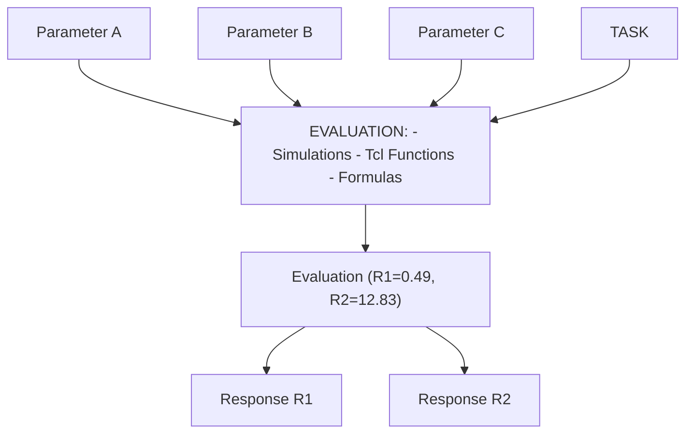
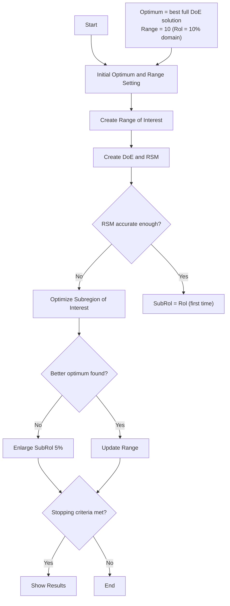

<!-- page:1 -->
# Optimizer User Guide

Version O-2018.06, June 2018

# Copyright and Proprietary Information Notice

<!-- page:2 -->
© 2018 Synopsys, Inc. This Synopsys software and all associated documentation are proprietary to Synopsys, Inc. and may only be used pursuant to the terms and conditions of a written license agreement with Synopsys, Inc. All other use, reproduction, modification, or distribution of the Synopsys software or the associated documentation is strictly prohibited.

# Destination Control Statement

All technical data contained in this publication is subject to the export control laws of the United States of America. Disclosure to nationals of other countries contrary to United States law is prohibited. It is the reader’s responsibility to determine the applicable regulations and to comply with them.

# Disclaimer

SYNOPSYS, INC., AND ITS LICENSORS MAKE NO WARRANTY OF ANY KIND, EXPRESS OR IMPLIED, WITH REGARD TO THIS MATERIAL, INCLUDING, BUT NOT LIMITED TO, THE IMPLIED WARRANTIES OF MERCHANTABILITY AND FITNESS FOR A PARTICULAR PURPOSE.

# Trademarks

Synopsys and certain Synopsys product names are trademarks of Synopsys, as set forth at https://www.synopsys.com/company/legal/trademarks-brands.html.

All other product or company names may be trademarks of their respective owners.

# Third-Party Links

Any links to third-party websites included in this document are for your convenience only. Synopsys does not endorse and is not responsible for such websites and their practices, including privacy practices, availability, and content.

Synopsys, Inc.

690 E. Middlefield Road

Mountain View, CA 94043

www.synopsys.com

<!-- page:3 -->
# About This Guide ix

Related Publications . . ix

Conventions ix

Customer Support . . . ix

Accessing SolvNet. . .

Contacting Synopsys Support . . .

Contacting Your Local TCAD Support Team Directly. . . .

# Chapter 1 Introduction to the Optimizer Tool 1

Functionality of Optimizer . . .

Starting Optimizer . . .

# Chapter 2 Using Optimizer 5

Basic Concepts and Terminology . . . .

Optimizer Structures . . .

Sequencing Tasks . . .

Task Interdependency . . .

Reference Example . .

Input Command File . . .

Main Blocks . . .

Start Block . . .

Global Options . . .

Task Block . . .

Inner Blocks . . . . . 10

Parameter Block . . . 10

Response Block . . . 12

Sequencing Tasks . . . . . 13

Determining Order of Tasks . . . 13

Using Previous Parameter Values . . . . 14

Evaluating Tasks . . . . . 14

Using Simulation Processes . . 14

Using Formulas and Functions . . . 15

Importing Partial Results From Previous Tasks . . . . . 16

Design-of-Experiments . . . . 18

Deterministic Design-of-Experiments . . . . 18

Stochastic Design-of-Experiments . . . . 22

<!-- page:4 -->
Response Surface Models . . . . . 24

Model Definition . . . 24

Model . . . 25

Transformation . . . 25

Degree. . . . 25

Model Information . . . . 26

Model Accuracy . . . 26

Model Coefficients . . . 26

Model Variance . 27

ANOVA Table . . . . 27

Histogram . . . . 27

Moments . . . . 27

Model Expressions . . . 27

Specific Tasks . . . . . 28

Parameters and Responses . . . . . 28

Iterations . 28

Final Analysis Tool . . . 29

Screening Task . . . . 29

Command Description . . . . 29

Output . . . 31

Optimization Task . . . . . 31

Optimization Criteria . . . . 32

Optimization Method. . . 33

Command Description . . . . 34

Output . . . . . 35

Iterative Optimization Task . . . . 35

Search Heuristic . . . 36

Definitions . . . 36

Algorithm . . . . 36

Stopping Criteria . . . . . 39

Computational Resources . . . . . 40

Quality of the Solution . . . . . 40

Closeness to a Local Optimum. . . . . 40

Evaluation Sequence. . . . . . 40

Response Value Range Termination . . . 41

Command Description . . . . 42

Declaration Examples for Range Termination . . . . 43

Output . . . . 44

Generic Optimization Task . . . . 45

Quasi-Newton Method Applied to Bound-Constrained Optimization Problems . . . . 46

Nonlinear Simplex Method . . 46

<!-- page:5 -->
Stopping Criteria . . . . 46

Command Description . . . . 47

Output . . . . . 48

Genetic Algorithm Task . . . 48

Main Steps of the Algorithm . . . . . 49

Stopping Criteria. . . . . . . 50

Command Description . . . . . 50

Mandatory Attributes . . . . 50

Optional Attributes . . . . 50

Files Generated by Genetic Algorithm . 52

Sensitivity Analysis Task . . . . 52

Command Description . . . . 54

Output . . . . . 55

Uncertainty Analysis Task . . . . 55

Mathematical Background. . . 56

Example . . . . . 57

Command Description . . . . 59

Output . . . . 61

Design-of-Experiments Task . . . . 62

Command Description . . . . 62

Output . . . . . 64

Stochastic Design-of-Experiments Task . . . . . 64

Command Description . . . . 64

Output . . . 65

Custom Task . . . 66

Command Description . . . . 66

Output . . . 67

Integration of Sentaurus Workbench . 67

Sentaurus Workbench Scenarios . . 67

Reusing All Simulation Results . . . . 68

Advanced Features . . 69

Restarting . . . . 69

Sequencing of Tasks . . . . 69

Example: Screening and Iterative Optimization. . . . . 70

Task Interdependency . 71

Exportable Information. . . 71

Convergence Plot. . . . 73

References. . . 74

<!-- page:6 -->
# Chapter 3 Reference Guide 75

Optimizer Commands . . . 75

Names and Symbols. . . . . 75

Global Options . . . . 76

Inner Blocks for Parameters 77

Inner Blocks for Responses . . . . 78

Inner Blocks for Stopping Criteria. . . . . 79

Specific Task Parameters for Screening . 80

Specific Task Parameters for Iterative Optimization. . . . . 80

Specific Task Parameter for Generic Optimization . . . . . 81

Specific Task Parameters for Genetic Algorithm Optimization . . . . 81

Specific Task Parameters for Sensitivity Analysis . . . . . 82

Specific Task Parameters for Uncertainty Analysis . . . . . . 83

Specific Task Parameters for Design-of-Experiments. . . . . 83

Specific Task Parameters for Stochastic Design-of-Experiments . . . . . 84

Custom Task Parameters . . . . 85

Output Files . . . . . . 85

Uncertainty Analysis Task. . . . 85

Sensitivity Analysis Task. . . . 86

Screening Task. . . . . 86

Generic Optimization Task . . . 87

Optimization Task . . . . . 87

Iterative Optimization Task . . . 87

Design-of-Experiments Task . . . . 88

Stochastic Design-of-Experiments Task . . . . 88

Mathematical Expressions . . . . 88

Gradient Vector . . . . 88

Hessian Matrix . . . 89

Equations for Response Surface Models . . . . . 89

Model Accuracy . . . . . 89

ANOVA Table. . . . . 90

Moments . 92

Optimization Problem . . . . . 94

Optimization . . . . 95

Gradient-Based Optimization Methods . . . . . 95

Step Direction . . . . . 96

Steepest Descent Direction. . . . 96

Newton Direction . . . . 96

Step-Length Method . . . . 97

Trust-Region Method . . . . 97

<!-- page:7 -->
Comparison. . . . . 98

Derivative Approximations and Optimization Methods . . . . 99

Finite-Difference Approximations . . . . 99

Quasi-Newton Methods . . . . 101

Nongradient-Based Methods . . . . . 102

Bound-Constrained Optimization Methods . . . . . 102

References. . . 104

<!-- page:8 -->
Contents

<!-- page:9 -->
The Optimizer tool is part of Synopsys Sentaurus™ Workbench Advanced. It is an analysis tool designed for parametric studies in large-scale projects with hundreds of individual simulations, such as automatic iterative optimization, sensitivity analysis, and uncertainty analysis. This user guide describes the model tasks and experiments that can be performed using Optimizer. The scripting language, equations, optimization methods, and mathematical expressions used with Optimizer are described in detail.

# Related Publications

For additional information, see:

The TCAD Sentaurus release notes, available on the Synopsys SolvNet® support site (see Accessing SolvNet on page x).   
■ Documentation available on SolvNet at https://solvnet.synopsys.com/DocsOnWeb.

# Conventions

The following conventions are used in Synopsys documentation.

<table><tr><td>Convention</td><td>Description</td></tr><tr><td>Blue text</td><td>Identifies a cross-reference (only on the screen).</td></tr><tr><td>Bold text</td><td>Identifies a selectable icon, button, menu, or tab. It also indicates the name of a field or an option.</td></tr><tr><td>Courier font</td><td>Identifies text that is displayed on the screen or that the user must type. It identifies the names of files, directories, paths, parameters, keywords, and variables.</td></tr><tr><td>Italicized text</td><td>Used for emphasis, the titles of books and journals, and non-English words. It also identifies components of an equation or a formula, a placeholder, or an identifier.</td></tr><tr><td>Menu &gt; Command</td><td>Indicates a menu command, for example, File &gt; New (from the File menu, select New).</td></tr></table>

# Customer Support

Customer support is available through the Synopsys SolvNet customer support website and by contacting the Synopsys support center.

<!-- page:10 -->
# Accessing SolvNet

The SolvNet support site includes an electronic knowledge base of technical articles and answers to frequently asked questions about Synopsys tools. The site also gives you access to a wide range of Synopsys online services, which include downloading software, viewing documentation, and entering a call to the Support Center.

To access the SolvNet site:

1. Go to the web page at https://solvnet.synopsys.com.   
2. If prompted, enter your user name and password. (If you do not have a Synopsys user name and password, follow the instructions to register.)

If you need help using the site, click Help on the menu bar.

# Contacting Synopsys Support

If you have problems, questions, or suggestions, you can contact Synopsys support in the following ways:

Go to the Synopsys Global Support Centers site on synopsys.com. There you can find email addresses and telephone numbers for Synopsys support centers throughout the world.   
Go to either the Synopsys SolvNet site or the Synopsys Global Support Centers site and open a case online (Synopsys user name and password required).

# Contacting Your Local TCAD Support Team Directly

Send an e-mail message to:

support-tcad-us@synopsys.com from within North America and South America   
support-tcad-eu@synopsys.com from within Europe   
support-tcad-ap@synopsys.com from within Asia Pacific (China, Taiwan, Singapore, Malaysia, India, Australia)   
support-tcad-kr@synopsys.com from Korea   
support-tcad-jp@synopsys.com from Japan

<!-- page:11 -->
This chapter provides an overview of the Optimizer tool.

# Functionality of Optimizer

Optimizer is a batch mode tool that is used to perform the efficient extraction of general information about TCAD simulations. For example, it is used to determine parameter settings that satisfy design specifications and to analyze how parameter variations affect the device behavior. It provides the following set of tools:

■ Design-of-experiments (DoE)

Comprehensive selection of experimental designs, including full and fractional factorial, Box–Behnken, Plackett–Burmann, and Taguchi, as well as random and stochastic designs. These techniques allow models to be built with a minimal number of simulations.

Response surface models (RSMs)

Interactive building and evaluation of empirical models. These models are polynomial approximations or interpolations of multidimensional responses to different parameter values. The accuracy is determined automatically. Parameter and response domains of different orders of magnitude are handled transparently.

Screening

Model coefficients are displayed to illustrate the impact of different parameters on the simulation responses.

Optimization

Maximize or minimize a certain response or find a parameter setting such that a response is close to a given value. Multiple optimization goals for different responses can be combined; weights specify their relative importance. A nonlinear optimizer based on sequential quadratic programming (SQP) is used to solve optimization problems.

Iterative optimization

Iterative heuristic search process of a parameter setting that optimizes the device behavior. At each iteration, a new region of the parameter domain is explored with the aim of finding a globally satisfactory set of parameter values.

<!-- page:12 -->
# 1: Introduction to the Optimizer Tool

Functionality of Optimizer

Generic optimization

Search for a parameter setting that optimizes the device behavior using generic optimization strategies. Both quasi-Newton and nonlinear simplex methods have been adapted for this purpose.

Genetic algorithm

The genetic algorithm optimization strategy is classified among the evolutionary approaches. The optimum is achieved after several iterations (called generations) in which a set of possible solutions is evaluated and, for each generation, a better set of experiments is examined.

Sensitivity analysis

Determine how small changes to a given parameter affect simulation responses.

Uncertainty analysis

Comprehensive analysis of how the variability of parameters affects the device behavior. Multidimensional stochastic RSMs are used to determine correlations between parameters and simulation responses and, ultimately, to extract an approximation of the probability density function of the simulation responses using the Monte Carlo method.

Custom algorithm

Optimizer allows the definition and use of custom algorithms that can address specific tasks that might not be available through the standard task types. The definition of the algorithm can use all of the structures and procedures of Optimizer, for example, building a DoE or an RSM.

These tools can be combined sequentially in a single Optimizer run. For example, a screening task can be combined with an iterative optimization task. The screening task would first identify which parameters have the strongest impact on the simulation responses and, then, the iterative optimization task would find values for the selected parameters that optimize the device behavior.

Optimizer interacts with batch tools of Sentaurus Workbench for setting up and running simulations in the context of TCAD simulation projects. It is possible to take advantage of the job scheduler of Sentaurus Workbench to speed up simulations using distributed, heterogeneous, corporate computing resources. The open architecture and tool interface of Sentaurus Workbench allow Optimizer to be used for a wide range of purposes.

<!-- page:13 -->
# Starting Optimizer

Optimizer can be started from the user interface of Sentaurus Workbench by choosing Optimization > Run or from the command line using:

```txt
swbopt <options> <project_dir> 
```

where <project\_dir> is the name of the project to be executed. Usually, it is a project directory of Sentaurus Workbench. By default, Optimizer reads a command file called gopt.cmd from the directory <project\_dir>. This file contains the tasks that Optimizer must perform; its syntax and definitions are discussed in Input Command File on page 8.

The following command-line options are available:   
```txt
-h[elp] : Displays this help message
-v[ersion] : Displays the version number
-verbose : Displays all messages
-silent : Deactivates standard output display
-q[ueue] : Allows to select a queue for running simulations
-expr : Shows the polynomial representation of all models created
-export : Exports created model to a PCM XML file
-patch FILE: Allows an external Tcl patch file to be loaded 
```

<!-- page:14 -->
1: Introduction to the Optimizer Tool Starting Optimizer

<!-- page:15 -->
Optimizer is a batch tool designed to facilitate the analysis of simulations. It uses batch tools of Sentaurus Workbench to run simulations automatically in the context of TCAD simulation projects.

# Basic Concepts and Terminology

This section describes some common terms relevant to understanding Optimizer:

A parameter is a scalar variable that modifies the simulation flow, which allows you to define families of similar simulations. It is a finite value that is defined inside a certain domain. Parameter definition is taken automatically from the project of Sentaurus Workbench. Therefore, only parameters of Sentaurus Workbench can be used by Optimizer. The parameter categories are as follows:

user-defined: Parameters with values that are specified by users.   
• doe: Parameters with values that are set using a deterministic design-of-experiments.   
• sdoe: Parameters with values that are set using a stochastic design-of-experiments.

■ A response is a scalar variable or simulation output that describes, for example, the device behavior.   
An experiment or parameter setting is a tuple that contains one value for each parameter of the project of Sentaurus Workbench. A family of simulations is defined as a set of simulations that have the same parameter values for all ‘doe’ and ‘sdoe’ parameters, but can have different values for ‘user-defined’ parameters. An evaluation is defined as all the simulations required to compute a given family of simulations.   
A scenario is a subtree of a simulation tree of Sentaurus Workbench that defines a particular subset of experiments. Scenarios can overlap, that is, a particular node or path can be part of more than one scenario. When Optimizer submits a new set of experiments to batch tools of Sentaurus Workbench, a new scenario is added to the simulation tree so as to add all new experiments. In Sentaurus Workbench, scenarios can be run and edited independently.   
A task is a sequence of actions used to obtain information about the relationship between the parameters and responses under consideration.

<!-- page:16 -->
# Optimizer Structures

The main object that links all relevant elements in Optimizer is the task. A task usually requires the evaluation of how several combinations of different parameter settings produce different response values. These evaluations can be performed through an external simulation process, mainly invoked and coordinated by the batch tools of Sentaurus Workbench, but they can also be performed by evaluating a tool command language (Tcl) function or a formula.


<details>
<summary>flowchart</summary>


</details>

Figure 1 Tasks require the evaluation of multiple parameter settings

# Sequencing Tasks

More than one task can be performed in a single execution. Tasks can use the evaluations and information obtained in previous tasks. For example, if a task requires the evaluation of a family of simulations that has already been evaluated by a previous task, that family is not reevaluated and the values are recovered by the next task. That is, if a screening task selects only some parameters, only those are considered in subsequent tasks.

# Task Interdependency

A task can use values obtained as results of other executed tasks. This scheme identifies ‘parents’ and ‘children’ tasks. Data is shared from parents to children tasks using an exportand-import mechanism, which allows for the declaration of which values of one task can be exported and which name is used to import them from another task.

For example, you can combine an iterative optimization task with an uncertainty analysis task, allowing the goal of the optimization to be the minimization of the variance of the responses. This concept is also known as robust design.

A single run of Optimizer can be related to multiple projects because a different response can be obtained from different tasks that are related to different projects.

Several values can be imported and exported from one task to another (see Task Interdependency on page 71).

<!-- page:17 -->
# Reference Example

The examples in this user guide correspond to an NMOSFET project where device behavior is studied by analyzing the following simulation responses: threshold voltage (VT1\_WL) and breakdown voltage (VBR). The analysis considers different values of the following parameters:

■ p-well implantation dose (PW\_DOSE)   
Gate oxide thickness (TH\_OX)   
Channel dose (CH\_DOSE)   
■ LDD implantation dose (LDD\_DOSE)   
■ Spacer length (SP\_LENGTH)

An example of the definition of the input command file is:

```hcl
Start {
    nextTask = SCR1
}

Task {
    name = SCR1
    type = SCREENING
    Parameter {
    { name = PW_DOSE type = doe min = 1e12 max = 1e13 scale = logarithmic }
    { name = TH_OX type = doe min = 15 max = 20 }
    { name = CH_DOSE type = doe min = 4e11 max = 4e12 scale = logarithmic }
    { name = LDD_DOSE type = doe min = 5e12 max 5e13 scale = logarithmic }
    { name = SP_LENGTH type = doe min = 0 max = 300 }
    }
    Response {
    { name = VT1_WL model = standard degree = 1 }
    { name = Vbr model = standard degree = 1 }
    }
    doe = plackettBurmann
    screenRange = 2.0
    screenCriteria = average
    nextTask = end
} 
```

This example input file shows the following main aspects:

Only one task is defined, called SCR1. It corresponds to a screening task and is the first one to be executed according to the definition in the Start block.   
Five parameters are analyzed inside a given range (linearly or logarithmically scaled). Their values are generated using a Plackett–Burmann design-of-experiments.

Two responses are considered.   
The main tool to be used is SCREENING. It will analyze which parameters are relevant for the responses, considering how changes to parameter values affect response values. Those parameters that have an average effect (on both responses) greater than 2% are selected.

<!-- page:18 -->
# Input Command File

The command file gopt.cmd defines a set of Optimizer tasks. This file consists of a sequence of blocks that can be in any order and contain inner blocks. A block has always the following structure: block\_name { body }. The body of a block is a sequence of either other blocks or data values.

A data value is an attribute and its corresponding value or an array of data values. An array of data values is a set of related data values.

Main blocks are separated into different lines. Inside the body of a block, data is separated by line feeds or multiple spaces. Keywords of Optimizer are case sensitive and syntax sensitive, for example, parentheses must be consistent. All lines starting with the symbol ‘#’ are ignored.

This section describes and provides an example of each block. Optimizer Commands on page 75 provides reference tables specifying the elements that can be used in each block.

# Main Blocks

# Start Block

This block is used to define initial characteristics of parameters and responses, and to set global options. You can specify the Start block anywhere in the input command file, at the beginning or end, or between task specifications.

In the following example, the Start block specifies a user-defined parameter VARIABLE, which is not used by any task and takes the values 0 and 1 (the initial task is set to 1):

```hcl
# Define initial conditions and start first task
Start {
    Parameter {
    { name = VARIABLE type = ud values = {0 1} }
    }
    nextTask = 1
} 
```

<!-- page:19 -->
# Global Options

Optimizer stops if one of the following global stopping criteria is reached:

<table><tr><td>maxGlbNumEvaluations</td><td>Global maximum number of evaluations.</td></tr><tr><td>maxGlbTime</td><td>Maximum wallclock time that Optimizer is allowed to run.</td></tr><tr><td>maxGlbTimeUnit</td><td>(seconds, minutes, hours, or days) Global time unit. The default unit is second [s].</td></tr></table>

Other stopping criteria are task dependent and must be specified in the corresponding task definition. The following global options are also available:

nextTask Alphanumeric identifier of the first task that Optimizer runs.

exportTable This option is used to export a table containing the different parameter settings and all response values to a file (in tab-delimited format). The argument of this option is the file name.

Global options can be modified in any task. nextTask must be set in all tasks to indicate which task is executed next. exportTable can be set differently to export the results of each task to different files.

# Task Block

This block is used to define Optimizer tasks that are executed according to a user-specified order. Each task definition contains a block that states the selected parameters and responses. In addition, some task-specific options can be set. The following sections describe the different tasks and their specific options that are available in Optimizer.

The main attributes of a task are:

name Alphanumeric identifier of the task.

type Type of task to be performed, including DOE, SDOE, SCREENING, OPTIMIZATION, GEN\_OPTIMIZATION, ITER\_OPTIMIZATION, SEN\_ANALYSIS, UNC\_ANALYSIS, GENETIC\_OPTIMIZATION.

project Name of Sentaurus Workbench project. Each task can be linked to a different Sentaurus Workbench project. Parameter names must match the parameters of the corresponding project. The task attribute ‘project’ is optional and its default value is " ", which references the directory where the input command file is located.

<!-- page:20 -->
Parameter See Parameter Block on page 10 for their corresponding declarations.

Response See Response Block on page 12 for their corresponding declarations.

A simple example of a task declaration is:   
```hcl
Task {
    name = SCR1
    type = SCREENING
    Parameter {
    { name = PW_DOSE type = doe min = 1e12 max = 1e13 scale = logarithmic }
    { name = TH_OX type = doe min = 15 max = 20 }
    { name = CH_DOSE type = doe min = 4e11 max = 4e12 scale = logarithmic }
    { name = LDD_DOSE type = doe min = 5e12 max 5e13 scale = logarithmic }
    { name = SP_LENGTH type = doe min = 0 max = 300 }
    }
    Response {
    { name = VT1_WL model = standard degree = 1 }
    { name = Vbr model = standard degree = 1 }
    }
    doe = plackettBurmann
    screenRange = 2.0
    screenCriteria = average
    nextTask = end
} 
```

# Inner Blocks

This section describes some inner blocks that are common to all tasks.

# Parameter Block

A parameter is characterized by the following attributes:

```txt
name Unique identifier.
type (ud, doe, sdoe, or scen) Parameter type. The default is user-defined (ud). 
```

The remaining parameter attributes are type dependent.

<!-- page:21 -->
# User-Defined Parameters

values If the parameter is user defined, these values are used to create the different family of simulations.

# Design-of-Experiments (DoE) Parameters

max Highest possible value for DoE generation.

min Lowest possible value for DoE generation.

scale (linear or logarithmic) Interpolation method for creating intermediate values between the lower and upper bounds. A logarithmic scale can be used only when all possible parameter values are positive or negative. The default is linear.

doeArgs Some DoEs require certain parameter-dependent attributes to be specified (see the DoE used in the task example in Design-of-Experiments Task on page 62).

selValue Selected value. It can be used as the nominal value of a sensitivity analysis task or the starting point of an optimization task. If its value is set to autoValue, it takes the value from the previous executed task. In addition, the import capacity between tasks can be used for parameters to obtain a value from another parameter. When selValue is set to import.X1, this means that the value of X1, defined in another task, will be inherited by this task.

# Stochastic Design-of-Experiments (SDoE) Parameters

SDoEModel Probability distribution. This is a block compound of two attributes:

type: (normal, uniform, expon, beta, or gamma) Probability distribution type. Default distribution is normal.

args: Arguments of the probability distribution.

For example, if a given parameter has a normal distribution, two arguments must be provided – mean and variance. The default is {0 1}, which corresponds to the mean and variance of the standard normal distribution.

sdoeArgs Closely analogous to the deterministic case. Some stochastic DoEs require certain parameter-dependent attributes to be specified (see the DoE used in the uncertainty analysis task example in Example on page 57).

<!-- page:22 -->
# Scenario-Originated Parameters

It is also possible to use a previously defined scenario to set the values of some parameters. In that case, the required parameter is defined as a scenario type, which means that this parameter inherits all values defined in the specified scenario.

```txt
values This attribute specifies the scenario to be used to set these parameter values. The declaration has two parts: the path to the referenced project and the scenario name in that project:
{ [path-to-example] [scenario-name] } 
```

# Response Block

A response is characterized by the following attributes:

<table><tr><td>name</td><td>Unique identifier.</td></tr><tr><td>model</td><td>(standard, kriging, or stochastic) Type of response surface model (RSM).</td></tr><tr><td>transformation</td><td>(exp, log, sqrt, or sqr) Transformation of the RSM.</td></tr><tr><td>degree</td><td>(1, 2, or 3) If a polynomial model is used, this attribute represents the degree of the RSM.</td></tr><tr><td>crit</td><td>(minimal, maximal, or closeto) Optimization goal.</td></tr><tr><td>target</td><td>If the optimization criterion closeto is used, this argument represents the target value.</td></tr><tr><td>lowerBound</td><td>Minimum limit related to the algorithm stopping range (used for optimizations).</td></tr><tr><td>upperBound</td><td>Maximum limit related to the algorithm stopping range (used for optimizations).</td></tr><tr><td>perc_range</td><td>Percentage related to the target value for which the stopping range is defined.</td></tr><tr><td>weight</td><td>Relative importance assigned to the simulation response.</td></tr><tr><td>modelArgs</td><td>Stochastic RSM specification. Although, there is always the possibility of declaring each term of the stochastic specification, some keywords help their automatic internal generation: linear, interaction, quadratic, and cubic. By specifying one or more of these keywords, they are replaced by the requested parameter combinations.</td></tr></table>

<!-- page:23 -->
source

Task responses can be computed by calling other tasks (particularly simulation tasks that perform actual simulations), evaluating a formula, or calling a function. This attribute allows for specifying how to compute the response values. This attribute is optional, but when declared, it must be the name of an existing task, a previously defined formula, or a function.

# Sequencing Tasks

For a specific run of Optimizer, the order in which tasks are executed can be determined and controlled by users using a specific command file definition. The sequence in which tasks are executed can be useful, for example, to perform a screening task before an optimization task, which will use only those parameters selected by the screening process to be optimized.

This concept involves two considerations: declaring the order in which tasks are executed and declaring how the results of the first task affect the start and evaluation of the second task.

# Determining Order of Tasks

The starting task is defined by using its identifier on the nextTask attribute of the Start block:

```hcl
# Define initial conditions and start first task
Start {
    ...
    nextTask = SCR1
} 
```

In this example, the task identified by SCR1 is executed first. Then, each following task to be executed is defined in the nextTask attribute of the previous task:

```txt
Task {
    ...
    nextTask = OPT
} 
```

The final task sets the nextTask attribute to end.

<!-- page:24 -->
# Using Previous Parameter Values

To use values of parameters from a previously executed task, the selValue attribute in the Parameter block must be set to autoValue:

```hcl
Task {
    ...
    Parameter {
    { name = A selValue = autoValue }
    { name = B selValue = autoValue }
    }
    ...
} 
```

# Evaluating Tasks

To obtain values for each of the responses declared in a task, their source attribute defines how the task will be evaluated. Response values can be set as the result of a simulation process, a mathematical formula, or a tool command language (Tcl) function.

# Using Simulation Processes

To use a simulation process, the source attribute of a response can be set to a specific task. Simulation tasks perform the actual interaction with the proper simulation tools. A simulation task can be declared as:

```hcl
Task {
    name = "Simulation"
    type = SIMULATION
    project = "MOS"
    Parameter {
    { name = project_PA type = doe selValue = import.A }
    { name = project_PB type = doe selValue = import.B }
    }
    Response {
    { name = delta }
    }
    Export {
    { name = delta_1 value = delta }
    }
} 
```

Here, the project name explicitly references a project of Sentaurus Workbench where a simulation process is defined. The response delta will be obtained from the simulation.

<!-- page:25 -->
A second task defined to recover the values generated by this simulation task can be declared as:

```hcl
Task {
    name = SCR1
    type = SCREENING
    Parameter {
    { name = A type = doe min = -1000 max = 1000 }
    { name = B type = doe min = -1000 max = 1000 }
    }
    Response {
    { name = delta_1 model = standard degree = 1 source = Simulation }
    }
    doe = plackettBurmann
    nextTask = end
} 
```

In the task SCR1 declaration, the values of the response delta\_1 are obtained from the task named Simulation.

NOTE If not declared, a simulation task is always created internally by default. If no simulation task is defined as the source for responses defined in a task, then internally, these responses are obtained by executing the default simulation task, which is related to the Sentaurus Workbench project of the directory where the input command file is located.

# Using Formulas and Functions

In some cases, the evaluation of a specific response can be obtained by simply applying a mathematical formula or some calculation function that can use all or some of the declared parameters. In this case, no simulation is performed, thereby obtaining response values almost immediately.

For example, a task can compute R1 and R2 using simulation and calculate RTotal as R1+R2. This feature is also useful when the simulation can be replaced by a previously researched formula and a complete Optimizer run can finish in a fraction of the time involved in simulation runs.

To use a function, it must be declared in the command file. Usually, the definition of the function is declared at the beginning of the command file, using standard syntax for a Tcl code function declaration. An example of this type of declaration is:

```txt
proc RosenFunction { x1 x2 } {
    set rosen [expr 10 + 100 * pow($x2-$x1*$x1,2) + pow(1-$x1,2)]
    return $rosen
} 
```

<!-- page:26 -->
The task response that is evaluated using this function can be declared as the following, using the keyword function in the source value specification:

```txt
Task {
    ...
    Response {
    { name = Rosen source = "function RosenFunction X1 X2" }
    }
} 
```

Moreover, a second response can be obtained as a mathematical formula involving the other response, thereby making both responses dependent on the function evaluation.

This declaration must use the keyword formula in the source value specification:

```hcl
Task {
    ...
    Response {
    { name = Rosen source = "function RosenFunction X1 X2" }
    { name = Rosen2 source = "formula Rosen*X1+X2" }
    }
} 
```

Response or parameter names can be used directly in a formula.

# Importing Partial Results From Previous Tasks

Occasionally, it might be useful to retrieve partial values from either parameter or response values obtained in tasks already performed. They can be used, for example, to define new boundaries for an optimization task based on the results of previous optimization tasks.

The syntax to gain access to these values is:

```txt
<task_name>: <par|res>: <item_name> 
```

where:

<task\_name> is the valid name for a task in the project. The indicated task should have been performed before the one in which you need to use it.   
■ <par|res> defines whether a parameter (par) or a response (res) is to be imported.   
<item\_name> is the name of the parameter or response to be imported.

A valid name for this syntax can be, for example, Iter1:par:A (which can be thought of as ‘the resulting value for parameter A in the task Iter1’). There must be no spaces between the composing elements.

<!-- page:27 -->
This simple syntax can be embedded between more complex expressions by enclosing the entire expression with the @ character, for example:

```txt
Parameter {
    { name = A type = doe min = @Iter1:par:A - Iter1:res:Z@
    max = @(Iter1:par:B * 0.05) + 1@ }
    ...
} 
```

The value that will be imported into and be replaced in these expressions is the optimum value found for the required parameter or response in the indicated task.

The following example illustrates how to import the results of task Iter1 for defining the parameter domain in task Iter2:

```hcl
Task {
    name = Iter1
    type = ITER_OPTIMIZATION
    project = ""
    Parameter {
    { name = A type = doe min = -5 max = 5 }
    { name = B type = doe min = -20 max = 20 }
    { name = C type = doe min = -100 max = 100 }
    }
    ...
    nextTask = Iter2
}
Task {
    name = Iter2
    type = ITER_OPTIMIZATION
    project = ""
    Parameter {
    { name = A type = doe min = @0.8*Iter1:par:A@ max = @Iter1:par:A*1.2@
    { name = B type = doe min = -20 max = 20 }
    { name = C type = doe min = -100 max = 100 }
    }
    ...
} 
```

In task Iter2, the values for both the min and max boundaries for parameter A are imported as the optimum values obtained for the same parameter (A), multiplied by 0.8 and 1.2, respectively.

<!-- page:28 -->
# Design-of-Experiments

The main concept for all tasks is the generation of satisfactory scenarios to run the required tools. This generation is called design-of-experiments (DoE). DoE techniques are methods to create a well-defined subset of the parameter domain according to the simulation goal. When multiple parameters $( p _ { 1 } , . . . , p _ { n } )$ exist, the parameter domain is defined as the set of all possible combinations of parameter values.

If $V ( \boldsymbol { p } _ { i } )$ is the set of possible values for parameter $p _ { i }$ , the parameter domain can be described as the set of possible tuples:

$$
P S = \left\{\left(v _ {1}, \dots , v _ {n}\right) \mid v _ {i} \in V \left(p _ {i}\right) \right\} \tag {1}
$$

A DoE is a small set of special values that are used to explore relevant subsets of the parameter domain to achieve a simulation goal with the least number of experiments.

# Deterministic Design-of-Experiments

Deterministic designs-of-experiments (DoEs) usually consider a subset of the parameter domain where each parameter is inside a given range. You must define only a minimum and maximum value. Parameter values are then automatically computed according to the selected DoE:

$$
D O E = \left\{\left(v _ {1}, \dots , v _ {n}\right) \mid v _ {i} \in \left[ \min _ {i}, \max _ {i} \right] \right\} \subseteq P S \tag {2}
$$

where $m i n _ { i }$ and $m a x _ { i }$ are the minimum and maximum values for the parameter $p _ { i }$ .

Optimizer provides some of the most common DoEs [1][2] as follows:

Full factorial

For each parameter, a subset of values is selected. The values can be selected either equidistantly or randomly. Simulations run for all combinations formed from these values. A special case is the full factorial design at two levels, where each parameter accepts its minimum and maximum values.

Half factorial at two levels (+), Half factorial at two levels (–)

These are two halves of a full factorial design at two levels. Figure 2 on page 19 shows fullfactorial and half-factorial designs for three parameters.


<details>
<summary>text_image</summary>

Full Factorial
Half Factorial
● half + ● half -
p_k
p_i
p_j
p_k
p_i
p_j
</details>

Figure 2 Factorial design-of-experiments

<!-- page:29 -->
Fractional factorial at two levels

These are fractions of a full-factorial design at two levels and are used to reduce the number of simulations. The following criteria are used to select a given fractional factorial design:

• Number of times the full-factorial design is divided   
• Resolution, which is the type of interaction that must be estimated   
• Number of experiments

Figure 3 shows a fractional-factorial design of resolution III for three parameters.   


<details>
<summary>text_image</summary>

Fractional Factorial
of Resolution III
p_k
p_j
p_i
p_k
<!-- page:30 -->
Plackett–Burmann
p_j
p_i
</details>

Figure 3 First-order design-of-experiments

Table 1 Different combinations of two-level fractional-factorial designs supported by Sentaurus Workbench 

<table><tr><td>Parameters</td><td>Fraction</td><td>Resolution</td><td>Experiments</td></tr><tr><td>3</td><td>1</td><td>III</td><td>4</td></tr><tr><td>4</td><td>1</td><td>IV</td><td>8</td></tr><tr><td>5</td><td>1</td><td>V</td><td>16</td></tr><tr><td>5</td><td>2</td><td>III</td><td>8</td></tr><tr><td>6</td><td>1</td><td>VI</td><td>32</td></tr><tr><td>6</td><td>2</td><td>IV</td><td>16</td></tr><tr><td>6</td><td>3</td><td>III</td><td>8</td></tr><tr><td>7</td><td>1</td><td>VII</td><td>64</td></tr><tr><td>7</td><td>2</td><td>IV</td><td>32</td></tr><tr><td>7</td><td>3</td><td>IV</td><td>16</td></tr><tr><td>7</td><td>4</td><td>III</td><td>8</td></tr><tr><td>8</td><td>1</td><td>VIII</td><td>128</td></tr><tr><td>8</td><td>2</td><td>V</td><td>64</td></tr><tr><td>8</td><td>3</td><td>IV</td><td>32</td></tr><tr><td>8</td><td>4</td><td>IV</td><td>16</td></tr><tr><td>9</td><td>2</td><td>VI</td><td>128</td></tr><tr><td>9</td><td>3</td><td>IV</td><td>64</td></tr><tr><td>9</td><td>4</td><td>IV</td><td>32</td></tr><tr><td>9</td><td>5</td><td>III</td><td>16</td></tr><tr><td>10</td><td>3</td><td>V</td><td>128</td></tr><tr><td>10</td><td>4</td><td>IV</td><td>64</td></tr><tr><td>10</td><td>5</td><td>IV</td><td>32</td></tr><tr><td>10</td><td>6</td><td>III</td><td>16</td></tr></table>

# Plackett–Burmann

These designs are special cases of two-level fractional factorial designs for studying parameters in simulations, where is a multiple of four. Figure 3 onK = N – 1 N N page 19 shows a Plackett–Burmann design for three parameters.

<!-- page:31 -->
Face-centered central composite, small central composite, Box–Behnken

These designs are special cases of three-level (minimum-center-maximum values) fractional factorial designs, used to fit response surfaces of second-order, running a small number of simulations. Figure 4 shows a Box–Behnken and a face-centered central composite design for three parameters.


<details>
<summary>text_image</summary>

Box-Behnken
Face-centered Central Composite
p_k
p_i
p_j
p_k
p_i
p_j
</details>

Figure 4 Second-order design-of-experiments

Central composite inscribed, central composite circumscribed, orthogonal central composite, custom central composite

These are special cases of composite designs that construct a design with five levels for each parameter. The custom central composite design allows you to enter the distance of the star point from the center of the design.

Taguchi

These designs are based on orthogonal arrays, which are a set of standard fractional factorial experiments.

■ Latin square

For three parameters, a family of simulations is generated, so that all levels of a given parameter are combined in one simulation with all levels of the other parameters.

Greco-Latin square

This is analogous to the Latin square, but for four parameters.

■ Diagonal

A number of experiments is selected along the diagonal, across the parameter domain.

Center points

Only one experiment is selected. Each parameter takes the middle value between its minimum and maximum values.

■ Random

A number of experiments is selected randomly.

<!-- page:32 -->
When a DoE is selected, it is generally important to consider the simulation goal. The most common goals are:

Screening: Many parameters are usually considered in order to identify the parameters (if any) that have a strong impact on the simulation responses. Fractional factorial designs of resolution III and Plackett–Burmann designs can be used for this purpose. Figure 3 on page 19 shows two screening designs-of-experiments for three parameters: fractional factorial of resolution III and Plackett–Burmann. In this case, both designs are symmetric and equal to a half factorial at two levels (+) design and a half factorial at two levels (–) design, respectively.   
■ Optimization: Usually, first-order or second-order approximations of simulation responses are used for optimization. Fractional factorial designs of resolution III are used to estimate first-order models. Face-centered central composite, small central composite, or Box–Behnken designs are used to estimate second-order models. Figure 4 on page 21 shows two DoEs suitable to create second-order RSMs: Box–Behnken and face-centered central composite.

Table 2 lists DoEs used to create second-order polynomial models.   
Table 2 Second-order designs 

<table><tr><td>Parameters</td><td>Face-centered central composite</td><td>Small central composite</td><td>Box-Behnken</td></tr><tr><td>1</td><td>3</td><td>3</td><td>3</td></tr><tr><td>2</td><td>9</td><td>9</td><td>6</td></tr><tr><td>3</td><td>15</td><td>15</td><td>13</td></tr><tr><td>4</td><td>25</td><td>17</td><td>25</td></tr><tr><td>5</td><td>43</td><td>23</td><td>41</td></tr><tr><td>6</td><td>77</td><td>33</td><td>49</td></tr><tr><td>7</td><td>143</td><td>43</td><td>56</td></tr><tr><td>8</td><td>273</td><td>49</td><td>-</td></tr><tr><td>9</td><td>531</td><td>-</td><td>-</td></tr><tr><td>10</td><td>1045</td><td>-</td><td>-</td></tr></table>

# Stochastic Design-of-Experiments

Stochastic RSMs are used to understand how the variability of parameters affects device behavior. These models are built using a family of simulations that sample those regions of the parameter domain that correspond to events that are more likely to happen. Parameter values are automatically computed when a stochastic design-of-experiments (SDoE) is selected. Only the probability distribution of the parameters must be specified.

<!-- page:33 -->
The following designs are implemented:

Monte Carlo: Experiments are based on a sequence of independent random values for each parameter. The sequences are combined so that the first experiment uses the first value of each independent sequence, the second experiment uses the second value of each independent sequence, and so on. The sequences of random values must be uncorrelated.   
Corner: Experiments are the full combination of the boundary values of each parameter. The number of simulations is $2 ^ { n }$ , where is the number of parameters.n   
Boundary: This design is based on the mean and boundary values of each parameter. In each simulation, all but one of the parameters are equal to their corresponding mean. The remaining parameter takes one of its boundary values. The number of experiments is $2 ^ { * } n$ , where is the number of parameters.n   
Probabilistic collocation: To build stochastic RSMs that approximate the simulation responses on the highest probability region of the parameter domain (see Response Surface Models on page 24), it is necessary to have a DoE that samples that specific region. For each parameter $p _ { i }$ , a subset of $n _ { i } + 1$ values is selected. These values are the roots of the orthogonal polynomial of order $n _ { i } + 1$ associated with the probability density function of the parameter. Simulations are run for all combinations of these values. The simulation results are used to build stochastic RSMs for all simulation responses. These models can contain any terms that combine orthogonal polynomial of order up to $n _ { i }$ on the parameter $p _ { i }$ .

The mean and boundary values required by corner and boundary designs are arbitrary and depend on the probability distribution associated with each parameter. These values are defined for the two most common distributions: normal and uniform.

Normal distribution is defined by specifying two attributes: mean ( ) and variance μ $( \sigma ^ { 2 } )$ ). Uniform distribution is characterized by the lower bound ( ) and upper bound ( ) of thea b considered domain. Table 3 defines the mean and boundary values for these distributions.

Table 3 Mean and boundary values 

<table><tr><td>Probability distribution</td><td>Lower bound</td><td>Mean</td><td>Upper bound</td></tr><tr><td>Normal</td><td> $\mu - \sigma$ </td><td> $\mu$ </td><td> $\mu + \sigma$ </td></tr><tr><td>Uniform</td><td> $a$ </td><td> $(a + b) \div 2$ </td><td> $b$ </td></tr></table>

Figure 5 on page 24 shows a probabilistic design for two parameters. One $( \mathbf { X } _ { 1 } )$ has a uniform probability distribution; the other $( \mathbf { X } _ { 2 } )$ has a normal (Gaussian) probability distribution.


<details>
<summary>scatter</summary>

| x1 ~ U(a, b) | x2 ~ N(μ, σ) | Label              |
| ------------ | ------------ | ------------------ |
| 0            | 0            | H3(x2) = 0        |
| 0            | √3σ          | μ + √3σ            |
| 0            | μ            | μ                  |
| 0            | -√3σ         | μ - √3σ            |
| 0            | 0            | (a + b)/2           |
| 0            | 0            | H3(x1) = 0        |
</details>

Figure 5 Stochastic design-of-experiments

<!-- page:34 -->
# Response Surface Models

Response surface modeling [3][4] is a technique for creating approximated mathematical models (RSMs) of simulation responses. These models are used to perform the following:

Determine which parameters have a significant effect on simulation responses (see Screening Task on page 29).   
Determine how parameters affect the behavior of simulation responses.   
Evaluate different parameter settings.   
Find a parameter setting that optimizes a weighted function of the simulation responses (see Optimization Task on page 31, Iterative Optimization Task on page 35, and Generic Optimization Task on page 45).   
Perform sensitivity or uncertainty analysis (see Sensitivity Analysis Task on page 52 and Uncertainty Analysis Task on page 55).

<!-- page:35 -->
# Model Definition

The options used to customize RSM formation are model, transformation, and degree.

# Model

Both deterministic and stochastic models can be defined. Deterministic models are used mainly for optimization and to determine how parameter values affect the simulation responses. Two kinds of deterministic models are provided: standard polynomial models and Kriging models.

Standard polynomial models are computed using the least square method. A Kriging model is a standard polynomial model with an extra function that ensures the RSM passes exactly through all simulated response values. If the RSM is evaluated for a parameter setting that was used to create the model, the result is exactly the same as the simulated response value for that particular parameter setting.

Stochastic RSMs are used for uncertainty analysis. A probability density function must be provided for each parameter that is used to create the stochastic RSM. The terms of the stochastic polynomial model must be specified. These terms are not based on the parameters, as in the deterministic case, but on the orthogonal polynomial associated with the probability density function of the parameters (see Uncertainty Analysis Task on page 55).

# Transformation

NOTE This option is considered only for deterministic models.

Usually, the metrics in which data is recorded are chosen for convenient measurement; however, they are not those in which the system is most simply modeled. To achieve the most appropriate scaling, a transformation can be applied to the simulation response. Nonlinear transformations, such as the square root, logarithm, and reciprocal of some (necessarily positive) response , expand the scale at one part of the range and contract it at another.Y Transformations $y = { Y } ^ { a l { \hat { p } } h a }$ , in which $a l p h a$ is less than one, contract the range at high values and can be called contractive transformations. Power transformations with greater thanalpha one have the reverse effect and can be called expansive. The supported transformations are log, exp, sqrt, and sqr. By default, no transformation is used.

# Degree

NOTE This option is considered only for deterministic models.

In practice, it is often assumed that a polynomial of first or second degree adequately approximates the true function over a limited region of the parameter domain. First-order, second-order, and third-order polynomial models are supported.

A model cannot be created if there are less than linear-independent simulation( ) n + 1 experiments for a first-degree polynomial model or $( n + 1 ) ( n + 2 ) / 2$ linear-independent simulation experiments for a second-degree polynomial model.

<!-- page:36 -->
A general rule is that at least or( ) n + 1 $( n + 1 ) ( n + 2 ) / 2$ different experiments are required, respectively; this is the only necessary condition. It is strongly recommended to use a family of simulations created by DoE techniques because they consider this condition (see Deterministic Design-of-Experiments on page 18).

# Model Information

If an RSM is built, the following information can be computed for each response.

# Model Accuracy

The following statistics measure the model accuracy:

The coefficient of determination $( R ^ { 2 } )$ ) measures the predictive capacity of the model. It represents the proportion of the variation in the simulation response that can be predicted by changes in the values of the parameters. It ranges from 0 to 1. Expressed as a percentage, it represents the proportion of the real values that can be predicted by the model. It is often used as an overall measure of the fit obtained. The value of $\pmb { R } ^ { 2 }$ must be as close to 1 as possible.   
A large value of $\pmb { R } ^ { 2 }$ does not necessarily imply that the regression model is satisfactory. Reducing the number of simulations always increases $\pmb { R } ^ { 2 }$ . To deal with this problem, it is recommended to use an adjusted version of the $\pmb { R } ^ { 2 }$ statistic $( { R } _ { a d j } ^ { 2 } )$ . When ${ \bf \bar { \theta } } _ { { \bf R } } { } ^ { 2 }$ and $\pmb { R } _ { a d j } ^ { 2 }$ Si differ dramatically, there is a high risk that the model is not sufficiently accurate.   
The estimated variance of the error $( s ^ { 2 } )$ is a measure of the model variability. Clearly, a low value is preferred.

Model Accuracy on page 89 describes the computation of these statistics.

# Model Coefficients

Coefficients can be interpreted as either the coefficients of the polynomial function or a measure of the effect of the parameters on the simulation response. In the model information section, the following data is displayed:

Coefficients: The values of the coefficients indicate how much the simulation response differs if a parameter is varied in one unit. These coefficients are also used to measure the effect of each parameter on the simulation responses.   
Normalized coefficients: As each parameter has a different domain, it is not possible to compare the previous coefficients directly. It is more effective to work with a normalized range, in which the lower bound and upper bound of the parameter domain are normalized to –1 and 1, respectively. The normalized coefficients are used to determine, by direct

<!-- page:37 -->
inspection, which parameter or parameter interaction has the most influence on the simulation response.

Rank: To simplify the identification of the most significant normalized coefficients, the influences of the different parameters are ranked on a percentage scale.

# Model Variance

You can compute which fraction of the total variance is due to each term of the model:

Variance: These values reflect how much of the simulation response variance is associated with each polynomial term.   
■ Standard deviation: The square root of the variance.   
Rank: To simplify the identification of the most significant terms, the influences of each polynomial term over the total variance are ranked on a percentage scale.

# ANOVA Table

The analysis of variance (ANOVA) table shows standard information on the quality of the model and levels of variability. It also forms a basis for tests of significance. ANOVA Table on page 90 provides a full description of this table.

# Histogram

NOTE This information is available for stochastic models only.

A histogram is a discrete description of the estimated probability density function of the simulation response.

# Moments

NOTE This information is available for stochastic models only.

Four factors that are based on the first four moments of the estimated probability density function of the simulation response are computed. Moments on page 92 presents formal definitions of these factors.

# Model Expressions

Response surface models are polynomial approximations of the simulated function. When the -expr option is used, Optimizer shows the polynomial expression in different formats: Tcl expression, Tcl procedure, and Visual Basic function.

<!-- page:38 -->
# Specific Tasks

A task is a sequence of actions used to obtain information about the relationship between the parameters and responses under consideration. More than one task can be performed in a single execution. Each task uses the information obtained in previous tasks. For example, if a task requires the evaluation of a family of simulations that has already been evaluated by a previous task, that family is not reevaluated. Different tasks can be defined by describing the following aspects:

Parameters and responses   
Iterations   
Final analysis tool

# Parameters and Responses

The first step is to determine which parameters and responses will be considered. The attributes of parameters and responses can be modified at the beginning of each task. For example, before starting an optimization task, the parameter domain can be modified by redefining the lower and upper bounds of the parameters.

# Iterations

A task can consist of one or more iterations. An iteration is defined by the application of one or more of the following consecutive steps:

Design-of-experiments (DoE): At the beginning of any iteration and depending on the task goal, it might be necessary to explore new subregions of the parameter domain by adding new families of simulations. Multiple DoEs can be used to generate the set of parameter settings. After new parameter settings are created, Optimizer automatically calls the batch tools of Sentaurus Workbench to run the simulations and obtain the corresponding simulation responses. If no DoE is selected, Optimizer proceeds directly to the analysis using preexisting results.   
Response surface models (RSMs): Most analyses are performed using RSMs that approximate the real function in a small region of the parameter domain. There are different kinds of RSMs for different tasks.   
Analysis: Using the RSMs created for each simulation response, the analysis tool obtains information about the relationship between parameters and responses.   
Update: At the end of each iteration, it might be necessary to update the task information, for example, the region of interest (subset of the parameter domain) or to store the best parameter values that are found.

<!-- page:39 -->
# Final Analysis Tool

Some analyses are performed after all iterations have finished. Usually, such analyses require information collected from all iterations.

# Screening Task

Parameter screening determines how much the different parameters affect the simulation responses. Parameters are ranked according to their influence on each response. Usually, this method is applied in the early stages of analysis. Many parameters are considered in order to identify which ones have the strongest impact or negligible impact on the simulation responses.

This is a single iteration task:

DoE The designs that are used most often for screening are fractional factorial of resolution III and Plackett–Burmann (see Figure 3 on page 19). These designs create RSMs that are used to obtain the first-order effect of each parameter on the simulation responses.

RSM First-order polynomial models.

Analysis When all simulations have been performed, an RSM is built for each response. The normalized coefficients of the RSMs are used to rank parameters according to their effect on the responses.

# Command Description

To specify a screening task, parameters and responses are chosen as previously outlined. Specific regions of interest are set for each parameter. The screening method is mainly valid inside the selected region of interest. Linear or logarithmic scale can be specified for each parameter. RSMs are usually set to standard first-order polynomial models.

The screening task has the following properties:

screenCrit: The screening criterion indicates how the ranking of parameters is computed. If screenCrit is set to average, parameters are ranked according to the average impact they have on all responses under consideration. This is the default criterion.

The influence of a parameter on a response is computed using the normalized coefficient of the corresponding RSM (see Response Surface Models on page 24).

<!-- page:40 -->
The average screening criterion ranks parameters according to the expression:

$$
\operatorname{rank} _ {i} = \sum_ {k \in \text { Responses }} I _ {i k} \quad \forall i \in \text { Parameters } \tag {3}
$$

where $r a n k _ { i }$ is the parameter $p _ { i }$ ranking and $I _ { i k }$ is the influence of parameter $p _ { i }$ on the simulation response $R _ { k }$ .

If screenCrit is set to local\_strong, a high importance is assigned to parameters that have a strong impact on, at least, one response, even if they do not have a strong impact on the remaining parameters. This criterion ranks parameters according to the expression:

$$
\operatorname{rank} _ {i} = \max \left(I _ {i k}\right) \quad \forall i \in \text {Parameters}, \forall k \in \text {Responses} \tag {4}
$$

where $r a n k _ { i }$ is the parameter $p _ { i }$ ranking and $I _ { i k }$ is the influence of parameter $p _ { i }$ on the simulation response $R _ { k }$ .

screenRange: Screening range is the threshold level that defines whether a parameter is relevant enough to be selected. Parameters whose impact is less than this threshold level are redefined as user-defined parameters and set to their nominal values. This option is given as a percentage of the parameter domain and its default value is 10%.   
screenBest: The screening best criterion is useful for selecting a certain number of parameters after the screening task is performed. Therefore, the number of parameters with the highest impact set for this option are selected for the subsequent tasks, and the remaining ones are redefined as user-defined parameters and are set to their nominal values.

An example of the definition of a screening task is:

```hcl
Task {
    name = 1
    type = SCREENING
    Parameter {
    { name = PW_DOSE type = doe min = 1e12 max = 1e13 scale = logarithmic }
    { name = TH_OX type = doe min = 15 max = 20 }
    { name = CH_DOSE type = doe min = 4e11 max = 4e12 scale = logarithmic }
    { name = LDD_DOSE type = doe min = 5e12 max 5e13 scale = logarithmic }
    { name = SP_LENGTH type = doe min = 0 max = 300 }
    }
    Response {
    { name = VT1_WL model = standard degree = 1 }
    { name = Vbr model = standard degree = 1 }
    }
    doe = plackettBurmann
    screenRange = 2.0
    nextTask = 2
} 
```

<!-- page:41 -->
# Output

Screening parameters are ranked using a percentage scale according to their influence on all responses.

The following is an excerpt of output from Optimizer that illustrates how parameters are ranked:

Screening result: 

<table><tr><td>Name</td><td>Value</td><td>Selected</td></tr><tr><td>PW_DOSE</td><td>1.685</td><td>0</td></tr><tr><td>TH_OX</td><td>0.481</td><td>0</td></tr><tr><td>CH_DOSE</td><td>12.341</td><td>1</td></tr><tr><td>LDD_DOSE</td><td>73.601</td><td>1</td></tr><tr><td>SP_LENGTH</td><td>11.892</td><td>1</td></tr></table>

# Optimization Task

The key values of a semiconductor device (simulation responses) are influenced by parameters that can be varied within given ranges. The goal of a simulation is often to determine how to set parameters to create a device that meets certain design requirements. This task determines a parameter setting that optimizes a weighted function of the simulation responses. Each task defines an independent optimization problem. Different optimization goals and different parameter domains can be specified in different tasks. If the parameter domain is not modified between the different tasks, no further simulations are required.

This is a single iteration task:

DoE For optimization purposes, second-order polynomial models are usually used. They require at least three levels for each parameter. The most often employed DoEs are small central composite, face-centered central composite, and Box–Behnken.

RSM Second-order polynomial models.

Analysis After all simulations have been performed, a second-order polynomial model is built for each response. Then, an optimization tool is used to obtain parameter values that optimize a weighted function of the response targets.

<!-- page:42 -->
# Optimization Criteria

Multiple optimization criteria can be set, even if they are antagonistic. In such cases, a sensible compromise must be found. Optimization literature describes many approaches to the analysis of multiple responses. The approach of Optimizer gives you control over the importance of all criteria and allows a mathematical optimization using nonlinear optimization solvers. The method uses a global desirability function in which:

■ A normalization is applied to each simulation response.   
Different desirability functions are used depending on whether the simulation response is to be minimized, maximized, or has an assigned target value.   
■ A user-defined weight is assigned to each simulation response.

Each function is normalized using the expression:

$$
R _ {k} ^ {\prime} = \frac {\left(R _ {k} - \frac {m _ {k} + M _ {k}}{2}\right)}{\left(\frac {M _ {k} - m _ {k}}{2}\right)}, \forall (k \in R e s u l t s) \tag {5}
$$

where:

$R _ { k }$ is the simulation response .k   
$\boldsymbol { R _ { k } ^ { \prime } }$ is the normalized simulation response .k   
$m _ { k }$ is the minimum of the simulation response .k   
$M _ { k }$ is the maximum of the simulation response .k

Using this normalization function, all simulation responses range from –1 to 1 and are considered equally important in the global desirability function. In this way, the global desirability function to be minimized can be expressed as:

$$
F = \sum_ {k \in \min R} w _ {k} \cdot R _ {k} ^ {\prime} + \sum_ {k \in \max R} - 1 \cdot w _ {k} \cdot R _ {k} ^ {\prime} + \sum_ {k \in \operatorname{targ} R} T \cdot w _ {k} \cdot \left(R _ {k} ^ {\prime} - T _ {k}\right) ^ {2} \tag {6}
$$

where:

$w _ { k }$ is the weight of the simulation response .k   
is the set of simulation responses to be minimized.minR   
is the set of simulation responses to be maximized.maxR   
is the set of simulation responses that are required to be as close as possible to at R arg given target.   
$T _ { k }$ is the normalized target for the simulation response .k   
■ is the target constant.T

<!-- page:43 -->
The adjust constant corrects the anomaly produced by the square in the third sum expressionT of the desirability function. The range of the terms of the desirability function, corresponding to each response, varies depending on the optimization goal. For minimization and maximization, terms range from –1 to 1. For approximation of a given target, they range from 0 to max{ $( - 1 - T _ { k } ) ^ { 2 } , ( 1 - T _ { k } ) ^ { 2 } \}$ .

Additionally, these last terms approach zero quadratically, while the other terms decrease linearly. In order that all terms have a similar impact on the global desirability function, the adjust constant is introduced. is set to 100 in this implementation.T T

# Optimization Method

The optimization method implemented to solve the general constrained nonlinear problems is based on the sequential quadratic programming (SQP) approach [5][6]. SQP is also known as the projected Lagrangian method or successive (or recursive) quadratic programming. It solves the nonlinear problem using an iterative approach. At each iteration, the problem is approximated by a quadratic problem, which is solved more easily.

This problem is solved by employing the Newton (or quasi-Newton) method to directly find a solution to the Karush–Kuhn–Tucker (KKT) conditions of the original problem. The subproblem solved at each iteration is a minimization of a quadratic approximation to the Lagrangian function, optimized over a linear approximation of the constraints.

These SQP methods work by moving from one feasible point of the parameter domain to another; the second one is a better solution of the optimization problem. The typical strategy is that at a feasible point $x _ { k }$ , a direction $d _ { k }$ is determined such that for a sufficiently small $\lambda > 0$ , the following conditions are true:

■ $x _ { k } + \lambda d _ { k }$ is feasible.   
■ The objective function value at $x _ { k } + \lambda d _ { k }$ is better than the objective function value at $x _ { k }$

After such a direction is found, a one-dimensional optimization is solved to determine how far to proceed along $d _ { k }$ . This leads to a new point $x _ { k }$ and the process is repeated.

At each iteration, the method generates a feasible improving direction and, then, optimizes along that direction. Therefore, the main problem is how to determine this direction. The SQP method creates a quadratic problem to determine this feasible direction by adopting the Newton or quasi-Newton method to solve the KKT optimality conditions. The quadratic problem is solved using the KKT method or the active set method. Whenever possible, the former is used because it is faster and non-iterative.

Nonlinear programming is the general case of optimization problems, in which both the objective function and constraint functions can be nonlinear. This type of problem is the most difficult of the smooth optimization problems. There is no consensus on the best approach; however, the SQP methods have been reported to be among the best [6].

<!-- page:44 -->
# Command Description

An optimization task is defined by selecting which parameters and responses are considered. Regions of interest are set for each parameter. Linear or logarithmic scale can be specified for each parameter. For each response, the polynomial degree of the RSM is selected. Secondorder polynomial models are usually used.

The target function is defined according to the following response properties:

crit The possible criteria are to attain a given target (closeto), to minimize the simulation response (minimal), or to maximize the simulation response (maximal). For the criterion closeto, the optimization process tries to find a value for this response that is as close as possible to the required target.

target If the closeto criterion is used, this is the optimization goal.

weight It controls the relative importance of a given response.

An example of the definition of an optimization task is:

```hcl
Task {
    name = 1
    type = OPTIMIZATION
    Parameter {
    { name = PW_DOSE type = doe min = 1e12 max = 1e13 scale = logarithmic }
    { name = TH_OX type = doe min = 15 max = 20 }
    { name = CH_DOSE type = doe min = 4e11 max = 4e12 scale = logarithmic }
    { name = LDD_DOSE type = doe min = 5e12 max 5e13 scale = logarithmic }
    { name = SP_LENGTH type = doe min = 0 max = 300 }
    }
    Response {
    { name = VT1_WL model = standard degree = 2 crit = closeto target = 0.5 weight = 10 }
    { name = Vbr model = standard degree = 2 crit = maximal weight = 1 }
    }
    doe = facedCentralComposite
    nextTask = end
} 
```

<!-- page:45 -->
# Output

An excerpt of output from Optimizer that shows the best parameter setting and the estimated value for each simulation response is:

```snap
Best parameter setting:
Evaluation: 4.5405e+2
# 1:
----
Parameter values:
PW_DOSE : 1.00e+12
TH_OX : 15.00
CH_DOSE : 7.82e11
LDD_DOSE : 1.67e+13
SP_LENGTH : 300.00
----
Response values:
VT1_WL : 0.4983
VBR : 8.5721
----
Nodes: 24 
```

# Iterative Optimization Task

The optimization approach described in Optimization Task on page 31 is satisfactory whenever the parameter domain is relatively small or it is correctly approximated by a second-order polynomial model. In practice, however, the parameter domain is often not small enough, either because of insufficient knowledge of the parameter domain or because the geometry of the parameter domain is not well suited to first-order polynomial models.

A multiple iteration approach can be used in this case. A heuristic search process controls this iterative approach. At each iteration, a new region of the parameter domain is explored to guide the search to the most adequate parameter setting. The heuristic process converges to a local optimum. As in any heuristic process, finding the global optimum is not guaranteed. The optimizer is used to determine a parameter setting that satisfies the constraints on the parameters and optimizes the responses under consideration.

To stop the iterative process, a set of stopping criteria is defined. The criteria consider the quality of the solution, the use of computational resources, and the closeness to a local optimum.

<!-- page:46 -->
# Search Heuristic

The iterative heuristic algorithm for optimization is an approach to cover the parameter domain in search of the optimum. In each step or iteration as described in Basic Concepts and Terminology on page 5, a section of the entire domain is analyzed and an optimum is searched for. This search consists of a full optimization task, as described in Optimization Task on page 31.

The process is based on the response surface methodology. It aims to obtain, in each iteration step, the most information about the mathematical model presented by the response surface model (RSM). The heuristic component is how the region of interest, a subset of the domain for building the RSM, is updated for the next iteration.

# Definitions

The following definitions apply to the iterative heuristic algorithm:

Current optimum: The best, most current parameter setting. Each iteration that produces a better solution also updates the current optimum.   
Range: A percentage of the whole search domain.   
Region of interest (RoI): A subset of the search domain used for one iteration. A new RSM is generated for each new RoI, based on the current optimum and range.   
$\pmb { R } _ { a d j } ^ { 2 }$ : An adjusted version of the coefficient of determination $( R ^ { 2 } )$ , which measures the predictive capacity or accuracy of the model (RSM).   
Search domain: All possible parameter combinations considered for the analysis. It is also known as the parameter domain.   
Subregion of interest: An expansion of the RoI used to compare new possible local optimum and to determine if the RoI was useful. No new RSM is generated for each subregion.

# Algorithm

# Initial Setting

The algorithm uses the following elements before starting any iteration. They must be initialized for the first iteration:

Current optimum: To start, a DoE for the full search domain is created, and it is evaluated to find the best parameter combination. This combination is set as the first current optimum.

If a previous optimization task already produced simulation results, the starting point is taken from the optimum of those results.

<!-- page:47 -->
Range: It is initialized to 10, representing 10% of the search domain. The value of range is fixed to 10 (that is, 10%) in the algorithm and cannot be changed.

# Iteration

The following steps are necessary for an iteration:

1. Set region of interest (RoI).

The current optimum and range are used to build a new RoI with the current optimum as the center and range as the size. If the RoI crosses the search domain border, it is clipped. This means that the DoE and RSM creation consider only valid points within the search domain and the RoI.

2. Select DoE.

For the RoI, use one of the following DoEs (that is, the first DoE that is feasible as decided by the algorithm and that is currently not being used):

• Face-centered central composite   
• Box–Behnken   
• Small central composite

3. Select the RSM.

A second-order polynomial model, built for each simulation response, approximates the $\pmb { R } _ { a d j } ^ { 2 }$ lation responses inside the RoI. The quality of the RSM is indicated by the average of.

If the quality of the model is satisfactory $( { R _ { a d j } ^ { 2 } } > 0 . 9 )$ , proceed to Step 4 and try to use it to find a new optimum. Otherwise, go to Step 5.

4. Search for a better current optimum.

This process searches progressively for the best solution inside the defined RoI for the iteration:

a) Define a subregion of interest (initially, it is equal to the RoI of the iteration).   
b) Optimize within this subregion using the original RSM, in the same way as the single optimization task also available in Optimizer.   
c) Evaluate the optimal parameter setting obtained and compare it to the current optimum:   
If the new solution is better, update the current optimum and increase the range to 5 (to create a new subregion enlarged by 5%), using the same RSM, then return to Step 4b.   
If the solution is not better, the current optimum is not updated. Go to Step 5.

<!-- page:48 -->
5. Update the range at the end of the iteration.

The range can be increased or decreased depending on the following conditions. This can result in enlarging or shrinking the region in the next iteration. If range is increased beyond the search domain, it is automatically corrected to fit it.

If no optimization was performed (Step 4 was omitted) due to the insufficient accuracy of the model $( { \pmb R } _ { a d j } ^ { 2 } \le 0 . \bar { 9 } )$ , then:

If model is not that inaccurate $( 0 . 7 < R _ { a d j } ^ { 2 } \le 0 . 9 )$ , decrease the range to 10 (in order to try a new subregion with 10% less surface than previously used).

Otherwise, if $\pmb { R } _ { a d j } ^ { 2 } < 0 . 7$ , decrease the range to 20.

• Otherwise, if the iteration did include at least one optimization, then:

If the best found solution in the iteration is better than the previous best, then:

– If the model accuracy is high $( { \pmb R } _ { a d j } ^ { 2 } > 0 . 9 5 )$ , increase the range to 3.

– Otherwise, increase the range to 1.5.

Otherwise (if the best solution of the iteration was not better than the current optimum), then:

– If the RSM model is extremely accurate $( { \pmb R } _ { a d j } ^ { 2 } > 0 . 9 8 )$ , it is assumed that no better solution will be achieved for this region. Therefore, increase the range to 2.

– Otherwise, if $0 . 9 < { \pmb R } _ { a d j } ^ { 2 } \le 0 . 9 8$ , decrease the range to 10.

6. Check the stopping criteria.

If any stopping criterion has been reached, stop the iterative optimization; otherwise, go to Step 1.

This algorithm is shown in Figure 6 on page 39.


<details>
<summary>flowchart</summary>


</details>

Figure 6 Unified Modeling Language (UML) activity diagram

<!-- page:49 -->
# Stopping Criteria

Stopping criteria include several conditions that stop the heuristic optimizer when any criterion is met. The concept behind these conditions is to avoid iterations that are too long when attempting to find a better solution. In other words, some criteria relate to computational resources and others focus on the quality of the solution found so far.

<!-- page:50 -->
# Computational Resources

maxTime Maximum running time (in seconds) in which to search for an optimum. Default is 3600 = 1 hour.

maxNumEvaluations Maximum number of evaluations before stopping.

maxNumIterations Maximum number of iterations before stopping.

# Quality of the Solution

maxWoImprove Maximum number of iterations without improvement before stopping.

# Closeness to a Local Optimum

LocalOpt This block defines conditions assumed to be related to a local optimum. A local optimum is defined as an optimum found inside a region of interest that is greater than a particular percentage of the global domain (for example, 10%) and where the average accuracy of the model (measured by the adjusted coefficient of determination) exceeds a given value (for example, 0.98).

Response value Definition of a range of possible values for any response, which will range termination stop the iterative algorithm if all those responses reach a value within the declared range. For this range declaration, specific keywords are needed: lowerBound, upperBound, and (alternatively) perc\_range. A more precise and complete declaration of the range termination feature is in Response Value Range Termination on page 41.

Another stopping condition that is not explicitly declared is finding a solution equal to zero, which means finding a global optimum.

# Evaluation Sequence

The heuristic algorithm executes the evaluation of stopping criteria in the following order. The algorithm stops when it finds the first of these conditions to be true:

1. Is the current number of evaluations equal to or greater than maxNumEvaluations?   
2. Is the current number of iterations equal to or greater than maxNumIterations?   
3. Is the current number of iterations without finding a better solution equal to or greater than maxWoImprove?

4. Was the maximum process time reached?   
5. Is the current solution a local optimum, that is, is $\pmb { R } _ { a d j } ^ { 2 }$ greater than the maximum defined and is the range greater than defined?   
6. Is the best value equal to 0.0 (global optimum)?   
7. After checking all of the responses, are they all within the value termination range?

<!-- page:51 -->
# Response Value Range Termination

Optimizer allows you to define a range of possible values for any response, which will stop the iterative algorithm if all those responses reach a value within the declared range. For this declaration, you can use the following keywords in the Response block:

lowerBound and upperBound represent, respectively, the lower limit and upper limit for the values of the response for stopping the algorithm. Both keywords can replace target if it is not declared.   
perc\_range can replace lowerBound and upperBound, thereby defining a range related to the target value for the optimization.

An example of a response value declaration is:

```hcl
Response {
    { name = delta crit = closeto
    target = 10 lowerBound = 5 upperBound = 10 weight = 1 }
} 
```

This stopping condition takes into consideration the following issues:

The stopping condition relies on all of the range-defined responses to have values within their respective ranges. Otherwise, the algorithm does not stop.   
The declaration for a range termination depends on the following concepts:

target: If target is specified, two other optional attributes can be used: lowerBound and upperBound. These represent the lower limit and upper limit for the values of the response for stopping the algorithm. target is related to the closeto optimization goal.   
A percentage can also be used for a range (perc\_range). For example, when defining target as 10, and a percentage range as 50%, the actual range is 5 (lower) and 15 (upper). This attribute is declared instead of upper and lower bounds because perc\_range and its values are expressed in normal percentage values. For example, perc\_range = 70 means a 70% variation from the absolute value of the target.   
target can be omitted. However, if lower and upper bounds are defined, then target is set as the average value of both:

target = (lowerBound + upperBound) / 2

<!-- page:52 -->
The range concept can also be used for minimization and maximization. If a response is maximized, lowerBound can define the minimal value of that response for which the algorithm can stop. This is analogous for minimization and upperBound.

Validations on declaration:

• If target is omitted when defining a closeto optimization goal, upperBound and lowerBound must be declared.   
• lowerBound target upperBound.≤ ≤   
• If lowerBound = upperBound, the declaration is still valid but a warning will be sent to the output.   
• If crit = minimal, only upperBound can be declared for that response. In addition, if crit = maximal, only lowerBound can be declared for that response.

If none of lowerBound, upperBound, and perc\_range is declared, the standard searching approach will be used and no stopping criterion will be related to the values of those responses.   
The weight attribute for each response will still be valid for the optimization approach, but it will have no effect on the evaluation of the stopping criteria.

# Command Description

An iterative optimization task is defined by selecting the parameters and responses to be considered. Regions of interest are set for each parameter. Linear or logarithmic scale can be specified for each parameter. For each response, an optimization criterion, a target (when it is required), and a weight are defined (see Command Description on page 34). Specific options of this task are the stopping criteria (see Iterations on page 28).

Additional options are available to store the status of the optimization process before starting an iteration and, if Optimizer is interrupted, to reload that status and continue the optimization process:

dumpFile: Name of the file where the status is dumped.   
■ loadFile: Name of the file from where the status is reloaded.

The load and dump files can be the same. An example definition of an iterative optimization task is:

```hcl
Task {
    name = 1
    type = ITER_OPTIMIZATION
    Parameter {
    { name = PW_DOSE type = doe min = 1e12 max = 1e13 scale = logarithmic }
    { name = TH_OX type = doe min = 15 max = 20 } 
```

```hcl
{
    name = CH_DOSE type = doe min = 4e11 max = 4e12 scale = logarithmic
}
{
    name = LDD_DOSE type = doe min = 5e12 max 5e13 scale = logarithmic
}
{
    name = SP_LENGTH type = doe min = 0 max = 300
}
Response {
    {
    name = VT1_WL crit = closeto target = 0.5 weight = 10
    }
    {
    name = Vbr crit = maximal weight = 1
    }
}
Stop {
    maxTime = 3600
    maxNumEvaluations = 100
    maxNumIterations = 20
    maxWoImprove = 5
    LocalOpt { r2Adj = 0.99 range = 20 }
}
loadFile = 1.dump
dumpFile = 2.dump
nextTask = end
} 
```

# Declaration Examples for Range Termination

<!-- page:53 -->
# Target and Bounds Declaration

```hcl
Response {
    { name = VT1_WL crit = closeto
    lowerBound = 0.1 target = 0.35 upperBound = 0.6 weight = 3 }
    { name = Vbr lowerBound = 10 crit = maximal weight = 1 }
} 
```

# Target and Percentage Declaration

```hcl
Response {
    { name = VT1_WL crit = closeto target = 0.35 perc_range = 71 weight = 3 }
    { name = Vbr lowerBound = 10 crit = maximal weight = 1 }
} 
```

# Target Is Omitted, but Both Bounds Are Declared (target = (upper – lower) / 2)

```hcl
Response {
    { name = VT1_WL crit = closeto
    lowerBound = 0.1 upperBound = 0.6 weight = 3 }
    { name = Vbr lowerBound = 10 crit = maximal weight = 1 }
} 
```

Maximization of a Response With a Minimum Limit Declared as Stopping Criterion   
```hcl
Response {
    { name = VT1_WL crit = maximal lowerBound = 10.0 weight = 3 }
    { name = Vbr lowerBound = 10 crit = maximal weight = 1 }
} 
```

Minimization of a Response With a Maximum Limit Declared as Stopping Criterion   
```hcl
Response {
    { name = VT1_WL crit = minimal upperBound = 10.0 weight = 3 }
    { name = Vbr lowerBound = 10 crit = maximal weight = 1 }
} 
```

<!-- page:54 -->
# Output

The best parameter setting and the value of each simulation response are returned at the end of this task. Additional information is displayed during the whole optimization process, describing which simulations are performed and how the heuristic moves through the parameter domain.

An excerpt of output is:   
```txt
Automatic optimization finished
| Local optimum found
Model statistics:
Name r2 r2Adj Variance MSE
VT1_WL 1 1 2.5012 0.869983
VBR 1 1 3.5631 0.754212
Best parameter setting:
Evaluation: 9.83216e-09
# 1:
----
Parameter values:
PW_DOSE : 1.5e+12
TH_OX : 15.00
CH_DOSE : 7.82e11
LDD_DOSE : 1.63e+13
SP_LENGTH : 298.75 
```

<!-- page:55 -->
Response values:

VT1\_WL : 0.5002

VBR : 8.9621

Nodes: 113

# Generic Optimization Task

Optimization is the search of an optimal value for the objective function within given ranges of the parameters. There are several methods for solving optimization problems. In general, the best-performing method depends on the behavior of the target function. The range of available methods spans from iterative methods based on the derivatives of the target function to local search heuristics (for example, genetic algorithms or random search algorithms). Optimization Problem on page 94 briefly describes optimization problems and the different mathematical methods that have been developed to solve them.

The approaches described in Optimization Task on page 31 and Iterative Optimization Task on page 35 are based on RSMs, which approximate the simulation responses. Since these models are usually first-order or second-order polynomial models whose first and second derivatives can be easily computed, it is possible to use well-known methods for solving general constrained optimization problems that require the computation of the gradient of the target function.

However, Optimizer provides generic methods without using RSMs. To select an adequate method, the following facts are considered:

The problem described in Optimization Task on page 31 can be classified as a boundconstrained optimization problem (see Bound-Constrained Optimization Methods on page 102).   
■ It is not possible to find analytic expressions or compute the first derivatives of the target function.

The general optimization methods available in Optimizer are:

■ Quasi-Newton method applied to the bound-constrained optimization problem   
Nonlinear simplex method

# Quasi-Newton Method Applied to Bound-Constrained Optimization Problems

<!-- page:56 -->
The Newton method has generated a diverse and important class of algorithms that requires the computation of the gradient vector and Hessian matrix (see Mathematical Expressions on page 88) for different parameter settings. If the target function is given by an analytic formula, the first and second derivatives can be calculated directly. However, for a model function formed by results of several simulations, it is impossible to find analytic expressions for the derivatives.

Quasi-Newton methods (see Quasi-Newton Methods on page 101) are based on the Newton method, but approximate the Hessian matrix by recording the gradient differences along each step taken by the algorithm. Optimizer uses finite-difference approximations for computing the gradient.

# Nonlinear Simplex Method

The nonlinear simplex method (see Nongradient-Based Methods on page 102) does not require gradient or Hessian evaluations. It performs a pattern search based only on function values. As it makes little use of information about the target function, it typically requires many iterations to find a reasonable solution.

# Stopping Criteria

To control these generic optimization processes, the following stopping criteria are set:

■ tolerance: This defines when a local optimum is found. For the quasi-Newton method, if each element of the gradient vector is smaller than the tolerance, it means a local optimum has been found. For the nonlinear simplex method, it represents the fractional convergence tolerance to be achieved by the function value, that is, the smallest difference allowed between the best and worst solutions that integrate the simplex.   
maxNumIterations: Maximum number of iterations. Several simulations are performed at each iteration of the quasi-Newton method, while only one simulation is run at each iteration of the nonlinear simplex method. Therefore, a larger number of iterations must be allowed for the latter method.

<!-- page:57 -->
# Command Description

A generic optimization task is defined by selecting the parameters and responses to be considered. Regions of interest are set for each parameter. Linear or logarithmic scale can be specified for each parameter. For each response, an optimization criterion, a target (when it is required), and a weight are defined (see Command Description on page 34).

Specific options of this task are the stopping criteria (see Stopping Criteria on page 46). Options for storing and retrieving the status of the optimization process are available (see Command Description on page 42).

In addition, the next option is used to select a particular generic optimization method:

```txt
solver Generic optimization method. The available methods are: bcopt – Quasi-Newton method for bound-constrained optimization problems. simplex – Nonlinear simplex method. 
```

An example of the definition of a generic optimization task is:

```hcl
Task {
    name = 1
    type = GEN_OPTIMIZATION
    Parameter {
    { name = PW_DOSE type = doe min = 1e12 max = 1e13 scale = logarithmic }
    { name = TH_OX type = doe min = 15 max = 20 }
    { name = CH_DOSE type = doe min = 4e11 max = 4e12 scale = logarithmic }
    { name = LDD_DOSE type = doe min = 5e12 max = 5e13 scale = logarithmic }
    { name = SP_LENGTH type = doe min = 0 max = 300 }
    }
    Response {
    { name = VT1_WL crit = closeto target = 0.5 weight = 10 }
    { name = Vbr crit = maximal weight = 1 }
    }
    Stop {
    tolerance = 1e-5
    maxNumIterations = 100
    }
    solver = bcopt
    nextTask = end
} 
```

<!-- page:58 -->
# Output

The best parameter setting and the value of each simulation response are returned. Additional information is displayed during the whole optimization process, describing which simulations are performed and how the heuristic moves through the parameter domain.

```txt
Optimization completed unsuccessfully : Maximum iterations exceeded
----
Best parameter setting:
----
Evaluation: 7.2634e-07
----
# 1:
----
Parameter values:
PW_DOSE : 1.45e+12
TH_OX : 15.00
CH_DOSE : 6.72e11
LDD_DOSE : 3.32e+13
SP_LENGTH : 275.14
----
Response values:
VT1_WL : 0.484
VBR : 8.641
----
Nodes: 672 
```

# Genetic Algorithm Task

This particular version of the genetic algorithm or genetic optimization is based on the standard definition of this algorithm, enhancing a few elements so that you can parameterize the behavior of the searching process according to the specific conditions of the model being optimized.

Some definitions for this context and problem are considered.

Chromosome: In this context, a chromosome represents an experiment, a tuple with one value for each parameter.   
Fitness function: This is a particular type of objective function that quantifies the optimality of a solution. The fitness function evaluates the goal (originating from a TCAD simulation) to obtain a normalized range.

Mutation: This is the process of producing a new chromosome from a previous experiment by changing one of the parameters.   
■ Crossover: This is the process of producing a new chromosome by computing a weighted average of each parameter value from two chromosomes, using the fitness function results as its weights.   
Population: A population is a set of chromosomes that belong to the same generation, which also is defined as a scenario. Each new generation generates a full population. During the optimization process, the population size is fixed and is defined by the initial scenario.

<!-- page:59 -->
# Main Steps of the Algorithm

The main steps of the algorithm are:

1. Initialization of population (first generation). This is performed using the DoE indicated by the user. Alternatively, this implementation offers a random initialization.   
2. Evaluation of each chromosome as a TCAD simulation to determine its fitting quality. This fitting value is the result of a TCAD simulation for a parameter combination and the values of the responses evaluated with the goal function.   
3. Application of the selection method on the population related to mating rights. Candidates are chosen whose genetic mix leads to improved candidate solutions in the next generation. In this case, the result is an elite population (by default, only the best experiment is found, but there might be more).   
4. Breed the next generation. Randomly select chromosomes from this generation to produce a single child for each pair mated. In this implementation, the child will be more influenced by the parent whose fitting is better. In other words, the child has a closer resemblance to the parent whose fitness is higher.   
5. If the "use mutants" option is enabled, produce a percentage of the total population (next generation) by mutation. In other words, change the value of a random parameter of a random parent chromosome (selecting an option, the pool of selection for mutation can be of either the elite chromosomes or the total population).   
6. In addition, if the next generation has not filled up to complete the defined population size and if the "use mutants" option is enabled, produce more chromosomes until the required population is completed.   
7. Repeat from Step 2 until finished (see Stopping Criteria on page 50).

<!-- page:60 -->
# Stopping Criteria

The algorithm stops for either of these conditions:

A maximum number of defined generations is reached.   
A satisfactory response value for all responses with a range definition is reached. This feature is inherited from the iterative optimization method available in Optimizer.

# Command Description

To use a genetic algorithm optimization task, the command input file must be defined using the standard command file syntax of Optimizer, as shown in the example at the end of this section, with some mandatory and optional attributes of the task.

# Mandatory Attributes

The mandatory attributes are:

■ doe: Design-of-experiments (DoE) used to generate the first population.   
iterationsFile: Output file in CSV format (compatible with Sentaurus PCM Studio) that contains all the experiments for all iterations.   
nextTask: The next task to be executed by Optimizer. Declared as in any other Optimizer task.

# Optional Attributes

The optional attributes (default values in parentheses) are:

■ maxNumberOfGenerations (15): Maximum number of generations to produce.   
fitnessFunction (sigma): Fitness function used to evaluate the goal results of the optimization process. The possibilities are:

```lisp
simple: f(X) = 1 - X
sigma : f(X) = 1 / (1 + exp(K*X))
lineal: f(X) = 1 / (1 + K*X)
stair : f(X) = 1 % ((1/PopulationSize)*index) 
```

where:

• X is the normalized goal value, with (or without) the minimal goal difference (setFitnessBase).   
• K is a constant of convergence.   
index is the row of the sorted table.

■ elitism (1): The number of chromosomes to be considered elite (0 for no elitism).   
■ constantK (5): Constant of convergence (used by sigma and lineal fitness functions).   
setFitnessBase (1): If set to 1, it normalizes the goal only with the difference between goals (0 is the best). If set to 0, it normalizes the goal values as they are.   
nMutants (20): Percentage of the total population to be generated by mutation (not crossover).   
percMutation (10): Percentage of mutation of the values.   
eliteMutants (1): If set to 1, it generates mutated chromosomes only from elite members. If set to 0, it generates mutated chromosomes from any chromosome of the population.   
maxFalseChildAttempts (100): The maximum number of attempts to generate a new chromosome (child) by crossover. This condition is used because the algorithm always attempts to generate new chromosomes and, by limiting the number of attempts to produce new children, it is possible to avoid infinite loops.   
velocity (1): This parameter is used to make different combinations between the fitness function evaluation and the selection crossover method. This parameter controls how quickly (in how many generations) the population converges to an optimum. If set too fast, some potentially good areas (but incidentally, with poor experiments) might be omitted too early. The options are:   
• 1: Fitness function: Smallest goal value biggest fitness value.→   
Crossover: Change more those that have the biggest fitness value.   
• 2: Fitness function: Smallest goal value biggest fitness value.→   
Crossover: Change more those that have the smallest fitness value.   
• 3: Fitness function: Biggest goal value smallest fitness value.→   
Crossover: Change more those that have the smallest fitness value.   
• 4: Fitness function: Biggest goal value smallest fitness value.→   
Crossover: Change more those that have the biggest fitness value.

An example definition of a genetic optimization task is:   
```hcl
Task {
    name = Task1
    type = GENETIC_OPTIMIZATION
    project = ""
    Parameter {
    { name = A type = doe min = -100 max = 100 }
    { name = B type = doe min = -100 max = 100 }
    { name = C type = doe min = -100 max = 100 }
    { name = D type = doe min = -100 max = 100 } 
```

```kotlin
}
Response {
    { name = delta model = standard degree = 1 crit = minimal }
}

doe = facedCentralComposite
iterationsFile = generations.csv
maxNumberOfGenerations = 10
nextTask = end
} 
```

<!-- page:62 -->
# Files Generated by Genetic Algorithm

Two major output files are generated.

First, there is the standard output file of Optimizer: gopt.log. This file includes a description (including numeric data) that explains the iterative optimization process that the genetic algorithm performs and how a generation evolves to the next, finishing with an absolute best solution found.

NOTE Due to the nature of the genetic algorithm and the types of problem it addresses, it is not possible to guarantee that the best solution found is the absolute optimum.

The second and more interesting output file is generations.csv. This data file contains all the experiments analyzed (and simulated) during the optimization process. For each experiment, an iteration number references the generation in which the experiment was used. The format of this file makes it easy to view the results using CSV-compatible data software (such as Microsoft® Excel) or Sentaurus PCM Studio.

# Sensitivity Analysis Task

Two main types of uncertainty affect confidence in the results of a simulation tool: structural uncertainty (inaccurate models) and parametric uncertainty. Parametric uncertainty arises from incomplete knowledge of model parameters such as empirical quantities, defined constants, and stochastic parameters (for example, due to manufacturing variations). Refining measurements of input parameters reduce parametric uncertainty. Both sensitivity analysis and uncertainty analysis are used to understand how the variability of parameters affects device behavior.

<!-- page:63 -->
Sensitivity analysis aims at analyzing the model outputs as a function of very small changes of a single parameter, with all of the other parameters fixed. Therefore, sensitivity analysis only reveals the local gradient of the response surface of the model with regard to a given parameter.

This is a multiple iteration task. One iteration is required for each parameter of interest. At each iteration, these actions are performed:

DoE All but one of the parameters are fixed to a given nominal value. For the remaining parameter, a simple DoE is used. This design selects some values inside a small range around its nominal value. It corresponds to a diagonal design of levels. For three levels, the design is formed by the lower bound,n upper bound, and nominal value.

RSM RSMs are not required.

Analysis On completion of all simulations, the influence of the parameter on each simulation response (response variation) is computed.

The influence of a certain parameter $p _ { i }$ on a particular response $R _ { k }$ is computed using the expression:

$$
V _ {i k} = \frac {\sum_ {j = 1} ^ {n} \left\{\left| R V _ {i k j} - R C _ {i k} \right| \times \left| \frac {c _ {i} - m _ {i}}{c _ {i} - v _ {i j}} \right| \right\}}{\left| R C _ {i k} \right| \times \sum_ {j = 1} ^ {n} \left| \frac {c _ {i} - m _ {i}}{c _ {i} - v _ {i j}} \right|} \times 1 0 0 \quad \forall i \in \text { Parameters }, \forall k \in \text { Responses } \tag {7}
$$

<!-- page:64 -->
where:

■ is the number of levels.n   
■ $R V _ { i k j }$ is the value of the simulation response $R _ { k }$ when parameter $p _ { i }$ is set to the level $j$ .   
$R C _ { i k }$ is the value of the simulation response $R _ { k }$ when parameter $p _ { i }$ is set to the nominal value.   
■ $c _ { i }$ is the nominal value of parameter $p _ { i }$   
$m _ { i }$ is the lower bound of parameter $p _ { i }$ .   
■ $\nu _ { i j }$ is the value of parameter $p _ { i }$ for the level $j$ .

For the simple case of only two levels (lower bound and upper bound), the expression becomes the well-known expression:

$$
V _ {i k} = \frac {\left| R m _ {i k} - R C _ {i k} \right| + \left| R M _ {i k} - R C _ {i k} \right|}{2 \left| R C _ {i k} \right|} \times 1 0 0 \quad \forall i \in \text { Parameters }, \forall k \in \text { Responses } \tag {8}
$$

where:

$R m _ { i k }$ is the value of the simulation response $R _ { k }$ when parameter $p _ { i }$ is set to its lower bound.   
$R M _ { i k }$ is the value of the simulation response $R _ { k }$ when parameter $p _ { i }$ is set to its upper bound.

# Command Description

A sensitivity analysis task is defined by selecting which parameters and responses are considered. The nominal set of parameter values and the range of variation around that particular parameter setting are specified. Linear or logarithmic scale can be specified for each parameter. The following specific options are available:

nPoints Number of considered points inside the sensitivity range. Default is 3.

range Percentage range of the whole domain used for sensitivity analysis. Default is 10%.

An example of the definition of a sensitivity analysis task is:

```hcl
Task {
    name = 1
    type = SENS_ANALYSIS
    Parameter {
    { name = PW_DOSE
    selValue = 5e12 type = doe min = 1e12 max = 1e13 scale = logarithmic }
    { name = TH_OX selValue = 17.5 type = doe min = 15 max = 20 }
    { name = CH_DOSE
    selValue = 9e11 type = doe min = 4e11 max = 4e12 scale = logarithmic }
    { name = LDD_DOSE
    selValue = 1e13 type = doe min = 5e12 max = 5e13 scale = logarithmic }
    { name = SP_LENGTH selValue = 150 type = doe min = 0 max = 300 }
    }
    Response {
    { name = VT1_WL weight = 10 }
    { name = Vbr weight = 1 }
    }
    nPoints = 3
    range = 1.0
    nextTask = end
} 
```

<!-- page:65 -->
# Output

An excerpt of the final output of the sensitivity analysis task for the response VT1\_WL is:

```txt
Sensitivity Analysis - range (1.0%) 
```

```txt
sensitivity parameter : PW_DOSE 
```

```batch
response VT1_WL: 0.096 : 2.73 % 
```

```txt
sensitive parameter : TH_OX 
```

```txt
response VT1_WL: 0.061 : 1.75 % 
```

```txt
sensitive parameter : CH_DOSE 
```

```batch
response VT1_WL: 0.053 : 1.50 % 
```

```txt
sensitive parameter : LDD_DOSE 
```

```batch
response VT1_WL: 0.075 : 2.14 % 
```

```txt
sensitive parameter : SP_LENGTH 
```

```batch
response VT1_WL: 0.124 : 3.53 % 
```

# Uncertainty Analysis Task

Uncertainty analysis [7][8] is used to understand how the variability of parameters affects device behavior. It uses a multidimensional RSM, called stochastic RSM, which reflects the collective uncertainty of all parameters under consideration. Therefore, uncertainty analysis yields a more complete picture of the uncertainty propagation in a model. Further, sensitivity analysis is regarded as a special case of uncertainty analysis.

Given the uncertainty descriptions of the parameters (their probability density functions), any simulation response can be approximated by a polynomial function that is mathematically tractable. To determine this function, a sequence of polynomials is associated with each parameter. These polynomials are mutually orthogonal when integrated using the probability density function as weight function. The model function is constructed as a selected sum of the products of orthogonal polynomials, where each product is multiplied by an undetermined coefficient. The coefficients are estimated by least squares, using the results of a family of simulations. The corresponding set of parameter values is given by the zeros of selected orthogonal polynomials.

After the model function is computed, it is used to determine correlations between parameters and simulation responses, to perform variance analysis and sensitivity analysis, to extract statistical moments, and, ultimately, to extract the probability density functions of the simulation responses.

<!-- page:66 -->
Some empirical benchmarks [7] have shown that this approach is potentially a factor of 25 to 60 times faster than the pure Monte Carlo method. A more computationally demanding simulation process results in a larger factor. This method converges exponentially with increasing orders of polynomial expansions.

# Mathematical Background

Each parameter $p _ { i }$ has an associated probability density function $f _ { i } ( \boldsymbol { p } _ { i } )$ defined over the interval $( a _ { i } \leq x _ { i } \leq b _ { i } )$ that can be used as a weight function to generate an associated sequence:

$$
\left\{H _ {i} ^ {r _ {1}} (p _ {i}), \dots , H _ {i} ^ {r _ {k}} (p _ {i}) \right\} \tag {9}
$$

of polynomials of degree $r _ { i } \ge 0$ that are mutually orthogonal when integrated over the domain $a _ { i } \leq x _ { i } \leq b _ { i }$ . That is, the polynomials satisfy the orthogonality condition:

$$
\int_ {a _ {i}} ^ {b _ {i}} f _ {i} (x _ {i}) H _ {i} ^ {r _ {j}} (p _ {i}) H _ {i} ^ {r _ {k}} (p _ {i}) d p _ {i} = C _ {i} \delta_ {r _ {j}, r _ {k}} \quad \forall r _ {j} \forall r _ {k} \tag {10}
$$

where $C _ { i }$ is a positive constant and $\delta _ { r _ { j } , r _ { k } }$ is the Kronecker delta defined as:

$$
\delta_ {r _ {i}, r _ {j}} = \left\{ \begin{array}{l l} 0 & \text { if } \quad r _ {i} \neq r _ {j} \\ 1 & \text { if } \quad r _ {i} = r _ {j} \end{array} \right. \tag {11}
$$

The sequence of orthogonal polynomials depends on the domain $( a _ { i } \leq x _ { i } \leq b _ { i } )$ and the weight function $f _ { i } ( x _ { i } )$ . In this case, the domain depends on the probability density function used as weight function.

For a given simulation response $Y ( p _ { 1 } , . . . , p _ { n } )$ , a stochastic RSM ${ \hat { Y } } ( p _ { 1 } , . . . , p _ { n } )$ is constructed as a sum of polynomial products:

$$
H _ {i} ^ {r _ {n}} (p _ {1}) \cdot \dots \cdot H _ {i} ^ {r _ {n}} (p _ {n}) \text {   where   } 0 \leq r _ {i} \leq D _ {i}, \forall i = 1, \dots , n \tag {12}
$$

each multiplied by a coefficient, which is to be computed:

$$
\hat {Y} (p _ {1}, \dots , p _ {n}) = \sum_ {\forall (r _ {1}, \dots , r _ {n}) | (0 \leq r _ {i} \leq D _ {i}, \forall i = 1, \dots , n)} A _ {r _ {1}, \dots , r _ {n}} \prod_ {i = 1} ^ {n} H _ {i} ^ {r _ {i}} (p _ {i}) \tag {13}
$$

<!-- page:67 -->
The coefficients are estimated by least squares, using the results of a family of simulations in which the parameter values are determined by the zeros of the orthogonal polynomials of order $D _ { i } + 1$ .

If the built stochastic RSM is satisfactorily accurate, according to the model statistics described in Response Surface Models on page 24, an approximation of the probability density function of the simulation response can be obtained using the Monte Carlo method. Optimizer computes a histogram of the probability density function and some coefficients that depend on the first four moments of the probability density function (see Model Information on page 26).

# Example

Consider an example with two parameters, $p _ { a }$ and $p _ { b }$ , and one simulation response $Y ( p _ { a } , p _ { b } )$ . $p _ { a }$ has a uniform probability density function over the domain $( l _ { a } , u _ { a } )$ and $p _ { b }$ has a normal (Gaussian) probability density function with mean $\mu _ { b }$ and standard deviation $\sigma _ { b }$ (see Figure 7).

  
Figure 7 Stochastic parameters

If a stochastic RSM with only first-order and second-order orthogonal polynomials $( D _ { 1 } = 2$ and $D _ { 2 } = 2 )$ ) is created for the response , a family of simulations is defined by selecting theY zeros of the third-order orthogonal polynomials for each parameter and computing all the possible combination of those parameter values:

$$
\left.\begin{array}{l}H _ {a} ^ {3} (p _ {a}) = 0 \rightarrow \left\{p _ {a} ^ {1}, p _ {a} ^ {2}, p _ {a} ^ {3} \right\}\\H _ {b} ^ {3} (p _ {b}) = 0 \rightarrow \left\{p _ {b} ^ {1}, p _ {b} ^ {2}, p _ {b} ^ {3} \right\}\end{array}\quad \left\{\begin{array}{c}\text {Family of Simulations}\\\left(p _ {a} ^ {1}, p _ {b} ^ {1}\right), \left(p _ {a} ^ {1}, p _ {b} ^ {2}\right), \left(p _ {a} ^ {1}, p _ {b} ^ {3}\right)\\\left(p _ {a} ^ {2}, p _ {b} ^ {1}\right), \left(p _ {a} ^ {2}, p _ {b} ^ {2}\right), \left(p _ {a} ^ {2}, p _ {b} ^ {3}\right)\\\left(p _ {a} ^ {3}, p _ {b} ^ {1}\right), \left(p _ {a} ^ {3}, p _ {b} ^ {2}\right), \left(p _ {a} ^ {3}, p _ {b} ^ {3}\right)\end{array}\right. \right. \tag {14}
$$

<!-- page:68 -->
After running the corresponding simulations, the stochastic RSM can be constructed as:

$$
\begin{array}{l} \hat {Y} (p _ {a}, p _ {b}) = A _ {0, 0} + \dots \\ A _ {1, 0} H _ {a} ^ {1} (p _ {a}) + A _ {0, 1} H _ {b} ^ {1} (p _ {b}) + \dots \\ A _ {2, 0} H _ {a} ^ {2} (p _ {a}) + A _ {1, 1} H _ {a} ^ {1} (p _ {a}) H _ {b} ^ {1} (p _ {b}) + A _ {0, 2} H _ {b} ^ {2} (p _ {b}) + \dots \tag {15} \\ A _ {2, 1} H _ {a} ^ {2} (p _ {a}) H _ {b} ^ {1} (p _ {2}) + A _ {1, 2} H _ {a} ^ {1} H _ {b} ^ {2} (p _ {b}) + \dots \\ A _ {2, 2} H _ {a} ^ {2} (p _ {a}) H _ {b} ^ {2} (p _ {b}) \\ \end{array}
$$

where $A _ { 0 , 0 } , A _ { 1 , 0 } , A _ { 0 , 1 } , A _ { 2 , 0 } , A _ { 1 , 1 } , A _ { 0 , 2 } , A _ { 2 , 1 } , A _ { 1 , 2 } , A _ { 2 , 2 }$ are the still undetermined coefficients.

The coefficients result from a least square fit. Figure 8 shows the family of simulations and some isolines of the stochastic RSM.

  
Figure 8 Stochastic response surface model

<!-- page:69 -->
This is a single iteration task:

<table><tr><td>DoE</td><td>A stochastic DoE is a full factorial design at a given number of levels for each parameter. The number of levels used for each parameter is equal to the maximum orthogonal polynomial degree that is required for use with this parameter plus one. For example, if orthogonal polynomials of first-order and second-order are used for a given parameter, the stochastic DoE considers three levels for such a parameter.</td></tr><tr><td>RSM</td><td>When all simulations have been performed, a stochastic RSM is built for each response.</td></tr><tr><td>Analysis</td><td>Using the Monte Carlo method for each stochastic RSM, a histogram and the first four moments of the estimated probability density function are computed.</td></tr></table>

# Command Description

Uncertainty analysis requires parameters and responses. For each parameter, a probability density function is provided. The arguments of this function must be set. For example, if the normal (Gaussian) probability density function is selected, two arguments are required: mean and variance. An additional argument specifies the number of considered split points.

For each response, a stochastic RSM, which is a sum of terms, is created. Each term contains one orthogonal polynomial per parameter. The orthogonal polynomial of order zero is always equal to 1. Therefore, the constant term is a special case where the orthogonal polynomial of order zero is used for all parameters.

Although, all stochastic designs-of-experiments can be used, only the probabilistic stochastic DoE is actually satisfactory for uncertainty analysis. This design is a full factorial DoE where the parameter values are determined by the roots of the orthogonal polynomial, whose order is equal to the number of required levels for each parameter. It is also possible to import a stochastic design from a comma-separated value (CSV) file (see Stochastic Design-of-Experiments Task on page 64).

The following options are specific for this task:

sampleSize: Monte Carlo sample size.   
exportStat: Used to export information about the stochastic RSMs to a file (in tabdelimited format). The argument of this option is the file name. For each simulation response, the following data is exported: all values generated using the Monte Carlo method, coefficients of the stochastic model, some statistics that measure its accuracy, the histogram, and the first moments of the estimated response probability distribution.

<!-- page:70 -->
The option save, which is available for stochastic DoE tasks (see Stochastic Design-of-Experiments Task on page 64), is also available for this task.

An example of the definition of an uncertainty analysis task is:   
```hcl
Task {
    name = 1
    type = UNC_ANALYSIS
    Parameter {
    { name = PW_DOSE type = sdoe sdoeArgs = 2
    SDoEModel { type = normal args = {5.5e+12 3.025e+23} } }
    { name = TH_OX type = sdoe sdoeArgs = 2
    SDoEModel { type = normal args = {17.5 3.0625} } }
    { name = CH_DOSE type = sdoe sdoeArgs = 2
    SDoEModel { type = normal args = {2.2e+12 4.84e+22} } }
    { name = LDD_DOSE type = sdoe sdoeArgs = 2
    SDoEModel { type = normal args = {2.75e+13 7.5625e+24} } }
    { name = SP_LENGTH type = sdoe sdoeArgs = 2
    SDoEModel { type = normal args = {150 225} } }
    }
    Response {
    { name = VT1_WL model = stochastic
    modelArgs = { {} {PW_DOSE} {TH_OX} {CH_DOSE} {LDD_DOSE} {SP_LENGTH}
    {PW_DOSE TH_OX} {PW_DOSE CH_DOSE} {PW_DOSE LDD_DOSE}
    {PW_DOSE SP_LENGTH} {TH_OX CH_DOSE} {TH_OX LDD_DOSE}
    {TH_OX SP_LENGTH} {CH_DOSE LDD_DOSE} {CH_DOSE SP_LENGTH}
    {LDD_DOSE SP_LENGTH} } }
    { name = Vbr model = stochastic
    modelArgs = { {} {PW_DOSE} {TH_OX} {CH_DOSE} {LDD_DOSE} {SP_LENGTH}
    {PW_DOSE TH_OX} {PW_DOSE CH_DOSE} {PW_DOSE LDD_DOSE}
    {PW_DOSE SP_LENGTH} {TH_OX CH_DOSE} {TH_OX LDD_DOSE}
    {TH_OX SP_LENGTH} {CH_DOSE LLD_DOSE} {CH_DOSE SP_LENGTH}
    {LDD_DOSE SP_LENGTH} } }
    }
    sdoe = probabilisticDesign
sampleSize = 10000
Save {
    file = uaDOE.tab
    elems = {values experiments moments corr_matrix}
}
exportStat = uaStTable.tab
exportTable = uaTable.tab
nextTask = end
} 
```

<!-- page:71 -->
# Output

An excerpt of the final output of an uncertainty analysis task for the response VT1\_WL is:

Response : VT1\_WL

Model Coefficients:

<table><tr><td>Term</td><td>Coefficient</td><td>Norm. Coeff.</td><td>Rank</td></tr><tr><td>constant</td><td>+3105140.000000</td><td>+3105140.000000</td><td>90.766</td></tr><tr><td>H1 (PW_DOSE)</td><td>-12531.100000</td><td>-12531.100000</td><td>0.366</td></tr><tr><td>H1 (SP_LENGTH)</td><td>-289157.000000</td><td>-289157.000000</td><td>8.452</td></tr><tr><td>H1 (TH_OX)</td><td>-345.420000</td><td>-345.420000</td><td>0.010</td></tr><tr><td>H1 (LDD_DOSE)</td><td>-10841.000000</td><td>-10841.000000</td><td>0.317</td></tr><tr><td>H1 (PW_DOSE) *H1 (SP_LENGTH)</td><td>+11.758300</td><td>+11.758300</td><td>0.000</td></tr><tr><td>H1 (PW_DOSE) *H1 (TH_OX)</td><td>+2526.110000</td><td>+2526.110000</td><td>0.074</td></tr><tr><td>H1 (PW_DOSE) *H1 (LDD_DOSE)</td><td>+0.166421</td><td>+0.166421</td><td>0.000</td></tr><tr><td>H1 (SP_LENGTH) *H1 (TH_OX)</td><td>+0.497907</td><td>+0.497907</td><td>0.000</td></tr><tr><td>H1 (SP_LENGTH) *H1 (LDD_DOSE)</td><td>+502.516000</td><td>+502.516000</td><td>0.015</td></tr><tr><td>H1 (TH_OX) *H1 (LDD_DOSE)</td><td>+0.007071</td><td>+0.007071</td><td>0.000</td></tr></table>

Model statistics:

Coeff. of determination: 0.995487

Adjusted coeff. of deter.:0.994842

Variance of error: 3.38875e+009

MSE: 2.92855e+009

Model Variance:

<table><tr><td>Term</td><td>Variance</td><td>Standard Deviation</td><td>Rank</td></tr><tr><td>constant</td><td>+41836500.000000</td><td>+6468.114099</td><td>44.354</td></tr><tr><td>H1 (PW_DOSE)</td><td>+20918300.000000</td><td>+4573.652807</td><td>22.177</td></tr><tr><td>H1 (SP_LENGTH)</td><td>+20918100.000000</td><td>+4573.630943</td><td>22.177</td></tr><tr><td>H1 (TH_OX)</td><td>+85380.400000</td><td>+292.199247</td><td>0.091</td></tr><tr><td>H1 (LDD_DOSE)</td><td>+10459.100000</td><td>+102.269741</td><td>0.011</td></tr><tr><td>H1 (PW_DOSE) *H1 (SP_LENGTH)</td><td>+10459000.000000</td><td>+3234.037724</td><td>11.088</td></tr><tr><td>H1 (PW_DOSE) *H1 (TH_OX)</td><td>+42690.300000</td><td>+206.616311</td><td>0.045</td></tr><tr><td>H1 (PW_DOSE) *H1 (LDD_DOSE)</td><td>+5229.560000</td><td>+72.315697</td><td>0.006</td></tr><tr><td>H1 (SP_LENGTH) *H1 (TH_OX)</td><td>+42689.900000</td><td>+206.615343</td><td>0.045</td></tr><tr><td>H1 (SP_LENGTH) *H1 (LDD_DOSE)</td><td>+5229.510000</td><td>+72.315351</td><td>0.006</td></tr><tr><td>H1 (TH_OX) *H1 (LDD_DOSE)</td><td>+21.345100</td><td>+4.620076</td><td>0.000</td></tr></table>

ANOVA table: 

<table><tr><td>Source Deg.</td><td>Freedom</td><td>Sum of Squares</td><td>Mean Square</td><td>F</td></tr><tr><td>Model</td><td>10</td><td>+5.23e+013</td><td>+5.23e+012</td><td>+1544.060000</td></tr><tr><td>Error</td><td>70</td><td>+2.37e+011</td><td>+3.39e+009</td><td></td></tr><tr><td>Total</td><td>80</td><td>+5.26e+013</td><td>+6.57e+011</td><td></td></tr></table>

Model Histogram: 

<table><tr><td>Min</td><td>Max</td><td>Frequency</td></tr><tr><td>+1298080.000000</td><td>+1668442.727273</td><td>37</td></tr><tr><td>+1668442.727273</td><td>+2038805.454546</td><td>499</td></tr><tr><td>+2038805.454546</td><td>+2409168.181819</td><td>1346</td></tr><tr><td>+2409168.181819</td><td>+2779530.909092</td><td>1719</td></tr><tr><td>+2779530.909092</td><td>+3149893.636365</td><td>1696</td></tr><tr><td>+3149893.636365</td><td>+3520256.363638</td><td>1680</td></tr><tr><td>+3520256.363638</td><td>+3890619.090911</td><td>1556</td></tr><tr><td>+3890619.090911</td><td>+4260981.818184</td><td>1027</td></tr><tr><td>+4260981.818184</td><td>+4631344.545457</td><td>371</td></tr><tr><td>+4631344.545457</td><td>+5001707.272730</td><td>62</td></tr><tr><td>+5001707.272730</td><td>+5372070.000003</td><td>7</td></tr></table>

Model moments: 

<table><tr><td>Moment</td><td>Value</td></tr><tr><td>Mean</td><td>+0.5210321</td></tr><tr><td>Variance</td><td>+4.80e+011</td></tr><tr><td>Skewness</td><td>+0.100766</td></tr><tr><td>Kurtosis</td><td>-0.783261</td></tr></table>

<!-- page:72 -->
# Design-of-Experiments Task

# Command Description

To specify a DoE task, parameters must be chosen, and a DoE type and its corresponding arguments must be set. DoE arguments can be set for either each parameter (as in the following example) or the whole task.

<!-- page:73 -->
# The following option must be set:

doe: Specifies a DoE from the available designs: boxBehnken, diagonalDesign, facedCentralComposite, fractFactorial2, fullFacNLev, grecoLatinSquare, halfFactorialMinus, halfFactorialPlus, latinSquare, midPointDesign, plackettBurmann, randomDesign, smallCentralComposite, and taguchi. See Deterministic Design-of-Experiments on page 18.

# The following option is also available:

tree: Specifies whether the simulation tree is modified. The following keywords are added to the list if any of these actions are required:

none – Do not add the parameter settings to either the experimental table or simulation tree.   
add – Add the parameter settings to the simulation tree.   
eval – Run simulations to evaluate the new branches. This keyword is redundant if the keyword add is not included in the list of arguments.

The default behavior is to add new experiments to the experiment table and to leave the simulation tree unchanged. An example of the definition of a DoE task is:

```txt
# DoE task: full factorial
#
# doe arguments for each parameter:
# first argument: selection mode (equidistant or random)
# second argument: whether include interval boundaries
# third argument: whether include interval center point
# fourth argument: number of levels

Task {
    name = 1
    type = DOE
    Parameter {
    { name = A type = doe doeArgs = {random 1 0 5} }
    { name = B type = doe doeArgs = {random 0 1 3} }
    { name = C type = doe doeArgs = {random 0 0 4} }
    { name = D type = doe doeArgs = {random 0 1 2} }
    }
    doe = fullFacNLev
    nextTask = 101
} 
```

<!-- page:74 -->
# Output

Optimizer outputs a list of all the different parameter settings that belong to the families of simulations that were created using the specified DoE technique.

# Stochastic Design-of-Experiments Task

# Command Description

To specify an SDoE task, parameters are selected and their probability distribution functions are set in terms of the corresponding arguments.

The following option must be set:

sdoe: Specifies a stochastic DoE from the available designs: boundaryDesign, cornerDesign, montecarloDesign, and probabilisticDesign (see Stochastic Design-of-Experiments on page 22). It is also possible to import the design from a CSV file using the keyword fromTable.

The following options are also available:

sdoeArgs: Available for each parameter. Specifies some design-specific information for the following designs:

fromTable – The value indicates the sample size of the sequence of random values that are generated for each parameter. A list contains the file name and the character used in the file to separate values. For example, the list {"mydoe.csv" ","} indicates the design will be imported from the mydoe.csv file.   
montecarloDesign – The value specifies the sample size of the sequence of random values that are generated for each parameter. The sdoeArgs argument must be set for montecarloDesign.

NOTE The CSV file must have column names in the first row, but the names can be empty. Each parameter or response name in the project must match the name of only one column in the CSV file.

save: Used to export SDoE information to a file (in tab-delimited format). The first argument of this option is the file name; the second one is a list of keywords that select the output data:

values – List of parameter values.   
experiments – List of parameter settings created using the DoE.

moments – First moments (mean, variance, skewness, and kurtosis) of the sequence of values created for each parameter.   
corr\_matrix – Both the correlation matrix and a normalized version of the correlation matrix are exported to the file. The normalized correlation matrix is created by transforming all sequences of values as if all parameters have standard normal distributions

<!-- page:75 -->
The option tree, which is available for the DoE task, is also available for this task (see Designof-Experiments Task on page 62).

An example of the definition of an SDoE task is:   
```hcl
# SDoE task: Monte Carlo
#
# arguments:
# number of experiments

Task {
    name = 1
    type = SDOE
    Parameter {
    { name = A type = sdoe }
    { name = B type = sdoe }
    { name = C type = sdoe }
    { name = D type = sdoe }
    }
    sdoe = montecarloDesign
    sdoeArgs = 1000
    tree = {none}
    Save {
    file = sdoeMC.tab
    elems = {values experiments moments corr_matrix}
    }
    nextTask = 2
} 
```

# Output

Optimizer outputs a list with all the different parameter settings that belong to the families of simulations that were created using the specified SDoE technique.

<!-- page:76 -->
# Custom Task

The custom task is a simple task type that allows the specification of a particular algorithm, which can rely on the internal structures and procedures of Optimizer to perform a particular type of optimization or other data analysis.

This task is useful when it is necessary to explore and implement a different optimization or analysis process, which is not available in the standard task types.

# Command Description

To specify a custom task, standard parameter and response declarations are valid, and some other arguments are available for the task declaration:

doe: Defines the design to be used if necessary.   
Algorithm: This is the most important block. Within this block, any standard Tcl script is allowed. Usually, to take advantage of the internal structures and procedures of Optimizer, a few namespaces are available.

An example of a custom task declaration is:

```powershell
Task {
    name = 1
    type = CUSTOM
    project = ""
    Parameter {
    { name = A type = doe min = -100 max = 100 }
    { name = B type = doe min = -100 max = 100 }
    { name = C type = doe min = -100 max = 100 }
    { name = D type = doe min = -100 max = 100 }
    }
    Response {
    { name = delta model = standard degree = 1 }
    }

    Algorithm {
    upvar $TABLE Table

    set taskId $id
    set parId [Cget $taskId parId]
    set doeType [Cget $taskId doe]
    set doeArgs [Cget $taskId doeArgs]
    set parNames [parData::Cget $parId names] 
```

```tcl
OPT:WriteLog "===================="
OPT:WriteLog " DoE creation, using $doeType:"
set doeId [doe::New $parNames]
Task::CallDoE $parId $doeId "DOE" $doeType $doeArgs
set experimentList [doe::Cget $doeId Expers]

OPT:WriteLog " $experimentList"
OPT:WriteLog "===================="

foreach pname $parNames {
    foreach pvalue $experimentList {
    parData::Config $parId autoValue $pname $pvalue
    }
}
}

doe = facedCentralComposite
nextTask = end
} 
```

<!-- page:77 -->
# Output

Output and behavior depend on the specific instructions included in the Algorithm block.

# Integration of Sentaurus Workbench

Sentaurus Workbench and Optimizer are closely related. Assuming Optimizer is the main analysis tool, Sentaurus Workbench provides some features that allow you to edit and view command files and output files, and to run Optimizer directly using explicit menu commands. These features are accessible from the Optimization menu of Sentaurus Workbench.

# Sentaurus Workbench Scenarios

Some naming conventions have been adopted for the generation of scenarios, which allow you to control the execution of different tasks by dynamically editing scenarios while Optimizer is running.

Optimizer creates scenarios using the naming scheme <task\_id>\_<sc\_counter> where <task\_id> is a task-dependent identifier as shown in Table 4 on page 68 and <sc\_counter> is a nonnegative integer that is increased dynamically so as not to overwrite previously created scenarios.

Table 4 Task-dependent identifiers for scenario naming 

<table><tr><td>Task</td><td>Task identifier</td><td>Task</td><td>Task identifier</td></tr><tr><td>Design-of-experiments</td><td>doe</td><td>Uncertainty analysis</td><td>unc</td></tr><tr><td>Stochastic design-of-experiments</td><td>sdoe</td><td>Optimization</td><td>opt</td></tr><tr><td>Screening</td><td>screen</td><td>Iterative optimization</td><td>itropt</td></tr><tr><td>Sensitivity analysis</td><td>sen</td><td>Generic optimization</td><td>genopt</td></tr></table>

<!-- page:78 -->
In addition, Optimizer creates the scenario optimum that stores all experiments that reached the same optimal value. For iterative optimizations, Optimizer also creates the scenario roi that retains those solutions that are inside the last-visited region of interest.

Optimizer creates the genopt\_<task>\_optimum\_family\_<family\_number> scenario for generic optimizations. This scenario stores the family with the minimum error (the average error between all the experiments belonging to the family).

# Reusing All Simulation Results

Optimizer uses all of the simulation results that already exist in the Sentaurus Workbench project before Optimizer is run.

Most tasks provided by Optimizer require several simulations. To take advantage of simulations previously run (either by the user using Sentaurus Workbench or automatically by Optimizer):

■ All previously computed simulation results are loaded before starting to execute any new task.   
■ All optimization methods start from the best-existing solution.   
The tasks based on RSMs reuse all existing results to build the models, improving the representation of the region of interest.

<!-- page:79 -->
# Advanced Features

This section describes advanced features of Optimizer.

# Restarting

All iterative optimization methods can store their status after each iteration. If Optimizer is interrupted, the last status can be restored. The following information is stored:

Iterative heuristic method: Current best solution, region of interest, number of simulations, number of iterations, number of iterations without improvements, and execution time.   
Quasi-Newton method: Current best solution, gradient of the current best solution and current Hessian, number of simulations, number of iterations, and execution time.   
Nonlinear simplex method: Current best solution, simplex composition, number of simulations, number of iterations, and execution time.

# Sequencing of Tasks

Optimizer allows the execution of two or more tasks in a sequence and it automatically uses the information computed in previous tasks. For example, this feature can be used to reduce the number of parameters used in an optimization task by performing a screening task before optimization.

The parameter attribute selValue allows you to control whether the values computed for a given parameter in previous tasks are used in a different task. This attribute can be used as the nominal value of a sensitivity analysis task or the starting point of an optimization task (see Parameter Block on page 10).

If this value is set to autoValue, its value is taken automatically from previous tasks, using the following criteria:

If any optimization task has been performed before the task, where selValue has been set to autoValue, selValue is set to the optimal value found for the corresponding parameter in the previous task.   
■ If a screening task has been performed before the task, where selValue has been set to autoValue, if the parameter is not considered relevant in the screening task, it is discarded and not used in the current task.

# Example: Screening and Iterative Optimization

<!-- page:80 -->
In a project with five parameters and a given response, the following input file performs a screening task before an iterative optimization task, so as to discard all irrelevant parameters before starting the optimization process:

```txt
# Define a screening task
Task {
    name = 1
    type = SCREENING
    Parameter {
    { name = A doeArgs = { equidist 1 0 2 } }
    { name = B doeArgs = { equidist 1 0 2 } }
    { name = C doeArgs = { equidist 1 0 2 } }
    { name = D doeArgs = { equidist 1 0 2 } }
    { name = E doeArgs = { equidist 1 0 2 } }
    }
    Response {
    { name = delta model = standard degree = 1 }
    }
    doe = fullFacNLev
    screenRange = 0.2
    nextTask = 2
}

# Define an iterative optimization task
Task {
    name = 2
    type = ITER_OPTIMIZATION
    Parameter {
    { name = A selValue = autoValue }
    { name = B selValue = autoValue }
    { name = C selValue = autoValue }
    { name = D selValue = autoValue }
    { name = E selValue = autoValue }
    }
    Response {
    { name = delta crit = minimal weight = 1 }
    }
    Stop {
    maxTime = 3600
    }
    nextTask = end
}

# Define initial conditions and start first task
Start { nextTask = 1 } 
```

<!-- page:81 -->
# Task Interdependency

A task can use values obtained as results of other executed tasks. This scheme identifies ‘parents’ and ‘children’ tasks. Data is shared from parents to children tasks using an exportand-import mechanism, which allows for the declaration of which values of one task can be exported and which name is used to import them from another task. Any numeric attribute of a parameter can be replaced by import followed by a dot and a parameter name of the parent task. For example:

```txt
...
Parameter {
    { name = X1 type = sdoe sdoeArgs = 3
    SDoEModel { type = normal args = {import.mediaX1 import.varX1} } }
    { name = X2 type = sdoe sdoeArgs = 3
    SDoEModel { type = normal args = {import.mediaX2 import.varX2} } }
}
... 
```

Another section allows for setting explicitly which responses or attribute responses should be exported to the calling task. This section can be specified using the Export block within the task definition:

```txt
Task {
    ...
    Export {
    { name = mediaRos value = Rosen.media }
    { name = varRos value = Rosen.variance }
    { name = skewRos value = Rosen.skewness }
    { name = kurtRos value = Rosen.kurtosis }
    }
} 
```

# Exportable Information

In addition to the general attributes of each response, additional information – according to the task – can be exported.

# Screening Task

You can export the screening result corresponding to any parameter. Use one of the following:

```txt
value = parname
value = result.parname 
```

where parname is the parameter name.

<!-- page:82 -->
# Sensitivity Analysis Task

You can export the sensibility result for a response with regard to any parameter. For the export, use one of the following:

```txt
value = resname.parname
value = result.resname.parname 
```

where resname is the name of the response.

# Uncertainty Analysis Task

You can export any of the first four moments of the distribution. To export these values, use either:

```txt
value = resname.media
value = resname.variance
value = resname.skewness
value = resname.kurtosis 
```

or:

```txt
value = result.resname.media
value = result.resname.variance
value = result.resname.skewness
value = result.resname.kurtosis 
```

# Optimization, Iterative Optimization, and Generic Optimization Tasks

You can export the value of any parameter for the best parameter setting or the value of any response at the optimum found. To export these values, use either:

```txt
value = parname
value = resname 
```

or:

```txt
value = result.parname
value = result.resname 
```

# Simulation Task

You can export all the results of the simulations (standard behavior). To export these values, use one of the following:

```txt
value = resname
value = result.resname 
```

<!-- page:83 -->
# Convergence Plot

When Optimizer executes some optimization tasks, the goal is achieved by an iterative process that might be relevant for users to analyze. The iteration evolution is available in the gopt.log file and some of the output files are available in the form of alphanumeric information. In addition, a convergence plot file is generated. You can monitor the progress of the execution of Optimizer by viewing this plot file with Inspect. Using the Inspect auto-reload feature, this plot can be viewed dynamically adding more iterations to the chart, displaying a convergence curve.

The file name of the convergence plot varies depending on the task being executed, for example, an iterative optimization task produces an itropt.plt file and a generic optimization task produces a genopt.plt file.


<details>
<summary>line</summary>

| Iteration | cur_global | cur_parameter_D | cur_parameter_C | cur_parameter_B | cur_parameter_A |
| --------- | ---------- | --------------- | --------------- | --------------- | --------------- |
| 0         | 450        | 0.06            | 0.02            | 0.02            | 0.02            |
| 50        | 0          | 0.04            | 0.02            | 0.02            | 0.02            |
| 100       | 0          | 0.06            | 0.02            | 0.02            | 0.02            |
</details>

Figure 9 Inspect window showing a convergence plot

To open the convergence plot in Inspect:

1. Choose File > Load Datasets.   
2. Select the itropt.plt or genopt.plt file, depending on the type of task executed or being executed.   
3. Select the dataset iteration for the x-axis and the dataset global>cur for the left y-axis.

<!-- page:84 -->
To update the plot during an Optimizer run:

1. Choose File > Automatically Update Datasets.   
2. Select the option.   
3. Set the time between updates.   
4. Click OK.

# References

[1] D. C. Montgomery, Design and Analysis of Experiments, New York: John Wiley & Sons, 1997.   
[2] G. E. P. Box and N. R. Draper, Empirical Model-Building and Response Surfaces, New York: John Wiley & Sons, 1987.   
[3] R. Myers and D. Montgomery, Response Surface Methodology: Process and Product Optimization Using Designed Experiments, New York: John Wiley & Sons, 1995.   
[4] A. I. Khuri and J. A. Cornell, Response Surfaces: Designs and Analyses, STATISTICS: Textbooks and Monographs, vol. 81, New York: Marcel Dekker, 1987.   
[5] M. S. Bazaraa, H. D. Sherali, and C. M. Shetty, Nonlinear Programming: Theory and Algorithms, New York: John Wiley & Sons, 1993.   
[6] R. Fletcher, Practical Methods of Optimization, New York: John Wiley & Sons, 1987.   
[7] M. A. Tatang et al., “An efficient method for parametric uncertainty analysis of numerical geophysical models,” Journal of Geophysical Research - Atmospheres, vol. 102, no. D18, pp. 21925–21932, 1997.   
[8] M. A. Tatang, Direct Incorporation of Uncertainty in Chemical and Environmental Engineering Systems, Ph.D. thesis, Massachusetts Institute of Technology, Cambridge, MA, USA, February 1995.

<!-- page:85 -->
This chapter presents reference material including all the commands and file formats, the methodology, and the mathematics pertinent to Optimizer.

# Optimizer Commands

# Names and Symbols

Every task described here has a two-letter designator as listed in Table 5.

Table 5 Designators 

<table><tr><td>Designator</td><td>Definition</td><td></td><td>Designator</td><td>Definition</td></tr><tr><td>SC</td><td>Screening</td><td></td><td>UA</td><td>Uncertainty analysis</td></tr><tr><td>OP</td><td>Optimization</td><td></td><td>DO</td><td>Design-of-experiments</td></tr><tr><td>IO</td><td>Iterative optimization</td><td></td><td>SD</td><td>Stochastic design-of-experiments</td></tr><tr><td>GA</td><td>Genetic algorithm task</td><td></td><td>ST</td><td>Start block</td></tr><tr><td>GO</td><td>Generic optimization</td><td></td><td>CU</td><td>Custom task</td></tr><tr><td>SA</td><td>Sensitivity analysis</td><td></td><td></td><td></td></tr></table>

Attributes are either mandatory or optional in the input file specification, depending on which tasks are being referenced. The syntax checker verifies that the attributes used in each block correspond to the ones allowed for such a block. An error message is displayed when a particular mandatory attribute is not defined for a given task. In the following tables, the symbols used to designate each type of attribute are:

■ ! – Mandatory attribute   
■ x – Optional attribute

<!-- page:86 -->
# Global Options

For more information about global options, see Global Options on page 9.

Table 6 Global options 

<table><tr><td>Parameter name</td><td>Value</td><td>Default</td><td>SC</td><td>OP</td><td>IO</td><td>GA</td><td>GO</td><td>SA</td><td>UA</td><td>DO</td><td>SD</td><td>ST</td><td>CU</td><td>Description</td></tr><tr><td>magGlbNumEvaluations</td><td></td><td></td><td></td><td>X</td><td>X</td><td>X</td><td>X</td><td></td><td></td><td></td><td></td><td>X</td><td>X</td><td>Global maximum number of evaluations</td></tr><tr><td>maxGlbTime</td><td></td><td></td><td></td><td>X</td><td>X</td><td>X</td><td>X</td><td></td><td></td><td></td><td></td><td>X</td><td>X</td><td>Maximum wallclock time that Optimizer is allowed to run</td></tr><tr><td>maxGlbTimeUnit</td><td>sec | min | hrs | days</td><td>sec</td><td></td><td>X</td><td>X</td><td>X</td><td>X</td><td></td><td></td><td></td><td></td><td>X</td><td>X</td><td>Global time unit</td></tr><tr><td>nextTask</td><td>| end</td><td>end</td><td>X</td><td>X</td><td>X</td><td>X</td><td>X</td><td>X</td><td>X</td><td>X</td><td>X</td><td></td><td>X</td><td>Name of next task</td></tr><tr><td>name</td><td></td><td></td><td>!</td><td>!</td><td>!</td><td>!</td><td>!</td><td>!</td><td>!</td><td>!</td><td>!</td><td></td><td>!</td><td>Task name, required</td></tr><tr><td>type</td><td>SCREENING | UNC_ANALYSIS OPTIMIZATION | SDOE | ITER_OPTIMIZATION | GEN_OPTIMIZATION | GENETIC_OPTIMIZATION | SENS_ANALYSIS | DOE</td><td></td><td>!</td><td>!</td><td>!</td><td>!</td><td>!</td><td>!</td><td>!</td><td>!</td><td>!</td><td></td><td>!</td><td>Task type, required</td></tr><tr><td>exportTable</td><td></td><td></td><td>X</td><td>X</td><td>X</td><td>X</td><td>X</td><td>X</td><td>X</td><td>X</td><td>X</td><td></td><td>X</td><td>Export a table containing all parameter settings and all responses in tab-delimited format</td></tr></table>

<!-- page:87 -->
# Inner Blocks for Parameters

For more information about parameters, see Parameter Block on page 10.

Table 7 Inner blocks for parameters 

<table><tr><td>Parameter name</td><td>Subname</td><td>Value</td><td>Default</td><td>SC</td><td>OP</td><td>IO</td><td>GA</td><td>GO</td><td>SA</td><td>UA</td><td>DO</td><td>SD</td><td>ST</td><td>CU</td><td>Description</td></tr><tr><td>parameters</td><td></td><td></td><td></td><td>!</td><td>!</td><td>!</td><td>!</td><td>!</td><td>!</td><td>!</td><td>!</td><td>!</td><td>x</td><td>!</td><td>Block start for parameters</td></tr><tr><td>name</td><td></td><td></td><td></td><td>!</td><td>!</td><td>!</td><td>!</td><td>!</td><td>!</td><td>!</td><td>!</td><td>!</td><td>x</td><td>!</td><td>Sentaurus Workbench parameter name</td></tr><tr><td>type</td><td></td><td>ud | doe | sdoe | scen</td><td></td><td>!</td><td>!</td><td>!</td><td>!</td><td>!</td><td>!</td><td>!</td><td>!</td><td>!</td><td>x</td><td>!</td><td>Type of parameter</td></tr><tr><td>deflection</td><td></td><td></td><td></td><td></td><td></td><td></td><td></td><td>x</td><td></td><td></td><td></td><td></td><td></td><td></td><td>Amount of step increment</td></tr><tr><td colspan="16">ud parameters only:</td></tr><tr><td>values</td><td></td><td></td><td></td><td>x</td><td>x</td><td>x</td><td>x</td><td>x</td><td>x</td><td>x</td><td>x</td><td>x</td><td>x</td><td>x</td><td>Values for user-defined parameters</td></tr><tr><td colspan="16">doe parameters only:</td></tr><tr><td>min</td><td></td><td></td><td></td><td>x</td><td>x</td><td>x</td><td>x</td><td>x</td><td>x</td><td></td><td>x</td><td></td><td>x</td><td>x</td><td>Minimum range value</td></tr><tr><td>max</td><td></td><td></td><td></td><td>x</td><td>x</td><td>x</td><td>x</td><td>x</td><td>x</td><td></td><td>x</td><td></td><td>x</td><td>x</td><td>Maximum range value</td></tr><tr><td>scale</td><td></td><td>linear | logarithmic</td><td>linear</td><td>x</td><td>x</td><td>x</td><td>x</td><td>x</td><td>x</td><td></td><td>x</td><td></td><td>x</td><td>x</td><td>Parameter interpolation</td></tr><tr><td>doeArgs</td><td></td><td></td><td></td><td>x</td><td>x</td><td>x</td><td>x</td><td>x</td><td>x</td><td></td><td>x</td><td></td><td>x</td><td>x</td><td>Arguments of DoE that are specific for each parameter</td></tr><tr><td>selValue</td><td></td><td></td><td></td><td>x</td><td>x</td><td>x</td><td>x</td><td>x</td><td>x</td><td></td><td>x</td><td></td><td>x</td><td>x</td><td>Nominal value for sensitivity analysis or starting point for optimization</td></tr><tr><td colspan="16">sdoe parameters only:</td></tr><tr><td>SDoEModel</td><td></td><td></td><td></td><td></td><td></td><td></td><td></td><td></td><td></td><td>x</td><td></td><td>x</td><td>x</td><td></td><td>Block starts for SdoE models</td></tr><tr><td></td><td>typeargs</td><td>normal | beta | uniform | expon | gamma</td><td>normal0 1</td><td></td><td></td><td></td><td></td><td></td><td></td><td>xx</td><td></td><td>xx</td><td>xx</td><td></td><td>Probability density function (PDF)Probability density function arguments</td></tr><tr><td>sdoeArgs</td><td></td><td>| { }</td><td></td><td></td><td></td><td></td><td></td><td></td><td></td><td>x</td><td></td><td>x</td><td>x</td><td></td><td>Arguments of stochastic DoE that are specific for each parameter</td></tr><tr><td colspan="16">scen parameters only:</td></tr><tr><td>values</td><td></td><td>{ [path-to-example] [scenario-name] }</td><td></td><td>x</td><td>x</td><td>x</td><td></td><td>x</td><td>x</td><td>x</td><td>x</td><td>x</td><td>x</td><td>x</td><td>Scenario reference as source for the parameter values</td></tr></table>

<!-- page:88 -->
# Inner Blocks for Responses

For more information about responses, see Response Block on page 12.

Table 8 Inner blocks for responses 

<table><tr><td>Parameter name</td><td>Value</td><td>Default</td><td>SC</td><td>OP</td><td>IO</td><td>GA</td><td>GO</td><td>SA</td><td>UA</td><td>DO</td><td>SD</td><td>ST</td><td>CU</td><td>Description</td></tr><tr><td>responses</td><td></td><td></td><td>!</td><td>!</td><td>!</td><td>!</td><td>!</td><td>!</td><td>!</td><td>!</td><td>!</td><td>x</td><td>!</td><td>Block start for responses</td></tr><tr><td>name</td><td></td><td></td><td>!</td><td>!</td><td>!</td><td>!</td><td>!</td><td>!</td><td>!</td><td>!</td><td>!</td><td>x</td><td>!</td><td>Sentaurus Workbench variable name</td></tr><tr><td>model</td><td>standard | kriging | stochastic</td><td>standard</td><td>x</td><td>x</td><td>x</td><td>x</td><td>x</td><td>x</td><td>x</td><td>x</td><td></td><td>x</td><td>x</td><td>RSM type</td></tr><tr><td>transformation</td><td>exp | log | sqrt | sqr</td><td></td><td>x</td><td>x</td><td>x</td><td>x</td><td>x</td><td>x</td><td>x</td><td>x</td><td>x</td><td>x</td><td>x</td><td>RSM transformation</td></tr><tr><td>degree</td><td>1 | 2 | 3</td><td>2</td><td>x</td><td>x</td><td>x</td><td>x</td><td>x</td><td></td><td></td><td>x</td><td></td><td>x</td><td>x</td><td>RSM degree</td></tr><tr><td>crit</td><td>minimal | maximal | closeto</td><td></td><td></td><td>x</td><td>x</td><td>x</td><td>x</td><td></td><td></td><td></td><td></td><td>x</td><td>x</td><td>Optimization criterion</td></tr><tr><td>target</td><td></td><td>&quot; &quot;</td><td></td><td>x</td><td>x</td><td>x</td><td>x</td><td></td><td></td><td></td><td></td><td>x</td><td>x</td><td>Optimization target when the criterion closeto is used, required</td></tr></table>

Table 8 Inner blocks for responses (Continued) 

<table><tr><td>Parameter name</td><td>Value</td><td>Default</td><td>SC</td><td>OP</td><td>IO</td><td>GA</td><td>GO</td><td>SA</td><td>UA</td><td>DO</td><td>SD</td><td>ST</td><td>CU</td><td>Description</td><td></td></tr><tr><td>lowerBound</td><td></td><td>&quot; &quot;</td><td></td><td></td><td>X</td><td>X</td><td></td><td></td><td></td><td></td><td></td><td></td><td></td><td>X</td><td>Lower limit of the range valid for optimization termination</td></tr><tr><td>upperBound</td><td></td><td></td><td></td><td></td><td>X</td><td>X</td><td></td><td></td><td></td><td></td><td></td><td></td><td></td><td>X</td><td>Upper limit of the range valid for optimization termination</td></tr><tr><td>perc_range</td><td></td><td></td><td></td><td></td><td>X</td><td>X</td><td></td><td></td><td></td><td></td><td></td><td></td><td></td><td>X</td><td>Percentage relative to the target value used for defining the termination range</td></tr><tr><td>weight</td><td></td><td>1</td><td></td><td>X</td><td>X</td><td>X</td><td>X</td><td>X</td><td></td><td></td><td></td><td></td><td>X</td><td>X</td><td>Relative importance assigned to the response</td></tr><tr><td>modelArgs</td><td>{}</td><td>{}</td><td></td><td></td><td></td><td></td><td></td><td></td><td>X</td><td></td><td></td><td></td><td>X</td><td></td><td>Stochastic RSM specification</td></tr></table>

<!-- page:89 -->
# Inner Blocks for Stopping Criteria

For more information about stopping criteria, see Stopping Criteria on page 46.

Table 9 Inner blocks for stopping criteria 

<table><tr><td>Parameter name</td><td>Subname</td><td>Value</td><td>Default</td><td>SC</td><td>OP</td><td>IO</td><td>GA</td><td>GO</td><td>SA</td><td>UA</td><td>DO</td><td>SD</td><td>ST</td><td>CU</td><td>Description</td></tr><tr><td colspan="2">Stop</td><td></td><td></td><td></td><td></td><td></td><td></td><td></td><td></td><td></td><td></td><td></td><td></td><td></td><td>Block start for local (single task) stopping criteria</td></tr><tr><td>maxTime</td><td>(sec | min | hrs | days)</td><td>3600 sec</td><td></td><td></td><td>X</td><td></td><td></td><td></td><td></td><td></td><td></td><td></td><td></td><td></td><td>Time</td></tr><tr><td>maxNumEvaluations</td><td></td><td>100</td><td></td><td></td><td>X</td><td></td><td></td><td></td><td></td><td></td><td></td><td></td><td></td><td></td><td>Number of evaluations</td></tr><tr><td>maxNumIterations</td><td></td><td>1</td><td></td><td></td><td>X</td><td></td><td>X</td><td></td><td></td><td></td><td></td><td></td><td></td><td></td><td>Number of iterations</td></tr><tr><td>maxWoImprove</td><td></td><td>5</td><td></td><td></td><td>X</td><td></td><td></td><td></td><td></td><td></td><td></td><td></td><td></td><td></td><td>Iterations without improvements</td></tr><tr><td colspan="2">LocalOpt {</td><td></td><td></td><td></td><td></td><td>x</td><td></td><td></td><td></td><td></td><td></td><td></td><td></td><td></td><td>Block start for local optimum arguments</td></tr><tr><td colspan="2">r2Adj</td><td></td><td>0, 99</td><td></td><td></td><td>x</td><td></td><td></td><td></td><td></td><td></td><td></td><td></td><td></td><td>Local optimum: r2Adj</td></tr><tr><td colspan="2">range</td><td></td><td>30</td><td></td><td></td><td>x</td><td></td><td></td><td></td><td></td><td></td><td></td><td></td><td></td><td>Local optimum: range</td></tr><tr><td colspan="2">}</td><td></td><td></td><td></td><td></td><td></td><td></td><td></td><td></td><td></td><td></td><td></td><td></td><td></td><td></td></tr><tr><td colspan="2">tolerance</td><td></td><td>1e-05</td><td></td><td></td><td></td><td></td><td>x</td><td></td><td></td><td></td><td></td><td></td><td></td><td>Termination tolerance</td></tr></table>

<!-- page:90 -->
# Specific Task Parameters for Screening

For more information about screening, see Screening Task on page 29. For details about screening-specific options, see Command Description on page 29.

Table 10 Specific task parameters for screening 

<table><tr><td>Parameter name</td><td>Value</td><td>Default</td><td>SC</td><td>Description</td></tr><tr><td>screenCrit</td><td>average | local_strong</td><td>average</td><td>x</td><td>Screening criterion</td></tr><tr><td>screenRange</td><td></td><td>10.0</td><td>x</td><td>Threshold level for parameter selection</td></tr><tr><td>screenBest</td><td></td><td>3</td><td>x</td><td>Number of parameters to be selected</td></tr></table>

# Specific Task Parameters for Iterative Optimization

For more information about iterative optimization, see Iterative Optimization Task on page 35. For details about iterative optimization–specific options, see Command Description on page 42.

Table 11 Specific task parameters for iterative optimization 

<table><tr><td>Parameter name</td><td>Value</td><td>Default</td><td>IO</td><td>Description</td></tr><tr><td>dumpFile</td><td></td><td>&quot; &quot;</td><td>x</td><td>Dump file for iterative optimization</td></tr><tr><td>loadFile</td><td></td><td>&quot; &quot;</td><td>x</td><td>Load file to restart iterative optimization</td></tr><tr><td>lowerRoI</td><td></td><td>1</td><td>x</td><td>Granularity parameter: minimum RoI allowed</td></tr></table>

# Specific Task Parameter for Generic Optimization

<!-- page:91 -->
For more information about generic optimization, see Generic Optimization Task on page 45. For details about generic optimization–specific commands, see Command Description on page 47.

Table 12 Specific task parameter for generic optimization 

<table><tr><td>Parameter name</td><td>Value</td><td>Default</td><td>GO</td><td>Description</td></tr><tr><td>solver</td><td>bcopt | simplex</td><td>&quot; &quot;</td><td>!</td><td>Solver for generic optimization, required</td></tr></table>

# Specific Task Parameters for Genetic Algorithm Optimization

For more information about the genetic algorithm, see Genetic Algorithm Task on page 48. For details about genetic algorithm–specific commands, see Command Description on page 50.

Table 13 Specific task parameters for genetic algorithm optimization 

<table><tr><td>Parameter name</td><td>Value</td><td>Default</td><td>GA</td><td>Description</td></tr><tr><td>constantK</td><td></td><td>5</td><td>x</td><td>Constant of convergence (used by sigma and lineal fitness functions).</td></tr><tr><td>eliteMutants</td><td>0|1</td><td>1</td><td>x</td><td>If set to 1, it generates mutated chromosomes only from elite members. If set to 0, it generates mutated chromosomes from any chromosome of the population.</td></tr><tr><td>elitism</td><td>0|1</td><td>1</td><td>x</td><td>Number of chromosomes to be considered elite (0 for no elitism).</td></tr><tr><td>fitnessFunction</td><td>simple | sigma | lineal | stair</td><td>sigma</td><td>x</td><td>For a description of fitnessFunction, see Optional Attributes on page 50.</td></tr><tr><td>iterationsFile</td><td></td><td>" "</td><td>!</td><td>Required. Valid file name, for example, iterations.csv.</td></tr><tr><td>maxFalseChildAttempts</td><td></td><td>100</td><td>x</td><td>The maximum number of attempts to generate a new chromosome (child) by crossover. This condition is used because the algorithm always attempts to generate new chromosomes and, by limiting the number of attempts to produce new children, it is possible to avoid infinite loops.</td></tr><tr><td>maxNumberOfGenerations</td><td></td><td>15</td><td>x</td><td>Maximum number of generations to produce.</td></tr><tr><td>nMutants</td><td></td><td>20</td><td>x</td><td>Percentage of the total population to be generated by mutation (not crossover).</td></tr><tr><td>percMutation</td><td></td><td>10</td><td>x</td><td>Percentage of mutation of the values for the next generation.</td></tr><tr><td>setFitnessBase</td><td>0|1</td><td>1</td><td>x</td><td>If set to 1, it normalizes the goal only with the difference between goals (0 is the best). If set to 0, it normalizes the goal values as they are.</td></tr><tr><td>velocity</td><td>1|2|3|4</td><td>1</td><td>x</td><td>This parameter is used to make different combinations between the fitness function evaluation and the selection crossover method. It controls how quickly (in how many generations) the population converges to an optimum. If set too fast, some potentially good areas (but incidentally, with poor experiments) might be omitted too early. Options are described in Optional Attributes on page 50.</td></tr></table>

# Specific Task Parameters for Sensitivity Analysis

<!-- page:92 -->
For more information about sensitivity analysis, see Sensitivity Analysis Task on page 52. For details about sensitivity analysis–specific commands, see Command Description on page 54.

Table 14 Specific task parameters for sensitivity analysis 

<table><tr><td>Parameter name</td><td>Value</td><td>Default</td><td>SA</td><td>Description</td></tr><tr><td>nPoints</td><td></td><td>3</td><td>x</td><td>Number of points inside sensitivity range</td></tr><tr><td>range</td><td></td><td>10</td><td>x</td><td>Percentage range of the whole domain used for sensitivity analysis</td></tr></table>

# Specific Task Parameters for Uncertainty Analysis

<!-- page:93 -->
For more information about uncertainty analysis, see Uncertainty Analysis Task on page 55. For details about uncertainty analysis–specific commands, see Command Description on page 59.

Table 15 Specific task parameters for uncertainty analysis 

<table><tr><td>Parameter name</td><td>Value</td><td>Default</td><td>UA</td><td>Description</td></tr><tr><td>exportStat</td><td></td><td>&quot; &quot;</td><td>x</td><td>Export statistical data to tab-delimited file</td></tr><tr><td>sampleSize</td><td></td><td>10000</td><td>x</td><td>Monte Carlo sample size</td></tr><tr><td>uaSeed</td><td></td><td></td><td>x</td><td>Seed for the generation of random numbers</td></tr></table>

# Specific Task Parameters for Design-of-Experiments

For details about design-of-experiments–specific commands, see Design-of-Experiments Task on page 62.

Table 16 Specific task parameters for design-of-experiments 

<table><tr><td>Parameter name</td><td>Subname</td><td>Value</td><td>Default</td><td>SC</td><td>OP</td><td>UA</td><td>DO</td><td>SD</td><td>CU</td><td>Description</td></tr><tr><td>doe</td><td></td><td>fullFacNLev | halfFactorialMinus | halfFactorialPlus | fractFactorial2 | plackettBurmann | facedCentralComposite | smallCentralComposite | boxBehnken | taguchi | latinSquare | grecoLatinSquare | diagonalDesign | midPointDesign | randomDesign</td><td>" "</td><td>!</td><td>!</td><td></td><td>!</td><td></td><td>x</td><td>DoE design</td></tr><tr><td></td><td>doeSeed</td><td></td><td></td><td>x</td><td>x</td><td></td><td>x</td><td></td><td></td><td>Seed for generation of random numbers used in the DoE</td></tr><tr><td>tree</td><td></td><td>none | add | {add eval}</td><td>none</td><td></td><td></td><td></td><td>x</td><td>x</td><td></td><td>Whether the DoE is mapped to the family tree: add - Experiments are added to tree. {add eval} - Experiments are added to family tree and evaluated.</td></tr><tr><td>Save</td><td></td><td></td><td></td><td></td><td></td><td>x</td><td>x</td><td>x</td><td></td><td>Block start for saving DoE information</td></tr><tr><td></td><td>file</td><td></td><td></td><td></td><td></td><td></td><td></td><td></td><td></td><td>File name for saving DoE information</td></tr><tr><td></td><td>elems</td><td>[values] [experiments] [moments] [corr_matrix]</td><td></td><td></td><td></td><td></td><td></td><td></td><td></td><td>DoE information that can be saved</td></tr></table>

# Specific Task Parameters for Stochastic Design-of-Experiments

<!-- page:94 -->
For details about stochastic design-of-experiments–specific commands, see Stochastic Designof-Experiments Task on page 64.

Table 17 Specific task parameters for stochastic design-of-experiments 

<table><tr><td>Parameter name</td><td>Value</td><td>Default</td><td>UA</td><td>SD</td><td>Description</td></tr><tr><td>sdoe</td><td>probabilisticDesign | montecarloDesign | boundaryDesign | cornerDesign | fromTable</td><td>&quot; &quot;</td><td>!</td><td>!</td><td>Stochastic design</td></tr><tr><td>sdoeArgs</td><td>| { filename separator }</td><td></td><td>x</td><td>x</td><td>Block start for stochastic DoE arguments. This option must be set only for montecarloDesign or fromTable. In the first case, it specifies the number of split points to be generated for each parameter. In the second case, it specifies the file name of the CSV file to be read and the character that separates the values in it.</td></tr><tr><td>sdoeSeed</td><td></td><td></td><td>x</td><td>x</td><td>Seed for generation of random numbers used in SDoE.</td></tr></table>

<!-- page:95 -->
# Custom Task Parameters

For details about custom tasks, see Custom Task on page 66.

Table 18 Specific task parameters for custom tasks 

<table><tr><td>Parameter name</td><td>Value</td><td>Default</td><td>CU</td><td>Description</td></tr><tr><td>Algorithm { }</td><td>Valid Tcl script.</td><td>&quot; &quot;</td><td>!</td><td>It is a block enclosed by braces and contains a Tcl script that sequences the instructions that perform the intended optimization process. Optimizer does not validate this script.</td></tr></table>

# Output Files

Optimizer generates several different files when running a task. Each file includes specific output information that might be useful to users. Part of this output information is also sent to the standard output.

The notation used for the file names depends on the names given to the parameters and responses, which are enclosed in a pair of angle brackets. For example, assume that a simulation yields a <response\_name>\_anova.dat file. If there is a response named delta1, there will be a delta1\_anova.dat file after running Optimizer for that particular task. The output files for various tasks are described.

# Uncertainty Analysis Task

For each response, the following files are generated (see Output on page 61), containing data in a tab-delimited format (TDF) plain text format, which can be imported to other tools such as Microsoft® Excel:

```txt
<response_name>_coeff.dat Model coefficients for the response.
<response_name>_stat.dat Model statistics for the response.
<response_name>_var.dat Model variance for the response.
<response_name>_anova.dat ANOVA table for the response.
<response_name>_histo.dat Model histogram for the response.
<response_name>_mom.dat Model moments for the response. 
```

<!-- page:96 -->
# 3: Reference Guide

# Output Files

<table><tr><td>values.dat</td><td>Details of all the values generated to perform the experiment.</td></tr><tr><td>uaTable.tab</td><td>Structurally, it is equal to the unc_&lt;n&gt;.tab file showing values for all scenarios.</td></tr><tr><td>unc_&lt;n&gt;.tab</td><td>This file holds the values of the experiments inside the whole domain where n stands for the evaluated scenario. Its columns show all parameters, all responses, a node number from the simulation tree and, finally, a goal column.</td></tr><tr><td>uaStTable.tab</td><td>This contains the same data as in the .dat files previously described, that is, correlatively and for each response: the model coefficients, model statistics, model variance, ANOVA table, model histogram, and model moment files. This information is followed by a list of values generated to run the experiment, as stored in the values .dat file.</td></tr></table>

# Sensitivity Analysis Task

sen\_<n>.tab

Values of the experiments inside the whole domain where n stands for the evaluated scenario. Its columns show all parameters, all responses, a node number from the simulation tree and, finally, a goal column.

# Screening Task

screen\_<n>.tab

Values of the experiments inside the whole domain where n stands for the evaluated scenario. Its columns show all parameters, all responses, a node number from the simulation tree and, finally, a goal column.

<!-- page:97 -->
# Generic Optimization Task

```txt
genopt_<n>.tab 
```

Optimum parameter and response values obtained with the optimization process where n is the evaluated scenario. Its columns show all parameters, all responses, a node number from the simulation tree and, finally, a goal column.

```txt
genopt.plt 
```

This contains the data of a convergence plot for a simulation. For tools such as Inspect, iteration is put on the x-axis and the behavior of any particular parameter (minimum, current, best, or maximum) or response (current or best, for any response or a global one) is put on the y-axis.

# Optimization Task

```txt
opt_<n>.tab 
```

Values of the experiments inside the whole domain where n stands for the evaluated scenario. Its columns show all parameters, all responses, a node number from the simulation tree and, finally, a goal column.

# Iterative Optimization Task

```txt
itropt_<n>.tab 
```

Optimum parameter and response values obtained with the optimization process where n stands for the evaluated scenario. Its columns show all parameters, all responses, a node number from the simulation tree and, finally, a goal column.

```txt
itropt.plt 
```

This contains the data of a convergence plot for a simulation. For tools such as Inspect, iteration is put on the x-axis and the behavior of any particular parameter (minimum, current, best, or maximum) or response (current or best, for any response or a global one) is put on the y-axis.

<!-- page:98 -->
# Design-of-Experiments Task

doe\_<n>.tab

Values of the experiments inside the whole domain where n stands for the evaluated scenario. Its columns show all parameters, all responses, a node number from the simulation tree and, finally, a goal column.

# Stochastic Design-of-Experiments Task

sdoe\_<n>.tab

Values of the experiments inside the whole domain where n stands for the evaluated scenario. Its columns show all parameters, all responses, a node number from the simulation tree and, finally, a goal column.

# Mathematical Expressions

# Gradient Vector

The gradient vector $\nabla f ( \overset { \circ } { \boldsymbol { x } } )$ of a scalar function $f ( { \overset {  } { x } } ) \ ( { \overset {  } { x } } \in R ^ { n } )$ is defined by the $n \times 1$ vector that is built from the first partial derivatives:

$$
\nabla f (\vec {x}) = \left[ \begin{array}{c} \frac {\partial}{\partial x _ {1}} f (\vec {x}) \\ \dots \\ \frac {\partial}{\partial x _ {n}} f (\vec {x}) \end{array} \right] \tag {16}
$$

<!-- page:99 -->
# Hessian Matrix

The Hessian matrix $\nabla ^ { 2 } f ( { \overset {  } { x } } )$ of a scalar function $f ( { \overset {  } { x } } ) \ ( { \overset {  } { x } } \in R ^ { n } )$ is defined by the $n \times n$ matrix that is built out of the second partial derivatives:

$$
\nabla^ {2} f (\vec {x}) = \left[ \begin{array}{c c c} \frac {\partial^ {2}}{\partial x _ {1} ^ {2}} f (\vec {x}) & \dots & \frac {\partial^ {2}}{\partial x _ {1} x _ {n}} f (\vec {x}) \\ \dots & \dots & \dots \\ \frac {\partial^ {2}}{\partial x _ {n} x _ {1}} f (\vec {x}) & \dots & \frac {\partial^ {2}}{\partial x _ {n} ^ {2}} f (\vec {x}) \end{array} \right] \tag {17}
$$

# Equations for Response Surface Models

For all of the equations here, the notation is:

: Number of experimentsn   
■ : Number of unknown coefficients (or terms) in the modelh   
$Y _ { i } \colon$ : Actual value of the experiment  i   
${ \hat { Y } } _ { i } ;$ : Estimated value of the experiment  i

$$
\sum_ {i} ^ {n} Y _ {i}
$$

$\overline { { { Y } } } = \frac { i = 1 } { n } :$ Actual mean value

# Model Accuracy

Three statistics that measure the model accuracy are provided:

$\pmb { R } ^ { 2 }$ : The coefficient of determination is a statistic that measures the predictive capacity of the model (see Model Information on page 26). The relevant equations are:

$$
R ^ {2} = 1 - \frac {\sum_ {i = 1} ^ {n} (Y _ {i} - \hat {Y} _ {i}) ^ {2}}{\sum_ {i = 1} ^ {n} (Y _ {i} - \bar {Y}) ^ {2}} \tag {18}
$$

$$
R ^ {2} = \frac {\sum_ {i = 1} ^ {n} (\hat {Y} _ {i} - \bar {Y}) ^ {2}}{\sum_ {i = 1} ^ {n} (Y _ {i} - \bar {Y}) ^ {2}} \tag {19}
$$

<!-- page:100 -->
$\pmb { R } _ { a d j } ^ { 2 }$ : Model Information on page 26 discusses the adjusted $\pmb { R } ^ { 2 }$ statistic $( { \pmb R } _ { a d j } ^ { 2 } )$ . The relevant equation is:

$$
R ^ {2} \text {-adj} = 1 - \left(\frac {n - 1}{n - h}\right) (1 - R ^ {2}) \tag {20}
$$

$s ^ { 2 }$ : The estimated variance of the error is a measure of the model variability. It is discussed in Model Information on page 26. The relevant equation is:

$$
S ^ {2} = \frac {\sum_ {i = 1} ^ {n} (Y _ {i} - \hat {Y} _ {i}) ^ {2}}{n - h} \tag {21}
$$

# ANOVA Table

The analysis of variance (ANOVA) consists of calculations that provide information about levels of variability within a regression model and form a basis for tests of significance. The basic regression concept, $D A T A = F I T + R E S I D U A L$ , can be rewritten as:

$$
(Y _ {i} - \bar {Y}) = (\hat {Y} _ {i} - \bar {Y}) + (Y _ {i} - \hat {Y} _ {i}) \tag {22}
$$

The first term is the total variation in the simulation response , the second term is the variationY of the mean result, and the third term is the residual value. Squaring each of these terms and adding over all of the observations gives:n

$$
\sum_ {i = 1} ^ {n} \left(Y _ {i} - \bar {Y}\right) ^ {2} = \sum_ {i = 1} ^ {n} \left(\hat {Y} _ {i} - \bar {Y}\right) ^ {2} + \sum_ {i = 1} ^ {n} \left(Y _ {i} - \hat {Y} _ {i}\right) ^ {2} \tag {23}
$$

This equation can also be written as $S S T = S S M + S S E$ , where SS is notation for sum of squares, and T, M, and E are notations for total, model, and error, respectively.

<!-- page:101 -->
The coefficient of determination $( \pmb { R } ^ { 2 } )$ is equal to the ratio of the model sum of squares to the total sum of squares:

$$
R ^ {2} = \frac {S S M}{S S T} = \frac {\sum_ {i = 1} ^ {n} (\hat {Y} _ {i} - \bar {Y}) ^ {2}}{\sum_ {i = 1} ^ {n} (Y _ {i} - \bar {Y}) ^ {2}} \tag {24}
$$

This formalizes the interpretation of $\pmb { R } ^ { 2 }$ as explaining the fraction of variability in the data described by the RSM.

For an RSM with terms, the model degrees of freedom (DFM) are equal to ; the errorh h – 1 degrees of freedom (DFE) are equal to $n - h$ ; and the total degrees of freedom (DFT) are equal to , which is the sum of DFM and DFE.n – 1

The sample variance $( \boldsymbol { S } _ { Y } ^ { 2 }$ or MST) is equal to:

$$
S _ {Y} ^ {2} = M S T = \frac {S S T}{D F T} = \frac {\sum_ {i = 1} ^ {n} (Y _ {i} - \bar {Y}) ^ {2}}{n - 1} \tag {25}
$$

The mean square model (MSM) is equal to:

$$
M S M = \frac {S S M}{D F M} = \frac {\sum_ {i = 1} ^ {n} (\hat {Y} _ {i} - \bar {Y}) ^ {2}}{h - 1} \tag {26}
$$

The mean square error (MSE), which is an estimate of the variance with respect to the population regression line, is equal to:

$$
M S E = \frac {S S E}{D F E} = \frac {\sum_ {i = 1} ^ {n} (Y _ {i} - \hat {Y} _ {i}) ^ {2}}{n - h} \tag {27}
$$

<!-- page:102 -->
Table 19 displays analysis of variance calculations.

Table 19 ANOVA table definitions 

<table><tr><td>Source</td><td>Degrees of freedom</td><td>Sum of squares</td><td>Mean square</td><td>F</td></tr><tr><td>Model</td><td>h-1</td><td>SSM</td><td>SSM/DFM</td><td>MSM/MSE</td></tr><tr><td>Error</td><td>n-h</td><td>SSE</td><td>SSE/DFE</td><td></td></tr><tr><td>Total</td><td>n-1</td><td>SST</td><td>SST/DFT</td><td></td></tr></table>

The column provides a statistic for testing the hypothesis that some coefficients are not nullF against the null hypothesis, which is that all the coefficients of the model equal zero. The test statistic is the ratio MSM/MSE, the mean square model divided by the mean square error. When MSM is large relative to MSE, the ratio is large and there is evidence against the null hypothesis. The F test does not indicate which coefficients are not equal to zero. It only indicates that at least one of them is linearly related to the response variable.

The test statistic MSM/MSE has a probability density function $F ( p , n - p - 1 )$ .

# Moments

A real-valued random variable $x ( \omega )$ is a function that maps the probability space $\Omega$ into the real line, such that [1]:

1. The set $\{ \mathfrak { u } \in \Omega | x ( \mathfrak { u } ) \le X \}$ is an event for any real number $X$ .   
2. The probabilities of the events $\{ x ( \omega ) = - \infty \}$ and $\{ x ( \omega ) = \infty \}$ equal zero.

$$
P r (x (\omega) = - \infty) = 0 \tag {28}
$$

$$
P r (x (\omega) = \infty) = 0 \tag {29}
$$

$$
F _ {x} (x) = \left. P r (x (\omega) \right| \leq x) = \int_ {- \infty} ^ {x} f _ {x} (u) d u \quad \forall x \in \Re \tag {30}
$$

$$
P r (x (\omega) | \omega \in A) = \int_ {A} f _ {x} (x) d x \tag {31}
$$

The -th moment of a continuous real-valued random variable i $x ( \omega )$ , with probability density function $f _ { x } ( x )$ , is defined by:

$$
m _ {i} (x (\omega)) = \int_ {- \infty} ^ {\infty} x ^ {i} f _ {X} (x) d x \tag {32}
$$

<!-- page:103 -->
Moments define some properties of the random variable (see ‘Mean’ in this section). Similar to the concept of ‘moment’ in mechanic engineering, it is also possible to have moments of a random variable based on a nonzero point of reference:

$$
m _ {i} (x - p) = \int_ {- \infty} ^ {\infty} (x - p) ^ {i} f _ {X} (x) d x \tag {33}
$$

where $p$ is a nonzero real number. If the point $p$ is the mean value, there are central moments:

$$
c _ {i} (x) = m _ {i} (x - \mu (x)) \tag {34}
$$

Several measures of a random variable that are based on its second, third, and fourth central moments are known to be important as follows:

Mean: The first moment $m _ { 1 } ( x )$ , which is also known as the mean or expected value $\mu ( x )$ , defines the central mass of the probability density function or the average of the random variable.   
Variance: The second central moment $c _ { 2 } ( x )$ defines the degree of dispersion of the corresponding random variable from its mean value. It is also called variance, denoted by $\sigma ^ { 2 } ( x )$ . Its square root is known as the standard deviation.   
Skewness: The third central moment affects the degree of asymmetry of the corresponding probability density function around its mean value. The skewness factor is a coefficient used to measure this degree of asymmetry. It is defined by:

$$
\gamma_ {1} (x) = \frac {c _ {3} (x)}{\sigma^ {3} (x)} \tag {35}
$$

A positive value of the skewness factor relates to a probability density function with a greater tail area towards more positive values. A negative value indicates a probability density function with a greater tail area towards more negative values. A zero value indicates a symmetric probability density function.

Kurtosis: The kurtosis factor measures the relative peakedness or flatness of a probability density function with respect to the Gaussian probability density function. It is derived from the fourth central moment:

$$
\gamma_ {2} (x) = \frac {c _ {4} (x)}{\sigma^ {4} (x)} \tag {36}
$$

The kurtosis factor for a Gaussian probability density function is equal to three. Therefore, a kurtosis factor that is less than three defines a less peaked or flatter probability density function than the Gaussian. A kurtosis factor that is more than three means a more peaked or less flat probability density function than the Gaussian. Platykurtic and leptokurtic are synonyms for probability density functions with less than three and more than three kurtosis factors, respectively.

<!-- page:104 -->
# Optimization Problem

An optimization problem [2] can be expressed as a maximization or minimization task, for example, maximizing profits or minimizing costs. The objective function $f ( \overset { \vartriangle } { \boldsymbol { x } } )$ reflects whether a particular set of input parameters (a vector $\mathbf { \lambda } _ { \lambda _ { i } } ^ { \mathbf { ^ { \Delta } } } )$ produces a good or bad result for the analyzed model function.

The optimization problem is usually formulated as a minimization of the objective function $f ( \Vec { x } )$ that depends on $\overset { \vartriangle } { \boldsymbol { x } }$ :

$$
\underset {\vec {x} \in R ^ {n}} {\min} f (\vec {x}) \tag {37}
$$

$f ( { \overset { \circ } { x } } )$ is also called the target function or cost function. If the dimension of $\hat { x }$ is one (it is a scalar), it is a univariate optimization problem. Otherwise, it is a multivariate optimization problem.

When no additional conditions are supplied for the input parameter vector, it is an unconstrained optimization problem, where any value of $\stackrel { \vartriangle } { \boldsymbol { x } } \in \boldsymbol { R } ^ { n }$ is a feasible point.

In constrained optimization problems, equality or inequality constraints reduce the input parameter space. These can be expressed as:

$$
\min _ {\vec {x} \in R ^ {n}} f (\vec {x})
$$

$$
h _ {i} (\vec {x}) = 0 \quad i = 1, \dots , m \tag {38}
$$

$$
g _ {j} (\vec {x}) \leq 0 \quad j = 1, \dots , p
$$

where is the number of equality constraints andm $p$ is the number of inequality constraints.

A particular constrained problem is bound-constrained, which can be expressed as:

$$
\begin{array}{c} \min f (\vec {x}) \\ \vec {x} \in R ^ {n} \end{array} \tag {39}
$$

$$
\grave {l} \leq \vec {x} \leq \vec {u}
$$

where $\grave { \boldsymbol { l } }$ and $\vec { u }$ are the respective lower and upper bounds for the vector $\hat { x }$ .

An extreme is a global optimum that is definitely the highest or lowest function value, as opposed to a local optimum, which is the highest or lowest function value within a finite neighborhood.

<!-- page:105 -->
Optimizer solves a bound-constrained problem, determines a parameter setting that optimizes a weighted function of the simulation responses, and satisfies bound constraints to the parameter domain.

# Optimization

Optimization is the search for an optimal value of the objective function within given ranges of the input variables or parameters.

There are several methods for solving optimization problems. In general, the method used depends on the behavior of the target function. The range of available methods spans from iterative methods (based on the derivatives of the target function) to local search heuristics (for example, genetic algorithms or random search algorithms).

The unconstrained optimization problem is central to the development of optimization software. Constrained optimization algorithms are often extensions of unconstrained algorithms, while nonlinear least square and nonlinear equation algorithms tend to be specializations.

Global optimization algorithms try to find a vector that minimizes x\* $f ( \vec { x } )$ over all possible vectors . This is a more difficult problem to solve. There is no efficient algorithm to performx this task. For many applications, local minima are adequate, particularly when you use your experiences to provide a good starting point for the algorithm.

The Newton method generates a varied and important class of algorithms that require the computation of the gradient vector and Hessian matrix (see Mathematical Expressions on page 88).

Although the computation or approximation of the Hessian matrix is time consuming, it is invaluable for many problems. The following sections describe algorithms in which you explicitly supply the Hessian before discussing algorithms that do not require the Hessian.

# Gradient-Based Optimization Methods

The majority of optimization algorithms are based on methods that use the gradient and higher derivatives of the target function. These methods approximate the target function $f ( { \overset { \vartriangle } { \boldsymbol { x } } } )$ by a Taylor series around :x0

$$
f \left(\stackrel {\rightharpoonup} {x} _ {0} + \stackrel {\rightharpoonup} {p}\right) \approx f \left(\stackrel {\rightharpoonup} {x} _ {0}\right) + \left(\nabla f \left(\stackrel {\rightharpoonup} {x} _ {0}\right)\right) ^ {T} \cdot \stackrel {\rightharpoonup} {p} + \frac {1}{2} \cdot \stackrel {\rightharpoonup} {p} ^ {T} \cdot \nabla^ {2} f \left(\stackrel {\rightharpoonup} {x} _ {0}\right) \cdot \stackrel {\rightharpoonup} {p} \tag {40}
$$

<!-- page:106 -->
# Step Direction

Many optimization algorithms iteratively improve the solution. Each iteration consists of the following basic steps:

1. If the convergence conditions are satisfied, stop the algorithm with the actual point $\overset { \Delta } { x } _ { k }$ as the solution.   
2. Compute a direction $\grave { \underline { p } } _ { k }$ .   
3. Compute a step length ${ \alpha } _ { k }$ .   
4. Set the new actual point ${ \bf \Phi } _ { x _ { k + 1 } } ^ { \Delta } = { \bf \Phi } _ { x _ { k } + \mathbf { d } _ { k } } ^ { \Delta } \cdot { \bf \Phi } _ { p _ { k } } ^ { \Delta }$ and return to Step 1.

For multidimensional optimization problems, selecting the step direction for the next iteration in order to decrease the scalar function $f ( { \overset {  } { x } } )$ is a major consideration. Usually, the directions used for the next iteration are the steepest descent direction, the Newton direction, or a combination of both.

# Steepest Descent Direction

The modeling of the target function is performed by a linear approximation of $f ( \stackrel { \Delta } { x } _ { 0 } )$ based on a Taylor series expansion of first order:

$$
f \left(\stackrel {\rightharpoonup} {x} _ {0} + \stackrel {\rightharpoonup} {p}\right) \approx f \left(\stackrel {\rightharpoonup} {x} _ {0}\right) + \left(\nabla f \left(\stackrel {\rightharpoonup} {x} _ {0}\right)\right) ^ {T} \cdot \stackrel {\rightharpoonup} {p} \tag {41}
$$

where $\vec { p }$ denotes a small step away from the current point ${ \overset {  } { x } } . \mathbf { A }$ reduction of the function $f ( \Vec { x } )$ is achieved by a step $\vec { p }$ where $\left( \dot { \nabla } f ( \dot { \bar { x } } _ { 0 } ) \right) ^ { T } \cdot \dot { p }$ is a negative number with a large absolute value. The direction is found by solving the following minimization problem:

$$
\stackrel {\rightharpoonup} {p} \in R ^ {n} \frac {\left(\nabla f (\stackrel {\rightharpoonup} {x _ {0}})\right) ^ {T} \cdot \stackrel {\rightharpoonup} {p}}{\| \stackrel {\rightharpoonup} {p} \| _ {2}} \tag {42}
$$

that gives direction $\mathring { p }$ :

$$
\vec {p} = - \nabla f (\vec {x} _ {0}) \tag {43}
$$

along the negative gradient of the target function $f ( { \overset {  } { x } } )$ .

# Newton Direction

For the Newton direction, a quadratic approximation of the target function is used. For existing second derivatives of $f ( \vec { x } )$ , the minimum of the target function is found by:

$$
\nabla f \left(\vec {x} _ {0}\right) + \nabla^ {2} f \left(\vec {x} _ {0}\right) \cdot \vec {p} = 0 \tag {44}
$$

<!-- page:107 -->
Therefore, the Newton search direction is given by:

$$
\nabla^ {2} f \left(\vec {x} _ {0}\right) \cdot \vec {p} = - \nabla f \left(\vec {x} _ {0}\right) \tag {45}
$$

using the gradient and Hessian of the target function.

# Step-Length Method

Step-length or line-search methods are iterative methods, where the parameter vector of the next iteration is calculated by:

$$
\vec {x} _ {k + 1} = \vec {x} _ {k} + \alpha_ {k} \cdot \vec {p} _ {k} \tag {46}
$$

where $\scriptstyle { \vec { x } } _ { k }$ is the parameter vector of the current iteration, $\hat { \overline { { p } } } _ { k }$ is the step direction, and $\alpha _ { k }$ is the step length.

The step direction is calculated by the steepest descent direction or Newton direction previously described. Finding the step length is a univariate minimization problem:

$$
\min _ {\alpha_ {k}} f \left(\vec {x} _ {k} + \alpha_ {k} \cdot \vec {p} _ {k}\right) \tag {47}
$$

Eq. 13 is used to find the minimum of the objective function along the search direction. For this type of optimization method, the selection of the direction does not depend on the step length.

# Trust-Region Method

Trust-region methods approach the selection of the next iteration step differently than the step length–based methods. The next point is calculated by first selecting some tentative step length, and then applying the quadratic model to determine a direction and an actual step.

The trust region step is calculated by:

$$
\left(\nabla^ {2} f (\vec {x}) + \lambda I\right) \cdot \vec {p} + \nabla f (\vec {x}) = 0 \tag {48}
$$

where is a nonnegative scalar and is the identity matrix.λ I

The value of and, consequently, the size of the trust region are adapted by the quality of theλ previous evaluations.

Having solved the trust region problem, the next stage is to decide whether to accept the step or change the trust region radius and calculate a new solution.

<!-- page:108 -->
In general, an improvement of the target function is reflected in a decrease of and vice versa.λ Therefore, if the new step does not reduce the value of the target function, the value of isλ modified and a new step is calculated from Eq. 48.

For $\lambda = 0$ , the solution of Eq. 48 is simply the Newton direction and, for $\lambda \to \infty$ , the step $\mathring { p }$ becomes parallel to the steepest descent direction.

The Levenberg–Marquardt algorithm is a specialized trust-region method that is used to solve nonlinear least square problems by exploiting the specific structure of these particular problems.

# Comparison

# Steepest Descent and Newton Directions

These two strategies for the search direction, steepest descent direction and Newton direction, have different convergence properties and are chosen with regard to the target function.

If the quadratic model of the target function is accurate, the Newton direction converges quadratically to the optimum value. If the Hessian matrix is positive definite, the start value is sufficiently close to the optimum, and the step length converges to 1.

Using the steepest descent algorithm, the step of the next iteration is always a descent direction for a nonvanishing gradient. In practice, the steepest descent typically requires a large number of iterations to make progress toward the solution.

Trust-region methods, however, enable a smooth transition from the steepest descent direction to the Newton direction in a way that gives the global convergence properties of steepest descent and the fast local convergence of the Newton direction. The Levenberg–Marquardt algorithm uses these properties to solve least square problems.

# Step-Length and Trust-Region Methods

For both step-length and trust-region algorithms, the next iteration point is selected according to a scalar value. In step-length algorithms, this scalar is the step length ${ \bf { \alpha } } \propto _ { k }$ ; in trust-region methods, this scalar is the size of the trust region. The major difference is how the second-order information influences the search direction. Step-length algorithms leave the Hessian unchanged; trust-region methods use a so-called modified Hessian.

# Derivative Approximations and Optimization Methods

<!-- page:109 -->
The previous algorithms require the derivatives of the model function . If this modelf x( ) function is given by an analytic formula, the first and second derivatives can be calculated directly. For a model function formed by results of several simulations, it is impossible to find analytic expressions for the derivatives. For this reason, approximation methods must be used.

So far, the availability of the Hessian matrix has been assumed, but the algorithms are unchanged if the Hessian matrix is replaced by a reasonable approximation.

Different methods use approximate Hessians in place of the real one:

中 The first possibility is to use difference approximations to the exact Hessian by exploiting the fact that each column of the Hessian can be approximated by the difference between two instances of the gradient vector evaluated at two nearby points. For sparse Hessians, many columns of the Hessian can often be approximated with a single gradient evaluation by choosing the evaluation points judiciously.   
■ Quasi-Newton methods build up an approximation to the Hessian by recording the gradient differences along each step taken by the algorithm. Various conditions are imposed on the approximate Hessian. For example, its behavior along a step just taken is forced to mimic the behavior of the exact Hessian and it is usually kept positive definite.

# Finite-Difference Approximations

The most common method for obtaining an approximation of the Hessian matrix is to use differences of gradient values.

# Hessian Approximation

If forward differences are used, the -th column of the Hessian matrix is replaced by:i

$$
\frac {\nabla f (\vec {x} + h _ {i} \vec {e} _ {i}) - \nabla f (\vec {x})}{h _ {i}} \tag {49}
$$

for some suitable choice of the difference parameter $h _ { i }$ . Here, $\mathbf { \phi } _ { e _ { i } } ^ { \mathbf { { \scriptstyle \{ \hat { \mathbf { \phi } } } } } $ is the vector with 1 in the -thi position and zeros elsewhere. Similarly, if backward differences are used, the i-th column of the Hessian matrix is replaced by:

$$
\frac {\nabla f (\vec {x}) - \nabla f (\vec {x} - h _ {i} \vec {e} _ {i})}{h _ {i}} \tag {50}
$$

<!-- page:110 -->
If central differences are used, the -th column is replaced by:i

$$
\frac {\nabla f (\vec {x} + h _ {i} \varepsilon_ {i}) - \nabla f (\vec {x} - h _ {i} \varepsilon_ {i})}{2 h _ {i}} \tag {51}
$$

An appropriate choice of the difference parameter $h _ { i }$ is difficult. Rounding errors hide the calculation if $h _ { i }$ is too small, while truncation errors dominate if $h _ { i }$ is too large. Newton codes rely on forward differences because they often yield sufficient accuracy for reasonable values of $h _ { i }$ . Central differences are more accurate but they require twice the work ( gradient2 ⋅ n evaluations against evaluations).n

Variants of the Newton method for problems with a large number of variables cannot use the above techniques to approximate the Hessian matrix because the cost of gradient evaluationsn is prohibitive. For problems with a sparse Hessian matrix, it is possible to use specialized techniques based on graph coloring that allow difference approximations to the Hessian matrix to be computed efficiently. For example, if the Hessian matrix has the bandwidth $2 b + 1$ , only gradient evaluations are required.b + 1

# Gradient Approximation

For the approximation of the first derivatives, finite-difference approximations can also be used. Finite differences are calculated from a number of function evaluations of particular  x values.

If forward differences are used, the -th element of the gradient vectori $\nabla f ( { \vec { x } } )$ is replaced by:

$$
\frac {f (\vec {x} + h _ {i} \vec {e} _ {i}) - f (\vec {x})}{h _ {i}} \tag {52}
$$

Similarly, the backward-difference approximation of the -th element of the gradient vectori $\nabla f ( { \vec { x } } )$ can be calculated by:

$$
\frac {f (\vec {x}) - f (\vec {x} - h _ {i} \vec {e} _ {i})}{h _ {i}} \tag {53}
$$

For higher accuracy, the central-difference approximation is used:

$$
\frac {f (\vec {x} + h _ {i} \vec {e} _ {i}) - f (\vec {x} - h _ {i} \vec {e} _ {i})}{2 h _ {i}} \tag {54}
$$

When the target function has independent parameters, function evaluations aren 2 ⋅ n required using a central-difference approximation. If a single evaluation takes from several minutes to several hours, the forward-difference formula is preferable to reduce the overall calculation time. To keep the ‘approximation error’ in an acceptable range, the step size is adapted for each input parameter, depending on the values of the previous iteration.

<!-- page:111 -->
# Quasi-Newton Methods

Quasi-Newton or variable metric methods can be used when the Hessian matrix is difficult or time-consuming to evaluate. The use of a finite-difference approximation of the first derivatives is not suitable for this purpose. This would require a large amount of function evaluations.

Instead of obtaining an estimate of the Hessian matrix at a single point, these methods gradually build up an approximate Hessian matrix by using gradient information from some or all of the previous iterates $\overset { \Delta } { x } _ { k }$ visited by the algorithm.

A good approximation of the curvature of the nonlinear function, without additional function evaluations, can be computed by an iterative scheme, where the gradient of the current and last step, and the Hessian of the last step are used.

In the Broyden–Fletcher–Goldfarb–Shanno (BFGS) update, the approximative Hessian matrix $\beta _ { k + 1 }$ (the index of the matrix $\beta _ { k }$ is the approximative Hessian matrix in the iteration ) isk calculated from the approximation of the last step $\beta _ { k }$ with:

$$
\beta_ {k + 1} = \beta_ {k} - \frac {\beta_ {k} \cdot \hat {s} _ {k} \cdot \left(\beta_ {k} \cdot \hat {s} _ {k}\right) ^ {T}}{\hat {s} _ {k} ^ {T} \cdot \beta_ {k} \cdot \hat {s} _ {k}} + \frac {\hat {y} _ {k} \cdot \hat {y} _ {k} ^ {T}}{\hat {y} _ {k} ^ {T} \cdot \hat {s} _ {k}} \tag {55}
$$

where the vectors $\mathbf { \Phi } _ { S k } ^ { \Delta } = \mathbf { \Phi } _ { X k - 1 } ^ { \Delta } - \mathbf { \Phi } _ { X k } ^ { \Delta }$ denote the last step and $\overset { \Delta } { y } _ { k } = \nabla f ( \overset { \Delta } { x } _ { k + 1 } ) - \nabla f ( \overset { \Delta } { x } _ { k } )$ denote the difference of the gradient vectors. The search direction $\bar { p } _ { k }$ is assumed to be the Newton direction.

The algorithm starts with the identity matrix as an initial value of the approximated Hessian matrix. Therefore, the first iteration of the Newton step is equivalent to an iteration of a steepest descent method.

Although, there are other iterative update formulas, for example, the Powell–symmetric–Broyden (PSB) and Davidon–Fletcher–Powell (DFP) updates, it is generally agreed that the most effective update is the BFGS update.

The availability of quasi-Newton methods renders steepest descent methods obsolete. Both types of algorithm require only first derivatives; both require a line search. The quasi-Newton algorithms require slightly more operations to calculate an iterate and more storage. However, in almost all cases, the advantage of superior convergence outweighs these additional costs.

<!-- page:112 -->
# Nongradient-Based Methods

There are other approaches for unconstrained problems that are not so closely related to the Newton method:

Nonlinear conjugate gradient methods are motivated by the success of the linear conjugate gradient method in minimizing quadratic functions with positive definite Hessians. They use search directions that combine the negative gradient direction with another direction, which is chosen so that the search occurs along a direction not previously explored by the algorithm. At least, this property holds for the quadratic case, for which the minimizer is found exactly within iterations. For nonlinear problems, performance is problematic, butn these methods have the advantage that they require only gradient evaluations and do not use much storage.   
The nonlinear simplex method (not to be confused with the simplex method for linear programming) does not require gradient or Hessian evaluations. It performs a pattern search based only on function values. As it makes little use of information about $f ( \vec { x } )$ , it typically requires many iterations to find a reasonable solution. It is useful when $f ( \Vec { x } )$ is nonsmooth or contains noise, or when the gradient of $f ( \Vec { x } )$ is hard or impossible to calculate. For an -dimensional problem, this method maintains a simplex of pointsn n + 1 (a triangle in two dimensions or a pyramid in three dimensions). The simplex moves, expands, contracts, and distorts its shape as it attempts to find a minimizer. This method is slow and can be applied only to problems in which is small.n

# Bound-Constrained Optimization Methods

Newton-based methods for bound-constrained optimization use step-length and trust-region versions of unconstrained minimization algorithms. This discussion emphasizes the differences between the unconstrained and bound-constrained cases.

A step-length method for bound-constrained problems generates a sequence of iterates by setting:

$$
\vec {x} _ {k + 1} = \vec {x} _ {k} + \alpha_ {k} \cdot \vec {p} _ {k} \tag {56}
$$

where $\overset { \Delta } { x } _ { k }$ is a feasible approximation to the solution, $\hat { \overline { { p } } } _ { k }$ is a search direction, and $\alpha _ { k } > 0$ is the step length.

The direction $\stackrel { \Delta } { p _ { k } }$ is obtained as an approximate minimizer of the subproblem:

$$
\vec {p} ^ {\text { min }} \in R ^ {n} \left\{\nabla f (\vec {x}) ^ {T} \vec {p} + \frac {1}{2} \cdot \vec {p} ^ {T} \cdot \beta_ {k} \cdot \vec {p}: p _ {i} = 0, i \in W _ {k} \right\} \tag {57}
$$

<!-- page:113 -->
where $W _ { k }$ is the working set and $\beta _ { k }$ is an approximation to the Hessian matrix $\nabla ^ { 2 } f ( { \overset {  } { x } } _ { k } )$ at $\stackrel { \Delta } { x } _ { k }$ . All variables in the working set $W _ { k }$ are fixed during this iteration; all other variables are in the free set $F _ { k }$ . This subproblem is expressed in terms of the free variables by noting that it is equivalent to the unconstrained problem:

$$
\vec {p} \in R ^ {n} \left\{g _ {k} ^ {T} \vec {w} + \frac {1}{2} \cdot \vec {w} ^ {T} \cdot A _ {k} \cdot \vec {w}: \vec {w} \in R ^ {m _ {k}} \right\} \tag {58}
$$

where $m _ { k }$ is the number of free variables, $A _ { k }$ is the matrix obtained from $\beta _ { k }$ by taking the rows and columns whose indices correspond to the free variables, and $g _ { k }$ is obtained from $\nabla f ( \dot { \bar { x } } _ { k } )$ by taking the components whose indices correspond to the free variables.

The main requirement of $W _ { k }$ is that $\hat { p } _ { k }$ be a feasible direction, that is, $\dot { \bar { x } } _ { k } + \mathbf { q } \cdot \dot { \bar { p } } _ { k }$ satisfies the constraints for all $\alpha > 0$ sufficiently small. This is certainly the case if $W _ { k } = A ( { \overset {  } { x } } _ { k } )$ , where:

$$
A (\vec {x}) = \{i: x _ {i} = l _ {i} \} \cup \{i: x _ {i} = u _ {i} \} \tag {59}
$$

is the set of active constraints at $\overset { \vartriangle } { \boldsymbol { x } }$ . As long as progress is made with the current $W _ { k }$ , the next working set $W _ { k + 1 }$ is obtained by merging $\overset { \vartriangle } { \boldsymbol { A } } ( \overset { \vartriangle } { \boldsymbol { x } } _ { k + 1 } )$ with $W _ { k }$ . This updating process is continued until the function cannot be reduced further with the current working set.

At this point, the classical strategy is to drop a constraint in wrong sign, that is, $i \in W _ { k }$ but $i \in W _ { k }$ , where the binding set: $W _ { k }$ for which $\frac { \partial } { \partial x _ { i } ^ { \prime } } f ( \overset {  } { x } _ { k } )$ ∂xi has the

$$
B (\vec {x}) = \left\{i: x _ {i} = l _ {i}, \frac {\partial}{\partial x _ {i}} f (\vec {x} _ {k}) \geq 0 \right\} \cup \left\{i: x _ {i} = u _ {i}, \frac {\partial}{\partial x _ {i}} f (\vec {x} _ {k}) \leq 0 \right\} \tag {60}
$$

is defined as before. In general, it is advantageous to drop more than one constraint, in the anticipation that the algorithm makes more rapid progress toward the optimal binding set. However, all dropping strategies are constrained by the requirement that the solution $\hat { p } _ { k }$ of the subproblem be a feasible direction.

An implementation of a step-length method based on subproblem Eq. 57 must cater to the situation in which the reduced Hessian matrix $A _ { k }$ is indefinite, because in this case the subproblem does not have a solution. This situation can arise, for example, if $\beta _ { k }$ is the Hessian matrix or an approximation obtained by differences of the gradient. Here, it is necessary to specify $\grave { \underline { p } _ { k } }$ by other means. For example, the modified Cholesky factorization can be used.

Quasi-Newton methods for bound-constrained problems update an approximation to the reduced Hessian matrix since, as already noted, only the reduced Hessian matrix is likely to be positive definite. The updating process is not entirely satisfactory because there are situations in which a positive definite update that satisfies the quasi-Newton condition does not exist. Moreover, complications arise because the dimension of the reduced matrix changes when the working set $W _ { k }$ changes. Quasi-Newton methods are usually beneficial when the working set remains fixed during consecutive iterations.

<!-- page:114 -->
The choice of the step-length parameter ${ \alpha } _ { k }$ is similar to the unconstrained case. If subproblem Eq. 57 has a solution $p _ { k }$ and ${ \dot { \bar { x } } } _ { k } + { \hat { p } } _ { k }$ violates one of the constraints, the largest $\mu _ { k } \in ( 0 , 1 )$ is computed, such that:

$$
\vec {x} _ {k} + \mu_ {k} \cdot \vec {p} _ {k} \tag {61}
$$

is feasible. A standard strategy for choosing $\alpha _ { k }$ is to seek an $\alpha _ { k } \in ( 0 , \mu _ { k } ]$ that satisfies the sufficient decrease and curvature conditions.

The existence of such an $\alpha _ { k }$ is guaranteed, unless $\mu _ { k }$ satisfies the sufficient decrease condition, and:

$$
\nabla f \left(\vec {x} _ {k} + \mu_ {k} \cdot \vec {p} _ {k}\right) ^ {T} \cdot \vec {p} _ {k} <   0 \tag {62}
$$

This situation is likely to happen if, for example, $f ( \overset { \vartriangle } { \boldsymbol { x } } )$ is strictly decreasing on the line segment $[ \stackrel { \Delta } { x } _ { k } , \stackrel { \Delta } { x } _ { k } + \mu _ { k } \cdot \stackrel { \Delta } { p _ { k } } ]$ . In this case, $\alpha _ { k } = \mu _ { k }$ can be set.

# References

[1] M. H. DeGroot, Probability and Statistics, Massachusetts: Addison-Wesley, 2nd ed., 1986.   
[2] J. J. Moré and S. J. Wright, Optimization Software Guide, Frontiers in Applied Mathematics, vol. 14, Philadelphia: SIAM, 1993.
