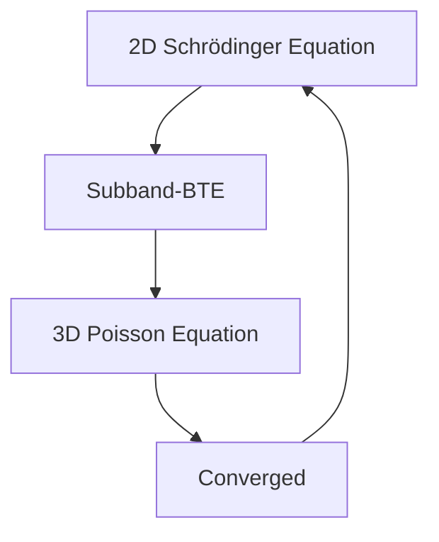
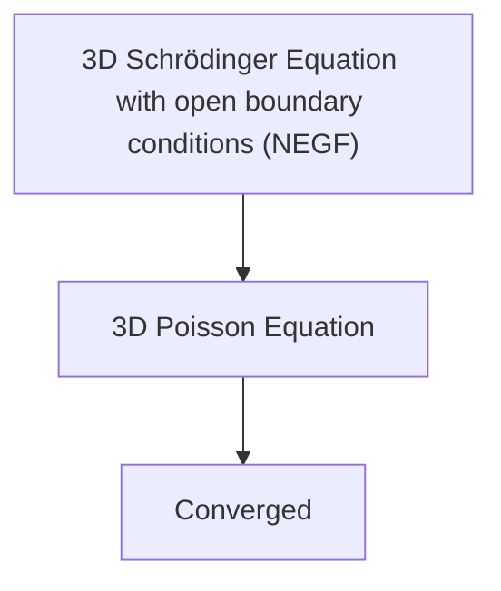

<!-- page:1 -->
# Sentaurus™ Device QTX User Guide

Version O-2018.06, June 2018

# Copyright and Proprietary Information Notice

<!-- page:2 -->
© 2018 Synopsys, Inc. This Synopsys software and all associated documentation are proprietary to Synopsys, Inc. and may only be used pursuant to the terms and conditions of a written license agreement with Synopsys, Inc. All other use, reproduction, modification, or distribution of the Synopsys software or the associated documentation is strictly prohibited.

# Destination Control Statement

All technical data contained in this publication is subject to the export control laws of the United States of America. Disclosure to nationals of other countries contrary to United States law is prohibited. It is the reader’s responsibility to determine the applicable regulations and to comply with them.

# Disclaimer

SYNOPSYS, INC., AND ITS LICENSORS MAKE NO WARRANTY OF ANY KIND, EXPRESS OR IMPLIED, WITH REGARD TO THIS MATERIAL, INCLUDING, BUT NOT LIMITED TO, THE IMPLIED WARRANTIES OF MERCHANTABILITY AND FITNESS FOR A PARTICULAR PURPOSE.

# Trademarks

Synopsys and certain Synopsys product names are trademarks of Synopsys, as set forth at https://www.synopsys.com/company/legal/trademarks-brands.html.

All other product or company names may be trademarks of their respective owners.

# Third-Party Links

Any links to third-party websites included in this document are for your convenience only. Synopsys does not endorse and is not responsible for such websites and their practices, including privacy practices, availability, and content.

Synopsys, Inc.

690 E. Middlefield Road

Mountain View, CA 94043

www.synopsys.com

<!-- page:3 -->
# About This Guide vii

Related Publications . . . vii

Conventions . vii

Customer Support . . . . vii

Accessing SolvNet. . . viii

Contacting Synopsys Support . . . viii

Contacting Your Local TCAD Support Team Directly. . . . viii

Acknowledgments. . . . ix

# Part I Subband-BTE Solver 1

# Chapter 1 Introduction to the Subband-BTE Solver 3

Features of the Subband-BTE Solver . . .

Similarities to Sentaurus Band Structure . . .

Device Structure . . .

Requirements and Restrictions on Device Structure and Mesh. . . .

Device Axes and Orientation. .

Contacts . .

Sliced Channels. .

Creating a Sliced Channel .

Specifying a Schrödinger Solver for a Sliced Channel . .

Using Subband-BTE Solver as an External Solver for Sentaurus Device . . . .

Model and Parameter Specification

Valley Models . . .

Scattering Models . . . 8

RTA Scattering Model . .

Surface Roughness . . .

Coulomb Scattering . . . . . 10

Screening . . . . . 10

Tensor Dielectric Function . . . 11

Scalar Dielectric Function . . .

Runtime Speedup With Screening . . . 12

Limiting the Subband Scattering Range. . . . . . 12

Subband-Based Boltzmann Transport Equation . . . . 12

Selecting a Subband-BTE Solver . . . 13

Energy Grid . . . 14

Numeric Options . . . . 14

<!-- page:4 -->
Solving at One Bias. . . 15

Convergence Criteria . . . 15

Output . . . . 16

2D TDR File With Fields Over Channel Coordinate–Energy Space . . . . 1

2D TDR File With Fields Over Channel Coordinate–k-Space . . . . 17

TDR (XY) File With Fields Versus Channel Coordinate . . . . 17

Slice-Related Fields . . 1

2D TDR File With Fields Over XY Real Space. . . . 17

TDR (XY) File With Fields Over 1D k-Space . . . . . 18

References. . 18

# Chapter 2 Example: Getting Started 19

Device Structure . . 19

Loading the Device Structure . . . 20

Setting Up the Model and the Classical Solve . . . . 20

Specifying the Sliced Channel . 21

Performing the Id–Vg Simulation. . . . . 21

Saving TDR Files . . . . . 22

# Chapter 3 Example: Coupling Sentaurus Device and Subband-BTE Solver 25

Device Structure . . . 25

Specifying the Sliced Channel . 26

Performing the Id–Vg Simulation. . . . . 26

Saving TDR Files . . . . 27

# Chapter 4 Commands of the Subband-BTE Solver 29

Math and Physics Commands . . . 29

Math . . . 29

Math slicedChannel . . . 31

Physics contact. . . . 32

Physics slicedChannel . . 33

Establishing a Connection to Sentaurus Device . . . . . 35

ConnectBTEToMasterProcess. . . 35

Saving TDR Files . . . . 36

Specifying Subbands and Subband IDs . . . . 36

BTESaveE . . 37

BTESaveK . . . 39

BTESaveCC. . . 40

Saving Slice-Related Fields . . . 41

<!-- page:5 -->
SaveSlice . . . 42

SaveSliceK. . . 43

# Part II NEGF Solver

4 5

# Chapter 5 Introduction to the NEGF Solver 47

Features of the NEGF Solver . . . 47

Similarities to Sentaurus Band Structure and the Subband-BTE Solver . . . . . 47

Device Structure . . . 48

Requirements and Restrictions on Device Structure and Mesh. . . . . 48

Device Axes and Orientation. . . 49

Contacts . . . 49

Nonlocal. . . 49

Specifying a Schrödinger Solver for a Nonlocal . . . 49

Model and Parameter Specification . . . 50

Valley Models . . . . . 50

Quantum Transport . . . . 50

Boundary Conditions . . . . . 51

Schrödinger Equation With Open Boundary Conditions . . . . 52

Wavefunction Formalism . . . . 52

Non-Equilibrium Green’s Function Formalism . . . . . 53

Mode-Space Simulations . . . . 54

Selecting an NEGF Solver . . . 54

Solving at One Bias. . . . . 55

Convergence Criteria . . . . 55

Output . . . 55

2D TDR File With Fields Over Channel Coordinate–Energy Space . . . . . 56

TDR (XY) File With Fields Versus Channel Coordinate . . . . . 56

TDR (XY) File With Fields Over 1D k-Space . . . . 56

Parallelization . . . 56

References . . . 56

# Chapter 6 Example: Getting Started 59

Device Structure . . . 59

Loading the Device Structure . . . . . 60

Setting Up the Valley Model and the Classical Solve . . . 60

Specifying the NEGF Solver. . . . . 61

Performing the Id–Vg Simulation. . . . . 62

Saving TDR Files . . . . . . 64

# Chapter 7 Commands of the NEGF Solver 65

<!-- page:6 -->
Physics Commands . . . 65

Physics for Schrödinger Solver on Nonlocal. . . . 65

Physics for NEGF Solver on Nonlocal . . 66

Saving TDR Files . . . . 67

NEGFSaveE. . . 68

NEGFSaveCC . . 69

NEGFSaveContactEk . . 71

ComputeTunnelingCurrent . . . 71

<!-- page:7 -->
This user guide describes the Synopsys® Sentaurus™ Device QTX tool that features the subband-based Boltzmann transport equation solver (Subband-BTE solver) and the quantum transport equation solver (NEGF solver).

This user guide is intended for users of TCAD Sentaurus involved in advanced CMOS transport modeling.

# Related Publications

For additional information, see:

The TCAD Sentaurus release notes, available on the Synopsys SolvNet® support site (see Accessing SolvNet on page viii).   
■ Documentation available on SolvNet at https://solvnet.synopsys.com/DocsOnWeb.

# Conventions

The following conventions are used in Synopsys documentation.

<table><tr><td>Convention</td><td>Description</td></tr><tr><td>Blue text</td><td>Identifies a cross-reference (only on the screen).</td></tr><tr><td>Bold text</td><td>Identifies a selectable icon, button, menu, or tab. It also indicates the name of a field or an option.</td></tr><tr><td>Courier font</td><td>Identifies text that is displayed on the screen or that the user must type. It identifies the names of files, directories, paths, parameters, keywords, and variables.</td></tr><tr><td>Italicized text</td><td>Used for emphasis, the titles of books and journals, and non-English words. It also identifies components of an equation or a formula, a placeholder, or an identifier.</td></tr></table>

# Customer Support

Customer support is available through the Synopsys SolvNet customer support website and by contacting the Synopsys support center.

<!-- page:8 -->
# Accessing SolvNet

The SolvNet support site includes an electronic knowledge base of technical articles and answers to frequently asked questions about Synopsys tools. The site also gives you access to a wide range of Synopsys online services, which include downloading software, viewing documentation, and entering a call to the Support Center.

To access the SolvNet site:

1. Go to the web page at https://solvnet.synopsys.com.

2. If prompted, enter your user name and password. (If you do not have a Synopsys user name and password, follow the instructions to register.)

If you need help using the site, click Help on the menu bar.

# Contacting Synopsys Support

If you have problems, questions, or suggestions, you can contact Synopsys support in the following ways:

Go to the Synopsys Global Support Centers site on synopsys.com. There you can find email addresses and telephone numbers for Synopsys support centers throughout the world.   
Go to either the Synopsys SolvNet site or the Synopsys Global Support Centers site and open a case online (Synopsys user name and password required).

# Contacting Your Local TCAD Support Team Directly

Send an e-mail message to:

support-tcad-us@synopsys.com from within North America and South America   
support-tcad-eu@synopsys.com from within Europe   
support-tcad-ap@synopsys.com from within Asia Pacific (China, Taiwan, Singapore, Malaysia, India, Australia)   
support-tcad-kr@synopsys.com from Korea   
support-tcad-jp@synopsys.com from Japan

<!-- page:9 -->
# Acknowledgments

ILS was codeveloped by Integrated Systems Laboratory of ETH Zurich in the joint research project NUMERIK II with financial support by the Swiss funding agency CTI.

<!-- page:10 -->
# About This Guide

# Acknowledgments

<!-- page:11 -->
# Part I Subband-BTE Solver

This part of the Sentaurus™ Device QTX User Guide contains the following chapters:

Chapter 1 Introduction to the Subband-BTE Solver on page 3

Chapter 2 Example: Getting Started on page 19

Chapter 3 Example: Coupling Sentaurus Device and Subband-BTE Solver on page 25

Chapter 4 Commands of the Subband-BTE Solver on page 29

<!-- page:13 -->
This chapter describes the features of the subband-based Boltzmann transport equation solver of Sentaurus Device QTX and the physical models it uses to model quasiballistic transport.

# Features of the Subband-BTE Solver

Sentaurus Device QTX features the subband-based Boltzmann transport equation solver (hereafter, referred to as the Subband-BTE solver) that takes into consideration the effects of strong quantum confinement as well as quasiballistic transport along the channel of small FinFETs and nanowires. Both purely ballistic transport and scattering due to nonpolar phonon, polar optical phonon, surface roughness, alloy, and Coulomb scattering can be treated.

The subbands used by the Subband-BTE solver are provided by the solution of the Schrödinger equation on 2D slices along the channel. The solution of the Subband-BTE solver provides the distribution functions of carriers in each subband. This information, combined with the subband dispersion and the wavefunctions from the Schrödinger solver, provides the carrier density used in the Poisson equation. As shown in Figure 1, at each bias point, the Schrödinger equation, the subband-based Boltzmann transport equation (subband-BTE), and the Poisson equation are iterated until convergence.


<details>
<summary>flowchart</summary>


</details>

Figure 1 Schematic of the iteration procedure for the self-consistent solution of the Schrödinger equation, the subband-BTE, and the Poisson equation

<!-- page:14 -->
The main output of the solution of the subband-BTE is the current flowing through the channel. In addition, several internal quantities related to the solution of the subband-BTE, such as the distribution function, the current spectrum, and the carrier velocity, can be saved to TDR files.

# Similarities to Sentaurus Band Structure

The Subband-BTE solver shares many commands and physical models with Sentaurus Band Structure.

For descriptions of common commands, models, and parameters, refer to Part II of the Sentaurus™ Device Monte Carlo User Guide.

# Device Structure

The simulation of carrier transport using the solution of the subband-BTE can be performed only for 3D devices. The use of the Subband-BTE solver is most appropriate for devices with a well-defined channel, in which geometric quantum confinement plays a strong role. This is typically the case in small FinFETs and nanowire devices. The device structure is loaded from a TDR file using the LoadDevice command.


<details>
<summary>text_image</summary>

Source
Gate
Drain
z
x
y
</details>

Figure 2 Three-dimensional nanowire device showing slices and contacts

# Requirements and Restrictions on Device Structure and Mesh

<!-- page:15 -->
The Subband-BTE solver has some requirements and restrictions on the type of device structure and mesh that can be treated, namely:

The 3D mesh must be composed of all tetrahedra or cuboids.   
In standalone Sentaurus Device QTX simulations, the mesh within the channel should essentially be an extruded mesh from a 2D cross section. That is, along the channel direction, the mesh points should all fall on the slice locations.   
■ In coupled Sentaurus Device–Sentaurus Device QTX simulations, the 3D mesh can be an unstructured Delaunay mesh as long as it fulfils one additional constraint: it must contain several well-defined planes of mesh points perpendicular to the z-axis. This allows the use of the Subband-BTE solver for a subdomain of the structure, such as the channel region of a FinFET, or for the simulation of non-extruded nanowire FETs. See Using Subband-BTE Solver as an External Solver for Sentaurus Device on page 7 and Chapter 3 on page 25.

# Device Axes and Orientation

The device axis along the channel direction must be the z-axis. It must be set up correctly during structure generation. The confinement axes must be the x-axis and the y-axis. The orientation of the device relative to the crystallographic axes can be specified using the xDirection and yDirection arguments of the Physics command.

# Contacts

It is expected that the left and right ends of the structure are terminated by contacts, as shown in Figure 2 on page 4. Additional contacts, typically one gate contact, can be included in the structure as well. However, the current is computed only for the left and right contacts of a structure.

During the solution of the Poisson equation, a special Neumann boundary condition should be used at the left and right contacts to enable charge neutrality there to be maintained, even in the presence of quantum confinement. To enable this boundary condition, use the Physics contact command with type=Neumann. For example:

Physics contact=source type=Neumann

Physics contact=drain type=Neumann

<!-- page:16 -->
A lumped resistance in units of ohm ( ) can be specified for the left and right contacts of aΩ sliced channel. For example, to specify a lumped resistance of for contacts named1 kΩ source and drain, specify:

Physics contact=source resist=1.0e3

Physics contact=drain resist=1.0e3

# Sliced Channels

To solve the subband-BTE along the channel of a device, the subbands from the solution of the 2D Schrödinger equation at slices along the channel must be computed first. A group of these slices forms a sliced channel. On each slice, a 2D Schrödinger equation is solved for the subband dispersions and wavefunctions. Based on these quantities, along with the distribution function for each subband, the carrier density on each node in the slice can be computed. Then, this is interpolated on to the 3D device mesh for solving the 3D Poisson equation.

# Creating a Sliced Channel

You create a sliced channel using the Math slicedChannel command (see Math slicedChannel on page 31). This is similar to the Math nonlocal command used in other parts of Sentaurus Band Structure. The parts of the device structure to be included in the sliced channel can be specified by using either a list of regions, or a bounding box, or both.

For example, to create a sliced channel consisting of only the silicon region, named si1, of a silicon nanowire, use the following command:

Math slicedChannel name=channel1 regions=[list si1]

During the creation of a sliced channel using the Math command, the following key operations are performed automatically:

■ First, the 2D slices along the channel are extracted automatically.   
Second, a nonlocal area is created on each slice with the name given by the sliced channel name appended by .NL, for example, channel1.NL.

# Specifying a Schrödinger Solver for a Sliced Channel

Specifying a Schrödinger solver for a sliced channel is very similar to specifying a Schrödinger solver for a nonlocal area for mobility calculations in Sentaurus Band Structure. For a sliced channel, the Physics slicedChannel command is used, and the specified Schrödinger solver is used for all slices in the sliced channel (see Physics slicedChannel on page 33).

<!-- page:17 -->
# Examples

```ini
Physics slicedChannel=channel1 eSchrodinger=Parabolic Nsubbands=8 Nk=16 \
valleys=[list Delta1 Delta2 Delta3] Kmax=0.6 a0=5.43e-8 correction=3
Physics slicedChannel=channel1 hSchrodinger=6kp \
valleys=[list Gamma] Nsubbands=32 Nk=16 Kmax=0.6 a0=5.43e-8 
```

# Using Subband-BTE Solver as an External Solver for Sentaurus Device

Similar to the existing setup for Sentaurus Device and Sentaurus Band Structure, you can run coupled Sentaurus Device and Sentaurus Device QTX simulations of 3D structures with 2D confinement. This coupled simulation scheme enables the following:

■ Subband-BTE simulations of non-extruded device structures.   
■ Coupled carrier–Poisson simulations in Sentaurus Device where, on a subdomain of the structure, the quantum-correction potential and effective mobility are extracted from the Subband-BTE solver. For each Newton step of the coupled carrier–Poisson equation system, the subband-BTE system is solved on the subdomain. The Subband-BTE solver uses the electrostatic potential provided by Sentaurus Device as input and provides the quantum-correction potential and effective mobility as output to Sentaurus Device.

For the necessary modifications to the structure creation to enable this simulation mode, see Device Structure on page 25.

The minimal modifications needed to a standalone Sentaurus Device QTX command file are described in Specifying the Sliced Channel on page 26 and Performing the Id–Vg Simulation on page 26.

See Sentaurus™ Device User Guide, External Boltzmann Solver on page 296 for the required modifications to the Sentaurus Device command file.

# Model and Parameter Specification

Similar to the specification of models and parameters for the subband and mobility calculations in Sentaurus Band Structure, for the Subband-BTE solver, you can specify models and parameters on a material or region basis.

The specified models and parameters are used on all slices that contain the specified material or region. The following sections highlight the model types that are particularly important for the Subband-BTE solver: valley models and scattering models.

<!-- page:18 -->
# Valley Models

Valley models specify the band model and parameters to use when solving the Schrödinger equation. The following valley models can be used for the subband-BTE:

The ConstantEllipsoid, 2kpEllipsoidal, and 2kp models can be used for the description of electrons.   
■ The 6kp valley model gives an accurate description of holes.   
The 3kp valley model is an approximation of 6kp, where the split-off band is not captured due to the neglect of spin-orbit coupling.

# Scattering Models

Scattering models are used to model specific, microscopic scattering transitions such as phonon and surface roughness scattering. All of the scattering models that can be used for mobility calculations in Sentaurus Band Structure on 2D structures can also be used when solving the subband-BTE. These models include elastic and inelastic nonpolar phonon scattering, polar optical phonon scattering, alloy scattering, surface roughness scattering, and Coulomb scattering from bulk impurities, interface charge, and traps. In addition, the surface roughness and the Coulomb scattering models can be screened using either the scalar or tensor dielectric function models.

A standard set of scattering models is set up for silicon regions by default, as described in the documentation of Sentaurus Band Structure in the Sentaurus™ Device Monte Carlo User Guide.

For purely ballistic simulations, all scattering models must be removed. To remove all scattering models, use the following command:

Physics material=all ScatteringModel removeAll

# RTA Scattering Model

The relaxation time approximation (RTA) scattering model is available for solving the subband-BTE. This model is implemented as an intra-subband scattering mechanism using the transition rate given in [1]:

$$
S _ {\mathrm{RTA}} = \frac {f _ {n} (z , \varepsilon) - f _ {n} ^ {\mathrm{leq}} (z , \varepsilon)}{\tau} \tag {1}
$$

<!-- page:19 -->
defined in terms of a local Fermi level, where is the total energy and ε $f _ { n } ^ { \mathrm { l e q } }$ f n is an equilibrium Fermi–Dirac distribution function $E _ { F } ^ { \mathrm { l e q } }$ leq :

$$
f _ {n} ^ {\mathrm{leq}} (z, \varepsilon) = \frac {1}{1 + e ^ {(\varepsilon - E _ {F} ^ {\mathrm{leq}}) / k _ {\mathrm{B}} T}} \tag {2}
$$

where is the ambient temperature. The only adjustable parameter in the RTA scatteringT model is , the relaxation time which is taken as a constant. The local Fermi level, τ $E _ { F } ^ { \mathrm { l e q } }$ , is determined by enforcing a carrier conservation condition on the equilibrium Fermi–Dirac distribution function integrated over energy. This produces an additional equation that must be solved along with the subband-BTE.

The local Fermi level can be saved to a TDR file for visualization using the BTESaveCC command (see BTESaveCC on page 40).

The RTA scattering model serves the following purposes:

It can stabilize the numeric solution of the subband-BTE. By default, an RTA scattering model is always used with a built-in = 1e-10 s, which is a long enough relaxation time soτ as not to impact the computed current and is a short enough relaxation time so as to provide efficient numeric stability. You can change the value of for the RTA scattering modelτ when selecting the numeric Subband-BTE solver as described next (see Eq. 3).   
It provides an efficient model that can mimic more complicated mechanisms that might incur significant runtime or are not yet available. For this purpose, you can specify additional RTA scattering models using the Physics ScatteringModel command on a per-region and per-valley basis. For example:

$\begin{array} { r l } & { \mathrm { P h y s i c s ~ \ r e g i o n = s i 1 ~ \ S c a t t e ~ e r i n g { M o d e } = 1 = \mathbb { R } \mathbb { T } \mathbb { A } ~ \ n a m e = r t a 1 ~ \ v a l l e y s = [ 1 i \ s t ~ \mathrm { ~ D e l t a 1 } ] ~ } \lor \lnot } \\ & { \mathrm { ~ \ l a u = 1 . ~ 0 e - 1 3 ~ } } \end{array}$

The final value of that is used in the subband-BTE is computed using Mathiessen’s ruleτ considering the built-in RTA scattering model and all user-defined RTA scattering models for a particular region and valley, that is:

$$
\frac {1}{\tau} = \frac {1}{\tau_ {\text { built - in }}} + \sum_ {i} \frac {1}{\tau_ {i}} \tag {3}
$$

# Surface Roughness

Surface roughness scattering is activated by specifying the SRFor2D scattering model. This model is used because it is applied to 2D slices. The SRFor2D model applies surface roughness scattering only at semiconductor–insulator interfaces.

During the creation of the sliced channel, the Subband-BTE solver automatically extracts any insulator regions that are adjacent to the specified semiconductor regions. This does not affect the solution of the Schrödinger equation on the sliced channel, but enables the SRfor2D model to work correctly even if no insulator regions are specified explicitly.

<!-- page:20 -->
# Coulomb Scattering

When used with the Subband-BTE solver, Coulomb scattering can be applied to both bulk doping and interface charge.

To speed up the calculation of the matrix elements for Coulomb scattering, the whenToCompute parameter can be used to specify when the matrix elements should be recomputed. The options for this parameter are:

The EveryIteration option causes the matrix elements to be evaluated for each Poisson Newton iteration. This option provides the best accuracy but requires the most runtime. This is the default value.   
The FirstIteration option causes the matrix elements to be evaluated only for the first Poisson Newton iteration during a Solve command. Essentially, the solution from the previous bias point is used to compute the matrix elements. For subsequent Newton iterations, the matrix elements are reused when computing the scattering rate. This approach can potentially affect accuracy, but it greatly reduces the runtime. For bias ramps, this approach has worked well. If accuracy is important, a bias point can be repeated.

The following example shows how to specify the whenToCompute parameter:

Physics material=Silicon ScatteringModel=Coulomb name=eCoulomb \ transitionType=Intravalley valleys=[list Delta1 Delta2 Delta3] \ screening=Lindhard whenToCompute=FirstIteration

# Screening

Some of the scattering models, such as surface roughness and Coulomb, can be screened using one of the available screening models. By default, no screening is used. The required screening model can be selected using the screening parameter for each scattering model.

This parameter can be set to one of the following values:

none for no screening   
Lindhard for the scalar Lindhard screening model   
■ LindhardTDF for the tensor Lindhard screening model

<!-- page:21 -->
The screening models utilize the polarization ( ), which characterizes the strength of theΠ screening, and the dielectric form-factor ( ), which characterizes the screening effectivenessF of each subband pair in terms of the wavefunction overlap with the Coulomb Green’s function. The polarization is given by:

$$
\Pi_ {n n ^ {\prime}} (q) = \frac {g _ {\mathrm{s}} \cdot g _ {\mathrm{v}}}{2 \pi} \int d k \frac {f _ {n ^ {\prime}} (k + q) - f _ {n} (k)}{E _ {n} (k) - E _ {n ^ {\prime}} (k + q)} \tag {4}
$$

where:

■ $g _ { \mathrm { s } }$ and $g _ { \mathrm { v } }$ are the spin and valley degeneracy, respectively.   
■ $E _ { n }$ and $f _ { n }$ are the dispersion and distribution function for subband , respectively.n

The dielectric form-factor is given by:

$$
F _ {m m ^ {\prime}} ^ {n n ^ {\prime}} (q) = \iint d \boldsymbol {x} d \boldsymbol {x} ^ {\prime} \psi_ {m} (\boldsymbol {x}) \cdot \psi_ {m ^ {\prime}} ^ {\dagger} (\boldsymbol {x}) G (q, \boldsymbol {x}, \boldsymbol {x} ^ {\prime}) \psi_ {n} ^ {\dagger} (\boldsymbol {x} ^ {\prime}) \cdot \psi_ {n ^ {\prime}} (\boldsymbol {x} ^ {\prime}) \tag {5}
$$

where $\Psi _ { m }$ is the wavefunction for subband , and is the Coulomb Green’s function.m G

# Tensor Dielectric Function

The tensor dielectric function (TDF) in the TDF screening model is given by:

$$
\varepsilon_ {m m ^ {\prime}} ^ {n n ^ {\prime}} (q) = \delta_ {m n} \delta_ {m ^ {\prime} n ^ {\prime}} + \Pi_ {n n ^ {\prime}} (q) F _ {m m ^ {\prime}} ^ {n n ^ {\prime}} (q) \tag {6}
$$

The tensor Lindhard screening model (LindhardTDF) is time consuming to compute, particularly when a large number of subband pairs is used for the screening calculation. The number of subband pairs can be controlled using the tdfDegenTol parameter of the Physics slicedChannel command when specifying the Subband-BTE solver. Subband pairs are used in the screening calculation if their subband edges are within tdfDegenTol of each other. It is recommended to set this to a value of 1.0e-4 eV.

# Scalar Dielectric Function

The scalar dielectric function (SDF) in the SDF screening model is given by:

$$
\varepsilon (q) = 1 + \sum_ {n} \Pi_ {n n} (q) F _ {n n} ^ {n n} (q) \tag {7}
$$

The sum is over the subbands. While it is expensive to compute, the SDF screening model is much faster than the TDF screening model and provides a good trade-off between accuracy and runtime.

<!-- page:22 -->
# Runtime Speedup With Screening

The screening models are computationally expensive. They are heavily parallelized and you should use as many threads as possible. However, even with many threads, for a structure with many slices, the overall wallclock time when using screening might still be quite long.

To provide a trade-off between accuracy and runtime, when specifying the Subband-BTE solver, use the whenToComputeScreening argument of the Physics slicedChannel command to control how often the screening model is evaluated:

■ If whenToComputeScreening=EveryIteration, the screening model is evaluated for each Poisson Newton iteration. This option provides the best accuracy but requires the most runtime. This is the default.   
If whenToComputeScreening=FirstIteration, the screening model is evaluated only for the first Poisson Newton iteration during a Solve command. Essentially, the solution from the previous bias point is used to compute the screening dielectric function. For subsequent Newton iterations, the dielectric function is reused. This approach can potentially affect accuracy, but it greatly reduces the runtime. For bias ramps, this approach has worked well. If accuracy is important, a bias point can be repeated.

The following example shows how to specify the whenToComputeScreening parameter and the tdfDegenTol parameter:

Physics slicedChannel=channel1 eBTESolver=Numeric tdfDegenTol=1.0e-4 \ whenToComputeScreening=FirstIteration

# Limiting the Subband Scattering Range

For transition types such as Intravalley, Intervalley, and gIntervalley, a state in the initial subband is allowed, by default, to scatter to all valid final states in all valid final subbands. When using a large number of subbands and a fine energy grid for the solution of the subband-BTE, this produces a very large system matrix that can be very time consuming to solve. Restricting the number of final subbands to which an initial state scatters can help to reduce the overall system size and to improve runtime performance. This can be achieved by using the subbandScatteringRange parameter of the Physics slicedChannel command (see Physics slicedChannel on page 33).

# Subband-Based Boltzmann Transport Equation

With quantum confinement in two dimensions, the subband-BTE is reduced to one dimension along the channel within each subband. The solution of the subband-BTE gives the distribution function as a function of the -vector and k the channel coordinate for each subband.

<!-- page:23 -->
Using for the channel axis, for subband , the subband-BTE is [2]:z n

$$
- \frac {\partial f _ {n}}{\partial k} \frac {1}{\hbar} \frac {\partial E _ {n}}{\partial z} + \frac {\partial f _ {n}}{\partial z} \frac {1}{\hbar} \frac {\partial E _ {n}}{\partial k} = S _ {n, \text { in }} - S _ {n, \text { out }} \tag {8}
$$

where:

$f _ { n }$ is the distribution function for subband .n   
$E _ { n }$ is the dispersion for subband .n

With Fermi–Dirac statistics, the in-scattering term $( S _ { n , \mathrm { i n } } )$ and the out-scattering term $( S _ { n , \mathrm { o u t } } )$ are given by:

$$
S _ {n, \text { in }} = \sum_ {n ^ {\prime}} \frac {1}{2 \pi} \int d k ^ {\prime} S _ {n ^ {\prime} n} (k ^ {\prime}, k) f _ {n ^ {\prime}} (z, k ^ {\prime}) [ 1 - f _ {n} (z, k) ] \tag {9}
$$

$$
S _ {n, \text { out }} = \sum_ {n ^ {\prime}} \frac {1}{2 \pi} \int d k ^ {\prime} S _ {n n ^ {\prime}} (k, k ^ {\prime}) f _ {n} (z, k) [ 1 - f _ {n} ^ {\prime} (z, k ^ {\prime}) ]
$$

where $S _ { n ^ { \prime } n } ( k ^ { \prime } , k )$ is the total transition rate due to scattering.

As boundary conditions on the distribution functions, equilibrium Fermi–Dirac distribution functions at the left and right contacts are applied to carriers being injected into the channel.

# Selecting a Subband-BTE Solver

The following Subband-BTE solvers are available for solving the subband-BTE:

AnalyticBallistic is the faster and simpler solver. As its name suggests, it can be used only for purely ballistic simulations. This solver uses the analytic solution to the subband-BTE, which is determined by projecting the injecting, equilibrium Fermi–Dirac distribution functions from the contacts throughout the device as determined by the top of each subband barrier.   
Numeric performs an actual numeric solution to the subband-BTE. This solver can be used for purely ballistic transport as well as with all of the available scattering models including the RTA scattering model.

For example, to activate the AnalyticBallistic subband-BTE for electron transport for a sliced channel named channel1, you can use the following command:

Physics slicedChannel=channel1 eBTESolver=AnalyticBallistic

For a subband-BTE simulation of holes, you can use the hBTESolver argument:

Physics slicedChannel=channel1 hBTESolver=AnalyticBallistic

<!-- page:24 -->
# Energy Grid

The subband-BTE is solved on a 2D tensor-product grid. One axis of this grid is along the channel direction and is referred to as the channel coordinate axis. The grid points along this axis are given by the slice locations along the channel. The other axis of the BTE solution grid is the total energy axis. Here, total energy refers to the total energy of a carrier in a particular subband as determined by the sum of the minimum subband energy and the kinetic energy of the carrier.

The minimum and maximum energies used in the energy grid are determined automatically. The nominal energy grid spacing is set using the deltaE argument of the Physics slicedChannel command when selecting a Subband-BTE solver (see Physics slicedChannel on page 33).

In addition, a special refinement around the top of each subband can be activated to improve the accuracy of the calculation and to improve convergence. This is activated using the resolveTOBEnergy argument. The smallest energy spacing used for this refinement is set using the minDeltaE argument.

For example, a typical energy grid setup for a sliced channel named channel1 is:

Physics slicedChannel=channel1 eBTESolver=Numeric deltaE=4e-3 \ resolveTOBEnergy=1 minDeltaE=1.0e-4

# Numeric Options

When specifying the Subband-BTE solver, you can set several arguments related to numeric details, in particular:

approximateJacobian=Boolean: When true (1), this argument activates a special algorithm to approximate the Jacobian that is used when solving the BTE system. This can greatly reduce memory consumption with a small impact on convergence. Default: 1.   
NkForScreening=Integer: This argument sets the number of -points to use whenk evaluating screening. Default: 32.   
useParabolicFitForToB=Boolean: When true (1), this argument activates a special algorithm to more accurately locate the top of the source–drain barrier. This mainly applies to FET devices. Default: 1.   
useKdependentWFForBTEDensity=Boolean: When true (1), this argument computes the carrier density based on -dependent wavefunctions. When this argument is false (0),k -point wavefunctions are used, which improves convergence. Default: 0.Γ

<!-- page:25 -->
NOTE If useKdependentWFForBTEDensity=0 and useKdependentWF=1 are set when specifying the Schrödinger solver, then -dependentk wavefunctions are still used when computing the scattering rates.

To have good convergence behavior, if reorderDispersion=1 is set, then you should also specify useKdependentWFForBTEDensity=1 and useKdependentWF=1.

For details about these arguments, see Physics slicedChannel on page 33.

# Solving at One Bias

The solution of the subband-BTE at a specific bias is initiated using the Solve command. Similar to calculations using Sentaurus Band Structure, the bias on each contact is set using the V(<contact>) syntax, where <contact> refers to the contact name. For example, to initiate a solve at specific biases on the source, drain, and gate contacts, use the following command:

Solve V(gate)=1.0 V(drain)=1.0 V(source)=0.0

If the bias on a particular contact is not specified explicitly in the Solve command, the previously specified bias is used. By default, the bias on all contacts is set to 0 at the start of the simulation.

# Convergence Criteria

During the solution of the subband-BTE, the Schrödinger equation, the subband-BTE, and the Poisson equation are solved in an iterative fashion. The overall iteration of these equations is divided into an outer iteration of the Poisson equation and an inner iteration of the subband-BTE after a single solve of the Schrödinger equation. This is shown in Figure 1 on page 3.

Convergence criteria for the outer Poisson equation are set by the following arguments of the Math command:

The potentialUpdateTolerance argument, set in units of $k _ { \mathrm { B } } T / q$ , determines the maximum-allowed change in the potential below which the Poisson equation is considered to have converged. For the subband-BTE system of equations, it is recommended to set this argument to a value of approximately 3.0e-3.   
The currentConvTol argument determines the relative change in terminal currents between subsequent Poisson iterations below which the subband-BTE system is considered to have converged.

<!-- page:26 -->
The subband-BTE system is considered to have converged when one of these convergence criteria is met. For example, if potentialUpdateTolerance=3.0e-3 and currentConvTol=1.0e-3, a bias point for the subband-BTE will be considered converged if the maximum change in the potential at a particular Poisson Newton iteration is below $3 . 0 { \mathrm { e } } { - 3 } \times ( k _ { \mathrm { B } } T / q )$ or the change in terminal current relative to the previous Newton iteration is below 1.0e-3. By default, currentConvTol=0.0, meaning that convergence is completely controlled by the potentialUpdateTolerance argument.

Convergence criteria for the inner solution of the subband-BTE are set using the following arguments:

distFuncUpdateTolerance for the distribution functions   
■ rtaUpdateTolerance for the local Fermi level used in the RTA scattering model

NOTE It is recommended to use the default values for these arguments.

The solution of the subband-BTE requires an initial guess for the distribution functions. For the first several Poisson iterations, this guess is supplied by solving the subband-BTE using only the RTA scattering model. After these initial Poisson iterations, the initial guess is supplied by the solution of the subband-BTE from the previous Poisson iteration. The exact number of Poisson iterations for which the RTA solution is used as an initial guess is set by the iterationsForRTAGuess argument of the Math command. It is recommended to use its default value.

For details about these arguments, see Math on page 29.

# Output

The primary output of the solution of the Subband-BTE solver is the current, in ampere, flowing through the left and right contacts at the end of the structure. These current values are printed to the screen at the end of a Solve command, and the values also are stored in the bias log file. Furthermore, in the bias log file, when a nonzero lumped resistance is specified, in addition to the applied bias that is stored under V(<contact>), the so-called inner voltage on the inner end of the lumped resistor is stored under Vinner(<contact>).

In addition to the current, you can save several different TDR files with data from the solution of the Subband-BTE solver.

# 2D TDR File With Fields Over Channel Coordinate–Energy Space

<!-- page:27 -->
You can use the BTESaveE command to save a 2D TDR file with fields that are defined on the channel coordinate–energy grid. These fields include quantities such as the distribution function, the current spectrum, and the density-of-states (DOS) in each subband, or in each valley, or in total (see BTESaveE on page 37).

# 2D TDR File With Fields Over Channel Coordinate– k-Space

You can use the BTESaveK command to save a 2D TDR file with fields that are defined over channel coordinate– -space (see BTESaveK on page 39).k

# TDR (XY) File With Fields Versus Channel Coordinate

You can use the BTESaveCC command to save a TDR (xy) file with fields versus the channel coordinate. The fields that can be saved include the total inversion charge, the total current, the total carrier velocity, as well as these quantities per subband. In addition, the occupancy of each subband can be saved (see BTESaveCC on page 40).

# Slice-Related Fields

Each slice that is used in the solution of the subband-BTE is basically a 2D cross section. Similar to the direct treatment of a 2D device structure using Sentaurus Band Structure, various fields across this 2D cross section, as well as fields in 1D -space, can be saved using twok commands.

# 2D TDR File With Fields Over XY Real Space

You can use the SaveSlice command to save quantities from the Schrödinger solver on a slice such as the subband energy and the wavefunctions, as well as quantities such as the conduction band energy (see SaveSlice on page 42).

# TDR (XY) File With Fields Over 1D k-Space

<!-- page:28 -->
You can use the SaveSliceK command to save the 1D -space dispersion for each subbandk computed by the Schrödinger solver (see SaveSliceK on page 43).

# References

[1] S. Jin, T.-W. Tang, and M. V. Fischetti, “Simulation of Silicon Nanowire Transistors Using Boltzmann Transport Equation Under Relaxation Time Approximation,” IEEE Transactions on Electron Devices, vol. 55, no. 3, pp. 727–736, 2008.   
[2] D. Esseni, P. Palestri, and L. Selmi, Nanoscale MOS Transistors: Semi-Classical Transport and Applications, Cambridge: Cambridge University Press, 2011.

<!-- page:29 -->
This chapter presents an example that uses the Subband-BTE solver to compute an $I _ { d } { - } V _ { g }$ curve for a silicon NMOS nanowire.

This chapter describes the command file for simulating ballistic transport in a silicon nanowire device using the Subband-BTE solver, including sections of the command file that load the device structure, set up the models, specify the sliced channel, and perform the $\mathrm { I _ { d } { - } V _ { g } }$ simulation.

# Device Structure

Figure 3 shows the device structure for this example. The device is a cylindrical silicon NMOS nanowire with a diameter of 5 nm, a gate length of 13 nm, and source and drain extension regions of length 10 nm. The source and drain are uniformly doped n-type to 2e20 cm–3. This example computes an $\mathrm { I _ { d } { - } V _ { g } }$ curve at $\mathrm { V _ { d } } = 0 . 6 \ : \mathrm { V }$ in the ballistic limit using the Numeric Subband-BTE solver.


<details>
<summary>natural_image</summary>

3D rendered image of a cylindrical object with pink textured band and dark outer ring, no visible text or symbols
</details>

Figure 3 Silicon nanowire device for the example

<!-- page:30 -->
# Loading the Device Structure

LoadDevice tdrFile=nanowire3D\_0.tdr

The LoadDevice command loads the device structure from the nanowire3D\_0.tdr file. After loading, the tool automatically sets up the default models and parameters in the silicon and oxide regions.

# Setting Up the Model and the Classical Solve

```python
# Simple model for hole density
Physics material=Silicon hBulkDensity=hFermiDensity Nv=3.10e19

# Remove all scattering models for ballistic simulation
Physics material=all ScatteringModel removeAll

# Use Neumann boundary condition on source and drain
Physics contact=source type=Neumann
Physics contact=drain type=Neumann

# Set workfunction
Physics contact=gate workfunction=4.25

# Set orientation for <110> channel
Physics xDirection=[list 1 1 0] yDirection=[list 0 0 1]

# Classical solve
Solve 
```

These commands set up particular models and parameters, starting with specifying a simple model for the hole density. Then, all the scattering models are removed, so that a ballistic simulation can be performed. The boundary condition type for the source and drain contacts is set to Neumann. The gate workfunction is set to 4.25 V.

After the required models are specified, a classical solve of only the Poisson equation is performed in equilibrium, that is, zero bias on all contacts. A classical solve means that the Schrödinger equation is not used. The resulting classical solution serves as the initial guess for the first solve using the Schrödinger equation.

<!-- page:31 -->
# Specifying the Sliced Channel

```ini
# Create sliced channel over all device for si1 region
Math slicedChannel name=channel1 regions=[list si1]

# Set up parabolic Schrodinger on the sliced channel
Physics slicedChannel=channel1 eSchrodinger=Parabolic \
valleys=[list Delta1 Delta2 Delta3] Nsubbands=8 Nk=16 Kmax=0.6 \
a0=5.43e-8 correction=3

# Select Numeric Subband-BTE solver and set energy grid parameters
Physics slicedChannel=channel1 eBTESolver=Numeric deltaE=4.0e-3 \
resolveTOBEnergy=1 minDeltaE=1.0e-4 
```

This section of the command file specifies the sliced channel, the Schrödinger solver, and the Subband-BTE solver.

The Math slicedChannel command creates a sliced channel named channel1 over the region named si1 throughout the entire device.

The first Physics slicedChannel command specifies that a parabolic Schrödinger solver must be used on all slices of the sliced channel. This command refers to the Delta1, Delta2, and Delta3 valley models that were created by default during the LoadDevice command.

The second Physics slicedChannel command changes the Subband-BTE solver to Numeric and specifies some energy grid parameters.

# Performing the $\mathsf { I } _ { \mathsf { d } } - \mathsf { V } _ { \mathsf { g } }$ Simulation

```txt
# Set some convergence parameters. It continues to next bias if not converged
Math potentialUpdateTolerance=6.0e-3 iterations=30 doOnFailure=0

# Solve at equilibrium and then at required drain bias
Solve V(gate)=0.0 V(drain)=0.0

Solve V(drain)=0.6

# Ramp gate using a Tcl foreach loop
foreach Vg [list 0.0 0.1 0.2 0.3 0.4 0.5 0.6] {
    Solve V(gate)=$Vg
    AddToLogFile name=Id value=[GetLast name=I(drain)]
} 
```

<!-- page:32 -->
This section of the command file computes the $\mathrm { I _ { d } { - } V _ { g } }$ curve. The Math command specifies the convergence tolerance for the Poisson equation. The number of allowed iterations for each bias is set to 30, and the doOnFailure argument is set such that the tool will continue to the next bias, even if the convergence criteria are not met.

The series of Solve commands write data to the default bias log file named subbandBTE\_Quickstart.plt. An extra user-defined quantity named Id is added to the bias log file to plot the $\mathrm { I _ { d } { - } V _ { g } }$ curve more easily in Sentaurus Visual. Figure 4 shows the resulting $\mathrm { I _ { d } { - } V _ { g } }$ curve.


<details>
<summary>line</summary>

| V(gate) [V] | Log(I(drain)) [A] | I(drain) [A] |
| ----------- | ----------------- | ------------ |
| 0.0         | 1e-10             | 0            |
| 0.2         | 1e-09             | 0            |
| 0.4         | 1e-08             | 1e-05        |
| 0.6         | 1e-07             | 2e-05        |
</details>

Figure 4 Ballistic ${ \sf I } _ { { \sf d } } { - \sf V } _ { \sf g }$ curve from the example

# Saving TDR Files

```python
# Save 3D TDR
Save tdrFile=subbandBTE_Quickstart.tdr \
    models=[list DopingConcentration eDensity hDensity ConductionBandEnergy \
    eQuasiFermiEnergy]

# Save fields over ChannelCoord-Energy
BTESaveE tdrFile=subbandBTE_Quickstart_CC_E.tdr \
    models=[list Delta1_0_DistributionFunction Delta1_0_CurrentSpectrum \
    Delta1_0_SubbandEnergy Delta1_0_DOS]

# Save distribution function over ChannelCoord-k
BTESaveK tdrFile=subbandBTE_Quickstart_CC_K.tdr \
    models=[list Delta1_0_DistributionFunction] 
```

```tcl
# Save subband quantities over ChannelCoord
BTESaveCC tdrFile=subbandBTE_Quickstart_CC.tdr \
    models=[list NinvTotal CurrentTotal VelocityTotal \
    Delta1_0_Occupancy Delta3_0_Occupancy]

# Save fields over a slice
SaveSlice tdrFile=subbandBTE_Quickstart_Slice.tdr channelCoord=20.0e-3 \
    models=[list eDensity Delta1_0_Wavefunction]

# Save dispersion at a slice
SaveSliceK tdrFile=subbandBTE_Quickstart_SliceK.tdr channelCoord=20.0e-3 \
    models=[list Delta1_0_Dispersion] 
```

<!-- page:33 -->
This section of the command file writes various TDR files with different types of data from the solution of the subband-BTE:

The Save command writes a 3D TDR file with the 3D device structure and the selected models.   
■ The BTESaveE command writes a 2D TDR file over channel coordinate–energy space. In this example. the distribution function, the current spectrum, the subband energy, and DOS for the Delta1\_0 subband are included. Figure 5 on page 24 shows the plot of the resulting distribution function.   
The BTESaveK command saves a TDR file over channel coordinate– -space with only thek distribution function for the Delta1\_0 subband.   
The BTESaveCC command saves a TDR (xy) file with the selected models versus the channel coordinate. Figure 6 on page 24 shows the plot of the resulting total inversion change (NinvTotal) and the carrier velocity (VelocityTotal) along the channel.   
The final commands, SaveSlice and SaveSliceK, save real-space and -spacek quantities, respectively, from the slice located closest to the channel coordinate of 20 nm.


<details>
<summary>heatmap</summary>

| Channel Coordinate | Energy | Delta1_0_DistributionFunction |
| ------------------ | ------ | ----------------------------- |
| 0.01               | 0.0    | 2.000e+00                     |
| 0.02               | -0.6   | 8.270e-02                     |
| 0.03               | -0.6   | 3.420e-03                     |
| 0.03               | -0.6   | 1.414e-04                     |
| 0.03               | -0.6   | 5.848e-06                     |
| 0.03               | -0.6   | 2.418e-07                     |
| 0.03               | -0.6   | 1.000e-08                     |
</details>

Figure 5 Plot of the distribution function in the Delta1\_0 subband from the BTESaveE command


<details>
<summary>line</summary>

| Channel Coordinate [µm] | NinvTotal [cm⁻²] | VelocityTotal [cm/s] |
| ----------------------- | ---------------- | -------------------- |
| 0.00                    | 4e+07            | 0                    |
| 0.01                    | 1e+07            | 2e+07                |
| 0.02                    | 3e+07            | 5e+07                |
| 0.03                    | 4e+07            | 0                    |
</details>

Figure 6 Plot of the total inversion charge and carrier velocity along the nanowire channel from the BTESaveCC command

<!-- page:35 -->
This chapter presents an example of a coupled Sentaurus Device–Subband-BTE solver simulation to compute the $I _ { d } - V _ { g }$ curve of a non-extruded nanowire FET.

This chapter describes the changes to a standalone Sentaurus Device QTX command file required for a coupled Sentaurus Device–Subband-BTE solver simulation. Most of the syntax is identical, so only those sections that differ are described here.

See Sentaurus™ Device User Guide, External Boltzmann Solver on page 296 for the required modifications to the Sentaurus Device command file.

# Device Structure

Figure 7 shows the device structure for this example. It is a cylindrical non-extruded n-type nanowire FET with a diameter of 7 nm in the source and drain extension regions, and a diameter of 5 nm in the channel. The diameter changes linearly over a length of 5 nm. The source and drain extensions are uniformly doped at 1e20 . This example computes annm–3 $\mathrm { I _ { d } { - } V _ { g } }$ curve at $\mathrm { V _ { d } } = 0 . 6 \ : \mathrm { V }$ in the ballistic limit.


<details>
<summary>natural_image</summary>

3D rendered mechanical component with a color-coded stress or pressure gradient, no visible text or symbols
</details>

Figure 7 Example of a nanowire FET with a non-extruded device structure

<!-- page:36 -->
In contrast to the mesh of the structure in Chapter 2 on page 19, the mesh here can be an unstructured Delaunay mesh as long as it fulfils one additional constraint: it must contain several well-defined planes of mesh points perpendicular to the z-axis, which still describes the main transport axis.

These planes can be inserted with the line command when using Sentaurus Process or the zCuts command when creating the mesh using Sentaurus Mesh. Refer to the respective product documentation for details.

In the example, 31 planes along the z-axis are introduced equidistantly every 1 nm. The source, drain, and channel are 10 nm long each, so the length of the total device is 30 nm. The gate contact is 10 nm long and is wrapped all around the channel region. The $\mathrm { S i O } _ { 2 }$ thickness is 0.8 nm.

# Specifying the Sliced Channel

```txt
# Specify coordinate list of the mesh planes created during structure
# generation used to extract slices from the 3D device: units um
set sliceCoordList [list 0.0 0.001 0.002 ... 0.029 0.03]
Math slicedChannel name=channel1 regions=[list si1] \
sliceCoords=$sliceCoordList 
```

The only difference between this sliced channel specification and that given in Chapter 2 is that here you have an additional argument sliceCoords, which specifies where to extract the slices along the z-axis. This is in contrast to dealing with an simple extruded structure, where the slices can be detected by the auto-extraction scheme during the creation of a sliced channel.

The setup of the valley models, the eSchroedinger solver, and the eBTESolver are identical to that in Specifying the Sliced Channel on page 21.

# Performing the $\mathsf { I } _ { \mathsf { d } } - \mathsf { V } _ { \mathsf { g } }$ Simulation

To run the $\mathrm { I _ { d } { - } V _ { g } }$ simulation as a coupled Sentaurus Device–Subband-BTE solver simulation, the Solve command in the Sentaurus Device QTX command file is replaced with the following command:

ConnectBTEToMasterProcess connectionName=n@node@ slicedChannel=channel1

This command establishes the connection to Sentaurus Device. The connection name must be a unique string and must also be specified in the Sentaurus Device command file, to establish the connection successfully.

<!-- page:37 -->
NOTE Sentaurus Device is completely responsible for controlling the voltages.

After the successful voltage ramp and Sentaurus Device has finished its calculation, it returns control to Sentaurus Device QTX, and the usual execution of Tcl commands resumes.

# Saving TDR Files

To print plot (.plt) and TDR (.tdr) files with the results of the BTESolver, the command ConnectBTEToMasterProcess has an additional option, where a Tcl function can be specified that handles the Subband-BTE solver output. Whenever a bias point converged, Sentaurus Device notifies Sentaurus Device QTX, and this function is called and the data is saved.

For example:   
```tcl
proc output {file_prefix} {
    upvar valleys valleys
    AddToLogFile name=Id value=[GetLast name=I(drain)]
    Save tdrFile=${file_prefix}_bte.tdr \
    models=[list eDensity DopingConcentration]

    set models {}
    foreach valley $valleys {
    for {set subband 0} {$subband < @Nsubbands@} {incr subband} {
    lappend models ${valley}_${subband}_Ninv
    lappend models ${valley}_${subband}_SubbandEnergy
    }
    }

    BTESaveCC tdrFile=${file_prefix}_bte_CC.tdr models=$models
}

ConnectBTEToMasterProcess connectionName=n@node@ slicedChannel=channel1 \
outputFunctionName=output 
```

NOTE The Tcl function output must be defined before specifying the ConnectBTEToMasterProcess command. Otherwise, it is not known in that scope. All the Save commands of a regular Subband-BTE solver simulation are available. The only difference is that, in this context, they are called using a Tcl function because Sentaurus Device controls the voltages.


<details>
<summary>line</summary>

| V(gate) [V] | Log(I(drain)) [A] | I(drain) [A] |
| ----------- | ----------------- | ------------ |
| 0.0         | 0.0               | 0.0          |
| 0.2         | ~1e-09            | ~1e-05       |
| 0.4         | ~1e-07            | ~1e-05       |
| 0.6         | ~1e-05            | ~2e-05       |
</details>

Figure 8 Ballistic ${ \sf I } _ { { \sf d } } { - \sf V } _ { \sf g }$ curve from the example

<!-- page:39 -->
This chapter summarizes the commands of the Subband-BTE solver.

# Math and Physics Commands

This section describes the commands used to specify the geometry and the physics of a sliced channel as well as the convergence criteria for the solution of the subband-BTE.

# Math

Sets the convergence criteria for solving the subband-BTE.

# Syntax

```txt
Math [currentConvTol=Double] [distFuncUpdateTolerance=Double] \
[iterationsForRTAGuess=Integer] [potentialUpdateTolerance=Double] \
[rtaUpdateTolerance=Double] [sliceCoords=List] \
[subbandBTELinearSolver=Boolean] 
```

# Arguments

<table><tr><td>Argument</td><td>Description</td><td>Default</td><td>Unit</td></tr><tr><td>currentConvTol</td><td>Tolerance on the relative error in the terminal current compared to the previous Newton iteration.</td><td>0.0</td><td>1</td></tr><tr><td>distFuncUpdateTolerance</td><td>Tolerance on the infinity norm for the update to the distribution functions.</td><td>1.0e-8</td><td>1</td></tr><tr><td>iterationsForRTAGuess</td><td>Number of iterations at the start of a solve for which the solution of the subband-BTE with only RTA scattering is used as an initial guess.</td><td>5</td><td>1</td></tr><tr><td>potentialUpdateTolerance</td><td>Convergence tolerance applied to the potential update in units of the thermal voltage.</td><td>1.0e-5</td><td> $\frac{k_{B}T}{q}$ </td></tr><tr><td>rtaUpdateTolerance</td><td>Tolerance on the infinity norm for the update to the local Fermi levels for the RTA scattering model.</td><td>1.0e-2</td><td>eV</td></tr><tr><td>sliceCoords</td><td>List of z-coordinates, where slices should be extracted. This argument is required when dealing with non-extruded structures in coupled simulations with Sentaurus Device.</td><td>-</td><td>μm</td></tr><tr><td>subbandBTELinearSolver</td><td>Select the iterative linear solver for the subband-BTE system. Options are:0: Use ILS.1: Use bitlis.The new iterative linear solver bitlis is ideal for large systems with many subbands, as it typically reduces the memory and solve time significantly compared to ILS for such systems.</td><td>1</td><td>-</td></tr></table>

<!-- page:40 -->
# Description

The basic Math command sets the convergence criteria for solving the subband-BTE using the Numeric Subband-BTE solver along with the RTA scattering model. The subband-BTE is considered converged when both criteria specified by distFuncUpdateTolerance and rtaUpdateTolerance are met.

The iterationsForRTAGuess argument controls the initial guess for the solution of the subband-BTE. Setting this to a large value can improve convergence at the beginning of a Solve; however, it might result in a large overall number of Poisson iterations.

# Examples

Set the update tolerance on the distribution functions to 1.0e-7 and on the RTA Fermi levels to 1.0e-3 eV:

Math distFuncUpdateTolerance=1.0e-7 rtaUpdateTolerance=1.0e-3

<!-- page:41 -->
# Math slicedChannel

Creates a sliced channel within a 3D device.

# Syntax

```txt
Math slicedChannel name=String \
    [channelAxis=String] [minX=Double] [maxX=Double] \
    [minY=Double] [maxY=Double] [minZ=Double] [maxZ=Double] [regions=List] 
```

# Arguments

<table><tr><td>Argument</td><td>Description</td><td>Default</td><td>Unit</td></tr><tr><td>slicedChannel</td><td>Indicates the creation of a new sliced channel.</td><td>-</td><td>-</td></tr><tr><td>name</td><td>Name of the sliced channel.</td><td>-</td><td>-</td></tr><tr><td>channelAxis</td><td>Device axis along the channel. The axis must be z.</td><td>z</td><td>-</td></tr><tr><td>minX</td><td>Minimum x-coordinate of the sliced channel.</td><td> $-\infty$ </td><td> $\mu m$ </td></tr><tr><td>maxX</td><td>Maximum x-coordinate of the sliced channel.</td><td> $\infty$ </td><td> $\mu m$ </td></tr><tr><td>minY</td><td>Minimum y-coordinate of the sliced channel.</td><td> $-\infty$ </td><td> $\mu m$ </td></tr><tr><td>maxY</td><td>Maximum y-coordinate of the sliced channel.</td><td> $\infty$ </td><td> $\mu m$ </td></tr><tr><td>minZ</td><td>Minimum z-coordinate of the sliced channel.</td><td> $-\infty$ </td><td> $\mu m$ </td></tr><tr><td>maxZ</td><td>Maximum z-coordinate of the sliced channel.</td><td> $\infty$ </td><td> $\mu m$ </td></tr><tr><td>regions</td><td>List of regions to be included in the sliced channel.</td><td>All regions</td><td>-</td></tr></table>

# Description

The Math slicedChannel command creates a sliced channel within the 3D device that has been already loaded using the LoadDevice command. This command automatically creates the 2D slices along the channel and a nonlocal area for each slice. The name of the nonlocal area is set automatically to <slicedChannel>.NL. For example, if the sliced channel is named channel1, the nonlocal is named channel.NL. As in the Math nonlocal command, only mesh elements contained within the specified geometry are included.

# Examples

Create a new sliced channel named channel1 (slices along the channel axis, which defaults to z, are extracted automatically within the si1 and ox1 regions):

Math slicedChannel name=channel1 regions=[list si1 ox1]

<!-- page:42 -->
# Physics contact

Sets the properties of the specified contact.

# Syntax

Physics contact=String [resist=Double] [type=String]

# Arguments

<table><tr><td>Argument</td><td>Description</td><td>Default</td><td>Unit</td></tr><tr><td>contact</td><td>Name of the contact.</td><td>-</td><td>-</td></tr><tr><td>resist</td><td>Lumped resistance.</td><td>0.0</td><td> $\Omega$ </td></tr><tr><td>type</td><td>Type of boundary condition used for the Poisson equation at the contact. Specify Neumann to set Neumann boundary condition.</td><td>Dirichlet</td><td>-</td></tr></table>

# Description

The Physics contact command sets the properties of the specified contact. For the Subband-BTE solver, the type argument can be used to set the required Neumann boundary condition for the solution of the subband-BTE on the left and right contacts of each sliced channel.

You can use the resist argument to specify a lumped resistance for a contact through which current flows.

# Examples

Set the boundary condition type on the source and drain contacts to Neumann:

Physics contact=source type=Neumann

Physics contact=drain type=Neumann

<!-- page:43 -->
# Physics slicedChannel

Specifies the Schrödinger solver or the Subband-BTE solver to use on a sliced channel.

# Syntax

To specify the Schrödinger solver to use on all slices in a sliced channel, use:

Physics slicedChannel=String eSchrodinger=String ...

To specify the Subband-BTE solver to use on a sliced channel, use:

```ini
Physics slicedChannel=String (eBTESolver=String | hBTESolver=String) \
[approximateJacobian=Boolean] [deltaE=Double] [minDeltaE=Double] \
[NkForScreening=Integer] [reorderDispersion=Boolean] \
[resolveTOBEnergy=Boolean] [subbandScatteringRange=Integer] \
[tau=Double] [tdfDegenTol=Double] \
[useKdependentWF=Boolean] [useKdependentWFForBTEDensity=Boolean] \
[useParabolicFitForToB=Boolean] [whenToComputeScreening=String] 
```  
Arguments

<table><tr><td>Argument</td><td>Description</td><td>Default</td><td>Unit</td></tr><tr><td>slicedChannel</td><td>Name of the sliced channel.</td><td>-</td><td>-</td></tr><tr><td>eBTESolver</td><td>The type of Subband-BTE solver to use for solving the subband-BTE on the sliced channel. Options are AnalyticBallistic and Numeric.</td><td>Numeric</td><td>-</td></tr><tr><td>hBTESolver</td><td>The type of Subband-BTE solver to use for solving the subband-BTE on the sliced channel. Options are AnalyticBallistic and Numeric.</td><td>Numeric</td><td>-</td></tr><tr><td>eSchrodinger</td><td>Name of the Schrödinger solver to use on all slices in the sliced channel. For the Subband-BTE solver, this must be Parabolic or 2kp.</td><td>-</td><td>-</td></tr><tr><td>hSchrodinger</td><td>Name of the Schrödinger solver to use on all slices in the sliced channel. For the Subband-BTE solver, options are 6kp, 3kp, and Parabolic.</td><td>-</td><td>-</td></tr><tr><td>approximateJacobian</td><td>Specifies whether an approximate Jacobian will be used to solve the BTE, thereby decreasing memory consumption.</td><td>1</td><td>-</td></tr><tr><td>deltaE</td><td>Nominal energy grid spacing.</td><td>4.0e-3</td><td>eV</td></tr><tr><td>minDeltaE</td><td>When the top of the barrier for each subband is refined, this argument specifies the minimum energy spacing to use.</td><td>1.0e-4</td><td>eV</td></tr><tr><td>NkForScreening</td><td>The number of  $k$  -points to use when evaluating screening.</td><td>32</td><td>-</td></tr><tr><td>reorderDispersion</td><td>The default order of the subbands for each  $k$  -point is based on the energy value. If reordering of the subband dispersion is switched on, the order of the subbands is determined through wavefunction overlap in  $k$  -space. Options are:0: Do not reorder subband dispersion.1: Reorder subband dispersion.</td><td>0</td><td>-</td></tr><tr><td>resolveTOBEnergy</td><td>Specifies whether the energy grid near the top of each subband barrier is refined. Options are:0: Do not refine.1: Refine.</td><td>1</td><td>-</td></tr><tr><td>subbandScatteringRange</td><td>Specifies the allowed subband scattering range between the initial and final subbands. A value less than 0 indicates that scattering to all valid subbands is allowed. This is the case by default.</td><td>-1</td><td>-</td></tr><tr><td>tau</td><td>Relaxation time for the built-in RTA scattering model.</td><td>1.0e-10</td><td>s</td></tr><tr><td>tdfDegenTol</td><td>When you specify a positive value, this value sets the subband energy difference tolerance for screening inter-subband transitions with the tensor Lindhard screening model.When you specify a negative value, a special algorithm is used to automatically select the inter-subband transitions that are treated.</td><td>-1</td><td>eV</td></tr><tr><td>useKdependentWF</td><td>This argument is forwarded to the Schrödinger solver on each slice and specifies that the wavefunctions should be computed at each  $k$  -point in the  $k$  -space grid. Options are:0: Only evaluate wavefunctions at the subband minimum.1: Evaluate wavefunctions at each  $k$  -point.</td><td>0</td><td>-</td></tr><tr><td>useKdependentWFForBTEDensity</td><td>Specifies whether  $k$  -dependent wavefunctions are used to compute the carrier density.</td><td>0</td><td>-</td></tr><tr><td>useParabolicFitForToB</td><td>Specifies whether a special algorithm is used to locate more accurately the top of the source-drain barrier.</td><td>1</td><td>-</td></tr><tr><td>whenToComputeScreening</td><td>Controls when the selected screening model is computed during a bias solve. Options are:EveryIteration computes for every Poisson Newton iteration.FirstIteration computes only during the first Poisson Newton iteration.See Runtime Speedup With Screening on page 12.</td><td>Every Iteration</td><td>-</td></tr></table>

<!-- page:45 -->
# Description

The Physics slicedChannel command is used to specify the Schrödinger solver or the Subband-BTE solver to use on a sliced channel, depending on which parameters are used.

To specify the Schrödinger solver to use on all slices in a sliced channel, use the eSchrodinger or hSchrodinger argument. The use of this argument is identical to setting up a Schrödinger solver using the Physics nonlocal command, and all of the Schrödingerrelated arguments can be used here as well.

To specify the Subband-BTE solver to use on a sliced channel, use the eBTESolver or hBTESolver argument.

# Examples

Specify that a parabolic Schrödinger solver must be used on all slices of the sliced channel named channel1 (the usual set of arguments for setting up a Schrödinger solver is specified as well):

```txt
Physics slicedChannel=channel1 eSchrodinger=Parabolic \
valleys=[list Delta1 Delta2 Delta3] Nsubbands=8 Nk=16 Kmax=0.6 a0=5.43e-8 
```

Change the Subband-BTE solver for channel1 to AnalyticBallistic, and change the nominal energy grid spacing to 5 meV:

Physics slicedChannel=channel1 eBTESolver=AnalyticBallistic deltaE=5.0e-3

# Establishing a Connection to Sentaurus Device

This section describes the command that must be used to establish a connection to Sentaurus Device when performing a coupled Sentaurus Device–Subband-BTE solver simulation.

# ConnectBTEToMasterProcess

This command basically replaces the Solve command.

# Syntax

ConnectBTEToMasterProcess connectionName=String outputFunctionName=String \ slicedChannel=String

Arguments 

<table><tr><td>Argument</td><td>Description</td><td>Default</td><td>Unit</td></tr><tr><td>connectionName</td><td>Unique string that must be used in both the Sentaurus Device QTX and Sentaurus Device command files.</td><td>-</td><td>-</td></tr><tr><td>outputFunctionName</td><td>Name of the Tcl function that handles the syntax for saving TDR (.tdr) and .plt files.</td><td>-</td><td>-</td></tr><tr><td>slicedChannel</td><td>Name of the sliced channel.</td><td>-</td><td>-</td></tr></table>

<!-- page:46 -->
# Saving TDR Files

Several types of data and TDR files can be saved. Each type of TDR file is saved using a command specific to the type of data as described here.

# Specifying Subbands and Subband IDs

Many quantities are defined on a subband basis. Therefore, you must specify exactly which subband and which quantity are required.

A particular subband is uniquely specified by its so-called subband ID, which is determined by the valley name of the subband and its subband index within this valley, separated by an underscore (\_). For example, the subband ID of Delta1\_0 corresponds to the 0th subband of the Delta1 valley.

NOTE Subband indexing starts from 0.

Therefore, a particular subband-based quantity is specified by giving the subband ID and then the quantity name, again separated by an underscore. For example, the name Delta1\_0\_DistributionFunction specifies the distribution function for the 0th subband of the Delta1 valley.

In the following command sections, various subband-based quantities are described using names such as <subbandID>\_DistributionFunction. Here, <subbandID> should be replaced by the subband ID such as Delta1\_0.

<!-- page:47 -->
# BTESaveE

Saves the solution of the subband-BTE performed over the channel coordinate–energy space.

# Syntax

BTESaveE models=List tdrFile=String [slicedChannel=String]

# Arguments

<table><tr><td>Argument</td><td>Description</td><td>Default</td><td>Unit</td></tr><tr><td>models</td><td>List of the models or quantities to save.</td><td>-</td><td>-</td></tr><tr><td>tdrFile</td><td>Name of the TDR file to save.</td><td>-</td><td>-</td></tr><tr><td>slicedChannel</td><td>Name of the sliced channel from which the quantities will be extracted.</td><td>First sliced channel defined</td><td>-</td></tr></table>

The available quantities that can be included in the list of models to save are:

<table><tr><td>Quantity</td><td>Description</td><td>Unit</td></tr><tr><td>ChannelCoord</td><td>Position along the channel. Saved by default.</td><td>μm</td></tr><tr><td>Energy</td><td>Total carrier energy. Saved by default.</td><td>eV</td></tr><tr><td>_BackwardNetScatteringRate</td><td>Net in-scatter minus out-scatter rate into backward-going states.</td><td> $s^{-1}$ </td></tr><tr><td>_CurrentSpectrum</td><td>Energy-resolved current spectrum used to compute the current.</td><td>A/eV</td></tr><tr><td>_DensitySpectrum</td><td>Energy-resolved density spectrum used to compute the inversion density.</td><td> $(eV*cm)^{-1}$ </td></tr><tr><td>_DistributionFunction</td><td>Carrier distribution function used to compute the carrier density.</td><td>1</td></tr><tr><td>_DOS</td><td>Density-of-states (DOS) per spin and direction.</td><td> $(eV*cm)^{-1}$ </td></tr><tr><td>_ForwardNetScatteringRate</td><td>Net in-scatter minus out-scatter rate into forward-going states.</td><td> $s^{-1}$ </td></tr><tr><td>_SubbandEnergy</td><td>Zero contour gives subband energy along the channel coordinate.</td><td>1</td></tr></table>

<!-- page:48 -->
# Description

The solution of the subband-BTE is performed over the channel coordinate–energy space. A few major quantities are solved or computed on this grid on a per-subband basis. The BTESaveE command allows you to save a 2D TDR file over the channel coordinate–energy space for these quantities.

For quantities other than SubbandEnergy, you can use the subbandID to save a quantity per subband, per valley, or as the total value summed over all subbands:

■ To save a quantity per subband, the subbandID must contain only the subband name.   
For example, to save the DensitySpectrum for the Delta1\_0 subband, specify the quantity Delta1\_0\_DensitySpectrum.   
■ To save a quantity per valley, the subbandID must contain only the valley name.   
For example, to save the sum of the DensitySpectrum for all subbands in the Delta1 valley, specify the quantity Delta1\_DensitySpectrum.   
■ To save the total value of a quantity, do not specify the subbandID.

For example, to save the sum of the DensitySpectrum over all subbands, specify the quantity DensitySpectrum.

# Examples

Save a TDR file named FieldsOver\_CC\_E.tdr containing the distribution function and the current spectrum for the Delta1\_0 subband:

```python
BTESaveE tdrFile=FieldsOver_CC_E.tdr \
models=[list Delta1_0_DistributionFunction Delta1_0_CurrentSpectrum] 
```

<!-- page:49 -->
# BTESaveK

Saves a 2D TDR file over the channel coordinate– -space for the specified quantities.k

# Syntax

```ini
BTESaveK models=List tdrFile=String \
[Kmax=Double] [Nk=Integer] [slicedChannel=String] 
```

# Arguments

<table><tr><td>Argument</td><td>Description</td><td>Default</td><td>Unit</td></tr><tr><td>models</td><td>List of the models or quantities to save.</td><td>-</td><td>-</td></tr><tr><td>tdrFile</td><td>Name of the TDR file to save.</td><td>-</td><td>-</td></tr><tr><td>Kmax</td><td>The k-grid is created for points between -Kmax and Kmax.</td><td>0.3</td><td> $\frac{2\pi}{a_0}$ </td></tr><tr><td>Nk</td><td>The number of k-points to use in the k-grid.</td><td>101</td><td>1</td></tr><tr><td>slicedChannel</td><td>Name of the sliced channel from which the quantities will be extracted.</td><td>First sliced channel defined</td><td>-</td></tr></table>

The available quantities that can be included in the list of models to save are:

<table><tr><td>Quantity</td><td>Description</td><td>Unit</td></tr><tr><td>ChannelCoord</td><td>Position along the channel. Saved by default.</td><td> $\mu m$ </td></tr><tr><td>k</td><td>The k -value along the k -grid. Saved by default.</td><td> $\frac{2\pi}{a_0}$ </td></tr><tr><td>_Dispersion</td><td>Subband dispersion.</td><td>eV</td></tr><tr><td>_DistributionFunction</td><td>Carrier distribution function used to compute the carrier density.</td><td>1</td></tr></table>

# Description

When the solution of the subband-BTE is performed over the channel coordinate–energy space, it might be helpful to visualize some quantities over the channel coordinate– -spacek instead, in particular, the distribution function. The BTESaveK command saves a 2D TDR file over channel coordinate– -space for the specified quantities. The Nk and Kmax arguments arek provided to specify the -grid that should be used.k

<!-- page:50 -->
# Examples

Save a TDR file named FieldsOver\_CC\_K.tdr containing the distribution function for the Delta1\_0 subband over channel coordinate– -space (the -grid that is saved extends fromk k $- 0 . 3 ^ { * } 2 \pi / a _ { 0 }$ to $0 . 3 ^ { * } 2 \pi / a _ { 0 }$ with 101 points):

```ini
BTESaveK tdrFile=FieldsOver_CC_K.tdr \
models=[list Delta1_0_DistributionFunction] Nk=101 Kmax=0.3 
```

# BTESaveCC

Saves quantities from the solution of the subband-BTE that depend only on the channel coordinate.

# Syntax

BTESaveCC models=List tdrFile=String [slicedChannel=String]

# Arguments

<table><tr><td>Argument</td><td>Description</td><td>Default</td><td>Unit</td></tr><tr><td>models</td><td>List of the models or quantities to save.</td><td>-</td><td>-</td></tr><tr><td>tdrFile</td><td>Name of the TDR file to save.</td><td>-</td><td>-</td></tr><tr><td>slicedChannel</td><td>Name of the sliced channel from which the quantities will be extracted.</td><td>First sliced channel defined</td><td>-</td></tr></table>

The available quantities that can be included in the list of models to save are:

<table><tr><td>Quantity</td><td>Description</td><td>Unit</td></tr><tr><td>BackwardCurrentTotal</td><td>Total current flowing in the backward direction.</td><td>A</td></tr><tr><td>ChannelCoord</td><td>Position along the channel. Saved by default.</td><td>μm</td></tr><tr><td>CurrentTotal</td><td>Total current.</td><td>A</td></tr><tr><td>DopingConcentration</td><td>Integral of the doping concentration over each slice.</td><td> $cm^{-1}$ </td></tr><tr><td>ForwardCurrentTotal</td><td>Total current flowing in the forward direction.</td><td>A</td></tr><tr><td>NinvTotal</td><td>Total inversion charge.</td><td> $cm^{-1}$ </td></tr><tr><td>VelocityTotal</td><td>Total carrier velocity.</td><td>cm/s</td></tr><tr><td>_SubbandID&gt;_BackwardCurrent</td><td>Current flowing in the backward direction.</td><td>A</td></tr><tr><td>_subbandID&gt;_Current</td><td>Current.</td><td>A</td></tr><tr><td></td><td>Local Fermi level for the RTA scattering model.</td><td>eV</td></tr><tr><td></td><td>Current flowing in the forward direction.</td><td>A</td></tr><tr><td></td><td>Inversion charge.</td><td> $cm^{-1}$ </td></tr><tr><td></td><td>Subband occupancy.</td><td>1</td></tr><tr><td></td><td>Minimum subband energy.</td><td>eV</td></tr><tr><td></td><td>Carrier velocity.</td><td>cm/s</td></tr></table>

<!-- page:51 -->
# Description

Several quantities from the solution of the subband-BTE depend only on the channel coordinate. These include the inversion charge, the current, and the carrier velocity. These quantities can be saved on a per-subband basis. In addition to the quantities mentioned, the total value from all subbands can be saved.

# Examples

Save a TDR (xy) file named FieldsOver\_CC.tdr containing the total inversion charge along the channel as well as the velocity in the 0th subband of the Delta1 valley (since no sliced channel is specified, the first defined sliced channel is used automatically):

BTESaveCC tdrFile=FieldsOver\_CC.tdr models=[list NinvTotal Delta1\_0\_Velocity]

# Saving Slice-Related Fields

Each 2D slice is like a 2D device with a 2D nonlocal area defined. Like a 2D device, real-space models over this 2D device can be saved as well as 1D -space data similar to what is done fork Schrödinger and mobility calculations on a single 2D device in Sentaurus Band Structure.

The model syntax is exactly the same. The key difference here is that a particular 2D slice from a sliced channel must be selected. A 2D slice has a unique address given by its sliced channel name and its channel coordinate. The user-specified ChannelCoord snaps to the nearest actual slice position.

<!-- page:52 -->
# SaveSlice

Saves real-space models over a 2D slice to a TDR file.

# Syntax

SaveSlice channelCoord=Double models=List tdrFile=String \ [slicedChannel=String]

# Arguments

<table><tr><td>Argument</td><td>Description</td><td>Default</td><td>Unit</td></tr><tr><td>channelCoord</td><td>Channel coordinate of the required slice. The specified value snaps to the nearest slice position.</td><td>-</td><td>μm</td></tr><tr><td>models</td><td>List of the models or quantities to save. The usual set of real-space models over a 2D device can be specified.</td><td>-</td><td>-</td></tr><tr><td>tdrFile</td><td>Name of the TDR file to save.</td><td>-</td><td>-</td></tr><tr><td>slicedChannel</td><td>Name of the sliced channel from which the quantities will be extracted.</td><td>First sliced channel defined</td><td>-</td></tr></table>

# Description

This command saves real-space models over the 2D slice specified with the slicedChannel and channelCoord arguments. The coordinates of the real-space mesh are saved in units of micrometer.

# Examples

Save a 2D TDR file named slice.tdr containing the mesh and specified models over the 2D slice located in the sliced channel named channel1 and closest to the slice channel coordinate of 20.0e-3 :μm

SaveSlice tdrFile=slice.tdr slicedChannel=channel1 channelCoord=20.0e-3 \ models=[list ConductionBandEnergy Delta1\_0\_Wavefunction]

Two models are saved: the relaxed conduction band energy and the norm of the wavefunction for the Delta1\_0 subband.

<!-- page:53 -->
# SaveSliceK

Saves a TDR (xy) file of -space models over 1D -space for the slice specified.k k

# Syntax

SaveSliceK channelCoord=Double models=List tdrFile=String \ [Kmax=Double] [Nk=Integer] [slicedChannel=String]

# Arguments

<table><tr><td>Argument</td><td>Description</td><td>Default</td><td>Unit</td></tr><tr><td>channelCoord</td><td>Channel coordinate of the required slice. The specified value snaps to the nearest slice position.</td><td>-</td><td>μm</td></tr><tr><td>models</td><td>List of the models or quantities to save. Currently, only the dispersion can be saved.</td><td>-</td><td>-</td></tr><tr><td>tdrFile</td><td>Name of the TDR file to save.</td><td>-</td><td>-</td></tr><tr><td>Kmax</td><td>The k-grid is created for points between -Kmax and Kmax.</td><td>0.3</td><td> $\frac{2\pi}{a_0}$ </td></tr><tr><td>Nk</td><td>The number of k-points to use in the k-grid.</td><td>101</td><td>1</td></tr><tr><td>slicedChannel</td><td>Name of the sliced channel from which the quantities will be extracted.</td><td>First sliced channel defined</td><td>-</td></tr></table>

# Description

This command saves a TDR (xy) file of -space models over 1D -space for the slice specifiedk k with the slicedChannel and channelCoord arguments. The 1D -space coordinates arek saved in units of . The -space grid that is used is specified using the Nk and Kmax2π a0⁄ k arguments.

# Examples

Save a TDR (xy) file named slice\_K.tdr containing a 1D -space grid and specified modelsk over 1D -space for the slice located in the sliced channel named channel1 and closest to thek slice channel coordinate of 20.0e-3 :μm

SaveSliceK tdrFile=slice\_K.tdr slicedChannel=channel1 channelCoord=20.0e-3 \ models=[list Delta1\_0\_Dispersion]

In this example, only the dispersion for the Delta1\_0 subband is saved. The default values for Nk and Kmax are used.

<!-- page:54 -->
4: Commands of the Subband-BTE Solver Saving Slice-Related Fields

<!-- page:55 -->
# Part II NEGF Solver

This part of the Sentaurus™ Device QTX User Guide contains the following chapters:

Chapter 5 Introduction to the NEGF Solver on page 47

Chapter 6 Example: Getting Started on page 59

Chapter 7 Commands of the NEGF Solver on page 65

<!-- page:57 -->
This chapter describes the features of the quantum transport equation solver of Sentaurus Device QTX and the physical models it uses to model ballistic transport.

# Features of the NEGF Solver

Sentaurus Device QTX features the quantum transport equation solver (hereafter, referred to as the NEGF solver) that takes into consideration quantum-mechanical effects such as confinement, source-to-drain tunneling, and coherence effects like resonant tunneling.

NOTE Currently, only ballistic transport along the channel of FinFETs and nanowires can be simulated.

The NEGF solver solves the Schrödinger equation with open boundary conditions in either the wavefunction formalism or the non-equilibrium Green’s function (NEGF) formalism. The carrier and current densities of the simulated nanostructures are obtained by self-consistently coupling the solution of the Schrödinger and Poisson equations until convergence is reached.

# Similarities to Sentaurus Band Structure and the Subband-BTE Solver

The NEGF solver shares many commands and physical models with Sentaurus Band Structure and the Subband-BTE solver. Figure 9 on page 48 shows the simulation flows of the NEGF solver and the Subband-BTE solver.

The NEGF solver uses a quantum-mechanical description for the entire 3D system; whereas, the Subband-BTE solver uses a hybrid equation system combining 2D quantum mechanics with a 1D Boltzmann transport equation.

For descriptions of common commands, models, and parameters, refer to Part II of the Sentaurus™ Device Monte Carlo User Guide.


<details>
<summary>flowchart</summary>


</details>


<details>
<summary>flowchart</summary>


</details>

Figure 9 Schematic of the iteration procedure, comparing (left) the Subband-BTE solver and (right) the NEGF solver

<!-- page:58 -->
# Device Structure

The simulation of carrier transport using the solution of the NEGF solver can be performed only for 3D devices. The use of the NEGF solver is most appropriate for devices with a welldefined channel, in which geometric quantum confinement plays a strong role. This is typically the case in small FinFETs and nanowire devices. The device structure is loaded from a TDR file using the LoadDevice command.

# Requirements and Restrictions on Device Structure and Mesh

The NEGF solver has some requirements and restrictions on the type of device structure and mesh that can be treated, namely:

Only 3D structures can be simulated.   
The 3D mesh must be composed of all cuboids (tensor mesh). You can produce the tensor mesh using Sentaurus Mesh. For more information, refer to the Sentaurus™ Mesh User Guide.   
■ It is expected that the left and right ends of the structure are terminated by contacts.

<!-- page:59 -->
# Device Axes and Orientation

The device axis along the channel direction must be the z-axis. It must be set up correctly during structure generation. The confinement axes must be the x-axis and the y-axis. The orientation of the device relative to the crystallographic axes can be specified using the xDirection and yDirection arguments of the Physics command.

# Contacts

It is expected that the left and right ends of the structure are terminated by contacts. Additional contacts, typically one gate contact, can be included in the structure as well. However, the current is computed only for the left and right contacts of a structure.

During the solution of the Poisson equation, a special Neumann boundary condition should be used at the left and right contacts to enable charge neutrality there to be maintained, even in the presence of quantum confinement. To enable this boundary condition, use the Physics contact command with type=Neumann. For example:

Physics contact=source type=Neumann

Physics contact=drain type=Neumann

# Nonlocal

First a nonlocal must be defined to solve the quantum transport equations along the channel of a device. The definition of a nonlocal region is performed exactly the same as described in the Sentaurus™ Device Monte Carlo User Guide.

The following example creates a nonlocal consisting of only the silicon region, named si1, of a silicon nanowire:

Math nonlocal name=channel1 regions=[list si1]

# Specifying a Schrödinger Solver for a Nonlocal

Specifying a Schrödinger solver for a nonlocal is the same as in Sentaurus Band Structure. For example:

Physics nonlocal=channel1 eSchrodinger=Parabolic \

valleys=[list Delta1 Delta2 Delta3]

<!-- page:60 -->
Only these arguments are processed. All the remaining arguments are ignored because only the Hamiltonian of the 3D device is assembled here, and no band structures or corresponding wavefunctions are calculated.

# Model and Parameter Specification

Similar to the specification of models and parameters for the subband and mobility calculations in Sentaurus Band Structure, for the NEGF solver, you can specify models and parameters on a material or region basis. The specified models and parameters are used in the nonlocal that contains the specified material or region.

# Valley Models

Valley models specify the band model and parameters to use when assembling the 3D device Hamiltonian. The following valley models can be used for the NEGF solver:

ConstantEllipsoid, 2kpEllipsoid, and 2kpValley can be used to describe electrons.   
■ 3kpValley and 6kpValley give an accurate description of holes.

# Quantum Transport

Figure 10 shows a schematic overview of quantum transport using the NEGF solver. 

<table><tr><td>Left Lead (Equilibrium): Semi-infinite with constant potential and material properties</td><td>Device (Non-Equilibrium): Varying potential and material properties</td><td>Right Lead (Equilibrium): Semi-infinite with constant potential and material properties</td></tr></table>


Reflection/Transmission   


Transmission/Reflection   
  
Figure 10 Device connected to two semi-infinite leads, contacts, or reservoirs

<!-- page:61 -->
The systems of the equation can be closed by exploiting the properties of semi-infinite leads, which give rise to the retarded boundary self-energies $\sum ^ { \mathbf { R } , \mathbf { B } }$ and the injected states $S _ { \mathrm { i n j } }$ .

$$
\left( \begin{array}{c:c} \framebox {H _ {l _ {\mathrm{lead}}}} &  \\ \framebox {H _ {\mathrm{device}}} &  \\ \framebox {H _ {r _ {\mathrm{lead}}}} &  \end{array} \right) \to \left( \begin{array}{c} \framebox {H _ {\mathrm{device}}} \\ \framebox {H _ {\mathrm{device}}} \\ \framebox {H _ {r _ {\mathrm{lead}}}} &  \end{array} \right) + \left( \begin{array}{c|c} \framebox {\sum_ {l} ^ {R, B}} &  \\  &  \\  & \framebox {\sum_ {r} ^ {R, B}} \\ \framebox {S _ {\mathrm{inj}} ^ {l}} &  \\ \framebox {S _ {\mathrm{inj}} ^ {r}} &  \end{array} \right) = \left( \begin{array}{c|c} \framebox {S _ {\mathrm{inj}} ^ {l}} &  \\ \framebox {S _ {\mathrm{inj}} ^ {r}} &  \\ \framebox {S _ {\mathrm{inj}} ^ {r}} &  \\ \framebox {S _ {\mathrm{inj}} ^ {r}} &  \\ \end{array} \right)
$$

# Boundary Conditions

As previously stated, it is assumed that the leads are semi-infinite with constant potential and material properties. It is also assumed that the leads are in thermal equilibrium and, therefore, the electrons can be described by a Fermi–Dirac distribution. The semi-invariant nature of the contacts gives the asymptotic form of the solution of the Schrödinger equation, with left- and right-propagating Bloch waves. This fact allows you to close the equation system at the device boundaries by calculating R $\sum ^ { R , B }$ and $S _ { \mathrm { i n j } }$ to define the coupling of the semi-infinite leads to the device [1][2][3].

The equation to compute the dispersion relation must be solved, but with exchanged input and output variables $( k \to E )$ :

$$
((E - H _ {i i}) - T _ {i i + 1} e ^ {\pm i k (E)} - T _ {i i - 1} e ^ {\mp i k (E)}) \varphi_ {i} ^ {\pm} (E) = 0 \tag {10}
$$

Here, $\pmb { H } _ { i i }$ and $\pmb { T } _ { i i + 1 }$ describe the constant diagonal and off-diagonal blocks in the leads, and the subscript counts the unit cells along the transport direction. Due to the translationali invariant properties in the leads, $\pmb { T } _ { i i + 1 } = ( \pmb { T } _ { i i - 1 } ) ^ { \dagger }$ is valid. The variable describes thek E( ) wavevector divided by the discretization length in the transport direction and is therefore unitless. The wavefunction vector $\boldsymbol { \Phi } _ { i } ^ { \pm } \left( E \right)$ describe the left (–) and right (+) propagating or decaying states. Utilizing the Bloch theorem $\displaystyle \mathfrak { P } _ { i + 1 } ( E ) = \mathfrak { P } _ { i } ( E ) e ^ { i k ( E ) }$ together with the fact that only one of the equations in Eq. 10 must be solved, the following generalized eigenvalue problem can be derived:

$$
\left( \begin{array}{c c} (\boldsymbol {E} - \boldsymbol {H} _ {i i}) & - \boldsymbol {T} _ {i i + 1} \\ \mathbf {1} & \mathbf {0} \end{array} \right) \binom {\varphi_ {i}} {\varphi_ {i + 1}} = e ^ {- i k (E)} \left( \begin{array}{c c} \boldsymbol {T} _ {i i - 1} & \mathbf {0} \\ \mathbf {0} & \mathbf {1} \end{array} \right) \binom {\varphi_ {i}} {\varphi_ {i + 1}} \tag {11}
$$

Then, Eq. 11 can be reformulated to obtain a normal eigenvalue problem [4]:

$$
\left( \begin{array}{c c} \left(\boldsymbol {E} - \boldsymbol {H} _ {i i}\right) - \boldsymbol {T} _ {i i - 1} & - \boldsymbol {T} _ {i i + 1} \\ \boldsymbol {1} & - \boldsymbol {1} \end{array} \right) ^ {- 1} \left( \begin{array}{c c} \boldsymbol {T} _ {i i - 1} & \boldsymbol {0} \\ \boldsymbol {0} & \boldsymbol {1} \end{array} \right) \binom {\varphi_ {i}} {\varphi_ {i + 1}} = \frac {1}{(e ^ {- i k (E)} - 1)} \binom {\varphi_ {i}} {\varphi_ {i + 1}} \tag {12}
$$

<!-- page:62 -->
Eq. 12 must be solved for the left contact and right contact. Finally, the expression for the boundary self-energy looks as follows:

$$
\sum^ {\mathrm{R}, \mathrm{B}} (E) \sim (\boldsymbol {T} _ {i i - 1} \boldsymbol {\varphi} _ {i} ^ {-}) \cdot ((\boldsymbol {\varphi} _ {i} ^ {-} (E)) ^ {\dagger} \boldsymbol {T} _ {i i + 1} \boldsymbol {\varphi} _ {i} ^ {-} (E) e ^ {- i k (E)}) ^ {- 1} \cdot (\boldsymbol {T} _ {i i - 1} \boldsymbol {\varphi} _ {i} ^ {-} (E)) ^ {\dagger} \tag {13}
$$

where ${ \mathfrak { P } } _ { i } ^ { - }$ indicates that only states leaving the device (propagating or decaying) are needed. For the right-hand side of the linear equation system, you have:

$$
\begin{array}{l} \boldsymbol {S} _ {\text {inj}} (E) \sim [ (\boldsymbol {T} _ {i i - 1} \varphi_ {i} ^ {+, p}) - (\boldsymbol {T} _ {i i - 1} \varphi_ {i} ^ {-}) \cdot ((\varphi_ {i} ^ {-} (E)) ^ {\dagger} \boldsymbol {T} _ {i i + 1} \varphi_ {i} ^ {-} (E) e ^ {- i k (E)}) ^ {- 1} \cdot ((\varphi_ {i} ^ {-} (E)) ^ {\dagger} \boldsymbol {T} _ {i i + 1} \varphi_ {i} ^ {+, p} (E) e ^ {i k ^ {p} (E)}) ] \\ \cdot \frac {1}{\sqrt {d E / d k ^ {p} (E)}} \end{array} \tag {14}
$$

Here, $\boldsymbol { \Phi } _ { i } ^ { + , p }$ indicates the propagating waves traveling towards the injection direction (that is, states entering the device).

# Schrödinger Equation With Open Boundary Conditions

The Schrödinger equation with open boundary conditions can be solved in the wavefunction formalism or the non-equilibrium Green’s function (NEGF) formalism.

# Wavefunction Formalism

In the wavefunction formalism, the scattering states of the central region (device region) are matched to the Bloch modes of the semi-infinite left and right leads [5]. Finally, a sparse linear system of equations must be solved:

$$
(\boldsymbol {E} - \boldsymbol {H} _ {\text { device }} - \sum_ {l} ^ {\mathrm{R}, \mathrm{B}} (E) - \sum_ {r} ^ {\mathrm{R}, \mathrm{B}} (E)) \phi (E) = \boldsymbol {S} _ {\text { inj }} (E) \tag {15}
$$

# where:

The energy matrix is diagonal and defines the energy value for which the deviceE scattering states $\boldsymbol { \Phi }$ are computed.   
The device Hamiltonian $\pmb { H } _ { \mathrm { d e v i c e } }$ is discretized on a real-space grid using the finite volume method. Since you use an ordered (tensor) grid and nearest-neighbor coupling in the Hamiltonian, the discretized Hamiltonian has a block tri-diagonal structure.   
$\sum _ { l } ^ { \mathrm { R , B } }$ anleads d R,B  $\sum _ { r } ^ { \mathrm { R , B } }$ are the boundary self-energies and describe the coupling to the  matrices show nonzero elements only in the upper-left corner block and in the lower-right corner block $( \sum _ { r } ^ { \mathbb { R } , \mathbf { B } } )$ . $( \sum _ { l } ^ { \mathbb { R } , \mathbb { B } } )$ )R,B   
The $S _ { \mathrm { i n j } }$ matrix describes the multiple right-hand sides, which model the injection from the left and right leads.

<!-- page:63 -->
Then, the charge density can be calculated as:

$$
n (\boldsymbol {r}) = \sum_ {n \in \text { leads }} \int \frac {d E}{2 \pi} \left| \left\langle \boldsymbol {r} \mid \phi^ {n} (E) \right\rangle \right| ^ {2} \left(1 + e ^ {\frac {E - E _ {f} ^ {n}}{k T}}\right) ^ {- 1} \tag {16}
$$

For the current, the expression is more complicated. For further explanations, see References on page 56.

Qualitatively, you can use either the scattering matrix approach to define a transmission based on the ratio between the amplitude of the injected state and the transmitted state, or the conservation of the probability current to derive an expression for the current.

# Non-Equilibrium Green’s Function Formalism

In the NEGF formalism, the Green’s function is used to solve the Schrödinger equation with open boundary conditions [6]:

$$
\left(\boldsymbol {E} - \boldsymbol {H} _ {\text { device }} \left(\boldsymbol {r} _ {1}\right)\right) G ^ {R} \left(E, \boldsymbol {r} _ {1}, \boldsymbol {r} _ {2}\right) - \int \left(\sum_ {l} ^ {R, B} \left(E, \boldsymbol {r} _ {1}, \boldsymbol {r}\right) + \sum_ {r} ^ {R, B} \left(E, \boldsymbol {r} _ {1}, \boldsymbol {r}\right)\right) G ^ {R} \left(E, \boldsymbol {r}, \boldsymbol {r} _ {2}\right) d \boldsymbol {r} = \delta \left(\boldsymbol {r} _ {1} - \boldsymbol {r} _ {2}\right) \tag {17}
$$

$$
G _ {l, r} ^ {<  } (E, \boldsymbol {r} _ {1}, \boldsymbol {r} _ {2}) = \iint (G ^ {\mathrm{R}} (E, \boldsymbol {r} _ {1}, \boldsymbol {r} _ {3})) (\sum_ {l, r} ^ {<  , \mathrm{B}} (E, \boldsymbol {r} _ {3}, \boldsymbol {r} _ {4})) (G ^ {\mathrm{R}} (E, \boldsymbol {r} _ {4}, \boldsymbol {r} _ {2})) ^ {\dagger} d \boldsymbol {r} _ {3} d \boldsymbol {r} _ {4}
$$

Using the finite volume method for discretization, the equations in Eq. 17 can be brought into a matrix form as:

$$
(E - H _ {\text { device }} - \sum_ {l} ^ {R, B} (E) - \sum_ {r} ^ {R, B} (E)) G ^ {R} (E) = \lambda \tag {18}
$$

Eq. 18 shows the main computational task in the NEGF formalism, which is the matrix inversion to compute the retarded Green’s function. Furthermore, the injection is included in the lesser Green’s function:

$$
G _ {l, r} ^ {<  } (E) = \boldsymbol {G} ^ {\mathrm{R}} (E) (\sum_ {l, r} ^ {<  , \mathrm{B}} (E)) (\boldsymbol {G} ^ {\mathrm{R}} (E)) ^ {\dagger} \tag {19}
$$

$$
\sum_ {l, r} ^ {<  , \mathrm{B}} (E) = - \biggl (\sum_ {l, r} ^ {\mathrm{R,B}} (E) - (\sum_ {l, r} ^ {\mathrm{R,B}} (E)) ^ {\dagger} \biggr)
$$

In Eq. 18, $G ^ { \mathrm { R } }$ is the retarded Green’s function matrix of the device, and describes theλ discretized delta function $\ S ( r _ { 1 } - r _ { 2 } )$ . Eq. 18 is solved by inverting a sparse tri-diagonal matrix.

<!-- page:64 -->
To do this, the recursive Green’s function (RGF) [7] algorithm is used. Finally, the charge density can be calculated as:

$$
n (\boldsymbol {r}) = - i \sum_ {n \in \text { leads }} \int \frac {d E}{2 \pi} \operatorname{diag} \left\{G _ {n} ^ {<  } (E, \boldsymbol {r}, \boldsymbol {r} ^ {\prime}) \right\} \left(1 + e ^ {\frac {E - E _ {f} ^ {n}}{k T}}\right) ^ {- 1} \tag {20}
$$

For the expression of the current, see References on page 56.

Qualitatively, the continuity equation leads to the following expression for the current in the NEGF formalism:

$$
J (\boldsymbol {r}) \sim \frac {i}{2} \lim _ {r \rightarrow r ^ {\prime}} [ v (\boldsymbol {r}) - v \left(\boldsymbol {r} ^ {\prime}\right) ] \int \frac {d E}{2 \pi} G ^ {<  } (E, \boldsymbol {r}, \boldsymbol {r} ^ {\prime}) \tag {21}
$$

The velocity can also be expressed using the commutator brackets asν( )r $\nu ( r ) = - \frac { i } { \hbar } [ r , H ]$ .

It has been shown in the expressions for the total electron density, in either the wavefunction formalism or the NEGF formalism, that you can distinguish which part is related to the left contact or right contact (coherence). This is possible only for ballistic simulations. If scattering is switched on, coherence is destroyed and you can no longer clearly assign an electron to either the left contact or the right contact.

# Mode-Space Simulations

As already mentioned, the NEGF solver is based on a real-space grid and uses the finite volume method to discretize the Hamiltonians. However, in addition to real-space simulations, modespace simulations can be performed [8] in the NEGF formalism and the wavefunction formalism.

For ultrascaled structures such as small FinFETs or gate-all-around nanowire FETs, the sizes of matrices in the equation systems can be reduced significantly in the mode-space formulation without losing accuracy. Therefore, the computational burden also decreases dramatically.

# Selecting an NEGF Solver

The NEGF solver can solve the quantum transport equations using different formalisms:

To use the wavefunction formalism, specify:   
Physics nonlocal=channel1 eNEGFSolver=BallisticWF   
■ To use the recursive Green’s function (RGF) formalism, specify:   
Physics nonlocal=channel1 eNEGFSolver=BallisticGF

<!-- page:65 -->
In general, you should use BallisticGF because it demonstrates better overall performance.

# Solving at One Bias

The solution of the NEGF solver at a specific bias is initiated using the Solve command. Similar to calculations using Sentaurus Band Structure, the bias on each contact is set using the V(<contact>) syntax, where <contact> refers to the contact name.

For example, to initiate a solve at specific biases on the source, drain, and gate contacts, use the following command:

$\mathtt { S o l v e \ V ( g a t e ) = 1 . 0 \ V ( d r a i n ) = 1 . 0 \ V ( s o u r c e ) = 0 . 0 }$

If the bias on a particular contact is not specified explicitly in the Solve command, the previously specified bias is used. By default, the bias on all contacts is set to 0 at the start of the simulation.

# Convergence Criteria

During the solution of the NEGF solver, the following equations are solved iteratively:

Schrödinger equation with open boundary conditions in the wavefunction formalism or the NEGF formalism   
■ Poisson equation

The convergence criterion for the overall system for the Poisson equation is set by the potentialUpdateTolerance argument of the Math command (see Math on page 29). This argument, set in $k _ { \mathrm { B } } T / q$ , determines the maximum-allowed change in the potential below which the Poisson equation is considered to have converged. For the NEGF solver, you should set potentialUpdateTolerance to a value of approximately 2.5e-2.

# Output

The primary output of the solution of the NEGF solver is the current, in ampere, flowing through the left and right contacts at the end of the structure. These current values are printed to the screen at the end of a Solve command, and the values also are stored in the bias log file.

In addition to the current, you can save several different TDR files with data from the solution of the NEGF solver.

# 2D TDR File With Fields Over Channel Coordinate–Energy Space

<!-- page:66 -->
You can use the NEGFSaveE command to save a 2D TDR file with fields that are defined on the channel coordinate–energy grid. These fields include quantities such as the current spectrum and the density-of-states in each valley or in total (see NEGFSaveE on page 68).

# TDR (XY) File With Fields Versus Channel Coordinate

You can use the NEGFSaveCC command to save a TDR (xy) file with fields versus the channel coordinate. The fields that can be saved include the total inversion charge, the total current, the total velocity, as well as these quantities per valley (see NEGFSaveCC on page 69).

# TDR (XY) File With Fields Over 1D k-Space

You can use the NEGFSaveContactEk command to save the 1D -space dispersion of the leftk contact and right contact computed by the Schrödinger solver (see NEGFSaveContactEk on page 71).

# Parallelization

The NEGF solver supports message passing interface (MPI) parallelization but not multithreading.

An MPI parallelized job can be launched from Sentaurus Workbench or directly from the command line. For further information, refer to the TCAD Parallelization Environment Setup User Guide and the Sentaurus™ Workbench User Guide.

# References

[1] M. Städele, B. R. Tuttle, and K. Hess, “Tunneling through ultrathin SiO2 gate oxides from microscopic models,” Journal of Applied Physics, vol. 89, no. 1, pp. 348–363, 2001.   
[2] M. P. López Sancho, J. M. López Sancho, and J. Rubio, “Highly convergent schemes for the calculation of bulk and surface Green functions,” Journal of Physics F: Metal Physics, vol. 15, no. 4, pp. 851–858, 1985.

[3] T. B. Boykin, “Generalized eigenproblem method for surface and interface states: The complex bands of GaAs and AlAs,” Physical Review B, vol. 54, no. 11, pp. 8107–8115, 1996.   
[4] M. Luisier et al., “Atomistic simulation of nanowires in the $s p ^ { 3 } d ^ { 5 } s ^ { * }$ tight-binding formalism: From boundary conditions to strain calculations,” Physical Review B, vol. 74, p. 205323, November 2006.   
[5] Z. Ren et al., “nanoMOS 2.5: A Two-Dimensional Simulator for Quantum Transport in Double-Gate MOSFETs,” IEEE Transactions on Electron Devices, vol. 50, no. 9, pp. 1914–1925, 2003.   
[6] S. Datta, Electronic Transport in Mesoscopic Systems, Cambridge: Cambridge University Press, 1995.   
[7] A. Svizhenko et al., “Two-dimensional quantum mechanical modeling of nanotransistors,” Journal of Applied Physics, vol. 91, no. 4, pp. 2343–2354, 2002.   
[8] M. Luisier, A. Schenk, and W. Fichtner, “Quantum transport in two- and threedimensional nanoscale transistors: Coupled mode effects in the nonequilibrium Green’s function formalism,” Journal of Applied Physics, vol. 100, no. 4, p. 043713, 2006.

<!-- page:68 -->
5: Introduction to the NEGF Solver References

<!-- page:69 -->
This chapter presents an example that uses the NEGF solver to compute an $I _ { d } - V _ { g }$ curve for a silicon NMOS nanowire.

This chapter describes the command file for simulating ballistic quantum transport in a silicon nanowire device using the NEGF solver, including sections of the command file that load the device structure, set up the models, and perform the $\mathrm { I _ { d } { - } V _ { g } }$ simulation.

# Device Structure

Figure 11 shows the device structure for this example. The device is a square silicon NMOS nanowire with a cross section, a gate length of 10 nm, and a source and drain5 nm 5 nm × extension of length 10 nm. The source and drain are uniformly doped n-type to $2 \mathrm { e } 2 0 \mathrm { c m } ^ { - 3 }$ . This example computes an $\mathrm { I _ { d } { - } V _ { g } }$ curve at $\mathrm { V _ { d } } = 0 . 6 \ : \mathrm { V }$ in the ballistic limit using the mode space option (msSolver=0).


<details>
<summary>natural_image</summary>

3D diagram of a rectangular block with a purple grid pattern on its top face, labeled X, Y, Z axes (no text or symbols on the object itself)
</details>

Figure 11 Silicon nanowire device for the example

<!-- page:70 -->
# Loading the Device Structure

LoadDevice tdrFile=nanowire3D\_0.tdr

The LoadDevice command loads the device structure from the nanowire3D\_0.tdr file. After loading, the tool automatically sets up the default models and parameters in the silicon and oxide regions.

# Setting Up the Valley Model and the Classical Solve

```txt
# Set orientation for <110> channel
Physics xDirection=[list -1 1 0] yDirection=[list 0 0 1]

# Remove all scattering models for ballistic simulation
Physics material=all ScatteringModel removeAll

# Remove all valley models
Physics material=all ValleyModel removeAll

# Set valley model
set valleys [list Delta1 Delta2 Delta3]
set ml 0.91
set mt 0.19

Physics material=Silicon ValleyModel=ConstantEllipsoid name=Delta1 \
    useForEBulkDensity=1 degeneracy=2 kl=[list 1 0 0] kt1=[list 0 1 0] \
    kt2=[list 0 0 1] ml=$ml mt1=$mt mt2=$mt

Physics material=Silicon ValleyModel=ConstantEllipsoid name=Delta2 \
    useForEBulkDensity=1 degeneracy=2 kl=[list 1 0 0] kt1=[list 0 1 0] \
    kt2=[list 0 0 1] ml=$mt mt1=$ml mt2=$mt

Physics material=Silicon ValleyModel=ConstantEllipsoid name=Delta3 \
    useForEBulkDensity=1 degeneracy=2 kl=[list 1 0 0] kt1=[list 0 1 0] \
    kt2=[list 0 0 1] ml=$mt mt1=$mt mt2=$ml

# Use Neumann boundary condition on source and drain
Physics contact=source type=Neumann
Physics contact=drain type=Neumann

# Set workfunction
Physics contact=gate workfunction=4.2

# Simple model for hole density
Physics material=Silicon hBulkDensity=ConstantModel value=0.0

# Classical solve
Solve 
```

<!-- page:71 -->
These commands set up particular models and parameters, starting with setting the channel orientation. Then, all the scattering models are removed, so that a ballistic simulation can be performed. Next, all the valley models are removed and are set up from the beginning. The boundary condition type for the source and drain contacts is set to Neumann. The gate workfunction is set to 4.2 V.

Finally, a classical solve of only the Poisson equation is performed in equilibrium, that is, zero bias on all contacts. A classical solve means that the Schrödinger equation is not used. The resulting classical solution serves as the initial guess for the first solve using the Schrödinger equation.

# Specifying the NEGF Solver

```txt
# Create a nonlocal over the Source, Channel, and Drain regions
Math nonlocal name=NL1 regions=[list Source Channel Drain]

# Set up parabolic Schrodinger on the nonlocal channel
Physics nonlocal=NL1 eSchrodinger=Parabolic \
valleys=[list Delta1 Delta2 Delta3]

# Select NEGF solver and set mode-space parameters
Physics nonlocal=NL1 eNEGFSolver=BallisticGF msSolver=0 msNk=1 msNM=40 
```

This section of the command file specifies the nonlocal, the Schrödinger solver, and the NEGF solver. The Math nonlocal command creates a nonlocal named NL1 over the regions named Source, Channel, and Drain.

The first Physics nonlocal command specifies that a parabolic Schrödinger solver must be used on the nonlocal NL1. This command refers to the Delta1, Delta2, and Delta3 valley models. For details about the nonlocal keyword, refer to the Sentaurus™ Device Monte Carlo User Guide.

The second Physics nonlocal command sets the NEGF solver to BallisticGF and specifies some mode-space parameters.

For the effective mass approximation (EMA), it is sufficient to have only one -point (k=0) fork the mode-space basis calculation; whereas, the number of modes depends on the size of the cross section and the energy range of interest. The larger the cross section or the wider the energy range of interest, which is determined by the bias conditions, the more modes are needed to describe the device characteristics correctly.

Performing the $\mathsf { I } _ { \mathsf { d } } - \mathsf { V } _ { \mathsf { g } }$ Simulation   
```tcl
# Set some convergence parameters. It continues to next bias if not converged
Math potentialUpdateTolerance=1.0e-2 iterations=30 doOnFailure=0

# Solve at required drain bias and ramp gate using a Tcl foreach loop
set countVg 0
foreach Vg [list 0.0 0.1 0.2 0.3 0.4 0.5 0.6] {

    # Self-consistent Schrodinger-Poisson solve
    Solve V(source)=0.0 V(drain)=0.6 V(gate)=$Vg logfile=QTX_NEGF_Quickstart

    # Add current to log file
    AddToLogFile name=Id value=[GetLast name=I(drain)]

    # Compute tunneling current
    set IdT [ComputeTunnelingCurrent]
    AddToLogFile name=IdTunneling value=$IdT

    # Save 3D TDR file
    Save tdrFile=QTX_NEGF_Quickstart_$countVg.tdr \
    models=[list DopingConcentration eDensity hDensity ConductionBandEnergy]

    # Save fields over ChannelCoord-Energy
    NEGFSaveE tdrFile=QTX_NEGF_Quickstart_CC_E_$countVg.tdr \
    models=[list CurrentSpectrum DOS]

    # Save quantities over ChannelCoord
    NEGFSaveCC tdrFile=QTX_NEGF_Quickstart_CC_$countVg.tdr \
    models=[list NinvTotal CurrentTotal SubbandEnergy]

    # Save dispersion of the contacts
    NEGFSaveContactEk tdrFile=QTX_NEGF_Quickstart_Ek_$countVg.tdr \
    models=[list Delta1_0_DispersionSC Delta2_0_DispersionSC \
    Delta3_0_DispersionSC]
    incr countVg
} 
```

<!-- page:72 -->
This section of the command file computes the $\mathrm { I _ { d } { - } V _ { g } }$ curve. The Math command specifies the convergence tolerance for the Poisson equation. The number of allowed iterations for each bias is set to 30, and the doOnFailure argument is set such that the tool will continue to the next bias, even if the convergence criteria are not met.

The series of Solve commands write data to the default bias log file named QTX\_NEGF\_Quickstart.plt. Extra user-defined quantities named Id and IdTunneling are added to the bias log file to plot the $\mathrm { I _ { d } { - } V _ { g } }$ curve more easily in Sentaurus Visual.

Figure 12 shows the resulting Id–Vg curve. Figure 13 shows the tunneling current flowing through the example device compared to the total current.   


<details>
<summary>bar_line</summary>

| V(gate) [V] | Log(I(drain)) [A] | I(drain) [A] |
| ----------- | ----------------- | ------------ |
| 0.0         | 1e-07             | 0            |
| 0.2         | ~1e-06            | ~5e-06       |
| 0.4         | ~3e-06            | ~1.5e-05    |
| 0.6         | ~4e-06            | ~3.5e-05     |
</details>

Figure 12 Ballistic ${ \sf I } _ { { \sf d } } { - \sf V } _ { \sf g }$ curve from the example


<details>
<summary>bar_line</summary>

| V(gate) [V] | Log(I(drain) or Tunneling Current) [A] | Tunneling Ratio [%] |
| ----------- | -------------------------------------- | ------------------- |
| 0.0         | 1e-07                                  | 70                  |
| 0.2         | 1e-06                                  | 60                  |
| 0.4         | 5e-06                                  | 40                  |
| 0.6         | 8e-06                                  | 30                  |
</details>

Figure 13 Portion of the total current that tunnels through the potential barrier under the gate

<!-- page:74 -->
# Saving TDR Files

For every Solve, the command file writes various TDR files with different types of data from the solution of the NEGF solver:

The Save command writes a 3D TDR file with the 3D device structure and the selected models.   
The NEGFSaveE command writes a 2D TDR file over channel coordinate–energy space. In this example, the current spectrum and density-of-states are included. Figure 14 shows the spectral current density through the device.   
The NEGFSaveCC command saves a TDR (xy) file with the selected models versus the channel coordinate.   
The NEGFSaveContactEk command saves two TDR (xy) files with the dispersion of the left contact and right contact. Assuming the left contact and right contact of the device are named source and drain, the files QTX\_NEGF\_Quickstart\_Ek\_source.tdr and QTX\_NEGF\_Quickstart\_Ek\_drain.tdr are written. The files include the subband with index 0 for the Delta1, Delta2, and Delta3 valleys.


<details>
<summary>heatmap</summary>

| Channel Coordinate | Energy [eV] | Spectral_Current [A/eV] |
| ------------------ | ----------- | ------------------------ |
| 0.00               | -0.1        | 3.41e-03                 |
| 0.01               | -0.1        | 2.84e-03                 |
| 0.02               | -0.6        | 2.27e-03                 |
| 0.03               | -0.6        | 1.71e-03                 |
| 0.03               | -0.6        | 1.14e-03                 |
| 0.03               | -0.6        | 5.69e-04                 |
| 0.03               | -0.6        | 0.00e+00                 |
</details>

Figure 14 Ballistic spectral current through the example device; solid black line indicates the potential distribution

<!-- page:75 -->
This chapter summarizes the commands of the NEGF solver.

# Physics Commands

This section describes the commands used to specify the NEGF solver.

# Physics for Schrödinger Solver on Nonlocal

Specifies the Schrödinger solver to use on a nonlocal. For NEGF simulations, the Schrödinger solver is used only to generate the 3D Hamiltonian of the device (nonlocal region). Therefore, only a few arguments are actually used here.

# Syntax

Physics nonlocal=String eSchrodinger=String valleys=[list ...]

Arguments 

<table><tr><td>Argument</td><td>Description</td><td>Default</td><td>Unit</td></tr><tr><td>nonlocal</td><td>Name of the nonlocal.</td><td>-</td><td>-</td></tr><tr><td>eSchrodinger</td><td>Name of the Schrödinger solver for electrons to use on the nonlocal. The option is Parabolic.</td><td>-</td><td>-</td></tr><tr><td>hSchrodinger</td><td>Name of the Schrödinger solver for holes to use on the nonlocal. Options are 3kp, 6kp, and Parabolic.</td><td>-</td><td>-</td></tr><tr><td>valleys</td><td>List of valleys by name that the Schrödinger solver will use.</td><td>-</td><td>-</td></tr></table>

<!-- page:76 -->
# Physics for NEGF Solver on Nonlocal

Specifies the NEGF solver to use on a nonlocal.

# Syntax

```ini
Physics nonlocal=String eNEGFSolver=String msNK=Integer msNM=Integer \
msSolver=Integer \
[contactEkKmax=Double] [contactEkNk=Integer] [contactEkNM=Integer] \
[contactEkSolver=Boolean] [dEin=Double] [dEout=Double] [dEsep=Double] \
[Elimit=Double] [EminTail=Double] [Eoffset=Double] [eta=Double] \
[msKmax=Double] [msKmin=Double] [NEmax=Integer] 
```

# Arguments

<table><tr><td>Argument</td><td>Description</td><td>Default</td><td>Unit</td></tr><tr><td>nonlocal</td><td>Name of the nonlocal.</td><td>-</td><td>-</td></tr><tr><td>eNEGFSolver</td><td>Name of the NEGF solver for electrons to use on the nonlocal. Options are BallisticGF and BallisticWF.</td><td>-</td><td>-</td></tr><tr><td>hNEGFSolver</td><td>Name of the NEGF solver for holes to use on the nonlocal. Options are BallisticGF and BallisticWF.</td><td>-</td><td>-</td></tr><tr><td>msKmax</td><td>Upper limit of the k-space for mode-space basis calculation.</td><td> $\pi/2$ </td><td>-</td></tr><tr><td>msKmin</td><td>Lower limit of the k-space for mode-space basis calculation.</td><td>0</td><td>-</td></tr><tr><td>msNk</td><td>Number of k-points between msKmin and msKmax, uniformly distributed, for the mode-space basis calculation.The default value depends on whether the effective mass approximation (EMA) or k·p is used for the calculation.</td><td>1 (EMA)5 (k·p)</td><td>-</td></tr><tr><td>msNM</td><td>Number of modes for mode-space basis calculation.</td><td>20</td><td>-</td></tr><tr><td>msSolver</td><td>Specify how to compute the eigenvalues and eigenstates for the mode-space basis calculation. Options are:-1: None or real space0: Arpack1: Lapack</td><td>0</td><td>-</td></tr><tr><td>contactEkKmax</td><td>Maximum value of the k-space. It must be in the range [0...π].</td><td> $\pi$ </td><td>-</td></tr><tr><td>contactEkNk</td><td>Number of k-points between 0 and contactEkKmax, uniformly distributed, for the calculation of the contact band structure.</td><td>51</td><td>-</td></tr><tr><td>contactEkNM</td><td>Required number of subbands in the calculation of the contact band structure.</td><td>20</td><td>-</td></tr><tr><td>contactEkSolver</td><td>Specify how to compute the eigenvalues for the contact band structure. Options are:0: Arpack1: Lapack</td><td>0</td><td>-</td></tr><tr><td>dEin</td><td>Distance between two energy points immediately after the presence of a state with zero velocity in the contact band structure.</td><td>1.0e-3</td><td>eV</td></tr><tr><td>dEout</td><td>Distance between two energy points in regions where no singularity is present.</td><td>2.0e-3</td><td>eV</td></tr><tr><td>dEsep</td><td>Energy distance between a channel turn-on and the first upcoming discretization point.</td><td>5.0e-4</td><td>eV</td></tr><tr><td>Elimit</td><td>Energy interval that is redefined after a mode is detected in the contact band structure. In this interval, the distance between two energy points changes incrementally from dEin to dEout, until Elimit is reached.</td><td>50.0e-3</td><td>eV</td></tr><tr><td>EminTail</td><td>Energy interval that is considered below the lowest subband (taken from both the left contact and the right contact).</td><td>4.0e-3</td><td>eV</td></tr><tr><td>Eoffset</td><td>Total energy interval that is considered.The energy vector goes then from Emin, which is the minimum energy of the system (automatically generated from the contact band structures and EminTail) to Emax=Emin+Eoffset.</td><td>0.5</td><td>eV</td></tr><tr><td>NEmax</td><td>Maximum number of calculated energy points.</td><td>2500</td><td>-</td></tr><tr><td>eta</td><td>Small imaginary part that is added to the energy values to ensure the retarded property of the Green's function.</td><td>0.0</td><td>eV</td></tr></table>

<!-- page:77 -->
# Saving TDR Files

Several types of data and TDR files can be saved. Each type of TDR file is saved using a command specific to the type of data as described here.

<!-- page:78 -->
# NEGFSaveE

Saves the solution of the quantum transport problem performed over the channel coordinate–energy space.

# Syntax

NEGFSaveE models=List tdrFile=String [nonlocal=String]

# Arguments

<table><tr><td>Argument</td><td>Description</td><td>Default</td><td>Unit</td></tr><tr><td>models</td><td>List of the models or quantities to save.</td><td>-</td><td>-</td></tr><tr><td>tdrFile</td><td>Name of the TDR file to save.</td><td>-</td><td>-</td></tr><tr><td>nonlocal</td><td>Name of the nonlocal from which the quantities will be extracted.</td><td>First nonlocal defined</td><td>-</td></tr></table>

The available quantities that can be included in the list of models to save are:

<table><tr><td>Quantity</td><td>Description</td><td>Unit</td></tr><tr><td>ChannelCoord</td><td>Position along the channel. Saved by default.</td><td>μm</td></tr><tr><td>Energy</td><td>Total carrier energy. Saved by default.</td><td>eV</td></tr><tr><td>_CurrentSpectrum</td><td>Energy-resolved current spectrum used to compute the current.</td><td>A/eV</td></tr><tr><td>_DensitySpectrum</td><td>Energy-resolved density spectrum used to compute the inversion density.</td><td> $(eV*cm)^{-1}$ </td></tr><tr><td>_DOS</td><td>Energy-resolved density-of-states (DOS).</td><td> $(eV*cm)^{-1}$ </td></tr></table>

# Description

The solution of the quantum transport problem is performed over the channel coordinate–energy space. A few major quantities are solved or computed on this grid on a pervalley basis. The NEGFSaveE command allows you to save a 2D TDR file over the channel coordinate–energy space for these quantities.

<!-- page:79 -->
You use the valleyID to save a quantity either per valley or as the total value summed over all valleys:

■ To save a quantity per valley, the valleyID must contain the valley name.

For example, to save DensitySpectrum for the Delta1 valley, specify the quantity Delta1\_DensitySpectrum.

■ To save the total value of a quantity, omit the valleyID.

For example, to save the sum of DensitySpectrum over all valleys, specify the quantity DensitySpectrum.

# Examples

Save a TDR file named FieldsOver\_CC\_E.tdr containing the density and the current spectrum for the Delta1 valley:

```txt
NEGFSaveE tdrFile=FieldsOver_CC_E.tdr \
models=[list Delta1_DensitySpectrum Delta1_CurrentSpectrum] 
```

# NEGFSaveCC

Saves the solution of the quantum transport problem averaged over the cross section. The quantities depend only on the channel coordinate.

# Syntax

NEGFSaveCC models=List tdrFile=String [nonlocal=String]

Arguments 

<table><tr><td>Argument</td><td>Description</td><td>Default</td><td>Unit</td></tr><tr><td>models</td><td>List of the models or quantities to save.</td><td>-</td><td>-</td></tr><tr><td>tdrFile</td><td>Name of the TDR file to save.</td><td>-</td><td>-</td></tr><tr><td>nonlocal</td><td>Name of the nonlocal from which the quantities will be extracted.</td><td>First nonlocal defined</td><td>-</td></tr></table>

<!-- page:80 -->
The available quantities that can be included in the list of models to save are:

<table><tr><td>Quantity</td><td>Description</td><td>Unit</td></tr><tr><td>ChannelCoord</td><td>Position along the channel. Saved by default.</td><td> $\mu m$ </td></tr><tr><td>CurrentTotal</td><td>Total current.</td><td>A</td></tr><tr><td>NinvTotal</td><td>Total inversion density.</td><td> $cm^{-1}$ </td></tr><tr><td>VelocityTotal</td><td>Total carrier velocity.</td><td>cm/s</td></tr><tr><td></td><td>Current.</td><td>A</td></tr><tr><td></td><td>Density.</td><td> $cm^{-1}$ </td></tr><tr><td></td><td>Subband energy along the channel coordinate.</td><td>eV</td></tr><tr><td></td><td>Carrier velocity.</td><td>cm/s</td></tr></table>

# Description

Some quantities such as the inversion charge and the current can be saved over the channel coordinate. These quantities can be saved on a per-valley basis. In addition to the quantities mentioned, the total value from all valleys can be saved.

# Examples

Save a TDR (xy) file named FieldsOver\_CC.tdr containing the total inversion charge along the channel and the current of the Delta1 valley (since no nonlocal is specified, the first defined nonlocal is used automatically):

NEGFSaveCC tdrFile=FieldsOver\_CC.tdr models=[list NinvTotal Delta1\_Current]

<!-- page:81 -->
# NEGFSaveContactEk

Saves the band structure of the contacts.

# Syntax

NEGFSaveContactEk models=List tdrFile=String [nonlocal=String]

# Arguments

<table><tr><td>Argument</td><td>Description</td><td>Default</td><td>Unit</td></tr><tr><td>models</td><td>Contact dispersion models prepended by the valley name and the subband index. Valid models are:Dispersion calculates the dispersion with zero potential in the computation.DispersionSC includes the self-consistent potential in the computation.</td><td>-</td><td>-</td></tr><tr><td>tdrFile</td><td>Main name of the TDR file to save. The name of the contact is added automatically to the end of the specified TDR file.</td><td>-</td><td>-</td></tr><tr><td>nonlocal</td><td>Name of the nonlocal from which the quantities will be extracted.</td><td>First nonlocal defined</td><td>-</td></tr></table>

# Examples

Assuming the two contacts at the very left and right of the device are named source and drain, write two TDR files (ContactEk\_source.tdr and ContactEk\_drain.tdr):

```ini
NEGFSaveContactEk tdrFile=ContactEk.tdr nonlocal=NL1 \
models=[list Delta1_0_Dispersion Delta1_0_DispersionSC] 
```

Both files include the subband with index 0 for the Delta1 valley, one with zero potential (Delta1\_0\_Dispersion) and one including the self-consistent potential (Delta1\_0\_DispersionSC).

# ComputeTunnelingCurrent

In addition to the previously described TDR output, you can compute the tunneling current, which is the portion of the total current that flows below the top of the barrier potential energy value, and add it to the current bias log file as:

set IdT [ComputeTunnelingCurrent]

AddToLogFile name=IdTunneling value=\$IdT

<!-- page:82 -->
# 7: Commands of the NEGF Solver

Saving TDR Files

The first command computes the tunneling current and stores it in the IdT variable. In the second command, the value given in \$IdT is added to the field IdTunneling in the bias log file.
