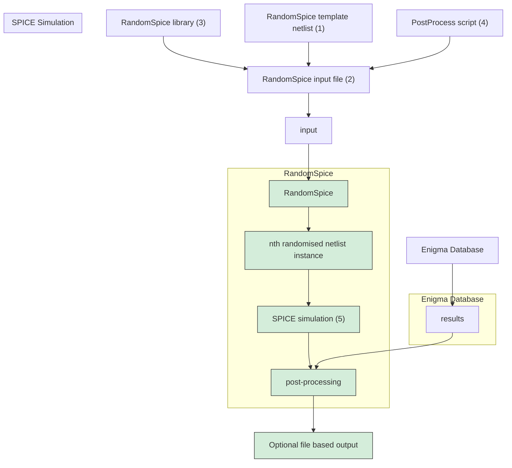
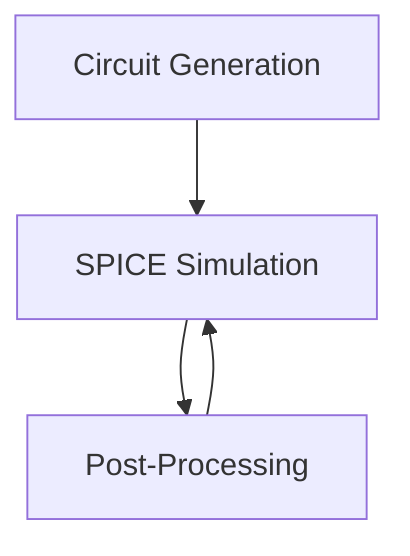
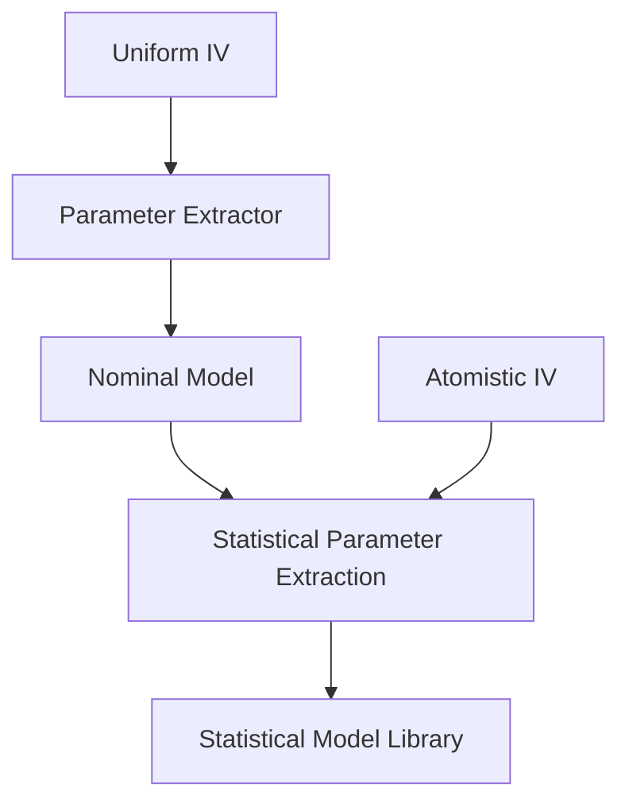

<!-- page:1 -->
# RandomSpice User Guide

Version O-2018.06, June 2018

# Copyright and Proprietary Information Notice

<!-- page:2 -->
© 2018 Synopsys, Inc. This Synopsys software and all associated documentation are proprietary to Synopsys, Inc. and may only be used pursuant to the terms and conditions of a written license agreement with Synopsys, Inc. All other use, reproduction, modification, or distribution of the Synopsys software or the associated documentation is strictly prohibited.

# Destination Control Statement

All technical data contained in this publication is subject to the export control laws of the United States of America. Disclosure to nationals of other countries contrary to United States law is prohibited. It is the reader’s responsibility to determine the applicable regulations and to comply with them.

# Disclaimer

SYNOPSYS, INC., AND ITS LICENSORS MAKE NO WARRANTY OF ANY KIND, EXPRESS OR IMPLIED, WITH REGARD TO THIS MATERIAL, INCLUDING, BUT NOT LIMITED TO, THE IMPLIED WARRANTIES OF MERCHANTABILITY AND FITNESS FOR A PARTICULAR PURPOSE.

# Trademarks

Synopsys and certain Synopsys product names are trademarks of Synopsys, as set forth at https://www.synopsys.com/company/legal/trademarks-brands.html. All other product or company names may be trademarks of their respective owners.

# Free and Open-Source Licensing Notices

If applicable, Free and Open-Source Software (FOSS) licensing notices are available in the product installation.

# Third-Party Links

Any links to third-party websites included in this document are for your convenience only. Synopsys does not endorse and is not responsible for such websites and their practices, including privacy practices, availability, and content.

Synopsys, Inc.

Mountain View, CA 94043

www.synopsys.com

<!-- page:3 -->
# Contents

# 1 Overview 5

# 2 Simulation Guide 6

2.1 Quick Start Example 6   
2.2 Command Line Options . 11   
2.3 Simulation Modes 14   
2.4 Ageing Models 14

2.4.1 Legacy Library Generation 15   
2.4.2 Stress Time Model 16   
2.4.3 Ageing Parameters 19   
2.4.4 Example 19

2.5 Interconnect Variability 20

# 3 Input Files 22

3.1 Input File Sections 22   
3.2 Input File Options . 23

3.2.1 Circuit Section Options 23   
3.2.2 Simulation Section Options 24   
3.2.3 Output Section Options 25   
3.2.4 Models Section Options 25   
3.2.5 Variability Section Options 26   
3.2.6 Advanced Section Options 26   
3.2.7 Database Section Options 26   
3.2.8 Auto-generating Input Files 27

3.3 Preparing a Netlist 29

<!-- page:4 -->
3.3.1 Subcircuit Randomisation 30

3.4 Plug-in Post-Processing Modules 31

3.4.1 Python Library Modules 33

# 4 Database Backend 34

4.1 Enabling the Database Backend 34   
4.2 Usage 34

4.2.1 Adding Data 34

4.2.2 Saving Data 35

4.2.3 Accessing Data 36

# 5 Examples 37

5.1 Simple Post-Processor Example 37   
5.2 Database Post-Processor Example 38

5.2.1 Input File 40   
5.2.2 Running the Simulations 40   
5.2.3 Post-processor Scripts 40

5.3 Parallel Processing on a Workstation 42

# 6 Compact Modelling Strategies 43

6.1 Subcircuit device model support 43   
6.2 Response Surface Model 44   
6.3 Statistical Compact Model 46   
6.4 Gaussian Parameter Generation 46   
6.5 Principal Component Analysis 47   
6.6 ModelGen 48

# Enigma-Based Library Generation 49

7.1 Library Builder Example 49

# 8 Reference 52

# Index 55

RandomSpice User Guide 4

O-2018.06

<!-- page:5 -->
# 1 Overview

RandomSpice is a Monte Carlo circuit simulation engine part of the Synopsys “TCAD to SPICE” flow, which enables large-scale simulation of statistical and process variability and statistical analysis of the simulation results. It supports advanced statistical compact model extraction and parameter generation strategies linked to statistical SPICE model extraction tool Mystic, and can efficiently harness large-scale cluster computing technology. RandomSpice provides the facilities necessary for accurate statistical circuit and standard cell characterisation, and supports power–performance–yield (PPY) analysis.

RandomSpice is capable of utilising Synopsys HSPICEas its backend SPICE simulator.

This guide describes how to use and operate RandomSpice to perform variability enhanced simulations of nano-scale circuit designs. The remainder of the user guide contains the following chapters, which describe the operation of RandomSpice.

<table><tr><td>Chapter</td><td>Description</td></tr><tr><td>Chapter 2 - Simulation Guide</td><td>An overview of the simulation process and how to prepare your SPICE netlists for use with RandomSpice.</td></tr><tr><td>Chapter 3 - Input Files</td><td>A reference for the commands available in the RandomSpice input file.</td></tr><tr><td>Chapter 4 - Database Backend</td><td>Describes the database facilities available in RandomSpice.</td></tr><tr><td>Chapter 5 - Examples</td><td>Provides several examples illustrating the use of RandomSpice.</td></tr><tr><td>Chapter 6 - Compact Modelling Strategies</td><td>Describes the compact modelling strategies supported by RandomSpice.</td></tr></table>

<!-- page:6 -->
# 2 Simulation Guide

This section outlines the basic simulation procedure when using RandomSpice. RandomSpice is a command line driven program, invoked using the command RandomSpice2. A top level illustration of RandomSpice I/O is shown in Figure 2.1. Command line options are described in Section 2.2. Requirements for basic RandomSpice simulations include:

1. Netlist/Circuit for simulation (extracted from schematic design/layout or hand written, including required options/stimulus and measurements). Changes required to standard SPICE netlists are outlined in Section 3.3). This required input is denoted by (1) in Figure 2.1.   
2. Input file (described in Section 3.1 and 3.2, contains simulation setup and settings/options). This required input is denoted by (2) in Figure 2.1.   
3. Model library with generators (as specified in the input file). This required input is denoted by (3) in Figure 2.1.   
4. Processor (used to extract the data from the simulation output and outlined in Section 3.4). This optional is denoted by (4) in Figure 2.1.   
5. A SPICE backend (to perform the individual simulations). This required input is denoted by (5) in Figure 2.1.

Before RandomSpice simulations are performed it is recommended that the nominal circuit is simulated with the backend SPICE tool in order to verify that the circuit performs as expected. It is also recommended that an initial run with a small number of circuit instances is performed first, where generated netlists are saved (an available option in the input file) and analysed for troubleshooting and debugging purposes.

Before running RandomSpice simulations, users must ensure that the backend SPICE tool is available and properly configured within the environment in which RandomSpice will be running.

# 2.1 Quick Start Example

This example will show you how to get started with RandomSpice, using a simple CMOS inverter circuit. The input files needed for this example are provided in \$INSTALL\_DIR/RandomSpice2/Examples/QuickStart. The template SPICE netlist is provided in


<details>
<summary>flowchart</summary>


</details>

Figure 2.1: Flow chart illustrating inputs/outputs and the general RandomSpice flow. Inputs are highlighted in blue, outputs in yellow, internal steps in red and the RandomSpice2 execution in green. The solid arrows show the flow. The dashed lines show where the specifications are input into RandomSpice - mainly through the input file, which will be covered in detail in Chapter 3.

<!-- page:8 -->
inv.net, which is reproduced below. This is a regular SPICE netlist, with one important difference: the model names used for the MOSFETs in the circuit are replaced with keywords that are used to tell RandomSpice that it should create a model for this MOSFET (see Section 3.3 for more information). Different keywords may be available in different libraries, for example to allow different variability sources to be applied. RandomSpice provides an option to query a model library to find out what keywords are available. This can be enabled by including the ’-q’ flag when running RandomSpice:

```txt
$ RandomSpice2 Test.rs2 -q
TCAD to SPICE - RandomSpice
Version O-2018.06 for linux64
Copyright (c) 2010-2018 Synopsys, Inc.
This software and the associated documentation are proprietary to Synopsys, Inc. This software may only be used in accordance with the terms and conditions of a written license agreement with Synopsys, Inc.
All other use, reproduction, or distribution of this software is strictly prohibited.
Querying library GSS-25nm-HP-Metal-Models.rsl
Library Name: GSS 25nm HP Metal Gate Library - LUT Models
Supported Keywords: UNIF:N, UNIF:P, ATOM:N, ATOM:P
Total run time: 0hr 0min 4s 
```

Note that an input file is still required, which specifies the library file name.

For the examples included in this document, we have used the “GSS 25nm Bulk MOSFET” library which contains the device keywords ATOM:N (denoting an N-channel device containing variability) and ATOM:P (denoting a variable P-channel device).

```txt
* CMOS Inverter
M1 Y A 0 0 ATOM:N L=25n W=25n
M2 Y A VDD VDD ATOM:P L=25n W=50n
VVDD VDD 0 1
V1 A 0 PULSE(0 1 0 10p 10p 1n 2n)
. TRAN 10p 10n
.PRINT TRAN V(A) V(Y)
.OPTIONS NOPAGE=1 INGOLD=2 
```

```txt
.END 
```

<!-- page:9 -->
The second input file required is used to configure RandomSpice for the simulation that you want to run. The RandomSpice input file used for this sample is inv.rs2 in the QuickStart directory, which is again reproduced below. All of the options are explained in detail in Chapter 3, but the important options to note are netlist, which tells RandomSpice the name of the template netlist; number, which is the number of simulations to run; library, which tells RandomSpice what compact model library to use; and finally spice, which tells RandomSpice what SPICE backend to use for simulation. The other options in this input file configure things such as output file names and formats.

```ini
[Circuit]
netlist = inv.net
number = 10
seed = 1000

[Simulation]
spice = ngspice

[Output]
dir = ./
prefix = inv
savenets = True
backend = file

[Models]
library = $INSTALL_DIR/Models/GSS-25nm-HP-Metal/GSS-25nm-HP-Metal-Models.rsl 
```

We suggest that you copy these two files from the example directory to your own workspace, as shown below. RandomSpice can then be invoked on the command line using the following command:

```shell
mkdir RandomSpice_Tutorial
cd RandomSpice_Tutorial
cp -v $INSTALL_DIR/RandomSpice2/Examples/QuickStart/inv.* ./
' $INSTALL_DIR/RandomSpice2/Examples/QuickStart/inv.net' -> './inv.net'
' $INSTALL_DIR/RandomSpice2/Examples/QuickStart/inv.rs2' -> './inv.rs2'
$ RandomSpice2 inv.rs2

TCAD to SPICE - RandomSpice
Version 0-2018.06 for linux64
Copyright (c) 2010-2018 Synopsys, Inc.
This software and the associated documentation are proprietary to 
```

```txt
Synopsys, Inc. This software may only be used in accordance with the terms and conditions of a written license agreement with Synopsys, Inc.
All other use, reproduction, or distribution of this software is strictly prohibited.

Loading inputs:
    RandomSpice input file: /home/username/Desktop/
    RandomSpice_Tutorial/inv.rs2
    Template netlist: /home/username/Desktop/
    RandomSpice_Tutorial/inv.net
    Library file: $INSTALL_DIR/Models/GSS-25nm-HP-Metal/
    GSS-25nm-HP-Metal-Models.rsl
    Post-processor: Disabled
Loading complete

Simulation Parameters:
    Model Library: GSS 25nm HP Metal - LUT v1.0.0
    SV Enabled: True
    PV Enabled: False
    Initial Seed: 1000
    SPICE Backend: ngspice
    Sim Mode: Normal
    # of Circuits: 10
    Starting Circuit: 1

Netlist generation:
[====================] 100%

Simulating circuits:
[====================] 100%

Output data:
Netlists saved to /home/username/Desktop/RandomSpice_Tutorial
Simulation data saved to /home/username/Desktop/RandomSpice_Tutorial

Total run time: 0hr 0min 9s 
```

<!-- page:10 -->
This will produce 10 randomised instances of the template inverter, with the output netlists saved as inv-1.net to inv-10.net and a corresponding .dat file for each circuit instances, containing the screen output captured from the SPICE backend. Using this output data, you can perform further post-processing manually, or develop a plugging post-processor for RandomSpice, which will be explained in Chapter 5.

<!-- page:11 -->
# 2.2 Command Line Options

The following command line arguments are available for RandomSpice. Note that command line arguments will always override the options given in the input file, as indicated in the Input File Option column, where the corresponding input file option is denoted in the form Section Heading::Option Name, and is fully described in the corresponding section in Chapter 3. Full descriptions of these options can also be found in the corresponding sections in Chapter 3.

<table><tr><td>Short Flag</td><td>Long Flag</td><td>Description</td><td>Input File Option</td></tr><tr><td>-h</td><td>--help</td><td>Show the command line arguments and usage.</td><td>-</td></tr><tr><td>-t</td><td>--template</td><td>File name of the template netlist to use.</td><td>Circuit::Netlist</td></tr><tr><td>-n</td><td>-</td><td>Number of randomised circuits to simulate.</td><td>Circuit::Number</td></tr><tr><td>-r</td><td>-</td><td>Seed for the random number generator.</td><td>Circuit::Seed</td></tr><tr><td>-s</td><td>--spice</td><td>Specifies the SPICE backend to use for simulations.</td><td>Simulation::Spice</td></tr><tr><td>-L</td><td>--library</td><td>Filename of the compact model library to use.</td><td>Models::Library</td></tr><tr><td>-d</td><td>--output-dir</td><td>Path to the output directory to use.</td><td>Output::Dir</td></tr><tr><td>-o</td><td>--prefix</td><td>Prefix to use for output file names.</td><td>Output::Prefix</td></tr><tr><td>-v</td><td>--version</td><td>Display the RandomSpice version number.</td><td>-</td></tr><tr><td>-c</td><td>--start-circuit</td><td>Specifies the starting circuit number in the statistical ensemble.</td><td>Circuit::Startnum</td></tr><tr><td>-g</td><td>--gen-only</td><td>Generate circuits only, do not run any simulations.</td><td>Simulation::Enabled</td></tr><tr><td>-q</td><td>--query-lib</td><td>Query the compact model library to determine which device keywords are available.</td><td>-</td></tr><tr><td>-m</td><td>--sim-mode</td><td>Select the simulation mode to use. See Section 2.3 for details.</td><td>Simulation::Mode</td></tr><tr><td>-i</td><td>--gen-input</td><td>Generate a template .rs2 file based on the supplied options.</td><td>-</td></tr><tr><td></td><td>--spice-args</td><td>Additional arguments to be passed to SPICE.</td><td>Simulation::Spiceargs</td></tr></table>

<!-- page:12 -->
These options can, for example, be used to change the number of circuits or simulation backend without needing to change the input file. Returning to the Quick Start example from section 2.1, the number of circuit simulations in the input file can be overridden using command line flags so that 50 simulations are performed instead of the 10 specified in the example:

```yaml
$ RandomSpice2 inv.rs2 -n 50
TCAD to SPICE - RandomSpice
Version 0-2018.06 for linux64
Copyright (c) 2010-2018 Synopsys, Inc.
This software and the associated documentation are proprietary to Synopsys, Inc. This software may only be used in accordance with the terms and conditions of a written license agreement with Synopsys, Inc.
All other use, reproduction, or distribution of this software is strictly prohibited.
Loading inputs:
RandomSpice input file: /home/username/Desktop/
RandomSpice_Tutorial/inv.rs2
Template netlist: /home/username/Desktop/
RandomSpice_Tutorial/inv.net
Library file: $INSTALL_DIR/Models/GSS-25nm-HP-Metal/
GSS-25nm-HP-Metal-Models.rsl
Post-processor: Disabled
Loading complete
Simulation Parameters:
Model Library: GSS 25nm HP Metal - LUT v1.0.0
SV Enabled: True
PV Enabled: False
Initial Seed: 1000
SPICE Backend: ngspice
Sim Mode: Normal
# of Circuits: 50
Starting Circuit: 1
Netlist generation:
[====================] 100%
Simulating circuits:
[====================] 100%
Output data:
Netlists saved to /home/username/Desktop/RandomSpice_Tutorial
Simulation data saved to /home/username/Desktop/RandomSpice_Tutorial
Total run time: 0hr 0min 11s 
```

<!-- page:14 -->
Note that running large numbers of simulations can rapidly produce a lot of output data and it is suggested that you use an alternative storage backend option, such as GZIP or BZIP2. The options available for file storage are described in Section 3.2.3. Large simulation samples can also require large amounts of memory, and for this reason RandomSpice offers several simulation modes to manage this.

# 2.3 Simulation Modes

RandomSpice can operate in three different simulation modes which have been tailored to account for differences between the computational environments in which it is likely to be run. These three modes provide trade-offs between simulation run-time and memory footprint.

1. Normal/Hybrid: In this mode, all circuits for an ensemble are generated, then simulations are carried out, with post-processing for each circuit being done as soon as the simulation finishes. This is the best compromise between simulation time and memory footprint.   
2. Batch: In this mode, all circuits for an ensemble are generated, then all simulations are done, followed by all post-processing. This is the fastest mode, but can require large amounts of memory, depending on the circuit size. This mode is most useful when the circuit simulations generate only a small amount of data.   
3. Sequential: In this mode, each circuit is generated, simulated and post-processed in turn. This mode is slower, but can significantly reduce the memory footprint and is most useful when the simulations generate a large amount of output data.

By default, spooling is enabled for each of these simulation modes, meaning that when the amount of stored data reaches a certain limit, it will be stored temporarily on disc in a spool file until needed again. This process is transparent to the user and all spool files will be cleaned up and the output data returned to the user at the end of the simulation. By default RandomSpice is configured to limit the memory usage to approximately 2GB for simulation data, although there will obviously be additional overhead for RandomSpice itself and the SPICE backend. More information is given on this option in Section 3.2.6.

# 2.4 Ageing Models

RandomSpice includes ageing models that account for the long term effects of bias temperature instability (BTI) and hot carrier injection (HCI) on MOSFET performance. This is accounted for by characterising the underlying transistors for different levels of long term stress. Linking such transistor data on ageing effects with ModelGen technology allows accurate transistor information to be obtained for arbitrary stress time, even if it is not part of the initial characterisation.

<!-- page:15 -->
RandomSpice is bundled with a 20nm bulk CMOS template transistor library that includes these effects. The methodology used to generate this library is described in Section 2.4.1. RandomSpice also includes models that map circuit level parameters, such as stress time and workload, to the transistor level parameters such as trapped charge density. The model is described in Section 2.4.2 and the netlist level parameters associated with it are listed in Section 2.4.3. Finally, an example is provided in Section 2.4.4, which demonstrates how this methodology can be applied in practice.

# 2.4.1 Legacy Library Generation

Generic library generation is currently propagated to Enigma. The following section covers the historic support of the LibraryMaker available with RandomSpice2.

In the bundled demonstration 20nm bulk CMOS library, all characterisation is carried out through simulations using the DD TCAD simulator Garand. In general, data may come from measurement or simulation, as long as it can be associated with a level of cumulative trapped charge density. Using Garand, statistical simulations for both N and PMOS transistors were carried out at trapped charge densities of 0, 1e11cm−2, 5e11cm−2 and $\mathrm { 1 e l } 2 c m ^ { - 2 }$ . These densities correspond to fresh, low stress, medium stress and high stress conditions, respectively. The simulated data include both low and high drain bias conditions, which allows compact models to be extracted. Models were then extracted for each statistical instance, at each level of trapped charge, using the Synopsys compact model extractor Mystic. The extraction methodology is described further in Chapter 6. It should be noted that the same set of parameters is used for extraction at each trapped charge density, as this is required in order to allow ModelGen to generate models at arbitrary stress time.

Once extraction is completed, the LibraryMaker utility can be used to generate a library that provides these capabilities. As detailed in the Mystic manual, the extracted compact model parameters must conform the the data format used by LibraryMaker. This is reproduced below for reference and as an example of the format required in order to allow generation over trap density.

```txt
version 3
params vth0 u0 vsat eta0 ua nfactor
length 2.5e-8 width 2.5e-8 trap_density 0
p11 p12 p13 p14 p15 p16
p21 p22 p23 p24 p25 p26
...
length 2.5e-8 width 2.5e-8 trap_density 1e11
p11 p12 p13 p14 p15 p16
p21 p22 p23 p24 p25 p26
...
length 2.5e-8 width 2.5e-8 trap_density 5e11
p11 p12 p13 p14 p15 p16
p21 p22 p23 p24 p25 p26
... 
```

```txt
length 2.5e-8 width 2.5e-8 trap_density 1e12
p11 p12 p13 p14 p15 p16
p21 p22 p23 p24 p25 p26
... 
```

<!-- page:16 -->
A file in this format is required for each of N and PMOS, along with the corresponding uniform models. In this example, the extracted statistical parameters are in files nfet\_trap.dat and pfet\_trap.dat, for N and PMOS respectively. The uniform models are named nfet\_unif.mod and pfet\_unif.mod. The library can then be constructed as follows:

```shell
$ LibraryMaker —nparamfile nfet_trap.dat —nmodel nfet_unif.mod \
—pparamfile pfet_trap.dat —pmodel pfet_unif.mod \
-n "My Ageing Library" -t ModelGen Ageing.rsl 
```

The above command will produce a ModelGen-based library file, Ageing.rsl, that can be used for simulations of stress-induced ageing at arbitrary stress time.

# 2.4.2 Stress Time Model

As indicated above, RandomSpice includes a model that allows stress time and workload to be translated into a corresponding trapped charge density. The BTI model implemented in RandomSpice was first described in [3] and further developed in [2][4]. It is important to note that BTI degradation is, with this model, described as a time dependent shift of the threshold voltage, $\Delta V _ { T }$ . The permanent and the recoverable BTI components are described separately. To distinguish the permanent from the recoverable, the universal BTI relaxation model is used [3]. The permanent component is modelled with a power law:

$$
P = C _ {P 1} \cdot V _ {o v} ^ {C _ {P 2}} \cdot t _ {s t r} ^ {n _ {p}}
$$

where P stands for the permanent component, $C _ { P 1 }$ is the pre factor, $C _ { P 2 }$ is the voltage exponent, $t _ { s t r }$ is the stress time and $n _ { p }$ is the time exponent. $V _ { o v }$ is the overdrive voltage equal to $V _ { g s } { - } V _ { t h 0 }$ . Parameters $C _ { P 1 } , C _ { P 2 }$ and $n _ { p }$ describe the permanent BTI component.

Temperature scaling is well captured by the Arrhenius law:

$$
k _ {T} = C _ {T} \cdot e x p \left(- \frac {E _ {a}}{k _ {B} T}\right)
$$

where $C _ { T }$ is the pre factor, $E _ { a }$ is the exponent reduced by temperature in degrees Kelvin $T$ and the Boltzmann constant $k _ { B }$ . This law describes the temperature dependency of both the recoverable and permanent components.


<details>
<summary>text_image</summary>

Vs
K K K ... K ... K
Vc,0 Vc,1 Vc,2 Vc,i Vc,m-1
10^0C0 10^1C0 10^2C0 10^iC0 10^m-1C0
ΣiVC,i R
</details>

Figure 2.2: The series of RC components describes the capture and emission phase of BTI degradation. Redrawn from [4].

<!-- page:17 -->
The voltage dependence of the recoverable component is modelled with another power law:

$$
R = A \cdot V _ {o v} ^ {n _ {v}}
$$

where $n _ { v }$ is the voltage scaling exponent.

The last part of the model is the time evolution of the recoverable component. This is also the most complex part of the model, since it needs to describe trap capture and emission phenomena. It is best explained with a series of RC components, as shown in Figure 2.2. K represents the fixed value of the resistor. The capacitors, which have a base value of $C _ { 0 }$ , are exponentially increased every step. The number of RC pairs is defined by $m .$ . This system will charge and/or discharge in time depending on $V _ { S }$ , the voltage applied to the input and its initial conditions. The sum of all node voltages gives a description of the recoverable BTI component. Of course, this RC model has to be further adapted to describe the recoverable component accurately. This is done by adapting its equations. To start, the equation of a charging RC pair with non-zero initial conditions is as follows:

$$
R _ {f, i} = V _ {o v} ^ {n _ {v}} + (V _ {C i, 0} - V _ {o v} ^ {n _ {v}}) \cdot e x p \left(- \frac {d t}{1 0 ^ {i} \cdot \tau_ {f}}\right)
$$

where $V _ { o v } ^ { n _ { v } }$ is the scaled stress voltage $V _ { s } , V _ { C i , 0 }$ describes the initial conditions, dt is the time difference between two time points within the stress phase, and $\tau _ { f }$ is the charging time constant, exponentially increased for every RC pair. Since the charging slope observed in BTI measurements cannot be described with this equation alone, the $n _ { f }$ parameter, to control the “forward” slope, is introduced:

$$
R _ {f, i} = V _ {o v} ^ {n _ {v}} + (V _ {c i, 0} - V _ {o v} ^ {n _ {v}}) \cdot e x p \left(- \frac {d t ^ {n _ {f}}}{1 0 ^ {i} \cdot \tau_ {f}}\right)
$$

<!-- page:18 -->
The sum across all m RC couples divided by $m ,$ giving the total recoverable part of the $\Delta V _ { T }$ during the stress phase:

$$
R _ {f} = \frac {1}{m} \sum_ {i = 1} ^ {m} R _ {f, i}
$$

For a virgin device $V _ { C i , 0 }$ equals zero. Similarly for the relaxation or discharging phase:

$$
R _ {r} = \frac {1}{m} \sum_ {i = 1} ^ {m} \left\{R _ {f, i} \cdot e x p \left(- \frac {d t ^ {n _ {r}}}{1 0 ^ {i} \cdot \tau_ {t}}\right) \right\}
$$

$R _ { r }$ describes the recovery of $\Delta V _ { T }$ . Here dt stands for two time points within the relaxation phase. The input degradation is given by the initial conditions $R _ { f , i }$ . The same is true if another stress phase follows a relaxation phase: $V _ { C i , 0 }$ is then equal to $R _ { r , i }$ . Note that the division by m is introduced here for the first time, because it gives a more physical result: the $\Delta V _ { T }$ can never be higher than the stress voltage. Also note that, during relaxation, no overdrive voltage $V _ { o v }$ is applied. The threshold voltage degradation due to BTI is finally given by:

$$
\Delta V _ {T} = [ R _ {r} (t _ {s t r}, t _ {r e l}, V _ {o v}) + P (t _ {s t r}, V _ {o v}) ] \cdot k _ {T}
$$

which represents the sum of the permanent and recoverable BTI components, rescaled to the operating temperature.

This is then translated into a trap density using the following relationship:

$$
\rho (\overline {{\Delta V _ {T}}}) = 1 0 ^ {9} + 2. 8 2 \times 1 0 ^ {1 3} \overline {{\Delta V _ {T}}} \times W
$$

Where $\overline { { \Delta V _ { T } } }$ is average $V _ { T }$ shift and W is a duty cycle or workload scaling parameter. For convenience, the $\Delta V _ { T }$ corresponding to a particular stress time is assumed to be equivalent to the $\overline { { \Delta V _ { T } } }$ used when calculating the trap density. The dependence of average $\Delta V _ { T }$ and trap density is extracted from the TCAD simulations. The relationships between stress time, $\Delta V _ { T }$ and trap density are shown in Figure 2.3 (Note that W is assumed to be 1).


<details>
<summary>line</summary>

| t (s) | ΔV_T (V) |
| ----- | -------- |
| 10    | 0.005    |
| 20    | 0.007    |
| 30    | 0.008    |
| 40    | 0.009    |
| 50    | 0.010    |
| 60    | 0.011    |
| 70    | 0.012    |
| 80    | 0.013    |
| 90    | 0.014    |
| 100   | 0.015    |
| 200   | 0.017    |
| 300   | 0.018    |
| 400   | 0.019    |
| 500   | 0.020    |
| 600   | 0.021    |
| 700   | 0.022    |
| 800   | 0.023    |
| 900   | 0.024    |
| 1000  | 0.025    |
| 2000  | 0.028    |
| 3000  | 0.031    |
| 4000  | 0.034    |
| 5000  | 0.037    |
| 6000  | 0.040    |
| 7000  | 0.043    |
| 8000  | 0.046    |
| 9000  | 0.049    |
| 10000 | 0.052    |
</details>


<details>
<summary>line</summary>

| <ΔVτ> (V) | ρ (cm⁻²) |
|---|---|
| 0.000 | 0 |
| 0.005 | 1e+11 |
| 0.018 | 5e+11 |
| 0.036 | 1e+12 |
</details>

Figure 2.3: Relationships between $\Delta V _ { T }$ , time and trapped charge density. 

<table><tr><td>Parameter</td><td>Description</td><td>Default</td><td>Min</td><td>Max</td></tr><tr><td>AGE</td><td>Overall stress time in seconds.</td><td>0</td><td>0</td><td> $10^7$ </td></tr><tr><td>W</td><td>Workload scaling factor.</td><td>1</td><td>0</td><td>10</td></tr></table>

Table 2.1: Ageing model parameters.

<!-- page:19 -->
# 2.4.3 Ageing Parameters

The model described in Section 2.4.2 can be controlled via two additional MOSFET instance parameters, AGE and WORKLOAD. Boundaries and defaults for these are given in Table 2.1. These are specified in the same way as standard SPICE MOSFET instance parameters, for example:

```txt
M1 D G 0 0 ATOM:N L=25n W=25n AGE=1000 W=0.9 
```

This would specify a minimal geometry NFET in our 20nm bulk library with a stress time of 1000s and a workload scaling factor of 0.9. Using the build-in model, this would yield a compact model with characteristics corresponding to a trapped charge density of approximately 4.7e11 cm−2.

# 2.4.4 Example

The netlist below illustrates a simple example of two inverters subject to the same overall stress time, but different workload factors.

```txt
* Ageing model example
MN1 Y A 0 0 ATOM:N L=25n W=25n AGE=100 W=1
MP1 Y A VDD VDD ATOM:P L=25n W=25n AGE=100 W=1 
```

```txt
MN2 Z A 0 0 ATOM:N L=25n W=25n AGE=100 W=0.5
MP2 Z A VDD VDD ATOM:P L=25n W=25n AGE=100 W=0.5
VVDD VDD 0 1
VA A 0 0
.DC VA 0 1 0.1
.PRINT DC V(A) V(Y) V(Z) I (VVDD)
.END
```

<!-- page:20 -->
This example demonstrates the effect on inverter transfer characteristics of varying workload factor at a common stress level. Both parameter can be swept or freely varied in order to investigate how they effect the output characteristics.

# 2.5 Interconnect Variability

RandomSpice can include variations in interconnect components (resistors, capacitors and inductors). This works very similarly to introducing variations in MOSFET components and this section will give an example illustrating how the feature can be used. In conjunction with the new Library Maker utility, it is possible to insert variations coming either from RC extract, or as specified by a parametric distribution. This includes access to both Gaussian, PCA and ModelGen generators.

To introduce variations in interconnect components, simply replace the component value with the keyword specified by the library, for example, ATOM:C, ATOM:R or ATOM:L. Since correlated variations may be applied to different components, it is necessary to specify which component in an interconnect model that the variations refer to. For example, in a simplistic model with only one resistor and one capacitor, these would be referred to as ATOM:R:1 and ATOM:C:1.

To illustrate this, consider the netlist below:

```txt
* Interconnect example
MN1 Y1 A 0 0 ATOM:N L=25n W=25n
MP1 Y2 A VDD VDD ATOM:P L=25n W=25n
R1 Y1 Y2 1
C1 Y2 0 1e-15
.END 
```

This would be altered as follows:   
```asm
* Interconnect example
MN1 Y1 A 0 0 ATOM:N L=25n W=25n
MP1 Y2 A VDD VDD ATOM:P L=25n W=25n
R1 Y1 Y2 ATOM:R:1
C1 Y2 0 ATOM:C:1
.END
```

And then after randomisation, a particular instance might look like:   
```txt
* Interconnect example
MN1 Y1 A 0 0 ATOM:N L=25n W=25n
MP1 Y2 A VDD VDD ATOM:P L=25n W=25n
R1 Y1 Y2 1.231
C1 Y2 0 0.964e-15
.END 
```

<!-- page:21 -->
No further modifications to the netlist are necessary other than the keyword substitution. It should be noted that this can be extended to arbitrarily complex interconnect models with multiple, correlated components. This approach can also be used to introduce variations in any equivalent circuit that can be represented entirely as passive (i.e. R, L and C) components. Note that the library used with RandomSpice must contain information about passive component variation in order for this to work correctly. This can be checked with the library query mode. If there is no passive variation information in the library, then the RLC components will simply be left as is.

<!-- page:22 -->
# 3 Input Files

RandomSpice requires two files to operate. The first is the SPICE netlist that will be used as a template for randomisation and the second is an input file that specifies the settings for a particular simulation. This input file is organised into several sections, each with corresponding options. In this chapter, the various sections and options available will be described, and some example input files will be provided.

# 3.1 Input File Sections

The input file is structured into a number of optional sections, each prefaced by a heading, as follows:

Listing 3.1: Headings in a RandomSpice input file.   
```ini
[heading1]
option = value
...
[heading2]
option = value
... 
```

The section headings available in RandomSpice are as follows: 

<table><tr><td>Heading</td><td>Description</td></tr><tr><td>Circuit</td><td>Options related to the template circuit, such as number of randomised circuits to simulate.</td></tr><tr><td>Simulation</td><td>Options related to the SPICE simulations, such as which backend to use.</td></tr><tr><td>Output</td><td>Options for controlling how data is output from RandomSpice.</td></tr><tr><td>Models</td><td>Options related to the compact model library used for the simulations.</td></tr><tr><td>Variability</td><td>Options controlling different variability sources.</td></tr><tr><td>Advanced</td><td>Advanced options for controlling the internal operation of RandomSpice.</td></tr><tr><td>Database</td><td>Options for controlling the database backend.</td></tr></table>

Note that the input file is entirely unstructured and the headings and options need not be in the order they are listed here.

<!-- page:23 -->
# 3.2 Input File Options

There are several options available under each input file heading. Note that options and headings are case-insensitive. The available options are described in the following sections.

# 3.2.1 Circuit Section Options

The options available under the Circuit heading are:

<table><tr><td>Option</td><td>Description</td><td>Default Value</td><td>Notes</td></tr><tr><td>Netlist</td><td>The file name of the template SPICE netlist.</td><td>./in.net</td><td>-</td></tr><tr><td>Number</td><td>Number of randomized circuits to simulate.</td><td>1</td><td>-</td></tr><tr><td>Seed</td><td>Integer value used to seed the random number generator.</td><td>0</td><td>1, 2, 3</td></tr><tr><td>Startnum</td><td>Number of the first circuit in the statistical ensemble.</td><td>1</td><td>1</td></tr></table>

Note 1 This option specifies the base seed used by the random number generator in RandomSpice for the statistical ensemble. It is important to note that each circuit is assigned a new random seed in order to ensure that the results can be reproduced. The seed for a particular circuit is given by seed + startnum. Therefore, when simulating multiple ensembles, consecutive seeds should not be used, as this will result in duplicate circuits. Instead, the seeds must be separated by the ensemble size, or more. See Section 5.3 for an example of proper usage in a cluster environment.

Note 2 If the default value of 0 is used, a random seed is generated based on the system time. This should not be used in a cluster or multi-processor environment, where multiple jobs may start within the same second. The simulation will also not be reproducible unless the random seed is extracted from the simulation outputs and entered into the input file.

Note 3 RandomSpice uses the Mersenne Twister random number generator. This generator has been extensively tested, and is considered the produce very high quality random numbers.

<!-- page:24 -->
# 3.2.2 Simulation Section Options

<table><tr><td>Option</td><td>Description</td><td>Default Value</td><td>Notes</td></tr><tr><td>Spice</td><td>The SPICE backend to use for simulation.</td><td>hspice</td><td>1</td></tr><tr><td>Mode</td><td>Simulation mode to use in RandomSpice.</td><td>Normal</td><td>2</td></tr><tr><td>Enabled</td><td>Flag indicating whether SPICE simulations should be run or not.</td><td>True</td><td>3</td></tr><tr><td>Spiceargs</td><td>Additional arguments to be passed to SPICE.</td><td>-</td><td>4</td></tr></table>

Note 1 By default, RandomSpice uses HSPICE, but for legacy reasons, it also has limited support for the open source SPICE simulator ngspice. To use a different SPICE backend that may be available to you, this must be specified in the input file or on the command line. Possible values for this option are:

<table><tr><td>Value</td><td>backend</td></tr><tr><td>ngspice</td><td>ngspice (Open source)</td></tr><tr><td>hspice</td><td>Synopsys HSPICE</td></tr></table>

Note 2 RandomSpice offers three different simulation modes. These are available to account for the particular environments in which RandomSpice may be operated. The available modes and summarised below and full details can be found in Section 2.3.

<table><tr><td>Value</td><td>backend</td></tr><tr><td>normal</td><td>Generate all circuits then interleaved simulation and post-processing.</td></tr><tr><td>batch</td><td>Generate all circuits, perform all simulations then perform all post-processing.</td></tr><tr><td>sequential</td><td>Generate, simulate and post-process each circuit in turn.</td></tr></table>

Note 3 If simulations are disabled, then only the netlist generation stage will be carried out. This may be useful for debugging and testing.

Note 4 The spiceargs option can be used to pass additional arguments that will be used when called the backend SPICE simulator. For example, to use HSPICE in server mode, the user can start an HSPICE server with hspice -C before running RandomSpice, then set spiceargs to -C to tell HSPICE, as invoked by RandomSpice, to use the running server. This mode of use can speed up simulation where large numbers of small simulations are being performed. Other flags that may enable particular options or outputs in the SPICE simulator can also be passed this way.

<!-- page:25 -->
# 3.2.3 Output Section Options

<table><tr><td>Option</td><td>Description</td><td>Default Value</td><td>Notes</td></tr><tr><td>Dir</td><td>The output directory to save results in.</td><td>./</td><td>-</td></tr><tr><td>Prefix</td><td>Prefix for output files.</td><td>out</td><td>1</td></tr><tr><td>Savenets</td><td>Flag indicating whether to save the generated netlists.</td><td>False</td><td>-</td></tr><tr><td>Processor</td><td>File name of a Python post-processing module to use (See Section 3.4).</td><td>none</td><td>2</td></tr><tr><td>Backend</td><td>Option specifying how output data should be stored.</td><td>none</td><td>3</td></tr></table>

Note 1 Output files are named using the following convention: <prefix>-<circuitnum>.[net|dat], unless the backend option is set to “single” (see note 3), in which case the output names are simply <prefix>.[net|dat]. Note that if a file already exists with the same name, the output will be renamed to include the current date and time so as not to overwrite existing data.

Note 2 RandomSpice allows the creation of plug-in post-processing modules in Python that can be used to process the data output by your simulation as part of the simulation flow. See Section 3.4 for details and examples of how to use this functionality.

Note 3 The following options are available for output file creation:

1. File: A single output file will be produced for each circuit.   
2. Tar: A tar archive will be created containing the output files.   
3. GZ/GZIP: A gzipped tar archive will be created.   
4. BZ2/BZIP2: A bzip2 tar file will be created.

5. Single: A single file will be produced containing all of the output data. This option is most useful in conjunction with a post-processing module that returns only a single number.

# 3.2.4 Models Section Options

<table><tr><td>Option</td><td>Description</td><td>Default Value</td></tr><tr><td>Library</td><td>File name of the compact model library to use.</td><td>default.rsl</td></tr></table>

<!-- page:26 -->
# 3.2.5 Variability Section Options

<table><tr><td>Option</td><td>Description</td><td>Default Value</td><td>Notes</td></tr><tr><td>Process</td><td>Enable/disable process variability in simulations.</td><td>False</td><td>1</td></tr><tr><td>Process_resp_only</td><td>Enable/disable the response surface component of process variability only (disable process variation generators if added to the library)</td><td>False</td><td></td></tr><tr><td>Statistical</td><td>Enable/disable statistical variability in simulations.</td><td>True</td><td>-</td></tr></table>

Note 1 Not all libraries available with RandomSpice contain data on process variations, therefore it is disabled by default. If it is enabled for a model library that does not contain process variability information, then only statistical variability information will be applied. You can determine whether a model library contains process variation data by using the query mode of RandomSpice as detailed in section 2.2.

# 3.2.6 Advanced Section Options

It will usually not be necessary to change these options for most simulations carried out with Random-Spice, however they are provided for use in situations that require unusual simulation conditions.

<table><tr><td>Option</td><td>Description</td><td>Default Value</td><td>Notes</td></tr><tr><td>Spool</td><td>Enable spooling of internal simulation data.</td><td>True</td><td>1</td></tr><tr><td>SpoolLimit</td><td>Default size to limit data stored in memory.</td><td>1GB</td><td>1</td></tr></table>

Note 1 In order to manage the amount of memory used by RandomSpice, which can grow very large for large statistical ensembles, data stored internally is spooled to disc by default when it exceeds a certain size. Disabling this can increase simulation speed, but will drastically increase the memory footprint for large simulations. The size limit can be set using the SpoolLimit option, which accepts values in bytes, KB, MB and GB. This size limit is applied to both generated netlists and output data, thus RandomSpice will use approximately two times this value for storing internal data.

# 3.2.7 Database Section Options

The database backend is used in conjunction with the post-processor module, and an example of usage can be found in Chapter 4. The following options can be used to control its operation.

<table><tr><td>Option</td><td>Description</td><td>Default Value</td><td>Notes</td></tr><tr><td>Enabled</td><td>Enable/disable the database backend.</td><td>False</td><td>-</td></tr><tr><td>Config</td><td>Path of the database configuration file.</td><td>../enigma/mongodb.conf</td><td>1</td></tr><tr><td>Project</td><td>Name of the project to use in the database.</td><td>-</td><td>2</td></tr><tr><td>Dataset</td><td>Name of the RandomSpice data set to store data in.</td><td>-</td><td>3</td></tr></table>

<!-- page:27 -->
Note 1 This file is created automatically on enigma startup or through the Sentaurus Workbench graphical user interface. Please refer to the enigma manual for full details on setting up and using the database.

Note 2, 3 The name or ID of a project and data set are required for RandomSpice. If the given names do not already exist in the database, they will be created automatically.

# 3.2.8 Auto-generating Input Files

When setting up a new simulation, RandomSpice provides a convenience option to generate a template input file that can be filled out by the user. This is available by using the -i option (or --gen-input). The template will then be written to the file name specified for RandomSpice, and any command line overrides will be incorporated into the template. For example, to create an input with all defaults set:

```powershell
$ RandomSpice2 template.rs2 -i
TCAD to SPICE - RandomSpice
Version 0-2018.06 for linux64
Copyright (c) 2010-2018 Synopsys, Inc.
This software and the associated documentation are proprietary to
Synopsys, Inc. This software may only be used in accordance with the
terms and conditions of a written license agreement with Synopsys, Inc.
All other use, reproduction, or distribution of this software is
strictly prohibited.
Writing template input file to: template.rs2
$ cat template.rs2
[circuit] seed = 0
startnum = 1
number = 1
netlist = in.net 
```

```ini
[simulation]
spiceargs =
enabled = True
mode = normal
spice = ngspice

[output]
prefix = out
savenets = False
processor = none
dir = ./
backend = file

[models]
library = default.rsl

[database]
enabled = False
config = ~/.claud.conf
project = none
dataset = none 
```

<!-- page:28 -->
If you already know some of the options that you wish to set, these can be given at the same time as the -i flag, for example:

```txt
$ RandomSpice2 sram.rs2 -i -t bitcell.net -r 1234 -n 100 -L GSS-25nm-ModelGen.
    → rsl -d wm -o bc_wm
TCAD to SPICE - RandomSpice
Version O-2018.06 for linux64
Copyright (c) 2010-2018 Synopsys, Inc.
This software and the associated documentation are proprietary to Synopsys, Inc. This software may only be used in accordance with the terms and conditions of a written license agreement with Synopsys, Inc.
All other use, reproduction, or distribution of this software is strictly prohibited.
Writing template input file to: sram.rs2
$ cat sram.rs2
[circuit]
seed = 1234
startnum = 1 
```

```ini
number = 100
netlist = bitcell.net

[simulation]
spiceargs =
enabled = True
mode = normal
spice = ngspice

[output]
prefix = bc_wm
savenets = False
processor = none
dir = wm
backend = file

[models]
library = GSS-25nm-ModelGen.rsl

[database]
enabled = False
config = ~/.claud.conf
project = none
dataset = none 
```

<!-- page:29 -->
The input file can then be further edited as desired.

# 3.3 Preparing a Netlist

RandomSpice uses keywords to identify the transistors in a circuit that should be randomised. The keywords are used in place of the model identifier in a normal SPICE MOSFET statement:

```txt
M1 D G S B <Keyword> L=25n W=25n 
```

The keywords that should be used will vary depending on the compact model library. The keywords supported by a particular library will be listed in the documentation for that library or by using RandomSpice in query mode as specified in section 2.2 . By way of example, common keywords supported by most libraries are as follows:

ATOM:N Atomistic NMOS devices.

ATOM:P Atomistic PMOS devices.

<!-- page:30 -->
UNIF:N Uniform TCAD NMOS device.

UNIF:P Uniform TCAD PMOS device.

To use a particular device/variability type, the keyword should be substituted as shown above. For example, the following netlist shows how a simple CMOS inverter netlist can be modified to operate with RandomSpice.

```txt
* CMOS Inverter
M1 Y A 0 0 ATOM:N L=25n W=25n
M2 Y A VDD VDD ATOM:P L=25n W=50n
VVDD VDD 0 1
V1 A 0 PULSE(0 1 0 10p 10p 1n 2n)
. TRAN 10p 10n
. PRINT TRAN V(A) V(Y)
. OPTIONS NOPAGE=1 INGOLD=2
.END 
```

# 3.3.1 Subcircuit Randomisation

In addition, randomisation can be applied at the subcircuit level by appending the keyword :RAND to the subcircuit name. In this case, a new instance of the subcircuit will be created with a new set of random transistors whenever the subcircuit is used. For example, the following subcircuit uses a subcircuit definition to instantiate two inverters. Without gate level randomisation, this will result in both inverters using the same set of random transistors. As shown below, the tag :RAND is appended to the subcircuit name. This is detected by RandomSpice and results in the output shown below the netlist.

```batch
* CMOS Buffer
.SUBCKT INV:RAND A Y VDD VSS
M1 Y A VSS VSS ATOM:N L=25n W=25n
M2 Y A VDD VDD ATOM:P L=25n W=50n
.ENDS
X1 A Y VDD 0 INV:RAND
X2 Y Z VDD 0 INV:RAND
VVDD VDD 0 1 
```

```asm
V1 A 0 PULSE(0 1 0 10p 10p 1n 2n)
. TRAN 10p 10n
. PRINT TRAN V(A) V(Y) V(Z)
. OPTIONS NOPAGE=1 INGOLD=2
.END 
```

```txt
* CMOS Buffer
* Model Library: GSS 25nm HP Metal - LUT
* Random Seed: 1000

X1 A Y VSS 0 INV_1161036348612429450
.SUBCKT INV_1161036348612429450 A Y VDD VSS
M1 Y A VSS VSS NMOS_W1_0_N468 L=2.5e-08 W=2.5e-08
M2 Y A VDD VDD PMOS_W2_0_N535 L=2.5e-08 W=5e-08
.ENDS

X2 Y Z VSS 0 INV_7913237767432230989
.SUBCKT INV_7913237767432230989 A Y VDD VSS
M1 Y A VSS VSS NMOS_W1_0_N670 L=2.5e-08 W=2.5e-08
M2 Y A VDD VDD PMOS_W2_0_N100 L=2.5e-08 W=5e-08
.ENDS

VVDD VDD 0 1
V1 A 0 PULSE(0 1 0 10p 10p 1n 2n)

.TRAN V(A) V(Y) V(Z)
.PRINT TRAN V(A) V(Y) V(Z)

.OPTIONS NOPAGE=1 INGOLD=2

.model NMOS_W1_0_N670 NMOS
...
.END 
```

<!-- page:31 -->
# 3.4 Plug-in Post-Processing Modules

RandomSpice provides the capability to post-process the results of each SPICE simulation as part of its own simulation flow. The default simulation flow is shown in Figure 3.1. As detailed in Section 2.3, in this simulation mode, all circuits are generated first and then simulation and post-processing is performed in turn for each circuit. This feature allows the user to define how the output data from the SPICE simulator should be processed. For example, the post-processing stage can be used to perform text processing and calculations on the output.


<details>
<summary>flowchart</summary>


</details>

Figure 3.1: Normal/Hybrid Simulation Mode in RandomSpice.

<!-- page:32 -->
To use this feature, the user provides their own Python module which does the necessary processing and returns the relevant data back to RandomSpice. User supplied post-processing modules must define a function called Process, which accepts two arguments, as follows:

```python
# Example post-processing module.
def Process(data, **extra):
    # Do stuff
    return processed_data 
```

The returned data is written to the output file(s) created by RandomSpice and can be any numerical or textual data.

The arguments to the Process function are:

data A string containing the screen output from the SPICE simulator.

\*\*extra A Python dictionary containing supplementary data sent from RandomSpice.

Currently, the extra dictionary contains several items. The first is cid, which is the circuit number in the ensemble. The seed used for the circuit simulation is also passed in with the key seed. These can be accessed as follows:

```python
def Process(data, **extra):
    circuit_number = extra['cid']
    seed = extra['seed']
    print("Circuit #: {0}".format(circuit_number))
    print("Seed for this circuit is: {0}".format(seed))
    # Further processing... 
```

<!-- page:33 -->
If the database backend has been enabled, a results object, which allows the user to store and retrieve results from the database will be supplied. Please see Chapter 4 for details on using the database backend and how to store results in the DB.

# 3.4.1 Python Library Modules

Some of the Python library modules are available for use in custom post-processing modules, as well as some addition ones. The modules that are available are:

math The standard Python maths library.

re The Python regular expressions library.

string Python string processing library.

numpy A module for efficient handling of N-dimensional arrays and other numerical routines.

scipy A module providing many useful routines for scientific data processing and numerical manipulation.

<!-- page:34 -->
# 4 Database Backend

# 4.1 Enabling the Database Backend

The database backend can be enabled in the RandomSpice input file. A proxy object is then made available to the user in the post-processing module, which allows data to be added and retrieved from the database. The database backend can then be used in RandomSpice by adding the following sections to the input file and editing appropriately.

```ini
[database]
enabled = True
config = mongodb.conf
project = my project
dataset = dataset1 
```

This section provides a reference on the methods available in the post-processor modules for saving and accessing data in the database. Examples of how to use this in practice are given in Chapter 5.

# 4.2 Usage

The results proxy is provided as part of the extra dictionary that is passed to the post-processor. It can be accessed as follows:

```python
def Process(data, **extra):
    results = extra["results"]
# Further processing... 
```

The results object is already connected to the database and contains any existing data for the current circuit and data set combination. It contains several simple methods for adding and accessing data stored in the database. In this section, each method will be described and a small example will be provided that demonstrates how it can be used.

# 4.2.1 Adding Data

To add new data to the database, use the add method of the results object. This method has the following signature:

add(name, index, \*\*kwargs)

RandomSpice User Guide

O-2018.06

<!-- page:35 -->
# Parameters:

name Name to use for this group of data.

index Data column to use as the index of the data.

\*\*kwargs Additional arguments to be passed to the table constructor, see below for details.

Any user defined data to be added is specified via keyword arguments, for example:

```javascript
results.add(vx=data["vx"], vy=data["vy"]) 
```

Note that arguments to add without a named keyword, like vx or vy above, are not allowed. The above command will add the two named datasets to the database, and will generate an automatic name for them. Note that it is required that the data are all the same length in a single call to add. If it is necessary to add data with different lengths, this must be done using multiple calls to add.

In addition to the data itself, an independent variable that is common to all of the data can be specified using the index keyword, if appropriate. In the case above, where it has been omitted, an integer index will be assigned instead. This is used internally to ensure that data stays correctly aligned.

To specify an index explicitly, use the following call:

```javascript
results.add(index=data["x"], vy1=data["vy1"], vy2=data["vy2"]) 
```

This will add data with a user defined independent variable to the database, i.e. vy1(x) and vy2(x). This is the optimal way of storing multi-column data that has a common independent variable.

Finally, both of the above examples can include a name argument that allows the user to specify a label for that particular set of data, which can then be used to refer to it later on, or in a subsequent simulation. For example:

```python
results.add(x=data["x"], y=data["y"], name="my_data_y") 
```

# 4.2.2 Saving Data

Once data has been added, it needs to be saved in order to be committed to the backend database. This can be done by explicitly calling the save method of the results object, or it will be done automatically every so often by RandomSpice. The save method takes no arguments, so it is simply called as follows:

```txt
results.save() 
```

<!-- page:36 -->
# 4.2.3 Accessing Data

If multiple simulations are being carried out as part of the same dataset, then data already in the database from previous simulations can be accessed through the results object as well. This is done using the [] operator, as shown below.

# results[name]

Parameters:

name Name of the group of data to retrieve.

The retrieved data can then be accessed by name, as in the following example:

```txt
## Simulation 1
results.add(x=data["x"], y=data["y"], name="data1")
results.add(x2=data["x2"], z=data["z"], name="data2")
results.save()

## Simulation 2
x = results["data1"]["x"]
y = results["data1"]["y"]
x2 = results["data2"]["x2"]
z = results["data2"]["z"] 
```

Note that the data objects results[“data1”] and results[“data2”] are instances of the DataFrame object in the pandas Python module (http://pandas.pydata.org/). Among other things, this supports advanced slicing and data transformations which may be useful for data processing and analysis.

<!-- page:37 -->
# 5 Examples

This chapter contains several usage examples for RandomSpice. These examples illustrate some of the different ways in which RandomSpice can be used for statistical circuit characterisation and operation in different computational environments.

# 5.1 Simple Post-Processor Example

The files for this example can be found in <INSTALL\_PATH>/RandomSpice2/Examples/PostProcessor. The SPICE netlist is the same CMOS inverter as used in the quick start example in Chapter 2. As described in Section 3.4, RandomSpice can take user-created Python scripts and use them to process that data output from SPICE. In this example, we will use a plug-in post-processor to extract the numerical values for the time point, input and output voltages from the screen output and then calculate the 50-50 delay time. The post-processor to do this is saved in ExtractTD.py and is reproduced below:

```python
## Extract 50-50 delay from an inverter.
import string, numpy as np
from scipy.interpolate import interp1d
from scipy.optimize import bisect

period = 2e-9
perov2 = period/2
perov4 = period/4
vdd = 1.0

def Process(data, **extra):
    vals = list()

    for l in data.split("\n"):
    if l.startswith(tuple(string.digits)):
    vals.append(l.split())

    vals = np.array(vals, dtype=float).transpose()
    t = vals[1]
    va = vals[2]
    vy = vals[3]

    ia = interp1d(t, va - vdd/2, "linear") 
```

```txt
iy = interp1d(t, vy - vdd/2, "linear")
ta = bisect(ia, perov2 - perov4, perov2 + perov4, xtol=1e-18)
ty = bisect(iy, perov2 - perov4, perov2 + perov4, xtol=1e-18)
td = ty - ta
return "{0}\n".format(td) 
```

<!-- page:38 -->
The RandomSpice input file then needs the following additional line under the Output heading. Note that the post-processor file must be in the same directory as the input file, or the full path to the file must be specified.

```ini
[Output]
...
processor = ExtractTD.py
... 
```

Re-run RandomSpice in the same way as before, and the output file will now contain the delay value calculated in the post-processor:

```csv
$ cat inv.dat
2.8902310878e-12
2.81438417733e-12
1.60671211779e-12
2.78337858617e-12
1.73505023122e-12
2.0701661706e-12
2.2784974426e-12
1.31550244987e-12
2.34885700047e-12
2.12864205241e-12 
```

Note that these simulations were performed with a test library and these values may differ in your output.

# 5.2 Database Post-Processor Example

In this section, we show an example of using the database for a two-stage SRAM simulation. In this case, we calculate the static noise margin (SNM) by simulating the response of each side of the cell to a DC sweep of the opposite node, and then calculate the SNM following the standard definition in Figure 5.1.

The SRAM cell used in the simulations is a standard 6T SRAM cell, which is shown in Figure 5.2 for reference.

All files for this example can be found in <INSTALL\_PATH>/RandomSpice/Examples/SNM.


<details>
<summary>line</summary>

| Left Node [V] | Right Node [V] |
| ------------- | -------------- |
| 0.2           | 0.8            |
| 0.8           | 0.3            |
</details>

Figure 5.1: Definition of static noise margin (SNM).


<details>
<summary>text_image</summary>

WL
BL
VDD
W=PU
W=PD
W=PASS
Q
W=PD
GND
W=PU
W=PASS
BL
</details>

Figure 5.2: Schematic of the SRAM cell.

<!-- page:40 -->
# 5.2.1 Input File

The input file for RandomSpice must be set up with the appropriate information to store results in the database. An example database section is shown below, which can be adapted based on your particular project and dataset details. All other settings in the input file can be left at their initial values for now.

```ini
[Database]
enabled = True
project = RandomSpice_Examples
dataset = SNM 
```

# 5.2.2 Running the Simulations

The simulations can be run in exactly the same way as the previous examples, but do note that SNM\_Right.rs2 must be run before SNM\_Left.rs2, as the left side post-processor relies on data generated by the right side simulations to calculate the SNM.

```powershell
$ RandomSpice2 SNM_Right.rs2 -n 10
...
$ RandomSpice2 SNM_Left.rs2 -n 10
... 
```

# 5.2.3 Post-processor Scripts

Having run the simulations, we will look in a bit more detail at the post-processor scripts in order to see what happened behind the scenes. First, we look at the right hand side simulations. SNM\_Right.py is reproduced below for reference.

```python
import SpiceAnalysis

def Process(data, **extras):
    results = extras['results']
    circuit = extras['cid']

    data = SpiceAnalysis.GetDCAnalysesNgspice(data)
    results.add(vsl=data['v-sweep'], vsr=data['v(sr)]', name="snm_right")
    results.save()

    return None 
```

The essence of this script is fairly simple. The simulation data for the DC sweep is extracted from the screen output and then stored in the database backend. Note that the GetDCAnalysesNgspice function is part of a set of tools that is in development to automate the extraction of data from the SPICE simulation output. This will be fully included in a future version of RandomSpice, but is shown here as a preview of upcoming functionality. The data is saved and we let RandomSpice know that the data has been taken care of by returning None. Note that additional information could be passed back to RandomSpice here if necessary, and this will be stored in the output data files produced by RandomSpice.

<!-- page:41 -->
Now, we move on to the left side simulations. The post-processing script, SNM\_Left.py, is reproduced below.

```python
import SpiceAnalysis
import numpy as np
from scipy.interpolate import interp1d

def Process(data, **extras):
    results = extras["results"]
    circuit = extras["cid"]

    ## Extract the curve from the SPICE simulation.
    data = SpiceAnalysis.GetDCAnalysesNgspice(data)
    results.add(vsr=data["v-sweep"], vsl=data["v(sl)"], name="snm_left")
    sl = np.array([results["snm_left"]["vsr"], results["snm_left"]["vsl"]])
    sr = np.array([results["snm_right"]["vsr"], results["snm_right"]["vsl"]])

    ## Rotate by 45 degrees
    rot = np.array([[np.cos(np.pi/4), -np.sin(np.pi/4)], [np.sin(np.pi/4), np. → cos(np.pi/4)]])

    rsl = np.dot(rot, sl).transpose()
    rsr = np.dot(rot, sr).transpose()

    isl = interp1d(rsl[:,0], rsl[:,1])
    isr = interp1d(rsr[:,0][::-1], rsr[:,1][::-1])

    x = np.linspace(min(rsr[:,0]), max(rsl[:,0]), num=500)
    d = isl(x) - isr(x)

    snm1 = abs(max(d[:len(d)/2])/np.sqrt(2))
    snm2 = abs(min(d[len(d)/2:])/np.sqrt(2))

    snm = np.min([snm1, snm2])

    ## Store the SNM value.
    results.add(snm=snm, name="snm")
    results.save()

    return None 
```

<!-- page:42 -->
In this case, the script is a bit more complicated as we not only have to extract data from the current simulation, but also retrieve data for the previous simulation, calculate the SNM, and then write it back to the database. In order to retrieve the data from the previous simulation, we can simply use the results object as if it were a dictionary type object and use the names we assigned the data in the previous post-processor script. For example, results[”snm\_right”][”vsr”] gives us the SR node voltage from the previous simulation. Data added within the current post processor script can also be accessed in the same way, for example, results[”snm\_left”][”vsr”]. In the script above, the data are converted to numpy arrays in order to do the actual transformations necessary to calculate the SNM. The data are rotated by 45◦ and then interpolated along the rotated x axis (which would be the $4 5 ^ { \circ }$ line on the original axes). The maximum distance on each side of the curve is taken and the SNM is then the smaller of these two values. The final calculated value is then written back to the database.

# 5.3 Parallel Processing on a Workstation

Although RandomSpice does not currently support native parallel processing, multiple instances can be run on the same host, allowing users to take advantage of having multiple processors in their machines. These simulations can be set up in the same way as any other. The only modification necessary is to use either the -c command line flag or the startnum input file option. By using these options, the job can be split into chunks for each processor to run. For example, a simulation of 10,000 circuits can be partitioned into 8 jobs of 1,250 circuits. Multiple instances of RandomSpice can then be invoked as follows:

```powershell
$ RandomSpice2 mysim.rs2 -n 1250 -d Job$i -c ($i*1250)+1 
```

Where \$i is the job number (from 0 to 7). Using the -c/startnum option ensures that the netlists use the correct random seed.

<!-- page:43 -->
# 6 Compact Modelling Strategies

# 6.1 Subcircuit device model support

From this release, RandomSpice supports generators for generic subcircuit models, effectively providing the following:

• Support for MOSFET subcircuit/macro models with external parasitic components. This allows for inclusion of middle end of line (MOL) variations using the RandomSpice generators, as well as layout-dependent effects (LDE) , if these are characterised in a Mystic extraction. An example subcircuit model is show below:

```txt
.subckt submosn d g s b w=1e-6 l=@lgate@
rd d d_i "40*1e-6/w"
rs s s_i "40*1e-6/w"
mos d_i g s_i b m28 l=l w=w
.model m28 nmos
+vth0 = 0.4
+keta = -0.047
+ags = 0
+vsat = 100000
+etab = -0.004
+delta = 0.01
+pclm = 0.02
+pvag = 1
+rdswmin = 10 
```

• Extending RandomSpice generator methodology beyond 4-terminal MOSFETs to generic devices, which are supported by Mystic.

Subcircuit model support requires the Mystic extraction to be performed on a subcircuit model similar to the one shown above, as well as through the Enigma library builder, where the “Subcircuit” flag must be correctly set up. Finally, RandomSpice netlists must now be adjusted to instantiate models using “x” subcircuit notation instead of standard MOSFET “m” notation. This is shown in the example below:

```txt
xmn vdrain_n gs vsource_n vbulk_n N49155:N
+ L=3.2e-08 DOEAR1=1.0 DOEAR2=0.8
+ w=1e-6
xmp vdrain_p gs vsource_p vbulk_p N51228:P
+ L=3.2e-08 DOEAR1=1.0 DOEAR2=0.8
+ w=1e-6
.data vddvals vddval 0 0.05 1.0
.DC vgs '-1.1*VDNOM' '1.1*VDNOM' 0.01 DATA=vddvals
.print i(vvdrain_n) i(vvdrain_p) lx82(xmn.mos) lx82(xmp.mos) 
```

<!-- page:44 -->
# 6.2 Response Surface Model

The device DoEs simulated as part of the TCAD to SPICE flow can be handled in two different ways. These different approaches depend on the final intended usage of the SPICE models. For general device improvement tasks over a very wide DoE, the recommended approach is to extract separator “point models” for each device in the DoE. This allows for extremely accurate compact modelling as devices are treated as effectively independent. The response surface modelling (RSM) approach is suited to cases where the DoE axes represent process variations and, in this case, a comprehensive SPICE model is extracted for the central point of the DoE, and then a subset of the SPICE model parameters is extracted to capture the device performance variation across the DoE.

RandomSpice libraries have the capability to include a simple RSM. This methodology can enable the representation of long range process - or global variability (GV), or capture device performance across a range of geometry, process or any generic parameter related to the device which is characterised. This includes critical dimension (CD) parameters like gate length (Lg), fin thickness (Wfin)/fin height (Hfin) for FinFETs and diameter (D) for circular nanowires or silicon thickness (Tsi) for FDSOI devices. Although standard compact models (CM) can model CD variation effects, they cannot model each of these effects without extensive iterative extraction, and in some cases the built-in CM equations cannot capture the CD dependence across a range of technology options. Further to this the generic RSM approach allows the simple modelling of variation across process conditions which the CM might not even be able to capture directly - like Halo implantation angle, doping profile variation or variations related to etch or bake effects.

The generic RSM capability is only enabled in Version 4 ModelGen library parameter files.


<details>
<summary>flowchart</summary>

```mermaid
graph TD
    subgraph_Point_modelApproach["Point model approach:"]
        A1["Full compact model extraction at each DoE point"]
        A2["Use initial model as starting point for each extraction"]
        A3["Optimal accuracy for each point"]
        A4["Not possible to simulate off-grid (response surfaces not always reliable with this many parameters)"]
    end

    subgraph_ResponseSurfaceModelApproach["Response surface model approach:"]
        B1["Full compact model extraction at central DoE point"]
        B2["Response surface extraction using reduced parameter set at each point"]
        B3["Base model is the fully fit model at the central DoE point"]
    end

    A1 --> B1
    A1 --> B2
    A1 --> B3
    A2 --> B1
    A2 --> B2
    A2 --> B3
    A3 --> B1
    A3 --> B2
    A3 --> B3
    A4 --> B1
    A4 --> B2
    A4 --> B3

    B1 --> C1["Split ParameterA"]
    B1 --> C2["Split ParameterB"]
    B2 --> C1
    B2 --> C2
    B3 --> C1
    B3 --> C2

    C1 --> D1["Split ParameterA"]
    C1 --> D2["Split ParameterB"]
    C2 --> D1
    C2 --> D2

    D1 --> E1["Split ParameterA"]
    D1 --> E2["Split ParameterB"]
    D2 --> E1
    D2 --> E2

    E1 --> F1["Split ParameterA"]
    E1 --> F2["Split ParameterB"]
    E2 --> F1
    E2 --> F2

    F1 --> G1["Split ParameterA"]
    F1 --> G2["Split ParameterB"]
    F2 --> G1
    F2 --> G2

    G1 --> H1["Split ParameterA"]
    G1 --> H2["Split ParameterB"]
    G2 --> H1
    G2 --> H2

    H1 --> I1["Split ParameterA"]
    H1 --> I2["Split ParameterB"]
    H2 --> I1
    H2 --> I2

    I1 --> J1["Split ParameterA"]
    I1 --> J2["Split ParameterB"]
    I2 --> J1
    I2 --> J2

    J1 --> K1["Split ParameterA"]
    J1 --> K2["Split ParameterB"]
    J2 --> K1
    J2 --> K2

    K1 --> L1["Split ParameterA"]
    K1 --> L2["Split ParameterB"]
    K2 --> L1
    K2 --> L2

    L1 --> M1["Split ParameterA"]
    L1 --> M2["Split ParameterB"]
    L2 --> M1
    L2 --> M2

    M1 --> N1["Split ParameterA"]
    M1 --> N2["Split ParameterB"]
    M2 --> N1
    M2 --> N2

    N1 --> O1["Split ParameterA"]
    N1 --> O2["Split ParameterB"]
    N2 --> O1
    N2 --> O2

    O1 --> P1["Split ParameterA"]
    O1 --> P2["Split ParameterB"]
    O2 --> P1
    O2 --> P2

    P1 --> Q1["Split ParameterA"]
    P1 --> Q2["Split ParameterB"]
    P2 --> Q1
    P2 --> Q2

    Q1 --> R1["Split ParameterA"]
    Q1 --> R2["Split ParameterB"]
    Q2 --> R1
    Q2 --> R2

    R1 --> S1["Split ParameterA"]
    R1 --> S2["Split ParameterB"]
    R2 --> S1
```
</details>

Figure 6.1: “Point model” extraction approach where each point in the DoE is extracted as a separate device with very high accuracy is shown in the left grid. The response surface model, where full extraction is performed in the the central point of the DoE and this model is used as the basis for extraction of a subset of ’response surface’ parameters is shown on the right. The RSM approach sacrifices some accuracy, however allows for off-grid interpolation.


<details>
<summary>flowchart</summary>


</details>

Figure 6.2: Statistical Extraction Methodology

<!-- page:46 -->
# 6.3 Statistical Compact Model

Accurate statistical compact models (SCM) are the backbone of statistical circuit and system simulation and verification, providing vital information about the impact of variability on design, and allowing performance/power/yield (PPY) optimisation. We have developed advanced SCM extraction techniques that provide the ability to generate flexible and accurate SCMs. SCM parameter sets that guarantee accurate results are carefully selected, based on comprehensive sensitivity analyses and the physical consideration of the impact of individual variability sources.

When extracting SCMs for digital applications, gate current voltage characteristics at both high and low drain bias provide sufficient variability information for the accurate description of statistical circuitswitching behaviour. In order to provide the best SCMs available, these characteristics are used as fitting targets during direct statistical parameter extraction, and we employ multi-stage local parameter statistical extraction strategies that preserve the physical meaning of the fitting parameters.

This advanced direct extraction approach does not require that the variation in device electrical performance follow any particular distribution, and does not make any ab-initio assumptions about the distribution and correlation of l SCM parameters. As a result, this approach provides the most accurate representation possible of device characteristics obtained from 3D Garand simulations or from measurement, and preserves critical high moment information and parameter correlation. Synopsys offers SCM extraction services for various industry-standard compact models, including BSIM4 and PSP, with average RMS errors of 2% with less than 0.5% standard deviation.

Directly extracted SCM parameters can also form the basis for accurate SCM generation ’on the fly’ by using principal component analysis (PCA) and ModelGen (ModelGen).

# 6.4 Gaussian Parameter Generation

A common approach to SCM parameter generation is to treat parameters as uncorrelated Gaussianbehaved distributions. Average and standard deviation values can be extracted from the SCM ensembles to provide a first-order approximation to the true distributions. Since the distributions of compact models are frequently non-normal distributed, SCM approaches based on the assumption of uncorrelated normal distributions of the SCM parameters could introduce considerable errors in statistical circuit simulation. More advanced approaches to parameter generation include principal component analysis, which can account for parameter correlations; and non-linear power method, which can account for both parameter correlations and non-normal distributions. In addition to Gaussian parameter generation, both of these methods are implemented in RandomSpice and are described in Sections 6.5 and 6.6.

<!-- page:47 -->
# 6.5 Principal Component Analysis

The SCM parameters directly extracted from target sets of current voltage characteristics are correlated and may have distinctly non-normal distributions. The correlations between extracted statistical parameters can be treated correctly at the statistical parameter generation stage using principal component analysis (PCA). PCA transforms the set of correlated SCM parameters into a set of uncorrelated random variables (principal components). These principal components can then be generated independently and transformed back into SCM parameter sets preserving the original correlations between the original parameters [1].

The SCM extraction suite is capable of generating channel length and channel width dependent principle components and the corresponding transformation matrices that allow the generation of properly correlated statistical parameters sets for transistors with arbitrary geometries. The corresponding SCM libraries can then be used by RandomSpice to perform statistical circuit simulations preserving the correlation between the extracted compact model parameters and guaranteeing the statistical accuracy of the simulation results.

PCA assumes that the originally correlated SCM parameters are normally distributed and works well if their distributions are close to normal in reality. If the extracted compact model parameter distributions strongly deviate from normal distributions, even the use of PCA can result in significant errors in the statistical circuit simulation and it is necessary to use the non-linear power method described below.


<details>
<summary>scatter</summary>

| Ion (A/um) x 10⁻³ | Direct Extraction | PCA Approach | Naive Approach |
| ----------------- | ----------------- | ------------ | -------------- |
| 0.6               | -                 | -            | 0.003          |
| 0.8               | 0.01              | 0.01         | 0.01           |
| 1.0               | 0.25              | 0.25         | 0.25           |
| 1.2               | 0.50              | 0.50         | 0.50           |
| 1.4               | 0.75              | 0.75         | 0.75           |
| 1.6               | 0.997             | 0.997        | 0.997          |
</details>

Figure 6.3: Comparison of direct extraction, Gaussian (Naive) and PCA approaches to SCM parameter generation.


<details>
<summary>scatter</summary>

| Method   | Cor   | Cor   |
| -------- | ----- | ----- |
| VT_lin   | 0.93  | 0.93  |
| VT_sat   | 0.44  | 0.38  |
| DIBL     | 0.24  | 0.26  |
| Ion_lin  | 0.89  | 0.94  |
| Ion_sat  | 0.89  | 0.9   |
| loff_lin | 0.95  | 0.95  |
| loff_sat | 0.93  | 0.92  |
</details>

Figure 6.4: Correlation matrix between transistor figures of merit. The red points show 200 statistical devices simulated in TCAD and extracted using a SCM approach. The black points show 10,000 SPICE devices generated using ModelGen.

<!-- page:48 -->
# 6.6 ModelGen

Directly extracted SCM (SCM) parameters do not always follow normal distributions as typically assumed by the standard PCA approach. This can introduce significant errors in statistical circuit simulations, particularly when the impact of rare devices in the tails of distributions is critical in determining yield. Advanced statistical tools capable of capturing and analysing higher order moments in statistical parameter distributions become vital to the analysis of circuits with large populations of identical transistors such as SRAMs, DRAMs and flash memories.

To fulfil this need, RandomSpice offers the novel ModelGen method for SCM parameter generation, which can accurately reproduce the shapes and tails of non-normally distributed SCM parameters, while ensuring that correlations between these parameters are also maintained. The advanced ModelGen method is a significant step toward the goal of a developing a completely general SCM parameter generation methodology.

<!-- page:49 -->
# 7 Enigma-Based Library Generation

The recommended way of generating RandomSpice libraries is now through the RandomSpice library builder, which is accessible from Enigma. The default usage case assumes that all Enigma extraction data is stored within the TCAD to SPICE database. The basic builder functionality includes the following:

• Adding “base” model cards to the library - tied to a device label   
• Building RSM parameter sets on top of the “base” model for a single device   
• Adding local-variability parameter distributions - either to a “base” and RSM model   
• Adding global variability generators based on simple Gaussian distributions and correlation coefficients

The “Builder” API is documented in the Enigma API documentation, so the rest of this chapter explores an example of an RSM DoE with local variability.

# 7.1 Library Builder Example

Prerequisites: Mystic uniform extraction for the “base” model card. Mystic RSM extraction, and Mystic local variability extraction for all splits in a Sentaurus Workbench (SWB) project underpinned by Enigma.

The first part of any RandomSpice library is to add the “base” model card, which represents a comprehensive Mystic extraction at the nominal DoE conditions. In the example below, you create the device names “nfet” and “pfet” based on the SWB device Type (“nMOS” and “pMOS”). First, you find the databased projects where the SWB tool label is “Mystic\_Uniform\_Enigma”, then you add the final fitted model to the “builder” object using the “add\_device” method.

```txt
remap_names={"nMOS":"nfet","pMOS":"pfet"}   
####### the following code is for the midpoint of the DoE only  ### these base modelcards will be the basis for the response  ### surface model and the variability model  #### 
```

```python
midpoints = {p.metadata["swb"]["Type”]: p for p in dbi.get_project(
    → metadata_midpoint=True, metadata_swb_tool_label="Mystic_Uniform_Enigma
    → ")}

for proj in midpoints.values():
    remap_name=remap_names[proj.metadata["swb"]["Type"]]
    # add base modelcard
    builder.add_device(remap_name, dev_type=proj.metadata["swb"]["Type"],
    → dataset=list(proj.datasets)[-1], point_model=False) 
```

<!-- page:50 -->
At this point, the RandomSpice library contains a base model card (for both nMOS and pMOS) under the device labels “nfet:N” and “pfet:P”. RSM points can easily be added to the library using the code below, where “rs\_projects” are all the SWB nodes where the “tool label” is “Mystic\_Response\_Surface”. The RSM data is added to the device based on the remap name for that device type.

```python
#########
### the following code is to add response surface models ###
###### corresponding to each DoE point ###
#######rs_projects = dbi.get_project(metadata__swb__tool_label=" → Mystic_Response_Surface")

for proj in rs_projects:
    dev_midpoint = remap_names[proj.metadata["swb"]["Type"]] # add RSM model points
    builder.add_doe_point(dev_midpoint, proj.metadata["doe"], dataset=proj. → datasets[-1], midpoint=proj.metadata["midpoint"]) 
```

Finally local variability data is added in a similar manner to the RSM data, by iterating through all of the Sentaurus work bench nodes where the “tool label” is “Mystic\_Statistical\_Extraction”.

```python
####### the following code is to add local variability models ###
##### corresponding to each DoE point
####### stat_projects = dbi.get_project(metadata__tool_label="Mystic_Statistical")
for proj in stat_projects:
    dev_midpoint = remap_names[proj.metadata["swb"]["Type"]]
    # add LV model points
    builder.add_lv_distributions(dev_midpoint, proj.metadata["doe"], dataset=proj.datasets[-1], midpoint=proj.metadata["midpoint"]) 
```

Finally the library is built using the “build” command. The debug flag activates the verbose builder mode, which prints to screen all RSM and local variability parameters that characterise the resultant

<!-- page:51 -->
RandomSpice library, as well as the DoE axes - and expectant model instance parameters required in the RandomSpice-compatible SPICE netlist.

```python
# save the library
builder.build("@pwd@/@nodedir@", libname="{0}".format("n@node@_library"), doe= True, gv_dist=True, lv_dist=True, debug=True, non_unif_gv=False) 
```

<!-- page:52 -->
# 8 Reference

The following table summarises all of the input file options and, where appropriate, command-line overrides available in RandomSpice.

<table><tr><td>Input File Section</td><td>Option</td><td>Description</td><td>Default Value</td><td>Override</td></tr><tr><td>Circuit</td><td>Netlist</td><td>The file name of the template SPICE netlist.</td><td>./in.net</td><td>-t [file name]</td></tr><tr><td>Circuit</td><td>Number</td><td>Number of randomised circuits to simulate.</td><td>1</td><td>-n [number]</td></tr><tr><td>Circuit</td><td>Seed</td><td>Integer value used to seed the random number generator.</td><td>0</td><td>-r [seed]</td></tr><tr><td>Circuit</td><td>Startnum</td><td>Number of the first circuit in the statistical ensemble.</td><td>1</td><td>-c [number]</td></tr><tr><td>Simulation</td><td>Spice</td><td>The SPICE backend to use for simulation.</td><td>ngspice</td><td>-s [SPICE]</td></tr><tr><td>Simulation</td><td>Mode</td><td>Simulation mode to use in RandomSpice.</td><td>Normal</td><td>-m [mode]</td></tr><tr><td>Simulation</td><td>Enabled</td><td>Specifies whether or not SPICE simulations should be run.</td><td>True</td><td>-g</td></tr><tr><td>Output</td><td>Dir</td><td>Output directory in which to save results.</td><td>./</td><td>-d [dir]</td></tr><tr><td>Output</td><td>Prefix</td><td>Prefix for output files.</td><td>out</td><td>-o [prefix]</td></tr><tr><td>Output</td><td>Savenets</td><td>Specifies whether or not to save the generated netlists.</td><td>False</td><td>-</td></tr><tr><td>Output</td><td>Processor</td><td>File name of a Python post-processing module to use (See Section 3.4).</td><td>none</td><td>-</td></tr><tr><td>Output</td><td>Backend</td><td>Specifies how output data should be stored.</td><td>none</td><td>-</td></tr><tr><td>Models</td><td>Library</td><td>Filen ame of the compact model library to use.</td><td>default.rsl</td><td>-L [library]</td></tr><tr><td>Variability</td><td>Process</td><td>Enable/disable process variability in simulations.</td><td>False</td><td>-</td></tr><tr><td>Variability</td><td>Statistical</td><td>Enable/disable statistical variability in simulations.</td><td>True</td><td>-</td></tr><tr><td>Advanced</td><td>Spool</td><td>Enable spooling of internal simulation data.</td><td>True</td><td>-</td></tr><tr><td>Advanced</td><td>SpoolLimit</td><td>Default size to limit data stored in memory.</td><td>1GB</td><td>-</td></tr><tr><td>Database</td><td>Enabled</td><td>Enable/disable the database backend.</td><td>False</td><td>-</td></tr><tr><td>Database</td><td>Backend</td><td>Specifies the database backend to use.</td><td>sqlite</td><td>-</td></tr><tr><td>Database</td><td>Host</td><td>Host name of the database server.</td><td>None</td><td>-</td></tr><tr><td>Database</td><td>Database</td><td>Name of the database to connect to.</td><td>None</td><td>-</td></tr><tr><td></td><td></td><td></td><td></td><td></td></tr><tr><td></td><td></td><td></td><td></td><td></td></tr></table>

<!-- page:54 -->
# Bibliography

[1] B. Cheng, N. Moezi, D. Dideban, G. Roy, S. Roy, and A. Asenov. Benchmarking the accuracy of pca generated statistical compact model parameters against physical device simulation and directly extracted statistical parameters. In Simulation of Semiconductor Processes and Devices, 2009. SISPAD ’09. International Conference on, pages 1 –4, 2009.

<!-- page:55 -->
# Index

# B

BSIM4, 46

BZIP2, 14

# C

Chunks, 42

cid, 32

Circuit number, 32

Command line options, 11

Overriding input file parameters, 12

Compact model generation, 46

Gaussian parameters, 46

ModelGen, 48

Principal component analysis, 47

Compact modelling, 43

# D

Database, 34

Database name, 53

Host, 53

Specifying the backend server, 53

Debugging, 6

Device keywords, 8

DRAM, 48

# E

Examples, 6, 37

Database post-processor, 38

Examples folder, 37

Inverter, 6

Quick start example, 8

Simple example, 30

Simple post-processor, 37

Subcircuit randomisation, 30

# F

Flash memory, 48

# G

GZIP, 14

# I

Input file, 22

Advanced section, 26

Circuit section, 23

Database backend, 34

Database section, 26

File format, 22

Models section, 25

Options, 23

Output section, 25

Section headings, 22

Simulation section, 24

Variability section, 26

# K

Keywords, 29

#

LDE, 43

Library Generation, 49

LibraryGeneration

Example, 49

#

Model library, 6, 8, 9, 46

Keywords, 12, 29

Process variations, 26

Selection, 25, 53

ModelGen, 46, 48

MOL, 43

Monte-Carlo

Automatic seeding, 23

Random number generator, 23

Seeding, 23, 53

Selecting number of circuit instances, 23, 53

<!-- page:56 -->
# N

Netlist, 6, 29

Example RandomSpice netlist, 30

Keywords, 29

Model keywords, 12

RAND keyword, 30

Random subcircuit example, 30

Randomising subcircuits, 30

Netlist output, 25, 53

Non-normal parameter distributions, 46 numpy, 33

# O

Output data, 14

BZIP2 compression, 14

Compression, 25

File names, 25

GZIP compression, 14

Naming convention, 25

Output directory, 25, 53

Spooling, 14, 26, 53

Types, 25

# P

Parallel processing, 42

Parameter correlation, 48

PCA, 46–48

Post-processing, 10, 25, 31

Available Python modules, 33

Circuit number, 32

Database backend, 33

Function arguments, 32

Function definition, 32

Simulation seed, 32

Principal component analysis, 46

PSP, 46

Python, 32

Math library, 33

numpy, 33

Regular expressions, 33

scipy, 33

RandomSpice User Guide

O-2018.06

string, 33

Python modules, 33

# Q

Quick start example, 6

# R

RAND keyword, 30

Random number generator

Mersenne Twister, 23

Seeding, 23, 53

RandomSpice

Database, 34

Input file, 6, 9

Parallel processing, 42

Requirements, 6

# S

scipy, 33

SCM, 46, 48

Simulation modes, 14

Simulation seed, 32

Spice simulator

ngspice, 24

Selecting, 9, 12

Spooling

Enabling, 26, 53

Size limit, 26, 53

SRAM, 48

Statistical compact model extraction, 47

Statistical compact models, 46

Subcircuit, 30
