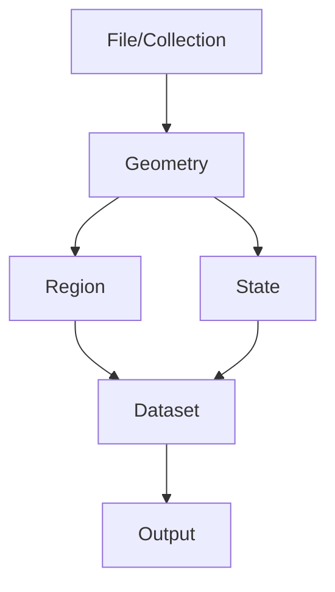

<!-- page:1 -->
# Sentaurus™ Data Explorer User Guide

Version O-2018.06, June 2018

# Copyright and Proprietary Information Notice

<!-- page:2 -->
© 2018 Synopsys, Inc. This Synopsys software and all associated documentation are proprietary to Synopsys, Inc. and may only be used pursuant to the terms and conditions of a written license agreement with Synopsys, Inc. All other use, reproduction, modification, or distribution of the Synopsys software or the associated documentation is strictly prohibited.

# Destination Control Statement

All technical data contained in this publication is subject to the export control laws of the United States of America. Disclosure to nationals of other countries contrary to United States law is prohibited. It is the reader’s responsibility to determine the applicable regulations and to comply with them.

# Disclaimer

SYNOPSYS, INC., AND ITS LICENSORS MAKE NO WARRANTY OF ANY KIND, EXPRESS OR IMPLIED, WITH REGARD TO THIS MATERIAL, INCLUDING, BUT NOT LIMITED TO, THE IMPLIED WARRANTIES OF MERCHANTABILITY AND FITNESS FOR A PARTICULAR PURPOSE.

# Trademarks

Synopsys and certain Synopsys product names are trademarks of Synopsys, as set forth at https://www.synopsys.com/company/legal/trademarks-brands.html.

All other product or company names may be trademarks of their respective owners.

# Third-Party Links

Any links to third-party websites included in this document are for your convenience only. Synopsys does not endorse and is not responsible for such websites and their practices, including privacy practices, availability, and content.

Synopsys, Inc.

690 E. Middlefield Road

Mountain View, CA 94043

www.synopsys.com

<!-- page:3 -->
# About This Guide ix

Related Publications . . ix

Conventions ix

Customer Support . . . ix

Accessing SolvNet. . .

Contacting Synopsys Support . . .

Contacting Your Local TCAD Support Team Directly. . . .

# Chapter 1 Using Sentaurus Data Explorer 1

Functionality of Sentaurus Data Explorer. . . .

File Formats Supported. .

# Chapter 2 Command-Line Interface 3

Using the Command-Line Interface . . .

Command-Line Help . . .

Converting File Formats . . .

Syntax . . .

Converting TIF to TDR Mixed Element . . .

Converting TIF to DF–ISE Grid and Data. . . .

Converting TDF to TDR Mixed Element . . .

Converting TDF to DF–ISE Grid and Data . . . . 10

Converting TDR Mixed Element to TIF . . 10

Converting TDR File to DF–ISE Files . . .

Converting DF–ISE Boundary to TDR Boundary. . . . 12

Converting DF–ISE Grid and Data to TDR Mixed Element. . . 12

Converting DF–ISE Plot to TDR XY . 13

Converting DF–ISE Grid and Data to TIF. . . 14

Converting IVL to TDR XY 14

Converting PLX to TDR XY . . 15

Mirror Commands. . 15

Mirroring DF–ISE to DF–ISE . . 16

Mirroring TDR to TDR . . 16

<!-- page:4 -->
# Chapter 3 Tcl Interface 19

Overview of Tcl Interface . . . 19

Limitations of the Tcl Interface . . . . 20

Using the Tcl Interface . . . . . 20

Accessing Command-Line Arguments From Tcl Scripts . . . . 20

Deleting Items in a Loop . . . . 21

Example Scripts . . . . . 21

Extracting Header Information From a File . . . 22

Modifying Data Values . . . 22

Printing Tags. . . . . . 23

File-Related Functions . . . . 25

TdrFileClose . . . 26

TdrFileConvert. . . . 27

TdrFileGetNumGeometry . . 28

TdrFileGetTagGroup . . . . 29

TdrFileOpen. . . . . . 30

TdrFileSave . . . . 31

Geometry-Related Functions . 32

TdrGeometryDelete . . . . 33

TdrGeometryGetDimension . . . 34

TdrGeometryGetName . . . . . 35

TdrGeometryGetNumRegion . . . . . 36

TdrGeometryGetNumState . . . . 37

TdrGeometryGetShift . . 38

TdrGeometryGetTagGroup . . . . 39

TdrGeometryGetTransform . . . . . 40

TdrGeometryGetType . . . . . 41

TdrGeometrySetName . . . . 42

TdrGeometrySetShift. . . . . 43

TdrGeometrySetTransform . . . . 44

State-Related Functions . . . 45

TdrStateDelete . . . . 46

TdrStateGetName . . . 47

TdrStateGetTagGroup . . . . 48

TdrStateSetName . . . . 49

Region-Related Functions. . . . 50

TdrRegionGetDimension. . . 51

TdrRegionGetMaterial. . . 52

TdrRegionGetName. . . . . . 53

TdrRegionGetNumDataset . . 54

<!-- page:5 -->
TdrRegionGetTagGroup . . . . 55

TdrRegionGetType . . . . 56

TdrRegionSetMaterial . . . 57

TdrRegionSetName . . . . 58

Dataset-Related Functions . . . . 59

TdrDatasetDelete . . . . 60

TdrDatasetDeleteByName . . . . 61

TdrDatasetGetLocation . . 62

TdrDatasetGetName . . . 63

TdrDatasetGetNumValue . 64

TdrDatasetGetQuantity . . . . . 65

TdrDatasetGetStructure . . . 66

TdrDatasetGetTagGroup . . . . 67

TdrDatasetGetType . . . . 68

TdrDatasetGetUnit, TdrDatasetGetUnitLong . . . . 69

TdrDatasetRename. . . 70

TdrDatasetRenameQuantity. . . . 71

TdrDatasetSetName . . . . 72

TdrDatasetSetQuantity. . . . 73

Data Value–Related Functions . . . . 74

TdrDataGetAllCoordinates . . . 75

TdrDataGetComponent . . . 76

TdrDataGetCoordinate. . . 77

TdrDataGetNumCol. . . . 78

TdrDataGetNumRow. . . . 79

TdrDataGetValue. . . . 80

TdrDataSetComponent . . . 81

Tag Group–Related Functions . . . 82

TdrTagGroupCreate. . . . . 83

TdrTagGroupDelete. . . . . . 84

TdrTagGroupDeleteByName. . . . . 85

TdrTagGroupGetByPath . . . . 86

TdrTagGroupGetName . . . . 88

TdrTagGroupGetNumTag . . . . . 89

TdrTagGroupGetNumTagGroup . . . . . 90

TdrTagGroupGetTagGroup . . . . . 91

Tag-Related Functions . . . . 92

TdrTagCreateScalar . . . . 93

TdrTagDelete . . . . . 94

TdrTagDeleteByName. . . . 95

TdrTagGetComponent . . . . 96

<!-- page:6 -->
TdrTagGetName . . . . 97

TdrTagGetNumCol . . . 98

TdrTagGetNumRow . . . 99

TdrTagGetStructure . . . . 100

TdrTagGetType . . . . . . 101

TdrTagGetValue . . . . . . 102

TdrTagSetComponent . . . . 103

# Chapter 4 Reference Guide 105

Environment Variables and Configuration Files . . . 105

Supported Conversions . . . . . 105

TDF-to-TDR Conversions . . . 106

TDF Format Constraints . . . 106

Material Names . . . 106

Quantity Names . . . . . 106

Conversion Factor . . . . . 107

Ignoring Unknown Quantities . . . . . . 107

Electrodes and Thermodes. . . . . 107

Volume Regions With Material Electrode or Thermode. . . . . 107

Removing Ambient Regions . . . . . 108

Interface Regions . . . . 108

Inconsistent Faces . . . 108

Splitting Rectangles . . . . . . 109

Extracting Boundaries . . . 110

TIF-to-TDR Conversions . . 110

Material and Quantity Names . . . . 110

Removing Contact Regions . . . . . . 110

Missing Ambient Regions . . . . 110

TDR-to-TIF Conversions . . 111

Material and Quantity Names . . .

Contacts . . 11

Interface Regions . . . . . 111

Region Names . . . . . 111

Mirroring . . . . 111

Number of Regions . . . 11

Naming Regions . . . . 112

Vector Datasets . . . 112

<!-- page:7 -->
# Appendix A Tcl Commands 113

File (TDR Collection) Commands . . 113

Geometry Commands . . . 113

State Commands . . 114

Region Commands . . 114

Dataset Commands . . . 114

Data Value Commands . . 115

Tag Group Commands . . . 116

Tag Commands . . . 116

# Appendix B Structure of TDR Files 117

Overview of TDR Files. . . . . 117

Tag Groups and Tags . . . 117

<!-- page:8 -->
Contents

<!-- page:9 -->
This guide describes the operation of Synopsys Sentaurus™ Data Explorer, which can explore and edit the data produced as output files from simulation processes. With Sentaurus Data Explorer, you can convert these files to the TDR file format, and can view and edit these files.

# Related Publications

For additional information, see:

The TCAD Sentaurus release notes, available on the Synopsys SolvNet® support site (see Accessing SolvNet on page x).   
■ Documentation available on SolvNet at https://solvnet.synopsys.com/DocsOnWeb.

# Conventions

The following conventions are used in Synopsys documentation.

<table><tr><td>Convention</td><td>Description</td></tr><tr><td>Blue text</td><td>Identifies a cross-reference (only on the screen).</td></tr><tr><td>Bold text</td><td>Identifies a selectable icon, button, menu, or tab. It also indicates the name of a field or an option.</td></tr><tr><td>Courier font</td><td>Identifies text that is displayed on the screen or that the user must type. It identifies the names of files, directories, paths, parameters, keywords, and variables.</td></tr><tr><td>Italicized text</td><td>Used for emphasis, the titles of books and journals, and non-English words. It also identifies components of an equation or a formula, a placeholder, or an identifier.</td></tr></table>

# Customer Support

Customer support is available through the Synopsys SolvNet customer support website and by contacting the Synopsys support center.

<!-- page:10 -->
# Accessing SolvNet

The SolvNet support site includes an electronic knowledge base of technical articles and answers to frequently asked questions about Synopsys tools. The site also gives you access to a wide range of Synopsys online services, which include downloading software, viewing documentation, and entering a call to the Support Center.

To access the SolvNet site:

1. Go to the web page at https://solvnet.synopsys.com.   
2. If prompted, enter your user name and password. (If you do not have a Synopsys user name and password, follow the instructions to register.)

If you need help using the site, click Help on the menu bar.

# Contacting Synopsys Support

If you have problems, questions, or suggestions, you can contact Synopsys support in the following ways:

Go to the Synopsys Global Support Centers site on synopsys.com. There you can find email addresses and telephone numbers for Synopsys support centers throughout the world.   
Go to either the Synopsys SolvNet site or the Synopsys Global Support Centers site and open a case online (Synopsys user name and password required).

# Contacting Your Local TCAD Support Team Directly

Send an e-mail message to:

support-tcad-us@synopsys.com from within North America and South America   
support-tcad-eu@synopsys.com from within Europe   
support-tcad-ap@synopsys.com from within Asia Pacific (China, Taiwan, Singapore, Malaysia, India, Australia)   
support-tcad-kr@synopsys.com from Korea   
support-tcad-jp@synopsys.com from Japan

<!-- page:11 -->
This chapter presents an introduction to Sentaurus Data Explorer.

# Functionality of Sentaurus Data Explorer

Sentaurus Data Explorer is a tool for editing and converting TDR files.

The TDR file format is the standard format for exchanging data between TCAD Sentaurus tools. Since the TDR format is a binary format and cannot be edited using a text editor, Sentaurus Data Explorer is provided to display, access, and modify the data contained in TDR files. For compatibility with other applications and tools, it is sometimes necessary to have the capability to convert to and from other file formats. Sentaurus Data Explorer allows you to convert formats as required.

Sentaurus Data Explorer has two different modes of operation: the command-line interface and the Tcl interface.

With the command-line interface, you can apply simple commands to convert files to different formats, and to create new files by copying and modifying files. This mode is most convenient when converting many files at the same time, using a batch file or script, and then continuing to work with these files in other tools.

The Tcl interface allows you to use the full flexibility of Tcl for writing and using scripts.

The main features of Sentaurus Data Explorer include:

Command-line options to convert files to different formats and to create symmetric structures   
Tcl interface for TDR for writing and running scripts   
Reading files in DF–ISE, IVL, PLX, TDF, TDR, and TIF formats   
Writing files in DF–ISE, TDR, and TIF formats

<!-- page:12 -->
# File Formats Supported

Sentaurus Data Explorer converts different file formats. For all conversions, the internal representation uses the TDR format. The possible input file formats are:

■ DF–ISE (.grd, .dat, .bnd, .plt)   
IVL   
PLX   
TDF   
TDR   
TIF

The possible output file formats are:

■ DF–ISE (.grd, .dat, .bnd, .plt)   
TDR   
TIF

For information about supported file formats, see Converting File Formats on page 7 and Supported Conversions on page 105.

NOTE Sentaurus Data Explorer provides functionality for converting data between different file formats. However, it does not support extraction of DF–ISE boundaries from DF–ISE grids and TDR mixed-element grids. This extraction is provided by Sentaurus Mesh.

<!-- page:13 -->
This chapter describes the command-line interface of Sentaurus

Data Explorer.

# Using the Command-Line Interface

The command-line interface provides all the documented conversions between the supported data formats and allows you to run Tcl scripts to modify TDR files and to convert them. In addition, it is used to print general information about a TDR file.

To use the command-line interface, you must specify exactly one of the commands together with its arguments on the command line:

tdx -short\_command [options] [arguments]

or:

tdx --long\_command [options] [arguments]

Table 1 lists the available commands and Table 2 on page 4 lists the available options for the commands. Each command or option has a short and a long form, which start with one and two dashes, respectively.

Writing commands with the short form is quick and easy for direct input on the command line. In contrast, the long form should always be used when writing scripts and batch files.

Table 1 Short and long forms of all commands available for the command-line interface 

<table><tr><td>Short form</td><td>Long form</td><td>Description</td></tr><tr><td>-d</td><td>--dfise2tdr</td><td>Converts DF–ISE grid file only, or a grid file with one, two, or three data files, or a boundary file only, or a plot file only to TDR format.</td></tr><tr><td>-dd</td><td>--tdr2dfise</td><td>Converts TDR file to DF–ISE files.</td></tr><tr><td>-df</td><td>--dfise2tif</td><td>Converts DF–ISE grid and data files to TIF file.</td></tr><tr><td>-f</td><td>--tif2tdr</td><td>Converts TIF file to TDR mixed-element file.</td></tr><tr><td>-fd</td><td>--tif2dfise</td><td>Converts TIF file to DF–ISE grid and data files.</td></tr><tr><td>-i</td><td>--ivl2tdr</td><td>Converts IVL file to TDR xy file.</td></tr></table>

Table 1 Short and long forms of all commands available for the command-line interface 

<table><tr><td>Short form</td><td>Long form</td><td>Description</td></tr><tr><td>-mdd</td><td>--mirr-dfise</td><td>Mirrors the geometry of a DF–ISE file and saves the result to another DF–ISE file.</td></tr><tr><td>-mtt</td><td>--mirr-tdr</td><td>Mirrors TDR geometry and saves the result to another TDR file.</td></tr><tr><td>-p</td><td>--plx2tdr</td><td>Converts PLX file to TDR xy plot file.</td></tr><tr><td>-t</td><td>--tdf2tdr</td><td>Converts TDF file to TDR mixed-element file.</td></tr><tr><td>-td</td><td>--tdf2dfise</td><td>Converts TDF file to DF–ISE grid and data files.</td></tr><tr><td>-tf</td><td>--tdr2tif</td><td>Converts TDR mixed element to TIF file.</td></tr><tr><td>-ts</td><td>--tdr-change-cs</td><td>Converts the traditional (DF–ISE) coordinate system to the Sentaurus Process coordinate system, and vice versa.</td></tr></table>

Table 2 Command options for command-line interface 

<table><tr><td colspan="2">Parameter/Option</td><td rowspan="2">Type</td><td rowspan="2">Default</td><td rowspan="2">Description</td></tr><tr><td>Short form</td><td>Long form</td></tr><tr><td>-a</td><td>--ignore-ambient-regions</td><td>Boolean</td><td>false</td><td>Do not convert regions for which the material is ambient.</td></tr><tr><td>-c</td><td>--ignore-conductor-regions</td><td>Boolean</td><td>false</td><td>Do not convert regions for which the material or parent material is conductor.</td></tr><tr><td>-m</td><td>--geometry-name</td><td>String</td><td>&quot; &quot;</td><td>TDR geometry name.</td></tr><tr><td>-M</td><td>--geometry-index</td><td>Integer</td><td>-1</td><td>TDR geometry index.</td></tr><tr><td>-q</td><td>--ignore-nondatex-quantities</td><td>Boolean</td><td>false</td><td>Do not convert fields for which there is no DATEX quantity name in the sol.db file.</td></tr><tr><td>-r</td><td>--split-rectangles</td><td>Boolean</td><td>false</td><td>For a 2D geometry, split rectangles into triangles.</td></tr><tr><td>-ren</td><td>--rename</td><td>String</td><td>&quot; &quot;</td><td>Rename a region or regions.</td></tr><tr><td>-s</td><td>--state-name</td><td>String</td><td>&quot; &quot;</td><td>TDR state name.</td></tr><tr><td>-S</td><td>--state-index</td><td>Integer</td><td>-1</td><td>TDR state index.</td></tr><tr><td>-sp</td><td>--sprocess</td><td>Boolean</td><td>false</td><td>Convert to Sentaurus Process coordinate system.</td></tr><tr><td>-tr</td><td>--traditional</td><td>Boolean</td><td>false</td><td>Convert to traditional (DF–ISE) coordinate system.</td></tr></table>

Table 2 Command options for command-line interface 

<table><tr><td colspan="2">Parameter/Option</td><td rowspan="2">Type</td><td rowspan="2">Default</td><td rowspan="2">Description</td></tr><tr><td>Short form</td><td>Long form</td></tr><tr><td>-w</td><td>--do-not-swap-3d-coord</td><td>Boolean</td><td>false</td><td>Do not swap 3D coordinates.</td></tr><tr><td>-x</td><td>--xmin</td><td>Boolean</td><td>false</td><td>Mirror at xmin.</td></tr><tr><td>-X</td><td>--xmax</td><td>Boolean</td><td>false</td><td>Mirror at xmax.</td></tr><tr><td>-xy</td><td>--xy-name</td><td>String</td><td>&quot;&quot;</td><td>TDR xy plot name.</td></tr><tr><td>-XY</td><td>--xy-index</td><td>Integer</td><td>-1</td><td>TDR xy plot index.</td></tr><tr><td>-y</td><td>--ymin</td><td>Boolean</td><td>false</td><td>Mirror at ymin.</td></tr><tr><td>-Y</td><td>--ymax</td><td>Boolean</td><td>false</td><td>Mirror at ymax.</td></tr><tr><td>-z</td><td>--zmin</td><td>Boolean</td><td>false</td><td>Mirror at zmin.</td></tr><tr><td>-Z</td><td>--zmax</td><td>Boolean</td><td>false</td><td>Mirror at zmax.</td></tr></table>

<!-- page:15 -->
# Command-Line Help

When the command-line option -h or --help is used, the following text is displayed, which shows a summary of the different commands, their options, and their arguments:

```csv
Batch mode | Parameter | Source | Destination | Description
(-/-- command) | (-param) | (*Base | (*Base Name) |
-short | --long | Name) | [] Optional |
Convert:
fd tif2dfise a,c,q,r *<TIF> [*<DF-ISE>] TIF to DF-ISE file
f tif2tdr a,c,q,r *<TIF> [*<TDR>] TIF to TDR file
td tdf2dfise a,c,q,r,w *<TDF> [*<DF-ISE>] TDF to DF-ISE file
t tdf2tdr a,c,q,r,w *<TDF> [*<TDR>] TDF to TDR file
tf tdr2tif m,M,s,S *<TDR> [*<TIF>] TDR to TIF file
dd tdr2dfise m,M,s,S *<TDR> [*<GRD>] TDR to DF-ISE file
df dfise2tif <DF-ISE> [*<TIF>] DF-ISE to TIF file
d dfise2tdr <DF-ISE> [*<TDR>] DF-ISE to TDR file
d dfise2tdr <GRD> [*<TDR>] with Gridfile and 1 to 3 Datfiles
d dfise2tdr <BND> [*<TDR>] or Boundaryfile
d dfise2tdr <PLT> [*<TDR>] or Plotfile
i ivl2tdr *<IVL> [*<TDR>] IVL to TDR file
p plx2tdr *<PLX> [*<TDR>] PLX to TDR file
ts tdr-change-cs tr,sp *<TDR> [*<TDR>] TDR to TDR with another coordinate system 
```

<!-- page:16 -->
# 2: Command-Line Interface

# Using the Command-Line Interface

```txt
Mirror:
mtt mirr-tdr    *<TDR>    *<TDR>    Mirror TDR to TDR
mdd mirr-dfise    *<DF-ISE>    *<DF-ISE>    DF-ISE to DF-ISE
    m,M,s,S    Mirror name,index
    x,X,y,Y,z,Z    Mirror at x,y,z
    ren reg=new/...    Rename region(s)
    reg to new name

-tcl script_name
    runs the specified Tcl script file.

-tclcmd <tcl command with parameters>
    runs a single Tcl command.

-h or --help
    prints this help

-v or --version
    prints the version of TDX and checks the availability of its license

-info tdr_file
    prints general information about TDR file 
```

The table shows conversion options. The first and second columns contain the short and long names of all available commands, respectively. The third column lists the parameters of the commands. Optional parameters are enclosed in brackets. The source and destination columns indicate the file format of the input and output files, respectively.

For many commands, the destination is optional. If the destination is not specified, the name of the output file is constructed from the base name of the input file and the extension appropriate for the type of output file. The base name consists of all characters in a file name up to (but not including) the last '.' character. Using the base name is possible for all entries in the source and destination columns marked with an asterisk.

After the conversion options table, there is the list of other command-line options. The -info option prints general information about the TDR file. The following data is displayed:

File name and number of geometries   
■ For each geometry:

• Geometry name, type, and dimension   
• Transformation matrix and shift vector   
• Numbers of states, vertices, edges, faces, elements, and material elements

<!-- page:17 -->
■ For each region:

• Region index, name, material or other property, such as “Contact”   
• Number of datasets, number of elements by type

# Converting File Formats

The following sections provide a detailed description of all conversions available using the command-line interface. The conversions are presented in the following order:

TIF to TDR and DF–ISE   
■ TDF to TDR and DF–ISE   
TDR to TIF and DF–ISE   
■ DF–ISE to TDR and TIF   
IVL to TDR   
■ PLX to TDR

For information about the effects of different conversion options, see Supported Conversions on page 105 to TDR-to-TIF Conversions on page 111.

# Syntax

Special characters are used in the syntax descriptions: angle brackets < >, brackets [ ], parentheses ( ), and vertical bar |. These characters are used only in the syntax description and are not part of the actual input.

A lowercase letter in angle brackets represents a value of a given type that must be substituted by users:

```txt
<n> numeric value
<s> string value 
```

The following example indicates that a string value must be specified following the commandline option --geometry-name and a numeric value must be specified following the option --state-index:

```txt
--geometry-name <s> --state-index <n>
```

Brackets enclose optional command-line arguments and parameters.

Parentheses are used to indicate the grouping of command-line options and their arguments.

<!-- page:18 -->
The vertical bar is used to separate entries in a list from which exactly one entry must be specified.

In the following sections, the syntax of each command is described twice. First using only the short form and then using only the long form. Of course, it is possible to use a combination of long and short forms.

# Converting TIF to TDR Mixed Element

# Syntax

```shell
tdx -f [-a] [-c] [-q] [-r] tif_source_base_name [tdr_destination_base_name]
tdx --tif2tdr [--ignore-ambient-regions] [--ignore-conductor-regions] \
[--ignore-nondatex-quantities] [--split-rectangles] tif_source_base_name \
[tdr_destination_base_name] 
```

<!-- page:19 -->
# Examples

```txt
1. tdx -f tif_file.tif tdr_file
Input: tif_file.tif
Output: tdr_file.tdr
2. tdx --tif2tdr tif_file.tif tdr_file
Input: tif_file.tif
Output: tdr_file.tdr
3. tdx --tif2tdr tif_file
Input: tif_file.tif
Output: tif_file.tdr 
```

# Converting TIF to DF–ISE Grid and Data

# Syntax

```shell
tdx -fd [-a] [-c] [-q] [-r] tif_source_base_name [dfise_destination_base_name]
tdx --tif2dfise [--ignore-ambient-regions] [--ignore-conductor-regions] \
[--ignore-nondatex-quantities] [--split-rectangles] tif_source_base_name \
[dfise_destination_base_name] 
```

# Examples

```txt
1. tdx -fd tif_file.tif dfise_file
Input: tif_file.tif
Output: dfise_file.grd, dfise_file.dat
2. tdx --tif2dfise tif_file.tif dfise_file
Input: tif_file.tif
Output: dfise_file.grd, dfise_file.dat
3. tdx --tif2dfise tif_file
Input: tif_file.tif
Output: tif_file.grd, tif_file.dat 
```

# Converting TDF to TDR Mixed Element

# Syntax

```shell
tdx -t [-a] [-c] [-q] [-r] [-w] tdf_source_base_name \
    [tdr_destination_base_name]

tdx --tdf2tdr [--ignore-ambient-regions] [--ignore-conductor-regions] \
    [--ignore-nondatex-quantities] [--split-rectangles] \
    [--do-not-swap-3d-coord] tdf_source_base_name [tdr_destination_base_name] 
```

# Examples

```makefile
1. tdx -t tdf_file.tdf tdr_file
Input: tdf_file.tdf
Output: tdr_file.tdr
2. tdx --tdf2tdr tdf_file.tdf tdr_file
Input: tdf_file.tdf
Output: tdr_file.tdr
3. tdx --tdf2tdr tdf_file
Input: tdf_file.tdf
Output: tdf_file.tdr 
```

<!-- page:20 -->
# Converting TDF to DF–ISE Grid and Data

# Syntax

```txt
tdx -td [-a] [-c] [-q] [-r] [-w] tdf_source_base_name \
[dfise_destination_base_name]

tdx --tdf2dfise [--ignore-ambient-regions] [--ignore-conductor-regions] \
[--ignore-nondatex-quantities] [--split-rectangles]
[--do-not-swap-3d-coord] tdf_source_base_name \
[dfise_destination_base_name] 
```

# Examples

```txt
1. tdx -td tdf_file.tdf dfise_file
Input: tdf_file.tdf
Output: dfise_file.grd, dfise_file.dat
2. tdx --tdf2dfise tdf_file.tdf dfise_file
Input: tdf_file.tdf
Output: dfise_file.grd, dfise_file.dat
3. tdx --tdf2dfise tdf_file
Input: tdf_file.tdf
Output: tdf_file.grd, tdf_file.dat 
```

# Converting TDR Mixed Element to TIF

# Syntax

```shell
tdx -tf (-m <s>) | (-M <n>) [(-s <s>) | (-S <n>)] tdr_source_base_name \
[tif_destination_base_name]

tdx --tdr2tif (--geometry-name <s>) | (--geometry-index <n>) \
[(--state-name <s>) | (--state-index <n>)] tdr_source_base_name \
[tif_destination_base_name] 
```

# Examples

```makefile
1. tdx -tf -M 0 tdr_file.tdr tif_file
Input: tdr_file.tdr
Output: tif_file.tif 
```

<!-- page:21 -->
2. tdx --tdr2tif -M 0 tdr\_file.tdr tif\_file

Input: tdr\_file.tdr

Output: tif\_file.tif

3. tdx --tdr2tif -M 0 tdr\_file

Input: tdr\_file.tdr

Output: tdr\_file.tif

# Converting TDR File to DF–ISE Files

<!-- page:22 -->
# Syntax

```txt
tdx -dd (-m <s>) | (-M <n>) [(-s <s>) | (-S <n>)] tdr_source_base_name \
[dfise-destination_base_name]

tdx --tdr2dfise (--geometry-name <s>) | (--geometry-index <n>) \
[(--state-name <s>) | (--state-index <n>)] tdr_source_base_name \
[dfise-destination_base_name] 
```

# Examples

1. tdx -dd -M 0 -S 0 tdr\_file.tdr dfise\_file

Input: tdr\_file.tdr

Output: dfise\_file.grd, dfise\_file.dat using geometry with index 0 and state with index 0

2. tdx --tdr2dfise -M 0 -S 0 tdr\_file.tdr dfise\_file

Input: tdr\_file.tdr

Output: dfise\_file.grd, dfise\_file.dat using geometry with index 0 and state with index 0

3. tdx --tdr2dfise -m geometry\_0 -s state\_0 tdr\_file.tdr dfise\_file

Input: tdr\_file.tdr

Output: dfise\_file.grd, dfise\_file.dat using geometry with name geometry\_0 and state with name state\_0

# Converting DF–ISE Boundary to TDR Boundary

# Syntax

```txt
tdx -d dfise_source_bnd [tdr_destination_base_name]
tdx --dfise2tdr dfise_source_bnd [tdr_destination_base_name] 
```

# Examples

1. tdx -d dfise\_file.bnd tdr\_file   
Input: dfise\_file.bnd   
Output: tdr\_file.tdr   
2. tdx --dfise2tdr dfise\_file.bnd tdr\_file   
Input: dfise\_file.bnd   
Output: tdr\_file.tdr

# Converting DF–ISE Grid and Data to TDR Mixed Element

# Syntax

```tcl
tdx -d dfise_source_grd [dfise_source1_dat [dfise_source2_dat \
[dfise_source3_dat]]] [tdr_destination_base_name]

tdx -d dfise_source_bnd [tdr_destination_base_name]

tdx -d dfise_source_plt [tdr_destination_base_name]

tdx --dfise2tdr dfise_source_grd [dfise_source1_dat [dfise_source2_dat \
[dfise_source3_dat]]] [tdr_destination_base_name]

tdx --dfise2tdr dfise_source_bnd [tdr_destination_base_name]

tdx --dfise2tdr dfise_source_plt [tdr_destination_base_name] 
```

# Examples

1. tdx -d dfise\_file.grd tdr\_file   
Input: dfise\_file.grd   
Output: tdr\_file.tdr   
2. tdx --dfise2tdr dfise\_file.grd tdr\_file   
Input: dfise\_file.grd   
Output: tdr\_file.tdr

3. tdx --dfise2tdr dfise\_file.grd dfise\_file.dat tdr\_file   
Input: dfise\_file.grd, dfise\_file.dat   
Output: tdr\_file.tdr   
4. tdx --dfise2tdr dfise\_file.grd dfise\_dat\_file\_1.dat \   
dfise\_dat\_file\_2.dat tdr\_file   
Input: dfise\_file.grd, dfise\_dat\_file\_1.dat dfise\_dat\_file\_2.dat   
Output: tdr\_file.tdr   
5. tdx --dfise2tdr dfise\_file.plt tdr\_file   
Input: dfise\_file.plt   
Output: tdr\_file.tdr

<!-- page:23 -->
# Converting DF–ISE Plot to TDR XY

# Syntax

tdx -d dfise\_source\_plt [tdr\_destination\_base\_name]

tdx --dfise2tdr dfise\_source\_plt [tdr\_destination\_base\_name]

# Examples

1. tdx -d dfise\_file.plt tdr\_file   
Input: dfise\_file.plt   
Output: tdr\_file.tdr   
2. tdx --dfise2tdr dfise\_file.plt tdr\_file   
Input: dfise\_file.plt   
Output: tdr\_file.tdr

<!-- page:24 -->
# Converting DF–ISE Grid and Data to TIF

# Syntax

```tcl
tdx -df dfise_source_grd [dfise_source_dat] [tif_destination_base_name]
tdx --dfise2tif dfise_source_grd [dfise_source_dat] \
[tif_destination_base_name] 
```

# Examples

1. tdx -df dfise\_file.grd dfise\_file.dat tif\_file   
Input: dfise\_file.grd, dfise\_file.dat   
Output: tif\_file.tif   
2. tdx --dfise2tif dfise\_file.grd dfise\_file.dat tif\_file   
Input: dfise\_file.grd, dfise\_file.dat   
Output: tif\_file.tif

# Converting IVL to TDR XY

# Syntax

```tcl
tdx -i ivl_source_base_name [tdr_destination_base_name]
tdx --ivl2tdr ivl_source_base_name [tdr_destination_base_name] 
```

# Examples

1. tdx -i ivl\_file tdr\_file   
Input: ivl\_file.ivl   
Output: tdr\_file.tdr   
2. tdx --ivl2tdr ivl\_file tdr\_file   
Input: ivl\_file.ivl   
Output: tdr\_file.tdr   
3. tdx --ivl2tdr ivl\_file   
Input: ivl\_file.ivl   
Output: ivl\_file.tdr

<!-- page:25 -->
# Converting PLX to TDR XY

# Syntax

```tcl
tdx -p plx_source_base_name [tdr_destination_base_name]
tdx --plx2tdr plx_source_base_name [tdr_destination_base_name] 
```

# Examples

1. tdx -p plx\_file tdr\_file  
Input: plx\_file.ivl   
Output: tdr\_file.tdr   
2. tdx --plx2tdr plx\_file tdr\_file   
Input: plx\_file.ivl   
Output: tdr\_file.tdr   
3. tdx --plx2tdr plx\_file   
Input: plx\_file.ivl   
Output: plx\_file.tdr

# Mirror Commands

Mirror commands create a symmetric geometry by reflecting the input geometry with respect to a mirror axis (point in 1D, line in 2D, and plane in 3D). In two and three dimensions, the mirror axis is always perpendicular to one of the coordinate axes. The location of the mirror axis can be chosen to be the minimum or maximum coordinate of the input geometry in the direction perpendicular to the mirror axis.

Table 3 Mirror options 

<table><tr><td>Option</td><td>Mirror axis perpendicular to</td><td>Located at</td></tr><tr><td>-x</td><td>x-axis</td><td>Minimum x-coordinate</td></tr><tr><td>-X</td><td>x-axis</td><td>Maximum x-coordinate</td></tr><tr><td>-y</td><td>y-axis</td><td>Minimum y-coordinate</td></tr><tr><td>-Y</td><td>y-axis</td><td>Maximum y-coordinate</td></tr><tr><td>-z</td><td>z-axis</td><td>Minimum z-coordinate</td></tr><tr><td>-Z</td><td>z-axis</td><td>Maximum z-coordinate</td></tr></table>

<!-- page:26 -->
By default, the name of the mirrored region is the name of the original region with the suffix \_mirrored. Using the option -ren, it is possible to specify new names for the mirrored regions.

# Mirroring DF–ISE to DF–ISE

# Syntax

```shell
tdx -mdd -x|-X|-y|-Y|-z|-Z [-ren orig_reg_name_1=new_reg_name_1[/...]] \
dfise_source_base_name dfise_destination_base_name
tdx --mirr-dfise --xmin|--xmax|--ymin|--ymax|--zmin|--zmax \
[--rename orig_reg_name_1=new_reg_name_1[/...]] dfise_source_base_name \
dfise_destination_base_name 
```

<!-- page:27 -->
# Examples

```makefile
1. tdx -mdd -y dfise_file dfise_mirr
Input: dfise_file.grd, dfise_file.dat
Output: dfise_mirr.grd, dfise_mirr.dat
2. tdx --mirr-dfise -y dfise_file dfise_mirr
Input: dfise_file.grd, dfise_file.dat
Output: dfise_mirr.grd, dfise_mirr.dat
3. tdx --mirr-dfise -y -ren silicon=silicon_mir dfise_file dfise_mirr
Input: dfise_file.grd, dfise_file.dat
Output: dfise_mirr.grd, dfise_mirr.dat
The region with the default name silicon_mirrored will be renamed silicon_mir. 
```

# Mirroring TDR to TDR

# Syntax

```shell
tdx -mtt -x|-X|-y|-Y|-z|-Z [-ren orig_reg_name_1=new_reg_name_1[/...]] \
tdr_source_base_name tdr_destination_base_name
tdx --mirr-tdr --xmin|--xmax|--ymin|--ymax|--zmin|--zmax \
[--rename orig_reg_name_1=new_reg_name_1[/...]] tdr_source_base_name \
tdr_destination_base_name 
```

# Examples

```txt
1. tdx -mtt -y tdr_file.tdr tdr_dfise_mirr
Input: tdr_file.tdr
Output: tdr_dfise_mirr.grd, tdr_dfise_mirr.dat
2. tdx --mirr-tdr -y tdr_file.tdr tdr_dfise_mirr
Input: tdr_file.tdr
Output: tdr_dfise_mirr.grd, tdr_dfise_mirr.dat
3. tdx -mtt -y -ren "region_5=mirr region 5/region_1=mirr region 1" \
test2.tdr test2_mirr.tdr
Input: test2.tdr
Output: test2_mirr.tdr 
```

The mirrored region region\_5 will be named "mirr region 5", and the mirrored region region\_1 will be named "mirr region 1". If any name contains spaces, the entire name must be enclosed in double quotation marks as in this example.

<!-- page:28 -->
# 2: Command-Line Interface

Mirror Commands

<!-- page:29 -->
This chapter presents the Tcl interface of Sentaurus Data Explorer.

# Overview of Tcl Interface

The Tcl interface of Sentaurus Data Explorer is based on the tool command language (Tcl). An input script of Sentaurus Data Explorer is actually a Tcl script and, therefore, enables the full flexibility of Tcl. You can use the Tcl interface to extract and process information from a TDR file or to modify certain entries, such as names of materials and datasets. You might also find it useful to add custom information to objects in a TDR file using tags.

You can write and use scripts, giving you the ability to perform tasks more efficiently. The Tcl interface gives you the ability to execute all commands, described in this chapter.

The command syntax is simple and intuitive. The full list of all available Tcl commands for the interface can be found in Appendix A on page 113. Using these commands makes it possible to access and modify data in TDR files easily. However, a proper understanding of the TDR file structure is necessary before you can start writing scripts. A description of the TDR file structure and its parts can be found in Appendix B on page 117.

This chapter provides detailed descriptions of the Tcl interface functions that work with TDR files and plot objects in Sentaurus Data Explorer. The available functions are:

File-related functions   
Geometry-related functions   
State-related functions   
Region-related functions   
Dataset-related functions   
Data value–related functions   
Tag group–related functions   
Tag-related functions

Most functions take integer arguments to specify list entries by index. As a general rule, these indices start from zero, that is, the first entry is referenced by the index 0.

<!-- page:30 -->
# Limitations of the Tcl Interface

Using the Tcl interface, you can read and modify most data in a TDR file. Creating new data is not possible except for tags and tag groups. Further limitations are:

Complex numbers are currently not supported, that is, datasets containing complex values cannot be read or modified.   
Access to coordinates of geometric entities such as vertices, edges, and elements is not provided.

# Using the Tcl Interface

To run the Tcl script, use the command:

```tcl
tdx -tcl [Script file] 
```

For example, the following command runs the Tcl script to save the file script.tcl:

```tcl
tdx -tcl script.tcl 
```

In addition, you can run a single Tcl command using the -tclcmd option. The syntax of the command is:

```txt
tdx -tclcmd [tcl command with parameters] 
```

For example:

```batch
tdx -tclcmd TdrFileOpen tdr_file.tdr 
```

# Accessing Command-Line Arguments From Tcl Scripts

When writing a general-purpose Tcl script, you might want to access and use command-line arguments, for example, to allow users of the script to specify a file name.

Sentaurus Data Explorer provides command-line arguments in the Tcl array named cmd\_args. The following variants are available for convenience:

```txt
$cmd_args(all) 
```

Contains the complete command-line arguments including the name of the invoking executable file.

```txt
$cmd_args (rest) 
```

<!-- page:31 -->
All arguments except -tcl, the name of the script file, and the name of the invoking executable file.

```txt
$cmd_args(-tcl) 
```

Contains the name of the Tcl script file.

# Deleting Items in a Loop

The Tcl interface supports several functions for deleting items by their indices:

TdrDatasetDelete   
TdrGeometryDelete   
TdrStateDelete   
TdrTagDelete   
TdrTagGroupDelete

When calling any of these functions in a loop, you must traverse items in reverse order, for example:

```tcl
for { set index N-1 } { $index >= 0 } { incr index -1 } {
    ...
    TdrStateDelete ... $index ...
    ...
} 
```

In this example, after deleting a state, the remaining states are re-indexed for structure consistency.

NOTE Traversing items in forward order leads to undefined behavior.

# Example Scripts

The following examples demonstrate how the commands are used together in the context of a script. They also show how you typically navigate through the content of a TDR file.

# Extracting Header Information From a File

<!-- page:32 -->
This script opens a file and lists its geometries. For each geometry, the regions and states are listed:

```tcl
set f myfile.tdr
puts "file: $f"
TdrFileOpen $f

# loop through geometries
set ng [TdrFileGetNumGeometry $f]
puts "#geometries: $ng"
for {set ig 0} {$ig < $ng} {incr ig} {
    set gname [TdrGeometryGetName $f $ig]
    set ns [TdrGeometryGetNumState $f $ig]
    set nr [TdrGeometryGetNumRegion $f $ig]
    puts "    geometry $ig: $gname"
    puts "    type    : [TdrGeometryGetType $f $ig]"
    puts "    dimension: [TdrGeometryGetDimension $f $ig]"
    puts "    transform: [TdrGeometryGetTransform $f $ig]"
    puts "    shift    : [TdrGeometryGetShift $f $ig]"
    puts "    #states    : $ns"
    # loop through states
    for {set is 0} {$is < $ns} {incr is} {
    set sname [TdrStateGetName $f $ig $is]
    puts "    state $is: $sname"
    }
    puts "    #regions: $nr"
    # loop through regions
    for {set ir 0} {$ir < $nr} {incr ir} {
    set rname [TdrRegionGetName $f $ig $ir]
    puts "    region $ir: $rname"
    }
}
TdrFileClose $f 
```

# Modifying Data Values

This script opens a file, loops through all geometries and their states, and modifies all values of all datasets:

```tcl
set inp original.tdr
set out modified.tdr
TdrFileOpen $inp
# loop through geometries
set ng [TdrFileGetNumGeometry $inp]
for {set ig 0} {$ig < $ng} {incr ig} {
    set ns [TdrGeometryGetNumState $inp $ig] 
```

```tcl
set nr [TdrGeometryGetNumRegion $inp $ig]
# loop through states
for {set is 0} {$is < $ns} {incr is} {
    # loop through regions
    for {set ir 0} {$ir < $nr} {incr ir} {
    # loop through datasets
    set nd [TdrRegionGetNumDataset $inp $ig $ir $is]
    for {set id 0} {$id < $nd} {incr id} {
    # loop through data values
    set nv [TdrDatasetGetNumValue $inp $ig $ir $is $id]
    for {set iv 0} {$iv < $nv} {incr iv} {
    # loop through components of the data value
    set ni [TdrDataGetNumRow $inp $ig $ir $is $id $iv]
    set nj [TdrDataGetNumCol $inp $ig $ir $is $id $iv]
    for {set i 0} {$i < $ni} {incr i} {
    for {set j 0} {$j < $nj} {incr j} {
    set original [TdrDataGetComponent $inp $ig $ir $is $id $iv $i $j]
    set modified [expr $original + 1]
    TdrDataSetComponent $inp $ig $ir $is $id $iv $i $j $modified
    }
    }
    }
    }
    }
    }
}
TdrFileSave $inp $out
TdrFileClose $inp 
```

<!-- page:33 -->
# Printing Tags

This script opens a file and lists the tags and tag groups of all regions and states of all geometries and of the file itself:

```tcl
set f myfile.tdr
set recursive 1

proc PrintTagGroup {tg indent recursive} {
    set space [format "% ${indent}s" ""]
    set nt [TdrTagGroupGetNumTag $tg]
    set ng [TdrTagGroupGetNumTagGroup $tg]
    if {$ng > 0 || $nt > 0} {
    puts "${space}tag group: '\\[TdrTagGroupGetName $tg]\' ' 
    puts "${space} contains $ng tag groups and $nt tags"
    # list tags
    for {set it 0} {$it < $nt} {incr it} {
    set struc [TdrTagGetStructure $tg $it]
    set type [TdrTagGetType $tg $it] 
```

<!-- page:34 -->
# 3: Tcl Interface

# Using the Tcl Interface

```tcl
puts "${space} tag $it:"
puts "${space} name: [TdrTagGetName $tg $it]"
puts "${space} structure: $struc"
puts "${space} type: $type"
if {$struc == "scalar"} {
    puts "${space} value: [TdrTagGetValue $tg $it]"
} else {
    puts "${space} rows: [TdrTagGetNumRow $tg $it]"
    puts "${space} cols: [TdrTagGetNumCol $tg $it]"
    puts "${space} value: <not printed out>"
}
#
# list tag groups
for {set ig 0} {$ig < $ng} {incr ig} {
    set tgi [TdrTagGroupGetTagGroup $tg $ig]
    if {$recursive} {
    PrintTagGroup $tgi [expr $indent + 3] $recursive
    } else {
    puts "${space} tag group $ig: '\\[TdrTagGroupGetName $tgi]\'"
    }
}
}

TdrFileOpen $f
puts "file $f"
PrintTagGroup [TdrFileGetTagGroup $f] 3 $recursive 
```

# loop through geometries   
```tcl
set ng [TdrFileGetNumGeometry $f]
for {set ig 0} {$ig < $ng} {incr ig} {
    set gname [TdrGeometryGetName $f $ig]
    set ns [TdrGeometryGetNumState $f $ig]
    set nr [TdrGeometryGetNumRegion $f $ig]
    puts " geometry $ig: $gname"
    puts " type : [TdrGeometryGetType $f $ig]"
    puts " dimension: [TdrGeometryGetDimension $f $ig]"
    PrintTagGroup [TdrGeometryGetTagGroup $f $ig] 6 $recursive
    puts " #regions: $nr"
    # loop through regions
    for {set ir 0} {$ir < $nr} {incr ir} {
    set rname [TdrRegionGetName $f $ig $ir]
    puts " region $ir: $rname"
    PrintTagGroup [TdrRegionGetTagGroup $f $ig $ir] 9 $recursive
    }
    # loop through states
    puts " #states: $ns"
    for {set is 0} {$is < $ns} {incr is} { 
```

```powershell
set sname [TdrStateGetName $f $ig $is]
puts " state $is: $sname"
PrintTagGroup [TdrStateGetTagGroup $f $ig $is] 9 $recursive
}
}
TdrFileClose $f 
```

<!-- page:35 -->
# File-Related Functions

Table 4 lists all the file-related Tcl commands that are available.

Table 4 File-related functions of Tcl interface for TDR 

<table><tr><td>Command</td><td>Description</td></tr><tr><td>TdrFileClose</td><td>Closes the specified file.</td></tr><tr><td>TdrFileConvert</td><td>Converts files of different formats. For the syntax of the option convert-command, see Converting File Formats on page 7.</td></tr><tr><td>TdrFileGetNumGeometry</td><td>Returns number of geometries.</td></tr><tr><td>TdrFileGetTagGroup</td><td>Returns handle of tag group.</td></tr><tr><td>TdrFileOpen</td><td>Opens TDR file. The command must be called before any other function is available when working with the TDR file.</td></tr><tr><td>TdrFileSave</td><td>Saves a copy of the specified file with a new name or overwrites the saved file.</td></tr></table>

<!-- page:36 -->
# TdrFileClose

This command closes a TDR file without saving any modifications.

# Syntax

TdrFileClose <filename>

# Arguments

<table><tr><td>Argument</td><td>Description</td></tr><tr><td>filename</td><td>Name of a TDR file.</td></tr></table>

# Return Value

Type of return value is Boolean. It is TRUE if a file is closed successfully; otherwise, FALSE. For example, it returns FALSE if the name is wrong or the file is not opened.

# Example

TdrFileClose file1.tdr

This command closes the file file1.tdr.

<!-- page:37 -->
# TdrFileConvert

This command converts a file from one format to another. The syntax of this command is the same as for the corresponding command that is available from the command-line interface (see Converting File Formats on page 7).

# Syntax

```txt
TdrFileConvert <convert-command> [parameter] <source-file>
    [<destination-file>] 
```

# Arguments

For the full list of options, see Converting File Formats on page 7.

<table><tr><td>Argument</td><td>Description</td></tr><tr><td>convert-command</td><td>One of the specified conversion commands such as fd or tif2dfise, which is used to convert a TIF file to a DF–ISE file.</td></tr><tr><td>destination-file</td><td>Output file name. If the extension of the file is not specified or if it is wrong, the correct extension is appended to the base name of the conversion direction. If the output file already exists, &quot;new&quot; is added before the extension so that the existing file is not overwritten.</td></tr><tr><td>parameter</td><td>This parameter is not valid for all conversions. It can specify, for example, the type of mirroring (which axis and at min. or max.) or some flags that do not convert regions for which the material is ambient.</td></tr><tr><td>source-file</td><td>Input file name.</td></tr></table>

# Return Value

Type of return value is Boolean. It is TRUE if a conversion was successful; otherwise, FALSE.

# Example

TdrFileConvert -mtt -y tdr\_file.tdr tdr\_mirr.tdr

This example mirrors the file tdr\_file.tdr at ymin. The result is saved to the tdr\_mirr.tdr file. For the full list of examples, see Converting File Formats on page 7.

<!-- page:38 -->
# TdrFileGetNumGeometry

This command returns the number of geometries in a file.

# Syntax

TdrFileGetNumGeometry <filename>

# Arguments

<table><tr><td>Argument</td><td>Description</td></tr><tr><td>filename</td><td>Name of a TDR file.</td></tr></table>

# Return Value

Type of return value is integer. It shows the number of geometries in a TDR file. It returns a negative value if an error occurs.

# Example

set file1\_num\_geom [TdrFileGetNumGeometry file1.tdr]

This example sets file1\_num\_geom to the number of geometries in the TDR file named file1.tdr.

<!-- page:39 -->
# TdrFileGetTagGroup

This command returns the tag-group handle of a TDR file. This handle can be used in the commands of the tag group–related functions and tag-related functions (see Tag Group–Related Functions on page 82 and Tag-Related Functions on page 92).

# Syntax

TdrFileGetTagGroup <filename>

# Arguments

<table><tr><td>Argument</td><td>Description</td></tr><tr><td>filename</td><td>Name of a TDR file.</td></tr></table>

# Return Value

Type of return value is a handle. It can be used only in the commands of the tag group–related functions and tag-related functions.

# Example

set tg [TdrFileGetTagGroup file1.tdr]

This example sets tg to the tag-group handle of the file named file1.tdr.

<!-- page:40 -->
# TdrFileOpen

This command opens a TDR file.

NOTE This operation is necessary before any other function can be used with the file.

# Syntax

TdrFileOpen <filename> [-native\_units] [-reference\_coordinates]

# Arguments

<table><tr><td>Argument</td><td>Description</td></tr><tr><td>filename</td><td>Name of a TDR file.</td></tr><tr><td>-native_units</td><td>If specified, no unit scaling is applied, that is, data is read as written by the tool that wrote the file. Without this option, all data is transformed to standard DATEX units.</td></tr><tr><td>-reference_coordinates</td><td>If specified, coordinates and vector datasets are transformed into the reference coordinate system.</td></tr></table>

# Return Value

Type of return value is Boolean. It is TRUE if a file is opened successfully; otherwise, FALSE.

# Example

TdrFileOpen file1.tdr -native\_units

This command opens the file file1.tdr; data is read in unscaled.

<!-- page:41 -->
# TdrFileSave

This command saves all changes made to a specified file or saves the specified file including all changes with a new name.

# Syntax

TdrFileSave <filename> [<new\_filename>]

# Arguments

<table><tr><td>Argument</td><td>Description</td></tr><tr><td>filename</td><td>Name of a TDR file.</td></tr><tr><td>new_filename</td><td>Optional name for the file, where all changes and data are saved.</td></tr></table>

# Return Value

Type of return value is Boolean. It is TRUE if a file is saved successfully; otherwise, FALSE.

# Example

TdrFileSave file1.tdr file1\_copy.tdr

TdrFileSave file2.tdr

The first example saves a copy of the file file1.tdr, including all modifications, to file1\_copy.tdr.

The second example saves all changes to the same file.

<!-- page:42 -->
# Geometry-Related Functions

Table 5 lists all the geometry-related Tcl commands that are available.

Table 5 Geometry-related functions of Tcl interface for TDR 

<table><tr><td>Command</td><td>Description</td></tr><tr><td>TdrGeometryDelete</td><td>Deletes specified geometry.</td></tr><tr><td>TdrGeometryGetDimension</td><td>Returns dimension of geometry.</td></tr><tr><td>TdrGeometryGetName</td><td>Returns name of geometry.</td></tr><tr><td>TdrGeometryGetNumRegion</td><td>Returns number of regions in geometry.</td></tr><tr><td>TdrGeometryGetNumState</td><td>Returns number of states in geometry.</td></tr><tr><td>TdrGeometryGetShift</td><td>Returns shifting part of transformation matrix of geometry.</td></tr><tr><td>TdrGeometryGetTagGroup</td><td>Returns tag-group handle of geometry.</td></tr><tr><td>TdrGeometryGetTransform</td><td>Returns rotation matrix of geometry.</td></tr><tr><td>TdrGeometryGetType</td><td>Returns type of geometry.</td></tr><tr><td>TdrGeometrySetName</td><td>Sets new name for geometry.</td></tr><tr><td>TdrGeometrySetShift</td><td>Sets new shifting part of transformation matrix of geometry.</td></tr><tr><td>TdrGeometrySetTransform</td><td>Sets new rotation matrix of geometry.</td></tr></table>

<!-- page:43 -->
# TdrGeometryDelete

This command deletes a geometry.

NOTE When calling TdrGeometryDelete in a loop, you must traverse geometries in reverse order (see Deleting Items in a Loop on page 21).

# Syntax

TdrGeometryDelete <filename> <geometry\_index>

# Arguments

<table><tr><td>Argument</td><td>Description</td></tr><tr><td>filename</td><td>Name of a TDR file.</td></tr><tr><td>geometry_index</td><td>Index of geometry in TDR file. Requires 0 ≤ geometry_index &lt; number of geometries in the file.</td></tr></table>

# Return Value

Type of return value is Boolean. It is TRUE if the operation is successful; otherwise, FALSE.

# Example

TdrGeometryDelete file1.tdr 1

This example deletes the second geometry of the specified file.

<!-- page:44 -->
# TdrGeometryGetDimension

The command returns the dimension of a geometry.

# Syntax

TdrGeometryGetDimension <filename> <geometry\_index>

# Arguments

<table><tr><td>Argument</td><td>Description</td></tr><tr><td>filename</td><td>Name of a TDR file.</td></tr><tr><td>geometry_index</td><td>Index of geometry in TDR file. Requires 0 ≤ geometry_index &lt; number of geometries in the file.</td></tr></table>

# Return Value

Type of return value is integer. It contains the dimension of a specified geometry.

# Example

set geom\_dim [TdrGeometryGetDimension file1.tdr 1]

This example sets geom\_dim to the dimension of the specified geometry.

<!-- page:45 -->
# TdrGeometryGetName

This command returns the name of a geometry.

# Syntax

TdrGeometryGetName <filename> <geometry\_index>

# Arguments

<table><tr><td>Argument</td><td>Description</td></tr><tr><td>filename</td><td>Name of a TDR file.</td></tr><tr><td>geometry_index</td><td>Index of geometry in TDR file. Requires 0 ≤ geometry_index &lt; number of geometries in the file.</td></tr></table>

# Return Value

Type of return value is string. It contains the name of a specified geometry.

# Example

set geom\_name [TdrGeometryGetName file1.tdr 1]

This example sets geom\_name to the name of the specified geometry.

<!-- page:46 -->
# TdrGeometryGetNumRegion

This command returns the number of regions in a geometry.

# Syntax

TdrGeometryGetNumRegion <filename> <geometry\_index>

# Arguments

<table><tr><td>Argument</td><td>Description</td></tr><tr><td>filename</td><td>Name of a TDR file.</td></tr><tr><td>geometry_index</td><td>Index of geometry in TDR file. Requires 0 ≤ geometry_index &lt; number of geometries in the file.</td></tr></table>

# Return Value

Type of return value is integer. It contains the number of regions in the specified geometry.

# Example

set geom\_num\_region [TdrGeometryGetNumRegion file1.tdr 1]

This example sets geom\_num\_region to the number of regions in the specified geometry.

<!-- page:47 -->
# TdrGeometryGetNumState

The command returns the number of geometry states.

# Syntax

TdrGeometryGetNumState <filename> <geometry\_index>

# Arguments

<table><tr><td>Argument</td><td>Description</td></tr><tr><td>filename</td><td>Name of a TDR file.</td></tr><tr><td>geometry_index</td><td>Index of geometry in TDR file. Requires 0 ≤ geometry_index &lt; number of geometries in the file.</td></tr></table>

# Return Value

Type of return value is integer. It contains the number of states of a specified geometry.

# Example

set geom\_num\_state [TdrGeometryGetNumState file1.tdr 1]

This example sets geom\_num\_state to the number of states of the specified geometry.

<!-- page:48 -->
# TdrGeometryGetShift

This command returns the shift of a geometry. The shift of a geometry is represented as a list of length 3.

# Syntax

TdrGeometryGetShift <filename> <geometry\_index>

# Arguments

<table><tr><td>Argument</td><td>Description</td></tr><tr><td>filename</td><td>Name of a TDR file.</td></tr><tr><td>geometry_index</td><td>Index of geometry in TDR file. Requires 0 ≤ geometry_index &lt; number of geometries in the file.</td></tr></table>

# Return Value

Type of return value is a list, which has the format {x y z}, which corresponds to the shifting values of the geometry.

# Example

set geom\_shift [TdrGeometryGetShift file1.tdr 1]

This example sets geom\_shift to the shift list of the specified geometry.

<!-- page:49 -->
# TdrGeometryGetTagGroup

This command returns the tag-group handle of a geometry. This handle can be used in the commands of the tag group–related functions and tag-related functions (see Tag Group–Related Functions on page 82 and Tag-Related Functions on page 92).

# Syntax

TdrGeometryGetTagGroup <filename> <geometry\_index>

# Arguments

<table><tr><td>Argument</td><td>Description</td></tr><tr><td>filename</td><td>Name of a TDR file.</td></tr><tr><td>geometry_index</td><td>Index of geometry in TDR file. Requires 0 ≤ geometry_index &lt; number of geometries in the file.</td></tr></table>

# Return Value

Type of return value is a handle. It can be used only in the commands of the tag group–related functions and tag-related functions.

# Example

set tg [TdrGeometryGetTagGroup file1.tdr 1]

This example sets tg to the tag-group handle of the specified geometry.

<!-- page:50 -->
# TdrGeometryGetTransform

This command returns the transformation matrix of a geometry. The matrix size is $3 \times 3$ , and it is represented as a list.

# Syntax

TdrGeometryGetTransform <filename> <geometry\_index>

# Arguments

<table><tr><td>Argument</td><td>Description</td></tr><tr><td>filename</td><td>Name of a TDR file.</td></tr><tr><td>geometry_index</td><td>Index of geometry in TDR file. Requires 0 ≤ geometry_index &lt; number of geometries in the file.</td></tr></table>

# Return Value

Type of return value is a list, which has the format $\{ x _ { 0 0 } , x _ { 0 1 } , x _ { 0 2 } , . . . , x _ { 2 1 } , x _ { 2 2 } \}$ , where $x _ { i j }$ is the element of the -th row and -th column of the transformation matrix.i j

# Example

set geom\_transformation [TdrGeometryGetTransform file1.tdr 1]

This example sets geom\_transformation to the transformation list of the specified geometry.

<!-- page:51 -->
# TdrGeometryGetType

This command returns the type of a geometry.

# Syntax

TdrGeometryGetType <filename> <geometry\_index>

# Arguments

<table><tr><td>Argument</td><td>Description</td></tr><tr><td>filename</td><td>Name of a TDR file.</td></tr><tr><td>geometry_index</td><td>Index of geometry in TDR file. Requires 0 ≤ geometry_index &lt; number of geometries in the file.</td></tr></table>

# Return Value

Type of return value is a string. It contains the type of a specified geometry. Possible values are:

"envelop"   
"mixed\_element"   
"tensor\_uniform"   
"tensor\_rectilinear"   
"tensor\_warped"   
"tensor\_xy"   
"grid\_raytree"

# Example

set geom\_type [TdrGeometryGetType file1.tdr 1]

This example sets geom\_type to the type of the specified geometry.

<!-- page:52 -->
# TdrGeometrySetName

This command sets a new name for a geometry.

# Syntax

TdrGeometrySetName <filename> <geometry\_index> <name>

# Arguments

<table><tr><td>Argument</td><td>Description</td></tr><tr><td>filename</td><td>Name of a TDR file.</td></tr><tr><td>geometry_index</td><td>Index of geometry in TDR file. Requires 0 ≤ geometry_index &lt; number of geometries in the file.</td></tr><tr><td>name</td><td>New name of geometry.</td></tr></table>

# Return Value

Type of return value is Boolean. It is TRUE if the operation is successful; otherwise, FALSE.

# Example

TdrGeometrySetName file1.tdr 1 new\_geometry\_name

This example assigns a new name new\_geometry\_name to the specified geometry.

<!-- page:53 -->
# TdrGeometrySetShift

This command sets a new shift vector for a geometry. The shift of a geometry is represented as a list of length 3.

# Syntax

TdrGeometrySetShift <filename> <geometry\_index> <shift\_list>

# Arguments

<table><tr><td>Argument</td><td>Description</td></tr><tr><td>filename</td><td>Name of a TDR file.</td></tr><tr><td>geometry_index</td><td>Index of geometry in TDR file. Requires 0 ≤ geometry_index &lt; number of geometries in the file.</td></tr><tr><td>shift_list</td><td>List of length 3 in Tcl format that contains new shift vector.</td></tr></table>

# Return Value

Type of return value is Boolean. It is TRUE if the operation is successful; otherwise, FALSE.

# Example

```txt
set new_shift {0.1 0.4 0.3}
TdrGeometrySetShift file1.tdr 1 $new_shift 
```

This example assigns a new shift vector to the specified geometry.

<!-- page:54 -->
# TdrGeometrySetTransform

This command sets a new rotation matrix for a geometry. The rotation matrix of a geometry is represented as a list of length 9.

# Syntax

TdrGeometrySetTransform <filename> <geometry\_index> <transformation\_list>

# Arguments

<table><tr><td>Argument</td><td>Description</td></tr><tr><td>filename</td><td>Name of a TDR file.</td></tr><tr><td>geometry_index</td><td>Index of geometry in TDR file. Requires 0 ≤ geometry_index &lt; number of geometries in the file.</td></tr><tr><td>transformation_list</td><td>List of length 9 in Tcl format that contains new rotation matrix. The order of elements is: {x00, x01, x02, ..., x21, x22}.</td></tr></table>

# Return Value

Type of return value is Boolean. It is TRUE if the operation is successful; otherwise, FALSE.

# Example

```txt
set new_transform {1 3.14 4.13 3.13 1 6.13 4.13 6.13 1}
TdrGeometrySetTransform file1.tdr 1 $new_transform 
```

This example assigns the following new rotation matrix to the specified geometry:

```txt
1 3.14 4.13
3.13 1 6.13
4.13 6.13 1 
```

<!-- page:55 -->
# State-Related Functions

Table 6 lists all the state-related Tcl commands that are available.

Table 6 State-related functions of Tcl interface for TDR 

<table><tr><td>Command</td><td>Description</td></tr><tr><td>TdrStateDelete</td><td>Deletes a specified state.</td></tr><tr><td>TdrStateGetName</td><td>Returns name of a state.</td></tr><tr><td>TdrStateGetTagGroup</td><td>Returns tag-group handle of the state.</td></tr><tr><td>TdrStateSetName</td><td>Sets new name for a specified state.</td></tr></table>

<!-- page:56 -->
# TdrStateDelete

This command deletes a state.

NOTE When calling TdrStateDelete in a loop, you must traverse states in reverse order (see Deleting Items in a Loop on page 21).

# Syntax

TdrStateDelete <filename> <geometry\_index> <state\_index>

# Arguments

<table><tr><td>Argument</td><td>Description</td></tr><tr><td>filename</td><td>Name of a TDR file.</td></tr><tr><td>geometry_index</td><td>Index of geometry in TDR file. Requires 0 ≤ geometry_index &lt; number of geometries in the file.</td></tr><tr><td>state_index</td><td>Index of a state for a specified geometry in TDR file. Requires 0 ≤ state_index &lt; number of states for the specified geometry.</td></tr></table>

# Return Value

Type of return value is Boolean. It is TRUE if the operation is successful; otherwise, FALSE.

# Example

TdrStateDelete file1.tdr 1 2

This example deletes the third state of the specified geometry.

<!-- page:57 -->
# TdrStateGetName

This command returns the name of a state.

# Syntax

TdrStateGetName <filename> <geometry\_index> <state\_index>

# Arguments

<table><tr><td>Argument</td><td>Description</td></tr><tr><td>filename</td><td>Name of a TDR file.</td></tr><tr><td>geometry_index</td><td>Index of geometry in TDR file. Requires 0 ≤ geometry_index &lt; number of geometries in the file.</td></tr><tr><td>state_index</td><td>Index of a state for a specified geometry in TDR file. Requires 0 ≤ state_index &lt; number of states for the specified geometry.</td></tr></table>

# Return Value

Type of return value is a string. It contains the name of a state for a geometry in a TDR file.

# Example

set state\_name [TdrStateGetName file1.tdr 1 2]

This example sets state\_name to the name of the specified state.

<!-- page:58 -->
# TdrStateGetTagGroup

This command returns the tag-group handle of a state. This handle can be used in the commands of the tag group–related functions and tag-related functions (see Tag Group–Related Functions on page 82 and Tag-Related Functions on page 92).

# Syntax

TdrStateGetTagGroup <filename> <geometry\_index> <state\_index>

# Arguments

<table><tr><td>Argument</td><td>Description</td></tr><tr><td>filename</td><td>Name of a TDR file.</td></tr><tr><td>geometry_index</td><td>Index of geometry in TDR file. Requires 0 ≤ geometry_index &lt; number of geometries in the file.</td></tr><tr><td>state_index</td><td>Index of a state for specified geometry in TDR file. Requires 0 ≤ state_index &lt; number of states for the specified geometry.</td></tr></table>

# Return Value

Type of return value is a handle. It can be used only in the commands of the tag group–related functions and tag-related functions.

# Example

set tg [TdrStateGetTagGroup file1.tdr 1 2]

This example sets tg to the tag-group handle of the specified state.

<!-- page:59 -->
# TdrStateSetName

This command sets the name of a state.

# Syntax

TdrStateSetName <filename> <geometry\_index> <state\_index> <name>

# Arguments

<table><tr><td>Argument</td><td>Description</td></tr><tr><td>filename</td><td>Name of a TDR file.</td></tr><tr><td>geometry_index</td><td>Index of geometry in TDR file. Requires 0 ≤ geometry_index &lt; number of geometries in the file.</td></tr><tr><td>name</td><td>New name of a state.</td></tr><tr><td>state_index</td><td>Index of a state for a specified geometry in TDR file. Requires 0 ≤ state_index &lt; number of states for the specified geometry.</td></tr></table>

# Return Value

Type of return value is Boolean. It is TRUE if the operation is successful; otherwise, FALSE.

# Example

TdrStateSetName file1.tdr 1 2 FinalState

This example assigns the new name FinalState to the specified state.

<!-- page:60 -->
# Region-Related Functions

Table 7 lists all the region-related Tcl commands that are available.   
Table 7 Region-related functions of Tcl interface for TDR 

<table><tr><td>Command</td><td>Description</td></tr><tr><td>TdrRegionGetDimension</td><td>Returns dimension of a region.</td></tr><tr><td>TdrRegion Materials</td><td>Returns material of a region.</td></tr><tr><td>TdrRegionGetName</td><td>Returns a name of a region.</td></tr><tr><td>TdrRegionGetNumDataset</td><td>Return number of datasets for a region.</td></tr><tr><td>TdrRegionGetTagGroup</td><td>Returns tag-group handle of the region.</td></tr><tr><td>TdrRegionGetType</td><td>Returns type of a region.</td></tr><tr><td>TdrRegionSetMaterial</td><td>Sets new material for a region.</td></tr><tr><td>TdrRegionSetName</td><td>Sets new name for a region.</td></tr></table>

<!-- page:61 -->
# TdrRegionGetDimension

This command returns the dimension of a region.

# Syntax

TdrRegionGetDimension <filename> <geometry\_index> <region\_index>

# Arguments

<table><tr><td>Argument</td><td>Description</td></tr><tr><td>filename</td><td>Name of a TDR file.</td></tr><tr><td>geometry_index</td><td>Index of geometry in TDR file. Requires 0 ≤ geometry_index &lt; number of geometries in the file.</td></tr><tr><td>region_index</td><td>Index of a region for a specified geometry in TDR file.Requires 0 ≤ region_index &lt; number of regions for the specified geometry.</td></tr></table>

# Return Value

Type of return value is an integer. It contains the dimension of the specified region.

# Example

set region\_dim [TdrRegionGetDimension file1.tdr 1 2]

This example assigns to region\_dim the dimension of the specified region.

<!-- page:62 -->
# TdrRegionGetMaterial

This command returns the material of a region.

# Syntax

TdrRegionGetMaterial <filename> <geometry\_index> <region\_index>

# Arguments

<table><tr><td>Argument</td><td>Description</td></tr><tr><td>filename</td><td>Name of a TDR file.</td></tr><tr><td>geometry_index</td><td>Index of geometry in TDR file. Requires 0 ≤ geometry_index &lt; number of geometries in the file.</td></tr><tr><td>region_index</td><td>Index of a region for a specified geometry in TDR file.Requires 0 ≤ region_index &lt; number of regions for the specified geometry.</td></tr></table>

# Return Value

Type of return value is a string. It contains the material of a region for a geometry in TDR file.

# Example

set region\_material [TdrRegionGetMaterial file1.tdr 1 2]

This example sets region\_material to the material name of the specified region.

<!-- page:63 -->
# TdrRegionGetName

This command returns the name of a region.

# Syntax

TdrRegionGetName <filename> <geometry\_index> <region\_index>

# Arguments

<table><tr><td>Argument</td><td>Description</td></tr><tr><td>filename</td><td>Name of a TDR file.</td></tr><tr><td>geometry_index</td><td>Index of geometry in TDR file. Requires 0 ≤ geometry_index &lt; number of geometries in the file.</td></tr><tr><td>region_index</td><td>Index of a region for a specified geometry in TDR file.Requires 0 ≤ region_index &lt; number of regions for the specified geometry.</td></tr></table>

# Return Value

Type of return value is a string. It contains the name of a region for a geometry in a TDR file.

# Example

set region\_name [TdrRegionGetName file1.tdr 1 2]

This example sets region\_name to the name of the specified region.

<!-- page:64 -->
# TdrRegionGetNumDataset

This command returns the number of datasets for a region.

# Syntax

TdrRegionGetNumDataset <filename> <geometry\_index> <region\_index> <state\_index>

# Arguments

<table><tr><td>Argument</td><td>Description</td></tr><tr><td>filename</td><td>Name of a TDR file.</td></tr><tr><td>geometry_index</td><td>Index of geometry in TDR file. Requires 0 ≤ geometry_index &lt; number of geometries in the file.</td></tr><tr><td>region_index</td><td>Index of a region for a specified geometry in TDR file.Requires 0 ≤ region_index &lt; number of regions for the specified geometry.</td></tr><tr><td>state_index</td><td>Index of a state for specified geometry in TDR file.Requires 0 ≤ state_index &lt; number of states for the specified geometry.</td></tr></table>

# Return Value

Type of return value is an integer. It contains the number of datasets of the specified region.

# Example

set region\_num\_dataset [TdrRegionGetNumDataset file1.tdr 1 2 0]

This example sets region\_num\_dataset to the number of datasets of the specified region and state.

<!-- page:65 -->
# TdrRegionGetTagGroup

This command returns the tag-group handle of a region. This handle can be used in the commands of the tag group–related functions and tag-related functions (see Tag Group–Related Functions on page 82 and Tag-Related Functions on page 92).

# Syntax

TdrRegionGetTagGroup <filename> <geometry\_index> <region\_index>

# Arguments

<table><tr><td>Argument</td><td>Description</td></tr><tr><td>filename</td><td>Name of a TDR file.</td></tr><tr><td>geometry_index</td><td>Index of geometry in TDR file. Requires 0 ≤ geometry_index &lt; number of geometries in the file.</td></tr><tr><td>region_index</td><td>Index of a region for a specified geometry in TDR file.Requires 0 ≤ region_index &lt; number of regions for the specified geometry.</td></tr></table>

# Return Value

Type of return value is a handle. It can be used only in the commands of the tag group–related functions and tag-related functions.

# Example

set tg [TdrRegionGetTagGroup file1.tdr 1 2]

This example sets tg to the tag-group handle of the specified region.

<!-- page:66 -->
# TdrRegionGetType

This command returns the type of a region.

# Syntax

TdrRegionGetType <filename> <geometry\_index> <region\_index>

# Arguments

<table><tr><td>Argument</td><td>Description</td></tr><tr><td>filename</td><td>Name of a TDR file.</td></tr><tr><td>geometry_index</td><td>Index of geometry in TDR file. Requires 0 ≤ geometry_index &lt; number of geometries in the file.</td></tr><tr><td>region_index</td><td>Index of a region for a specified geometry in TDR file.Requires 0 ≤ region_index &lt; number of regions for the specified geometry.</td></tr></table>

# Return Value

Type of return value is a string. It contains the type of a region for a geometry in a TDR file. Possible values are:

"bulk"   
"contact"   
"interface"   
"ten\_bulk"   
"ten\_contact"   
"ten\_xy"   
"raytree"

# Example

set region\_type [TdrRegionGetType file1.tdr 1 2]

This example sets region\_type to the type of the specified region.

<!-- page:67 -->
# TdrRegionSetMaterial

This command sets the name of a material.

# Syntax

TdrRegionSetMaterial <filename> <geometry\_index> <region\_index> <material>

# Arguments

<table><tr><td>Argument</td><td>Description</td></tr><tr><td>filename</td><td>Name of a TDR file.</td></tr><tr><td>geometry_index</td><td>Index of geometry in TDR file. Requires 0 ≤ geometry_index &lt; number of geometries in the file.</td></tr><tr><td>material</td><td>New material name for a region.</td></tr><tr><td>region_index</td><td>Index of a region for a specified geometry in TDR file.Requires 0 ≤ region_index &lt; number of regions for the specified geometry.</td></tr></table>

# Return Value

Type of return value is Boolean. It is TRUE if the operation is successful; otherwise, FALSE.

# Example

TdrRegionSetMaterial file1.tdr 1 2 Copper

This example assigns the new material name Copper to the specified region.

<!-- page:68 -->
# TdrRegionSetName

This command sets the name for a region.

# Syntax

TdrRegionSetName <filename> <geometry\_index> <region\_index> <name>

# Arguments

<table><tr><td>Argument</td><td>Description</td></tr><tr><td>filename</td><td>Name of a TDR file.</td></tr><tr><td>geometry_index</td><td>Index of geometry in TDR file. Requires 0 ≤ geometry_index &lt; number of geometries in the file.</td></tr><tr><td>name</td><td>New name of a region.</td></tr><tr><td>region_index</td><td>Index of a region for a specified geometry in TDR file.Requires 0 ≤ region_index &lt; number of regions for the specified geometry.</td></tr></table>

# Return Value

Type of return value is Boolean. It is TRUE if the operation is successful; otherwise, FALSE.

# Example

TdrRegionSetName file1.tdr 1 2 new\_region\_name

This example assigns the new name new\_region\_name to the specified region.

<!-- page:69 -->
# Dataset-Related Functions

Table 8 lists all the dataset-related Tcl commands that are available.   
Table 8 Dataset-related functions of Tcl interface for TDR 

<table><tr><td>Command</td><td>Description</td></tr><tr><td>TdrDatasetDelete</td><td>Deletes dataset.</td></tr><tr><td>TdrDatasetDeleteByName</td><td>Deletes datasets by name.</td></tr><tr><td>TdrDatasetGetLocation</td><td>Returns location of a dataset.</td></tr><tr><td>TdrDatasetGetName</td><td>Returns name of a dataset.</td></tr><tr><td>TdrDatasetGetNumValue</td><td>Returns number of data values of a dataset.</td></tr><tr><td>TdrDatasetGetQuantity</td><td>Returns quantity of a dataset.</td></tr><tr><td>TdrDatasetGetStructure</td><td>Returns structure of a dataset.</td></tr><tr><td>TdrDatasetGetTagGroup</td><td>Returns tag-group handle of a dataset.</td></tr><tr><td>TdrDatasetGetType</td><td>Returns type of a dataset.</td></tr><tr><td>TdrDatasetGetUnit</td><td>Returns unit name of a dataset.</td></tr><tr><td>TdrDatasetGetUnitLong</td><td>Returns long unit name of a dataset.</td></tr><tr><td>TdrDatasetRename</td><td>Globally renames datasets.</td></tr><tr><td>TdrDatasetRenameQuantity</td><td>Globally changes the quantity of datasets.</td></tr><tr><td>TdrDatasetSetName</td><td>Sets new name for a region.</td></tr><tr><td>TdrDatasetSetQuantity</td><td>Sets new quantity for a region.</td></tr></table>

<!-- page:70 -->
# TdrDatasetDelete

This command deletes a dataset.

NOTE When calling TdrDatasetDelete in a loop, you must traverse datasets in reverse order (see Deleting Items in a Loop on page 21).

# Syntax

TdrDatasetDelete <filename> <geometry\_index> <region\_index> <state\_index> <dataset\_index>

# Arguments

<table><tr><td>Argument</td><td>Description</td></tr><tr><td>dataset_index</td><td>Index of a dataset for a specified geometry and region in TDR file. Requires 0 ≤ dataset_index &lt; number of datasets for the specified region.</td></tr><tr><td>filename</td><td>Name of a TDR file.</td></tr><tr><td>geometry_index</td><td>Index of geometry in TDR file. Requires 0 ≤ geometry_index &lt; number of geometries in the file.</td></tr><tr><td>region_index</td><td>Index of a region for a specified geometry in TDR file.Requires 0 ≤ region_index &lt; number of regions for the specified geometry.</td></tr><tr><td>state_index</td><td>Index of a state for a specified geometry in TDR file.Requires 0 ≤ state_index &lt; number of states for the specified geometry.</td></tr></table>

# Return Value

Type of return value is Boolean. It is TRUE if the operation is successful; otherwise, FALSE.

# Example

TdrDatasetDelete file1.tdr 1 2 0 0

This example deletes the first dataset of the specified region.

<!-- page:71 -->
# TdrDatasetDeleteByName

This command deletes datasets by name.

# Syntax

TdrDatasetDeleteByName <filename> [<name>]

# Arguments

<table><tr><td>Argument</td><td>Description</td></tr><tr><td>filename</td><td>Name of a TDR file.</td></tr><tr><td>name</td><td>Name of datasets to be deleted. The name can take the form of a Tcl regular expression to specify which datasets should be deleted. If the argument is omitted, all datasets are deleted.</td></tr></table>

# Return Value

Type of return value is Boolean. It is TRUE if the operation is successful; otherwise, FALSE.

# Example

TdrDatasetDeleteByName file1.tdr DopingConcentration

This example deletes all datasets named DopingConcentration from the specified file.

<!-- page:72 -->
# TdrDatasetGetLocation

This command returns the location of a dataset.

# Syntax

TdrDatasetGetLocation <filename> <geometry\_index> <region\_index> <state\_index> <dataset\_index>

# Arguments

<table><tr><td>Argument</td><td>Description</td></tr><tr><td>dataset_index</td><td>Index of a dataset for a specified geometry and region in TDR file. Requires 0 ≤ dataset_index &lt; number of datasets for the specified region.</td></tr><tr><td>filename</td><td>Name of a TDR file.</td></tr><tr><td>geometry_index</td><td>Index of geometry in TDR file. Requires 0 ≤ geometry_index &lt; number of geometries in the file.</td></tr><tr><td>region_index</td><td>Index of a region for a specified geometry in TDR file.Requires 0 ≤ region_index &lt; number of regions for the specified geometry.</td></tr><tr><td>state_index</td><td>Index of a state for a specified geometry in TDR file.Requires 0 ≤ state_index &lt; number of states for the specified geometry.</td></tr></table>

# Return Value

Type of return value is a string. It contains the location of a dataset for a region in a TDR file. Possible values are: vertex, edge, face, element, region, element\_vertex, element\_edge, and element\_face.

# Example

set dataset\_location [TdrDatasetGetLocation file1.tdr 1 2 0 0]

This example sets dataset\_location to the location of the specified dataset.

<!-- page:73 -->
# TdrDatasetGetName

This command returns the name of a dataset.

# Syntax

TdrDatasetGetName <filename> <geometry\_index> <region\_index> <state\_index> <dataset\_index>

# Arguments

<table><tr><td>Argument</td><td>Description</td></tr><tr><td>dataset_index</td><td>Index of a dataset for a specified geometry and region in TDR file. Requires 0 ≤ dataset_index &lt; number of datasets for the specified region.</td></tr><tr><td>filename</td><td>Name of a TDR file.</td></tr><tr><td>geometry_index</td><td>Index of geometry in TDR file. Requires 0 ≤ geometry_index &lt; number of geometries in the file.</td></tr><tr><td>region_index</td><td>Index of a region for a specified geometry in TDR file.Requires 0 ≤ region_index &lt; number of regions for the specified geometry.</td></tr><tr><td>state_index</td><td>Index of a state for a specified geometry in TDR file.Requires 0 ≤ state_index &lt; number of states for the specified geometry.</td></tr></table>

# Return Value

Type of return value is a string. It contains the name of a dataset for a region in a TDR file.

# Example

set dataset\_name [TdrDatasetGetName file1.tdr 1 2 0 0]

This example sets dataset\_name to the name of the specified dataset.

<!-- page:74 -->
# TdrDatasetGetNumValue

This command returns the number of data values of a dataset.

# Syntax

TdrDatasetGetNumValue <filename> <geometry\_index> <region\_index> <state\_index> <dataset\_index>

# Arguments

<table><tr><td>Argument</td><td>Description</td></tr><tr><td>dataset_index</td><td>Index of a dataset for a specified geometry and region in TDR file. Requires 0 ≤ dataset_index &lt; number of datasets for the specified region.</td></tr><tr><td>filename</td><td>Name of a TDR file.</td></tr><tr><td>geometry_index</td><td>Index of geometry in TDR file. Requires 0 ≤ geometry_index &lt; number of geometries in the file.</td></tr><tr><td>region_index</td><td>Index of a region for a specified geometry in TDR file.Requires 0 ≤ region_index &lt; number of regions for the specified geometry.</td></tr><tr><td>state_index</td><td>Index of a state for a specified geometry in TDR file.Requires 0 ≤ state_index &lt; number of states for the specified geometry.</td></tr></table>

# Return Value

Type of return value is an integer. It contains the number of data values of the specified dataset.

# Example

set dataset\_num\_value [TdrDatasetGetNumValue file1.tdr 1 2 0 0]

This example sets dataset\_num\_value to the number of data values of the specified dataset.

<!-- page:75 -->
# TdrDatasetGetQuantity

This command returns the quantity of a dataset.

# Syntax

TdrDatasetGetQuantity <filename> <geometry\_index> <region\_index> <state\_index> <dataset\_index>

# Arguments

<table><tr><td>Argument</td><td>Description</td></tr><tr><td>dataset_index</td><td>Index of a dataset for a specified geometry and region in TDR file. Requires 0 ≤ dataset_index &lt; number of datasets for the specified region.</td></tr><tr><td>filename</td><td>Name of a TDR file.</td></tr><tr><td>geometry_index</td><td>Index of geometry in TDR file. Requires 0 ≤ geometry_index &lt; number of geometries in the file.</td></tr><tr><td>region_index</td><td>Index of a region for a specified geometry in TDR file.Requires 0 ≤ region_index &lt; number of regions for the specified geometry.</td></tr><tr><td>state_index</td><td>Index of a state for a specified geometry in TDR file.Requires 0 ≤ state_index &lt; number of states for the specified geometry.</td></tr></table>

# Return Value

Type of return value is a string. It contains the quantity of a dataset for a region in a TDR file.

# Example

set dataset\_quantity [TdrDatasetGetQuantity file1.tdr 1 2 0 0]

This example sets dataset\_quantity to the quantity of the specified dataset.

<!-- page:76 -->
# TdrDatasetGetStructure

This command returns the structure of a dataset.

# Syntax

TdrDatasetGetStructure <filename> <geometry\_index> <region\_index> <state\_index> <dataset\_index>

# Arguments

<table><tr><td>Argument</td><td>Description</td></tr><tr><td>dataset_index</td><td>Index of a dataset for a specified geometry and region in TDR file. Requires 0 ≤ dataset_index &lt; number of datasets for the specified region.</td></tr><tr><td>filename</td><td>Name of a TDR file.</td></tr><tr><td>geometry_index</td><td>Index of geometry in TDR file. Requires 0 ≤ geometry_index &lt; number of geometries in the file.</td></tr><tr><td>region_index</td><td>Index of a region for a specified geometry in TDR file.Requires 0 ≤ region_index &lt; number of regions for the specified geometry.</td></tr><tr><td>state_index</td><td>Index of a state for a specified geometry in TDR file.Requires 0 ≤ state_index &lt; number of states for the specified geometry.</td></tr></table>

# Return Value

Type of return value is a string. It contains the structure of a dataset for a region in a TDR file. Possible values are: scalar, vector, matrix, var\_dim\_vector, var\_dim\_matrix, and tensor\_sym.

# Example

set dataset\_structure [TdrDatasetGetStructure file1.tdr 1 2 0 0]

This example sets dataset\_structure to the structure of the specified dataset.

<!-- page:77 -->
# TdrDatasetGetTagGroup

This command is used to obtain the tag-group handle of a dataset. This handle can be used in the commands of the tag group–related functions and tag-related functions (see Tag Group–Related Functions on page 82 and Tag-Related Functions on page 92).

# Syntax

```txt
TdrDatasetGetTagGroup <filename> <geometry_index> <region_index> <state_index> <dataset_index> 
```

# Arguments

<table><tr><td>Argument</td><td>Description</td></tr><tr><td>dataset_index</td><td>Index of a dataset for a specified geometry and region in TDR file. Requires 0 ≤ dataset_index &lt; number of datasets for the specified region.</td></tr><tr><td>filename</td><td>Name of a TDR file.</td></tr><tr><td>geometry_index</td><td>Index of geometry in TDR file. Requires 0 ≤ geometry_index &lt; number of geometries in the file.</td></tr><tr><td>region_index</td><td>Index of a region for a specified geometry in TDR file.Requires 0 ≤ region_index &lt; number of regions for the specified geometry.</td></tr><tr><td>state_index</td><td>Index of a state for a specified geometry in TDR file.Requires 0 ≤ state_index &lt; number of states for the specified geometry.</td></tr></table>

# Return Value

Type of return value is a handle. It can be used only in the commands of the tag group–related functions and tag-related functions.

# Example

set tg [TdrDatasetGetTagGroup file1.tdr 1 2 0 0]

This example sets tg to the tag-group handle of the specified dataset.

<!-- page:78 -->
# TdrDatasetGetType

This command returns the type of a dataset.

# Syntax

TdrDatasetGetType <filename> <geometry\_index> <region\_index> <state\_index> <dataset\_index>

# Arguments

<table><tr><td>Argument</td><td>Description</td></tr><tr><td>dataset_index</td><td>Index of a dataset for a specified geometry and region in TDR file. Requires 0 ≤ dataset_index &lt; number of datasets for the specified region.</td></tr><tr><td>filename</td><td>Name of a TDR file.</td></tr><tr><td>geometry_index</td><td>Index of geometry in TDR file. Requires 0 ≤ geometry_index &lt; number of geometries in the file.</td></tr><tr><td>region_index</td><td>Index of a region for a specified geometry in TDR file.Requires 0 ≤ region_index &lt; number of regions for the specified geometry.</td></tr><tr><td>state_index</td><td>Index of a state for a specified geometry in TDR file.Requires 0 ≤ state_index &lt; number of states for the specified geometry.</td></tr></table>

# Return Value

Type of return value is a string. It contains the type of a dataset for a region in a TDR file.

Possible values are:

"vti" (integer)   
"vtf" (float)   
"vtd" (double)   
"vtcf" (complex float)   
"vtcd" (complex double)

# Example

set dataset\_type [TdrDatasetGetType file1.tdr 1 2 0 0]

This example sets dataset\_type to the type of the specified dataset.

# TdrDatasetGetUnit, TdrDatasetGetUnitLong

<!-- page:79 -->
The TdrDatasetGetUnit command is used to obtain the unit name of a dataset. For the long name of a unit, use the TdrDatasetGetUnitLong command.

# Syntax

```txt
TdrDatasetGetUnit <filename> <geometry_index> <region_index> <state_index> <dataset_index> 
```

```txt
TdrDatasetGetUnitLong <filename> <geometry_index> <region_index> <state_index> <dataset_index> 
```

# Arguments

<table><tr><td>Argument</td><td>Description</td></tr><tr><td>dataset_index</td><td>Index of a dataset for a specified geometry and region in TDR file. Requires 0 ≤ dataset_index &lt; number of datasets for the specified region.</td></tr><tr><td>filename</td><td>Name of a TDR file.</td></tr><tr><td>geometry_index</td><td>Index of geometry in TDR file. Requires 0 ≤ geometry_index &lt; number of geometries in the file.</td></tr><tr><td>region_index</td><td>Index of a region for a specified geometry in TDR file.Requires 0 ≤ region_index &lt; number of regions for the specified geometry.</td></tr><tr><td>state_index</td><td>Index of a state for a specified geometry in TDR file.Requires 0 ≤ state_index &lt; number of states for the specified geometry.</td></tr></table>

# Return Value

Type of return value is a string. For the TdrDatasetGetUnit command, it contains the unit name of a dataset. For the TdrDatasetGetUnitLong command, it contains the long unit name.

# Example

set dataset\_name [TdrDatasetGetUnit file1.tdr 1 2 0 0]

set dataset\_long\_name [TdrDatasetGetUnitLong file1.tdr 1 2 0 0]

This example sets dataset\_name to the name of the unit and dataset\_long\_name to the long name of the unit of the specified dataset.

<!-- page:80 -->
# TdrDatasetRename

This command performs a global (file level) search-and-replace operation for dataset names.

# Syntax

TdrDatasetRename <filename> [<old-name>] <new-name>

# Arguments

<table><tr><td>Argument</td><td>Description</td></tr><tr><td>filename</td><td>Name of a TDR file.</td></tr><tr><td>new-name</td><td>New dataset name.</td></tr><tr><td>old-name</td><td>Old dataset name. The name can take the form of a Tcl regular expression to specify which datasets should be renamed. If the argument is omitted, all datasets are renamed.</td></tr></table>

# Return Value

Type of return value is Boolean. It is TRUE if the operation is successful; otherwise, FALSE.

# Example

TdrDatasetRename file1.tdr draincurrent {Drain Current}

This example assigns the new name Drain Current to all datasets named draincurrent.

<!-- page:81 -->
# TdrDatasetRenameQuantity

This command performs a global (file level) search-and-replace operation for dataset quantities.

# Syntax

TdrDatasetRenameQuantity <filename> [<old-quantity>] <new-quantity>

# Arguments

<table><tr><td>Argument</td><td>Description</td></tr><tr><td>filename</td><td>Name of a TDR file.</td></tr><tr><td>new-quantity</td><td>New dataset quantity.</td></tr><tr><td>old-quantity</td><td>Old dataset quantity. The quantity can take the form of a Tcl regular expression to specify which dataset quantities should be renamed. If the argument is omitted, all dataset quantities are renamed.</td></tr></table>

# Return Value

Type of return value is Boolean. It is TRUE if the operation is successful; otherwise, FALSE.

# Example

TdrDatasetRenameQuantity file1.tdr Arsenic ArsenicConcentration

This example assigns the new quantity ArsenicConcentration to all datasets with the quantity Arsenic.

<!-- page:82 -->
# TdrDatasetSetName

This command sets the name of a dataset.

# Syntax

TdrDatasetSetName <filename> <geometry\_index> <region\_index> <state\_index> <dataset\_index> <name>

# Arguments

<table><tr><td>Argument</td><td>Description</td></tr><tr><td>dataset_index</td><td>Index of a dataset for a specified geometry and region in TDR file. Requires 0 ≤ dataset_index &lt; number of datasets for the specified region.</td></tr><tr><td>filename</td><td>Name of a TDR file.</td></tr><tr><td>geometry_index</td><td>Index of geometry in TDR file. Requires 0 ≤ geometry_index &lt; number of geometries in the file.</td></tr><tr><td>name</td><td>New name of a dataset.</td></tr><tr><td>region_index</td><td>Index of a region for a specified geometry in TDR file.Requires 0 ≤ region_index &lt; number of regions for the specified geometry.</td></tr><tr><td>state_index</td><td>Index of a state for a specified geometry in TDR file.Requires 0 ≤ state_index &lt; number of states for the specified geometry.</td></tr></table>

# Return Value

Type of return value is Boolean. It is TRUE if the operation is successful; otherwise, FALSE.

# Example

TdrDatasetSetName file1.tdr 1 2 0 0 new\_dataset\_name

This example assigns the new name new\_dataset\_name to the specified dataset.

<!-- page:83 -->
# TdrDatasetSetQuantity

This command sets the quantity for a dataset.

# Syntax

TdrDatasetSetQuantity <filename> <geometry\_index> <region\_index> <state\_index> <dataset\_index> <quantity>

# Arguments

<table><tr><td>Argument</td><td>Description</td></tr><tr><td>dataset_index</td><td>Index of a dataset for a specified geometry and region in TDR file. Requires 0 ≤ dataset_index &lt; number of datasets for the specified region.</td></tr><tr><td>filename</td><td>Name of a TDR file.</td></tr><tr><td>geometry_index</td><td>Index of geometry in TDR file. Requires 0 ≤ geometry_index &lt; number of geometries in the file.</td></tr><tr><td>quantity</td><td>New quantity of a dataset. Valid quantities are defined by the DATEX standard.</td></tr><tr><td>region_index</td><td>Index of a region for a specified geometry in TDR file.Requires 0 ≤ region_index &lt; number of regions for the specified geometry.</td></tr><tr><td>state_index</td><td>Index of a state for a specified geometry in TDR file.Requires 0 ≤ state_index &lt; number of states for the specified geometry.</td></tr></table>

# Return Value

Type of return value is Boolean. It is TRUE if the operation is successful; otherwise, FALSE.

# Example

TdrDatasetSetQuantity file1.tdr 1 2 0 0 ElectrostaticPotential

This example assigns a new quantity ElectrostaticPotential to the specified dataset.

<!-- page:84 -->
# Data Value–Related Functions

Table 9 lists all the data value–related Tcl commands that are available.

Table 9 Data value–related functions of Tcl interface for TDR 

<table><tr><td>Command</td><td>Description</td></tr><tr><td>TdrDataGetAllCoordinates</td><td>Returns a list of all coordinates for all data vertices corresponding to a dataset.</td></tr><tr><td>TdrDataGetComponent</td><td>Returns component of a specified data value for given row and column.</td></tr><tr><td>TdrDataGetCoordinate</td><td>Returns coordinates of a data value.</td></tr><tr><td>TdrDataGetNumCol</td><td>Returns number of columns for the specified data value.</td></tr><tr><td>TdrDataGetNumRow</td><td>Returns number of rows for the specified data value.</td></tr><tr><td>TdrDataGetValue</td><td>Returns data value for scalar type of a dataset.</td></tr><tr><td>TdrDataSetComponent</td><td>Sets component of a specified data value for given row and column.</td></tr></table>

<!-- page:85 -->
# TdrDataGetAllCoordinates

This command returns a list of all coordinates for all data vertices corresponding to a dataset.

# Syntax

```txt
TdrDataGetAllCoordinates <filename> <geometry_index> <region_index> <state_index> <dataset_index> 
```

# Arguments

<table><tr><td>Argument</td><td>Description</td></tr><tr><td>dataset_index</td><td>Index of a dataset for a specified geometry and region in TDR file. Requires 0 ≤ dataset_index &lt; number of datasets for the specified region.</td></tr><tr><td>filename</td><td>Name of a TDR file.</td></tr><tr><td>geometry_index</td><td>Index of geometry in TDR file. Requires 0 ≤ geometry_index &lt; number of geometries in the file.</td></tr><tr><td>region_index</td><td>Index of a region for a specified geometry in TDR file.Requires 0 ≤ region_index &lt; number of regions for the specified geometry.</td></tr><tr><td>state_index</td><td>Index of a state for a specified geometry in TDR file.Requires 0 ≤ state_index &lt; number of states for the specified geometry.</td></tr></table>

# Return Value

Type of return value is a list, which contains all coordinates of all the data vertices. The list has the format:

```javascript
{ c0,0,...,c0,N } { c1,0,...,c1,N } ... { cM,0,...,cM,N } 
```

where N is the geometry dimension (1, 2, or 3), and M is the number of data points in the dataset.

# Example

set coords [TdrDataGetAllCoordinates file1.tdr 1 2 0 0 15]

This example sets coords to a list of all coordinates of the specified dataset. For example, if the geometry dimension is 3 and there are two data points with coordinates (0, 0, 0) and (1, 1, 1), respectively, the result will be (a list consisting of two lists with a length of 3):

```awk
{ 0 0 0 } { 1 1 1 } 
```

<!-- page:86 -->
# TdrDataGetComponent

This command returns a data component with a specified index from a dataset. It supports all data structure types: scalar, vector, matrix, var\_dim\_vector, var\_dim\_matrix, and tensor\_sym.

# Syntax

```txt
TdrDataGetComponent <filename> <geometry_index> <region_index> <state_index> <dataset_index> <value_index> [<row>] [<col>] 
```

# Arguments

<table><tr><td>Argument</td><td>Description</td></tr><tr><td>col</td><td>Index of a column in a data value. Requires 0 ≤ col &lt; number of columns in the data value. If the column is not specified, it is set to 0. It is not necessary and is ignored for data values of structure: scalar, vector, and vector with variable dimension.</td></tr><tr><td>dataset_index</td><td>Index of a dataset for a specified geometry and region in TDR file. Requires 0 ≤ dataset_index &lt; number of datasets for the specified region.</td></tr><tr><td>filename</td><td>Name of a TDR file.</td></tr><tr><td>geometry_index</td><td>Index of geometry in TDR file. Requires 0 ≤ geometry_index &lt; number of geometries in the file.</td></tr><tr><td>region_index</td><td>Index of a region for a specified geometry in TDR file.Requires 0 ≤ region_index &lt; number of regions for the specified geometry.</td></tr><tr><td>row</td><td>Index of a row of a data value. Requires 0 ≤ row &lt; number of rows in the data value. If the row is not specified, it is set to 0. It is not necessary and is ignored for scalar data values.</td></tr><tr><td>state_index</td><td>Index of a state for a specified geometry in TDR file.Requires 0 ≤ state_index &lt; number of states for the specified geometry.</td></tr><tr><td>value_index</td><td>Index of a data value for the specified dataset.Requires 0 ≤ value_index &lt; number of data values in the dataset.</td></tr></table>

# Return Value

Type of return value is a string containing the specified data component. Depending on the value type of the dataset, the returned component is either an integer, a float, or a double.

# Example

```txt
set data_component [TdrDataGetComponent file1.tdr 1 2 0 0 15 1 2] 
```

This example sets data\_component to the value of the specified component.

<!-- page:87 -->
# TdrDataGetCoordinate

This command returns a coordinate corresponding to a data value.

# Syntax

TdrDataGetCoordinate <filename> <geometry\_index> <region\_index> <state\_index> <dataset\_index> <value\_index> <coordinate\_index>

# Arguments

<table><tr><td>Argument</td><td>Description</td></tr><tr><td>coordinate_index</td><td>Index of a coordinate.Requires 0 ≤ coordinate_index &lt; dimension of the geometry.</td></tr><tr><td>dataset_index</td><td>Index of a dataset for a specified geometry and region in TDR file. Requires 0 ≤ dataset_index &lt; number of datasets for the specified region.</td></tr><tr><td>filename</td><td>Name of a TDR file.</td></tr><tr><td>geometry_index</td><td>Index of geometry in TDR file. Requires 0 ≤ geometry_index &lt; number of geometries in the file.</td></tr><tr><td>region_index</td><td>Index of a region for a specified geometry in TDR file.Requires 0 ≤ region_index &lt; number of regions for the specified geometry.</td></tr><tr><td>state_index</td><td>Index of a state for a specified geometry in TDR file.Requires 0 ≤ state_index &lt; number of states for the specified geometry.</td></tr><tr><td>value_index</td><td>Index of a data value for the specified dataset.Requires 0 ≤ value_index &lt; number of data values in the dataset.</td></tr></table>

# Return Value

The specified coordinate is returned as a double.

# Example

set x [TdrDataGetCoordinate file1.tdr 1 2 0 0 15 1 0]

This example sets x to the first coordinate of the specified dataset value.

<!-- page:88 -->
# TdrDataGetNumCol

This command returns the number of columns of a dataset value.

# Syntax

TdrDataGetNumCol <filename> <geometry\_index> <region\_index> <state\_index> <dataset\_index> <value\_index>

# Arguments

<table><tr><td>Argument</td><td>Description</td></tr><tr><td>dataset_index</td><td>Index of a dataset for a specified geometry and region in TDR file. Requires 0 ≤ dataset_index &lt; number of datasets for the specified region.</td></tr><tr><td>filename</td><td>Name of a TDR file.</td></tr><tr><td>geometry_index</td><td>Index of geometry in TDR file. Requires 0 ≤ geometry_index &lt; number of geometries in the file.</td></tr><tr><td>region_index</td><td>Index of a region for a specified geometry in TDR file.Requires 0 ≤ region_index &lt; number of regions for the specified geometry.</td></tr><tr><td>state_index</td><td>Index of a state for a specified geometry in TDR file.Requires 0 ≤ state_index &lt; number of states for the specified geometry.</td></tr><tr><td>value_index</td><td>Index of a data value for the specified dataset.Requires 0 ≤ value_index &lt; number of data values in the dataset.</td></tr></table>

# Return Value

Type of return value is an integer. It contains the number of columns of a dataset value. For the structure types scalar, vector, and vector with variable dimension, it is always 1.

# Example

set data\_value\_num\_col [TdrDataGetNumCol file1.tdr 1 2 0 0 15]

This example sets data\_value\_num\_col to the number of columns of the specified data value.

<!-- page:89 -->
# TdrDataGetNumRow

This command returns the number of rows of a dataset value.

# Syntax

TdrDataGetNumRow <filename> <geometry\_index> <region\_index> <state\_index> <dataset\_index> <value\_index>

# Arguments

<table><tr><td>Argument</td><td>Description</td></tr><tr><td>dataset_index</td><td>Index of a dataset for a specified geometry and region in TDR file. Requires 0 ≤ dataset_index &lt; number of datasets for the specified region.</td></tr><tr><td>filename</td><td>Name of a TDR file.</td></tr><tr><td>geometry_index</td><td>Index of geometry in TDR file. Requires 0 ≤ geometry_index &lt; number of geometries in the file.</td></tr><tr><td>region_index</td><td>Index of a region for a specified geometry in TDR file.Requires 0 ≤ region_index &lt; number of regions for the specified geometry.</td></tr><tr><td>state_index</td><td>Index of a state for a specified geometry in TDR file.Requires 0 ≤ state_index &lt; number of states for the specified geometry.</td></tr><tr><td>value_index</td><td>Index of a data value for the specified dataset.Requires 0 ≤ value_index &lt; number of data values in the dataset.</td></tr></table>

# Return Value

Type of return value is an integer. It contains the number of rows of a dataset value. For values of structure type scalar, it is always 1.

# Example

set data\_value\_num\_row [TdrDataGetNumRow file1.tdr 1 2 0 0 15]

This example sets data\_value\_num\_row to the number of rows of the specified data value.

<!-- page:90 -->
# TdrDataGetValue

This command returns a single data value from a scalar dataset. For non-scalar datasets, use the TdrDataGetComponent command (see TdrDataGetComponent on page 76).

# Syntax

```xml
TdrDataGetValue <filename> <geometry_index> <region_index> <state_index> <dataset_index> <value_index> 
```

# Arguments

<table><tr><td>Argument</td><td>Description</td></tr><tr><td>dataset_index</td><td>Index of a dataset for a specified geometry and region in TDR file. Requires 0 ≤ dataset_index &lt; number of datasets for the specified region.</td></tr><tr><td>filename</td><td>Name of a TDR file.</td></tr><tr><td>geometry_index</td><td>Index of geometry in TDR file. Requires 0 ≤ geometry_index &lt; number of geometries in the file.</td></tr><tr><td>region_index</td><td>Index of a region for a specified geometry in TDR file.Requires 0 ≤ region_index &lt; number of regions for the specified geometry.</td></tr><tr><td>state_index</td><td>Index of a state for a specified geometry in TDR file.Requires 0 ≤ state_index &lt; number of states for the specified geometry.</td></tr><tr><td>value_index</td><td>Index of a data value for the specified dataset.Requires 0 ≤ value_index &lt; number of data values in the dataset.</td></tr></table>

# Return Value

Type of return value is a string containing the specified data value. Depending on the value type of the dataset, the returned component is either an integer, a float, or a double.

# Example

```tcl
set data_value [TdrDataGetValue file1.tdr 1 2 0 0 15] 
```

This example sets data\_value to the specified dataset value.

<!-- page:91 -->
# TdrDataSetComponent

This command sets a data component with a specified index from a dataset. It supports all data structure types: scalar, vector, matrix, var\_dim\_vector, var\_dim\_matrix, and tensor\_sym.

# Syntax

```txt
TdrDataSetComponent <filename> <geometry_index> <region_index> <state_index> <dataset_index> <value_index> [<row>] [<col>] <value> 
```

# Arguments

<table><tr><td>Argument</td><td>Description</td></tr><tr><td>col</td><td>Index of a column in a data component. Requires 0 ≤ col &lt; number of columns in the data component. If the value is not specified, it is set to 0. It is not necessary and is ignored for the data structures of type: scalar, vector, and vector with variable dimension.</td></tr><tr><td>dataset_index</td><td>Index of a dataset for a specified geometry and region in TDR file. Requires 0 ≤ dataset_index &lt; number of datasets for the specified region.</td></tr><tr><td>filename</td><td>Name of a TDR file.</td></tr><tr><td>geometry_index</td><td>Index of geometry in TDR file. Requires 0 ≤ geometry_index &lt; number of geometries in the file.</td></tr><tr><td>region_index</td><td>Index of a region for a specified geometry in TDR file.Requires 0 ≤ region_index &lt; number of regions for the specified geometry.</td></tr><tr><td>row</td><td>Index of a row of a data component. Requires 0 ≤ row &lt; number of rows in the data component. If the value is not specified, it is set to 0. It is not necessary and is ignored for scalar data structures.</td></tr><tr><td>state_index</td><td>Index of a state for a specified geometry in TDR file.Requires 0 ≤ state_index &lt; number of states for the specified geometry.</td></tr><tr><td>value</td><td>A value to be set up for a specified component. Possible types are integer, float, and double.</td></tr><tr><td>value_index</td><td>Index of a data value for the specified dataset.Requires 0 ≤ value_index &lt; number of data values in the dataset.</td></tr></table>

# Return Value

Type of return value is Boolean. It is TRUE if the operation is successful; otherwise, FALSE.

<!-- page:92 -->
# Example

TdrDataSetComponent file1.tdr 1 2 0 0 15 1 2 3.1415926

This example assigns the value "3.1415926" to the specified data component.

# Tag Group–Related Functions

Table 10 lists all the tag group–related Tcl commands that are available.

Table 10 Tag group–related functions of Tcl interface for TDR 

<table><tr><td>Command</td><td>Description</td></tr><tr><td>TdrTagGroupCreate</td><td>Creates a new tag group.</td></tr><tr><td>TdrTagGroupDelete</td><td>Deletes tag group using its index.</td></tr><tr><td>TdrTagGroupDeleteByName</td><td>Deletes tag group using its name.</td></tr><tr><td>TdrTagGroupGetByPath</td><td>Returns handle of the tag group given by path in the TDR hierarchy.</td></tr><tr><td>TdrTagGroupGetName</td><td>Returns name of a tag group.</td></tr><tr><td>TdrTagGroupGetNumTag</td><td>Returns number of tags that contain the tag group.</td></tr><tr><td>TdrTagGroupGetNumTagGroup</td><td>Returns number of tag groups that contain the specified tag group.</td></tr><tr><td>TdrTagGroupGetTagGroup</td><td>Returns TagGroup handle of the tag group.</td></tr></table>

<!-- page:93 -->
# TdrTagGroupCreate

This command creates a tag group.

# Syntax

TdrTagGroupCreate <parent\_tag\_group> <name>

# Arguments

<table><tr><td>Argument</td><td>Description</td></tr><tr><td>name</td><td>Name of the tag group to be created.</td></tr><tr><td>parent_tag_group</td><td>Handle of tag group. It can be obtained only from Tdr&lt;T&gt;GetTagGroup commands, where T can be File, Geometry, State, Region, Dataset, and TagGroup, as well as from the TdrTagGroupCreate and TdrTagGroupGetByPath commands.</td></tr></table>

# Return Value

Type of return value is a handle. It can be used only in the commands of the tag group–related functions and tag-related functions.

# Example

TdrTagGroupCreate [TdrFileGetTagGroup file1.tdr] WaferDetails

This example creates a new tag group named WaferDetails inside the root tag group of the specified file.

<!-- page:94 -->
# TdrTagGroupDelete

This command deletes a tag group.

NOTE When calling TdrTagGroupDelete in a loop, you must traverse tag groups in reverse order (see Deleting Items in a Loop on page 21).

# Syntax

TdrTagGroupDelete <parent\_tag\_group> <tag\_group\_index>

# Arguments

<table><tr><td>Argument</td><td>Description</td></tr><tr><td>parent_tag_group</td><td>Handle of tag group. It can be obtained only from Tdr&lt;T&gt;GetTagGroup commands, where T can be File, Geometry, State, Region, Dataset, and TagGroup, as well as from the TdrTagGroupCreate and TdrTagGroupGetByPath commands.</td></tr><tr><td>tag_group_index</td><td>Index of tag group which is to be deleted.</td></tr></table>

# Return Value

Type of return value is Boolean. It is TRUE if the operation is successful; otherwise, FALSE.

# Example

TdrTagGroupDelete [TdrFileGetTagGroup file1.tdr] 0

This example deletes the first tag group at the file level.

<!-- page:95 -->
# TdrTagGroupDeleteByName

This command deletes a tag group using its name.

# Syntax

TdrTagGroupDeleteByName <parent\_tag\_group> <tag\_group\_name>

# Arguments

<table><tr><td>Argument</td><td>Description</td></tr><tr><td>parent_tag_group</td><td>Handle of parent tag group. It can be obtained only from TdrGetTagGroup commands, where T can be File, Geometry, State, Region, Dataset, and TagGroup, as well as from the TdrTagGroupCreate and TdrTagGroupGetByPath commands.</td></tr><tr><td>tag_group_name</td><td>Name of tag group to be deleted.</td></tr></table>

# Return Value

Type of return value is Boolean. It is TRUE if the operation is successful; otherwise, FALSE.

# Example

TdrTagGroupDeleteByName [TdrTagGroupGetByPath file1.tdr 0 0 state/KMC] Defects

This example deletes the tag group named Defects from the KMC tag group of the specified state.

<!-- page:96 -->
# TdrTagGroupGetByPath

This command returns the handle of a tag group specified by its absolute path in the TDR hierarchy.

Since tag-group hierarchies can be attached to different types of TDR object, the first element of the path (the root specifier) is used to specify the type of TDR object that is at the root of the path. The actual instance of the TDR object is specified by a set of indices, according to the type of the root TDR object. The root specifier can be an empty string or one of the strings geometry, region, state, dataset. The empty root specifier is used for the tag-group hierarchy, which is attached at the file level, also called collection level.

# Syntax

General:   
```markdown
TdrTagGroupGetByPath <filename> [<geometry_index>] [<region_index] [<state_index>] [<dataset_index>] <path>
path: [<root-object-specifier>/]<tag-group-name>/<tag-group-name>/... 
```

For tag-group hierarchies attached to the file:   
```txt
TdrTagGroupGetByPath <filename> <tag-group>/<tag-group>/... 
```

For tag-group hierarchies attached to a geometry:   
```txt
TdrTagGroupGetByPath <filename> <geometry_index> geometry/<tag-group>/<tag-group>/... 
```

For tag-group hierarchies attached to region:   
```txt
TdrTagGroupGetByPath <filename> <geometry_index> <region_index> region/<tag-group>/<tag-group>/... 
```

For tag-group hierarchies attached to a state:   
```txt
TdrTagGroupGetByPath <filename> <geometry_index> <state_index> state/<tag-group>/<tag-group>/... 
```

For tag-group hierarchies attached to a dataset:   
```txt
TdrTagGroupGetByPath <filename> <geometry_index> <region_index> <state_index> <dataset_index> dataset/<tag-group>/<tag-group>/... 
```

<!-- page:97 -->
# Arguments

<table><tr><td>Argument</td><td>Description</td></tr><tr><td>dataset_index</td><td>Index of a dataset for a specified geometry and region in TDR file. Requires 0 ≤ dataset_index &lt; number of datasets for the specified region.</td></tr><tr><td>filename</td><td>Name of a TDR file.</td></tr><tr><td>geometry_index</td><td>Index of geometry in TDR file.Requires 0 ≤ geometry_index &lt; number of geometries in the file.</td></tr><tr><td>path</td><td>Path of the tag group, consisting of an initial root specifier and tag-group names separated by the &quot;/&quot; character.</td></tr><tr><td>region_index</td><td>Index of a region for a specified geometry in TDR file.Requires 0 ≤ region_index &lt; number of regions for the specified geometry.</td></tr><tr><td>state_index</td><td>Index of a state for a specified geometry in TDR file.Requires 0 ≤ state_index &lt; number of states for the specified geometry.</td></tr></table>

# Return Value

Type of return value is a handle. It can be used only in the commands of the tag group–related functions and tag-related functions.

# Example

set tg [TdrTagGroupGetByPath file1.tdr 0 0 state/KMC/Defects]

This example sets tg to the handle of the tag group Defects, which is attached to the first state of the first geometry.

<!-- page:98 -->
# TdrTagGroupGetName

This command returns the name of a tag group.

# Syntax

TdrTagGroupGetName <tag\_group>

# Arguments

<table><tr><td>Argument</td><td>Description</td></tr><tr><td>tag_group</td><td>Handle of tag group. It can be obtained only from TdrGetTagGroup commands, where T can be File, Geometry, State, Region, Dataset, and TagGroup, as well as from the TdrTagGroupCreate and TdrTagGroupGetByPath commands.</td></tr></table>

# Return Value

Type of return value is a string. It contains the name of the tag group. If the tag\_group argument refers to the root tag group of a TDR object, the returned name is either collection, geometry, region, state, or dataset, depending on the type of TDR object.

# Example

set taggroup\_name [TdrTagGroupGetName [TdrFileGetTagGroup file1.tdr]]

This example sets taggroup\_name to the name of the root tag group of the specified file.

<!-- page:99 -->
# TdrTagGroupGetNumTag

This command returns the number of tags in the specified tag group.

# Syntax

TdrTagGroupGetNumTag <tag\_group>

# Arguments

<table><tr><td>Argument</td><td>Description</td></tr><tr><td>tag_group</td><td>Handle of tag group. It can be obtained only from TdrGetTagGroup commands, where T can be File, Geometry, State, Region, Dataset, and TagGroup, as well as from the TdrTagGroupCreate and TdrTagGroupGetByPath commands.</td></tr></table>

# Return Value

Type of return value is an integer. It contains the number of tags in the specified tag group.

# Example

set tag\_num [TdrTagGroupGetNumTag [TdrFileGetTagGroup file1.tdr]]

This example sets tag\_num to the number of tags in the root tag group of the specified file.

<!-- page:100 -->
# TdrTagGroupGetNumTagGroup

This command returns the number of tag groups in a tag group.

# Syntax

TdrTagGroupGetNumTagGroup <tag\_group>

# Arguments

<table><tr><td>Argument</td><td>Description</td></tr><tr><td>tag_group</td><td>Handle of tag group. It can be obtained only from TdrGetTagGroup commands, where T can be File, Geometry, State, Region, Dataset, and TagGroup, as well as from the TdrTagGroupCreate and TdrTagGroupGetByPath commands.</td></tr></table>

# Return Value

Type of return value is an integer. It contains the number of tag groups in the specified tag group.

# Example

set tag\_group\_num [TdrTagGroupGetNumTagGroup [TdrFileGetTagGroup file1.tdr]]

This example sets tag\_group\_num to the number of tag groups in the root tag group of the specified file.

<!-- page:101 -->
# TdrTagGroupGetTagGroup

This command returns the handle of a tag group contained in the specified tag group.

# Syntax

TdrTagGroupGetTagGroup <parent\_tag\_group> <tag\_group\_index>

# Arguments

<table><tr><td>Argument</td><td>Description</td></tr><tr><td>parent_tag_group</td><td>Handle of tag group. It can be obtained only from Tdr&lt;T&gt;GetTagGroup commands, where T can be File, Geometry, State, Region, Dataset, and TagGroup, as well as from the TdrTagGroupCreate and TdrTagGroupGetByPath commands.</td></tr><tr><td>tag_group_index</td><td>Index of a tag group in the specified tag group.Requires 0 ≤ tag_group_index &lt; number of tag groups in the specified tag group.</td></tr></table>

# Return Value

Type of return value is a handle. It can be used only in the commands of the tag group–related functions and tag-related functions.

# Example

```tcl
set tg [TdrTagGroupGetByPath file1.tdr 0 0 state/KMC]
set tg0 [TdrTagGroupGetTagGroup $tg 0] 
```

This example sets tg0 to the handle of the first tag group inside the state/KMC tag group.

<!-- page:102 -->
# Tag-Related Functions

Table 11 lists all the tag-related Tcl commands that are available.

Table 11 Tag-related functions of Tcl interface for TDR 

<table><tr><td>Command</td><td>Description</td></tr><tr><td>TdrTagCreateScalar</td><td>Creates a new tag with a scalar structure.</td></tr><tr><td>TdrTagDelete</td><td>Deletes a tag.</td></tr><tr><td>TdrTagDeleteByName</td><td>Deletes a tag with the given name.</td></tr><tr><td>TdrTagGetComponent</td><td>Returns component with a specified column and row of a tag.</td></tr><tr><td>TdrTagGetName</td><td>Returns name of a tag.</td></tr><tr><td>TdrTagGetNumCol</td><td>Returns number of columns in a tag.</td></tr><tr><td>TdrTagGetNumRow</td><td>Returns number of rows in a tag.</td></tr><tr><td>TdrTagGetStructure</td><td>Returns structure of a tag.</td></tr><tr><td>TdrTagGetType</td><td>Returns type of a tag.</td></tr><tr><td>TdrTagGetValue</td><td>Returns value of a tag.</td></tr><tr><td>TdrTagSetComponent</td><td>Sets component of a tag.</td></tr></table>

<!-- page:103 -->
# TdrTagCreateScalar

This command creates a new scalar tag.

# Syntax

TdrTagCreateScalar <parent\_tag\_group> <name> <type> <value>

# Arguments

<table><tr><td>Argument</td><td>Description</td></tr><tr><td>name</td><td>Name of new tag.</td></tr><tr><td>parent_tag_group</td><td>Handle of parent tag group. For this tag group, it creates a scalar tag. It can be obtained only from the Tdr&lt;T&gt;GetTagGroup commands, where T can be File, Geometry, State, Region, Dataset, and TagGroup, as well as from the TdrTagGroupCreate and TdrTagGroupGetByPath commands.</td></tr><tr><td>type</td><td>Type of new tag. Possible values: &quot;vtb&quot; (Boolean), &quot;vti32&quot; (integer 32 bits), &quot;vti64&quot; (integer 64 bits), &quot;vtd&quot; (double), &quot;vts&quot; (string), and &quot;vtf&quot; (float).</td></tr><tr><td>value</td><td>Value of new tag. It should match the datatype.</td></tr></table>

# Return Value

Type of return value is Boolean. It is TRUE if the operation is successful; otherwise, FALSE.

# Example

set tg [TdrFileGetTagGroup file1.tdr]

TdrTagCreateScalar \$tg MyPi vtd 3.1415926

This example creates a tag named MyPi inside the root tag group of the specified file. Its type is vtd (double), and its value is 3.1415926.

<!-- page:104 -->
# TdrTagDelete

This command deletes a tag.

NOTE When calling TdrTagDelete in a loop, you must traverse tags in reverse order (see Deleting Items in a Loop on page 21).

# Syntax

TdrTagDelete <tag\_group> <tag\_index>

# Arguments

<table><tr><td>Argument</td><td>Description</td></tr><tr><td>tag_group</td><td>Handle of tag group. It can be obtained only from the Tdr&lt;T&gt;GetTagGroup commands, where T can be File, Geometry, State, Region, Dataset, and TagGroup, as well as from the TdrTagGroupCreate and TdrTagGroupGetByPath commands.</td></tr><tr><td>tag_index</td><td>Index of the tag in the specified tag group. Requires 0 ≤ tag_index &lt; number of tags in the specified tag group.</td></tr></table>

# Return Value

Type of return value is Boolean. It is TRUE if the operation is successful; otherwise, FALSE.

# Example

set tg [TdrFileGetTagGroup file1.tdr]

TdrTagDelete \$tg 2

This example deletes the third tag from the root tag group of the specified file.

<!-- page:105 -->
# TdrTagDeleteByName

This command deletes a tag with a given name.

# Syntax

TdrTagDeleteByName <tag\_group> <tag\_name>

# Arguments

<table><tr><td>Argument</td><td>Description</td></tr><tr><td>tag_group</td><td>Handle of tag group. It can be obtained only from the TdrGetTagGroup commands, where T can be File, Geometry, State, Region, Dataset, and TagGroup, as well as from the TdrTagGroupCreate and TdrTagGroupGetByPath commands.</td></tr><tr><td>tag_name</td><td>Name of a tag in the specified tag group.</td></tr></table>

# Return Value

Type of return value is Boolean. It is TRUE if the operation is successful; otherwise, FALSE.

# Example

set tg [TdrFileGetTagGroup file1.tdr] TdrTagDeleteByName \$tg Temp

This example deletes the tag named Temp from the root tag group of the specified file.

<!-- page:106 -->
# TdrTagGetComponent

This command returns the component of a tag.

# Syntax

TdrTagGetComponent <tag\_group> <tag\_index> [<row>] [<col>]

# Arguments

<table><tr><td>Argument</td><td>Description</td></tr><tr><td>col</td><td>Index of a column of a tag component. Requires 0 ≤ col &lt; number of columns of a tag. If the value is not specified, it is set to 0. It is not necessary and is ignored for scalar and vector tag structures.</td></tr><tr><td>row</td><td>Index of a row of a tag component. Requires 0 ≤ row &lt; number of rows of a tag. If the value is not specified, it is set to 0. It is not necessary and is ignored for scalar data structures.</td></tr><tr><td>tag_group</td><td>Handle of tag group. It can be obtained only from the Tdr&lt;T&gt;GetTagGroup commands, where T can be File, Geometry, State, Region, Dataset, and TagGroup, as well as from the TdrTagGroupCreate and TdrTagGroupGetByPath commands.</td></tr><tr><td>tag_index</td><td>Index of the tag in the specified tag group. Requires 0 ≤ tag_index &lt; number of tags in the specified tag group.</td></tr></table>

# Return Value

Type of return value is a a string. It contains the component of a tag with specified row and column indices. Possible value types are: Boolean, integer 32 bits, integer 64 bits, float, double, and string.

# Example

set tg [TdrFileGetTagGroup file1.tdr]

set tag\_component [TdrTagGetComponent \$tg 2 1 2]

This example sets tg to the tag-group handle of the file named file1.tdr. Then, this handle is used to obtain a component of the second row and the third column of the third tag in this tag group, which is stored in tag\_component.

<!-- page:107 -->
# TdrTagGetName

This command returns the name of a tag.

# Syntax

TdrTagGetName <tag\_group> <tag\_index>

# Arguments

<table><tr><td>Argument</td><td>Description</td></tr><tr><td>tag_group</td><td>Handle of tag group. It can be obtained only from the TdrGetTagGroup commands, where T can be File, Geometry, State, Region, Dataset, and TagGroup, as well as from the TdrTagGroupCreate and TdrTagGroupGetByPath commands.</td></tr><tr><td>tag_index</td><td>Index of the tag in the specified tag group. Requires 0 ≤ tag_index &lt; number of tags in the specified tag group.</td></tr></table>

# Return Value

Type of return value is a string. It contains the name of a tag.

# Example

set tg [TdrFileGetTagGroup file1.tdr]

set tag\_name [TdrTagGetName \$tg 2]

This example sets tg to the tag-group handle of the file named file1.tdr. Then, this handle is used to obtain the name of the third tag in this tag group, which is stored in tag\_name.

<!-- page:108 -->
# TdrTagGetNumCol

This command returns the number of columns of a tag.

# Syntax

TdrTagGetNumCol <tag\_group> <tag\_index>

# Arguments

<table><tr><td>Argument</td><td>Description</td></tr><tr><td>tag_group</td><td>Handle of tag group. It can be obtained only from the TdrGetTagGroup commands, where T can be File, Geometry, State, Region, Dataset, and TagGroup, as well as from the TdrTagGroupCreate and TdrTagGroupGetByPath commands.</td></tr><tr><td>tag_index</td><td>Index of the tag in the specified tag group. Requires 0 ≤ tag_index &lt; number of tags in the specified tag group.</td></tr></table>

# Return Value

Type of return value is an integer. It contains the number of columns in a tag. For scalar and vector tag structures, it is always 1.

# Example

set tg [TdrFileGetTagGroup file1.tdr]

set tag\_num\_col [TdrTagGetNumCol \$tg 2]

This example sets tg to the tag-group handle of the file named file1.tdr. Then, this handle is used to obtain the number of columns of the third tag in this tag group, which is stored in tag\_num\_col.

<!-- page:109 -->
# TdrTagGetNumRow

This command returns the number of rows of a tag.

# Syntax

TdrTagGetNumRow <tag\_group> <tag\_index>

# Arguments

<table><tr><td>Argument</td><td>Description</td></tr><tr><td>tag_group</td><td>Handle of tag group. It can be obtained only from the TdrGetTagGroup commands, where T can be File, Geometry, State, Region, Dataset, and TagGroup, as well as from the TdrTagGroupCreate and TdrTagGroupGetByPath commands.</td></tr><tr><td>tag_index</td><td>Index of the tag in the specified tag group. Requires 0 ≤ tag_index &lt; number of tags in the specified tag group.</td></tr></table>

# Return Value

Type of return value is an integer. It contains the number of rows in a tag. For scalar tag structures, it is always 1.

# Example

set tg [TdrFileGetTagGroup file1.tdr]

set tag\_num\_row [TdrTagGetNumRow \$tg 2]

This example sets tg to the tag-group handle of the file named file1.tdr. Then, this handle is used to obtain the number of rows of the third tag in this tag group, which is stored in tag\_num\_row.

<!-- page:110 -->
# TdrTagGetStructure

This command returns the structure of a tag.

# Syntax

TdrTagGetStructure <tag\_group> <tag\_index>

# Arguments

<table><tr><td>Argument</td><td>Description</td></tr><tr><td>tag_group</td><td>Handle of tag group. It can be obtained only from the TdrGetTagGroup commands, where T can be File, Geometry, State, Region, Dataset, and TagGroup, as well as from the TdrTagGroupCreate and TdrTagGroupGetByPath commands.</td></tr><tr><td>tag_index</td><td>Index of the tag in the specified tag group. Requires 0 ≤ tag_index &lt; number of tags in the specified tag group.</td></tr></table>

# Return Value

Type of return value is a string. It contains the structure of a tag. Possible values are:

"scalar"   
"vector"   
"matrix"

# Example

set tg [TdrFileGetTagGroup file1.tdr]

set tag\_structure [TdrTagGetStructure \$tg 2]

This example sets tg to the tag-group handle of the file named file1.tdr. Then, this handle is used to obtain the structure of the third tag in this tag group, which is stored in tag\_structure.

<!-- page:111 -->
# TdrTagGetType

This command returns the type of a tag.

# Syntax

TdrTagGetType <tag\_group> <tag\_index>

# Arguments

<table><tr><td>Argument</td><td>Description</td></tr><tr><td>tag_group</td><td>Handle of tag group. It can be obtained only from the TdrGetTagGroup commands, where T can be File, Geometry, State, Region, Dataset, and TagGroup, as well as from the TdrTagGroupCreate and TdrTagGroupGetByPath commands.</td></tr><tr><td>tag_index</td><td>Index of the tag in the specified tag group. Requires 0 ≤ tag_index &lt; number of tags in the specified tag group.</td></tr></table>

# Return Value

Type of return value is a string. It contains the structure of a tag. Possible values are:

"vtb" (Boolean)   
"vti32" (integer 32 bits)   
"vti64" (integer 64 bits)   
"vtd" (double)   
"vtcd" (complex double)   
"vts" (string)   
"vtf" (float)

# Example

set tg [TdrFileGetTagGroup file1.tdr]

set tag\_type [TdrTagGetType \$tg 2]

This example sets tg to the tag group handle of the file named file1.tdr. Then, this handle is used to obtain the type of the third tag in this tag group, which is stored in tag\_type.

<!-- page:112 -->
# TdrTagGetValue

This command returns the value of a tag. This command supports only tags with scalar structures. For other tag structures, use the TdrTagGetComponent command (see TdrTagGetComponent on page 96).

# Syntax

TdrTagGetValue <tag\_group> <tag\_index>

# Arguments

<table><tr><td>Argument</td><td>Description</td></tr><tr><td>tag_group</td><td>Handle of tag group. It can be obtained only from the TdrGetTagGroup commands, where T can be File, Geometry, State, Region, Dataset, and TagGroup, as well as from the TdrTagGroupCreate and TdrTagGroupGetByPath commands.</td></tr><tr><td>tag_index</td><td>Index of the tag in the specified tag group. Requires 0 ≤ tag_index &lt; number of tags in the specified tag group.</td></tr></table>

# Return Value

Type of return value is a string. It contains the value of a tag.

# Example

```tcl
set tg [TdrFileGetTagGroup file1.tdr]
set tag_value [TdrTagGetValue $tg 2] 
```

This example sets tg to the tag-group handle of the file named file1.tdr. Then, this handle is used to obtain the value of the third tag in this tag group, which is stored in tag\_value.

<!-- page:113 -->
# TdrTagSetComponent

This command sets a component of a tag.

# Syntax

TdrTagSetComponent <tag\_group> <tag\_index> [<row>] [<col>] <value>

# Arguments

<table><tr><td>Argument</td><td>Description</td></tr><tr><td>col</td><td>Index of a column of a tag component. Requires 0 ≤ col &lt; number of columns of a tag. If the value is not specified, it is set to 0. It is not necessary and is ignored for scalar and vector tag structures.</td></tr><tr><td>row</td><td>Index of a row of a tag component. Requires 0 ≤ row &lt; number of rows of a tag. If the value is not specified, it is set to 0. It is not necessary and is ignored for scalar data structures.</td></tr><tr><td>tag_group</td><td>Handle of tag group. It can be obtained only from the Tdr&lt;T&gt;GetTagGroup commands, where T can be File, Geometry, State, Region, Dataset, and TagGroup, as well as from the TdrTagGroupCreate and TdrTagGroupGetByPath commands.</td></tr><tr><td>tag_index</td><td>Index of the tag in the specified tag group. Requires 0 ≤ tag_index &lt; number of tags in the specified tag group.</td></tr><tr><td>value</td><td>New value of a tag component. Possible value types are: Boolean, integer 32 bits, integer 64 bits, float, double, and string.</td></tr></table>

# Return Value

Type of return value is Boolean. It is TRUE if the operation is successful; otherwise, FALSE.

# Example

set tg [TdrFileGetTagGroup file1.tdr]

TdrTagSetComponent \$tg 0 1 2 3.1415926

This example sets component (1,2) of the specified tag to 3.1415926. Note that the row and column indices start from zero.

<!-- page:114 -->
# 3: Tcl Interface

Tag-Related Functions

<!-- page:115 -->
This chapter provides reference material for using Sentaurus Data

Explorer.

# Environment Variables and Configuration Files

The environment variable TDFLIB is used to locate a directory that contains the following configuration files:

■ mtr.db is used to convert material names from TDF and TIF files to TDR material names.   
sol.db is used to convert quantity names and conversion factors from TDF and TIF to TDR.   
mat.dbs and sol.dbs are required only for conversion of TIF files.

The datexcodes.txt file is used to convert TDR files to TIF files.

See Utilities User Guide, Chapter 1 on page 1, for more information on the datexcodes.txt file and the search strategy.

# Supported Conversions

For all conversions, the internal representation uses the TDR format.

Table 12 and Table 13 on page 106 show which file format conversions are supported: ++ indicates that no information is lost during the conversion and + indicates that conversion is possible but some information contained in the source file might not be converted.

Table 12 Supported conversions of grid and data files 

<table><tr><td></td><td colspan="3">Output</td></tr><tr><td>Input</td><td>TDR</td><td>DF–ISE</td><td>TIF</td></tr><tr><td>TDR</td><td></td><td>+</td><td>+</td></tr><tr><td>DF–ISE</td><td>++</td><td></td><td>+</td></tr><tr><td>TDF</td><td>+</td><td>+</td><td>+</td></tr><tr><td>TIF</td><td>+</td><td>+</td><td></td></tr></table>

Table 13 Supported conversions of xy files 

<table><tr><td></td><td colspan="2">Output</td></tr><tr><td>Input</td><td>TDR</td><td>DF–ISE</td></tr><tr><td>TDR</td><td></td><td>+</td></tr><tr><td>DF–ISE</td><td>++</td><td></td></tr><tr><td>IVL</td><td>+</td><td>+</td></tr><tr><td>PLX</td><td>+</td><td>+</td></tr></table>

<!-- page:116 -->
# TDF-to-TDR Conversions

# TDF Format Constraints

Sentaurus Data Explorer only converts TDF files that contain a finite-element grid. Other possible contents such as tensor grids or boundaries are not supported by the converter.

# Material Names

The conversion of material names is based on the entries in the DFISEName column in the mtr.db file. You can create a local copy of the mtr.db file, and add or modify the DFISEName entries if the provided values are not appropriate.

If the name of a material cannot be found in the mtr.db file, a warning is displayed and the material name is not modified by Sentaurus Data Explorer.

If the material is found in the mtr.db file and there is a DFISEName entry, this one is used. If there is no DFISEName entry, the root material is used and converted to the corresponding DFISEName, and a warning is displayed.

# Quantity Names

The conversion of quantity names is based on the entries in the DatexName column in the sol.db file. You can create a local copy of the sol.db file, and add or modify the DatexName entries if the provided values are not appropriate.

If the name of a quantity cannot be found in the sol.db file, a warning is displayed and the quantity name is not modified by Sentaurus Data Explorer.

<!-- page:117 -->
If the quantity is found in the sol.db file and there is a DatexName entry, this one is used. If there is no DatexName entry, the PrintName is used and a warning is displayed.

# Conversion Factor

For some of the TDF quantities, the units differ from the corresponding TDR quantities and an appropriate conversion factor must be applied. The value of the conversion factor for a quantity is taken from the convFac column in the sol.db file.

# Ignoring Unknown Quantities

Sentaurus Device cannot handle datasets with quantities for which there is no corresponding DATEX name. With the option -q, it is possible to ignore these datasets during conversion.

# Electrodes and Thermodes

TDF files can contain electrodes and thermodes for electrical and thermal contacts, respectively. In TDR and DF–ISE, there is only one type of contact and it is necessary to specify in the command file of Sentaurus Device the type of boundary condition for which a contact is used.

# Volume Regions With Material Electrode or Thermode

Volume regions are regions that have the same dimension as the geometry to which they belong. In TDR, the dimension of contact regions is one less than the dimension of the geometry to which they belong. Therefore, TDF volume regions with material electrodes or thermodes cannot be converted into TDR contacts. These volume regions are ignored during conversion and a warning is displayed.

In Taurus™ Process, the material can be changed to avoid ignoring these regions during conversion:

RedefineRegion(name=... newMaterial=...)

or:

RedefineRegion(material=... newMaterial=...)

<!-- page:118 -->
To create TDR contacts during conversion, it is necessary to wrap these volume regions in Taurus Process in a surface contact:

defineContact(region=... name=...)

# Removing Ambient Regions

Structures saved by Taurus Process contain ambient regions, which are usually unwanted for device simulations. Using the option -a, it is possible to ignore ambient regions during conversion.

# Interface Regions

Conversion of interface regions is not supported.

# Inconsistent Faces

Taurus Process and Taurus Device cannot assemble the equation system for pyramid elements. Therefore, pyramids are split into tetrahedra. However, the element adjacent to the rectangular face of the pyramid is not split. Inconsistent faces are the result because, after the split, two triangular faces are adjacent to a rectangular face.

In previous versions of Taurus Process, pyramids were always split. The default behavior of Taurus Process has changed to keep pyramids. However, when simulating a diffusion step, Taurus Process splits the pyramids and generates inconsistent faces. Different possibilities to make the faces consistent are described here.

Taurus Device always splits pyramids into tetrahedra and saves files containing inconsistent faces. These files can be loaded into Taurus Process and made consistent.

In Taurus Process, different solutions are possible, depending on the application:

Prevent Taurus Process from splitting elements and creating inconsistent faces. The following command ensures that only consistent mixed-element meshes are built (starting from the next regridding):

refinements(regrid(splitPyramids=false))

Make faces consistent. Making a mesh consistent creates pyramids and might add a few points. It is better to generate a consistent mesh in the first instance, keeping the pyramids. Making an inconsistent mesh consistent is intended to be an emergency procedure that must be used, for example, when an inconsistent mesh is loaded and regridding should be avoided. The following command changes an inconsistent mesh into a consistent one during a simulation in Taurus Process. This is a one-time operation, until the next regridding:

```txt
redefineDevice(consistentFaces) 
```

<!-- page:119 -->
The following command makes an inconsistent mesh consistent at the time of saving a file, while staying inconsistent during the further Taurus Process simulation:

```txt
save(... consistentFaces) 
```

Either of these commands can be used immediately after, for example, a defineDevice(meshfile=...) command that loads a file.

■ Force Taurus Process to split all 3D elements into tetrahedra before saving a TDF file. Taurus Process always builds simplex meshes starting with the next regrid after you specify:

```txt
refinements(regrid(simplexMesh)) 
```

Taurus Process converts the existing mesh in memory into a simplex mesh (this is a onetime operation; in the next regrid, it does not build simplex meshes):

```txt
redefineDevice(simplexMesh) 
```

Taurus Process converts the mesh into a simplex mesh when saving a file (but will remain with whatever meshes it has in memory and continue building such meshes in subsequent regrids):

```txt
save(... simplexMesh) 
```

The last two commands can be used immediately after defineDevice(meshfile=...) to convert a mesh from a loaded TDF file into a simplex mesh.

NOTE Conversion into a simplex mesh considerably increases the number of elements, which can lead to a slowdown of subsequent Sentaurus Device simulations.

# Splitting Rectangles

Sentaurus Process can only use grids that contain triangles or tetrahedra. Two-dimensional grids saved by Taurus Process can contain triangles and rectangles. Using the -r option, the rectangles can be split into triangles during conversion.

For 3D grids, a similar splitting of elements into tetrahedra is necessary. However, this is not supported by Sentaurus Data Explorer and must be performed by Taurus Process.

<!-- page:120 -->
# Extracting Boundaries

Sentaurus Data Explorer only converts a TDF grid to a TDR grid. To remesh the structure, it is necessary to extract and simplify the boundary. Extraction of the boundary can be performed by using Sentaurus Mesh. Simplification of the extracted boundary can be performed by using Sentaurus Structure Editor.

# TIF-to-TDR Conversions

# Material and Quantity Names

TIF material and quantity names are first converted to the corresponding TDF material and quantity names. Then, the same procedure as previously described for TDF material and quantity names is used. See Material Names on page 106 and Quantity Names on page 106.

# Removing Contact Regions

TIF files frequently contain volume regions for which the material or root material is conductor and contact regions, which are the boundary of these volume regions. With the option -c, it is possible to ignore the volume regions and keep only the boundary regions that can then be used in Sentaurus Device.

# Missing Ambient Regions

Structures saved by Taurus™ TSUPREM-4™ do not contain ambient regions. These structures cannot be used by Sentaurus Process without adding a gas region. A possible solution is to deposit an otherwise unused material as the last process step before writing a TIF file that will be converted for use with Sentaurus Process and to rename the material to Gas.

<!-- page:121 -->
# TDR-to-TIF Conversions

# Material and Quantity Names

The conversion of material and quantity names is based on the information contained in the alter1 entries in the datexcodes.txt file. You can create a local copy of the datexcodes.txt file, and add or modify the alter1 entries if the provided values are not appropriate.

If there is no alter1 entry, the material or quantity name is not changed and a warning is displayed.

# Contacts

Contacts are converted into regions with the material Elec.

# Interface Regions

Conversion of interface regions is not supported.

# Region Names

Space characters in region names are replaced by underscores.

# Mirroring

# Number of Regions

Regions that touch the mirror axis are merged with their mirror image. Therefore, the number of regions in the new geometry is less than twice the number of regions in the original structure.

<!-- page:122 -->
# Naming Regions

By default, the name of new regions is the name of the original region with the suffix \_mirrored. It is possible to rename new regions automatically by specifying the name of the original region and the name of the new region.

# Vector Datasets

For vectors located on the mirror axis, the value of the component perpendicular to the mirror axis is set to zero. For vectors that are not located on the mirror axis, the sign of the vector component perpendicular to the mirror axis is inverted.

<!-- page:123 -->
This appendix provides a full list of the Tcl commands of Sentaurus

Data Explorer as well as the returned values and all parameters.

# File (TDR Collection) Commands

```txt
Boolean TdrFileClose <filename>
Boolean TdrFileConvert <convert-command> [parameter] <source-file> [<destination-file>]
Integer TdrFileGetNumGeometry <filename>
Handle TdrFileGetTagGroup <filename>
Boolean TdrFileOpen <filename> [-native_units] [-reference_coordinates]
Boolean TdrFileSave <filename> [<new_filename>] 
```

# Geometry Commands

```txt
Boolean TdrGeometryDelete <filename> <geometry_index>
Integer TdrGeometryGetDimension <filename> <geometry_index>
String TdrGeometryGetName <filename> <geometry_index>
Integer TdrGeometryGetNumRegion <filename> <geometry_index>
Integer TdrGeometryGetNumState <filename> <geometry_index>
List TdrGeometryGetShift <filename> <geometry_index>
Handle TdrGeometryGetTagGroup <filename> <geometry_index>
List TdrGeometryGetTransform <filename> <geometry_index>
String TdrGeometryGetType <filename> <geometry_index>
Boolean TdrGeometrySetName <filename> <geometry_index> <name>
Boolean TdrGeometrySetShift <filename> <geometry_index> <shift_list>
Boolean TdrGeometrySetTransform <filename> <geometry_index> <transformation_list> 
```

State Commands 

<table><tr><td>Boolean</td><td>TdrStateDelete</td><td></td><td>&lt;filename&gt;</td><td>&lt;geometry_index&gt;</td><td>&lt;state_index&gt;</td></tr><tr><td>String</td><td>TdrStateGetName</td><td></td><td>&lt;filename&gt;</td><td>&lt;geometry_index&gt;</td><td>&lt;state_index&gt;</td></tr><tr><td>Handle</td><td>TdrStateGetTagGroup</td><td></td><td>&lt;filename&gt;</td><td>&lt;geometry_index&gt;</td><td>&lt;state_index&gt;</td></tr><tr><td>Boolean</td><td>TdrStateSetName</td><td></td><td>&lt;filename&gt;</td><td>&lt;geometry_index&gt;</td><td>&lt;state_index&gt;</td></tr></table>

Region Commands 

<table><tr><td>Integer</td><td>TdrRegionGetDimension</td><td></td></tr><tr><td>String</td><td>TdrRegionGetMaterial</td><td></td></tr><tr><td>String</td><td>TdrRegionGetName</td><td></td></tr><tr><td>Integer</td><td>TdrRegionGetNumDataset</td><td></td></tr><tr><td>Handle</td><td>TdrRegionGetTagGroup</td><td></td></tr><tr><td>String</td><td>TdrRegionGetType</td><td></td></tr><tr><td>Boolean</td><td>TdrRegionSetMaterial</td><td></td></tr><tr><td>Boolean</td><td>TdrRegionSetName</td><td></td></tr></table>

Dataset Commands 

<table><tr><td>Boolean</td><td>TdrDatasetDelete</td><td></td></tr><tr><td>Boolean</td><td>TdrDatasetDeleteByName</td><td></td></tr><tr><td>String</td><td>TdrDatasetGetLocation</td><td></td></tr><tr><td>String</td><td>TdrDatasetGetName</td><td></td></tr><tr><td>Integer</td><td>TdrDatasetGetNumValue</td><td></td></tr><tr><td>String</td><td>TdrDatasetGetQuantity</td><td></td></tr><tr><td>String</td><td>TdrDatasetGetStructure</td><td></td></tr><tr><td>Handle</td><td>TdrDatasetGetTagGroup</td><td></td></tr><tr><td>String</td><td>TdrDatasetGetType</td><td></td></tr><tr><td>String</td><td>TdrDatasetGetUnit</td><td></td></tr><tr><td>String</td><td>TdrDatasetGetUnitLong</td><td></td></tr><tr><td>Boolean</td><td>TdrDatasetRename</td><td></td></tr><tr><td>Boolean</td><td>TdrDatasetRenameQuantity</td><td></td></tr><tr><td>Boolean</td><td>TdrDatasetSetName</td><td></td></tr><tr><td>Boolean</td><td>TdrDatasetSetQuantity</td><td></td></tr></table>

<!-- page:125 -->
# Data Value Commands

<table><tr><td>List</td><td>TdrDataGetAllCoordinates</td><td></td></tr><tr><td>String</td><td>TdrDataGetComponent</td><td></td></tr><tr><td>Double</td><td>TdrDataCoordinate</td><td></td></tr><tr><td>Integer</td><td>TdrDataGetNumCol</td><td></td></tr><tr><td>Integer</td><td>TdrDataGetNumRow</td><td></td></tr><tr><td>String</td><td>TdrDataGetValue</td><td></td></tr><tr><td>Boolean</td><td>TdrDataSetComponent</td><td></td></tr></table>

Tag Group Commands 

<table><tr><td>Handle</td><td>TdrTagGroupCreate</td><td></td></tr><tr><td>Boolean</td><td>TdrTagGroupDelete</td><td></td></tr><tr><td>Boolean</td><td>TdrTagGroupDeleteByName</td><td></td></tr><tr><td>Handle</td><td>TdrTagGroupGetByPath</td><td></td></tr><tr><td>String</td><td>TdrTagGroupGetName</td><td></td></tr><tr><td>Integer</td><td>TdrTagGroupGetNumTag</td><td></td></tr><tr><td>Integer</td><td>TdrTagGroupGetNumTagGroup</td><td></td></tr><tr><td>Handle</td><td>TdrTagGroupGetTagGroup</td><td></td></tr></table>

Tag Commands 

<table><tr><td>Boolean</td><td>TdrTagCreateScalar</td><td></td></tr><tr><td>Boolean</td><td>TdrTagDelete</td><td></td></tr><tr><td>Boolean</td><td>TdrTagDeleteByName</td><td></td></tr><tr><td>String</td><td>TdrTagGetComponent</td><td></td></tr><tr><td>String</td><td>TdrTagGetName</td><td></td></tr><tr><td>Integer</td><td>TdrTagGetNumCol</td><td></td></tr><tr><td>Integer</td><td>TdrTagGetNumRow</td><td></td></tr><tr><td>String</td><td>TdrTagGetStructure</td><td></td></tr><tr><td>String</td><td>TdrTagGetType</td><td></td></tr><tr><td>String</td><td>TdrTagGetValue</td><td></td></tr><tr><td>Boolean</td><td>TdrTagSetComponent</td><td></td></tr></table>

<!-- page:127 -->
This appendix provides information about the structure of TDR files.

# Overview of TDR Files

TDR is the standard data exchange format for TCAD Sentaurus tools. Figure 1 shows its internal organization. Any number of 1D, 2D, and 3D geometries of different types can be present in a TDR file. Each geometry is composed of regions and contains a set of states. A state contains a collection of datasets. Typically, states are used to store the simulation state at different points in time of a transient simulation. A dataset contains the values of a particular quantity for one region. As a consequence, a state typically contains multiple datasets for one quantity, because each dataset contains the values for only one specific region. The layout of the data values inside a dataset depends on the region and geometry types, and on the properties of the dataset.


<details>
<summary>flowchart</summary>


</details>

Figure 1 Basic structure of a TDR file

# Tag Groups and Tags

Tags and tag groups allow you to associate arbitrary additional data to individual objects of a TDR file. This data is structured in a hierarchical way, similar to a file system. A tag group corresponds to a directory which contains tags and tag groups. Tags correspond to files in this analogy.

<!-- page:128 -->
# B: Structure of TDR Files

Tag Groups and Tags

A tag is a “name = value” pair. While the name is always a string, the value can be of different structure and value type. Available structure types are:

Scalar   
Vector   
Matrix

Available value types are:

Boolean   
32-bit Integer   
64-bit Integer   
Float   
Double   
Complex Float   
Complex Double   
■ String (currently restricted to scalar structure)

Tag groups can be associated with TDR objects of the following types:

■ File (also called “Collection” in TDR terminology)   
Geometry   
Region   
State   
Dataset
