<!-- page:1 -->
# Sentaurus™ Device User Guide

Version O-2018.06, June 2018

# Copyright and Proprietary Information Notice

<!-- page:2 -->
© 2018 Synopsys, Inc. This Synopsys software and all associated documentation are proprietary to Synopsys, Inc. and may only be used pursuant to the terms and conditions of a written license agreement with Synopsys, Inc. All other use, reproduction, modification, or distribution of the Synopsys software or the associated documentation is strictly prohibited.

# Destination Control Statement

All technical data contained in this publication is subject to the export control laws of the United States of America. Disclosure to nationals of other countries contrary to United States law is prohibited. It is the reader’s responsibility to determine the applicable regulations and to comply with them.

# Disclaimer

SYNOPSYS, INC., AND ITS LICENSORS MAKE NO WARRANTY OF ANY KIND, EXPRESS OR IMPLIED, WITH REGARD TO THIS MATERIAL, INCLUDING, BUT NOT LIMITED TO, THE IMPLIED WARRANTIES OF MERCHANTABILITY AND FITNESS FOR A PARTICULAR PURPOSE.

# Trademarks

Synopsys and certain Synopsys product names are trademarks of Synopsys, as set forth at https://www.synopsys.com/company/legal/trademarks-brands.html. All other product or company names may be trademarks of their respective owners.

# Free and Open-Source Licensing Notices

If applicable, Free and Open-Source Software (FOSS) licensing notices are available in the product installation.

# Third-Party Links

Any links to third-party websites included in this document are for your convenience only. Synopsys does not endorse and is not responsible for such websites and their practices, including privacy practices, availability, and content.

Synopsys, Inc.

Mountain View, CA 94043

www.synopsys.com

<!-- page:3 -->
# About This Guide xxxix

Related Publications . . xxxix

Conventions xxxix

Customer Support . . . xl

Accessing SolvNet. . . xl

Contacting Synopsys Support . . . xl

Contacting Your Local TCAD Support Team Directly. . . . . xli

Acknowledgments. . . . . xli

# Part I Getting Started 1

# Chapter 1 Introduction to Sentaurus Device 3

Functionality of Sentaurus Device . . .

Creating and Meshing Device Structures . . .

Tool Flow. . .

Starting Sentaurus Device. . .

From the Command Line. . .

From Sentaurus Workbench

Simulation Projects . . .

# Chapter 2 Specifying Physical Devices 9

Reading a Structure . . .

Abrupt and Graded Heterojunctions . 10

Specifying Doping Species . . . .

Specifying Materials . . . 13

User-Defined Materials . . . 14

Mole-Fraction Materials . 15

Mole-Fraction Specification . . . 16

Physical Models and the Hierarchy of Their Specification . . . . 18

Region-Specific and Material-Specific Models . . . 18

Interface-Specific Models . . . . . 20

Electrode-Specific Models. . . . 21

Physical Model Parameters. . . 21

Search Strategy for Parameter Files. . . . . 23

Parameters for Composition-Dependent Materials . . . . . 24

Ternary Semiconductor Composition. . . . . 25

<!-- page:4 -->
Quaternary Semiconductor Composition . . . . . 28

Default Model Parameters for Compound Semiconductors. . . . 29

Combining Parameter Specifications. . . . . 30

Materialwise Parameters. . . . 30

Regionwise Parameters. . . . . 31

Material Interface–Wise Parameters . . . . 31

Region Interface–Wise Parameters . 31

Electrode-Wise Parameters. . . . 31

Generating a Copy of Parameter File . . . . 32

Undefined Physical Models . . . . 33

Default Parameters. . . . 35

Named Parameter Sets . . . . 36

Auto-Orientation Framework . . 37

Changing Orientations Used With Auto-Orientation . . . . . 38

Auto-Orientation Smoothing . . . . . 38

References. . . 39

# Chapter 3 Mixed-Mode Simulations 41

Overview of Mixed-Mode Simulations . 41

Compact Models . . . . 42

Hierarchical Description of Compact Models . . . . . 42

User-Defined Compact Models . . . . 45

HSPICE Netlist Files . . . 45

Structure of Netlist Files . . . . 45

Comments. . . 46

Continuation Lines . . . . 46

The .INCLUDE Statement . . . 46

Numeric Constants . . . . 46

Parameters and Expressions . . . . 47

Subcircuits . . 48

The .MODEL Statement. . . . 48

Elements . . . 49

Netlist Commands . 50

Specifying Physical Devices in Netlists . . . . 50

SPICE Circuit Files . . . . 51

Example . . . . . 52

Command File for Mixed-Mode Simulations. . . 54

System Section. . . . . 54

Physical Devices. . . . 55

Circuit Devices . . . 56

Electrical and Thermal Netlists . . . . 56

<!-- page:5 -->
Initializing Nodes . . . . 59

Plotting Quantities . . . . 59

Modifying Plot Output . . . . . 60

Device Section . . . . 60

File Section . . . 61

Math Section . . 62

Working With Mixed-Mode Simulations . . . . 63

From Single-Device to Multidevice Command Files . . . . 63

File-Naming Conventions for Mixed Mode . . . . 64

# Chapter 4 Performing Numeric Experiments 67

Specifying Electrical Boundary Conditions . . . . 67

Changing Boundary Condition Type During Simulation . . . . 68

Mixed-Mode Electrical Boundary Conditions. . . . . 69

Specifying Thermal Boundary Conditions . . . . 70

Break Criteria: Conditionally Stopping the Simulation . . . 71

Global Contact Break Criteria . . . . 72

Global Device Break Criteria . . . 72

Sweep-Specific Break Criteria. . . . . 73

Mixed-Mode Break Criteria. . . . 74

Quasistationary Ramps . . . . . 74

Ramping Boundary Conditions . . . . 75

Ramping Quasi-Fermi Potentials in Doping Wells . . . . . 76

Ramping Physical Parameter Values. . . . 78

Quasistationary in Mixed Mode . . . 80

Saving and Plotting During a Quasistationary. . . . 81

Extrapolation . . . . 82

Continuation Command . 84

Continuation Control Parameters. . . 84

Alternative Curve-Tracing Option. . . . . 87

Transient Command . . 88

Numeric Control of Transient Analysis. . . . . 89

Time-Stepping . . . . 90

Ramping Physical Parameter Values. . . . 91

Extrapolation . . . . 92

Transient Ramps . . . . . 92

Large-Signal Cyclic Analysis . . . . . 94

Description of Method . . . 94

Using Cyclic Analysis . . . . 96

Small-Signal AC Analysis . . . . 97

AC Analysis in Mixed-Mode Simulations. . . . . 97

<!-- page:6 -->
Example . . . . 99

AC Analysis in Single-Device Mode. . . . . 100

Optical AC Analysis . . . . 101

Harmonic Balance. . . . 101

Modes of Harmonic Balance Analysis . . . . . 102

MDFT Mode. . . . . . 102

SDFT Mode . . . 103

Performing Harmonic Balance Analysis . . . . 103

Solve Spectrum. . . . . 104

Convergence Parameters . . . 105

Harmonic Balance Analysis Output . . . . 105

Device Instance Currents, Voltages, Temperatures, and Heat Components . . . . 106

Circuit Currents and Voltages . . . . 106

Solution Variables . . . 106

Application Notes . . . . . 106

References . . . . 107

# Chapter 5 Simulation Results 109

Current File . . . . 109

When to Write to the Current File . . . . 109

Example: CurrentPlot Statements. . . 111

NewCurrentPrefix Statement. . . 112

Tracking Additional Data in the Current File . . . 112

CurrentPlot Section . . 113

Example: Mixed Mode . . . 115

Example: Advanced Options . . . . 115

Example: Plotting Parameter Values . . . . . 116

CurrentPlot Options . . . . 116

Tcl Formulas . . . . 117

Dataset Option . . . . 118

Function Option . . . . 119

Unit Option . . . . . 119

Init Option. . . . . 119

Formula Option. . . . . 119

Finish Option . . . . 120

Operation Option . . . . . . 120

Examples . . . 122

Device Plots . . . . . 123

What to Plot . . . 123

When to Plot . . . 125

Snapshots . . . . . 126

<!-- page:7 -->
Interface Plots . . 127

Log File . . . . . 128

Extraction File . . . . . . 128

Extraction File Format . . . 128

Analysis Modes . . . . . 130

File Section . . . . 131

Electrode Section . . . . 131

Extraction Section . . . 131

Solve Section . . . . 132

# Chapter 6 Numeric and Software-Related Issues 135

Structure of Command File. . . . . 135

Inserting Files . . . . . 136

Solve Section: How the Simulation Proceeds. . . . 137

Nonlinear Iterations. . . . . 138

Coupled Statement. . . 138

Convergence and Error Control . . . . 139

Damped Newton Iterations . . . . . . 141

Derivatives . . . . 142

Incomplete Newton Algorithm . . . . . . . 142

Additional Equations Available in Mixed Mode . . . . . . 143

Selecting Individual Devices in Mixed Mode . . . . 144

Relaxed Newton Method . . . 145

Plugin Command . . . 147

Linear Solvers . . . . . 147

Nonlocal Meshes. . . . 149

Specifying Nonlocal Meshes . . . . . . 149

Visualizing Nonlocal Meshes . . . . 150

Visualizing Data Defined on Nonlocal Meshes. . . . . . . 150

Constructing Nonlocal Meshes . . . . 151

Specification Using Barrier . . . . 152

Specification Using a Reference Surface . . . . . . 152

Special Handling of the 1D Schrödinger Equation . . . . . . 154

Special Handling of the Nonlocal Tunneling Model . . . . 154

Unnamed Meshes. . . . . 155

Performance Suggestions. . . . . . 155

Monitoring Convergence Behavior. . . . . . 156

CNormPrint . . . . . 156

NewtonPlot . . . . . 156

Automatic Activation of CNormPrint and NewtonPlot. . . . . 157

Simulation Statistics for Plotting and Output . . . . 158

Simulation Statistics in Current Plot Files . . . . 158   
Simulation Statistics in Design-of-Experiments Variables . . . . 159

<!-- page:8 -->
Save and Load. . . . 159

Tcl Command File . . . . 161

Performing Device Simulations. . . . 161

sdevice Command . . 164

sdevice\_init Command . 164

sdevice\_solve Command . . 165

sdevice\_finish Command. . 165

sdevice\_parameters Command . 165

Extracting Parameters . . 165

Available Inspect Tcl Commands. . . . . . 166   
Redirecting Output. . . . . 167   
Known Restrictions . . . 167

Parallelization . . . . . 168   
Extended Precision . . . . . 170   
System Command . . 172   
References. . . 172

# Part II Physics in Sentaurus Device

173

# Chapter 7 Electrostatic Potential and Quasi-Fermi Potentials 175

Electrostatic Potential . . 175

Dipole Layer . . . . . . 176   
Equilibrium Solution . . . . . 177

Quasi-Fermi Potential With Boltzmann Statistics . . . . 177

Fermi Statistics . . . . 178   
Using Fermi Statistics . . . . . 179   
Initial Guess for Electrostatic Potential and Quasi-Fermi Potentials in Doping Wells . 180   
Regionwise Specification of Initial Quasi-Fermi Potentials . . . . 181   
Electrode Charge Calculation . . . . . . 181

# Chapter 8 Carrier Transport in Semiconductors 183

Introduction to Carrier Transport Models . . . . . 183   
Drift-Diffusion Model. . . . 184   
Thermodynamic Model for Current Densities . . . . 185   
Hydrodynamic Model for Current Densities . . . . 186   
Numeric Parameters for Continuity Equation. . . . . 186   
Numeric Approaches for Contact Current Computation . . . . . 187

<!-- page:9 -->
Current Potential . . . 187

References. . . 188

# Chapter 9 Temperature Equations 191

Introduction to Temperature Equations . . . 191

Uniform Self-Heating . . . 192

Using Uniform Self-Heating . . . 193

Default Model for Lattice Temperature . . . . . 194

Thermodynamic Model for Lattice Temperature . . . . 195

Total Heat and Its Contributions . . . . . 196

Using the Thermodynamic Model . . . . 196

Hydrodynamic Model for Temperatures. . . . . 197

Hydrodynamic Model Parameters . . . . 200

Using the Hydrodynamic Model . . . . 201

Numeric Parameters for Temperature Equations . . . . . . 201

Validity Ranges for Lattice and Carrier Temperatures . . . . 201

Scaling of Lattice Heat Generation . . . . . 201

References. . . . 202

# Chapter 10 Boundary Conditions 203

Electrical Boundary Conditions . . . . . 203

Ohmic Contacts . . . . 203

Modified Ohmic Contacts . . . . 204

Contacts on Insulators . . . . 205

Schottky Contacts . . . . . . 206

Fermi-Level Pinning at Schottky Contacts. . . . . . 207

Barrier Lowering at Schottky Contacts . . . . . . 210

Resistive Contacts . . . . . 215

Resistive Interfaces . . . 221

Boundaries Without Contacts . . . 224

Floating Contacts . . . . . 225

Floating Metal Contacts. . . . 225

Floating Semiconductor Contacts . . . . 226

Thermal Boundary Conditions . . . . . 228

Boundary Conditions for Lattice Temperature . . . . 228

Boundary Conditions for Carrier Temperatures . . . . 229

Periodic Boundary Conditions . . . . . 230

Robin PBC Approach . . 230

Mortar PBC Approach . . . 231

Specifying Periodic Boundary Conditions . . . . . 231

<!-- page:10 -->
Specifying Robin Periodic Boundary Conditions . . . . . 231

Specifying Mortar Periodic Boundary Conditions . . . . . 232

Application Notes . . . . . 232

Specialized Linear Solver for MPBC . . . 233

Discontinuous Interfaces. . . . . 233

Representation of Physical Quantities Across Interfaces . . . . . . 233

Interface Conditions at Discontinuous Interfaces . . . . 234

Critical Points . . . . 234

References. . . 235

# Chapter 11 Transport in Metals, Organic Materials, and Disordered Media 237

Singlet Exciton Equation . . . 237

Boundary and Continuity Conditions for Singlet Exciton Equation . . . . . . 238

Using the Singlet Exciton Equation. . . . . . 239

Transport in Metals . . . . . 241

Electric Boundary Conditions for Metals . . . . 242

Metal Workfunction . . . . . 244

Metal Workfunction Randomization . . 245

Temperature in Metals . . . . . 246

Conductive Insulators . . . . 246

# Chapter 12 Semiconductor Band Structure 251

Intrinsic Density . . 251

Band Gap and Electron Affinity . . . . 251

Selecting the Bandgap Model . . . . 252

Bandgap and Electron-Affinity Models. . . . . . 252

Bandgap Narrowing for Bennett–Wilson Model . . . . . 253

Bandgap Narrowing for Slotboom Model . . . . . 254

Bandgap Narrowing for del Alamo Model. . . . 254

Bandgap Narrowing for Jain–Roulston Model. . . . 254

Table Specification of Bandgap Narrowing . . . . . . 256

Schenk Bandgap Narrowing Model . . . . 257

Bandgap Narrowing With Fermi Statistics. . . . . 261

Bandgap Parameters . . . . 262

Effective Masses and Effective Density-of-States . . . . . . 263

Electron Effective Mass and Density-of-States . . . . 263

Formula=1 . . 263

Formula=2 . . 264

Electron Effective Mass and Conduction Band DOS Parameters . . . . 264

Hole Effective Mass and Density-of-States. . . . . . 265

<!-- page:11 -->
Formula=1 . . 265

Formula=2 . . 265

Hole Effective Mass and Valence Band DOS Parameters . . . 265

Gaussian Density-of-States for Organic Semiconductors . . . . 266

Multivalley Band Structure . . . . 269

Nonparabolic Band Structure. . . . 270

Bandgap Widening . . . . 271

Monte Carlo Density-of-States . . . . 272

Using Multivalley Band Structure . . . . 272

References. . . 277

# Chapter 13 Incomplete Ionization 279

Considering Incomplete Ionization. . . . . 279

Using the Incomplete Ionization Model . . . . 279

Incomplete Ionization Model. . . 280

Physical Model Parameters. . . 282

Multiple Lattice Sites . . . . . 283

References . . . . 284

# Chapter 14 Quantization Models 285

Modeling Quantization Effects . . . . . 285

van Dort Model . . . . 286

Using the van Dort Model . . . 287

1D Schrödinger Equation . . . . 287

Nonlocal Mesh for the 1D Schrödinger Equation . . . . . 288

Using the 1D Schrödinger Equation . . . . . 289

Parameters of the 1D Schrödinger Equation . . . . . . 289

Explicitly Specifying Ladders . . . . . 290

Automatically Extracting Ladder Parameters. . . . . . 290

Visualizing the Solutions . . . . 292

1D Schrödinger Equation. . . . . 292

Notes on the Use of the 1D Schrödinger Equation . . . . . 293

External 2D Schrödinger Solver . . . . 294

Notes on the Use of External 2D Schrödinger Solvers . . . . . 296

External Boltzmann Solver . . . . 296

Density Gradient Model . . . 298

Using the Density Gradient Model . . . . 300

Named Parameter Sets for the Density Gradient Model . 302

Auto-Orientation for the Density Gradient Model . . . . 302

Notes on the Use of the Density Gradient Model . . . . 303

<!-- page:12 -->
Modified Local-Density Approximation Model . . . 304

Interface Orientation and Stress Dependencies . . . . . 305

Heterojunctions . . . . . 307

Nonparabolic Bands and Geometric Quantization . . . . 307

Using the MLDA Model . . . 308

Notes on the Use of the MLDA Model . . . 312

Quantum-Well Quantization Model . . . . 313

Extracting Layer Thickness . . . . 314

Combining the LayerThickness Command and ThinLayer Subcommand . . . . . . . . 315

Geometric Parameters of the LayerThickness Command . . . 316

Thickness Extraction . . . 317

References. . . 319

# Chapter 15 Mobility Models 321

Introduction to Mobility Models. . . . 321

Combining Mobility Models . . . . . 321

Mobility due to Phonon Scattering . . . . . . 322

Doping-Dependent Mobility Degradation . . . . . . 322

Using Doping-Dependent Mobility . . . . . . 323

Using More Than One Doping-Dependent Mobility Model . . . . . 324

Masetti Model . . 324

Arora Model. . . . 325

University of Bologna Bulk Mobility Model . . . . 326

The pmi\_msc\_mobility Model. . . 328

PMIs for Bulk Mobility . . . . 329

Low-Field Ballistic Mobility Model . . . 329

Carrier –Carrier Scattering . . . . . 330

Using Carrier–Carrier Scattering . . . . . 330

Conwell–Weisskopf Model . . . 331

Brooks–Herring Model . . 331

Physical Model Parameters . . . 331

Philips Unified Mobility Model . . . . 332

Using the Philips Unified Mobility Model . . . 332

Using an Alternative Philips Unified Mobility Model . 333

Description of the Philips Unified Mobility Model. . . . . 333

Screening Parameter . . . . . 335

Philips Model Parameters . . 335

Mobility Degradation at Interfaces . . . . . . 336

Using Mobility Degradation at Interfaces . . . . . 337

Enhanced Lombardi Model . . . . 338

Stress Factors for Mobility Components . . . . . 340

<!-- page:13 -->
Named Parameter Sets for the Lombardi Model . . . 340

Auto-Orientation for the Lombardi Model. . . . 341

Inversion and Accumulation Layer Mobility Model . . . . . 341

Coulomb Scattering . . . . 341

Phonon Scattering. . . . 344

Surface Roughness Scattering . . . . . 344

Parameters . 345

Stress Factors for Mobility Components . . . . 347

Using the Inversion and Accumulation Layer Mobility Model . . . . 348

Named Parameter Sets for the IALMob Model . . . 348

Auto-Orientation for the IALMob Model . 349

University of Bologna Surface Mobility Model . . . . 349

Mobility Degradation Components due to Coulomb Scattering . . . . . 351

Stress Factors for Mobility Components . . . . . 353

Using Mobility Degradation Components . . . . . . 353

Remote Coulomb Scattering Model . . 355

Stress Factors for Mobility Components . . . . . 357

Remote Phonon Scattering Model . . . 357

Stress Factors for Mobility Components . . . . . 358

Computing Transverse Field . . . 358

Normal to Interface. . . . . . 358

Normal to Current Flow . . . . 359

Field Correction on Interface . . . . 360

Thin-Layer Mobility Model . . . 360

Using the Thin-Layer Mobility Model . 362

Physical Parameters . . . 362

Stress Factors for Mobility Components . . . . . 364

Auto-Orientation and Named Parameter Sets . . . . . 364

Geometric Parameters. . . 365

High-Field Saturation Models. . . . . 365

Using High-Field Saturation Models . . . . . 365

Named Parameter Sets for the High-Field Saturation Models . . . . . 366

Auto-Orientation for the High-Field Saturation Models . . . . 366

Extended Canali Model . . . 367

Transferred Electron Model. . . 368

Transferred Electron Model 2 . . . 369

Basic Model . . . 371

Meinerzhagen–Engl Model . . . 371

Physical Model Interface . . . 372

Lucent Model. . . . 372

Velocity Saturation Models . . . . 372

<!-- page:14 -->
Selecting Velocity Saturation Models . . . . 373

Driving Force Models . . . . 373

Electric Field Parallel to the Current . . . . 373

Gradient of Quasi-Fermi Potential . . . 374

Electric Field Parallel to the Interface . . . . . 375

Hydrodynamic Driving Force. . . . . 376

Electric Field. . . . 377

Interpolation of Driving Forces to Zero Field . . . . 377

Interpolation of the GradQuasiFermi Driving Force . . . . 377

Interpolation of the Eparallel Driving Force . . . . 378

Field Correction Close to Interfaces . . . . 379

Non-Einstein Diffusivity . . . . . 380

High-Field Saturation Mobility Scaling . . . . . 381

Ballistic Mobility Model . . . . . 381

Channel Length–Dependent Model . . . . 381

Kinetic Velocity Model . . . 382

Fermi–Dirac Statistics . . . . 383

Frensley Rule . . . . . 383

Using the Ballistic Mobility Model . . . . 383

Monte Carlo–Computed Mobility for Strained Silicon . 384

Monte Carlo–Computed Mobility for Strained SiGe in npn-SiGe HBTs. . . . . . . 385

Incomplete Ionization–Dependent Mobility Models . . . . 386

Poole–Frenkel Mobility (Organic Material Mobility) . 386

Mobility Averaging . . . . . 388

Mobility Doping File . . . . . 388

Effective Mobility . . . . 389

EffectiveMobility PMI Methods . . . . . 390

Using the EffectiveMobility PMI . . 391

References. . . 392

# Chapter 16 Generation–Recombination Processes 395

Shockley–Read–Hall Recombination . . . . . 395

Using SRH Recombination . . . . 396

SRH Doping Dependence . . . . . 396

Lifetime Profiles From Files . . . . 397

Improved Nakagawa Model. . . . . 397

SRH Temperature Dependence . . . . . 398

SRH Doping- and Temperature-Dependent Parameters . . . . . 399

SRH Field Enhancement . . . . 400

Using Field Enhancement. . . . 400

Schenk Trap-Assisted Tunneling Model . . . . . 401

<!-- page:15 -->
Hurkx Trap-Assisted Tunneling Model . . . . 402

Density Correction for the Schenk and Hurkx Trap-Assisted Tunneling Models 403

Dynamic Nonlocal Path Trap-Assisted Tunneling . . . . . . 404

Recombination Rate . . . . . 404

Using the Dynamic Nonlocal Path Trap-Assisted Tunneling Model . . . . . . . . . . 406

Trap-Assisted Auger Recombination Model . . . . . 407

Surface SRH Recombination Model. . . 408

Coupled Defect Level Recombination . . . . . 409

Using Coupled Defect Level Recombination . . . . 411

Radiative Recombination Model . . 411

Using the Radiative Recombination Model. . . 411

Auger Recombination Model . . . 412

Using the Auger Recombination Model . . . . 413

Intrinsic Recombination Model for Silicon . . . . 413

Constant Carrier Generation Model . . . . 416

Avalanche Generation. . . . . 417

Using Avalanche Generation . . . . 417

van Overstraeten – de Man Model. . . . 420

Okuto–Crowell Model . . . . 421

Lackner Model. . . . 422

University of Bologna Impact Ionization Model. . . . 423

New University of Bologna Impact Ionization Model . . . . 425

Hatakeyama Avalanche Model . . . 427

Driving Force of Hatakeyama Avalanche Model. . . . . 428

Default Anisotropic Coordinate System. . . . . 429

Specification of Anisotropic Direction. . . . . . 429

Driving Force . . . . . 431

Interpolation of Avalanche Driving Forces . . . . . 431

Avalanche Generation With Hydrodynamic Transport . . . . . 432

Approximate Breakdown Analysis . . . . . . 433

Using Breakdown Analysis . . . . . . 434

Approximate Breakdown Analysis With Carriers . . . . . 435

Avalanche Breakdown Probability . . . . . 436

Using Avalanche Breakdown Probability . . . . . . 436

Band-to-Band Tunneling Models . . . . . 437

Using Band-to-Band Tunneling. . . . . 437

Tunneling Near Interfaces and Equilibrium Regions . . . . . . 439

Schenk Band-to-Band Tunneling Model . . . . 439

Schenk Density Correction. . . . . 440

Hurkx Band-to-Band Tunneling Model. . . . . 441

Simple Band-to-Band Tunneling Models . . . . . 442

<!-- page:16 -->
Dynamic Nonlocal Path Band-to-Band Tunneling Model . . 442

Band-to-Band Generation Rate . . . . 443

Using the Nonlocal Path Band-to-Band Tunneling Model . . . . 446

Handling Derivatives . . . . . 448

Tunneling Parameters From the Physical Model Interface . . . . . . . 449

Energy Shift due to Geometric Confinement . . . . 449

Postprocessing Mode . . . . . 450

Frozen Tunneling Direction . . . . . 450

Visualizing Nonlocal Band-to-Band Generation Rate . . . . . . . 451

Bimolecular Recombination Model . . . 451

Using the Bimolecular Recombination Model . . . . . . 451

Exciton Dissociation Model . . . 452

Using the Exciton Dissociation Model . . . 452

References. . . . 453

# Chapter 17 Traps and Fixed Charges 457

Introduction to Traps. . . . . . . 457

Syntax for Traps. . . . . . . 457

Trap Types . . . . . . 458

Energetic and Spatial Distribution of Traps . . . . . 458

Specifying Single Traps. . . . . . 462

Trap Randomization . . 463

Explicit Trap Occupation. . . . . 464

Options to Include Traps in Doping . . . . . 465

Trap Examples . . . . . . 466

Trap Models . . . . . 467

Trap Occupation Dynamics . . . . . . 467

Local Capture and Emission Rates . . . . . 469

J-Model for Cross Sections. . . . . 470

Hurkx Model for Cross Sections . . . . 470

Poole–Frenkel Model for Cross Sections . . . . . . . 470

Makram-Ebeid–Lannoo Model . . . 471

Local Capture and Emission Rates From PMI . . . . . 473

Trap-to-Trap Tunneling . . . . . . 474

Nonlocal Tunneling for Traps . . . . . . 476

Electron Capture Rate for the Phonon-Assisted Transition . . . . 476

Electron Capture Rate for the Elastic Transition . . . . . 477

Numeric Parameters for Traps . . . . . 478

Visualizing Traps . . . . . 478

Insulator Fixed Charges . . . . . 480

References. . . . 481

# Chapter 18 Phase and State Transitions 483

<!-- page:17 -->
Multistate Configurations and Their Dynamic . . . . 483

Specifying Multistate Configurations . . . . 485

Multistate Configurations on Interfaces . . . . . 485

Additional Remarks . . . . 486

Transition Models . . . . 487

The pmi\_ce\_msc Model. . . . . 487

States. . . . 487

Transitions . . 489

Model Parameters . . . . . 491

Interaction of Multistate Configurations With Transport . . . . . 493

Apparent Band-Edge Shift. . . . . 493

The pmi\_msc\_abes Model . . . . . 494

Thermal Conductivity, Heat Capacity, and Mobility . . 495

Manipulating MSCs During Solve . . . . . . 496

Explicit State Occupations . . . . . . 496

Manipulating Transition Dynamics . . . . . . 497

Example: Two-State Phase-Change Memory Model . . . 497

References. . . . 498

# Chapter 19 Degradation Models 499

Overview of Degradation Models. . . . . . 499

Trap Degradation Model. . . 500

Trap Formation Kinetics . . . . . 500

Power Law and Kinetic Equation. . . . . . 500

Si-H Density–Dependent Activation Energy . . . . . . 501

Diffusion of Hydrogen in Oxide. . . . . . . 501

Model Equations and Syntax . . . . . . 502

Reaction Enhancement Factors . . . 503

Using the Trap Degradation Model . . . . 505

Device Lifetime and Simulation . . . 506

Degradation in Insulators. . . . 508

MSC–Hydrogen Transport Degradation Model . . . . . 510

Hydrogen Transport . . . . . . 510

Boundary Conditions . . . . 512

Reactions Between Mobile Elements . 512

Reactions With Multistate Configurations . . 514

The CEModel\_Depassivation Model. . . . 515

Using MSC–Hydrogen Transport Degradation Model . . . . 517

Two-Stage NBTI Degradation Model. . . . . . 519

<!-- page:18 -->
Formulation . . . 519

Using Two-Stage NBTI Model . . . 522

Extended Nonradiative Multiphonon Model . . . 523

eNMP Model Description . . . . 524

Using the eNMP Model . . . . 526

eNMP Quantities Available for Plotting . . . 527

eNMP Model Parameters . . 528

eNMP Transition Rates PMI Model. . . 529

Hot-Carrier Stress Degradation Model . . . 529

Model Description . . . . . 530

Single-Particle and Multiple-Particle Interface-Trap Densities . . . . . . . . 530

Field-Enhanced Thermal Degradation . . . . 532

Carrier Distribution Function . . . . 532

Bond Dispersion . . . . . 533

Using the HCS Degradation Model . . . . 534

References . . . . 536

# Chapter 20 Organic Devices 539

Introduction to Organic Device Simulation . . . . 539

References. . . . 540

# Chapter 21 Optical Generation 543

Overview of Optical Generation . . . . 543

Specifying the Type of Optical Generation Computation . . 544

Optical Generation From Monochromatic Source. . . . 546

Illumination Spectrum . . . 546

Multidimensional Illumination Spectra . . . . 547

Enhanced Spectrum Control. . . 548

Loading and Saving Optical Generation From and to Files . . . . 551

Constant Optical Generation . . . . 552

Quantum Yield Models . . . . 553

Optical Absorption Heat . . . . . . 555

Specifying Time Dependency for Transient Simulations . . . . 556

Optical Turning Points . . . . . . 562

Solving the Optical Problem . . . . 563

Specifying the Optical Solver . . . . . 564

Transfer Matrix Method . . . . 564

Finite-Difference Time-Domain Method . . . . 565

Raytracing. . . . . . 566

Beam Propagation Method . . . . 568

<!-- page:19 -->
Loading Solution of Optical Problem From File . . . . 568

Optical Beam Absorption Method . . . . 569

Composite Method . . . . . 569

Setting the Excitation Parameters . . 570

Illumination Window . . . . . 572

Spatial Intensity Function Excitation . . . . . 580

Choosing Refractive Index Model. . . . 582

Extracting the Layer Stack. . . . 582

Controlling Computation of Optical Problem in Solve Section . . . . . 584

Parameter Ramping. . . . 585

Accurate Absorbed Photon Density for 1D Optical Solvers. . . . . . . 587

Complex Refractive Index Model. . . . 590

Physical Model . . 590

Wavelength Dependency . . . . . 591

Temperature Dependency. . . . . . . 591

Carrier Dependency . . . . . . 591

Gain Dependency . . . . . . 593

Using Complex Refractive Index . . . 593

Complex Refractive Index Model Interface . . . . 598

C++ Application Programming Interface (API). . . . . . . 598

Shared Object Code . . . . . . 603

Command File of Sentaurus Device. . . . . 604

Raytracing . . . . . 604

Raytracer . . . . . 605

Ray Photon Absorption and Optical Generation . . . . . . 607

Using the Raytracer . . . . . 608

Terminating Raytracing . . . . . . 609

Monte Carlo Raytracing. . . . . . 610

Multithreading for Raytracer . . . . . 611

Compact Memory Model for Raytracer. . . . . . 611

Window of Starting Rays. . . . . 612

User-Defined Window of Rays . . . . . 612

Distribution Window of Rays. . . . . . 613

Cylindrical Coordinates for Raytracing . . . . . . . 615

Boundary Condition for Raytracing . 616

Fresnel Boundary Condition. . . . . . 617

Constant Reflectivity and Transmittivity Boundary Condition . . . . . . . 618

Raytrace PMI Boundary Condition . . . . . 619

Thin-Layer-Stack Boundary Condition . . . . . 620

TMM Optical Generation in Raytracer . . . . . 621

Diffuse Surface Boundary Condition . . . . . 623

<!-- page:20 -->
Periodic Boundary Condition . . . . 626

Virtual Regions in Raytracer . . . . . 626

External Material in Raytracer. . . . . 627

Additional Options for Raytracing . . . . . 627

Redistributing Power of Stopped Rays . . . . . 628

Weighted Interpolation for Raytrace Optical Generation . . . . . 629

Visualizing Raytracing . . . . . 629

Reporting Various Powers in Raytracing . . . . . 630

Plotting Interface Flux . . . . . 630

Far Field and Sensors for Raytracing . . . . 633

Dual-Grid Setup for Raytracing. . . . . . 635

Transfer Matrix Method . . . . 638

Physical Model . . 638

Rough Surface Scattering . . . . . . 640

Using Transfer Matrix Method . . . 643

Using Scattering Solver . . . . . . 645

Loading Solution of Optical Problem From Files. . . . . . 652

Importing 1D Profiles Into Higher-Dimensional Grids . . . . . . 655

Ramping Profile Index. . . . . 656

Optical Beam Absorption Method . . . 657

Physical Model . . . 657

Using Optical Beam Absorption Method . . 658

Beam Propagation Method . . . . 659

Physical Model . . 659

Bidirectional BPM . . . . 660

Boundary Conditions . . . . 660

Using Beam Propagation Method . . . 661

General . . . 661

Bidirectional BPM . . 663

Excitation . . . . 663

Boundary . . . . . 666

Ramping Input Parameters . . . . . 667

Visualizing Results on Native Tensor Grid . . 667

Composite Method . . . . 668

Using the Composite Method . . . 669

Controlling Interpolation When Loading Optical Generation Profiles. . . . . . . 671

Optical AC Analysis . . . . . . 673

References. . . . 674

<!-- page:21 -->
# Chapter 22 Radiation Models 677

Generation by Gamma Radiation . . . . . 677

Using Gamma Radiation Model . . 677

Yield Function . . . . . 678

Alpha Particles . . . . . 678

Using Alpha Particle Model . . . . . 678

Alpha Particle Model . . . . 679

Heavy Ions . . . . . 680

Using Heavy Ion Model. . . . . 680

Heavy Ion Model . . . . . 681

Examples: Heavy Ions . . . . . . . 683

Example 1 . . . . 683

Example 2 . . . . . 684

Example 3 . . . . . . 684

References. . . . 685

# Chapter 23 Noise, Fluctuations, and Sensitivity 687

Using the Impedance Field Method . . . . . 687

Specifying Variations . . . 688

Specifying the Solver. . . . . 689

Analysis at Frequency Zero . . . . . . 689

Output of Results . . . . . 690

Noise Sources . . . . . 692

Common Options . . . . . . . 692

Diffusion Noise . . . . 693

Equivalent Monopolar Generation–Recombination Noise . . . . . 694

Bulk Flicker Noise . . . . . . 694

Trapping Noise . . . . . . 694

Random Dopant Fluctuations . . . . 695

Random Geometric Fluctuations . . . . . 696

Random Trap Concentration Fluctuations. . . . . 699

Random Workfunction Fluctuations . . . . 699

Random Band Edge Fluctuations . . . . . 700

Random Metal Conductivity Fluctuations. . . . 701

Random Dielectric Constant Fluctuations . . . . 702

Noise From SPICE Circuit Elements. . . . 702

Statistical Impedance Field Method . . 703

Options Common to sIFM Variations . . . . 704

Spatial Correlations and Random Fields . . . . . 705

Doping Variations . . . . 707

<!-- page:22 -->
Trap Concentration Variations. . . . . 708

Workfunction Variations . . . . 709

Geometric Variations . . . . . 710

Band Edge Variations . 711

Metal Conductivity Variations. . . . 712

Dielectric Constant Variations. . . . . 713

Doping Profile Variations . . . 714

Deterministic Variations . . . . 715

Deterministic Doping Variations . . . . 715

Deterministic Geometric Variations . . . 717

Parameter Variations . . . 718

IFM Section. . . . 719

Impedance Field Method . 721

Noise Output Data. . . . . 722

References. . . . 725

# Chapter 24 Tunneling 727

Overview of Tunneling Models . . . . 727

Fowler–Nordheim Tunneling . . . . . . 728

Using Fowler–Nordheim . . . 728

Fowler–Nordheim Model . 729

Fowler–Nordheim Parameters . . . . 730

Direct Tunneling . . . . . 730

Using Direct Tunneling . . . 731

Direct Tunneling Model. . . . 731

Image Force Effect . . . . . 732

Direct Tunneling Parameters . . . . . 733

Nonlocal Tunneling at Interfaces, Contacts, and Junctions . . . . 734

Defining Nonlocal Meshes . . . . 734

Specifying Nonlocal Tunneling Model . . . 736

Nonlocal Tunneling Parameters. . . . . 738

Visualizing Nonlocal Tunneling . . . . . 740

Physics of Nonlocal Tunneling Model . 741

WKB Tunneling Probability. . . . . . 741

Schrödinger Equation–Based Tunneling Probability . . . . . . 744

Density Gradient Quantization Correction . . . . . . 744

Multivalley Band Structure and Geometric Quantization . . . . 745

Nonlocal Tunneling Current. . . . . . 746

Band-to-Band Contributions to Nonlocal Tunneling Current . . . . 747

Carrier Heating . . . . . . 747

References. . . 749

# Chapter 25 Hot-Carrier Injection Models 751

Overview of Hot-Carrier Injection Models. . . . . 751

Destination of Injected Current . . . . 752

Injection Barrier and Image Potential . . . . . 754

Effective Field . . . 756

Classical Lucky Electron Injection . . . . . 756

Fiegna Hot-Carrier Injection . . . . . . 757

SHE Distribution Hot-Carrier Injection . . . . 758

Spherical Harmonics Expansion Method . . 760

Using Spherical Harmonics Expansion Method . . . . 764

Visualizing Spherical Harmonics Expansion Method . . . . 771

Carrier Injection With Explicitly Evaluated Boundary Conditions for Continuity Equations . . . . 773

References. . . 774

# Chapter 26 Heterostructure Device Simulation 777

Thermionic Emission Current . . . . 777

Using Thermionic Emission Current . . . . 777

Thermionic Emission Model . . 778

Thermionic Emission Model With Fermi Statistics . . . . 779

Gaussian Transport Across Organic Heterointerfaces . . . . 780

Using Gaussian Transport at Organic Heterointerfaces . . . . 780

Gaussian Transport at Organic Heterointerface Model . . . . . 781

References. . . 782

# Chapter 27 Energy-Dependent Parameters 783

Overview. . . . 783

Energy-Dependent Energy Relaxation Time . . . . . . 783

Spline Interpolation . . . . . . 785

Energy-Dependent Mobility . . . . . . 786

Spline Interpolation . . . . 788

Energy-Dependent Peltier Coefficient . . . . 789

Spline Interpolation . . . . . 790

# Chapter 28 Anisotropic Properties 793

Anisotropic Properties of Semiconductor Devices . . . . 793

Anisotropic Approximations . . . . 794

AverageAniso . . . . . . 794

TensorGridAniso . . . . 794

AnisoSG . . . . 795

StressSG . . . 795

Crystal and Simulation Coordinate Systems. . . . 796

Cylindrical Symmetry . . . . . . 797

Anisotropic Direction in 3D Cases . . . . . 797

Anisotropic Direction in 2D Cases . . . . . 798

Aniso Subsection With Direction Definition . . . . . 798

Aniso Subsection Without Direction Definition . . . 799

Aniso(direction) Versus LatticeParameters . . . . 800

Orthogonal Matrix From Eigenvectors Q . . . . . 801

Anisotropic Mobility . . . . . 802

Anisotropy Factor . . . . . . 802

Current Densities . . . . . 802

Driving Forces . . . . . . . 804

Total Anisotropic Mobility . . 805

Self-Consistent Anisotropic Mobility . . . . 805

Anisotropic Mobility Visualization . . . . . 807

Anisotropic Avalanche Generation. . . . 807

Anisotropic Electrical Permittivity . . . . . 809

Anisotropic Thermal Conductivity . . . . . 810

Anisotropic Density Gradient Model . . . 811

Anisotropic Directions for Density Gradient Model . . . . . 811

# Chapter 29 Ferroelectric Materials 813

Using Ferroelectrics . . . 813

Ferroelectrics Model . . . 815

Landau–Khalatnikov Equation . . . . . 817

Using the Landau–Khalatnikov Equation . . . . . 818

References. . . . 820

# Chapter 30 Ferromagnetism and Spin Transport 821

Brief Introduction to Spintronics . . . 821

Transport Through Magnetic Tunnel Junctions . . . . . 822

Magnetic Direct Tunneling Model . . . 822

Using the Magnetic Direct Tunneling Model . . . . 823

Physics Parameters for Magnetic Direct Tunneling . . . . . 823

Math Parameters for Magnetic Direct Tunneling . . . 824

Magnetization Dynamics . . 825

Spin Dynamics of a Free Electron in a Magnetic Field. . . . . 825

Magnetization Dynamics in a Ferromagnetic Layer . . . . . . 826

Contributions of the Magnetic Energy Density . . . . . . 827

Energy Density and Effective Field in Macrospin Approximation . . . . . . 828

Using Magnetization Dynamics in Device Simulations . . . . 829

Domain Selection and Initial Conditions . . . . . 829

Plotting of the Time-Dependent Magnetization . . . . . . 830

Parameters for Magnetization Dynamics. . . . . 830

Time-Step Control for Magnetization Dynamics . . . . . 831

Thermal Fluctuations . . . . 831

Using Thermal Fluctuations. . . . . . 832

Parallel and Perpendicular Spin Transfer Torque . . . . . . . 832

Magnetization Dynamics Beyond Macrospin: Position-Dependent Exchange and Spin Waves . . . . 833

Using Position-Dependent Exchange . . 834

User-Defined Contributions to the Effective Magnetic Field of the LLG Equation . . . 834

References. . . . 835

# Chapter 31 Modeling Mechanical Stress Effect 837

Overview of Mechanical Stress . . . . . . 837

Stress and Strain in Semiconductors . . . . . 837

Using Stress and Strain . . . . . 839

Stress Tensor. . . . . 840

Strain Tensor. . . . . 840

Stress Limits . . . . . 841

Crystallographic Orientation and Compliance Coefficients. . . . . . . . 841

Deformation of Band Structure. . . 842

Using Deformation Potential Model . . . . 845

Strained Effective Masses and Density-of-States . . . . . . 847

Strained Electron Effective Mass and DOS . . . . . 847

Strained Hole Effective Mass and DOS . . . . . 849

Using Strained Effective Masses and DOS . . . . 850

Multivalley Band Structure . . . . 851

Using Multivalley Band Structure . . . . . 853

Mobility Modeling . . . . . 854

Multivalley Electron Mobility Model . . . . 855

Intervalley Scattering . . . . . 856

Effective Mass . . . . . 858

Inversion Layer. . . . . . 860

Using Multivalley Electron Mobility Model . . . . . 862

Multivalley Hole Mobility Model . . . 865

Effective Mass . . . . . 865

Scattering . . . . 866

Using Multivalley Hole Mobility Model . . . . 868

Intel Stress-Induced Hole Mobility Model . . . . 870

Stress Dependencies . . . . . 871

Generalization of Model . . . . . 872

Using Intel Mobility Model . . . . 874

Piezoresistance Mobility Model . 875

Doping and Temperature Dependency . . . . . . 876

Using Piezoresistance Mobility Model. . . . . 877

Named Parameter Sets for Piezoresistance . . 879

Auto-Orientation for Piezoresistance . . . . . 879

Enormal- and MoleFraction-Dependent Piezo Coefficients . . . . . 879

Using Piezoresistive Prefactors Model. . . . . 880

Isotropic Factor Models . . . 886

Using Isotropic Factor Models . . . . . . . 887

Piezoresistance Factor Models . . . . . 888

Effective Stress Model . . . . 888

Mobility Stress Factor PMI Model . . . . . 891

SFactor Dataset or PMI Model. . . . 892

Isotropic Factor Model Options . . . . . . 892

Factor Models Applied to Mobility Components. . . . . . 892

Stress Mobility Model for Minority Carriers. . . . . 893

Dependency of Saturation Velocity on Stress . . . . . 895

Mobility Enhancement Limits . . . . . 896

Plotting Mobility Enhancement Factors . . . . 897

Numeric Approximations for Tensor Mobility . . . . . . 897

Tensor Grid Option . . . . . 897

Stress Tensor Applied to Low-Field Mobility . . . . . . 898

Piezoelectric Polarization . . . 899

Strain Model . 899

Simplified Strain Model . . . 900

Stress Model . . 901

Poisson Equation . . . . . 901

Parameter File . . . . 902

Coordinate Systems . . . . 903

Converse Piezoelectric Field . . . . 904

Piezoelectric Datasets . . . . 904

Discontinuous Piezoelectric Charge at Heterointerfaces . . . . . 904

Gate-Dependent Polarization in GaN Devices . . . . 905

Two-Dimensional Simulations . . . . 905

Mechanics Solver . . . . . 906

Options for the Stress Solver . . . . . 907

References. . . . 910

# Chapter 32 Galvanic Transport Model 913

Model Description. . . . 913

Using Galvanic Transport Model . . . . . 913

Discretization Scheme for Continuity Equations . . . . 914

References . . . . 914

# Chapter 33 Thermal Properties 915

Heat Capacity . . . . 915

The pmi\_msc\_heatcapacity Model . . . . . 916

Thermal Conductivity . . . . . 917

The AllDependent Thermal Conductivity Model . . . . 918

Bulk Thermal Conductivity Computation . . . . 919

Example of Parameter File Segment . . . . 920

Bulk Relaxation Time With Doping. . . . . 921

Thin-Layer Relaxation Time . . . . . . 925

Mole Fraction–Dependent Relaxation Time . . . . 926

The ConnellyThermalConductivity Model . . . . . 926

Layer Thickness Computation . . . . . . 927

Bulk Thermal Conductivity Computation . . . . 927

Example of Parameter File Segment . . . . 928

The pmi\_msc\_thermalconductivity Model . . . . 928

Thermoelectric Power (TEP) . . . . . 929

Physical Models . . . . . . 930

Table-Based TEPower Model . . . 930

Analytic TEPower Model. . . . . . 930

PMI\_ThermoElectricPower Model . . . 931

Thermoelectric Power in Metals. . . . . . 931

Using Thermoelectric Power . . . . . 931

Heating at Contacts, Metal–Semiconductor and Conductive Insulator–Semiconductor Interfaces . . . 932

References. . . . 934

# Chapter 34 Light-Emitting Diodes 935

Modeling Light-Emitting Diodes . . . . . 935

Coupling Electronics and Optics in LED Simulations . . . . . . 936

Single-Grid Versus Dual-Grid LED Simulation . . . . . 936

Electrical Transport in LEDs . . . . 937

Spontaneous Emission Rate and Power. . . . . 937

Spontaneous Emission Power Spectrum . . . . 938

Current File and Plot Variables for LED Simulation . . . 939

LED Wavelength . . . . 941

Optical Absorption Heat . . . . . 942

Quantum Well Physics. . . . . . 943

Accelerating Gain Calculations and LED Simulations . . . . 944

Discussion of LED Physics . . . . . 944

LED Optics: Raytracing . . . . . . 945

Compact Memory Raytracing . . . . . 946

Isotropic Starting Rays From Spontaneous Emission Sources . . . . . 947

Anisotropic Starting Rays From Spontaneous Emission Sources . . . . . . 948

Randomizing Starting Rays . . . . . 949

Pseudorandom Starting Rays . . . . . . 949

Reading Starting Rays From File. . . . . . 950

Moving Starting Rays on Boundaries . . . . . 950

Clustering Active Vertices. . . . . 951

Plane Area Cluster . . . . . 951

Nodal Clustering. . . . . . 952

Optical Grid Element Clustering . . . . . 952

Using the Clustering Feature . . . . . 953

Debugging Raytracing . . . . . 953

Print Options in Raytracing . . . . . 954

Interfacing LED Starting Rays to LightTools . . . . . . 955

Example: n99\_000000\_des\_lighttools.txt . . . . . 957

LED Radiation Pattern . . . . 957

Two-Dimensional LED Radiation Pattern and Output Files . . . . . 959

Three-Dimensional LED Radiation Pattern and Output Files . . . . . 960

Staggered 3D Grid LED Radiation Pattern . . . . . 961

Spectrum-Dependent LED Radiation Pattern . . . . . 963

Tracing Source of Output Rays . . . . . . 964

Interfacing Far-Field Rays to LightTools . . . . . . 965

Example: farfield\_lighttools.txt . . . . . 966

Nonactive Region Absorption (Photon Recycling) . . 967

Device Physics and Tuning Parameters . . 967

Example of 3D GaN LED Simulation . . . . . . 968

References. . . 974

# Chapter 35 Modeling Quantum Wells 975

Overview. . . . 975

Radiative Recombination and Gain Coefficients . . . . 976

Stimulated and Spontaneous Emission Coefficients . . . . . 976

Active Bulk Material Gain. . . . . 978

Stimulated Recombination Rate . . . . 978

Spontaneous Recombination Rate . . . . . 979

Fitting Stimulated and Spontaneous Emission Spectra . . . . . 979

Gain-Broadening Models . . . . . 979

Lorentzian Broadening . . . . . 979

Landsberg Broadening. . . . . . 980

Hyperbolic-Cosine Broadening . . . . . 980

Syntax to Activate Broadening . . . . . . . 980

Electronic Band Structure for Wurtzite Crystals . . . . . . 981

Optical Transition Matrix Element for Wurtzite Crystals . . . . . . 985

Simple Quantum-Well Subband Model . . . . 987

Syntax for Simple Quantum-Well Model . . . . . 989

Strain Effects. . . . . 990

Syntax for Quantum-Well Strain . . . . . 991

Localized Quantum-Well Model . 992

Nonlocal Quantum-Well Model Using 1D Schrödinger Solver . . . . . . 994

Importing Gain and Spontaneous Emission Data With PMI . . . . 996

Implementing Gain PMI . . . . 996

References. . . . 999

# Part III Numeric Methods and External Interfaces 1001

# Chapter 36 Numeric Methods 1003

Discretization . . 1003

Extended Precision . . 1004

Box Method Coefficients in the 3D Case . . . . . 1005

Basic Definitions . . . . 1005

Element Intersection Box Method Algorithm . . . . . 1007

Truncated Obtuse Elements . . . . 1008

Weighted Box Method Coefficients . . . 1011

Weighted Points . . . . 1011

Weighted Voronoï Diagram . . . . . . . 1012

Saving and Restoring Box Method Coefficients . . . . . . 1013

Statistics About Non-Delaunay Elements . . . . . 1014

Region Non-Delaunay Elements . . . . 1015

Interface Non-Delaunay Elements . . . . 1015

Plot Section. . . . 1016

AC Simulation. . . . . 1016

AC Response . . . . . 1017

AC Current Density Responses . . . . . . 1018

Harmonic Balance Analysis . . . . 1019

Harmonic Balance Equation . . . 1019

Multitone Harmonic Balance Analysis . . . . . 1020

Multidimensional Fourier Transformation . . . . 1020

Quasi-Periodic Functions . . . . . . 1021

Multidimensional Frequency Domain Problem . . . . 1021

One-Tone Harmonic Balance Analysis . . . . 1022

Solving HB Equation . . . . . 1022

Solving HB Newton Step Equation . . . . . . 1023

Restarted GMRES Method. . . 1023

Direct Solver Method . . . 1024

Transient Simulation . . . . 1024

Backward Euler Method . . . 1024

TRBDF Composite Method. . . . . 1025

Controlling Transient Simulations. . . . . 1026

Floating Gates. . . . . 1027

Nonlinear Solvers . . . . . 1028

Fully Coupled Solution . . . . . . 1028

‘Plugin’ Iterations . . . . . 1030

References. . . . 1031

# Chapter 37 Physical Model Interface 1033

Overview of the Physical Model Interface . . . . . 1033

Standard C++ Interface . . . 1035

Simplified C++ Interface . . . . 1039

Numeric Data Type pmi\_float . . . . . . 1039

Pseudo-Implementation of a Simplified PMI Model . . . . . 1040

Nonlocal Interface . . . . 1043

Jacobian Matrix . . . . . 1044

Example: Point-to-Point Tunneling Model . 1046

Shared Object Code . . . . . 1055

Command File of Sentaurus Device . . . . . 1055

Runtime Support for Vertex-Based PMI Models . . . . . . 1057

Runtime Support at Model Scope . . . . . 1058

Reaction–Diffusion Species Interface (Model Scope) . . . . . 1059

Runtime Support at Compute Scope . . . . . 1060

Reaction–Diffusion Species Interface (Compute Scope) . . . . . 1064

Experimental Runtime Support Functions. . . . . 1064

Vertex-Based Runtime Support for Multistate Configuration–Dependent Models 1065

Mesh-Based Runtime Support . . . 1066

Device Mesh . . . . 1067

Vertex . . . 1067

Edge . . . . 1069

Element. . 1069

Region. . . . . . 1071

Region Interface . . . . 1072

Mesh . . . . . 1073

Device Data . . . . . 1074

Parameter File of Sentaurus Device . . . . . 1078

Parallelization . . . . . 1081

Thread-Local Storage . . 1081

Debugging . . . . . . 1082

Generation–Recombination Model . . . . 1084

Dependencies . . . . . 1084

Standard C++ Interface . . . . 1085

Simplified C++ Interface . . . . 1086

Example: Auger Recombination . . . . 1087

Nonlocal Generation–Recombination Model . . . . 1087

Dependencies . . . . . . 1087

Standard C++ Interface . . . 1088

Simplified C++ Interface . . . . 1089

Example: Point-to-Point Tunneling Model . . . . 1090

Avalanche Generation Model . . . . 1090

Dependencies . . . . . 1090

Standard C++ Interface . . . . . 1091

Simplified C++ Interface . . . . 1092

Example: Okuto Model . . . 1093

Mobility Models . . . . . 1097

Doping-Dependent Mobility . . . . . . 1097

Dependencies . . . . . 1097

Standard C++ Interface . . . . 1098

Simplified C++ Interface . . . . 1099

Example: Masetti Model . . . 1100

Multistate Configuration–Dependent Bulk Mobility . . . . 1103

Command File . . . . . 1103

Dependencies . . . . . 1103

Standard C++ Interface . . 1104

Simplified C++ Interface . . . 1105

Mobility Degradation at Interfaces . . . . 1106

Dependencies . . . . . 1106

Standard C++ Interface . . . 1107

Simplified C++ Interface . . . . . 1109

Example: Lombardi Model . . 1110

High-Field Saturation Model . 1115

Dependencies . . . . 1115

Standard C++ Interface . . . 1116

Simplified C++ Interface . . . 1118

Example: Canali Model . . . 1119

High-Field Saturation With Two Driving Forces . . . . . 1124

Command File . . . . 1124

Dependencies . . . . . 1124

Standard C++ Interface . . . . . 1126

Simplified C++ Interface . . . . 1127

Band Gap. . . . . . 1128

Dependencies . . . . . 1128

Standard C++ Interface . . . 1129

Simplified C++ Interface . . . . . 1129

Example: Default Bandgap Model . . . 1130

Bandgap Narrowing . 1131

Dependencies . . . . 1131

Standard C++ Interface . . . . . 1132

Simplified C++ Interface . . . . 1132

Example: Default Model . . . 1133

Apparent Band-Edge Shift . . . . 1134

Dependencies . . . . . 1135

Standard C++ Interface . . . . . 1135

Simplified C++ Interface . . . . 1136

Multistate Configuration–Dependent Apparent Band-Edge Shift . . . . 1137

Dependencies . . . . 1137

Additional Functionality . . . . . 1138

Using Dependencies . . . . . 1138

Updating Actual Status. . . . 1138

Standard C++ Interface . . . 1139

Simplified C++ Interface . . . . 1140

Electron Affinity . . . . 1141

Dependencies . . . . . 1141

Standard C++ Interface . . 1141

Simplified C++ Interface . . . . 1142

Example: Default Affinity Model . . . . 1143

Effective Mass. . . . . 1144

Dependencies . . . . . 1144

Standard C++ Interface . . . . 1145

Simplified C++ Interface . . . . 1145

Example: Linear Effective Mass Model . . . 1146

Energy Relaxation Times . . . 1148

Dependencies . . . . . 1149

Standard C++ Interface . . . . 1149

Simplified C++ Interface . . . . 1150

Example: Constant Energy Relaxation Times . . . . . 1150

Lifetimes . . . 1152

Dependencies . . . . 1153

Standard C++ Interface . . . . . 1153

Simplified C++ Interface . . . . 1154

Example: Doping- and Temperature-Dependent Lifetimes. . . . . 1155

Thermal Conductivity . . . . 1157

Dependencies . . . . . 1157

Standard C++ Interface . . . 1158

Simplified C++ Interface . . . . . 1158

Example: Temperature-Dependent Thermal Conductivity . . . . . 1159

Example: Thin-Layer Thermal Conductivity . . . . . 1161

Multistate Configuration–Dependent Thermal Conductivity . . . . . 1163

Command File . . . . . 1163

Dependencies . . . . . 1164

Standard C++ Interface . . . 1165

Simplified C++ Interface . . . . . 1166

Heat Capacity . . . 1167

Dependencies . . . . . 1167

Standard C++ Interface . . . . . 1168

Simplified C++ Interface . . . 1168

Example: Constant Heat Capacity . . . . . . 1169

Multistate Configuration–Dependent Heat Capacity . . . . . . 1170

Command File . . . . . 1170

Dependencies . . . . . 1170

Standard C++ Interface . . . 1171

Simplified C++ Interface . . . 1172

Optical Quantum Yield . . . . 1173

Dependencies . . . . . 1173

Standard C++ Interface . . . 1174

Simplified C++ Interface . . . 1175

Stress . . . 1176

Dependencies . . . . . 1176

Standard C++ Interface . . . 1177

Simplified C++ Interface . . . . 1178

Example: Constant Stress Model. . . . 1178

Space Factor . . . . . 1180

Dependencies . . . . 1181

Standard C++ Interface . . . 1181

Simplified C++ Interface . . . 1182

Example: PMI User Field as Space Factor . . . . 1182

Mobility Stress Factor . . . . . 1183

Dependencies . . . . . 1184

Standard C++ Interface . . . . 1184

Simplified C++ Interface . . . . . 1185

Example: Effective Stress Model . . 1185

Trap Capture and Emission Rates . . . . . 1190

Traps . . . . . 1191

Multistate Configurations . 1191

Dependencies . . . . . 1191

Standard C++ Interface . . . . . 1192

Simplified C++ Interface . . . . 1193

Example: CEModel\_ArrheniusLaw . . . . 1194

Trap Energy Shift . . . . . 1195

Command File . . . . . 1195

Dependencies . . . . . 1195

Standard C++ Interface . . . . 1196

Simplified C++ Interface . . . . . 1196

eNMP Transition Rates . . . . . 1197

Distinction Between Electron and Hole Transitions . . . . . 1198

Transition Rates for All Sample Defects . . . . . . 1199

Parameter Randomization . . 1199

Dependencies . . . . . 1200

Standard C++ Interface . . . . . 1202

Simplified C++ Interface . . . . . 1203

Example: eNMP Model Transition Rates . . . . . 1204

Piezoelectric Polarization . . . 1209

Dependencies . . . . . 1209

Standard C++ Interface . . . 1210

Simplified C++ Interface . . . . . 1210

Example: Gaussian Polarization Model. . . 1211

Incomplete Ionization . . . 1212

Dependencies . . . . 1212

Standard C++ Interface . . 1213

Simplified C++ Interface . . . . 1214

Example: Matsuura Incomplete Ionization Model . . . . 1215

Hot-Carrier Injection. . . . . . 1220

Dependencies . . . . 1220

Standard C++ Interface . . . 1220

Simplified C++ Interface . . . 1221

Example: Lucky Model . . . 1222

Piezoresistive Coefficients . . . 1227

Dependencies . . . . 1227

Standard C++ Interface . . 1228

Simplified C++ Interface . . . 1228

Current Plot File of Sentaurus Device . . . . 1229

Structure of Current Plot File. . . . . 1230

Standard C++ Interface . . . 1230

Simplified C++ Interface . . . . 1231

Example: Average Electrostatic Potential . . . 1232

Postprocess for Transient Simulation . . . 1234

Standard C++ Interface . . 1234

Simplified C++ Interface . . . 1235

Example: Postprocess User-Field . 1235

Preprocessing for Newton Iterations and Newton Step Control . . . 1236

Standard C++ Interface . . 1237

Function PMI\_Newton::GetLogFile() and Class PMI\_Newton::Info . . . . . . . . 1238

Simplified C++ Interface . . . 1238

PMI\_NewtonStep Iterations: Flowchart of Computation . . . . 1239

Special Contact PMI for Raytracing . . . . . . 1240

Dependencies . . . . . 1241

Standard C++ Interface . . . 1243

Example: Assessing and Modifying a Ray . . . . 1244

Spatial Distribution Function . 1247

Dependencies . . . . . 1247

Standard C++ Interface . . . . . 1248

Simplified C++ Interface . . . 1248

Example: Gaussian Spatial Distribution Function. . . . 1249

Metal Resistivity . . . . 1250

Dependencies . . . . 1251

Standard C++ Interface . . . . 1251

Simplified C++ Interface . . . 1252

Example: Linear Metal Resistivity . . . . . 1253

Heat Generation Rate . . . 1254

Dependencies . . . . . 1255

Standard C++ Interface . . . 1255

Simplified C++ Interface . . . 1257

Example: Dependency on Electric Field and Gradient of Temperature . . . . . . . . . 1258

Thermoelectric Power . . . . 1259

Dependencies . . . . 1259

Standard C++ Interface . . . . 1260

Simplified C++ Interface . . . . 1260

Example: Analytic TEP . . . 1261

Metal Thermoelectric Power. . . . . . 1264

Dependencies . . . . 1264

Standard C++ Interface . . . 1265

Simplified C++ Interface . . . . . 1266

Example: Linear Field Dependency of Metal TEP . . . . . 1267

Diffusivity . . . . 1269

Dependencies . . . . 1269

Simplified C++ Interface . . . . . 1270

Example: Field-Dependent Hydrogen Diffusivity. . . . . . 1270

Gamma Factor for Density Gradient Model . . . . . 1273

Dependencies . . . . . 1273

Standard C++ Interface . . . 1274

Simplified C++ Interface . . . 1275

Example: Solution-Dependent Gamma Factor . . . . . . 1276

Schottky Resistance Model. . . 1278

Dependencies . . . . 1278

Standard C++ Interface . . . 1279

Simplified C++ Interface . . . . 1280

Example: Built-in Schottky Resistance Model . . . . 1281

Ferromagnetism and Spin Transport. . . . . . 1283

User-Defined Interlayer Exchange Coupling . . . . . . 1283

Syntax of Command File and Parameter File. . . . . 1284

Base Class for Interlayer Exchange PMIs . . . . . . 1284

Example: ILE Model With a Simple Oscillatory Thickness Dependency . . . . . 1285

User-Defined Bulk or Interface Contributions to the Effective Magnetic Field . . . 1287

Syntax of Command File and Parameter File. . . . . 1287

Base Class for Generic Bulk or Interface for Effective Magnetic Field PMIs. . 1287

Example: Exchange Bias . . . . 1289

Example: Interface Anisotropy. . . . . . 1292

Example: Local Demagnetizing Field . . . . 1294

User-Defined Magnetostatic Potential Calculation . . . . . 1296

Syntax of Command File and Parameter File. . . . . 1297

Tunneling Parameters . . . . 1297

Dependencies . . . . 1297

Simplified C++ Interface . . . . . 1298

Example: Constant Tunneling Parameters Model . . . . 1298

References. . . . 1299

# Chapter 38 Tcl Interfaces 1301

Overview. . . . 1301

Mesh-Based Runtime Support . . . . 1301

Device Mesh . . 1302

Vertex . . . . 1303

Edge . . . . . 1304

Element. . 1304

Region. . . . . . 1305

Region Interface . . . . . . 1306

Device Data . . . . . 1307

One-Dimensional Arrays . . . . . . 1308

Two-Dimensional Arrays . . . . 1309

Current Plot File . . . . . 1309

Tcl Functions . . . 1309

tcl\_cp\_constructor . . . 1310

tcl\_cp\_destructor . . . 1310

tcl\_cp\_Compute\_Dataset\_Names. . . . . 1310

tcl\_cp\_Compute\_Function\_Names . . . . 1311

tcl\_cp\_Compute\_Plot\_Values . . . . . . 1311

Example . . . . 1311

# Part IV Appendices 1315

# Appendix A Mathematical Symbols 1317

# Appendix B Syntax 1321

# Appendix C File-Naming Conventions 1323

File Extensions . . 1323

# Appendix D Command-Line Options 1325

Starting Sentaurus Device. . . . 1325

Command-Line Options . . . . . 1325

# Appendix E Runtime Statistics 1329

Generating Statistics . . . . . 1329

# Appendix F Data and Plot Names 1331

Overview. . . . 1331

Scalar Data . . . . . 1332

Vector Data . . . . . . 1364

Special Vector Data . . . . . 1368

Tensor Data . . . . . . 1368

# Appendix G Command File Overview 1369

Organization of Command File Overview . . . . . 1369

Top Levels of Command File . . . . . 1371

Device . . . 1371

File . . . . 1373

Solve . . . . 1376

System . . . . . 1390

Boundary Conditions . . . . . 1391

IFM . . . . 1394

Math . . . 1395

Physics . . . . 1415

Generation and Recombination . . . . 1424

LED . . . . 1441

Mobility . . . . . 1446

Radiation Models. . . . 1451

Various. . . . 1452

Plotting . . . 1484

Various . . . 1487

The Synopsys Sentaurus™ Device tool is a full-featured, electrothermal, mixed-mode device and circuit simulator for one-dimensional, two-dimensional, and three-dimensional semiconductor devices. It incorporates advanced physical models and robust numeric methods for the simulation of most types of semiconductor device ranging from very deep-submicron silicon MOSFETs to large bipolar power structures. In addition, SiC and III–V compound homostructure and heterostructure devices are fully supported.

The user guide is divided into parts:

Part I presents information about how to start Sentaurus Device and how it interacts with other Synopsys tools.   
■ Part II describes the physics and the physical models in Sentaurus Device.   
Part III describes the physical model interface, which provides direct access to certain models in the semiconductor transport equations, and the numeric methods used in Sentaurus Device.   
■ Part IV contains the appendices.

This guide assumes familiarity with working on UNIX-like systems and requires a basic understanding of semiconductor device physics and its terminology.

# Related Publications

For additional information, see:

The TCAD Sentaurus release notes, available on the Synopsys SolvNet® support site (see Accessing SolvNet on page xl).   
■ Documentation available on SolvNet at https://solvnet.synopsys.com/DocsOnWeb.

# Conventions

The following conventions are used in Synopsys documentation.

<table><tr><td>Convention</td><td>Description</td></tr><tr><td>Blue text</td><td>Identifies a cross-reference (only on the screen).</td></tr><tr><td>Bold text</td><td>Identifies a selectable icon, button, menu, or tab. It also indicates the name of a field or an option.</td></tr><tr><td>Courier font</td><td>Identifies text that is displayed on the screen or that the user must type. It identifies the names of files, directories, paths, parameters, keywords, and variables.</td></tr><tr><td>Italicized text</td><td>Used for emphasis, the titles of books and journals, and non-English words. It also identifies components of an equation or a formula, a placeholder, or an identifier.</td></tr><tr><td>Menu &gt; Command</td><td>Indicates a menu command, for example, File &gt; New (from the File menu, select New).</td></tr></table>

# Customer Support

Customer support is available through the Synopsys SolvNet customer support website and by contacting the Synopsys support center.

# Accessing SolvNet

The SolvNet support site includes an electronic knowledge base of technical articles and answers to frequently asked questions about Synopsys tools. The site also gives you access to a wide range of Synopsys online services, which include downloading software, viewing documentation, and entering a call to the Support Center.

To access the SolvNet site:

1. Go to the web page at https://solvnet.synopsys.com.

2. If prompted, enter your user name and password. (If you do not have a Synopsys user name and password, follow the instructions to register.)

If you need help using the site, click Help on the menu bar.

# Contacting Synopsys Support

If you have problems, questions, or suggestions, you can contact Synopsys support in the following ways:

Go to the Synopsys Global Support Centers site on synopsys.com. There you can find email addresses and telephone numbers for Synopsys support centers throughout the world.

Go to either the Synopsys SolvNet site or the Synopsys Global Support Centers site and open a case online (Synopsys user name and password required).

# Contacting Your Local TCAD Support Team Directly

Send an e-mail message to:

■ support-tcad-us@synopsys.com from within North America and South America   
support-tcad-eu@synopsys.com from within Europe   
support-tcad-ap@synopsys.com from within Asia Pacific (China, Taiwan, Singapore, Malaysia, India, Australia)   
support-tcad-kr@synopsys.com from Korea   
support-tcad-jp@synopsys.com from Japan

# Acknowledgments

Parts of Sentaurus Device were codeveloped by Integrated Systems Laboratory of ETH Zurich in the joint research project LASER with financial support by the Swiss funding agency CTI and in the joint research project VCSEL with financial support by the Swiss funding agency TOP NANO 21. The GEBAS Library was codeveloped by Integrated Systems Laboratory of ETH Zurich in the joint research project MQW with financial support by the Swiss funding agency TOP NANO 21.

# About This Guide

# Acknowledgments

# Part I Getting Started

This part of the Sentaurus™ Device User Guide contains the following chapters:

Chapter 1 Introduction to Sentaurus Device on page 3

Chapter 2 Specifying Physical Devices on page 9

Chapter 3 Mixed-Mode Simulations on page 41

Chapter 4 Performing Numeric Experiments on page 67

Chapter 5 Simulation Results on page 109

Chapter 6 Numeric and Software-Related Issues on page 135

This chapter describes how Sentaurus Device integrates into the

TCAD tool suite and presents some complete simulation examples.

# Functionality of Sentaurus Device

Sentaurus Device simulates numerically the electrical behavior of a single semiconductor device in isolation or several physical devices combined in a circuit. Terminal currents, voltages, and charges are computed based on a set of physical device equations that describes the carrier distribution and conduction mechanisms. A real semiconductor device, such as a transistor, is represented in the simulator as a ‘virtual’ device whose physical properties are discretized onto a nonuniform ‘grid’ (or ‘mesh’) of nodes.

Therefore, a virtual device is an approximation of a real device. Continuous properties such as doping profiles are represented on a sparse mesh and, therefore, are only defined at a finite number of discrete points in space. The doping at any point between nodes (or any physical quantity calculated by Sentaurus Device) can be obtained by interpolation. Each virtual device structure is described in the Synopsys TCAD tool suite by a TDR file containing the following information:

The grid (or geometry) of the device contains a description of the various regions, that is, boundaries, material types, and the locations of any electrical contacts. It also contains the locations of all the discrete nodes and their connectivity.   
The data fields contain the properties of the device, such as the doping profiles, in the form of data associated with the discrete nodes. Figure 1 on page 4 shows a typical example: the doping profile of a MOSFET structure discretized by a mixed-element grid. By default, a device simulated in 2D is assumed to have a ‘thickness’ in the third dimension of .1 μm

The features of Sentaurus Device are many and varied. They can be summarized as:

An extensive set of models for device physics and effects in semiconductor devices (driftdiffusion, thermodynamic, and hydrodynamic models).   
■ General support for different device geometries (1D, 2D, 3D, and 2D cylindrical).   
Mixed-mode support of electrothermal netlists with mesh-based device models and SPICE circuit models.

  
Figure 1 Two-dimensional doping profile that is discretized on the nodes of simulation grid

Nonvolatile memory simulations are accommodated by robust treatment of floating electrodes in combination with Fowler–Nordheim and direct tunneling, and hot-carrier injection mechanisms.

Hydrodynamic (energy balance) transport is simulated rigorously to provide a more physically accurate alternative to conventional drift-diffusion formulations of carrier conduction in advanced devices.

Floating semiconductor regions in devices such as thyristors and silicon-on-insulator (SOI) transistors (floating body) are handled robustly. This allows hydrodynamic breakdown simulations in such devices to be achieved with good convergence.

The mixed device and circuit capabilities give Sentaurus Device the ability to solve three basic types of simulation: single device, single device with a circuit netlist, and multiple devices with a circuit netlist (see Figure 2).

  
Figure 2 Three types of simulation

Multiple-device simulations can combine devices of different mesh dimensionality, and different physical models can be applied in individual devices, providing greater flexibility. In all cases, the circuit netlists can contain an electrical and a thermal section.

# Creating and Meshing Device Structures

Device structures can be created in various ways, including 1D, 2D, or 3D process simulation (Sentaurus Process), 2D or 3D process emulation (Sentaurus Structure Editor), and 2D or 3D structure editors (Sentaurus Structure Editor).

Regardless of the means used to generate a virtual device structure, it is recommended that the structure be remeshed using Sentaurus Structure Editor (2D and 3D meshing with an interactive graphical user interface (GUI)) or Sentaurus Mesh (1D, 2D, and 3D meshing without a GUI) to optimize the grid for efficiency and robustness.

For maximum efficiency of a simulation, a mesh must be created with a minimum number of vertices to achieve the required level of accuracy. For any given device structure, the optimal mesh varies depending on the type of simulation.

It is recommended that to create the most suitable mesh, the mesh must be densest in those regions of the device where the following are expected:

High current density (MOSFET channels, bipolar base regions)   
■ High electric fields (MOSFET channels, MOSFET drains, depletion regions in general)   
■ High charge generation (single event upset (SEU) alpha particle, optical beam)

For example, accurate drain current modeling in a MOSFET requires very fine, vertical, mesh spacing in the channel at the oxide interface (of the order ) when using advanced mobility1Å models. For reliable simulation of breakdown at a drain junction, the mesh must be more concentrated inside the junction depletion region for good resolution of avalanche multiplication.

Generally, a total node count of 2000 to 4000 is reasonable for most 2D simulations. Large power devices and 3D structures require a considerably larger number of elements.

# Tool Flow

In a typical device tool flow, the creation of a device structure by process simulation (Sentaurus Process) is followed by remeshing using Sentaurus Structure Editor or Sentaurus Mesh. In this scheme, control of mesh refinement is handled automatically through the file \_dvs.cmd.

Sentaurus Device is used to simulate the electrical characteristics of the device. Finally, Sentaurus Visual is used to visualize the output from the simulation in 2D and 3D, and Inspect is used to plot the electrical characteristics.


<details>
<summary>flowchart</summary>

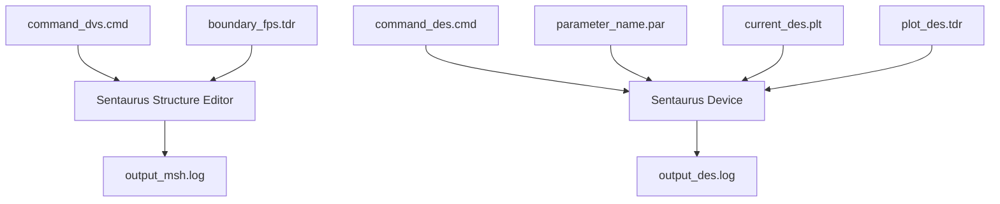
</details>

Figure 3 Typical tool flow with device simulation using Sentaurus Device

# Starting Sentaurus Device

You can start Sentaurus Device from either the command line or Sentaurus Workbench.

# From the Command Line

Sentaurus Device is driven by a command file and run by the command:

```txt
sdevice <command_filename> 
```

Various options exist at start-up and are listed by using:

```txt
sdevice -h 
```

By default, sdevice runs the latest version in the current release of Sentaurus Device. To run a particular version in the current release, use the -ver command-line option. The following example starts version 1.4 of the latest release of Sentaurus Device:

```batch
sdevice -ver 1.4 nmos_des.cmd 
```

To run the latest version in a particular release, use the -rel command-line option. The following example starts the latest version available in release O-2018.06:

sdevice -rel O-2018.06 nmos\_des.cmd

To run a particular version in a particular release, combine -ver and -rel. The following example starts Sentaurus Device, release N-2017.09, version 1.2:

sdevice -rel N-2017.09 -ver 1.2 nmos\_des.cmd

When the release or the version requested is not installed, the available releases or versions are listed, and the program terminates.

Appendix D on page 1325 lists the command options of Sentaurus Device, which include:

sdevice -versions

Checks which versions are in the installation path.

sdevice -P and sdevice -L

Extracts model parameter files (see Generating a Copy of Parameter File on page 32).

sdevice --parameter-names

Prints names of parameters that can be ramped (see Ramping Physical Parameter Values on page 78).

When Sentaurus Device starts, the command file is checked for correct syntax, and the commands are executed in sequence. Character strings starting with \* or # are ignored by Sentaurus Device, so that these characters can be used to insert comments in the simulation command file.

# From Sentaurus Workbench

Sentaurus Device is launched automatically through the Scheduler when working inside Sentaurus Workbench.

Sentaurus Workbench interprets # as a special marker for conditional statements (for example, #if..., #elif..., and #endif...).

# Simulation Projects

The Sentaurus Device module of the TCAD Sentaurus Tutorial provides various projects demonstrating the capabilities of Sentaurus Device.

To access the TCAD Sentaurus Tutorial, open Sentaurus Workbench and either choose Help > Training or click the corresponding toolbar button.

Alternatively, to access the TCAD Sentaurus Tutorial, go to:

\$STROOT/tcad/\$STRELEASE/Sentaurus\_Training/index.html

where the STROOT environment variable indicates where the Synopsys TCAD distribution has been installed, and STRELEASE indicates the Synopsys TCAD release number.

This chapter describes how to specify physical devices.

Before performing a simulation, Sentaurus Device needs to know which device will actually be simulated. This chapter describes what Sentaurus Device needs to know and how to specify it. This includes obvious information, such as the size and shape of the device, the materials of which the device is made, and the doping profiles. It also includes less obvious aspects such as which physical effects must be taken into account, and by which models and model parameters this should be performed.

# Reading a Structure

A device is defined by its shape, material composition, and doping. This information is defined on a grid and contained in a TDR file that you specify with the keyword Grid in the File section of the command file, for example:

```hcl
File {
    Grid = "mosfet.tdr"
    ...
} 
```

The following keywords affect the interpretation of the geometry in the Grid file:

■ CoordinateSystem in the global Math section specifies the coordinate system that is used for explicit coordinates in the Sentaurus Device command file. Many features such as current plot statements (see Tracking Additional Data in the Current File on page 112) or LatticeParameters in the parameter file (see Crystal and Simulation Coordinate Systems on page 796) use explicit coordinates, and they are based on an implicit assumption regarding the orientation of the device. You can indicate the required orientation of the device by specifying the following keyword:

```txt
Math {
    CoordinateSystem { <option> }
} 
```

Table 1 Options of the CoordinateSystem keyword 

<table><tr><td>Option</td><td>Description</td></tr><tr><td>AsIs</td><td>(Default) This option specifies that the coordinate system of the device is compatible with the explicit coordinates used in the Sentaurus Device command file. No transformation is applied to the structure.</td></tr><tr><td>DFISE</td><td>In two dimensions, the x-axis points across the surface, and the y-axis points down into the device. In 3D, the x-axis and y-axis span the surface of the device, and the z-axis points upwards away from the device.</td></tr><tr><td>UCS</td><td>The unified coordinate system (UCS) uses the convention of the simulation coordinate system as established by Sentaurus Process. The x-axis always points down into the device. In 2D, the y-axis runs across the surface of the device. In 3D, the z-axis is added to obtain a right-handed coordinate system.</td></tr></table>

If the coordinate system of the device is incompatible with the specification in the Math section, Sentaurus Device automatically transforms the device into the required coordinate system.

Cylindrical in the global Math section specifies that the device is simulated using cylindrical coordinates. In this case, a 3D device is specified by a 2D mesh and the vertical or horizontal axis around which the device is rotated.   
AreaFactor in the global Physics section specifies a multiplier for currents and charges. For 1D or 2D simulations, it typically specifies the extension of the device in the remaining one or two dimensions. In simulations that exploit the symmetry of the device, it can also be used to account for the reduction of the simulated device compared to the real device. AreaFactor is also available in the Electrode and Thermode sections, with the same meaning; if both AreaFactors are present, Sentaurus Device multiplies them.

TDR units are taken into account when loading from a .tdr file. Thereby, the units read from files are converted to the appropriate units used in Sentaurus Device. The TDR unit is ignored in the case of a conversion failure. Use the keyword IgnoreTdrUnits in the Math section to disregard TDR units during loading. This applies not only to the Grid file, but also to other loaded files (see Save and Load on page 159).

# Abrupt and Graded Heterojunctions

Sentaurus Device supports both abrupt and graded heterojunctions, with an arbitrary mole fraction distribution. In the case of abrupt heterojunctions, Sentaurus Device treats discontinuous datasets properly by introducing double points at the heterointerfaces.

This option is switched on automatically when thermionic emission (see Thermionic Emission Current on page 777) is selected, or when the keyword HeteroInterface is specified in the Physics section of a selected heterointerface. By default, this double points option is switched off.

NOTE The keyword HeteroInterface provides equilibrium conditions (continuous quasi-Fermi potentials) for the double points. It does not provide realistic physics at the interface for high-current regimes. Using the HeteroInterface option without thermionic emission or a tunneling model is discouraged.

To illustrate the double points option, Figure 4 shows the conduction band near an abrupt heterointerface. The wide line shows a case without double points, which requires a very fine mesh to avoid a large barrier error $( \delta E _ { \mathrm { { C } } } )$ .


<details>
<summary>text_image</summary>

δE_c
D_c
E_{C1}
E_{C2}
Mesh Nodes
</details>

Figure 4 Band edge at a heterointerface with and without double points

# Specifying Doping Species

Sentaurus Device relies on the Variables section of the file datexcodes.txt to determine its doping species. A variable is identified as a doping species by a doping field that shows whether it is an acceptor or a donor. Chemical concentrations are linked to their corresponding active concentrations by an active field. Similarly, ionized concentrations are specified by an ionized field.

A typical declaration would be:

```hcl
BoronConcentration, BoronChemicalConcentration {
    doping = acceptor (
    active = BoronActiveConcentration
    ionized = BoronMinusConcentration
    )
    ...
}
BoronActiveConcentration {
    ...
} 
```

# 2: Specifying Physical Devices

Specifying Doping Species

```txt
BoronMinusConcentration {
    ...
} 
```

You can also limit the doping species to certain substrate materials. For example, to restrict SiliconConcentration as a donor for GaN substrates only, specify the following:

```swift
SiliconConcentration, SiliconChemicalConcentration {
    doping = donor (
    active = SiliconActiveConcentration
    ionized = SiliconPlusConcentration
    material = GaN
    )
} 
```

The TCAD Sentaurus tool suite provides a default datexcodes.txt file in the directory \$STROOT\_LIB (or \$STROOT/tcad/\$STRELEASE/lib). Many common doping species are already predefined in this file. To add user-defined doping species or to modify an existing specification, you can use a datexcodes.txt file in the local directory. The local datexcodes.txt file only needs to contain the variables that you want to add or modify.

If the incomplete ionization model is activated (see Chapter 13 on page 279), the model parameters of the user-defined species must be specified in the Ionization section of the material parameter file.

Sentaurus Device loads doping distributions from the Grid file specified in the File section (see Reading a Structure on page 9) and reads the following datasets:

■ Net doping (DopingConcentration in the Grid file)   
Total doping (TotalConcentration in the Grid file)   
Concentrations of individual species

Sentaurus Device supports the following rules of doping specification:

Sentaurus Device takes the net doping dataset from the file if this dataset is present. Otherwise, net doping is recomputed from the concentrations of the separate species. To force the recomputation of the net doping based on individual species, use the keyword ComputeDopingConcentration in the global Math section.

The same rule applies to the total doping dataset.

NOTE Total concentration, which originates from process simulators such as Sentaurus Process, is the sum of the chemical concentrations of dopants. However, if the total concentration is recomputed inside Sentaurus Device, active concentrations are used.

Sentaurus Device takes the active concentration of a dopant if it is in the Grid file (for example, BoronActiveConcentration). Otherwise, the chemical dopant concentration is used (for example, BoronConcentration).   
To perform any simulation, Sentaurus Device must prepare the following major doping arrays:   
■ Net doping concentration, $N _ { \mathrm { n e t } } = N _ { \mathrm { D } , 0 } - N _ { \mathrm { A } , 0 }$   
■ Donor and acceptor concentrations, $N _ { \mathrm { D , 0 } }$ and $N _ { \mathrm { A } , 0 }$   
Total doping concentration, $N _ { \mathrm { t o t } } = N _ { D , 0 } + N _ { \mathrm { A , 0 } }$

After loading the doping file, Sentaurus Device uses the following scheme to compute the doping arrays:

1. If the Grid file does not have any species, $N _ { \mathrm { n e t } }$ is initialized from DopingConcentration, $N _ { \mathrm { t o t } }$ is initialized from TotalConcentration or $\left| N _ { \mathrm { n e t } } \right|$ if TotalConcentration was not read, $N _ { \mathrm { { D } , 0 } } ~ = ~ ( N _ { \mathrm { { t o t } } } + N _ { \mathrm { { n e t } } } ) / 2$ , and $N _ { \mathrm { A , 0 } } ~ { = } ~ ( N _ { \mathrm { t o t } } - N _ { \mathrm { n e t } } ) / 2$ .   
2. If the Grid file has individual species, $N _ { \mathrm { A } , 0 }$ and $N _ { \mathrm { D } , 0 }$ are computed as the sum of individual donor and acceptor concentrations, $N _ { \mathrm { n e t } }$ is initialized from DopingConcentration or $N _ { \mathrm { D } , 0 } - N _ { \mathrm { A } , 0 }$ if DopingConcentration was not read, and $N _ { \mathrm { t o t } }$ is initialized from TotalConcentration or $N _ { \mathrm { A } , 0 } + N _ { \mathrm { D } , 0 }$ if TotalConcentration was not read.   
3. Doping concentration is also affected if the Physics section includes trap specifications with the Add2TotalDoping or Add2TotalDoping(ChargedTraps) option (see Options to Include Traps in Doping on page 465 for a description of these options).

# Specifying Materials

Sentaurus Device supports all materials that are declared in the datexcodes.txt file (see Utilities User Guide, Chapter 1 on page 1). The following search strategy is observed to locate the datexcodes.txt file:

\$STROOT/tcad/\$STRELEASE/lib/datexcodes.txt or \$STROOT\_LIB/datexcodes.txt if the environment variable STROOT\_LIB is not defined (lowest priority)   
\$HOME/datexcodes.txt (medium priority)   
datexcodes.txt in local directory (highest priority)

Definitions in later files replace or add to the definitions in the earlier files. In this way, the local file only needs to contain materials or variables that you want to add or modify.

# User-Defined Materials

New materials can be defined in a local datexcodes.txt file. To add a new material, add its description to the Materials section of datexcodes.txt:

```hcl
Materials {
    Silicon {
    label = "Silicon"
    group = Semiconductor
    color = #ffb6c1
    }
    Oxide {
    label = "SiO2"
    group = Insulator
    color = #7d0505
    }
    ...
} 
```

The label value is used as a legend in visualization tools.

The group value identifies the type of the new material. The available options are All, Conductor, Insulator, or Semiconductor.

The field color defines the color of the material in visualization tools and must have the following syntax:

```txt
color = #rrggbb 
```

Here, rr, gg, and bb denote hexadecimal numbers representing the intensity of red, green, and blue, respectively. The values of rr, gg, and bb must be in the range 00 to ff.

Table 2 Sample values for color 

<table><tr><td>Color code</td><td>Color</td><td>Color code</td><td>Color</td></tr><tr><td>#000000</td><td>Black</td><td>#ffffff</td><td>White</td></tr><tr><td>#ff0000</td><td>Red</td><td>#40e0d0</td><td>Turquoise</td></tr><tr><td>#00ff00</td><td>Green</td><td>#7fff00</td><td>Chartreuse</td></tr><tr><td>#0000ff</td><td>Blue</td><td>#b03060</td><td>Maroon</td></tr><tr><td>#ffff00</td><td>Yellow</td><td>#ff7f50</td><td>Coral</td></tr><tr><td>#ff00ff</td><td>Magenta</td><td>#da70d6</td><td>Orchid</td></tr><tr><td>#00ffff</td><td>Cyan</td><td>#e6e6fa</td><td>Lavender</td></tr></table>

# Mole-Fraction Materials

Sentaurus Device reads the Molefraction.txt file to determine mole fraction–dependent materials. The following search strategy is used to locate this file:

1. Sentaurus Device looks for Molefraction.txt in the current working directory.   
2. If the environment variables STROOT and STRELEASE are defined, Sentaurus Device tries to read the \$STROOT/tcad/\$STRELEASE/lib/Molefraction.txt file.   
3. If these previous strategies are unsuccessful, Sentaurus Device uses the built-in defaults that follow.

The following example shows the default Molefraction.txt file (but you are urged to check \$STROOT/tcad/\$STRELEASE/lib/Molefraction.txt for the latest version of this file):

```julia
# Ge(x)Si(1-x)
SiliconGermanium (x=0) = Silicon
SiliconGermanium (x=1) = Germanium

# Al(x)Ga(1-x)As
AlGaAs (x=0) = GaAs
AlGaAs (x=1) = AlAs

# In(1-x)Al(x)As
InAlAs (x=0) = InAs
InAlAs (x=1) = AlAs

# In(1-x)Ga(x)As
InGaAs (x=0) = InAs
InGaAs (x=1) = GaAs

# Ga(x)In(1-x)P
GaInP (x=0) = InP
GaInP (x=1) = GaP

# InAs(x)P(1-x)
InAsP (x=0) = InP
InAsP (x=1) = InAs

# GaAs(x)P(1-x)
GaAsP (x=0) = GaP
GaAsP (x=1) = GaAs

# Hg(1-x)Cd(x)Te
HgCdTe (x=0) = HgTe
HgCdTe (x=1) = CdTe

# In(1-x)Ga(x)As(y)P(1-y)
InGaAsP (x=0, y=0) = InP
InGaAsP (x=1, y=0) = GaP 
```

```txt
InGaAsP (x=1, y=1) = GaAs
InGaAsP (x=0, y=1) = InAs 
```

To add a new mole fraction–dependent material, the material (and its side and corner materials) must first be added to datexcodes.txt. Afterwards, Molefraction.txt can be updated.

Quaternary alloys are specified by their corner materials in the file Molefraction.txt. For example, the 2:2 III–V quaternary alloy $\mathrm { I n } _ { \mathrm { 1 - x } } \mathrm { G a } _ { \mathrm { x } } \mathrm { A s } _ { \mathrm { y } } \mathrm { P } _ { \mathrm { 1 - y } }$ is given by:

```txt
InGaAsP (x=0, y=0) = InP
InGaAsP (x=1, y=0) = GaP
InGaAsP (x=1, y=1) = GaAs
InGaAsP (x=0, y=1) = InAs 
```

The 3:1 III–V quaternary alloy $\mathrm { { A l } _ { x } I n _ { y } G a _ { 1 - x - y } A s }$ is defined by:

```txt
AlInGaAs (x=0, y=0) = GaAs
AlInGaAs (x=1, y=0) = AlAs
AlInGaAs (x=0, y=1) = InAs 
```

When the corner materials of an alloy have been specified, Sentaurus Device determines the corresponding side materials automatically. In the case of $\begin{array} { r } { \operatorname { I n } _ { 1 - \mathrm { x } } \mathbf { G a } _ { \mathrm { x } } \mathbf { A s } _ { \mathrm { y } } \mathbf { P } _ { 1 - \mathrm { y } } , } \end{array}$ the four side materials are In $\mathrm { A s _ { x } P _ { 1 - x } , G a A s _ { x } P _ { 1 - x } , G a _ { x } I n _ { 1 - x } P , }$ and $\begin{array} { r } { \operatorname { I n } _ { 1 - \mathrm { x } } \mathbf { G a } _ { \mathrm { x } } \mathbf { A s } . } \end{array}$ . Similarly, for $\mathrm { \bar { A l } _ { x } I n _ { y } G a _ { 1 - x - y } A s . }$ the three side materials are $\begin{array} { r } { \operatorname { I n } _ { 1 - \mathrm { x } } \mathrm { A l } _ { \mathrm { x } } \mathrm { A s } , \mathrm { A l } _ { \mathrm { x } } \mathrm { G a } _ { 1 - \mathrm { x } } \mathrm { A s } . } \end{array}$ , and $\begin{array} { r } { \operatorname { I n } _ { 1 - \mathrm { x } } \mathbf { G a } _ { \mathrm { x } } \mathbf { A s } . } \end{array}$ .

NOTE All side and corner materials must appear in the datexcodes.txt file, and their mole dependencies must be specified in Molefraction.txt (see Specifying Materials on page 13).

If it cannot parse the Molefraction.txt file, Sentaurus Device reverts to the defaults shown previously. This might lead to unexpected simulation results.

# Mole-Fraction Specification

In Sentaurus Device, the mole fraction of a compound semiconductor or insulator is defined in the following ways:

■ In the Grid file (<name>.tdr) of the device structure   
Internally, in the Physics section of the command file

If the mole fraction is loaded from the .tdr file and an internal mole fraction specification is also applied, the loaded mole fraction values are overwritten in the regions specified in the MoleFraction sections of the command file.

The internal mole fraction distribution is described in the MoleFraction statement inside the Physics section:

```txt
Physics { ...
MoleFraction(<MoleFraction parameters>)
} 
```

The parameters for the mole fraction specification and grading options are described in Table 305 on page 1469.

The specification of an xFraction is mandatory in the MoleFraction statement for binary or ternary compounds; a yFraction is also mandatory for quaternary materials. If the MoleFraction statement is inside a default Physics section, the RegionName must be specified. If it is inside a region-specific Physics section, by default, it is applied only to that region. If a MoleFraction statement is inside a material-specific Physics section and the RegionName is not specified, this composition is applied to all regions containing the specified material. If RegionName is specified inside a region-specific and material-specific Physics section, this specification is used instead of the default regions.

NOTE Similar to all statements, only one MoleFraction statement is allowed inside each Physics section. By default, grading is not included.

An example of a mole fraction specification is:

```txt
Physics {
    MoleFraction(RegionName = ["Region.3" "Region.4"]
    xFraction=0.8
    yFraction=0.7
    Grading(
    (xFraction=0.3 GrDistance=1
    RegionInterface=("Region.0" "Region.3"))
    (xFraction=0.2 yFraction=0.1 GrDistance=1
    RegionInterface=("Region.0" "Region.5"))
    (yFraction=0.4 GrDistance=1
    RegionInterface=("Region.0" "Region.3"))
    )
    )
}
Physics (Region = "Region.6") {
    MoleFraction(xFraction=0.1 yFraction=0.7 GrDistance=0.01)
} 
```

# Physical Models and the Hierarchy of Their Specification

The Physics section is used to select the models that are used to simulate a device. Table 227 on page 1415 lists the keywords that are available, and Part II discusses the models in detail. Physical models can be specified globally, per region or material, per interface, or per electrode.

Some models (for example, the hydrodynamic transport model) can only be activated for the whole device. Regionwise or materialwise specifications are syntactically possible, but Sentaurus Device silently ignores them. Likewise, some specifications are syntactically possible for all locations, but they are semantically valid only for interfaces or bulk regions. In the tables in Appendix G on page 1369, the validity of specifications is indicated in the description column by characters in parentheses. For example, (g) denotes models that can be activated only for the entire device, but not for individual parts of it.

Some specifications are syntactically possible everywhere, but are valid for certain materials only. For example, Mobility is only valid in semiconductors.

# Region-Specific and Material-Specific Models

In Sentaurus Device, different physical models for different regions and materials within a device structure can be specified. The syntax for this feature is:

```txt
Physics (material="material") {
    <physics-body>
}
or:
Physics (region="region-name") {
    <physics-body>
} 
```

This feature is also available for the Math section:

```txt
Math (material="material") {
    <math-body>
}
or:
Math (region="region-name") {
    <math-body>
}
```

A Physics section without any region or material specifications is considered the default section.

NOTE You can edit region names in Sentaurus Structure Editor (see Sentaurus™ Structure Editor User Guide, Changing the Name of a Region on page 111).

The Physics and Math sections for different locations are related as follows:

Physical models defined in the global Physics section (that is, in the section without any region or material specifications) are applied in all regions of the device.   
Physical models defined in a material-specific Physics section are added to the default models for all regions containing the specified material.   
The same applies to the physical models defined in a region-specific Physics section: all regionwise defined models are added to the models defined in the default section.

NOTE If for a region, both a region-specific Physics section and a materialspecific Physics section for the material of the region are present, the region-specific declaration overrides the material-specific declaration, that is, the region-specific Physics section will not inherit any models from the material-specific section.

For example:

```txt
Physics {<Default models>}
Physics (Material="GaAs") {<GaAs models>}
Physics (Region="Emitter") {<Emitter models>}
```

If the "Emitter" region is made of GaAs, the models in this region are <Default models> and <Emitter models>, that is, whatever <GaAs models> contains is ignored in region "Emitter".

For some models, the model specification and numeric values of the parameters are defined in the Physics sections. Examples of such models are Traps and the MoleFraction specifications. For these models, the specifications in region or material Physics sections overwrite previously defined values of the corresponding parameters.

If in the default Physics section, xMoleFraction is defined for a given region and, afterward, is defined for the same region again, in a region or material Physics section, the default definition is overwritten. The hierarchy of the parameter specification is the same as discussed previously.

# Interface-Specific Models

A special set of models can be activated at the interface between two different materials or two different regions. In Table 227 on page 1415, pure interface models are flagged with ‘(i)’ in the description column.

As physical phenomena at an interface are not the same as in the bulk of a device, not all models are allowed inside interface-specific Physics sections. For example, it is not possible to define any mobility models or bandgap narrowing at interfaces.

NOTE Although the Recombination(surfaceSRH) statement and the GateCurrent statement describe pure interface phenomena, they can be defined in a region-specific Physics section. In this case, the models are applied to all interfaces between this region and all adjacent insulator regions. If specified in the global Physics section, these models are applied to all semiconductor–insulator interfaces.

Interface models are specified in interface-specific Physics sections. Their respective parameters are accessible in the parameter file. The syntax for specification of an interface model is:

```txt
Physics (MaterialInterface="material-name1/material-name2") {
    <physics-body>
}
or:
Physics (RegionInterface="region-name1/region-name2") {
    <physics-body>
} 
```

The following is an example illustrating the specification of fixed charges at the interface between the materials oxide and aluminum gallium arsenide (AlGaAs):

```groovy
Physics(MaterialInterface="Oxide/AlGaAs") {
    Traps(Conc=-1.e12 FixedCharge)
}
```

If no region interface Physics section is present for a given region interface, the material interface section is used if present. If the material interface Physics section is missing as well, built-in defaults are used. Similar to what holds for regions and materials, if a region interface section is present, it is used for the region interface, ignoring material interface settings completely, even when a material interface Physics section is present. However, other than for regions and materials, the global Physics section is not used automatically to determine interface Physics settings.

# Electrode-Specific Models

Electrode-specific Physics sections can be defined, for example:

```hcl
Physics(Electrode="Gate") {
    Schottky
    eRecVel = <float>
    hRecVel = <float>
    Workfunction = <float>
} 
```

# Physical Model Parameters

Most physical models depend on parameters that can be adjusted in a file given by Parameter in the File section:

```txt
File {
    Parameter = <string>
    ...
} 
```

The name of the parameter file conventionally has the extension .par.

Model parameters are split into sets, where a particular set corresponds to a particular physical model. The available parameter sets and the individual parameters they contain are described along with the description of the related model (see Part II).

Parameters can be specified globally, materialwise, regionwise, material interface–wise, region interface–wise, and electrode-wise. The following example shows each of these possibilities:

```txt
LatticeHeatCapacity {
    cv = 1.1
}
Material = "Silicon" {
    LatticeHeatCapacity {
    cv = 1.63
    }
}
Region = "Oxide" {
    LatticeHeatCapacity {
    cv = 1.67
    }
}
MaterialInterface = "Silicon/Oxide" {
    LatticeHeatCapacity { 
```

# 2: Specifying Physical Devices

Physical Model Parameters

```hcl
cv = -1
}
}
RegionInterface = "Oxide/Bulk" {
    LatticeHeatCapacity {
    cv = -2
    }
}
Electrode = "gate" {
    LatticeHeatCapacity {
    cv = -3
    }
} 
```

As for the models themselves, not all parameters are valid in all locations, even though it is syntactically possible to specify them. For example, the heat capacity is not used for interfaces and electrodes. Therefore, it does not matter that the values provided in the example above are nonsensical.

To specify parameters for multiple parameter sets for the same location, put all these specifications together into one section for that location, as in the following example for dielectric permittivity and heat capacity:

```hcl
Material = "Silicon" {
    Epsilon{
    epsilon = 11.6
    }
    LatticeHeatCapacity {
    cv = 1.63
    }
} 
```

Parameter files support an Insert statement to insert other parameter files. Inserted files themselves can use Insert. You can change parameters after an Insert statement. This is useful to provide standard values through the inserted file and to make the changes to those standards explicit. Insert is used as in the following example:

```hcl
Material = "Silicon" { Insert = "Silicon.par" } 
```

# Search Strategy for Parameter Files

Sentaurus Device uses the following strategy to search for inserted files, from highest to lowest priority as follows:

1. Local directory.   
2. The ParameterPath variable in the File section can specify a list of releases, for example:   
In this case, the following directories are added to the search path:

```hcl
File {
    ParameterPath = "2016.12 2017.09 2018.06"
} 
```

```txt
$STROOT/tcad/$STRELEASE/lib/sdevice/MaterialDB/2016.12
$STROOT/tcad/$STRELEASE/lib/sdevice/MaterialDB/2017.09
$STROOT/tcad/$STRELEASE/lib/sdevice/MaterialDB/2018.06 
```

3. Sentaurus Device checks whether the environment variable SDEVICEDB is defined. This variable must contain a directory or a list of directories separated by white space or colons, for example:

```txt
SDEVICEDB="/home/usr/lib /home/tcad/lib" 
```

Sentaurus Device scans the directories in the given order until the inserted file is found.

NOTE The environment variable SDEVICEDB also is used for the insert directive in Sentaurus Device command files (see Inserting Files on page 136).

4. The default library directory:

```txt
$STROOT/tcad/$STRELEASE/lib/sdevice/MaterialDB 
```

In all cases, Sentaurus Device prints the path to the actual file and displays an error message if it cannot be found.

NOTE The insert directive is also available for command files (see Inserting Files on page 136).

# Parameters for Composition-Dependent Materials

The following parameter sets provide mole fraction dependencies. All models are available for compound semiconductors only, except where otherwise noted:

Epsilon (also available for compound insulators)   
LatticeHeatCapacity (also available for compound insulators)   
Kappa (lattice thermal conductivity, also available for compound insulators)   
EnergyRelaxationTime   
Bandgap   
Bennett (bandgap narrowing)   
delAlamo (bandgap narrowing)   
OldSlotboom (bandgap narrowing)   
Slotboom (bandgap narrowing)   
JainRoulston (bandgap narrowing)   
eDOSMass   
hDOSMass   
ConstantMobility   
DopingDependence (mobility model)   
HighFieldDependence (mobility model)   
TransferredElectronEffect2 (mobility model)   
Enormal (mobility model)   
ToCurrentEnormal (mobility model)   
PhuMob (mobility model)   
ThinLayerMobility   
StressMobility (hSixBand model parameters)   
vanOverstraetendeMan (impact ionization model)   
MLDAQMModel   
SchroedingerParameters   
Band2BandTunneling   
■ DirectTunneling (for semiconductor–insulator interfaces only)   
AbsorptionCoefficient   
QWStrain (see Electronic Band Structure for Wurtzite Crystals on page 981 and Syntax for Quantum-Well Strain on page 991)   
RefractiveIndex (also available for compound insulators)

■ Radiative recombination   
Shockley–Read–Hall recombination   
■ Auger recombination   
■ Piezoelectric polarization   
QuantumPotentialParameters   
Deformation potential (elasticity modulus, the parameters for the electron band: xis, dbs, xiu, xid and, for hole band: adp, bdp, ddp, dso)   
SHEDistribution   
ComplexRefractiveIndex   
BandstructureParameters (see Electronic Band Structure for Wurtzite Crystals on page 981)   
FEPolarization

Sentaurus Device supports the suppression of the mole fraction dependence of a given model and the use of a fixed (mole fraction–independent) parameter set instead. To suppress mole fraction dependency, specify the (fixed) values for the parameter (for example, Eg0=1.53) and omit all other coefficients associated with the interpolation over the mole fraction (for example, Eg0(1), B(Eg0(1)), and C(Eg0(1))) from this section of the parameter file. It is not necessary to set them to zero individually.

NOTE When specifying a fixed value for one parameter of a given model, all other parameters for the same model must be fixed.

In summary, if the mole fraction dependence of a given model is suppressed, the parameter specification for this model is performed in exactly the same manner as for mole fraction–independent material.

# Ternary Semiconductor Composition

To illustrate a calculation of mole fraction–dependent parameter values for ternary materials, consider one mole interval from $x _ { i - 1 }$ to $x _ { i }$ . For mole fraction value ( ) of this interval, tox compute the parameter value ( ), Sentaurus Device uses the expression:P

$$
\begin{array}{l} P = P _ {i - 1} + A \cdot \Delta x + B _ {i} \cdot \Delta x ^ {2} + C _ {i} \cdot \Delta x ^ {3} \\ A = \frac {\Delta P _ {i}}{\Delta x _ {i}} - B _ {i} \cdot \Delta x _ {i} - C _ {i} \cdot \Delta x _ {i} ^ {2} \\ \end{array}
$$

$$
\Delta P _ {i} = P _ {i} - P _ {i - 1}
$$

$$
\Delta x _ {i} = x _ {i} - x _ {i - 1}
$$

$$
\Delta x = x - x _ {i - 1}
$$

where $P _ { i } , B _ { i } , C _ { i } , x _ { i }$ are values defined in the parameter file for each mole fraction interval, $x _ { 0 } = 0 , P _ { 0 }$ is the parameter value (at ) specified using the same manner as for molex = 0 fraction–independent material (for example, Eg0=1.53). As in the formulas above, you are not required to specify coefficient of the polynomial because it is easily recomputed insideA Sentaurus Device.

In the case of undefined parameters (these can be listed by printing the parameter file), Sentaurus Device uses linear interpolation using two parameter values of side materials (for and ):x = 0 x = 1

$$
P = (1 - x) P _ {x 0} + x P _ {x 1} \tag {2}
$$


<details>
<summary>line</summary>

| Mole Fraction | Parameter Value |
| ------------- | --------------- |
| 0             | Pi              |
| x_i-1         | Pi-1            |
| x_i           | Pi+1            |
</details>

Figure 5 Parameter value as a function of mole fraction

# Example 1: Specifying Electric Permittivity

This example provides the specification of dielectric permittivity for $\mathrm { { A l } _ { x } \mathrm { { G a } _ { 1 - x } \mathrm { { A s } \mathrm { { : } } } } }$ :

```txt
Epsilon
{ * Ratio of the permittivities of material and vacuum
    epsilon = 13.18    # [1]
* Mole fraction dependent model.
* The linear interpolation is used on interval [0,1].
    epsilon(1) = 10.06    # [1]
} 
```

A linear interpolation is used for the dielectric permittivity, where epsilon specifies the value for the mole fraction , and epsilon(1) specifies the value for .x = 0 x = 1

# Example 2: Specifying Band Gap

This example provides a specification of the bandgap parameters for $\mathrm { { A l } _ { x } \mathrm { { G a } _ { 1 - x } \mathrm { { A s } . } } }$ . A polynomial approximation, up to the third degree, describes the mole fraction–dependent band parameters on every mole fraction interval. In the following example, two intervals are used, namely, [Xmax(0), Xmax(1)] and [Xmax(1), Xmax(2)]. The parameters Eg0, Chi0, … correspond to the values for = Xmax(0); while the parameters Eg0(1), Chi0(1), …X correspond to the values for = Xmax(1) and, finally, Eg0(2), Chi0(2), … correspond toX the values for = Xmax(2).X

The coefficients and of the following polynomial are determined from the values at bothA F ends of the intervals:

$$
F + A (X - \mathrm{xmin} (I)) + B (X - \mathrm{xmin} (I)) ^ {2} + C (X - \mathrm{xmin} (I)) ^ {3} \tag {3}
$$

The coefficients and must be specified explicitly. You can introduce additional intervals:B C

```python
Bandgap *temperature dependent*
{ * Eg = Eg0 - alpha T^2 / (beta + T) + alpha Tpar^2 / (beta + Tpar)
* Eg0 can be overwritten in below bandgap narrowing models,
* if any of the BGN model is chosen in physics section.
* Parameter 'Tpar' specifies the value of lattice
* temperature, at which parameters below are defined.
    Eg0 = 1.42248    # [eV]
    Chi0 = 4.11826    # [eV]
    alpha = 5.4050e-04  # [eV K^-1]
    beta = 2.0400e+02   # [K]
    Tpar = 3.0000e+02   # [K]

* Mole fraction dependent model.
* The following interpolation polynomial can be used on interval
[Xmin(I),Xmax(I)]:
* F(X) = F(I-1)+A(I)*(X-Xmin(I))+B(I)*(X-Xmin(I))^2+C(I)*(X-Xmin(I))^3,
* where Xmax(I), F(I), B(I), C(I) are defined below for each interval.
* A(I) is calculated for a boundary condition F(Xmax(I)) = F(I).
* Above parameters define values at the following mole fraction:
    Xmax(0) = 0.0000e+00    # [1]
* Definition of mole fraction intervals, parameters, and coefficients:
    Xmax(1) = 0.45    # [1]
    Eg0(1) = 1.98515    # [eV]
    B(Eg0(1)) = 0.0000e+00    # [eV]
    C(Eg0(1)) = 0.0000e+00    # [eV]
    Chi0(1) = 3.575    # [eV]
    B(Chi0(1)) = 0.0000e+00    # [eV]
    C(Chi0(1)) = 0.0000e+00    # [eV]
    alpha(1) = 4.7727e-04    # [eV K^-1]
    B(alpha(1)) = 0.0000e+00    # [eV K^-1]
    C(alpha(1)) = 0.0000e+00    # [eV K^-1]
    beta(1) = 1.1220e+02    # [K]
    B(beta(1)) = 0.0000e+00    # [K]
    C(beta(1)) = 0.0000e+00    # [K]
    Xmax(2) = 1    # [1]
    Eg0(2) = 2.23    # [eV]
    B(Eg0(2)) = 0.143    # [eV] 
```

```julia
C(Eg0(2)) = 0.0000e+00 # [eV]
Chi0(2) = 3.5 # [eV]
B(Chi0(2)) = 0.0000e+00 # [eV]
C(Chi0(2)) = 0.0000e+00 # [eV]
alpha(2) = 4.0000e-04 # [eV K^-1]
B(alpha(2)) = 0.0000e+00 # [eV K^-1]
C(alpha(2)) = 0.0000e+00 # [eV K^-1]
beta(2) = 0.0000e+00 # [K]
B(beta(2)) = 0.0000e+00 # [K]
C(beta(2)) = 0.0000e+00 # [K]
} 
```

# Quaternary Semiconductor Composition

Sentaurus Device supports 1:3, 2:2, and 3:1 III–V quaternary alloys. A 1:3 III–V quaternary alloy is given by:

$$
A B _ {x} C _ {y} D _ {z} \tag {4}
$$

where is a group III element, and , , and are group V elements (usually listedA B C D according to increasing atomic number). Conversely, a 3:1 III–V quaternary alloy can be described as:

$$
A _ {x} B _ {y} C _ {z} D \tag {5}
$$

where , , and are group III elements, and is a group V element.A B C D

The composition variables , , and are nonnegative, and they are constrained by:x y z

$$
x + y + z = 1 \tag {6}
$$

An example would be $\mathrm { { A l } _ { x } \mathrm { { G a } _ { y } I n _ { 1 - x - y } A s . } }$ , where corresponds to .1 – x – y z

Sentaurus Device uses the symmetric interpolation scheme proposed by Williams et al. [1] to compute the parameter value $P ( A _ { x } B _ { y } C _ { z } D )$ of a 3:1 III–V quaternary alloy as a weighted sum of the corresponding ternary values:

$$
P \left(A _ {x} B _ {y} C _ {z} D\right) = \frac {x y P \left(A _ {1 - u} B _ {u} D\right) + y z P \left(B _ {1 - v} C _ {v} D\right) + x z P \left(A _ {1 - w} C _ {w} D\right)}{x y + y z + x z} \tag {7}
$$

where:

$$
u = \frac {1 - x + y}{2}, v = \frac {1 - y + z}{2}, w = \frac {1 - x + z}{2} \tag {8}
$$

The parameter values $P ( A B _ { x } C _ { y } D _ { z } )$ for 1:3 III–V quaternary alloys are computed similarly. A general 2:2 III–V quaternary alloy is given by:

$$
A _ {x} B _ {1 - x} C _ {y} D _ {1 - y} \tag {9}
$$

where and are group III elements, and and are group V elements. The compositionA B C D variables and satisfy the inequalitiesx y $0 \leq x \leq 1$ and $0 \leq y \leq 1$ . As an example, the material $\mathrm { I n } _ { \mathrm { 1 - x } } \mathrm { G a } _ { \mathrm { x } } \mathrm { A s } _ { \mathrm { y } } \mathrm { P } _ { \mathrm { 1 - y } }$ is mentioned.

The parameters $P ( A _ { x } B _ { 1 - x } C _ { y } D _ { 1 - y } )$ of a 2:2 III–V quaternary alloy are determined by interpolation between the four ternary side materials:

$$
P \left(A _ {x} B _ {1 - x} C _ {y} D _ {1 - y}\right) = \frac {x (1 - x) \left(y P \left(A _ {x} B _ {1 - x} C\right) + (1 - y) P \left(A _ {x} B _ {1 - x} D\right)\right) + y (1 - y) \left(x P \left(A C _ {y} D _ {1 - y}\right) + (1 - x) P \left(B C _ {y} D _ {1 - y}\right)\right)}{x (1 - x) + y (1 - y)} \tag {10}
$$

The interpolation of model parameters for quaternary alloys is also discussed in the literature [2][3][4][5]. A comprehensive survey paper is available [6].

# Default Model Parameters for Compound Semiconductors

It is important to understand how the default values for different physical models in different materials are determined. The approach used in Sentaurus Device is summarized here. For example, consider the material Material. Assume that no default parameters are defined for this material and a given physical model Model.

In this case, use the command sdevice -P:Material to see for which models specific default parameters are predefined in the material Material:

1. Silicon parameters are used, by default, in the model Model if the material Material is mole fraction independent.   
2. If Material is a compound material and dependent on the mole fraction , the defaultx values of the parameters for the model Model are determined by a linear interpolation between the values of the respective parameters of the corresponding ‘pure’ materials (that is, materials corresponding to and ). For example, forx = 0 x = 1 $\mathrm { { A l } _ { x } \mathrm { { G a } _ { 1 - x } \mathrm { { A s } } } }$ , values of the parameters of GaAs and AlAs are used in the interpolation formula.   
3. If Material is a quaternary material and dependent on x and y, an interpolation formula, which is based on the values of all corresponding ternary materials, is used. For example, for InGaAsP, the values of four materials (InAsP, GaAsP, GaInP, and InGaAs) are used in the interpolation procedure to obtain the default values of the parameters.

Additional details for each model and specific materials are found in the comments of the parameter file.

# Combining Parameter Specifications

Sentaurus Device has built-in values for many parameters, can read parameters from files in a default location, and can read a user-supplied parameter file that can specify parameters for various locations. This section discusses the rules for combining all these specifications.

Parameter handling is affected by the presence of the flag DefaultParametersFromFile (specified in the global Physics section) and the value of ParameterInheritance (specified in the global Math section). By default, ParameterInheritance=Flatten; by setting ParameterInheritance=None, the rules for combining parameter specifications can be altered.

# Materialwise Parameters

To determine materialwise parameters, follow these steps:

1. The parameters are initialized from built-in values. These values can depend on the material. For many materials, no appropriate built-in values exist, and silicon values are used instead.   
2. If the DefaultParametersFromFile flag is present, Sentaurus Device reads the default parameter file for the material. This file can add parameters (for example, add intervals to a mole fraction specification) or overwrite built-in values (for details, see Default Parameters on page 35).   
3. If ParameterInheritance=Flatten and specifications outside any location-specific section are present, they can add or overwrite the parameter values obtained through the previous two steps, and they also contribute to a separate, global, default parameter set.   
4. If your parameter file contains a section for the material, specifications in this section can add to or overwrite the parameter values obtained through the previous three steps. If ParameterInheritance=None, specifications outside any location-specific section are handled as if they occurred in a section for the material silicon.

Materialwise specifications in your parameter file are read even when the material is not contained in the structure to be simulated. This is useful, for example, to provide parameters for corner and side materials for materials that are present in the structure.

Apart from corner and side materials, materialwise parameters are rarely used directly; physical bulk models access parameters regionwise, not materialwise. However, materialwise settings can affect regionwise parameters. The next section explains this in detail.

# Regionwise Parameters

When your parameter file does not contain a section for a certain region, the parameter values for this region are the same as for the material of the region. In this case, if ParameterInheritance=None, the regionwise parameters are discarded entirely and the material parameters are accessed instead. If ParameterInheritance=Flatten, the region parameters are a copy of the material parameters (the subtle distinction of these two cases becomes important only when ramping parameters).

If your parameter file does contain a section for a certain region, the parameters for this region are initialized executing Steps 1 and 2 as for the materialwise parameters, using the material of the region to select the built-in values and the default parameter file. If ParameterInheritance=Flatten, and a section for this material is present in your parameter file, Steps 3 and 4 are taken as well. Finally, in any case, the section for the region is evaluated and can add to or overwrite the values previously obtained.

NOTE If ParameterInheritance=None and a section for a region is present in your parameter file, none of the settings for any parameter in the section for the material of the region (if such a section exists) has an effect on the parameters for that region. In other words, if ParameterInheritance=None, the region parameters do not ‘inherit’ user settings from the material parameters.

# Material Interface–Wise Parameters

Material interface–wise parameters are handled similarly to materialwise parameters, simply replace the term ‘material’ by ‘material interface’ in the description of the handling of materialwise parameters.

# Region Interface–Wise Parameters

Region interface–wise parameters are handled similarly to regionwise parameters, and the relation between region interface–wise parameters and material interface–wise parameters is analogous to the relation between regionwise and materialwise parameters. As an additional complication, if ParameterInheritance=None and neither a section for the region interface nor for its material interface is present in your parameter file, the region interface parameters are discarded, and the parameters for material silicon are accessed instead.

# Electrode-Wise Parameters

Electrode-wise parameters are handled similarly to materialwise parameters, simply replace the term ‘material’ by ‘electrode’ in the description of the handling of materialwise parameters.

# Generating a Copy of Parameter File

To redefine a parameter value for a particular material, a copy of the default parameter file must be created. To do this, the command sdevice -P prints the parameter file for silicon, with insulator properties. Table 3 lists the principal options for the command sdevice -P.

Table 3 Principal options for generating a parameter file 

<table><tr><td>Option</td><td>Description</td></tr><tr><td>-P:All</td><td>Prints a copy of the parameter file for all materials. Materials are taken from the file datexcodes.txt.</td></tr><tr><td>-P:Material</td><td>Prints model parameters for the specified material.</td></tr><tr><td>-P:Material:x</td><td>Prints model parameters for the specified material for mole fraction x.</td></tr><tr><td>-P:Material:x:y</td><td>Prints model parameters for the specified material for mole fractions x and y.</td></tr><tr><td>-P filename</td><td>Prints model parameters for materials and interfaces used in the command file filename.</td></tr><tr><td>-r</td><td>Reads parameters from default locations (see Search Strategy for Parameter Files on page 23) before printing parameters. This is analogous to using the DefaultParametersFromFile flag (see Materialwise Parameters on page 30).</td></tr></table>

For regionwise and materialwise parameter specifications, any model and parameter from the default section is usable, even if it is not printed for the particular material.

For mole fraction–dependent parameters, for people, it is difficult to read a parameter file and to obtain the final values of parameters (for example, the band gap) for a particular composition mole fraction. By using the command sdevice -M <inputfile.cmd>, Sentaurus Device creates a models-M.par file that will contain regionwise parameters with only constant values (instead of the polynomial coefficients) for regions where the composition mole fraction is constant. For regions where the composition is not a constant, Sentaurus Device prints the default material parameters.

As an alternative to the command sdevice -P, Sentaurus Device provides the sdevice -L command, which supports the same options in Table 3 for sdevice -P. However, instead of generating a single file, it creates separate files for each material and each material interface. Typically, these files are edited and used to provide default parameters (see Default Parameters on page 35).

For example, assume the command file pp1\_des.cmd is for a simple silicon MOSFET with four electrodes, one silicon region, and one oxide region. Using the following command, a parameter file is created in the current directory for each material, material interface, and electrode found in nmos\_mdr.tdr:

sdevice -L pp1\_des.cmd

In this example, the appropriate files are Silicon.par, Oxide.par, Oxide%Silicon.par, and Electrode.par.

In addition, the following models.par file is created in the current directory:

```hcl
Region = "Region0" { Insert = "Silicon.par" }
Region = "Region1" { Insert = "Oxide.par" }
RegionInterface = "Region1/Region0" { Insert = "Oxide%Silicon.par" }
Electrode = "gate" { Insert = "Electrode.par" }
Electrode = "source" { Insert = "Electrode.par" }
Electrode = "drain" { Insert = "Electrode.par" }
Electrode = "substrate" { Insert = "Electrode.par" } 
```

This models.par file can be renamed. It is only used in the simulation if it is specified in the File section of the command file of Sentaurus Device:

```txt
File {...
Parameter = "models.par"
... 
```

# Undefined Physical Models

For a nonsilicon simulation, the default behavior of Sentaurus Device is to use silicon parameters for models that are not defined in a material used in the simulation. It is useful for noncritical models, but it can lead to confusion, for example, if the semiconductor band gap is not defined, and Sentaurus Device uses that of silicon. Therefore, Sentaurus Device has a list of critical models and stops the simulation, with an error message, if these models are not defined.

NOTE The model is defined in a material if it is present in the default parameter file of Sentaurus Device for the material or it is specified in a userdefined parameter file.

Table 4 lists the critical models (with names from the parameter file of Sentaurus Device) with materials where these models are checked.

Table 4 List of critical models 

<table><tr><td>Model</td><td>Insulator</td><td>Semiconductor</td><td>Conductor</td></tr><tr><td>Auger</td><td></td><td>X</td><td></td></tr><tr><td>Bandgap</td><td></td><td>X</td><td></td></tr><tr><td>ConstantMobility</td><td></td><td>X</td><td></td></tr><tr><td>DopingDependence</td><td></td><td>X</td><td></td></tr><tr><td>eDOSmass</td><td></td><td>X</td><td></td></tr><tr><td>hDOSmass</td><td></td><td></td><td></td></tr><tr><td>Epsilon</td><td>X</td><td>X</td><td></td></tr><tr><td>Kappa</td><td>X</td><td>X</td><td>X</td></tr><tr><td>RadiativeRecombination</td><td></td><td>X</td><td></td></tr><tr><td>RefractiveIndex</td><td>X</td><td>X</td><td></td></tr><tr><td>Scharfetter</td><td></td><td>X</td><td></td></tr><tr><td>SchroedingerParameters</td><td>X</td><td>X</td><td></td></tr></table>

The models Bandgap, DOSmass, and Epsilon are checked always. For other models, this check is performed for each region, but only if appropriate models in the Physics section and equations in the Solve section are activated. The thermal conductivity model Kappa is checked only if the lattice temperature equation is included.

Drift-diffusion or hydrodynamic simulations activate the checking mobility models ConstantMobility and DopingDependence (with appropriate models in the Physics section).

NOTE This checking procedure can be switched off by the keyword -CheckUndefinedModels in the Math section.

The models eDOSmass and hDOSmass also must be defined for insulators to support tunneling (see Nonlocal Tunneling Parameters on page 738). Only the following specifications are acceptable for insulators:

```txt
eDOSmass {
    Formula = 1
    a = 0
    ml = 0
    mm = <effective mass> # default 0.42
}
hDOSmass {
    Formula = 1
    a = 0
    b = 0
    c = 0
    d = 0
    e = 0
    f = 0
    g = 0 
```

```hcl
h = 0
i = 0
mm = <effective mass> # default 1
} 
```

NOTE In general, the models eDOSmass and hDOSmass only need to be specified for user-specified insulators. The correct values are predefined for standard insulators.

# Default Parameters

Sentaurus Device provides built-in default parameters for many models and materials. However, Sentaurus Device also offers the option to overwrite the built-in values with default parameters from files. This option is activated by DefaultParametersFromFile in the global Physics section:

```txt
Physics {
DefaultParametersFromFile
...
} 
```

Table 5 File names that are used to initialize default parameters 

<table><tr><td>Location of parameters</td><td>File name</td></tr><tr><td>Materials</td><td>&lt;material&gt;.par, for example, Silicon.par, GaAs.par</td></tr><tr><td>Material interfaces</td><td>&lt;material1&gt;%&lt;material2&gt;.par, for example, InAlAs%AlGaAs.par (Instead of %, a comma or space can also be used.)</td></tr><tr><td>Contacts</td><td>Contact.par or Electrode.par</td></tr></table>

Sentaurus Device uses the same search strategy as for inserted files (see Physical Model Parameters on page 21). Sentaurus Device ships with a selection of parameter files in the directory \$STROOT/tcad/\$STRELEASE/lib/sdevice/MaterialDB. This directory also contains release-specific subdirectories, for example:

```txt
$STROOT/tcad/$STRELEASE/lib/sdevice/MaterialDB/2016.12
$STROOT/tcad/$STRELEASE/lib/sdevice/MaterialDB/2017.09
$STROOT/tcad/$STRELEASE/lib/sdevice/MaterialDB/2018.06 
```

You can request that the parameter files from a specific release are taken by specifying the ParameterPath variable in the File section:

```hcl
File {
    ParameterPath = "2018.06"
} 
```

If a matching file is not found, the built-in default parameters are used unaltered. Check the log file of Sentaurus Device to see which files were actually used.

# Named Parameter Sets

Some models in Sentaurus Device support the use of parameter sets that can be named. For example, EnormalDependence is the unnamed parameter set used with the Lombardi mobility model. In the parameter file, you can write the following to declare a parameter set for the Lombardi mobility model with the name myset:

```hcl
EnormalDependence "myset" {
    B = 3.6100e+07, 1.5100e+07 # [cm/s]
    C = 1.7000e+04, 4.1800e+03 # [cm^(5/3)/(V^(2/3)s)]
    ...
} 
```

Typically, named parameter sets are used to store alternative parameterizations for a model. They can be selected from the command file by specifying the name with ParameterSetName as an option to a model that supports this feature. For example:

```txt
Physics {
    Mobility (
    PhuMob
    Enormal( Lombardi (ParameterSetName="myset" ) )
    HighFieldSaturation
    )
} 
```

If ParameterSetName is not specified, the unnamed parameter set associated with the model is used by default.

Table 6 Models that support named parameter sets 

<table><tr><td colspan="2">Model name</td><td>Parameter set (unnamed)</td></tr><tr><td colspan="2">eQuantumPotentialhQuantumPotential</td><td>QuantumPotentialParameters</td></tr><tr><td rowspan="5">MobilityeMobilityhMobility</td><td>Enormal (Lombardi)ToCurrentEnormal (Lombardi)</td><td>EnormalDependence</td></tr><tr><td>ThinLayer (Lombardi)</td><td>EnormalDependenceThinLayerMobility</td></tr><tr><td>Enormal (IALMob)ToCurrentEnormal (IALMob)</td><td>IALMob</td></tr><tr><td>ThinLayer (IALMob)</td><td>IALMobThinLayerMobility</td></tr><tr><td>HighFieldSaturationeHighFieldSaturationhHighFieldSaturationDiffusivityeDiffusivityhDiffusivity</td><td>HighFieldDependenceHydroHighFieldDependence</td></tr><tr><td rowspan="2">Piezo (Mobility)</td><td>TensoreTensorhTensor</td><td>Piezoresistance</td></tr><tr><td>FactoreFactorhFactor</td><td>PiezoresistanceEffectiveStressModel</td></tr><tr><td colspan="2">Recombination (Band2Band)</td><td>Band2BandTunneling</td></tr></table>

# Auto-Orientation Framework

Some models in Sentaurus Device support an auto-orientation framework that automatically switches between different named parameter sets for model evaluation, based on the surface orientation of the nearest interface.

When the AutoOrientation option is activated for a model, by default, Sentaurus Device looks for and uses parameter sets named "100", "110", and "111" corresponding to surface orientations of {100}, {110}, and {111}. If the nearest interface orientation is {110}, for example, the model is evaluated using the parameter set "110". For surface orientations that fall between {100}, {110}, and {111}, the named parameter set that most closely corresponds to the actual surface orientation is used.

Models that support the auto-orientation framework include:

■ Density-gradient quantization model (eQuantumPotential, hQuantumPotential)   
Lombardi and IALMob mobility models   
HighFieldSaturation and Diffusivity   
ThinLayer mobility model   
Piezoresistance models (Tensor, eTensor, hTensor, Factor, eFactor, hFactor)   
EffectiveStressModel (Factor, eFactor, hFactor)

In the Plot section of the command file, the quantities InterfaceOrientation and NearestInterfaceOrientation can be specified to see the orientation that is used, at each interface face vertex and at every vertex, respectively, when auto-orientation is enabled for a model.

# Changing Orientations Used With Auto-Orientation

The auto-orientation framework can be modified to use surface orientations other than {100}, {110}, and {111}. This is accomplished by providing a definition for AutoOrientation in the Math section of the command file:

Math {
    AutoOrientation=(ori $_{1}$ , ori $_{2}$ , ...)
}

In the above specification, the orii values are three-digit integers that represent Miller indices for families of equivalent planes (a cubic lattice structure is assumed). For example, to modify AutoOrientation to use the surface orientations {100}, {110}, {111}, and {211}, specify:

```txt
Math {
    AutoOrientation=(100, 110, 111, 211)
} 
```

In this case, models that support AutoOrientation will switch between the parameter sets named "100", "110", "111", and "211", depending on the surface orientation of the nearest interface.

# Auto-Orientation Smoothing

By default, the switch from one parameter set to another when using auto-orientation occurs abruptly. To enable a smooth transition between different parameter sets, specify a nonzero value for the auto-orientation smoothing distance in the Math section:

```hcl
Math {
    AutoOrientationSmoothingDistance = 0.005    # [micrometers]
} 
```

The smoothing distance is an approximate measure of the distance over which the transition between different parameter sets will occur. For convenience, specifying AutoOrientationSmoothingDistance < 0 uses the average interface vertex spacing as the smoothing distance. In many cases, this is a reasonable choice.

When auto-orientation smoothing is used, weights are calculated at each vertex for each orientation-dependent parameter set based on the proximity to the different supported surface orientations:

$$
w _ {i} (\text { vertex }) = \sum_ {j = 1} ^ {N _ {i}} \left(\frac {A _ {j}}{A _ {\text { total }}}\right) \exp \left(- \frac {d _ {j} - d _ {\min}}{d _ {\text { smooth }}}\right), i = 1 0 0, 1 1 0, \dots \tag {11}
$$

The summation is over all interface vertices associated with orientation :i

$d _ { \mathrm { m i n } }$ is the minimum distance to the interface.   
$d _ { j }$ is the distance to the interface vertex .j   
$d _ { \mathrm { s m o o t h } }$ is the smoothing distance.   
■ $A _ { j }$ is the area associated with the interface vertex .j   
$A _ { \mathrm { t o t a l } }$ is the total interface area.

At each vertex, very small weights are set to zero, and the remaining weights are normalized so that their sum is equal to one.

During model evaluation, the weights for each orientation at a vertex are used to obtained a weighted average of the quantity being calculated.

In the Plot section of the command file, the quantity AutoOrientationSmoothing can be specified to see the vertices where auto-orientation smoothing is used and the dominant orientation at those vertices.

# References

[1] C. K. Williams et al., “Energy Bandgap and Lattice Constant Contours of III-V Quaternary Alloys of the Form $\mathbf { A _ { x } B _ { y } C _ { z } D }$ or $\mathbf { A B _ { x } C _ { y } D _ { z } } ,$ Journal of Electronic Materials, vol. 7, no. 5, pp. 639–646, 1978.   
[2] T. H. Glisson et al., “Energy Bandgap and Lattice Constant Contours of III-V Quaternary Alloys,” Journal of Electronic Materials, vol. 7, no. 1, pp. 1–16, 1978.   
[3] M. P. C. M. Krijn, “Heterojunction band offsets and effective masses in III–V quaternary alloys,” Semiconductor Science and Technology, vol. 6 , no. 1, pp. 27–31, 1991.

# 2: Specifying Physical Devices

References

[4] S. Adachi, “Band gaps and refractive indices of AlGaAsSb, GaInAsSb, and InPAsSb: Key properties for a variety of the 2–4-mm optoelectronic device applications,” Journal of Applied Physics, vol. 61, no. 10, pp. 4869–4876, 1987.   
[5] R. L. Moon, G. A. Antypas, and L. W. James, “Bandgap and Lattice Constant of GaInAsP as a Function of Alloy Composition,” Journal of Electronic Materials, vol. 3, no. 3, pp. 635–644, 1974.   
[6] I. Vurgaftman, J. R. Meyer, and L. R. Ram-Mohan, “Band parameters for III–V compound semiconductors and their alloys,” Journal of Applied Physics, vol. 89, no. 11, pp. 5815–5875, 2001.

This chapter describes how to specify circuits and compact devices for mixed-mode simulations.

# Overview of Mixed-Mode Simulations

Sentaurus Device is a single-device simulator, and a mixed-mode device and circuit simulator. A single-device command file is defined through the mesh, contacts, physical models, and solve command specifications.

For a multidevice simulation, the command file must include specifications of the mesh (File section), contacts (Electrode section), and physical models (Physics section) for each device. A circuit netlist must be defined to connect the devices (see Figure 6), and solve commands must be specified that solve the whole system of devices.


<details>
<summary>flowchart</summary>

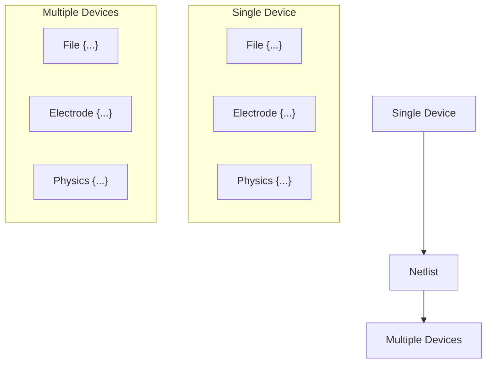
</details>

Figure 6 Each device in a multidevice simulation is connected with a circuit netlist

The Device command defines each physical device. A command file can have any number of Device sections. The Device section defines a device, but a System section is required to create and connect devices.

Sentaurus Device provides different compact models for use in mixed-mode simulations and supports different ways of specifying compact models as follows:

Netlist files support a subset of the Synopsys HSPICE® language. You can use these files to specify parameter sets and instances of SPICE models and HSPICE models (see HSPICE Netlist Files on page 45).   
SPICE circuit files (extension .scf) are available for SPICE models, HSPICE models, and built-in models. Both parameter sets and instances can be specified (see SPICE Circuit Files on page 51).

Compact circuit files (extension .ccf) support the compact model interface in Sentaurus Device. Devices and parameter sets for user-defined models must be specified in compact circuit files. Instances can appear either in compact circuit files or in the System section of the command file (see User-Defined Compact Models on page 45).   
Electrical and thermal circuits can be defined in the System section of the command file. Initial conditions for the circuit nodes can be specified, as well as Plot statements to generate output (see System Section on page 54).

# Compact Models

Sentaurus Device provides different compact models for use in mixed-mode simulations:

SPICE models (see Table 7 on page 43)   
Frequently used HSPICE models (see Table 8 on page 44)   
Built-in, special-purpose models (see Table 9 on page 44)   
User-defined models (see User-Defined Compact Models on page 45)

This section describes the incorporation of compact models in mixed-mode simulations. The Compact Models User Guide provides references for the different models.

# Hierarchical Description of Compact Models

In Sentaurus Device, each compact model is described by a three-level hierarchy:

Device: The device describes the basic properties of a compact model. This includes the names of the model, electrodes, thermodes, and internal variables, and the names and types of the internal states and parameters. Devices are predefined for SPICE models and builtin models. For user-defined models, you must specify the devices.   
■ Parameter set: Each parameter set is derived from a device. It defines default values for the parameters of a compact model. Usually, the parameters that are shared among several instances are defined in a parameter set. Most SPICE models and built-in models provide a default parameter set, which can be directly referenced in a circuit description. For more complicated models such as MOSFETs, you can introduce new parameter sets.   
Instance: Instances correspond to the elements in the Sentaurus Device circuit. Each instance is derived from a parameter set. It can override the values of its parameters if necessary.

For SPICE models and built-in models, you define parameter sets and instances. For userdefined models, it is possible (and required) to introduce new devices. For more information, see the Compact Models User Guide.

Table 7 Available SPICE models in Sentaurus Device 

<table><tr><td>Model</td><td>Device name</td><td>Name of default parameter set</td></tr><tr><td>Resistor</td><td>Resistor</td><td>Resistor_pset</td></tr><tr><td>Capacitor</td><td>Capacitor</td><td>Capacitor_pset</td></tr><tr><td>Inductor</td><td>Inductor</td><td>Inductor_pset</td></tr><tr><td>Coupled inductors</td><td>mutual</td><td>mutual_pset</td></tr><tr><td>Voltage-controlled switch</td><td>Switch</td><td>Switch_pset</td></tr><tr><td>Current-controlled switch</td><td>CSwitch</td><td>CSwitch_pset</td></tr><tr><td>Voltage source</td><td>Vsource</td><td>Vsource_pset</td></tr><tr><td>Current source</td><td>Isource</td><td>Isource_pset</td></tr><tr><td>Voltage-controlled current source</td><td>VCCS</td><td>VCCS_pset</td></tr><tr><td>Voltage-controlled voltage source</td><td>VCVS</td><td>VCVS_pset</td></tr><tr><td>Current-controlled current source</td><td>CCCS</td><td>CCCS_pset</td></tr><tr><td>Current-controlled voltage source</td><td>CCVS</td><td>CCVS_pset</td></tr><tr><td rowspan="9">MOSFET</td><td>Mos1</td><td>Mos1_pset</td></tr><tr><td>Mos2</td><td>Mos2_pset</td></tr><tr><td>Mos3</td><td>Mos3_pset</td></tr><tr><td>Mos6</td><td>Mos6_pset</td></tr><tr><td>BSIM1</td><td>BSIM1_pset</td></tr><tr><td>BSIM2</td><td>BSIM2_pset</td></tr><tr><td>BSIM3</td><td>BSIM3_pset</td></tr><tr><td>BSIM4</td><td>BSIM4_pset</td></tr><tr><td>B3SOI</td><td>B3SOI_pset</td></tr><tr><td>Diode</td><td>Diode</td><td>Diode_pset</td></tr><tr><td>Bipolar junction transistor</td><td>BJT</td><td>BJT_pset</td></tr><tr><td>Junction field effect transistor</td><td>JFET</td><td>JFET_pset</td></tr><tr><td>GaAs MESFET</td><td>MES</td><td>MES_pset</td></tr></table>

# 3: Mixed-Mode Simulations

# Compact Models

Table 8 Available HSPICE models in Sentaurus Device 

<table><tr><td>Model</td><td>Device name</td></tr><tr><td>HSPICE Level 1</td><td>HMOS_L1</td></tr><tr><td>HSPICE Level 2</td><td>HMOS_L2</td></tr><tr><td>HSPICE Level 3</td><td>HMOS_L3</td></tr><tr><td>HSPICE Level 28</td><td>HMOS_L28</td></tr><tr><td>HSPICE Level 49</td><td>HMOS_L49</td></tr><tr><td>HSPICE Level 53</td><td>HMOS_L53</td></tr><tr><td>HSPICE Level 54</td><td>HMOS_L54</td></tr><tr><td>HSPICE Level 57</td><td>HMOS_L57</td></tr><tr><td>HSPICE Level 59</td><td>HMOS_L59</td></tr><tr><td>HSPICE Level 61</td><td>HMOS_L61</td></tr><tr><td>HSPICE Level 62</td><td>HMOS_L62</td></tr><tr><td>HSPICE Level 64</td><td>HMOS_L64</td></tr><tr><td>HSPICE Level 68</td><td>HMOS_L68</td></tr><tr><td>HSPICE Level 69</td><td>HMOS_L69</td></tr><tr><td>HSPICE Level 72</td><td>HMOS_L72</td></tr><tr><td>HSPICE Level 73</td><td>HMOS_L73</td></tr><tr><td>HSPICE Level 76</td><td>HMOS_L76</td></tr></table>

Table 9 Built-in models in Sentaurus Device 

<table><tr><td>Model</td><td>Device name</td><td>Name of default parameter set</td></tr><tr><td>Electrothermal resistor</td><td>Ter</td><td>Ter_pset</td></tr><tr><td>Ferroelectric capacitor</td><td>ferroelectric</td><td>ferroelectric_pset</td></tr><tr><td>MOS harness</td><td>MOS_harness</td><td>MOS_harness_pset</td></tr><tr><td>Parameter interface</td><td>Param_Interface_Device</td><td>Param_Interface</td></tr><tr><td>SPICE temperature interface</td><td>Spice_Temperature_Interface_Device</td><td>Spice_Temperature_Interface</td></tr></table>

# User-Defined Compact Models

Sentaurus Device provides a compact model interface (CMI) for user-defined compact models. These models are implemented in C++ by you and linked to Sentaurus Device at runtime. Access to the source code of Sentaurus Device is not required.

To implement a new user-defined model:

1. Provide a corresponding equation for each variable in the compact model. For electrode voltages, compute the current flowing from the device into the electrode. For an internal model variable, use a model equation.   
2. Write a formal description of the new compact model. Sentaurus Device reads this compact circuit file before the model is loaded.   
3. Implement a set of C++ interface subroutines. Sentaurus Device provides a runtime environment.   
4. Compile the model code into a shared object file, which is linked at runtime to Sentaurus Device. A cmi script executes this compilation.   
5. Use the CMIPath keyword to define a search path in the File section of the command file.   
6. Reference user-defined compact models in compact circuit files (extension .ccf) or directly in the System section of the command file.

# HSPICE Netlist Files

Sentaurus Device accepts HSPICE netlists that are provided in a separate file. A netlist is specified in the System section as follows:

```hcl
System {
    Netlist = "spice_netlist.sp"
} 
```

Sentaurus Device can process only a subset of the HSPICE netlist syntax. The recognized syntax is described in the following sections.

# Structure of Netlist Files

The first line of a netlist file is assumed to be a title line and is ignored, for example:

.TITLE 'amplifier netlist'

# 3: Mixed-Mode Simulations

HSPICE Netlist Files

The title line is followed by a sequence of HSPICE statements, and the netlist is terminated by an optional .END statement:

.END

Everything after the final .END statement is ignored.

The netlist parser is case insensitive, except for string literals or file names in .INCLUDE statements:

.PARAM s = str('This is a case sensitive string.')

.INCLUDE 'Case/Sensitive/Filename'

# Comments

A line starting with either the dollar sign (\$) character or the asterisk (\*) character is a comment line, for example:

\* This is a comment.

You can use in-line comments after the \$ character:

R1 1 2 R=100 \$ drain resistor

# Continuation Lines

Use the plus sign (+) character in the first column to indicate a continuation line:

R1 1 0 + R=500

# The .INCLUDE Statement

Use the .INCLUDE statement to include another netlist in the current netlist:

.INCLUDE models.sp

# Numeric Constants

You can enter numbers in one of the following formats:

Integer (for example, 7)   
■ Floating point (for example, -4.5)   
Floating point with an integer exponent (for example, 3e8 and -1.2e9)

■ Integer with a scale factor listed in Table 10 (for example, 6k)   
■ Floating point with a scale factor listed in Table 10 (for example, -8.9meg)

Table 10 Scale factors 

<table><tr><td>Scale factor</td><td>Description</td><td>Multiplying factor</td></tr><tr><td>t</td><td>tera</td><td> $10^{12}$ </td></tr><tr><td>g</td><td>giga</td><td> $10^9$ </td></tr><tr><td>meg or x</td><td>mega</td><td> $10^6$ </td></tr><tr><td>k</td><td>kilo</td><td> $10^3$ </td></tr><tr><td>mil</td><td>one-thousandth of an inch</td><td> $25.4 \cdot 10^{-6}$ </td></tr><tr><td>m</td><td>milli</td><td> $10^{-3}$ </td></tr><tr><td>u</td><td>micro</td><td> $10^{-6}$ </td></tr><tr><td>n</td><td>nano</td><td> $10^{-9}$ </td></tr><tr><td>p</td><td>pico</td><td> $10^{-12}$ </td></tr><tr><td>f</td><td>femto</td><td> $10^{-15}$ </td></tr><tr><td>a</td><td>atto</td><td> $10^{-18}$ </td></tr></table>

NOTE The scale factor a is not a scale factor in a character string that contains amps. For example, the expression 20amps is interpreted as 20 amperes of current, not as 20e-18mps.

# Parameters and Expressions

In the HSPICE tool, parameters are names that you associate with a value. Numeric and string parameters are supported, for example:

```python
.PARAM a = 4
.PARAM b = '2*a + 7'
.PARAM s = str('This is a string')
.PARAM t = str(s) 
```

The following built-in mathematical functions are supported:

sin, cos, tan, asin, acos, atan, sinh, cosh, tanh, abs, sqrt, pow, pwr, log, log10, exp, db, int, nint, sgn, sign, floor, ceil, min, max

# 3: Mixed-Mode Simulations

HSPICE Netlist Files

# Subcircuits

Reusable cells can be specified as subcircuits. The general definition is given by:

```txt
.SUBCKT name n1 n2 ... [param1=val] [param2=val] ...
.ENDS 
```

or:

```txt
.MACRO name n1 n2 ... [param1=val] [param2=val] ...
.EOM 
```

String parameters are supported as well:

```txt
.SUBCKT name n1 n2 ... [param=str('string')] ...
.ENDS 
```

# Examples

```powershell
.PARAM P5=5 P2=10
.SUBCKT SUB1 1 2 P4=4
    R1 1 0 P4
    R2 2 0 P5
    X1 1 2 SUB2 P6=7
    X2 1 2 SUB2
.ENDS 
```

```txt
.MACRO SUB2 1 2 P6=11
R1 1 2 P6
R2 2 0 P2
.EOM 
```

```txt
X1 1 2 SUB1 P4=6
X2 3 4 SUB2 P6=15 
```

# The .MODEL Statement

The .MODEL statement has the following general syntax:

```batch
.MODEL model_name type [level=num] [pname1=val1] [pname2=val2] ... 
```

Table 11 Recognized model types 

<table><tr><td>Type</td><td>Description</td><td>Type</td><td>Description</td></tr><tr><td>c</td><td>Capacitor model</td><td>npn</td><td>NPN BJT model</td></tr><tr><td>csw</td><td>Current-controlled switch</td><td>pjf</td><td>P-channel JFET model</td></tr><tr><td>d</td><td>Diode model</td><td>pmf</td><td>P-channel MESFET</td></tr><tr><td>l</td><td>Mutual inductor model</td><td>pmos</td><td>P-channel MOSFET model</td></tr><tr><td>njf</td><td>N-channel JFET model</td><td>pnp</td><td>PNP BJT model</td></tr><tr><td>nmf</td><td>N-channel MESFET</td><td>r</td><td>Resistor model</td></tr><tr><td>nmos</td><td>N-channel MOSFET model</td><td>sw</td><td>Voltage-controlled switch</td></tr></table>

# Examples

.MODEL mod1 NPN BF=50 IS=1e-13 VFB=50 PJ=3 N=1.05

.MODEL mod2 PMOS LEVEL=72

\+ aigbinv = 0.0111

\+ at = -0.00156

# Elements

Element names must begin with a specific letter for each element type.

Table 12 HSPICE element types that are supported 

<table><tr><td>First letter</td><td>Element</td><td>Example</td></tr><tr><td>c</td><td>Capacitor</td><td>Cbypass 1 0 10pf</td></tr><tr><td>d</td><td>Diode</td><td>D7 3 9D1</td></tr><tr><td>e</td><td>Voltage-controlled voltage source</td><td>Ea 1 2 3 4 K</td></tr><tr><td>f</td><td>Current-controlled current source</td><td>Fsub n1 n2 vin 2.0</td></tr><tr><td>g</td><td>Voltage-controlled current source</td><td>G12 4 0 3 0 10</td></tr><tr><td>h</td><td>Current-controlled voltage source</td><td>H3 4 5 Vout 2.0</td></tr><tr><td>i</td><td>Current source</td><td>IA 2 6 1e-6</td></tr><tr><td>j</td><td>JFET or MESFET</td><td>J1 7 2 3 model_jfet w=10u l=10u</td></tr><tr><td>k</td><td>Linear mutual inductor</td><td>K1 L1 L2 0.98</td></tr><tr><td>l</td><td>Linear inductor</td><td>Lx a b 1e-9</td></tr><tr><td>m</td><td>MOS transistor</td><td>M834 1 2 3 4 N1</td></tr><tr><td>q</td><td>Bipolar transistor</td><td>Q5 3 6 7 8 pnp1</td></tr><tr><td>r</td><td>Resistor</td><td>R10 21 10 1000</td></tr><tr><td>v</td><td>Voltage source</td><td>V1 8 0 5</td></tr><tr><td>x</td><td>Subcircuit call</td><td>X1 2 4 17 31 MULTI WN=100 LN=5</td></tr></table>

Table 13 Berkeley SPICE element types that are supported 

<table><tr><td>First letter</td><td>Element</td><td>Example</td></tr><tr><td>s</td><td>Voltage-controlled switch</td><td>S1 1 2 3 4 SWITCH1 ON</td></tr><tr><td>w</td><td>Current-controlled switch</td><td>W1 1 2 VCLOCK SWITCHMOD1</td></tr><tr><td>z</td><td>GaAs MESFET</td><td>Z1 7 2 3 ZM1 AREA=2</td></tr></table>

# Netlist Commands

A limited set of netlist commands is recognized.

To make node names global across all subcircuits, use a .GLOBAL statement, for example:

$\mathrm { . \ G L O B A L { \ n o d e 1 } { \ n o d e 2 } { \ n o d e 3 } { \ell . . . } }$

Use the .OPTION PARHIER statement to specify scoping rules, for example:

$\cdot \mathsf { O P T I O N } \mathbb { P A R H I E R } = \mathbb { G L O B A L } \left| \mathbb { L } \mathsf { O C A L } \right.$

Other HSPICE netlist commands that have not been already mentioned explicitly are ignored.

# Specifying Physical Devices in Netlists

Sentaurus Device supports an extension of the HSPICE netlist format so that you can specify physical devices in an HSPICE netlist. The .SDEVICE statement declares the name of a physical device and its contacts:

.SDEVICE device\_name drain gate source bulk

Instances of a physical device can be inserted into the netlist using the subcircuit command:

x1 d g s b device\_name

The .SDEVICE statement and a subcircuit instantiation are equivalent to the following specification in the System section of a Sentaurus Device command file:

```hcl
System {
    device_name x1 (drain=d gate=g source=s bulk=b)
} 
```

NOTE HSPICE names are case insensitive, and the netlist parser converts all identifiers to lowercase. Consequently, you must specify physical devices using lowercase in Sentaurus Device.

# SPICE Circuit Files

You can specify compact models in an external SPICE circuit file (extension .scf). The declaration of a parameter set can be:

```txt
PSET pset
DEVICE dev
PARAMETERS
parameter0 = value0
parameter1 = value1
...
END PSET 
```

This declaration introduces the parameter set pset that is derived from the device dev. It assigns default values for the given parameters. The device dev should have already declared the parameter names. Furthermore, the values assigned to the parameters must be of the appropriate type.

Table 14 Parameters types in SPICE circuit files 

<table><tr><td>Parameter type</td><td>Example</td><td>Parameter type</td><td>Example</td></tr><tr><td>char</td><td>c = &#x27;n&#x27;</td><td>char[]</td><td>cc = [&#x27;a&#x27; &#x27;b&#x27; &#x27;c&#x27;]</td></tr><tr><td>double</td><td>d = 3.14</td><td>double[]</td><td>dd = [1.2 -3.4 5e6]</td></tr><tr><td>int</td><td>i = 7</td><td>int[]</td><td>ii = [1 2 3]</td></tr><tr><td>string</td><td>s = &quot;hello world&quot;</td><td>string[]</td><td>ss = [&quot;hello&quot; &quot;world&quot;]</td></tr></table>

Similarly, circuit instances can be declared as:

```txt
INSTANCE inst
PSET pset
ELECTRODES e0 e1 ...
THERMODES t0 t1 ...
PARAMETERS 
```

# 3: Mixed-Mode Simulations

SPICE Circuit Files

parameter0 = value0

parameter1 = value1

END INSTANCE

According to this declaration, the instance inst is derived from the parameter set pset. Its electrodes are connected to the circuit nodes e0, e1, …, and its thermodes are connected to t0, t1, and so on. This instance also defines or overrides parameter values.

See Compact Models User Guide, Syntax of Compact Circuit (.ccf) Files on page 176 for the complete syntax of the input language for SPICE circuit files.

# Example

Consider the following simple rectifier circuit:


<details>
<summary>text_image</summary>

in
out
</details>

The circuit comprises three compact models and can be defined in the file rectifier.scf as:

```asm
PSET D1n4148
DEVICE Diode
PARAMETERS
    is = 0.1p    // saturation current
    rs = 16    // Ohmic resistance
    cjo = 2p    // junction capacitance
    tt = 12n    // transit time
    bv = 100    // reverse breakdown voltage
    ibv = 0.1p    // current at reverse breakdown voltage
END PSET

INSTANCE v
    PSET Vsource_pset
    ELECTRODES in 0
    PARAMETERS sine = [0 5 1meg 0 0]
END INSTANCE

INSTANCE d1
    PSET D1n4148
    ELECTRODES in out
    PARAMETERS temp = 30
END INSTANCE 
```

```txt
INSTANCE r
PSET Resistor_pset
ELECTRODES out 0
PARAMETERS resistance = 1000
END INSTANCE 
```

The parameter set D1n4148 defines the parameters shared by all diodes of type 1n4148. Instance parameters are usually different for each diode, for example, their operating temperature.

NOTE A parameter set must be declared before it can be referenced by an instance.

The Compact Models User Guide further explains the SPICE parameters in this example. The command file for this simulation can be:

```txt
File {
    SPICEPath = ". lib spice/lib"
}
System {
    Plot "rectifier" (time() v(in) v(out) i(r 0))
}
Solve {
    Circuit
    NewCurrentPrefix = "transient_"
    Transient (InitialTime = 0 FinalTime = 0.2e-5
    InitialStep = 1e-7 MaxStep = 1e-7) {Circuit}
} 
```

The SPICEPath in the File section is assigned a list of directories. All directories are scanned for SPICE circuit files (.scf). Check the log file of Sentaurus Device to see which circuit files were found and used in the simulation.

The System section contains a Plot statement that produces the rectifier\_des.plt file and plots the simulation time, the voltages of nodes in and out, and the current from resistor r into node 0.

The Solve section describes the simulation. The keyword Circuit denotes the circuit equations to be solved.

Instances in a circuit also can appear directly in the System section of the command file, for example:

```txt
System {
    Vsource_pset v (in 0) {sine = (0 5 1meg 0 0)}
    D1n4148 d1 (in out) {temp = 30}
    Resistor_pset r (out 0) {resistance = 1000} 
```

```lisp
Plot "rectifier" (time() v(in) v(out) i(r 0)) 
```

# Command File for Mixed-Mode Simulations

This section discusses the most important sections of the Sentaurus Device command file for mixed-mode simulations.

# System Section

The System section defines the netlist of physical devices and circuit elements to be solved. The netlist is connected through circuit nodes. By default, a circuit node is electrical, but it can be declared to be electrical or thermal:

```txt
Electrical { inode0 inode1 ... }
Thermal { tnode0 tnode1 ... } 
```

Each electrical node is associated with a voltage variable, and each thermal node is associated with a temperature variable. Node names are numeric or alphanumeric. Node 0 is predefined as the ground node ( ).0 V

You can define compact models in HSPICE netlist files (see HSPICE Netlist Files on page 45) or in SPICE circuit files (see SPICE Circuit Files on page 51). However, instances of compact models can also appear directly in the System section of the command file:

```txt
parameter-set-name instance-name (node0 node1 ...) {
<attributes>
} 
```

The order of nodes in the connectivity list corresponds to the electrodes and thermodes in the SPICE device definition (refer to the Compact Models User Guide).

The connectivity list is a list of contact name=node name connections, separated by white space. The contact name is the name of the contact from the grid file of the given device, and the node name is the name of the circuit netlist node as previously defined in the definition of a circuit element.

Physical devices are defined as:

```txt
device-type instance-name (connectivity list) {<attributes>} 
```

The connectivity list of a physical device explicitly establishes the connection between a contact and a node. For example, the following defines a physical diode and a circuit diode:

```txt
Diode_pset circuit_diode (1 2) {...} # circuit diode
Diode243 device_diode (anode=1 cathode=2) {...} # physical diode 
```

Both diodes have their anode connected to node 1 and their cathode connected to node 2. In the case of the circuit diode, the device specification defines the order of electrodes (see Compact Models User Guide, Syntax of Compact Circuit (.ccf) Files on page 176). Conversely, the connectivity for the physical diode must be given explicitly. The names anode and cathode of the contacts are defined in the grid file of the device. The device types of the physical devices must be defined elsewhere in the command file (with Device sections) or an external .device file.

The System section can contain the initial conditions of nodes. Different types of initialization can be specified:

Fixed values (Set)   
Fixed until transient (Initialize)   
■ Initialized only for the first solve (Hint)

See Initializing Nodes on page 59.

The System section can also contain Plot statements to generate plot files of node values, currents through devices, and parameters of internal circuit elements. For a simple case of one device without circuit connections (besides resistive contacts), the keyword System is not required because the system is implicit and trivial given the information from the Electrode, Thermode, and File sections at the base level.

# Physical Devices

A physical device is instantiated using a previously defined device type, name, connectivity list, and optional parameters, for example:

```txt
device_type instance-name (<connectivity list>) {
    <optional device parameters>
} 
```

If no extra device parameters are required, the device is specified without braces, for example:

```txt
device-type instance-name (<connectivity list>) 
```

The device parameters overload the parameters defined in the device type. As for a device type of Sentaurus Device, the parameters can include Electrode, Thermode, File, Plot, Physics, and Math sections.

# 3: Mixed-Mode Simulations

Command File for Mixed-Mode Simulations

NOTE Electrodes have Voltage statements that set the voltage of each electrode. If electrodes are connected to nodes through the connectivity list, these values are only hints (as defined by the keyword Hint) for the first Newton solve, but they do not set the electrodes to those values as with the keyword Set. By default, an electrode that is connected to a node is floating.

Electrodes must be connected to electrical nodes and thermodes to thermal nodes. This enables electrodes and thermodes to share the same contact name or number.

# Circuit Devices

You can declare SPICE instances in HSPICE netlist files (see HSPICE Netlist Files on page 45) or in SPICE circuit files (see SPICE Circuit Files on page 51). They can also appear directly in the System section of the command file, for example:

```txt
pset inst (e0 e1 ... t0 t1 ...) {
    parameter0 = value0
    parameter1 = value1
    ...
} 
```

This declaration in the command file provides the same information as the equivalent declaration in an HSPICE netlist file or a SPICE circuit file.

Array parameters must be specified with parentheses, not braces, for example:

```lisp
dd = (1.2 -3.4 5e6)
ss = ("hello" "world") 
```

Certain SPICE models have internal nodes that are accessible through the form instance\_name.internal\_node. For example, a SPICE inductance creates an internal node branch, which represents the current through the instance. Therefore, the expression v(l.branch) can be used to gain access to the current through the inductor l. This is useful for plotting internal data or initializing currents through inductors (refer to the Compact Models User Guide for a list of the internal nodes for each model).

# Electrical and Thermal Netlists

Both electrical and thermal netlists can coexist in the same system. For example:

```txt
System {
    Thermal (ta tc t300)
    Set (t300 = 300)
    Hint (ta = 300 tc = 300) 
```

```txt
Isource_pset i (a 0) {dc = 0}
PRES pres ("Anode" = a "Cathode" = 0 "Anode" = ta "Cathode" = tc)
Resistor_pset ra (ta t300) {resistance = 1}
Resistor_pset rc (tc t300) {resistance = 1}

Plot "pres" (v(a) t(ta) t(tc) h(pres ta) h(pres tc) i(pres 0))
} 
```

The current source i drives a resistive physical device pres. This device has two contacts Anode and Cathode that are connected to the circuit nodes a and 0, and are also used as thermodes, which are connected to the heat sink t300 through two thermal resistors ra and rc.

The Plot statement accesses the voltage of node a, the temperature of nodes ta and tc, the heat flux from pres into ta and tc, and the current from pres into the ground node 0.

Many SPICE models provide a temperature parameter for electrothermal simulations. In Sentaurus Device, a temperature parameter is connected to the thermal circuit by a parameter interface.

For example, in this simple circuit, the resistor r is a SPICE semiconductor resistor whose resistance depends on the value of the temperature parameter temp:


<details>
<summary>text_image</summary>

1
0
t
</details>

$$
r _ {0} = \operatorname{rsh} \cdot \frac {l - \text {narrow}}{w - \text {narrow}} \tag {12}
$$

$$
r (\mathrm{temp}) = r _ {0} \cdot (1 + \mathrm{tc} _ {1} \cdot (\mathrm{temp} - \mathrm{tnom}) + \mathrm{tc} _ {2} \cdot (\mathrm{temp} - \mathrm{tnom}) ^ {2})
$$

To feed the value of thermal node t as a parameter into resistor r, a parameter interface is required:

```hcl
System {
    Thermal (t)
    Set (t = 300)

    Isource_pset i (1 0) {dc = 1}
    cres_pset r (1 0) {temp = 27 l = 0.01 w = 0.001}
    Param_Interface rt (t) {parameter = "r.temp" offset = -273.15}

    Plot "cres" (t(t) p(r temp) i(r 0) v(1))
} 
```

The parameter set cres\_pset for resistor r is defined in an external SPICE circuit file:

```txt
PSET cres_pset
DEVICE Resistor 
```

# 3: Mixed-Mode Simulations

Command File for Mixed-Mode Simulations

```txt
PARAMETERS
rsh = 1
narrow = 0
tc1 = 0.01
tnom = 27
END PSET 
```

The parameter interface rt updates the value of temp in r when the variable t is changed. This is the general mechanism in Sentaurus Device, which allows a circuit node to connect to a model parameter.

NOTE It is important to declare the parameter interface after the instance to which it refers. Otherwise, Sentaurus Device cannot establish the connection between the parameter interface and the instance.

Temperatures in Sentaurus Device are defined in kelvin. SPICE temperatures are measured in degree Celsius. Therefore, an offset of –273.15 must be used to convert kelvin to degree Celsius.

The parameter Spice\_Temperature in the Math section initializes the global SPICE circuit temperature at the beginning of a simulation. It cannot be used to change the SPICE temperature later. To modify the SPICE temperature during a simulation, a SPICE temperature interface must be used.

A SPICE temperature interface has one contact that can be connected to an electrode or a thermode. When the value of the electrode or thermode changes, the global SPICEu temperature is updated according to:

$$
\text { Spice   temperature } = \text { offset } + c _ {1} u + c _ {2} u ^ {2} + c _ {3} u ^ {3} \tag {13}
$$

By default, and . Therefore, the SPICE temperature interfaceoffset = = = c2 c3 0 c1 = 1 ensures that the global SPICE temperature is identical to the value .u

In the following example, a SPICE temperature interface is used to ramp the global SPICE temperature from to 300 K 400 K:

```hcl
System {
    Set (st = 300)
    Spice_Temperature_Interface ti (st) { }
}
Solve {
    Quasistationary (Goal {Node = st Value = 400} DoZero
    InitialStep = 0.1 MaxStep = 0.1) {
    Coupled {Circuit}
    }
} 
```

# Initializing Nodes

The Set statement establishes the node value. (The Unset statement is used to free a node after a Set statement.) This value remains fixed during all subsequent simulations until a Set or an Unset statement is used in the Solve section (see Mixed-Mode Electrical Boundary Conditions on page 69), or the node becomes a Goal of a Quasistationary, which controls the node itself (see Quasistationary in Mixed Mode on page 80). For a set node, the corresponding equation (that is, the current balance equation for electrical nodes and the heat balance equation for thermal nodes) is not solved, unlike an unset node.

NOTE The Set and Unset statements exist in the Solve section. These act like the System-level Set but allow more flexibility (see System Section on page 54).

You can also use the Set statement to change the value of a parameter in a compact model. In the following example, the resistance of resistor r1 changes to  1000 Ω:

```txt
Set (r1."resistance" = 1000) 
```

The Initialize statement is similar to the Set statement except that node values are kept only during nontransient simulations. When a transient simulation starts, the node is released with its actual value, that is, the node is unset.

NOTE The Initialize statement can be used with an internal node to set a current through an inductor before a transient simulation. For example:

```txt
Inductor_pset L2 (a b) { inductance = 1e-5 }
Initialize (L2.branch = 1.0e-4) 
```

The Hint statement provides a guess value for an unset node for the first Newton step only. The numeric value is given in volt, ampere, or kelvin. A current value only makes sense for internal current nodes in circuit devices. The statements are used as follows:

```txt
Set ( <node> = <float> <node> = <float> ... )
Unset ( <node> <node> ... )
Initialize ( <node> = <float> <node> = <float> ... )
Hint ( <node> = <float> <node> = <float> ... ) 
```

# Example

```txt
Set ( anode = 5 ) 
```

# Plotting Quantities

The System section can contain any number of Plot statements to print voltages at nodes, currents through devices, or circuit element parameters. The output is stored in a specified file

# 3: Mixed-Mode Simulations

Command File for Mixed-Mode Simulations

name. If no file name is provided, the output is sent to the standard output file and the log file. The syntax of the Plot statement is:

Plot [<filename>] (<plot command list>)

where <plot command list> is a list of nodes or plot commands (see Table 208 on page 1391).

NOTE Plot commands are case sensitive.

The Plot statement does not print the time by default. When plotting a transient simulation, you must add the time() command.

# Examples

```txt
Plot (a b i(r1 a) p(r1 rT) p(v0 "sine[0]") )
Plot "plotfile" (time() v(a b) i(d1 a)) 
```

# Modifying Plot Output

You can use the ACPlot statement in the System section to modify the output in the Sentaurus Device AC plot file:

```txt
System {
ACPlot (<plot command list>)
} 
```

The <plot command list> is the same as the plot commands discussed in Plotting Quantities on page 59.

If an ACPlot statement is specified, the given quantities are plotted in the Sentaurus Device AC plot file with the results from the AC analysis. Otherwise, only the voltages at the AC nodes are plotted with the results from the AC analysis.

# Device Section

The Device sections of the command file define the different device types used in the system to be simulated. Each device type must have an identifier name that follows the keyword Device. Each Device section can include Electrode, Thermode, File, Plot, Physics, and Math sections. For example:

```txt
Device "resist" {
    Electrode {
    ...
    } 
```

```txt
File {
    ...
}
Physics {
    ...
}
...
} 
```

If information is not specified in the Device section, information from the lowest level of the command file is taken (if defined there), for example:

```txt
# Default Physics section
Physics{
...
}
Device resist {
    # This device contains no Physics section
    # so it uses the default set above
    Electrode{
    ...
    }
    File{
    ...
    }
} 
```

# File Section

In the File section, you can specify the following:

Name of the output file (keyword Output) and name of the small-signal AC extraction file (keyword ACExtract)   
Sentaurus Device directory path (keyword DevicePath)   
Search path for SPICE models (keyword SPICEPath) and compact models (keyword CMIPath)   
■ Default file names for the devices

See Table 188 on page 1373 for the syntax of these keywords.

# 3: Mixed-Mode Simulations

Command File for Mixed-Mode Simulations

For the keywords Output and ACExtract, only a file name without an extension is required. Sentaurus Device automatically appends a predefined extension:

```hcl
File {
    Output = "mct"
    ACExtract = "mct"
} 
```

For the keywords DevicePath, SPICEPath, and CMIPath, you must assign a list of directories for which Sentaurus Device searches, for example:

```hcl
File {
    DevicePath = "../devices:/usr/local/tcad/devices:."
    SPICEPath = ". lib lib/spice"
    CMIPath = ". libcmi"
} 
```

Device files (extension .device) in DevicePath are loaded. The devices found can then be used in the System section.

SPICE circuit files (extension .scf) in SPICEPath are parsed and added to the System section of the command file.

Compact circuit files (extension .ccf) and the corresponding shared object files (extension .so.arch) in CMIPath are parsed and added to the System section of the command file.

Device-specific keywords are defined under the file entry in the Device section.

# Math Section

You can specify the following keywords in the global Math section for mixed-mode simulations:

```txt
Math {
    Spice_Temperature=<float>
    Spice_gmin=<float>
} 
```

The keyword Spice\_Temperature is the global SPICE circuit temperature. The default is The keyword Spice\_gmin refers to the minimum conductance in SPICE. The300.15 K. default is .10–12 Ω–1

# Working With Mixed-Mode Simulations

In Sentaurus Device, mixed-mode simulations are handled as a direct extension of singledevice simulations.

# From Single-Device to Multidevice Command Files

The command file of Sentaurus Device accepts both single-device and multidevice problems. Although the two forms of input look different, they fit in the same input syntax pattern. This is possible because the command file has multiple levels of definitions and there is a built-in default mechanism for the System section.

The complete input syntax allows for three levels of device definition: global, device, and instance (see Figure 7). These levels are linked in that the global level is the default for the device level and instance level.

```txt
File {...}
Electrode {...}
...
Device <type> {
  File {...}
  Electrode {...}
...
System {
  <type> <name> {
  File {...}
  Electrode {...}
}
} 
```  
Figure 7 Three levels of device definition

By default, if no Device section exists, a single device is created with the content of a global device. If no System section exists, one is created with this single device. In this way, single devices are converted to multidevice problems with a single device and no circuit.

NOTE The device that is created by default has the name " " (that is, an empty string).

This translation process can be performed manually by creating a Device and System section with a single entry (see Figure 8).


<details>
<summary>text_image</summary>

Electrode {
    {name="anode" Voltage=0}
    {name="cathode" Voltage=1}
}
File {
    Grid = "diode.tdr"
    Output = "diode"
}
File {
    {Output = "diode"
    }
Device diode {
    Electrode {
        {name="anode" Voltage=0}
        {name="cathode" Voltage=1}
    }
File {
    Grid = "diode.tdr"
    }
System {
    diode diode1 ...
}
</details>

Figure 8 Translating single-device syntax to mixed-mode syntax

The Solve section can also be converted if you specify NoAutomaticCircuitContact. In Figure 9, all occurrences of Poisson must be expanded to Poisson Contact Circuit.


<details>
<summary>text_image</summary>

Math {
NoAutomaticCircuitContact
}
Solve {
Coupled {Poisson Contact Circuit}
Coupled {Poisson Contact Circuit Electron Hole}
}
Solve {
Poisson
Coupled {Poisson Electron Hole}
}
</details>

Figure 9 Translating default solve syntax to a NoAutomaticCircuitContact form

# File-Naming Conventions for Mixed Mode

A File section can be defined at all levels of a command file. Therefore, a default file name can be potentially included by more than one device.

In the following example, both r1 and r2 use the save device parameters set up in the definition of res:

```awk
Device res {
File { Save="res" ... } 
```

```tcl
...
}
System {
    res r1
    res r2
} 
```

Therefore, in principle, r1 and r2 have the same default for Save (that is, res). Since it is impractical to save both device instances under the same name, names of device instances (that is, r1 and r2) are concatenated to the file name to produce the files res.r1 and res.r2.

This process of file name extension applies to the keywords Current, Plot, and Save of the File section, and also when the file name is copied from the global default to a device type declaration.

In practice, the following possibilities exist:

■ The file name is defined at the instance level, in which case, it is unchanged.   
■ The file name is defined at the device level, in which case, the instance name is concatenated to the original file name.   
The file name is defined at the global level of the command file, in which case, the device name and instance name are concatenated to the original file name.

Table 15 File name extensions for the Current, Plot, and Save keywords 

<table><tr><td>Level</td><td>File name format</td></tr><tr><td>Instance</td><td></td></tr><tr><td>Device</td><td>.</td></tr><tr><td>Global</td><td>.</td></tr></table>

# 3: Mixed-Mode Simulations

Working With Mixed-Mode Simulations

This chapter describes how to perform numeric experiments.

Performing a simulation is the virtual analog to performing an experiment in the real world. This chapter describes how to specify the parameters that constitute such an experiment, in particular, bias conditions and their variation. It also describes how to perform important types of experiment that involve periodic signals, such as small-signal analysis. Some experiments described here have no real-world analogy, for example, continuous change of physical parameters and device-internal quantities.

# Specifying Electrical Boundary Conditions

Electrical boundary conditions are specified in the Electrode section. Only one Electrode section must be defined for each device. Each electrode is defined in a subsection enclosed by braces and must include a name and default voltage. For example, a complete Electrode section is:

```hcl
Electrode {
    { name = "source" Voltage = 1.0 Current = 1e-3}
    { name = "drain" Voltage = 0.0 }
    { name = "gate" Voltage = 0.0 Material = "PolySi"(P=6.0e19)}
} 
```

Table 209 on page 1391 lists all keywords that can be specified for each electrode. Keywords that relate to the physical properties of electrodes are discussed in Electrical Boundary Conditions on page 203.

Contacts in the Electrode section can be specified alternatively by a user-defined regular expression instead of a well-defined name. In this case, all the matching contacts in the structure file (TDR file) will be given the properties defined by the contact with the matching pattern. For example, in a device with nine drain contacts named drain1 ... drain9, you can define them simultaneously with:

```lua
Electrode {
    ...
    { name = regexp("drain[1-9]") Voltage = 0.0 }
    ...
} 
```

The regular expressions must be specified following the rules defined by the boost::regex library with Perl regular expression syntax enabled [1].

Internally, Sentaurus Device matches the regular expressions defined in the Electrode section against the contacts in the structure file as a preprocessing step before the simulation. The list of matched structure contacts is expanded as valid contacts, and the simulation proceeds as usual. When structure contacts are matched by more than a regular expression, the last defined in the Electrode section succeeds. When a contact is specified in the standard way using the Name keyword and also is matched by a regular expression, the last defined in the Electrode section succeeds.

You can specify time-dependent boundary conditions, by providing a list of voltage–time pairs. The following example specifies the voltage at source to be at , increasing linearly to5 V 0 s at :10 V 1 μs

```txt
{ name = "source" voltage = (5 at 0, 10 at 1e-6) } 
```

In addition, you can specify a separate static voltage, for example:

```hcl
{ name = "source" voltage = 0 voltage = (5 at 0, 10 at 1e-6) } 
```

This combination is useful where an initial quasistationary command ramps source from  0 V to , before source increases to during a subsequent transient analysis.5 V 10 V

The parameters Charge and Current determine the boundary condition type as well as the value for an electrode By default, electrodes have a voltage boundary condition type. The keyword Current changes the boundary to current type, and the keyword Charge changes it to charge type. Note that for current boundary conditions, you still must specify Voltage; this value is used as an initial guess when the simulation begins, but it has no impact on the final results. Charge and Current support time-dependent specifications in the same manner as explained for Voltage.

# Changing Boundary Condition Type During Simulation

The Set statement in the Solve section changes the boundary condition type for an electrode as follows:

■ To change the boundary condition of a current contact <name> to voltage type, use:

```txt
Set(<name> mode voltage) 
```

To change the boundary condition of a voltage contact <name> to current type or charge type, use one of the following:

```lisp
Set (<name> mode current)
Set (<name> mode charge) 
```

■ To change the boundary condition of a charge contact <name> to voltage type, use:

```txt
Set(<name> mode voltage) 
```

NOTE Changing the boundary condition of a current contact <name> directly to charge type or from a charge contact <name> directly to current type is not allowed.

The following example changes the boundary condition for the voltage contact drain from voltage type to current type:

```lua
Solve { ...
    Set ("drain" mode current)
    ...
} 
```

If the boundary condition for drain was of current type before the Set statement is executed, nothing happens.

The Set statement does not change the value of the voltages and currents at the electrodes. The boundary value for the new boundary condition type results from the solution previously obtained for the bias point at which the Set statement appears.

Alternatively, to change the boundary condition type of a contact, use the Quasistationary statement (see Quasistationary Ramps on page 74). This is usually more convenient. However, a goal value for the boundary condition must be specified; whereas, the Set statement allows you to fix the current, charge, or voltage at a contact to a value reached during the simulation, even if this value is not known beforehand.

# Mixed-Mode Electrical Boundary Conditions

In mixed-mode simulations, an additional possibility to specify electrical boundary conditions is to connect electrodes to a circuit (see Electrical and Thermal Netlists on page 56).

The Set statement in the Solve section can be used to determine the boundary conditions at circuit nodes (see Initializing Nodes on page 59). The Set statement takes a list of nodes with optional values as parameters. If a value is given, the node is set to that value. If no value is given, the node is set to its current value. The nodes are set until the end of the Sentaurus Device run or the next Unset statement with the specified node.

The Unset statement takes a list of nodes and frees them (that is, the nodes are floating). In practice, the Set statement is used in the Solve section to establish a complex system of steps, circuit region by circuit region.

The SPICE voltage and current sources use vector parameters to define the properties of various source types. The following example defines a voltage source with an offset vo = sine[0] = an amplitude va = sine[1] = a frequency freq = sine[2] =0.5 V, 1 V, a delay td = sine[3] = and a damping factor theta = sine[4] = :10 Hz, 0 s, 0 s–1

```hcl
System {
    Vsource_pset v0 (n1 n0) { sine = (0.5 1 10 0 0) }
} 
```

Components of such vectors can be set in the Solve section.

The following example sets the offset of the sine voltage source v0 to :0.75 V

```lua
Solve { ...
    Set (v0."sine[0]" = 0.75) ...
} 
```

# Specifying Thermal Boundary Conditions

The Thermode section defines the thermal contacts of a device. The Thermode section is defined in the same way as the Electrode section. By default, the temperature specified with Temperature is the temperature of the thermode. If, in addition, Power (in ) isW cm2 ⁄ specified in the Thermode section, a heat flux boundary condition is imposed instead, and the specified temperature serves as an initial guess only, for example:

```hcl
Thermode {
    { Name = "top" Temperature = 350 }
    { Name = "bottom" Temperature = 300 Power = 1e6 }
} 
```

Thermal contacts in the Electrode section can be specified alternatively by a user-defined regular expression instead of a well-defined name. In this case, all the matching thermal contacts in the structure file (TDR file) will be given the properties defined by the thermal contact with the matching pattern. The matching process is similar to that of electrical contacts (see Specifying Electrical Boundary Conditions on page 67).

Time-dependent thermal boundary conditions are specified using the same syntax as for electrical boundary conditions (see Specifying Electrical Boundary Conditions on page 67).

Table 212 on page 1394 lists the keywords available for the Thermode section. Thermal Boundary Conditions on page 228 discusses the physical options. In mixed-mode device simulation, an additional possibility to specify thermal boundary conditions is to connect thermodes to a thermal circuit (see Electrical and Thermal Netlists on page 56).

NOTE Only thermodes with a thermal resistive boundary condition can be connected to a circuit. Thermodes with a heat flux boundary condition are not available for circuit connections.

Table 16 Various thermode declarations 

<table><tr><td>Command statement</td><td>Description</td></tr><tr><td>{ Name = &quot;surface&quot; Temperature = 310 SurfaceResistance = 0.1 }</td><td>This is a thermal resistive boundary condition with  $0.1 \text{cm}^{2}\text{K/W}$  thermal resistance, which is specified at the thermode ‘surface.’</td></tr><tr><td>{ Name = &quot;body&quot; Temperature = 300 Power = 1e6 }</td><td>Heat flux boundary condition.</td></tr><tr><td>{ Name = &quot;bulk&quot; Temperature = 300 Power = 1e5 Power = (1e5 at 0, 1e6 at 1e-4, 1e3 at 2e-4) }</td><td>Thermode with time-dependent heat flux boundary condition.</td></tr></table>

# Break Criteria: Conditionally Stopping the Simulation

Sentaurus Device prematurely terminates a simulation if certain values exceed a given limit. This feature is useful during a nonisothermal simulation to stop the calculations when the silicon starts to melt or to stop a breakdown simulation when the current through a contact exceeds a predefined value.

The following values can be monitored during a simulation:

Contact voltage (inner voltage)   
Contact current   
■ Lattice temperature   
■ Current density   
■ Electric field (absolute value of field)   
■ Device power

It is possible to specify values to a lower bound and an upper bound. Similarly, a bound can be specified on the absolute value. The break criteria can have a global or sweep specification. If the break is in sweep, you can have multiple break criteria in one simulation. The break can be specified in a single device and in mixed mode.

# Global Contact Break Criteria

The limits for contact voltages and contact currents can be specified in the global Math section:

```txt
Math {
    BreakCriteria {
    Voltage (Contact = "drain" absval = 10)
    Current (Contact = "source" minval = -0.001 maxval = 0.002)
    }
    ...
} 
```

In this example, the stopping criterion is met if the absolute value of the inner voltage at the drain exceeds . In addition, Sentaurus Device terminates the simulation if the source10 V current is less than or greater than .– A/ 0.001 μm 0.002A/μm

NOTE The unit depends on the device dimension. It is $\mathsf { A } / \mu \mathrm { m } ^ { 2 }$ for 1D,  A/μm for 2D, and for 3D devices.A

# Global Device Break Criteria

The device power is equal to $P = \sum _ { k } I _ { k } \cdot V _ { k }$ , where:

is the index of a device contact.k   
$I _ { k }$ is the current.   
$V _ { k }$ is the inner or outer voltage at this contact.

Examples of the device power criteria are:

```txt
Math {
    BreakCriteria { DevicePower(Absval=6e-5) }
    BreakCriteria { OuterDevicePower(Absval=6e-5) }
    BreakCriteria { InnerDevicePower(Absval=2e-6) }
} 
```

The keywords DevicePower and OuterDevicePower are synonyms. In this example, the stopping criterion is met if the absolute value of the outer power exceeds $6 { \times } 1 0 ^ { - 5 } \mathrm { W / \mu m }$ or the inner power exceeds $2 { \times } 1 0 ^ { - 6 } \mathrm { W / \mu m }$ .

The break criteria for lattice temperature, current density, and electric field can be specified by region and material. If no region or material is given, the stopping criteria apply to all regions.

A sample specification is:   
```txt
Math (material = "Silicon") {
    BreakCriteria {
    LatticeTemperature (maxval = 1000)
    CurrentDensity (maxval = 1e7)
    }
    ...
}
Math (region = "Region.1") {
    BreakCriteria {
    ElectricField (maxval = 1e6)
    }
    ...
} 
```

Sentaurus Device terminates the simulation if the lattice temperature in silicon exceeds , the current density in silicon exceeds , or the electrical field in the region1000 K 107 A/cm2 Region.1 exceeds .106 V/cm

An upper bound for the lattice temperature can also be specified in the Physics section, for example:

```txt
Physics {
    LatticeTemperatureLimit = 1693 # melting point of Si
    ...
} 
```

NOTE The break criteria of the lattice temperature are only valid for nonisothermal simulations, that is, the keyword Temperature must appear in the corresponding Solve section.

# Sweep-Specific Break Criteria

Sweep-specific break criteria can be specified as an option of Quasistationary, Transient, and Continuation:

```hcl
solve {
    Quasistationary(
    BreakCriteria {
    Current(Contact = "drain" AbsVal = 1e-8)
    DevicePower(Absval = 1e-5)
    }
    Goal { Name="drain" Voltage = 5 }
    )
    { coupled { poisson electron hole } } 
```

# 4: Performing Numeric Experiments

# Quasistationary Ramps

```txt
Quasistationary(
    BreakCriteria { CurrentDensity( AbsVal = 0.1) }
    Goal { Name = "gate" Voltage = 2 }
)
{ coupled { poisson electron hole } }
...
} 
```

This example contains multiple break criteria. As soon as either the drain current or the device power exceeds the limit, Sentaurus Device stops the first Quasistationary computations and switches to the second Quasistationary. As soon as the current density exceeds its limit, Sentaurus Device exits this section and switches to the next section.

# Mixed-Mode Break Criteria

All the previously mentioned break criteria are also available in mixed mode. In this case, the BreakCriteria section must contain the circuit device name (an exception are voltage criteria on circuit nodes). Examples of the break criteria conditions in mixed mode are:

```txt
Quasistationary(
    BreakCriteria {
    # mixed-mode variables
    Voltage( Node = a MaxVal = 10)
    Current( DevName = resistor Node = b MinVal = -1e-5)

    # device variables
    Voltage( DevName = diode Contact = "anode" MaxVal=10)
    LatticeTemperature( DevName = mos MaxVal=1000)
    ElectricField( DevName = mos MaxVal=1e6)
    DevicePower( DevName = resistor AbsVal=1e-5)
    }
    ...
) 
```

# Quasistationary Ramps

The Quasistationary command ramps a device from one solution to another through the modification of its boundary conditions (such as contact voltages) or parameter values.

The simulation continues by iterating between the modification of the boundary conditions or parameter values, and re-solving the device (see Figure 10 on page 75). The command to resolve the device at each iteration is given with the Quasistationary command.


<details>
<summary>flowchart</summary>


</details>

Figure 10 Quasistationary ramp

# Ramping Boundary Conditions

To ramp boundary conditions, such as voltages on electrodes, the Quasistationary command is:

```txt
Quasistationary (<parameter-list>) { <solve-command> } 
```

The possibilities for <parameter-list> are summarized in Table 200 on page 1386. <solve-command> is Coupled, Plugin, ACCoupled, HBCoupled, or possibly another Quasistationary.

For example, ramping a drain voltage of a device to is performed by:5 V

```txt
Quasistationary( Goal {Voltage=5 Name=Drain } ) {
    Coupled { Poisson Electron Hole }
} 
```

Internally, the Quasistationary command works by ramping a variable from 0.0 to 1.0.t The voltage at the contact changes according to the formula $V = V _ { 0 } + t ( V _ { 1 } - V _ { 0 } )$ , where $V _ { 0 }$ is the initial voltage and $V _ { 1 }$ is the final voltage, which is specified in the Goal statement.

Control of the stepping is expressed in terms of the variable. The control is not made overt contact values because more than one contact can be ramped simultaneously.

The step control parameters are MaxStep, MinStep, InitialStep, Increment, and Decrement in <parameter-list>:

MaxStep and MinStep limit the step size.   
InitialStep controls the size of the first step of the ramping. The step size is automatically augmented or reduced depending on the rate of success of the inner solve command.   
The rate of increase is controlled by the number of performed Newton iterations and by the factor Increment.

The step size is reduced by the factor Decrement, when the inner solve fails. The ramping process terminates when the step becomes smaller than MinStep.   
If the dynamic nonlocal path band-to-band model is activated, the NonlocalPath section can be included (see Handling Derivatives on page 448).

Each contact has a type, which can be voltage, current, or charge. Each Quasistationary command has a goal, which can also be voltage, current, or charge. If the goal and contact type do not match, Sentaurus Device changes the contact type to match the goal. However, Sentaurus Device cannot change a contact of charge type to current type, or a contact of current type to charge type.

Contacts in the Goal section of each Quasistationary can be specified alternatively by a user-defined regular expression instead of a well-defined name. In this case, all the matching valid contacts in the Electrode section will be ramped.

For example, the following statement will ramp all contacts named d1 ... d9 to 5 V:

```txt
Quasistationary( Goal {Voltage=5 Name=Regexp("d[1-9]") }) {
    Coupled { Poisson Electron Hole }
} 
```

For more details on the matching process, see Specifying Electrical Boundary Conditions on page 67.

The initial value (for ) is the current or voltage computed for the contact before thet = 0 Quasistationary command starts. Contacts keep their boundary condition type after the Quasistationary command finishes. To change the boundary condition type of a contact explicitly, use the Set command (see Changing Boundary Condition Type During Simulation on page 68).

If all equations to be solved in a Quasistationary also have been solved in the solve statement immediately before, Sentaurus Device omits the point , as the solution ist = 0 already known. Otherwise, this point is computed at the beginning of the Quasistationary. You can explicitly force or prevent this point from being computed using DoZero or -DoZero in the <parameter-list>.

# Ramping Quasi-Fermi Potentials in Doping Wells

Electron and hole quasi-Fermi potentials in specified doping wells can also be ramped in a Quasistationary statement. This is a quick and robust way to deplete doping wells without having to solve the continuity equation for the carrier to be depleted. Its main application is in CMOS image sensor simulations and charge-coupled device simulations.

To ramp a quasi-Fermi potential, specify the keyword WellContactName or DopingWell followed by eQuasiFermi or hQuasiFermi in the Goal section of the Quasistationary command:

```txt
Goal { [WellContactName = <contact name> | DopingWell(<point coordinates>)]  
[eQuasiFermi = <value> | hQuasiFermi = <value>] } 
```

The DopingWell specification is more general and can be used for both semiconductor wells with or without contacts (buried wells). In this case, the coordinates of a point in the well must be given to select the well (see code above).

When the semiconductor well where the quasi-Fermi potential is ramped is connected to a contact, the WellContactName specification can be used. Now, the contact associated with the well must be specified to select the well (see code above).

The starting value of the Goal for the quasi-Fermi potential ramping in the specified well is taken as the well averaged value of the quasi-Fermi potential at the end of the previous Quasistationary command. This starting value can be changed using a Set statement:

```txt
Solve {
    Set(DopingWell(0.5 0.5) eQuasiFermi=5.0)
    Quasistationary(... Goal {DopingWell(0.5 0.5) eQuasiFermi=10.0})
    ) {Coupled {poisson hole}}
} 
```

The Set statement has the same options and syntax as the Goal statement above.

In mixed-mode simulations, the feature still can be used for each device separately. In this case, the keywords DopingWell and WellContactName must be prefixed by the device name:

```txt
System {
    MOSCAP1 "mc1" (
    "gate_contact" = gate1
    "substrate_contact" = sub
    )
    ...
}
Solve {
    Set(mc1.DopingWell(0.5 0.5) eQuasiFermi=5.0)
    Quasistationary(...
    Goal {mc1.DopingWell(0.5 0.5) eQuasiFermi=10.0}
    ) {Coupled {poisson hole circuit}}
} 
```

In addition, Sentaurus Device supports multiple-well ramping, activated by the keyword DopingWells with an option in parentheses. The syntax is:

```txt
Quasistationary(...
    Goal {DopingWells([Region=<region> | Material=<material> | Semiconductor])
    eQuasiFermi=<value>}
) {Coupled {poisson hole}} 
```

As can be seen from this syntax description, wells in a region, wells having the same material, or all semiconductor wells in the device can be ramped to a specified value of the electron or hole quasi-Fermi potential. A well is considered to be in a region if it has one or more vertices in common with the region. A well belongs to a region even if it is not entirely in the region.

For multiple-well ramping, the Set command is used to change the quasi-Fermi potential in a group of wells before a Quasistationary ramping:

```txt
Set(DopingWells([Region=<region> | Material=<material> | Semiconductor])
eQuasiFermi=5.0) 
```

In the case of mixed-mode simulations, DopingWells must be prefixed with the device instance name and a "." similar to single-well syntax.

Electron and hole quasi-Fermi potentials can be simultaneously ramped using multiple Goal statements and solving for the Poisson equation only.

When the continuity equation has been solved for a carrier whose quasi-Fermi potential is to be ramped, the initial value of the quasi-Fermi potential for all vertices in the well is computed from the carrier density in the point specified when the well was defined. For multiple-well ramping, the same scheme applies well-wise.

# Ramping Physical Parameter Values

A Quasistationary command allows parameters from the parameter file of Sentaurus Device to be ramped. The Goal statement has the form:

```txt
Goal { [ Device = <device> ]
    [ Material = <material> | MaterialInterface = <interface> |
    Region = <region> | RegionInterface = <interface> ]
    Model = <model> Parameter = <parameter> Value = <value> } 
```

Specifying the device and location (material, material interface, region, or region interface) is optional. However, the model name and parameter name must always be specified.

A list of model names and parameter names is obtained by using:

```txt
sdevice --parameter-names
```

This list of parameters corresponds to those in the Sentaurus Device parameter file, which can be obtained by using sdevice -P (see Generating a Copy of Parameter File on page 32).

The following command produces a list of model names and parameter names that can be ramped in the command file:

sdevice --parameter-names <command file>

Sentaurus Device reads the devices in the command file and reports all parameter names that can be ramped. However, no simulation is performed. The models in Table 17 contain command file parameters that can be ramped.

Table 17 Command file parameters 

<table><tr><td>Model name</td><td>Parameters</td></tr><tr><td>DeviceTemperature</td><td>Temperature</td></tr><tr><td>GalvanicTransport</td><td>MagneticFieldx, MagneticFieldy, MagneticFieldz</td></tr><tr><td>Optics</td><td>Wavelength, Intensity, Theta, Phi, Polarization</td></tr><tr><td>PEPolarization</td><td>activation</td></tr><tr><td>RadiationBeam</td><td>Dose, DoseRate, DoseTSigma, DoseTime_end, DoseTime_start</td></tr><tr><td>Strain</td><td>StrainXX, StrainXY, StrainXZ, StrainYY, StrainYZ, StrainZZ</td></tr><tr><td>Stress</td><td>StressXX, StressXY, StressXZ, StressYY, StressYZ, StressZZ</td></tr><tr><td>Traps()</td><td>Conc, EnergyMid, EnergySig, eGfactor, eJfactor, eXsection, hGfactor, hJfactor, hXsection</td></tr></table>

NOTE Certain models such as traps must be specified with an index. For example:

$$
\text { Model } = \text {"Traps(1)"}
$$

The index denotes the exact model for which a parameter should be ramped. Usually, Sentaurus Device assigns an increasing index starting with zero for each optical beam, trap, and so on. However, the situation becomes more complex if material and region specifications are present. To confirm the value of the index, using the following command is recommended:

sdevice --parameter-names <command file>

Mole fraction–dependent parameters can be ramped. For example, if the parameter p is mole fraction–dependent, the parameter names listed in Table 18 on page 80 can appear in a Goal statement.

Table 18 Mole fraction–dependent parameters as Quasistationary Goals 

<table><tr><td>Parameter in Goal statement</td><td>Description</td></tr><tr><td>Parameter=p</td><td>Parameter p in non-mole fraction-dependent materials.</td></tr><tr><td>Parameter=&quot;p(0)&quot; Parameter=&quot;p(1)&quot; ...</td><td>Interpolation value of p at Xmax(0), Xmax(1), ...</td></tr><tr><td>Parameter=&quot;B(p(1))&quot; Parameter=&quot;C(p(1))&quot; Parameter=&quot;B(p(2))&quot; Parameter=&quot;C(p(2))&quot; ...</td><td>Quadratic and cubic interpolation coefficients of p in intervals [Xmax(0), Xmax(1)], [Xmax(1), Xmax(2)], ...</td></tr></table>

Mole fraction–dependent parameters can be ramped in all materials. In mole fraction–dependent materials, the interpolation values p(...) and the interpolation coefficients B(p(...)) and C(p(...)) must be ramped. In a non-mole fraction–dependent material, only the parameter p can be ramped.

If a parameter is not found, Sentaurus Device issues a warning, and the corresponding goal statement is ignored.

Parameters in PMI models can also be ramped.

To ramp optical parameters, see Parameter Ramping on page 585.

# Quasistationary in Mixed Mode

The Quasistationary statement is extended in mixed mode to include goals on nodes and circuit model parameters. Table 195 on page 1381 shows the syntax of these goals.

The goal is usually used on a node that has been fixed with the Set or Initialize statement in the System section. The statement Goal{Node=<string> Voltage=<float>} assigns a new target voltage to a specified node. For example, the node a is set to and ramped to1 V 10 V:

```txt
System {
    Resistor_pset r1(a 0){resistance = 1}
    Set(a=1)
}

Solve {
    Circuit
    Quasistationary( Goal{Node=a Voltage=10}) { Circuit }
} 
```

A goal on circuit model parameters can be used to change the configuration of a system. The statement Goal{Parameter=<i-name>.<p-name> value=<float>} assigns a new target value to a specified parameter p-name of a device instance i-name. Any circuit model parameter can be changed.

For example, the resistor r1 is ramped from to and the offset of the sine voltage1Ω 0.1Ω, source is ramped to  1.5 V:

```txt
System {
    Resistor_pset r1(a 0){resistance = 1}
    Vsource_pset v0 (n1 n0) { sine = (0.5 1 10 0 0) }
    Set(a=1)
}

Solve {
    Circuit
    Quasistationary(
    Goal { Parameter = r1."resistance" Value = 0.1 }
    Goal { Parameter = v0."sine[0]" Value = 1.5 })
    { Circuit }
} 
```

NOTE When a node is used in a goal, it is set during the quasistationary simulation. At the end of the ramp, the node reverts to its previous set status, that is, if it was not set before, it is not set afterward. This can cause unexpected behavior in the Solve statement following the Quasistationary statement. Therefore, it is better to set the node in the Quasistationary statement using the Set command.

# Saving and Plotting During a Quasistationary

Data can be saved and plotted during a Quasistationary ramping process by using the Plot command. Plot is placed with the other Quasistationary parameters, for example:

```txt
Quasistationary(
    Goal {Voltage=5 Name=Drain}
    Plot {Range = (0 1) Intervals=5})
    {Coupled{ Poisson Electron Hole }} 
```

In this example, six plot files are saved at five intervals: = 0, 0.2, 0.4, 0.6, 0.8, and 1.0.t

Another way to plot data is with Plot in the Quasistationary body rather than inside the Quasistationary parameters (see When to Plot on page 125). Plot is added after the equations to solve, such as:

```txt
Quasistationary( Goal {Voltage=5 Name=Drain } ) {
    Coupled { Poisson Electron Hole }
    Plot ( Time= ( 0.2; 0.4; 0.6; 0.8; 1.0 ) NoOverwrite )
} 
```

# Extrapolation

The Quasistationary command can use extrapolation to predict the next solution based on the values of the previous solutions. Extrapolation can be switched on globally in the Math section:

```txt
Math { Extrapolate } 
```

Alternatively, it can be switched on for a specific Quasistationary command only:

```txt
Quasistationary (
    Goal { ... }
    Extrapolate
) { Coupled { Poisson Electron Hole } } 
```

By default, Sentaurus Device uses linear extrapolation, but you also can request higher order extrapolation. For example, quadratic extrapolation is obtained by specifying:

```txt
Extrapolate (Order = 2) 
```

The extrapolation information is preserved between Quasistationary commands, and it also is saved and loaded automatically by the Save and Load commands. A subsequent Quasistationary command can use this extrapolation information if the following conditions are met:

1. The previous and current Quasistationary commands have the same number of goals.   
2. The previous and current Quasistationary commands ramp the same quantities.   
3. The previous and current Quasistationary commands are contiguous, that is, for all goals, the current initial value is equal to the goal value in the previous command.   
4. Multiple goals are ramped at the same rate in the current Quasistationary command compared to the previous Quasistationary command. As an example, assume that all contact voltages have zero initial values. Then, the following two Quasistationary commands satisfy this condition:

```hcl
Quasistationary (
Goal { Name = "gate" Voltage = 1 } 
```

```txt
Goal { Name = "drain" Voltage = 2 }
) { Coupled { Poisson Electron Hole } }

Quasistationary (
    Goal { Name = "gate" Voltage = 3 }
    Goal { Name = "drain" Voltage = 6 }
) { Coupled { Poisson Electron Hole } } 
```

On the other hand, the following two Quasistationary commands violate this condition:

```hcl
Quasistationary (
    Goal { Name = "gate" Voltage = 1 }
    Goal { Name = "drain" Voltage = 2 }
) { Coupled { Poisson Electron Hole } }

Quasistationary (
    Goal { Name = "gate" Voltage = 3 }
    Goal { Name = "drain" Voltage = 10 }
) { Coupled { Poisson Electron Hole } } 
```

In the second Quasistationary command, the drain voltage is ramped at a higher rate than the gate voltage. Therefore, the extrapolation information from the previous Quasistationary command cannot be used.

5. The values of the solution variables have not changed between the two Quasistationary commands, for example, by a Load command.

If the extrapolation information from a previous Quasistationary command can be used successfully, the following message appears in the log file:

Reusing extrapolation from a previous quasistationary

The Quasistationary options in Table 19 control the handling of extrapolation information.

Table 19 Extrapolation options 

<table><tr><td>Option</td><td>Description</td></tr><tr><td>ReadExtrapolation</td><td>Tries to use the extrapolation information from a previous command if it is available and compatible. This is the default.</td></tr><tr><td>-ReadExtrapolation</td><td>Do not use the extrapolation information from a previous command.</td></tr><tr><td>StoreExtrapolation</td><td>Stores the extrapolation information internally at the end of the command, so that it will be available for a subsequent command, or can be written to a save or plot file. This is the default.</td></tr><tr><td>-StoreExtrapolation</td><td>Do not store the extrapolation information internally at the end of the command.</td></tr></table>

# Continuation Command

The Continuation command enables automated tracing of arbitrarily shaped curves ofI V( ) complicated device phenomena such as breakdown or latchup. Simulation of these phenomena usually requires biasing conditions tracing a multivalued curve with abrupt changes. TheI V( ) implementation is based on a dynamic load-line technique [2] adapting the boundary conditions along the traced curve to ensure convergence. An external load resistor isI V( ) connected to the device electrode at which the curve is traced, the device being indirectlyI V( ) biased through the load resistance. The boundary condition consists of an external voltage applied to the other end of the load resistor not connected to device. By monitoring the slope of the traced curve, an optimal boundary condition (external voltage) is determined byI V( ) adjusting the load line so it is orthogonal to the local tangent of the curve. The boundaryI V( ) conditions are generated automatically by the algorithm without prior knowledge of the  I V( ) curve characteristics.

An important part of the continuation method consists of computing the slope in each point of the curve. This is equivalent with computing the inverse of the device differentialI V( ) resistance when a small-voltage perturbation is applied to the contact undergoing continuation. The simulation advances to the next operating point if the solution has converged. Before moving to the next step, the load line is recalibrated so that it is orthogonal to the local tangent of the curve. This ensures an optimal boundary condition.I V( )

The continuation method is activated by using the keyword Continuation in the Solve section. Some control parameters must be given in parentheses in the same way as for the Plugin statement, for example:

```txt
Continuation (<Control Parameters>) {
    Coupled (iterations=15) { poisson electron hole }
} 
```

Table 191 on page 1378 summarizes the control parameters of the Continuation command. The method works with both single-device and mixed-mode setups, with only one electrode undergoing continuation at a time.

# Continuation Control Parameters

A user-defined window specifies the limits for curve tracing. The continuation window is specified by user-defined lower and upper values for the voltage and current of the operating point at the continuation electrode: MinVoltage, MaxVoltage, MinCurrent, and MaxCurrent. The simulation ends when the operating point is outside the continuation window.

The first step of the continuation is always a voltage-controlled step. For this, you must supply an initial voltage step in the control parameter list using the InitialVstep statement. The continuation proceeds automatically until the values given by any of the MinVoltage, MaxVoltage, MinCurrent, or MaxCurrent parameters are exceeded. In addition, the parameters Increment and Decrement can be specified. Their definitions are the same as for Transient and Quasistationary statements except that they measure the curve arcI V( ) length.

Tracing successfully an curve with the continuation method depends on how accuratelyI V( ) the local slope of the traced curve is computed. A slope computation involves using anI V( ) inverted Jacobian and current derivatives at the electrode. An accurate computation of the contact current and low numeric noise in the Jacobian are prerequisites for continuation.

At low-biasing voltages, current at the continuation electrode is small and, in general, noisy. This leads to an inaccurate computation of the slope, which might cause the continuation method to backtrace. To overcome this problem, Sentaurus Device allows you to divide the continuation window into a low-current region, where the slope computation might be inaccurate, and an upper region where the continuation method is expected to work as designed.

Specify the parameters Vadapt and Iadapt to identify the minimum voltage and current, respectively, that must be reached before the adaptive algorithm is switched on. From MinVoltage to Vadapt and from MinCurrent to Iadapt, the adaptive algorithm is switched off. In this range, the simulation proceeds as a voltage ramping through a fixed-value resistor attached to the continuation electrode. Because no slope computation is necessary, the sensitivity of the simulation to current noise is eliminated. The default value for the fixed resistor used in the lower region is and can be changed by using the continuation0.001 Ω parameter Rfixed.

In the adaptive region, Sentaurus Device automatically calculates an optimal value for the load resistance that is attached to the continuation electrode. A minimum and maximum value for the calculated resistance can be specified using the MinRload and MaxRload parameters.

An example of a Solve entry for continuation is:

```powershell
Electrode {
    ...
    {Name="collector" Voltage=0.0}
}

Solve { ...
Continuation ( Name="collector" InitialVstep=-0.001
MaxVoltage=0 MaxCurrent=0
MinVoltage=-10 MinCurrent=-1e-3
Iadapt=-1e-13) {
Coupled (iterations=10) { poisson electron hole } 
```

```txt
}
} 
```

This specifies that the curve must be traced at the electrode "collector". The initialI V( ) voltage-controlled step is the voltage range is to and the current range– V, 0.001 –10V 0V, is to . The adaptive algorithm is switched on when the current reaches–1mA 0 A $- 1 . 0 \times { { 1 0 } ^ { - 1 3 } } { { \mathrm { A } } }$ to avoid low-current regime noise.

The step along the traced curve is controlled primarily by the convergence. The stepI V( ) increases by a factor Increment if the problem has converged. When the problem does not converge, the step is cut by a factor Decrement and the problem is re-solved. The step cut continues until the problem converges. The continuation parameters Increment and Decrement are available for adjustment in the Continuation section, and the default values are 2.0 for Increment and 1.5 for Decrement.

Sentaurus Device also allows a more complex step control based on both convergence and curve smoothness. The angle between the last two segments on the curve is computed inI V( ) a local scaled I–V plane, with the scaling factors depending on the current point on the  I V( ) curve. If the angle is smaller than the continuation parameter IncrementAngle, the step increases by the factor Increment. If the angle is greater than IncrementAngle but smaller than DecrementAngle, the step remains constant. Finally, if the angle is greater than DecrementAngle, the step decreases by the factor Decrement. Default values for IncrementAngle and DecrementAngle are 2.5 and 5 degrees, respectively. This algorithm is activated for regions of the curve where the voltage step is greater than the value of theI V( ) parameter MinVoltageSteo (default = 0.01 V). To switch off this algorithm, specify a large value for MinVoltageStep.

The step (arclength) along the traced curve can be limited by specifying the continuationI V( ) parameters MaxVstep, MaxIstep, and MaxIfactor. These parameters limit the projections and calculated by Sentaurus Device from one point along the curve to the next.ΔV ΔI I V( ) The actual maximum spacing between successive points might differ slightly from these limits. The parameters MaxVstep and MaxIstep represent the maximum voltage and current steps, respectively, between two adjacent points on the curve. MaxIfactor represents theI V( ) maximum factor that current is allowed to increase between two adjacent points on the  I V( ) curve.

In mixed mode, the continuation method allows you to have all other contacts except the continuation contact connected in a circuit. The continuation contact should not be connected to any circuit node. In this case, the Name keyword in the Continuation section specifying the continuation contact name is replaced by dev\_inst.Name, where dev\_inst represents the device instance of the respective contact.

For example, for device mos1 with electrodes named source, drain, gate, and substrate undergoing continuation on the drain electrode, a possible syntax is:

```txt
Device mos1 {
    Electrode {
    {Name="source" Voltage=0.0}
    {Name="drain" Voltage=0.0}
    {Name="gate" Voltage=0.0}
    {Name="substrate" Voltage=0.0}
    }
    ...
}

System {
    mos1 d1 (source=s1 gate=g1 substrate=s1)
    set (s1=0 g1=0 b1=0)
}

Solve {
    ...
    Continuation(d1.Name="drain"
    ...
    ) {Coupled {Poisson Electron Hole}}
} 
```

In mixed-mode simulations, sometimes the continuation electrode must be biased to a certain voltage using a Quasistationary simulation before the continuation starts. In mixed mode, because the continuation electrode is not allowed to be connected to any node, special syntax must be used to avoid biasing the contact as a node.

For example, in the above syntax, the drain electrode needs to be biased to before the3 V continuation. Instead of Name, the Contact keyword is used to identify the drain contact:

```txt
Quasistationary ( InitialStep=1e-3
...
Goal {Contact=d1."drain" Voltage=3}
) {Coupled {Poisson Electron Hole}} 
```

# Alternative Curve-Tracing Option

Sentaurus Device includes an option for tracing curves that might improve continuationI V( ) robustness in many situations. The option uses a scaled (dimensionless) arc for tracing  I V( ) curves. This option is selected with the NewArc parameter in the Continuation section. All previously described continuation parameters are also available with the NewArc option.

# Transient Command

The Transient command is used to perform a transient time simulation. The command must start with a device that has already been solved. The simulation continues by iterating between incrementing time and re-solving the device (see Figure 11). The command to solve the device at each iteration is given with the Transient command.


<details>
<summary>flowchart</summary>


</details>

Figure 11 Transient simulation

The syntax of the Transient command is:

```txt
Transient (<parameter-list>) { <solve-command>} 
```

Table 204 on page 1388 lists the possible parameters and <solve-command> is Coupled or Plugin.

An example of performing a transient simulation for is:10 μs

```txt
Transient( InitialTime = 0.0 FinalTime=1.0e-5 ) {
    Coupled { Poisson Electron Hole }
} 
```

The Transient command allows you to overwrite time-step control parameters, which have default values or are globally defined in the Math section. The error control parameters that are accepted by the Transient command are listed in Table 226 on page 1415.

The parameters TransientError, TransientErrRef, and TransientDigits control the error over the transient integration method. This differs from the error control for the Coupled statement, which only controls the error of each nonlinear solution. As with the error parameters for the Coupled statement, the transient error controls can be both absolute and relative. Absolute values are parameterized according to equation–variable type.

The plot controls of the Transient command are the same as for the Quasistationary command, except the is the real time (in seconds), and is not restricted to an interval from 0t to 1.

Plot can be given as a Transient parameter. For example:

```hcl
Transient( InitialTime = 0.0 FinalTime = 1.0e-5
Plot { Range = (0 3.0e-6) Intervals=3 }
{ Coupled { Poisson Electron Hole } } 
```

This example saves four plot files at t = 0.0, 1.0e–6, 2.0e–6, and 3.0e–6. Alternatively, Plot can be put into the Transient solve command (see When to Plot on page 125):

```txt
Transient( InitialTime = 0.0 FinalTime = 1.0e-5 )
{ Coupled{ Poisson Electron Hole }
Plot ( Time=( 1.0e-6; 2.0e-6; 3.0e-6 ) NoOverwrite )
} 
```

# Numeric Control of Transient Analysis

A set of keywords is available in the Math section to control transient simulation. Sentaurus Device uses implicit discretization of nonstationary equations and supports two discretization schemes: the trapezoidal rule/backward differentiation formula (TRBDF), which is the default, and the simpler backward Euler (BE) method. To select a particular transient method, specify Transient=<transient-method>, where <transient-method> can be TRBDF or BE.

In transient simulations, in addition to numeric errors of the nonlinear equations, discretization errors due to the finite time-step occur (see Transient Simulation on page 1024). By default, Sentaurus Device does not control the time step to limit this discretization error (that is, that time step depends only on convergence of Newton iterations).

To activate time-step control, CheckTransientError must be specified. For time-step control, Sentaurus Device uses a separate set of criteria, but as with Newton iterations, the control of both relative and absolute errors is performed. Relative transient error $\varepsilon _ { \mathrm { { R , t r } } }$ is defined similarly to $\mathfrak { E } _ { \mathrm { R } }$ in Eq. 32, p. 140:

$$
\varepsilon_ {\mathrm{R}, \mathrm{tr}} = 1 0 ^ {- \text { TransientDigits }} \tag {14}
$$

Similarly, for $x _ { \mathrm { { r e f , t r } } }$ and $\varepsilon _ { \mathrm { A , t r } }$ , the equation:

$$
x _ {\text { ref,tr }} = \frac {\varepsilon_ {\mathrm{A,tr}}}{\varepsilon_ {\mathrm{R,tr}}} x ^ {*} \tag {15}
$$

is valid. The keyword TransientDigits must be used to specify relative error $\varepsilon _ { \mathrm { { R , t r } } }$ in transient simulations. An absolute error in time-step control can be specified by either the keyword TransientError $( \mathfrak { E } _ { \mathrm { A , t r } } )$ or TransientErrRef $( x _ { \mathrm { r e f , t r } } )$ , and their values can be defined independently for each equation variable. The same flag as in Newton iteration control, RelErrControl, is used to switch to unscaled (TransientErrRef) absolute error specification.

For simulations with floating gates, Sentaurus Device can monitor the errors in the floatinggate charges as well. The details are described in Floating Gates on page 1027.

NOTE All transient parameters in the Math section, except Transient, can be overwritten in the Transient command of the Solve section (see Transient Command on page 88).

# Time-Stepping

A transient simulation computes the status of the system or device as a function of time for a finite time range, specified by InitialTime and FinalTime, by advancing from a status at a given time to the status at a later time point. The time step is chosen dynamically. The time step is bounded by MinStep and MaxStep from below and above, respectively; while InitialStep specifies the first time step at start time.

If the computation of the system status for a given time step fails, the time step is reduced iteratively until either the system status can be computed successfully or the minimum time step is reached. In the later case, the Transient terminates with an error. The factor by which a step is reduced can be set with the Decrement keyword.

After a successful computation of the system status, the time step is typically increased, depending on the computational effort for the actual time step. The maximum factor by which a step is increased can be controlled with the Increment keyword.

The effective time step can be smaller than the advancing time step, for example, if time points are specified for plotting, where a system status must be computed. However, these effective time steps do not reduce the advancing time step, that is, the subsequent effective time step might be as large as the advancing time step. You can bound (from above) the advancing time step at certain conditions by specifying turning points as a parameter in the Transient.

These conditions can be a list of arbitrary time points or time ranges (see Table 204 on page 1388), for example:

```lisp
Transient ( ...
TurningPoints (
( Condition ( Time ( 1.e-7 ; 2.e-7 ; 3.e-7 ) ) Value = 1.1e-9 )
( Condition ( Time ( Range = (1.e-7 2.e-7 ) ) ) Value = 2.1e-9 )
) 
```

The advancing time step is limited by the specified Value (in seconds) for the corresponding Condition. Here, the first condition limits the value for a list of time points. The second condition limits the time step for a whole range.

Observe that, for time points, the computation of the transient is triggered; while for Range, this is not the case. Time takes the same options as the Time keyword in Plot in Solve. The specification:

```txt
TurningPoints ( ... (1.e-9 1.e-10) ) 
```

serves as shorthand for a single time-point condition:

```txt
TurningPoints ( ... ( Condition ( Time ( 1.e-9 ) ) Value = 1.e-10 ) ) 
```

NOTE Turning points related to optical simulations, specified using the unified interface for optical generation computation (see Chapter 21 on page 543), are described in Optical Turning Points on page 562.

# Ramping Physical Parameter Values

A Transient command allows parameters from the parameter file of Sentaurus Device to be ramped linearly. The Bias statement (similar to the subsection Goal in a Quasistationary command, see Ramping Physical Parameter Values on page 78) has the form:

```txt
Bias { [ Device = <device> ]
    [ Material = <material> | MaterialInterface = <interface> |
    Region = <region> | RegionInterface = <interface> ]
    Model = <model> Parameter = <parameter> Value = <value_list>
} 
```

Specifying the device and location (material, material interface, region, or region interface) is optional. However, the model name and parameter name must always be specified. Example:

```lua
Transient (
    InitialTime = 0 FinalTime = 1
    Bias( Material = "Silicon"
    Model = DeviceTemperature Parameter = "Temperature"
    Value = (300 at 0.1, 400 at 0.2, 450 at 0.5)
)
Bias( Region = "Channel"
    Model = DeviceTemperature Parameter = "Temperature"
    Value = (550 at 0.6, 400 at 0.8, 300 at 0.9)
)
) { Coupled { Poisson Electron Hole } } 
```

For a list of parameters that can be ramped in a Transient command, see Ramping Physical Parameter Values on page 78.

# Extrapolation

If the Extrapolate option is present in the Math section, the Transient command uses the linear extrapolation of the last two solutions to predict the next solution. This extrapolation information is preserved between Transient commands, and it is also saved and loaded automatically by the Save and Load commands.

A Transient command can use this extrapolation information if the following conditions are met:

1. The previous and current Transient commands are contiguous, that is, the final time of the previous Transient is equal to the initial time of the current Transient.   
2. The values of the solution variables have not changed between the two Transient commands, for example, by a Load command.

If the extrapolation information from a previous Transient command can be used successfully, the following message appears in the log file:

Reusing extrapolation from a previous transient

The options to control the handling of extrapolation information described in Table 19 on page 83 are available for Transient as well.

# Transient Ramps

As an alternative, Sentaurus Device provides Transient command syntax very similar to the Quasistationary command. This Transient command simplifies switching from quasistationary simulations to slow transient ones with minimal user effort. Replacing a quasistationary simulation with a slow transient is particularly useful in modeling widebandgap semiconductor devices, devices with trap states, breakdown simulations, and in general where convergence can be improved by switching to transient.

The transient ramp is activated by a Quasistationary-like command where the Quasistationary keyword is replaced by Transient and two optional parameters InitialTime and FinalTime can be used to control the ramp rate:

```txt
Solve { ...
Transient (
    InitialTime = 0
    FinalTime = 1
    InitialStep = 0.01
    MaxStep = 0.1
    MinStep = 0.001 
```

```hcl
Goal {name="gate" Voltage=5.0}
Goal {name="drain" Voltage=5.0}
) { Coupled {...} }
} 
```

The default value for InitialTime is 0 or the final simulation time from a previous transient ramp simulation. The FinalTime default value is InitialTime + 1 second.

When a quasistationary ramp is inserted between two transient ramps, the time for the transient ramp after the quasistationary will be reset to zero if InitialTime is not specified.

If the dynamic nonlocal path band-to-band model is activated, the NonlocalPath section can be included (see Handling Derivatives on page 448).

In the following example, the last transient will bias the contact anode from 3 V at t = 0 to 0 V at t = 2 s:

```txt
Solve { ...
Transient (
    FinalTime = 2
    InitialStep = 0.01
    MaxStep = 0.1
    MinStep = 0.001
    Goal {name="anode" Voltage=2.0}
) { Coupled {...} }

Quasistationary(
    InitialStep = 0.01
    MaxStep = 0.1
    MinStep = 0.001
    Goal {name="anode" Voltage=3.0}
) { Coupled {...} }

Transient (
    FinalTime = 2
    InitialStep = 0.01
    MaxStep = 0.1
    MinStep = 0.001
    Goal {name="anode" Voltage=0.0}
) { Coupled {...} }
} 
```

The electrode bias time dependency is computed internally for the electrodes specified in the Goal section, so no time-dependent bias specification is allowed in the Electrode section for those contacts. InitialStep, MaxStep, and MinStep are like those in the Quasistationary case represented on a 0 to 1 scale. Sentaurus Device converts them internally to a scale from InitialTime to FinalTime.

This feature supports voltage, current, or charge ramps. Therefore, in the Goal section, only voltage, current, and charge contacts are allowed.

# Large-Signal Cyclic Analysis

For high-speed and high-frequency operations, devices are often evaluated by cyclic biases. After a time, device variables change periodically. This cyclic-bias steady state [3] is a condition that occurs when all parameters of a simulated system return to the initial values after one cycle bias is applied.

In fact, such a cyclic steady state is reached by using standard transient simulation. However, this is not always effective, especially if some processes in the system have very long characteristic times in comparison with the period of the signal.

For example, deep traps usually have relatively long characteristic times. A suggested approach [4] allows for significant acceleration of the process of reaching a cyclic steady state solution. The approach is based on iterative correction of the initial guess at the beginning of each period of transient simulation, using previous initial guesses and focusing on reaching a cyclic steady state. This approach is implemented in Sentaurus Device. An alternative frequency-domain approach is harmonic balance (see Harmonic Balance on page 101).

# Description of Method

The original method [4] is summarized. Transient simulation starts from some initial guess. A few periods of transient simulation are performed and, after each period, the change over the period of each independent variable of the simulated system is estimated (that is, the potential at each vertex of all devices, electron and hole concentrations, carrier temperatures, and lattice temperature if hydrodynamic or thermodynamic models are selected, trap occupation probabilities for each trap type and occupation level, and circuit node potentials in the case of mixed-mode simulation).

If $x _ { n } ^ { \mathrm { I } }$ denotes the value of any variable in the beginning of the -th period, andn $x _ { n } ^ { \mathrm { F } }$ denotes the same value at the end of the period, the cyclic steady state is reached when:

$$
\Delta x _ {n} = x _ {n} ^ {\mathrm{F}} - x _ {n} ^ {\mathrm{I}} \tag {16}
$$

is equal to zero.

Considering linear extrapolation and that the goal is to achieve $\Delta x _ { n + 1 } = 0$ , the next initial guess can be estimated as:

$$
x _ {n + 1} ^ {\mathrm{I}} = x _ {n} ^ {\mathrm{I}} - \gamma \frac {x _ {n} ^ {\mathrm{I}} - x _ {n - 1} ^ {\mathrm{I}}}{\Delta x _ {n} - \Delta x _ {n - 1}} \Delta x _ {n} \tag {17}
$$

where is a user-defined relaxation factor to stabilize convergence.γ

As Eq. 17 contains uncertainty such as 0/0, especially when is close to zero (when theΔx solution is close to the steady state), special precautions are necessary to provide robustness of the algorithm.

Consider the derivation of Eq. 17 in a different fashion – near the cyclic steady state. If such a steady state exists, the initial guess $y = x ^ { \mathrm { I } }$ is expected to behave with time as $y = a \exp ( - \alpha t ) + b$ , where $\alpha > 0$ . It is easy to show that Eq. 17 gives $x ^ { \mathrm { ~ I ~ } } = b$ , that is, a desirable cyclic steady-state solution.

It follows that the ratio :r

$$
r = - \frac {x _ {n} ^ {\mathrm{I}} - x _ {n - 1} ^ {\mathrm{I}}}{\Delta x _ {n} - \Delta x _ {n - 1}} \tag {18}
$$

can be estimated as $r \approx 1 / ( 1 - \exp ( - \alpha t ) )$ . From this, it is clear that because is positive, theα condition $r \geq 1$ must be valid. Moreover, can be very large if some internal characteristicr time (like the trap characteristic time) is much longer than the period of the cycle.

Using the definition of from Eq. 18, Eq. 17 can be rewritten as:r

$$
x _ {n + 1} ^ {\mathrm{I}} = x _ {n} ^ {\mathrm{I}} + \gamma r \Delta x _ {n} \tag {19}
$$

Although Eq. 18 and Eq. 19 are equivalent to Eq. 17, it is more convenient inside Sentaurus Device to use Eq. 18 and Eq. 19. Sentaurus Device never allows to be less than 1 because ofr the above arguments.

To provide convergence and robustness, it is reasonable also not to allow to become veryr large. In Sentaurus Device, cannot exceed a user-specified parameter r $r _ { \mathrm { m a x } }$ . You can also specify the value of the parameter $r _ { \mathrm { m i n } }$ .

An extrapolation procedure, which is described by Eq. 18 and Eq. 19, is performed for every variable of all the devices, in each vertex of the mesh. Instead of densities, which can spatially vary over the device by many orders of magnitude, the extrapolation procedure is applied to the appropriate quasi-Fermi potentials.

For the trap equations, extrapolation can be applied either to the trap occupation probability $f _ { \mathrm { T } }$ (the default) or, optionally, to the ‘trap quasi-Fermi level,’ $\Phi _ { \mathrm { T } } = - \mathrm { l n } ( ( 1 - f _ { \mathrm { T } } ) / f _ { \mathrm { T } } )$ . The cyclic steady state is supposedly reached if the following condition is satisfied:

$$
\frac {\Delta x}{x + x _ {\text { ref }}} <   \varepsilon_ {\text { cyc }} \tag {20}
$$

Values of $x _ { \mathrm { r e f } }$ are the same as ErrRef values of the Math section. For every object of theo simulated system (that is, every variable of all devices), an averaged value $r _ { \mathrm { a v } } ^ { o }$ of the ratio isr estimated and can be optionally printed. Estimation of $r _ { \mathrm { a v } } ^ { o }$ is performed only at such vertices of the object, where the condition:

$$
\frac {\Delta x}{x + x _ {\mathrm{ref}}} <   \frac {\varepsilon_ {\mathrm{cyc}}}{f} \tag {21}
$$

is fulfilled, that is, the same condition as Eq. 20, but with a possibly different tolerance $\mathfrak { E } 1 _ { \mathrm { c y c } } = \mathfrak { E } _ { \mathrm { c y c } } / f$ .

The following extrapolation procedures are allowed:

1. Use of averaged extrapolation factors for every object. This is the default option.   
2. Use of the factor independently for every mesh vertex of all objects. If for some reason,r the criterion in Eq. 21 is already reached, the value of factor is replaced by the user-r defined parameter $r _ { \mathrm { m i n } }$ . The option is activated by the keyword -Average in the Extrapolate statement inside the Cyclic specification.   
3. The same as Step 2, but for the points where Eq. 21 is fulfilled, the value of factor isr replaced by the averaged factor $r _ { \mathrm { a v } } ^ { o }$ . The option is activated by the keyword -Average in the Extrapolate statement inside the Cyclic specification, accompanied by the specification of the parameter $r _ { \operatorname* { m i n } } = 0$ .

# Using Cyclic Analysis

Cyclic analysis is activated by specifying the parameter Cyclic in the parameter list of the Transient statement. Cyclic is a complex structure–like parameter and contains cyclic options and parameters in parentheses:

```txt
Transient( InitialTime=0 FinalTime=2.e-7 InitialStep=2.e-14 MinStep=1.e-16 Cyclic(<cyclic-parameters>)
) { ... } 
```

With sub-options to the optional parameter Extrapolate to the Cyclic keyword, details of the cyclic extrapolation procedure are defined. Table 193 on page 1380 lists all options for Cyclic.

An example of a Transient command with Cyclic specification is:

```txt
Transient( InitialTime=0 FinalTime=2.e-7 InitialStep=2.e-14 MinStep=1.e-16
    Cyclic( Period=8.e-10 StartingPeriod=4
    Accuracy=1.e-4 RelFactor=1
    Extrapolate (Average Print MaxVal=50) )
) { ... } 
```

NOTE The value of the parameter Period in the Cyclic statement must be divisible by the period of the bias signal. A periodic bias signal must be specified elsewhere in the command file.

# Small-Signal AC Analysis

An ACCoupled solve section is an extension of a Coupled section with an extra set of parameters allowing small-signal AC analysis. Table 190 on page 1377 describes these parameters. In general, an ACCoupled is used in mixed mode. AC Simulation on page 1016 provides technical background information for the method.

# AC Analysis in Mixed-Mode Simulations

AC analysis computes the frequency-dependent admittance matrix between circuit nodes ofY the specified electrical system. For a given excitation frequency , it describes the equivalentν small-signal model by:

$$
\delta I = Y \delta V \tag {22}
$$

where and are the vectors of (complex-valued) voltage and current excitations atδV δI selected nodes, respectively. The admittance matrix can be represented as:

$$
Y = A + i 2 \pi \nu \mathrm{C} \tag {23}
$$

by the real-valued conductance matrix and capacitance matrix .A C

Within an ACCoupled section, you must specify the frequencies of interest and the circuit nodes considered in the admittance matrix. Furthermore, you might have to exclude some circuit instances from the given electrical system to describe the proper AC system:

StartFrequency, EndFrequency, NumberOfPoints, Linear, and Decade: Select the frequencies at which the AC analysis is performed.   
ACExtract: Specify an ACCoupled-specific file-name prefix for the extraction file, where the admittance matrices will be stored. If not specified, the ACCoupled writes into the global extraction file (given by ACExtract in File, which defaults to the extraction

file extraction\_ac\_des.plt). The extraction file contains the frequency, the voltages at the nodes, and the entries of the matrices (denoted by a) and (denoted by c).A C

ACPlot: Invoke device plots containing AC response functions (solution variables and current densities). Here, you specify a file-name prefix, which generates a corresponding plot file for each AC node voltage excitation and frequency.   
■ Exclude: Specify a list of system instances that should not be part of the AC system.   
Node: Specify the list of AC nodes considered in the admittance matrix. For admittance matrix computations, a nonempty node list must be specified.

The Exclude list is used to remove a set of circuit or physical devices from the AC analysis. Typically, the power supply is removed so as not to short-circuit the AC analysis, but the list can also be used to isolate a single device from a whole circuit.

NOTE The system analyzed consists of the equations specified in the body of the ACCoupled statement, without the instances removed by the Exclude list. The Exclude list only specifies instances, therefore, all equations of these instances are removed.

The ACCompute option controls AC or noise analysis performances within a Quasistationary or Transient ramp. The parameters in ACCompute are identical to the parameters in the Plot and Save commands (see Table 197 on page 1384). For example:

```txt
Quasistationary (…) {
    ACCoupled (...
    ACCompute (Time = (0; 0.01; 0.02; 0.03; 0.04; 0.05)
    Time = (Range = (0.9 1.0) Intervals = 4)
    Time = (Range = (0.1 0.2); Range = (0.7 0.8))
    When (Node = in Voltage = 1.5))
    {…}
} 
```

In this example, an AC analysis is performed only for the time points:

```txt
t = 0, 0.01, 0.02, 0.03, 0.04, 0.05
t = 0.9, 0.925, 0.95, 0.975, 1.0 
```

and for all time points in the intervals [0.1, 0.2] and [0.7, 0.8]. Additionally, an AC analysis is triggered whenever the voltage at the node in reaches the threshold.1.5 V

If the AC or noise analysis is suppressed by the ACCompute option, an ACCoupled statement behaves like an ordinary Coupled statement.

The Quasistationary or Transient ramp that contains the ACCoupled also can contain a CurrentPlot specification (see When to Write to the Current File on page 109) to select the steps at which current output should occur.

The CurrentPlot and an ACCompute statement that the ACCoupled statement might contain are completely independent.

# Example

This example illustrates AC analysis of a simple device. A 1D resistor is connected to ground (through resistor to\_ground) and to a voltage source drive at reverse bias of After–3 V. calculating the initial voltage point at the left voltage is ramped to in –3 V, 1 V 0.1 V increments. The AC parameters between nodes left and right are calculated at frequencies , , , and . The circuit element drive and to\_ground aref 103 = Hz 104 Hz 105 Hz 106 Hz excluded from the AC calculation.

By including circuits, complete Bode plots can be performed:   
```txt
Device "Res" { ...
    Electrode {{Name=anode Voltage=-3 resist=1}
    {Name=cathode Voltage=0 resist=1}
    }
    File {Grid = "resist.tdr"}
    Physics {...}
}

System {
    "Res" "1d" (anode="left" cathode="right")
    Vsource_pset drive("left" "right"){dc = -3}
    Resistor_pset to_ground ("right" 0){resistance=1}
}

Math {
    Method=Blocked SubMethod=Super # 1D, 2D default solvers for Coupled
    ACMethod=Blocked ACSubMethod=Super # 1D, 2D default solvers for AC analysis
    NoAutomaticCircuitContact
}

Solve { ...
    ACCoupled (
    StartFrequency=1e3 EndFrequency=1e6 NumberOfPoints=4 Decade
    Node("left" "right")
    Exclude(drive to_ground)
    ACMethod=Blocked ACSubMethod("1d")=ParDiSo
) { Poisson Electron Hole Contact Circuit }
    Quasistationary ( ...
    Goal{Parameter=drive.dc Value=1}
) {
    ACCoupled(
    StartFrequency=1e3 EndFrequency=1e6 NumberOfPoints=4 Decade
    Node("left" "right")
    Exclude(drive to_ground) 
```

```swift
ACMethod=Blocked ACSubMethod("1d")=ParDiSo
) { Poisson Electron Hole Circuit Contact }
} 
```

# AC Analysis in Single-Device Mode

As previously described, AC analysis requires in general a mixed-mode simulation, that is, a System section must be defined. For single-device simulations, a simple AC system is constructed for you if you use ImplicitACSystem in the global Math section.

This implicit AC system is built internally and is essentially invisible to users. The implicit AC system has the following properties:

For each voltage-controlled electrode of the device under test (DUT), an electrical circuit node is constructed and connected to the device contact. For other contact types, no nodes are constructed.   
Each implicit node is connected with a system instance describing the stationary and (possibly) transient voltage boundary conditions. Data provided for the device contacts is transferred implicitly to the system instances.

In the case of an implicit AC system generation, the ACCoupled provides slightly different default behavior:

Node: If no AC nodes are specified, all implicit system nodes are used as AC nodes. Specified device contact names are interpreted implicitly as the corresponding node name.   
Exclude: If no exclude instances are specified, all implicit system instances attached to the AC nodes are excluded. Specified device contact names are interpreted as the corresponding system instance name.

# Additional remarks:

Goal statements in Quasistationary: Goal statements for the electrode-voltage values for the device are interpreted as Goal statements for the implicit system instance connected to the corresponding node of the electrode.   
The implicit AC system is extracted before the Solve section is executed. Therefore, solve statements that change the mode of the contact type are not supported.

# Example

```txt
Math {
    ImplicitACSystem    * build implicit AC system
}
Electrode { ...
{ Name="c1" Voltage=1 Voltage=(1 at 0., 2. at 1.e-8) ... } 
```

```txt
{ Name="c2" Current=0. } * contact without implicit node connection
}
Solve { ...
Quasistat ( ...
Goal { Name="c1" Voltage=2"} * contact goals are mapped onto instances
) { Coupled {...} }

* AC analysis: use all implicit AC nodes
ACCoupled ( StartFrequency=1.e6 EndFrequency=1.e9 NumberOfPoints=4 Decade
ACExtract="AC1") {...}
* AC analysis: use only one AC node
ACCoupled ( StartFrequency=1.e6 EndFrequency=1.e9 NumberOfPoints=4 Decade
Node ("c1")
ACExtract="AC2") {...}
} 
```

# Optical AC Analysis

Optical AC analysis calculates the quantum efficiency as a function of the frequency of the optical signal. This technique is based on the AC analysis technique, and provides real and imaginary parts of the quantum efficiency versus the frequency.

To start optical AC analysis, add the keyword Optical in an ACCoupled statement, for example:

```txt
ACCoupled (StartFrequency=1.e4 EndFrequency=1.e9
NumberOfPoints=31 Decade Node(a c)
Optical Exclude(v1 v2) )
{ poisson electron hole } 
```

For details, see Optical AC Analysis on page 673.

# Harmonic Balance

Harmonic balance (HB) analysis is a frequency domain method to solve periodic or quasiperiodic, time-dependent problems. Compared to transient analysis (see Transient Command on page 88), HB is computationally more efficient for problems with time constants that differ by many orders of magnitude. Compared to AC analysis (see Small-Signal AC Analysis on page 97), the periodic excitation is not restricted to infinitesimally small amplitudes. An alternative to HB for the periodic case is cyclic analysis (see Large-Signal Cyclic Analysis on page 94).

NOTE Harmonic balance is not supported for traps (see Chapter 17 on page 457) or ferroelectrics (see Chapter 29 on page 813).

The time-dependent simulation problems take the form:

$$
\frac {d}{d t} q [ r, u (t, r) ] + f [ r, u (t, r), w (t, r) ] = 0 \tag {24}
$$

where and are nonlinear functions that describe the circuit and the devices, is the vectorf q u of solution variables, and is a time-dependent excitation.w

Assuming is quasi-periodic with respect tow $\boldsymbol { f } = ( \hat { f } _ { 1 } , . . . , \hat { f } _ { M } ) ^ { T }$ , the vector of the positive base frequencies ${ \hat { \ b f } } _ { m }$ , and $\mathbf { \bar { \Psi } } \underline { { \boldsymbol { H } } } = ( H _ { 1 } , . . . , \hat { H _ { M } } ) ^ { T }$ , the vector of nonnegative maximal numbers of harmonics $H _ { m }$ , the solution is approximated by a truncated Fourier series:u

$$
u (t) = U _ {0} + \sum_ {- \underline {{H}} \leq \underline {{h}} \leq \underline {{H}}} U _ {\underline {{h}}} \exp (\mathrm{i} \omega_ {\underline {{h}}} t) \tag {25}
$$

where $\mathbf { \omega } _ { \underline { { h } } } = 2 \pi \underline { { h } } \cdot \hat { \underline { { f } } }$ . In Fourier space, Eq. 24 becomes:

$$
L (U) := \mathrm{i} \Omega Q (U) + F (U) = 0 \tag {26}
$$

where is the frequency matrix, and and are the Fourier series of and . The functionΩ F Q f q depends nonlinearly on and, therefore, solving Eq. 26 requires a nonlinear (Newton)L U iteration. For more details on the numerics of harmonic balance, see Harmonic Balance Analysis on page 1019.

# Modes of Harmonic Balance Analysis

Sentaurus Device supports two different modes to perform harmonic balance simulations: the MDFT mode and the SDFT mode.

# MDFT Mode

The MDFT mode is suitable for multitone analysis and one-tone analysis, and is enabled by the MDFT option in the HB section of the global Math section. It uses the multidimensional Fourier transformation (MDFT) to switch between the frequency and time domain of the system.

This mode requires compact models defined by the compact model interface (CMI), which support assembly routines in the frequency domain, that is, the CMI-HB-MDFT function set as described in Compact Models User Guide, Analytical Description of CMI Models on page 127.

Sentaurus Device provides a basic set of compact models that support this functional behavior (see Compact Models User Guide, CMI Models With Frequency-Domain Assembly on page 169). Standard SPICE models are not supported in this mode.

# SDFT Mode

The SDFT mode supports only one-tone HB analysis. The mixed-mode circuit might contain SPICE models and CMI models that do not provide the CMI-HB-MDFT functional set. It is used if the MDFT mode is disabled.

# Performing Harmonic Balance Analysis

Harmonic balance simulations are enabled through the keyword HBCoupled in the Solve section. The syntax of HBCoupled is the same as for Coupled (see Coupled Statement on page 138). In addition, HBCoupled supports the options summarized in Table 196 on page 1383.

NOTE Not all HBCoupled options are supported by both modes.

The Tone option is mandatory, as no default values are provided.

Specifying several Tone options in MDFT mode enables multitone analysis. The base frequencies for the analysis can be given by explicit numeric constants or can refer to the frequencies of time-dependent sources in the System section.

An example of a two-tone analysis is:

```txt
Math {
    HB { MDFT } * enable MDFT mode
    ...
}
System {
    sd_hb_vsource2_pset "va" (na 0) * two-tone voltage source
    { dc = 1.0 freq = 1.e9 mag = 5.e-3 phase = -90.
    freq2 = 1.e3 mag2 = 1.e-3 phase2 = -90.}

HBPlot "hbplot" (v(na) i(va na) ...) * HB circuit output
}
Solve {
    * solve the DC problem
    ...
    Coupled { Poisson Electron Hole } 
```

# 4: Performing Numeric Experiments

Harmonic Balance

```txt
* solve the HB problem
HBCoupled ( * two-tone analysis
    Tone ( Frequency = "va"."freq" NumberOfHarmonics = 5 )
    Tone ( Frequency = "va"."freq2" NumberOfHarmonics = 1 )
    Initialize = DCMode
    Method = ILS
    GMRES ( Tolerance = 1.e-2 MaxIterations = 30 Restart = 30 )
) { Poisson Electron Hole }
} 
```

The base frequencies $\hat { \ b { f } } _ { 1 }$ and ${ \hat { f } } _ { 2 }$ in this example are taken from the time-dependent voltage source va.

HBCoupled can be used as a top-level Solve statement, or within Plugin, QuasiStationary.

NOTE If a QuasiStationary controls other Solve statements besides a single HBCoupled, step reduction due to convergence problems works correctly only when no HBCoupled in the failing step has converged before the statement that caused the failure is run.

# Solve Spectrum

The spectrum to be solved is determined by the specified tones. For different HBCoupled statements, the number of tones and their number of harmonics are allowed to change (where the -th tone is identified with the -th tone of the next spectrum, regardless of the value ofm m its frequency, that is, the order of tones is significant).

For some applications, you might be interested only in a few spectrum components or you might want to reduce the computational burden in the Newton process. For such situations, you can reduce the solve spectrum (only for the MDFT mode) by applying spectrum truncation.

This is performed by specifying a list of spectrum (multi-)indices by using SolveSpectrum in the HB section of the global Math section, and referencing to this spectrum in the HBCoupled statement, for example:

```txt
Math { ... 
    HB { ... SolveSpectrum (Name = "sp1") { (0 0) (1 0) (0 1) (2 1) (2 -1) } }
}
Solve { ...
    HBCoupled ( ... SolveSpectrum = "sp1") { ... }
} 
```

where, for example, the multi-index (2 -1) corresponds to the intermodulation frequency $2 \hat { f } _ { 1 } - 1 \hat { f } _ { 2 }$ .

# Convergence Parameters

The convergence behavior of HBCoupled can be analyzed and influenced independently of specifications for the convergence of Coupled solve statements. Some parameters can be set exclusively in the HB section of the global Math section (see Table 218 on page 1411), others can be set exclusively in the HBCoupled statement (see Table 196 on page 1383), and some can be set in both places.

CNormPrint is used to print the residuum, the update error, and the number of corrections (the number of grid points where a correction of computed sample points is necessary) in each Newton step for all solved equations of all instances. This information can be used to adjust the numeric convergence parameters.

The Derivative flag in HBCoupled overwrites the Derivative flag of the Math section and determines whether all derivatives are included in the HB Newton process.

With RhsScale and UpdateScale, you can scale the residuum and the update error of individual equations, respectively, which are used as Newton convergence criteria. This is often necessary for the electron and hole continuity equations, and the values differ for different applications and devices.

The parameters ValueMin and ValueVariation are used for positive solution variables to specify the allowed minimum value in the time domain, and the corresponding ratio of maximum and minimum values, respectively. The number of corrections (given by CNormPrint) indicates how many grid points violate the specified bounds.

# Harmonic Balance Analysis Output

All frequency-domain output data refers to the one-sided Fourier series representation for realvalued quantities, that is, it refers to ${ \tilde { U } } _ { h }$ of:

$$
u (t) = \tilde {U} _ {0} + \sum_ {\underline {{h}} \in K ^ {+}} \operatorname{Re} \left(\tilde {U} _ {\underline {{h}}} \exp \left(\mathrm{i} \omega_ {\underline {{h}}} t\right)\right) \tag {27}
$$

$$
= \tilde {U} _ {0} + \sum_ {\underline {{h}} \in K ^ {+}} \left\{\operatorname{Re} (\tilde {U} _ {\underline {{h}}}) \cos (\omega_ {\underline {{h}}} t) - \operatorname{Im} (\tilde {U} _ {\underline {{h}}}) \sin (\omega_ {\underline {{h}}} t) \right\}
$$

where the sum is taken over all multi-indices $\underline { { h } }$ , which results in a positive frequency ${ \mathfrak { G } } _ { \underline { { h } } } = { \underline { { h } } } \cdot { \underline { { \hat { \omega } } } }$ .

# Device Instance Currents, Voltages, Temperatures, and Heat Components

Each converged HBCoupled plots the results (contact currents and voltages, temperatures, and heat components) both in the time domain and frequency domain into a separate file. The names of the files for the time domain contain a component Tdom; those for the frequency domain contain a component Hdom.

# Circuit Currents and Voltages

Additionally, the keyword HBPlot in the System section allows you to plot circuit quantities. The syntax of HBPlot is identical to that of Plot in the System section (see Plotting Quantities on page 59). In MDFT mode, each converged HBCoupled plots its results in a Tdom and an Hdom file as for device instances, while in SDFT mode, it will write four files containing all Fourier coefficients (files with the name component Fdomain), the time domain data (Tdomain), the harmonic magnitude (Hmag), and the harmonic phase (Hphase).

# Solution Variables

Plotting solution variables is only supported for one-tone HB simulations. This is implicitly done if the HB section in the Math section is present. Sentaurus Device will plot the coefficients $\tilde { U } _ { i }$ of Eq. 27 as a real-valued vector with components $U _ { 0 } = \tilde { U } _ { 0 } , \ U _ { 2 h - 1 } = \mathrm { R e } ( \tilde { U } _ { h } )$ , and $U _ { 2 h } = \mathrm { I m } ( \tilde { U } _ { h } )$ (for $1 \leq h \leq 3 \ ,$ ), with names composed of a prefix HB, a suffix \_C<i> with component ${ \bf < i > }$ , and the names of the solution variables. Additionally, the magnitude and phase of $\ddot { U } _ { h }$ (for $0 \leq h \leq 3$ ) are plotted, with the prefixes Mag and Phase to the variable names and suffixes \_C<h>.

# Application Notes

# Note that:

Convergence: Typically, the nonlinear convergence improves with an increasing number of harmonics for one-tone HB simulations.H   
Linear solvers: Benefiting both memory requirements and simulation time, you can use the iterative linear solver GMRES for most simulations. Only for very small problems, in terms of grid size and number of harmonics, will the direct solver method be sufficient.

# References

[1] For information about Perl regular expression syntax, go to https://www.boost.org/doc/ libs/1\_55\_0/libs/regex/doc/html/boost\_regex/syntax/perl\_syntax.html.   
[2] R. J. G. Goossens et al., “An Automatic Biasing Scheme for Tracing Arbitrarily Shaped I-V Curves,” IEEE Transactions on Computer-Aided Design of Integrated Circuits and Systems, vol. 13, no. 3, pp. 310–317, 1994.   
[3] K. S. Kundert, J. K. White, and A. Sangiovanni-Vincentelli, Steady-State Methods for Simulating Analog and Microwave Circuits, Boston: Kluwer Academic Publishers, 1990.   
[4] Y. Takahashi, K. Kunihiro, and Y. Ohno, “Two-Dimensional Cyclic Bias Device Simulator and Its Application to GaAs HJFET Pulse Pattern Effect Analysis,” IEICE Transactions on Electronics, vol. E82-C, no. 6, pp. 917–923, 1999.

4: Performing Numeric Experiments References

This chapter describes the output of Sentaurus Device, which contains the simulation results.

This chapter describes only the most important output that Sentaurus Device provides. Many more specific output files exist. They are described in context in other parts of the user guide.

# Current File

Sentaurus Device provides several forms of output. Most importantly, the current file contains the terminal characteristics obtained during the numeric experiment. Plot files allow you to visualize device internal quantities, and thereby provide information not available in real experiments. Other output, such as the log file, allows you to investigate the simulation procedure itself and provides an important tool to understand and resolve problems with the simulation itself.

# When to Write to the Current File

By default, currents are output after each iteration in a Plugin, Quasistationary, or Transient command. This behavior can be modified by a CurrentPlot statement in the body of these commands. The CurrentPlot statement in the Solve section provides full control over the plotting of device currents and circuit currents. If a CurrentPlot statement is present, it determines exactly which points are written to the current file. Sentaurus Device can still perform computations for intermediate points, but they are not written to the file.

NOTE Do not confuse the CurrentPlot statement in the Solve section with the CurrentPlot section described in Tracking Additional Data in the Current File on page 112.

The syntax of the CurrentPlot statement is:

CurrentPlot (<parameters-opt>) {<system-opt>}

Both <parameters-opt> and <system-opt> are optional and can be omitted.

<parameters-opt> is a space-separated list, which can consist of the following entries:

```txt
Time = (<entry> ; <entry> ; <entry> ;) 
```

The list of time entries enumerates the times for which a current plot is requested. The entries are separated by semicolons. A time entry can have these forms:

floating point number

The time value for which a current plot is requested.

```txt
Range = (a b) 
```

This option specifies a free plot range between a and b. All the time points in this range are plotted.

```txt
Range = (a b) Intervals = n 
```

This option specifies n intervals in the range between a and b. In other words, these plot points are generated:

$$
t = a, t = a + \frac {b - a}{n}, \dots , t = b - \frac {b - a}{n}, t = b \tag {28}
$$

```html
Iterations = (<integer>; <integer>; <integer>; ) 
```

The list of integers specifies the iterations for which a plot is required. This option is available for the Plugin command.

```txt
IterationStep=<integer> 
```

This option requests a current plot every n iterations. It is available for the Plugin command.

```txt
When (<when condition>) 
```

A When option can be used to request a current plot whenever a condition has been met. This option works in the same way as in a Plot or Save command (see Table 197 on page 1384).

<system-opt> is a space-separated list of devices. If <system-opt> is not present, Sentaurus Device plots all device currents and the circuit (in mixed-mode simulations). If <system-opt> is present, only the currents of the given devices are plotted. The keyword Circuit can be used to request a circuit plot.

# Example: CurrentPlot Statements

A CurrentPlot statement by itself creates a current plot for each iteration:

```txt
Quasistationary (InitialStep=0.2 MinStep=0.2 MaxStep=0.2 Goal { Name="drain" Voltage=0.5 })
{ Coupled { Poisson Electron Hole }
CurrentPlot } 
```

If no current plots are required, a current plot for the ‘impossible’ time can bet = –1 specified:

```txt
Quasistationary (InitialStep=0.2 MinStep=0.2 MaxStep=0.2 Goal { Name = "drain" Voltage=0.5 })
{ Coupled { Poisson Electron Hole }
CurrentPlot ( Time = (-1)) } 
```

In this example, the currents of the device nmos are plotted for , , andt = 0 t 10–8 = t 10–7 = :

```txt
Transient ( MaxStep=1e-8 InitialTime=0 FinalTime=1e-6 )
{ Coupled { Poisson Circuit }
CurrentPlot ( Time = (0; 1e-8; 1e-7)) { nmos } } 
```

This CurrentPlot statement produces 11 equidistant plot points in the interval 0, :10–5

```txt
Transient ( MaxStep = 1e-8 InitialTime=0 FinalTime=1e-5 )
{ Coupled { Poisson Circuit }
CurrentPlot ( Time = (range = (0 1e-5) intervals = 10)) } 
```

In this example, a current plot for iteration 1, 2, 3, and for every tenth iteration is specified:

```txt
Plugin { Poisson Electron Hole
CurrentPlot (Iterations = (1; 2; 3) IterationStep = 10) } 
```

A CurrentPlot statement can also appear at the top level in the Solve section. In this case, the currents are plotted when the flow of control reaches the statement.

A CurrentPlot statement is also recognized within a Continuation command. In this case, the time in the CurrentPlot statement corresponds to the arc length in the Continuation command. However, only free plot ranges are supported.

# NewCurrentPrefix Statement

By default, Sentaurus Device saves all current plots in one file (as defined by the variable Current in the File section). This behavior can be modified by the NewCurrentPrefix keyword in the Solve section:

```txt
NewCurrentPrefix = prefix 
```

This keyword appends the specified prefix to the default, current file name, and all subsequent Plot statements are directed to the new file. You can specify NewCurrentPrefix multiple times in the Solve section, for example:

```txt
Solve {
    Circuit
    Poisson
    NewCurrentPrefix = "pre1"
    Coupled {Poisson Electron Hole Contact Circuit}
    NewCurrentPrefix = "pre2"
    Transient (
    MaxStep = 2.5e-6 InitialStep = 1.0e-6
    InitialTime = 0.0 FinalTime = 0.0001
    Plot {range = (10e-6, 40e-6) Intervals = 10}
    )
    {Coupled {Poisson Electron Hole Contact Circuit}}
} 
```

In this example, the current files specified in the File and System sections contain the results of the Circuit and Poisson solves. The results of the Coupled solution are saved in a new current file with the same name but prefixed with pre1. The last current file contains the results of the Transient solve with the prefix pre2.

NOTE The file names for current plots defined in the System section and the plot files of AC analyses are also modified by NewCurrentPrefix.

# Tracking Additional Data in the Current File

The CurrentPlot section on the top level of the command file is used to include selected parameter values and mesh data into the current plot file (.plt).

Sentaurus Device provides the following options:

You can list the required quantities directly in the CurrentPlot section (see CurrentPlot Section on page 113).   
You can use a Tcl formula (see Tcl Formulas on page 117).

You can use a current plot PMI (see Current Plot File of Sentaurus Device on page 1229).   
You can use the current plot Tcl interface, which represents an alternative to the current plot PMI (see Current Plot File on page 1309).

# CurrentPlot Section

Sentaurus Device can add the scalar data listed in Appendix F on page 1331 to the current plot file.

Data can be plotted according to coordinates. A coordinate is given as one to three (depending on device dimensions) numbers in parentheses. When plotting according to coordinates, the plotted values are interpolated as required.

Furthermore, it is possible to output averages, integrals, maximum, and minimum of quantities over specified domains. To do this, specify the keyword Average, Integrate, Maximum, or Minimum, respectively, followed by the specification of the domain in parentheses. A domain specification consists of any number of the following:

Region specification: Region=<regionname>   
Material specification: Material=<materialname>   
■ Region interface specification: RegionInterface=<regioninterfacename>   
■ Material interface specification: MaterialInterface=<materialinterfacename>   
Any of the keywords Semiconductor, Insulator, and Everywhere, which match all semiconductor regions, all insulator regions, or the entire device, respectively   
Window specification: Window[(x1 y1 z1) (x2 y2 z2)]   
Well specification: DopingWell(x1 y1 z1) (for the definition of the doping well boundary, see Initial Guess for Electrostatic Potential and Quasi-Fermi Potentials in Doping Wells on page 180)

The average, integral, maximum, and minimum are applied to all of the specified parts of the device. Multiple specifications of the same part of the device are insignificant. In addition, Name=<plotname> is used to specify a name under which the average, integral, maximum, and minimum are written to the .plt file. (By default, the name is automatically obtained from a concatenation of the names in the domain specification, which yields impractically long names for complicated specifications.)

For maximum and minimum, Sentaurus Device can write coordinates where the maximum and minimum occur to the .plt file.

In the case of average and integral, Sentaurus Device can write the coordinates ( )  x , ,   y  z of the centroid of a data field defined:f

$$
\langle x \rangle = \frac {\int x f (x , y , z) d V}{\int f (x , y , z) d V} \tag {29}
$$

where the integration covers the specified domain. The values of and are defined  y  z similarly. Output of coordinates is activated by adding the keyword Coordinates in the parentheses where the domain is specified.

The average, integral, maximum, and minimum can be confined to a window by using the window specification. A 1D, 2D, or 3D window is defined by the coordinates (in micrometers) of two opposite corners of the window. In addition, you can confine the domain in a well using the well specification. In this case, the well is defined by the coordinates of a point inside the well. When a list of domains is specified in addition to the window or well, the intersection of the window with the specified domains is taken into account for the average, integral, maximum, or minimum.

The length unit for integration and the number of digits used for names in the current plot file can be specified in the Math section (see CurrentPlot Options on page 116 for details).

Parameters from the parameter file of Sentaurus Device can also be added to the current plot file. The general specification looks like:

```txt
[ Material = <material> | MaterialInterface = <interface> |
    Region = <region> | RegionInterface = <interface> ]
Model = <model> Parameter = <parameter> 
```

Specifying the location (material, material interface, region, or region interface) is optional. However, the model name and parameter name must always be present.

NOTE The order of specification is fixed. An optional location specification (material, material interface, region, or region interface) must be followed by a model name and a parameter name. Otherwise, Sentaurus Device will report a syntax error.

Ramping Physical Parameter Values on page 78 describes how model names and parameter names can be determined.

Sentaurus Device also provides a current plot PMI (see Current Plot File of Sentaurus Device on page 1229).

NOTE Do not confuse the CurrentPlot section with the CurrentPlot statement in the Solve section introduced in When to Write to the Current File on page 109.

# Example: Mixed Mode

In mixed-mode simulations, the CurrentPlot section can appear in the body of a physical device within the System section (it is also possible to have a global CurrentPlot section), for example:

```txt
System {
    Set (gnd = 0)
    CAP Cm (Top=node2 Bot=gnd) { CurrentPlot { Potential ((0.7, 0.8, 0.9)) } }
} 
```

# Example: Advanced Options

This example is a 2D device that uses the more advanced CurrentPlot features:

```scala
CurrentPlot {
    hDensity((0 1)) * hole density at position (0um, 1um)
    ElectricField/Vector((0 1)) * Electric Field Vector
    Potential (
    (0.1 -0.2) * coordinates need not be integers
    Average (Region="Channel") * average over a region
    Average (Everywhere) * average over entire device
    Maximum (Material="Oxide") * Maximum in a material
    Maximum (Semiconductor) * in all semiconductors
    * minimum in a material and a region, output under the name "x":
    Minimum (Name="x" Material="Oxide" Region="Channel")
    )
    eDensity(
    * average and coordinates of centroid
    Average (Semiconductor Coordinates)
    * maximum and coordinates of maximum in well
    Maximum (DopingWell(-0.1 0.3) Coordinates)
    * integral over the semiconductor regions
    Integrate (Semiconductor)
    )
    SpaceCharge(
    * maximum over 2D window
    Maximum (Window[(-0.2 0) (0.2 0.2)])
    * integral over well
    Integrate (DopingWell(-0.1 0.3))
    )
} 
```

# Example: Plotting Parameter Values

The following example adds five curves to the current plot file:

```hcl
CurrentPlot {
    Model = DeviceTemperature Parameter = "Temperature"
    Material = Silicon Model = Epsilon Parameter = epsilon
    MaterialInterface = "AlGaAs/InGaAs"
    Model = "SurfaceRecombination" Parameter = "S0_e"
    Region = "bulk" Model = LatticeHeatCapacity Parameter = cv
    RegionInterface = "Region.0/Region.1"
    Model = "SurfaceRecombination" Parameter = "S0_h"
} 
```

This example also shows the fixed order of specification. An optional location (material, material interface, region, or region interface) is followed by a model name and a parameter name. Therefore this example adds the following five parameter values to the current plot file:

1. Global device temperature   
2. Dielectric constant in siliconε   
3. Surface recombination parameter $s _ { 0 }$ for electrons on AlGaAs–InGaAs material interfaces   
4. Lattice heat parameter cv for region ‘bulk’   
5. Surface recombination parameter $s _ { 0 }$ for holes on the Region.0–Region.1 region interface

# CurrentPlot Options

The length unit used during a current plot integration (see Tracking Additional Data in the Current File on page 112) can be selected as follows:

```txt
Math {
    CurrentPlot (IntegrationUnit = um)
} 
```

The available choices are cm (centimeters) and um (micrometers). The default is IntegrationUnit=um. This option is useful when quantities such as densities (unit of cm )–3 are integrated. In a 2D simulation, the unit of the integral is either  μm 2 cm–3 (IntegrationUnit=um) or (IntegrationUnit=cm).cm–1

The number of digits in the names of quantities in the current plot file can be specified as follows:

```txt
Math {
    CurrentPlot (Digits = 6)
} 
```

The default is Digits=6. This option is useful when the names of two quantities become equal due to rounding. In the following example, you want to monitor the valence band energy in two points:

```txt
CurrentPlot {
ValenceBandEnergy ((5.0, 199.011111) (5.0, 199.011112))
} 
```

However, with the default setting of Digits=6, both quantities are assigned the same name due to rounding:

Pos(5,199.011) ValenceBandEnergy

By increasing the number of digits, the names in the current plot file become distinct.

Specifying Digits affects the names of the following quantities in the current plot file:

Coordinates   
Well specification   
Window specification

# Tcl Formulas

Sentaurus Device can evaluate Tcl formulas and add the results to the current plot file. The Tcl interpreter has access to the data listed in Appendix F on page 1331, and you can provide Tcl commands to compute derived quantities. For example, it is possible to compute the electron conductivity given by:σn

$$
\sigma_ {n} = q n \mu_ {n} \tag {30}
$$

The following operations can be performed with a Tcl formula:

Evaluation at a given vertex   
Evaluation at a location specified by its coordinates   
Compute the minimum/maximum/average/integral over a domain   
■ Plot output to a PMI user field

In the case of a minimum/maximum/average/integral operation or plot operation, the domain of the evaluation can be restricted as follows:

Region   
Material   
■ Region interface   
Material interface

# 5: Simulation Results

Current File

Contact   
Semiconductor, insulator, or metal regions   
Entire device   
■ Doping well   
■ Window

In the case of a minimum/maximum/average/integral operation, the location of the minimum or maximum, or the centroid of the average or integral operation (see Eq. 29) also will be added to the current plot file.

The following example shows how to compute the average electron conductivity $\sigma _ { n }$ in the channel region:

```hcl
CurrentPlot {
    Tcl (
    Dataset = "Ave_channel eConductivity"
    Function = "Conductivity"
    Formula = "set q 1.602e-19
    set n [tcl_cp_ReadScalar eDensity]
    set mu [tcl_cp_ReadScalar eMobility]
    set value [expr $q * $n * $mu]"
    Operation = "Average Region = channel"
    )
} 
```

The Tcl statement supports the following options:

```hcl
CurrentPlot {
    Tcl (
    Dataset = "..." 
    Function = "..." 
    Unit = "..." 
    Init = "..." 
    Formula = "..." 
    Finish = "..." 
    Operation = "..." 
    )
} 
```

# Dataset Option

This option specifies the dataset name that appears in the header section of the current plot file. If it is not specified, Sentaurus Device generates the name Tcl\_Dataset\_<index>, where <index> is a unique integer. For example:

```hcl
Dataset = "channel eConductivity" 
```

# Function Option

This is the function name that appears in the header section of the current plot file. If it is not specified, Sentaurus Device generates the name Tcl\_Function\_<index>, where <index> is a unique integer. For example:

```txt
Function = "Conductivity" 
```

# Unit Option

This is the unit of the current plot quantity. The .plt file format does not support units. However, a future file format might add this support. For example:

```txt
Unit = "cm/s" 
```

# Init Option

The Tcl code in this option is executed first for each plot time point. It can be used to initialize quantities that will be referenced in Formula. For example:

```txt
Init = "set counter 0" 
```

# Formula Option

The Tcl code in this option is executed on individual mesh vertices. It must evaluate a formula and assign the result to the Tcl variable value.

# The following Tcl functions and variables are available:

tcl\_cp\_dim: The dimension of the mesh. Possible values are 1, 2, or 3.   
tcl\_cp\_vertex: The mesh index of the current vertex.   
tcl\_cp\_ContactOuterVoltage: This Tcl function returns the value of the contact voltage for the local contact vertex (the evaluation domain must be contact).   
tcl\_cp\_ContactInnerVoltage: This Tcl function returns the value of the contact inner voltage for the local contact vertex (the evaluation domain must be contact).   
proc tcl\_cp\_ReadScalar {dataname}: This Tcl function returns the value of a scalar data field for the local vertex. See Appendix F on page 1331 for valid data names.   
proc tcl\_cp\_ReadVector {dataname index}: This Tcl function returns a component of a vector data field for the local vertex.

The parameter index must satisfy 0 <= \$index < \$tcl\_cp\_dim. See Appendix F on page 1331 for valid data names.

# 5: Simulation Results

Current File

proc tcl\_cp\_WriteScalar {dataname value}: This Tcl function defines the value of a scalar field for the local vertex. This is a side effect of the Tcl current plot statement, and it is typically used to compute the values of a PMI user field.

Alternatively, you can use the Plot operation (see Operation Option).

For example:

```hcl
Formula = "incr counter
set value [tcl_cp_ReadScalar ElectrostaticPotential]" 
```

# Finish Option

The Tcl code in this option is executed last for each plot time point. It can be used for postprocessing purposes. It has access to the Tcl list result, which contains the final current plot value. For example:

```txt
Finish = "puts \"Used $counter calls\"" 
```

# Operation Option

This option determines how the current plot formula is evaluated. The following operations are recognized:

Node = <integer>: Evaluate formula at specified node.   
Coordinate = (...): Evaluate formula at specified coordinates.   
Minimum: Compute minimum over specified domain.   
Maximum: Compute maximum over specified domain.   
■ Average: Compute average over specified domain.   
Integrate: Compute integral over specified domain.   
Plot = <name>: Output formula to PMI user field.

Only one of the above operations must be specified.

To obtain the value of the current plot formula at specified coordinates, Sentaurus Device evaluates the formula at nearby vertices and interpolates these values. The required interpolation scheme can be selected as follows:

Interpolation = <method>: Specify interpolation scheme.

The available interpolation schemes are Arsinh, Linear (default), Logarithmic.

A scaling factor for arsinh interpolation also can be specified:

■ ArsinhFactor = <value>: Specify arsinh scaling factor. The default is 1.

The length unit when computing an integral can be selected as follows:

IntegrationUnit = <unit>: Specify integration unit.

The possible choices are cm (centimeter) and um (micrometer). The default is IntegrationUnit=um. This option is useful when quantities such as densities (unit of ) are integrated. In a 2D simulation, the unit of the integral is either cm–3 μm 2 cm–3 (IntegrationUnit=um) or (IntegrationUnit=cm).cm–1

In the case of a minimum/maximum/average/integral operation or plot operation, the required domain also can be specified as follows:

Region = <regionname>: Region domain.   
Material = <materialname>: Material domain.   
RegionInterface = <region1/region2>: Region interface domain.   
■ MaterialInterface = <material1/material2>: Material interface domain.   
Contact = <contactname>: Contact domain (for minimum, maximum, average, or integral operation only).   
Semiconductor: Use all semiconductor regions as domain.   
Insulator: Use all insulator regions as domain.   
Conductor: Use all metal regions as domain.   
Everywhere: Use entire device as domain (default).   
DopingWell = (...): Doping well domain.   
Window = [(...) (...)]: Window domain.

If multiple domains are specified, Sentaurus Device will only evaluate the current plot formula where the domains intersect. For example, it is possible to specify:

Operation = "Average Region=drain DopingWell=(1 2)"

In this case, the formula is only evaluated for those vertices in the drain region that also lie within the specified doping well.

Region interface, material interface, and contact specifications cannot be combined with other domains.

Example:

Operation = "Average Window=[(1 2) (3 4)]"

For the contact specification, when the contact is connected to multiple regions, you have the option to select a subset of the contact vertices involved in the operation (the intersection between the contact and a selected region). The selected region is specified by the RegionName keyword.

For example, to integrate a formula over the intersection of contact anode and region r1, specify:

```txt
Operation = "Integrate Contact=\"anode\" RegionName=\"r1\"" 
```

# Examples

Evaluate the electrostatic potential at ( , ):φ 7.2 μm 2.1 μm

```hcl
CurrentPlot {
    Tcl (
    Formula = "set value [tcl_cp_ReadScalar ElectrostaticPotential]"
    Operation = "Coordinate = (7.2 2.1)"
    Dataset = "7.2_2.1 ElectrostaticPotential"
    Function = "ElectrostaticPotential"
    )
} 
```

Save the electron conductivity $\sigma _ { n } = q n \mu _ { n }$ in semiconductor (see Eq. 30, p. 117) as a PMI user field:

```txt
CurrentPlot {
    Tcl (
    Formula = "set q 1.602e-19
    set n [tcl_cp_ReadScalar eDensity]
    set mu [tcl_cp_ReadScalar eMobility]
    set value [expr $q * $n * $mu]"
    Unit = "Ohm^-1*cm^-1"
    Operation = "Plot = PMIUserField5 Semiconductor"
    )
} 
```

Plot the integral of the space charge in the window [( , ) ( , )]:ρ 0 μm 6 μm 2.5 μm 7 μm

```hcl
CurrentPlot {
    Tcl (
    Formula = "set value [tcl_cp_ReadScalar SpaceCharge]
    Operation = "Integrate Window = [(0 6) (2.5 7)] IntegrationUnit = cm"
    Dataset = "Integral_Window SpaceCharge"
    Function = "SpaceCharge"
    )
} 
```

Compute the integral of the electron Joule heat $\stackrel { \triangledown } { \vec { \jmath } } _ { n } \stackrel { \triangledown } { E }$ in semiconductor regions:

```txt
CurrentPlot {
    Tcl (
    Formula = "set value 0
    for {set d 0} {$d < $tcl_cp_dim} {incr d} { 
```

```tcl
set j [tcl_cp_ReadVector eCurrentDensity $d]
set f [tcl_cp_ReadVector ElectricField $d]
set value [expr $value + $j * $f]
}"
Operation = "Integrate Semiconductor IntegrationUnit = cm"
Dataset = "Integral_Semiconductor eJouleHeat"
Function = "JouleHeat"
) 
```

Compute the distributed conductance of the contact anode:   
```tcl
CurrentPlot {
    Tcl (
    Formula = "set value 0
    set Vext [tcl_cp_ContactOuterVoltage \"anode\"]
    set QF [tcl_cp_ReadScalar \"QuasiFermiPotential\"]
    for {set d 0} {$d < $tcl_cp_dim} {incr d} {
    set j [tcl_cp_ReadVector eCurrentDensity $d]
    set N [tcl_cp_ReadVector ContactSurfaceNormal $d]
    set value [expr $value + $j * $N]
    }
    set value [expr $value / ($Vext - $QF + 0.0001)]"
Operation = "Integrate Contact=\"top1\" RegionName=\"r2\" IntegrationUnit = cm"
Dataset = "Conductance"
Function = "Conductance"
)
} 
```

# Device Plots

Device plots show spatial-dependent datasets in the device and provide a view of the inside of the device.

# What to Plot

The Plot section specifies the data that is saved at the end of or, optionally, during the simulation to the Plot file specified in the File section or by the Plot command in the Solve section. Consecutive plots can be collected in a single file, or written to separate enumerated files, or written to a single file by overwriting the previous plot. To collect consecutive plots in a single file, specify Plot(collected)=<filename> in the File section.

The keywords Overwrite and noOverwrite, specified as options in the Plot command in the Solve section (see When to Plot on page 125), control whether plots are written to separate files or to a single file.

NOTE You can control further compression, beyond a basic standard compression of Plot files, by specifying CompressTDR in the Math section. However, further compression might not always lead to a significantly reduced file size and, depending on the content of the file, it might lead to a slightly increased file size.

Specifying CompressTDR in the Math section applies to all types of plot commands that generate files containing spatial-dependent datasets.

Vector data can be plotted by appending /Vector to the corresponding keyword, for example:

```txt
Plot {
    ElectricField/Vector
} 
```

Element-based scalar data can be plotted by appending /Element to the corresponding keyword, for example:

```txt
Plot {
    eMobility/Element
} 
```

Some quantities (such as the carrier densities) are put into the Plot file even when they are not listed in the Plot section. The keyword PlotExplicit in the global Math section suppresses this behavior.

By default, the plot file also contains additional information required by Load to restart a simulation (see Save and Load on page 159). To suppress writing this additional information, specify -PlotLoadable in the global Math section.

You can specify the keyword DatasetsFromGrid to copy quantities from the TDR grid file directly to the plot file. You can copy all datasets by specifying DatasetsFromGrid by itself:

```txt
Plot {
DatasetsFromGrid
} 
```

Alternatively, you can copy selected quantities by listing their names:

```txt
Plot {
DatasetsFromGrid (dataset1 dataset2 dataset3)
} 
```

A dataset is only copied from the TDR grid file if it is not computed by Sentaurus Device. Otherwise, the dataset computed by Sentaurus Device takes precedence.

NOTE The keyword DatasetsFromGrid only copies entire datasets from the TDR grid file to the plot file. You cannot copy partial datasets, for example, the components of tensor and vector datasets.

See Table 323 on page 1484 for all possible plot options.

# When to Plot

The simplest way to create a device plot is to define Plot in the File section. By default, the output to the Plot file will occur at the end of the simulation only.

The commands for Quasistationary and Transient analysis support an option Plot that allows you to write plots while these commands are executing. The plot file name is derived from the one specified with Plot in the File section. See Saving and Plotting During a Quasistationary on page 81 and Transient Command on page 88 for the syntax.

The most flexible way to create device plots is through the Plot statement in the Solve section. It provides full control of when to plot and limited control of the file names. The Plot statement can be used at any level of the Solve section. The command takes the form:

```txt
Plot (<parameters-opt>) <system-opt> 
```

If <system-opt> is not specified, all physical devices and circuits are plotted. Use <system-opt> to specify an optional list of devices delimited by braces (see Table 189 on page 1376).

If <parameters-opt> is omitted, defaults are used. The keywords Loadable and Explicit provide plot-specific overrides for PlotLoadable and PlotExplicit in the global Math section (see What to Plot on page 123). For a summary of all options, see Table 197 on page 1384.

# Example

```awk
Solve {
    Plugin {
    Poisson
    Plot (FilePrefix = "output/poisson")
    Coupled { Poisson Electron Hole }
    Plot (FilePrefix = "output/electric" noOverwrite)
    }
    Transient {
    Coupled { Poisson Electron Hole Temperature } 
```

```txt
Plot (FilePrefix = "output/trans" Time = (range = (0 1) ; range = (0 1) intervals = 4 ; 0.7 ; range = (1.e-3 1.e-1) intervals = 2 decade ) NoOverwrite)
}
...
} 
```

The first Plot statement in Plugin writes (after the computation of the Poisson equation) to a file named output/poisson\_des.tdr. The second Plot statement in Plugin writes to a file called output/electric\_0000\_des.tdr and increases the internal number for each call.

The Plot statement in the transient specifies three different types of time entries (separated by semicolons). The first entry indicates all the times within this range when a plot file must be written. The second time entry forces the transient simulation to compute solutions for the given times. In this example, the given times are 0.25, 0.5, 0.75, and 1.0. The third entry is for the single time of 0.7. The fourth entry triggers the plotting at time points given by subdividing the range on the logarithmic scale, resulting for this example in plots at 1.e-3, 1.e-2, and 1.e-1.

# Snapshots

Sentaurus Device offers the possibility to save snapshots interactively during a simulation. This can be undertaken by sending a POSIX signal to the Sentaurus Device process. Depending on whether Plot or Save or both is specified in the File section, the signal invokes a request to write a plot (.tdr) file or a save (.sav) file after the actual time step is finished.

The following signals are supported to save snapshots:

USR1: The occurrence of the USR1 signal initiates Sentaurus Device to write a plot file or a save file after the simulation has finished its actual time step. The simulation will continue afterwards.   
INT: By default, sending the INT signal causes a process to exit. This behaviour changes if Interrupt=BreakRequest or Interrupt=PlotRequest is specified in the Math section (see Table 214 on page 1395). In both cases, the occurrence of the INT signal initiates Sentaurus Device to write a plot file or a save file. Interrupt=BreakRequest causes Sentaurus Device to terminate the actual solve statement after the snapshot is saved. If Interrupt=PlotRequest is specified, the simulation continues.

A signal can be sent to a process by invoking the kill command (see the corresponding man page of your operating system). The process ID can be extracted from the .log file.

# Interface Plots

Data fields defined on interfaces can be plotted by using the modifier /RegionInterface:

```txt
Plot {
    HotElectronInj/RegionInterface
} 
```

The following fields are available for interface plots:

```txt
SurfaceRecombination
HotElectronInj
HotHoleInj
TotalInterfaceTrapConcentration
eInterfaceTrappedCharge
hInterfaceTrappedCharge
eHIDensity
hHIDensity
eHIDensityPerDensity
hHIDensityPerDensity
eHIDensityPerTemperature
hHIDensityPerTemperature
eHIDensityPer_eTemperature
hHIDensityPer_hTemperature
eThermionicCurrentDensity
hThermionicCurrentDensity
eThermionicEnFluxDensity
hThermionicEnFluxDensity 
```

NOTE The first six fields can also be plotted on regions by omitting the qualifier /RegionInterface. However, they are zero inside bulk regions, and nonzero values are produced only for vertices along interfaces.

Interface plots are only generated if interface regions appear in the grid file. For TDR files, the following command is available:

snmesh -u -AI input.tdr

# Log File

The name of the log file is specified by Output in the File section. The log file contains a copy of the messages that Sentaurus Device prints while a simulation runs. The log file contains various information, including:

Technical information such as the version of Sentaurus Device that is running, the machine where it is running, and the process ID.   
Confirmation as to which structure is simulated, which physical models have been selected, and which parameters are used.   
Detailed information about how the simulation proceeds, including timing and convergence information.   
Warning messages.

The log file is of minor interest as long as your simulations are set up well and no convergence problems occur. It is a valuable diagnostic tool during simulation setup or when convergence problems occur.

A log file annotated with XML tags can be generated by specifying the --xml command-line option. This file contains the same information as the regular log file, but features additional XML tags to organize its content. The XML log file uses the same file name as the regular log file, but with the extension .xml instead of .log.

The XML log file is best displayed with the TCAD Log File Browser. For more information, see Utilities User Guide, Chapter 2 on page 5.

# Extraction File

Sentaurus Device supports a special-purpose file format (extension .xtr) for the extraction of MOSFET compact model parameters.

# Extraction File Format

The extraction file consists of the following parts:

■ A header identifying the file format.   
■ A section containing the process information of the MOSFET such as channel length or channel width.   
A collection of curves containing the values of a dependent variable as a function of an independent variable, for example, drain current versus gate voltage in an $\mathrm { I _ { d } { - } V _ { g } }$ ramp. In

addition, each curve contains the corresponding bias conditions, for example, $V _ { \mathrm { b } } , V _ { \mathrm { d } }$ , and $V _ { \mathrm { s } }$ in an $\mathrm { I _ { d } { - } V _ { g } }$ ramp.

A sample extraction file is:   
```txt
# Synopsys Extraction File Format Version 1.1
# Copyright (C) 2008 Synopsys, Inc.
# All rights reserved.

$ Process
AD 31.50f
AS 31.50f
D NMOS
L 90.00n
NF 1.000
NRD 0.000
NRS 0.000
PD 880.0n
PS 880.0n
SA 500.0n
SB 500.0n
SC 0.000
SCA 0.000
SCB 0.000
SCC 0.000
SD 0.000
W 90.00n

$ Data
Curve: Id_Vg
Bias : Vb = 0 , Vd = 0.5 , Vs = 0
    1.6000000000000E+00    7.95091490486384E-05
    1.6375000000000E+00    8.27433425335473E-05
    1.675000000000E+00    8.59289596870642E-05
    1.71250000000E+00    8.90665609661286E-05
    1.7500000000E+00    9.21567959785304E-05

Curve: Is_Vg
Bias : Vb = 0 , Vd = 0.5 , Vs = 0
    1.600000000E+00    -7.95091490484525E-05
    1.6375000E+O+O    -8.2743342533361O-E-05
    1.675E+O+O    -8.59289596868774E-05
    1.7125E+O+O    -8.9066569659414E-05
    1.75E+O+O    -9.21567959783428E-05 
```

# Analysis Modes

Sentaurus Device supports different analysis modes.

Table 20 Analysis modes 

<table><tr><td>Analysis</td><td> $Curve^1$ </td><td>Description</td></tr><tr><td>DC</td><td>Ii_Vj</td><td>The i-th terminal current versus j-th terminal voltage.i,j=b (bulk), d (drain), g (gate), or s (source)Bias conditions: all terminal voltages other than j-th terminal voltage.</td></tr><tr><td rowspan="4">AC</td><td>Ai_j_Vk</td><td>Admittance  $A_{ij}$  versus k-th terminal voltage.i,j,k=b (bulk), d (drain), g (gate), or s (source)Bias conditions: all terminal voltages other than k-th terminal voltage and frequency.</td></tr><tr><td>Ai_j_F</td><td>Admittance  $A_{ij}$  versus frequency.i,j=b (bulk), d (drain), g (gate), or s (source)Bias conditions:  $V_b, V_d, V_g, V_s$ .</td></tr><tr><td>Ci_j_Vk</td><td>Capacitance  $C_{ij}$  versus k-th terminal voltage.where i,j,k=b (bulk), d (drain), g (gate), or s (source)Bias conditions: all terminal voltages other than k-th terminal voltage and frequency.</td></tr><tr><td>Ci_j_F</td><td>Capacitance  $C_{ij}$  versus frequency.i,j=b (bulk), d (drain), g (gate), or s (source)Bias conditions:  $V_b, V_d, V_g, V_s$ .</td></tr><tr><td rowspan="4">Noise</td><td>noise_Vi_Vj</td><td>Autocorrelation noise voltage spectral density (NVSD) for electrode i versus j-th terminal voltage.i,j=b (bulk), d (drain), g (gate), or s (source)Bias conditions: all terminal voltages other than j-th terminal voltage and frequency.</td></tr><tr><td>noise_Vi_F</td><td>Autocorrelation noise voltage spectral density (NVSD) for electrode i versus frequency.i=b (bulk), d (drain), g (gate), or s (source)Bias conditions:  $V_b, V_d, V_g, V_s$ .</td></tr><tr><td>noise_Ii_Vj</td><td>Autocorrelation noise current spectral density (NISD) for electrode i versus j-th terminal voltage.i,j=b (bulk), d (drain), g (gate), or s (source)Bias conditions: all terminal voltages other than j-th terminal voltage and frequency.</td></tr><tr><td>noise_Ii_F</td><td>Autocorrelation noise current spectral density (NISD) for electrode i versus frequency.i=b (bulk), d (drain), g (gate), or s (source)Bias conditions:  $V_b, V_d, V_g, V_s$ .</td></tr></table>

1. Underscores are optional and are used to improve legibility.

# File Section

You specify the name of the extraction file in the File section of the Sentaurus Device command file, for example:

```hcl
File {
    Extraction = "mosfet_des.xtr"
    ...
} 
```

The default file name is extraction\_des.xtr.

# Electrode Section

Sentaurus Device automatically recognizes the four electrodes of a MOSFET if they are called "bulk", "drain", "gate", and "source", or "b", "d", "g", and "s" (case insensitive). For other contact names, you can specify the mapping in the Electrode section:

```hcl
Electrode {
    { Name = "contact_bulk" Voltage = 0.0 Extraction {bulk} }
    { Name = "contact_drain" Voltage = 0.0 Extraction {drain} }
    { Name = "contact_gate" Voltage = 0.0 Extraction {gate} }
    { Name = "contact_source" Voltage = 0.0 Extraction {source} }
} 
```

All four MOSFET electrodes (bulk, drain, gate, and source) must be present. Additional electrodes are allowed, but they will be ignored for extraction purposes.

# Extraction Section

The process parameters can be part of the Sentaurus Device grid or doping file. You can also specify the same information in an Extraction section, for example:

```txt
Extraction {
    AD 31.50f
    AS 31.50f
    D NMOS
    L 90.00n
    NF 1.000
    NRD 0.000
    NRS 0.000
    PD 880.0n
    PS 880.0n 
```

# 5: Simulation Results

Extraction File

```txt
SA 500.0n
SB 500.0n
SC 0.000
SCA 0.000
SCB 0.000
SCC 0.000
SD 0.000
W 90.00n
} 
```

Each line in the Extraction section consists of a name–value pair. All entries are copied to the extraction file as is.

NOTE The process parameters in the Extraction section of the Sentaurus Device command file take precedence over the information in the grid or doping file.

# Solve Section

The Quasistationary statement in the Solve section supports an Extraction option to request voltage-dependent extraction curves. Multiple curves can be generated during a single ramp.

No extraction curves are produced if the Extraction option is missing. For example:

```hcl
Solve {
    # ramp contributes to extraction
    Quasistationary (
    Goal { Name="contact_gate" Voltage=1.5 }
    Extraction { IdVg IsVg ... }
    )
    { Coupled { Poisson Electron }
    CurrentPlot (Time = (Range=(0 1) Intervals=10))
    }

    # ramp does not contribute to extraction
    Quasistationary (
    Goal { Name="contact_base" Voltage=0.5 }
    )
    { Coupled { Poisson Electron } }

    # ramp contributes to extraction
    Quasistationary (
    Goal { Name="contact_drain" Voltage=1.5 }
    Extraction { IdVd IbVd ... }
    ) 
```

```txt
{ Coupled { Poisson Electron } }
} 
```

AC and noise simulations must be performed in mixed mode. Only one physical device is supported in the circuit. Voltage-dependent curves are specified as an option to the Quasistationary statement; whereas, frequency-dependent curves appear within the ACCoupled statement:

```solidity
Solve {
    Quasistationary (
    ...
    Extraction { Ads_Vg Agg_Vg Cgd_Vg
    noise_Id_Vg noise_Ig_Vg }
    )
    { ACCoupled (
    ...
    Extraction { Add_F Cgd_F Csd_F
    noise_Vd_F noise_Vg_F noise_Is_F }
    )
    { Poisson Electron }
    }
} 
```

The recognized curves in the Extraction option are shown in Table 20 on page 130.

5: Simulation Results

Extraction File

This chapter discusses technical issues of simulation that do not have real-world equivalents.

To successfully perform an experiment, apart from understanding the device under investigation, the experimenter must understand, control, and skillfully use the measurement equipment. The same holds for numeric experiments. This chapter describes the equipment available in Sentaurus Device for numeric experiments: linear and nonlinear solvers, control of accuracy, convergence monitors, and other software-related facilities. Additional background information on numerics is available in Chapter 36 on page 1003.

# Structure of Command File

The Sentaurus Device command file is divided into sections that are defined by a keyword and braces (see Figure 12). A device is defined by the File, Electrode, Thermode, and Physics sections. The solve methods are defined by the Math and Solve sections. Two sections are used in mixed-mode circuit and device simulation, see Chapter 3 on page 41. This section concentrates on the input to define single-device simulations.

```verilog
File {
    ...
}
Electrode {
    ...
}
Thermode {
    ...
}
Physics {
    ...
} 
```

```txt
Plot {
    ...
}
CurrentPlot {
    ...
}
Math {
    ...
} 
```

```txt
Solve {
...
} 
```  
Figure 12 Different sections of a Sentaurus Device command file

# Inserting Files

An insert directive is available in the command file of Sentaurus Device to incorporate other files:

```txt
Insert = "filename" 
```

This directive can appear at the top level in the command file or inside any of the following sections:

CurrentPlot   
Device   
Electrode   
File   
Math   
MonteCarlo   
NoisePlot   
NonlocalPlot   
Physics   
Plot   
RayTraceBC  
Solve   
System   
Thermode

The following search strategy is used to locate a file:

The current directory is checked first (highest priority).   
If the environment variable SDEVICEDB exists, the directory associated with the variable is checked (medium priority).   
The \$STROOT/tcad/\$STRELEASE/lib/sdevice/MaterialDB directory is checked (lowest priority).

NOTE The insert directive is also available for parameter files (see Physical Model Parameters on page 21).

# Solve Section: How the Simulation Proceeds

The Solve section is the only section in which the order of commands are important. It consists of a series of simulation commands to be performed that are activated sequentially, according to the order of commands in the command file. Many Solve commands are highlevel commands that have lower level commands as parameters. Figure 13 shows an example of these different command levels:

■ The Coupled statement (the base command) is used to solve a set of equations.   
■ The Plugin statement is used to iterate between a number of coupled equations.   
The Quasistationary statement is used to ramp a solution from one boundary condition to another.   
The Transient statement is used to run a transient simulation.

Furthermore, small-signal AC analysis can be performed with the ACCoupled statement. An advanced ramping by continuation method can be performed with the Continuation statement. (The ACCoupled and Continuation statements are presented in Small-Signal AC Analysis on page 97 and Continuation Command on page 84, respectively.)


<details>
<summary>flowchart</summary>

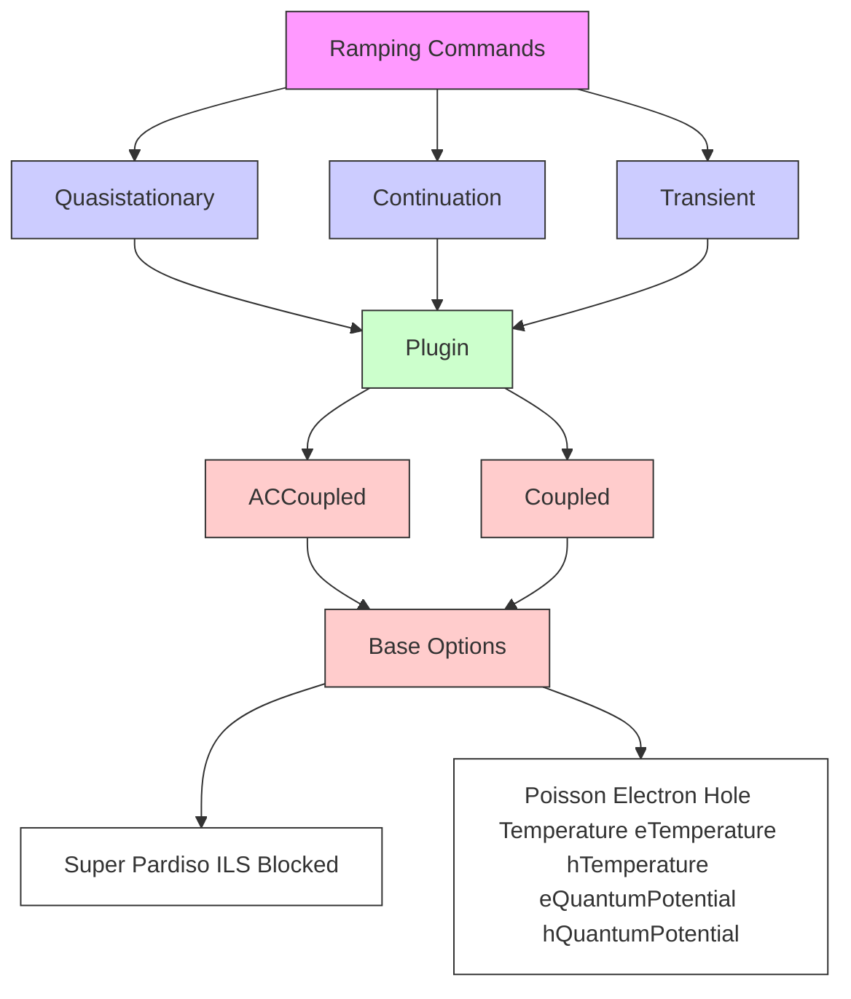
</details>

Figure 13 Different levels of Solve statements

# Nonlinear Iterations

# Coupled Statement

The Coupled statement activates a Newton-like solver over a set of equations. Available equations include the Poisson equation, continuity equations, and the different thermal and energy equations. The syntax of the Coupled statement is:

```txt
Coupled (<optional parameters>) { <equation>} 
```

or:

```txt
<equation> 
```

This last form uses only the keyword equation, which is equivalent to a coupled with default parameters and the single equation.

For example, if the following command is used, the electrostatic potential and electron density are computed from the resolution of the Poisson equation and electron continuity equation (using the default parameters):

```txt
Coupled {Poisson Electron} 
```

If the following command is used, only the electrostatic potential is computed using the Poisson equation:

Poisson

The Coupled statement is based on a Newton solver. This is an iterative algorithm in which a linear system is solved at each simulation step. Parameters of the command determine:

The maximum number of iterations allowed.   
The required precision of the solution.   
The linear solver that must be used.   
■ Whether the solution is allowed to worsen over a number of iterations.

These parameters and others are summarized in Table 192 on page 1379.

Th e following example limits the previous Coupled {Poisson Electron} example to ten iterations and uses the ILS linear solver:

```txt
Coupled ( Iterations=10 Method=ILS ) {Poisson Electron} 
```

NOTE Use a large number of iterations when the coupled iteration is not inside a ramping process. This allows the Newton algorithm to proceed as far as possible. Inside a ramping statement (for example, Transient or Quasistationary), the maximum number of iterations should be limited to approximately ten because, if the Newton process does not converge rapidly, it is preferable to try again with a smaller step size than to pursue an iterative process that is not likely to converge.

The best linear method to use in a coupled iteration depends on the type and size of the problem solved. Table 219 on page 1412 lists the solvers and the size of the problems for which they are designed.

# Convergence and Error Control

The Coupled statement is sensitive to the following Math parameters that determine when a coupled solution diverges or converges:

Iterations   
RhsAndUpdateConvergence   
RhsFactor, RhsMin, RhsMax   
CheckRhsAfterUpdate   
RelErrControl   
Digits   
ErrRef   
Error   
UpdateIncrease, UpdateMax

The parameter Iterations in the global Math section sets the default for Iterations of the Coupled statement. Iterations limits the number of Newton iterations. If the equation being solved is converging quadratically, the number of iterations might increase beyond this limit. For Iterations=0, only one iteration is performed.

Convergence of a solution in Sentaurus Device is determined by calculating and examining the following quantities at each Newton iteration:

■ RHS norm is the norm of the right-hand-side (that is, the residual of the equations).   
Update error is a measure of the updates to the equation variables.

These quantities are printed in the log file for each Newton iteration during a solution. By default, a solution is considered converged if the RHS norm < RhsMin or if the update error < 1. If RhsAndUpdateConvergence is specified, both of these criteria must be satisfied.

During a single Newton step, the solution is considered diverged if the RHS norm increases by more than a factor of RhsFactor. For transient simulations, the solution is considered diverged if the RHS norm exceeds RhsMax.

Specify CheckRhsAfterUpdate to force Sentaurus Device to perform an additional check on the RHS norm after the update error criteria is satisfied. If Sentaurus Device assesses that the RHS norm can be made smaller, additional iterations will be performed. This can sometimes improve the quality of a solution and might result in better overall convergence.

NOTE CheckRhsAfterUpdate usually adds no more than one or two extra iterations. However, when convergence is slow or when using extendedprecision accuracy, this option can result in several additional iterations if the RHS norm continues to be reduced. In such cases, a larger value for Iterations might be needed. In all cases, however, Sentaurus Device will accept a converged solution when the maximum number of iterations is reached, even if the RHS norm is still improving.

There are two formulations of the update error calculations used in Sentaurus Device, depending on whether RelErrControl (the default) or -RelErrControl is specified. For both formulations, Sentaurus Device tries to determine the value of an equation variable ,x such that the computed update is small enough to satisfy an error criterion:Δx

$$
\begin{array}{l} \frac {| \Delta x |}{| x | + x _ {\text { ref }}} <   \varepsilon_ {R}, \text { RelErrControl } \\ \frac {\left| \Delta x / x ^ {*} \right|}{\varepsilon_ {\mathrm{R}} \left| x / x ^ {*} \right| + \varepsilon_ {\mathrm{A}}} <   1, - \text { RelErrControl } \tag {31} \\ \end{array}
$$

where:

$\mathfrak { E } _ { \mathrm { R } } = 1 0 ^ { - \mathrm { D i g i t s } }$ is the relative error.   
$x _ { \mathrm { r e f } }$ is the reference error parameter.= ErrRef(<equation>)   
is the absolute error parameter.εA = Error(<equation>)   
$x ^ { * }$ is a scaling constant for the equation variable.

For large values of $x \ (  x   \infty )$ , the conditions in Eq. 31 become relative error criteria:

$$
\frac {| \Delta x |}{| x |} <   \varepsilon_ {\mathrm{R}} \tag {32}
$$

Conversely, for small values of ( ), they become absolute error criteria:x x → 0

$$
\left| \Delta x \right| <   x _ {\text { ref }} \cdot \varepsilon_ {\mathrm{R}} \quad \text { or } \quad \left| \Delta x / x ^ {*} \right| <   \varepsilon_ {\mathrm{A}} \tag {33}
$$

Therefore, Eq. 31 ensures a smooth transition between absolute and relative error control.

To account for all coupled equations at all vertices , Sentaurus Device extends thei j conditions in Eq. 31 and defines the update error as:

$$
\text { update   error } = \left\{ \begin{array}{l} \sqrt {\left(\sum_ {i = 1} ^ {N _ {i}} \sum_ {j = 1} ^ {N _ {v i}} \left(\frac {\left| \Delta x _ {i , j} \right|}{\varepsilon_ {\mathrm{R}} \left(\left| x _ {i , j} \right| + x _ {\text { ref } , i}\right)}\right) ^ {2}\right) / \left(\sum_ {i = 1} ^ {N _ {i}} N _ {v i}\right)}, \text { RelErrControl } \\ \sqrt {\left(\sum_ {i = 1} ^ {N _ {i}} \sum_ {j = 1} ^ {N _ {v i}} \left(\frac {\left| \Delta x _ {i , j} / x _ {i} ^ {*} \right|}{\varepsilon_ {\mathrm{R}} \left| x _ {i , j} / x _ {i} ^ {*} \right| + \varepsilon_ {\mathrm{A} , i}}\right) ^ {2}\right) / \left(\sum_ {i = 1} ^ {N _ {i}} N _ {v i}\right)}, - \text { RelErrControl } \end{array} \right. \tag {34}
$$

where:

$N _ { i }$ is the number of coupled equations.   
$N _ { \nu i }$ is the number of vertices being solved for equation .i

The value of $\mathfrak { E } _ { \mathrm { R } }$ is defined by specifying the keyword Digits.

The values of $x _ { \mathrm { r e f } }$ and $\varepsilon _ { \mathrm { A } }$ can be defined commonly or independently for each equation with the keywords ErrRef and Error, respectively. Default values are listed in Table 194 on page 1380.

The parameters UpdateMax and UpdateIncrease are used to detect divergence of the Newton algorithm. If the update error is larger than UpdateMax, or its increase from Newton step to Newton step exceeds UpdateIncrease, the Newton is regarded as diverged.

# Damped Newton Iterations

Line search damping and Bank–Rose damping are two different damping methods. These approaches try to achieve convergence of the coupled iteration far from the final solution by changing the solution by smaller amounts than a normal Newton iteration would. Damping is useful to find an initial solution, but during Quasistationary or Transient ramps, using smaller time steps is usually preferable.

Line search damping is switched off by default. It is activated when the value of LineSearchDamping is set to a value smaller than one. This value determines the minimum factor by which the normal Newton update $\Delta x$ can be damped. The damping method determines the actual damping factor automatically in each Newton step. If the actual factor falls below the minimum specified by LineSearchDamping, line search damping is considered to fail and is disabled for the following Newton iterations.

Bank–Rose damping is a method that automatically adjusts the size of the update based on how the RHS changes [1]. It can be used sometimes to improve convergence when large bias steps are taken.

Bank–Rose damping becomes activated when the number of iterations exceeds the value specified with NotDamped in the Math section (default is 1000).

LineSearchDamping and NotDamped are set in the global Math section and by parameters of the Coupled statement. The former specification sets the defaults for the latter.

# Derivatives

For most problems, Newton iterations converge best with full derivatives. Furthermore, for small-signal analysis, and noise and fluctuation analysis, using full derivatives is mandatory. Therefore, by default, Sentaurus Device takes full derivatives into account. For rare occasions where omission of derivatives improves convergence or performance significantly, use the keywords -AvalDerivatives and -Derivatives in the global Math section to switch off mobility and avalanche derivatives.

The derivatives are usually computed analytically, but a numeric computation can be used by specifying Numerically. This does not work with the method Blocked and, generally, is discouraged.

# Incomplete Newton Algorithm

Certain simple simulations, such as $\mathrm { I _ { d } { - } V _ { g } }$ ramps, can be accelerated by using a modified Newton algorithm (see Fully Coupled Solution on page 1028 for a description of the standard Newton algorithm). The incomplete Newton algorithm, also known as the Newton–Richardson method, tries to reuse the Jacobian matrix to avoid the expense of evaluating derivatives and computing matrix factorizations.

It can be switched on either in the global Math section:

```txt
Math {
IncompleteNewton
...
}
```

or it can be used as an option in a Coupled statement:

```txt
Coupled (IncompleteNewton) {poisson electron hole} 
```

The Jacobian matrix is reused if the following two conditions are satisfied:

$$
\left\| \mathrm{Rhs} _ {k} \right\| <   \text { RhsFactor } \cdot \left\| \mathrm{Rhs} _ {k - 1} \right\| \tag {35}
$$

$$
\left\| \text { Update } _ {k} \right\| <   \text { UpdateFactor } \cdot \left\| \text { Update } _ {k - 1} \right\| \tag {36}
$$

where denotes the iteration index, Rhs denotes the right-hand side of the nonlineark equations, and Update denotes the Newton step. The values of and areRhsk Updatek displayed in the log file of Sentaurus Device during Newton iterations in the columns |Rhs| and |step|.

The parameters RhsFactor and UpdateFactor can be specified as arguments to the IncompleteNewton keyword:

IncompleteNewton (UpdateFactor=0.1 RhsFactor=10)

The default values are UpdateFactor=0.1 and RhsFactor=10.

# Additional Equations Available in Mixed Mode

The Contact, Circuit, TContact, and TCircuit equations are introduced for mixedmode problems:

■ The keyword Circuit activates the solution of the electrical circuit models and nodes.   
The keyword Contact activates the solution of the electrical interface condition at the contacts.   
Similarly, TContact and TCircuit activate the solution of the thermal interface condition and the thermal circuit, respectively.

By default, the keywords Contact and Circuit are not required because the Poisson equation also covers the contact and circuit domains. If only the Poisson equation is solved, no additional equations are added. Only if additional equations to Poisson appear in a Coupled statement, the circuit and contact equations are also added. Therefore:

Coupled { Poisson Electron Hole }

is equivalent to:

Coupled { Poisson Electron Hole Circuit Contact }

NOTE Sentaurus Device does not add circuit and contact equations if Poisson is restricted to instances. For example:

Coupled {device1.Poisson device1.Electron device1.Hole device2.Poisson device2.Electron device2.Hole}

If the keyword NoAutomaticCircuitContact appears in the Math section, Sentaurus Device does not add the circuit and contact equations automatically (see Figure 14).


<details>
<summary>text_image</summary>

Default
Poisson
Electron
Hole
</details>


<details>
<summary>text_image</summary>

NoAutomaticCircuitContact
Circuit
Contact
Poisson Electron Hole
</details>

Figure 14 Range of equation keywords Circuit, Contact, Poisson, Electron, and Hole

# Selecting Individual Devices in Mixed Mode

The default usage of an equation keyword such as Poisson activates the given equations for all devices. With complex multiple-device systems, such an action is not always desirable especially when a fully consistent solution has not yet been found. Sentaurus Device allows each equation to be restricted to a specific device by adding the name of the device instance to the equation keyword separated with a period. The syntax is:

```xml
<identifier>.<equation> 
```

Device-specific solutions are used to obtain the initial solution for the whole system. For example, with two or more devices, it is often better to solve each device individually before coupling them all. Such a scheme can be written as:

```txt
System {
    ... device1 ...
    ... device2 ...
}
Solve {
    # Solve Circuit equation Circuit

    # Solve poisson and full coupled for each device
    Coupled { device1.Poisson device1.Contact }
    Coupled { device1.Poisson device1.Contact
    device1.Electron device1.Hole }
    Coupled { device2.Poisson device2.Contact }
    Coupled { device2.Poisson device2.Contact
    device2.Electron device2.Hole }

    # Solve full coupled over all devices
    Coupled { Circuit Poisson Contact Electron Hole }
} 
```

# Relaxed Newton Method

The relaxed Newton method allows Sentaurus Device to consider whether a solution that has neither converged nor diverged by the final Newton iteration should be accepted as a converged solution based on relaxed convergence criteria. This method applies to Quasistationary, Transient, and Continuation ramps.

Relaxed convergence criteria are established from relaxed Newton parameters that are specified by users in the AcceptNewtonParameter (ANP) statement of the global Math section. These parameters are used to calculate an ANP RhsMin and an ANP error that will be used to test for relaxed convergence:

```txt
Math { ... AcceptNewtonParameter (
    [RhsAndUpdateConvergence] * Use -RhsAndUpdateConvergence to relax
    * convergence
    [RhsMin=<float>] * The ANP RhsMin that is used for relaxed
    * convergence
    [UpdateScale=<float>] * This multiplies update error to give
    * a relaxed ANP error
    [RelErrControl] * Specifies the error control method for
    * calculating the ANP error
    [Digits=<integer>] * The number of relative error digits in the
    * ANP error calculation
    [ErrRef (
    [Poisson=<float>] [Electron=<float>] [Hole=<float>]
    [Temperature=<float>] [eTemperature=<float>] [hTemperature=<float>]
    [eQuantumPotential=<float>] [hQuantumPotential=<float>]
    )]
    [Error (
    [Poisson=<float>] [Electron=<float>] [Hole=<float>]
    [Temperature=<float>] [eTemperature=<float>] [hTemperature=<float>]
    [eQuantumPotential=<float>] [hQuantumPotential=<float>]
    )]
    [InvokeAtDivergence] * Allows relaxed convergence for diverging
    * solutions
) 
```

To activate the relaxed Newton method, specify AcceptNewtonParameter in the Quasistationary, Transient, or Continuation statements of the Solve section, along with a ReferenceStep (except for Continuation). For example:

```txt
Solve { ...
    Quasistationary ( ...
    AcceptNewtonParameter ( ReferenceStep = 1.e-3 )
    ) { Coupled { ... } }
}

or:

Solve { ...
    Transient ( ...
    AcceptNewtonParameter ( ReferenceStep = 1.e-9 )
    ) { Coupled { ... } }
}

or:

Solve { ...
    Continuation ( ...
    AcceptNewtonParameter
    ) { Coupled { ... } }
} 
```

During the simulation, if the Quasistationary or Transient step size is reduced below the value specified with ReferenceStep, Sentaurus Device will begin to calculate an ANP error in addition to the standard update error for each Newton iteration during a solution. This will be used to determine whether relaxed convergence has been achieved if the solution fails to converge using the standard error criteria. For Continuation, the check for relaxed convergence is activated for all step sizes.

Relaxed convergence is considered achieved if the calculated ANP error < 1 or the RHS norm < ANP RhsMin, for any iteration. If relaxed convergence is achieved, Sentaurus Device will store the solution obtained from the iteration with the smallest standard update error occurring after relaxed convergence is triggered. In most cases, this is a reasonable choice for the “best” solution.

# Note the following:

The relaxed Newton parameters are passed only to the next-level Coupled statements, that is, Coupled statements in Plugin statements do not use the relaxed Newton parameters.   
Only specified parameter values are passed to the Coupled statement, that is, no default values are used.

# Plugin Command

The Plugin command controls an iterative loop over two or more Coupled statements. It is used when a fully coupled method would use too many resources of a given machine, or when the problem is not yet solved and a full coupling of the equations would diverge.

The Plugin syntax is defined as:

```txt
Plugin (<options>) (<list-of-coupled-commands>) 
```

Plugin commands can have any complexity but, usually, only a few combinations are effective. One standard form is the Gummel iteration in which each basic semiconductor equation is solved consecutively.

With the Plugin command, this is written as:

```txt
Plugin { Poisson Electron Hole } 
```

Table 199 on page 1385 summarizes the options of Plugin.

Plugin commands can be used with other Plugin commands, such as:

```txt
Plugin{ Plugin{ ... } Plugin { ... } } 
```

Figure 15 illustrates the corresponding loop structure. A hierarchy of Plugin commands allows more complex iterative solve patterns to be created.   


<details>
<summary>flowchart</summary>


</details>

Figure 15 Example of hierarchy of Plugin commands

# Linear Solvers

The Math parameters to the solution algorithms are device independent and must appear only in the base Math section. These can be grouped by solver type. The control parameters for the linear solvers are Method and SubMethod. The keyword Method selects the linear solver to be used, and the keyword SubMethod selects the inner method for block-decomposition methods (see Table 219 on page 1412 for available linear solvers).

The keywords ACMethod and ACSubMethod determine the linear solver used for AC analysis.

NOTE ACMethod=Blocked is the only valid choice for ACMethod. However, any of the available linear solvers can be selected for ACSubMethod.

Table 219 on page 1412 lists available options for the linear solver PARDISO. The options are specified in parentheses after the solver specification:

Method = ParDiSo (NonsymmetricPermutation IterativeRefinement)

The default options NonsymmetricPermutation, -IterativeRefinement, and -RecomputeNonsymmetricPermutation provide the best compromise between speed and accuracy. To improve speed, select -NonsymmetricPermutation.

To improve accuracy, at the expense of speed, activate IterativeRefinement, or RecomputeNonsymmetricPermutation, or both.

All ILS options can be specified within an ILSrc statement in the global Math section:

```txt
Math {
    ILSrc = " 
    set (...) {
    iterative (...);
    preconditioning (...);
    ordering (...);
    options (...);
    };
    ...
    "
    ...
} 
```

See Table 219 on page 1412 for additional ILS options.

The two linear solvers PARDISO and ILS support the option MultipleRHS to solve linear systems with multiple right-hand sides. This option is only appropriate for AC analysis. ILS might produce a small parallel speedup or slightly more accurate results if this option is selected.

Use the Math option PrintLinearSolver to obtain additional information regarding the linear solver being used.

# Nonlocal Meshes

Nonlocal meshes are one-dimensional, special-purpose meshes that Sentaurus Device needs to implement one-dimensional, nonlocal physical models. A nonlocal mesh consists of nonlocal lines. Each nonlocal line is subdivided by nonlocal mesh points, to allow for the discretization of the equations that constitute the physical models. Sentaurus Device performs this subdivision automatically to obtain optimal interpolation between the nonlocal mesh and the normal mesh.

The 1D Schrödinger equation (see 1D Schrödinger Equation on page 287), the nonlocal tunneling model (see Nonlocal Tunneling at Interfaces, Contacts, and Junctions on page 734), and the trap tunneling model (see Nonlocal Tunneling for Traps on page 476) use nonlocal meshes. The documentation of the first two models introduces the use of nonlocal meshes in the context of the particular model and is restricted to typical cases. This section describes the construction of nonlocal meshes in detail.

# Specifying Nonlocal Meshes

You specify nonlocal meshes using the keyword Nonlocal, in the global Math section, followed by a string that gives the name of the nonlocal mesh and a list of options that control the construction of the nonlocal mesh. You can specify any number of nonlocal meshes; individual specifications are independent.

In the following example, Sentaurus Device constructs a nonlocal mesh named GateNonLocalMesh that consists of nonlocal lines for semiconductor vertices up to a distance of from the Gate electrode:5 nm

```txt
Math {
    Nonlocal "GateNonLocalMesh" (
    Electrode="Gate"
    Length=5e-7
    )
} 
```

In the following example, Sentaurus Device constructs a nonlocal mesh named for\_tunneling that consists of lines that connect the different sides of the region gateoxide:

```solidity
Math {
    Nonlocal "for_tunneling" (
    Barrier(Region="gateoxide")
    )
} 
```

For a summary of available options, see Table 222 on page 1413. For a comprehensive description of the construction of a nonlocal mesh, see Constructing Nonlocal Meshes on page 151.

# Visualizing Nonlocal Meshes

Sentaurus Device can visualize the nonlocal meshes it constructs. This feature is used to verify that the nonlocal mesh constructed is the one actually intended. For visualizing data defined on nonlocal meshes, see Visualizing Data Defined on Nonlocal Meshes on page 150.

To visualize nonlocal meshes, use the keyword NonLocal in the Plot section (see Device Plots on page 123). The keyword causes Sentaurus Device to write two vector fields to the plot file that represent the nonlocal meshes constructed in the device.

For each vertex (of the normal mesh) for which a nonlocal line exists, the first vector field NonLocalDirection contains a vector that points from the vertex to the end of the nonlocal line in the direction of the reference surface for which the nonlocal line was constructed. The vector in the second field NonLocalBackDirection points from the vertex to the other end of the nonlocal line. The unit of both vectors is .μm

For vertices for which no nonlocal line exists, both vectors are zero. For vertices for which more than one nonlocal line exists, Sentaurus Device plots the vectors for one of these lines.

# Visualizing Data Defined on Nonlocal Meshes

To visualize data defined on nonlocal meshes:

■ In the File section, specify a file name using the NonLocalPlot keyword.

On the top level of the command file, specify a NonLocalPlot section. There, NonLocalPlot is followed by a list of coordinates in parentheses and a list of datasets in braces.

Sentaurus Device writes nonlocal plots at the same time it writes normal plots. Nonlocal plot files have the extension .plt or .tdr.

Sentaurus Device picks nonlocal lines close to the coordinates specified in the NonLocalPlot section for output. The datasets given in the NonLocalPlot section are the datasets that can be used in the Plot section (see Device Plots on page 123). NonLocalPlot does not support the /Vector option. In addition, the Schrödinger equation provides special-purpose datasets available only for NonLocalPlot (see Visualizing the Solutions on page 292).

In addition to the datasets explicitly specified, Sentaurus Device automatically includes the Distance dataset in the output. It provides the coordinate along the nonlocal line. The values in the Distance dataset are measured in . The interface or contact for which a nonlocalμm mesh line was constructed is located at zero, and its mesh vertex is located at positive coordinates.

The following example plots electron and hole densities for the nonlocal lines close to the coordinates and in the device:( ) 0 0 0 , , ( ) 0 1 0 , ,

```txt
NonLocalPlot(
    (0 0) (0 1)
) {
    eDensity hDensity
} 
```

# Constructing Nonlocal Meshes

Nonlocal meshes are specified in the global Math section:

```txt
Math {
    NonLocal <string> (
    Barrier(...)
    RegionInterface=<string>
    MaterialInterface=<string>
    Electrode=<string>
    ...
    )
} 
```

The string following NonLocal is the name of the nonlocal mesh. The name relates the nonlocal mesh to the physical models defined on it.

Sentaurus Device supports two ways to specify nonlocal meshes:

■ By specifying the regions and materials that form the tunneling barrier (keyword Barrier).   
■ By specifying a reference surface (keywords RegionInterface, MaterialInterface, and Electrode).

The Barrier specification is simpler but less general, and it is only suitable for nonlocal meshes used for direct tunneling through insulator barriers.

# Specification Using Barrier

As an option to Barrier, specify all regions that belong to the tunneling barrier, using any number of Region=<string> or Material=<string> specifications. Sentaurus Device connects each side of the barrier to any other with nonlocal lines. Here, side means a conductively connected part of the surface of the barrier.

By default, semiconductor regions, metal regions, and electrodes are considered to be conductive. To enforce that a particular region (such as a wide-bandgap semiconductor region) is treated as not conductive, use the option -Endpoint, which accepts as an option a list of regions and materials, using the same syntax as for Barrier. For example:

```lua
Nonlocal "NLM" (
...
-Endpoint(Material="GaN" Region="buffer1" Region="buffer2")
)
```

will cause regions buffer1 and buffer2, and all GaN regions to be considered nonconductive when constructing the nonlocal mesh NLM.

Use Length=<float> (in centimeters) to restrict the length on nonlocal lines (to suppress very long tunneling paths).

# Specification Using a Reference Surface

RegionInterface, MaterialInterface, and Electrode specify a region interface name, material interface name, or electrode name. All interfaces and electrodes together form the reference surface that determines where in the device the nonlocal mesh is constructed.

The nonlocal lines link vertices of the normal mesh to the reference surface on the geometrically shortest path. The parameter Length of NonLocal determines the maximum distance of the vertex to the reference surface (in centimeters). Sentaurus Device provides no default value for Length; all nonlocal meshes must specify Length explicitly.

Length and Permeation are limited to the value of the parameter NonLocalLengthLimit, which is specified in centimeters in the global Math section and defaults to . This10–4 parameter is used to capture cases where users accidentally specify lengths in micrometers rather than centimeters.

The property that nonlocal lines connect a vertex to the reference surface on the geometrically shortest path is fundamental. If any of the other rules described in this section inhibits the construction of a nonlocal line for this path, but a longer connection obeys all these restrictions, Sentaurus Device still does not use this connection to construct an alternative nonlocal line.

The parameter Permeation specifies a length by which Sentaurus Device extends the nonlocal lines, across the reference surface, towards the opposite of the side for which the line is constructed. Permeation defaults to zero. Sentaurus Device never extends the lines outside the device or into regions flagged with -Permeable (see below). The extension is not affected by the Transparent and Endpoint options (see below).

The Direction parameter specifies a direction that the nonlocal lines approximately should have. Nonlocal lines with directions that deviate from the specified direction by an angle greater than MaxAngle are suppressed. If Direction is the zero vector or MaxAngle exceeds 90 (this is the default), nonlocal lines can have any direction. The length and sign of the direction vector are otherwise insignificant.

Discretization specifies the maximum spacing of the nonlocal mesh vertices. When necessary, Sentaurus Device further refines the mesh created on a nonlocal line according to the built-in rules to yield a spacing no bigger than Discretization demands.

The flags Transparent, Permeable, Endpoint, and Refined, as well as their negation, specify flags for regions or materials that control nonlocal mesh construction. Each of the flags can be specified in two different ways:

■ As an option to the main specification in the global Math section.   
■ As an option to NonLocal in a region-specific or material-specific Math section.

In the former case, the flag is followed by a list of region or material specifications that determine where the flag applies. In the latter case, the region or material of applicability is the location of the Math specification. Specifications of the latter style provide defaults that can be overwritten by specifications of the former style.

The part of a nonlocal line between the mesh vertex for which the line is constructed and the reference surface must not pass through regions flagged with -Transparent. By default, all regions are Transparent. For the exterior of the device, the flag Outside has the same meaning; this flag is an option to the main NonLocal specification.

The -Permeable flag limits extension on nonlocal lines across the reference surface. By default, all regions are Permeable.

For regions flagged with -Endpoint, Sentaurus Device does not construct nonlocal lines that end in this region. The default is -Endpoint for insulator regions, and Endpoint for other regions.

Inside regions flagged as -Refined, the generation of nonlocal mesh points at element boundaries is suppressed. By default, all regions are Refined.

# Special Handling of the 1D Schrödinger Equation

For performance reasons, Sentaurus Device solves the 1D Schrödinger equation (see 1D Schrödinger Equation on page 287) only on a reduced subset of nonlocal lines that still cover all vertices of the normal mesh for which nonlocal lines are constructed according to the rules outlined above.

To avoid artificial geometric quantization, Sentaurus Device extends nonlocal lines used for the 1D Schrödinger equation that are shorter than Length to reach full length. Sentaurus Device never extends the lines outside the device or into regions flagged by the -Permeable option. The extension is not affected by the Transparent and Endpoint options.

For nonlocal line segments in regions not marked by -Refined and -Endpoint, Sentaurus Device computes the intersections with the boxes of the normal mesh. Sentaurus Device needs this information to interpolate results from the 1D Schrödinger equation back to the normal mesh. Therefore, in regions where -Refined or -Endpoint is specified, 1D Schrödinger density corrections are not available, even when the regions are covered by nonlocal lines.

# Special Handling of the Nonlocal Tunneling Model

Sentaurus Device computes the intersections of the nonlocal lines with the boxes (see Discretization on page 1003). To this end, some lines might become longer than Length. The nonlocal tunneling model uses the intersection points to limit the spatial range of the integrations Sentaurus Device must perform to compute the contribution to tunneling that comes from the particular vertex (see Nonlocal Tunneling at Interfaces, Contacts, and Junctions on page 734). For mesh points that border regions flagged with -Endpoint, the integration range is extended into that region, to pick up the Fowler–Nordheim current that enters it.

For nonlocal meshes used only for nonlocal tunneling, when Permeation is zero, Sentaurus Device assumes that the nonlocal lines cross the reference plane by an infinitesimal length. Therefore, if -Endpoint is specified for one of the regions that border the reference plane, Sentaurus Device suppresses nonlocal lines that point into that region.

If Permeation is positive, for nonlocal lines at nonmetal interfaces, Sentaurus Device switches to a nonlocal mesh construction mode similar to the one used for the Schrödinger equation: Sentaurus Device constructs only as many lines as needed to cover all vertices that must be covered, and extends all those lines to their maximum length. Furthermore, for nonlocal meshes not used for tunneling to traps, the integration range for tunneling covers the entire line.

Tunneling to and from segments of the line marked by –Endpoint or –Refined will be assigned to the vertices for boxes crossed immediately outside those segments, to pick up Fowler–Nordheim currents in a similar manner as for the line construction mode with Permeation=0.

# Unnamed Meshes

For backward compatibility, you can specify nonlocal meshes in interface-specific or electrode-specific Math sections. For this kind of specification, the location of the mesh is the location of the Math section and, therefore, no interface or electrode specification must appear as an option to NonLocal.

Furthermore, the name of the nonlocal mesh must be omitted. Physical models are associated with the nonlocal mesh by activating them in a Physics section specific to the same interface or electrode for which the nonlocal mesh was constructed.

For unnamed nonlocal meshes, vertices in regions with the trap tunneling model (see Nonlocal Tunneling for Traps on page 476) are connected irrespective of the material of the region or the Endpoint specification.

# Performance Suggestions

To limit the negative performance impact of the nonlocal tunneling model, it is important to limit the number of nonlocal lines. To this end, most importantly, select Length and Permeation to be only as long as necessary. The option –Endpoint can be used to suppress the construction of lines to regions for which you know, in advance, that will not receive much tunneling current. The option -Transparent allows you to neglect tunneling through materials with comparatively high tunneling barrier, for example, oxides near a Schottky contact or heterointerface for which nonlocal tunneling has been activated.

Another use of the option -Transparent is at heterointerfaces, where there is no tunneling to the side of the material with the lower band edge (as there is no barrier to tunnel through). To restrict the construction of nonlocal lines to lines that go through the larger band-edge material, declare the lower band-edge material as not transparent by using -Transparent.

The option -Refined does not reduce the number of nonlocal lines, but it can reduce the size of the Jacobian matrix. The option -Refined is most useful for insulator regions, where the band-edge profile is approximately linear.

# Monitoring Convergence Behavior

When Sentaurus Device has convergence problems, it can be helpful to know in which parts of the device and for which equations the errors are particularly large. With this information, it is easier to adjust the mesh or the models used, to improve convergence.

Sentaurus Device can print the locations in the device where the largest errors occur (see CNormPrint). This provides limited information and has negligible performance impact. Sentaurus Device can also plot solution error information for the entire device after each Newton step (see NewtonPlot). This information is comprehensive, but can generate many files and can take significant time to write.

Both approaches provide access to the internal data of Sentaurus Device. Therefore, in both cases, the output is implementation dependent. Its proper interpretation can change between different Sentaurus Device releases.

# CNormPrint

To obtain basic error information, specify the CNormPrint keyword in the global Math section. Then, after each Newton step and for each equation solved, Sentaurus Device prints the following to standard output:

Largest error according to Eq. 33, p. 140 that occurs anywhere in the device for the equation   
Vertex where the largest error occurs   
■ Coordinates of the vertex   
Current value of the solution variable for that vertex

# NewtonPlot

Sentaurus Device can write the spatial values of solution variables, the errors, the right-hand sides, and the solution updates to a NewtonPlot file after each Newton step. NewtonPlot files then can be read into Sentaurus Visual for examination. To use this feature:

■ Use the NewtonPlot keyword in the File section to specify a file name for the plot. This name can contain up to two C-style integer format specifiers (for example, %d). If present, for the file name generation, the first one is replaced by the iteration number in the current Newton step and the second, by the number of Newton steps in the simulation so far. Sentaurus Device does not enforce any particular file name extension, but prepends the device instance name to the file name in mixed mode.

■ Sentaurus Device writes Newton information to a NewtonPlot file during execution of a Quasistationary or Transient command when the step size decreases below a certain value. By default, the criterion is , where MinStep is thestep size 2 < × MinStep lower limit for the step size that is set in a Quasistationary or Transient command. This condition usually occurs immediately before a simulation is about to fail.   
Alternatively, use the NewtonPlotStep parameter to specify the step-size criterion. NewtonPlotStep can be specified as an option to the NewtonPlot keyword in the Math section of the command file, in which case, it applies to all Quasistationary and Transient commands. It also can be specified as an option to a particular Quasistationary or Transient command, in which case, it only applies to that particular command.   
By default, when the step-size criterion is met, Sentaurus Device writes the current values of the solution variables only to the NewtonPlot file. Additional data can be included in the output by specifying options to NewtonPlot in the Math section. See Table 214 on page 1395 for a list of available options.   
In addition, MinError can be specified as an option to NewtonPlot. If present, Sentaurus Device writes the NewtonPlot file only if the error of the actual iteration is smaller than all previous errors within the current Newton step. In this case, the first %d format specifier in the NewtonPlot file name will be replaced with min instead of the iteration number.

# Automatic Activation of CNormPrint and NewtonPlot

By default, CNormPrint and NewtonPlot are activated automatically when certain criteria are met:

■ For CNormPrint:  step size < AutoCNPMinStepFactor MinStep ×   
For NewtonPlot:  step size < AutoNPMinStepFactor MinStep ×

where the step size is calculated during the execution of a Quasistationary or Transient statement, and AutoCNPMinStepFactor and AutoNPMinStepFactor are parameters that can be specified in the Math section of the command file:

```hcl
Math {
    AutoCNPMinStepFactor = <float>    #default = 2.0
    AutoNPMinStepFactor = <float>    #default = 2.0
} 
```

You can deactivate the automatic activation of CNormPrint and NewtonPlot by specifying values of zero for the above parameters.

When NewtonPlot files are created as a result of automatic activation, the Error, Residual, Update, and MinError options for NewtonPlot will be used by default. However, any userspecified options for NewtonPlot in the Math section of the command file will override the default behavior.

In addition, NewtonPlot will be activated automatically for solutions that are not part of a Quasistationary or Transient when the maximum-allowed iterations for the solution have been reached. The same output options described in the previous paragraph will be used in this case as well (except for MinError), and the iteration number will replace the %d format specifier in the file name.

# Simulation Statistics for Plotting and Output

# Simulation Statistics in Current Plot Files

To include various simulation statistics in current plot files for visualization, specify the SimStats option in the Math section of the command file:

Math {SimStats}

When this option is specified, Sentaurus Device will write a SimStats group of datasets to the current plot file (\*.plt file) after each successful solution. The following datasets are included in the SimStats group:

<table><tr><td>Restarts</td><td>Number of consecutive restarts before the solution converged</td></tr><tr><td>CumulativeRestarts</td><td>Total number of restarts so far</td></tr><tr><td>Stepsize</td><td>Step size used for quasistationary or transient solution</td></tr><tr><td>Rhs</td><td>Final RHS norm for the solution</td></tr><tr><td>error</td><td>Final error for the solution</td></tr><tr><td>Iterations</td><td>Number of iterations required for solution</td></tr><tr><td>CumulativeIterations</td><td>Total number of iterations so far</td></tr><tr><td>AssemblyTime</td><td>CPU time spent building RHS and Jacobian for the solution</td></tr><tr><td>SolveTime</td><td>CPU time used by solver for the solution</td></tr><tr><td>TotalTime</td><td>Total CPU time for the solution (includes overhead time)</td></tr><tr><td>CumulativeAssemblyTime</td><td>Total assembly time so far</td></tr><tr><td>CumulativeSolveTime</td><td>Total solve time so far</td></tr><tr><td>CumulativeTotalTime</td><td>Total CPU time so far</td></tr><tr><td>AssemblyTime_wall</td><td>Wallclock time spent building RHS and Jacobian for the solution</td></tr></table>

```txt
SolveTime_wall Wallclock time used by solver for the solution
TotalTime_wall Total wallclock time for the solution (includes overhead time)
CumulativeAssemblyTime_wall Total wallclock assembly time so far
CumulativeSolveTime_wall Total wallclock solve time so far
CumulativeTotalTime_wall Total wallclock time so far
PeakMemory Peak memory (watermark) so far
AverageMemory Average memory for the time step 
```

# Simulation Statistics in Design-of-Experiments Variables

Cumulative simulation statistics can be written to the end of a Sentaurus Device output file (\*.log file) as design-of-experiments (DOE) variables by specifying the WriteDOE option to SimStats in the Math section:

```txt
Math {
    SimStats (WriteDOE [DOE_prefix = <string>])
} 
```

When WriteDOE is specified, the following DOE variables will be written:

```xml
DOE: Restarts <value>
DOE: Iterations <value>
DOE: AssemblyTime <value>
DOE: SolveTime <value>
DOE: TotalTime <value>
DOE: AssemblyTime_wall <value>
DOE: SolveTime_wall <value>
DOE: TotalTime_wall <value> 
```

The option DOE\_prefix allows a string to be prepended to the DOE variable names. For example, specifying DOE\_prefix = "test\_" writes the DOE variable test\_Restarts instead of Restarts.

# Save and Load

The Save and Load statements allow you to store the current simulation state of a device in a file and later (often, from another simulation run) to reload it, and to resume from where you stopped. By default, Plot files can be reloaded as well (see Device Plots on page 123).

The Save statement generates files of type .sav, which only contain the information required to restart a simulation such as:

Contact biases and currents   
Values of solution variables   
Occupation probability of traps   
Ferroelectric history (electric field and polarization) if the ferroelectric model is switched on

Loading traps is supported only if the specifications of traps for the saving and loading simulation are identical, that is, the set of traps and their order in the command file must be identical, as well as their types. A mismatch of trap specifications is silently ignored and could lead to partially correctly, incorrectly, or not loaded trap occupations. In this case, you must verify if the traps are initialized as intended.

When the file is loaded, all this information is restored.

NOTE Contact voltages stored in the loaded file overwrite the bias conditions that are specified in the command file.

When you specify a Save file in the File section, the simulation state is saved automatically to that file at the end of the simulation. When you specify a Load file in the File section, the state stored in that file is loaded at the beginning of the simulation. The geometry of a loaded file must match the geometry specified in the Grid file.

NOTE Interfaces regions are required in the grid file to save and load data on interfaces (see Interface Plots on page 127).

More control is possible with Save and Load commands in the Solve section. The commands are defined as:

```txt
Save(<parameters-opt>) <system-opt>
Load(<parameters-opt>) <system-opt> 
```

The options are as for Plot (see When to Plot on page 125). Save statements can be used at any level of the Solve section, and the Load statement can be used only as a base level of the Solve section. For example, in the case of a transient simulation, Load can be used only before or after the transient, not during it.

Multiple Load and Save commands are allowed in a Solve section. For example:

```python
Solve {
    ...
    # Ramp the gate and save structures
    # First gate voltage
    Quasistationary (InitialStep=0.1 MaxStep=0.1 MinStep=0.01) 
```

```txt
Goal {Name="gate" Voltage=1}
{Coupled {Poisson Electron Hole}}
Save(FilePrefix="vg1")

# Second gate voltage
Quasistationary (InitialStep=0.1 Maxstep=0.1 MinStep=0.01
Goal {Name="gate" Voltage=3})
{Coupled {Poisson Electron Hole}}
Save(FilePrefix="vg2")

# Load the saved structures and ramp the drain
# First curve
Load(FilePrefix="vg1")
NewCurrentPrefix="Curve1"
Quasistationary (InitialStep=0.1 MaxStep=0.5 MinStep=0.01
Goal {Name="drain" Voltage=2.0})
{Coupled {Poisson Electron Hole}}
# Second curve
Load(FilePrefix="vg2")
NewCurrentPrefix="Curve2"
Quasistationary (InitialStep=0.1 MaxStep=0.5 MinStep=0.01
Goal {Name="drain" Voltage=2.0})
{Coupled {Poisson Electron Hole}} 
```

# Tcl Command File

The Sentaurus Device command-line option --tcl invokes the Tcl interpreter to execute the command file. Tcl provides valuable extensions to the standard command file of Sentaurus Device, including:

Variables   
Expressions   
Control structures

In addition, all of the Inspect Tcl batch commands are available (refer to the Inspect User Guide). These commands are useful for the purpose of parameter extraction (see Extracting Parameters on page 165).

# Performing Device Simulations

An entire device simulation can be performed using the Tcl command sdevice. The following example shows a quasistationary ramp to computed contact values:

```tcl
set vd 0.2
set vg [expr {10*$vd}] 
```

# 6: Numeric and Software-Related Issues

Tcl Command File

```hcl
sdevice "
Electrode{
    { Name = \"source\" Voltage = 0.0 }
    { Name = \"gate\" Voltage = 0.0 }
    { Name = \"drain\" Voltage = $vd }
    { Name = \"bulk\" Voltage = 0.0 }
}

File{
    Grid = \"mosfet.tdr\"
    Plot = \"mosfet_des.tdr\"
    Current = \"mosfet_des.plt\"
    Output = \"mosfet_des.log\"
}

Physics {
    Mobility (DopingDependence)
    Recombination (SRH (DopingDependence))
}

Solve{
    Poisson
    QuasiStationary (Goal {Name=\"gate\" Voltage=$vg})
    { Coupled {Poisson Electron Hole} }
}
" 
```

Sometimes, it is more useful to perform a device simulation in stages. In this case, the sdevice\_init command is used for initialization, and multiple sdevice\_solve commands are used to drive the simulation.

In the following example, an $\mathrm { I _ { d } { - } V _ { g } }$ sweep is performed, and the threshold voltage is extracted from the current plot file:

```hcl
# initialize Sentaurus Device simulation
sdevice_init {
    Electrode{
    { Name = "source" Voltage = 0.0 }
    { Name = "gate" Voltage = 0.0 }
    { Name = "drain" Voltage = 0.2 }
    { Name = "bulk" Voltage = 0.0 }
    }

    File{
    Grid = "mosfet.tdr"
    Plot = "extract_VT_des.tdr"
    Current = "extract_VT_des.plt"
    Output = "extract_VT_des.log"
} 
```

```txt
Physics{
    EffectiveIntrinsicDensity (Slotboom)
    Mobility (DopingDependence)
    Recombination (SRH (DopingDependence))
}
# compute idvgs curve
sdevice_solve {
    Solve{
    NewCurrentPrefix = "initial_"

    Poisson
    Coupled {Poisson Electron Hole}

    Save (FilePrefix = "extract_VT_initial_save")

    NewCurrentPrefix = ""
    QuasiStationary (
    InitialStep=0.05 Increment=1.3
    MaxStep=0.05 MinStep=1e-4
    Goal {Name="gate" Voltage=2}
    )
    { Coupled {Poisson Electron Hole} }
    }
}

# extract threshold voltage
set VT [extract_VT extract_VT_des.plt gate drain]

# ramp gate voltage to threshold voltage
sdevice_solve "
    Solve{
    NewCurrentPrefix = \"ignore_"

    Load (FilePrefix = \"extract_VT_initial_savesein")

    QuasiStationary (
    InitialStep=0.25 Increment=1.3
    MaxStep=0.25 MinStep=1e-4
    Goal {Name=\"gate\" Voltage=$VT}
    )
    { Coupled {Poisson Electron Hole} }
    }
"

# save final plot file
sdevice_finish 
```

The final command sdevice\_finish signals the end of a sequence of sdevice\_solve statements, and Sentaurus Device saves the final plot files.

Figure 16 shows the sequence in which the various Tcl sdevice commands can be invoked.


<details>
<summary>flowchart</summary>

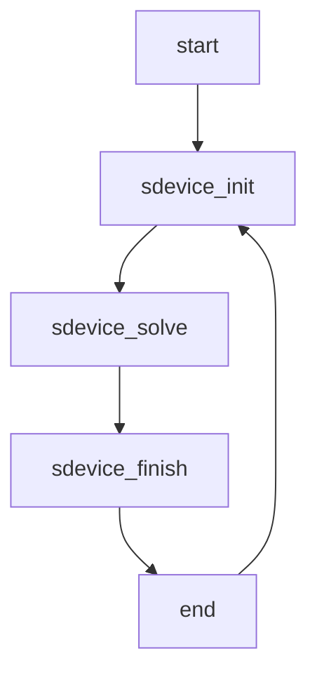
</details>

Figure 16 Flowchart of sequence for Tcl commands

# sdevice Command

The Tcl sdevice command expects one argument, which describes an entire device simulation, that is, it includes a File section, Physics section, and Solve section.

The sdevice command returns 1 if the device simulation converges. Otherwise, the value 0 is returned.

# sdevice\_init Command

The Tcl sdevice\_init command expects one argument, which initializes a device simulation, that is, it can contain all of the sections of a standard command file of Sentaurus Device (except a Solve section).

No return value is computed by sdevice\_init. If an error is encountered, Sentaurus Device will terminate.

# sdevice\_solve Command

The Tcl sdevice\_solve command expects one argument. It can only be used after an sdevice\_init command. The argument must contain a single Solve section. All the commands in the Solve section are executed.

The sdevice\_solve command returns 1 if the device simulation converges. Otherwise, the value 0 is returned.

# sdevice\_finish Command

The Tcl sdevice\_finish command expects no arguments and can be called after a series of sdevice\_solve commands. It indicates that the device simulation performed by the sdevice\_solve commands is finished, and the final plot file is generated. All open current plot files are closed.

# sdevice\_parameters Command

The Tcl sdevice\_parameters command expects two arguments: a file name and the contents of a Sentaurus Device parameter file. It is an auxiliary function, which writes the parameter file to the given file name.

The following example generates the file models.par containing a permittivity parameter:

```txt
sdevice_parameters models.par {
    Epsilon {
    epsilon = 11.7
    }
} 
```

# Extracting Parameters

The Tcl interpreter in Sentaurus Device provides access to all of the Inspect commands. In this way, you can easily analyze .plt files generated by Sentaurus Device and extract parameters.

The following example shows a gate ramp followed by the extraction of the threshold voltage:

```hcl
sdevice {
    Electrode {
    { Name = "source" Voltage = 0.0 }
    { Name = "gate" Voltage = 0.0 } 
```

# 6: Numeric and Software-Related Issues

Tcl Command File

```hcl
{ Name = "drain" Voltage = 0.2 }
{ Name = "bulk" Voltage = 0.0 }
}

File {
    Grid = "mosfet.tdr"
    Plot = "extract_VT_des.tdr"
    Current = "extract_VT_des.plt"
    Output = "extract_VT_des.log"
}

Physics { ... }

Solve {
    QuasiStationary (
    InitialStep=0.05 MaxStep=0.05
    Goal {Name="gate" Voltage=2}
    )
    { Coupled {Poisson Electron Hole} }
    }
}

proj_load extract_VT_des.plt proj
cv_create idvgs "proj gate OuterVoltage" "proj drain TotalCurrent"
set VT [f_VT idvgs]
puts stdout "threshold voltage VT = ${VT}V" 
```

# Available Inspect Tcl Commands

Inspect Tcl commands can be used in Sentaurus Device.

Table 21 Inspect Tcl commands available for use in Sentaurus Device 

<table><tr><td>Command functions</td><td>Tcl commands</td></tr><tr><td>Reading and writing files</td><td>graph_load, graph_write, load_library, param_load, param_write, proj_getDataSet, proj_getList, proj_getNodeList, proj_load, proj_unload, proj_write</td></tr><tr><td>Curve commands</td><td>cv_abs, cv_compute, cv_create, cv_createFromScript, cv_createWithFormula, cv_delete, cv_delPts, cv_getVals, cv_getValsX, cv_getValsY, cv_getXaxis, cv_getYaxis, cv_getZero, cv_inv, cv_log10Scale, cv_logScale, cv_printVals, cv_rename, cv_renameCurve, cv_reset, cv_scaleCurve, cv_set_interpol, cv_split, cv_split_disc, cv_write, macro_define</td></tr><tr><td>Parameter extraction</td><td>f_Gamma, f_gm, f_IDSS, f_KP, f_Ron, f_Rout, f_TetaG, f_VT, f_VT1, f_VT2, ft_scalar</td></tr><tr><td>Curve comparison library (load_library curvecomp)</td><td>cvcmp_CompareTwoCurves, cvcmp_DeltaTwoCurves</td></tr><tr><td>Extraction library(load_library EXTRACT)</td><td>cv_linTransCurve, cv_scaleCurve, ExtractBVi, ExtractBVv,ExtractEarlyV, ExtractGm, ExtractGmb, ExtractIoff, ExtractMax,ExtractRon, ExtractSS, ExtractValue, ExtractVtgm, ExtractVtgmb,ExtractVti</td></tr><tr><td>RF extraction library(load_library RFX)</td><td>rfx_abs_c, rfx_abs2_c, rfx_add_c, rfx_con_c, rfx_div_c,rfx_Export2csv, rfx_ExtractVal, rfx_GetFK1, rfx_GetFmax,rfx_GetFt, rfx_GetK_MSG_MAG, rfx_GetMUG, rfx_GetNearestIndex,rfx_GetRFCList, rfx_im_c, rfx_load, rfx_mag_phase, rfx_mul_c,rfx_PolarBackdrop, rfx_re_c, rfx_ReIm2Abs, rfx_ReIm2Phase,rfx_S2K, rfx_sign, rfx_SmithBackdrop, rfx_sub_c, rfx_Y2H,rfx_Y2K, rfx_Y2S, rfx_Y2U, rfx_Y2Z, rfx_Z2U</td></tr><tr><td>IC-CAP model parameterextraction library(load_library ise2iccap)</td><td>iccap_Write</td></tr></table>

# Redirecting Output

The Tcl commands sdevice, sdevice\_init, sdevice\_solve, and sdevice\_finish allow you to redirect standard output and standard errors.

Table 22 Syntax for output redirection 

<table><tr><td>Syntax</td><td>Description</td></tr><tr><td>&gt; filename</td><td>Writes standard output to filename.</td></tr><tr><td>2&gt; filename</td><td>Writes standard error to filename.</td></tr><tr><td>&gt;&amp; filename</td><td>Writes both standard output and standard error to filename.</td></tr><tr><td>&gt;&gt; filename</td><td>Appends standard output to filename.</td></tr><tr><td>2&gt;&gt; filename</td><td>Appends standard error to filename.</td></tr><tr><td>&gt;&gt;&amp; filename</td><td>Appends both standard output and standard error to filename.</td></tr></table>

# Known Restrictions

The following solve commands only apply to the subsequent statements within a single Solve section. They do not apply beyond an sdevice\_solve command:

NewCurrentPrefix (see NewCurrentPrefix Statement on page 112)   
Set (TrapFilling=...) (see Explicit Trap Occupation on page 464)

If a transient simulation is performed using several sdevice\_solve commands, the correct initial time must be specified. Sentaurus Device does not remember the last transient time from the previous sdevice\_solve command.

# Parallelization

Sentaurus Device uses thread parallelism to accelerate simulations on shared memory computers. Table 23 gives an overview of the components of Sentaurus Device that have been parallelized.

Table 23 Areas of parallelization 

<table><tr><td>Area</td><td>Description</td></tr><tr><td>Matrix assembly</td><td>Computation of mobility, avalanche, current density, energy flux; assembly of Poisson, continuity, lattice, and temperature equations; modified local-density approximation (MLDA); computation of box method coefficients.</td></tr><tr><td>Linear solver</td><td>Direct solver PARDISO; iterative solver ILS.</td></tr></table>

You can specify the number of threads in the global Math section of the Sentaurus Device command file:

```hcl
Math {
    NumberOfThreads = <number_of_threads>
} 
```

You can specify a constant for the number of threads. For example:

```txt
NumberOfThreads = 2
NumberOfThreads = maximum 
```

Here, maximum is equivalent to the number of processors available on the execution platform.

If required, the number of threads can be specified separately for both the assembly and the linear solvers:

```txt
Math {
    NumberOfAssemblyThreads = number_of_assembly_threads
    NumberOfSolverThreads = number_of_solver_threads
} 
```

In addition, the values of the following environment variables are checked:

```txt
SDEVICE_NUMBER_OF_THREADS, SNPS_NUMBER_OF_THREADS
SDEVICE_NUMBER_OF_ASSEMBLY_THREADS
SDEVICE_NUMBER_OF_SOLVER_THREADS
OMP_NUM_THREADS 
```

Table 24 summarizes the priority of the various methods for specifying the number of threads.

Table 24 Specification of number of threads 

<table><tr><td>Priority</td><td>Matrix assembly</td><td>Linear solver</td></tr><tr><td>Highest</td><td>NumberOfAssemblyThreads</td><td>NumberOfSolverThreads</td></tr><tr><td></td><td>NumberOfThreads</td><td>NumberOfThreads</td></tr><tr><td></td><td>SDEVICE_NUMBER_OF_ASSEMBLY_THREADS</td><td>SDEVICE_NUMBER_OF_SOLVER_THREADS</td></tr><tr><td></td><td>SDEVICE_NUMBER_OF_THREADS</td><td>SDEVICE_NUMBER_OF_THREADS</td></tr><tr><td></td><td>SNPS_NUMBER_OF_THREADS</td><td>SNPS_NUMBER_OF_THREADS</td></tr><tr><td>Lowest</td><td></td><td>OMP_NUM_THREADS</td></tr></table>

The stack size per assembly thread can be specified in the global Math section of the Sentaurus Device command file:

```txt
Math {
    StackSize = stacksize in bytes
} 
```

Alternatively, the following UNIX environment variables are recognized:

```c
SDEVICE_STACKSIZE, SNPS_STACKSIZE 
```

By default, Sentaurus Device uses only one thread and the stack size is 1 MB. For most simulations, the default stack size is adequate.

Sentaurus Device requires one parallel license for every four threads. For example, a parallel simulation with 2–4 threads requires one parallel license, 5–8 threads require two licenses, 9–12 threads require three licenses, and so on.

In the Math section, you can specify the behavior if there are not enough parallel licenses available:

```txt
Math {
    ParallelLicense (option)
} 
```

Table 25 Available options if insufficient parallel licenses are available 

<table><tr><td>Option</td><td>Description</td></tr><tr><td>Abort</td><td>Terminate the simulation.</td></tr><tr><td>Serial</td><td>(Default) Continue the simulation in serial mode.</td></tr><tr><td>Wait</td><td>Wait until enough parallel licenses become available.</td></tr></table>

NOTE These options apply only to the initial checkout of parallel licenses. Under certain circumstances, Sentaurus Device might later check in and check out parallel licenses as well. This might occur when another required license is temporarily unavailable. In this case, Sentaurus Device checks in all licenses that have been checked out so far (including parallel licenses), waits until all the required licenses become available, and checks them out again.

Observe the following recommendations to obtain the best results from a parallel Sentaurus Device run:

Speedups are only obtained for sufficiently large problems. In general, the device grid should have at least 5000 vertices. Three-dimensional problems are good candidates for parallelization.   
It is sensible to run a parallel Sentaurus Device job on an empty computer. As soon as multiple jobs compete for processors, performance decreases significantly.   
Use the keyword Wallclock in the Math section of the Sentaurus Device command file to display wallclock times rather than CPU times.   
The parallel execution produces different rounding errors. Therefore, the number of Newton iterations might change.

# Extended Precision

Sentaurus Device allows you to perform simulations using extended precision floating-point arithmetic. This option is switched on in the global Math section by the keyword ExtendedPrecision.

Table 26 lists the available options, the size of a floating-point number, and the precision.

Table 26 Extended precision floating-point arithmetic 

<table><tr><td>Option</td><td>Description</td><td>Size</td><td>Precision</td></tr><tr><td>-ExtendedPrecision</td><td>double (default)</td><td>64 bits</td><td> $2.22 \times 10^{-16}$ </td></tr><tr><td>ExtendedPrecision</td><td>long double</td><td>80 bits (Linux)</td><td> $1.08 \times 10^{-19}$ </td></tr><tr><td>ExtendedPrecision(128)</td><td>double-double</td><td>128 bits</td><td> $4.93 \times 10^{-32}$ </td></tr><tr><td>ExtendedPrecision(256)</td><td>quad-double</td><td>256 bits</td><td> $1.22 \times 10^{-63}$ </td></tr><tr><td>ExtendedPrecision(Digits=)</td><td>arbitrary</td><td>320 + 4.5bits</td><td> $10^{-}$ </td></tr></table>

On Linux operating systems, 80-bit extended precision arithmetic is supported in hardware with no noticeable degradation in performance. However, the gain in accuracy compared to normal precision (19 decimal digits versus 16 decimal digits) is limited.

The data types double-double and quad-double are implemented in software on all platforms. They provide significant improvements in accuracy (32 and 63 decimal digits, respectively). However, the runtimes increase by a factor of 10 and 100, respectively.

Arbitrary precision supports floating-point arithmetic with an arbitrary number of digits. It can be used for small research problems where even quad-double might not provide sufficient accuracy, for example, ultrawide-bandgap semiconductors.

The storage requirements of arbitrary precision increase linearly with the number of digits. The runtimes, however, increase quadratically with the number of digits.

Extended precision can be a powerful tool to simulate wide-bandgap semiconductors, where it is necessary to resolve accurately small currents and very low carrier concentrations. It might or might not be beneficial for general convergence problems.

When using extended precision, the following points should be observed for the best results:

In general, the direct linear solver SUPER provides the best accuracy. Additional choices include the direct linear solver PARDISO and the iterative linear solver ILS. Other linear solvers do not support extended precision.   
In the Math section:

Increase the value of Digits. Possible values are Digits=15 for ExtendedPrecision(128) and Digits=25 for ExtendedPrecision(256). The value of Digits can be increased even further with arbitrary precision.   
Decrease the value of RhsMin. Possible values are RhsMin=1e-15 for ExtendedPrecision(128) and RhsMin=1e-25 for ExtendedPrecision(256). The value of RhsMin can be decreased even further with arbitrary precision.   
Slightly increase Iterations, for example, from 15 to 20.   
In the case of arbitrary precision, you might need to increase the maximum-allowed error (UpdateMax parameter) as well as to increase Digits. For example, UpdateMax=1e220 is recommended for Digits=200.

Some features of Sentaurus Device do not take advantage of extended precision, including:

Input and output to files   
Compact circuit models (refer to the Compact Models User Guide)   
■ CMI and the standard C++ interface in the PMI (see Part III of this user guide)   
■ Monte Carlo (refer to the Sentaurus™ Device Monte Carlo User Guide)   
Optical simulations   
Integration of beam distribution for optical generation (see the keyword RecBoxIntegr in Transfer Matrix Method on page 638)

# System Command

The System command allows UNIX commands to be executed during a Sentaurus Device simulation:

System ("UNIX command")

The System command can appear as an independent command in the Solve section, as well as within a Transient, Plugin, or Quasistationary statement. The string argument of the System command is passed to a UNIX shell for evaluation.

By default, the return status of the UNIX command is ignored. If the following variant is used, Sentaurus Device examines the return status:

+System ("UNIX command")

The System command is considered to have converged if the return status is zero. Otherwise, it has not converged.

# References

[1] R. E. Bank and D. J. Rose, “Global Approximate Newton Methods,” Numerische Mathematik, vol. 37, no. 2, pp. 279–295, 1981.

# Part II Physics in Sentaurus Device

This part of the Sentaurus™ Device User Guide contains the following chapters:

Chapter 7 Electrostatic Potential and Quasi-Fermi Potentials on page 175

Chapter 8 Carrier Transport in Semiconductors on page 183

Chapter 9 Temperature Equations on page 191

Chapter 10 Boundary Conditions on page 203

Chapter 11 Transport in Metals, Organic Materials, and Disordered Media on page 237

Chapter 12 Semiconductor Band Structure on page 251

Chapter 13 Incomplete Ionization on page 279

Chapter 14 Quantization Models on page 285

Chapter 15 Mobility Models on page 321

Chapter 16 Generation–Recombination Processes on page 395

Chapter 17 Traps and Fixed Charges on page 457

Chapter 18 Phase and State Transitions on page 483

Chapter 19 Degradation Models on page 499

Chapter 20 Organic Devices on page 539

Chapter 21 Optical Generation on page 543

Chapter 22 Radiation Models on page 677

Chapter 23 Noise, Fluctuations, and Sensitivity on page 687

Chapter 24 Tunneling on page 727

<!-- page:23 -->
Chapter 25 Hot-Carrier Injection Models on page 751

Chapter 26 Heterostructure Device Simulation on page 777

Chapter 27 Energy-Dependent Parameters on page 783

Chapter 28 Anisotropic Properties on page 793

Chapter 29 Ferroelectric Materials on page 813

<!-- page:25 -->
Chapter 31 Modeling Mechanical Stress Effect on page 837

Chapter 32 Galvanic Transport Model on page 913

Chapter 33 Thermal Properties on page 915

Chapter 34 Light-Emitting Diodes on page 935

Chapter 35 Modeling Quantum Wells on page 975

This chapter discusses electrostatic potential and quasi-Fermi potentials.

In all semiconductor devices, mobile charges (electrons and holes) and immobile charges (ionized dopants or traps) play a central role. The charges determine the electrostatic potential and, in turn, are themselves affected by the electrostatic potential. Therefore, each electrical device simulation at the very least must compute the electrostatic potential.

When all contacts of a device are biased to the same voltage, the device is in equilibrium, and the electron and hole densities are described by a constant quasi-Fermi potential. Therefore, together with the electrostatic potential, the relation between the quasi-Fermi potentials and the electron and hole densities is sufficient to perform the simplest possible device simulation.

Maxwell–Boltzmann statistics is the default in Sentaurus Device, and you can choose to use Fermi–Dirac statistics as described in Fermi Statistics on page 178.

# Electrostatic Potential

The electrostatic potential is the solution of the Poisson equation, which is:

$$
\nabla \cdot (\varepsilon \nabla \phi + \vec {P}) = - q (p - n + N _ {\mathrm{D}} - N _ {\mathrm{A}}) - \rho_ {\text {trap}} \tag {37}
$$

# where:

$\varepsilon$ is the electrical permittivity.   
$\vec { P }$ is the ferroelectric polarization (see Chapter 29 on page 813).   
$q$ is the elementary electronic charge.   
■ and are the electron and hole densities.n p   
■ $N _ { \mathrm { D } }$ is the concentration of ionized donors.   
$N _ { \mathrm { A } }$ is the concentration of ionized acceptors.   
$\rho _ { \mathrm { t r a p } }$ is the charge density contributed by traps and fixed charges (see Chapter 17 on page 457).

The dataset name for the electrostatic potential is ElectrostaticPotential. The righthand side of $\operatorname { E q } .$ . 37 (divided by ) is stored in the SpaceCharge dataset. The keyword for–q the Poisson equation in the Solve section is Poisson.

The dimensionless relative permittivity (that is, the permittivity in units of the vacuum permittivity $\mathfrak { E } _ { 0 } )$ is given by the parameter epsilon in the Epsilon parameter set. The boundary conditions for the Poisson equation are discussed in Chapter 10 on page 203.

# Dipole Layer

At material interfaces, dipole layers of immobile charges can occur, leading to a potential jump across the interface. They are modeled by:

$$
\phi_ {2} - \phi_ {1} = \frac {q \sigma_ {\mathrm{D}}}{\varepsilon_ {\mathrm{r}} \varepsilon_ {0}} \tag {38}
$$

where:

■ $\Phi _ { 1 }$ and $\Phi _ { 2 }$ refer to the electrostatic potential at both sides of the interface (index 1 is the reference side).   
$\sigma _ { \mathrm { D } }$ is the dipole surface density.   
$\mathfrak { E } _ { 0 }$ is the free space permittivity.   
$\varepsilon _ { \mathrm { r } }$ is the relative interface permittivity.   
$q$ is the elementary electronic charge.

The dipole interface model can be invoked for insulator–insulator interfaces by specifying the following in the Physics section of the interface:

Dipole ( Reference = "R1" )

Here, Reference denotes the reference side of the interface, and it can be either a region name or the material name.

The parameters of the model are given in the Dipole parameter set of the region or material interface section in the parameter file, and are listed in Table 27.

Table 27 Dipole model parameters 

<table><tr><td>Symbol</td><td>Parameter name</td><td>Default value</td><td>Unit</td></tr><tr><td> $\sigma_{D}$ </td><td>sigma_D</td><td>0.</td><td> $cm^{-1}$ </td></tr><tr><td> $\varepsilon_{r}$ </td><td>epsilon</td><td>3.9</td><td>1</td></tr></table>

NOTE At critical points where heterointerfaces and dipole interfaces intersect, semiconductor regions must be interface connected. Interface traps with tunneling cannot be located on dipole interfaces.

# Equilibrium Solution

For some models (see Conductive Insulators on page 246 or Modified Ohmic Contacts on page 204), the equilibrium electrostatic potential is required internally. In this case, the Poisson equation is solved with equilibrium boundary conditions before any other Coupled statement and the solution is saved for use during the simulation.

You can control the parameters of the nonlinear solver for the equilibrium Poisson equation. The parameters Iterations, Digits, NotDamped, LineSearchDamping, and RelErrControl described in Table 192 on page 1379 can be specified as options to the keyword EquilibriumSolution in the Math section (see Table 217 on page 1411) to control the Newton solver behavior.

The following example forces the Newton solver to solve for an equilibrium solution with 7 digits as the target accuracy and a maximum number of 100 iterations:

```txt
Math {
    ...
    EquilibriumSolution(Iterations=100 Digits=7)
    ...
} 
```

# Quasi-Fermi Potential With Boltzmann Statistics

Electron and hole densities can be computed from the electron and hole quasi-Fermi potentials, and vice versa. If Boltzmann statistics is assumed, the formulas read:

$$
n = N _ {\mathrm{C}} \exp \left(\frac {E _ {\mathrm{F} , n} - E _ {\mathrm{C}}}{k T}\right) \tag {39}
$$

$$
p = N _ {\mathrm{V}} \exp \left(\frac {E _ {\mathrm{V}} - E _ {\mathrm{F} , p}}{k T}\right) \tag {40}
$$

where:

$N _ { \mathrm { C } }$ and $N _ { \mathrm { V } }$ are the effective density-of-states.   
■ ${ \cal E } _ { \mathrm { F } , n } = - q \Phi _ { n }$ and ${ \cal E } _ { \mathrm { F } , p } = - q \Phi _ { p }$ are the quasi-Fermi energies for electrons and holes.

$\Phi _ { n }$ and $\Phi _ { p }$ are electron and hole quasi-Fermi potentials, respectively.   
■ $E _ { \mathrm { C } }$ and $E _ { \mathrm { V } }$ are conduction and valence band edges, defined as:

$$
E _ {\mathrm{C}} = - \chi - q (\phi - \phi_ {\mathrm{ref}}) \tag {41}
$$

$$
E _ {\mathrm{V}} = - \chi - E _ {\mathrm{g}, \text { eff }} - q (\phi - \phi_ {\text { ref }}) \tag {42}
$$

where $\chi$ denotes the electron affinity, $E _ { \mathrm { g , e f f } }$ is the effective band gap, and $\Phi _ { \mathrm { r e f } }$ is a constant reference potential (see below). The zero level for the quasi-Fermi potential agrees with the zero level for the voltages applied at the contacts.

In unipolar devices, such as MOSFETs, it is sometimes possible to assume that the value of quasi-Fermi potential for the minority carrier is constant in certain regions. In this case, the concentration of the minority carrier can be directly computed from Eq. 39 or Eq. 40. This strategy is applied in Sentaurus Device if one of the carriers (electron or hole) is not specified inside the Coupled statement of the Solve section. Sentaurus Device uses an approximation scheme to determine the constant value of the quasi-Fermi potential.

NOTE In many cases if avalanche generation is important, the one carrier approximation cannot be applied even for unipolar devices.

The datasets for $E _ { \mathrm { F } , n } \cdot \mathrm { ~ \bf ~ \Phi ~ } _ { n } , \mathrm { ~ \bf ~ \psi ~ } _ { E , p }$ , and Φ p $\Phi _ { p }$ are named eQuasiFermiEnergy, eQuasiFermiPotential, hQuasiFermiEnergy, and hQuasiFermiPotential, respectively.

The ConstRefPot parameter allows you to specify $\Phi _ { \mathrm { r e f } }$ explicitly. Otherwise, Sentaurus Device computes $\Phi _ { \mathrm { r e f } }$ from the vacuum level, using the following rules:

If there is silicon in any simulated semiconductor structure, the intrinsic Fermi level of silicon is selected as reference, $\Phi _ { \mathrm { r e f } } = \Phi _ { \mathrm { i n t r } } ( \mathrm { S i } )$ .   
■ Otherwise, if any simulated device structure contains GaAs, $\Phi _ { \mathrm { r e f } } = \Phi _ { \mathrm { i n t } } ( \mathrm { G a A s } )$ .   
In all other cases, Sentaurus Device selects the material with the smallest band gap (assuming a mole fraction of 0) and takes the value of its intrinsic Fermi level as $\Phi _ { \mathrm { r e f } }$ .

# Fermi Statistics

For the equations presented in the previous section, Boltzmann statistics was assumed for electrons and holes. Physically more correct, Fermi (also called Fermi–Dirac) statistics can be used. Fermi statistics becomes important for high values of carrier densities, for example, $n > 1 { \times } 1 0 ^ { 1 9 } \mathrm { c m } ^ { - 3 }$ in the active regions of a silicon device.

For Fermi statistics, Eq. 39 and for Eq. 40 are replaced by:

$$
n = N _ {\mathrm{C}} F _ {1 / 2} \left(\frac {E _ {\mathrm{F} , n} - E _ {\mathrm{C}}}{k T}\right) \tag {43}
$$

$$
p = N _ {\mathrm{V}} F _ {1 / 2} \left(\frac {E _ {\mathrm{V}} - E _ {\mathrm{F} , p}}{k T}\right) \tag {44}
$$

where $F _ { 1 / 2 }$ is the Fermi integral of order 1/2.

Alternatively, you can write these expressions as:

$$
n = \gamma_ {n} N _ {\mathrm{C}} \exp \left(\frac {E _ {\mathrm{F} , n} - E _ {\mathrm{C}}}{k T}\right) \tag {45}
$$

$$
p = \gamma_ {p} N _ {\mathrm{V}} \exp \left(\frac {E _ {\mathrm{V}} - E _ {\mathrm{F} , p}}{k T}\right) \tag {46}
$$

where $\gamma _ { n }$ and $\gamma _ { p }$ are the functions of $\boldsymbol { \mathsf { \Pi } } \mathfrak { n } _ { n }$ and $\boldsymbol { \eta } _ { p }$ :

$$
\gamma_ {n} = \frac {n}{N _ {\mathrm{C}}} \exp (- \eta_ {n}) \tag {47}
$$

$$
\gamma_ {p} = \frac {p}{N _ {\mathrm{V}}} \exp (- \eta_ {p}) \tag {48}
$$

$$
\eta_ {n} = \frac {E _ {\mathrm{F} , n} - E _ {\mathrm{C}}}{k T} \tag {49}
$$

$$
\eta_ {p} = \frac {E _ {\mathrm{V}} - E _ {\mathrm{F} , p}}{k T} \tag {50}
$$

# Using Fermi Statistics

To activate Fermi statistics, you must specify the keyword Fermi in the global Physics section:

```txt
Physics {
...
Fermi
} 
```

NOTE Fermi statistics can be activated only for the whole device. Regionspecific or material-specific activation is not possible, and the keyword Fermi is ignored in any Physics section other than the global one.

# Initial Guess for Electrostatic Potential and Quasi-Fermi Potentials in Doping Wells

To determine an initial guess for the electrostatic potential and quasi-Fermi potentials, a device is divided into doping well regions, where a doping well region is a semiconductor region consisting of a set of connected semiconductor elements bounded by nonsemiconductor elements or by vacuum (a doping well region might contain several mesh semiconductor regions). Then, each doping well region is further subdivided into wells of n-type and p-type doping, such that p-n junctions (DopingConcentration=0) serve as dividers between wells. For doping wells with more than one contact, the wells are further subdivided, such that no well is associated with more than one contact. Every well is connected uniquely to a contact or it has no contact (floating well).

NOTE Sentaurus Device uses integers to enumerate all doping wells. You can visualize the indices of the doping wells by plotting the DopingWells field.

In wells with contacts, the quasi-Fermi potential of the majority carrier is set to the voltage on the contact associated with the well. For wells that have no contacts, the following equations define the quasi-Fermi potential for the majority carriers:

$$
\Phi_ {p} = k _ {\text { float }} V _ {\max} + (1 - k _ {\text { float }}) V _ {\min} \tag {51}
$$

$$
\Phi_ {n} = \left(1 - k _ {\text { float }}\right) V _ {\max} + k _ {\text { float }} V _ {\min} \tag {52}
$$

where:

$V _ { \mathrm { m i n } }$ and $V _ { \mathrm { m a x } }$ are the minimum and maximum of the contact voltages of the semiconductor wells with contacts in the doping well region, where the contactless well under consideration is located.   
The coefficient $k _ { \mathrm { f l o a t } }$ is an adjustable parameter with a default value of 0. To change the value of $k _ { \mathrm { f l o a t } }$ , use the keyword FloatCoef in the Physics section.

If a well has a contact and it is the only well in the doping well region to which it belongs, then the quasi-Fermi potential of the minority carrier is set equal to the quasi-Fermi potential of the majority carrier. For all other wells, the quasi-Fermi potential of the minority carrier is set to $V _ { \mathrm { m i n } }$ or $V _ { \mathrm { m a x } }$ if the well is n-type or p-type, respectively, with $V _ { \mathrm { m i n } }$ and $V _ { \mathrm { m a x } }$ previously described.

The electrostatic potential in a well is set to the value of the quasi-Fermi potential of the majority carrier adjusted by the built-in potential, that is, the initial solution will obey charge neutrality in all semiconductor regions.

# Regionwise Specification of Initial Quasi-Fermi Potentials

You can set initial quasi-Fermi potentials regionwise. This is especially useful in chargecoupled device (CCD) simulations, where a CCD cell or region must be initially in a certain state (usually, deep depletion). By specifying an initial quasi-Fermi potential, the region or set of regions can be brought to the proper state or states at the start of the simulation.

The initial quasi-Fermi potentials for electrons and holes can be specified regionwise in the Physics section using eQuasiFermi for electrons and hQuasiFermi for holes, followed by the value in volts:

```txt
Physics (Region="region_1") {
    eQuasiFermi = 10
} 
```

The initial quasi-Fermi potential is recomputed when the continuity equation for the respective carrier is solved. If the continuity equation for the carrier whose quasi-Fermi potential has been specified is not solved, then the quasi-Fermi potential does not change. In this case, the device can be biased to an initial state through a quasistationary or transient simulation, while keeping the initial specified quasi-Fermi potential.

# Electrode Charge Calculation

Sentaurus Device outputs the electrode charge to the current plot file (\*.plt file) after each bias or time point.

For an electrode that contacts an insulator region only, the charge is computed from Gauss’s law and represents the charge that would sit on the surface of a real contact to the device.

For an electrode that contacts a semiconductor region, the charge also is computed from Gauss’s law; however, the Gaussian surface used for the integration includes the doping well associated with the electrode. In this case, the electrode charge represents the charge that sits on the electrode plus the space charge in the doping well.

7: Electrostatic Potential and Quasi-Fermi Potentials Electrode Charge Calculation

This chapter discusses carrier transport models for electrons and holes in inorganic semiconductors.

# Introduction to Carrier Transport Models

Sentaurus Device supports several carrier transport models for semiconductors. They all can be written in the form of continuity equations, which describe charge conservation:

$$
\nabla \cdot \vec {J} _ {n} = q (R _ {\text {net}, n} - G _ {\text {net}, n}) + q \frac {\partial n}{\partial t} \quad - \nabla \cdot \vec {J} _ {p} = q (R _ {\text {net}, p} - G _ {\text {net}, p}) + q \frac {\partial p}{\partial t} \tag {53}
$$

where:

■ $R _ { \mathrm { n e t } , n }$ and $R _ { \mathrm { n e t } , p }$ are the electron and hole net recombination rate, respectively.   
■ $G _ { \mathrm { n { e t } } , n }$ and $G _ { \mathrm { n { e t } } , p }$ are the electron and hole net generation rate, respectively.   
$\vec { \boldsymbol { J } } _ { n }$ is the electron current density.   
$\vec { \boldsymbol { J } } _ { p }$ is the hole current density.   
and are the electron and hole density, respectively.n p

The transport models differ in the expressions used to compute $\vec { \mathbf { \jmath } } _ { J _ { n } }$ and $\vec { \boldsymbol { J } } _ { p }$ . These expressions are the topic of this chapter. Additional equations to compute temperatures are usually also considered part of a transport model but are deferred to Chapter 9 on page 191. Models for $R _ { \mathrm { n e t , n } }$ and $R _ { \mathrm { n { e t , p } } }$ are discussed in Chapter 16 on page 395, Chapter 17 on page 457, and Chapter 24 on page 727. The boundary conditions for Eq. 53 are discussed in Chapter 10 on page 203.

Depending on the device under investigation and the level of modeling accuracy required, you can select different transport models:

Drift-diffusion: Isothermal simulation, suitable for low-power density devices with long active regions (see Drift-Diffusion Model on page 184).   
Thermodynamic: Accounts for self-heating. Suitable for devices with low thermal exchange, particularly, high-power density devices with long active regions (see Thermodynamic Model for Current Densities on page 185).

Hydrodynamic: Accounts for energy transport of the carriers. Suitable for devices with small active regions (see Hydrodynamic Model for Current Densities on page 186).   
■ Monte Carlo: Solves the Boltzmann equation for a full band structure.

The numeric approach for the Monte Carlo method (and the physical models usable with it) differs significantly from the other transport models. Therefore, the Monte Carlo method is described separately (see Sentaurus™ Device Monte Carlo User Guide).

For all other transport models, the solution of Eq. 53 is requested by the keywords Electron and Hole in the Solve section. When the equation for a density is not solved in a Solve statement, the quasi-Fermi potential for the respective carrier type remains fixed, unless the keyword RecomputeQFP is present in the Math section and the equation for the other density is solved.

Solutions of the densities and are stored in the datasets eDensity and hDensity,n p respectively. The current densities ${ \bf \vec { J } } _ { n }$ and $\vec { \boldsymbol { J } } _ { p }$ are stored in the vector datasets eCurrentDensity and hCurrentDensity, their sum is stored in ConductionCurrentDensity, and the total current density (including displacement current) is stored in TotalCurrentDensity. An alternative representation of the total current density is described in Current Potential on page 187.

NOTE Maxwell–Boltzmann statistics is the default for transport models in Sentaurus Device, and you can choose to use Fermi–Dirac statistics as described in Fermi Statistics on page 178.

# Drift-Diffusion Model

The drift-diffusion model is the default carrier transport model in Sentaurus Device. For the drift-diffusion model, the current densities for electrons and holes are given by:

$$
\stackrel {\rightarrow} {J _ {n}} = \mu_ {n} (n \nabla E _ {\mathrm{C}} - 1. 5 n k T \nabla \ln m _ {n}) + D _ {n} (\nabla n - n \nabla \ln \gamma_ {n}) \tag {54}
$$

$$
\vec {J} _ {p} = \mu_ {p} (p \nabla E _ {\mathrm{V}} + 1. 5 p k T \nabla \ln m _ {p}) - D _ {p} (\nabla p - p \nabla \ln \gamma_ {p}) \tag {55}
$$

The first term takes into account the contribution due to the spatial variations of the electrostatic potential, the electron affinity, and the band gap. The remaining terms take into account the contribution due to the gradient of concentration, and the spatial variation of the effective masses $m _ { n }$ and $m _ { p }$ . For Fermi statistics, $\gamma _ { n }$ and $\gamma _ { p }$ are given by Eq. 47 and Eq. 48, p. 179. For Boltzmann statistics, $\gamma _ { n } = \gamma _ { p } = 1$ .

By default, the diffusivities $D _ { n }$ and $D _ { p }$ are given through the mobilities by the Einstein relation, $D _ { n } = k T \mu _ { n }$ and $D _ { p } = k T \mu _ { p }$ . However, it is possible to compute them independently (see Non-Einstein Diffusivity on page 380).

When the Einstein relation holds, the current equations can be simplified to:

$$
\vec {J} _ {n} = - n q \mu_ {n} \nabla \Phi_ {n} \tag {56}
$$

$$
\vec {J} _ {p} = - p q \mu_ {p} \nabla \Phi_ {p} \tag {57}
$$

where $\Phi _ { n }$ and $\Phi _ { p }$ are the electron and hole quasi-Fermi potentials, respectively (see Quasi-Fermi Potential With Boltzmann Statistics on page 177).

You can use the drift-diffusion model with a lattice temperature equation, but it is not mandatory. It is not possible to use the drift-diffusion model for a particular carrier type and to solve the carrier temperature for the same carrier type; the hydrodynamic model is required for that (see Hydrodynamic Model for Current Densities on page 186).

# Thermodynamic Model for Current Densities

In the thermodynamic model [1], the relations Eq. 56 and Eq. 57 are generalized to include the temperature gradient as a driving term:

$$
\stackrel {\rightarrow} {J _ {n}} = - n q \mu_ {n} (\nabla \Phi_ {n} + P _ {n} \nabla T) \tag {58}
$$

$$
\stackrel {\rightarrow} {J _ {p}} = - p q \mu_ {p} (\nabla \Phi_ {p} + P _ {p} \nabla T) \tag {59}
$$

where $P _ { n }$ and $P _ { p }$ are the absolute thermoelectric powers [2] (see Thermoelectric Power (TEP) on page 929), and is the lattice temperature.T

The model differs from drift-diffusion when the lattice temperature equation is solved (see Thermodynamic Model for Lattice Temperature on page 195). However, it is possible to solve the lattice temperature equation even when using the drift-diffusion model.

To activate the thermodynamic model, specify the Thermodynamic keyword in the global Physics section.

# Hydrodynamic Model for Current Densities

In the hydrodynamic model, current densities are defined as:

$$
\vec {J} _ {n} = \mu_ {n} \left(n \nabla E _ {\mathrm{C}} + k T _ {n} \nabla n - n k T _ {n} \nabla \ln \gamma_ {n} + \lambda_ {n} f _ {n} ^ {\mathrm{td}} k n \nabla T _ {n} - 1. 5 n k T _ {n} \nabla \ln m _ {n}\right) \tag {60}
$$

$$
\vec {J} _ {p} = \mu_ {p} (p \nabla E _ {\mathrm{V}} - k T _ {p} \nabla p + p k T _ {p} \nabla \ln \gamma_ {p} - \lambda_ {p} f _ {p} ^ {\mathrm{td}} k p \nabla T _ {p} + 1. 5 p k T _ {p} \nabla \ln m _ {p}) \tag {61}
$$

The first term takes into account the contribution due to the spatial variations of electrostatic potential, electron affinity, and the band gap. The remaining terms in Eq. 60 and Eq. 61 take into account the contribution due to the gradient of concentration, the carrier temperature gradients, and the spatial variation of the effective masses $m _ { n }$ and $m _ { p }$ . For Fermi statistics, $\gamma _ { n }$ and $\gamma _ { p }$ are given by Eq. 47 and Eq. 48, p. 179, and $\lambda _ { n } = \dot { F } _ { 1 / 2 } ( \mathfrak { n } _ { n } ) / F _ { - 1 / 2 } ( \mathfrak { n } _ { n } )$ and $\lambda _ { p } = { \bf \dot { F } } _ { 1 / 2 } ( \mathfrak { n } _ { p } ) / F _ { - 1 / 2 } ( \mathfrak { n } _ { p } )$ (with $\boldsymbol { \mathsf { \Pi } } \boldsymbol { \mathsf { \Pi } } \boldsymbol { \mathsf { \Pi } } \boldsymbol { \mathsf { \Pi } }$ and $\boldsymbol { \eta } _ { p }$ from Eq. 49 and Eq. 50, p. 179); for Boltzmann statistics, $\begin{array} { r } { \gamma _ { n } = \gamma _ { p } = \lambda _ { n } = \lambda _ { p } = 1 } \end{array}$ .

The thermal diffusion constants $f _ { n } ^ { \mathrm { t d } }$ and $f _ { p } ^ { \mathrm { t d } }$ are available in the ThermalDiffusion parameter set. They default to zero, which corresponds to the Stratton model [3][4].

Eq. 60 and Eq. 61 assume that the Einstein relation $D = \mu k T$ holds ( is the diffusionD constant), which is true only near the equilibrium. Therefore, Sentaurus Device provides the option to replace the carrier temperatures in Eq. 60 and Eq. 61 by $g T _ { c } + ( 1 - g ) T$ , an average of the carrier temperature $( T _ { n }$ or $T _ { p } )$ and the lattice temperature. This can be useful in devices where the carrier diffusion is important. The coefficient $g$ for electrons and holes can be specified in the ThermalDiffusion parameter set. It defaults to one.

To activate the hydrodynamic model, the keyword Hydrodynamic must be specified in the global Physics section. If only one carrier temperature equation is to be solved, Hydrodynamic must be specified with an option, either Hydrodynamic(eTemperature) or Hydrodynamic(hTemperature).

# Numeric Parameters for Continuity Equation

Carrier concentrations must never be negative. If during a Newton iteration a concentration erroneously becomes negative, Sentaurus Device applies damping procedures to make it positive. The concentration that finally results from a Newton iteration is limited to a value that can be specified (in cm– $^ { - 3 } )$ by DensLowLimit=<float> in the global Math section; the default is $1 0 ^ { - 1 0 0 } \mathrm { c m } ^ { - 3 }$ .

# Numeric Approaches for Contact Current Computation

By default, Sentaurus Device computes the contact current as the sum of the integral of the current density over the surface of the doping well associated with the contact and the integral of the charge generation rate over the volume of the doping well. The following alternative, mutually exclusive approaches can be selected in the global Math section:

CurrentWeighting activates a domain-integration method that uses a solutiondependent weighting function to minimize numeric errors (see [5] for details).   
DirectCurrent activates computation of the current as the surface integral of the current density over the contact area.

NOTE The current that flows into nodes in mixed-mode simulations is always computed with the DirectCurrent approach, regardless of the specification in the Math section.

# Current Potential

The total current density:

$$
\vec {J} = \vec {J} _ {n} + \vec {J} _ {p} + \vec {J} _ {\mathrm{D}} \tag {62}
$$

satisfies the conservation law:

$$
\nabla \cdot \vec {J} = 0 \tag {63}
$$

Consequently, $\vec { \bf \ j } _ { J }$ can be written as the curl of a vector potential $\vec { { \cal W } }$ :

$$
\vec {J} = \nabla \times \vec {W} \tag {64}
$$

In a 2D simulation, $\vec { \boldsymbol { W } }$ only has a nonzero component along the z-axis, which is written simply as $W _ { z } \ = \ W$ . The total current density is then given by:

$$
\vec {J} = \left[ \begin{array}{l} \frac {\partial W}{\partial y} \\ - \frac {\partial W}{\partial x} \end{array} \right] \tag {65}
$$

The function has the following important properties:W

The contour lines of are the current lines ofW $\vec { \bf \Phi } _ { J }$ .   
The difference between the values of at any two points equals the total current flowingW across any line linking these points.

Sentaurus Device computes the 2D current potential according to the approach proposed by Palm and Van de Wiele [6].

To visualize the results, add the keyword CurrentPotential to the Plot section:

```txt
Plot {
    CurrentPotential
} 
```

Figure 17 displays plots of the total current density and current potential for a simple square device.   


<details>
<summary>heatmap</summary>

| Value     |
| --------- |
| 2.5E+04   |
| 9.3E+03   |
| 3.4E+03   |
| 1.3E+03   |
| 4.6E+02   |
| 1.7E+02   |
</details>


<details>
<summary>heatmap</summary>

| Value     |
| --------- |
| 3.6E+00   |
| 2.9E+00   |
| 2.2E+00   |
| 1.4E+00   |
| 7.2E-01   |
| 0.0E+00   |
</details>

Figure 17 (Left) Total current density [Acm–1] and (right) current potential [Acm–1]

# References

[1] G. Wachutka, “An Extended Thermodynamic Model for the Simultaneous Simulation of the Thermal and Electrical Behaviour of Semiconductor Devices,” in Proceedings of the Sixth International Conference on the Numerical Analysis of Semiconductor Devices and Integrated Circuits (NASECODE VI), Dublin, Ireland, pp. 409–414, July 1989.   
[2] H. B. Callen, Thermodynamics and an Introduction to Thermostatistics, New York: John Wiley & Sons, 2nd ed., 1985.

[3] R. Stratton, “Diffusion of Hot and Cold Electrons in Semiconductor Barriers,” Physical Review, vol. 126, no. 6, pp. 2002–2014, 1962.   
[4] Y. Apanovich et al., “Numerical Simulation of Submicrometer Devices Including Coupled Nonlocal Transport and Nonisothermal Effects,” IEEE Transactions on Electron Devices, vol. 42, no. 5, pp. 890–898, 1995.   
[5] P. D. Yoder et al., “Optimized Terminal Current Calculation for Monte Carlo Device Simulation,” IEEE Transactions on Computer-Aided Design of Integrated Circuits and Systems, vol. 16, no. 10, pp. 1082–1087, 1997.   
[6] E. Palm and F. Van de Wiele, “Current Lines and Accurate Contact Current Evaluation in 2-D Numerical Simulation of Semiconductor Devices,” IEEE Transactions on Electron Devices, vol. ED-32, no. 10, pp. 2052–2059, 1985.

8: Carrier Transport in Semiconductors References

This chapter describes the equations for lattice and carrier temperatures.

# Introduction to Temperature Equations

Sentaurus Device can compute up to three different temperatures: lattice temperature, electron temperature, and hole temperature. Lattice temperature describes self-heating of devices. The electron and hole temperatures are required to model nonequilibrium effects in deepsubmicron devices (in particular, velocity overshoot and impact ionization).

The following options are available:

The lattice temperature can be computed from the total dissipated heat, assuming the temperature is constant throughout the device.   
The lattice temperature can be computed nonuniformly using the default model, or the thermodynamic model, or the hydrodynamic model.   
■ One or both carrier temperatures can be computed using the hydrodynamic model.

Irrespective of the model used, the lattice temperature is stored in the dataset Temperature, and the electron and hole temperatures are stored as eTemperature and hTemperature, respectively.

To solve the lattice temperature, you must specify a thermal boundary condition (see Thermal Boundary Conditions on page 228). To solve the carrier temperatures, no thermal boundary conditions are required.

By default (and as an initial guess), the lattice temperature is set to throughout the300 K device or to the value of Temperature set in the Physics section. If the device has one or more defined thermodes, an average temperature is calculated from the temperatures at the thermodes and is set throughout the device. As an initial guess, electron and hole temperatures are set to the lattice temperature. Carrier temperatures that are not solved are assumed to equal the lattice temperature throughout the simulation.

# Uniform Self-Heating

A simple self-heating model is available to account for self-heating effects without solving the lattice heat flow equation. The self-heating effect can be captured with a uniform temperature, which is bias dependent or current dependent. The global temperature is computed from a global heat balance equation where the dissipated power $P _ { \mathrm { d i s s } }$ is equal to the sum of the boundary heat fluxes (on thermodes with finite thermal resistance):

$$
P _ {\text { diss }} = \sum_ {i} \frac {T - T _ {\text { thermode }} ^ {(i)}}{R _ {\text { th }} ^ {(i)}} + \sum_ {k} \frac {T - T _ {\text { circ }} ^ {(k)}}{R _ {\text { th }} ^ {(k)}} \tag {66}
$$

where:

■ is the device global temperature.T   
$T _ { \mathrm { t h e r m o d e } } ^ { ( i ) }$ and $R _ { \mathrm { t h } } ^ { \left( i \right) }$ are the temperature and thermal resistivity of thermode not connectedi   
■ $T _ { \mathrm { c i r c } } ^ { ( k ) }$ and $R _ { \mathrm { t h } } ^ { ( k ) }$ are the temperature and thermal resistivity of thermode connected in ak thermal circuit.

The second sum in Eq. 66 becomes zero when the device is not connected to any thermal circuit.

For a thermode connected in a thermal circuit, an additional thermal circuit equation isk solved for the temperature at the respective thermode $T _ { \mathrm { c i r c } } ^ { ( k ) }$ . The thermal circuit equation solved is derived from the condition that the heat flux through the connected thermode is equal to the flux flowing through the thermal circuit element to which the thermode is connected.

In the case of thermode connected to a thermal resistor, the thermal circuit equationk becomes:

$$
(T - T _ {\text { circ }} ^ {(k)}) / R _ {\text { th }} ^ {(k)} = \nabla T ^ {\text { resistor }} / R _ {\text { th }} \tag {67}
$$

where:

The left-hand side represents the thermal flux at thermode .k   
The right-hand side represents the heat flux flowing through the thermal resistor with thermal resistivity $R _ { \mathrm { t h } }$ .   
$\nabla T ^ { \mathrm { r e s i s t o r } } = T _ { \mathrm { r e s i s t o r } } - T _ { \mathrm { c i r c } } ^ { ( k ) }$ is the temperature drop across the thermal resistor.

For a thermal capacitor, the thermal equation becomes $( T - T _ { \mathrm { c i r c } } ^ { ( k ) } ) / R _ { \mathrm { t h } } ^ { ( k ) } = C _ { \mathrm { t h } } \frac { d } { d t } \nabla T$ Cthdtd = capacitor where ∇Tcapacitor $\nabla T ^ { \mathrm { c a p a c i t o r } } \ \stackrel { \cdot } { = } \ T _ { \mathrm { c a p a c i t o r } } - T _ { \mathrm { c i r c } } ^ { ( k ) }$ is the voltage drop across the thermal capacitor in a transient circ   th simulation.

If a thermode does not specify a thermal resistance or a thermal conductance, then by default, a zero surface conductance is assumed. In this case, the thermode is not accounted for in the sum on the right-hand side of Eq. 66 because the respective heat flux is zero. When none of the thermodes specifies any thermal resistance or conductance, Eq. 66 cannot be solved.

The dissipated power $P _ { \mathrm { d i s s } }$ can be calculated as either the sum of all terminal currents multiplied by their respective terminal voltages $( \sum I V )$ , the sum of s from the user-specifiedIV node, or the total Joule heat $\int ( \vec { J } \cdot \vec { F } ) d \nu$ . V

The global temperature $T _ { i }$ for the point $t _ { i }$ (in transient or quasistationary simulations) is computed based on the estimation of $T _ { i }$ at the previous point $t _ { i - 1 }$ and the solution temperature $T _ { i - 1 }$ at the same point $t _ { i - 1 }$ .

NOTE For uniform self-heating, the temperature is obtained by postprocessing, rather than computed self-consistently with all other solution variables. Therefore, the simulation results might depend on the simulation time step used in quasistationary or transient simulations. In addition, uniform self-heating must not be used for AC, noise, or harmonic balance simulations.

# Using Uniform Self-Heating

The uniform self-heating equation is activated in the global Physics section using the PostTemperature keyword:

```txt
Physics {
    PostTemperature
    ...
} 
```

The heat fluxes at thermodes are defined in the Thermode sections by specifying Temperature and SurfaceResistance or SurfaceConductance:

```hcl
Thermode {
    {Name="top" Temperature=300 SurfaceConductance=0.1}
    ...
    {Name="bottom" Temperature=300 SurfaceResistance=0.01}
} 
```

The way $P _ { \mathrm { d i s s } }$ is computed can be chosen by options to PostTemperature in the command file:

■ As over all electrodes:IV   
■ As at user-selected electrodes:IV   
■ As the integral of Joule heat over the device volume:

```txt
Physics {
    PostTemperature(IV_diss)
    ...
} 
```

```txt
Physics {
    PostTemperature(IV_diss("contact1" "contact2"))
    ...
} 
```

```txt
Physics {
    PostTemperature
    ...
} 
```

Uniform self-heating can be used during a quasistationary or transient simulation. As the feature replaces the lattice heat flow equation (Eq. 68, Eq. 69, and Eq. 75, p. 198), it cannot be used with the lattice temperature equation activated in the Coupled section.

# Default Model for Lattice Temperature

Sentaurus Device can compute a spatially dependent lattice temperature even when neither the thermodynamic nor the hydrodynamic model is activated. The equation for the temperature is:

$$
\frac {\partial W _ {\mathrm{L}}}{\partial t} + \nabla \cdot \vec {S} _ {\mathrm{L}} = \left. \frac {d W _ {\mathrm{L}}}{d t} \right| _ {\text { coll }} + \frac {1}{q} \vec {J} _ {n} \cdot \nabla E _ {\mathrm{C}} + \left. \frac {d W _ {n}}{d t} \right| _ {\text { coll }} + \frac {1}{q} \vec {J} _ {p} \cdot \nabla E _ {\mathrm{V}} + \left. \frac {d W _ {p}}{d t} \right| _ {\text { coll }} \tag {68}
$$

(See Hydrodynamic Model for Current Densities on page 186 for an explanation of the symbols.) That is, the model is similar to the hydrodynamic model, but all temperatures merge into the lattice temperature, and all heating terms are accounted for in the lattice temperature equation.

To use this model, specify the keyword Temperature in the Solve section. You do not have to specify a model in the Physics section.

To account for Peltier heat at a contact, or a metal–semiconductor interface, or a conductive insulator–semiconductor interface, switch on the Peltier heating model explicitly. See Heating at Contacts, Metal–Semiconductor and Conductive Insulator–Semiconductor Interfaces on page 932 for more details.

# Thermodynamic Model for Lattice Temperature

With the thermodynamic model, the lattice temperature is computed from:T

$$
\begin{array}{l} \frac {\partial}{\partial t} (c _ {\mathrm{L}} T) - \nabla \cdot (\kappa \nabla T) = - \nabla \cdot [ (P _ {n} T + \Phi_ {n}) \vec {J _ {n}} + (P _ {p} T + \Phi_ {p}) \vec {J _ {p}} ] \\ - \frac {1}{q} \left(E _ {\mathrm{C}} + \frac {3}{2} k T\right) \left(\nabla \cdot \vec {J} _ {n} - q R _ {\text { net }, n}\right) \tag {69} \\ - \frac {1}{q} \Bigl (- E _ {\mathrm{V}} + \frac {3}{2} k T \Bigr) (- \nabla \cdot \vec {J _ {p}} - q R _ {\mathrm{net}, p}) + \hbar \omega G ^ {\mathrm{opt}} \\ \end{array}
$$

where:

is the thermal conductivity (see Thermal Conductivity on page 917).κ   
$c _ { \mathrm { L } }$ is the lattice heat capacity (see Heat Capacity on page 915).   
■ $E _ { \mathrm { C } }$ and $E _ { \mathrm { V } }$ are the conduction and valence band energies, respectively.   
$G ^ { \mathrm { { \mathrm { o p t } } } }$ is the optical generation rate from photons with frequency (see Chapter 21 onω page 543).   
■ $R _ { \mathrm { n e t } , n }$ and $R _ { \mathrm { n e t } , p }$ are the electron and hole net recombination rates, respectively.   
The current densities $J _ { n }$ and $J _ { p }$ are computed as described in Thermodynamic Model for Current Densities on page 185.

In metals, Eq. 69 degenerates into:

$$
\frac {\partial}{\partial t} \left(c _ {\mathrm{L}} T\right) - \nabla \cdot (\kappa \nabla T) = - \nabla \cdot \left[ \left(P T + \Phi_ {\mathrm{M}}\right) \vec {J} _ {M} \right] \tag {70}
$$

where:

■ $P$ is the metal thermoelectric power.   
$\Phi _ { \mathrm { M } }$ is the Fermi potential in the metal.   
$\vec { \bf \ j } _ { M }$ is the metal current density as defined in Eq. 148, p. 241.

# Total Heat and Its Contributions

The RHS of Eq. 69 is the total heat . In the stationary case, the second term and the third termH disappear, that is, the total heat is then given by:

$$
H = - \nabla \cdot \left[ \left(P _ {n} T + \Phi_ {n}\right) \vec {J} _ {n} + \left(P _ {p} T + \Phi_ {p}\right) \vec {J} _ {p} \right] + \hbar \omega G ^ {\text {opt}} \tag {71}
$$

The electron part can be rewritten as:

$$
- \nabla \cdot \left[ (P _ {n} T + \Phi_ {n}) \vec {J _ {n}} \right] = \frac {1}{q n \mu_ {n}} \left| \vec {J _ {n}} \right| ^ {2} - q T \nabla P _ {n} \cdot \vec {J _ {n}} + \left[ (P _ {n} T + \Phi_ {n}) \vec {J _ {n}} \cdot n _ {S} \right] _ {S} \delta_ {S} - q (P _ {n} T + \Phi_ {n}) R _ {\text { net }, n} \tag {72}
$$

where:

$n _ { S }$ is the surface normal at region interface .S   
$\delta _ { s }$ denotes the surface delta function at region interface .S   
■ $[ \alpha ] _ { S }$ denotes the jump of a function across the region interface .α S

The resulting four terms are often denoted as the electron part of the Joule heat, Thomson heat, Peltier heat, and recombination heat, respectively.

# Using the Thermodynamic Model

To use the thermodynamic model, you must specify the keyword Temperature in the Coupled statement of the Solve section. Use the keyword Thermodynamic in the Physics section to activate extra terms in the current density equations (due to the gradient of the temperature).

To account for Peltier heat at a contact, or a metal–semiconductor interface, or a conductive insulator–semiconductor interface, switch on the Peltier heating model explicitly (see Heating at Contacts, Metal–Semiconductor and Conductive Insulator–Semiconductor Interfaces on page 932).

Sentaurus Device allows the total heat generation rate to be plotted and the separate components of the total heat to be estimated and plotted. The total heat generation rate is the term on the right-hand side of Eq. 69. It is plotted using the TotalHeat keyword in the Plot section. The total heat is calculated only when Sentaurus Device solves the temperature equation. Table 28 on page 197 shows the formulas to estimate individual heating mechanisms and the appropriate keywords for use in the Plot section of the command file (see Device Plots on page 123). The individual heat terms that are used for plotting and that are written to the .log file are less accurate than those Sentaurus Device uses to solve the transport equations. They serve as illustrations only.

Table 28 Terms and keywords used in Plot section of command file 

<table><tr><td>Heat name</td><td>Keyword</td><td>Formula</td></tr><tr><td>Electron Joule heat</td><td>eJouleHeat</td><td> $\frac{|\vec{J}_n|^2}{qn\mu_n}$ </td></tr><tr><td>Hole Joule heat</td><td>hJouleHeat</td><td> $\frac{|\vec{J}_p|^2}{qp\mu_p}$ </td></tr><tr><td>Joule heat in conductive insulators</td><td>JouleHeat</td><td> $\frac{|\vec{J}_{CI}|^2}{\sigma}$ </td></tr><tr><td>Recombination heat</td><td>RecombinationHeat</td><td> $qR_{\text{total}}((\Phi_p + TP_p)-( \Phi_n + TP_n))$ </td></tr><tr><td>Net recombination heat</td><td>netRecombinationHeat</td><td> $qR_{\text{net},p}(\Phi_p + TP_p) - qR_{\text{net},n}(\Phi_n + TP_n)$ </td></tr><tr><td>Thomson plus Peltier heat [1]</td><td>ThomsonHeat</td><td> $-\vec{J}_n \cdot T\nabla P_n - \vec{J}_p \cdot T\nabla P_p$ </td></tr><tr><td>Peltier heat</td><td>PeltierHeat</td><td> $-T\left( \frac{\partial P_n}{\partial n}\vec{J}_n \cdot \nabla n + \frac{\partial P_p}{\partial p}\vec{J}_p \cdot \nabla p \right)$ </td></tr></table>

Here $R _ { \mathrm { t o t a l } } = 0 . 5 ( R _ { \mathrm { n e t , p } } + R _ { \mathrm { n e t } , n } )$ . To plot the lattice heat flux vector $\kappa \nabla T .$ , specify the keyword lHeatFlux in the Plot section (see Device Plots on page 123).

# Hydrodynamic Model for Temperatures

Deep-submicron devices cannot be described properly using the conventional drift-diffusion transport model. In particular, the drift-diffusion approach cannot reproduce velocity overshoot and often overestimates the impact ionization generation rates. In this case, the hydrodynamic (or energy balance) model provides a good compromise between physical accuracy and computation time.

Since the work of Stratton [2] and Bløtekjær [3], there have been many variations of this model. The full formulation includes convective terms [4]. Sentaurus Device implements a simpler formulation without convective terms. In addition to the Poisson equation (Eq. 37, p. 175) and continuity equations (Eq. 53, p. 183), up to three additional equations for the lattice temperature and the carrier temperatures T $T _ { n }$ and $T _ { p }$ can be solved. The energy balance equations read:

$$
\frac {\partial W _ {n}}{\partial t} + \nabla \cdot \vec {S _ {n}} = \vec {J _ {n}} \cdot \nabla E _ {\mathrm{C}} / q + \frac {d W _ {n}}{d t} \Bigg | _ {\text {coll}} \tag {73}
$$

# 9: Temperature Equations

Hydrodynamic Model for Temperatures

$$
\frac {\partial W _ {p}}{\partial t} + \nabla \cdot \vec {S _ {p}} = \vec {J _ {p}} \cdot \nabla E _ {\mathrm{V}} / q + \frac {d W _ {p}}{d t} \Bigg | _ {\text {coll}} \tag {74}
$$

$$
\frac {\partial W _ {\mathrm{L}}}{\partial t} + \nabla \cdot \vec {S} _ {\mathrm{L}} = \left. \frac {d W _ {\mathrm{L}}}{d t} \right| _ {\text {coll}} \tag {75}
$$

where the energy fluxes are:

$$
\vec {S} _ {n} = - \frac {5 r _ {n} \lambda_ {n}}{2} \left(\frac {k T _ {n}}{q} \vec {J} _ {n} + f _ {n} ^ {\mathrm{hf}} \hat {\kappa} _ {n} \nabla T _ {n}\right) \tag {76}
$$

$$
\vec {S} _ {p} = - \frac {5 r _ {p} \lambda_ {p}}{2} \left(\frac {- k T _ {p}}{q} \vec {J} _ {p} + f _ {p} ^ {\mathrm{hf}} \hat {\kappa} _ {p} \nabla T _ {p}\right) \tag {77}
$$

$$
\vec {S} _ {\mathrm{L}} = - \kappa_ {\mathrm{L}:} \nabla T _ {\mathrm{L}} \tag {78}
$$

$$
\hat {\kappa} _ {n} = \frac {k ^ {2}}{q} n \mu_ {n} T _ {n} \tag {79}
$$

$$
\hat {\kappa} _ {p} = \frac {k ^ {2}}{q} p \mu_ {p} T _ {p} \tag {80}
$$

and $\lambda _ { n }$ and $\lambda _ { p }$ are defined as for Eq. 60 and Eq. 61, p. 186. The parameters $r _ { n } , r _ { p } , f _ { n } ^ { \mathrm { h f } }$ , and $f _ { p } ^ { \mathrm { h f } }$ are accessible in the parameter file of Sentaurus Device. Different values of these parameters can significantly influence the physical results, such as velocity distribution and possible spurious velocity peaks. By changing these parameters, Sentaurus Device can be tuned to a very wide set of hydrodynamic or energy balance models as described in the literature. The default parameter values of Sentaurus Device are:

$$
r _ {n} = r _ {p} = 0. 6 \tag {81}
$$

$$
f _ {n} ^ {\mathrm{hf}} = f _ {p} ^ {\mathrm{hf}} = 1 \tag {82}
$$

By changing the constants $f _ { n } ^ { \mathrm { h f } }$ and $\mathbf { r } _ { \mathrm { n } } .$ , the convective contribution and the diffusive contributions can be changed independently. With the default set of transport parameters of Sentaurus Device, the prefactor of the diffusive term has the form:

$$
\kappa_ {n} = \frac {3}{2} \cdot \frac {k ^ {2} \lambda_ {n}}{q} n \mu_ {n} T _ {n} \tag {83}
$$

The collision terms are expressed by this set of equations:

$$
\left. \frac {\partial W _ {n}}{\partial t} \right| _ {\text {coll}} = - H _ {n} - \xi_ {n} \frac {W _ {n} - W _ {n 0}}{\tau_ {\mathrm{e} n}} \tag {84}
$$

$$
\left. \frac {\partial W _ {p}}{\partial t} \right| _ {\text { coll }} = - H _ {p} - \xi_ {p} \frac {W _ {p} - W _ {p 0}}{\tau_ {\mathrm{e} p}} \tag {85}
$$

$$
\left. \frac {\partial W _ {\mathrm{L}}}{\partial t} \right| _ {\text { coll }} = H _ {\mathrm{L}} + \xi_ {n} \frac {W _ {n} - W _ {n 0}}{\tau_ {\mathrm{e} n}} + \xi_ {p} \frac {W _ {p} - W _ {p 0}}{\tau_ {\mathrm{e} p}} \tag {86}
$$

Here, $H _ { n } , H _ { p }$ , and $H _ { \mathrm { L } }$ are the energy gain/loss terms due to generation–recombination processes. The expressions used for these terms are based on approximations [5] and have the following form for the major generation–recombination phenomena:

$$
H _ {n} = 1. 5 k T _ {n} \left(R _ {\text {net}} ^ {\mathrm{SRH}} + R _ {\text {net}} ^ {\mathrm{rad}} + R _ {n, \text {net}} ^ {\mathrm{trap}}\right) - E _ {\mathrm{g}, \text {eff}} \left(R _ {n} ^ {\mathrm{A}} - G _ {n} ^ {\mathrm{ii}}\right) - \alpha (\hbar \omega - E _ {\mathrm{g}, \text {eff}}) G ^ {\text {opt}} \tag {87}
$$

$$
H _ {p} = 1. 5 k T _ {p} \left(R _ {\text {net}} ^ {\mathrm{SRH}} + R _ {\text {net}} ^ {\mathrm{rad}} + R _ {p, \text {net}} ^ {\mathrm{trap}}\right) - E _ {\mathrm{g}, \text {eff}} \left(R _ {p} ^ {\mathrm{A}} - G _ {p} ^ {\mathrm{ii}}\right) - (1 - \alpha) (\hbar \omega - E _ {\mathrm{g}, \text {eff}}) G ^ {\text {opt}} \tag {88}
$$

$$
H _ {\mathrm{L}} = \left[ R _ {\text {net}} ^ {\mathrm{SRH}} + 0. 5 (R _ {n, \text {net}} ^ {\text {trap}} + R _ {p, \text {net}} ^ {\text {trap}}) \right] (E _ {\mathrm{g}, \text {eff}} + 1. 5 k T _ {n} + 1. 5 k T _ {p}) \tag {89}
$$

where:

$R _ { \mathrm { n e t } } ^ { \mathrm { S R H } }$ is the Shockley–Read–Hall (SRH) recombination rate (see Shockley–Read–Hall Recombination on page 395).   
$R _ { \mathrm { n e t } } ^ { \mathrm { r a d } }$ is the radiative recombination rate (see Radiative Recombination Model on page 411).   
$\boldsymbol { R } _ { n } ^ { \mathrm { A } }$ and $\boldsymbol { R } _ { p } ^ { \mathrm { A } }$ are Auger recombination rates related to electrons and holes (see Auger Recombination Model on page 412).   
■ is the photon energy (see Hydrodynamic Model Parameters on page 200).hω   
is a dimensionless parameter that describes how the surplus energy of the photon splitsα between the bands (see Hydrodynamic Model Parameters on page 200).   
■ ${ \cal G } _ { n } ^ { \mathrm { i i } }$ and $\boldsymbol { G } _ { p } ^ { \mathrm { i i } }$ are impact ionization rates (see Avalanche Generation on page 417).   
■ $\boldsymbol { R } _ { n , \mathrm { n e t } } ^ { \mathrm { t r a p } }$ and $R _ { p , \mathrm { n e t } } ^ { \mathrm { t r a p } }$ are the recombination rates through trap levels (see Chapter 17 on page 457).   
Gopt $G ^ { \mathrm { { \mathrm { o p t } } } }$ is the optical generation rate (see Chapter 21 on page 543).

Surface recombination is taken into account in a way similar to bulk SRH recombination. Usually, the influence of $H _ { n } , H _ { p }$ , and $H _ { \mathrm { L } }$ is small, so they are not activated by default. To take these energy sources into account, the keyword RecGenHeat must be specified in the Physics section.

The energy densities $W _ { n } , W _ { p }$ , and $W _ { \mathrm { L } }$ are given by:

$$
W _ {n} = n w _ {n} = n \left(\frac {3 k T _ {n}}{2}\right) \tag {90}
$$

$$
W _ {p} = p w _ {p} = p \left(\frac {3 k T _ {p}}{2}\right) \tag {91}
$$

$$
W _ {\mathrm{L}} = c _ {\mathrm{L}} T \tag {92}
$$

The corresponding equilibrium energy densities are:

$$
W _ {n 0} = n w _ {0} = n \frac {3 k T}{2} \tag {93}
$$

$$
W _ {p 0} = p w _ {0} = p \frac {3 k T}{2} \tag {94}
$$

The parameters $\xi _ { n }$ and $\xi _ { p }$ in Eq. 84 to Eq. 86 improve numeric stability. They speed up relaxation for small densities and they approach for large densities:1

$$
\xi_ {n} = 1 + \frac {n _ {\min}}{n} \left(\frac {n _ {0}}{n _ {\min}}\right) ^ {\max [ 0, (T - T _ {n}) / 1 0 0 \mathrm{K} ]} \tag {95}
$$

and likewise for $\xi _ { p }$ . Here, $n _ { \mathrm { m i n } }$ and $n _ { 0 }$ are adjustable small density parameters.

# Hydrodynamic Model Parameters

The default set of transport coefficients (Eq. 81 and Eq. 82, p. 198) can be changed in the parameter file. The coefficients andr $f ^ { \mathrm { { h f } } }$ are specified in the EnergyFlux and HeatFlux parameter sets, respectively. Energy relaxation times $\tau _ { \mathrm { e } n }$ and $\tau _ { \mathrm { e } p }$ can be modified in the EnergyRelaxationTime parameter set.

in Eq. 87 and Eq. 88 divides the contribution of the optical generation rate into the energyα gain or loss terms $H _ { n }$ and $H _ { p }$ . OptGenOffset specifies , which can take values between 0α and 1 (default is 0.5). The angular frequency in Eq. 87 and Eq. 88 corresponds to theω wavelength specified to compute the optical generation rate. This wavelength is defined by OptGenWavelength if the optical generation is loaded from a file (see Optical AC Analysis on page 673). OptGenOffset and OptGenWavelength are both options to RecGenHeat (see Table 227 on page 1415).

The parameters $n _ { \mathrm { m i n } }$ and $n _ { 0 }$ in Eq. 95 are set with RelTermMinDensity and RelTermMinZeroDensity, respectively, in the global Math section. The default values for $n _ { \mathrm { m i n } }$ and $n _ { 0 }$ are $1 0 ^ { 3 } \mathrm { c m } ^ { - 3 }$ and $2 \times 1 0 ^ { 8 } ~ \mathrm { c m } ^ { - 3 }$ , respectively.

# Using the Hydrodynamic Model

To activate the hydrodynamic model, you must specify the keyword Hydrodynamic in the Physics section. If only one carrier temperature equation is to be solved, Hydrodynamic must be specified with the appropriate parameter, either Hydrodynamic(eTemperature) or Hydrodynamic(hTemperature). If the hydrodynamic model is not activated for a particular carrier type, Sentaurus Device merges the temperature for this carrier with the lattice temperature. That is, these temperatures are equal, and their heating terms (see the right-hand sides of Eq. 73, Eq. 74, and Eq. 75) are added.

In addition, the keywords eTemperature, hTemperature, and Temperature must be specified inside the Coupled statement of the Solve section (see Coupled Statement on page 138) to actually solve a carrier temperature equation or the lattice temperature equation. Temperatures remain fixed during Solve statements in which their equation is not solved.

By default, the energy conservation equations of Sentaurus Device do not include generation–recombination heat sources. To activate them, the keyword RecGenHeat must be specified in the Physics section.

To plot the electron, hole, and lattice heat flux vectors $\vec { \bf S } _ { n } , \vec { \bf S } _ { p } , \vec { \bf S } _ { \mathrm { L } }$ (see Eq. 76, Eq. 77, and Eq. 78), specify the corresponding keywords eHeatFlux, hHeatFlux, and lHeatFlux in the Plot section (see Device Plots on page 123).

# Numeric Parameters for Temperature Equations

# Validity Ranges for Lattice and Carrier Temperatures

Lower and upper limits for the lattice temperature and the carrier temperatures exist. The allowed temperature ranges are specified (in ) by lT\_Range=(<float> <float>) (withK defaults and ) and cT\_Range=(<float> <float>) (with defaults and50 K 5000 K 10 K ). These ranges apply both to the temperatures during the Newton iterations and to the80000 K final results.

# Scaling of Lattice Heat Generation

For the lattice heat equation, you have the possibility to disable the heat term by using:

$\mathtt { P h y s i c s \ ( \mathtt { R e g i o n } = ^ { \mathtt { u } } B u l k ^ { \mathtt { u } } ) } \left\{ \begin{array} { l } { \dots \texttt { H e a t p r e F a c t o r } = \texttt { 0 } . } \end{array} \right\}$

This reduces or even eliminates the strong coupling, given by the Joule heat, of the lattice heat equation with the carrier continuity equations, and leads in general to smooth temperature profiles. This simplified coupled system of carrier transport and lattice temperature might converge easier than the fully coupled system including the heat term. Instead of ramping the fully coupled system to a required bias condition, it might be easier to ramp first the simplified coupled system to the required bias condition, and ramp subsequently the HeatPreFactor from zero to one. In the command file, this second ramp could be:

Quasistationary ( Goal { Region="Bulk" ModelParameter="Physics/HeatPreFactor" Value=1 } ) { Coupled { Poisson Electron Hole Temperature } }

NOTE The Goal statement requires the specification of a Region, and a Physics section for the corresponding region must be specified in the command file.

# References

[1] K. Kells, General Electrothermal Semiconductor Device Simulation, Series in Microelectronics, vol. 37, Konstanz, Germany: Hartung-Gorre, 1994.   
[2] R. Stratton, “Diffusion of Hot and Cold Electrons in Semiconductor Barriers,” Physical Review, vol. 126, no. 6, pp. 2002–2014, 1962.   
[3] K. Bløtekjær, “Transport Equations for Electrons in Two-Valley Semiconductors,” IEEE Transactions on Electron Devices, vol. ED-17, no. 1, pp. 38–47, 1970.   
[4] A. Benvenuti et al., “Evaluation of the Influence of Convective Energy in HBTs Using a Fully Hydrodynamic Model,” in IEDM Technical Digest, Washington, DC, USA, pp. 499–502, December 1991.   
[5] D. Chen et al., “Dual Energy Transport Model with Coupled Lattice and Carrier Temperatures,” in Simulation of Semiconductor Devices and Processes (SISDEP), vol. 5, Vienna, Austria, pp. 157–160, September 1993.

This chapter describes the boundary conditions available in Sentaurus Device.

This chapter describe the properties of electrical contacts, thermal contacts, floating contacts, as well as boundary conditions at other borders of a domain where an equation is solved. Continuity conditions (how the solutions of one equation on two neighboring regions are matched at the region interface) are discussed elsewhere (see, for example, Dipole Layer on page 176). This chapter is restricted to the boundary conditions for the equations presented in Chapter 7 on page 175, Chapter 8 on page 183, and Chapter 9 on page 191. Boundary conditions for less important equations are discussed with the equations themselves (see, for example, Chapter 11 on page 237).

# Electrical Boundary Conditions

# Ohmic Contacts

By default, contacts on semiconductors are Ohmic, with a resistance of when0.001 Ω connected to a circuit node, and no resistance otherwise.

Charge neutrality and equilibrium are assumed at Ohmic contacts:

$$
n _ {0} - p _ {0} = N _ {\mathrm{D}} - N _ {\mathrm{A}} \tag {96}
$$

$$
n _ {0} p _ {0} = n _ {\mathrm{i}, \text { eff }} ^ {2} \tag {97}
$$

For Boltzmann statistics, these conditions can be expressed analytically:

$$
\phi = \phi_ {\mathrm{F}} + \frac {k T}{q} \operatorname{asinh} \left(\frac {N _ {\mathrm{D}} - N _ {\mathrm{A}}}{2 n _ {\mathrm{i,eff}}}\right) \tag {98}
$$

$$
n _ {0} = \sqrt {\frac {\left(N _ {\mathrm{D}} - N _ {\mathrm{A}}\right) ^ {2}}{4} + n _ {\mathrm{i,eff}} ^ {2}} + \frac {N _ {\mathrm{D}} - N _ {\mathrm{A}}}{2}, p _ {0} = \sqrt {\frac {\left(N _ {\mathrm{D}} - N _ {\mathrm{A}}\right) ^ {2}}{4} + n _ {\mathrm{i,eff}} ^ {2}} - \frac {N _ {\mathrm{D}} - N _ {\mathrm{A}}}{2} \tag {99}
$$

where $n _ { 0 } , p _ { 0 }$ are the electron and hole equilibrium concentrations, and $\Phi _ { \mathrm { F } }$ is the Fermi potential at the contact (which equals the applied voltage if it is not a resistive contact; see

Resistive Contacts on page 215). For Fermi statistics, Sentaurus Device computes the equilibrium solution numerically.

By default, $n = n _ { 0 } , p = p _ { 0 }$ are applied for concentrations at the Ohmic contacts. If the electron or hole recombination velocity is specified, Sentaurus Device uses the following current boundary conditions:

$$
\vec {J} _ {n} \cdot \hat {n} = q v _ {n} (n - n _ {0}) \quad \vec {J} _ {p} \cdot \hat {n} = - q v _ {p} (p - p _ {0}) \tag {100}
$$

where $\nu _ { n } , \nu _ { p }$ are the electron and hole recombination velocities. In the command file, the recombination velocities can be specified as:

Electrode { ...
{ Name="Emitter" Voltage=0 eRecVelocity = $v_{n}$ hRecVelocity = $v_{p}$ }
}

NOTE If the values of the electron and hole recombination velocities equal zero $( \nu _ { n } = 0 , \nu _ { p } = 0 )$ , then $\overset { \prime } { J } _ { n } \cdot \hat { n } = 0 , \overset { \prime } { J } _ { p } \cdot \hat { n } = 0$ . That is, the electrode only defines the electrostatic potential (which is useful for SOI devices).

By specifying Poisson=Neumann for an electrode, the boundary condition for the Poisson equation at a contact can be switched to a homogeneous Neumann boundary condition, that is, Eq. 98 is not applied.

# Modified Ohmic Contacts

Ohmic contacts, as described in Ohmic Contacts on page 203, can often lead to incorrect results around p-n junctions and heterointerfaces. The main cause is the charge neutrality condition imposed at the contact vertices located within the charged depletion region of the p-n junction or heterointerface. Ideally, the carrier densities at such contacts should be an extension of bulk densities with no sharp jump along the contact.

Sentaurus Device supports an alternative for Ohmic contacts that does not impose the charge neutrality condition. In this approach, the equilibrium nonlinear Poisson equation is solved at the beginning of the simulation with the Ohmic contacts under consideration removed. The equilibrium electrostatic potential $\Phi _ { \mathrm { e q } }$ obtained in this way is used instead of the built-in potential $\Phi _ { \mathrm { b i } } = k T$ asinh $[ ( N _ { \mathrm { D } } - N _ { \mathrm { A } } ) / 2 n _ { \mathrm { i , e f f } } ] / q$ on the vertices of the Ohmic contacts under consideration. The boundary conditions for the continuity equations remain formally the same as in the case of Ohmic contacts but with the built-in potential $\Phi _ { \mathrm { b i } }$ replaced by $\Phi _ { \mathrm { e q } }$ .

You can set the modified Ohmic contacts in the Electrode section with the keyword EqOhmic:

```hcl
Electrode {
    ...
    {Name="drain" Voltage=0 EqOhmic}
} 
```

NOTE The feature is supported only for isothermal simulations.

# Contacts on Insulators

For contacts on insulators (for example, gate contacts), the electrostatic potential is:

$$
\phi = \phi_ {\mathrm{F}} - \Phi_ {\mathrm{MS}} \tag {101}
$$

where $\Phi _ { \mathrm { F } }$ is the Fermi potential at the contact (which equals the applied voltage if it is not a resistive contact; see Resistive Contacts on page 215), and $\Phi _ { \mathrm { M S } }$ is the workfunction difference between the metal and an intrinsic reference semiconductor.

NOTE If an Ohmic contact touches both an insulator and a semiconductor, the electrostatic potential along the contact can be discontinuous because the boundary conditions (Eq. 98 and Eq. 101) usually contradict. Eq. 98 takes precedence over Eq. 101.

$\Phi _ { \mathrm { M S } }$ can be specified in the Electrode section, either directly with Barrier, by specifying the metal workfunction with WorkFunction, or by specifying the electrode material:

```txt
Electrode { ...
    { Name="Gate" Voltage=0 Barrier = 0.55 }
}
Electrode { ...
    { Name="Gate" Voltage=0 WorkFunction = 5 }
}
Electrode { ...
    { Name="Gate" Voltage=0 Material="Gold" }
} 
```

In the last case, the value for the workfunction is obtained from the parameter file:

```hcl
Material = "Gold" {
    Bandgap { WorkFunction = 5 }
} 
```

To emulate a poly gate, a semiconductor material and doping concentration can be specified in the Electrode section:

```txt
Electrode { ...
{ Name="Gate" Voltage=0 Material="Silicon" (N = 5e19) }
}
```

where N is used to specify the doping in an n-type semiconductor material. The built-in potential is approximated by $( k T / q ) \ln ( N / n _ { \mathrm { i } } )$ . A p-type doping can be selected, similarly, by the letter P. If the value of the doping concentration is not specified (only N or P), the Fermi potential of the electrode is assumed to equal the conduction or valence band edge.

NOTE If the keyword -MetalConductivity is used in the Math section, the electrostatic potential in Eq. 101 is computed asφ $\Phi = \Phi _ { \mathrm { F } }$ . In this case, $\Phi _ { \mathrm { M S } }$ specified in the Electrode section as previously described is neglected.

# Schottky Contacts

The physics of Schottky contacts is considered in detail in [1] and [2]. In this section, a typical model for Schottky contacts [3] is considered. The following boundary conditions hold:

$$
\phi = \phi_ {\mathrm{F}} - \Phi_ {\mathrm{B}} + \frac {k T}{q} \ln \left(\frac {N _ {\mathrm{C}}}{n _ {\mathrm{i,eff}}}\right) \tag {102}
$$

$$
\vec {J} _ {n} \cdot \hat {n} = q v _ {n} (n - n _ {0} ^ {\mathrm{B}}) \quad \vec {J} _ {p} \cdot \hat {n} = - q v _ {p} (p - p _ {0} ^ {\mathrm{B}}) \tag {103}
$$

$$
n _ {0} ^ {\mathrm{B}} = N _ {\mathrm{C}} \exp \left(\frac {- q \Phi_ {\mathrm{B}}}{k T}\right) \quad p _ {0} ^ {\mathrm{B}} = N _ {\mathrm{V}} \exp \left(\frac {- E _ {\mathrm{g,eff}} + q \Phi_ {\mathrm{B}}}{k T}\right) \tag {104}
$$

# where:

$\Phi _ { \mathrm { F } }$ is the Fermi potential at the contact that is equal to an applied voltage $V _ { \mathrm { a p p l i e d } }$ if it is not a resistive contact (see Resistive Contacts on page 215).   
$\Phi _ { \mathrm { B } }$ is the barrier height (the difference between the contact workfunction and the electron affinity of the semiconductor in n-type semiconductors, or the difference between the band gap and the barrier as defined for n-type semiconductors in the case of p-type semiconductors).   
■ $\nu _ { n }$ and $\nu _ { p }$ are the thermionic emission velocities.   
$n _ { 0 } ^ { \mathrm { B } }$ and $p _ { 0 } ^ { \mathtt { B } }$ are the equilibrium densities.

The default values for the thermionic emission velocities $\nu _ { n }$ and $\nu _ { p }$ are $2 . 5 7 3 { \times } 1 0 ^ { 6 }$ and cm/s $1 . 9 3 \times 1 0 ^ { 6 }$ , respectively. cm/s

The recombination velocities can be set in the Electrode section, for example:

Electrode { ...
{ Name="Gate" Voltage=0 Schottky Barrier = $\Phi_{B}$ eRecVelocity = $v_{n}$ hRecVelocity = $v_{p}$ }
}

NOTE The Barrier specification can produce incorrect results if the Schottky contact is connected to several different semiconductors. In such cases, use WorkFunction instead of Barrier. See Contacts on Insulators on page 205 for details.

Sentaurus Device also allows thermionic emission velocities $\nu _ { n }$ and $\nu _ { p }$ to be defined as functions of lattice temperature:

$$
v _ {n} (T) = v _ {n} \left(3 0 0 \mathrm{K}\right) \sqrt {\frac {m _ {n} (3 0 0 \mathrm{K})}{m _ {n} (T)}} \sqrt {\frac {T}{3 0 0 \mathrm{K}}} \quad v _ {p} (T) = v _ {p} \left(3 0 0 \mathrm{K}\right) \sqrt {\frac {m _ {p} (3 0 0 \mathrm{K})}{m _ {p} (T)}} \sqrt {\frac {T}{3 0 0 \mathrm{K}}} \tag {105}
$$

where:

$m _ { n }$ and $m _ { p }$ are the temperature-dependent electron and hole density-of-states (DOS) effective masses.   
$\nu _ { n } ( 3 0 0 ~ \mathrm { K } )$ and $\nu _ { p } ( 3 0 0 \ : \mathrm { K } )$ are the recombination velocities at 300 K specified in the Electrode section by eRecVelocity and hRecVelocity.

The default values for the thermionic emission velocities $\nu _ { n } ( 3 0 0 \ : \mathrm { K } )$ and $\nu _ { p } ( 3 0 0 \ : \mathrm { K } )$ are $2 . 5 7 3 { \times } 1 0 ^ { 6 }$ and  cm/s $1 . 9 3 \times 1 0 ^ { 6 }$ , respectively. cm/s

To activate the temperature-dependent recombination velocity, specify eRecVel(TempDep), or hRecVel(TempDep), or RecVel(TempDep) in the electrode-specific Physics section:

Physics (Electrode = "cathode") { RecVel(TempDep) }

# Fermi-Level Pinning at Schottky Contacts

At a metal semiconductor contact or interface, there is a charge transfer between the metal and the interface states located inside the semiconductor bandgap. The charge transfer creates an interfacial dipole, which can change the Schottky barrier. This phenomenon, known as Fermilevel pinning, can be modeled by a Schottky pinning parameter .S

The Schottky potential barrier accounting for the correction due to the charge transfer between the metal and the interface states in the semiconductor bandgap (pinning effect) is modeled as:

$$
\Phi_ {\mathrm{B}} = S \left(\Phi_ {\mathrm{M}} - \frac {E _ {\mathrm{CNL}}}{q}\right) + \left(\frac {E _ {\mathrm{CNL}}}{q} - \frac {\chi}{q}\right) \tag {106}
$$

where:

$\Phi _ { \mathrm { M } }$ is the metal workfunction in V.   
■ $E _ { \mathrm { C N L } }$ is the charge neutrality level with respect to the vacuum level in eV.   
is the Schottky pinning parameter. For (no pinning), there is no charge transfer,S S = 1 and the Schottky barrier becomes the classical Schottky limit. For $S = 0$ (strong pinning), you obtain the Bardeen limit where the metal Fermi level is pinned by the interface states at .ECNL $E _ { \mathrm { C N L } }$

The models available in Sentaurus Device for the Schottky pinning parameter are the SzeS model and the Mönch model.

The Sze model is defined as [4]:

$$
S = \frac {1}{1 + \frac {q ^ {2} (N _ {\mathrm{I}} d)}{\varepsilon \varepsilon_ {0}}} \tag {107}
$$

where is the semiconductor permittivity, ε $N _ { \mathrm { I } }$ is the density of interface states per unit energy, and is their extent into the semiconductor. The parameters d $N _ { \mathrm { I } }$ and are mole fractiond dependent and can be modified in the Schottky section of the parameter file.

The Mönch model, which is the default, is an empirical formula and is defined as [5]:

$$
S = \frac {1}{1 + A (\varepsilon_ {\infty} - 1) ^ {B}} \tag {108}
$$

where $\scriptstyle \varepsilon _ { \infty }$ is the high-frequency limit of the permittivity (set to 12 for most materials), and A and are mole fraction–adjustable parameters that you can modify in the Schottky sectionB of the parameter file. You can set $\scriptstyle \varepsilon _ { \infty }$ in the Epsilon\_Inf section of the parameter file:

```hcl
Epsilon_Inf {
    epsilon_inf = 12
} 
```

The charge neutrality level $E _ { \mathrm { C N L } }$ is also a mole fraction–dependent parameter adjustable in the parameter file.

NOTE In general, is tabulated for standard materials, so can be reliablyε∞ S determined from Eq. 108 for those materials. Using the equivalencyS between Eq. 107 and Eq. 108 values for can be inferred.NId

To activate the pinning effect at the Schottky contacts, specify the Pinning keyword in the Electrode section, with the model defined as an option for the keyword Model:

```txt
Electrode { ...
{ name = "cnt1" voltage = 0 Schottky(Pinning(Model="Sze"))
Workfunction=4.75 }
} 
```

If the keyword Model is omitted, the Mönch model is used. The pinning model specification in the Electrode section has a higher priority. If the pinning model is specified in both the Electrode section and the electrode Physics section, the specification in the Electrode section is chosen.

The pinning model parameters in Eq. 107 and Eq. 108 are accessible in the Schottky subsection in the Electrode section of the parameter file.

Table 29 Parameters and their default values for Schottky pinning 

<table><tr><td>Symbol</td><td>Parameter name</td><td>Default value</td><td>Unit</td></tr><tr><td>A</td><td>Pinning_A</td><td>0.1</td><td>1</td></tr><tr><td>B</td><td>Pinning_B</td><td>2</td><td>1</td></tr><tr><td> $N_I$ </td><td>Pinning_Nint</td><td> $10^{10}$ </td><td> $cm^{-2}eV^{-1}$ </td></tr><tr><td>d</td><td>Pinning_d</td><td> $2\times 10^{-7}$ </td><td>cm</td></tr><tr><td> $E_{CNL}$ </td><td>Pinning_CNL</td><td>5.01964</td><td>eV</td></tr></table>

For example, to specify a mole fraction–dependent CNL on the contact drain, which is on the top of a mole fraction–dependent SiGe region r3 defined as:

```txt
Physics(Region = "r3") { # Ge(x)Si(1-x)
* Mole-dependent material: SiGe(x=0) = Silicon
* Mole-dependent material: SiGe(x=1) = Germanium
MoleFraction(
    xFraction=0.35
) 
```

specify in the parameter file something like:

```hcl
Region = "r3" {
    Schottky {
    Xmax(0) = 0.0
    Xmax(1) = 0.8
    Xmax(2) = 1.0
    Electrode = "drain" {
    Pinning_CNL(0) = 3.5
    Pinning_CNL(1) = 3.7
    Pinning_CNL(2) = 3.8
    }
    }
} 
```

See Resistive Contacts on page 215 for a detailed description on how to specify mole-fraction parameters on contacts and interfaces.

# Barrier Lowering at Schottky Contacts

The barrier-lowering model for Schottky contacts can account for different physical mechanisms. The most important one is the image force [3], but it can also model tunneling and dipole effects.

The barrier lowering seen by the electron being emitted from metal into the conduction band and for the hole being emitted into the valence are given by:

$$
\Delta \Phi_ {\mathrm{B}, \mathrm{e}} (\vec {F}) = \left\{ \begin{array}{c c} a a _ {1, \mathrm{e}} \left(\frac {| \vec {F} \cdot \hat {n} |}{F _ {0}}\right) ^ {p p _ {1, \mathrm{e}}} + a a _ {2, \mathrm{e}} \left(\frac {| \vec {F} \cdot \hat {n} |}{F _ {0}}\right) ^ {p p _ {2, \mathrm{e}}} & \text { if } \vec {F} \cdot \hat {n} > 0 \\ 0 & \text { if } \vec {F} \cdot \hat {n} \leq 0 \end{array} \right. \tag {109}
$$

$$
\Delta \Phi_ {\mathrm{B}, \mathrm{h}} (\vec {F}) = \left\{ \begin{array}{c c} a a _ {1, \mathrm{h}} \left(\frac {| \vec {F} \cdot \hat {n} |}{F _ {0}}\right) ^ {p p _ {1, \mathrm{h}}} + a a _ {2, \mathrm{h}} \left(\frac {| \vec {F} \cdot \hat {n} |}{F _ {0}}\right) ^ {p p _ {2, \mathrm{h}}} & \text { if } \vec {F} \cdot \hat {n} \leq 0 \\ 0 & \text { if } \vec {F} \cdot \hat {n} > 0 \end{array} \right. \tag {110}
$$

where:

$\vec { \mathbf { \Delta } } _ { F \cdot \hat { n } } ^ { }$ is the normal component of the electric field on the local exterior normal pointing from semiconductor region to metal contact, $F _ { 0 } = 1 \mathrm { V c m } ^ { - 1 }$ .   
$a a _ { 1 , \mathrm { e } } , a a _ { 2 , \mathrm { e } } , p p _ { 1 , \mathrm { e } } , p p _ { 2 , \mathrm { e } } , a a _ { 1 , \mathrm { h } } , a a _ { 2 , \mathrm { h } } , p p _ { 1 , \mathrm { h } } , p p _ { 2 , \mathrm { h } }$ are the model coefficients that can be specified in the parameter file of Sentaurus Device. Their default values are

$$
\begin{array}{l} a a _ {1, \mathrm{e}} = a a _ {1, \mathrm{h}} = 2. 6 \times 1 0 ^ {- 4} \mathrm{eV}, p p _ {1, \mathrm{e}} = p p _ {1, \mathrm{h}} = 0. 5, a a _ {2, \mathrm{e}} = a a _ {2, \mathrm{h}} = 0 \mathrm{eV}, \text {and} \\ p p _ {2, \mathrm{e}} = p p _ {2, \mathrm{h}} = 1. \end{array}
$$

The final value of the Schottky barrier is computed as $\Phi _ { \mathrm { B } } - \Delta \Phi _ { \mathrm { B , e } } ( { \vec { F } } )$ for the electrons in the conduction band and as $\Phi _ { \mathrm { B } } + \Delta \Phi _ { \mathrm { B , h } } ( \acute { F } )$ for the holes in the valence band. The barrier lowering also affects the equilibrium concentration of electrons $n _ { 0 } ^ { \mathrm { B } }$ and holes $p _ { 0 } ^ { \mathrm { B } }$ corresponding to its formula (Eq. 104), through the correction in barrier $\Phi _ { \mathrm { B } }$ described above.

In addition, Sentaurus Device implements a simplified model for barrier lowering. In this case, the barrier lowering is:

$$
\Delta \Phi_ {\mathrm{B}} (F) = \left( \begin{array}{c c} a _ {1} \left[ \left(\frac {F}{F _ {0}}\right) ^ {p _ {1}} - \left(\frac {F _ {\mathrm{eq}}}{F _ {0}}\right) ^ {p _ {1, \mathrm{eq}}} \right] + a _ {2} \left[ \left(\frac {F}{F _ {0}}\right) ^ {p _ {2}} - \left(\frac {F _ {\mathrm{eq}}}{F _ {0}}\right) ^ {p _ {2, \mathrm{eq}}} \right] & \text { if } F > \eta F _ {\mathrm{eq}} \\ 0 & \text { if } F \leq \eta F _ {\mathrm{eq}} \end{array} \right. \tag {111}
$$

where $F _ { 0 } = 1 \mathrm { V c m } ^ { - 1 }$ , and $a _ { 1 } , a _ { 2 } , p _ { 1 } , p _ { 1 , \mathrm { e q } } , p _ { 2 } ,$ and $p _ { 2 , \mathrm { e q } }$ are the model coefficients that can be specified in the parameter file of Sentaurus Device. Their default values are $a _ { 1 } = 2 . 6 \times 1 0 ^ { - 4 } { \mathrm { e V } } , p _ { 1 } = p _ { 1 , { \mathrm { e q } } } = 0 . 5 , a _ { 2 } = 0 { \mathrm { e V } }$ , and $p _ { 2 } = p _ { 2 , \mathrm { e q } } = 1$ . For fields smaller than $\boldsymbol { \eta F _ { \mathrm { e q } } }$ (where is one by default), barrier lowering is zero. The final value of the Schottkyη barrier is computed as $\Phi _ { \mathrm { B } } - \Delta \Phi _ { \mathrm { B } } ( F )$ for n-doped contacts and $\Phi _ { \mathrm { B } } + \Delta \Phi _ { \mathrm { B } } ( F )$ for p-doped contacts, because a difference between the metal workfunction and the valence band must be considered if holes are majority carriers. This model does not account for the direction of the electric field that determines in which band the barrier forms. For example, assume a Schottky contact on an n-type semiconductor with Schottky barrier The flat band condition is at0.8 V. a forward bias of approximately For a reverse bias and forward bias less than the0.8 V. 0.8 V, barrier is in the conduction band, so the barrier lowering is applied correctly for electrons. On the other hand, for a forward bias greater than the barrier is now in the valence band, so0.8 V, the barrier lowering should be applied to holes, not to electrons as the model does. In this case, this simplified model fails. This model is tuned to work properly for reverse biases, where the barrier lowering produces a sizable change in I–V characteristics of the Schottky device.

You can use the weight parameter to combine one of the barrier models with the barrier lowering with interfacial insulator layer model described by Eq. 112. If the barrier-lowering model is the only model specified (no interfacial insulator layer model), the value of weight is 1 regardless of the value specified in the parameter file by c\_weight.

Table 30 Parameters and their default values for the barrier-lowering models 

<table><tr><td>Symbol</td><td>Parameter name</td><td>Default value</td><td>Unit</td></tr><tr><td> $aa_{1,e}$ </td><td>aa1</td><td> $a_1 = 2.6 \times 10^{-4}$ </td><td>eV</td></tr><tr><td> $aa_{1,h}$ </td><td>aa1</td><td> $a_1 = 2.6 \times 10^{-4}$ </td><td>eV</td></tr><tr><td> $aa_{2,e}$ </td><td>aa2</td><td>0</td><td>eV</td></tr><tr><td> $aa_{2,h}$ </td><td>aa2</td><td>0</td><td>eV</td></tr><tr><td> $pp_{1,e}$ </td><td>pp1</td><td>0.5</td><td>1</td></tr><tr><td> $pp_{1,h}$ </td><td>pp1</td><td>0.5</td><td>1</td></tr><tr><td> $pp_{2,e}$ </td><td>pp2</td><td>1</td><td>1</td></tr><tr><td> $pp_{2,h}$ </td><td>pp2</td><td>1</td><td>1</td></tr><tr><td> $a_1$ </td><td>a1</td><td> $a_1 = 2.6 \times 10^{-4}$ </td><td>eV</td></tr><tr><td> $a_2$ </td><td>a2</td><td>0</td><td>eV</td></tr><tr><td> $p_1$ </td><td>p1</td><td>0.5</td><td>1</td></tr><tr><td> $p_2$ </td><td>p2</td><td>1</td><td>1</td></tr><tr><td> $p_{1,\text{eq}}$ </td><td>p1_eq</td><td>0.5</td><td>1</td></tr><tr><td> $p_{2,\text{eq}}$ </td><td>p2_eq</td><td>1</td><td>1</td></tr><tr><td> $\eta$ </td><td>eta</td><td>1</td><td>1</td></tr><tr><td>weight</td><td>c_weight</td><td>1</td><td>1</td></tr></table>

To activate the barrier-lowering model, specify BarrierLowering in the electrode-specific Physics section for the simplified model:

```txt
Physics(Electrode = "Gate") { BarrierLowering } 
```

For the complete model, specify:

```txt
Physics(Electrode = "Gate") { BarrierLowering(Full) } 
```

To specify parameters of the model, create the following parameter set:

```python
Electrode = "Gate" {
BarrierLowering {
    a1 = a1 * [eV]
    p1 = p1 * [1]
    p1_eq = p1,eq * [1]
    a2 = a2 * [eV]
    p2 = p2 * [1]
    p2_eq = p2,eq
    eta = η * [1]
    aa1 = aa1,e , aa1,h * [eV]
    pp1 = pp1,e , pp1,h * [1] 
```

$$
\begin{array}{l} \text {aa2 = aa_{2,e} ,aa_{2,h}} \\ \text {pp2 = pp_{2,e} ,pp_{2,h}} \\ \} \\ \} \end{array} \qquad \begin{array}{l} * [ \mathrm{eV} ] \\ * [ 1 ] \\ \end{array}
$$

To emulate the barrier-lowering effect at a metal-semiconductor contact, with a thin virtual interfacial layer between the metal and the semiconductor, Sentaurus Device supports another barrier-lowering model that takes into account such an insulating interface layer. The model [6] assumes that a finite insulator layer is present between the metal and the semiconductor, and it includes both images with respect to the metal–insulator and insulator–semiconductor interfaces.

Sentaurus Device implements the barrier lowering with interfacial insulating layer model described in detail in [6] as:

$$
\Delta \Phi_ {\mathrm{B}} (d _ {0}) = \left\{ \begin{array}{c c} \frac {q}{1 6 \pi \varepsilon_ {\text {ins}}} \left(\frac {1}{d _ {\varepsilon}} + \frac {\beta}{t _ {\mathrm{ox}} - d _ {\varepsilon}}\right) & 0 \leq d _ {0} \leq d _ {\varepsilon} \\ \frac {q}{1 6 \pi \varepsilon_ {\text {ins}}} \left(\frac {1}{d _ {0}} + \frac {\beta}{t _ {\mathrm{ox}} - d _ {0}}\right) & d _ {\varepsilon} <   d _ {0} \leq t _ {\mathrm{ox}} - d _ {\varepsilon} \\ \frac {q}{1 6 \pi \varepsilon_ {\text {ins}}} \left(\frac {1}{t _ {\mathrm{ox}} - d _ {\varepsilon}} + \frac {\beta}{d _ {\varepsilon}}\right) - A \frac {t _ {\mathrm{ox}} - d _ {\varepsilon}}{2 d _ {\varepsilon}} + \frac {A}{2 d _ {\varepsilon}} d _ {0} & t _ {\mathrm{ox}} - d _ {\varepsilon} <   d _ {0} \leq t _ {\mathrm{ox}} + d _ {\varepsilon} \\ \frac {q}{1 6 \pi \varepsilon_ {\text {sem}}} \left(\frac {1}{d _ {0}} + \frac {\beta}{t _ {\mathrm{ox}} - d _ {0}}\right) & d _ {0} > t _ {\mathrm{ox}} + d _ {\varepsilon} \end{array} \right. \tag {112}
$$

where:

$\beta = \frac { \varepsilon _ { \mathrm { s e m } } - \varepsilon _ { \mathrm { i n s } } } { \varepsilon _ { \mathrm { s e m } } + \varepsilon _ { \mathrm { i n s } } } .$   
A 16πεsem------------------ tox + dε---------------- – = $A = \frac { q } { 1 6 \pi \varepsilon _ { \mathrm { s e m } } } \bigg ( \frac { 1 } { t _ { \mathrm { o x } } + d _ { \varepsilon } } - \frac { \beta } { d _ { \varepsilon } } \bigg ) - \frac { q } { 1 6 \pi \varepsilon _ { \mathrm { i n s } } } \bigg ( \frac { 1 } { t _ { \mathrm { o x } } - d _ { \varepsilon } } + \frac { \beta } { d _ { \varepsilon } } \bigg ) .$ β    
$\pmb { \varepsilon } _ { \mathrm { s e m } }$ is the semiconductor layer permittivity.   
$\varepsilon _ { \mathrm { i n s } }$ is the insulator layer permittivity.   
■ $t _ { \mathrm { o x } }$ is the conforming insulator layer thickness.

■ $d _ { o }$ is the distance from the metal surface (contact) to the point where the barrier lowering is evaluated.

■ $d _ { \mathrm { { \varepsilon } } }$ is a computational-adjustable parameter used to handle critical points in the model.

The second branch in Eq. 112 represents the barrier lowering due to the image-force potential of the electron in the insulator layer, where a numeric adjustment is applied to the edges of the layer to avoid infinite values. The first branch is introduced to saturate the value of the imageforce potential close to the metal surface (contact), which otherwise would become infinite for $d _ { o } \to 0$ . The last branch represents the barrier lowering due to the image-force potential of the electron in the semiconductor layer.

To avoid discontinuity and infinite values at the insulator–semiconductor interface, a linear transitional region is introduced (the third branch).

The $d _ { \mathrm { { \varepsilon } } }$ parameter, which should be smaller than $t _ { \mathrm { o x } }$ for geometric reasons, allows you to adjust the functional shape of the model around the model critical points).

For consistency, whenthe typical image-forc $t _ { \mathrm { o x } } = 0$ , the model reverts to  lowering for a metal– $\begin{array} { l } { { \Delta \Phi _ { \mathrm { B } } ( d _ { 0 } , d _ { 0 } > 0 ) = \frac { q } { 1 6 \pi \varepsilon _ { \mathrm { s e m } } d _ { 0 } } } } \\ { { \mathrm { s e m i c o n d u c t o r i n t e r f a c e . } } } \end{array}$ , which is

As an option, you can select to compute a barrier-lowering average based on Eq. 112 over the distance $d _ { o }$ from the contact or an average around $d _ { o }$ .

The barrier lowering with interfacial insulator layer model can be combined as a weighted sum with any of the barrier-lowering models described by Eq. 109 (or Eq. 110) or Eq. 111, but not with both.

To activate the barrier lowering with interfacial insulator layer model, specify InsBarrierLowering in the Schottky subsection of the Electrode or the electrodespecific Physics section:

```txt
Electrode { ...
    { name = "cnt1" voltage = 0 Schottky(InsBarrierLowering))
    Workfunction=4.75 }
}
Physics(Electrode = "cnt1") { ...
    Schottky(InsBarrierLowering)
} 
```

To compute an average based on Eq. 112 over the distance $d _ { o }$ , specify also the keyword Average:

```txt
Physics(Electrode = "Gate") { InsBarrierLowering(Average) } 
```

To compute an average based on Eq. 112 over a symmetric interval delta, centered around $d _ { o }$ , specify the keyword DeltaAverage in the InsBarrierLowering section of the command file:

```txt
Physics(Electrode = "Gate") { InsBarrierLowering(DeltaAverage) } 
```

The parameter InsBL\_delta can be adjusted in the Schottky section of the parameter file:

```hcl
Electrode = "anode" {
    Schottky {
    InsBL_delta = 1.0000e-08 * [cm]
    }
} 
```

The model parameters $t _ { \mathrm { o x } } , \mathfrak { E } _ { \mathrm { i n s } } , d _ { \varepsilon } , d _ { 0 }$ , and nn can be specified in the Schottky section of the parameter file (see Table 31). The parameter nn controls the number of equidistant intervals over which the integration is performed using the trapezoidal rule in the case of averaging. The $t _ { \mathrm { o x } } , \varepsilon _ { \mathrm { i n s } }$ , and $d _ { \mathrm { { \varepsilon } } }$ parameters are mole fraction dependent.

You can use the weight parameter to combine the barrier lowering with the interfacial insulator layer model with either the barrier model described by Eq. 109 (or Eq. 110) or Eq. 111. If only the barrier lowering with interfacial insulator layer model is specified (by InsBarrierLowering in the electrode-specific Physics section), the value of weight is 1 regardless of the value specified in the parameter file by InsBL\_c\_weight. If the model is used together with other barrier-lowering models, the weight parameters in both models can be adjusted individually such that their sum is 1. The overall barrier-lowering effect would be a weighted sum of the models.

Table 31 Parameters of barrier lowering with interfacial insulator layer model 

<table><tr><td>Symbol</td><td>Parameter name</td><td>Default value</td><td>Unit</td></tr><tr><td> $t_{ox}$ </td><td>InsBL_tox</td><td> $2 \times 10^{-7}$ </td><td>cm</td></tr><tr><td> $ε_{ins}$ </td><td>InsBL_epsins</td><td>3.9</td><td>1</td></tr><tr><td> $d_0$ </td><td>InsBL_d0</td><td> $1 \times 10^{-7}$ </td><td>cm</td></tr><tr><td> $d_{ε}$ </td><td>InsBL_d_eps</td><td> $1 \times 10^{-8}$ </td><td>cm</td></tr><tr><td>nn</td><td>InsBL_nn</td><td>20</td><td>1</td></tr><tr><td>weight</td><td>InsBL_c_weight</td><td>1</td><td>1</td></tr><tr><td>delta</td><td>InsBL_delta</td><td> $1 \times 10^{-8}$ </td><td>cm</td></tr></table>

# Resistive Contacts

By default, contacts have a resistance of when they are connected to a circuit node, and1 mΩ no resistance otherwise. The resistance can be changed with Resist or DistResist or both in the Electrode section.

The following example defines an emitter as a contact with resistance (assuming that1 Ω AreaFactor is one):

```hcl
Electrode { ...
{ name = "emitter" voltage = 2 Resist=1 }
} 
```

The following example defines an emitter as a contact with a distributed resistance of in series with a lump resistor, with the external voltage applied to0.0002 Ωcm2 100 Ω 2 V the lump resistor:

```hcl
Electrode { ...
{ name = "emitter" voltage = 2 Resist=100 DistResist=2e-4 }
} 
```

If $V _ { \mathrm { a p p l i e d } }$ is applied to the contact through a resistor (Resist in the Electrode section) orR distributed resistance $R _ { \mathrm { d } }$ (DistResist in the Electrode section), there is an additional equation to compute $\Phi _ { \mathrm { F } }$ in Eq. 98, Eq. 101, and Eq. 102.

For a distributed resistance, $\Phi _ { \mathrm { F } }$ is different for each mesh vertex of the contact and is computed as a solution of the following equation for each contact vertex, self-consistently with the system of all equations:

$$
\hat {n} \cdot [ \vec {J _ {p}} (\phi_ {\mathrm{F}}) + \vec {J _ {n}} (\phi_ {\mathrm{F}}) + \vec {J _ {\mathrm{D}}} (\phi_ {\mathrm{F}}) ] = \frac {(V _ {\text { applied }} - \phi_ {\mathrm{F}})}{R _ {\mathrm{d}}} \tag {113}
$$

For a resistor, $\Phi _ { \mathrm { F } }$ is a constant over the contact and only one equation per contact is solved selfconsistently with the system of all equations:

$$
\int_ {s} \hat {n} \cdot [ \vec {J} _ {p} (\phi_ {\mathrm{F}}) + \vec {J} _ {n} (\phi_ {\mathrm{F}}) + \vec {J} _ {\mathrm{D}} (\phi_ {\mathrm{F}}) ] d s = \frac {(V _ {\text { applied }} - \phi_ {\mathrm{F}})}{R} \tag {114}
$$

where is a contact area used in a Sentaurus Device simulation to compute a total currents through the contact.

When both a lump resistor and a distributed resistance R $R _ { \mathrm { d } }$ are specified, $\Phi _ { \mathrm { F } }$ is computed for each mesh vertex of the contact as a solution of the following equations, self-consistently with the system of all equations:

$$
\hat {n} \cdot [ \vec {J _ {p}} (\phi_ {\mathrm{F}}) + \vec {J _ {n}} (\phi_ {\mathrm{F}}) + \vec {J _ {\mathrm{D}}} (\phi_ {\mathrm{F}}) ] = \frac {(V _ {\text { internal }} - \phi_ {\mathrm{F}})}{R _ {\mathrm{d}}} \tag {115}
$$

$$
\frac {V _ {\text { applied }} - V _ {\text { internal }}}{R} = \int_ {S} \frac {V _ {\text { internal }} - \phi_ {\mathrm{F}}}{R _ {\mathrm{d}}} d s \tag {116}
$$

where $V _ { \mathrm { i n t e r n a l } }$ depends on $\Phi _ { \mathrm { F } }$ along the contact (on all contact vertices) and $\int _ { s } ^ { V _ { \mathrm { i n t e r n a l } } - \Phi _ { \mathrm { F } } } d s$ Vinternal – isφF-------- ds the total current on the contact. S

NOTE In 2D simulations, must be specified in units of . In 3DR Ωμm simulations, must be specified in units of . R Ω $R _ { \mathrm { d } }$ is given in $\Omega \mathrm { c m } ^ { 2 }$ (see Table 209 on page 1391).

To emulate the behavior of a Schottky contact [7], Schottky contact resistivity at zero bias was derived and a doping-dependent resistivity model of such contacts was obtained. This model is activated for Ohmic contacts by the keyword DistResist=SchottkyResist in the Electrode section. The model is expressed as:

$$
R _ {\mathrm{d}} = R _ {\infty} \frac {3 0 0 \mathrm{K}}{T _ {0}} \exp \left(\frac {q \Phi_ {\mathrm{B}}}{E _ {0}}\right)
$$

$$
E _ {0} = E _ {0 0} \coth \left(\frac {E _ {0 0}}{k T _ {0}}\right) \tag {117}
$$

$$
E _ {0 0} = \frac {q h}{4 \pi} \sqrt {\frac {| N _ {\mathrm{D,0}} - N _ {\mathrm{A,0}} |}{\varepsilon_ {\mathrm{s}} m _ {\mathrm{t}}}}
$$

# where:

$\Phi _ { \mathrm { B } }$ is the Schottky barrier (in this model, for electrons, this is the difference between the metal workfunction and the electron affinity of the semiconductor; for holes, this is the difference between the valence band energy of the semiconductor and the metal workfunction).   
$R _ { \infty }$ is the Schottky resistance for an infinite doping concentration at the contact (or zero Schottky barrier).   
$\varepsilon _ { \mathrm { s } }$ is the semiconductor permittivity.   
$m _ { \mathrm { t } }$ is the tunneling mass.   
$T _ { 0 }$ is the device lattice temperature defined in the Physics section (see Table 227 on page 1415).

The parameters $\Phi _ { \mathrm { B } } , R _ { \infty }$ , and $m _ { \mathrm { t } }$ can be mole dependent, and they can be specified in the region or material sections of the parameter file. If the parameters are mole independent, they also can be specified directly in the Electrode section of the parameter file.

For example, if the contact "top" covers two semiconductor regions "reg1" and "reg2", the mole dependency of parameter $R _ { \infty }$ can be defined as:

```hcl
Region = "reg1" {
    SchottkyResistance {
    Xmax(0) = 0.0
    Xmax(1) = 0.6
    Electrode = "top" {
    Rinf = 2.4000e-09, 5.2000e-09 # [Ohm*cm^2]
    Rinf(1) = 2.5000e-09, 5.2000e-09 # [Ohm*cm^2]
    }
    }
}
Region = "reg2" {
    SchottkyResistance {
    Xmax(0) = 0.0 
```

```txt
Xmax(1) = 0.1
Xmax(2) = 0.6
Electrode = "top" {
    Rinf = 2.5000e-09, 5.2000e-09 # [Ohm*cm^2]
    Rinf(1) = 2.6000e-09, 5.2000e-09 # [Ohm*cm^2]
    Rinf(2) = 2.9000e-09, 5.2000e-09 # [Ohm*cm^2]
}
} 
```

In the example, the parameter of contact "top" is defined in "reg1" and "reg2" withR∞ different mole dependencies.

If the Schottky resistance parameters are not mole fraction dependent, the parameters can be specified regionwise or materialwise in the SchottkyResistance section:

```hcl
Region = "reg1" {
    SchottkyResistance {
    Rinf = 2.4000e-09, 5.2000e-09 # [Ohm*cm^2]
    }
} 
```

For backward compatibility, the Schottky resistance parameters that are not mole fraction dependent also can be defined directly in the Electrode section of the Schottky resistive contact:

```hcl
Electrode = "gate" {
    # no mole fraction dependency allowed
    SchottkyResistance {
    Rinf = 2.4000e-09, 5.2000e-09 # [Ohm*cm^2]
    PhiB = 0.6, 0.51 # [eV]
    }
} 
```

When multiple definitions of the Schottky resistance parameters are found in the parameter file, a priority scheme is used:

1. If a Region section contains a SchottkyResistance subsection with an Electrode section, the parameters specified here are chosen.   
2. If there is no Region section with a SchottkyResistance subsection having an Electrode specification, Material sections are searched next. If a Material section contains a SchottkyResistance subsection with an Electrode subsection, the parameters specified are chosen.

3. If there is no Region section or Material section with a SchottkyResistance subsection having an Electrode section, only constant parameters can be specified. First, the global Electrode sections are searched for constant parameters:

```hcl
Electrode = "gate" {
    # no mole fraction dependency allowed
    SchottkyResistance {
    Rinf = 2.4000e-09, 5.2000e-09 # [Ohm*cm^2]
    }
} 
```

If this section is found, the parameters here are chosen. If not, a Region section with a SchottkyResistance subsection and constant parameters is searched for:

```hcl
Region = "reg1" {
    SchottkyResistance {
    Rinf = 2.4000e-09, 5.2000e-09 # [Ohm*cm^2]
    }
} 
```

If a Region section is found, the parameters are chosen here. If not, a Material section with a SchottkyResistance subsection and constant parameters is the last possible specification:

```hcl
Material = "Silicon" {
    SchottkyResistance {
    Rinf = 2.4000e-09, 5.2000e-09 # [Ohm*cm^2]
    }
} 
```

4. If nothing is specified at all, the default values are chosen, with their values:

a) , , for electronsmt = 0.19 R∞ 2.4 10–9 = × Ωcm2 ΦB = 0.6 eV   
b) , , for holes [7]mt = 0.19 R∞ 5.2 10–9 = × Ωcm2 ΦB = 0.51 eV

These parameters can be specified independently in different sections as previously described. The priority scheme is applied independently of each of them.

When multiple regions are connected to a Schottky resist contact, the value of the Schottky resistance at the common vertices on the contact is taken as a maximum of the region Schottky resistances. In other words, the Schottky resistance at the common vertices is computed for each region with the region parameters, and the maximum value among regions is chosen.

In the case of alloys, parameters are interpolated from the composing materials. For example, in the case of $\mathrm { G e } _ { \mathrm { x } } \mathrm { S i } _ { 1 - x } .$ , the value of is computed from the two side materials and theR corresponding mole-fraction specification. The command file is:

```txt
Physics (Material = "SiliconGermanium") { # Gex(x)Si(1-x)
* Mole fraction material: SiGe(x=0) = Silicon
* Mole fraction material: SiGe(x=1) = Germanium 
```

```txt
MoleFraction(
    xFraction = 0.35
)
} 
```

The parameter file is:   
```hcl
Material = "Silicon" {
    SchottkyResistance {
    Rinf = 2.3000e-09, 5.1000e-09 # [Ohm*cm^2]
    }
}
Material = "Germanium" {
    SchottkyResistance {
    Rinf = 2.4000e-09, 5.0000e-09 # [Ohm*cm^2]
    }
} 
```

The model is applied to each contact vertex and checks the sign of the doping concentration $N _ { \mathrm { D } , 0 } - N _ { \mathrm { A } , 0 }$ . If the sign is positive, the electron parameters are used to compute $R _ { \mathrm { d } }$ for the vertex. If the sign is negative, the hole parameters are used.

As an option, you can specify a constant metal workfunction parameter instead of a mole fraction–dependent Schottky barrier parameter $\Phi _ { \mathrm { B } }$ . In this case, Sentaurus Device computes the Schottky barrier $\Phi _ { \mathrm { B } }$ in Eq. 117 as the difference between the specified contact workfunction and the electron affinity of the semiconductor (in the case of n-type semiconductors), or as the difference between the valence band energy and the contact workfunction (in the case of p-type semiconductors). Although only a constant contact workfunction is allowed, the computed Schottky barrier $\Phi _ { \mathrm { B } }$ captures the mole-fraction dependency more physically through the electron affinity and the bandgap mole-fraction dependencies.

To use the metal contact workfunction option to compute the Schottky barrier $\Phi _ { \mathrm { B } }$ , specify the Workfunction keyword in the SchottkyResistance subsection, of the Electrode section, of the parameter file. For example, to compute the Schottky barrier $\Phi _ { \mathrm { B } }$ corresponding to a 4.1 eV workfunction at the contact top2, specify in the parameter file:

```hcl
Electrode = "top2" {
    SchottkyResistance {
    # PhiB = 0.6, 0.51    # [eV]
    Workfunction = 4.1
    }
} 
```

In this case, the values of the Schottky barrier $\Phi _ { \mathrm { B } }$ in the parameter file (if specified by PhiB) are ignored because they are internally computed.

For convenience, the workfunction can also be specified in the contact section of the region or material:

```hcl
Region = "reg2" {
    SchottkyResistance {
    Workfunction = 4.1
    Xmax(0) = 0.0
    Xmax(1) = 0.1
    Xmax(2) = 0.6
    Electrode = "top" {
    Rinf = 2.5000e-09, 5.2000e-09 # [Ohm*cm^2]
    Rinf(1) = 2.6000e-09, 5.2000e-09 # [Ohm*cm^2]
    Rinf(2) = 2.9000e-09, 5.2000e-09 # [Ohm*cm^2]
    }
    }
} 
```

In this case, note that the workfunction is applied to reg2 only. If the contact extends over multiple regions, the workfunction can be activated only in certain regions by explicitly specifying Workfunction in the respective region.

When the workfunction is specified in both the Electrode section and the Region or Material sections, the Electrode section takes precedence.

A more general model for Schottky resistance can be implemented using the Schottky resistance PMI (see Schottky Resistance Model on page 1278). In this case, Schottkydistributed resistance $R _ { \mathrm { d } }$ can be an arbitrary function of lattice temperature, electron temperature, hole temperature, electron affinity, band gap, bandgap narrowing, conductionband effective density-of-states, valence-band effective density-of-states, and effective intrinsic density, $R _ { \mathrm { d } } = R _ { \mathrm { d } } ( T , T _ { n } , T _ { p } , \chi , E _ { \mathrm { g } } , E _ { \mathrm { b g n } } , N _ { \mathrm { C } } , N _ { \mathrm { V } } , n _ { \mathrm { i , e f f } } )$ . The PMI model can access the built-in Schottky resistance model parameters (constant or mole fraction–dependent) using the vertex-based PMI support function InitModelParameter() (see Runtime Support for Vertex-Based PMI Models on page 1057).

# Resistive Interfaces

A distributed resistance model is supported for metal–metal, semiconductor–semiconductor, and metal–semiconductor interfaces. The distributed resistance interface model is similar to the thermionic current model with the exponential dependency on the interface barrier height replaced by a linear dependency on the voltage drop across the interface. The interfaces are treated as discontinuous double-point interfaces.

The model is activated by specifying the keyword eDistResistance for electrons and the keyword hDistResistance for holes in the Physics section of the resistive interface.

For metal–metal interfaces, only eDistResistance is allowed because only electrons are involved in transport across the interface:

```txt
Physics (MaterialInterface="Germanium/Silicon") {
    eDistResistance=1e-3
    hDistResistance=1e-3
} 
```

If the interface is between material 1 and material 2, in the following equations, it is assumed that the normal component of the carrier current density leaves material 1 and enters material 2. For semiconductor–semiconductor interfaces, the boundary conditions can be written as the following for electrons:

$$
J _ {n, 2} = J _ {n, 1} \tag {118}
$$

$$
J _ {n, 1} = \frac {\Phi_ {n , 1} - \Phi_ {n , 2}}{R _ {\mathrm{d} , n}} \tag {119}
$$

and for holes:

$$
J _ {p, 2} = J _ {p, 1} \tag {120}
$$

$$
J _ {p, 1} = \frac {\Phi_ {p , 1} - \Phi_ {p , 2}}{R _ {\mathrm{d} , p}} \tag {121}
$$

where $R _ { \mathrm { d } , n }$ and $R _ { \mathrm { d } , p }$ are the electron- and hole-distributed resistance at the interface.

For metal–metal resistive interfaces, the resistive boundary conditions take the form:

$$
J _ {n, 2} = J _ {n, 1} \tag {122}
$$

$$
J _ {n, 1} = \frac {\Phi_ {\mathrm{M} , 1} - \Phi_ {\mathrm{M} , 2}}{R _ {\mathrm{d} , n}} \tag {123}
$$

Finally, at metal–semiconductor interfaces, you have:

$$
J _ {n, 1} = \frac {\Phi_ {n , 1} - \Phi_ {\mathrm{M} , 2}}{R _ {\mathrm{d} , n}} \tag {124}
$$

$$
J _ {p, 1} = \frac {\Phi_ {p , 1} - \Phi_ {\mathrm{M} , 2}}{R _ {\mathrm{d} , p}} \tag {125}
$$

$$
J _ {\mathrm{M}, 2} = J _ {n, 1} + J _ {p, 1} \tag {126}
$$

Like Schottky contacts, the behavior of a Schottky interface can be emulated using the dopingdependent resistivity model described by Eq. 117, p. 217. The model is activated for Ohmic metal–semiconductor interfaces by the keyword DistResist=SchottkyResistance in the Physics section of the interface:

```txt
Physics(MaterialInterface="AlGaAs/Aluminum") {
    DistResist=SchottkyResistance
} 
```

The Schottky resistance parameters can be mole dependent or constant. When the parameter file contains multiple definitions of the Schottky resistance parameters, the same priority scheme used for contacts is applied.

As for the contacts, you can specify a constant metal workfunction parameter instead of a mole fraction–dependent Schottky barrier parameter $\Phi _ { \mathrm { B } }$ . The syntax is similar to contacts, but the Workfunction keyword must be specified in the RegionInterface section or the MaterialInterface section instead of the Electrode section.

A doping-dependent Schottky barrier model is supported for metal–semiconductor Schottky barriers. Image force lowering of the potential energy barrier is included in Schottky contacts. The model is based on the distributed resistance interface model. The Schottky barrier height is dependent on the doping on the semiconductor side.

NOTE This model works at the metal–semiconductor interface. It does not work for contacts.

The effects of image force rounding of the potential energy barrier are included. The magnitude of the bias-dependent image force lowering ( ), relative to the band bendingΔϕ $( E _ { \mathrm { { b } } } )$ , is defined as [8]:

$$
\frac {\Delta \varphi}{E _ {\mathrm{b}}} = \left[ 1 6 \pi \left(\frac {E _ {\mathrm{b}}}{E _ {1 1}}\right) ^ {3 / 2} \frac {x _ {m}}{\omega} \right] ^ {- 1 / 2} \left(1 + 3 \frac {x _ {m}}{\omega}\right) \tag {127}
$$

$$
E _ {1 1} = 9. 0 5 \times 1 0 ^ {- 7} \left[ \frac {N}{K _ {\mathrm{s}} K _ {\mathrm{d}} ^ {2}} \right] ^ {1 / 3} \tag {128}
$$

$$
\frac {x _ {m}}{\omega} = \frac {2}{3} + \frac {1}{3} \cos \frac {\delta}{3} - \frac {1}{\sqrt {3}} \sin \frac {\delta}{3} \tag {129}
$$

$$
\cos \delta = 1 - \frac {2 7}{3 2 \pi (E _ {\mathrm{b}} / E _ {1 1}) ^ {3 / 2}} \tag {130}
$$

where is the static dielectric constant,Ks $K _ { \mathrm { d } }$ is the high-frequency dielectric constant, $E _ { 1 1 }$ is a constant of the material with the unit of energy, and is the electron density.N

The syntax can be used in either the RegionInterface or MaterialInterface section. You can activate the model by specifying the keyword DistResist=SchottkyResistance (or eDistResistance=eSchottkyResistance for electrons and hDistResistance=hSchottkyResistance for holes) and SRDoping. The keyword DistResist=SchottkyResistance (or eDistResistance=eSchottkyResistance and hDistResistance=hSchottkyResistance) activates the Schottky interface resistance model, and SRDoping activates the image-force potential lowering model in Schottky contacts. For example:

```groovy
Physics(MaterialInterface="AlGaAs/Aluminum") {
    DistResist=SchottkyResistance
    SRDoping
}

Physics(MaterialInterface="AlGaAs/Aluminum") {
    eDistResistance=eSchottkyResistance
    hDistResistance=hSchottkyResistance
    SRDoping
} 
```

A more general model for interface Schottky resistance can be implemented using the Schottky resistance PMI (see Schottky Resistance Model on page 1278). In this case, Schottkydistributed resistance $R _ { \mathrm { d } }$ can be an arbitrary function of lattice temperature, electron temperature, hole temperature, electron affinity, band gap, bandgap narrowing, conductionband effective density-of-states, valence-band effective density-of-states, and effective intrinsic density, $R _ { \mathrm { d } } = R _ { \mathrm { d } } ( T , T _ { n } , T _ { p } , \chi , E _ { \mathrm { g } } , E _ { \mathrm { b g n } } , N _ { \mathrm { C } } , N _ { \mathrm { V } } , n _ { \mathrm { i , e f f } } )$ . The PMI model can access the built-in Schottky resistance model parameters using the vertex-based PMI support function InitModelParameter() (see Runtime Support for Vertex-Based PMI Models on page 1057).

# Boundaries Without Contacts

Outer boundaries of the device that are not contacts are treated with ideal Neumann boundary conditions:

$$
\varepsilon \nabla \phi + \vec {P} = 0 \tag {131}
$$

$$
\vec {J} _ {n} \cdot \hat {n} = 0 \quad \vec {J} _ {p} \cdot \hat {n} = 0 \tag {132}
$$

Eq. 132 also applies to semiconductor–insulator interfaces.

# Floating Contacts

# Floating Metal Contacts

The charge on a floating contact (for example, a floating gate in an EEPROM cell) is specified in the Electrode section:

```hcl
Electrode { ...
{ name="FloatGate" charge=1e-15 }
} 
```

In the case of a floating metal contact (a contact not in touch with any semiconductor region), the electrostatic potential is determined by solving the Poisson equation with the following charge boundary condition:

$$
\int \varepsilon \hat {n} \cdot \nabla \phi d S = Q \tag {133}
$$

where $\hat { \boldsymbol { n } }$ is the normal vector on the floating contact surface , and is the specified chargeS Q on the floating contact. The electrostatic potential on the floating-contact surface is assumed to be constant.

An additional capacitance between floating contact and control contact is necessary if, for example, EEPROM cells are simulated in a 2D approximation, to account for the additional influence on the capacitance from the real 3D layout. The additional capacitance can be specified in the Electrode section using the keyword FGcap.

For example, if you have ContGate and FloatGate contacts, additional ContGate/ FloatGate capacitance is specified as:

```txt
Electrode {
    { name="ContGate" voltage=10 }
    { name="FloatGate" charge=0 FGcap=(value=3e-15 name="ContGate") }
} 
```

where value is the capacitance value between FloatGate and ContGate. For the 1D case, the capacitance unit is ; for the 2D case, ; and for the 3D case, .F/μm 2 F/μm F

If the floating-contact capacitance is specified, Eq. 133 changes to:

$$
\int \varepsilon \hat {n} \cdot \nabla \phi d S + C _ {\mathrm{FC}} (\phi_ {\mathrm{CC}} - \phi_ {\mathrm{FC}} + \phi_ {\mathrm{B}}) = Q \tag {134}
$$

# where:

$C _ { \mathrm { F C } }$ is the specified floating-contact capacitance.   
$\Phi _ { \mathrm { F C } }$ is the floating-contact potential.   
■ $\Phi _ { \mathrm { C C } }$ is the potential on the control electrode (specified in the FGcap statement).   
$\Phi _ { \mathrm { B } }$ is a barrier specified in the Electrode section for the floating contact, which can be used as a fitting parameter (default value is zero).

NOTE If the control contact is a metal, the value of $\Phi _ { \mathrm { C C } }$ is defined by the applied voltage and the metal barrier/workfunction (see Contacts on Insulators on page 205). However, if the control contact touches a semiconductor region, $\Phi _ { \mathrm { C C } }$ is equal to the applied voltage with an averaged built-in potential on the contact.

Floating contacts can have several capacitance values for different control contacts, for example:

```hcl
Electrode {
    { name="source" voltage=0 }
    { name="ContGate" voltage=10 }
    { name="FloatGate" charge=0 FGcap( (value=3e-15 name="ContGate")
    (value=2e-15 name="source") }
} 
```

In transient simulations, Sentaurus Device takes the charge specified in the Electrode section as an initial condition. After each time step, the charge is updated due to tunneling and hotcarrier injection currents. For a description of tunneling and hot-carrier injection, see Chapter 24 on page 727 and Chapter 25 on page 751, respectively.

# Floating Semiconductor Contacts

Sentaurus Device can simulate floating semiconductor contacts by connecting an electrode with charge boundary condition to an insulated semiconductor region. Within that floatingcontact region, Sentaurus Device solves the Poisson equation with the following charge boundary condition:

$$
\int_ {\mathrm{FC}} \left[ q (p - n + N _ {\mathrm{D}} - N _ {\mathrm{A}}) + \rho_ {\text {trap}} \right] d V = Q _ {\mathrm{FC}} \tag {135}
$$

where $Q _ { \mathrm { F C } }$ denotes the total charge on the floating gate and $\rho _ { \mathrm { t r a p } }$ is the charge density contributed by traps and fixed charges (see Chapter 17 on page 457). The integral is calculated over all nodes of the floating-contact region [9].

The charge $Q _ { \mathrm { F C } }$ is a boundary condition that must be specified in a Sentaurus Device Electrode statement in exactly the same way as for a floating metal contact:

```hcl
Electrode {
    { name="floating_gate" Charge=1e-14 }
} 
```

It is also possible to use the charge as a goal in a Quasistationary command:

```txt
Quasistationary (Goal {Name="floating_gate" Charge = 1e-13})
{ Coupled {Poisson Electron} } 
```

Sentaurus Device automatically identifies a floating semiconductor contact based on information in the geometry (.tdr) file. It is not necessary for the charge contact to cover the entire boundary of the floating semiconductor region. A small contact is sufficient if the floating region has the same doping type throughout. However, if both n-type and p-type volumes exist in the floating region, both volumes must be associated with the floating contact defining the floating region. This can be achieved by having a contact in touch with both volumes.

It is assumed that no current flows within the floating region. Therefore, the quasi-Fermi potential for electrons and holes is identical and constant within the floating region:

$$
\Phi_ {n} = \Phi_ {p} = \Phi \tag {136}
$$

Therefore, the electron and hole densities and are functions of the electrostatic potentialn p and the quasi-Fermi potential as discussed in Quasi-Fermi Potential With Boltzmannφ Φ Statistics on page 177 and Fermi Statistics on page 178. Sentaurus Device does not solve the electron and hole continuity equations within a floating region.

In transient simulations, Sentaurus Device takes the charge specified in the Electrode section as an initial condition. After each time step, the charge is updated due to hot-carrier injection or tunneling currents including tunneling to traps. For a description of tunneling models and how to enable them, see Chapter 24 on page 727. For hot-carrier injection models, see Chapter 25 on page 751.

The floating-contact capacitance can be specified in the Electrode statement in exactly the same way as for the floating metal contact (see Floating Metal Contacts on page 225). The only difference is that the potential on the semiconductor floating contact is not always a constant. Therefore, defining a constant capacitance might not be strictly correct, and it gives only approximate results. Sentaurus Device uses the semiconductor floating-contact Fermi level to compute the charge associated with the floating-contact capacitance and solves an equilibrium problem (zero voltages and zero charges) at the beginning to find a reference Fermi level.

For plotting purposes, floating semiconductor contacts are handled differently from other electrodes. Instead of the voltage, the value of the quasi-Fermi potential is displayed.Φ

# Thermal Boundary Conditions

# Boundary Conditions for Lattice Temperature

For the solution of Eq. 67, p. 192, Eq. 68, p. 194, Eq. 69, p. 195, and Eq. 75, p. 198, thermal boundary conditions must be applied. Wachutka [10] is followed, but the difference in thermopowers between the semiconductor and metal at Ohmic contacts is neglected. For free, thermally insulating, surfaces:

$$
\kappa \hat {n} \cdot \nabla T = 0 \tag {137}
$$

where $\hat { \boldsymbol { n } }$ denotes a unit vector in the direction of the outer normal.

At thermally conducting interfaces, thermally resistive (nonhomogeneous Neumann) boundary conditions are imposed:

$$
\kappa \hat {n} \cdot \nabla T = \frac {T _ {\mathrm{ext}} - T}{R _ {\mathrm{th}}} \tag {138}
$$

where $R _ { \mathrm { t h } }$ is the external thermal resistance, which characterizes the thermal contact between the semiconductor and adjacent material.

For the special case of an ideal heat sink $( R _ { \mathrm { t h } } \to 0 )$ , Dirichlet boundary conditions are imposed:

$$
T = T _ {\text { ext }} \tag {139}
$$

By default, $R _ { \mathrm { t h } } = 0$ . Other values can be specified with the keyword SurfaceResistance in the specification of the Thermode (see Table 212 on page 1394). Alternatively, SurfaceConductance can be used to specify $1 / R _ { \mathrm { t h } }$ .

When the lattice temperature equation is solved, the lattice temperature (Temperature) and lattice heat flux (lHeatFlux) at thermodes are added automatically to the .plt file in the corresponding Thermode section. The unit for heat flux is for 3D, for 2D, andW W ⁄ μm for 1D.W ⁄ μm2

At insulator–insulator, insulator–semiconductor, semiconductor–semiconductor, metal–semiconductor, metal–metal, and metal–insulator interfaces, a distributed thermal resistance is supported as well.

This feature is activated by specifying the distributed resistance using the keyword DistrThermalResist in the Physics section of the respective interface.

The following example activates a distributed thermal resistance at the interface between region "reg1" and region "reg2" with the value :0.001 cm2 K/W

```txt
Physics (RegionInterface="reg1/reg2") {
    DistrThermalResist=1e-3
} 
```

As for thermionic emission, double points are used at the interfaces where distributed thermal resistance has been activated. In this case, double points allow a discontinuity in the lattice temperature on the two sides of the interface. Assuming an interface between materials 1 and 2 such that $\Delta T = T _ { 2 } - T _ { 1 } > 0 \ : \mathrm { , i f } \ : \vec { S } _ { \mathrm { L , 1 } }$ is the heat flux density entering material 1 and $\vec { S } _ { \mathrm { L } , 2 }$ is the heat flux density leaving material 2, the thermal boundary condition at the interface between materials 1 and 2 can be written as:

$$
\stackrel {\rightarrow} {S} _ {\mathrm{L}, 2} = \stackrel {\rightarrow} {S} _ {\mathrm{L}, 1} \tag {140}
$$

$$
\vec {S} _ {\mathrm{L}, 1} = \frac {T _ {2} - T _ {1}}{R _ {\mathrm{d} , \text {th}}} \tag {141}
$$

where $R _ { \mathrm { d , t h } }$ is the interface-distributed resistance defined with DistrThermalResist as described here.

# Boundary Conditions for Carrier Temperatures

For the carrier temperatures $T _ { n }$ and $T _ { p }$ , at the thermal contacts, fast relaxation to the lattice temperature (boundary condition $T _ { n } = \mathop { T _ { p } } = \mathop { T } )$ is assumed.

For other boundaries, adiabatic conditions for carrier temperatures are assumed:

$$
\kappa_ {n} \hat {n} \cdot \nabla T _ {n} = \kappa_ {p} \hat {n} \cdot \nabla T _ {p} = 0 \tag {142}
$$

When the hydrodynamic model is used, the lattice temperature (Temperature), the lattice heat flux (lHeatFlux), and the carrier heat fluxes (eHeatFlux and hHeatFlux) at thermodes are added automatically to the .plt file in the corresponding Thermode section. The unit for heat fluxes is for 3D, for 2D, and W W/μm $\mathrm { W / \mu m } ^ { \frac { \dag } { 2 } }$ for 1D.

# Periodic Boundary Conditions

The use of periodic boundary conditions (PBCs) can be helpful for simulations of periodic device structures, for example, lines or arrays of cells. Instead of building a periodic simulation domain, you can supply PBCs at the lower and upper boundary planes (perpendicular to the main axis of the coordinate system) of a single cell. Periodicity of the solution means that the two boundary planes are virtually identified, thereby forming a PBC interface: The solution is (weakly) continuous across this interface, and currents (or fluxes in the general case) can flow from one side to the other.

You can select between two different numeric PBC approaches, referred to as the Robin PBC (RPBC) approach and mortar PBC (MPBC) approach. Both approaches support:

Several transport models, namely, drift-diffusion, thermodynamic, and hydrodynamic transport.   
■ Both conforming and nonconforming geometries and meshes.   
Two-dimensional and 3D device structures.   
The conservation of the fluxes (for example, current conservation for the continuity equations).   
Both one-fold and two-fold periodicity, that is, PBC can be applied in one axis direction and simultaneously in two directions for 3D structures.

# Robin PBC Approach

The RPBC approach uses a current (or flux) model between both sides of the PBC interface of the form:

$$
\alpha (u _ {1} - u _ {2}) - j _ {1 2} = 0 \tag {143}
$$

# where:

■ $u _ { 1 }$ and $u _ { 2 }$ are the solution variables of an equation at both sides of the PBC interface.   
■ $j _ { 1 2 }$ is the flux density of the equation across the PBC interface.   
represents a user-provided tuning parameter. The tuning parameter allows you toα determine how strongly the local current density across the interface reduces the discontinuity of the solution variable. A large reduces the jumps of the solution variable,α while for , no continuity is enforced at all and no current will flow across theα = 0 interface.

# Mortar PBC Approach

In the MPBC approach, both sides of the PBC interface are effectively glued together on one side (the mortar side), while on the other side (the nonmortar side), a weak continuity condition for the equation potential (mostly, the solution variable) is imposed. Therefore, the MPBC approach is not symmetric with respect to the selection of the mortar side if the mesh is nonconforming. The side where the accuracy requirements are larger (and, typically, the mesh is finer) should be selected as the mortar side. The equation potential for the carrier continuity equations are the corresponding quasi-Fermi potentials, while for the other equations, the solution variable is chosen. The MPBC approach does not require a current model across the PBC interface.

# Specifying Periodic Boundary Conditions

Periodic boundary conditions are activated by using PeriodicBC in the global or device Math section. Table 214 on page 1395 provides a complete list of possible options.

# Specifying Robin Periodic Boundary Conditions

RPBCs can be activated individually for all supported equations (see Electrostatic Potential on page 175, Chapter 8 on page 183, and Chapter 9 on page 191). The solution variable of theu selected equation (for example, the electrostatic potential of the Poisson equation), and theφ corresponding flux density are listed in Table 32.j

Table 32 Solution variables and fluxes used in periodic boundary conditions 

<table><tr><td>u</td><td>j</td><td>Description</td></tr><tr><td> $\phi$ </td><td> $\varepsilon \nabla \phi$ </td><td>Electrostatic Potential on page 175</td></tr><tr><td>n</td><td> $\vec{J}_{n}$ </td><td rowspan="2">Chapter 8 on page 183</td></tr><tr><td>p</td><td> $\vec{J}_{p}$ </td></tr><tr><td> $T_{n}$ </td><td> $\vec{S}_{n}$ </td><td rowspan="2">Chapter 9 on page 191</td></tr><tr><td> $T_{p}$ </td><td> $\vec{S}_{p}$ </td></tr><tr><td>T</td><td> $\kappa \nabla T$ </td><td>Chapter 9 on page 191</td></tr></table>

An RPBC is typically activated by PeriodicBC(<options>), where <options> provides a selection of the equations and boundaries. Multiple specifications of <options> are possible to select several equations: PeriodicBC( (<options1>) ... (<optionsN>) ).

NOTE If the material parameters or the doping concentration differ on both sides of the interface, RPBC might result in nonphysical solutions.

An example of specifying RPBCs for different equations and boundaries is:

```lisp
Math {
    PeriodicBC(
    (Direction=0 Coordinates=(-1.0 2.0))
    (Poisson Direction=1 Coordinates=(-1e50 1e50))
    (Electron Direction=1 Coordinates=(-1e50 1e50) Factor=2.e8)
    )
} 
```

Here, the first option applies periodic boundary conditions to all equations in the direction of the x-axis and for the coordinates and The next two options specify periodic–1.0 μm 2.0 μm. boundary conditions for the electron and hole continuity equations in the y-direction and for the device side coordinates. Factor determines the tuning parameter in the flux densityα model and defaults to 1.e8.

# Specifying Mortar Periodic Boundary Conditions

Periodic boundary conditions using the MPBC approach are activated in the global or device Math section by:

PeriodicBC ( ( Type=MPBC Direction=1 MortarSide=Ymax ) )

Direction selects the coordinate axis where the PBC interface is created (that is, here the yaxis). MortarSide specifies that the plane at maximum coordinate values is taken as the mortar side (the default is the minimum coordinate plane). The maximum and minimum coordinate planes are extracted automatically. Using MortarSide implies the MPBC approach (making Type and Direction redundant), which means the following specification enables a two-fold MPBC simulation:

PeriodicBC( ( MortarSide=Xmin MortarSide=Ymax ) )

# Application Notes

# Note that:

The RPBC approach supports, in contrast to the MPBC approach, some flexibility with respect to the involved equations.   
The MPBC approach treats the PBC interface essentially as a heterointerface. Conductor regions touching the PBC interface are not supported in MPBC. Heterointerfaces touching the PBC interface are allowed, but there are cases where the periodicity is further relaxed.

If the device structure forms a heterointerface at the PBC interface, the MPBC approach must be used. The RPBC approach provides nonphysical results.

# Specialized Linear Solver for MPBC

Using MPBC in combination with iterative linear solvers (such as ILS), you might observe some convergence problems. If feasible, using a direct solver (such as PARDISO) should resolve the problem. Otherwise, an improved preconditioner or the use of extended precision improves the convergence behavior in many cases.

There is a specialized linear solver available for MPBC simulations that utilizes the advantages of the iterative solver ILS and improves the robustness of the simulations. This solver can be enabled by a (temporary) user interface. Specifying UseSchurSolver in the global Math section replaces the Blocked method by the specialized MPBC solver for all Coupled statements. Coupled statements using other methods are not affected. Note that this solver is not yet available for AC analysis.

# Discontinuous Interfaces

Discontinuous interfaces generalize the framework used for the simulation of heterointerfaces at semiconductor–semiconductor interfaces (see Abrupt and Graded Heterojunctions on page 10 and Heterostructure Device Simulation on page 777). They build the basis for models generating discontinuities of physical quantities across region interfaces.

# Representation of Physical Quantities Across Interfaces

Several interface conditions result in discontinuous physical quantities across these interfaces. An interface is a discontinuous interface if all physical quantities use a discontinuous representation across this interface. The continuity of selected quantities is guaranteed by applying (often implicitly) corresponding interface conditions. By default, the interface conditions at discontinuous interfaces imply continuity for the solution variable.

You can enforce every interface to be a discontinuous interface by using Discontinuity in any Physics section, for example:

```txt
Physics ( MaterialInterface= "Silicon/Oxide" ) {
    Discontinuity * applies to all interfaces of the two materials
}
Physics ( Material= "Silicon" ) {
    Discontinuity * applies to all interfaces to other materials
} 
```

Discontinuous interfaces are allowed between any two regions, independent of their material or material group (semiconductor, insulator, or conductor). They are implicitly or explicitly used for the following interface models:

Dipole (see Dipole Layer on page 176)   
Discontinuity   
DistrThermalResist (see Boundary Conditions for Lattice Temperature on page 228)   
HeteroInterface (see Abrupt and Graded Heterojunctions on page 10)   
Thermionic, eThermionic, hThermionic (see Heterostructure Device Simulation on page 777)   
■ Concept of ‘semiconductor floating gate’ (see Destination of Injected Current on page 752)   
Optics standalone simulations (see Controlling Computation of Optical Problem in Solve Section on page 584)

# Interface Conditions at Discontinuous Interfaces

At general discontinuous interfaces (that is, involving arbitrary material groups), not all interface conditions are yet supported. So far, the interface conditions related to drift-diffusion, thermodynamic, and hydrodynamic transport are allowed. Simulations using only heterointerfaces (that is, semiconductor–semiconductor interfaces including the HeteroInterface flag) as discontinuous interfaces support the full set of transport equations and interface conditions. Note that a discontinuous semiconductor–semiconductor interface must be a heterointerface.

# Critical Points

Geometric locations, where several interfaces intersect or an interface intersects the boundary or contact, are so-called critical points. At such critical points, not all interface conditions can be fulfilled, in general, and conflicts are resolved by implicit rules.

Critical points are supported if the set of discontinuous interfaces either is empty, or is the entire set of involved interfaces, or consists of heterointerfaces.

# References

[1] A. Schenk and S. Müller, “Analytical Model of the Metal-Semiconductor Contact for Device Simulation,” in Simulation of Semiconductor Devices and Processes (SISDEP), vol. 5, Vienna, Austria, pp. 441–444, September 1993.   
[2] A. Schenk, Advanced Physical Models for Silicon Device Simulation, Wien: Springer, 1998.   
[3] S. M. Sze, Physics of Semiconductor Devices, New York: John Wiley & Sons, 2nd ed., 1981.   
[4] A. M. Cowley and S. M. Sze, “Surface states and barrier height of metal-semiconductor systems,” Journal of Applied Physics, vol. 36, no. 10, pp. 3212–3220, 1965.   
[5] W. Mönch, “Chemical trends of barrier heights in metal-semiconductor contacts: on the theory of the slope parameter,” Applied Surface Science, vol. 92, pp. 367–371, February 1996.   
[6] A. Tugulea and D. Dascalu, “The image-force effect at a metal-semiconductor contact with an interfacial insulator layer,” Journal of Applied Physics, vol. 56, no. 10, pp. 2823–2831, 1984.   
[7] K. Varahramyan and E. J. Verret, “A Model for Specific Contact Resistance Applicable for Titanium Silicide–Silicon Contacts,” Solid-State Electronics, vol. 39, no. 11, pp. 1601–1607, 1996.   
[8] V. L. Rideout and C. R. Crowell, “Effects of Image Force and Tunneling on Current Transport in Metal–Semiconductor (Schottky Barrier) Contacts,” Solid-State Electronics, vol. 13, no. 7, pp. 993–1009, 1970.   
[9] S. Sugino et al., “Analysis of Writing and Erasing Procedure of Flotox EEPROM Using the New Charge Balance Condition (CBC) Model,” in Workshop on Numerical Modeling of Processes and Devices for Integrated Circuits (NUPAD IV), Seattle, WA, USA, pp. 65–69, May 1992.   
[10] G. K. Wachutka, “Rigorous Thermodynamic Treatment of Heat Generation and Conduction in Semiconductor Device Modeling,” IEEE Transactions on Computer-Aided Design, vol. 9, no. 11, pp. 1141–1149, 1990.

10: Boundary Conditions References

This chapter describes transport in materials other than low-defect, inorganic semiconductors.

# Singlet Exciton Equation

In organic semiconductor devices, besides the simulation of the electrical part consisting of solving the Poisson and continuity equations, the singlet exciton equation is introduced to account for optical properties of these materials related to Frenkel excitons.

This equation takes into account only singlet excitons because triplet excitons do not contribute directly to light emission. The equation models the dynamics of the generation, diffusion, recombination, and radiative decay of singlet excitons in organic semiconductors.

The singlet exciton equation, governing the transport of excitons in organic semiconductors, is given by:

$$
\frac {\partial n _ {\mathrm{se}}}{\partial t} = R _ {\text {bimolec}} + \nabla \cdot D _ {\mathrm{se}} \nabla n _ {\mathrm{se}} - \frac {n _ {\mathrm{se}} - n _ {\mathrm{se}} ^ {\mathrm{eq}}}{\tau} - \frac {n _ {\mathrm{se}} - n _ {\mathrm{se}} ^ {\mathrm{eq}}}{\tau_ {\text {trap}}} - R _ {\mathrm{se}} \tag {144}
$$

where:

$n _ { \mathrm { s e } }$ is the singlet exciton density.   
$R _ { \mathrm { b i m o l e c } }$ is the carrier bimolecular recombination rate acting as a singlet exciton generation term.   
■ $D _ { \mathrm { s e } }$ is the singlet exciton diffusion constant.   
■ $\tau , \tau _ { \mathrm { t r a p } }$ are the singlet exciton lifetimes.   
$R _ { \mathrm { s e } }$ is the net singlet exciton recombination rate.

The first term on the right-hand side of Eq. 144 accounts for the creation of excitons through bimolecular recombination (see Bimolecular Recombination Model on page 451). The second term describes exciton diffusion; while radiative decay associated with light emission is accounted for by the third and fourth terms.

Nonradiative exciton destruction and conversion of excitons to free electron and free hole populations are described by the net exciton recombination rate (fifth term):

$$
R _ {\mathrm{se}} = R _ {\mathrm{se} - n f} + R _ {\mathrm{se} - p f}
$$

$$
R _ {\mathrm{se} - n f} = \left(v _ {\mathrm{se}} + v _ {n}\right) \sigma_ {\mathrm{se} - n} n _ {\mathrm{se}} n \tag {145}
$$

$$
R _ {\mathrm{se-pf}} = (v _ {\mathrm{se}} + v _ {p}) \sigma_ {\mathrm{se-p}} n _ {\mathrm{se}} p
$$

where:

$R _ { \mathrm { s e } - n f } , \ R _ { \mathrm { s e } - p f }$ are the exciton recombination rate due to free electron and free hole populations, respectively.   
$\nu _ { \mathrm { s e } } = \nu _ { \mathrm { s e , 0 } }$ is the exciton velocity.   
$\nu _ { n } = \nu _ { n , 0 } \sqrt { T / 3 0 0 \mathrm { K } }$ and $\nu _ { p } = \nu _ { p , 0 } \sqrt { T / 3 0 0 \mathrm { K } }$ are the electron and hole velocities. $\nu _ { \mathrm { s e } , 0 }$ $\nu _ { n , 0 } .$ , and $\nu _ { p , 0 }$ are set in the parameter file.   
$\sigma _ { \mathrm { { s e } } - n }$ and $\sigma _ { \mathrm { { s e } } - p }$ are the reaction cross sections between the singlet exciton, and the electron and hole, respectively.

In addition, the net exciton recombination rate $R _ { \mathrm { s e } }$ might contain exciton interface dissociation rates converted to volume terms if the exciton interface dissociation model is activated (see Exciton Dissociation Model on page 452).

# Boundary and Continuity Conditions for Singlet Exciton Equation

At electrodes and thermodes, equilibrium is assumed for the singlet exciton population:

$$
n _ {\mathrm{se}} (T) = n _ {\mathrm{se}} ^ {\mathrm{eq}} (T) = \gamma g _ {\mathrm{ex}} \left(N _ {\mathrm{C}} (T) + N _ {\mathrm{V}} (T)\right) \exp \left(- \frac {E _ {\mathrm{g} , \text {eff}} - E _ {\mathrm{ex}}}{k T}\right) \tag {146}
$$

where $\gamma = 1 / 4$ , and $g _ { \mathrm { e x } }$ and $E _ { \mathrm { e x } }$ are the singlet exciton degeneracy factor and binding energy, respectively.

Conditions for the singlet exciton equation at interfaces depend on the interface type. The interface type is dictated by the two regions adjacent to the interface.

For interfaces where the singlet exciton equation is solved only in one of the regions of the interface, the boundary conditions imposed are either Eq. 146 (default) or $\nabla n _ { \mathrm { s e } } \cdot \hat { n } = 0$ (zero flux), depending on the user selection.

For a heterointerface where the singlet exciton equation is solved in both regions, the continuity conditions imposed are thermionic-like. In this case, you can select the barrier $\Delta E$ to be the difference between the band gaps, the conduction bands, or the valence bands of the two regions.

Assuming that at heterointerfaces between materials 1 and 2 (that is, regions 1 and 2), $\Delta E > 0$ $( E _ { \mathrm { g } , 2 } > E _ { \mathrm { g } , 1 }$ for example), and 1 $j _ { \mathrm { s e } , 2 }$ is the singlet exciton flux leaving material 2 and $j _ { \mathrm { s e , 1 } }$ is the singlet exciton flux entering material 1, the interface boundary condition can be written as:

$$
\begin{array}{l} j _ {\mathrm{se,1}} = j _ {\mathrm{se,2}} \\ j _ {\mathrm{se}, 2} = v _ {\mathrm{si}} \left(n _ {\mathrm{se}, 2} - n _ {\mathrm{se}, 1} \exp \left(- \frac {\Delta E}{k T}\right)\right) \tag {147} \\ \end{array}
$$

where $n _ { \mathrm { s e } , 2 }$ and $n _ { \mathrm { s e } , 1 }$ are the singlet exciton densities of materials 2 and 1 at the heterointerface, and $\nu _ { \mathrm { s i } }$ is the organic heterointerface emission velocity defined in the parameter file.

# Using the Singlet Exciton Equation

To activate the singlet exciton equation, the keyword SingletExciton must be specified in the Coupled statement of the Solve section (see Coupled Statement on page 138). Then, the regions where the equation will be solved are selected by specifying the keyword SingletExciton with different options in the Physics section of the respective regions (by default, none of the regions is selected for solving the singlet exciton equation, so you must select at least one region).

The singlet exciton generation and recombination terms in Eq. 144 are switched off by default. They can be activated regionwise by specifying the corresponding keyword as an option for Recombination in the SingletExciton section of the respective region Physics section (see Table 248 on page 1437).

The keyword Bimolecular activates the bimolecular generation (first term). The keywords Radiative and TrappedRadiative switch on radiative decay of singlet excitons either directly or trap-assisted (third and fourth terms). Nonradiative exciton destruction (fifth term) is activated by eQuenching and hQuenching. An example is:

```txt
Physics(Region="EML-ETL") {
    SingletExciton(Recombination(Bimolecular eQuenching hQuenching))
} 
```

For interfaces where the singlet exciton equation is solved only in one of the regions of the interface, the default boundary conditions are defined by Eq. 146.

To switch to zero flux boundary condition $\nabla n _ { \mathrm { s e } } \cdot \hat { n } = 0$ , the keyword FluxBC must be specified as an option for SingletExciton in the interface Physics section:

```txt
Physics(RegionInterface="Region_0/Region_2") {
    SingletExciton(FluxBC)
} 
```

For heterointerfaces, the default barrier type for the singlet exciton flux injection across the interface (defined in Eq. 147) is the bandgap energy difference.

The barrier can be switched to conduction band or valence band type by specifying the keyword BarrierType with the option CondBand or ValBand in the SingletExciton section of the heterointerface Physics section:

```txt
Physics(RegionInterface="Region_0/Region_2") {
    SingletExciton(BarrierType(CondBand)
} 
```

Parameters used with the singlet exciton equation must be specified in the SingletExciton section of the parameter file.

Table 33 Parameters and their default values for singlet exciton equation 

<table><tr><td>Symbol</td><td>Parameter name</td><td>Default value</td><td>Location</td><td>Unit</td></tr><tr><td> $\gamma$ </td><td>gamma</td><td>0.25</td><td>region</td><td>1</td></tr><tr><td> $\tau$ </td><td>tau</td><td> $1\times 10^{-7}$ </td><td>region</td><td>s</td></tr><tr><td> $\tau_{\text{trap}}$ </td><td>tau_trap</td><td> $1\times 10^{-8}$ </td><td>region</td><td>s</td></tr><tr><td> $L_{\text{diff}}$ </td><td>l_diff</td><td> $1\times 10^{-3}$ </td><td>region</td><td>cm</td></tr><tr><td> $D_{\text{se}} = L_{\text{diff}}^{2}/\tau$ </td><td></td><td></td><td>region</td><td> $\text{cm}^{2}/\text{s}$ </td></tr><tr><td> $\sigma_{\text{se-n}}$ </td><td>ex_cXsection</td><td> $1\times 10^{-8}$ </td><td>region</td><td> $\text{cm}^{2}$ </td></tr><tr><td> $\sigma_{\text{se-p}}$ </td><td>ex_cXsection</td><td> $1\times 10^{-8}$ </td><td>region</td><td> $\text{cm}^{2}$ </td></tr><tr><td> $E_{\text{ex}}$ </td><td>Eex</td><td>0.015</td><td>region</td><td>eV</td></tr><tr><td> $g_{\text{ex}}$ </td><td>gex</td><td>4</td><td>region</td><td>1</td></tr><tr><td> $v_{\text{se,0}}$ </td><td>vth</td><td> $1\times 10^{7}$ </td><td>region</td><td>cm/s</td></tr><tr><td> $v_{n,0}$ </td><td>vth_car</td><td> $1\times 10^{3}$ </td><td>region</td><td>cm/s</td></tr><tr><td> $v_{p,0}$ </td><td>vth_car</td><td> $1\times 10^{3}$ </td><td>region</td><td>cm/s</td></tr><tr><td> $v_{\text{si}}$ </td><td>vel</td><td> $1\times 10^{8}$ </td><td>interface</td><td>cm/s</td></tr></table>

# Transport in Metals

The simulation of current transport in metals or semi-metals is important for interconnection problems in ICs. The current density in metals is given by:

$$
\stackrel {\rightarrow} {J _ {\mathrm{M}}} = - \sigma (\nabla \Phi_ {\mathrm{M}} + P \nabla T) \tag {148}
$$

where:

is the metal conductivity.σ   
$\Phi _ { \mathrm { { M } } }$ is the Fermi potential in the metal.   
■ is the metal thermoelectric power.P   
is the lattice temperature.T

The second term in Eq. 148 accounts for the Seebeck effect, and it is nonzero only when computation of metal thermoelectric power is enabled (see Thermoelectric Power (TEP) on page 929). For the steady-state case, $\nabla \cdot \overset { \prime } { J } _ { \mathrm { { M } } } = 0$ . Therefore, the equation for the Fermi potential inside of metals is:

$$
\nabla \cdot (\sigma (\nabla \Phi_ {\mathrm{M}} + P \nabla T)) = 0 \tag {149}
$$

The following temperature dependence is applied for :ρ = 1 ⁄ σ

$$
\rho = \rho_ {0} (1 + \alpha_ {T} (T - 2 7 3 \mathrm{K})) \tag {150}
$$

All these resistivity parameters can be specified in the parameter file as:

```txt
Resistivity {
    * Resist(T) = Resist0 * (1 + TempCoef * (T - 273))
    Resist0 = <value>    # [Ohm*cm]
    TempCoef = <value>    # [1/K]
} 
```

No specific keyword is required in the command file because Sentaurus Device recognizes all conductor regions and applies the appropriate equations to these regions and interfaces. The metal conductivity equation Eq. 149 is a part of the Contact equation, which is solved automatically by default. If the keyword NoAutomaticCircuitContact is specified in the Math section or only the Poisson equation is solved, the Contact equation must be added explicitly in the Coupled statement to account for conductivity in metals.

To switch off current transport in metals, specify the keyword -MetalConductivity in the Math section.

# Electric Boundary Conditions for Metals

The following boundary conditions are used:

At contacts connected to metal regions, the Dirichlet condition $\Phi _ { \mathrm { { M } } } = V _ { \mathrm { { a p p l i e d } } }$ is applied for the Fermi potential.   
■ Interface conditions always include the displacement current $\vec { \bf \chi } _ { J _ { \mathrm { D } } }$ to ensure conservation of current.   
■ For interfaces between metal and insulator, the equations are:

$$
\vec {J} _ {\mathrm{M}} \cdot \hat {n} = \vec {J} _ {\mathrm{D}} \cdot \hat {n} \tag {151}
$$

$$
\phi = \Phi_ {\mathrm{M}} - \Phi_ {\mathrm{MS}}
$$

where $\Phi _ { \mathrm { M S } }$ is the workfunction difference between the metal and an intrinsic semiconductor selected (internally by Sentaurus Device) as a reference material, and isnˆ the unit normal vector to the interface. The electrostatic potential inside metals is computed as $\phi = \Phi _ { \mathrm { M } } { - } \Phi _ { \mathrm { M } S }$ .

At metal–semiconductor interfaces, by default, there is an Ohmic boundary condition. Schottky boundary conditions can be selected as an option.

The Ohmic boundary condition at metal–semiconductor interfaces reads:

$$
\vec {J} _ {\mathrm{M}} \cdot \hat {n} = (\vec {J} _ {n} + \vec {J} _ {p} + \vec {J} _ {\mathrm{D}}) \cdot \hat {n}
$$

$$
\phi = \Phi_ {\mathrm{M}} + \phi_ {0} \tag {152}
$$

$$
n = n _ {0}
$$

$$
p = p _ {0}
$$

where:

■ $\Phi _ { 0 }$ is the equilibrium electrostatic potential (the built-in potential).   
$n _ { 0 }$ and $p _ { 0 }$ are the electron and hole equilibrium concentrations (see Ohmic Contacts on page 203).

There are several options for the Schottky interface (refer to the equations in Schottky Contacts on page 206). The potential barrier between metal and semiconductor is computed automatically, and the barrier tunneling model (see Nonlocal Tunneling at Interfaces, Contacts, and Junctions on page 734) and the barrier lowering model (see Barrier Lowering at Schottky Contacts on page 210) can be applied.

To select these models, use the following syntax in the command file:

```txt
Physics(MaterialInterface = "Metal/Silicon") { Schottky eRecVelocity=1e6 hRecVelocity=1e6 }
Physics(MaterialInterface = "Metal/Silicon") { Schottky BarrierLowering }
Physics(MaterialInterface = "Metal/Silicon") { Schottky } 
```

The default values of the electron and hole surface recombination velocities are eRecVel = 2.573e6 and hRecVel = 1.93e6, respectively. Similarly to Electrode conditions, if Schottky is not specified but the SurfaceSRH keyword is specified, Sentaurus Device will apply Ohmic boundary conditions to the electrostatic potential and the surface recombination for both electron and hole carrier current densities on such interfaces.

NOTE At nonmetal interfaces, the keyword SurfaceSRH activates a different model from the one described in this section (see Surface SRH Recombination Model on page 408).

Both Ohmic and Schottky interfaces support a distributed resistance model similar to the one described in Resistive Contacts on page 215. If a distributed resistance is specified at the interface, a distributed voltage drop $\bar { \Delta } \dot { \Phi ( } R _ { \mathrm { d } } ) = R _ { \mathrm { d } } ( \bar { J } _ { n } + \bar { J } _ { p } + \bar { J } _ { \mathrm { D } } ) \cdot \hat { n }$ is applied to the existing boundary condition for potential, where $\Delta \phi ( R _ { \mathrm { d } } )$ is the voltage drop across the interface, and $R _ { \mathrm { d } }$ is the distributed resistance at the interface. In addition, for Ohmic interfaces, emulation of a Schottky interface using a doping-dependent resistivity model is possible. These options are activated as following:

```txt
# Distributed resistance at Ohmic interface
Physics(MaterialInterface = "Metal/Silicon") {DistResist=1e-6}
# Distributed resistance at Schottky interface
Physics(MaterialInterface = "Metal/Silicon") {Schottky DistResist=1e-6}
# Distributed resistance at Ohmic interface emulating a Schottky interface
Physics(MaterialInterface = "Metal/Silicon")
{DistResist = SchottkyResist} 
```

For Schottky interfaces, the distributed resistance model works with all other options previously described.

For all other metal boundaries, the Neumann condition ${ \vec { \jmath } } _ { \mathrm { M } } \cdot { \hat { n } } = 0$ is applied.

NOTE By default, Sentaurus Device computes output currents through a contact using integration over the associated wells. For metal contacts, the integration can be switched off and the local current can be used instead by specifying the keyword DirectCurrent in the Math section. This option might produce a wrong current at the metal contact.

# Metal Workfunction

To specify the metal workfunction, use the Bandgap parameter set, for example:

```hcl
Material = "Gold" {
    Bandgap { WorkFunction = 5 # [eV] }
} 
```

It is also possible to account for workfunction variations within the metal.

If such variations can be characterized by mole-fraction variations and if the metal is treated as a mole fraction–dependent material (see Mole-Fraction Materials on page 15), then WorkFunction in the Bandgap parameter set can be specified as a mole fraction–dependent quantity, for example:

```txt
Material = "Metal" {
    Bandgap {
    Xmax(0) = 0.0
    Xmax(1) = 0.2
    WorkFunction(0) = 4.53# [eV]
    WorkFunction(1) = 4.38# [eV]
    }
} 
```

The positional dependency of the workfunction in metals also can be specified directly in the Physics section of the command file using one of three different methods:

```txt
Physics (Material = "<name>" | Region = "<name>") {
    MetalWorkfunction (
    [ Workfunction=<wf> ] |
    [ Workfunction=(wf₁>, <x₁>, <y₁>, <z₁>)
    Workfunction=(wf₂>, <x₂>, <y₂>, <z₂>)
    ...
    Workfunction=(wfₙ>, <xₙ>, <yₙ>, <zₙ>) ] |
    [ SFactor = "<dataset_name-or-pmi_model_name>" [Factor=<scale>]
    [Offset=<offset>] ]
    )
} 
```

The first method (Workfunction=<wf>) simply specifies a constant workfunction value for the material or region that overrides any specification from the parameter file.

The next method allows the specification of an arbitrary number of workfunction–position quadruplets. The workfunction at a vertex in the metal is assigned the value of the workfunction from the quadruplet whose position is closest to the vertex.

Alternatively, the SFactor parameter can be used to specify a dataset name (which includes the PMI user fields PMIUserField0 through PMIUserField299) from which the vertex workfunction values will be taken, or a space factor PMI model can be specified that calculates the vertex workfunction values directly (see Space Factor on page 1180). If Factor=<scale> is specified, the SFactor values are normalized and then are multiplied by this factor. If Offset=<offset> is specified, this value is added to the raw or scaled SFactor values.

# Metal Workfunction Randomization

The workfunction in metal regions can be randomized using specifications in the command file:

```txt
Physics (Material = "<name>" | Region = "<name>") {
    MetalWorkfunction (
    Randomize (
    AverageGrainSize=<size>    # [micrometers]
    GrainProbability=(<P1>, <P2>, ...)
    GrainWorkfunction=(<wf1>, <wf2>, ...)  # [eV]
    RandomSeed=<seed>
    AtInsulatorInterface
    UniformDistribution
    )
    )
} 
```

The approach taken assumes that the metal consists of randomized grains of varying size and shape that can be characterized with an average grain size. It also assumes that the grains in the metal occur with a finite number of orientations, and the number of grains for each orientation can be characterized with a probability of occurrence. All grains of the same orientation are assumed to have the same workfunction, but the workfunction can be different for each orientation.

AverageGrainSize is used to determine the average number of grains for a region, which then is used as the expectation value for a Poisson distribution, random number generator to determine the actual number of grains for the region. Each grain can have a different shape and size.

An arbitrary number of GrainProbability values can be specified, but their sum must be equal to one. In addition, there must be a one-to-one correspondence between GrainProbability values and GrainWorkfunction values.

By default, the seed for the random number generator used in the randomization process is different for every simulation. However, RandomSeed can be specified if required. This allows a particular randomization to be repeated if the same seed is used in a subsequent simulation of the same device on the same computer.

The AtInsulatorInterface option confines the randomization to the metal–insulator interface vertices. However, the resulting workfunction values at the interface will be exactly the same as those obtained when the entire metal region is randomized.

The UniformDistribution option attempts to use grains with a uniform size that are distributed uniformly. The success of this is highly dependent on the grid used in the metal region.

The workfunction in metal regions can be saved in a plot file for visualization by specifying MetalWorkfunction in the Plot section of the command file.

# Temperature in Metals

In metals, only the lattice temperature is defined. If the lattice temperature is solved, in metals, it obeys the following equation:

$$
c _ {\mathrm{L}} \frac {\partial T}{\partial t} - \nabla \cdot \kappa \nabla T = - \nabla \psi_ {\mathrm{M}} \cdot \vec {J} _ {\mathrm{M}} \tag {153}
$$

where is the thermal conductivity (see Thermal Conductivity on page 917). If currentκ transport in metals is switched off, the right-hand side of Eq. 153 vanishes. However, a heat flow in metals can still be simulated.

# Conductive Insulators

Leakage currents in dielectrics can be modeled by allowing dielectrics to have conductive properties. The conductive insulator (leaky insulator) model implements dielectrics that have nonzero (but typically low) conductivity (a metal-like property), besides the pure dielectric properties.

In a conductive insulator, the electrostatic potential is computed using the Poisson equation, similar to a pure dielectric. As in metals, conductivity is modeled by the Fermi potential (solving Eq. 149) and then the leakage current is computed using Eq. 148. Since the model does not allow net charge in the conductive insulator, the Poisson equation remains unchanged by adding conductive properties to the insulator.

The equation for the Fermi potential inside a conductive insulator is the same used for metals (see Eq. 149), where is now the conductivity of the conductive insulator andσ $\Phi _ { \mathrm { M } } = \Phi _ { \mathrm { C I } }$ is the Fermi potential in the conductive insulator.

The following boundary conditions are used for this equation:

At contacts connected to conductive insulator regions, the Dirichlet condition $\Phi _ { \mathrm { C I } } = V _ { \mathrm { a p p l i e d } }$ is applied for the Fermi potential.   
Interface conditions always include the displacement current $\vec { \bf \ j } _ { \mathrm { { D } } }$ in insulators, conductive insulators, and semiconductors to ensure conservation of current.   
■ For conductive insulator–semiconductor interfaces, Ohmic-like boundary conditions, thermionic-like boundary conditions, and boundary conditions for floating regions are available.

Leakage from or to a semiconductor to or from a conductive insulator is mainly determined by two factors: the conductive properties of the interface and the bulk resistivity of the conductive insulator. The bulk resistivity-limited conduction corresponds to the case when the current flow is limited by the high resistivity of the conductive insulator region, and the interface has zero resistivity. This case is modeled by the Ohmic-like boundary conditions:

$$
\vec {J} _ {\mathrm{CI}} \cdot \hat {n} = (\vec {\alpha J _ {n}} + (1 - \alpha) \vec {J _ {p}}) \cdot \hat {n} \tag {154}
$$

$$
\Phi_ {\mathrm{CI}} = \phi - \phi_ {0}
$$

where:

■ $\Phi _ { \mathrm { C I } }$ and $\vec { \bf \ j } _ { \mathrm { C I } }$ are the Fermi potential and current density on the interface.   
$\boldsymbol { \Phi }$ is the electrostatic potential (the solution of the Poisson equation in insulator and semiconductor regions).   
■ $\Phi _ { 0 }$ is the built-in potential.   
$\hat { \boldsymbol { n } }$ is the unit normal vector to the interface.   
$\vec { \boldsymbol { J } } _ { n }$ and $\vec { \boldsymbol { J } } _ { p }$ are the electron and hole currents on the semiconductor side of the interface.   
is the fractionα $( 0 \leq \alpha \leq 1 )$ of the current density of the conductive insulator going to the electron current density.

Thermionic-like emission at the interface models the case where conduction is limited by both interface properties and the bulk resistivity of the conductive insulator. Thermionic boundary conditions read:

$$
\stackrel {\rightarrow} {J} _ {\mathrm{CI}} \cdot \hat {n} = (\stackrel {\rightarrow} {J} _ {n, \mathrm{th}} + \stackrel {\rightarrow} {J} _ {p, \mathrm{th}}) \cdot \hat {n}
$$

$$
\vec {J} _ {n, \text {th}} = a q \left[ v _ {n} (T _ {n}) n - v _ {n} (T) \left(\frac {T}{T _ {n}}\right) ^ {1. 5} N _ {\mathrm{C}} \exp \left(\frac {E _ {\mathrm{F}} ^ {\mathrm{CI}} - E _ {\mathrm{C}}}{k T}\right) \right] \tag {155}
$$

$$
\stackrel {\rightarrow} {J} _ {p, \text {th}} = a q \left[ v _ {p} (T _ {p}) p - v _ {p} (T) \left(\frac {T}{T _ {p}}\right) ^ {1. 5} N _ {\mathrm{V}} \exp \left(\frac {E _ {\mathrm{V}} - E _ {\mathrm{F}} ^ {\mathrm{CI}}}{k T}\right)\right]
$$

# 11: Transport in Metals, Organic Materials, and Disordered Media

# Conductive Insulators

# where:

$\vec { \boldsymbol { J } } _ { n , \mathrm { t h } }$ and $\vec { \boldsymbol { J } } _ { p , \mathrm { t h } }$ are the electron and hole thermionic-emission current densities on the interface from the semiconductor side.   
vn( ) T kT 2πmn ( ) ⁄ 0.5 = $\nu _ { n } ( T ) = \left( k T / 2 \pi m _ { n } \right) ^ { 0 . 5 }$ and $\nu _ { p } ( T ) = { ( k T / 2 \pi m _ { p } ) } ^ { 0 . 5 }$ are ‘emission velocities’ at the interface.   
■ $T , T _ { n }$ , and $T _ { p }$ are the lattice, electron and hole temperatures, respectively.   
$E _ { \mathrm { F } } ^ { \mathrm { C I } } , E _ { \mathrm { C } }$ , and $E _ { \mathrm { V } }$ are the conductive insulator Fermi-level energy, conduction band energy, and valence band energy, respectively.   
■ is a constant set through the parameter file, which has the default value of 2.a

By using a conductive insulator layer between a semiconductor floating region and a semiconductor region, leakage from a semiconductor floating-gate can be emulated. The boundary condition used in this case is:

$$
\vec {J} _ {\mathrm{CI}} \cdot \hat {n} = - \sigma \nabla \Phi \tag {156}
$$

where is the Fermi potential close to the interface. In this case, during transient simulations,Φ the charge update on the floating gate is computed as $J _ { \mathrm { C I } } \Delta t$ , where $J _ { \mathrm { C I } }$ is the total current at the conductive insulator–floating gate interface, and is the current time step. The activationΔt of this type of boundary condition is automatic if the boundary condition at the conductive insulator–semiconductor floating-gate interface is Ohmic and the simulation is transient (to allow for charging and discharging of the floating gate).

The model is activated by using the keyword CondInsulator in the Physics section to make the dielectric conductive and by adding the CondInsulator equation in the Solve section to actually solve the Fermi potential:

```powershell
Physics (Region="insulator") {
    ...
    CondInsulator
    ...
}
Solve {
    ...
    Coupled {Poisson Electron Hole Contact CondInsulator}
    ...
} 
```

The parameters for the resistivity of conductive insulators (see Eq. 150) are specified in the Resistivity parameter set:

```hcl
Material = "Si3N4" {
    Resistivity {
    * Resist(T) = Resist0 * (1 + TempCoef * (T-273)) 
```

```hcl
Resist0 = 3.0e9    # [Ohm*cm]
TempCoef = 43.0e-4    # [1/K]
} 
```

Boundary conditions according to Eq. 154 are used by default. The parameter in Eq. 154 isα given by the value of curw in the CondInsCurr parameter set:

```hcl
MaterialInterface = "Si3N4/AlGaN" {
    CondInsCurr {
    curw = 1.0  # [1]
    }
} 
```

Thermionic emission at the semiconductor–conductive insulator interface is enabled by adding eThermionic or hThermionic in the Physics section:

```txt
Physics(MaterialInterface="Si3N4/AlGaN") {
    *---- Insulator/AlGaN ----
    ...
    eThermionic
    hThermionic
    ...
} 
```

where the parameter (see Eq. 155) is specified in the parameter file:a

```hcl
MaterialInterface = "Si3N4/AlGaN" {
ThermionicEmission {
A = 2, 2
}
} 
```

For nonthermionic interfaces, an equilibrium solution is needed internally to solve the CondInsulator equation. The equilibrium solution is computed automatically by a nonlinear iteration. Sentaurus Device allows you to specify numeric parameters of the nonlinear iteration as options to the keyword EquilibriumSolution in the Math section (see Equilibrium Solution on page 177 and Table 217 on page 1411). The following example forces the Newton solver to solve up to 100 iterations:

```txt
Math {
    ...
    EquilibriumSolution(Iterations=100)
    ...
} 
```

11: Transport in Metals, Organic Materials, and Disordered Media Conductive Insulators

This chapter discusses the relevance of band structure to the simulation of semiconductor devices.

For device simulation, the most fundamental property of a semiconductor is its band structure. Realistic band structures are complex and can be fully accounted for only in Monte Carlo simulations (refer to the Sentaurus™ Device Monte Carlo User Guide). In Sentaurus Device, the band structure is simplified to the following quantities:

Energies of the conduction and valence band edges or, parameterized differently, the band gap and electron affinity (see Band Gap and Electron Affinity)   
Density-of-states (DOS) masses for electrons and holes, or parameterized differently, the band edge DOS (see Effective Masses and Effective Density-of-States on page 263)

# Intrinsic Density

The band gap and band edge DOS are summarized in the intrinsic density $n _ { \mathrm { i } } ( T )$ (for undoped semiconductors):

$$
n _ {\mathrm{i}} (T) = \sqrt {N _ {\mathrm{C}} (T) N _ {\mathrm{V}} (T)} \exp \left(- \frac {E _ {\mathrm{g}} (T)}{2 k T}\right) \tag {157}
$$

and the effective intrinsic density (including doping-dependent bandgap narrowing):

$$
n _ {\mathrm{i,eff}} = n _ {\mathrm{i}} \exp \left(\frac {E _ {\mathrm{bgn}}}{2 k T}\right) \tag {158}
$$

In devices that contain different materials, the electron affinity (see Band Gap and Electronχ Affinity) is also important. Along with the band gap, it determines the alignment of conduction and valence bands at material interfaces.

# Band Gap and Electron Affinity

The band gap is the difference between the lowest energy in the conduction band and the highest energy in the valence band. The electron affinity is the difference between the lowest energy in the conduction band and the vacuum level.

# Selecting the Bandgap Model

Sentaurus Device supports different bandgap models: BennettWilson (default), delAlamo, JainRoulston, OldSlotboom, Slotboom (the same as OldSlotboom with different default parameters), and TableBGN.

You specify the bandgap model in the EffectiveIntrinsicDensity statement in the Physics section. The following example activates the Slotboom model:

```txt
Physics {
EffectiveIntrinsicDensity(BandGapNarrowing (Slotboom))
} 
```

By default, bandgap narrowing is active. Bandgap narrowing can be switched off with the keyword NoBandGapNarrowing:

```txt
Physics {
EffectiveIntrinsicDensity(NoBandGapNarrowing)
} 
```

NOTE To plot the band gap including the bandgap narrowing, specify EffectiveBandGap in the Plot section of the command file. The quantity that Sentaurus Device plots when BandGap is specified does not include bandgap narrowing.

Table 36 on page 262 and Table 37 on page 263 list the model parameters available for calibration (see Bandgap and Electron-Affinity Models).

# Bandgap and Electron-Affinity Models

Sentaurus Device models the lattice temperature–dependency of the band gap as [1]:

$$
E _ {\mathrm{g}} (T) = E _ {\mathrm{g}} (0) - \frac {\alpha T ^ {2}}{T + \beta} \tag {159}
$$

where is the bandgap energy at , and and are material parameters (seeEg( ) 0 0 K α β Table 36).

To allow to differ for different bandgap models, it is written as:Eg( ) 0

$$
E _ {\mathrm{g}} (0) = E _ {\mathrm{g}, 0} + \delta E _ {\mathrm{g}, 0} \tag {160}
$$

$E _ { \mathrm { g } , 0 }$ is an adjustable parameter common to all models. For the TableBGN and JainRoulston models, $\delta E _ { \mathrm { g } , 0 } = 0$ . Each of the other models offers its own adjustable parameter for $\delta E _ { \mathrm { g } , 0 }$ (see Table 36 on page 262).

The effective band gap results from the band gap reduced by bandgap narrowing:

$$
E _ {\mathrm{g}, \text { eff }} (T) = E _ {\mathrm{g}} (T) - E _ {\mathrm{bgn}} \tag {161}
$$

The electron affinity is the energy separation between the conduction band and the vacuum.χ For BennettWilson, delAlamo, OldSlotboom, Slotboom, and TableBGN, the affinity is temperature dependent and is affected by bandgap narrowing:

$$
\chi (T) = \chi_ {0} + \frac {\left(\alpha + \alpha_ {2}\right) T ^ {2}}{2 \left(T + \beta + \beta_ {2}\right)} + \text { Bgn2Chi } \cdot E _ {\text { bgn }} \tag {162}
$$

where $\mathbb { \chi } _ { 0 }$ and Bgn2Chi are adjustable parameters (see Table 36). Bgn2Chi defaults to  0.5 and, therefore, bandgap narrowing splits equally between conduction and valence bands.

For the JainRoulston model, the electron affinity depends also on the doping concentration (especially at high dopings) because bandgap narrowing is doping dependent:

$$
\chi (T, N _ {\mathrm{A}, 0}, N _ {\mathrm{D}, 0}) = \chi_ {0} + \frac {(\alpha + \alpha_ {2}) T ^ {2}}{2 (T + \beta + \beta_ {2})} + E _ {\mathrm{bgn}} ^ {\text {cond}} \tag {163}
$$

where $E _ { \mathrm { { b g n } } } ^ { \mathrm { { c o n d } } }$ is the shift in the conduction band due to the JainRoulston bandgap narrowing and ${ \mathbb X } _ { 0 }$ is an adjustable parameter as previously defined.

The main difference of the bandgap models is how they handle bandgap narrowing. Bandgap narrowing in Sentaurus Device has the form:

$$
E _ {\mathrm{bgn}} = \Delta E _ {\mathrm{g}} ^ {0} + \Delta E _ {\mathrm{g}} ^ {\text {Fermi}} \tag {164}
$$

where $\Delta E _ { \mathrm { g } } ^ { 0 }$ is determined by the particular bandgap narrowing model used, and $\Delta E _ { \mathrm { g } } ^ { \mathrm { F e r m i } }$ is an optional correction to account for carrier statistics (see Eq. 178, p. 261).

# Bandgap Narrowing for Bennett–Wilson Model

Bandgap narrowing for the Bennett–Wilson [2] model (keyword BennettWilson) in Sentaurus Device reads:

$$
\Delta E _ {\mathrm{g}} ^ {0} = \left\{ \begin{array}{c c} E _ {\text { ref }} \left[ \ln \left(\frac {N _ {\text { tot }}}{N _ {\text { ref }}}\right) \right] ^ {2} & N _ {\text { tot }} \geq N _ {\text { ref }} \\ 0 & \text { otherwise } \end{array} \right. \tag {165}
$$

# 12: Semiconductor Band Structure

Band Gap and Electron Affinity

The model was developed from absorption and luminescence data of heavily doped n-type materials. The material parameters $E _ { \mathrm { r e f } }$ and $N _ { \mathrm { r e f } }$ are accessible in the Bennett parameter set in the parameter file of Sentaurus Device (see Table 37 on page 263).

# Bandgap Narrowing for Slotboom Model

Bandgap narrowing for the Slotboom model (keyword Slotboom or OldSlotboom) (the only difference is in the parameters) in Sentaurus Device reads:

$$
\Delta E _ {\mathrm{g}} ^ {0} = E _ {\text { ref }} \left[ \ln \left(\frac {N _ {\text { tot }}}{N _ {\text { ref }}}\right) + \sqrt {\left(\ln \left(\frac {N _ {\text { tot }}}{N _ {\text { ref }}}\right)\right) ^ {2} + 0 . 5} \right] \tag {166}
$$

The models are based on measurements of $\mu _ { n } n _ { \mathrm { i } } ^ { 2 }$ in n-p-n transistors (or $\mu _ { p } n _ { \mathrm { i } } ^ { 2 }$ in p-n-p transistors) with different base doping concentrations and a 1D model for the collector current [3]–[6]. The material parameters $E _ { \mathrm { r e f } }$ and $N _ { \mathrm { r e f } }$ are accessible in the Slotboom and OldSlotboom parameter sets in the parameter file (see Table 37).

# Bandgap Narrowing for del Alamo Model

Bandgap narrowing for the del Alamo model (keyword delAlamo) in Sentaurus Device reads:

$$
\Delta E _ {\mathrm{g}} ^ {0} = \left\{ \begin{array}{c c} E _ {\text { ref }} \ln \left(\frac {N _ {\text { tot }}}{N _ {\text { ref }}}\right) & N _ {\text { tot }} \geq N _ {\text { ref }} \\ 0 & \text { otherwise } \end{array} \right. \tag {167}
$$

This model was proposed [7]–[11] for n-type materials. The material parameters $E _ { \mathrm { r e f } }$ and $N _ { \mathrm { r e f } }$ are accessible in the delAlamo parameter set in the parameter file (see Table 37).

# Bandgap Narrowing for Jain–Roulston Model

Bandgap narrowing for the Jain–Roulston model (keyword JainRoulston) in Sentaurus Device is implemented based on the literature [12] and is given by:

$$
\Delta E _ {\mathrm{g}} ^ {0} = A \cdot N _ {\text {tot}} ^ {1 / 3} + B \cdot N _ {\text {tot}} ^ {1 / 4} + C \cdot N _ {\text {tot}} ^ {1 / 2} + D \cdot N _ {\text {tot}} ^ {1 / 2} \tag {168}
$$

where , , , and are material-dependent coefficients that can be specified in theA B C D parameter file.

The coefficients , , , and are derived from the quantities defined and described in theA B C D literature [12]:

$$
A = 1. 8 3 \frac {\Lambda}{N _ {\mathrm{b}} ^ {1 / 3}} \frac {a R}{\left(\frac {3}{4 \pi}\right) ^ {1 / 3}} [ \mathrm{eV} \cdot \mathrm{cm} ] \tag {169}
$$

$$
B = \frac {0 . 9 5 R a ^ {3 / 4}}{\left(\frac {3}{4 \pi}\right) ^ {1 / 4}} [ \mathrm{eV} \cdot \mathrm{cm} ^ {3 / 4} ] \tag {170}
$$

$$
C = \frac {1 . 5 7 R a ^ {3 / 2}}{N _ {\mathrm{b}} \left(\frac {3}{4 \pi}\right) ^ {1 / 2}} [ \mathrm{eV} \cdot \mathrm{cm} ^ {3 / 2} ] \tag {171}
$$

$$
D = \frac {1 . 5 7 R _ {\text {(mino)}} a ^ {3 / 2}}{N _ {\mathrm{b}} \left(\frac {3}{4 \pi}\right) ^ {1 / 2}} [ \mathrm{eV} \cdot \mathrm{cm} ^ {3 / 2} ] \tag {172}
$$

where is the effective Bohr radius, is the Rydberg energy,a R $N _ { \mathfrak { b } }$ is the number of valleys in the conduction or valence band, $R _ { \mathrm { ( m i n o ) } }$ is the Rydberg energy for the minority carrier band, and is a correction factor.Λ

$\Delta E _ { \mathrm { g } } ^ { \bigcirc } = C _ { 1 } \cdot \overline { { N } } _ { \mathrm { t o t } } ^ { \uparrow / 3 } + C _ { 2 } \cdot N _ { \mathrm { t o t } } ^ { 1 / 4 ^ { \prime } } + \overline { { C } } _ { 3 } \cdot N _ { \mathrm { t o t } } ^ { 1 / 2 }$ ng define the Jain–Roulston bandgap narrowing as. Comparing this definition to Eq. 168, the coefficients $C _ { 1 } , \ C _ { 2 }$ , and $C _ { 3 }$ can be mapped to the ones of Sentaurus Device: $C _ { 1 } = A$ , $C _ { 2 } = B$ , and $C _ { 3 } = C + D$ .

If, on the other hand, $C _ { 1 } , C _ { 2 }$ , and $C _ { 3 }$ are given, then computing the corresponding Sentaurus Device coefficients $A , B , C$ , and requires splitting D $C _ { 3 }$ into and using Eq. 171 andC D Eq. 172.

Sentaurus Device needs four coefficients instead of thre ompute $E _ { \mathrm { { b g n } } } ^ { \mathrm { { c o n d } } }$ and the dopingdependent affinity (Eq. 163) internally. The expression of $E _ { \mathrm { { b g n } } } ^ { \mathrm { { c o n d } } }$ is given by:

$$
E _ {\mathrm{bgn}} ^ {\text { cond }} = \left\{ \begin{array}{l l} A \cdot N _ {\mathrm{tot}} ^ {1 / 3} + C \cdot N _ {\mathrm{tot}} ^ {1 / 2} & N _ {\mathrm{D}, 0} > N _ {\mathrm{A}, 0} \\ B \cdot N _ {\mathrm{tot}} ^ {1 / 4} + D \cdot N _ {\mathrm{tot}} ^ {1 / 2} & \text { otherwise } \end{array} \right. \tag {173}
$$

# 12: Semiconductor Band Structure

Band Gap and Electron Affinity

The coefficients , , , and are specified in the JainRoulston section of the parameterA B C D file:

```hcl
Material = "Silicon" {
    JainRoulston {
    * n-type
    A_n = 1.02e-8    # [eV cm]
    B_n = 4.15e-7    # [eV cm^(3/4)]
    C_n = 1.45e-12    # [eV cm^(3/2)]
    D_n = 1.48e-12    # [eV cm^(3/2)]
    * p-type
    A_p = 1.11e-8    # [eV cm]
    B_p = 4.79e-7    # [eV cm^(3/4)]
    C_p = 3.23e-12    # [eV cm^(3/2)]
    D_p = 1.81e-12    # [eV cm^(3/2)]
    }
} 
```

Table 34 Coefficients and their default values for Jain–Roulston bandgap narrowing model 

<table><tr><td rowspan="2">Symbol</td><td rowspan="2">Parameter name</td><td colspan="4">Default value for material</td><td rowspan="2">Unit</td></tr><tr><td>Si</td><td>Ge</td><td>GaAs</td><td>All others</td></tr><tr><td rowspan="2">A</td><td>A_n</td><td>1.02e-8</td><td>7.30e-9</td><td>1.65e-8</td><td>0.0</td><td>eVcm</td></tr><tr><td>A_p</td><td>1.11e-8</td><td>8.21e-9</td><td>9.77e-9</td><td>0.0</td><td>eVcm</td></tr><tr><td rowspan="2">B</td><td>B_n</td><td>4.15e-7</td><td>2.57e-7</td><td>2.38e-7</td><td>0.0</td><td> $eVcm^{3/4}$ </td></tr><tr><td>B_p</td><td>4.79e-7</td><td>2.91e-7</td><td>3.87e-7</td><td>0.0</td><td> $eVcm^{3/4}$ </td></tr><tr><td rowspan="2">C</td><td>C_n</td><td>1.45e-12</td><td>2.29e-12</td><td>1.83e-11</td><td>0.0</td><td> $eVcm^{3/2}$ </td></tr><tr><td>C_p</td><td>3.23e-12</td><td>3.58e-12</td><td>3.41e-12</td><td>0.0</td><td> $eVcm^{3/2}$ </td></tr><tr><td rowspan="2">D</td><td>D_n</td><td>1.48e-12</td><td>2.03e-12</td><td>7.25e-11</td><td>0.0</td><td> $eVcm^{3/2}$ </td></tr><tr><td>D_p</td><td>1.81e-12</td><td>2.19e-12</td><td>4.84e-13</td><td>0.0</td><td> $eVcm^{3/2}$ </td></tr></table>

# Table Specification of Bandgap Narrowing

You can specify bandgap narrowing using a table, which can be defined in the TableBGN parameter set. This table gives the value of bandgap narrowing as a function of donor or acceptor concentration, or total concentration (the sum of acceptor and donor concentrations).

When specifying acceptor and donor concentrations, the total bandgap narrowing is the sum of the contributions of the two dopant types. If only acceptor or only donor entries are present in the table, the bandgap narrowing contribution for the missing dopant type vanishes. Total concentration and donor or acceptor concentration must not be specified in the same table.

Each table entry is a line that specifies a concentration type (Donor, Acceptor, or Total) with a concentration in , and the bandgap narrowing for this concentration in . Thecm–3 eV actual bandgap narrowing contribution for each concentration type is interpolated from the table, using a scheme that is piecewise linear in the logarithm of the concentration.

For concentrations below (or above) the range covered by table entries, the bandgap narrowing of the entry for the smallest (or greatest) concentration is assumed, for example:

```txt
TableBGN {
    Total 1e16, 0
    Total 1e20, 0.02
} 
```

means that for total doping concentrations below , the bandgap narrowing vanishes,1016 cm–3 then increases up to at concentration and maintains this value for even20 meV 1020 cm–3 greater concentrations. The interpolation is such that, in this example, the bandgap narrowing at is .1018 cm–3 10 meV

Tabulated default parameters for bandgap narrowing are available only for GaAs. For all other materials, you can specify the tabulated data in the parameter file.

NOTE It is not possible to specify mole fraction–dependent bandgap narrowing tables. In particular, Sentaurus Device does not relate the parameters for ternary compound semiconductor materials to those of the related binary materials.

# Schenk Bandgap Narrowing Model

BennettWilson, delAlamo, JainRoulston, OldSlotboom, Slotboom,and TableBGN are all doping-induced bandgap narrowing models. They do not depend on carrier concentrations. High carrier concentrations produced in optical excitation or high electric field injection can also cause bandgap narrowing. This effect is referred to as plasma-induced bandgap narrowing.

The Schenk bandgap narrowing model described in [13] also takes into account the plasmainduced narrowing effect in silicon. In this model, the bandgap narrowing is the sum of two parts:

■ An exchange-correlation part, which is a function of plasma density and temperature.   
An ionic part, which is a function of activated doping concentration, plasma density, and temperature.

Sentaurus Device supports two versions of the Schenk model: a simplified version where bandgap narrowing is computed at and does not depend on temperature, and the fullT = 0 K model where temperature dependence is accounted for. You can switch from the simplified

# 12: Semiconductor Band Structure

Band Gap and Electron Affinity

model (the default) to the full model by setting IsSimplified=-1 in the Schenk bandgap narrowing section of the parameter file.

The full-model exchange correlation and ionic terms are described by:

$$
\Delta_ {a} ^ {\mathrm{xc}} (n, p, T) = - \frac {(4 \pi) ^ {3} n _ {\Sigma} ^ {2} \left[ \left(\frac {4 8 n _ {a}}{\pi g _ {a}}\right) ^ {1 / 3} + c _ {a} \ln \left(1 + d _ {a} n _ {\mathrm{p}} ^ {p _ {a}}\right) \right] + \left(\frac {8 \pi \alpha_ {a}}{g _ {a}}\right) n _ {a} \Upsilon^ {2} + \sqrt {8 \pi n _ {\Sigma}} \Upsilon^ {5 / 2}}{(4 \pi) ^ {3} n _ {\Sigma} ^ {2} + \Upsilon^ {3} + b _ {a} \sqrt {n _ {\Sigma}} \Upsilon^ {2} + 4 0 n _ {\Sigma} ^ {3 / 2} \Upsilon} \tag {174}
$$

$$
\Delta_ {a} ^ {\mathrm{i}} (N _ {\mathrm{tot}}, n, p, T) = - \frac {N _ {\mathrm{tot}} [ 1 + U ^ {\mathrm{i}} (n _ {\Sigma} , \Upsilon) ]}{\sqrt {\Upsilon n _ {\Sigma} / (2 \pi)} [ 1 + h _ {a} \ln (1 + \sqrt {n _ {\Sigma}} / \Upsilon) + j _ {a} U ^ {\mathrm{i}} (n _ {\Sigma} , \Upsilon) n _ {\mathrm{p}} ^ {3 / 4} (1 + k _ {a} n _ {\mathrm{p}} ^ {q _ {a}}) ]} \tag {175}
$$

and, for the simplified model by:

$$
\Delta_ {a} ^ {\mathrm{xc}} (n, p, T = 0) = - \left[ \left(\frac {4 8 n _ {a}}{\pi g _ {a}}\right) ^ {1 / 3} + c _ {a} \ln \left(1 + d _ {a} n _ {\mathrm{p}} ^ {p _ {a}}\right) \right] \tag {176}
$$

$$
\Delta_ {a} ^ {\mathrm{i}} (N _ {\mathrm{tot}}, n, p, T = 0) = - N _ {\mathrm{tot}} \frac {0 . 7 9 9 \alpha_ {a}}{n _ {\mathrm{p}} ^ {3 / 4}} \tag {177}
$$

where $a \ = \ \mathrm { { e , } }$ is the index for the carrier type,  h $\Upsilon = k T / R y _ { \mathrm { e x } } , \quad n _ { \Sigma } = n + p$ , $n _ { \mathrm { p } } = \alpha _ { \mathrm { e } } n + \alpha _ { \mathrm { h } } p$ , and $U ^ { \mathrm { i } } ( n _ { \Sigma } , \Upsilon ) = n _ { \Sigma } ^ { 2 } / \Upsilon ^ { 3 }$ . The default values (silicon) and units for the parameters that can be changed in Sentaurus Device in this model are listed in Table 35 on page 260.

Sentaurus Device implements the Schenk bandgap narrowing model using the framework of the density gradient model (see Density Gradient Model on page 298). If you want to suppress the quantization corrections contained in this model, set the density gradient model parameter (see Eq. 231, p. 299).γ = 0

The Schenk model is switched on separately for electrons (conduction band correction) and holes (valence band correction). The complete bandgap narrowing correction is the sum of conduction and valence band corrections, and it can be obtained by switching on the Schenk model for both electrons and holes.

First, in the Physics section of silicon regions, SchenkBGN\_elec must be specified as the LocalModel (that is, the model for $\Lambda _ { \mathrm { P M I } }$ in Eq. 231, p. 299) for eQuantumPotential (conduction bandgap correction), and SchenkBGN\_hole must be specified as the LocalModel for hQuantumPotential (valence band correction).

In addition, because the Schenk model is a bandgap narrowing model itself, all other models must be switched off by specifying the keyword NoBandGapNarrowing as the argument for EffectiveIntrinsicDensity:

```txt
Physics(Region = "Region1_Si") {
    ...
    EffectiveIntrinsicDensity (NoBandGapNarrowing)
    eQuantumPotential(LocalModel=SchenkBGN_elec)
    hQuantumPotential(LocalModel=SchenkBGN_hole)
    ...
} 
```

Apart from switching on quantum corrections in the Physics section, the equations for quantum corrections must be solved to compute the corrections. This is performed by specifying eQuantumPotential (for electrons) or hQuantumPotential (for holes) or both in the Solve section:

```txt
Solve {
Coupled (LineSearchDamping=0.01){Poisson eQuantumPotential}
Coupled {Poisson eQuantumPotential hQuantumPotential}
quasistationary ( Goal {name="base" voltage=0.4}
Goal {name="collector" voltage=2.0}
Initialstep=0.1 Maxstep=0.1 Minstep=1e-6
)
{coupled {poisson electron hole eQuantumPotential hQuantumPotential}}
} 
```

Finally, to ignore the quantization corrections by the density gradient model, in the parameter file, is set to zero. Then, the Schenk model parameter IsSimplified is set to 1 if theγ simplified model ( ) is used or -1 for the full model (temperature dependent):T = 0 K

```hcl
Material = "Silicon" {
    ...
    *turn off everything in density gradient model except
    *apparent band-edge shift
    QuantumPotentialParameters {gamma = 0, 0}
    ...
    SchenkBGN_elec {
    ...
    * Selects simplified model (1) or complete Schenk model (-1)
    IsSimplified = 1
    }
    SchenkBGN_hole {
    ...
    * Selects simplified model (1) or complete Schenk model (-1)
    IsSimplified = 1
    }
} 
```

# 12: Semiconductor Band Structure

Band Gap and Electron Affinity

The Schenk bandgap narrowing model is specifically for silicon. Sentaurus Device permits the model parameters to be changed in the parameter file (the SchenkBGN\_elec and SchenkBGN\_hole sections) as an option for also using this bandgap narrowing model for other materials. A full description of the parameters is given in the literature [13] and their default values are summarized in Table 35.

The Schenk bandgap narrowing can be visualized by specifying the data entry eSchenkBGN or hSchenkBGN or both in the Plot section of the command file.

Table 35 Default parameters for Schenk bandgap narrowing model 

<table><tr><td>Symbol</td><td>Parameter name</td><td>Default value (silicon)</td><td>Unit</td></tr><tr><td colspan="4">SchenkBGN_elec</td></tr><tr><td> $\alpha_{e}$ </td><td>alpha_e</td><td>0.5187</td><td>1</td></tr><tr><td> $g_{e}$ </td><td>g_e</td><td>12</td><td>1</td></tr><tr><td> $Ry_{ex}$ </td><td>Ry_ex</td><td>16.55</td><td>meV</td></tr><tr><td> $a_{ex}$ </td><td>a_ex</td><td>3.719e-7</td><td>cm</td></tr><tr><td> $b_{e}$ </td><td>b_e</td><td>8</td><td>1</td></tr><tr><td> $c_{e}$ </td><td>c_e</td><td>1.3346</td><td>1</td></tr><tr><td> $d_{e}$ </td><td>d_e</td><td>0.893</td><td>1</td></tr><tr><td> $p_{e}$ </td><td>p_e</td><td>0.2333</td><td>1</td></tr><tr><td> $h_{e}$ </td><td>h_e</td><td>3.91</td><td>1</td></tr><tr><td> $j_{e}$ </td><td>j_e</td><td>2.8585</td><td>1</td></tr><tr><td> $k_{e}$ </td><td>k_e</td><td>0.012</td><td>1</td></tr><tr><td> $q_{e}$ </td><td>q_e</td><td>0.75</td><td>1</td></tr><tr><td colspan="4">SchenkBGN_hole</td></tr><tr><td> $\alpha_{h}$ </td><td>alpha_h</td><td>0.4813</td><td>1</td></tr><tr><td> $g_{h}$ </td><td>g_h</td><td>4</td><td>1</td></tr><tr><td> $Ry_{ex}$ </td><td>Ry_ex</td><td>16.55</td><td>meV</td></tr><tr><td> $a_{ex}$ </td><td>a_ex</td><td>3.719e-7</td><td>cm</td></tr><tr><td> $b_{h}$ </td><td>b_h</td><td>1</td><td>1</td></tr><tr><td> $c_{h}$ </td><td>c_h</td><td>1.2365</td><td>1</td></tr><tr><td> $d_{h}$ </td><td>d_h</td><td>1.1530</td><td>1</td></tr><tr><td> $p_{h}$ </td><td>p_h</td><td>0.2333</td><td>1</td></tr><tr><td> $h_h$ </td><td>h_h</td><td>4.20</td><td>1</td></tr><tr><td> $j_h$ </td><td>j_h</td><td>2.9307</td><td>1</td></tr><tr><td> $k_h$ </td><td>k_h</td><td>0.19</td><td>1</td></tr><tr><td> $q_h$ </td><td>q_h</td><td>0.25</td><td>1</td></tr></table>

# Bandgap Narrowing With Fermi Statistics

Parameters for bandgap narrowing are often extracted from experimental data assuming Maxwell–Boltzmann statistics. However, in the high-doping regime for which bandgap narrowing is important, Maxwell–Boltzmann statistics differs significantly from the more realistic Fermi statistics.

The bandgap narrowing parameters are, therefore, systematically affected by using the wrong statistics to interpret the experiment. For use in simulations that do not use Fermi statistics, this ‘error’ in the parameters is desirable, as it partially compensates the error by using the ‘wrong’ statistics in the simulation. However, for simulations using Fermi statistics, this compensation does not occur.

Therefore, Sentaurus Device can apply a correction to the bandgap narrowing to reduce the errors introduced by using Maxwell–Boltzmann statistics for the interpretation of experiments on bandgap narrowing (see Eq. 164, p. 253):

$$
\Delta E _ {\mathrm{g}} ^ {\text {Fermi}} = k 3 0 0 \mathrm{K} \left[ \ln \left(\frac {N _ {\mathrm{V}} N _ {\mathrm{C}}}{N _ {\mathrm{A} , 0} N _ {\mathrm{D} , 0}}\right) + F _ {1 / 2} ^ {- 1} \left(\frac {N _ {\mathrm{A} , 0}}{N _ {\mathrm{V}}}\right) + F _ {1 / 2} ^ {- 1} \left(\frac {N _ {\mathrm{D} , 0}}{N _ {\mathrm{C}}}\right) \right] \tag {178}
$$

where the right-hand side is evaluated at .300 K

By default, correction Eq. 178 is switched on for simulations using Fermi statistics and switched off (that is, ) for simulations using Maxwell–Boltzmann statistics. Toswitch off the correction in simulations using Fermi statistics, specifyΔEgFermi = 0 EffectiveIntrinsicDensity(NoFermi) in the Physics section of the command file. This is recommended if you use parameters for bandgap narrowing that have been extracted assuming Fermi statistics. Sometimes for III–IV materials, the correction Eq. 178 is too large, and it is recommended to switch it off in these cases. For Maxwell–Boltzmann statistics, EffectiveIntrinsicDensity(NoFermi) or EffectiveIntrinsicDensity() means that the correction of Eq. 178 is set to zero.

# Bandgap Parameters

The band gap $E _ { \mathrm { g } , 0 }$ and values of $\delta E _ { \mathrm { g } , 0 }$ for each model are accessible in the BandGap section of the parameter file, in addition to the electron affinity ${ \mathbb X } _ { 0 }$ and the temperature coefficients  α and . As an extension to what Eq. 159 and Eq. 162 suggest, the parametersβ $E _ { \mathrm { g } , 0 }$ and ${ \mathbb X } _ { 0 }$ can be specified at any reference temperature $T _ { \mathrm { p a r } }$ . By default, $T _ { \mathrm { p a r } } = 0 \mathsf { K }$ .

To prevent abnormally low (or negative) band gap, the calculated value of the band gap $E _ { \mathrm { g } }$ (which might include bandgap narrowing and stress effects) is limited if $E _ { \mathrm { g } } < E _ { \mathrm { g , \mathrm { m i n } } } + \delta E _ { \mathrm { g , \mathrm { m i n } } } :$

$$
E _ {\mathrm{g}, \text { limited }} = E _ {\mathrm{g}, \min} + \delta E _ {\mathrm{g}, \min} \exp \left[ \left(E _ {\mathrm{g}} - E _ {\mathrm{g}, \min} - \delta E _ {\mathrm{g}, \min}\right) / \delta E _ {\mathrm{g}, \min} \right] \tag {179}
$$

Table 36 Bandgap models: Parameters and their default values for silicon 

<table><tr><td>Symbol</td><td>Parameter name</td><td>Default</td><td>Unit</td><td>Band gap at 0 K $E_{\text{g,0}} + \delta E_{\text{g,0}} + \frac{\alpha T_{\text{par}}^2}{\beta + T_{\text{par}}}$ </td><td>Reference</td></tr><tr><td> $E_{\text{g,0}}$ </td><td>Eg0</td><td>1.1696</td><td>eV</td><td>-</td><td>Eq. 160, p. 252</td></tr><tr><td rowspan="4"> $\delta E_{\text{g,0}}$ </td><td>dEg0 (Bennett)</td><td>0.0</td><td>eV</td><td>1.1696</td><td rowspan="4">Eq. 160</td></tr><tr><td>dEg0 (Slotboom)</td><td> $-4.795 \times 10^{-3}$ </td><td>eV</td><td>1.1648</td></tr><tr><td>dEg0 (OldSlotboom)</td><td> $-1.595 \times 10^{-2}$ </td><td>eV</td><td>1.1537</td></tr><tr><td>dEg0 (delAlamo)</td><td> $-1.407 \times 10^{-2}$ </td><td>eV</td><td>1.1556</td></tr><tr><td>α</td><td>alpha</td><td> $4.73 \times 10^{-4}$ </td><td>eV/K</td><td>-</td><td>Eq. 159, p. 252, Eq. 162, p. 253</td></tr><tr><td> $\alpha_2$ </td><td>alpha2</td><td>0</td><td>eV/K</td><td>-</td><td>Eq. 162</td></tr><tr><td>β</td><td>beta</td><td>636</td><td>K</td><td>-</td><td>Eq. 159, Eq. 162</td></tr><tr><td> $\beta_2$ </td><td>beta2</td><td>0</td><td>K</td><td>-</td><td>Eq. 162</td></tr><tr><td> $\chi_0$ </td><td>Chi0</td><td>4.05</td><td>eV</td><td>-</td><td>Eq. 162</td></tr><tr><td>Bgn2Chi</td><td>Bgn2Chi</td><td>0.5</td><td>1</td><td>-</td><td>Eq. 162</td></tr><tr><td> $T_{\text{par}}$ </td><td>Tpar</td><td>0</td><td>K</td><td>-</td><td></td></tr><tr><td> $E_{\text{g, min}}$ </td><td>EgMin</td><td>0</td><td>eV</td><td>-</td><td>Eq. 179</td></tr><tr><td> $\delta E_{\text{g, min}}$ </td><td>dEgMin</td><td>0.01</td><td>eV</td><td>-</td><td>Eq. 179</td></tr></table>

Table 37 summarizes the silicon default parameters for the analytic bandgap narrowing models available in Sentaurus Device.

Table 37 Bandgap narrowing models: Parameters and their default values for silicon 

<table><tr><td>Symbol</td><td>Parameter</td><td>Bennett</td><td>Slotboom</td><td>Old Slotboom</td><td>del Alamo</td><td>Unit</td></tr><tr><td> $E_{\text{ref}}$ </td><td>Ebgn</td><td> $6.84\times10^{-3}$ </td><td> $6.92\times10^{-3}$ </td><td> $9.0\times10^{-3}$ </td><td> $18.7\times10^{-3}$ </td><td>eV</td></tr><tr><td> $N_{\text{ref}}$ </td><td>Nref</td><td> $3.162\times10^{18}$ </td><td> $1.3\times10^{17}$ </td><td> $1.0\times10^{17}$ </td><td> $7.0\times10^{17}$ </td><td>cm $^{-3}$ </td></tr></table>

# Effective Masses and Effective Density-of-States

Sentaurus Device provides two options for computing carrier effective masses and densities of states. The first method, selected by specifying Formula=1 in the parameter file, computes an effective DOS as a function of carrier effective mass. The effective mass can be either independent of temperature or a function of the temperature-dependent band gap. The latter is the most appropriate model for carriers in silicon and is the default for simulations of silicon devices.

In the second method, selected by specifying Formula=2 in the parameter file the effective carrier mass is computed as a function of a temperature-dependent DOS. The default for simulations of GaAs devices is Formula=2.

# Electron Effective Mass and Density-of-States

# Formula=1

The lattice temperature–dependence of the DOS effective mass of electrons is modeled by:

$$
m _ {n} = 6 ^ {2 / 3} (m _ {\mathrm{t}} ^ {2} m _ {\mathrm{l}}) ^ {1 / 3} + m _ {\mathrm{m}} \tag {180}
$$

where the temperature-dependent effective mass component $m _ { \mathrm { t } } ( T )$ is best described in silicon by the temperature dependence of the energy gap [14]:

$$
\frac {m _ {\mathrm{t}} (T)}{m _ {0}} = a \frac {E _ {\mathrm{g}} (0)}{E _ {\mathrm{g}} (T)} \tag {181}
$$

The coefficient and the mass a $m _ { \mathrm { l } }$ are defined in the parameter file with the default values provided in Table 38 on page 264. The parameter $m _ { \mathrm { m } }$ , which defaults to zero, allows $m _ { n }$ to be defined as a temperature-independent quantity if required.

# 12: Semiconductor Band Structure

Effective Masses and Effective Density-of-States

The effective DOS in the conduction band $N _ { \mathrm { C } }$ follows from:

$$
N _ {\mathrm{C}} \left(m _ {n}, T _ {n}\right) = 2. 5 0 9 4 \times 1 0 ^ {1 9} \left(\frac {m _ {n}}{m _ {0}}\right) ^ {\frac {3}{2}} \left(\frac {T _ {n}}{3 0 0 \mathrm{K}}\right) ^ {\frac {3}{2}} \mathrm{cm} ^ {- 3} \tag {182}
$$

# Formula=2

If Formul $\mathtt { a } = 2$ is specified in the parameter file, the value for the DOS is computed from $N _ { \mathrm { { C } } } ( 3 0 0 \mathrm { { K } ) }$ , which is read from the parameter file:

$$
N _ {\mathrm{C}} (T _ {n}) = N _ {\mathrm{C}} (3 0 0 \mathrm{K}) \left(\frac {T _ {n}}{3 0 0 \mathrm{K}}\right) ^ {\frac {3}{2}} \tag {183}
$$

and the electron effective mass is simply a function of $N _ { \mathrm { { C } } } ( 3 0 0 \mathrm { { K } ) }$ :

$$
\frac {m _ {n}}{m _ {0}} = \left(\frac {N _ {\mathrm{C}} (3 0 0 \mathrm{K})}{2 . 5 0 9 4 \times 1 0 ^ {1 9} \mathrm{cm} ^ {- 3}}\right) ^ {\frac {2}{3}} \tag {184}
$$

# Electron Effective Mass and Conduction Band DOS Parameters

Table 38 lists the default coefficients for the electron effective mass and conduction band DOS models. The values can be modified in the eDOSMass parameter set.

NOTE The default setting for the Formula parameter depends on the materials, for example, it is equal to 1 for silicon and 2 for GaAs.

Table 38 Default coefficients for effective electron mass and DOS models 

<table><tr><td>Option</td><td>Symbol</td><td>Parameter name</td><td>Electrons</td><td>Unit</td></tr><tr><td rowspan="3">Formula=1</td><td> $a$ </td><td>a</td><td>0.1905</td><td>1</td></tr><tr><td> $m_1$ </td><td>ml</td><td>0.9163</td><td>1</td></tr><tr><td> $m_m$ </td><td>mm</td><td>0</td><td>1</td></tr><tr><td>Formula=2</td><td> $N_C(300\text{K})$ </td><td>Nc300</td><td> $2.890\times 10^{19}$ </td><td> $\text{cm}^{-3}$ </td></tr></table>

# Hole Effective Mass and Density-of-States

# Formula=1

For the DOS effective mass of holes, the best fit in silicon is provided by the expression [15]:

$$
\frac {m _ {p} (T)}{m _ {0}} = \left(\frac {a + b T + c T ^ {2} + d T ^ {3} + e T ^ {4}}{1 + f T + g T ^ {2} + h T ^ {3} + i T ^ {4}}\right) ^ {\frac {2}{3}} + m _ {\mathrm{m}} \tag {185}
$$

where the coefficients are listed in Table 39 on page 266. The parameter $m _ { \mathrm { m } }$ , which defaults to zero, allows $m _ { p }$ to be defined as a temperature-independent quantity. The effective DOS for holes $N _ { \mathrm { V } }$ follows from:

$$
N _ {\mathrm{V}} \left(m _ {p}, T _ {p}\right) = 2. 5 0 9 4 \times 1 0 ^ {1 9} \left(\frac {m _ {p}}{m _ {0}}\right) ^ {\frac {3}{2}} \left(\frac {T _ {p}}{3 0 0 \mathrm{K}}\right) ^ {\frac {3}{2}} \mathrm{cm} ^ {- 3} \tag {186}
$$

# Formula=2

If Formula=2 in the parameter file, the temperature-dependent DOS is computed from $N _ { \mathrm { v } } ( 3 0 0 \mathrm { K } )$ as given in the parameter file:

$$
N _ {\mathrm{V}} (T _ {p}) = N _ {\mathrm{V}} (3 0 0 \mathrm{K}) \left(\frac {T _ {p}}{3 0 0 \mathrm{K}}\right) ^ {\frac {3}{2}} \tag {187}
$$

and the effective hole mass is given by:

$$
\frac {m _ {p}}{m _ {0}} = \left(\frac {N _ {\mathrm{V}} (3 0 0 \mathrm{K})}{2 . 5 0 9 4 \times 1 0 ^ {1 9} \mathrm{cm} ^ {- 3}}\right) ^ {\frac {2}{3}} \tag {188}
$$

# Hole Effective Mass and Valence Band DOS Parameters

The model coefficients for the hole effective mass and valence band DOS can be modified in the parameter set hDOSMass. Table 39 on page 266 lists the default parameter values.

NOTE The default setting for the Formula parameter depends on the materials, for example, it is equal to 1 for silicon and it is equal to 2 for GaAs.

# 12: Semiconductor Band Structure

Effective Masses and Effective Density-of-States

Table 39 Default coefficients for hole effective mass and DOS models 

<table><tr><td>Option</td><td>Symbol</td><td>Parameter name</td><td>Holes</td><td>Unit</td></tr><tr><td rowspan="10">Formula=1</td><td>a</td><td>a</td><td>0.4435870</td><td>1</td></tr><tr><td>b</td><td>b</td><td> $0.3609528 \times 10^{-2}$ </td><td> $K^{-1}$ </td></tr><tr><td>c</td><td>c</td><td> $0.1173515 \times 10^{-3}$ </td><td> $K^{-2}$ </td></tr><tr><td>d</td><td>d</td><td> $0.1263218 \times 10^{-5}$ </td><td> $K^{-3}$ </td></tr><tr><td>e</td><td>e</td><td> $0.3025581 \times 10^{-8}$ </td><td> $K^{-4}$ </td></tr><tr><td>f</td><td>f</td><td> $0.4683382 \times 10^{-2}$ </td><td> $K^{-1}$ </td></tr><tr><td>g</td><td>g</td><td> $0.2286895 \times 10^{-3}$ </td><td> $K^{-2}$ </td></tr><tr><td>h</td><td>h</td><td> $0.7469271 \times 10^{-6}$ </td><td> $K^{-3}$ </td></tr><tr><td>i</td><td>i</td><td> $0.1727481 \times 10^{-8}$ </td><td> $K^{-4}$ </td></tr><tr><td> $m_m$ </td><td>mm</td><td>0</td><td>1</td></tr><tr><td>Formula=2</td><td> $N_V(300K)$ </td><td>Nv300</td><td> $3.140 \times 10^{19}$ </td><td> $cm^{-3}$ </td></tr></table>

# Gaussian Density-of-States for Organic Semiconductors

Gaussian DOS has been introduced to better represent electron and hole effective DOS in disordered organic semiconductors. Within the Gaussian disorder model, electron and hole DOS are represented by:

$$
\Gamma (E) = \frac {N _ {\mathrm{t}}}{\sqrt {2 \pi} \sigma_ {\mathrm{DOS}}} \exp \left(- \frac {\left(E - E _ {0}\right) ^ {2}}{2 \sigma_ {\mathrm{DOS}} ^ {2}}\right) \tag {189}
$$

where $N _ { \mathrm { t } }$ is the total number of hopping sites with $N _ { \mathrm { t } } = N _ { \mathrm { L U M O } }$ for electrons (LUMO is the lowest unoccupied molecular orbital) and $N _ { \mathrm { t } } = N _ { \mathrm { H O M O } }$ for holes (HOMO is the highest occupied molecular orbital), $E _ { 0 }$ and ${ \sigma } _ { \mathrm { D O S } }$ are the energy center and the width of the DOS distribution, respectively.

Electron and hole densities in the most general case (Fermi–Dirac statistics) then are computed using Gaussian distribution from Eq. 189 as:

$$
\frac {n}{N _ {\mathrm{LUMO}}} = \frac {1}{\sqrt {2 \pi} \sigma_ {n}} \int_ {- \infty} ^ {\infty} \exp \left(- \frac {(E - E _ {0 n}) ^ {2}}{2 \sigma_ {n} ^ {2}}\right) \frac {1}{1 + e ^ {(E - E _ {\mathrm{F} , n}) / (k T)}} d E = G _ {n} (\zeta_ {n}; \hat {s _ {n}}) \tag {190}
$$

$$
\frac {p}{N _ {\mathrm{HOMO}}} = \frac {1}{\sqrt {2 \pi} \sigma_ {p}} \int_ {- \infty} ^ {\infty} \exp \left(- \frac {(E - E _ {0 p}) ^ {2}}{2 \sigma_ {p} ^ {2}}\right) \frac {1}{1 + e ^ {(E _ {\mathrm{F} , p} - E) / (k T)}} d E = G _ {p} (\zeta_ {p}; \hat {s _ {p}}) \tag {191}
$$

${ \mathrm { w h e r e ~ } } \zeta _ { n } = \frac { E _ { \mathrm { F } , n } - E _ { 0 n } } { k T } , \zeta _ { p } = \frac { E _ { 0 p } - E _ { F , p } } { k T } , \hat { s _ { n } } = \frac { \sigma _ { n } } { k T } , \hat { s _ { p } } = \frac { \sigma _ { p } } { k T } .$ , EF, n – E0n----------------------- ζ = , E0p – EF p,----------------------- snˆ = σn σp , kT----- sp

Sentaurus Device computes Gauss–Fermi integrals $G _ { n } ( \zeta _ { n } ; \hat { s _ { n } } )$ and $G _ { p } ( \zeta _ { p } ; \hat { s _ { p } } )$ using an analytic approximation [16]. The approximation covers both the nondegenerate and degenerate cases:

$$
G _ {c} \left(\zeta_ {c}; \hat {s _ {c}}\right) = \left\{ \begin{array}{l l} \frac {\exp \left(\frac {\hat {s _ {c}} ^ {2}}{2} + \zeta_ {c}\right)}{1 + \exp \left(K \left(\hat {s _ {c}}\right) \left(\zeta_ {c} + \hat {s _ {c}} ^ {2}\right)\right)} & \zeta_ {c} \leq - \hat {s _ {c}} ^ {2} (\text {nondegenerate region}) \\ \frac {1}{2} e r f c \left(- \frac {\zeta_ {c}}{\hat {s _ {c}} \sqrt {2}} H \left(\hat {s _ {c}}\right)\right) & \zeta_ {c} > - \hat {s _ {c}} ^ {2} (\text {degenerate region}) \end{array} \right. \tag {192}
$$

where the index is or , and the analytic functions and are given by:c n p H K

$$
H (s) = \frac {\sqrt {2}}{s} \operatorname{erfc} ^ {- 1} \left(\exp \left(- \frac {s ^ {2}}{2}\right)\right) \tag {193}
$$

$$
K (s) = 2 \left(1 - \frac {H (s)}{s} \sqrt {\frac {2}{\pi}} \exp \left[ \frac {1}{2} s ^ {2} \left(1 - H ^ {2} (s)\right) \right]\right) \tag {194}
$$

The model is activated regionwise, materialwise, or globally by specifying the keyword GaussianDOS\_Full in the respective Physics section together with the Fermi keyword in the global Physics section:

```txt
Physics (Region="Organic_sem1") {
    GaussianDOS_full
}
Physics {
    Fermi
} 
```

The model parameters used in Eq. 190 and Eq. 191 are listed in Table 40 on page 268. They can be specified in the GaussianDOS\_full section of the parameter file.

# 12: Semiconductor Band Structure

Effective Masses and Effective Density-of-States

Table 40 Gaussian DOS model parameters 

<table><tr><td>Parameter symbol</td><td>Parameter name</td><td>Default value</td><td>Unit</td></tr><tr><td> $N_{\text{LUMO}}$  (electron) $N_{\text{t}}$  $N_{\text{HOMO}}$  (hole)</td><td>Nt</td><td> $1 \times 10^{21}$  $1 \times 10^{21}$ </td><td> $\text{cm}^{-3}$ </td></tr><tr><td> $\sigma_{n}$  $\sigma_{\text{DOS}}$  $\sigma_{p}$ </td><td>sigmaDOS</td><td>0.0520.052</td><td>eV</td></tr><tr><td> $E_{0n} = E_{0} - E_{C}$  (electron) $E_{0p} = E_{V} - E_{0}$  (hole)</td><td>E0</td><td>0.10.1</td><td>eV</td></tr></table>

In the case of nondegenerate semiconductors (Maxwell–Boltzmann approximation can be used for carrier densities), a simplified version based on a correction of standard densities-of-states $N _ { C }$ and $N _ { V }$ is available as well. The densities-of-states are corrected so that equivalent carrier densities are obtained when Gaussian densities-of-states described by Eq. 189, p. 266 are used instead of standard densities-of-states. Introducing the notations:

$$
\begin{array}{l} A _ {\mathrm{e}} = \frac {\sigma_ {n} ^ {2}}{2 k ^ {2}} \\ B _ {\mathrm{e}} = \frac {E _ {0 n} - E _ {\mathrm{C}}}{k} \\ C _ {\mathrm{e}} = \frac {E _ {0 n} - E _ {\mathrm{C}}}{\sqrt {2} \sigma_ {n}} \\ A _ {\mathrm{h}} = \frac {\sigma_ {p} ^ {2}}{2 k ^ {2}} \\ B _ {\mathrm{h}} = \frac {E _ {\mathrm{V}} - E _ {0 p}}{k} \\ C _ {\mathrm{h}} = \frac {E _ {\mathrm{V}} - E _ {0 p}}{\sqrt {2} \sigma_ {p}} \\ \end{array}
$$

the electron and hole effective densities-of-states are computed in the Maxwell–Boltzmann approximation as:

$$
N _ {\mathrm{C}} (T) = \frac {N _ {\mathrm{LUMO}}}{2} \exp \left(\frac {A _ {\mathrm{e}}}{T ^ {2}} - \frac {B _ {\mathrm{e}}}{T}\right) \operatorname{erfc} \left(\frac {\sqrt {A _ {\mathrm{e}}}}{T} - C _ {\mathrm{e}}\right) \tag {196}
$$

and:

$$
N _ {\mathrm{V}} (T) = \frac {N _ {\mathrm{HOMO}}}{2} \exp \left(\frac {A _ {\mathrm{h}}}{T ^ {2}} - \frac {B _ {\mathrm{h}}}{T}\right) \operatorname{erfc} \left(\frac {\sqrt {A _ {\mathrm{h}}}}{T} - C _ {\mathrm{h}}\right) \tag {197}
$$

The simplified model can be activated regionwise or globally by specifying the keyword GaussianDOS for EffectiveMass in the Physics section of the command file:

```txt
Physics(Region="Organic_sem1") {
    EffectiveMass(GaussianDOS)
} 
```

The model parameters used in Eq. 189, p. 266 and Eq. 195 and their default values are summarized in Table 41.

Table 41 Simplified Gaussian DOS model parameters 

<table><tr><td>Parameter symbol</td><td>Parameter name</td><td>Default value</td><td>Unit</td></tr><tr><td rowspan="2"> $N_{\text{LUMO}}$  (electron) $N_{\text{t}}$  $N_{\text{HOMO}}$  (hole)</td><td>N_LUMO</td><td> $1 \times 10^{21}$ </td><td rowspan="2"> $\text{cm}^{-3}$ </td></tr><tr><td>N_HOMO</td><td> $1 \times 10^{21}$ </td></tr><tr><td rowspan="2"> $\sigma_n$  $\sigma_{\text{DOS}}$  $\sigma_p$ </td><td>sigmaDOS_e</td><td>0.052</td><td rowspan="2">eV</td></tr><tr><td>sigmaDOS_h</td><td>0.052</td></tr><tr><td> $E_{0cn} = E_0 - E_C$ </td><td>E0_c</td><td>0.1</td><td rowspan="2">eV</td></tr><tr><td> $E_{0v} = E_V - E_0$ </td><td>E0_v</td><td>0.1</td></tr></table>

# Multivalley Band Structure

Eq. 43 and Eq. 44, p. 179 give a dependency of electron and hole concentrations on the quasi–Fermi level for a single-valley representation of the semiconductor band structure. Stress-induced change of the silicon band structure and the nature of low bandgap materials require you to consider several valleys in the conduction and valence bands to compute the correct dependency of the carrier concentration on the quasi–Fermi level.

With the parabolic band assumption and Fermi–Dirac distribution function applied to each valley, the multivalley electron and hole concentrations are represented as follows:

$$
n = N _ {\mathrm{C}} F _ {\mathrm{MV}, n} \left(\frac {E _ {\mathrm{F} , n} - E _ {\mathrm{C}}}{k T}\right) = N _ {\mathrm{C}} \sum_ {i = 1} ^ {N _ {n}} g _ {n} ^ {i} F _ {1 / 2} \left(\frac {E _ {\mathrm{F} , n} - E _ {\mathrm{C}} - \Delta E _ {n} ^ {i}}{k T}\right) \tag {198}
$$

$$
p = N _ {\mathrm{V}} F _ {\mathrm{MV}, p} \left(\frac {E _ {\mathrm{V}} - E _ {\mathrm{F} , p}}{k T}\right) = N _ {\mathrm{V}} \sum_ {i = 1} ^ {N _ {p}} g _ {p} ^ {i} F _ {1 / 2} \left(\frac {\Delta E _ {p} ^ {i} + E _ {\mathrm{V}} - E _ {\mathrm{F} , p}}{k T}\right) \tag {199}
$$

where $N _ { n }$ and $N _ { p }$ are the electron and hole numbers of valleys, $g _ { n } ^ { i }$ and ${ \boldsymbol { g } } _ { p } ^ { i }$ are the electron and hole DOS valley factors, and $\Delta E _ { n } ^ { i }$ and $\Delta E _ { p } ^ { i }$ are the electron and hole valley energy shifts

# 12: Semiconductor Band Structure

Multivalley Band Structure

relative to the band edges $E _ { \mathrm { C } }$ and $E _ { \mathrm { V } }$ , respectively. All other variables in these equations are the same as in Eq. 43 and Eq. 44, p. 179. Without Fermi statistics, the Fermi–Dirac integrals $F _ { 1 / 2 }$ in these equations are replaced by exponents that correspond to the Boltzmann statistics for each valley.

Similarly to the Fermi statistics, the inverse functions of $F _ { \mathrm { M V } , n }$ and $F _ { \mathrm { M V } , p }$ are used to define the variables $\gamma _ { n }$ and $\gamma _ { p }$ that bring an additional drift term with $\nabla ( \ln \gamma )$ as it is expressed in Eq. 47 and Eq. 48, p. 179:

$$
\gamma_ {n} = \frac {n}{N _ {\mathrm{C}}} \exp \left(- F _ {\mathrm{MV}, n} ^ {- 1} \left(\frac {n}{N _ {\mathrm{C}}}\right)\right) \tag {200}
$$

$$
\gamma_ {p} = \frac {p}{N _ {\mathrm{V}}} \exp \left(- F _ {\mathrm{MV}, p} ^ {- 1} \left(\frac {p}{N _ {\mathrm{V}}}\right)\right) \tag {201}
$$

To compute the inverse functions $F _ { \mathrm { M V } , n } ^ { - 1 } \bigg ( \frac { n } { N _ { \mathrm { C } } } \bigg )$ and $F _ { \mathrm { M V } , p } ^ { - 1 } \bigg ( \frac { p } { N _ { \mathrm { V } } } \bigg )$ , an internal Newton solver is

Together with the fast Joyce–Dixon approximation of the Fermi–Dirac integral $F _ { 1 / 2 }$ , the multivalley model of Sentaurus Device provides an option for a numeric integration over the energy to compute the carrier density using Gauss–Laguerre quadratures. This extends applicability of the model to account for band nonparabolicity (see Nonparabolic Band Structure) and the MOSFET channel quantization effect using the multivalley MLDA model (see Modified Local-Density Approximation Model on page 304). To control the accuracy and CPU time of such a numeric integration, it is possible to set a user-defined number of integration points in the Gauss–Laguerre quadratures.

# Nonparabolic Band Structure

The Fermi–Dirac integral $F _ { 1 / 2 }$ assumes a typical parabolic band approximation where an energy dependency of the DOS is approximated with $\sqrt { \varepsilon }$ . Usually, such a simple approximation is valid only in the vicinity of the band minima. Generally, the isotropic nonparabolicity parameter is introduced into the dispersion relation as follows:α $\varepsilon ( 1 + \alpha \varepsilon ) = { ( \hbar k ) } ^ { 2 } / { ( 2 m ) }$ , where is the wavevector, and is the effective mass.k m

With such a dispersion, the multivalley carrier density is computed similarly to Eq. 198 and Eq. 199, but $F _ { 1 / 2 }$ is replaced by the following integral:

$$
F _ {1 / 2} ^ {\alpha} (\eta , T) = \int_ {0} ^ {\infty} \frac {(1 + 2 k T \alpha \varepsilon) \sqrt {\varepsilon (1 + k T \alpha \varepsilon)}}{1 + e ^ {\varepsilon - \eta}} d \varepsilon \tag {202}
$$

where is the carrier quasi Fermi energy defined by Eq. 49 and Eq. 50, p. 179.η

Compared to $F _ { 1 / 2 }$ , the above integral explicitly depends on the carrier temperature , whichT is accounted for in hydrodynamic and thermodynamic problems.

The more general case of nonparabolic bands can be accounted for with the six-band k p⋅ band-structure model for holes (see Strained Hole Effective Mass and DOS on page 849). The model considers three hole bands (the heavy-hole, light-hole, and split-off bands) and the DOS of band is given generally by:n

$$
D _ {n} (\varepsilon) = \frac {2}{(2 \pi) ^ {3}} \oint_ {\varepsilon_ {n} (\kappa) = \varepsilon} \frac {d S}{\left| \nabla_ {\kappa} \varepsilon_ {n} (\kappa) \right|} \tag {203}
$$

Therefore, accounting for Fermi–Dirac carrier distribution over the energy, the total hole concentration in the valence band can be expressed as:

$$
p (E _ {\mathrm{F}, p}, T) = \sum_ {i} ^ {\infty} \int_ {0} ^ {\infty} \frac {D _ {i} (\varepsilon)}{1 + \exp \left(\frac {\varepsilon - \Delta E _ {p} ^ {i} - E _ {\mathrm{V}} + E _ {\mathrm{F} , p}}{k T}\right)} d \varepsilon \tag {204}
$$

where variable notations correspond to ones in Eq. 199 and integrals over the energy in Eq. 204 are computed numerically using Gauss–Laguerre quadrature. Similar to the parabolic case, without Fermi statistics, the Fermi–Dirac distribution function in Eq. 202 and Eq. 204 is replaced by the Boltzmann one.

# Bandgap Widening

The bandgap widening effect is related to the carrier geometric confinement, which is important to account for in ultrathin layer semiconductor structures. Typically, the electrons in the -valley of III–V materials have a very small effective mass, which leads to increasedΓ geometric confinement in such materials. This effect in the model is accounted for by the simple assumption that the carrier DOS in Eq. 202 and Eq. 203, and in the Fermi–Dirac integrals of Eq. 198 and Eq. 199, is zero up to the first subband energy computedε1 analytically for the infinite barrier rectangular quantum well with the layer thickness size .Lz Mostly, this option is designed to work together with the MLDA quantization model (see Modified Local-Density Approximation Model on page 304).

Moreover, the multivalley band structure with this bandgap widening model could be used with other quantization models, such as the Density Gradient Model on page 298.

The first subband energy for nonparabolic bands is computed for each valley as follows:i

$$
\varepsilon_ {1} ^ {i} = \frac {- 1 + \sqrt {1 + \frac {2 \alpha^ {i}}{m _ {q} ^ {i}} \left(\frac {\hbar \pi}{L _ {z}}\right) ^ {2}}}{2 \alpha^ {i}} \tag {205}
$$

where $\boldsymbol { \alpha } ^ { i }$ is the band nonparabolicity, $L _ { z }$ is the layer thickness, and $m _ { q } ^ { i }$ is the quantization mass computed automatically along the confinement direction or specified in the valley definition. To account for $\boldsymbol { \mathbf { \varepsilon } } _ { 1 } ^ { i }$ in the density integrals Eq. 202 and Eq. 203, the DOS energy is replaced by $\boldsymbol { \varepsilon } + \boldsymbol { \varepsilon } _ { 1 } ^ { i }$ . Various options to compute the layer thickness automatically or to define it explicitly are described in Geometric Parameters on page 365 and Using the MLDA Model on page 308.

# Monte Carlo Density-of-States

To have consistency between the continuity transport models (see Carrier Transport in Semiconductors on page 183) and the Monte Carlo method (refer to the Sentaurus™ Device Monte Carlo User Guide), there is an option to use Monte Carlo DOS in the multivalley model. The Monte Carlo DOS is computed for the full semiconductor band structure used in Monte Carlo simulations. If the DOS $D _ { i } ( \varepsilon )$ is computed for various bands in the conduction band, the electron density can be expressed as:

$$
n (E _ {\mathrm{F,n}}, T) = \sum_ {i} ^ {\infty} \int_ {0} ^ {\infty} \frac {D _ {i} (\varepsilon)}{1 + \exp \left(\frac {\varepsilon + \Delta E _ {n} ^ {i} + E _ {\mathrm{C}} - E _ {\mathrm{F,n}}}{k T}\right)} d \varepsilon \tag {206}
$$

where $E _ { \mathrm { F , n } }$ is the electron quasi-Fermi energy, and $\Delta E _ { n } ^ { i }$ is the difference between the energy of band and the conduction band edge. A similar expression works for the hole density (seei Eq. 204).

# Using Multivalley Band Structure

Multivalley statistics is activated with the keyword MultiValley in the Physics section. If the model must be activated only for electrons or holes, the keywords eMultiValley and hMultiValley can be used, respectively. The model can be defined regionwise as well.

For testing and comparison purposes, the numeric Gauss–Laguerre integration (mentioned in Nonparabolic Band Structure on page 270) can be activated for the Fermi–Dirac integral $F _ { 1 / 2 }$ .

To set such an integration, the keyword DensityIntegral must be used as in the following statement:

Physics { (e|h)Multivalley(DensityIntegral) }

Similarly, to activate the carrier density computation that accounts for nonparabolicity as in Eq. 202, the following statement must be used:

Physics { (e|h)Multivalley(Nonparabolicity) }

To activate the six-band band-structure model for holes described in Strained Holek p⋅ Effective Mass and DOS on page 849 and Nonparabolic Band Structure on page 270, you can specify the following:

Physics { hMultivalley(kpDOS) }

This statement creates three hole bands (light, heavy, and spin-orbit) in the multivalley model. The parameters affecting the six-band band-structure model (see Eq. 963, p. 850 for thek p⋅ DOS mass and Eq. 203, p. 271) include the deformation potentials of the model for hole bands (adp, bdp, ddp, and dso) and the Luttinger parameters (gamma\_1, gamma\_2, and gamma\_3). All parameters can be specified in the LatticeParameters section of the parameter file and can be mole fraction dependent. These parameters define relaxed hole bands and the stressinduced change (see Deformation of Band Structure on page 842).

To activate the two-band band-structure model for electrons described in Strainedk p⋅ Electron Effective Mass and DOS on page 847 (where three $\Delta _ { 2 }$ valleys will be created), specify:

Physics { eMultivalley(kpDOS) }

The parameters affecting the two-band band-structure model for k p⋅ $\Delta _ { 2 }$ valleys (see Eq. 950–Eq. 953) include the deformation potentials of the model for electron bandsk p⋅ (xis, dbs, xiu, and xid), the Sverdlov parameter (Mkp), and the relaxed nonparabolicityk p⋅ ${ \bf { \alpha } } \mathrm { { \alpha } } \mathrm { { \alpha } } \mathrm { { \alpha } } \mathrm { { \alpha } } \mathrm { { \alpha } } \mathrm { { \alpha } } \mathrm { { \alpha } } \mathrm { { \alpha } } \mathrm { { \alpha } } \mathrm { { \alpha } } \mathrm { { \alpha } } \mathrm { { \alpha } } \mathrm { { \alpha } } \mathrm { { \alpha } } \mathrm { { \alpha } } \mathrm { { \alpha } } \mathrm { { \alpha } } \mathrm { { \alpha } } \mathrm { { \alpha } } \mathrm { { \alpha } } \mathrm { { \alpha } } \mathrm { { \alpha } } \mathrm { { \alpha } } \mathrm { { \alpha } } \mathrm { { \alpha } } \mathrm { { \alpha } } \mathrm { { \alpha } } \mathrm { { \alpha } } \mathrm { { \alpha } } \mathrm { { \alpha } } \mathrm { { \alpha } } \mathrm { { \alpha } } \mathrm { { \alpha } } \mathrm { { \alpha } } \mathrm { { \alpha } } \mathrm { { \alpha } } \mathrm { { \alpha } } \mathrm { { \alpha } } \mathrm { { \alpha } } \mathrm { { \alpha } } \mathrm \mathrm { { \alpha } } \mathrm { { \alpha } } \mathrm \mathrm { { \alpha } } \mathrm \mathrm { { \alpha } } \mathrm \mathrm { { \alpha } } \mathrm \mathrm { { \alpha } } \mathrm \mathrm { { \alpha } } \mathrm \mathrm { } \mathrm { \alpha } \mathrm \mathrm { } \mathrm { \alpha } \mathrm \mathrm { { \alpha } } \mathrm \mathrm { } \mathrm \mathrm { \mathrm { \alpha } } \mathrm \mathrm \mathrm { { \alpha } \mathrm } \mathrm \mathrm { \mathrm { \alpha } \mathrm } \mathrm \mathrm  \mathrm \mathrm { \alpha } \mathrm \mathrm { } \mathrm \mathrm \mathrm { \alpha } \mathrm \mathrm \mathrm { \mathrm } \mathrm \mathrm { \alpha } \mathrm \mathrm \mathrm  \mathrm \mathrm { \alpha } \mathrm \mathrm \mathrm \mathrm { \alpha } \mathrm \mathrm \mathrm \mathrm { \mathrm \alpha } \mathrm \mathrm \mathrm \mathrm  \mathrm \mathrm \mathrm \mathrm { \alpha \alpha } \mathrm \mathrm \mathrm \mathrm \mathrm \mathrm \mathrm  \mathrm \mathrm \mathrm \mathrm { \alpha \alpha } \mathrm \mathrm \mathrm \mathrm \mathrm \mathrm \mathrm \mathrm \mathrm \mathrm  \mathrm \mathrm \mathrm \mathrm \mathrm \mathrm  \alpha \mathrm \mathrm \mathrm \mathrm \mathrm \mathrm \mathrm \mathrm \mathrm \mathrm  \alpha \alpha \mathrm \mathrm \mathrm \mathrm $ (this is accounted for only with the Nonparabolicity keyword in the eMultivalley statement). These parameters can be specified in the LatticeParameters section of the parameter file. In addition, the $\Delta _ { 2 }$ valley effective masses (me\_l0 and me\_t0) can be defined in the StressMobility section. All parameters can be mole fraction dependent. These parameters define three relaxed $\Delta _ { 2 }$ valleys and the stress-induced change (see Deformation of Band Structure on page 842).

To control the number of Gauss–Laguerre integration points (the default is 30, which gives a good compromise between accuracy of the numeric integration and CPU time), the global Math statement must be used:

Math { DensityIntegral(30) }

# 12: Semiconductor Band Structure

# Multivalley Band Structure

For non- bands, all multivalley model parameters are defined in the MultiValleyk p⋅ section of the parameter file. You can define an arbitrary number of valleys; however, by default, for example for silicon, Sentaurus Device defines three $\Delta _ { 2 }$ electron valleys and two hole valleys as follows:

```txt
MultiValley{
    eValley"Delta1"(1,0,0) (ml=0.914, mt=0.196, energy=0, degeneracy=2, alpha=0.5, xiu=9.16, xid=0.77)
    eValley"Delta2"(0,1,0) (ml=0.914, mt=0.196, energy=0, degeneracy=2, alpha=0.5, xiu=9.16, xid=0.77)
    eValley"Delta3"(0,0,1) (ml=0.914, mt=0.196, energy=0, degeneracy=2, alpha=0.5, xiu=9.16, xid=0.77)
    hValley"LH"(m=0.16, energy=0, degeneracy=1)
    hValley"HH"(m=0.49, energy=0, degeneracy=1)
} 
```

The above definition of "Delta" valleys represents a most general way to define valleys in the multivalley band structure. For example, the valley "Delta1" defines an ellipsoidal valley with the effective masses $m _ { l } = 0 . 9 1 4$ and $m _ { t } = 0 . 1 9 6$ , its main axis oriented in the <100> direction, the nonparabolicity $\alpha = 0 . 5 \mathrm { e V } ^ { - 1 }$ , the degeneracy equal to 2, zero energy shift $\Delta E _ { n }$ from the conduction band edge, and the deformation potentials $\Xi _ { u } , \Xi _ { d }$ , which are used to have a stress effect in the valley energy using the linear deformation potential model (see Eq. 943 in Deformation of Band Structure on page 842).

The general valley definition allows also another parameter $m _ { q }$ that could redefine the quantization mass computed automatically by the multivalley MLDA model (see Modified Local-Density Approximation Model on page 304). The hole valleys above are assumed to be simple spherical ones with no stress dependency. This is a huge simplification compared to the six-band model.k p⋅

NOTE With both the Multivalley(parfile) and Multivalley options, only valleys defined in the Multivalley section of the parameter file (or default material-specific ones) will be used. With the Multivalley section in the parameter file, all default valleys will be ignored and only valleys defined in the parameter file will be used.

With the Multivalley(kpDOS) option in the Physics section, all multivalley model parameters $( N _ { n } , { \bf \bar { \Phi } } N _ { p } , g _ { n } ^ { i } , g _ { p } ^ { i } , \Delta E _ { n } ^ { i }$ , and $\Delta E _ { p } ^ { i } )$ are defined and described by stress models in Multivalley Band Structure on page 851. This case ignores all valleys defined in the parameter file. To use the bands together with valleys in the parameter file, specify:k p⋅

Multivalley(kpDOS parfile)

NOTE The option eMultivalley(kpDOS parfile) can be used, for example, for SiGe applications where the two-band model bringsk p⋅ three $\Delta _ { 2 }$ valleys, but four L-valleys are taken from the parameter file. Generally, it is a useful option to combine and analytic valleys, butk p⋅ you must be careful not to double-count the $\Delta _ { 2 }$ valleys because, by default, the parameter file for SiGe has analytic $\Delta _ { 2 }$ valleys as well. So, these valleys must be removed from the Multivalley section of the parameter file. However, if no Multivalley section is defined in the parameter file, the default valleys are still used and there might be double-counting (see previous note).

To account for the bandgap widening effect as in Eq. 205, the ThinLayer keyword must be in the MultiValley statement, and the LayerThickness statement must be set. All LayerThickness options are described in Extracting Layer Thickness on page 314 where generally the layer thickness can be extracted automatically for defined regions. In addition, some specific options can be found in Using the MLDA Model on page 308 for non-1D confinement, but practically, if the geometric confinement is mostly 1D, such a setting could be as simple as:

LayerThickness( Thickness = $L_{z}$ )
Multivalley( ThinLayer )

To activate the use of the Monte Carlo DOS in the multivalley model, specify one of the following options:

```txt
Physics { (e|h)Multivalley(mcDOS("mcdos_file_name")) } 
```

or:

```txt
Physics { (e|h)Multivalley(mcDOS) } File { mcDOS="mcdos_file_name" } 
```

To save the Monte Carlo DOS file, use CreateDOSFile=1 or CreateDOSFile=2 in the MonteCarlo statement of the command file (refer to the Sentaurus™ Device Monte Carlo User Guide). The DOS saved in the file can be solely the DOS of the full conduction and valence bands (CreateDOSFile=1) or the DOS of separate bands (CreateDOSFile=2). For the DOS of separate bands, the multivalley model will search for bands with the same energy minima and will combine such bands into one in the multivalley model (to speed up related numeric density integrations). The saved Monte Carlo DOS file will be named <MonteCarloOut>.dostot.dat, where MonteCarloOut is an output field of the Monte Carlo simulations in the File section of the input file.

NOTE The mcDOS option in the Multivalley statement cannot be used with any other option. Therefore, the Monte Carlo DOS (bands) cannot be combined with analytic and bands, and with the multivalley MLDAk p⋅ and ThinLayer quantization models.

There are two options for the model parameters $g _ { n } ^ { i }$ and ${ \boldsymbol g } _ { p } ^ { i }$ . By default, these parameters are defined by the effective masses from the (e|h)Valley statement, and such a definition removes the dependency on $N _ { C }$ and $N _ { V }$ (defined by Effective Masses and Effective Densityof-States on page 263) in Eq. 198 and Eq. 199:

$$
g _ {n, p} ^ {i} = \frac {2 . 5 0 9 4 \times 1 0 ^ {1 9}}{N _ {C , V}} d ^ {i} \sqrt {\frac {m _ {l} ^ {i}}{m _ {0}} \frac {m _ {t} ^ {i}}{m _ {0}} \frac {m _ {t} ^ {i}}{m _ {0}}} \left(\frac {T _ {n , p}}{3 0 0 \mathrm{K}}\right) ^ {\frac {3}{2}} \tag {207}
$$

Another option is to use Multivalley(RelativeToDOSMass). In this case, the parameters $g _ { n } ^ { i }$ and ${ \boldsymbol g _ { p } ^ { i } }$ define the carrier density relative to the effective DOS $N _ { C }$ and $N _ { V }$ :

$$
g _ {n, p} ^ {i} = \frac {d ^ {i} \sqrt {m _ {l} ^ {i} m _ {t} ^ {i} m _ {t} ^ {i}}}{\sum_ {k = 1} ^ {N} d ^ {k} \sqrt {m _ {l} ^ {k} m _ {t} ^ {k} m _ {t} ^ {k}} \exp \left(\mp \frac {\Delta E _ {n , p} ^ {k}}{k T}\right)} \tag {208}
$$

where $\Delta E _ { n } ^ { k }$ and $\Delta E _ { p } ^ { k }$ are the valley energy shifts in reference to the band edge (positive for the conduction band and negative for the valence band).

If all valley energy shifts equal zero, Eq. 208 provides the single-valley condition where, as usual, only the effective DOS and band edge define the semiconductor band structure and carrier concentration.

The valley definition allows you to have mole fraction–dependent valley parameters. The following example shows the definition for two valleys $( \Delta _ { 2 }$ and L) and with two mole fraction intervals in SiGe material:

```txt
MultiValley{
    Xmax(0) = 0.0
    Xmax(1) = 0.85
    Xmax(2) = 1.0

    eValley"Delta1"(1,0,0)(ml=0.914 mt=0.196 energy=0 alpha=0.5 degeneracy=2 xiu=9.16 xid=0.77)

    eValley"L1"(1,1,1)(ml=1.69 mt=0.13 energy=1.1 alpha=0.5 degeneracy=1 xiu=11.5 xid=-6.58)

    eValley"Delta1"(1)(ml=0.914 mt=0.196 energy=0 alpha=0.5 degeneracy=2 xiu=9.16 xid=0.77)

    eValley"L1"(1)(ml=1.768 mt=0.0967 energy=0 alpha=0.5 degeneracy=1 xiu=11.5 xid=-6.58)

    eValley"Delta1"(2)(ml=0.915 mt=0.201 energy=0.19 alpha=0.5 degeneracy=2 xiu=9.42 xid=-0.54)

    eValley"L1"(2)(ml=1.768 mt=0.0967 energy=0 alpha=0.5 degeneracy=1 xiu=11.5 xid=-6.58)
} 
```

# References

[1] W. Bludau, A. Onton, and W. Heinke, “Temperature dependence of the band gap in silicon,” Journal of Applied Physics, vol. 45, no. 4, pp. 1846–1848, 1974.   
[2] H. S. Bennett and C. L. Wilson, “Statistical comparisons of data on band-gap narrowing in heavily doped silicon: Electrical and optical measurements,” Journal of Applied Physics, vol. 55, no. 10, pp. 3582–3587, 1984.   
[3] J. W. Slotboom and H. C. de Graaff, “Measurements of Bandgap Narrowing in Si Bipolar Transistors,” Solid-State Electronics, vol. 19, no. 10, pp. 857–862, 1976.   
[4] J. W. Slotboom and H. C. de Graaff, “Bandgap Narrowing in Silicon Bipolar Transistors,” IEEE Transactions on Electron Devices, vol. ED-24, no. 8, pp. 1123–1125, 1977.   
[5] J. W. Slotboom, “The pn-Product in Silicon,” Solid-State Electronics, vol. 20, no. 4, pp. 279–283, 1977.   
[6] D. B. M. Klaassen, J. W. Slotboom, and H. C. de Graaff, “Unified Apparent Bandgap Narrowing in n- and p-Type Silicon,” Solid-State Electronics, vol. 35, no. 2, pp. 125–129, 1992.   
[7] J. del Alamo, S. Swirhun, and R. M. Swanson, “Simultaneous Measurement of Hole Lifetime, Hole Mobility and Bandgap Narrowing in Heavily Doped n-Type Silicon,” in IEDM Technical Digest, Washington, DC, USA, pp. 290–293, December 1985.   
[8] J. del Alamo, S. Swirhun, and R. M. Swanson, “Measuring and Modeling Minority Carrier Transport in Heavily Doped Silicon,” Solid-State Electronics, vol. 28, no. 1–2, pp. 47–54, 1985.   
[9] S. E. Swirhun, Y.-H. Kwark, and R. M. Swanson, “Measurement of Electron Lifetime, Electron Mobility and Band-Gap Narrowing in Heavily Doped p-Type Silicon,” in IEDM Technical Digest, Los Angeles, CA, USA, pp. 24–27, December 1986.   
[10] S. E. Swirhun, J. A. del Alamo, and R. M. Swanson, “Measurement of Hole Mobility in Heavily Doped n-Type Silicon,” IEEE Electron Device Letters, vol. EDL-7, no. 3, pp. 168–171, 1986.   
[11] J. A. del Alamo and R. M. Swanson, “Measurement of Steady-State Minority-Carrier Transport Parameters in Heavily Doped n-Type Silicon,” IEEE Transactions on Electron Devices, vol. ED-34, no. 7, pp. 1580–1589, 1987.   
[12] S. C. Jain and D. J. Roulston, “A Simple Expression for Band Gap Narrowing (BGN) in Heavily Doped Si, Ge, GaAs and GexSi1-x Strained Layers,” Solid-State Electronics, vol. 34, no. 5, pp. 453–465, 1991.   
[13] A. Schenk, “Finite-temperature full random-phase approximation model of band gap narrowing for silicon device simulation,” Journal of Applied Physics, vol. 84, no. 7, pp. 3684–3695, 1998.

# 12: Semiconductor Band Structure References

[14] M. A. Green, “Intrinsic concentration, effective densities of states, and effective mass in silicon,” Journal of Applied Physics, vol. 67, no. 6, pp. 2944–2954, 1990.   
[15] J. E. Lang, F. L. Madarasz, and P. M. Hemenger, “Temperature dependent density of states effective mass in nonparabolic p-type silicon,” Journal of Applied Physics, vol. 54, no. 6, p. 3612, 1983.   
[16] G. Paasch and S. Scheinert, “Charge carrier density of organics with Gaussian density of states: Analytical approximation for the Gauss–Fermi integral,” Journal of Applied Physics, vol. 107, no. 10, p. 104501, 2010.

This chapter discusses how to account for incomplete ionization in Sentaurus Device.

# Considering Incomplete Ionization

In silicon, with the exception of indium, dopants can be considered to be fully ionized at room temperature because the impurity levels are sufficiently shallow. However, when impurity levels are relatively deep compared to the thermal energy , incomplete ionization must bekT considered. This is the case for indium acceptors in silicon and nitrogen donors and aluminum acceptors in silicon carbide. In addition, for simulations at reduced temperatures, incomplete ionization must be considered for all dopants. For these situations, Sentaurus Device has an ionization probability model based on activation energy. The ionization (activation) is computed separately for each species present.

All doping species for Sentaurus Device are defined in the datexcodes.txt file. To add new doping species or to modify an existing specification, see Specifying Doping Species on page 11.

# Using the Incomplete Ionization Model

The incomplete ionization model is activated with the keyword IncompleteIonization in the Physics section:

Physics{ IncompleteIonization }

The incomplete ionization model for selected species is activated with the additional keyword Dopants:

Physics{ IncompleteIonization(Dopants = "Species\_name1 Species\_name2 ...") }

For example, the following command line activates the model only for boron:

Physics{ IncompleteIonization(Dopants = "BoronActiveConcentration") }

The incomplete ionization model can be specified in region or material physics (see Region-Specific and Material-Specific Models on page 18). In this case, the model is activated only in these regions or materials.

Using DonorPlusConcentration and AccepMinusConcentration in the Plot section of the device, you can visualize the ionized donor and acceptor concentrations, respectively.

NOTE Incomplete ionization is implemented in terms of traps and, therefore, is affected by setting the trap occupation explicitly (see Explicit Trap Occupation on page 464). Use named traps to avoid affecting dopant ionization by settings intended for real traps only.

# Incomplete Ionization Model

The concentration of ionized impurity atoms is given by Fermi–Dirac distribution:

$$
N _ {\mathrm{D}} = \frac {N _ {\mathrm{D} , 0}}{1 + g _ {\mathrm{D}} \exp \left(\frac {E _ {\mathrm{F} , n} - E _ {\mathrm{D}}}{k T}\right)} \text { for } N _ {\mathrm{D}, 0} <   N _ {\mathrm{D,crit}} \tag {209}
$$

$$
N _ {\mathrm{A}} = \frac {N _ {\mathrm{A} , 0}}{1 + g _ {\mathrm{A}} \exp \left(\frac {E _ {\mathrm{A}} - E _ {\mathrm{F} , p}}{k T}\right)} \text { for } N _ {\mathrm{A}, 0} <   N _ {\mathrm{A,crit}} \tag {210}
$$

where $N _ { \mathrm { D } , 0 }$ and $N _ { \mathrm { A } , 0 }$ are the substitutional (active) donor and acceptor concentrations, $g _ { \mathrm { D } }$ and $g _ { \mathrm { A } }$ are the degeneracy factors for the impurity levels, and $E _ { \mathrm { D } }$ and $E _ { \mathrm { A } }$ are the donor and acceptor ionization (activation) energies.

In the literature [1], incomplete ionization in SiC material has been considered and another general distribution function has been proposed, which can be expressed as:

$$
N _ {\mathrm{D}} = \frac {N _ {\mathrm{D} , 0}}{1 + G _ {\mathrm{D}} (T) \exp \left(\frac {E _ {\mathrm{F} , n} - E _ {\mathrm{C}}}{k T}\right)} \tag {211}
$$

$$
N _ {\mathrm{A}} = \frac {N _ {\mathrm{A} , 0}}{1 + G _ {\mathrm{A}} (T) \exp \left(- \frac {E _ {\mathrm{F} , p} - E _ {\mathrm{V}}}{k T}\right)} \tag {212}
$$

where $G _ { \mathrm { D } } ( T )$ and $G _ { \mathrm { A } } ( T )$ are the ionization factors discussed in [2][3]. These factors can be defined by a PMI (see [1] and Example: Matsuura Incomplete Ionization Model on page 1215).

By comparing Eq. 209 and Eq. 210 to Eq. 211 and Eq. 212, it can be seen that, in the case of the Fermi distribution function, the ionization factors can be written as:

$$
G _ {\mathrm{D}} (T) = g _ {\mathrm{D}} \cdot \exp \left(\frac {\Delta E _ {\mathrm{D}}}{k T}\right), \Delta E _ {\mathrm{D}} = E _ {\mathrm{C}} - E _ {\mathrm{D}} \text {and} G _ {\mathrm{A}} (T) = g _ {\mathrm{A}} \cdot \exp \left(\frac {\Delta E _ {\mathrm{A}}}{k T}\right), \Delta E _ {\mathrm{A}} = E _ {\mathrm{A}} - E _ {\mathrm{V}} \tag {213}
$$

In Sentaurus Device, the basic variables are potential, electron concentration, and hole concentration. Therefore, it is more convenient to rewrite Eq. 209 and Eq. 210 in terms of the carrier concentration instead of the quasi-Fermi levels:

$$
N _ {\mathrm{D}} = \frac {N _ {\mathrm{D} , 0}}{1 + g _ {\mathrm{D}} \frac {n}{n _ {1}}} \text {, with} n _ {1} = N _ {\mathrm{C}} \exp \left(- \frac {\Delta E _ {\mathrm{D}}}{k T}\right) \text {for} N _ {\mathrm{D}, 0} <   N _ {\mathrm{D,crit}} \tag {214}
$$

$$
N _ {\mathrm{A}} = \frac {N _ {\mathrm{A} , 0}}{1 + g _ {\mathrm{A}} \frac {p}{p _ {1}}} \text {, with} p _ {1} = N _ {\mathrm{V}} \exp \left(- \frac {\Delta E _ {\mathrm{A}}}{k T}\right) \text {for} N _ {\mathrm{A}} <   N _ {\mathrm{A,crit}} \tag {215}
$$

The expressions for $n _ { 1 }$ and $p _ { 1 }$ in these two equations are valid for Boltzmann statistics and without quantization. If Fermi–Dirac statistics or a quantization model (see Chapter 14 on page 285) is used, $n _ { 1 }$ and $p _ { 1 }$ are multiplied by the coefficients $\gamma _ { n }$ and $\gamma _ { p }$ defined in Eq. 47 and Eq. 48, p. 179 (see Fermi Statistics on page 178). For $N _ { \mathrm { D / A } } { > } N _ { \mathrm { D / A } , \mathrm { c r i t } }$ , the dopants are assumed to be completely ionized, in which case, every donor and acceptor species is considered in the Poisson equation. The values of $N _ { \mathrm { D , c r i t } }$ and $N _ { \mathrm { A , c r i t } }$ can be adjusted in the parameter file of Sentaurus Device.

The donor and acceptor activation energies are effectively reduced by the total doping in the semiconductor. This effect is accounted for in the expressions:

$$
\Delta E _ {\mathrm{D}} = \Delta E _ {\mathrm{D}, 0} - \alpha_ {\mathrm{D}} \cdot N _ {\text {tot}} ^ {1 / 3} \tag {216}
$$

$$
\Delta E _ {\mathrm{A}} = \Delta E _ {\mathrm{A}, 0} - \alpha_ {\mathrm{A}} \cdot N _ {\text {tot}} ^ {1 / 3} \tag {217}
$$

where $N _ { \mathrm { t o t } } = N _ { \mathrm { A , 0 } } + N _ { \mathrm { D , 0 } }$ is the total doping concentration. In transient simulations, the terms:

$$
\frac {\partial N _ {\mathrm{D}}}{\partial t} = \sigma_ {\mathrm{D}} v _ {\mathrm{th}} ^ {n} \left[ \frac {n _ {1}}{g _ {\mathrm{D}}} N _ {\mathrm{D}, 0} - \left(n + \frac {n _ {1}}{g _ {\mathrm{D}}}\right) N _ {\mathrm{D}} \right] \tag {218}
$$

$$
\frac {\partial N _ {\mathrm{A}}}{\partial t} = \sigma_ {\mathrm{A}} v _ {\mathrm{th}} ^ {p} \left[ \frac {p _ {1}}{g _ {\mathrm{A}}} N _ {\mathrm{A}, 0} - \left(p + \frac {p _ {1}}{g _ {\mathrm{A}}}\right) N _ {\mathrm{A}} \right] \tag {219}
$$

are included in the continuity equations $( \nu _ { \mathrm { t h } } ^ { n , p }$ denote the carrier thermal velocities).

# Physical Model Parameters

The values of the dopant level $E _ { \mathrm { A / D } , 0 }$ , the doping-dependent shift parameter ${ \bf \alpha } _ { \mathrm { \Delta A / D } }$ , the impurity degeneracy factor $g _ { \mathrm { A / D } }$ , and the cross section ${ \sigma } _ { \mathrm { A / D } }$ are accessible in the parameter set Ionization.

For each ionized doping species, the Ionization parameter set must contain a separate subsection where the parameters $E _ { \mathrm { A / D } , 0 } , \alpha _ { \mathrm { A / D } } , \ g _ { \mathrm { A / D } }$ , and ${ \sigma } _ { \mathrm { A / D } }$ are defined. For example, for the dopant BoronConcentration, described in Specifying Doping Species on page 11, for the material SiC, the parameter set is:

```hcl
Material = "SiC" {
    ...
    Ionization {
    ...
    Species ("BoronConcentration") {
    type = acceptor
    E_0 = 0.2
    alpha = 3.1e-8
    g = 4
    Xsec = 1.0e-12
    }
    }
} 
```

The field type can be omitted because the dopant type is specified in the datexcodes.txt file. It is used here for informative purposes only.

Table 42 Default coefficients for incomplete ionization model for dopants in silicon 

<table><tr><td rowspan="2">Symbol</td><td rowspan="2">Parameter name</td><td colspan="9">Default value for species *</td><td rowspan="2">Unit</td></tr><tr><td>As</td><td>P</td><td>Sb</td><td>B</td><td>Al</td><td>In</td><td>N</td><td>NDopant</td><td>PDopant</td></tr><tr><td> $E_{A/D,0}$ </td><td>E_*_0</td><td>0.054</td><td>0.045</td><td>0.039</td><td>0.045</td><td>0.045</td><td>0.16</td><td>0.045</td><td>0.045</td><td>0.045</td><td>eV</td></tr><tr><td> $α_{A/D}$ </td><td>alpha_*</td><td colspan="9"> $3.1×10^{-8}$ </td><td>eVcm</td></tr><tr><td> $g_{A/D}$ </td><td>g_*</td><td>2</td><td>2</td><td>2</td><td>4</td><td>4</td><td>4</td><td>2</td><td>2</td><td>4</td><td>1</td></tr><tr><td> $σ_{A/D}$ </td><td>Xsec_*</td><td colspan="9"> $1.0×10^{-12}$ </td><td> $cm^2$ </td></tr><tr><td> $N_{D,crit}$ </td><td>NdCrit</td><td colspan="9"> $1.0×10^{22}$ </td><td> $cm^{-3}$ </td></tr><tr><td> $N_{A,crit}$ </td><td>NaCrit</td><td colspan="9"> $1.0×10^{22}$ </td><td> $cm^{-3}$ </td></tr></table>

# Multiple Lattice Sites

In certain semiconductors, dopants can occupy different lattice sites, resulting in different activation energies for incomplete ionization. An example is 6H-SiC where nitrogen can occupy either a hexagonal site h, or a cubic site k1 or k2.

For the most accurate results, the doping concentration at each lattice site must be modeled by a different doping species. This approach works as follows:

Introduce new doping species in the datexcodes.txt file to describe the doping concentrations in each lattice site (see Specifying Doping Species on page 11).

To model the nitrogen doping in 6H-SiC, you can introduce the following species:

Nitrogen\_h\_Concentration   
Nitrogen\_k1\_Concentration   
Nitrogen\_k2\_Concentration

■ Provide a TDR doping file with the concentrations for the new doping species.   
Provide incomplete ionization model parameters for the new doping species (see Physical Model Parameters on page 282).

In many cases, it is sufficient to specify the average occupation probability of the various lattice sites. For example, you might assume that nitrogen doping in 6H-SiC occupies the hexagonal site h and the cubic sites k1 or k2 with equal probability.

Sentaurus Device supports this simplification using a Split specification in the command file:

```txt
Physics {
    IncompleteIonization (
    Split (
    Doping = "NitrogenConcentration"
    Weights = (0.3333 0.3333 0.3334)
    )
    )
} 
```

NOTE The sum of the weights must be one.

With a Split specification, it is no longer necessary to introduce new doping species in the datexcodes.txt file. Instead, Sentaurus Device generates the necessary doping species as required and initializes them based on the occupation probabilities. In the example, Sentaurus Device introduces the following doping species automatically:

NitrogenConcentration\_split1   
NitrogenActiveConcentration\_split1

# 13: Incomplete Ionization

# References

NitrogenPlusConcentration\_split1   
NitrogenConcentration\_split2   
NitrogenActiveConcentration\_split2   
NitrogenPlusConcentration\_split2   
NitrogenConcentration\_split3   
NitrogenActiveConcentration\_split3   
NitrogenPlusConcentration\_split3

NOTE The generated doping species also can be used in a device plot (see Device Plots on page 123).

The corresponding parameters can then be specified in the parameter file as described in Physical Model Parameters on page 282:

```hcl
Ionization {
    Species ("NitrogenConcentration_split1") {
    E_0 = 0.1
    alpha = 2.5e-8
    g = 2
    Xsec = 1e-12
    }
    ...
} 
```

# References

[1] H. Matsuura, “Influence of Excited States of Deep Acceptors on Hole Concentration in SiC,” in International Conference on Silicon Carbide and Related Materials (ICSCRM), Tsukuba, Japan, pp. 679–682, October 2001.   
[2] P. Y. Yu and M. Cardona, Fundamentals of Semiconductors: Physics and Materials Properties, Berlin: Springer, 2nd ed., 1999.   
[3] K. F. Brennan, The Physics of Semiconductors: With applications to optoelectronic devices, Cambridge: Cambridge University Press, 1999.

This chapter describes the features that Sentaurus Device offers to model quantization effects.

Some features of current MOSFETs (oxide thickness and channel width) have reached quantum-mechanical length scales. Therefore, the wave nature of electrons and holes can no longer be neglected. The most basic quantization effects in MOSFETs are the shift of the threshold voltage and the reduction of the gate capacity. Tunneling, another important quantum effect, is described in Chapter 24 on page 727.

# Modeling Quantization Effects

To include quantization effects in a classical device simulation, Sentaurus Device introduces a potential-like quantity $\Lambda _ { n }$ in the classical density formula:

$$
n = N _ {\mathrm{C}} F _ {1 / 2} \left(\frac {E _ {\mathrm{F} , n} - E _ {\mathrm{C}} - \Lambda_ {n}}{k T _ {n}}\right) \tag {220}
$$

An analogous quantity $\Lambda _ { p }$ is introduced for holes.

The most important effects related to the density modification (due to quantization) can be captured by proper models for $\Lambda _ { n }$ and $\Lambda _ { p }$ . Other effects (for example, single electron effects) exceed the scope of this approach.

Sentaurus Device implements different quantization models for $\Lambda _ { n }$ and $\Lambda _ { p }$ , which differ in physical sophistication, numeric expense, and robustness:

The van Dort model is a numerically robust, fast, and proven model (see van Dort Model on page 286). It is suited only to bulk MOSFET simulations. While important terminal characteristics are well described by this model, it does not give the correct density distribution in the channel.   
The 1D Schrödinger equation is a physically sophisticated quantization model (see 1D Schrödinger Equation on page 287). It can be used for MOSFET simulation, and quantum well and ultrathin SOI simulation. Simulations with this model tend to be slow and often lead to convergence problems, which restrict its use to situations with small current flow. Therefore, the Schrödinger equation is used mainly for the validation and calibration of other quantization models.

For 3D structures, an external 2D Schrödinger solver can be used to provide a quantization model (see External 2D Schrödinger Solver on page 294). This is the physically most sophisticated approach, but requires a high computation time and a complicated setup, and provides reduced numeric robustness.   
For 3D structures, an external Boltzmann transport equation solver can be used to provide a quantum-correction potential as well as an effective mobility to be used in a subdomain of the Sentaurus Device mesh (see External Boltzmann Solver on page 296). Similar to an external 2D Schrödinger solver, it is a physically sophisticated and computationally demanding approach with reduced numeric robustness.   
The density gradient model (see Density Gradient Model on page 298) is numerically robust, but significantly slower than the van Dort model. It can be applied to MOSFETs, quantum wells and SOI structures, and gives a reasonable description of terminal characteristics and charge distribution inside a device. Compared to the other quantization models, it can describe 2D and 3D quantization effects.   
The modified local-density approximation (MLDA) model (see Modified Local-Density Approximation Model on page 304) is a numerically robust and fast model. It can be used for bulk MOSFET simulations and thin SOI simulations. Although it sometimes fails to calculate the accurate carrier distribution in the saturation regions because of its onedimensional characteristic, it is suitable for 3D device simulations because of its numeric efficiency.   
The quantum-well quantization model (see Quantum-Well Quantization Model on page 313) can be applied to semiconductor quantum wells with a width that does not vary very much over the device. It approximates the solution by the solution for a trapezoidal potential.

# van Dort Model

The van Dort model [1] computes $\Lambda _ { n }$ of Eq. 220 as a function of ${ \overset { \vartriangle } { \hat { n } } } \cdot { \vec { F } }$ , the electric field normal to the semiconductor–insulator interface:

$$
\Lambda_ {n} = \frac {1 3}{9} \cdot k _ {\text {fit}} \cdot G (\vec {r}) \cdot \left(\frac {\varepsilon \varepsilon_ {0}}{4 k T}\right) ^ {1 / 3} \cdot \left\| \hat {n} \cdot \vec {F} \right| - E _ {\text {crit}} \bigg | ^ {2 / 3} \tag {221}
$$

and likewise for $\Lambda _ { p }$ . Here, $k _ { \mathrm { f i t } }$ and $E _ { \mathrm { c r i t } }$ are fitting parameters.

The function is defined by:G r( )

$$
G (\vec {r}) = \frac {2 \cdot \exp \left(- a ^ {2} (\vec {r})\right)}{1 + \exp \left(- 2 a ^ {2} (\vec {r})\right)} \tag {222}
$$

where $a ( \vec { r } ) = l ( \vec { r } ) / \lambda _ { \mathrm { r e f } }$ and $l ( \vec { r } )$ is a distance from the point $\vec { \boldsymbol { r } }$ to the interface. The parameter $\lambda _ { \mathrm { r e f } }$ determines the distance to the interface up to which the quantum correction is relevant. The quantum correction is applied to those carriers (electrons or holes) that are drawn towards the interface by the electric field; for the carriers driven away from the interface, the correction is 0.

# Using the van Dort Model

To activate the model for electrons or holes, specify eQCvanDort or hQCvanDort in the Physics section:

Physics { ... eQCvanDort}

Table 43 lists the parameters in the vanDortQMModel parameter set. The default value of $\lambda _ { \mathrm { r e f } }$ is from the literature [1]. Other parameters were obtained by fitting the model to experimental data for electrons [1] and holes [2].

Table 43 Default parameters for van Dort quantum correction model 

<table><tr><td>Symbol</td><td colspan="2">Electrons</td><td colspan="2">Holes</td><td>Unit</td></tr><tr><td> $k_{\text{fit}}$ </td><td>eFit</td><td> $2.4×10^{-8}$ </td><td>hFit</td><td> $1.8×10^{-8}$ </td><td>eVcm</td></tr><tr><td> $E_{\text{crit}}$ </td><td>eEcritQC</td><td> $10^{5}$ </td><td>eEcritQC</td><td> $10^{5}$ </td><td>V/cm</td></tr><tr><td> $λ_{\text{ref}}$ </td><td>dRef</td><td> $2.5×10^{-6}$ </td><td>dRef</td><td> $2.5×10^{-6}$ </td><td>cm</td></tr></table>

By default, in Eq. 221, $\hat { \boldsymbol { n } }$ is the normal to the closest semiconductor–insulator interface. The interface can be specified explicitly by EnormalInterface in the Math section (see Normal to Interface on page 358).

# 1D Schrödinger Equation

To use the 1D Schrödinger equation:

1. Construct a special-purpose nonlocal mesh (see Nonlocal Mesh for the 1D Schrödinger Equation on page 288).   
2. Activate the Schrödinger solver on the nonlocal line mesh with appropriate parameters (see Using the 1D Schrödinger Equation on page 289).

Sometimes, especially for heteromaterials, the physical model parameters must be adapted (see Parameters of the 1D Schrödinger Equation on page 289).

NOTE The 1D Schrödinger equation is time consuming and often causes converge problems. Furthermore, small-signal analysis (see Small-Signal AC Analysis on page 97) and noise and fluctuation analysis (see Chapter 23 on page 687) are not possible when using this solver.

# Nonlocal Mesh for the 1D Schrödinger Equation

The specification of the nonlocal mesh determines where in the device the 1D Schrödinger equation can be solved. This section summarizes the features that are typically needed to obtain a correct nonlocal mesh for the 1D Schrödinger equation. For more information about constructing nonlocal meshes, see Nonlocal Meshes on page 149.

To generate a nonlocal mesh, specify NonLocal in the global Math section. Options to NonLocal control the construction of the nonlocal mesh. The following example generates a nonlocal mesh named "NLM" at the interface between regions gateoxide and channel:

```txt
Math {
    NonLocal "NLM" (
    RegionInterface="gateoxide/channel"
    Length=10e-7
    Permeation=1e-7
    Direction=(0 1 0) MaxAngle=5
    -Transparent(Region="gateoxide")
    )
} 
```

The nonlocal lines extend (according to Length) to one side of the interface and 10 nm 1 nm (according to Permeation) to the other side. The segments of the nonlocal lines on the two sides are handled differently; see below. In the example, Direction and MaxAngle restrict the nonlocal mesh to lines that run along the y-axis, with a tolerance of . Direction defines5° a vector that is typically perpendicular to the interface; therefore, the specification above is appropriate for an interface in the xz plane.

For nonlocal meshes constructed for the Schrödinger equation, the -Transparent switch is important. In this example, it suppresses the construction of nonlocal lines for which the section with length Length passes through gateoxide. Therefore, Sentaurus Device only constructs nonlocal lines that extend into channel and into gateoxide, and10 nm 1 nm suppresses the nonlocal lines that extend into channel and into gateoxide.1 nm 10 nm Without the -Transparent switch, Sentaurus Device would construct both line types and, therefore, would solve the Schrödinger equation not only in the channel, but also in the poly gate (provided that a poly gate exists and gateoxide is thinner than ).10 nm

# Using the 1D Schrödinger Equation

To activate the 1D Schrödinger equation for electrons or holes, specify Electron or Hole as an option to Schroedinger in the global Physics section.

The following example activates the Schrödinger equation for electrons on the nonlocal mesh named "NLM":

```txt
Physics {
    Schroedinger "NLM" (Electron)
} 
```

Additional options to Schroedinger determine numeric accuracy, details of the density computation, and which eigenstates will be computed. Table 315 on page 1474 lists the optional keywords.

MaxSolutions, Error, and EnergyInterval support the option electron or hole. For example, the specification MaxSolutions=30 sets the value for both electrons and holes. The specifications MaxSolutions(electron)=2 and MaxSolutions(hole)=3 set different values for electrons and holes.

By default, Sentaurus Device only computes bound states, that is, states with an energy that is below the largest value of the potential both left and right of the point with minimal potential. If, according to this definition, no bound states exist, the quantum corrections will be disabled. With the EnergyInterval parameter, this behavior can be changed to compute all states with an energy up to the specified value above the lowest potential point.

For backward compatibility, you can define Schroedinger in an interface-specific or a contact-specific Physics section; in this case, omit the nonlocal mesh name. The specification applies to an unnamed nonlocal mesh that has been constructed for the same location (see Unnamed Meshes on page 155).

# Parameters of the 1D Schrödinger Equation

Typically, the Schrödinger equation must be solved repeatedly, with different masses and potential profiles, resulting in a number of distinct ladders of eigenenergies. For example, the six-fold degenerate, anisotropic conduction band valleys in silicon require the Schrödinger equation to be solved up to three times with different parameters.

Sentaurus Device allows you to specify the number of ladders and the associated parameters explicitly, or it can extract the number of ladders and the parameters from other parameters and the nonlocal line direction automatically.

Parameters for the Schrödinger equation are region specific. The Schrödinger equation must not be solved across regions with fundamentally different band structures. Sentaurus Device displays an error message if band structure compatibility is violated.

# Explicitly Specifying Ladders

Any number of eLadder $( m _ { z , \mathrm { ~ v ~ } } , m _ { x y , \mathrm { ~ v ~ } } , d _ { \mathrm { v ~ } } , \Delta E _ { \mathrm { v ~ } } )$ (for electrons) or hLa $\mathrm { d } \mathrm { d } \mathrm { e r } \mathrm { ~ ( ~ } m _ { z , \mathrm { ~ v ~ } } \mathrm { ~ , ~ } m _ { x y , \mathrm { ~ v ~ } } \mathrm { ~ , ~ } d _ { \mathrm { v ~ } } \mathrm { , ~ } \Delta E _ { \mathrm { v } } \mathrm { ~ ) ~ } \mathrm { ~ ( ~ } \mathrm { f o r }$ holes) specifications is possible in the SchroedingerParameters parameter set. The -th specification for a particular carrierν type defines the quantization mass $m _ { z , \nu }$ , the mass perpendicular to the quantization direction $m _ { x y , \mathrm { v } }$ , the ladder degeneracy $d _ { \mathrm { v } }$ , and a nonnegative band edge shift $\Delta E _ { \mathrm v }$ .

The parameter pair ShiftTemperature in the SchroedingerParameters parameter set is given in kelvin and determines the temperatures $T _ { \mathrm { r e f } }$ for electrons and holes that enter scaling factors applied to $m _ { x y , \mathrm { v } }$ . The scaling factors ensure that the masses for the Schrödinger equation are consistent with the density-of-states masses. For electrons, the scaling factor is:

$$
\frac {m _ {n} ^ {3 / 2}}{\sum_ {\mathrm{v}} d _ {\mathrm{v}} m _ {x y , \mathrm{v}} m _ {z , \mathrm{v}} ^ {1 / 2} \exp (- \Delta E _ {\mathrm{v}} / k T _ {\text {ref}})} \tag {223}
$$

and likewise for holes. $T _ { \mathrm { r e f } }$ defaults to a large value. When $T _ { \mathrm { r e f } } = ~ 0$ , scaling is disabled.

# Automatically Extracting Ladder Parameters

When no explicit ladder specification is present, Sentaurus Device attempts to extract the required parameters automatically. The formula parameter pair in the SchroedingerParameters parameter set specifies which expressions for the masses to use. If an explicit ladder specification is present, formula for the respective carrier type is ignored, and only the explicit ladder specification is accounted for.

For each carrier, if the formula is 0, Sentaurus Device uses the isotropic density-of-states mass as both the quantization mass and the mass perpendicular to it.

For electrons, if the formula is 1, Sentaurus Device uses the anisotropic (silicon-like) masses specified in the eDOSMass parameter set. The quantization mass for the conduction band valley reads:ν

$$
\frac {1}{m _ {z , \mathrm{v}}} = \sum_ {i = 1} ^ {3} \frac {z _ {i} ^ {2}}{m _ {i , \mathrm{v}}} \tag {224}
$$

where $m _ { i , \mathrm { ~ v ~ } }$ are the effective mass components for valley , andν $z _ { i }$ are the coefficients of the unit normal vector pointing in the quantization direction, expressed in the crystal coordinate system. The LatticeParameters parameter set determines the relation to the mesh coordinate system (see Crystal and Simulation Coordinate Systems on page 796).

For holes, ‘warped’ band structure (formula 1), or heavy-hole and light-hole masses (formula 2) are available (see Table 44). For the former, the quantization mass is given by:

$$
m _ {z, \mathrm{v}} = \frac {m _ {0}}{A \pm \sqrt {B + C \cdot \left(z _ {1} ^ {2} z _ {2} ^ {2} + z _ {2} ^ {2} z _ {3} ^ {2} + z _ {3} ^ {2} z _ {1} ^ {2}\right)}} \tag {225}
$$

For the latter, ml and mh (given as multiples of $m _ { 0 } )$ ) determine directly the masses for the lighthole and heavy-hole bands.

The masses $m _ { x y , \nu }$ are chosen to achieve the same density-of-states mass as used in classical simulations. For electrons:

$$
m _ {x y, \mathrm{v}} = \frac {m _ {n} ^ {3 / 2}}{m _ {z , \mathrm{v}} ^ {1 / 2} n _ {\mathrm{v}}} \tag {226}
$$

where $n _ { \mathrm { v } }$ is the number of band valleys (or bands). The expression for holes is analogous.

SchroedingerParameters offers a parameter pair offset to model the lifting of the degeneracy of band minima in strained materials. Unless exactly two ladders exist, offset must be zero. Positive offsets apply to the electron ladder with lower degeneracy or the heavyhole band; negative values apply to the electron ladder of higher degeneracy or the light-hole band. The modulus of the value is added to the band edge for the respective ladder, moving it away from mid-gap, while the other ladder remains unaffected. For holes, the shift is taken into account in the scaling of $m _ { x y , \mathrm { v } }$ as it is in Eq. 223.

Table 44 Parameters for hole effective masses in Schrödinger solver 

<table><tr><td>Formula</td><td>Symbol</td><td>Parameter name</td><td>Default value</td><td>Unit</td></tr><tr><td>1</td><td>A</td><td>A</td><td>4.22</td><td>1</td></tr><tr><td></td><td>B</td><td>B</td><td>0.6084</td><td>1</td></tr><tr><td></td><td>C</td><td>C</td><td>23.058</td><td>1</td></tr><tr><td>2</td><td> $m_1$ </td><td>ml</td><td>0</td><td>1</td></tr><tr><td></td><td> $m_h$ </td><td>mh</td><td>0</td><td>1</td></tr></table>

# Visualizing the Solutions

To visualize the results obtained by the 1D Schrödinger equation, Sentaurus Device offers special keywords for the NonLocalPlot section (see Visualizing Data Defined on Nonlocal Meshes on page 150).

To plot the wavefunctions, specify WaveFunction in the NonLocalPlot section. Sentaurus Device plots wavefunctions in units of .μm–1 2⁄ To plot the eigenenergies, specify EigenEnergy; Sentaurus Device plots them in units of eV. The names of the curves in the output have two numeric indices. The first index denotes the ladder index and the second index denotes the number of zeros of the wavefunction (see and in Eq. 227).ν j

Without further specification, Sentaurus Device will plot all eigenenergies and wavefunctions it has computed. The Electron and Hole options to WaveFunction and EigenEnergy restrict the output to the wavefunctions and eigenenergies for electrons and holes, respectively.

The Electron and Hole options have a sub-option Number=<int> to restrict the output to a certain number of states of lowest energy. For example:

```txt
NonLocalPlot(
    (0 0)
) {
    WaveFunction(Electron(Number=3) Hole)
} 
```

will plot all hole wavefunctions and the three lowest-energy electron wavefunctions for the nonlocal mesh line close to the coordinate (0, 0, 0).

To plot the overlap integrals between all pairs of the computed wavefunctions on a nonlocal line, specify OverlapIntegral in the NonLocalPlot section.

# 1D Schrödinger Equation

Omitting x- and y-coordinates for simplicity, the 1D Schrödinger equation for electrons is:

$$
\left(- \frac {\partial}{\partial z} \frac {\hbar^ {2}}{2 m _ {z , \mathrm{v}} (z)} \frac {\partial}{\partial z} + E _ {\mathrm{C}} (z) + \Delta E _ {\mathrm{v}}\right) \Psi_ {j, \mathrm{v}} (z) = E _ {j, \mathrm{v}} \Psi_ {j, \mathrm{v}} (z) \tag {227}
$$

where:

is the quantization direction (typically, the direction perpendicular to the silicon–oxidez interface in a MOSFET).   
■ labels the ladder.ν

■ $\Delta E _ { \mathrm { v } }$ is the (region-dependent) energy offset for the ladder .ν   
$m _ { z , \nu }$ is the effective mass component in the quantization direction.   
$\Psi _ { j , \nu }$ is the -th normalized eigenfunction.j   
$E _ { j , \nu }$ is the -th eigenenergy.j

From the solution of this equation, the density is computed as:

$$
n (z) = \frac {k T (z)}{\pi \hbar^ {2}} \sum_ {j, v} \left| \Psi_ {j, v} (z) \right| ^ {2} d _ {v} m _ {x y, v} (z) \left[ F _ {0} \left(\frac {E _ {\mathrm{F} , n} (z) - E _ {j , v}}{k T (z)}\right) - F _ {0} \left(\frac {E _ {\mathrm{F} , n} (z) - E _ {\max , v}}{k T (z)}\right) \right] + \sum_ {v} n _ {\mathrm{cl}, v} \tag {228}
$$

where $m _ { x y , \nu }$ is the mass component perpendicular to the quantization direction and $d _ { \mathrm { v } }$ is the degeneracy for ladder . For the parametersν $m _ { z , \mathrm { v } } , m _ { x y , \mathrm { v } } , d _ { \mathrm { v } }$ , and $\Delta E _ { \mathrm { v } }$ , see Parameters of the 1D Schrödinger Equation on page 289.

If DensityTail=MaxEnergy, $E _ { \mathrm { m a x , } } ,$ in Eq. 228 is the energy of the highest computedν subband for ladder ; otherwise, it is an estimate of the energy of the lowest not computedν subband. $n _ { \mathrm { c l , v } }$ is the contribution to the classical density for ladder by energies aboveν .Emax, ν $E _ { \mathrm { m a x , v } }$

At the ends of the nonlocal line, Sentaurus Device optionally smoothly blends from the classical density to the density according to Eq. 228. Equating the resulting density to Eq. 220 determines $\Lambda _ { n }$ .

The Schrödinger equation is solved over a finite domain $[ z _ { - } , z _ { + } ]$ . At the endpoints of this domain, the boundary condition:

$$
\frac {\Psi_ {j , \mathrm{v}} ^ {\prime}}{\Psi_ {j , \mathrm{v}}} = \mp \frac {\sqrt {2 m _ {z , \mathrm{v}} \left| E _ {j , \mathrm{v}} - E _ {\mathrm{C}} \right|}}{\hbar} \tag {229}
$$

is applied, where for the upper sign, all position-dependent functions are taken at $z _ { + }$ and, for the lower sign, at .z-

# Notes on the Use of the 1D Schrödinger Equation

# Note that:

■ Convergence problems: Near the flatband condition, minor changes in the band structure can change the number of bound states between zero and one. By default, Sentaurus Device computes only bound states and, therefore, this change switches from a purely classical solution to a solution with quantization. To avoid the large change in density that this transition can cause, set EnergyInterval to a nonzero value (for example, 1). Then, a few unbound states are computed and a hard transition is avoided.

The Schrödinger solver uses an iterative method. If this iterative method fails to converge, the solution of the coupled system of all equations will not be accepted, even if the RHS and the error as reported in the log file are small.   
Always include a part of the ‘barrier’ in the nonlocal line on which the Schrödinger equation is solved. In a MOSFET, besides the channel region, solve the Schrödinger equation in a part of the oxide adjacent to the channel (for example, deep). Use the1 nm Permeation option to NonLocal to achieve this (see Nonlocal Mesh for the 1D Schrödinger Equation on page 288). Failure to solve in a part of the oxide adjacent to the channel blinds the Schrödinger solver to the barrier. It does not know the electrons are confined and the quantization effects are not obtained.

# External 2D Schrödinger Solver

For 3D structures, Sentaurus Device can connect to external 2D Schrödinger solvers to compute the quantum-mechanical density correction. Sentaurus Device interpolates solutiondependent data, such as band edges, quasi-Fermi potentials, and temperature, to 2D cross sections of the device, and passes it to the 2D Schrödinger solvers. From this information and their own configuration, the 2D Schrödinger solvers compute quantum-mechanical densities and pass them back to Sentaurus Device. Using these densities and Eq. 220, p. 285, Sentaurus Device computes the quantum potentials $\Lambda _ { n }$ and $\Lambda _ { p }$ . Then, the quantum potentials are interpolated to the 3D device mesh and are used in subsequent calculations.

The connection to the external 2D Schrödinger solver is defined in the global Physics section:

```txt
ExternalSchroedinger <string> (
    NumberOfSlices=<int> * required parameter, at least two
    Carriers = <carrierlist> * required parameter
    Volume=<string> * optional
    SBandCommandFile=<string> * optional
    DampingLength=<float> * in um, default 0.005
    MaxMismatch=<float> * in um, default 1e-4
) 
```

The string after ExternalSchroedinger is a name used to establish the connection to the 2D Schrödinger solver processes. Two Sentaurus Device processes running concurrently on the same computer, in the same working directory, must not use the same value for this name.

NumberOfSlices is the number of 2D slices (cross sections) of the 3D mesh on which to solve the 2D Schrödinger equation. The slices themselves are provided to Sentaurus Device by the 2D Schrödinger solver processes. They must correspond to cuts of the 3D mesh Sentaurus Device is using, that is, at the same point, the 3D mesh and the 2D slices must have the same region. Sentaurus Device checks this condition, with a tolerance that can be changed with the MaxMismatch parameter.

To allow users to perform 3D simulations of a symmetric structure with a reduced mesh, the interface to the external 2D Schrödinger solver takes the ThinLayer(Mirror) specification into account (see Geometric Parameters of the LayerThickness Command on page 316). Note, however, that the 2D Schrödinger solver still needs the full 2D slices.

Slices are numbered from zero to NumberOfSlices-1. This number is used to refer to slices individually, for example, in error messages. The number also is used by the 2D Schrödinger solvers to identify a particular slice.

The carrier types to which you apply a quantum correction are specified by Carriers. Possible values are (Electron), (Hole), and (Electron Hole) to apply the correction to electrons only, holes only, or both, respectively.

The quantum correction is only applied to semiconductors. If specified, the application is further restricted to the named volume given by Volume (for named volumes, see Random Band Edge Fluctuations on page 700). Within that domain, the quantum correction from the 2D slices is interpolated to the volume enclosed by the slices. With increasing distance from the enclosed volume, the quantum correction is damped. For vertices farther outside the enclosed volume than the distance specified with DampingLength, the 2D Schrödinger quantum corrections $\Lambda _ { n }$ and $\Lambda _ { p }$ are zero.

NOTE For typical MOSFET applications, the 2D Schrödinger solver is used mostly to account for the quantization in the active channel area. However, the source and drain regions can use other simpler quantumcorrection models such as density gradient (see Density Gradient Model on page 298) or MLDA (see Modified Local-Density Approximation Model on page 304). For such a combination, the parameter DampingLength is also used in the density gradient or MLDA quantum corrections $( \Lambda _ { n O }$ and $\Lambda _ { p O } )$ to have a smooth transition between these corrections. The parameter defines a position-dependent damping $\alpha _ { \mathrm { S E } }$ (which is equal to 1 inside the 2D Schrödinger domain and goes to 0 at DampingLength distance from that domain), and the combined quantum corrections are computed as $\alpha _ { \mathrm { S E } } \Lambda _ { n } + ( 1 - \alpha _ { \mathrm { S E } } ) \Lambda _ { n O }$ and $\alpha _ { \mathrm { S E } } \Lambda _ { p } + ( 1 - \alpha _ { \mathrm { S E } } ) \Lambda _ { p O }$ .

If SBandCommandFile is used to provide the name of a command file for Sentaurus Band Structure, Sentaurus Device automatically starts Sentaurus Band Structure processes with this command file. Sentaurus Device passes to each process the number of the slice it handles on the command line.

Otherwise, users are responsible for starting the 2D Schrödinger solver processes, which must be started in the same working directory on the same computer as the Sentaurus Device process that connects to them.

See Sentaurus™ Device Monte Carlo User Guide, Using Sentaurus Band Structure as an External Schrödinger Solver for Sentaurus Device on page 213 for details about the 2D Schrödinger solver.

# Notes on the Use of External 2D Schrödinger Solvers

One crucial step in using the interface to external 2D Schrödinger solvers is to decide the number and the placement of the slices. Usually, the quantum corrections are applied to the channel of a device. The slices at least must resolve the shape of the cross section of the channel.

Using the quantum potentials $\Lambda _ { n }$ and $\Lambda _ { p }$ as the quantities that are interpolated between slices, interpolation becomes insensitive to potential and quasi-Fermi potential drops along the channel. Therefore, for devices with a uniform channel cross section, one slice close to either end of the channel should be sufficient to obtain sufficient accuracy.

NOTE The placement of the slices is not specified in Sentaurus Device. The only information specified in the Sentaurus Device command file about the slices it their number. The placement of the slices is the responsibility of the external 2D Schrödinger solvers. Therefore, their configuration must be consistent with the 3D mesh used by Sentaurus Device.

Similarly, the exact model for quantization, as well as band structure information beyond the band edges, is not specified by Sentaurus Device, but by the configuration of the 2D Schrödinger solvers.

# External Boltzmann Solver

For 3D structures, Sentaurus Device can connect to Sentaurus Device QTX using the Subband-BTE solver to obtain the extracted quantum-correction potential. For coupled carrier–Poisson simulations, Sentaurus Device can also use an effective mobility extracted from the Subband-BTE solver. Similar to the approach described in External 2D Schrödinger Solver on page 294, Sentaurus Device interpolates solution-dependent data, such as band edges, quasi-Fermi potentials, and temperature, to 2D cross sections of the device, and passes it to the Subband-BTE solver. From this information and its own configuration, the Subband-BTE solver computes the quantum-correction potential and the effective mobility and passes them back to Sentaurus Device for solving the coupled carrier–Poisson equations. Solution-dependent data is exchanged only on 2D cross sections, and the respective simulator interpolates it to the 3D device mesh as needed.

The connection to the external Boltzmann solver is defined in the global Physics section:

```txt
ExternalBoltzmannSolver <string> (
    NumberOfSlices=<int> * required parameter, at least two
    Carriers = ( Electron | Hole ) * required parameter
    Mobility ( Electron | Hole ) * optional
    ContactName=<string> * optional
    SBTECommandFile=<string> * optional
) 
```

The string after ExternalBoltzmannSolver is a name used to establish the connection to the Subband-BTE solver process. Two Sentaurus Device processes running concurrently on the same computer, in the same working directory, must not use the same value for this name.

NumberOfSlices is the number of 2D slices (cross sections) of the 3D mesh on which data is exchanged between the Sentaurus Device and Subband-BTE solver processes. The slices themselves are provided to Sentaurus Device by the Subband-BTE solver. They must correspond to cuts of the 3D mesh Sentaurus Device is using, that is, at the same point, the 3D mesh and the 2D slices must have the same region.

NOTE Contrary to simulations using the external 2D Schrödinger solver, all slices for a given connection are handled by a single Subband-BTE solver process.

The keyword Carriers specifies the carrier type, either electron or holes, for which the Boltzmann transport equation is solved.

Unless Mobility is specified, only the quantum-correction potential computed by the Subband-BTE solver is passed to Sentaurus Device. Specifying Mobility (<carrier>) also triggers the Subband-BTE solver to extract the effective carrier mobility and to pass it to Sentaurus Device where it is applied to the 3D domain enclosed by the slices. Within that domain, the application of any other mobility model specified in the Sentaurus Device command file is suppressed.

Alternatively, if you specify the following statement, the effective mobility extracted by the Subband-BTE solver can complement certain mobility models specified in the Sentaurus Device command file:

Mobility (<carrier>(-DisableInternalMobilityModels))

Supported mobility models are:

Carrier-carrier scattering   
■ Mobility degradation at interfaces   
Thin-layer mobility

# 14: Quantization Models

Density Gradient Model

High-field saturation   
Ballistic mobility

Constant and doping-dependent mobility degradation models in Sentaurus Device cannot be combined with the effective mobility provided by the Subband-BTE solver.

To allow the Subband-BTE solver to output current–voltage characteristics, you can select a specific ContactName in the Sentaurus Device command file for which Sentaurus Device sends the value of the current to the Subband-BTE solver.

Additional optional keywords such as Volume, MaxMismatch, and DampingLength allow you to further control the interpolation of the quantum-correction potential and the effective mobility to the 3D mesh of Sentaurus Device and are described in External 2D Schrödinger Solver on page 294.

NOTE DampingLength is interpreted differently for the interpolation of the quantum-correction potential and the effective mobility. For the former, the same behavior as described in External 2D Schrödinger Solver on page 294 applies; whereas, for the latter, the damping length specifies the distance from the enclosed domain at which there is a discrete transition from the effective mobility extracted by the Subband-BTE solver and the mobility according to the mobility model specification in the Sentaurus Device command file.

If SBTECommandFile is used to provide the name of a command file for the Subband-BTE solver, Sentaurus Device automatically starts the solver process with this command file.

Otherwise, users are responsible for starting the Subband-BTE solver process, which must be started in the same working directory on the same computer as the Sentaurus Device process that connects to it.

For details about using the Subband-BTE solver, see Sentaurus™ Device QTX User Guide, Using Subband-BTE Solver as an External Solver for Sentaurus Device on page 7.

# Density Gradient Model

For the density gradient model [3][4], in Eq. 220 is given by a partial differential equation:Λn

$$
\Lambda_ {n} = - \frac {\gamma \hbar^ {2}}{1 2 m _ {n}} \left\{\nabla^ {2} \ln n + \frac {1}{2} (\nabla \ln n) ^ {2} \right\} = - \frac {\gamma \hbar^ {2}}{6 m _ {n}} \frac {\nabla^ {2} \sqrt {n}}{\sqrt {n}} \tag {230}
$$

where $\gamma = \gamma _ { 0 } \cdot \gamma _ { \mathrm { p m i } }$ is a fit factor. The $\gamma _ { 0 }$ is solution independent. It is dependent on the mole fraction and the distance to the nearest insulating surface (option AutoOrientation). The additional factor $\gamma _ { \mathrm { p m i } }$ (solution dependent) can be defined by a PMI (see Gamma Factor for Density Gradient Model on page 1273).

Introducing the reciprocal thermal energy $\beta \ = \ 1 / k T _ { n }$ , the mass-driving term $\Phi _ { m } = - k T _ { n } \mathrm { l n } ( N _ { \mathrm { C } } / N _ { \mathrm { r e f } } )$ (with an arbitrary normalization constant $N _ { \mathrm { r e f } } )$ and the potential-like quantity $\overline { { \Phi } } \ : = \ : E _ { \mathrm { C } } + \Phi _ { m } + \Lambda _ { n }$ , Eq. 230 can be rewritten and generalized as:

$$
\Lambda_ {n} = - \frac {\hbar^ {2} \gamma}{1 2 m _ {n}} \left\{\nabla \cdot \alpha \left(\xi \nabla \beta E _ {\mathrm{F}, n} - \nabla \beta \overline {{{\Phi}}} + (\eta - 1) q \nabla \beta \phi\right) \right. \tag {231}
$$

$$
+ \vartheta (\xi \nabla \beta E _ {\mathrm{F}, n} - \nabla \beta \overline {{\Phi}} + (\eta - 1) q \nabla \beta \phi) \cdot \alpha (\xi \nabla \beta E _ {\mathrm{F}, n} - \nabla \beta \overline {{\Phi}} + (\eta - 1) q \nabla \beta \phi) \} + \Lambda_ {\mathrm{PMI}}
$$

with the default parameters $\xi = \eta = 1 , \updownarrow = 1 / 2$ , and is a symmetric matrix that defaultsα to one. In insulators, Sentaurus Device does not compute the Fermi energy; therefore, in insulators, $\xi = \eta = 0$ . By default, Sentaurus Device uses Eq. 231, which for Fermi statistics deviates from Eq. 230, even when $\xi = \eta = 1$ and $\vartheta = 1 / 2$ . The density-based expression Eq. 230 is available as an option (see Using the Density Gradient Model on page 300).

Optionally, you can choose an alternative formula where the mass term appears between rather than in front of the differential operators:

$$
\Lambda_ {n} = - \left\{\nabla \cdot \frac {\hbar^ {2} \gamma}{1 2 m _ {n}} \alpha \left(\xi \nabla \beta E _ {\mathrm{F}, n} - \nabla \beta \overline {{{\Phi}}} + (\eta - 1) q \nabla \beta \phi\right) \right. \tag {232}
$$

$$
+ \vartheta (\xi \nabla \beta E _ {\mathrm{F}, n} - \nabla \beta \overline {{{\Phi}}} + (\eta - 1) q \nabla \beta \phi) \cdot \frac {\hbar^ {2} \gamma}{1 2 m _ {n}} \alpha (\xi \nabla \beta E _ {\mathrm{F}, n} - \nabla \beta \overline {{{\Phi}}} + (\eta - 1) q \nabla \beta \phi) \} + \Lambda_ {\mathrm{PMI}}
$$

While Eq. 231 is the default for reasons of backward compatibility, Eq. 232 resembles more closely the Schrödinger equation and, therefore, is considered physically superior.

In Eq. 231, $\Lambda _ { \mathrm { P M I } }$ is a locally dependent quantity computed from a user-specified PMI model (see Apparent Band-Edge Shift on page 1134), from the Schenk bandgap narrowing model (see Schenk Bandgap Narrowing Model on page 257), or from apparent band-edge shifts caused by multistate configurations (see Apparent Band-Edge Shift on page 493). By default, $\Lambda _ { \mathrm { P M I } } = 0$ .

At Ohmic contacts, interfaces to metals with Ohmic boundary conditions, resistive contacts, and current contacts, the boundary condition $\Lambda _ { n } = \Lambda _ { \mathrm { P M I } }$ is imposed. At Schottky contacts, gate contacts, interfaces to metals with Schottky boundary conditions, and external boundaries, homogeneous Neumann boundary conditions are used:

$$
\hat {n} \cdot \alpha (\xi \nabla \beta E _ {\mathrm{F}, n} - \nabla \beta \overline {{\Phi}} + (\eta - 1) q \nabla \beta \phi) = 0.
$$

At internal interfaces between regions where the density gradient equation is solved, $\overline { { \Phi } }$ must be continuous. In addition, for Eq. 231, $\hat { n } \cdot \alpha ( \xi \nabla \beta \dot { E } _ { \mathrm { F } , n } - \nabla \beta \boldsymbol { \overline { { \Phi } } } + ( \boldsymbol { \eta } - 1 ) q \nabla \beta \phi )$ must be continuous. For Eq. 232, $\hat { n } \cdot \gamma \alpha ( \xi \nabla \big \beta E _ { \mathrm { F } , n } - \nabla \beta \overline { { \Phi } } + ( \eta - 1 ) q \nabla \beta \Phi ) / m _ { n }$ must be continuous.

At internal interfaces between a region where the equation is solved (indicated below by )0- and a non-metal region where it is not solved $\left( 0 ^ { + } \right)$ , an inhomogeneous Neumann boundary condition obtained from the analytic solution of the 1D step problem is applied:

$$
\hat {n} \cdot \nabla \Lambda_ {n} ^ {+} = \sqrt {\frac {2 4 m _ {n} (0 ^ {+}) k T _ {n}}{\hbar^ {2} \gamma (0 ^ {+}) \overline {{\alpha}}}} [ E _ {\mathrm{C}} (0 ^ {+}) - E _ {\mathrm{C}} (0 ^ {-}) - \Lambda_ {n} ] f \left(\frac {2 \vartheta (0 ^ {+})}{k T _ {n}} [ \Lambda_ {n} - E _ {\mathrm{C}} (0 ^ {+}) + E _ {\mathrm{C}} (0 ^ {-}) ]\right) \tag {233}
$$

$\mathrm { w h e r e ~ } f ( x ) = \sqrt { [ ( \exp x - 1 ) / x - 1 ] / x } \mathrm { ~ a n d ~ } \overline { { \alpha } } = \operatorname* { d e t } [ \alpha ( 0 ^ { + } ) ] ^ { 1 / 3 } .$

Optionally, Sentaurus Device offers a modified mobility to improve the modeling of tunneling through semiconductor barriers:

$$
\mu = \frac {\mu_ {\mathrm{cl}} + r \mu_ {\text { tunnel }}}{1 + r} \tag {234}
$$

where $\mu _ { \mathrm { c l } }$ is the usual (classical) mobility as described in Chapter 15 on page 321, $\mu _ { \mathrm { { t u n n e l } } }$ is a fit parameter, and $r = \mathrm { m a x } ( 0 , n / n _ { \mathrm { c l } } - 1 )$ . Here, $n _ { \mathrm { c l } }$ is the ‘classical’ density (see Eq. 403). In this modification, for $n > n _ { \mathrm { c l } }$ , the additional carriers (density $n - n _ { \mathrm { c l } } )$ are considered as tunneling carriers that are subject to a different mobility $\mu _ { \mathrm { u n n e l } }$ than the classical carriers (density $n _ { \mathrm { c l } } )$ .

# Using the Density Gradient Model

The density gradient equation for electrons and holes is activated by the eQuantumPotential and hQuantumPotential switches in the Physics section. Use -eQuantumPotential and -hQuantumPotential to switch off the equations. These switches can also be used in regionwise or materialwise Physics sections. In metal regions, the equations are never solved. For a summary of available options, see Table 288 on page 1458.

The option Formula selects either Eq. 231 (Formula=0, default) or Eq. 232 (Formula=1).

The Ignore switch to eQuantumPotential and hQuantumPotential instructs Sentaurus Device to compute the quantum potential, but not to use it. Ignore is intended for backward compatibility to earlier versions of Sentaurus Device.

The Resolve switch enables a numeric approach that handles discontinuous band structures, at moderately refined interfaces that are not heterointerfaces, more accurately than the default approach.

The switch Density to eQuantumPotential and hQuantumPotential activates the density-based formula Eq. 230 instead of the potential-based formula Eq. 231. If this option is used, the parameters $\xi$ and must both be 1.η

The LocalModel option of eQuantumPotential and hQuantumPotential specifies the name of a PMI model (see Physical Model Interface on page 1033) or the Schenk bandgap narrowing model (see Schenk Bandgap Narrowing Model on page 257) for $\Lambda _ { \mathrm { P M I } }$ in Eq. 231. An additional apparent band-edge shift contribution can be added if the corresponding model of a multistate configuration is switched on (see Apparent Band-Edge Shift on page 493).

The BoundaryCondition option of the eQuantumPotential and hQuantumPotential specifications in metal interface-specific or electrode-specific Physics sections allows you to explicitly specify the boundary condition for the quantum potential, overriding the default boundary condition. Possible values are Dirichlet and Neumann, to enforce homogeneous Dirichlet and Neumann boundary conditions, respectively.

Apart from activating the equations in the Physics section, the equations for the quantum corrections must be solved by using eQuantumPotential or hQuantumPotential, or both in the Solve section. For example:

```txt
Physics {
    eQuantumPotential
}
Plot {
    eQuantumPotential
}
Solve {
    Coupled { Poisson eQuantumPotential }
    Quasistationary (
    DoZero InitialStep=0.01 MaxStep=0.1 MinStep=1e-5
    Goal { Name="gate" Voltage=2 }
    ){
    Coupled { Poisson Electron eQuantumPotential }
    }
} 
```

The quantum corrections can be plotted. To this end, use eQuantumPotential, or hQuantumPotential, or both in the Plot section.

To activate the mobility modification according to Eq. 234, specify the Tunneling switch to Mobility in the Physics section of the command file. Specify $\mu _ { \mathrm { u n n e l } }$ for electrons and holes by the mutunnel parameter pair in the ConstantMobility parameter set.

The parameters , , , and are available in the QuantumPotentialParametersγ ϑ ξ η parameter set. The parameters can be specified regionwise and materialwise. They cannot be functions of the mole fraction in heterodevices. In insulators, is always assumed as zero,ξ regardless of user specifications.

The diagonal of in the crystal coordinate system (see Crystal and Simulation Coordinateα Systems on page 796) is determined by the parameter pairs alpha[1], alpha[2], and alpha[3] (for the -direction, -direction, and -direction, respectively) in thex y z QuantumPotentialParameters parameter set. Unless is a multiple of the unit matrix,α Sentaurus Device solves an anisotropic problem. The following example decreases the quantization effect along the -direction to half, for both electrons and holes:y

```txt
QuantumPotentialParameters {
    alpha[1] = 1    1
    alpha[2] = 0.5    0.5
} 
```

The anisotropic density-gradient equation supports the AverageAniso approximation (see Chapter 28 on page 793) and the tensor grid approximation (see Tensor Grid Option on page 897). For the latter, TensorGridAniso must be selected as the numeric method in the Math section, and either eQuantumPotential or hQuantumPotential must be specified as an option of Aniso in the Physics section, for example:

```txt
Physics { Aniso (eQuantumPotential) }
Math { TensorGridAniso(Aniso) } 
```

# Named Parameter Sets for the Density Gradient Model

The QuantumPotentialParameters parameter set can be named. For example, in the parameter file, you can write:

```txt
QuantumPotentialParameters "myset" { ... } 
```

to declare a parameter set with the name myset. To use a named parameter set, specify its name with ParameterSetName as an option to either eQuantumPotential or hQuantumPotential in the command file, for example:

```txt
Physics {
    eQuantumPotential (ParameterSetName = "myset")
} 
```

By default, the unnamed parameter set is used.

# Auto-Orientation for the Density Gradient Model

The eQuantumPotential and hQuantumPotential models support the auto-orientation framework (see Auto-Orientation Framework on page 37) that switches between different named parameter sets based on the orientation of the nearest interface. This can be activated by specifying AutoOrientation as an argument to either eQuantumPotential or hQuantumPotential in the command file:

```txt
Physics {
    eQuantumPotential (AutoOrientation)
} 
```

# Notes on the Use of the Density Gradient Model

# Note that:

■ Fitting parameters: The parameter has been calibrated only for silicon. The quantumγ correction affects the densities and field distribution in a device. Therefore, parameters for mobility and recombination models that have been calibrated to classical simulations (or simulations with the van Dort model) might require recalibration.   
Evaluation box: You can improve convergence by solving the density gradient equations only within regions that are adequately meshed for that task. For example, in FinFETs, it is understood that, for a fin situated on a large substrate, given the oppressive cost of meshing the surface of the substrate to density gradient standards, it is beneficial to solve the equations only in the fin.

This works well if the fin can be specified as a unique region that coincides with the domain over which the quantum potential is useful. However, in structures formed by Sentaurus Process, such precise registration of regions might not be possible.

An alternate approach is to reduce the quantum potential in parts of a region that are not of interest. In this approach, the parameter effectively attenuates the quantum potentialγ outside the ‘Box’ where the solution of quantum potential might cause convergence issues.

The corresponding command file can be written as:

```txt
Math {
eQPBox({MinX=0.042 MaxX=0.045 MinY=0.008 MaxY=0.015 Attenuation_Length=1e-3}
{MinX=0.022 MaxX=0.027 MinY=0.002 MaxY=0.004 Attenuation_Length=2e-3})
hQPBox({MinX=0.042 MaxX=0.045 MinY=0.008 MaxY=0.015 Attenuation_Length=2e-3}
{MinX=0.022 MaxX=0.027 MinY=0.002 MaxY=0.004 Attenuation_Length=4e-3})
} 
```

The parameter is effectively attenuated using an error function for each of the sixγ specified domain boundaries. Attenuation\_Length determines the decay of the transition, where 0 is abrupt, and the default value is 1e-3 .μm

Tunneling: The density gradient model increases the current through the semiconducting potential barriers. However, this effect is not a trustworthy description of tunneling through the barrier. To model tunneling, use one of the dedicated models that Sentaurus Device provides (see Chapter 24 on page 727). To suppress unwanted tunneling or to fit tunneling currents despite these concerns, consider using the modified mobility model according to Eq. 234.   
Convergence: In general and particularly for the density gradient corrections, solving additional equations worsens convergence. Typically, it is advisable to solve the equations for the quantum potentials whenever the Poisson equation is solved (using a Coupled statement). Usually, the best strategy to obtain an initial solution at the beginning of the

simulation is to do a coupled solve of the Poisson equation and the quantum potentials, without the current and temperature equations.

To obtain this initial solution, it is sometimes necessary that you set the LineSearchDamping optional parameter (see Damped Newton Iterations on page 141) to a value less than 1; a good value is 0.01.

Often, using initial bias conditions that induce a current flow work well for a classical simulation, but do not work when the density gradient model is active. In such cases, start from equilibrium bias conditions and put an additional voltage ramping at the beginning of the simulation.

If an initial solution is still not possible, consider using Fermi statistics (see Fermi Statistics on page 178). Check grid refinement and pay special attention to interfaces between insulators and highly doped semiconductor regions. For classical simulations, the refinement perpendicular to such interfaces is often not critical, whereas for quantum mechanical simulations, quantization introduces variations at small length scales, which must be resolved.

Avalanche: The combination of using the density gradient model with an avalanche model can sometimes degrade convergence. An option is available in the Math section that can often result in better convergence in this situation:

Math {RefDens\_QuantumPotential=< >}n0

where $n _ { 0 }$ is the carrier concentration below which the effects of quantum corrections are reduced.

Speed: Activate the equations only for regions where the quantum corrections are physically needed. For example, usually, the density gradient equations do not need to be computed in insulators. Using the model selectively, typically, also benefits convergence.

By default, the DOS mass used in the expressions of the density gradient method ignores the effects of strain (see Strained Effective Masses and Density-of-States on page 847). This is accomplished by using the expression $m _ { n } \ = \ m _ { n 0 } + \mathbf { v } \cdot \Delta m _ { n }$ with a default value of , whereν = 0 $m _ { n 0 }$ is the unstrained mass and $\Delta m _ { n }$ is the change in mass due to strain. The parameter can be specified in the QuantumPotentialParameters parameter set.ν

# Modified Local-Density Approximation Model

The modified local-density approximation (MLDA) model is a quantum-mechanical model that calculates the confined carrier distributions that occur near semiconductor–insulator interfaces [5]. It can be applied to both inversion and accumulation, and simultaneously to electrons and holes. It is based on a rigorous extension of the local-density approximation and provides a good compromise between accuracy and runtime.

Following Paasch and Übensee [5], the confined electron density at a distance from az ${ \mathrm { S i } } { - } { \mathrm { S i O } } _ { 2 }$ interface is given, under Fermi statistics, by:

$$
n _ {\mathrm{MLDA}} \left(\eta_ {n}\right) = N _ {\mathrm{C}} \left(\frac {2}{\sqrt {\pi}}\right) \int_ {0} ^ {\infty} d \varepsilon \frac {\sqrt {\varepsilon}}{1 + \exp [ (\varepsilon - \eta_ {n}) ]} \left[ 1 - j _ {0} \left(2 z \sqrt {\varepsilon} / \lambda_ {n}\right) \right] \tag {235}
$$

where $\boldsymbol { \eta } _ { n }$ is given by Eq. 49, p. 179, $j _ { 0 }$ is the 0th-order spherical Bessel function, and $\lambda _ { n } ~ = ~ { \sqrt { \hbar ^ { 2 } / 2 m _ { \mathrm { q } n } k T _ { n } } }$ is the electron thermal wavelength which depends on the quantization mass $m _ { \mathfrak { q } n }$ . The integrand of Eq. 235 is very similar to the classical Fermi integrand, with an additional factor describing confinement for small . A similar equation is applied to holes.z

Sentaurus Device provides the following MLDA model options:

One option is the simple original model that uses only one user-defined parameter $\lambda$ per carrier type.   
The second option (considered in Interface Orientation and Stress Dependencies) accounts for the multivalley/band property of the electron and hole band structures.

For the simple model, in Boltzmann statistics, Eq. 235 simplifies to the following expression for the electron density (the hole density is similar):

$$
n _ {\mathrm{MLDA}} \left(\eta_ {n}\right) = N _ {\mathrm{C}} \exp \left(\eta_ {n}\right) \left[ 1 - \exp \left(- \left(z / \lambda_ {n}\right) ^ {2}\right) \right] \tag {236}
$$

# Interface Orientation and Stress Dependencies

The MLDA model allows you to consider a dependency of the quantization effect on interface orientation and stress. Mainly, such dependencies come from mass anisotropy and stress related valley/band energy change.

Mass anisotropy has been considered in the literature [6] where ellipsoidal type of bands, which correspond to three electron $\Delta _ { 2 }$ -valleys in silicon, were used. The main result of the article is that Eq. 235 is still valid for each of three electron $\Delta _ { 2 }$ -valleys with the effective DOS equal to $N _ { \mathrm { C } } / 3$ . Another result is that the quantization mass of each valley $m _ { \mathfrak { q } n } ^ { i }$ should be computed as a rotation of the inverse mass tensor from the crystal system (where the tensor is diagonal) to another one where one axis is perpendicular to the interface and the mass component, which corresponds to the axis, should be taken as $m _ { \mathfrak { q } n } ^ { i }$ .

# 14: Quantization Models

Modified Local-Density Approximation Model

Considering three electron $\Delta _ { 2 }$ -valleys, Eq. 235 could be rewritten as follows:

$$
n _ {\mathrm{MLDA}} \left(\eta_ {n}, z\right) = \sum_ {i = 1} ^ {3} \int_ {0} ^ {\infty} \frac {D _ {n} ^ {i} (\varepsilon , z)}{1 + \exp \left(\varepsilon - \eta_ {n} - \Delta \eta^ {i}\right)} d \varepsilon \tag {237}
$$

$$
D _ {n} ^ {i} (\varepsilon , z) = N _ {\mathrm{C}} g _ {n} ^ {i} \bigg (\frac {2}{\sqrt {\pi}} \bigg) \sqrt {\varepsilon} \Bigg [ 1 - j _ {0} \Bigg (2 z \sqrt {\frac {2 m _ {\mathrm{q} n} ^ {i} k T _ {n} \varepsilon}{\hbar^ {2}}} \Bigg) \Bigg ]
$$

where:

$D _ { n } ^ { i } ( \varepsilon , z )$ is the electron DOS of valley with a dependency on the normalized energy i ε and on the distance to the interface .z   
$g _ { n } ^ { i }$ is defined by Eq. 207, p. 276 or Eq. 208, p. 276; however, in the case of stress, $N _ { \mathbf { C } } g _ { n } ^ { i }$ is defined by Eq. 954, p. 848.   
$\Delta \boldsymbol { \eta } ^ { i }$ represents the stress-induced valley energy change (see Deformation of Band Structure on page 842).

Similar to Eq. 237, the same multivalley MLDA quantization model could be applied to holes with hole bands defined in the MultiValley section of the parameter file described in Multivalley Band Structure on page 269, but such spherical or ellipsoidal hole bands do not produce a correct dependency of the hole quantization on the interface orientation. Therefore, for holes, the six-band band structure is used. The bulk six-band model is describedk p⋅ k p⋅ in [14][15] of Chapter 31 on page 837. An extension of the MLDA model is formulated for arbitrary bands and applied to the six-band band structure [7].k p⋅

The DOS of one hole band is written generally as follows:

$$
D ^ {i} (\varepsilon , z) = \frac {2}{(2 \pi) ^ {3}} \oint \frac {d S}{\left| \nabla_ {k} \varepsilon^ {i} (\vec {k}) \right|} \left[ 1 - \exp \left(i 2 z \gamma_ {\mathrm{kp}} \sum_ {j} k _ {j} \frac {w _ {j 3} (\vec {k})}{w _ {3 3} (\vec {k})}\right) \right] \tag {238}
$$

where:

$\mathfrak { E } ^ { i } ( \vec { k } )$ is a hole band dispersion of the bulk six-band model (the model considers threek p⋅ bands: heavy holes, light holes, and the spin-orbit split-off band holes).   
■ The surface integral is in k-space over isoenergy surface defined byS $\mathfrak { E } ^ { i } ( \vec { k } ) = \mathfrak { E }$   
$w _ { i j }$ are components of the reciprocal mass tensor computed locally on the isoenergy surface.   
$\gamma _ { \mathrm { k p } }$ is a fitting parameter that accounts for the nonparabolicity of hole bands in the MLDA model.

The hole density near the interface is computed similarly to the electron one in Eq. 237, but with the DOS from Eq. 238. The interface orientation and stress dependencies of the hole quantization are defined naturally by the physical property of the six-band model.k p⋅

# Heterojunctions

Originally, the MLDA quantization model was developed to describe the carrier density at semiconductor–insulator interfaces where a zero density (wavefunction) assumption on the interface is a reasonable approximation due to a typically high-band offset between the semiconductor and insulator. Such an assumption is mostly incorrect if the model is applied to heterojunctions where the band offset between two semiconductors is small. To apply the MLDA model to heterojunctions [8], you can use a wave penetration length in the model:

$$
z _ {0} = \frac {\hbar}{\sqrt {2 m \Delta \varepsilon}} \tag {239}
$$

where is the carrier (electron or hole) effective mass of the low-bandgap semiconductor, andm is the band offset between two semiconductors (in the conduction or valence band).Δε According to [8], the penetration length $z _ { 0 }$ is simply added to the interface distance inz Eq. 235–Eq. 238.

# Nonparabolic Bands and Geometric Quantization

Other effects that can play an important role, for example, in III–V semiconductors are the band nonparabolicity and geometric quantization in thin-layer structures. For the bulk case, the carrier density computation with the nonparabolic bands is described in Nonparabolic Band Structure on page 270.

To account for this effect and 1D geometric quantization (between two parallel interfaces that confine the carriers) in the MLDA model, the DOS in Eq. 237 must be replaced with the following [9]:

$$
D _ {n} ^ {i} (\varepsilon , z) = N _ {\mathrm{C}} g _ {n} ^ {i} \bigg (\frac {2}{\sqrt {\pi}} \bigg) (1 + 2 k T _ {n} \alpha^ {i} \varepsilon^ {\prime}) \sqrt {\varepsilon^ {\prime} (1 + k T _ {n} \alpha^ {i} \varepsilon^ {\prime})} [ 1 - j _ {0} (z K) - j _ {0} ((L _ {z} - z) K) + j _ {0} (L _ {z} K) ]
$$

$$
K = 2 \sqrt {\frac {2 m _ {\mathrm{q} n} ^ {i} k T _ {n} \varepsilon^ {\prime} (1 + k T _ {n} \alpha^ {i} \varepsilon^ {\prime})}{\hbar^ {2}}} \quad \varepsilon^ {\prime} = \varepsilon + \frac {\varepsilon_ {1}}{k T _ {n}} \quad \varepsilon_ {1} = \frac {- 1 + \sqrt {1 + \frac {2 \alpha^ {i}}{m _ {q n} ^ {i}} \left(\frac {\hbar \pi}{L _ {z}}\right) ^ {2}}}{2 \alpha^ {i}} \tag {240}
$$

# where:

$\boldsymbol { \alpha } ^ { i }$ is the band nonparabolicity.   
$L _ { z }$ is a distance between the parallel interfaces.   
■ $\mathfrak { E } _ { 1 }$ is the first subband energy of the infinite-barrier quantum well with size $L _ { z }$ .

Eq. 240 assumes that the DOS is equal to zero up to the first subband energy $ \varepsilon _ { 1 }$ and this gives an effect of bandgap widening in thin-layer structures.

For the hole six-band bands in Eq. 238, geometric quantization is accounted for similarlyk p⋅ by using the first subband energy $ \varepsilon _ { 1 }$ . In this case, the quantization mass in $ \varepsilon _ { 1 }$ is taken to be energy dependent along the quantization direction, which comes from the reciprocal mass tensor $w _ { i j }$ used in Eq. 238.

This MLDA quantization option is implemented using the multivalley carrier density model described in Multivalley Band Structure on page 269. It uses all of the valley and mass parameter definitions of the multivalley model in the MultiValley section of the parameter file. In addition, it applies a numeric integration of Eq. 235, Eq. 237 based on Gauss–Laguerre quadratures as described in Nonparabolic Band Structure on page 270. The numeric integration is applied to both Fermi–Dirac statistics and Boltzmann statistics. By default, the model automatically finds the closest interface and accounts for its orientation by recomputing the quantization mass for each valley and channel mesh point. The interface orientation is found using a vector normal to the interface and an orientation of the simulation coordinate system in reference to the crystal system defined in the LatticeParameters section of the parameter file (see Crystal and Simulation Coordinate Systems on page 796). For fitting purposes, you have an option to define a specific quantization mass for each valley using the parameter file (see Using the MLDA Model).

# Using the MLDA Model

To activate the multivalley orientation–dependent model, the keyword MLDA must be used in the MultiValley statement of the Physics section:

Physics { MultiValley(MLDA) }

To activate the model only for electrons or holes, use eMultiValley(MLDA) or hMultiValley(MLDA), respectively.

You can modify parameters of the model in the MultiValley section of the parameter file (see Using Multivalley Band Structure on page 272). By default, longitudinal and transverse effective masses are specified in the (e|h)Valley sections. These masses form the inverse mass tensor in the valley ellipsoidal coordinate system, which is rotated to the interface system, and is used to compute the quantization mass $m _ { \mathrm { q } }$ .

For users who want to define a constant quantization mass per valley, ignoring automatic interface orientation dependency, there is an option to define it in the Valley statement:

```txt
MultiValley { (e|h)Valley(mq = m_q) } 
```

To activate the multivalley MLDA model based on the six-band band structure for holesk p⋅ (see Eq. 238) or the two-band model fork p⋅ $\Delta _ { 2 }$ electron valleys, an additional keyword must be used:

```txt
Physics { MultiValley(MLDA kpDOS) } 
```

In this case, all model parameters are defined in the LatticeParameters section of thek p⋅ parameter file (see Using Strained Effective Masses and DOS on page 850). The fitting parameter $\gamma _ { \mathrm { k p } }$ in Eq. 238 should be specified as a value of the parameter hkpDOSfactor in the MLDAQMModel section of the parameter file as follows:

```hcl
MLDAQMModel{
hkpDOSfactor = 0.4
ekpDOSfactor = 1.0
} 
```

The parameter ekpDOSfactor can be used as a fitting parameter for the electron multivalley MLDA model (as a factor to in Eq. 237) if eMultiValley(MLDA kpDOS) is specified inz the Physics section of the command file. To use the multivalley MLDA model for both  k p⋅ bands and valleys defined in the parameter file, MultiValley(MLDA kpDOS parfile) must be used.

To apply the MLDA model to heterojunctions, the penetration length (see Eq. 239) must bez0 specified (default is zero) in the parameter file for electrons and holes separately. This length is considered to be a fitting parameter specific for heterojunctions, and Eq. 239 should be used only as a reference. For example, with a 5 Å penetration, the penetration length can be specified as:

```txt
MLDAQMModel {
    ePenetration = 5e-8    # [cm]
    hPenetration = 5e-8    # [cm]
} 
```

To activate the multivalley MLDA model with nonparabolic bands (Eq. 240), the keywords Multivalley(MLDA Nonparabolicity) must be specified. If the nonparabolicity should be ignored only in the MLDA part of the model (in the Bessel functions of Eq. 240), youj0 must use MLDA(-Nonparabolicity).

To have the geometric quantization accounted for as in Eq. 240 (the part dependent on the quantization length ), the ThinLayer keyword must be in the MultiValley statement andLz the LayerThickness statement must be set. All LayerThickness options are described in Extracting Layer Thickness on page 314 where generally the layer thickness (the quantization

# 14: Quantization Models

Modified Local-Density Approximation Model

length $L _ { z } )$ can be extracted automatically for defined regions. Practically, if the geometric quantization is mostly 1D, such a setting can be as simple as:

LayerThickness( Thickness = $L_{z}$ )
Multivalley(MLDA ThinLayer)

For more complicated cases, such as for rectangular nanowires, the geometric quantization at corners is important and the following statements with automatic extraction of the quantization length $L _ { z }$ can be used:

```kotlin
LayerThickness( MaxFitWeight = 0.35 DimensionWeight = 1.0 )
Multivalley(MLDA ThinLayer) 
```

The parameter DimensionWeight is specific to the model where the first subband energy  ε1 is used, as in Eq. 240. This parameter works as a factor to and is designed as a fitting factorε1 to effectively account for multidimensional quantization. Its default value is 1, but it should be increased with a reduction of the nanowire size.

To plot the electron and hole effective quantum corrections of the quantization models activated in the Multivalley statement (MLDA and ThinLayer), the eMVQMBandgapShift and hMVQMBandgapShift keywords must be present in the Plot section.

By default, the MLDA model looks for all semiconductor–insulator interfaces and calculates the normal distance in Eq. 235–Eq. 238 to the nearest interface. The MLDA model also usesz the EnormalInterface option and the GeometricDistances option (see Normal to Interface on page 358). To improve numerics if there is a coarse mesh in highly doped regions, there is an option to compute an averaged distance from a vertex to the interface based on element volumes and interface distances of elements, which contain the vertex (surrounding elements). The option is implemented only for the multivalley MLDA and has an adjusting parameter that can be specified as follows:

```txt
Math{
    MVMLDAcontrols(AveDistanceFactor = 0.05)
} 
```

The default value of the parameter is 0.05 but, if it is equal to zero, the normal distance is notz modified by such averaging. If the parameter is unit, the distance will be computed as anz averaged distance using the normal distances of all vertices of the surrounded semiconductor elements with element–vertex volume weights.

To control a distance from the interface where the multivalley MLDA models will be applied, use the following statement:

```txt
Math {
    MVMLDAcontrols(MaxIntDistance = 1e-6)
} 
```

The default value of MaxIntDistance is .10–6 cm

To control the multivalley MLDA models by the doping concentration (for example, to exclude partially source/drain regions), the following command can be used:

```txt
Math {
    MVMLDAcontrols(MaxDoping4Majority = 1e19)
} 
```

where MaxDoping4Majority defines the maximum doping concentration where the multivalley MLDA models are applied for majority carriers. For example, if MaxDoping4Majority is equal to zero, it excludes source/drain regions completely and the models are applied only for minority carriers. The default value of MaxDoping4Majority is , that is, there are no limitations related to the doping concentration.1022 cm–3

If the statement hMultivalley(MLDA kpDOS) is activated, the model performs an initial computation of energy-dependent data based on the bulk six-band dispersion model. Thisk p⋅ computation might be time consuming, especially for 3D simulations and with the hSubband model active (see Mobility Modeling on page 854).

To separate this initial computation from bias ramping, there is an option to save and load the energy-dependent data file, for example:

```hcl
Math { MVMLDAcontrols(Save = "file_name") }  
Math { MVMLDAcontrols(Load = "file_name") } 
```

If LoadWithInterpolation = "file\_name" is used, then the saved data file could have a mesh different to the simulation one, and this option will interpolate the data to the simulation mesh.

In addition, to exclude source/drain or other regions, the keyword MLDAbox can be used to define the range of the interface from which the MLDA distance function is calculated:

```txt
Math{
    EnormalInterface(
    regionInterface = ["SemiRegion/InsulRegion"]
    materialInterface = ["OxideAsSemiconductor/Silicon"]
    )
    * single MLDAbox
    MLDAbox( MinX = -0.1, MaxX = 0.1, MinY = -0.01, MaxY = 0.01 )
    * multiple MLDAbox
    MLDAbox( { MinX = -0.1, MaxX = 0.1, MinY = -0.01, MaxY = 0.01 }
    { MinX = -0.1, MaxX = 0.1, MinY = 0.05, MaxY = 0.06 }
} 
```

The unit of the parameters MinX, MaxX, MinY, and MaxY in the MLDAbox is micrometer.

To activate the simple MLDA model (with one parameter per carrier type), use the keywordλ MLDA in the Physics section. To activate the model for electrons or holes only, use eMLDA or hMLDA. The model also can be specified in the regionwise or materialwise Physics section, and can be switched off by using -MLDA, -eMLDA, or -hMLDA.

By default, the thermal wavelength is computed from the thermal wavelengths at as300 K $\lambda { } ~ = ~ \lambda _ { 3 0 0 } \sqrt { 3 0 0 \mathrm { K } / T _ { n } }$ ; alternatively, $\lambda = \lambda _ { 3 0 0 }$ can be used.

To activate or deactivate the temperature dependence of the thermal wavelength, the LambdaTemp switch can be specified as an option to MLDA:

```txt
Physics {
    MLDA (    * eMLDA | hMLDA for one carrier
    -LambdaTemp    * switch off temperature dependency
    )
} 
```

Table 45 lists the coefficients for this model. The default values of $\lambda _ { 3 0 0 }$ were determined by comparison with the Schrödinger equation solver at and for electrons and23.5 Å 25.0 Å holes, respectively. These parameters are accessible in the MLDA parameter set.

Table 45 Default coefficients for MLDA model 

<table><tr><td>Symbol</td><td colspan="2">Electrons</td><td colspan="2">Holes</td><td>Unit</td></tr><tr><td> $\lambda_{300}$ </td><td>eLambda</td><td> $23.5\times10^{-8}$ </td><td>hLambda</td><td> $25\times10^{-8}$ </td><td>cm</td></tr></table>

To plot the electron and hole effective quantum corrections of the simple MLDA model (see Eq. 235), the eMLDAQuantumPotential and hMLDAQuantumPotential keywords must be present in the Plot section.

# Notes on the Use of the MLDA Model

# Note that:

For each carrier type, only one of the two MLDA options (either multivalley (e|h)MultiValley(MLDA) or only (e|h)MLDA) can be used in the Physics section.   
The multivalley MLDA model can be used to compute stress-related mobility change (see Mobility Modeling on page 854) and, therefore, it is required to be switched on for these mobility models. However, for some cases, other quantum models might be needed in the carrier density computation. For such cases, the multivalley MLDA model can be activated for all models except the density as follows:

(e|h)MultiValley(MLDA -Density)

Such activation (exclusion of the multivalley option from the density computation) is global for the whole device even if it appears in one region of the device only.

Theoretically, the MLDA model should give zero carrier density at the semiconductor–insulator interface. However, since the zero carrier density results in various numeric problems, the actual values of carrier density at the interface calculated by the program are very small but greater than zero. This is achieved by assuming a very thin transition layer (one-hundredth of an ångström) between the insulator and the semiconductor.   
MLDA quantization is switched off at contacts and at a small distance to the contacts (to avoid numeric and physical inconsistencies). By default, the distance to the contacts (where the model is switched off) is 75 Å.

To change the distance, use MLDAMinDistanceToContact=<number> (in units of )μm in the Math section.

# Quantum-Well Quantization Model

The quantum-well quantization model is activated in the Physics section for semiconductor regions using the eDensityCorrection and hDensityCorrection options of QWLocal:

```txt
Physics(Region = "well") {
    QWLocal(
    eDensityCorrection
    hDensityCorrection
    )
} 
```

For additional options of QWLocal, see Localized Quantum-Well Model on page 992 and Table 244 on page 1434.

The quantum well is composed of all regions in which this model is active. Sentaurus Device computes the local thickness of the quantum well and, together with the local electric fieldt , computes the electron density as:F

$$
n = \frac {k T}{t \hbar^ {2} \pi} \sum_ {\mathrm{v}} d _ {\mathrm{v}} m _ {x y, \mathrm{v}} \sum_ {j} F _ {0} \left(\frac {E _ {\mathrm{F} , n} - \tilde {E} _ {\mathrm{C}} - E _ {j , \mathrm{v}} (F , t)}{k T}\right) \tag {241}
$$

A similar expression is used for holes. In Eq. 241, runs over all subbands of band . Thej ν eigenenergy $E _ { j _ { \mathrm { x } } \mathrm { v } } ( F , t )$ is measured relative to the band edge $\tilde { E } _ { \scriptscriptstyle \mathrm { C } }$ at the center of the well. $E _ { j , \mathrm { v } } ( F , t )$ and $E _ { \mathrm { C } }$ are computed from the local field and the local band edge F $E _ { \mathrm { C } }$ , assuming that the field in the well is constant and equal to , and that the barriers limiting the well areF symmetric and are given by the average barrier height of the entire quantum well.

During Newton iterations, large fields can occur, which can cause the QWLocal implementation to take a lot of time and memory. With the MaxElectricField parameter of

QWLocal, you can set a cutoff value for the field. The default is . To ensure that the106 V/cm cutoff does not affect the result, you can check that, for the converged solution, the electric field in the well does not exceed the cutoff.

Contrary to the 1D Schrödinger equation (see Parameters of the 1D Schrödinger Equation on page 289), which can extract the number of ladders and its parameters automatically, an explicit ladder specification (see Explicitly Specifying Ladders on page 290) is required in the parameter file. The number of bands in the ladders must be the same over the entire quantum well and in the regions adjacent to it. To specify the number of subbands to be computed for electrons, heavy holes, and light holes, use the keywords NumberOfElectronSubbands, NumberOfHeavyHoleSubbands, and NumberOfLightHoleSubbands, respectively.

NOTE To use the quantum-well quantization model, you must use the HeteroInterface or the Thermionic keyword. Furthermore, each quantum-well region must be adjacent to at least one semiconductor barrier region.

To use the quantum-well quantization model in the context of the simulation of light-emitting diodes, see Localized Quantum-Well Model on page 992 and Table 244 on page 1434.

# Extracting Layer Thickness

Sentaurus Device provides models (for example, MLDA and mobility) that account for quantum-mechanical effects that occur in thin semiconducting films. These models use a parameter LayerThickness, which is intrinsically one-dimensional; it is well defined only in the case of an infinite sheet of fixed thickness. Sentaurus Device generalizes this parameter to arbitrary structures in two and three dimensions using the concept of the radius of the largest sphere that fits in a material and touches the surface point nearest a given point. Therefore, a LayerThickness is defined as a scalar field throughout a structure.

Sentaurus Device can compute LayerThickness in one of the following ways:

Using the LayerThickness command:   
LayerThickness(<geo\_parameters>)   
■ Using the ThinLayer subcommand (see Thin-Layer Mobility Model on page 360):   
Mobility(ThinLayer(<geo/physical\_parameters>)

As a result, there are two scalar arrays: LayerThickness and LayerThicknessField.

By default, both the LayerThickness and LayerThicknessField arrays are valid only in semiconductors. For LayerThicknessField only, the material group where the array is valid can be selected by the AllowLayerThickness keyword in the global Math section. Possible values are Semiconductor (default), Insulator, Metal, and Everywhere.

NOTE Use the LayerThickness command only in region- or materialspecific Physics sections. In particular, if you use the command in the global Physics section, the layer will be composed of all regions of the allowed material types. Using the LayerThickness command with AllowLayerThickness=Everywhere always results in an infinite layer.

# Combining the LayerThickness Command and ThinLayer Subcommand

To activate the LayerThickness command, you must specify the LayerThickness keyword with geometric parameters in the region, or material, or global Physics section. If the mobility model contains the ThinLayer subcommand with geometric parameters, this model uses the LayerThickness array; otherwise, the LayerThicknessField array will be used. For all other ThinLayer-dependent models, an external LayerThickness command must be set.

# Example 1

```txt
Physics (Material= Silicon) {
    # LayerThickness command: computation LayerThicknessField array
    LayerThickness(<geo_params>)
# ThinLayer without <geo_params>: mobility uses LayerThicknessField array
    Mobility(ThinLayer(<physical_params>)
MultiValley( ThinLayer ) # MultiValley uses LayerThicknessField array
} 
```

# Example 2

```txt
Physics (Material= Silicon) {
    # LayerThickness command: computation LayerThicknessField array
    LayerThickness(<geo_params>)
# ThinLayer with <geo-params>: mobility uses LayerThickness array
    Mobility( ThinLayer(<geo_params> <physical_params>)
MultiValley( ThinLayer )    # MultiValley uses LayerThicknessField array
} 
```

Example 3   
```txt
Physics (Material= Silicon) { # without external LayerThickness command
# mobility uses LayerThickness array
Mobility( ThinLayer(<geo_params> <physical_params>)
MultiValley( ThinLayer ) # error: LayerThickness command must be set
} 
```

# Geometric Parameters of the LayerThickness Command

The LayerThickness command has the following optional parameters: Thickness, ChordWeight, MinAngle, and MaxFitWeight.

NOTE The ThinLayer subcommand has the same <geo\_params> as well as the optional <physical\_params> (see Using the Thin-Layer Mobility Model on page 362).

The parameter Thickness explicitly specifies the thickness of a layer (in micrometers). If it is not present, Sentaurus Device extracts the thickness automatically. For the extraction, it assumes that all regions where ThinLayer is specified (regardless of carrier type) belong to the thin layer.

NOTE The external boundary is not considered to be a boundary of the thin layer. However, each interface between a region that specifies ThinLayer and a region that does not is considered to be a boundary of the thin layer, even if these two regions are both semiconductor regions.

The following example activates the computation of the LayerThicknessField array in regions A and B:

```javascript
Physics(Region="A") { LayerThickness() }
Physics(Region="B") { LayerThickness(Thickness=0.005) } 
```

Its thickness is extracted in region A and is assumed to be in region B.5 nm

If the structure is a part of a larger symmetric structure and the full structure can be obtained by mirroring the simulated structure at a symmetry plane, the option Mirror must be activated in the global Math section.

Mirror is a vector that has the dimension of the device. Each component of the vector denotes the mirroring property for the corresponding axis and can have one of the values:

None (no symmetry plane perpendicular to the axis).   
Max (symmetry plane at the largest coordinate of the axis).

Min (symmetry plane at smallest coordinate).   
Both (symmetry planes at largest and smallest coordinates).

The following example means that there is a symmetry plane at the largest y-coordinate, as well as the smallest and largest z-coordinates:

```txt
Math {
    ThinLayer (Mirror = (None Max Both))
} 
```

The full structure is six times bigger than the simulated one.

You can verify the proper thickness extraction using the plot variables LayerThickness and LayerThicknessField. Note that the layer thickness is defined in such a way that it becomes zero in concave corners of the layer. In addition, due to interpolation, LayerThickness can deviate by approximately half of the local mesh spacing from the thickness actually used for computation. For more information on thickness extraction and the options to control it, see Thickness Extraction.

# Thickness Extraction

The definition of the thickness of a layer in a general geometry is not self-evident. This section describes how Sentaurus Device defines thickness.

To determine the thickness of a layer at a given point , Sentaurus Device first finds the closestP point $C _ { 1 }$ on the surface of the layer. Then, a sphere is constructed that touches the surface in $C _ { 1 }$ and has its midpoint within the layer, on the line passing through $C _ { 1 }$ and .P

Then, the diameter of this sphere is increased, until it touches the surface at a second point, $C _ { 2 }$ , and the surface normal at this point encloses an angle with the vector pointing from $C _ { 1 }$ to  P of at least . By default, , so any second touch point β β = 0 $C _ { 2 }$ is accepted, and the construction results in a sphere that is completely within the layer.

The thickness is a linear combination of the diameter of the final sphere, , and the distanced $c _ { 1 2 }$ between $C _ { 1 }$ and $C _ { 2 }$ (the chord length):

$$
t = \alpha c _ {1 2} + (1 - \alpha) d \tag {242}
$$

The parameter can be set with the keyword ChordWeight, which is an option ofα ThinLayer. The default value is zero.

The value of angle can be changed with the keyword MinAngle, an option to ThinLayer.β MinAngle expects two values: The first value sets $\beta$ , and the second value sets an angle thatγ must be larger than .β

# 14: Quantization Models

# Extracting Layer Thickness

If the angle of the surface normal at $C _ { 2 }$ and the vector pointing from $C _ { 1 }$ to is between P $\beta$ and , the value of the diameter is multiplied by a factor that is very large if the angle is closeγ d to , and by a factor that approaches one when the angle approaches . The purpose of theβ γ transition region between and is to smooth the transition between touch points that fulfillβ γ the angle criterion and points that do not.

The following example sets to 0.5, to α β $8 9 ^ { \circ }$ , and to γ $9 0 ^ { \circ }$ :

```txt
LayerThickness(
    MinAngle=(89,90)
    ChordWeight=0.5
) 
```

The default value for is zero, which causes the extracted layer thickness to go to zero inβ concave corners of the layer, even when the corners have a wide opening angle. This can be unwanted, and choosing a larger value for can resolve this issue. However, there can beβ situations where a larger can make the thickness extraction ambiguous, for example, whenβ the choice of $C _ { 1 }$ is not unique.


<details>
<summary>text_image</summary>

C₂
C₁ P 90° C'₂
</details>

Figure 18 Thickness extraction

To illustrate the thickness extraction, consider the example in Figure 18. The thick black line is the boundary of the thin layer, and the red dot indicates the position at which the thicknessP is extracted. First, the closest boundary point $C _ { 1 }$ is found, which is to the left of . Then, withP the default $\beta = 0$ , the largest circle touching at $C _ { 1 }$ is inscribed into the layer. This is the smaller circle, with a second touch point $C _ { 2 }$ . From this circle, the layer thickness is obtained by a linear combination of the chord length (diagonal red line) and the diameter (horizontal red line).

The angle between the normal vectors $C _ { 1 }$ and $C _ { 2 }$ is $9 0 ^ { \circ }$ . Therefore, if the value of is greaterβ than $9 0 ^ { \circ }$ but smaller than $1 8 0 ^ { \circ }$ , the smaller circle is not considered. Instead, the larger circle (with a second touch point $C _ { 2 } ^ { ~ \prime } )$ determines the layer thickness; for this circle, the angle between the normal vectors is .180°

There is another option to compute the layer thickness, which also is based on considered spheres (or circles in Figure 18 for the 2D case), but with some of the following modifications. The above algorithm for each point (that is, for each mesh element center) constructs aP sphere that satisfies the described conditions. As a result, you have a set of spheres that cover the region where the thickness should be computed. After that, for each mesh element (the point ), you check whether this point is inside some subset of spheres, and you take theP maximum sphere diameter $d _ { m }$ from this subset as the thickness for the point . This wayP might be useful for spherical, circular, or nonplanar boundaries.

The user-defined keyword MaxFitWeight controls this option as follows:

$$
t _ {m} = \alpha_ {m} d _ {m} + (1 - \alpha_ {m}) t \tag {243}
$$

where is the thickness from Eq. 242, and t $\alpha _ { m }$ is defined by the keyword MaxFitWeight and is equal to zero by default.

# References

[1] M. J. van Dort, P. H. Woerlee, and A. J. Walker, “A Simple Model for Quantisation Effects in Heavily-Doped Silicon MOSFETs at Inversion Conditions,” Solid-State Electronics, vol. 37, no. 3, pp. 411–414, 1994.   
[2] S. A. Hareland et al., “A Simple Model for Quantum Mechanical Effects in Hole Inversion Layers in Silicon PMOS Devices,” IEEE Transactions on Electron Devices, vol. 44, no. 7, pp. 1172–1173, 1997.   
[3] M. G. Ancona and H. F. Tiersten, “Macroscopic physics of the silicon inversion layer,” Physical Review B, vol. 35, no. 15, pp. 7959–7965, 1987.   
[4] M. G. Ancona and G. J. Iafrate, “Quantum correction to the equation of state of an electron gas in a semiconductor,” Physical Review B, vol. 39, no. 13, pp. 9536–9540, 1989.   
[5] G. Paasch and H. Übensee, “A Modified Local Density Approximation: Electron Density in Inversion Layers,” Physica Status Solidi (b), vol. 113, no. 1, pp. 165–178, 1982.   
[6] G. Paasch and H. Übensee, “Carrier Density near the Semiconductor–Insulator Interface: Local Density Approximation for Non-Isotropic Effective Mass,” Physica Status Solidi (b), vol. 118, no. 1, pp. 255–266, 1983.   
[7] O. Penzin, G. Paasch, L. Smith, and F.O. Heinz, “Extended Quantum Correction Model Applied to Six-Band Valence Bands Near Silicon/Oxide Interfaces,” IEEEk p⋅ Transactions on Electron Devices, vol. 58, no. 6, pp. 1614–1619, 2011.   
[8] G. Paasch, T. Fiedler, and I. Bartoš, “Subband Energies at Semiconductor Heterojunctions: An Approximate Quantization Formula,” Physica Status Solidi (b), vol. 134, no. 2, pp. 825–835, 1986.

# 14: Quantization Models

References

[9] O. Penzin, G. Paasch, and L. Smith, “Nonparabolic Multivalley Quantum Correction Model for InGaAs Double-Gate Structures,” IEEE Transactions on Electron Devices, vol. 60, no. 7, pp. 2246–2250, 2013.

This chapter describes the mobility models implemented in Sentaurus Device.

# Introduction to Mobility Models

Sentaurus Device uses a modular approach for the description of the carrier mobilities. In the simplest case, mobility is a function of the lattice temperature. The constant mobility model should be used only for undoped materials (see Mobility due to Phonon Scattering on page 322). For doped materials, the carriers scatter with the impurities. This leads to a degradation of the mobility. Doping-Dependent Mobility Degradation on page 322 introduces the models that describe this effect.

Models that describe the effects of carrier–carrier scattering are presented in Carrier–Carrier Scattering on page 330. The Philips unified mobility model is a well-calibrated model that accounts for both impurity and carrier–carrier scattering (see Philips Unified Mobility Model on page 332).

Models that describe the mobility degradation at interfaces, for example, the silicon–oxide interface in the channel region of a MOSFET, are introduced in Mobility Degradation at Interfaces on page 336. These models account for the scattering with surface phonons and surface roughness.

Finally, models that describe mobility degradation in high electric fields are discussed in High-Field Saturation Models on page 365. A flexible model for hydrodynamic simulations is described in Energy-Dependent Mobility on page 786.

# Combining Mobility Models

Mobility models are selected in the Physics section as options to Mobility, eMobility, or hMobility:

Physics{ Mobility( <arguments> ) ... }

Specifications with eMobility apply to electrons; specifications with hMobility apply to holes; and specifications with Mobility apply to both carrier types.

# 15: Mobility Models

Mobility due to Phonon Scattering

If more than one mobility model is activated for a carrier type, the different mobility contributions $( \mu _ { 1 } , \mu _ { 2 } , \hdots )$ for bulk, surface mobility, and thin layers are combined by Matthiessen’s rule:

$$
\frac {1}{\mu} = \frac {1}{\mu_ {1}} + \frac {1}{\mu_ {2}} + \dots \tag {244}
$$

If the high-field saturation model is activated, the final mobility is computed in two steps. First, the low field mobility $\mu _ { \mathrm { l o w } }$ is determined according to Eq. 244. Second, the final mobility is computed from a (model-dependent) formula as a function of a driving force $F _ { \mathrm { h f s } }$ :

$$
\mu = f \left(\mu_ {\text { low }}, F _ {\mathrm{hfs}}\right) \tag {245}
$$

# Mobility due to Phonon Scattering

The constant mobility model [1] is active by default. It accounts only for phonon scattering and, therefore, it is dependent only on the lattice temperature:

$$
\mu_ {\text { const }} = \mu_ {\mathrm{L}} \left(\frac {T}{3 0 0 \mathrm{K}}\right) ^ {- \zeta} \tag {246}
$$

where $\mu _ { \mathrm { L } }$ is the mobility due to bulk phonon scattering. The default values of $\mu _ { \mathrm { L } }$ and the exponent $\zeta$ are listed in Table 46. The parameters of the constant mobility model are accessible in the ConstantMobility parameter set.

Table 46 Constant mobility model: Default coefficients for silicon 

<table><tr><td>Symbol</td><td>Parameter name</td><td>Electrons</td><td>Holes</td><td>Unit</td></tr><tr><td> $\mu_{L}$ </td><td>mumax</td><td>1417</td><td>470.5</td><td>cm2/Vs</td></tr><tr><td> $\zeta$ </td><td>exponent</td><td>2.5</td><td>2.2</td><td>1</td></tr></table>

In some special cases, it might be necessary to deactivate the default constant mobility. This can be accomplished by specifying the -ConstantMobility option to Mobility:

Physics { Mobility ( -ConstantMobility ... ) ... }

# Doping-Dependent Mobility Degradation

In doped semiconductors, scattering of the carriers by charged impurity ions leads to degradation of the carrier mobility. Sentaurus Device supports several built-in models (see Masetti Model on page 324, Arora Model on page 325, and University of Bologna Bulk Mobility Model on page 326), one multistate configuration–dependent model (see The pmi\_msc\_mobility Model on page 328), and two types of PMI for doping-dependent mobility (see PMIs for Bulk Mobility on page 329).

The Philips unified mobility model is also available to account for doping-dependent scattering. This model accounts for other effects as well (such as electron–hole scattering and screening of impurities by carriers) (see Philips Unified Mobility Model on page 332).

For very-short channel devices, it has been found that an additional contribution to low-field mobility is sometimes needed to match measured device characteristics. For this purpose, a ballistic mobility model is provided (see Low-Field Ballistic Mobility Model on page 329) that can be specified in addition to one of the doping-dependent mobility models described in this section.

# Using Doping-Dependent Mobility

Mobility degradation due to impurity scattering is activated by specifying the DopingDependence option to Mobility. The different model choices are selected as options to DopingDependence:

```txt
Physics {
Mobility(
DopingDependence (
[ Masetti | Arora | UniBo | PhuMob | PhuMob2 |
PMIModel(Name = "<msc-dependent-bulk-model>" ...) |
BalMob( [Lch=<float>] ) |
<doping-dependent-pmi-model>
]
)
) 
```

If DopingDependence is specified without options, Sentaurus Device uses a materialdependent default. For example, in silicon, the default is the Masetti model; for GaAs, the default is the Arora model. The default model (Masetti or Arora) for each material can be specified by using the parameter formula, which is accessible in the DopingDependence parameter set in the parameter file:

```txt
DopingDependence: {
    formula= 1 , 1    # [1]
} 
```

If formula=1, the Masetti model is the default. To use the Arora model as the default, specify formula=2.

The UniBo option selects the University of Bologna bulk mobility model. The options PhuMob and PhuMob2 select the Philips unified mobility model and an alternative version of this model, respectively (see Philips Unified Mobility Model on page 332).

# Using More Than One Doping-Dependent Mobility Model

In most cases, only one doping-dependent mobility model should be specified to avoid doublecounting mobility effects. However, Sentaurus Device allows more than one model to be used in a simulation. It can be useful, for example, to include additional degradation components that are created as PMI models into the bulk mobility calculation. When more than one model is specified as an option to DopingDependence, they are combined using Matthiessen’s rule. For example, the specification:

Physics { Mobility( DopingDependence( Masetti pmi\_model1 pmi\_model2) ...) ...}

calculates the total bulk mobility using:

$$
\frac {1}{\mu_ {\mathrm{b}}} = \frac {1}{\mu_ {\text { Masetti }}} + \frac {1}{\mu_ {\text { pmi\_model1 }}} + \frac {1}{\mu_ {\text { pmi\_model2 }}} \tag {247}
$$

# Masetti Model

The default model used by Sentaurus Device to simulate doping-dependent mobility in silicon was proposed by Masetti et al. [2]:

$$
\mu_ {\mathrm{dop}} = \mu_ {\min 1} \exp \left(- \frac {P _ {\mathrm{c}}}{N _ {\mathrm{A} , 0} + N _ {\mathrm{D} , 0}}\right) + \frac {\mu_ {\text {const}} - \mu_ {\min 2}}{1 + \left(\left(N _ {\mathrm{A} , 0} + N _ {\mathrm{D} , 0}\right) / C _ {\mathrm{r}}\right) ^ {\alpha}} - \frac {\mu_ {1}}{1 + \left(C _ {\mathrm{s}} / \left(N _ {\mathrm{A} , 0} + N _ {\mathrm{D} , 0}\right)\right) ^ {\beta}} \tag {248}
$$

The reference mobilities $\mu _ { \mathrm { m i n } 1 } , \mu _ { \mathrm { m i n } 2 }$ , and $\mu _ { 1 }$ , the reference doping concentrations $P _ { \mathrm { { c } } } , C _ { \mathrm { { r } } }$ , and $C _ { \mathrm { s } }$ , and the exponents and α $\beta$ are accessible in the parameter set DopingDependence in the parameter file. The corresponding values for silicon are given in Table 47.

Table 47 Masetti model: Default coefficients 

<table><tr><td>Symbol</td><td>Parameter name</td><td>Electrons</td><td>Holes</td><td>Unit</td></tr><tr><td> $\mu_{\text{min1}}$ </td><td>mumin1</td><td>52.2</td><td>44.9</td><td>cm2/Vs</td></tr><tr><td> $\mu_{\text{min2}}$ </td><td>mumin2</td><td>52.2</td><td>0</td><td>cm2/Vs</td></tr><tr><td> $\mu_1$ </td><td>mu1</td><td>43.4</td><td>29.0</td><td>cm2/Vs</td></tr><tr><td> $P_c$ </td><td>Pc</td><td>0</td><td> $9.23\times 10^{16}$ </td><td>cm-3</td></tr><tr><td> $C_r$ </td><td>Cr</td><td> $9.68\times 10^{16}$ </td><td> $2.23\times 10^{17}$ </td><td>cm-3</td></tr><tr><td> $C_s$ </td><td>Cs</td><td> $3.43\times 10^{20}$ </td><td> $6.10\times 10^{20}$ </td><td>cm-3</td></tr><tr><td>α</td><td>alpha</td><td>0.680</td><td>0.719</td><td>1</td></tr><tr><td>β</td><td>beta</td><td>2.0</td><td>2.0</td><td>1</td></tr></table>

The low-doping reference mobility $\mu _ { \mathrm { c o n s t } }$ is determined by the constant mobility model (see Mobility due to Phonon Scattering on page 322).

# Arora Model

The Arora model [3] reads:

$$
\mu_ {\mathrm{dop}} = \mu_ {\min} + \frac {\mu_ {\mathrm{d}}}{1 + \left(\left(N _ {\mathrm{A} , 0} + N _ {\mathrm{D} , 0}\right) / N _ {0}\right) ^ {A *}} \tag {249}
$$

with:

$$
\mu_ {\min} = A _ {\min} \cdot \left(\frac {T}{3 0 0 \mathrm{K}}\right) ^ {\alpha_ {\mathrm{m}}}, \mu_ {\mathrm{d}} = A _ {\mathrm{d}} \cdot \left(\frac {T}{3 0 0 \mathrm{K}}\right) ^ {\alpha_ {\mathrm{d}}} \tag {250}
$$

and:

$$
N _ {0} = A _ {N} \cdot \left(\frac {T}{3 0 0 \mathrm{K}}\right) ^ {\alpha_ {N}}, A ^ {*} = A _ {\mathrm{a}} \cdot \left(\frac {T}{3 0 0 \mathrm{K}}\right) ^ {\alpha_ {\mathrm{a}}} \tag {251}
$$

The parameters are accessible in the DopingDependence parameter set in the parameter file.

Table 48 Arora model: Default coefficients for silicon 

<table><tr><td>Symbol</td><td>Parameter name</td><td>Electrons</td><td>Holes</td><td>Unit</td></tr><tr><td> $A_{\text{min}}$ </td><td>Ar_mumin</td><td>88</td><td>54.3</td><td>cm2/Vs</td></tr><tr><td> $α_{\text{m}}$ </td><td>Ar_alm</td><td>-0.57</td><td>-0.57</td><td>1</td></tr><tr><td> $A_{\text{d}}$ </td><td>Ar_mud</td><td>1252</td><td>407</td><td>cm2/Vs</td></tr><tr><td> $α_{\text{d}}$ </td><td>Ar_ald</td><td>-2.33</td><td>-2.23</td><td>1</td></tr><tr><td> $A_{N}$ </td><td>Ar_NO</td><td> $1.25×10^{17}$ </td><td> $2.35×10^{17}$ </td><td>cm−3</td></tr><tr><td> $α_{N}$ </td><td>Ar_alN</td><td>2.4</td><td>2.4</td><td>1</td></tr><tr><td> $A_{\text{a}}$ </td><td>Ar_a</td><td>0.88</td><td>0.88</td><td>1</td></tr><tr><td> $α_{\text{a}}$ </td><td>Ar_ala</td><td>-0.146</td><td>-0.146</td><td>1</td></tr></table>

# University of Bologna Bulk Mobility Model

The University of Bologna bulk mobility model was developed for an extended temperature range between $2 5 ^ { \circ } \mathrm { C }$ and $9 7 3 ^ { \circ } \mathrm { C }$ . It should be used together with the University of Bologna inversion layer mobility model (see University of Bologna Surface Mobility Model on page 349). The model [4][5] is based on the Masetti approach with two major extensions. First, attractive and repulsive scattering are separately accounted for, therefore, leading to a function of both donor and acceptor concentrations. This automatically accounts for different mobility values for majority and minority carriers, and ensures continuity at the junctions as long as the impurity concentrations are continuous functions. Second, a suitable temperature dependence for most model parameters is introduced to predict correctly the temperature dependence of carrier mobility in a wider range of temperatures, with respect to other models. The temperature dependence of lattice mobility is reworked, with respect to the default temperature.

The model for lattice mobility is:

$$
\mu_ {\mathrm{L}} (T) = \mu_ {\max} \left(\frac {T}{3 0 0 \mathrm{K}}\right) ^ {- \gamma + c \left(\frac {T}{3 0 0 \mathrm{K}}\right)} \tag {252}
$$

where $\mu _ { \mathrm { m a x } }$ denotes the lattice mobility at room temperature, and gives a correction to thec lattice mobility at higher temperatures. The maximum mobility $\mu _ { \mathrm { m a x } }$ and the exponents $\gamma$ and are accessible in the UniBoDopingDependence parameter set in the parameter file.c

The model for bulk mobility reads:

$$
\mu_ {\mathrm{dop}} (T) = \mu_ {0} (T) + \frac {\mu_ {\mathrm{L}} (T) - \mu_ {0} (T)}{1 + \left(\frac {N _ {\mathrm{D} , 0}}{C _ {\mathrm{r} 1} (T)}\right) ^ {\alpha} + \left(\frac {N _ {\mathrm{A} , 0}}{C _ {\mathrm{r} 2} (T)}\right) ^ {\beta}} - \frac {\mu_ {1} \left(N _ {\mathrm{D} , 0} , N _ {\mathrm{A} , 0} , T\right)}{1 + \left(\frac {N _ {\mathrm{D} , 0}}{C _ {\mathrm{s} 1} (T)} + \frac {N _ {\mathrm{A} , 0}}{C _ {\mathrm{s} 2} (T)}\right) ^ {- 2}} \tag {253}
$$

In turn, $\mu _ { 0 }$ and $\mu _ { 1 }$ are expressed as weighted averages of the corresponding limiting values for pure acceptor-doping and pure donor-doping densities:

$$
\mu_ {0} (T) = \frac {\mu_ {0 \mathrm{d}} N _ {\mathrm{D} , 0} + \mu_ {0 \mathrm{a}} N _ {\mathrm{A} , 0}}{N _ {\mathrm{A} , 0} + N _ {\mathrm{D} , 0}} \tag {254}
$$

$$
\mu_ {1} (T) = \frac {\mu_ {1 \mathrm{d}} N _ {\mathrm{D} , 0} + \mu_ {1 \mathrm{a}} N _ {\mathrm{A} , 0}}{N _ {\mathrm{A} , 0} + N _ {\mathrm{D} , 0}} \tag {255}
$$

The reference mobilities $\mu _ { \mathrm { 0 d } } , \mu _ { \mathrm { 0 a } } , \mu _ { \mathrm { 1 d } }$ , and $\mu _ { \mathrm { 1 a } }$ , and the reference doping concentrations $C _ { \mathrm { r 1 } } ,$ , $C _ { \mathrm { r } 2 } , \ C _ { \mathrm { s 1 } }$ , and $C _ { \mathrm s 2 }$ are accessible in the UniBoDopingDependence parameter set in the parameter file.

Table 49 lists the corresponding values of silicon for arsenic, phosphorus, and boron; $T _ { \mathrm { n } } = T / 3 0 0 ~ \mathrm { K }$ .

Table 49 Parameters of University of Bologna bulk mobility model 

<table><tr><td>Symbol</td><td>Parameter name</td><td>Electrons (As)</td><td>Electrons (P)</td><td>Holes (B)</td><td>Unit</td></tr><tr><td> $\mu_{\text{max}}$ </td><td>mumax</td><td>1441</td><td>1441</td><td>470.5</td><td>cm2/Vs</td></tr><tr><td>c</td><td>Exponent2</td><td>-0.11</td><td>-0.11</td><td>0</td><td>1</td></tr><tr><td>γ</td><td>Exponent</td><td>2.45</td><td>2.45</td><td>2.16</td><td>1</td></tr><tr><td> $\mu_{0d}$ </td><td>mumin1</td><td> $55.0T_{n}^{-\gamma_{0d}}$ </td><td> $62.2T_{n}^{-\gamma_{0d}}$ </td><td> $90.0T_{n}^{-\gamma_{0d}}$ </td><td>cm2/Vs</td></tr><tr><td> $\gamma_{0d}$ </td><td>mumin1_exp</td><td>0.6</td><td>0.7</td><td>1.3</td><td>1</td></tr><tr><td> $\mu_{0a}$ </td><td>mumin2</td><td> $132.0T_{n}^{-\gamma_{0a}}$ </td><td> $132.0T_{n}^{-\gamma_{0a}}$ </td><td> $44.0T_{n}^{-\gamma_{0a}}$ </td><td>cm2/Vs</td></tr><tr><td> $\gamma_{0a}$ </td><td>mumin2_exp</td><td>1.3</td><td>1.3</td><td>0.7</td><td>1</td></tr><tr><td> $\mu_{1d}$ </td><td>mu1</td><td> $42.4T_{n}^{-\gamma_{1d}}$ </td><td> $48.6T_{n}^{-\gamma_{1d}}$ </td><td> $28.2T_{n}^{-\gamma_{1d}}$ </td><td>cm2/Vs</td></tr><tr><td> $\gamma_{1d}$ </td><td>mu1_exp</td><td>0.5</td><td>0.7</td><td>2.0</td><td>1</td></tr><tr><td> $\mu_{1a}$ </td><td>mu2</td><td> $73.5T_{n}^{-\gamma_{1a}}$ </td><td> $73.5T_{n}^{-\gamma_{1a}}$ </td><td> $28.2T_{n}^{-\gamma_{1a}}$ </td><td>cm2/Vs</td></tr><tr><td> $\gamma_{1a}$ </td><td>mu2_exp</td><td>1.25</td><td>1.25</td><td>0.8</td><td>1</td></tr><tr><td> $C_{r1}$ </td><td>Cr</td><td> $8.9\times 10^{16}T_{n}^{\gamma_{r1}}$ </td><td> $8.5\times 10^{16}T_{n}^{\gamma_{r1}}$ </td><td> $1.3\times 10^{18}T_{n}^{\gamma_{r1}}$ </td><td>cm−3</td></tr><tr><td> $\gamma_{r1}$ </td><td>Cr_exp</td><td>3.65</td><td>3.65</td><td>2.2</td><td>1</td></tr><tr><td> $C_{r2}$ </td><td>Cr2</td><td> $1.22\times 10^{17}T_{n}^{\gamma_{r2}}$ </td><td> $1.22\times 10^{17}T_{n}^{\gamma_{r2}}$ </td><td> $2.45\times 10^{17}T_{n}^{\gamma_{r2}}$ </td><td>cm−3</td></tr><tr><td> $\gamma_{r2}$ </td><td>Cr2_exp</td><td>2.65</td><td>2.65</td><td>3.1</td><td>1</td></tr><tr><td> $C_{s1}$ </td><td>Cs</td><td> $2.9\times 10^{20}T_{n}^{\gamma_{s1}}$ </td><td> $4.0\times 10^{20}T_{n}^{\gamma_{s1}}$ </td><td> $1.1\times 10^{18}T_{n}^{\gamma_{s1}}$ </td><td>cm−3</td></tr><tr><td> $\gamma_{s1}$ </td><td>Cs_exp</td><td>0</td><td>0</td><td>6.2</td><td>1</td></tr><tr><td> $C_{s2}$ </td><td>Cs2</td><td> $7.0\times 10^{20}$ </td><td> $7.0\times 10^{20}$ </td><td> $6.1\times 10^{20}$ </td><td>cm−3</td></tr><tr><td>α</td><td>alpha</td><td>0.68</td><td>0.68</td><td>0.77</td><td>1</td></tr><tr><td>β</td><td>beta</td><td>0.72</td><td>0.72</td><td>0.719</td><td>1</td></tr></table>

The default parameters of Sentaurus Device for electrons are those for arsenic. The bulk mobility model was calibrated with experiments [5] in the temperature range from to300 K . It is suitable for isothermal simulations at large temperatures or nonisothermal700 K simulations.

# The pmi\_msc\_mobility Model

The mobility model pmi\_msc\_mobility depends on the lattice temperature and the occupation probabilities of the states of a multistate configuration (MSC). The model averages the mobilities of all MSC states according to:

$$
\mu = \sum_ {i} \mu_ {i} (T) s _ {i} \tag {256}
$$

where the sum is taken over all MSC states, $\mu _ { i }$ are the state mobilities, and $s _ { i }$ are the state occupation probabilities. Each state mobility can be temperature dependent according to:

$$
\mu_ {i} = \left\{ \begin{array}{c c c} \mu_ {i, \text { ref }} & \text { if } & T <   T _ {\text { ref }} \\ \frac {1}{T _ {\mathrm{g}} - T _ {\text { ref }}} [ (T _ {\mathrm{g}} - T) \mu_ {i, \text { ref }} + (T - T _ {\text { ref }}) \mu_ {i, \mathrm{g}} ] & \text { if } & T _ {\text { ref }} \leq T <   T _ {\mathrm{g}} \\ \mu_ {i, \mathrm{g}} & \text { if } & T _ {\mathrm{g}} \leq T \end{array} \right. \tag {257}
$$

where:

The index refers to the state.i   
$T _ { \mathrm { r e f } }$ and $T _ { \mathrm { g } }$ are the reference and glass temperatures (terminology is borrowed from and the model is used for phase transition dynamics).   
■ $\mu _ { i , \mathrm { r e f } }$ and $\mu _ { i , \textrm { g } }$ are the (state-specific) mobilities for the corresponding temperatures.

The model is activated (here, for MSC "m0" and model string "e") by:

PMIModel ( Name="pmi\_msc\_mobility" MSConfig="m0" String="e" )

The given String is used to determine the names of parameters in the parameter file.

Table 50 Global and model-string parameters of pmi\_msc\_mobility 

<table><tr><td>Name</td><td>Symbol</td><td>Default</td><td>Unit</td><td>Range</td><td>Description</td></tr><tr><td>plot</td><td>-</td><td>0</td><td>-</td><td>{0,1}</td><td>Plot parameter to screen</td></tr><tr><td>Tref</td><td> $T_{\text{ref}}$ </td><td>300.</td><td>K</td><td>&gt;=0.</td><td>Reference temperature</td></tr><tr><td>Tg</td><td> $T_{\text{g}}$ </td><td>-1.</td><td>K</td><td>&gt;= $T_{\text{ref}}$  or equal -1.</td><td>Glass temperature</td></tr><tr><td>mu_ref</td><td>-</td><td>1.</td><td>cm/Vs</td><td>&gt;0.</td><td>Value at reference temperature</td></tr><tr><td>mu_g</td><td>-</td><td>1.</td><td>cm/Vs</td><td>&gt;0.</td><td>Value at glass temperature</td></tr></table>

Table 51 State parameters of pmi\_msc\_mobility 

<table><tr><td>Name</td><td>Symbol</td><td>Default</td><td>Unit</td><td>Range</td><td>Description</td></tr><tr><td>mu_ref</td><td> $\mu_{i,\text{ ref}}$ </td><td>-</td><td> $cm^{2}/Vs$ </td><td>&gt;0.</td><td>Value at reference temperature</td></tr><tr><td>mu_g</td><td> $\mu_{i,g}$ </td><td>-</td><td> $cm^{2}/Vs$ </td><td>&gt;0.</td><td>Value at glass temperature</td></tr></table>

The model uses a three-level hierarchy of sets of parameters to define the parameters for each state, namely, the global, the model-string, and the state parameters. The global parameters of the model are given in Table 50. They serve as defaults for the model-string parameters, which are the global parameters with the prefix:

```txt
<model_string>_ 
```

where <model\_string> is the String parameter given in the command file. The modelstring parameters, in turn, serve as defaults for the state parameters (see Table 51), which are prefixed by:

```xml
<model_string>_<state_name> 
```

where <state\_name> is the name of the MSC state.

# PMIs for Bulk Mobility

The PMIs for bulk mobility are described in Doping-Dependent Mobility on page 1097 and Multistate Configuration–Dependent Bulk Mobility on page 1103.

# Low-Field Ballistic Mobility Model

The low-field ballistic mobility model [6] is given by the simple expression:

$$
\mu_ {\text { bal }} = k \cdot L _ {\text { ch }} \tag {258}
$$

where both andk $L _ { \mathrm { c h } }$ are parameters. In most cases, you will specify a value for $L _ { \mathrm { c h } }$ (in nm) that corresponds to the actual channel length for the device being simulated. The parameter  k can be adjusted to match measured device characteristics.

To use the low-field ballistic mobility model, specify BalMob as an argument to DopingDependence, for example,

```txt
Physics {
Mobility (
DopingDependence (PhuMob BalMob(Lch = 5.0)) 
```

```txt
}
) 
```

In this case, $\mu _ { \mathrm { b a l } }$ is combined with the mobility from PhuMob using Matthiessen’s rule. If Lch is not specified, the default value of ${ 1 0 } ^ { 7 }$ nm is used, which effectively disables the model.

The parameter is accessible in the BalMob parameter set in the parameter file.k

Table 52 BalMob model: Default coefficients for silicon 

<table><tr><td>Symbol</td><td>Parameter name</td><td>Electrons</td><td>Holes</td><td>Unit</td></tr><tr><td>k</td><td>k</td><td>20.0</td><td>20.0</td><td>cm $^{2}$ /Vs nm</td></tr></table>

# Carrier–Carrier Scattering

Two models are supported for the description of carrier–carrier scattering. One model is based on Choo [7] and Fletcher [8], and uses the Conwell–Weisskopf theory. As an alternative to the Conwell–Weisskopf model, Sentaurus Device supports a model based on the Brooks–Herring screening theory [9]. The carrier–carrier contribution to the overall mobility degradation is captured in the mobility term $\mu _ { \mathrm { e h } }$ . This is combined with the mobility contributions from other degradation models $\left( \mu _ { \mathrm { o t h e r } } \right)$ according to Matthiessen’s rule:

$$
\frac {1}{\mu} = \frac {1}{\mu_ {\text { other }}} + \frac {1}{\mu_ {\mathrm{eh}}} \tag {259}
$$

# Using Carrier–Carrier Scattering

The carrier–carrier scattering models are activated by specifying the CarrierCarrierScattering option to Mobility. Either of the two different models are selected by an additional flag:

```txt
Physics { Mobility (
    CarrierCarrierScattering( [ ConwellWeisskopf | BrooksHerring ] )
    ... )... } 
```

The Conwell–Weisskopf model is the default in Sentaurus Device for carrier–carrier scattering and is activated when CarrierCarrierScattering is specified without an option.

# Conwell–Weisskopf Model

$$
\mu_ {\mathrm{eh}} = \frac {D (T / 3 0 0 \mathrm{K}) ^ {3 / 2}}{\sqrt {n p}} \left[ \ln \left(1 + F \left(\frac {T}{3 0 0 \mathrm{K}}\right) ^ {2} (p n) ^ {- 1 / 3}\right) \right] ^ {- 1} \tag {260}
$$

The parameters and are accessible in the parameter file. The default values appropriateD F for silicon are given in Table 53 on page 331.

# Brooks–Herring Model

$$
\mu_ {\mathrm{eh}} = \frac {c _ {1} (T / 3 0 0 \mathrm{K}) ^ {3 / 2}}{\sqrt {n p}} \frac {1}{\phi (\eta_ {0})} \tag {261}
$$

where $\phi ( \eta _ { 0 } ) = \ln ( 1 + \eta _ { 0 } ) - \eta _ { 0 } / ( 1 + \eta _ { 0 } )$ and:

$$
\eta_ {0} (T) = \frac {c _ {2}}{N _ {\mathrm{C}} F _ {- 1 / 2} \left(n / N _ {\mathrm{C}}\right) + N _ {\mathrm{V}} F _ {- 1 / 2} \left(p / N _ {\mathrm{V}}\right)} \left(\frac {T}{3 0 0 \mathrm{K}}\right) ^ {2} \tag {262}
$$

Table 54 lists the silicon default values for $c _ { 1 }$ and $c _ { 2 }$ .

# Physical Model Parameters

Parameters for the carrier–carrier scattering models are accessible in the parameter set CarrierCarrierScattering.

Table 53 Conwell–Weisskopf model: Default parameters 

<table><tr><td>Symbol</td><td>Parameter name</td><td>Value</td><td>Unit</td></tr><tr><td> $D$ </td><td>D</td><td> $1.04 \times 10^{21}$ </td><td> $\text{cm}^{-1}\text{V}^{-1}\text{s}^{-1}$ </td></tr><tr><td> $F$ </td><td>F</td><td> $7.452 \times 10^{13}$ </td><td> $\text{cm}^{-2}$ </td></tr></table>

Table 54 Brooks-Herring model: Default parameters 

<table><tr><td>Symbol</td><td>Parameter name</td><td>Value</td><td>Unit</td></tr><tr><td> $c_{1}$ </td><td>c1</td><td> $1.56\times 10^{21}$ </td><td> $cm^{-1}V^{-1}s^{-1}$ </td></tr><tr><td> $c_{2}$ </td><td>c2</td><td> $7.63\times 10^{19}$ </td><td> $cm^{-3}$ </td></tr></table>

# Philips Unified Mobility Model

The Philips unified mobility model, proposed by Klaassen [10], unifies the description of majority and minority carrier bulk mobilities. In addition to describing the temperature dependence of the mobility, the model takes into account electron–hole scattering, screening of ionized impurities by charge carriers, and clustering of impurities.

The Philips unified mobility model is well calibrated. Though it was initially used primarily for bipolar devices, it is widely used for MOS devices.

# Using the Philips Unified Mobility Model

There are different methods for activating the Philips unified mobility model.

As described in Using Doping-Dependent Mobility on page 323, you can activate the model by specifying PhuMob as an option to DopingDependence. This method is required if you want to combine PhuMob with an additional doping-dependent model (for example, a dopingdependent PMI model to account for other degradation effects).

Alternatively, you can activate the Philips unified mobility model by specifying the PhuMob option to Mobility directly:

```txt
Physics{ Mobility ( PhuMob ... ) ... } 
```

Specifying PhuMob in this way causes Sentaurus Device to completely ignore any specification made with DopingDependence, if present, to avoid accidental double-counting of mobility effects.

The PhuMob model also can be activated with an additional option:

```txt
Physics{ Mobility ( PhuMob[(Arsenic | Phosphorus)] ... ) ... } 
```

The option Arsenic or Phosphorus specifies which parameters (see Table 56 on page 336) are used. These parameters reflect the different electron mobility degradation that is observed in the presence of these donor species.

NOTE The Philips unified mobility model describes mobility degradation due to both impurity scattering and carrier–carrier scattering mechanisms. Therefore, the keyword PhuMob must not be combined with the keyword DopingDependence or CarrierCarrierScattering. If a combination of these keywords is specified, Sentaurus Device uses only the Philips unified mobility model.

# Using an Alternative Philips Unified Mobility Model

Sentaurus Device provides an extended PMI reimplementation of the Philips unified mobility model (see Doping-Dependent Mobility on page 1097). To use it, specify PhuMob2 as the option for DopingDependence:

Physics { Mobility (DopingDependence(PhuMob2)...)...}

The reimplementation uses the PhuMob2 parameter set. The parameter FACT\_G has a default value of 1. It modifies the function $G ( \boldsymbol { P } _ { i } )$ shown in Eq. 275 by a factor $G ( P _ { i } ) = \mathbb { F A C T } \_ \mathbb { G }$ (right-hand side in Eq. 275). Otherwise, the reimplementation fully agrees with the model described below.

# Description of the Philips Unified Mobility Model

According to the Philips unified mobility model, there are two contributions to carrier mobilities. The first, $\mu _ { i , \textrm { L } }$ , represents phonon (lattice) scattering and the second, $\mu _ { i , \ast }$ ,DAeh accounts for all other bulk scattering mechanisms (due to free carriers, and ionized donors and acceptors). These partial mobilities are combined to give the bulk mobility $\mu _ { i , \textrm { b } }$ for each carrier according to Matthiessen’s rule:

$$
\frac {1}{\mu_ {i , \mathrm{b}}} = \frac {1}{\mu_ {i , \mathrm{L}}} + \frac {1}{\mu_ {i , \mathrm{DAeh}}} \tag {263}
$$

In Eq. 263 and all of the following model equations, the index takes the valuei $\cdot _ { \mathrm { e } } ,$ for electrons and $\mathbf { \hat { h } } ^ { \prime }$ for holes. The first contribution due to lattice scattering takes the form:

$$
\mu_ {i, \mathrm{L}} = \mu_ {i, \max} \left(\frac {T}{3 0 0 \mathrm{K}}\right) ^ {- \theta_ {i}} \tag {264}
$$

The second contribution has the form:

$$
\mu_ {i, \mathrm{DAeh}} = \mu_ {i, N} \left(\frac {N _ {i , \mathrm{sc}}}{N _ {i , \mathrm{sc} , \text { eff }}}\right) \left(\frac {N _ {i , \text { ref }}}{N _ {i , \mathrm{sc}}}\right) ^ {\alpha_ {i}} + \mu_ {i, \mathrm{c}} \left(\frac {n + p}{N _ {i , \mathrm{sc} , \text { eff }}}\right) \tag {265}
$$

with:

$$
\mu_ {i, N} = \frac {\mu_ {i , \max} ^ {2}}{\mu_ {i , \max} - \mu_ {i , \min}} \left(\frac {T}{3 0 0 \mathrm{K}}\right) ^ {3 \alpha_ {i} - 1. 5} \tag {266}
$$

$$
\mu_ {i, \mathrm{c}} = \frac {\mu_ {i , \max} \mu_ {i , \min}}{\mu_ {i , \max} - \mu_ {i , \min}} \left(\frac {3 0 0 K}{T}\right) ^ {0. 5} \tag {267}
$$

# 15: Mobility Models

Philips Unified Mobility Model

for electrons:

$$
N _ {\mathrm{e}, \mathrm{sc}} = N _ {\mathrm{D}} ^ {*} + N _ {\mathrm{A}} ^ {*} + p \tag {268}
$$

$$
N _ {\mathrm{e}, \mathrm{sc}, \text {eff}} = N _ {\mathrm{D}} ^ {*} + G (P _ {\mathrm{e}}) N _ {\mathrm{A}} ^ {*} + f _ {\mathrm{e}} \frac {p}{F (P _ {\mathrm{e}})} \tag {269}
$$

and for holes:

$$
N _ {\mathrm{h}, \mathrm{sc}} = N _ {\mathrm{A}} ^ {*} + N _ {\mathrm{D}} ^ {*} + n \tag {270}
$$

$$
N _ {\mathrm{h}, \mathrm{sc}, \text {eff}} = N _ {\mathrm{A}} ^ {*} + G (P _ {\mathrm{h}}) N _ {\mathrm{D}} ^ {*} + f _ {\mathrm{h}} \frac {n}{F (P _ {\mathrm{h}})} \tag {271}
$$

The effects of clustering of donors $( N _ { \mathrm { D } } ^ { \ast } )$ and acceptors $( N _ { \mathrm { A } } ^ { \ast } )$ at ultrahigh concentrations are described by ‘clustering’ functions $Z _ { \mathrm { D } }$ and $Z _ { \mathrm { A } }$ , which are defined as:

$$
N _ {\mathrm{D}} ^ {*} = N _ {\mathrm{D}, 0} Z _ {\mathrm{D}} = N _ {\mathrm{D}, 0} \left[ 1 + \frac {N _ {\mathrm{D} , 0} ^ {2}}{c _ {\mathrm{D}} N _ {\mathrm{D} , 0} ^ {2} + N _ {\mathrm{D} , \text {ref}} ^ {2}} \right] \tag {272}
$$

$$
N _ {\mathrm{A}} ^ {*} = N _ {\mathrm{A}, 0} Z _ {\mathrm{A}} = N _ {\mathrm{A}, 0} \left[ 1 + \frac {N _ {\mathrm{A} , 0} ^ {2}}{c _ {\mathrm{A}} N _ {\mathrm{A} , 0} ^ {2} + N _ {\mathrm{A} , \text { ref }} ^ {2}} \right] \tag {273}
$$

The analytic functions $G ( \boldsymbol { P } _ { i } )$ and $F ( P _ { i } )$ in Eq. 269 and $\operatorname { E q }$ . 271 describe minority impurity and electron–hole scattering. They are given by:

$$
F \left(P _ {i}\right) = \frac {0 . 7 6 4 3 P _ {i} ^ {0 . 6 4 7 8} + 2 . 2 9 9 9 + 6 . 5 5 0 2 \left(m _ {i} ^ {*} / m _ {j} ^ {*}\right)}{P _ {i} ^ {0 . 6 4 7 8} + 2 . 3 6 7 0 - 0 . 8 5 5 2 \left(m _ {i} ^ {*} / m _ {j} ^ {*}\right)} \tag {274}
$$

and:

$$
G \left(P _ {i}\right) = 1 - a _ {\mathrm{g}} \left[ b _ {\mathrm{g}} + P _ {i} \left(\frac {m _ {0}}{m ^ {*} {} _ {i}} \frac {T}{3 0 0 \mathrm{K}}\right) ^ {\alpha_ {\mathrm{g}}} \right] ^ {- \beta_ {\mathrm{g}}} + c _ {\mathrm{g}} \left[ P _ {i} \left(\frac {m ^ {*} {} _ {i}}{m _ {0}} \frac {3 0 0 K}{T}\right) ^ {\alpha_ {\mathrm{g}} ^ {\prime}} \right] ^ {- \gamma_ {\mathrm{g}}} \tag {275}
$$

where $m ^ { * } { } _ { i }$ denotes a fit parameter for carrier (which is related to the effective carrier mass)i and $m ^ { * } { } _ { j }$ denotes a fit parameter for the other carrier.

# Screening Parameter

The screening parameter $P _ { i }$ is given by a weighted harmonic mean of the Brooks–Herring approach and Conwell–Weisskopf approach:

$$
P _ {i} = \left[ \frac {f _ {\mathrm{CW}}}{3 . 9 7 \times 1 0 ^ {1 3} \mathrm{cm} ^ {- 2} N _ {i , \mathrm{sc}} ^ {- 2 / 3}} + f _ {\mathrm{BH}} \frac {(n + p)}{1 . 3 6 \times 1 0 ^ {2 0} \mathrm{cm} ^ {- 3}} \frac {m _ {0}}{m _ {i} ^ {*}} \right] ^ {- 1} \left(\frac {T}{3 0 0 \mathrm{K}}\right) ^ {2} \tag {276}
$$

The evaluation of $G ( \boldsymbol { P } _ { i } )$ depends on the value of the screening parameter $P _ { i }$ . For values of $P _ { i } < P _ { i , \operatorname* { m i n } } , G ( P _ { i , \operatorname* { m i n } } )$ is used instead of $G ( \boldsymbol { P } _ { i } )$ , where $P _ { i , \operatorname* { m i n } }$ is the value at which $G ( \boldsymbol { P } _ { i } )$ reaches its minimum.

# Philips Model Parameters

Table 55 lists the built-in values for the parameters $a _ { \mathrm { g } } , b _ { \mathrm { g } } , c _ { \mathrm { g } } , \mathbf { \alpha } _ { \mathrm { g } } , \mathbf { \alpha } _ { \mathrm { g } } ^ { \prime } , \mathbf { \beta } _ { \mathrm { g } }$ , and $\gamma _ { \mathrm { g } }$ in Eq. 275.

Table 55 Philips unified mobility model parameters 

<table><tr><td>Symbol</td><td>Value</td><td>Unit</td></tr><tr><td> $a_g$ </td><td>0.89233</td><td>1</td></tr><tr><td> $b_g$ </td><td>0.41372</td><td>1</td></tr><tr><td> $c_g$ </td><td>0.005978</td><td>1</td></tr><tr><td> $α_g$ </td><td>0.28227</td><td>1</td></tr><tr><td> $α'_g$ </td><td>0.72169</td><td>1</td></tr><tr><td> $β_g$ </td><td>0.19778</td><td>1</td></tr><tr><td> $γ_g$ </td><td>1.80618</td><td>1</td></tr></table>

Other parameters for the Philips unified mobility model are accessible in the parameter set PhuMob.

Table 56 and Table 57 on page 336 list the silicon defaults for other parameters. Sentaurus Device supports different parameters for electron mobility, which are optimized for situations where the dominant donor species in the silicon is either arsenic or phosphorus. The arsenic parameters are used by default.

# 15: Mobility Models

Mobility Degradation at Interfaces

Table 56 Philips unified mobility model: Electron and hole parameters (silicon) 

<table><tr><td>Symbol</td><td>Parameter name</td><td>Electrons (arsenic)</td><td>Electrons (phosphorus)</td><td>Holes (boron)</td><td>Unit</td></tr><tr><td> $\mu_{\text{max}}$ </td><td>mumax_*</td><td>1417</td><td>1414</td><td>470.5</td><td>cm2/Vs</td></tr><tr><td> $\mu_{\text{min}}$ </td><td>mumin_*</td><td>52.2</td><td>68.5</td><td>44.9</td><td>cm2/Vs</td></tr><tr><td>θ</td><td>theta_*</td><td>2.285</td><td>2.285</td><td>2.247</td><td>1</td></tr><tr><td> $N_{\{e,h\},ref}$ </td><td>n_ref_*</td><td> $9.68\times 10^{16}$ </td><td> $9.2\times 10^{16}$ </td><td> $2.23\times 10^{17}$ </td><td>cm-3</td></tr><tr><td>α</td><td>alpha_*</td><td>0.68</td><td>0.711</td><td>0.719</td><td>1</td></tr></table>

The original Philips unified mobility model uses four fit parameters: the weight factors $f _ { \mathrm { C W } }$ and $f _ { \mathrm { B H } }$ , and the ‘effective masses’ $m _ { \mathrm { ~ \epsilon ~ } } ^ { * }$ and $m _ { \mathrm { ~ \mathrm { ~ h ~ } ~ } } ^ { * }$ . The optimal parameter set, determined by accurate fitting to experimental data [10] is shown in Table 57. The Philips unified mobility model can be slightly modified by setting parameters $f _ { \mathrm { e } } = 0$ and $f _ { \mathrm { h } } = 0$ as required for the Lucent mobility model (see Lucent Model on page 372).

Table 57 Philips unified mobility model: Other fitting parameters (silicon) 

<table><tr><td>Symbol</td><td>Parameter name</td><td>Value</td><td>Unit</td></tr><tr><td> $m^{*}_{e}/m_{0}$ </td><td>me_over_m0</td><td>1</td><td>1</td></tr><tr><td> $m^{*}_{h}/m_{0}$ </td><td>mh_over_m0</td><td>1.258</td><td>1</td></tr><tr><td> $f_{CW}$ </td><td>f_CW</td><td>2.459</td><td>1</td></tr><tr><td> $f_{BH}$ </td><td>f_BH</td><td>3.828</td><td>1</td></tr><tr><td> $f_{e}$ </td><td>f_e</td><td>1.0</td><td>1</td></tr><tr><td> $f_{h}$ </td><td>f_h</td><td>1.0</td><td>1</td></tr></table>

# Mobility Degradation at Interfaces

In the channel region of a MOSFET, the high transverse electric field forces carriers to interact strongly with the semiconductor–insulator interface. Carriers are subjected to scattering by acoustic surface phonons and surface roughness. The models in this section describe mobility degradation caused by these effects.

# Using Mobility Degradation at Interfaces

To activate mobility degradation at interfaces, select a method to compute the transverse field $\boldsymbol { F } _ { \perp }$ (see Computing Transverse Field on page 358).

To select the calculation of field perpendicular to the semiconductor–insulator interface, specify the Enormal option to Mobility:

Physics { Mobility ( Enormal ...) ...}

Alternatively, to select calculation of $F _ { \bot }$ perpendicular to current flow, specify:

Physics { Mobility ( ToCurrentEnormal ...) ...}

To select a mobility degradation model, specify an option to Enormal or ToCurrentEnormal. Valid options are Lombardi, IALMob, UniBo, or a PMI model provided by users. In addition, one or more mobility degradation components can be specified. These include NegInterfaceCharge, PosInterfaceCharge, Coulomb2D, RCS, and RPS. For example:

Physics { Mobility ( Enormal(UniBo) ...) ...}

selects the University of Bologna model (see University of Bologna Surface Mobility Model on page 349). The default model is Lombardi (see Enhanced Lombardi Model on page 338).

NOTE The mobility degradation models discussed in this section are very sensitive to mesh spacing. It is recommended that you reduce the vertical mesh spacing to in the silicon at the oxide interface0.1nm underneath the gate. For the extensions of the Lombardi model (see Eq. 281, p. 338), even smaller spacing of is appropriate. This0.05 nm fine spacing is required only in the two uppermost rows of mesh and can be increased progressively moving away from the interface.

You can use more than one interface degradation mobility model in a simulation. For example, it can be useful to include additional degradation components that are created as PMI models into the Enormal mobility calculation. When more than one model is specified as an option to Enormal, they are combined using Matthiessen’s rule. For example, the specification:

Physics { Mobility ( Enormal( Lombardi pmi\_model1 pmi\_model2) ...) ...}

calculates the total Enormal mobility using:

$$
\frac {1}{\mu_ {\text {Enormal}}} = \frac {1}{\mu_ {\text {Lombardi}}} + \frac {1}{\mu_ {\text {pmi\_model1}}} + \frac {1}{\mu_ {\text {pmi\_model2}}} \tag {277}
$$

# Enhanced Lombardi Model

The surface contribution due to acoustic phonon scattering has the form:

$$
\mu_ {\mathrm{ac}} = \frac {B}{F _ {\perp}} + \frac {C ((N _ {\mathrm{A} , 0} + N _ {\mathrm{D} , 0} + N _ {2}) / N _ {0}) ^ {\lambda}}{F _ {\perp} ^ {1 / 3} (T / 3 0 0 \mathrm{K}) ^ {k}} \tag {278}
$$

and the contribution attributed to surface roughness scattering is given by:

$$
\mu_ {\mathrm{sr}} = \left(\frac {(F _ {\perp} / F _ {\mathrm{ref}}) ^ {A ^ {*}}}{\delta} + \frac {F _ {\perp} ^ {3}}{\eta}\right) ^ {- 1} \tag {279}
$$

These surface contributions to the mobility $( \mu _ { \mathrm { a c } }$ and $\mu _ { \mathrm { s r } } )$ are then combined with the bulk mobility $\mu _ { \mathrm { b } }$ according to Matthiessen’s rule (see Mobility due to Phonon Scattering on page 322 and Doping-Dependent Mobility Degradation on page 322):

$$
\frac {1}{\mu} = \frac {1}{\mu_ {\mathrm{b}}} + \frac {D}{\mu_ {\mathrm{ac}}} + \frac {D}{\mu_ {\mathrm{sr}}} \tag {280}
$$

The reference field $F _ { \mathrm { r e f } } = 1 ~ \mathrm { V / c m }$ ensures a unitless numerator in Eq. 279. $\boldsymbol { F } _ { \perp }$ is the transverse electric field normal to the semiconductor–insulator interface, see Computing Transverse Field on page 358. $D = \exp ( - x / l _ { \mathrm { c r i t } } )$ (where is the distance from the interfacex and $l _ { \mathrm { c r i t } }$ a fit parameter) is a damping that switches off the inversion layer terms far away from the interface. All other parameters are accessible in the parameter file.

In the Lombardi model [1], the exponent $A ^ { * }$ in Eq. 279 is equal to 2. According to another study [11], an improved fit to measured data is achieved if $A ^ { * }$ is given by:

$$
A ^ {*} = A + \frac {\left(\alpha_ {\perp , n} n + \alpha_ {\perp , p} p\right) N _ {\text {ref}} ^ {\mathrm{v}}}{\left(N _ {\mathrm{A} , 0} + N _ {\mathrm{D} , 0} + N _ {1}\right) ^ {\mathrm{v}}} \tag {281}
$$

where andn $p$ denote the electron and hole concentrations, respectively. For electron mobility, ${ \mathfrak { a } } _ { \perp , n } = { \mathfrak { a } } _ { \perp }$ and $\mathbf { \alpha } _ { \perp , p } = \mathbf { \alpha } _ { \perp } a _ { \mathrm { o t h e r } }$ ; for hole mobility, $\mathbf { \alpha } _ { \perp , n } = \mathbf { \alpha } _ { \perp } a _ { \mathrm { o t h e r } }$ and $\mathbf { Q } _ { \perp , p } = \mathbf { Q } _ { \perp }$ .

The reference doping concentration $N _ { \mathrm { r e f } } = 1 ~ \mathrm { c m } ^ { - 3 }$ cancels the unit of the term raised to the power in the denominator of Eq. 281. The Lombardi model parameters are accessible in theν parameter set EnormalDependence.

Table 58 on page 339 lists the respective default parameters that are appropriate for silicon. The parameters $B , C , N _ { 0 }$ , and $\lambda$ were fitted at SGS Thomson and are not in the literature [1].

Table 58 Lombardi model: Default coefficients for silicon 

<table><tr><td>Symbol</td><td>Parameter name</td><td>Electrons</td><td>Holes</td><td>Unit</td></tr><tr><td> $B$ </td><td>B</td><td> $4.75\times10^{7}$ </td><td> $9.925\times10^{6}$ </td><td>cm/s</td></tr><tr><td> $C$ </td><td>C</td><td> $5.80\times10^{2}$ </td><td> $2.947\times10^{3}$ </td><td> $cm^{5/3}V^{-2/3}s^{-1}$ </td></tr><tr><td> $N_{0}$ </td><td>N0</td><td>1</td><td>1</td><td> $cm^{-3}$ </td></tr><tr><td> $N_{2}$ </td><td>N2</td><td>1</td><td>1</td><td> $cm^{-3}$ </td></tr><tr><td> $\lambda$ </td><td>lambda</td><td>0.1250</td><td>0.0317</td><td>1</td></tr><tr><td> $k$ </td><td>k</td><td>1</td><td>1</td><td>1</td></tr><tr><td> $\delta$ </td><td>delta</td><td> $5.82\times10^{14}$ </td><td> $2.0546\times10^{14}$ </td><td> $cm^{2}/Vs$ </td></tr><tr><td> $A$ </td><td>A</td><td>2</td><td>2</td><td>1</td></tr><tr><td> $\alpha_{\perp}$ </td><td>alpha</td><td>0</td><td>0</td><td> $cm^{3}$ </td></tr><tr><td> $N_{1}$ </td><td>N1</td><td>1</td><td>1</td><td> $cm^{-3}$ </td></tr><tr><td>v</td><td>nu</td><td>1</td><td>1</td><td>1</td></tr><tr><td> $\eta$ </td><td>eta</td><td> $5.82\times10^{30}$ </td><td> $2.0546\times10^{30}$ </td><td> $V^{2}cm^{-1}s^{-1}$ </td></tr><tr><td> $a_{other}$ </td><td>another</td><td>0</td><td>0</td><td>1</td></tr><tr><td> $l_{crit}$ </td><td>l_crit</td><td> $1\times10^{-6}$ </td><td> $1\times10^{-6}$ </td><td>cm</td></tr><tr><td> $a_{ac}$ </td><td>a_ac</td><td>1.0</td><td>1.0</td><td>1</td></tr><tr><td> $a_{sr}$ </td><td>a_sr</td><td>1.0</td><td>1.0</td><td>1</td></tr></table>

The modifications of the Lombardi model suggested in [11] can be activated by setting $\alpha _ { \perp }$ to a nonzero value.

Table 59 lists a consistent set of parameters for the modified model.

Table 59 Lombardi model: Lucent coefficients for silicon 

<table><tr><td>Symbol</td><td>Parameter name</td><td>Electrons</td><td>Holes</td><td>Unit</td></tr><tr><td> $B$ </td><td>B</td><td> $3.61\times 10^{7}$ </td><td> $1.51\times 10^{7}$ </td><td>cm/s</td></tr><tr><td> $C$ </td><td>C</td><td> $1.70\times 10^{4}$ </td><td> $4.18\times 10^{3}$ </td><td> $cm^{5/3}V^{-2/3}s^{-1}$ </td></tr><tr><td> $N_{0}$ </td><td>N0</td><td>1</td><td>1</td><td> $cm^{-3}$ </td></tr><tr><td> $N_{2}$ </td><td>N2</td><td>1</td><td>1</td><td> $cm^{-3}$ </td></tr><tr><td> $\lambda$ </td><td>lambda</td><td>0.0233</td><td>0.0119</td><td>1</td></tr><tr><td> $k$ </td><td>k</td><td>1.7</td><td>0.9</td><td>1</td></tr><tr><td> $\delta$ </td><td>delta</td><td> $3.58\times10^{18}$ </td><td> $4.10\times10^{15}$ </td><td>cm2/Vs</td></tr><tr><td>A</td><td>A</td><td>2.58</td><td>2.18</td><td>1</td></tr><tr><td> $\alpha_{\perp}$ </td><td>alpha</td><td> $6.85\times10^{-21}$ </td><td> $7.82\times10^{-21}$ </td><td>cm3</td></tr><tr><td> $N_1$ </td><td>N1</td><td>1</td><td>1</td><td>cm-3</td></tr><tr><td>v</td><td>nu</td><td>0.0767</td><td>0.123</td><td>1</td></tr><tr><td> $\eta$ </td><td>eta</td><td> $1\times10^{50}$ </td><td> $1\times10^{50}$ </td><td>V2cm-1s-1</td></tr><tr><td> $a_{other}$ </td><td>another</td><td>1</td><td>1</td><td>1</td></tr><tr><td> $l_{crit}$ </td><td>l_crit</td><td>1</td><td>1</td><td>cm</td></tr><tr><td> $a_{ac}$ </td><td>a_ac</td><td>1.0</td><td>1.0</td><td>1</td></tr><tr><td> $a_{sr}$ </td><td>a_sr</td><td>1.0</td><td>1.0</td><td>1</td></tr></table>

# Stress Factors for Mobility Components

If isotropic stress-dependent mobility enhancement factors are applied to mobility components (see Factor Models Applied to Mobility Components on page 892), the Lombardi mobility components become:

$$
\mu_ {\mathrm{ac}} ^ {\prime} = \gamma_ {\mathrm{ac}} \mu_ {\mathrm{ac}}, \quad \gamma_ {\mathrm{ac}} = 1 + a _ {\mathrm{ac}} (\gamma - 1) \tag {282}
$$

$$
\mu_ {\mathrm{sr}} ^ {\prime} = \gamma_ {\mathrm{sr}} \mu_ {\mathrm{sr}}, \quad \gamma_ {\mathrm{sr}} = 1 + a _ {\mathrm{sr}} (\gamma - 1)
$$

where $a _ { \mathrm { a c } }$ and $a _ { \mathrm { s r } }$ are stress scaling parameters that can be specified in the EnormalDependence parameter set, and is an isotropic enhancement factor calculatedγ from a stress-dependent Factor model (see Isotropic Factor Models on page 886).

# Named Parameter Sets for the Lombardi Model

The EnormalDependence parameter set can be named. For example, in the parameter file, you can write:

```txt
EnormalDependence "myset" { ... } 
```

to declare a parameter set with the name myset. To use a named parameter set, specify its name with ParameterSetName as an option to Lombardi in the command file, for example:

```lua
Mobility (
    Enormal( Lombardi( ParameterSetName = "myset" ...) ...
) 
```

By default, the unnamed parameter set is used.

# Auto-Orientation for the Lombardi Model

The Lombardi model supports the auto-orientation framework (see Auto-Orientation Framework on page 37) that switches between different-named parameter sets based on the orientation of the nearest interface. This can be activated by specifying the Lombardi command file parameter AutoOrientation:

```txt
Mobility (
    Enormal( Lombardi( AutoOrientation ...) ...
) 
```

# Inversion and Accumulation Layer Mobility Model

The inversion and accumulation layer mobility (IALMob) model is based on the unified portion of the model described in [12]. This model includes doping and transverse-field dependencies and is similar to the Lucent (Darwish) model [11], but it contains additional terms that account for two-dimensional Coulomb impurity scattering. The implementation of the IALMob model is based on modified versions of the Philips Unified Mobility Model on page 332 and the Enhanced Lombardi Model on page 338, but it is completely self-contained and all parameters associated with this model are specified independently of those models. A complete description is given here.

The following expressions apply to both electron mobility and hole mobility when the following substitutions are made:

$$
\text { Electron   Mobility: } c = n, c _ {\text { other }} = p, N _ {\text { inv }} = N _ {\mathrm{A}, 0}, N _ {\text { acc }} = N _ {\mathrm{D}, 0}, P = P _ {\mathrm{e}}, m ^ {*} = m _ {\mathrm{e}} ^ {*}, m _ {\text { other }} ^ {*} = m _ {\mathrm{h}} ^ {*} \tag {283}
$$

$$
\text {Hole Mobility:} c = p, c _ {\mathrm{other}} = n, N _ {\mathrm{inv}} = N _ {\mathrm{D,0}}, N _ {\mathrm{acc}} = N _ {\mathrm{A,0}}, P = P _ {\mathrm{h}}, m ^ {*} = m _ {\mathrm{h}} ^ {*}, m _ {\mathrm{other}} ^ {*} = m _ {\mathrm{e}} ^ {*}
$$

The model has contributions from Coulomb impurity scattering, phonon scattering, and surface roughness scattering:

$$
\frac {1}{\mu} = \frac {1}{\mu_ {C}} + \frac {1}{\mu_ {\mathrm{ph}}} + \frac {D}{\mu_ {\mathrm{sr}}} \tag {284}
$$

where $D = \exp ( - x / l _ { \mathrm { c r i t } } )$ ( is the distance from the interface).x

# Coulomb Scattering

The Coulomb impurity scattering term has 2D and 3D contributions. The 2D contribution is primarily due to effects occurring near the interface and the 3D contribution is primarily due

# 15: Mobility Models

Mobility Degradation at Interfaces

to effects occurring in the bulk. These contributions are combined using a field-dependent function $f ( F _ { \bot } , t , T )$ and a distance factor $D _ { C }$ :

$$
\mu_ {\mathrm{C}} = \mu_ {\mathrm{C}, 3 \mathrm{D}} (1 - D _ {\mathrm{C}}) + D _ {\mathrm{C}} [ f (F _ {\perp}, t, T) \mu_ {\mathrm{C}, 3 \mathrm{D}} + (1 - f (F _ {\perp}, t, T)) \mu_ {\mathrm{C}, 2 \mathrm{D}} ] \tag {285}
$$

where:

$$
f (F _ {\perp}, t, T) = \frac {1}{1 + \exp \left(\frac {S F _ {\perp} ^ {2 / 3}}{T} + \frac {S _ {\mathrm{t}}}{\left(t + t _ {0}\right) ^ {2} T} - p\right)} \tag {286}
$$

and $D _ { \mathrm { { C } } } = \exp ( - x / l _ { \mathrm { { c r i t , C } } } )$ . In Eq. 286, is the local layer thickness (see Thickness Extractiont on page 317), which is calculated automatically when using the ThinLayer mobility model (see Thin-Layer Mobility Model on page 360) or if the LayerThickness command in the Physics section is used to calculate layer thickness.

Two-dimensional Coulomb scattering has both inversion and accumulation layer contributions, and also includes a dependency on the local layer thickness:

$$
\frac {1}{\mu_ {\mathrm{C,2D}}} = \operatorname{erf} \left(\frac {t + t _ {1}}{t _ {\text {Coulomb}}}\right) \left(\frac {1}{\mu_ {\mathrm{C,2D,inv}}} + \frac {1}{\mu_ {\mathrm{C,2D,acc}}}\right) \tag {287}
$$

where:

$$
\mu_ {\mathrm{C}, 2 \mathrm{D}, \text {inv}} = \left[ \left(\frac {D _ {1 , \text {inv}} (T / 3 0 0 \mathrm{K}) ^ {\alpha_ {1 , \text {inv}}} \left(c / N _ {\mathrm{sc} , \text {ref}}\right) ^ {\nu_ {0 , \text {inv}}}}{\left(N _ {\text {inv}} / N _ {\text {dop} , \text {ref}}\right) ^ {\nu_ {1 , \text {inv}}}}\right) ^ {2} + \left(\frac {D _ {2 , \text {inv}} (T / 3 0 0 \mathrm{K}) ^ {\alpha_ {2 , \text {inv}}}}{\left(N _ {\text {inv}} / N _ {\text {dop} , \text {ref}}\right) ^ {\nu_ {2 , \text {inv}}}}\right) ^ {2} \right] ^ {1 / 2} \tag {288}
$$

$$
\mu_ {\mathrm{C}, 2 \mathrm{D}, \text {acc}} = \left[ \left(\frac {D _ {1 , \text {acc}} (T / 3 0 0 \mathrm{K}) ^ {\alpha_ {1 , \text {acc}}} \left(c / N _ {\mathrm{sc} , \text {ref}}\right) ^ {\mathrm{v} _ {0 , \text {acc}}}}{\left(N _ {\text {acc}} / N _ {\text {dop} , \text {ref}}\right) ^ {\mathrm{v} _ {1 , \text {acc}}}}\right) ^ {2} + \left(\frac {D _ {2 , \text {acc}} (T / 3 0 0 \mathrm{K}) ^ {\alpha_ {2 , \text {acc}}}}{\left(N _ {\text {acc}} / N _ {\text {dop} , \text {ref}}\right) ^ {\mathrm{v} _ {2 , \text {acc}}}}\right) ^ {2} \right] ^ {1 / 2} G (P) \tag {289}
$$

The 3D Coulomb scattering part of Eq. 285 is taken from the Philips unified mobility model (PhuMob) and is given by:

$$
\mu_ {\mathrm{C}, 3 \mathrm{D}} = \mu_ {N} \left(\frac {N _ {\mathrm{sc}}}{N _ {\mathrm{sc} , \text {eff}}}\right) \left(\frac {N _ {\mathrm{ref}}}{N _ {\mathrm{sc}}}\right) ^ {\alpha} + \mu_ {\mathrm{c}} \left(\frac {c + c _ {\text {other}}}{N _ {\mathrm{sc} , \text {eff}}}\right) \tag {290}
$$

where:

$$
\mu_ {N} = \frac {\mu_ {\max} ^ {2}}{\mu_ {\max} - \mu_ {\min}} \left(\frac {T}{3 0 0 \mathrm{K}}\right) ^ {3 \alpha - 1. 5} \tag {291}
$$

$$
\mu_ {\mathrm{c}} = \frac {\mu_ {\max} \mu_ {\min}}{\mu_ {\max} - \mu_ {\min}} \left(\frac {3 0 0 \mathrm{K}}{T}\right) ^ {1 / 2} \tag {292}
$$

$$
N _ {\mathrm{sc}} = N _ {\mathrm{D}} ^ {*} + N _ {\mathrm{A}} ^ {*} + c _ {\text {other}} \tag {293}
$$

$$
N _ {\mathrm{sc,eff}} = N _ {\mathrm{acc}} ^ {*} + G (P) N _ {\mathrm{inv}} ^ {*} + \frac {c _ {\text {other}}}{F (P)} \tag {294}
$$

In the previous expressions, quantities marked with an asterisk (\*) indicate that the clustering formulas from the Philips unified mobility model are invoked:

$$
N _ {\mathrm{D}} ^ {*} = N _ {\mathrm{D}, 0} \left[ 1 + \frac {N _ {\mathrm{D} , 0} ^ {2}}{c _ {\mathrm{D}} N _ {\mathrm{D} , 0} ^ {2} + N _ {\mathrm{D} , \text { ref }} ^ {2}} \right] \tag {295}
$$

$$
N _ {\mathrm{A}} ^ {*} = N _ {\mathrm{A}, 0} \left[ 1 + \frac {N _ {\mathrm{A} , 0} ^ {2}}{c _ {\mathrm{A}} N _ {\mathrm{A} , 0} ^ {2} + N _ {\mathrm{A} , \text { ref }} ^ {2}} \right] \tag {296}
$$

Optionally, the clustering formulas can be used for all occurrences of $N _ { \mathrm { A } }$ and $N _ { \mathrm { D } }$ in the model by specifying the IALMob command file parameter ClusteringEverywhere.

The AsPhPhuMob option activates linear interpolation between the arsenic and phosphorus PhuMob parameter sets with respect to the arsenic and phosphorus concentrations.

The functions $F ( P )$ and $G ( P )$ describe electron–hole and minority impurity scattering, respectively, and is a screening parameter:P

$$
F (P) = \frac {0 . 7 6 4 3 P ^ {0 . 6 4 7 8} + 2 . 2 9 9 9 + 6 . 5 5 0 2 \left(m ^ {*} / m _ {\text {other}} ^ {*}\right)}{P ^ {0 . 6 4 7 8} + 2 . 3 6 7 0 - 0 . 8 5 5 2 \left(m ^ {*} / m _ {\text {other}} ^ {*}\right)} \tag {297}
$$

$$
G (P) = 1 - \frac {0 . 8 9 2 3 3}{\left[ 0 . 4 1 3 7 2 + P \left(\frac {m _ {0}}{m ^ {*}} \frac {T}{3 0 0 \mathrm{K}}\right) ^ {0 . 2 8 2 2 7} \right] ^ {0 . 1 9 7 7 8}} + \frac {0 . 0 0 5 9 7 8}{\left[ P \left(\frac {m ^ {*}}{m _ {0}} \frac {3 0 0 \mathrm{K}}{T}\right) ^ {0 . 7 2 1 6 9} \right] ^ {1 . 8 0 6 1 8}} \tag {298}
$$

$$
P = \left[ \frac {2 . 4 5 9}{3 . 9 7 \times 1 0 ^ {1 3} \mathrm{cm} ^ {- 2} N _ {\mathrm{sc}} ^ {2 / 3}} + \frac {3 . 8 2 8 (c + c _ {\text {other}}) \left(m _ {0} / m ^ {*}\right)}{1 . 3 6 \times 1 0 ^ {2 0} \mathrm{cm} ^ {- 3}} \right] ^ {- 1} \left(\frac {T}{3 0 0 \mathrm{K}}\right) ^ {2} \tag {299}
$$

By default, the full PhuMob model described by the previous expressions is used (FullPhuMob). However, the ‘other’ carrier in these expressions can be ignored $( c _ { \mathrm { o t h e r } } = 0 )$ by specifying -FullPhuMob in the command file. This specification also ignores the standard PhuMob modification of the $G ( P )$ function, which invokes $G = G ( P _ { \mathrm { m i n } } )$ for $P < P _ { \operatorname* { m i n } }$ , where $P _ { \mathrm { m i n } }$ is the value where $G ( P )$ reaches its minimum.

# 15: Mobility Models

Mobility Degradation at Interfaces

# Phonon Scattering

The phonon-scattering portion of Eq. 284 also has 2D and 3D parts. The way in which these parts are combined depends on the value of the PhononCombination parameter in the IALMob command file:

$$
\mu_ {\mathrm{ph}} = \left\{ \begin{array}{l l} \min \left\{\frac {\mu_ {\mathrm{ph,2D}}}{D}, \mu_ {\mathrm{ph,3D}} \right\} & , \text { PhononCombination } = 0 \\ \left[ \frac {D}{\mu_ {\mathrm{ph,2D}}} + \frac {1}{\mu_ {\mathrm{ph,3D}}} \right] ^ {- 1} & , \text { PhononCombination } = 1 (\text { default }) \\ \left[ \frac {D}{\mu_ {\mathrm{ph,2D}}} + \frac {f (F _ {\perp} , t , T)}{\mu_ {\mathrm{ph,3D}}} \right] ^ {- 1} & , \text { PhononCombination } = 2 \end{array} \right. \tag {300}
$$

where:

$$
\mu_ {\mathrm{ph}, 2 \mathrm{D}} = \frac {B}{F _ {\perp}} + \frac {C \left(\alpha_ {\mathrm{ph} , 2 \mathrm{D} , \mathrm{A}} \left(\left(N _ {\mathrm{A} , 0} + N _ {2} / 2\right) / 1 \mathrm{cm} ^ {- 3}\right) ^ {\lambda_ {\mathrm{ph} , 2 \mathrm{D} , \mathrm{A}}} + \alpha_ {\mathrm{ph} , 2 \mathrm{D} , \mathrm{D}} \left(\left(N _ {\mathrm{D} , 0} + N _ {2} / 2\right) / 1 \mathrm{cm} ^ {- 3}\right) ^ {\lambda_ {\mathrm{ph} , 2 \mathrm{D} , \mathrm{D}}}\right) ^ {\lambda}}{F _ {\perp} ^ {1 / 3} (T / 3 0 0 \mathrm{K}) ^ {k}} \tag {301}
$$

$$
\mu_ {\mathrm{ph}, 3 \mathrm{D}} = \mu_ {\max} \left(\frac {T}{3 0 0 \mathrm{K}}\right) ^ {- \theta} \tag {302}
$$

# Surface Roughness Scattering

Surface roughness scattering is given by:

$$
\mu_ {\mathrm{sr}} = \frac {\left(\alpha_ {\mathrm{sr,A}} ((N _ {\mathrm{A,0}} + N _ {2} / 2) / 1 \mathrm{cm} ^ {- 3}) ^ {\lambda_ {\mathrm{sr,A}}} + \alpha_ {\mathrm{sr,D}} ((N _ {\mathrm{D,0}} + N _ {2} / 2) / 1 \mathrm{cm} ^ {- 3}) ^ {\lambda_ {\mathrm{sr,D}}}\right) ^ {\lambda_ {\mathrm{sr}}}}{\left(\frac {(F _ {\perp} / 1 \mathrm{V/cm}) ^ {A *}}{\delta} + \frac {F _ {\perp} ^ {3}}{\eta}\right)} \tag {303}
$$

where:

$$
A ^ {*} = A + \frac {\alpha_ {\perp} (n + p)}{\left(\left(N _ {\mathrm{A} , 0} + N _ {\mathrm{D} , 0} + N _ {1}\right) / 1 \mathrm{cm} ^ {- 3}\right) ^ {\mathrm{v}}} \tag {304}
$$

# Parameters

Parameters associated with the model are accessible in the IALMob parameter set. Their values for silicon are shown in Table 60 and Table 61.

Table 60 IALMob parameters (part 1): Default coefficients for silicon 

<table><tr><td>Symbol</td><td>Parameter name</td><td>Value</td><td>Unit</td></tr><tr><td>-</td><td>EnormMinimum</td><td>0.0</td><td>V/cm</td></tr><tr><td> $N_{D,ref}$ </td><td>nref_D</td><td> $4 \times 10^{20}$ </td><td> $cm^{-3}$ </td></tr><tr><td> $N_{A,ref}$ </td><td>nref_A</td><td> $7.2 \times 10^{20}$ </td><td> $cm^{-3}$ </td></tr><tr><td> $c_{D}$ </td><td>cref_D</td><td>0.21</td><td>1</td></tr><tr><td> $c_{A}$ </td><td>cref_A</td><td>0.5</td><td>1</td></tr><tr><td> $m_{e}^{*}/m_{0}$ </td><td>me_over_m0</td><td>1.0</td><td>1</td></tr><tr><td> $m_{h}^{*}/m_{0}$ </td><td>mh_over_m0</td><td>1.258</td><td>1</td></tr></table>

Table 61 IALMob parameters (part 2): Default coefficients for silicon 

<table><tr><td>Symbol</td><td>Parameter name</td><td>Electron value</td><td>Hole value</td><td>Unit</td></tr><tr><td> $\mu_{\text{max}}$ </td><td>mumax</td><td>1417.0</td><td>470.5</td><td> $\text{cm}^2/\text{(Vs)}$ </td></tr><tr><td> $\mu_{\text{min}}$ </td><td>mumin</td><td>52.2</td><td>44.9</td><td> $\text{cm}^2/\text{(Vs)}$ </td></tr><tr><td> $\theta$ </td><td>theta</td><td>2.285</td><td>2.247</td><td>1</td></tr><tr><td> $N_{\text{ref}}$ </td><td>n_ref</td><td> $9.68 \times 10^{16}$ </td><td> $2.23 \times 10^{17}$ </td><td> $\text{cm}^{-3}$ </td></tr><tr><td> $N_{\text{dop,ref}}$ </td><td>ndop_ref</td><td> $10^{18}$ </td><td> $10^{18}$ </td><td> $\text{cm}^{-3}$ </td></tr><tr><td> $N_{\text{sc,ref}}$ </td><td>nsc_ref</td><td> $10^{18}$ </td><td> $10^{18}$ </td><td> $\text{cm}^{-3}$ </td></tr><tr><td> $\alpha$ </td><td>alpha</td><td>0.68</td><td>0.719</td><td>1</td></tr><tr><td>S</td><td>S</td><td>0.3042</td><td>0.3042</td><td> $\text{K(cm/V)}^{2/3}$ </td></tr><tr><td> $S_t$ </td><td>S_t</td><td>0.0</td><td>0.0</td><td> $\text{K(\( \mu\text{m}$ )}^2 \)</td></tr><tr><td> $t_0$ </td><td>t0</td><td>0.0005</td><td>0.0005</td><td> $\mu\text{m}$ </td></tr><tr><td>p</td><td>p</td><td>4.0</td><td>4.0</td><td>1</td></tr><tr><td> $l_{\text{crit,C}}$ </td><td>l_crit_c</td><td> $10^3$ </td><td> $10^3$ </td><td>cm</td></tr><tr><td>B</td><td>B</td><td> $9.0 \times 10^5$ </td><td> $9.0 \times 10^5$ </td><td>cm/s</td></tr><tr><td>C</td><td>C</td><td>4400.0</td><td>4400.0</td><td> $\text{cm}^{5/3}/\text{V}^{2/3}/\text{s}$ </td></tr><tr><td> $\lambda$ </td><td>lambda</td><td>0.057</td><td>0.057</td><td>1</td></tr></table>

# 15: Mobility Models

Mobility Degradation at Interfaces

Table 61 IALMob parameters (part 2): Default coefficients for silicon (Continued) 

<table><tr><td>Symbol</td><td>Parameter name</td><td>Electron value</td><td>Hole value</td><td>Unit</td></tr><tr><td>k</td><td>k</td><td>1.0</td><td>1.0</td><td>1</td></tr><tr><td> $\alpha_{ph,2D,A}$ </td><td>alpha_ph2d_A</td><td>1.0</td><td>1.0</td><td>1</td></tr><tr><td> $\alpha_{ph,2D,D}$ </td><td>alpha_ph2d_D</td><td>1.0</td><td>1.0</td><td>1</td></tr><tr><td> $\lambda_{ph,2D,A}$ </td><td>lambda_ph2d_A</td><td>1.0</td><td>1.0</td><td>1</td></tr><tr><td> $\lambda_{ph,2D,D}$ </td><td>lambda_ph2d_D</td><td>1.0</td><td>1.0</td><td>1</td></tr><tr><td>δ</td><td>delta</td><td> $3.97 \times 10^{13}$ </td><td> $3.97 \times 10^{13}$ </td><td>cm2/(Vs)</td></tr><tr><td> $\lambda_{sr}$ </td><td>lambda_sr</td><td>0.057</td><td>0.057</td><td>1</td></tr><tr><td>A</td><td>A</td><td>2.0</td><td>2.0</td><td>1</td></tr><tr><td> $\alpha_{\perp}$ </td><td>alpha_sr</td><td>0.0</td><td>0.0</td><td>cm3</td></tr><tr><td>v</td><td>nu</td><td>0.0</td><td>0.0</td><td>1</td></tr><tr><td>η</td><td>eta</td><td> $1.0 \times 10^{50}$ </td><td> $1.0 \times 10^{50}$ </td><td>V2/cm/s</td></tr><tr><td>N1</td><td>N1</td><td>1.0</td><td>1.0</td><td>cm-3</td></tr><tr><td>N2</td><td>N2</td><td>1.0</td><td>1.0</td><td>cm-3</td></tr><tr><td> $\alpha_{sr,A}$ </td><td>alpha_sr_A</td><td>1.0</td><td>1.0</td><td>1</td></tr><tr><td> $\alpha_{sr,D}$ </td><td>alpha_sr_D</td><td>1.0</td><td>1.0</td><td>1</td></tr><tr><td> $\lambda_{sr,A}$ </td><td>lambda_sr_A</td><td>1.0</td><td>1.0</td><td>1</td></tr><tr><td> $\lambda_{sr,D}$ </td><td>lambda_sr_D</td><td>1.0</td><td>1.0</td><td>1</td></tr><tr><td> $l_{crit}$ </td><td>l_crit</td><td> $10^{3}$ </td><td> $10^{3}$ </td><td>cm</td></tr><tr><td>D1,inv</td><td>D1_inv</td><td>135.0</td><td>135.0</td><td>cm2/(Vs)</td></tr><tr><td>D2,inv</td><td>D2_inv</td><td>40.0</td><td>40.0</td><td>cm2/(Vs)</td></tr><tr><td> $v_{0,inv}$ </td><td>nu0_inv</td><td>1.5</td><td>1.5</td><td>1</td></tr><tr><td> $v_{1,inv}$ </td><td>nu1_inv</td><td>2.0</td><td>2.0</td><td>1</td></tr><tr><td> $v_{2,inv}$ </td><td>nu2_inv</td><td>0.5</td><td>0.5</td><td>1</td></tr><tr><td> $\alpha_{1,inv}$ </td><td>alpha1_inv</td><td>0.0</td><td>0.0</td><td>1</td></tr><tr><td> $\alpha_{2,inv}$ </td><td>alpha2_inv</td><td>0.0</td><td>0.0</td><td>1</td></tr><tr><td>D1,acc</td><td>D1_acc</td><td>135.0</td><td>135.0</td><td>cm2/(Vs)</td></tr><tr><td>D2,acc</td><td>D2_acc</td><td>40.0</td><td>40.0</td><td>cm2/(Vs)</td></tr><tr><td> $v_{0,acc}$ </td><td>nu0_acc</td><td>1.5</td><td>1.5</td><td>1</td></tr><tr><td> $v_{1,acc}$ </td><td>nu1_acc</td><td>2.0</td><td>2.0</td><td>1</td></tr><tr><td> $v_{2,acc}$ </td><td>nu2_acc</td><td>0.5</td><td>0.5</td><td>1</td></tr><tr><td> $\alpha_{1,acc}$ </td><td>alpha1_acc</td><td>0.0</td><td>0.0</td><td>1</td></tr><tr><td> $\alpha_{2,acc}$ </td><td>alpha2_acc</td><td>0.0</td><td>0.0</td><td>1</td></tr><tr><td> $t_{Coulomb}$ </td><td>tcoulomb</td><td>0.0</td><td>0.0</td><td>μm</td></tr><tr><td> $t_1$ </td><td>t1</td><td>0.0003</td><td>0.0003</td><td>μm</td></tr><tr><td> $a_{ph,2D}$ </td><td>a_ph2d</td><td>1.0</td><td>1.0</td><td>1</td></tr><tr><td> $a_{ph,3D}$ </td><td>a_ph3d</td><td>1.0</td><td>1.0</td><td>1</td></tr><tr><td> $a_{C,2D}$ </td><td>a_c2d</td><td>1.0</td><td>1.0</td><td>1</td></tr><tr><td> $a_{C,3D}$ </td><td>a_c3d</td><td>1.0</td><td>1.0</td><td>1</td></tr><tr><td> $a_{sr}$ </td><td>a_sr</td><td>1.0</td><td>1.0</td><td>1</td></tr></table>

# Stress Factors for Mobility Components

If isotropic stress-dependent mobility enhancement factors are applied to mobility components (see Factor Models Applied to Mobility Components on page 892), the IALMob mobility components become:

$$
\mu_ {\mathrm{ph,2D}} ^ {'} = \gamma_ {\mathrm{ph,2D}} \mu_ {\mathrm{ph,2D}}, \gamma_ {\mathrm{ph,2D}} = 1 + a _ {\mathrm{ph,2D}} (\gamma - 1)
$$

$$
\mu_ {\mathrm{ph,3D}} ^ {'} = \gamma_ {\mathrm{ph,3D}} \mu_ {\mathrm{ph,3D}}, \gamma_ {\mathrm{ph,3D}} = 1 + a _ {\mathrm{ph,3D}} (\gamma - 1)
$$

$$
\mu_ {\mathrm{C}, 2 \mathrm{D}} ^ {\prime} = \gamma_ {\mathrm{C}, 2 \mathrm{D}} \mu_ {\mathrm{C}, 2 \mathrm{D}}, \gamma_ {\mathrm{C}, 2 \mathrm{D}} = 1 + a _ {\mathrm{C}, 2 \mathrm{D}} (\gamma - 1) \tag {305}
$$

$$
\mu_ {\mathrm{C,3D}} ^ {'} = \gamma_ {\mathrm{C,3D}} \mu_ {\mathrm{C,3D}}, \gamma_ {\mathrm{C,3D}} = 1 + a _ {\mathrm{C,3D}} (\gamma - 1)
$$

$$
\mu_ {\mathrm{sr}} ^ {'} = \gamma_ {\mathrm{sr}} \mu_ {\mathrm{sr}}, \quad \gamma_ {\mathrm{sr}} = 1 + a _ {\mathrm{sr}} (\gamma - 1)
$$

where $a _ { \mathrm { p h , 2 D } } , a _ { \mathrm { p h , 3 D } } , a _ { \mathrm { C , 2 D } } , a _ { \mathrm { C , 3 D } }$ , and $a _ { \mathrm { s r } }$ are stress scaling parameters that can be specified in the IALMob parameter set, and $\gamma$ is an isotropic enhancement factor calculated from a stressdependent Factor model (see Isotropic Factor Models on page 886).

# Using the Inversion and Accumulation Layer Mobility Model

The inversion and accumulation layer mobility model is selected by specifying the IALMob keyword as an argument to Enormal in the command file. No mobility DopingDependence should be specified, as this is already included in the model. It is also not necessary to specify -ConstantMobility, as this will be invoked automatically with IALMob.

For small values of $F _ { \bot }$ , the acoustic phonon and surface roughness components of IALMob make an insignificant contribution to the total mobility. If required, the parameter EnormMinimum can be specified (in the parameter file) to suppress the calculation of acoustic phonon scattering and surface roughness for $F _ { \bot } <$ .EnormMinimum

The complete model described in [12] is obtained by combining IALMob with the Hänsch model [13] for high-field saturation (see Extended Canali Model on page 367), for example:

```txt
Physics {
Mobility (
Enormal(IALMob)
HighFieldSaturation
)
} 
```

To select the Hänsch model, specify the parameter in the HighFieldDependenceα = 1 section. In addition, the $\beta$ exponent in the Hänsch model is equal to 2, which can be specified by setting $\beta _ { 0 } = 2$ and $\beta _ { \mathrm { e x p } } = 0$ :

```txt
HighFieldDependence {
    alpha = 1.0, 1.0    # [1]
    beta0 = 2.0, 2.0    # [1]
    betaexp = 0.0, 0.0
} 
```

# Named Parameter Sets for the IALMob Model

The IALMob parameter set can be named. For example, in the parameter file, you can write the following to declare a parameter set with the name myset:

```txt
IALMob "myset" { ... } 
```

To use a named parameter set, specify its name with ParameterSetName as an option to IALMob in the command file, for example:

```txt
Mobility (
    Enormal( IALMob( ParameterSetName = "myset" ...) ...
) 
```

By default, the unnamed parameter set is used.

# Auto-Orientation for the IALMob Model

The IALMob model supports the auto-orientation framework (see Auto-Orientation Framework on page 37) that switches between different named parameter sets based on the orientation of the nearest interface. This can be activated by specifying the IALMob command file parameter AutoOrientation:

```autoit
Mobility (
    Enormal( IALMob( AutoOrientation ...) ...
) 
```

# University of Bologna Surface Mobility Model

The University of Bologna surface mobility model was developed for an extended temperature range between $2 5 ^ { \circ } \mathrm { C }$ and $6 4 8 ^ { \circ } \mathrm { C }$ . It should be used together with the University of Bologna bulk mobility model (see University of Bologna Bulk Mobility Model on page 326). The inversion layer mobility in MOSFETs is degraded by Coulomb scattering at low normal fields and by surface phonons and surface roughness scattering at large normal fields.

In the University of Bologna model [4], all these effects are combined by using Matthiessen’s rule:

$$
\frac {1}{\mu} = \frac {1}{\mu_ {\mathrm{bsc}}} + \frac {D}{\mu_ {\mathrm{ac}}} + \frac {D}{\mu_ {\mathrm{sr}}} \tag {306}
$$

where $1 / \mu _ { \mathrm { b s c } }$ is the contribution of Coulomb scattering, and $1 / \mu _ { \mathrm { a c } }$ and $1 / \mu _ { \mathrm { s r } }$ are those of surface phonons and surface roughness scattering, respectively. $D = \exp ( - x / l _ { \mathrm { c r i t } } )$ (where  x is the distance from the interface and $l _ { \mathrm { c r i t } }$ a fit parameter) is a damping that switches off the inversion layer terms far away from the interface.

The term $\mu _ { \mathrm { b s c } }$ is associated with substrate impurity and carrier concentration. It is decomposed in an unscreened part (due to the impurities) and a screened part (due to local excess carrier concentration):

$$
\mu_ {\mathrm{bsc}} ^ {- 1} = \mu_ {\mathrm{b}} ^ {- 1} [ D (1 + f _ {\mathrm{sc}} ^ {\tau}) ^ {- 1 / \tau} + (1 - D) ] \tag {307}
$$

where $\mu _ { \mathrm { b } }$ is given by the bulk mobility model, and is a fit parameter. The screening functionτ is given by:

$$
f _ {\mathrm{sc}} = \left(\frac {N _ {1}}{N _ {\mathrm{A} , 0} + N _ {\mathrm{D} , 0}}\right) ^ {\eta} \frac {N _ {\min}}{N _ {\mathrm{A} , 0} + N _ {\mathrm{D} , 0}} \tag {308}
$$

where $N _ { \mathrm { m i n } }$ is the minority carrier concentration.

# 15: Mobility Models

Mobility Degradation at Interfaces

If surface mobility is plotted against the effective normal field, mobility data converges toward a universal curve. Deviations from this curve appear at the onset of weak inversion, and the threshold field changes with the impurity concentration at the semiconductor surface [14]. The term $\mu _ { \mathrm { b s c } }$ models these deviations, in that, it is the roll-off in the effective mobility characteristics. As the effective field increases, the mobilities become independent of the channel doping and approach the universal curve.

The main scattering mechanisms are, in this case, surface phonons and surface roughness scattering, which are expressed by:

$$
\mu_ {\mathrm{ac}} = C (T) \left(\frac {N _ {\mathrm{A} , 0} + N _ {\mathrm{D} , 0}}{N _ {2}}\right) ^ {a} \frac {1}{F _ {\perp} ^ {\delta}} \tag {309}
$$

$$
\mu_ {\mathrm{sr}} = B (T) \left(\frac {N _ {\mathrm{A} , 0} + N _ {\mathrm{D} , 0} + N _ {3}}{N _ {4}}\right) ^ {b} \frac {1}{F _ {\perp} ^ {\lambda}} \tag {310}
$$

$\boldsymbol { F } _ { \perp }$ is the electric field normal to the semiconductor–insulator interface (see Computing Transverse Field on page 358).

Parameters for the model are accessible in the UniBoEnormalDependence parameter set. Table 62 lists the silicon default parameters. The reported parameters are detailed in the literature [15]. The model was calibrated with experiments [14][15] in the temperature range from to .300 K 700 K

Table 62 Parameters of the University of Bologna surface mobility model $( T _ { \mathfrak { n } } = T / 3 0 0 \mathsf { K } )$ 

<table><tr><td>Symbol</td><td>Parameter name</td><td>Electrons</td><td>Holes</td><td>Unit</td></tr><tr><td> $N_1$ </td><td>N1</td><td> $2.34 \times 10^{16}$ </td><td> $2.02 \times 10^{16}$ </td><td> $cm^{-3}$ </td></tr><tr><td> $N_2$ </td><td>N2</td><td> $4.0 \times 10^{15}$ </td><td> $7.8 \times 10^{15}$ </td><td> $cm^{-3}$ </td></tr><tr><td> $N_3$ </td><td>N3</td><td> $1.0 \times 10^{17}$ </td><td> $2.0 \times 10^{15}$ </td><td> $cm^{-3}$ </td></tr><tr><td> $N_4$ </td><td>N4</td><td> $2.4 \times 10^{18}$ </td><td> $6.6 \times 10^{17}$ </td><td> $cm^{-3}$ </td></tr><tr><td>B</td><td>B</td><td> $5.8 \times 10^{18} T_{n}^{\gamma_B}$ </td><td> $7.82 \times 10^{15} T_{n}^{\gamma_B}$ </td><td> $cm^2/Vs$ </td></tr><tr><td> $\gamma_B$ </td><td>B_exp</td><td>0</td><td>1.4</td><td>1</td></tr><tr><td>C</td><td>C</td><td> $1.86 \times 10^{4} T_{n}^{-\gamma_C}$ </td><td> $5.726 \times 10^{3} T_{n}^{-\gamma_C}$ </td><td> $cm^2/Vs$ </td></tr><tr><td> $\gamma_C$ </td><td>C_exp</td><td>2.1</td><td>1.3</td><td>1</td></tr><tr><td>τ</td><td>tau</td><td>1</td><td>3</td><td>1</td></tr><tr><td>η</td><td>eta</td><td>0.3</td><td>0.5</td><td>1</td></tr><tr><td>a</td><td>ac_exp</td><td>0.026</td><td>-0.02</td><td>1</td></tr></table>

Table 62 Parameters of the University of Bologna surface mobility model $( T _ { \mathfrak { n } } = T / 3 0 0 \mathsf { K } )$ 

<table><tr><td>Symbol</td><td>Parameter name</td><td>Electrons</td><td>Holes</td><td>Unit</td></tr><tr><td> $b$ </td><td>sr_exp</td><td>0.11</td><td>0.08</td><td>1</td></tr><tr><td> $l_{\text{crit}}$ </td><td>l_crit</td><td> $1\times 10^{-6}$ </td><td> $1\times 10^{-6}$ </td><td>cm</td></tr><tr><td> $\delta$ </td><td>delta</td><td>0.29</td><td>0.3</td><td>1</td></tr><tr><td> $\lambda$ </td><td>lambda</td><td>2.64</td><td>2.24</td><td>1</td></tr></table>

# Mobility Degradation Components due to Coulomb Scattering

Different mobility degradation components due to Coulomb scattering are available in Sentaurus Device that can be combined with other interface mobility degradation models:

NegInterfaceCharge accounts for mobility degradation due to a negative interface charge (from charged traps and fixed charge).   
PosInterfaceCharge accounts for mobility degradation due to a positive interface charge (from charged traps and fixed charge).   
■ Coulomb2D accounts for mobility degradation due to ionized impurities near the interface.

These degradation components can be specified separately or in combination with each other. If specified, they will be combined using Matthiessen’s rule:

$$
\frac {1}{\mu} = \frac {1}{\mu_ {\text {other}}} + \frac {1}{\mu_ {\text {nic}}} + \frac {1}{\mu_ {\text {pic}}} + \frac {1}{\mu_ {\mathrm{C2D}}} \tag {311}
$$

# where:

$\mu _ { \mathrm { o t h e r } }$ represents the other DopingDependence and Enormal models specified for the simulation.   
■ $\mu _ { \mathrm { n i c } }$ represents the NegInterfaceCharge mobility degradation component.   
■ $\mu _ { \mathrm { p i c } }$ represents the PosInterfaceCharge mobility degradation component.   
■ $\mu _ { \mathrm { C 2 D } }$ represents the Coulomb2D mobility degradation component.

# 15: Mobility Models

Mobility Degradation at Interfaces

The general form of the mobility degradation components due to Coulomb scattering is given by:

$$
\mu_ {\mathrm{C}} = \frac {\mu_ {1} \left(\frac {T}{3 0 0 \mathrm{K}}\right) ^ {k} \left\{1 + \left[ c / \left(c _ {\text { trans }} \left(\frac {N _ {\mathrm{A} , \mathrm{D}} + N _ {1}}{1 0 ^ {1 8} \mathrm{cm} ^ {- 3}}\right) ^ {\gamma_ {1}} \left(\frac {N _ {\text { coulomb }}}{N _ {0}}\right) ^ {\eta_ {1}}\right) \right] ^ {\nu} \right\}}{\left(\frac {N _ {\mathrm{A} , \mathrm{D}} + N _ {2}}{1 0 ^ {1 8} \mathrm{cm} ^ {- 3}}\right) ^ {\gamma_ {2}} \left(\frac {N _ {\text { coulomb }}}{N _ {0}}\right) ^ {\eta_ {2}} \cdot D \cdot f (F _ {\perp})} \tag {312}
$$

where:

negative interface charge density, for the NegInterfaceCharge component ■ N coulomb = positive interface charge density, for the PosInterfaceCharge component local $N _ { \mathrm { A , D } } ,$ for the Coulomb2D component   
$N _ { 0 } = \left\{ \begin{array} { c } { { } } \\ { { 1 0 ^ { 1 1 } \mathrm { c m } ^ { - 2 } . } } \\ { { 1 0 ^ { 1 8 } \mathrm { c m } ^ { - 3 } . } } \end{array} \right.$ , for the Neg/PosInterfaceCharge components , for the Coulomb2D component   
■ $c = n$ (electron mobility) or p (hole mobility)   
■ $N _ { \mathrm { A , D } } = N _ { \mathrm { A , 0 } }$ (electron mobility) or $N _ { \mathrm { D } , 0 }$ (hole mobility)

and:

$$
f (F _ {\perp}) = 1 - \exp [ - (F _ {\perp} / E _ {0}) ^ {\gamma} ] \tag {313}
$$

$$
D = \exp (- x / l _ {\text { crit }}) \tag {314}
$$

In Eq. 314, is the distance from the interface.x

Parameters associated with the components are accessible in the parameter sets NegInterfaceChargeMobility, PosInterfaceChargeMobility, and Coulomb2DMobility. Table 63 lists their default values.

Table 63 Parameters for mobility degradation components due to Coulomb scattering 

<table><tr><td>Symbol</td><td>Parameter name</td><td> $μ_{nic}$  Electron</td><td> $μ_{nic}$  Hole</td><td> $μ_{pic}$  Electron</td><td> $μ_{pic}$  Hole</td><td> $μ_{C2D}$  Electron</td><td> $μ_{C2D}$  Hole</td><td>Unit</td></tr><tr><td> $μ_1$ </td><td>mu1</td><td>40.0</td><td>40.0</td><td>40.0</td><td>40.0</td><td>40.0</td><td>40.0</td><td> $cm^2V^{-1}s^{-1}$ </td></tr><tr><td>k</td><td>T_exp</td><td>1.0</td><td>1.0</td><td>1.0</td><td>1.0</td><td>1.0</td><td>1.0</td><td>1</td></tr><tr><td> $c_{trans}$ </td><td>c_trans</td><td> $10^{18}$ </td><td> $10^{18}$ </td><td> $10^{18}$ </td><td> $10^{18}$ </td><td> $10^{18}$ </td><td> $10^{18}$ </td><td> $cm^{-3}$ </td></tr><tr><td>v</td><td>c_exp</td><td>1.5</td><td>1.5</td><td>1.5</td><td>1.5</td><td>1.5</td><td>1.5</td><td>1</td></tr></table>

Table 63 Parameters for mobility degradation components due to Coulomb scattering 

<table><tr><td>Symbol</td><td>Parameter name</td><td> $μ_{nic}$  Electron</td><td> $μ_{nic}$  Hole</td><td> $μ_{pic}$  Electron</td><td> $μ_{pic}$  Hole</td><td> $μ_{C2D}$  Electron</td><td> $μ_{C2D}$  Hole</td><td>Unit</td></tr><tr><td> $η_1$ </td><td>Nc_exp1</td><td>1.0</td><td>1.0</td><td>1.0</td><td>1.0</td><td>1.0</td><td>1.0</td><td>1</td></tr><tr><td> $η_2$ </td><td>Nc_exp2</td><td>0.5</td><td>0.5</td><td>0.5</td><td>0.5</td><td>0.5</td><td>0.5</td><td>1</td></tr><tr><td> $N_1$ </td><td>N1</td><td>1.0</td><td>1.0</td><td>1.0</td><td>1.0</td><td>1.0</td><td>1.0</td><td> $cm^{-3}$ </td></tr><tr><td> $N_2$ </td><td>N2</td><td>1.0</td><td>1.0</td><td>1.0</td><td>1.0</td><td>1.0</td><td>1.0</td><td> $cm^{-3}$ </td></tr><tr><td> $γ_1$ </td><td>N_exp1</td><td>0.0</td><td>0.0</td><td>0.0</td><td>0.0</td><td>0.0</td><td>0.0</td><td>1</td></tr><tr><td> $γ_2$ </td><td>N_exp2</td><td>0.0</td><td>0.0</td><td>0.0</td><td>0.0</td><td>0.0</td><td>0.0</td><td>1</td></tr><tr><td> $l_{crit}$ </td><td>l_crit</td><td> $10^{-6}$ </td><td> $10^{-6}$ </td><td> $10^{-6}$ </td><td> $10^{-6}$ </td><td> $10^{-6}$ </td><td> $10^{-6}$ </td><td>cm</td></tr><tr><td> $E_0$ </td><td>E0</td><td> $2.0×10^5$ </td><td> $2.0×10^5$ </td><td> $2.0×10^5$ </td><td> $2.0×10^5$ </td><td> $2.0×10^5$ </td><td> $2.0×10^5$ </td><td>V/cm</td></tr><tr><td> $γ$ </td><td>En_exp</td><td>2.0</td><td>2.0</td><td>2.0</td><td>2.0</td><td>2.0</td><td>2.0</td><td>1</td></tr><tr><td> $a_C$ </td><td>a_c</td><td>1.0</td><td>1.0</td><td>1.0</td><td>1.0</td><td>1.0</td><td>1.0</td><td>1</td></tr></table>

# Stress Factors for Mobility Components

If isotropic stress-dependent mobility enhancement factors are applied to mobility components (see Factor Models Applied to Mobility Components on page 892), the Coulomb degradation component becomes:

$$
\mu_ {\mathrm{C}} ^ {\prime} = \gamma_ {\mathrm{C}} \mu_ {\mathrm{C}}, \gamma_ {\mathrm{C}} = 1 + a _ {\mathrm{C}} (\gamma - 1) \tag {315}
$$

where is a stress scaling parameter that can be specified in theaC NegInterfaceChargeMobility, PosInterfaceChargeMobility, or Coulomb2DMobility parameter set, and is an isotropic enhancement factor calculatedγ from a stress-dependent Factor model (see Isotropic Factor Models on page 886).

# Using Mobility Degradation Components

The Coulomb2D model is a local model that uses local values of $N _ { \mathrm { A } }$ and $N _ { \mathrm { D } }$ . To use this model, specify Coulomb2D in addition to the standard Enormal model, for example:

```txt
Physics {
Mobility (
PhuMob HighFieldSaturation
Enormal (Lombardi Coulomb2D)
)
} 
```

# 15: Mobility Models

Mobility Degradation at Interfaces

The NegInterfaceCharge and PosInterfaceCharge models are nonlocal models because $N _ { \mathrm { C } }$ used in these models is a charge density at a location that might be different from the point where mobility is being calculated.

If Math{-GeometricDistances} is not specified, $N _ { \mathrm { c o u l o m b } }$ is the charge density at the point on the interface that is the closest distance to the point where mobility is being calculated. If there is not a vertex at this interface point, $N _ { \mathrm { c o u l o m b } }$ is interpolated from the charge density at the surrounding vertices.

If Math{-GeometricDistances} is specified, $N _ { \mathrm { c o u l o m b } }$ is the charge density at the vertex on the interface that is the closest distance to the point where mobility is being calculated.

To use these models, specify NegInterfaceCharge, or PosInterfaceCharge, or both in addition to a standard Enormal model. For convenience, both models can be specified with the single keyword InterfaceCharge, for example:

```txt
Physics {
Mobility (
PhuMob HighFieldSaturation
Enormal (Lombardi InterfaceCharge)
)
} 
```

NOTE When using mobility degradation components, a standard Enormal model (such as Lombardi) must be specified explicitly in addition to the mobility degradation component. Sentaurus Device will not include the Lombardi model by default (this only occurs when Enormal is specified with no arguments).

By default, the NegInterfaceCharge and PosInterfaceCharge models use the charge density $N _ { \mathrm { c o u l o m b } }$ located at the nearest semiconductor–insulator interface. Alternatively, these models can use the charge density at the nearest user-defined surface by specifying the surface name as an argument to the interface charge model. For example:

```txt
Physics {
    Mobility (
    PhuMob HighFieldSaturation
    Enormal (Lombardi
    NegInterfaceCharge(SurfaceName="S1")
    PosInterfaceCharge(SurfaceName="S2")
    ...
    )
    )
} 
```

Surfaces are defined in the global Math section and represent the union of an arbitrary number of interfaces. The following example specifies a surface named S1 that consists of all the $\mathrm { H f O } _ { 2 } – \mathrm { o } ;$ xide interfaces, as well as the region\_1–region\_2 interface:

```txt
Math {
    Surface "S1" (
    MaterialInterface="HfO2/Oxide"
    RegionInterface="region_1/region_2"
    )
} 
```

# Remote Coulomb Scattering Model

High-k gate dielectrics are being considered as an alternative to $\mathrm { S i O } _ { 2 }$ to reduce unacceptable leakage currents as transistor dimensions decrease. One obstacle when using high-k gate dielectrics is that a degraded carrier mobility is often observed for such devices. Although the causes of high-k mobility degradation are not completely understood, a possible contributor is remote Coulomb scattering (RCS).

Sentaurus Device provides an empirical model for RCS degradation that can be combined with other Enormal models using Matthiessen’s rule:

$$
\frac {1}{\mu_ {\text {Enormal}}} = \frac {1}{\mu_ {\text {Enormal} _ {1}}} + \frac {1}{\mu_ {\text {Enormal} _ {2}}} + \dots + \frac {D _ {\mathrm{rcs}} D _ {\mathrm{rcs} \_ \text {highk}}}{\mu_ {\mathrm{rcs}}} \tag {316}
$$

The RCS model is taken from [16] and accounts for the mobility degradation observed with HfSiON MISFETs. This is attributed to RCS:

$$
\mu_ {\mathrm{rcs}} = \mu_ {\mathrm{rcs0}} \left(\frac {N _ {\mathrm{A} , \mathrm{D}}}{3 \times 1 0 ^ {1 6} \mathrm{cm} ^ {- 3}}\right) ^ {\gamma_ {1}} \left(\frac {T}{3 0 0 \mathrm{K}}\right) ^ {\gamma_ {2}} \left(g _ {\text {screening}}\right) ^ {\gamma_ {3} + \gamma_ {4} \cdot \ln \left(\frac {N _ {\mathrm{A} , \mathrm{D}}}{3 \times 1 0 ^ {1 6} \mathrm{cm} ^ {- 3}}\right)} / f (F _ {\perp}) \tag {317}
$$

where $N _ { \mathrm { A , D } } = N _ { \mathrm { A , 0 } }$ (electron mobility) or $N _ { \mathrm { D } , 0 }$ (hole mobility).

In Eq. 317, the $g _ { \mathrm { s c r e e n i n g } }$ factor accounts for screening of the remote charge by carriers. In [16], this is expressed in terms of the inversion charge density. Here, a local expression that depends on carrier concentration is used:

$$
g _ {\text { screening }} = s + \frac {c}{c _ {0} \left(\frac {N _ {\mathrm{A} , \mathrm{D}}}{3 \times 1 0 ^ {1 6} \mathrm{cm} ^ {- 3}}\right) ^ {\gamma_ {5}}} \tag {318}
$$

In Eq. 318, is the carrier concentration ( for electron mobility and for hole mobility), andc n p , , and s c0 $\gamma _ { 5 }$ are parameters.

# 15: Mobility Models

Mobility Degradation at Interfaces

In Eq. 317, $f ( F _ { \bot } )$ is a function that confines the degradation to areas of the structure where $F _ { \bot }$ is large enough to initiate inversion:

$$
f (F _ {\perp}) = 1 - \exp (- \xi F _ {\perp} / N _ {\mathrm{depl}}) \tag {319}
$$

In the above expression, $N _ { \mathrm { d e p l } }$ is a doping- and temperature-dependent approximation for the depletion charge density .cm–2 [ ]

The distance factors used in Eq. 316 are given by:

$$
D _ {\mathrm{rcs}} = \exp (- (\text { dist } + d _ {\mathrm{crit}}) / l _ {\mathrm{crit}}) \tag {320}
$$

$$
D _ {\text { rcs\_highk }} = \exp (- \text { dist } _ {\text { highk }} / l _ {\text { crit\_highk }}) \tag {321}
$$

In these expressions, dist is the distance from the nearest semiconductor–insulator interface, and $\mathrm { d i s t } _ { \mathrm { h i g h k } }$ is the distance from the nearest high-k insulator. If no high-k insulator is found in the structure, $D _ { \mathrm { r c s \_ h i g h k } } = 1$ .

Parameters used in the RCS model are accessible in the RCSMobility parameter set in the parameter file. Values for silicon are shown in Table 64.

Table 64 RCSMobility parameters: Default coefficients for silicon 

<table><tr><td>Symbol</td><td>Parameter name</td><td>Electron value</td><td>Hole value</td><td>Unit</td></tr><tr><td> $\mu_{\text{rcs0}}$ </td><td>murcs0</td><td>149.0</td><td>149.0</td><td>cm2/Vs</td></tr><tr><td> $\gamma_1$ </td><td>gamma1</td><td>-0.23187</td><td>-0.23187</td><td>1</td></tr><tr><td> $\gamma_2$ </td><td>gamma2</td><td>2.1</td><td>2.1</td><td>1</td></tr><tr><td> $\gamma_3$ </td><td>gamma3</td><td>0.40</td><td>0.40</td><td>1</td></tr><tr><td> $\gamma_4$ </td><td>gamma4</td><td>0.05</td><td>0.05</td><td>1</td></tr><tr><td> $\gamma_5$ </td><td>gamma5</td><td>1.0</td><td>1.0</td><td>1</td></tr><tr><td>s</td><td>s</td><td>0.1</td><td>0.1</td><td>1</td></tr><tr><td> $c_0$ </td><td>c0</td><td> $3.0 \times 10^{16}$ </td><td> $3.0 \times 10^{16}$ </td><td>cm−3</td></tr><tr><td> $d_{\text{crit}}$ </td><td>d_crit</td><td>0.0</td><td>0.0</td><td>cm</td></tr><tr><td> $l_{\text{crit}}$ </td><td>l_crit</td><td> $1 \times 10^{-6}$ </td><td> $1 \times 10^{-6}$ </td><td>cm</td></tr><tr><td> $l_{\text{crit\_highk}}$ </td><td>l_crit_highk</td><td> $1 \times 10^6$ </td><td> $1 \times 10^6$ </td><td>cm</td></tr><tr><td>ξ</td><td>xi</td><td> $1.3042 \times 10^7$ </td><td> $1.3042 \times 10^7$ </td><td>V−1cm−1</td></tr><tr><td> $a_{\text{rcs}}$ </td><td>a_rcs</td><td>1.0</td><td>1.0</td><td>1</td></tr></table>

# Stress Factors for Mobility Components

If isotropic stress-dependent mobility enhancement factors are applied to mobility components (see Factor Models Applied to Mobility Components on page 892), the RCS degradation becomes:

$$
\mu_ {\mathrm{rcs}} ^ {\prime} = \gamma_ {\mathrm{rcs}} \mu_ {\mathrm{rcs}}, \quad \gamma_ {\mathrm{rcs}} = 1 + a _ {\mathrm{rcs}} (\gamma - 1) \tag {322}
$$

where $a _ { \mathrm { r c s } }$ is a stress scaling parameter that can be specified in the RCSMobility parameter set, and is an isotropic enhancement factor calculated from a stress-dependent Factorγ model (see Isotropic Factor Models on page 886).

# Remote Phonon Scattering Model

Sentaurus Device also provides a simple empirical model for remote phonon scattering (RPS) degradation that can be combined with other Enormal models using Matthiessen’s rule:

$$
\frac {1}{\mu_ {\text {Enormal}}} = \frac {1}{\mu_ {\text {Enormal} _ {1}}} + \frac {1}{\mu_ {\text {Enormal} _ {2}}} + \dots + \frac {D _ {\mathrm{rps}} D _ {\mathrm{rps} \_ \text {highk}}}{\mu_ {\mathrm{rps}}} \tag {323}
$$

The RPS model is extracted from figures in [17] and accounts for a portion of the mobility degradation observed with $\mathrm { H f O } _ { 2 } – \mathrm { g }$ ated MOSFETs. This term is attributed to RPS:

$$
\mu_ {\mathrm{rps}} = \frac {\mu_ {\mathrm{rps0}}}{\left(\frac {F _ {\perp}}{1 0 ^ {6} \mathrm{V/cm}}\right) ^ {\gamma_ {1}} \left(\frac {T}{3 0 0 \mathrm{K}}\right) ^ {\gamma_ {2}}} \tag {324}
$$

The distance factors used in Eq. 323 are given by:

$$
D _ {\mathrm{rps}} = \exp (- (\text { dist } + d _ {\mathrm{crit}}) / l _ {\mathrm{crit}}) \tag {325}
$$

$$
D _ {\text { rps\_highk }} = \exp (- \text { dist } _ {\text { highk }} / l _ {\text { crit\_highk }}) \tag {326}
$$

In these expressions, dist is the distance from the nearest semiconductor–insulator interface, and $\mathrm { d i s t _ { \mathrm { h i g h k } } }$ is the distance from the nearest high-k insulator. If no high-k insulator is found in the structure, $D _ { \mathrm { r p s \_ h i g h k } } = ~ 1$ .

Parameters used in the RPS model are accessible in the RPSMobility parameter set in the parameter file. Values for silicon are shown in Table 65 on page 358.

Table 65 RPSMobility parameters: Default coefficients for silicon 

<table><tr><td>Symbol</td><td>Parameter Name</td><td>Electron value</td><td>Hole value</td><td>Unit</td></tr><tr><td> $\mu_{\text{rps0}}$ </td><td>murps0</td><td>496.7</td><td>496.7</td><td>cm2/Vs</td></tr><tr><td> $\gamma_1$ </td><td>gamma1</td><td>0.68</td><td>0.68</td><td>1</td></tr><tr><td> $\gamma_2$ </td><td>gamm2</td><td>0.34</td><td>0.34</td><td>1</td></tr><tr><td> $d_{\text{crit}}$ </td><td>d_crit</td><td>0.0</td><td>0.0</td><td>cm</td></tr><tr><td> $l_{\text{crit}}$ </td><td>l_crit</td><td> $1 \times 10^{-6}$ </td><td> $1 \times 10^{-6}$ </td><td>cm</td></tr><tr><td> $l_{\text{crit\_highk}}$ </td><td>l_crit_highk</td><td> $1 \times 10^{6}$ </td><td> $1 \times 10^{6}$ </td><td>cm</td></tr><tr><td> $a_{\text{rps}}$ </td><td>a_rcs</td><td>1.0</td><td>1.0</td><td>1</td></tr></table>

# Stress Factors for Mobility Components

If isotropic stress-dependent mobility enhancement factors are applied to mobility components (see Factor Models Applied to Mobility Components on page 892), the RPS degradation becomes:

$$
\mu_ {\mathrm{rps}} ^ {\prime} = \gamma_ {\mathrm{rps}} \mu_ {\mathrm{rps}}, \quad \gamma_ {\mathrm{rps}} = 1 + a _ {\mathrm{rps}} (\gamma - 1) \tag {327}
$$

where $a _ { \mathrm { r p s } }$ is a stress scaling parameter that can be specified in the RPSMobility parameter set, and is an isotropic enhancement factor calculated from a stress-dependent Factorγ model (see Isotropic Factor Models on page 886).

# Computing Transverse Field

Sentaurus Device supports two different methods for computing the normal electric field $\boldsymbol { F } _ { \perp }$ :

Using the normal to the interface.   
Using the normal to the current.

Furthermore, for vertices at the interface, an optional correction $F _ { \mathrm { c o r r } }$ for the field value is available.

# Normal to Interface

Assume that mobility degradation occurs at an interface . By default, the distance to theΓ interface is the true geometric distance, and $\hat { n }$ is the gradient of the distance to the interface. When the -GeometricDistances option is specified in the Math section, for a given point , Sentaurus Device locates the nearest vertexr $\acute { r } _ { i }$ on the interface , approximates the distanceΓ

of $\vec { \bf \Phi } _ { r } ^ { }$ to the interface by the distance to $\vec { { } _ { r } } _ { i }$ , and determines the direction $\hat { \boldsymbol { n } }$ normal to the interface at vertex $\vec { { r } _ { i } }$ . From $\hat { \boldsymbol { n } }$ , the normal electric field is:

$$
F _ {\perp} (\vec {r}) = \left| \vec {F} (\vec {r}) \cdot \hat {n} + F _ {\text { corr }} \right| \tag {328}
$$

To activate the Lombardi model with this method of computing $F _ { \bot }$ , specify the Enormal flag to Mobility. The keyword ToInterfaceEnormal is synonymous with Enormal.

By default, the interface is a semiconductor–insulator interface. Sometimes, it is importantΓ to change this default interface definition, for example, when the insulator (oxide) is considered a wide-bandgap semiconductor. In this case, Sentaurus Device allows this interface to be specified with EnormalInterface in the Math section.

In the following example, Sentaurus Device takes as the union of interfaces betweenΓ materials, OxideAsSemiconductor and Silicon, and regions, regionK1 and regionL1:

```kotlin
Math {
    EnormalInterface (
    regioninterface = ["regionK1/regionL1"],
    materialinterface = ["OxideAsSemiconductor/Silicon"]
    )
} 
```

# Normal to Current Flow

Using this method, $\boldsymbol { F } _ { \perp } ( \Vec { \boldsymbol { r } } )$ is defined as the component of the electric field normal to the electron $( c = n )$ or hole $( c = p )$ currents $\Vec { J } _ { c } ( \Vec { r } )$ :

$$
F _ {c, \perp} (\vec {r}) = F (\vec {r}) \sqrt {1 - \left(\frac {\vec {F} (\vec {r}) \cdot \vec {J} _ {c} (\vec {r})}{\vec {F} (\vec {r}) J _ {c} (\vec {r})}\right) ^ {2}} + F _ {\text { corr }} \tag {329}
$$

where $F _ { n , \bot }$ is used for the evaluation of electron mobility and $F _ { p , \perp }$ is used for the evaluation of hole mobility. Through corrections of the current, $F _ { n , \bot }$ and $F _ { p , \perp }$ also are affected by the keyword ParallelToInterfaceInBoundaryLayer (see Field Correction Close to Interfaces on page 379).

NOTE For very low current levels, the computation of the electric field component normal to the currents might be numerically problematic and lead to convergence problems. It is recommended to use the option Enormal. Besides possible numeric problems, both approaches give the same or very similar results.

# Field Correction on Interface

For vertices on the interface, due to discretization, the normal electric field in inversion is underestimated systematically due to screening by the charge at the same vertex. Therefore, Sentaurus Device supports a correction of the field:

$$
F _ {\text { corr }} (\vec {r}) = \frac {\alpha l \rho (\vec {r})}{\varepsilon} \tag {330}
$$

where is dimensionless and is specified with NormalFieldCorrection in the Mathα section (reasonable values range from 0 to 1; the default is zero), is the space charge, isρ ε the dielectric constant in the semiconductor, and is an estimate for the depth of the box of thel vertex in the normal direction.

# Thin-Layer Mobility Model

The thin-layer mobility model applies to devices with silicon layers that are only a few nanometers thick. In such devices, geometric quantization leads to a mobility that cannot be expressed with a normal field-dependent interface model such as those described in Mobility Degradation at Interfaces on page 336, but it depends explicitly on the layer thickness.

The thin-layer mobility model described here is based on the model described in the literature [18] and is used in conjunction with either the Lombardi model (see Enhanced Lombardi Model on page 338) or the IALMob model (see Inversion and Accumulation Layer Mobility Model on page 341).

NOTE When using the thin-layer mobility model in conjunction with the Lombardi model, it is recommended to also use the Philips Unified Mobility Model on page 332. The Philips unified mobility model must be activated separately from the thin-layer mobility model.

The thin-layer mobility $\mu _ { \mathrm { t l } }$ consists of contributions of thickness fluctuation scattering, surface phonon scattering, bulk phonon scattering, and additional contributions from the normal fielddependent interface model used in conjunction with it:

$$
\frac {1}{\mu_ {\mathrm{tl}}} = \frac {D}{\mu_ {\mathrm{tf}}} + \frac {D}{\mu_ {\mathrm{sp}}} + \frac {D}{\mu_ {\mathrm{bp}}} + \left\{ \begin{array}{c} \frac {D}{\mu_ {\mathrm{sr}}}, \text {Lombardi} \\ \frac {D}{\mu_ {\mathrm{sr}}} + \frac {1}{\mu_ {\mathrm{ph,3D}}} + \frac {1}{\mu_ {\mathrm{C}}}, \text {IALMob} \end{array} \right. \tag {331}
$$

where:

$D = \exp ( - x / l _ { \mathrm { c r i t } } )$ (see Enhanced Lombardi Model on page 338 (Lombardi) or Inversion and Accumulation Layer Mobility Model on page 341 (IALMob)).   
■ $\mu _ { \mathrm { s r } }$ is given by Eq. 279, p. 338 (Lombardi) or Eq. 303, p. 344 (IALMob).   
$\mu _ { \mathrm { p h } , 3 \mathrm { D } }$ is given by Eq. 302, p. 344 (IALMob).   
■ $\mu _ { \mathrm { C } }$ is given by Eq. 288, p. 342 (IALMob).

The thickness fluctuation term is given by:

$$
\frac {1}{\mu_ {\mathrm{tf}}} = \frac {1}{\mu_ {\mathrm{tf0}} (t _ {\mathrm{b}} / 1 \mathrm{nm}) ^ {\eta_ {1}} \left[ 1 + \left(\frac {F _ {\perp}}{F _ {\mathrm{tf0}}}\right) ^ {\eta_ {2}} \right]} + \frac {1}{\mu_ {\mathrm{tfh0}} (t _ {\mathrm{b}} / 1 \mathrm{nm}) ^ {\eta_ {1}} \left(\frac {F _ {\mathrm{tfh0}}}{F _ {\perp}}\right)} \tag {332}
$$

The surface phonon term is given by:

$$
\mu_ {\mathrm{sp}} = \mu_ {\mathrm{sp0}} \exp (t _ {\mathrm{b}} / t _ {\mathrm{sp0}}) \tag {333}
$$

The bulk phonon term is given by:

$$
\mu_ {\mathrm{bp}} = P _ {1} \mu_ {\mathrm{ac}, 1} + (1 - P _ {1}) \mu_ {\mathrm{ac}, 2} \tag {334}
$$

$$
P _ {1} = p _ {1} + \frac {1 - p _ {1}}{1 + p _ {2} \exp (- p _ {3} \Delta E / k T)} \tag {335}
$$

$$
\Delta E = \frac {\hbar^ {2} \pi^ {2}}{2 t _ {\mathrm{b}} ^ {2}} \left(\frac {1}{m _ {z 2}} - \frac {1}{m _ {z 1}}\right) \tag {336}
$$

$$
\mu_ {\mathrm{ac}, \mathrm{v}} = \frac {\mu_ {\mathrm{ac} 0 , \mathrm{v}}}{\left[ 1 + \left(W _ {\mathrm{Tv}} / W _ {F \mathrm{v}}\right) ^ {\beta} \right] ^ {1 / \beta}} \left(\frac {W _ {\mathrm{Tv}}}{1 \mathrm{nm}}\right) \tag {337}
$$

$$
W _ {\mathrm{Tv}} = \frac {2}{3} t _ {\mathrm{b}} + W _ {\mathrm{T0v}} \left(\frac {t _ {\mathrm{b}}}{1 \mathrm{nm}}\right) ^ {4} \left(\frac {F _ {\perp}}{1 \mathrm{MV/cm}}\right) \tag {338}
$$

$$
\frac {W _ {F \mathrm{v}}}{1 \mathrm{nm}} = \zeta^ {\mathrm{v} - 1} \frac {\mu_ {\mathrm{ac}}}{P _ {\text {bulk}} \mu_ {\mathrm{ac0,1}} + \zeta (1 - P _ {\text {bulk}}) \mu_ {\mathrm{ac0,2}}} \tag {339}
$$

where:

■ $\mu _ { \mathrm { a c } }$ is given by Eq. 278, p. 338 (Lombardi) or by $\mu _ { \mathrm { p h } , 2 \mathrm { D } }$ Eq. 301, p. 344 (IALMob).   
$P _ { \mathrm { { b u l k } } } = p _ { 1 } + ( 1 - p _ { 1 } ) / ( 1 + p 2 )$ .   
■ The thickness $t _ { \mathrm { b } }$ is the larger of the local layer thickness and $t _ { \mathrm { m i n } }$

, , , , , , , , , , , , , , , , , andtmin μtf0 Ftf0 μtfh0 Ftfh0 η1 η2 μsp0 tsp0 μac0, ν p1 p2 p3 mz1 mz2 β WT0ν are model parameters.ζ

# Using the Thin-Layer Mobility Model

To activate the thin-layer mobility model, specify ThinLayer(<parameters>) as an option to eMobility, hMobility, or Mobility. The optional parameters are <geo\_parameters> and <physical\_parameters>.

The ThinLayer subcommand has the same <geo\_parameters> as the LayerThickness command (see Extracting Layer Thickness on page 314).

# Physical Parameters

Specify Lombardi or IALMob (including any optional arguments for these models) as an option to ThinLayer to indicate which normal field-dependent interface model is used in conjunction with the thin-layer mobility calculations (Lombardi is the default). For example:

```txt
Physics {
Mobility (
PhuMob
ThinLayer (Lombardi(...))
)
} 
```

or:

```txt
Physics {
Mobility (
ThinLayer (IALMob(...))
)
} 
```

NOTE When using ThinLayer(Lombardi) or ThinLayer(IALMob), do not specify Enormal(Lombardi) or Enormal(IALMob) in addition. This would result in double-counting the scattering mechanisms that are already accounted for (see Eq. 331). However, Enormal must still be used to include other required degradation terms, for example:

```solidity
Physics {
    Mobility (
    ThinLayer (IALMob(...))
    Enormal (InterfaceCharge)
    )
} 
```

When ThinLayer(Lombardi(...)) is specified, the parameters to compute $D , \mu _ { \mathrm { s r } }$ , and $\mu _ { \mathrm { a c } }$ are the same as used for the Lombardi model (see Table 58 on page 339 and Table 59 on page 339). Synopsys considers the parameters in Table 59 to be more suitable for the thin-layer mobility model; however, the defaults are still given in Table 58.

When ThinLayer(IALMob(...)) is specified, the parameters to compute , , ,D μsr μph,3D $( \dots , \dots ) ~ )$ $D , \mu _ { \mathrm { s r } } , \mu _ { \mathrm { p h } , 3 \mathrm { D } }$ $\mu _ { \mathrm { c } }$ , and $\mu _ { \mathrm { p h } , 2 \mathrm { D } }$ are the same as used for the IALMob model (see Table 60 on page 345 and Table 61 on page 345).

The other parameters are specified as electron–hole pairs in the ThinLayerMobility parameter set. Table 66 summarizes the parameters.

Table 66 Parameters for the thin-layer mobility model 

<table><tr><td>Symbol</td><td>Parameter name</td><td>Electron</td><td>Hole</td><td>Unit</td></tr><tr><td> $t_{\text{min}}$ </td><td>tmin</td><td>0.002</td><td>0.002</td><td>μm</td></tr><tr><td> $μ_{\text{tf0}}$ </td><td>mutf0</td><td>0.15</td><td>0.28</td><td> $cm^2V^{-1}s^{-1}$ </td></tr><tr><td> $F_{\text{tf0}}$ </td><td>ftf0</td><td>6250</td><td> $10^{100}$ </td><td> $Vcm^{-1}$ </td></tr><tr><td> $μ_{\text{tfh0}}$ </td><td>mutfh0</td><td> $10^6$ </td><td> $10^6$ </td><td> $cm^2V^{-1}s^{-1}$ </td></tr><tr><td> $F_{\text{tfh0}}$ </td><td>ftfh0</td><td> $10^{100}$ </td><td> $10^{100}$ </td><td> $Vcm^{-1}$ </td></tr><tr><td> $η_1$ </td><td>eta1</td><td>6</td><td>6</td><td>1</td></tr><tr><td> $η_2$ </td><td>eta2</td><td>1</td><td>1</td><td>1</td></tr><tr><td> $μ_{\text{sp0}}$ </td><td>musp0</td><td> $1.145×10^{-8}$ </td><td> $1.6×10^{-10}$ </td><td> $cm^2V^{-1}s^{-1}$ </td></tr><tr><td> $t_{\text{sp0}}$ </td><td>tsp0</td><td> $10^{-4}$ </td><td> $10^{-4}$ </td><td>μm</td></tr><tr><td> $μ_{\text{ac0,1}}$ </td><td>muac01</td><td>315</td><td>30.2</td><td> $cm^2V^{-1}s^{-1}$ </td></tr><tr><td> $μ_{\text{ac0,2}}$ </td><td>muac02</td><td>6.4</td><td>69</td><td> $cm^2V^{-1}s^{-1}$ </td></tr><tr><td> $p_1$ </td><td>p1</td><td>0.55</td><td>0</td><td>1</td></tr><tr><td> $p_2$ </td><td>p2</td><td>400</td><td>0.66</td><td>1</td></tr><tr><td> $p_3$ </td><td>p3</td><td>1.44</td><td>1</td><td>1</td></tr><tr><td> $m_{z1}$ </td><td>mz1</td><td>0.916</td><td>0.29</td><td> $m_0$ </td></tr><tr><td> $m_{z2}$ </td><td>mz2</td><td>0.19</td><td>0.25</td><td> $m_0$ </td></tr><tr><td>β</td><td>beta</td><td>4</td><td>4</td><td>1</td></tr><tr><td> $W_{\text{T01}}$ </td><td>wt01</td><td> $3×10^{-6}$ </td><td>0</td><td>μm</td></tr><tr><td> $W_{\text{T02}}$ </td><td>wt02</td><td> $3.5×10^{-7}$ </td><td>0</td><td>μm</td></tr><tr><td>ζ</td><td>zeta</td><td>2.88</td><td>1.05</td><td>1</td></tr><tr><td> $a_{\text{tf}}$ </td><td>a_tf</td><td>1.0</td><td>1.0</td><td>1</td></tr><tr><td> $a_{sp}$ </td><td>a_sp</td><td>1.0</td><td>1.0</td><td>1</td></tr><tr><td> $a_{bp}$ </td><td>a_bp</td><td>1.0</td><td>1.0</td><td>1</td></tr></table>

# Stress Factors for Mobility Components

If isotropic stress-dependent mobility enhancement factors are applied to mobility components (see Factor Models Applied to Mobility Components on page 892), the ThinLayer mobility components become:

$$
\mu_ {\mathrm{tf}} ^ {'} = \gamma_ {\mathrm{tf}} \mu_ {\mathrm{tf}}, \gamma_ {\mathrm{tf}} = 1 + a _ {\mathrm{tf}} (\gamma - 1)
$$

$$
\mu_ {\mathrm{sp}} ^ {\prime} = \gamma_ {\mathrm{sp}} \mu_ {\mathrm{sp}}, \gamma_ {\mathrm{sp}} = 1 + a _ {\mathrm{sp}} (\gamma - 1) \tag {340}
$$

$$
\mu_ {\mathrm{bp}} ^ {'} = \gamma_ {\mathrm{bp}} \mu_ {\mathrm{bp}}, \gamma_ {\mathrm{bp}} = 1 + a _ {\mathrm{bp}} (\gamma - 1)
$$

where $a _ { \mathrm { { t f } } } , \quad a _ { \mathrm { { s p } } }$ , and $a _ { \mathrm { b p } }$ are stress scaling parameters that can be specified in the ThinLayerMobility parameter set, and is an isotropic enhancement factor calculatedγ from a stress-dependent Factor model (see Isotropic Factor Models on page 886).

# Auto-Orientation and Named Parameter Sets

The thin-layer mobility model implicitly supports the auto-orientation framework (see Auto-Orientation Framework on page 37) and named parameter sets (see Named Parameter Sets on page 36). That is, auto-orientation or named parameter sets for the ThinLayerMobility parameters will be used (and required) if these options are invoked for the normal field–dependent interface model used in conjunction with the thin-layer mobility model.

For example, this specification:

```txt
Physics {
    Mobility (
    PhuMob
    ThinLayer (Lombardi(AutoOrientation))
    )
} 
```

invokes auto-orientation for both the Lombardi-specific calculations and the thin layer–specific calculations. In this case, Sentaurus Device requires orientation-dependent parameter sets for both the EnormalDependence parameters (for Lombardi) and the ThinLayerMobility parameters.

As another example, this specification:

```swift
Physics {
    Mobility (
    ThinLayer (IALMob(ParameterSetName="110"))
    )
} 
```

uses both the IALMob "110" parameter set and the ThinLayerMobility "110" parameter set.

# Geometric Parameters

The ThinLayer subcommand has the same <geo\_parameters> as the LayerThickness command (see Geometric Parameters of the LayerThickness Command on page 316).

# High-Field Saturation Models

In high electric fields, the carrier drift velocity is no longer proportional to the electric field, instead, the velocity saturates to a finite speed $\nu _ { \mathrm { s a t } }$ . Sentaurus Device supports different models for the description of this effect:

The Canali model, two transferred electron models, and two PMIs are available for all transport models.   
■ The basic model and the Meinerzhagen–Engl model both require hydrodynamic simulations.   
Another flexible model for hydrodynamic simulation is described in Energy-Dependent Mobility on page 786.

# Using High-Field Saturation Models

The high-field saturation models comprise three submodels: the actual mobility model, the velocity saturation model, and the driving force model. With a some restrictions, these models can be freely combined.

The actual mobility model is selected by flags to eHighFieldSaturation or hHighFieldSaturation. The default is the Canali model (see Extended Canali Model on page 367).

The flag TransferredElectronEffect selects the transferred electron model (see Transferred Electron Model on page 368).

Similarly, an alternative transferred electron model is activated by the flag TransferredElectronEffect2 (see Transferred Electron Model 2 on page 369).

The flags CarrierTempDriveBasic and CarrierTempDriveME activate the ‘basic’ and the Meinerzhagen–Engl model, respectively (see Basic Model on page 371 and Meinerzhagen–Engl Model on page 371). These two models require hydrodynamic simulations.

For the Canali model, the two transferred electron models, and the PMI\_HighFieldMobility PMI, the driving force model is selected by a flag to eHighFieldSaturation or hHighFieldSaturation. Available flags are GradQuasiFermi (the default), Eparallel, EparallelToInterface, and CarrierTempDrive (see Driving Force Models on page 373). The latter is only available in hydrodynamic simulations. The PMI\_HighFieldMobility2 PMI supports EparallelToInterface, Eparallel, and ElectricField for the electric-field driving force. For the ‘basic’ model and the Meinerzhagen–Engl model, the driving force is part of the actual mobility model and cannot be chosen independently.

For all except the ‘basic’ model and the PMIs, a velocity saturation model can be selected in the HighFieldDependence parameter set (see Velocity Saturation Models on page 372).

# Named Parameter Sets for the High-Field Saturation Models

The HighFieldDependence and HydroHighFieldDependence parameter sets can be named. For example, in the parameter file, you can write:

```txt
HighFieldDependence "myset" { ... } 
```

to declare a parameter set with the name myset.

To use a named parameter set, specify its name with ParameterSetName as an option to HighFieldSaturation, eHighFieldSaturation, or hHighFieldSaturation. For example:

```txt
eMobility (
    HighFieldSaturation( ParameterSetName = "myset" ...) ...
) 
```

By default, the unnamed parameter set is used.

# Auto-Orientation for the High-Field Saturation Models

The HighFieldSaturation and Diffusivity models support the auto-orientation framework (see Auto-Orientation Framework on page 37) that switches between different HighFieldDependence named parameter sets based on the surface orientation of the nearest interface. This feature can be activated by specifying AutoOrientation as an option to either HighFieldSaturation or Diffusivity in the command file, for example:

```txt
Mobility (
    HighFieldSaturation(AutoOrientation ...) ...
) 
```

# Extended Canali Model

The Canali model [19] originates from the Caughey–Thomas formula [20], but has temperature-dependent parameters, which were fitted up to by Canali et al. [19]:430 K

$$
\mu (F) = \frac {(\alpha + 1) \mu_ {\text { low }}}{\alpha + \left[ 1 + \left(\frac {(\alpha + 1) \mu_ {\text { low }} F _ {\mathrm{hfs}}}{v _ {\text { sat }}}\right) ^ {\beta} \right] ^ {1 / \beta}} \tag {341}
$$

where $\mu _ { \mathrm { l o w } }$ denotes the low-field mobility. Its definition depends on which of the previously described mobility models have been activated (see Mobility due to Phonon Scattering on page 322 to Philips Unified Mobility Model on page 332). The exponent is temperatureβ dependent according to:

$$
\beta = \beta_ {0} \left(\frac {T}{3 0 0 \mathrm{K}}\right) ^ {\beta_ {\text { exp }}} \tag {342}
$$

Details about the saturation velocity $\nu _ { \mathrm { s a t } }$ and driving field $F _ { \mathrm { h f s } }$ are discussed in Velocity Saturation Models on page 372 and Driving Force Models on page 373. All other parameters are accessible in the parameter set HighFieldDependence.

The silicon default values are listed in Table 67 on page 368.

A modified version of the Canali model is the Hänsch model [13]. It is activated by setting the parameter . The Hänsch model is part of the Lucent mobility model (see Lucent Modelα = 1 on page 372). When using the hydrodynamic driving force Eq. 356, must be zero.α

For the hydrodynamic driving force, Eq. 356 can be substituted into Eq. 341. Solving for  μ yields the hydrodynamic Canali model:

$$
\mu = \frac {\mu_ {\text { low }}}{\left[ \sqrt {1 + \gamma^ {2} \max (w _ {c} - w _ {0} , 0) ^ {\beta}} + \gamma \max (w _ {c} - w _ {0} , 0) ^ {\beta / 2} \right] ^ {2 / \beta}} \tag {343}
$$

where is given byγ $\gamma = \mathrm { \frac { 1 } { 2 } } \Biggl ( \mathrm { \frac { \mu _ { \mathrm { l o w } } } { \mathrm { q } \tau _ { \mathrm { e } , c } \nu _ { \mathrm { s a t } } ^ { 2 } } } \Biggr ) ^ { \beta / 2 }$ qτe, cvsat  

In this form, the model has a discontinuous derivative at $w _ { 0 } = w _ { c }$ , which can lead to numeric problems. Therefore, Sentaurus Device applies a smoothing algorithm in the carrier temperature region $T < T _ { c } < ( 1 + K _ { d T } ) T$ to create a smooth transition between the low-field mobility $\mu _ { \mathrm { l o w } }$ and the mobility given in Eq. 343. $K _ { d T }$ defaults to 0.2 and can be accessed in the parameter set HighFieldDependence.

Table 67 Canali model parameters (default values for silicon) 

<table><tr><td>Symbol</td><td>Parameter name</td><td>Electrons</td><td>Holes</td><td>Unit</td></tr><tr><td> $\beta_0$ </td><td>beta0</td><td>1.109</td><td>1.213</td><td>1</td></tr><tr><td> $\beta_{exp}$ </td><td>betaexp</td><td>0.66</td><td>0.17</td><td>1</td></tr><tr><td> $\alpha$ </td><td>alpha</td><td>0</td><td>0</td><td>1</td></tr></table>

# Transferred Electron Model

For GaAs and other materials with a similar band structure, a negative differential mobility can be observed for high driving fields. This effect is caused by a transfer of electrons into a energetically higher side valley with a much larger effective mass. Sentaurus Device includes a transferred electron model for the description of this effect, as given by [21]:

$$
\mu = \frac {\mu_ {\mathrm{low}} + \left(\frac {v _ {\mathrm{sat}}}{F _ {\mathrm{hfs}}}\right) \left(\frac {F _ {\mathrm{hfs}}}{E _ {0}}\right) ^ {4}}{1 + \left(\frac {F _ {\mathrm{hfs}}}{E _ {0}}\right) ^ {4}} \tag {344}
$$

Details of the saturation velocity $\nu _ { \mathrm { s a t } }$ and the driving field $F _ { \mathrm { h f s } }$ are discussed in Velocity Saturation Models on page 372 and Driving Force Models on page 373. The reference field strength $E _ { 0 }$ can be set in the parameter set HighFieldDependence.

The HighFieldDependence parameter set also includes a variable $K _ { \mathrm { s m o o t h } }$ , which is equal to 1 by default. If $K _ { \mathrm { s m o o t h } } > 1$ , a smoothing algorithm is applied to the formula for mobility in the driving force interval $F _ { \mathrm { v m a x } } < F { < } K _ { \mathrm { s m o o t h } } F _ { \mathrm { v m a x } }$ , where $F _ { \mathrm { v m a x } }$ is the field strength at which the velocity is at its maximum, $\nu _ { \mathrm { m a x } } = \mu F _ { \mathrm { v m a x } }$ . In this interval, Eq. 344 is replaced by a polynomial that produces the same values and derivatives at the points $F _ { \mathrm { v m a x } }$ and $K _ { \mathrm { s m o o t h } } F _ { \mathrm { v m a x } }$ . It is sometimes numerically advantageous to set $K _ { \mathrm { s m o o t h } } \approx 2 0$ .

Table 68 Transferred electron model: Default parameters 

<table><tr><td>Symbol</td><td>Parameter</td><td>Electrons</td><td>Holes</td><td>Unit</td></tr><tr><td> $E_0$ </td><td>E0_TrEf</td><td>4000</td><td>4000</td><td> $Vcm^{-1}$ </td></tr><tr><td> $K_{smooth}$ </td><td>Ksmooth_TrEf</td><td>1</td><td>1</td><td>1</td></tr></table>

# Transferred Electron Model 2

Sentaurus Device provides an alternative high-field saturation mobility model for III–nitride materials:

$$
\mu = \frac {\mu_ {\text { low }} + \mu_ {1} \left(\frac {F _ {\mathrm{hfs}}}{E _ {0}}\right) ^ {\alpha} + v _ {\text { sat }} \frac {F _ {\mathrm{hfs}} ^ {\beta - 1}}{E _ {1} ^ {\beta}}}{1 + \gamma \left(\frac {F _ {\mathrm{hfs}}}{E _ {0}}\right) ^ {\alpha} + \left(\frac {F _ {\mathrm{hfs}}}{E _ {1}}\right) ^ {\beta}} \tag {345}
$$

This model is a unification of the two models proposed in [22] and [23]. The model in [22] can be obtained by setting $\mu _ { 1 } = 0$ and $E _ { 0 } = E _ { 1 }$ . Similarly, the model in [23] can be obtained by setting $\gamma = 1$ .

The model parameters are specified in the TransferredElectronEffect2 section of the parameter file:

```txt
TransferredElectronEffect2 (
    mul = 0, 0
    E0 = 220893.6, 4000
    E1 = 220893.6, 4000
    alpha = 0.7857, 0
    beta = 7.2044, 4
    gamma = 6.1973, 0
) 
```

The default electron parameters for $\mathrm { { A l } _ { x } \mathrm { { G a } _ { 1 - x } \mathrm { { N } } } }$ and $\mathrm { I n } _ { \mathrm { x } } \mathrm { G a } _ { 1 - \mathrm { x } } \mathrm { N }$ are taken from [22] and are shown in Table 69 and Table 70 on page 370.

Table 69 Transferred electron effect 2 model parameters in $\mathsf { A l } _ { \mathsf { x } } \mathsf { G a } _ { 1 - \mathsf { x } } \mathsf { N }$ 

<table><tr><td>Material</td><td> $\mu_1 [cm^2V^{-1}s^{-1}]$ </td><td> $E_0 = E_1 [Vcm^{-1}]$ </td><td> $\alpha [1]$ </td><td> $\beta [1]$ </td><td> $\gamma [1]$ </td></tr><tr><td>GaN</td><td>0</td><td>220893.6</td><td>0.7857</td><td>7.2044</td><td>6.1973</td></tr><tr><td> $Al_{0.2}Ga_{0.8}N$ </td><td>0</td><td>245579.4</td><td>0.7897</td><td>7.8138</td><td>6.9502</td></tr><tr><td> $Al_{0.5}Ga_{0.5}N$ </td><td>0</td><td>304554.1</td><td>0.8080</td><td>9.4438</td><td>8.0022</td></tr><tr><td> $Al_{0.8}Ga_{0.2}N$ </td><td>0</td><td>386244.0</td><td>0.8324</td><td>12.5795</td><td>8.6037</td></tr><tr><td>AlN</td><td>0</td><td>447033.9</td><td>0.8554</td><td>17.3681</td><td>8.7253</td></tr></table>

Table 70 Transferred electron effect 2 model parameters in $\mathfrak { m } _ { \mathfrak { x } } \mathsf { G a } _ { 1 - \mathfrak { x } } \mathsf { N }$ 

<table><tr><td>Material</td><td> $\mu_1$  [cm2V-1s-1]</td><td> $E_0 = E_1$  [Vcm-1]</td><td> $\alpha$  [1]</td><td> $\beta$  [1]</td><td> $\gamma$  [1]</td></tr><tr><td>GaN</td><td>0</td><td>220893.6</td><td>0.7857</td><td>7.2044</td><td>6.1973</td></tr><tr><td> $In_{0.2}Ga_{0.8}N$ </td><td>0</td><td>151887.0</td><td>0.7670</td><td>6.0373</td><td>5.1797</td></tr><tr><td> $In_{0.5}Ga_{0.5}N$ </td><td>0</td><td>93815.1</td><td>0.7395</td><td>4.8807</td><td>3.7387</td></tr><tr><td> $In_{0.8}Ga_{0.2}N$ </td><td>0</td><td>63430.5</td><td>0.6725</td><td>4.1330</td><td>2.7321</td></tr><tr><td>InN</td><td>0</td><td>52424.2</td><td>0.6078</td><td>3.8501</td><td>2.2623</td></tr></table>

For other materials, as well as for hole mobility, the parameters in Table 71 are used.

Table 71 Default transferred electron effect 2 model parameters 

<table><tr><td> $\mu_{1}$  [cm2V-1s-1]</td><td> $E_{0} = E_{1}$  [Vcm-1]</td><td> $\alpha$  [1]</td><td> $\beta$  [1]</td><td> $\gamma$  [1]</td></tr><tr><td>0</td><td>4000</td><td>0</td><td>4</td><td>0</td></tr></table>

With these parameters, the model reverts to the standard transferred electron model (see Transferred Electron Model on page 368).

Sometimes, convergence problems are observed when the derivative of the velocity $\nu = \mu F _ { \mathrm { h f s } }$ with respect to the driving force $F _ { \mathrm { h f s } }$ becomes negative. As a potential solution, Sentaurus Device provides an option to specify a lower bound for this derivative:

```txt
Math {
    TransferredElectronEffect2_MinDerivativePerField = 0
} 
```

If required, individual bounds can be specified for electrons and holes:

```txt
Math {
    TransferredElectronEffect2_eMinDerivativePerField = -1e-3
    TransferredElectronEffect2_hMinDerivativePerField = -1e-2
} 
```

By default, Sentaurus Device applies the lower bound $\partial \nu / \partial F _ { \mathrm { h f s } } \geq - 1 0 ^ { 1 0 0 } \mathrm { c m } ^ { 2 } \mathbf { V } ^ { - 1 } \mathbf { s } ^ { - 1 }$ . Note that this lower bound cannot be applied to the hydrodynamic driving force (CarrierTempDrive).

# Basic Model

According to this very simple model, the mobility decays inversely with the carrier temperature:

$$
\mu = \mu_ {\text { low }} \left(\frac {3 0 0 \mathrm{K}}{T _ {c}}\right) \tag {346}
$$

where $\mu _ { \mathrm { l o w } }$ is the low-field mobility and $T _ { c }$ is the carrier temperature.

# Meinerzhagen–Engl Model

According to the Meinerzhagen–Engl model [24], the high field mobility degradation is given by:

$$
\mu = \frac {\mu_ {\text { low }}}{\left[ 1 + \left(\mu_ {\text { low }} \frac {3 k}{2 q} \frac {(T _ {c} - T)}{\tau_ {\mathrm{e} , c} v _ {\mathrm{sat}} ^ {2}}\right) ^ {\beta} \right] ^ {1 / \beta}} \tag {347}
$$

where $\tau _ { \mathrm { e } , c }$ is the energy relaxation time. The coefficients of the saturation velocity $\nu _ { \mathrm { s a t } }$ (see Eq. 348) and the exponent (see Eq. 342) are accessible in the parameter file:β

```txt
HighFieldDependence {
    vsat0 = <value for electrons> <value for holes>
    vsatexp = <value for electrons> <value for holes>
}
HydroHighFieldDependence {
    beta0 = <value for electrons> <value for holes>
    betaexp = <value for electrons> <value for holes>
} 
```

The silicon default values are given in Table 72 and Table 73 on page 373.

Table 72 Meinerzhagen–Engl model: Default parameters 

<table><tr><td>Silicon</td><td>Electrons</td><td>Holes</td><td>Unit</td></tr><tr><td> $\beta_0$ </td><td>0.6</td><td>0.6</td><td>1</td></tr><tr><td> $\beta_{exp}$ </td><td>0.01</td><td>0.01</td><td>1</td></tr></table>

# Physical Model Interface

Sentaurus Device offers two physical model interfaces (PMIs) for high-field mobility saturation.

The first PMI is activated by specifying the name of the model as an option of HighFieldSaturation, eHighFieldSaturation, or hHighFieldSaturation. For details about this model, see High-Field Saturation Model on page 1115.

The second PMI allows you to implement models that depend on two driving forces. It is specified by PMIModel as the option to HighFieldSaturation, eHighFieldSaturation, or hHighFieldSaturation. For details, see High-Field Saturation With Two Driving Forces on page 1124.

# Lucent Model

The Lucent model has been developed by Darwish et al. [11]. Sentaurus Device implements this model as a combination of:

An extended Philips unified mobility model (see Philips Unified Mobility Model on page 332) with the parameters $f _ { \mathrm { e } } = 0$ and $f _ { \mathrm { h } } = 0$ (see Table 57 on page 336). The Lucent model described in [11] also does not include clustering. To disable clustering in the Philips unified mobility model, set the parameters $N _ { \mathrm { r e f , A } }$ and $N _ { \mathrm { r e f , D } }$ to very large numbers.   
The enhanced Lombardi model (see Enhanced Lombardi Model on page 338) with the parameters from Table 59 on page 339.   
The Hänsch model (see Extended Canali Model on page 367) with the parameter $\alpha = 1$ (see Table 67 on page 368). In addition, the exponent in the Hänsch model is equal to 2,β which can be accomplished by setting $\beta _ { 0 } = 2$ and $\beta _ { \mathrm { { e x p } } } = 0$ .

# Velocity Saturation Models

Sentaurus Device supports two velocity saturation models. Model 1 is part of the Canali model and is given by:

$$
v _ {\text { sat }} = v _ {\text { sat }, 0} \left(\frac {3 0 0 \mathrm{K}}{T}\right) ^ {v _ {\text { sat,exp }}} \tag {348}
$$

This model is recommended for silicon.

Model 2 is recommended for GaAs. Here, $\nu _ { \mathrm { s a t } }$ is given by:

$$
v _ {\text { sat }} = \left\{ \begin{array}{l l} A _ {\text { vsat }} - B _ {\text { vsat }} \left(\frac {T}{3 0 0 \mathrm{K}}\right) & v _ {\text { vsat }} > v _ {\text { sat,min }} \\ v _ {\text { sat,min }} & \text { otherwise } \end{array} \right. \tag {349}
$$

The parameters of both models are accessible in the HighFieldDependence parameter set.

# Selecting Velocity Saturation Models

The variable Vsat\_formula in the HighFieldDependence parameter set selects the velocity saturation model. If Vsat\_formula is set to 1, Eq. 348 is used. If Vsat\_formula is set to 2, Eq. 349 is selected. The default value of Vsat\_formula depends on the semiconductor material, for example, for silicon the default is 1; for GaAs, it is 2.

Table 73 Velocity saturation parameters 

<table><tr><td>Symbol</td><td>Parameter</td><td>Electrons</td><td>Holes</td><td>Unit</td></tr><tr><td> $v_{\text{sat,0}}$ </td><td>vsat0</td><td> $1.07\times 10^{7}$ </td><td> $8.37\times 10^{6}$ </td><td>cm/s</td></tr><tr><td> $v_{\text{sat,exp}}$ </td><td>vsatexp</td><td>0.87</td><td>0.52</td><td>1</td></tr><tr><td> $A_{\text{vsat}}$ </td><td>A_vsat</td><td> $1.07\times 10^{7}$ </td><td> $8.37\times 10^{6}$ </td><td>cm/s</td></tr><tr><td> $B_{\text{vsat}}$ </td><td>B_vsat</td><td> $3.6\times 10^{6}$ </td><td> $3.6\times 10^{6}$ </td><td>cm/s</td></tr><tr><td> $v_{\text{sat,min}}$ </td><td>vsat_min</td><td> $5.0\times 10^{5}$ </td><td> $5.0\times 10^{5}$ </td><td>cm/s</td></tr></table>

# Driving Force Models

Sentaurus Device supports five different models for the driving force $F _ { \mathrm { h f s } }$ , the first two of which also are affected by the ParallelToInterfaceInBoundaryLayer keyword (see Field Correction Close to Interfaces on page 379). See Table 267 on page 1449 for a summary of keywords.

# Electric Field Parallel to the Current

For the first model (flag Eparallel), the driving field for electrons is the electric field parallel to the electron current density:

$$
F _ {\mathrm{hfs}, n} = \vec {F} \cdot \frac {\vec {J} _ {n}}{J _ {n}} \tag {350}
$$

To avoid numeric noise in the calculation of the Eparallel driving force, Sentaurus Device provides an option of setting $F _ { \mathrm { h f s } , n }$ to zero for very small current densities, defined as:

$$
\frac {J _ {n}}{\mu_ {n}} <   \frac {c _ {\min}}{\mu_ {\text { ref }}} \tag {351}
$$

Here, $\mu _ { \mathrm { r e f } } \ : = \ : 1 0 0 0 \ : \mathrm { c m } ^ { 2 } \mathrm { V } ^ { - 1 } \mathrm { s } ^ { - 1 }$ is an arbitrary reference mobility, and $c _ { \mathrm { m i n } }$ is specified (in $\mathbf { A } \mathrm { c m } ^ { - 2 } )$ by CDensityMin in the Math section (default is 0).

The driving field for holes is analogous.

The electric field parallel to the current is the physically correct driving force for high-field saturation mobility models as well as for avalanche generation. Unfortunately, this driving force suffers from numeric instabilities for small currents because the direction of the current is not well defined and fluctuates easily. Therefore, the radius of convergence can be very small. The following driving forces are provided as alternatives with improved numeric stability.

# Gradient of Quasi-Fermi Potential

For the second model (flag GradQuasiFermi), the driving field for electrons is:

$$
F _ {\mathrm{hfs}, n} = \left| \nabla \Phi_ {n} \right| \tag {352}
$$

By default, the electric field replaces the gradient of the quasi-Fermi potential within mesh elements touching a contact:

$$
F _ {\mathrm{hfs}, n} = \left| \vec {F} \right| \tag {353}
$$

In the Math section, you can request that Eq. 352 is used for all elements:

```txt
Math {
    ComputeGradQuasiFermiAtContacts = UseQuasiFermi
} 
```

The driving field for holes is analogous.

NOTE Usually, Eq. 350 and Eq. 352 give the same or very similar results. However, numerically, one model might prove to be more stable. For example, in regions with small current, the evaluation of the parallel electric field can be numerically problematic.

This is the default driving force for drift-diffusion simulations.

# Electric Field Parallel to the Interface

The third model (keyword EparallelToInterface) computes the driving force as the electric field parallel to the closest semiconductor–insulator interface:

$$
F _ {\mathrm{hfs}} = \left| (I - \hat {n} \hat {n} ^ {\mathrm{T}}) \vec {F} \right| \tag {354}
$$

The vector $\hat { n }$ is a unit vector pointing to the closest semiconductor–insulator interface. It is determined in the same way as for the mobility degradation at interfaces. To select explicitly a semiconductor–insulator interface, use the EnormalInterface specification in the Math section (see Normal to Interface on page 358).

The driving force of EparallelToInterface is the same for electrons and holes. It is numerically stable because it does not depend on the direction of the current. However, this model will only give valid results if the current flows predominantly parallel to the interface (such as in the channel of MOSFET devices).

In certain situations, for example, in the channel of a FinFET, the direction of the current is known. In this case, you can specify a constant direction vector $\vec { \boldsymbol { d } }$ in the Math section:

```txt
Math {
EparallelToInterface (Direction = (1 0 0)
)
} 
```

Then, the driving force is computed as the electric field $\vec { \bar { F } }$ parallel to the direction vector $\vec { \boldsymbol { d } }$ :

$$
F _ {\mathrm{hfs}} = \frac {\max (\vec {d} F , 0)}{\left| \vec {d} \right|} \tag {355}
$$

NOTE Eq. 355 ensures a nonnegative driving force $F _ { \mathrm { h f s } , n }$ . If the scalar product between the direction vector $\vec { \boldsymbol { d } }$ and the electric field $\vec { F }$ becomes negative, the driving force will be set to zero. This effectively switches off high-field saturation.

Therefore, it is crucial that the direction of vector $\vec { \boldsymbol { d } }$ is aligned with the direction of the current flow. Otherwise, you might inadvertently disable the high-field saturation mobility model.

An EparallelToInterface specification can appear in the global Math section, as well as in materialwise or regionwise Math sections. If no direction vector, or a zero direction vector, has been specified, the driving force will revert to Eq. 354.

It also might be required to restrict the validity of the direction vector $\vec { \boldsymbol { d } }$ to only a part of a device. This can be accomplished by specifying a list of boxes together with the required direction vector:

```txt
Math {
    EparallelToInterface (    # 2D example
    Direction = (1 0)
    Box = ((1 1) (3 4))
    Box = ((3 3) (5 4))
    )
    EparallelToInterface (    # 3D example
    Direction = (0 0 1)
    Box = ((1 1 0) (3 4 1))
    Box = ((3 3 0) (5 4 1))
    )
} 
```

Boxes are specified by the coordinates of the corners of a diagonal (units of μm). The driving force in Eq. 355 is then only applied to mesh vertices that are contained in at least one of the boxes. On all other vertices, the driving force in Eq. 354 is used. You can specify different direction vectors $\vec { \boldsymbol { d } }$ in different parts of a device by using multiple EparallelToInterface statements in the Math section.

You also can plot the normalized direction vector $\left. \vec { d } / \vec { d } \right| \vec { d }$ in the Plot section:

```hcl
Plot {
    EP2I_Direction/Vector
} 
```

This can be useful to visualize the areas where the driving force in Eq. 355 applies.

# Hydrodynamic Driving Force

The fourth model (keyword CarrierTempDrive) requires hydrodynamic simulation. The driving field for electrons is:

$$
F _ {\mathrm{hfs}, n} = \sqrt {\frac {\max (w _ {n} - w _ {0} , 0)}{\tau_ {\mathrm{e} , n} q \mu_ {n}}} \tag {356}
$$

where $w _ { n } = 3 k T _ { n } / 2$ is the average electron thermal energy, $w _ { 0 } = 3 k T / 2$ is the equilibrium thermal energy, and $\tau _ { \mathrm { e } , n }$ is the energy relaxation time. The driving fields for holes are analogous.

This is the default driving force for hydrodynamic simulations.

# Electric Field

The fifth model (keyword ElectricField) uses the electric field as an approximation for $F _ { \mathrm { h f s } }$ .

# Interpolation of Driving Forces to Zero Field

For numeric reasons, Sentaurus Device actually implements the following generalizations of Eq. 350 and Eq. 352:

$$
F _ {\mathrm{hfs}, n} = \frac {n}{n + n _ {0}} \vec {F} \cdot \frac {\vec {J} _ {n}}{\bar {J} _ {n}} \tag {357}
$$

$$
F _ {\mathrm{hfs}, n} = \frac {n}{n + n _ {0}} \left| \nabla \Phi_ {n} \right| \tag {358}
$$

Here, $n _ { 0 }$ is a numeric damping parameter. The values for electrons and holes default to zero, and are set $( \mathrm { i n \ c m } ^ { - 3 } )$ with the parameters RefDens\_eGradQuasiFermi\_Zero and RefDens\_hGradQuasiFermi\_Zero in the Math section. Using positive values for $n _ { 0 }$ can improve convergence for problems where strong generation–recombination occurs in regions with small density.

Instead of RefDens\_eGradQuasiFermi\_Zero and RefDens\_hGradQuasiFermi\_Zero, the old aliases eDrForceRefDens and hDrForceRefDens can be used as well.

# Interpolation of the GradQuasiFermi Driving Force

Occasionally, convergence problems can be attributed to the GradQuasiFermi driving force, particularly when $\nabla \Phi _ { n }$ changes rapidly for small changes in the electron density . In suchn cases, you can use the gradient of a modified quasi-Fermi potential $\Phi _ { n }$ instead. In the case of Boltzmann statistics, the modified quasi-Fermi potentials are given by:

$$
\tilde {\Phi} _ {n} = \phi - \phi_ {\text { ref }} + \frac {\chi}{q} - \frac {k T}{q} \log \frac {n + n _ {0}}{N _ {C}} \tag {359}
$$

$$
\tilde {\Phi} _ {p} = \phi - \phi_ {\text { ref }} + \frac {\chi}{q} + \frac {E _ {g , \text { eff }}}{q} + \frac {k T}{q} \log \frac {p + p _ {0}}{N _ {V}} \tag {360}
$$

The equivalent expressions for Fermi statistics are:

$$
\tilde {\Phi} _ {n} = \phi - \phi_ {\text { ref }} + \frac {\chi}{q} - \frac {k T}{q} F _ {1 / 2} ^ {- 1} \left(\frac {n + n _ {0}}{N _ {C}}\right) \tag {361}
$$

# 15: Mobility Models

High-Field Saturation Models

$$
\tilde {\Phi} _ {p} = \phi - \phi_ {\text { ref }} + \frac {\chi}{q} + \frac {E _ {g , \text { eff }}}{q} + \frac {k T}{q} F _ {1 / 2} ^ {- 1} \left(\frac {p + p _ {0}}{N _ {V}}\right) \tag {362}
$$

The values of $n _ { 0 }$ and $p _ { 0 }$ can be specified with the following parameters in the Math section:

RefDens\_eGradQuasiFermi\_ElectricField\_HFS   
RefDens\_hGradQuasiFermi\_ElectricField\_HFS

For $n _ { 0 } = 0$ , you have $\nabla \tilde { \Phi } _ { n } = \nabla \Phi _ { n }$ and, for $n _ { 0 } \to \infty$ , you have $\nabla \tilde { \Phi } _ { n }  \vec { F }$ as a limit (in the isothermal case). Therefore, this approach represents an interpolation between the gradient of the quasi-Fermi potential $\nabla \Phi _ { n }$ and the electric field $\vec { F }$ .

These interpolation parameters affect only the computation of the GradQuasiFermi driving force for high-field saturation mobility. If you want the driving force for both high-field saturation mobility and avalanche generation to use interpolation to the electric field, you can use the following keywords (see Interpolation of Avalanche Driving Forces on page 431):

RefDens\_eGradQuasiFermi\_ElectricField   
RefDens\_hGradQuasiFermi\_ElectricField

As an alternative, Sentaurus Device also provides an interpolation between the gradient of the quasi-Fermi potential and the electric field parallel to the interface:

$$
F _ {\mathrm{hfs}, n} = \frac {n}{n + n _ {0}} \left| \nabla \Phi_ {n} \right| + \frac {n _ {0}}{n + n _ {0}} \left| (I - \hat {n} \hat {n} ^ {T}) \vec {F} \right| \tag {363}
$$

The reference densities for electrons and holes can be specified in the Math section by the following parameters:

RefDens\_eGradQuasiFermi\_EparallelToInterface\_HFS   
RefDens\_hGradQuasiFermi\_EparallelToInterface\_HFS

# Interpolation of the Eparallel Driving Force

As with the GradQuasiFermi driving force, convergence problems associated with the Eparallel driving force can sometimes be alleviated with an interpolation to the electric field $\acute { F }$ at low carrier concentrations:

$$
F _ {\mathrm{hfs}, n} = \frac {n}{n + n _ {0}} \left(\vec {F} \cdot \frac {\vec {J} _ {n}}{J _ {n}}\right) + \frac {n _ {0}}{n + n _ {0}} | \vec {F} | \tag {364}
$$

In this case, the reference densities for electrons and holes can be specified in the Math section by the following parameters:

RefDens\_eEparallel\_ElectricField\_HFS   
RefDens\_hEparallel\_ElectricField\_HFS

Interpolation of the Eparallel driving force to the electric field for avalanche generation can be specified with separate parameters (see Interpolation of Avalanche Driving Forces on page 431).

# Field Correction Close to Interfaces

ParallelToInterfaceInBoundaryLayer in the Math section controls the computation of driving forces for mobility and avalanche models along interfaces. With this switch, the avalanche and mobility computations in boundary elements along interfaces use only the component parallel to the interface of the following vectors:

Current vector   
Gradient of the quasi-Fermi potential

In this context, an interface is either a semiconductor–insulator region interface or an external boundary interface of the device.

This switch can be useful to avoid nonphysical breakdowns along an interface with a coarse mesh. It can be specified regionwise, in which case, it applies only to boundary elements in a given region.

The switch ParallelToInterfaceInBoundaryLayer supports two “layer” options:

```txt
Math {
    ParallelToInterfaceInBoundaryLayer (PartialLayer)
    ParallelToInterfaceInBoundaryLayer (FullLayer)
} 
```

If PartialLayer is specified, parallel fields are only used in elements that are connected to the interface by an edge (in 2D) or a face (in 3D). This is the default. The option FullLayer uses parallel fields in all elements that touch the interface by either a face, an edge, or a vertex.

The switch ParallelToInterfaceInBoundaryLayer is enabled by default. It can be disabled by specifying -ParallelToInterfaceInBoundaryLayer. Additional options are available for ParallelToInterfaceInBoundaryLayer to disable it only on portions of the interface. Specifying -ExternalBoundary disables it on all external boundaries; whereas, -ExternalXPlane, -ExternalYPlane, and -ExternalZPlane disables it only on external boundaries perpendicular to the x-axis, y-axis, and z-axis, respectively. Specifying -Interface disables it on semiconductor–insulator region interfaces.

# Non-Einstein Diffusivity

By default, in the drift-diffusion equation (see Drift-Diffusion Model on page 184), Sentaurus Device assumes that the Einstein relation holds, and the diffusivity is related to the mobility by $D _ { n } = k T \mu _ { r }$ and $D _ { p } = k T \mu _ { p }$ . For short-channel devices with steep doping gradients, this relation is no longer valid. Therefore, Sentaurus Device allows you to compute the diffusivities independently from the mobilities.

To be able to reuse existing mobility models, Sentaurus Device expresses the diffusivities in terms of diffusivity mobilities, $D _ { n } = k T \mu _ { n , \mathrm { d i f f } }$ and $D _ { p } = k T { \mu _ { p , \mathrm { d i f f } } }$ , and you can specify models and parameters for $\mu _ { n , \mathrm { d i f f } }$ and $\mu _ { p , \mathrm { d i f f } }$ , which are different from $\mu _ { n }$ and $\mu _ { p }$ .

To compute the diffusivity mobilities, specify the keyword Diffusivity, eDiffusivity, or hDiffusivity as an option to eMobility, hMobility, or Mobility. The options for eDiffusivity and hDiffusivity are the same as for HighFieldSaturation. The lowfield mobility that enters the diffusivity mobility is the same as for the high-field mobility.

The simplest way to obtain diffusivity mobilities different from the mobilities is to use named parameters sets to achieve a different parameterization (see Named Parameter Sets for the High-Field Saturation Models on page 366). For example:

```kotlin
eMobility (
    HighFieldSaturation(ParameterSetName = "mymobpara")
    Diffusivity(ParameterSetName = "mydiffpara")
    DopingDependence    * applies to both diffusivity and mobility
) 
```

It is also possible to use entirely different models for high-field mobilities and diffusivity mobilities.

The diffusivity mobilities can be plotted. The names of the datasets are eDiffusivityMobility and hDiffusivityMobility.

The current implementation of non-Einstein diffusivities has several restrictions. In particular, the following models use a current density that assumes the Einstein relation still holds:

The models to compute the driving fields for mobility (Driving Force Models on page 373) and avalanche generation (see Driving Force on page 431).   
■ The J-model for trap cross sections (see J-Model for Cross Sections on page 470).   
The current densities that appear in Eq. 76 and Eq. 77, p. 198.

Transport in magnetic fields is not supported. Support for anisotropy is restricted to the tensor grid method with current-independent anisotropy. The hydrodynamic model is supported, but it is not recommended for use with non-Einstein diffusivity.

# High-Field Saturation Mobility Scaling

Sentaurus Device allows the mobility calculated by the HighFieldSaturation models to be scaled. The parameters ku and kv are used to scale low-field mobility $\left( \mu _ { \mathrm { l o w } } \right)$ and saturation velocity $( \nu _ { \mathrm { s a t } } )$ , respectively, which appear in the formulas presented in this section:

$$
\mu_ {\text { low }} \rightarrow \mathrm{ku} \cdot \mu_ {\text { low }} \tag {365}
$$

$$
v _ {\text { sat }} \rightarrow \mathrm{kv} \cdot v _ {\text { sat }} \tag {366}
$$

The parameters ku and kv are specified in the HighFieldDependence parameter set in the parameter file and have default values of 1.0.

# Ballistic Mobility Model

To account for the ballistic effect in drift-diffusion transport, a ballistic mobility model can be combined with the total drift-diffusion mobility using Matthiessen’s rule:

$$
\frac {1}{\mu} = \frac {1}{\mu_ {\mathrm{dd}}} + \frac {1}{\mu_ {\mathrm{bal}}} \tag {367}
$$

where $\mu _ { \mathrm { b a l } }$ represents the ballistic mobility. Sentaurus Device provides two models for $\mu _ { \mathrm { b a l } }$ that are described in the following sections:

Channel Length–Dependent Model   
Kinetic Velocity Model

# Channel Length–Dependent Model

The simplest channel length–dependent ballistic mobility model [6] is given by the following expression:

$$
\mu_ {\mathrm{bal}} (T) = k (T) \cdot L _ {\mathrm{ch}} \tag {368}
$$

where $L _ { \mathrm { c h } }$ is a user-defined parameter. In most cases, you will specify a value for $L _ { \mathrm { c h } }$ (in nm) that corresponds to the actual channel length for the device being simulated.

According to [6], is expressed as:k T( )

$$
k (T) = \frac {q v _ {T}}{2 k _ {\mathrm{B}} T} \quad v _ {T} = \sqrt {\frac {2 k _ {\mathrm{B}} T}{\pi m ^ {*}}} \tag {369}
$$

where $q$ is the electron charge, is the lattice temperature,T $k _ { \mathrm { B } }$ is the Boltzmann constant, and $\nu _ { T }$ is the thermal velocity with the effective mass $m ^ { * }$ in the transport direction. If you define the parameter $k _ { 3 0 0 } = k ( 3 0 0 \mathrm { \ K } )$ , then the effective mass $m ^ { * }$ from Eq. 369 can be expressed as:

$$
m ^ {*} = \frac {q ^ {2}}{6 0 0 \pi k _ {\mathrm{B}} k _ {3 0 0} ^ {2}} \tag {370}
$$

Using $k _ { 3 0 0 }$ , Eq. 368 can be rewritten as:

$$
\mu_ {\mathrm{bal}} (T) = k _ {3 0 0} \sqrt {\frac {3 0 0}{T}} \cdot L _ {\mathrm{ch}} \tag {371}
$$

where $k _ { 3 0 0 }$ is a user-defined parameter specified in the parameter file. This parameter can be adjusted to match measured device characteristics.

# Kinetic Velocity Model

To avoid using the explicit channel length dependency in Eq. 371, the authors of [25] developed a kinetic velocity model (KVM) with the following terms: thermionic emission and free carrier acceleration. The thermionic emission term in the ballistic mobility is given by:

$$
\mu_ {\text {bal}} ^ {T} = \frac {\sqrt {\frac {k _ {\mathrm{B}} T}{m ^ {*}}} y _ {T} \left(\frac {q \psi}{k _ {\mathrm{B}} T}\right)}{| \nabla \psi |} \quad y _ {T} (x) = e ^ {x} \sqrt {\alpha_ {0} + 2 \left(1 - e ^ {- x}\right)} \tag {372}
$$

where $\boldsymbol { \Psi }$ is the quasi-Fermi potential with reference to the source contact and with a negative sign for holes, $m ^ { * }$ is from Eq. 370 and can be adjusted using the parameter $k _ { 3 0 0 }$ , and ${ \bf { \alpha } } \mathrm { { \alpha } } \mathrm { { \alpha } } \mathrm { { \alpha } } \mathrm { { \alpha } } \mathrm { { \alpha } } \mathrm { { \alpha } } \mathrm { { \alpha } } \mathrm { { \alpha } } \mathrm { { \alpha } } \mathrm { { \alpha } } \mathrm { { \alpha } } \mathrm { { \alpha } } \mathrm { { \alpha } } \mathrm { { \alpha } } \mathrm { { \alpha } } \mathrm { { \alpha } } \mathrm { { \alpha } } \mathrm { { \alpha } } \mathrm { { \alpha } } \mathrm { { \alpha } } \mathrm { { \alpha } } \mathrm { { \alpha } } \mathrm { { \alpha } } \mathrm { { \alpha } } \mathrm { { \alpha } } \mathrm { { \alpha } } \mathrm { { \alpha } } \mathrm { { \alpha } } \mathrm { { \alpha } } \mathrm { { \alpha } } \mathrm { { \alpha } } \mathrm { { \alpha } } \mathrm { { \alpha } } \mathrm { { \alpha } } \mathrm { { \alpha } } \mathrm { { \alpha } } \mathrm { { \alpha } } \mathrm { { \alpha } } \mathrm { { \alpha } } \mathrm \mathrm { { \alpha } } \mathrm { { \alpha } } \mathrm \mathrm { { \alpha } } \mathrm \mathrm { { \alpha } } \mathrm \mathrm { { \alpha } } \mathrm \mathrm { { \alpha } } \mathrm \mathrm { { \alpha } } \mathrm \mathrm { } \mathrm { \alpha } \mathrm \mathrm { { \alpha } } \mathrm \mathrm { } \mathrm \mathrm { \alpha } \mathrm \mathrm { } \mathrm { \alpha } \mathrm \mathrm { } \mathrm \mathrm { \mathrm { \alpha } } \mathrm \mathrm \mathrm { } \mathrm \mathrm { \mathrm { \alpha } \mathrm \mathrm } \mathrm \mathrm { \mathrm { \alpha } \mathrm } \mathrm \mathrm \mathrm  \mathrm { \alpha } \mathrm \mathrm \mathrm { } \mathrm \mathrm \mathrm { \alpha } \mathrm \mathrm \mathrm \mathrm  \mathrm \mathrm { \alpha } \mathrm \mathrm \mathrm \mathrm { } \mathrm \mathrm \mathrm \mathrm { \alpha } \mathrm \mathrm \mathrm \mathrm \mathrm  \mathrm \mathrm \mathrm { \alpha } \mathrm \mathrm \mathrm \mathrm \mathrm \mathrm  \mathrm \mathrm \mathrm \mathrm \mathrm { \alpha \alpha } \mathrm \mathrm \mathrm \mathrm \mathrm \mathrm \mathrm \mathrm \mathrm  \mathrm \mathrm \mathrm \mathrm \mathrm \mathrm  \alpha \mathrm \mathrm \mathrm \mathrm \mathrm \mathrm \mathrm \mathrm \mathrm \mathrm \mathrm  \alpha \mathrm \mathrm \mathrm \mathrm \mathrm \mathrm \mathrm \mathrm$ is a factor to an initial kinetic velocity near source.

The free carrier acceleration term in the ballistic mobility is given by:

$$
\mu_ {\text {bal}} ^ {B} = \frac {\sqrt {\frac {k _ {\mathrm{B}} T}{m ^ {*}}} y _ {B} \left(\frac {q \psi}{k _ {\mathrm{B}} T}\right)}{| \nabla \psi |} \quad y _ {B} (x) = \sqrt {\alpha_ {0} + 2 x} \tag {373}
$$

The total KVM ballistic mobility is expressed as follows:

$$
\frac {1}{\mu_ {\mathrm{bal}}} = \frac {\alpha_ {T}}{\mu_ {\mathrm{bal}} ^ {T}} + \frac {\alpha_ {B}}{\mu_ {\mathrm{bal}} ^ {B}} \tag {374}
$$

where $\mathbf { \delta G } _ { T }$ is the thermionic emission constant, which according to the theory of [26] should equal 1.52, and $\alpha _ { B }$ is the distribution function factor of the free carrier acceleration term, which should be effective mass (semiconductor material) dependent.

NOTE The free carrier acceleration term (Eq. 373) is required if pure ballistic transport should be modeled using the drift-diffusion model. However, for typical MOSFET applications where carrier mobility is affected by carrier scattering in the channel, the thermionic emission term alone (Eq. 372 and Eq. 374) should be sufficient.

# Fermi–Dirac Statistics

Both Eq. 371 and Eq. 374 are written for the Boltzmann statistics, but for the strong inversion regime in MOSFET applications, accounting for Fermi–Dirac statistics might be essential (especially for III–V materials). To account for that, the following correction is suggested in [25]:

$$
\mu_ {\mathrm{bal}} = \tilde {\mu} _ {\mathrm{bal}} \sqrt {\frac {k _ {\mathrm{B}} T}{q} \frac {\partial \ln n}{\partial \psi}} \tag {375}
$$

where $\tilde { \mu } _ { \mathrm { b a l } }$ is from Eq. 371 or Eq. 374, and is the carrier concentration.n

# Frensley Rule

Typically, the ballistic mobility is combined with the total drift-diffusion mobility $\mu _ { \mathrm { d d } }$ using Matthiessen’s rule (Eq. 367), but [25] and [26] suggest the following Frensley rule to compute the final mobility :μ

$$
\frac {\mu}{\mu_ {\mathrm{dd}}} + \left(\frac {\mu}{\mu_ {\mathrm{bal}}}\right) ^ {2} = 1 \tag {376}
$$

# Using the Ballistic Mobility Model

To activate the channel length–dependent ballistic mobility (Eq. 371) with available options, you can specify the following in the Physics section of the command file:

```txt
Mobility (
BalMob(Lch = 5.0 Fermi Frensley TempDep)
) 
```

Here, Lch is the channel length (in nm), the Fermi option activates the Fermi–Dirac correction (Eq. 375), the Frensley option activates Eq. 376 for the final mobility (if not specified,μ Matthiessen’s rule is used), and the TempDep option activates the temperature dependency in Eq. 371. If Lch is not specified, the default value of ${ 1 0 } ^ { 7 }$ nm is used, which effectively disables the model.

The model has one user-defined fitting parameter $k _ { 3 0 0 }$ that is accessible in the BalMob parameter set in the parameter file.

Table 74 BalMob model: Default coefficients for silicon 

<table><tr><td>Symbol</td><td>Parameter name</td><td>Electrons</td><td>Holes</td><td>Unit</td></tr><tr><td> $k_{300}$ </td><td>k</td><td>20.0</td><td>20.0</td><td>cm $^{2}$ /Vs nm</td></tr></table>

To activate only the thermionic emission term of the KVM (Eq. 372 and Eq. 374) with available options, you can specify the following in the Physics section of the command file:

```txt
Mobility (
BalMob(KVM Fermi Frensley)
) 
```

where the KVM option must be used and activates the model, the Fermi option activates the Fermi–Dirac correction (Eq. 375), and the Frensley option activates Eq. 376 for the final mobility (if not specified, Matthiessen’s rule is used). To activate the total KVM with theμ free carrier acceleration term (Eq. 372, Eq. 373, and Eq. 374) the KVM(Full) option must be used.

The KVM also has the same fitting parameter $k _ { 3 0 0 }$ that must be specified in the parameter file (see Table 74) and defines the effective mass needed in Eq. 372 and Eq. 373. In addition,m∗ Table 75 lists the KVM-specific parameters that are accessible in the BalMob parameter set in the parameter file.

Table 75 BalMob model: KVM default coefficients for silicon 

<table><tr><td>Symbol</td><td>Parameter name</td><td>Electrons</td><td>Holes</td><td>Unit</td></tr><tr><td> $\alpha_{T}$ </td><td>Tfactor</td><td>2</td><td>2</td><td>1</td></tr><tr><td> $\alpha_{B}$ </td><td>Bfactor</td><td>0.3</td><td>0.3</td><td>1</td></tr><tr><td> $\alpha_{0}$ </td><td>V0factor</td><td>1</td><td>1</td><td>1</td></tr></table>

# Monte Carlo–Computed Mobility for Strained Silicon

Based on Monte Carlo simulations [27], the parameter file StrainedSilicon.par has been created, which is shipped with Sentaurus Device (see Default Parameters on page 35). This file contains in-plane transport parameters at for silicon under biaxial tensile strain that is300 K present when a thin silicon film is grown on top of a relaxed SiliconGermanium substrate. (In-plane refers to charge transport that is parallel to the interface to SiliconGermanium, as is the case in MOSFETs.)

In the Physics section of the command file, the germanium content (XFraction) of the SiliconGermanium substrate at the interface to the StrainedSilicon channel must be specified (this value determines the strain in the top silicon film) according to:

MoleFraction (RegionName=["TopLayer"] XFraction = 0.2 Grading = 0.0)

where the material of TopLayer is StrainedSilicon.

Band offsets and bulk mobility data are obtained from the model-solid theory of Van de Walle and descriptions of Monte Carlo simulations [27].

A parameterization of the surface mobility model as a function of strain is not yet possible. The present values for the parameters B and C of the surface mobility were extracted in a bulk1 μm MOSFET at a high effective field (where the silicon control measurements of the references [28][29] were in good agreement with the universal mobility curve of silicon, and where the neglected effect of the SiGe substrate is minimal) of approximately to0.7 MV/cm reproduce reported experimental data [28][29], for the typical germanium content in the SiliconGermanium substrate of 30%. The values for other germanium contents are given as comments.

# Monte Carlo–Computed Mobility for Strained SiGe in npn-SiGe HBTs

Based on Monte Carlo simulations [30], the parameter file SiGeHBT.par has been created, which is shipped with Sentaurus Device (see Default Parameters on page 35). This file contains transport parameters at for silicon germanium under biaxial compressive strain present300 K when a thin SiGe film is grown on top of a relaxed silicon substrate, which occurs in the base of npn-SiGe heterojunction bipolar transistors (HBTs).

The electron parameters refer to the out-of-plane direction (that is, perpendicular to the SiGe–silicon interface) and the hole parameters to the in-plane direction (that is, parallel to the SiGe–silicon interface). The profile of the germanium content can either originate from a process simulation or be specified in the command file of Sentaurus Device (see Abrupt and Graded Heterojunctions on page 10).

The transport parameters have been obtained from the full-band Monte Carlo simulations [30].

The band gap in relaxed SiGe alloys has been extracted from the measurements in [31] and the values in strained SiGe calculated according to the model solid theory of C. G. Van de Walle.

Consistent limiting values for silicon (and polysilicon) are also provided.

# Incomplete Ionization–Dependent Mobility Models

Sentaurus Device supports incomplete ionization–dependent mobility models. This dependence is activated by specifying the keyword IncompleteIonization in Mobility sections. The incomplete ionization model (see Chapter 13 on page 279) must be activated also. The Physics sections for this case can be as follows:

```txt
Physics {
    IncompleteIonization
    Mobility (Enormal IncompleteIonization)
} 
```

In this case, for all equations that contain $N _ { \mathrm { A , 0 } } , N _ { \mathrm { D , 0 } } , N _ { \mathrm { t o t } }$ , Sentaurus Device will use $N _ { \mathrm { A } } , N _ { D } , N _ { \mathrm { i } }$ .

The following mobility models depend on incomplete ionization:

Masetti model, see Eq. 248   
■ Arora model, see Eq. 249   
University of Bologna bulk model, see Eq. 253–Eq. 255   
■ Philips unified model, see Eq. 272 and Eq. 273   
■ Lombardi model, see Eq. 278 and Eq. 281   
■ IALMob model, see Eq. 283, Eq. 295, Eq. 296, Eq. 301, Eq. 303, and Eq. 304   
■ University of Bologna inversion layer model, see Eq. 308–Eq. 310   
Coulomb degradation components, see Eq. 312   
RCS model, see Eq. 317 and Eq. 318

# Poole–Frenkel Mobility (Organic Material Mobility)

Most organic semiconductors have mobilities dependent on the electric field. Sentaurus Device supports mobilities having a square-root dependence on the electric field, which is a typical mobility dependence for organic semiconductors. The mobility as a function of the electric field is given by:

$$
\mu = \mu_ {0} \exp \left(- \frac {E _ {0}}{k T}\right) \exp \left(\sqrt {F} \left(\frac {\beta}{T} - \gamma\right)\right) \tag {377}
$$

where $\mu _ { 0 }$ is the low-field mobility, and are fitting parameters, β γ $E _ { 0 }$ is the effective activation energy, and is the driving force (electric field).F

The parameters , , and can be adjusted in the PFMob section of the parameter file:E0 β γ

```hcl
Material = "pentacene"
...
PFMob {
    beta_e = 1.1
    beta_h = 1.1
    E0_e = 0.0
    E0_h = 0.0
    gamma_e = 0.1
    gamma_h = 0.2
}
...
} 
```

with their default parameters: beta\_e=beta\_h=0.1, E0\_e=E0\_h=0 (in ), andeV gamma\_e=gamma\_h=0.0.

Since the derivative of mobility with respect to the driving force is infinite at zero fields, the evaluation of this derivative is performed by replacing the square root of the driving force with an equivalent approximation having a finite derivative for zero field. The approximation of the square root with the regular square root can be adjusted by specifying the parameter delta\_sqrtReg in the PFMob section of the parameter file. Typical values are in the range 0.1–0.0001; its default value is 0.1.

The model can be activated for both electrons and holes by specifying the keyword PFMob as a model for HighFieldSaturation in the Mobility section and the driving force as a parameter:

```txt
Physics(Region="pentacene") {
    ...
    Mobility (
    HighFieldSaturation(PFMob Eparallel)
    )
    ...
} 
```

The model can also be selected for electrons or holes separately:

```txt
Physics { Mobility ([eHighFieldSaturation(PFMob Eparallel)] [hHighFieldSaturation(PFMob Eparallel)]) ...} 
```

NOTE Because the Poole–Frenkel mobility model is implemented through the high-field saturation framework, all the parameters specified for driving forces (see Driving Force Models on page 373) also apply to this model.

# Mobility Averaging

Sentaurus Device computes separate values of the mobility for each vertex of each semiconductor element of the mesh. To guarantee current conservation, these mobilities are then averaged to obtain either one value for each semiconductor element of the mesh or one value for each edge of each semiconductor element.

Element averaging is used by default and requires less memory than element–edge averaging. Element–edge averaging results in a smaller discretization error than element averaging, in particular, when the enhanced Lombardi model (see Enhanced Lombardi Model on page 338) with $\mathsf { \Gamma } \mathsf { \Gamma } \mathsf { \Psi } \mathsf { \Gamma } \mathsf { \Psi } \mathsf { \Sigma } \mathsf { \Psi } \mathsf { \Sigma } \mathsf { \Psi } \mathsf { \Sigma } \mathsf { \Psi } \mathsf { \Sigma } \mathsf { \Psi } \qquad \mathsf { \Sigma } \mathsf { \Psi } \mathsf { \Sigma } \mathsf { \Psi } \mathsf { \Sigma } \qquad \mathsf { \Sigma } \mathsf { \Psi } \mathsf { \Sigma } \mathsf { \Psi } \varphi \qquad \mathsf { \Sigma } \mathsf { \Sigma } \mathsf { \Psi } \varphi \qquad \mathsf { \Sigma } \mathsf { \Sigma } \qquad \mathsf { \Sigma } \mathsf { \Sigma } \varphi \qquad \mathsf { \Sigma } \mathsf { \Sigma } \varphi \qquad \mathsf { \Sigma } \varphi \qquad \mathsf { \Sigma } \varphi \qquad \mathsf { \Sigma } \varphi \qquad $ is used. The time to compute the mobility is nearly identical for both approaches.

To select the mobility averaging approach, specify eMobilityAveraging and hMobilityAveraging in the Math section. The value is Element for element averaging, and ElementEdge for element–edge averaging.

# Mobility Doping File

The Grid parameter in the File section of a command file can be used to read a TDR file that contains the device geometry, mesh, and doping.

By default, the doping read from this file is used in the mobility calculations previously described.

As an alternative, Sentaurus Device allows the donor and acceptor concentrations for mobility calculations only to be read from a separate TDR file. This is accomplished using the MobilityDoping parameter:

```hcl
File {
    Grid = "mosfet.tdr"
    MobilityDoping = "mosfet_mobility.tdr"
} 
```

# Notes:

■ The geometry and mesh in the MobilityDoping file must match the Grid file.   
■ If a MobilityDoping file is specified, it disables the mobility dependency on IncompleteIonization if this mobility option is specified.   
The donor and acceptor concentrations read from a MobilityDoping file can be specified in the Plot section of the command file with MobilityDonorConcentration and MobilityAcceptorConcentration, respectively.

■ For PMI models, the MobilityDoping file concentrations can be read using:

```txt
double Nd = ReadDoping("MobilityDonorConcentration")
double Na = ReadDoping("MobilityAcceptorConcentration") 
```

# Effective Mobility

It is often useful to know the effective channel mobility seen by carriers as well as other effective or averaged quantities in the channel. To simplify the task of obtaining such quantities, Sentaurus Device provides an EffectiveMobility current plot PMI that extracts several quantities of interest for both electrons and holes. Table 76 lists the electron quantities extracted by the EffectiveMobility PMI. The extracted hole quantities are analogous.

Table 76 Electron quantities extracted with the EffectiveMobility PMI; hole quantities are analogous $( \tilde { n } = n \mathsf { o r } n _ { \mathrm { S H E } }$ if UseSHEDensity = 0 or 1, respectively) 

<table><tr><td>Name</td><td>Symbol</td><td>Start Point or Start Box method</td><td>Volume Box method</td><td>Unit</td></tr><tr><td>eSheetDensity</td><td> $n_{sheet}$ </td><td> $\int\limits_{0}^{s_{max}}n(s)ds$ </td><td> $\frac{\int n(\boldsymbol{r})d\Omega}{\int dS}$ </td><td> $cm^{-2}$ </td></tr><tr><td>eAverageDensity</td><td> $n_{avg}$ </td><td> $\frac{1}{s_{max}}\int\limits_{0}^{s_{max}}n(s)ds$ </td><td> $\frac{\int n(\boldsymbol{r})d\Omega}{\int d\Omega}$ </td><td> $cm^{-3}$ </td></tr><tr><td>eSHESheetDensity</td><td> $n_{SHE,sheet}$ </td><td> $\int\limits_{0}^{s_{max}}n_{SHE}(s)ds$ </td><td> $\frac{\int n_{SHE}(\boldsymbol{r})d\Omega}{\int dS}$ </td><td> $cm^{-2}$ </td></tr><tr><td>eSHEAverageDensity</td><td> $n_{SHE,avg}$ </td><td> $\frac{1}{s_{max}}\int\limits_{0}^{s_{max}}n_{SHE}(s)ds$ </td><td> $\frac{\int n_{SHE}(\boldsymbol{r})d\Omega}{\int d\Omega}$ </td><td> $cm^{-3}$ </td></tr><tr><td>eAverageField</td><td> $E_{avg,n}$ </td><td> $\frac{1}{\tilde{n}_{sheet}}\int\limits_{0}^{s_{max}}E_{\perp}(s)\tilde{n}(s)ds$ </td><td> $\frac{\int|E(\boldsymbol{r})|\tilde{n}(\boldsymbol{r})d\Omega}{\int\tilde{n}(\boldsymbol{r})d\Omega}$ </td><td>V/cm</td></tr><tr><td>eEffectiveField</td><td> $E_{eff,n}$ </td><td> $E_{avg,n}+\left(\eta_{e}-\frac{1}{2}\right)\frac{q}{\varepsilon_{s}}\tilde{n}_{sheet}$ </td><td> $E_{avg,n}+\left(\eta_{e}-\frac{1}{2}\right)\frac{q}{\varepsilon_{s}}\tilde{n}_{sheet}$ </td><td>V/cm</td></tr><tr><td>eChargeEffField</td><td> $E_{eff,ch,n}$ </td><td> $\frac{q}{\varepsilon_{s}}\left(\int\limits_{0}^{s_{max}}(N_{A}-N_{D}-p)ds+\eta_{e}\tilde{n}_{sheet}\right)$ </td><td> $\frac{q}{\varepsilon_{s}}\left(\frac{\int(N_{A}-N_{D}-p)d\Omega}{\int dS}+\eta_{e}\tilde{n}_{sheet}\right)$ </td><td>V/cm</td></tr><tr><td>eMobility</td><td> $\mu_{\text{eff,n}}$ </td><td> $\frac{1}{\tilde{n}_{\text{sheet}}} \int_{0}^{s_{\text{max}}} \mu_{\text{n}}(s) \tilde{n}(s) ds$ </td><td> $\frac{\int \mu_{\text{n}}(\boldsymbol{r}) \tilde{n}(\boldsymbol{r}) d\Omega}{\int \tilde{n}(\boldsymbol{r}) d\Omega}$ </td><td>cm2/Vs</td></tr><tr><td>eStressFactorXX</td><td> $\left( \frac{\mu_{\text{n,xx}}}{\mu_{\text{n0}}} \right)_\text{eff}$ </td><td> $\frac{1}{\tilde{n}_{\text{sheet}} \mu_{\text{eff,n}}} \int_{0}^{s_{\text{max}}} \left( \frac{\mu_{\text{n,xx}}}{\mu_{\text{n0}}} \right) \mu_{\text{n}}(s) \tilde{n}(s) ds$ </td><td> $\frac{\int (\mu_{\text{n,xx}} / \mu_{\text{n0}}) \mu_{\text{n}}(\boldsymbol{r}) \tilde{n}(\boldsymbol{r}) d\Omega}{\int \mu_{\text{n}}(\boldsymbol{r}) \tilde{n}(\boldsymbol{r}) d\Omega}$ </td><td>1</td></tr><tr><td>eStressFactorYY</td><td> $\left( \frac{\mu_{\text{n,yy}}}{\mu_{\text{n0}}} \right)_\text{eff}$ </td><td> $\frac{1}{\tilde{n}_{\text{sheet}} \mu_{\text{eff,n}}} \int_{0}^{s_{\text{max}}} \left( \frac{\mu_{\text{n,yy}}}{\mu_{\text{n0}}} \right) \mu_{\text{n}}(s) \tilde{n}(s) ds$ </td><td> $\frac{\int (\mu_{\text{n,yy}} / \mu_{\text{n0}}) \mu_{\text{n}}(\boldsymbol{r}) \tilde{n}(\boldsymbol{r}) d\Omega}{\int \mu_{\text{n}}(\boldsymbol{r}) \tilde{n}(\boldsymbol{r}) d\Omega}$ </td><td>1</td></tr><tr><td>eStressFactorZZ</td><td> $\left( \frac{\mu_{\text{n,zz}}}{\mu_{\text{n0}}} \right)_\text{eff}$ </td><td> $\frac{1}{\tilde{n}_{\text{sheet}} \mu_{\text{eff,n}}} \int_{0}^{s_{\text{max}}} \left( \frac{\mu_{\text{n,zz}}}{\mu_{\text{n0}}} \right) \mu_{\text{n}}(s) \tilde{n}(s) ds$ </td><td> $\frac{\int (\mu_{\text{n,zz}} / \mu_{\text{n0}}) \mu_{\text{n}}(\boldsymbol{r}) \tilde{n}(\boldsymbol{r}) d\Omega}{\int \mu_{\text{n}}(\boldsymbol{r}) \tilde{n}(\boldsymbol{r}) d\Omega}$ </td><td>1</td></tr></table>

# EffectiveMobility PMI Methods

The EffectiveMobility PMI provides different methods for extracting quantities from the device:

The Start Point method extracts quantities at a single point in the channel. The method is invoked by specifying the Start parameter (see Using the EffectiveMobility PMI) to identify the starting location for a line that will pass through the structure. The extracted quantities will be obtained from integrals along this line. By default, the selected Start location will snap to the nearest semiconductor–insulator interface vertex, and the line will be normal to the interface.   
The Start Box method is an extension of the Start Point method and is used to extract quantities over an extended region of the channel. The method is invoked by specifying the StartBoxMin and StartBoxMax parameters to surround the portion of the semiconductor–insulator interface where the extraction will occur. All interface vertices enclosed in the start box will be used as starting locations for line integrals through the device. The reported extracted quantities will be an interface-area weighted average of all the calculated line integrals.   
In contrast to the previous method, the quantities extracted with the Volume Box method will be obtained by performing volume integrals over a selected portion of the device. The method is invoked by specifying the BoxMin and BoxMax parameters to identify where the integration should occur. The specified box should surround both the interface and volume

of interest. The size of the semiconductor–insulator interface area enclosed in the box will be extracted and used in the calculations whenever a sheet density $( \# / \mathrm { c m } ^ { 2 } )$ is required.

# Using the EffectiveMobility PMI

To include the quantities listed in Table 76 on page 389 in the current plot file, specify one or more instances of the EffectiveMobility PMI in the CurrentPlot section of the command file. The syntax and options for the EffectiveMobility PMI are:

```txt
CurrentPlot {
    PMIModel (
    Name = "EffectiveMobility"
    [GroupName = <string>]
    [ [ Start = (x₀, y₀, z₀) [SnapToNode = 0 | 1] ] |
    [ StartBoxMin = (x_min, y_min, z_min) StartBoxMax = (x_max, y_max, z_max) ]
    [Direction = (dx, dy, dz)] [Depth = s_max] ] |
    [BoxMin = (x_min, y_min, z_min) BoxMax = (x_max, y_max, z_max) [Width = <float>] ]
    [Region = (<string1>, <string2>, ...)]
    [ChannelType = -1 | 1 | 0]
    [eta_e = η_e] [eta_h = η_h] [epsilon = ε_s/ε_0]
    [UseSHEDensity = 0 | 1]
    )
} 
```

The parameters are described here:

GroupName is the name of the data group for the extracted quantities. A data group with this name will appear in Sentaurus Visual or Inspect when a current plot file (\*.plt file) is loaded. The default group name is "Channel". If there is more than one EffectiveMobility PMI used in a CurrentPlot section, GroupName must be used to distinguish between different sets of results.   
Start specifies the starting location used in the Start Point method. All coordinates must be specified in . Only the coordinates corresponding to the dimensionality of theμm structure are required (for example, only $\mathbf { X } _ { 0 }$ and ${ \tt y } _ { 0 }$ in two dimensions).   
SnapToNode is used to snap the Start location to the nearest semiconductor–insulator interface vertex. Specify SnapToNode=1 to snap (default). Specify SnapToNode=0 to not snap.   
Direction is used to specify a direction vector for the line along which the line integrals will be performed. By default, the direction for lines initiated at a semiconductor–insulator interface vertex will be taken as normal to the interface. If Direction is specified, the units are arbitrary, as the specified direction vector will be normalized.   
Depth is the line integration distance in . The default is . The actual integrationμm 0.5 μm distance can be shorter if the line encounters a structure boundary, a non-semiconductor

material, or a region not included in the Region list (see below). Depth is usually chosen so that contributions to the integral beyond a distance of Depth are negligible.

StartBoxMin and StartBoxMax specify the minimum and maximum coordinates for a box that surrounds the semiconductor–insulator interface starting points used in the Start Box method. All coordinates are specified in .μm   
BoxMin and BoxMax specify the minimum and maximum coordinates for a box that surrounds the semiconductor volume and interface used in the Volume Box method. All coordinates are specified in .μm   
Width represents an interface length in two dimensions or an interface area in three dimensions, and is used when sheet densities are required for the extracted quantities. Width must be specified in for 2D structures and for 3D structures. If Width isμm μm 2 not specified, the interface length or area is extracted automatically from the portion of the interface enclosed within the user-specified box. A default value of Width = in0.04 μm two dimensions or in three dimensions will be used if an interface length or0.0016 μm 2 area cannot be found.   
Region can optionally be used to specify a list of region names where the extraction calculations will be confined. If Region is not specified, all semiconductor regions will be considered.   
ChannelType specifies which quantities are extracted. Specify ChannelType=-1 to extract electron quantities. Specify ChannelType=1 to extract hole quantities. Specify ChannelType=0 to extract both quantities.   
eta\_e, eta\_h, and epsilon are parameters used in the calculation of effective fields. Their default values are eta\_e=0.5, eta\_h=0.333333, and epsilon=11.7.   
UseSHEDensity specifies whether the standard carrier densities (UseSHEDensity=0) or the SHE carrier densities (UseSHEDensity=1) are used as the weighting functions in the integral calculations. The default is UseSHEDensity=0.

# References

[1] C. Lombardi et al., “A Physically Based Mobility Model for Numerical Simulation of Nonplanar Devices,” IEEE Transactions on Computer-Aided Design, vol. 7, no. 11, pp. 1164–1171, 1988.   
[2] G. Masetti, M. Severi, and S. Solmi, “Modeling of Carrier Mobility Against Carrier Concentration in Arsenic-, Phosphorus-, and Boron-Doped Silicon,” IEEE Transactions on Electron Devices, vol. ED-30, no. 7, pp. 764–769, 1983.   
[3] N. D. Arora, J. R. Hauser, and D. J. Roulston, “Electron and Hole Mobilities in Silicon as a Function of Concentration and Temperature,” IEEE Transactions on Electron Devices, vol. ED-29, no. 2, pp. 292–295, 1982.

[4] S. Reggiani et al., “A Unified Analytical Model for Bulk and Surface Mobility in Si nand p-Channel MOSFET’s,” in Proceedings of the 29th European Solid-State Device Research Conference (ESSDERC), Leuven, Belgium, pp. 240–243, September 1999.   
[5] S. Reggiani et al., “Electron and Hole Mobility in Silicon at Large Operating Temperatures—Part I: Bulk Mobility,” IEEE Transactions on Electron Devices, vol. 49, no. 3, pp. 490–499, 2002.   
[6] M. S. Shur, “Low Ballistic Mobility in Submicron HEMTs,” IEEE Electron Device Letters, vol. 23, no. 9, pp. 511–513, 2002.   
[7] S. C. Choo, “Theory of a Forward-Biased Diffused-Junction P-L-N Rectifier—Part I: Exact Numerical Solutions,” IEEE Transactions on Electron Devices, vol. ED-19, no. 8, pp. 954–966, 1972.   
[8] N. H. Fletcher, “The High Current Limit for Semiconductor Junction Devices,” Proceedings of the IRE, vol. 45, no. 6, pp. 862–872, 1957.   
[9] A. Schenk, Advanced Physical Models for Silicon Device Simulation, Wien: Springer, 1998.   
[10] D. B. M. Klaassen, “A Unified Mobility Model for Device Simulation—I. Model Equations and Concentration Dependence,” Solid-State Electronics, vol. 35, no. 7, pp. 953–959, 1992.   
[11] M. N. Darwish et al., “An Improved Electron and Hole Mobility Model for General Purpose Device Simulation,” IEEE Transactions on Electron Devices, vol. 44, no. 9, pp. 1529–1538, 1997.   
[12] S. A. Mujtaba, Advanced Mobility Models for Design and Simulation of Deep Submicrometer MOSFETs, Ph.D. thesis, Stanford University, Stanford, CA, USA, December 1995.   
[13] W. Hänsch and M. Miura-Mattausch, “The hot-electron problem in small semiconductor devices,” Journal of Applied Physics, vol. 60, no. 2, pp. 650–656, 1986.   
[14] S. Takagi et al., “On the Universality of Inversion Layer Mobility in Si MOSFET’s: Part I—Effects of Substrate Impurity Concentration,” IEEE Transactions on Electron Devices, vol. 41, no. 12, pp. 2357–2362, 1994.   
[15] G. Baccarani, A Unified mobility model for Numerical Simulation, Parasitics Report, DEIS-University of Bologna, Bologna, Italy, 1999.   
[16] H. Tanimoto et al., “Modeling of Electron Mobility Degradation for HfSiON MISFETs,” in International Conference on Simulation of Semiconductor Processes and Devices (SISPAD), Monterey, CA, USA, September 2006.   
[17] W. J. Zhu and T. P. Ma, “Temperature Dependence of Channel Mobility in HfO2-Gated NMOSFETs,” IEEE Electron Device Letters, vol. 25, no. 2, pp. 89–91, 2004.

[18] S. Reggiani et al., “Low-Field Electron Mobility Model for Ultrathin-Body SOI and Double-Gate MOSFETs With Extremely Small Silicon Thicknesses,” IEEE Transactions on Electron Devices, vol. 54, no. 9, pp. 2204–2212, 2007.   
[19] C. Canali et al., “Electron and Hole Drift Velocity Measurements in Silicon and Their Empirical Relation to Electric Field and Temperature,” IEEE Transactions on Electron Devices, vol. ED-22, no. 11, pp. 1045–1047, 1975.   
[20] D. M. Caughey and R. E. Thomas, “Carrier Mobilities in Silicon Empirically Related to Doping and Field,” Proceedings of the IEEE, vol. 55, no. 12, pp. 2192–2193, 1967.   
[21] J. J. Barnes, R. J. Lomax, and G. I. Haddad, “Finite-Element Simulation of GaAs MESFET’s with Lateral Doping Profiles and Submicron Gates,” IEEE Transactions on Electron Devices, vol. ED-23, no. 9, pp. 1042–1048, 1976.   
[22] M. Farahmand et al., “Monte Carlo Simulation of Electron Transport in the III-Nitride Wurtzite Phase Materials System: Binaries and Ternaries,” IEEE Transactions on Electron Devices, vol. 48, no. 3, pp. 535–542, 2001.   
[23] V. M. Polyakov and F. Schwierz, “Influence of Electron Mobility Modeling on DC I–V Characteristics of WZ-GaN MESFET,” IEEE Transactions on Electron Devices, vol. 48, no. 3, pp. 512–516, 2001.   
[24] B. Meinerzhagen and W. L. Engl, “The Influence of the Thermal Equilibrium Approximation on the Accuracy of Classical Two-Dimensional Numerical Modeling of Silicon Submicrometer MOS Transistors,” IEEE Transactions on Electron Devices, vol. 35, no. 5, pp. 689–697, 1988.   
[25] O. Penzin et al., “Kinetic Velocity Model to Account for Ballistic Effects in the Drift-Diffusion Transport Approach,” IEEE Transactions on Electron Devices, vol. 64, no. 11, pp. 4599–4606, 2017.   
[26] W. R. Frensley, “Barrier-Limited Transport in Semiconductor Devices,” IEEE Transactions on Electron Devices, vol. ED-30, no. 12, pp. 1619–1623, 1983.   
[27] F. M. Bufler and W. Fichtner, “Hole and electron transport in strained Si: Orthorhombic versus biaxial tensile strain,” Applied Physics Letters, vol. 81, no. 1, pp. 82–84, 2002.   
[28] M. T. Currie et al., “Carrier mobilities and process stability of strained Si n- and p-MOSFETs on SiGe virtual substrates,” Journal of Vacuum Science & Technology B, vol. 19, no. 6, pp. 2268–2279, 2001.   
[29] C. W. Leitz et al., “Hole mobility enhancements and alloy scattering-limited mobility in tensile strained Si/SiGe surface channel metal–oxide–semiconductor field-effect transistors,” Journal of Applied Physics, vol. 92, no. 7, pp. 3745–3751, 2002.   
[30] F. M. Bufler, Full-Band Monte Carlo Simulation of Electrons and Holes in Strained Si and SiGe, München: Herbert Utz Verlag, 1998.   
[31] R. Braunstein, A. R. Moore, and F. Herman, “Intrinsic Optical Absorption in Germanium-Silicon Alloys,” Physical Review, vol. 109, no. 3, pp. 695–710, 1958.

This chapter describes the generation–recombination processes that can be modeled in Sentaurus Device.

Generation–recombination processes exchange carriers between the conduction band and the valence band. They are very important in device physics, in particular, for bipolar devices. This chapter describes the generation–recombination models available in Sentaurus Device. Most models are local in the sense that their implementation (sometimes in contrast to reality) does not involve spatial transport of charge. For each individual generation or recombination process, the electrons and holes involved appear or vanish at the same location. The only exceptions are one trap-assisted tunneling model and one band-to-band tunneling model (see Dynamic Nonlocal Path Trap-Assisted Tunneling on page 404 and Dynamic Nonlocal Path Band-to-Band Tunneling Model on page 442). For models that couple the conduction and valence bands and account for spatial transport of charge, see Nonlocal Tunneling for Traps on page 476 and Nonlocal Tunneling at Interfaces, Contacts, and Junctions on page 734.

# Shockley–Read–Hall Recombination

Recombination through deep defect levels in the gap is usually called Shockley–Read–Hall (SRH) recombination. In Sentaurus Device, the following form is implemented:

$$
R _ {\text { net }} ^ {\mathrm{SRH}} = \frac {n p - n _ {\mathrm{i,eff}} ^ {2}}{\tau_ {p} (n + n _ {1}) + \tau_ {n} (p + p _ {1})} \tag {378}
$$

with:

$$
n _ {1} = n _ {\mathrm{i,eff}} \exp \left(\frac {E _ {\text { trap }}}{k T}\right) \tag {379}
$$

$$
p _ {1} = n _ {\mathrm{i,eff}} \exp \left(\frac {- E _ {\text {trap}}}{k T}\right) \tag {380}
$$

where $E _ { \mathrm { t r a p } }$ is the difference between the defect level and intrinsic level. The variable $E _ { \mathrm { t r a p } }$ is accessible in the parameter file. The silicon default value is $E _ { \mathrm { t r a p } } = 0$ .

The lifetimes $\tau _ { n }$ and $\tau _ { p }$ are modeled as a product of a doping-dependent (see SRH Doping Dependence on page 396), field-dependent (see SRH Field Enhancement on page 400), and temperature-dependent (see SRH Temperature Dependence on page 398) factor:

$$
\tau_ {c} = \tau_ {\mathrm{dop}} \frac {f (T)}{1 + g _ {c} (F)} \tag {381}
$$

where or . For an additional density dependency of the lifetimes, see Trap-c n = c p = Assisted Auger Recombination Model on page 407.

For simulations that use Fermi statistics (see Fermi Statistics on page 178) or quantization (see Chapter 14 on page 285), Eq. 378 must be generalized. The modified equation reads:

$$
R _ {\text { net }} ^ {\mathrm{SRH}} = \frac {n p - \gamma_ {n} \gamma_ {p} n _ {\mathrm{i,eff}} ^ {2}}{\tau_ {p} (n + \gamma_ {n} n _ {1}) + \tau_ {n} (p + \gamma_ {p} p _ {1})} \tag {382}
$$

where $\gamma _ { n }$ and $\gamma _ { p }$ are given by Eq. 47 and Eq. 48, p. 179.

# Using SRH Recombination

Generation–recombination models are selected in the Physics section as an argument to the Recombination keyword:

Physics{ Recombination( <arguments> ) ...}

The SRH model is activated by specifying the SRH argument:

Physics{ Recombination( SRH ...) ...}

The keyword for plotting the SRH recombination rate is:

Plot{ . .. SRHRecombination }

# SRH Doping Dependence

Doping dependence of SRH lifetimes is modeled in Sentaurus Device with the Scharfetter relation:

$$
\tau_ {\mathrm{dop}} (N _ {\mathrm{A}, 0} + N _ {\mathrm{D}, 0}) = \tau_ {\min} + \frac {\tau_ {\max} - \tau_ {\min}}{1 + \left(\frac {N _ {\mathrm{A} , 0} + N _ {\mathrm{D} , 0}}{N _ {\mathrm{ref}}}\right) ^ {\gamma}} \tag {383}
$$

Such a dependence arises from experimental data [1] and the theoretical conclusion that the solubility of a fundamental acceptor-type defect (probably a divacancy (E5) or a vacancy complex) is strongly correlated to the doping density [2][3][4]. Table 77 on page 399 lists the default values. The Scharfetter relation is used when the option DopingDependence is specified for SRH recombination:

Physics{ Recombination( SRH( DopingDependence ... ) ...) ...}

Without the option DopingDependence, $\tau = \tau _ { \mathrm { m a x } }$ is used.

# Lifetime Profiles From Files

Sentaurus Device can use spatial lifetime profiles provided by a file. Such profiles can be precomputed or generated manually by an editor such as Sentaurus Structure Editor (refer to the Sentaurus™ Structure Editor User Guide).

The names of the datasets for electron and hole lifetimes must be eLifetime and hLifetime, respectively. They are loaded from a file named by the keyword LifeTime in the File section:

```hcl
File {
    Grid = "MyDev_msh.tdr"
    LifeTime = "MyDev_msh.tdr"
} 
```

For each grid point, the values defined by the lifetime profile are used as $\tau _ { \mathrm { m a x } }$ in Eq. 383.

Lifetime data can be in a separate file from the doping, but it must correspond to the same grid.

# Improved Nakagawa Model

The Scharfetter relation can be expanded to be:

$$
\tau_ {\mathrm{dop}} \left(N _ {\mathrm{A}, 0} + N _ {\mathrm{D}, 0}\right) = \frac {\tau_ {\max} + \tau_ {\min} \left(\frac {N _ {\mathrm{A} , 0} + N _ {\mathrm{D} , 0}}{N _ {\mathrm{ref}}}\right) ^ {\gamma}}{1 + \frac {\tau_ {\max}}{\tau_ {0}} \left(\frac {N _ {\mathrm{A} , 0} + N _ {\mathrm{D} , 0}}{N _ {\mathrm{ref}}}\right) ^ {\gamma}} \tag {384}
$$

Here, $\tau _ { 0 }$ is an additional fitting parameter. By default, $\tau _ { \operatorname* { m i n } } = 0$ .

Then, Eq. 384 simplifies to:

$$
\tau_ {\mathrm{dop}} (N _ {\mathrm{A}, 0} + N _ {\mathrm{D}, 0}) = \frac {\tau_ {\max}}{1 + \frac {\tau_ {\max}}{\tau_ {0}} \left(\frac {N _ {\mathrm{A} , 0} + N _ {\mathrm{D} , 0}}{N _ {\mathrm{ref}}}\right) ^ {\gamma}} \tag {385}
$$

With another default, , Eq. 385 is further simplified to:γ = 1

$$
\frac {1}{\tau_ {\mathrm{dop}} \left(N _ {\mathrm{A} , 0} + N _ {\mathrm{D} , 0}\right)} = \frac {1}{\tau_ {\max}} + \frac {1}{\tau_ {0}} \cdot \left(\frac {N _ {\mathrm{A} , 0} + N _ {\mathrm{D} , 0}}{N _ {\mathrm{ref}}}\right) \tag {386}
$$

This is the original equation in [5]. With $\tau _ { 0 } = \tau _ { \mathrm { m a x } }$ , it corresponds to Eq. 383 with $\tau _ { \mathrm { m i n } } = 0 , \gamma = \mathrm { ~ 1 ~ }$ . Table 77 on page 399 lists the default values.

To activate the Nakagawa model, an additional option Nakagawa is specified in the SRH(DopingDependence) statement:

```txt
Physics {
Recombination(SRH(DopingDependence(Nakagawa)…)...)
...
}
```

# SRH Temperature Dependence

There is no consensus on the temperature dependence of SRH lifetimes. This appears to originate from a different understanding of lifetime. From measurements of the recombination lifetime [6][7]:

$$
\tau = \frac {\delta n}{R} \tag {387}
$$

in power devices ( is the excess carrier density under neutral conditions,δn $\delta n = \delta p )$ , it was concluded that the lifetime increases with rising temperature.

Such a dependence was modeled either by a power law [6][7]:

$$
\tau (T) = \tau_ {0} \left(\frac {T}{3 0 0 \mathrm{K}}\right) ^ {\alpha} \tag {388}
$$

or an exponential expression of the form:

$$
\tau (T) = \tau_ {0} \mathrm{e} ^ {C \left(\frac {T}{3 0 0 \mathrm{K}} - 1\right)} \tag {389}
$$

A calculation using the low-temperature approximation of multiphonon theory [8] gives:

$$
\tau_ {\mathrm{SRH}} (T) = \tau_ {\mathrm{SRH}} (3 0 0 \mathrm{K}) \cdot f (T) \text {with} f (T) = \left(\frac {T}{3 0 0 \mathrm{K}}\right) ^ {T _ {\alpha}} \tag {390}
$$

with $T _ { \alpha } = - 3 / 2$ , which is the expected decrease of minority carrier lifetimes with rising temperature. Since the temperature behavior strongly depends on the nature of the recombination centers, there is no universal law $\tau _ { \mathrm { S R H } } ( T )$ .

In Sentaurus Device, the power law model (Eq. 388) is activated with the TempDependence keyword in the SRH statement:

Physics { Recombination( SRH( TempDependence ...) ...) ...}

Additionally, Sentaurus Device supports an exponential model for $f ( T )$ :

$$
f (T) = \mathrm{e} ^ {C \left(\frac {T}{3 0 0 \mathrm{K}} - 1\right)} \tag {391}
$$

This model is activated with the keyword ExpTempDependence:

Physics { Recombination( SRH( ExpTempDependence . $\dots , \dots ,$

# SRH Doping- and Temperature-Dependent Parameters

All the parameters of the doping- and temperature-dependent SRH recombination models are accessible in the Scharfetter parameter set.

Table 77 Parameters for doping- and temperature-dependent SRH lifetimes 

<table><tr><td rowspan="2">Symbol</td><td rowspan="2">Parameter name</td><td colspan="2">Default value</td><td rowspan="2">Unit</td></tr><tr><td>Electrons</td><td>Holes</td></tr><tr><td> $\tau_{\text{min}}$ </td><td>taumin</td><td>0</td><td>0</td><td>s</td></tr><tr><td> $\tau_{\text{max}}$ </td><td>taumax</td><td> $1\times 10^{-5}$ </td><td> $3\times 10^{-6}$ </td><td>s</td></tr><tr><td> $\tau_0$ </td><td>tau0</td><td> $1\times 10^{-5}$ </td><td> $3\times 10^{-6}$ </td><td>s</td></tr><tr><td> $N_{\text{ref}}$ </td><td>Nref</td><td> $1\times 10^{16}$ </td><td> $1\times 10^{16}$ </td><td> $\text{cm}^{-3}$ </td></tr><tr><td> $\gamma$ </td><td>gamma</td><td>1</td><td>1</td><td>1</td></tr><tr><td> $T_\alpha$ </td><td>Talpha</td><td>-1.5</td><td>-1.5</td><td>1</td></tr><tr><td>C</td><td>Tcoeff</td><td>2.55</td><td>2.55</td><td>1</td></tr><tr><td> $E_{\text{trap}}$ </td><td>Etrap</td><td>0</td><td>0</td><td>eV</td></tr></table>

# SRH Field Enhancement

Field enhancement reduces SRH recombination lifetimes in regions of strong electric fields. It must not be neglected if the electric field exceeds a value of approximately in3 5×10 V/cm certain regions of the device. For example, the I–V characteristics of reverse-biased p-n junctions are extremely sensitive to defect-assisted tunneling, which causes electron–hole pair generation before band-to-band tunneling or avalanche generation sets in. Therefore, it is recommended that field enhancement is included in the simulation of drain reverse leakage and substrate currents in MOS transistors.

Sentaurus Device provides the following field enhancement models:

Schenk Trap-Assisted Tunneling Model on page 401   
Hurkx Trap-Assisted Tunneling Model on page 402

The Hurkx model is also available for trap capture and emission rates (see Hurkx Model for Cross Sections on page 470).

# Using Field Enhancement

Parameters in the ElectricField option of the SRH statement activate the local field–dependence of SRH lifetimes:

```txt
SRH( ...
ElectricField (
Lifetime = Constant | Hurkx | Schenk
DensityCorrection = Local | None
)
) 
```

The Lifetime parameter selects the lifetime model:

■ The default is Constant, which is for field-independent lifetimes.   
Hurkx selects the Hurkx lifetimes.   
Schenk selects the Schenk lifetimes.

The DensityCorrection parameter defaults to None. A value of Local selects the model described in Density Correction for the Schenk and Hurkx Trap-Assisted Tunneling Models on page 403.

For backward compatibility:

■ SRH (Tunneling) selects Lifetime=Schenk and DensityCorrection=Local.   
SRH(Tunneling(Hurkx)) selects Lifetime=Hurkx and DensityCorrection= None.

NOTE The inclusion of the Schenk or Hurkx model might lead to convergence problems. In such cases, try to specify the NoSRHperPotential flag in the Math section, which causes Sentaurus Device to exclude derivatives of with respect to the potential from the Jacobiang F( ) matrix.

# Schenk Trap-Assisted Tunneling Model

The field dependence of the recombination rate is taken into account by the field enhancement factors:

$$
[ 1 + g (F) ] ^ {- 1} \tag {392}
$$

of the SRH lifetimes [8] (see Eq. 381, p. 396).

In the case of electrons, has the form:g F( )

$$
g _ {n} (F) = \left(1 + \frac {\left(\hbar \Theta\right) ^ {3 / 2} \sqrt {E _ {\mathrm{t}} - E _ {0}}}{E _ {0} \hbar \omega_ {0}}\right) ^ {- \frac {1}{2}} \frac {\left(\hbar \Theta\right) ^ {3 / 4} \left(E _ {\mathrm{t}} - E _ {0}\right) ^ {1 / 4}}{2 \sqrt {E _ {\mathrm{t}} E _ {0}}} \left(\frac {\hbar \Theta}{k T}\right) ^ {\frac {3}{2}} \tag {393}
$$

$$
\times \exp \left(- \frac {E _ {\mathrm{t}} - E _ {0}}{\hbar \omega_ {0}} + \frac {\hbar \omega_ {0} - k T}{2 \hbar \omega_ {0}} + \frac {2 E _ {\mathrm{t}} + k T}{2 \hbar \omega_ {0}} \ln \frac {E _ {\mathrm{t}}}{\varepsilon_ {\mathrm{R}}} - \frac {E _ {0}}{\hbar \omega_ {0}} \ln \frac {E _ {0}}{\varepsilon_ {\mathrm{R}}} + \frac {E _ {\mathrm{t}} - E _ {0}}{k T} - \frac {4}{3} \left(\frac {E _ {\mathrm{t}} - E _ {0}}{\hbar \Theta}\right) ^ {\frac {3}{2}}\right)
$$

where $E _ { 0 }$ denotes the energy of an optimum horizontal transition path, which depends on field strength and temperature in the following way:

$$
E _ {0} = 2 \sqrt {\varepsilon_ {F}} [ \sqrt {\varepsilon_ {F} + E _ {\mathrm{t}} + \varepsilon_ {\mathrm{R}}} - \sqrt {\varepsilon_ {F}} ] - \varepsilon_ {\mathrm{R}}, \varepsilon_ {F} = \frac {(2 \varepsilon_ {\mathrm{R}} k T) ^ {2}}{(\hbar \Theta) ^ {3}} \tag {394}
$$

In this expression, $\pounds _ { \mathrm { R } } \ = \ S \hbar \omega _ { 0 }$ is the lattice relaxation energy, is the Huang–Rhys factor,S $\hslash \omega _ { 0 }$ is the effective phonon energy, $\underset { \ u { \tau } } { E } _ { \mathfrak { t } }$ is the energy level of the recombination center (thermal depth), and $\Theta = ( q ^ { 2 } F ^ { 2 } / 2 \hbar m _ { \Theta , n } ) ^ { 1 / 3 }$ is the electro-optical frequency.

The mass $m _ { \Theta , n }$ is the electron tunneling mass in the field direction and is given in the parameter file. The expression for holes follows from Eq. 393 by replacing $m _ { \Theta , n }$ with $m _ { \Theta , p }$ and $E _ { \mathrm { t } }$ with $E _ { \mathrm { g , e f f } } - E _ { \mathrm { t } }$ .

For electrons, $E _ { \mathrm { t } }$ is related to the defect level $E _ { \mathrm { t r a p } }$ of Eq. 379, p. 395 and Eq. 380, p. 395 by:

$$
E _ {\mathrm{t}} = \frac {1}{2} E _ {\mathrm{g}, \text { eff }} + \frac {3}{4} k T \ln \left(\frac {m _ {n}}{m _ {p}}\right) - E _ {\text { trap }} - (3 2 R _ {\mathrm{C}} \hbar^ {3} \Theta^ {3}) ^ {1 / 4} \tag {395}
$$

# 16: Generation–Recombination Processes

Shockley–Read–Hall Recombination

where the effective Rydberg constant $R _ { \mathrm { C } }$ is:

$$
R _ {\mathrm{C}} = m _ {\mathrm{C}} \left(\frac {Z ^ {2}}{\varepsilon^ {2}}\right) R y \tag {396}
$$

where $R y$ is the Rydberg energy ( ), is the relative dielectric constant, and is a13.606 eV ε Z fit parameter.

For holes, $E _ { \mathrm { t } }$ is given by:

$$
E _ {\mathrm{t}} = \frac {1}{2} E _ {\mathrm{g,eff}} - \frac {3}{4} k T \ln \left(\frac {m _ {n}}{m _ {p}}\right) + E _ {\text { trap }} - (3 2 R _ {\mathrm{V}} \hbar^ {3} \Theta^ {3}) ^ {1 / 4} \tag {397}
$$

Note that $E _ { \mathrm { t r a p } }$ is measured from the intrinsic level and not from the midgap. The zero-field lifetime $\tau _ { \mathrm { S R H } }$ is defined by Eq. 383.

# Hurkx Trap-Assisted Tunneling Model

The following equations apply to electrons and holes. Lifetimes and capture cross-sections become functions of the trap-assisted tunneling factor $g ( F ) = \Gamma _ { \mathrm { t a t } }$ :

$$
\tau = \tau_ {0} / (1 + \Gamma_ {\mathrm{tat}}), \quad \sigma = \sigma_ {0} (1 + \Gamma_ {\mathrm{tat}}) \tag {398}
$$

where $\Gamma _ { \mathrm { t a t } }$ is given by:

$$
\Gamma_ {\mathrm{tat}} = \int_ {0} ^ {\tilde {E} _ {n}} \exp \left[ u - \frac {2}{3} \frac {\sqrt {u ^ {3}}}{\tilde {E}} \right] d u \tag {399}
$$

with the approximate solutions:

$$
\Gamma_ {\mathrm{tat}} \approx \left\{ \begin{array}{l l} \sqrt {\pi} \tilde {E} \cdot \exp \left[ \frac {1}{3} \tilde {E} ^ {2} \right] \left(2 - \operatorname{erfc} \left[ \frac {1}{2} \left(\frac {\tilde {E} _ {n}}{\tilde {E}} - \tilde {E}\right) \right]\right), & \tilde {E} \leq \sqrt {\tilde {E} _ {n}} \\ \sqrt {\pi \tilde {E}} \cdot \tilde {E} _ {n} ^ {1 / 4} \exp \left[ - \tilde {E} _ {n} + \tilde {E} \sqrt {\tilde {E} _ {n}} + \frac {1}{3} \frac {\sqrt {\tilde {E} _ {n}} ^ {3}}{\tilde {E}} \right] \operatorname{erfc} [ \tilde {E} _ {n} ^ {1 / 4} \sqrt {\tilde {E}} - \tilde {E} _ {n} ^ {3 / 4} / \sqrt {\tilde {E}} ], & \tilde {E} > \sqrt {\tilde {E} _ {n}} \end{array} \right. \tag {400}
$$

where $\tilde { \boldsymbol { E } }$ and ${ \tilde { E } } _ { n }$ are respectively defined as:

$$
\tilde {E} = \frac {E}{E _ {0}}, \text { where } E _ {0} = \frac {\sqrt {8 m _ {0} m _ {\mathrm{t}} k ^ {3} T ^ {3}}}{q \hbar} \tag {401}
$$

$$
\tilde {E} _ {n} = \frac {E _ {n}}{k T} = \left\{ \begin{array}{c c} 0, & k T \ln \frac {n}{n _ {\mathrm{i}}} > 0. 5 E _ {\mathrm{g}} \\ \frac {0 . 5 E _ {\mathrm{g}}}{k T} - \ln \frac {n}{n _ {\mathrm{i}}}, & E _ {\text {trap}} \leq k T \ln \frac {n}{n _ {\mathrm{i}}} \leq 0. 5 E _ {\mathrm{g}} \\ \frac {0 . 5 E _ {\mathrm{g}}}{k T} - \frac {E _ {\text {trap}}}{k T}, & E _ {\text {trap}} > k T \ln \frac {n}{n _ {\mathrm{i}}} \end{array} \right. \tag {402}
$$

where $m _ { \mathrm { t } }$ is the carrier tunneling mass and $E _ { \mathrm { t r a p } }$ is an energy of trap level that is taken from SRH recombination if the model is applied to the lifetimes ( ) or from trap equations if it isτ applied to cross sections ( ).σ

When quantization is active (see Chapter 14 on page 285), the classical density:

$$
n _ {\mathrm{cl}} = n \exp \left(\frac {\Lambda}{k T}\right) \tag {403}
$$

rather than the true density enters Eq. 402.n

The Hurkx model has only one parameter, $m _ { \mathrm { t } }$ , the carrier tunneling mass, which can be specified in the parameter file for electrons and holes as follows:

```txt
HurkxTrapAssistedTunneling {
    mt = <value>, <value>
} 
```

# Density Correction for the Schenk and Hurkx Trap-Assisted Tunneling Models

In the original Schenk model [8], the density in Eq. 378 is replaced by:n

$$
\tilde {n} = n \exp \left(- \frac {\gamma_ {n} \left| \nabla E _ {\mathrm{F} , n} \right| (E _ {\mathrm{t}} - E _ {0})}{k T F}\right) \tag {404}
$$

with $E _ { 0 }$ and $E _ { \mathrm { t } }$ according to Eq. 394 and Eq. 395. is replaced by an analogous expression.p

The parameters $\gamma _ { n } = n / ( n + n _ { \mathrm { r e f } } )$ and $\gamma _ { p } = p / ( p + p _ { \mathrm { r e f } } )$ are close to one for significantly large densities and vanish for small densities, switching off the density correction and improving numeric robustness. The reference densities $n _ { \mathrm { r e f } }$ and $p _ { \mathrm { r e f } }$ are specified (in ) bycm–3 the DenCorRef parameter pair in the TrapAssistedTunneling parameter set. They default to $1 0 ^ { 3 } \mathrm { c m } ^ { - 3 }$ .

Parameters for the Schenk model are accessible in the TrapAssistedTunneling parameter set. The default parameters implemented in Sentaurus Device are related to the gold acceptor level: $E _ { \mathrm { t r a p } } = 0 \mathrm { e V } , S = 3 . 5$ , and $\hbar \mathfrak { w } _ { 0 } = 0 . 0 6 8 \mathrm { e V }$ . TrapAssistedTunneling provides a parameter MinField (specified in $\mathrm { V c m } ^ { - 1 }$ ) used for smoothing at small electric fields. A value of zero (the default) disables smoothing.

# Dynamic Nonlocal Path Trap-Assisted Tunneling

The local Schenk and Hurkx trap-assisted tunneling (TAT) models described in SRH Field Enhancement on page 400 might not give accurate results at low temperatures or near abrupt junctions with a strong, nonuniform, electric field profile. Moreover, the local TAT models are not suitable for computing TAT in heterojunctions where the band edge is modulated by the material composition rather than the electric field.

In addition to the local Schenk and Hurkx TAT models, Sentaurus Device provides dynamic nonlocal path Schenk and Hurkx TAT models. These models take into account nonlocal TAT processes with the WKB transmission coefficient based on the exact tunneling barrier. In these models, electrons and holes are captured in or emitted from the defect level at different locations by the phonon-assisted tunneling process. As a result, the position-dependent electron and hole recombination rates as well as the recombination rate at the defect level are all different. For each location and for each carrier type, the tunneling path is determined dynamically based on the energy band profile rather than predefined by the nonlocal mesh. Therefore, these models do not require user-specification of the nonlocal mesh.

NOTE The nonlocal path TAT models are not suitable for AC or noise analysis as nonlocal derivative terms in the Jacobian matrix are not taken into account. The lack of derivative terms can degrade convergence when the high-field saturation mobility model is switched on, or when the series resistance is defined at electrodes, or when there is a floating region.

# Recombination Rate

To compute the net electron recombination rate, the model dynamically searches for the tunneling path with the following assumptions:

The tunneling path is a straight line with its direction equal to the gradient of the conduction band at the starting position.   
The tunneling energy is equal to the conduction band energy at the starting position and is equal to the defect level $( E _ { \mathrm { T } } ( x ) = E _ { \mathrm { t r a p } } ( x ) + E _ { \mathrm { i } } ( x ) )$ ) at the ending position.   
Electrons can be captured in or emitted from the defect level at any location between the starting position and the ending position of the tunneling path.   
When the tunneling path encounters Neumann boundaries or semiconductor–insulator interfaces, it undergoes specular reflection.

For a given tunneling path of length that starts atl $x = 0$ and ends at $x = l$ , electron capture and emission between the conduction band at $x = 0$ and the defect level at any position forx $0 \leq x \leq l$ is possible. As a result, the on band due to the TAT process $R _ { \mathrm { n e t } , n } ^ { \mathrm { T A T } }$ ectron recombination rate at involves integration along th $x = 0$ from theas follows:

$$
R _ {\text {net,} n} ^ {\mathrm{TAT}} = C _ {n} \int_ {0} ^ {l} \frac {\Gamma_ {\mathrm{C}} (x , E _ {\mathrm{C}} (0))}{\tau_ {n} (x)} \frac {T (0) + T (x)}{2 \sqrt {T (0) T (x)}} \left[ \exp \left[ \frac {E _ {\mathrm{F} , n} (0) - E _ {\mathrm{C}} (0)}{k T (0)} \right] f ^ {p} (x) - \exp \left[ \frac {E _ {\mathrm{T}} (x) - E _ {\mathrm{C}} (0)}{k T (x)} \right] f ^ {n} (x) \right] d x \tag {405}
$$

$$
C _ {n} = \left| \nabla E _ {\mathrm{C}} (0) \right| \frac {N _ {\mathrm{C}} (0)}{k T (0)} \left(\exp \left[ \frac {E _ {\mathrm{F} , n} (0) - E _ {\mathrm{C}} (0)}{k T (0)} \right] + 1\right) ^ {- \alpha} \tag {406}
$$

$$
\Gamma_ {C} (x, \varepsilon) = W _ {C} (x, \varepsilon) \exp \left(- 2 \int_ {0} ^ {x} \kappa_ {C} (x, \varepsilon) d r\right) \tag {407}
$$

where:

$\tau _ { n }$ is the electron lifetime.   
■ $\alpha = 0$ for Boltzmann statistics and for Fermi–Dirac statistics.α = 1   
$f ^ { n }$ is the electron occupation probability at the defect level.   
$f ^ { p }$ is the hole occupation probability at the defect level.   
$\kappa _ { \mathrm { C } }$ is the magnitude of the imaginary wavevector obtained from the effective mass approximation or from the Franz two-band dispersion relation (Eq. 776, p. 741).   
$W _ { \mathrm { { C } } } ( x , \varepsilon ) = 1$ for the nonlocal Hurkx TAT model. For the nonlocal Schenk TAT model, $W _ { \mathrm { { C } } } ( x , \varepsilon )$ is modeled as:

$$
W _ {\mathrm{C}} (x, \varepsilon) = \frac {\hbar [ E _ {\mathrm{C}} (x) - E _ {\mathrm{C}} (0) ] \exp (0 . 5) W [ \varepsilon - E _ {\mathrm{T}} (x) ]}{4 x [ E _ {\mathrm{C}} (x) - E _ {\mathrm{T}} (x) ] \sqrt {\pi m _ {\mathrm{C}} k T (x)} W [ E _ {\mathrm{C}} (x) + k T (x) / 2 - E _ {\mathrm{T}} (x) ]} \tag {408}
$$

$$
W (\varepsilon) = \frac {1}{\sqrt {\chi}} \exp \left(\frac {\varepsilon}{2 k T} + \chi\right) \left(\frac {z}{l + \chi}\right) ^ {l} \tag {409}
$$

where:

■ $\chi = \sqrt { l ^ { 2 } + z ^ { 2 } }$   
■ $l = \varepsilon / \hslash \omega _ { 0 }$   
■ $z = S / \sinh ( \hbar \omega _ { 0 } / 2 k T )$ .   
$\hslash \omega _ { 0 }$ is the phonon energy.   
■ $S$ is the Huang–Rhys constant.

The net hole recombination rate can be obtained in a similar way. The quasistatic electron and hole occupation probabilities at the defect level can be determined by balancing the net electron capture rate and the net hole capture rate.

# Using the Dynamic Nonlocal Path Trap-Assisted Tunneling Model

The model is activated in the SRH option as follows:

```powershell
Recombination( ...
SRH( ...
    NonlocalPath (
    Lifetime = Schenk | Hurkx  # Hurkx model is used by default
    Fermi | -Fermi    # use alpha=1 (alpha=0 by default)
    TwoBand | -TwoBand  # use Franz two-band dispersion (off by default)
    )
) 
```

Lifetime=Hurkx (default) selects the nonlocal Hurkx model, while Lifetime=Schenk selects the nonlocal Schenk model. The Fermi option sets equal to 1 ( by default).α α = 0 The TwoBand option activates the Franz two-band dispersion (Eq. 776, p. 741) instead of the effective mass approximation for the computation of the imaginary wavevector.

The nonlocal path TAT model introduces no additional model parameters. The same minority carrier lifetime for the SRH model is used in the nonlocal path TAT model. The doping- and temperature-dependent lifetime as well as the lifetime loaded from file can be specified together with the nonlocal path TAT model.

NOTE The SRH field-enhancement model must not be used with the nonlocal path TAT model to avoid double-counting of the TAT process.

The nonlocal Hurkx model uses the tunneling mass specified in the HurkxTrapAssistedTunneling parameter set. The tunneling mass, the phonon energy, and the Huang–Rhys coupling constant for the nonlocal Schenk model are specified in the TrapAssistedTunneling parameter set.

The maximum length of the tunneling path is determined by the MaxTunnelLength parameter in the Band2BandTunneling parameter set.

You can consider electron TAT from Schottky contacts or Schottky metal–semiconductor interfaces using the nonlocal path TAT model. To consider the electron capture and emission from the Schottky contact, you must specify the parameter TATNonlocalPathNC, which represents the room temperature effective density-of-states ( ) for the SchottkyNC( ) 300K contact in the electrode-specific Physics section.

For example:

```txt
Physics (electrode = "source") { ...
    TATNonlocalPathNC = 2.0e19
} 
```

Similarly, to consider the TAT from the Schottky metal–semiconductor interface, you must specify the room temperature effective density-of-states in the corresponding interface-specific Physics section, for example:

```hcl
Physics (MaterialInterface = "Gold/Silicon") { ...
    TATNonlocalPathNC = 2.0e19
} 
```

Sentaurus Device assumes that the effective density-of-states at follows:T

$$
N _ {\mathrm{C}} (T) = N _ {\mathrm{C}} (3 0 0 \mathrm{K}) \left(\frac {T}{3 0 0 \mathrm{K}}\right) ^ {\frac {3}{2}} \tag {410}
$$

Electron and hole recombination rates and the recombination rate at the defect level can be plotted as:

```txt
Plot { ...
    eSRHRecombination # electron recombination rate
    hSRHRecombination # hole recombination rate
    tSRHRecombination # recombination rate at the defect level
} 
```

# Trap-Assisted Auger Recombination Model

The trap-assisted Auger (TAA) recombination model is a modification of the SRH recombination and coupled defect level recombination models (see Shockley–Read–Hall Recombination on page 395 and Coupled Defect Level Recombination on page 409).

When TAA is active, Sentaurus Device uses the lifetimes [4]:

$$
\frac {\tau_ {p}}{1 + \tau_ {p} / \tau_ {p} ^ {\mathrm{TAA}}} \tag {411}
$$

$$
\frac {\tau_ {n}}{1 + \tau_ {n} / \tau_ {n} ^ {\mathrm{TAT}}} \tag {412}
$$

instead of the lifetimes $\tau _ { p }$ and $\tau _ { n }$ in Eq. 378 and Eq. 419.

The TAA lifetimes in Eq. 411 depend on the carrier densities:

$$
\frac {1}{\tau_ {n} ^ {\mathrm{TAA}}} \approx C _ {p} ^ {\mathrm{TAA}} (n + p) \tag {413}
$$

$$
\frac {1}{\tau_ {p} ^ {\mathrm{TAA}}} \approx C _ {n} ^ {\mathrm{TAA}} (n + p) \tag {414}
$$

A reasonable order of magnitude for the TAA coefficients $C _ { n } ^ { \mathrm { T A A } }$ and CTAA $\boldsymbol { C } _ { \boldsymbol { \xi } _ { - 1 } } ^ { \mathrm { T A A } }$ is $1 \times 1 0 ^ { - 1 2 }$ cm3 s–1 to $1 { \times } 1 0 ^ { - 1 1 } ~ \mathrm { c m } ^ { 3 } \mathrm { s } ^ { - 1 }$ ; the default values are $C _ { n } ^ { \mathrm { T A A } } = C _ { p } ^ { \mathrm { T A A } } = 1 \times 1 0 ^ { - 1 2 } \ \mathrm { c m } ^ { 3 } \mathrm { s } ^ { - 1 }$ CpTAA = =

TAA recombination is activated by using the keyword TrapAssistedAuger in the Recombination statement in the Physics section (see Table 228 on page 1424):

```txt
Physics {
Recombination(TrapAssistedAuger ...)
...
} 
```

The trap-assisted Auger parameters $C _ { n } ^ { \mathrm { T A A } }$ and CpTAA $C _ { p } ^ { \mathrm { T A A } }$ are accessible in the parameter set TrapAssistedAuger.

# Surface SRH Recombination Model

You can activate the surface SRH recombination model at semiconductor–semiconductor and semiconductor–insulator interfaces (see Interface-Specific Models on page 20).

At interfaces, an additional formula is used that is structurally equivalent to the bulk expression of the SRH generation–recombination:

$$
R _ {\text {surf, net}} ^ {\mathrm{SRH}} = \frac {n p - n _ {\mathrm{i,eff}} ^ {2}}{(n + n _ {1}) / s _ {p} + (p + p _ {1}) / s _ {n}} \tag {415}
$$

with:

$$
n _ {1} = n _ {\mathrm{i}, \text {eff}} \exp \left(\frac {E _ {\text {trap}}}{k T}\right) \text {and} p _ {1} = n _ {\mathrm{i}, \text {eff}} \exp \left(\frac {- E _ {\text {trap}}}{k T}\right) \tag {416}
$$

For Fermi statistics and quantization, the equations are modified in the same way as for bulk SRH recombination (see Eq. 382).

The recombination velocities of otherwise identically prepared surfaces depend, in general, on the concentration of dopants at the surface [9][10][11]. Particularly, in cases where the doping concentration varies along an interface, including such a doping dependence is advised. Sentaurus Device models doping dependence of surface recombination velocities according to:

$$
s = s _ {0} \left[ 1 + s _ {\text { ref }} \left(\frac {N _ {\mathrm{i}}}{N _ {\text { ref }}}\right) ^ {\gamma} \right] \tag {417}
$$

The results of Cuevas [11] indicate that for phosphorus-diffused silicon, $\gamma = 1$ . The results of King and Swanson [10] imply that no significant doping dependence exists for the recombination velocities of boron-diffused silicon surfaces.

To activate the model, specify the option SurfaceSRH to the Recombination keyword in the Physics section for the respective interface. To plot the surface recombination, specify SurfaceRecombination in the Plot section. The parameters $E _ { \mathrm { t r a p } } , s _ { \mathrm { r e f } } , N _ { \mathrm { r e f } }$ , and $\gamma$ are accessible in the parameter set SurfaceRecombination.

Table 78 Parameters of the surface SRH recombination model for silicon 

<table><tr><td rowspan="2">Symbol</td><td rowspan="2">Parameter name</td><td colspan="2">Default value</td><td rowspan="2">Unit</td></tr><tr><td>Electrons</td><td>Holes</td></tr><tr><td> $s_0$ </td><td>S0</td><td> $1\times 10^3$ </td><td> $1\times 10^3$ </td><td>cm/s</td></tr><tr><td> $s_{\text{ref}}$ </td><td>Sref</td><td colspan="2"> $1\times 10^{-3}$ </td><td>1</td></tr><tr><td> $N_{\text{ref}}$ </td><td>Nref</td><td colspan="2"> $1\times 10^{16}$ </td><td> $cm^{-3}$ </td></tr><tr><td> $\gamma$ </td><td>gamma</td><td colspan="2">1</td><td>1</td></tr><tr><td> $E_{\text{trap}}$ </td><td>Etrap</td><td colspan="2">0</td><td>eV</td></tr></table>

The doping dependence of the recombination velocity can be suppressed by setting $s _ { \mathrm { r e f } }$ to zero.

NOTE The SurfaceSRH keyword also is supported for metal–semiconductor interfaces, but the model activated there differs from the one described here (see Electric Boundary Conditions for Metals on page 242).

# Coupled Defect Level Recombination

The steady-state recombination rate for two coupled defect levels (CDLs) generalizes the familiar single-level SRH formula. An important feature of the model is a possibly increased field effect that might lead to large excess currents. The model is discussed in the literature [12]. Figure 19 on page 410 illustrates the notation of the model parameters.


<details>
<summary>text_image</summary>

τn1
r12
τn2
Ei
Ee
τp1
τp2
Ev
Et1
Et2
</details>

Figure 19 Notation for CDL recombination including all capture and emission processes

The CDL recombination rate is given by:

$$
R = R _ {1} + R _ {2} + \left(\sqrt {R _ {1 2} ^ {2} - S _ {1 2}} - R _ {1 2}\right) \times \frac {\tau_ {n 1} \tau_ {p 2} (n + n _ {2}) (p + p _ {1}) - \tau_ {n 2} \tau_ {p 1} (n + n _ {1}) (p + p _ {2})}{r _ {1} r _ {2}} \tag {418}
$$

with:

$$
r _ {j} = \tau_ {n j} (p + p _ {j}) + \tau_ {p j} (n + n _ {j}) \tag {419}
$$

$$
R _ {j} = \frac {n p - n _ {\mathrm{i,eff}} ^ {2}}{r _ {j}}, \quad j = 1, 2 \tag {420}
$$

$$
R _ {1 2} = \frac {r _ {1} r _ {2}}{2 r _ {1 2} \tau_ {n 1} \tau_ {n 2} \tau_ {p 1} \tau_ {p 2} (1 - \varepsilon)} + \frac {\tau_ {n 1} (p + p _ {1}) + \tau_ {p 2} (n + n _ {2})}{2 \tau_ {n 1} \tau_ {p 2} (1 - \varepsilon)} + \frac {\varepsilon [ \tau_ {n 2} (p + p _ {2}) + \tau_ {p 1} (n + n _ {1}) ]}{2 \tau_ {n 2} \tau_ {p 1} (1 - \varepsilon)} \tag {421}
$$

$$
S _ {1 2} = \frac {1}{\tau_ {n 1} \tau_ {p 2} (1 - \varepsilon)} \left(1 - \frac {\tau_ {n 1} \tau_ {p 2}}{\tau_ {n 2} \tau_ {p 1}} \varepsilon\right) \left(n p - n _ {\mathrm{i}, \text { eff }} ^ {2}\right) \tag {422}
$$

$$
\varepsilon = \exp \left(- \frac {\left| E _ {t 2} - E _ {t 1} \right|}{k T}\right) \tag {423}
$$

where $\tau _ { n i }$ and $\tau _ { p i }$ denote the electron and hole lifetimes of the defect level . The couplingi parameter between the defect levels is called $r _ { 1 2 }$ (keyword TrapTrapRate in the parameter file). Carrier lifetimes are calculated analogously to carrier lifetimes in the SRH model (see Shockley–Read–Hall Recombination on page 395). The number of parameters is doubled compared to the SRH model, and you can change them in the CDL parameter set.

The quantities $n _ { 2 }$ and $p _ { 2 }$ are the corresponding quantities of $n _ { 1 }$ and $p _ { 1 }$ for the second defect level. They are defined analogously to Eq. 379, p. 395 and Eq. 380, p. 395.

For Fermi statistics and quantization, the equations are modified in the same way as for SRH recombination (see Eq. 382, p. 396).

# Using Coupled Defect Level Recombination

You can switch on CDL recombination using the keyword CDL in the Physics section:

```txt
Physics{ Recombination(CDL ...) ...} 
```

The contributions and in Eq. 420 can be plotted using the keywords CDL1 and CDL2 inR1 R2 the Plot section. For the net rate and coupling term, $R - R _ { 1 } - R _ { 2 }$ , the keywords CDL and CDL3 must be specified.

# Radiative Recombination Model

The radiative (direct) recombination model expresses the recombination rate as:

$$
R _ {\text { net }} = C \cdot (n p - n _ {\mathrm{i,eff}} ^ {2}) \tag {424}
$$

By default, Sentaurus Device selects for GaAs and forC 2 10–10= cm × 3 s –1 C 0 cm3 s –1 = other materials. For Fermi statistics and quantization, the equations are modified in the same way as for SRH recombination (see Eq. 382, p. 396).

# Using the Radiative Recombination Model

The keyword Radiative in the Physics section activates the radiative recombination model:

```txt
Physics {
Recombination (Radiative)
} 
```

The model can also be switched on or off using the notation +Radiative or -Radiative:

```txt
Physics (Region = "gate") {
    Recombination (+Radiative)
}

Physics (Material = "AlGaAs") {
    Recombination (-Radiative)
} 
```

The value of the radiative recombination rate is plotted as follows:

```txt
Plot {
    RadiativeRecombination
} 
```

The value of the parameter can be changed in the parameter file:C

```txt
RadiativeRecombination {
    C = 2.5e-10
} 
```

# Auger Recombination Model

The rate of band-to-band Auger recombination $R _ { \mathrm { { n e t } } } ^ { \mathrm { { A } } }$ is given by:

$$
R _ {\text { net }} ^ {\mathrm{A}} = \left(C _ {n} n + C _ {p} p\right) \left(n p - n _ {\mathrm{i,eff}} ^ {2}\right) \tag {425}
$$

with temperature-dependent Auger coefficients [13][14][15]:

$$
C _ {n} (T) = \left(A _ {\mathrm{A}, n} + B _ {\mathrm{A}, n} \left(\frac {T}{T _ {0}}\right) + C _ {\mathrm{A}, n} \left(\frac {T}{T _ {0}}\right) ^ {2}\right) \left[ 1 + H _ {n} \exp \left(- \frac {n}{N _ {0 , n}}\right) \right] \tag {426}
$$

$$
C _ {p} (T) = \left(A _ {\mathrm{A}, p} + B _ {\mathrm{A}, p} \left(\frac {T}{T _ {0}}\right) + C _ {\mathrm{A}, p} \left(\frac {T}{T _ {0}}\right) ^ {2}\right) \left[ 1 + H _ {p} \exp \left(- \frac {p}{N _ {0 , p}}\right) \right] \tag {427}
$$

where $T _ { 0 } = 3 0 0 ~ \mathrm { K }$ . There is experimental evidence for a decrease of the Auger coefficients at high injection levels [15]. This effect is explained as resulting from exciton decay: at lower carrier densities, excitons, which are loosely bound electron–hole pairs, increase the probability for Auger recombination. Excitons decay at high carrier densities, resulting in a decrease of recombination. This effect is modeled by the terms $1 + H \mathrm { e x p } \left( - n / N _ { 0 } \right)$ in Eq. 426 and Eq. 427.

Auger recombination is typically important at high carrier densities. Therefore, this injection dependence is seen only in devices where extrinsic recombination effects are extremely low, such as high-efficiency silicon solar cells. The injection dependence of the Auger coefficient can be deactivated by setting H to zero in the parameter file.

For Fermi statistics and quantization, the equations are modified in the same way as for SRH recombination (see Eq. 382, p. 396). Table 79 lists the default values for silicon.

Table 79 Coefficients of the Auger recombination model 

<table><tr><td>Symbol</td><td> $A_{\text{A}}$  [cm $^6$ s $^{-1}$ ]</td><td> $B_{\text{A}}$  [cm $^6$ s $^{-1}$ ]</td><td> $C_{\text{A}}$  [cm $^6$ s $^{-1}$ ]</td><td>H [1]</td><td> $N_0$  [cm $^{-3}$ ]</td></tr><tr><td>Parameter name</td><td>A</td><td>B</td><td>C</td><td>H</td><td>N0</td></tr><tr><td>Electrons</td><td> $6.7\times 10^{-32}$ </td><td> $2.45\times 10^{-31}$ </td><td> $-2.2\times 10^{-32}$ </td><td>3.46667</td><td> $1\times 10^{18}$ </td></tr><tr><td>Holes</td><td> $7.2\times 10^{-32}$ </td><td> $4.5\times 10^{-33}$ </td><td> $2.63\times 10^{-32}$ </td><td>8.25688</td><td> $1\times 10^{18}$ </td></tr></table>

# Using the Auger Recombination Model

The model is activated by the argument Auger in the Recombination statement:

Physics{ Recombination( Auger ...) ...}

By default, Sentaurus Device uses Eq. 425 only if $R _ { \mathrm { { n e t } } } ^ { \mathrm { { A } } }$ is positive and replaces the value by zero if $R _ { \mathrm { { n e t } } } ^ { \mathrm { { A } } }$ is negative. To use Eq. 425 for negative values (that is, to allow for Auger generation of electron–hole pairs), use the WithGeneration option to the Auger keyword:

Physics { Recombination( Auger(WithGeneration) ...) ...}

The Auger parameters are accessible in the Auger parameter set.

# Intrinsic Recombination Model for Silicon

With improvements in the quality of silicon bulk material, the technological progress of passivation techniques, and advanced characterization methods, an accurate description of the intrinsic recombination mechanisms of silicon became important to predict the performance of silicon-based devices. Richter et al. [16] developed a model to describe intrinsic recombination in crystalline silicon at 300 K covering a wide range of doping and carrier injection levels. The intrinsic recombination rate is calculated according to:

$$
R _ {\text { intrinsic }} = \left(n p - n _ {\mathrm{i,eff}} ^ {2}\right) \left[ C _ {n 0} \cdot g _ {\mathrm{eeh}} \left(n _ {0}\right) \cdot n _ {0} + C _ {p 0} \cdot g _ {\mathrm{ehh}} \left(p _ {0}\right) \cdot p _ {0} + C _ {\Delta n} \cdot \Delta n ^ {\exp_ {\Delta n}} + B _ {\text { low }} \cdot B _ {\text { rel }} (n, p) \right] \tag {428}
$$

The first two terms in the brackets stand for the common Auger expression with Coulomb enhancement factors $g _ { \mathrm { e e h } }$ and $g _ { \mathrm { e h h } }$ , which are dominant in the low-injection condition.

describe the electron and hole carrier concentrations,n p, $n _ { \mathrm { i , e f f } }$ is the effective intrinsic carrier density, and $n _ { 0 } , p _ { 0 }$ denote the electron and hole concentration at thermal equilibrium (zero voltage applied), that is, for p-type doping:

$$
p _ {0} = N _ {\mathrm{a}} - N _ {\mathrm{d}} \quad n _ {0} = \frac {n _ {\mathrm{i,eff}} ^ {2}}{p _ {0}} \tag {429}
$$

For n-type doping:

$$
n _ {0} = N _ {\mathrm{d}} - N _ {\mathrm{a}} \quad p _ {0} = \frac {n _ {\mathrm{i,eff}} ^ {2}}{n _ {0}} \tag {430}
$$

$N _ { \mathrm { a } }$ is the total acceptor doping concentration, and $N _ { \mathrm { d } }$ is the total donor doping concentration.

# 16: Generation–Recombination Processes

Intrinsic Recombination Model for Silicon

The Coulomb enhancement factors $g _ { \mathrm { e e h } }$ and $g _ { \mathrm { e h h } }$ account for the enhanced probability of finding an electron and a hole in the immediate vicinity of each other:

$$
g _ {\text { eeh }} \left(n _ {0}\right) = 1 + C _ {\text { geeh }} \left\{1 - \tanh \left[ \left(\frac {n _ {0}}{N _ {0 , \text { eeh }}}\right) ^ {E _ {\text { geeh }}} \right] \right\} \tag {431}
$$

$$
g _ {\mathrm{ehh}} \left(p _ {0}\right) = 1 + C _ {\text { gehh }} \left\{1 - \tanh \left[ \left(\frac {p _ {0}}{N _ {0 , \mathrm{ehh}}}\right) ^ {E _ {\mathrm{gehh}}} \right] \right\} \tag {432}
$$

The third term in the brackets of Eq. 428 is proportional to the excess carrier density andΔn describes the Auger recombination for the high-injection condition.

The last term in the brackets of Eq. 428 describes the injection-dependent radiative recombination according to Altermatt et al. [17]1 :

$$
B _ {\mathrm{rel}} (n, p) = b _ {\min} + \frac {b _ {\max} - b _ {\min}}{1 + \left(\frac {n + p}{b _ {1}}\right) ^ {b _ {2}} + \left(\frac {n + p}{b _ {3}}\right) ^ {b _ {4}}} \tag {433}
$$

with:

$$
b _ {\min} = r _ {\max} + \frac {r _ {\min} - r _ {\max}}{1 + \left(\frac {T}{r _ {1}}\right) ^ {r _ {2}}} \tag {434}
$$

$$
b _ {1} = 2 \left[ s _ {\max} + \frac {s _ {\min} - s _ {\max}}{1 + \left(\frac {T}{s _ {1}}\right) ^ {s _ {2}}} \right] \tag {435}
$$

$$
b _ {3} = 2 \left[ w _ {\max} + \frac {w _ {\min} - w _ {\max}}{1 + \left(\frac {T}{w _ {1}}\right) ^ {w _ {2}}} \right] \tag {436}
$$

is the temperature.T

You can switch on this model by specifying intrinsicRichter in the Recombination section, which has been implemented as an installed PMI model.

NOTE To plot the spatial distribution of this recombination in the TDR file, add PMIRecombination as a plot variable.

The model parameters can be set in the Sentaurus Device parameter file section:

```hcl
Material = "Silicon" {
    intrinsicRichter {
    blow=4.73e-15
    rmax=0.25
    ...
    }
} 
```

The parameter name and default value for each constant in Eq. 428–Eq. 436 are taken from [16] and [17], and are listed in Table 80.

Table 80 Parameters and default values for constants 

<table><tr><td>Constant</td><td>Parameter name</td><td>Default value</td><td>Unit</td></tr><tr><td> $B_{\text{low}}$ </td><td>Blow</td><td>4.73e-15</td><td> $cm^3/s$ </td></tr><tr><td> $b_{\text{max}}$ </td><td>bmax</td><td>1</td><td>1</td></tr><tr><td> $b_2$ </td><td>b2</td><td>0.54</td><td>1</td></tr><tr><td> $b_4$ </td><td>b4</td><td>1.25</td><td>1</td></tr><tr><td> $r_{\text{max}}$ </td><td>rmax</td><td>0.2</td><td>1</td></tr><tr><td> $r_{\text{min}}$ </td><td>rmin</td><td>0</td><td>1</td></tr><tr><td> $r_1$ </td><td>r1</td><td>320</td><td>K</td></tr><tr><td> $r_2$ </td><td>r2</td><td>2.5</td><td>1</td></tr><tr><td> $s_{\text{max}}$ </td><td>smax</td><td>1.5e18</td><td> $cm^{-3}$ </td></tr><tr><td> $s_{\text{min}}$ </td><td>smin</td><td>1e7</td><td> $cm^{-3}$ </td></tr><tr><td> $s_1$ </td><td>s1</td><td>550</td><td>K</td></tr><tr><td> $s_2$ </td><td>s2</td><td>3</td><td>1</td></tr><tr><td> $w_{\text{max}}$ </td><td>wmax</td><td>4e18</td><td> $cm^{-3}$ </td></tr><tr><td> $w_{\text{min}}$ </td><td>wmin</td><td>1e9</td><td> $cm^{-3}$ </td></tr><tr><td> $w_1$ </td><td>w1</td><td>365</td><td>K</td></tr><tr><td> $w_2$ </td><td>w2</td><td>3.54</td><td>1</td></tr><tr><td> $C_{n0}$ </td><td>cn0</td><td>2.5e-31</td><td> $cm^6/s$ </td></tr><tr><td> $C_{geeh}$ </td><td>geehC</td><td>13</td><td>1</td></tr><tr><td> $N_{0,eeh}$ </td><td>N0eeh</td><td>3.3e17</td><td> $cm^{-3}$ </td></tr><tr><td> $E_{geeh}$ </td><td>geehE</td><td>0.66</td><td>1</td></tr><tr><td> $C_{p0}$ </td><td>cp0</td><td>8.5e-32</td><td> $cm^6/s$ </td></tr><tr><td> $C_{gehh}$ </td><td>gehhC</td><td>7.5</td><td>1</td></tr><tr><td> $N_{0,ehh}$ </td><td>N0ehh</td><td>7e17</td><td> $cm^{-3}$ </td></tr><tr><td> $E_{gehh}$ </td><td>gehhE</td><td>0.63</td><td>1</td></tr><tr><td> $C_{\Delta n}$ </td><td>cDn</td><td>3e-29</td><td> $cm^6/s$ </td></tr><tr><td> $exp_{\Delta n}$ </td><td>expDn</td><td>0.92</td><td>1</td></tr></table>

# Constant Carrier Generation Model

The simplest generation model computes a constant carrier generation $G _ { \mathrm { c o n s t } }$ and is activated in the Physics section as follows:

```txt
Physics {
    Recombination (
    ConstantCarrierGeneration (value = 1e10)    # [cm^-3 s^-1]
    )
} 
```

Alternatively, the value of $G _ { \mathrm { c o n s t } }$ can be specified in the parameter file:

```txt
ConstantCarrierGeneration {
    value = 1e10
    # [cm^-3 s^-1]
} 
```

You can ramp the generation rate by specifying a corresponding Goal in a Quasistationary command:

```hcl
Goal { Model = "ConstantCarrierGeneration"
    Parameter = "value"
    Value = 1e20
} 
```

To visualize $G _ { \mathrm { c o n s t } }$ , plot the value of PMIRecombination:

```txt
Plot {
    PMIRecombination
} 
```

The model also can be specified regionwise or materialwise.

NOTE The constant carrier generation model is functionally equivalent to the constant optical generation model (see Constant Optical Generation on page 552).

# Avalanche Generation

Electron–hole pair production due to avalanche generation (impact ionization) requires a certain threshold field strength and the possibility of acceleration, that is, wide space charge regions. If the width of a space charge region is greater than the mean free path between two ionizing impacts, charge multiplication occurs, which can cause electrical breakdown. The reciprocal of the mean free path is called the ionization coefficient . With these coefficientsα for electrons and holes, the generation rate can be expressed as:

$$
G _ {\mathrm{ii}} = \frac {1}{q} (\alpha_ {n} | \vec {J} _ {n} | + \alpha_ {p} | \vec {J} _ {p} |) \tag {437}
$$

where $\vec { J } _ { n }$ and $\vec { J } _ { p }$ are the electron and hole current density vectors described in Introduction to Carrier Transport Models on page 183.

Sentaurus Device implements several models for the ionization coefficients: van Overstraeten – de Man, Okuto–Crowell, Lackner, University of Bologna, the new University of Bologna, and Hatakeyama.

Sentaurus Device allows you to select the appropriate driving force for the simulation, that is, the method used to compute the accelerating field. Choices include GradQuasiFermi, Eparallel, CarrierTempDrive, and ElectricField (see Driving Force on page 431).

# Using Avalanche Generation

Avalanche generation is switched on by using the keyword Avalanche in the Recombination statement in the Physics section. The keywords eAvalanche and hAvalanche specify separate models or driving forces for the electron and hole ionization coefficients, respectively.

# 16: Generation–Recombination Processes

Avalanche Generation

The model is selected by using one of the keywords vanOverstraeten, Okuto, Lackner, UniBo, UniBo2, or Hatakeyama. The default model is vanOverstraeten.

The driving force is selected using one of the keywords GradQuasiFermi, Eparallel, CarrierTempDrive, or ElectricField. The default driving force is GradQuasiFermi.

The following example selects the default van Overstraeten – de Man model for the electron impact ionization process with a driving force derived from electron temperature, and selects the Okuto–Crowell model for holes using the default driving force based on GradQuasiFermi:

```txt
Physics {
Recombination(eAvalanche(CarrierTempDrive) hAvalanche(Okuto)...)
}
```

To include a dependency on energy bandgap in the avalanche generation models, specify the keyword BandgapDependence as an argument to Avalanche, eAvalanche, or hAvalanche (see the model descriptions in the next sections). For example:

```txt
Physics {
    Recombination(Avalanche(Lackner BandgapDependence))
} 
```

To plot the avalanche generation rate, specify AvalancheGeneration in the Plot section. To plot either of the two terms on the right-hand side of Eq. 437 separately, specify eAvalanche or hAvalanche. To plot $\alpha _ { n }$ or $\alpha _ { p }$ , specify eAlphaAvalanche or hAlphaAvalanche, respectively.

By default, the electron and hole current density vectors $\vec { J } _ { n }$ and $\vec { J } _ { p }$ in Eq. 437 are computed in a mesh element using the Scharfetter–Gummel approximation applied to each element edge (see Discretization on page 1003). This is consistent with the computation of $\boldsymbol { \nabla } \cdot \boldsymbol { J } _ { n } ^ { \prime }$ and $\nabla \cdot \boldsymbol { J } _ { p } ^ { \ ' }$ in Eq. 53, p. 183. This approximation is a good one to describe structures where the current density is low along the direction of large electrostatic potential change, such as the channel area of a MOSFET, but such a condition of low current density in the direction of potential change might not be satisfied for power-device applications. As a result, the Scharfetter–Gummel approximation in the avalanche generation term might lead to a requirement to have a very fine mesh or might result in small steps to be taken at a voltage ramp.

To overcome these issues, you can use another approximation for $\vec { J } _ { n }$ and $\vec { J } _ { p }$ in Eq. 437, which is based on the representation of these current density vectors as ${ \vec { J } } _ { n } ^ { \phantom { * } } = - q \mu _ { n } n \nabla \Phi _ { n }$ and $\vec { J } _ { p } = - q \mu _ { p } p \nabla \Phi _ { p }$ (see Eq. 56, p. 185 and Eq. 57, p. 185). This approximation assumes that the carrier densities and are constant in elements and also makes the current density vectorsn p constant in an element. Typically, you could see a small change in the breakdown voltage with this approximation, but it provides better convergence and stability properties.

To activate this alternative approximation, specify:

```txt
Math {
    AvalDensGradQF
} 
```

The contribution that avalanche generation makes to the device equations is determined by multiplying the avalanche generation rate by the element-vertex control volumes (areas in two dimensions) computed by the AverageBoxMethod algorithm. However, as noted in Truncated Obtuse Elements on page 1008, the total vertex control volume for an obtuse element is not the same as the total geometric volume for the element and can sometimes be several times larger. This can result in an exaggerated number of avalanche-generated carriers from such elements, which can contribute to premature breakdown. This might be the case if you observe that the breakdown voltage is much lower than expected, and the avalanche generation in the structure is confined to one or a few elements. To prevent this, an option is available to use truncated element-vertex volumes for avalanche calculations, where the total truncated vertex volume for an element is exactly equal to the geometric volume. To activate this option, specify:

```txt
Math {
    ElementVolumeAvalanche
} 
```

Sometimes, mostly for 3D breakdown simulations, nearly flat elements can cause convergence and premature breakdown problems (due to singular numeric errors). Such nearly flat elements have a very small volume and excluding these elements does not affect breakdown voltage, but it helps to resolve problems with numeric singularity. To exclude such elements from the avalanche generation calculations, use the following keyword:

```hcl
Math {
    AvalFlatElementExclusion = <float>  # [0 to 90 degree]
} 
```

In two dimensions, this keyword excludes elements from contributing to avalanche generation if all the angles are less than the specified value or larger than the 180°-specified value. In three dimensions, this keyword excludes elements if the maximum vertex volume angle for the element is less than the specified value, where the vertex volume angle is computed as the arcsine of the unit-edge volume (scalar triple product of the unit vectors along the three element edges that meet at the vertex).

NOTE This keyword excludes only flat elements that, by definition, have poor angles at every vertex (very close to 0° or 180° in two dimensions). In three dimensions, for the case of a 90° angle between three edges of a vertex in an element (this case represents a good element), the vertex unit-edge volume is the maximum (equal to 1), and this makes the vertex volume angle equal to 90° as well. For a nearly flat element, both the unit-edge volume and the volume angle are nearly zero.

The value of AvalFlatElementExclusion must not exceed 1–2°. Otherwise, too many elements might be excluded from the avalanche generation, causing a shift in breakdown voltage to higher values.

To control and see the locations of nearly flat elements in a device structure, you can specify an option to plot the minimum and maximum volume angles for each element as follows:

```txt
Plot {
    AvalFlatElementMin/Element AvalFlatElementMax/Element
} 
```

# van Overstraeten – de Man Model

This model is based on the Chynoweth law [18]:

$$
\alpha (F _ {\mathrm{ava}}) = \gamma a \exp \left(- \frac {\gamma b}{F _ {\mathrm{ava}}}\right) \tag {438}
$$

with:

$$
\gamma = \frac {\tanh \left(\frac {\hbar \omega_ {\mathrm{op}}}{2 k T _ {0}}\right)}{\tanh \left(\frac {\hbar \omega_ {\mathrm{op}}}{2 k T}\right)} \tag {439}
$$

The factor with the optical phonon energy γ $\bar { h } \omega _ { \mathrm { o p } }$ expresses the temperature dependence of the phonon gas against which carriers are accelerated. The coefficients , , anda b $\hbar \omega _ { \mathrm { o p } } .$ , as measured by van Overstraeten and de Man [19], apply to fields in the range from $1 . 7 5 \times 1 0 ^ { 5 } \mathrm { ~ V c m } ^ { - 1 } \mathrm { ~ t o ~ } 6 \times 1 0 ^ { 5 } \mathrm { V c m } ^ { - 1 }$ and are listed in Table 81 on page 421.

Different values for and are used for high and low electric fields. The values a(low),a b b(low) are used in the low field range up to $E _ { 0 }$ , and the values a(high), b(high) are used in the high field above $E _ { 0 }$ .

If BandgapDependence is specified as an argument to Avalanche, the coefficient inb Eq. 438 is replaced with:

$$
b \rightarrow \frac {\beta E _ {\mathrm{g}}}{q \lambda} \tag {440}
$$

where $E _ { \mathrm { g } }$ is the energy bandgap, is the optical-phonon mean free path for the carrier, and λ β is a proportionality constant. Table 81 lists the default values for and .λ β

You can adjust the parameters in the vanOverstraetendeMan parameter set.

Table 81 Parameters of the van Overstraeten – de Man model (Eq. 438) for silicon 

<table><tr><td rowspan="2">Symbol</td><td rowspan="2">Parameter name</td><td colspan="2">Default value</td><td rowspan="2">Valid range of electric field</td><td rowspan="2">Unit</td></tr><tr><td>Electrons</td><td>Holes</td></tr><tr><td rowspan="2">a</td><td>a (low)</td><td> $7.03 \times 10^{5}$ </td><td> $1.582 \times 10^{6}$ </td><td> $1.75 \times 10^{5} \text{Vcm}^{-1}\text{ to }E_{0}$ </td><td rowspan="2"> $\text{cm}^{-1}$ </td></tr><tr><td>a (high)</td><td> $7.03 \times 10^{5}$ </td><td> $6.71 \times 10^{5}$ </td><td> $E_{0}\text{ to }6 \times 10^{5} \text{ Vcm}^{-1}$ </td></tr><tr><td rowspan="2">b</td><td>b (low)</td><td> $1.231 \times 10^{6}$ </td><td> $2.036 \times 10^{6}$ </td><td> $1.75 \times 10^{5} \text{ Vcm}^{-1}\text{ to }E_{0}$ </td><td rowspan="2">V/cm</td></tr><tr><td>b (high)</td><td> $1.231 \times 10^{6}$ </td><td> $1.693 \times 10^{6}$ </td><td> $E_{0}\text{ to }6 \times 10^{5} \text{ Vcm}^{-1}$ </td></tr><tr><td> $E_{0}$ </td><td>E0</td><td> $4 \times 10^{5}$ </td><td> $4 \times 10^{5}$ </td><td></td><td>V/cm</td></tr><tr><td> $\hbar\omega_{\text{op}}$ </td><td>hbarOmega</td><td>0.063</td><td>0.063</td><td></td><td>eV</td></tr><tr><td>λ</td><td>lambda</td><td> $62 \times 10^{-8}$ </td><td> $45 \times 10^{-8}$ </td><td></td><td>cm</td></tr><tr><td rowspan="2">β</td><td>beta (low)</td><td>0.678925</td><td>0.815009</td><td> $1.75 \times 10^{5} \text{ Vcm}^{-1}\text{ to }E_{0}$ </td><td rowspan="2">1</td></tr><tr><td>beta (high)</td><td>0.678925</td><td>0.677706</td><td> $E_{0}\text{ to }6 \times 10^{5} \text{ Vcm}^{-1}$ </td></tr></table>

# Okuto–Crowell Model

Okuto and Crowell [20] suggested the empirical model:

$$
\alpha \left(F _ {\mathrm{ava}}\right) = a \cdot \left(1 + c \left(T - T _ {0}\right)\right) F _ {\mathrm{ava}} ^ {\gamma} \exp \left[ - \left(\frac {b [ 1 + d (T - T _ {0}) ]}{F _ {\mathrm{ava}}}\right) ^ {\delta} \right] \tag {441}
$$

where $T _ { \mathrm { 0 } } = \leavevmode { 3 0 0 } \mathrm { K }$ and Table 82 on page 422 lists the user-adjustable parameters with their default values for silicon. These values apply to the range of the electric field from $1 0 ^ { 5 } \mathrm { V c m } ^ { - 1 }$ to $1 0 ^ { 6 } \mathrm { V c m } ^ { - 1 }$ .

If BandgapDependence is specified as an argument to Avalanche, the coefficient inb Eq. 441 is replaced with:

$$
b \rightarrow \frac {\beta E _ {\mathrm{g}}}{q \lambda} \tag {442}
$$

where $E _ { \mathrm { g } }$ is the energy bandgap, is the optical-phonon mean free path for the carrier, andλ $\beta$ is a proportionality constant. Table 82 lists the default values for and .λ β

You can adjust the parameters in the Okuto parameter set.

# 16: Generation–Recombination Processes

# Avalanche Generation

Table 82 Parameters of the Okuto–Crowell model (Eq. 441) for silicon 

<table><tr><td rowspan="2">Symbol</td><td rowspan="2">Parameter name</td><td colspan="2">Default value</td><td rowspan="2">Unit</td></tr><tr><td>Electrons</td><td>Holes</td></tr><tr><td>a</td><td>a</td><td>0.426</td><td>0.243</td><td> $V^{-1}$ </td></tr><tr><td>b</td><td>b</td><td> $4.81 \times 10^{5}$ </td><td> $6.53 \times 10^{5}$ </td><td>V/cm</td></tr><tr><td>c</td><td>c</td><td> $3.05 \times 10^{-4}$ </td><td> $5.35 \times 10^{-4}$ </td><td> $K^{-1}$ </td></tr><tr><td>d</td><td>d</td><td> $6.86 \times 10^{-4}$ </td><td> $5.67 \times 10^{-4}$ </td><td> $K^{-1}$ </td></tr><tr><td>γ</td><td>gamma</td><td>1</td><td>1</td><td>1</td></tr><tr><td>δ</td><td>delta</td><td>2</td><td>2</td><td>1</td></tr><tr><td>λ</td><td>lambda</td><td> $62 \times 10^{-8}$ </td><td> $45 \times 10^{-8}$ </td><td>cm</td></tr><tr><td>β</td><td>beta</td><td>0.265283</td><td>0.261395</td><td>1</td></tr></table>

# Lackner Model

Lackner [21] derived a pseudo-local ionization rate in the form of a modification to the Chynoweth law, assuming stationary conditions. The temperature-dependent factor wasγ introduced to the original model:

$$
\alpha_ {\mathrm{v}} (F _ {\mathrm{ava}}) = \frac {\gamma a _ {\mathrm{v}}}{Z} \exp \left(- \frac {\gamma b _ {\mathrm{v}}}{F _ {\mathrm{ava}}}\right) \text {   where   } \mathrm{v} = n, p \tag {443}
$$

with:

$$
Z = 1 + \frac {\gamma b _ {n}}{F _ {\mathrm{ava}}} \exp \left(- \frac {\gamma b _ {n}}{F _ {\mathrm{ava}}}\right) + \frac {\gamma b _ {p}}{F _ {\mathrm{ava}}} \exp \left(- \frac {\gamma b _ {p}}{F _ {\mathrm{ava}}}\right) \tag {444}
$$

$$
\gamma = \frac {\tanh \left(\frac {\hbar \omega_ {\mathrm{op}}}{2 k T _ {0}}\right)}{\tanh \left(\frac {\hbar \omega_ {\mathrm{op}}}{2 k T}\right)} \tag {445}
$$

The default values for $a , b$ , and $\hslash \{ \mathfrak { O } _ { \mathrm { o p } }$ apply to silicon for the range of the electric field from $1 0 ^ { 5 } \mathrm { V c m } ^ { - 1 } \ \mathrm { t o } \ 1 0 ^ { 6 } \mathrm { V c m } ^ { - 1 }$ .

If BandgapDependence is specified as an argument to Avalanche, in Eq. 443 and Eq. 444b is replaced with:

$$
b \rightarrow \frac {\beta E _ {\mathrm{g}}}{q \lambda} \tag {446}
$$

where $E _ { \mathrm { g } }$ is the energy bandgap, is the optical-phonon mean free path for the carrier, and λ β is a proportionality constant.

The model parameters are accessible in the Lackner parameter set.

Table 83 Parameters of the Lackner model (Eq. 443) for silicon 

<table><tr><td rowspan="2">Symbol</td><td rowspan="2">Parameter name</td><td colspan="2">Default value</td><td rowspan="2">Unit</td></tr><tr><td>Electrons</td><td>Holes</td></tr><tr><td>a</td><td>a</td><td> $1.316 \times 10^{6}$ </td><td> $1.818 \times 10^{6}$ </td><td>cm $^{-1}$ </td></tr><tr><td>b</td><td>b</td><td> $1.474 \times 10^{6}$ </td><td> $2.036 \times 10^{6}$ </td><td>V/cm</td></tr><tr><td> $\hbar\omega_{op}$ </td><td>hbarOmega</td><td>0.063</td><td>0.063</td><td>eV</td></tr><tr><td> $\lambda$ </td><td>lambda</td><td> $62 \times 10^{-8}$ </td><td> $45 \times 10^{-8}$ </td><td>cm</td></tr><tr><td> $\beta$ </td><td>beta</td><td>0.812945</td><td>0.815009</td><td>1</td></tr></table>

# University of Bologna Impact Ionization Model

This model was developed for an extended temperature range between $2 5 ^ { \circ } \mathrm { C }$ and $4 0 0 ^ { \circ } \mathrm { C }$ . It is based on impact ionization data generated by the Boltzmann solver HARM [22]. It covers a wide range of electric fields ( to ) and temperatures ( to ).50 kVcm–1 600 kVcm–1 300 K 700 K The model is calibrated against impact ionization measurements [23][24] in the whole temperature range.

For an updated version of this model, see New University of Bologna Impact Ionization Model on page 425.

The model reads:

$$
\alpha (F _ {\mathrm{ava}}, T) = \frac {F _ {\mathrm{ava}}}{a (T) + b (T) \exp \left[ \frac {d (T)}{F _ {\mathrm{ava}} + c (T)} \right]} \tag {447}
$$

The temperature dependence of the model parameters, determined by fitting experimental data, reads (for electrons):

$$
a (T) = a _ {0} + a _ {1} t ^ {a _ {2}} \quad b (T) = b _ {0} \quad c (T) = c _ {0} + c _ {1} t + c _ {2} t ^ {2} \quad d (T) = d _ {0} + d _ {1} t + d _ {2} t ^ {2} \tag {448}
$$

# 16: Generation–Recombination Processes

Avalanche Generation

and for holes:

$$
a (T) = a _ {0} + a _ {1} t \quad b (T) = b _ {0} \exp [ b _ {1} t ] \quad c (T) = c _ {0} t ^ {c _ {1}} \quad d (T) = d _ {0} + d _ {1} t + d _ {2} t ^ {2} \tag {449}
$$

where $t = T / 1 \mathsf { K }$ .

If BandgapDependence is specified as an argument to Avalanche, then is modified asd T( ) follows:

$$
d (T) \rightarrow \left(\frac {\beta E _ {\mathrm{g}}}{q \lambda} / d _ {0}\right) (d _ {0} + d _ {1} t + d _ {2} t ^ {2}) \tag {450}
$$

where $E _ { \mathrm { g } }$ is the energy bandgap, is the optical-phonon mean free path for the carrier, and λ β is a proportionality constant.

The model parameters are accessible in the UniBo parameter set.

Table 84 Parameters of the University of Bologna impact ionization model for silicon 

<table><tr><td rowspan="2">Symbol</td><td rowspan="2">Parameter name</td><td colspan="2">Default value</td><td rowspan="2">Unit</td></tr><tr><td>Electrons</td><td>Holes</td></tr><tr><td> $a_0$ </td><td>ha0</td><td>4.3383</td><td>2.376</td><td>V</td></tr><tr><td> $a_1$ </td><td>ha1</td><td> $-2.42 \times 10^{-12}$ </td><td> $1.033 \times 10^{-2}$ </td><td>V</td></tr><tr><td> $a_2$ </td><td>ha2</td><td>4.1233</td><td>0</td><td>1</td></tr><tr><td> $b_0$ </td><td>hb0</td><td>0.235</td><td>0.17714</td><td>V</td></tr><tr><td> $b_1$ </td><td>hb1</td><td>0</td><td> $-2.178 \times 10^{-3}$ </td><td>1</td></tr><tr><td> $c_0$ </td><td>hc0</td><td> $1.6831 \times 10^4$ </td><td> $9.47 \times 10^{-3}$ </td><td>Vcm-1</td></tr><tr><td> $c_1$ </td><td>hc1</td><td>4.3796</td><td>2.4924</td><td>Vcm-1, 1</td></tr><tr><td> $c_2$ </td><td>hc2</td><td>0.13005</td><td>0</td><td>Vcm-1, 1</td></tr><tr><td> $d_0$ </td><td>hd0</td><td> $1.2337 \times 10^6$ </td><td> $1.4043 \times 10^6$ </td><td>Vcm-1</td></tr><tr><td> $d_1$ </td><td>hd1</td><td> $1.2039 \times 10^3$ </td><td> $2.9744 \times 10^3$ </td><td>Vcm-1</td></tr><tr><td> $d_2$ </td><td>hd2</td><td>0.56703</td><td>1.4829</td><td>Vcm-1</td></tr><tr><td>λ</td><td>lambda</td><td> $62 \times 10^{-8}$ </td><td> $45 \times 10^{-8}$ </td><td>cm</td></tr><tr><td>β</td><td>beta</td><td>0.680414</td><td>0.562140</td><td>1</td></tr></table>

NOTE When the University of Bologna impact ionization model is selected for both carriers, that is, Recombination(Avalanche(UniBo)), Sentaurus Device also enables Auger generation (see Auger Recombination Model on page 412). Specify Auger(- WithGeneration) to deactivate this generation term if necessary.

# New University of Bologna Impact Ionization Model

The model described in University of Bologna Impact Ionization Model on page 423 was developed further [25][26][27] to cover an extended temperature range between $2 5 ^ { \circ } \mathrm { C }$ and ( ). It is based on impact ionization data generated by the Boltzmann solver500°C 773 K HARM [22] and is calibrated against specially designed impact ionization measurements [23][24]. It covers a wide range of electric fields.

The model reads:

$$
\alpha (F _ {\mathrm{ava}}, T) = \frac {F _ {\mathrm{ava}}}{a (T) + b (T) \exp \left[ \frac {d (T)}{F _ {\mathrm{ava}} + c (T)} \right]} \tag {451}
$$

where the coefficients , , , and are polynomials of :a b c d T

$$
a (T) = \sum_ {k = 0} ^ {3} a _ {k} \left(\frac {T}{1 \mathrm{K}}\right) ^ {k}, \quad b (T) = \sum_ {k = 0} ^ {1 0} b _ {k} \left(\frac {T}{1 \mathrm{K}}\right) ^ {k}, \quad c (T) = \sum_ {k = 0} ^ {3} c _ {k} \left(\frac {T}{1 \mathrm{K}}\right) ^ {k}, \quad d (T) = \sum_ {k = 0} ^ {3} d _ {k} \left(\frac {T}{1 \mathrm{K}}\right) ^ {k} \tag {452}
$$

If BandgapDependence is specified as an argument to Avalanche, then is modified asd T( ) follows:

$$
d (T) \rightarrow \left(\frac {\beta E _ {\mathrm{g}}}{q \lambda} / d _ {0}\right) \sum_ {k = 0} ^ {3} d _ {k} \left(\frac {T}{1 \mathrm{K}}\right) ^ {k} \tag {453}
$$

where $E _ { \mathrm { g } }$ is the energy bandgap, is the optical-phonon mean free path for the carrier, and λ β is a proportionality constant.

The model parameters are accessible in the UniBo2 parameter set.

NOTE The name of the model is case sensitive. In both the command file and the parameter file, the exact capitalization of UniBo2 must be used.

# 16: Generation–Recombination Processes

# Avalanche Generation

Table 85 Parameters of the new University of Bologna impact ionization model for silicon 

<table><tr><td rowspan="2">Symbol</td><td colspan="2">Electrons</td><td colspan="2">Holes</td><td rowspan="2">Unit</td></tr><tr><td>Parameter Name</td><td>Default value</td><td>Parameter Name</td><td>Default value</td></tr><tr><td> $a_0$ </td><td>a0_e</td><td>4.65403</td><td>a0_h</td><td>2.26018</td><td>V</td></tr><tr><td> $a_1$ </td><td>a1_e</td><td> $-8.76031 \times 10^{-3}$ </td><td>a1_h</td><td>0.0134001</td><td>V</td></tr><tr><td> $a_2$ </td><td>a2_e</td><td> $1.34037 \times 10^{-5}$ </td><td>a2_h</td><td> $-5.87724 \times 10^{-6}$ </td><td>V</td></tr><tr><td> $a_3$ </td><td>a3_e</td><td> $-2.75108 \times 10^{-9}$ </td><td>a3_h</td><td> $-1.14021 \times 10^{-9}$ </td><td>V</td></tr><tr><td> $b_0$ </td><td>b0_e</td><td>-0.128302</td><td>b0_h</td><td>0.058547</td><td>V</td></tr><tr><td> $b_1$ </td><td>b1_e</td><td> $4.45552 \times 10^{-3}$ </td><td>b1_h</td><td> $-1.95755 \times 10^{-4}$ </td><td>V</td></tr><tr><td> $b_2$ </td><td>b2_e</td><td> $-1.0866 \times 10^{-5}$ </td><td>b2_h</td><td> $2.44357 \times 10^{-7}$ </td><td>V</td></tr><tr><td> $b_3$ </td><td>b3_e</td><td> $9.23119 \times 10^{-9}$ </td><td>b3_h</td><td> $-1.33202 \times 10^{-10}$ </td><td>V</td></tr><tr><td> $b_4$ </td><td>b4_e</td><td> $-1.82482 \times 10^{-12}$ </td><td>b4_h</td><td> $2.68082 \times 10^{-14}$ </td><td>V</td></tr><tr><td> $b_5$ </td><td>b5_e</td><td> $-4.82689 \times 10^{-15}$ </td><td>b5_h</td><td>0</td><td>V</td></tr><tr><td> $b_6$ </td><td>b6_e</td><td> $1.09402 \times 10^{-17}$ </td><td>b6_h</td><td>0</td><td>V</td></tr><tr><td> $b_7$ </td><td>b7_e</td><td> $-1.24961 \times 10^{-20}$ </td><td>b7_h</td><td>0</td><td>V</td></tr><tr><td> $b_8$ </td><td>b8_e</td><td> $7.55584 \times 10^{-24}$ </td><td>b8_h</td><td>0</td><td>V</td></tr><tr><td> $b_9$ </td><td>b9_e</td><td> $-2.28615 \times 10^{-27}$ </td><td>b9_h</td><td>0</td><td>V</td></tr><tr><td> $b_{10}$ </td><td>b10_e</td><td> $2.73344 \times 10^{-31}$ </td><td>b10_h</td><td>0</td><td>V</td></tr><tr><td> $c_0$ </td><td>c0_e</td><td> $7.76221 \times 10^3$ </td><td>c0_h</td><td> $1.95399 \times 10^4$ </td><td>Vcm $^{-1}$ </td></tr><tr><td> $c_1$ </td><td>c1_e</td><td>25.18888</td><td>c1_h</td><td>-104.441</td><td>Vcm $^{-1}$ </td></tr><tr><td> $c_2$ </td><td>c2_e</td><td> $-1.37417 \times 10^{-3}$ </td><td>c2_h</td><td>0.498768</td><td>Vcm $^{-1}$ </td></tr><tr><td> $c_3$ </td><td>c3_e</td><td> $1.59525 \times 10^{-4}$ </td><td>c3_h</td><td>0</td><td>Vcm $^{-1}$ </td></tr><tr><td> $d_0$ </td><td>d0_e</td><td> $7.10481 \times 10^5$ </td><td>d0_h</td><td> $2.07712 \times 10^6$ </td><td>Vcm $^{-1}$ </td></tr><tr><td> $d_1$ </td><td>d1_e</td><td> $3.98594 \times 10^3$ </td><td>d1_h</td><td>993.153</td><td>Vcm $^{-1}$ </td></tr><tr><td> $d_2$ </td><td>d2_e</td><td>-7.19956</td><td>d2_h</td><td>7.77769</td><td>Vcm $^{-1}$ </td></tr><tr><td> $d_3$ </td><td>d3_e</td><td> $6.96431 \times 10^{-3}$ </td><td>d3_h</td><td>0</td><td>Vcm $^{-1}$ </td></tr><tr><td>λ</td><td>lambda_e</td><td> $62 \times 10^{-8}$ </td><td>lambda_h</td><td> $45 \times 10^{-8}$ </td><td>cm</td></tr><tr><td>β</td><td>beta_e</td><td>0.391847</td><td>beta_h</td><td>0.831470</td><td>1</td></tr></table>

# Hatakeyama Avalanche Model

The Hatakeyama avalanche model [28] describes the anisotropic behavior in 4H-SiC power devices. The impact ionization coefficient is obtained according to the Chynoweth law [18]:α

$$
\alpha = \gamma a e ^ {- \frac {\gamma b}{F}} \tag {454}
$$

with:

$$
\gamma = \frac {\tanh \left(\frac {\hbar \omega_ {\mathrm{op}}}{2 k T _ {0}}\right)}{\tanh \left(\frac {\hbar \omega_ {\mathrm{op}}}{2 k T}\right)} \tag {455}
$$

The coefficients $a$ and $^ b$ are computed dependent on the direction of the driving force $\vec { \bar { F } }$ . For the hexagonal crystal coordinate system, the direction of anisotropy usually coincides with the (0001) lattice crystal direction, while the other crystal directions are considered to be isotropic, like (1120), for example. This allows for the decomposition of the driving force $\vec { F }$ into two components, parallel and orthogonal to the direction of anisotropy, to account for avalanche anisotropy.

The norm $F = \left\| { \vec { F } } \right\| .$ satisfies the equation:2

$$
F ^ {2} = F _ {0 0 0 1} ^ {2} + F _ {1 1 \bar {2} 0} ^ {2} \tag {456}
$$

Based on the projections $F _ { 0 0 0 1 }$ and $F _ { 1 1 \bar { 2 } 0 }$ , the coefficients anda $^ b$ are computed as follows:

$$
B = \frac {F}{\sqrt {\left(\frac {F _ {1 1 \bar {2} 0}}{b _ {1 1 \bar {2} 0}}\right) ^ {2} + \left(\frac {F _ {0 0 0 1}}{b _ {0 0 0 1}}\right) ^ {2}}} \tag {457}
$$

$$
a = a _ {1 1 \bar {2} 0} ^ {\left(\frac {B F _ {1 1 \bar {2} 0}}{b _ {1 1 \bar {2} 0} F}\right) ^ {2}} a _ {0 0 0 1} ^ {\left(\frac {B F _ {0 0 0 1}}{b _ {0 0 0 1} F}\right) ^ {2}} \tag {458}
$$

$$
A = \log \frac {a _ {0 0 0 1}}{a _ {1 1 \bar {2} 0}} \tag {459}
$$

$$
b = B \sqrt {1 - \theta A ^ {2} \left(\frac {B F _ {1 1 \bar {2} 0} F _ {0 0 0 1}}{F b _ {1 1 \bar {2} 0} b _ {0 0 0 1}}\right) ^ {2}} \tag {460}
$$

# 16: Generation–Recombination Processes

Avalanche Generation

With the default $\theta \ : = \ : 1$ , coefficient might become undefined for large values of the drivingb force (the argument of the square root in Eq. 460 becomes negative). This only happens if:F

$$
F > \frac {2 \min (b _ {0 0 0 1} , b _ {1 1 \bar {2} 0})}{\left| \log \frac {a _ {0 0 0 1}}{a _ {1 1 \bar {2} 0}} \right|} \tag {461}
$$

By setting $\textup { \textsf { \textsf { \theta } } } = \textup { 0 } .$ , you have $b \ : = \ : B$ , and coefficients and depend only on the direction ofa b the driving force $\acute { F }$ , not its magnitude.

Table 86 Parameters for $4 H - S i C$ coefficients of the Hatakeyama avalanche model 

<table><tr><td rowspan="2">Symbol</td><td rowspan="2">Parameter name</td><td colspan="2">Default value</td><td rowspan="2">Unit</td></tr><tr><td>Electrons</td><td>Holes</td></tr><tr><td> $a_{0001}$ </td><td>a_0001</td><td> $1.76 \times 10^{8}$ </td><td> $3.41 \times 10^{8}$ </td><td>cm $^{-1}$ </td></tr><tr><td> $a_{11\bar{2}0}$ </td><td>a_1120</td><td> $2.10 \times 10^{7}$ </td><td> $2.96 \times 10^{7}$ </td><td>cm $^{-1}$ </td></tr><tr><td> $b_{0001}$ </td><td>b_0001</td><td> $3.30 \times 10^{7}$ </td><td> $2.50 \times 10^{7}$ </td><td>V/cm</td></tr><tr><td> $b_{11\bar{2}0}$ </td><td>b_1120</td><td> $1.70 \times 10^{7}$ </td><td> $1.60 \times 10^{7}$ </td><td>V/cm</td></tr><tr><td> $\hbar\omega_{op}$ </td><td>hbarOmega</td><td>0.19</td><td>0.19</td><td>eV</td></tr><tr><td>θ</td><td>theta</td><td>1</td><td>1</td><td>1</td></tr></table>

The Hatakeyama avalanche model uses a special-purpose interpolation formula to compute the coefficients $a$ and $^ b$ based on the direction of the driving force. This formula differs from the standard approach as described in Anisotropic Avalanche Generation on page 807.

# Driving Force of Hatakeyama Avalanche Model

In contrast to other avalanche models in Sentaurus Device (see Driving Force on page 431), which use only the magnitude $F _ {  }$ of the driving force, the Hatakeyama avalanche model requires a vectorial driving force $\vec { F }$ to compute the coefficients anda $^ b$ . Depending on the driving force model, the following expressions are used:

■ ElectricField: The driving force $\vec { \bar { F } }$ is defined as the straight electric field $\vec { \cal E }$   
Eparallel: The driving force $\vec { \bar { F } }$ is given by (where $\overrightarrow { \mathbf { \Phi } } _ { j }$ is the electron or hole current density):

$$
\vec {F} = \frac {\vec {j}}{\left\| \vec {j} \right\|} j ^ {\rightarrow T} E \tag {462}
$$

GradQuasiFermi: The driving force $\vec { \bar { F } }$ is given by (where is the electron or hole quasi-Φ Fermi potential):

$$
\vec {F} = \nabla \Phi \tag {463}
$$

CarrierTempDrive: The driving force $\vec { \bar { F } }$ is given by (where $E ^ { \mathrm { e f f } }$ is the effective field obtained from the electron or hole carrier temperature):

$$
\vec {F} = \frac {\vec {j}}{\left\| \vec {j} \right\|} E ^ {\text {eff}} \tag {464}
$$

See Avalanche Generation With Hydrodynamic Transport on page 432.

# Default Anisotropic Coordinate System

For 2D simulations, Sentaurus Device assumes that the y-axis in the crystal coordinate system is the anisotropic axis , and the x-axis in the crystal coordinate system is the isotropic axis0001 . For 3D simulations, the z-axis in the crystal coordinate system is the anisotropic axis,1120 and the x-axis and y-axis span the isotropic plane.

The simulation coordinate system relative to the crystal coordinate system is defined by the X and Y vectors in the LatticeParameters section of the parameter file (see Crystal and Simulation Coordinate Systems on page 796 and Coordinate Systems on page 903).

# Specification of Anisotropic Direction

There are different possibilities to specifying the direction of anisotropy used by anisotropic models (in increasing priority):

1. Take the direction from the TDR file specification, coming from Sentaurus Process.   
2. Specify the direction explicitly in the LatticeParameters section of a Sentaurus Device parameter file.   
3. Use an explicit directional specification in the Aniso subsection of the Sentaurus Device command file.

For avalanche models with an explicit anisotropic model parameter definition (such as Okuto–Crowell and van Overstraeten – de Man), specifying the anisotropic direction in the Aniso subsection must be assisted with the explicit activation of the anisotropic avalanche model:

Aniso ( Avalanche

# 16: Generation–Recombination Processes

Avalanche Generation

```txt
Direction = (1 0 0)
) 
```

For the Hatakeyama avalanche model, Avalanche is not required in the Aniso subsection because this model is implicitly anisotropic.

In previous releases, it was only possible to know the direction of anisotropy for the Hatakeyama avalanche model by looking at the LatticeParameters section in the parameter file. The explicit directional specification in the Aniso subsection was ignored. Moreover, if the LatticeParameters section came directly from Sentaurus Process, the parameters were interpreted incorrectly in the 2D case.

Starting from Version O-2018.06, important changes affect the Hatakeyama avalanche model:

■ If the LatticeParameters section comes directly from Sentaurus Process, then these parameters are interpreted correctly.   
Explicit specification of the direction of anisotropy in the command file is also supported for the Hatakeyama avalanche model.

NOTE The -Hatakeyama flag in the Aniso subsection allows for backward compatibility with previous releases.

# Examples

Assume you have a 2D problem with the Hatakeyama avalanche model. There is no LatticeParameters section in the parameter file, but the TDR file contains the following:

```txt
LatticeParameters {
    X = (0.0000e+00, 0.0000e+00, -1.0000e+00)
    Y = (-8.6603e-01, 0.5, 0.0000e+00)
} 
```

Case 0: If the Aniso subsection of the Physics section has no direction specification, then the anisotropic direction is the z-axis of the crystal coordinate system, that is, the X and Y vectors define the anisotropic direction along the x-axis of the simulation coordinate system.

```python
Physics {
    # Case 1: Direct anisotropic direction specification. In this
    # case, Sentaurus Device does not use the X and Y vectors.
    Aniso(direction=(0 0 1))    # z-axis of (default) crystal coordinate
    # system

    # Case 2: Direct definition of anisotropic direction in simulation
    # coordinate system.
    Aniso(direction(SimulationSystem)=(1 0 0)) 
```

```r
# Case 3: Same as Case 2 - symbolic definition.
Aniso(direction(SimulationSystem)=xAxis)

# Case 4: Backward compatibility with Version N-2017.09.
Aniso(-Hatakeyama)
} 
```

# Driving Force

In Sentaurus Device, the driving force $F _ { \mathrm { a v a } }$ for impact ionization can be computed as the component of the electrostatic field in the direction of the current, $F _ { \mathrm { a v a } } = \vec { F } \cdot \hat { J } _ { n , p }$ , (keyword Eparallel), or the value of the gradient of the quasi-Fermi level, $F _ { \mathrm { a v a } } = | \nabla \Phi _ { n , p } |$ , (keyword GradQuasiFermi). For these two possibilities, $F _ { \mathrm { a v a } }$ is affected by the keyword ParallelToInterfaceInBoundaryLayer (see Field Correction Close to Interfaces on page 379). For hydrodynamic simulations, $F _ { \mathrm { a v a } }$ can be computed from the carrier temperature (keyword CarrierTempDrive, see Avalanche Generation With Hydrodynamic Transport on page 432). The default model is GradQuasiFermi and, only for hydrodynamic simulations, it is CarrierTempDrive. See Table 229 on page 1425 for a summary of keywords.

The option ElectricField is used to perform breakdown simulations using the ionization integral method (see Approximate Breakdown Analysis on page 433).

# Interpolation of Avalanche Driving Forces

As with high-field saturation mobility, Sentaurus Device provides interpolation of avalanche driving forces to the electric field at low carrier concentrations, which can sometimes improve convergence behavior.

For the GradQuasiFermi driving force, interpolation to the electric field is described in Interpolation of the GradQuasiFermi Driving Force on page 377. As noted there, you can specify the following keywords for the interpolation parameters for electrons and holes in the Math section:

RefDens\_eGradQuasiFermi\_ElectricField   
RefDens\_hGradQuasiFermi\_ElectricField

These keywords affect the calculation of the driving forces for both high-field saturation mobility and avalanche generation.

For the Eparallel driving force, interpolation to the electric field is given by:

$$
F _ {\text {   ava,   } n} = \frac {n}{n + n _ {0}} \left(\vec {F} \cdot \frac {\vec {J} _ {n}}{J _ {n}}\right) + \frac {n _ {0}}{n + n _ {0}} | \vec {F} | \tag {465}
$$

You can specify the reference densities for electrons and holes in the Math section by using the following parameters:

RefDens\_eEparallel\_ElectricField\_Aval   
RefDens\_hEparallel\_ElectricField\_Aval

# Avalanche Generation With Hydrodynamic Transport

If the hydrodynamic transport model is used, the default driving force $F _ { \mathrm { a v a } }$ equals an effective field $E ^ { \mathrm { { \dot { e } f f } } }$ obtained from the carrier temperature.

The usual conversion of local carrier temperatures to effective fields $E ^ { \mathrm { e f f } }$ is described by the algebraic equations:

$$
n \mu_ {n} \left(E _ {n} ^ {\text {eff}}\right) ^ {2} = n \frac {3 k}{2 q} \frac {T _ {n} - T}{\lambda_ {n} \tau_ {\mathrm{e} n}} \tag {466}
$$

$$
p \mu_ {p} \left(E _ {p} ^ {\text { eff }}\right) ^ {2} = p \frac {3 k T _ {p} - T}{2 q \lambda_ {p} \tau_ {\mathrm{ep}}} \tag {467}
$$

which are obtained from the energy conservation equation under time-independent, homogeneous conditions. Eq. 466 and Eq. 467 have been simplified in Sentaurus Device by using the assumption $\mu _ { n } E _ { n } ^ { \mathrm { e f f } } = \nu _ { \mathrm { s a t } , n }$ = vsat,n an d μpEpeff $\mu _ { p } E _ { p } ^ { \mathrm { e f f } } = \nu _ { \mathrm { s a t } , p }$ . This assumption is true for high values of the electric field. However, for low field, the impact ionization rate is negligibly small.

The parameters $\lambda _ { n }$ and $\lambda _ { p }$ are fitting coefficients (default value 1) and their values can be changed in the parameter set AvalancheFactors, where they are represented as $\mathrm { ~ n ~ } \_ { 1 } \_ { \mathrm { ~ f ~ } }$ and $\mathbb { P } _ { - } \bot \_ { \mathtt { f } }$ , respectively.

The conventional conversion formulas Eq. 466 and $\operatorname { E q } .$ 467 can be activated by specifying parameters $\Upsilon _ { n } = 0 , \Upsilon _ { p } = 0$ in the same AvalancheFactors section.

The simplified conversion formulas predict a linear dependence of effective electric field on temperature for high values of carrier temperature. For silicon, however, Monte Carlo simulations do not confirm this behavior. To obtain a better agreement with Monte Carlo data, additional heat sinks must be taken into account by the inclusion of an additional term in the equations for .Eeff $E ^ { \mathrm { e f f } }$

Such heat sinks arise from nonelastic processes, such as impact ionization itself. Sentaurus Device supports the following model to account for these heat sinks:

$$
n v _ {\text { sat }, n} E _ {n} ^ {\text { eff }} = n \frac {3 k}{2 q} \frac {T _ {n} - T}{\lambda_ {n} \tau_ {\mathrm{e} n}} + \frac {\Upsilon_ {n}}{q} (E _ {\mathrm{g}} + \delta_ {n} k T _ {n}) \alpha_ {n} n v _ {\text { sat }, n} \tag {468}
$$

A similar equation $E _ { p } ^ { \mathrm { e f f } }$ is used to determine $E _ { p } ^ { \mathrm { e f f } }$ . To activate this model, set the parameters $\Upsilon _ { n }$ and $\Upsilon _ { p }$ to 1. This is the default for silicon, where the generalized conversion formula Eq. 468 gives good agreement with Monte Carlo data for $\delta _ { n } = \delta _ { p } = 3 / 2$ . For all other materials, the default of the parameters $\boldsymbol { \Upsilon } _ { n }$ and $\Upsilon _ { p }$ is 0.

NOTE This procedure ensures that the same results are obtained as with the conventional local field–dependent models in the bulk case. Conversely, the temperature-dependent impact ionization model usually gives much more accurate predictions for the substrate current in short-channel MOS transistors.

Table 87 Parameters of the hydrodynamic avalanche model 

<table><tr><td>Symbol</td><td>Parameter name</td><td>Default value</td></tr><tr><td> $\lambda_n$ </td><td>n_l_f</td><td>1</td></tr><tr><td> $\lambda_p$ </td><td>p_l_f</td><td>1</td></tr><tr><td> $\Upsilon_n$ </td><td>n_gamma</td><td>1</td></tr><tr><td> $\Upsilon_p$ </td><td>p_gamma</td><td>1</td></tr><tr><td> $\delta_n$ </td><td>n_delta</td><td>1.5</td></tr><tr><td> $\delta_p$ </td><td>p_delta</td><td>1.5</td></tr></table>

# Approximate Breakdown Analysis

Junction breakdown due to avalanche generation is simulated by inspecting the ionization integrals:

$$
I _ {n} = \int_ {0} ^ {W} \alpha_ {n} (x) \mathrm{e} ^ {- \int_ {x} ^ {W} \left(\alpha_ {n} (x ^ {\prime}) - \alpha_ {p} (x ^ {\prime})\right) \mathrm{d} x ^ {\prime}} \mathrm{d} x \tag {469}
$$

$$
I _ {p} = \int_ {0} ^ {W} \alpha_ {p} (x) \mathrm{e} ^ {- \int_ {0} ^ {x} (\alpha_ {p} (x ^ {\prime}) - \alpha_ {n} (x ^ {\prime})) \mathrm{d} x ^ {\prime}} \mathrm{d} x \tag {470}
$$

where $\alpha _ { n } , \alpha _ { p }$ are the ionization coefficients for electrons and holes, respectively, and is theW width of the depletion zone. The integrations are performed along field lines through the depletion zone. Avalanche breakdown occurs if an ionization integral equals one. Eq. 469 describes electron injection (electron primary current) and Eq. 470 describes hole injection. Since these breakdown criteria do not depend on current densities, you can perform a breakdown analysis by computing only the Poisson equation and ionization integrals under the assumption of constant quasi-Fermi levels in the depletion region.

# Using Breakdown Analysis

To enable breakdown analysis, Sentaurus Device provides the driving force ElectricField, which can be computed even for constant quasi-Fermi levels. This driving force is less physical than the others available in Sentaurus Device. Therefore, you must use it only for approximate breakdown analysis.

ComputeIonizationIntegrals in the Math section switches on computation of the ionization integrals for ionization paths crossing the local field maxima in the semiconductor. By default, Sentaurus Device reports only the path with the largest $I _ { \mathrm { m e a n } }$ . With the addition of the keyword WriteAll, information about the ionization integrals for all computed paths is written to the log file.

The keyword BreakAtIonIntegral in the Math section terminates the quasistationary simulation when the largest ionization integral is greater than one.

The complete syntax of this keyword is BreakAtIonIntegral(<number> <value>) where a quasistationary simulation finishes if the <number> ionization integral is greater than <value>, and the ionization integrals are ordered with respect to decreasing value:

```txt
Math { BreakAtIonIntegral } 
```

The following optional keywords in the Plot section specify the values of the corresponding ionization integrals that are stored along the breakdown paths:

```typescript
Plot { eIonIntegral | hIonIntegral | MeanIonIntegral } 
```

These ionization integrals can be visualized using Sentaurus Visual.

A typical command file of Sentaurus Device is:

```hcl
Electrode {
    { name="anode" Voltage=0 }
    { name="cathode" Voltage=600 }
} 
```

```txt
File {
    grid = "@grid@"
    doping = "@doping@"
    current = "@plot@"
    output = "@log@"
    plot = "@data@"
}
Physics {
    Mobility (DopingDependence HighFieldSaturation)
    Recombination(SRH Auger Avalanche(ElectricField))
}
Solve {
    Quasistationary(
    InitialStep=0.02 MaxStep=0.01 MinStep=0.01
    Goal {name=cathode voltage=1000}
    )
    { poisson }
}
Math {
    Iterations=100
    BreakAtIonIntegral
    ComputeIonizationIntegrals(WriteAll)
}
Plot {
    eIonIntegral hIonIntegral MeanIonIntegral
    eDensity hDensity
    ElectricField/Vector
    eAlphaAvalanche hAlphaAvalanche
} 
```

# Approximate Breakdown Analysis With Carriers

Sentaurus Device allows ionization integrals to be calculated when solving the electron and hole current continuity equations. In this case, however, impact ionization–generated carriers will be included self-consistently in the solution, and the benefits of performing an approximate breakdown analysis (faster simulations with fewer convergence issues) will be lost.

To prevent the self-consistent inclusion of impact ionization–generated carriers in the solution of the device equations, specify the option AvalPostProcessing in the Math section:

Math { AvalPostProcessing }

This option allows ionization integrals to be calculated even when solving for carriers, but retains the benefits of an approximate breakdown analysis.

# Avalanche Breakdown Probability

For the simulation of single-photon avalanche diodes, knowledge of the avalanche breakdown probability is useful. Sentaurus Device can compute the electron $P _ { \mathrm { e } } ( r )$ , the hole $P _ { \mathrm { h } } ( r )$ , and the joint $P _ { \mathrm { j } } ( r )$ avalanche breakdown probability according to the model of McIntyre [29]. The joint avalanche breakdown probability along the electric field line $s ( r )$ is given by:

$$
P _ {\mathrm{j}} (s) = \frac {P _ {\mathrm{h}} (0) f (s)}{P _ {\mathrm{h}} (0) f (s) + 1 - P _ {\mathrm{h}} (0)} \tag {471}
$$

where $f ( s ) = \exp [ \int _ { 0 } ^ { s } ( \alpha _ { \mathrm { e } } - \alpha _ { \mathrm { h } } ) d s ^ { \prime } ]$ . Sentaurus Device solves the following line integrals along electric field lines in the multiplication region:

$$
- \log [ 1 - P _ {\mathrm{h}} (0) ] = \int_ {0} ^ {w} \alpha_ {\mathrm{h}} (s) P _ {\mathrm{j}} (s) d s \tag {472}
$$

$$
1 - P _ {\mathrm{h}} (s) = \left(1 - P _ {\mathrm{h}} (0)\right) \exp \left[ \int_ {0} ^ {s} \alpha_ {\mathrm{h}} (s ^ {\prime}) P _ {\mathrm{j}} (s ^ {\prime}) d s ^ {\prime} \right] \tag {473}
$$

The multiplication region is defined as the region where the electric field is higher than a threshold value. Outside the multiplication region, $P _ { \mathrm { e } } ( r ) = P _ { \mathrm { h } } ( r ) = P _ { \mathrm { j } } ( r ) = 0$ .

# Using Avalanche Breakdown Probability

The keyword BreakdownProbability in the Physics section controls the computation of the avalanche breakdown probability:

```txt
Physics {...
BreakdownProbability()
} 
```

You can control the threshold electric field for the definition of the multiplication region with the keyword MinElectricField (default value: 1.0e5 V/cm). For example:

```txt
Physics {...
BreakdownProbability(MinElectricField=5.0e5)
} 
```

The model for the impact ionization coefficients $\alpha _ { \mathrm { e } }$ and $\alpha _ { \mathrm { h } }$ is read from the Avalanche section (see Avalanche Generation on page 417).

NOTE This feature is designed for quasistationary stimulations. For meaningful breakdown probabilities, you must exclude impact ionization–generated carriers from the device equations. Therefore, additionally use the AvalPostprocessing option in the Math section (see Approximate Breakdown Analysis With Carriers on page 435).

To plot the electron, the hole, and the joint avalanche breakdown probability, specify eBreakdownProbability, hBreakdownProbability, and jBreakdownProbability in the Plot section.

# Band-to-Band Tunneling Models

Sentaurus Device provides different band-to-band tunneling models:

Schenk Band-to-Band Tunneling Model on page 439   
Hurkx Band-to-Band Tunneling Model on page 441   
Simple Band-to-Band Tunneling Models on page 442   
Dynamic Nonlocal Path Band-to-Band Tunneling Model on page 442

The Schenk, Hurkx, and simple models use a common approach to suppress artificial band-toband tunneling near insulator interfaces and for rapidly varying fields (see Tunneling Near Interfaces and Equilibrium Regions on page 439).

# Using Band-to-Band Tunneling

Band-to-band tunneling is controlled by the Band2Band option of Recombination:

```txt
Recombination( ...
Band2Band (
Model = Schenk | Hurkx | E1 | E1_5 | E2 | NonlocalPath
DensityCorrection = Local | None
InterfaceReflection | -InterfaceReflection
FranzDispersion | -FranzDispersion
ParameterSetName = (<string>...)
) 
```

The following options for Model are available:

Schenk selects the Schenk model.   
Hurkx selects the Hurkx model.

# 16: Generation–Recombination Processes

Band-to-Band Tunneling Models

E1, E1\_5, and E2 select one of the simple models.   
NonlocalPath selects the nonlocal path model.

The keyword DensityCorrection is used by the Schenk, Hurkx, and simple models, and its default value is None. A value of Local activates a local-density correction (see Schenk Density Correction on page 440).

The option InterfaceReflection is used by the nonlocal path model and is switched on by default. This option allows a tunneling path reflected at semiconductor–insulator interfaces. When it is switched off, band-to-band tunneling is neglected when the tunneling path encounters semiconductor–insulator interfaces.

The option FranzDispersion is used by the nonlocal path model and is switched off by default. When it is switched on, the Franz dispersion relation (Eq. 776, p. 741) instead of the Kane dispersion relation (Eq. 481, p. 444) for the imaginary wavevector is used in the direct tunneling process. The indirect tunneling process is not affected by this option.

All models use ParameterSetName to specify a list of names of Band2BandTunneling parameter sets. For each name, band-to-band tunneling is computed using the parameters in the named parameter set, and the results are all added to give the total band-to-band tunneling rate. Without ParameterSetName, only band-to-band tunneling obtained with the unnamed Band2BandTunneling parameter set is computed.

The following example uses the nonlocal path model, summing the contributions obtained with the phonon-assisted and direct parameter sets:

```txt
Band2Band(
    Model=NonlocalPath
    ParameterSetName=("phonon-assisted" "direct")
) 
```

# For backward compatibility:

■ Band2Band (no parameters) selects the Schenk model with local-density correction.   
Band2Band(Hurkx) selects the Hurkx model without density correction.   
Band2Band(E1), Band2Band(E1\_5), and Band2Band(E2) select one of the simple models.

The parameters for all band-to-band tunneling models are available in the parameter set Band2BandTunneling. The parameters specific to individual models are described in the respective sections. The parameter MinField (specified in ) is used by the Schenk,Vcm–1 Hurkx, and simple models for smoothing at small electric fields. A value of zero (the default) deactivates smoothing.

Named Band2BandTunneling parameter sets are specified in the parameter file. The following example specifies a parameter set named phonon-assisted:

Band2BandTunneling "phonon-assisted" { ... }

NOTE Parameters in named Band2BandTunneling parameter sets do not have default values. Therefore, you must specify values for all the parameters used by the model you select in the command file.

# Tunneling Near Interfaces and Equilibrium Regions

Physically, band-to-band tunneling occurs over a certain tunneling distance. If the material properties or the electric field change significantly over this distance, Eq. 474, Eq. 477, and Eq. 479 become inaccurate. In particular, near insulator interfaces, band-to-band tunneling vanishes, as no states to tunnel to are available in the insulator.

In some parts of the device (near equilibrium regions), it is possible that the electric field is large but changes rapidly, so that the actual tunneling distance (the distance over which the electrostatic potential change amounts to the band gap) is bigger and, therefore, tunneling is much smaller than expected from the local field alone.

To account for these effects, additional control parameters are introduced in the parameter set Band2BandTunneling:

```toml
dDist = <value> # [cm]
dPot = <value> # [V] 
```

By default, both parameters equal zero. Sentaurus Device deactivates band-to-band tunneling within a distance dDist from insulator interfaces. If dPot is nonzero (reasonable values for dPot are of the order of the band gap), Sentaurus Device deactivates band-to-band tunneling at each point where in the field direction, the change of the electrostatic potential over a distance of dPot/ is smaller than dPot/2.F

# Schenk Band-to-Band Tunneling Model

Phonon-assisted band-to-band tunneling cannot be neglected in steep p-n junctions (with a doping level of or more on both sides) or in high normal electric fields of MOS1 19 ×10 cm–3 structures. It must be switched on if the field, in some regions of the device, exceeds (approximately) In this case, defect-assisted tunneling must also be switched on8 5×10 V/cm. (see SRH Field Enhancement on page 400).

# 16: Generation–Recombination Processes

Band-to-Band Tunneling Models

Band-to-band tunneling is modeled using the expression [30]:

$$
R _ {\text { net }} ^ {\mathrm{bb}} = A F ^ {7 / 2} \frac {\tilde {n} \tilde {p} - n _ {\mathrm{i,eff}} ^ {2}}{(\tilde {n} + n _ {\mathrm{i,eff}}) (\tilde {p} + n _ {\mathrm{i,eff}})} \left[ \frac {(F _ {\mathrm{C}} ^ {\mp}) ^ {- 3 / 2} \exp \left(- \frac {F _ {\mathrm{C}} ^ {\mp}}{F}\right)}{\exp \left(\frac {\hbar \omega}{k T}\right) - 1} + \frac {(F _ {\mathrm{C}} ^ {\pm}) ^ {- 3 / 2} \exp \left(- \frac {F _ {\mathrm{C}} ^ {\pm}}{F}\right)}{1 - \exp \left(- \frac {\hbar \omega}{k T}\right)} \right] \tag {474}
$$

where $\tilde { n }$ and $\tilde { p }$ equal andn $p$ for DensityCorrection=None, and are given by Eq. 476 for DensityCorrection=Local.

The critical field strengths read:

$$
F _ {\mathrm{C}} ^ {\pm} = B (E _ {\mathrm{g,eff}} \pm \hbar \omega) ^ {3 / 2} \tag {475}
$$

The upper sign in Eq. 474 refers to tunneling generation $( n p < n _ { \mathrm { i , e f f } } ^ { 2 } )$ and the lower sign refers to recombination $( n \bar { p } > n _ { \mathrm { i , e f f } } ^ { 2 } )$ . The quantity denotes the energy of the transverse acoustichω phonon.

For Fermi statistics and quantization, Eq. 474 is modified in the same way as for SRH recombination (see Eq. 382, p. 396).

The model parameters [30] can be accessed in the Band2BandTunneling parameter set. The default values were obtained assuming the field direction to be .   111

Table 88 Parameters of the Schenk band-to-band tunneling model 

<table><tr><td>Symbol</td><td>Parameter name</td><td>Default value</td><td>Unit</td></tr><tr><td>A</td><td>A</td><td> $8.977 \times 10^{20}$ </td><td> $cm^{-1}s^{-1}V^{-2}$ </td></tr><tr><td>B</td><td>B</td><td> $2.14667 \times 10^{7}$ </td><td> $Vcm^{-1}eV^{-3/2}$ </td></tr><tr><td> $\hbar\omega$ </td><td>hbarOmega</td><td>18.6</td><td>meV</td></tr></table>

# Schenk Density Correction

The modified electron density reads:

$$
\tilde {n} = n \left(\frac {n _ {\mathrm{i,eff}}}{N _ {\mathrm{C}}}\right) ^ {\frac {\gamma_ {n} | \nabla E _ {\mathrm{F} , n} |}{F}} \tag {476}
$$

There is a similar relation for $\tilde { p }$ . The parameters $\gamma _ { n } ~ = ~ n / ( n + n _ { \mathrm { r e f } } )$ and $\gamma _ { p } = p / ( p + p _ { \mathrm { r e f } } )$ work as discussed in Density Correction for the Schenk and Hurkx Trap-Assisted Tunneling Models on page 403. The reference densities $n _ { \mathrm { r e f } }$ and $p _ { \mathrm { r e f } }$ are specified (in $\mathrm { c m } ^ { - 3 } )$ by the DenCorRef parameter pair in the Band2BandTunneling parameter set.

An additional parameter MinGradQF (specified in ) is available for smoothing at smalleVcm–1 values of the gradient for the Fermi potential.

# Hurkx Band-to-Band Tunneling Model

Similar to the other band-to-band tunneling models, in the Hurkx model [31], tunneling carriers are modeled by an additional generation–recombination process. Its contribution is expressed as:

$$
R _ {\text { net }} ^ {\mathrm{bb}} = A \cdot D \cdot \left(\frac {F}{1 \mathrm{V} / \mathrm{cm}}\right) ^ {P} \exp \left(- \frac {B E _ {\mathrm{g}} (T) ^ {3 / 2}}{E _ {\mathrm{g}} (3 0 0 \mathrm{K}) ^ {3 / 2} F}\right) \tag {477}
$$

where:

$$
D = \frac {n p - n _ {\mathrm{i,eff}} ^ {2}}{(n + n _ {\mathrm{i,eff}}) (p + n _ {\mathrm{i,eff}})} (1 - | \alpha |) + \alpha \tag {478}
$$

Here, specifying gives the original Hurkx model, whereas gives onlyα = 0 α = –1 generation $( D = - 1 )$ ), and gives only recombinationα = 1 $( D = 1 )$ . Therefore, if $D < 0$ , it is a net carrier generation model. If $D > 0$ , it is a recombination model. For Fermi statistics and quantization, Eq. 478 is modified in the same way as for SRH recombination (see Eq. 382).

For DensityCorrection=Local, and in Eq. 478 are replaced byn p $\tilde { n }$ and $\tilde { p }$ (see Schenk Density Correction on page 440).

You can specify the coefficients (inA $\mathbf { c m } ^ { - 3 } \mathbf { S } ^ { - 1 } )$ , (in ), , and in the parameter setB V/cm P α Band2BandTunneling. By default, Sentaurus Device uses and the parameters fromα = 0 the E2 model (see Table 89 on page 442). Different values for the generation (Agen, Bgen, and Pgen) and recombination (Arec, Brec, and Prec) of carriers are supported. For example, to change the parameters to those used in [31], use:

```hcl
Band2BandTunneling {
    Agen = 4e14 # [1/(cm³s)]
    Bgen = 1.9e7 # [V/cm]
    Pgen = 2.5 # [1]
    Arec = 4e14 # [1/(cm³s)]
    Brec = 1.9e7 # [V/cm]
    Prec = 2.5 # [1]
    alpha = 0 # [1]
} 
```

# Simple Band-to-Band Tunneling Models

Sentaurus Device provides a family of simple band-to-band tunneling models. Compared to the advanced models, the greatest weakness of the simple models is that they predict a nonzero generation rate even in equilibrium. A general expression for these models can be written for the generation term [32] as:

$$
G ^ {\mathrm{b2b}} = A F ^ {P} \exp \left(- \frac {B}{F}\right) \tag {479}
$$

Depending on the value of Model, takes the value 1, 1.5, or 2.P

Table 89 lists the coefficients of the models and their default values. The coefficients and A B can be changed in the Band2BandTunneling parameter set.

Table 89 Coefficients of the simple band-to-band tunneling models 

<table><tr><td>Model</td><td>P</td><td>A</td><td>B</td></tr><tr><td>E1</td><td>1</td><td> $1.1 \times 10^{27} \text{ cm}^{-2} \text{ s}^{-1} \text{ V}^{-1}$ </td><td> $21.3 \times 10^{6} \text{ Vcm}^{-1}$ </td></tr><tr><td>E1_5</td><td>1.5</td><td> $1.9 \times 10^{24} \text{ cm}^{-1.5} \text{ s}^{-1} \text{ V}^{-1.5}$ </td><td> $21.9 \times 10^{6} \text{ Vcm}^{-1}$ </td></tr><tr><td>E2</td><td>2</td><td> $3.4 \times 10^{21} \text{ cm}^{-1} \text{ s}^{-1} \text{ V}^{-2}$ </td><td> $22.6 \times 10^{6} \text{ Vcm}^{-1}$ </td></tr></table>

# Dynamic Nonlocal Path Band-to-Band Tunneling Model

Sufficient band-bending caused by electric fields or heterostructures can make electrons in the valence band valley ( -valley in the -space), at a certain location, reach the conduction bandΓ k valley ( -, -, or -valley in the -space) at different locations using direct or phonon-Γ X L k assisted band-to-band tunneling processes.

This model implements the nonlocal generation of electrons and holes caused by direct and phonon-assisted band-to-band tunneling processes [33]. In direct semiconductors such as GaAs and InAs, the direct tunneling process is usually dominant. On the other hand, the phonon-assisted tunneling process is dominant in indirect semiconductors such as Si and Ge. If energy differences between the conduction band valleys are small, it is possible that both the direct and the phonon-assisted tunneling processes are important.

The generation rate is obtained from the nonlocal path integration, and electrons and holes are generated nonlocally at the ends of the tunneling path. As a result, the position-dependent electron and hole generation rates are different in this model. The model can be applied to heterostructure devices with abrupt and graded heterojunctions.

The main difference between this model and the band-to-band tunneling model based on the nonlocal mesh (see Band-to-Band Contributions to Nonlocal Tunneling Current on page 747) is that the tunneling path is determined dynamically based on the energy band profile rather than predefined by the nonlocal mesh. Therefore, this model does not require user-specification of the nonlocal mesh.

The model dynamically searches for the tunneling path with the following assumptions:

The tunneling path starts from the valence band minus the valence band offset in a region where the nonlocal path model is active.   
The tunneling path is a straight line with its direction opposite to the gradient of the valence band at the starting position. The valence band offset does not change the direction of the tunneling path.   
The tunneling energy is equal to the valence band energy minus the valence band offset at the starting position and is equal to the conduction band energy plus the conduction band offset at the ending position.   
When the tunneling path encounters Neumann boundaries or semiconductor–insulator interfaces, it undergoes specular reflection.   
■ The tunneling path ends at the conduction band plus the conduction band offset.

If the path crosses a region where the nonlocal path model is not active, by default, the tunneling from this path is discarded. If the -eB2BGenWithinSelectedRegions flag is specified in the global Math section, tunneling for all paths entirely within semiconductor regions are accounted for.

NOTE By default, nonlocal derivative terms in the Jacobian matrix are not taken into account. To use AC or noise analysis with the present model, computation of nonlocal derivatives must be switched on (see Using the Nonlocal Path Band-to-Band Tunneling Model on page 446). The lack of derivative terms can degrade convergence when the high-field saturation mobility model is switched on or the series resistance is defined at electrodes.

# Band-to-Band Generation Rate

For a given tunneling path of length that starts at and ends at , holes arel x = 0 x l = generated at and electrons are generated at . The net hole recombination rate atx = 0 x l = due to the direct band-to-band tunneling processx = 0 $\boldsymbol { R } _ { \mathrm { n e t } } ^ { \mathrm { d } }$ can be written as:

$$
R _ {\text {net}} ^ {\mathrm{d}} = \left| \nabla E _ {\mathrm{V}} (0) \right| C _ {\mathrm{d}} \exp \left(- 2 \int_ {0} ^ {l} \kappa d x\right) \left[ \left(\exp \left[ \frac {\varepsilon - E _ {\mathrm{F} , n} (l)}{k T (l)} \right] + 1\right) ^ {- 1} - \left(\exp \left[ \frac {\varepsilon - E _ {\mathrm{F} , p} (0)}{k T (0)} \right] + 1\right) ^ {- 1} \right] \tag {480}
$$

# 16: Generation–Recombination Processes

Band-to-Band Tunneling Models

where:

$C _ { \mathrm { d } } = \frac { g \pi } { 3 6 h } \biggl ( \int \frac { d x } { \kappa } \biggr ) ^ { - 1 } \left[ 1 - \exp \left( - k _ { \mathrm { m } } ^ { 2 } \int \frac { d x } { \kappa } \right) \right] .$ Cd

is Planck’s constant.h   
■ $g$ is the degeneracy factor.   
■ $\mathtt { \varepsilon } = E _ { \mathrm { v } } ( 0 ) - \Delta _ { \mathrm { v } } ( 0 ) = E _ { \mathrm { c } } ( l ) + \Delta _ { \mathrm { c } } ( l )$ is the tunneling energy.   
$\Delta _ { \mathrm { C } }$ is the conduction band offset. $\Delta _ { \mathrm { C } }$ can be positive if the considered tunneling process involves the conduction band valley whose energy minimum is greater than the conduction band energy $E _ { \mathrm { C } } . \Delta _ { \mathrm { C } } { > } 0$ increases the effective band gap.   
■ $\Delta _ { \mathrm { V } }$ is the valence band offset, and $\Delta _ { \mathrm { V } } > 0$ increases the effective band gap.   
is the magnitude of the imaginary wavevector obtained from the Kane two-bandκ dispersion relation [33]:

$$
\kappa = \frac {1}{\hbar} \sqrt {m _ {\mathrm{r}} E _ {\mathrm{g,tun}} (1 - \alpha^ {2})} \tag {481}
$$

$$
\alpha = - \frac {m _ {0}}{2 m _ {\mathrm{r}}} + 2 \sqrt {\frac {m _ {0}}{2 m _ {\mathrm{r}}} \left(\frac {\varepsilon - E _ {\mathrm{V}} + \Delta_ {\mathrm{V}}}{E _ {\mathrm{g} , \text {tun}}} - \frac {1}{2}\right) + \frac {m _ {0} ^ {2}}{1 6 m _ {\mathrm{r}} ^ {2}} + \frac {1}{4}} \tag {482}
$$

$$
\frac {1}{m _ {\mathrm{r}}} = \frac {1}{m _ {\mathrm{V}}} + \frac {1}{m _ {\mathrm{C}}} \tag {483}
$$

$E _ { \mathrm { g , t u n } } = E _ { \mathrm { g , e f f } } + \Delta _ { \mathrm { C } } + \Delta _ { \mathrm { V } }$ is the effective band gap including the band offsets, and $k _ { \mathrm { m } }$ is the maximum transverse momentum determined by the maximum valence-band energy $\varepsilon _ { \mathrm { m a x } }$ and the minimum conduction-band energy $\varepsilon _ { \mathrm { m i n } }$ :

$$
k _ {\mathrm{m}} ^ {2} = \min \left(k _ {\mathrm{vm}} ^ {2}, k _ {\mathrm{cm}} ^ {2}\right) \tag {484}
$$

$$
k _ {\mathrm{vm}} ^ {2} = \frac {2 m _ {\mathrm{V}} \left(\varepsilon_ {\max} - \varepsilon\right)}{\hbar^ {2}} \tag {485}
$$

$$
k _ {\mathrm{cm}} ^ {2} = \frac {2 m _ {\mathrm{C}} (\varepsilon - \varepsilon_ {\min})}{\hbar^ {2}} \tag {486}
$$

In the Kane two-band dispersion relation, the effective mass in the conduction band $m _ { \mathrm { C } }$ and the valence band $m _ { \mathrm { V } }$ are related [33]:

$$
\frac {1}{m _ {\mathrm{C}}} = \frac {1}{2 m _ {\mathrm{r}}} + \frac {1}{m _ {0}} \tag {487}
$$

$$
\frac {1}{m _ {\mathrm{V}}} = \frac {1}{2 m _ {\mathrm{r}}} - \frac {1}{m _ {0}} \tag {488}
$$

The net hole recombination rate due to the phonon-assisted band-to-band tunneling process $R _ { \mathrm { n e t } } ^ { \mathrm { p } }$ can be written as:

$$
R _ {\text {net}} ^ {\mathrm{p}} = \left| \nabla E _ {\mathrm{V}} (0) \right| C _ {\mathrm{p}} \exp \left(- 2 \int_ {0} ^ {x _ {0}} \kappa_ {\mathrm{V}} d x - 2 \int_ {x _ {0}} ^ {l} \kappa_ {\mathrm{C}} d x\right) \left[ \left(\exp \left[ \frac {\varepsilon - E _ {\mathrm{F} , n} (l)}{k T (l)} \right] + 1\right) ^ {- 1} - \left(\exp \left[ \frac {\varepsilon - E _ {\mathrm{F} , p} (0)}{k T (0)} \right] + 1\right) ^ {- 1} \right] \tag {489}
$$

$$
C _ {\mathrm{p}} = \int_ {0} ^ {l} \frac {g (1 + 2 N _ {\mathrm{op}}) D _ {\mathrm{op}} ^ {2}}{2 ^ {6} \pi^ {2} \rho \varepsilon_ {\mathrm{op}} E _ {\mathrm{g,tun}}} \sqrt {\frac {m _ {\mathrm{V}} m _ {\mathrm{C}}}{h l \sqrt {2 m _ {\mathrm{r}} E _ {\mathrm{g,tun}}}}} d x \left(\int_ {0} ^ {x _ {0}} \frac {d x}{\kappa_ {\mathrm{V}}}\right) ^ {- 1} \left(\int_ {x _ {0}} ^ {l} \frac {d x}{\kappa_ {\mathrm{C}}}\right) ^ {- 1} \left[ 1 - \exp \left(- k _ {\mathrm{vm}} ^ {2} \int_ {0} ^ {x _ {0}} \frac {d x}{\kappa_ {\mathrm{V}}}\right) \right] \left[ 1 - \exp \left(- k _ {\mathrm{cm}} ^ {2} \int_ {x _ {0}} ^ {l} \frac {d x}{\kappa_ {\mathrm{C}}}\right) \right] \tag {490}
$$

where $D _ { \mathrm { o p } } , \varepsilon _ { \mathrm { o p } }$ , and $N _ { \mathrm { o p } } = \left[ \exp ( \mathfrak { E } _ { \mathrm { o p } } / k T ) - 1 \right] ^ { - 1 }$ are the deformation potential, energy, and number of optical phonons, respectively, is the mass density, andρ $\kappa _ { \mathrm { V } }$ and $\kappa _ { \mathrm { { C } } }$ are the magnitude of the imaginary wavevectors from the Keldysh dispersion relation:

$$
\kappa_ {\mathrm{V}} = \frac {1}{\hbar} \sqrt {2 m _ {\mathrm{V}} \left| \varepsilon - E _ {\mathrm{V}} + \Delta_ {\mathrm{V}} \right|} \Theta (\varepsilon - E _ {\mathrm{V}} + \Delta_ {\mathrm{V}}) \tag {491}
$$

$$
\kappa_ {\mathrm{C}} = \frac {1}{\hbar} \sqrt {2 m _ {\mathrm{C}} \left| E _ {\mathrm{C}} + \Delta_ {\mathrm{C}} - \varepsilon \right|} \Theta (E _ {\mathrm{C}} + \Delta_ {\mathrm{C}} - \varepsilon) \tag {492}
$$

and $x _ { 0 }$ is the location where $\kappa _ { \mathrm { V } } = \kappa _ { \mathrm { C } }$ .

As Eq. 480, p. 443 and Eq. 489 are the extension of the results in [33] to arbitrary band profiles, these expressions are reduced to the well-known Kane and Keldysh models in the uniform electric-field limit [33]:

$$
R _ {\text { net }} = A \left(\frac {F}{F _ {0}}\right) ^ {P} \exp \left(- \frac {B}{F}\right) \tag {493}
$$

where $F _ { 0 } = 1 \mathrm { V } / \mathrm { c m } , P = 2$ for the direct tunneling process, and $P = 2 . 5$ for the phononassisted tunneling process.

At without the bandgap narrowing effect, the prefactor and the exponentialT = 300 K A factor for the direct tunneling process can be expressed by [33]:B

$$
A = \frac {g \pi m _ {\mathrm{r}} ^ {1 / 2} \left(q F _ {0}\right) ^ {2}}{9 h ^ {2} \left[ E _ {\mathrm{g}} (3 0 0 \mathrm{K}) + \Delta_ {\mathrm{C}} + \Delta_ {\mathrm{V}} \right] ^ {1 / 2}} \tag {494}
$$

$$
B = \frac {\pi^ {2} m _ {\mathrm{r}} ^ {1 / 2} \left[ E _ {\mathrm{g}} (3 0 0 \mathrm{K}) + \Delta_ {\mathrm{C}} + \Delta_ {\mathrm{V}} \right] ^ {3 / 2}}{q h} \tag {495}
$$

For the phonon-assisted tunneling process, and can be expressed by [33]:A B

$$
A = \frac {g (m _ {\mathrm{V}} m _ {\mathrm{C}}) ^ {3 / 2} (1 + 2 N _ {\mathrm{op}}) D _ {\mathrm{op}} ^ {2} (q F _ {0}) ^ {5 / 2}}{2 ^ {2 1 / 4} h ^ {5 / 2} m _ {\mathrm{r}} ^ {5 / 4} \rho \varepsilon_ {\mathrm{op}} [ E _ {\mathrm{g}} (3 0 0 \mathrm{K}) + \Delta_ {\mathrm{C}} + \Delta_ {\mathrm{V}} ] ^ {7 / 4}} \tag {496}
$$

$$
B = \frac {2 ^ {7 / 2} \pi m _ {\mathrm{r}} ^ {1 / 2} [ E _ {\mathrm{g}} (3 0 0 \mathrm{K}) + \Delta_ {\mathrm{C}} + \Delta_ {\mathrm{V}} ] ^ {3 / 2}}{3 q h} \tag {497}
$$

# Using the Nonlocal Path Band-to-Band Tunneling Model

Setting Model=NonlocalPath in the Band2Band option of the command file activates the nonlocal path band-to-band tunneling model. Multiple processes with different parameters are supported by using the ParameterSetName keyword and multiple named Band2BandTunneling parameter sets (see Using Band-to-Band Tunneling on page 437).

NOTE Each tunneling path (characterized by a particular parameter set name) must have a consistent tunneling process (either direct or phononassisted) in different regions. For example, specifying Ppath=0 (direct tunneling) in silicon regions and specifying Ppath greater than zero (phonon-assisted tunneling) in polysilicon regions generate an error message.

MaxTunnelLength in the parameter file specifies the maximum length of the tunneling path. If the length reaches MaxTunnelLength before a valid tunneling path is found, then band-toband tunneling is neglected.

You can choose between two input parameter sets in the Band2BandTunneling section:

The first parameter set consists of $( m _ { \mathrm { C } } , m _ { \mathrm { V } } , g , \Delta _ { \mathrm { C } } , \Delta _ { \mathrm { V } } )$ in the case of direct tunneling or $( m _ { \mathrm { C } } , m _ { \mathrm { V } } , g D _ { \mathrm { o p } } ^ { 2 } / \rho , \varepsilon _ { \mathrm { o p } } , \Delta _ { \mathrm { C } } , \Delta _ { \mathrm { V } } )$ in the case of phonon-assisted tunneling.   
The second parameter set consists of $( A , \ B , \ m _ { \mathrm { V } } / m _ { \mathrm { C } } , \ \Delta _ { \mathrm { C } } , \ \Delta _ { \mathrm { V } } )$ in the case of direct tunneling or $( A , B , m _ { \mathrm { V } } / m _ { \mathrm { C } } , \pounds _ { \mathrm { o p } } , \Delta _ { \mathrm { C } } , \Delta _ { \mathrm { V } } )$ in the case of phonon-assisted tunneling.

NOTE The temperature-specific band gap $E _ { \mathrm { g } } ( 3 0 0 \mathrm { K } ) + \Delta _ { \mathrm { C } } + \Delta _ { \mathrm { V } }$ in Eq. 494 to Eq. 497 is used solely for the definitions of the and parameters toA B be consistent with the Kane and Keldysh models in the uniform electricfield limit. Internally, the second parameter set is transformed into the first parameter set. The band gap that is used for the WKB integrals features all dependencies (for example, mole fraction, temperature, and stress) as specified in the Physics section.

You can specify an anisotropic electron tunneling mass according to the ellipsoidal valley band structure model. In the Band2BandTunneling section, the longitudinal and transversal electron tunneling masses are given by $\mathtt { m \_ c \_ l }$ and $\mathfrak { m } \underline { { \mathrm { ~ \subset ~ } } } \mathfrak { t }$ , respectively. The longitudinal direction of the ellipsoid is given in crystal coordinates by ldir\_c. For the WKB integration, Sentaurus Device computes the directional tunneling mass along the tunneling direction according to:

$$
\frac {1}{m _ {\vec {d}}} = \frac {1}{\hbar^ {2}} \frac {\partial^ {2} E (\vec {k})}{\partial \vec {d} ^ {2}} \tag {498}
$$

Specifying $\mathfrak { E } _ { \mathrm { o p } } = 0$ selects the direct tunneling process. When $\mathfrak { E } _ { \mathrm { o p } } = 0$ and the option FranzDispersion is switched on in the Band2Band option of the command file, the magnitude of the imaginary wavevector is obtained from the Franz two-band dispersion relation (Eq. 776, p. 741) instead of the Kane two-band dispersion relation (Eq. 481, p. 444).

Specifying $\mathfrak { E } _ { \mathrm { o p } } > 0$ selects the phonon-assisted tunneling process. When $m _ { \mathrm { V } } / m _ { \mathrm { C } } = 0 , m _ { \mathrm { V } }$ and $m _ { \mathrm { C } }$ are determined from Eq. 487, p. 444 and Eq. 488, p. 445.

In the parameter file, the parameter pairs QuantumPotentialFactor and QuantumPotentialPosFac in the Band2BandTunneling parameter set specify the prefactors for the electron and hole quantum potentials obtained from the density gradient model (see Density Gradient Model on page 298) that can be added to the effective band gap for tunneling. By default, they are zero, such that the quantum potentials are neglected in the computation of the generation rate. When they are nonzero, the quantum potentials multiplied by the corresponding prefactors are added to the conduction and valence band edges when the transmission coefficient is computed. For QuantumPotentialFactor, an addition is performed irrespective of the sign of the quantum potential. For QuantumPotentialPosFac, an addition is performed only when the quantum potential is positive, that is, only where quantization causes an effective widening of the band gap. For example, the following section causes the electron and hole quantum potentials to be added to the band gap wherever they cause an effective widening of the band gap:

```txt
Band2BandTunneling {
    ...
    QuantumPotentialPosFac = 1 1
} 
```

Table 90 lists the model parameters, which can be mole fraction dependent. The default values for parameters and were obtained from [31].A B

Table 90 Parameters of the nonlocal path band-to-band tunneling model 

<table><tr><td>Symbol</td><td>Parameter name</td><td>Default value</td><td>Unit</td></tr><tr><td>A</td><td>Apath</td><td> $4 \times 10^{14}$ </td><td> $cm^{-3}s^{-1}$ </td></tr><tr><td>B</td><td>Bpath</td><td> $1.9 \times 10^{7}$ </td><td> $Vcm^{-1}$ </td></tr><tr><td> $gD_{op}^{2}/\rho$  $g$ </td><td>Cpathdegeneracy</td><td>00</td><td> $J^{2}cmkg^{-1}$ 1</td></tr><tr><td> $\Delta_{C}$ </td><td>Dcpath</td><td>0</td><td>eV</td></tr><tr><td> $\Delta_{V}$ </td><td>Dvpath</td><td>0</td><td>eV</td></tr><tr><td> $\vec{l}_{\text{dir},c}$ </td><td>ldir_c</td><td>(0,0,0)</td><td>1</td></tr><tr><td> $m_{C}$ </td><td>m_c</td><td>0</td><td> $m_{0}$ </td></tr><tr><td> $m_{C,l}$ </td><td>m_c_l</td><td>0</td><td> $m_{0}$ </td></tr><tr><td> $m_{C,t}$ </td><td>m_c_t</td><td>0</td><td> $m_{0}$ </td></tr><tr><td> $m_{V}$ </td><td>m_v</td><td>0</td><td> $m_{0}$ </td></tr><tr><td> $m_{C,q}$ </td><td>m_c_q</td><td>0.26</td><td> $m_{0}$ </td></tr><tr><td> $m_{V,q}$ </td><td>m_v_q</td><td>0.16</td><td> $m_{0}$ </td></tr><tr><td> $\varepsilon_{op}$ </td><td>Ppath</td><td>0.037</td><td>eV</td></tr><tr><td> $m_{V}/m_{C}$ </td><td>Rpath</td><td>0</td><td>1</td></tr></table>

# Handling Derivatives

Due to the dynamic search for tunnel paths, the structure of the system Jacobian depends on solution variables. Therefore, the nonzero entries of the Jacobian are not known a priori. The possible entries are estimated before entering the Newton loop.

The computation of nonlocal derivative terms is controlled in the global Math section, in the Quasistationary statement (see Quasistationary Ramps on page 74) and in the Transient statement (see Transient Ramps on page 92) using the NonlocalPath section.

Using the Derivative option in the NonlocalPath section, the computation of nonlocal derivatives can be switched on (Derivative=1) and switched off (Derivative=0). By default, the computation of nonlocal derivatives is switched off.

If nonlocal derivatives are computed, different strategies are available, using the Strategy option, to fill the system Jacobian:

If Strategy=1, all previously collected Jacobian entries are registered as possible nonzero entries for the next Newton loop. The collection bin of possible Jacobian entries is emptied at the beginning of the Quasistationary and Transient ramps.   
If Strategy=2, Jacobian entries that occur only during the last N Newton iterations are registered as possible nonzero entries for the next Newton loop.

If Strategy=3, it automatically activates and deactivates the computation of nonlocal derivatives during the Quasistationary and Transient ramps, depending on the step size. If the step size is smaller than MinStep, nonlocal derivatives are computed. If the step size is greater than MaxStep, nonlocal derivatives are not computed. Jacobian entries that occur during the last N Newton iterations are registered as possible nonzero entries for the next Newton loop.

For example:   
```txt
NonlocalPath (
    Derivative=1
    Strategy=3
    N=5
    MinStep=1.0e-5
    MaxStep=1.0e-2
) 
```

NOTE The inclusion of nonlocal derivatives is computationally heavy and reduces the sparsity of the system Jacobian. Simulation times will increase.

# Tunneling Parameters From the Physical Model Interface

You can create a tunneling parameters PMI model for the customized computation of DcPath, DvPath, m\_c, and m\_v (see Tunneling Parameters on page 1297). When the computation of nonlocal derivatives is switched on (Derivative=1), nonlocal derivatives with respect to the lattice temperature are included automatically.

# Energy Shift due to Geometric Confinement

If carriers are confined in thin semiconductor layers, geometric quantization leads to an energy shift of the conduction and valence bands leading to a larger band gap. The quantummechanical energy shift is described by the “particle in a box” model, which describes a particle in a one-dimensional infinite potential well. For a parabolic dispersion, the energy shift can be described as:

$$
\Delta E _ {q} = \frac {\hbar^ {2}}{2 m _ {q}} \left(\frac {\pi}{L}\right) ^ {2} \tag {499}
$$

where:

is the box length and is computed with the LayerThickness command (see ExtractingL Layer Thickness on page 314).   
$m _ { q }$ is the quantization mass.

# 16: Generation–Recombination Processes

Band-to-Band Tunneling Models

This energy shift due to geometric confinement can be switched on (LayerThickness) and switched off (-LayerThickness) in the NonlocalPath section.

NOTE You must also switch on the LayerThickness command in the corresponding Physics section.

You can specify the electron (m\_c\_q) and hole (m\_v\_q) quantization masses in the Band2BandTunneling section in the parameter file.

# Postprocessing Mode

To estimate the nonlocal tunneling generation rate without convergence difficulties and without computationally heavy nonlocal derivatives, Sentaurus Device provides the postprocessing mode of the dynamic nonlocal path band-to-band tunneling model.

The postprocessing mode can be switched on (Postprocessing) and switched off (-Postprocessing) in the NonlocalPath section. By default, the postprocessing mode is switched off. Specifying the NonlocalPath section in the Quasistationary or Transient statement overwrites the specifications of the NonlocalPath section in the global Math section.

In the postprocessing mode, generation rates due to the dynamic nonlocal path band-to-band tunneling model are excluded from the continuity equations. Based on this solution without nonlocal tunneling, Sentaurus Device calculates the nonlocal tunneling generation rates in a postprocessing step.

NOTE In the postprocessing mode, nonlocal tunneling is not computed selfconsistently. There is no feedback of the nonlocal tunneling generation rates on the solution that has been used to calculate the nonlocal tunneling generation rates.

The tunneling generation currents are computed according to $J ^ { \mathrm { n / p } } = q \int { \cal R } _ { \mathrm { n e t } } ^ { \mathrm { n / p } } ( r ) d ^ { 3 } r$ where the integration volume expands over all semiconductor regions. If postprocessing is activated, the electron and hole tunneling generation currents eBand2BandGenerationCurrent and hBand2BandGenerationCurrent are written in units of C/s into the plot file.

# Frozen Tunneling Direction

In some cases, the estimation of the tunneling direction pointing along the negative gradient of the valence band energy can be a tunneling direction of minor importance. Furthermore, freezing the tunneling direction can support numeric stability to achieve convergence. You can specify the tunneling direction by setting direction=<vector> in the NonlocalPath section.

# Visualizing Nonlocal Band-to-Band Generation Rate

To plot the electron and hole generation rates, specify eBand2BandGeneration and hBand2BandGeneration in the Plot section, respectively.

NOTE Band2BandGeneration is equal to hBand2BandGeneration.

# Bimolecular Recombination Model

The bimolecular recombination model describes the interaction of electron–hole pairs and singlet excitons (see Singlet Exciton Equation on page 237).

The rate of electron–hole pair and singlet exciton recombination follows the Langevin form, that is, it is proportional to the carrier mobility. The bimolecular recombination rate is given by:

$$
R _ {\text { bimolec }} = \gamma \cdot \frac {q}{\varepsilon_ {0} \varepsilon_ {\mathrm{r}}} \cdot (\mu_ {n} + \mu_ {p}) \left(n p - n _ {\mathrm{i,eff}} ^ {2} \frac {n _ {\mathrm{se}}}{n _ {\mathrm{se}} ^ {\mathrm{eq}}}\right) \tag {500}
$$

where:

is a prefactor for the singlet exciton.γ   
$q$ is the elementary charge.   
$\mathfrak { E } _ { 0 }$ and $\varepsilon _ { \mathrm { r } }$ denote the free space and relative permittivities, respectively.   
■ Electron and hole mobilities are given by $\mu _ { n }$ and $\mu _ { p }$ , accordingly.   
■ , , andn p $n _ { \mathrm { i , e f f } }$ describe the electron, hole, and effective intrinsic density, respectively.   
$n _ { \mathrm { s e } }$ is the singlet exciton density.   
$n _ { \mathrm { s e } } ^ { \mathrm { e q } }$ denotes the singlet-exciton equilibrium density.

# Using the Bimolecular Recombination Model

You activate the model by specifying Bimolecular as an argument of the Recombination statement in the SingletExciton section (see Table 248 on page 1437). It is switched off by default and can be activated regionwise (see Singlet Exciton Equation on page 237). For example:

```txt
Physics (Region="EML-ETL") {
    SingletExciton (
    Recombination (Bimolecular)
    )
} 
```

The model parameter is accessible in the SingletExciton section of the parameter file.

Table 91 Parameter of the bimolecular recombination model 

<table><tr><td>Symbol</td><td>Parameter name</td><td>Default value</td><td>Unit</td></tr><tr><td> $\gamma$ </td><td>gamma</td><td>0.25</td><td>1</td></tr></table>

# Exciton Dissociation Model

The exciton dissociation model describes the dissociation of singlet excitons into electron–hole pairs at semiconductor–semiconductor and semiconductor–insulator interfaces.

The rate of singlet exciton interface dissociation is modeled as:

$$
R _ {\text { se,diss }} ^ {\text { surf }} = v _ {\text { se }, 0} \sigma_ {\text { se } - N _ {\text { diss }}} N _ {\text { se,diss }} ^ {\text { surf }} (n _ {\text { se }} - n _ {\text { se }} ^ {\text { eq }}) \tag {501}
$$

where:

vdiss $\nu _ { \mathrm { d i s s } } ^ { \mathrm { s u r f } } = \nu _ { \mathrm { s e , 0 } } \sigma _ { \mathrm { s e } - N _ { \mathrm { d i s s } } } N _ { \mathrm { s e , d i s s } } ^ { \mathrm { s u r f } }$ vse 0, σse Ndiss – = Nsurf is the singlet exciton recombination velocity in .cm/s   
■ .σse Ndiss –Nse,disssurf $\begin{array} { l } { { \sigma _ { \mathrm { s e } - N _ { \mathrm { d i s s } } } } } \\ { { N _ { \mathrm { s e , d i s s } } ^ { \mathrm { s u r f } } } . } \end{array}$ is the capture cross-section of exciton dissociation centers with the surface density   
$\nu _ { \mathrm { s e } , 0 }$ is the singlet exciton thermal velocity.   
$n _ { \mathrm { s e } }$ and $n _ { \mathrm { s e } } ^ { \mathrm { e q } }$ are the exciton and equilibrium exciton densities, respectively.

In the dissociation process, a singlet exciton generates an electron–hole pair. The rate in Eq. 501 is a recombination rate for the singlet exciton equation and a generation rate for the electron and hole continuity equations.

# Using the Exciton Dissociation Model

The model is activated using the keyword Dissociation as an argument of the Recombination statement in the SingletExciton section (see Table 248 on page 1437). It is switched off by default and can be activated regionwise (see Singlet Exciton Equation on page 237). The following example activates exciton dissociation at the EML/ETL region interface:

```txt
Physics (RegionInterface="EML/ETL") {
    SingletExciton (Recombination (Dissociation))
} 
```

The model parameters are accessible in the SingletExciton section of the parameter file.

Table 92 Parameters of the exciton dissociation model 

<table><tr><td>Symbol</td><td>Parameter name</td><td>Default value</td><td>Unit</td></tr><tr><td> $\sigma_{\text{se} - N_{\text{diss}}}$ </td><td>ex_dXsection</td><td> $1 \times 10^{-8}$ </td><td> $\text{cm}^{2}$ </td></tr><tr><td> $N_{\text{se,diss}}^{\text{surf}}$ </td><td>N_diss</td><td> $1 \times 10^{10}$ </td><td> $\text{cm}^{-2}$ </td></tr></table>

# References

[1] D. J. Roulston, N. D. Arora, and S. G. Chamberlain, “Modeling and Measurement of Minority-Carrier Lifetime versus Doping in Diffused Layers of n+-p Silicon Diodes,” IEEE Transactions on Electron Devices, vol. ED-29, no. 2, pp. 284–291, 1982.   
[2] J. G. Fossum, “Computer-Aided Numerical Analysis of Silicon Solar Cells,” Solid-State Electronics, vol. 19, no. 4, pp. 269–277, 1976.   
[3] J. G. Fossum and D. S. Lee, “A Physical Model for the Dependence of Carrier Lifetime on Doping Density in Nondegenerate Silicon,” Solid-State Electronics, vol. 25, no. 8, pp. 741–747, 1982.   
[4] J. G. Fossum et al., “Carrier Recombination and Lifetime in Highly Doped Silicon,” Solid-State Electronics, vol. 26, no. 6, pp. 569–576, 1983.   
[5] A. Nakagawa, “One-dimensional device model of the npn bipolar transistor including heavy doping effects under Fermi statistics,” Solid-State Electronics, vol. 22, no. 11, pp. 943–949, 1979.   
[6] M. S. Tyagi and R. Van Overstraeten, “Minority Carrier Recombination in Heavily-Doped Silicon,” Solid-State Electronics, vol. 26, no. 6, pp. 577–597, 1983.   
[7] H. Goebel and K. Hoffmann, “Full Dynamic Power Diode Model Including Temperature Behavior for Use in Circuit Simulators,” in Proceedings of the 4th International Symposium on Power Semiconductor Devices & ICs (ISPSD), Tokyo, Japan, pp. 130–135, May 1992.   
[8] A. Schenk, “A Model for the Field and Temperature Dependence of Shockley–Read–Hall Lifetimes in Silicon,” Solid-State Electronics, vol. 35, no. 11, pp. 1585–1596, 1992.   
[9] R. R. King, R. A. Sinton, and R. M. Swanson, “Studies of Diffused Phosphorus Emitters: Saturation Current, Surface Recombination Velocity, and Quantum Efficiency,” IEEE Transactions on Electron Devices, vol. 37, no. 2, pp. 365–371, 1990.   
[10] R. R. King and R. M. Swanson, “Studies of Diffused Boron Emitters: Saturation Current, Bandgap Narrowing, and Surface Recombination Velocity,” IEEE Transactions on Electron Devices, vol. 38, no. 6, pp. 1399–1409, 1991.

[11] A. Cuevas et al., “Surface Recombination Velocity and Energy Bandgap Narrowing of Highly Doped n-Type Silicon,” in 13th European Photovoltaic Solar Energy Conference, Nice, France, pp. 337–342, October 1995.   
[12] A. Schenk and U. Krumbein, “Coupled defect-level recombination: Theory and application to anomalous diode characteristics,” Journal of Applied Physics, vol. 78, no. 5, pp. 3185–3192, 1995.   
[13] L. Huldt, N. G. Nilsson, and K. G. Svantesson, “The temperature dependence of bandto-band Auger recombination in silicon,” Applied Physics Letters, vol. 35, no. 10, pp. 776–777, 1979.   
[14] W. Lochmann and A. Haug, “Phonon-Assisted Auger Recombination in Si with Direct Calculation of the Overlap Integrals,” Solid State Communications, vol. 35, no. 7, pp. 553–556, 1980.   
[15] R. Häcker and A. Hangleiter, “Intrinsic upper limits of the carrier lifetime in silicon,” Journal of Applied Physics, vol. 75, no. 11, pp. 7570–7572, 1994.   
[16] A. Richter et al., “Improved parameterization of Auger recombination in silicon,” Energy Procedia, vol. 27, pp. 88–94, April 2012.   
[17] P. P. Altermatt et al., “Injection dependence of spontaneous radiative recombination in c-Si: experiment, theoretical analysis, and simulation,” in Proceedings of the 5th International Conference on Numerical Simulation of Optoelectronic Devices (NUSOD), Berlin, Germany, pp. 47–48, September 2005.   
[18] A. G. Chynoweth, “Ionization Rates for Electrons and Holes in Silicon,” Physical Review, vol. 109, no. 5, pp. 1537–1540, 1958.   
[19] R. van Overstraeten and H. de Man, “Measurement of the Ionization Rates in Diffused Silicon p-n Junctions,” Solid-State Electronics, vol. 13, no. 1, pp. 583–608, 1970.   
[20] Y. Okuto and C. R. Crowell, “Threshold Energy Effect on Avalanche Breakdown Voltage in Semiconductor Junctions,” Solid-State Electronics, vol. 18, no. 2, pp. 161–168, 1975.   
[21] T. Lackner, “Avalanche Multiplication in Semiconductors: A Modification of Chynoweth’s Law,” Solid-State Electronics, vol. 34, no. 1, pp. 33–42, 1991.   
[22] M. C. Vecchi and M. Rudan, “Modeling Electron and Hole Transport with Full-Band Structure Effects by Means of the Spherical-Harmonics Expansion of the BTE,” IEEE Transactions on Electron Devices, vol. 45, no. 1, pp. 230–238, 1998.   
[23] S. Reggiani et al., “Electron and Hole Mobility in Silicon at Large Operating Temperatures—Part I: Bulk Mobility,” IEEE Transactions on Electron Devices, vol. 49, no. 3, pp. 490–499, 2002.   
[24] M. Valdinoci et al., “Impact-ionization in silicon at large operating temperature,” in International Conference on Simulation of Semiconductor Processes and Devices (SISPAD), Kyoto, Japan, pp. 27–30, September 1999.

[25] E. Gnani et al., “Extraction method for the impact-ionization multiplication factor in silicon at large operating temperatures,” in Proceedings of the 32nd European Solid-State Device Research Conference (ESSDERC), Florence, Italy, pp. 227–230, September 2002.   
[26] S. Reggiani et al., “Investigation about the High-Temperature Impact-Ionization Coefficient in Silicon,” in Proceedings of the 34th European Solid-State Device Research Conference (ESSDERC), Leuven, Belgium, pp. 245–248, September 2004.   
[27] S. Reggiani et al., “Experimental extraction of the electron impact-ionization coefficient at large operating temperatures,” in IEDM Technical Digest, San Francisco, CA, USA, pp. 407–410, December 2004.   
[28] T. Hatakeyama et al., “Physical Modeling and Scaling Properties of 4H-SiC Power Devices,” in International Conference on Simulation of Semiconductor Processes and Devices (SISPAD), Tokyo, Japan, pp. 171–174, September 2005.   
[29] R. J. McIntyre, “On the Avalanche Initiation Probability of Avalanche Diodes Above the Breakdown Voltage,” IEEE Transactions on Electron Devices, vol. ED-20, no. 7, pp. 637–641, 1973.   
[30] A. Schenk, “Rigorous Theory and Simplified Model of the Band-to-Band Tunneling in Silicon,” Solid-State Electronics, vol. 36, no. 1, pp. 19–34, 1993.   
[31] G. A. M. Hurkx, D. B. M. Klaassen, and M. P. G. Knuvers, “A New Recombination Model for Device Simulation Including Tunneling,” IEEE Transactions on Electron Devices, vol. 39, no. 2, pp. 331–338, 1992.   
[32] J. J. Liou, “Modeling the Tunnelling Current in Reverse-Biased p/n Junctions,” Solid-State Electronics, vol. 33, no. 7, pp. 971–972, 1990.   
[33] E. O. Kane, “Theory of Tunneling,” Journal of Applied Physics, vol. 32, no. 1, pp. 83–91, 1961.

16: Generation–Recombination Processes References

This chapter describes how traps are handled by Sentaurus Device.

# Introduction to Traps

Traps are important in device physics because they provide doping, enhance recombination, and increase leakage through insulators. Several models such as Shockley–Read–Hall recombination depend on traps implicitly, but do not actually model them. This chapter describes models that take the occupation and the space charge stored on traps explicitly into account. It also describes the specification of fixed charges.

Sentaurus Device handles several trap types and different types of energetic distribution, and provides various models for capture and emission rates. Traps are available for both bulk regions and interfaces. There is also a simple model restricted to insulator fixed charges (see Insulator Fixed Charges on page 480).

# Syntax for Traps

You specify trap distributions and trap models in the Physics section of the command file. In contrast to other models, most trap model parameters are also specified in this section. Parameter specifications in the parameter file serve as defaults for those in the command file.

Traps can be specified for interfaces or bulk regions. Specifications take the form:

```txt
Physics (Region="gobbledygook") {
    Traps(
    (<trap_specification>)
    (<trap_specification>)
    ...
    )
} 
```

The same form applies to Material, RegionInterface, and MaterialInterface.

Each <trap\_specification> describes one particular trap distribution and the models and parameters applied to it. Table 320 on page 1477 summarizes the options that can appear in trap specifications.

When only one trap specification is present, you can omit the inner parentheses. For example:

```txt
Physics (Region="gobbledygook") {
    Traps(
    <trap_specification>
    )
} 
```

NOTE Wherever a contact exists at a specified region interface, Sentaurus Device does not recognize the interface traps within the bounds of the contact because the contact itself constitutes a region and effectively overwrites the interface between the two material regions. This is true even if the contact is not declared in the Electrode section.

# Trap Types

The following keywords select the trap type:

FixedCharge traps are always completely occupied.   
Acceptor and eNeutral traps are uncharged when unoccupied, and they carry the charge of one electron when fully occupied.   
Donor and hNeutral traps are uncharged when unoccupied, and they carry the charge of one hole when fully occupied.

# Energetic and Spatial Distribution of Traps

The following keywords determine the energetic distribution of traps:

Level selects a single-energy level.   
Uniform selects a uniform distribution.   
Exponential selects an exponential distribution.   
Gaussian selects a Gaussian distribution.   
Table selects a user-defined table distribution.

The relevant equations for the different trap distributions are:

$$
\begin{array}{l l} N _ {0} & \text {for E = E_{0} \qquad\qquad\qquad for Level} \\ N _ {0} & \text {for E_{0} -0.5E_{S} <  E<   E_{0} +0.5E_{S} for Uniform} \end{array}
$$

$$
N _ {0} \exp \left(- \left| \frac {E - E _ {0}}{E _ {\mathrm{S}}} \right|\right) \quad \text { for   Exponential }
$$

$$
N _ {0} \exp \left(- \frac {(E - E _ {0}) ^ {2}}{2 E _ {\mathrm{S}} ^ {2}}\right) \quad \text { for   Gaussian } \tag {502}
$$

$$
\left( \begin{array}{c c} N _ {1} & \text { for } E = E _ {1} \\ \dots & \dots \\ N _ {m} & \text { for } E = E _ {m} \end{array} \right. \quad \text { for   Table }
$$

$N _ { 0 }$ is set with the Conc keyword as follows:

For a Level distribution, Conc is given in $\mathrm { c m } ^ { - 3 }$ (for regionwise or materialwise specifications) or $\mathrm { c m } ^ { - 2 }$ (for interface-wise specifications). For other distributions, Conc is given in $\mathrm { e V } ^ { - 1 } \mathrm { c m } ^ { - 3 } \ \mathrm { o r } \ \mathrm { e V } ^ { - 1 } \mathrm { c m } ^ { - 2 }$ .   
For FixedCharge traps, the sign of Conc denotes the sign of the fixed charges. For other trap types, Conc must not be negative.

For a Table distribution, individual levels are given as a pair of energies (in ) and theeV corresponding concentrations (in $\mathrm { e V } ^ { - 1 } \mathrm { c m } ^ { - 3 } \ \mathrm { o r } \ \mathrm { e V } ^ { - 1 } \mathrm { c m } ^ { - 2 } )$ . Depending on the presence of the fromCondBand, fromMidBandGap, or fromValBand keyword, energy levels in the table are relative to the conduction band, intrinsic energy, or valence band, respectively. To obtain the absolute concentration (in $\mathrm { c m } ^ { - 3 } \ \mathrm { o r } \ \mathrm { c m } ^ { - 2 } )$ for each level, the energy range between the smallest and the largest energy in the table is split into intervals. The boundaries of the intervals are the energies that are in the middle between adjacent energies in the table. The absolute concentration of a level is the product of the size of the energy interval that contains it and the concentration specified in the table. If the table contains only one level, an interval size of 1 eV is assumed.

$0 . 1 \mathrm { { e V } \times 1 0 ^ { 1 6 } \mathrm { { c m } ^ { - 3 } \mathrm { { e V } ^ { \frac { \bf { x } } { \mathrm { { 1 } } } } = 1 0 ^ { 1 5 } \mathrm { { c m } ^ { - 3 } } } } }$ trap level at the midgap with a concentration of, and a level at both 0.1 eV above and below the midgap, with a concentration of $0 . 0 5 \mathrm { e V } \times 1 0 ^ { 1 5 } \mathrm { c m } ^ { - 3 } \mathrm { e V } ^ { - 1 } = 5 { \times } 1 0 ^ { 1 3 } \mathrm { c m } ^ { - 3 }$ :

Traps ((Table=(-0.1 1e15 0 1e16 0.1 1e15) fromMidBandGap))

# 17: Traps and Fixed Charges

Introduction to Traps

In Eq. 502, $E _ { 0 }$ and $E _ { \mathrm { { S } } }$ are given in by EnergyMid and EnergySig. The energy of theeV center of the trap distribution, ${ E } _ { \mathrm { t r a p } } ^ { 0 }$ , is obtained from $E _ { 0 }$ depending on the presence of one of the following keywords:

$$
E _ {\text {trap}} ^ {0} = \left\{ \begin{array}{l l} E _ {\mathrm{C}} - E _ {0} - E _ {\text {shift}} & \text {fromCondBand} \\ \left[ E _ {\mathrm{C}} + E _ {\mathrm{V}} + k T \ln (N _ {\mathrm{V}} / N _ {\mathrm{C}}) \right] / 2 + E _ {0} + E _ {\text {shift}} & \text {fromMidBandGap} \\ E _ {\mathrm{V}} + E _ {0} + E _ {\text {shift}} & \text {fromValBand} \end{array} \right. \tag {503}
$$

Internally, Sentaurus Device approximates trap energy distributions by discrete energy levels. The default number of levels is 13 and is set by TrapDLN in the Math section.

In Eq. 503, $E _ { \mathrm { s h i f t } }$ is zero (default) or is computed by a physical model interface (PMI) specified in one of the following ways:

```txt
EnergyShift=<model_name>
EnergyShift=<model_name>, <int>) 
```

The PMI depends on the electric field and the lattice temperature. By default, these quantities are taken at the location of the trap. Alternatively, you can use ReferencePoint=<vector> to specify a coordinate in the device from where these quantities should be taken. See Trap Energy Shift on page 1195.

For traps located at interfaces, Region or Material allows you to specify the region or material on one side of the interface; the energy specification then refers to the band structure on that side. For heterointerfaces, the charge and recombination rates due to traps are fully accounted for on that side. Without this side specification, the energy parameters refer to the bands that you see when you plot the band edges, which usually originate from the lower bandgap material. The charge and recombination rates due to traps are evenly distributed on both sides.

Note that if the trap energies are not specified relative to the band edges of the material with the lower bandgap, the correction of trap energies is performed at 300K. This implies that if you perform a temperature-dependent simulation with traps at an interface between materials that have different temperature dependencies, you should use both heterointerfaces and Region or Material for the side specification, to make the correct specification of trap energies easier.

By default, trap energies refer to effective band edges, that is, band edges that include bandgap narrowing. By specifying Reference=BandGap, trap energies refer to band edges that exclude bandgap narrowing.

The Cutoff keyword controls truncation and applies only to traps with Uniform, Gaussian, and Exponential distributions:

■ Cutoff=BandGap truncates to the band gap at 300K without bandgap narrowing.   
Cutoff=EffectiveBandGap (default) truncates the trap energy distribution to the effective bandgap at 300K.   
Cutoff=None deactivates truncation.   
Cutoff=Simple activates a truncation approach used by previous versions of Sentaurus Device, which ignores mole fraction dependency of the band gap.

NOTE Truncation does not affect the band edges to which trap energies refer during simulation. These are always the solution-dependent band edges including temperature dependency. Traps with Level and Table distributions are never truncated to the band gap.

By default, trap concentrations are uniform over the domain for which they are specified. With SFactor= "<dataset\_name>", the given dataset determines the spatial distribution. If Conc is zero or is omitted, the dataset determines the density directly. For Uniform, Gaussian, and Exponential trap distributions, this is the total density (in or ) ofcm–3 cm–2 the integrated energy distribution. If Conc is nonzero, the SFactor is scaled by the maximum of its absolute value and multiplied by $N _ { 0 }$ . Datasets available for SFactor are:

DeepLevels, xMoleFraction, and yMoleFraction (read from the doping file)   
■ eTrappedCharge and hTrappedCharge (read from the file specified by DevFields in the File section)   
■ PMI user fields (read from the file specified by PMIUserFields in the File section)

Alternatively, with SFactor= "<pmi\_model\_name>", the spatial distribution is computed using the PMI (see Space Factor on page 1180). During a transient simulation, this PMI allows you to have a time-dependent trap concentration. In this case, the spatial distribution can be computed based on the solution from the previous time step available through the PMI.

The SpatialShape keyword selects a multiplicative modifier function for the trap concentration. If SpatialShape=Uniform (default), the multiplier for point ( ) is:x y z , ,

$$
\Theta (\sigma_ {x} - | x - x _ {0} |) \Theta (\sigma_ {y} - | y - y _ {0} |) \Theta (\sigma_ {z} - | z - z _ {0} |) \tag {504}
$$

If SpatialShape=Gaussian, the multiplier is:

$$
\exp \left(- \frac {\left(x - x _ {0}\right) ^ {2}}{2 \sigma_ {x} ^ {2}} - \frac {\left(y - y _ {0}\right) ^ {2}}{2 \sigma_ {y} ^ {2}} - \frac {\left(z - z _ {0}\right) ^ {2}}{2 \sigma_ {z} ^ {2}}\right) \tag {505}
$$

In Eq. 504 and Eq. 505, $( x _ { 0 } , y _ { 0 } , z _ { 0 } )$ and $( \sigma _ { x } , \sigma _ { y } , \sigma _ { z } )$ are given (in ) by the SpaceMid andμm SpaceSig keywords, respectively. By default, the components of SpaceSig are huge, so that the multiplier becomes one.

# Specifying Single Traps

Including SingleTrap in a trap specification allows you to simplify the specification of parameters to mimic the behavior of a single trap:

SingleTrap is allowed only with Level distributions for traps.   
The coordinates specified by SpaceMi $\mathtt { d } { = } ( x _ { 0 } , y _ { 0 } , z _ { 0 } )$ snap to the nearest vertex in the material, region, or interface that is specified as part of the Physics section. If a global Physics specification is used, the coordinates snap to the nearest vertex in the device.   
■ SpatialShape=Uniform is used automatically for the trap. You do not need to specify it.   
SpaceSig=(1e-6, 1e-6, 1e-6) is used automatically for the trap. This is intended to confine the trap to a single vertex. You do not need to specify it.   
The trap concentration is computed automatically such that a filled trap corresponds to one electronic charge. If you specify Conc, it is ignored.   
When SingleTrap is specified for a FixedCharge trap, the sign of Conc (if specified) is used for the sign of the fixed charge. If Conc is omitted or Conc=0 is specified, the fixed charge is positive. To obtain a negative fixed charge with SingleTrap, specify any negative value for Conc.   
For 2D simulations, AreaFactor specified in the Physics section is used for the zdirection width when calculating the concentration.

# Example

Place two single eNeutral traps at the silicon–oxide interface:

```txt
Physics (MaterialInterface="Silicon/Oxide") {
    Traps (
    (SingleTrap eNeutral Level EnergyMid=0 fromMidBandGap
    SpaceMid=(0.0,0.0,0.1))
    (SingleTrap eNeutral Level EnergyMid=0 fromMidBandGap
    SpaceMid=(0.2,0.0,0.3))
    )
} 
```

# Trap Randomization

You can randomize the spatial distribution of traps by specifying Randomize in the trap specification, with or without an integer value:

Randomize is allowed only with Level distributions for traps.   
If you specify SingleTrap, the location of the single trap is randomized in the material, region, or interface that is specified as part of the Physics section. If a global Physics specification is used, the location of this trap is randomized in the entire device. If SpaceMid is specified, it is ignored.   
If you do not specify SingleTrap, the concentration of traps at each vertex is randomized. This is accomplished by first determining the average number of traps at a vertex based on the spatial distribution created from the trap specification. Then, this is used as the expectation value for a Poisson-distribution random number generator to obtain a new random number of traps at the vertex. Finally, this is converted back to a trap concentration.   
If you specify Randomize, the randomization differs every time you execute the command file. You can change this behavior, however, by specifying Randomize with an integer value:   
Randomize < 0: No randomization occurs.   
Randomize = 0: Same as Randomize without a value. The randomization differs for every execution of the command file.   
Randomize > 0: The specified number is used as the seed for the random number generator. This allows a particular randomization to be repeated for repeated executions of the same command file on the same platform.

# Examples

Randomize the location of one electron trap at the silicon–oxide interface:

```txt
Physics (MaterialInterface="Silicon/Oxide") {
    Traps (
    SingleTrap Randomize eNeutral Level EnergyMid=0 fromMidBandGap
    )
} 
```

Randomize a Gaussian spatial distribution of traps in silicon:

```txt
Physics (Material="Silicon") {
    Traps (
    eNeutral Conc=1e16 Level EnergyMid=0 fromMidBandGap Randomize
    SpatialShape=Gaussian SpaceMid=(0.0,0.0,0.05) SpaceSig=(0.05,0.05,0.05)
    )
} 
```

# Explicit Trap Occupation

When investigating time-delay effects, for example, it might be advantageous to start a transient simulation from an initial state with either totally empty or totally filled trap states. Depending on the position of the equilibrium Fermi level, however, it might be impossible to reach such an initial state from steady-state or quasistationary simulations (for example, it might be a metastable state with a very long lifetime).

Different mechanisms are available to initialize trap occupancies in the Solve section.

NOTE An earlier mechanism is invoked by TrapFilling in the Set and Unset statements of the Solve section. Table 206 on page 1389 summarizes the syntax of these statements. This mechanism is deprecated with the exception of the -Degradation option.

The mechanism invoked by Traps in the Set statement in a Solve section allows you to set trap occupancies for individually named traps to spatial- and solution-independent values, and to freeze and unfreeze the trap occupancies of all traps. For descriptions of the options of Traps in the Set statement, see Table 206 on page 1389.

To set a trap, you must define an identifying Name in its definition in Traps, which enables you to reference this trap in the Set command. The Frozen option freezes the trap occupancies for subsequent Solve sections, and the -Frozen option unfreezes them. Freezing traps implies that the traps are decoupled from both the conduction band and valence band, that is, their recombination terms are set to zero. Note that Frozen applies to all defined traps. Traps not explicitly initialized in the Set command are frozen at their actual values.

For example:   
```txt
Device "MOS" {
    Physics { ...
    Traps ( ( Name="t1" eNeutral ... ) ( Name="t2" hNeutral ... ) ... )
    }
}
System { ...
    MOS "mos1" ( ... ) { ... }
}
Solve { ...
    Set ( Traps ( "mos1"."t1" = 1. Frozen ) )
    ...
    Set ( Traps ( -Frozen ) )
    ...
} 
```

In this example, some traps are named. In the first Set statement, trap "t1" of device "mos1" is explicitly set to one. Due to the Frozen option, trap "t1" is frozen at the specified value and trap "t2" is frozen at its actual value. The second Set statement releases all traps.

To set all the trap occupancies to a certain value between 0 and 1, you must specify the Value keyword as an option for Traps. In this case, the occupancy of all the traps (with or without names) is set to the value specified by the Value keyword.

In the following examples, trap occupancies are set to 1 and they are released later in the simulation using the -Frozen option:

```powershell
Solve { ...
    Set ( Traps ( "mos1".value = 1. Frozen ) )
    ...
    Set ( Traps ( -Frozen ) )
    ...
} 
```

or:

```powershell
Solve { ...
    Set ( Traps ( value = 1. Frozen ) )
    ...
    Set ( Traps ( -Frozen ) )
    ...
} 
```

NOTE Freezing and unfreezing of traps using the Solve-Set-Traps command implies freezing and unfreezing of multistate configurations, respectively (see Manipulating MSCs During Solve on page 496). If the incomplete ionization model is used, dopant ionization is affected as well (see Chapter 13 on page 279).

# Options to Include Traps in Doping

The effect of traps on some physical models can be treated in an approximate manner by treating trap concentration as additional doping.

The following options are available for this purpose:

```txt
Traps (
    <trap_specification>
    [Add2TotalDoping | Add2TotalDoping(ChargeTraps)]
) 
```

If you specify Add2TotalDoping, the trap concentration is added to both the acceptor (or donor) doping concentration (depending on the sign of the trap) and the total doping concentration. This affects models that depend on acceptor, donor, and total doping concentrations such as mobility and lifetime. However, this option has no effect on mobility calculations if a MobilityDoping file is used (see Mobility Doping File on page 388) or if incomplete ionization–dependent mobility is used (see Incomplete Ionization–Dependent Mobility Models on page 386).

If you specify Add2TotalDoping(ChargedTraps), the charged trap concentration is added to the acceptor or donor doping concentration for mobility calculations only. However, this option has no effect if a MobilityDoping file is used (see Mobility Doping File on page 388) or if incomplete ionization–dependent mobility is used (see Incomplete Ionization–Dependent Mobility Models on page 386).

# Trap Examples

The following example of a trap specification illustrates one donor trap level at the intrinsic energy with a concentration of and capture cross-sections of :1 15 ×10 cm–3 1 –14×10 cm2

```txt
Traps(
    Donor Level EnergyMid=0 fromMidBandGap Conc=1e15 eXsection=1e-14
    hXsection=1e-14
)
```

This example shows trap specifications with exponential distributions, appropriate for a polysilicon thin-film transistor:

```python
Traps(
    (eNeutral Exponential fromCondBand Conc=1e21 EnergyMid=0
    EnergySig=0.035 eXsection=1e-10 hXsection=1e-12)
    (eNeutral Exponential fromCondBand Conc=5e18 EnergyMid=0
    EnergySig=0.1 eXsection=1e-10 hXsection=1e-12)
    (hNeutral Exponential fromValBand Conc=1e21 EnergyMid=0
    EnergySig=0.035 eXsection=1e-12 hXsection=1e-10)
    (hNeutral Exponential fromValBand Conc=5e18 EnergyMid=0
    EnergySig=0.2 eXsection=1e-12 hXsection=1e-10)
) 
```

# Trap Models

This section describes models for capture and emission rates.

# Trap Occupation Dynamics

The electron occupation $f ^ { n }$ of a trap is a number between 0 and 1, and changes due to the capture and emission of electrons:

$$
\frac {\partial f ^ {n}}{\partial t} = \sum_ {i} r _ {i} ^ {n} \tag {506}
$$

$$
r _ {i} ^ {n} = (1 - f ^ {n}) c _ {i} ^ {n} - f ^ {n} e _ {i} ^ {n} \tag {507}
$$

Here, $c _ { i } ^ { n }$ denotes an electron capture rate for an empty trap and $e _ { i } ^ { n }$ denotes an electron emission rate for a full trap. The sum in Eq. 506 is over all capture and emission processes. For example, the capture of an electron from the conduction band is a process distinct from the capture of an electron from the valence band.

For the stationary state, the time derivative in Eq. 506 vanishes. The occupation becomes:

$$
f ^ {n} = \frac {\sum c _ {i} ^ {n}}{\sum (c _ {i} ^ {n} + e _ {i} ^ {n})} \tag {508}
$$

and the net electron capture rate due to process becomes:k

$$
r _ {k} ^ {n} = \frac {c _ {k} ^ {n} \sum e _ {i} ^ {n} - e _ {k} ^ {n} \sum c _ {i} ^ {n}}{\sum (c _ {i} ^ {n} + e _ {i} ^ {n})} \tag {509}
$$

The previous equations are given in the electron picture, which is the most natural one for eNeutral and Acceptor traps (see Figure 20 on page 468). For hNeutral and Donor traps, you might prefer to use the equivalent hole picture. Use the following relations to translate the electron picture into the hole picture:

$\begin{array} { r l } { \mathbf { \nabla } \cdot } & { { } c _ { i } ^ { p } = e _ { i } ^ { n } } \end{array}$   
$\begin{array} { r l } { \mathbf { \nabla } \cdot } & { { } e _ { i } ^ { p } = c _ { i } ^ { n } } \end{array}$   
$\mathbf { \partial } \cdot \mathbf { \partial } \mathcal { f } ^ { p } = 1 - f ^ { n }$   
$\begin{array} { r l } { \mathbf { \nabla } \cdot } & { { } r _ { i } ^ { p } = - r _ { i } ^ { n } } \end{array}$


<details>
<summary>text_image</summary>

Conduction Band
eC^n
electron emission
eV^n
cC^n
electron capture
cV^n
Valence Band
cC^p
hole capture
cV^p
eC^p
hole emission
eV^p
</details>

Figure 20 Trap occupation dynamics: (left) electron picture and (right) hole picture

In particular, in the stationary state, for traps with concentration $N _ { 0 }$ using the V-model (see Local Capture and Emission Rates on page 469), Eq. 509 leads to the Shockley–Read–Hall recombination rate:

$$
R _ {\text { net }} = \frac {N _ {0} v _ {\text { th }} ^ {n} v _ {\text { th }} ^ {p} \sigma_ {n} \sigma_ {p} (n p - n _ {\text { i,eff }} ^ {2})}{v _ {\text { th }} ^ {n} \sigma_ {n} (n + n _ {1} / g _ {n}) + v _ {\text { th }} ^ {p} \sigma_ {p} (p + p _ {1} / g _ {p})} \tag {510}
$$

Each capture and emission process couples the trap to a reservoir of carriers. If only a single process would be effective, in the stationary state, the trap would be in equilibrium with the reservoir for this process. This consideration (the principle of detailed balance) relates capture and emission rates:

$$
e _ {i} = \frac {c _ {i}}{g} \exp \left(\frac {E _ {\text { trap }} - E _ {\mathrm{F}} ^ {i}}{k T _ {i}}\right) \tag {511}
$$

# where:

$E _ { \mathrm { t r a p } }$ is the energy of the trap.   
$E _ { \mathrm { F } } ^ { i }$ is the Fermi energy of the reservoir.   
$T _ { i }$ is the temperature of the reservoir.   
■ $g$ is the degeneracy factor.

Sentaurus Device supports distinct degeneracy factors $g _ { n }$ and $g _ { p }$ for coupling to the conduction and valence bands. They default to 1 and are set with eGfactor and hGfactor in the command file, and with the G parameter pair in the Traps parameter set.

Capture and emission rates are either local (see Local Capture and Emission Rates on page 469) or nonlocal (see Nonlocal Tunneling for Traps on page 476). Sentaurus Device does not solve the current continuity equations in insulators and, therefore, supports local rates only for traps in semiconductors or at semiconductor interfaces. Therefore, traps in insulators that are not connected to a semiconductor region by a nonlocal model do not have any capture and emission processes, and their occupation is undefined (except for FixedCharge traps). Sentaurus Device ignores them.

# Local Capture and Emission Rates

The electron capture rate from the conduction band at the same location as the trap is:

$$
c _ {\mathrm{C}} ^ {n} = \sigma_ {n} \left[ \left(1 - g _ {n} ^ {J}\right) v _ {\text {th}} ^ {n} n + g _ {n} ^ {J} \frac {J _ {n}}{q} \right] \tag {512}
$$

Similarly, the hole capture rate from the valence band is:

$$
c _ {\mathrm{V}} ^ {p} = \sigma_ {p} \left[ \left(1 - g _ {p} ^ {J}\right) v _ {\text {th}} ^ {p} p + g _ {p} ^ {J} J _ {p} / q \right] \tag {513}
$$

Here, $g _ { n } ^ { J }$ and $g _ { p } ^ { J }$ are set with eJfactor and hJfactor in the command file, and with the Jcoef parameter pair in the Traps parameter set. $g _ { n } ^ { J }$ and $g _ { p } ^ { J }$ can take any value between 0 and 1. When they are zero (default), the V-model is used. When they are 1, the J-model (popular for modeling radiation problems) is used.

The electron emission rate to the conduction band is $e _ { \mathrm { C } } ^ { n } = \nu _ { \mathrm { t h } } ^ { n } \mathbb { \sigma } _ { n } \gamma _ { n } n _ { 1 } / g _ { n } + e _ { \mathrm { c o n s t } } ^ { n }$ and the hole emission to the valence band is $e _ { \mathrm { V } } ^ { p } = \nu _ { \mathrm { f h } } ^ { p } \mathbb { \sigma } _ { p } \gamma _ { p } p _ { 1 } / g _ { p } + e _ { \mathrm { c o n s t } } ^ { p }$ . For n 1 $g _ { n } ^ { J } = e _ { \mathrm { c o n s t } } ^ { n } = 0$ and $g _ { p } ^ { J } = e _ { \mathrm { c o n s t } } ^ { p } = 0$ , these rates obey the principle of detailed balance.

Above, $n _ { \mathrm { 1 } } =  { N _ { \mathrm { C } } } \mathrm { e x p }  { [ ( E _ { \mathrm { t r a p } } - E _ { \mathrm { C } } ) / k T ] }$ and $p _ { 1 } = N _ { \mathrm { v } } \mathrm { e x p } [ ( E _ { \mathrm { v } } – E _ { \mathrm { t r a p } } ) / k T ]$ . For Fermi statistics or with quantization (see Chapter 14 on page 285), $\gamma _ { n }$ and $\gamma _ { p }$ are given by Eq. 47 and Eq. 48, p. 179 (see Fermi Statistics on page 178); otherwise, $\gamma _ { n } = \gamma _ { p } = 1$ .

and vthn $\nu _ { \mathrm { t h } } ^ { p }$ are the thermal velocities. Sentaurus Device offers two options, selected by the VthFormula parameter pair in the Traps parameter set (default is 1):

$$
v _ {\mathrm{th}} ^ {n, p} = \left\{ \begin{array}{l l} v _ {0} ^ {n, p} \sqrt {\frac {T}{3 0 0 \mathrm{K}}} & \text { VthFormula } = 1 \\ \sqrt {\frac {3 k T}{m _ {n , p} (3 0 0 \mathrm{K})}} & \text { VthFormula } = 2 \end{array} \right. \tag {514}
$$

$\nu _ { 0 } ^ { n , p }$ v0 are given by the Vth parameter pair in the Traps section of the parameter file.

Sentaurus Device offers several options for the cross sections $\sigma _ { n }$ and $\sigma _ { p }$ . In any case, trap cross sections are derived from the constant cross sections ${ \sigma } _ { n } ^ { 0 }$ and ${ \sigma } _ { p } ^ { 0 }$ , which are set by the eXsection and hXsection keywords in the command file, and by the Xsec parameter pair in the Traps parameter set.

By default, the cross sections are constant: ${ \mathfrak { O } } _ { n } = \sigma _ { n } ^ { 0 }$ and $\sigma _ { p } = \sigma _ { p } ^ { 0 }$

# 17: Traps and Fixed Charges

Trap Models

$e _ { \mathrm { c o n s t } } ^ { n }$ and $e _ { \mathrm { c o n s t } } ^ { p }$ represent the constant emission rate terms for carrier emission from the trap level to the conduction and valence bands. They can be set by eConstEmissionRate and hConstEmissionRate in the command file, and by the ConstEmissionRate parameter pair in the Traps parameter set (default $e _ { \mathrm { c o n s t } } ^ { n } = 0 { \mathrm { s } } ^ { - 1 } , e _ { \mathrm { c o n s t } } ^ { p } = 0 { \mathrm { s } } ^ { - 1 } )$ .

The SimpleCapt option restricts the field enhancement of cross sections to the emission rates only:

■ For the computation of $e _ { \mathrm { C } } ^ { n }$ and $e _ { \mathrm { V } } ^ { n } , \sigma _ { n }$ and $\sigma _ { p }$ are used.   
■ For the computation of $c _ { \mathrm { C } } ^ { n }$ and $c _ { \mathrm { V } } ^ { n } , \sigma _ { n } ^ { 0 }$ and ${ \sigma } _ { n } ^ { 0 }$ are used.

NOTE Using different cross sections for capture and emission rates violates the principle of detailed balance. By default, the same cross sections are used for capture and emission rates.

# J-Model for Cross Sections

This model is selected by specifying ElectricField in the command file. It is intended for use with the J-model and reads:

$$
\sigma_ {n, p} = \sigma_ {n, p} ^ {0} \left(1 + a _ {1} \left| \frac {F}{1 \mathrm{Vm} ^ {- 1}} \right| ^ {p _ {1}} + a _ {2} \left| \frac {F}{1 \mathrm{Vm} ^ {- 1}} \right| ^ {p _ {2}}\right) ^ {p _ {0}} \tag {515}
$$

where $a _ { 1 } , a _ { 2 } , p _ { 0 } , p _ { 1 }$ , and $p _ { 2 }$ are adjustable parameters available as parameter pairs a1, a2, p0, p1, and p2 in the Traps parameter set.

Using the SimpleCapt option restricts the field enhancement of cross sections to the emission rates only.

# Hurkx Model for Cross Sections

This model is selected by specifying Tunneling(Hurkx) in the command file. The cross sections are obtained from $ { \mathbf { \hat { \mathbf { \sigma } } } } _ { n } ^ { 0 }$ and $\sigma _ { p } ^ { \bigcirc }$ using Eq. 398, p. 402.

Using the SimpleCapt option restricts the field enhancement of cross sections to the emission rates only.

# Poole–Frenkel Model for Cross Sections

The Poole–Frenkel model [1] is frequently used to interpret transport effects in dielectrics and amorphous films. The model predicts an enhanced emission probability $\Gamma _ { \mathrm { p f } }$ for charged trap centers where the potential barrier is reduced because of the high external electric field.

To select the model, specify PooleFrenkel in the Traps specification (in the Physics section) of the command file.

Using the SimpleCapt option restricts the field enhancement of cross sections to the emission rates only.

In the Poole–Frenkel model:

$$
\begin{array}{l} \sigma_ {n, p} ^ {\mathrm{enh}} = \sigma_ {n, p} ^ {0} (1 + \Gamma_ {\mathrm{pf}}) \\ \Gamma_ {\mathrm{pf}} = \frac {1}{\alpha^ {2}} [ 1 + (\alpha - 1) \exp (\alpha) ] - \frac {1}{2} \tag {516} \\ \end{array}
$$

$$
\alpha = \left(\frac {1}{k T} \sqrt {\frac {q ^ {3} F}{\pi \varepsilon_ {\mathrm{pf}}}}\right) ^ {\mathrm {a\_power}}
$$

where:

■ If you specify PooleFrenkel without options:

• For Donor and hNeutral traps, ${ \mathfrak { O } } _ { n } = \sigma _ { n } ^ { \mathrm { e n h } }$ and $\sigma _ { p } = \sigma _ { p } ^ { 0 }$   
• For Acceptor and eNeutral traps, $\sigma _ { p } = \sigma _ { p } ^ { \mathrm { e n h } }$ and ${ \mathfrak { O } } _ { n } = \sigma _ { n } ^ { 0 }$

■ If you specify PooleFrenkel(Electron), ${ \mathfrak { O } } _ { n } = \sigma _ { n } ^ { \mathrm { e n h } }$ irrespective of trap type.

■ If you specify PooleFrenkel(Hole), $\sigma _ { p } = \sigma _ { p } ^ { \mathrm { e n h } }$ irrespective of trap type.

You can use PooleFrenkel(Electron) and PooleFrenkel(Hole) together to activate the model for exchange with conduction and valence bands simultaneously.

$\varepsilon _ { \mathrm { p f } }$ is an adjustable parameter. It is set by the epsPF parameter pair in the PooleFrenkel parameter set.   
■ A general power law (a\_power) is applied to and can be set in the PooleFrenkelα parameter set.

# Makram-Ebeid–Lannoo Model

The Makram-Ebeid–Lannoo model [2] is a phonon-assisted tunnel emission model for carriers trapped on deep semiconductor levels, with its main application in two-band charge transport in silicon nitride [3].

In this model, the deep trap acts as an oscillator or a core embedded in the nitride lattice, attracting electrons (electron trap) or holes (hole trap). The deep trap is defined by the phonon energy $W _ { \mathrm { p h } }$ , the thermal energy $W _ { \mathrm { T } }$ , and the optical energy $W _ { \mathrm { o p t } }$ .

# 17: Traps and Fixed Charges

Trap Models

The trap ionization rate is given by:

$$
P = \sum_ {n = - \infty} ^ {\infty} \exp \left[ \frac {n W _ {\mathrm{ph}}}{2 k T} - S \coth \frac {W _ {\mathrm{ph}}}{2 k T} \right] I _ {n} \left(\frac {S}{\sinh (W _ {\mathrm{ph}} / (2 k T))}\right) P _ {i} (W _ {\mathrm{T}} + n W _ {\mathrm{ph}}) \tag {517}
$$

$$
P _ {i} (W) = \frac {e F}{2 \sqrt {2 m W}} \exp \left(- \frac {4 \sqrt {2 m}}{3 \hbar e F} W ^ {3 / 2}\right) \tag {518}
$$

where:

$I _ { n }$ is the modified Bessel function of the order .n   
■ $S ~ = ~ ( W _ { \mathrm { o p t } } - W _ { \mathrm { T } } ) / W _ { \mathrm { p h } }$ .   
■ $P _ { i } ( W )$ is the tunnel escape rate through the triangle barrier of height .W

Sentaurus Device implements the Makram-Ebeid–Lannoo model for eNeutral and hNeutral traps with Level distributions. The electron emission rate to the conduction band $e _ { \mathrm { C } } ^ { n }$ and the hole emission to the valence band $e _ { \mathrm { V } } ^ { p }$ are the trap ionization rates described by Eq. 517 with the corresponding $W _ { \mathrm { p h } } , \ W _ { \mathrm { T } }$ , and $W _ { \mathrm { o p t } }$ defining the associated deep trap.

The electron capture rate from the conduction band $c _ { \mathrm { C } } ^ { n }$ and the hole capture rate from the valence band $c _ { \mathrm { v } } ^ { \flat }$ are computed based on user selection. They can be obtained from the emission rates by the principle of detailed balance or using the constant capture cross-sections:

$$
c _ {\mathrm{C}} ^ {n} = \sigma_ {n} ^ {0} \Big [ (1 - g _ {n} ^ {J}) v _ {\mathrm{th}} ^ {n} n + g _ {n} ^ {J} \frac {J _ {n}}{q} \Big ], c _ {\mathrm{V}} ^ {p} = \sigma_ {p} ^ {0} \big [ (1 - g _ {p} ^ {J}) v _ {\mathrm{th}} ^ {p} p + g _ {p} ^ {J} J _ {p} / q \big ].
$$

To select the model, specify Makram-Ebeid in the command file or the Traps parameter set:

If you specify Makram-Ebeid without options, the trap couples to both the conduction and valence bands through Makram-Ebeid–Lannoo trap emission rates.   
If you specify Makram-Ebeid(electron), an eNeutral trap couples to the conduction band through the Makram-Ebeid–Lannoo emission rate and to the valence band using the default emission rate.   
If you specify Makram-Ebeid(hole), an hNeutral trap couples to the valence band through the Makram-Ebeid–Lannoo emission rate and to the conduction band using the default emission rate.

The following example couples eNeutral traps with Level distributions described by the Makram–Ebeid–Lannoo model to both the conduction and valence bands:

```txt
Traps(
...
(eNeutral Level ... Makram-Ebeid)
) 
```

To couple an eNeutral trap with a Level distribution through the Makram–Ebeid–Lannoo emission rate only to the conduction band, while keeping the default emission rate to the valence band, specify the following in the command file:

```txt
Traps(
    ...
    (eNeutral Level ... Makram-Ebeid(electron))
) 
```

By default, the electron capture rate from the conduction band to an eNeutral trap $( e _ { \mathrm { C } } ^ { n } )$ and the hole capture rate from the valence band to an hNeutral trap $( c _ { \mathrm { V } } ^ { p } )$ are computed from the corresponding emission rates using the principle of detailed balance.

By specifying Makram-Ebeid(simpleCapt), capture rates are computed as:

■ fcCn σn 1 gnJ ( ) – vthn n gnJ Jnq = + ---- ${ { c } _ { \mathrm { C } } ^ { n } } = \sigma _ { n } \bigg [ ( 1 - { { g } _ { n } ^ { J } } ) \nu _ { \mathrm { t h } } ^ { n } n + { { g } _ { n } } \frac { J } { q } \bigg ]$ Jn or exchange with the conduction band.   
■ $c _ { \mathrm { v } } ^ { p } = \bar { \sigma _ { p } } [ ( 1 - g _ { p } ^ { J } ) \nu _ { \mathrm { t h } } ^ { p } p + \bar { g } _ { p } ^ { J } J _ { p } / q ]$ for exchange with the valence band.

Here, $g _ { n } ^ { J }$ and $g _ { p } ^ { J }$ are set with eJfactor and hJfactor in the command file and with the Jcoef parameter pair in the Traps parameter set. $g _ { n } ^ { J }$ and $g _ { p } ^ { J }$ can take any value between 0 and 1. When they are zero or not specified (the default), the V-model is used with the simplified rates $c _ { \mathrm { C } } ^ { n } = \bar { \sigma } _ { n } ^ { 0 } \nu _ { \mathrm { t h } } ^ { n } n$ and $c _ { \mathrm { v } } ^ { p } = \sigma _ { p } ^ { 0 } \nu _ { \mathrm { t h } } ^ { p } p$ , respectively. When they are 1, the J-model is used.

You can adjust the deep trap parameters $W _ { \mathrm { p h } } , \ W _ { \mathrm { T } }$ , and $W _ { \mathrm { o p t } }$ in the Makram-Ebeid section of the parameter file. The default values are $\dot { W } _ { \mathrm { p h } } = 0 . 0 6 \mathrm { e V } , \mathrm { \dot { \cal W } _ { T } = 1 . 4 \mathrm { e V } }$ , and $W _ { \mathrm { o p t } } = 2 . 8 \mathrm { e V }$ . In addition, you can adjust the Makram-Ebeid–Lannoo tunneling masses in the parameterm file. The default value is 0.5 for both electrons and holes.

The following example changes the $W _ { \mathrm { p h } } , \ W _ { \mathrm { T } }$ , and $W _ { \mathrm { o p t } }$ parameters in AlN:

```hcl
Material = "AlN") {
    Makram-Ebeid(
    mt = 0.3, 0.5    #[1]
    Wph = 0.065    #[eV]
    Wt = 1.43    #[eV]
    Wopt = 2.7    #[eV]
    )
} 
```

# Local Capture and Emission Rates From PMI

As an alternative to the previously described models, you can compute the local capture and emission rates $c _ { \mathrm { C } } ^ { n } , c _ { \mathrm { V } } ^ { p } , \bar { e } _ { \mathrm { C } } ^ { \bar { n } }$ , and $e _ { \mathrm { V } } ^ { p }$ directly using a PMI (see Trap Capture and Emission Rates on page 1190). Using this PMI only makes sense for traps with Level distributions.

# Trap-to-Trap Tunneling

Trap-to-trap tunneling between single-level discrete traps is supported. Discrete traps of the same type, located in the same region, can be coupled through tunneling. Only eNeutral and hNeutral types are supported with only one type at a time.

Trap-to-trap tunneling is activated by specifying a SingleTrap entry in the Traps section of the Physics section. The SingleTrap entry must contain the keyword Location where the positions of the discrete traps involved in the trap-to-trap tunneling process are defined (at least two discrete traps must be specified). In addition, the SingleTrap entry must contain the keywords Coupled=Tunneling, indicating that the traps are coupled through tunneling. In the Solve section, the explicit trap equation must be activated to solve for the trap occupation probability.

For example, to activate trap-to-trap tunneling between a system of three discrete traps of type eNeutral located in a Si3N4 region, the following syntax is used:

```txt
Physics (Region="reg1") {
    Traps(
    ...
    (SingleTrap eNeutral Level EnergyMid=0 fromMidBandGap Coupled=Tunneling
    Location=( (0, 0, 0.1) (0, 0.1, 0.1) (0 0.2 0.2) )
    )
    ...
    )
}

Quasistationary(
    InitialStep=1e-4 MaxStep=1e-2 MinStep=1e-8
    Goal { name="gate" Voltage=55 }
) { Coupled{ poisson electron hole traps } } 
```

The traps involved in the tunneling process are snapped to the closest vertex with, at most, one trap allowed per vertex. Because the traps are discrete, having a good mesh in the regions where trap-to-trap tunneling occurs is important to obtain meaningful results.

The local trapped carrier density is such that, in the control volume adjusted for dimension around the vertex where the trap is located, there is one trapped charge if the trapped is occupied, or zero otherwise.

The traps involved in the trap-to-trap tunneling processes are regarded as single-mode oscillators embedded in the dielectric matrix [4] with a capture rate described by:

$$
c _ {i} = \sum_ {j \neq i} C _ {f} \frac {\hbar W _ {\mathrm{T}} \sqrt {\pi}}{m _ {t} m _ {0} r _ {j , i} ^ {2} Q _ {0} \sqrt {k T}} \exp \left(- \frac {W _ {\text {opt}} - W _ {\mathrm{T}}}{2 k T}\right) \exp \left(- \frac {2 r _ {j , i} \sqrt {2 m _ {t} m _ {0} W _ {\mathrm{T}}}}{\hbar}\right) \exp \left(- \frac {E _ {\text {trap}} ^ {i} - E _ {\text {trap}} ^ {j} + \left| E _ {\text {trap}} ^ {i} - E _ {\text {trap}} ^ {j} \right|}{2 k T}\right) f _ {j} \tag {519}
$$

where:

Transitions occur between localized state with energyi $E _ { \mathrm { t r a p } } ^ { i }$ and neighbouring localized states with energiesj $E _ { \mathrm { t r a p } } ^ { j }$ .   
$W _ { \mathrm { o p t } }$ is the trap optical ionization energy.   
$W _ { \mathrm { T } }$ is the trap thermal ionization energy.   
■ $Q _ { 0 } ~ = ~ \sqrt { 2 ( W _ { \mathrm { o p t } } - W _ { \mathrm { T } } ) }$ .   
■ $\boldsymbol { r } _ { i , j }$ is the spatial distance between traps and involved in the transition.i j   
■ $f _ { j }$ is the localized trap occupation probability.j   
$C _ { f }$ is a multiplication factor, which is 1 by default.   
$m _ { t }$ is the trap-to-trap tunneling mass.

Tunneling between two traps is activated only if the spatial distance between them is smaller than the user-defined parameter $R _ { \mathrm { c u t o f f } }$ , which limits the interaction distance for tunneling. By default, the parameter is infinite, so potentially all traps in the region are considered. You should adjust $R _ { \mathrm { c u t o f f } }$ to reduce the size of the Jacobian and numeric issues. Ideally, $R _ { \mathrm { c u t o f f } }$ should be of the order of the spatial distance between traps to allow only first-order neighbor interactions.

The transition rate parameters $W _ { \mathrm { o p t } } , \ W _ { \mathrm { T } } , \ R _ { \mathrm { c u t o f f } } , \ m _ { t }$ , and $C _ { f }$ are available through the parameter file in the region trap section.

Table 93 Parameters and their default values for trap-to-trap tunneling 

<table><tr><td>Symbol</td><td>Parameter name</td><td>Default value</td><td>Unit</td></tr><tr><td> $W_{opt}$ </td><td>T2T_Wopt</td><td>3</td><td>eV</td></tr><tr><td> $W_T$ </td><td>T2T_WT</td><td>1.5</td><td>eV</td></tr><tr><td> $R_{cutoff}$ </td><td>T2T_Rcutoff</td><td> $1\times 10^{30}$ </td><td>cm</td></tr><tr><td> $C_f$ </td><td>T2T_factor</td><td>1</td><td>1</td></tr><tr><td> $m_t$ </td><td>T2T_m</td><td>0.5</td><td>1</td></tr></table>

# Nonlocal Tunneling for Traps

Traps can be coupled to nearby interfaces and contacts by tunneling. Sentaurus Device models nonlocal tunneling to traps as the sum of an inelastic phonon-assisted process and an elastic process [5][6].

To use the nonlocal tunneling model for traps:

For each interface or contact that you want to couple to traps by tunneling, generate a nonlocal mesh. A nonlocal mesh describes the tunneling paths between the vertices where the traps are located, and the interface or contact for which the nonlocal mesh is constructed (see Nonlocal Meshes on page 149).   
Specify eBarrierTunneling (for coupling to the conduction band) and hBarrierTunneling (for coupling to the valence band) in the trap specification in the command file. Provide the names of the nonlocal meshes that the trap must be coupled to using the NonLocal keyword of eBarrierTunneling and hBarrierTunneling.   
Adjust TrapVolume, HuangRhys, and PhononEnergy, the tunneling masses, and the interface-specific prefactors (see Nonlocal Tunneling Parameters on page 738).

NOTE To model trap-assisted leakage through a barrier that contains traps, at least two separate nonlocal meshes are needed, one for each side of the barrier.

For example:

```txt
Traps(
    hNeutral Conc=1e15 fromMidBandGap EnergyMid=0 Level TrapVolume=1e-7
    eBarrierTunneling(Nonlocal="NLM1" Nonlocal="NLM2")
)
```

# Electron Capture Rate for the Phonon-Assisted Transition

The electron capture rate for the phonon-assisted transition from the conduction band is:

$$
c _ {\mathrm{C,phonon}} ^ {n} = \frac {\sqrt {m _ {\mathrm{t}} m _ {0} ^ {3} k ^ {3} T _ {n} ^ {3}} g _ {\mathrm{C}}}{\hbar^ {3} \sqrt {\chi}} V _ {\mathrm{T}} S \omega \left[ \frac {\alpha (S - l) ^ {2}}{S} + 1 - \alpha \right] \exp \left[ - S \left(2 f _ {\mathrm{B}} + 1\right) + \frac {\Delta E}{2 k T} + \chi \right] \tag {520}
$$

$$
\times \bigg (\frac {z}{l + \chi} \bigg) ^ {l} F _ {1 / 2} \bigg (\frac {E _ {\mathrm{F} , n} - E _ {\mathrm{C}} (0)}{k T _ {n}} \bigg) \frac {| \Psi (z _ {o}) | ^ {2}}{| \Psi (0) | ^ {2}}
$$

where:

$V _ { \mathrm { T } }$ is the interaction volume of the trap. It is set by TrapVolume (in ) in the commandμm3 file and in the Traps parameter set. The default is 0. TrapVolume must be positive when tunneling is activated.

is the Huang–Rhys factor. It is set by HuangRhys (dimensionless) in the command fileS and in the Traps parameter set. The default is 0.   
is the energy of the phonons involved in the transition. It is set by PhononEnergy (inhω ) in the command file and in the Traps parameter set. The default is 0.eV   
is a dimensionless parameter. It is set by alpha (dimensionless) in the command fileα and in the Traps parameter set. The default is 1.   
is the number of the phonons emitted in the transition.l   
■ $f _ { \mathrm { B } } ~ = ~ [ \exp ( { \hbar \omega / k T } ) - 1 ] ^ { - 1 }$ is the Bose–Einstein occupation of the phonon state.   
■ $z = 2 S \sqrt { f _ { \mathrm { B } } ( f _ { \mathrm { B } } + 1 ) }$ .   
■ $\chi = \sqrt { l ^ { 2 } + z ^ { 2 } }$ .   
■ $\Delta E = E _ { \mathrm { C } } + 3 k T _ { n } / 2 - E _ { \mathrm { t r a p } }$ , which is the dissipated energy.   
The Fermi energy $E _ { \mathrm { F } , n }$ and the electron temperature $T _ { n }$ are obtained at the interface or contact, while the lattice temperature is obtained at the site $z _ { 0 }$ of the trap.   
$m _ { \mathrm { t } }$ is the relative (dimensionless) tunneling mass.   
■ $g _ { \mathrm { C } }$ is the prefactor for the Richardson constant at the interface or contact.

For details about these parameters, see Nonlocal Tunneling Parameters on page 738.

# Electron Capture Rate for the Elastic Transition

The electron capture rate for the elastic transition from the conduction band is:

$$
c _ {\mathrm{C}, \text {elastic}} ^ {n} = \frac {\sqrt {8 m _ {\mathrm{t}}} m _ {0} ^ {3 / 2} g _ {\mathrm{C}}}{\hbar^ {4} \pi} V _ {\mathrm{T}} [ E _ {\mathrm{C}} (z _ {o}) - E _ {\text {trap}} ] ^ {2} \Theta [ E _ {\text {trap}} - E _ {\mathrm{C}} (0) ] \sqrt {E _ {\text {trap}} - E _ {\mathrm{C}} (0)} f \left(\frac {E _ {\mathrm{F} , n} - E _ {\text {trap}}}{k T _ {n}}\right) \frac {| \Psi (z _ {o}) | ^ {2}}{| \Psi (0) | ^ {2}} \tag {521}
$$

where $f ( x ) = 1 / ( 1 + \exp ( - x ) )$ . The emission rates are obtained from the capture rates by the principle of detailed balance (see Eq. 511). The hole terms are analogous to the electrons terms. However, hBarrierTunneling for contacts and metals is nonphysical and, therefore, ignored.

The ratio of wavefunction is obtained from $\Gamma _ { \mathrm { C C } }$ described in WKB Tunneling Probability on page 741 as:

$$
\frac {\left| \Psi (z _ {o}) \right| ^ {2}}{\left| \Psi (0) \right| ^ {2}} = \frac {v (0)}{v (z _ {0})} \Gamma_ {\mathrm{CC}} \tag {522}
$$

where denotes the (possibly imaginary) velocities.v

To avoid singularities, for the inelastic transition with the WKB tunneling model, the velocity $\nu ( z _ { o } )$ at the trap site is replaced by the thermal velocity. For the inelastic process, $\Gamma _ { \mathrm { C C } }$ is computed at the tunneling energy $E _ { \mathrm { C } } + k T _ { n } / 2$ and, for elastic process, at energy $E _ { \mathrm { t r a p } }$ . For the tunneling probability, the default one-band model and the TwoBand option are available, as described in WKB Tunneling Probability on page 741.

# Numeric Parameters for Traps

When used with Fermi statistics, traps sometimes lead to convergence problems, especially at the beginning of a simulation when Sentaurus Device tries to find an initial solution. Often, you can resolve this problem by changing the numeric damping of the trap charge in the nonlinear Poisson equation.

To change the numeric damping, set Damping to a nonnegative number in the Traps statement in the global Math section. For example:

```txt
Math {
    Traps(Damping=100)
}
```

Larger values of Damping increase damping of the trap charge; a value of 0 deactivates damping. The default value is 10. Depending on the particular example, increasing damping might improve or degrade convergence behavior. There are no guidelines regarding the optimal value.

At nonheterointerface vertices, bulk traps are considered only from the region with the lowest band gap. When bulk traps from other regions are important, use the RegionWiseAssembly option in the Traps statement in the global Math section, which properly considers bulk traps from all adjacent regions.

# Visualizing Traps

You can plot the concentration of trapped electrons and holes as follows:

Specify eTrappedCharge in the Plot section to plot the concentration of trapped electrons in eNeutral and Acceptor traps and of negative fixed charges.   
Specify hTrappedCharge in the Plot section to plot the concentration of trapped holes in hNeutral and Donor traps and of positive fixed charges.

These datasets include the contribution of interface charges. To that end, Sentaurus Device converts interface densities to volume densities and, therefore, their contribution depends on the mesh spacing. To plot interface charges separately as interface densities, use eInterfaceTrappedCharge and hInterfaceTrappedCharge.

Specify TotalTrapConcentration to plot the absolute value of the net bulk trap concentration. Similarly, specify TotalInterfaceTrapConcentration to plot the absolute value of the net interface trap concentration. These quantities do not account for occupancy.

NOTE For traps specified in insulators at vertices on interfaces to semiconductors, the charge density in the insulator parts associated with the vertices is reassigned to the semiconductor parts. This involves rescaling the densities with the ratio of the volumes of the two parts and, typically, this distorts the data for visualization. However, the distortion has no effect on the actual solution.

To plot the recombination rates for the conduction band and valence band due to traps, specify eGapStatesRecombination and hGapStatesRecombination, respectively.

In addition, you can plot the trapped carrier density and occupancy probability versus energy at positions specified in the command file. You must define the name of the plot (.plt) file in the File section using the keyword TrappedCarPlotFile.

For example:

```hcl
File {
    ...
    TrappedCarPlotFile = "itraps_trappedcar"
} 
```

Plotting is activated by including the TrappedCarDistrPlot section (similar to the CurrentPlot section) in the command file:

```txt
TrappedCarDistrPlot {
    MaterialInterface="Silicon/Oxide" {(0.5 0)}
} 
```

The positions that define where the trapped carrier density, occupancy probability, and trap density versus energies should be plotted are specified materialwise or regionwise in the TrappedCarDistrPlot section, grouped into regions, materials, region interfaces, and material interfaces.

A set of coordinates of positions in parentheses follows the region or region interface. For example:

```txt
TrappedCarDistrPlot {
    MaterialInterface="Silicon/Oxide" {(0.5 0)}
    RegionInterface="Region_2/Region_3" {(0.1 0.001)}
    Region="Region_1" {(0.3 0) (0 0) (-0.1 0.2)}
    Material="Silicon" {(0.27 0) (0 0.01)} 
```

# 17: Traps and Fixed Charges

Insulator Fixed Charges

```txt
} 
```

For each position defined by its coordinates, Sentaurus Device searches for the closest vertex inside the corresponding region or on the corresponding region interface. This is the actual position where plotting is performed.

The difference between user coordinates and actual coordinates is displayed in the log file for each valid position in the TrappedCarDistrPlot section in the following format:

<table><tr><td>[Position(User)</td><td>ClosestVertex</td><td>PositionClosestVertex]</td></tr><tr><td>[(2.4000,-0.1000)</td><td>718</td><td>(2.3130,-0.0500)]</td></tr><tr><td>[(2.5000,-0.1000)</td><td>743</td><td>(2.3500,-0.0500)]</td></tr></table>

In addition, a simplified syntax for a global position inside the device is available:

```powershell
TrappedCarDistrPlot {
    (0.5 0)
    ...
} 
```

In this case, the distribution plotting uses the closest vertex.

Based on trap types and positions, a unique entry is created in the generated plot. The naming is <TrapType><Counter>(<position>), where <Counter> is applied when multiple traps of the same type are used. For each entry, the Energy, TrappedChargeDistribution, DistributionFunction, and TrapDensity fields are available for plotting. In addition, for each entry, eQuasiFermi and hQuasiFermi are available for plotting, which allow you to monitor the evolution of DistributionFunction relative to quasi-Fermi levels.

# Insulator Fixed Charges

Sentaurus Device supports fixed charges in insulators and at insulator interfaces. Insulator fixed charges are defined as options to the Charge statement in the Physics section:

```txt
Physics (Material="Oxide") {
    Charge (
    (<charge_specification>)
    (<charge_specification>)
    )
} 
```

This syntax applies similarly to MaterialInterface, Region, and RegionInterface. Table 276 on page 1454 summarizes the options that can appear in the charge specification.

When only one specification is present, you can omit the inner parentheses. For example:

```txt
Physics (Material="Oxide") {
    Charge (
    <charge_specification>
    )
} 
```

For bulk insulator charges, Conc is the only relevant keyword, which is the concentration specified in .qcm–3

Fixed charges at interfaces can be specified with either Gaussian or uniform distributions:

```txt
Charge([Gaussian | Uniform] Conc = <float> # [cm-2] SpaceMid = <vector> # [um] SpaceSig = <vector> # [um] ) 
```

The keyword Conc specifies the maximum surface charge concentration $\sigma _ { 0 }$ in . Theqcm–2 SpaceMid and SpaceSig keywords have the same meaning as for traps (see Energetic and Spatial Distribution of Traps on page 458). They are optional for uniform distributions but mandatory for Gaussian distributions.

# References

[1] L. Colalongo et al., “Numerical Analysis of Poly-TFTs Under Off Conditions,” Solid-State Electronics, vol. 41, no. 4, pp. 627–633, 1997.   
[2] S. Makram-Ebeid and M. Lannoo, “Quantum model for phonon-assisted tunnel ionization of deep levels in a semiconductor,” Physical Review B, vol. 25, no. 10, pp. 6406–6424, 1982.   
[3] K. A. Nasyrov et al., “Two-bands charge transport in silicon nitride due to phononassisted trap ionization,” Journal of Applied Physics, vol. 96, no. 8, pp. 4293–4296, 2004.   
[4] K. A. Nasyrov and V. A. Gritsenko, “Charge transport in dielectrics via tunneling between traps,” Journal of Applied Physics, vol. 109, no. 9, p. 093705, 2011.   
[5] A. Palma et al., “Quantum two-dimensional calculation of time constants of random telegraph signals in metal-oxide–semiconductor structures,” Physical Review B, vol. 56, no. 15, pp. 9565–9574, 1997.   
[6] F. Jiménez-Molinos et al., “Direct and trap-assisted elastic tunneling through ultrathin gate oxides,” Journal of Applied Physics, vol. 91, no. 8, pp. 5116–5124, 2002.

17: Traps and Fixed Charges References

This chapter presents a framework for the simulation of local phase or state transitions.

State transitions appear in device physics in various forms. Typical examples are the charge traps as described in Chapter 17 on page 457. In phase-change memory (PCM) devices, different phases (for example, crystalline and amorphous) of chalcogenides are used to store information and can be modeled with the framework described here. Furthermore, in the hydrogen transport degradation model (see MSC–Hydrogen Transport Degradation Model on page 510), diffusing mobile hydrogen species might be trapped in localized states.

In this chapter, a general modeling framework called multistate configuration (MSC) is presented to describe transitions between phases or states. The framework allows the specification of an arbitrary number of states that interact locally by an arbitrary number of transitions. The states can be charged and carry hydrogen atoms. Transitions between two states might interact with the conduction and valence band, or with hydrogen diffusion equations to preserve charge and the number of hydrogen atoms. The structure of transitions is limited to a linear local dependency between the state occupation rates. However, arbitrary nonlinear local dependency on the solution variables of the transport equations are allowed using PMI models. The state occupation rates are solved self-consistently with the transport model both for stationary and dynamic characteristics.

# Multistate Configurations and Their Dynamic

A multistate configuration (MSC) is defined by the number of states and the state occupationN probabilities $s _ { 1 } , . . . , s _ { N }$ satisfying the condition:

$$
\sum_ {i} s _ {i} = 1 \tag {523}
$$

For two states and , an arbitrary number of transitions (described by capture and emissioni j rates) is allowed. The dynamic equation is then given by:

$$
\dot {s} _ {i} = \sum_ {j \neq i} \sum_ {t \in T _ {i j}} c _ {i j} s _ {j} - e _ {i j} s _ {i} \tag {524}
$$

# 18: Phase and State Transitions

Multistate Configurations and Their Dynamic

where $T _ { i j }$ is the set of transitions between and i $j$ . For such a transition $t \in T _ { i j }$ with capture and emission rates and , respectively, you havec e $c = c _ { i j } = e _ { j i }$ and $e \ = \ e _ { i j } \ = \ c _ { j i }$ if andi denote the reference state and interacting state, respectively. The problem can be written inj the compact form:

$$
\dot {s} = T s \tag {525}
$$

where is the total transition matrix, composed of the individual transition matrices.T

Each state can carry a number $K ^ { Q }$ of (positive) charges and a number $K ^ { H }$ of hydrogen atoms (both numbers can be positive or negative, and are zero by default). Transitions between two states must satisfy conservation laws for both quantities. Required particles can be taken from several reservoirs. Reservoir particles are characterized by the corresponding numbers $K _ { r } ^ { \boldsymbol { Q } }$ and ${ K } _ { r } ^ { H }$ , and transitions specify the number $P _ { r }$ of involved reservoir particles. The conservation laws then read:

$$
K _ {i} - K _ {j} = \sum_ {r} P _ {r} K _ {r} \tag {526}
$$

where $K _ { i }$ and $K _ { j }$ are the characteristic numbers for the reference and interacting states of the transition, respectively. The sum is taken over all reservoirs involved in the transition.

Table 94 lists the available particle reservoirs and their characteristics. The reservoirs of hydrogen atoms, molecules, and ions represent the corresponding mobile species in the hydrogen transport degradation model. Their use is illustrated in Reactions With Multistate Configurations on page 514.

Table 94 MSC particle reservoirs and their characteristics 

<table><tr><td>Description</td><td>Identifying string</td><td>Particle</td><td>Charge  $K^{Q}$ </td><td>Hydrogen  $K^{H}$ </td><td>Equation</td></tr><tr><td>Conduction band</td><td>CB</td><td>electron</td><td>-1</td><td>0</td><td>Electron</td></tr><tr><td>Valence band</td><td>VB</td><td>hole</td><td>1</td><td>0</td><td>Hole</td></tr><tr><td>Hydrogen atoms</td><td>HydrogenAtom</td><td> $H$ </td><td>0</td><td>1</td><td>HydrogenAtom</td></tr><tr><td>Hydrogen molecules</td><td>HydrogenMolecule</td><td> $H_{2}$ </td><td>0</td><td>2</td><td>HydrogenMolecule</td></tr><tr><td>Hydrogen ions</td><td>HydrogenIon</td><td> $H^{+}$ </td><td>1</td><td>1</td><td>HydrogenIon</td></tr></table>

The resulting space charge and recombination terms with the corresponding equations are taken into account automatically.

# Specifying Multistate Configurations

A multistate configuration is specified by an MSConfig section placed into an MSConfigs section of a (region or material or global or interface) Physics section. It is described by its states (at least two) and transitions (each state must be involved in at least one transition) using the keywords State and Transition. An arbitrary number of MSConfig sections is allowed.

```txt
Physics (Region = "si") {
    MSConfigs (
    MSConfig (Name = "ca"
    State (Name = "c") State (Name = "a")
    Transition (Name = "t1"
    To="c" From="a" CEmodel("pmi_ce_msc" 0))
    )
    ...
    )
} 
```

This example specifies a multistate configuration with two states and one transition between them. See Table 306 on page 1469 for the parameters supported by MSConfig.

State requires a Name as an identifier. The state can carry both a number of positive charges by specifying Charge, and a number of hydrogen atoms by using Hydrogen.

Transition requires several parameters. The keyword CEModel specifies a transition model including its optional model index (see Transition Models on page 487). The reference and interacting states of the transition are selected by the keywords To and From, respectively. A Name specification is mandatory as well.

A transition between differently charge states (correspondingly for hydrogen atoms) requires additional charged particles to preserve the total charge. With Reservoirs, you can specify a list of reservoirs (CB and VB for the conduction band and valence band, respectively), which provides the necessary number of particles specified by Particles as an argument to the reservoir. The conduction band serves as an electron reservoir, and the valence band is a hole reservoir.

# Multistate Configurations on Interfaces

You can also define MSCs on interfaces. Therefore, an MSC might look like the following example:

```txt
Physics (MaterialInterface="Oxide/Silicon") {
    MSConfigs (
    MSConfig ( 
```

# 18: Phase and State Transitions

# Specifying Multistate Configurations

```python
Name="msc0"
State(Name="s0" Charge=0 Hydrogen=1)
State(Name="s1" Charge=1 Hydrogen=0)
Transition (
    Name="Depassivation" CEmodel("CEModel_PMI",1)
    To="s1" From="s0"
    Reservoirs("VB"(Particles=+1) "HydrogenAtom"(Particles=-1))
    FieldFromInsulator
)
)
) 
```

Observe that, for interface MSCs, the reservoirs refer to bulk reservoirs. At interfaces between the insulator and semiconductor, you can explicitly require that the field from the insulator is selected by using FieldFromInsulator in the MSC specification.

# Additional Remarks

An eNeutral level trap of the form:

```txt
(Name="eN" eNeutral Conc=1.e+13 CBRate=("pmi_ce0" 0) VBRate=("pmi_ce0" 1)) 
```

can be specified equivalently as an MSC in the following way:

```txt
MSConfig ( Name="eN" Conc=1.e+13
    State ( Name="s0" Charge=0 ) State ( Name="s1" Charge=-1 )
    Transition ( Name="tCB" CEmodel("pmi_ce0" 0)
    To="s1" From="s0" Reservoirs("CB"(Particles=+1)))
    Transition ( Name="tVB" CEmodel("pmi_ce0" 1)
    To="s0" From="s1" Reservoirs("VB"(Particles=+1)))
) 
```

For all multistate configurations, the dynamic is always solved implicitly, that is, no extra equation needs to be specified as an argument to the Coupled or Transient solve statements.

NOTE Only quasistationary and transient simulations support multistate configurations. Small-signal analysis (see Small-Signal AC Analysis on page 97), harmonic balance analysis (see Harmonic Balance on page 101), and noise analysis (see Chapter 23 on page 687) do not support multistate configurations.

The computation of state occupation is influenced by the TrapFilling option of the Set and Unset statements in the Solve section (see Table 189 on page 1376). It is frozen if the trap-filling option Frozen is set; otherwise, the occupation rates are treated as free.

You can release the frozen status again by the Unset(TrapFilling) statement.

The transition dynamic might become numerically unstable, that is, it cannot be solved with sufficient accuracy if, for example, the forward and backward rates of all transitions at one operation point differ by several orders of magnitude. Using -Elimination in MSConfig applies a different solving algorithm, often improving the numeric robustness in such cases.

The state occupation probabilities can be plotted in groups or individually by specifying MSConfig (see Table 327 on page 1486) in the Plot section.

# Transition Models

The MSC framework allows an arbitrary number of transitions between two states of an MSC. Each transition model can be either the model pmi\_ce\_msc, or a trap capture and emission PMI (see Trap Capture and Emission Rates on page 1190).

# The pmi\_ce\_msc Model

The pmi\_ce\_msc transition model supports the following features:

Arbitrary number of states and transitions   
Charge states   
■ Several transition rate models (nucleation, growth, electron and hole exchange)   
■ Equilibrium computation (necessary for detailed balance processes)   
Energy and particle exchange

# States

The states are described by a base energy $E _ { i }$ , a degeneracy factor $g _ { i }$ , the number of negative elementary charges $K _ { i }$ (an arbitrary integer), and the energy $\bar { E _ { i } }$ of one electron in the state. The inner energy of the state is then:

$$
H _ {i} = E _ {i} + K _ {i} ^ {-} E _ {i} ^ {-} \tag {527}
$$

The electron energy is the sum of the valence band energy and the user-specified value $\boldsymbol { E } _ { i , \mathrm { u s e r } } ^ { - }$ .

# 18: Phase and State Transitions

Transition Models

# Equilibrium

The equilibrium occupation probabilities $s ^ { * }$ are needed to guarantee the detailed balance principle for all transitions. The equilibrium is determined by the state parameters, the temperature, and the Fermi levels of the involved particle reservoirs. You have:

$$
Z _ {i} = g _ {i} \exp (- \beta (H _ {i} - K _ {i} ^ {-} E _ {\mathrm{F}})) \tag {528}
$$

$$
Z = \sum_ {i} Z _ {i} \tag {529}
$$

$$
s _ {i} ^ {*} = Z _ {i} / Z \tag {530}
$$

Here, $E _ { \mathrm { F } }$ is the quasi-Fermi energy and $\beta$ is the thermodynamic beta. The quasi-Fermi energy is approximated inside the PMI. Let the (approximated) intrinsic density $n _ { \mathrm { I } }$ and the intrinsic Fermi energy $E _ { \mathrm { I } }$ be:

$$
n _ {\mathrm{I}} = \sqrt {N _ {\mathrm{C}} N _ {\mathrm{V}} \exp (- \beta E _ {\mathrm{g}})} \tag {531}
$$

$$
E _ {\mathrm{I}} = \frac {1}{2} \left[ (E _ {\mathrm{C}} + E _ {\mathrm{V}}) + k T \ln \left(\frac {N _ {\mathrm{V}}}{N _ {\mathrm{C}}}\right) \right] \tag {532}
$$

Then, the carrier quasi-Fermi energies are approximated from the carrier densities by:

$$
E _ {\mathrm{F}, n} = E _ {\mathrm{I}} + k T \ln \left(\frac {n}{n _ {\mathrm{I}}}\right) \tag {533}
$$

$$
E _ {\mathrm{F}, p} = E _ {\mathrm{I}} - k T \ln \left(\frac {p}{n _ {\mathrm{I}}}\right) \tag {534}
$$

and equilibrium Fermi energy then as:

$$
E _ {\mathrm{F}} = \frac {1}{2} (E _ {\mathrm{F}, n} + E _ {\mathrm{F}, p}) \tag {535}
$$

# Transitions

Several transition models, listed in Table 95, are available and selected by the Formula parameter in the parameter file.

Table 95 The pmi\_ce\_msc transition models 

<table><tr><td>Description</td><td>Formula</td></tr><tr><td>Arrhenius law</td><td>0</td></tr><tr><td>Nucleation according to Peng</td><td>1</td></tr><tr><td>Growth according to Peng</td><td>2</td></tr><tr><td>Single trap</td><td>7</td></tr><tr><td>MSC trap</td><td>8</td></tr></table>

In this section, denotes the to state, while specifies the from state of the transition. For mosti j of the models, only the forward reaction rate (capture) is given, while the backward reaction rate (emission) is computed by:

$$
\frac {e}{c} = \frac {s _ {j} ^ {*}}{s _ {i} ^ {*}} \tag {536}
$$

if not stated otherwise.

# Arrhenius Law (Formula=0)

The forward reaction rate (capture) is given by:

$$
c = r _ {0} \exp (- \beta E _ {\mathrm{act}}) \tag {537}
$$

where $r _ { 0 }$ is the maximal transition frequency and $E _ { \mathrm { a c t } }$ is the activation energy.

# Nucleation According to Peng (Formula=1)

A nucleation model, in analogy to the model in [1], [2], and [3], is given by:

$$
c _ {\mathrm{N}} = r _ {0} \exp (- \beta (E _ {\mathrm{act}} + \Delta G ^ {*} (T))) \tag {538}
$$

where:

$$
\Delta G ^ {*} (T) = \frac {1 6 \pi}{3} \frac {\gamma_ {\mathrm{SL}} ^ {3}}{\Delta G (T) ^ {2}} \tag {539}
$$

# 18: Phase and State Transitions

Transition Models

$$
\Delta G (T) = \left\{ \begin{array}{l l} \Delta H _ {2} \left[ 1 - \frac {T}{T _ {\mathrm{g}}} \left(1 - \frac {\Delta H _ {1}}{\Delta H _ {2}} \frac {T _ {\mathrm{m}} - T _ {\mathrm{g}}}{T _ {\mathrm{m}}}\right) \right] & \text { if } \quad T <   T _ {\mathrm{g}} \\ \Delta H _ {1} \frac {T _ {\mathrm{m}} - T}{T _ {\mathrm{m}}} & \text { if } T _ {\mathrm{g}} <   T <   T _ {\mathrm{m}} \\ 0 & \text { if } \quad T _ {\mathrm{m}} <   T \end{array} \right. \tag {540}
$$

# Growth According to Peng (Formula=2)

Growing crystalline phases is often described by a growth velocity, for example, in [1]. Some of the growing model has been adopted in the following local model, which reads as:

$$
c _ {\mathrm{G}} = r _ {0} \left[ 1 - \exp (- \beta \Delta G (T) v _ {\mathrm{MM}}) \right] \exp (- \beta E _ {\mathrm{act}}) \tag {541}
$$

if $T < T _ { \mathrm { m } }$ ; otherwise, it is zero.

# Single-Trap Transition (Formula=7)

This model depends on the carrier density $d _ { \mathrm { c } }$ . It resembles some standard trap models and is intended to be used in two-state MSCs only. If the number of electrons in the reference state is greater than in the interacting state, that is, $K _ { i } > K _ { j }$ , then the capture process depends on the electron density and uses $d _ { \mathrm { c } } = n$ . If $K _ { i } < K _ { j }$ , then $d _ { \mathrm { c } } = p$ ; otherwise, you use $d _ { \mathrm { c } } = 0$ . The capture rate is then given by:

$$
c = \sigma v _ {\mathrm{th}} d _ {\mathrm{c}} \tag {542}
$$

where is the cross section and σ $\nu _ { \mathrm { t h } }$ is the thermal velocity. The emission rate for electron capturing is computed as:

$$
e = c \exp (\beta (E _ {\mathrm{T}} - E _ {\mathrm{F}, n})) \tag {543}
$$

where $E _ { \mathrm { T } }$ is the trap energy. For hole-capturing, the emission rate reads as:

$$
e = c \exp (\beta (E _ {\mathrm{F}, p} - E _ {\mathrm{T}})) \tag {544}
$$

# MSC Trap With Emulated Detailed Balance (Formula=8)

The actual model generalizes the single-trapping model (Formula=7) to general MSC states and transitions. The capture rate is computed as in the single trapping case above. The emission rate, however, is computed as follows. Let $N _ { n }$ and $N _ { p }$ be the number of electrons and holes, respectively, which are destroyed during the process. Then, you have:

$$
N _ {n} - N _ {p} = K _ {i} ^ {-} - K _ {j} ^ {-} \tag {545}
$$

and you require:

$$
\frac {e}{c} = g _ {j i} \exp (- N _ {n} \beta_ {n} (E _ {\mathrm{F}, n} - \overline {{E _ {\mathrm{C}}}}) + N _ {p} \beta_ {p} (E _ {\mathrm{F}, p} - \overline {{E _ {\mathrm{V}}}}) + \beta_ {l} (- N _ {n} \overline {{E _ {\mathrm{C}}}} + N _ {p} \overline {{E _ {\mathrm{V}}}} - H _ {j i})) \tag {546}
$$

where you used $g _ { j i } = \ : g _ { j } / g _ { i }$ and $H _ { j i } = H _ { j } - H _ { i }$ . The average conduction band and valence band energies are:

$$
\overline {{E _ {\mathrm{C}}}} = E _ {\mathrm{C}} + \frac {3}{2} k T _ {n} \quad \text { and } \quad \overline {{E _ {\mathrm{V}}}} = E _ {\mathrm{V}} - \frac {3}{2} k T _ {p} \tag {547}
$$

In thermal equilibrium, the detailed balance principle is satisfied.

# Model Parameters

The model requires parameters for all states and transitions to allow a consistent computation of the thermal equilibrium of the MSC as a whole. Therefore, parameters are grouped into global, state, and transition parameters.

The parameters nb\_states and nb\_transitions determine the number of states and transitions, respectively, and must be both consistent with the command file specification. The parameter sindex<int> specifies for the <int>-th state a parameter index, which determines a prefix for the state parameters. For example, given sindex0=5, the parameters prefixed with s5\_ are read for the 0-th state. A similar parameter index selection is available for transitions using the parameters tindex<int> (for example, tindex2=7 reads the parameters prefixed by t7\_).

For transitions, the specified parameter index must coincide with the model index of the transition in the command file.

Table 96 Global parameters 

<table><tr><td>Name</td><td>Symbol</td><td>Default</td><td>Unit</td><td>Range</td><td>Description</td></tr><tr><td>plot</td><td>-</td><td>0</td><td>-</td><td>{0,1}</td><td>Plots some properties to screen</td></tr><tr><td>nb_states</td><td>-</td><td>0</td><td>-</td><td>&gt;=0, integer</td><td>Number of states</td></tr><tr><td>nb_transitions</td><td>-</td><td>0</td><td>-</td><td>&gt;=0, integer</td><td>Number of transitions</td></tr><tr><td>sindex</td><td>-</td><td>-</td><td>-</td><td>&gt;=0, integer</td><td>Parameter index of-th state</td></tr><tr><td>tindex</td><td>-</td><td>-</td><td>-</td><td></td><td>Parameter index of-th transition</td></tr></table>

Table 97 Global material and default transition parameters of pmi\_ce\_msc 

<table><tr><td>Name</td><td>Symbol</td><td>Default</td><td>Unit</td><td>Range</td><td>Description</td></tr><tr><td>E_g</td><td> $E_g$ </td><td>0.5</td><td>eV</td><td>&gt;0.</td><td>Band gap</td></tr><tr><td>N_C</td><td> $N_C$ </td><td> $1 \times 10^{19}$ </td><td> $cm^{-3}$ </td><td>&gt;0.</td><td>Electron density-of-states</td></tr><tr><td>N_V</td><td> $N_V$ </td><td> $1 \times 10^{19}$ </td><td> $cm^{-3}$ </td><td>&gt;0.</td><td>Hole density-of-states</td></tr><tr><td>Tm</td><td> $T_m$ </td><td> $1 \times 10^{100}$ </td><td>K</td><td>&gt;0.</td><td>Melting temperature</td></tr><tr><td>Tg</td><td> $T_g$ </td><td> $1 \times 10^{100}$ </td><td>K</td><td>&gt;0.</td><td>Glass temperature</td></tr><tr><td>DeltaH1</td><td> $\Delta H_1$ </td><td>0.</td><td> $J/cm^3$ </td><td>&gt;0.</td><td>Heat of solid-to-liquid</td></tr><tr><td>DeltaH2</td><td> $\Delta H_2$ </td><td>0.</td><td> $J/cm^3$ </td><td>&gt;0.</td><td>Heat of amorphous-to-crystalline</td></tr><tr><td>GammaSL</td><td> $\gamma_{SL}$ </td><td>0.</td><td> $J/cm^2$ </td><td>&gt;0.</td><td>Interfacial free-energy density</td></tr><tr><td>MM_volume</td><td> $v_{MM}$ </td><td>0.</td><td> $cm^3$ </td><td>&gt;0.</td><td>Monomer volume</td></tr><tr><td>Reference_E_T</td><td>-</td><td>0</td><td>-</td><td>{0,1,2}</td><td>Reference energy for  $E_T$ </td></tr></table>

Table 98 Reference\_E\_T interpretation 

<table><tr><td>Value</td><td>Symbol</td><td>Description</td></tr><tr><td>0</td><td> $E_{\text{T}} = (E_{\text{C}} + E_{\text{V}})/2 + E_{\text{T, user}}$ </td><td>Midgap</td></tr><tr><td>1</td><td> $E_{\text{T}} = E_{\text{C}} - E_{\text{T, user}}$ </td><td>Conduction band</td></tr><tr><td>2</td><td> $E_{\text{T}} = E_{\text{V}} + E_{\text{T, user}}$ </td><td>Valence band</td></tr></table>

Table 99 State parameters 

<table><tr><td>Name</td><td>Symbol</td><td>Default</td><td>Unit</td><td>Range</td><td>Description</td></tr><tr><td>E</td><td> $E_i$ </td><td>0.</td><td>eV</td><td>real</td><td>Constant base energy</td></tr><tr><td>g</td><td> $g_i$ </td><td>1.</td><td>1</td><td>&gt;0.</td><td>Degeneracy</td></tr><tr><td>charge</td><td> $-K_i^-$ </td><td>0</td><td>1</td><td>integer</td><td>Number of positive elementary charges</td></tr><tr><td>E_charge</td><td> $E_{i,\text{user}}^-$ </td><td>0.</td><td>eV</td><td>real</td><td>Particle energy with respect to valence band</td></tr><tr><td>E_nb_Tpairs</td><td>-</td><td>0</td><td>-</td><td>&gt;=0</td><td>Number of interpolation points for base energy</td></tr><tr><td>E_Tp_X</td><td>-</td><td>-</td><td>K</td><td></td><td>Temperature of-th interpolation point</td></tr><tr><td>E_Tp_Y</td><td>-</td><td>-</td><td>eV</td><td></td><td>Energy of-th interpolation point</td></tr></table>

Alternatively, the base energy can be described as a piecewise linear (pwl) function of the temperature: With E\_nb\_Tpairs, you specify the number of interpolation points. For the <int>-th interpolation point ( ), you must specify with0 <int> E\_nb\_Tpairs ≤ < E\_Tp<int>\_X the temperature and with E\_Tp<int>\_Y, the corresponding energy. The pwl specification is used if E\_nb\_Tpairs is greater than zero.

Some transition parameters are inherited from the global specification (see Table 97 on page 492). They can be overwritten for specific transitions by using the appropriate parameter prefix. Table 100 lists additional transition parameters.

Table 100 Transition parameters of pmi\_ce\_msc 

<table><tr><td>Name</td><td>Symbol</td><td>Default</td><td>Unit</td><td>Range</td><td>Description</td></tr><tr><td>CB_nb_particles</td><td> $N_n$ </td><td>0</td><td>1</td><td>integer</td><td>Particle number of reservoir CB</td></tr><tr><td>E_T</td><td> $E_{\text{T, user}}$ </td><td>0.</td><td>eV</td><td>real</td><td>Trap energy</td></tr><tr><td>Eact</td><td> $E_{\text{act}}$ </td><td>0.</td><td>eV</td><td>real</td><td>Activation energy</td></tr><tr><td>formula</td><td>-</td><td>-</td><td>-</td><td>Table 95 on page 489</td><td>Model selection</td></tr><tr><td>r0</td><td> $r_0$ </td><td>1.</td><td>Hz</td><td>&gt;0.</td><td>Maximal frequency</td></tr><tr><td>s0</td><td>-</td><td>-</td><td>-</td><td></td><td>Parameter index of ‘to’ state</td></tr><tr><td>s1</td><td>-</td><td>-</td><td>-</td><td></td><td>Parameter index of ‘from’ state</td></tr><tr><td>sigma</td><td>σ</td><td> $1 \times 10^{-15}$ </td><td>cm2</td><td>&gt;0</td><td>Cross section</td></tr><tr><td>VB_nb_particles</td><td> $N_p$ </td><td>0</td><td>1</td><td>integer</td><td>Particle number of reservoir VB</td></tr><tr><td>vth</td><td> $v_{\text{th}}$ </td><td> $1 \times 10^7$ </td><td>cm/s</td><td>&gt;0</td><td>Thermal velocity</td></tr></table>

# Interaction of Multistate Configurations With Transport

Multistate configurations (MSCs) have a direct impact on the transport through their charge density and their recombination rates with selected reservoirs. Furthermore, several physical models can be made explicitly dependent on the occupation probabilities of a specific MSC by using the PMI.

# Apparent Band-Edge Shift

The keywords eBandEdgeShift, hBandEdgeShift, or BandEdgeShift in an MSConfig section switch on band-edge shift models for the conduction band, the valence band, or both, respectively. The model itself is either the MSC-dependent pmi\_msc\_abes model (see The

# 18: Phase and State Transitions

Interaction of Multistate Configurations With Transport

pmi\_msc\_abes Model on page 494) or a user-defined PMI\_MSC\_ApparentBandEdgeShift model as described in Multistate Configuration–Dependent Apparent Band-Edge Shift on page 1137.

The apparent band-edge shifts become visible only if the density gradient transport model is used. To avoid the implicit use of the density gradient quantum correction model, the (electron and hole) gamma parameters in the QuantumPotentialParameters parameter set must be set to zero in the parameter file.

A typical simulation is:   
```txt
Physics {
    MSConfigs (
    MSConfig ( ...
    eBandEdgeShift ( "pmi_abes" 0 )
    hBandEdgeShift ( "pmi_abes" 1 )
    )
    )
    eQuantumPotential
    hQuantumPotential
}
Solve {
Coupled { Poisson Electron Hole Temperature eQuantumPotential
    hQuantumPotential }
Transient ( ... ) {
Coupled { Poisson Electron Hole Temperature eQuantumPotential
    hQuantumPotential }
} 
```

Here, the user PMI model pmi\_abes has been used for both the conduction and valence bands.

# The pmi\_msc\_abes Model

The pmi\_msc\_abes model depends on the lattice temperature and, if an MSC is specified,T on the state occupation probabilities , and it reads as:si

$$
\Lambda = \sum_ {i} \Lambda_ {i} (T) s _ {i} \tag {548}
$$

where the sum is taken over all MSC states, and $\Lambda _ { i } ( T )$ is the apparent band-edge shift (ABES) of state .i

The model is activated by using (here, for electrons, a MSC named "m0", and a model index 5) as described above:

```txt
eBandEdgeShift ("pmi_msc_abes" 5) 
```

The model uses a two-level or three-level hierarchy (depending on use\_mi\_pars) to determine the state parameters, namely, the global, the model index, and the state parameters. Table 101 lists the global parameters.

Table 101 Global, model-string, and state parameters of pmi\_msc\_abes 

<table><tr><td>Name</td><td>Symbol</td><td>Default</td><td>Unit</td><td>Range</td><td>Description</td></tr><tr><td>plot</td><td>-</td><td>0</td><td>-</td><td>{0,1}</td><td>Plot parameter to screen</td></tr><tr><td>use_mi_pars</td><td>-</td><td>0</td><td>-</td><td>{0,1}</td><td>Use model index for parameter set</td></tr><tr><td>lambda</td><td> $\Lambda$ </td><td>0.</td><td>eV</td><td>real</td><td>Constant value</td></tr><tr><td>lambda_nb_Tpairs</td><td>-</td><td>0</td><td>-</td><td>&gt;=0</td><td>Number of interpolation points</td></tr><tr><td>lambda_Tp_X</td><td>-</td><td>-</td><td>K</td><td>&gt;0.</td><td>Temperature at-th interpolation point</td></tr><tr><td>lambda_Tp_Y</td><td>-</td><td>-</td><td>eV</td><td>real</td><td>Value at-th interpolation point</td></tr></table>

The names of model index parameters are prefixed with:

```txt
mi<model_index> 
```

The state parameters have one of the prefixes depending on the value of use\_mi\_pars:

```xml
mi<model_index>_<state_name>_<state_name> 
```

The lambda\_ parameters enable either a constant or pwl apparent band-edge shift for each state, which is fully analogous to the specification described in The pmi\_msc\_heatcapacity Model on page 916.

# Thermal Conductivity, Heat Capacity, and Mobility

The following models allow the dependency on MSC occupation probabilities:

<!-- page:27 -->
The pmi\_msc\_thermalconductivity Model on page 928   
The pmi\_msc\_heatcapacity Model on page 916   
The pmi\_msc\_mobility Model on page 328

Descriptions of PMIs for MSC-dependent thermal conductivity, heat capacity, and mobility can be found in Multistate Configuration–Dependent Thermal Conductivity on page 1163, Multistate Configuration–Dependent Heat Capacity on page 1170, and Multistate Configuration–Dependent Bulk Mobility on page 1103, respectively.

# Manipulating MSCs During Solve

The MSC dynamic is, in general, solved implicitly. However, sometimes it might be useful to manipulate the computations. For example, you might want to initialize MSCs with nonsteadystate solutions or to freeze the dynamic of MSCs because time constants are very large compared to electronic and thermal effects. Furthermore, it might be of interest to disable specific MSC transitions for certain applications (for example, in phase-change memory applications to freeze phases but to allow electronic transitions). The available mechanisms are described here.

# Explicit State Occupations

You can set explicitly the state occupations of MSCs to a spatial-independent and solutionindependent value, and freeze and unfreeze the dynamic of the MSCs during Solve by using MSConfigs in a Set command (see Table 198 on page 1385 for a summary of options).

To set the state occupations of an MSC, you use the MSConfig command within MSConfigs, identify the MSC by using its name (and, for mixed-mode simulations, the device name using Device), and specify the occupancies for the involved states using State.

The state occupations are then set collectively and normalized implicitly, while unspecified states default to zero occupation. The Frozen option of MSConfigs applies to all existing MSCs and freezes the state occupations at the set or actual values. To unfreeze the dynamics of the MSCs again, the -Frozen option is used.

The following example illustrates the syntax for single-device simulations:

```powershell
Physics {
    MSConfigs ( ...
    MSConfig ( Name="mscl" State ( Name="s0" ) State ( Name="s1" ) ... )
    )
}
Solve { ...
    Set (
    MSConfigs (
    MSConfig ( Name="mscl"
    State (Name="s0" Value=0.1) State (Name="s1" Value=0.4) )
    Frozen    # freeze the MSC dynamic
    )
    )
    ...
    Set ( MSConfigs ( -Frozen ) )    # unfreeze the MSC dynamic
} 
```

Here, the occupancies of states s0 and s1 of the MSC msc1 are set to 0.2 and 0.8, respectively, due to the implicit normalization; all other states are unoccupied.

NOTE Freezing and unfreezing MSCs implies freezing and unfreezing traps, respectively (see the Solve-Set-Traps command in Explicit Trap Occupation on page 464).

# Manipulating Transition Dynamics

You can manipulate the transition dynamic by accessing prefactors for individual transition forward (capture) and backward (emission) reaction rates. This means that the modified rate ( is the prefactor, and is the true reaction rate) is used in the dynamic equation.c˜ = κc κ c By setting selected transition prefactors to zero, you can decouple states into independent groups. Especially, if you decouple a certain state from all others, the state is frozen, that is, it retains its occupation in the subsequent analysis. With:

Set( (Device="d1" MSConfig="m7" Transition="t3" CPreFactor=0. EPreFactor=0.) )

both reaction rates of the specified transition are set to zero (PreFactor can be used for common settings of both reaction rates). Omitting one of the specifying string keywords Device, MSConfig, and Transition applies the setting to all corresponding objects in the Device-MSConfig-Transition hierarchy.

NOTE The prefactors affect only subsequent computations, but they do not change the physical parameters of the MSC.

# Example: Two-State Phase-Change Memory Model

Phase-change memory (PCM) devices store a bit as the phase (crystalline or amorphous) of a (chalcogenide) material. Reading information takes advantage of the different conductances of the phases. Storing information requires switching the phases. To switch to the amorphous phase, a high current is passed through the material, heating up the device above the melting point. When switching off the current, the molten material cools so rapidly that it cannot crystallize, but remains in a metastable amorphous phase. To switch to the crystalline phase, the material is reheated more gently. The material remains solid, but the temperature is sufficient that the phase can relax to the equilibrium crystalline phase.

The PCM device is modeled by a two-state model representing the crystalline and amorphous phase using an MSC with two uncharged states. The transition is modeled by the Arrhenius law formula $\mathtt { \left( F O r m u l a = 0 \right) }$ of the pmi\_ce\_msc transition model. The model has four parameters:

■ The base energies and the degeneracy factors of the states determine the equilibrium.   
■ The activation energy $E _ { \mathrm { a c t } }$ and $r _ { 0 }$ of the transition determine the velocity of the transition.

A short interpretation is given:

Let $s ~ = ~ s _ { \mathrm { c } }$ denote the degree of crystallization of the material and $s _ { \mathrm { a } } ~ = ~ 1 - s$ , the amorphization rate. Assuming an energy difference $\delta E > 0$ between the amorphous and crystalline phases, and that the amorphous phase has $g > 1$ times more microscopic realizations than the crystalline state, in equilibrium $s = 1 / [ g \exp ( - \delta E / k T ) + 1 ]$ , that is, the amorphous state is preferred at higher temperatures. The critical temperature where the equilibrium occupation rates $s _ { \mathrm { c } }$ and $s _ { \mathrm { a } }$ are equal is $T _ { \mathrm { c r i t } } = { \delta E } / { k \ln ( g ) }$ .

The dynamic is given by crystallization and amorphization rates $r _ { \mathrm { c } } = r _ { 0 } \mathrm { e x p } ( - E _ { \mathrm { a c t } } / k T )$ and $r _ { \mathrm { a } } = r _ { 0 } g \mathrm { e x p } ( - ( E _ { \mathrm { a c t } } + 8 E ) / k T )$ , respectively, assuming a simple Arrhenius law for the crystallization rate. Here, $r _ { 0 }$ is the maximal crystallization rate, and $E _ { \mathrm { a c t } }$ is the activation energy.

# References

[1] C. Peng, L. Cheng, and M. Mansuripur, “Experimental and theoretical investigations of laser-induced crystallization and amorphization in phase-change optical recording media,” Journal of Applied Physics, vol. 82, no. 9, pp. 4183–4191, 1997.   
[2] S. Senkader and C. D. Wright, “Models for phase-change of $\mathrm { G e } _ { 2 } \mathrm { S b } _ { 2 } \mathrm { T e } _ { 5 }$ in optical and electrical memory devices,” Journal of Applied Physics, vol. 95, no. 2, pp. 504–511, 2004.   
[3] D.-H. Kim et al., “Three-dimensional simulation model of switching dynamics in phase change random access memory cells,” Journal of Applied Physics, vol. 101, p. 064512, March 2007.

This chapter discusses the degradation models used in Sentaurus Device.

# Overview of Degradation Models

A necessary part of predicting CMOS reliability is the simulation of the time dependence of interface trap generation. To cover as wide a range as possible, this simulation should accurately reflect the physics of the interface trap formation process. Although the mechanisms of interface trap generation are not completely understood, it is generally accepted that they involve silicon-hydrogen (Si-H) bond breakage and subsequent hydrogen transport, and various physical models have been proposed in the literature.

Sentaurus Device provides the following degradation models that account for time-dependent trap generation:

The trap degradation model is a simple model that captures the reaction-diffusion theory with hydrogen atom transport in the gate oxide (see Trap Degradation Model on page 500).   
The multistate configuration (MSC)–hydrogen transport degradation model accounts for 3D transport of hydrogen atoms, ions, and molecules in all regions. Complex reaction dynamics related to Si-H bond breakage at the silicon–oxide interface are described with the MSC framework (see MSC–Hydrogen Transport Degradation Model on page 510).   
The two-stage negative bias temperature instability (NBTI) degradation model, proposed by Grasser et al. [1] and Goes et al. [2], is related to the creation of $E ^ { \prime }$ centers and $P _ { b }$ centers (oxide and interface dangling bonds) (see Two-Stage NBTI Degradation Model on page 519).   
The extended nonradiative multiphonon model [3] is a four-state model that includes metastable states and accounts for the behavior of oxide defects related to NBTI (see Extended Nonradiative Multiphonon Model on page 523).   
The hot-carrier stress degradation model is a general degradation model suitable for MOSbased devices. It includes mechanisms for hot-carrier stress degradation and fieldenhanced thermal degradation (see Hot-Carrier Stress Degradation Model on page 529).

# Trap Degradation Model

Disorder-induced variations among the Si-H activation energies at the passivated $\mathrm { S i } { - } \mathrm { S i O } _ { 2 }$ interface have been shown [4] to be a plausible source of the sublinear time dependence of this trap generation process. Diffusion of hydrogen from the passivated interface was used to explain some time dependencies [5]. In addition, this could be due to a Si-H density–dependent activation energy [6], which might be due to the effects of Si-H breaking on the electrical and chemical potential of hydrogens at the interface. Furthermore, the field dependence of the activation energy due to the Poole–Frenkel effect can be considered, so that all these factors lead to enhanced trap formation kinetics.

# Trap Formation Kinetics

The main assumption about trap formation is that initially dangling silicon bonds at the $\mathrm { S i } { - } \mathrm { S i O } _ { 2 }$ interface were passivated by hydrogen (H) or deuterium (D) [7], and degradation is a depassivation process where hot carrier interactions with Si-H/D bonds or other mechanisms are responsible for this. The equations of the model are solved self-consistently with all transport equations.

# Power Law and Kinetic Equation

The experimental data for the kinetics of interface trap formation [8] shows that the time dependence of trap generation can be described by a simple power law: $\tilde { N _ { \mathrm { i t } } } - N _ { \mathrm { i t } } ^ { 0 } = \tilde { N } _ { \mathrm { h b } } ^ { 0 } / ( 1 + \mathrm { \bar { ( } v \it { t } ) \bar { } ^ { - } } \alpha )$ , where $N _ { \mathrm { i t } }$ is the concentration of interface traps, and $N _ { \mathrm { h b } } ^ { 0 }$ and $N _ { \mathrm { i t } } ^ { 0 }$ are the initial concentrations of Si-H bonds (or the concentration of hydrogen on Si bonds) and interface traps, respectively.

Assuming $N = N _ { \mathrm { h b } } ^ { 0 } + N _ { \mathrm { i t } } ^ { 0 }$ total Si bonds at the interface, the remaining number of Si-H bonds at the interface after stress is $N _ { \mathrm { h b } } = N - N _ { \mathrm { i t } }$ and follows the power law:

$$
N _ {\mathrm{hb}} = \frac {N _ {\mathrm{hb}} ^ {0}}{1 + (\mathrm{vt}) ^ {\alpha}} \tag {549}
$$

Based on experimental observations, the power is stress dependent and varies between 0 andα 1.

From first-order kinetics [4], it is expected that the Si-H concentration during stress obeys:

$$
\frac {d N _ {\mathrm{hb}}}{d t} = - \nu N _ {\mathrm{hb}} \tag {550}
$$

where is a reaction constant that can be described byν $\mathsf { v } \propto \mathsf { v } _ { \mathrm { A } } \exp ( - \pmb { \varepsilon } _ { \mathrm { A } } / k T )$ in the Arrhenius approximation, $\varepsilon _ { \mathrm { A } }$ is the Si-H activation energy, and is the Si-H temperature. TheT exponential kinetics given by this equation $( N _ { \mathrm { h b } } = N _ { \mathrm { h b } } ^ { 0 } \mathrm { e x p ( - v } t ) )$ do not fully describe the experimental data because a constant activation energy will behave like the power law in Eq. 549, but with power $\alpha \approx 1$ .

# Si-H Density–Dependent Activation Energy

This section describes an activation energy parameterization to capture the sublinear power law for the time dependence of interface trap generation. There is evidence that the hydrogen atoms, when removed from the silicon, remain negatively charged [9]. If this correct, the hydrogen can be expected to remain in the vicinity of the interface and will affect the breaking of additional silicon-hydrogen bonds by changing the electrical potential.

The concentration of released hydrogen is equal to $N - N _ { \mathrm { h b } }$ , so the activation energy dependence (assuming the activation energy changes logarithmically with the breaking of Si-H) can be expressed as:

$$
\varepsilon_ {\mathrm{A}} = \varepsilon_ {\mathrm{A}} ^ {0} + (1 + \beta) k T \ln \left(\frac {N - N _ {\mathrm{hb}}}{N - N _ {\mathrm{hb}} ^ {0}}\right) \tag {551}
$$

where the last term represents the Si-H density–dependent change with a prefactor $1 + \beta$ . Note that $( N - N _ { \mathrm { h b } } ) / ( N - \hat { N } _ { \mathrm { h b } } ^ { 0 } )$ is the fraction of traps generated to the total initial traps, and this gives the form of the chemical potential of Si-H bonds with the prefactor $1 + \beta$ .

The numeric solution of the kinetic equation with the varying activation energy above clearly shows that such a Si-H density–dependent activation energy gives a power law, and the power is a function of the prefactor α $1 + \beta$ . From the available experimental data of interface trap generation, it was noted that for negative gate biases $\alpha > 0 . 5$ , but for positive ones $\alpha < 0 . 5$ . It is interesting that the solution of the above kinetic equation gives $\alpha \approx 0 . 5$ in the equilibrium case where a unity prefactor is used. In nonequilibrium, a polarity-dependent modification of the prefactor (field stretched and pressed Si-H bonds) is possible.

# Diffusion of Hydrogen in Oxide

Another model that can interpret negative bias temperature instability (NBTI) phenomena and different experimental slopes in degradation kinetics is the R-D model [10]. This model considers hydrogen in oxide, which diffuses from the silicon–oxide interface, but the part of the hydrogen that remains at the interface controls the degradation kinetics.

The diffusion of hydrogen in oxide can be expressed as follows:

$$
D \frac {d N _ {\mathrm{H}}}{d x} = \frac {d N _ {\mathrm{hb}}}{d t} \quad x = 0
$$

$$
\frac {d N _ {\mathrm{H}}}{d t} = D \frac {d ^ {2} N _ {\mathrm{H}}}{d x ^ {2}} \quad 0 <   x <   x _ {\mathrm{P}} \tag {552}
$$

$$
D \frac {d N _ {\mathrm{H}}}{d x} = - k _ {\mathrm{P}} (N _ {\mathrm{H}} - N _ {\mathrm{H}} ^ {0}) \qquad x = x _ {\mathrm{P}}
$$

where $N _ { \mathrm { H } }$ is a concentration of hydrogen in oxide, $D = D _ { 0 } \mathbf { e x p } ( - \pmb { \varepsilon } _ { \mathrm { H } } / k T )$ is its diffusion coefficient, $x = 0$ is a coordinate of the silicon–oxide interface, $x \ : = \ : x _ { \mathrm { P } }$ is the coordinate of the oxide–polysilicon gate interface (which is equal to the oxide thickness), $k _ { \mathrm { P } }$ is the surface recombination velocity at the oxide–polysilicon gate interface, and $N _ { \mathrm { H } } ^ { 0 }$ is an equilibrium (initial) concentration of hydrogen in the oxide.

# Model Equations and Syntax

To use the trap degradation model, specify the Degradation keyword as part of a Traps specification in the command file. This invokes the general kinetic equation (left column of Eq. 553) with an added passivation term. To use the power law form of the model (right column of Eq. 553), specify Degradation(PowerLaw):

Kinetic

$$
\frac {d N _ {\mathrm{hb}}}{d t} = - \nu N _ {\mathrm{hb}} + \gamma (N - N _ {\mathrm{hb}})
$$

$$
\gamma = \gamma_ {0} \left[ N _ {\mathrm{H}} / N _ {\mathrm{H}} ^ {0} + \Omega \left(N _ {\mathrm{hb}} ^ {0} - N _ {\mathrm{hb}}\right) \right] \quad \alpha = 0. 5 + \beta \tag {553}
$$

$$
\gamma_ {0} = \frac {N _ {\mathrm{hb}} ^ {0}}{N - N _ {\mathrm{hb}} ^ {0}} v _ {0}
$$

Power Law

$$
N _ {\mathrm{hb}} = \frac {N _ {\mathrm{hb}} ^ {0}}{1 + (\nu t) ^ {\alpha}}
$$

$$
\alpha = 0. 5 + \beta
$$

In Eq. 553, $\gamma _ { 0 }$ is the passivation constant, which is computed automatically by default to provide the equilibrium, but it can also be specified directly in the command file. is theΩ passivation volume (by default, it is equal to zero) and represents a simple model for the retrapping of depassivated hydrogen by dangling silicon bonds. Depassivated hydrogen increases the average hydrogen concentration $N _ { \mathrm { H } }$ near traps, which is computed from the R-D model (see Diffusion of Hydrogen in Oxide on page 501). If the R-D model is not activated, then $N _ { \mathrm { H } } / N _ { \mathrm { H } } ^ { 0 } = 1$ .

The parameterized system of equations for the reaction constant , based on the trap formationν model (see Trap Formation Kinetics on page 500 and [6]), can be expressed as:

$$
\mathsf {v} = \mathsf {v} _ {0} \mathrm{exp} \left(\frac {\varepsilon_ {\mathrm{A}} ^ {0}}{k T _ {0}} - \frac {\varepsilon_ {\mathrm{A}} ^ {0} + \Delta \varepsilon_ {\mathrm{A}}}{\varepsilon_ {T}}\right) k _ {\mathrm{HC}} k _ {\mathrm{Tun}} k _ {\mathrm{SHE}}
$$

$$
\varepsilon_ {T} = k T + \delta_ {/ /} \left| F _ {/ /} \right| ^ {\rho_ {/ /}} \tag {554}
$$

$$
\Delta \varepsilon_ {\mathrm{A}} = - \delta_ {\perp} \left| F _ {\perp} \right| ^ {\rho_ {\perp}} + 1 + \beta \varepsilon_ {T} \ln \frac {N - N _ {\mathrm{hb}}}{N - N _ {\mathrm{hb}} ^ {0}}
$$

$$
\beta = \beta_ {0} + \beta_ {\perp} F _ {\perp} + \beta_ {/ /} F _ {/ /}
$$

where:

$\mathbf { v } _ { 0 }$ (given in the command file) is the reaction (depassivation) constant at the passivation equilibrium (for the passivation temperature $T _ { 0 }$ and for no changes in the activation energy $\Delta \mathfrak { E } _ { \mathrm { A } } = 0 )$ .   
$F _ { \bot } , F _ { / / }$ are the perpendicular and parallel components of the electric field to the interfaceF where traps are located. The perpendicular electric field $F _ { \bot }$ has a positive sign if the space charge at the interface is positive.   
$\mathbf { \delta } \varepsilon _ { T }$ is the energy of hydrogen on Si-H bonds and is equal to plus some possible gainkT from hot carriers represented as the additional term that is dependent on the parallel component of the electric field $\mathfrak { S } _ { / / } \big | F _ { / / } \big | ^ { \mathfrak { p } _ { / / } }$ .   
$\Delta \mathfrak { E } _ { \mathrm { A } }$ is a change of the activation energy because of stretched Si-H bonds [11] by the electric field (first term) and due to a change of the chemical potential (second term) [6]. Effectively, the influence of the chemical potential also can be different in the presence of the electric field, and the coefficient represents this.β   
■ The coefficients $\delta _ { \perp } , \rho _ { \perp } , \delta _ { \scriptscriptstyle { / / } } , \rho _ { \scriptscriptstyle { / / } }$ and $\beta _ { 0 } , \beta _ { \perp } , \beta _ { / / }$ are field enhancement parameters for the model.

# Reaction Enhancement Factors

In Eq. 554, $k _ { \mathrm { H C } }$ and $k _ { \mathrm { T u n } }$ are reaction enhancement factors due to hot-carrier and tunneling current, respectively. They are given by:

$$
k _ {\mathrm{HC}} = 1 + \delta_ {\mathrm{HC}} \left| \frac {I _ {\mathrm{HC}}}{I _ {0}} \right| ^ {\rho_ {\mathrm{HC}}} \tag {555}
$$

$$
k _ {\text {Tun}} = 1 + \delta_ {\text {Tun}} \left(\delta_ {\mathrm{FN}} \left| \frac {I _ {\mathrm{FN}}}{I _ {0}} \right| ^ {\rho_ {\mathrm{FN}}} + \delta_ {\mathrm{DTe}} \left| \frac {I _ {\mathrm{DTe}}}{I _ {0}} \right| ^ {\rho_ {\mathrm{DTe}}} + \delta_ {\mathrm{DTh}} \left| \frac {I _ {\mathrm{DTh}}}{I _ {0}} \right| ^ {\rho_ {\mathrm{DTh}}} + \delta_ {\mathrm{BTe}} \left| \frac {I _ {\mathrm{BTe}}}{I _ {0}} \right| ^ {\rho_ {\mathrm{BTe}}} + \delta_ {\mathrm{BTh}} \left| \frac {I _ {\mathrm{BTh}}}{I _ {0}} \right| ^ {\rho_ {\mathrm{BTh}}}\right) ^ {\rho_ {\text {Tun}}} \tag {556}
$$

where $I _ { \mathrm { H C } }$ is the local hot-carrier current density (see Hot-Carrier Injection Models on page 751), and $I _ { \mathrm { F N } } , \ I _ { \mathrm { D T e } } , \ I _ { \mathrm { D T h } } , \ I _ { \mathrm { B T e } }$ , and $I _ { \mathrm { B T h } }$ are the tunneling current densities from

Fowler–Nordheim tunneling, electron and hole direct tunneling, and electron and hole nonlocal barrier tunneling, respectively (see Tunneling on page 727). In these equations, $I _ { 0 } = 1 ~ \mathrm { A } / \mathrm { c m } ^ { 2 }$ .

When the electron energy distribution is available by specifying the keyword eSHEDistribution in the Physics section (see Using Spherical Harmonics Expansion Method on page 764), you can include the following additional spherical harmonics expansion (SHE) distribution enhancement factor:

$$
k _ {\mathrm{SHE}} = 1 + \delta_ {\mathrm{SHE}} \left(\frac {q g _ {\mathrm{v}}}{2} \int_ {\varepsilon_ {\mathrm{th}}} ^ {\infty} \left(\min \left[ \exp \left(\frac {\varepsilon - \varepsilon_ {\mathrm{a}} + \delta_ {\perp} \left| F _ {\perp} / F _ {0} \right| ^ {\rho_ {\perp}}}{k T}\right), 1 \right] g (\varepsilon) f (\varepsilon) v (\varepsilon)\right) d \varepsilon\right) ^ {\rho_ {\mathrm{SHE}}} \tag {557}
$$

where:

$\delta _ { \mathrm { { S H E } } }$ is a prefactor.   
$\varepsilon _ { \mathrm { t h } }$ is a threshold energy.   
$\mathfrak { E } _ { \mathrm { a } }$ is an activation energy.   
$\ S _ { \perp }$ is a normal field–induced activation energy–lowering factor.   
■ $\rho _ { \perp }$ is a normal field–induced activation energy–lowering exponent.   
■ $F _ { 0 } = 1 \mathrm { V / c m }$   
$g _ { \mathrm { v } }$ is the valley degeneracy.   
■ $g$ is the density-of-states.   
■ is the electron energy distribution.f   
■ is the magnitude of the electron velocity.v   
■ $\rho _ { \mathrm { S H E } }$ is an exponent for the SHE current.

The SHE distribution enhancement factor can be specified by the eSHEDistribution keyword in the Traps statement. Similarly, the hSHEDistribution keyword specifies the enhancement factor of the hole energy distribution.

The following example specifies the SHE distribution enhancement factor with $\delta _ { \mathrm { { S H E } } } = 1 0 0 ~ \mathrm { { c m } ^ { 2 } / A , \ : \varepsilon _ { \mathrm { { i h } } } = 2 \pi \mathrm { { V } , \varepsilon \varepsilon _ { \mathrm { { a } } } = 2 . 1 \mathrm { { e V } , \delta \delta _ { \mathrm { { L } } } = 1 0 ^ { - 7 } \mathrm { { e V } , \rho _ { \mathrm { { L } } } = 1 , \mathrm { a n d } \ p _ { \mathrm { { S H E } } } = 1 } } } }$ :

```txt
Physics(MaterialInterface="Silicon/Oxide") {
    Traps(...
    Degradation
    # (delta_SHE E_th E_a delta_p rho_p rho_SHE)
    eSHEDistribution=(1.0e2 2 2.1 1.0e-7 1 1)
    ...
    )
} 
```

# Using the Trap Degradation Model

The Degradation model can be activated for any trap level or distribution (see Traps and Fixed Charges on page 457). The keywords related to the Degradation model are described in Table 320 on page 1477, along with all other trap-related options, and their syntax is shown here:

Physics ( [ RegionInterface | MaterialInterface = "<name1>/<name2>" ] |
    [ Material | Region = "<name>" ] ) {
Traps (
<trap_specifications>
Degradation [(PowerLaw)]
Conc=<N $^{0}$ it >
BondConc=<N> [BondConcSFactor=[ "<dataset_name>" | "<pmi_model_name>"] ]
ActEnergy=<ε $^{0}$ A >
DePasCoef=<v $_{0}$ >
[CritConc=<N $_{crit}$ ] 
[FieldEnhan=<δ $_{//}$ > <ρ $_{//}$ > <δ $_{⊥}$ > <ρ $_{⊥}$ >)] 
[PowerEnhan=<β $_{0}$ > <β $_{//}$ > <β $_{⊥}$ >)] 
[CurrentEnhan=<δ $_{Tun}$ > <ρ $_{Tun}$ > <δ $_{HC}$ > <ρ $_{HC}$ >)] 
[FowlerNordheimEnhan=<δ $_{FN}$ > <ρ $_{FN}$ >)] 
[DirectTunnelingEnhan=<δ $_{DTe}$ > <ρ $_{DTe}$ > <δ $_{DTh}$ > <ρ $_{DTh}$ >)] 
[BarrierTunnelingEnhan=<δ $_{BTe}$ > <ρ $_{BTe}$ > <δ $_{BTh}$ > <ρ $_{BTh}$ >)] 
[eSHEDistribution=<δ $_{SHE}$ > <ε $_{th}$ > <ε $_{a}$ > <δ $_{⊥}$ > <ρ $_{⊥}$ > <ρ $_{SHE}$ >)] 
[hSHEDistribution=<δ $_{SHE}$ > <ε $_{th}$ > <ε $_{a}$ > <δ $_{⊥}$ > <ρ $_{⊥}$ > <ρ $_{SHE}$ >)] 
[DiffusionEnhan=<x $_{p}$ > <D $_{0}$ > <ε $_{H}$ > <k $_{p}$ > <N $^{0}_{H}$ > <N $_{ox}$ >)] 
[PasCoef=<γ $_{0}$ ] 
[PasTemp=<T $_{0}$ ] 
[PasVolume=<Ω>]
)
...
}
"""

The total silicon-bond concentration, which represents the maximum concentration of traps that can be generated as the result of degradation, is specified with BondConc. It is possible to have a spatially dependent bond concentration by using the parameter BondConcSFactor to specify a dataset or a PMI space factor model (see Space Factor on page 1180) that describes the spatial dependency. If BondConcSFactor is specified without BondConc, the values obtained from the dataset or PMI are used directly. If both BondConcSFactor and BondConc are specified, the BondConcSFactor values are normalized by the largest BondConcSFactor value and are then multiplied by BondConc.

# Device Lifetime and Simulation

The following example illustrates the use of the Degradation model:

```txt
Physics(MaterialInterface="Silicon/Oxide") {
    Traps(Conc=1e8 EnergyMid=0 Acceptor #FixedCharge
    Degradation #(PowerLaw)
    ActEnergy=2 BondConc=1e12
    DePasCoeff=8e-10
    FieldEnhan=(0 1 1.95e-3 0.33)
    CurrentEnhan=(0 1 6e+5 1)
    PowerEnhan=(0 0 -1e-7)
    )
    GateCurrent(GateName="gate" Lucky(CarrierTemperatureDrive) Fowler)
} 
```

For this input, the initially specified trap concentration is ${ { 1 0 } ^ { 8 } } ~ \mathrm { { c m } } ^ { - 2 }$ and, in the process of degradation, it can be increased up to $1 0 ^ { ^ { \bullet } 2 } \mathrm { c m } ^ { - 2 }$ . The activation energy of hydrogen on Si-H bonds is and the depassivation constant at the equilibrium is equal to2 eV $\mathrm { 8 \times 1 0 ^ { - 1 0 } ~ s ^ { - 1 } }$ . The degradation simulation can be separated into two parts:

Simulation of extremely stressed devices with existing experimental data and fitting to the data by modification of the field and current-dependent parameters.   
■ Simulation of normal-operating devices to predict device reliability (lifetime).

For the first part of the degradation simulation, the typical Solve section can be:

```hcl
Solve {
    NewCurrentPrefix="tmp"
    coupled (iterations=100) { Poisson }
    coupled { poisson electron hole }
    Quasistationary( InitialStep=0.1 MaxStep=0.2 MinStep=0.0001
    increment=1.5 Goal{name="gate" voltage=-10} )
    { coupled { poisson electron hole } }
    NewCurrentPrefix=""
    coupled { poisson electron hole }
    transient( InitialTime=0 Finaltime = 100000
    increment=2 InitialStep=0.1 MaxStep=100000 ) {
    coupled{ poisson electron hole }
    }
} 
```

The first Quasistationary ramps the device to stress conditions (in this particular case, to high negative gate voltage), the second transient simulates the degradation kinetics (up to , which is a typical time for stress experimental data).105 s

NOTE The hot carrier currents are postprocessed values and, therefore, InitialStep should not be large.

To monitor the trap formation kinetics in transient, you can use Plot and CurrentPlot statements to output TotalInterfaceTrapConcentration,

TotalTrapConcentration, and OneOverDegradationTime, for example:

```txt
CurrentPlot{
    eDensity(359) Potential(359)
    eInterfaceTrappedCharge(359) hInterfaceTrappedCharge(359)
    OneOverDegradationTime(359) TotalInterfaceTrapConcentration(359)
} 
```

where a vertex number is specified to have a plot of the fields at some location on the interface. As a result, the behavior of these values versus time can be seen in the plot file of Sentaurus Device.

The prediction of the device lifetime can be performed in two different ways:

Direct simulation of a normal-operating device in transient for a long time (for example, 30 years).   
Extrapolation of the degradation of a stressed device by computation of the ratio between depassivation constants for stressed and unstressed conditions.

The important value here is the critical trap concentration $N _ { \mathrm { c r i t } }$ , which defines an edge between a properly working and improperly working device. Using $N _ { \mathrm { c r i t } }$ , the device lifetime $\tau _ { \mathrm { D } }$ is defined as follows (according to different prediction ways):

1. In transient, direct computation of time $t = \tau _ { \mathrm { D } }$ gives the trap concentration equal to .Ncrit $N _ { \mathrm { c r i t } }$   
2. In Quasistationary, if the previously finished transient statement computes the device lifetime stress $\tau _ { \mathrm { D } _ { \mathrm { s t r e s s } } } ^ { \mathrm { s t r e s s } }$ y and the depassivation constant νstress at stress conditions, then τD ν( ⁄ = ${ \tau _ { \mathrm { D } } } = ( { \nu } ^ { \mathrm { s t r e s s } } / { \nu } ) \tau _ { \mathrm { D } } ^ { \mathrm { s t r e s s } }$ ) τ ν D

So, the plotted value of OneOverDegradationTime is equal to $1 / \tau _ { \mathrm { D } }$ for one trap level and the sum $\sum 1 / \tau _ { \mathrm { D } } ^ { i }$ if several trap levels are defined for the degradation. It is computed for each vertex where the degradation model is applied and can be considered as the lifetime of local device area.

For the second approach to device lifetime computation, the following Solve statement can be used:

```txt
Solve {
NewCurrentPrefix="tmp"
coupled (iterations=100) { Poisson }
coupled { poisson electron hole } 
```

```autohotkey
Quasistationary( InitialStep=0.1 MaxStep=0.2 Minstep=0.0001
    increment=1.5 Goal{name="gate" voltage=-10} )
    { coupled { poisson electron hole } }

NewCurrentPrefix=""
coupled { poisson electron hole }
transient( InitialTime=0 Finaltime = 100000
    increment=2 InitialStep=0.1 MaxStep=100000 ) {
    coupled{ poisson electron hole }
}

set(Trapfilling=-Degradation)

coupled { poisson electron hole }
Quasistationary( InitialStep=0.1 MaxStep=0.2 Minstep=0.0001 increment=1.5
    Goal{name="gate" voltage=1.5} )
    { coupled { poisson electron hole } }
Quasistationary( InitialStep=0.1 MaxStep=0.2 Minstep=0.0001 increment=1.5
    Goal{name="drain" voltage=3} )
    { coupled { poisson electron hole } }
} 
```

The statement set(Trapfilling=-Degradation) returns the trap concentrations to their unstressed values (it is not necessary to include, but it might be interesting to check the influence). The first Quasistationary statement after the set command returns the normaloperating voltage on the gate and, in the second, you can plot the dependence of $1 / \tau _ { \mathrm { D } }$ on applied drain voltage. The last dependence could be useful to predict an upper limit of operating voltages where the device will work for a specified time.

# Degradation in Insulators

Although the Degradation model was designed for trap generation that occurs at semiconductor–insulator interfaces, the model can be used to generate traps at insulator–insulator interfaces or in bulk-insulator regions.

For insulator degradation, Sentaurus Device will set ${ \cal F } _ { \bot } = { \cal F }$ and $F _ { \parallel } = 0$ , and the enhancement factors $k _ { \mathrm { H C } } , \ k _ { \mathrm { T u n } }$ , and $k _ { \mathrm { S H E } }$ are taken from values computed at the semiconductor–insulator interface.

NOTE To allow traps that are created in insulator regions to be filled with carriers, it is necessary to construct a nonlocal mesh to connect the semiconductor–insulator interface to the regions where traps are generated and to invoke nonlocal tunneling models (see Nonlocal Tunneling for Traps on page 476).

# To use this feature:

1. Create a nonlocal mesh that connects the semiconductor interface with the regions where traps are generated. For example:

```hcl
Math {
    NonLocal "NLM_silicon_oxide" (
    MaterialInterface = "Silicon/Oxide"
    Length = 4.1e-7    # Use a length that will reach the traps
    )
} 
```

2. Specify nonlocal tunneling and Traps(Degradation ...) in the Physics section associated with the insulator–insulator interface or the bulk-insulator region where degradation will be used. Degradation parameters must be specified and adjusted as necessary. For example:

```txt
Physics (RegionInterface="oxide1/oxide2") {
    Traps (
    eBarrierTunneling(Nonlocal="NLM_silicon_oxide")
    hBarrierTunneling(Nonlocal="NLM_silicon_oxide")
    TrapVolume=1e-6
    HuangRhys=70
    PhononEnergy=0.02
    # Degradation
    Conc=1e4 EnergyMid=0 Donor
    ActEnergy=2
    BondConc=1e14
    DePasCoeff=1e-11
    PasTemp=300
    FieldEnhan=(0 1 3.9e-3 0.33)
    CurrentEnhan=(0 1 1 1)
    PowerEnhan=(0 0 -1e-7)
    DiffusionEnhan=(2e-7 1e-13 0.05 1.0 5e10 15)
    PasVolume=5e-10
    )
}
```

3. In the parameter file, specify a nonzero tunneling mass for all regions or materials where tunneling can occur. For example:

```hcl
Material = "Silicon" {
    BarrierTunneling "NLM_silicon_oxide" { mt = 1, 1 }
}
Material = "Oxide" {
    BarrierTunneling "NLM_silicon_oxide" { mt = 1, 1 }
} 
```

# MSC–Hydrogen Transport Degradation Model

Bias and temperature stresses generate interface fixed charges and trapped charges near the oxide interface. These immobile charges affect the threshold voltage (see Chapter 7 on page 175) and the carrier mobility (see Mobility Degradation Components due to Coulomb Scattering on page 351). To explain these degradation phenomena, various physical models have been proposed [12][13][14][1]. Although the details of these models are different, they commonly involve charge-trapping, silicon-hydrogen bond depassivation, and hydrogen transport.

To model charge-trapping, interactions between localized trapping centers and mobile carriers must be considered. Contrary to the standard traps in Chapter 17 on page 457, the trapping centers used in the degradation model usually involve hydrogens. Therefore, interactions between the localized trapping centers and mobile hydrogens should be considered. In addition, the trapping centers might have more than two internal states depending on the structural relaxation and the presence of charges and hydrogens [1].

The multistate configurations (MSCs) introduced in Chapter 18 on page 483 can be used to represent these complex trapping centers because the MSCs can handle an arbitrary number of states and their transitions involving the capture and emission of charges and hydrogens.

Finally, hydrogen transport must be considered if the degradation model involves mobile hydrogens. Hydrogen atoms, hydrogen molecules, and hydrogen ions can contribute to the hydrogen transport, and there can be chemical reactions between them [12][13][14].

Sentaurus Device provides the following capabilities to model oxide degradation:

■ Transport equations for hydrogen atoms, hydrogen molecules, and hydrogen ions.   
An arbitrary number of interface and bulk reactions among mobile elements (hydrogen atoms, hydrogen molecules, hydrogen ions, electrons, and holes).   
An arbitrary number of interface and bulk reactions among mobile elements and localized states by using the multistate configurations (see Chapter 18 on page 483).

# Hydrogen Transport

Transport equations for hydrogen atoms $( X _ { 1 } )$ , hydrogen molecules $( X _ { 2 } )$ , and hydrogen ions $( X _ { 3 } )$ can be written as:

$$
\frac {\partial}{\partial t} [ X _ {i} ] + \nabla \cdot \left[ D _ {i} \exp \left(- \frac {E _ {\mathrm{d} i}}{k T}\right)\left(\frac {q K _ {i} ^ {Q} \rightarrow}{k T} F [ X _ {i} ] - \nabla [ X _ {i} ] - \alpha_ {\mathrm{td}} [ X _ {i} ] \nabla \ln T\right)\right] + R _ {\mathrm{net}} + r _ {i} ([ X _ {i} ] - [ X _ {i} ] _ {0}) = 0 \tag {558}
$$

# where:

■ $D _ { i }$ is the diffusion coefficient.   
$E _ { \mathrm { d } i }$ is the diffusion activation energy.   
$\alpha _ { \mathrm { { t d } } }$ is the prefactor of the thermal diffusion term.   
$K _ { i } ^ { \mathcal { Q } }$ is the number of charges for element $X _ { i }$ .   
$R _ { \mathrm { n e t } }$ is the net recombination rate due to chemical reactions.   
■ $r _ { i }$ is the explicit recombination rate.   
■ $[ X _ { i } ] _ { 0 }$ is the initial density.

By default, the initial densities of hydrogen atoms, molecules, and ions are all zero. You can load the initial density of each hydrogen element from the PMIUserField by using the Set command in the Solve section, for example:

```swift
Solve {
    ...
    Set ( HydrogenAtom = "PMIUserField0" )
    Set ( HydrogenMolecule = "PMIUserField1" )
    Set ( HydrogenIon = "PMIUserField3" )
    ...
} 
```

Sentaurus Device uses default values for $D _ { i } \mathrm { e x p } ( - E _ { \mathrm { d } i } / ( k T ) )$ and $\alpha _ { \mathrm { { t d } } }$ . You can customize the computation of $D _ { i } \mathrm { e x p } ( - E _ { \mathrm { d } i } / ( k T ) )$ and $\alpha _ { \mathrm { t d } }$ by using PMI models (for details, see Diffusivity on page 1269). The corresponding command file can be written as:

```txt
Physics ( Material = "Oxide" ) {
    HydrogenDiffusion(
    HydrogenAtom (
    Diffusivity = PMI_HydrogenDiffusivity
    Alpha = PMI_HydrogenAlpha
    )
    HydrogenMolecule (
    Diffusivity = PMI_HydrogenDiffusivity
    Alpha = PMI_HydrogenAlpha
    )
    HydrogenIon (
    Diffusivity = PMI_HydrogenDiffusivity
    Alpha = PMI_HydrogenAlpha
    )
    ...
    )
} 
```

# Boundary Conditions

At electrodes, $[ X _ { i } ] = [ X _ { i } ] _ { 0 } $ is assumed as the default boundary condition. You can specify more flexible conditions at each contact. The corresponding command file can be written as:

```hcl
HydrogenBoundary {
    { Name = "cSiTop"
    HydrogenAtom = 1e7    # [cm-3]
    HydrogenMolecule = reflective
    }
    { Name = "cSiBot"
    HydrogenAtom = reflective
    }
    ...
} 
```

# Reactions Between Mobile Elements

In the model, you can specify an arbitrary number of bulk and interface chemical reactions between hydrogen atoms $( X _ { 1 } )$ , hydrogen molecules $( X _ { 2 } )$ , hydrogen ions $( X _ { 3 } )$ , electrons $( X _ { 4 } )$ , and holes $( X _ { 5 } )$ . Each reaction is defined by the following reaction equation:

$$
\sum_ {i = 1} ^ {5} \alpha_ {i} X _ {i} \leftrightarrow \sum_ {i = 1} ^ {5} \beta_ {i} X _ {i} \tag {559}
$$

where the nonnegative integers $\alpha _ { i }$ and $\beta _ { i }$ are the particle numbers of element $X _ { i }$ to be removed and created by the forward reaction.

These coefficients must satisfy the charge and hydrogen conservation laws:

$$
\sum_ {i = 1} ^ {5} \left(\alpha_ {i} - \beta_ {i}\right) K _ {i} ^ {Q} = 0 \tag {560}
$$

$$
\sum_ {i = 1} ^ {5} \left(\alpha_ {i} - \beta_ {i}\right) K _ {i} ^ {\mathrm{H}} = 0 \tag {561}
$$

where $K _ { i } ^ { \mathcal { Q } }$ and $\boldsymbol { K } _ { i } ^ { \mathrm { H } }$ are the number of charges and the number of hydrogen atoms for element $X _ { i }$ (for $\dot { K } _ { i } ^ { Q }$ and $\dot { K } _ { i } ^ { \mathrm { H } }$ of each mobile element, see Table 94 on page 484).

The forward and reverse reaction rates $R _ { \mathrm { f } }$ and $R _ { \mathrm { r } }$ are modeled as:

$$
R _ {\mathrm{f}} = k _ {\mathrm{f}} \exp \left(\delta_ {\mathrm{f}} F - \frac {E _ {\mathrm{f}}}{k T}\right) \prod_ {i = 1} ^ {5} \left(\frac {[ X _ {i} ]}{1 / \mathrm{cm} ^ {3}}\right) ^ {\alpha_ {i}} \tag {562}
$$

$$
R _ {\mathrm{r}} = k _ {\mathrm{r}} \exp \left(\delta_ {\mathrm{r}} F - \frac {E _ {\mathrm{r}}}{k T}\right) \prod_ {i = 1} ^ {5} \left(\frac {[ X _ {i} ]}{1 / \mathrm{cm} ^ {3}}\right) ^ {\beta_ {i}} \tag {563}
$$

# where:

■ $F$ is the magnitude of the electric field .[ ] V/cm   
$k _ { \mathrm { f } }$ and $k _ { \mathrm { r } }$ are the forward and reverse reaction coefficients, respectively $( [ \mathrm { c m } ^ { - 3 } \mathrm { s } ^ { - 1 } ]$ for bulk reactions and $[ \mathrm { c m } ^ { - 2 } \mathrm { s } ^ { - 1 } ]$ for interface reactions).]   
■ $\ S _ { \mathrm { f } }$ and $\ S _ { \mathrm { r } }$ are the forward and reverse reaction field coefficients, respectively cm[ $\mathbf { V } ^ { - 1 } ]$ .   
■ $E _ { \mathrm { f } }$ and $E _ { \mathrm { r } }$ are the forward and reverse reaction activation energies, respectively $[ \mathrm { e V } ]$

NOTE For a reaction specified at a semiconductor–insulator interface, the insulator electric field is used instead of the semiconductor electric field.

A reaction can be specified in the Physics section as an argument HydrogenReaction to the HydrogenDiffusion keyword. For example, consider the dimerization of two hydrogen atoms into a hydrogen molecule $2 \mathrm { H }  \mathrm { H } _ { 2 }$ in the oxide region with $k _ { \mathrm { f } } = 1 0 ^ { - 3 } \mathrm { c m } ^ { - \frac { 5 } { 3 } } \mathrm { s } ^ { - 1 }$ and $k _ { \mathrm { r } } = 1 0 ^ { 2 } \mathrm { c m } ^ { - 3 } \mathrm { s } ^ { - 1 }$

The corresponding command file can be written as:

```txt
Physics ( Material = "Oxide" ) {
    HydrogenDiffusion(
    HydrogenReaction( # 2H <-> H_2
    LHSCoef ( # alpha_i
    HydrogenAtom = 2
    HydrogenMolecule = 0
    HydrogenIon = 0
    Electron = 0
    Hole = 0
    )
    RHSCoef ( # beta_i
    HydrogenAtom = 0
    HydrogenMolecule = 1
    HydrogenIon = 0
    Electron = 0
    Hole = 0
    )
    ForwardReactionCoef = 1.0e-3 # k_f 
```

```txt
ReverseReactionCoef = 1.0e2 # k_r
ForwardReactionEnergy = 0 # E_f
ReverseReactionEnergy = 0 # E_r
ForwardReactionFieldCoef = 0 # delta_f
ReverseReactionFieldCoef = 0 # delta_r
)
...
) 
```

The default values of all the coefficients are zero. Table 300 on page 1463 lists the options available for the reaction specification.

For heterointerfaces, the keyword Region or Material allows you to specify the region or material where the reaction process enters as a generation–recombination rate. In addition, the keyword FieldFromRegion or FieldFromMaterial allows you to specify the region or material where the electric field is obtained. For example:

```txt
Physics ( Material = "Silicon/OxideAsSemiconductor" ) {
    HydrogenDiffusion(
    HydrogenReaction(...
    Material = "Silicon"
    FieldFromMaterial = "OxideAsSemiconductor"
    )
    )
} 
```

# Reactions With Multistate Configurations

A multistate configuration (MSC) can be used to model reactions between the mobile hydrogen elements and localized hydrogen states such as silicon-hydrogen bonds at the silicon–oxide interface.

For example, consider a hydrogen depassivation model based on the hole capture process:

$$
\mathrm{Si} - \mathrm{H} + p \leftrightarrow \mathrm{Si} ^ {+} + \mathrm{H} \tag {564}
$$

where , , , and represent the silicon-hydrogen bond, hole, silicon dangling bond,Si-H p Si+ H and hydrogen atom, respectively. This reaction can be specified by a two-state MSC defined at the silicon–oxide interface:

```txt
Physics ( MaterialInterface = "Silicon/Oxide" ) {
    MSConfigs (
    MSConfig ( Name = "SiHBond" Conc=5.0e12
    State ( Name = "s1" Hydrogen=1 Charge=0 ) # Si-H bond
    State ( Name = "s2" Hydrogen=0 Charge=1 ) # Si^+ dangling bond 
```

```txt
Transition ( Name = "t21" # Si-H + p <-> H + Si^+
    To="s2" From="s1" CEmodel("CEModel_Depassivation" 1)
    Reservoirs("VB"(Particles=+1) "HydrogenAtom"(Particles=-1) )
    FieldFromInsulator
    )
    )
    ...
    )
} 
```

The capture and emission rates are obtained from:

$$
c _ {2 1} = c _ {\mathrm{PMI}} (n, p, T, T _ {n}, T _ {p}, F) \prod_ {i = 1} ^ {3} \left(\frac {[ X _ {i} ]}{1 / \mathrm{cm} ^ {3}}\right) ^ {\alpha_ {i}} \tag {565}
$$

$$
e _ {2 1} = e _ {\mathrm{PMI}} (n, p, T, T _ {n}, T _ {p}, F) \prod_ {i = 1} ^ {3} \left(\frac {[ X _ {i} ]}{1 / \mathrm{cm} ^ {3}}\right) ^ {\beta_ {i}} \tag {566}
$$

where $c _ { \mathrm { P M I } }$ and $e _ { \mathrm { P M I } }$ are the capture and emission rates specified by the trap capture and emission PMI model, respectively. For more information about multistate configurations, see Chapter 18 on page 483.

NOTE Contrary to the conventional trap capture and emission PMI model, the insulator electric field can be used in the PMI model at the semiconductor–insulator interface instead of the semiconductor electric field when the keyword FieldFromInsulator is set in the transition.

# The CEModel\_Depassivation Model

The built-in capture and emission model CEModel\_Depassivation models the hydrogen depassivation process. In the model, the hydrogen depassivation (electron capture) rate induced by hot-electron distribution is written as:

$$
c _ {\mathrm{PMI}} = 2 g _ {\mathrm{v}} \sigma \int_ {\varepsilon_ {\min}} ^ {\varepsilon_ {\max}} v (\varepsilon) g (\varepsilon) f (\varepsilon) \exp \left[ \gamma \left(\frac {F}{1 \mathrm{V} / \mathrm{cm}}\right) ^ {\rho} - \frac {\Theta (W _ {\mathrm{f}} - q \alpha F - \chi \varepsilon) (W _ {\mathrm{f}} - q \alpha F - \chi \varepsilon)}{k T} \right] \tag {567}
$$

where:

■ $\varepsilon _ { \mathrm { m i n } }$ and $\varepsilon _ { \mathrm { m a x } }$ are the minimum and maximum kinetic energies of the integration.   
is the capture cross-section.σ   
■ $g _ { \mathrm { v } }$ is the valley degeneracy.

# 19: Degradation Models

MSC–Hydrogen Transport Degradation Model

■ is the magnitude of the group velocity.v( ) ε   
is the density-of-states.g( ) ε   
is the distribution function.f( ) ε   
is the field enhancement prefactor.γ   
■ is the field enhancement exponent.ρ   
$W _ { \mathrm { f } }$ is the activation energy for the depassivation process.   
is the field-induced barrier-lowering factor.α   
■ is the kinetic energy–induced barrier-lowering factor.χ

Similarly, the hydrogen depassivation rate induced by cold electrons can be written as:

$$
c _ {\mathrm{PMI}} = \sigma v _ {\mathrm{th}} n \exp \left[ \gamma \left(\frac {F}{1 \mathrm{V} / \mathrm{cm}}\right) ^ {\rho} - \frac {\Theta (W _ {\mathrm{f}} - q \alpha F) (W _ {\mathrm{f}} - q \alpha F)}{k T} \right] \tag {568}
$$

where $\nu _ { \mathrm { t h } }$ is the thermal velocity.

As the hydrogen passivation (electron emission) rate is not related to hot carriers, it is modeled simply as:

$$
e = e _ {\mathrm{PMI}} \times \left(\frac {[ \mathrm{H} ]}{1 / \mathrm{cm} ^ {3}}\right) \tag {569}
$$

$$
e _ {\mathrm{PMI}} = e _ {0} \exp \left(- \frac {W _ {\mathrm{r}}}{k T}\right) \tag {570}
$$

where $e _ { 0 }$ is the passivation rate prefactor, and $W _ { \mathrm { r } }$ is the activation energy for the passivation process.

The capture-emission model CEModel\_Depassivation implements Eq. 567 and Eq. 568 for electrons and holes. The additional index in the CEModel\_Depassivation model selects the equation and the carrier type as follows:

```cmake
MSConfig( ...
Transition( ... CEmodel("CEModel_Depassivation" 0)) # Eq. 568 for electrons
Transition( ... CEmodel("CEModel_Depassivation" 1)) # Eq. 568 for holes
Transition( ... CEmodel("CEModel_Depassivation" 2)) # Eq. 567 for electrons
Transition( ... CEmodel("CEModel_Depassivation" 3)) # Eq. 567 for holes
) 
```

To use the CEModel\_Depassivation model with the index 2 or 3 (hot electron–induced or hot hole–induced degradation), you must specify eSHEDistribution or hSHEDistribution in the Physics section to compute the electron or hole distribution function (see Using Spherical Harmonics Expansion Method on page 764).

The model coefficients and their defaults are given in Table 102. The model coefficients can be changed in the CEModel\_Depassivation section of the parameter file.

Table 102 Default coefficients for CEModel\_Depassivation 

<table><tr><td>Symbol</td><td>Parameter name (Electrons)</td><td>Default value (Electrons)</td><td>Parameter name (Holes)</td><td>Default value (Holes)</td><td>Unit</td></tr><tr><td> $\sigma$ </td><td>Xsec_e</td><td> $1.0 \times 10^{-24}$ </td><td>Xsec_h</td><td> $1.0 \times 10^{-24}$ </td><td>cm $^{2}$ </td></tr><tr><td> $v_{th}$ </td><td>Vth_e</td><td> $2.0 \times 10^{7}$ </td><td>Vth_h</td><td> $2.0 \times 10^{7}$ </td><td>cm/s</td></tr><tr><td> $\gamma$ </td><td>gamma_e</td><td> $2.7 \times 10^{-7}$ </td><td>gamma_h</td><td> $2.7 \times 10^{-7}$ </td><td>1</td></tr><tr><td> $\rho$ </td><td>rho_e</td><td>1.0</td><td>rho_h</td><td>1.0</td><td>1</td></tr><tr><td> $\alpha$ </td><td>alpha_e</td><td> $9.0 \times 10^{-9}$ </td><td>alpha_h</td><td> $9.0 \times 10^{-9}$ </td><td>cm</td></tr><tr><td> $\chi$ </td><td>chi_e</td><td>1.0</td><td>chi_h</td><td>1.0</td><td>1</td></tr><tr><td> $W_{f}$ </td><td>Wf_e</td><td>0.5</td><td>Wf_h</td><td>0.5</td><td>eV</td></tr><tr><td> $e_{0}$ </td><td>e0_e</td><td> $3.0 \times 10^{-9}$ </td><td>e0_h</td><td> $3.0 \times 10^{-9}$ </td><td>1/s</td></tr><tr><td> $W_{r}$ </td><td>Wr_e</td><td>0</td><td>Wr_h</td><td>0</td><td>eV</td></tr><tr><td> $d\varepsilon$ </td><td>dE_e</td><td>0.01</td><td>dE_h</td><td>0.01</td><td>eV</td></tr><tr><td> $\varepsilon_{\min}$ </td><td>Emin_e</td><td>0</td><td>Emin_h</td><td>0</td><td>eV</td></tr><tr><td> $\varepsilon_{\max}$ </td><td>Emax_e</td><td>5</td><td>Emax_h</td><td>5</td><td>eV</td></tr></table>

# Using MSC–Hydrogen Transport Degradation Model

You can select the regions and interfaces where the hydrogen transport equations are to be solved by specifying the keyword HydrogenDiffusion in the corresponding Physics section of the command file. For example:

```txt
Physics ( Material = "Oxide" ) {
    HydrogenDiffusion
} 
```

The keyword HydrogenDiffusion can be specified with the HydrogenReaction arguments (see Reactions Between Mobile Elements on page 512).

Specifying HydrogenDiffusion in the interface-specific Physics section gives a surface recombination term determined by $r _ { i }$ and $[ X _ { i } ] _ { 0 }$ at the corresponding interface.

# 19: Degradation Models

MSC–Hydrogen Transport Degradation Model

To activate the transport of hydrogen atoms, hydrogen molecules, and hydrogen ions, the keywords HydrogenAtom, HydrogenMolecule, and HydrogenIon must be specified inside the Coupled statement of the Solve section.

For example, transient drift-diffusion simulation with transport of hydrogen atoms and hydrogen molecules can be specified by:

```txt
Solve {
    Transient(...) {
    Coupled { Poisson Electron Hole HydrogenAtom HydrogenMolecule }
    }
} 
```

The parameters $D _ { i } , E _ { \mathrm { d } i } , [ X _ { i } ] _ { 0 }$ , and $r _ { i }$ can be specified in the region-specific and interfacespecific HydrogenDiffusion parameter set in the parameter file. For example:

```hcl
Material = "Oxide" {
    HydrogenDiffusion {
    HydrogenAtom {
    d0 = 1.0e-13 # [cm^2*s^-1]
    Ed = 0 # [eV]
    atd = 1 # [1]
    n0 = 0 # [cm^-3]
    krec = 0 # [cm^-3*s^-1]
    }
    HydrogenMolecule {
    d0 = 1.0e-14 # [cm^2*s^-1]
    Ed = 0 # [eV]
    atd = 1 # [1]
    n0 = 0 # [cm^-3]
    krec = 0 # [cm^-3*s^-1]
    }
    HydrogenIon {
    ...
    }
    }
}

MaterialInterface = "Oxide/PolySi" {
    HydrogenDiffusion {
    HydrogenAtom {
    n0 = 1 # [cm^-3]
    krec = 1 # [cm^-2*s^-1]
    }
    }
} 
```

Here d0, Ed, atd, n0, and krec correspond to $D _ { i } , E _ { \mathrm { d } i } , \alpha _ { \mathrm { t d } } , [ X _ { i } ] _ { 0 }$ , and $r _ { i }$ . The default values of $D _ { i } , E _ { \mathrm { d } i } , [ X _ { i } ] _ { 0 }$ , and $r _ { i }$ are zero; while $\mathbf { \alpha } \mathbf { \alpha } \mathbf { \mathrm { Q } } _ { \mathrm { t d } } = \mathbf { \beta } 1$ by default.

The keywords for plotting the densities of hydrogen atoms, hydrogen molecules, and hydrogen ions are:

```txt
Plot { ...
    HydrogenAtom HydrogenMolecule HydrogenIon
} 
```

# Two-Stage NBTI Degradation Model

Negative bias temperature instability (NBTI) refers to the generation of positive oxide charges and interface traps in MOS structures under negative gate bias at elevated temperature, which affects the threshold voltage and on-currents of PMOSFETs [12].

Sentaurus Device provides a two-stage NBTI degradation model [1][2], which assumes that the NBTI degradation proceeds using a two-stage process:

The first stage includes the creation of $E ^ { \prime }$ centers (dangling bonds in amorphous oxides) from their neutral oxygen vacancy precursors, the charging and discharging of $E ^ { \prime }$ centers, and the total annealing of $E ^ { \prime }$ centers to neutral oxygen vacancy precursors.   
The second stage considers the creation of poorly recoverable $P _ { \mathrm { { b } } }$ centers (dangling bonds at silicon–oxide interfaces).

In the two-stage NBTI degradation model, the involved energy levels and activation energies are distributed widely and are treated as random variables. A random sampling technique is used to obtain the average change of the interface charge.

NOTE As the two-stage NBTI model is based on the semiclassical carrier density at the semiconductor–insulator interface, it is not recommended to use the model with quantum-correction models.

# Formulation

The two-stage NBTI degradation model considers a special trap having four internal states:

$s _ { 1 }$ : Oxygen vacancy as a precursor state.   
$s _ { 2 }$ : Positive $E ^ { \prime }$ center.   
$s _ { 3 }$ : Neutral $E ^ { \prime }$ center.   
$s _ { 4 }$ : Fixed positive charge with a $P _ { \mathrm { { b } } }$ center.

# 19: Degradation Models

Two-Stage NBTI Degradation Model

Each NBTI trap is characterized by seven independent random variables:

■ $E _ { 1 }$ : Trap level of the precursor (by default,[ ] eV $- 1 . 1 4 \leq E _ { 1 } < - 0 . 3 1 )$ ).   
$E _ { 2 }$ : Trap level of the $E ^ { \prime }$ center (by default, [ ] eV $0 . 0 1 \leq E _ { 2 } < 0 . 3 )$ .   
■ $E _ { 4 }$ : Trap level of the $P _ { \mathrm { ~ b ~ } }$ center (by default, [ ] eV $0 . 0 1 \leq E _ { 4 } < 0 . 5 )$ .   
■ $E _ { \mathrm { A } }$ : Barrier energy of a transition from $s _ { 3 }$ to $s _ { 1 }$ (by default, [ ] eV $0 . 0 1 \leq E _ { \mathrm { A } } < 1 . 1 5 )$ .   
■ $E _ { \mathrm { B } }$ : Barrier energy of a transition from $s _ { 1 }$ to $s _ { 2 }$ (by default, [ ] eV $0 . 0 1 \leq E _ { \mathrm { B } } < 1 . 1 5 \AA )$   
$E _ { \mathrm { D } }$ : Barrier energy of a transition between $s _ { 2 }$ to $s _ { 4 }$ (by default,[ ] eV   ED 1.46 ED2     ED 2 ( ) – 1 2⁄=  , $\langle E _ { \mathrm { D } } \rangle = 1 . 4 6 , \big ( \langle E _ { \mathrm { D } } ^ { 2 } \rangle - \langle E _ { \mathrm { D } } \rangle ^ { 2 } \big ) ^ { 1 / 2 } = 0 . 4 4 ) .$   
$r :$ Uniform number between 0 and 1. When $r < C$ , a transition between $s _ { 2 }$ to $s _ { 4 }$ is allowed (by default, $C = 0 . 1 2 )$ .

$E _ { 1 } , \ E _ { 2 } , \ E _ { 4 } , \ E _ { \mathrm { { A } } }$ , and $E _ { \mathrm { B } }$ follow the uniform distribution between their minimum and maximum values. $E _ { \mathrm { D } }$ follows the Fermi-derivative distribution characterized by its average and standard deviation. The trap levels $E _ { 1 } , E _ { 2 }$ , and $E _ { 4 }$ are defined relative to the valence band energy.

The state occupation probability $s _ { i }$ satisfies the normalization condition:

$$
\sum_ {i = 1} ^ {4} s _ {i} = 1 \tag {571}
$$

and the following rate equations:

$$
\dot {s} _ {1} = - s _ {1} k _ {1 2} + s _ {3} k _ {3 1} \tag {572}
$$

$$
\dot {s} _ {2} = s _ {1} k _ {1 2} - s _ {2} \left(k _ {2 3} + k _ {2 4}\right) + s _ {3} k _ {3 2} + s _ {4} k _ {4 2} \tag {573}
$$

$$
\dot {s} _ {3} = s _ {2} k _ {2 3} - s _ {3} \left(k _ {3 2} + k _ {3 1}\right) \tag {574}
$$

$$
\dot {s} _ {4} = s _ {2} k _ {2 4} - s _ {4} k _ {4 2} \tag {575}
$$

with the transition rates:

$$
k _ {1 2} = e _ {\mathrm{C}} ^ {n, 1} + c _ {\mathrm{V}} ^ {p, 1} \tag {576}
$$

$$
k _ {2 3} = c _ {\mathrm{C}} ^ {n, 2} + e _ {\mathrm{V}} ^ {p, 2} \tag {577}
$$

$$
k _ {3 2} = e _ {\mathrm{C}} ^ {n, 2} + c _ {\mathrm{V}} ^ {p, 2} \tag {578}
$$

$$
k _ {3 1} = v _ {1} \exp (- E _ {\mathrm{A}} / k T) \tag {579}
$$

$$
k _ {2 4} = v _ {2} \exp \left[ - \left(E _ {\mathrm{D}} - \gamma F\right) / k T \right] \Theta (C - r) \tag {580}
$$

$$
k _ {4 2} = \mathrm{v} _ {2} \exp \left[ - \left(E _ {\mathrm{D}} + \Delta E _ {\mathrm{D}} + \gamma F\right) / k T \right] \Theta (C - r) \tag {581}
$$

where:

$\mathbf { v } _ { 1 }$ and $\begin{array} { r l } { \mathbf { v } _ { 2 } } & { { } \mathrm { a r e } } \end{array}$ the attempt frequencies (by default, $\mathrm { v _ { 1 } } = 1 . 0 \times { 1 0 } ^ { 1 3 } \mathrm { s } ^ { - 1 }$ and $\mathbf { v } _ { 2 } = 5 . 1 1 \times 1 0 ^ { 1 5 } \mathrm { s } ^ { - 1 } )$ .   
■ is the prefactor for the field-dependent barrier energy (by default,γ $\gamma = 7 . 4 \times 1 0 ^ { - 8 } \mathrm { c m } \cdot \mathrm { e V } / \mathrm { V } )$ .   
■ $\Delta E _ { \mathrm { D } }$ is the additional barrier energy for $k _ { 4 2 }$ (by default, $\Delta E _ { \mathrm { { D } } } = 0 \ \mathrm { e V } )$ .

In addition, it is assumed that the hole occupation probability $f _ { \mathrm { i t } } ^ { p }$ of the $P _ { \mathrm { ~ b ~ } }$ center in the state 4 is determined by:

$$
f _ {\mathrm{it}} ^ {p} = \left(e _ {\mathrm{C}} ^ {n, 4} + c _ {\mathrm{V}} ^ {p, 4}\right) \left(1 - f _ {\mathrm{it}} ^ {p}\right) - \left(c _ {\mathrm{C}} ^ {n, 4} + e _ {\mathrm{V}} ^ {p, 4}\right) f _ {\mathrm{it}} ^ {p} \tag {582}
$$

The electron emission rate and the hole capture rate for the state 1 are given by:

$$
e _ {\mathrm{C}} ^ {n, 1} = \sigma_ {n} v _ {\text {th}} ^ {n} N _ {\mathrm{C}} \exp \left[ - H (E _ {\mathrm{C}} - E _ {1}) / k T + \Theta (F _ {\mathrm{c}, n}) \left(\left| F \right| / F _ {\mathrm{c}, n}\right) ^ {\rho_ {n}} - E _ {\mathrm{B}} / k T \right] \tag {583}
$$

$$
c _ {\mathrm{V}} ^ {p, 1} = \sigma_ {p} v _ {\text {th}} ^ {p} p \exp \left[ - H (E _ {\mathrm{V}} - E _ {1}) / k T + \Theta (F _ {\mathrm{c}, p}) (| F | / F _ {\mathrm{c}, p}) ^ {\rho_ {p}} - E _ {\mathrm{B}} / k T \right] \tag {584}
$$

where:

$\sigma _ { n }$ and $\sigma _ { p }$ are the electron and hole capture cross-sections (by default, $\sigma _ { n } = 1 . 0 8 \times \mathrm { \ i } 0 ^ { - 1 5 }$ and cm2 $\sigma _ { p } = 1 . 2 4 \times 1 0 ^ { - 1 4 } \mathrm { c m } ^ { 2 } )$ .   
$\nu _ { \mathrm { t h } } ^ { n }$ and $\nu _ { \mathrm { t h } } ^ { p }$ are the electron and hole thermal velocity (by default, $\nu _ { \mathrm { t h } } ^ { n } = 1 . 5 \times 1 0 ^ { 7 }$ cm/s and $\nu _ { \mathrm { t h } } ^ { p } = 1 . 2 \times 1 0 ^ { 7 } \mathrm { c m / s } )$ .   
■ is the insulator electric field.F   
$F _ { \mathrm { c } , n }$ and $F _ { \mathrm { c } , p }$ are the critical electric field (by default, $F _ { \mathrm { c } , n } = - 1 \ : \mathrm { V / c m }$ and $F _ { \mathrm { c } , p } = 2 . 8 3 \times \mathrm { 1 0 ^ { 6 } V / c m } )$ .   
■ $\rho _ { n }$ and $\rho _ { p }$ are the exponents of the field-dependent term (by default, ${ \rho } _ { n } = 2$ and $\rho _ { p } = 2 )$ .   
$H ( x ) = x \Theta ( x )$ .

When the energy-dependent hole distribution is available (hSHEDistribution is activated in the semiconductor region), you can use the following expression for $c _ { \mathrm { V } } ^ { p , 1 }$ instead of Eq. 584:

$$
c _ {\mathrm{V}} ^ {p, 1} = 2 g _ {\mathrm{v}} \sigma_ {p} \int_ {0} ^ {\infty} v (\varepsilon) g (\varepsilon) f (\varepsilon) \exp [ - H (E _ {\mathrm{V}} - E _ {1} - \varepsilon) / k T + \Theta (F _ {\mathrm{c}, p}) (| F | / F _ {\mathrm{c}, p}) ^ {\rho_ {p}} - E _ {\mathrm{B}} / k T ] d \varepsilon \tag {585}
$$

The electron capture rate, the electron emission rate, the hole capture rate, and the hole emission rate for state 2 and state 4 are given by:

$$
c _ {\mathrm{C}} ^ {n, i} = \sigma_ {n} v _ {\text {th}} ^ {n} n \exp \left[ - H (E _ {i} - E _ {\mathrm{C}}) / k T \right] \tag {586}
$$

$$
e _ {\mathrm{C}} ^ {n, i} = \sigma_ {n} v _ {\text {th}} ^ {n} N _ {\mathrm{C}} \exp \left[ - H (E _ {\mathrm{C}} - E _ {i}) / k T \right] \tag {587}
$$

$$
c _ {\mathrm{V}} ^ {p, i} = \sigma_ {p} v _ {\mathrm{th}} ^ {p} p \exp \left[ - H \left(E _ {\mathrm{V}} - E _ {i}\right) / k T \right] \tag {588}
$$

$$
e _ {\mathrm{V}} ^ {p, i} = \sigma_ {p} v _ {\mathrm{th}} ^ {p} N _ {\mathrm{V}} \exp \left[ - H \left(E _ {i} - E _ {\mathrm{V}}\right) / k T \right] \tag {589}
$$

where or 4.i = 2

# Using Two-Stage NBTI Model

You can activate the two-stage NBTI model by specifying the NBTI command in the interfacespecific Physics section of the command file. For example:

```txt
Physics ( MaterialInterface = "Silicon/Oxide" ) {
    NBTI (
    Conc = 5.0e12    # N_0 [/cm^2]
    NumberOfSamples = 1000    # N_sample [1]
    hSHEDistribution | -hSHEDistribution    # (off by default)
    )
} 
```

where Conc represents the density of the precursor $N _ { 0 }$ , and NumberOfSamples represents the number of random samples $N _ { \mathrm { s a m p l e } }$ . Sentaurus Device generates $N _ { \mathrm { s a m p l e } }$ random configurations for each interface vertex. Then, the interface charge density is obtained from the ensemble average as follows:

$$
Q = Q _ {\mathrm{ox}} + Q _ {\mathrm{it}} = q N _ {0} \left\langle s _ {2} + s _ {4} \right\rangle + q N _ {0} \left\langle s _ {4} f _ {\mathrm{it}} ^ {p} \right\rangle \tag {590}
$$

where:

$$
\langle x \rangle = \frac {1}{N _ {\text { sample }}} \sum_ {j = 1} ^ {N _ {\text { sample }}} x ^ {j} \tag {591}
$$

During transient simulation, state occupation probabilities will change following the kinetic equations, which will change the interface charge density. It is assumed that $s _ { 1 } = 1$ at the beginning. In addition, you can restart NBTI degradation simulations by loading the saved data.

When the hSHEDistribution keyword is specified in the NBTI command (off by default), $c _ { \mathrm { V } } ^ { p , 1 }$ is computed from Eq. 585 instead of Eq. 584.

NOTE You need to specify hSHEDistribution in the Physics section to compute the hole distribution function (see Using Spherical Harmonics Expansion Method on page 764).

You can plot the density of charge and the density of each state as follows:

```txt
Plot {
    InterfaceNBTICharge  # [1/cm^2]
    InterfaceNBTIState1  # [1/cm^2]
    InterfaceNBTIState2  # [1/cm^2]
    InterfaceNBTIState3  # [1/cm^2]
    InterfaceNBTIState4  # [1/cm^2]
} 
```

The model parameters are defined in the interface-specific NBTI parameter set.

# Extended Nonradiative Multiphonon Model

The extended nonradiative multiphonon (eNMP) model [3] can be used to investigate degradation related to NBTI. The model accounts for the behavior of oxide defects (traps) that can have four internal states, two of which are metastable.

As with the two-stage NBTI degradation model, the eNMP model uses a random sampling technique to obtain the average behavior of multiple sample defects $( N _ { \mathrm { s a m p l e } } )$ at each interface vertex. The sample defects are considered to have random insulator positions, and distributed energy levels and activation energies.

Each sample defect is assumed to be located at a distance $x _ { \mathrm { t } }$ from the interface, where $x _ { \mathrm { t } }$ is distributed randomly between a minimum and maximum location:

$$
x _ {\mathrm{t}, \min} <   x _ {\mathrm{t}} <   x _ {\mathrm{t}, \max} \tag {592}
$$

NOTE The implementation treats the average charge associated with the sample defects as an interface charge.

# eNMP Model Description

The eNMP model considers a special trap having four internal states:

$s _ { 1 } :$ : Neutral stable state   
$s _ { 2 } :$ : Positive stable state   
$s _ { 1 ^ { \prime } }$ : Neutral metastable state   
$s _ { 2 ^ { \prime } }$ : Positive metastable state

The model describes the transitions between these states according to the diagram in Figure 21, in which the $k _ { \mathrm { i j } }$ terms represent the transition rates between the states.


<details>
<summary>flowchart</summary>

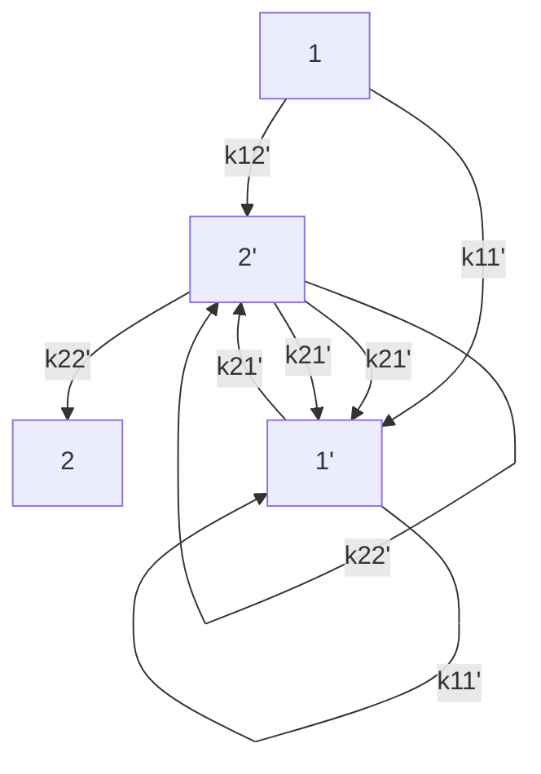
</details>

Figure 21 State diagram for the eNMP model

The state occupation probabilities $s _ { \mathrm { i } }$ satisfy the normalization condition:

$$
s _ {1} + s _ {1 ^ {\prime}} + s _ {2} + s _ {2 ^ {\prime}} = 1 \tag {593}
$$

The rate equations for the transitions are given by:

$$
\dot {s} _ {1} = - s _ {1} \left(k _ {1 1 ^ {\prime}} + k _ {1 2 ^ {\prime}}\right) + s _ {1 ^ {\prime}} k _ {1 ^ {\prime} 1} + s _ {2 ^ {\prime}} k _ {2 ^ {\prime} 1} \tag {594}
$$

$$
\dot {s} _ {2} = - s _ {2} \left(k _ {2 1 ^ {\prime}} + k _ {2 2 ^ {\prime}}\right) + s _ {1 ^ {\prime}} k _ {1 ^ {\prime} 2} + s _ {2 ^ {\prime}} k _ {2 ^ {\prime} 2} \tag {595}
$$

$$
\dot {s} _ {1 ^ {\prime}} = - s _ {1 ^ {\prime}} \left(k _ {1 ^ {\prime} 1} + k _ {1 ^ {\prime} 2}\right) + s _ {1} k _ {1 1 ^ {\prime}} + s _ {2} k _ {2 1 ^ {\prime}} \tag {596}
$$

$$
\dot {s} _ {2 ^ {\prime}} = - s _ {2 ^ {\prime}} \left(k _ {2 ^ {\prime} 1} + k _ {2 ^ {\prime} 2}\right) + s _ {1} k _ {1 2 ^ {\prime}} + s _ {2} k _ {2 2 ^ {\prime}} \tag {597}
$$

The eight transition rates are given by the following expressions:

$$
k _ {1 2 ^ {\prime}} = \left(1 + R _ {1}\right) ^ {3 / 2} \sigma_ {p} v _ {\mathrm{th}} ^ {p} p \exp (- \varepsilon_ {1 2 ^ {\prime}} / k T) \tag {598}
$$

$$
k _ {2 ^ {\prime} 1} = (1 + R _ {1}) ^ {3 / 2} \sigma_ {p} v _ {\mathrm{th}} ^ {p} N _ {\mathrm{V}} \exp (- \varepsilon_ {1 2 ^ {\prime}} / k T) \exp (- (E _ {\mathrm{t}} - E _ {\mathrm{V}} - \varepsilon_ {T 2 ^ {\prime}}) / k T) \tag {599}
$$

$$
k _ {1 ^ {\prime} 2} = \left(1 + R _ {1 ^ {\prime}}\right) ^ {3 / 2} \sigma_ {p} v _ {\text {th}} ^ {p} p \exp \left(- \varepsilon_ {1 ^ {\prime} 2} / k T\right) \tag {600}
$$

$$
k _ {2 1 ^ {\prime}} = \left(1 + R _ {1 ^ {\prime}}\right) ^ {3 / 2} \sigma_ {p} v _ {\mathrm{th}} ^ {p} N _ {\mathrm{V}} \exp \left(- \varepsilon_ {1 ^ {\prime} 2} / k T\right) \exp \left(- \left(E _ {\mathrm{t}} ^ {\prime} - E _ {\mathrm{V}}\right) / k T\right) \tag {601}
$$

$$
k _ {1 1 ^ {\prime}} = v _ {0} \exp \left(- \left(\varepsilon_ {1 ^ {\prime} 1} + E _ {t} ^ {\prime} - E _ {t}\right) / k T\right) \tag {602}
$$

$$
k _ {1 ^ {\prime} 1} = v _ {0} \exp \left(- \varepsilon_ {1 ^ {\prime} 1} / k T\right) \tag {603}
$$

$$
k _ {2 2 ^ {\prime}} = v _ {0} \exp \left(- \left(\varepsilon_ {2 ^ {\prime} 2} + \varepsilon_ {T 2 ^ {\prime}}\right) / k T\right) \tag {604}
$$

$$
k _ {2 ^ {\prime} 2} = v _ {0} \exp (- \varepsilon_ {2 ^ {\prime} 2} / k T) \tag {605}
$$

with:

$$
\varepsilon_ {1 2 ^ {\prime}} = \frac {(S _ {1} \hbar \omega_ {1})}{(1 + R _ {1}) ^ {2}} + \frac {R _ {1}}{1 + R _ {1}} (E _ {\mathrm{V}} - E _ {\mathrm{t}} + \varepsilon_ {T 2 ^ {\prime}}) \tag {606}
$$

$$
\varepsilon_ {1 ^ {\prime} 2} = \frac {(S _ {1 ^ {\prime}} \hbar \omega_ {1 ^ {\prime}})}{(1 + R _ {1 ^ {\prime}}) ^ {2}} + \frac {R _ {1 ^ {\prime}}}{1 + R _ {1 ^ {\prime}}} (E _ {\mathrm{V}} - E _ {\mathrm{t}} ^ {\prime}) \tag {607}
$$

For an insulator defect located a distance $x _ { \mathrm { t } }$ from the interface:

$$
\sigma_ {p} = \sigma_ {p 0} \exp (- x _ {\mathrm{t}} / x _ {0}) \tag {608}
$$

$$
E _ {\mathrm{t}} - E _ {\mathrm{V}} = E _ {\mathrm{t0}} - E _ {\mathrm{V0}} + q x _ {\mathrm{t}} | F | = \Delta E _ {\mathrm{t}} + q x _ {\mathrm{t}} | F | \tag {609}
$$

$$
E _ {\mathrm{t}} ^ {\prime} - E _ {\mathrm{V}} = E _ {\mathrm{t0}} ^ {\prime} - E _ {\mathrm{V0}} + q x _ {\mathrm{t}} | F | = \Delta E _ {\mathrm{t}} ^ {\prime} + q x _ {\mathrm{t}} | F | \tag {610}
$$

# In these expressions:

$\sigma _ { p 0 }$ is the hole-capture cross section, and $\exp ( - x _ { \mathrm { t } } / x _ { 0 } )$ accounts for the trap depth of tunneling.   
$\Delta E _ { \mathrm { t } }$ and $\Delta E _ { \mathrm { t } } ^ { \prime }$ are the energy levels of the defect in the neutral stable state and the neutral metastable state, respectively, relative to the valence band energy in the absence of an electric field.   
is the insulator electric field.F   
$\nu _ { \mathrm { t h } } ^ { p }$ is the hole thermal velocity.   
$\mathfrak { E } _ { \mathrm { i j } }$ represent the transition energies between states.   
■ $\varepsilon _ { T 2 } ,$ is the energy of the positive metastable state relative to the positive stable state.   
${ \mathfrak { O } } _ { \mathrm { i } }$ are vibrational frequencies.   
■ $R _ { 1 } = \mathfrak { o } _ { 1 } / \mathfrak { o } _ { 2 } ,$ and $R _ { 1 ^ { \prime } } = \mathfrak { \omega } _ { 1 ^ { \prime } } / \mathfrak { \omega } _ { 2 }$   
■ $S _ { \mathrm { i } } \hbar \omega _ { \mathrm { i } }$ are relaxation energies, where $S _ { \mathrm { i } }$ are known as Huang–Rhys factors.   
$\mathbf { v } _ { 0 }$ is the attempt frequency.

# Using the eNMP Model

You can activate the eNMP model in an interface-specific Physics section of the command file with the keyword eNMP. The command syntax and options are:

```hcl
Physics (MaterialInterface="<mat1>/<mat2>" | RegionInterface="<reg1>/reg2>") {
    eNMP (
    NumberOfSamples = <N_sample>    # Typically, 1000
    Conc = <N_0>    # 1/cm², for example, 5e12
    [ SFactor="<dataset_name-or-pmi_model_name>" ]
    [<eNMPTransitionRates_pmi_model_name> [StateCharge=<1 | -1>] ]
    )
} 
```

where Conc represents the density of the precursor $N _ { 0 }$ . By default, the precursor concentration is constant over the interface. However, if SFactor is specified, the precursor concentration is obtained from a dataset (or a PMI user field that is read from the file specified with PMIUserFields in the File section of the command file), or from a space factor PMI written by users (see Space Factor on page 1180). If SFactor is specified without specifying Conc, the SFactor interface values are used directly. If SFactor is specified in addition to Conc, the SFactor values are normalized by the largest SFactor value and multiplied by Conc.

The NumberOfSamples keyword represents the number of random samples, $N _ { \mathrm { s a m p l e } }$ . Sentaurus Device generates $N _ { \mathrm { s a m p l e } }$ random defects for each interface vertex. Then, the interface charge density is obtained from the ensemble average of the charge states:

$$
Q = q N _ {0} \left\langle s _ {2} + s _ {2 ^ {\prime}} \right\rangle \tag {611}
$$

where:

$$
\langle x \rangle = \frac {1}{N _ {\text { sample }}} \sum_ {j = 1} ^ {N _ {\text { sample }}} x ^ {j} \tag {612}
$$

During transient simulations, the state occupation changes according to the rate equations (Eq. 594 to Eq. 597), which will change the interface charge density. It is assumed that $s _ { 1 } = 1$ at the beginning, with all other states unoccupied.

# eNMP Quantities Available for Plotting

Plots of the interface charge density and the density of each state can be specified in the Plot section of the command file:

```txt
Plot {
    InterfaceeNMPCharge
    InterfaceeNMPState1
    InterfaceeNMPState2
    InterfaceeNMPState1p
    InterfaceeNMPState2p
} 
```

You can also obtain the plots of the capture and emission times:

```txt
Plot {
    eNMPCaptureTime
    eNMPEmissionTime
} 
```

For this purpose, Sentaurus Device uses the first passage times given in [3]:

$$
\frac {1}{\tau_ {\text { cap }}} = \frac {1}{\tau_ {\text { cap }} ^ {1 ^ {\prime}}} + \frac {1}{\tau_ {\text { cap }} ^ {2 ^ {\prime}}} \tag {613}
$$

$$
\frac {1}{\tau_ {\mathrm{em}}} = \frac {1}{\tau_ {\mathrm{em}} ^ {1 ^ {\prime}}} + \frac {1}{\tau_ {\mathrm{em}} ^ {2 ^ {\prime}}} \tag {614}
$$

# 19: Degradation Models

Extended Nonradiative Multiphonon Model

where:

$$
\frac {1}{\tau_ {\text { cap }} ^ {1 ^ {\prime}}} = \frac {k _ {1 1 ^ {\prime}} k _ {1 ^ {\prime} 2}}{k _ {1 1 ^ {\prime}} + k _ {1 ^ {\prime} 2} + k _ {1 ^ {\prime} 1}} \tag {615}
$$

$$
\frac {1}{\tau_ {\text { cap }} ^ {2 ^ {\prime}}} = \frac {k _ {1 2 ^ {\prime}} k _ {2 ^ {\prime} 2}}{k _ {1 2 ^ {\prime}} + k _ {2 ^ {\prime} 2} + k _ {2 ^ {\prime} 1}} \tag {616}
$$

$$
\frac {1}{\tau_ {\mathrm{em}} ^ {1 ^ {\prime}}} = \frac {k _ {2 1 ^ {\prime}} k _ {1 ^ {\prime} 1}}{k _ {2 1 ^ {\prime}} + k _ {1 ^ {\prime} 1} + k _ {1 ^ {\prime} 2}} \tag {617}
$$

$$
\frac {1}{\tau_ {\mathrm{em}} ^ {2 ^ {\prime}}} = \frac {k _ {2 2 ^ {\prime}} k _ {2 ^ {\prime} 1}}{k _ {2 2 ^ {\prime}} + k _ {2 ^ {\prime} 1} + k _ {2 ^ {\prime} 2}} \tag {618}
$$

# eNMP Model Parameters

The parameters used in the eNMP model are defined in the interface-specific eNMP parameter set. Table 103 to Table 106 on page 529 list the default parameter values for silicon–oxide interfaces.

Table 103 eNMP parameters that follow a Gaussian distribution: Default coefficients for silicon–oxide interfaces 

<table><tr><td>Symbol</td><td>Parameter name</td><td>Mean</td><td>Standard deviation</td><td>Unit</td></tr><tr><td> $\Delta E_{t}$ </td><td>Et</td><td>-0.5</td><td>0.1</td><td>eV</td></tr><tr><td> $\Delta E_{t}'$ </td><td>Etp</td><td>0.5</td><td>0.1</td><td>eV</td></tr><tr><td> $R_{1}$ </td><td>R</td><td>0.6</td><td>0.1</td><td>1</td></tr><tr><td> $R_{1'}$ </td><td>Rp</td><td>0.6</td><td>0.1</td><td>1</td></tr><tr><td> $S_{1}\hbar\omega_{1}$ </td><td>ES</td><td>1.0</td><td>0.1</td><td>eV</td></tr><tr><td> $S_{1'}\hbar\omega_{1'}$ </td><td>ESp</td><td>1.0</td><td>0.1</td><td>eV</td></tr><tr><td> $\varepsilon_{T2'}$ </td><td>ET2p</td><td>0.5</td><td>0.1</td><td>eV</td></tr><tr><td> $\varepsilon_{1'1}$ </td><td>E1p1</td><td>1.0</td><td>0.1</td><td>eV</td></tr><tr><td> $\varepsilon_{2'2}$ </td><td>E2p2</td><td>0.5</td><td>0.1</td><td>eV</td></tr></table>

Table 104 eNMP parameters that follow a uniform distribution: Default coefficients for silicon–oxide interfaces 

<table><tr><td>Symbol</td><td>Parameter name</td><td>Minimum Value</td><td>Maximum Value</td><td>Unit</td></tr><tr><td> $x_{t}$ </td><td>xt</td><td>0.0</td><td>8.0</td><td>Å</td></tr></table>

Table 105 eNMP parameters that have separate values for electrons and holes: Default coefficients for silicon–oxide interfaces 

<table><tr><td>Symbol</td><td>Parameter name</td><td>Electrons</td><td>Holes</td><td>Unit</td></tr><tr><td> $\sigma_0$ </td><td>Xsec</td><td> $1.0\times 10^{-15}$ </td><td> $1.0\times 10^{-15}$ </td><td>cm2</td></tr><tr><td> $v_{th}$ </td><td>Vth</td><td> $1.5\times 10^7$ </td><td> $1.2\times 10^7$ </td><td>cm/s</td></tr><tr><td> $x_0$ </td><td>x0</td><td>0.5</td><td>0.5</td><td>Å</td></tr></table>

Table 106 eNMP parameters that have a single value: Default coefficients for silicon–oxide interfaces 

<table><tr><td>Symbol</td><td>Parameter name</td><td>Value</td><td>Unit</td></tr><tr><td> $v_0$ </td><td>nu0</td><td> $1.0\times 10^{13}$ </td><td> $s^{-1}$ </td></tr></table>

# eNMP Transition Rates PMI Model

An eNMP transition rates PMI model (see eNMP Transition Rates on page 1197) created by users can be utilized to calculate the transition rates for the eNMP model. This PMI allows for the possibility of either a positive or negative state charge, and provides additional dependencies that are not included in the built-in eNMP model.

# Hot-Carrier Stress Degradation Model

The hot-carrier stress (HCS) degradation model is based on work in [15], and can be used as a general degradation model for MOS-based devices.

The HCS degradation model includes different mechanisms that contribute to bond breakage and the formation of interface traps [11][16][17]:

■ Single-particle (SP) processes, where a single particle is responsible for bond breakage   
Multiple-particle (MP) processes, where the combined actions of several particles contribute to bond breakage   
Field-enhanced thermal (TH) processes, where thermal interactions with the lattice contribute to bond breakage

Sentaurus Device includes both an electron version of the model (eHCSDegradation) and a hole version of the model (hHCSDegradation).

The model and its usage are described in the following sections.

# Model Description

The model equations are presented here. Details can be found in [15]. The equations presented apply to both the eHCSDegradation and hHCSDegradation models.

# Single-Particle and Multiple-Particle Interface-Trap Densities

For the SP case, the interface trap density as a function of time and activation energy is given by

$$
N _ {\mathrm{it}, \mathrm{SP}} (\boldsymbol {r}, t, E _ {\mathrm{SP}}) = P _ {\mathrm{SP}} N _ {0} \left[ 1 - e ^ {- k _ {\mathrm{SP}} (\boldsymbol {r}, E _ {\mathrm{SP}}) t} \right] \tag {619}
$$

where:

■ $P _ { \mathrm { S P } }$ is the probability for defect generation by SP processes.   
$N _ { 0 }$ is the maximum number of interface bonds.   
$E _ { \mathrm { S P } }$ is the activation energy for SP processes.   
$k _ { \mathrm { S P } } ( \pmb { r } , E _ { \mathrm { S P } } )$ is the reaction rate for SP processes.

For the MP case, the interface trap density is given by:

$$
N _ {\mathrm{it,MP}} (\boldsymbol {r}, t, E _ {\mathrm{MP}}) = P _ {\mathrm{MP}} N _ {0} \left[ \frac {P _ {\mathrm{emi}}}{P _ {\text { pass }}} \left(\frac {P _ {\mathrm{u}}}{P _ {\mathrm{d}}}\right) ^ {N _ {1}} \left(1 - e ^ {- P _ {\mathrm{emi}} t}\right) \right] ^ {1 / 2} \tag {620}
$$

where:

$P _ { \mathrm { M P } }$ is the probability for defect generation by MP processes.   
$N _ { \mathrm { l } }$ is the number of energy levels in the oscillator that models the bond.

The emission and passivation probabilities $P _ { \mathrm { e m i } }$ and $P _ { \mathrm { p a s s } }$ are modeled as Arrhenius laws:

$$
P _ {\mathrm{emi}} = v _ {\mathrm{emi}} e ^ {- E _ {\mathrm{emi}} / \left(k _ {\mathrm{B}} T\right)} \tag {621}
$$

$$
P _ {\text { pass }} = v _ {\text { pass }} e ^ {- E _ {\text { pass }} / \left(k _ {\mathrm{B}} T\right)} \tag {622}
$$

where:

$\nu _ { \mathrm { e m i } }$ and $\nu _ { \mathrm { p a s s } }$ are the emission and passivation frequencies, respectively.   
$E _ { \mathrm { e m i } }$ and $E _ { \mathrm { p a s s } }$ are the emission and passivation energies, respectively.

The oscillator excitation and de-excitation probability rates are given by:

$$
P _ {\mathrm{u}} = k _ {\mathrm{ph}} e ^ {- E _ {\mathrm{ph}} / \left(k _ {\mathrm{B}} T\right)} + k _ {\mathrm{MP}} (\boldsymbol {r}, E _ {\mathrm{MP}}) \tag {623}
$$

$$
P _ {\mathrm{d}} = k _ {\mathrm{ph}} + k _ {\mathrm{MP}} (\boldsymbol {r}, E _ {\mathrm{MP}}) \tag {624}
$$

where:

$E _ { \mathrm { p h } }$ and $k _ { \mathrm { p h } }$ are the phonon energy and the reaction rate, respectively.   
$E _ { \mathrm { M P } }$ is the activation energy for MP processes.   
$k _ { \mathrm { M P } } ( { \boldsymbol { r } } , E _ { \mathrm { M P } } )$ is the reaction rate for MP processes.

The reaction rates for SP and MP processes are given by scattering-rate integrals:

$$
k _ {\mathrm{SP}} (\boldsymbol {r}, E _ {\mathrm{SP}}) = \int_ {E _ {\mathrm{SP}}} ^ {\infty} f (\boldsymbol {r}, E) g (E) v (E) \sigma_ {\mathrm{SP}} (E) d E \tag {625}
$$

$$
k _ {\mathrm{MP}} (\boldsymbol {r}, E _ {\mathrm{MP}}) = \int_ {E _ {\mathrm{MP}}} ^ {\infty} f (\boldsymbol {r}, E) g (E) v (E) \sigma_ {\mathrm{MP}} (E) d E \tag {626}
$$

where:

■ $f ( r , E )$ is the carrier distribution function.   
$g ( E )$ is the total density-of-states.   
■ $\nu ( E )$ is the magnitude of the carrier velocity.   
${ \sigma } _ { \mathrm { S P } } ( E )$ and $\sigma _ { \mathrm { M P } } ( E )$ are the SP and MP reaction cross-sections.

The reaction cross-sections are given by:

$$
\sigma_ {\mathrm{SP}} (E) = \sigma_ {\mathrm{SP0}} \left(\frac {E - E _ {\mathrm{SP}}}{k _ {\mathrm{B}} T}\right) ^ {p _ {\mathrm{SP}}} \tag {627}
$$

$$
\sigma_ {\mathrm{MP}} (E) = \sigma_ {\mathrm{MP0}} \left(\frac {E - E _ {\mathrm{MP}}}{k _ {\mathrm{B}} T}\right) ^ {p _ {\mathrm{MP}}} \tag {628}
$$

# 19: Degradation Models

Hot-Carrier Stress Degradation Model

where:

■ $p _ { \mathrm { S P } }$ and $p _ { \mathrm { M P } }$ are exponents characterizing the SP and MP processes.   
$\sigma _ { \mathrm { { S P 0 } } }$ and ${ \sigma } _ { \mathrm { M P 0 } }$ are fitting parameters.

# Field-Enhanced Thermal Degradation

The interface-trap density due to field-enhanced thermal degradation is given by:

$$
N _ {\mathrm{it}, \mathrm{TH}} (\boldsymbol {r}, t, E _ {\mathrm{TH}}) = P _ {\mathrm{TH}} N _ {0} [ 1 - e ^ {- k _ {\mathrm{TH}} (E _ {\mathrm{TH}}) t} ] \tag {629}
$$

where:

■ $P _ { \mathrm { T H } }$ is the probability for defect generation by thermal processes.   
The reaction rate for bond breakage $k _ { \mathrm { T H } }$ is given by:

$$
k _ {\mathrm{TH}} (\boldsymbol {r}, E _ {\mathrm{TH}}) = \mathrm{v} _ {\mathrm{TH}} e ^ {- E _ {\mathrm{TH}} / (k _ {\mathrm{B}} T)} \tag {630}
$$

$$
E _ {\mathrm{TH}} = E _ {\mathrm{TH0}} - p E _ {\mathrm{ox}} \tag {631}
$$

where:

• $\nu _ { \mathrm { T H } }$ is the lattice collision frequency.   
• $E _ { \mathrm { T H 0 } }$ is the activation energy for thermal processes in the absence of oxide field $E _ { \mathrm { o x } }$   
• $p$ is the effective dipole moment.

# Carrier Distribution Function

There are two options for obtaining the carrier distribution function $f ( r , E )$ used in the calculation of the scattering-rate integrals (Eq. 625 and Eq. 626):

From the spherical harmonics expansion (SHE) method   
From an approximate analytic formulation

# Spherical Harmonics Expansion Option

The SHE method computes the microscopic carrier-energy distribution function by solving the lowest-order SHE of the Boltzmann transport equation. When the carrier distribution function is available through the SHE method, it can optionally be used directly in the evaluation of Eq. 625 and Eq. 626. In this case, the band structure quantities $g ( E )$ and used in thesev E( ) equations are the same as those used in the SHE calculations.

NOTE If the carrier distribution function is available through the SHE method, the SHE temperature will be used instead of the carrier temperature in the model equations, if the hydrodynamic model is not used.

# Approximate Analytic Option

A method for obtaining an approximate carrier distribution function [15] is available. In this case, is modeled using an analytic non-Maxwellian formulation:f( ) r, E

$$
f _ {0} (\boldsymbol {r}, E) = \frac {1}{A (\boldsymbol {r})} \exp \left[ - \alpha (\boldsymbol {r}) \frac {\gamma (E)}{k _ {\mathrm{B}} T _ {c} (\boldsymbol {r})} \right] \tag {632}
$$

$$
\gamma (E) = \frac {E (1 + \delta E)}{1 + \beta E} \tag {633}
$$

where:

$T _ { c } ( r )$ is the carrier temperature $( T _ { n }$ for eHCSDegradation and $T _ { p }$ for hHCSDegradation).   
and are fitting parameters.δ β   
■ and are position-dependent parametric factors that are determined by requiringA( )r α( )r that:

$$
c (\boldsymbol {r}) = \int_ {0} ^ {E _ {\max}} f _ {0} (\boldsymbol {r}, E) g (E) d E \tag {634}
$$

$$
T _ {c} (\boldsymbol {r}) = \frac {2}{3 k _ {\mathrm{B}}} \frac {\int_ {0} ^ {E _ {\max}} E (f _ {0} (\boldsymbol {r} , E) g (E) d E)}{c (\boldsymbol {r})} \tag {635}
$$

where is the electron concentration for eHCSDegradation and the holec( )r concentration for hHCSDegradation. $E _ { \mathrm { m a x } } = 1 0 ~ \mathrm { e V }$ is used as the upper integration limit.

# Bond Dispersion

The reaction rates given by Eq. 625, Eq. 626, and Eq. 630 are for a discrete activation energy. As an option, these rates can be modified to account for bond dispersion by assuming a distribution function for the activation energies:

$$
g _ {\mathrm{A}, j} (E) = \frac {1}{\sigma_ {g}} \frac {\exp \left(\frac {E _ {j} - E}{\sigma_ {g}}\right)}{\left[ 1 + \exp \left(\frac {E _ {j} - E}{\sigma_ {g}}\right) \right] ^ {2}} \tag {636}
$$

where $\sigma _ { \mathrm { g } }$ is a dispersion width and , MP, or TH. As an alternative to calculating thej = SP scattering-rate integrals for every activation energy, the reaction rates are approximated at energies close to their peak values with the following expressions:

$$
k _ {\mathrm{SP}} (\boldsymbol {r}, E) = k _ {\mathrm{SP}} (\boldsymbol {r}, E _ {\mathrm{SP}}) e ^ {- (E - E _ {\mathrm{SP}}) / \left(\lambda k _ {\mathrm{B}} T _ {c}\right)} \tag {637}
$$

$$
k _ {\mathrm{MP}} (\boldsymbol {r}, E) = k _ {\mathrm{MP}} (\boldsymbol {r}, E _ {\mathrm{MP}}) e ^ {- (E - E _ {\mathrm{MP}}) / (\lambda k _ {\mathrm{B}} T _ {c})} \tag {638}
$$

$$
k _ {\mathrm{TH}} (\boldsymbol {r}, E) = k _ {\mathrm{TH}} (\boldsymbol {r}, E _ {\mathrm{TH}}) e ^ {- (E - E _ {\mathrm{TH}}) / \left(k _ {\mathrm{B}} T\right)} \tag {639}
$$

Then, the interface-trap generation rates for each process will be calculated from:

$$
N _ {\mathrm{it}, j} (\boldsymbol {r}, t) = \int_ {E _ {j} - m \sigma_ {\mathrm{g}}} ^ {E _ {j} + m \sigma_ {\mathrm{g}}} g _ {\mathrm{A}, j} (E) N _ {\mathrm{it}, j} (\boldsymbol {r}, t, E) d E \tag {640}
$$

Finally, the total interface-trap generation rate is taken as the sum of the separate processes:

$$
N _ {\mathrm{it}} (\boldsymbol {r}, t) = N _ {\mathrm{it,SP}} (\boldsymbol {r}, t) + N _ {\mathrm{it,MP}} (\boldsymbol {r}, t) + N _ {\mathrm{it,TH}} (\boldsymbol {r}, t) \tag {641}
$$

# Using the HCS Degradation Model

You can include the HCS degradation model in a transient simulation by specifying the eHCSDegradation option, or the hHCSDegradation option, or both options as part of a Traps specification for the interface of interest. The syntax and options for these models are:

```txt
Physics (MaterialInterface = "Silicon/Oxide") {
    Traps (
    (eHCSDegradation([SHE] [BondDispersion])

    # Specify appropriate parameters for the generated traps.
    Acceptor Level EnergyMid=0 fromMidBandGap
    )

    (hHCSDegradation([SHE] [BondDispersion])

    # Specify appropriate parameters for the generated traps.
    Donor Level EnergyMid=0 fromMidBandGap
    )

} 
```

Notes regarding this specification:

If the SHE option is selected, the distribution function and the band-structure quantities are obtained from the SHE method specified in the Physics section, for example:

```hcl
Physics (Material = "Silicon") {
    eSHEDistribution(FullBand)
} 
```

If SHE is not selected, an approximate distribution function is used as described in Approximate Analytic Option on page 533. In this case, the band-structure quantities used in the calculations will be taken from the SHE full-band structure files.   
■ BondDispersion is used by default. Use -BondDispersion to switch off this option.   
If using FixedCharge traps, negative charge will be created with the eHCSDegradation model, and positive charge will be created with the hHCSDegradation model.

Parameters used in the model can be accessed through the HCSDegradation parameter set in the parameter file. Since this model describes interface trap generation, these parameters will only be recognized if they are part of a MaterialInterface or RegionInterface specification. Table 107 lists the default parameter values for silicon–oxide interfaces.

Table 107 HCS degradation model: Default coefficients for silicon–oxide interfaces 

<table><tr><td>Symbol</td><td>Parameter name</td><td>Electrons</td><td>Holes</td><td>Unit</td></tr><tr><td> $P_{\text{SP}}$ </td><td>Prsp</td><td>1.0</td><td>1.0</td><td>1</td></tr><tr><td> $P_{\text{MP}}$ </td><td>Prmp</td><td>1.0</td><td>1.0</td><td>1</td></tr><tr><td> $P_{\text{TH}}$ </td><td>Prth</td><td>1.0</td><td>1.0</td><td>1</td></tr><tr><td> $N_0$ </td><td>N0</td><td> $1.0\times 10^{12}$ </td><td> $1.0\times 10^{12}$ </td><td> $\text{cm}^{-2}$ </td></tr><tr><td> $k_{\text{ph}}$ </td><td>kph</td><td> $1.0\times 10^{8}$ </td><td> $1.0\times 10^{8}$ </td><td> $\text{s}^{-1}$ </td></tr><tr><td> $E_{\text{ph}}$ </td><td>Eph</td><td>0.25</td><td>0.25</td><td>eV</td></tr><tr><td> $E_{\text{emi}}$ </td><td>Eemi</td><td>0.26</td><td>0.26</td><td>eV</td></tr><tr><td> $E_{\text{pass}}$ </td><td>Epass</td><td>0.2</td><td>0.2</td><td>eV</td></tr><tr><td> $E_{\text{TH0}}$ </td><td>Eth0</td><td>1.9</td><td>1.9</td><td>eV</td></tr><tr><td> $N_1$ </td><td>Nlev</td><td>10</td><td>10</td><td>1</td></tr><tr><td> $v_{\text{emi}}$ </td><td>nu_emi</td><td> $1.0\times 10^{12}$ </td><td> $1.0\times 10^{12}$ </td><td> $\text{s}^{-1}$ </td></tr><tr><td> $v_{\text{pass}}$ </td><td>nu_pass</td><td> $1.0\times 10^{12}$ </td><td> $1.0\times 10^{12}$ </td><td> $\text{s}^{-1}$ </td></tr><tr><td> $v_{\text{th}}$ </td><td>nu_th</td><td> $1.0\times 10^{13}$ </td><td> $1.0\times 10^{13}$ </td><td> $\text{s}^{-1}$ </td></tr><tr><td>p</td><td>p</td><td>15.5</td><td>15.5</td><td>eÅ</td></tr><tr><td> $E_{\text{SP}}$ </td><td>Esp</td><td>3.1</td><td>3.1</td><td>eV</td></tr></table>

Table 107 HCS degradation model: Default coefficients for silicon–oxide interfaces 

<table><tr><td>Symbol</td><td>Parameter name</td><td>Electrons</td><td>Holes</td><td>Unit</td></tr><tr><td> $E_{\text{MP}}$ </td><td>Emp</td><td>0.25</td><td>0.25</td><td>eV</td></tr><tr><td> $p_{\text{SP}}$ </td><td>psp</td><td>11</td><td>11</td><td>1</td></tr><tr><td> $p_{\text{MP}}$ </td><td>pmp</td><td>0.1</td><td>0.1</td><td>1</td></tr><tr><td> $σ_{\text{SP0}}$ </td><td>Xsecsp</td><td> $3.0×10^{-29}$ </td><td> $3.0×10^{-29}$ </td><td> $\text{cm}^{2}$ </td></tr><tr><td> $σ_{\text{MP0}}$ </td><td>Xsecmp</td><td> $1.0×10^{-24}$ </td><td> $1.0×10^{-24}$ </td><td> $\text{cm}^{2}$ </td></tr><tr><td> $σ_{\text{g}}$ </td><td>sigmag</td><td>0.100</td><td>0.100</td><td>eV</td></tr><tr><td> $λ$ </td><td>lambda</td><td>0.17</td><td>0.17</td><td>1</td></tr><tr><td>m</td><td>m</td><td>3</td><td>3</td><td>1</td></tr><tr><td>δ</td><td>delta</td><td>1.0</td><td>1.0</td><td> $\text{eV}^{-1}$ </td></tr><tr><td>β</td><td>beta</td><td>0.15</td><td>0.15</td><td> $\text{eV}^{-1}$ </td></tr></table>

# References

[1] T. Grasser et al., “A Two-Stage Model for Negative Bias Temperature Instability,” in IEEE International Reliability Physics Symposium (IRPS), Montréal, Québec, Canada, pp. 33–44, April 2009.   
[2] W. Goes et al., “A Model for Switching Traps in Amorphous Oxides,” in International Conference on Simulation of Semiconductor Processes and Devices (SISPAD), San Diego, CA, USA, pp. 159–162, September 2009.   
[3] W. Gös, Hole Trapping and the Negative Bias Temperature Instability, Ph.D. thesis, Technischen Universität Wien, Vienna, Austria, December 2011.   
[4] A. Plonka, Time-Dependent Reactivity of Species in Condensed Media, Lecture Notes in Chemistry, vol. 40, Berlin: Springer, 1986.   
[5] C. Hu et al., “Hot-Electron-Induced MOSFET Degradation—Model, Monitor, and Improvement,” IEEE Journal of Solid-State Circuits, vol. SC-20, no. 1, pp. 295–305, 1985.   
[6] O. Penzin et al., “MOSFET Degradation Kinetics and Its Simulation,” IEEE Transactions on Electron Devices, vol. 50, no. 6, pp. 1445–1450, 2003.   
[7] K. Hess et al., “Theory of channel hot-carrier degradation in MOSFETs,” Physica B, vol. 272, no. 1–4, pp. 527–531, 1999.

[8] Z. Chen et al., “On the Mechanism for Interface Trap Generation in MOS Transistors Due to Channel Hot Carrier Stressing,” IEEE Electron Device Letters, vol. 21, no. 1, pp. 24–26, 2000.   
[9] B. Tuttle and C. G. Van de Walle, “Structure, energetics, and vibrational properties of Si-H bond dissociation in silicon,” Physical Review B, vol. 59, no. 20, pp. 12884–12889, 1999.   
[10] M. A. Alam and S. Mahapatra, “A comprehensive model of PMOS NBTI degradation,” Microelectronics Reliability, vol. 45, no. 1, pp. 71–81, 2005.   
[11] J. W. McPherson, R. B. Khamankar, and A. Shanware, “Complementary model for intrinsic time-dependent dielectric breakdown in $\mathrm { S i O } _ { 2 }$ dielectrics,” Journal of Applied Physics, vol. 88, no. 9, pp. 5351–5359, 2000.   
[12] J. H. Stathis and S. Zafar, “The negative bias temperature instability in MOS devices: A review,” Microelectronics Reliability, vol. 46, no. 2-4, pp. 270–286, 2006.   
[13] A. E. Islam et al., “Recent Issues in Negative-Bias Temperature Instability: Initial Degradation, Field Dependence of Interface Trap Generation, Hole Trapping Effects, and Relaxation,” IEEE Transactions on Electron Devices, vol. 54, no. 9, pp. 2143–2154, 2007.   
[14] T. Grasser, W. Gös, and B. Kaczer, “Dispersive Transport and Negative Bias Temperature Instability: Boundary Conditions, Initial Conditions, and Transport Models,” IEEE Transactions on Device and Materials Reliability, vol. 8, no. 1, pp. 79–97, 2008.   
[15] S. Reggiani et al., “TCAD Simulation of Hot-Carrier and Thermal Degradation in STI-LDMOS Transistors,” IEEE Transactions on Electron Devices, vol. 60, no. 2, pp. 691–698, 2013.   
[16] A. Bravaix et al., “Hot-Carrier Acceleration Factors for Low Power Management in DC-AC stressed 40nm NMOS node at High Temperature,” in Proceedings of the 47th Annual International Reliability Physics Symposium (IRPS), Montréal, Québec, Canada, pp. 531–548, April 2009.   
[17] I. Starkov et al., “Hot-carrier degradation caused interface state profile—Simulation versus experiment,” Journal of Vacuum Science & Technology B, vol. 29, no. 1, p. 01AB09, 2011.

19: Degradation Models References

This chapter describes the organic models available in Sentaurus Device.

The electrical conduction process in organic materials is different from crystal lattice semiconductors. However, similar concepts in semiconductor transport theory can be used in treating the conduction process in organic materials.

# Introduction to Organic Device Simulation

An organic material or semiconductor is formed from molecule chains, and the primary transport of carriers (electrons and holes) is through a hopping process. The lowest unoccupied molecular orbital (LUMO) and highest occupied molecular orbital (HOMO) energy levels in organic materials are analogous to the conduction and valence bands, respectively. In addition, excitons need to be considered since these bound electron–hole pairs contribute to the distribution of electron and hole populations. Traps are also central to organic transport, and these need to be taken into account appropriately.

Therefore, a combination of semiconductor models and organic physics models is required to model reasonably the physical transport processes of organic devices within the framework of Sentaurus Device. The models needed in a typical organic device simulation are:

The Poole–Frenkel mobility model is used to model the hopping transport of the carriers (electrons and holes). This model is dependent on electric field and temperature. Note that it is common for electrons to have two orders of magnitude higher mobility than holes (see Poole–Frenkel Mobility (Organic Material Mobility) on page 386).   
Organic–organic heterointerface physics requires special treatment for the ballistic transport of carriers and bulk excitons across heterointerfaces with energy barriers (see Gaussian Transport Across Organic Heterointerfaces on page 780).   
Gaussian density-of-states (DOS) approximates the effective DOS for electrons and holes in disordered organic materials and semiconductors (see Gaussian Density-of-States for Organic Semiconductors on page 266).   
The traps model must be initialized with the appropriate capture cross sections and densities (see Chapter 17 on page 457).   
The Langevin bimolecular recombination model is used to model the recombination process of carriers and the generation process of singlet excitons (see Bimolecular Recombination Model on page 451).

A singlet exciton equation is introduced to model the diffusion process, the generation from bimolecular recombination, the loss from decay, and the optical emissions of singlet excitons. Note that only Frenkel excitons (electron–hole pairs existing on the same molecule) participate in the optical process in organic materials (see Singlet Exciton Equation on page 237).

The organic device simulator is based on the work of Kozłowski [1], and other useful papers are available [2]–[10].

Many acronyms are used to describe organic device layers and transport mechanisms (see Table 108).

Table 108 Commonly used acronyms for organic transport 

<table><tr><td>Acronym</td><td>Definition</td></tr><tr><td>EBL</td><td>Electron blocking layer</td></tr><tr><td>EML</td><td>Emission layer</td></tr><tr><td>ETL</td><td>Electron transport layer</td></tr><tr><td>HOMO</td><td>Highest occupied molecular orbital</td></tr><tr><td>HTL</td><td>Hole transport layer</td></tr><tr><td>LUMO</td><td>Lowest unoccupied molecular orbital</td></tr><tr><td>SCL</td><td>Space charge limited</td></tr><tr><td>TCL</td><td>Trapped charge limited</td></tr><tr><td>TSL</td><td>Thermally stimulated luminescence</td></tr></table>

# References

[1] F. Kozłowski, Numerical simulation and optimisation of organic light emitting diodes and photovoltaic cells, Ph.D. thesis, Technische Universität Dresden, Germany, 2005.   
[2] S.-H. Chang et al., “Numerical simulation of optical and electronic properties for multilayer organic light-emitting diodes and its application in engineering education,” in Proceedings of SPIE, Light-Emitting Diodes: Research, Manufacturing, and Applications X, vol. 6134, pp. 26-1–26-10, 2006.   
[3] P. E. Burrows et al., “Relationship between electroluminescence and current transport in organic heterojunction light-emitting devices,” Journal of Applied Physics, vol. 79, no. 10, pp. 7991–8006, 1996.

[4] M. Hoffmann and Z. G. Soos, “Optical absorption spectra of the Holstein molecular crystal for weak and intermediate electronic coupling,” Physical Review B, vol. 66, no. 2, p. 024305, 2002.   
[5] J. Staudigel et al., “A quantitative numerical model of multilayer vapor-deposited organic light emitting diodes,” Journal of Applied Physics, vol. 86, no. 7, pp. 3895–3910, 1999.   
[6] E. Tutiš et al., “Numerical model for organic light-emitting diodes,” Journal of Applied Physics, vol. 89, no. 1, pp. 430–439, 2001.   
[7] B. Ruhstaller et al., “Simulating Electronic and Optical Processes in Multilayer Organic Light-Emitting Devices,” IEEE Journal of Selected Topics in Quantum Electronics, vol. 9, no. 3, pp. 723–731, 2003.   
[8] B. Ruhstaller et al., “Transient and steady-state behavior of space charges in multilayer organic light-emitting diodes,” Journal of Applied Physics, vol. 89, no. 8, pp. 4575–4586, 2001.   
[9] A. B. Walker, A. Kambili, and S. J. Martin, “Electrical transport modelling in organic electroluminescent devices,” Journal of Physics: Condensed Matter, vol. 14, no. 42, pp. 9825–9876, 2002.   
[10] S. Odermatt, N. Ketter, and B. Witzigmann, “Luminescence and absorption analysis of undoped organic materials,” Applied Physics Letters, vol. 90, p. 221107, May 2007.

20: Organic Devices References

This chapter describes various methods that are used to compute the optical generation rate when an optical wave penetrates into the device, is absorbed, and produces electron–hole pairs.

The methods include simple optical beam absorption, the raytracing method, the transfer matrix method, the finite-difference time-domain, the beam propagation method, and loading external profiles from file. Different types of refractive index and absorption models, parameter ramping, and optical AC analysis are also described.

# Overview of Optical Generation

A unified interface for optical generation computation is available to provide a consistent simulation setup irrespective of the underlying optical solver methods. This allows for a gradual refinement of results and a balance of accuracy versus computation time in the course of a simulation, while only the solver-specific parameters have to change. Several approaches for computing the optical generation exist that are independent of the chosen optical solver:

■ Compute the optical generation resulting from a monochromatic optical source.   
Compute the optical generation resulting from an illumination spectrum.   
■ Set a constant value for the optical generation rate either per region or globally.   
Read an optical generation profile from file.   
Compute the optical generation as a sum of the above contributions, possibly with different optical solvers or different solver-specific settings or excitation parameters.

For each of the contributions listed, a separate scaling factor can be specified. For transient simulations, it is possible to apply a time-dependent scaling factor that can be used, for example, to model the response to a light pulse or any other time-dependent light signal. This feature can also be used to improve convergence if the optical generation rate is very high. The unified interface also allows you to save the computed optical generation rate to a file for reuse in other simulations.

The optical generation resulting from a monochromatic optical source or an illumination spectrum is determined as the product of the absorbed photon density, which is computed by the optical solver, and the quantum yield. Several models for the quantum yield are available ranging from a constant scaling factor to a spatially varying quantum yield based on the band gap of the underlying material and the excitation wavelength of the optical source.

In the following sections, the different approaches for computing the optical generation and their corresponding parameters are described.

# Specifying the Type of Optical Generation Computation

In the OpticalGeneration section of the command file, at least one of the following methods to compute the optical generation must be specified; otherwise, the optical generation is not computed and is set to zero everywhere:

ComputeFromMonochromaticSource activates optical generation computation with a single wavelength that is either specified in the Excitation section or as a ramping variable.   
ComputeFromSpectrum allows the sum of optical generation to be computed from an input spectrum of wavelengths.   
ReadFromFile imports the optical generation profile.   
SetConstant enables you to set a background constant optical generation in the specified region or material.

NOTE If you use the keyword Scaling in these optical generation methods, the scaling applies only to quasistationary simulations. To scale transient simulations, see Specifying Time Dependency for Transient Simulations on page 556.

If several methods are specified, the total optical generation rate is given by the sum of the contributions computed with each method. The general syntax is:

```txt
Physics {
    ...
    Optics (
    OpticalGeneration (
    ...
    ComputeFromMonochromaticSource (...)
    ComputeFromSpectrum (...)
    ReadFromFile (...)
    SetConstant ( ... Value = <float> )
    )
    Excitation (...)
    OpticalSolver (...)
    ComplexRefractiveIndex (...)
    )
} 
```

Each method can have its own options such as a scaling factor or a particular time-dependency specification used in transient simulations. An example setup where the optical generation read from a file is scaled by a factor of 1.1 and a Gaussian time dependency is assumed for the monochromatic source is:

```txt
OpticalGeneration (
    ...
    ComputeFromMonochromaticSource (
    ...
    TimeDependence (
    WaveTime = (<t1>, <t2>)
    WaveTSigma = <float>
    )
)
ReadFromFile (
    ...
    Scaling = 1.1
)
) 
```

Note that both Scaling and TimeDependence can also be specified directly in the OpticalGeneration section if the same parameters will apply to all methods. If TimeDependence is specified directly in the OpticalGeneration section as well as in a source-specific section such as ComputeFromMonochromaticSource, the latter takes precedence. For an overview of all available options, see Table 241 on page 1431.

By default, the optical generation rate is calculated for every semiconductor region. However, you can suppress the computation of the optical generation rate for a specific region or material by specifying the keyword -OpticalGeneration in the corresponding region or material Physics section:

```awk
Physics (region="coating") { Optics (-OpticalGeneration) }
Physics (material="InP") { Optics (-OpticalGeneration) } 
```

To visualize the optical intensity and generation, the keywords OpticalIntensity and OpticalGeneration must be added to the Plot section:

```txt
Plot {
    ...
    OpticalIntensity
    OpticalGeneration
} 
```

Specifying OpticalGeneration in the Plot section plots not only the total optical generation that enters the electrical equations, but also the contributions from the different methods of optical generation computation. See Appendix F on page 1331 for the corresponding data names.

# Optical Generation From Monochromatic Source

Specifying ComputeFromMonochromaticSource (...) in the OpticalGeneration section activates the computation of the optical generation assuming a monochromatic light source. Details of the light source such as angle of incidence, wavelength, and intensity, and the optical solver used to model it must be set in the Excitation section and OpticalSolver section, respectively (see Specifying the Optical Solver on page 564 and Setting the Excitation Parameters on page 570).

Together with the possibility of ramping parameters (see Controlling Computation of Optical Problem in Solve Section on page 584), for example, the wavelength of the incident light, this model can be used to simulate the optical generation rate as a function of wavelength.

# Illumination Spectrum

The optical generation resulting from a spectral illumination source, which is sometimes also known as white light generation, can be modeled in Sentaurus Device by superimposing the spectrally resolved generation rates. To this end, ComputeFromSpectrum (...) must be listed in the OpticalGeneration section. The illumination spectrum is then read from a text file whose name must be specified in the File section:

```txt
File {
    ...
    IlluminationSpectrum = "illumination_spectrum.txt"
}
Physics {
    ...
    Optics (
    ...
    OpticalGeneration (
    ...
    ComputeFromSpectrum ( ... )
    )
    )
} 
```

In its simplest form, the illumination spectrum file has a two-column format. The first column contains the wavelength in and the second column contains the intensity in . Theμm W/cm2 characters # and \* mark the beginning of a comment.

As a default, the integrated generation rate resulting from the illumination spectrum is only computed once, that is, the first time the optical problem is solved and remains constant thereafter. However, it is possible to force its recomputation on every occasion by specifying the keyword RefreshEveryTime in the ComputeFromSpectrum section.

When the optical problem remains constant, that is, the absorbed photon density does not change, but the quantum yield is expected to vary (see Quantum Yield Models on page 553), specify the keyword KeepSpectralData in the ComputeFromSpectrum section. With this keyword, the spectral information of the last optical solution is kept in memory and only the quantum yield, which is needed to compute the optical generation rate and the optical absorption heat (see Optical Absorption Heat on page 555), is updated during the simulation.

Plotting spectral results requires the specification of a file name in the File section using the keyword SpectralPlot as well as the specification of the keyword KeepSpectralData in the ComputeFromSpectrum section. A file with extension .tdr is used to save spatial fields such as optical generation for each entry of the spectrum. Other results from the optical solver, for example, reflection, transmission, and absorption in the case of the TMM solver, as a function of the spectrum parameters are saved in a file with the extension .plt. The quantities saved in the .plt file are subject to the optical solver used in the simulation. To control the file name and when to plot, the same syntax in the Solve section applies to SpectralPlot as well as to Plot. See When to Plot on page 125 and Appendix G on page 1369.

In simulations that contain only a monochromatic source, the results from the optical solver are written to the current file. However, if a spectral source is present, the values should reflect the result of both the monochromatic source and the spectral source. Therefore, relative quantities (that is, unitless quantities) such as reflection are represented by a weighted average over all entries of the illumination spectrum and the monochromatic source if present. The weight is given by the corresponding number of incident photons. On the other hand, absolute quantities are represented by a simple sum over all spectral entries and the monochromatic source if present.

NOTE The default for saving spectral plots is to write consecutive plots into one file. However, to write consecutive plots into several enumerated files, specify SpectralPlot(-collected)=<string>.

# Multidimensional Illumination Spectra

Often, illumination spectra depend on additional parameters, which might be related to an experimental setup that users want to model. For example, the intensity of the incident light might depend on not only the wavelength but also the angle of incidence. To account for such simulation setups, Sentaurus Device supports multidimensional illumination spectra. The format of a corresponding illumination spectrum file is:

```markdown
# some comment
* another comment # and so on
Optics/Excitation/Wavelength [um] theta [deg] phi [deg] intensity [W*cm^-2]
0.62 0 30 0.1 
```

# 21: Optical Generation

Specifying the Type of Optical Generation Computation

```txt
0.86 0 30 0.2
1.1 0 30 0.3 
```

The header contains optional comment lines and a line defining the parameters assigned to each column. A parameter name or path is followed by its corresponding unit; if no unit is specified, the default unit of 1 is assumed. Listed parameters can refer either directly to existing parameters of the Optics section in Sentaurus Device or to user-defined parameters. The latter comes into play when using illumination spectra in combination with loading absorbed photon density or optical generation profiles from file. See Loading Solution of Optical Problem From Files on page 652 for details.

NOTE The parameter Intensity is mandatory in every illumination spectrum file. However, the order of columns is arbitrary. Parameter names are case insensitive.

For multidimensional illumination spectrum files, the active columns must be selected in the command file. All other columns are ignored in the simulation. The required syntax in the OpticalGeneration section is:

```txt
ComputeFromSpectrum (
    ...
    Select (
    Parameter = ("Optics/Excitation/Wavelength" "Theta")
    )
) 
```

The parameter Intensity is selected by default and does not need to be specified.

# Enhanced Spectrum Control

Being able to filter a given spectrum, based on a user-supplied condition, adds functionality to the computation of the optical generation resulting from a spectral illumination source. Specifying a static condition can be used to select a limited spectral range of interest or a subset of a multidimensional spectrum. The latter improves the handling of several spectra (for example, different standard spectra at various resolutions, and measured spectra) since they can be compiled in a single file and still be addressed separately.

A condition is called dynamic if it changes during the simulation. For example, a dynamic condition can include the excitation wavelength, which is ramped in a Quasistationary statement. Dynamic conditions can be used to ramp through different spectra or to superimpose a fixed spectrum with a varying spectrum.

To specify a condition, a Tcl-compatible expression enclosed in double quotation marks must be provided in the Select section:

```powershell
ComputeFromSpectrum (
...
Select (
    Parameter = ("Wavelength" "Theta")
    Condition = "$wavelength > 0.3 && $wavelength < 1.2"
)
) 
```

Identifiers preceded by a dollar sign (\$) such as wavelength in the above example are considered to be variables referring to the respective column in the illumination spectrum file. Sentaurus Device extracts a subset of the spectrum by applying the condition expression to each row of the spectrum defined in the file. Before the expression is passed to the global Tcl interpreter of Sentaurus Device for evaluation, variables are substituted with their corresponding row-specific values. If the expression evaluates to true, the row is considered to be an active entry of the spectrum used in the ComputeFromSpectrum computation; otherwise, it is ignored.

NOTE By default, duplicate entries of the spectrum are ignored. However, specifying the keyword AllowDuplicates in the Select section will retain such entries.

Identifiers such as Sentaurus Device parameter names and variable names referring to the respective column in the illumination spectrum file are treated as case insensitive in the Parameter list and the Condition statement of the Select section.

Assuming a spectrum file containing different spectra distinguished by their names of the form:

```txt
wavelength [um] intensity [W*cm^-2] spectrum [1]
0.2 0.0012 "AM1.5g"
0.3 0.0034 "AM1.5g"
...
0.2 0.0056 "AM0"
... 
```

a single spectrum can be selected by specifying the following in the ComputeFromSpectrum section:

```txt
Select (
    Parameter = ("Wavelength" "Spectrum")
    Condition = "$Spectrum == \"AM1.5g\""
) 
```

NOTE Double quotation marks in the Tcl expression must be escaped to avoid conflicts with the parser of the Sentaurus Device command file.

# 21: Optical Generation

Specifying the Type of Optical Generation Computation

For a condition to change during the simulation, it must reference an internal variable of Sentaurus Device that is ramped in a Quasistationary statement. Sentaurus Device interprets identifiers without a preceding \$ in the condition expression as internal parameters. If necessary due to ambiguity, internal parameters also can be specified using their full path such as Optics/Excitation/Wavelength. Specifying an identifier that cannot be matched with an internal parameter results in an error.

To select a subspectrum based on a dynamic condition, assume the following spectrum file:

```txt
wavelength [um] intensity [W*cm^-2] centralWavelength [nm]
0.2 0.0012 300
0.3 0.0034 300
...
0.3 0.0056 400
0.4 0.0068 400
... 
```

The following command file syntax shows how to ramp through the various spectra identified by their central wavelength:

```txt
Physics {
    Optics (
    OpticalGeneration (
    ComputeFromSpectrum (
    Select (
    Parameter = ("Wavelength" "centralWavelength")
    Condition = "abs( Wavelength - $centralWavelength*1e-3 ) < 1e-6"
    )
    )
    )
    )
}

Solve {
    Quasistationary (
    Goal { modelParameter = "Wavelength" value = 1.2 }
    ) { Coupled { Poisson Electron Hole } }
} 
```

NOTE In the condition expression, users are responsible for rescaling the spectrum variables, if necessary, when comparing them to internal parameters having a fixed unit. Despite the fact that the units of the spectrum variables are known to Sentaurus Device, it is unclear whether they are related to internal parameters as the names of spectrum variables are arbitrary.

When comparing floating-point numbers for equality in a condition expression, it is recommended that you check that the absolute value of their difference is smaller than a user-specified epsilon as shown in the examples. This avoids any unexpected precision issues resulting from numeric operations or reading floating-point numbers from file.

For more flexibility, the Select section contains an auxiliary keyword Var, which holds a floating-point value. It has no impact on the optical generation computation as such, but it can be ramped in a Quasistationary statement like any other internal parameter that supports ramping. Therefore, the keyword Var allows you to create dynamic conditions without affecting the results of any other optical generation contributions defined in the OpticalGeneration section such as ComputeFromMonochromaticSource. This is demonstrated by the following syntax, which is based on the above example where Sentaurus Device ramps through various spectra, but it contains a fixed monochromatic source:

```txt
Physics {
    Optics (
    Excitation (
    Wavelength = 0.6
    )
    OpticalSolver ( ... )
    OpticalGeneration (
    ComputeFromMonochromaticSource ( ... )
    ComputeFromSpectrum (
    Select (
    Parameter = ("Wavelength" "centralWavelength")
    Condition = "abs( Var - $centralWavelength*1e-3 ) < 1e-6"
    )
    )
    )
    )
}
Solve {
    Quasistationary (
    Goal { modelParameter = "Var" value = 1.2 }
    ) { Coupled { Poisson Electron Hole } }
} 
```

The keyword Var can be plotted by specifying ModelParameter="Physics/Optics/ OpticalGeneration/ComputeFromSpectrum/Select/Var" in the CurrentPlot section of the command file.

# Loading and Saving Optical Generation From and to Files

Sometimes, solving the optical problem might require long computation times, in which case, it can be useful to save the solution to a file and to load the optical generation or absorbed photon density profile in later simulations whose optical properties remain constant. In the

# 21: Optical Generation

Specifying the Type of Optical Generation Computation

following example, optical generation is used as a synonym for absorbed photon density. The command file syntax for saving the optical generation rate to a file is:

```txt
File {
OpticalGenerationOutput = <filename>
} 
```

For loading the optical generation rate from a file, the syntax is:

```swift
File {
    OpticalGenerationInput = <filename>
}

Physics {
    Optics (
    OpticalGeneration (
    ReadFromFile (
    DatasetName = AbsorbedPhotonDensity | OpticalGeneration
    )
    )
    )
} 
```

If the input file to be loaded contains both an optical generation and an absorbed photon density profile, the keyword DatasetName controls which one to use. By default, the absorbed photon density is used. The optical generation profile to be loaded also can be defined on a mixedelement grid that is different from the one used in the device simulation, or on a tensor grid resulting from an EMW simulation. In that case, the profile is interpolated automatically onto the simulation grid upon loading. For more details on how to control the interpolation, including the truncation and shifting of the interpolation domain, see Controlling Interpolation When Loading Optical Generation Profiles on page 671.

Further options of the ReadFromFile section can be found in Table 241 on page 1431. Similar but more powerful functionality is provided by the feature FromFile (see Loading Solution of Optical Problem From Files on page 652).

# Constant Optical Generation

Assigning a constant optical generation rate to a certain region or material is achieved by specifying a value for a particular region or material as shown here:

```txt
Physics (Region = <name of region>) {
    ...
    Optics (
    OpticalGeneration (
    SetConstant ( 
```

```txt
Value = <float>
)
)
)
)
}
Physics (Material = <name of material>) {
...
Optics (
OpticalGeneration (
SetConstant (
Value = <float>
)
)
)
)
} 
```

If all semiconductor regions are supposed to have the same optical generation rate, its value is best specified in the global Physics section as follows:

```txt
Physics {
    ...
    Optics (
    OpticalGeneration (
    SetConstant (
    Value = <float>
    )
    )
    )
} 
```

NOTE The constant optical generation model is functionally equivalent to the constant carrier generation model presented in Constant Carrier Generation Model on page 416.

# Quantum Yield Models

The quantum yield model describes how many of the absorbed photons are converted to generated electron–hole pairs. The simplest model, QuantumYield(Unity), assumes that all absorbed photons result in generated charge carriers irrespective of the band gap or other properties of the underlying material. This corresponds to a global quantum yield factor of one, which is the default value, except for nonsemiconductor regions where it is always set to zero even if photons are actually absorbed.

A more realistic model, QuantumYield(Stepfunction(...)), takes the band gap into account. If the excitation energy is greater than or equal to the bandgap energy $E _ { \mathrm { g } }$ , the quantum yield is set to one; otherwise, it is set to zero. The bandgap energy used can be set directly by specifying a value for Energy in eV or, alternatively, a corresponding Wavelength in micrometers. Another option is Bandgap, which uses the temperature-dependent bandgap energy as given in Bandgap and Electron-Affinity Models on page 252 (Eq. 159, p. 252). To include bandgap narrowing effects in the form of Eq. 164, p. 253, the keyword EffectiveBandgap must be specified.

In the presence of free carrier absorption (FCA), which is activated in Sentaurus Device by specifying CarrierDep(Imag) in the ComplexRefractiveIndex section of the command file, the spatially varying quantum yield factor is reduced according to the ratio of free carrier absorption, $\bf { \alpha } _ { \mathrm { { { G C A } } } }$ , to total absorption, $\alpha _ { \mathrm { t o t } }$ :

$$
\eta_ {G} = \eta_ {G _ {\Theta}} \left(1 - \frac {\alpha_ {\mathrm{FCA}}}{\alpha_ {\mathrm{tot}}}\right) \tag {642}
$$

where ${ \alpha } _ { \mathrm { F C A } }$ and $\mathbf { \alpha } \mathbf { Q } _ { \mathrm { t o t } }$ are determined by the ComplexRefractiveIndex specification in the parameter file, given the following relation between the absorption coefficient and the extinction coefficient:

$$
\alpha = \frac {4 \pi k}{\lambda} \tag {643}
$$

The change of the extinction coefficient due to free carrier absorption is represented by $\Delta k _ { \mathrm { c a r r } }$ (see Carrier Dependency on page 591). The prefactor $\boldsymbol { \eta } _ { \mathrm { G } _ { \Theta } }$ can be set to 1 by specifying the keyword EffectiveAbsorption in the QuantumYield section, or it can represent a step function: If the photon energy is sufficiently large to allow for interband optical absorption, it is 1, or otherwise 0. The latter requires the specification of a Stepfunction section, which takes precedence over EffectiveAbsorption if both are specified. The command file syntax for specifying quantum yield models is:

```txt
Physics {
    Optics (
    OpticalGeneration (
    ...
    QuantumYield = <float>
    QuantumYield (Unity)
    QuantumYield (
    EffectiveAbsorption
    StepFunction (Wavelength = <float> #[um]
    # OR
    Energy = <float> #[eV]
    )
    StepFunction (Bandgap | EffectiveBandgap)
    )
    )
    )
} 
```

For more sophisticated quantum yield models, Sentaurus Device offers a PMI interface (see Optical Quantum Yield on page 1173). All quantum yield models also can be specified in a region or material Physics section. The resulting quantum yield can be plotted by specifying QuantumYield in the Plot section.

NOTE By default, the optical absorption due to ComputeFromSpectrum is computed only once; any further changes in the quantum yield are neglected. To account for varying quantum yield, it is necessary to recompute the corresponding optical absorption using RefreshEveryTime in the ComputeFromSpectrum section. However, this will impact simulator performance depending on the size of the spectrum and the chosen optical solver.

# Optical Absorption Heat

The absorbed photon energy $\mathrm { E _ { p h } }$ is distributed among different processes by quantum yield factors. The following two channels are accounted for:

Thermalization to the band gap (interband absorption): When a photon is absorbed across the band gap in a semiconductor, it is absorbed to create an electron–hole pair. The excess energy (photon energy minus the band gap) of the new electron–hole pair is assumed to thermalize, resulting eventually in lattice heating.   
Complete thermalization (intraband absorption): In the case of the photon energy being smaller than the band gap, the photon can be absorbed to increase the energy of a carrier. The excess energy relaxes eventually, contributing to lattice heating.

In both processes, it is assumed that the eventual lattice heating occurs in the locality of photon absorption. The corresponding energy equation reads as:

$$
\mathrm{E} _ {\mathrm{ph}} = \eta_ {\mathrm{T} _ {\mathrm{Eg}}} \left(\mathrm{E} _ {\mathrm{ph}} - \mathrm{E} _ {\mathrm{g}}\right) + \eta_ {\mathrm{G}} \mathrm{E} _ {\mathrm{g}} + \eta_ {\mathrm{T} _ {0}} \mathrm{E} _ {\mathrm{ph}} \tag {644}
$$

where the energy contributions of the first term and the third term are dissipated into the lattice through thermalization. The energy of the second term is consumed for the generation of an electron–hole pair.

In general, $\eta _ { \mathrm { T _ { E g } } } = \eta _ { \mathrm { G } }$ since it is assumed that every photon generates a charge carrier, while the residual energy $\mathrm { E _ { p h } - E _ { g } }$ is dissipated into the lattice. Therefore, ignoring free carrier absorption, if the chosen quantum yield model evaluates to 1, $\eta _ { \mathrm { T _ { F } } } = \eta _ { \mathrm { G } } = 1$ and $\eta _ { \mathrm { T } _ { 0 } } = 0$ . If the quantum yield model evaluates to 0, $\eta _ { \mathrm { T _ { E g } } } = \eta _ { \mathrm { G } } = 0$ and $\dot { \eta _ { \mathrm { T } _ { 0 } } } = 1$ .

Distinguishing between $\eta _ { \mathrm { T _ { E g } } }$ and $\boldsymbol { \mathrm { \Pi } } _ { \boldsymbol { \mathrm { \Pi \Pi } } }$ allows for the control of multiple-generation processes as well. For example, in the UV spectrum, it is possible that $\mathrm { E _ { p h } } > 2 \mathrm { E _ { g } }$ , and so more than one charge carrier can be generated per absorbed photon. To model multiple-generation processes, the OpticalQuantumYield PMI (see Optical Quantum Yield on page 1173) must be used where all quantum yield factors can be specified independently for each vertex.

Supporting several optical absorption processes affects the value of $\boldsymbol { \mathsf { \Pi } } \mathfrak { n } _ { \boldsymbol { \mathrm { G } } }$ as can be seen from Eq. 644. It no longer depends on the local effective bandgap energy only. Factoring in free carrier absorption means that photons absorbed through this process do not contribute to the optical generation rate, which is used in the drift-diffusion equations. In general, the quantum yield factors are independent as long as the energy equation is fulfilled locally.

The quantum yield factor $\boldsymbol { \mathsf { \Pi } } _ { \mathsf { I G } }$ is given by Eq. 642, and the quantum yield factor attributed to complete thermalization is computed as:

$$
\eta_ {\mathrm{T} _ {0}} = 1 - \eta_ {\mathrm{G}} \tag {645}
$$

The quantum yield factor $\mathfrak { \eta } _ { \mathrm { T } _ { \mathrm { E g } } }$ is set to $\boldsymbol { \mathrm { \Pi } } _ { \boldsymbol { \mathrm { \Pi } } } \boldsymbol { \mathrm { \Pi } } _ { \boldsymbol { \mathrm { \Pi } } }$ unless it is specified explicitly using the OpticalQuantumYield PMI.

NOTE If $\boldsymbol { \eta } _ { \mathrm { G } }$ is set to a constant value in the command file, $\boldsymbol { \eta } _ { \mathrm { T } _ { 0 } }$ is still given by Eq. 645 to ensure energy balance.

Specifying OpticalAbsorptionHeat and ThermalizationYield in the Plot section of the command file results in the following quantities being written to the plot file for each vertex:

OpticalAbsorptionHeat: $( \mathfrak { N } _ { \mathrm { T } _ { \mathrm { E g } } } ( \mathrm { E } _ { \mathrm { p h } } - \mathrm { E } _ { \mathrm { g } } ) + \mathfrak { N } _ { \mathrm { T } _ { 0 } } \mathrm { E } _ { \mathrm { p h } } ) \mathbf { N } _ { \mathrm { p h } }$   
OpticalAbsorptionHeat(Bandgap): $\eta _ { \mathrm { T _ { \mathrm { g } } } } ( \mathrm { E _ { \mathrm { p h } } - E _ { \mathrm { g } } ) N _ { \mathrm { p h } } }$   
OpticalAbsorptionHeat(Vacuum): $\eta _ { \mathrm { T } _ { 0 } } \mathrm { E } _ { \mathrm { p h } } \mathrm { N } _ { \mathrm { p h } }$   
ThermalizationYield(Bandgap):  ηT $\eta _ { \mathrm { T _ { E g } } }$   
ThermalizationYield(Vacuum): $\boldsymbol { \eta } _ { \mathrm { T } _ { 0 } }$

Here, $\mathrm { \Delta N _ { \mathrm { p h } } }$ represents the number of absorbed photons.

NOTE OpticalAbsorptionHeat is not calculated for optical absorption that is loaded using ReadFromFile or for constant optical generation specified by SetConstant because the corresponding wavelength of the light source is unknown.

# Specifying Time Dependency for Transient Simulations

To model the electrical response of a light pulse, incident on a device, a description of the light signal over time can be specified either globally or separately for each type of optical generation computation. For the former, TimeDependence (...) is listed directly in the OpticalGeneration section, while for the latter, it is given as an argument of the chosen type of optical generation computation.

If you specify TimeDependence both globally and for a specific type of optical generation computation such as ComputeFromMonochromaticSource, the latter takes precedence. TimeDependence can only be specified in the global Physics section and not for a particular region or material.

The given time dependency essentially scales the optical generation rate, resulting from a stationary solution of the optical problem as a function of time. The time dependency is only taken into account inside a Transient statement and the corresponding scaling factor for the different types of optical generation computation is automatically written to the Current file under the name TimeDependence(Ft). If the optical generation needs to be scaled inside a Quasistationary, the keyword Scaling in the OpticalGeneration section can be used. However, this scaling factor does not apply inside a Transient statement. Instead, Scaling can be set directly in the respective TimeDependence section.

Different types of time dependency are available:

Linear time dependency   
Gaussian time dependency   
Exponential time dependency   
Cosine time dependency   
■ Arbitrary time dependency read from a file

NOTE If no time dependency has been specified, a scaling factor of 1 is used inside a Transient statement irrespective of any other scaling factors set in the OpticalGeneration section.

In addition, each of the above time dependencies can be extended to a periodic signal of the respective type. For the analytic time dependencies, you can specify a time interval WaveTime= (<t1>, <t2>). Before <t1>, the optical generation rate undergoes an increase from zero characterized by the type of analytic time dependency. After <t2>, the optical generation rate experiences a corresponding decrease.

By default, Sentaurus Device adds turning points (see Time-Stepping on page 90) to the Transient statement at several characteristic time points of the light pulse to help convergence and to ensure it is resolved even if the time step of the Transient statement is larger than the entire pulse width. For details about optical turning points, see Optical Turning Points on page 562.

# 21: Optical Generation

Specifying the Type of Optical Generation Computation

The linear time function as shown in Figure 22 is expressed as:

$$
F (t) = \left\{ \begin{array}{c c} \max \left(0, m \left(t - t _ {1}\right) + 1\right) & , t <   t _ {1} \\ 1 & , t _ {1} \leq t \leq t _ {2} \\ \max \left(0, m \left(t _ {2} - t\right) + 1\right) & , t > t _ {2} \end{array} \right. \tag {646}
$$

where is given by WaveTSlope. Alternatively, WaveTLin can be specified, which is them inverse of , that is, it corresponds to the rise timem $t _ { \mathrm { l i n } } ~ = ~ t _ { 1 } - t _ { 0 }$ in seconds.


<details>
<summary>line</summary>

| Time [s] | Scaling [1] |
| -------- | ----------- |
| 0        | 0           |
| t₀       | 0           |
| t₁       | 1           |
| t₂       | 1           |
| t₃       | 0           |
</details>

Figure 22 Rise and decay times based on a linear function

The Gaussian time function as shown in Figure 23 on page 559 is expressed as:

$$
F (t) = \left\{ \begin{array}{c c} \exp \left(- \left(\frac {t _ {1} - t}{\sigma}\right) ^ {2}\right) & , t <   t _ {1} \\ 1 & , t _ {1} \leq t \leq t _ {2} \\ \exp \left(- \left(\frac {t - t _ {2}}{\sigma}\right) ^ {2}\right) & , t > t _ {2} \end{array} \right. \tag {647}
$$

where is defined by WaveTSigma.σ


<details>
<summary>line</summary>

| Time [s] | Scaling [1] |
| -------- | ----------- |
| 0        | 0           |
| t₀       | 0           |
| t₁       | 1           |
| t₂       | 1           |
| t₃       | 0           |
</details>

Figure 23 Rise and decay times based on a Gaussian function

The exponential time function as shown in Figure 24 is expressed as:

$$
F (t) = \left\{ \begin{array}{c c} \exp \left(\frac {t - t _ {1}}{t _ {\exp}}\right) & , t <   t _ {1} \\ 1 & , t _ {1} \leq t \leq t _ {2} \\ \exp \left(\frac {t _ {2} - t}{t _ {\exp}}\right) & , t > t _ {2} \end{array} \right. \tag {648}
$$

where $t _ { \mathrm { e x p } }$ is defined by WaveTExp.


<details>
<summary>line</summary>

| Time [s] | Scaling [1] |
| -------- | ----------- |
| 0.5      | ~0.0        |
| 1.0      | ~0.2        |
| 1.5      | 1.0         |
| 2.0      | 1.0         |
| 2.5      | ~0.2        |
| 3.0      | ~0.0        |
| 3.5      | ~0.0        |
</details>

Figure 24 Rise and decay times based on an exponential function

# 21: Optical Generation

Specifying the Type of Optical Generation Computation

The cosine time function as shown in Figure 25 is expressed as:

$$
F (t) = \left\{ \begin{array}{c c} 0 & t \leq t _ {1} - t _ {\cos} \vee t \geq t _ {2} + t _ {\cos} \\ \frac {1}{2} \cdot \left(1 + \cos \left(\pi \frac {t - t _ {1}}{t _ {\cos}}\right)\right) & t _ {1} - t _ {\cos} <   t <   t _ {1} \\ 1 & t _ {1} \leq t \leq t _ {2} \\ \frac {1}{2} \cdot \left(1 + \cos \left(\pi \frac {t - t _ {2}}{t _ {\cos}}\right)\right) & t _ {2} <   t <   t _ {2} + t _ {\cos} \end{array} \right. \tag {649}
$$

where $t _ { \mathrm { c o s } }$ is defined by WaveTCos.


<details>
<summary>line</summary>

| Time [s] | Scaling [1] |
| -------- | ----------- |
| 0.5      | 0.0         |
| 1.0      | 0.6         |
| 1.5      | 1.0         |
| 2.0      | 1.0         |
| 2.5      | 0.6         |
| 3.0      | 0.0         |
</details>

Figure 25 Rise and decay times based on a cosine function

If no time interval is specified, $t _ { 1 } = t _ { 2 } = 0$ is assumed. The analytic time dependencies are selected by specifying a value for the corresponding parameters as shown in Table 109.

Table 109 Selection of analytic time dependency 

<table><tr><td>Time dependency</td><td>Required keyword</td></tr><tr><td>Linear</td><td>WaveTSlope or WaveTLin</td></tr><tr><td>Gaussian</td><td>WaveTSigma</td></tr><tr><td>Exponential</td><td>WaveTExp</td></tr><tr><td>Cosine</td><td>WaveTCos</td></tr></table>

An arbitrary time dependency can be applied by defining a time function whose interpolation points are given in a file with a white space–separated, two-column format. The first column contains the time points in seconds and the second column contains the corresponding function values. Linear interpolation is used to obtain function values between the interpolation points.

This type of time dependency can be activated using the following syntax:

```txt
File {
    OptGenTransientScaling= <filename>  # file containing interpolation points
}
Physics {
    Optics (
    OpticalGeneration (
    TimeDependence ( FromFile )
    )
    )
} 
```

To transform any of the above time dependencies into a periodic signal, its period in seconds must be specified using the keyword WaveTPeriod. The specified signal is repeated infinitely, unless the number of periods is set explicitly with the keyword WavePeriods.

For linear and Gaussian time dependency, an additional temporal offset can be defined to essentially control the relative location of the signal within the period as illustrated in Figure 26.


<details>
<summary>line</summary>

| Time [s] | Transient Scaling Factor |
| -------- | ------------------------ |
| t₀       | 0                        |
| t₁       | 1                        |
| t₂       | 1                        |
| t₃       | 0                        |
| t'₀      | 0                        |
| t'₁      | 1                        |
| t'₂      | 1                        |
| t'₃      | 0                        |
</details>

Figure 26 Extension of a predefined time dependency to a periodic signal where Tperiod, $\mathsf { N } _ { \mathsf { p e r i o d } } ,$ and $\mathfrak { t } _ { \mathtt { o f f s e t } }$ correspond to WaveTPeriod, WavePeriods, and WaveTPeriodOffset

The syntax for the linear periodic signal shown in Figure 26 is:

```txt
Physics {
Optics (
OpticalGeneration ( 
```

# 21: Optical Generation

Specifying the Type of Optical Generation Computation

```txt
TimeDependence (
    WaveTime = (t1, t2)
    WaveTSlope = m
    WaveTPeriod = Tperiod
    WavePeriods = Nperiod
    WaveTPeriodOffset = toffset
)
) 
```

# Optical Turning Points

Typically, you specify turning points as described in Time-Stepping on page 90 in the Transient statement to limit the advancing time step. Controlling time-stepping based on knowledge about the device physics and its characteristics can improve the convergence behavior. Light pulses in transient simulations have a strong impact on device characteristics and, therefore, corresponding optical turning points are added by default. The default optical turning points also guarantee that a light pulse is resolved to a certain degree, independent of the advancing time step before the start time of the pulse. You can switch off the default optical turning points or change their parameters in the command file.

In contrast to general turning points described in Time-Stepping on page 90, optical turning points are specified in the OpticalTurningPoints section within the TimeDependence section with the definition of the light pulse.

The predefined optical turning points correspond to the time points $t _ { 0 } , t _ { 1 } , t _ { 2 }$ , and $t _ { 3 }$ shown in Figure 22 on page 558 to Figure 26 on page 561, for which the advancing time step can be limited using the keywords DtRiseStart, DtRiseEnd, DtFallStart, and DtFallEnd, respectively. In addition, the time step can be limited for the ranges $[ t _ { 0 } t _ { 1 } ] , [ t _ { 1 } t _ { 2 } ]$ , and $[ t _ { 2 } t _ { 3 } ]$ that are associated with the keywords DtRise, DtPlateau, and DtFall. You can limit the maximum time step in these ranges separately using the aforementioned keywords or set the same maximum time step for all three time ranges using the keyword Dt. If both Dt and a range-specific keyword such as DtPlateau are specified, the value of the range-specific keyword is used.

NOTE Limiting the maximum time step within a range, using DtRise, DtPlateau, or DtFall, has an effect only if the time-stepping is such that the calculated time step used to advance from the last time point $t _ { i }$ before a range is not larger than $t _ { 3 } - t _ { i }$ . In other words, limiting the time step becomes active only if the regular time-stepping enters the predefined range. See Time-Stepping on page 90 for details about the behavior of turning points.

Specifying a time step equal to 0 switches off the corresponding optical turning point or range.

NOTE The points $t _ { 0 } - t _ { 3 }$ are enabled by default; whereas, the ranges must be enabled explicitly by specifying a limiting time step greater than 0. To switch off all optical turning points and ranges, specify -OpticalTurningPoints in the respective TimeDependence section.

For analytic light signals with asymptotically decaying tails such as a Gaussian, the time points $t _ { 0 }$ and $t _ { 3 }$ are not naturally defined. By default, they are chosen to be the time points where the signal amplitude is equal to 0.01. However, by setting MinAmplitude in the OpticalTurningPoints section to a different value, you can shift the time points $t _ { 0 }$ and $t _ { 3 }$ in either direction.

For time-dependence FromFile, only the time points $t _ { 0 }$ and $t _ { 3 }$ and a single range $\left[ t _ { 0 } t _ { 3 } \right]$ are supported, which are active by default. The limiting time step for the range can be set with the keyword Dt. The time points $t _ { 0 }$ and $t _ { 3 }$ are associated with the first and last time points given in the OptGenTransientScaling file specified in the File section.

The following example demonstrates the syntax for optical turning points (an overview of the various parameters and corresponding default values is given in Table 242 on page 1433):

```txt
Physics {
    Optics (
    OpticalGeneration (
    TimeDependence (
    WaveTime = (t₁, t₂)
    WaveTSigma = σ
    OpticalTurningPoints (
    DtRiseStart = 1e-4 # [s]
    DtFallEnd = 0 # switch off turning point t₃
    MinAmplitude = 0.005
    DtPlateau = 1e-3 # [s]
    DtFall = 2e-4 # [s]
    )
    )
    )
    )
} 
```

# Solving the Optical Problem

ComputeFromMonochromaticSource and ComputeFromSpectrum require the solution of the optical problem for a given excitation to obtain the optical generation rate. Several optical solvers are available and the choice for a specific method is determined usually by the optimum combination of accuracy of results and computation time.

Besides selecting a certain optical solver and specifying its particular parameters, it is necessary to define the excitation parameters, to choose an appropriate refractive index model, and to control when a solution is computed in the Solve section. These steps are explained in the following sections.

# Specifying the Optical Solver

The following optical solvers are supported:

Transfer matrix method (TMM)   
Finite-difference time-domain (FDTD)   
■ Raytracing (RT)   
■ Beam propagation method (BPM)   
■ Loading solution of optical problem from file   
Optical beam absorption method   
■ Composite method

NOTE By default, the log of the optical solver is written to standard output and the simulation log file as part of the general simulation log. However, depending on the specific setup, the optical solver log can be verbose and affect the overall readability of the simulation log. To avoid this behavior, you can either:

Set Verbosity=0 in the Optics section to completely suppress any logging activity of the optical solver except for warning and error messages.   
Redirect the log of the optical solver to a separate log file by specifying the keyword OpticsOutput in the global File section.

# Transfer Matrix Method

The TMM solver is selected using the following syntax:

```txt
Physics {
    ...
    Optics (
    ...
    OpticalSolver (
    TMM (<TMM options>)
    )
    )
} 
```

The TMM-specific options, such as the parameters for the extraction of the layer stack, are described in Using Transfer Matrix Method on page 643.

# Finite-Difference Time-Domain Method

In contrast to the TMM solver, the FDTD-specific parameters, such as boundary conditions and extractors, are defined in a separate command file that is set in the File section with the keyword OpticalSolverInput. To provide some basic control of the FDTD solver from within Sentaurus Device, excitation parameters such as Wavelength, Theta, and Phi, as well as the polarization Psi, are overwritten by their counterparts in the Excitation section of the Sentaurus Device command file if specified.

NOTE The Psi keyword in EMW corresponds to the PolarizationAngle keyword in Sentaurus Device.

The FDTD solver in Sentaurus Device supports both the 2D and 3D excitation specification of EMW as outlined in Sentaurus™ Device Electromagnetic Wave Solver User Guide, Specifying Direction and Polarization on page 48.

The syntax for activating the FDTD solver requires as input the name of the command file of the FDTD solver. The general syntax is:

```txt
File {
    OpticalSolverInput = <EMW_command_file>
}

Physics {
    Optics (
    OpticalSolver (
    FDTD ( ... )
    )
    )
} 
```

The FDTD algorithm is based on a tensor mesh, which can be generated independently before the device simulation. Another option is to build the tensor mesh during the simulation before the call to EMW. The main advantage of the latter option is that the tensor grid can be adjusted to a possibly changing excitation wavelength in a Quasistationary statement. Since the accuracy and stability of the FDTD method crucially depend on the discretization with respect to the wavelength, this feature becomes important when a large range of the light spectrum is scanned (see Illumination Spectrum on page 546 and Parameter Ramping on page 585).

To activate this feature, GenerateMesh (...) must be specified in the FDTD section and a common base name (that is, file name excluding suffix) for the boundary file and the Sentaurus Mesh command file must be defined in the File section using the keyword MesherInput.

Sentaurus Mesh is then called with the specified base name prepended by the basename of the Plot file given in the File section of the Sentaurus Device command file. The resulting tensor grid file is detected automatically and replaces the grid file in the user-provided EMW command file.

By default, a tensor mesh is generated before the first call to EMW and remains in use during further calls to the solver. However, if the excitation wavelength varies and the initially built tensor mesh no longer fulfills the requirements, two options exist that control the update of the mesh.

Using the keyword ForEachWavelength in the GenerateMesh section triggers the computation of a new tensor mesh whenever the wavelength changes compared to the previous solution of the FDTD solver. Internally, the wavelength specified in the user-provided Sentaurus Mesh command file is replaced with the current value.

Since the slope of the complex refractive index as a function of wavelength can vary from almost zero to high values, depending on the wavelength interval, it is possible to limit the mesh generation according to a list of strictly monotonically increasing wavelengths. If the current wavelength enters a new interval, the mesh is updated and remains in use until the wavelength moves beyond the interval boundaries. The syntax for such a use case is:

```txt
FDTD (
...
GenerateMesh (
    Wavelength = (0.35 0.55 0.7 0.8) # wavelength in [μm]
)
) 
```

For the command file syntax and options of the FDTD solver, refer to the Sentaurus™ Device Electromagnetic Wave Solver User Guide.

# Raytracing

More details about the raytracer can be found in Raytracing on page 604. The raytracer requires the use of the complex refractive index model, and various excitation variables can be ramped. These rampable excitation variables are Intensity, Wavelength, Theta, Phi, and PolarizationAngle or Polarization.

The required syntax is:

```txt
Physics {...
Optics (
ComplexRefractiveIndex(...)
OpticalGeneration(...)
OpticalSolver(
RayTracing(...) 
```

```txt
)
Excitation(...)
)
} 
```

where the RayTracing section contains:   
```lua
RayTracing(
    # Setting keywords of raytracer
    # ----
    CompactMemoryOption
    MonteCarlo
    OmitReflectedRays
    OmitWeakerRays
    RedistributeStoppedRays

    PolarizationVector = vector
    PolarizationVector = Random
    DepthLimit = integer
    MinIntensity = float    # fraction, relative value
    RetraceCRIchange = float    # fractional change to retrace rays
    VirtualRegions { "string" "string" ... }
    VirtualRegions {}
    ExternalMaterialCRIFile = "string"
    WeightedOpticalGeneration

    # Defining starting rays:
    # ----
    RayDistribution( ... )
    RectangularWindow (
    RectangleV1 = vector    # vertex 1 of rectangular window [um]
    RectangleV2 = vector    # vertex 2 of rectangular window [um]
    RectangleV3 = vector    # vertex 3 needed only for 3D [um]
    # number of rays = LengthDiscretization * WidthDiscretization
    LengthDiscretization = integer    # longer side
    WidthDiscretization = integer    # shorter side needed only for 3D
    RayDirection = vector
    )

    UserWindow (
    NumberOfRays = integer    # number of rays in file
    RaysFromFile = "filename.txt"    # position(um) direction area(cm^2)
    PolarizationVector = ReadFromExcitation
    )

) 
```

Some comments about the RT syntax:

The keyword RetraceCRIchange specifies the fractional change of the complex refractive index (either the real or imaginary part) from its previous state that will force a total recomputation of raytracing.   
Starting rays for raytracing can be set using RectangularWindow or UserWindow. Details can be found in Window of Starting Rays on page 612. Only one of the windows can be chosen but not both.   
Starting rays also can be set using the illumination window (see Illumination Window on page 572) and the RayDistribution section (see Distribution Window of Rays on page 613).   
Raytracing in cylindrical coordinates is also possible (see Cylindrical Coordinates for Raytracing on page 615).

# Beam Propagation Method

The BPM solver is selected using the following syntax:

```txt
Physics {
    Optics (
    OpticalSolver (
    BPM (<BPM options>)
    )
    )
} 
```

The BPM-specific options, such as the specific excitation type or the discretization parameters, are described in Using Beam Propagation Method on page 661.

# Loading Solution of Optical Problem From File

The solution of the optical problem, which can be either an absorbed photon density profile or an optical generation profile, also can be loaded from a file. In contrast to using OpticalGeneration ( ReadFromFile ( ... ) ), the optical solver FromFile offers more flexibility for simulation setups that involve an illumination spectrum or parameter ramping.

The required syntax is:   
```groovy
File {
    OpticalSolverInput = "<file name or file name pattern>"
}
Physics {
    Optics (
    OpticalGeneration (
    ComputeFromMonochromaticSource ()
    )
    OpticalSolver (
    FromFile (<FromFile options>)
    )
    )
} 
```

The use of the optical solver FromFile is described in Loading Solution of Optical Problem From Files on page 652.

# Optical Beam Absorption Method

The following syntax is used to select the optical beam absorption method as the optical solver:

```txt
Physics {
    Optics (
    OpticalSolver (
    OptBeam (<OptBeam options>)
    )
    )
} 
```

The OptBeam-specific options, such as the parameters for the extraction of the layer stack, are described in Using Optical Beam Absorption Method on page 658.

# Composite Method

The following syntax is used to select the composite method as the optical solver:

```txt
Physics {
    Optics (
    OpticalSolver (
    Composite (<Composite options>)
    )
    )
} 
```

The Composite solver itself is not a numeric method to solve an optical problem. Instead, it coordinates the execution of other solvers that might depend on each other and sums their results to yield a general solution. As such, it requires the specification of at least another optical device instance. For details about this solution approach, see Composite Method on page 668.

# Setting the Excitation Parameters

The Excitation section is common to all optical solvers and mainly specifies a plane wave excitation. It contains the following keywords:

Intensity W cm2 [ ] ⁄   
Wavelength [ ] μm   
Theta [ ] deg   
■ Phi [ ] deg   
■ PolarizationAngle or Polarization[ ] deg

In combination with the optical solvers TMM, OptBeam, and FromFile, an additional Window section is required to specify the parameters of the illumination window, which is described in Illumination Window on page 572.

NOTE For the optical solver FromFile, the requirement of a Window section only applies when one-dimensional profiles are loaded.

The propagation direction is defined by the angles with the positive z-axis and x-axis, respectively. In two dimensions, the propagation direction is well-defined by specifying Theta only, where Theta corresponds to the angle between the propagation direction and the positive y-axis. However, in three dimensions, the propagation direction is defined by Theta and Phi:

■ Theta is the angle between the positive z-axis and the propagation direction.   
Phi is the angle between the positive x-axis and the projection of the propagation direction on the xy plane as shown in Figure 27 on page 571.

For vectorial methods, such as the FDTD solver, the polarization is set using the keyword PolarizationAngle, which represents the angle between the H-field and the axis,z k × ˆ where is the unit wavevector (see Sentaurus™ Device Electromagnetic Wave Solver Userkˆ Guide, Plane Waves on page 47).

For the TMM and RT solvers, the conventions for polarization are as follows:

In two dimensions, the keyword Polarization is a real number in the interval [0,1], where Polarization=0 refers to TM, and Polarization=1 refers to TE excitations, respectively. If the keyword PolarizationAngle is specified, it takes precedence over the keyword Polarization. A simple relationship between PolarizationAngle and Polarization can be established: Polarization = sin2 (PolarizationAngle).   
In three dimensions, the polarization vector is defined by rotating the $\boldsymbol { z } \times \hat { \boldsymbol { k } }$ vector counterclockwise, about the wave direction, by an angle defined by PolarizationAngle when looking in the propagation direction.

NOTE For the RT solver, specifying the PolarizationVector explicitly overrides the keywords Polarization and PolarizationAngle.   


<details>
<summary>text_image</summary>

k
z × k̂
Psi
Theta
E
H
Y
Phi
Z
X
</details>

<table><tr><td>Z
k
H
E
X
Y</td><td>Z
k
H
E
X
Y</td><td>Z
H
k
E
X
Y</td></tr><tr><td>Theta = 0
Phi = 0
Psi = 0</td><td>Theta = 90
Phi = 0
Psi = 0</td><td>Theta = 90
Phi = 90
Psi = 0</td></tr></table>

Figure 27 Definition of coordinate system for 3D plane wave excitation and examples of parameters of 3D plane wave

# Illumination Window

The concept of an illumination window to confine the light that is incident on the surface of a device structure plays an important role in various simulation setups for photo-diode devices, such as photodetectors, solar cells, and image sensors. Sentaurus Device supports a flexible user interface for the specification of one or more illumination windows, which also allows you to move these windows during a simulation by ramping the corresponding parameters. This common interface is available for the TMM, FromFile (only for loading 1D profiles), OptBeam, and RayTracing (see Using the Raytracer on page 608) solvers, while different solver-specific implementations exist for BPM (see Using Beam Propagation Method on page 661) solvers.

The illumination window is described using a local coordinate system specified by the global location of its origin and the x- and y-directions given as vectors or in terms of rotation angles as illustrated in Figure 28.

Within this local coordinate system, several window shapes can be defined using relative quantities such as width and height, together with an origin anchor for a line in 2D or a rectangular window in 3D. Alternatively, or for shapes that do not support relative quantities, absolute coordinates are used to characterize the shape of the window. For example, a polygon would be defined by specifying a series of vertices in the local 2D coordinate system.


<details>
<summary>text_image</summary>

GCS
Origin
LCS
y
x'
θ
z
Origin
LCS
y'
x'
θ
φ
GCS
y
x
</details>

Figure 28 Coordinate system used in the illumination window for (left) two dimensions and (right) three dimensions

The following window shapes are supported:

■ Line (in 2D only)   
■ Rectangle (in 3D only)   
■ Polygon (in 3D only)   
Circle (in 3D only)

You can define more than one illumination window. The specification of an optional name tag allows you to refer to the respective window when ramping one of its parameters. It is also helpful for identifying results for a specific window in the current file. If two windows overlap, the solutions of the corresponding windows will be added in the intersection.

The global location of the origin of the local coordinate system is specified with the keyword Origin, whose default is (0, 0, 0). To specify its orientation, the directions of the coordinate axes can be defined using the vectors XDirection and YDirection. In two dimensions, only XDirection needs to be specified.

Alternatively, you can set three rotation angles theta (angle with z-axis), phi (angle between x-axis and projection of window normal n on xy plane), and psi (angle between local x-axis and the vector ), which define the vector RotationAngles in three dimensions aszˆ ∧ nˆ shown in Figure 28 on page 572. For two dimensions, only the first angle of the vector RotationAngles is used, which means a rotation of the angle from the local +y'-axis to the local +x'-axis. The local origin can be defined within each Window using the keyword Origin=<vector>. The RotationAngles are compatible with the optical solvers TMM, Raytracing, Optbeam, and FromFile. In general, the direction of excitation defined in (Theta, Phi) of the Excitation section is independent of the angles defined by RotationAngles.

If the location of a window in the local coordinate system is not specified by its corresponding vertex coordinates, its placement is determined by the bounding box of the window shape and a cardinal direction such as North, South, NorthWest, and so on, or Center defining which point of the bounding box coincides with the local origin. The cardinal direction is specified using the keyword OriginAnchor.

The illumination window is specified in the Excitation section as follows:

```txt
Physics {
    Optics (
    Excitation (
    Window (<Window options>)
    )
    )
} 
```

The following examples introduce the supported window shapes and show different ways of specifying them. Depending on the simulation setup, one specification might be more convenient than others, for example, if the window needs to be moved by using the parameter ramping feature.

# Line

Line normal to y-axis at y=-10, xmin=-5, xmax=5:

```txt
Window (
Origin = (0, -10)
OriginAnchor = Center # Default
Line (Dx = 10)
) 
```

Line normal to y-axis at y=-10, xmin=5, xmax=500:

```txt
Window (
Origin = (5, -10)
OriginAnchor = West
Line (Dx = 545)
) 
```

or alternatively:

```txt
Window (
Origin = (0, -10)
XDirection = (1, 0, 0) # Default
Line (
    X1 = 5
    X2 = 500
)
) 
```

Two lines normal to y-axis at y=-10, with xmin1=5, xmax1=10, and xmin2=15, xmax2=20:

```txt
Window ("W1") (
    Origin = (5, -10)
    OriginAnchor = West
    Line (Dx = 5)
)

Window ("W2") (
    Origin = (15, -10)
    OriginAnchor = West
    Line (Dx = 5)
) 
```

# Rectangle

Rectangle normal to z-axis at z=10, with width=10 and height=5, centered at x=0 and y=0:

```txt
Window (
Origin = (0, 0, 10)
OriginAnchor = Center # Default
Rectangle (
    Dx = 10
    Dy = 5
)
) 
```

or alternatively:

```txt
Window (
Origin = (0, 0, 10)
Rectangle (
Corner1 = (-5, -2.5)
Corner2 = (5, 2.5)
)
) 
```

# Polygon

Triangle in xz plane at y=4, and corners at (0, 0, 0), (1, 0, 0), and (0, 0, 1):

```julia
Window (
Origin = (0, 4, 0)
XDirection = (1, 0, 0) # Default
YDirection = (0, 0, 1)
Polygon( (0, 0), (1, 0), (0, 1) )
) 
```

NOTE More complex polygon specifications also are supported by specifying several polygon loops, which might or might not intersect. In this case, the vertices of each loop must be enclosed in extra parentheses within the Polygon section.

# Circle

Circle in xy plane with center at (5, 4, -10) and radius 3:

```txt
Window (
Origin = (5, 4, -10)
XDirection = (1, 0, 0) # Default
YDirection = (0, 1, 0) # Default
Circle (Radius = 3)
) 
```

# Common Illumination Configurations

The most common cases of illumination are from either the top or the bottom of the device structure. Depending on the coordinate system, the DF–ISE coordinate system or the unified coordinate system (UCS), the bottom-to-top growth orientation aligns with the +z-axis or the –x-axis, respectively.

You can also use the CoordinateSystem keyword in the Math section to choose a different coordinate system from that of the input TDR grid file (see Reading a Structure on page 9). Table 110 lists the combinations of coordinate systems that you can control.

Table 110 Combinations of coordinate systems in TDR grid file and Math section 

<table><tr><td>Coordinate system in input TDR grid file</td><td>Math section CoordinateSystem{}</td><td>Coordinate system at runtime</td><td>Coordinate system in output TDR file</td></tr><tr><td>DF–ISE</td><td>AsIs</td><td>DF–ISE</td><td>DF–ISE</td></tr><tr><td>DF–ISE</td><td>DFISE</td><td>DF–ISE</td><td>DF–ISE</td></tr><tr><td>DF–ISE</td><td>UCS</td><td>UCS</td><td>UCS</td></tr><tr><td>UCS</td><td>AsIs</td><td>UCS</td><td>UCS</td></tr><tr><td>UCS</td><td>UCS</td><td>UCS</td><td>UCS</td></tr><tr><td>UCS</td><td>DFISE</td><td>DF–ISE</td><td>DF–ISE</td></tr></table>

NOTE Excitation and window parameters follow the default coordinate system in Sentaurus Device (that is, the DF–ISE coordinate system). Therefore, if you select the UCS, you must set the correct parameters carefully.

The orientation of the excitation for the UCS might be confusing. Therefore, you can specify a simplified default set of parameters automatically using one of the following options in the Excitation section:

```txt
Optics (...
Excitation (
fromTop    # or fromBottom
)
) 
```

Table 111 and Table 112 on page 577 list the parameters affected by specifying fromTop or fromBottom.

Table 111 Default values for essential 2D excitation parameters when fromTop or fromBottom is activated 

<table><tr><td rowspan="2">Excitation parameter</td><td colspan="2">2D DF–ISE coordinate system</td><td colspan="2">2D UCS</td></tr><tr><td>fromTop</td><td>fromBottom</td><td>fromTop</td><td>fromBottom</td></tr><tr><td>Theta</td><td>0</td><td>180</td><td>90</td><td>270</td></tr><tr><td>Origin</td><td>(0,ymin)</td><td>(0,ymax)</td><td>(xmin,0)</td><td>(xmax,0)</td></tr><tr><td>XDirection</td><td>(1,0)</td><td>(1,0)</td><td>(0,1)</td><td>(0,1)</td></tr><tr><td>Window type</td><td>Line</td><td>Line</td><td>Line</td><td>Line</td></tr><tr><td>X1</td><td>xmin</td><td>xmin</td><td>ymin</td><td>ymin</td></tr><tr><td>X2</td><td>xmax</td><td>xmax</td><td>ymax</td><td>ymax</td></tr></table>

Table 112 Default values for essential 3D excitation parameters when fromTop or fromBottom is activated 

<table><tr><td>Excitation parameter</td><td colspan="2">3D DF–ISE coordinate system</td><td colspan="2">3D UCS</td></tr><tr><td></td><td>fromTop</td><td>fromBottom</td><td>fromTop</td><td>fromBottom</td></tr><tr><td>Theta</td><td>180</td><td>0</td><td>90</td><td>270</td></tr><tr><td>Phi</td><td>0</td><td>0</td><td>0</td><td>0</td></tr><tr><td>Origin</td><td>(0,0,zmax)</td><td>(0,0,zmin)</td><td>(xmin,0,0)</td><td>(xmax,0,0)</td></tr><tr><td>XDirection</td><td>(1,0,0)</td><td>(1,0,0)</td><td>(0,0,1)</td><td>(0,0,1)</td></tr><tr><td>YDirection</td><td>(0,1,0)</td><td>(0,1,0)</td><td>(0,1,0)</td><td>(0,1,0)</td></tr><tr><td>Window type</td><td>Rectangle</td><td>Rectangle</td><td>Rectangle</td><td>Rectangle</td></tr><tr><td>Corner1</td><td>(xmin,ymin)</td><td>(xmin,ymin)</td><td>(zmin,ymin)</td><td>(zmin,ymin)</td></tr><tr><td>Corner2</td><td>(xmax,ymax)</td><td>(xmax,ymax)</td><td>(zmax,ymax)</td><td>(zmax,ymax)</td></tr></table>

In these tables, xmin, xmax, ymin, ymax, zmin, and zmax refer to the bounding limits of the device. In two dimensions, Theta denotes an angle that is rotated from the positive x-axis towards the positive y-axis. In three dimensions, Theta starts from the positive z-axis towards the xy plane.

Referring to Table 111 and Table 112, the following examples demonstrate how the syntax is set up automatically.

NOTE In these examples, keywords whose default values are correct for the given use case have been omitted to demonstrate the minimum required specification.

DF–ISE coordinate system in two dimensions:   
```txt
Excitation (
...
Window (
Origin = (0, <ymin of device>)
Line (x1 = <xmin> x2 = <xmax>) # Extent of illumination window
)
) 
```

UCS in two dimensions:   
```txt
Excitation (
...
Theta = 90    # Illumination from top in +x direction
Window (
Origin= (<xmin of device>, 0)
xDirection= (0, 1)    # Local x' points in global +y direction
Line (x1=<ymin> x2=<ymax>)    # Extent of illumination window
)
) 
```

DF–ISE coordinate system in three dimensions:   
```julia
Excitation (
...
Theta = 180    # Illumination from top in -z-direction
Window (
    Origin = (0, 0, <zmax of device>)
    Rectangle (
    # Extent of illumination window
    corner1 = (<xmin>, <ymin>) corner2 = (<xmax>, <ymax>)
    )
)
) 
```

UCS in three dimensions:   
```txt
Excitation (
...
Theta = 90    # Illumination from top in +x-direction
Window (
    Origin = (<xmin of device>, 0, 0)
    xDirection = (0, 0, 1)    # Local x' points in global +z-direction
    yDirection = (0, 1, 0)    # Local y' points in global +y-direction
    Rectangle (
    # Extent of illumination window
    corner1 = (<zmin>, <ymin>) corner2 = (<zmax>, <ymax>)
) 
```

```txt
) 
```

# Moving Illumination Windows Using Parameter Ramping

The following syntax demonstrates how to move and resize illumination windows during a simulation using the parameter ramping framework:

```hcl
Physics {
    Optics (
    Excitation (
    Window("L1") (
    Origin = (-0.5, -0.1, 0)
    XDirection = (1,0,0)    # Default
    Line(
    x1 = -0.5
    x2 = 0.5
    )
    )
    Window("L2") (
    Origin = (0.5, -0.1, 0)
    OriginAnchor = Center    # Default
    XDirection = (1,0,0)    # Default
    Line(Dx = 1)
    )
    )
    )
    )
}

Solve{
    Optics
    Quasistationary (
    InitialStep=0.2 MaxStep=0.2 MinStep=0.2
    Goal { ModelParameter="Optics/Excitation/Window(L2)/Line/Dx" value=0.2 }
    ) { Optics }

    Quasistationary (
    InitialStep=0.2 MaxStep=0.2 MinStep=0.2
    Goal { ModelParameter="Optics/Excitation/Window(L2)/Origin[0]" value=0.9 }
    Goal { ModelParameter="Optics/Excitation/Window(L2)/Origin[1]" value=0.5 }
    Goal { ModelParameter="Optics/OpticalSolver/TMM/LayerStackExtraction(L2)/Position[0]" value=0.9 }
    ) { Optics }
} 
```

For details about ramping parameters, including the ramping of vector parameters, see Parameter Ramping on page 585.

# Spatial Intensity Function Excitation

With the illumination window feature, you can define a spatial profile within each illumination window (see Illumination Window on page 572). The intensity profile corresponds to a modified Gaussian profile with the shape shown in Figure 29.


<details>
<summary>line</summary>

| x     | g(x)   |
|-------|--------|
| 0.0   | 0.0    |
| 1.0   | 0.6    |
| 2.0   | 1.0    |
| 3.0   | 0.4    |
| 4.0   | 0.0    |
</details>

Figure 29 Gaussian spatial intensity distribution, showing the definition of key parameters

There is a top plateau, with both ends decaying with symmetric Gaussian functions. Its peak value is normalized to 1.0. Mathematically, the spatial shape is defined by:

$$
g _ {x} (x) = \left\{ \begin{array}{c c} \exp \left(- \frac {\left(\left| x - x _ {\text {pos}} \right| - \frac {x _ {\text {width}}}{2}\right) ^ {2}}{2 \sigma^ {2}}\right) & , \left| x - x _ {\text {pos}} \right| > \frac {x _ {\text {width}}}{2} \\ 1 & , \text {otherwise} \end{array} \right. \tag {650}
$$

where (Sigma) is the Gaussian width, σ $x _ { \mathrm { p o s } }$ (PeakPosition) is the center peak position of the function, and $x _ { \mathrm { w i d t h } }$ (PeakWidth) is the width of the center plateau.

To add flexibility, you can add $g _ { 0 }$ (Scaling) as a scaling factor to the final expression:

$$
g (x) = g _ {0} \cdot g _ {x} (x) \tag {651}
$$

This modified spatial Gaussian function can be applied to the different supported types of illumination window: line, rectangle, polygon, and circle (see Illumination Window on page 572). In two dimensions, the product of two modified Gaussian functions is:

$$
g (x, y) = g _ {0} \cdot g _ {x} (x) \cdot g _ {y} (y) \tag {652}
$$

The syntax of the spatial intensity function is embedded within the syntax of the illumination window:

```txt
Optics (
    Excitation (...
    Wavelength = 0.5
    Intensity = 100    * [W/cm2]
    Window(
    IntensityDistribution(
    Gaussian(
    Sigma = (<float>,<float>) | Length = (<float>,<float>)
    PeakPosition = (<float>,<float>)
    PeakWidth = (<float>,<float>)
    Scaling = <float>
    )
    )
    Rectangle(dx = 1, dy = 2)
    )
) 
```

# Comments about the syntax:

The IntensityDistribution section is specified within the illumination window (Window). It follows the local coordinate system of the window, that is, PeakPosition is taken with reference to the origin of the local coordinate of the window.   
Either Sigma or Length must be specified. If Length is specified, Sigma is calculated using the formula: $\sigma = x _ { \mathrm { l e n g t h } } / \sqrt { 2 }$ .   
The parameters are input as a single floating-point number (for one dimension) or a vector (for two dimensions). For example, Sigma=0.05 for a 1D Gaussian and Sigma=(0.03,0.04) for a 2D Gaussian.   
The IntensityDistribution section works with the raytracing, TMM, OptBeam, and FromFile optical solvers.

NOTE For 1D solvers such as TMM and OptBeam, the spatial intensity profile is simply overlaid onto the 1D field distribution; it is not an indication of a more accurate solution.

# Choosing Refractive Index Model

The complex refractive index model as described in Complex Refractive Index Model on page 590 is available for all optical solvers. It must be specified in the Optics section when using the unified interface for optical generation computation.

# Extracting the Layer Stack

The optical solvers TMM (see Transfer Matrix Method on page 638) and OptBeam (see Optical Beam Absorption Method on page 657) require the extraction of a layer stack from the actual device structure as they are based on 1D algorithms whose solution is extended to the dimension of the simulation grid. Both the extension of the solution and the extraction of the layer stack are bound to the illumination window (see Illumination Window on page 572), which determines the domain of the device structure being represented by the 1D optical problem.

The layer stack extraction algorithm works by extracting all grid elements along a line normal to the corresponding illumination window starting from a user-specified position within the window. The direction of extraction, that is, positive or negative, is derived from the propagation direction of the incident light as specified in the Excitation section.

By default, all elements belonging to the same region will form a single layer, which is part of the entire stack. This assumes that the material properties do not vary within the region. If this is not the case or not a good approximation, you can create a separate layer for each extracted element by selecting the option ElementWise instead of RegionWise for the keyword Mode in the LayerStackExtraction section. As this can lead to a large number of layers whose difference in material properties might be insignificant for the solution of the optical solver, yet impact its performance, a threshold value can be specified to control the creation of the layer stack from the extracted grid elements.

All elements whose relative difference in the refractive index or extinction coefficient, compared with the previous layer, is lower than the threshold are merged into one layer. In doing so, the refractive index and the extinction coefficient are treated separately, both deviations must be lower than the specified threshold. The material properties of this merged layer are obtained by averaging the corresponding element properties. The thickness of each element computed by the distance between the intersection points of the extraction line with the corresponding element is summed to yield the total thickness of the representative layer of the stack.

The threshold can be specified using the keyword ComplexRefractiveIndexThreshold in the LayerStackExtraction section.

Options are available for defining the starting point of the extraction line:

■ Exact position in the global coordinate system using the keyword Position.   
■ Position within the bounding box of the window designated by a cardinal direction.   
Position within the bounding box of the window specified as a point in the local coordinate system of the illumination window.

The last two options require the specification of the keyword WindowPosition. Its argument can be either one of North, South, NorthWest, and so on, and Center or a 2D point, for example, WindowPosition = (1.5, 2).

The following is an example for a LayerStackExtraction section used by the TMM solver:

```txt
Physics {
    Optics (
    OpticalSolver (
    TMM (
    LayerStackExtraction (
    WindowName = "L1"
    Position = (-0.5, -0.1, 0)
    Mode = ElementWise # Default RegionWise
    )
    )
    )
    )
} 
```

The keyword WindowName is required if more than one illumination window exists. Its argument specifies to which illumination window the LayerStackExtraction refers.

NOTE If the starting point of the extraction line is outside of the device structure, the extracted layer stack will contain a layer representing the space between the starting point of the extraction line and the surface of the device structure. In general, the material properties of vacuum are assigned to this layer. For optical solvers that support user-defined bulk media on the top and the bottom of the layer stack using the Medium statement, the material properties of the top medium if specified are used except that the extinction coefficient k is set to 0. For details about user-defined bulk media, see Using Transfer Matrix Method on page 643.

# Controlling Computation of Optical Problem in Solve Section

Specifying the keyword Optics in the Solve section triggers the solution of the optical problem. For example, the following is sufficient to compute the optical generation and the optical intensity:

```txt
Physics {
    Optics (
    OpticalGeneration ( ... )
    )
}
Solve { Optics } 
```

If only the keyword Optics is specified in the Solve section, either directly or within a Quasistationary or Transient statement, and no other equations are solved, the simulation is classified as an optics standalone simulation. In general, such simulations do not require the specification of contacts in the grid file. In optics standalone simulations, it is possible to switch on the creation of double points at region interfaces independent of the type of interface. In other words, a heterojunction interface is treated in the same way as a semiconductor–insulator interface. This feature is enabled by specifying the keyword Discontinuity in the Physics section (see Discontinuous Interfaces on page 233).

The Solve section of a typical transient device simulation reads as follows:

```txt
Solve {
    Optics
    Poisson
    Coupled { Poisson Electron Hole }

    Transient (
    InitialTime = 0
    FinalTime = 3e-6
) { Coupled { Poisson Electron Hole } }
} 
```

In this example, the optical generation rate is computed at the beginning when the optical problem is solved and is used afterwards in the electronic equations. To recompute the optical generation at a later point, the Optics statement can be listed wherever a Coupled statement is allowed.

The optical generation depends on the solution of the optical problem and, therefore, has an implicit dependency on all quantities that serve as input to the optical equation. Internally, an automatic update scheme ensures that, whenever the optical generation rate is read, all its underlying variables are up-to-date. Otherwise, it will be recomputed. This mechanism can be switched off by specifying -AutomaticUpdate in the OpticalGeneration section. By default, AutomaticUpdate is switched on.

# Parameter Ramping

Sentaurus Device can be used to ramp the values of physical parameters (see Ramping Physical Parameter Values on page 78). For example, it is possible to sweep the wavelength of the incident light to extract the spectral dependency of a certain output characteristic conveniently. Ramping model parameters of the unified interface for optical generation computation works the same way except that instead of using the expression Parameter = "<parameter name>", it uses the keyword ModelParameter = "<parameter name or path>".

The value of ModelParameter can be either the parameter name itself such as "Wavelength" if it is unambiguous or the parameter name including its full path:

```hcl
Solve {
    Quasistationary (
    Goal {
    [ Device = <device> ]
    [ Material = <material> | MaterialInterface = <interface> |
    Region = <region> | RegionInterface = <interface> ]
    ModelParameter = "Optics/Excitation/Wavelength" Value = <float>
    }
    ) { Optics }
} 
```

Specifying the device and location (material, material interface, region, or region interface where applicable) is optional. However, ModelParameter and its Value must always be specified.

Similarly, the corresponding CurrentPlot section reads as follows:

```hcl
CurrentPlot {
    [ Device = <device> ]
    [ Material = <material> | MaterialInterface = <interface> |
    Region = <region> | RegionInterface = <interface> ]
    ModelParameter = "Optics/Excitation/Wavelength"
} 
```

Parameters whose value type is a vector of floating-point numbers support ramping of the individual vector components.

For example, to ramp the x- and y-components of the illumination window origin, the following syntax is required:

```txt
Quasistationary (
    InitialStep=0.2 MaxStep=0.2 MinStep=0.2
    Plot { Range = ( 0., 1 ) Intervals = 5 }
    Goal { ModelParameter="Optics/Excitation/Window(L2)/Origin[0]" value=0.9 }
    Goal { ModelParameter="Optics/Excitation/Window(L2)/Origin[1]" value=0.5 }
) {
    Optics
} 
```

NOTE When ramping parameters that reside in sections that can occur multiple times, such as the Window section, an identifying section name or tag in parentheses must follow the section name in the parameter path as shown in the example above.

Table 113 Parameters that can be ramped using the unified interface for optical generation computation 

<table><tr><td>Parameter path</td><td>Parameter name</td></tr><tr><td>Optics/OpticalGeneration</td><td>Scaling</td></tr><tr><td>Optics/OpticalGeneration/ComputeFromMonochromaticSource</td><td>Scaling</td></tr><tr><td>Optics/OpticalGeneration/ReadFromFile</td><td>Scaling</td></tr><tr><td>Optics/OpticalGeneration/ComputeFromSpectrum</td><td>Scaling</td></tr><tr><td>Optics/OpticalGeneration/SetConstant</td><td>Value</td></tr><tr><td>Optics/Excitation</td><td>Wavelength, Intensity, Theta, Phi, PolarizationAngle, Polarization</td></tr><tr><td>Optics/Excitation/Window</td><td>All parameters that are not of type string or identifier.</td></tr><tr><td>Optics/OpticalSolver/&lt;SolverName&gt;</td><td>Except for raytracing, all parameters that are not of type string or identifier.</td></tr></table>

A list of parameter names that can be ramped in the command file is printed when the following command is executed:

sdevice --parameter-names <command file>

NOTE Parameters used in ramping must also exist in the relevant Physics section in order to set the values of the parameters to the initial values specified in the Physics section.

# Accurate Absorbed Photon Density for 1D Optical Solvers

In 1D optical solvers such as TMM, OptBeam, and FromFile, the 1D absorbed photon density (APD) is superimposed onto the projected volume from an illumination window that extends into the 2D or 3D device geometry.

While the sampled APD at each vertex is exact for the 1D solver, the integration with CurrentPlot simply multiplies the box method volume, and this can result in inaccuracy due to the following:

If the mesh is coarse, the projected volume from an illumination window intersects the box method volumes partially at the fringes.   
Depending on where the vertices are located, the box method–integrated APD can be smaller or larger than the true integrated value.

Such inaccuracies can lead to nonconservation of particles or energy because an incorrectly integrated APD produces an incorrect optically generated current.

To reduce the mesh dependency of the integrated APD values for 1D optical solvers, a virtual wireframe is constructed over the projected volume from an illumination window to compute a discrete Riemann integral of the APD. In the transverse plane of the illumination window, the wireframe is chosen automatically with either a discretization of 10 nm or a limit of 200 transverse wireframe cells. In the propagation direction, the wireframe is first divided into layers and, then within each layer, a further discretization of NumberOfCellsPerLayer is used for refinement.

The number of layers for the TMM and OptBeam solvers is fixed at the number of extraction layers, while the FromFile optical solver allows you to specify the number of layers. NumberOfCellsPerLayer can be controlled by all three optical solvers. Although a denser wireframe provides a more accurate integrated APD, it also slows down the simulation since the APD must be sampled at every wireframe point in the propagation direction.

After the accurate integrated APD has been computed, it is used to compute a weighting factor for the APD on the mesh vertices such that, when CurrentPlot multiplies the box method volume to obtain the integrated values, you can retrieve the correct integrated APD. The vertices within the projected volume from an illumination window are divided into the center zone and the fringe zone:

The center zone vertices have edges that connect only to vertices within the projected window volume.   
The fringe zone vertices have edges that cross the boundary of the projected window volume.

NOTE The weighting factor is applied only to the fringe zone vertices, so you might see a distorted APD value at those vertices.

Numerically, the weighting factor is computed in each layer and is defined as:

$$
W _ {\text { layer } (k)} = \frac {\int_ {\text { layer } (k)} f _ {\mathrm{APD}} (\text { wireframe }) d v - \sum_ {\text { centerzone }} F _ {\mathrm{APD}} (v _ {i}) \cdot \operatorname{box} (v _ {i})}{\sum_ {\text { fringezone }} F _ {\mathrm{APD}} (v _ {i}) \cdot \operatorname{box} (v _ {i})} \tag {653}
$$

After this computation, the weighting factor is applied to the APD of the fringe zone vertices:

$$
F _ {\mathrm{APD}} ^ {\prime} \left(v _ {i}\right) = W _ {\text {layer} (k)} \cdot F _ {\mathrm{APD}} \left(v _ {i}\right) \tag {654}
$$

However, there can be instances whereby the center zone box-integrated APD is greater than the wireframe-integrated APD. In such cases, the weighting factor is computed as

$$
W _ {\text { layer } (k)} = \frac {\int_ {\text { layer } (k)} f _ {\mathrm{APD}} (\text { wireframe }) d v}{\sum_ {\text { centerzone }} F _ {\mathrm{APD}} \left(v _ {i}\right) \cdot \operatorname{box} \left(v _ {i}\right) + \sum_ {\text { fringezone }} F _ {\mathrm{APD}} \left(v _ {i}\right) \cdot \operatorname{box} \left(v _ {i}\right)} \tag {655}
$$

and it is applied to modify the APD of all center and fringe zone vertices.

This new methodology can be activated selectively in different illumination windows as follows:

```powershell
Physics {...
Optics (...
Excitation (...
    Window("win_1") (...
    # To switch off, add '-' in front or leave blank.
    -WeightedAPDintegration
    )
    Window("win_2") (...
    # To switch on, use this keyword
    WeightedAPDintegration
    )
    )
    )
} 
```

The syntax for controlling the wireframe density is:   
```python
Physics {...
Optics (...
Excitation (...
    Window(...) (...
    # Various options available
    WeightedAPDintegration(
    PrintInfo
    NumberOfCellsPerLayer = <int>    # default is 10000
    NumberOfTransverseCellsPerDirection = <int>    # default is 200
    Mode = Auto    # or Full, default is Auto
    )
    )
)
OpticalSolver(...
    FromFile(...
    # Default value is the number of regions but is limited to 20
    WeightedAPDintegrationlayers = <int>
    WeightedAPDIntegrationSetBoundaries = (<float>, <float>, ...)
    )
    )
) 
```

# Some comments about this syntax:

■ To speed up the wireframe integration of APD, you probe strategic points (three points in two dimensions and five points in three dimensions) in each delta projection window (the illumination window area multiplied by the wireframe cell thickness) to determine whether to perform the full transverse numeric integration or to use a precomputed volume. The keyword Mode=Auto allows for a quick assessment and should be used when the projected illumination window is expected to stay within the device domain.   
For the TMM and OptBeam optical solvers, the number of layers is set to be the same as that from the LayerStackExtraction section. For the FromFile optical solver, you can set the number of layers using WeightedAPDIntegrationLayers, which divides the total propagation length into equal layer thicknesses. Alternatively, if the structure contains important thin layers, you can specify the boundaries of each layer using WeightedAPDIntegrationSetBoundaries. These boundaries are measured from the illumination window in the direction of propagation, so they must be positive numbers. Otherwise, the default for the number of layers is the number of significant regions, that is, regions whose volumes are at least 10% of the total volume of the device.   
■ You can control the discretization of the wireframe with the following keywords:

• NumberOfCellsPerLayer controls the discretization in the direction of propagation.

NumberOfTransverseCellsPerDirection controls the discretization of the illumination window in the 2D plane containing the window.

NOTE The plane of the window might not necessarily align with the standard xy, yz, or xz planes.

# Complex Refractive Index Model

The complex refractive index model in Sentaurus Device allows you to define the refractive index and the extinction coefficient depending on mole fraction, wavelength, temperature, carrier density, and local material gain. In addition, it provides a flexible interface that can be used to add new complex refractive index models as a function of almost any internally available variable.

This complex refractive index model is designed primarily for use in LED simulations, the unified interface for optical generation computation, the raytracer, the TMM, and the FDTD optical solvers. It is also supported by other tools besides Sentaurus Device, such as Sentaurus Device Electromagnetic Wave Solver (EMW) and Sentaurus Mesh, allowing for a consistent source of optical material parameters across the entire tool flow. A common Sentaurus Device parameter file can be shared and only the syntax for activating the different models might slightly change from tool to tool to comply with the respective command file syntax.

# Physical Model

The complex refractive index $\tilde { n }$ can be written as:

$$
\tilde {n} = n + i \cdot k \tag {656}
$$

with:

$$
n = n _ {0} + \Delta n _ {\lambda} + \Delta n _ {T} + \Delta n _ {\text { c   a   r   r }} + \Delta n _ {\text { g   a   i   n }} \tag {657}
$$

$$
k = k _ {0} + \Delta k _ {\lambda} + \Delta k _ {\text { c   a   r   r }} \tag {658}
$$

The real part is composed of the base refractive index n $n _ { 0 }$ , and the correction terms $\Delta n _ { \lambda }$ , $\Delta n _ { T } , ~ \Delta n _ { \mathrm { c a r r } }$ , and $\Delta n _ { \mathrm { g a i n } }$ . The correction terms include the dependency on wavelength, temperature, carrier density, and gain.

The imaginary part $k$ is composed of the base extinction coefficient $k _ { 0 }$ , and the correction terms $\Delta k _ { \lambda }$ and $\Delta k _ { \mathrm { c a r r } }$ . The correction terms include the dependency on wavelength and carrier density. The absorption coefficient is computed from and wavelength according to:α k λ

$$
\alpha = \frac {4 \pi}{\lambda} \cdot k \tag {659}
$$

# Wavelength Dependency

The complex refractive index model offers different ways to take wavelength dependency into account:

■ An analytic formula considers a linear and square dependency on the wavelength $\lambda$ :

$$
\Delta n _ {\lambda} = C _ {n, \lambda} \cdot \lambda + D _ {n, \lambda} \cdot \lambda^ {2} \tag {660}
$$

$$
\Delta k _ {\lambda} = C _ {k, \lambda} \cdot \lambda + D _ {k, \lambda} \cdot \lambda^ {2}
$$

You can adjust the $C _ { n , \lambda } , \quad D _ { n , \lambda } , \quad C _ { k , \lambda }$ , and $D _ { k , \lambda }$ parameters in the ComplexRefractiveIndex section of the parameter file (see Table 116 on page 594).

Tabulated values can be read from the parameter file. The table contains three columns specifying wavelength $\lambda$ , refractive index $n ^ { \prime }$ , and the extinction coefficient $k ^ { \prime }$ . Thereby, $n ^ { \prime }$ and $k ^ { \prime }$ represent $n _ { 0 } + \Delta n _ { \lambda }$ and $k _ { 0 } + \Delta k _ { \lambda }$ , respectively. The character \* is used to insert a comment. The row is terminated by a semicolon. For wavelengths not listed in the table, the refractive index and the extinction coefficient are obtained using linear interpolation or spline interpolation. At least two rows are required for linear interpolation. To form a cubic spline from the table entries, at least four rows are needed.   
Tabulated values can be read from an external file. The file holds a table that is structured as described in the previous point. The name of the file is specified in the ComplexRefractiveIndex section of the parameter file.

# Temperature Dependency

The temperature dependency of the real part of the complex refractive index follows the relation according to:

$$
\Delta n _ {T} = n _ {0} \cdot C _ {n, T} \cdot (T - T _ {\text { par }}) \tag {661}
$$

The parameters $C _ { n , T }$ and $T _ { \mathrm { p a r } }$ can be adjusted in the ComplexRefractiveIndex section of the parameter file (see Table 119 on page 595).

# Carrier Dependency

The change in the real part of the complex refractive index due to free carrier absorption is modeled according to [1]:

$$
\Delta n _ {\text { c   a   r   r }} = - C _ {n, \text { c   a   r   r }} \cdot \frac {q ^ {2} \lambda^ {2}}{8 \pi^ {2} c ^ {2} \varepsilon_ {0} n _ {0}} \cdot \left(\frac {n}{m _ {n}} + \frac {p}{m _ {p}}\right) \tag {662}
$$

# 21: Optical Generation

Complex Refractive Index Model

# where:

$C _ { n , \mathrm { c a r r } }$ is a fitting parameter.   
$q$ is the elementary charge.   
■ is the wavelength.λ   
■ is the speed of light in free space.c   
$\mathfrak { E } _ { 0 }$ is the permittivity.

Furthermore, andn $p$ are the electron and hole densities, and $m _ { n }$ and $m _ { p }$ are the effective masses of electron and hole, which are computed according to the specification of the eDOSMass and hDOSMass sections in the parameter file. If only optics is solved, for example Solve {Optics} is specified in the command file, then andn $p$ correspond to the respective doping concentrations.

To account for the change of the extinction coefficient due to free carrier absorption, a model is available that assumes linear dependency on carrier concentration and power-law dependency on wavelength:

$$
\Delta k _ {\text {carr}} = \frac {1 0 ^ {- 4}}{4 \pi} \cdot \left(\left(\frac {\lambda}{\mu \mathrm{m}}\right) ^ {\Gamma_ {k, \text {carr}, n}} \frac {C _ {k , \text {carr} , n}}{\mathrm{cm} ^ {2}} \cdot \frac {n}{\mathrm{cm} ^ {- 3}} + \left(\frac {\lambda}{\mu \mathrm{m}}\right) ^ {\Gamma_ {k, \text {carr}, p}} \frac {C _ {k , \text {carr} , p}}{\mathrm{cm} ^ {2}} \cdot \frac {p}{\mathrm{cm} ^ {- 3}}\right) \tag {663}
$$

# where:

$C _ { k , \mathrm { c a r r } , n } , C _ { k , \mathrm { c a r r } , p } , \Gamma _ { k , \mathrm { c a r r } , n } , \Gamma _ { k , \mathrm { c a r r } , p }$ are fitting parameters.   
■ is the wavelength in .λ μm   
and are the electron and hole densities in units ofn p $\mathrm { c m } ^ { - 3 }$

For linear dependency on wavelength, $C _ { k , \mathrm { c a r r } , n }$ and $C _ { k , \mathrm { c a r r } , p }$ are given in units of $\mathrm { c m } ^ { - 2 }$

An alternative formulation found in the literature [2][3] reads as follows:

$$
\Delta \alpha_ {\mathrm{FCA}} = A n \lambda^ {B} + C p \lambda^ {D} \tag {664}
$$

where the free carrier absorption coefficient is given in nanometers, and the carrier conce $\Delta \mathsf { d } _ { \mathrm { F C A } }$ is given in units ofns are given in cm–3 $\mathrm { c m } ^ { - 1 }$ , the wavelength

The fitting parameters , , , and in Eq. 664 are related to the corresponding fittingA B C D parameters in Eq. 663 by the following expressions:

$$
\Gamma_ {k, \text { carr }, n} = B + 1 \tag {665}
$$

$$
C _ {k, \text {   carr }, n} = 1 0 ^ {3 B} A \tag {666}
$$

$$
\Gamma_ {k, \text { carr }, p} = D + 1 \tag {667}
$$

$$
C _ {k, \text { carr }, p} = 1 0 ^ {3 D} C \tag {668}
$$

You can adjust the parameters $C _ { n , \mathrm { c a r r } } , C _ { k , \mathrm { c a r r } , n } , C _ { k , \mathrm { c a r r } , p } , \Gamma _ { k , \mathrm { c a r r } , n }$ , and $\Gamma _ { k , \mathrm { c a r r } , p }$ in the ComplexRefractiveIndex section of the parameter file (see Table 120 on page 595).

# Gain Dependency

The complex refractive index model offers different formulas to take into account the gain dependency:

The linear model is given by Δngain Cn, gain= ⋅ $\Delta n _ { \mathrm { g a i n } } ^ { \mathrm { } } = C _ { n , \mathrm { g a i n } } ^ { \mathrm { } } \cdot \bigg ( \frac { n + p } { 2 N _ { \mathrm { p a r } } } - 1 \bigg )$ 2Npar------------   
The logarithmic model reads $\Delta n _ { \mathrm { g a i n } } = C _ { n , \mathrm { g a i n } } \cdot \ln \left( \frac { n + p } { 2 N _ { \mathrm { p a t } } } \right)$ Cn, gain

You can adjust the parameters $C _ { n , \mathrm { g a i n } }$ and $N _ { \mathrm { p a r } }$ in the ComplexRefractiveIndex section of the parameter file (see Table 121 on page 596).

# Using Complex Refractive Index

The complex refractive index model is activated by using the ComplexRefractiveIndex statement in the Optics section of the Physics section. When using the unified interface for optical generation computation, ComplexRefractiveIndex can be specified globally, per region or per material. Otherwise, support is only available for global specification.

Table 277 on page 1454 lists the available keywords, which allow you to select the dependencies that change the complex refractive index, for example:

```txt
Physics {
    Optics (
    ComplexRefractiveIndex (
    WavelengthDep (real imag)
    TemperatureDep (real)
    CarrierDep (real imag)
    GainDep (real(log))
    )
    )
} 
```

Table 114 to Table 121 on page 596 summarize all the parameters valid for the ComplexRefractiveIndex section of the parameter file. They can be specified for moledependent materials using the standard Sentaurus Device technique with linear interpolation on specified mole intervals.

Interpolation for mole-dependent tables is more complex due to the 2D nature of the problem (interpolation with respect to mole fraction and wavelength) and the sharp discontinuities near the absorption edges. Therefore, if Formula = 1–3, the complex refractive index at a given wavelength and mole fraction is computed by interpolating its value with respect to the wavelength for the lower and upper limits of the mole-fraction interval and subsequently with respect to the mole fraction. Optionally, the latter interpolation can be linear or piecewise constant. By default, mole-fraction interpolation for NumericalTable is switched off, and Sentaurus Device will exit with an error if the complex refractive index is requested at a mole fraction for which no NumericalTable is defined.

Table 114 Base parameters 

<table><tr><td>Symbol</td><td>Parameter name</td><td>Unit</td></tr><tr><td> $n_0$ </td><td>n0</td><td>1</td></tr><tr><td> $k_0$ </td><td>k0</td><td>1</td></tr></table>

The keyword Formula is used in the parameter file to select one of the available models to describe the wavelength dependency.

Table 115 Model selection for wavelength dependency 

<table><tr><td>Keyword</td><td>Value</td><td>Description</td></tr><tr><td rowspan="3">Formula</td><td>=0</td><td>Use analytic formula (default).</td></tr><tr><td>=1</td><td>Read tabulated values from parameter file.</td></tr><tr><td>=2</td><td>Read tabulated values from external file.</td></tr></table>

Table 116 Parameters used to described wavelength dependency 

<table><tr><td>Symbol</td><td>Parameter name</td><td>Unit</td></tr><tr><td> $C_{n,\lambda}$ </td><td>Cn_lambda</td><td> $\mu m^{-1}$ </td></tr><tr><td> $D_{n,\lambda}$ </td><td>Dn_lambda</td><td> $\mu m^{-2}$ </td></tr><tr><td> $C_{k,\lambda}$ </td><td>Ck_lambda</td><td> $\mu m^{-1}$ </td></tr><tr><td> $D_{k,\lambda}$ </td><td>Dk_lambda</td><td> $\mu m^{-2}$ </td></tr></table>

Table 117 on page 595 lists the different interpolation methods available for NumericalTable, where logarithmic interpolation refers to taking the natural logarithm of the coordinates, performing linear interpolation, and exponentiating the results.

If a value must be interpolated in an interval where one or both of the coordinates at the interval boundaries is smaller than or equal to zero, linear interpolation is used instead.

Table 117 Specifying interpolation method for NumericalTable 

<table><tr><td>Keyword</td><td>Value</td><td>Description</td></tr><tr><td rowspan="4">TableInterpolation</td><td>=Linear</td><td>Use linear interpolation.</td></tr><tr><td>=Logarithmic</td><td>Use logarithmic interpolation.</td></tr><tr><td>=PositiveSpline</td><td>Use cubic spline interpolation. If interpolated values are negative, set them to zero (default).</td></tr><tr><td>=Spline</td><td>Use cubic spline interpolation.</td></tr></table>

Table 118 lists the different interpolation methods available for interpolation of mole fraction–dependent NumericalTable.

Table 118 Specifying interpolation method for mole fraction–dependent NumericalTable 

<table><tr><td>Keyword</td><td>Value</td><td>Description</td></tr><tr><td rowspan="3">MolefractionTableInterpolation</td><td>=Linear</td><td></td></tr><tr><td>=Off</td><td>Default</td></tr><tr><td>=PiecewiseConstant</td><td></td></tr></table>

Table 119 Parameters used to describe temperature dependency 

<table><tr><td>Symbol</td><td>Parameter name</td><td>Unit</td></tr><tr><td> $C_{n,T}$ </td><td>Cn_temp</td><td> $K^{-1}$ </td></tr><tr><td> $T_{par}$ </td><td>Tpar</td><td>K</td></tr></table>

Table 120 Parameters used to describe carrier dependency 

<table><tr><td>Symbol</td><td>Parameter name</td><td>Unit</td><td>Description</td></tr><tr><td> $C_{n, \text{carr}}$ </td><td>Cn_carr</td><td>1</td><td></td></tr><tr><td> $C_{k, \text{carr}, n}$ ,  $C_{k, \text{carr}, p}$ </td><td>Ck_carr</td><td> $\text{cm}^{2}$ </td><td>Values for electrons and holes are separated by a comma.</td></tr><tr><td> $\Gamma_{k, \text{carr}, n}$ ,  $\Gamma_{k, \text{carr}, p}$ </td><td>Gamma_k_carr</td><td>1</td><td>Values for electrons and holes are separated by a comma.</td></tr></table>

Table 121 Parameters used to described gain dependency 

<table><tr><td>Symbol</td><td>Parameter name</td><td>Unit</td></tr><tr><td> $C_{n,\text{gain}}$ </td><td>Cn_gain</td><td>1</td></tr><tr><td> $N_{\text{par}}$ </td><td>Npar</td><td> $\text{cm}^{-3}$ </td></tr></table>

An example of the ComplexRefractiveIndex section in the parameter file is:   
```txt
ComplexRefractiveIndex {
    * Complex refractive index model: n_complex = n + i*k (unitless)
    * Base refractive index and extinction coefficient
    n_0 = 3.45    # [1]
    k_0 = 0.00    # [1]

    * Wavelength dependence
    * Example for analytical formula:
    Formula = 0
    Cn_lambda = 0.0000e+00    # [um^-1]
    Dn_lambda = 0.0000e+00    # [um^-2]
    Ck_lambda = 0.0000e+00    # [um^-1]
    Dk_lambda = 0.0000e+00    # [um^-2]
    * Example for reading values from parameter file:
    Formula = 1
    TableInterpolation = Spline
    NumericalTable
    (* wavelength [um]    n [1]    k [1]
    0.30    5.003    4.130;
    0.31    5.010    3.552;
    0.32    5.023    3.259;
    0.33    5.053    3.009;
    )
    * Example for reading values from external file:
    Formula = 2
    NumericalTable = "GaAs.txt"

    * Temperature dependence (real):
    Cn_temp = 2.0000e-04    # [K^-1]
    Tpar = 3.0000e+02    # [K]

    * Carrier dependence (real)
    Cn_carr = 1    # [1]
    * Carrier dependence (imag)
    Ck_carr = 0.0000e+00, 0.0000e+00   # [cm^2]

    * Gain dependence (real)
    Cn_gain = 0.0000e+00    # [cm^3]
    Npar = 1.0000e+18    # [cm^-3]
} 
```

The following ComplexRefractiveIndex section demonstrates the use of mole fraction–dependent NumericalTables:

```txt
ComplexRefractiveIndex {
    Formula = 1
    TableInterpolation = Linear
    MolefractionTableInterpolation = Linear
    Xmax(0)=0.0
    NumericalTable(0)
    (* wavelength [um] n [1] k [1]
    0.30 5.003 4.130;
    0.31 5.010 3.552;
    0.32 5.023 3.259;
    0.33 5.053 3.009;
    )
    Xmax(1)=0.25
    NumericalTable(1)
    (* wavelength [um] n [1] k [1]
    0.20 5.003 4.130;
    0.29 4.010 2.552;
    0.34 4.023 1.259;
    0.49 4.053 2.009;
    )
    Xmax(2)=0.6
    NumericalTable(2)
    (* wavelength [um] n [1] k [1]
    0.25 3.123 0.130;
    0.27 3.410 0.552;
    0.29 3.523 0.259;
    0.43 3.753 0.009;
    )
} 
```

The complex refractive index is plotted when the keyword ComplexRefractiveIndex is defined in the Plot section.

NOTE TableODB is no longer supported. A wavelength table of complex refractive indices can be input using the ComplexRefractiveIndex - NumericalTable section instead.

The complex refractive index model is available for the following optical solvers:

Transfer matrix method for optical generation computation (see Transfer Matrix Method on page 638).   
Raytracing (see Raytracing on page 604).

# Complex Refractive Index Model Interface

The complex refractive index model interface (CRIMI) allows the addition of new complex refractive index models as a function of almost any internally available variable. These models must be implemented as C++ functions, and Sentaurus Device loads the functions at runtime using the dynamic loader. No access to the Sentaurus Device source code is necessary. The concept is similar to that of the physical model interface (see Chapter 37 on page 1033); however, it is not limited to Sentaurus Device.

The generated shared object containing the model implementation can be used together with Sentaurus Device Electromagnetic Wave Solver (see Sentaurus™ Device Electromagnetic Wave Solver User Guide, Complex Refractive Index Model Interface on page 34) and Sentaurus Mesh (see Sentaurus™ Mesh User Guide, Computing Cell Size Automatically (EMW Applications) on page 101).

Three main steps are required for integrating user-defined models:

■ First, a C++ class implementing the complex refractive index model must be written.   
Second, a shared object must be created that can be loaded at runtime.   
Third, the model must be activated in the command file.

These steps are described in the following sections in more detail.

# C++ Application Programming Interface (API)

For each complex refractive index model, two C++ subroutines must be implemented: one to compute the refractive index and one to compute the extinction coefficient. More specifically, a C++ class must be implemented that is derived from a base class declared in the header file CRIModels.h. In addition, you must provide a virtual constructor function, which allocates an instance of the derived class, and a virtual destructor function, which deallocates it.

The public interface of the base class from which a model-specific class must be derived is declared in the header file CRIModels.h as:

```cpp
class CRI_Model : public CRI_Model_Interface {
    public:
    CRI_Model(const CRI_Environment& env);
    virtual ~CRI_Model();
    //definition of complex refractive index
    struct ComplexRefractiveIndexConstituentsReal {
    double n0;
    double dn_lambda;
    double dn_temp;
    double dn_carr; 
```

```c
double dn_gain;
};
struct ComplexRefractiveIndexConstituentsImag {
    double k0;
    double dk_lambda;
    double dk_carr;
};

//methods to be implemented by user
//definition of complex refractive index in terms of its constituents virtual void Compute_n(ComplexRefractiveIndexConstituentsReal& data);
virtual void Compute_k(ComplexRefractiveIndexConstituentsImag& data);

//direct definition of complex refractive index virtual void Compute_n(double& n) = 0;
virtual void Compute_k(double& k) = 0;
}; 
```

The CRIMI provides a basic interface where only the actual value of the refractive index and the extinction coefficient can be overridden as well as an advanced interface. In the advanced interface, the total values are computed automatically from its constituents, and it has the advantage that the user-specified constituents can be visualized instead of its default values. If carrier dependency is modeled with a CRIMI and quantum yield or temperature or both should be consistent, the advanced interface must be used. If a CRIMI is used in a thermal simulation where free carrier absorption plays a role, using the advanced interface is mandatory. For more details, see Quantum Yield Models on page 553.

The arguments of the Compute functions indicate that they are passed as references to the respective functions. They carry the values corresponding to the model specification in the ComplexRefractiveIndex section in the command file. When implementing a user-defined complex refractive index model, the values for n and k (in the case of the basic interface) or the members of struct ComplexRefractiveIndexConstituentsReal and struct ComplexRefractiveIndexConstituentsImag must be overwritten in the function body. Otherwise, the original values remain unchanged, which can be useful if, for example, only a new model for either the real or the imaginary part of the complex refractive index must be implemented or if only a specific constituent needs to be modified.

Often, a complex refractive index model is based on several material-specific parameters. For each region or material, these parameters can be defined in special sections of the parameter file that carry the model name as given in the command file. The parameters are best initialized in the constructor as it is called once for every region. For this purpose, the member function called InitParameter is used, which has two arguments. The first argument is the name of the parameter as listed in the parameter file, and the second argument is its default value. The latter is used if no value is assigned to the parameter for a particular region or material. The supported value types for user-defined parameters are integer, floating-point number, and string.

The following example shows how to initialize a parameter called Gamma in the constructor:

```cpp
Constant_CRI_Model::Constant_CRI_Model(const CRI_Environment& env) : CRI_Model(env) {
    Gamma = InitParameter("Gamma", 1.5);
} 
```

where Gamma was declared as a data member of type double in the class Constant\_CRI\_Model.

In addition to the implementation of the two class member functions Compute\_n and Compute\_k, the virtual constructor function and the virtual destructor function must be defined as:

```cpp
extern "C" {
    opto_n_cri::CRI_Model*
    new_CRI_Model(const opto_n_cri::CRI_Environment& env)
    {
    return new opto_n_cri::Constant_CRI_Model(env);
    }

    void
    delete_CRI_Model(opto_n_cri::CRI_Model* cri_model)
    {
    delete cri_model;
    }
} 
```

In these sample functions, it is assumed that the name of the user-provided derived class is Constant\_CRI\_Model.

# Runtime Support

The base class of CRI\_Model is derived from another class called CRI\_Model\_Interface, which adds several functions that extend the possibilities for defining new complex refractive index models. Among them are functions that query basic properties of the model such as its name, for which region and material it is called and which models have been specified in the command file. Another group of functions allows you to read the values of the most common variables on which the complex refractive index depends, namely, wavelength, carrier densities, and temperature as well as the default values for the various contributions to the complex refractive index. For most models, this set of functions should be sufficient.

For advanced models, it might be necessary to have access to additional internal variables to model the dependencies correctly. To this end, three interface functions are available that allow you to query, to register, and to read the internal variables available. A specific variable can only be read in the Compute functions if it has been registered in the constructor. The internal name of the corresponding variable can be obtained from the function GetAvailableVariables, which returns a vector of strings containing the names of all supported variables.

The remaining functions offer support for mole fraction–dependent models and for direct access of the NumericalTables defined in the parameter file.

The signatures of the runtime support functions discussed here can be found in the header file CRIModels.h and are briefly described below. Corresponding type declarations are contained in the header file ExportedTypes.h in the same installation directory. These header files are located in \$STROOT/tcad/\$STRELEASE/lib/opto/include/.

# General utility functions:

std::string Name() const: Returns the name of the CRIModel as specified in the command file.   
std::string ReadRegionName() const: Returns the name of the region to which the vertex belongs.   
std::string ReadMaterialName() const: Returns the name of the material to which the vertex belongs.   
bool WithModel(ComplexRefractiveIndexModelType model) const: Returns true if model is activated for the region to which the vertex belongs; otherwise, false. For each model, a corresponding specification in the ComplexRefractiveIndex section of the command file exists (see Using Complex Refractive Index on page 593).

Functions for reading the values of the most common variables on which the complex refractive index depends:

double ReadWavelength() const: Returns wavelength in [ ].μm   
double ReadTemperature() const: Returns temperature in [K].   
■ double Read\_eDensity() const: Returns electron density in [ ].cm–3   
■ double Read\_hDensity() const: Returns hole density in [ ].cm–3   
double ReadQW\_eDensity() const: Returns quantum-well electron density corresponding to the bound states of the well in [ ].cm–3   
double ReadQW\_hDensity() const: Returns quantum-well hole density corresponding to the bound states of the well in [ ].cm–3

Functions for accessing additional internal variables to model the dependencies correctly:

■ const std::vector<std::string>& GetAvailableVariables() const: Returns a vector of strings containing all internal variable names.   
void RegisterVariableToRead(std::string variable\_name): Use variable name string from previous call to GetAvailableVariables() to register a variable for reading in the function body of the Compute functions. This is performed typically in the constructor.   
double ReadVariableValue(std::string variable\_name) const: Returns current value of variable selected by specifying variable name string from previous call to GetAvailableVariables() as argument.

The following C++ code sample shows the use of the functions for accessing additional internal variables:

```cpp
Constant_CRI_Model::Constant_CRI_Model(const CRI_Environment& env) :
CRI_Model(env) {
    // print out available variables
    const std::vector<std::string>& variables = GetAvailableVariables();
    std::cout << "Available variables: ";
    for(size_t i=0;i<variables.size();++i){
    std::cout << variables[i] << " ";
    }std::cout << std::endl;

    RegisterVariableToRead("my_dn");
}

void Constant_CRI_Model::Compute_n(double& n) {
    double my_dataset_val = ReadVariableValue("my_dn");
    n = Read_n();
    n += my_dataset_val;
} 
```

In this code sample, the dataset my\_dn is registered in the constructor as a readable variable and, in the Compute function, its value is added to the default refractive index given by the specified models such as WavelengthDep in the ComplexRefractiveIndex section. The for loop in the constructor is optional and allows you to query the exact names of the datasets, which are needed as arguments to the ReadVariableValue function.

Functions for reading the real and imaginary parts of the complex refractive index as well as its corresponding constituents computed according to the command file and parameter file specification:

■ double Read\_n() const: Returns the real part of the complex refractive index.   
■ double Read\_k() const: Returns the imaginary part of the complex refractive index.   
■ double Read\_n0() const: Returns the base refractive index given in Eq. 657, p. 590.

double Read\_k0() const: Returns the base extinction coefficient given in Eq. 658, p. 590.   
double Read\_d\_n\_lambda() const: Returns the change in refractive index due to its wavelength dependency.   
double Read\_d\_k\_lambda() const: Returns the change in extinction coefficient due to its wavelength dependency.   
double Read\_d\_n\_temp() const: Returns the change in refractive index due to its temperature dependency.   
double Read\_d\_n\_carr() const: Returns the change in refractive index due to its carrier dependency.   
double Read\_d\_k\_carr() const: Returns the change in extinction coefficient due to its carrier dependency.   
double Read\_d\_n\_gain() const: Returns the change in extinction coefficient due to its gain dependency.

Functions for retrieving information about mole fraction–dependent models and for direct access of the NumericalTables defined in the parameter file:

int ReadNumberOfMoleFractionIntervals() const: Returns the number of mole-fraction intervals defined in the ComplexRefractiveIndex section of the parameter file.   
double ReadxMoleFractionUpperLimit(int interval) const: Returns upper limit of x-mole fraction interval specified as an argument.   
double ReadNumericalTableValue\_n(int interval = 0) const: Returns the refractive index for the current wavelength and the mole-fraction interval specified as an argument.   
double ReadNumericalTableValue\_k(int interval = 0) const: Returns the extinction coefficient for the current wavelength and the mole-fraction interval specified as an argument.   
NumericalTable<double>\* ReadNumericalTable(int interval = 0) const: Returns the numeric table for the mole-fraction interval specified as an argument. This function can be useful if a custom table interpolation algorithm must be implemented.

# Shared Object Code

Sentaurus Device assumes that the shared object code corresponding to a CRI model can be found in the file modelname.so.arch. The base name of this file must be identical to the name of the CRI model. The extension .arch depends on the hardware architecture.

You can use the script cmi, which is also a part of the CMI (see Compact Models User Guide, Chapter 4 on page 127), to produce shared object files (see Compact Models User Guide, Runtime Support on page 152).

# Command File of Sentaurus Device

To load CRI models into Sentaurus Device, the PMIPath search path must be defined in the File section of the command file. The value of PMIPath consists of a sequence of directories, for example:

```hcl
File {
    PMIPath = ". /home/joe/lib /home/mary/sdevice/lib"
} 
```

For each CRI model, which appears in the ComplexRefractiveIndex section, the given directories are searched for a corresponding shared object file modelname.so.arch.

A CRI model can be activated in the ComplexRefractiveIndex section of the command file by specifying the name of the model as shown in the following example:

```swift
Physics {
    Optics (
    ComplexRefractiveIndex (
    CRIModel (Name = "modelname")
    )
    )
} 
```

A CRI model name can only consist of alphanumeric characters and underscores (\_). The first character must be either a letter or an underscore. All the CRI models can be specified regionwise or materialwise:

```txt
Physics (region = "Region.1") { ... }
Physics (material = "SiO2") { ... } 
```

when using the unified interface for optical generation computation in Sentaurus Device; otherwise, only global specification is supported.

# Raytracing

Sentaurus Device supports the simulation of photogeneration by raytracing in two and three dimensions for arbitrarily shaped structures, as well as body-of-revolution structures using 2D and cylindrical coordinates. The calculation of refraction, transmission, and reflection follows geometric optics, and special boundary conditions can be defined. A dual-grid setup can be used to speed up simulations that include raytracing.

# Raytracer

In Sentaurus Device, the raytracer has been implemented based on linear polarization. It is optimized for speed and needs to be used in conjunction with the complex refractive index model (see Complex Refractive Index Model on page 590). Each region/material must have a complex refractive index section defined in the parameter file. If the refractive index is zero, it is set to a default value of 1.0.

The raytracer uses a recursive algorithm: It starts with a source ray and builds a binary tree that tracks the transmission and reflection of the ray. A reflection/transmission process occurs at interfaces with refractive index differences. This is best illustrated in Figure 30.


<details>
<summary>text_image</summary>

E^r_TE
θ_r
θ_i
E^i_TE
E^i_TM
n_1
n_2
θ_t
E^t_TE
E^t_TM
</details>

Figure 30 Incident ray splits into reflected and transmitted rays at an interface: the TE component of the polarization vector maintains the same direction, whereas the TM component changes direction

An incident ray impinges on the interface of two different refractive index $( n _ { 1 }$ and $n _ { 2 } )$ regions, resulting in a reflected ray and a transmitted ray. The incident, reflected, and transmitted rays are denoted by the subscripts , , and , respectively. Likewise, the incident, reflected, andi r t transmitted angles are denoted by $\mathsf { \boldsymbol { \theta } } _ { i } , \mathsf { \boldsymbol { \theta } } _ { r }$ , and $\boldsymbol { \theta } _ { t }$ , respectively. These angles can be derived from the concept of interface tangential phase-matching (commonly called Snell’s law) using:

$$
n _ {1} \sin \theta_ {i} = n _ {2} \sin \theta_ {t} \tag {669}
$$

To define these angles, a plane of incidence must be clearly defined. It is apparent that the plane of incidence is the plane that contains both the normal to the interface and the vector of the ray.

When the plane of incidence is defined, the concept of TE and TM polarization can then be established.

A ray can be considered a plane wave traveling in a particular direction with its polarization vector perpendicular to the direction of propagation. The length of the polarization vector represents the amplitude, and the square of its length denotes the intensity. The TE polarization (s-wave) applies to the ray polarization vector component that is perpendicular to the plane of incidence. On the other hand, the TM polarization (p-wave) applies to the ray polarization vector component that is parallel to the plane of incidence.

In Figure 30 on page 605, the TE and TM components of the ray polarization vector are denoted by $E _ { \mathrm { T E } }$ and $E _ { \mathrm { T M } }$ , respectively.

The TE and TM components of the ray polarization vector experience different reflection and transmission coefficients. These coefficients are:

Amplitude reflection coefficients:

$$
r _ {\mathrm{TE}} = \frac {k _ {1 z} - k _ {2 z}}{k _ {1 z} + k _ {2 z}} \tag {670}
$$

$$
r _ {\mathrm{TM}} = \frac {\varepsilon_ {2} k _ {1 z} - \varepsilon_ {1} k _ {2 z}}{\varepsilon_ {2} k _ {1 z} + \varepsilon_ {1} k _ {2 z}} \tag {671}
$$

Amplitude transmission coefficients:

$$
t _ {\mathrm{TE}} = \frac {2 k _ {1 z}}{k _ {1 z} + k _ {2 z}} \tag {672}
$$

$$
t _ {\mathrm{TM}} = \frac {2 \varepsilon_ {2} k _ {1 z}}{\varepsilon_ {2} k _ {1 z} + \varepsilon_ {1} k _ {2 z}} \tag {673}
$$

Power reflection coefficients:

$$
R _ {\mathrm{TE}} = \left| r _ {\mathrm{TE}} \right| ^ {2} \tag {674}
$$

$$
R _ {\mathrm{TM}} = \left| r _ {\mathrm{TM}} \right| ^ {2} \tag {675}
$$

Power transmission coefficients:

$$
T _ {\mathrm{TE}} = \frac {k _ {2 z}}{k _ {1 z}} \left| t _ {\mathrm{TE}} \right| ^ {2} \tag {676}
$$

$$
T _ {\mathrm{TM}} = \frac {\varepsilon_ {1} k _ {2 z}}{\varepsilon_ {2} k _ {1 z}} \left| t _ {\mathrm{TM}} \right| ^ {2} \tag {677}
$$

where:

$$
k _ {0} = 2 \pi / \lambda_ {0} \tag {678}
$$

$$
k _ {1 z} = n _ {1} k _ {0} \cos \theta_ {i} \tag {679}
$$

$$
k _ {2 z} = n _ {2} k _ {0} \cos \theta_ {t} \tag {680}
$$

$$
\varepsilon_ {1} = n _ {1} ^ {2} \tag {681}
$$

$$
\varepsilon_ {2} = n _ {2} ^ {2} \tag {682}
$$

where $\lambda _ { 0 }$ is the free space wavelength, and $k _ { 0 }$ is the free space wave number. Note that for amplitude coefficients, $1 + r = t$ . For power coefficients, $R + T = 1$ . These relations can be verified easily by substituting the above definitions of the reflection and transmission coefficients of the respective TE and TM polarizations. For normal incidence when $\Theta _ { i } = \Theta _ { t } = 0 , r _ { \mathrm { T E } } = - r _ { \mathrm { T M } }$ , and $R _ { \mathrm { T E } } = R _ { \mathrm { T M } }$ .

If the refractive index is complex, the reflection and transmission coefficients are also complex. In such cases, only the absolute value is taken into account.

The raytracer automatically computes the plane of incidence at each interface, decomposes the polarization vector into TE and TM components, and applies the respective reflection and transmission coefficients to these TE and TM components.

# Ray Photon Absorption and Optical Generation

When there is an imaginary component (extinction coefficient), , to the complex refractiveκ index, absorption of photons occurs. To convert the absorption coefficient to the necessary units, the following formula is used for power/intensity absorption:

$$
\alpha (\lambda) [ \mathrm{cm} ^ {- 1} ] = \frac {4 \pi \kappa}{\lambda} \tag {683}
$$

In the complex refractive index model, the refractive index is defined element-wise. In each element, the intensity of the ray is reduced by an exponential factor defined by  exp( ) –αL where is the length of the ray in the element.L

Therefore, the photon absorption rate in each element is:

$$
G ^ {\text { opt }} (x, y, z, t) = I (x, y, z) \left[ 1 - e ^ {- \alpha L} \right] \tag {684}
$$

is the rate intensity (units of ) of the ray in the element. After all of the photonI x y z ( ) , , s –1 absorptions in the elements have been computed, the values are interpolated onto the neighboring vertices and are divided by its sustaining volume to obtain the final units of . The absorption of photons occurs in all materials (including nonsemiconductor)s –1 cm–3 ⋅ with a positive extinction coefficient for raytracing. Depending on the quantum yield (see Quantum Yield Models on page 553), a fraction of this value is added to the carrier continuity equation as a generation rate so that correct accounting of particles is maintained.

# Using the Raytracer

The raytracer must be invoked within the unified interface for optical generation computation (see Raytracing on page 566) and can have the following options:

■ Raytracing used in simple optical generation.   
■ Monte Carlo raytracing.   
Multithreading for raytracing.   
Compact memory model for raytracing.   
User-defined and distribution windows of starting rays.   
Cylindrical coordinates for raytracing.   
■ Different boundary conditions for raytracing.   
Visualizing raytracing results.

Optical generation by raytracing is activated by the RayTracing statement in the Physics section. An example of optical generation by raytracing is:

```txt
Plot {...
RayTrees
}
Physics {...
Optics (
    ComplexRefractiveIndex(
    WavelengthDep(real imag)
    CarrierDep(real imag)
    GainDep(real)    * or real(log)
    TemperatureDep(real)
    CRImodel (Name = "crimodelname")
)
OpticalGeneration(...)
Excitation (... 
```

```txt
PolarizationAngle = 45    * deg
Wavelength    = 0.5    * um
Intensity    = 0.1    * W/cm2
Window(
    Rectangle(dx = 1, dy = 2)
    IntensityDistribution(...)
)
OpticalSolver (
    RayTracing(
    RayDistribution(...)
    MonteCarlo
    CompactMemoryOption    * reduced memory consumption
    MinIntensity = 1e-3    * fraction of start intensity to stop ray
    UseAverageMinIntensity    * use average intensity of all starting rays
    * as reference for MinIntensity
    DepthLimit = 1000    * maximum number of interfaces to pass
    RetraceCRIchange = 0.1   * fractional change of CRI to retrace
)
)
) 
```

The complex refractive index model must be used in conjunction with the raytracer. Various dependencies of the complex refractive index can be included, and they are controlled by parameters in the ComplexRefractiveIndex section of the parameter file (see Complex Refractive Index Model on page 590). The CRI model can be defined regionwise or materialwise. The keyword RetraceCRIchange specifies the fractional change of the complex refractive index (either the real or imaginary part) from its previous state that will force a total recomputation of raytracing. To force retracing at every ramping point, you can set RetraceCRIchange to a negative number.

The starting rays are defined by a rectangular window or a user-defined window (see Window of Starting Rays on page 612).

# Terminating Raytracing

Raytracing offers different termination conditions:

Raytracing is terminated if the ray intensity becomes less than times (MinIntensityn specifies ) the original intensity of each starting ray.n   
DepthLimit specifies the maximum number of material boundaries that the ray can pass through.   
UseAverageMinIntensity activates the computation of an average value of all the starting rays, $I _ { \mathrm { a v g } }$ , and raytracing terminates when the ray intensity becomes less than

. This is only useful with the spatial intensity excitation profile (seeIavg × MinIntensity Spatial Intensity Function Excitation on page 580).

# Monte Carlo Raytracing

In instances where rays are randomly scattered, for example on rough surfaces, a Monte Carlo–type raytracing is required, since you need to look at the aggregate solution of the raytracing process.

The concept of Monte Carlo raytracing follows that of the Monte Carlo method for carrier transport simulation. Suppose a ray impinges an interface. In the deterministic framework, the ray will split into a reflected part and a transmitted part at this interface. In the Monte Carlo framework, you track only one ray path and take the reflectivity as a probability constraint to decide if the ray is to be reflected or transmitted. As more rays impinge this material interface, the aggregate number of reflected rays will recover information about the reflectivity, and this is the crux of the Monte Carlo method. In a likewise manner, rough surface scattering gives an angular probability and, using the same strategy, the ensemble average of rays can model the physics of rough surface scattering.

As an example, the algorithm for the Monte Carlo raytracing at a regular material interface is:

Compute the reflection and transmission coefficients, and , of the ray at the materialR T interface.   
Generate a random number, .r   
■ If , then choose to propagate the reflected ray only.r R ≤   
■ If , then choose to propagate the transmitted ray only.r R >

In the case of special rays, such as those from the raytrace PMI, care must be taken to choose only a single propagating ray based on a new set of probabilistic rules.

The Monte Carlo raytracing has been implemented in both general raytracing and LED raytracing. The syntax is:

```txt
Physics {
    Optics (
    OpticalSolver (
    RayTracing (
    MonteCarlo
    )
    )
    )
} 
```

NOTE Since only one ray path is chosen at each scattering event in the Monte Carlo method, the rays in the raytree will appear to have the same intensity values after scattering.

# Multithreading for Raytracer

Each raytree traced from the list of starting rays is mutually exclusive, so that the raytracer is an excellent candidate for parallelization.

To activate the multithreading capability of the raytracer, include the following syntax in the Math section of the command file:

```txt
Math {
    Number_Of_Threads = 2 # or maximum
    StackSize = 20000000 # increase to, for example, 20 MB
} 
```

NOTE Raytracing is a recursive process, so it can easily obliterate the default (1 MB) stack space if the level of the raytree becomes increasingly deep. This might lead to unexplained segmentation faults or termination of the program. To resolve this issue, increase the stack space using the keyword StackSize in the Math section as shown in the above syntax. The other solution is to use the compact memory model as described next.

# Compact Memory Model for Raytracer

The compact memory model for the raytracer does not store the raytree as it is being created, so it reduces the use of significant memory. Only essential information is tracked and stored, and this alleviates the amount of memory required. A reduced structure is used, and clever ways of extracting information in this reduced structure have been implemented without upsetting the multithreading feature of raytracing.

The compact memory model is activated as the default only for the unified interface for optical generation computation. The default is still switched off for the LED raytracing interface. A minus sign can be added in front of the keyword to deactivate it. If raytrees are requested to be plotted in the Plot statement, the compact memory model is switched off automatically, and a warning message appears in the log file to alert you of the changes. The command file syntax to switch off the compact memory option is:

```txt
Physics {...
Optics( OpticalSolver(...
RayTracing ( 
```

```powershell
-CompactMemoryOption
)
)
} 
```

# Window of Starting Rays

Two mutually exclusive options for defining a set of starting rays are available: a user-defined set of rays or a distribution window. You can define these in the Physics-Optics-OpticalSolver-Raytracing statement syntax:

```python
UserWindow (
    NumberOfRays = integer  # number of rays in file
    RaysFromFile = "filename.txt"  # position(um) direction area(cm^2)
    PolarizationVector = Random | ReadFromExcitation | ReadFromFile
)

RayDistribution (WindowName="windowname1" ...) 
```

# User-Defined Window of Rays

In the UserWindow section, you can enter your own set of starting rays using a text file. This means that you can choose the positions, directions, area, and polarization vector of each starting ray, thereby achieving greater flexibility.

The power (W) of each ray then is computed by multiplying the input area ( in 3D orcm 2 cylindrical simulations, and cm in 2D simulations) by the input wave power ( ).W/cm2 Remarks are allowed but they must begin with a hash character (#). A sample of this file for 3D rays is:

filename.txt:

<table><tr><td colspan="3"># Position(x,y,z) [um]</td><td colspan="3">Direction(x,y,z) [um]</td><td>Area[cm^2]</td><td>Polarization(x,y,z)</td></tr><tr><td>0.0</td><td>0.0</td><td>0.0</td><td>0.0</td><td>0.0</td><td>1.0</td><td>1.0e-5</td><td>1 0 0</td></tr><tr><td>0.0</td><td>0.05</td><td>0.0</td><td>0.0</td><td>0.0</td><td>1.0</td><td>1.0e-5</td><td>0 1 0</td></tr><tr><td>0.0</td><td>0.05</td><td>0.05</td><td>0.0</td><td>0.0</td><td>1.0</td><td>1.0e-5</td><td>0 1 0</td></tr><tr><td>...</td><td></td><td></td><td></td><td></td><td></td><td></td><td></td></tr></table>

NOTE In 2D simulations, you must input the Area as a segment length (in cm). Consistent with 2D Sentaurus Device simulations, the third dimension is taken to be a default of , which means that the actual area for1μm each user ray is the user Area [cm] multiplied by .1μm

Different types of PolarizationVector can be chosen:

Random: A random vector perpendicular to the ray direction is generated. In two dimensions, the generated random vector can be a 3D vector.   
ReadFromFile: The polarization vector is entered as the last three columns in the file.   
ReadFromExcitation: The polarization vector is constructed based on the information contained within the Excitation section. This is the default if the keyword PolarizationVector is omitted. The priority order for reading the polarization under this option is:

1. OpticalSolver - RayTracing - PolarizationVector= (<float> <float> <float>)   
2. OpticalSolver - RayTracing - PolarizationRandom   
3. Excitation - PolarizationAngle= <float>   
4. Excitation - Polarization= TE | TM | <float>

If none of these options is found, Excitation - PolarizationAngle=0 is used by default.

NOTE If PolarizationVector is set to ReadFromExcitation or Random, the last three columns of the file that describe the polarization are ignored.

In 2D simulations, the TE polarization vector is (0,0,1) and the TM polarization vector is formed by the cross product of the ray’s direction vector and (0,0,1), with reference to Figure 30 on page 605.

Table 122 Requirements for the parameters in the input file for the user ray 

<table><tr><td>Parameter</td><td>2D simulation</td><td>Cylindrical simulation</td><td>3D simulation</td></tr><tr><td>Position [μm]</td><td>(x,y,0)</td><td>(x,y,0)</td><td>(x,y,z)</td></tr><tr><td>Direction</td><td>(x,y,0)</td><td>(x,y,0)</td><td>(x,y,z)</td></tr><tr><td>Units of user input Area</td><td>cm (internally will be multiplied by 1 μm)</td><td> $cm^2$ </td><td> $cm^2$ </td></tr><tr><td>Polarization vector(ReadFromFile only)</td><td>(x,y,z)</td><td>(x,y,z)</td><td>(x,y,z)</td></tr></table>

# Distribution Window of Rays

When the illumination window (see Illumination Window on page 572) is defined for raytracing, a corresponding RayDistribution section must be created to define how the excitation parameters can be translated in a raytracing context:

```txt
Physics {
Optics (
Excitation( 
```

# 21: Optical Generation

# Raytracing

```txt
Window ("windowname1") (
    Origin = (xx, yy)
    OriginAnchor = Center | North | South | East | West | NorthEast |
    SouthEast | NorthWest | SouthWest
    RotationAngles = (phi, theta, psi)
    xDirection = (x, y, z)
    yDirection = (x, y, z)
    # You can define one of the following excitation shapes.
    # Rectangle, Circle, and Polygon are for three dimensions.
    Rectangle( ... )
    Line( ... )
    Circle( ... )
    Polygon( ... )
    )
    Window ("windowname2") (...)
    Window ("windowname3") (...)
)

OpticalSolver(
    Raytracing(
    RayDistribution(
    WindowName = "windowname1"
    Mode = Equidistant | MonteCarlo | AutoPopulate
    NumberOfRays = integer  # for Mode=MonteCarlo | AutoPopulate
    Dx = float  # for Mode=Equidistant
    Dy = float  # for Mode=Equidistant
    Scaling = float  # scaling factor
    )
    RayDistribution (WindowName="windowname2" ...)
    RayDistribution (WindowName="windowname3" ...)
    )
) 
```

Multiple excitation windows and RayDistribution windows can be created. The only restriction is that every RayDistribution section must have a matching Excitation section. Matching is through the user-specified window name. If no window name for the RayDistribution section is specified, the parameters in that window are applied to all excitation windows, except those with matching window names.

The shape of the excitation is defined in the Excitation(...Window(...)) section, and the shape can be a Line for two dimensions, and a Rectangle, Circle, or Polygon for three dimensions.

There are different ways in which you can create a set of starting rays on the excitation shape:

Mode=Equidistant: The starting positions of the rays are arranged in a regular grid with intervals defined by Dx and Dy. Then, the grid is superimposed onto the excitation shape to extract an appropriate set of starting rays.   
Mode=MonteCarlo: Random positions are generated with the excitation shape to form the set of starting rays.   
Mode=AutoPopulate: A uniform grid of variable grid size is superimposed onto the excitation shape. The grid size is varied until the maximum possible number of grid points that is less than NumberOfRays can be fitted into the shape, and the set of starting ray positions is extracted from the fitted grid vertices.

# Cylindrical Coordinates for Raytracing

Body-of-revolution structures can be modeled optically in raytracing by tracing the rays in the 2D cut of the cylindrical structure and taking into account the reflection at the cylindrical axis and the ring volume of revolution.

To model body-of-revolution structures with raytracing:

1. Switch on the cylindrical coordinates in the Math section, and specify the location of the cylindrical axis. You can use either the keyword xAxis to specify the revolution around the y-axis (xAxis=<float>) or the keyword yAxis to specify the revolution around the xaxis (yAxis=<float>). The syntax is:

```txt
Math {...
    Cylindrical(xAxis=<float>)  # default is xAxis=0
} 
```

2. Define the illumination window appropriately, so that it lies on the same side as the device from the cylindrical axis, and both the window and device do not intersect the cylindrical axis.

3. There is no need to define any special reflecting boundary at the cylindrical axis. Sentaurus Device automatically creates an internal virtual reflecting boundary at the cylindrical axis so that any rays impinging it will be reflected.

4. The RayDistribution illumination window supports cylindrical coordinates. All methods of generating cylindrical starting rays are possible: AutoPopulate, Equidistant, and MonteCarlo. If the Gaussian spatial intensity is specified, the Gaussian shape is superimposed on the cylindrical ring-area weighted power of each starting ray, only for the AutoPopulate and Equidistant options. There is no support for the Gaussian spatial intensity and cylindrical MonteCarlo starting rays.

5. The illumination window can be at a skewed angle from the cylindrical axis, as shown in Figure 31 on page 616.

Assuming that the angle subtended between the illumination window and the cylindrical axis is , the conical ring area of revolution is:θ

$$
\text { Area } = \pi (r _ {1} + r _ {2}) (r _ {2} - r _ {1}) \frac {1}{\sin \theta} \tag {685}
$$

This area is multiplied to each starting ray to retrieve the power carried by it. As a check, when , Eq. 685 reduces to that of a ring area. θ = 90°


<details>
<summary>text_image</summary>

r₂
h
r₁
Area of strip revolved
around cylindrical axis
θ
</details>

Figure 31 An illumination window subtended at an angle from the cylindrical axis, forming θ a conical surface of revolution

# Boundary Condition for Raytracing

Special and spatially arbitrary boundary conditions can be specified in raytracing. There are two ways to define a boundary condition (BC) for raytracing by:

Using special contacts.

In the contact-based definition, the boundaries are drawn as contacts (see Specifying Electrical Boundary Conditions on page 67) and are labeled accordingly using Sentaurus Structure Editor. These contacts can be constructed specifically for setting a raytrace boundary condition, or they can coincide with an electrode or a thermode. To define clearly special raytrace boundary conditions, each line or surface contact defined must have a distinct name. This means that two parallel contacts must have different contact names, and intersecting contacts must also have different contact names. The contact is discretized into edges (2D) or faces (3D) after meshing.

Using Physics MaterialInterface or Physics RegionInterface.

In the Physics MaterialInterface– or Physics RegionInterface–based definition, the boundaries are defined at the interface between the material or region. As with typical Sentaurus Device operation, RegionInterface takes precedence over MaterialInterface. After meshing, the interface is discretized into edges (two dimensions) or faces (three dimensions).

A mixture of contact-based and physics interface definitions of BCs is allowed. However, the contact-based definition takes precedence over the physics interface–based definition if there is an overlap.

Each edge or face defined as a special contact can only associate itself to one type of boundary condition. The following boundary conditions are listed in the order of preference, that is, if two boundary conditions are specified for the same edge or face, the higher ranked one is chosen:

1. Fresnel BC   
2. Constant reflectivity/transmittivity BC   
3. Raytrace PMI BC   
4. Multilayer antireflective coating BC   
5. Diffuse surface BC, implemented as an installed PMI   
6. Periodic BC

# Fresnel Boundary Condition

The physics interface–based BC can quickly set many interfaces to a particular type of BC, especially if the material interface contains many region interfaces. What is missing is the disabling of a particular region interface from the general BC definition. Therefore, the Fresnel BC is introduced as a complement set to unset a particular region interface-based or contactbased BC. This can greatly simplify the command syntax input and enhance ease of use.

Furthermore, the Fresnel BC also can be used to sense the photon flux flowing through a particular interface when users activate the PlotInterfaceFlux feature (see Plotting Interface Flux on page 630).

The syntax for activating the Fresnel BC is:

```hcl
RayTraceBC {
    { Name = "contact1"
    Fresnel
    }
} 
```

# Constant Reflectivity and Transmittivity Boundary Condition

In the command file, constant reflectivity and transmittivity boundaries must be specified by the following syntax:

```hcl
RayTraceBC {
    { Name = "ref_contact1"
    Reflectivity = float
    }
    { Name = "ref_contact2"
    Reflectivity = float
    Transmittivity = float
    }
    ...
} 
```

These are power reflection, , and transmission, , coefficients. It is not necessary forR T . If is specified only, . If is specified only, .R T + 1 = R T = 1 – R T R = 1 – T

For total absorbing or radiative boundary conditions, set Reflectivity = 0 and Transmittivity = 0 (or Transmittivity = 1). Defining Reflectivity = 1 ensures that rays are totally reflected at that boundary. In the 2D case, reflection occurs at the edge of the element. In the 3D case, reflection occurs at the face of the element. This versatile boundary condition feature enables you to use symmetry to reduce the simulation domain.

Examples of the boundary condition whereby Reflectivity has been set to 1.0 are shown in Figure 32 and Figure 33 on page 619. In the 2D case, a star boundary is drawn within a device; in the 3D case, a rectangular boundary is drawn within the device.


<details>
<summary>natural_image</summary>

Two abstract diagrams showing a meshed structure above and a complex black-and-white line pattern below (no text or symbols)
</details>

Figure 32 Applying the reflecting boundary condition in a 2D LED simulation; the boundary is drawn as a star inside the device


<details>
<summary>natural_image</summary>

3D wireframe model of a rectangular prism with triangular mesh overlay, and a black structural element below (no text or symbols)
</details>

Figure 33 Applying the reflecting boundary condition in a 3D LED simulation; the boundary is drawn as a hollow rectangular waveguide inside the device

# Raytrace PMI Boundary Condition

A special raytrace PMI BC can be defined. You can obtain useful information about the ray with this raytrace PMI and can modify some parameters of the ray. For details about this PMI and how it can be incorporated into the simulation, see Preprocessing for Newton Iterations and Newton Step Control on page 1236.

As with the standard PMI, you can create a PMI section in the parameter file where you can initialize the parameters of the PMI. Note that the parameter must be specified either regionwise or material-wise in accordance to the standard PMI framework.

To activate the PMI, specify the location of the PMI BC and include the following syntax in the RayTraceBC section of the command file:

```hcl
RayTraceBC {...
    { Name = "pmi_contact"
    PMIModel = "pmi_modelname"
    }
} 
```

NOTE Care must be taken to ensure that your PMI code is thread safe since the raytracing algorithm is multithreaded. Use only local variables and avoid global variables in your PMI code (see Parallelization on page 1081).

# Thin-Layer-Stack Boundary Condition

A thin-layer-stack boundary condition can be used to model interference effects in raytracing. The modeling of antireflective coatings used in solar cells is a typical example of the use of such boundary condition. The coatings are specified as special contacts and are treated as a boundary condition for the raytracer. The angle at which the ray is incident on the coating is passed as input to the TMM solver (the theory is described in Transfer Matrix Method on page 638), which returns the reflectance, transmittance, and absorbance for both parallel and perpendicular polarizations to the raytracer. The angle of refraction is calculated by the raytracer according to Snell’s law, a direct implication of phase matching. This boundary condition is available for both 2D and 3D simulations.

The following command file excerpt, along with its demonstration in Figure 34 on page 621, shows the use of this boundary condition:

```hcl
RayTraceBC {
    Name="rayContact1" reflectivity=1.0 }
    Name="rayContact2"
    ReferenceMaterial = "Gas"
    LayerStructure {
    70e-3 "Nitride"; # um
    6e-3 "Oxide"    # um
    }
}
Physics (MaterialInterface="Gas/Silicon") {
    RayTraceBC (
    TMM (
    ReferenceMaterial = "Gas"
    LayerStructure {
    70e-3 "Nitride"; # um
    6e-3 "Oxide"; # um
    }
    )
    )
} 
```

The first line in the RayTraceBC section above shows the definition of a constant reflectivity as a boundary condition (see Fresnel Boundary Condition on page 617). This option is usually chosen for the boundary of the simulation domain.

The other section defines a multilayer structure, for which the corresponding contact (rayContact2) in the grid file can be seen as a placeholder. Alternatively, you can use the Physics interface method of specifying such a special BC (as shown in the above syntax to the right). For each layer, the corresponding thickness ([ ]) and material name must beμm specified. For the calculation of transmittance and reflectance, the transfer matrix method reads the complex refractive index from the respective parameter file. An additional parameter file or a new set of parameters must be added by you in either of the following cases: (a) a layer contains a material that does not exist in the grid file or (b) the material properties of a layer differ from the properties of a region in the grid file with the same material.

To fix the orientation of the multilayer structure with respect to the specified contact in the grid file, a ReferenceMaterial or a ReferenceRegion that is adjacent to the contact must be specified. The topmost entry of the LayerStructure table corresponds to the layer that is adjacent to the ReferenceMaterial or ReferenceRegion.

NOTE It is only possible to specify a ReferenceMaterial or ReferenceRegion if the material names or region names, respectively, on either side of the contact do not coincide.

The multilayer structure is allowed to have an arbitrary number of layers.


<details>
<summary>text_image</summary>

Gas
Nitride
Oxide
Silicon
Gas
Silicon
rayContact2
rayContact1
</details>

Figure 34 Illustration of thin-layer-stack boundary condition for simulation of an antireflection-coated solar cell

# TMM Optical Generation in Raytracer

In modern thin-film solar-cell design, the multilayer thin film can be made of materials that can generate carriers by absorbing photons. To cater to such a phenomenon, the TMM contact in the raytracer has been modified to collect optical generations as rays traverse the TMM contact.

The collected optical generations can then be distributed into specific regions of the electrical grid.

In addition, to model the correct optical geometry, the thin-film layers must be drawn into the device structure. However, the raytracer treats the physics of thin film using a TMM contact, and these thin layers should effectively be ignored during the raytracing process. As such, you need to use VirtualRegions (see Virtual Regions in Raytracer on page 626) to ignore these thin layers in the raytracing process. The required syntax is:

```lua
RayTraceBC {...
  { Name="TMMcontact"
    ReferenceMaterial = "Gas"
    LayerStructure {...}
    MapOptGenToRegions {"thinlayer1"
    "thinlayer2" ...}
    QuantumEfficiency = float
    }
}

Physics {...
  Optics(...
    OpticalSolver(
    RayTracing (...
    VirtualRegions{"toppml" "nitride" "oxide" ...}
    )
    )
  )
} 
```

A few comments about the syntax:

■ QuantumEfficiency denotes the fraction of absorbed photons in the TMM BC that will be converted to optical generation. The keyword QuantumYield also can be specified in the unified raytracing interface. Therefore, the overall quantum yield of the TMM BC is a product of QuantumEfficiency and QuantumYield.   
The region names in the MapOptGenToRegion section refer to regions in the electrical device grid. The MapOptGenToRegions{...} list and VirtualRegions{...} list are independent, and there is no need for a one-to-one correspondence. For example, you can have VirtualRegions{r1,r2,r3} and MapOptGenToRegions{r2,r4} whereby the entire optical generation from a TMM BC will be mapped onto regions r2 and r4 according to their volume ratio. The order of the region list is not relevant.

For the optical generation mapping, a constant optical generation profile is assumed. The optical generation from a TMM BC is lumped into a constant value and distributed to different MapOptGenToRegions regions according to their volume ratios.   
The region names in the VirtualRegions section refer to regions in the optical device grid.

# Diffuse Surface Boundary Condition

Rough surfaces can be modeled by diffuse surface boundary conditions. The available diffuse BC models are:

■ Phong scattering model with distribution:

$$
I / I _ {0} = \cos^ {\omega} (\alpha + \gamma) \tag {686}
$$

where is the order of the Phong model, is the scattered angle with respect to theω α scattering surface, and is an offset angle for the lobe of the distribution.γ

■ Lambert scattering model with distribution:

$$
I / I _ {0} = \cos (\alpha + \gamma) \tag {687}
$$

NOTE The Lambert scattering model is a special case of the Phong model.

Gaussian scattering model with distribution:

$$
I / I _ {0} = \exp \left(- \frac {\left(\alpha + \gamma\right) ^ {2}}{2 \sigma^ {2}}\right) \tag {688}
$$

where $\sigma ^ { 2 }$ is the variance of the distribution.

Random scattering model with uniform distribution.

Within Sentaurus Device, a random number $\mathbf { x } \in \left[ 0 , 1 \right]$ is generated, and a mapping function is used to compute the scattering angle . The mapping function is computed as follows:α

The random number $\mathbf { x } \in \left[ 0 , 1 \right]$ has a uniform distribution such that:

$$
\int_ {0} ^ {1} f (x) d x = 1 \tag {689}
$$

The scattering angle $\alpha \in [ 0 , \pi / 2 ]$ has a distribution function, $p (  { \alpha } )$ , which can be the Phong, Lambert, or Gaussian model.

# 21: Optical Generation

Raytracing

# 3D Case

The mapping requirement is:

$$
p (\alpha) 2 \pi R \sin \alpha d \alpha = f (x) d x \tag {690}
$$

and the normalization requirement is:

$$
\int_ {0} ^ {\pi / 2} 2 \pi R p (\alpha) \sin \alpha d \alpha = 1 \tag {691}
$$

# 2D Case

The mapping requirement is:

$$
p (\alpha) R d \alpha = f (x) d x \tag {692}
$$

and the normalization requirement is:

$$
\int_ {0} ^ {\pi / 2} p (\alpha) R d \alpha = 1 \tag {693}
$$

For the different scattering models, must be derived based on the normalization conditionsR for 2D and 3D, respectively.

To find the inverse mapping of the random variable x to , the integration of the probabilityα density functions to and x is performed, respectively:α

$$
\int_ {0} ^ {\alpha} 2 \pi R p (\alpha) \sin \alpha d \alpha = x \text { for } 3 \mathrm{D} \tag {694}
$$

and:

$$
\int_ {0} ^ {\alpha} p (\alpha) R d \alpha = x \text { for } 2 \mathrm{D} \tag {695}
$$

Then, the objective would be to express as a function of x. As an example, the inverseα mapping function for the 3D Phong model is:

$$
\alpha = \cos^ {- 1} \left[ ^ {\omega + 1} \sqrt {1 - x} \right] \tag {696}
$$

The inverse mapping functions of the other scattering models can be derived in a similar manner.

The diffuse surface BC has been implemented as an installed PMI and can be invoked by including the following syntax in the Sentaurus Device command file:

```hcl
RayTraceBC {
    Name = "rough_contact"
    PMImodel = pmi_rtDiffuseBC ( ... )
}
Physics(RegionInterface="region1/region2") {
    RayTraceBC (
    PMImodel = pmi_rtDiffuseBC ( ... )
    )
} 
```

where ... stands for the following scattering model parameters:

```python
model = "Phong"    # "Lambert", "Random", "Gaussian"
phong_w = 200    # w parameter of Phong model
gaussian_sigma = 0.1    # sigma parameter of Gaussian model
set_randomseed = 123    # 0 to 10000, or -1=do not set
debug = 0    # 1=print debug message, 0=do not print,
    # 99999 = interactive debug
ReflectionTransmissionTable = "wavelengthRTtable.txt"    # file input
pdfDimension = 2    # dimension of probability density function
reflectivity = 0.0    # reflectivity of rough surface
transmittivity = 1.0    # transmittivity of rough surface 
```

Some comments about the parameter settings:

■ You can set the specific reflectivity and transmittivity of the diffusive surface. However, if you still want to use the original reflectivity and transmittivity computed from the adjoining regions, set reflectivity=-1 and transmittivity=-1.   
Setting a random seed allows for reproducibility of the simulation results.   
■ A useful debug option is included to ensure that the correct distribution is obtained.   
■ You can include the content of the "wavelengthRTtable.txt" file that contains a table of three columns: wavelength ( ), reflectivity, and transmittivity. These are powerμm reflectivity and transmittivity values, and enable the reflectivities and transmittivities of the specific diffuse boundary to change according to the wavelength.   
The pdfDimension refers to the dimension of the probability density function (PDF), and this can be chosen to be different from the dimension of the device. If this keyword is not included, the pdfDimension is set to the dimension of the device.

NOTE Instead of specifying the PMI parameters in the command file, you also can define them in the parameter file. To do so, in the command file, in the RayTraceBC section, set PMIModel= "pmi\_rtDiffuseBC". In the material parameter file, add a section pmi\_rtDiffuseBC {...}, where ... corresponds to the scattering model parameters as previously described.

# Periodic Boundary Condition

The periodic boundaries are limited to parallel X-, Y-, or Z-surfaces, so the device must have parallel surfaces in the direction of the periodicity. No special raytrace contacts need to be drawn onto the device, and you only need to specify the following syntax:

```txt
RayTraceBC {
    { Side="X" Periodic }
    { Side="Y" Periodic }
    { Side="Z" Periodic }
} 
```

These periodic specifications are mutually exclusive, so you can specify a combination of any of them.

When the PlotInterfaceFlux feature (see Plotting Interface Flux on page 630) is activated, the corresponding entries describing the periodic fluxes are output to the plot file:

```txt
PeriodicFlux
Xmin.FluxIn(region_name1)
Xmin.FluxOut(region_name1)
Xmax.FluxIn(region_name2)
Xmax.FluxOut(region_name2)
Ymin.FluxIn(region_name3)
Ymin.FluxOut(region_name3)
Ymax.FluxIn(region_name4)
Ymax.FluxOut(region_name4)
Zmin.FluxIn(region_name5)
Zmin.FluxOut(region_name5)
Zmax.FluxIn(region_name6)
Zmax.FluxOut(region_name6) 
```

NOTE Only those regions that contain any of the periodic BCs will be included in the list.

# Virtual Regions in Raytracer

This feature is a prelude to the TMM optical generation in the raytracer feature. Virtual regions can be defined in the raytracer such that rays ignore the presence of these regions during the raytracing process. In other words, when rays enter or leave a virtual region, no reflection or refraction occurs, and the ray is transmitted without change. This allows for additional flexibility in dual-grid simulations where some regions are important for electrical transport but insignificant for optics.

The syntax is:   
```txt
Physics {...
Optics(...
OpticalSolver(
RayTracing (...
VirtualRegions{"nitride" "oxide" "layer555" ...}
)
)
)
} 
```

# External Material in Raytracer

The default material surrounding a device is assumed to be air. In many cases, especially in LEDs, the device can be immersed in another material such as epoxy or some kind of phosphor. To correctly account for the directional, reflectivity, and transmittivity changes caused by such external material, a user-defined file of wavelength-dependent complex refractive indices can be entered. The syntax is:

```txt
Physics {
    Optics (
    OpticalSolver (
    Raytracing (
    ExternalMaterialCRIFile = "string"
    )
    )
    )
} 
```

The external material CRI file should contain three columns: wavelength ( ), n, and k. Aμm hash sign (#) is used to precede remarks. If the keyword ExternalMaterialCRIFile is not specified, the external medium is taken to be air with refractive index of 1.0.

# Additional Options for Raytracing

Additional options enable better control of raytracing in Sentaurus Device:

■ Omitting reflected rays when performing raytracing.   
Omitting weaker rays when performing raytracing.

The syntax for these options is:

```txt
Physics { ...
Optics(...
OpticalSolver(
RayTracing (
OmitReflectedRays
OmitWeakerRays
)
)
)
} 
```

# Redistributing Power of Stopped Rays

When the raytracing terminates at a designated DepthLimit or MinIntensity value, there is still leftover power in those terminated rays. The sum of the powers contained in all these stopped rays can be redistributed into the raytree. The total power of the rays is:

$$
P _ {\text { Total }} = P _ {\text { abs }} + P _ {\text { escape }} + P _ {\text { stopped }} \tag {697}
$$

where $P _ { \mathrm { a b s } }$ is the absorbed power, $P _ { \mathrm { e s c a p e } }$ is the power of the escaped rays (out of the device), and $P _ { \mathrm { s t o p p e d } }$ is the power of the rays terminated by the DepthLimit or MinIntensity condition.

Rearranging the equation, the following expression is obtained:

$$
P _ {\text { Total }} = \frac {1}{\left(1 - \frac {P _ {\text { stopped }}}{P _ {\text { Total }}}\right)} (P _ {\text { abs }} + P _ {\text { escape }}) \tag {698}
$$

Therefore, by multiplying a redistribution factor to $P _ { \mathrm { a b s } }$ and $P _ { \mathrm { e s c a p e } }$ , the leftover power in the stopped rays can be accounted for. The syntax is:

```txt
Physics {...
Optics(...
OpticalSolver(
RayTracing (...
RedistributeStoppedRays
)
)
)
} 
```

In addition, this feature applies to LED raytracing.

NOTE This feature does not work with Monte Carlo raytracing due to the fundamental assumption of the Monte Carlo method.

# Weighted Interpolation for Raytrace Optical Generation

In raytracing, first optical absorption is computed elementwise, and then it is distributed evenly onto the associated vertices of the element. However, as a ray traverses an element, it can be closer to one particular corner or vertex of the element, in which case, distributing the optical absorption evenly onto all vertices of the element does not give a true picture. A better approximation is to use a weighted interpolation approach to distribute the optical absorption to vertices that are nearer to the center of each ray that traverses the element. The ray center is defined as the midpoint of the ray with respect to the optical absorption. This will improve the representation and accuracy of optical absorption profiles, and reduce the dependency on mesh size. The syntax is:

```txt
Physics{
    Optics(
    OpticalSolver(
    Raytracing(
    WeightedOpticalGeneration
    )
    )
    )
} 
```

# Visualizing Raytracing

The keyword RayTrees can be set in the Plot section to visualize raytracing using the TDR format. Thereby, an additional geometry is added to the plot file representing the ray paths. The following datasets are available for each ray element:

Depth: Number of material boundaries that the ray has passed through.   
Intensity: Ray intensity.   
Transmitted (Boolean): True, as long as the ray is transmitted.

NOTE RayTrees cannot be plotted with the compact memory option.

# Reporting Various Powers in Raytracing

Various powers are reported in the log file after a raytracing event, and the format is as follows:

Summary of RayTrace Total Photons and Powers: 

<table><tr><td></td><td>Input</td><td>Escaped</td><td>StoppedMinInt</td><td>StoppedDepth</td><td>AbsorbedBulk</td><td>AbsorbedBC</td></tr><tr><td>Photons [#/s]:</td><td>4.531E+11</td><td>1.333E+11</td><td>4.142E+07</td><td>0.000E+00</td><td>6.236E+10</td><td>2.574E+11</td></tr><tr><td>Powers [W]:</td><td>3.000E-07</td><td>8.826E-08</td><td>2.743E-11</td><td>0.000E+00</td><td>4.129E-08</td><td>1.704E-07</td></tr></table>

A brief summary of these powers is:

Input power is computed by multiplying the input wave power (units of ) by theW/cm2 rectangular or circular window area where the starting rays have been defined.   
In two dimensions, the length in the third dimension is taken as , conforming to the1 μm rest of the Sentaurus Device 2D treatment. The total input power listed should correspond to the Intensity in the Excitation section multiplied by the actual area of the starting ray window. If an area factor has been defined in the simulation, this area factor also is multiplied into the result.   
Escaped power refers to the sum of powers of the rays that are ejected from the device and are unable to re-enter the device.   
StoppedMinInt power sums the powers of the rays terminated by the MinIntensity condition.   
■ StoppedDepth power sums the powers of the rays terminated by the DepthLimit criteria.   
■ AbsorbedBulk power refers to power absorbed in bulk regions.   
AbsorbedBC power refers to power absorbed in the TMM contacts. This column is shown only if TMM contacts have been defined.

In the plot file, the raytrace photon rates and powers are listed under RaytracePhoton and RaytracePower, respectively. In addition, the ratio of the various powers and the input power are plotted under RaytraceFraction.

# Plotting Interface Flux

The photon flux flowing through any interface can be tracked with the PlotInterfaceFlux feature. The tracking is made possible by recording the reflected, transmitted, and absorbed flux flowing through each interface or contact BC. Since photon flux is directional, there is a need to distinguish between the flux flowing from Region 1 to Region 2, or from Region 2 to Region 1, as shown in Figure 35 on page 631.


<details>
<summary>flowchart</summary>

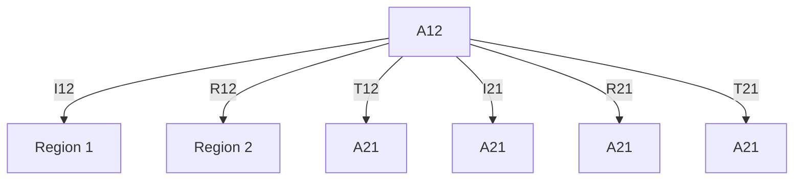
</details>

Figure 35 Distinguishing directional photon flux

Consider the photon fluxes (carried by rays) flowing from Region 1 to Region 2. For photon flux conservation:

$$
I _ {1 2} = R _ {1 2} + T _ {1 2} + A _ {1 2} \tag {699}
$$

where:

■ $I _ { 1 2 }$ is the incident flux.   
$R _ { 1 2 }$ is the reflected flux.   
$T _ { 1 2 }$ is the transmitted flux.   
■ $A _ { 1 2 }$ is the flux absorbed at the interface.

The reverse is true for flux flowing from Region 2 to Region 1. At each interface, the summation of $R _ { 1 2 } , T _ { 1 2 } , A _ { 1 2 } , R _ { 2 1 } , T _ { 2 1 }$ and $A _ { 2 1 }$ is stored in the raytracing process.

With this information, you can compute various reflection and transmission coefficients at the interface that has been declared as a raytrace BC. For example, assume that light is illuminated from Region 1 to Region 2. Within Region 2, there can be multiple reflections, and some rays might escape back into Region 1 through $T _ { 2 1 }$ .

Therefore, the power reflection coefficient for the case in Figure 35 is:

$$
\tilde {R} _ {1 2} = \frac {\sum R _ {1 2} + \sum T _ {2 1}}{\sum R _ {1 2} + \sum T _ {1 2} + \sum A _ {1 2}} \tag {700}
$$

The following syntax activates the feature for tracking and plotting interface fluxes:

```txt
Physics {...
Optics (...
OpticalSolver (...
RayTracing (
PlotInterfaceFlux 
```

# 21: Optical Generation

Raytracing

```txt
)
)
)
} 
```

This feature is limited to the unified raytracing interface. In the plot file, only the fluxes of the interfaces or contacts that have been declared as a raytrace BC are output. In addition, activating the PlotInterfaceFlux feature also enables the output of the absorbed photon density in every layer of the TMM BC. The output variables in the plot file are listed as follows:

```txt
RaytraceInterfaceFlux    # directional
    R(region1/region3)
    T(region1/region3)
    A(region1/region3)
    R(region3/region1)
    T(region3/region1)
    A(region3/region1)

RaytraceContactFlux    # directional
    R(contactname1(region1/region3))    # the region is only a sample
    T(contactname1(region1/region3))
    A(contactname1(region1/region3))
    R(contactname1(region3/region1))
    T(contactname1(region3/region1))
    A(contactname1(region3/region1))

RaytraceInterfaceTMMLayerFlux    # not directional
    A(region1/region3).layer1
    A(region1/region3).layer2
    A(region1/region3).layer3

RaytraceContactTMMLayerFlux    # not directional
    A(contactname1(region1/region3)).layer1
    A(contactname1(region1/region3)).layer2
    A(contactname1(region1/region3)).layer3 
```

A contact-based BC can possibly intersect many region interfaces. In the plot file output, only a representative region interface is used to indicate the directional flow of photon flux for the entire contact BC.

When the PlotInterfaceFlux feature is activated, the OpticalIntensity computation will change such that the intensity within each region is scaled to the net photon flux gained in that region. Therefore, the OpticalIntensity values can be negative in some regions. Integration of the OpticalIntensity within the region recovers the net photon flux flowing into that region.

# Far Field and Sensors for Raytracing

To collect information on the rays that exit a device, the concept of far field and sensors is introduced in the unified raytracer interface.

The far field is collected on a virtual circle for two dimensions and a virtual sphere for three dimensions. Ray collection does not destroy the rays. On the virtual far-field surface, the farfield intensity is computed based on a unit measure of radius, whereby the collected ray powers at each interval are divided by the radian angular arc (2D) or area (3D).

raypowers In two dimensions, far-field intensity = dφ

In three dimensions, far-field intensity = . raypowersθ( ) θ{ } cos ( ) – cos ( ) dφ --------------------------------------------------------------

On the other hand, a sensor sums the total power of all rays impinging the sensor. Two types of sensor can be defined:

■ A line segment sensor in two dimensions or a flat rectangular sensor in three dimensions.   
An angular sensor that collects the power of the rays that radiate within the angular span of the sensor. In two dimensions, a range of defines the sensor; whereas in threeφ dimensions, ranges of and are needed. These are defined according to the regularθ φ Cartesian coordinate system. In two dimensions, rotates from 0 at the positive x-axis inφ a counterclockwise direction towards the positive y-axis. In three dimensions, rotatesθ from 0 at the positive z-axis towards the xy plane; whereas. is similarly defined as in twoφ dimensions.

The SensorSweep option is also available for 3D simulations. It allows you to visualize the variation of ray power collected on a latitude or longitude ring band.

The syntax for activating the far field and sensors in the unified interface for optical generation computation is:

```txt
Physics {
    Optics (
    OpticalSolver (
    Raytracing(
    Farfield(
    Origin = auto | <vector>  # default is auto
    Discretization = <integer>  # default is 360 for 2D, 36 for 3D
    ObservationRadius = <float>  # default is 1e6 um (1 meter)
    Sensor(
    Name = "sensorname1"
    Rectangle (  # 3D only
    Corner1 = <vector>
    Corner2 = <vector> 
```

21: Optical Generation Raytracing   
```julia
Corner3 = <vector>
UseNormalFlux
AxisAligned    # 3D only
)
Line (    # 2D only
    Corner1 = <vector>
    Corner2 = <vector>
    UseNormalFlux
)
Angular (
    Theta = (<float> <float>)
    Phi = (<float> <float>)
)
)
Sensor(
    Name = "sensorname2"
    Rectangle ( ... )    # 3D only
    Line ( ... )    # 2D only
    Angular ( ... )
)
SensorSweep(    # 3D only
    Name = "sensorname3"
    Ndivisions = <integer>
    VaryPhi
    Theta = (<float> <float>)    # Use with VaryPhi
)
SensorSweep(    # 3D only
    Name = "sensorname4"
    Ndivisions = <integer>
    VaryTheta
    Phi = (<float> <float>)    # Use with VaryTheta
)
) 
```

Some comments about the syntax:

Multiple far-field Sensor and SensorSweep sections can be defined. However, each Sensor and SensorSweep section must have a unique name for identification.   
When Line or Rectangle sensors are used, the option UseNormalFlux allows you to sum the normal-projected power from the ray that is impinging the sensor at an angle.   
In the case of a Rectangle sensor in three dimensions, if you specify AxisAligned, only opposing corners of the rectangle are required. Sentaurus Device automatically computes the other two corners of the rectangle.

If an empty Farfield() section is specified, the far field is plotted with the default values of Discretization, Origin, and ObservationRadius.   
The far field takes values of intensity type. Therefore, to recover the total number of photons, you must integrate over the angle (in radian).   
The 3D far field is projected onto a staggered grid (see Staggered 3D Grid LED Radiation Pattern on page 961).   
The far field is plotted at every instance where the Plot statement in the Solve section is activated. The file names of the far field and sensor sweep are derived from the plot file name. For example, this syntax:

```txt
File {...
    Plot = "n99_des"
}
Solve {...
    Plot (Range=(0,1) Intervals=5)
} 
```

produces the following far-field files:

```txt
n99_000000_des_farfield.tdr
n99_000001_des_farfield.tdr
...
n99_000000_des_sensorsweep.plt
n99_000001_des_sensorsweep.plt
... 
```

In the SensorSweep plot file, all the user-defined SensorSweep sections are defined in the following fields of the plot file:

```txt
sensorname3
Phi
Photons_DelTheta
sensorname4
Theta
Photons_DelPhi 
```

The values of the sensor are added to the general plot file of the simulation, and the field entries are:

```txt
RaytraceSensor
sensorname1
sensorname2 
```

# Dual-Grid Setup for Raytracing

Raytracing in Sentaurus Device is based on tracing the rays in each cell of the simulation mesh. For simulations in which the optical material properties do not vary on a short length scale, this might lead to the unnecessary deterioration of simulation performance. In such cases, a dualgrid setup can be used, which allows the use of a coarse mesh for raytracing, while the electronic equations are solved on a finer mesh (see Figure 36 on page 637).

The basic syntax for setting up a raytracing dual-grid simulation is:   
```hcl
File {
    Output = "output"
    Current = "current"
}

Plot {
    OpticalIntensity
    OpticalGeneration
}

# Specify grid and material parameter file names for raytracing:
OpticalDevice OptGrid {
    File {
    Grid = "raytrace.tdr"
    Doping = "raytrace.tdr"
    Current = "opto"
    Plot = "opto"
    Parameter = "CIS.par"
    }
    Physics { HeteroInterface }
}

# Specify grid, material parameters, and physical models for electrical
# simulation:
Device CIS {
    Electrode {
    { Name="sub" Voltage = 0.0 }
    { Name="pd" Voltage = 0.0 }
    }
    File {
    Grid = "in_elec_pof.tdr"
    Doping = "in_elec_pof.tdr"
    Parameter = "CIS.par"
    Current = "current"
    Plot = "plot"
    }
    Physics {
    AreaFactor = 1
    Optics(...
    ComplexRefractiveIndex(...
    WavelengthDep(real imag)
    )
    OpticalGeneration(...)
    Excitation(...)
    }
} 
```

```txt
OpticalSolver(
    RayTracing (
    RayDistribution(...)
    DepthLimit = 1000
    MinIntensity = 1e-3
)
)
)
}
# Specify system connectivity:
System {
    OptGrid opt ()
    CIS d1 (pd=vdd sub=0) { Physics{ OptSolver = "opt" } }
    Vsource_pset drive(vdd 0){ dc = 0.0 }
}
Solve { Poisson } 
```

The dual-grid simulation setup also allows the unified raytracing interface to be used (see Raytracing on page 566).


<details>
<summary>natural_image</summary>

Two 3D structural diagrams showing layered materials with mesh patterns, no text or symbols present
</details>

Figure 36 Comparison of two grids used in a 3D dual-grid CMOS image sensor simulation; the figures show cuts through the device center; (left) the electronic equations are solved on a fine grid and (right) a coarse grid is used for raytracing

# Transfer Matrix Method

Sentaurus Device can calculate the propagation of plane waves through layered media by using a transfer matrix approach.

# Physical Model

In the underlying model of the optical carrier generation rate, monochromatic plane waves with arbitrary angles of incidence and polarization states penetrating a number of planar, parallel layers are assumed. Each layer must be homogeneous, isotropic, and optically linear. In this case, the amplitudes of forward and backward running waves $A _ { j } ^ { \pm }$ and $\boldsymbol { B } _ { j } ^ { \pm }$ in each layer in Figure 37 on page 639 are calculated with help of transfer matrices.

These matrices are functions of the complex wave impedances $Z _ { j }$ given by $Z _ { j } = n _ { j }$ cos⋅ $\Theta _ { j }$ in the case of E polarization (TE) and by $Z _ { j } = n _ { j } / ( \cos \Theta _ { j } )$ in the case of H polarization (TM). Here, $n _ { j }$ denotes the complex index of refraction and $\Theta _ { j }$ is the complex counterpart of the angle of refraction $( n _ { 0 } \cdot \sin \Theta _ { 0 } = n _ { j }$ ⋅ sin $\Theta _ { j } )$ ).

The transfer matrix of the interface between layers and is defined by:j j + 1

$$
T _ {j, j + 1} = \frac {1}{2 Z _ {j}} \cdot \left[ \begin{array}{l l} Z _ {j} + Z _ {j + 1} & Z _ {j} - Z _ {j + 1} \\ Z _ {j} - Z _ {j + 1} & Z _ {j} + Z _ {j + 1} \end{array} \right] \tag {701}
$$

The propagation of the plane waves through layer can be described by the transfer matrix:j

$$
T _ {j} \left(d _ {j}\right) = \left[ \begin{array}{c c} \exp \left(2 \pi \mathrm{i} n _ {j} \cos \Theta_ {j} \frac {d _ {j}}{\lambda}\right) & 0 \\ 0 & \exp \left(- 2 \pi \mathrm{i} n _ {j} \cos \frac {\Theta_ {j} d _ {j}}{\lambda}\right) \end{array} \right] \tag {702}
$$

with the thickness $d _ { j }$ of layer and the wavelengthj $\lambda$ of the incident light.

The transfer matrices connect the amplitudes of Figure 37 as follows:

$$
\left( \begin{array}{l} B _ {j} ^ {+} \\ A _ {j} ^ {+} \end{array} \right) = T _ {j, j + 1} \cdot \left( \begin{array}{l} A _ {j + 1} ^ {-} \\ B _ {j + 1} ^ {-} \end{array} \right) \tag {703}
$$

$$
\left( \begin{array}{l} A _ {j} ^ {-} \\ B _ {j} ^ {-} \end{array} \right) = T _ {j} (d _ {j}) \cdot \left( \begin{array}{l} B _ {j} ^ {+} \\ A _ {j} ^ {+} \end{array} \right)
$$


<details>
<summary>text_image</summary>

n_{j-1} A^{+}_{j-1} \downarrow \uparrow B^{+}_{j-1} T_{j-1,j}
n_j A^{-}_j \uparrow \downarrow B^{-}_j T_j
A^{+}_j \downarrow \uparrow B^{+}_j
n_{j+1} A^{-}_{j+1} \uparrow \downarrow B^{-}_{j+1} T_{j,j+1}
</details>

Figure 37 Wave amplitudes in a layered medium and transfer matrices connecting them

It is assumed that there is no backward-running wave behind the layered medium, and the intensity of the incident radiation is known. Therefore, the amplitudes $A _ { j } ^ { \pm }$ and ${ B } _ { j } ^ { \pm }$ at each interface can be calculated with appropriate products of transfer matrices.

For both cases of polarization, the intensity in layer at a distance from the upper interfacej d $( j , j + 1 )$ is given by:

$$
I _ {T (\mathrm{TE}, \mathrm{TM})} (d) = \frac {\Re (Z _ {j})}{\Re (Z _ {0})} \cdot \left\| T _ {j} (d) \cdot \left( \begin{array}{c} A _ {j} ^ {-} \\ B _ {j} ^ {-} \end{array} \right) \right\| ^ {2} \tag {704}
$$

with the proper wave impedances. If is the angle between the vector of the electric field andδ the plane of incidence, the intensities have to be added according to:

$$
I (d) = I _ {\mathrm{TM}} (d) + I _ {\mathrm{TE}} (d) \tag {705}
$$

where ${ I _ { \mathrm { T M } } } = ( 1 - a ) I ( d )$ and $I _ { \mathrm { T E } } = a I ( d )$ with $a = \cos ^ { 2 } \delta$ .

# 21: Optical Generation

Transfer Matrix Method

One of the layers must be the electrical active silicon layer where the optical charge carrier generation rate $G ^ { \mathrm { { ^ { o p t } } } }$ is calculated. The rate is proportional to the photon flux $\Phi ( d ) \ : = \ : I ( d ) / \hbar \omega$ .

In the visible and ultraviolet region, the photon energy is greater than the band gap ofhω silicon. In this region, the absorption of photons by excitation of electrons from the valence to the conduction band is the dominant absorption process for nondegenerate semiconductors. Far from the absorption threshold, the absorption is considered to be independent of the free carrier densities and doping. Therefore, the silicon layer is considered to be a homogeneous region.

The absorption coefficient is the relative rate of decrease in light intensity along its path ofα propagation due to absorption. This decrease must be distinguished from variations caused by the superposition of waves. Therefore, the rate of generated electron–hole pairs is:

$$
G _ {0} ^ {\text { opt }} = \alpha \eta \frac {I (d)}{\hbar \omega} \tag {706}
$$

where the absorption coefficient is given by the imaginary part of α 4π $Z _ { \mathrm { { S i } } } / \lambda$ . The quantum yield is defined as the number of carrier pairs generated by one photon. More details aboutη the available quantum yield models and their specification in the OpticalGeneration section of the command file are given in Quantum Yield Models on page 553.

# Rough Surface Scattering

To model the effect of light trapping due to scattering of incident light at rough interfaces of a planar multilayer structure, the standard TMM approach describing the propagation of coherent light is extended. Part of the coherent light incident at a rough interface is scattered and spreads incoherently throughout the structure. Scalar scattering theory [4][5] allows to approximate the amount of scattered light at a rough interface. The so-called haze parameter defines the ratio of diffused (scattered) light to total (diffused + specular) light. The directional dependency of the scattering process is modeled by angular distribution functions (ADFs). In this scenario, a rough interface is characterized by its haze function (haze parameter as a function of the wavelength of incident light) for reflection and transmission as well as the ADF for direct coherent light incident at the interface and the ADF for scattered light incident at the interface.

The implementation of rough surface scattering within the existing TMM framework follows the semi-coherent optical model outlined in [6]. It is based on the following assumptions:

■ The haze factor determines the fraction of direct light, transferred to scattered light.   
Coherent and diffused light incident on a rough interface are scattered differently using different ADFs.   
■ Interfaces are nonabsorptive, meaning photon flux is conserved at interfaces.

For scattered light incident at a rough interface, the mean value of TE and TM polarized light for reflectance and transmittance is used.   
For the scattered light, the total reflectance and transmittance for a rough interface are assumed to be equal to the ones for the corresponding flat interface.   
The phase change of the electric field traveling across a rough interface is the same as in the case of the corresponding flat interface.   
Scattered light incident at a rough interface is further split, according to its haze factor, into a specular part, which corresponds to light incident at a flat interface, and a diffused part leading to further spreading of the incident scattered light.

Given these assumptions, the specular and diffused components of light at each interface can be expressed in terms of the corresponding haze functions and ADFs. The description of coherent light incident at a rough interface differs from the approach taken in [6] in that a generalized interface matrix has been derived. It accounts for the reduced reflection and transmission according to the respective haze functions and allows to keep the common TMM computation approach for the electric field and intensity. The reduced interface matrix reads as follows:

$$
\tilde {T} _ {j, j + 1} = \frac {1}{h _ {j + 1 , j} ^ {t} t} \left[ \begin{array}{c c} 1 & \left(h _ {j + 1, j} ^ {r} r _ {j, j + 1}\right) \\ \left(h _ {j, j + 1} ^ {r} r _ {j, j + 1}\right) & \left(h _ {j, j + 1} ^ {t} h _ {j + 1, j} ^ {t} + \left(h _ {j + 1, j} ^ {r} h _ {j, j + 1} ^ {r} - h _ {j, j + 1} ^ {t} h _ {j + 1, j} ^ {t}\right) r _ {j, j + 1} ^ {2}\right) \end{array} \right] \tag {707}
$$

where $r _ { j , j + 1 }$ and $t _ { j , j + 1 }$ denote the Fresnel reflection and transmission coefficients for normal incidence given by:

$$
r _ {j, j + 1} = \frac {n _ {j} - n _ {j + 1}}{n _ {j} + n _ {j + 1}} \tag {708}
$$

$$
t _ {j, j + 1} = \frac {2 n _ {j}}{n _ {j} + n _ {j + 1}} \tag {709}
$$

and ${ h } _ { j , j + 1 } ^ { r }$ and ${ h } _ { j , j + 1 } ^ { t }$ are reduction factors determined by the haze functions for reflection and transmission:

$$
h _ {j, j + 1} ^ {r} = \sqrt {1 - H _ {j , j + 1} ^ {r}} \tag {710}
$$

$$
h _ {j, j + 1} ^ {t} = \sqrt {1 - H _ {j , j + 1} ^ {t}} \tag {711}
$$

The haze functions for reflection and transmission derived from the scalar scattering theory are:

$$
H _ {j, j + 1} ^ {r} (\lambda , \varphi_ {j}) = 1 - \exp \left[ - \left(\frac {4 \pi \sigma_ {\mathrm{rms}} c _ {r} (\lambda , \sigma_ {\mathrm{rms}}) n _ {j} \cos \varphi_ {j}}{\lambda}\right) ^ {a ^ {r}} \right] \tag {712}
$$

$$
H _ {j, j + 1} ^ {t} (\lambda , \varphi_ {j}) = 1 - \exp \left[ - \left(\frac {4 \pi \sigma_ {\mathrm{rms}} c _ {t} (\lambda , \sigma_ {\mathrm{rms}}) | n _ {j} \cos \varphi_ {j} - n _ {j + 1} \cos \varphi_ {j + 1} |}{\lambda}\right) ^ {a ^ {t}} \right] \tag {713}
$$

where $\sigma _ { \mathrm { r m s } }$ stands for the root-mean-square roughness of the interface and is the wavelengthλ of the incident light. The exponent $a ^ { r / \acute { t } }$ and the correction function $c _ { r / t }$ are fitting parameters to better match experimental data.

NOTE The haze functions defined in Eq. 712 and Eq. 713 are given in their general form, which also covers light incident at the angle from theϕj surface normal. This expression is needed in the description of scattered light incident at a rough interface.

For the propagation of the angular intensity components of scattered light through each layer, the effective path length is used to stay within the one-dimensional formalism:

$$
I (\lambda , \varphi_ {j}, d) = I (\lambda , \varphi_ {j}) \exp \left(- \frac {\alpha (\lambda) d}{\cos \varphi_ {j}}\right) \tag {714}
$$

The scattering solver first propagates all forward-going components through the layer structure and completes a round trip by propagating all backward-going components. In each round trip, part of the light might be absorbed within the structure as well as transmitted through the front or back side, depending on the material properties at the given wavelength. This leads to a reduction of the light intensity components at the various interfaces with increasing number of iterations. When the ratio of the largest remaining intensity component in the system to the sum of all initial intensity components falls below the value of Tolerance, the solver terminates. As a consequence, the residual intensity of each component at all interfaces is not included in the extracted results.

The overall simulation flow consists of the following steps:

Solving the coherent propagation problem following the default TMM solver algorithm, but using the generalized interface matrices for rough interfaces. In this step, the starting light intensity for scattered light is calculated at each interface as well.   
The scattered light is propagated through the structure following an iterative approach similar to raytracing as outlined in [6]. However, other than raytracing, instead of single rays, ray bundles with discrete angular distribution are propagated from layer to layer. The number of iterations needed to solve the scattering problem to the required accuracy mainly depends on how much light is absorbed within the structure and how much light is coupled out at the front and back ends during a single round trip.   
The scattered and coherent absorbed photon density profiles are summed and passed to the quantum yield model.

NOTE Support for rough surface scattering is limited to normal incident light.

For more information on how to apply the rough surface scattering model and its configuration options, see Using Scattering Solver on page 645.

# Using Transfer Matrix Method

The transfer matrix method is only supported by the unified interface for optical generation computation (see Overview of Optical Generation on page 543). The OpticalGeneration section activates the computation of the optical generation along with optional parameters such as the quantum yield. The OpticalSolver section determines the underlying optical solver together with solver-specific parameters as shown in the following example:

```txt
Physics {...
Optics (...
OpticalGeneration (...)
ComplexRefractiveIndex (...)
Excitation (...
Window ("L1") (...)
)
OpticalSolver (
TMM (
PropagationDirection = Perpendicular # Default Refractive
NodesPerWavelength = 20
LayerStackExtraction (...
WindowName = "L1"
Medium (...)
)
)
)
Excitation (...
Window ("L1") (...)
)
) 
```

The properties of the incident light such as Wavelength, Intensity, Polarization, and angle of incidence Theta are specified in the Excitation section (see Setting the Excitation Parameters on page 570) along with one or several illumination windows (see Illumination Window on page 572), which confine the incident light to a certain part of the device structure.

An illumination window determines how the 1D solution of the transfer matrix method is interpolated to the higher dimensional device grid. The minimum coordinate of the 1D profile is pinned to the illumination window, and the interpolation of the profile in propagation direction can be performed either perpendicular to it or according to Snell’s law, which is the default. The corresponding keyword in the TMM section is PropagationDirection, which can take either Perpendicular or Refractive as its argument. The accuracy of the integrated absorbed photon density for 1D TMM solutions in a 2D or 3D device can be controlled by various parameters (see Accurate Absorbed Photon Density for 1D Optical Solvers on page 587).

The LayerStackExtraction section determines how a 1D complex refractive index profile is extracted automatically from the grid file (see Extracting the Layer Stack on page 582). Based on this profile, the polarization-dependent optical intensity is calculated and interpolated onto the grid according to the referenced illumination window and the value of PropagationDirection. The optical generation profile then is calculated from the windowspecific intensities. For overlapping windows, the intensity are summed in the region of intersection.

By default, the surrounding media at the top and bottom of the extracted layer stack are assumed to have the material properties of vacuum. However, the default can be overwritten by specifying a separate Medium section in the LayerStackExtraction section for the top and bottom of the layer stack if necessary. In the Medium section, a Location must be specified and a Material, or, alternatively, the values of RefractiveIndex and ExtinctionCoefficient:

```lua
LayerStackExtraction(
    Medium (
    Location = top
    Material = "Silicon"
    )
    Medium (
    Location = bottom
    RefractiveIndex = 1.4
    ExtinctionCoefficient = 1e-3
    )
) 
```

If the optical generation profile is the sole quantity of interest, it is sufficient to specify the keyword Optics exclusively in the Solve section.

The TMM solver offers two options for computing the optical intensity from the complex field amplitudes of the forward-propagating and backward-propagating waves. Specifying IntensityPattern=StandingWave computes the optical intensity as follows:I

$$
I = \operatorname{Re} (A + B) ^ {2} + \operatorname{Im} (A + B) ^ {2} \tag {715}
$$

whereas using the syntax:

```txt
TMM (...
IntensityPattern = Envelope
) 
```

computes the optical intensity using the following formula to prevent oscillations on theI wavelength scale that might not be possible to resolve on the mixed-element simulation grid:

$$
I = \operatorname{Re} (A) ^ {2} + \operatorname{Im} (A) ^ {2} + \operatorname{Re} (B) ^ {2} + \operatorname{Im} (B) ^ {2} \tag {716}
$$

where and are the complex field amplitudes of the forward-propagating and backward-A B propagating waves, respectively. IntensityPattern can be specified globally, per region, or per material.

The keywords of TMM are summarized in Table 256 on page 1440.

# Using Scattering Solver

To model the effect of scattering at rough interfaces, the scattering solver (see Rough Surface Scattering on page 640) must be configured in the command file, and the parameters characterizing each rough interface must be specified in the corresponding parameter file section.

# Command File Specification

The scattering solver is activated by specifying a Scattering section within the TMM section. By default, all interfaces are treated as rough. However, whether part of the light incident on a specific interface is actually scattered depends on the corresponding haze functions for reflection and transmission defined in the parameter file. A haze function evaluating to zero is equivalent to the interface being treated as flat.

You can flag explicitly a specific region or material interface as not being rough as in the following example:

```txt
Physics {
    Optics (
    OpticalSolver (
    TMM (
    Scattering ( ... )
    RoughInterface #Default
    )
    )
}

Physics (RegionInterface="<region1>/<region2>") {
    Optics (
    OpticalSolver (
    TMM (
    -RoughInterface
    )
    ) 
```

```txt
)
} 
```

Sometimes, it might be more practical to set all interfaces as flat by specifying -RoughInterface in the global Physics section and only to label specific interfaces as rough in a corresponding region or material interface Physics section.

The angular discretization of the interval [ ] used for the ray bundles in the–π ⁄ 2, π ⁄ 2 scattering solver can be set with the keyword AngularDiscretization in the Scattering section. The keywords Tolerance and MaxNumberOfIterations determine the termination condition of the iterative scattering solver (see Rough Surface Scattering on page 640):

```swift
Physics {
    Optics (
    OpticalSolver (
    TMM (
    Scattering (
    AngularDiscretization = 90
    MaxNumberOfIterations = 150
    Tolerance = 1e-3
    )
    )
    )
    )
} 
```

For weakly absorbing structures, such as semiconductor layer stacks illuminated with light in the infrared part of the spectrum, many iterations might be necessary until the given Tolerance is reached. To detect such cases and to limit the total simulation time, it is advisable to adjust the value of MaxNumberOfIterations.

# Parameter File Specification

All parameters characterizing a rough interface are defined in the OpticalSurfaceRoughness section of the respective region or material interface section in the parameter file. The parameters can be classified into two groups: One relates to the specification of the haze functions and one contains the selection of the various angular distribution functions (ADFs).

For specifying the haze function for reflection (HazeFunction\_R) and transmission (HazeFunction\_T), two options are available:

Constant: For each of the two haze functions $\mathrm { H } _ { \mathrm { R } }$ and $\mathrm { H _ { T } }$ , a constant value can be set using the keywords H\_R and H\_T. This option can be useful if a simulation is performed at a single wavelength and the surface roughness is not varied as the haze functions usually depend on both.

Analytic: The analytic expressions given by Eq. 712, p. 641 and Eq. 713, p. 642 are evaluated. where the surface roughness $\sigma _ { \mathrm { r m s } }$ , the exponents $a _ { \mathrm { R } }$ and $a _ { \mathrm { T } }$ , and the correction functions $c _ { \mathrm { R } }$ and $c _ { \mathrm { T } }$ are supplied by the user. In the simplest approximation, $c _ { \mathrm { R } }$ and $c _ { \mathrm { T } }$ are assumed to be constants over the whole wavelength range. However, in general, the correction functions are used to fit the analytic haze functions against experimental data. For that purpose, tabulated values are supported by setting CorrectionFunction\_R or CorrectionFunction\_T equal to Table.

Besides the haze functions, the ADFs are used to characterize the behavior of light incident at rough interfaces. The model supports the specification of different ADFs for direct incident light at a rough interface as well as for scattered light incident at a rough interface. Some ADFs depend on an additional parameter apart from the angle of incidence, whose value must be supplied by the user.

The detailed syntax including all options for the definition of the haze functions and ADFs are given in the following tables (where applicable, the default value is given at the beginning of the description).

Table 123 Specification of haze functions 

<table><tr><td>Symbol</td><td>Keyword</td><td>Value</td><td>Description</td></tr><tr><td> $H^{r}(\lambda, \varphi)$ </td><td>HazeFunction_R</td><td>=Constant | Analytic</td><td>Constant Type of haze function for reflection.</td></tr><tr><td> $H^{t}(\lambda, \varphi)$ </td><td>HazeFunction_T</td><td>=Constant | Analytic</td><td>Constant Type of haze function for transmission.</td></tr><tr><td> $H_{R}$ </td><td>H_R</td><td>=</td><td>0 Constant value for haze function for reflection.</td></tr><tr><td> $H_{T}$ </td><td>H_T</td><td>=</td><td>0 Constant value for haze function for transmission.</td></tr><tr><td> $σ_{rms}$ </td><td>Sigma</td><td>=</td><td>0 Optical surface roughness in [nm] used in analytic haze functions for reflection and transmission.</td></tr><tr><td> $a_{R}$ </td><td>a_R</td><td>=</td><td>2 Exponent of analytic haze function for reflection.</td></tr><tr><td> $a_{T}$ </td><td>a_T</td><td>=</td><td>3 Exponent of analytic haze function for transmission.</td></tr><tr><td></td><td>CorrectionFunction_R</td><td>=Constant | Table</td><td>Constant Type of correction function of analytic haze function for reflection.</td></tr><tr><td></td><td>CorrectionFunction_T</td><td>=Constant | Table</td><td>Constant Type of correction function of analytic haze function for transmission.</td></tr><tr><td> $c_{R}$ </td><td>c_R</td><td>=</td><td>1 Constant value in interval [0 1] for correction function of analytic haze function for reflection.</td></tr><tr><td> $c_{T}$ </td><td>c_T</td><td>=</td><td>1 Constant value in interval [0 1] for correction function of analytic haze function for transmission.</td></tr><tr><td> $c_{R}(\lambda)$ </td><td>c_R</td><td>()</td><td>Tabulated values for correction function of analytic haze function for reflection. First column contains wavelength in [μm] and second column contains value of correction function in interval [0 1].</td></tr><tr><td> $c_{T}(\lambda)$ </td><td>c_T</td><td>()</td><td>Tabulated values for correction function of analytic haze function for transmission. First column contains wavelength in [μm] and second column contains value of correction function in interval [0 1].</td></tr><tr><td></td><td>TableInterpolation_c_R</td><td>=Linear | Spline</td><td>Linear Type of interpolation used for tabulated values of correction function for analytic haze function for reflection.</td></tr><tr><td></td><td>TableInterpolation_c_T</td><td>=Linear | Spline</td><td>Linear Type of interpolation used for tabulated values of correction function for analytic haze function for transmission.</td></tr></table>

Table 124 Specification of angular distribution functions (not normalized) 

<table><tr><td>Symbol</td><td>Keyword</td><td>Value</td><td>Description</td></tr><tr><td> $f_1(\varphi)$ </td><td>ADFDirect_R</td><td>=Constant | Triangle | Gauss | Lorentz | Cosine | Ellipse</td><td>Cosine Type of angular distribution function for direct incident light reflected at a rough interface.</td></tr><tr><td>C</td><td>CDirect_R</td><td>=&lt;float&gt;</td><td>2 Fitting parameter used in angular distribution function (where applicable) for direct incident light reflected at a rough interface.</td></tr><tr><td> $f_1(\varphi)$ </td><td>ADFDirect_T</td><td>=Constant | Triangle | Gauss | Lorentz | Cosine | Ellipse</td><td>Cosine Type of angular distribution function for direct incident light transmitted through a rough interface.</td></tr><tr><td>C</td><td>CDirect_T</td><td>=&lt;float&gt;</td><td>2 Fitting parameter used in angular distribution function (where applicable) for direct incident light transmitted through a rough interface.</td></tr><tr><td> $f_2(\varphi)$ </td><td>ADFScatter_R</td><td>=Constant | Triangle | Gauss | Lorentz | Cosine | Ellipse</td><td>Constant Type of angular distribution function for scattered light reflected at a rough interface.</td></tr><tr><td>C</td><td>CScatter_R</td><td>=&lt;float&gt;</td><td>1 Fitting parameter used in angular distribution function (where applicable) for scattered light reflected at a rough interface.</td></tr><tr><td> $f_2(\varphi)$ </td><td>ADFScatter_T</td><td>=Constant | Triangle | Gauss | Lorentz | Cosine | Ellipse</td><td>Constant Type of angular distribution function for scattered light transmitted through a rough interface.</td></tr><tr><td>C</td><td>CScatter_T</td><td>=&lt;float&gt;</td><td>1 Fitting parameter used in angular distribution function (where applicable) for scattered light transmitted through a rough interface.</td></tr></table>

Table 125 Definition of different ADF types used in Table 124 

<table><tr><td>Type</td><td>Formula</td></tr><tr><td>Constant</td><td> $f(\varphi) = 1$ </td></tr><tr><td>Triangle</td><td> $f(\varphi) = 1 - 2|\varphi|/\pi$ </td></tr><tr><td>Gauss</td><td> $f(\varphi) = e^{-\varphi^2/(2C)}$ </td></tr><tr><td>Lorentz</td><td> $f(\varphi) = e^{1/(\varphi^2+C^2)}$ </td></tr><tr><td>Cosine</td><td> $f(\varphi) = \cos^C(\varphi)$ </td></tr><tr><td>Ellipse</td><td> $f(\varphi) = \frac{\cos(\varphi)}{\cos^2(\varphi) + (2C)^{-2}\sin^2(\varphi)}$ </td></tr></table>

The following figures illustrate the various ADFs specified in Table 124 on page 648.


<details>
<summary>line</summary>

| φ       | f     |
| ------- | ----- |
| -π/2    | 0.0   |
| 0       | 0.6   |
| π/2     | 0.0   |
</details>

Figure 38 ADF of type Constant and Triangle

# 21: Optical Generation

Transfer Matrix Method


<details>
<summary>line</summary>

| φ       | C=0.5  | C=1    | C=2    |
| ------- | ------ | ------ | ------ |
| -π/2    | ~0.05  | ~0.15  | ~0.2   |
| 0       | ~0.5   | ~0.45  | ~0.38  |
| π/2     | ~0.05  | ~0.15  | ~0.2   |
</details>

Figure 39 ADF of type Gauss


<details>
<summary>line</summary>

| φ       | C=0.5  | C=1    | C=2    |
| ------- | ------ | ------ | ------ |
| -π/2    | ~0.0   | ~0.2   | ~0.3   |
| 0       | 1.6    | 0.45   | ~0.3   |
| π/2     | ~0.0   | ~0.2   | ~0.3   |
</details>

Figure 40 ADF of type Lorentz


<details>
<summary>line</summary>

| φ       | C=0.5  | C=1    | C=2    |
| ------- | ------ | ------ | ------ |
| -π/2    | 0.0000 | 0.0000 | 0.0000 |
| 0       | 0.4000 | 0.5000 | 0.6000 |
| π/2     | 0.0000 | 0.0000 | 0.0000 |
</details>

Figure 41 ADF of type Cosine


<details>
<summary>line</summary>

| φ       | C=0.5 | C=1   | C=2   |
| ------- | ----- | ----- | ----- |
| -π/2    | 0.0   | 0.0   | 0.0   |
| 0       | 0.5   | 0.35  | 0.25  |
| π/2     | 0.0   | 0.0   | 0.0   |
</details>

Figure 42 ADF of type Ellipse

The following OpticalSurfaceRoughness section is an example for the specification of analytic haze functions and the default angular distribution functions:

```txt
OpticalSurfaceRoughness {
    HazeFunction_R=Analytic
    HazeFunction_T=Analytic
    Sigma=20    #[nm]
    a_R=2
    a_T=3
    CorrectionFunction_R=Table
    TableInterpolation_c_R=Spline
    c_R(
    0.3 04
    0.4 0.65
    0.8 0.9
    1.3 0.95
)
CorrectionFunction_T=Constant
c_T=0.7

ADFDirect_R=Cosine
CDirect_R=2
ADFDirect_T=Cosine
CDirect_T=2
ADFScatter_R=Constant
ADFScatter_T=Constant
} 
```

# Plot Quantities

When specifying OpticalIntensity and AbsorbedPhotonDensity in the Plot section of the command file, the following additional datasets are written to the plot file:

OpticalIntensityCoherent: Specular part of optical intensity resulting from propagation of coherent light.   
OpticalIntensityIncoherent: Diffuse part of optical intensity resulting from propagation of incoherent light.   
AbsorbedPhotonDensityCoherent: Specular part of absorbed photon density resulting from propagation of coherent light.   
AbsorbedPhotonDensityIncoherent: Diffuse part of absorbed photon density resulting from propagation of incoherent light.

# Loading Solution of Optical Problem From Files

In solar-cell and CIS simulations, it is often necessary to load several optical generation profiles as a function of one or more parameters, for example, excitation wavelength or angle of incidence, in Sentaurus Device. These profiles then are used to compute the response to each of them separately or to compute the response to the spectrum as a whole. A typical example is the computation of white-light generation using several generation profiles previously computed by Sentaurus Device Electromagnetic Wave Solver (EMW) or different wavelengths of the visible spectrum.

The parameters corresponding to a specific absorbed photon density or optical generation profile are written to the respective output file as special TDR tags as well. For 1D profiles generated with external tools, such tags can be specified in the file header (see Importing 1D Profiles Into Higher-Dimensional Grids on page 655). This ensures that a profile can be identified later when loaded into a Sentaurus Device simulation. For example, if the optical problem is solved externally, it is not possible to determine the quantum yield, which is necessary to compute the optical generation based on the electronic properties of the underlying device structure. However, since the corresponding excitation wavelength is stored along with the optical solution, the quantum yield computation can be performed later in Sentaurus Device after loading the profile to compute the optical generation.

Absorbed photon density or optical generation profiles loaded into Sentaurus Device using the optical solver FromFile must meet one of the following requirements:

■ Profiles must be saved in a TDR file.   
■ One-dimensional profiles that are to be imported into higher-dimensional grids must comply with the PLX file format described in Importing 1D Profiles Into Higher-Dimensional Grids on page 655.

If the grid on which the profile is saved is not the same as that used for the device simulation (different mixed-element grid or arbitrary tensor grid arising from EMW simulation), the profile is interpolated automatically onto the simulation grid upon loading. For more details on how to control the interpolation, including the truncation and shifting of the interpolation domain, see Controlling Interpolation When Loading Optical Generation Profiles on page 671.

The basic command file syntax for loading profiles from file is:   
```hcl
File {
    OpticalSolverInput = "<filename or filename pattern of profiles>"
}

Physics {
    Optics (
    OpticalGeneration (
    ComputeFromMonochromaticSource ()    # or
    ComputeFromSpectrum ()
    )
    OpticalSolver (
    FromFile (
    DatasetName = AbsorbedPhotonDensity    # Default
    SpectralInterpolation = Linear    # Default Off
    IdentifyingParameter = ("Wavelength" "Theta")
    )
    )
    )
} 
```  
NOTE The optical solver FromFile requires the specification of ComputeFromMonochromaticSource or ComputeFromSpectrum in the OpticalGeneration section. Otherwise, the computation of the optical generation based on the loaded profile is not activated.

The keyword OpticalSolverInput takes as its argument either the name of a single TDR or PLX file, or a UNIX-style file name pattern to select several such files whose names match the specified pattern. In both cases, a single file can contain more than one absorbed photon density or optical generation profile. In TDR files, the different profiles are saved in separate TDR states; whereas, in PLX files, they are simply listed sequentially, including their respective headers (see Importing 1D Profiles Into Higher-Dimensional Grids on page 655).

Each profile is characterized by its set of parameters, whose values must be unique among the profiles selected in the File section. As profiles can be characterized by different numbers of parameters, you must specify the ones to be considered for checking uniqueness by using the keyword IdentifyingParameter. Supported arguments are a simple parameter name such as Wavelength or, if ambiguous, a full parameter path such as Optics/Excitation/ Wavelength.

# 21: Optical Generation

Loading Solution of Optical Problem From Files

It is also possible to introduce new parameters, that is, parameters that do not exist in Sentaurus Device, by assigning them to a profile and referring to them in the list of IdentifyingParameter. Added parameters will appear under the following path:

Optics/OpticalSolver/FromFile/UserDefinedParameters/<Name of added parameter>

User-defined parameters also are supported in the IlluminationSpectrum file in the File section (see Illumination Spectrum on page 546).

NOTE Only profiles that carry intensity as a parameter tag are supported for loading from files. Other profiles are ignored with a warning message. However, intensity must not be listed as IdentifyingParameter unless you want to enforce explicitly that all profiles are also unique with respect to their intensity.

The intensity associated with each profile and saved as a parameter tag in the respective file plays a special role as it is needed to scale the loaded profile according to the requested intensity. For ComputeFromMonochromaticSource, the loaded profile must be scaled to conform with the intensity specified in the Excitation section according to:

$$
G = \frac {I _ {\text { exc }}}{I _ {\text { loaded }}} G _ {\text { loaded }} \tag {717}
$$

For ComputeFromSpectrum, the loaded profile for each spectral component is scaled to match the intensity given in the corresponding entry of the illumination spectrum file. The total optical generation is then computed as the sum over the scaled profiles given by:

$$
G _ {\text { tot }} = \sum_ {n} \frac {I _ {n , \text { spectrum }}}{I _ {n , \text { loaded }}} G _ {n, \text { loaded }} \tag {718}
$$

When using the feature ComputeFromSpectrum (see Illumination Spectrum on page 546) or when ramping parameters, it is possible that, for a requested set of parameter values, no profile can be found that matches it. By default, the program will exit with an appropriate error message; however, you have two further options to deal with such situations. Using the keyword SpectralInterpolation, either PiecewiseConstant or Linear interpolation can be selected. Interpolation is based on the leading identifying parameter as opposed to complex multidimensional interpolation.

As mentioned earlier, two profile quantities are supported, absorbed photon density and optical generation, which can be selected using the keyword DatasetName. The choice determines whether a quantum yield model (see Quantum Yield Models on page 553) will be applied. If optical generation is specified, quantum yield is assumed to be 1. Otherwise, the corresponding quantum yield model specified in the OpticalGeneration section is used to compute the optical generation profile from the loaded absorbed photon density.

# Importing 1D Profiles Into Higher-Dimensional Grids

Importing 1D profiles into higher-dimensional grids is supported for files in PLX format. The following example documents the syntax of PLX files for two 1D profiles characterized by three parameters in a single file:

```txt
# some comments
"<optional string for tagging a profile>"
Wavelength = 0.5 [um] Theta = 0 [deg] Intensity = 0.1 [W*cm^-2]
0.0 1e19
0.8 1e20
1.4 1e17
2.0 5e18

# some comments
"<optional string for tagging a profile>"
Wavelength = 0.6 [um] Theta = 30[deg] Intensity = 0.1 [W*cm^-2]
0.0 1e19
0.8 1e20
1.4 1e17
2.0 5e18
... 
```

Each profile can be preceded by an optional comment starting with the hash sign (#), an optional tag given in double quotation marks, and a list of parameters with their corresponding value and unit as shown in the example above. If a tag is supplied, it will be used as a curve name when visualizing the file in Inspect, which also supports PLX files containing several profiles.

After the 1D profiles have been loaded into Sentaurus Device, they must be interpolated onto the 2D or 3D grid. Similar to the TMM solver (see Using Transfer Matrix Method on page 643), the concept of an illumination window is applied for this purpose and it requires the specification of at least one Window section in the Excitation section. See Illumination Window on page 572 for further details. The accuracy of the integrated APD for 1D profiles in a 2D or 3D device can be controlled by various parameters (see Accurate Absorbed Photon Density for 1D Optical Solvers on page 587).

NOTE For the interpolation of the 1D profile onto the 2D or 3D grid, the first data point of a profile is always pinned to the illumination window plane, independent of its actual coordinate value.

# Ramping Profile Index

The optical solver FromFile supports a keyword ProfileIndex, which can be used to address a certain profile directly by its index instead of its identifying parameters. The index is derived from all valid profiles sorted according to the value of the leading identifying parameter specified in the command file. This feature can be used to ramp through all available profiles in a Quasistationary statement without having to know the exact parameter values for each profile. The spectral interpolation options described in Loading Solution of Optical Problem From Files on page 652 above also are supported for ramping the ProfileIndex. If an index value is requested in a Quasistationary statement that exceeds the number of valid profiles, the Quasistationary is finished and control is given to the following statement in the Solve section.

The following example shows the ramping of the ProfileIndex:   
```txt
File {
    OpticalSolverInput = "absorbed_photon_density_input_*file.tdr"
}

Physics {
    OpticalGeneration (
    ComputeFromMonochromaticSource ()
    )
    OpticalSolver (
    FromFile (
    ProfileIndex = 0
    DatasetName = AbsorbedPhotonDensity
    SpectralInterpolation = Off
    IdentifyingParameter = ("Optics/Excitation/Wavelength" "Theta" "Phi")
    )
    )
}

Solve {
    Quasistationary (
    InitialStep=0.01 MaxStep=0.01 MinStep=0.01
    Plot { Range = ( 0., 1 ) Intervals = 5 }
    Goal { ModelParameter="ProfileIndex" value=100 }
    ) { Optics }
} 
```

Note that the counting of profiles starts with index zero. For more information about ramping parameters, see Parameter Ramping on page 585.

# Optical Beam Absorption Method

The optical beam absorption method in Sentaurus Device computes optical generation by simple photon absorption using Beer’s law. Thereby, multiple optical beams can be defined to represent the incident light.

# Physical Model

Figure 43 illustrates one optical beam and its optical intensity distribution in a 3D device.   


<details>
<summary>text_image</summary>

J₀
Semiconductor Window
(xₘₐₓ, yₘₐₓ)
(xₘᵢₙ, yₘᵢₙ)
Photo Device
z
y
x
</details>

Figure 43 Intensity distribution of an optical beam modeled by a rectangular illumination window

$\mathrm { J } _ { 0 }$ denotes the optical beam intensity (number of photons that cross an area of $1 \ \mathrm { c m } ^ { 2 } \ \mathrm { p e r } \ 1 \ \mathrm { s } )$ incident on the semiconductor device. $( \mathbf { x } _ { \mathrm { m i n } } , \ \mathbf { y } _ { \mathrm { m i n } } )$ and $( \mathbf { x } _ { \mathrm { m a x } } , \ \mathbf { y } _ { \mathrm { m a x } } )$ define the rectangular illumination window. The space shape $F _ { x y }$ of the incident beam intensity is defined by the illumination window, where $F _ { x y \nu }$ is equal to 1 inside of it and zero otherwise.

The following equations describe useful relations for the photogeneration problem:

$$
E _ {\mathrm{ph}} = \frac {h c}{\lambda} \tag {719}
$$

$$
J _ {0} = \frac {P _ {0}}{E _ {\mathrm{ph}}}
$$

where:

$P _ { 0 }$ is the incident wave power per area $[ { \mathrm { W / c m } } ^ { 2 } ]$ .   
■ is the wavelength .λ [ ] cm   
is Planck’s constant .h [ ] J s

■ is the speed of light in a vacuum .c [ ] cm/s   
$E _ { \mathrm { p h } }$ is the photon energy that is approximately equal to $\frac { 1 . 2 4 } { \lambda [ \mu \mathrm { m } ] }$ in eV.

The optical beam absorption model computes the optical generation rate along the z-axis taking into account that the absorption coefficient varies along the propagation direction of the beam according to:

$$
G ^ {\text { opt }} (z, t) = J _ {0} F _ {t} (t) F _ {x y} \cdot \alpha (\lambda , z) \cdot \exp \left(- \left| \int_ {z _ {0}} ^ {z} \alpha (\lambda , z ^ {\prime}) d z ^ {\prime} \right|\right) \tag {720}
$$

where:

is the time.t   
$F _ { t } ( t )$ is the beam time behavior function. For a Gaussian pulse, it is equal to 1 for int $[ t _ { \operatorname* { m i n } } , t _ { \operatorname* { m a x } } ]$ and shows a Gaussian distribution decay outside the interval with the standard deviation $\sigma _ { t }$ .   
$z _ { 0 }$ is the coordinate of the semiconductor surface.   
$\mathfrak { Q } ( \lambda , z )$ is the nonuniform absorption coefficient along the z-axis.

As described in the following section, the optical beam absorption method supports a wide range of window shapes (see Illumination Window on page 572) as well as arbitrary beam time behavior functions (see Specifying Time Dependency for Transient Simulations on page 556). It is also not limited to beams propagating along the z-axis. The example above has only been used for demonstration purposes.

# Using Optical Beam Absorption Method

The optical beam absorption method is activated by the optical solver OptBeam. The profile of the absorption coefficient used in Eq. 720 is determined by the LayerStackExtraction section inside the OptBeam section; whereas, the shape of the beam is specified by the illumination window. The wavelength and intensity of the incident light are defined in the Excitation section.

The required syntax of the optical beam absorption method is summarized here:

```txt
Physics {
    ...
    Optics (
    ...
    Excitation (
    Wavelength = 0.5
    Intensity = 0.1
    Window("L1") (
    <window options> 
```

```txt
)
)
OpticalSolver (
    OptBeam (
    LayerStackExtraction (
    WindowName = "L1"
    <layer stack extraction options>
    )
)
)
) 
```

Further details about the Window and LayerStackExtraction sections can be found in Illumination Window on page 572 and Extracting the Layer Stack on page 582, respectively. The accuracy of the integrated absorbed photon density for 1D profiles in a 2D or 3D device can be controlled by various parameters (see Accurate Absorbed Photon Density for 1D Optical Solvers on page 587).

NOTE You can simulate several beams at the same time by specifying the corresponding number of Window and LayerStackExtraction sections. However, all beams are assigned the same wavelength and intensity, which is specified in the common Excitation section.

# Beam Propagation Method

In Sentaurus Device, the beam propagation method (BPM) can be applied to find the light propagation and penetration into devices such as photodetectors. Despite being an approximate method, its efficiency and relative accuracy make it attractive for bridging the gap between the raytracer and the FDTD solver (EMW) featured in Sentaurus Device. The BPM solver is available for both 2D and 3D device geometries, where its computational efficiency compared with a full-wave approach becomes particularly apparent in three dimensions.

NOTE The use of BPM for 3D CMOS image sensors is discouraged because the BPM cannot resolve the polarization transformation caused by the 3D lens.

# Physical Model

The BPM implemented in Sentaurus Device is based on the fast Fourier transform (FFT) and is a variant of the FFT BPM, which was developed by Feit and Fleck [7].

The solution of the scalar Helmholtz equation:

$$
\left[ \nabla_ {\mathrm{t}} ^ {2} + \frac {\partial^ {2}}{\partial z ^ {2}} + k _ {0} ^ {2} n ^ {2} (x, y, z) \right] \phi (x, y, z) = 0 \tag {721}
$$

at $z + \Delta z$ with $\nabla _ { \mathrm { t } } ^ { 2 } = \partial ^ { 2 } / \partial x ^ { 2 } + \partial ^ { 2 } / \partial y ^ { 2 }$ and $n ( x , y , z )$ being the complex refractive index can be written as:

$$
\frac {\partial}{\partial z} \phi (x, y, z + \Delta z) = \mp \mathrm{i} \sqrt {k _ {0} ^ {2} n ^ {2} + \nabla_ {t} ^ {2}} \phi (x, y, z) = \pm i \wp \phi (x, y, z) \tag {722}
$$

In the paraxial approximation, the operator reduces to:℘

$$
\wp \cong \sqrt {k _ {0} ^ {2} n _ {0} ^ {2} + \nabla_ {t} ^ {2}} + k _ {0} \delta n \tag {723}
$$

where $n _ { 0 }$ is taken as a constant reference refractive index in every transverse plane. By expressing the field at as a spatial Fourier decomposition of plane waves, the solution toφ z Eq. 721 for forward-propagating waves reads:

$$
\phi (x, y, z + \Delta z) = \frac {1}{(2 \pi) ^ {2}} \exp (\mathrm{i} k _ {0} \delta n \Delta z) \int_ {- \infty} ^ {\infty} d \vec {k} _ {\mathrm{t}} \exp (\vec {i k _ {t}} \cdot \vec {r}) \exp (\mathrm{i} \sqrt {k _ {0} ^ {2} n _ {0} ^ {2} - \vec {k} _ {\mathrm{t}} ^ {2}} \Delta z) \tilde {\phi} (\vec {k} _ {t}, z) \tag {724}
$$

where $\tilde { \phi }$ denotes the transverse spatial Fourier transform. As can be seen from Eq. 724, each Fourier component experiences a phase shift, which represents the propagation in a medium characterized by the reference refractive index $n _ { 0 }$ .The phase-shifted Fourier wave is then inverse-transformed and given an additional phase shift to account for the refractive index inhomogeneity at each $( x , y , z + \Delta z )$ position. In the numeric implementation of Eq. 724, an FFT algorithm is used to compute the forward and inverse Fourier transform.

# Bidirectional BPM

The bidirectional algorithm is based on two operators as described by Kaczmarski and Lagasse [8]. The first operator defines a unidirectional propagation, which is outlined in the previous section. The second operator accounts for the reflections at interfaces of the refractive index along the propagation direction. In a first pass, the reflections at all interfaces are computed. The following pass in the opposite direction adds these contributions to the propagating field and calculates the reflections of the forward-propagating field. By iterating this procedure until convergence is reached, a self-consistent algorithm is established.

# Boundary Conditions

Due to the finite size of the computational domain, appropriate boundary conditions must be chosen, which minimize any numeric errors in the propagation of the optical field related to boundary effects. In the standard FFT BPM, any waves propagating through a boundary will reappear as a new perturbation at the opposite side of the computation window, effectively representing periodic boundary conditions. In situations where the optical field vanishes at the domain boundaries, this effect can be neglected. In other cases, an absorbing boundary condition is needed.

Perfectly matched layers (PMLs) boundary conditions have the advantage of absorbing the optical field when it reaches the domain boundaries. The BPM implemented in Sentaurus Device supports the PML boundary condition, which has been developed for continuum spectra.

The formulation is based on the introduction of a stretching operator:

$$
\nabla_ {s} \equiv \frac {1}{S _ {x}} \hat {x} \frac {\partial}{\partial x} + \frac {1}{S _ {y}} \hat {y} \frac {\partial}{\partial y} + \frac {1}{S _ {z}} \hat {z} \frac {\partial}{\partial z} \tag {725}
$$

from which an equivalent set of the Maxwell equations can be derived. In Eq. 725, $S _ { x } , S _ { y }$ , and $S _ { z }$ are called stretching parameters, which are complex numbers defined in different PML regions. In non-PML regions, these stretching parameters are equal to one. The modified propagation equation then reads:

$$
\phi (x, y, z + \Delta z) = \frac {1}{(2 \pi) ^ {2}} \exp (\mathrm{i} S _ {z} k _ {0} \delta n \Delta z) \int_ {- \infty} ^ {\infty} d \vec {k} _ {\mathrm{t}} \exp (\vec {i k _ {t}} \cdot \vec {r}) \exp (i S _ {z}) \exp (\mathrm{i} \sqrt {k _ {0} ^ {2} n _ {0} ^ {2} - \hat {k} _ {\mathrm{t}} ^ {2}} \Delta z) \tilde {\phi} (\vec {k} _ {t}, z) \tag {726}
$$

where $\hat { k } _ { \mathrm { t } } ^ { 2 } = \left( k _ { x } / S _ { x } \right) ^ { 2 } + \left( k _ { y } / S _ { y } \right) ^ { 2 }$ is the square of the stretched transverse wave number. The stretching parameters can be fine-tuned to minimize spurious reflections.

# Using Beam Propagation Method

# General

The following code excerpt describes the general setup for using the scalar BPM solver to compute the optical generation. The computation of the optical generation is activated by an OpticalGeneration section, in which the QuantumYield model, as defined in Eq. 706, p. 640 and Eq. 707, p. 641, can be specified. Solver-specific parameters are listed in the BPM section. The excitation parameters are split into the general Excitation section for parameters common to all optical solvers and the BPM Excitation section. In the latter section, you can select either a PlaneWave or Gaussian excitation.

The GridNodes parameter determines the number of discretization points for each spatial dimension. In the next line, the reference refractive index is specified that is used in the operator expansion in Eq. 723, p. 660.

The parameters related to the excitation field and the boundary conditions for each spatial dimension are grouped in subsections as explained here:

```solidity
Physics {
    ...
    Optics (
    OpticalGeneration (
    QuantumYield (
    ...
    )
    OpticalSolver (
    BPM (
    GridNodes = (256, 256, 1600)
    ReferenceRefractiveIndex = 2.2
    Excitation (
    ...
    )
    Boundary (
    ...
    )
    )
    )
    ) Excitation (
    Wavelength = 0.5
    Intensity = 0.1
    Theta = 0.0
    )
    )
} 
```

As the reference refractive index can greatly influence the accuracy of the solution due its use in the expansion of the propagation operator, several options are available for its specification. The simplest option is to specify a globally constant value as shown above. For multilayer structures with large refractive index contrasts, better results can be achieved by using either the average or the maximum value of the refractive index in each propagation plane. In some cases, a reference refractive index that is computed as the field-weighted average of the refractive index in each propagation plane might be the best option. In addition to these options, a global offset can be specified to further optimize the results. For details about selecting the various options, see Table 231 on page 1426.

# Bidirectional BPM

The bidirectional BPM solver is activated by specifying a Bidirectional section in the BPM section:

```python
Optics (
    OpticalSolver (
    BPM (
    ...
    Bidirectional (
    Iterations = 3
    Error = 1e-3
    )
    )
    )
) 
```

In the Bidirectional section, two break criteria can be set to control the total number of forward and backward passes that are performed in the beam propagation method. If the number of iterations exceeds the value of Iterations or if the relative error with respect to the previous iteration is smaller than the value of Error, it is assumed that the solution has been found. Note that a single iteration can be either a forward or backward pass. From a performance point of view, it is important to mention that consecutive iterations only require a fraction of CPU time compared with the initial pass.

For plotting the optical field after every iteration, the keyword OpticalField must be listed in the Plot section of the command file. If only the final optical intensity is of interest, it is sufficient to specify the keyword OpticalIntensity in the Plot section.

# Excitation

In the beam propagation method, a given input field, which is referred to as excitation in the remainder of this section, is propagated through the device structure. Two types of excitation are supported: a Gaussian and a (truncated) PlaneWave. Both are characterized by a propagation direction, wavelength, and power as shown below. In two dimensions, the propagation direction is determined by the angle between the positive y-axis and the propagation vector. To specify the propagation direction in three dimensions, two angles, Theta and Phi, must be given. Their definition is illustrated in Figure 44 on page 664.

The incident light power in the plane wave is specified as the Intensity in . For aW/cm2 [ ] Gaussian excitation, the given value refers to its maximum. All of these parameters are listed in the global Excitation section.


<details>
<summary>text_image</summary>

Z
k
θ
φ
Y
X
</details>

Figure 44 Definition of angles for specification of propagation direction in three dimensions

The excitation parameters common to all types of excitation are:

```txt
Physics {
    ...
    Optics (
    Excitation (
    Theta = 10.0    # [degree]
    Phi = 60.0    # [degree], only in 3D
    Wavelength = 0.3    # [um]
    Intensity = 0.1    # [W/cm^2]
    ...
    )
    ...
    )
} 
```

A Gaussian excitation along the propagation direction defined by is determined by its half-k width SigmaGauss and its center position CenterGauss as shown below for a[ ] μm [ ] μm 2D and 3D device geometry.

Gaussian excitation (2D):

```txt
Physics {
    ...
    Optics(
    OpticalSolver (
    BPM (
    Excitation (
    Type = "Gaussian"
    SigmaGauss = (2.0)  # [um]
    CenterGauss = (0.0)  # [um]
    )
    )
    ) 
```

```txt
) …
} 
```

Gaussian excitation (3D):   
```txt
Physics {
    ...
    Optics(
    OpticalSolver (
    BPM (
    Excitation (
    Type = "Gaussian"
    SigmaGauss = (2.0, 4.0)  # [um]
    CenterGauss = (0.0, 1.0)  # [um]
    )
    )
    )
    ...
    )
} 
```

For a plane wave excitation, it is possible to specify the truncation positions for each coordinate axis as well as a parameter that determines the fall-off. For numeric reasons, a discrete truncation must be avoided. Instead, a Fermi function–like fall-off is available:

$$
\mathrm{F} _ {x y} = \left[ 1 + \exp \left(\frac {| \tilde {x} | - x _ {0}}{s _ {x}}\right) \right] ^ {- 1} \cdot \left[ 1 + \exp \left(\frac {| \tilde {y} | - y _ {0}}{s _ {y}}\right) \right] ^ {- 1} \tag {727}
$$

$$
\phi (x, y, z = 0) = \mathrm{F} _ {x y} \cdot \phi_ {0}
$$

which can be tuned by adjusting the TruncationSlope and TruncationPosition parameters in the Excitation section. In Eq. 727, $\Phi _ { 0 }$ is the amplitude of the incident light, $s _ { x , y }$ denotes the TruncationSlope, $\tilde { x } , \tilde { y }$ is the position with respect to the symmetry point, and $x _ { 0 } , y _ { 0 }$ is the half width. Both $\tilde { x } , \tilde { y }$ and $x _ { 0 } , y _ { 0 }$ are deduced from the TruncationPosition parameters. In two dimensions, the second factor on the right-hand side in Eq. 727 is omitted.

Truncated plane wave excitation (2D):   
```txt
Physics {
    Optics (
    OpticalSolver (
    BPM (
    Excitation (
    Type = "PlaneWave"
    TruncationPositionX = (-1.0, 1.0)
    TruncationSlope = (0.3)
    ) 
```

# 21: Optical Generation

# Beam Propagation Method

```txt
)
)
...
)
} 
```

Truncated plane wave excitation (3D):   
```swift
Physics {
    Optics (
    OpticalSolver (
    BPM (
    Excitation (
    Type = "PlaneWave"
    TruncationPositionX = (-1.0, 1.0)
    TruncationPositionY = (-2.0, 3.0)
    TruncationSlope = (0.3, 0.3)
    )
    )
    )
    )
} 
```

# Boundary

For every spatial dimension, a separate boundary condition and corresponding parameters can be defined. Periodic boundary conditions inherent to the FFT BPM solver are the default in the transverse dimensions. The specification of PML boundary conditions in the x-direction and y-direction is shown below. With the keyword Order, the spatial variation of the complex stretching parameter can be specified. In this example, a quadratic increase from the minimum value to the maximum value within the given number of GridNodes on either side has been chosen.

Optionally, several VacuumGridNodes can be inserted between the physical simulation domain and the PML boundary:

```txt
Physics {
    Optics(
    OpticalSolver (
    BPM (
    Boundary (
    Type = "PML"
    Side = "X"
    Order = 2
    StretchingParameterReal = (1.0, 1, 0)
    StretchingParameterImag = (1.0, 5.0)
    GridNodes = (5, 5) 
```

```lua
VacuumGridNodes = (4, 4)
)
Boundary (
Type = "PML"
Side = "y"
Order = 2
StretchingParameterReal = (1.0, 1, 0)
StretchingParameterImag = (1.0, 4.0)
GridNodes = (8, 8)
)
)
)
...
)
} 
```

# Ramping Input Parameters

Several input parameters of the BPM solver such as the wavelength of the incident light can be ramped to obtain device characteristics as a function of the specified parameter. The general concept of ramping the values of physical parameters is described in Ramping Physical Parameter Values on page 78. More detailed information about ramping Optics parameters can be found in Parameter Ramping on page 585.

# Visualizing Results on Native Tensor Grid

For an accurate analysis of the BPM results, the complex refractive index, the complex optical field, and the optical intensity can be plotted on the native tensor grid. In general, the results from the BPM solver are interpolated from a tensor grid to a mixed-element grid on which the device simulation is performed.

For physical and numeric reasons, the mesh resolution of the optical grid needs to be much finer than that of the electrical grid in most regions of the device. This can lead to the introduction of interpolation errors, for example, by undersampling the respective dataset on the electrical grid. To obtain an estimate of the interpolation error, it can be beneficial to visualize the BPM results on its native tensor grid. As typical tensor grids in three dimensions tend to be very large, it is also possible to extract a limited domain for more efficient visualization. In two dimensions, a rectangular subregion or an axis-aligned straight line can be plotted; whereas in three dimensions, a subvolume, a plane perpendicular to the coordinate axes, and a straight line can be visualized directly on the tensor grid.

Tensor plots can be activated by specifying one or more TensorPlot sections and an optional base name for the tensor-plot file name in the File section.

The following syntax extracts a plane perpendicular to the z-axis at position Z = ,1.3 μm which extends from to , and from to in the x- and y-direction,– 2 μm 3 μm – 1 μm 5 μm respectively:

```txt
File (
    ...
    TensorPlot = "tensor_plot"
)
...
TensorPlot (
    Name = "plane_z_const"
    Zconst = 1.3
    Xmin = -2
    Xmax = 3
    Ymin = -1
    Ymax = 5
) {
    ComplexRefractiveIndex
    OpticalField
    OpticalIntensity
} 
```

To extract a box in three dimensions that extends over the whole device horizontally but is bound in the vertical direction, the TensorPlot section looks like:

```hcl
TensorPlot (
    Name = "bounded_box"
    Zmin = 3
    Zmax = 8
) {
    ...
} 
```

# Composite Method

The composite method is an optical solver that composes an optical solution by summing the results of other optical solvers. Its flexibility targets applications with more complex optical setups that can be modeled as a linear superposition of individual solution components.

The unified interface for optical generation computation is limited in that the contribution from ComputeFromMonochromaticSource and ComputeFromSpectrum to the total optical generation rate is computed by the same optical solver. While some optical solvers allow the definition of different illumination windows, they still must share the same excitation parameters. It is also not possible to specify several ComputeFromMonochromaticSource and ComputeFromSpectrum sections at the same time to model, for example, different light sources illuminating a device. Sometimes you can work around these limitations by precomputing the illumination by one light source and loading it in a subsequent simulation using ReadFromFile. However, it typically results in more complex simulation setups and tool flows.

With the composite method, these limitations can be overcome. Its implementation is based on the mixed-mode simulation framework that requires the creation of a separate optical device instance for each optical solver. An optical device instance is essentially a device instance limited to the computation of an optical problem. For details about mixed-mode in Sentaurus Device, see Chapter 3 on page 41.

# Using the Composite Method

A typical simulation setup requires the definition of a named master Device or OpticalDevice (in the case of optics standalone simulations), and one or more additional definitions of OpticalDevice. In the master, the composite method is specified as the optical solver in the Optics section:

```txt
Device diode {
    File { ... }
    Electrode { ... }
    Plot { ... }
    Math { ... }
    Physics {
    ...
    Optics (
    ...
    OpticalSolver (Composite)
    )
    }
}

OpticalDevice optdevice {
    File { ... }
    Plot { ... }
    Math { ... }
    Physics {
    Optics (
    Excitation (
    Wavelength = 0.3
    Theta = 30
    Intensity = 0.1
    )
    OpticalSolver (TMM(...))
    ComplexRefractiveIndex (...)
    OpticalGeneration (
    ... 
```

```txt
ComputeFromMonochromaticSource ( ... )
ComputeFromSpectrum ( ... )
)
}
} 
```

NOTE Syntactically, there is no difference between a named Device and a named OpticalDevice section at the top level in the command file. However, instances created from these definitions fulfill different tasks.

Any of the other optical solvers listed in Specifying the Optical Solver on page 564 can be specified in the OpticalDevice definitions whose instances are accessed by the composite method. You can create more than one instance from a given OpticalDevice definition and overwrite specific parameters in the instantiation statement. This is particularly useful for modeling different illumination sources that share many common properties, for example:

```txt
System {
    diode d1 (
    "p-contact" = vdd "n-contact" = gnd
    OpticalDevice = [ "tmm1" "tmm2" "tmm3" ]
    ) { ... }
    optdevice tmm1 () { Physics { Optics ( Excitation (Wavelength = 0.4) ) } }
    optdevice tmm2 () { Physics { Optics ( Excitation (Theta = 50) ) } }
    optdevice tmm3 () { Physics { Optics ( Excitation (Intensity = 0.2) ) } }
} 
```

In this example, the device instance d1 is associated with the optical device instances tmm1, tmm2, and tmm3 by the OpticalDevice statement. These are the optical device instances that the Composite solver defined in Device diode will consider when composing its solution.

In the Solve section, the different instances can be addressed separately by preceding the equation name with the instance name followed by a dot, or as a whole by specifying the equation only as shown in the optics standalone example:

```txt
Solve {
tmm1.Optics
Coupled (d1.Optics tmm2.Optics tmm3.Optics)
Optics
} 
```

In optoelectronic simulations, the Optics equation can be omitted and is solved implicitly (considering all device and optical device instances) if the corresponding optical generation models are activated:

```typescript
Solve {
    Quasistationary (
    InitialStep = 1 MaxStep = 1 MinStep = 1 
```

```txt
Goal { OpticalDevice = "tmm1" ModelParameter = "Wavelength" = 0.8 }
Goal { OpticalDevice = "tmm3" ModelParameter = "Wavelength" = 0.4 }
} { Coupled { Poisson Electron Hole }
} 
```

NOTE The Coupled statement can contain either electrical transport equations such as Poisson, Electron, and Hole, or several instance-specific Optics equations, but not a combination of both. If you want to explicitly call Optics and electrical transport equations, you must use a Plugin statement.

Generally, simulation results such as spatial-dependent plots and current plots are produced for each Device or OpticalDevice instance according to the respective Plot and CurrentPlot sections. However, for ease of use, the most relevant spatial-dependent datasets from OpticalDevice instances used by the Composite solver are written automatically to corresponding TDR files.

Such datasets have their original dataset name appended with FromInstance\_<instance name>, for example, OpticalGenerationFromInstance\_tmm1.

To access CurrentPlot quantities from one Device or OpticalDevice in another Device or OpticalDevice, use either the Device="<name>" or OpticalDevice="<name>" specification in the CurrentPlot section.

# Controlling Interpolation When Loading Optical Generation Profiles

You can load optical generation and absorbed photon density profiles into Sentaurus Device using either of the following features:

Loading and Saving Optical Generation From and to Files on page 551   
Loading Solution of Optical Problem From Files on page 652

If the optical generation or absorbed photon density profile to be loaded is defined on a grid that is different from the one used in the device simulation, it is interpolated automatically onto the simulation grid upon loading. The source grid can be either a mixed-element grid or a tensor grid resulting from an EMW simulation. By default, vertex-based linear interpolation is used.

For mixed-element to mixed-element interpolation, a conservative interpolation algorithm is supported [9], which guarantees that the integral of the interpolation quantity on the source grid

# 21: Optical Generation

Controlling Interpolation When Loading Optical Generation Profiles

is the same as on the destination grid. To select this option, set GridInterpolation to Conservative instead of Simple.

The result of the interpolation can be further controlled by specifying a relative shift between the source and the destination grid, as well as by restricting the source and destination domain used for the interpolation. This feature is useful when the optical solution has been computed on a smaller or larger domain than the electrical simulation grid and, therefore, must be aligned accordingly.

The ShiftVector is specified directly in the ReadFromFile or FromFile section; whereas, the source and destination domain is specified in a section called ImportDomain. A domain can be defined as either a list of regions or a box given by its lower-left and upper-right corners as shown in this example:

```txt
Physics {
    Optics (
    OpticalGeneration (
    ReadFromFile (
    GridInterpolation = Conservative
    ShiftVector = (0.5 1 2)
    ImportDomain (
    SourceRegions = ("substrate", "region_1")
    DestinationBoxCorner1 = (0.5 0.5 1)
    DestinationBoxCorner2 = (2 2 4)
    )
    )
    )
    )
} 
```

Figure 45 on page 673 illustrates the concept of domain truncation using source and destination domains, as well as applying a relative shift between the optical and electrical grids. The interpolation algorithm always interpolates the values even if the material of the source and destination grid is different at a certain vertex. However, optical generation is always set to zero in nonsemiconductor regions irrespective of the source profile. For more details about specifying the source and destination domain in the ImportDomain section, see Table 237 on page 1430.

NOTE GridInterpolation, ShiftVector, and ImportDomain are not supported for the importing of 1D profiles because the Illumination Window on page 572 already provides similar functionality.

Region domains specified in the ImportDomain section are supported only for source grids that are mixed-element type or tensor type, containing region information (the Extractor section in EMW must contain Region in the Quantity list).

  
Figure 45 Illustration of domain truncation and shifting of source and destination grids used in interpolation

# Optical AC Analysis

An optical AC analysis calculates the quantum efficiency as a function of the frequency of the optical signal intensity. The method is based on the AC analysis technique and provides real and imaginary parts of the quantum efficiency versus the frequency.

During an optical AC analysis, a small perturbation of the incident wave power $\delta P _ { 0 }$ is applied. Therefore, the photogeneration rate is perturbated as $G ^ { \mathrm { o p t } } + 8 G ^ { \mathrm { o p t } } e ^ { i \omega t }$ , where $\infty = 2 \pi f \left( f \right.$ is the frequency) and $\bar { \delta G } ^ { \mathrm { o p t } }$ is an amplitude of a local perturbation. The resulting small-signal device current perturbation $\delta I _ { \mathrm { d e v } }$ is the sum of real and imaginary parts, and the expressions for the quantum efficiency are:

$$
\eta = \frac {R e [ \delta I _ {\mathrm{dev}} ] / q}{\delta P ^ {\mathrm{tot}} \lambda / h c}
$$

$$
C _ {\text { opt }} = \frac {1}{\omega} \cdot \frac {I m [ \delta I _ {\text { dev }} ] / q}{\delta P ^ {\text { tot }} \lambda / h c} \tag {728}
$$

$$
\delta P ^ {\mathrm{tot}} = \int_ {S} \delta P _ {0} d s
$$

where the quantity ${ \delta } P ^ { \mathrm { t o t } } { \lambda } / h c$ gives a perturbation of the total number of photons and $R e [ \delta I _ { \mathrm { d e v } } ] / q$ is a perturbation of the total number of electrons at an electrode. As a result, for each electrode, Sentaurus Device places two values into the AC output file, photo\_a and photo\_c, that correspond to andη $C _ { \mathrm { o p t } }$ , respectively. To start the optical AC analysis, add the keyword Optical in the ACCoupled statement, for example:

ACCoupled ( StartFrequency=1.e4 EndFrequency=1.e9 NumberOfPoints=31 Decade Node(a c) Optical ) { poisson electron hole }

NOTE If an element is excluded (Exclude statement) in optical AC (this is usually the case for voltage sources in regular AC simulation), it means that this element is not present in the simulated circuit and, correspondingly, it provides zero AC current for all branches that are connected to the element. Therefore, do not exclude voltage sources.

# References

[1] B. R. Bennett, R. A. Soref, and J. A. Del Alamo, “Carrier-Induced Change in Refractive Index of InP, GaAs, and InGaAsP,” IEEE Journal of Quantum Electronics, vol. 26, no. 1, pp. 113–122, 1990.   
[2] D. A. Clugston and P. A. Basore, “Modelling Free-carrier Absorption in Solar Cells,” Progress in Photovoltaics: Research and Applications, vol. 5, no. 4, pp. 229–236, 1997.   
[3] D. K. Schroder, R. N. Thomas, and J. C. Swartz, “Free Carrier Absorption in Silicon,” IEEE Journal of Solid-State Circuits, vol. SC-13, no. 1, pp. 180–187, 1978.   
[4] H. E. Bennett and J. O. Porteus, “Relation Between Surface Roughness and Specular Reflectance at Normal Incidence,” Journal of the Optical Society of America, vol. 51, no. 2, pp. 123–129, 1961.   
[5] P. Beckmann and A. Spizzichino, The Scattering of Electromagnetic Waves from Rough Surfaces, Norwood, Massachusetts: Artech House, 1987.

[6] J. Krc, F. Smole, and M. Topic, “Analysis of Light Scattering in Amorphous Si:H Solar Cells by a One-Dimensional Semi-coherent Optical Model,” Progress in Photovoltaics: Research and Applications, vol. 11, no. 1, pp. 15–26, 2003.   
[7] M. D. Feit and J. A. Fleck, Jr., “Light propagation in graded-index optical fibers,” Applied Optics, vol. 17, no. 24, pp. 3990–3998, 1978.   
[8] P. Kaczmarski and P. E. Lagasse, “Bidirectional Beam Propagation Method,” Electronics Letters, vol. 24, no. 11, pp. 675–676, 1988.   
[9] F. Alauzet and M. Mehrenberger, “P1 -conservative solution interpolation on unstructured triangular meshes,” International Journal for Numerical Methods in Engineering, vol. 84, no. 13, pp. 1552–1588, 2010.

# 21: Optical Generation References

This chapter presents the radiation models used in Sentaurus Device.

When high-energy particles penetrate a semiconductor device, they deposit their energy by the generation of electron–hole pairs. These charges can perturb the normal operation of the device. This chapter describes the models for carrier generation by gamma radiation, alpha particles, and heavy ions.

# Generation by Gamma Radiation

# Using Gamma Radiation Model

The radiation model is activated by specifying the keyword Radiation(...) (with optional parameters) in the Physics section:

```hcl
Radiation{
    Dose = <float> | DoseRate = <float>
    DoseTime = (<float>,<float>)
    DoseTSigma = <float>
} 
```

where DoseRate (in rad/s) represents in Eq. 729. The optional DoseTime (in ) allows youD s to specify the time period during which exposure to the constant DoseRate occurs. DoseTSigma (in ) can be combined with DoseTime to specify the standard deviation of as Gaussian rise and fall of the radiation exposure. As an alternative to DoseRate, Dose (in rad) can be specified to represent the total radiation exposure over the DoseTime interval. In this case, DoseTime must be specified.

To plot the generation rate due to gamma radiation, specify RadiationGeneration in the Plot section.

# Yield Function

Generation of electron–hole pairs due to radiation is an electric field–dependent process [1] and is modeled as follows:

$$
G _ {r} = g _ {0} D \cdot Y (F)
$$

$$
Y (F) = \left(\frac {F + E _ {0}}{F + E _ {1}}\right) ^ {m} \tag {729}
$$

where is the dose rate,D $g _ { 0 }$ is the generation rate of electron–hole pairs, and $E _ { 0 } , E _ { 1 }$ , and  m are constants.

All these constants can be specified in parameter file of Sentaurus Device as follows:

```hcl
Radiation {
    g = 7.6000e+12    # [1/(rad*cm^3)]
    E0 = 0.1    # [V/cm]
    E1 = 1.3500e+06    # [V/cm]
    m = 0.9    # [1]
} 
```

# Alpha Particles

# Using Alpha Particle Model

Specify the AlphaParticle in the Physics section:

```txt
Physics { ...
    AlphaParticle (<optional keywords>)
} 
```

Table 270 on page 1451 lists the keyword options for alpha particles.

Table 126 Coefficients for carrier generation by alpha particles 

<table><tr><td>Symbol</td><td>Parameter name</td><td>Default value</td><td>Unit</td></tr><tr><td>s</td><td>s</td><td> $2 \times 10^{-12}$ </td><td>s</td></tr><tr><td>wt</td><td>wt</td><td> $1 \times 10^{-5}$ </td><td>cm</td></tr><tr><td>c2</td><td>c2</td><td>1.4</td><td>1</td></tr><tr><td>a</td><td>alpha</td><td>90</td><td> $cm^{-1}$ </td></tr><tr><td> $\alpha_{2}$ </td><td>alpha2</td><td> $5.5 \times 10^{-4}$ </td><td>cm</td></tr><tr><td> $\alpha_{3}$ </td><td>alpha3</td><td> $2 \times 10^{-4}$ </td><td>cm</td></tr><tr><td> $E_{p}$ </td><td>Ep</td><td>3.6</td><td>eV</td></tr><tr><td> $a_{o}$ </td><td>a0</td><td> $-1.033 \times 10^{-4}$ </td><td>cm</td></tr><tr><td> $a_{1}$ </td><td>a1</td><td> $2.7 \times 10^{-10}$ </td><td>cm/eV</td></tr><tr><td> $a_{2}$ </td><td>a2</td><td> $4.33 \times 10^{-17}$ </td><td>cm/eV $^{2}$ </td></tr></table>

To plot the instant generation rate due to alpha particles, specify AlphaGeneration inG t( ) the Plot section; to plot $\int _ { - \infty } ^ { \infty } d t G$ , specify AlphaCharge.

The generation by alpha particles cannot be used except in transient simulations. The amount of electron–hole pairs generated before the initial time of the transient is added to the carrier densities at the beginning of the simulation.

An option to improve the spatial integration of the charge generation is presented in References on page 685.

# Alpha Particle Model

The generation rate caused by an alpha particle with energy is computed by [2]:E

$$
G (u, v, w, t) = \frac {a}{\sqrt {2 \pi} \cdot s} \exp \left[ - \frac {1}{2} \left(\frac {t - t _ {\mathrm{m}}}{s}\right) ^ {2} - \frac {1}{2} \left(\frac {v ^ {2} + w ^ {2}}{w _ {\mathrm{t}} ^ {2}}\right) \right] \left[ c _ {1} e ^ {\alpha u} + c _ {2} \exp \left(- \frac {1}{2} \left(\frac {u - \alpha_ {1}}{\alpha_ {2}}\right) ^ {2}\right) \right] \tag {730}
$$

if $u <  { \mathbf { d } } _ { 1 } +  { \mathbf { d } } _ { 3 }$ , and by:

$$
G (u, v, w, t) = 0 \tag {731}
$$

if $u \geq  { \mathbb { X } } _ { 1 } +  { \mathbb { X } } _ { 3 }$ . In this case, is the coordinate along the particle path and and areu v w coordinates orthogonal to . The direction and place of incidence are defined in the Physicsu section of the command file with the keywords Direction and Location (or StartPoint, see Note on page 683), respectively. Parameter $t _ { \mathrm { m } }$ is the time of the generation peak defined by the keyword Time. A Gaussian time dependence can also be used to simulate the typical generation due to pulsed laser or electron beams.

The maximum of the Bragg peak, ${ \bf Q } _ { 1 }$ , is fitted to data [3] by a polynomial function:

$$
\alpha_ {1} = a _ {0} + a _ {1} E + a _ {2} E ^ {2} \tag {732}
$$

The parameter $c _ { 1 }$ is given by:

$$
c _ {1} = \exp [ \alpha (\alpha_ {1} [ 1 0 \mathrm{MeV} ] - \alpha_ {1} [ E ]) ] \tag {733}
$$

The scaling factor a is determined from:

$$
\int_ {0} ^ {\infty} \int_ {- \infty} ^ {\infty} \int_ {- \infty} ^ {\infty} \int_ {- \infty} ^ {\infty} G (u, v, w, t) d t d w d v d u = \frac {E}{E _ {\mathrm{p}}} \tag {734}
$$

where $E _ { \mathrm { p } }$ is the average energy needed to create an electron–hole pair. The remaining parameters are listed in Table 126 on page 678. They are available in the parameter set AlphaParticle and are valid for alpha particles with energies between and .1 MeV 10 MeV

# Heavy Ions

When a heavy ion penetrates a device structure, it loses energy and creates a trail of electron–hole pairs. These additional electrons and holes might cause a large enough current to switch the logic state of a device, for example, a memory cell. Important factors are:

The energy and type of the ion.   
The angle of penetration of the ion.   
The relation between the lost energy or linear energy transfer (LET) and the number of pairs created.

# Using Heavy Ion Model

The simulation of an SEU caused by a heavy ion impact is activated by using the keyword HeavyIon in an appropriate Physics section:

```txt
# Default heavy ion
Physics {
    HeavyIon (<keyword_options>) }

# User-defined heavy ion.
Physics {
    HeavyIon (<IonName>) (<keyword_options>) }

# User-defined heavy ions do not have default parameters. Therefore,
# in the parameter file, a specification of the following form must appear:
# HeavyIon(<IonName>) { ... } (see Table 128 on page 683) 
```

Table 271 on page 1451 describes the options for HeavyIon. The generation rate by the heavy ion is generally used in transient simulations. The number of electron–hole pairs generated before the initial time of the transient is added to the carrier densities at the beginning of the simulation. The total charge density and the instant generation rate are plotted using HeavyIonCharge and HeavyIonGeneration in the Plot section, respectively.

If the value of Wt\_hi is 0, then uniform generation is selected. If the value of LET\_f is 0, the keyword LET\_f can be ignored.

# Heavy Ion Model


<details>
<summary>text_image</summary>

Heavy Ion
Track
max
w(l)
</details>

Figure 46 A heavy ion penetrating a semiconductor; its track is defined by a length and the transverse spatial influence is assumed to be symmetric about the track axis

A simple model for the heavy ion impinging process is shown in Figure 46. The generation rate caused by the heavy ion is computed by:

$$
G (l, w, t) = G _ {\mathrm{LET}} (l) R (w, l) T (t) \tag {735}
$$

if $l < l _ { \mathrm { m a x } } \ ( l _ { \mathrm { m a x } }$ is the length of the track), and by:

$$
G (l, w, t) = 0 \tag {736}
$$

if $l \geq l _ { \mathrm { m a x } } . R ( w )$ and are functions describing the spatial and temporal variations of theT t( ) generation rate. $G _ { \mathrm { L E T } } ( l )$ is the linear energy transfer generation density and its unit is .pairs cm3 ⁄

is defined as a Gaussian function:T t( )

$$
T (t) = \frac {2 \cdot \exp \left(- \left(\frac {t - t _ {0}}{\sqrt {2} \cdot s _ {\mathrm{hi}}}\right) ^ {2}\right)}{\sqrt {2} \cdot s _ {\mathrm{hi}} \sqrt {\pi} \left(1 + \operatorname{erf} \left(\frac {t _ {0}}{\sqrt {2} \cdot s _ {\mathrm{hi}}}\right)\right)} \tag {737}
$$

where $t _ { 0 }$ is the moment of the heavy ion penetration (see the keyword Time in Table 271 on page 1451), and $s _ { \mathrm { h i } }$ is the characteristic value of the Gaussian (see s\_hi in Table 128 on page 683).

The spatial distribution, $R ( w , l )$ , can be defined as an exponential function (default):

$$
R (w, l) = \exp \left(- \frac {w}{w _ {\mathrm{t}} (l)}\right) \tag {738}
$$

or a Gaussian function:

$$
R (w, l) = \exp \left(- \left(\frac {w}{w _ {\mathrm{t}} (l)}\right) ^ {2}\right) \tag {739}
$$

where $w$ is a radius defined as the perpendicular distance from the track. The characteristic distance $w _ { \mathrm { t } }$ is defined as Wt\_hi in the HeavyIon statement and can be a function of the length (see Table 271 on page 1451).l

In addition, the spatial distribution $R ( w , l )$ can be defined as a PMI function (see Spatial Distribution Function on page 1247).

The linear energy transfer (LET) generation density, $G _ { \mathrm { L E T } } ( l )$ , is given by:

$$
G _ {\mathrm{LET}} (l) = a _ {1} + a _ {2} l + a _ {3} \mathrm{e} ^ {a _ {4} l} + k ^ {\prime} \left[ c _ {1} \left(c _ {2} + c _ {3} l\right) ^ {c _ {4}} + \mathrm{LET} _ {-} \mathrm{f} (l) \right] \tag {740}
$$

where $\mathrm { L E T } \_ \mathrm { f ( } l )$ (defined likewise by the keyword LET\_f) is a function of the length .l Example 2 in Examples: Heavy Ions on page 683 shows how you can use an array of values to specify the length dependence of . A linear interpolation is used for values betweenLET\_f( )l the array entries of LET\_f.

There are two options for the units of $\mathtt { L E T \_ f : } \mathtt { p a i r s / c m } ^ { 3 }$ (default) or $\mathsf { p C } / \mu \mathrm { m }$ (activated by the keyword PicoCoulomb). Depending on the units of LET\_f chosen, $k ^ { \prime }$ takes on different values in order to make the above equation dimensionally consistent. The appropriate values of $k ^ { \prime }$ for different device dimensions are summarized in Table 127.

Table 127 Setting correct $k ^ { \prime }$ to make LET generation density equation dimensionally consistent 

<table><tr><td>Condition</td><td>Two-dimensional device</td><td>Three-dimensional device</td></tr><tr><td>LET_f has units of pairs/cm3 for R(w, l) is exponential or Gaussian</td><td>k&#x27; = k</td><td>k&#x27; = k</td></tr><tr><td>LET_f has units of pC/μm and R(w, l) is exponential</td><td>k&#x27; =  $\frac{k}{2w_{t}d}$  d = 1μm</td><td>k&#x27; =  $\frac{k}{2\pi w_{t}^{2}}$ </td></tr><tr><td>LET_f has units of pC/μm and R(w, l) is Gaussian</td><td>k&#x27; =  $\frac{k}{\sqrt{\pi}w_{t}d}$  d = 1μm</td><td>k&#x27; =  $\frac{k}{\pi w_{t}^{2}}$ </td></tr></table>

Great care must also be exercised to choose the correct units for Wt\_hi and Length. The default unit of Wt\_hi and Length is centimeter. If the keyword PicoCoulomb is specified, the unit becomes . Examples illustrating the correct unit use are shown in Examples: Heavyμm Ions. The other coefficients used in Eq. 740 are listed in Table 128 with their default values, and they can be adjusted in the parameter file of Sentaurus Device.

Table 128 Coefficients for carrier generation by heavy ion (HeavyIon parameter set) 

<table><tr><td></td><td> $s_{\text{hi}}$ </td><td> $a_1$ </td><td> $a_2$ </td><td> $a_3$ </td><td> $a_4$ </td><td>k</td><td> $c_1$ </td><td> $c_2$ </td><td> $c_3$ </td><td> $c_4$ </td></tr><tr><td>Keyword</td><td>s_hi</td><td>a_1</td><td>a_2</td><td>a_3</td><td>a_4</td><td>k_hi</td><td>c_1</td><td>c_2</td><td>c_3</td><td>c_4</td></tr><tr><td>Default value</td><td>2e-12</td><td>0</td><td>0</td><td>0</td><td>0</td><td>1</td><td>0</td><td>1</td><td>0</td><td>1</td></tr><tr><td>Default unit</td><td>s</td><td>pairs/cm $^3$ </td><td>pairs/cm $^3$ /cm</td><td>pairs/cm $^3$ </td><td>cm $^{-1}$ </td><td>1</td><td>pairs/cm $^3$ </td><td>1</td><td>cm $^{-1}$ </td><td>1</td></tr><tr><td>Unit if PicoCoulomb is chosen</td><td>s</td><td>pairs/cm $^3$ </td><td>pairs/cm $^3$ /μm</td><td>pairs/cm $^3$ </td><td>μm $^{-1}$ </td><td>1</td><td>pC/μm</td><td>1</td><td>μm $^{-1}$ </td><td>1</td></tr></table>

NOTE The keyword Location defines a bidirectional track for which Sentaurus Device computes the generation rate in both directions from the place of incidence along the Direction vector. The keyword StartPoint defines a one-directional track. In this case, Sentaurus Device computes the generation rate only in the positive direction from the place of incidence.

# Examples: Heavy Ions

# Example 1

The track has a constant LET\_f value of across the track. The track length is 0.2 pC ⁄ μm 1 μm ( ) and the heavy ion crosses the device at the time . The unit of LET\_f islmax = 1 μm 0.1 ps and the spatial distribution is Gaussian. Since PicoCoulomb was chosen, the valuespC ⁄ μm of Length and Wt\_hi are expressed in terms of .μm

The keyword HeavyIonChargeDensity in the Plot statement plots the charge density generated by the ion:

```txt
Physics { Recombination ( SRH(DopingDependence) )
Mobility (DopingDependence Enormal HighFieldSaturation)
HeavyIon (
Direction=(0,1)
Location=(1.5,0)
Time=1.0e-13
Length=1
Wt_hi=3 
```

# 22: Radiation Models

Heavy Ions

```txt
LET_f=0.2
Gaussian
PicoCoulomb)
}
Plot { eDensity hDensity ElectricField HeavyIonChargeDensity
} 
```

# Example 2

The LET\_f and radius (Wt\_hi) values are functions of the position along the track (in this case, ). Values in between the array entries are linearly interpolated. The unit oflmax 1.7 –4 = ×10 cm LET\_f is (because the keyword PicoCoulomb is not used), and the unit forpairs cm3 ⁄ Length and Wt\_hi is centimeter. For each value of length, there is a corresponding value of LET\_f and a value for the radius. The spatial distribution in the perpendicular direction from the track is exponential:

```txt
Physics { Recombination ( SRH(DopingDependence) )
HeavyIon (
    Direction=(0,1)
    Location=(1.5,0)
    Time=1.0e-13
    Length = [1e-4 1.5e-4 1.6e-4 1.7e-4]
    LET_f = [1e6 2e6 3e6 4e6]
    Wt_hi = [0.3e-4 0.2e-4 0.25e-4 0.1e-4]
    Exponential )
} 
```

# Example 3

This example illustrates multiple ion strikes in the SEU model.

```python
Physics { Recombination ( SRH(DopingDependence) )
    HeavyIon (
    Direction=(0,1)
    Location=(0,0)
    Time=1.0e-13
    Length = [1e-4 1.5e-4 1.6e-4 1.7e-4]
    LET_f = [1e6 2e6 3e6 4e6]
    Wt_hi = [0.3e-4 0.2e-4 0.25e-4 0.1e-4] )
    HeavyIon ("Ion1") (
    # User-defined heavy ions do not have default parameters. Therefore,
    # in the parameter file, a specification of the following form must appear:
    # HeavyIon("Ion1") { ... } (see Table 128 on page 683)
    Direction=(0,1)
    Location=(1,0)
    Time=1.0e-13 
```

```txt
Length = [1e-4 1.5e-4 1.6e-4 1.7e-4]
LET_f = [1e6 2e6 3e6 4e6]
Wt_hi = [0.3e-4 0.2e-4 0.25e-4 0.1e-4]) 
```

# References

[1] J.-L. Leray, “Total Dose Effects: Modeling for Present and Future,” IEEE Nuclear and Space Radiation Effects Conference (NSREC) Short Course, 1999.   
[2] A. Erlebach, Modellierung und Simulation strahlensensitiver Halbleiterbauelemente, Aachen: Shaker, 1999.   
[3] L. C. Northcliffe and R. F. Schilling, “Range and Stopping - Power Tables for Heavy Ions,” Nuclear Data Tables, vol. A7, no. 1–2, New York: Academic Press, pp. 233–463, 1969.

22: Radiation Models References

This chapter discusses noise analysis, fluctuation analysis, and sensitivity analysis in Sentaurus Device.

This chapter explains the Sentaurus Device features to model noise, statistical fluctuations of doping, trap concentration, workfunction, band edge, geometry, dielectric constant, metal conductivity, and sensitivity to variations of model parameters, doping, and geometry. All these topics deal with the response of the device characteristics to small, device-internal variations. For noise, these variations occur randomly over time within a single device; for statistical fluctuations, the variations are random device-to-device variations; and for sensitivity, the variations are user supplied. Despite the different nature of the variations, they all can be handled by the same linearization approach called the impedance field method and, therefore, Sentaurus Device treats them all in a common framework.

Using the Impedance Field Method explains how to perform noise, fluctuation, and sensitivity analysis. Noise Sources on page 692 discusses the noise and random fluctuation models that Sentaurus Device offers. Statistical Impedance Field Method on page 703 describes a modeling approach for random dopant fluctuations, trap concentration fluctuations, geometric variations, and workfunction variations based on statistical sampling. Deterministic Variations on page 715 discusses user-supplied variations of doping, geometry, and model parameters.

Impedance Field Method on page 721 discusses the background of the method [1], and Noise Output Data on page 722 summarizes the data available for visualization.

# Using the Impedance Field Method

Sentaurus Device treats noise analysis, fluctuation analysis, and sensitivity analysis by the impedance field method, and as extensions of small-signal analysis (see Small-Signal AC Analysis on page 97).

NOTE The impedance field method is not supported with the HeteroInterface option (see Abrupt and Graded Heterojunctions on page 10), the Thermionic option (see Thermionic Emission Current on page 777), or dipole layers (Dipole Layer on page 176).

For noise and random fluctuations, Sentaurus Device computes the variances and correlation coefficients for the voltages at selected circuit nodes, assuming the net current to these nodes is fixed. As the computation is performed in frequency space, the computed quantities are called the noise voltage spectral densities. Sentaurus Device also computes the variances and correlation coefficients of the currents through the nodes, assuming fixed voltages; these quantities are the noise current spectral densities.

For the statistical impedance field method (sIFM) and for deterministic variations, Sentaurus Device computes responses of node voltages assuming fixed currents and responses of node currents assuming fixed voltages.

# Specifying Variations

To use noise and random fluctuation analysis, specify the physical models for the microscopic origin of the deviations (called the local noise sources, LNS) as options to the keyword Noise in the Physics section of the command file of Sentaurus Device:

```txt
Physics {
...
Noise <string> (<Noisemodels>)
} 
```

where <Noisemodels> is a list that specifies any number of noise models listed in Table 308 on page 1470. The name given by the string after Noise is optional. Using Noise specifications with different names allows you to investigate different specifications of noise in a single simulation run.

For the sIFM, specify RandomizedVariation in the global Math section and in a devicespecific global Physics section:

```txt
Math {
    RandomizedVariation <string> (<specification>)
    ...
}
Device <string> {
    Physics {
    RandomizedVariation <string> (<specification>)
    }
} 
```

where <specification> specifies the details for the randomization (see Statistical Impedance Field Method on page 703).

For deterministic variations, specify the variations as options to DeterministicVariation in the global Physics section:

```txt
Physics {
DeterministicVariation(<variations>)
...
} 
```

where <variations> is a list that specifies any number of deterministic variations (see Deterministic Variations on page 715 and Table 279 on page 1455).

# Specifying the Solver

In any case, use the ObservationNode option to the ACCoupled statement to specify the device nodes for which the noise spectral densities or deviations are required, for example:

```hcl
ACCoupled (
    StartFrequency = 1.e8 EndFrequency = 1.e11
    NumberOfPoints = 7 Decade
    Node (n_source n_drain n_gate)
    Exclude (v_drain v_gate)
    ObservationNode (n_drain n_gate)
    ACExtract = "mos"
    NoisePlot = "mos"
) {
    poisson electron hole contact circuit
} 
```

The keyword ObservationNode enables noise and fluctuation analysis (in this case, for the nodes n\_drain and n\_gate). NoisePlot specifies a file name prefix for device-specific plots (see Noise Output Data on page 722). For more information on the ACCoupled statement, see Small-Signal AC Analysis on page 97.

NOTE The observation nodes must be a subset of the nodes specified in Node(...).

# Analysis at Frequency Zero

You can perform variation analysis at frequency zero. If you specify in the ACCoupled statement the single frequency zero by:

StartFrequency = 0. EndFrequency = 0. NumberOfPoints = 1 this mode is enabled, which enhances both speed and memory consumption of the analysis, compared to the analysis at positive frequency. However, you must be aware of the following: First, capacitances of AC nodes cannot be extracted and are set to zero in the output files. Second, for general structures, only the current Green’s functions (and their responses) are well defined and computed. The voltage Green’s functions and their related responses cannot be computed. Therefore, their computation is disabled by default and corresponding output data is set to zero. However, if all parts of the structure are conductively (and not only capacitively) coupled, voltage responses are well defined and their computation can be enabled explicitly by specifying VoltageGreenFunctions as a parameter in the ACCoupled statement.

# Output of Results

The results of the analysis are the noise voltage spectral densities, the noise current spectral densities, and voltage and current deviations. They appear in the ACExtract file (see Table 129) and, in the case of the sIFM, in a separate .csv file. The units are ${ \mathrm { V } } ^ { 2 } { \mathrm { s } }$ for the voltage spectral densities and $\mathsf { A } ^ { 2 } \mathsf { s }$ for the current noise spectral densities. If the string specified after Noise is not empty, it is prefixed to the name of the spectral density in the ACExtract file.

Table 129 Noise and fluctuation data written into ACExtract file 

<table><tr><td>Name</td><td>Description</td></tr><tr><td>S_V</td><td>Autocorrelation noise voltage spectral density (NVSD)</td></tr><tr><td>S_I</td><td>Autocorrelation noise current spectral density (NISD)</td></tr><tr><td>S_V_eeS_V_hh</td><td>Electron NVSDHole NVSD</td></tr><tr><td>S_V_eeDiffS_V_hhDiff</td><td>Electron NVSD due to diffusion LNSHole NVSD due to diffusion LNS</td></tr><tr><td>S_V_eeMonoGRS_V_hhMonoGR</td><td>Electron NVSD due to monopolar GR LNSHole NVSD due to monopolar GR LNS</td></tr><tr><td>S_V_eeFlickerGRS_V_hhFlickerGR</td><td>Electron NVSD due to flicker GR LNSHole NVSD due to flicker GR LNS</td></tr><tr><td>S_V_BandEdgeS_I_BandEdge</td><td>NVSD and NISD due to band edge fluctuations</td></tr><tr><td>S_V_ConductivityS_I_Conductivity</td><td>NVSD and NISD due to metal conductivity fluctuations</td></tr><tr><td>S_V_DopingS_I_Doping</td><td>NVSD and NISD due to random dopant fluctuations</td></tr><tr><td>S_V_EpsilonS_I_Epsilon</td><td>NVSD and NISD due to dielectric constant variations</td></tr><tr><td>S_V_GeometricS_I_Geometric</td><td>NVSD and NISD due to geometric fluctuations</td></tr><tr><td>S_V_TrapConcentrationS_I_TrapConcentration</td><td>NVSD and NISD due to trap concentration fluctuations</td></tr><tr><td>S_V_TrapS_I_Trap</td><td>NVSD and NISD due to trapping noise</td></tr><tr><td>S_V_WorkfunctionS_I_Workfunction</td><td>NVSD and NISD due to workfunction fluctuations</td></tr><tr><td>ReS_VXVImS_VXV</td><td>Real/imaginary parts of the cross correlation noise voltage spectral density (NVXVSD)</td></tr><tr><td>ReS_IXIImS_IXI</td><td>Real/imaginary parts of the cross correlation noise current spectral density</td></tr><tr><td>ReS_VXV_eeImS_VXV_eeReS_VXV_hhImS_VXV_hh</td><td>Real/imaginary parts of the electron/hole NVXVSD</td></tr><tr><td>ReS_VXV_eeDiffImS_VXV_eeDiffReS_VXV_hhDiffImS_VXV_hhDiff</td><td>Real/imaginary parts of the electron/hole NVXVSD due to diffusion LNS</td></tr><tr><td>ReS_VXV_eeMonoGRImS_VXV_eeMonoGRReS_VXV_hhMonoGRImS_VXV_hhMonoGR</td><td>Real/imaginary parts of the electron/hole NVXVSD due to monopolar GR LNS</td></tr><tr><td>ReS_VXV_eeFlickerGRImS_VXV_eeFlickerGRReS_VXV_hhFlickerGRImS_VXV_hhFlickerGR</td><td>Real/imaginary parts of the electron/hole NVXVSD due to flicker GR LNS</td></tr><tr><td>ReS_VXV_BandEdgeReS_IXI_BandEdge</td><td>Real part of the NVXVSD and NIXISD due to band edge fluctuations</td></tr><tr><td>ReS_VXV_ConductivityReS_IXI_Conductivity</td><td>Real part of the NVXVSD and NIXISD due to metal conductivity fluctuations</td></tr><tr><td>ReS_VXV_DopingReS_IXI_Doping</td><td>Real part of the NVXVSD and NIXISD due to random dopant fluctuations</td></tr><tr><td>ReS_VXV_EpsilonReS_IXI_Epsilon</td><td>Real part of the NVXVSD and NIXISD due to dielectric constant fluctuations</td></tr><tr><td>ReS_VXV_GeometricReS_IXI_Geometric</td><td>Real part of the NVXVSD and NIXISD due to geometric fluctuations</td></tr><tr><td>ReS_VXV_TrapConcentrationReS_IXI_TrapConcentration</td><td>Real part of the NVXVSD and NIXISD due to trap concentration fluctuations</td></tr><tr><td>ReS_VXV_TrapImS_VXV_TrapReS_IXI_TrapImS_IXI_Trap</td><td>Real/imaginary parts of the NVXVSD and NIXISD due to trapping noise</td></tr><tr><td>ReS_VXV_WorkfunctionReS_IXI_Workfunction</td><td>Real parts of the NVXVSD and NIXISD due to workfunction fluctuations</td></tr><tr><td>dV</td><td>Voltage deviation due to deterministic variation</td></tr><tr><td>dI</td><td>Current deviation due to deterministic variation</td></tr></table>

# Noise Sources

NOTE Noise scales differently with the device width compared to currents or voltages. For all noise sources noted in this section, for 2D devices, the device width is assumed to be given by AreaFactor. Therefore, it is not necessary to perform a full 3D simulation to obtain the correct scaling behavior for an essentially 2D structure. For 3D structures, when simulating only half (or a quarter) of the structure, you can use AreaFactor=2 (or AreaFactor=4) to obtain the correct scale for the full structure, provided that spatial correlations of the noise sources can be neglected.

# Common Options

All noise sources discussed in this section can be specified with the parameters SpaceMid, SpaceSig, and SpatialShape. These parameters can restrict the noise source to a window. The possible values, the default values, and the modifier function specified by these keywords are described in Energetic and Spatial Distribution of Traps on page 458. The modifier function is applied to each of the two coordinates on which a noise source depends. For noise sources without spatial correlation, this means that the square of the modifier function is multiplied by the noise source.

For example, the following unnamed Noise section activates random dopant fluctuations globally:

Noise (Doping)

The following Noise section named window activates random dopant fluctuations in a cube of 20 nm side length, centered at the origin:

```python
Noise "window" (
    Doping (
    SpaceMid = (0 0 0)
    SpaceSig = (0.01 0.01 0.01)
    SpatialShape = Uniform
) 
```

# Diffusion Noise

The diffusion noise source (keyword DiffusionNoise) available in Sentaurus Device reads:

$$
K _ {n, n} ^ {\text { Diff }} \left(\stackrel {\rightharpoonup} {r} _ {1}, \stackrel {\rightharpoonup} {r} _ {2}, \omega\right) = 4 q n \left(\stackrel {\rightharpoonup} {r} _ {1}\right) k T _ {\mathrm{n}} \left(\stackrel {\rightharpoonup} {r} _ {1}\right) \mu_ {n} \left(\stackrel {\rightharpoonup} {r} _ {1}\right) \delta \left(\stackrel {\rightharpoonup} {r} _ {1} - \stackrel {\rightharpoonup} {r} _ {2}\right) \tag {741}
$$

A corresponding expression is used for holes. $K _ { n , n } ^ { \mathrm { D i f f } }$ is a diagonal tensor.

is either the lattice or carrier temperature, depending on the specification in the commandTn file:

DiffusionNoise ( <temp\_option> )

where <temp\_option> is LatticeTemperature, eTemperature, hTemperature, or e\_h\_Temperature. The default is LatticeTemperature.

For example, if the following command is specified:

```txt
Physics {
Noise ( DiffusionNoise ( eTemperature ) )
} 
```

Sentaurus Device uses the electron temperature for the electron noise source and the lattice temperature for the hole noise source. The keyword e\_h\_Temperature forces the corresponding carrier temperature to be used for the diffusion noise source for each carrier type.

# Equivalent Monopolar Generation–Recombination Noise

An equivalent monopolar generation–recombination (GR) noise source model (keyword MonopolarGRNoise) for a two-level, GR process can be expressed as a tensor [2]:

$$
K _ {n, n} ^ {\mathrm{GR}} \left(\stackrel {\rightharpoonup} {r} _ {1}, \stackrel {\rightharpoonup} {r} _ {2}, \omega\right) = \frac {\stackrel {\rightharpoonup} {J} _ {n} \left(\stackrel {\rightharpoonup} {r} _ {1}\right) \stackrel {\rightharpoonup} {J} _ {n} \left(\stackrel {\rightharpoonup} {r} _ {1}\right)}{n} \cdot \frac {4 \alpha \tau_ {\mathrm{eq}}}{1 + \omega^ {2} \tau_ {\mathrm{eq}} ^ {2}} \delta \left(\stackrel {\rightharpoonup} {r} _ {1} - \stackrel {\rightharpoonup} {r} _ {2}\right) \tag {742}
$$

where is a fitting parameter andα $\tau _ { \mathrm { e q } }$ an equivalent GR lifetime. The parameters $\tau _ { \mathrm { e q } }$ and  α can be modified in the parameter file of Sentaurus Device. A similar expression is used for holes.

NOTE This model does not use the actual generation–recombination models activated in the simulation. Therefore, it cannot be considered a physical model for recombination noise.

# Bulk Flicker Noise

The flicker generation–recombination (GR) noise model (keyword FlickerGRNoise) for electrons (similar for holes) is:

$$
K _ {n, n} ^ {\mathrm{fGR}} \left(\stackrel {\rightharpoonup} {r} _ {1}, \stackrel {\rightharpoonup} {r} _ {2}, \omega\right) = \frac {\stackrel {\rightharpoonup} {J} _ {n} \left(\stackrel {\rightharpoonup} {r} _ {1}\right) \stackrel {\rightharpoonup} {J} _ {n} \left(\stackrel {\rightharpoonup} {r} _ {1}\right)}{n \left(\stackrel {\rightharpoonup} {r} _ {1}\right)} \frac {2 \alpha_ {\mathrm{H}}}{\pi v \ln \left(\tau_ {1} / \tau_ {0}\right)} [ \operatorname{atan} \left(\omega \tau_ {1}\right) - \operatorname{atan} \left(\omega \tau_ {0}\right) ] \delta \left(\stackrel {\rightharpoonup} {r} _ {1} - \stackrel {\rightharpoonup} {r} _ {2}\right) \tag {743}
$$

where ${ \mathfrak { Q } } _ { \mathrm { H } }$ is a fit parameter; $\omega = 2 \pi \nu$ , the angular frequency; and the time constants fulfill $\tau _ { 0 } < \tau _ { 1 }$ . The parameters $\alpha _ { \mathrm { H } } , \tau _ { 0 }$ , and $\tau _ { 1 }$ for electrons and holes are accessible in the parameter file. With increasing frequency, the noise source changes from constant to behavior close1 ⁄ ν to the frequency $\mathbf { v } _ { 1 } = 1 / \tau _ { 1 }$ and, ultimately, to $1 / \nu ^ { 2 ^ { \cdot } }$ behavior at $\mathbf { \nu } _ { 0 } = 1 / \tau _ { 0 }$ .

NOTE This model does not use the actual generation–recombination and trap models activated in the simulation. Therefore, it cannot be considered a physical model for flicker noise.

# Trapping Noise

The Traps option to Noise activates a trapping noise model that follows the microscopic model in [3]. The trapping noise sources are determined fully by the trap model and, therefore, do not require additional adjustable parameters. For example:

Physics { Noise(Traps) }

activates trapping noise for all traps is the device. It is not possible to activate trapping noise for selected traps only. All trap models apart from tunneling to electrodes are supported. For more details on traps, see Chapter 17 on page 457.

Consider a trap level with concentration k $N _ { \mathrm { t } , k }$ and trap electron occupation $f _ { k }$ . Trapping noise is expressed by adding a Langevin source $s _ { i , k }$ to the net electron capture rate for each process :i

$$
R _ {i, k} = N _ {\mathrm{t}, k} \left(1 - f _ {k}\right) c _ {i, k} - N _ {\mathrm{t}, k} f _ {k} e _ {i, k} + s _ {i, k} \tag {744}
$$

where $c _ { i , k }$ is the electron capture rate for a trap occupied by zero electrons, and $\boldsymbol { e } _ { i , k }$ is the electron emission rate for a trap occupied by one electron (see also Eq. 507, p. 467). Denoting the expectation value with , the trapping noise source takes the form: 

$$
K _ {i j, k} ^ {\text { trap }} (\omega) = 2 q ^ {2} \int d t \left\langle s _ {i, k} (0) s _ {j, k} (t) \right\rangle \exp (- \mathrm{i} \omega t) = 2 q ^ {2} \delta_ {i j} N _ {\mathrm{t}, k} \left[ \left(1 - f _ {k}\right) c _ {i, k} + f _ {k} e _ {i, k} \right] \tag {745}
$$

That is, different capture or emission processes are independent, and the noise source for a given process is twice the total trapping rate (the sum of the capture and emission rates). The model also assumes that different trap distributions are independent, so that their noise contributions add.

# Random Dopant Fluctuations

The noise sources for random dopant fluctuations are activated by the Doping keyword. The noise source for acceptor fluctuations reads:

$$
K _ {\mathrm{A}} ^ {\mathrm{RDF}} \left(\stackrel {\rightharpoonup} {r} _ {1}, \stackrel {\rightharpoonup} {r} _ {2}, \omega\right) = N _ {\mathrm{A}} \left(\stackrel {\rightharpoonup} {r} _ {1}\right) \frac {\Theta (0 . 5 \mathrm{Hz} - | v |)}{1 \mathrm{Hz}} \delta \left(\stackrel {\rightharpoonup} {r} _ {1} - \stackrel {\rightharpoonup} {r} _ {2}\right) \tag {746}
$$

Here, is the frequency. An analogous expression holds for the noise source forν ω = ⁄ 2π donors, $K _ { \mathrm { D } } ^ { \mathrm { R D F } }$ . Physically, the noise sources are static. However, to avoid a -function inδ frequency space, Sentaurus Device spreads the spectral density of the noise source over a  1 Hz frequency interval. Eq. 746 is based on the assumption that individual dopant atoms are completely uncorrelated.

Acceptors and donors are considered to be independent. Their contributions to the noise spectral densities add. By default, both acceptor and donor concentrations are assumed to fluctuate. Using either the option Type=Acceptor or Type=Donor of Doping, the fluctuation can be restricted to acceptors or donors, respectively. For example:

```txt
Physics {
    Noise "acceptor" (Doping(Type=Acceptor))
    Noise "donor" (Doping(Type=Donor))
} 
```

declares two named Noise sections that allow you to examine the impact of the fluctuation of acceptors and donors separately.

By default, Sentaurus Device neglects the impact of the random dopant fluctuations on mobility and bandgap narrowing. To take their impact into account, specify the Mobility and BandgapNarrowing options to the Doping keyword. For example:

Physics { Noise( Doping(Mobility) ) }

activates the random dopant fluctuation noise source, taking into account the impact of the fluctuations on mobility.

NOTE It is strongly advisable to use either both the BandgapNarrowing and Mobility options or neither option. Otherwise, inconsistencies can arise when the mobility depends indirectly on bandgap narrowing. Even when this dependency is weak, the inconsistency can lead to large errors in IFM results.

# Random Geometric Fluctuations

The geometric fluctuation model accounts for random displacements of electrodes on insulator, as well as metal–insulator, insulator–insulator, and semiconductor–insulator interfaces. The noise source reads:

$$
K ^ {\mathrm{geo}} (\stackrel {\rightharpoonup} {r _ {1}}, \stackrel {\rightharpoonup} {r _ {2}}, \omega) = \frac {\Theta (0 . 5 \mathrm{Hz} - | \mathrm{v} |)}{1 \mathrm{Hz}} \langle \delta s (\stackrel {\rightharpoonup} {r _ {1}}) \delta s (\stackrel {\rightharpoonup} {r _ {2}}) \rangle \tag {747}
$$

where $\nu = \omega / 2 \pi$ is the frequency, and the correlation of the displacements is given by:δs

$$
\langle \delta s (\vec {r} _ {1}) \delta s (\vec {r} _ {2}) \rangle = \hat {n} (\vec {r} _ {1}) \cdot \hat {n} (\vec {r} _ {2}) [ a _ {\mathrm{iso}} (\vec {r} _ {1}) + | \vec {a} (\vec {r} _ {1}) \cdot \hat {n} (\vec {r} _ {1}) | ] [ a _ {\mathrm{iso}} (\vec {r} _ {2}) + | \vec {a} (\vec {r} _ {2}) \cdot \hat {n} (\vec {r} _ {2}) | ] \exp \left[ - \frac {(\vec {r} _ {1} - \vec {r} _ {2}) ^ {2}}{\lambda^ {2}} \right] \tag {748}
$$

# where:

$\mathsf { \Pi } _ { r _ { 1 } } ^ { \circ }$ and $\mathsf { \Pi } _ { r _ { 2 } } ^ { \circ }$ are positions on the interface.   
■ $\hat { \boldsymbol { n } } ( \sp \circ _ { r } )$ is the local interface normal in point $\mathring { r }$ .   
$a _ { \mathrm { i s o } }$ (the isotropic correlation amplitude), $\overset { \vartriangle } { \hat { \boldsymbol { a } } }$ (the vectorial correlation amplitude), and  λ (the correlation length) are adjustable parameters.

The correlation has the following noteworthy properties:

■ Displacements of interface positions occur only in the interface normal direction.   
■ The displacement amplitude depends on the interface direction when $\overset { \vartriangle } { \hat { \boldsymbol { a } } }$ is nonzero.

■ Displacements are spatially correlated; the correlations decay with increasing distance.   
■ Correlations depend on the relative normal direction. Perpendicular interfaces are uncorrelated; opposing interfaces are negatively correlated (so the actual shifts are positively correlated).

The impact of displacements is accounted for in the variation of the dielectric constant in the Poisson equation, in the variation of the space charge in the Poisson equation, and in the variation of the band-edge profile in the continuity and density gradient equations. The impact through other quantities, such as tunneling rates, is currently neglected.

To use geometric fluctuations, in the global Math section for a device, specify one or more surfaces. Each surface has a name and is the union of an arbitrary number of interfaces and electrodes. The following example specifies a surface S2 that consists of all the poly–oxide interfaces in the device and the channel/gateoxide region interface:

```txt
Device "MOS" {
    Math {
    Surface "S2" (
    RegionInterface="channel/gateoxide"
    MaterialInterface="PolySi/Oxide"
    )
    ...
    }
} 
```

The order in which regions or materials in the specification of interfaces are named determines the sense of interface displacements: The positive direction points from the region or material named first into the region or material named second.

The surfaces are then used to activate the noise sources. The following example activates geometric fluctuations for surfaces S1 and S2:

```txt
Physics {
    Noise(
    GeometricFluctuations "S1"
    GeometricFluctuations "S2"
) ...
} ... 
```

Points on the same surface are correlated according to Eq. 748. Points on different surfaces are uncorrelated. The contributions of different surfaces to the noise spectral densities add.

The parameters $a _ { \mathrm { i s o } } , \grave { a }$ , and are specified as the parameters Amplitude\_Iso, Amplitudeλ and lambda in a surface-specific GeometricFluctuations parameter set. All three parameters are given in micrometers, and default to zero. must be set to positive value. Forλ example:

```hcl
GeometricFluctuations "S1" {
    lambda = 5e-3
    Amplitude = (9e-4, 3e-4, 0)
    Amplitude_Iso = 1e-4
} 
```

NOTE For 3D structures, the mesh spacing on the fluctuating interfaces must be small compared to the correlation length to be able to resolve theλ Gaussian in Eq. 748. For 2D structures, the mesh does not need to resolve the Gaussian.

The GeometricFluctuations keyword supports options, which are specified as follows:

```txt
GeometricFluctuations "S1" (
    Options = <0..1>    * default 0
    WeightQuantumPotential = <float>    * default 0.5
    WeightDielectric = <float>    * default 0
) 
```

When you specify geometric variations for a semiconductor–insulator interface, you can specify whether the variation should be applied to both sides of the interface (Options=0) or only to the semiconductor side (Options=1).

For example, in a MOSFET, if you want to change the thickness of the semiconductor body, but not the thickness of the gate insulator, you can use Options=0 and include in the Surface specification both the (bottom) semiconductor–gate insulator interface and the (top) gate insulator–contact or poly interface, such that the movements of the top and bottom gate insulator interfaces leave the gate insulator thickness unaltered. Alternatively, you can use Option=1 and include in the surface specification only the (bottom) semiconductor–gate insulator interface. Physically, both options are nearly equivalent; however, the latter can sometimes be numerically more accurate.

The values given with WeightQuantumPotential and WeightDielectric interpolate between two different approximations for the variation terms that arise from the densitygradient quantum correction and the dielectric constant. Calibrating these two parameters can improve the accuracy of geometric variation results. Doing so is usually only worthwhile when computing insulator position variations, while keeping the insulator thickness fixed.

# Random Trap Concentration Fluctuations

Trap concentration variations are activated by the TrapConcentration option to Noise. For each trap level, Sentaurus Device uses a noise source of the form:

$$
K _ {i i} ^ {\text {trapconc}} (\vec {r} _ {1}, \vec {r} _ {2}, \omega) = N _ {i} (\vec {r} _ {1}) \frac {\Theta (0 . 5 \mathrm{Hz} - | \mathrm{v} |)}{1 \mathrm{Hz}} \delta (\vec {r} _ {1} - \vec {r} _ {2}) \tag {749}
$$

Here, is the concentration for the trap level .Ni i

All trap levels are assumed to be mutually independent. Their contributions to the noise spectral densities add.

The trap concentration fluctuation model accounts for the impact of the trap concentration on the space charge in the Poisson equation and on the trap-related generation–recombination rates in the continuity equations.

# Random Workfunction Fluctuations

The random workfunction fluctuations describe the impact of the fluctuation of the workfunction at contacts on insulators and at metal–insulator interfaces. The noise source reads:

$$
K ^ {\text {workfunction}} \left(\stackrel {\rightharpoonup} {r} _ {1}, \stackrel {\rightharpoonup} {r} _ {1}, v\right) = \frac {\Theta (0 . 5 \mathrm{Hz} - | v |)}{1 \mathrm{Hz}} a \left(\stackrel {\rightharpoonup} {r} _ {1}\right) a \left(\stackrel {\rightharpoonup} {r} _ {2}\right) \exp \left[ - \frac {\left(\stackrel {\rightharpoonup} {r} _ {1} - \stackrel {\rightharpoonup} {r} _ {2}\right) ^ {2}}{\lambda^ {2}} \right] \tag {750}
$$

where:

■ is the frequency.ν ω = ⁄ 2π   
is the workfunction standard deviation.a   
■ is the correlation length.λ

NOTE The spatial correlation in Eq. 750 differs from the one created by the randomization procedure used for the sIFM-based approach (see Workfunction Variations on page 709).

Workfunction fluctuations are activated by the WorkfunctionFluctuations option to Noise. This option must be followed by a string that denotes the name of a surface that consists exclusively of contacts on insulators and metal–insulator interfaces. For example:

```txt
Device "MOS" {
    Math {
    Surface "S3" (
    Electrode = "gate"
    ) 
```

```lua
MaterialInterface = "Nitride/Aluminum"
)
}
Physics {
Noise(WorkfunctionFluctuations "S3") ...
} ...
} ... 
```

The definition of surfaces is described in Random Geometric Fluctuations on page 696. Any number of WorkfunctionFluctuations (with different names) can be specified. They are considered to be uncorrelated, and their contributions to the noise spectral densities add.

The parameters and are specified by Amplitude (in ) and lambda (in ) in aa λ eV μm surface-specific WorkfunctionFluctuations parameter set, for example:

```hcl
WorkfunctionFluctuations "S3" {
    lambda = 0.01
    Amplitude = 0.4
} 
```

# Random Band Edge Fluctuations

Random band edge fluctuations describe the effect of the variation of the electron affinity $\delta \chi$ and the band gap $\delta { \cal E } _ { \mathrm { g , t o t } } = \alpha \delta \chi + \delta { \cal E } _ { \mathrm { g } }$ , where is a user-specified parameter, andα $\delta \chi$ and $\delta E _ { \mathrm { g } }$ are statistically independent $( \langle \delta \check { \chi } ( \check { r } _ { 1 } ) \delta E _ { g } ( \check { r } _ { 2 } ) \rangle = 0 )$ fields with Gaussian correlations. Therefore, noise sources for conduction band and valence band variations are:

$$
K ^ {E _ {\mathrm{C}}} \left(\stackrel {\rightharpoonup} {r} _ {1}, \stackrel {\rightharpoonup} {r} _ {1}, v\right) = \frac {\Theta (0 . 5 \mathrm{Hz} - | v |)}{1 \mathrm{Hz}} a _ {\chi} ^ {2} \exp \left[ - \frac {\left(\stackrel {\rightharpoonup} {r} _ {1} - \stackrel {\rightharpoonup} {r} _ {2}\right) ^ {2}}{\lambda^ {2}} \right] \tag {751}
$$

$$
K ^ {E _ {\mathrm{v}}} \left(\stackrel {\rightharpoonup} {r} _ {1}, \stackrel {\rightharpoonup} {r} _ {1}, \mathrm{v}\right) = \frac {\Theta (0 . 5 \mathrm{Hz} - | \mathrm{v} |)}{1 \mathrm{Hz}} \left[ (1 + \alpha) ^ {2} a _ {\chi} ^ {2} + a _ {E _ {\mathrm{g}}} ^ {2} \right] \exp \left[ - \frac {\left(\stackrel {\rightharpoonup} {r} _ {1} - \stackrel {\rightharpoonup} {r} _ {2}\right) ^ {2}}{\lambda^ {2}} \right] \tag {752}
$$

For $a _ { E _ { g } } = 0$ , some interesting limiting cases exist:

■ For , the conduction band and valence band vary in the same direction with the sameα = 0 amplitude.   
■ For , the valence band does not vary at all.α = –1   
■ For , the conduction band and the valence band vary in opposite directions.α = –2

Band edge fluctuations are activated by the option BandEdgeFluctuations to Noise:

```txt
Physics {
    Noise(BandEdgeFluctuations <string>)
} 
```

Here, the string identifies a volume specification that determines where, in the device, band edge fluctuations are active. Named volumes are specified in the device global Math section by providing lists of regions and materials that belong to the volume:

```txt
Math {
    Volume <string> (
    Regions = (<string>...)
    Materials = (<string>...)
    )
} 
```

The dimensionless parameter , the correlation length ( ), and the amplitudes andα λ μm aχ are specified as Chi2Eg, Lambda, Amplitude\_Chi, and Amplitude\_Eg in a namedaE global parameter set BandEdgeFluctuations:

```txt
BandEdgeFluctuations <string> {
    Amplitude_Chi = <float>    * in eV, default 0
    Amplitude_Eg = <float>    * in eV, default 0
    Chi2Eg = <float>    * dimensionless, default 0
    Lambda = <float>    * in μm, no default (required)
} 
```

The string is the name with which the band edge fluctuations are activated as a Noise option in the device global Physics section.

# Random Metal Conductivity Fluctuations

Metal conductivity fluctuations are activated by the option ConductivityFluctuations to Noise:

```txt
Physics {
    Noise(ConductivityFluctuations <string>)
} 
```

Here, <string> identifies a named volume specification that determines where, in the device, metal conductivity fluctuations are active. For the specification of named volumes, see Random Band Edge Fluctuations on page 700.

Metal conductivity fluctuations are assumed to have Gaussian spatial correlations. Parameters for metal conductivity fluctuations are specified in the named global ConductivityFluctuations parameter set in the parameter file:

```txt
ConductivityFluctuations <string> {
    Amplitude = <float>    * amplitude in A/cmV
    Lambda = <float>    * correlation length in um
} 
```

The string is the name with which the metal conductivity fluctuations are activated as a Noise option in the device global Physics section.

# Random Dielectric Constant Fluctuations

Random dielectric constant fluctuations are activated by the option EpsilonFluctuations to Noise:

```txt
Physics {
    Noise(EpsilonFluctuations <string>)
} 
```

Here, <string> identifies a named volume specification that determines where, in the device, dielectric constant fluctuations are active. For the specification of named volumes, see Random Band Edge Fluctuations on page 700. Random dielectric constant fluctuations are assumed to have Gaussian spatial correlations.

Parameters for random dielectric constant fluctuations are specified in the named global EpsilonFluctuations parameter set in the parameter file:

```txt
EpsilonFluctuations <string> {
    Amplitude = <float>    * amplitude, dimensionless
    Lambda = <float>    * correlation length in um
} 
```

The string is the name with which the dielectric constant fluctuations are activated as a Noise option in the device global Physics section.

# Noise From SPICE Circuit Elements

To take into account the noise generated by SPICE circuit elements (see Compact Models User Guide, Chapter 1 on page 1), specify the CircuitNoise option to ACCoupled. The form of the noise source for a particular circuit element is defined by the respective compact model.

Due to a restriction of the SPICE noise models, SPICE circuit elements contribute only to the autocorrelation noise. For cross-correlation noise, Sentaurus Device considers SPICE circuit elements as noiseless. Non–SPICE compact circuit elements do not implement noise at all and, therefore, Sentaurus Device always treats them as noiseless.

# Statistical Impedance Field Method

The statistical impedance field method (sIFM) can be applied to doping concentration, trap concentration, semiconductor–insulator and insulator–insulator interface positions, and the workfunction at contacts on insulators and metal–insulator interfaces. It creates a large number of randomized variations of the quantities under investigation (dopant concentrations, trap concentrations, or workfunction) and computes the modification of the device characteristics in linear response.

The sIFM is specified in the global Math section:

```txt
Math {
    RandomizedVariation <string> (
    NumberOfSamples = <int>
    Randomize = <int>
    ExtrudeTo3D
    RandomField(...)
    )
    ...
} 
```

Any number of RandomizedVariation specifications can be present, each of which specifies the sample size and the random seed for one set of variations. The sets are distinguished by the optional string after the RandomizedVariation keyword.

NumberOfSamples determines the number of variations in a set. Randomize determines the seed for the random number generator. For a value of zero (the default), the seed value is selected automatically and differently in each simulation run. A negative value disables the sIFM, and a positive value is directly taken as the seed for the random number generator. The last possibility allows to reproduce results for different simulation runs of the same device, on the same platform, and the same release of Sentaurus Device.

For 2D structures, the keyword ExtrudeTo3D instructs Sentaurus Device to perform randomization for a 3D structure that is obtained by extruding the 2D structure to a width given by the AreaFactor. This is necessary to correctly model variations with spatial correlations, but it will increase runtime for these variations. By default, randomization is performed in two dimensions, which corresponds to variations that are perfectly correlated in the third spatial direction. ExtrudeTo3D has no effect on 3D structures.

RandomField allows you to specify the statistical properties of the spatial correlations for this RandomizedVariation specification (see Spatial Correlations and Random Fields on page 705).

The quantities to be randomized are specified in a device-global Physics section:

```rust
Device <string> {
    Physics {
    RandomizedVariation <string> (<specifications>)
    }
} 
```

The string after RandomizedVariation in the Physics section is matched with the one after RandomizedVariation in the global Math section, and <specifications> is described along with the individual variations in the following sections.

For one ACCoupled statement, for each RandomizedVariation specification, the sIFM creates two files per ObservationNode: one for voltage and one for current variation at the node. The file names are derived from the base name given by ACExtract, the string after the RandomizedVariation keyword, the name of the type of variation (current or voltage), the node name, and the extension .csv. The file contains comma separated values (CSV), a very simple format that can be imported by many applications (for example, spreadsheet programs).

The first line contains the column headings, using double-quoted strings. Each subsequent line corresponds to one bias point and one frequency.

The first couple of columns contain the data specified in the ACPlot statement. They serve to connect each line to a bias point. The rest of the columns within each line correspond to the current or voltage shift for one particular randomized profile. For all lines, the same column always corresponds to the same profile. For frequencies larger than , the shifts are zero.0.5 Hz

# Options Common to sIFM Variations

All variations supported by sIFM provide the keywords SpatialShape, SpaceMid, and SpaceSig. They allow you to multiply the variation by a space-dependent factor, and they work in the same way as for traps (see Energetic and Spatial Distribution of Traps on page 458). The shape functions must adequately be resolved by the mesh. The following example activates random doping variations, which are damped with a Gaussian function on a length scale of around the origin:10 nm

```txt
Physics {
    RandomizedVariation "rnd" (
    Doping(
    SpatialShape = Gaussian
    SpaceMid = (0 0 0) 
```

```txt
SpaceSig = (0.01 0.01 0.01)
    )
    )
} 
```

Using SpatialShape=Uniform instead of SpatialShape=Gaussian would switch off the doping variation completely for points outside a cube of side length centered at the20 nm origin.

By default, SpatialShape is Uniform, and SpaceSig is a vector with very large components. Therefore, by default, the space-dependent factor is one everywhere. If the mesh has dimension , only the first components of SpaceMid and SpaceSig are significant;d d additional components are ignored.

# Spatial Correlations and Random Fields

Several variations supported by sIFM are spatially correlated. You can specify the statistical properties of the correlation either directly in the specification of the variation or by declaring RandomField in the RandomizedVariation section in the global Math section. If the statistical properties are specified directly in the specification of the variation, the variation is statistically independent from all other variations. In contrast, if RandomField is declared, all variations in the same RandomizedVariation section are correlated, and direct specifications are ignored.

Random fields are declared like this:

```typescript
Math {
    RandomizedVariation <string> (
    RandomField(
    CorrelationFunction = Grain | Exponential | Gaussian
    AverageGrainSize = <vector> * in μm
    Lambda = <vector> * in μm
    Resolution = <vector>
    MaxInternalPoints = <int>
    )
    ...
    )
} 
```

The spatial domain covered by a random field is obtained automatically from the spatial domains in which the variations that use it are active. A random field can have more than one component. The number of components in the random field is the largest number required by any of the variations that refer to the random field. Only band edge variations require two components; the other variations require only one component. The components are numbered starting from zero. Variations with only one component always use the zero-th component of the random field.

CorrelationFunction determines the way in which spatial correlations are modeled.

If CorrelationFunction=Grain (default), first, grains are generated randomly. The creation of grains works as described in Metal Workfunction Randomization on page 245. If AverageGrainSize is the vector $( \lambda _ { x } , \lambda _ { y } , \lambda _ { z } )$ , the vertex at coordinate $( x , y , z )$ belongs to the grain with the center $( x _ { 0 } , y _ { 0 } , z _ { 0 } )$ for which $( x - x _ { 0 } ) ^ { 2 } / \lambda _ { x } ^ { 2 } + ( y - y _ { 0 } ) ^ { 2 } / \lambda _ { y } ^ { 2 } + ( z - z _ { 0 } ) ^ { 2 } / \lambda _ { z } ^ { 2 }$ becomes smallest.

For each grain and for each component of the random field, a random number in the rangeg from 0 to 1 is selected, with uniform probability and statistically independent from the random number for other grains or other components. For variations that use a list of discrete values for the variation, is mapped into this list according to the variation-specific probability for theg values in the list. If is close to zero, the first value in the list will be taken. If is close to 1,g g the last value in the list will be taken. For variations with continuous values, will be mappedg by a monotonically increasing function to the probability distribution for the variation.

If CorrelationFunction is Exponential or Gaussian, a Fourier approach is used to create fields $g ( \grave { \boldsymbol { r } } )$ of exponentially correlated or Gaussian correlated, dimensionless random numbers. The fields for different components of the random field are uncorrelated.

The correlation length is given (in ) by the components μm $( \lambda _ { x } , \lambda _ { y } , \lambda _ { z } )$ of Lambda:

$$
\langle g (x, y, z) g \left(x _ {0}, y _ {0}, z _ {0}\right) \rangle = \exp \left(- \sqrt {\left(x - x _ {0}\right) ^ {2} / \lambda_ {x} ^ {2} + \left(y - y _ {0}\right) ^ {2} / \lambda_ {y} ^ {2} + \left(z - z _ {0}\right) ^ {2} / \lambda_ {z} ^ {2}}\right) \tag {753}
$$

$$
\langle g (x, y, z) g \left(x _ {0}, y _ {0}, z _ {0}\right) \rangle = \exp \left(- \left(x - x _ {0}\right) ^ {2} / \lambda_ {x} ^ {2} - \left(y - y _ {0}\right) ^ {2} / \lambda_ {y} ^ {2} - \left(z - z _ {0}\right) ^ {2} / \lambda_ {z} ^ {2}\right) \tag {754}
$$

The physical variation is obtained by multiplying $g ( \grave { r } )$ by a variation-specific amplitude.

For Gaussian and exponential correlations, Resolution (one to three dimensionless positive components; default (0.25 0.25 0.25)) can be used to specify how accurately spatial correlations should be resolved, for each spatial axis. The components specify this accuracy in units of Lambda. One possible application for Resolution is to use a large value for one axis to pretend that the domain is nearly flat along this direction, which reduces the dimension of the Fourier transform and can give a substantial speedup.

For Gaussian and exponential correlations, MaxInternalPoints specifies the maximum number of internal points used to compute the randomization. The default value is a very large integer. If the number of internal points used to compute the randomization exceeds the value set with MaxInternalPoints, Sentaurus Device terminates. The purpose of this is to avoid excessive computation time, which scales superlinearly with the number of internal points.

To reduce the number of internal points, restrict the randomized domain, or increase Lambda or Resolution.

You can specify Lambda and AverageGrainSize as vectors with less than three components. In this case, the missing components are assumed equal to the last given component.

All options that are available in the RandomField section are also available as options to the specification of all variations with spatial correlation, with the same meaning of keywords.

The specification of variations with spatial correlation supports a string, which allows you to put several such variations into the same RandomizedVariation section. Their contribution is added. For example:

```txt
Physics {
    RandomizedVariation "rv" (
    Geometric "g1" ( ... )
    Geometric "g2" ( ... )
    )
} 
```

# Doping Variations

Doping variations are enabled using the Doping keyword:

```txt
Physics {
    RandomizedVariation <string> (
    Doping (
    Type = Doping | Acceptor | Donor
    SpatialShape = Uniform | Gaussian
    SpaceMid = <vector>
    SpaceSig = <vector>
    -Mobility
    -BandgapNarrowing
    )
    )
} 
```

For RandomizedVariation specifications in the Math section for which no RandomizedVariation specification of the same name is present in the Physics section, dopant variations are enabled automatically.

Type determines which dopants to randomize. For Acceptor, only acceptors are randomized. For Donor, only donors are randomized. For Doping (default), both are randomized.

For the options of Doping, see Options Common to sIFM Variations on page 704.

Acceptor and donor concentrations are randomized independently, assuming dopants are spatially uncorrelated and using a Poisson distribution function. This means that for a vertex  i of the mesh with a box volume $V _ { i }$ and an average doping concentration $N _ { i }$ , the probability to find exactly dopants in the box for vertex is:k i

$$
P _ {i} (k) = \frac {(N _ {i} V _ {i}) ^ {k}}{k !} \exp (- N _ {i} V _ {i}) \tag {755}
$$

The volume $V _ { i }$ is a 3D volume. If the simulated structure is 2D, the AreaFactor is taken into account to compute $V _ { i }$ . Eq. 755 is consistent with the assumptions that are used to obtain Eq. 746, p. 695.

The sIFM accounts for the impact of dopant concentration on space charge, mobility, and bandgap narrowing. The options -Mobility and -BandgapNarrowing disable the impact due to mobility and bandgap narrowing, respectively.

NOTE It is strongly advisable to use either both the -BandgapNarrowing and -Mobility options or neither option. Otherwise, inconsistencies can arise when the mobility depends indirectly on bandgap narrowing. Even when this dependency is weak, the inconsistency can lead to large errors in IFM results.

When the keyword RandomizedDoping appears in a device-specific Plot section, all randomized acceptor and donor profiles are written to the Plot file. The individual profiles are identified by a number in their name. This number is the same one that appears in the first line of the .csv files.

NOTE If the number of random samples is large, plotting randomized doping profiles can occupy a large amount of memory.

# Trap Concentration Variations

For the sIFM, variations of the random trap concentration are activated with the keyword TrapConcentration:

```txt
Physics {
    RandomizedVariation <string> (
    TrapConcentration (
    SpatialShape = Uniform | Gaussian
    SpaceMid = <vector>
    SpaceSig = <vector>
    )
    )
} 
```

All trap levels are randomized independently, assuming traps are spatially uncorrelated. The same expression as for doping concentration, Eq. 755, p. 708, is used. For the options of TrapConcentration, see Options Common to sIFM Variations on page 704.

The sIFM accounts for the impact of the trap concentration on the space charge in the Poisson equation and on the trap-related generation–recombination rates in the continuity equations.

# Workfunction Variations

For the sIFM, workfunction variations are activated and controlled using the Workfunction keyword:

```txt
Physics {
    RandomizedVariation <string> (
    Workfunction <string> (
    Surface = <string>
    CorrelationFunction = Grain | Exponential | Gaussian
    AverageGrainSize = <vector>
    Lambda = <vector>
    Resolution = <vector>
    MaxInternalPoints = <int>
    GrainProbability = (<float>...)
    GrainWorkfunction = (<float>...) * in eV
    Amplitude = <float> * in eV
    SpatialShape = Uniform | Gaussian
    SpaceMid = <vector>
    SpaceSig = <vector>
    )
    )
} 
```

Surface specifies the name of a surface that consists of contacts on insulators and metal–insulator interfaces only. The specification of surfaces is described in Random Geometric Fluctuations on page 696. The workfunction is randomized for interfaces and contacts that are part of the given Surface.

GrainWorkfunction is a list of workfunction values (in ) that can occur for a metal grain.eV GrainProbability is a list that gives the probabilities with which these workfunctions occur. These two parameters are used for Grain correlations. Amplitude (in ) is aeV multiplier to the dimensionless field that is used for Gaussian and exponentialg r( ) correlations. For details, see Spatial Correlations and Random Fields on page 705.

As the sIFM models the effect of deviations, the values of GrainWorkfunction are adjusted to have an average that agrees with the nominal workfunction specified for the electrode or metal. Therefore, adding the same value to all GrainWorkfunction values will not affect the results.

For the other options of Workfunction, see Options Common to sIFM Variations on page 704 and Spatial Correlations and Random Fields on page 705.

The sIFM accounts for the impact of the workfunction on the boundary condition for the electrostatic potential at metal–insulator interfaces and at contacts on insulators.

# Geometric Variations

For the sIFM, geometric variations are activated and controlled using the Geometric keyword:

```txt
Physics {
    RandomizedVariation <string> (
    Geometric <string> (
    Surface = <string>
    CorrelationFunction = Grain | Exponential | Gaussian
    AverageGrainSize = <vector>
    Lambda = <vector>
    Resolution = <vector>
    MaxInternalPoints = <int>
    Amplitude = <vector> * in micrometer
    Amplitude_Iso = <float> * in micrometer
    SpatialShape = Uniform | Gaussian
    SpaceMid = <vector>
    SpaceSig = <vector>
    Options = <0..1>
    WeightQuantumPotential = <float>
    WeightDielectric = <float>
    )
    )
} 
```

Surface specifies the name of a surface that consists of electrodes on insulator, metal–insulator, semiconductor–insulator, and insulator–insulator interfaces only. The specification of surfaces is described in Random Geometric Fluctuations on page 696. The interface position is randomized for interfaces that are part of the given Surface.

For Grain correlations, for each grain, a random number is selected from a Gaussiang distribution of average zero and variance one. For each surface point that is contained in the grain, the interface shift along the normal direction is given bynˆ $\overset { \cdot } { g n } \cdot ( a _ { \mathrm { i s o } } + \overset { \cdot } { a } \cdot \widehat { n } )$ . Here, $a _ { \mathrm { i s o } }$ and $\overset { \vartriangle } { \boldsymbol { a } }$ are the values specified (in ) by Amplitude\_Iso and Amplitude. For Gaussianμm and exponential variation, the field $g ( \grave { r } )$ of dimensionless correlated random numbers determines the interface shift along the normal direction $\hat { \boldsymbol { n } }$ in a point $\overset { \circ } { r }$ on the surface as $g ( \grave { \grave { r } } ) \hat { n } \cdot ( a _ { \mathrm { i s o } } + \grave { \grave { a } } \cdot \hat { n } )$ . As above, $a _ { \mathrm { i s o } }$ and $\overset { \vartriangle } { \boldsymbol { a } }$ are the values specified by Amplitude\_Iso and Amplitude. For more details, see Spatial Correlations and Random Fields on page 705.

The keywords Options, WeightQuantumPotential, and WeightDielectric work as explained in Random Geometric Fluctuations on page 696.

For the other options of Geometric, see Options Common to sIFM Variations on page 704 and Spatial Correlations and Random Fields on page 705.

# Band Edge Variations

For the sIFM, band edge variations are activated and controlled using the BandEdge keyword:

```txt
Physics {
    RandomizedVariation <string> (
    BandEdge <string> (
    Volume = <string> * required
    CorrelationFunction = Grain | Exponential | Gaussian
    AverageGrainSize = <vector>
    Lambda = <vector>
    Resolution = <vector>
    MaxInternalPoints = <int>
    ChiComponent = <0..1> * default 0, RandomField component to use
    EgComponent = <0..1> * default 1, RandomField component to use
    GrainProbability = (<float)...) * dimensionless, nonnegative
    GrainChi = (<float...) * eV, same size as GrainProbability
    GrainEg = (<float...) * eV, default 0, same size as or smaller
    * than GrainProbability
    Chi2Eg = <float> * dimensionless, default 0
    Amplitude_Chi = <float> * eV
    Amplitude_Eg = <float> * eV
    SpatialShape = Uniform | Gaussian
    SpaceMid = <vector>
    SpaceSig = <vector>
    )
    )
} 
```

Volume specifies a named volume that determines where band edge variations are active. For the specification of named volumes, see Random Band Edge Fluctuations on page 700.

For Grain correlations, GrainProbability is a list that gives the probabilities with which these shifts occur. GrainChi is a list of affinity shifts $\delta \chi$ (in ) with the same number ofeV values as GrainProbability. Bandgap variations are computed as $\delta { \cal E } _ { \mathrm { g , t o t } } = \alpha \delta \chi + \delta { \cal E } _ { \mathrm { g } }$ , where is given by the Chi2Eg keyword, and α $\delta E _ { \mathrm { g } }$ are values selected (statistically independently from the $\delta \chi$ , but using the same GrainProbability list) from the list GrainEg (in ). GrainEg has, at most, as many values as GrainProbability. MissingeV values is GrainEg are assumed to be zero.

The values in GrainChi and GrainEg automatically adjust to have zero average. Therefore, adding a constant to all components of these lists has no effect.

For exponential and Gaussian correlations, $\delta \chi$ and $\delta E _ { \mathrm { g } }$ are obtained by multiplying Amplitude\_Chi and Amplitude\_Eg (in ) by the zero-th and first component of theeV dimensionless field $g ( \grave { r } )$ that is used for Gaussian and exponential correlations.

For all correlations, if RandomField is used, ChiComponent and EgComponent allow you to specify the component of the random field used to determine $\delta \chi$ and $\delta E _ { \mathrm { g } }$ .

For details about correlations, see Spatial Correlations and Random Fields on page 705. For the other remaining options, see Options Common to sIFM Variations on page 704.

# Metal Conductivity Variations

For the sIFM, metal conductivity variations are activated and controlled using the Conductivity keyword:

```txt
Physics {
    RandomizedVariation <string> (
    Conductivity<string> (
    Volume = <string> * required
    CorrelationFunction = Grain | Exponential | Gaussian
    AverageGrainSize = <vector>
    Lambda = <vector>
    Resolution = <vector>
    MaxInternalPoints = <int>
    GrainProbability = (<float...) * dimensionless, nonnegative
    GrainConductivity = (<float...) * A/cmV, size as GrainProbability
    Amplitude = <float> * A/cmV
    SpatialShape = Uniform | Gaussian
    SpaceMid = <vector>
    SpaceSig = <vector>
    )
    )
} 
```

Volume specifies a named volume that determines where metal conductivity variations are active. For the specification of named volumes, see Random Band Edge Fluctuations on page 700.

For Grain correlations, GrainProbability is a list that gives the probabilities with which these shifts occur. GrainConductivity is a list of a conductivity shifts (in ) with theA/cmV same number of values as GrainProbability. The values in GrainConductivity are adjusted to have zero average. Therefore, adding a constant to all components of this list has no effect.

Amplitude (in ) is a multiplier to the dimensionless field A/cmV $g ( \grave { r } )$ that is used for Gaussian and exponential correlations.

For details about correlations, see Spatial Correlations and Random Fields on page 705. For the other remaining options, see Options Common to sIFM Variations on page 704.

# Dielectric Constant Variations

For the sIFM, relative dielectric constant variations are activated and controlled using the Epsilon keyword:

```txt
Physics {
    RandomizedVariation <string> (
    Epsilon <string> (
    Volume = <string> * required
    CorrelationFunction = Grain | Exponential | Gaussian
    AverageGrainSize = <vector>
    Lambda = <vector>
    Resolution = <vector>
    MaxInternalPoints = <int>
    GrainProbability = (<float(...) * dimensionless, nonnegative
    GrainEpsilon = (<float...) * dimensionless, size as GrainProbability
    Amplitude = <float> * dimensionless
    SpatialShape = Uniform | Gaussian
    SpaceMid = <vector>
    SpaceSig = <vector>
    )
    )
} 
```

Volume specifies a named volume that determines where relative dielectric constant variations are active. For the specification of named volumes, see Random Band Edge Fluctuations on page 700.

For Grain correlations, GrainProbability is a list that gives the probabilities with which these shifts occur. GrainEpsilon is a list of a relative dielectric constant shifts with the same number of values as GrainProbability. The values in GrainEpsilon are adjusted to have zero average. Therefore, adding a constant to all components of this list has no effect.

Amplitude (dimensionless) is a multiplier to the dimensionless field $g ( \grave { r } )$ that is used for Gaussian and exponential correlations.

For details about correlations, see Spatial Correlations and Random Fields on page 705. For the other remaining options, see Options Common to sIFM Variations on page 704.

# Doping Profile Variations

Doping profile variations are activated and controlled using the DopingVariation keyword:

```txt
Physics {
    RandomizedVariation <string> (
    DopingVariation <string> (
    CorrelationFunction = Grain | Exponential | Gaussian
    AverageGrainSize = <vector>
    Lambda = <vector>
    Resolution = <vector>
    MaxInternalPoints = <int>
    SFactor = <string>
    Amplitude = <vector> * μm
    Amplitude_Iso = <float> * μm
    Conc = <float> * 1/ccm
    Type = Doping | Acceptor | Donor
    SpatialShape = Uniform | Gaussian
    SpaceMid = <vector>
    SpaceSig = <vector>
    -Mobility
    -BandgapNarrowing
    )
    )
} 
```

The options SFactor, Conc, Type, Amplitude, and Amplitude\_Iso are used to describe a doping profile shift based on the gradient of a dataset, as described in Deterministic Doping Variations on page 715. In addition to what is described there, for sIFM, the shift is multiplied by a spatially correlated, dimensionless, random field.

For grain correlations, the random number in each grain is Gaussian distributed, with zero average and variance of one. For exponential and Gaussian correlations, the dimensionless random field is the one obtained from the Fourier approach.

By default, the impact of doping concentration on space charge, mobility, and bandgap narrowing is accounted for. The options -Mobility and -BandgapNarrowing disable the impact due to mobility and bandgap narrowing, respectively.

NOTE It is strongly advisable to use either both the -BandgapNarrowing and -Mobility options or neither option. Otherwise, inconsistencies can arise when the mobility depends indirectly on bandgap narrowing. Even when this dependency is weak, the inconsistency can lead to large errors in IFM results.

For the other options of DopingVariation, see Options Common to sIFM Variations on page 704 and Spatial Correlations and Random Fields on page 705.

# Deterministic Variations

For deterministic variations, you specify the variations directly, by specifying the actual deviation in doping, geometry, or model parameters. Sentaurus Device computes the effect of the variations on the observation node voltages and currents in a linear response. As for random fluctuations, deterministic variations are assumed to be different from zero only for analysis frequencies up to  0.5 Hz.

Compared to random fluctuations, deterministic variations give you more control over the variation and are easier to understand, because no statistical interpretation is required and no second-order moments appear. In the case of geometric variations, the computational effort is smaller as well.

# Deterministic Doping Variations

Deterministic doping variations are specified as an option to DeterministicVariation in the Physics section:

```txt
Physics {
DeterministicVariation(
DopingVariation <name> (
SFactor = <string>
Amplitude = <vector>
Amplitude_Iso = <float>
Amplitude_Abs = <float>
Conc = <float>
Factor = <float>
Type = Doping | Acceptor | Donor
SpatialShape = Gaussian | Uniform
SpaceMid = <vector> 
```

# 23: Noise, Fluctuations, and Sensitivity

# Deterministic Variations

```txt
SpaceSig = <vector>
-Mobility
-BandgapNarrowing
) ...
) ...
} 
```

Here, <name> is a string that names the variation and will be used to identify output to the ACExtract file. If it coincides with the name of a geometric or a parameter variation, the contributions of the variations are added.

SFactor specifies a scalar dataset. Allowed datasets are doping concentrations and PMIUserFields. If you do not specify any dataset, a constant density of is assumed.1 cm–3

By specifying Conc, the concentration is normalized and then multiplied by the concentration specified with Conc. Conc is given in . If Conc is not specified or is zero, the values fromcm–3 the dataset will be used unaltered.

If the SFactor dataset is a PMIUserField dataset or another dataset that is not a density, Sentaurus Device cannot properly determine the units of the dataset and, therefore, it interprets its value with a different scaling constant to the one you intended. Specifying Conc can be useful in this case, as the normalization of the SFactor eliminates the ambiguous units.

By default, the resulting concentration determines the fluctuation directly, . IfX δN δN X = you use Amplitude\_Iso, Amplitude, or Amplitude\_Abs to specify nonzero isotropic or vectorial amplitudes $a _ { \mathrm { i s o } } , \vec { a }$ , and $\grave { \overline { { a } } } _ { \mathrm { a b s } }$ , the fluctuation is computed from asX $\delta N = - \vec { a } \cdot \nabla X - a _ { \mathrm { i s o } } | \nabla X | - \vec { a } _ { \mathrm { a b s } } \cdot \mathrm { a b s } ( \nabla X )$ , where is the vector obtained by taking theabs( ) ∇X absolute value of component-wise. The vectorial amplitude models the small∇X displacement of a profile, and the isotropic amplitude models a shift of a doping front (perpendicular to the equi-doping lines). For this to work properly, the mesh must accurately resolve the variations of . Both amplitudes are specified in .X μm

Optionally, a dimensionless value Factor can be specified, which is multiplied by the resulting . The factor defaults to one. Its purpose is to easily specify variations that are aδN certain percentage of a given doping data field.

Using the keywords SpatialShape, SpaceMid, and SpaceSig, you can multiply byδN either a Gaussian function or a window function. These keywords work in the same way as for traps (see Energetic and Spatial Distribution of Traps on page 458). The shape functions must adequately be resolved by the mesh.

Type selects whether the variation applies to the acceptor concentration $( \delta N _ { \mathrm { A } } = \delta N )$ , the donor concentration $( \delta N _ { \mathrm { D } } = \delta N )$ , or doping as a whole. In the latter case, a negative variation increases the acceptor concentration; a positive variation increases donor concentration.

By default, the impact of doping concentration on space charge, mobility, and bandgap narrowing is accounted for. The options -Mobility and -BandgapNarrowing disable the impact due to mobility and bandgap narrowing, respectively.

NOTE It is strongly advisable to use either both the -BandgapNarrowing and -Mobility options or neither option. Otherwise, inconsistencies can arise when the mobility depends indirectly on bandgap narrowing. Even when this dependency is weak, the inconsistency can lead to large errors in IFM results.

For a summary of options to DopingVariation, see Table 282 on page 1456.

# Deterministic Geometric Variations

Deterministic geometric variations are specified as an option to DeterministicVariation in the Physics section:

```txt
Physics {
DeterministicVariation(
GeometricVariation <name> (
Surface = <string>
Amplitude = <vector>
Amplitude_Iso = <float>
SpatialShape = Gaussian
SpaceMid = <vector>
SpaceSig = <vector>
Options = <0..1>
WeightQuantumPotential = <float>
WeightDielectric = <float>
) ...
) ...
} 
```

Here, <name> is a string that names the variation and will be used to identify output to the ACExtract file. If it coincides with the name of a doping or a parameter variation, the contributions of the variations are added.

Surface identifies the displaced interfaces. Its specification is described in Random Geometric Fluctuations on page 696. The amount of displacement along the positive normal in a point on the surface is determined by Amplitude\_Iso r $( a _ { \mathrm { i s o } } )$ and Amplitude ( ), botha specified in , asμm $\bar { \delta } s ( \bar { r } ) = a _ { \mathrm { i s o } } ( \bar { r } ) + \bar { \bar { a } } ( \bar { r } ) \cdot \hat { n } ( \bar { r } )$ .

Using the keywords SpatialShape, SpaceMid, and SpaceSig, you can multiply by aδs Gaussian function.

These keywords work in the same way as for traps (see Energetic and Spatial Distribution of Traps on page 458). The Gaussian must be resolved adequately by the mesh.

The keywords Options, WeightQuantumPotential, and WeightDielectric work as explained in Random Geometric Fluctuations on page 696.

For a summary of options of GeometricVariation, see Table 296 on page 1462.

# Parameter Variations

Sentaurus Device allows to compute the linear response to the variation of any parameter that can be ramped. The parameter variations are specified as an option to DeterministicVariation in the Physics section:

```txt
Physics {
DeterministicVariation (
ParameterVariation <name> (
(
Material = <string>
Region = <string>
MaterialInterface = <string>
RegionInterface = <string>
Model = <string>
Parameter = <string>
Value = <float>
Factor = <float>
Summand = <float>
)...
)...
)... 
```

Here, <name> is a string that names the variation and is used to identify output to the ACExtract file. If it coincides with the name of a doping or a geometry variation, the contributions of the variations are added.

The option of ParameterVariation is a list of an arbitrary number of individual parameter specifications, each of which is enclosed by a pair of parentheses. All these variations are performed together to compute their cumulative impact.

Material, Region, MaterialInterface, or RegionInterface specify the location of the parameter that is varied. At most, one of these keywords must be specified. Model specifies the name of the model to which the varied parameter belongs, and Parameter is the name of the parameter within this model. All these keywords specify a parameter in the same way as for parameter ramping (see Ramping Physical Parameter Values on page 78).

To specify the correct location for a parameter can be complicated. Combining Parameter Specifications on page 30 explains how the specifications in the parameter file determine the location from which the parameters used in the computation are taken.

Each varied parameter has an original value (the default value, or the value that was set inγ the parameter file). The modified value can be given by one of two ways:γ′

■ Directly by specification of the modified value using Value= γ′   
■ By using the keywords Factor and Summand:  γ′ = Factor ⋅ γ + Summand

Sentaurus Device assembles the right-hand side twice: once with the original parameters, and once with the modified parameters. Then, the difference in the right-hand sides is used to compute the variation of output characteristics in the linear response. However, as the righthand sides are not linear in the parameters, the method is not perfectly linear, which becomes visible if the parameter variation is not small. On the other hand, if the parameterγ′ γ – variation becomes too small, numeric noise can obscure the results.

# IFM Section

Instead of defining the noise and variation models in the Math and Physics sections, you can also define all these models in the IFM section as follows:

```txt
IFM {
    Noise (
    ...
    )
    RandomizedVariation (
    ...
    )
    DeterministicVariation (
    ...
    )
    ...
} 
```

Parameters of the Noise model can be defined in the IFM section as well:

```txt
IFM {
    Noise (
    MonopolarGRNoise (
    e_alpha = 1...
    )...
    )...
} 
```

Table 130 lists all the Noise model parameters.   
Table 130 Noise model parameters 

<table><tr><td>Model</td><td>Symbol</td><td>Default value</td><td>Unit</td></tr><tr><td rowspan="4">MonopolarGRNoise</td><td>e_alpha</td><td>1</td><td>1</td></tr><tr><td>h_alpha</td><td>1</td><td>1</td></tr><tr><td>e_tau</td><td>1e-7</td><td>s</td></tr><tr><td>h_tau</td><td>1e-7</td><td>s</td></tr><tr><td rowspan="6">FlickerGRNoise</td><td>e_alpha_H</td><td>2e-3</td><td>1</td></tr><tr><td>h_alpha_H</td><td>2e-3</td><td>1</td></tr><tr><td>e_tau0</td><td>1e-6</td><td>s</td></tr><tr><td>h_tau0</td><td>1e-6</td><td>s</td></tr><tr><td>e_tau1</td><td>3e-4</td><td>s</td></tr><tr><td>h_tau1</td><td>3e-4</td><td>s</td></tr><tr><td rowspan="3">GeometricFluctuations</td><td>lambda</td><td>0</td><td>μm</td></tr><tr><td>Amplitude_Iso</td><td>-3e303</td><td>μm</td></tr><tr><td>Amplitude</td><td>(-3e303,-3e303,-3e303)</td><td>μm</td></tr><tr><td rowspan="2">WorkfunctionFluctuations</td><td>lambda</td><td>0</td><td>μm</td></tr><tr><td>Amplitude</td><td>-1</td><td>eV</td></tr><tr><td rowspan="4">BandEdgeFluctuations</td><td>lambda</td><td>0</td><td>μm</td></tr><tr><td>Amplitude_chi</td><td>0</td><td>eV</td></tr><tr><td>Amplitude_Eg</td><td>0</td><td>eV</td></tr><tr><td>Chi2Eg</td><td>0</td><td>1</td></tr><tr><td rowspan="2">ConductivityFluctuations</td><td>lambda</td><td>0</td><td>μm</td></tr><tr><td>Amplitude</td><td>-1</td><td>A cm $^{-1}$ V $^{-1}$ </td></tr><tr><td rowspan="2">EpsilonFluctuations</td><td>lambda</td><td>0</td><td>μm</td></tr><tr><td>Amplitude</td><td>-1</td><td>1</td></tr></table>

# Impedance Field Method

The impedance field method splits noise and fluctuation analysis into two tasks. The first task is to provide models for local microscopic fluctuations inside the devices. The selection of the appropriate models depends on the problem. You have to select the models according to the kind of fluctuation that interests you. The second task is to determine the impact of the local fluctuations on the terminal characteristics. To solve this task, the response of the contact voltage or contact current to local fluctuation is assumed to be linear. For each contact, Green’s functions are computed that describe this linear relationship. In contrast to the first task, the second task is purely numeric, as the Green’s functions are completely specified by the transport model.

A Green’s function describes the response $G _ { \xi } ^ { c } ( x , \infty )$ of the current or voltage at node due toc a perturbation of quantity $\xi$ at location with angular frequency . Particularly important isx ω the case where $\xi$ is the right-hand side of the partial differential equation for a solution variable (see Eq. 37, p. 175), or (see Eq. 53, p. 183),φ n p $T _ { n }$ (see Eq. 73, p. 197), $T _ { p }$ (see Eq. 74, p. 198), or .T

Given the Green’s function and a variation ${ \delta } \xi$ of the quantity $\xi$ , Sentaurus Device can compute the current response at node as:c

$$
\delta I _ {c} = \int G _ {\xi} ^ {c} (x, \omega) \delta \xi (x, \omega) d x \tag {756}
$$

Here, the integral runs over the entire device. For the sIFM (see Statistical Impedance Field Method on page 703), ${ \delta } \xi$ is obtained by the randomization procedure specific to the type of variation and, for deterministic variations (see Deterministic Variations on page 715), ${ \delta } \xi$ is given by users.

For noise (and noise-like descriptions of static variations; see Noise Sources on page 692), it is assumed that the expectation value of  δξ ${ \delta } \xi$ vanishes, and the second-order statistic moment, the so-called noise source, is considered:

$$
K (x, x ^ {\prime}, \omega) = \langle \delta \xi (x, \omega) \cdot \delta \xi^ {*} (x ^ {\prime}, \omega) \rangle \tag {757}
$$

From the noise source, the noise current spectral densities (or in the static case, the variances and covariances) are obtained as:

$$
S _ {I} ^ {c _ {1}, c _ {2}} = \iint G _ {\xi} ^ {c _ {1}} (x, \omega) K (x, x ^ {\prime}, \omega) G _ {\xi} ^ {c _ {2} *} (x ^ {\prime}, \omega) d x d x ^ {\prime} \tag {758}
$$

Similar relations are used for the noise voltage spectral densities $S _ { V }$ .

Some of the noise sources are local, $K ( x , x ^ { \prime } , \mathfrak { w } ) = \delta ( x - x ^ { \prime } ) K ( x , \mathfrak { w } )$ , which allows you to reduce the number of integrations in Eq. 758 to one. $K ( x , \omega )$ is called the local noise source (LNS), and the integrand of Eq. 758 in this case is called the local noise current spectral density (LNISD), and the corresponding integrand for $S _ { V }$ is called the local noise voltage spectral density (LNVSD).

# Noise Output Data

Several variables can be plotted during noise analysis. For each device, a NoisePlot section can be specified similar to the Plot section, where the data to be plotted is listed. Besides the standard data, additional noise-specific data or groups of data can be specified, as listed in Table 131. In the tables, the abbreviations LNS (local noise source) and LNVSD (local noise voltage spectral density) are used.

Autocorrelation data refers to Eq. 758 when $c _ { 1 } = c _ { 2 }$ . Data selected in the NoisePlot section is plotted for each device and observation node at a given frequency into a separate file. File names with the following format are used:

```txt
<noise-plot>_<device-name>_<ob-node>_<number>_acgf_des.tdr 
```

where <noise-plot> is the prefix specified by the NoisePlot option to ACCoupled.

NOTE Only the noise data specified in a Noise section without a name, or with an empty string as a name, will be plotted.

In the case of $c _ { 1 } \neq c _ { 2 }$ in Eq. 758, node cross-correlation spectra are computed and integrands become complex. Data specified in the NoisePlot section is plotted for each device and each pair of observation nodes at a given frequency into a separate file.

The file names have the format:

```xml
<noise-plot>_<device-name>_<ob-node-1>_<ob-node-2>_<number>_acgf_des.tdr 
```

Table 131 Device noise data 

<table><tr><td>Keyword</td><td>Description</td></tr><tr><td>eeDiffusionLNS</td><td>Electron diffusion LNS</td></tr><tr><td>hhDiffusionLNS</td><td>Hole diffusion LNS</td></tr><tr><td>eeMonopolarGRLNS</td><td>Trace of electron monopolar GR LNS</td></tr><tr><td>hhMonopolarGRLNS</td><td>Trace of hole monopolar GR LNS</td></tr><tr><td>eeFlickerGRLNS</td><td>Trace of electron flicker GR LNS</td></tr><tr><td>hhFlickerGRLNS</td><td>Trace of hole flicker GR LNS</td></tr><tr><td>ReLNVXVSDImLNVXVSD</td><td>Real/imaginary parts of LNVSD</td></tr><tr><td>ReLNISDImLNISD</td><td>Real/imaginary parts of local noise current spectral density</td></tr><tr><td>ReeeLNVXVSDImeeLNVXVSD</td><td>Real/imaginary parts of LNVSD for electrons</td></tr><tr><td>RehhLNVXVSDImhhLNVXVSD</td><td>Real/imaginary parts of LNVSD for holes</td></tr><tr><td>ReeeDiffusionLNVXVSDImeeDiffusionLNVXVSD</td><td>Real/imaginary parts of diffusion LNVSD for electrons</td></tr><tr><td>RehhDiffusionLNVXVSDImhhDiffusionLNVXVSD</td><td>Real/imaginary parts of diffusion LNVSD for holes</td></tr><tr><td>ReeeMonopolarGRLNVXVSDImeeMonopolarGRLNVXVSD</td><td>Real/imaginary parts of electron monopolar LNVSD</td></tr><tr><td>RehhMonopolarGRLNVXVSDImhhMonopolarGRLNVXVSD</td><td>Real/imaginary parts of hole monopolar LNVSD</td></tr><tr><td>ReeeFlickerGRLNVXVSDImeeFlickerGRLNVXVSD</td><td>Real/imaginary parts of electron flicker GR LNVSD</td></tr><tr><td>RehhFlickerGRLNVXVSDImhhFlickerGRLNVXVSD</td><td>Real/imaginary parts of hole flicker GR LNVSD</td></tr><tr><td>ReTrapLNISDImTrapLNISD</td><td>Real/imaginary parts of local trapping noise current spectral density</td></tr><tr><td>ReTrapLNVSDImTrapLNVSD</td><td>Real/imaginary parts of local trapping noise voltage spectral density</td></tr><tr><td>PoECReACGreenFunctionPoECImACGreenFunctionCurECReACGreenFunctionCurECImACGreenFunction</td><td>Real/imaginary parts of  $G_n$ </td></tr><tr><td>PoHCReACGreenFunctionPoHCIImACGreenFunctionCurHCReACGreenFunctionCurHCIImACGreenFunction</td><td>Real/imaginary parts of  $G_p$ </td></tr><tr><td>PoETReACGreenFunctionPoETImACGreenFunctionCurETReACGreenFunctionCurETImACGreenFunction</td><td>Real/imaginary parts of  $G_{T_n}$ </td></tr><tr><td>PoHTReACGreenFunction PoHTImACGreenFunction CurHTReACGreenFunction CurHTImACGreenFunction</td><td>Real/imaginary parts of  $G_{T_p}$ </td></tr><tr><td>PoLTReACGreenFunction PoLTImACGreenFunction CurLTReACGreenFunction CurLTImACGreenFunction</td><td>Real/imaginary parts of  $G_T$ </td></tr><tr><td>PoPotReACGreenFunction PoPotImACGreenFunction CurPotReACGreenFunction CurPotImACGreenFunction</td><td>Real/imaginary parts of  $G_\phi$ </td></tr><tr><td>PoGeoGreenFunction CurGeoGreenFunction</td><td>Real part of the Green's functions for geometric variations</td></tr><tr><td>GradPoECReACGreenFunction GradPoECImACGreenFunction GradPoHCReACGreenFunction GradPoHCImACGreenFunction GradPoETReACGreenFunction GradPoETImACGreenFunction GradPoHTReACGreenFunction GradPoHTImACGreenFunction</td><td>Real/imaginary parts of  $\nabla \cdot G_n$ ,  $\nabla \cdot G_p$ ,  $\nabla \cdot G_{T_n}$ ,  $\nabla \cdot G_{T_p}$  for voltage noise</td></tr><tr><td>Grad2PoECACGreenFunction Grad2PoHCACGreenFunction</td><td> $|G_n|^2$  and  $|G_p|^2$  for voltage noise</td></tr><tr><td>AllLNS</td><td>All used LNS</td></tr><tr><td>AllLNVXVSD</td><td>All used LNVSD</td></tr><tr><td>GreenFunctions</td><td>Green's functions and their gradients</td></tr></table>

# References

[1] F. Bonani et al., “An Efficient Approach to Noise Analysis Through Multidimensional Physics-Based Models,” IEEE Transactions on Electron Devices, vol. 45, no. 1, pp. 261–269, 1998.   
[2] J.-P. Nougier, “Fluctuations and Noise of Hot Carriers in Semiconductor Materials and Devices,” IEEE Transactions on Electron Devices, vol. 41, no. 11, pp. 2034–2049, 1994.   
[3] F. Bonani and G. Ghione, “Generation–recombination noise modelling in semiconductor devices through population or approximate equivalent current density fluctuations,” Solid-State Electronics, vol. 43, no 2, pp. 285–295, 1999.

23: Noise, Fluctuations, and Sensitivity References

This chapter presents the tunneling models available in Sentaurus Device.

In current microelectronic devices, tunneling has become a very important physical effect. In some devices, tunneling leads to undesired leakage currents (for gates in small MOSFETs). For other devices such as EEPROMs, tunneling is essential for the operation of the device.

The tunneling models discussed in this chapter refer to elastic charge-transport processes at interfaces or contacts. Tunneling also plays a role in some generation–recombination models (see Chapter 16 on page 395). These models do not deal with spatial transport of charge and, therefore, are not discussed here. In addition to tunneling, hot-carrier injection can also contribute to carrier transport across barriers. To model hot-carrier injection, see Chapter 25 on page 751. Tunneling to traps is discussed in Nonlocal Tunneling for Traps on page 476.

# Overview of Tunneling Models

Sentaurus Device provides different tunneling models. The nonlocal tunneling model is the most versatile (see Nonlocal Tunneling at Interfaces, Contacts, and Junctions on page 734) and includes the following features:

Handles arbitrary barrier shapes   
Includes carrier heating terms   
■ Allows you to describe tunneling between the valence band and conduction band   
■ Offers several different approximations for the tunneling probability

Use this model to describe tunneling at Schottky contacts, tunneling in heterostructures, and gate leakage through thin stacked insulators.

The next most powerful model is the direct tunneling model (see Direct Tunneling on page 730), and it includes the following features:

Assumes a trapezoidal barrier (this restricts the range of application to tunneling through insulators)   
Neglects heating of the tunneling carriers   
■ Optionally, accounts for image charge effects (at the cost of reduced numeric robustness)

Use this model to describe leakage through thin gate insulators, provided those are of uniform or of uniformly graded composition.

The Fowler–Nordheim model is the simplest (see Fowler–Nordheim Tunneling).

If the simulated device contains a floating gate, gate currents are used to update the charge on the floating gate after each time step in transient simulations. If EEPROM cells are simulated in two dimensions, it is generally necessary to include an additional coupling capacitance between the control and floating gates to account for the additional influence of the third dimension on the capacitance between these electrodes (see Floating Metal Contacts on page 225). The additional floating gate capacitance can be specified as FGcap in the Electrode statement (see Physical Models and the Hierarchy of Their Specification on page 18).

# Fowler–Nordheim Tunneling

Fowler–Nordheim tunneling is a special case of tunneling also covered by the nonlocal and direct tunneling models, where tunneling is to the conduction band of the oxide. The Fowler–Nordheim tunneling model is simple and efficient, and has proven useful to describe erase operations in EEPROMs, which is the application for which this model is recommended.

# Using Fowler–Nordheim

To switch on the Fowler–Nordheim tunneling model, specify Fowler as an option to GateCurrent in an appropriate interface Physics section, as follows:

Physics(MaterialInterface="Silicon/Oxide"){ GateCurrent(Fowler) }

or:

Physics(MaterialInterface="Silicon/Oxide"){ GateCurrent(Fowler(EVB)) }

The second specification activates the tunneling of electrons from and to the valence band as discussed in Fowler–Nordheim Model on page 729.

If GateCurrent is specified as above, Sentaurus Device computes gate currents between all silicon–oxide interfaces and the electrodes. The computation can be restricted to selected interfaces using region-interface Physics sections.

For simple one-gate devices, the tunneling current can be monitored on a contact specified by the keyword GateName in the GateCurrent statement.

You can use the Fowler–Nordheim tunneling model with any of the hot-carrier injection models (see Chapter 25 on page 751). The following example switches on the Fowler–Nordheim tunneling model and the classical lucky electron injection model simultaneously:

GateCurrent( Fowler Lucky )

# Fowler–Nordheim Model

The Fowler–Nordheim model reads:

$$
j _ {\mathrm{FN}} = A F _ {\text { ins }} ^ {2} \exp \left(- \frac {B}{F _ {\text { ins }}}\right) \tag {759}
$$

where $j _ { \mathrm { F N } }$ is the tunnel current density, $F _ { \mathrm { i n s } }$ is the insulator electric field at the interface, and and are physical constants. The electric field at the interface shown by SentaurusA B Visual is an interpolation of the fields in both regions, but Sentaurus Device uses the insulator field internally.

Due to the large energy difference between oxide and silicon conduction bands, tunneling electrons create electron–hole pairs in the erase operation when they enter the semiconductor. This additional carrier generation is included by an energy-independent multiplication factor $\gamma > 1$ :

$$
j _ {n} = \gamma \cdot j _ {\mathrm{FN}} \tag {760}
$$

$$
j _ {p} = (\gamma - 1) \cdot j _ {\mathrm{FN}} \tag {761}
$$

If the electrons flow in an opposite direction, by default, . The formulas above reflectγ = 1 the default behavior of Sentaurus Device, but sometimes the Fowler–Nordheim equation is used to emulate other tunneling effects, for example, the tunneling of electrons from the valence band into the gate. Such capability is activated by the additional keyword EVB in the command file. Sentaurus Device will continue to function even if $\gamma < 1$ . For any electron tunneling direction, particularly a floating body SOI, this tunneling current is important because it strongly defines floating body potential. Different coefficients are needed for the write and erase operations because, in the first case, the electrons are emitted from monocrystalline silicon and, in the latter case, they are emitted from the polysilicon contact into the oxide.

The tunneling current is implemented as a current boundary condition at the interface where the current is produced.

For transient simulations, if the Interface keyword is also present in the GateCurrent section, carrier tunneling with explicitly evaluated boundary conditions for continuity equations is activated (similar to carrier injection with explicitly evaluated boundary conditions for continuity equations in Carrier Injection With Explicitly Evaluated Boundary Conditions for Continuity Equations on page 773).

# Fowler–Nordheim Parameters

The parameters of the Fowler–Nordheim model can be modified in the FowlerModel parameter set. Sentaurus Device uses different parameters (denoted as erase and write) depending on the direction of the electric field between the contact and semiconductor in the oxide layer. For example, if the field points from the contact to the semiconductor (that is, electrons flow into the contact), the ‘write’ parameter set is used. Table 132 lists the parameters and their default values.

Table 132 Coefficients for Fowler–Nordheim tunneling (defaults for silicon–oxide interface) 

<table><tr><td>Symbol</td><td>Parameter name</td><td>Default value</td><td>Unit</td><td>Remarks</td></tr><tr><td>A (erase)</td><td>Ae</td><td> $1.87 \times 10^{-7}$ </td><td> $A/V^{2}$ </td><td>A for the erase cycle</td></tr><tr><td>B (erase)</td><td>Be</td><td> $1.88 \times 10^{8}$ </td><td>V/cm</td><td>B for the erase cycle</td></tr><tr><td>A (write)</td><td>Aw</td><td> $1.23 \times 10^{-6}$ </td><td> $A/V^{2}$ </td><td>A for the write cycle</td></tr><tr><td>B (write)</td><td>Bw</td><td> $2.37 \times 10^{8}$ </td><td>V/cm</td><td>B for the write cycle</td></tr><tr><td>γ</td><td>Gm</td><td>1</td><td>1</td><td></td></tr></table>

# Direct Tunneling

Direct tunneling is the main gate leakage mechanism for oxides thinner than . It turns into3 nm Fowler–Nordheim tunneling at oxide fields higher than approximately ,6 MV cm⁄ independent of the oxide thickness. This section describes a fully quantum-mechanical tunneling model that is restricted to trapezoidal tunneling barriers and covers both direct tunneling and the Fowler–Nordheim regime. Optionally, the model considers the reduction of the tunneling barrier due to image forces.

A variant of this direct tunneling model is used to describe spin-selective tunneling through magnetic tunnel junctions (see Transport Through Magnetic Tunnel Junctions on page 822).

# Using Direct Tunneling

The direct tunneling model is specified as an option of the GateCurrent statement (see Using Fowler–Nordheim on page 728) in an appropriate interface Physics section:

```txt
Physics(MaterialInterface="Silicon/Oxide") {
    GateCurrent(DirectTunneling)
} 
```

The keyword GateName and the compatibility with the hot-carrier injection models (see Chapter 25 on page 751) are as for the Fowler–Nordheim model, see Fowler–Nordheim Tunneling on page 728.

To switch on the image force effect, the parameters E0, E1, and E2 must be specified (in )eV in the parameter file. If these values are all equal (the default), the image force is neglected. Recommended values for both electrons and holes are E0=0, E1=0.3, and E2=0.7. Including the image force effect degrades convergence. For most purposes, the effect can be approximated by reducing the overall barrier height. For more information on model parameters, see Direct Tunneling Parameters on page 733.

To plot the direct tunneling current, the keywords eSchenkTunnel or hSchenkTunnel must be included in the Plot section:

```txt
Plot { eSchenkTunnel hSchenkTunnel } 
```

# Direct Tunneling Model

This section summarizes the model described in the literature [1]. It presents the formulas for electrons only; the hole expressions are analogous. The electron tunneling current density is:

$$
j _ {n} = \frac {q m _ {\mathrm{C}} k}{2 \pi^ {2} \hbar^ {3}} \int_ {0} ^ {\infty} d E \Upsilon (E) \left\{T (0) \ln \left(\exp \left[ \frac {E _ {\mathrm{F} , n} (0) - E _ {\mathrm{C}} (0) - E}{k T (0)} \right] + 1\right) \right. \tag {762}
$$

$$
\left. - T (\mathrm{d}) \ln \Bigl (\exp \biggl [ \frac {E _ {\mathrm{F} , n} (\mathrm{d}) - E _ {\mathrm{C}} (0) - E}{k T (\mathrm{d})} \biggr ] + 1 \Bigr) \right\}
$$

where is the effective thickness of the barrier, d $m _ { \mathrm { C } }$ is a mass prefactor, the argument  0 denotes one (the ‘substrate’) side of the barrier and denotes the other (‘gate’) side, and isd E the energy of the elastic tunnel process (relative to $E _ { \scriptscriptstyle \mathrm { C } } ( 0 )$ ).

$\Upsilon ( E ) = 2 / ( 1 + g ( E ) )$ is the transmission coefficient for a trapezoidal potential barrier, with:

$$
g (E) = \frac {\pi^ {2}}{2} \left\{\sqrt {\frac {E _ {\mathrm{T}}}{E}} \sqrt {\frac {m _ {\mathrm{Si}}}{m _ {\mathrm{G}}}} (\mathrm{Bi} _ {d} ^ {\prime} \mathrm{Ai} _ {0} - \mathrm{Ai} _ {d} ^ {\prime} \mathrm{Bi} _ {0}) ^ {2} + \sqrt {\frac {E}{E _ {\mathrm{T}}}} \sqrt {\frac {m _ {\mathrm{G}}}{m _ {\mathrm{Si}}}} (\mathrm{Bi} _ {d} \mathrm{Ai} _ {0} ^ {\prime} - \mathrm{Ai} _ {d} \mathrm{Bi} _ {0} ^ {\prime}) ^ {2} + \right. \tag {763}
$$

$$
\left. \frac {\sqrt {m _ {\mathrm{G}} m _ {\mathrm{Si}}}}{m _ {\mathrm{ox}}} \frac {\hbar \Theta_ {\mathrm{ox}}}{\sqrt {E E _ {\mathrm{T}}}} (\mathrm{Bi} _ {d} ^ {\prime} \mathrm{Ai} _ {0} ^ {\prime} - \mathrm{Ai} _ {d} ^ {\prime} \mathrm{Bi} _ {0} ^ {\prime}) ^ {2} + \frac {m _ {\mathrm{ox}}}{\sqrt {m _ {\mathrm{G}} m _ {\mathrm{Si}}}} \frac {\sqrt {E E _ {\mathrm{T}}}}{\hbar \Theta_ {\mathrm{ox}}} (\mathrm{Bi} _ {d} \mathrm{Ai} _ {0} - \mathrm{Ai} _ {d} \mathrm{Bi} _ {0}) \right\}
$$

and:

$$
\mathrm{Ai} _ {0} = \mathrm{Ai} \left(\frac {E _ {\mathrm{B}} (E) - E}{\hbar \Theta_ {\mathrm{ox}}}\right), \quad \mathrm{Ai} _ {d} = \mathrm{Ai} \left(\frac {E _ {\mathrm{B}} (E) - q F _ {\mathrm{ox}} d - E}{\hbar \Theta_ {\mathrm{ox}}}\right) \tag {764}
$$

and so on, where $\hbar \Theta _ { \mathrm { o x } } = \left( q ^ { 2 } \hbar ^ { 2 } F _ { \mathrm { o x } } ^ { 2 } / 2 m _ { \mathrm { o x } } \right) ^ { 1 / 3 }$ and $E _ { \mathrm { B } } ( E )$ denotes the (substrate-side) barrier height for electrons of energy . E $E _ { \mathrm { T } }$ is the tunneling energy with respect to the conduction band edge on the gate side, $E _ { \mathrm { T } } = E - E _ { \mathrm { C } } ( d ) - E _ { \mathrm { C } } ( 0 )$ .

For compatibility with an earlier implementation of the model, $E _ { \mathrm { T } }$ is truncated to the value specified by the parameter E\_F\_M if it exceeds this value. $F _ { \mathrm { o x } } = \mathrm { \Delta } V _ { \mathrm { o x } } / d$ is the electric field in the oxide (assumed to be uniform within the oxide, and including a band edge–related term when different barrier heights are specified at the two insulator interfaces). The quantities $m _ { \mathrm { G } }$ , $m _ { \mathrm { o x } }$ , and $m _ { \mathrm { S i } }$ represent the electron masses in the three materials, respectively. and areAi Bi Airy functions, and and are their derivatives.Ai' Bi'

# Image Force Effect

Ultrathin oxide barriers are affected by the image force effect. If the latter is neglected, $E _ { \mathrm { B } } ( E )$ is the bare barrier height $E _ { \mathrm { B } }$ , which is an input parameter. The image force effect is included in the model by taking $E _ { \mathrm { B } } ( E )$ as an energy-dependent pseudobarrier:

$$
E _ {\mathrm{B}} (E) = E _ {\mathrm{B}} \left(E _ {0}\right) + \frac {E _ {\mathrm{B}} \left(E _ {2}\right) - E _ {\mathrm{B}} \left(E _ {0}\right)}{\left(E _ {2} - E _ {0}\right) \left(E _ {1} - E _ {2}\right)} \left(E - E _ {0}\right) \left(E _ {1} - E\right) - \frac {E _ {\mathrm{B}} \left(E _ {1}\right) - E _ {\mathrm{B}} \left(E _ {0}\right)}{\left(E _ {1} - E _ {0}\right) \left(E _ {1} - E _ {2}\right)} \left(E - E _ {0}\right) \left(E _ {2} - E\right) \tag {765}
$$

where $E _ { 0 } , E _ { 1 }$ , and $E _ { 2 }$ are chosen in the lower energy range of the barrier potential (between $0 \mathrm { e V }$ and in practical cases). If these values are chosen to be equal, the image force1.5 eV effect is automatically switched off. Otherwise, for each bias point:

$$
S _ {\mathrm{tra}} (E) = S _ {\mathrm{im}} (E) \tag {766}
$$

is solved for $E _ { i } ( j = 0 , 1 , 2 )$ , which results in three pseudobarrier heights $E _ { \mathrm { B } } ( E _ { j } )$ used in Eq. 765. In Eq. 766, $S _ { \mathrm { t r a } } ( E )$ is the action of the trapezoidal pseudobarrier:

$$
S _ {\mathrm{tra}} (E) = \frac {2}{3} \left| \left[ \frac {E _ {\mathrm{B}} (E) - q F _ {\mathrm{ox}} d - E}{\hbar \Theta_ {\mathrm{ox}}} \right] ^ {\frac {3}{2}} \Theta [ E _ {\mathrm{B}} (E) - q F _ {\mathrm{ox}} d - E ] - \left[ \frac {E _ {\mathrm{B}} (E) - E}{\hbar \Theta_ {\mathrm{ox}}} \right] ^ {\frac {3}{2}} \right| \tag {767}
$$

and $S _ { \mathrm { i m } } ( E )$ is the action of the respective image potential barrier:

$$
S _ {\mathrm{im}} (E) = \sqrt {\frac {2 m _ {\mathrm{ox}}}{\hbar^ {2}}} \int_ {x _ {1} (E)} ^ {x _ {\mathrm{r}} (E)} d \xi \sqrt {E _ {\mathrm{B}} - q F _ {\mathrm{ox}} \xi + E _ {\mathrm{im}} (\xi) - E} \tag {768}
$$

$x _ { \mathrm { l , r } } ( E )$ denotes the classical turning points for a given carrier energy that follow from:

$$
E _ {\mathrm{T} ^ {-}} q F _ {\mathrm{ox}} x _ {\mathrm{l}, \mathrm{r}} + E _ {\mathrm{im}} \left(x _ {\mathrm{l}, \mathrm{r}}\right) = E \tag {769}
$$

For the thickness of the pseudobarrier, $d = x _ { \mathrm { r } } ( 0 ) - x _ { \mathrm { l } } ( 0 )$ is used, that is, the distance between the two turning points at the energy of the semiconductor conduction band edge of the interface. Therefore, is smaller than the user-given oxide thickness, when the image forced effect is considered. The image potential itself is given by:

$$
E _ {\mathrm{im}} (x) = \frac {q ^ {2}}{1 6 \pi \varepsilon_ {\mathrm{ox}}} \sum_ {n = 0} ^ {1 0} \left(k _ {1} k _ {2}\right) ^ {n} \left[ \frac {k _ {1}}{n d + x} + \frac {k _ {2}}{d (n + 1) - x} + \frac {2 k _ {1} k _ {2}}{d (n + 1)} \right] \tag {770}
$$

with:

$$
k _ {1} = \frac {\varepsilon_ {\mathrm{ox}} - \varepsilon_ {\mathrm{Si}}}{\varepsilon_ {\mathrm{ox}} + \varepsilon_ {\mathrm{Si}}}, \quad k _ {2} = \frac {\varepsilon_ {\mathrm{ox}} - \varepsilon_ {\mathrm{G}}}{\varepsilon_ {\mathrm{ox}} + \varepsilon_ {\mathrm{G}}} = - 1 \tag {771}
$$

In Eq. 771, $\mathfrak { E } _ { \mathrm { o x } } , \mathfrak { E } _ { \mathrm { S i } }$ , and $\varepsilon _ { \mathrm { G } }$ denote the dielectric constants for the oxide, substrate, and gate material, respectively.

# Direct Tunneling Parameters

The parameters of the direct tunneling model are modified in the DirectTunneling parameter set. The appropriate default parameters for an oxide barrier on silicon are in Table 133. The parameters are specified according to the interface.

Table 133 Coefficients for direct tunneling (defaults for oxide barrier on silicon) 

<table><tr><td>Symbol</td><td>Parameter name</td><td>Electrons</td><td>Holes</td><td>Unit</td><td>Description</td></tr><tr><td> $\varepsilon_{ox}$ </td><td>eps_ins</td><td>2.13</td><td>2.13</td><td>1</td><td>Optical dielectric constant</td></tr><tr><td> $E_{F}(d)$ </td><td>E_F_M</td><td>11.7</td><td>11.7</td><td>eV</td><td>Fermi energy for gate contact</td></tr><tr><td> $m_{G}$ </td><td>m_M</td><td>1</td><td>1</td><td> $m_0$ </td><td>Effective mass in gate contact</td></tr><tr><td> $m_{ox}$ </td><td>m_ins</td><td>0.50</td><td>0.77</td><td> $m_0$ </td><td>Effective mass in insulator</td></tr><tr><td> $m_{Si}$ </td><td>m_s</td><td>0.19</td><td>0.16</td><td> $m_0$ </td><td>Effective mass in substrate</td></tr><tr><td> $m_{C}$ </td><td>m_dos</td><td>0.32</td><td>0</td><td> $m_0$ </td><td>Semiconductor DOS effective mass</td></tr><tr><td> $E_{B}$ </td><td>E_barrier</td><td>3.15</td><td>4.73</td><td>eV</td><td>Semiconductor/insulator barrier (no image force)</td></tr><tr><td> $E_{0}, E_{1}, E_{2}$ </td><td>E0, E1, E2</td><td>0</td><td>0</td><td>eV</td><td>Energy nodes 0, 1, and 2 for pseudobarrier calculation</td></tr></table>

If tunneling occurs between two semiconductors, the coefficients for metal (m\_M and E\_F\_M) are not used. The semiconductor parameters for the respective interface are used. It is not valid to have contradicting parameter sets for two interfaces of an insulator between which tunneling occurs. In particular, eps\_ins, m\_ins, E0, E1, and E2 must agree in the parameter specifications for both interfaces.

# Nonlocal Tunneling at Interfaces, Contacts, and Junctions

The tunneling current depends on the band edge profile along the entire path between the points connected by tunneling. This makes tunneling a nonlocal process. In general, the band edge profile has a complicated shape, and Sentaurus Device must compute it by solving the transport equations and the Poisson equation. The model described here takes this dependence fully into account.

To use the nonlocal tunneling model:

1. Construct a special-purpose nonlocal mesh (see Defining Nonlocal Meshes).   
2. Specify the physical details of the tunneling model (see Specifying Nonlocal Tunneling Model on page 736).   
3. Adjust the physical and numeric parameters (see Nonlocal Tunneling Parameters on page 738).

# Defining Nonlocal Meshes

It is necessary to specify a special-purpose nonlocal mesh for each part of the device for which you want to use the nonlocal tunneling model. Nonlocal meshes consist of ‘nonlocal’ lines that represent the tunneling paths for the carriers.

To control the construction of the nonlocal mesh, use the options of the keyword NonLocal in the global Math section.

Nonlocal meshes can be constructed using different forms:

■ In the simpler form, NonLocal specifies barrier regions.

The following example constructs a nonlocal mesh for a tunneling barrier that consists of the regions oxtop and oxbottom:

```txt
Math { Nonlocal "NLM" (Barrier(Region="oxtop" Region="oxbottom")) } 
```

See Specification Using Barrier on page 152.

■ In the more general form, NonLocal specifies an interface or a contact where the mesh is constructed, and a distance Length (given in centimeters). Sentaurus Device then connects semiconductor vertices with a distance from the interface or contact no larger than Length to the interface or contact. These connections form the centerpiece of the nonlocal lines.

In the following example, Sentaurus Device constructs a nonlocal mesh called "NLM" that connects vertices up to a distance of to the Gate electrode:5 nm

```txt
Math { Nonlocal "NLM" (Electrode="Gate" Length=5e-7) } 
```

See Specification Using a Reference Surface on page 152.

Sentaurus Device introduces a coordinate along each nonlocal line. The interface or contact is at coordinate zero; the vertex for which the nonlocal line is constructed is at a positive coordinate. Below, the terms upper and lower refer to the orientation according to these nonlocal line–specific coordinates. This orientation is not related to the orientation of the mesh axes.

To form the nonlocal lines, Sentaurus Device extends the connection at the upper end, to fully cover the box for the vertex that is connected. Optionally, for nonlocal meshes at interfaces, the connection can be extended at the lower end (beyond the interface) by an amount specified by Permeation (in centimeters).

Sentaurus Device handles each nonlocal line separately. Therefore, two nonlocal lines connecting two vertices to the same interface do not allow the computing of tunneling between these vertices. To compute tunneling between vertices on the two sides of an interface, they must be covered by a single nonlocal line. This is where Permeation is needed.

For nonlocal meshes not used for trap tunneling, Permeation also affects the integration range for tunneling. With zero Permeation, the lower endpoint for tunneling is always at the interface; for positive Permeation, it can be anywhere on the nonlocal line. Therefore, for tunneling at smooth barriers (for example, band-to-band tunneling at a steep p-n junction), the nonlocal mesh used should not be reused for trap tunneling (see Nonlocal Tunneling for Traps on page 476), and Permeation should be positive.

When using the more general form of nonlocal mesh construction, specify a nonlocal mesh for only one side of a tunneling barrier. If on one side of the tunneling barrier there is a contact or a metal–nonmetal interface, specify the mesh there. In other cases, specify the nonlocal mesh for the interface from which the carriers will tunnel away. If this side can change during the simulation, specify a nonzero Permeation (approximately as much as Length exceeds the barrier thickness). For tunneling barriers with multiple layers, do not specify a nonlocal mesh for the interfaces internal to the barrier.

For more options to the keyword NonLocal, see Table 222 on page 1413. For details about the nonlocal mesh and its construction, see Constructing Nonlocal Meshes on page 151.

NOTE The nonlocality of tunneling can increase dramatically the time that is needed to solve the linear systems in the Newton iteration. To limit the speed degradation, keep Length and Permeation as small as possible. Consider optimizing the nonlocal mesh using the advanced options of NonLocal (see Constructing Nonlocal Meshes on page 151).

# Specifying Nonlocal Tunneling Model

The nonlocal tunneling model is activated and controlled in the global Physics section. Each tunneling event connects two points on a nonlocal line. Sentaurus Device distinguishes between tunneling to the conduction band and to the valence band at the lower of the two points.

To switch on these terms, use the options eBarrierTunneling and hBarrierTunneling. For example:

```txt
Physics {
    eBarrierTunneling "NLM" hBarrierTunneling "NLM"
} 
```

switches on electron and hole tunneling for the nonlocal mesh called "NLM", and:

```txt
Physics {
    eBarrierTunneling "NLM" (PeltierHeat)
} 
```

switches on tunneling to the conduction band only and activates the Peltier heating of the tunneling particles.

By default, all tunneling to the conduction band at the lower point on the line originates from the conduction band at the upper point, $j _ { \mathrm { C } } = j _ { \mathrm { C C } }$ (‘electron tunneling’), see Eq. 782, p. 746. Likewise, by default, the tunneling to the valence band at the lower point originates from the valence band at the upper point, $j _ { \mathrm { V } } = j _ { \mathrm { V V } }$ (that is, ‘hole tunneling’).

In addition, Sentaurus Device supports nonlocal band-to-band tunneling. To include the contributions by tunneling to and from the valence band at the upper point in , specifyjC eBarrierTunneling with the Band2Band=Simple option. Then, $j _ { \mathrm { C } } = j _ { \mathrm { C C } } + j _ { \mathrm { C V } }$ , see Eq. 782 and Eq. 784, p. 747. To include contributions by tunneling to and from the conduction band at the upper point to $j _ { \mathrm { V } }$ , specify hBarrierTunneling with the Band2Band=Simple option. Then, $j _ { \mathrm { V } } = j _ { \mathrm { V C } } + j _ { \mathrm { V V } }$ . With Band2Band=Full, the nonlocal band-to-band tunneling model uses Eq. 480, p. 443 instead of Eq. 783, p. 747 to calculate the band-to-band tunneling contribution, which makes the model consistent with the Dynamic Nonlocal Path Band-to-Band Tunneling Model on page 442 provided that the dynamic nonlocal path band-to-band model uses the direct tunneling model with the Franz dispersion relation. With Band2Band=UpsideDown (or only Band2Band), an obsolete, physically flawed, band-toband tunneling model is activated.

For backward compatibility, you can activate the nonlocal tunneling model in an interfacespecific or contact-specific Physics section; in that case, specify eBarrierTunneling and hBarrierTunneling as options to Recombination, and omit the nonlocal mesh name. The specification applies to an unnamed nonlocal mesh that has been constructed for the same location (see Unnamed Meshes on page 155).

Figure 47 illustrates the four contributions to the total tunneling current.   


<details>
<summary>text_image</summary>

eBarrierTunneling
Interface
compute always
jcc
Ec
hBarrierTunneling
Interface
Ec
Band2Band
jcv
Ev
Band2Band
compute always
jvv
Interface
</details>

Figure 47 Various nonlocal tunneling current contributions

By default, Sentaurus Device assumes a single-band parabolic band structure for the tunneling particles, uses a WKB-based model for the tunneling probability, and ignores band-to-band tunneling and Peltier heating. Options to eBarrierTunneling and hBarrierTunneling override the default behavior. For available options, see Table 232 on page 1427. For a detailed discussion of the physics of the nonlocal tunneling model, see Physics of Nonlocal Tunneling Model on page 741.

When specifying the Multivalley option, the tunneling model uses the multivalley band structure (see Multivalley Band Structure on page 269). This allows you to account for conduction and valence bands with multiple valleys, anisotropic masses, and possibly geometric confinement. See Multivalley Band Structure and Geometric Quantization on page 745.

When specifying the BarrierLowering option, the tunneling model accounts for positiondependent barrier lowering corrections in the conduction-band and valence-band edges. shifting them inwards, toward the midgap. See WKB Tunneling Probability on page 741 and Eq. 778, p. 743.

# Nonlocal Tunneling Parameters

The nonlocal tunneling model has several fit parameters. They are specified in the BarrierTunneling parameter set.

The parameter pair g determines the dimensionless prefactors $g _ { \mathrm { C } }$ and $g _ { \mathrm { v } }$ (see Eq. 781 and Eq. 783). For unnamed meshes, specify them in the parameter set that is specific to the contact or interface for which the nonlocal tunneling model is activated. For named meshes, specify them in the global parameter set.

The parameter pair mt determines the tunneling masses $m _ { \mathrm { C } }$ and $m _ { \mathrm { V } }$ (see Eq. 772 and Eq. 773). They are properties of the materials that form the tunneling barrier. Therefore, specify them (in units of $m _ { 0 } )$ ) in region-specific or material-specific parameter sets. For tunneling at contacts, also specify the masses for the contact parameter set when using Transmission or Schroedinger (see Eq. 777, p. 742 and Schrödinger Equation–Based Tunneling Probability on page 744).

Sentaurus Device treats effective tunneling masses of value zero as undefined. If an effective tunneling mass for a region is undefined, Sentaurus Device uses the effective tunneling mass for the interface or contact for which tunneling is activated (for unnamed meshes) or the tunneling mass from the global parameter set (for named meshes). By default, all effective tunneling masses are undefined. Finally, if the model is used with the Multivalley option (see Multivalley Band Structure and Geometric Quantization on page 745), masses extracted from the multivalley model override the tunneling masses wherever they are available.

The following example changes the prefactors $g _ { \mathrm { C } }$ and $g _ { \mathrm { v } }$ to 1 and 2, respectively:

```hcl
BarrierTunneling {
    mt = 0.5, 0.5
    g = 1, 2
}
Material = "Oxide" {
    BarrierTunneling { 
```

```lua
mt = 0.42, 1.0
} 
```

The tunneling masses are set to $0 . 5 m _ { 0 }$ . In oxide, it sets the tunneling masses $m _ { \mathrm { C } }$ and $m _ { \mathrm { V } }$ to 0.42 and 1, respectively; these values take precedence over the masses specified globally.

The parameters eoffset and hoffset are lists of nonnegative energy shifts (in ) that areeV added to the conduction-band and valence-band edges, shifting them outwards, away from the midgap. Specify them in a region-specific or material-specific parameter set. By default, a single shift value of zero is assumed. Sentaurus Device computes the tunneling current as the sum of the currents for each shift. Shifts in different regions are combined according to the position where they appear in the list; if the lists in different regions have different lengths, the last value in the shorter lists are repeated to extend them to the length of the longest list.

The parameter pair alpha determines the fit factors $\alpha _ { n }$ and $\alpha _ { p }$ for the quantization corrections for tunneling from inversion layers through insulator barriers (see Density Gradient Quantization Correction on page 744). The default values are zero, disabling the corrections. To enable them, set the parameters to one (or another positive value) in the interface- or contact-specific parameter set (for unnamed meshes) or in the global parameter set (for named meshes).

The parameter pairs QuantumPotentialFactor and QuantumPotentialPosFac specify the prefactors for the electron and hole quantum potentials obtained from the density gradient model (see Density Gradient Model on page 298) that can be added to the band edges used for evaluating the tunneling rate. By default, the parameters are zero, such that the quantum potentials are neglected in the computation of tunneling. When they are nonzero, the quantum potentials multiplied by the corresponding prefactors are added to the conduction and valence band edges for the computation of tunneling current.

For QuantumPotentialFactor, an addition is performed irrespective of the sign of the quantum potential. For QuantumPotentialPosFac, an addition is performed only where the quantum potential is positive, that is, only where quantization causes an effective widening of the band gap.

The quantum corrections activated by giving QuantumPotentialFactor or QuantumPotentialPosFac a nonzero value are intended for situations where quantization is caused by confinement perpendicular to the tunneling direction. In contrast, alpha is intended for tunneling from an inversion layer, where quantization is due to confinement in the tunneling direction.

BarrierTunneling can also be applied specifically to named nonlocal meshes. The following example changes the oxide tunneling mass for the nonlocal mesh NLM only:

```hcl
Material = "Oxide" {
    BarrierTunneling "NLM" {
    mt = 0.42, 1.0
    }
} 
```

Specifications for named nonlocal meshes take precedence over the general specifications.

Specify numeric parameters for the model in the Math section, as an option of NonLocal for a given nonlocal mesh. The parameter Digits determines the relative accuracy (the number of valid decimal digits) to which Sentaurus Device computes the integrals in Eq. 782 and Eq. 784. The default value is 2. The parameter EnergyResolution (given in ) is a lowereV limit for the energy step that Sentaurus Device uses to perform the integrations and it defaults to 0.005. The purpose of EnergyResolution is to limit the runtime for computing the tunneling currents in case the value of Digits is too large.

The following example increases the energy resolution for tunneling on the nonlocal mesh "NLM" to and the relative accuracy of the tunneling current computation to three digits:1 meV

```txt
Math {
    NonLocal "NLM" (
    ...
    Digits=3
    EnergyResolution=0.001
    )
} 
```

# Visualizing Nonlocal Tunneling

To visualize nonlocal tunneling, specify the keyword eBarrierTunneling or hBarrierTunneling in the Plot section (see Device Plots on page 123). The quantities plotted are in units of and represent the rate at which electrons and holes are generatedcm–3s–1 or disappear due to tunneling. To plot the Peltier heat generated in the conduction band and valence band due to nonlocal tunneling, specify eNLLTunnelingPeltierHeat and hNLLTunnelingPeltierHeat. The Peltier heat is plotted in units of and is availableWcm–3 regardless of whether it is accounted for in the temperature equation.

The rates are plotted vertexwise and are averaged over the semiconductor volume controlled by a vertex. Therefore, they depend on the mesh spacing. This dependence can become particularly strong at interfaces where the band edges change abruptly.

# Physics of Nonlocal Tunneling Model

The nonlocal tunneling model in Sentaurus Device is based on the approach presented in the literature [2], but provides significant enhancements over the model presented there.

# WKB Tunneling Probability

The computation of the tunneling probabilities $\Gamma _ { \mathrm { C , v } }$ (for carriers tunneling to the -th shiftedν conduction band at the interface or contact) and $\Gamma _ { \mathrm { V , v } }$ (for tunneling to the -th shifted valenceν band) is, by default, based on the WKB approximation.

The WKB approximation uses the local (imaginary) wave numbers of particles at position  r and with energy :ε

$$
\kappa_ {\mathrm{C}, \nu} (r, \varepsilon) = \sqrt {2 m _ {\mathrm{C}} (r) \left| E _ {\mathrm{C} , \nu} (r) - \varepsilon \right|} \Theta [ E _ {\mathrm{C}, \nu} (r) - \varepsilon ] / \hbar \tag {772}
$$

$$
\kappa_ {\mathrm{V}, \mathrm{v}} (r, \varepsilon) = \sqrt {2 m _ {\mathrm{V}} (r) \left| \varepsilon - E _ {\mathrm{V} , \mathrm{v}} (r) \right|} \Theta [ \varepsilon - E _ {\mathrm{V}, \mathrm{v}} (r) ] / \hbar \tag {773}
$$

Here, $m _ { \mathrm { C } }$ is the conduction-band tunneling mass and $m _ { \mathrm { V } }$ is the valence-band tunneling mass. Both tunneling masses are adjustable parameters (see Nonlocal Tunneling Parameters on page 738). $E _ { \mathrm { C , v } }$ and $E _ { \mathrm { V } , \mathrm { v } }$ are the conduction and valence bands energies shifted by the -thν value in eoffset and hoffset (see Nonlocal Tunneling Parameters on page 738).

Using the local wave numbers and the interface transmission coefficients $T _ { \mathrm { C C , v } }$ and $T _ { \mathrm { V V , v } }$ , the tunneling probability between positions andl $u > l$ for a particle with energy can be writtenε as:

$$
\Gamma_ {\mathrm{CC}, \nu} (u, l, \varepsilon) = T _ {\mathrm{CC}, \nu} (l, \varepsilon) \exp \left(- 2 \int_ {l} ^ {u} \kappa_ {\mathrm{C}, \nu} (r, \varepsilon) d r\right) T _ {\mathrm{CC}, \nu} (u, \varepsilon) \tag {774}
$$

and:

$$
\Gamma_ {\mathrm{VV}, \nu} (u, l, \varepsilon) = T _ {\mathrm{VV}, \nu} (l, \varepsilon) \exp \left(- 2 \int_ {l} ^ {u} \kappa_ {\mathrm{V}, \nu} (r, \varepsilon) d r\right) T _ {\mathrm{VV}, \nu} (u, \varepsilon) \tag {775}
$$

If the option TwoBand is specified to eBarrierTunneling (see Table 232 on page 1427), Sentaurus Device replaces $\kappa _ { \mathrm { C } , \mathrm { v } }$ in Eq. 774 with the two-band dispersion relation:

$$
\kappa_ {\mathrm{v}} = \frac {\kappa_ {\mathrm{C} , \mathrm{v}} \kappa_ {\mathrm{V} , \mathrm{v}}}{\sqrt {\kappa_ {\mathrm{C} , \mathrm{v}} ^ {2} + \kappa_ {\mathrm{V} , \mathrm{v}} ^ {2}}} \tag {776}
$$

If the option TwoBand is specified to hBarrierTunneling, Sentaurus Device replaces $\kappa _ { \mathrm { V } , \nu }$ in Eq. 775 with the two-band relation Eq. 776. Near the conduction and the valence band edge, the two-band dispersion relation approaches the single band dispersion relations Eq. 772 and Eq. 773, and provides a smooth interpolation in between. Figure 48 illustrates this.

The two-band dispersion relation does not distinguish between electrons and holes. In particular, for the two-band dispersion relation, $\Gamma _ { \mathrm { C C , v } } = \Gamma _ { \mathrm { V V , v } }$ .


<details>
<summary>line</summary>

| Energy [eV] | Wave Number [nm⁻¹] |
|-------------|---------------------|
| -10         | 0                   |
| -9          | 8                   |
| -8          | 8.5                 |
| -7          | 8.2                 |
| -6          | 7.5                 |
| -5          | 6.5                 |
| -4          | 5.0                 |
| -3          | 3.5                 |
| -2          | 2.0                 |
| -1          | 0.5                 |
| 0           | 0                   |
</details>

Figure 48 Comparison of two-band and single-band dispersion relations

The two-band dispersion relation is most useful when band-to-band tunneling is active (keyword Band2Band, see Table 232 on page 1427). However, the two-band dispersion relation can be used independently from band-to-band tunneling.

By default, the interface transmission coefficients $T _ { \mathrm { C C , v } }$ and $T _ { \mathrm { v v , v } }$ in Eq. 774 and Eq. 775 equal one. If the Transmission option is specified to eBarrierTunneling [3]:

$$
T _ {\mathrm{CC}, \nu} (x, \varepsilon) = \frac {v _ {- , \nu} (x , \varepsilon) \sqrt {v _ {- , \nu} (x , \varepsilon) ^ {2} + 1 6 v _ {+ , \nu} (x , \varepsilon) ^ {2}}}{v _ {+ , \nu} (x , \varepsilon) ^ {2} + v _ {- , \nu} (x , \varepsilon) ^ {2}} \tag {777}
$$

Here, $\nu _ { \mathfrak { c } , \mathfrak { v } } ( x , \mathfrak { c } )$ denotes the velocity of a particle with energy on the side of the interface orε contact at position where the particle moves freely in the conduction band, and x $\nu _ { + , \mathrm { v } } ( x , \varepsilon )$ denotes the imaginary velocity on the side of the tunneling barrier (where the particle is in the gap). If the particle is free or in the barrier on both sides, $T _ { \mathrm { C C , \vec { v } } } ( x , \mathfrak { E } ) = 1$ . Velocities are the derivatives of the particle energy with respect to the wave number, $\nu _ { \mathrm { v } } = \left| \partial \mathbf { \varepsilon } / \partial \hbar \mathbf { \ K } _ { \mathrm { C , v } } \right|$ . With the TwoBand option, $\nu _ { + , \mathrm { v } } = \left| \partial \mathbf { \varepsilon } / \partial \hbar \mathbf { \kappa } _ { \mathrm { v } } \right|$ [4] (see Eq. 776). If the Transmission option is specified to hBarrierTunneling, analogous expressions hold for $T _ { \mathrm { V V , v } }$ .

By default, the band-to-band tunneling probabilities $\Gamma _ { \mathrm { C V , v } }$ and $\Gamma _ { \mathrm { V C , v } }$ are also given by the expressions Eq. 774 and Eq. 775, respectively. When the TwoBand and Transmission options are specified for eBarrierTunneling to compute $\Gamma _ { \mathrm { C V , v } } , \nu _ { \mathrm { - , \nu } }$ in the expression forν

$T _ { \mathrm { C C , v } } ( r , \mathfrak { E } )$ (see Eq. 777) is the velocity of the particle in the valence band and is computed from valence-band parameters. The converse holds for $\Gamma _ { \mathrm { V C , v } }$ when those options are specified for hBarrierTunneling.

For metals and contacts, the band-edge energy to compute the interface transmission coefficients is obtained from the FermiEnergy parameter of the BandGap section for the metal or contact. The masses used to compute the velocities are the tunneling effective masses for the metal or contact.

For metals and contacts when the BarrierLowering option is specified for BarrierTunneling, the band edges are corrected by a position-dependent lowering potential given by:

$$
\Delta \Phi_ {\mathrm{B}} (r) = \min \left(\frac {A q}{1 6 \pi \varepsilon r}, \mathrm{BL} _ {-} \max\right) \tag {778}
$$

where is the material dielectric constant, is the distance from the interface or contact, andε r is a dimensionless fitting parameter. Because Eq. 778 has a singularity for , SentaurusA r → 0 Device limits by imposing a minimum value. You can set the minimum value for byr r specifying a maximum value for $\Delta \Phi _ { \mathrm { B } } ( r )$ using the parameter BL\_max (see Nonlocal Tunneling Parameters on page 738). BL\_max must be positive.

The regionwise barrier-lowering fitting factor can be specified by the A parameter (defaultA is 1):

```hcl
Material = "Silicon" {
    BarrierTunneling {
    A = 1.02, 1.0
    }
} 
```

The barrier-lowering parameter BL\_max allows you to adjust the maximum of the barrier lowering (corresponding to the minimum-allowed distance to the contact or interface). Its default value is 0.3 eV.

When the BarrierLowering model is defined, the effective band edge is typically lower than the original band edge. For the energy range between the lowered band edge and the original band edge, a thermionic emission–like current is calculated with transmission equal to 1.

To better resolve the lowering potential, an adaptive nonlocal mesh is generated when the BarrierLowering model is activated in tunneling. You can control the adaptive mesh by using the following syntax:

```txt
Math {
    NonLocal "NLM" (RefinedIntervals=1e-8)
} 
```

# 24: Tunneling

Nonlocal Tunneling at Interfaces, Contacts, and Junctions

A smaller RefinedIntervals gives a finer mesh. It corresponds to the position-dependent lowering potential defined in Eq. 778. Its default value is 1, which produces the same results as previous releases. To have a better refinement, RefinedIntervals=1e-8 is suggested, corresponding to A=1 and BL\_max=0.3eV. With a smaller A or larger BL\_max, the value of RefinedIntervals must be smaller.

NOTE This feature is available only for the BarrierLowering model. If the BarrierLowering model is not specified, this feature is not activated.

# Schrödinger Equation–Based Tunneling Probability

In addition to the WKB-based models discussed in WKB Tunneling Probability on page 741, Sentaurus Device can compute tunneling probabilities based on the Schrödinger equation. For the Schrödinger equation–based model, Sentaurus Device computes the tunneling probability $\Gamma _ { \mathrm { C C , v } } ( E )$ (or $\Gamma _ { \mathrm { V V , v } } ( E ) )$ by solving the 1D Schrödinger equation:

$$
\left(- \frac {d}{d r} \frac {1}{m (r)} \frac {d}{d r} + E _ {\mathrm{C}, v} (r)\right) \Psi (r) = E (r) \Psi (r) \tag {779}
$$

between the outermost classical turning points that belong to the tunneling energy . ForE $m ( r )$ , Sentaurus Device uses the tunneling mass mt (see Nonlocal Tunneling Parameters on page 738). $E _ { \mathrm { C , v } }$ is the conduction-band energy shifted by the -th value in eoffset (seeν Nonlocal Tunneling Parameters on page 738).

For boundary conditions, Sentaurus Device assumes incident and reflected plane waves outside the barrier on one side, and an evanescent plane wave on the other side. The energy for the plane waves is the greater of $k T _ { n }$ and $E - E _ { \mathrm { C , v } }$ , where $T _ { n }$ and $E _ { \mathrm { C , v } } \mathrm { ~ c ~ }$ are taken at the point immediately outside the barrier on the respective side. The masses outside the barrier are the tunneling masses mt that are valid there.

# Density Gradient Quantization Correction

Two different quantization corrections to tunneling are available with the density gradient model (see Density Gradient Model on page 298).

The first correction is intended for tunneling from an inversion layer through an insulator. The corrections are multipliers to $T _ { \mathrm { C C , v } } ( r , \mathfrak { E } )$ and read:

$$
\exp \left(\alpha_ {n} \frac {\Lambda_ {\mathrm{fb} , n} (r) - \Lambda_ {n} (r)}{k T _ {n} (r)}\right) \tag {780}
$$

where $\alpha _ { n }$ is an adjustable parameter (see Nonlocal Tunneling Parameters on page 738), and $\Lambda _ { \mathbf { f b } , n }$ is the solution of the 1D density gradient equations for flatband (that is, )φ = const conditions. A multiplier analogous to that in Eq. 780 exists for $T _ { \mathrm { v v , v } }$ .

The second correction is intended for situations where quantization is due to confinement perpendicular to the tunneling direction, for example, for tunneling in the channel direction of a nanowire. For this correction, for the computation of tunneling, $\Lambda _ { n }$ and $- \Lambda _ { p }$ are added to the conduction band edge and the valence band edge, with prefactors as described in Nonlocal Tunneling Parameters on page 738.

The motivation for doing this is: If confinement and tunneling are perpendicular, the problem can be separated into a 1D tunneling problem and 2D quantization problems. From the 2D quantization problems, a subband profile along the tunneling direction can be extracted. The lowest energy subbands for electrons and holes form the effective barrier for the 1D tunneling problem. The lowest subband energy profile is approximated by the sum of the band edge and the quantum potential. Note that the latter approximation interprets the quantum potential as an energy-like quantity, ignoring the fact that the quantum potential also describes the shape of the wavefunction.

# Multivalley Band Structure and Geometric Quantization

When used with the Multivalley option, the tunneling model uses the multivalley band structure as described in Multivalley Band Structure on page 269. In particular, this means:

Multiple tunneling processes are accounted for. For band-to-band tunneling, tunneling between all valleys of the conduction band to all valleys of the valence band is accounted for. For tunneling within the conduction band or within the valence band, tunneling within each valley is accounted for; while no tunneling between different valleys is taken into account.   
The tunneling mass is the inverse of the reciprocal mass tensor specified by the multivalley parameters, projected in the tunneling direction. Where no multivalley parameters are available, the tunneling mass is determined from the tunneling parameters as described in Nonlocal Tunneling Parameters on page 738.   
The conduction and valence band edges used to compute tunneling include the band offsets as described by the multivalley model parameters.   
■ When the multivalley band structure is used with the ThinLayer model, the resulting quantum corrections due to geometric confinement are used in the tunneling model as well. The details of how this is performed are described next.

For the interplay of tunneling and quantization, two limiting cases can be distinguished:

When tunneling is perpendicular to the confinement, the quantization increases the tunneling barrier, as discussed in Density Gradient Quantization Correction on page 744.   
When tunneling is in the confinement direction, quantization does not affect the tunneling barrier. However, quantization affects the density-of-states available to carriers in the bands to which they tunnel.

# 24: Tunneling

Nonlocal Tunneling at Interfaces, Contacts, and Junctions

To connect the two limiting cases, Sentaurus Device uses the following heuristic approach: For each point along the tunneling path and for each valley, the angle between the tunnelingβ direction and the confinement direction is computed in a coordinate system where the mass tensor of the valley becomes diagonal. From and the total quantization energyβ $\boldsymbol { \mathbf { \varepsilon } } _ { 1 } ^ { i }$ given by Eq. 205, p. 272, a “perpendicular” quantization energy is obtained, $\mathfrak { E } _ { \perp } ^ { i } = ( 1 + - \mathrm { c o s } ^ { 2 } \bar { \mathsf { \beta } } ) \bar { \mathfrak { E } } _ { 1 } ^ { i }$ . The latter is added to the band edges in computing the tunneling probability (see WKB Tunneling Probability on page 741 and Schrödinger Equation–Based Tunneling Probability on page 744).

The total energy is added to the bands in the expressions for the energy and position integrations (see Nonlocal Tunneling Current on page 746). None of these terms is added for the expressions for carrier heating (see Carrier Heating on page 747).

NOTE It is recommended that the number of valleys and their names are the same on an entire tunneling path, even when the path runs in more than one region.

# Nonlocal Tunneling Current

For a point at , the expression for the net conduction band electron recombination rate due tou tunneling to and from the -th shifted conduction band at pointν $l < u$ with energy is:ε

$$
R _ {\mathrm{CC}, \mathrm{v}} (u, l, \varepsilon) - G _ {\mathrm{CC}, \mathrm{v}} (u, l, \varepsilon) = \frac {A _ {\mathrm{CC}}}{q k} \vartheta \left[ \varepsilon - E _ {\mathrm{C}, \mathrm{v}} (u), - \frac {d E _ {\mathrm{C} , \mathrm{v}}}{d u} (u) \right] \vartheta \left[ \varepsilon - E _ {\mathrm{C}, \mathrm{v}} (l), \frac {d E _ {\mathrm{C} , \mathrm{v}}}{d l} (l) \right] \Gamma_ {\mathrm{CC}, \mathrm{v}} (u, l, \varepsilon) \times \tag {781}
$$

$$
\left[ T _ {n} (u) \ln \Bigl (1 + \exp \biggl [ \frac {E _ {\mathrm{F} , n} (u) - \varepsilon}{k T _ {n} (u)} \biggr ] \Bigr) - T _ {n} (l) \ln \biggl (1 + \exp \biggl [ \frac {E _ {\mathrm{F} , n} (l) - \varepsilon}{k T _ {n} (l)} \biggr ] \Bigr) \right]
$$

where $\vartheta ( x , y ) = \ S ( x ) | y | \Theta ( y ) , \ : \ : A _ { \mathrm { C C } } = g _ { \mathrm C } A _ { 0 }$ is the effective Richardson constant (with $A _ { 0 } = 4 \pi m _ { 0 } k q / h ^ { 3 }$ the Richardson constant for free electrons), and $g _ { \mathrm { C } }$ is a fit parameter (see Nonlocal Tunneling Parameters on page 738). $R _ { \mathrm { C C , v } }$ relates to the first term and $G _ { \mathrm { C C , v } }$ to the second term in the second line of Eq. 781. $\Gamma _ { \mathrm { C C , v } }$ is the tunneling probability (see Eq. 774). For nonlocal lines with zero Permeation, the second -function is replacedϑ with $\Theta [ \varepsilon - E _ { \mathrm { C } , \textrm { v } } ( l ) ] \delta ( l - 0 ^ { - } )$ (with infinitesimally smaller than ). For contacts, metals, or0- 0 in the presence of the option BandGap, the second -function is replaced with ϑ $\delta ( l - 0 \bar { ( ) }$ .

The contribution to the electron tunneling current density by electrons that tunnel from the conduction band at points above to the conduction band at point is the integral over thel l recombination rate (Eq. 781):

$$
\frac {d j _ {\mathrm{CC}}}{d l} (l) = - q \sum_ {\nu} \int_ {l - \infty} ^ {\infty} \int_ {l - \infty} ^ {\infty} [ R _ {\mathrm{CC}, \nu} (u, l, \varepsilon) - G _ {\mathrm{CC}, \nu} (u, l, \varepsilon) ] d \varepsilon d u \tag {782}
$$

The options for hBarrierTunneling and the expressions for the valence band to valence band tunneling current density $j _ { \mathrm { V V } }$ are analogous.

# Band-to-Band Contributions to Nonlocal Tunneling Current

When you specify the Band2Band option to eBarrierTunneling (see Table 232 on page 1427), the total current that flows to the conduction band at point also contains electronsl that originate from the valence band at position $u > l$ .

For Band2Band=Simple, the recombination rate of the valence-band electrons with energy  ε at point (in other words, the generation rate of holes at ) due to tunneling to or from the -u u ν th shifted conduction band at is:l

$$
R _ {\mathrm{CV}, \mathrm{v}} (u, l, \varepsilon) - G _ {\mathrm{CV}, \mathrm{v}} (u, l, \varepsilon) = \frac {A _ {\mathrm{CV}}}{2 q k} \vartheta \left[ \varepsilon - E _ {\mathrm{V}, \mathrm{v}} (u), \frac {d E _ {\mathrm{V} , \mathrm{v}}}{d u} (u) \right] \vartheta \left[ \varepsilon - E _ {\mathrm{C}, \mathrm{v}} (l), \frac {d E _ {\mathrm{C} , \mathrm{v}}}{d l} (l) \right] \Gamma_ {\mathrm{CV}, \mathrm{v}} (u, l, \varepsilon) \times \tag {783}
$$

$$
[ T _ {p} (u) + T _ {n} (l) ] \biggl [ \biggl (1 + \exp \biggl [ \frac {\varepsilon - E _ {\mathrm{F} , p} (u)}{k T _ {p} (u)} \biggr ] \biggr) ^ {- 1} - \biggl (1 + \exp \biggl [ \frac {\varepsilon - E _ {\mathrm{F} , n} (l)}{k T _ {n} (l)} \biggr ] \biggr) ^ {- 1} \biggr ]
$$

where $A _ { \mathrm { C V } } = { \sqrt { g _ { \mathrm { C } } g _ { \mathrm { V } } } } A _ { 0 }$ . The prefactor $g _ { \mathrm { v } }$ is a fit parameter, see Nonlocal Tunneling Parameters on page 738. $\Gamma _ { \mathrm { C V , v } }$ is the band-to-band tunneling probability discussed above. The modifications for zero Permeation, contacts, metals, and the BandGap option are as for Eq. 781.

The current density of electrons that tunnel from the valence band at points above to thel conduction band at point is the integral over the recombination rate (Eq. 783):l

$$
\frac {d j _ {\mathrm{CV}}}{d l} (l) = - q \sum_ {\nu} \int_ {l - \infty} ^ {\infty} \int_ {- \infty} ^ {\infty} [ R _ {\mathrm{CV}, \nu} (r, l, \varepsilon) - G _ {\mathrm{CV}, \nu} (r, l, \varepsilon) ] d \varepsilon d r \tag {784}
$$

For band-to-band tunneling processes, the energy of the tunneling particles often lies deep in the gap of the barrier. The single-band dispersion relations that Sentaurus Device uses by default (see Eq. 772 and Eq. 773) are based on the band structure near the band edges, and might not be useful in this regime. The two-band dispersion relation according Eq. 776 is a better choice. To use the two-band dispersion relation, specify the option TwoBand to eBarrierTunneling (see Table 232 on page 1427).

The options for hBarrierTunneling and the expressions for the conduction band to valence band tunneling current density $j _ { \mathrm { V C } }$ are analogous.

# Carrier Heating

In hydrodynamic simulations, carrier transport leads to energy transport and, therefore, to heating or cooling of electrons and holes. The energy transport has a convective and a Peltier part. By default, Sentaurus Device ignores the Peltier part. To include the Peltier terms for the tunneling particles, specify the option PeltierHeat to eBarrierTunneling or hBarrierTunneling (see Table 232 on page 1427).

# 24: Tunneling

Nonlocal Tunneling at Interfaces, Contacts, and Junctions

The convective part of the heat generation in the conduction and valence bands at position  u due to tunneling of carriers with energy to and from the -th shifted conduction band atε ν $l < u$ is approximated as:

$$
H _ {\text { conv,CC,v }} (u, l, \varepsilon) = \frac {\delta}{2} [ G _ {\text { CC,v }} (u) k T _ {n} (l) - R _ {\text { CC,v }} (u) k T _ {n} (u) ] \tag {785}
$$

and:

$$
H _ {\text {conv,CV,v}} (u, l, \varepsilon) = \frac {\delta}{2} [ R _ {\mathrm{CV,v}} (u) k T _ {p} (u) - G _ {\mathrm{CV,v}} (u) k T _ {n} (l) ] \tag {786}
$$

By default, Sentaurus Device neglects Peltier heating and uses $\delta = 3$ , which corresponds to the three degrees of freedom of the carriers. If Peltier heating is included in a simulation, the convective contribution due to one degree of freedom is already contained in the Peltier heating term. Therefore, in this case, Sentaurus Device uses $\delta = 2$ . The convective parts of the heat generation in the conduction band at , due to tunneling of carriers of energy from thel ε conduction band and the valence band at $u > l$ , are $- H _ { \mathrm { c o n v , C C , v } } ( u , l , \mathfrak { E } )$ and $- H _ { \mathrm { c o n v , C V , v } } ( u , l , \mathfrak { E } )$ . The expressions for the convective part of the heat generation in the valence band are analogous.

If the computation of Peltier heating is activated (see Table 232 on page 1427), Sentaurus Device computes additional heating terms. The Peltier part of the heat generation in the electron system at point due to tunneling to and from the -th shifted conduction band atu ν point $l < u$ is:

$$
H _ {\text { Pelt,CC }, \nu} (u, l, \varepsilon) = [ E _ {\mathrm{C}} (u ^ {+}) - \varepsilon ] [ R _ {\mathrm{CC}, \nu} (u, l, \varepsilon) - G _ {\mathrm{CC}, \nu} (u, l, \varepsilon) ] \tag {787}
$$

where $u ^ { + }$ is infinitesimally larger than . Eq. 787 vanishes everywhere except at abrupt jumpsu of the band edge. The Peltier part of the heat generation in the electron system at point duel to tunneling from the conduction band at $u > l$ obeys an equation similar to Eq. 787, with $E _ { \scriptscriptstyle \mathrm { C } } ( u ^ { + } ) - \varepsilon$ replaced by $\varepsilon - E _ { \scriptscriptstyle \mathrm { C } } ( l { \bar { \ } } )$ .

When the Band2Band option is used (see Table 232 on page 1427), Sentaurus Device also takes into account the band-to-band terms of the Peltier part of the heat generation at point :u

$$
H _ {\text { Pelt,CV,   v }} (u, l, \varepsilon) = [ E _ {\text { V }} (u ^ {+}) - \varepsilon ] [ R _ {\text { CV,   v }} (u, l, \varepsilon) - G _ {\text { CV,   v }} (u, l, \varepsilon) ] \tag {788}
$$

and, similarly, for the Peltier heat generation at point .l

The expressions for $H _ { \mathrm { P e l t , V V , } }$ and ν $H _ { \mathrm { P e l t , V C , } }$ are analogous to those for conduction bandν tunneling.

# References

[1] A. Schenk and G. Heiser, “Modeling and simulation of tunneling through ultra-thin gate dielectrics,” Journal of Applied Physics, vol. 81, no. 12, pp. 7900–7908, 1997.   
[2] M. Ieong et al., “Comparison of Raised and Schottky Source/Drain MOSFETs Using a Novel Tunneling Contact Model,” in IEDM Technical Digest, San Francisco, CA, USA, pp. 733–736, December 1998.   
[3] F. Li et al., “Compact Model of MOSFET Electron Tunneling Current Through Ultrathin SiO2 and High-k Gate Stacks,” in Device Research Conference, Salt Lake City, UT, USA, pp. 47–48, June 2003.   
[4] L. F. Register, E. Rosenbaum, and K. Yang, “Analytic model for direct tunneling current in polycrystalline silicon-gate metal–oxide–semiconductor devices,” Applied Physics Letters, vol. 74, no. 3, pp. 457–459, 1999.

24: Tunneling

References

This chapter discusses the hot-carrier injection models used in Sentaurus Device.

# Overview of Hot-Carrier Injection Models

Hot-carrier injection is a mechanism for gate leakage. The effect is especially important for write operations in EEPROMs. Sentaurus Device provides different built-in hot-carrier injection models and a PMI for user-defined models:

■ Classical lucky electron injection (Maxwellian energy distribution)   
Fiegna’s hot-carrier injection (non-Maxwellian energy distribution)   
SHE distribution hot-carrier injection (non-Maxwellian energy distribution calculated from the spherical harmonics expansion (SHE) of the Boltzmann transport equation)   
■ Hot-carrier injection PMI (see Hot-Carrier Injection on page 1220)

To activate the hot-carrier injection models for electrons (or holes), use the eLucky (hLucky), eFiegna (hFiegna), eSHEDistribution (hSHEDistribution), or PMIModel\_name(electron) (PMIModel\_name(hole)) options to the GateCurrent statement in an interface-specific Physics section.

To activate the models for both carrier types, use the Lucky, Fiegna, SHEDistribution, or PMIModel\_name() options. The hot-carrier injection models can be combined with all tunneling models (see Chapter 24 on page 727).

NOTE The SHE distribution hot-carrier injection model calculates the tunneling component together with the thermionic emission term. Therefore, combining it with other tunneling models can result in double-counting of the tunneling component.

The meaning of a specification in the global Physics section is the same as for the Fowler–Nordheim model (see Fowler–Nordheim Tunneling on page 728).

# Destination of Injected Current

The destination of the injection current depends on the user selection and the material properties of the hot interface (interface source for hot carriers).

When the hot interface is a semiconductor–insulator interface, the injection current is sent nonlocally across the insulator region to an associated closest vertex. For each vertex of a hot interface, Sentaurus Device searches for an associated closest vertex located on a contact or semiconductor–insulator interface. The contacts or semiconductor–insulator interfaces used in the searching algorithm must be connected through adjacent insulator regions to the hot interface. Then, each vertex of the hot interface is associated with the closest vertex on a valid contact or semiconductor–insulator interface. Each vertex of the hot interface has either an associated contact vertex or an associated semiconductor–insulator interface vertex (see Figure 49).


<details>
<summary>flowchart</summary>

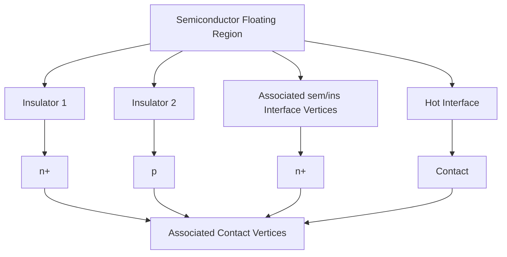
</details>

Figure 49 Mapping of hot interface vertices to associated contact or semiconductor–insulator interface vertices

When the hot interface is an interface between a semiconductor and a wide-bandgap semiconductor, you can select the destination. By default, the wide-bandgap semiconductor is treated as an insulator region, and the injection current is sent nonlocally across the region to the associated closest vertex as described for semiconductor–insulator interfaces. By using Thermionic(HCI) in the Physics section of the hot interface and specifying the injection region destination (the wide-bandgap semiconductor region) using the InjectionRegion option in the GateCurrent section, the points on the hot interface are made double-points and the injection current is injected locally in the same location where it was produced. The injected current on the wide-bandgap semiconductor side of the hot interface becomes the current boundary condition for the continuity equations solved in the region.

In the case where hot carriers are injected into semiconductor floating regions during transient simulations, the way the charge is added to the floating region is determined by the existence of a charge boundary condition (a region with a charge contact) associated with the region. If the charge boundary condition has been specified for a semiconductor floating region, the charge is added as a total charge update, using the integral boundary condition as defined by

Eq. 135, p. 226. If the charge boundary condition is not specified for the semiconductor floating region, the charge is added as an interface boundary condition for continuity equations (see Carrier Injection With Explicitly Evaluated Boundary Conditions for Continuity Equations on page 773). The total hot-carrier injection current added to semiconductor floating regions where the charge boundary condition is specified will be displayed on the electrode associated with the region (floating contact).

Floating semiconductor regions with a charge boundary condition inside a wide-bandgap semiconductor region are made possible by generalizing the concept of a semiconductor floating well.

Sentaurus Device defines a semiconductor floating well as a continuous zone of the same doping semiconductor regions in contact with each other and marked in the command file by a charge contact connected to one of regions in the zone. The concept is generalized by treating the inner semiconductor region (embedded floating region) as a separate well. Geometrically, the charge contact is defined on the interface between the inner and outer semiconductor regions. You must indicate in the Electrode section of the charge contact using either the Region or Material keyword which region is to be used as the floating region with a charge boundary condition.

Equilibrium boundary conditions are imposed on the surface of the special floating region previously described. The interface between the inner and outer semiconductor regions is treated as a heterointerface. You must specify the keyword Heterointerface in the Physics section of the interface between the inner and outer regions. If the inner region is the floating region, the boundary condition for continuity equations at the interface between the two regions, on the outer-region side, will be equilibrium for carrier concentrations. The charge update for the inner floating region is computed as the total current flowing through the floating region boundary (integral of current density over the floating region surface) multiplied by the time step.

Equilibrium carrier concentrations in a point on the double-point interface, on the outer-region side, are computed based on the carrier concentration on the inner-region side of the interface adjusted by $( \dot { N } _ { \mathrm { C , V } } ^ { \mathrm { W B } } / N _ { \mathrm { C , V } } ^ { \mathrm { F G } } ) \exp ( - \delta E _ { \mathrm { C , V } } / k T )$ where $\delta E _ { \mathrm { C , V } }$ is the jump in the conduction band for electrons or in the valence band for holes, and $N _ { \mathrm { C , V } } ^ { \mathrm { W B } } / N _ { \mathrm { C , V } } ^ { \mathrm { F G } }$ is the ratio between density-of-states in the two regions for electrons and holes, respectively. For example, to have a PolySi nanocrystal floating region with a charge boundary condition embedded in an outer OxideAsSemiconductor region, with the charge contact "fg1" geometrically somewhere on the interface between the two regions, you must specify:

```hcl
Electrode {
    ...
    {Name "fg1" Charge= -1e-18 Material="PolySi"}
    ...
}
```

```txt
Physics(MaterialInterface="OxideAsSemiconductor/PolySi") {
    Heterointerface    # required by GeneralizedFG
} 
```

Metal floating gates inside a wide-bandgap semiconductor region are allowed as well. In this case, equilibrium boundary conditions are imposed for the carrier densities at the interface between the semiconductor and the metal floating gate (on metal floating contact). Electrostatic potential at the metal floating contact is determined by the charge on the metal floating gate according to Eq. 133, p. 225. The equilibrium quasi-Fermi potential on the metal floating contact is given by $\Phi = \Phi _ { n } = \Phi _ { p } = \Phi + \Phi _ { \mathrm { M S } }$ , where $\phi _ { \mathrm { M S } }$ is the workfunction difference between the metal and the semiconductor. Carrier densities at the metal floating contact are determined then by $\Phi _ { \mathrm { M S } }$ . The charge update for the metal floating gate is computed as the total current flowing through the metal floating region contact multiplied by the time step.

To activate this special case of the metal floating gate, you specify the Metal keyword in the Electrode section of the metal floating contact and give the value of the workfunction (which determines $\phi _ { \mathrm { M S } } )$ :

```txt
Electrode {
    ...
    {Name "fg1" Charge=0 Metal Workfunction=4.1}
    ...
} 
```

The workfunction can be used as a calibration parameter.

For simple one-gate devices where the sole purpose is to evaluate the hot-carrier current injected across the oxide layer into a semiconductor region, the keyword GateName must be specified in the GateCurrent statement. In this case, the hot-carrier current is displayed on the electrode specified by GateName for both quasistationary and transient simulations.

# Injection Barrier and Image Potential

All hot-carrier injection models are implemented as a postprocessing computation after each Sentaurus Device simulation point. The lucky electron model and Fiegna model specify some properties of semiconductor–insulator interfaces. The most important parameter is the height of the $\mathrm { S i } { - } \mathrm { S i O } _ { 2 }$ barrier $( E _ { \mathrm { B } } )$ ).

The height is a function of the insulator field $F _ { \mathrm { i n s } }$ and, at any point along the interface, it can be written as:

$$
E _ {\mathrm{B}} = \left\{ \begin{array}{l l} E _ {\mathrm{B0}} - \alpha q \left| F _ {\text {ins}} \right| ^ {\frac {1}{2}} - \beta q \left| F _ {\text {ins}} \right| ^ {\frac {2}{3}} - P _ {\perp} V _ {\text {sem}} & F _ {\text {ins}} <   0 \\ E _ {\mathrm{B0}} - \alpha q \left| F _ {\text {ins}} \right| ^ {\frac {1}{2}} - \beta q \left| F _ {\text {ins}} \right| ^ {\frac {2}{3}} - P _ {\perp} V _ {\text {sem}} + V _ {\text {ins}} & F _ {\text {ins}} > 0 \end{array} \right. \tag {789}
$$

where $E _ { \mathrm { B 0 } }$ is the zero field barrier height at the semiconductor–insulator interface. The second term in the equation represents barrier lowering due to the image potential. The third term of the barrier lowering is due to the tunneling processes. For the ${ \mathrm { S i } } { - } { \mathrm { S i O } } _ { 2 }$ interface, $\mathbf { \alpha } \propto 2 . 5 9 { \times } 1 0 ^ { - 4 } \mathbf { V } ^ { 1 / 2 } \mathbf { \bar { c m } } ^ { 1 / 2 }$ . There is a large deviation in the literature for the value of $\beta$ , so it can be considered a fitting parameter. The fourth term $P _ { \perp } V _ { \mathrm { s e m } }$ appears only in the lucky electron model where $P _ { \perp }$ is a model parameter $( P _ { \perp } = 1$ by default), and $V _ { \mathrm { s e m } }$ represents the kinetic energy gain when carriers travel a distance $y$ to the interface without losing any energy. In the Fiegna model, $V _ { \mathrm { s e m } }$ is zero.

The insulator field $F _ { \mathrm { i n s } }$ is defined as:

$$
F _ {\text { ins }} = \vec {F} _ {\text { ins }} \cdot \hat {n} \left[ 1 - P _ {\text { total }} + P _ {\text { total }} \frac {\left| \vec {F} _ {\text { ins }} \right|}{\left| \vec {F} _ {\text { ins }} \cdot \hat {n} \right|} \right] \tag {790}
$$

where $\hat { n }$ is a normal vector along the direction of hot-carrier injection, and $P _ { \mathrm { { t o t a l } } }$ is a model parameter $( P _ { \mathrm { t o t a l } } = 0$ by default).

In addition, all hot-carrier models contain a probability $P _ { \mathrm { i n s } }$ of scattering in the image-force potential well:

$$
P _ {\text { ins }} = \left\{ \begin{array}{l l} \exp \left(- \frac {x _ {0}}{\lambda_ {\text { ins }}}\right) & F _ {\text { ins }} <   0 \\ \exp \left(- \frac {t _ {\text { ins }} - x _ {0}}{\lambda_ {\text { ins }}}\right) P _ {\text { repel }} & F _ {\text { ins }} > 0 \end{array} \right. \tag {791}
$$

where $\lambda _ { \mathrm { i n s } }$ is the scattering mean free path in the insulator, $t _ { \mathrm { i n s } }$ is the distance between the vertex at the hot interface and the closest associated vertex, $P _ { \mathrm { r e p e l } }$ is a model parameter $( P _ { \mathrm { r e p e l } } = 1$ by default), and the distance $x _ { 0 }$ is given as:

$$
x _ {0} = \min \left(\sqrt {\frac {q}{1 6 \pi \tilde {\varepsilon} _ {\mathrm{ins}} \left| F _ {\mathrm{ins}} \right|}}, \frac {t _ {\mathrm{ins}}}{2}\right) \tag {792}
$$

In the above expression, $\mathfrak { E } _ { \mathrm { i n s } } = \mathfrak { E } _ { \mathrm { i n s } } ( \mathfrak { E } _ { \mathrm { s e m } } + \mathfrak { E } _ { \mathrm { i n s } } ) / ( \mathfrak { E } _ { \mathrm { s e m } } - \mathfrak { E } _ { \mathrm { i n s } } )$ is the effective dielectric constant of the insulator where $\pmb { \varepsilon } _ { \mathrm { s e m } }$ and $\pmb { \varepsilon } _ { \mathrm { i n s } }$ are the high-frequency dielectric constant of the semiconductor and insulator, respectively. In the lucky electron model and Fiegna model, $\mathfrak { E } _ { \mathrm { i n s } }$ is directly accessible from the parameter file. In the SHE distribution model, $\pmb { \varepsilon } _ { \mathrm { s e m } }$ and $\pmb { \varepsilon } _ { \mathrm { i n s } }$ are separately set from the parameter file.

# Effective Field

The lucky electron model and Fiegna model have an effective electric field $F _ { \mathrm { e f f } }$ as a parameter. In Sentaurus Device, there are three possibilities to calculate the effective field:

With the electric field parallel to the carrier flow (switched on by the keyword Eparallel, which is default for hot carrier currents). See Driving Force on page 431.   
With recomputation of the carrier temperature of the hydrodynamic simulation (switched on by the keyword CarrierTempDrive). See Avalanche Generation With Hydrodynamic Transport on page 432.   
■ With a simplified approach (compared to the second method): The drift-diffusion model is used for the device simulation, and carrier temperature is estimated as the solution of the simplified and linearized energy balance equation. As this is a postprocessing calculation, the keyword CarrierTempPost activates this option.

These keywords are parameters of the model keywords. For example, the lucky electron model looks like eLucky(CarrierTempDrive). However, you must remember that if the model includes the keyword CarrierTempDrive, Hydro and a carrier temperature calculation must be specified in the Physics section.

# Classical Lucky Electron Injection

The classical total lucky electron current from an interface to a gate contact can be written as [1]:

$$
I _ {\mathrm{g}} = \iint J _ {n} (x, y) P _ {\mathrm{s}} P _ {\text { ins }} \left(\int_ {E _ {\mathrm{B}}} ^ {\infty} P _ {\varepsilon} P _ {\mathrm{r}} d \varepsilon\right) d x d y \tag {793}
$$

where $P _ { \mathrm { ~ s ~ } }$ is the probability that the electron will travel a distance to the interface withouty losing any energy, $P _ { \varepsilon }$ is the probability that the electron has energy between anddε ε $\varepsilon + d \varepsilon$ , $P _ { \mathrm { i n s } }$ is the probability of scattering in the image force potential well (Eq. 791), and $P _ { \mathrm { ~ r ~ } }$ is the probability that the electron will be redirected. These probabilities are given by the expressions:

$$
P _ {\mathrm{r}} (\varepsilon) = \frac {1}{2 \lambda_ {\mathrm{r}}} \left(1 - \sqrt {\frac {E _ {\mathrm{B}}}{\varepsilon}}\right) \tag {794}
$$

$$
P _ {s} (y) = \exp \left(- \frac {y}{\lambda}\right) \tag {795}
$$

$$
P _ {\varepsilon} (\varepsilon) = \frac {1}{\lambda F _ {\text { eff }}} \exp \left(- \frac {\varepsilon}{\lambda F _ {\text { eff }}}\right) \tag {796}
$$

where $\lambda$ is the scattering mean free path in the semiconductor, $\lambda _ { \mathrm { r } }$ is redirection mean free path, $F _ { \mathrm { e f f } }$ is the effective electric field, see Effective Field on page 756. $E _ { \mathrm { B } }$ is the height of the semiconductor–insulator barrier.

The model coefficients can be changed in the parameter file in the section:

LuckyModel { ... }

Table 134 Coefficients and their default values for the lucky electron model 

<table><tr><td>Symbol</td><td>Parameter name (Electrons)</td><td>Default value (Electrons)</td><td>Parameter name (Holes)</td><td>Default value (Holes)</td><td>Unit</td></tr><tr><td> $\lambda$ </td><td>eLsem</td><td> $8.9 \times 10^{-7}$ </td><td>hLsem</td><td> $1.0 \times 10^{-7}$ </td><td>cm</td></tr><tr><td> $\lambda_{\text{ins}}$ </td><td>eLins</td><td> $3.2 \times 10^{-7}$ </td><td>hLins</td><td> $3.2 \times 10^{-7}$ </td><td>cm</td></tr><tr><td> $\lambda_{\text{r}}$ </td><td>eLsemR</td><td> $6.2 \times 10^{-6}$ </td><td>hLsemR</td><td> $6.2 \times 10^{-6}$ </td><td>cm</td></tr><tr><td> $E_{\text{B0}}$ </td><td>eBar0</td><td>3.1</td><td>hBar0</td><td>4.7</td><td>eV</td></tr><tr><td> $\alpha$ </td><td>eBL12</td><td> $2.6 \times 10^{-4}$ </td><td>hBL12</td><td> $2.6 \times 10^{-4}$ </td><td> $(\text{V} \cdot \text{cm})^{1/2}$ </td></tr><tr><td> $\beta$ </td><td>eBL23</td><td> $3.0 \times 10^{-5}$ </td><td>hBL23</td><td> $3.0 \times 10^{-5}$ </td><td> $(\text{V} \cdot \text{cm}^{2})^{1/3}$ </td></tr><tr><td> $\varepsilon_{\text{ins}}$ </td><td>eps_ins</td><td>3.1</td><td>eps_ins</td><td>3.1</td><td>1</td></tr><tr><td> $P_{\perp}$ </td><td>Pvertical</td><td>1</td><td>Pvertical</td><td>1</td><td>1</td></tr><tr><td> $P_{\text{repel}}$ </td><td>Prepel</td><td>1</td><td>Prepel</td><td>1</td><td>1</td></tr><tr><td> $P_{\text{total}}$ </td><td>Ptotal</td><td>0</td><td>Ptotal</td><td>0</td><td>1</td></tr></table>

# Fiegna Hot-Carrier Injection

The total hot-carrier injection current according to the Fiegna model [2] can be written as:

$$
I _ {\mathrm{g}} = q \int P _ {\text {ins}} \left(\int_ {E _ {\mathrm{B0}}} ^ {\infty} v _ {\perp} (\varepsilon) f (\varepsilon) g (\varepsilon) d \varepsilon\right) d s \tag {797}
$$

where is the electron energy, ε $E _ { \mathrm { B 0 } }$ is the height of the semiconductor–insulator barrier, $\nu _ { \perp }$ is the velocity normal to the interface, is the electron energy distribution, is thef( ) ε g( ) ε density-of-states of the electrons, $P _ { \mathrm { i n s } }$ is the probability of scattering in the image force potential well as described by Eq. 791, and is an integral along theds  semiconductor–insulator interface.

The following expression for the electron energy distribution was proposed for a parabolic and an isotropic band structure, and equilibrium between lattice and electrons:

$$
f (\varepsilon) = A \exp \left(- \chi \frac {\varepsilon^ {3}}{F _ {\text { eff }} ^ {1 . 5}}\right) \tag {798}
$$

Therefore, the gate current can be rewritten as:

$$
I _ {\mathrm{g}} = q \frac {A}{3 \chi} \int P _ {\text {ins}} n \frac {F _ {\text {eff}} ^ {3 / 2}}{\sqrt {E _ {\mathrm{B}}}} e ^ {- \frac {\chi E _ {\mathrm{B}} ^ {3}}{F _ {\text {eff}} ^ {3 / 2}}} d s \tag {799}
$$

where $F _ { \mathrm { e f f } }$ is an effective field (see Effective Field on page 756).

Table 135 Coefficients and their default values for the Fiegna model 

<table><tr><td>Symbol</td><td>Parameter name (Electrons)</td><td>Default value (Electrons)</td><td>Parameter name (Holes)</td><td>Default value (Holes)</td><td>Unit</td></tr><tr><td> $A$ </td><td>eA</td><td> $4.87 \times 10^{4}$ </td><td>hA</td><td> $4.87 \times 10^{4}$ </td><td> $cm/s/eV^{2.5}$ </td></tr><tr><td> $\chi$ </td><td>eChi</td><td> $1.3 \times 10^{8}$ </td><td>hChi</td><td> $1.3 \times 10^{8}$ </td><td> $(V/cm/eV)^{1.5}$ </td></tr><tr><td> $\lambda_{ins}$ </td><td>eLins</td><td> $3.2 \times 10^{-7}$ </td><td>hLins</td><td> $3.2 \times 10^{-7}$ </td><td>cm</td></tr><tr><td> $E_{B0}$ </td><td>eBar0</td><td>3.1</td><td>hBar0</td><td>4.7</td><td>eV</td></tr><tr><td> $\alpha$ </td><td>eBL12</td><td> $2.6 \times 10^{-4}$ </td><td>hBL12</td><td> $2.6 \times 10^{-4}$ </td><td> $(V·cm)^{1/2}$ </td></tr><tr><td> $\beta$ </td><td>eBL23</td><td> $1.5 \times 10^{-5}$ </td><td>hBL23</td><td> $1.5 \times 10^{-5}$ </td><td> $(V·cm^{2})^{1/3}$ </td></tr><tr><td> $\varepsilon_{ins}$ </td><td>eps_ins</td><td>3.1</td><td>eps_ins</td><td>3.1</td><td>1</td></tr><tr><td> $P_{repel}$ </td><td>Prepel</td><td>1</td><td>Prepel</td><td>1</td><td>1</td></tr><tr><td> $P_{total}$ </td><td>Ptotal</td><td>0</td><td>Ptotal</td><td>0</td><td>1</td></tr></table>

The above coefficients can be changed in the parameter file in the FiegnaModel section.

# SHE Distribution Hot-Carrier Injection

To obtain the hot-carrier injection current, accurate knowledge of the nonequilibrium electronenergy distribution is required. The spherical harmonics expansion (SHE) distribution hotcarrier injection model calculates the hot-carrier injection current using the nonequilibrium

energy distribution obtained from the lowest-order SHE of the semiclassical Boltzmannf transport equation (BTE) (see Spherical Harmonics Expansion Method on page 760).

The total hot-carrier injection current is obtained from [3]:

$$
I _ {\mathrm{g}} = \frac {2 q A g _ {\mathrm{v}}}{4} \int P _ {\text { ins }} \left[ \int_ {0} ^ {\infty} g (\varepsilon) v (\varepsilon) f (\varepsilon) \left(\int_ {0} ^ {1} \Gamma \left[ \varepsilon - \frac {h ^ {3} g (\varepsilon) v (\varepsilon) x}{8 \pi m _ {\text { ins }}} \right] d x\right) d \varepsilon \right] d s \tag {800}
$$

where:

is a dimensionless prefactor ( by default).A A = 1   
$g _ { \mathrm { v } }$ is the valley degeneracy factor.   
$P _ { \mathrm { i n s } }$ is the probability of electrons moving from the interface to the barrier peak without scattering (see Eq. 791, p. 755).   
is the density-of-states per valley and per spin.g   
■ is the magnitude of the electron velocity.v   
is the transmission coefficient obtained from the WKB approximation including theΓ image-potential barrier-lowering.   
$m _ { \mathrm { i n s } }$ is the insulator effective mass.   
$\int d s$ is an integral along the semiconductor–insulator interface.

The transmission coefficient can be written as:

$$
\Gamma (\varepsilon_ {\perp}) = \exp \left(- \frac {2}{\hbar} \int_ {0} ^ {t _ {\text {ins}}} \sqrt {2 m _ {\text {ins}} [ E _ {\mathrm{B}} (r) - \varepsilon_ {\perp} ]} \Theta [ E _ {\mathrm{B}} (r) - \varepsilon_ {\perp} ] d r\right) \tag {801}
$$

$$
E _ {\mathrm{B}} (r) = E _ {\mathrm{B} 0} + q F _ {\text { ins }} r + E _ {\mathrm{im}} (r) \tag {802}
$$

$$
E _ {\mathrm{im}} (r) = - \frac {q ^ {2}}{1 6 \pi \varepsilon_ {\mathrm{ins}}} \sum_ {n = 0} ^ {\infty} \left(\frac {\varepsilon_ {\mathrm{sem}} - \varepsilon_ {\mathrm{ins}}}{\varepsilon_ {\mathrm{sem}} + \varepsilon_ {\mathrm{ins}}}\right) ^ {2 n + 1} \left[ \frac {1}{n t _ {\mathrm{ins}} + r} + \frac {1}{(n + 1) t _ {\mathrm{ins}} - r} - \frac {2}{(n + 1) t _ {\mathrm{ins}}} \left(\frac {\varepsilon_ {\mathrm{sem}} - \varepsilon_ {\mathrm{ins}}}{\varepsilon_ {\mathrm{sem}} + \varepsilon_ {\mathrm{ins}}}\right) \right] \tag {803}
$$

where $E _ { \mathrm { B 0 } }$ is the barrier height.

To use the SHE distribution hot-carrier injection model, you must obtain the distribution function by solving the SHE method (see Spherical Harmonics Expansion Method on page 760).

Eq. 803 represents the image-potential barrier-lowering. You can switch off the imagepotential barrier-lowering using:

```txt
Physics(MaterialInterface="Silicon/Oxide") { ... GateCurrent( eSHEDistribution( -ImagePotential ) ) } 
```

# Spherical Harmonics Expansion Method

The spherical harmonics expansion (SHE) method computes the microscopic carrier energy distribution function $f ( \stackrel { \cdot } { r } , \varepsilon )$ by solving the lowest-order SHE of the Boltzmann transport equation (BTE) [4]:

$$
- \nabla \cdot \left[ \frac {v ^ {2} (\vec {r} , \varepsilon_ {\mathrm{t}})}{3} \tau (\vec {r}, \varepsilon_ {\mathrm{t}}) g (\vec {r}, \varepsilon_ {\mathrm{t}}) \nabla f (\vec {r}, \varepsilon_ {\mathrm{t}}) \right] = g (\vec {r}, \varepsilon_ {\mathrm{t}}) s (\vec {r}, \varepsilon_ {\mathrm{t}}) \tag {804}
$$

# where:

■ is the occupation probability of electrons ( can be larger than one as nondegeneratef f statistics is assumed).   
■ $ \varepsilon _ { \mathrm { t } }$ is the total energy including the conduction band energy $E _ { \mathrm { C } }$ and the kinetic energy .ε   
■ is the magnitude of the electron velocity.v   
$1 / \tau$ is the total scattering rate.   
is the density-of-states per valley and per spin.g   
is the net in-scattering rate due to inelastic scattering and generation–recombinations processes.

In Eq. 804, and can be obtained from the energy–wavevector dispersion relation,g( ) ε v( ) ε $\mathfrak { E } _ { b } ( \dot { k } )$ , of semiconductors:

$$
g _ {\mathrm{v}} g (\varepsilon) = g _ {\mathrm{v}} \sum_ {b = 1} ^ {N _ {\mathrm{b}}} g _ {b} (\varepsilon) = \sum_ {b = 1} ^ {N _ {\mathrm{b}}} \int_ {\varepsilon} \frac {1}{4 \pi^ {2} h v _ {b} (\vec {k})} d s _ {\vec {k}} \tag {805}
$$

$$
g _ {\mathrm{v}} g (\varepsilon) v ^ {2} (\varepsilon) = g _ {\mathrm{v}} \sum_ {b = 1} ^ {N _ {\mathrm{b}}} g _ {b} (\varepsilon) v _ {b} ^ {2} (\varepsilon) = \sum_ {b = 1} ^ {N _ {\mathrm{b}}} \int_ {\varepsilon} \frac {v _ {b} (\vec {k})}{4 \pi^ {2} h} d s _ {\vec {k}} \tag {806}
$$

# where:

$\begin{array} { r } { \varepsilon = \varepsilon _ { \mathrm { t } } - E _ { \mathrm { C } } \overset { \vartriangle } { \boldsymbol { r } } ) } \end{array}$ 不 is the kinetic energy.   
$g _ { \mathrm { v } }$ is the valley degeneracy.

is the band index.b   
$N _ { \mathfrak { b } }$ is the number of bands.   
■ $\nu _ { b } ( \vec { k } )$ is the magnitude of wavevector-dependent group velocity.   
is Planck’s constant.h   
■ The integration is over the equienergy surface of the first Brillouin zone.

In addition, the energy-dependent square wavevector is defined as:

$$
g _ {\mathrm{v}} k ^ {2} (\varepsilon) = g _ {\mathrm{v}} \sum_ {b = 1} ^ {N _ {\mathrm{b}}} k _ {b} ^ {2} (\varepsilon) = \sum_ {b = 1} ^ {N _ {\mathrm{b}}} \int \frac {1}{4 \pi} d s _ {\vec {k}} \tag {807}
$$

These energy-dependent, band structure–related quantities can be obtained either from the precalculated band-structure file or from the single band, analytic, nonparabolic, bandstructure model. For more information on the band-structure file, see Using Spherical Harmonics Expansion Method on page 764.

The analytic nonparabolic band-structure model gives [5]:

$$
\frac {v ^ {2} (\varepsilon)}{3} = \frac {2 \varepsilon (1 + \alpha \varepsilon)}{3 m _ {\mathrm{c}} (1 + 2 \alpha \varepsilon) ^ {2}} \tag {808}
$$

$$
g (\varepsilon) = \frac {2 \pi (2 m _ {n}) ^ {3 / 2}}{h ^ {3}} [ \varepsilon (1 + \alpha \varepsilon) ] ^ {1 / 2} (1 + 2 \alpha \varepsilon) \tag {809}
$$

$$
k ^ {2} (\varepsilon) = \pi h g (\varepsilon) v (\varepsilon) \tag {810}
$$

where is the nonparabolicity factor, α $m _ { \mathrm { c } }$ is the conductivity effective mass, and $m _ { n }$ is the density-of-states effective mass.

The total scattering rate and the net in-scattering rate can be written as:

$$
\frac {1}{\tau (\varepsilon)} = \frac {1}{\tau_ {\mathrm{c}} (\varepsilon)} + \frac {1}{\tau_ {\mathrm{ii}} (\varepsilon)} + \frac {1}{\tau_ {\mathrm{ac}} (\varepsilon)} + \frac {1}{\tau_ {\mathrm{ope}} (\varepsilon)} + \frac {1}{\tau_ {\mathrm{opa}} (\varepsilon)} \tag {811}
$$

$$
s (\varepsilon) = \frac {f _ {\mathrm{loc}} (\varepsilon) - f (\varepsilon)}{\tau_ {\mathrm{ii}} (\varepsilon)} + \frac {f (\varepsilon - \varepsilon_ {\mathrm{op}}) \exp \left(- \frac {\varepsilon_ {\mathrm{op}}}{k T}\right) - f (\varepsilon)}{\tau_ {\mathrm{ope}} (\varepsilon)} + \frac {f (\varepsilon + \varepsilon_ {\mathrm{op}}) \exp \left(\frac {\varepsilon_ {\mathrm{op}}}{k T}\right) - f (\varepsilon)}{\tau_ {\mathrm{opa}} (\varepsilon)} - \frac {R _ {\mathrm{net}} f _ {\mathrm{loc}} (\varepsilon)}{n} \tag {812}
$$

where:

■ $1 / \tau _ { \mathrm { c } }$ is the Coulomb scattering rate.   
■ $1 / \tau _ { \mathrm { i i } }$ is the impact ionization scattering rate.

■ $1 / \tau _ { \mathrm { a c } }$ is the acoustic phonon scattering rate.   
■ $1 / \tau _ { \mathrm { o p e } }$ is the scattering rate due to optical phonon emissions.   
■ $1 / \tau _ { \mathrm { o p a } }$ is the scattering rate due to optical phonon absorptions.   
$\mathfrak { E } _ { \mathrm { o p } }$ is the optical phonon energy.   
$R _ { \mathrm { n e t } }$ is the net recombination rate.   
$n$ is the electron density.   
■ $f _ { \mathrm { l o c } } = \exp [ ( E _ { \mathrm { F } , n } - E _ { \mathrm { C } } - \varepsilon ) / k T ]$ is the local equilibrium distribution function.

The Coulomb scattering rate can be written as [6]:

$$
\frac {1}{\tau_ {\mathrm{c}} (\varepsilon)} = \frac {q ^ {4} \pi^ {2} g (\varepsilon) N _ {\mathrm{i,eff}}}{2 h \varepsilon_ {\mathrm{sem}} ^ {2} [ k ^ {2} (\varepsilon) + k _ {0} ^ {2} ] ^ {2}} \left[ \ln (1 + b) - \frac {b}{1 + b} \right] \tag {813}
$$

$$
b (\varepsilon) = \frac {4 [ k ^ {2} (\varepsilon) + k _ {0} ^ {2} ] k T \varepsilon_ {\mathrm{sem}}}{q ^ {2} (n + p)} \tag {814}
$$

$$
N _ {\mathrm{i}, \text { eff }} = \left\{ \begin{array}{l l} (N _ {\mathrm{D}} + N _ {\mathrm{A}}) \zeta_ {\text { major }} (N _ {\text { major }}) & N _ {\text { major }} > N _ {\text { minor }} \\ (N _ {\mathrm{D}} + N _ {\mathrm{A}}) \zeta_ {\text { minor }} (N _ {\text { minor }}) & N _ {\text { major }} <   N _ {\text { minor }} \end{array} \right. \tag {815}
$$

where:

$\mathfrak { E } _ { \mathrm { s e m } }$ is the dielectric constant of a semiconductor material.   
$k _ { 0 } ^ { 2 }$ is an adjustable parameter that controls the energy dependency of the impurity scattering.   
$N _ { \mathrm { m a j o r } }$ is $N _ { \mathrm { D } }$ for electrons and $N _ { \mathrm { A } }$ for holes.   
$N _ { \mathrm { m i n o r } }$ is $N _ { \mathrm { A } }$ for electrons and $N _ { \mathrm { D } }$ for holes.   
■ $\zeta _ { \mathrm { { m a j o r } } }$ and $\zeta _ { \mathrm { m i n o r } }$ are tabulated fitting functions introduced to match the experimental lowfield mobility curve as a function of majority and minority doping concentrations, respectively.

Two different expressions for the impact ionization scattering rate are available. The first expression can be written as [6]:

$$
\frac {1}{\tau_ {\mathrm{ii}} (\varepsilon)} = \left\{ \begin{array}{l l} \left(\frac {\varepsilon - \varepsilon_ {\mathrm{ii} , 1}}{1 \mathrm{eV}}\right) ^ {\mathrm{v} _ {\mathrm{ii}, 1}} s _ {\mathrm{ii}, 1} & \varepsilon_ {\mathrm{ii}, 1} <   \varepsilon <   \varepsilon_ {\mathrm{ii}, 3} \\ \left(\frac {\varepsilon - \varepsilon_ {\mathrm{ii} , 2}}{1 \mathrm{eV}}\right) ^ {\mathrm{v} _ {\mathrm{ii}, 2}} s _ {\mathrm{ii}, 2} & \varepsilon > \varepsilon_ {\mathrm{ii}, 3} \end{array} \right. \tag {816}
$$

where:

$s _ { \mathrm { i i , 1 } }$ and $s _ { \mathrm { i i } , 2 }$ are the impact ionization coefficients.   
${ \nu } _ { \mathrm { i i , 1 } }$ and $\mathrm { v } _ { \mathrm { i i } , 2 }$ are the exponents.   
$\mathfrak { E } _ { \mathrm { i i } , 1 } , \mathfrak { E } _ { \mathrm { i i } , 2 }$ , and $\mathfrak { E } _ { \mathrm { i i } , 3 }$ are the reference energies.

The second expression can be written as [7]:

$$
\frac {1}{\tau_ {\mathrm{ii}} (\varepsilon)} = \sum_ {j = 1} ^ {3} \left(\frac {\varepsilon - \varepsilon_ {\mathrm{ii} , j}}{1 \mathrm{eV}}\right) ^ {\mathrm{v} _ {\mathrm{ii}, j}} \Theta \left(\varepsilon - \varepsilon_ {\mathrm{ii}, j}\right) s _ {\mathrm{ii}, j} \tag {817}
$$

Specifying ii\_formula=1 in the SHEDistribution parameter set activates the first expression; while ii\_formula=2 activates the second expression. The impact ionization model parameters for electrons and holes are obtained from [6] and [8], respectively.

The acoustic-phonon and optical-phonon scattering rates can be written as [5][6]:

$$
\frac {g (\varepsilon)}{\tau_ {\mathrm{ac}} (\varepsilon)} = \sum_ {i = 1} ^ {N _ {\mathrm{b}}} \sum_ {j = 1} ^ {N _ {\mathrm{b}}} \frac {4 \pi^ {2} k T D _ {\mathrm{ac} , i j} ^ {2}}{h \rho c _ {\mathrm{L}} ^ {2}} g _ {i} (\varepsilon) g _ {j} (\varepsilon) \tag {818}
$$

$$
\frac {g (\varepsilon)}{\tau_ {\mathrm{ope}} (\varepsilon)} = \sum_ {i = 1} ^ {N _ {\mathrm{b}}} \sum_ {j = 1} ^ {N _ {\mathrm{b}}} \frac {h D _ {\mathrm{op} , i j} ^ {2}}{2 \rho \varepsilon_ {\mathrm{op}}} (N _ {\mathrm{op}} + 1) g _ {i} (\varepsilon) g _ {j} (\varepsilon - \varepsilon_ {\mathrm{op}}) \tag {819}
$$

$$
\frac {g (\varepsilon)}{\tau_ {\mathrm{opa}} (\varepsilon)} = \sum_ {i = 1} ^ {N _ {\mathrm{b}}} \sum_ {j = 1} ^ {N _ {\mathrm{b}}} \frac {h D _ {\mathrm{op} , i j} ^ {2}}{2 \rho \varepsilon_ {\mathrm{op}}} N _ {\mathrm{op}} g _ {i} (\varepsilon) g _ {j} (\varepsilon + \varepsilon_ {\mathrm{op}}) \tag {820}
$$

where:

■ and are the band indices.i j   
$D _ { \mathrm { a c } , i j }$ and $D _ { \mathrm { o p } , i j }$ are the deformation potentials for acoustic and g-type optical phonons, respectively $( D _ { \mathrm { a c } , i j } = D _ { \mathrm { a c } , j i }$ and $D _ { \mathrm { o p } , i j } = D _ { \mathrm { o p } , j i } )$ .   
■ $\rho$ is the mass density.   
$c _ { \mathrm { L } }$ is the sound velocity.   
■ $N _ { \mathrm { o p } } = \left[ \exp ( \mathfrak { E } _ { \mathrm { o p } } / k T ) - 1 \right] ^ { - 1 }$ is the phonon number.

If $D _ { \mathrm { a c } , i j } = D _ { \mathrm { a c } }$ and $D _ { \mathrm { o p } , i j } = D _ { \mathrm { o p } }$ regardless of the band indices, Eq. 818, Eq. 819, and Eq. 820 can be simplified to:

$$
\frac {1}{\tau_ {\mathrm{ac}} (\varepsilon)} = \frac {4 \pi^ {2} k T D _ {\mathrm{ac}} ^ {2}}{h \rho c _ {\mathrm{L}} ^ {2}} g (\varepsilon) \tag {821}
$$

$$
\frac {1}{\tau_ {\mathrm{ope}} (\varepsilon)} = \frac {h D _ {\mathrm{op}} ^ {2}}{2 \rho \varepsilon_ {\mathrm{op}}} (N _ {\mathrm{op}} + 1) g (\varepsilon - \varepsilon_ {\mathrm{op}}) \tag {822}
$$

$$
\frac {1}{\tau_ {\mathrm{opa}} (\varepsilon)} = \frac {h D _ {\mathrm{op}} ^ {2}}{2 \rho \varepsilon_ {\mathrm{op}}} N _ {\mathrm{op}} g \left(\varepsilon + \varepsilon_ {\mathrm{op}}\right) \tag {823}
$$

Dirichlet boundary condition as $f ( \varepsilon ) = \exp [ ( E _ { \mathrm { F } , n } - E _ { \mathrm { C } } - \varepsilon ) / k T ]$ is assumed for electrodes.

Boundary conditions for abrupt heterointerfaces are similar to the corresponding boundary conditions for the thermionic emission model. Assume that at the heterointerface between materials 1 and 2, the conduction band edge jump is positive $( \Delta E _ { \mathrm { C } } = E _ { \mathrm { C } , 2 } - E _ { \mathrm { C } , 1 } > 0 )$ . If $J _ { n , 2 } ( \varepsilon )$ and $J _ { n , 1 } ( \varepsilon )$ are the energy-dependent electron current density per spin and per valley entering material 2 and leaving material 1, the interface condition can be written as:

$$
J _ {n, 2} (\varepsilon) = J _ {n, 1} (\varepsilon) \tag {824}
$$

$$
J _ {n, 2} (\varepsilon) = \frac {q}{4} g _ {2} (\varepsilon) v _ {2} (\varepsilon) [ f _ {2} (\varepsilon) - f _ {1} (\varepsilon) ] \tag {825}
$$

where $g _ { i } ( \varepsilon ) , \nu _ { i } ( \varepsilon )$ , and $f _ { i } ( \varepsilon )$ are the density-of-states, the group velocity, and the occupation probability of material , respectively.i

All other boundaries are treated with reflective boundary conditions.

# Using Spherical Harmonics Expansion Method

The electron-energy distribution function is calculated from Eq. 804, p. 760 in the semiconductor regions specified by the global, region-specific, or material-specific Physics section:

Physics { eSHEDistribution( <arguments> ) ...}

By default, , , and g( ) ε v( ) ε $\boldsymbol { k } ^ { 2 } ( \varepsilon )$ are obtained from the analytic band model. These band structure–related quantities also can be obtained from the default electron-band file eSHEBandSilicon.dat in the directory \$STROOT/tcad/\$STRELEASE/lib/sdevice/ MaterialDB/she by specifying the argument FullBand:

Physics { eSHEDistribution( FullBand ... ) ... }

The default electron-band file eSHEBandSilicon.dat contains the band-structure quantities obtained from the nonlocal empirical pseudopotential method for relaxed silicon.

Similarly, there is a default hole-band file hSHEBandSilicon.dat in the same directory.

NOTE For silicon regions, it is recommended to use the FullBand option as the default model parameters are calibrated based on the full band structure. In addition, there is no performance penalty when using the FullBand option.

You also can specify your own band file as:

$\mathtt { P h y s i c s } \{ \mathtt { e S H E D i s t r i b u t i o n } ( \mathtt { F u l l B a n d } = \mathtt { \Omega } ^ { \mathtt { u } } \mathtt { f i l e n a m e } ^ { \mathtt { u } } \ \underbrace  { \Omega } \cdot \cdot \cdot \ \} ) \ \dots \}$

The band file is a plain text file composed of $1 + 3 N _ { \mathrm { b } }$ columns of data where $N _ { \mathfrak { b } }$ is the number of bands $( 1 \leq N _ { \mathrm { b } } \leq 4 )$ . The first column represents the kinetic energy [ ]. The subsequentε eV columns represent $g _ { \mathrm { v } } g _ { b } ( \varepsilon ) \ [ \mathrm { c m } ^ { - 3 } \mathrm { e V } ^ { - 1 } ] , \dot { g } _ { \mathrm { v } } g _ { b } ( \varepsilon ) \nu _ { b } ^ { 2 } ( \varepsilon ) \ [ \mathrm { c m } ^ { - 1 } \mathrm { s } ^ { - 2 } \mathrm { e V } ^ { - 1 } ]$ , and $g _ { \mathrm { v } } k _ { b } ^ { 2 } ( \varepsilon ) \ [ \mathrm { c i n } ^ { - 2 } ]$ for band $b \ ( 1 \leq b \leq N _ { \mathrm { b } } )$ . The kinetic energy should start from zero, and the energy spacing between the neighbour rows should be uniform. Refer to eSHEBandSilicon.dat for more information.

When FullBand is specified for devices containing SiGe, the band-structure quantities for SiGe regions are taken from mole fraction–dependent files in the same directory where the silicon files are located. The band-structure data was obtained from the nonlocal empirical pseudopotential method for relaxed SiGe with mole-fraction values of 0.0, 0.1, 0.2, ..., 1.0:

Electron files: eSHEBandSiGeX0.0.dat, eSHEBandSiGeX0.1.dat, ...   
■ Hole files: hSHEBandSiGeX0.0.dat, hSHEBandSiGeX0.1.dat, ...

Sentaurus Device automatically chooses the appropriate files based on the average x-mole fraction value in each SiGe region. Linear interpolation of band-structure quantities is used for intermediate x-mole fraction values.

NOTE The simulation of electrons in SiGe is deactivated.

Model parameters in the SHEDistribution parameter set (see Table 136 on page 769) can be specified with mole-fraction dependency. As with data from the band-structure files, the average xmole fraction value in each region is used to determine the parameter values.

Sentaurus Device provides a simplified SHE model based on the relaxation time approximation (RTA) for the hot-carrier injection current computation. Although the RTA is a poor approximation, the RTA can remove the energy coupling and reduce simulation time. You can activate the RTA mode as follows:

$\begin{array}{c} \mathtt  P h y s i c s \ \left\{ \begin{array} { l } { \mathtt { e S H E D i s t r i b u t i o n ( \mathtt { R T A \ \underbrace { \cdot \cdot \cdot } } \end{array} \right\} } \_ s \_ s . . . \ \left\} \right.} \end{array} $

When the RTA mode is selected, the relaxation time is defined as:

$$
\frac {1}{\tau_ {\mathrm{RTA}} (\varepsilon)} = \frac {v (\varepsilon)}{\lambda_ {\mathrm{sem}}} + \frac {1}{\tau_ {0}} \tag {826}
$$

where $\lambda _ { \mathrm { s e m } }$ and $\tau _ { 0 }$ are adjustable parameters representing a mean free path and relaxation time. In the RTA mode, Eq. 812 is replaced by:

$$
s (\varepsilon) = \frac {f _ {\mathrm{loc}} (\varepsilon) - f (\varepsilon)}{\tau_ {\mathrm{RTA}} (\varepsilon)} \tag {827}
$$

NOTE In the RTA mode, you must specify SHEIterations=1 together with SHESOR in the global Math section. The RTA mode should not be used for self-consistent computations as the carrier flux is not conserved.

In the SHE method, the low-field mobility is determined by the microscopic scattering rate:

$$
\mu_ {\text { low }} = \frac {q \int_ {0} ^ {\infty} \tau (\varepsilon) g (\varepsilon) v ^ {2} (\varepsilon) \exp \left(- \frac {\varepsilon}{k T}\right) d \varepsilon}{3 k T \int_ {0} ^ {\infty} g (\varepsilon) \exp \left(- \frac {\varepsilon}{k T}\right) d \varepsilon} \tag {828}
$$

The mobility obtained from Eq. 828 and that from the macroscopic mobility model specified in the Physics section generally differ. For example, Eq. 828 overestimates the low-field mobility in the inversion layer of MOSFETs as the scattering rate in Eq. 811, p. 761 does not account for the mobility degradation at interfaces. To resolve this inconsistency, the Coulomb scattering rate is adjusted locally to match the low-filed mobility obtained from the mobility model. This option is activated by default. To switch off this option, specify:

Physics { eSHEDistribution( -AdjustImpurityScattering ... ) ... }

Similarly, for the hole-energy distribution function, specify hSHEDistribution in the Physics section.

Eq. 804, p. 760 is a coupled energy-dependent conservation equation with diffusion and source terms. The number of unknown variables in the SHE method is much larger than that in the drift-diffusion model or hydrodynamic model because of the additional total energy coordinate.

By default, the blockwise successive over-relaxation (SOR) method is used to solve the equation iteratively where the SOR iteration is performed over different total energies. The linear solver for the block system, the number of SOR iterations, and the SOR parameter can be accessed by the keywords SHEMethod, SHEIterations, and SHESORParameter in the global Math section. The default values are:

```txt
Math {
    SHEMethod = super
    SHEIterations = 20
    SHESORParameter = 1.1
} 
```

Instead of using the blockwise SOR method, you also can solve Eq. 804, p. 760 for different energies simultaneously by switching off the keyword SHESOR in the global Math section. Although any matrix solver can be used, the iterative linear solver ILS is the only practical option to solve Eq. 804 because of the large matrix size.

The ILS default parameters in set=3 can be used for the SHE method. For example:

```powershell
Math {
    -SHESOR
    SHEMethod=ILS(set = 3)
    ...
} 
```

The ILS default parameters in set=3 are defined as:

```txt
set (3) {
    iterative (gmres(100), tolrel=1e-8, tolunprec=1e-4, tolabs=0, maxit=200);
    preconditioning (ilut(0.00011,-1));
    ordering (symmetric=rcm, nonsymmetric=mpsilst);
    options (compact=yes, verbose=0, refinebasis=0, refinescaling=none, refineresidual=0);
}; 
```

The global Math section provides some parameters related to the energy grid specification. The minimum and the maximum of the total energy coordinate are defined as:

$$
\varepsilon_ {\mathrm{t}, \min} = \min \left[ E _ {\mathrm{C}} (\vec {r}) \right] \tag {829}
$$

$$
\varepsilon_ {\mathrm{t}, \max} = \max \left[ E _ {\mathrm{C}} (\vec {r}) \right] + \varepsilon_ {\text { margin }} \tag {830}
$$

where $\varepsilon _ { \mathrm { m a r g i n } }$ is an energy margin $( \varepsilon _ { \mathrm { m a r g i n } } = 1 \mathrm { e V }$ by default). The energy grid spacing is defined by the fraction of the phonon energy $\Delta \mathfrak { E } _ { \mathrm { t } } = \mathfrak { E } _ { \mathrm { o p } } / N _ { \mathrm { r e f i n e } }$ where $N _ { \mathrm { r e f i n e } }$ is a positive integer $( N _ { \mathrm { r e f i n e } } = 1$ by default).

The parameters $\varepsilon _ { \mathrm { m a r g i n } }$ and $N _ { \mathrm { r e f i n e } }$ can be set in the global Math section:

```hcl
Math {
    SHETopMargin = 1.0  # e_margin [eV]
    SHERefinement = 1  # N_refine
    ...
} 
```

While the total energy grid is used for the computation, a uniform kinetic energy grid is used for plotting. The maximum kinetic energy to be plotted can be specified by the keyword SHECutoff ( by default) in the global Math section:5 eV

```txt
Math { SHECutoff = 5.0 ... } 
```

By default, the carrier energy distribution is updated in the postprocessing computation after each Sentaurus Device simulation point. You can suppress or activate the postprocessing computation using the Set statement of the Solve section. For example:

```txt
Solve { ...
    Set (eSHEDistribution (Frozen)) # freeze the distribution function
    ...
    Set (eSHEDistribution (-Frozen)) # unfreeze the distribution function
    ...
} 
```

As long as the distribution function is frozen, the distribution is unchanged during simulation.

Instead of the postprocessing computation, you also can obtain the self-consistent DC solution by using the Plugin statement. For example:

```txt
Solve { ...
    Plugin (iterations=100) { Poisson eSHEDistribution hole }
    ...
} 
```

In the self-consistent mode, the carrier density and the terminal current are obtained directly from the SHE method. You also can include the quantum correction in the SHE method. For example:

```txt
Solve { ...
    Plugin { Coupled {Poisson eQuantumPotential} eSHEDistribution hole }
    ...
} 
```

NOTE In the self-consistent mode, you must specify the keyword DirectCurrent in the global Math section. In addition, you might need to increase SHERefinement to improve the resolution of the energy grid. The self-consistent mode does not support transient, AC, and noise analysis. In general, the lowest-order SHE method might not be sufficiently accurate to simulate nanoscale transistors as the contribution of higher-order terms increases with decreasing device length [9]. The convergence rate of the Plugin method can be very slow when large biases are applied.

For backward compatibility, the following pairs of keywords are recognized as synonyms in the command file:

SHEDistribution and TailDistribution   
eSHEDistribution and TaileDistribution   
hSHEDistribution and TailhDistribution   
SHEIterations and TailDistributionIterations

SHEMethod and TailDistributionMethod   
SHESOR and TailDistributionSOR   
SHESORParameter and TailDistributionSORParameter

In the PMI, you can read the distribution function, density-of-states, and group velocity obtained from the SHE method using the following read functions:

ReadeSHEDistribution: Returns for electrons.f( ) ε   
ReadeSHETotalDOS: Returns $2 g _ { \mathrm { v } } g ( \varepsilon )$ for electrons.   
ReadeSHETotalGSV: Returns $2 g _ { \mathrm { v } } g ( \varepsilon ) \nu ^ { 2 } ( \varepsilon )$ for electrons.   
ReadhSHEDistribution: Returns for holes.f( ) ε   
ReadhSHETotalDOS: Returns $2 g _ { \mathrm { v } } g ( \varepsilon )$ for holes.   
ReadhSHETotalGSV: Returns $2 g _ { \mathrm { v } } g ( \varepsilon ) \nu ^ { 2 } ( \varepsilon )$ for holes.

For more information, see Chapter 37 on page 1033.

The parameters for the SHE method are available in the SHEDistribution parameter set. Table 136 lists the coefficients of models and their default values.

NOTE The optical phonon energy $\mathfrak { E } _ { \mathrm { o p } }$ is closely related to the energy grid spacing. Therefore, the same optical phonon energy must be used in the simulation domain.

Table 136 Default parameters for SHE distribution model 

<table><tr><td>Symbol</td><td>Parameter name</td><td>Electrons</td><td>Holes</td><td>Unit</td></tr><tr><td> $\rho$ </td><td>rho</td><td colspan="2">2.329</td><td> $g/cm^3$ </td></tr><tr><td> $\varepsilon_{sem}$ </td><td>epsilon</td><td colspan="2">11.7</td><td> $\varepsilon_0$ </td></tr><tr><td> $\varepsilon_{ins}$ </td><td>eps_ins</td><td colspan="2">2.15</td><td> $\varepsilon_0$ </td></tr><tr><td> $m_c$ </td><td>m_s</td><td>0.26</td><td>0.26</td><td> $m_0$ </td></tr><tr><td> $m_n$ </td><td>m_dos</td><td>0.328</td><td>0.689</td><td> $m_0$ </td></tr><tr><td> $m_{ins}$ </td><td>m_ins</td><td>0.5</td><td>0.77</td><td> $m_0$ </td></tr><tr><td> $\alpha$ </td><td>alpha</td><td>0.5</td><td>0.669</td><td> $eV^{-1}$ </td></tr><tr><td> $g_v$ </td><td>g</td><td>6</td><td>1</td><td>1</td></tr><tr><td>A</td><td>A</td><td>1</td><td>1</td><td>1</td></tr><tr><td> $E_{B0}$ </td><td>E_barrier</td><td>3.1</td><td>4.73</td><td>eV</td></tr><tr><td> $\lambda_{ins}$ </td><td>Lins</td><td> $2.0 \times 10^{-7}$ </td><td> $2.0 \times 10^{-7}$ </td><td>cm</td></tr><tr><td> $\lambda_{sem}$ </td><td>Lsem</td><td> $5.0 \times 10^{-6}$ </td><td> $1.0 \times 10^{-6}$ </td><td>cm</td></tr><tr><td> $\tau_0$ </td><td>tau0</td><td> $1.0 \times 10^{-12}$ </td><td> $1.0 \times 10^{-12}$ </td><td>s</td></tr><tr><td> $D_{ac}/c_L$ </td><td>Dac_cl</td><td> $1.027 \times 10^{-5}$ </td><td> $6.29 \times 10^{-6}$ </td><td>eVs/cm</td></tr><tr><td> $D_{op}$ </td><td>Dop</td><td> $1.25 \times 10^9$ </td><td> $8.7 \times 10^8$ </td><td>eV/cm</td></tr><tr><td> $\varepsilon_{op}$ </td><td>HbarOmega</td><td>0.06</td><td>0.0633</td><td>eV</td></tr><tr><td> $k_0^2$ </td><td>swv0</td><td>0.0</td><td>0.0</td><td> $cm^{-2}$ </td></tr><tr><td></td><td>ii_formula1</td><td>1</td><td>1</td><td></td></tr><tr><td> $s_{ii,1}$ </td><td>ii_rate1</td><td> $1.49 \times 10^{11}$ </td><td>0.0</td><td> $s^{-1}$ </td></tr><tr><td> $s_{ii,2}$ </td><td>ii_rate2</td><td> $1.13 \times 10^{12}$ </td><td> $1.14 \times 10^{12}$ </td><td> $s^{-1}$ </td></tr><tr><td> $s_{ii,3}$ </td><td>ii_rate3</td><td>0.0</td><td>0.0</td><td> $s^{-1}$ </td></tr><tr><td> $\varepsilon_{ii,1}$ </td><td>ii_energy1</td><td>1.128</td><td>1.128</td><td>eV</td></tr><tr><td> $\varepsilon_{ii,2}$ </td><td>ii_energy2</td><td>1.572</td><td>1.49</td><td>eV</td></tr><tr><td> $\varepsilon_{ii,3}$ </td><td>ii_energy3</td><td>1.75</td><td>1.49</td><td>eV</td></tr><tr><td> $v_{ii,1}$ </td><td>ii_exponent1</td><td>3.0</td><td>0.0</td><td>1</td></tr><tr><td> $v_{ii,2}$ </td><td>ii_exponent2</td><td>2.0</td><td>3.4</td><td>1</td></tr><tr><td> $v_{ii,3}$ </td><td>ii_exponent3</td><td>0.0</td><td>0.0</td><td>1</td></tr></table>

Table 137 lists the coefficients and the default values of the tabulated doping-dependent fitting parameters $\zeta _ { \mathrm { m a j o r } }$ and $\zeta _ { \mathrm { m i n o r } }$ for electrons and holes.

NOTE By default, the fitting parameters $\zeta _ { \mathrm { m a j o r } }$ and $\zeta _ { \mathrm { m i n o r } }$ are neglected as the impurity scattering rate is adjusted automatically according to the lowfield mobility. You must switch off AdjustImpurityScattering to use these parameters.

Table 137 Default parameters for unitless doping-dependent functions $\zeta _ { \mathrm { m a j o r } }$ and $\zeta _ { \mathrm { m i n o r } }$ 

<table><tr><td>Doping</td><td>Parameter name (electrons)</td><td> $\zeta_{major}$ (electrons)</td><td> $\zeta_{minor}$ (electrons)</td><td>Parameter name (holes)</td><td> $\zeta_{major}$ (holes)</td><td> $\zeta_{minor}$ (holes)</td></tr><tr><td> $10^{15.00}/cm^3$ </td><td>efit(0)</td><td>1.20698</td><td>2.63089</td><td>hfit(0)</td><td>2.36872</td><td>3.84998</td></tr><tr><td> $10^{15.25}/cm^3$ </td><td>efit(1)</td><td>1.26585</td><td>2.61522</td><td>hfit(1)</td><td>2.47647</td><td>3.82989</td></tr><tr><td> $10^{15.50}/cm^3$ </td><td>efit(2)</td><td>1.35031</td><td>2.62123</td><td>hfit(2)</td><td>2.65631</td><td>3.87730</td></tr><tr><td> $10^{15.75}/cm^3$ </td><td>efit(3)</td><td>1.45972</td><td>2.64751</td><td>hfit(3)</td><td>2.91784</td><td>3.98847</td></tr><tr><td> $10^{16.00}/cm^3$ </td><td>efit(4)</td><td>1.59727</td><td>2.68504</td><td>hfit(4)</td><td>3.28127</td><td>4.16424</td></tr></table>

Table 137 Default parameters for unitless doping-dependent functions $\zeta _ { \mathrm { m a j o r } }$ and $\zeta _ { \mathrm { m i n o r } }$ 

<table><tr><td>Doping</td><td>Parameter name (electrons)</td><td> $\zeta_{major}$ (electrons)</td><td> $\zeta_{minor}$ (electrons)</td><td>Parameter name (holes)</td><td> $\zeta_{major}$ (holes)</td><td> $\zeta_{minor}$ (holes)</td></tr><tr><td> $10^{16.25}/cm^3$ </td><td>efit(5)</td><td>1.76810</td><td>2.73218</td><td>hfit(5)</td><td>3.77842</td><td>4.40187</td></tr><tr><td> $10^{16.50}/cm^3$ </td><td>efit(6)</td><td>1.97625</td><td>2.77580</td><td>hfit(6)</td><td>4.44356</td><td>4.68485</td></tr><tr><td> $10^{16.75}/cm^3$ </td><td>efit(7)</td><td>2.22278</td><td>2.80091</td><td>hfit(7)</td><td>5.29810</td><td>4.97515</td></tr><tr><td> $10^{17.00}/cm^3$ </td><td>efit(8)</td><td>2.50474</td><td>2.79066</td><td>hfit(8)</td><td>6.33175</td><td>5.21189</td></tr><tr><td> $10^{17.25}/cm^3$ </td><td>efit(9)</td><td>2.81348</td><td>2.72938</td><td>hfit(9)</td><td>7.48564</td><td>5.32107</td></tr><tr><td> $10^{17.50}/cm^3$ </td><td>efit(10)</td><td>3.13088</td><td>2.60729</td><td>hfit(10)</td><td>8.64257</td><td>5.23752</td></tr><tr><td> $10^{17.75}/cm^3$ </td><td>efit(11)</td><td>3.42620</td><td>2.42644</td><td>hfit(11)</td><td>9.62681</td><td>4.93200</td></tr><tr><td> $10^{18.00}/cm^3$ </td><td>efit(12)</td><td>3.66329</td><td>2.20490</td><td>hfit(12)</td><td>10.2280</td><td>4.42987</td></tr><tr><td> $10^{18.25}/cm^3$ </td><td>efit(13)</td><td>3.82090</td><td>1.97450</td><td>hfit(13)</td><td>10.2758</td><td>3.80695</td></tr><tr><td> $10^{18.50}/cm^3$ </td><td>efit(14)</td><td>3.91451</td><td>1.77291</td><td>hfit(14)</td><td>9.74236</td><td>3.16136</td></tr><tr><td> $10^{18.75}/cm^3$ </td><td>efit(15)</td><td>4.00744</td><td>1.63637</td><td>hfit(15)</td><td>8.78324</td><td>2.57856</td></tr><tr><td> $10^{19.00}/cm^3$ </td><td>efit(16)</td><td>4.21180</td><td>1.59940</td><td>hfit(16)</td><td>7.66672</td><td>2.11166</td></tr><tr><td> $10^{19.25}/cm^3$ </td><td>efit(17)</td><td>4.69302</td><td>1.70363</td><td>hfit(17)</td><td>6.65698</td><td>1.78292</td></tr><tr><td> $10^{19.50}/cm^3$ </td><td>efit(18)</td><td>5.69842</td><td>2.01596</td><td>hfit(18)</td><td>5.94642</td><td>1.59808</td></tr><tr><td> $10^{19.75}/cm^3$ </td><td>efit(19)</td><td>7.63117</td><td>2.65859</td><td>hfit(19)</td><td>5.66599</td><td>1.56334</td></tr><tr><td> $10^{20.00}/cm^3$ </td><td>efit(20)</td><td>11.1923</td><td>3.85825</td><td>hfit(20)</td><td>5.94556</td><td>1.70207</td></tr></table>

# Visualizing Spherical Harmonics Expansion Method

For plotting purposes, the SHE method provides several macroscopic variables that can be obtained from the energy distribution function:

$$
n _ {\mathrm{SHE}} = 2 g _ {\mathrm{v}} \int_ {0} ^ {\infty} g (\varepsilon) f (\varepsilon) d \varepsilon \tag {831}
$$

$$
T _ {n, \text { SHE }} = \frac {2 g _ {\mathrm{v}}}{n _ {\text { SHE }}} \int_ {0} ^ {\infty} \frac {2 \varepsilon}{3 k} g (\varepsilon) f (\varepsilon) d \varepsilon \tag {832}
$$

$$
G _ {n, \text {SHE}} ^ {\mathrm{ii}} = 2 g _ {\mathrm{v}} \int_ {0} ^ {\infty} \frac {1}{\tau_ {\mathrm{ii}} (\varepsilon)} g (\varepsilon) f (\varepsilon) d \varepsilon \tag {833}
$$

$$
\vec {J} _ {n, \text {SHE}} = \frac {2 q g _ {\mathrm{v}}}{3} \int_ {0} ^ {\infty} g (\varepsilon) v ^ {2} (\varepsilon) \nabla f (\varepsilon) d \varepsilon \tag {834}
$$

$$
\stackrel {\rightarrow} {v} _ {n, \text {SHE}} = - \frac {\stackrel {\rightarrow} {J} _ {n , \text {SHE}}}{q n _ {\text {SHE}}} \tag {835}
$$

where $n _ { \mathrm { S H E } } , T _ { n , \mathrm { S H E } } , G _ { n , \mathrm { S H E } } ^ { \mathrm { i i } } , J _ { n , \mathrm { S H E } }$ , and $\stackrel { \triangledown } { \boldsymbol { \nu } } _ { n , }$ are the electron density, the average energy,SHE the avalanche generation rate, the current density, and the average velocity, respectively.

The corresponding keywords for plotting these macroscopic variables are:

```txt
Plot{
    eSHEDensity    # electron density [/cm^3]
    eSHEEnergy    # average electron energy [K]
    eSHEAvalancheGeneration  # electron avalanche generation rate [/cm^3s]
    eSHECurrentDensity/Vector  # electron current density [A/cm^2]
    eSHEVelocity/Vector  # electron average velocity [cm/s]
} 
```

The corresponding keywords for holes are hSHEDensity, hSHEEnergy, hSHEAvalancheGeneration, hSHECurrentDensity, and hSHEVelocity.

To plot the position-dependent electron-energy distribution function for each kinetic energyf grid, specify eSHEDistribution/SpecialVector in the Plot section:

```txt
Plot{
    ...
    eSHEDistribution/SpecialVector
} 
```

Similarly, for the hole-energy distribution function, specify hSHEDistribution/ SpecialVector. The column of the special vector represents the distribution function ati . For example, eSHEDistribution\_C2 represents at .ε = ( )Δε i + 1 f ε = 3Δε

In addition, Sentaurus Device allows you to plot the electron-energy distribution function versus kinetic energy at positions specified in the command file.

The plot file is a .plt file, and its name must be defined in the File section by the keyword eSHEDistribution:

```hcl
File {
    ...
    eSHEDistribution = "edist"
} 
```

Plotting is activated by including the eSHEDistributionPlot section (similar to the CurrentPlot section) in the command file with a set of coordinates of positions:

```txt
eSHEDistributionPlot {
    (-0.02 0) (0 0) (0.02 0)
    ...
} 
```

For each position defined by its coordinates, Sentaurus Device determines the enclosing element and interpolates the distribution function using the data at the element vertices. Similarly, for the hole-energy distribution function, define hSHEDistribution in the File section and include the hSHEDistributionPlot section in the command file.

# Carrier Injection With Explicitly Evaluated Boundary Conditions for Continuity Equations

Hot-carrier current can be added as an interface boundary condition for continuity equations in adjacent semiconductor regions. A typical structure (see Figure 50) consists of sequences of semiconductor–insulator–semiconductor regions. Hot-carrier current produced at one semiconductor–insulator interface from the sequence is added to the second semiconductor–insulator interface, using the closest vertex algorithm described in Destination of Injected Current on page 752.

NOTE This feature is available only for transient simulations and is especially useful for writing and erasing memory cells.


<details>
<summary>text_image</summary>

G
Insulator
Semiconductor
Insulator or Insulator Stack
Injection Current
as Boundary Condition
S
D
n+
p
Hot-Carrier
Injection
n+
</details>

Figure 50 Injection of hot-carrier current in a MOSFET structure

At each time step after the solution is computed, the hot-carrier injection (HCI) currents are post-evaluated using the solution. For the next time step, the HCI currents are added using the current boundary condition for continuity equations in semiconductor regions, where carriers are injected, and then the whole carrier transport task is solved self-consistently.

The carriers leave the semiconductor region where they are produced and enter nonlocally into the semiconductor region where they are injected. To conserve current, injection current is subtracted from the former semiconductor region and added to the latter.

By using this method, the solution is obtained self-consistently (with one time-step delay) even if there is no carrier transport through the insulator region.

The feature is activated automatically during a transient simulation when any of the hot-carrier injection models is activated in the GateCurrent section and the floating semiconductor region where the hot carriers are to be injected does not have a charge boundary condition specified. Specifying GateName in the GateCurrent section disables the feature.

In addition, hot-carrier injection and the currents of the Fowler–Nordheim tunneling model can be computed at semiconductor–oxide-as-semiconductor interfaces. This is an extension of the searching algorithm described in Destination of Injected Current on page 752. In this case, there is a semiconductor–semiconductor interface instead of semiconductor–insulator interface. To avoid ambiguity, one of the interface regions must be selected as an insulator using the keyword InjectionRegion:

```txt
Physics(RegionInterface="Region_sem12/Region_sem2") {
    GateCurrent(Fowler eLucky InjectionRegion="Region_sem2"))
}
```

# References

[1] K. Hasnat et al., “A Pseudo-Lucky Electron Model for Simulation of Electron Gate Current in Submicron NMOSFET’s,” IEEE Transactions on Electron Devices, vol. 43, no. 8, pp. 1264–1273, 1996.   
[2] C. Fiegna et al., “Simple and Efficient Modeling of EPROM Writing,” IEEE Transactions on Electron Devices, vol. 38, no. 3, pp. 603–610, 1991.   
[3] S. Jin et al., “Gate Current Calculations Using Spherical Harmonic Expansion of Boltzmann Equation,” in International Conference on Simulation of Semiconductor Processes and Devices (SISPAD), San Diego, CA, USA, pp. 202–205, September 2009.   
[4] A. Gnudi et al., “Two-dimensional MOSFET Simulation by Means of a Multidimensional Spherical Harmonics Expansion of the Boltzmann Transport Equation,” Solid-State Electronics, vol. 36, no. 4, pp. 575–581, 1993.   
[5] C. Jacoboni and L. Reggiani, “The Monte Carlo method for the solution of charge transport in semiconductors with applications to covalent materials,” Reviews of Modern Physics, vol. 55, no. 3, pp. 645–705, 1983.

[6] C. Jungemann and B. Meinerzhagen, Hierarchical Device Simulation: The Monte-Carlo Perspective, Vienna: Springer, 2003.   
[7] E. Cartier et al., “Impact ionization in silicon,” Applied Physics Letters, vol. 62, no. 25, pp. 3339–3341, 1993.   
[8] T. Kunikiyo et al., “A model of impact ionization due to the primary hole in silicon for a full band Monte Carlo simulation,” Journal of Applied Physics, vol. 79, no. 10, pp. 7718–7725, 1996.   
[9] S.-M. Hong and C. Jungemann, “A fully coupled scheme for a Boltzmann-Poisson equation solver based on a spherical harmonics expansion,” Journal of Computational Electronics, vol. 8, no. 3-4, pp. 225–241, 2009.

25: Hot-Carrier Injection Models References

This chapter describes carrier transport boundary conditions for heterointerfaces.

# Thermionic Emission Current

Conventional transport equations cease to be valid at a heterojunction interface, and currents and energy fluxes at the abrupt interface between two materials are better defined by the interface condition at the heterojunction. In defining thermionic current and thermionic energy flux, Sentaurus Device follows the literature [1].

# Using Thermionic Emission Current

To activate the thermionic current model for electrons at a region-interface (material-interface) heterojunction, the keyword eThermionic must be specified in the appropriate regioninterface (material-interface) Physics section, for example:

```txt
Physics(MaterialInterface="GaAs/AlGaAs") {
eThermionic
} 
```

Similarly, to activate thermionic current for holes, the keyword hThermionic must be specified. The keyword Thermionic activates the thermionic emission model for both electrons and holes. If any of these keywords is specified in the Physics section for a region Region.0, where Region.0 is a semiconductor, the appropriate model will be applied to each Region.0–semiconductor interface.

For small particle and energy fluxes across the interface, the condition of continuous quasi-Fermi level and carrier temperature is sometimes used. This option is activated by the keyword Heterointerface in the appropriate Physics section. In realistic transistors, such an approach might lead to unsatisfactory results [2].

You can change the coefficients of the thermionic emission model in the ThermionicEmission parameter set in an interface-specific section in the parameter file:

```txt
RegionInterface = "regionA/regionB" {
ThermionicEmission {
A = 2, 2 # [1]
B = 4, 4 # [1] 
```

$$
\begin{array}{l} \text {C} = 1, 1 \quad \# [ 1 ] \\ \} \\ \} \end{array}
$$

# Thermionic Emission Model

Assume that at the heterointerface between materials 1 and 2, the conduction edge jump is positive, that is $\Delta E _ { \mathrm C } > 0$ , where $\Delta E _ { \mathrm { C } } = E _ { \mathrm { C } , 2 } - E _ { \mathrm { C } , 1 }$ (that is,1 $\chi _ { 1 } > \chi _ { 2 } )$ . If $J _ { n , 2 }$ and $S _ { n , 2 }$ are the electron current density and electron energy flux density entering material 2, and $J _ { n , 1 }$ and $S _ { n , 1 }$ are the electron current density and electron energy flux density leaving material 1, the interface condition can be written as:

$$
J _ {n, 2} = J _ {n, 1} \tag {836}
$$

$$
J _ {n, 2} = a _ {n} q \left[ v _ {n, 2} n _ {2} - \frac {m _ {n , 2}}{m _ {n , 1}} v _ {n, 1} n _ {1} \exp \left(- \frac {\Delta E _ {\mathrm{C}}}{k T _ {n , 1}}\right) \right] \tag {837}
$$

$$
S _ {n, 2} = S _ {n, 1} + \frac {c _ {n}}{q} J _ {n, 2} \Delta E _ {\mathrm{C}} \tag {838}
$$

$$
S _ {n, 2} = - b _ {n} \left[ v _ {n, 2} n _ {2} k T _ {n, 2} - \frac {m _ {n , 2}}{m _ {n , 1}} v _ {n, 1} n _ {1} k T _ {n, 1} \exp \left(- \frac {\Delta E _ {\mathrm{C}}}{k T _ {n , 1}}\right) \right] \tag {839}
$$

where the ‘emission velocities’ are defined as:

$$
v _ {n, i} = \sqrt {\frac {k T _ {n , i}}{2 \pi m _ {n , i}}} \tag {840}
$$

and by default, the coefficients in the above equations are $a _ { n } = 2 , b _ { n } = 4$ , and $c _ { n } \ = \ 1$ , which corresponds to the literature [1]. Similar equations for the hole thermionic current and hole thermionic energy flux are presented below:

$$
J _ {p, 2} = J _ {p, 1} \tag {841}
$$

$$
J _ {p, 2} = - a _ {p} q \left[ v _ {p, 2} p _ {2} - \frac {m _ {p , 2}}{m _ {p , 1}} v _ {p, 1} p _ {1} \exp \left(\frac {\Delta E _ {\mathrm{V}}}{k T _ {p , 1}}\right) \right] \tag {842}
$$

$$
S _ {p, 2} = S _ {p, 1} + \frac {c _ {p}}{q} J _ {p, 2} \Delta E _ {\mathrm{V}} \tag {843}
$$

$$
S _ {p, 2} = - b _ {p} \left[ v _ {p, 2} p _ {2} k T _ {p, 2} - \frac {m _ {p , 2}}{m _ {p , 1}} v _ {p, 1} n _ {1} k T _ {p, 1} \exp \left(\frac {\Delta E _ {\mathrm{V}}}{k T _ {p , 1}}\right) \right] \tag {844}
$$

$$
v _ {p, i} = \sqrt {\frac {k T _ {p , i}}{2 \pi m _ {p , i}}} \tag {845}
$$

An equivalent set of equations are used if Fermi carrier statistics is selected.

# Thermionic Emission Model With Fermi Statistics

With Fermi statistics, the electron current density and the electron energy flux density are:

$$
J _ {n, 2} = a _ {n} q \left(v _ {n, 2} N _ {C, 2} \zeta_ {n, 2} - \frac {m _ {n , 2}}{m _ {n , 1}} v _ {n, 1} N _ {C, 1} \zeta_ {n, 1}\right) \tag {846}
$$

$$
S _ {n, 2} = - b _ {n} \left(v _ {n, 2} k T _ {n, 2} N _ {C, 2} \zeta_ {n, 2} - \frac {m _ {n , 2}}{m _ {n , 1}} v _ {n, 1} k T _ {n, 1} N _ {C, 1} \zeta_ {n, 1}\right) \tag {847}
$$

$$
\zeta_ {n, 2} = \ln [ 1 + \exp (- \eta_ {n, 2}) ] + \eta_ {n, 2} \tag {848}
$$

$$
\zeta_ {n, 1} = \ln [ 1 + \exp (- \eta_ {n, 1} ^ {\prime}) ] + \eta_ {n, 1} ^ {\prime} \tag {849}
$$

$$
\eta_ {n, 1} ^ {\prime} = \eta_ {n, 1} - \frac {\Delta E _ {\mathrm{C}}}{k T _ {n , 1}} \tag {850}
$$

Here, $\boldsymbol { \mathsf { \Pi } } \boldsymbol { \mathsf { \Pi } } \boldsymbol { \mathsf { \Pi } } \boldsymbol { \mathsf { \Pi } }$ is given in Eq. 49, p. 179 and $N _ { \mathrm { C } }$ is given in Eq. 182, p. 264. Similar equations apply to holes:

$$
J _ {p, 2} = - a _ {p} q \left(v _ {p, 2} N _ {V, 2} \zeta_ {p, 2} - \frac {m _ {p , 2}}{m _ {p , 1}} v _ {p, 1} N _ {V, 1} \zeta_ {p, 1}\right) \tag {851}
$$

$$
S _ {p, 2} = - b _ {p} \left(v _ {p, 2} k T _ {p, 2} N _ {V, 2} \zeta_ {p, 2} - \frac {m _ {p , 2}}{m _ {p , 1}} v _ {p, 1} k T _ {p, 1} N _ {V, 1} \zeta_ {p, 1}\right) \tag {852}
$$

$$
\zeta_ {p, 2} = \ln [ 1 + \exp (- \eta_ {p, 2}) ] + \eta_ {p, 2} \tag {853}
$$

$$
\zeta_ {p, 1} = \ln [ 1 + \exp (- \eta_ {p, 1} ^ {\prime}) ] + \eta_ {p, 1} ^ {\prime} \tag {854}
$$

$$
\eta_ {p, 1} ^ {\prime} = \eta_ {p, 1} + \frac {\Delta E _ {\mathrm{V}}}{k T _ {p , 1}} \tag {855}
$$

Here, $\boldsymbol { \eta } _ { p }$ is given in Eq. 50, p. 179 and $N _ { \mathrm { V } }$ is given in Eq. 186, p. 265.

If Fermi statistics is used, this model can be activated by specifying Formula=1 in the ThermionicEmission section of the parameter file:

```hcl
ThermionicEmission {
    Formula=1
} 
```

By default Formula=0, it activates the old model, where the Boltzmann-like thermionic emission equations similar to Eq. 836–Eq. 845 are used. This can lead to incorrect results in high carrier density. In this case, a warning message will be given.

NOTE Always specify Formula=1 when Fermi statistics is used. This option will become the default in later versions of Sentaurus Device. If Fermi statistics is not used, Eq. 836–Eq. 845 will be activated regardless of the Formula statement in the parameter file.

# Gaussian Transport Across Organic Heterointerfaces

A thermionic-like current boundary condition has been introduced to correctly account for carrier transport across organic heterointerfaces. An organic heterointerface is defined in this context as an heterointerface with the Gaussian density-of-states (DOS) model (see Gaussian Density-of-States for Organic Semiconductors on page 266) activated in both regions that are adjacent to the heterointerface.

# Using Gaussian Transport at Organic Heterointerfaces

The model is activated by switching to the Gaussian DOS model in both regions of the heterointerface that are meant to be organic:

```txt
Physics (Region="OrganicRegion_1") {
    EffectiveMass(GaussianDOS)
}

Physics (Region="OrganicRegion_2") {
    EffectiveMass(GaussianDOS)
} 
```

and then specifying the keyword Organic\_Gaussian as an option for the Thermionic model in the Physics section of the organic heterointerface:

```txt
Physics(RegionInterface="OrganicRegion_1/OrganicRegion_2") {
    Thermionic(Organic_Gaussian)
} 
```

This syntax also automatically switches on the double points at the organic heterointerface.

The parameters $\nu _ { n , \mathrm { o r g } }$ and $\nu _ { p , \mathrm { o r g } }$ in Eq. 857 and Eq. 859, p. 781 can be adjusted in the ThermionicEmission section of the parameter file (their default values are $1 \dot { \times } { 1 0 } ^ { 6 }$ ): cm/s

```hcl
RegionInterface="OrganicRegion_1/OrganicRegion_2" {
ThermionicEmission {
vel_org = 1e7, 1e7 # [cm/s]
}
} 
```

# Gaussian Transport at Organic Heterointerface Model

Assuming a positive conduction edge jump and a negative valence edge jump from material 1 to material 2, the boundary conditions at the organic heterointerface are given by:

$$
J _ {n, 2} = J _ {n, 1} \tag {856}
$$

$$
J _ {n, 2} = v _ {n, \text { org }} q \left(n _ {2} - n _ {1} \exp \left(- \frac {\Delta E _ {\mathrm{C}}}{k T _ {n , 1}}\right)\right) \tag {857}
$$

$$
J _ {p, 2} = J _ {p, 1} \tag {858}
$$

$$
J _ {p, 2} = v _ {p, \text { org }} q \left(p _ {2} - p _ {1} \exp \left(- \frac {\Delta E _ {\mathrm{V}}}{k T _ {p , 1}}\right)\right) \tag {859}
$$

# where:

$J _ { n , 2 }$ and $J _ { n , 1 }$ are the electron current densities entering material 2 and leaving material 1, respectively.   
$J _ { p , 2 }$ and $J _ { p , 1 }$ are the hole current densities leaving material 2 and entering material 1, respectively.   
$\Delta E _ { \mathrm { C } } = { d _ { \mathrm { C } , 2 } } - { d _ { \mathrm { C } , 1 } }$ where 1 $d _ { \mathrm { C } , 2 }$ and $d _ { \mathrm { C } , }$ are the distances of the Gaussian distribution1 peaks to the conduction band edges.   
$\Delta E _ { \mathrm { V } } =  { d _ { \mathrm { V } , 2 } } -  { d _ { \mathrm { V } , 1 } }$ where $d _ { \mathrm { V } , 2 }$ and $d _ { \mathrm { V } , 1 }$ are the distances of the Gaussian distribution peaks to the valence band edges.

# References

[1] D. Schroeder, Modelling of Interface Carrier Transport for Device Simulation, Wien: Springer, 1994.   
[2] K. Horio and H. Yanai, “Numerical Modeling of Heterojunctions Including the Thermionic Emission Mechanism at the Heterojunction Interface,” IEEE Transactions on Electron Devices, vol. 37, no. 4, pp. 1093–1098, 1990.

This chapter describes extensions for the temperature-dependent models.

# Overview

Sentaurus Device provides the possibility to specify some parameters as a ratio of two irrational polynomials. The general form of such ratio is written as:

$$
G (w, s) = f \frac {\left(\left(\sum a _ {i} w ^ {p _ {i}}\right) + d _ {n} s\right) ^ {g _ {n}}}{\left(\left(\sum a _ {j} w ^ {p _ {j}}\right) + d _ {d} s\right) ^ {g _ {d}}} \tag {860}
$$

where subscripts and corresponds to numerator and denominator, respectively; is an d f factor, is a primary variable, and is an additional variable. It is possible to use Eq. 860 withw s different coefficients for different intervals defined by the segment k $[ w _ { k - 1 } ^ { \operatorname* { m a x } } , w _ { k } ^ { \operatorname* { m a x } } ]$ . By default, it is assumed that only one interval with the boundaries exists, and function k = 0 [ ] 0, ∞ G is constant, that is, $a _ { 0 } = 0 , a _ { i } = 0 , p = d = 0 , g = 1$ . Factor is defined accordingly forf each model.

A simplified syntax is introduced to define the piecewise linear function . The boundaries ofG the intervals and the value of factor must be specified, which means the value of is at theG right side of the interval. All other coefficients should not be specified to use this possibility. As there are some peculiarities in parameter specification and model activation, the specific models for which the approximation by Eq. 860 is supported are described here separately.

# Energy-Dependent Energy Relaxation Time

For the specification of the energy relaxation time, the following modification of Eq. 860 is used:

$$
\tau (w) = \tau_ {w} ^ {0} \frac {\left(\left(\sum a _ {i} w ^ {p _ {i}}\right)\right) ^ {g _ {n}}}{\left(\left(\sum a _ {j} w ^ {p _ {j}}\right)\right) ^ {g _ {d}}} \tag {861}
$$

# 27: Energy-Dependent Parameters

Energy-Dependent Energy Relaxation Time

where $w \ : = \ : 1 . 5 k T _ { n } / q$ for electrons and $w = k T _ { p } / q$ for holes. The factor in Eq. 860 isf defined by $\tau _ { w } ^ { 0 }$ , which can be specified in the parameter file by the values tau\_w\_ele and tau\_w\_hol.

To activate the specification of the energy-dependent energy relaxation time, the parameter Formula(tau\_w\_ele) (or Formula(tau\_w\_hol) for holes) must be set to 2.

The following example shows the energy relaxation time section of the parameter file and provides a short description of the syntax:

```txt
EnergyRelaxationTime
{ * Energy relaxation times in picoseconds
    tau_w_ele = 0.3  # [ps]
    tau_w_hol = 0.25  # [ps]
* Below is the example of energy relaxation time approximation
* by the ratio of two irrational polynomials.
* If Wmax(interval-1) < Wc < Wmax(interval), then:
* tau_w = (tau_w)*(Numerator^Gn)/(Denominator^Gd),
* where (Numerator or Denominator)=SIGMA[A(i)(Wc^P(i))],
* Wc=1.5(k*Tcar)/q (in eV).
* By default: Wmin(0)=Wmax(-1)=0; Wmax(0)=infinity.
* The option can be activated by specifying appropriate Formula equals 2
* Formula(tau_w_ele) = 2
* Formula(tau_w_hol) = 2
* Wmax(interval)_ele =
* tau_w_ele(interval) =
* Numerator(interval)_ele{
*    A(0) =
*    P(0) =
*    A(1) =
*    P(1) =
*    D =
*    G =
* }
*    Denominator(interval)_ele{
*    A(0) =
*    P(0) =
*    D =
*    G =
* }
*    Wmax(interval)_hol =
* tau_w_hol(interval) =
tau_w_ele = 0.3  # [ps]
tau_w_hol = 0.25  # [ps]

Formula(tau_w_ele) = 2
Numerator(0)_ele{
A(0) = 0.048200 
```

```txt
P(0) = 0.00
A(1) = 1.00
P(1) = 3.500
A(2) = 0.0500
P(2) = 2.500
A(3) = 0.0018100
P(3) = 1.00
}
Denominator(0)_ele{
    A(0) = 0.048200
    P(0) = 0.00
    A(1) = 1.00
    P(1) = 3.500
    A(2) = 0.100
    P(2) = 2.500
} 
```

The following example shows a simplified syntax for piecewise linear specification of energy relaxation time:

```python
EnergyRelaxationTime:
{ * Energy relaxation times in picoseconds
    Formula(tau_w_ele) = 2
    tau_w_ele = 0.3    # [ps]

    Wmax(0)_ele = 0.5    # [eV]
    tau_w_ele(1) = 0.46    # [ps]

    Wmax(1)_ele = 1.0    # [eV]
    tau_w_ele(2) = 0.4    # [ps]

    Wmax(2)_ele = 2.0    # [eV]
    tau_w_ele(3) = 0.2    # [ps]

    tau_w_hol = 0.25    # [ps]
} 
```

# Spline Interpolation

Sentaurus Device also allows spline approximation of energy relaxation time over energy. In this case, the parameter Formula(tau\_w\_ele) for electron energy relaxation time (and similarly, parameter Formula(tau\_w\_hol) for hole energy relaxation time) must be equal to 3.

# 27: Energy-Dependent Parameters

Energy-Dependent Mobility

Inside the braces following the keyword Spline(tau\_w\_ele) (or Spline(tau\_w\_hol)), an energy [ ] and tau value pair must be specified in each line. For the values outsideeV [ ] ps of the specified intervals, energy relaxation time is treated as a constant and equal to the closest boundary value.

The following example shows a spline approximation specification for energy-dependent energy relaxation time for electrons:

```txt
EnergyRelaxationTime {
    Formula(tau_w_ele) = 3
    Spline(tau_w_ele) {
    0.    0.3    # [eV] [ps]
    0.5    0.46    # [eV] [ps]
    1.    0.4    # [eV] [ps]
    2.    0.2    # [eV] [ps]
    }
} 
```

NOTE Energy relaxation times can be either energy-dependent or mole fraction–dependent (see Abrupt and Graded Heterojunctions on page 10), but not both.

# Energy-Dependent Mobility

In addition to the existing energy-dependent mobility models (such as Caughey–Thomas, where the effective field is computed inside Sentaurus Device as a function of the carrier temperature), a more complex, user-supplied mobility model can be defined. For such specification of energy-dependent mobility, a modification to Eq. 860 is used:

$$
\mu (\overline {{w}}, N _ {\mathrm{tot}}) = \mu_ {\text { low }} \frac {\left(\left(\sum a _ {i} \overline {{w}} ^ {p _ {i}}\right) + d _ {n} N _ {\mathrm{tot}}\right) ^ {g _ {n}}}{\left(\left(\sum a _ {j} \overline {{w}} ^ {p _ {j}}\right) + d _ {d} N _ {\mathrm{tot}}\right) ^ {g _ {d}}} \tag {862}
$$

where $\overline { { w } } \ : = \ : T _ { n } / T$ for electrons or $\overline { { w } } \ : = \ : T _ { p } / T$ for holes, and $\mu _ { \mathrm { l o w } }$ is the low field mobility.

To activate the model, CarrierTemperatureDrivePolynomial, the driving force keyword, must be specified as a parameter of the high-field saturation mobility model. Parameters of the polynomials must be defined in the HydroHighFieldMobility parameter set.

This example shows the output of the HydroHighFieldMobility section and the specification of coefficients:

```txt
HydroHighFieldDependence:
{ * Parameter specifications for the high field degradation in
* some hydrodynamic models.
* B) Approximation by the ratio of two irrational polynomials
* (driving force 'CarrierTempDrivePolynomial'):
* If Wmax(interval-1) < w < Wmax(interval), then:
* mu_hf = mu*factor*(Numerator^Gn)/(Denominator^Gd),
* where (Numerator or Denominator)={SIGMA[A(i)(w^P(i))]+D*Ni},
* w=Tc/Tl; Ni(cm^-3) is total doping.
* By default: Wmin(0)=Wmax(-1)=0; Wmax(0)=infinity.

*    Wmax(interval)_ele =
*    F(interval)_ele =
*    Numerator(interval)_ele{
*    A(0) =
*    P(0) =
*    A(1) =
*    P(1) =
*    D =
*    G =
*    }
*    Denominator(interval)_ele{
*    A(0) =
*    P(0) =
*    D =
*    G =
*    }
*    F(interval)_hol =
*    Wmax(interval)_hol =
    Denominator(0)_ele
{
    A(0) = 0.3
    P(0) = 0.0
    A(1) = 1.0
    P(1) = 2.
    A(2) = 0.001
    P(2) = 2.500
    D = 3.00e-16
    G = 0.2500
    }
} 
```

# Spline Interpolation

Instead of the rational polynomial in Eq. 862, a spline interpolation can be used as well. In this case, the option CarrierTempDriveSpline must be used for the high-field mobility model in the command file:

```txt
Physics {
    Mobility (
    HighFieldSaturation (CarrierTempDriveSpline)
    )
} 
```

The energy-dependent mobility is computed as

$$
\mu (\overline {{w}}) = \mu_ {\text { low }} \cdot \operatorname{spline} (\overline {{w}}) \tag {863}
$$

where the function is defined by a sequence of value pairs in the parameter file:spline( ) w

```txt
HydroHighFieldDependence {
    Spline (electron) {
    0 1
    1 1
    2 2.5
    4 4
    10 5
    }
    Spline (hole) {
    0 1
    1 1
    2 0.75
    4 0.5
    10 0.2
    }
} 
```

The given data points are interpolated by a cubic spline. Zero derivatives are imposed as boundary conditions at the end points. The spline function remains constant beyond the end points.

# Energy-Dependent Peltier Coefficient

Sentaurus Device allows for the following modification of the expression of the energy flux equation:

$$
\stackrel {\rightarrow} {S _ {n}} = - \frac {5 r _ {n}}{2} \left(\frac {k T _ {n}}{q} \stackrel {\rightarrow} {J _ {n}} + f _ {n} ^ {\mathrm{hf}} \hat {\kappa} _ {n} \frac {\partial \left(w _ {n} \Pi_ {n}\right)}{\partial w _ {n}} \nabla T _ {n}\right) \tag {864}
$$

The standard expression corresponds to $\Pi _ { n } = 1 . \operatorname { I f } \Pi _ { n } = 1 + P ( { \overline { { w } } } )$ , then:

$$
\frac {\partial (w _ {n} \Pi_ {n})}{\partial w _ {n}} = 1 + \overline {{w}} \frac {\partial P (\overline {{w}}) C}{\partial \overline {{w}}} \tag {865}
$$

Sentaurus Device allows you to specify the function :Q

$$
Q (\overline {{w}}) = \overline {{w}} \frac {\partial P (\overline {{w}})}{\partial \overline {{w}}} \tag {866}
$$

For the specification of , the following modification of Eq. 860 is used:Q

$$
Q (\overline {{w}}) = f \frac {((\sum a _ {i} \overline {{w}} ^ {p _ {i}})) ^ {g _ {n}}}{((\sum a _ {j} \overline {{w}} ^ {p _ {j}})) ^ {g _ {d}}} \tag {867}
$$

Coefficients must be specified in the HeatFlux parameter set, and the dependence can be activated by specifying a nonzero factor $f$ .

For $\Pi _ { n } = 1 + 1 / ( \sqrt { 1 + \overline { { w } } ^ { 2 } } )$ , the result is $Q = 1 / { ( \overline { { w } } ^ { 2 } + 1 ) } ^ { 1 . 5 }$ . This is an example of the parameter file section for such a function $Q _ { n }$ :

```python
HeatFlux
{ * Heat flux factor (0 <= hf <= 1)
    hf_n = 1    # [1]
    hf_p = 1    # [1]
* Coefficients can be defined also as:
*    hf_new = hf*(1.+Delta(w))
* where Delta(w) is the ratio of two irrational polynomials.
* If Wmax(interval-1) < Wc < Wmax(interval), then:
* Delta(w) = factor*(Numerator^Gn)/(Denominator^Gd),
* where (Numerator or Denominator)=SIGMA[A(i)(w^P(i))], w=Tc/Tl
* By default: Wmin(0)=Wmax(-1)=0; Wmax(0)=infinity.
* Option can be activated by specifying nonzero 'factor'.
*    Wmax(interval)_ele =
*    F(interval)_ele = 1
*    Numerator(interval)_ele{ 
```

# 27: Energy-Dependent Parameters

# Energy-Dependent Peltier Coefficient

```txt
*    A(0) =  
*    P(0) =  
*    A(1) =  
*    P(1) =  
*    G =  
* }  
* Denominator(interval)_ele{  
*    A(0) =  
*    P(0) =  
*    G =  
* }  
* Wmax(interval)_hol =  
* F(interval)_hol = 1  
f(0)_ele = 1  
Denominator(0)_ele{  
A(0) = 1.  
P(0) = 0.  
A(1) = 1.  
P(1) = 2.  
G = 1.5  
} 
```

# Spline Interpolation

Instead of the rational polynomial in Eq. 867, a spline interpolation can be used as well. The function is defined in the parameter file by a sequence of value pairs:Q w( )

```groovy
HeatFlux {
    hf_n = 1
    hf_p = 1

    Spline (electron) {
    0 1
    1 1
    2 2.5
    4 4
    10 5
    }

    Spline (hole) {
    0 1
    1 1
    2 0.75
    4 0.5
    10 0.2
    }
} 
```

The given data points are interpolated by a cubic spline. Zero derivatives are imposed as boundary conditions at the end points. The spline function remains constant beyond the end points.

# 27: Energy-Dependent Parameters

Energy-Dependent Peltier Coefficient

This chapter discusses the anisotropic properties of semiconductor devices.

# Anisotropic Properties of Semiconductor Devices

In general, all equations for semiconductor devices can be written in the following form:

$$
- \nabla \cdot \vec {J} = R \tag {868}
$$

Here, vector $\stackrel { \triangledown } { \vec { J } } = \hat { \mu } \stackrel { \triangledown } { g }$ and the tensor coefficient $\hat { \mu } = \mu \cdot \hat { A }$ , where $\mu$ is a scalar function, tensor $\ddot { A }$ is a $3 \times 3$ (or $2 \times 2$ , in two dimensions) symmetric matrix, and vector $\vec { \boldsymbol g }$ is a firstorder differential expression.

In the isotropic case, tensor $\hat { \boldsymbol A }$ is the unit matrix. In the common case, tensor $\hat { \boldsymbol A }$ depends on the solution. Among the reasons why tensor $\hat { A }$ is a full matrix are the anisotropic properties of semiconductors (such as SiC) and the influence of mechanical stress, which affects anisotropic mobility (see Chapter 31 on page 837).

Table 138 Anisotropic models for the tensor coefficient $\hat { \mu }$ that Sentaurus Device supports 

<table><tr><td>Tensor coefficient</td><td>Equation or model</td></tr><tr><td>Mobility,  $\hat{\mu}$ </td><td>Continuity equation for electrons and holes</td></tr><tr><td>Electrical permittivity,  $\hat{\varepsilon}$ </td><td>Poisson equation</td></tr><tr><td>Thermal conductivity,  $\hat{\kappa}$ </td><td>Thermodynamics equation</td></tr><tr><td>Quantum potential parameter,  $\hat{\alpha}$ </td><td>Density gradient model</td></tr></table>

Sentaurus Device provides different anisotropic approximations for discretization for the Poisson, continuity, and thermodynamic equations, and for the density gradient model (see Anisotropic Approximations on page 794).

NOTE Anisotropic properties might have not only the tensor coefficient $\hat { \mu }$ , but also some generation–recombination models (see Anisotropic Avalanche Generation on page 807).

# Anisotropic Approximations

Due to the complexity of anisotropic simulations, Sentaurus Device offers different approximations:

The accuracy of the AverageAniso approximation (the default) depends on the Delaunay properties of the virtual mesh obtained after anisotropic transformation. If this mesh is Delaunay, the results are relatively accurate. Otherwise, the accuracy degrades.   
The TensorGridAniso approximation is the most robust, but it has some accuracy issues for nonaxis-aligned meshes or if the anisotropy orientation does not coincide with the mesh orientation.   
The AnisoSG approximation gives the most accurate results and is independent of the mesh orientation. Convergence, however, might be worse than for TensorGridAniso, for example.   
The StressSG approximation gives the most accurate results and is independent of the mesh orientation. Convergence, however, might be worse than for TensorGridAniso.

# AverageAniso

This is the default approximation and it uses a local (vertex-wise) linear transformation, which transforms an anisotropic problem to an isotropic one. After this, Sentaurus Device uses the AverageBoxMethod algorithm to compute control volumes and coefficients (see Chapter 36 on page 1003). The keyword AverageAniso in the Math section activates this approximation. Due to the requirements of AverageBoxMethod, the AverageAniso approximation requires that either the input mesh consists of triangles only (tetrahedra in three dimensions) or the mesh is tensorial, with the main axes of this tensor mesh and the main axes of the anisotropy aligned to the simulation coordinate system.

# TensorGridAniso

This approximation is simple and is correct only for tensor grids or grids close to tensor ones. The anisotropic effects are modeled using a tensor-grid approximation. The eigenvalues and eigenvectors of tensor are used as multiplication factors for the projections of vector Aˆ g on mesh edges. The following options in the Math section activate this approximation:

```txt
Math {
    TensorGridAniso    # only for stress mobility
    TensorGridAniso(Piezo)    # stress task, same as above
    TensorGridAniso(Aniso)    # anisotropic models, see this chapter
    TensorGridAniso(Aniso Piezo)    # anisotropic models and stress mobility
} 
```

# AnisoSG

The anisotropic Scharfetter–Gummel (AnisoSG) approximation is available for the Poisson, continuity, and thermodynamics equations. If the anisotropic direction is inconsistent with the mesh, the AverageAniso and TensorGridAniso approximations might not be accurate enough (mesh orientation effect). The AnisoSG approximation is not dependent on the mesh orientation.

Traditionally, the Scharfetter–Gummel approximation is used for the continuity equation (see Chapter 36 on page 1003), where the argument of the Bernoulli function $x ^ { * } = \overset { \cdot } { ( } \overrightarrow { E ^ { * } } , \overrightarrow { l } )$ is a projection of the effective field $\overrightarrow { E ^ { * } }$ on edge . If, for the isotropic case,l $x ^ { * }$ depends on values at edge nodes only, for an anisotropic problem, it is necessary to compute vector $E ^ { * }$ elementwise. This concept allows for the generalization of the Scharfetter–Gummel approximation to the anisotropic case.

To activate the AnisoSG approximation, specify the keyword AnisoSG in the global Math section:

```txt
Math { AnisoSG } 
```

The AnisoSG branch, if it converges, guarantees that concentrations remain positive. However, sometimes, there might be convergence problems due to the unstable computation of the argument of the Bernoulli function and corresponding derivatives, when the carrierx∗ concentration is very small. To mitigate this problem, you can use the following parameters:

AnisoSG\_MinDen is a stabilization parameter for the computation of $x ^ { * }$ . Its default value is 10 cm –3   
AnisoSG\_DerivativeMinDen specifies the lower limit of carrier densities for the AnisoSG approximation. Corresponding derivatives are switched off if the node carrier density is below this value. Its default value is zero.

You can modify these values in the Math section:

```hcl
Math {
AnisoSG
AnisoSG_MinDen = 1e6    # [cm-3]
AnisoSG_DerivativeMinDen = 1e2    # [cm-3]
} 
```

# StressSG

This approximation is implemented for stress problems and it affects anisotropic mobility (see Chapter 31 on page 837). To activate this approximation, specify the StressSG keyword in the global Math section:

```txt
Math { StressSG } 
```

# Crystal and Simulation Coordinate Systems

Sentaurus Device uses the simulation coordinate system (mesh geometry) and the crystal coordinate system. Anisotropic material parameters are defined in the crystal coordinate system.

The x-axis and y-axis of the simulation coordinate system are defined in the LatticeParameters section in the parameter file:

```txt
LatticeParameters {
    X = (1, 0, 0)
    Y = (0, 0, -1)
} 
```

The z-axis is computed as the outer vector product of the x-axis and y-axis. The simulation coordinate system is defined relative to the crystal coordinate system. If the keyword CrystalAxis is present, the crystal coordinate system is defined relative to the simulation coordinate system (see Using Stress and Strain on page 839).

In fact, the X and Y vectors indicate the transformation that must be applied between the crystal and simulation coordinate systems to correctly compute physical quantities that are related to the given crystal orientation, such as stress, anisotropy, and carrier quantization.

In the example, the x-axis of the simulation coordinate system coincides with the x-axis of the crystal coordinate system. The y-axis of the simulation coordinate system runs along the negative z-axis of the crystal coordinate system. This is a common definition for 2D simulations of Piezoelectric\_Polarization (see Chapter 31 on page 837).

Instead of the LatticeParameters section, the keywords Piezo and PiezoParameters are recognized as well. By default, Sentaurus Device uses X=(1,0,0), Y=(0,1,0), and Z=(0,0,1).

Sentaurus Device reads the LatticeParameters section (X and Y vectors) from a parameter file or directly from a TDR file. If both are found, parameters from the parameter file have a higher priority. If no LatticeParameters section is found, then the default values are used.

# IMPORTANT

In the 2D case, there is a difference between how Sentaurus Device interprets the X and Y vectors read from a parameter file or directly from a TDR file. All of the general parameter files stored in the \$STROOT/tcad/\$STRELEASE/lib/sdevice/MaterialDB/ folder have no definition of the X and Y vectors.

Sentaurus Process always uses the 3D crystal coordinate system and creates the same LatticeParameters section for 2D and 3D cases. If you define the X and Y vectors in the parameter file for a 2D problem, then Sentaurus Device uses a special agreement regarding coordinate systems for 2D problems (see Anisotropic Direction in 2D Cases on page 798).

# Cylindrical Symmetry

Sentaurus Device supports only anisotropy with cylindrical symmetry. This means matrix  A can be written as:

$$
A = Q \left[ \begin{array}{c c c} e & & \\ & e & \\ & & e _ {a} \end{array} \right] Q ^ {\mathrm{T}} \quad \text {   in   three   dimensions   } \tag {869}
$$

$$
A _ {2: 2} = Q _ {2: 2} \left[ \begin{array}{c c} e & \\ & e _ {a} \end{array} \right] Q _ {2: 2} ^ {\mathrm{T}} \quad \text { in   two   dimensions }
$$

where:

$e , e _ { a }$ are eigenvalues of .A   
■ the orthogonal matrix from eigenvectors of :3 3 × A $Q = [ \underset { \mathbb { A } _ { x } } {  } \underset { \mathbb { A } _ { y } } {  } \overset { \mathbf { \partial } } { \underset { \mathbb { A } _ { z } } {  } } ]$   
The quantity $A _ { 2 : 2 }$ denotes the leading submatrix of .2 2 × A

# Anisotropic Direction in 3D Cases

The vector $\vec { A _ { z } }$ defines the anisotropic direction in the simulation coordinate system. This direction can be defined in the Aniso subsection of the command file in the crystal coordinate system (default) or the simulation coordinate system. The default value is the z-axis (the y-axis in the 2D case). For example:

```txt
Physics {
    Aniso(direction = (1, 1, 0))
    # anisotropic direction in crystal coordinate system
    Aniso(direction(CrystalSystem) = (1, 1, 0))    # same as above
    # anisotropic direction in simulation coordinate system
    Aniso(Mobility direction(SimulationSystem) = (0, 1, -1))
} 
```

A symbolic definition such as direction=zAxis (xAxis or yAxis) is acceptable. This vector defines the anisotropic direction for all anisotropic models except for the density gradient model (see Anisotropic Directions for Density Gradient Model on page 811).

# Anisotropic Direction in 2D Cases

The main rule for anisotropic direction in 2D cases is the following:

The direction of anisotropy in 2D cases must lie in the plane of simulation.

Let aniso\_dir be the 3D vector of anisotropy in the simulation coordinate system.

First, Sentaurus Device computes aniso\_dir=(ax,ay,az). If the az component does not equal zero, then Sentaurus Device prints an error message.

Second, Sentaurus Device uses one of the following ways to find the anisotropic direction:

The Aniso subsection with the direction definition (keyword direction) in the command file (higher priority) (see Aniso Subsection With Direction Definition)   
The X and Y vectors from a parameter file or from a TDR file (see Aniso Subsection Without Direction Definition on page 799)

# Aniso Subsection With Direction Definition

In this case, the X and Y vectors and direction vector can be 3D vectors (but the z-component of the aniso\_dir vector must be zero).

The following examples show correct and incorrect definitions.

# Example 1: SimulationSystem Option

In this case, there is no dependence on the LatticeParameters section.

```python
Aniso(direction(SimulationSystem)=(ax ay 0)) # correct
Aniso(direction(SimulationSystem)=(ax ay az)) # incorrect 
```

# Example 2: CrystalSystem Option (Default)

There is a dependence on the LatticeParameters section.

```txt
Aniso(direction(CrystalSystem)=(cx cy cz)) 
```

In this case, Sentaurus Device uses the vector=(cx cy cz) and the X and Y vectors to compute aniso\_dir=(ax,ay,az). If az=0, then the definition is correct. Otherwise, the definition is incorrect.

# Example 3: LatticeParameters Section

Let the LatticeParameters section be the following:

```txt
LatticeParameters {
    X = (0.0000e+00, 0.0, -1.0)
    Y = (-8.6603e-01, 0.5, 0.0)
} 
```

In this case, Aniso(direction(CrystalSystem)=(0 0 1)) is correct: aniso\_dir=(-1 0 1).

However, Aniso(direction(CrystalSystem)=(0 1 0)) is incorrect: aniso\_dir=(0, 0.5, 0.8).

# Aniso Subsection Without Direction Definition

In this case, Sentaurus Device uses only the X and Y vectors to compute aniso\_dir=(ax,ay,az). If az=0, then the definition is correct. Otherwise, the definition is incorrect.

Sentaurus Device interprets the X and Y vectors differently in the following cases:

Vectors are read from a parameter file (see X and Y Vectors Read From Parameter File).   
Vectors are read from a TDR file (see X and Y Vectors Read From TDR File (Sentaurus Process) on page 800).

# X and Y Vectors Read From Parameter File

All the general parameter files have no definition of X and Y vectors. If you define the X and Y vectors in the parameter file for a 2D problem, then Sentaurus Device uses a special agreement regarding coordinate systems in two dimensions:

■ In the crystal coordinate system and simulation coordinate system, there are only two axes:

$\left\{ \begin{array}{ll}\mathrm{Xc}, & \mathrm{Yc} \end{array} \right\}$ $\{\mathrm{Xs},\mathrm{Ys}\}$

■ The y-axis of the crystal coordinate system is the direction of anisotropy.

The X and Y vectors must be two-dimensional vectors, that is, the third coordinate must equal zero. It means that only the next definition is correct in 2D cases:

```txt
LatticeParameters {
    X = (x1, x2, 0)
    Y = (y1, y2, 0)
} 
```

# X and Y Vectors Read From TDR File (Sentaurus Process)

Sentaurus Process always uses the 3D crystal coordinate system and creates the same LatticeParameters section for 2D and 3D cases. The z-axis of the crystal coordinate system is the direction of anisotropy.

```txt
LatticeParameters {
    X = (x1, x2, x3)
    Y = (y1, y2, y3)
    # Z = (z1, z2, z3)    it is a vector product of X and Y, that is, Z=[X,Y]
} 
```

In this case, aniso\_dir=(x3, y3, z3). If z3=0, then the definition is correct. Otherwise, the definition is incorrect.

For example, using the LatticeParameters section from Example 3: LatticeParameters Section on page 799:

```txt
aniso_dir=Z=[X,Y]=(0.5, 8.6603e-01, 0.0) 
```

If z3!=0, then the definition is correct.

However, for example:

```txt
LatticeParameters {
    X = (0.0348782, 0.0604109, -0.99756)
    Y = (-0.86603, 0.5, 0.0000e+00)
    #Z=[X,Y] = (0.498782, 0.863916, 0.0697565)
} 
```

In this case, aniso\_dir=(-0.99756, 0, 0.06976). If z3!=0, then the definition is incorrect.

# Aniso(direction) Versus LatticeParameters

If you know the direction of anisotropy in the simulation coordinate system, then the keyword direction with the SimulationSystem option is the simplest way to define the anisotropic direction. The next examples are equivalent.

Example 1   
```txt
Parameter file:
LatticeParameters {
    X = (0.8, 0.6, 0)
    Y = (-0.6, 0.8, 0)
}

Input command file:
Physics {
    Aniso(direction=(0.5, 0.5))    # in crystal coordinate system
} 
```

Example 2   
```txt
Input command file:
Physics {
    # No dependence on LatticeParameters
    Aniso(direction(SimulationSystem)=(0.7, 0.1))
} 
```


<details>
<summary>line</summary>

| Xcryst | Ycryst |
| ------ | ------ |
| -0.6   | 0.1    |
| 0.0    | 0.0    |
| 0.5    | 0.5    |
| 0.8    | 0.6    |
</details>

See Anisotropic Directions for Density Gradient Model on page 811.

# Orthogonal Matrix From Eigenvectors Q

Let be a vector row and letA x y z = ( ) , , $\stackrel {  } { A } = ( x , y , z ) ^ { \prime }$ be a vector column.

If the anisotropic direction has the default value (z-axis in three dimensions or y-axis in two dimensions), then the matrix is:Q

$$
Q = R ^ {T}, R = \left[ \begin{array}{c c c} \overrightarrow {\mathrm{X}} & \overrightarrow {\mathrm{Y}} & \overrightarrow {\mathrm{Z}} \\ \overline {{\left\| \overrightarrow {\mathrm{X}} \right\|}} & \overline {{\left\| \overrightarrow {\mathrm{Y}} \right\|}} & \overline {{\left\| \overrightarrow {\mathrm{Z}} \right\|}} \end{array} \right] \tag {870}
$$

where the vector rows X, Y, and Z are defined in the LatticeParameters section.

If the anisotropic direction is a vector $\stackrel {  } { A } _ { d } = ( x , y , z ) ^ { \prime }$ in the crystal coordinate system, then the matrix is:Q

$$
Q = \left[\begin{array}{c c c}\rightarrow&\rightarrow&\rightarrow\\\mathbb {A} _ {x}&\mathbb {A} _ {y}&\mathbb {A} _ {z}\end{array}\right], \overrightarrow {\mathbb {A}} _ {z} = R ^ {T} \cdot \overrightarrow {A} _ {d} / \| \overrightarrow {A} _ {d} \| \tag {871}
$$

If the anisotropic direction is a vector $\stackrel {  } { A } _ { d } = ( x , y , z ) ^ { \prime }$ in the simulation coordinate system, then the matrix is:Q

$$
Q = \left[\begin{array}{l l l}\rightarrow&\rightarrow&\rightarrow\\\mathrm{A} _ {x}&\mathrm{A} _ {y}&\mathrm{A} _ {z}\end{array}\right], \overrightarrow {\mathrm{A}} _ {z} = \overrightarrow {A} _ {d} / \| \overrightarrow {A} _ {d} \| \tag {872}
$$

Sentaurus Device computes the vectors $\vec { \mathbb { A } } _ { x } , \vec { \mathbb { A } } _ { y }$ to ensure that the matrix is orthogonal.Q

# Anisotropic Mobility

In some semiconductors, such as silicon carbide, electrons and holes can exhibit different mobilities along different crystallographic axes.

# Anisotropy Factor

In a 3D simulation, Sentaurus Device assumes that electrons or holes exhibit a mobility μ along the x-axis and y-axis, and an anisotropic mobility $\mu _ { \mathrm { a n i s o } }$ along the z-axis. In a 2D simulation, the regular mobility is observed along the x-axis, andμ $\mu _ { \mathrm { a n i s o } }$ is observed along the y-axis. The anisotropy factor is defined as the ratio:r

$$
r = \frac {\mu}{\mu_ {\text { aniso }}} \tag {873}
$$

# Current Densities

In the isotropic case, current densities can be expressed by:

$$
\vec {J} _ {n} = \mu_ {n} \vec {g} _ {n} \tag {874}
$$

$$
\vec {J} _ {p} = \mu_ {p} \vec {g} _ {p} \tag {875}
$$

where $\vec { \bf g } _ { n }$ and $\vec { \bf \Phi } _ { g _ { p } }$ are the currents without mobilities.

In the drift-diffusion model, you have:

$$
\vec {g} _ {n} = - n q \nabla \Phi_ {n} \tag {876}
$$

$$
\vec {g} _ {p} = - p q \nabla \Phi_ {p} \tag {877}
$$

as can be seen from Eq. 56 and Eq. 57, p. 185. For the thermodynamic model, Eq. 58 and Eq. 59, p. 185 imply that:

$$
\vec {g} _ {n} = - n q \left(\nabla \Phi_ {n} + P _ {n} \nabla T\right) \tag {878}
$$

$$
\vec {g} _ {p} = - p q \left(\nabla \Phi_ {p} + P _ {p} \nabla T\right) \tag {879}
$$

In the hydrodynamic case, you have:

$$
\vec {g} _ {n} = n \nabla E _ {\mathrm{C}} + k T _ {n} \nabla n + f _ {n} ^ {\mathrm{td}} k n \nabla T _ {n} - 1. 5 n k T _ {n} \nabla \ln m _ {n} \tag {880}
$$

$$
\vec {g} _ {p} = p \nabla E _ {\mathrm{V}} - k T _ {p} \nabla p - f _ {p} ^ {\mathrm{td}} k p \nabla T _ {p} - 1. 5 p k T _ {p} \nabla \ln m _ {p} \tag {881}
$$

according to Eq. 60 and Eq. 61, p. 186.

For anisotropic mobilities, Eq. 874 and Eq. 875 must be rewritten as:

$$
\vec {J} _ {n} = \mu_ {n} A _ {r _ {n}} \vec {g} _ {n} \tag {882}
$$

$$
\vec {J} _ {p} = \mu_ {p} A _ {r _ {p}} \vec {g} _ {p} \tag {883}
$$

where $r _ { n }$ and $r _ { p }$ are the anisotropy factors for electrons and holes, respectively. If the crystal coordinate system coincides with the simulation coordinate system of Sentaurus Device, depending on the dimension of the problem, the matrices are given by:Ar

$$
A _ {r} = \left[ \begin{array}{c c c} 1 & & \\ & 1 & \\ & & 1 / r \end{array} \right] \text { or } A _ {r} = \left[ \begin{array}{c c} 1 & \\ & 1 / r \end{array} \right] \tag {884}
$$

In general, however, must be written as:Ar

$$
A _ {r} = Q \left[ \begin{array}{c c c} 1 & & \\ & 1 & \\ & & 1 / r \end{array} \right] Q ^ {\mathrm{T}} \text {or} A _ {r} = Q _ {2: 2} \left[ \begin{array}{c c} 1 & \\ & 1 / r \end{array} \right] Q _ {2: 2} ^ {\mathrm{T}} \tag {885}
$$

where is defined in Eq. 869, p. 797 – Eq. 871, p. 802.Q

# Driving Forces

In the isotropic case, the electric field parallel to the electron or hole current is given by (see Eq. 350, p. 373):

$$
F _ {c} = \frac {\vec {F} \cdot \vec {J} _ {c}}{J _ {c}} = \frac {\vec {F} \cdot \vec {g} _ {c}}{g _ {c}} \tag {886}
$$

For anisotropic mobilities:

$$
F _ {c} = \frac {\vec {F} \cdot A \vec {g} _ {c}}{\left| \vec {A g} _ {c} \right|} \tag {887}
$$

Similarly, the electric field perpendicular to the current, as given in Eq. 329, p. 359, must be rewritten as:

$$
F _ {c, \perp} = \sqrt {F ^ {2} - \frac {\left(\vec {F} \cdot \vec {A g c}\right) ^ {2}}{\left| \vec {A g c} \right| ^ {2}}} \tag {888}
$$

Eq. 352, p. 374 shows how the gradient of the Fermi potential $\Phi _ { c }$ can be used as the driving force in high-field saturation models. Instead, for anisotropic mobilities, Sentaurus Device uses:

$$
F _ {c} = A \nabla \Phi_ {c} \tag {889}
$$

In the isotropic hydrodynamic Canali model, the driving force $\vec { \boldsymbol { F } } _ { c }$ satisfies:

$$
\vec {F} _ {c} \cdot \mu \vec {F} _ {c} = \frac {w _ {c} - w _ {0}}{\tau_ {\mathrm{ec}} q} \tag {890}
$$

as can be seen from $\mathrm { E q } _ { \Rightarrow } 3 5 6$ , p. 376. To derive the appropriate expression in the anisotropic case, it is assumed that $\dot { F } _ { c }$ operates parallel to the current, that is:

$$
\vec {F} _ {c} = F _ {c} \hat {e} _ {c} \tag {891}
$$

where:

$$
\hat {e} _ {c} = \frac {\vec {A g c}}{\left| \vec {A g c} \right|} \tag {892}
$$

is the direction of the electron or hole current.

Instead of Eq. 890, you now have:

$$
\mu F _ {c} ^ {2} (A \hat {e} _ {c}) \cdot \hat {e} _ {c} = \frac {w _ {c} - w _ {0}}{\tau_ {\mathrm{ec}} q} \tag {893}
$$

or:

$$
F _ {c} = \sqrt {\frac {w _ {c} - w _ {0}}{\tau_ {e c} q \mu A \hat {e} _ {c} \cdot \hat {e} _ {c}}} \tag {894}
$$

# Total Anisotropic Mobility

This is the simplest mode in Sentaurus Device. Only a total anisotropy factor $r _ { e }$ or $r _ { h }$ is specified in the command file:

```txt
Physics {
Aniso(
eMobilityFactor (Total) = r_e
hMobilityFactor (Total) = r_h
)
} 
```

Sentaurus Device computes the mobility for electrons or holes along the mainμ crystallographic axis as usual. The mobility is then given by:μaniso

$$
\mu_ {\text { aniso }} = \frac {\mu}{r} \tag {895}
$$

NOTE In this mode, Sentaurus Device does not update the driving forces as discussed in Driving Forces on page 804.

# Self-Consistent Anisotropic Mobility

This is the most accurate, but also the most expensive, mode in Sentaurus Device. The electron and hole mobility models specified in the Physics section are evaluated separately for the major and minor crystallographic axes, but with different parameters for each axis. This option is activated in the Physics section for electron or hole mobilities as follows:

```txt
Physics {
Aniso(
eMobility
hMobility 
```

# 28: Anisotropic Properties

# Anisotropic Mobility

```txt
}
) 
```

To simplify matters, you can specify the following option to activate self-consistent, anisotropic, mobility calculations for both electrons and holes:

```autohotkey
Physics {
Aniso(
Mobility
)
} 
```

Table 139 Isotropic mobility models and their anisotropic versions 

<table><tr><td>Isotropic mobility model</td><td>Anisotrophic mobility model</td></tr><tr><td>ConstantMobility</td><td>ConstantMobility_aniso</td></tr><tr><td>DopingDependence</td><td>DopingDependence_aniso</td></tr><tr><td>EnormalDependence</td><td>EnormalDependence_aniso</td></tr><tr><td>HighFieldDependence</td><td>HighFieldDependence_aniso</td></tr><tr><td>UniBoDopingDependence</td><td>UniBoDopingDependence_aniso</td></tr><tr><td>UniBoEnormalDependence</td><td>UniBoEnormalDependence_aniso</td></tr><tr><td>UniBoHighFieldDependence</td><td>UniBoHighFieldDependence_aniso</td></tr><tr><td>HydroHighFieldDependence</td><td>HydroHighFieldDependence_aniso</td></tr></table>

The physical model interface (PMI) also supports anisotropic mobility calculations. The constructors of the classes PMI\_DopingDepMobility, PMI\_EnormalMobility, and PMI\_HighFieldMobility contain an additional flag to distinguish between the isotropic and anisotropic case (see Chapter 37 on page 1033).

For example, you can specify these parameters for the constant mobility model in the parameter file of Sentaurus Device:

```txt
ConstantMobility {
    mumax = 1.4170e+03, 4.7050e+02
    Exponent = 2.5, 2.2
} 
```

The following parameters would then compute a reduced constant mobility along the anisotropic axis:

```hcl
ConstantMobility_aniso {
    mumax = 1.0e+03, 4.0e+02
    Exponent = 2.5, 2.2
} 
```

In each vertex, Sentaurus Device introduces the anisotropy factors $r _ { \mathrm { e } }$ and $r _ { \mathrm { h } }$ as two additional unknowns. For a given value of , the driving forcesr $F _ { c }$ and $\boldsymbol { F } _ { c , \perp }$ are computed as discussed in Driving Forces on page 804, and the mobilities along the isotropic and anisotropic axes are obtained. The equation for the unknown factor is then given by:r

$$
r = \frac {\mu (r)}{\mu_ {\text { aniso }} (r)} \tag {896}
$$

This nonlinear equation is solved in each vertex for both electron and hole mobilities.

# Anisotropic Mobility Visualization

You can specify various plot names in the Plot section to visualize the anisotropic mobility calculations.

Table 140 Plot names for anisotropic mobility 

<table><tr><td>Plot name</td><td>Description</td></tr><tr><td>eMobility</td><td>Electron mobility along main axis</td></tr><tr><td>hMobility</td><td>Hole mobility along main axis</td></tr><tr><td>eMobilityAniso</td><td>Electron mobility along anisotropic axis</td></tr><tr><td>hMobilityAniso</td><td>Hole mobility along anisotropic axis</td></tr><tr><td>eMobilityAnisoFactor</td><td>Anisotropic factor for electrons</td></tr><tr><td>hMobilityAnisoFactor</td><td>Anisotropic factor for holes</td></tr></table>

# Anisotropic Avalanche Generation

Sentaurus Device computes the avalanche generation according to Eq. 437, p. 417. In the isotropic case, the terms $n \nu _ { n }$ and $p \nu _ { p }$ can also be written, respectively, as:

$$
n v _ {n} = \mu_ {n} \left| \vec {g} _ {n} \right| \tag {897}
$$

$$
p v _ {p} = \mu_ {p} \left| \vec {g} _ {p} \right| \tag {898}
$$

If anisotropic mobilities are switched on, Eq. 897 and Eq. 898 are replaced by:

$$
n v _ {n} = \mu_ {n} \left| A _ {r _ {n}} \vec {g} _ {n} \right| \tag {899}
$$

$$
p v _ {p} = \mu_ {p} \left| A _ {r _ {p}} \vec {g} _ {p} \right| \tag {900}
$$

NOTE Eq. 899 and Eq. 900 apply only to total direction–dependent and selfconsistent mobility calculations. If the total anisotropic option is selected, Eq. 897 and Eq. 898 are used (see Total Anisotropic Mobility on page 805).

Anisotropic avalanche calculations can be activated in the Physics section, independently for electrons and holes:

```txt
Physics {
Aniso(
eAvalanche
hAvalanche
)
} 
```

The keyword Avalanche activates calculations of anisotropic avalanche for both electrons and holes:

```txt
Physics {
Aniso(
Avalanche
)
} 
```

In the anisotropic mode, different avalanche parameters can be specified along the isotropic and anisotropic axes.

Table 141 Isotropic avalanche models and their anisotropic versions 

<table><tr><td>Isotropic avalanche model</td><td>Anisotrophic avalanche model</td></tr><tr><td>vanOverstraetendeMan</td><td>vanOverstraetendeMan_aniso</td></tr><tr><td>Okuto</td><td>Okuto_aniso</td></tr></table>

Sentaurus Device uses interpolation to compute avalanche parameters for an arbitrary direction of the current. Let be the direction of the electron or hole current as defined in Eq. 892,eˆ c p. 804. In the crystal reference system, the current is given by:

$$
\hat {e} _ {c} ^ {\prime} = Q ^ {\mathrm{T}} \hat {e} _ {c} = \left[ \begin{array}{l} e _ {x} ^ {\prime} \\ e _ {y} ^ {\prime} \\ e _ {z} ^ {\prime} \end{array} \right] \tag {901}
$$

Sentaurus Device interpolates an avalanche parameter depending on the direction of thep current $\hat { \boldsymbol e } _ { c }$ , according to:

$$
p \left(\hat {e} _ {c} ^ {\prime}\right) = \left(e _ {x} ^ {\prime 2} + e _ {y} ^ {\prime 2}\right) \cdot p _ {\text {isotropic}} + e _ {z} ^ {\prime 2} \cdot p _ {\text {anisotropic}} \quad \text {for 3D simulations} \tag {902}
$$

$$
p \left(\hat {e} _ {c} ^ {\prime}\right) = e _ {x} ^ {\prime 2} \cdot p _ {\text {isotropic}} + e _ {y} ^ {\prime 2} \cdot p _ {\text {anisotropic}} \quad \text {for 2D simulations}
$$

The PMI also supports the calculation of anisotropic avalanche generation. The current without mobility is passed as an input parameter, and it can be used by the PMI code to determineAgc the model parameters depending on the direction of the current (see Avalanche Generation Model on page 1090).

NOTE The Hatakeyama avalanche model is an anisotropic avalanche model (see Hatakeyama Avalanche Model on page 427). However, it must not be used with an Aniso(Avalanche) specification.

# Anisotropic Electrical Permittivity

The electrical permittivity in Eq. 37, p. 175 can have different values along differentε crystallographic axes. If the crystallographic axes coincide with the coordinate system of Sentaurus Device, the scalar is replaced by the matrix:ε

$$
E = \left[ \begin{array}{c c c} \varepsilon & & \\ & \varepsilon & \\ & & \varepsilon_ {\text {aniso}} \end{array} \right] \text {or} E = \left[ \begin{array}{c c} \varepsilon & \\ & \varepsilon_ {\text {aniso}} \end{array} \right] \tag {903}
$$

depending on the dimension of the problem. For general crystallographic axes, the matrix is given by:

$$
E = Q \left[ \begin{array}{c c c} \varepsilon & & \\ & \varepsilon & \\ & & \varepsilon_ {\text {aniso}} \end{array} \right] Q ^ {\mathrm{T}} \text {or} E = Q _ {2: 2} \left[ \begin{array}{c c} \varepsilon & \\ & \varepsilon_ {\text {aniso}} \end{array} \right] Q _ {2: 2} ^ {\mathrm{T}} \tag {904}
$$

where is defined in Eq. 869, p. 797 – Eq. 871, p. 802.Q

Anisotropic electrical permittivity is switched on using the keyword Poisson in the Physics section of the command file (regionwise or materialwise specification is supported):

```autoit
Physics (Material = "SiC") {
Aniso (Poisson)
} 
```

The model parameters for andε $ { \varepsilon } _ { \mathrm { a n i s o } }$ can be specified in the parameter file. Table 142 lists the corresponding models.

Table 142 Anisotropic electrical permittivity models 

<table><tr><td>Isotropic model</td><td>Anisotrophic model</td></tr><tr><td>Epsilon</td><td>Epsilon_aniso</td></tr></table>

Different parameters can be specified for each region or each material. The following section in the command file of Sentaurus Device plots electrical permittivities:

```txt
Plot {
    DielectricConstant
    "DielectricConstantAniso"
} 
```

# Anisotropic Thermal Conductivity

The thermal conductivity in Eq. 68, p. 194 can have different values along differentκ crystallographic axes. If the crystallographic axes coincide with the coordinate system of Sentaurus Device, the scalar is replaced by the matrix:κ

$$
K = \left[ \begin{array}{c c c} \kappa & & \\ & \kappa & \\ & & \kappa_ {\text {aniso}} \end{array} \right] \text {or} K = \left[ \begin{array}{c c c} \kappa & & \\ & \kappa_ {\text {aniso}} \end{array} \right] \tag {905}
$$

depending on the dimension of the problem.

For general crystallographic axes, the matrix is given by:

$$
K = Q \left[ \begin{array}{c c c} \kappa & & \\ & \kappa & \\ & & \kappa_ {\text {aniso}} \end{array} \right] Q ^ {\mathrm{T}} \text {or} K = Q _ {2: 2} \left[ \begin{array}{c c} \kappa & \\ & \kappa_ {\text {aniso}} \end{array} \right] Q _ {2: 2} ^ {\mathrm{T}} \tag {906}
$$

where is defined in Eq. 869, p. 797 – Eq. 871, p. 802.Q

Anisotropic thermal conductivity is switched on using the keyword Temperature in the Physics section of the command file (regionwise or materialwise specification is supported):

```txt
Physics(Material = "SiC") {
Aniso (Temperature)
} 
```

The model parameters for andκ $\kappa _ { \mathrm { a n i s o } }$ can be specified in the parameter file. Table 143 lists the corresponding models.

Table 143 Anisotropic thermal conductivity models 

<table><tr><td>Isotropic model</td><td>Anisotrophic model</td></tr><tr><td>Kappa</td><td>Kappa_aniso</td></tr></table>

Different parameters can be specified for each region or each material. You can also use the PMI to compute anisotropic thermal conductivities. The constructor of the class PMI\_ThermalConductivity has an additional parameter to distinguish between the isotropic and anisotropic directions (see Thermal Conductivity on page 1157).

The following section in the command file of Sentaurus Device plots thermal conductivities:

```hcl
Plot {
    "ThermalConductivity"
    "ThermalConductivityAniso"
} 
```

# Anisotropic Density Gradient Model

The density gradient model provides support for anisotropic quantization. See Density Gradient Model on page 298.

# Anisotropic Directions for Density Gradient Model

By default, the anisotropic direction of the density gradient model is the same as in all other models. However, the density gradient model can have other anisotropic directions. Moreover, you can have three different axes of anisotropy.

# Example 1

Global anisotropic models and density gradient model have different direction:

```txt
Physics {
Aniso(
    # global anisotropic direction relative to crystal coordinate system
    direction(CrystalSystem)=(0.6, 0.8) Poisson Temperature

    # aniso direction for DG model relative to simulation coordinate system
    eQuantumPotential{ direction(SimulationSystem)=(1,1,0) } 
```

# 28: Anisotropic Properties

Anisotropic Density Gradient Model

```txt
}
) 
```

Parameter file:   
```txt
QuantumPotentialParameters {
    alpha[1] = 4 1    # aniso direction = (1, 1, 0) relative to
    # simulation coordinate system
    alpha[2] = 1 1    # isotropic value
    alpha[3] = 1 1    # isotropic value, in 3D case alpha[3] = alpha[2]
} 
```

# Example 2

Anisotropic density gradient model has three anisotropic axes:   
```txt
Aniso( eQuantumPotential(
    AnisoAxes(SimulationSystem) = {
    ( 0.6, 0.8, 0)
    (-0.8, 0.6, 0)
    }
)) 
```

Parameter file:   
```hcl
QuantumPotentialParameters {
    alpha[1] = 4 1    # aniso axis = (0.6, 0.8, 0)
    alpha[2] = 1 1    # aniso axis = (-0.8, 0.6, 0)
    alpha[3] = 2 1    # aniso axis = (0.0, 0.0, 1) this vector is computed
} 
```

This chapter explains how ferroelectric materials are treated in a simulation using Sentaurus Device.

In ferroelectric materials, the polarization $\scriptstyle { \vec { P } }$ depends nonlinearly on the electric field $\stackrel {  } { F }$ . The polarization at a given time depends on the electric field at that time and the electric field at previous times. The history dependence leads to the well-known phenomenon of hysteresis, which is used in nonvolatile memory technology.

# Using Ferroelectrics

Sentaurus Device implements a model for ferroelectrics that features minor loop nesting and memory wipeout. Figure 51 demonstrates these properties and Ferroelectrics Model on page 815 discusses them further.


<details>
<summary>line</summary>

| Point | F [kV/cm] | P [mAs/cm²] |
|-------|-----------|-------------|
| a     | ~0        | ~0          |
| b     | ~20       | ~5          |
| c     | ~130      | ~20         |
| d     | ~-140     | ~-20        |
| e     | ~70       | ~18         |
| f     | ~0        | ~10         |
| g     | ~20       | ~15         |
| h     | ~-40      | ~-10        |
| i     | ~30       | ~10         |
| j     | ~35       | ~12         |
| k     | ~0        | ~5          |
| l     | ~25       | ~10         |
| m     | ~-20      | ~-5         |
| n     | ~-10      | ~-15        |
| o     | ~-5       | ~-20        |
| p     | ~-50      | ~-15        |
| q     | ~-20      | ~-10        |
| r     | ~-10      | ~-5         |
| s     | ~-5       | ~0          |
| t     | ~-2       | ~5          |
| u     | ~-1       | ~10         |
| v     | ~-5       | ~15         |
| w     | ~-2       | ~20         |
| x     | ~-1       | ~20         |
| y     | ~+1       | ~20         |
| z     | ~+3       | ~20         |
| p_s   | ~+3       | ~20         |
| P_r   | ~+3       | ~20         |
| F_c   | ~+3       | ~-5         |
| F_c   | ~+3       | ~-10        |
| F_c   | ~+3       | ~-15        |
| F_c   | ~+3       | ~-20        |
| F_c   | ~+3       | ~-20        |
| F_c   | ~+3       | ~-20        |
| F_c   | ~+3       | ~-20        |
| F_c   | ~+3       | ~-20        |
| F_c   | ~+3       | ~-20        |
| F_c   | ~+3       | ~-20        |
| P_r   | ~+3       | ~20         |
| P_r   | ~+3       | ~20         |
| P_r   | ~+3       | ~20         |
| P_r   | ~+3       | ~20         |
| P_r   | ~+3       | ~20         |
| P_r   | ~+3       | ~20         |
| P_r   | ~+3       | ~20         |
| P_r   | ~+3 (c)| ~20         |
| P_r   | ~+3 (e)| ~20         |
| P_r   | ~+3 (g)| ~18         |
| P_r   | ~+3 (i)| ~15         |
| P_r   | ~+3 (j)| ~12         |
| P_r   | ~+3 (k)| ~10         |
| P_r   | ~+3 (l)| ~8          |
| P_r   | ~+3 (m)| ~6          |
| P_r   | ~+3 (n)| ~4          |
| P_r   | ~+3 (o)| ~2          |
| P_r   | ~+3 (p)| ~0          |
| P_r   | ~+3 (r)| -2          |
| P_r   | ~+3 (s)| -4          |
| P_r   | ~+3 (t)| -6          |
| P_r   | ~+3 (v)| -8          |
| P_r   | ~+3 (w)| -10         |
| P_r   | ~+3 (x)| -12         |
| P_r   | ~+3 (y)| -14         |
| P_r   | ~+3 (z)| -16         |
| P_r   | ~+3 (w)| -18         |
| P_r   | ~+3 (x)| -20         |
| P_r   | ~+3 (y)| -20         |
| P_r   | ~+3 (z)| -20         |
| P_s   | >-5       | >-15        |
| P_s   | >-5       | >-15        |
| P_s   | >-5       | >-15        |
| P_s   | >-5       | >-15        |
| P_s   | >-5       | >-15        |
| P_s   | >-5       | >-15        |
| P_s   | >-5       | >-15        |
| P_x   | >-5       | >-15        |
| P_x   | >-5       | >-15        |
| P_x   | >-5       | >-15        |
| P_x   | >-5       | >-15        |
| P_x   | >-5       | >-15        |
| P_x   | >-5       | >-15        |
| P_x   | > -5      | >-15        |
| P_x   | > -5      | >-15        |
| P_x   | > -5      | >-15        |
| P_x   | > -5      | >-15        |
| P_x   | > -5      | >-15        |
| P_x   | > -5      | >-15        |
| P_x   | > -5      | >-20        |
| P_x   | > -5      | >-20        |
| P_x   | > -5      | >-20        |
| P_x   | > -5      | >-20        |
| P_x   | > -5      | >-20        |
| P_x   | > -5      | >-20        |
| P_x   | > -5      | >-20        |
| p     | > -5      | >-15        |
| p     | > -5      | >-15        |
| p     | > -5      | >-15        |
| p     | > -5      | >-15        |
| p     | > -5      | >-15        |
| p     | > -5      | >-15        |
| p     | > -5      | >-15        |
| p     | > -5  ![]  | < 0         |
| p     ![]  | > -5      ![]  | < 0         |
| p     ![]  | > -5      ![]  | < 0         |
| p     ![]  | > -5      ![]  | < 0         |
| p     ![]  | > -5      ![]  | < 0         |
| p     ![]  | > -5      ![]  | < 0         |
| p     ![]  | > -5  ![]  | < 0         |
| p     ![]  | > -5      ![]  | < 0         |
| p     ![]  | > -5      ![]  | < 0         |
| p     ![]  | > -5      ![]  | < 0         |
| p     ![]  | > -5      ![]  | < 0         |
| p     ![]* 1: < 0: < 0: < 0: < 0: < 0: < 0: < 0: < 0: < 0: < 0: < 0: < 0: < 0: < 0: < 0: < 0: < 0: < 0: < 0: < 0: < 0: < 0: < 0: < 0: < 0: < 9.99999999999999999999999999999999999999999999999999999999999999999999999999999999999999999999999999998.6444444444444444444444444444444444444444444444444444444444444444444444444444444.6444444444444444.6444.644.644.644.644.644.644.644.644.644.644.644.644.644.644.64.64.64.64.64.64.64.64.64.64.64.64.64.64.64.64.64.6            .    .    .    .    .    .    .    .    .    .    .    .    .    .    .    .    .    .    .    .    .    .    .    .    .    .    .    .    .    .    .    .    .    .    .    .    .    .    .    .    .    .    .    .    .    .    .    .    .    .    .
</details>

Figure 51 Example polarization curve

To activate the model, specify the keyword Polarization in the Physics section of the command file. Use the optional parameter Memory to prescribe the maximum allowed nesting depth of minor loops. The smallest allowed value for Memory is 2; the default value is 10. If minor loop nesting becomes too deep, the nesting property of the minor loops can be lost. However, the polarization curve remains continuous.

The following example switches on the ferroelectric model in region Region.17 and sets the size of the memory to 20 turning points for each element and each mesh axis:

```txt
Physics (region = "Region.17") {
    Polarization (Memory=20)
} 
```

To obtain a plot of the polarization field, specify Polarization/Vector in the Plot section of the command file.

Sentaurus Device characterizes the static properties of a ferroelectric material by three parameters: the remanent polarization $P _ { \mathrm { ~ r ~ } }$ , the saturation polarization $P _ { \mathrm { ~ s ~ } }$ , and the coercive field $F _ { \mathrm { c } }$ . The hysteresis curve in Figure 51 on page 813 illustrates these quantities. Furthermore, Sentaurus Device parameterizes the transient response of the ferroelectric material by the relaxation times $\tau _ { E }$ and $\tau _ { P }$ , and by a nonlinear coupling constant $k _ { \mathrm { n } }$ (see Ferroelectrics Model on page 815).

Specify the values for these parameters in the Polarization parameter set. For example:

```hcl
Polarization
{ * Remanent polarization P_r, saturation polarization P_s,
    * and coercive field F_c for x,y,z direction (crystal axes)
    P_r = (1.0000e-05, 1.0000e-05, 1.0000e-05) #[C/cm^2]
    P_s = (2.0000e-05, 2.0000e-05, 2.0000e-05) #[C/cm^2]
    F_c = (2.5000e+04, 2.5000e+04, 2.5000e+04) #[V/cm]
    * Relaxation time for the auxiliary field tau_E, relaxation
    * time for the polarization tau_P, nonlinear coupling kn.
    tau_E = (0.0000e+00, 0.0000e+00, 0.0000e+00) #[s]
    tau_P = (0.0000e+00, 0.0000e+00, 0.0000e+00) #[s]
    kn = (0.0000e+00, 0.0000e+00, 0.0000e+00) #[cm*s/V]
} 
```

The parameters in this example are the defaults for the material InsulatorX. For all other materials, all default values are zero. Each of the three numbers given for any of the parameters corresponds to the value for the respective coordinate axis of the mesh. If a P\_s component is zero, the ferroelectric model is disabled along the corresponding direction. If a P\_s component is nonzero, the respective P\_r and F\_c components must also be nonzero. Furthermore, the P\_r component must be smaller than the P\_s component. By default, the relaxation times are zero, which means that polarization follows the applied electric field instantaneously.

In devices with ferroelectric and semiconductor regions, it might be difficult to obtain an initial solution of the Poisson equation. In many cases, the LineSearchDamping keyword can solve these problems (see Damped Newton Iterations on page 141). To use this keyword, start the simulation as follows:

```txt
coupled (LineSearchDamping=0.01) { Poisson } 
```

# Ferroelectrics Model

The vector quantity $\scriptstyle { \vec { P } }$ is split into its components along the main axes of the mesh coordinate system. This results in one to three scalar problems. Sentaurus Device handles each problem separately using the model from [1] with extensions for transient behavior [2].

First, Sentaurus Device computes an auxiliary field $F _ { \mathrm { a u x } }$ from the electric field $F _ { \mathrm { ~ ~ } }$ :

$$
\frac {d}{d t} F _ {\text { aux }} (t) = \frac {F (t) - F _ {\text { aux }} (t)}{\tau_ {E}} \tag {907}
$$

Here, $\tau _ { E }$ is a material-specific time constant. For $\tau _ { E } = 0$ or for quasistationary simulations, $F _ { \mathrm { a u x } } = F$ .

From the auxiliary field, Sentaurus Device computes the auxiliary polarization $P _ { \mathrm { a u x } }$ . The auxiliary polarization $P _ { \mathrm { a u x } }$ is an algebraic function of the auxiliary field $F _ { \mathrm { a u x } }$ :

$$
P _ {\text { aux }} = c \cdot P _ {\mathrm{s}} \cdot \tanh (w \cdot \left(F _ {\text { aux }} \pm F _ {\mathrm{c}}\right)) + P _ {\text { off }} \tag {908}
$$

where $P _ { \mathrm { ~ s ~ } }$ is the saturation polarization, $F _ { \mathrm { c } }$ is the coercive field, and:

$$
w = \frac {1}{2 F _ {\mathrm{c}}} \ln \frac {P _ {\mathrm{s}} + P _ {\mathrm{r}}}{P _ {\mathrm{s}} - P _ {\mathrm{r}}} \tag {909}
$$

where $P _ { r }$ is the remanent polarization. In Eq. 908, the plus sign applies to the decreasing auxiliary field and the minus sign applies to the increasing auxiliary field. The different signs reflect the hysteretic behavior of the material. $P _ { \mathrm { o f f } }$ and in Eq. 908 result from the polarizationc history of the material, see below.

Finally, from the auxiliary polarization and auxiliary field, Sentaurus Device computes the actual polarization $P$ :

$$
\frac {d}{d t} P (t) = \frac {P _ {\text {aux}} [ F _ {\text {aux}} (t) ] - P (t)}{\tau_ {P}} \left(1 + k _ {\mathrm{n}} \left| \frac {d}{d t} F _ {\text {aux}} (t) \right|\right) \tag {910}
$$

Here, $\tau _ { P }$ and $k _ { \mathrm { n } }$ are material-specific constants. For $\tau _ { P } = 0$ or for quasistationary simulations, $P = P _ { \mathrm { a u x } }$ .

Upper and lower turning points are points in the $P _ { \mathrm { a u x } } - F _ { \mathrm { a u x } }$ diagram where the sweep direction of the auxiliary field $F _ { \mathrm { a u x } }$ changes from increasing to decreasing, and from decreasing to increasing, respectively. At each bias point, the most recent upper and lower turning points, $( \boldsymbol { F } _ { u } , \boldsymbol { P } _ { u } )$ and $( F _ { l } , P _ { l } )$ , must both be on each of the two curves defined by Eq. 908; this requirement determines $P _ { \mathrm { o f f } }$ and $c$ .

Sentaurus Device memorizes turning points as they are encountered during a simulation. The memory always contains $( \infty , P _ { \mathrm { s } } )$ as the oldest and $( - \infty , - P _ { \mathrm { s } } )$ as the second-oldest turning point. By using Eq. 908, these two points define a pair of curves with $c = 1$ and $P _ { \mathrm { o f f } } = 0$ ; together, the two curves form the saturation loop. All other pairs of turning points result in $c < 1$ and define a pair of curves forming minor loops.

When the auxiliary field leaves the interval defined by $F _ { l }$ and $\boldsymbol { F } _ { u }$ of the two newest turning points, these two turning points are removed from the memory; this reflects the memory wipeout observed in experiments. The pair of turning points that are newest in the memory, after this removal, determines the further $P _ { \mathrm { a u x } } ( F _ { \mathrm { a u x } } )$ relationship.

As the older of the dropped turning points was originally reached by walking on the curve defined by the turning points that now (after dropping) again determine $P _ { \mathrm { a u x } } ( F _ { \mathrm { a u x } } )$ , the polarization curve remains continuous. For example, see points e, f, and i in Figure 51 on page 813. Furthermore, the minor loop defined by the two dropped turning points is nested inside the minor loop defined by the present turning points. The nesting of minor loops is also a feature known from experiments on ferroelectrics. Figure 51 illustrates this by the loops f-g and i-k, both of which are nested in loop e-h, which in turn is nested in loop c-d.

In small-signal (AC) analysis, a very small periodic signal is added to the DC bias (see Small-Signal AC Analysis on page 97). As a result, the (auxiliary) polarization at each point of the ferroelectric material changes along a very small minor loop nested in the main loop that stems from the DC variation of the bias voltage. The average slope of this minor loop is always smaller than the slope of the main loop at the point where the loops touch. Consequently, even at very low frequencies, the AC response of the system is different from what would be obtained by taking the derivative of the DC curves.

As an example of how the turning point memory works, see Figure 51. The points on the polarization curve are reached in the sequence a, b, c, d, e, f, g, f, h, i, k, i, e, c. For simplicity, a quasistationary process is assumed and, therefore, $F _ { \mathrm { a u x } } = F$ and $P _ { \mathrm { a u x } } = P$ . Starting the simulation at point a, the newest point in memory is b (Sentaurus Device initializes it in this way). The second newest point is a negative saturation point (l), and the oldest point is a positive saturation point (u). This memory state is denoted by [blu]. For this state, a is on the decreasing field curve. The curve segment (that is, the coefficients andc $P _ { \mathrm { o f f } } )$ from a to b is determined by the points l and b.

Ramping up from a makes a a turning point, so the memory becomes [ablu]. When crossing b and proceeding to c, a and b are dropped from the memory. Therefore, the memory becomes [lu]. These two points determine the curve from b to c. Turning at c, c is added to the memory, giving [clu]. From c to d, use c and l; at d, the memory becomes [dclu]; at point e, [edclu]; at f, [fedclu]; at g, [gfedclu]. Passing through f, the two newest points, f and g, are dropped and the memory is [edclu]; at h, [hedclu]; at i, [ihedclu]; at k, [kihedclu]. At i again, i and k are dropped, giving [hedclu]; at e, e and h are dropped, giving [dclu].

At the beginning of a simulation, the memory contains one turning point chosen such that the point $E _ { \mathrm { a u x } } = 0 , P _ { \mathrm { a u x } } = 0$ is on the minor loop so defined (for example, point b in Figure 51 on page 813). The nature of the model is such that it is not possible to have a state of the system that is completely symmetric. In particular, even for a symmetric device and at the very beginning of the simulation, $P ( E ) \neq - P ( - E )$ . This asymmetry is most prominent for the virginal curves (for example, a-b in Figure 51) of the ferroelectric, which are different for different signs of voltage ramping.

# Landau–Khalatnikov Equation

Under the correct conditions, ferroelectric material operates in a negative differential capacitance region, which results in an amplification effect of the gate bias. This effect can produce a body factor that leads tom < 1 $S S < 6 0 \mathrm { m V / d e c }$ . To model this effect, the standard approach is to use the Landau–Khalatnikov equation [3]:

$$
\rho \frac {d P}{d t} + \nabla_ {P} U = 0 \tag {911}
$$

where the free energy of the ferroelectric is:U

$$
U = \alpha P ^ {2} + \beta P ^ {4} + \gamma P ^ {6} - g | \nabla P | ^ {2} - E \cdot P \tag {912}
$$

With Eq. 911 and Eq. 912, you have the electric field–polarization relation:

$$
E = 2 \alpha P + 4 \beta P ^ {3} + 6 \gamma P ^ {5} - 2 g \Delta P + \rho \frac {d P}{d t} \tag {913}
$$

Here, is the electric field in units of V/cm, and is the polarization in units of E P $\mathrm { C } / \mathrm { c m } ^ { 2 }$ . Parameters of the model are:

■ $\alpha , \beta$ , and are ferroelectric material parameters typically extracted from measurements.γ   
■ is the viscosity, a kinetic coefficient associated with polarization-switching dynamics.ρ   
■ is a coupling coefficient for the polarization gradient term of the free energy.g

You can define all parameters for the Landau–Khalatnikov equation in either the command file or the parameter file, except for direction that can be defined only in the command file (see Table 144 on page 818). When using the parameter file, you define the parameters in the FEPolarization section, and these parameters support mole fraction dependency for alloy materials (see Parameters for Composition-Dependent Materials on page 24).

Table 144 Parameters and their default values for Landau–Khalatnikov equation 

<table><tr><td>Name</td><td>Description</td><td>Default value</td><td>Unit</td></tr><tr><td>alpha</td><td> $\alpha$  parameter</td><td>-4e9</td><td>cm/F</td></tr><tr><td>beta</td><td> $\beta$  parameter</td><td>-5e16</td><td> $cm^{5}/(FC^{2})$ </td></tr><tr><td>gamma</td><td> $\gamma$  parameter</td><td>5e25</td><td> $cm^{9}/(FC^{4})$ </td></tr><tr><td>rho</td><td> $\rho$  viscosity</td><td>2.25e4</td><td> $\Omega cm$ </td></tr><tr><td>g</td><td>Gradient term</td><td>1e-3</td><td> $cm^{3}/F$ </td></tr><tr><td>direction</td><td>Polarization direction</td><td>x</td><td>1</td></tr></table>

NOTE When you define parameters in both the command file and the parameter file, those in the command file take precedence. In addition, all parameters for the Landau–Khalatnikov equation must be defined in the command file or the parameter file. Mixed definitions are not allowed.

# Using the Landau–Khalatnikov Equation

To activate the Landau–Khalatnikov equation, you must add the keyword FEPolarization to the global or regionwise Physics section in the command file:

```txt
Physics (region = "FEregion1") {
    FEPolarization (
    direction=x alpha=-4e9 beta=-5e16 gamma=5e25 rho=2.25e4 g=1e-3
    )
} 
```

Here, x defines the switchable polarization component that is solved. Polarization can be solved along the specified direction, which is the direction perpendicular to the gate, given the fact that the polarization vector can switch only along this direction. To solve tri-gate structures or FinFETs, you can define different ferroelectric regions and specify the proper direction in each region.

The g term represents the extra energy for forming the polarization domain wall, which should be nonzero whenever polarization is not uniform. Typical values of g range from ${ { 1 0 } ^ { - 6 } }$ to $1 0 ^ { - 2 } \mathrm { c m } ^ { 3 } / \mathrm { F }$ .

In the Solve section of the command file, you must add the ferroelectric equation as follows:

```txt
Solve{
    Coupled (Poisson Electron Hole FEPolarization...)
} 
```

To simulate a ferroelectric using the Landau–Khalatnikov equation, you must use a Transient simulation that represents the physical process that finds the free energy minimum of the system. Convergence improves when the ferroelectric operates close to its critical field. Even for QuasiStationary simulations, it is suggested to start with a Transient simulation with a very small bias ramp such that the system finds its initial stable state.

The following example ramps the voltage to 0.001 with a Transient simulation, such that it guarantees the ferroelectric system reaches its stable state, and then performs a QuasiStationary simulation:

```swift
Transient (
    MaxStep=1e-1 InitialStep=1e-2 MinStep=1e-3
    InitialTime=0 FinalTime=1e-4 Increment=1.2
    Goal { name=Top voltage=0.001 }
) { Coupled (Poisson Electron Hole FEPolarization) }
NewCurrentFilePrefix="quasi_"
QuasiStationary (
    MaxStep=0.01 InitialStep=0.002 MinStep=1e-4
    Goal { name=Top voltage=2 }
) { Coupled (Poisson Electron Hole FEPolarization) } 
```

Polarization is stored in the dataset FEPolarization. To plot FEPolarization, specify:

```txt
Plot {
FEPolarization
} 
```

By default, the polarization field is initialized to zero. You can use sFactor to set the initial value of the polarization. The following example initializes the polarization field to the value stored in PMIUserField1:

```txt
Physics (region = "FEregion1") {
    FEPolarization (
    direction=x sFactor=("PMIUserField1")
    )
} 
```

# References

[1] B. Jiang et al., “Computationally Efficient Ferroelectric Capacitor Model for Circuit Simulation,” in Symposium on VLSI Technology, Kyoto, Japan, pp. 141–142, June 1997.   
[2] K. Dragosits, Modeling and Simulation of Ferroelectric Devices, Ph.D. thesis, Technische Universität Wien, Vienna, Austria, December 2000.   
[3] N. Ng, R. Ahluwalia, and D. J. Srolovitz, “Depletion-layer-induced size effects in ferroelectric thin films: A Ginzburg-Landau model study,” Physical Review B, vol. 86, p. 094104, September 2012.

This chapter introduces the physics of spin transfer torque (STT) devices and describes the models used to simulate their behavior in Sentaurus Device.

# Brief Introduction to Spintronics

Conventional semiconductor devices are based on charge transport. Electrons are treated as charged particles whose motion gives rise to current flow. In addition to their charge, electrons carry an intrinsic angular momentum called the electron spin. A charged particle with angular momentum acts as a magnetic dipole. In the absence of spatial ordering of the individual magnetic moments, their magnetic fields cancel out, and the effect of spin on electronic transport is small.

In ferromagnetic materials, however, the net magnetic moments of the inner electrons (typically, d- or f-orbitals) at neighboring lattice sites are aligned in parallel by the exchange interaction: Extended magnetic domains form, and the resulting magnetic field gives rise to a large difference in the energy of the state of conduction electrons depending on the relative orientation of magnetization and the spin direction.

The interaction between the spin of conduction electrons and the magnetization of ferromagnetic regions incorporated into the device structure gives rise to a whole class of spintronics devices. For example, the tunneling current between two ferromagnetic regions separated by a thin insulator becomes a function of the angle between the magnetization directions on either side of the barrier (the tunneling magnetoresistance effect). Conversely, the flow of spin-polarized electrons is accompanied by the transport of angular momentum (the spin current), and the absorption of spin current in a ferromagnetic region might change the magnetization direction (the spin transfer torque effect) [1].

The following sections describe models in Sentaurus Device for the modeling of spintronics devices, in particular, for spin-selective tunneling through magnetic tunnel junctions (MTJs) and for the magnetization dynamics in ferromagnetic regions.

A simulation example for magnetization switching in an MTJ is available from the Applications Library [2].

# Transport Through Magnetic Tunnel Junctions

The magnetic direct tunneling model describes the charge and spin currents flowing through a thin barrier layer sandwiched between two ferromagnetic regions. In contrast to a nonmagnetic tunnel junction, the current across an MTJ depends on both the applied voltage across the junction and the magnetization direction on either side of the barrier. This effect is called tunneling magnetoresistance.

# Magnetic Direct Tunneling Model

The magnetic direct tunneling model assumes the barrier layer to consist of a single material and treats the tunneling barrier as trapezoidal. Figure 52 shows a schematic band diagram of such an MTJ.


<details>
<summary>text_image</summary>

m*fm
Ub
EF
Δ
qV
m*ox
Ferromagnetic Layer 1
Oxide Barrier
m*fm
Ferromagnetic Layer 2
Δ
</details>

Figure 52 Schematic band diagram of an MTJ

The current and spin transmission amplitudes for the MTJ are obtained by solving the Schrödinger equation with open boundary conditions. This can be done by applying the formalism of the non-equilibrium Green’s function (NEGF) [3][4]. However, for the situation shown in Figure 52, finding the numeric solution to the open boundary can be accelerated by an analytic ansatz: In the ferromagnetic regions (zero field), the spinor components of the wavefunction can be expressed as linear combinations of forward- and backward-propagating plane waves. In the barrier region (constant field), Airy functions (of the first and second kind) are used instead.

At the interfaces, continuity of probability density and conservation of probability density flux are enforced. The resulting model resembles the regular DirectTunneling model used in Sentaurus Device to study the gate leakage currents of transistors (see Direct Tunneling on page 730). However, instead of scalar wavefunctions, spinors are used to handle the spin degree of freedom, and the integral over the crystal momentum component parallel to the interface is retained.

Under certain restrictions ( ; equal masses in metal and barrier regions, moderate bias),Δ = 0 the results of the magnetic direct tunneling model reduce to those of the regular DirectTunneling model (see Direct Tunneling on page 730). The Airy function formulation of magnetic tunneling has been validated by direct comparison to an in-house NEGF implementation. In the lattice-converged limit, there is exact agreement between the NEGF and the Airy function results.

# Using the Magnetic Direct Tunneling Model

The magnetic direct tunneling model is activated by specifying:

```autoit
Tunneling(DirectTunneling(MTJ)) 
```

in the Physics section for the interface between the ferromagnetic and barrier materials in the command file:

```txt
Physics (MaterialInterface="CoFeB/MgO") {
    Tunneling(DirectTunneling(MTJ))
} 
```

# Physics Parameters for Magnetic Direct Tunneling

The parameters for the magnetic direct tunneling model are defined in the DirectTunneling section of the parameter file pertaining to the required material (or region) interface, for example:

```hcl
MaterialInterface="CoFeB/MgO" {
    DirectTunneling {
    m_M = 0.73
    m_dos = 0.73, 0 # hole m_dos must be zero
    m_ins = 0.16, 999 # hole value is ignored
    E_F_M = 2.25
    E_barrier = 3.285, 999 # hole value is ignored
    D_spin = 2.15
    }
} 
```

The parameters for the magnetic direct tunneling model are described in Table 145. Relative to the nonmagnetic direct tunneling, there is one additional parameter: the spin-energy splitting . The ferromagnetic materials are assumed to be metals; therefore, the semiconductorΔ effective mass parameter m\_S is not used, and only electron tunneling is considered. Hole parameter values are ignored, but dummy values are required for correct parsing of the parameter file.

Table 145 Coefficients for direct tunneling (values for MgO on CoFeB from [4][5]) 

<table><tr><td>Symbol</td><td>Parameter name</td><td>Electrons</td><td>Holes</td><td>Unit</td><td>Description</td></tr><tr><td> $E_{F}$ </td><td>E_F_M</td><td>2.25</td><td>-/-</td><td>eV</td><td>Fermi energy in ferromagnet (relative to conduction band).</td></tr><tr><td> $\Delta$ </td><td>D_spin</td><td>2.15</td><td>-/-</td><td>eV</td><td>Energy splitting between spin-up and spin-down electrons in ferromagnet.</td></tr><tr><td> $U_{B}$ </td><td>E_barrier</td><td>3.185</td><td></td><td>eV</td><td>Energy barrier (difference of conduction band edge in ferromagnet and barrier).</td></tr><tr><td> $m_{FM}$ </td><td>m_M</td><td>0.73</td><td>-/-</td><td> $m_0$ </td><td>Effective mass in ferromagnet.</td></tr><tr><td> $m_{ox}$ </td><td>m_ins</td><td>0.16</td><td></td><td> $m_0$ </td><td>Effective mass in barrier.</td></tr><tr><td> $m_{dos}$ </td><td>m_dos</td><td>0.73</td><td>0</td><td> $m_0$ </td><td>The density-of-states mass parallel to the interface; the hole value must be zero.</td></tr></table>

NOTE The parameters on either side of the barrier must be the same.

NOTE The image-force effective barrier model has not been tested in the context of the magnetic direct tunneling model. It is disabled by default.

# Math Parameters for Magnetic Direct Tunneling

The evaluation of the MTJ tunneling integrals as well as the value caching and interpolation strategy for reusing previous results can be controlled by an MTJ statement in the Math section of the command file, for example:

```txt
Math {
    MTJ(interpolate(kT(order=1 Grid=1e-3)))
} 
```

Table 146 on page 825 summarizes the available parameters. Parameter names are subdivided by a slash (/) to reflect the hierarchical structure of the MTJ statement. For example, the order parameter in the preceding example is listed as interpolate/kT/order.

Table 146 Math parameters for magnetic direct tunneling model 

<table><tr><td>Parameter name</td><td>Default</td><td>Unit</td><td>Description</td></tr><tr><td>interpolate/Voltage/Grid</td><td>1e-3</td><td>V</td><td>Grid spacing for interpolation or snapping of the voltage across the MTJ.</td></tr><tr><td>interpolate/Voltage/order</td><td>2</td><td>-</td><td>Interpolation order for the applied voltage:0: Simple value snapping1: Piecewise linear interpolation2: Piecewise parabolic interpolation</td></tr><tr><td>interpolate/kT/Grid</td><td>1e-8</td><td>eV</td><td>Grid spacing for interpolation or snapping of the temperature (multiplied by  $k_B$ ) at both ends of a tunneling edge.</td></tr><tr><td>interpolate/kT/order</td><td>0</td><td>-</td><td>Interpolation order for the junction temperature:0: Simple value snapping1: Bilinear interpolation</td></tr><tr><td>dE</td><td>0.01</td><td>eV</td><td>Interval size for (total) energy integration.</td></tr><tr><td>dEp</td><td>0.01</td><td>eV</td><td>Interval size for energy integration (contribution from surface parallel k-vector).</td></tr><tr><td>digits</td><td>10</td><td>-</td><td>Number of significant digits in the tunneling integral.</td></tr></table>

# Magnetization Dynamics

This section discusses the modeling of the magnetization dynamics inside a free ferromagnetic layer in the presence of STT. The Landau–Lifshitz–Gilbert (LLG) equation is introduced with a discussion of the expression used for the effective magnetic field in the macrospin approximation. It is based on the presentation of magnetization dynamics and spin-current interaction in [6][7].

# Spin Dynamics of a Free Electron in a Magnetic Field

The spin angular momentum $\vec { \bf \Phi } _ { S } ^ { }$ and the magnetic moment $\vec { \mu }$ of a free electron are related by the gyromagnetic ratio:

$$
\gamma = \frac {\left| \vec {\mu} \right|}{\left| \vec {S} \right|} = - 2. 0 0 2 3 \cdot \underbrace {\frac {e}{m _ {e}} \cdot \frac {\hbar}{2}} _ {\mu_ {B}} <   0 \tag {914}
$$

The energy $\hat { H }$ of a magnetic moment $\vec { \mu }$ in a local field $\vec { B } = \mu _ { 0 } \vec { H }$ is given by $\hat { H } = - \overset { \Rightarrow } { \mu } \cdot \overset {  } { B }$ .

This Hamiltonian gives rise to the dynamic equation:

$$
\frac {d}{d t} \vec {S} = \frac {i}{\hbar} [ \hat {H}, \vec {S} ] = - \frac {i}{\hbar} \gamma \mu_ {0} [ \vec {S} \cdot \vec {H}, \vec {S} ] = \gamma \mu_ {0} \vec {S} \times \vec {H} \tag {915}
$$

which describes the precession of the electron spin around the direction of the local magnetic field. This can be expressed equivalently in terms of the magnetic moment instead of the spin angular momentum as:

$$
\frac {d}{d t} \vec {\mu} = - \gamma_ {0} \vec {\mu} \times \vec {H}, \text {where} \gamma_ {0} = | \gamma | \mu_ {0} \tag {916}
$$

# Magnetization Dynamics in a Ferromagnetic Layer

The magnetization vector can be interpreted as a volume density of magnetic dipolesM N V⁄ . In the absence of damping terms, the magnetization vector will precess around an effectiveμ magnetic field $\overrightarrow { H } _ { \mathrm { e f f } }$ according to:

$$
\frac {d}{d t} \vec {M} = - \gamma_ {0} \vec {M} \times \vec {H} _ {\text {eff}} \tag {917}
$$

where the effective field is obtained by taking the derivative of the magnetic energy density  U with respect to the local magnetization:

$$
\vec {H} _ {\text { eff }} = - \frac {1}{\mu_ {0}} \nabla_ {\underset {M} {\rightarrow}} U \tag {918}
$$

The LLG equation accounts for the observation that, over time, the magnetization aligns itself with the effective magnetic field, by adding a phenomenological viscous damping term [8]:

$$
\frac {d}{d t} \vec {M} = - \gamma_ {0} \vec {M} \times \vec {H} _ {\text {eff}} + \underbrace {\frac {\alpha}{M _ {s}} \vec {M} \times \frac {d}{d t} \vec {M}} \tag {919}
$$

Gilbert damping

where $M _ { s } = \left| \vec { \cal M } \right|$ is the saturation magnetization (assumed to be a material constant), and isα a phenomenological damping parameter.

In the presence of spin-polarized currents, the rate at which angular momentum is absorbed by the ferromagnetic layer also needs to be taken into account.

The spin current $\vec { \boldsymbol { Q } }$ is defined as the rate at which angular momentum is injected into the ferromagnetic layer (the magnetic direct tunneling model provides both the charge current  I and the spin current ).Q

It is assumed that the spin direction of the injected conduction electrons is aligned rapidly to the magnetization of the ferromagnetic layer. During this process, the normal component:

$$
\vec {\Gamma} _ {s} = \vec {Q} - \frac {1}{M _ {s} ^ {2}} \vec {M} (\vec {M} \cdot \vec {Q}) = \frac {1}{M _ {s} ^ {2}} \vec {M} \times (\vec {Q} \times \vec {M}) \tag {920}
$$

of the injected angular momentum is transferred from the conduction electrons to the core electrons of the ferromagnet and exerts an additional torque on the magnetization. This is the eponymous spin transfer torque of STT-RAM:

$$
\frac {d \vec {M}}{d t} = - \gamma_ {0} \vec {M} \times \vec {H} _ {\text {eff}} + \frac {\alpha}{M _ {s}} \vec {M} \times \frac {d \vec {M}}{d t} + \underbrace {\frac {\gamma_ {0} \vec {\Gamma} _ {s}}{\mu_ {0} V}} _ {\text {STT}} \tag {921}
$$

In terms of the magnetization direction $\vec { m } = \stackrel {  } { M } / | M _ { s } |$ and after the elimination of the time derivative on the RHS of Eq. 921, the LLG equation with STT takes the form:

$$
(1 + \alpha^ {2}) \frac {d \vec {m}}{d t} = - \gamma_ {0} \left(\vec {m} \times \left(\vec {H} _ {\text {eff}} + \frac {\vec {\alpha} \Gamma_ {s}}{\mu_ {0} M _ {s} V}\right) + \vec {\alpha m} \times (\vec {m} \times \vec {H} _ {\text {eff}}) + \frac {\vec {\Gamma} _ {s}}{\mu_ {0} M _ {s} V}\right) \tag {922}
$$

# Contributions of the Magnetic Energy Density

As shown in Eq. 918, p. 826, the effective magnetic field that drives the magnetization dynamics is related to the energy density . In general, the magnetization can be a positionU and a time-dependent vector field $\vec { M } ( \vec { x } , \dot { t } )$ . Then, the energy density can be written as:U

$$
U = U _ {X} + U _ {\text { demag }} + U _ {\text { aniso }} + U _ {\text { ext }} \tag {923}
$$

with contributions due to the following effects:

Exchange interaction: $U _ { X } = A \sum _ { i = x , y , z } \left( \frac { \partial m _ { i } } { \partial x _ { i } } \right) ^ { 2 }$ ∂mi  ∂xi

This term favors parallel alignment of nearby spins in a ferromagnet $\left( A < 0 \right)$ . If this term dominates, a single magnetic domain can span the entire sample.

Stray/demagnetizing field: $U _ { \mathrm { d e m a g } } = - \frac { \mu _ { \mathrm { 0 } }  \mathrm { \Lambda } \vec { \mathrm { M } } \cdot \vec { H } _ { \mathrm { d e m a g } } } { 2 }$ .

The demagnetizing field is the magnetic field caused by the sum of all magnetic moments in the sample. In sufficiently large samples, the energy content of the demagnetizing field can be reduced by the formation of multiple magnetic domains.

In smaller samples, this term favors aligning the magnetization direction along the longest extension of the sample (like in a compass needle).

Magnetocrystalline anisotropy: $U _ { \mathrm { a n i s o } }$

In crystalline materials, the magnetic energy might depend on the direction of the magnetization relative to the crystal axes.

■ Zeeman energy: $U _ { \mathrm { e x t } } = - \dot { M } \cdot \stackrel { \triangledown } { B } _ { \mathrm { e x t } }$ .

Energy of the magnetic moments in an external magnetic field.

# Energy Density and Effective Field in Macrospin Approximation

In the macrospin approximation, each magnetic region is considered to consist of a single, perfectly aligned, magnetic domain. This removes the position dependency from the magnetization vector field $\vec { M } ( \vec { x } , t )$ of the previous section and reduces it to a single timedependent magnetization vector .M t( )

The macrospin approximation models the dominance of the exchange term over the remaining terms in the energy density (a single perfect domain). Since there is no more position dependency in the magnetization direction inside the sample, $U _ { X }$ vanishes.

In addition, the energy density and, therefore, the effective magnetic field U $\stackrel {  } { E } _ { \mathrm { e f f } }$ are treated as local functions of . This implies the assumption of a position-independent demagnetizingM field inside the ferromagnetic layer. It can be shown that, in an infinite thin film as well as in an ellipsoidal [9] ferromagnetic sample, the demagnetizing field is exactly constant and parallel to the magnetization direction. For a cylindrical thin-film geometry, this is still approximately true.

At the level of the macrospin approximation, the effects of magnetocrystalline anisotropy and the demagnetizing field become indistinguishable and are grouped together into a single effective anisotropy term.

In Sentaurus Device, the energy density associated with this effective anisotropy is divided into the uniaxial anisotropy:

$$
U _ {K} = K (1 - m _ {z} ^ {2}) \tag {924}
$$

where:

$$
K = \frac {1}{2} \mu_ {0} M _ {s} H _ {k} \tag {925}
$$

and $H _ { k }$ is the Stoner–Wohlfarth switching field, and the easy-plane anisotropy:

$$
U _ {P} = K _ {P} m _ {x} ^ {2} \tag {926}
$$

with:

$$
K _ {P} = \frac {1}{2} \mu_ {0} M _ {s} M _ {\text { eff }} \tag {927}
$$

where $M _ { \mathrm { e f f } }$ is used as a parameter to account for deviations from the ideal thin-film geometry $( M _ { s } = M _ { \mathrm { e f f } } )$ .

# Using Magnetization Dynamics in Device Simulations

Magnetization dynamics is included in the simulation if the equation name LLG is specified in the Solve section of the command file. Usually, transient simulations are required for STT devices.

To solve magnetizations, the current flow in metals, and the electrostatic potential simultaneously, you must solve the LLG equation, the contact equation, and the Poisson equation as a system of coupled equations. Therefore, a typical Solve statement for an STT device simulation would be:

```txt
Transient (InitialTime=0 FinalTime=12e-9 maxstep=1.0e-11) {
    Coupled { Poisson Contact LLG }
} 
```

The time-step size must be limited to ensure that the high-frequency oscillations typical of magnetization dynamics are captured.

# Domain Selection and Initial Conditions

The definition of fixed and pinned regions, and of initial conditions for the magnetization direction is handled by the Magnetism statement in the region-specific Physics sections:

```txt
Physics(Region="AnodeWell") {
    Magnetism(PinnedMagnetization Init(phi=0.0 theta=0.0))
}
Physics(Region="CathodeWell") {
    Magnetism(Init(phi=0.0 theta=3.14))
} 
```

Here, the magnetization in the region AnodeWell is pinned at $\vartheta = \Phi = 0 ( m _ { z } = 1 ) ;$ ; whereas, the magnetization in the region CathodeWell is free with initial conditions of and (close to ϕ = 0 ϑ = 3.14 $m _ { z } = - 1 )$ .

An external magnetic field $\vec { { \cal H } } _ { \mathrm { e x t } }$ (in A/m) can be specified in the Magnetism statement as $\mathtt { H \_ e x t } \ = \ ( \mathtt { < H x > } , \ \mathtt { < H y > } , \ \mathtt { < H z > } )$ .

# Plotting of the Time-Dependent Magnetization

In the macrospin approximation, the magnetization is constant across each region. Then, the full time evolution of the magnetization can be captured by plotting the average direction of the magnetization vector in the free layer. In the simulation example [2], the free layer is called CathodeWell, and plotting of the magnetization direction is triggered by the following CurrentPlot section:

$\begin{array}{c} \mathtt { C u r r e n t P l o t \ \{ \mathtt { M a g n e t i z a t i o n D i r / V e c t o r 3 D ( a v e r a g e ( R e g i o n \mathtt { c } a t h o d e W e l l ^ { \mathtt { M } } ) \ ) } } \end{array} \}$

In addition to the magnetization direction in Cartesian coordinates, you can plot the magnetization of the zenith angle Magnetization\_theta and the azimuth Magnetization\_phi of the magnetization direction $( \vartheta = \vartheta = 0$ corresponds to the positive -direction).z

# Parameters for Magnetization Dynamics

The parameters for magnetization dynamics (LLG equation) are defined in the Magnetism section of the corresponding material or region in the parameter file. Table 147 summarizes the available parameters.

Table 147 Parameters for LLG equation (typical values shown) 

<table><tr><td>Symbol</td><td>Parameter name</td><td>Value</td><td>Unit</td><td>Description</td></tr><tr><td> $M_s$ </td><td>SaturationMagnetization</td><td>8.0e5</td><td>A/m</td><td>Saturation magnetization of the ferromagnetic material.</td></tr><tr><td> $\alpha$ </td><td>alpha</td><td>0.01</td><td>1</td><td>Gilbert damping coefficient.</td></tr><tr><td> $H_K$ </td><td>Hk</td><td>7957.75</td><td>A/m</td><td>Stoner–Wohlfarth switching field (depends on layer geometry).</td></tr><tr><td> $M_{\text{eff}}$ </td><td>Meff</td><td>5e5</td><td>A/m</td><td>Effective magnetization for parameterizing the easy-plane anisotropy (geometry dependent).</td></tr><tr><td>A</td><td>A</td><td>1e-11</td><td>J/m</td><td>Exchange stiffness of the ferromagnetic material (only used if macrospin is disabled; see Magnetization Dynamics Beyond Macrospin: Position-Dependent Exchange and Spin Waves on page 833).</td></tr></table>

# Time-Step Control for Magnetization Dynamics

To improve time-step control during the transient solution of the LLG equation, you can restrict the maximum change of the magnetization direction during the simulation that might occur during a single time step. If this limit is exceeded, the update is rejected, and the time step  Δt is reduced until the limit is met.

For example, a maximum local change of the Cartesian components of the magnetization of 0.1 per time step is requested in the Math section of the command file like this:

```txt
Math {
Magnetism(dxyz=0.1))
} 
```

The default value for dxyz is 0.15.

# Thermal Fluctuations

The magnetization dynamics can be influenced by thermal fluctuations. This effect can be included in the analysis by replacing the deterministic effective field $\dot { H } _ { \mathrm { e f f } }$ with $\acute { H } _ { \mathrm { e f f } } + \acute { H } _ { \mathrm { T } }$ , where the thermal fluctuation field $\acute { H } _ { \mathrm { T } }$ is a stochastic field with the autocorrelation function [10]:

$$
\langle H _ {T} ^ {i} (t) H _ {T} ^ {j} (t ^ {\prime}) \rangle = \frac {2 k T \alpha}{\gamma_ {0} \mu_ {0} M _ {s} V} \delta_ {i, j} \delta (t - t ^ {\prime}) \tag {928}
$$

# Using Thermal Fluctuations

Modeling of thermal fluctuations is activated by adding the ThermalFluctuations keyword to the Magnetism statement of the Physics section:

```txt
Physics {
    Magnetism(ThermalFluctuations)
} 
```

The magnitude of the thermal fluctuation field can be modified by multiplication with the optional parameter H\_th\_scaling\_factor (default: 1). The syntax for suppressing $\vec { H } _ { \mathrm { T } }$ by a factor of 2 (which corresponds to dividing the temperature by 4) is:

```txt
Physics {
    Magnetism(ThermalFluctuations H_th_scaling_factor=0.5)
} 
```

# Parallel and Perpendicular Spin Transfer Torque

In an MTJ, it is customary to decompose the STT $\vec { \Gamma } _ { s }$ (Eq. 920, p. 827) into perpendicular and parallel (or in-plane) components, relative to the plane spanned by the magnetization directions on both sides of the tunneling barrier.

If $\vec { \bf \Phi } _ { n } ^ {  } = \vec { \bf \Phi } _ { m _ { 1 } } ^ {  } \times \vec { \bf \Phi } _ { m _ { 2 } } ^ {  }$ → is the unit normal vector of this plane, the perpendicular torque is defined as:

$$
\vec {\Gamma} _ {\perp} = \left(\vec {n} \cdot \vec {\Gamma} _ {s}\right) \vec {n} \tag {929}
$$

The in-plane torque is defined as:

$$
\vec {\Gamma} _ {\parallel} = - \vec {n} \times (\vec {n} \times \vec {\Gamma} _ {s}) = \vec {\Gamma} _ {s} - \vec {\Gamma} _ {\perp} \tag {930}
$$

Sometimes, it might be instructive to be able to modify the relative strength of the in-plane and the perpendicular torque components. For this purpose, user-accessible scaling factors $\mathfrak { E } _ { \| }$ and $\mathfrak { E } _ { \perp }$ are provided. If they are modified from their default values of 1, the STT $\dot { \Gamma } _ { s }$ in the LLG equation (Eq. 922, p. 827) is replaced with an effective torque:

$$
\stackrel {\rightarrow} {\Gamma_ {s, \text { eff }}} = \varepsilon_ {\parallel} \stackrel {\rightarrow} {\Gamma_ {\parallel}} + \varepsilon_ {\perp} \stackrel {\rightarrow} {\Gamma_ {\perp}} \tag {931}
$$

In the command file, these scaling factors can be accessed from the Physics section:

Physics {
    Magnetism(parallel_torque_scaling_factor=<double>)    # $\varepsilon_{\parallel}$ Magnetism(perpendicular_torque_scaling_factor=<double>)    # $\varepsilon_{\perp}$ }

# Magnetization Dynamics Beyond Macrospin: Position-Dependent Exchange and Spin Waves

The macrospin approximation is based on the assumption that the effect of the exchange interaction is much stronger than all other magnetic effects. Therefore, the most energetically favorable magnetization configuration is a single perfectly aligned domain that spans the entire ferromagnet.

In many structures, however, there is competition between the exchange interaction, which favors single-domain behavior, and the demagnetizing field, which tries to break down domains to reduce the energy content of the stray field. The nonlocality of the demagnetizing field has not yet been implemented in Sentaurus Device. However, even without it, restoring the vector-field character to the magnetization direction $\vec { \mathbf { \chi } } _ { m } ^ { \vec { \mathbf { \chi } } } ( \vec { x } , t )$ and adding the exchange field:

$$
\vec {H} _ {X} = \frac {2 A}{\mu_ {0} M _ {s}} \nabla^ {2} \vec {m} \tag {932}
$$

to the effective field $\vec { H } _ { \mathrm { e f f } }$ of the LLG equation (Eq. 922, p. 827) leads to interesting phenomena such as spin waves. This allows, for example, the modeling of the nonlocal switching behavior of devices such as the spin-torque majority gate suggested in [11].

Figure 53 on page 834 shows a snapshot of the position-dependent magnetization direction in a spin-torque majority gate.


<details>
<summary>natural_image</summary>

3D architectural floor plan with colored walls and directional arrows indicating flow or movement (no text or labels)
</details>

Figure 53 Snapshot of position-dependent magnetization in a spin-torque majority gate; the pinned layer is split into four pieces, and the MTJs with different applied voltages compete for switching of the cross-shaped free layer

# Using Position-Dependent Exchange

The exchange term becomes active as soon as the node-merging mechanism of the macrospin approximation is disabled:

```txt
Physics (Region="CathodeWell") {
    Magnetism(-MacroSpin)    # disable the macrospin approximation
} 
```

# User-Defined Contributions to the Effective Magnetic Field of the LLG Equation

Additional contributions to the $\vec { H } _ { \mathrm { e f f } }$ field of the LLG equation (Eq. 922, p. 827) can be defined using the physical model interface (PMI). See Chapter 37 on page 1033 for general information on the PMI and Ferromagnetism and Spin Transport on page 1283 for detailed information on spintronics-specific PMI models.

# References

[1] D. C. Ralph and M. D. Stiles, “Spin transfer torques,” Journal of Magnetism and Magnetic Materials, vol. 320, no. 7, pp. 1190–1216, 2008.   
[2] Simulation of Magnetization Switching in a CoFeB/MgO/CoFeB Magnetic Tunnel Junction, available from TCAD Sentaurus Version O-2018.06 installation, go to Applications\_Library/Memory/STT\_MTJ.   
[3] D. Datta et al., “Quantitative Model for TMR and Spin-transfer Torque in MTJ devices,” in IEDM Technical Digest, San Francisco, CA, USA, pp. 548–551, December 2010.   
[4] Y. Hiramatsu et al., “NEGF Simulation of Spin-Transfer Torque in Magnetic Tunnel Junctions,” in International Meeting for Future of Electron Devices, Osaka, Japan, pp. 102–103, May 2011.   
[5] D. Datta et al., “Voltage Asymmetry of Spin-Transfer Torques,” IEEE Transactions on Nanotechnology, vol. 11, no. 2, pp. 261–272, 2012.   
[6] J. Z. Sun, “Spin-current interaction with a monodomain magnetic body: A model study,” Physical Review B, vol. 62, no. 1, pp. 570–578, 2000.   
[7] J. Miltat, G. Albuquerque, and A. Thiaville, “An Introduction to Micromagnetics in the Dynamic Regime,” Spin Dynamics in Confined Magnetic Structures I, vol. 83, B. Hillebrands and K. Ounadjela (eds.), Springer: Berlin, pp. 1–34, 2002.   
[8] T. L. Gilbert, “A Phenomenological Theory of Damping in Ferromagnetic Materials,” IEEE Transactions on Magnetics, vol. 40, no. 6, pp. 3443–3449, 2004.   
[9] J. A. Osborn, “Demagnetizing Factors of the General Ellipsoid,” Physical Review, vol. 67, no. 11 and 12, pp. 351–357, 1945.   
[10] J. Xiao, A. Zangwill, and M. D. Stiles, “Macrospin models of spin transfer dynamics,” Physical Review B, vol. 72, no. 1, p. 014446, 2005.   
[11] D. E. Nikonov, G. I. Bourianoff, and T. Ghani, “Proposal of a Spin Torque Majority Gate Logic,” IEEE Electron Device Letters, vol. 32, no. 8, pp. 1128–1130, 2011.

30: Ferromagnetism and Spin Transport References

This chapter presents an overview of the importance of stress in device simulation.

# Overview of Mechanical Stress

Stress engineering is a key point to ensuring the high performance of CMOS devices. Mechanical stress can affect workfunction, band gap, effective mass, carrier mobility, and leakage currents. The stress is generated by many technological processes due to different process temperatures and material properties. In addition, it can be added (such as silicon layers onto SiGe bulk) to improve device performance.

Mechanical distortion of semiconductor microstructures results in a change in the band structure and carrier mobility. These effects are well known, and appropriate computations of the change in the strain-induced band structure are based on the deformation potential theory [1]. The implementation of the deformation potential model in Sentaurus Device is based on data and approaches presented in the literature [1][2][3][4]. Other approaches [5][6] implemented in Sentaurus Device focus more on the description of piezoresistive effects.

# Stress and Strain in Semiconductors

Generally, the stress tensor $\bar { \sigma }$ is a symmetric matrix. Therefore, it only has six3 3 × independent components, and it is convenient to express it in a contracted six-component vector notation:

$$
\overline {{{\sigma}}} = \left[\begin{array}{l l l}\sigma_ {x x}&\sigma_ {x y}&\sigma_ {x z}\\\sigma_ {x y}&\sigma_ {y y}&\sigma_ {y z}\\\sigma_ {x z}&\sigma_ {y z}&\sigma_ {z z}\end{array}\right]\rightarrow \left[\begin{array}{l}\sigma_ {x x}\\\sigma_ {y y}\\\sigma_ {z z}\\\sigma_ {y z}\\\sigma_ {x z}\\\sigma_ {x y}\end{array}\right] = \left[\begin{array}{l}\sigma_ {1 1}\\\sigma_ {2 2}\\\sigma_ {3 3}\\\sigma_ {2 3}\\\sigma_ {1 3}\\\sigma_ {1 2}\end{array}\right] = \left[\begin{array}{l}\sigma_ {1}\\\sigma_ {2}\\\sigma_ {3}\\\sigma_ {4}\\\sigma_ {5}\\\sigma_ {6}\end{array}\right] \tag {933}
$$

where pairs of indices are contracted using:

$$
1 1 \rightarrow 1, 2 2 \rightarrow 2, 3 3 \rightarrow 3, 2 3 \rightarrow 4, 1 3 \rightarrow 5, 1 2 \rightarrow 6 \tag {934}
$$

The contracted tensor notation simplifies tensor expressions. For example, one of the options for computing the strain tensor (which is needed for the deformation potential model) isε given by the generalized Hooke’s law for anisotropic materials:

$$
\varepsilon_ {i j} = \sum_ {k = 1} ^ {3} \sum_ {l = 1} ^ {3} S _ {i j k l} \sigma_ {k l} \tag {935}
$$

where $S _ { i j k l }$ is a component of the elastic compliance tensor . The elastic compliance tensorS is symmetric, which allows Eq. 935 to be written in a simplified contracted form:

$$
\varepsilon_ {i} = \sum_ {j = 1} ^ {6} S _ {i j} \sigma_ {j} \tag {936}
$$

In addition to index contraction (Eq. 934), the following contraction rules for $\mathfrak { E } _ { i j }$ and $S _ { i j k l }$ were used to obtain this result [7]:

$$
\begin{array}{l} \varepsilon_ {p} = \varepsilon_ {i j}, \mathrm{if} p <   4 \\ = 2 \varepsilon_ {i j} \quad , \mathrm{if} p > 3 \\ \end{array}
$$

$$
S _ {p q} = S _ {i j k l}, \text {   if   } p <   4 \text {   and   } q <   4 \tag {937}
$$

$$
= 4 S _ {i j k l}, \text {   if   } p > 3 \text {   and   } q > 3
$$

$$
= 2 S _ {i j k l}, \text { otherwise }
$$

Note that $\mathfrak { E } _ { 4 } , \mathfrak { E } _ { 5 }$ , and $\varepsilon _ { 6 }$ are often called engineering shear-strain components and are related to the double-subscripted shear components that are used in the model equations by:

$$
\varepsilon_ {4} = 2 \varepsilon_ {2 3} = 2 \varepsilon_ {3 2}
$$

$$
\varepsilon_ {5} = 2 \varepsilon_ {1 3} = 2 \varepsilon_ {3 1} \tag {938}
$$

$$
\varepsilon_ {6} = 2 \varepsilon_ {1 2} = 2 \varepsilon_ {2 1}
$$

In crystals with cubic symmetry such as silicon, the number of independent coefficients of the elastic compliance tensor (as well as with other material property tensors) reduces to three by rotating the coordinate system parallel to the high-symmetric axes of the crystal [8]. This gives the following (contracted) compliance tensor :S

$$
\bar {S} = \left[ \begin{array}{c c c c c c} S _ {1 1} & S _ {1 2} & S _ {1 2} & 0 & 0 & 0 \\ S _ {1 2} & S _ {1 1} & S _ {1 2} & 0 & 0 & 0 \\ S _ {1 2} & S _ {1 2} & S _ {1 1} & 0 & 0 & 0 \\ 0 & 0 & 0 & S _ {4 4} & 0 & 0 \\ 0 & 0 & 0 & 0 & S _ {4 4} & 0 \\ 0 & 0 & 0 & 0 & 0 & S _ {4 4} \end{array} \right] \tag {939}
$$

where the coefficients $S _ { 1 1 } , \ S _ { 1 2 }$ , and $S _ { 4 4 }$ correspond to parallel, perpendicular, and shear components, respectively.

In Sentaurus Device, the stress tensor can be defined in the stress coordinate system $( \vec { e } _ { 1 } , \vec { e } _ { 2 } , \vec { e } _ { 3 } )$ . To transfer this tensor to another coordinate system (for example, the crystal system $( \vec { e } _ { 1 } , \vec { e } _ { 2 } , \vec { e } _ { 3 } )$ , which is a common operation), the following transformation rule between two coordinate systems is applied:

$$
\sigma_ {i j} ^ {\prime} = \sum_ {k = 1} ^ {3} \sum_ {l = 1} ^ {3} a _ {i k} a _ {j l} \sigma_ {k l} \tag {940}
$$

where $\bar { a }$ is the rotation matrix:

$$
a _ {i k} = \frac {\vec {e ^ {\prime}} _ {i} \cdot \vec {e} _ {k}}{\left| \vec {e ^ {\prime}} _ {i} \right| \left| \vec {e} _ {k} \right|} \tag {941}
$$

# Using Stress and Strain

Stress-dependent models are selected in the Physics{Piezo()} section of the command file. Components of the stress and strain tensors (if they are constant over the device or region) also are specified here, as well as the components $\vec { \bf \Phi } _ { e 1 }$ OriKddX and $\vec { \bf \underline { { e } } } _ { 2 }$ OriKddY of the coordinate system where stress and strain are defined (see Table 148):

```txt
Physics {
    Piezo (
    Stress = (XX, YY, ZZ, YZ, XZ, XY)
    Strain = (XX, YY, ZZ, YZ, XZ, XY)
    OriKddX = (1, 0, 0)
    OriKddY = (0, 1, 0)
    Model (...)
    )
} 
```

Table 148 General keywords for Piezo 

<table><tr><td>Parameter</td><td>Description</td></tr><tr><td>Stress=(XX, YY, ZZ, YZ, XZ, XY)</td><td>Specifies uniform stress [Pa] if the Piezo file is not given in the File section.</td></tr><tr><td>Strain=(XX, YY, ZZ, YZ, XZ, XY)</td><td>Specifies uniform strain [1].</td></tr><tr><td>OriKddX = (1,0,0)</td><td>Defines Miller indices of the stress system relative to the simulation system.</td></tr><tr><td>OriKddY = (0,1,0)</td><td>Defines Miller indices of the stress system relative to the simulation system.</td></tr><tr><td>Model()</td><td>Selects stress-dependent models in(see sections from Deformation of Band Structure on page 842 to Mobility Modeling on page 854).</td></tr></table>

NOTE The stress system is always defined relative to the simulation coordinate system of Sentaurus Device (in the Piezo section of the command file). The simulation coordinate system is defined relative to the crystal orientation system by default but, in the parameter file (see below), it is possible to define the crystal system relative to the simulation system. By default, all three coordinate systems coincide.

# Stress Tensor

Apart from specifying a constant stress tensor in the Piezo section of the command file, Sentaurus Device also provides different ways to define position-dependent stress values:

■ A field of stress values [Pa] (as obtained by mechanical structure analysis) is read by specifying the Piezo entry in the File section:

```hcl
File {
    Piezo = <piezofile>
} 
```

Sentaurus Device recognizes stress either as a single symmetric second-order tensor of dimension 3 (Stress), or as six scalar values (StressXX, StressXY, StressXZ, StressYY, StressYZ, and StressZZ).

■ A physical model interface can be used for stress specification (see Stress on page 1176).   
The Mechanics command in the Solve section can update the stress tensor in response to changes in bias conditions. In particular, the stress tensor can be computed as a function of lattice temperature and electric field. This is described in Mechanics Solver on page 906.

NOTE Stress values in all these stress specifications should be in  Pa ( ) and tensile stress should be positive according to1 Pa 10 dyn cm2 = ⁄ convention.

# Strain Tensor

The strain tensor can be computed in one of the following ways:

According to the generalized Hooke’s law, strain can be obtained from stress through the elastic compliance tensor (see Eq. 935, p. 838).S

A constant strain tensor can be specified in the Piezo section of the command file (see Table 148 on page 839).   
Sentaurus Device can read the strain tensor from the TDR file (ElasticStrain field).ε This requires that a Piezo file is specified in the File section.

By default, the strain tensor will be computed by Hooke’s law. If necessary, the required option can be selected as follows in the Piezo section of the command file:

```txt
Physics {
    Piezo (
    Strain = Hooke
    Strain = (XX, YY, ZZ, YZ, XZ, XY)
    Strain = LoadFromFile
    )
} 
```

# Stress Limits

Extremely high stress values can sometimes cause stress-dependent models to produce nonphysical results. As an option, you can limit stress values read from files or specified in the command file to a user-specified maximum. This is accomplished by specifying the StressLimit parameter in the Math section of the command file:

```hcl
Math {
    StressLimit = 4e9    #[Pa]
} 
```

The magnitude of all stress components at each semiconductor vertex is limited to the specified value, but the sign of the stress value is retained. For example, with the above specification, a stress value of $\check { \sigma } _ { y y } = - 8 . 2 { \times } 1 0 ^ { 9 }$ read from a file is limited to $\sigma _ { y y } = - 4 { \times } 1 0 ^ { 9 }$ .

# Crystallographic Orientation and Compliance Coefficients

The simulation coordinate system relative to the crystal coordinate system can be defined by the X and Y vectors in the LatticeParameters section of the parameter file. The defaults are:

```txt
LatticeParameters {
    X = (1, 0, 0)
    Y = (0, 1, 0)
} 
```

The simulation system is defined relative to the crystal system. Alternatively, there is an option to represent the crystal system relative to the Sentaurus Device simulation system. In this case, the keyword CrystalAxis must be in the LatticeParameters section, and the X and Y vectors will represent the and axes of the crystal system in the Sentaurus Device  100   010 simulation system.

The elastic compliance coefficients $S _ { i j } \ [ 1 0 ^ { - 1 2 } \ \mathrm { c m } ^ { 2 } / \mathrm { d y n } ]$ can be specified in the field S[i][j] in the LatticeParameters section of the parameter file. If the cubic crystal system is selected (by specifying CrystalSystem=0), it is sufficient to specify $S _ { 1 1 } , S _ { 1 2 }$ , and $S _ { 4 4 }$ . For a hexagonal crystal system (CrystalSystem=1), $S _ { 3 3 }$ and $S _ { 1 3 }$ must also be specified. Otherwise, all unspecified coefficients are set to 0.

The following section of the parameter file shows the defaults for silicon:

```txt
LatticeParameters {
* Crystal system and elasticity.
X = (1, 0, 0)    # [1]
Y = (0, 1, 0)    # [1]
S[1][1] = 0.77    # [1e-12 cm^2/dyn]
S[1][2] = -0.21    # [1e-12 cm^2/dyn]
S[4][4] = 1.25    # [1e-12 cm^2/dyn]
CrystalSystem = 0    # [1]
} 
```

# Deformation of Band Structure

In deformation potential theory [2][9], the strains are considered to be relatively small. The change in energy of each carrier valley or band, caused by the small deformation of the lattice, is a linear function of the strain.

For silicon, Bir and Pikus [9] proposed a model for the strain-induced change in the energy of carrier valleys or bands (three $\Delta _ { 2 }$ electron valleys, heavy-hole, and light-hole bands are considered) where they ignore the shear strain for electrons and suggest nonlinear dependence for holes (which corresponds to theory [12]):6 6 × k p⋅

$$
\Delta E _ {\mathrm{C}, i} = \Xi_ {d} (\varepsilon_ {1 1} ^ {\prime} + \varepsilon_ {2 2} ^ {\prime} + \varepsilon_ {3 3} ^ {\prime}) + \Xi_ {u} \varepsilon_ {i i} ^ {\prime}
$$

$$
\Delta E _ {\mathrm{V}, i} = a \left(\varepsilon_ {1 1} ^ {\prime} + \varepsilon_ {2 2} ^ {\prime} + \varepsilon_ {3 3} ^ {\prime}\right) \pm \delta E \tag {942}
$$

$$
\delta E = \sqrt {\frac {b ^ {2}}{2} ((\varepsilon_ {1 1} ^ {\prime} - \varepsilon_ {2 2} ^ {\prime}) ^ {2} + (\varepsilon_ {2 2} ^ {\prime} - \varepsilon_ {3 3} ^ {\prime}) ^ {2} + (\varepsilon_ {1 1} ^ {\prime} - \varepsilon_ {3 3} ^ {\prime}) ^ {2}) + d ^ {2} (\varepsilon_ {1 2} ^ {\prime 2} + \varepsilon_ {1 3} ^ {\prime 2} + \varepsilon_ {2 3} ^ {\prime 2})}
$$

where $\Xi _ { d } , \Xi _ { u } , a , b ,$ are deformation potentials, corresponds to the carrier band number, andd i $\mathfrak { E } _ { i j } ^ { ' }$ are the components of the strain tensor in the crystal coordinate system (see Stress and Strain in Semiconductors on page 837 for a description of tensor transformations). The sign  ± separates heavy-hole and light-hole bands of silicon.

The stress-induced change of the $\Delta _ { 2 }$ electron valley energy in Eq. 942 corresponds to a simple form of the linear deformation model. The model applied to arbitrary ellipsoidal bands (for example, as for four L-electron valleys in germanium or -electron valley in III-V materials)Γ could be expressed as [10]:

$$
\Delta E _ {\mathrm{i}} = \left[ \Xi_ {d} \bar {1} + \Xi_ {u} \left\{e _ {i} e _ {i} ^ {T} \right\} \right]: \bar {\varepsilon} ^ {\prime} \tag {943}
$$

where:

■ $\Xi _ { d } , \Xi _ { u }$ are linear deformation potentials.   
$\bar { 1 }$ is a unit $3 \times 3$ matrix.   
$\bar { \mathbf { \varepsilon } } ^ { \prime }$ is the strain tensor in the crystal coordinate system.   
■ $\hat { \boldsymbol e } _ { i }$ is the unit vector parallel to the k-vector of the main axis of the ellipsoidal valley .i

NOTE The dyadic product is defined as $\begin{array} { r } { \bar { a } { : } \bar { b } = \sum \sum a _ { i j } b _ { i j } } \end{array}$ . ji

For spherical bands such as, for example, the -electron valley withΓ isotropic effective mass, the deformation potential $\Xi _ { u }$ should be equal to zero in Eq. 943.

As previously mentioned, the linear deformation potential model (Eq. 943) is limited to small strain and some specific band structures. For silicon, other models provide nonlinear corrections.

Using a degenerate theory at the zone boundary X-point, the authors of [11] and [13]k p⋅ derived an additional shear term for the $\Delta _ { 2 }$ electron valleys in Eq. 942:

$$
\Delta E _ {\mathrm{C}, i} = \Xi_ {d} (\varepsilon_ {1 1} ^ {'} + \varepsilon_ {2 2} ^ {'} + \varepsilon_ {3 3} ^ {'}) + \Xi_ {u} \varepsilon_ {i i} ^ {'} + \left\{ \begin{array}{l l} - \frac {\Delta}{4} \eta_ {i} ^ {2}, & | \eta_ {i} | \leq 1 \\ - (2 | \eta_ {i} | - 1) \frac {\Delta}{4}, & | \eta_ {i} | > 1 \end{array} \right. \tag {944}
$$

where:

$\mathfrak { N } _ { i } = \frac { 4 \Xi _ { u ^ { \prime } } \mathfrak { E } _ { j k } ^ { ' } } { \Delta }$ ηi = is a dimensionless off-diagonal strain with .4Ξu′ εjk′------------------ j k i ≠ ≠ $j \neq k \neq i$   
$\mathfrak { E } _ { j k } ^ { ' }$ is a shear strain component.   
■ $\Delta$ is the band separation between the two lowest conduction bands.   
$\Xi _ { u ^ { \prime } }$ is the deformation potential responsible for the band-splitting of the two lowest conduction bands [11]:  EΔ1 EΔ2 ( ) – ′ X[ ]001 $( E _ { \Delta _ { 1 } } - E _ { \Delta _ { 2 } ^ { ' } } ) \big | _ { X [ 0 0 1 ] } = 4 \Xi _ { u ^ { \prime } } \mathfrak { E } _ { j k } ^ { ' }$ .

The strain-induced shifts of valence bands can be computed using 6x6 theory for thek p⋅ heavy-hole, light-hole, and split-off bands as described in [12].

The specification of the deformation potentials for these models and is described in Using Deformation Potential Model on page 845.

Using the stress tensor $\bar { \mathsf { \sigma } }$ from the command file, Sentaurus Device recomputes it from the stress coordinate system to the tensor $\overline { { \sigma } } ^ { \prime }$ in the crystal system by Eq. 940. The strain tensor  ε′ is a result of applying Hooke’s law Eq. 936 to the stress $\bar { \sigma } ^ { \prime }$ . Using Eq. 943, Eq. 944, or solving the cubic equation from [12], the energy band change can be computed for each conduction and valence carrier bands.

By default, Sentaurus Device does not modify the effective masses, but instead it computes strain-induced conduction and valence band-edge shifts, $\Delta E _ { \mathrm C }$ and $\Delta E _ { \mathrm { V } }$ , using an averaged value of the individual band-edge shifts:

$$
\frac {\Delta E _ {\mathrm{C}}}{k T _ {3 0 0}} = - \ln \left[ \frac {1}{n _ {\mathrm{C}}} \sum_ {i = 1} ^ {n _ {\mathrm{C}}} \exp \left(\frac {- \Delta E _ {\mathrm{C} , i}}{k T _ {3 0 0}}\right) \right] \tag {945}
$$

$$
\frac {\Delta E _ {\mathrm{V}}}{k T _ {3 0 0}} = \ln \left[ \frac {1}{n _ {\mathrm{V}}} \sum_ {i = 1} ^ {n _ {\mathrm{V}}} \exp \left(\frac {\Delta E _ {\mathrm{V} , i}}{k T _ {3 0 0}}\right) \right]
$$

where $n _ { \mathrm { C } }$ and $n _ { \mathrm { V } }$ are the number of subvalleys considered in the conduction and valence bands, respectively, and $T _ { \mathrm { 3 0 0 } } = \mathrm { 3 0 0 K }$ .

Alternatively, a more accurate representation of the band gap can be obtained by using the minimum and maximum of the individual conduction and valence band shifts, respectively, as follows:

$$
\begin{array}{l} \Delta E _ {\mathrm{C}} = \min (\Delta E _ {\mathrm{C}, i}) \\ \Delta E _ {\mathrm{C}, i} = \min (\Delta E _ {\mathrm{C}, i}) \end{array} \tag {946}
$$

$$
\Delta E _ {\mathrm{V}} = \max (\Delta E _ {\mathrm{V}, i})
$$

In this case, however, the strain dependency of the effective mass and the density-of-states should be accounted for (see Strained Effective Masses and Density-of-States on page 847).

The band gap and affinity can be modified:

$$
E _ {\mathrm{g}} = E _ {\mathrm{g} 0} + \Delta E _ {\mathrm{C}} - \Delta E _ {\mathrm{V}} \tag {947}
$$

$$
\chi = \chi_ {0} - \Delta E _ {\mathrm{C}}
$$

where the index $ { \mathbf { \hat { \rho } } } _ { 0 } ,$ corresponds to the affinity and bandgap values before stress deformation.

# Using Deformation Potential Model

To activate the deformation potential models Eq. 942–Eq. 944 with models for electronsk p⋅ and holes, and Eq. 946 for the conduction band and valence band energy shifts, the following must be specified in the Piezo section of the command file:

```txt
Physics (Region = "StrainedSilicon") {
    Piezo(
    Model(DeformationPotential(ekp hkp minimum))
    )
} 
```

NOTE Usage of DeformationPotential without the ekp and hkp options is not recommended because an unsupported way of setting deformation potentials in Eq. 942 will be used.

To modify the deformation potentials of these models, the following parameters in the section LatticeParameters should be used:

```txt
LatticeParameters {
* Deformation potentials of k.p model for electron bands
xis = 7    # [eV]
dbs = 0.53    # [eV]
xiu = 9.16    # [eV]
xid = 0.77    # [eV]
Mkp = 1.2    # [1]
* Deformation potentials of k.p model for hole bands
adp = 2.1    # [eV]
bdp = -2.33    # [eV]
ddp = -4.75    # [eV]
dso = 0.044    # [eV]
* Deformation potentials and energy (in ref. to Delta-valley) for L-valleys
xiu_l = 11.5    # [eV]
xid_l = -6.58    # [eV]
e_l = 1.1    # [eV]
* Deformation potential and energy (in ref. to Delta-valley) for Gamma-valley
xid_gamma = -7.0    # [eV]
e_gamma = 2.3    # [eV]
} 
```

This example shows the default parameter values for silicon. The parameters xis, dbs, xiu, and xid correspond to the deformation potentials $\Xi _ { u ^ { \prime } } , \Delta , \Xi _ { u } , \Xi _ { d }$ of the $\Delta _ { 2 }$ electron valleys in Eq. 944. The parameters xiu\_l and xid\_l define the deformation potentials of the L-valleys in Eq. 943, and $\mathsf { e \_ 1 }$ sets the relaxed energy difference between the L and $\Delta _ { 2 }$ electron valleys in the conduction band.

The parameter xid\_gamma defines the deformation potential of the -valley, and theΓ parameter e\_gamma sets the relaxed energy difference between the andΓ $\Delta _ { 2 }$ electron valleys. The other parameters are the valence-band deformation potentials described in [12]:

adp is the hydrostatic deformation potential.   
bdp is the shear deformation potential.   
ddp is the deformation potential.   
dso is the spin-orbit splitting energy.

Using $\Delta _ { 2 }$ -valleys, L-valleys, and -valley for the conduction band representation, and Γ 6 6 × hole bands for the valence band, you can describe various semiconductor band structures.k p⋅ Sentaurus Device provides default band-structure parameters for silicon, germanium, SiGe, and several III–V materials in the LatticeParameters section. All parameters in this section can be mole fraction dependent.

In applications where the multivalley model is used (see Multivalley Band Structure on page 851), there is a possibility to use the option DeformationPotential(multivalley) as an alternative to the other options. This option checks whether the multivalley model is activated in the Physics section (if not, the multivalley option will be ignored) and, if so, uses all the valleys specified in the model (including and analytic ones with thek p⋅ deformation potentials) to define the change to the band edge. This option allows you to propagate the Multivalley bandgap and Affinity change to other models, such as generation–recombination models.

NOTE Specifying DeformationPotential(minimum ekp hkp multivalley) with, for example, the eMultivalley model activated will overwrite the options (minimum ekp) for electrons and will use only the valleys of the eMultivalley specification to define the change to the conduction band edge (accounting for the minimum energy of each valley). The same specification without, for example, the hMultivalley model means that the options (minimum hkp) will be used to define the change to the valence band edge.

To see the changes to the conduction band and valence band edges related to the DeformationPotential model separately, specify the following in the Plot section:

```txt
Plot {
    eDeformationPotential hDeformationPotential
} 
```

# Strained Effective Masses and Density-of-States

Sentaurus Device provides options for computing strain-dependent effective mass for both electrons and holes and, consequently, the strain-dependent conduction band and valence band effective density-of-states (DOS).

# Strained Electron Effective Mass and DOS

The conduction band in silicon is approximated by three pairs of equivalent $\Delta _ { 2 }$ valleys. Without stress, the DOS of each valley is:

$$
N _ {\mathrm{C}, i} = \frac {N _ {\mathrm{C}}}{3}, \quad i = 1, 3 \tag {948}
$$

where $N _ { \mathrm { C } }$ can be defined by two effective mass components $m _ { \mathrm { l } }$ and $m _ { \mathrm { t } }$ (see Eq. 182, p. 264).

As described in Deformation of Band Structure on page 842, an applied stress induces a relative shift of the energy $\Delta E _ { \mathrm { C } , }$ that is different for each i $\Delta _ { 2 }$ valley. In addition, in the presence of shear stress, there is a large effective mass change for electrons. An analytic derivation for this mass change can be found in [13] and is based on a two-band theory.k p⋅ To simplify the final expressions, the same dimensionless off-diagonal strain introduced in Eq. 944 is used here:

$$
\eta_ {i} = \frac {4 \Xi_ {u ^ {\prime}} \varepsilon_ {j k} ^ {\prime}}{\Delta}, \quad j \neq k \neq i \tag {949}
$$

Note that the $\mathfrak { E } _ { j k } ^ { ' }$ strain affects only the $\Delta _ { 2 }$ valley along the -axis, where i $i \ = 1 , \ 2 .$ , or 3 represents the [100], [010], or [001] axis, respectively.

When the $\boldsymbol { \mathrm { k } } \cdot \boldsymbol { \mathrm { p } }$ model [13] is evaluated at the band minima of the first conduction band, two different branches for the transverse effective mass are obtained where $m _ { \mathrm { t } 1 , i }$ is the mass across the stress direction, and $m _ { \mathfrak { t } 2 , i }$ is the mass along the stress direction:

$$
m _ {t 1, i} / m _ {t} = \left\{ \begin{array}{c} \left(1 - \frac {\eta_ {i}}{M}\right) ^ {- 1}, | \eta_ {i} | \leq 1 \\ \left(1 - \frac {\operatorname{sign} (\eta_ {i})}{M}\right) ^ {- 1}, | \eta_ {i} | > 1 \end{array} \right. \tag {950}
$$

$$
m _ {\mathrm{t} 2, i} / m _ {\mathrm{t}} = \left\{ \begin{array}{c} \left(1 + \frac {\eta_ {i}}{M}\right) ^ {- 1}, \left| \eta_ {i} \right| \leq 1 \\ \left(1 + \frac {\operatorname{sign} (\eta_ {i})}{M}\right) ^ {- 1}, \left| \eta_ {i} \right| > 1 \end{array} \right. \tag {951}
$$

$$
m _ {1, i} / m _ {1} = \left\{ \begin{array}{l} \left(1 - \eta_ {i} ^ {2}\right) ^ {- 1}, \left| \eta_ {i} \right| <   1 \\ \left(1 - \frac {1}{\left| \eta_ {i} \right|}\right) ^ {- 1}, \left| \eta_ {i} \right| > 1 \end{array} \right. \tag {952}
$$

In the above equations, is a model parameter that has been adjusted to provide a goodM k p⋅ fit with the empirical pseudopotential method (EPM) results.

Another result of the model [13] is that the nonparabolicity of thek p⋅ $\Delta _ { 2 }$ valley changes with stress as follows:

$$
\alpha = \alpha_ {0} \frac {1 + 2 (\eta m _ {t} / M) ^ {2}}{1 - (\eta m _ {t} / M) ^ {2}} \tag {953}
$$

where $\alpha _ { 0 }$ is the relaxed nonparabolicity of the $\Delta _ { 2 }$ valley. Such stress-induced change of the nonparabolicity in Eq. 953 can be accounted for with the eMultivalley(kpDOS Nonparabolicity) option (see Multivalley Band Structure on page 269).

The stress-induced change of the effective DOS for each $\Delta _ { 2 }$ -valley can then be written as:

$$
N _ {\mathrm{C}, i} = \sqrt {\left(\frac {m _ {\mathrm{t} 1 , i}}{m _ {\mathrm{t}}}\right) \left(\frac {m _ {\mathrm{t} 2 , i}}{m _ {\mathrm{t}}}\right) \left(\frac {m _ {1 , i}}{m _ {1}}\right)} \cdot \left(\frac {N _ {\mathrm{C}}}{3}\right) \tag {954}
$$

Accounting for the change of the stress-induced valley energy $\Delta E _ { \mathrm { C } , i }$ and the carrier redistribution between valleys, the strain-dependent conduction-band effective DOS can be derived for Boltzmann statistics:

$$
N _ {\mathrm{C}} ^ {\prime} = \gamma \cdot N _ {\mathrm{C}} \tag {955}
$$

where:

$$
\gamma = \frac {1}{N _ {\mathrm{C}}} \cdot \sum_ {i = 1} ^ {3} N _ {\mathrm{C}, i} \cdot \exp \left(\frac {\Delta E _ {\mathrm{C} , \min} - \Delta E _ {\mathrm{C} , i}}{k T _ {n}}\right) \tag {956}
$$

and:

$$
\Delta E _ {\mathrm{C}, \min} = \min (\Delta E _ {\mathrm{C}, i}) \tag {957}
$$

This is incorporated into Sentaurus Device as a strain-dependent electron effective mass using:

$$
m _ {n} ^ {\prime} = \gamma^ {2 / 3} \cdot m _ {n} \tag {958}
$$

and:

$$
N _ {\mathrm{C}} ^ {\prime} = \left(\frac {m _ {n} ^ {\prime}}{m _ {n}}\right) ^ {3 / 2} N _ {\mathrm{C}} \tag {959}
$$

For materials such as Ge and III–V, the stress-related change of the effective DOS should account for L- and -electron valleys as well. The stress effect in L- and -electron valleys isΓ Γ described by the linear deformation potential model (Eq. 943) where the valley effective mass change is not accounted for. This simplifies the model where L- and -valleys are added to Γ γ similarly as suggested by Eq. 956:

$$
\gamma = \frac {1}{N _ {\mathrm{C}}} \cdot \left(\sum_ {i = 1} ^ {3} N _ {\Delta_ {2}, i} \cdot e ^ {\left(\frac {\Delta E _ {\mathrm{C} , \min} - \Delta E _ {\Delta_ {2} , i}}{k T _ {n}}\right)} + \sum_ {i = 1} ^ {4} N _ {\mathrm{L}, i} \cdot e ^ {\left(\frac {\Delta E _ {\mathrm{C} , \min} - \Delta E _ {\mathrm{L} , i}}{k T _ {n}}\right)} + N _ {\Gamma} \cdot e ^ {\left(\frac {\Delta E _ {\mathrm{C} , \min} - \Delta E _ {\Gamma}}{k T _ {n}}\right)}\right) \tag {960}
$$

where:

■ $N _ { \Delta _ { 7 } , i }$ is the effective DOS of the $\Delta _ { 2 }$ -valley (corresponds to $N _ { { C } , i }$ in Eq. 954).   
$N _ { \mathrm { L } , i }$ is the effective DOS of each L-valley.   
$N _ { \Gamma }$ is the effective DOS of each -valley.Γ   
The $\Delta _ { 2 }$ -valley, L-valley, and -valley energy shifts Γ $\Delta E _ { \Delta , \boldsymbol { \imath } } , \Delta E _ { \mathrm { L } , \boldsymbol { i } } , \Delta E _ { \mathrm { I } }$ are in reference to the conduction band edge.   
■ $\Delta E _ { \mathrm { C , m i n } }$ is the minimum between all energy shifts $\Delta E _ { \Delta , , i } , \Delta E _ { \mathrm { L } , i } , \Delta E _ { \Gamma }$ (as in Eq. 957).   
$N _ { C }$ in Eq. 960 is the relaxed effective DOS of the conduction band, which is computed with an account of all $\Delta _ { 2 } \cdot , \mathrm { L } \cdot ,$ , and -valleys.Γ

# Strained Hole Effective Mass and DOS

To compute the hole effective DOS mass for arbitrary strain in silicon, the band structure provided by the six-band method is explicitly integrated assuming Boltzmann statisticsk p⋅ [14][15]. In this approximation, the total hole effective DOS mass is given by:

$$
m _ {p} ^ {\prime} (T) = \left[ m _ {\mathrm{cc}, 1} ^ {3 / 2} e ^ {- \left(E _ {3} - E _ {1}\right) / (k T)} + m _ {\mathrm{cc}, 2} ^ {3 / 2} e ^ {- \left(E _ {3} - E _ {2}\right) / (k T)} + m _ {\mathrm{cc}, 3} ^ {3 / 2} \right] ^ {2 / 3} \tag {961}
$$

where $E _ { 1 } , E _ { 2 }$ , and $E _ { 3 }$ are the ordered band edges for each of the three valence valleys, and $m _ { \mathrm { c c } , 1 } , m _ { \mathrm { c c } , 2 }$ , and $m _ { \mathrm { c c } , 3 }$ are the carrier-concentration masses for each of the valleys given by:

$$
m _ {\mathrm{cc}} ^ {3 / 2} (T) = \frac {2}{\sqrt {\pi}} (k T) ^ {- 3 / 2} \int_ {0} ^ {\infty} d E m _ {\mathrm{DOS}} ^ {3 / 2} (E) \sqrt {E} e ^ {- E / (k T)} \tag {962}
$$

The energy-dependent DOS mass of each valley, $m _ { \mathrm { D O S } }$ , is given by:

$$
m _ {\mathrm{DOS}} ^ {3 / 2} (E) = \frac {\sqrt {2} \pi^ {2} \hbar^ {3}}{\sqrt {E}} \frac {1}{(2 \pi) ^ {3}} \int_ {0} ^ {2 \pi} d \varphi \int_ {0} ^ {\pi} d \theta \sin (\theta) \left[ \left| \frac {\partial k}{\partial E} \right| k ^ {2} \right] _ {\varphi , \theta , E} \tag {963}
$$

The band structure–related integrand is computed from the inverse six-band method ink p⋅ polar k-space coordinates. The integrals in Eq. 962 and Eq. 963 are evaluated using optimized quadrature rules.

The six-band method is controlled by seven parameters:k p⋅

■ Three Luttinger–Kohn parameters $( \gamma _ { 1 } , \gamma _ { 2 } , \gamma _ { 3 } )$ that determine the band dispersion.   
The spin-orbit split-off energy $\left( \Delta _ { \mathrm { s o } } \right)$ .   
■ Three deformation potentials (a, b, d) that determine the strain response.

The Luttinger–Kohn parameters and $\Delta _ { \mathrm { s o } }$ have been set to reproduce the DOS mass for relaxed silicon, $m _ { p }$ , as given by Eq. 185, p. 265 as a function of temperature. The default deformation potentials have been taken from the literature [16].

The strain-dependent valence-band effective DOS is then calculated from:

$$
N _ {\mathrm{V}} ^ {\prime} = \left(\frac {m _ {p} ^ {\prime}}{m _ {p}}\right) ^ {3 / 2} N _ {\mathrm{V}} \tag {964}
$$

# Using Strained Effective Masses and DOS

The strain-dependent effective mass and DOS calculations can be selected by specifying DOS(eMass), DOS(hMass), or DOS(eMass hMass) as an argument to Piezo(Model()) in the Physics section of the command file. For example:

```txt
Physics {
    Piezo (
    Model (
    DOS (eMass hMass)
    )
    )
} 
```

These models have been calibrated only for strained silicon, germanium, SiGe, and several III–V materials. Most of the model parameters are defined in the LatticeParameters section of the parameter file. Parameters affecting the DOS(eMass) model for $\Delta _ { 2 }$ valleys include the deformation potentials of the model for electron bands (xis, dbs, xiu, andk p⋅ xid) and the Sverdlov parameter (Mkp). Parameters affecting the DOS(eMass) model fork p⋅ L-valleys include the deformation potentials (xiu\_l and xid\_l), the relaxed energy difference between $\Delta _ { 2 }$ valleys and L-valleys (e\_l), and the effective masses (me\_l0\_l and me\_l0\_t) defined in the StressMobility section (the masses define the effective DOS of one L-valley $N _ { \mathrm { L } , i }$ in Eq. 960). Parameters affecting the DOS(eMass) model for -valleysΓ include the deformation potential (xid\_gamma), the relaxed energy difference between $\Delta _ { 2 } \cdot$ and -valleys (e\_gamma), and the effective mass (me0\_gamma) defined in theΓ StressMobility section (the mass defines the effective DOS of one -valley Γ $N _ { \Gamma }$ in Eq. 960). Parameters affecting the DOS(hMass) model include the deformation potentials of the model for hole bands (adp, bdp, ddp, dso) and the Luttinger parameters (gamma\_1,k p⋅ gamma\_2, gamma\_3). These parameters can be specified in the LatticeParameters section of the parameter file and can be mole fraction dependent.

The DOS(hMass) model involves stress-dependent and lattice temperature–dependent numeric integrations that can be very CPU intensive. For simulations at a constant lattice temperature, you should only observe this CPU penalty once, usually at the beginning of the simulation. For nonisothermal thermal simulations, these integrations would usually have to be repeated for every lattice temperature change during the solution, resulting in a very prohibitive simulation.

As an alternative, Sentaurus Device provides an option for modeling the lattice temperature dependency of the strain-affected hole mass with analytic expressions that are fit to the full numeric integrations for each stress in the device. A CPU penalty will still be observed at the beginning of the simulation while fitting parameters are determined, but the remainder of the simulation should proceed as usual since the analytic expression evaluations are very fast.

By default, the analytic lattice temperature fit is used with thermal simulations and numeric integration is used for isothermal simulations. These defaults can be overridden by using the AnaltyicLTFit or NumericalIntegration options for DOS(hMass):

DOS(eMass hMass(NumericalIntegration))

DOS(eMass hMass(AnalyticLTFit))

# Multivalley Band Structure

The multivalley model is an alternative that accounts for the carrier population in various valleys presented in the semiconductor band structure where the stress effect is accounted for in each valley separately. Therefore, this model does not require to have effective corrections applied to the conduction and valence band edge-energy and DOS. Based on such detailed consideration of the carrier repopulation between valleys, this model gives a possibility to account for the stress effect in both the carrier density and mobility consistently.

For a general description of the multivalley model and its implementation, see Multivalley Band Structure on page 269. The multivalley model accounts for the stress effect in the band structure by stress-induced change of the energy and effective masses in each valley.

The stress-induced change in the valley energy is described in Deformation of Band Structure on page 842. It is accounted for in both bands [12][13] and arbitrary valleys defined ink p⋅ the parameter file (see Using Multivalley Band Structure on page 272).

The stress-induced change in the valley effective mass is accounted for in the two-band  k p⋅ model [13] for electrons and the model [12] for holes by a computation of the6 6 × k p⋅ effective DOS factors $g _ { n , i } , g _ { p , i }$ in Eq. 198, p. 269 and Eq. 199, p. 269. The stress-induced change of the effective DOS masses for each valley is described in Strained Effective Masses and Density-of-States on page 847.

Referring to Eq. 954 and Eq. 961, and using their variables, the effective DOS factors of each $\Delta _ { 2 }$ valley can be expressed as follows if only bands are defined in the multivalley model:k p⋅

$$
g _ {n, i} = \frac {1}{3} \sqrt {\left(\frac {m _ {\mathrm{t} 1 , i}}{m _ {\mathrm{t}}}\right) \left(\frac {m _ {\mathrm{t} 2 , i}}{m _ {\mathrm{t}}}\right) \left(\frac {m _ {1 , i}}{m _ {1}}\right)} \quad g _ {p, i} = \left(\frac {m _ {\mathrm{cc} , i}}{m _ {p}}\right) ^ {3 / 2} \tag {965}
$$

For a general case, where both bands and arbitrary valleys are defined, the effective DOSk p⋅ factors are computed similarly to Eq. 207, p. 276.

In most III–V materials, electron transport in the -valley must be accounted for properly.Γ Usually, this valley is strongly nonparabolic and its properties are affected by the stress.

According to the perturbation theory [17], the electron -valley mass k p⋅ Γ $m _ { \Gamma }$ can be represented as $m _ { 0 } / m _ { \Gamma } - 1 = ( P ^ { 2 } / 3 ) ( 2 / E _ { \Gamma } + 1 / ( E _ { \Gamma } + \Delta _ { 0 } ) )$ where:

■ $E _ { \Gamma }$ is the -valley energy in reference to the valence band energy.Γ   
$m _ { 0 }$ is the free electron mass.   
■ $\Delta _ { 0 }$ is the valence band spin-orbit splitting energy.   
$P ^ { 2 }$ is the squared conduction-to-valence momentum matrix element.

An assumption that $P ^ { 2 }$ does not depend on the stress gives the following expression for the stress-dependent -valley massΓ $m _ { \Gamma } ^ { \prime }$ :

$$
R _ {m} = \binom {\frac {2}{E _ {\Gamma}} + \frac {1}{E _ {\Gamma} + \Delta_ {0}}} {\frac {2}{E _ {\Gamma} ^ {\prime}} + \frac {1}{E _ {\Gamma} ^ {\prime} + \Delta_ {0}}} - 1 A _ {m} + 1 \tag {966}
$$

$$
\frac {m _ {\Gamma} ^ {\prime}}{m _ {0}} = \frac {R _ {m}}{\frac {m _ {0}}{m _ {\Gamma}} + R _ {m} - 1}
$$

where $E _ { \Gamma } = E _ { \Gamma } + \Delta E _ { \Gamma } , \Delta E _ { \Gamma }$ is the stress-related energy shift of the -valley,Γ $A _ { m }$ is a fitting parameter where, if $A _ { m } = 0$ , there is no stress effect in the -valley mass.Γ

Similarly, based on [18], the stress-dependent band nonparabolicity $\mathbf { \boldsymbol { \mathsf { X } } } _ { \Gamma } ^ { \prime }$ of the -valley couldΓ be expressed as follows:

$$
R _ {\alpha} = \left(\frac {E _ {\Gamma}}{E _ {\Gamma}} \left(\frac {1 - \frac {m _ {\Gamma} ^ {\prime}}{m _ {0}}}{1 - \frac {m _ {\Gamma}}{m _ {0}}}\right) ^ {2} - 1\right) A _ {\alpha} + 1 \tag {967}
$$

$$
\alpha_ {\Gamma} ^ {\prime} = \alpha_ {\Gamma} R _ {\alpha}
$$

where $\alpha _ { \Gamma }$ is the relaxed band nonparabolicity of the -valley, Γ $A _ { \mathfrak { a } }$ is a fitting parameter where, if $A _ { \mathfrak { a } } = 0$ , there is no stress effect in the -valley nonparabolicity.Γ

# Using Multivalley Band Structure

The multivalley model is activated with the keyword MultiValley in the Physics section. If the model must be activated only for electrons or holes, the keywords eMultiValley and hMultiValley can be used. All options of the multivalley model can be used in stress simulations (see Using Multivalley Band Structure on page 272).

NOTE Although the multivalley model works together with any DeformationPotential model (it recomputes all valley energy shifts with reference to the band edges defined by the deformation potential model), Sentaurus Device stops with an error message if the DOS statement is used (see Strained Effective Masses and Density-of-States on page 847).

For the carrier density computation, all parameters of arbitrary valleys can be changed in the MultiValley section of the parameter file (see Using Multivalley Band Structure on page 272). However, for bands, you should use the LatticeParameters section of thek p⋅ parameter file (see Using Deformation Potential Model on page 845).

In III–V materials, the band nonparabolicity plays an important role in the carrier density and mobility. To account for it in the multivalley model, use MultiValley(Nonparabolicity) in the Physics section. To activate the stress-dependent -valley mass and theΓ nonparabolicity models, as in Eq. 966 and Eq. 967, the keywords m0 and alpha0 must be used instead of m and alpha in the valley specification (see Using Multivalley Band Structure on page 272). Such an option is possible only for valleys with isotropic mass. For example, for InAs, it could be as follows:

eValley"Gamma"(m0=0.0244 energy=0.0 alpha0=1.39 degeneracy=1 xid=-10.2)

The fitting parameters $A _ { m }$ and $A _ { \mathfrak { d } }$ from Eq. 966 and Eq. 967 can be specified globally for all valleys as follows in the Multivalley section of the parameter file:

Multivalley{
    BandgapMassFactor = $A_{m}$ BandgapAlphaFactor = $A_{\alpha}$ }

The default value of both the fitting parameters $A _ { m }$ and $A _ { \mathfrak { d } }$ is equal to 1.

The multivalley band structure can be used to compute the stress-induced change in the carrier mobility with the advanced mobility models, which account for the carrier interface quantization in each valley (see Multivalley Electron Mobility Model on page 855 and Multivalley Hole Mobility Model on page 865). For these models, additional band structure–related parameters can be changed in the StressMobility section of the parameter file. To have better flexibility and to use other than the multivalley MLDA quantization model in the carrier density (see Quantization Models on page 285), there is an option to exclude the multivalley model from the carrier density computation, but still have it in the stress-induced mobility models. For that, use Multivalley(-Density).

# Mobility Modeling

The presence of mechanical stress in device structures results in anisotropic carrier mobility that must be described by a mobility tensor. The electron and hole current densities under such conditions are given by:

$$
\vec {J} _ {\alpha} = \left(\frac {\bar {\mu} _ {\alpha}}{\mu_ {\alpha 0}}\right) \vec {J} _ {\alpha 0}, \quad \alpha = n, p \tag {968}
$$

where:

$\overline { { \mu } } _ { \alpha }$ is the stress-dependent mobility tensor.   
$\mu _ { \alpha 0 }$ denotes the isotropic mobility without stress (the reference mobility in the specific transport direction).   
$\stackrel { \triangledown } { \vec { J } } _ { \alpha 0 }$ is the carrier current density without stress.

NOTE Eq. 968 is a general expression that is used to correct the carrier current density $\stackrel { 7 } { J } _ { \infty 0 }$ . The mobility model corrections $\overline { { \mu } } _ { \alpha } / \mu _ { \alpha 0 }$ described in this section account for detailed semiconductor band structure, interface and channel orientations effects, interface and geometric quantizations, and so on. Therefore, these models are not limited to only stress problems and can be used in other applications where such effects are important. As a result, not related to stress problems, if the geometric quantization model is used (with the ThinLayer keyword; see Nonparabolic Bands and Geometric Quantization on page 307), the relative isotropic mobility $\mu _ { \alpha 0 }$ is computed without the geometric quantization effect. This allows you to account for a dependency of the carrier current density $\vec { \jmath } _ { \alpha }$ on the layer thickness due to the geometric quantization effect.

The following sections describe options available in Sentaurus Device for including the effects of stress, interface or channel orientation, and geometric confinement in thin layers on the carrier mobilities $\overline { { \mu } } _ { \alpha }$ and $\mu _ { \alpha 0 }$ .

NOTE For a general case that does not require you to consider any specific transport direction in the reference mobility, you can use a full tensor reference mobility $\overline { { \underline { { \mu } } } } _ { \alpha 0 }$ . In this case, Eq. 968 must be rewritten as follows $\begin{array} { r } { \dot { \overline { { J } } } _ { \propto } = \bar { \mu } _ { \propto } \times ( \bar { \mu } _ { \alpha 0 } ) ^ { - 1 } \overline { { J } } _ { \alpha 0 } } \end{array}$ . Such an option can be time consuming, specially for holes.

# Multivalley Electron Mobility Model

To calculate stress-induced electron mobility, Sentaurus Device considers several approaches [6][13][20][21] for the mobility approximation, and it computes the mobility ratio $( 3 \times 3$ tensor), which corrects the relaxed current density in Eq. 968. The simplest approach [6] focuses on the modeling of the mobility changes due to the carrier redistribution between bands in silicon. As a known example, the electron mobility is enhanced in a strained-silicon layer grown on top of a thick, relaxed SiGe layer. Due to the lattice mismatch (which can be controlled by the Ge mole fraction), the thin silicon layer appears to be ‘stretched’ (under biaxial tension).

The origin of the electron mobility enhancement can be explained [6] by considering the sixfold degeneracy in the conduction band. The biaxial tensile strain lowers two perpendicular valleys $\left( \Delta _ { 2 } \right)$ with respect to the four-fold in-plane valleys $( \Delta _ { 4 } )$ . Therefore, electrons are redistributed between valleys and $\Delta _ { 2 }$ is occupied more heavily. It is known that the perpendicular effective mass is much lower than the longitudinal one. Therefore, this carrier redistribution and reduced intervalley scattering enhance the electron mobility.

The model consistently accounts for a change of band energy as described in Deformation of Band Structure on page 842, that is, a modification of the deformation potentials in Eq. 904, p. 809 will affect the strain-silicon mobility model. In the crystal coordinate system, the model gives only the diagonal elements of the electron mobility matrix.

Based on the model [6] that accounts only for carrier occupation, the following expressions have been suggested for the electron mobility:

$$
\mu_ {n, i i} = \mu_ {n 0} \left[ 1 + \frac {1 - m _ {n 1} / m _ {n t}}{1 + 2 (m _ {n 1} / m _ {n t})} \left(\frac {F _ {1 / 2} \left(\frac {F _ {n} - E _ {\mathrm{C}} - \Delta E _ {\mathrm{C} , i}}{k T}\right)}{F _ {1 / 2} \left(\frac {F _ {n} - E _ {\mathrm{C}} - \Delta E _ {\mathrm{C}}}{k T}\right)} - 1\right) \right] \tag {969}
$$

where:

■ $\mu _ { n 0 }$ is electron mobility without the strain.   
$m _ { n 1 }$ and $m _ { n \mathrm { t } }$ are the electron longitudinal and transverse masses in the subvalley, respectively.   
■ $\Delta E _ { \mathrm { C } , i }$ and $\Delta E _ { \mathrm C }$ are computed by Eq. 904 and Eq. 945 or Eq. 946, respectively.   
The index corresponds to a direction (for example, i $\mu _ { n , 1 1 }$ is the electron mobility in the direction of the x-axis of the crystal system and, therefore, $\Delta E _ { \mathrm { C } , 1 }$ should correspond to the two-fold subvalley along the x-axis).   
$F _ { n }$ is quasi-Fermi level of electrons.

NOTE For the carrier quasi-Fermi levels, as for Eq. 969, there are two options to be computed: (a) assuming the charge neutrality between carrier and doping, and it gives only the doping dependence of the model and (b) using the local carrier concentration (see Using Multivalley Electron Mobility Model on page 862).

Derivation of Eq. 969 is based on consideration of the change in the stress-induced band energy in bulk silicon. However, in MOSFETs, there is an additional influence of a quantization that appears in the carrier channel at the silicon–oxide interface. For example, there is a reduction of the stress effect with applied gate voltage. Partially, this is due to the Fermi-level dependency on the carrier concentration, as well as to the quantization in the channel gives a different carrier redistribution between electron bands (see Inversion Layer on page 860).

# Intervalley Scattering

Another effect of the stress-induced mobility change is intervalley scattering, which is considered in [20] for the bulk case. According to that model, the total relaxation time in valley is expressed as follows:i

$$
\frac {1}{\tau_ {i}} = \frac {1}{\tau^ {g}} + \frac {1}{\tau_ {i} ^ {f}} + \frac {1}{\tau^ {I}} \tag {970}
$$

where:

$\tau ^ { g }$ denotes the momentum relaxation time due to acoustic intravalley scattering and intervalley scattering between equivalent valleys (g-type scattering).   
$\tau ^ { \mathrm { I } }$ is the impurity scattering relaxation time.   
$\tau _ { i } ^ { f }$ is the relaxation time for intervalley scattering between nonequivalent valleys (f-type scattering).

The intervalley scattering rate for electrons to scatter from initial valley to final valley cani j be defined as [20]:

$$
\begin{array}{l} S (\varepsilon , \Delta_ {i j}) = C \left[ \left(\varepsilon - \Delta_ {i j} ^ {\mathrm{emi}}\right) ^ {1 / 2} + \exp \left(\frac {\hbar \omega_ {\mathrm{opt}}}{k T}\right) \left(\varepsilon - \Delta_ {i j} ^ {\mathrm{abs}}\right) ^ {1 / 2} \right] \\ \Delta_ {i j} ^ {\mathrm{emi}} = \Delta E _ {\mathrm{C}, j} - \Delta E _ {\mathrm{C}, i} - \hbar \omega_ {\mathrm{opt}} \tag {971} \\ \end{array}
$$

$$
\Delta_ {i j} ^ {\mathrm{abs}} = \Delta E _ {\mathrm{C}, j} - \Delta E _ {\mathrm{C}, i} + \hbar \omega_ {\mathrm{opt}}
$$

where $\hbar \omega _ { \mathrm { o p t } }$ is the phonon energy and is a constant. The relaxation time for this scatteringC event can be defined as follows:

$$
\frac {1}{\tau^ {f} (i \rightarrow j)} = \int_ {0} ^ {\infty} S (\varepsilon , \Delta_ {i j}) f (\varepsilon , F _ {n}) d \varepsilon \tag {972}
$$

where $f ( \varepsilon , F _ { n } )$ is the electron distribution function.

Using the Fermi–Dirac distribution function and considering that electrons from the valley  i can be scattered into two valleys andj $l ~ ( 1 / \tau _ { i } ^ { f } = 1 / \tau ^ { f } ( i  j ) + 1 / \tau ^ { f } ( i  l ) )$ , a ratio between unstrained and strained relaxation times for this intervalley scattering in valley can be writteni as:

$$
h _ {i} = \frac {\tau^ {f 0}}{\tau_ {i} ^ {f}} = \frac {F _ {1 / 2} \left(\frac {\eta - \Delta_ {i j} ^ {\mathrm{emi}}}{k T}\right) + F _ {1 / 2} \left(\frac {\eta - \Delta_ {i l} ^ {\mathrm{emi}}}{k T}\right) + \exp \left(\frac {\hbar \omega_ {\mathrm{opt}}}{k T}\right) \left[ F _ {1 / 2} \left(\frac {\eta - \Delta_ {i j} ^ {\mathrm{abs}}}{k T}\right) + F _ {1 / 2} \left(\frac {\eta - \Delta_ {i l} ^ {\mathrm{abs}}}{k T}\right) \right]}{2 \left[ F _ {1 / 2} \left(\frac {\eta + \hbar \omega_ {\mathrm{opt}}}{k T}\right) + \exp \left(\frac {\hbar \omega_ {\mathrm{opt}}}{k T}\right) F _ {1 / 2} \left(\frac {\eta - \hbar \omega_ {\mathrm{opt}}}{k T}\right) \right]} \tag {973}
$$

where ${ \mathfrak { n } } = F _ { n } - E _ { \mathrm { C } }$

NOTE The authors in [20] used the Boltzmann distribution function to express $h _ { i }$ . As a result, Eq. 20 of [20] does not have any carrier concentration (or doping) dependence, but Eq. 973 does have it through the Fermi level $F _ { n }$ .

Considering undoped/doped and unstrained/strained cases, the paper [20] derives an expression for total mobility change in valley , which is based on a doping-dependenti mobility model. With simplified doping dependence, a ratio between strained and unstrained total relaxation times for the valley can be expressed as follows:i

$$
\frac {\tau_ {i}}{\tau_ {0}} = \frac {1}{1 + (h _ {i} - 1) \frac {1 - \beta^ {- 1}}{1 + \left(\frac {N _ {\mathrm{tot}}}{N _ {\mathrm{ref}}}\right) ^ {\alpha}}} \tag {974}
$$

where $N _ { \mathrm { t o t } }$ is the sum of donor and acceptor impurities, and $\beta = 1 + \tau ^ { g } / \tau ^ { f 0 }$ is a fitting parameter [20] as both others $N _ { \mathrm { r e f } }$ and .α

The final modification of the mobility along valley (in Eq. 969), which includes the stress-i induced carrier redistribution and change in the intervalley scattering, is:

$$
\mu_ {n, i i} = \frac {3 \mu_ {n 0}}{1 + 2 \left(m _ {n 1} / m _ {n t}\right)} \cdot \frac {\frac {\tau_ {i}}{\tau_ {0}} F _ {1 / 2} \left(\frac {\eta - \Delta E _ {\mathrm{C} , i}}{k T}\right) + \frac {\tau_ {j}}{\tau_ {0}} \frac {m _ {n 1}}{m _ {n t}} F _ {1 / 2} \left(\frac {\eta - \Delta E _ {\mathrm{C} , j}}{k T}\right) + \frac {\tau_ {l}}{\tau_ {0}} \frac {m _ {n 1}}{m _ {n t}} F _ {1 / 2} \left(\frac {\eta - \Delta E _ {\mathrm{C} , l}}{k T}\right)}{F _ {1 / 2} \left(\frac {\eta - \Delta E _ {\mathrm{C} , i}}{k T}\right) + F _ {1 / 2} \left(\frac {\eta - \Delta E _ {\mathrm{C} , j}}{k T}\right) + F _ {1 / 2} \left(\frac {\eta - \Delta E _ {\mathrm{C} , l}}{k T}\right)} \tag {975}
$$

NOTE The model (Eq. 973 and Eq. 974) was developed originally for the bulk case. However, in MOSFET channels, to obtain an agreement with experimental data, the model and parameter , responsible for theβ unstressed ratio between g-type and f-type scatterings, must be modified (see Inversion Layer on page 860).

# Effective Mass

It is known that the effective mass of electrons does not change significantly if the stress is applied along the crystal axis, and it allows you to write the stress-induced mobility change in the form of Eq. 969 and Eq. 975. However, an analysis based on the empirical nonlocal pseudopotential theory [21] shows that, for the stresses applied along , the effective  110 mass changes strongly and it affects the electron mobility. The literature [21] suggests a simple empirical polynomial approximation for the dependency of the effective mass on stress applied along . Later, the two-band theory [13] was developed for electrons with the main  110 k p⋅ analytic results for the effective masses described in Strained Electron Effective Mass and DOS on page 847.

To formulate the stress-induced change of the mobility generally (accounting for arbitrary channel and interface orientations), the inverse conductivity mass tensor for the valley isi represented in the following very general form:

$$
\left(\bar {m} _ {\text {cond,} i}\right) ^ {- 1} = \frac {1}{\hbar^ {2}} \frac {\partial^ {2} \varepsilon^ {i} (\vec {k})}{\partial k _ {j} \partial k _ {l}} \tag {976}
$$

where:

■ $\mathfrak { E } ^ { i } ( \vec { k } )$ is the energy dispersion of valley defined by the two-band theory.i k p⋅   
$k _ { j } , k _ { l }$ are the wavevectors.   
The inverse mass tensor $( \overline { { m } } _ { \mathrm { c o n d } , i } ) ^ { - 1 }$ is computed in the valley energy minima, which is a good approximation for electron conductivity masses in silicon.

Near an interface, you can assume zero current perpendicular to the interface. This assumption and a consideration of the carrier quantization near the interface [22] suggest that the 3x3 inverse conductivity mass tensor of Eq. 976 should be recomputed into a 2x2 in-plane tensor. For the inverse conductivity mass tensor in the interface coordinate system (with components $w _ { i j } )$ where the perpendicular axis has an index 3, the following recomputation into the 2x2 inplane symmetric tensor should be performed:

$$
w _ {1 1} ^ {\prime} = w _ {1 1} - \frac {w _ {1 3} ^ {2}}{w _ {3 3}}
$$

$$
w _ {2 2} ^ {\prime} = w _ {2 2} - \frac {w _ {2 3} ^ {2}}{w _ {3 3}} \tag {977}
$$

$$
w _ {1 2} ^ {\prime} = w _ {1 2} - \frac {w _ {1 3} w _ {2 3}}{w _ {3 3}}
$$

Setting $w ^ { \prime } { } _ { 1 3 } = w ^ { \prime } { } _ { 2 3 } = 0$ and $w _ { 1 } ^ { \prime } { } _ { 3 3 } = w _ { 3 3 }$ , this tensor is rotated back to the crystal coordinate system and is used as $( \overline { { m } } _ { \mathrm { c o n d } , i } ) ^ { - }$ . Such a recomputation has an effect for cases where the valley ellipsoid in k-space is not aligned to the interface.

Another optional mass transformation can be performed for 1D carrier transport that appears, for example, in nanowires. The 1D mass transformation is performed in the vicinity of the interface and with a specified direction of the 1D carrier transport. This direction (the userdefined vector in the simulation coordinate system) is projected on to the interface plane. The projected in-plane vector and the normal vector to the interface define a coordinate system where the tensor from Eq. 977 (with 2D transport mass transformation) is rotated. Assuming that the index 1 of the rotated tensor is along the 1D transport direction, the corresponding inverse mass tensor component can be written as:

$$
w _ {1 1} ^ {\prime \prime} = w _ {1 1} ^ {\prime} - \frac {\left(w _ {1 2} ^ {\prime}\right) ^ {2}}{w _ {2 2} ^ {\prime}} \tag {978}
$$

Similar to Eq. 977, when setting $w _ { ~ 1 2 } ^ { " \prime } = w _ { ~ 1 3 } ^ { " \prime } = w _ { ~ 2 3 } ^ { " \prime } = 0$ and $w " _ { 2 2 } = w " _ { 2 2 } , w " _ { 3 3 } = w " _ { 3 3 }$ , this diagonal tensor is rotated back to the crystal coordinate system and is used as $\left( m _ { \mathrm { c o n d } , i } \right) ^ { - 1 }$

To account for such stress-induced mass change, Eq. 969 and Eq. 975 are generalized as stated in the next section, Inversion Layer.

# Inversion Layer

Generally, using only the valley data, the total mobility tensor could be written in the following general form, which generalizes Eq. 969, and Eq. 975:

$$
\overline {{\mu}} _ {n} = q \tau_ {0} \sum_ {i} \frac {n _ {i}}{n} \frac {\tau_ {i}}{\tau_ {0}} (\overline {{m}} _ {\text {cond,} i}) ^ {- 1} \tag {979}
$$

where:

■ $n _ { i } / n$ is a local valley occupation.   
■ $\boldsymbol { \tau } _ { i } / \boldsymbol { \tau } _ { 0 }$ is the ratio of stressed and unstressed relaxation times as it is in Eq. 974.   
■ $( \overline { { m } } _ { \mathrm { c o n d } , i } ) ^ { - 1 }$ is the inverse conductivity mass tensor Eq. 976.

To use Eq. 979 in Sentaurus Device stress modeling, the mobility tensor ${ \overline { { \mathsf { \mu } } } } _ { n }$ should be divided by unstressed mobility $\mu _ { n 0 }$ because the stress effect is accounted for as a multiplication factor to TCAD mobility (for example, the Lombardi model) used in the device simulation. Therefore, the unstressed mobility $\mu _ { n 0 }$ also is computed by Eq. 979, but with zero stress.

In the multivalley representation, Eq. 979 is general enough to describe the mobility for both bulk and MOSFET inversion layer cases, but a difference between these cases is in the $n _ { i } / n$ and $\boldsymbol { \tau } _ { i } / \boldsymbol { \tau } _ { 0 }$ terms. For inversion layers, the quantization effect must be accounted for in each valley separately.

At this point, only the multivalley MLDA model gives such a possibility (see Modified Local-Density Approximation Model on page 304). Therefore, for the inversion layer mobility, the local valley occupation is computed by the multivalley MLDA model where the quantization mass $m _ { \mathfrak { q } }$ in the perpendicular direction to the interface is computed using stressed bandsk p⋅ (by a rotation of the inverse mass tensor $\left( \overline { { m } } _ { \mathrm { c o n d } , i } \right) ^ { - 1 }$ to an interface coordinate system).

NOTE The multivalley MLDA model accounts for arbitrary interface orientation automatically (see Interface Orientation and Stress Dependencies on page 305), which complements the general inverse mass tensor $( \overline { { m } } _ { \mathrm { c o n d } , i } ) ^ { - 1 }$ in Eq. 976, and it gives users an automatic option that accounts for both channel and interface orientations simultaneously.

For the inversion layer mobility model, there are some changes to the scattering ratio $\boldsymbol { \tau } _ { i } / \boldsymbol { \tau } _ { 0 }$ in Eq. 973. First, the DOS used in $\operatorname { E q . }$ . 971 is a parabolic bulk DOS, which makes such a scattering model mostly applicable to the bulk case. The MLDA quantization model (Eq. 235) gives an MLDA DOS $D ^ { i } ( \varepsilon , z )$ that becomes the bulk DOS at a distance from the interface where the quantum effect is small. Second, Eq. 971 accounts only for the intervalley optical phonon scattering, but Eq. 980 includes both intervalley and intravalley scattering with acoustic and optical phonons.

In addition, this equation takes into account an effect of the interface quantization in the scattering by the following use of both MLDA and bulk DOS:

$$
\frac {\sum_ {j} D ^ {j} (\varepsilon , z)}{\tau_ {\mathrm{ac}} ^ {i} (\varepsilon , z)} = \frac {2 \pi k T}{\bar {h} \rho} \Bigl (\frac {D _ {\mathrm{ac}}}{c _ {1}} \Bigr) ^ {2} \sum_ {j} \sum_ {k} D _ {\mathrm{bulk}} ^ {j} (\varepsilon) D _ {\mathrm{bulk}} ^ {k} (\varepsilon - \Delta \varepsilon_ {0} ^ {k, i})
$$

$$
\frac {\sum_ {j} D ^ {j} (\varepsilon , z)}{\tau_ {\mathrm{ope}} ^ {i} (\varepsilon , z)} = \frac {\pi \bar {h} D _ {\mathrm{op}} ^ {2}}{\rho \hbar \omega_ {\mathrm{opt}}} (N _ {\mathrm{op}} + 1) \sum_ {j} \sum_ {k} D _ {\text {bulk}} ^ {j} (\varepsilon) D _ {\text {bulk}} ^ {k} (\varepsilon - \hbar \omega_ {\mathrm{opt}} - \Delta \varepsilon_ {0} ^ {k, i}) \tag {980}
$$

$$
\frac {\sum_ {j} D ^ {j} (\varepsilon , z)}{\tau_ {\mathrm{opa}} ^ {i} (\varepsilon , z)} = \frac {\pi \bar {h} D _ {\mathrm{op}} ^ {2}}{\rho \hbar \omega_ {\mathrm{opt}}} N _ {\mathrm{op}} \sum_ {j} \sum_ {k} D _ {\mathrm{bulk}} ^ {j} (\varepsilon) D _ {\mathrm{bulk}} ^ {k} (\varepsilon + \hbar \omega_ {\mathrm{opt}} - \Delta \varepsilon_ {0} ^ {k, i})
$$

$$
S ^ {i} (\varepsilon , z) = \frac {1}{\tau_ {\mathrm{ac}} ^ {i} (\varepsilon , z)} + \frac {1}{\tau_ {\mathrm{ope}} ^ {i} (\varepsilon , z)} + \frac {1}{\tau_ {\mathrm{opa}} ^ {i} (\varepsilon , z)}
$$

where:

$D _ { \mathrm { { b u l k } } } ^ { i } ( \varepsilon ) = \frac { 2 } { { \left( { 2 \pi } \right) } ^ { 3 } } \phi \frac { d S } { \rho _ { \updownarrow } ^ { i } { \scriptsize { \binom { \overrightarrow { } } { k } } } = \varepsilon } \left| \nabla _ { k } \varepsilon ^ { i } { \scriptsize { \binom { \overrightarrow { } } { k } } } \right|$ is the electron bulk DOS of the valley .i   
$\Delta \mathfrak { E } _ { 0 } ^ { k , i } = \Delta E _ { \mathrm { C } , k } - \Delta E _ { \mathrm { C } } ,$ is a valley minimum energy difference between valleys and .i i k   
$\frac { D _ { \mathrm { a c } } } { c _ { \mathrm { l } } }$ Dac is the ratio of the acoustic-phonon deformation potential and the sound velocity. cl   
■ $\rho$ is the mass density.   
■ $\hbar \omega _ { \mathrm { o p t } }$ is the optical-phonon energy.   
■ $D _ { \mathrm { o p } }$ is the optical-phonon deformation potential.   
■ $N _ { \mathrm { o p } } = \left[ \exp ( \hbar \mathfrak { w } _ { \mathrm { o p t } } / k T ) - 1 \right] ^ { - 1 }$ is the phonon number.

NOTE For the bulk case, $D ^ { j } ( \mathfrak { E } , z ) = D _ { \mathrm { b u l k } } ^ { j } ( \mathfrak { E } )$ and, therefore, Eq. 980 can be simplified to regular bulk scattering rate equations. Eq. 980 accounts for both interband and intraband phonon scattering with the same deformation potentials, but there is an option to control the interband scattering factor.

Using Eq. 980 will activate a numeric integration in Eq. 972 with Gauss–Laguerre quadratures as described in Nonparabolic Band Structure on page 270. Another change in the scattering ratio $\boldsymbol { \tau } _ { i } / \boldsymbol { \tau } _ { 0 }$ is based on comparisons to various stress- and orientation-dependent experimental data. It gives the new user-defined parameter for the inversion layer (see Using Multivalleyβ Electron Mobility Model on page 862).

For the bulk case, the unstressed mobility $\mu _ { n 0 }$ computed by Eq. 979 is always isotropic. However, for the MOSFET on a (110) silicon substrate, it is not. In this case, Eq. 979 without stress gives anisotropic unstressed electron mobility, and a ratio between the mobilities of the <100> and <110> channel orientations is equal to approximately 1.1. This ratio is in reasonable agreement to experimentally observed data where the ratio changes from 1.2 to 1.1 for a highgate electric field.

NOTE By default, the unstressed mobility $\mu _ { n 0 }$ (in Eq. 968) is always computed for a <110> channel orientation and for a substrate orientation that corresponds to the auto-orientation Lombardi option (see Auto-Orientation for the Lombardi Model on page 341). Such a default requires you to have calibrated the Lombardi model parameters for the <110> channel (critical for MOSFETs on (110) substrate where the unstressed mobility is anisotropic).

# Using Multivalley Electron Mobility Model

The stress-induced mobility model can be activated regionwise or materialwise. To activate the inversion layer model (see Inversion Layer on page 860), the eMultivalley(MLDA) statement must be specified in the Physics section. In this case, all valleys defined by the multivalley model (for example, with eMultivalley(kpDOS parfile); see Multivalley Band Structure on page 269) will be used in the model. However, it is calibrated for silicon, germanium, and SiGe band structures (with $\Delta _ { 2 } \cdot$ - and L-valleys), and for InGaAs materials where the -valley carrier transport is mostly important. The keyword MLDA activates theΓ multivalley MLDA quantization model (see Modified Local-Density Approximation Model on page 304), which is applied to both the density and the inversion layer stress-induced mobility models. To use another quantization model in the density computation, specify the -Density option in the eMultivalley statement (see Notes on the Use of the MLDA Model on page 312). To ensure that electron stress-related models are consistent and physically correct, the Physics section should contain the following:

```txt
Physics {
    eMultiValley(MLDA)
    Piezo(Model(Mobility(eSubband(Fermi EffectiveMass Scattering(MLDA))))}
} 
```

NOTE If the model is used without options, as eSubband, then the recommended options are activated, and this is equivalent to eSubband(Doping EffectiveMass Scattering(MLDA)).

The keyword Fermi defines that the Fermi–Dirac distribution function is used in the mobility models Eq. 969, Eq. 975, and Eq. 979 with the carrier self-consistent quasi-Fermi energy. To activate only doping-dependent quasi-Fermi energy, use eSubband(Doping). If neither Fermi nor Doping is used, the Boltzmann distribution function is used, which illuminates the quasi-Fermi energy dependency.

To activate the model for a stress-induced change of the electron effective mass (see Effective Mass on page 858, Eq. 976), use the keywords Mobility(eSubband(EffectiveMass)). If this keyword is not present, the unit diagonal (and stress-independent) tensor is used as $( \overline { { m } } _ { \mathrm { c o n d } , i } ) ^ { - 1 }$ in Eq. 979.

Using EffectiveMass(-Transport) excludes the 2D inverse conductivity mass tensor recomputation (Eq. 977). With the option EffectiveMass(Transport<vector>), you can activate the 1D transport mass recomputation (Eq. 978) where <vector> represents the direction of 1D carrier transport in the simulation coordinate system.

The unstressed longitudinal and perpendicular effective masses $m _ { \mathrm { l } }$ and $m _ { \mathrm { t } }$ for this model (to be used in two-band theory; see Strained Electron Effective Mass and DOS on page 847)k p⋅ are defined as follows:

```hcl
StressMobility {
    me_10 = 0.914    # [1]
    me_t0 = 0.196    # [1]
} 
```

Usually for III–V materials, the two-band model for k p⋅ $\Delta _ { 2 }$ -valleys should not be used, and all valleys must be defined in the Multivalley section of the parameter file with all needed masses, energy shifts, deformation potentials, and so on. For some III–V materials such as InGaAs, GaAs, and InAs, all valleys of the semiconductor band structure are defined by the default in the parameter file. For such materials (where the electron -valley is the lowest), theΓ band nonparabolicity, the stress-induced -valley mass change, and the geometricΓ quantization effects in thin layers are important.

To activate the related models, the following statement must be used:

eMultiValley(MLDA Nonparabolicity ThinLayer)

See Nonparabolic Bands and Geometric Quantization on page 307 and Multivalley Band Structure on page 851.

The statement Scattering(MLDA) means that the scattering rate is computed with Eq. 980. If the keyword Scattering is not present, then $\boldsymbol { \tau } _ { i } / \boldsymbol { \tau } _ { 0 }$ is unit and stress independent in Eq. 975 and Eq. 979. The keyword MLDA in the Scattering statement defines that the MLDA DOS is used in the scattering rate as this is in Eq. 980. However, using only the keyword Scattering (without MLDA) activates the simplified bulk scattering rate of Eq. 971.

For III–V materials, the statement Scattering(MLDA2) might be used, which replaces the bulk DOS $D _ { \mathrm { b u l k } } ^ { j } ( \varepsilon )$ by the MLDA DOS $D ^ { j } ( \mathfrak { E } , z )$ in Eq. 980.

The parameters of the intervalley scattering model can be specified in the same StressMobility section of the parameter file, as this is below for silicon:

```toml
StressMobility {
Ephonon = 0.06    # [eV]
Dop = 1.25e9    # [eV/cm]
Dac_cl = 1.027e-5    # [eVs/cm]
beta = 1.22    # [1]
beta_mlda = (1.5, 1.5, 1.5)    # [1]
Nref = 3e19    # [cm^-3]
alpha = 0.65    # [1]
} 
```

where Ephonon is $\hbar \omega _ { \mathrm { o p t } }$ in Eq. 971 and Eq. 980, Dop is $D _ { \mathrm { o p } }$ , and Dac\_cl is $D _ { \mathrm { a c } } / c _ { \mathrm { l } }$ , in Eq. 980. The parameters Nref and alpha correspond to the impurity scattering parameters $N _ { \mathrm { r e f } } ,$ in Eq. 974. The fitting parameter beta in Eq. 974 is for the bulk case, andα β beta\_mlda defines for the inversion layer case for three interface orientations (100), (110),β and (111). This gives additional calibration flexibility to users. Although, as described for Eq. 974, the parameter was initially introduced specifically for silicon, but generally, it is anβ estimation of the ratio of the total scattering rate to the scattering rate of scattering events that do not depend on the stress and layer thickness in the device, with no stress and no geometric confinement.

NOTE The inversion layer mobility model $( { \overline { { \mu } } } _ { n }$ in Eq. 968) is designed to work with arbitrary channel and interface orientations. This orientation is simply defined by a specification of only the X and Y simulation coordinate axes in reference to the crystal coordinate system in the LatticeParameters section (see Using Deformation Potential Model on page 845).

The reference isotropic mobility $( \mu _ { n 0 }$ in Eq. 968), by default, is computed for the <110> channel direction. Such a default requires you to have calibrated the Lombardi model parameters for the <110> channel (critical for (110) interface orientation where the unstressed mobility is anisotropic). However, if you want to use <100>/(110) Lombardi model parameters, the keyword -RelChDir110 must be used inside the eSubband statement. For a general case of the tensor reference mobility $( \overline { { \mu } } _ { n 0 } )$ , the keyword -AutoOrientation must be used instead.

All parameters of the StressMobility model can be mole fraction dependent. You can check this in the SiGe material parameter file.

# Multivalley Hole Mobility Model

Similar to the electron stress-induced mobility model (Eq. 979), the total hole mobility tensor can be written in the following general form, which can be applied to both bulk and inversion layer cases [23]:

$$
\overline {{\mu}} _ {p} = q \tau_ {0} \sum_ {i} \frac {p _ {i}}{p} \frac {\tau}{\tau_ {0}} (\overline {{m}} _ {\text { cond }, i}) ^ {- 1} \tag {981}
$$

where:

■ $p _ { i } / p$ is a local hole-band occupation.   
■ $\tau / \tau _ { 0 }$ is a ratio of the stressed and unstressed valence-band relaxation times.   
■ $\left( \overline { { m } } _ { \mathrm { c o n d } , i } \right) ^ { - 1 }$ is the inverse conductivity hole mass tensor.

The model accounts for the six-band hole band structure [14] in all of the above threek p⋅ terms of Eq. 981. In the case of the inversion layer, the model computes the six-band  k p⋅ MLDA DOS of each band as described in Modified Local-Density Approximation Model on page 304 and, correspondingly, it affects all terms of Eq. 981. Finally, the model computes the mobility ratio ( tensor), which corrects the relaxed current density in Eq. 968.3 3 ×

# Effective Mass

The inverse mass tensor $( \overline { { m } } _ { \mathrm { c o n d } , i } ) ^ { - 1 }$ of the band in Eq. 981 is based on an averaging of thei reciprocal mass tensor in -space and energy space. If the reciprocal mass tensor at anyk -vector is expressed as follows:k

$$
w _ {j l} ^ {i} (\vec {k}) = \frac {1}{\hbar^ {2}} \frac {\partial^ {2} \varepsilon_ {i} (\vec {k})}{\partial k _ {j} \partial k _ {l}} \tag {982}
$$

then the averaging in -space is performed in accordance to the DOS computation (Eq. 238,k p. 306), which for the inversion layer can be formulated as:

$$
w _ {j l} ^ {i} (\varepsilon , z) = \frac {\frac {2}{(2 \pi) ^ {3}} \oint_ {\varepsilon^ {i} (\vec {k}) = \varepsilon} \frac {w _ {j l} ^ {i} (\vec {k})}{\left| \nabla_ {k} \varepsilon^ {i} (\vec {k}) \right|} \left[ 1 - \exp \left(i 2 z \gamma_ {\mathrm{kp}} \sum_ {j} k _ {j} \frac {w _ {j 3} (\vec {k})}{w _ {3 3} (\vec {k})}\right) \right] d S}{D ^ {i} (\varepsilon , z)} \tag {983}
$$

Finally, the inverse mass tensor of the band is computed as an averaged value over the energyi space with the carrier distribution function $f ( \varepsilon , F _ { p } )$ accounted:

$$
\left(\bar {m} _ {\text {cond}, i}\right) ^ {- 1} = \frac {\int_ {0} ^ {\infty} D ^ {i} (\varepsilon , z) w _ {j l} ^ {i} (\varepsilon , z) f (\varepsilon , F _ {p}) d \varepsilon}{p _ {i}} \tag {984}
$$

where:

■ $p _ { i }$ is a hole-band concentration $( p _ { i } ( F _ { p } , z ) = \int _ { 0 } ^ { \infty } D ^ { i } ( \varepsilon , z ) f ( \varepsilon , F _ { p } ) d \varepsilon ) .$   
$\left( \overline { { m } } _ { \mathrm { c o n d } , i } \right) ^ { - 1 }$ is a symmetric $3 \times 3$ tensor, which depends on the quasi-Fermi energy $F _ { p }$ and the distance from interface (for the inversion layer case).z

Similar to the computation of the hole-band concentration $p _ { i }$ , the integral over the energy in Eq. 984 is computed using Gauss–Laguerre quadratures and, for that, the energy-dependent reciprocal mass tensor (Eq. 983) is computed on a predefined energy mesh (same as for the DOS $D ^ { i } ( \mathfrak { E } , z ) \overset { \cdot } { _ { . } }$ ).

Optionally, you can account for the 2D (in the vicinity of interfaces) or the 1D (in nanowires) carrier transport nature in the inverse mass tensor $( \overline { { m } } _ { \mathrm { c o n d } , i } ^ { - } ) ^ { - 1 }$ . This is similar to recomputation of the electron transport effective masses (Eq. 977 and Eq. 978). However, for holes, it is performed for all considered energies and, correspondingly, it uses the inverse mass tensor components $w _ { j l } ^ { i } ( \pmb { \varepsilon } , z )$ .

# Scattering

The scattering model defines the ratio of the stressed and unstressed valence-band momentum relaxation times $\tau / \tau _ { 0 }$ . The model considers four scattering mechanisms (which are affected by the stress) for holes in each band assisted by: acoustic phonon, optical phonon emission, optical phonon absorption, and simplified impurity scattering.

The phonon-assisted relaxation times can be expressed as follows for the band in the case ofi the inversion layer:

$$
\frac {\sum_ {j} D ^ {j} (\varepsilon , z)}{\tau_ {\mathrm{ac}} ^ {i} (\varepsilon , z)} = \frac {2 \pi k T}{\bar {h} \rho} \left(\frac {D _ {\mathrm{ac}}}{c _ {1}}\right) ^ {2} \sum_ {j} \sum_ {k} D _ {\text { bulk }} ^ {j} (\varepsilon) D _ {\text { bulk }} ^ {k} (\varepsilon - \Delta \varepsilon_ {0} ^ {k, i})
$$

$$
\frac {\sum_ {j} D ^ {j} (\varepsilon , z)}{\tau_ {\mathrm{ope}} ^ {i} (\varepsilon , z)} = \frac {\pi \bar {h} D _ {\mathrm{op}} ^ {2}}{\rho \varepsilon_ {\mathrm{op}}} (N _ {\mathrm{op}} + 1) \sum_ {j} \sum_ {k} D _ {\text {bulk}} ^ {j} (\varepsilon) D _ {\text {bulk}} ^ {k} (\varepsilon - \varepsilon_ {\mathrm{op}} - \Delta \varepsilon_ {0} ^ {k, i}) \tag {985}
$$

$$
\frac {\sum_ {j} D ^ {j} (\varepsilon , z)}{\tau_ {\mathrm{opa}} ^ {i} (\varepsilon , z)} = \frac {\pi \bar {h} D _ {\mathrm{op}} ^ {2}}{\rho \varepsilon_ {\mathrm{op}}} N _ {\mathrm{op}} \sum_ {j} \sum_ {k} D _ {\mathrm{bulk}} ^ {j} (\varepsilon) D _ {\mathrm{bulk}} ^ {k} (\varepsilon + \varepsilon_ {\mathrm{op}} - \Delta \varepsilon_ {0} ^ {k, i})
$$

where:

$D _ { \mathrm { { b u l k } } } ^ { i } ( \varepsilon ) = \frac { 2 } { { \left( { 2 \pi } \right) } ^ { 3 } } \phi \frac { d S } { \rho _ { \updownarrow } ^ { i } { \scriptsize { \binom { \gtr } { k } } } = \varepsilon } \frac { d S } { \left| \nabla _ { k } \varepsilon ^ { i } ( \stackrel { \triangledown } { k } ) \right| }$ ( ) 2 π 3  i is the hole bulk DOS of the band .i   
$\Delta \mathfrak { E } _ { 0 } ^ { k , i }$ is a band minimum energy difference between bands and .i k   
$\frac { D _ { \mathrm { a c } } } { c _ { \mathrm { l } } }$ is a ratio of the acoustic-phonon deformation potential by the sound velocity.   
$\rho$ is the mass density.l   
$\mathfrak { E } _ { \mathrm { o p } }$ is the optical-phonon energy.   
$D _ { \mathrm { o p } }$ is the optical-phonon deformation potential.   
■ $N _ { \mathrm { o p } } = \left[ \exp ( \mathfrak { E } _ { \mathrm { o p } } / k T ) - 1 \right] ^ { - 1 }$ is the phonon number.

NOTE For the bulk case, $D ^ { j } ( \mathfrak { E } , z ) = D _ { \mathrm { b u l k } } ^ { j } ( \mathfrak { E } )$ and, therefore, Eq. 985 can be simplified to regular bulk scattering rate equations. Eq. 985 accounts for both interband and intraband phonon scattering with the same deformation potentials, but you have an option to control the interband scattering factor.

Based on Eq. 985, the total phonon-limited hole-scattering rate in the band is written as:i

$$
\frac {1}{\tau_ {\mathrm{ph}} ^ {i} (\varepsilon , z)} = \frac {1}{\tau_ {\mathrm{ac}} ^ {i} (\varepsilon , z)} + \frac {1}{\tau_ {\mathrm{ope}} ^ {i} (\varepsilon , z)} + \frac {1}{\tau_ {\mathrm{opa}} ^ {i} (\varepsilon , z)} \tag {986}
$$

Therefore, the macroscopic phonon-limited momentum relaxation time of the full valence band can be expressed similarly for electrons (Eq. 973):

$$
\frac {1}{\tau^ {\mathrm{ph}}} = \frac {\sum_ {i} \int_ {0} ^ {\infty} D ^ {i} (\varepsilon , z) \frac {1}{\tau_ {\mathrm{ph}} ^ {i} (\varepsilon , z)} f (\varepsilon , F _ {p}) d \varepsilon}{p} \tag {987}
$$

where $\tau ^ { \mathrm { { p h } } }$ depends on the quasi-Fermi energy $F _ { p }$ and the distance from interface (for thez inversion layer case). The impurity scattering is introduced also similarly to how it is performed for electrons in Eq. 974, and the ratio of the stressed and unstressed valence-band relaxation times in Eq. 981 is expressed as follows:

$$
\frac {\tau}{\tau_ {0}} = \frac {1}{1 + \left(\frac {\tau_ {0} ^ {\mathrm{ph}}}{\tau^ {\mathrm{ph}}} - 1\right) \frac {1 - \beta^ {- 1}}{1 + \left(\frac {N _ {\mathrm{tot}}}{N _ {\mathrm{ref}}}\right) ^ {\alpha}}} \tag {988}
$$

# where:

$\boldsymbol { \tau } _ { 0 } ^ { \mathrm { p h } }$ is the phonon-limited momentum relaxation time in the valence band for zero stress computed using Eq. 986 and Eq. 987.   
■ $N _ { \mathrm { t o t } }$ is the doping concentration.   
$N _ { \mathrm { r e f } } ,$ are fitting parameters of the impurity scattering model.α   
■ is a fitting parameter that can be represented as , where β β 1 τ indep τ0ph = + ⁄ τ indep $\beta = 1 + \tau ^ { \mathrm { { i n d e p } } } / \tau _ { 0 } ^ { \mathrm { { p h } } }$ $\tau ^ { \mathrm { i n d e p } }$ is a relaxation time of other scattering mechanisms that are not accounted for in Eq. 985 and that are independent of the stress. Therefore, for example, if the stress-independent scattering rate (not accounted for in Eq. 985) is much higher than $1 / \tau _ { 0 } ^ { \mathrm { p h } }$ , then $\beta = 1$ and therefore $\tau / \tau _ { 0 } = 1$ . However, if this rate is negligible, then $\boldsymbol { \beta } ^ { - 1 } = 0$ .

NOTE The default value of the parameter is different for the bulk andβ inversion layer simulations. Some fitting of this parameter was performed to obtain a reasonable agreement of the model (Eq. 981) to multiple stress and orientation data.

# Using Multivalley Hole Mobility Model

The stress-induced hole mobility model can be activated with hMultivalley(kpDOS) because the model uses the six-band valence band structure. The model works in twok p⋅ modes: bulk and inversion layer (in the presence of hMultivalley(MLDA kpDOS) and inside semiconductor–insulator interface vicinity). Generally, all valleys defined by the multivalley model (for example, with hMultivalley(kpDOS parfile); see Multivalley Band Structure on page 269) will be used in the model. However, it is calibrated only for silicon, germanium, and SiGe band structures with the six-band model. With hMultivalley(MLDA), thek p⋅ multivalley MLDA quantization model (see Modified Local-Density Approximation Model on page 304) is applied to both the density and the inversion layer stress-induced mobility model. To use another quantization model in the density computation, specify the -Density option in the hMultivalley statement (see Notes on the Use of the MLDA Model on page 312).

The model can be used regionwise or materialwise and, typically, for PMOSFET stress simulations, it can be activated with the following keyword in the Mobility statement of the Piezo model:

```txt
Physics {
    hMultivalley(MLDA kpDOS)
    Piezo(Model(Mobility(hSubband(Fermi EffectiveMass Scattering(MLDA)))))
} 
```

The keyword Fermi defines that the Fermi–Dirac distribution function is used in Eq. 984 and Eq. 987 with the carrier self-consistent quasi-Fermi energy. To activate only doping-dependent quasi-Fermi energy, the keywords hSubband(Doping) should be used. If neither of these keywords (Fermi and Doping) is used, the Boltzmann distribution function is used and this illuminates the quasi-Fermi energy dependency in the mobility model (Eq. 981).

NOTE If the model is used without options, as hSubband, then the recommended options are activated, and this is equivalent to hSubband(Doping EffectiveMass Scattering(MLDA)).

The keyword EffectiveMass means that the inverse mass tensor (Eq. 984) is computed. If this keyword is not present, the unit diagonal (and stress-independent) tensor is used as $( \overline { { m } } _ { \mathrm { c o n d } , i } ) ^ { - 1 }$ in Eq. 981. Using EffectiveMass(Transport) activates the 2D inverse conductivity mass tensor recomputation (similar to Eq. 977 for electrons). With the option EffectiveMass(Transport<vector>), you can activate the 1D transport mass recomputation (similar to Eq. 978 for electrons) where <vector> represents the direction of 1D carrier transport in the simulation coordinate system.

The statement Scattering(MLDA) means that the scattering model (Eq. 985–Eq. 988) is used. If the keyword Scattering is not present, then $\tau / \tau _ { 0 }$ is unit and stress independent in Eq. 981. The keyword MLDA in the Scattering statement defines that MLDA DOS is used in the scattering rate (exactly as it is in Eq. 985), but using only the keyword Scattering (without MLDA) gives the bulk scattering rates $( D ^ { j } ( \mathfrak { E } , z ) = D _ { \mathrm { b u l k } } ^ { j } ( \mathfrak { E } )$ in Eq. 985).

The scattering model parameters (see Eq. 985 and Eq. 988) can be specified in the parameter file in the StressMobility section as follows:

```hcl
StressMobility {
Ephonon_h = 0.0612    # [eV]
Dop_h = 7.47e8    # [eV/cm]
Dac_cl_h = 7.5e-6    # [eVs/cm]
beta_h = 1e10    # [1]
beta_mlda_h = (6.5, 1.2, 2.5)    # [1]
Nref_h = 3e19    # [cm^-3]
alpha_h = 0.85    # [1]
} 
```

where Ephonon\_h corresponds to $\mathfrak { E } _ { \mathrm { o p } }$ used in Eq. 985, Dop\_h is $D _ { \mathrm { o p } }$ and Dac\_cl\_h is $D _ { \mathrm { a c } } / c _ { l }$ in Eq. 985, beta\_h is in Eq. 988 for the bulk case, and beta\_mlda\_h defines for theβ β inversion layer case for three interface orientations (100), (110), (111). These values are aβ result of the calibration of the stress effect in mobility produced by the model in comparison to measurement and other simulation data. The parameters Nref\_h and alpha\_h correspond to the impurity scattering parameters $N _ { \mathrm { r e f } } ,$ in Eq. 988.α

All conductivity mass–related parameters (used to compute $\left( \overline { { m } } _ { \mathrm { c o n d } , i } \right) ^ { - 1 }$ in Eq. 984) are defined by the six-band model and must be specified in the LatticeParameter section (seek p⋅ Using Strained Effective Masses and DOS on page 850).

NOTE By default, the unstressed mobility $\mu _ { p 0 }$ (in Eq. 968) is always computed for a <110> channel orientation and for substrate orientation, which corresponds to the auto-orientation Lombardi option (see Auto-Orientation for the Lombardi Model on page 341). Such a default requires you to have calibrated the Lombardi model parameters for the <110> channel (critical for (110) interface orientation where the unstressed mobility is anisotropic). However, if you want to use <100>/ (110) Lombardi model parameters, the keyword -RelChDir110 must be used inside the hSubband statement.

For a general case of the tensor reference mobility $( \overline { { \mu } } _ { p 0 } )$ , the keyword -AutoOrientation must be used inside the hSubband statement. This option can be time consuming because additional tensor operations and mobility computations must be performed for each mesh node.

All parameters of the StressMobility model can be mole fraction dependent. You can check this in the SiGe material parameter file.

# Intel Stress-Induced Hole Mobility Model

Intel [24] suggested a mobility model for strained PMOS devices based on the occupancy of different parts of the topmost valence band. As shown in Figure 54, under zero stress, the topmost valence band has a fourfold symmetry with arms along and . Each  110   110 ellipsoid is characterized by a transverse mass $m _ { \mathrm { t } }$ and a longitudinal mass $m _ { \mathrm { l } }$ .


<details>
<summary>text_image</summary>

<010>
<-110>
<110>
<100>
Ellipsoid 2
Ellipsoid 1
</details>

Figure 54 Sketch of Intel two-ellipsoid model; one ellipsoid is aligned along <110> and the other along <–110>

As compressive uniaxial stress along is applied, one of the arms shrinks and the band  110 becomes a single ellipsoidal band. In Figure 54, this modification of the band structure is modeled as the splitting and change in curvature of two ellipsoidal bands.

With applied stress, the maximum energy associated with each of these bands splits with carriers preferentially occupying the upper valley. In addition, the transverse and longitudinal effective masses of each of these two valleys change with stress.

Under zero stress, the occupancies of the two ellipsoids are assumed equal and the mobility is isotropic with a value:

$$
\mu_ {0} = q \langle \tau \rangle \left[ \frac {0 . 5}{m _ {\mathrm{t} 0}} + \frac {0 . 5}{m _ {1 0}} \right] \tag {989}
$$

where is the scattering time and the index  τ $ { \mathbf { \hat { \rho } } } _ { 0 } ,$ in effective masses corresponds to the unstressed case.

Accounting for stress-induced reoccupation of these ellipsoids $f _ { 1 }$ and $f _ { 2 }$ , and assuming that the scattering time is the same for both valleys and is independent of stress, the relative τ change in mobility is given by a diagonal tensor in the , coordinate system  110   110 as [24]:

$$
\left[ \begin{array}{l} 1 + \frac {\Delta \mu_ {1 1 0}}{\mu_ {0}} \\ 1 + \frac {\Delta \mu_ {- 1 1 0}}{\mu_ {0}} \end{array} \right] = \frac {2 m _ {1 0} m _ {\mathrm{t} 0}}{m _ {1 0} + m _ {\mathrm{t} 0}} \left[ \begin{array}{c c} \frac {f _ {1}}{m _ {\mathrm{t} 1}} + \frac {f _ {2}}{m _ {1 2}} & 0 \\ 0 & \frac {f _ {1}}{m _ {1 1}} + \frac {f _ {2}}{m _ {\mathrm{t} 2}} \end{array} \right] \tag {990}
$$

Denoting the energy split between the two values as , the occupancies for the two valleys areΔ given by:

$$
f _ {1} = \frac {1}{1 + \exp (- \Delta / k T)} \tag {991}
$$

$$
f _ {2} = 1 - f _ {1}
$$

where is the lattice temperature.T

# Stress Dependencies

Intel decomposes the planar stress tensor in the crystallographic coordinate system as:

$$
S = \left[ \begin{array}{c c} b + a & s \\ s & b - a \end{array} \right] \tag {992}
$$

where is the biaxial component, is the anti-symmetric component, and is the shearb a s component. The basic model parameters $( 1 / m _ { \mathrm { t } }$ and ) are expanded in powers of theseΔ components. The longitudinal mass $m _ { \mathrm { l } }$ is assumed to be stress independent, that is, $m _ { 1 1 } = m _ { 1 2 } = m _ { 1 0 }$ .

The symmetry of the top valence band enforces some consistency relations on the basic parameters and its power-law expansions. For example, the mobility enhancement along , when uniaxial stress along is applied, must be equal to the enhancement along  110   110 when uniaxial stress along is applied. In addition, when biaxial stress is applied,  110   110 the mobility enhancements along and must be the same. Enforcing these  110   110 symmetries, the following expressions can be written:

$$
\Delta = d _ {1} s
$$

$$
\frac {1}{m _ {\mathrm{t} 1}} = \frac {1}{m _ {\mathrm{t} 0}} \left(1 + s _ {\mathrm{t} 1} s + s _ {\mathrm{t} 2} s ^ {2} + b _ {\mathrm{t} 1} b + b _ {\mathrm{t} 2} b ^ {2}\right) \tag {993}
$$

$$
\frac {1}{m _ {\mathrm{t2}}} = \frac {1}{m _ {\mathrm{t0}}} (1 - s _ {\mathrm{t1}} s + s _ {\mathrm{t2}} s ^ {2} + b _ {\mathrm{t1}} b + b _ {\mathrm{t2}} b ^ {2})
$$

where the fitting parameters $d _ { 1 } , s _ { \mathrm { t 1 } } , s _ { \mathrm { t 2 } } , b _ { \mathrm { t 1 } } , b _ { \mathrm { t 2 } }$ can be specified in the StressMobility section of the parameter file. The default values of these parameters are based on fitting the model to various PMOSFET stress data described in the literature [25].

# Generalization of Model

The original Intel model considered only 2D planes. Therefore, it was extended and generalized in several issues: the three-dimensional case, doping dependence, and carrier redistribution between more than two valleys.

To generalize the model for the three-dimensional case, three planes where the model  100 is applied separately are considered. It is assumed that the valence band is a sum of six ellipsoids and this is consistent with the model suggested in the literature [26]. Sentaurus Device transforms the stress tensor into the crystal system and then, considering these three planes, it selects only the corresponding components of the stress tensor. For example,{ } 100 for the , plane, Sentaurus Device takes only the[ ] 100 [ ] 010 $s _ { 1 } , s _ { 2 }$ , and $s _ { 6 }$ stress components and recomputes them into , , and of Eq. 992. Additionally, a modification of the effectivea b s mass perpendicular to the plane (parallel to the direction) was introduced to account[ ] 001 better for simulation cases:   001 $1 / m _ { \mathrm { t } \langle 0 0 1 \rangle } = ( 1 + b _ { \mathrm { t t } } b ) / m _ { \mathrm { t 0 } }$ , where the parameter $b _ { \mathrm { t t } }$ can be modified in the parameter file.

With this modification, the diagonal tensor of the stress-induced mobility change in the ,  110 , coordinate system can be written as:  110   001

$$
\left[ \begin{array}{l} \Delta \mu_ {1 1 0} \\ \Delta \mu_ {- 1 1 0} \\ \Delta \mu_ {0 0 1} \end{array} \right] = \mu_ {0} \left[ \begin{array}{c c c} \left(\frac {f _ {1}}{m _ {\mathrm{t} 1}} + \frac {f _ {2}}{m _ {1 2}}\right) / \left(\frac {0 . 5}{m _ {\mathrm{t} 0}} + \frac {0 . 5}{m _ {1 0}}\right) - 1 & 0 & 0 \\ 0 & \left(\frac {f _ {1}}{m _ {1 1}} + \frac {f _ {2}}{m _ {\mathrm{t} 2}}\right) / \left(\frac {0 . 5}{m _ {\mathrm{t} 0}} + \frac {0 . 5}{m _ {1 0}}\right) - 1 & 0 \\ 0 & 0 & m _ {\mathrm{t} 0} / m _ {\mathrm{t} \langle 0 0 1 \rangle} - 1 \end{array} \right] \tag {994}
$$

Next, the relative change of the mobility is computed independently for each plane and it is summed in the crystal system. Finally, the mobility change tensor is transformed from the crystal system to the simulation one.

The carrier occupation of the two valleys (see Eq. 991) is derived assuming Boltzmann statistics and the same density-of-states in both these valleys. To obtain a doping dependence, it is necessary to consider Fermi–Dirac statistics and, in this case, the following expression is obtained:

$$
f _ {1} = \frac {1}{1 + F _ {1 / 2} \left(\frac {E _ {\mathrm{V}} - F _ {p} - \Delta}{k T}\right) / F _ {1 / 2} \left(\frac {E _ {\mathrm{V}} - F _ {p}}{k T}\right)} \tag {995}
$$

$$
f _ {2} = 1 - f _ {1}
$$

where $F _ { p }$ is the hole quasi-Fermi level that is computed either assuming charge neutrality between carrier and doping, which gives only the doping dependency of the model or using carrier local concentration.

As previously discussed, the generalized model considers six ellipsoids and, therefore, the carrier reoccupation between all these valleys must be accounted for. This is not a simple problem because the stress-induced energy shift of each valley must be accounted for.

As an experimental option, Sentaurus Device gives the following simplified expressions:

$$
f _ {1} = \frac {F _ {1 / 2} \left(\frac {E _ {\mathrm{V}} - F _ {p}}{k T}\right)}{\left(N _ {\mathrm{e}} - 1\right) F _ {1 / 2} \left(\frac {E _ {\mathrm{V}} - F _ {p}}{k T}\right) + F _ {1 / 2} \left(\frac {E _ {\mathrm{V}} - F _ {p} - \Delta}{k T}\right)} \tag {996}
$$

$$
f _ {2} = \frac {F _ {1 / 2} \left(\frac {E _ {\mathrm{V}} - F _ {p} - \Delta}{k T}\right)}{(N _ {\mathrm{e}} - 1) F _ {1 / 2} \left(\frac {E _ {\mathrm{V}} - F _ {p}}{k T}\right) + F _ {1 / 2} \left(\frac {E _ {\mathrm{V}} - F _ {p} - \Delta}{k T}\right)}
$$

where $N _ { \mathrm { e } }$ is equal to the number of ellipsoids that you want to consider. The value of $N _ { \mathrm { e } }$ can be specified in the parameter file. The default value is 2, which transforms Eq. 996 into Eq. 995.

NOTE For this multi-ellipsoid option and $N _ { \mathrm { e } } > 2$ , the sum $f _ { 1 } + f _ { 2 } < 1$ even without the stress. Therefore, Eq. 994 is slightly modified also to account for this different initial occupation.

# Using Intel Mobility Model

To select the Intel stress-induced hole mobility model, you must include the following keyword in the Mobility statement of the Piezo model:

```txt
Physics {
    Piezo(Model(Mobility(hSixBand)))
} 
```

The keyword hSixBand assumes Boltzmann statistics and, in this case, Eq. 991 will be activated. To have doping dependence (see Eq. 995), the keyword hSixBand(Doping) should be specified, but to have carrier concentration dependency (Fermi statistics), use the keywords hSixBand(Fermi). The model parameters (see Eq. 993) can be specified in the StressMobility section of the parameter file as follows:

```hcl
StressMobility {
    mh_10 = 0.48    # [1]
    mh_t0 = 0.15    # [1]
    ne = 2    # [1]
    d1 = -6.0000e-11    # [eV/Pa]
    st1 = -9.4426e-10    # [1/Pa]
    st2 = 4.3066e-19    # [1/Pa^2]
    bt1 = -1.0086e-10    # [1/Pa]
    bt2 = 6.5886e-21    # [1/Pa^2]
    btt = 1.2000e-10    # [1/Pa]
} 
```

PMOS transistors are usually oriented in the direction to have maximum stress effect. To define this direction for the x-axis of a Sentaurus Device simulation, the following parameter set can be specified for the 2D case:

```hcl
LatticeParameters {
    X = (1, 0, 1)  # [1]
    Y = (0, 1, 0)  # [1]
} 
```

The hSixBand carrier occupancies $f _ { 1 }$ and $f _ { 2 }$ are calculated in the crystallographic coordinate system for each band. To plot these values, use the following keywords in the Plot section of the command file:

■ f1BandOccupancy001 = Occupancy of the ellipsoid in the (001) plane  110   
■ f2BandOccupancy001 = Occupancy of the ellipsoid in the (001) plane  110   
■ f1BandOccupancy010 = Occupancy of the ellipsoid in the (010) plane  110   
■ f2BandOccupancy010 = Occupancy of the ellipsoid in the (010) plane  110   
■ f1BandOccupancy100 = Occupancy of the ellipsoid in the (100) plane  110   
■ f2BandOccupancy100 = Occupancy of the ellipsoid in the (100) plane  110

# Piezoresistance Mobility Model

This approach [5][7][27] focuses on the modeling of the piezoresistive effect. The model is based on an expansion of the mobility enhancement tensor in terms of stress. Sentaurus Device provides options for computing either a first-order or a second-order piezoresistance mobility model. The first-order model accounts for a linear dependency on stress; whereas, the secondorder model accounts for both linear and quadratic dependencies on stress.

The electron or hole mobility enhancement tensor, expanded up to second order in stress, is given by:

$$
\frac {\mu_ {i j}}{\mu_ {0}} = \delta_ {i j} + \sum_ {k = 1} ^ {3} \sum_ {l = 1} ^ {3} \Pi_ {i j k l} \sigma_ {k l} + \sum_ {k = 1} ^ {3} \sum_ {l = 1} ^ {3} \sum_ {m = 1} ^ {3} \sum_ {n = 1} ^ {3} \Pi_ {i j k l m n} \sigma_ {k l} \sigma_ {m n} \tag {997}
$$

where:

■ $\mu _ { i j }$ is a component of the electron or hole stress-dependent mobility tensor.   
■ $\mu _ { 0 }$ denotes the isotropic mobility without stress.   
$\delta _ { i j }$ is the Kronecker delta function.   
$\sigma _ { k l }$ is a component of the stress tensor.   
■ $\Pi _ { i j k l }$ is a component of the first-order electron or hole piezoconductance tensor.   
■ $\Pi _ { i j k l m n }$ is a component of the second-order electron or hole piezoconductance tensor.

The piezoconductance tensors are symmetric, which allows Eq. 997 to be written in a contracted form using index contraction (Eq. 934) and conventional contraction rules (see [7], for example):

$$
\frac {\mu_ {i}}{\mu_ {0}} = \left(\delta_ {i 1} + \delta_ {i 2} + \delta_ {i 3}\right) + \sum_ {j = 1} ^ {6} \Pi_ {i j} \sigma_ {j} + \sum_ {j = 1} ^ {6} \sum_ {k = 1} ^ {6} \Pi_ {i j k} \sigma_ {j} \sigma_ {k} \tag {998}
$$

The components of the piezoconductance tensors are related to the components of the more familiar piezoresistance tensors through the following relations [7]:

$$
\pi_ {i j} = - \Pi_ {i j} \quad \leftrightarrow \quad \Pi_ {i j} = - \pi_ {i j} \tag {999}
$$

$$
\pi_ {i j k} = - \Pi_ {i j k} + \Pi_ {i j} \Pi_ {i k} \quad \leftrightarrow \quad \Pi_ {i j k} = - \pi_ {i j k} + \pi_ {i j} \pi_ {i k}
$$

where $\pi _ { i j }$ and $\pi _ { i j k }$ are components of the first-order and second-order piezoresistance tensors, respectively. When the first-order model is used (the default), only the first summation in Eq. 998 is included in the calculation. When the second-order model is used, the full expression given by Eq. 998 is used.

In crystals with cubic symmetry such as silicon, the number of independent coefficients of the first-order piezoresistance tensor reduces to three by rotating the coordinate system parallel to the high-symmetric axes of the crystal [8] resulting in the following tensor:6 6 ×

$$
\left[ \pi_ {i j} \right] = \left[ \begin{array}{c c c c c c} \pi_ {1 1} & \pi_ {1 2} & \pi_ {1 2} & 0 & 0 & 0 \\ \pi_ {1 2} & \pi_ {1 1} & \pi_ {1 2} & 0 & 0 & 0 \\ \pi_ {1 2} & \pi_ {1 2} & \pi_ {1 1} & 0 & 0 & 0 \\ 0 & 0 & 0 & \pi_ {4 4} & 0 & 0 \\ 0 & 0 & 0 & 0 & \pi_ {4 4} & 0 \\ 0 & 0 & 0 & 0 & 0 & \pi_ {4 4} \end{array} \right] \tag {1000}
$$

The second-order piezoresistance tensor has only nine independent components and can be expressed with the following $6 \times 6 \times 6$ tensor:

$$
[ \pi_ {1 j k} ] = \left[ \begin{array}{c c c c c c} \pi_ {1 1 1} & \pi_ {1 1 2} & \pi_ {1 1 2} & 0 & 0 & 0 \\ \pi_ {1 1 2} & \pi_ {1 2 2} & \pi_ {1 2 3} & 0 & 0 & 0 \\ \pi_ {1 1 2} & \pi_ {1 2 3} & \pi_ {1 2 2} & 0 & 0 & 0 \\ 0 & 0 & 0 & \pi_ {1 4 4} & 0 & 0 \\ 0 & 0 & 0 & 0 & \pi_ {1 6 6} & 0 \\ 0 & 0 & 0 & 0 & 0 & \pi_ {1 6 6} \end{array} \right] [ \pi_ {2 j k} ] = \left[ \begin{array}{c c c c c c} \pi_ {1 2 2} & \pi_ {1 1 2} & \pi_ {1 2 3} & 0 & 0 & 0 \\ \pi_ {1 1 2} & \pi_ {1 1 1} & \pi_ {1 1 2} & 0 & 0 & 0 \\ \pi_ {1 2 3} & \pi_ {1 1 2} & \pi_ {1 2 2} & 0 & 0 & 0 \\ 0 & 0 & 0 & \pi_ {1 6 6} & 0 & 0 \\ 0 & 0 & 0 & 0 & \pi_ {1 4 4} & 0 \\ 0 & 0 & 0 & 0 & 0 & \pi_ {1 6 6} \end{array} \right] [ \pi_ {3 j k} ] = \left[ \begin{array}{c c c c c c} \pi_ {1 2 2} & \pi_ {1 2 3} & \pi_ {1 1 2} & 0 & 0 & 0 \\ \pi_ {1 2 3} & \pi_ {1 2 2} & \pi_ {1 1 2} & 0 & 0 & 0 \\ \pi_ {1 1 2} & \pi_ {1 1 2} & \pi_ {1 1 1} & 0 & 0 & 0 \\ 0 & 0 & 0 & \pi_ {1 6 6} & 0 & 0 \\ 0 & 0 & 0 & 0 & \pi_ {1 6 6} & 0 \\ 0 & 0 & 0 & 0 & 0 & \pi_ {1 4 4} \end{array} \right]
$$

$$
\left[ \pi_ {4 j k} \right] = \left[ \begin{array}{c c c c c c} 0 & 0 & 0 & \pi_ {4 4 1} & 0 & 0 \\ 0 & 0 & 0 & \pi_ {6 6 1} & 0 & 0 \\ 0 & 0 & 0 & \pi_ {6 6 1} & 0 & 0 \\ \pi_ {4 4 1} & \pi_ {6 6 1} & \pi_ {6 6 1} & 0 & 0 & 0 \\ 0 & 0 & 0 & 0 & 0 & \pi_ {4 5 6} \\ 0 & 0 & 0 & 0 & \pi_ {4 5 6} & 0 \end{array} \right] [ \pi_ {5 j k} ] = \left[ \begin{array}{c c c c c c} 0 & 0 & 0 & 0 & \pi_ {6 6 1} & 0 \\ 0 & 0 & 0 & 0 & \pi_ {4 4 1} & 0 \\ 0 & 0 & 0 & 0 & \pi_ {6 6 1} & 0 \\ 0 & 0 & 0 & 0 & 0 & \pi_ {4 5 6} \\ \pi_ {6 6 1} & \pi_ {4 4 1} & \pi_ {6 6 1} & 0 & 0 & 0 \\ 0 & 0 & 0 & \pi_ {4 5 6} & 0 & 0 \end{array} \right] [ \pi_ {6 j k} ] = \left[ \begin{array}{c c c c c c} 0 & 0 & 0 & 0 & 0 & \pi_ {6 6 1} \\ 0 & 0 & 0 & 0 & 0 & \pi_ {6 6 1} \\ 0 & 0 & 0 & 0 & 0 & \pi_ {4 4 1} \\ 0 & 0 & 0 & 0 & \pi_ {4 5 6} & 0 \\ 0 & 0 & 0 & \pi_ {4 5 6} & 0 & 0 \\ \pi_ {6 6 1} & \pi_ {6 6 1} & \pi_ {4 4 1} & 0 & 0 & 0 \end{array} \right] \tag {1001}
$$

Since the coordinate system of the simulation is not necessarily parallel to the high-symmetric axis of the crystal, the orientations of the x-axis and y-axis of the crystal system can be specified in the command file (see Using Stress and Strain on page 839).

# Doping and Temperature Dependency

A simple model for the doping and temperature variation of the first-order and second-order piezoconductance coefficients is given by [7][28]:

$$
\Pi_ {i j} (N, T) = P _ {1} (N, T) \Pi_ {i j} (0, 3 0 0 \mathrm{K}) \tag {1002}
$$

$$
\Pi_ {i j k} (N, T) = P _ {2} (N, T) \Pi_ {i j k} (0, 3 0 0 \mathrm{K})
$$

where $\Pi _ { i j } ( 0 , 3 0 0 \mathbf { K } )$ and $\Pi _ { i j k } ( 0 , 3 0 0 \bf { K } )$ are piezoconductance coefficients for low-doped silicon at , and300 K $P _ { 1 } ( N , \bar { T } )$ and $P _ { 2 } ( N , T )$ are doping factors given by:

$$
P _ {1} (N, T) = \left(\frac {3 0 0 \mathrm{K}}{T}\right) \frac {F _ {- 1} (\eta)}{F _ {0} (\eta)} \tag {1003}
$$

$$
P _ {2} (N, T) = \left(\frac {3 0 0 \mathrm{K}}{T}\right) ^ {2} \frac {F _ {- 2} (\eta)}{F _ {0} (\eta)}
$$

In Eq. 1003, $F _ { r } ( \mathfrak { n } )$ is a Fermi–Dirac integral of order $" r "$ and is the Fermi energy measuredη from the band edge in units of kT $( \eta _ { n } = ( E _ { \mathrm { F } , n } - E _ { \mathrm { C } } ) / ( k T )$ and $\eta _ { p } = ( E _ { \mathrm { V } } - E _ { \mathrm { F } , p } ) / ( k T ) ,$ ). Doping dependency is introduced by assuming charge neutrality in the calculation of the Fermi energy.

NOTE For minority carriers, the doping factors $P _ { 1 } ( N , T )$ and $P _ { 2 } ( N , T )$ are equal to 1. In addition, Sentaurus Device allows the calculation to be suppressed for majority carriers when the doping is below a userspecified doping threshold (see Stress Mobility Model for Minority Carriers on page 893).

The temperature and doping variation of the piezoresistance coefficients is obtained by combining Eq. 999 and Eq. 1002. An exception to this is when the first-order model is used. In this case, the piezoresistance coefficients are split between a constant part (associated with changes in the effective masses) and a part that varies with temperature and doping (associated with anisotropic scattering):

$$
\pi_ {i j} (N, T) = \pi_ {i j, \text { var }} P _ {1} (N, T) + \pi_ {i j, \text { con }} \tag {1004}
$$

The default values of the piezoresistance coefficients for low-doped silicon at are listed300 K in Table 149 on page 878 and Table 150 on page 878. They can be changed in the parameter file as described in Using Piezoresistance Mobility Model on page 877.

# Using Piezoresistance Mobility Model

The command file syntax for the piezoresistance mobility models, including options, is:

```txt
Physics {
    Piezo (
    Model (
    Mobility (
    Tensor (
    [FirstOrder | SecondOrder] [Enormal | <pmi_model>] [Kanda]
    [ParameterSetName = "<psname>" | AutoOrientation]
    )
    )
    ) 
```

```txt
}
) 
```

The keyword Tensor selects the anisotropic tensor model for electron and hole mobility. Alternatively, the keywords eTensor or hTensor can be used to select this model for only one carrier.

The keyword FirstOrder or SecondOrder selects the first-order or second-order model, respectively. The default is FirstOrder. When the FirstOrder model is used, Sentaurus Device uses the piezoresistance coefficients shown in Table 149. These can be changed from their default values in the Piezoresistance section of the parameter file.

Table 149 Piezoresistance coefficients for FirstOrder model: Defaults for silicon 

<table><tr><td>Symbol</td><td>Parameter name</td><td>Electrons</td><td>Holes</td><td>Unit</td></tr><tr><td> $\pi_{11,\text{var}}$ </td><td>p11var</td><td> $-1.026 \times 10^{-9}$ </td><td> $1.5 \times 10^{-11}$ </td><td> $\text{Pa}^{-1}$ </td></tr><tr><td> $\pi_{12,\text{var}}$ </td><td>p12var</td><td> $5.34 \times 10^{-10}$ </td><td> $1.5 \times 10^{-11}$ </td><td> $\text{Pa}^{-1}$ </td></tr><tr><td> $\pi_{44,\text{var}}$ </td><td>p44var</td><td> $-1.36 \times 10^{-10}$ </td><td> $1.1 \times 10^{-9}$ </td><td> $\text{Pa}^{-1}$ </td></tr><tr><td> $\pi_{11,\text{con}}$ </td><td>p11con</td><td>0.0</td><td> $5.1 \times 10^{-11}$ </td><td> $\text{Pa}^{-1}$ </td></tr><tr><td> $\pi_{12,\text{con}}$ </td><td>p12con</td><td>0.0</td><td> $-2.6 \times 10^{-11}$ </td><td> $\text{Pa}^{-1}$ </td></tr><tr><td> $\pi_{44,\text{con}}$ </td><td>p44con</td><td>0.0</td><td> $2.8 \times 10^{-10}$ </td><td> $\text{Pa}^{-1}$ </td></tr></table>

When the SecondOrder model is used, Sentaurus Device uses the piezoresistance coefficients shown in Table 150. These also can be changed from their default values in the Piezoresistance section of the parameter file. Note that the SecondOrder model uses a different set of first-order piezoresistance coefficients than the FirstOrder model. This allows the FirstOrder and SecondOrder models to be calibrated separately.

Table 150 Piezoresistance coefficients for SecondOrder model: Defaults for silicon 

<table><tr><td>Symbol</td><td>Parameter name</td><td>Electrons</td><td>Holes</td><td>Unit</td></tr><tr><td> $\pi_{11}$ </td><td>p11</td><td> $-1.1 \times 10^{-9}$ </td><td>0.0</td><td> $Pa^{-1}$ </td></tr><tr><td> $\pi_{12}$ </td><td>p12</td><td> $4.5 \times 10^{-10}$ </td><td> $2.0 \times 10^{-11}$ </td><td> $Pa^{-1}$ </td></tr><tr><td> $\pi_{44}$ </td><td>p44</td><td> $2.5 \times 10^{-10}$ </td><td> $1.19 \times 10^{-9}$ </td><td> $Pa^{-1}$ </td></tr><tr><td> $\pi_{111}$ </td><td>p111</td><td> $6.6 \times 10^{-19}$ </td><td> $-4.5 \times 10^{-19}$ </td><td> $Pa^{-2}$ </td></tr><tr><td> $\pi_{112}$ </td><td>p112</td><td> $-5.5 \times 10^{-20}$ </td><td> $2.8 \times 10^{-19}$ </td><td> $Pa^{-2}$ </td></tr><tr><td> $\pi_{122}$ </td><td>p122</td><td> $-2.2 \times 10^{-20}$ </td><td> $-2.5 \times 10^{-19}$ </td><td> $Pa^{-2}$ </td></tr><tr><td> $\pi_{123}$ </td><td>p123</td><td> $8.8 \times 10^{-19}$ </td><td> $2.0 \times 10^{-20}$ </td><td> $Pa^{-2}$ </td></tr><tr><td> $\pi_{144}$ </td><td>p144</td><td> $1.0 \times 10^{-20}$ </td><td> $-3.3 \times 10^{-19}$ </td><td> $Pa^{-2}$ </td></tr></table>

Table 150 Piezoresistance coefficients for SecondOrder model: Defaults for silicon 

<table><tr><td>Symbol</td><td>Parameter name</td><td>Electrons</td><td>Holes</td><td>Unit</td></tr><tr><td> $\pi_{166}$ </td><td>p166</td><td> $-6.9 \times 10^{-19}$ </td><td> $6.6 \times 10^{-19}$ </td><td> $Pa^{-2}$ </td></tr><tr><td> $\pi_{661}$ </td><td>p661</td><td> $6.0 \times 10^{-21}$ </td><td> $-3.1 \times 10^{-19}$ </td><td> $Pa^{-2}$ </td></tr><tr><td> $\pi_{456}$ </td><td>p456</td><td> $2.0 \times 10^{-20}$ </td><td> $-3.0 \times 10^{-19}$ </td><td> $Pa^{-2}$ </td></tr><tr><td> $\pi_{441}$ </td><td>p441</td><td> $2.0 \times 10^{-20}$ </td><td>0.0</td><td> $Pa^{-2}$ </td></tr></table>

The keyword Kanda activates the calculation of the doping factors $P _ { 1 } ( N , T )$ and $P _ { 2 } ( N , T )$ (see Eq. 1003). If Kanda is not specified, these factors are equal to 1.

# Named Parameter Sets for Piezoresistance

The Piezoresistance parameter set can be named. For example, in the parameter file, you can write the following to declare a parameter set with the name myset:

Piezoresistance "myset" { ... }

To use a named parameter set, specify its name with ParameterSetName as an option to Tensor as shown in the command file syntax (see Using Piezoresistance Mobility Model on page 877).

By default, the unnamed parameter set is used.

# Auto-Orientation for Piezoresistance

The piezoresistance models support the auto-orientation framework (see Auto-Orientation Framework on page 37) that switches between different named parameter sets based on the orientation of the nearest interface. This can be activated by specifying AutoOrientation as an argument to Tensor in the command file.

# Enormal- and MoleFraction-Dependent Piezo Coefficients

Measured data shows that the piezoresistive coefficients can have dependencies with respect to the normal electric field $E _ { \perp }$ or the mole fraction or both. Sentaurus Device has a calibrationx option to specify these dependencies of the piezoresistive coefficients.

This model is based on the piezoresistive prefactors $P _ { i j } = P _ { i j } ( E _ { \perp } , x )$ . The new coefficients are calculated from:

$$
\pi_ {i j, \text { new }} = P _ {i j} (E _ {\perp}, x) \cdot \pi_ {i j} \tag {1005}
$$

Sentaurus Device allows a piecewise linear or spline approximation (the third degree) of the prefactors over the normal electric field and a piecewise linear or piecewise cubic approximation over the mole fraction (see Ternary Semiconductor Composition on page 25).

# Using Piezoresistive Prefactors Model

To activate this model, add the keyword Enormal to the subsection {e,h}Tensor, for example:

```txt
Physics {
    ...
    Piezo(
    Model(Mobility(eTensor(Kanda Enormal)))
    )
} 
```

The implementation of this model is based on the PMI (see Piezoresistive Coefficients on page 1227). The keyword Enormal means that Sentaurus Device uses the PMI predefined model PmiEnormalPiezoResist. You can create your own PMI models and, in this case, the keyword Enormal must be replaced by the name of the PMI model (for example, eTensor("my\_pmi\_model")) and the parameter file must contain a corresponding section.

NOTE Piezoresistive prefactors are only available when using the FirstOrder piezoresistance mobility model. In addition, named parameter sets and auto-orientation are not supported for piezoresistive prefactors.

By default, the values of all prefactors are equal to 1. These values can be changed in the section PmiEnormalPiezoResist of the parameter file. The following examples show how to use this section.

# Example 1

This example shows the section of the parameter file for purely Enormal-dependent prefactors:

```txt
Material = "Silicon" {
* Example 1: Only Enormal dependence of piezoresistive coefficients
PmiEnormPiezoResist
{
    eEnormalFormula = 2 # cubic spline
    *    = 0 # no Enormal dependence (default)
    *    = 1 # piecewise linear approximation
    *    = 2 # cubic spline approximation

    eNumberOfEnormalNodes = 3    # number of nodes for Spline(Enormal) 
```

```hcl
# _k is "index of node"
eEnormal_1 = 1.0e+5 # [V/cm
    eP11_1 = 1.0    # [1]
    eP12_1 = 1.0    # [1]
    eP44_1 = 1.0    # [1]

eEnormal_2 = 4.0e+5 # [V/cm]
    eP11_2 = 0.75    # [1]
    eP12_2 = 0.75    # [1]
    eP44_2 = 0.75    # [1]

eEnormal_3 = 7.0e+5 # [V/cm]
    eP11_3 = 0.5    # [1]
    eP12_3 = 0.5    # [1]
    eP44_3 = 0.5    # [1]

hEnormalFormula = 1    # piecewise linear approximation
hNumberOfEnormalNodes = 4 # number of nodes

# _k is "index of the node"
hEnormal_1 = 1.0e+5 # [V/cm]
    hP11_1 = 1.0    # [1]
    hP12_1 = 1.0    # [1]
    hP44_1 = 1.0    # [1]

hEnormal_2 = 1.9e+5 # [V/cm]
    hP11_2 = 0.969625 # [1]
    hP12_2 = 0.969625 # [1]
    hP44_2 = 0.969625 # [1]

hEnormal_3 = 6.1e+5 # [V/cm]
    hP11_3 = 0.530375 # [1]
    hP12_3 = 0.530375 # [1]
    hP44_3 = 0.530375 # [1]

hEnormal_4 = 7.0e+5 # [V/cm]
    hP11_4 = 0.5    # [1]
    hP12_4 = 0.5    # [1]
    hP44_4 = 0.5    # [1]
} 
```

Figure 55 shows the dependency of these piezo prefactors with respect to Enormal.   


<details>
<summary>line</summary>

| Enormal [V/cm] | hPij(En) – Piecewise linear approximation | ePij(En) – Cubic spline |
| -------------- | ---------------------------------------- | ----------------------- |
| 0              | 1.0                                      | 1.0                     |
| 200000         | 0.95                                     | 0.96                    |
| 400000         | 0.75                                     | 0.76                    |
| 600000         | 0.53                                     | 0.54                    |
| 700000         | 0.5                                      | 0.5                     |
</details>

Figure 55 Example of cubic spline and piecewise linear approximation of piezo prefactors

# Example 2

This example shows the section of the parameter file for purely MoleFraction-dependent prefactors:

```hcl
Material = "SiliconGermanium" {
* Mole dependent material: SiliconGermanium (x=0) = Silicon
* Mole dependent material: SiliconGermanium (x=1) = Germanium
* Example 2: Only MoleFraction dependence.
PmiEnormPiezoResist
{
    eMoleFormula = 1    # piecewise linear approximation
    eMoleFractionIntervals = 1    # number of MoleFraction intervals
    # i.e. x0=0, x1=1

    # _i is_"index of mole fraction value"
    eXmax_0 = 0
    eP11_0 = 1  # [1]
    eP12_0 = 1  # [1]
    eP44_0 = 1  # [1] 
```

```txt
eXmax_1 = 1
    eP11_1 = 0.5 # [1]
    eP12_1 = 0.5 # [1]
    eP44_1 = 0.5 # [1]

hMoleFormula = 2    # piecewise cubic approximation
hMoleFractionIntervals = 2
    # see Ternary Semiconductor Composition on page 25
    # P = P[i-1] + A[i]*dx + B[i]*dx^2 + C[i]*dx^3
    # where:
    # A[i] = (P[i]-P[i-1])/dx[i] - B[i]*dx[i] - C[i]*dx[i]
    # dx[i] = xMax[i] - xMax[i-1]
    # dx = x - xMax[i-1]
    # i = 1,..,nbMoleIntervals

# _i is "index of mole fraction value"
hXmax_0 = 0
    hP11_0 = 1 # [1]
    hP12_0 = 1 # [1]
    hP44_0 = 1 # [1]

hXmax_1 = 0.5
    hP11_1 = 2 # [1]
    hP12_1 = 2 # [1]
    hP44_1 = 2 # [1]

# B and C coefficients
hB11_1 = 4.
hC11_1 = 0.
hB12_1 = 4.
hC12_1 = 0.
hB44_1 = 4.
hC44_1 = 0.

hXmax_2 = 1
    hP11_2 = 3 # [1]
    hP12_2 = 3 # [1]
    hP44_2 = 3 # [1]

# B and C coefficients
hB11_2 = -4.
hC11_2 = 0.
hB12_2 = -4.
hC12_2 = 0.
hB44_2 = -4.
hC44_2 = 0.
} 
```

Figure 56 shows the dependency of the hPij prefactors of the previous example with respect to MoleFraction.   


<details>
<summary>line</summary>

| MoleFraction [1] | hPij Prefactors |
| ---------------- | --------------- |
| 0.0              | 1.0             |
| 0.2              | 1.2             |
| 0.4              | 1.6             |
| 0.6              | 2.4             |
| 0.8              | 2.8             |
| 1.0              | 3.0             |
</details>

Figure 56 Example of piecewise cubic approximation

# Example 3

This example shows the section of the parameter file for Enormal- and MoleFractiondependent prefactors:

```txt
Material = "SiliconGermanium" {
    * Mole dependent material: SiliconGermanium (x=0) = Silicon
    * Mole dependent material: SiliconGermanium (x=1) = Germanium

    * Example 3: Enormal and MoleFraction dependent piezoresistance prefactors
    * (general case)
    PmiEnormPiezoResist
    {
    eMoleFormula = 2    # piecewise cubic approximation
    eMoleFractionIntervals = 1    # i.e. x0=0, x1=1

    # begin description for mole fraction x0=0
    eXmax_0 = 0
    eEnormalFormula_0 = 2    # cubic spline
    eNumberOfEnormalNodes_0 = 3    # number of nodes for Spline(Enormal) 
```

```txt
# _i_k is "index of mole fraction value"_"index of node for Spline"
eEnormal_0_1 = 1.0e+5 # [V/cm]
    eP11_0_1 = 1.0 # [1]
    eP12_0_1 = 1.0 # [1]
    eP44_0_1 = 1.0 # [1]

eEnormal_0_2 = 4.0e+5 # [V/cm]
    eP11_0_2 = 0.75 # [1]
    eP12_0_2 = 0.75 # [1]
    eP44_0_2 = 0.75 # [1]

eEnormal_0_3 = 7.0e+5 # [V/cm]
    eP11_0_3 = 0.5 # [1]
    eP12_0_3 = 0.5 # [1]
    eP44_0_3 = 0.5 # [1]

# end description for mole fraction x0=0

# begin description for mole fraction x1=1
    eXmax_1 = 1
    eEnormalFormula_1 = 1    # piecewise linear approximation
    eNumberOfEnormalNodes_1 = 2 # number of nodes

    # _i_k is "index of mole fraction value"_"index of node for Spline"
    eEnormal_1_1 = 1.0e+5 # [V/cm]
    eP11_1_1 = 1.0 # [1]
    eP12_1_1 = 1.0 # [1]
    eP44_1_1 = 1.0 # [1]

    eEnormal_1_2 = 7.0e+5 # [V/cm]
    eP11_1_2 = 0.5 # [1]
    eP12_1_2 = 0.5 # [1]
    eP44_1_2 = 0.5 # [1]

    # B and C coefficients
    hB11_1 = 3.
    hC11_1 = -2.
    hB12_1 = 3.
    hC12_1 = -2.
    hB44_1 = 3.
    hC44_1 = -2.

# end description for mole fraction x1=1
# hPij prefactors are equal to default values (i.e. 1)
} 
```

Figure 57 shows the difference between $\mathrm { I _ { d } { - } V _ { g } }$ curves for a MOSFET. The parameter file section PmiEnormPiezoResist is the same as in Example 1 on page 880. The Physics section is:   
```txt
Physics {
    Fermi
    Mobility( Phumob HighFieldsat Enormal )
    EffectiveIntrinsicDensity( BandGapNarrowing(OldSlotboom) )
    Recombination( SRH(DopingDependence) )
    Piezo(
    Model( Mobility(eTensor(Kanda Enormal)) DeformationPotential )
    Stress = (1.3e8, 0, 0, 0, 0, 0)
} 
```


<details>
<summary>line</summary>

| x    | Pij(En) = Cubic spline approximation | Pij(En) = 1 (no dependence over Enormal) |
| ---- | ------------------------------------ | ---------------------------------------- |
| 0.0  | 0.0000                               | 0.0000                                   |
| 0.5  | 0.0000                               | 0.0000                                   |
| 1.0  | 0.0001                               | 0.00015                                  |
| 1.5  | 0.0002                               | 0.00025                                  |
| 2.0  | 0.00025                              | 0.0003                                   |
| 2.5  | 0.0003                               | 0.00035                                  |
| 3.0  | 0.00035                              | 0.0004                                   |
| 3.5  | 0.0004                               | 0.00045                                  |
| 4.0  | 0.00045                              | 0.0005                                   |
</details>

Figure 57 ${ \sf I } _ { { \sf d } } { - \sf V } _ { \sf g }$ curve, with Enormal-dependent piezo prefactors, shifts downwards

# Isotropic Factor Models

Sentaurus Device provides options for calculating stress-dependent enhancement factors that are applied to mobility as isotropic factors. These options, known as Factor models, can be used as an alternative to the tensor-based models and provide a robust approximate solution for cases where current in the device is predominantly in a direction parallel to one of the coordinate axes.

By default, the mobility enhancement factor calculated from a Factor model is applied toγ the total unstressed low-field mobility, :μlow,0

$$
\mu_ {\text { low }} = \gamma \mu_ {\text { low }, 0} \tag {1006}
$$

where:

$$
\gamma = 1 + \frac {\Delta \mu_ {\text { low }}}{\mu_ {\text { low } , 0}} \tag {1007}
$$

However, the option ApplyToMobilityComponents allows the enhancement factor to be applied to individual mobility components (see Factor Models Applied to Mobility Components on page 892).

The choices for isotropic Factor models include FirstOrder or SecondOrder piezoresistance models, EffectiveStressModel, a mobility stress factor PMI model, and an SFactor dataset or PMI model.

# Using Isotropic Factor Models

The command file syntax for the isotropic Factor models, including options, is:

```txt
Physics {
    Piezo (
    Model (
    Mobility (
    Factor (
    [FirstOrder | SecondOrder |
    EffectiveStressModel([AxisAlignedNormals]) |
    <mobility_stress_factor_pmi_model> |
    SFactor="<dataset_name-or-pmi_model_name>" ]
    [ChannelDirection=<n>] [Kanda]
    [AutoOrientation | ParameterSetName="<psname>"]
    [ApplyToMobilityComponents]
    )
    )
    )
    )
} 
```

The keyword Factor selects an isotropic factor model for electron and hole mobility. Alternatively, the keywords eFactor or hFactor can be used to select these models for only one carrier.

Descriptions of the model choices and options are given in the following sections.

# Piezoresistance Factor Models

These models are based on the full piezoresistance tensor calculations described in Piezoresistance Mobility Model on page 875.

The piezoresistance Factor models use one of the diagonal components of the piezoresistance mobility enhancement tensor in the simulation coordinate system (Eq. 998 after transformation from the crystallographic coordinate system) as the isotropic factor that is applied toγ mobility. When using this option, the channel direction must be specified using the ChannelDirection parameter, which determines the component of the mobility enhancement tensor to use (the default is ChannelDirection=1):

$$
\gamma = \left\{ \begin{array}{l} \mu_ {1} ^ {\prime} / \mu_ {0} = \mu_ {x x} ^ {\prime} / \mu_ {0}, \text { ChannelDirection } = 1 \\ \mu_ {2} ^ {\prime} / \mu_ {0} = \mu_ {y y} ^ {\prime} / \mu_ {0}, \text { ChannelDirection } = 2 \\ \mu_ {3} ^ {\prime} / \mu_ {0} = \mu_ {z z} ^ {\prime} / \mu_ {0}, \text { ChannelDirection } = 3 \end{array} \right. \tag {1008}
$$

As with the piezoresistance tensor models, either a FirstOrder or SecondOrder model can be selected, and piezoresistance coefficients can be specified in the Piezoresistance section of the parameter file (see Table 149 on page 878 and Table 150 on page 878).

# Effective Stress Model

The EffectiveStressModel is an isotropic Factor model that relates the mobility enhancement in a device to an effective stress parameter that is calculated from the diagonalγ components of the 3D stress tensor [29]:

$$
\gamma = \frac {1}{\mu_ {0}} \left(\frac {A _ {1} - A _ {2}}{1 + \exp \left(\frac {S _ {\text { eff }} - S _ {0}}{t}\right)} + A _ {2}\right) \tag {1009}
$$

where:

$$
A _ {1} = \left\{ \begin{array}{c c} a _ {1 0} + a _ {1 1} \left(\frac {F _ {\perp}}{1 0 ^ {6} \mathrm{V/cm}}\right) + a _ {1 2} \left(\frac {F _ {\perp}}{1 0 ^ {6} \mathrm{V/cm}}\right) ^ {2}, & F _ {\perp} \leq F _ {0} \times 1 0 ^ {6} \mathrm{V/cm} \\ a _ {1 0} + a _ {1 1} F _ {0} + a _ {1 2} F _ {0} ^ {2}, & F _ {\perp} > F _ {0} \times 1 0 ^ {6} \mathrm{V/cm} \end{array} \right. \tag {1010}
$$

$$
A _ {2} = \left\{ \begin{array}{c c} a _ {2 0} + a _ {2 1} \left(\frac {F _ {\perp}}{1 0 ^ {6} \mathrm{V/cm}}\right) + a _ {2 2} \left(\frac {F _ {\perp}}{1 0 ^ {6} \mathrm{V/cm}}\right) ^ {2}, & F _ {\perp} \leq F _ {0} \times 1 0 ^ {6} \mathrm{V/cm} \\ a _ {2 0} + a _ {2 1} F _ {0} + a _ {2 2} F _ {0} ^ {2}, & F _ {\perp} > F _ {0} \times 1 0 ^ {6} \mathrm{V/cm} \end{array} \right. \tag {1011}
$$

$$
S _ {0} = \left\{ \begin{array}{c c} s _ {0 0} + s _ {0 1} \left(\frac {F _ {\perp}}{1 0 ^ {6} \mathrm{V/cm}}\right) + s _ {0 2} \left(\frac {F _ {\perp}}{1 0 ^ {6} \mathrm{V/cm}}\right) ^ {2}, & F _ {\perp} \leq F _ {0} \times 1 0 ^ {6} \mathrm{V/cm} \\ s _ {0 0} + s _ {0 1} F _ {0} + s _ {0 2} F _ {0} ^ {2}, & F _ {\perp} > F _ {0} \times 1 0 ^ {6} \mathrm{V/cm} \end{array} \right. \tag {1012}
$$

$$
t = t _ {0} + t _ {1} \left(\frac {F _ {\perp}}{1 0 ^ {6} \mathrm{V/cm}}\right) + t _ {2} \left(\frac {F _ {\perp}}{1 0 ^ {6} \mathrm{V/cm}}\right) ^ {2} \tag {1013}
$$

$F _ { \parallel }$ is the normal electric field and $\mu _ { 0 } , a _ { 1 0 } , a _ { 1 1 } , a _ { 1 2 } , a _ { 2 0 } , a _ { 2 1 } , a _ { 2 2 } , s _ { 0 0 } , s _ { 0 1 } , s _ { 0 2 } , t _ { 0 } , t _ { 1 } , t _ { 2 }$ , and $F _ { 0 }$ are model parameters.

# Effective Stress

In Eq. 1009, $S _ { \mathrm { e f f } }$ is an effective stress parameter and is given by:

$$
S _ {\text {eff}} (\mathrm{MPa}) = \sum_ {i = 1} ^ {3} \alpha_ {i} \left(\frac {S _ {i i}}{1 0 ^ {6} \mathrm{Pa}}\right) + \sum_ {i = 1} ^ {3} \sum_ {j \geq i} ^ {3} \beta_ {i j} \left(\frac {S _ {i i}}{1 0 ^ {6} \mathrm{Pa}}\right) \left(\frac {S _ {j j}}{1 0 ^ {6} \mathrm{Pa}}\right) \tag {1014}
$$

where ${ \bf { \alpha } } _ { i }$ and $\beta _ { i j }$ are model parameters, and $S _ { i i }$ is a diagonal component of the stress tensor. The subscripts in Eq. 1014 have the following meaning:

$$
i, j = \left\{\begin{array}{l}1 \rightarrow \text { channel   direction }\\2 \rightarrow \text { nearest   interface   normal   direction }\\3 \rightarrow \text { in - plane   direction }\end{array}\right. \tag {1015}
$$

The assignment of $S _ { 1 1 } , S _ { 2 2 }$ , and $S _ { 3 3 }$ is on a vertex-by-vertex basis.

$S _ { 1 1 }$ is always assigned the diagonal component of stress that is associated with the ChannelDirection specification:

$$
S _ {1 1} = \left\{ \begin{array}{l} \sigma_ {x x}, \text { ChannelDirection } = 1 \\ \sigma_ {y y}, \text { ChannelDirection } = 2 \\ \sigma_ {z z}, \text { ChannelDirection } = 3 \end{array} \right. \tag {1016}
$$

The assignment of $S _ { 2 2 }$ and $S _ { 3 3 }$ is performed automatically by Sentaurus Device and depends on the dimensionality of the structure, ChannelDirection, and the nearest interface normal direction.

In 2D structures with $S _ { 1 1 } \neq \sigma _ { z z }$ :

■ If $S _ { 1 1 } = \sigma _ { x x }$ , then $S _ { 2 2 } = \sigma _ { \mathrm { y y } }$ and $S _ { 3 3 } = \sigma _ { z z }$   
■ If $S _ { 1 1 } = \sigma _ { y y }$ , then $S _ { 2 2 } = \sigma _ { x x }$ and $S _ { 3 3 } = \sigma _ { z z }$ .

In 3D structures, or 2D structures with $S _ { 1 1 } = \sigma _ { z z }$ , the nearest interface normal might not be aligned with an axis direction. In this case, a stress transformation is made to a coordinate system $( x ^ { \prime } , y ^ { \prime } , z ^ { \prime } )$ where $\ddot { x } ^ { \prime }$ is aligned with the channel direction, $\hat { y } ^ { \prime }$ is aligned with the component of the nearest interface normal that is not in the channel direction, and $z ^ { \prime }$ is aligned with $x ^ { \prime } \times y ^ { \prime }$ . After the stress transformation, the stress assignments are:

$$
S _ {1 1} = \sigma_ {x ^ {\prime} x ^ {\prime}}
$$

$$
S _ {2 2} = \sigma_ {y ^ {\prime} y ^ {\prime}} \tag {1017}
$$

$$
S _ {3 3} = \sigma_ {z ^ {\prime} z ^ {\prime}}
$$

Alternatively, the $S _ { 2 2 }$ assignment also can be made by choosing the diagonal stress component corresponding to the direction for which the nearest interface normal has its largest component (excluding any component in the channel direction). In this case, the assignment is performed as if the interface normal is aligned along an axis. $S _ { 3 3 }$ is then taken as the component that is not assigned to $S _ { 1 1 }$ or $S _ { 2 2 }$ . To select this option, specify AxisAlignedNormals as an argument to the EffectiveStressModel.

# Effective Stress Model Parameters

The EffectiveStressModel parameters can be specified in the EffectiveStressModel parameter set in the parameter file. Table 151 lists the model parameters from [29] for two different surface orientations. The (100) parameters are used by default.

Table 151 Effective stress model parameters 

<table><tr><td>Symbol</td><td>Parameter name</td><td>(100)/&lt;110&gt; Electrons</td><td>(100)/&lt;110&gt; Holes</td><td>(110)/&lt;110&gt; Electrons</td><td>(110)/&lt;110&gt; Holes</td><td>Unit</td></tr><tr><td> $\alpha_1$ </td><td>alpha1</td><td>1.0</td><td>1.0</td><td>1.0</td><td>1.0</td><td>MPa</td></tr><tr><td> $\alpha_2$ </td><td>alpha2</td><td>-1.7</td><td>-0.4</td><td>0.8</td><td>-0.3</td><td>MPa</td></tr><tr><td> $\alpha_3$ </td><td>alpha3</td><td>0.7</td><td>-0.6</td><td>-1.8</td><td>-0.7</td><td>MPa</td></tr><tr><td> $\beta_{11}$ </td><td>beta11</td><td>0.0</td><td>0.0</td><td>0.0</td><td>0.0</td><td>MPa</td></tr><tr><td> $\beta_{12}$ </td><td>beta12</td><td>0.0</td><td>0.0</td><td>0.0</td><td>0.0</td><td>MPa</td></tr><tr><td> $\beta_{13}$ </td><td>beta13</td><td>0.0</td><td>-0.00004</td><td>0.0</td><td>0.0</td><td>MPa</td></tr><tr><td> $\beta_{22}$ </td><td>beta22</td><td>0.0</td><td>0.00006</td><td>0.0</td><td>0.0001</td><td>MPa</td></tr><tr><td> $\beta_{23}$ </td><td>beta23</td><td>0.0</td><td>-0.00018</td><td>0.0</td><td>0.0</td><td>MPa</td></tr><tr><td> $\beta_{33}$ </td><td>beta33</td><td>0.0</td><td>0.00011</td><td>0.0</td><td>0.0</td><td>MPa</td></tr><tr><td> $\mu_0$ </td><td>mu0</td><td>810.0</td><td>212.0</td><td>326.0</td><td>1235.0</td><td>cm $^2$ /(Vs)</td></tr><tr><td> $a_{10}$ </td><td>a10</td><td>565.0</td><td>2460.0</td><td>270.0</td><td>505.0</td><td>cm $^2$ /(Vs)</td></tr><tr><td> $a_{11}$ </td><td>a11</td><td>-81.0</td><td>0.0</td><td>0.0</td><td>-365.0</td><td>cm $^2$ /(Vs)</td></tr><tr><td> $a_{12}$ </td><td>a12</td><td>-44.0</td><td>0.0</td><td>0.0</td><td>164.0</td><td>cm $^2$ /(Vs)</td></tr><tr><td> $a_{20}$ </td><td>a20</td><td>2028.0</td><td>42.0</td><td>761.0</td><td>9136.0</td><td>cm $^2$ /(Vs)</td></tr><tr><td> $a_{21}$ </td><td>a21</td><td>-1992.0</td><td>0.0</td><td>0.0</td><td>-25027.0</td><td>cm $^2$ /(Vs)</td></tr><tr><td> $a_{22}$ </td><td>a22</td><td>920.0</td><td>0.0</td><td>0.0</td><td>24494.0</td><td>cm $^2$ /(Vs)</td></tr><tr><td> $s_{00}$ </td><td>s00</td><td>1334.0</td><td>-1338.0</td><td>799.0</td><td>-2084.0</td><td>MPa</td></tr><tr><td> $s_{01}$ </td><td>s01</td><td>-2646.0</td><td>0.0</td><td>0.0</td><td>6879.0</td><td>MPa</td></tr><tr><td> $s_{02}$ </td><td>s02</td><td>875.0</td><td>0.0</td><td>0.0</td><td>-6896.0</td><td>MPa</td></tr><tr><td> $t_0$ </td><td>t0</td><td>882.0</td><td>524.0</td><td>417.0</td><td>-650.0</td><td>MPa</td></tr><tr><td> $t_1$ </td><td>t1</td><td>-987.0</td><td>0.0</td><td>0.0</td><td>0.0</td><td>MPa</td></tr><tr><td> $t_2$ </td><td>t2</td><td>604.0</td><td>0.0</td><td>0.0</td><td>0.0</td><td>MPa</td></tr><tr><td> $F_0$ </td><td>F0</td><td> $10^{10}$ </td><td> $10^{10}$ </td><td> $10^{10}$ </td><td>0.5</td><td>1</td></tr><tr><td> $F_{fixed}$ </td><td>F_fixed</td><td>-1</td><td>-1</td><td>-1</td><td>-1</td><td>MV/cm</td></tr></table>

By default, the $F _ { \mathrm { f i x e d } }$ parameter is ignored. Specifying $F _ { \mathrm { f i x e d } } \geq 0$ causes a fixed value of the normal field to be used in the evaluation of instead of the actual normal field. This is usefulγ for calibration or examination of model behavior.

# Mobility Stress Factor PMI Model

A mobility stress factor PMI model (see Mobility Stress Factor on page 1183) created by the user can be utilized to obtain a mobility enhancement factor. In addition to stress, this type of PMI model allows a dependency on the normal electric field.

If specified, the Factor options ChannelDirection=<n>, AutoOrientation, and ParameterSetName="<psname>" are passed as parameters to the mobility stress factor PMI model (AutoOrientation is passed as AutoOrientation=1).

# SFactor Dataset or PMI Model

The SFactor parameter can be used to obtain an isotropic mobility enhancement factor from a dataset or a PMI model.

If SFactor="<dataset\_name>" is used, the vertex values of are taken directly from theγ specified dataset name, which can include the PMI user fields PMIUserField0 through PMIUserField299.

If SFactor="<pmi\_model\_name>" is used, the vertex values of are calculated from aγ space factor PMI model (see Space Factor on page 1180). If specified, the Factor options ChannelDirection=<n>, AutoOrientation, and ParameterSetName="<psname>" are passed as parameters to the space factor PMI model (AutoOrientation is passed as AutoOrientation=1).

# Isotropic Factor Model Options

# Kanda Parameter

The Kanda parameter can be specified for all isotropic factor models to include a doping and temperature dependency in the enhancement factor calculation. In the case of the FirstOrder and SecondOrder piezoresistance models, this is included as described in Doping and Temperature Dependency on page 876. For the EffectiveStressModel and SFactor models, the enhancement factor given by Eq. 1007 is modified to include the $P _ { 1 } ( N , T )$ factor (see Eq. 1003):

$$
\gamma = 1 + P _ {1} (N, T) \frac {\Delta \mu_ {\text { low }}}{\mu_ {\text { low } , 0}} \tag {1018}
$$

# Named Parameter Sets and Auto-Orientation

The piezoresistance models and the EffectiveStressModel support the use of named parameter sets (see Named Parameter Sets on page 36) and the auto-orientation framework (see Auto-Orientation Framework on page 37). To use one of these capabilities, specify ParameterSetName="<psname>" or AutoOrientation as an argument to Factor in the command file.

# Factor Models Applied to Mobility Components

By default, the isotropic mobility enhancement factor calculated by a Factor model isγ applied to total low-field mobility. However, the calculated enhancement factor can be applied to select mobility components (for example, only to acoustic phonon mobility or surface roughness mobility in the Lombardi model) by specifying the option

ApplyToMobilityComponents. When this option is selected, mobility models that support this feature apply an enhancement factor $\gamma _ { i }$ to the $i ^ { \mathrm { t h } }$ mobility component for which a stress scaling factor $a _ { i }$ is available:

$$
\gamma_ {i} = 1 + a _ {i} (\gamma - 1) \tag {1019}
$$

If $a _ { i } = 1$ , then $\gamma _ { i } = \gamma$ . If $a _ { i } = 0$ , then $\gamma _ { i } = 1$ and no stress enhancement factor is applied to this component. In most cases, the stress scaling factors have a value of 0 or 1, but intermediate values are allowed.

The $a _ { i }$ parameters are specified in the parameter file in the parameter set associated with the mobility model. The mobility models that support this feature and the available stress scaling parameters are shown in Table 152.

Table 152 Mobility models that support the ApplyToMobilityComponents feature 

<table><tr><td>Model</td><td>Parameter set name</td><td>Available stress scaling parameters</td></tr><tr><td>Coulomb2D</td><td>Coulomb2DMobility</td><td> $a_{\text{C}}$ </td></tr><tr><td>IALMob</td><td>IALMob</td><td> $a_{\text{ph,2D}}, a_{\text{ph,3D}}, a_{\text{C,2D}}, a_{\text{C,3D}}, a_{\text{sr}}$ </td></tr><tr><td>Lombardi</td><td>EnormalDependence</td><td> $a_{\text{ac}}, a_{\text{sr}}$ </td></tr><tr><td>NegInterfaceCharge</td><td>NegInterfaceChargeMobility</td><td> $a_{\text{C}}$ </td></tr><tr><td>PosInterfaceCharge</td><td>PosInterfaceChargeMobility</td><td> $a_{\text{C}}$ </td></tr><tr><td>RCS</td><td>RCSMobility</td><td> $a_{\text{rcs}}$ </td></tr><tr><td>RPS</td><td>RPSMobility</td><td> $a_{\text{rps}}$ </td></tr><tr><td>ThinLayer</td><td>ThinLayerMobility</td><td> $a_{\text{bp}}, a_{\text{sp}}, a_{\text{tf}}$ </td></tr></table>

# Stress Mobility Model for Minority Carriers

Measured data shows that the stress dependency of minority carrier mobility (like the mobility of carriers in the channel of a MOSFET) is different from the stress dependency of majority carrier mobility. For example, the stress effect for minority carriers might have a dependency on electric field and, perhaps, a different (or smaller) doping dependency.

As a calibration option, Sentaurus Device provides an additional factor for the stress effectβ applied to minority carrier mobility:

$$
\bar {\mu} = \mu_ {0} \left(\bar {1} + \beta \frac {\Delta \bar {\mu} _ {\text {stress}}}{\mu_ {0}}\right) \tag {1020}
$$

where $\Delta \bar { \mu } _ { \mathrm { s t r e s s } }$ is the stress-induced change of the mobility tensor for any stress model described in this chapter. The minority carrier factor can be specified (the default value isβ equal to 1) in the Piezo section of the command file using the keywords eMinorityFactor and hMinorityFactor for electrons and holes, respectively, for example:

```txt
Physics {
    Piezo(Model(Mobility(eMinorityFactor = 0.5 hMinorityFactor = 0.5)) )
} 
```

In some cases, it is useful to switch off the doping dependency of the stress models and also to have the minority carrier factor applied to portions of the device where the carrier is actuallyβ a majority carrier (for example, in low-doped parts of MOSFET source/drain regions). This can be achieved by specifying the parameter DopingThreshol $\scriptstyle \dot { \mathtt { d } } = N _ { \mathtt { t h } }$ as an argument to eMinorityFactor or hMinorityFactor, for example:

```txt
Physics {
    Piezo(Model(Mobility(eMinorityFactor(DopingThreshold=1e18) = 0.5
    hMinorityFactor(DopingThreshold=-1e18) = 0.5)) 
```

When DopingThresho $\scriptstyle \cdot d = N _ { \mathrm { t h } }$ is specified, the behavior of Sentaurus Device depends on the relation of $N _ { \mathrm { t h } }$ to the local net doping, $N _ { \mathrm { D } } - N _ { \mathrm { A } }$ :

$\mu_{n}: N_{D}-N_{A}<N_{th} \rightarrow eMinorityFactor=\beta$ is applied, stress model doping dependency is switched off $\mu_{p}: N_{D}-N_{A}>N_{th} \rightarrow hMinorityFactor=\beta$ is applied, stress model doping dependency is switched off (1021)

NOTE DopingThreshold=0 corresponds to the regular definition of minority and majority carriers. To apply the factor to a portion of the majorityβ carrier mobility, specify $N _ { \mathrm { t h } } > 0$ for electrons and $N _ { \mathrm { t h } } < 0$ for holes.

When the DopingThreshold condition is met (and the doping dependency of the stress models is switched off), the Tensor(Kanda) model behaves like Tensor(), the eSubBand(Doping) model behaves like eSubBand(), and the hSixBand(Doping) model behaves like hSixBand().

Specifying eMinorityFactor=0.5 is not the same as specifying eMinorityFactor(ThresholdDoping=0)=0.5 because, in the latter case, the stress model doping dependency is switched off for carriers where this factor is applied.

# Dependency of Saturation Velocity on Stress

Eq. 1020 can be rewritten in the following form (see Current Densities on page 802):

$$
\overline {{{\mu}}} = \mu_ {0} Q \left[ \begin{array}{c c c} 1 + t _ {1} & 0 & 0 \\ 0 & 1 + t _ {2} & 0 \\ 0 & 0 & 1 + t _ {3} \end{array} \right] Q ^ {\mathrm{T}} \tag {1022}
$$

where:

$t _ { i }$ are eigenvalues of the tensor $\beta \frac { \Delta \bar { \mu } _ { \mathrm { s t r e s s } } } { \mu _ { \mathrm { 0 } } }$ . μ0   
■ is the orthogonal matrix from eigenvectors (main directions) of this tensor.Q

In high electric fields, the mobility along the main directions is proportional to the saturation velocity: $\mu _ { i } \sim \frac { \nu _ { \mathrm { s a t } } } { F } ( 1 + t _ { i } )$ . Therefore, the dependence of the saturation velocity on stress is similar to the mobility (with the factor F $1 + t _ { i } )$ . However, measured data shows that saturation velocity can have a different stress effect or no stress effect. Sentaurus Device has a calibration option to modify the dependency of saturation velocity on stress in the following form for the main directions:

$$
v _ {\text { sat }, i} = v _ {\text { sat }, 0} \cdot \frac {(1 + \alpha \cdot t _ {i})}{(1 + t _ {i})} \tag {1023}
$$

where $\nu _ { \mathrm { s a t , 0 } }$ is the stress-independent saturation velocity and is a user-defined scalar factor.α This factor can be specified using the keyword SaturationFactor in the Piezo section of the command file. For example:

```txt
Physics {
    Piezo(Model(Mobility(SaturationFactor = 0.5)))
} 
```

This parameter can be specified separately for electrons and holes, for example:

```txt
Physics {
    Piezo(Model(Mobility(eSaturationFactor = 0.5 hSaturationFactor = 0)) )
} 
```

The default value for is 1. This is equivalent to applying the stress enhancement factor toα total mobility with $\nu _ { \mathrm { s a t } , i } = \nu _ { \mathrm { s a t } , 0 }$ . Using $\alpha = 0$ with a Caughey–Thomas-type mobility (see Eq. 341, p. 367) is equivalent to applying the stress enhancement factor only to the low-field mobility, $\mu _ { \mathrm { l o w } }$ , with $\nu _ { \mathrm { s a t } , i } = \nu _ { \mathrm { s a t } , 0 }$ . Figure 58 on page 896 shows how the $\mathrm { I _ { d } - V _ { d } }$ curves depend on the parameter SaturationFactor.


<details>
<summary>line</summary>

| Vd [V] | SaturationFactor=0.0 | SaturationFactor=0.5 | SaturationFactor=1.0 |
| ------ | -------------------- | -------------------- | -------------------- |
| 0.0    | 0.0000               | 0.0000               | 0.0000               |
| 0.2    | 0.0001               | 0.0001               | 0.0001               |
| 0.4    | 0.0002               | 0.0002               | 0.0002               |
| 0.6    | 0.0003               | 0.0003               | 0.0003               |
| 0.8    | 0.0004               | 0.0004               | 0.0004               |
| 1.0    | 0.0005               | 0.0005               | 0.0005               |
| 1.2    | 0.0006               | 0.0006               | 0.0006               |
| 1.4    | 0.0007               | 0.0007               | 0.0007               |
| 1.6    | 0.0008               | 0.0008               | 0.0008               |
| 1.8    | 0.0009               | 0.0009               | 0.0009               |
| 2.0    | 0.001                | 0.001                | 0.001                |
| 2.2    | 0.0011               | 0.0011               | 0.0011               |
| 2.4    | 0.0012               | 0.0012               | 0.0012               |
| 2.6    | 0.0013               | 0.0013               | 0.0013               |
| 2.8    | 0.0014               | 0.0014               | 0.0014               |
| 3.0    | 0.0015               | 0.0015               | 0.0015               |
</details>

Figure 58 Dependency of $\mathsf { I } _ { \mathsf { d } } - \mathsf { V } _ { \mathsf { d } }$ curves on SaturationFactor, with $\mathsf { V } _ { \mathsf { g } } = 1 . 5 \mathsf { V } ,$ and Stress = (0.6e9, 0, 0, 0, 0, 0)

# Mobility Enhancement Limits

With high stress values, the stress-dependent mobility models in Sentaurus Device can sometimes cause the mobility to become negative or, in some cases, to become unrealistically large. This is particularly true for the piezoresistance mobility models. To prevent this, minimum and maximum stress enhancement factors for both electron and hole mobility can be specified in the Piezoresistance section of the parameter file. The following example shows the default values for MinStressFactor and MaxStressFactor:

```hcl
Piezoresistance {
    MinStressFactor = 1e-5, 1e-5 # [1]
    MaxStressFactor = 10, 10 # [1]
} 
```

NOTE Although these parameters are specified in the Piezoresistance section of the parameter file, these limits are applied to all stressdependent mobility models.

# Plotting Mobility Enhancement Factors

The mobility multiplication tensor $\mathit { \overline { { \Pi } } } \overline { { \mu } } / \mu _ { 0 }$ ) can be plotted on the mesh nodes. This tensor is a symmetric matrix and, therefore, has six independent values. To plot these values on the3 3 × mesh nodes for electron and hole mobilities, use the keywords:

eMobilityStressFactorXX, eMobilityStressFactorYY, eMobilityStressFactorZZ   
eMobilityStressFactorYZ, eMobilityStressFactorXZ, eMobilityStressFactorXY   
hMobilityStressFactorXX, hMobilityStressFactorYY, hMobilityStressFactorZZ   
hMobilityStressFactorYZ, hMobilityStressFactorXZ, hMobilityStressFactorXY

# Numeric Approximations for Tensor Mobility

# Tensor Grid Option

Due to an applied mechanical stress, the mobility can become a tensor. The numeric approximation of the transport equations with tensor mobility is complicated (see Chapter 28 on page 793). However, if the mesh is a tensor one, the approximation is simpler. For this option, off-diagonal mobility elements are not used and, therefore, there are no mixed derivatives in the approximation. Such an approximation gives an M-matrix property for the Jacobian and it permits stable stress simulations. Very often, critical regions are simple and the mesh constructed in such regions can be close to a tensor one.

NOTE The off-diagonal elements of the mobility tensor appear only if there is a shear stress or the simulation coordinate system of Sentaurus Device is different from the crystal system.

To activate this simple tensor-grid approximation, the keyword TensorGridAniso in the Math section must be specified.

By default, Sentaurus Device uses the AverageAniso approximation (see AverageAniso on page 794) which is based on a local transformation of an anisotropic task (stress-induced mobility tensor) to an isotropic one.

The StressSG approximation (see StressSG on page 795) gives the most accurate results and is independent of the mesh orientation. Convergence, however, might be worse than for TensorGridAniso.

NOTE All approximation options do not guarantee a correct solution for arbitrary mesh and stress. Experiments with these options can give an estimation of ignored terms.

# Stress Tensor Applied to Low-Field Mobility

In all the previous models, the stress tensor factor was a linear factor applied to high-field mobility. Sentaurus Device allows also to apply the following diagonal mobility tensor factor to the low-field mobility:

$$
\mu_ {\text {high}} = \left[ \begin{array}{c c c} \mu_ {\text {high}} \left(\mu_ {\text {low}} \cdot s _ {x x}, \dots\right) & 0 & 0 \\ 0 & \mu_ {\text {high}} \left(\mu_ {\text {low}} \cdot s _ {y y}, \dots\right) & 0 \\ 0 & 0 & \mu_ {\text {high}} \left(\mu_ {\text {low}} \cdot s _ {z z}, \dots\right) \end{array} \right] \tag {1024}
$$

where:

■ are the diagonal elements of the stress tensor factor sii 1 βΔμstress+ ---------------    $s _ { i i }$ this model, off-diagonal elements are not used. $\left( \overline { { 1 } } + \mathfrak { \beta } \frac { \Delta \overline { { \mu } } _ { \mathrm { s t r e s s } } } { \mu _ { 0 } } \right)$ μ0 in Eq. 1020, p. 893.   
$\mu _ { \mathrm { h i g h } } ( \ldots )$ is a scalar function that computes the high-field mobility (see High-Field Saturation Models on page 365).

This model can be specified in the Math section of the command file as follows:

Math { StressMobilityDependence = TensorFactor }

In this case, the dependency of saturation velocity on stress is given by:

$$
v _ {\text { sat }, i} = v _ {\text { sat }, 0} \cdot (1 + \alpha \cdot t _ {i}) \tag {1025}
$$

which results in the same dependency on SaturationFactor described in Dependency of Saturation Velocity on Stress on page 895 when a Caughey–Thomas-type mobility model is used.

The high-field mobility tensor (in Eq. 1024) and the corresponding factors $\mu _ { \mathrm { h i g h } } ( \mu _ { \mathrm { l o w } } \cdot s _ { i i } , \ldots ) / \mu _ { \mathrm { h i g h } } ( \mu _ { \mathrm { l o w } } , \ldots )$ can be plotted on the mesh nodes. To plot these values for electron and hole mobilities, use the following keywords in the Plot section:

eTensorMobilityXX, eTensorMobilityYY, eTensorMobilityZZ   
hTensorMobilityXX, hTensorMobilityYY, hTensorMobilityZZ

eTensorMobilityFactorXX, eTensorMobilityFactorYY, eTensorMobilityFactorZZ   
hTensorMobilityFactorXX, hTensorMobilityFactorYY, hTensorMobilityFactorZZ

# Piezoelectric Polarization

Sentaurus Device provides two models (strain and stress) to compute polarization effects in GaN devices. They can be activated in the Physics section of the command file as follows:

```txt
Physics {
    Piezoelectric_Polarization (strain)
    Piezoelectric_Polarization (stress)
} 
```

Sentaurus Device also offers a corresponding PMI model (see Piezoelectric Polarization on page 1209).

# Strain Model

The piezoelectric polarization vector can be expressed as a function of the local strain tensorP as follows:ε

$$
\left[ \begin{array}{l} P _ {x} \\ P _ {y} \\ P _ {z} \end{array} \right] = \left[ \begin{array}{l} P _ {x} ^ {\mathrm{sp}} \\ P _ {y} ^ {\mathrm{sp}} \\ P _ {z} ^ {\mathrm{sp}} \end{array} \right] + \left[ \begin{array}{l l l l l l} e _ {1 1} & e _ {1 2} & e _ {1 3} & e _ {1 4} & e _ {1 5} & e _ {1 6} \\ e _ {2 1} & e _ {2 2} & e _ {2 3} & e _ {2 4} & e _ {2 5} & e _ {2 6} \\ e _ {3 1} & e _ {3 2} & e _ {3 3} & e _ {3 4} & e _ {3 5} & e _ {3 6} \end{array} \right] \left[ \begin{array}{l} \varepsilon_ {x x} \\ \varepsilon_ {y y} \\ \varepsilon_ {z z} \\ \varepsilon_ {y z} \\ \varepsilon_ {x z} \\ \varepsilon_ {x y} \end{array} \right] \tag {1026}
$$

Here, $P ^ { \mathrm { s p } }$ is the spontaneous polarization vector $[ { \mathrm { C } } / { \mathrm { c m } } ^ { 2 } ]$ , and the quantities $e _ { i j }$ denote the strain-charge piezoelectric coefficients $[ { \bf C } / { \bf c m } ^ { 2 } ]$ .

The quantities $P ^ { \mathrm { s p } }$ and $e _ { i j }$ are defined in the crystal system. The polarization vector is first computed in crystal coordinates and is converted to simulation coordinates afterwards.

This general model is evaluated in either of the following circumstances:

■ A constant strain tensor has been specified in the Piezo section of the command file.   
The strain tensor is read from a TDR file. This requires the specification of both Strain=LoadFromFile within the Physics{Piezo{...}} section and Piezo=<file> within the File section of the command file.

Otherwise, the simplified model by Ambacher described in Simplified Strain Model will be selected.

# Simplified Strain Model

This model is based on the work by Ambacher et al. [30][31]. It captures the first-order effect of polarization vectors in AlGaN/GaN HFETs: The interface charge induced is due to the discontinuity in the vertical component of the polarization vector at material interfaces.

The polarization vector is computed as follows:

$$
\left[ \begin{array}{l} P _ {x} \\ P _ {y} \\ P _ {z} \end{array} \right] = \left[ \begin{array}{c} P _ {x} ^ {\mathrm{sp}} \\ P _ {y} ^ {\mathrm{sp}} \\ P _ {z} ^ {\mathrm{sp}} + P _ {\text {strain}} \end{array} \right] \tag {1027}
$$

where:

$P _ { \mathrm { s t r a i n } } = 2 d _ { 3 1 }$ strain ⋅ ⋅ $( c _ { 1 1 } + c _ { 1 2 } - 2 c _ { 1 3 } ^ { 2 } / c _ { 3 3 } )$ for Formula=1.   
$P _ { \mathrm { s t r a i n } } = 2 \mathrm { s t r a i n } \cdot ( e _ { 3 1 } - e _ { 3 3 } c _ { 1 3 } / c _ { 3 3 } )$ for Formula=2.   
$P ^ { \mathrm { s p } }$ denotes the spontaneous polarization vector $[ { \bf C } / { \bf c m } ^ { 2 } ]$ .   
$d _ { 3 1 }$ is a piezoelectric coefficient [cm/V].   
$c _ { i j }$ are stiffness constants [Pa].

$e _ { 3 1 } , e _ { 3 3 }$ are strain–charge piezoelectric coefficients $[ { \bf C } / { \bf c m } ^ { 2 } ]$ . The value of strain is computed as:

$$
\text { strain } = (1 - \text { relax }) \cdot (a _ {0} - a) / a \tag {1028}
$$

where $a _ { 0 }$ represents the strained lattice constant $[ \mathring { \mathrm { A } } ] ,$ is the unstrained lattice constanta $[ \mathring { \mathrm { A } } ^ { \cdot }$ ], and ‘relax’ denotes a relaxation parameter [1].

The quantities $P ^ { \mathrm { s p } } , d _ { i j } , c _ { i j }$ , and $e _ { i j }$ are defined in the crystal system. The polarization vector is first computed in crystal coordinates and is converted to simulation coordinates afterwards.

# Stress Model

Although, in most practical situations, there are only in-plane stress components due to lattice mismatch, the vertical and shear stress components give rise to in-plane piezopolarization components, which lead to volume charge densities and, therefore, potential variations. The stress model computes the full polarization vector in tensor form without simplifying assumptions:

$$
\left[ \begin{array}{l} P _ {x} \\ P _ {y} \\ P _ {z} \end{array} \right] = \left[ \begin{array}{l} P _ {x} ^ {\mathrm{sp}} \\ P _ {y} ^ {\mathrm{sp}} \\ P _ {z} ^ {\mathrm{sp}} \end{array} \right] + \left[ \begin{array}{l l l l l l} d _ {1 1} & d _ {1 2} & d _ {1 3} & d _ {1 4} & d _ {1 5} & d _ {1 6} \\ d _ {2 1} & d _ {2 2} & d _ {2 3} & d _ {2 4} & d _ {2 5} & d _ {2 6} \\ d _ {3 1} & d _ {3 2} & d _ {3 3} & d _ {3 4} & d _ {3 5} & d _ {3 6} \end{array} \right] \left[ \begin{array}{l} \sigma_ {x x} \\ \sigma_ {y y} \\ \sigma_ {z z} \\ \sigma_ {y z} \\ \sigma_ {x z} \\ \sigma_ {x y} \end{array} \right] \tag {1029}
$$

where $P ^ { \mathrm { s p } }$ denotes the spontaneous polarization vector $[ \mathrm { C } / \mathrm { c m } ^ { 2 } ] , d _ { i j }$ are the piezoelectric coefficients [cm/V], and:

$$
\left[ \begin{array}{l} \sigma_ {x x} \\ \sigma_ {y y} \\ \sigma_ {z z} \\ \sigma_ {y z} \\ \sigma_ {x z} \\ \sigma_ {x y} \end{array} \right] \tag {1030}
$$

is the stress tensor [Pa].

The quantities $P ^ { \mathrm { s p } }$ and $d _ { i j }$ are defined in the crystal system. The stress tensor is defined inσ the stress system. It is first converted from stress coordinates to crystal coordinates. Then, the polarization vector is computed in crystal coordinates. Afterwards, the polarization vector is converted to simulation coordinates.

# Poisson Equation

Based on the polarization vector, the piezoelectric charge is computed according to:

$$
q _ {\mathrm{PE}} = - \text { activation } \nabla P \tag {1031}
$$

where activation is a nonnegative real calibration parameter (default is 1).

This value can be defined in the Physics section:

```txt
Physics (MaterialInterface="AlGaN/GaN") {
    Piezoelectric_Polarization (strain activation=0.5)
} 
```

The $q _ { \mathrm { P E } }$ value is added to the right-hand side of the Poisson equation:

$$
\nabla \varepsilon \cdot \nabla \phi = - q (p - n + N _ {\mathrm{D}} - N _ {\mathrm{A}} + q _ {\mathrm{PE}}) \tag {1032}
$$

Only the first components of the polarization vector are used to compute the polarizationd charge, where denotes the dimension of the problem.d

# Parameter File

The following parameters can be specified in the parameter file. All of them are mole fraction dependent, except a0 and relax:

```python
Piezoelectric_Polarization {
    # piezoelectric coefficients [cm/V]
    d11 = ...
    d12 = ...
    ...
    d36 = ...

    # spontaneous polarization [C/cm^2]
    psp_x = ...
    psp_y = ...
    psp_z = ...

    Formula = ...

    # stiffness constants [Pa]
    c11 = ...
    c12 = ...
    c13 = ...
    c33 = ...

    # piezoelectric coefficients [C/cm^2]
    e11 = ...
    e12 = ...
    ...
    e36 = ...

    # strain parameters [Å]
    a0 = ... 
```

```hcl
a = ...
relax = ... # [1]
} 
```

# Coordinate Systems

The x-axis and y-axis of the simulation coordinate system are defined in the parameter file:

```txt
LatticeParameters {
    X = (1, 0, 0)
    Y = (0, 0, -1)
} 
```

The z-axis is computed as the outer vector product of the x-axis and y-axis. The simulation system is defined relative to the crystal system. If the keyword CrystalAxis is present, the crystal system is defined relative to the simulation system (see Using Stress and Strain on page 839).

In the above example, the x-axis of the simulation system coincides with the x-axis of the crystal system. The y-axis of the simulation system runs along the negative z-axis of the crystal system. This is a common definition for 2D simulations.

If no LatticeParameters section is found in the parameter file, the following defaults take effect:

```txt
LatticeParameters {
    X = (1, 0, 0)
    Y = (0, 1, 0)
} 
```

The x-axis and y-axis of the stress system are defined in the Physics section:

```txt
Physics {
    Piezo (
    OriKddX = (-0.96 0.28 0)
    OriKddY = (0.28 0.96 0)
    }
} 
```

The z-axis is computed as the outer vector product of the x-axis and y-axis. The stress system is defined relative to the simulation system (see Using Stress and Strain on page 839).

# Converse Piezoelectric Field

The values of the converse piezoelectric field are very important for applications. The dataset ConversePiezoelectricField can be added to the Plot variables (see Table 181 on page 1332). This dataset is a dimensionless tensor and is computed using the following tensor relationship:

$$
\left[ \begin{array}{l} \text {ConversePiezoelectricFieldXX} \\ \text {ConversePiezoelectricFieldYY} \\ \text {ConversePiezoelectricFieldZZ} \\ \text {ConversePiezoelectricFieldYZ} \\ \text {ConversePiezoelectricFieldXZ} \\ \text {ConversePiezoelectricFieldXY} \end{array} \right] = \left[ \begin{array}{l l l l l l} d _ {1 1} & d _ {1 2} & d _ {1 3} & d _ {1 4} & d _ {1 5} & d _ {1 6} \\ d _ {2 1} & d _ {2 2} & d _ {2 3} & d _ {2 4} & d _ {2 5} & d _ {2 6} \\ d _ {3 1} & d _ {3 2} & d _ {3 3} & d _ {3 4} & d _ {3 5} & d _ {3 6} \end{array} \right] ^ {t} \left[ \begin{array}{l} E _ {x} \\ E _ {y} \\ E _ {z} \end{array} \right] \tag {1033}
$$

where $d _ { i j }$ are piezoelectric coefficients and $E _ { k }$ are electric-field components.

# Piezoelectric Datasets

The piezoelectric polarization vector and the piezoelectric charge can be plotted by:

```txt
Plot {
    PE_Polarization/vector
    PE_Charge
} 
```

# Discontinuous Piezoelectric Charge at Heterointerfaces

Any interface has two sides (side1 and side2). If a vertex lies at the interface and heteromodels are switched on, this vertex is a double point and the piezoelectric charge has two values (q1 and q2). If the polarization vector is a constant vector, then q1 = –q2 and the total charge is equal to zero. In the case of double points, Sentaurus Device creates an output file that contains two values of the piezoelectric charge, that is, the charge distributions are interface discontinuous even in homogeneous structures. Sentaurus Device contains two datasets (continuous and discontinuous) for the piezoelectric charge:

```txt
Plot {
    PE_Charge  # continuous distribution in any case
    PiezoCharge  # discontinuous distribution at the interface for heteromodels
} 
```

# Gate-Dependent Polarization in GaN Devices

In this model, the polarization vector has an additional term along the z-axis in the crystalP system, which is dependent on the component of the electric field [32]:Ez

$$
P _ {z} ^ {\text { new }} = P _ {z} + \left(e _ {3 3} ^ {2} / c _ {3 3}\right) \cdot E _ {z} \tag {1034}
$$

This problem can be converted into an equivalent problem with an anisotropic permittivity tensor (z-component increased by $e _ { 3 3 } ^ { 2 } / c _ { 3 3 } \mathrm { ~ ; ~ }$ ):

$$
\nabla \bullet \left(- \left[ \begin{array}{c} \kappa_ {a} E _ {x} \\ \kappa_ {a} E _ {y} \\ \kappa_ {c} E _ {z} \end{array} \right] - \left[ \begin{array}{c} 0 \\ 0 \\ \frac {e _ {3 3} ^ {2}}{c _ {3 3}} E _ {z} \end{array} \right]\right) = \nabla \bullet \left(\left[ \begin{array}{c c c} \kappa_ {a} & & \\ & \kappa_ {a} & \\ & & \kappa_ {c} + \frac {e _ {3 3} ^ {2}}{c _ {3 3}} \end{array} \right] \nabla \varphi\right) = - \rho + \nabla \bullet \mathbf {P} \tag {1035}
$$

where is equal to Eq. 1027, p. 900P $( P _ { \mathrm { s t r a i n } }$ is Formula 2).

The gate-dependent polarization model can be activated in the Physics section as follows:

```txt
Physics {
    Piezoelectric_Polarization (strain(GateDependent))
} 
```

# Two-Dimensional Simulations

For a 2D simulation, you must ensure that the anisotropic direction (defined in the crystal coordinate system) lies within the xy plane of the simulation system. You can specify explicitly the transformation from the crystal (lattice) coordinate system to the simulation (mesh) coordinate system in the LatticeParameters section of the parameter file (see Coordinate Systems on page 903).

If no LatticeParameters section is found in the parameter file, the following defaults take effect:

```txt
LatticeParameters {
    X = (1, 0, 0)
    Y = (0, 1, 0)
} 
```

Similarly, the default anisotropic direction in a 2D simulation is the y-axis in the crystal system, which coincides with the default y-axis in the simulation system.

However, the following values of LatticeParameters are selected frequently for 2D simulations:

```txt
LatticeParameters {
    X = (1, 0, 0)
    Y = (0, 0, -1)
} 
```

In this case, the y-axis in the simulation system runs along the negative z-axis in the crystal system and, therefore, it is necessary to declare the z-axis in the crystal system as the anisotropic direction:

```txt
Physics {
Aniso(direction = zAxis)
} 
```

# Mechanics Solver

NOTE The mechanics solver in Sentaurus Device is an experimental feature, and it might be modified in future releases.

During a device simulation, the stress tensor might change as a function of the solution variables, for example:

Different materials have different thermal expansion coefficients. This thermal mismatch leads to stress changes as a function of the lattice temperature of the device. The influence of thermomechanical stress on device performance has been studied in [33] and [34].   
The electrical degradation of GaN HEMTs is described in [35]. The authors propose the formation of defects due to excessive stress associated with the inverse piezoelectric effect. In this case, the stress tensor changes as a function of the local electric field.

Sentaurus Device provides a Mechanics statement in the Solve section to recompute the stress tensor in response to changes in bias conditions:

```txt
Solve {
    Mechanics
    Plugin (...)
    { Poisson Electron Hole Mechanics }

    Quasistationary (...)
    { Plugin (Iterations=0 BreakOnFailure) {
    Coupled { Poisson Electron Hole }
    Mechanics
    }
} 
```

```txt
Transient (...)
    { Plugin (Iterations=0 BreakOnFailure) {
    Coupled { Poisson Electron Hole }
    Mechanics
    }
    }
} 
```

During a mixed-mode simulation, the Mechanics statement is applied by default to all the physical devices in the circuit. However, it is also possible to apply it to selected devices only:

```hcl
Solve {
    Mechanics    # all devices
    "mos1".Mechanics "mos2".Mechanics  # selected devices only
} 
```

Sentaurus Device relies on Sentaurus Interconnect to update the stress tensor. A Mechanics statement in the Solve section performs the following operations:

■ Sentaurus Device creates an input structure (TDR file) for Sentaurus Interconnect with the current solution variables, such as the electrostatic potential or the lattice temperature ,φ T as well as a Sentaurus Interconnect command file.   
Sentaurus Device invokes Sentaurus Interconnect.   
■ Sentaurus Interconnect updates the mechanical stress and produces an output TDR file.   
Sentaurus Device reads the TDR file generated by Sentaurus Interconnect and updates the stress tensor.

As a consequence of this approach, mechanical equations cannot be solved self-consistently with the device equations. Therefore, a Mechanics statement in the Solve section can only appear as an individual statement, or within a Plugin command. It cannot appear within a Coupled statement.

# Options for the Stress Solver

Options for the stress solver can be specified in a Mechanics section within the global Physics section:

```txt
Physics {
    Mechanics (
    binary = "..." 
    parameter = "..." 
    command = "..." 
    initial_structure = "..." 
```

# 31: Modeling Mechanical Stress Effect

Mechanics Solver

```txt
}
) 
```

The following options are supported:

```txt
binary 
```

Name of the Sentaurus Interconnect binary. The default is "sinterconnect -u" (where the -u option switches off the log file). Use this option to select a particular release, for example:

```hcl
binary = "sinterconnect -rel 0-2018.06" 
```

The binary specification also can be an option of the Mechanics statement in the Solve section:

```hcl
Solve {
    Mechanics (binary = "...")
} 
```

```txt
parameter 
```

Defines Sentaurus Interconnect parameters (pdbSet commands). You can either specify all the parameters directly or use the Tcl source statement to read another file:

```txt
parameter = "source mechanics.par" 
```

Sentaurus Interconnect can update the stress tensor as a function of the local electric field. To enable this option, use the following command:

```batch
pdbSet Mechanics InversePiezoEffect 1 
```

By default, this option is switched off.

The values of the piezoelectric tensor must be specified by pdbSetDouble commandse for each region:

```txt
pdbSetDouble <region> Mechanics PiezoElectricTensor<ij><value> 
```

where , . The values must be specified in units of , whichi = 1…6 j = 1…3 dyn Vcm ⁄ ( ) is equivalent to .10–7 C/cm2

The parameter specification also can be an option of the Mechanics statement in the Solve section:

```hcl
Solve {
    Mechanics (parameter = "...")
} 
```

command

Defines the Tcl command file for Sentaurus Interconnect. You can either specify all the commands directly or use the Tcl source statement to read another file:

```hcl
command = "source mechanics.cmd" 
```

Sentaurus Device defines the Tcl variables shown in Table 153 for use in the Sentaurus Interconnect command file.

Table 153 Tcl variables 

<table><tr><td>Variable</td><td>Description</td></tr><tr><td>sdevice_load</td><td>Name of the file that must be loaded at the beginning by a Sentaurus Interconnect init command.</td></tr><tr><td>sdevice_save</td><td>Name of the file that must be saved at the end by a Sentaurus Interconnect struct command.</td></tr><tr><td>sdevice_load_temperature</td><td>Initial average device temperature in kelvin of the device defined in $sdevice_load.</td></tr><tr><td>sdevice_save_temperature</td><td>Final average device temperature in kelvin of the device to be saved in $sdevice_save.</td></tr></table>

To compute an updated stress tensor, a short solve command must be executed. The following commands represent the default for command:

```txt
init tdr = $sdevice_load !load.commands
mode mechanics
select z = PrevLatticeTemperature name = Temperature
solve time = 1<min> t.final.profile = LatticeTemperature
struct tdr = $sdevice_save 
```

The command specification also can be an option of the Mechanics statement in the Solve section:

```hcl
Solve {
    Mechanics (command = "...")
} 
```

initial\_structure

Before calling Sentaurus Interconnect, Sentaurus Device creates an input structure that contains the current solution variables, such as the electrostatic potential or the latticeφ temperature . During the course of a simulation, this input structure is always based onT the output structure obtained from the last call of Sentaurus Interconnect.

For the first call of Sentaurus Interconnect, the input structure is based on the TDR file specified by the initial\_structure option. It is recommended to specify a Sentaurus Interconnect structure that still contains gas regions:

initial\_structure = "n1\_fps.tdr"

In this way, a remeshing in Sentaurus Interconnect can be avoided.

If this option is not specified, the initial input structure will be based on the Sentaurus Device structure specified in the File section.

NOTE It is assumed that the stress tensor in the initial structure is identical to the stress tensor in Sentaurus Device (as loaded by the Piezo statement in the File section). If a stress tensor is missing, it will be copied from the Sentaurus Device stress tensor.

# References

[1] J. Bardeen and W. Shockley, “Deformation Potentials and Mobilities in Non-Planar Crystals,” Physical Review, vol. 80, no. 1, pp. 72–80, 1950.   
[2] I. Goroff and L. Kleinman, “Deformation Potentials in Silicon. III. Effects of a General Strain on Conduction and Valence Levels,” Physical Review, vol. 132, no. 3, pp. 1080–1084, 1963.   
[3] J. J. Wortman, J. R. Hauser, and R. M. Burger, “Effect of Mechanical Stress on p-n Junction Device Characteristics,” Journal of Applied Physics, vol. 35, no. 7, pp. 2122–2131, 1964.   
[4] P. Smeys, Geometry and Stress Effects in Scaled Integrated Circuit Isolation Technologies, Ph.D. thesis, Stanford University, Stanford, CA, USA, August 1996.   
[5] M. Lades et al., “Analysis of Piezoresistive Effects in Silicon Structures Using Multidimensional Process and Device Simulation,” in Simulation of Semiconductor Devices and Processes (SISDEP), vol. 6, Erlangen, Germany, pp. 22–25, September 1995.   
[6] J. L. Egley and D. Chidambarrao, “Strain Effects on Device Characteristics: Implementation in Drift-Diffusion Simulators,” Solid-State Electronics, vol. 36, no. 12, pp. 1653–1664, 1993.   
[7] K. Matsuda et al., “Nonlinear piezoresistance effects in silicon,” Journal of Applied Physics, vol. 73, no. 4, pp. 1838–1847, 1993.   
[8] J. F. Nye, Physical Properties of Crystals, Oxford: Clarendon Press, 1985.   
[9] G. L. Bir and G. E. Pikus, Symmetry and Strain-Induced Effects in Semiconductors, New York: John Wiley & Sons, 1974.

[10] C. Herring and E. Vogt, “Transport and Deformation-Potential Theory for Many-Valley Semiconductors with Anisotropic Scattering,” Physical Review, vol. 101, no. 3, pp. 944–961, 1956.   
[11] E. Ungersboeck et al., “The Effect of General Strain on the Band Structure and Electron Mobility of Silicon,” IEEE Transactions on Electron Devices, vol. 54, no. 9, pp. 2183–2190, 2007.   
[12] T. Manku and A. Nathan, “Valence energy-band structure for strained group-IV semiconductors,” Journal of Applied Physics, vol. 73, no. 3, pp. 1205–1213, 1993.   
[13] V. Sverdlov et al., “Effects of Shear Strain on the Conduction Band in Silicon: An Efficient Two-Band Theory,” in Proceedings of the 37th European Solid-Statek p⋅ Device Research Conference (ESSDERC), Munich, Germany, pp. 386–389, September 2007.   
[14] F. L. Madarasz, J. E. Lang, and P. M. Hemeger, “Effective masses for nonparabolic bands in p-type silicon,” Journal of Applied Physics, vol. 52, no. 7, pp. 4646–4648, 1981.   
[15] C.Y.-P. Chao and S. L. Chuang, “Spin-orbit-coupling effects on the valence-band structure of strained semiconductor quantum wells,” Physical Review B, vol. 46, no. 7, pp. 4110–4122, 1992.   
[16] M. V. Fischetti and S. E. Laux, “Band structure, deformation potentials, and carrier mobility in strained Si, Ge, and SiGe alloys,” Journal of Applied Physics, vol. 80, no. 4, pp. 2234–2252, 1996.   
[17] C. Hermann and C. Weisbuch, “ perturbation theory in III-V compounds andk p⋅ alloys: a reexamination,” Physical Review B, vol. 15, no. 2, pp. 823–833, 1977.   
[18] V. Ariel-Altschul, E. Finkman, and G. Bahir, “Approximations for Carrier Density in Nonparabolic Semiconductors,” IEEE Transactions on Electron Devices, vol. 39, no. 6, pp. 1312–1316, 1992.   
[19] S. Reggiani, Report on the Low-Field Carrier Mobility Model in MOSFETs with biaxial/ uniaxial stress conditions, Internal Report, Advanced Research Center on Electronic Systems (ARCES), University of Bologna, Bologna, Italy, 2009.   
[20] S. Dhar et al., “Electron Mobility Model for Strained-Si Devices,” IEEE Transactions on Electron Devices, vol. 52, no. 4, pp. 527–533, 2005.   
[21] E. Ungersboeck et al., “Physical Modeling of Electron Mobility Enhancement for Arbitrarily Strained Silicon,” in 11th International Workshop on Computational Electronics (IWCE), Vienna, Austria, pp. 141–142, May 2006.   
[22] F. Stern and W. E. Howard, “Properties of Semiconductor Surface Inversion Layers in the Electric Quantum Limit,” Physical Review, vol. 163, no. 3. pp. 816–835, 1967.   
[23] O. Penzin, L. Smith, and F. O. Heinz, “Low Field Mobility Model for MOSFET Stress and Surface/Channel Orientation Effects,” in 42nd IEEE Semiconductor Interface Specialists Conference (SISC), Arlington, VA, USA, December 2011.

[24] B. Obradovic et al., “A Physically-Based Analytic Model for Stress-Induced Hole Mobility Enhancement,” in 10th International Workshop on Computational Electronics (IWCE), West Lafayette, IN, USA, pp. 26–27, October 2004.   
[25] L. Smith et al., “Exploring the Limits of Stress-Enhanced Hole Mobility,” IEEE Electron Device Letters, vol. 26, no. 9, pp. 652–654, 2005.   
[26] J. R. Watling, A. Asenov, and J. R. Barker, “Efficient Hole Transport Model in Warped Bands for Use in the Simulation of Si/SiGe MOSFETs,” in International Workshop on Computational Electronics (IWCE), Osaka, Japan, pp. 96–99, October 1998.   
[27] Z. Wang, Modélisation de la piézorésistivité du Silicium: Application à la simulation de dispositifs M.O.S., Ph.D. thesis, Université des Sciences et Technologies de Lille, Lille, France, 1994.   
[28] Y. Kanda, “A Graphical Representation of the Piezoresistance Coefficients in Silicon,” IEEE Transactions on Electron Devices, vol. ED-29, no. 1, pp. 64–70, 1982.   
[29] A. Kumar et al., “A Simple, Unified 3D Stress Model for Device Design in Stress-Enhanced Mobility Technologies,” in International Conference on Simulation of Semiconductor Processes and Devices (SISPAD), Denver, CO, USA, pp. 300–303, September, 2012.   
[30] O. Ambacher et al., “Two-dimensional electron gases induced by spontaneous and piezoelectric polarization charges in N- and Ga-face AlGaN/GaN heterostructures,” Journal of Applied Physics, vol. 85, no. 6, pp. 3222–3233, 1999.   
[31] O. Ambacher et al., “Two dimensional electron gases induced by spontaneous and piezoelectric polarization in undoped and doped AlGaN/GaN heterostructures,” Journal of Applied Physics, vol. 87, no. 1, pp. 334–344, 2000.   
[32] A. Ashok et al., “Importance of the Gate-Dependent Polarization Charge on the Operation of GaN HEMTs,” IEEE Transactions on Electron Devices, vol. 56, no. 5, pp. 998–1006, 2009.   
[33] G. Y. Huang and C. M. Tan, “Electrical–Thermal–Stress Coupled-Field Effect in SOI and Partial SOI Lateral Power Diode,” IEEE Transactions on Power Electronics, vol. 26, no. 6, pp. 1723–1732, 2011.   
[34] C. M. Tan and G. Huang, “Comparison of SOI and Partial-SOI LDMOSFETs Using Electrical–Thermal–Stress Coupled-Field Effect,” IEEE Transactions on Electron Devices, vol. 58, no. 10, pp. 3494–3500, 2011.   
[35] J. Joh and J. A. del Alamo, “Mechanisms for Electrical Degradation of GaN High-Electron Mobility Transistors,” in IEDM Technical Digest, San Francisco, CA, USA, pp. 1–4, December 2006.

This chapter describes the model for carrier transport in magnetic fields.

# Model Description

For analysis of magnetic field effects in semiconductor devices, the transport equations governing the flow of electrons and holes in the interior of the device must be set up and solved.

To this end, the commonly used drift-diffusion-based model of the carrier current densities $\vec { \mathbf { \jmath } } _ { { n } }$ and $\stackrel { 7 } { J } _ { p }$ must be augmented by magnetic field–dependent terms that account for the action of the transport equations governing the flow of electrons and holes in the interior of the device, the Lorentz force on the motion of the carriers [1][2][3]:

$$
\vec {J} _ {\alpha} = \mu_ {\alpha} \vec {g} _ {\alpha} + \mu_ {\alpha} \frac {1}{1 + \left(\mu_ {\alpha} ^ {*} B\right) ^ {2}} \left[ \mu_ {\alpha} ^ {*} \vec {B} \times \vec {g} _ {\alpha} + \mu_ {\alpha} ^ {*} \vec {B} \times \left(\mu_ {\alpha} ^ {*} \vec {B} \times \vec {g} _ {\alpha}\right) \right] \text {with} \alpha = n, p \tag {1036}
$$

where:

$\vec { \underline { { g } } } _ { \alpha }$ is current vector without mobility (see Current Densities on page 802).   
■ $\mu _ { \alpha } ^ { \ast }$ is the Hall mobility.   
■ $\vec { B }$ is the magnetic induction vector, and is the magnitude of this vector.B

The perpendicular (transverse) components of Hall and drift mobility are related by $\mu _ { n } ^ { * } = r _ { n } \mu _ { n }$ and $\mu _ { p } ^ { * } = r _ { p } \mu _ { p }$ , where $r _ { n }$ and $r _ { p }$ denote the Hall scattering factors. In the case of bulk silicon, typical values are $r _ { n } ~ = ~ 1 . 1$ and $r _ { p } = - 0 . 7$ .

# Using Galvanic Transport Model

In the Physics section of the command file, specify the magnetic field vector using the keyword MagneticField = (<x>,<y>,<z>). In the following example, a field of 0.1 Tesla is applied parallel to the z-axis:

```txt
Physics {...
MagneticField = (0.0, 0.0, 0.1)
} 
```

This parameter can be ramped (see Ramping Physical Parameter Values on page 78).

# Discretization Scheme for Continuity Equations

Sentaurus Device uses a modified discretization scheme for continuity equations in a constant magnetic field. This scheme contains an additive term to the effective electric field in the Scharfetter–Gummel approximation, that is, in this approximation, the argument to the Bernoulli function has an additional magnetic term. This discretization scheme has good convergence and mesh stability (the new approximation does not demand a special grid).

NOTE The galvanic transport model cannot be combined with the following models: hydrodynamic, impact ionization, aniso, piezo, and quantum modeling.

The value of the magnetic field is a critical parameter for convergence. For doping-dependent mobility, the convergence is reliable up to . For more general mobility, the convergence has a limit of theB = 10 T magnetic field up to .B = 1 T

# References

[1] W. Allegretto, A. Nathan, and H. Baltes, “Numerical Analysis of Magnetic-Field-Sensitive Bipolar Devices,” IEEE Transactions on Computer-Aided Design, vol. 10, no. 4, pp. 501–511, 1991.   
[2] C. Riccobene et al., “Operating Principle of Dual Collector Magnetotransistors Studied by Two-Dimensional Simulation,” IEEE Transactions on Electron Devices, vol. 41, no. 7, pp. 1136–1148, 1994.   
[3] C. Riccobene et al., “First Three-Dimensional Numerical Analysis of Magnetic Vector Probe,” in IEDM Technical Digest, San Francisco, USA, pp. 727–730, December 1994.

This chapter describes the models that are important for lattice heating and the thermodynamic model: heat capacity, thermal conductivity, and thermoelectric power.

# Heat Capacity

Table 154 lists the values of the heat capacity used in the simulator.

Table 154 Values of heat capacity c for various materials 

<table><tr><td>Material</td><td>c [J/K cm3]</td><td>Reference</td></tr><tr><td>Silicon</td><td>1.63</td><td>[1]</td></tr><tr><td>Ceramic</td><td>2.78</td><td>[2]</td></tr><tr><td>SiO2</td><td>1.67</td><td>[2]</td></tr><tr><td>Poly Si</td><td>1.63</td><td>≈ Si</td></tr></table>

By default, or when you specify HeatCapacity(TempDep) in the Physics section, the temperature dependency of the lattice heat capacity is modeled by the empirical function:

$$
c _ {\mathrm{L}} = \mathrm{cv} + \mathrm {cv\_b} T + \mathrm {cv\_c} T ^ {2} + \mathrm {cv\_d} T ^ {3} \tag {1037}
$$

The equation coefficients can be specified in the parameter file by using the syntax:

```hcl
LatticeHeatCapacity{
    cv = 1.63    # [J/(K cm^3)]
    cv_b = 0.0000e+00    # [J/(K^2 cm^3)]
    cv_c = 0.0000e+00    # [J/(K^3 cm^3)]
    cv_d = 0.0000e+00    # [J/(K^3 cm^3)]
} 
```

All these coefficients can be mole fraction–dependent for mole-dependent materials.

To use a PMI model to compute heat capacity, specify the name of the model as a string as an option to HeatCapacity (see Heat Capacity on page 1167). To use a multistate configuration–dependent PMI for heat capacity, specify the model and its parameters as arguments to PMIModel, which, in turn, is an argument to HeatCapacity (see Multistate Configuration–Dependent Heat Capacity on page 1170).

To use a constant lattice heat capacity without touching the parameter file, specify HeatCapacity(Constant).

# The pmi\_msc\_heatcapacity Model

The model can depend on state occupation probabilities of a multistate configuration (MSC). If no explicit dependency on an MSC is given, it enables a piecewise linear (pwl) dependency on the lattice temperature, that is, it reads:

$$
c _ {\mathrm{V}} = c _ {\mathrm{V}} (T) \tag {1038}
$$

If the model depends on an MSC, for each MSC state, the heat capacity can be pwl temperature–dependent. The overall heat capacity is then averaged according to:

$$
c _ {\mathrm{V}} = \sum_ {i} c _ {\mathrm{V}, i} (T) s _ {i} \tag {1039}
$$

where the sum is taken over all MSC states, and are the state occupation probabilities.si

The model is activated in the Physics section by:

HeatCapacity ( PMIModel ( Name="pmi\_msc\_heatcapacity" MSConfig="msc0" ) )

Table 155 Parameters of pmi\_msc\_heatcapacity 

<table><tr><td>Name</td><td>Symbol</td><td>Default</td><td>Unit</td><td>Range</td><td>Description</td></tr><tr><td>plot</td><td>-</td><td>0</td><td>-</td><td>{0,1}</td><td>Plot parameter to screen</td></tr><tr><td>cv</td><td> $c_V$ </td><td>0.</td><td> $J/Kcm^3$ </td><td>real</td><td>Constant value</td></tr><tr><td>cv_nb_Tpairs</td><td>-</td><td>0</td><td>-</td><td>&gt;=0</td><td>Number of interpolation points</td></tr><tr><td>cv_Tp_X</td><td>--</td><td>-</td><td>K</td><td>real</td><td>Temperature at-th interpolation point</td></tr><tr><td>cv_Tp_Y</td><td>-</td><td>-</td><td> $J/Kcm^3$ </td><td>real</td><td>Value at-th interpolation point</td></tr></table>

Table 155 lists the parameters of the model. With cv, you specify a constant heat capacity, which is used as a global (no MSC dependency) or default state heat capacity. However, if you specify cv\_nb\_Tpairs greater than zero, the global and default state heat capacities are piecewise linear. In that case, you must specify the interpolation points as pairs of temperature and heat capacity values by cv\_Tp<int>\_X and cv\_Tp<int>\_Y, respectively. <int> ranges from zero to one less than cv\_nb\_Tpairs.

The global cv\_ parameters can be prefixed with <state\_name>\_ for the named MSC states to overwrite the default state behavior.

# Thermal Conductivity

Sentaurus Device uses the following temperature-dependent thermal conductivity inκ silicon [3]:

$$
\kappa (T) = \frac {1}{a + b T + c T ^ {2}} \tag {1040}
$$

where $a = 0 . 0 3 \mathrm { c m K W } ^ { - 1 }$ , $b = 1 . 5 6 { \times } 1 0 ^ { - 3 } \mathrm { c m W } ^ { - 1 }$ , and $c = 1 . 6 5 { \times } 1 0 ^ { - 6 } \mathrm { c m W } ^ { - 1 } \mathrm { K } ^ { - 1 }$ . The range of validity is from to well above . Values of the thermal conductivity for200 K 600 K some materials are given in Table 156.

Table 156 Values of thermal conductivity of silicon versus temperatureκ 

<table><tr><td>Material</td><td>K [W/(cm K)]</td><td>Reference</td></tr><tr><td>Silicon</td><td>Eq. 1040</td><td>[3]</td></tr><tr><td>Ceramic</td><td>0.167</td><td>[4]</td></tr><tr><td> $SiO_{2}$ </td><td>0.014</td><td>[1]</td></tr><tr><td>Poly Si</td><td>1.5</td><td>≈ Si</td></tr></table>

As additional options to the standard specification of the thermal conductivity model, there are two different expressions to define either thermal resistivity or thermal conductivityχ = 1 ⁄ κ for any material. This is performed by using Formula in the parameter file or special keywords in the command file.

For Formula=0 (thermal resistivity specification), Sentaurus Device uses:

$$
\chi = 1 / \text { kappa } + 1 / \text { kappa\_b } T + 1 / \text { kappa\_c } T ^ {2} \tag {1041}
$$

For Formula=1 (thermal conductivity specification), it is:

$$
\kappa = \text { kappa } + \text { kappa\_b } T + \text { kappa\_c } T ^ {2} \tag {1042}
$$

NOTE Sentaurus Device stores six independent parameters, namely, 1/kappa, 1/kappa\_b, and 1/kappa\_c for the thermal resistivity model in Eq. 1041, and kappa, kappa\_b, and kappa\_c for the thermal conductivity model in Eq. 1042. In particular, a change of kappa will not modify 1/kappa and vice versa. The same applies to both kappa\_b and 1/kappa\_b, as well as kappa\_c and 1/kappa\_c.

Use the following syntax in the parameter file to select the required model and to specify the coefficients:

```hcl
Kappa{
    Formula = 0
    1/kappa = 0.03    # [K cm/W]
    1/kappa_b = 1.5600e-03    # [cm/W]
    1/kappa_c = 1.6500e-06    # [cm/(W K)]
    kappa = 1.5    # [W/(K cm)]
    kappa_b = 0.0000e+00    # [W/(K^2 cm)]
    kappa_c = 0.0000e+00    # [W/(K^3 cm))]
} 
```

The Physics section of the command file provides more flexibility to switch these expressions by using the keywords:

```txt
ThermalConductivity(
TempDep Conductivity # Formula = 1
Constant Conductivity # Formula = 1 without temperature dependence
TempDep Resistivity # Formula = 0
Constant Resistivity # Formula = 0 without temperature dependence 
```

By default, Sentaurus Device uses Formula specified in the parameter file. All these coefficients in the parameter file can be mole dependent for mole-dependent materials.

Furthermore, a simple PMI and a multistate configuration–dependent PMI are available to compute thermal conductivity. See Thermal Conductivity on page 1157 and Multistate Configuration–Dependent Thermal Conductivity on page 1163 for details.

# The AllDependent Thermal Conductivity Model

In general, thermal conductivity is a function of lattice temperature , doping density ,κ T N layer thickness $d _ { \mathrm { L y } }$ , and mole fraction . Starting with the Boltzmann transport equation forx phonons and with relaxation time approximations, is expressed as an integral over phononκ frequency [5]:

$$
\kappa = \frac {1}{3} \cdot \frac {1}{2 \pi^ {2}} \cdot n _ {j} \cdot \sum_ {j} \int_ {0} ^ {\omega_ {0, j}} \frac {\tau_ {\omega , j}}{v _ {\omega , j}} C (\omega) \omega^ {2} d \omega \tag {1043}
$$

$$
C (x) = k x ^ {2} e ^ {x} \left(e ^ {x} - 1\right) ^ {- 2} \tag {1044}
$$

$$
x = \frac {\hbar \omega}{k T} \tag {1045}
$$

For each phonon branch ,κ ${ \mathfrak { O } } _ { 0 , j }$ is the peak frequency, $\nu _ { 0 , j }$ is the sound velocity, and $\tau _ { 0 , j }$ is the total relaxation time. For the longitudinal mode $( j = L ) , n _ { L } = 1$ . For the transverse mode $( j ~ = ~ T ) , n _ { T } = ~ 1$ .

# Bulk Thermal Conductivity Computation

The total relaxation time is calculated with given scattering mechanisms. For pure bulk material [5]:

$$
\tau_ {\mathrm{LN}} ^ {- 1} = B _ {\mathrm{L}} \omega^ {2} T ^ {3} + \tau_ {I} ^ {- 1} + \tau_ {\mathrm{b}} ^ {- 1}, 0 <   \omega <   \omega_ {3} \tag {1046}
$$

$$
\tau_ {\mathrm{TN}} ^ {- 1} = B _ {\mathrm{T}} \omega T ^ {4} + \tau_ {I} ^ {- 1} + \tau_ {\mathrm{b}} ^ {- 1}, \omega <   \omega_ {1} \tag {1047}
$$

$$
\tau_ {\mathrm{TU}} ^ {- 1} = B _ {\mathrm{TU}} \omega^ {2} / \sinh x + \tau_ {I} ^ {- 1} + \tau_ {\mathrm{b}} ^ {- 1}, \omega_ {1} <   \omega <   \omega_ {2} \tag {1048}
$$

$$
\tau_ {I} ^ {- 1} = A _ {I} \omega^ {4} \tag {1049}
$$

$$
\tau_ {\mathrm{b}} ^ {- 1} = \frac {v _ {s}}{F L} \tag {1050}
$$

$$
v _ {s} = \left[ \frac {1}{3} (v _ {\mathrm{L}} ^ {- 1} + 2 v _ {\mathrm{T}} ^ {- 1}) \right] ^ {- 1} \tag {1051}
$$

Eq. 1046, Eq. 1047, and Eq. 1048 represent the phonon relaxation time for the longitudinal and transverse branches. For the transverse branch, the normal (N) process and the Umklapp (U) process are solved separately. The frequencies and phonon velocities are extracted from the bulk phonon dispersion:

${ \mathfrak { O } } _ { 1 }$ is the turning point of the transverse branch, where the U process starts to have an effect.   
${ \mathfrak { O } } _ { 2 }$ is the peak frequency of the transverse branch.   
${ \mathfrak { O } } _ { 3 }$ is the peak frequency of the longitudinal branch.   
${ \mathfrak { O } } _ { 4 }$ is the turning point of the longitudinal branch.   
$\nu _ { \mathrm { { L } } }$ is the velocity of the longitudinal mode when ${ \mathfrak { O } } < { \mathfrak { O } } _ { 4 }$ .   
■ $\nu _ { \mathrm { L p } }$ is the velocity of the longitudinal mode when $\mathbf { \omega } _ { 4 } < \mathbf { \omega } _ { 4 } < \mathbf { \omega } _ { 4 }$ .   
■ $\nu _ { \mathrm { T } }$ is the velocity of the transverse mode when ${ \mathfrak { O } } < { \mathfrak { O } } _ { 1 }$ .   
$\nu _ { \mathrm { { T U } } }$ is the velocity of the transverse mode when $\mathbf { \omega } _ { 1 } < \mathbf { \omega } < \mathbf { \omega } _ { 2 }$ .   
$B _ { \mathrm { L } } , B _ { \mathrm { T } }$ , and $B _ { \mathrm { T U } }$ are fitting parameters.

# 33: Thermal Properties

# Thermal Conductivity

■ $\tau _ { I } ^ { - 1 }$ and $\tau _ { \mathrm { b } } ^ { - 1 }$ represent scattering due to point defects and the boundary, where:

• $A _ { I }$ is the scattering strength due to defects.   
• is the bulk sample dimension.L

The model is activated in the command file by:

```txt
Physics (…) {
    ThermalConductivity (AllDep)
} 
```

# Example of Parameter File Segment

```awk
Kappa {
    ...
    omega1 = 2.357e13    #[s^-1]
    omega2 = 2.749e13    #[s^-1]
    ...
} 
```

Table 157 summarizes the parameters for bulk silicon and germanium.

Table 157 Parameters for bulk silicon and germanium 

<table><tr><td>Name</td><td>Symbol</td><td>Silicon</td><td>Germanium</td><td>Unit</td></tr><tr><td>omega1</td><td> $\omega_1$ </td><td>2.357e13</td><td>1.322e13</td><td>1/s</td></tr><tr><td>omega2</td><td> $\omega_2$ </td><td>2.749e13</td><td>1.545e13</td><td>1/s</td></tr><tr><td>omega3</td><td> $\omega_3$ </td><td>7.463e13</td><td>4.36e13</td><td>1/s</td></tr><tr><td>omega4</td><td> $\omega_4$ </td><td>4.582e13</td><td>2.514e13</td><td>1/s</td></tr><tr><td>vL</td><td> $v_L$ </td><td>8.48e3</td><td>4.92e3</td><td>m/s</td></tr><tr><td>vLp</td><td> $v_{Lp}$ </td><td>4.24e3</td><td>2.46e3</td><td>m/s</td></tr><tr><td>vT</td><td> $v_T$ </td><td>5.86e3</td><td>3.55e3</td><td>m/s</td></tr><tr><td>vTU</td><td> $v_{TU}$ </td><td>2e3</td><td>1.3e3</td><td>m/s</td></tr><tr><td>BL</td><td> $B_L$ </td><td>2e-24</td><td>6.9e-24</td><td> $s/K^3$ </td></tr><tr><td>BT</td><td> $B_T$ </td><td>9.3e-13</td><td>1e-11</td><td> $1/K^4$ </td></tr><tr><td>BTU</td><td> $B_{TU}$ </td><td>5.5e-18</td><td>5e-18</td><td>s</td></tr><tr><td>AI</td><td> $A_I$ </td><td>1.32e-45</td><td>2.4e-45</td><td> $s^3$ </td></tr><tr><td>Lb</td><td>L</td><td>0.716e-2</td><td>0.24e-2</td><td>m</td></tr><tr><td>V_h</td><td>V</td><td>12.1e-6</td><td>13.6e-6</td><td> $m^3/mol$ </td></tr><tr><td>M_h</td><td> $M$ </td><td>28</td><td>72.6</td><td>Da</td></tr><tr><td>R_h</td><td> $R$ </td><td>146e-12</td><td>125e-12</td><td>m</td></tr><tr><td>epsilon</td><td> $\varepsilon_s$ </td><td>11.7</td><td>16.2</td><td>1</td></tr><tr><td>m_c</td><td> $m_e$ </td><td>0.9</td><td>0.9</td><td>1</td></tr><tr><td>m_v</td><td> $m_h$ </td><td>0.58</td><td>0.58</td><td>1</td></tr><tr><td>rho</td><td> $ρ$ </td><td>2.329e3</td><td>5.323e3</td><td>kg/m3</td></tr></table>

NOTE To achieve good agreement with measurement, it is necessary to understand the relative contribution of the three phonon branches to :κ $\kappa _ { \mathrm { T U } }$ mainly determines the high-temperature range. The absolute values of $\kappa _ { \mathrm { T } }$ and $\kappa _ { \mathrm { L } }$ determine the peak value of , while their relative ratioκ $\kappa _ { \mathrm { T } } / \kappa _ { \mathrm { L } }$ affects the slope of at low temperatures: The lower the ratio,κ the larger the slope. The fitting parameters $B _ { \mathrm { L } } , \ B _ { \mathrm { T } }$ , and $B _ { \mathrm { T U } }$ are determined accordingly.

# Bulk Relaxation Time With Doping

In the case of doped samples, decreases due to phonon scattering with impurities and freeκ carriers. The phonon-impurity scattering is treated in a similar way to point defects [6]:

$$
\tau_ {\text { impurity }} ^ {- 1} = A \omega^ {4} \tag {1052}
$$

$$
A = A _ {I} + A _ {\delta M} + A _ {\delta R} + A _ {x} \tag {1053}
$$

$$
A _ {\delta M} = \frac {N V ^ {2}}{4 \pi v _ {s} ^ {3}} \left(\frac {M - M _ {\text { doped }}}{M}\right) ^ {2} \tag {1054}
$$

$$
A _ {\delta R} = \frac {2 N V ^ {2}}{\pi v _ {s} ^ {3}} Q _ {0} ^ {2} \Upsilon^ {2} \left(\frac {R - R _ {\text { doped }}}{R}\right) ^ {2} \tag {1055}
$$

$A _ { \delta M }$ and $A _ { \delta R }$ model the impact of mass and radius differences between the host atom and the impurity atom with the given doping concentration , where:N

is the crystal volume of the host atom.V   
is the mass of the host atom.M   
$M _ { \mathrm { d o p e d } }$ is the mass of the impurity atom.

# 33: Thermal Properties

# Thermal Conductivity

is the radius of the host atom.R   
$R _ { \mathrm { d o p e d } }$ is the radius of the impurity atom.   
$Q _ { 0 }$ is a constant corresponding to the impurity.   
$A _ { x }$ is a fitting parameter.

The impact of phonon-carrier scattering is considered with two parts: the free carriers in the metallic state and the carriers bound to the impurity center. With a given carrier concentration , the concentrations of bound carriers n $N _ { n }$ and metallic carriers $N _ { m }$ are [7]:

$$
N _ {n} = n \exp (- t _ {c}) \tag {1056}
$$

$$
N _ {m} = n \left[ 1 - \exp \left(- t _ {c}\right) \right] \tag {1057}
$$

$$
t _ {c} = (4 \pi / 3) n r _ {c} ^ {3} \tag {1058}
$$

$$
r _ {c} = (1 4 4 / \pi^ {2}) ^ {1 / 3} a _ {\mathrm{B}} \tag {1059}
$$

where the Bohr radius $a _ { \mathrm { B } }$ is:

$$
a _ {\mathrm{B}} = \left(\frac {4 \pi \varepsilon_ {0} \hbar^ {2}}{m _ {0} e ^ {2}}\right) \left(\frac {\varepsilon_ {s}}{\varepsilon_ {0}}\right) \left(\frac {m _ {0}}{m _ {e}}\right) \tag {1060}
$$

# Here:

$\pmb { \varepsilon } _ { s }$ is the dielectric constant.   
■ $m _ { e } ~ ( \mathrm { o r } ~ m _ { h } )$ is the electron (or hole) effective mass of the host atom.

The relaxation time related to bound carriers is [8]:

$$
\tau_ {\text {bound}, j} ^ {- 1} = \frac {\omega^ {4} [ (1 / 3) \Xi_ {u} ] ^ {4}}{1 0 \pi \rho^ {2} v _ {s} ^ {2}} \chi^ {2} \left(\frac {\omega}{v _ {s}}\right) \left[ v _ {L} ^ {- 5} \chi^ {2} \left(\frac {\omega}{v _ {L}}\right) + \frac {3}{2} v _ {T} ^ {- 5} \chi^ {2} \left(\frac {\omega}{v _ {T}}\right) \right] \cdot w _ {j} \cdot \frac {2 \Delta^ {2}}{\left(\Delta^ {2} - \hbar^ {2} \omega^ {2}\right) ^ {2}} (2 N _ {n}) \tag {1061}
$$

$$
\chi \left(q _ {j}\right) = [ 1 + (1 / 4) a _ {\mathrm{B}} ^ {2} q _ {j} ^ {2} ] ^ {- 2} \tag {1062}
$$

# where:

$\Xi _ { u }$ is the shear deformation potential.   
■ $\rho$ is the crystal mass density.   
$w _ { \mathrm { L } } , w _ { \mathrm { T } }$ , and $w _ { \mathrm { T U } }$ are parameters corresponding to each phonon mode.

For carriers in metallic states, the relaxation time is [6]:

$$
\tau_ {\text {free}} ^ {- 1} = \frac {(m _ {e} E _ {\mathrm{D}}) ^ {2} \omega}{2 \pi \rho \hbar^ {3} v _ {s}}, q <   2 k _ {F} \tag {1063}
$$

$$
\tau_ {\text {free}} ^ {- 1} = \frac {b N _ {m} (m _ {e} E _ {\mathrm{D}}) ^ {2}}{\rho \hbar^ {3} q ^ {5} a _ {\mathrm{B}} ^ {3}}, q > 2 k _ {F} \tag {1064}
$$

where:

$E _ { \mathrm { D } }$ is the deformation potential.   
is a fitting parameter.b

Eq. 1063 and Eq. 1064 are continuous at $q = 2 k _ { F }$ , which imposes the following relation:

$$
k _ {F} = \left(\frac {b N _ {m} \pi}{3 2 a _ {\mathrm{B}} ^ {3}}\right) ^ {1 / 6} \tag {1065}
$$

Eq. 1052, Eq. 1061, Eq. 1063, and Eq. 1064 are added to Eq. 1046, Eq. 1047, and Eq. 1048 to solve for $\tau _ { B , j }$ , which is the bulk relaxation time.

Table 158 summarizes the parameters for phosphorus and boron in silicon bulk samples.

Table 158 Parameters for phosphorus and boron in silicon bulk samples 

<table><tr><td>Symbol</td><td>Name</td><td>Phosphorus</td><td>Name</td><td>Boron</td><td>Unit</td></tr><tr><td> $M_{\text{doped}}$ </td><td>M_n</td><td>30.9</td><td>M_p</td><td>10.8</td><td>Da</td></tr><tr><td> $R_{\text{doped}}$ </td><td>R_n</td><td>123e-12</td><td>R_p</td><td>117e-12</td><td>m</td></tr><tr><td> $Q_0$ </td><td>Q0_n</td><td>4</td><td>Q0_p</td><td>15</td><td>1</td></tr><tr><td> $\Xi_u$ </td><td>Eu_n</td><td>9</td><td>Eu_p</td><td>45</td><td>eV</td></tr><tr><td> $w_L$ </td><td>wL_n</td><td>0.2</td><td>wL_p</td><td>0.02</td><td>1</td></tr><tr><td> $w_T$ </td><td>wT_n</td><td>8</td><td>wT_p</td><td>6</td><td>1</td></tr><tr><td> $w_{TU}$ </td><td>wTU_n</td><td>0.9e6</td><td>wTU_p</td><td>2e6</td><td>1</td></tr></table>

$E _ { \mathrm { D } }$ , , and b $A _ { x }$ are fitted to experiments for a given doping concentration and doping material.

Table 159 summarizes the parameters for phosphorus-doped silicon samples.

Table 159 Fitting parameters for phosphorus-doped silicon bulk samples 

<table><tr><td rowspan="2">Symbol</td><td rowspan="2">Name</td><td colspan="6">Doping concentration [cm-3]</td><td rowspan="2">Unit</td></tr><tr><td>7.5e16</td><td>2.5e17</td><td>4.7e17</td><td>1e18</td><td>2e19</td><td>1.7e20</td></tr><tr><td>ED</td><td>ED_n</td><td>0</td><td>0.05</td><td>0.22</td><td>0.5</td><td>1.33</td><td>2.33</td><td>eV</td></tr><tr><td>b</td><td>b</td><td>0</td><td>8</td><td>8</td><td>8</td><td>186</td><td>286</td><td>1</td></tr><tr><td>Ax</td><td>Ax</td><td>0</td><td>0</td><td>11.75</td><td>11.75</td><td>6.75</td><td>11.75</td><td>×10-45s3</td></tr></table>

Table 160 summarizes the parameters for boron-doped silicon samples.

Table 160 Fitting parameters for boron-doped silicon bulk samples 

<table><tr><td rowspan="2">Symbol</td><td rowspan="2">Name</td><td colspan="3">Doping concentration [cm-3]</td><td rowspan="2">Unit</td></tr><tr><td>1e13</td><td>4e15</td><td>4e16</td></tr><tr><td>ED</td><td>ED_p</td><td>0</td><td>0</td><td>0.5</td><td>eV</td></tr><tr><td>b</td><td>b</td><td>0</td><td>0</td><td>18</td><td>1</td></tr><tr><td>Ax</td><td>Ax</td><td>0</td><td>0</td><td>1.2</td><td>×10-45s3</td></tr></table>

NOTE To achieve good agreement with measurements for various doping concentrations, it is suggested to first determine $w _ { \mathrm { L } } , w _ { \mathrm { T } } .$ , and $w _ { \mathrm { T U } }$ for low-doping concentration samples: $w _ { \mathrm { T U } }$ mainly determines the hightemperature range, and $w _ { \mathrm { L } }$ and $w _ { \mathrm { T } }$ determine the peak value and their ratio $w _ { \mathrm { L } } / w _ { \mathrm { T } }$ determines the slope of the low-temperature range. For moderate doping cases, free-carrier scattering starts to have an effect; therefore, $E _ { \mathrm { D } }$ and $^ b$ are used to further fit the low-temperature range. For high doping cases, bound-carrier scattering is insignificant; therefore, is mainly determined byκ $E _ { \mathrm { D } } , b$ , and $A _ { x }$ .

In general, $E _ { \mathrm { D } }$ , , andb $A _ { x }$ must be fitted for each doping concentration. To provide a good guess for their values, a numerical table can be defined in the parameter file:

```solidity
Kappa {
    NumericalTable (
    ** N ED_n ED_p b Ax
    7.5e16 0 0.5 8 0
    2.5e17 0.05 0.5 8 0
    ...
    )
} 
```

The numerical table defines the fitted values of ED\_n, ED\_p, b, and Ax for some specific doping concentrations . For other doping concentrations, these parameters are determined byN interpolating the given values in the NumericalTable.

# Thin-Layer Relaxation Time

For thin layers with thickness $d _ { \mathrm { L y } }$ , the relaxation time decreases [9]:

$$
\tau_ {\mathrm{Ly}, j} = F (\delta_ {j}, p) \tau_ {B, j} \tag {1066}
$$

$$
F (\delta_ {j}, p) = 1 / \left[ 1 + \frac {3}{8 \delta_ {j}} (1 - p) \right] \tag {1067}
$$

where:

$$
\delta_ {j} = r _ {\delta} d _ {\mathrm{Ly}} / (v _ {j} \tau_ {B, j}) \tag {1068}
$$

$$
p = \exp \left(- \frac {1 6 \pi^ {3} \eta^ {2}}{\lambda^ {2}}\right) \tag {1069}
$$

$$
\lambda = 2 \pi v _ {s} / \omega \tag {1070}
$$

where:

$d _ { \mathrm { L y } }$ is the layer thickness.   
$r _ { \delta }$ is a constant to adjust the mean free path in some situations.   
■ is a fitting parameter.η

The layer thickness is computed internally by setting the LayerThickness command in the Physics section (see Extracting Layer Thickness on page 314). Alternatively, you can define the layer thickness by setting the parameter $d _ { \mathrm { L y } }$ if LayerThickness is not defined. By default, $d _ { \mathrm { L y } }$ is 0.3 m, which ensures $F ( \delta _ { j } , p ) = \mathrm { ~ \bar { 1 } ~ }$ , thereby the bulk relaxation time is taken into account. Table 161 summarizes the parameters for thin-layer silicon samples.

Table 161 Default values for thin-layer parameters and the numeric integral 

<table><tr><td>Symbol</td><td>Name</td><td>Value</td><td>Range</td><td>Unit</td></tr><tr><td> $d_{Ly}$ </td><td>dLy</td><td>3e-1</td><td>real</td><td>m</td></tr><tr><td> $r_{\delta}$ </td><td>r_del</td><td>1</td><td>[0,1]</td><td>1</td></tr><tr><td> $\eta$ </td><td>eta</td><td>1.5e-10</td><td>real</td><td>m</td></tr><tr><td> $N_{\omega}$ </td><td>Nomg</td><td>3</td><td>integer</td><td>1</td></tr><tr><td> $\zeta$ </td><td>order</td><td>2</td><td>integer</td><td>1</td></tr></table>

# Mole Fraction–Dependent Relaxation Time

To compute for alloy materials such as SiGe, the parameters are interpolated according toκ the standard Vegard law. This is performed using the built-in MoleFraction-dependent functionality in Sentaurus Device. All parameters in Table 157 on page 920 are MoleFraction-dependent parameters. An example of the parameter file is:

```txt
Kappa {
    ...
    omega1(0) = 2.357e13 #[s^-1]
    omega1(1) = 1.322e13 #[s^-1]
    ...
    AI(0) = 1.32e-45 #[s^3]
    AI(1) = 2.4e-45 #[s^3]
    Xmax(1) = 1
    B(AI(1)) = -3.74e-42
} 
```

NOTE Impurity scattering is significant in alloy materials. Therefore, B(AI(1)) is fitted to achieve good agreement with measurement.

Eq. 1043 involves an integral over phonon frequency. The numeric integration is solved with the Gauss quadrature method, which can be fine-tuned by adjusting the following parameters:

$N _ { \omega }$ is the number of integration points.   
■ is the order of the Legendre polynomial that is used in the Gauss quadrature method.ζ

Table 161 on page 925 lists the default values of these two parameters. More integration points and higher orders generally lead to more accurate results, while the performance decreases significantly. Nevertheless, when using $N _ { \mathrm { { e } } } = 3$ and , the computed agrees well withζ = 2 κ measurements.

# The ConnellyThermalConductivity Model

For thin layers, the scattering of acoustic phonons at interfaces reduces the mean free path and reduces thermal conductivities. In the review paper [10], an integral equation describes the geometric effect of the reduced phonon path. The actual model provides an excellent fit of the behavior. The thermal conductivity is given by:κ

$$
\kappa = \kappa_ {\text { bulk }} \left(\frac {t + t _ {0}}{0 . 6 \Lambda + t + t _ {0}}\right) ^ {\eta} \tag {1071}
$$

# where:

■ is the layer thickness extracted by the simulator for the layer.t   
■ $t _ { 0 }$ is the phonon penetration at interfaces.   
■ is the phonon mean free path.Λ   
■ is the power exponent for the thickness dependency.η   
$\kappa _ { \mathrm { b u l k } }$ is the bulk thermal conductivity.

Table 162 Parameters of the ConnellyThermalConductivity model 

<table><tr><td>Name</td><td>Symbol</td><td>Default</td><td>Unit</td><td>Range</td><td>Description</td></tr><tr><td>plot</td><td>-</td><td>0</td><td>-</td><td>{0,1}</td><td>Plots parameter to screen</td></tr><tr><td>lambda</td><td> $\Lambda$ </td><td>0.3</td><td>μm</td><td>real</td><td>Phonon mean free path</td></tr><tr><td>t0</td><td> $t_0$ </td><td>5e-4</td><td>μm</td><td>&gt;=0</td><td>Phonon penetration at interfaces</td></tr><tr><td>eta</td><td>η</td><td>0.8</td><td>1</td><td>real</td><td>Power exponent</td></tr><tr><td>UseLayerThicknessField</td><td>-</td><td>0</td><td>-</td><td>{0,1}</td><td>Selects layer thickness quantity</td></tr><tr><td>bulkmodel</td><td>-</td><td>&quot;Kappa&quot;</td><td>-</td><td>string</td><td>Name for bulk model parameter</td></tr></table>

# Layer Thickness Computation

The layer thickness is computed internally (see Extracting Layer Thickness on page 314). Byt default, the model uses the layer thickness quantity LayerThickness. Setting UseLayerThicknessField=1 selects the quantity LayerThicknessField.

# Bulk Thermal Conductivity Computation

The bulk thermal conductivity $\kappa _ { \mathrm { b u l k } }$ is computed from parameters found in the section given by the bulkmodel parameter. It recognizes the parameters given in Table 163.

Table 163 Parameters of ConnellyThermalConductivity for bulk thermal conductivity 

<table><tr><td>Name</td><td>Symbol</td><td>Default</td><td>Unit</td><td>Range</td><td>Description</td></tr><tr><td>Formula</td><td>-</td><td>0</td><td>-</td><td>{0,1}</td><td>Selects formula</td></tr><tr><td>a1</td><td> $a_1$ </td><td>1.</td><td>W/K cm</td><td>real</td><td>see Eq. 1073</td></tr><tr><td>b1</td><td> $b_1$ </td><td>0.</td><td>W/K2cm</td><td>real</td><td></td></tr><tr><td>c1</td><td> $c_1$ </td><td>0.</td><td>W/K3cm</td><td>real</td><td></td></tr><tr><td>a0</td><td> $a_0$ </td><td>1.</td><td>K cm/W</td><td>real</td><td>see Eq. 1072</td></tr></table>

Table 163 Parameters of ConnellyThermalConductivity for bulk thermal conductivity 

<table><tr><td>Name</td><td>Symbol</td><td>Default</td><td>Unit</td><td>Range</td><td>Description</td></tr><tr><td>b0</td><td> $b_0$ </td><td>0.</td><td>cm/W</td><td>real</td><td></td></tr><tr><td>c0</td><td> $c_0$ </td><td>0.</td><td>cm/W K</td><td>real</td><td></td></tr></table>

Similar to the default model, for Formula=0:

$$
\kappa_ {\text { bulk }} = \frac {1}{a _ {0} + b _ {0} T + c _ {0} T ^ {2}} \tag {1072}
$$

For Formula=1:

$$
\kappa_ {\text { bulk }} = a _ {1} + b _ {1} T + c _ {1} T ^ {2} \tag {1073}
$$

The model is activated in the command file by:

```txt
Physics (...) {
    ThermalConductivity ("ConnellyThermalConductivity")
} 
```

# Example of Parameter File Segment

```hcl
Material = "MyMaterial" {
    ConnellyThermalConductivity {
    lambda = 0.3    * [um]
    ...
    UseLayerThicknessField = 0    * use LayerThickness/LayerThicknessField
    bulkmodel = "MyKappa"    * bulk model name
    }
    MyKappa {    * parameter section specified by 'bulkmodel'
    Formula = 0    * select formula
    ...
    }
} 
```

# The pmi\_msc\_thermalconductivity Model

This model depends on the lattice temperature and the state occupation probabilities of an MSC. If it does not depend on an MSC, it enables a pwl temperature dependency and reads as:

$$
\kappa = \kappa (T) \tag {1074}
$$

If an explicit MSC dependency is given, the global thermal conductivity is computed as:

$$
\kappa = \sum_ {i} \kappa_ {i} (T) s _ {i} \tag {1075}
$$

where the sum is taken over all MSC states, are the state thermal conductivities, andκi $s _ { i }$ are the state occupation probabilities.

The model is enabled in the Physics section by:

```txt
ThermalConductivity ( PMIModel ( Name="pmi_msc_thermalconductivity" MSConfig="m0" ) 
```

Table 164 Parameters of pmi\_msc\_thermalconductivity 

<table><tr><td>Name</td><td>Symbol</td><td>Default</td><td>Unit</td><td>Range</td><td>Description</td></tr><tr><td>plot</td><td>-</td><td>0</td><td>-</td><td>{0,1}</td><td>Plot parameter to screen</td></tr><tr><td>kappa</td><td>κ</td><td>0.</td><td>W/Kcm</td><td>real</td><td>Constant value</td></tr><tr><td>kappa_nb_Tpairs</td><td>-</td><td>0</td><td>-</td><td>&gt;=0</td><td>Number of interpolation points</td></tr><tr><td>kappa_Tp_X</td><td>-</td><td>-</td><td>K</td><td>real</td><td>Temperature at-th interpolation point</td></tr><tr><td>kappa_Tp_Y</td><td>-</td><td>-</td><td>W/Kcm</td><td>real</td><td>Value at-th interpolation point</td></tr></table>

See The pmi\_msc\_heatcapacity Model on page 916 for an explanation of the individual parameters and how the parameters can be overwritten for individual MSC states. Only the name of the parameters (use kappa) and the unit changes.

# Thermoelectric Power (TEP)

Sentaurus Device supports the following choices for computing the thermoelectric powers $P _ { n }$ and $P _ { p }$ in semiconductors:

Use a tabulated set of experimental values for silicon as a function of temperature and carrier concentration.   
Use analytic formulas with two adjustable parameters and .κ s   
As a user-defined function of the carrier density and the lattice temperature (thermoelectric power PMI).

In metals, the thermoelectric power is only allowed as a user-defined function of the electricP field vector and the lattice temperature (as a PMI model).

# Physical Models

# Table-Based TEPower Model

By default, Sentaurus Device computes the thermoelectric powers $P _ { n }$ and $P _ { p }$ using a table of experimental values of TEPs for silicon published by Geballe and Hull [11] as functions of temperature and carrier concentration. Sentaurus Device extrapolates $P _ { n } T$ and $P _ { p } T$ linearly for temperatures between and , thereby preserving the 360 K 500 K $1 / T$ dependency of data presented at higher temperatures by Fulkerson et al. [12], which holds up to near the intrinsic temperature.

$P _ { n }$ and $P _ { p }$ are shown in Figure 59 as a function of temperature and carrier concentration as used in Sentaurus Device.


<details>
<summary>line</summary>

| Temperature [K] | n=1e19 cm⁻³ | n=1e18 cm⁻³ | n=1e17 cm⁻³ | n=1e16 cm⁻³ | n=1e15 cm⁻³ | n=1e14 cm⁻³ |
| --------------- | ----------- | ----------- | ----------- | ----------- | ----------- | ----------- |
| 250             | ±0.5        | ±0.5        | ±0.5        | ±0.5        | ±0.5        | ±0.5        |
| 300             | ±0.5        | ±0.5        | ±0.5        | ±0.5        | ±0.5        | ±0.5        |
| 350             | ±0.5        | ±0.5        | ±0.5        | ±0.5        | ±0.5        | ±0.5        |
| 400             | ±0.5        | ±0.5        | ±0.5        | ±0.5        | ±0.5        | ±0.5        |
| 450             | ±0.5        | ±0.5        | ±0.5        | ±0.5        | ±0.5        | ±0.5        |
| 500             | ±0.5        | ±0.5        | ±0.5        | ±0.5        | ±0.5        | ±0.5        |
</details>


<details>
<summary>line</summary>

| Temperature [K] | p=1e14 cm⁻³ | p=1e15 cm⁻³ | p=1e16 cm⁻³ | p=1e17 cm⁻³ | p=1e18 cm⁻³ | p=1e19 cm⁻³ |
| --------------- | ----------- | ----------- | ----------- | ----------- | ----------- | ----------- |
| 250             | ~1.7        | ~1.5        | ~1.3        | ~1.1        | ~0.9        | ~0.6        |
| 300             | ~1.6        | ~1.4        | ~1.2        | ~1.0        | ~0.8        | ~0.5        |
| 350             | ~1.5        | ~1.3        | ~1.1        | ~0.9        | ~0.7        | ~0.45       |
| 400             | ~1.4        | ~1.2        | ~1.0        | ~0.8        | ~0.6        | ~0.4        |
| 450             | ~1.3        | ~1.1        | ~0.9        | ~0.7        | ~0.55       | ~0.35       |
| 500             | ~1.2        | ~1.0        | ~0.8        | ~0.6        | ~0.5        | ~0.3        |
</details>

Figure 59 TEPs (left) $P _ { n }$ and (right) $P _ { p }$ as a function of temperature and carrier concentration

# Analytic TEPower Model

As an alternative, analytic formulas as described in [13][14] can be used to compute the thermoelectric powers in nongenerate semiconductors:

$$
P _ {n} = - \kappa_ {n} \frac {k}{q} \left[ \left(\frac {5}{2} - s _ {n}\right) + \ln \left(\frac {N _ {\mathrm{C}}}{n}\right) \right] \tag {1076}
$$

$$
P _ {p} = \kappa_ {p} \frac {k}{q} \left[ \left(\frac {5}{2} - s _ {p}\right) + \ln \left(\frac {N _ {\mathrm{V}}}{p}\right) \right] \tag {1077}
$$

where you can adjust the parameters and in the parameter file. Table 165 on page 931 listsκ s the parameters and their default values.

Table 165 Parameters of analytic TEPower model 

<table><tr><td>Parameter name</td><td>Symbol</td><td>Default</td><td>Unit</td><td>Range</td><td>Description</td></tr><tr><td>s_n</td><td> $s_n$ </td><td>1.</td><td>-</td><td>real</td><td>See Eq. 1076</td></tr><tr><td>s_p</td><td> $s_p$ </td><td>1.</td><td>-</td><td>real</td><td>See Eq. 1077</td></tr><tr><td>scale_n</td><td> $κ_n$ </td><td>1.</td><td>-</td><td>real</td><td>See Eq. 1076</td></tr><tr><td>scale_p</td><td> $κ_p$ </td><td>1.</td><td>-</td><td>real</td><td>See Eq. 1077</td></tr></table>

# PMI\_ThermoElectricPower Model

In the most general case, the TEPs in semiconductors can be computed using the thermoelectric power PMI (see Thermoelectric Power on page 1259) as functions of the lattice temperature and the carrier density. Both the standard and simplified PMI (with automatic derivatives) are supported.

# Thermoelectric Power in Metals

In metals, thermoelectric power is defined as a PMI depending on the gradient of the Fermi potential $\nabla \Phi _ { \mathbf { M } }$ and the lattice temperature (see Metal Thermoelectric Power on page 1264).T It is used in connection with thermodynamic transport in metals (Seebeck effect).

# Using Thermoelectric Power

The thermoelectric powers in semiconductors are computed automatically when the Temperature equation is solved and the keyword Thermodynamic is specified in the global Physics section. By default, tabulated silicon data is used.

To enable an analytic formula (Eq. 1076, p. 930, Eq. 1077, p. 930) or thermoelectric power PMI models either regionwise, or materialwise, or globally, the keyword TEPower with Analytic or the PMI name as an option must be specified in the corresponding Physics section. For example:

```txt
Physics (Region="region1") {
    TEPower (Analytic)    # analytic formula TEP model in "region1"
}
Physics (Region="region2") {
    TEPower (pmi_tepower)    # PMI in "region2"
} 
```

activates an analytic formula in "region1", the thermoelectric power PMI pmi\_tepower in "region2", and tabulated data interpolation in all other semiconductor regions.

# 33: Thermal Properties

Heating at Contacts, Metal–Semiconductor and Conductive Insulator–Semiconductor Interfaces

For backward compatibility, the keyword AnalyticTEP in the Physics section is still available to activate an analytic formula TEP globally. It is equivalent to specifying TEPower(Analytic) in the global Physics section.

The coefficients for the thermoelectric powers defined by the analytic formula are available in the TEPower parameter set (see Table 156 on page 917).

The thermoelectric power in metals is activated selectively when the Temperature equation is solved and the keyword Thermodynamic is specified in the global Physics section. To active it regionwise, materialwise, or globally, the keyword MetalTEPower with the metal thermoelectric power PMI name as an option must be specified in the corresponding Physics sections. For example:

```txt
Physics(Material="Copper") {
    MetalTEPower(pmi_tepower)
}
```

activates the metal TEP computation and thermodynamic transport in the copper part of the device.

# Heating at Contacts, Metal–Semiconductor and Conductive Insulator–Semiconductor Interfaces

The Peltier heat at a contact, or a metal–semiconductor interface, or a conductive insulator–semiconductor interface is modeled as:

$$
Q = J _ {n} \left(\alpha_ {n} \Delta E _ {n} + \left(1 - \alpha_ {n}\right) \Delta \varepsilon_ {n}\right) \tag {1078}
$$

$$
Q = J _ {p} \left(\alpha_ {p} \Delta E _ {p} + \left(1 - \alpha_ {p}\right) \Delta \varepsilon_ {p}\right) \tag {1079}
$$

where:

is the heat density at the interface or contact (when Q $Q > 0$ there is heating; when, $Q < 0$ cooling).   
■ $J _ { n }$ and $J _ { p }$ are the electron and hole current densities normal to the interface or contact.   
$\Delta E _ { n }$ and $\Delta E _ { p }$ are the energy differences for electrons and holes across the interface or at the contact.   
■ $\mathbf { \boldsymbol { \alpha } } _ { n } , \mathbf { \boldsymbol { \alpha } } _ { p } , \Delta \mathbf { \boldsymbol { \varepsilon } } _ { n }$ , and $\Delta \mathfrak { E } _ { p }$ are fitting parameters with $0 \leq \alpha _ { n } , \alpha _ { p } \leq 1$

For the thermodynamic model, Sentaurus Device computes the energy differences for electrons and holes as:

$$
\Delta E _ {n} = \Phi_ {\mathrm{M}} - \beta_ {n} (\Phi_ {n} + \gamma_ {n} T P _ {n}) + (1 - \beta_ {n}) E _ {\mathrm{C}} / q \tag {1080}
$$

$$
\Delta E _ {p} = \Phi_ {\mathrm{M}} - \beta_ {p} (\Phi_ {p} + \gamma_ {p} T P _ {p}) + (1 - \beta_ {p}) E _ {\mathrm{V}} / q \tag {1081}
$$

where $\beta _ { n } , \beta _ { p } , \gamma _ { n }$ , and $\gamma _ { p }$ are fitting parameters.

For the default lattice temperature model and the hydrodynamic model, Sentaurus Device computes the energy differences for electrons and holes as:

$$
\Delta E _ {n} = \Phi_ {\mathrm{M}} + E _ {\mathrm{C}} / q \tag {1082}
$$

$$
\Delta E _ {p} = \Phi_ {\mathrm{M}} + E _ {\mathrm{V}} / q \tag {1083}
$$

To activate Peltier heat, the keyword MSPeltierHeat must be specified inside the corresponding interface or electrode Physics section:

```txt
Physics(MaterialInterface="Silicon/Metal") {
    MSPeltierHeat
    ...
}
Physics(Electrode="cathode") {
    MSPeltierHeat
    ...
} 
```

The fitting parameters , , , and can be specified in the MSPeltierHeat parameterα β γ Δε set of the region interface or electrode for which the Peltier heat is computed:

```hcl
MaterialInterface = "Silicon/Metal" {
    MSPeltierHeat
    {
    alpha = 1.0, 1.0 # [1]
    beta = 1.0, 1.0
    gamma = 1.0, 1.0
    deltaE = 0.0, 0.0 # [eV]
    }
} 
```

Their default values are $\alpha _ { n } = \alpha _ { p } = \beta _ { n } = \beta _ { p } = \gamma _ { n } = \gamma _ { p } = 1 \mathrm { a n d } \Delta \varepsilon _ { n } = \Delta \varepsilon _ { p } = 0 \mathrm { e V }$ .

# References

[1] S. M. Sze, Physics of Semiconductor Devices, New York: John Wiley & Sons, 2nd ed., 1981.   
[2] D. J. Dean, Thermal Design of Electronic Circuit Boards and Packages, Ayr, Scotland: Electrochemical Publications Limited, 1985.   
[3] C. J. Glassbrenner and G. A. Slack, “Thermal Conductivity of Silicon and Germanium from 3°K to the Melting Point,” Physical Review, vol. 134, no. 4A, pp. A1058–A1069, 1964.   
[4] S. S. Furkay, “Thermal Characterization of Plastic and Ceramic Surface-Mount Components,” IEEE Transactions on Components, Hybrids, and Manufacturing Technology, vol. 11, no. 4, pp. 521–527, 1988.   
[5] M. G. Holland, “Analysis of Lattice Thermal Conductivity,” Physical Review, vol. 132, no. 6, pp. 2461–2471, 1963.   
[6] M. Asheghi et al., “Thermal conduction in doped single-crystal silicon films,” Journal of Applied Physics, vol. 91, no. 8, pp. 5079–5088, 2002.   
[7] N. Mikoshiba, “Model for the Metal–Nonmetal Transition in Impure Semiconductors,” Reviews of Modern Physics, vol. 40, no. 4, pp. 833–838, 1968.   
[8] D. Fortier and K. Suzuki, “Effect of P Donors on Thermal Phonon Scattering in Si,” Le Journal de Physique, vol. 37, pp. 143–147, February 1976.   
[9] E. H. Sondheimer, “The mean free path of electrons in metals,” Advances in Physics, vol. 50, no. 6, pp. 499–537, 2001.   
[10] A. M. Marconnet, M. Asheghi, and K. E. Goodson, “From the Casimir Limit to Phononic Crystals: 20 Years of Phonon Transport Studies Using Silicon-on-Insulator Technology,” Journal of Heat Transfer, vol. 135, no. 6, p. 061601, 2013.   
[11] T. H. Geballe and G. W. Hull, “Seebeck Effect in Silicon,” Physical Review, vol. 98, no. 4, pp. 940–947, 1955.   
[12] W. Fulkerson et al., “Thermal Conductivity, Electrical Resistivity, and Seebeck Coefficient of Silicon from 100 to 1300°K,” Physical Review, vol. 167, no. 3, pp. 765–782, 1968.   
[13] R. A. Smith, Semiconductors, Cambridge: Cambridge University Press, 2nd ed., 1978.   
[14] C. Herring, “The Role of Low-Frequency Phonons in Thermoelectricity and Thermal Conduction,” in Semiconductors and Phosphors: Proceedings of the International Colloquium, Garmisch-Partenkirchen, Germany, pp. 184–235, August 1956.

This chapter describes the physics and the models used in lightemitting diode simulations.

NOTE LED simulations present unique challenges that require problemspecific model and numerics setups. Contact TCAD Support for advice if you are interested in simulating LEDs (see Contacting Your Local TCAD Support Team Directly on page xli).

# Modeling Light-Emitting Diodes

From an electronic perspective, light-emitting diodes (LEDs) are similar to lasers operating below the lasing threshold. Consequently, the electronic model contains similar electrothermal parts and quantum-well physics as in the case of a laser simulation.

The key difference between an LED and a laser is a resonant cavity design for lasers that enhances the coherent stimulated emission at a single frequency (for each mode). An LED emits a continuous spectrum of wavelengths based on spontaneous emission of photons in the active region. However, an alternative design for LEDs with a resonant cavity – the resonant cavity LED (RCLED) – uses the resonance characteristics to cause an amplified spontaneous emission in a narrower spectrum to allow for superbright emissions.

The simulation of LEDs presents many challenges. The large dimension of typical LED structures, in the range of a few hundred micrometers, prohibits the use of standard timedomain electromagnetic methods such as finite difference and finite element. These methods require at least 10 points per wavelength and typical emissions are of the order of . A1 μm quick estimate gives a necessary mesh size in the order of 10 million mesh points for a 2D geometry. Alternatively, the use of the raytracing method approximates the optical intensity inside the device as well as the amount of light that can be extracted from the device. In many cases, a 2D simulation is not sufficient and a 3D simulation is required to give an accurate account of the physical effects associated with the geometric design of the LED.

Innovative designs such as inverted pyramid structures, chamfering of various corners, surface roughening, and drilling holes are performed in an attempt to extract the maximum amount of light from the device. The device editor Sentaurus Structure Editor is well equipped to create complex 3D devices and provides great versatility in exploring different realistic LED designs.

Photon recycling is important because most of the light rays are trapped within the device by total internal reflection. There are two types of photon recycling: for nonactive regions and for the active region. The nonactive-region photon recycling involves absorption of photons in the nonactive regions to produce optically generated electron–hole pairs, and these subsequently join the drift-diffusion processes of the general carrier population. The active-region photon recycling is more complicated, and interested users are referred to [1][2] for its basic theory.

# Coupling Electronics and Optics in LED Simulations

An LED simulation solves the Poisson equation, carrier continuity equations, temperature equation, and Schrödinger equation self-consistently. Figure 60 illustrates the coupling of the various equation systems in an LED simulation.


<details>
<summary>flowchart</summary>

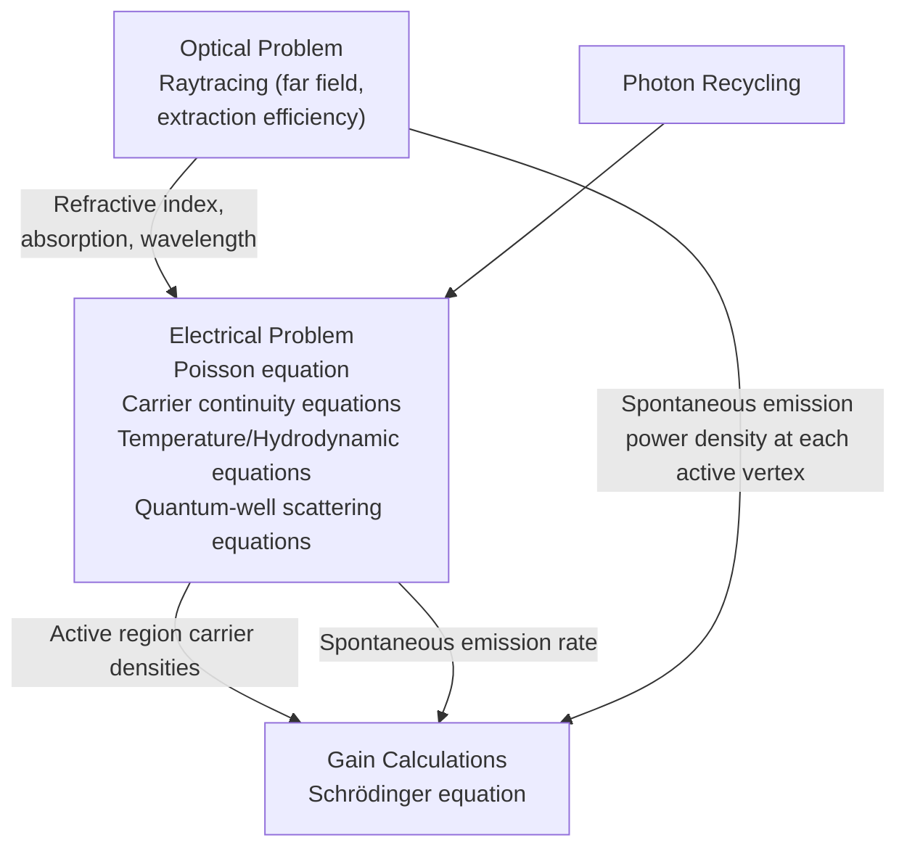
</details>

Figure 60 Flowchart of the coupling between the electronics and optics for an LED simulation

# Single-Grid Versus Dual-Grid LED Simulation

Both single-grid and dual-grid LED simulations are possible. However, in the case of a singlegrid simulation, raytracing takes a longer time for the following reason: Raytracing builds a binary tree for each starting ray. Each branch of the tree corresponds to a ray at a mesh cell boundary. If the materials in two adjoining cells are different, the ray splits into refracted and reflected rays, creating two new branches. If the materials are the same in adjoining cells, the propagated ray creates a new branch. A fine mesh increases the depth of the branching significantly. Each new branch of the binary tree is created dynamically and, if dynamic memory allocation of the machine is not sufficiently fast, the tree creation of the raytracing becomes a bottleneck in the simulation.

To overcome this problem, the grids for the electrical problem and the raytracing problem are separated. The optical grid for raytracing is meshed coarsely. The binary tree created will be smaller and raytracing is more efficient. Such a coarse mesh enables you to compute the extraction efficiency and output radiation pattern. However, the optical intensity within the device cannot be resolved well with a coarse mesh.

# Electrical Transport in LEDs

Besides the drift-diffusion transport of typical semiconductor devices, the LED requires additional physical models to compute various optical effects. These physical models are described in the following sections.

# Spontaneous Emission Rate and Power

In the active region, the spontaneous emission of photons depletes the carrier population. At each active vertex, the spontaneous emission (or recombination of carriers) rate (units of $\# \mathrm { s } ^ { - 1 } \mathrm { m } ^ { - 3 } )$ ) is an integral of the spontaneous emission:

$$
R _ {\text {active}} ^ {\mathrm{sp}} (x, y, z) = \int_ {0} ^ {\infty} r ^ {\mathrm{sp}} (E) \rho^ {\mathrm{opt}} (E) d E \tag {1084}
$$

where the optical mode density is:

$$
\rho^ {\text { opt }} (E) = \frac {n _ {g} ^ {2} E ^ {2}}{\pi^ {2} \hbar^ {3} c ^ {2}} \tag {1085}
$$

and $r ^ {  { \mathrm { s p } } } ( E )$ is defined in Eq. 1111, p. 976. The total spontaneous emission power density at each active vertex (units of $\mathbf { j } \mathbf { s } ^ { - 1 } \mathbf { m } ^ { - 3 } )$ is:

$$
\Delta P ^ {\mathrm{sp}} (x, y, z) = \int_ {0} ^ {\infty} r ^ {\mathrm{sp}} (E) \rho^ {\mathrm{opt}} (E) \cdot (\hbar \omega) d E \tag {1086}
$$

This equation is similar to Eq. 1084, except that an additional energy term, $E = \hbar \omega$ , is included in the integrand to account for the energy spectrum of the spontaneous emission.

In LED simulations, the spontaneous emission spectrum, , broadens significantly withr sp( ) E increasing injected carriers. The integrals in Eq. 1084 and Eq. 1086 are based on a Riemann sum and, as with numeric integration, truncates at an internally set energy value. You can change the truncation value and the Riemann integration interval with the following syntax in the command file:

```txt
Physics {...
    LED (...
    Optics (...)
    SponScaling = 1.0
    SponIntegration(<energyspan>,<numpoints>)
    )
} 
```

where <energyspan> is a floating-point number (in eV) and is measured from the edge of the energy bandgap, and <numpoints> is an integer denoting the number of discretized intervals to use within this energy span.

The total spontaneous emission power is the volume integral of the power density over all the active vertices:

$$
P _ {\text { total }} ^ {\mathrm{sp}} = \int_ {(\text { active   -   region })} \Delta P ^ {\mathrm{sp}} (x, y, z) d V \tag {1087}
$$

This is the total spontaneous emission power that is computed and output in an LED simulation.

Since you are dealing with a spectrum for the spontaneous emission, it is evident from Eq. 1084 and Eq. 1086 that the integral sum of the photon rate and the integral sum of the photon power are not simply related by a constant photon energy, that is:

$$
\Delta P ^ {\mathrm{sp}} (x, y, z) \neq (\hbar \omega_ {0}) R _ {\text { active }} ^ {\mathrm{sp}} (x, y, z) \tag {1088}
$$

# Spontaneous Emission Power Spectrum

The LED spontaneous emission power spectrum can be plotted by activating the GainPlot section. The syntax consists of defining the number of discretized points for the spectrum and the span of the spectrum to plot:

```hcl
File {...
    ModeGain = "ngainplot_des"
}
GainPlot {
    Range = (<float>, <float>)  # specific range in eV
    Range = Auto  # automatically determines range 
```

```txt
Intervals = <integer>    # number of discretized points
}
Solve {...
PlotGain( Range=(0,1) Intervals=5 )
} 
```

In the gain file, the quantity SponEmissionPowerPereV (W/eV) is plotted. Integrating this quantity over the energy (eV) span recovers the total LED power.

# Current File and Plot Variables for LED Simulation

When an LED simulation is run, specific LED result variables are output to the plot file. Table 166 and Table 167 on page 940 list the current file output and the plot variables valid for LED simulation.

Table 166 Current file for LED simulation 

<table><tr><td>Dataset group</td><td>Dataset</td><td>Unit</td><td>Description</td></tr><tr><td>LedWavelength</td><td></td><td>nm</td><td>Average wavelength of LED simulation.</td></tr><tr><td rowspan="6">n_Contactp_Contact</td><td>Charge</td><td>C</td><td></td></tr><tr><td>eCurrent</td><td>A</td><td></td></tr><tr><td>hCurrent</td><td>A</td><td></td></tr><tr><td>InnerVoltage</td><td>V</td><td></td></tr><tr><td>OuterVoltage</td><td>V</td><td></td></tr><tr><td>TotalCurrent</td><td>A</td><td></td></tr><tr><td>Photon_Exited</td><td></td><td> $s^{-1}$ </td><td>Rate of photon escaping from device.</td></tr><tr><td>Photon_ExtEfficiency</td><td></td><td>1</td><td>Photon extraction efficiency.</td></tr><tr><td>Photon_NetPhotonRecycle</td><td></td><td> $s^{-1}$ </td><td>Net photon-recycling photon rate.</td></tr><tr><td>Photon_NonActiveAbsorb</td><td></td><td> $s^{-1}$ </td><td>Rate of photon absorption in nonactive regions.</td></tr><tr><td>Photon_Spontaneous</td><td></td><td> $s^{-1}$ </td><td>Spontaneous emission photon rate.</td></tr><tr><td>Photon_Trapped</td><td></td><td> $s^{-1}$ </td><td>Rate of trapped photons in device.</td></tr><tr><td>Power_Absorption</td><td></td><td>W</td><td>Absorption power.</td></tr><tr><td>Power_ASE</td><td></td><td>W</td><td>Amplified spontaneous emission power.</td></tr><tr><td>Power_Exited</td><td></td><td>W</td><td>Power escaping from device.</td></tr><tr><td>Power_ExtEfficiency</td><td></td><td>1</td><td>Power extraction efficiency.</td></tr><tr><td>Power_NetPhotonRecycle</td><td></td><td>W</td><td>Net photon-recycling power.</td></tr><tr><td>Power_NonActiveAbsorb</td><td></td><td>W</td><td>Power absorbed in nonactive regions.</td></tr><tr><td>Power_ReEmit</td><td></td><td>W</td><td>Re-emission power.</td></tr><tr><td>Power_SpecConvertGain</td><td></td><td>W</td><td>Net power gain of spectral conversion.</td></tr><tr><td>Power_Spontaneous</td><td></td><td>W</td><td>Spontaneous emission power.</td></tr><tr><td>Power_Total</td><td></td><td>W</td><td>Total internal optical power of LED.</td></tr><tr><td>Power_Trapped</td><td></td><td>W</td><td>Power trapped inside device.</td></tr><tr><td>Time</td><td></td><td>1s</td><td>For quasistationary.For transient.</td></tr></table>

Table 167 Plot variables for LED simulation 

<table><tr><td>Plot variable</td><td>Dataset name</td><td>Unit</td><td>Description</td></tr><tr><td>DielectricConstant</td><td></td><td>1</td><td>Dielectric profile.</td></tr><tr><td>LED_TraceSource</td><td></td><td></td><td>Influence of each active vertex on the total extracted light.</td></tr><tr><td>MatGain</td><td>OpticalMaterialGain</td><td> $m^{-1}$ </td><td>Local material gain.</td></tr><tr><td>RayTraceIntensity</td><td></td><td> $Wcm^{-3}$ </td><td>Optical intensity from raytracing.</td></tr><tr><td>RayTrees</td><td></td><td></td><td>Raytree structure. Not available for the compact memory option.</td></tr><tr><td>SpontaneousRecombination</td><td></td><td> $cm^{-3}s^{-1}$ </td><td>Sum of spontaneous emission.</td></tr></table>

LedWavelength is computed automatically in the simulation. It is taken as the wavelength where the peak of the spontaneous spectrum occurs. Different options for computing the wavelength are available (see LED Wavelength on page 941). For clarity, photon rate and power output results are separated into two groups:

The photon rate group has units of $\mathrm { s } ^ { - 1 }$ .   
The power group has units of .W

Photon and power quantities need to be computed separately if a spectrum is involved. Suppose that the spontaneous emission coefficient is $r ^ { \mathrm { s p ^ { \prime } } }$ (units of $\mathrm { e V } ^ { - 1 } \mathrm { c m } ^ { - 3 } \mathrm { s } ^ { - 1 } )$ . The photon rate is $\int r ^ { \mathrm { s p } ^ { \prime } } d E$ (Eq. 1084, p. 937 with $r ^ { \mathrm { s p ^ { \prime } } } = r ^ { \mathrm { s p } } ( E ) \times \rho ^ { \mathrm { o p t } } ( E ) )$ , while the power is $\int \boldsymbol { r } ^ { \mathrm { s p } ^ { \prime } } \cdot \boldsymbol { E } d E$ (Eq. 1086, p. 937). The extraction coefficient is the ratio of the exited and internal quantities, so the photon rate (Photon\_ExtEfficiency) and power (Power\_ExtEfficiency) extraction efficiencies are different.

The only case when Photon\_ExtEfficiency=Power\_ExtEfficiency is for a single wavelength simulation that does not involve a spectrum.

The total outcoupled (exited) power is then (Power\_ExtEfficiency x (Power\_Total-Power\_NonActiveAbsorb)), where the total internal optical power is:

```txt
Power_Total = Power_Spontaneous + Power_NetPhotonRecycle + Power_SpecConvertGain (1089) 
```

The photon rate extraction efficiency has been computed using:

```txt
Photon_ExtEfficiency = Photon_Exited / (Photon_Spontaneous + Photon_NetPhotonRecycle - Photon_NonActiveAbsorb) (1090) 
```

For power conservation in a nonactive photon-recycling case, you have:

```txt
Power_Total = Power_Spontaneous
= Power_Exited + Power_Trapped +
Power_NonActiveAbsorb (1091) 
```

Power\_Trapped refers to the power of the photons that are trapped (by total internal reflection or possibly nonconverging raytracing) indefinitely in the raytracing simulation. In a realistic scenario, the trapped photons decay in the device by some mechanism.

NOTE Users are responsible for introducing losses within the device (perhaps by introducing nonzero extinction coefficients in appropriate regions) to ensure proper treatment of the trapped photons.

The Power\_NetPhotonRecycle, Power\_SpecConvertGain, and Photon\_NetPhotonRecycle quantities pertain only to the activeregion photon-recycling model. These quantities are zero if the activeregion photon-recycling model is not activated.

# LED Wavelength

There are different ways of computing or inputting the LED wavelength:

AutoPeak: A robust algorithm based on the multisection method is used to search for the peak of the spontaneous emission rate spectrum $( r ^ { \mathrm { { ^ { s p } } } }$ versus E-curve). Then, the energy of the peak $r ^ { \mathrm { s p } ^ { \mathrm { \prime } } }$ is translated into the LED wavelength.   
AutoPeakPower: The same algorithm as for AutoPeak is used on the spontaneous emission power spectrum $( r ^ { \mathrm { { s p } } } E$ versus E-curve).

Effective: An effective wavelength is computed such that:

$$
\text { LED   power } = \text { LED   photon   rate   x   photon\_energy } \tag {1092}
$$

where photon\_energy is a direct inverse function of the effective wavelength.

User inputs a fixed LED wavelength.

The keywords for activating the various LED wavelength options are:

```powershell
Physics {...
    LED (...
    Optics (...
    RayTrace (...
    Wavelength = <float> | AutoPeak | Effective | AutoPeakPower
    )
    )
    )
} 
```

NOTE If no Wavelength keyword is specified, the old peak wavelength search algorithm is used.

# Optical Absorption Heat

Photon absorption heat in semiconductor materials can be simplified into two processes:

■ Interband absorption: When a photon is absorbed across the forbidden band gap in a semiconductor, it is absorbed to create an electron–hole pair. The excess energy (photon energy minus the band gap) of the new electron–hole pair is assumed to thermalize, resulting in eventual lattice heating.   
Intraband absorption: A photon can be absorbed to increase the energy of a carrier. The excess energy relaxes eventually, contributing to lattice heating.

In both processes, it is assumed that the eventual lattice heating (in a quasistationary simulation) occurs in the locality of photon absorption.

In LEDs, the extraction efficiency ranges between 40% and 60% commonly. This means a significant portion of the spontaneous light power is trapped within the device. The trapped light is ultimately absorbed and becomes the source of photon absorption heat.

Other keywords in the Physics section have been added. As far as possible, the syntax has been kept similar to that of the QuantumYield model (see Quantum Yield Models on page 553):

```txt
Plot {...
    OpticalAbsorptionHeat    # units of [W/cm^3]
}

Physics {...
    LED(...)
    OpticalAbsorptionHeat (
    StepFunction (
    Wavelength = float    # um
    Energy = float    # eV
    Bandgap    # auto-checking of band gap
    EffectiveBandgap    # auto-checking of band gap
    )
    ScalingFactor = float    # default is 1.0
) 
```

Some comments about the different StepFunction choices:

When the keyword Wavelength or Energy is used, the wavelength or energy of the photons is checked against this value. If the photon wavelength or energy is smaller or larger than this cutoff value, convert the optical generation totally into optical absorption heat, and set optical generation at the vertex to 0.   
The keywords Bandgap and EffectiveBandgap refer to the cutoff energy of the step function at $E _ { \mathrm { g } } - E _ { \mathrm { b g n } }$ and $( E _ { \mathrm { g } } - E _ { \mathrm { b g n } } + 2 \cdot ( 3 / 2 ) k T )$ , respectively. If the photon energy is greater than the cutoff energy (interband absorption), deduct the band gap to obtain the excess energy but do not deduct the optical generation. If the photon energy is less than the cutoff energy (intraband absorption), set the excess energy to the photon energy. In both cases, the excess energy will be converted to a heat source term for the lattice temperature equation.   
■ A ScalingFactor is introduced to allow for flexible fine-tuning.   
The OpticalAbsorptionHeat statement can be specified globally in the Physics section or the materialwise or regionwise Physics section.

# Quantum Well Physics

The physics in the quantum well (QW) is described in detail in Chapter 35 on page 975. Due to the size of the LED structure, it is recommended that you start with representing quantum wells as bulk active regions, and then contact TCAD Support for assistance in the more advanced settings (see Contacting Your Local TCAD Support Team Directly on page xli).

The scattering transport into QWs is approximated with thermionic emission for the best convergence behavior. The corrections of the carrier densities due to quantizations of the QW can be taken into account in the localized QW model (see Localized Quantum-Well Model on page 992).

# Accelerating Gain Calculations and LED Simulations

The computation bottleneck in LED simulations with gain tables is the calculation of the spontaneous emission rate at every Newton step. The spontaneous emission rate (unit is ) iss –1 an energy integral of the spontaneous emission coefficient (unit is ), and thes –1 eV–1 cm–3 integration is performed as a Riemann sum. To accelerate this calculation, a Gaussian quadrature integration can be used instead.

All gain calculations (with or without the gain tables) can be accelerated by specifying the following syntax in the Math section of the command file:

```txt
Math {...
    BroadeningIntegration (GaussianQuadrature (Order = 10))
    SponEmissionIntegration (GaussianQuadrature (Order = 5))
} 
```

The Gaussian quadrature numeric integration then is used in all parts of the gain calculations including broadening effects.

The order can be from 1 to 20. This order refers to the order of the Legendre polynomial that is used to fit the spontaneous emission spectrum in the energy range of the integration. The Gaussian quadrature integration is exact for any spectrum that can be expressed as a polynomial.

NOTE Convergence issues can be experienced in some situations. In such cases, switch off the Gaussian quadrature integration for SponEmissionIntegration and BroadeningIntegration in the Math section.

# Discussion of LED Physics

Many physical effects manifest in an LED structure. Current spreading is important to ensure that the current is channeled to supply the spontaneous emission sources at strategic locations that will provide the optimal extraction efficiency.

Changes to the geometric shape of the LED are made to extract more light from the structure. In most cases, the major part of the light produced is trapped within the structure through total internal reflection. As a result, the nonactive-region and active-region photon-recycling effect becomes relevant. This important physics has been incorporated into different physical models within Sentaurus Device. The nonactive photon-recycling (absorption of photons in nonactive regions) is switched on automatically by default. In most cases, the nonactive photon-recycling model is sufficient to capture the major physical effects because the volume of the active region is insignificant compared to the nonactive regions. Nonetheless, the active-region photonrecycling model can become important if there is a very high stimulated gain, which is usually not the case for GaN LEDs.

Important aspects of LED design are simulated easily by Sentaurus Device. These include current spreading flow, geometric design, and extraction efficiency.

# LED Optics: Raytracing

Raytracing is used to compute the intensity of light inside an LED, as well as the rays that escape from the LED cavity to give the signature radiation pattern for the LED output. The basic theory of raytracing is presented in Raytracing on page 604.

Arbitrary boundary conditions can be defined. A detailed description of how to set up the boundary conditions for raytracing is discussed in Boundary Condition for Raytracing on page 616. This is particularly useful in 3D simulations where you can define reflecting planes to use symmetry for reducing the size of the simulation model.

In addition, you can use reflecting planes to take into account external components such as reflectors, an example of which is shown in Figure 61.


<details>
<summary>text_image</summary>

External
Reflector
</details>

Figure 61 Using the reflecting boundary condition to define a reflector for LED raytracing

The raytracer needs to include the use of the ComplexRefractiveIndex model and to define the polarization vector. The syntax for this is:

```txt
Physics {...
    ComplexRefractiveIndex (...
    WavelengthDep (real imag)
    CarrierDep( real imag )
    GainDep( real ) # or real(log) 
```

```lisp
TemperatureDep( real )
CRImodel ( Name = "crimodelname" )
)
LED (... 
Optics (
RayTrace(
PolarizationVector = Random # or (x y z) vector
RetraceCRIchange = float # fractional change to retrace rays
...
)
)
)
) 
```

When PolarizationVector=Random is chosen, random vectors that are perpendicular to the starting ray directions are generated and assigned to be the polarization vector of each starting ray. The direction of each starting ray is described in Isotropic Starting Rays From Spontaneous Emission Sources and Anisotropic Starting Rays From Spontaneous Emission Sources on page 948.

The keyword RetraceCRIchange specifies the fractional change of the complex refractive index (either the real or imaginary part) from its previous state that will force a total recomputation of raytracing.

# Compact Memory Raytracing

A compact memory model has been built for LED raytracing. In the compact memory model, the raytrees are no longer saved, and necessary quantities are computed as required and extracted to compact storages of optical generation and optical intensity. As a result, the memory use and footprint are significantly reduced, thereby enabling the raytracing simulation of large LED structures. The syntax for activation is:

```txt
Physics {...
    LED (...
    RayTrace(...
    CompactMemoryOption
    )
    )
} 
```

NOTE The full active photon-recycling model does not work with the compact memory model.

# Isotropic Starting Rays From Spontaneous Emission Sources

The source of radiation from an LED is mainly from spontaneous emissions in the active region (this is further discussed in Spontaneous Emission Rate and Power on page 937). The spontaneous emission in the active region of the LED is assumed to be an isotropic source of radiation and can be conveniently represented by uniform rays emitting from each active vertex, as shown in Figure 62.

  
Figure 62 Uniform rays radiating isotropically from an active vertex source in (left) 2D space and (right) 3D space: only one-eighth of spherical space is shown for the 3D case

Isotropy requires that the surface area associated with each ray must be the same. The isotropy of the rays in 2D space is apparent. In 3D space, achieving isotropy is not as simple as dividing the angles uniformly. The elemental surface area of a sphere is , so uniformlyr  sin θ θ ( ) φ d ( ) d angular-distributed rays are weighted by and, therefore, do not signify isotropy.sin θ

To approximate this problem in 3D, a geodesic dome approximation is used (the geodesic dome is not strictly isotropic). Rays are directed at the vertices of the geodesic dome. The algorithm starts by constructing an octahedron and, then, recursively splits each triangular face of the octahedron into four smaller triangles.

The first stage of this splitting process is shown in Figure 62 (right), where rays are directed at the vertices of each triangle. The minimum number of rays is six, that is, one is directed along each positive and negative direction of the axes. If the first stage of recursive splitting is applied, a few more rays are constructed as shown in Figure 62, and the number of starting rays becomes 18. The second stage of recursive splitting gives 68 rays and so on. Therefore, you are constrained to selecting a fixed set of starting rays in the 3D case. Alternatively, you can input your own set of isotropic starting rays (see Reading Starting Rays From File on page 950).

# Anisotropic Starting Rays From Spontaneous Emission Sources

In some LED designs, the geometry governs the polarization of the optical field in the device. The spontaneous gain is dependent on the direction of this polarization. Consequently, this leads to an anisotropic spontaneous-emission pattern at the source.

The anisotropic emission pattern is proposed to be described by the following parametric equations:

$$
E _ {x} = d 1 \cdot \sin (\phi) + d 4 \cdot \cos (\phi) \tag {1093}
$$

$$
E _ {y} = d 2 \cdot \sin (\phi) + d 5 \cdot \cos (\phi) \tag {1094}
$$

$$
E _ {z} = d 3 \cdot \sin (\theta) + d 6 \cdot \cos (\theta) \tag {1095}
$$

where the intensity is given by:

$$
I = E _ {x} ^ {2} + E _ {y} ^ {2} + E _ {z} ^ {2} \tag {1096}
$$

The bases of sine and cosine are chosen based on the fact that the optical matrix element has such a functional form when polarization is considered (see Importing Gain and Spontaneous Emission Data With PMI on page 996). By changing the values of d1 to d6, different emission shapes can be orientated in different directions, and this feature allows you to modify the anisotropy of the spontaneous emission.

The syntax required to activate the anisotropic spontaneous emission feature is:

```txt
Physics {...
    LED (...
    Optics(...
    RayTrace(...
    EmissionType(
    #Isotropic  # default
    Anisotropic(
    Sine(d1 d2 d3)
    Cosine(d4 d5 d6)
    )
    )
    )
    )
    )
    )
} 
```

# Randomizing Starting Rays

Spontaneous emission is a random process. To take into account the random nature of this process and still ensure that the emission of the starting rays from each active vertex source is isotropic, a randomized shift of the entire isotropic ray emission is introduced.

This is best illustrated in Figure 63 where only four starting rays are used for clarity. For each active vertex, a random angle is generated to determine the random shift of the distribution of the isotropic starting rays. The same concept is also used for the 3D case, and this gives a simple randomization strategy for using raytracing to model the spontaneous emissions.


<details>
<summary>text_image</summary>

Shift by angle α
α
</details>

Figure 63 Shifting the distribution of entire isotropic starting rays by an angle  α

# Pseudorandom Starting Rays

Randomization of the starting rays is activated by the keyword RaysRandomOffset in the following syntax:

```txt
Physics {...
    LED (...
    RayTrace (...
    RaysRandomOffset
#    RaysRandomOffset (RandomSeed = 123)    # seeding the generator
)
} 
```

You also can fix the seed of the random number generator, and this will compute a pseudorandom set of starting rays, so that repeated runs of the same simulation will reproduce exactly the same raytracing results.

NOTE Without the keyword RaysRandomOffset, the default is a fixed angular shift that is determined by the active vertex number.

# Reading Starting Rays From File

The geodesic ray distribution is not truly isotropic. As a result, some percentages of error are incurred when isotropy is really needed. To circumvent this issue, a new feature to allow you to read in a set of source isotropic starting rays has been implemented. The syntax is:

```txt
Physics {...
    LED (...
    Optics (...
    RayTrace (...
    RaysPerVertex = 1000
    SourceRaysFromFile("sourcerays.txt")
    )
    )
    )
} 
```

It is important to note that RaysPerVertex specifies the number of direction vectors to read from the file. The file specified with SourceRaysFromFile contains 3D direction vectors for each starting ray; an example of which is sourcerays.txt:

```txt
-0.239117 0.788883 0.566115
0.776959 0.548552 -0.308911
-0.607096 -0.042603 0.793485
-0.158313 -0.276546 -0.947871
0.347036 -0.805488 0.480370
...
```

There are several methods for generating 3D isotropic rays, for example, the constrained centroid Voronoï tessellation (CCVT). On the other hand, you can also use this option to import experimentally measured ray distribution profiles.

# Moving Starting Rays on Boundaries

Starting rays from active vertices on boundaries create the problem that half of those rays are propagated directly out of the device. To alleviate this problem, a new feature is implemented to allow you to shift the starting position of such rays inwards of the device. Typical values used are from 1 to 5 nm. The syntax is:

```txt
Physics {...
    LED (...
    Optics (...
    RayTrace (...
    MoveBoundaryStartRays(float)  # [nm])
    ) 
```

```txt
)
) )
} 
```

# Clustering Active Vertices

In 3D LED simulations, the number of active vertices can grow significantly when the electrical mesh is refined. This directly implies that the number of starting rays for raytracing increases significantly because that is a direct function of the number of active vertices.

Consequently, the resultant raytree is an exponential function of the number of starting rays, and this results in a very large raytracing problem, which can derail the simulation time and, in part, the memory usage (since the compact memory model declares storage arrays of the size of the number of active vertices).

The solution is to group the active vertices into clusters, with each cluster serving as a distributed source of starting rays for raytracing.

Three possible strategies of clustering the active vertices have been implemented.

# Plane Area Cluster

Users select the total number of clusters to be generated. Then, this number is translated into equal area zones (also taking into account the aspect ratio) of the automatically detected QW plane. The active vertices are subsequently grouped into each of these zones such that each zone forms a cluster. The algorithm for plane area clustering is described as follows:

Assume you input the required cluster size, . The aim is to fit as many squarish elements (ofNc size ) into the QW plane area (size ) as possible, as shown in Figure 64.d d× XY


<details>
<summary>text_image</summary>

X
d x d
Y
</details>

Figure 64 Fitting as many squarish elements of size d x d into QW plane

The constraints of the problem are:

$$
N _ {c} = \frac {X Y}{d ^ {2}} \tag {1097}
$$

$$
X = N _ {x} d, N _ {x} \text {   is   an   integer } \tag {1098}
$$

$$
Y = N _ {y} d, N _ {y} \text {   is   an   integer } \tag {1099}
$$

Solving gives:

$$
N _ {x} = (\text { INTEGER }) \sqrt {(X / Y) N _ {c}} \tag {1100}
$$

$$
N _ {y} = (\text { INTEGER }) (Y / X) N _ {x} \tag {1101}
$$

Finally, the adjusted cluster size becomes:

$$
N _ {c} ^ {\prime} = N _ {x} \times N _ {y} \tag {1102}
$$

If no active vertices fall within a plane area segment, that segment is not added to the list of clusters. Therefore, you might see a smaller number of clusters than $N _ { c } ^ { \prime }$ .

# Nodal Clustering

A recursive algorithm is used to calculate how to group the active vertices for each cluster, such that each cluster receives, more or less, the same number of active vertices. The algorithm alternates the x- and y-coordinate partitioning of the list of active vertices, in an attempt to group a cluster of nearest neighboring active vertices. Unfortunately, this might not result in an even spatial distribution of clusters, which is a disadvantage of this method.

# Optical Grid Element Clustering

The number of clusters cannot be set by users as it is defined by the number of optical grid elements. Active regions must be defined in both the electrical and optical grids. An effective bulk region in the optical grid is used to describe the active QW layers and can be meshed according to user requirements. Then, the electrical active vertices are grouped inside each of the optical grid active elements such that each optical-grid active element forms a cluster. In this way, you can control the distribution of the clusters for greater modeling flexibility.

NOTE In all the above clustering methodologies, the center of each cluster is determined by the average of the active vertices that it encloses.

# Using the Clustering Feature

The following keywords in the LED framework activate the clustering feature:

```txt
Physics {...
    LED ( ...
    Raytrace (...
    ClusterActive(
    ClusterQuantity = Nodes | PlaneArea | OpticalGridElement
    NumberOfClusters = <integer>    # for Nodes | PlaneArea
    )
    )
    )
} 
```

# Debugging Raytracing

Rays are assumed, by default, to irradiate isotropically from each active vertex. In the case of quantum wells, an artifact of this assumption might cause unrealistic spikes in the radiation pattern. Consider those source rays that are directed within the plane of the quantum wells. These rays will mostly transmit out of the device at the ending vertical edges of the quantum wells. Realistically, the rays would have a much higher probability of being absorbed and reemitted into another direction than traversing the entire plane of the quantum well.

To circumvent this problem, use the anisotropic emission as described in Anisotropic Starting Rays From Spontaneous Emission Sources on page 948. Alternatively, one can try to exclude the source rays emitting within a certain angular range from the horizontal plane, that is, the plane of the quantum well. The power from these excluded rays will be distributed equally to the rest of the rays that are not within this angular range. This results in an approximate anisotropic emission shape at each active vertex. The syntax for this exclusion is:

```txt
Physics { ...
    LED ( ...
    Optics ( ...
    RayTrace ( ...
    ExcludeHorizontalSource(<float>)  # in degrees
    )
    )
    )
} 
```

To add more flexibility to LED raytracing, debugging features are implemented. These include:

■ Setting a fixed observation center for the LED radiation calculations.   
Fixing a constant wavelength for raytracing.

Allowing you to print and track the LED radiation rays (in a certain angular zone) back to its source active vertex.

These features are described in this syntax:   
```txt
Physics { ...
    LED ( ...
    Optics ( ...
    RayTrace ( ...
    ObservationCenter = (<float> <float>)
    # in micrometers, 3 entries for 3D
    Wavelength = 888    # [nm] set fixed wavelength
    DebugLEDRadiation(<filename> <StartAngle> <EndAngle>
    <MinIntensity>)
    )
    )
    )
} 
```

# Print Options in Raytracing

The original Print feature of raytracing causes all ray paths to be printed. With multiple reflections or refractions and a large number of starting rays, the resultant image can become a black smudge. To reduce the number of ray paths that are printed, a Skip option is implemented within the Print feature. In addition, you can trace the ray paths originating from only a single active vertex. These features are described in this syntax:

```txt
Physics {
    LED (
    Optics (
    RayTrace (
    Print(Skip(<int>))  # skip printing every <int> ray paths
    Print(ActiveVertex(<int>))  # print only rays from active vertex
    # <int>
    PrintSourceVertices(<filename>)
    ProgressMarkers = <int>  # 1-100% intervals (integer)
    )
    )
    )
} 
```

The option PrintSourceVertices(<filename>) outputs the list of active vertices, their global index numbering, and coordinates into the file specified by <filename>. If the number of source rays is large or the optical mesh is fine, raytracing takes some time to be completed. In this case, you can use the keyword ProgressMarkers=<int> to set the incremental completion meter.

The Print option only outputs rays as lines with no other information. To obtain a raytree that contains intensity and other information, you can plot the raytree using the keyword RayTrees in the Plot section of the command file:

```txt
Plot {...
RayTrees
} 
```

The resultant raytree is plotted in TDR format and can be visualized by Sentaurus Visual, where each branch of the raytree can be accessed individually.

# Interfacing LED Starting Rays to LightTools

To facilitate the rapid design of LED structures with its luminaire, the starting rays from active region vertices can be output directly to a ray file formatted for use in the Synopsys LightTools® tool. Figure 65 shows a probable design flow.


<details>
<summary>flowchart</summary>

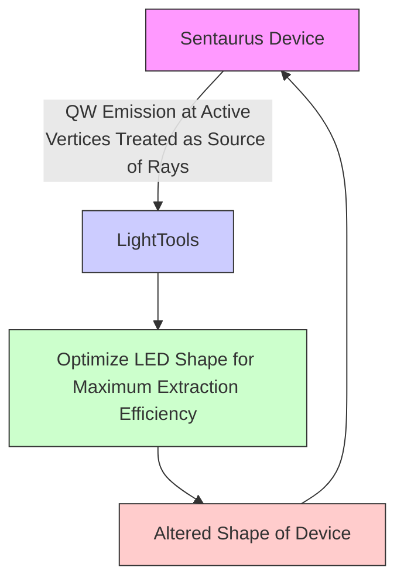
</details>

Figure 65 LED design flow to optimize extraction efficiency by LightTools and coupled to Sentaurus Device LED device simulation

The set of rays is derived from the LED spontaneous emission power spectrum at each vertex of the device. This means that there is wavelength variability such that each starting ray carries a starting position, a direction, an intensity value, and a wavelength.

This feature is an extension of the Disable keyword, so that the internal Sentaurus Device raytracing engine will not be activated. The syntax is:

```txt
File {...
    Plot = "n99_des.tdr"
}
Physics {...
    LED (
    RayTrace(
    Disable(
    OutputLightToolsRays ( 
```

```txt
WavelengthDiscretization = <integer>    # spectrum discretization
    RaysPerCluster = <integer>    # rays emitting from each
    # active cluster

    IsotropyType = InBuilt | Random | UserRays  # default is InBuilt
    SaveType = Ascii | Binary    # choose ASCII or binary format
    )
    )
    ClusterActive()
    RaysPerVertex = <integer>    # used with SourceRaysFromFile()
    SourceRaysFromFile(string)
    )
    )
}

Solve {...
    Plot( Range=(0,1) Intervals=5 )
} 
```

This feature can be used in conjunction with the ClusterActive section, so that the active vertices can be grouped into clusters to reduce the final number of rays. If the ClusterActive section is not present, every active vertex will be used as emission centers for the starting rays. It is also possible to import an isotropic distribution of point source rays from a file to be used for random-rotated distribution at different vertices. The span of the spectrum at each active cluster is computed automatically and divided into the numbers as specified by WavelengthDiscretization. The total number of starting rays is:

WavelengthDiscretization \* RaysPerCluster \* NumberOfActiveClusters

Two types of ray file format for LightTools can be chosen: ASCII or binary. The base name for the LightTools ray files is derived from the plot file name and is appended with either \_lighttools.txt for the ASCII format or \_lighttools.ray for the binary format.

For example, according to the above syntax, the following are the corresponding file names for the LightTools ray files:

```txt
n99_000000_des_lighttools.txt
n99_000001_des_lighttools.txt
...
n99_000000_des_lighttools.ray
n99_000001_des_lighttools.ray
... 
```

These files can be read directly by LightTools as volume sources of rays (refer to the LightTools manual for more information).

# Example: n99\_000000\_des\_lighttools.txt

This example is an ASCII-formatted LightTools ray file (version 2.0 format):   
```python
# Synopsys Sentaurus Device to LightTools
# Ray Data Export File
LT_RDF_VERSION: 2.0
DATANAME: SentaurusDeviceRayData
LT_DATATYPE: radiant_power
LT_RADIANT_FLUX: 1.946806e-04
LT_FAR_FIELD_DATA: NO
LT_COLOR_INFO: wavelength
LT_LENGTH_UNITS: micrometers
LT_DATA_ORIGIN: 0 0 0
LT_STARTOFDATA
0.000000e+00 4.290000e-01 0.000000e+00 -0.163343 -0.986569 0.000000
5.451892e-05 470.395656
0.000000e+00 4.290000e-01 0.000000e+00 -0.163343 -0.986569 0.000000
1.817405e-04 459.664919
...
LT_ENDOFDATA 
```

The first three columns denote the starting position (in micrometers) of the ray, the next three columns show the direction vector, and this is followed by the fractional power (as a fraction of LT\_RADIANT\_FLUX), and ends with the wavelength (in nanometers).

# LED Radiation Pattern

Raytracing does not contain phase information, so it is not possible to compute the far-field pattern for an LED structure. Instead, the outgoing rays from the LED raytracing are used to produce the radiation pattern.

In 2D space, this is equivalent to moving a detector in a circle around the LED as shown in Figure 66 on page 958.

In 3D space, the detector is moved around on a sphere. The circle and sphere have centers that correspond to the center of the device. Sentaurus Device automatically determines the center of the device to be the midpoint of the device on each axis. Nonetheless, there is an option to allow you to set the center of observation (see Debugging Raytracing on page 953 and Table 265 on page 1444).

To examine the optical intensity inside the LED, use RayTraceIntensity in the Plot statement.


<details>
<summary>text_image</summary>

R
LED
φ = 0
</details>

Figure 66 Measuring the radiation pattern in a circular path around LED at observation radius, R

The syntax required to activate and plot the LED radiation pattern is located in the File, Physics-LED-Optics-RayTrace, and Solve-quasistationary sections of the command file:

```txt
File {...
    # ---- Activate LED radiation pattern and save ----
    LEDRadiation = "rad"
}
...
Physics {...
    LED (...
    Optics (...
    RayTrace(...
    LEDRadiationPara(1000.0,180) # (radius_micrometers, Npoints)
    ObservationCenter = (2.0 3.5 5.5) # set center
    )
    )
    )
}
...
Solve {...
# ---- Specify quasistationary ----
quasistationary (...
PlotLEDRadiation { range=(0,1) intervals=3 }
Goal {name="p_Contact" voltage=1.8})
{...}
} 
```

The LED radiation plot syntax works in the same way as GainPlot (see Spontaneous Emission Power Spectrum on page 938) in the Quasistationary statement.

An explanation of this example is:

The base file name, "rad", of the LED radiation pattern files is specified by LEDRadiation in the File section. The keyword LEDRadiation also activates the LED radiation plot.   
The parameters for the LED radiation plot are specified by the keyword LEDRadiationPara in the Physics-Optics-RayTrace section. You must specify the observation radius (in micrometers) and the discretization of the observation circle (2D) or sphere (3D).   
You can set the center of observation by including the keyword ObservationCenter. If this is not set, the center is automatically computed as the middle point of the span of the device on each axis.   
The LED radiation pattern can only be computed and plotted within the Quasistationary statement. The keyword PlotLEDRadiation controls the number of LED radiation plots to produce.   
The argument range=(0,1) in the PlotLEDRadiation keyword is mapped to the initial and final bias conditions. In this example, the initial and final (goal) p\_Contact voltages are 0 V and 1.8 V, respectively. The number of intervals=3, which gives a total of four (= 3+1) LED radiation plots at 0 V, 0.6 V, 1.2 V, and 1.8 V. In general, specifying intervals=n produces (n+1) plots.   
■ If the LED structure is symmetric, the LED radiation is only computed on a semicircle.

The following sections briefly describe the files that are produced in the LED radiation plot for the 2D and 3D cases.

# Two-Dimensional LED Radiation Pattern and Output Files

Activating the LED radiation plot for a 2D LED simulation produces two different files (using the base name "rad"):

rad\_000000\_LEDRad.plt

The normalized radiation pattern versus observation angle, which can be viewed in Inspect.

rad\_000000\_LEDRad\_Polar0.tdr

The normalized radiation pattern projected onto a grid file and can be viewed in Sentaurus Visual. The polar plot of the LED radiation pattern is then shown.

A sample output of the radiation plot of a 2D nonsymmetric LED structure is shown in Figure 67. The lower-left image corresponds to the file rad\_000000\_LEDRad.plt plotted by Inspect, and the right image is the product of the file rad\_000000\_LEDRad\_Polar.tdr plotted by Sentaurus Visual.

  
Figure 67 (Upper left) LED internal optical intensity, (lower left) normalized radiation intensity versus observation angle, and (right) polar radiation plot computed by Sentaurus Device in 2D LED simulation

# Three-Dimensional LED Radiation Pattern and Output Files

There are two output files for the radiation pattern in the case of a 3D LED simulation:

```txt
rad_000000_des.tdr 
```

Data file containing the normalized radiation pattern. Use Sentaurus Visual for this file, and the spherical plot of the 3D LED radiation pattern is then shown. A sample of the radiation pattern of a 3D LED simulation is shown in Figure 68 on page 961.

```txt
rad_000000_des_3Dslices.plt 
```

The 3D radiation pattern is extracted into polar plots on three planes that can be visualized using Inspect:

– XYplane: ; plot far field for to .θ π = ⁄ 2 φ = 0 2π   
– XZplane: , ; plot far field for to .φ = 0 π θ = 0 2π   
– YZplane: , ; plot far field for φ π = ⁄ 2 3π ⁄ 2 θ = 0 to .2π


<details>
<summary>text_image</summary>

Radiation on a Sphere
x
y
x
y
</details>

Figure 68 (Left) LED internal optical intensity and (right) normalized radiation intensity projected on a sphere of 3D LED simulation

# Staggered 3D Grid LED Radiation Pattern

In discretizing a 3D far-field collection sphere with regular longitudinal and latitude lines, the size of each surficial element critically depends on its location on the sphere. At the polar regions, the elements are very small compared to those along the equator. As the discretization increases, the disparity between the polar and equator surficial elements increases at the same rate.

The sampling rate for rays is constrained by the smallest collecting element, which, in this case, is the much smaller surficial element at the poles. In most cases, the polar regions are undersampled and the equator regions are oversampled due to the disparity in surficial element areas between the two regions. Undersampling at the poles also could lead to anomalous spikes in the far field since the far-field intensity is computed by the total ray power impinging that element and is divided by the elemental area. To adequately sample the polar regions, a significant number of rays must be used, resulting in a very large raytracing problem that might not be necessary.

To circumvent the abovementioned problems, the spherical collection space must be composed of more uniformly distributed elemental areas. The baseline requirement is that each elemental area on the surface of the collection sphere must be approximately the same size. The following simple approach is used:

1. Divide the sphere into concentric rings in the latitude planes. Each ring has a thickness of:

$$
d _ {\theta} = \int R d \theta = R \Delta \theta \tag {1103}
$$

2. For each concentric ring, further subdivide the ring into elements with a width that is approximately .dθ

Mathematically, assume that the sphere is divided into $N _ { \theta }$ rings, so that the thickness of each ring is:

$$
d _ {\theta} = R \left(\frac {\pi}{N _ {\theta}}\right) \tag {1104}
$$

In each concentric ring ( ) bound betweeni $\theta _ { 1 }$ and $\theta _ { 2 }$ , choose the order of such that:θ

$$
\sin (\theta_ {2}) > \sin (\theta_ {1}) \tag {1105}
$$

The circumference at $\theta _ { 2 }$ is $C _ { \theta 2 } = R \sin ( \theta _ { 2 } ) \times 2 \pi$ . The constraint needed here is such that:

$$
\frac {C _ {\theta 2}}{N _ {\phi} (i)} = d _ {\theta} \tag {1106}
$$

where $N _ { \phi } ( i )$ is the number of divisions for the concentric ring ( ) and is an integer. Solvingi gives:

$$
N _ {\phi} (i) = (\text { INTEGER }) [ 2 \sin (\theta_ {2}) \times N _ {\theta} ] \tag {1107}
$$

At the poles of the sphere ( and θ = 0 $\theta = \pi { \ }$ , the concentric rings collapse into a cap. The following constraint is imposed for these polar cap regions (essentially trying to match triangular area elements with squarish area elements):

$$
0. 5 \times \left(\frac {C _ {\theta 2}}{N _ {\phi} (i)}\right) \times d _ {\theta} = d _ {\theta} ^ {2} \tag {1108}
$$

Simplifying gives the number of divisions for the polar cap rings:

$$
N _ {\phi} (i) = (\text { INTEGER }) [ \sin (\theta_ {2}) \times N _ {\theta} ] \tag {1109}
$$

The total number of elemental areas is $\sum ^ { N _ { \phi } ( i ) }$ .

Table 168 lists the total number of elements obtained from this simple approach.

Table 168 Total number of elements and area information as a function of $N _ { \theta }$ 

<table><tr><td> $N_{\theta}$ </td><td>Total number of surface elements</td><td>Smallest area (unit radius)</td><td>Largest area (unit radius)</td><td>Area skew = ratio of largest/smallest area</td></tr><tr><td>5</td><td>36</td><td>0.314159</td><td>0.399994</td><td>1.273</td></tr><tr><td>10</td><td>146</td><td>0.074372</td><td>0.097081</td><td>1.305</td></tr><tr><td>20</td><td>554</td><td>0.017705</td><td>0.024573</td><td>1.388</td></tr><tr><td>50</td><td>3296</td><td>0.002857</td><td>0.003945</td><td>1.381</td></tr><tr><td>100</td><td>12976</td><td>0.000715</td><td>0.000987</td><td>1.380</td></tr><tr><td>150</td><td>29013</td><td>0.000318</td><td>0.000439</td><td>1.381</td></tr><tr><td>200</td><td>51426</td><td>0.000179</td><td>0.000247</td><td>1.380</td></tr></table>

As $N _ { \mathfrak { \mathfrak { \theta } } }$ increases, it is clear from Table 168 that the area skew (ratio of largest to smallest elemental area) stabilizes to a value of approximately 1.38.

To activate the new staggered 3D far-field grid, use the syntax:

```swift
Physics {
    LED (
    RayTrace(
    Staggered3DFarfieldGrid
    )
    )
} 
```

If the keyword Staggered3DFarfieldGrid is not specified, the collection sphere reverts to the old ( , ) scheme to maintain backward compatibility.θ φ

# Spectrum-Dependent LED Radiation Pattern

Unlike a laser beam with single-frequency emissions, rays emitting from an LED carry a spectrum of frequencies (or energies). Sentaurus Device monitors the spectrum of each ray as it undergoes the process of raytracing in and out of the device. The resultant spectrum of the LED radiation pattern can then be plotted.

To activate this feature, include the keyword LEDSpectrum in the command file:

```txt
Physics {...
    LED (...
    Optics (...
    RayTrace(...
    LED Spectrum(<startenergy> <endenergy> <numpoints>)
    )
    )
    )
} 
```

This feature must be used in conjunction with the LEDRadiation feature so that the file names of the LED radiation plots and the observation angles can be specified. Other notable aspects of the syntax are:

<startenergy> and <endenergy> give the energy range of the spectrum to be monitored. These parameters are floating-point entries with units of eV.   
<numpoints> is an integer determining the number of discretized points in the specified energy range.

# Tracing Source of Output Rays

Optimizing the extraction efficiency is critical in an LED design. Other than modifying the shape of the device, you can use the fact that the rays originating from certain zones in the active region have a higher escape or extraction rate. By designing the shape of the contact to channel higher currents into these zones, the extraction efficiency can effectively be increased.

To facilitate the identification of such zones, a feature that correlates the output rays to their source active vertices is implemented. The intensity of each output ray is added to an LED\_TraceSource variable at each active vertex. At the end of the simulation, a profile of LED\_TraceSource is obtained, which provides an indication of the best localized regions to which more current can be channeled.

The activation of this feature requires keywords to be inserted into two different statements of the command file:

```txt
Plot { ...
    LED_TraceSource
}

Physics { ...
    LED ( ...
    Optics(
    RayTrace ( ...
    TraceSource()
    )
    )
    )
} 
```

NOTE A far-field observation radius must be set for the TraceSource feature.

# Interfacing Far-Field Rays to LightTools

LightTools is a robust raytracer that accepts a list of source rays as input, and it can optimize the packaging design for LEDs, that is, the luminaire. Such a design flow is shown in Figure 69.


<details>
<summary>flowchart</summary>

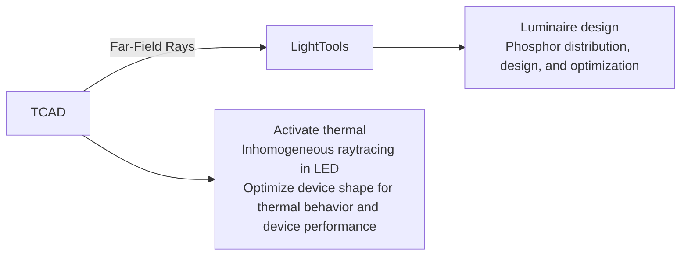
</details>

Figure 69 Secondary LED design flow to optimize luminaire design by LightTools and coupled to Sentaurus Device LED device simulation

An interface has been built in Sentaurus Device to output farfield rays from an LED device simulation that can be input into LightTools as source rays. This feature requires the LED radiation plot to be activated simultaneously so that the rays can be output at various quasistationary and transient states. The syntax for activating this feature is:

```txt
Physics {
    LED (
    Optics (
    Raytracer (
    ExternalMaterialCRIFile = "string"
    OutputLightToolsFarfieldRays (
    Filename = "farfield"
    WavelengthDiscretization = <integer>
    SaveType = Ascii | Binary
    )
    )
    )
    )
} 
```

The energy span of the spectrum is computed automatically, and you only need to input the wavelength discretization. The spectrum information is embedded inside the ray information as wavelength and relative intensity values. The relative intensity is a fraction of the total farfield power.

NOTE In Sentaurus Device, raytracing and wavelength dependency of the refractive index can only be specified by using the complex refractive index model.

When the LED is embedded in another medium, the keyword ExternalMaterialCRIFile can be included to take wavelength-dependent complex refractive index changes into account (see External Material in Raytracer on page 627).

You have the option to output the ray information to either an ASCII file or a binary file. The ray information consists of the position vector (x,y,z), the direction cosine (x,y,z), the relative intensity, and the wavelength. Both file types contain identifying headers that are required by LightTools. The resultant name of the file is the user name with the suffix \_lighttools.txt for the ASCII format or the suffix \_lighttools.ray for the binary format. An example of an ASCII-formatted file is presented in Example: farfield\_lighttools.txt.

Example: farfield\_lighttools.txt   
```csv
# Synopsys Sentaurus Device Farfield to LightTools
# Ray Data Export File
LT_RDF_VERSION: 2.0
DATANAME: SentaurusDeviceFarfieldRayData
LT_DATATYPE: radiant_power
LT_RADIANT_FLUX: 2.066459e-05
LT_FAR_FIELD_DATA: NO
LT_COLOR_INFO: wavelength
LT_LENGTH_UNITS: micrometers
LT_DATA_ORIGIN: 0 0 0
LT_STARTOFDATA
5.351638e+01 2.716777e+02 8.281585e+01 -0.198138 0.651751 0.732094
1.648189e-08 390.559610
3.000000e+02 7.388091e+01 4.290000e-01 0.637854 0.770158 0.000000
4.411254e-04 390.559610
1.001089e+02 3.000000e+02 4.290000e-01 -0.637854 0.770158 0.000000
2.585151e-05 390.559610
0.000000e+00 1.943600e+02 4.290000e-01 -0.637854 -0.770158 0.000000
2.783280e-06 390.559610
1.735878e+02 0.000000e+00 4.290000e-01 0.637854 -0.770158 0.000000
1.631101e-07 390.559610 
```

# Nonactive Region Absorption (Photon Recycling)

The default setting for LED simulations includes the contribution of absorbed photons in nonactive regions to the continuity equation as a generation rate. This is the basic concept of the nonactive-region photon recycling. In most cases, LEDs are designed with larger bandgap material in nonactive regions to eradicate intraband absorption.

As a result, it might not be necessary to include very small values of nonactive absorption in some situations. To allow for such flexibility, nonactive absorption can be switched off as an option. The syntax is:

```solidity
Physics { ...
    LED ( ...
    Optics ( ...
    RayTrace ( ...
    NonActiveAbsorptionOff
    OptGenScaling = <float>
    BackgroundOptGen(<float>)  # [#/cm^3]
    )
    )
    )
} 
```

If the keyword NonActiveAbsorptionOff is used, the plot variable OpticalGeneration still show values, but these values are not included in the continuity equation. A scaling factor, OptGenScaling, can be defined to scale the final value of optical generation. You also can set a background optical generation with the keyword BackgroundOptGen.

# Device Physics and Tuning Parameters

Unlike a laser diode, an LED does not have a threshold current. Therefore, the carriers in the active region are not limited to any threshold value. This means that the spontaneous gain spectrum continues to grow as the bias current increases. The limiting factor for growth is when the QW active region is completely filled and leakage current increases significantly, or dark recombination processes start to dominate with increasing bias and temperature.

There are four main design concerns for an LED:

Designing the basic layers to optimize the internal quantum efficiency. Polarization charge sheets are needed for AlGaN–GaN–InGaN interfaces, and junction tunneling models might be needed for thin electron-blocking layers. For mature QW technology such as InGaAsP systems, there can be predictive value in advanced gain calculations for optical gain.k p⋅ However, for difficult-to-grow materials such as InGaN/AlGaN QWs, the uncertainties of growth, mole fraction grading, interface clarity, and so on, make predictive modeling of optical gain almost impossible.

Extraction efficiency. This is mainly a problem of the geometric shape of the LED structure and the complex refractive index profile of the structure. Temperature, wavelength, and carrier distribution can alter the complex refractive index profile, so the extraction efficiency changes with increasing current injection. Many LED structures have tapered sidewalls to help couple more light out of the device. The slope of the taper can be set as a parameter using Sentaurus Workbench, and the automatic parameter variation feature can be used to optimize the extraction efficiency of the LED geometry.   
■ Current spreading. It is desirable to spread the current uniformly across the entire active region so that total spontaneous emissions can be increased. In Sentaurus Device, there is an option to switch off raytracing in an LED simulation. Switching off raytracing only forgoes the extraction efficiency and radiation pattern computation; the total spontaneous emission power is still calculated. This can assist you in the faster optimization of an LED device for uniform current spreading.   
Thermal management, hot spots, how much heat is produced and how to cool the device. Temperature distribution also affects the mobility and complex refractive index profile and, therefore, impacts the current spreading profile and optical extraction efficiency.

# Example of 3D GaN LED Simulation

An LED simulation is best run with a dual-grid approach. The electrical grid must be dense in vicinities where carrier transport details are important. On the other hand, a coarse grid is needed for raytracing. The following is a skeletal sample of command file syntax for a dualgrid 3D GaN LED simulation. Only highlights of the syntax that are important to LED simulations have been included.

The typical command file syntax is:   
```python
#########
## Global declarations ###
#########
File {...}
Math {
    Digits = 5
    NoAutomaticCircuitContact
    DirectCurrent
    Method = blocked
    # ILS should be chosen for big 3D simulations
    # For 2D, use Pardiso
    Submethod=ILS(set= 5)
    ILSrc=" 
    set (5) { 
```

```hcl
iterative(gmres(100), tolrel=1e-11, tolunprec=1e-4, tolabs=0, maxit=200);
preconditioning(ilut(1e-9,-1), right);
ordering(symmetric=nd, nonsymmetric=mpsilst);
options(compact=yes, linscale=0, fit=5, refinebasis=1, refineresidual=30, verbose=5);
}; "
Derivatives
Notdamped=20
Iterations=15
RelErrControl
ErrRef(electron)=1e7
ErrRef(hole)=1e7
ElementEdgeCurrent
ExtendedPrecision
DualGridInterpolation (Method=Simple)
NumberOfThreads = maximum
Extrapolate
}

##########
## Define the optical solver part ###
##########
OpticalDevice optDevice {
    File {
    Grid = "optic_msh.tdr"
    Parameters = "optparafile.par"
    }
    RaytraceBC {...}
    Physics {
    ComplexRefractiveIndex (
    WavelengthDep (real imag)
    TemperatureDep(real)
    )
    }
    Physics(Region="EffectiveQW") { Active }
}

##########
## Define the electronic solver part ###
##########
Device elDevice {
    Electrode {...}

Thermode {... 
    { Name="T_contact" Temperature=300.0 SurfaceResistance=0.05 }
}

File { 
```

# 34: Light-Emitting Diodes

# Device Physics and Tuning Parameters

```txt
Grid = "elec_msh.tdr"
Parameters = "elecparafile.par"
Current = "elsolver"
Plot = "elsolver"
LEDRadiation = "farfield"
Gain = "gainfilename"
}

# ---- Choose special LED related plot variables to output ----
Plot {...
    RayTraceIntensity
    OpticalGeneration
    LED_TraceSource
    OpticalAbsorptionHeat
# RayTrees # not for compact memory option
}

# ---- Specify gain plot parameters ----
GainPlot { ... }

Physics {
    Mobility ()
    EffectiveIntrinsicDensity (NoBandGapNarrowing)
    AreaFactor = 1
    IncompleteIonization
    Thermionic
    Fermi
    RecGenHeat

    OpticalAbsorptionHeat(
    Scaling = 1.0
    StepFunction( EffectiveBandgap )
    )

    # Complex refractive index model needed for raytracer
    ComplexRefractiveIndex (
    WavelengthDep (real imag)
    TemperatureDep (real)
    )

    LED (
    SponScaling = 1 * scale matrix element with this factor
    Optics (
    RayTrace(
    # Disable # this is for purely electrical investigation
    CompactMemoryOption # use compact memory model
    Coordinates = Cartesian
    Staggered3DFarfieldGrid 
```

```txt
# ---- Set ray starting and terminating conditions ----
PolarizationVector = Random
RaysPerVertex = 20
RaysRandomOffset (RandomSeed = 123)
Depthlimit = 100
MinIntensity = 1e-5

# ---- Set output options ----
TraceSource()
    LEDRadiationPara(10000,60) # (<radius-microns>, Npoints)

# Choose LED wavelength option
# Fixed wavelength by entering a <float>, units in [nm]
Wavelength=AutoPeak # or Effective or AutoPeakPower or <float>
)
)
# ---- Quantum well options ----
QWTransport
QWExtension = autodetect
Strain
Broadening = 0.04
Lorentzian
)

# Turn on tunneling for electron blocking layer if necessary
# eBarrierTunneling "rline1" ()
}

# ---- Define recombination models for non-active regions ----
Physics (material = "AlGaN") { Recombination (SRH(TempDep) Radiative) }
Physics (material = "GaN") { Recombination (SRH(TempDep) Radiative) }

# ---- Set QWs as active regions ----
Physics (region="QW1") { Recombination(-Radiative SRH(TempDep)) Active }
...
Physics (region="QW6") { Recombination(-Radiative SRH(TempDep)) Active }

# ---- Include polarization sheet charges between interfaces ----
Physics (RegionInterface="Window/Cap") {
Traps(FixedCharge Conc=-2.666746e+12)
}
Physics (RegionInterface="Barrier6/Buffer") {
Traps(FixedCharge Conc=-1e+12)
}
Physics (RegionInterface="Barrier0/Window") {
Traps(FixedCharge Conc=3.8e+12) 
```

# 34: Light-Emitting Diodes

# Device Physics and Tuning Parameters

```awk
}
Physics(RegionInterface="Barrier0/QW1") {Traps((FixedCharge Conc=1e12))}
Physics(RegionInterface="QW1/Barrier1") {Traps((FixedCharge Conc=-1e12))}

Math {
    # ---- Define tunneling nonlocal line for electron blocking layer ----
    NonLocal "rline1" (
    Barrier(Region = "Window")
    )
    }
}

##########
## Define mixed-mode system section for dual grid simulation ###
##########
System {
    elDevice d1 ( anode=vdd cathode=gnd ) { Physics { OptSolver="opt" } }
    Vsource_pset drive(vdd gnd) { dc = 2.72 }
    Set ( gnd = 0.0 )
    optDevice opt ()
}

##########
## Define solving sequence ###
##########
Solve {
    Coupled (Iterations = 40) { Poisson }
    Coupled (Iterations = 40) { Poisson Electron Hole }
    Coupled { Poisson Electron Hole Contact Circuit }
    Coupled { Poisson Electron Hole Contact Circuit Temperature }
    Quasistationary (
    InitialStep = 0.05
    MaxStep = 0.05
    Minstep = 5e-3
    Plot { range=(0,1) intervals=5 }
    PlotGain { range=(0,1) intervals=5 }
    PlotLEDRadiation { range=(0,1) intervals=5 }
    Goal { Parameter=drive.dc Value=3.8 }
    ) {
    # Full self-consistent electrical+thermal+optics simulation
    Plugin(breakonfailure) {
    Coupled(Iterations = 20) {Electron Hole Poisson Contact Circuit Temperature}
    Optics
    }
    }
} 
```

Some comments about the command file syntax:

Multithreading for the raytracer can be activated by specifying NumberOfThreads in the global Math section. A value of maximum has been chosen in this case so that Sentaurus Device will use the maximum number of threads available on the machine.   
The solver must be ILS for 3D simulations, due to the large matrix that needs to be solved. The parameters for ILS must be tuned for optimal convergence.   
ExtendedPrecision is recommended for use in GaN device simulations.   
Various special raytrace boundary conditions can be chosen and are set in the RayTraceBC section. For details about these special boundary contacts, see Boundary Condition for Raytracing on page 616.   
■ Polarization charges at AlGaN–GaN–InGaN interfaces are added using fixed trap charges.   
The wavelength used in raytracing is computed automatically to be the wavelength at the peak of the spontaneous emission spectrum. If a fixed wavelength is required, you have the option of setting it by using the Wavelength keyword.   
The QW regions must be labelled as Active in both the optical and electrical device declarations so that proper internal mapping can be performed. You also must include the keyword Recombination(-Radiative) in the QW active regions because the spontaneous emission computation in these regions uses the special LED model and, therefore, the default radiative recombination model should be switched off.   
The ComplexRefractiveIndex model must be used in conjunction with the raytracer. In addition, a PolarizationVector must be defined with the raytracer.   
When CompactMemoryOption is chosen, the raytrees are not saved internally, so plotting the RayTrees or using Print(Skip(<integer>)) is disabled.   
Activating the nonlocal tunneling model requires the keyword eBarrierTunneling in the Physics section and the NonLocal line definition in the Math section (see Nonlocal Tunneling at Interfaces, Contacts, and Junctions on page 734 for details).   
The Plugin feature is used to create the full self-consistent simulation framework between the electrical, thermal, and optics. To disengage full self-consistency, remark off the Plugin and Optics statements, in which case, the Optics will only be solved once at each bias step.   
The dual-grid electrical and optical feature has been used. If you select a single-grid simulation, you only need to copy the Physics-LED section of this example and insert it into the Physics section of a typical single-grid command file.

NOTE Raytracing can be disabled in an LED simulation by using the keyword Disable in the RayTrace statement if you do not require the computation of the extraction efficiency and radiation pattern.

Table 265 on page 1444 lists all the arguments for the LED RayTrace option.

# References

[1] W.-C. Ng and M. Pfeiffer, “Generalized Photon Recycling Theory for 2D and 3D LED Simulation in Sentaurus Device,” in 6th International Conference on Numerical Simulation of Optoelectronic Devices (NUSOD-06), Singapore, pp. 127–128, September 2006.   
[2] W.-C. Ng and G. Létay, “A Generalized 2D and 3D White LED Device Simulator Integrating Photon Recycling and Luminescent Spectral Conversion Effects,” in Proceedings of SPIE, Light-Emitting Diodes: Research, Manufacturing, and Applications XI, vol. 6486, February 2007.

This chapter presents the physics of quantum wells, and methods of gain calculations for the quantum wells and bulk regions.

These gain methods include the simple rectangular well model, and gain physical model interface (PMI). Various gain-broadening mechanisms and strain effects are discussed. A localized quantum well (QW) model is presented together with a simplified InGaN/GaN QW gain model.

# Overview

In this section, the focus is on two aspects of modeling the quantum well:

Radiative recombination processes important in a quantum well   
Gain calculations

A few types of recombination processes are important in the quantum well:

Auger and Shockley–Read–Hall (SRH) recombinations deplete the QW carriers, and they form the dark current.   
Radiative recombination contains the stimulated and spontaneous recombination processes, which are important processes in LEDs.

These recombinations must be added to the carrier continuity equations to ensure the conservation of particles.

The gain calculation is based on Fermi’s golden rule and describes quantitatively the radiative emissions in the form of the stimulated and spontaneous emission coefficients. These coefficients contain the optical matrix element $| M _ { i j } ^ { \setminus } | ^ { 2 }$ , which describes the probability of the radiative recombination processes. In the quantum well, computing the optical matrix element requires knowledge of the QW subbands and QW wavefunctions.

Sentaurus Device offers several options for computing the gain spectrum:

■ A simple finite well model with analytic solutions. In addition, strain effects and polarization dependence of the optical matrix element are handled separately.   
■ A localized QW model that uses a trapezoidal QW model to take localized electric field effects into account.

A simplified InGaN/GaN QW gain model that provides analytic forms to adjust the parameters of the effective masses, various band offsets, and so on. These are subsequently used in the gain calculations.   
A nonlocal QW model that uses the 1D Schrödinger solver on a nonlocal mesh to compute the QW subbands and QW wavefunctions (see Nonlocal Mesh for the 1D Schrödinger Equation on page 288). This model supports arbitrary potential wells.   
User-specified gain routines in C++ language can be coupled self-consistently with Sentaurus Device using the physical model interface (PMI).

# Radiative Recombination and Gain Coefficients

After the carriers are captured in the active region, they experience either dark recombination processes (such as Auger and SRH) or radiative recombination processes (such as stimulated and spontaneous emissions), or escape from the active region. This section describes how stimulated and spontaneous emissions are computed in Sentaurus Device.

# Stimulated and Spontaneous Emission Coefficients

In the active region of the LED, radiative recombination is treated locally at each active vertex. The stimulated and spontaneous emissions are computed using Fermi’s golden rule.

At each active vertex of the quantum wells, the local stimulated emission coefficient is:

$$
r ^ {\mathrm{st}} (\hbar \omega) = \sum_ {i, j} \int d E C _ {o} k _ {\mathrm{st}} \left| M _ {i, j} \right| ^ {2} D (E) \times \left(f _ {i} ^ {C} (E) + f _ {j} ^ {V} (E) - 1\right) L (E) \tag {1110}
$$

and the local spontaneous emission coefficient is:

$$
r ^ {\mathrm{sp}} (\hbar \omega) = \sum_ {i, j} \int d E C _ {o} k _ {\mathrm{sp}} \left| M _ {i, j} \right| ^ {2} D (E) f _ {i} ^ {C} (E) f _ {j} ^ {V} (E) L (E) \tag {111}
$$

where (for general III–V materials):

$$
C _ {0} = \frac {\pi e ^ {2}}{n _ {g} c \varepsilon_ {0} m _ {0} ^ {2} \omega} \tag {1112}
$$

$$
\left| M _ {i, j} \right| ^ {2} = P _ {i j} \left| O _ {i, j} \right| ^ {2} \left(\frac {m _ {0}}{m _ {e}} - 1\right) \frac {m _ {0} E _ {g} (E _ {g} + \Delta)}{1 2 \left(E _ {g} + \frac {2}{3} \Delta\right)} \tag {1113}
$$

$$
O _ {i, j} = \int_ {- \infty} ^ {\infty} d x \zeta_ {i} (x) \zeta_ {j} ^ {*} (x) \tag {1114}
$$

$$
f _ {(i, \Phi_ {n}, E)} ^ {C} = \left(1 + \exp \left(\frac {E _ {C} + E _ {i} + q \Phi_ {n} + \frac {m _ {r}}{m _ {e}} E}{k _ {B} T}\right)\right) ^ {- 1} \tag {1115}
$$

$$
f _ {(j, \Phi_ {p}, E)} ^ {V} = \left(1 + \exp \left(\frac {E _ {V} - E _ {j} + q \Phi_ {p} - \frac {m _ {r}}{m _ {h}} E}{k _ {B} T}\right)\right) ^ {- 1} \tag {1116}
$$

$$
D _ {(E)} ^ {r} = \frac {m _ {r}}{\pi \hbar^ {2} L _ {x}} \tag {1117}
$$

$$
m _ {r} = \left(\frac {1}{m _ {e}} + \frac {1}{m _ {h}}\right) ^ {- 1} \tag {1118}
$$

is the gain-broadening function. The electron, light-hole, and heavy-hole subbands areL E( ) denoted by the indices andi $j . \mathrm { \Delta } f _ { i ( E ) } ^ { C }$ and $f _ { j ( E ) } ^ { V }$ are the local Fermi–Dirac distributions for the conduction and valence bands, $\boldsymbol { D } _ { ( E ) } ^ { r }$ is the reduced density-of-states, $\left| O _ { i , j } \right| ^ { 2 }$ is the overlap integral of the quantum mechanical wavefunctions, and $P _ { i j }$ is the polarization-dependent factor of the momentum (optical) matrix element ${ \left| M _ { i , j } \right| } ^ { 2 }$ . The spin-orbit split-off energy is $\Delta$ and $E _ { \mathrm { g } }$ is the bandgap energy. The polarization-dependent factor $P _ { i j }$ in the optical matrix element is set to 1.0 for LED simulations. These emission coefficients determine the rate of production of photons when given the number of available quantum well carriers at the active vertex.

For materials of wurtzite crystal structure (InGaN), the optical matrix element ${ \left| M _ { i , j } \right| } ^ { 2 }$ and hole masses are different. These are explained in detail in Electronic Band Structure for Wurtzite Crystals on page 981.

$k _ { s t }$ and $k _ { s p }$ are scaling factors for the optical matrix element ${ \left| M _ { i , j } \right| } ^ { 2 }$ of the stimulated and spontaneous emissions, respectively. They have been introduced to allow you to tune the stimulated and spontaneous gain curves. Consequently, these parameters can change the threshold current.

The activating keywords are StimScaling and SponScaling in the Physics-LED section of the command file:

$\begin{array} { c } { { \mathtt { P h y s i c s \ } \{ \dots . } }  \\ { { \mathtt { L E D \ } \left( \dots . \right. } } \end{array}$

```txt
Optics (...)
# ---- Scale stimulated & spontaneous gain ----
StimScaling = 1.0 # default value is 1.0
SponScaling = 1.0 # default value is 1.0
} 
```

The differential gains for electrons and holes are given by the derivatives of the coefficient of stimulated emission (see Eq. 1110) with regard to the respective carrier density. Theyr st( ) hω can be plotted by including the keywords eDifferentialGain and hDifferentialGain in the Plot section of the command file.

# Active Bulk Material Gain

The stimulated and spontaneous emission coefficients discussed are derived for the quantum well. However, these coefficients can apply to bulk materials with slight modifications. In bulk active materials, it is assumed that the optical matrix element is isotropic. The sum over the subbands is reduced to one electron, and one heavy-hole and one light-hole level, because there is no quantum-mechanical confinement in bulk material. In addition, the subband energies are set to , and the following coefficients are modified:E = 0

$$
O _ {i, j} = 1 \tag {1119}
$$

$$
D ^ {r} (E) = \frac {1}{2 \pi^ {2}} \left(\frac {2 m _ {r}}{\hbar^ {2}}\right) ^ {3 / 2} E ^ {1 / 2} \tag {1120}
$$

$$
P _ {i, j} = 1 \tag {1121}
$$

All other expressions remain the same.

# Stimulated Recombination Rate

The radiative emissions contribute to the production of photons but they also deplete the carrier population in the active region. At each active vertex, the stimulated recombination rate of the carriers must be equal to the sum of the photon production rate of every lasing mode so that conservation of particles is ensured. The stimulated recombination rate for each active vertex is:

$$
R ^ {\mathrm{st}} (x, y) = \sum_ {i} r ^ {\mathrm{st}} (\hbar \omega_ {i}) S _ {i} \left| \Psi_ {i} (x, y) \right| ^ {2} \tag {1122}
$$

where the sum is taken over all lasing modes. The stimulated emission coefficient is computed locally at this active vertex and its value is taken at the lasing energy, , of mode . is thehωi i Si photon rate of mode , solved from the corresponding photon rate equation of mode , andi i $\left| \Psi _ { i } ( x , y ) \right| ^ { 2 }$ is the local optical field intensity of mode at this active vertex. This stimulatedi recombination rate is entered in the continuity equations to account for the correct depletion of carriers by stimulated emissions.

The total stimulated recombination rates on active vertices can be plotted by including the keyword StimulatedRecombination in the Plot section of the command file.

# Spontaneous Recombination Rate

The spontaneous emission rate and power are described in Spontaneous Emission Rate and Power on page 937. The total spontaneous recombination rates on active vertices can be plotted by including the keyword SpontaneousRecombination in the Plot section of the command file.

# Fitting Stimulated and Spontaneous Emission Spectra

The stimulated and spontaneous emission spectra can be fine-tuned by scaling and shifting. The spectra can be scaled in magnitude by the keywords StimScaling=<float> and SponScaling=<float> in the Physics-LED section. It is also possible to shift the effective emission wavelength (and, therefore, the spectra) by an energy amount specified as GainShift=<float>.

# Gain-Broadening Models

Three different line-shape broadening models are available: Lorentzian, Landsberg, and hyperbolic-cosine. These line-shape functions, , are embedded in the radiative emissionL E( ) coefficients in Eq. 1110 and Eq. 1111 to account for broadening of the gain spectrum.

# Lorentzian Broadening

Lorentzian broadening assumes that the probability of finding an electron or a hole in a given state decays exponentially in time [1]. The line-shape function is:

$$
L (E) = \frac {\Gamma / (2 \pi)}{\left(E _ {g} - \hbar \omega + E\right) ^ {2} + (\Gamma / 2) ^ {2}} \tag {1123}
$$

# Landsberg Broadening

The Landsberg model gives a narrower, asymmetric line-shape broadening, and its line-shape function is:

$$
L (E) = \frac {(\Gamma (E)) / (2 \pi)}{\left(E _ {g} - \hbar \omega + E\right) ^ {2} + (\Gamma (E) / 2) ^ {2}} \tag {1124}
$$

where:

$$
\Gamma (E) = \Gamma \sum_ {k = 0} ^ {3} a _ {k} \left(\frac {E}{q \Psi_ {p} - q \Psi_ {n}}\right) ^ {k} \tag {1125}
$$

and $q \Psi _ { p } - q \Psi _ { n }$ is the quasi-Fermi level separation. The coefficients $a _ { k }$ are:

$$
a _ {0} = 1
$$

$$
a _ {1} = - 2. 2 2 9 \tag {1126}
$$

$$
a _ {2} = 1. 4 5 8
$$

$$
a _ {3} = - 0. 2 2 9
$$

# Hyperbolic-Cosine Broadening

The hyperbolic-cosine function has a broader tail on the low-energy side compared to Lorentzian broadening, and the line-shape function is:

$$
L (E) = \frac {1}{4 \Gamma} \cdot \frac {1}{\cosh^ {2} \left(\frac {E}{2 \Gamma}\right)} \tag {1127}
$$

# Syntax to Activate Broadening

You can select only one line-shape function for gain broadening. This is activated by the keyword Broadening in the Physics-LED section of the command file:

```python
Physics {...
    LED (...
    Optics (...)
    # --- Lineshape broadening functions, choose one only ----
    Broadening (Type=Lorentzian Gamma=0.01)
    # Broadening (Type=Landsberg Gamma=0.01)    # Gamma in [eV]
    # Broadening (Type=CosHyper Gamma=0.01) 
```

```txt
)
} 
```

Gamma is the line width , which must be defined in units of eV. If no Broadening keywordΓ is detected, Sentaurus Device assumes the gain is unbroadened and does not perform the energy integral in Eq. 1110 and Eq. 1111.

# Electronic Band Structure for Wurtzite Crystals

To account for the strong coupling of the three valence bands (heavy holes (HH), light holes (LH), and crystal-field split-holes (CH)) in wurtzite crystals, the localized quantum-well model in Sentaurus Device supports a parabolic band approximation using effective masses at the $\Gamma \mathrm { ~ ‰ ~ }$ point. It is derived from the three-band $\vec { k } \cdot \vec { \mathbf p }$ method and considers strain effects assuming a growth direction along the -axis of the hexagonal lattice. Based on general band-structurec parameters for wurtzite crystals and a given strain defined by the mismatch of lattice constants, the band offsets and effective masses parallel and perpendicular to the growth direction are computed.

Starting from the diagonal strain tensor defined as:

$$
\varepsilon_ {x x} = \varepsilon_ {y y} = \frac {a _ {\mathrm{s}} - a _ {0}}{a _ {0}} \tag {1128}
$$

$$
\varepsilon_ {z z} = - 2 \frac {C _ {1 3}}{C _ {3 3}} \varepsilon_ {x x} \tag {1129}
$$

$$
\varepsilon_ {x y} = \varepsilon_ {y z} = \varepsilon_ {z x} = 0 \tag {1130}
$$

where $a _ { \mathrm { s } }$ corresponds to the lattice constant of the substrate, and $a _ { 0 }$ is the lattice constant of the unstrained layer. The energies of the valence band edge can be written as [2]:

$$
E _ {\mathrm{hh}} ^ {0} = E _ {\mathrm{v}} ^ {0} + \Delta_ {1} + \Delta_ {2} + \theta_ {\varepsilon} + \lambda_ {\varepsilon} \tag {1131}
$$

$$
E _ {\mathrm{lh}} ^ {0} = E _ {\mathrm{v}} ^ {0} + \frac {\Delta_ {1} - \Delta_ {2} + \theta_ {\varepsilon}}{2} + \lambda_ {\varepsilon} + \sqrt {\left(\frac {\Delta_ {1} - \Delta_ {2} + \theta_ {\varepsilon}}{2}\right) ^ {2} + 2 \Delta_ {3} ^ {2}} \tag {1132}
$$

$$
E _ {\mathrm{ch}} ^ {0} = E _ {\mathrm{v}} ^ {0} + \frac {\Delta_ {1} - \Delta_ {2} + \theta_ {\varepsilon}}{2} + \lambda_ {\varepsilon} - \sqrt {\left(\frac {\Delta_ {1} - \Delta_ {2} + \theta_ {\varepsilon}}{2}\right) ^ {2} + 2 \Delta_ {3} ^ {2}} \tag {1133}
$$

with $\theta _ { \mathrm { { \varepsilon } } }$ and $\lambda _ { \mathrm { { g } } }$ expressing their dependency on the shear deformation potentials $D _ { 1 }$ to $D _ { 4 }$ :

$$
\theta_ {\varepsilon} = D _ {3} \varepsilon_ {z z} + D _ {4} (\varepsilon_ {x x} + \varepsilon_ {y y}) \tag {1134}
$$

$$
\lambda_ {\varepsilon} = D _ {1} \varepsilon_ {z z} + D _ {2} (\varepsilon_ {x x} + \varepsilon_ {y y}) \tag {1135}
$$

The strain-dependent conduction band edge is given by:

$$
E _ {c} ^ {0} = E _ {v} ^ {0} + \Delta_ {1} + \Delta_ {2} + E _ {g} + P _ {c \varepsilon} \tag {1136}
$$

where the energy shift $P _ { c \varepsilon }$ is due to the hydrostatic deformation potentials parallel $( { a } _ { c z } )$ and perpendicular $( a _ { c t } )$ to the growth direction:

$$
P _ {c \varepsilon} = a _ {c z} \varepsilon_ {z z} + a _ {c t} \left(\varepsilon_ {x x} + \varepsilon_ {y y}\right) \tag {1137}
$$

In the above expressions for the band edges (Eq. 1131–Eq. 1133, and Eq. 1136), $E _ { \mathrm { v } } ^ { 0 }$ is used as the reference energy and stands for the CH band-edge energy in the absence of spin-orbit interaction. A summary of all band structure–related and strain-related parameters used in this section along with their specification in the Sentaurus Device parameter file is given in Table 169 and Table 170.

Table 169 Parameters defined in BandstructureParameters section of parameter file 

<table><tr><td>Symbol</td><td>Parameter name</td><td>Unit</td><td>Description</td></tr><tr><td> $A_{1}$ </td><td>A1</td><td>-</td><td>Hole effective mass parameter.</td></tr><tr><td> $A_{2}$ </td><td>A2</td><td>-</td><td>Hole effective mass parameter.</td></tr><tr><td> $A_{3}$ </td><td>A3</td><td>-</td><td>Hole effective mass parameter.</td></tr><tr><td> $A_{4}$ </td><td>A4</td><td>-</td><td>Hole effective mass parameter.</td></tr><tr><td> $\Delta_{\text{so}}$ </td><td>so</td><td>eV</td><td>Spin-orbit split energy.</td></tr><tr><td> $\Delta_{\text{cr}}$ </td><td>cr</td><td>eV</td><td>Crystal-field split energy.</td></tr><tr><td> $\Delta_{1}$ </td><td></td><td>eV</td><td>Defined as  $\Delta_{\text{cr}} = \Delta_{1}$ .</td></tr><tr><td> $\Delta_{2}$ </td><td></td><td>eV</td><td>Defined as  $\Delta_{\text{so}} = 3\Delta_{2}$ .</td></tr><tr><td> $\Delta_{3}$ </td><td></td><td>eV</td><td>Defined as  $\Delta_{\text{so}} = 3\Delta_{3}$ .</td></tr></table>

1. $a _ { c z }$ and $\boldsymbol { a } _ { c t }$ are assumed to be equal.   
Table 170 Parameters defined in QWStrain section of parameter file 

<table><tr><td>Symbol</td><td>Parameter name</td><td>Unit</td><td>Description</td></tr><tr><td> $a_0$ </td><td>a0</td><td>m</td><td>Lattice constant at T = 300 K.</td></tr><tr><td> $\alpha$ </td><td>alpha</td><td>m/K</td><td rowspan="2">Model parameters describing linear temperature dependency of lattice constant:  $a_0(T) = a_0 + \alpha (T - T_0)$ </td></tr><tr><td> $T_0$ </td><td>Tpar</td><td>K</td></tr><tr><td> $C_{33}$ </td><td>C_33</td><td>eV</td><td>Elastic constant.</td></tr><tr><td> $C_{13}$ </td><td>C_13</td><td>eV</td><td>Elastic constant.</td></tr><tr><td> $a_{cz}$ </td><td>a_c</td><td>eV</td><td>Hydrostatic deformation potential parallel to crystal growth direction $^{1}$ .</td></tr><tr><td> $a_{ct}$ </td><td>a_c</td><td>eV</td><td>Hydrostatic deformation potential perpendicular to crystal growth direction $^{1}$ .</td></tr><tr><td> $D_{1}$ </td><td>D1</td><td>eV</td><td>Shear deformation potential.</td></tr><tr><td> $D_{2}$ </td><td>D2</td><td>eV</td><td>Shear deformation potential.</td></tr><tr><td> $D_{3}$ </td><td>D3</td><td>eV</td><td>Shear deformation potential.</td></tr><tr><td> $D_{4}$ </td><td>D4</td><td>eV</td><td>Shear deformation potential.</td></tr></table>

Based on a three-band $6 \times 6$ Hamiltonian matrix needed to describe the strong coupling of the three valence bands, analytic solutions for the dispersion relations $E ( \acute { k } )$ can be derived [2][3] [4]. Performing a series expansion of at the -point up to the second order in yields theE Γ k effective masses that are used with the localized quantum-well model:

$$
m _ {h h} ^ {z} = - m _ {0} (A _ {1} + A _ {3}) ^ {- 1} \tag {1138}
$$

$$
m _ {h h} ^ {t} = - m _ {0} \left(A _ {2} + A _ {4}\right) ^ {- 1} \tag {1139}
$$

$$
m _ {l h} ^ {z} = - m _ {0} \left(A _ {1} + \left(\frac {E _ {l h} ^ {0} - \lambda_ {\varepsilon}}{E _ {l h} ^ {0} - E _ {c h} ^ {0}}\right) A _ {3}\right) ^ {- 1} \tag {1140}
$$

$$
m _ {l h} ^ {t} = - m _ {0} \left(A _ {2} + \left(\frac {E _ {l h} ^ {0} - \lambda_ {\varepsilon}}{E _ {l h} ^ {0} - E _ {c h} ^ {0}}\right) A _ {4}\right) ^ {- 1} \tag {1141}
$$

$$
m _ {c h} ^ {z} = - m _ {0} \left(A _ {1} + \left(\frac {E _ {c h} ^ {0} - \lambda_ {\varepsilon}}{E _ {c h} ^ {0} - E _ {l h} ^ {0}}\right) A _ {3}\right) ^ {- 1} \tag {1142}
$$

$$
m _ {c h} ^ {t} = - m _ {0} \left(A _ {2} + \left(\frac {E _ {c h} ^ {0} - \lambda_ {\varepsilon}}{E _ {c h} ^ {0} - E _ {l h} ^ {0}}\right) A _ {4}\right) ^ {- 1} \tag {1143}
$$

where $A _ { 1 }$ to $A _ { 4 }$ are called the hole effective mass parameters, which must be specified by users as shown in Table 169 on page 982.

To activate the simplified model for the treatment of the band structure of wurtzite crystals, the crystal type must be indicated in the Physics section of the command file.

If strain is to be accounted for, the substrate lattice constant must be specified as a reference for the computation of the strain tensor in each layer as shown here:

```txt
Physics {
    LED (
    Bandstructure ( CrystalType = Wurtzite )
    Strain ( RefLatticeConst = 3.183e-10 )  # [m]
    )
} 
```

Besides the computation of the band-edge energies and the effective masses using the formulas in Eq. 1131–Eq. 1133, Eq. 1136, and Eq. 1138–Eq. 1143, it is possible to define these quantities explicitly. Each valence band can be characterized by a ladder specification as described in Explicitly Specifying Ladders on page 290. For materials exhibiting the wurtzite crystal structure, the syntax of the explicit ladder specification is extended to classify the specific hole type (HH, LH, or CH). This is needed for labeling the corresponding results such as subband energies or overlapping integrals during visualization.

For example, to explicitly define the properties of the various valence bands considering arbitrary strain, that is, the amount of strain is not declared to the tool, the ladder specification in the SchroedingerParameters section reads as follows:

```txt
SchroedingerParameters {
    Formula = 0,4
    hLadder(0.4376, 1.349, 1, 0.002, HeavyHole)
    hLadder(0.4373, 0.4375, 1, 0.003, LightHole)
    hLadder(0.4376, 0.4378, 1, 0.004, CrystalFieldSplitHole)
} 
```

where the first and second entry of hLadder correspond to the values for the parallel ( ) andmz the perpendicular ( ) effective mass. The third entry indicates the ladder degeneracy, whichmt is set to 1 for GaN-based semiconductors, and the fourth entry is used to specify the band offset with respect to the valence band edge without strain in eV. To activate the explicit ladder specification, the value of Formula for holes must be set to 4.

NOTE In this parameter file excerpt of the SchroedingerParameters section, the value of Formula for electrons is set to 0, which uses the isotropic density-of-states mass as both the quantization mass ( ) andmz the mass ( ) perpendicular to it.mt

The keyword Formula is used to select one of several options for defining effective masses and band offsets, which are summarized in Table 171 on page 985. You can specify a single value, which only affects the specification for holes and uses the default value of 0 for electrons. Using a value pair allows the explicit specification of Formula for both electrons (first value) and holes (second value).

Table 171 Supported values of Formula for localized quantum-well model 

<table><tr><td>Formula</td><td>Description</td><td>Limitations</td></tr><tr><td>0</td><td>Use isotropic density-of-states mass as  $m^{z}$  and  $m^{t}$ .</td><td>Only supported for electrons.</td></tr><tr><td>2</td><td>Use me, mh, and ml to specify relative effective mass for electrons, heavy holes, and light holes, respectively.</td><td>Only supported for electrons, light holes, and heavy holes. Cannot be used if NumberOfValenceBands is set to a value greater than 2 in the command file.No distinction between  $m^{z}$  and  $m^{t}$ . Band offsets due to strain cannot be specified explicitly.</td></tr><tr><td>4</td><td>Use eLadder( . . ) specification for electrons, and use hLadder( . . ) specification for holes.</td><td></td></tr><tr><td>5</td><td>Effective masses and band offsets are computed based on parameters specified in BandstructureParameters and QWStrain sections using parabolic band approximation as described in Electronic Band Structure for Wurtzite Crystals on page 981.</td><td>Only supported for holes.</td></tr></table>

# Optical Transition Matrix Element for Wurtzite Crystals

To compute the spontaneous emission spectrum, $r ^ {  { \mathrm { s p } } } ( E )$ , in LED simulations as defined in Eq. 1111, p. 976, the optical transition matrix element must be evaluated. For quantum wells grown along the -axis of the wurtzite crystal, the polarization-dependent transition matrixc element for the different conduction band–to–valence band transitions can be written as [5]:

$$
\left| M _ {\mathrm{hh}} ^ {\mathrm{TE}} \right| ^ {2} = \frac {3}{2} O _ {i j} (M _ {b} ^ {\mathrm{TE}}) ^ {2} \tag {1144}
$$

$$
\left| M _ {\mathrm{lh}} ^ {\mathrm{TE}} \right| ^ {2} = \frac {3}{2} \cos^ {2} (\theta_ {e}) O _ {i j} (M _ {b} ^ {\mathrm{TE}}) ^ {2} \tag {1145}
$$

$$
\left| M _ {\mathrm{ch}} ^ {\mathrm{TE}} \right| ^ {2} = 0 \tag {1146}
$$

$$
\left| M _ {\mathrm{hh}} ^ {\mathrm{TM}} \right| ^ {2} = 0 \tag {1147}
$$

$$
\left| M _ {l h} ^ {\mathrm{TM}} \right| ^ {2} = \frac {3}{2} \sin^ {2} \left(\theta_ {e}\right) O _ {i j} \left(M _ {b} ^ {\mathrm{TM}}\right) ^ {2} \tag {1148}
$$

$$
\left| M _ {\mathrm{ch}} ^ {\mathrm{TM}} \right| ^ {2} = \frac {3}{2} O _ {i j} (M _ {b} ^ {\mathrm{TM}}) ^ {2} \tag {1149}
$$

where $O _ { i j }$ refers to the overlap integral between the envelope wavefunctions of the -thi electron subband and the -th valence subband. The anisotropic bulk momentum matrixj elements are given by:

$$
\left(M _ {b} ^ {\mathrm{TE}}\right) ^ {2} = \frac {m _ {0}}{6} \left(\frac {1}{m _ {c} ^ {z}} - 1\right) \frac {\left(E _ {g} + \Delta_ {1} + \Delta_ {2}\right) \left(E _ {g} + 2 \Delta_ {2}\right) - 2 \Delta_ {3} ^ {2}}{E _ {g} + 2 \Delta_ {2}} \tag {1150}
$$

$$
\left(M _ {b} ^ {\mathrm{TM}}\right) ^ {2} = \frac {m _ {0}}{6} \left(\frac {1}{m _ {c} ^ {t}} - 1\right) \frac {E _ {g} \left[ \left(E _ {g} + \Delta_ {1} + \Delta_ {2}\right) \left(E _ {g} + 2 \Delta_ {2}\right) - 2 \Delta_ {3} ^ {2} \right]}{\left(E _ {g} + \Delta_ {1} + \Delta_ {2}\right) \left(E _ {g} + \Delta_ {2}\right) - \Delta_ {3} ^ {2}} \tag {1151}
$$

where $m _ { c } ^ { z }$ and $m _ { c } ^ { t }$ denote the relative electron mass parallel and perpendicular to the quantization direction, respectively, and $m _ { 0 }$ denotes the electron rest mass. The angle $\theta _ { e }$ is defined as:

$$
k _ {z} = \left| \vec {k} \right| \cos (\theta_ {e}) \tag {1152}
$$

where $\vec { \mathbf { \chi } } _ { k } ^ { \dag }$ refers to the electron vector, and at the -point of the quantum-wellθe cos 1 ( ) = Γ subband.

Arbitrary polarization is modeled as a linear combination of TE and TM polarization according to:

$$
\left| M _ {i, j} \right| ^ {2} = a \cdot \left| M _ {i, j} ^ {\mathrm{TE}} \right| ^ {2} + (1 - a) \cdot \left| M _ {i, j} ^ {\mathrm{TM}} \right| ^ {2} \tag {1153}
$$

where is called the PolarizationFactor, which can be set in the QWLocal section asa shown here. For purely TE or TM simulations, it is sufficient to set Polarization to the respective identifier:

```hcl
Physics {
    QWLocal (
    Polarization = TE  # TM
    # or
    Polarization = Mixed
    PolarizationFactor = 0.4  # must be in interval [0 1]
    )
} 
```

# Simple Quantum-Well Subband Model

This section describes the solution of the Schrödinger equation for a simple finite quantumwell model. This is the default model in Sentaurus Device. This simple quantum-well (QW) subband model is combined with separate QW strain (see Strain Effects on page 990) to model most (III–V material) quantum-well systems.

In a quantum well, the carriers are confined in one direction. Of interest are the subband energies and wavefunctions of the bound states, which can be solved from the Schrödinger equation. In this simple QW subband model, it is assumed that the bands for the electron, heavy hole, and light hole are decoupled, and the subbands are solved independently by a 1D Schrödinger equation.

The time-independent 1D Schrödinger equation in the effective mass approximation is:

$$
\left(- \frac {\hbar^ {2}}{2} \frac {\partial}{\partial x} \frac {1}{m (x)} \frac {\partial}{\partial x} + V (x) - E ^ {i}\right) \zeta^ {i} (x) = 0 \tag {1154}
$$

where $\zeta ^ { i } ( x )$ is the -th quantum mechanical wavefunction,i $E ^ { i }$ is the -th energy eigenvalue,i and is the finite well shape potential.V x( )

With the following ansatz for the even wavefunctions:

$$
\zeta (x) = C _ {1} \left\{ \begin{array}{c c c} \cos \left(\frac {\kappa l}{2}\right) e ^ {- \alpha (| x | - l / 2)} & , & | x | > l / 2 \\ \cos (\kappa x) & , & | x | \leq l / 2 \end{array} \right. \tag {1155}
$$

and the odd wavefunctions:

$$
\zeta (x) = C _ {2} \left\{ \begin{array}{c c} \pm \sin \left(\frac {\kappa l}{2}\right) e ^ {\mp (x \mp l / 2)} & , | x | > l / 2 \\ \sin (\kappa x) & , | x | \leq l / 2 \end{array} \right. \tag {1156}
$$

Eq. 1154 becomes [1]:

$$
\alpha \frac {l}{2} + \frac {m _ {b}}{m _ {w}} \kappa \frac {l}{2} \cot \left(\kappa \frac {l}{2}\right) = 0 \tag {1157}
$$

$$
\alpha \frac {l}{2} - \frac {m _ {b}}{m _ {w}} \kappa \frac {l}{2} \tan \left(\kappa \frac {l}{2}\right) = 0 \tag {1158}
$$

with:

$$
\kappa = \frac {\sqrt {2 m _ {w} E}}{\hbar} \tag {1159}
$$

$$
\alpha = \frac {\sqrt {2 m _ {b} (\Delta E _ {c} - E)}}{\hbar} \tag {1160}
$$

The first transcendental equation gives the even eigenvalues, and the second one gives the odd eigenvalues. The wavefunctions are immediately obtained with Eq. 1155 and Eq. 1156 after the subband energy has been computed. Having obtained the wavefunctions and subbandE energies, the carrier densities of the 1D-confined system are also computed by:

$$
n (x) = N _ {e} ^ {2 D} \sum_ {i} \left| \zeta_ {i} (x) \right| ^ {2} F _ {0} (\eta_ {n} - E _ {i}) \tag {1161}
$$

$$
p (x) = N _ {h h} ^ {2 D} \sum_ {j} \left| \zeta_ {j (x)} \right| ^ {2} F _ {0} (\eta_ {p} - E _ {h h} ^ {j}) + N _ {l h} ^ {2 D} \sum_ {m} \left| \zeta_ {m (x)} \right| ^ {2} F _ {0} (\eta_ {p} - E _ {l h} ^ {m}) \tag {1162}
$$

where $F _ { 0 } ( x )$ is the Fermi integral of the order 0, and $\boldsymbol \eta _ { n } , \boldsymbol \eta _ { p }$ denote the chemical potentials. The indices and denote the heavy and light holes, respectively.hh lh

The effective densities of states are:

$$
N _ {e} ^ {2 D} = \frac {k _ {B} T m _ {e}}{\hbar^ {2} \pi L _ {x}} \tag {1163}
$$

$$
N _ {l h / h h} ^ {2 D} = \frac {k _ {B} T m _ {l h / h h}}{\hbar^ {2} \pi L _ {x}} \tag {1164}
$$

where $L _ { x }$ is the thickness of the quantum well. The thickness of each quantum well is automatically detected in Sentaurus Device by scanning the material regions for the keyword Active.

The effective masses of the carriers in the quantum well can be changed inside the parameter file:

```python
eDOSMass
{
    * For effective mass specification Formula1 (me approximation):
    * or Formula2 (Nc300) can be used:
    Formula = 2    # [1]
    * Formula2:
    * me/m0 = (Nc300/2.540e19)^2/3
    * Nc(T) = Nc300 * (T/300)^3/2 
```

```txt
Nc300 = 8.7200e+16 # [cm-3]
* Mole fraction dependent model.
* If just above parameters are specified, then its values will be
* used for any mole fraction instead of an interpolation below.
* The linear interpolation is used on interval [0,1].
    Nc300(1) = 6.4200e+17 # [cm-3]
}
...
SchroedingerParameters:
{ * For the hole masses for Schroedinger equation you can
* use different formulas.
* formula=1 (for materials with Si-like hole band structure)
* m(k)/m0=1/(A+-sqrt(B+C*((xy)^2+(yz)^2+(zx)^2)))
* where k=(x,y,z) is unit normal vector in reciprocal
* space. '+' for light hole band, '-' for heavy hole band
* formula=2: Heavy hole mass mh and light hole mass ml are
* specified explicitly.
* Formula 2 parameters:
    Formula = 2    # [1]
    ml    = 0.027  # [1]
    mh    = 0.08   # [1]
* Mole fraction dependent model.
* If just above parameters are specified, then its values will be
* used for any mole fraction instead of an interpolation below.
* The linear interpolation is used on interval [0,1].
    ml(1)    = 0.094  # [1]
    mh(1)    = 0.08   # [1]
} 
```

# Syntax for Simple Quantum-Well Model

This simple QW subband model is the default model when the QWTransport model is activated:

```txt
Physics {...
    LED (...
    Optics (...)
    # ---- Specify QW model and physics ----
    QWTransport
    QWExtension = AutoDetect  # QW widths auto-detection
} 
```

Table 259 on page 1441 provides the keywords that are associated with this simple QW model.

# Strain Effects

It is well known that strain of the quantum well modifies the stimulated and spontaneous emission gain spectra. Due to the deformation potentials in the crystal at the well–bulk interface and valence band mixing effects, band structure modifications occur mainly for the valence bands. They have an impact on the optical recombination and transport properties.

In the simple QW subband model discussed in the previous section, a simpler approach to the QW strain effects is adopted. The simple QW subband model does not include nonparabolicities of the band structure, arising from valence band mixing and strain, in a rigorous manner. However, by carefully selecting the effective masses in the well, a good approximation of the strained band structure can be obtained [6]. The effective masses can be changed in the parameter file as previously shown.

Basically, strain has two impacts on the band structure. Due to the deformation potentials, the effective band offsets of the conduction and valence bands are modified. This is included in the simple QW subband model by:

$$
\delta E _ {C} = 2 a _ {c} \left(1 - \frac {C _ {1 2}}{C _ {1 1}}\right) \varepsilon \tag {1165}
$$

$$
\delta E _ {V} ^ {H H} = 2 a _ {\mathrm{v}} \left(1 - \frac {C _ {1 2}}{C _ {1 1}}\right) \varepsilon + b \left(1 + 2 \frac {C _ {1 2}}{C _ {1 1}}\right) \varepsilon \tag {1166}
$$

$$
\delta E _ {V} ^ {L H} = 2 a _ {\mathrm{v}} \left(1 - \frac {C _ {1 2}}{C _ {1 1}}\right) \varepsilon - b \left(1 + 2 \frac {C _ {1 2}}{C _ {1 1}}\right) \varepsilon + \frac {\Delta}{2} - \left(- \frac {1}{2} \sqrt {\Delta^ {2} + 9 \delta E _ {s h} ^ {2} - 2 \delta E _ {s h} \Delta}\right) \tag {1167}
$$

where $a _ { n }$ and $a _ { c }$ are the hydrostatic deformation potential of the conduction and valence bands, respectively. The shear deformation potential is denoted with and is the spin-orbitb Δ split-off energy. The elastic stiffness constants are $C _ { 1 1 }$ and $C _ { 1 2 }$ , and is the relative latticeε constant difference in the active region. The hydrostatic component of the strain shifts the conduction band offset by $\delta E _ { C }$ and shifts the valence band offset by $\delta E _ { V } ^ { 0 } = 2 a _ { \mathrm { v } } ( 1 - C _ { 1 2 } / C _ { 1 1 } ) \varepsilon$ .

The shear component of the strain decouples the light hole and heavy hole bands at the point,Γ and shifts the valence bands by an amount of $\delta E _ { s h } = b ( 1 + 2 C _ { 1 2 } / C _ { 1 1 } ) \varepsilon$ in opposite directions.

# Syntax for Quantum-Well Strain

The strain shift can be activated by the keyword Strain in the Physics-LED section of the command file:

```powershell
Physics {...
    LED (...
    Optics (...)
    # --- QW physics ---
    QWTransport
    QWExtension = AutoDetect
    # --- QW strain ---
    Strain
    )
} 
```

The parameters $a _ { n } , a _ { c }$ , and can be entered as a\_nu, a\_c, and b\_shear, respectively, in theb QWStrain section of the parameter file:

```python
QWStrain
{
    * Deformation Potentials (a_nu, a_c, b, C_12, C_11)
    * and strainConstant eps :
    * Formula:
    * eps = (a_bulk - a_active)/a_active
    * dE_c = ...
    * dE_lh = ...
    * dE_hh = ...
    eps = -1.0000e-02  # [1]
    * a_nu = 1.27  # [1]
    * a_c = -5.0400e+00  # [1]
    * b_shear = -1.7000e+00  # [1]
    * C_11 = 10.11  # [1]
    * C_12 = 5.61  # [1]
} 
```

The elastic stiffness constants $C _ { 1 1 }$ and $C _ { 1 2 }$ can be specified by C\_11 and C\_12. Due to valence band mixing and strain, the valence bands can become nonparabolic. However, within a small range from the band edge, parabolicity can still be assumed. In the simulation, you can modify the effective heavy hole and light hole masses in the parameter file for the subband calculation to account for this effect.

The spin-orbit split-off energy can be specified in the BandstructureParameters section of the parameter file:

```txt
BandstructureParameters{
... 
```

```txt
so = 0.34 # [eV]
...
} 
```

# Localized Quantum-Well Model

In GaN-based quantum-well systems, the polarization charge sheets at the interfaces of the quantum well or barrier induce a large field within the quantum well. These fields skew the energy bands and cause mismatches in the alignment of the electron and hole wavefunctions.

The localized quantum-well model takes into account field effects in a fully coupled methodology. The activation syntax is included in the Physics section of each active quantum well:

```txt
Physics (region="QW1") {... Active(Type=QuantumWell) QWLocal (
    NumberOfElectronSubbands = 5
    NumberOfLightHoleSubbands = 2
    NumberOfHeavyHoleSubbands = 4
    NumberOfCrystalFieldSplitHoleSubbands = 3
    NumberOfValenceBands = 3
    # -ElectricFieldDep WidthExtraction (
    # indicate side regions or materials of QW if sides
    # do not coincide with domain boundaries
    SideRegion = ("reg1", ..., "regn")
    SideMaterial = ("mat1", ..., "matn")
    MinAngle = (<float>, <float>)
    ChordWeight = <float>
    )
    )
} 
```

By default, the electric field dependency is activated in the localized quantum-well model. However, it can be deactivated by using the -ElectricFieldDep keyword. The maximum number of subbands for electrons, heavy holes (HH), light holes (LH), and crystal-field splitholes (CH) must be specified to enable Sentaurus Device to limit the scope of the computation. The actual number of subbands used is computed as the simulation progresses. By default, only the heavy-hole (HH) band and the light-hole (LH) band are considered. Changing the value of NumberOfValenceBands from 2 to 3 includes the crystal-field split-hole (CH) band in the computation and is the recommended setting for materials exhibiting the wurtzite crystal system.

A WidthExtraction section is included to enable you to specify how the quantum-well thickness can be extracted. This thickness is important to define the quantum-well width so as to compute the solution to the Schrödinger equation. MinAngle and ChordWeight are parameters used in a special method to compute the thickness of the quantum-well layer that is not aligned to one of the major axes (see Thickness Extraction on page 317).

If the QWLocal section is defined in the global Physics section, the parameters of the maximum number of bands in each band are applied to all the specified Active(Type=QuantumWell) regions.

By default, the localized quantum-well model does not account for the correction of the densities in the quantum well due to quantization. To take quantization into account, use the eDensityCorrection and hDensityCorrection options of QWLocal. For more details, see Quantum-Well Quantization Model on page 313.

NOTE The variables in Table 172 also apply to the nonlocal quantum-well model.

Table 172 Variables for plotting when using the localized quantum-well model 

<table><tr><td>Variable</td><td>Description</td></tr><tr><td>QW_chEigenEnergy</td><td>Eigenenergies of the crystal-field split-hole bound states [eV].</td></tr><tr><td>QW_chNumberOfBoundStates</td><td>Actual number of QW bound states for crystal-field split-holes.</td></tr><tr><td>QW_chRelativeEffectiveMass</td><td>Relative effective mass of crystal-field split-holes.</td></tr><tr><td>QW_chStrainBandShift</td><td>Shift in crystal-field split-hole band due to strain effects.</td></tr><tr><td>QW_eEigenEnergy</td><td>Eigenenergies of the electron bound states [eV].</td></tr><tr><td>QW_ElectricFieldProjection</td><td>Electric field in the QW [V/cm].NOTE This variable does not apply to the nonlocal quantum-well model.</td></tr><tr><td>QW_eNumberOfBoundStates</td><td>Actual number of QW bound states for electrons.</td></tr><tr><td>QW_eRelativeEffectiveMass</td><td>Relative effective mass of electrons.</td></tr><tr><td>QW_eStrainBandShift</td><td>Shift in conduction band due to strain effects.</td></tr><tr><td>QW_hhEigenEnergy</td><td>Eigenenergies of the heavy-hole bound states [eV].</td></tr><tr><td>QW_hhNumberOfBoundStates</td><td>Actual number of QW bound states for heavy holes.</td></tr><tr><td>QW_hhRelativeEffectiveMass</td><td>Relative effective mass of heavy holes.</td></tr><tr><td>QW_hhStrainBandShift</td><td>Shift in heavy-hole band due to strain effects.</td></tr><tr><td>QW_lhEigenEnergy</td><td>Eigenenergies of the light-hole bound states [eV].</td></tr><tr><td>QW_lhNumberOfBoundStates</td><td>Actual number of QW bound states for light holes.</td></tr><tr><td>QW_lhRelativeEffectiveMass</td><td>Relative effective mass of light holes.</td></tr><tr><td>QW_lhStrainBandShift</td><td>Shift in light-hole band due to strain effects.</td></tr><tr><td>QW_OverlapIntegral</td><td>Overlap integrals between electron and hole wavefunctions.</td></tr><tr><td>QW_QuantizationDirection</td><td>Quantization direction of the QW.</td></tr><tr><td>QW_Width</td><td>Extracted width of the QW [μm].</td></tr></table>

You also can include any of the variables in Table 172 on page 993 in the CurrentPlot statement, for example:

```lua
CurrentPlot { ...
    QW_eEigenEnergy (
    Minimum (Region = "QW1")
    Maximum (Region = "QW1")
    Average (Region = "QW1")
    )
} 
```

NOTE As this is an advanced model, if you are interested in using this model, contact TCAD Support for assistance in evaluating whether this model is suitable for use in your device (see Contacting Your Local TCAD Support Team Directly on page xli).

# Nonlocal Quantum-Well Model Using 1D Schrödinger Solver

The most rigorous model available in Sentaurus Device to model quantum wells is the 1D Schrödinger solver on a nonlocal mesh that covers the quantum-well structure (see Nonlocal Mesh for the 1D Schrödinger Equation on page 288). A nonlocal mesh consists of numerous cutlines parallel to the quantization direction on which the potential distribution and effective masses are extracted. On each nonlocal line, the 1D Schrödinger solver computes the eigenenergies and the wavefunctions. Then, the eigenenergies of the bound states and the overlap integrals of the wavefunctions for the various optical transitions are interpolated back to the device simulation mesh to calculate the radiative recombination.

This model also supports the simulation of mole fraction–graded quantum wells by defining the band-structure parameters and the effective masses as mole fraction dependent (see Mole-Fraction Specification on page 16 and Parameters for Composition-Dependent Materials on page 24).

To use the 1D Schrödinger solver for quantum wells:

1. Construct a special-purpose nonlocal mesh that covers the quantum-well structure (see Nonlocal Mesh for the 1D Schrödinger Equation on page 288). The nonlocal lines should extend beyond the well region into the barrier regions on either side by approximately the well width.   
2. Activate the 1D Schrödinger solver on the nonlocal line mesh with appropriate parameters (see Using the 1D Schrödinger Equation on page 289, Parameters of the 1D Schrödinger Equation on page 289, and Electronic Band Structure for Wurtzite Crystals on page 981).   
3. Mark quantum-well regions as active by specifying Active(Type=QuantumWell) in the corresponding region-specific Physics sections.

For example, to use the 1D Schrödinger solver to simulate a quantum well that is 3 nm wide and whose plane is perpendicular to the z-axis, specify the following syntax in the command file:

```txt
Physics (Region="QW1") { Active(Type=QuantumWell) }

NonLocal "QW1" (
    RegionInterface="QW1/Barrier0"
    Length = 6e-7
    Permeation = 3e-7
    Direction = (0 0 1)
    MaxAngle = 5
    Discretization = 1e-8
    -Transparent(Region="Barrier0")
)

Physics {
    Schroedinger "QW1" (Electron Hole Polarization = TE -DensityCorrection)
} 
```

By default, the nonlocal quantum-well model accounts for the correction of the densities in the quantum well due to quantization. However, at the beginning, it is recommended to disable the correction of the densities (-DensityCorrection) as it has an adverse effect on convergence as shown in this example. For details, see 1D Schrödinger Equation on page 292.

The variables in Table 172 on page 993 can be plotted when using the nonlocal quantum-well model. These variables also can be specified in the CurrentPlot statement (see Tracking Additional Data in the Current File on page 112) and the NonlocalPlot statement (see Visualizing the Solutions on page 292).

NOTE As this is an advanced model, if you are interested in using this model, contact TCAD Support for assistance in evaluating whether this model is suitable for use in your device (see Contacting Your Local TCAD Support Team Directly on page xli).

# Importing Gain and Spontaneous Emission Data With PMI

Sentaurus Device can import external stimulated and spontaneous emission data through the physical model interface (PMI). The gain PMI concept is illustrated in Figure 70.

Sentaurus Device calls the user-written gain calculations through the PMI with the variables: electron density , hole density , electron temperature , hole temperature , andn p eT hT transition energy . The user-written gain calculation then returns the gain and theE g derivatives of gain with respect to , , , and to Sentaurus Device. The derivatives aren p eT hT required to ensure proper convergence of the Newton iterations. In this way, the user-import gain is made self-consistent within the simulation.


<details>
<summary>flowchart</summary>

```mermaid
graph LR
    A["Users supply gain and derivatives"] -->|PMI g(E, n, p, eT, hT), dg/dn, dg/dp, dg/deT, dg/dhT| B["Sentaurus Device supplies n, p, eT, hT, and E"]
    B -->|n, p, eT, hT, E| A
```
</details>

Figure 70 Concept of the gain PMI

# Implementing Gain PMI

The PMI uses the object-orientation capability of the C++ language (see Chapter 37 on page 1033). A brief outline is given here of the gain PMI.

In the Sentaurus Device header file PMIModels.h, the following base class is defined for gain:

```cpp
class PMI_StimEmissionCoeff : public PMI_Vertex_Interface {
public:
    PMI_StimEmissionCoeff (const PMI_Environment& env);
    virtual ~PMI_StimEmissionCoeff();

    virtual void Compute_rstim
    (double E,
    double n,
    double p,
    double et, 
```

```txt
double ht,
double& rstim) = 0;

virtual void Compute_drstimdn
(double E,
double n,
double p,
double et,
double ht,
double& drstimdn) = 0;

virtual void Compute_drstimdp
(double E,
double n,
double p,
double et,
double ht,
double& drstimdp) = 0;

virtual void Compute_drstimdet
(double E,
double n,
double p,
double et,
double ht,
double& drstimdet) = 0;

virtual void Compute_drstimdht
(double E,
double n,
double p,
double et,
double ht,
double& drstimdht) = 0;
}; 
```

To implement the PMI model for gain, you must declare a derived class in the user-written header file:

```cpp
#include "PMIModels.h"

class StimEmissionCoeff : public PMI_StimEmissionCoeff {
    // User-defined variables for his/her own routines
    private:
    double a, b, c, d;

    public:
    // Need a constructor and destructor for this class
    StimEmissionCoeff (const PMI_Environment& env); 
```

# 35: Modeling Quantum Wells

<!-- page:29 -->
Importing Gain and Spontaneous Emission Data With PMI

```txt
~StimEmissionCoeff();

// --- User needs to write the following routines in the .C file ---
// The value of the function is return as the last pointer argument

// stimulated emission coeff value
void Compute_rstim (double E,
    double n,
    double p,
    double et,
    double ht,
    double& rstim);

// derivative wrt n
void Compute_drstimdn (double E,
    double n,
    double p,
    double et,
    double ht,
    double& drstimdn);

// derivative wrt p
void Compute_drstimdp (double E,
    double n,
    double p,
    double et,
    double ht,
    double& drstimdp);

// derivative wrt eT
void Compute_drstimdet (double E,
    double n,
    double p,
    double et,
    double ht,
    double& drstimdet);

// derivative wrt hT
void Compute_drstimdht (double E,
    double n,
    double p,
    double et,
    double ht,
    double& drstimdht);
}; 
```

Next, you must write the functions Compute\_rstim, Compute\_drstimdn, Compute\_drstimdp, Compute\_drstimdet, and Compute\_drstimdht to return the values of the stimulated emission coefficient and its derivatives to Sentaurus Device using this gain PMI. If you have, for example, a table of gain values, you must implement the above functions to interpolate the values of the gain and derivatives from the table.

The spontaneous emission coefficient can also be imported using the PMI. The implementation is exactly the same as the stimulated emission coefficient, and you only need to replace StimEmissionCoeff with SponEmissionCoeff in the above code example.

# References

[1] L. A. Coldren and S. W. Corzine, Diode Lasers and Photonic Integrated Circuits, New York: John Wiley & Sons, 1995.   
[2] S. L. Chuang and C. S. Chang, “A band-structure model of strained quantum-well wurtzite semiconductors,” Semiconductor Science and Technology, vol. 12, no. 3, pp. 252–263, 1997.   
[3] S. L. Chuang and C. S. Chang, “k.p method for strained wurtzite semiconductors,” Physical Review B, vol. 54, no. 4, pp. 2491–2504, 1996.   
[4] M. Kumagai, S. L. Chuang, and H. Ando, “Analytical solutions of the blockdiagonalized Hamiltonian for strained wurtzite semiconductors,” Physical Review B, vol. 57, no. 24, pp. 15303–15314, 1998.   
[5] S. L. Chuang, “Optical Gain of Strained Wurtzite GaN Quantum-Well Lasers,” IEEE Journal of Quantum Electronics, vol. 32, no. 10. pp. 1791–1800, 1996.   
[6] Z.-M. Li et al., “Incorporation of Strain Into a Two-Dimensional Model of Quantum-Well Semiconductor Lasers,” IEEE Journal of Quantum Electronics, vol. 29, no. 2, pp. 346–354, 1993.

35: Modeling Quantum Wells References

# Part III Numeric Methods and External Interfaces

This part of the Sentaurus™ Device User Guide contains the following chapters:

Chapter 36 Numeric Methods on page 1003

Chapter 37 Physical Model Interface on page 1033

Chapter 38 Tcl Interfaces on page 1301

This chapter presents some of the numeric methods used in Sentaurus Device.

# Discretization

The well-known box discretization [1][2][3] is applied to discretize the partial differential equations (PDEs). This method integrates the PDEs over a test volume such as that shown in Figure 71, which applies the Gaussian theorem and discretizes the resulting terms to a firstorder approximation.


<details>
<summary>text_image</summary>

d_{ij}
l_{ij}
\Omega_i^e
\Omega_i^e
d_{ij}^e
element e
</details>

Figure 71 Single box for a triangular mesh in two dimensions

In general, box discretization discretizes each PDE of the form:

$$
\nabla \cdot \vec {J} + R = 0 \tag {1168}
$$

into:

$$
\sum_ {j \neq i} \kappa_ {i j} \cdot j _ {i j} + \mu (\Omega_ {i}) \cdot r _ {i} = 0 \tag {1169}
$$

with values listed in Table 173 on page 1004.

Table 173 Box method parameters: coefficients and control volumes 

<table><tr><td>Dimension</td><td> $\kappa_{ij}$ </td><td> $\mu(\Omega_i)$ </td></tr><tr><td>1D</td><td> $1/l_{ij}$ </td><td>Box length</td></tr><tr><td>2D</td><td> $d_{ij}/l_{ij}$ </td><td>Box area</td></tr><tr><td>3D</td><td> $D_{ij}/l_{ij}$ </td><td>Box volume</td></tr></table>

In this case, the physical parameters $j _ { i j }$ and $r _ { i }$ have the values listed in Table 174, where $B ( x ) = x / ( e ^ { x } - 1 )$ is the Bernoulli function.

Table 174 Equations 

<table><tr><td>Equation</td><td> $j_{ij}$ </td><td> $r_i$ </td></tr><tr><td>Poisson</td><td> $\varepsilon(u_i - u_j)$ </td><td> $-\rho_i$ </td></tr><tr><td>Electron continuity</td><td> $\mu^n(n_i B(u_i - u_j) - n_j B(u_j - u_i))$ </td><td> $R_i - G_i + \frac{d}{dt} n_i$ </td></tr><tr><td>Hole continuity</td><td> $\mu^p(p_j B(u_j - u_i) - p_i B(u_i - u_j))$ </td><td> $R_i - G_i + \frac{d}{dt} p_i$ </td></tr><tr><td>Temperature</td><td> $\kappa(T_i - T_j)$ </td><td> $H_i - \frac{d}{dt} T_i c_i$ </td></tr></table>

One special feature of Sentaurus Device is that the actual assembly of the nonlinear equations is performed elementwise, that is:

$$
\sum_ {e \in \text { elements } (i)} \left\{\left(\sum_ {j \in \text { vertices } (e)} \kappa_ {i j} ^ {e} \cdot j _ {i j} ^ {e}\right) + \mu (\Omega_ {i} ^ {e}) \cdot r _ {i} ^ {e} \right\} = 0 \tag {1170}
$$

This expression is equivalent to Eq. 1169 but has the advantage that some parameters (such as $\mathfrak { E } , \mu _ { n } , \mu _ { p } )$ can be handled elementwise, which is useful for numeric stability and physical exactness. In the 2D case, the box method coefficients have simple visual values: $\kappa _ { i j } ^ { e } = d _ { i j } ^ { e } / l _ { i j }$ (see Figure 71 on page 1003). In the 3D case, these values are not trivial.

# Extended Precision

Although the coordinates of vertices of a mesh are stored with “double” precision accuracy, Sentaurus Device computes box method coefficients and control volumes, by default, with “long double” extended-precision accuracy. This is especially important for the accurate calculation of box method parameters in meshes that contain sliver elements. The procedure is as follows:

1. Read “double” precision coordinates of the mesh vertices.   
2. Convert these coordinates to “long double” extended precision.

3. Compute box method parameters with “long double” extended precision.   
4. Convert coefficients and control volumes back to “double” precision.

The extended-precision calculation of box method parameters can be switched off by specifying -BM\_ExtendedPrecision in the global Math section of the command file.

NOTE Extended-precision box method calculations are switched off if the global Math section contains either BoxCoefficientsFromFile, or BoxMeasureFromFile, or NaturalBoxMethod (see Saving and Restoring Box Method Coefficients on page 1013).

# Box Method Coefficients in the 3D Case

This section describes the coefficients of the box method in the 3D case.

# Basic Definitions

# Delaunay Mesh

A mesh is a Delaunay mesh if the interior of the circumsphere (circumcircle for two dimensions) of each element contains no mesh vertices.

# Obtuse Element

An element is called obtuse if the center of the circumsphere (circumcircle) is outside this element.

# Obtuse Face

Let Pf be the plane that contains the face f of an element. Each plane splits 3D space into two half-spaces Sf1 and Sf2. A face f is called obtuse if the center of the circumsphere of the element and the element itself lie in different half-spaces Sf1, Sf2.

NOTE In the 2D case, an obtuse triangle has only one obtuse edge.

In the 3D case:

• An obtuse prism has only one obtuse face.   
• An obtuse tetrahedron has one or two obtuse faces.   
• An obtuse pyramid has one, two, or three obtuse faces.

# Non-Delaunay Element

An obtuse element is called non-Delaunay if the interior of the circumsphere (circumcircle) around this element contains another mesh vertex.

# Voronoï Element Center and Voronoï Face Center

Let be a mesh element. The center circumsphere (circle for two dimensions) around theT element $T$ is called the Voronoï element center $V _ { T }$ . Let $f$ be the face of the element . TheT center circumcircle around the face $f$ is called the Voronoï face center $V _ { f }$ .

# Voronoï Box and Face of the Voronoï Box

Let be a vertex of the mesh and let v $e \nu ^ { n } ( 1 \leq n \leq N )$ be the set of edges connected to vertex . Letv $P _ { e \nu } ^ { n }$ be the mid-perpendicular plane for the edge $e { \nu } ^ { n }$ . The plane $P _ { e \nu } ^ { n }$ splits 3D space into two half-spaces. Let $\bar { S } _ { e \nu } ^ { n }$ be the half-space that contains the vertex . The intersection of allv half-spaces $S _ { e \nu } ^ { n }$ is called the Voronoï box $B _ { \nu }$ of vertex . Therefore, the Voronoï boxv $B _ { \nu }$ is the convex polyhedron and any face of $B _ { \nu }$ is a convex polygon that lies in the mid-perpendicular plane $P _ { e \nu } ^ { n }$ . This face called the face of the Voronoï box $\boldsymbol { F } _ { e \nu } ^ { n }$ .

In addition, let $T _ { \nu } ^ { m } ( 1 \leq m \leq M )$ be the set of elements per vertex and let v $T _ { e \nu } ^ { k } ( 1 \leq k \leq K )$ be the set of elements per edge . For the Delaunay mesh, the next two propositions hold:ev

1. The vertices of the Voronoï box are Voronoï element centers .Bv VT1 VT2 … VT( ) , , , M $B _ { \nu }$ $( \boldsymbol { V } _ { T _ { v } ^ { 1 } } , \boldsymbol { V } _ { T _ { v } ^ { 2 } } , . . . , \boldsymbol { V } _ { T _ { v } ^ { M } } )$   
2. The vertices of the face of the Voronoï box $\boldsymbol { F } _ { e \nu } ^ { n }$ are Voronoï element centers $( V _ { T _ { e \nu } ^ { 1 } } , V _ { T _ { e \nu } ^ { 2 } } , . . . , V _ { T _ { e \nu } ^ { K } } )$ (see Figure 72 – Figure 74).


<details>
<summary>flowchart</summary>

```mermaid
graph TD
    A["em. 1"] --> B["em. 2"]
    B --> C["em. 3"]
    C --> D["em. 4"]
    D --> E["em. 5"]
    E --> F["em. 6"]
    F --> G["em. 7"]
    G --> H["em. 8"]
    H --> I["em. 9"]
    I --> J["em. 10"]
    J --> K["em. 11"]
    K --> L["em. 12"]
    L --> M["em. 13"]
    M --> N["em. 14"]
    N --> O["em. 15"]
    O --> P["em. 16"]
    P --> Q["em. 17"]
    Q --> R["em. 18"]
    R --> S["em. 19"]
    S --> T["em. 20"]
    T --> U["em. 21"]
    U --> V["em. 22"]
    V --> W["em. 23"]
    W --> X["em. 24"]
    X --> Y["em. 25"]
    Y --> Z["em. 26"]
    Z --> AA["em. 27"]
    AA --> AB["em. 28"]
    AB --> AC["em. 29"]
    AC --> AD["em. 30"]
```
</details>

Figure 72 Face of Voronoï box for Delaunay mesh without obtuse elements: view of midperpendicular plane at edge e with Voronoï element centers $V _ { T ^ { i } }$ and the Voronoï face center $V _ { f ^ { i , i + } }$ between elements1 $T ^ { i }$ and $T ^ { i + 1 }$


<details>
<summary>text_image</summary>

V_{f^{3,4}}
V_{T^3}
V_{f^{2,3}}
m_e
V_{T^4}
V_{T^5}
V_{f^{4,5}}
p
V_{f^{5,1}}
V_{T^1}
V_{f^{1,2}}
</details>

Figure 73 Element 5 is an obtuse element; the face of the Voronoï box is a polygon $( V _ { _ { T } { ^ { 1 } } } , V _ { _ { T } { ^ { 2 } } } , V _ { _ { T } { ^ { 3 } } } , V _ { _ { T } { ^ { 4 } } } , V _ { _ { T } { ^ { 5 } } } , V _ { _ { T } { ^ { 1 } } } )$ , and all vertices are Voronoï element centers


<details>
<summary>text_image</summary>

V_T^5
R
V_T^4
p
V_f^{3,4}
V_f^{2,3}
m_e
V_f^{5,1}
V_f^{1,2}
V_T^1
V_T^3
V_f^{1,2}
</details>

Figure 74 Element 5 is a non-Delaunay element; the face of the Voronoï box is a polygon $( V _ { \boldsymbol { T } ^ { 1 } } , V _ { \boldsymbol { T } ^ { 2 } } , V _ { \boldsymbol { T } ^ { 3 } } , R , V _ { \boldsymbol { T } ^ { 1 } } )$ , and vertex R is not a Voronoï element center

# Element Intersection Box Method Algorithm

Sentaurus Device uses the element intersection box method algorithm. Let $S _ { e \mathrm { v } } ^ { T ^ { i } }$ be the area of intersection $F _ { e \mathrm { v } } \cap T ^ { i }$ . For example:

1. Not obtuse elements (see Figure 72 on page 1006) or elements $T ^ { 1 } , T ^ { 2 } , T ^ { 3 }$ in (see Figure 73 and Figure 74):

$$
S _ {e \mathrm{v}} ^ {T ^ {i}} = \mathrm{Area} (m _ {e}, V _ {f ^ {i - 1, i}}, V _ {T ^ {i}}, \dot {V _ {f ^ {i , i + 1}}}, m _ {e})
$$

2. Obtuse elements (see Figure 73 on page 1007):

$$
S _ {e \mathrm{v}} ^ {T ^ {4}} = \mathrm{Area} (m _ {e}, V _ {f ^ {3, 4}}, V _ {T ^ {4}}, V _ {T ^ {5}}, p, m _ {e}) \mathrm{and} S _ {e \mathrm{v}} ^ {T ^ {5}} = \mathrm{Area} (m _ {e}, p, V _ {f ^ {5, 1}}, m _ {e})
$$

3. Non-Delaunay elements (see Figure 74 on page 1007):

$$
S _ {e \vee} ^ {T ^ {4}} = \mathrm{Area} (m _ {e}, V _ {f ^ {3, 4}}, R, p, m _ {e}) \mathrm{and} S _ {e \vee} ^ {T ^ {5}} = \mathrm{Area} (m _ {e}, p, V _ {f ^ {5, 1}}, m _ {e})
$$

Let edge have vertices . If all elements around this edge are Delaunay elements, thene ν1, v2 $S _ { e \vee 1 } ^ { T ^ { i } } = S _ { e \vee 2 } ^ { T ^ { i } }$ . For non-Delaunay elements, $S _ { e \mathrm { v } 1 } ^ { T ^ { i } } \neq S _ { e \mathrm { v } 2 } ^ { T ^ { i } }$ .

The parameters needed for discretization, $\mu ( \Omega _ { i } ^ { e } )$ and $\kappa _ { i j } ^ { e }$ from Eq. 1170, p. 1004, are 2D arrays $\mu ( T _ { } ^ { i } , \nu )$ and $\kappa ( T ^ { i } , e ) \ ( \nu \in T ^ { i }$ is a vertex of the element, and $e \ = \ e ( \mathsf { v } 1 , \mathsf { v } 2 )$ is the edge of the element).

The options for computing the box method coefficients are:

AverageBoxMethod

$$
\kappa (T ^ {i}, e) = 0. 5 \cdot (S _ {e v 1} ^ {T ^ {i}} + S _ {e v 2} ^ {T ^ {i}}) / (\text { length } (e)) \tag {1171}
$$

For non-Delaunay elements, you have the average coefficient value.

NaturalBoxMethod

$$
\kappa (T ^ {i}, e) = \left(S _ {e \vee 1} ^ {T ^ {i}}\right) / (\text { length } (e)) \tag {1172}
$$

This algorithm has no averaging.

Both algorithms have the same coefficients for the Delaunay mesh. Only one box method algorithm can be activated. After computing the box method coefficients, Sentaurus Device uses these values for computation control volumes $\mu ( T _ { } ^ { i } , \nu )$ using standard analytic formulas.

# Truncated Obtuse Elements

If a mesh has no obtuse elements, you have element-volume conservation for Measure values (see Figure 75 on page 1009):

$$
\operatorname{Vol} (T ^ {i}) = \sum_ {v \in T ^ {i}} \mu (T ^ {i}, v) \tag {1173}
$$


<details>
<summary>flowchart</summary>

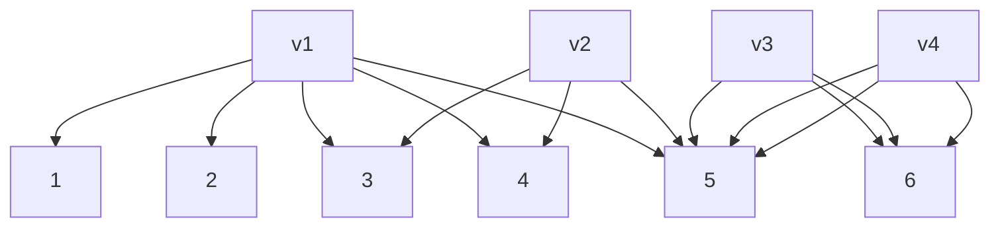
</details>

Figure 75 Element-volume conservation for mesh without obtuse elements

For a Delaunay mesh, you have total-volume conservation (see Figure 76):

$$
V \equiv \sum_ {i} \operatorname{Vol} (T ^ {i}) = \sum_ {i} \sum_ {v \in T ^ {i}} \mu (T ^ {i}, v) \equiv V _ {\mathrm{BM}} \tag {1174}
$$


<details>
<summary>flowchart</summary>

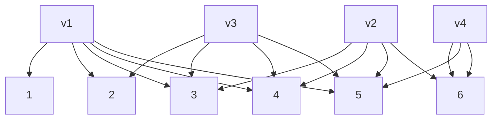
</details>

Figure 76 Total-volume conservation for Delaunay mesh

For a non-Delaunay mesh, you have no even total-volume conservation (see Figure 77 on page 1010):

$$
\delta V = a b s \left(V - V _ {\mathrm{BM}}\right) > 0 \tag {1175}
$$


<details>
<summary>flowchart</summary>

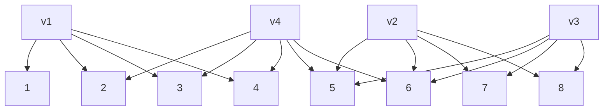
</details>

Figure 77 Violation of total-volume conservation for non-Delaunay mesh

There are problems for which element-volume conservation is very important (such as optical electronic or diffusion in Sentaurus Process). For these operations, Sentaurus Device has the special option MixAverageBoxMethod.

In this case, Sentaurus Device uses AverageBoxMethod to compute the coefficients and the algorithm truncation obtuse elements to compute the control volumes. Figure 78 shows the difference between the original and truncated Voronoï polygons in the 2D case.


<details>
<summary>flowchart</summary>

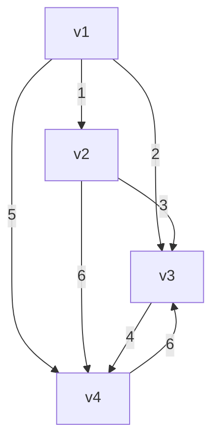
</details>


<details>
<summary>flowchart</summary>

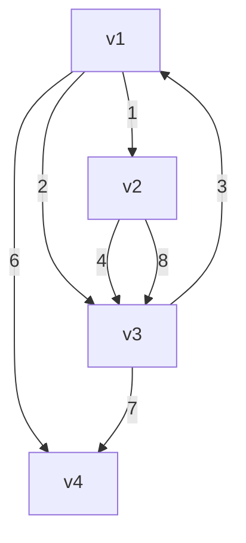
</details>

Figure 78 Algorithm truncation obtuse element: (a) Voronoï polygons before truncation – P1(v1,1,2,5,4,v1), P2(v2,1,2,3,v2), P3(v3,3,2,5,6,v3), P4(v4,4,5,6,v4); (b) Voronoï polygons after truncation – P1(v1,1,2,8,6,5,v1), P2(v2,1,2,3,4,v2), P3(v3,4,3,8,6,7,v3), P4(v4,5,6,7,v4)

For the 3D case, a similar algorithm of truncation is used.

Table 214 on page 1395 lists all the available options for computing box method parameters.

# Weighted Box Method Coefficients

The main goal of any space discretization is the generation of a Delaunay mesh. In this case, the box method coefficients are positive and the finite volume scheme [1] (Eq. 1170, p. 1004) is monotone. For a non-Delaunay mesh, the AverageBoxMethod coefficients are positive but the order of the approximation of PDEs is less than one. Sentaurus Mesh can use special technology – Delaunay–Voronoï weights – for which the weighted Voronoï diagram has no overlap control volume for a non-Delaunay mesh. As a result, the finite volume scheme is monotone and the order of the approximation PDEs is equal to one.

# Weighted Points

A weighted point $\tilde { p } = ( p , P ^ { 2 } )$ is interpreted as a sphere (circle in two dimensions) with a center and radius . The weighted distance betweenp P $\tilde { p }$ and $\tilde { \boldsymbol { x } } = ( x , X )$ is defined as [4] [5][6]:

$$
\left\| \tilde {p} - \tilde {x} \right\| = \sqrt {\left\| p - x \right\| ^ {2} - P ^ {2} - X ^ {2}} \tag {1176}
$$

The weighted points and are orthogonal if the weighted distance vanishes:p˜ x˜ $\left\| \widetilde { p } - \widetilde { x } \right\| = 0$ .

In the 3D case, any four weighted points have a common orthogonal sphere called an orthosphere. Unless the four centers lie in a common plane, the orthosphere is unique and has a finite radius.

In the 2D case, any three weighted points have a common circle called an orthocircle. Unless the three centers lie in a common line, the orthocircle is unique and has a finite radius (see Figure 79).


<details>
<summary>text_image</summary>

x
</details>

Figure 79 Since the radii of all weighted vertices are positive, their centers lie outside the orthocircle

# Weighted Voronoï Diagram

The weighted generalization of the Voronoï diagram is obtained by substituting a weighted vertex for vertices and an orthosphere (orthocircle) for circumspheres (circumcircles).

The weighted bisector plane $B _ { i j }$ between $\tilde { p } _ { i }$ and $\tilde { p } _ { j }$ is the locus of points at an equal-weighted distance from ${ \tilde { p } } _ { i }$ and $\tilde { p } _ { j }$ . The center of the orthosphere is the intersection of the bisectorx planes $x = \cap _ { i \neq j } B _ { i j }$ . The weighted middle point $m _ { i j }$ between $\tilde { p } _ { i }$ and $\tilde { p } _ { j }$ is the intersection of the segment $[ p _ { i } , p _ { j } ]$ and the bisector plane $B _ { i j }$ . The value $m _ { i j }$ is equal to:

$$
m _ {i j} = \alpha_ {i} p _ {i} + \alpha_ {j} p _ {j} \tag {1177}
$$

where:

$$
\alpha_ {i} = 0. 5 \left(1 - \frac {P _ {i} ^ {2} - P _ {j} ^ {2}}{\left\| p _ {i} - p _ {j} \right\| ^ {2}}\right), \alpha_ {j} = 1 - \alpha_ {i} \tag {1178}
$$

Therefore, the weighted bisector plane $B _ { i j }$ is orthogonal to the segment $[ p _ { i } , p _ { j } ]$ and contains the weighted middle point $m _ { i j }$ , which is sufficient to compute the weighted coefficients and control volumes. If the radius $P _ { i } \neq P _ { j }$ , the middle point $m _ { i j } \neq 0 . 5 ( p _ { i } + p _ { j } )$ and the weighted Voronoï diagram has no overlap control volume for non-Delaunay meshes (see Figure 80). This is the main property of the weighted Voronoï diagram.


<details>
<summary>flowchart</summary>

```mermaid
graph TD
    v1 --> 1
    v1 --> 2
    v1 --> 3
    v1 --> 4
    v1 --> 5
    v2 --> 1
    v2 --> 3
    v2 --> 4
    v2 --> 5
    v2 --> 6
    v3 --> 1
    v3 --> 2
    v3 --> 3
    v3 --> 4
    v3 --> 5
    v4 --> 2
    v4 --> 6
    v4 --> 7
    v4 --> 8
    v4 --> 9
```
</details>


<details>
<summary>flowchart</summary>

```mermaid
graph TD
    v1 --> 1
    v1 --> 2
    v1 --> 3
    v1 --> 4
    v2 --> 1
    v2 --> 3
    v2 --> 5
    v2 --> 6
    v3 --> 1
    v3 --> 2
    v3 --> 4
    v3 --> 5
    v4 --> 1
    v4 --> 2
    v4 --> 3
    v4 --> 4
    v4 --> 5
    v4 --> 6
```
</details>

Figure 80 Two-dimensional non-Delaunay mesh: (left) not weighted Voronoï diagram has overlap elements and (right) weighted Voronoï diagram has no overlap elements

Sentaurus Process computes the squared radii $( \boldsymbol { P } _ { i } ^ { 2 }$ , plot name: DelVorWeight $[ \mu \mathrm { m } ^ { 2 } ] )$ of the weighted vertices and writes them to a TDR file (see the option StoreDelaunayWeight in Sentaurus™ Process User Guide, Table 90 on page 758).

If the keyword WeightedVoronoiBox is specified in the Math section of the command file, Sentaurus Device reads the corresponding arrays from a TDR file and computes the weighted coefficients and measure.

# Saving and Restoring Box Method Coefficients

Usually, the coefficients needed for discretization are computed inside Sentaurus Device. For experimental purposes, it might be preferred to use externally provided data. Measure and Coefficients ( and from Eq. 1170, p. 1004) can be stored in, and loaded into andμ Ωi( ) κij from the debug file. There are two options for element numbering in such files:

Internal Sentaurus Device numbering with MeasureCoefficientsDebug as the debug file name.   
Mesh numbering (from grid file) with MeasureCoefficients.debug as the debug file name for this option.

If the keyword BoxMeasureFromFile or BoxCoefficientsFromFile is specified in the Math section and there is file MeasureCoefficientsDebug in the simulation directory, Sentaurus Device reads the corresponding arrays from this file.

If the keyword BoxMeasureFromFile(GrdNumbering) or the keyword BoxCoefficientsFromFile(GrdNumbering) is specified and there is the file MeasureCoefficients.debug, Sentaurus Device reads the corresponding arrays from this file. If there are no such debug files but these keywords are specified, Sentaurus Device computes Measure and Coefficients and writes them in the corresponding file.

The format of the MeasureCoefficientsDebug file is as follows. In line k of the Measure section, the control volume for each element-vertex j of element k is stored (that is, value Measure[k][j]). The numeration of elements and local numeration of vertices inside the element (see Figure 83 on page 1070) correspond to the internal Sentaurus Device numbering.

The Coefficients section in this file has a similar format. For example, the Measure section in the file can appear as follows:

```json
Measure {
    8.719666833501378e-08 4.359833416750702e-08 4.359833416750729e-08
    8.719666833501378e-08 4.359833416750702e-08 4.359833416750729e-08
} 
```

The format of the MeasureCoefficients.debug file is different. There are four section: Info, Elem\_type, Measure, and Coefficients. In line k of the Measure section, the control volume for each element-vertex j of element k is stored (that is, value Measure[k][j]). The numeration of elements and local numeration of vertices inside the element correspond to the grid file. The Coefficients section in the debug file has similar format. For example, the file can look like:

```txt
Info {
dimension = 2 
```

36: Numeric Methods   
Box Method Coefficients in the 3D Case   
```hcl
nb_vertices = 10
nb_grd_elements = 11
nb_des_elements = 7
}

Elem_type {
    point = 0
    line = 1
    triangle = 2
    rectangle = 3
    tetrahedron = 5
    pyramid = 6
    prism = 7
    cuboid = 8
}

Measure { # unit = [um^2]

# grd_elem des_elem elem_type
    0 0 2 1.828427124999999e+00 9.142135625000004e-01 9.142135625000002e-01
    1 1 2 4.052251462735666e+00 4.052251462735666e+00 8.104502925471332e+00
    ...
    7 -1 1 # contact or interface
    8 -1 1 # contact or interface
    ...
}

Coefficients { # unit = [1]

# grd_elem des_elem elem_type
    0 0 2 1.093836321204215e+00 1.100111438811216e-16 2.285533906249999e-01
    1 1 2 0.000000000000000e+00 8.379715512271076e-01 8.379715512271076e-01
    ...
    7 -1 1 # contact or interface
    8 -1 1 # contact or interface
    ...
} 
```

# Statistics About Non-Delaunay Elements

Information about region non-Delaunay elements and interface non-Delaunay elements is contained in the log file. For more information, see Utilities User Guide, Chapter 4 on page 25.

# Region Non-Delaunay Elements

A log file contains common data about the mesh and information about non-Delaunay elements per region (for Delaunay mesh DeltaVolume=0 and non-DelaunayVolume=0):

<table><tr><td colspan="8">Region non-Delaunay elements</td></tr><tr><td>Region name</td><td>Volume [um2]</td><td>BoxMethodVolume [um2]</td><td>DeltaVolume [%]</td><td>Elements</td><td>non-Delaunay Elements</td><td>non-DelaunayVolume [um2]</td><td>[%]</td></tr><tr><td>Nitride</td><td>1.9500000e-04</td><td>2.2635574e-04</td><td>16.080</td><td>53</td><td>12 (22.64 %)</td><td>1.8215e-04</td><td>(1.1e-05)</td></tr><tr><td>Oxide</td><td>6.0618645e-03</td><td>8.0705629e-03</td><td>33.137</td><td>2500</td><td>818 (32.72 %)</td><td>2.3715e-04</td><td>(2.0e-04)</td></tr><tr><td>Silicon</td><td>3.5548100e-02</td><td>4.9531996e-02</td><td>39.338</td><td>12656</td><td>5057 (39.96 %)</td><td>1.0715e-04</td><td>(1.0e-05)</td></tr><tr><td>Total</td><td>4.6402113e-02</td><td>6.4934852e-02</td><td>39.939</td><td>16550</td><td>6383 (38.57 %)</td><td>2.9218e-04</td><td>(2.1e-05)</td></tr></table>

# Interface Non-Delaunay Elements

An interface element is an element that has a face (or edge in two dimensions) lying on the interface. A non-Delaunay element is an interface non-Delaunay element only if its obtuse face lies on the surface of the interface (see Figure 81).


<details>
<summary>text_image</summary>

Oxide
1
2
3
4
5
6
Silicon
</details>

Figure 81 Blue (1, 2, 3) and green (4, 5, 6) elements are oxide and silicon interface elements, respectively. Elements 2 and 4 are non-Delaunay elements, not interface non-Delaunay elements. Only element 3 is an interface non-Delaunay element.

The following is an example of a log file for interface non-Delaunay elements:

<table><tr><td colspan="5">/---- Interface non Delaunay elements ----</td></tr><tr><td>Region1</td><td>Elements</td><td>non Delaunay Elements</td><td>Volume [um2]</td><td>non Delaunay DeltaVolume [um2]</td></tr><tr><td>Region2</td><td></td><td></td><td></td><td></td></tr><tr><td>silicon</td><td>3</td><td>0 ( 0.00 %)</td><td>1.5775139e-03</td><td>0.0000000e+00 ( 0.00 %)</td></tr><tr><td>oxide</td><td>3</td><td>1 ( 33.0 %)</td><td>1.6776069e-03</td><td>0.1100000e-03 ( 0.10 %)</td></tr><tr><td>Total</td><td>6</td><td>1 ( 16.0 %)</td><td>3.6951838e-02</td><td>0.1100000e+00 ( 0.05 %)</td></tr></table>

# Plot Section

Table 175 lists the plot variables that might be useful for visualizing box method statistics (see Scalar Data on page 1332). See Utilities User Guide, Chapter 4 on page 25 for the definitions of these variables.

Table 175 Plot variable for box method data 

<table><tr><td>Plot variable</td><td>Location</td></tr><tr><td>BM_AngleElements</td><td>Element</td></tr><tr><td>BM_CoeffIntersectionNonDelaunayElements</td><td>Element</td></tr><tr><td>BM_ElementsWithCommonObtuseFace</td><td>Element</td></tr><tr><td>BM_ElementsWithObtuseFaceOnBoundaryDevice</td><td>Element</td></tr><tr><td>BM_ElementVolume</td><td>Element</td></tr><tr><td>BM_IntersectionNonDelaunayElements</td><td>Element</td></tr><tr><td>BM_VolumeIntersectionNonDelaunayElements</td><td>Element</td></tr><tr><td>BM_wCoeffIntersectionNonDelaunayElements</td><td>Element</td></tr><tr><td>BM_wElementsWithCommonObtuseFace</td><td>Element</td></tr><tr><td>BM_wElementsWithObtuseFaceOnBoundaryDevice</td><td>Element</td></tr><tr><td>BM_wIntersectionNonDelaunayElements</td><td>Element</td></tr><tr><td>BM_wVolumeIntersectionNonDelaunayElements</td><td>Element</td></tr><tr><td>BM_AngleVertex</td><td>Vertex</td></tr><tr><td>BM_EdgesPerVertex</td><td>Vertex</td></tr><tr><td>BM_ElementsPerVertex</td><td>Vertex</td></tr><tr><td>BM_ShortestEdge</td><td>Vertex</td></tr></table>

# AC Simulation

AC simulation is based on small-signal AC analysis. The response of the device to ‘small’ sinusoidal signals superimposed upon an established DC bias is computed as a function of frequency and DC operating point. Steady-state solution is used to build up a linear algebraic system [7] whose solution provides the real and imaginary parts of the variation of the solution vector $( \Phi , n , p , T _ { n } , T _ { p } , T )$ induced by small sinusoidal perturbation at the contacts.

# AC Response

The AC response is obtained from the three basic semiconductor equations (see Eq. 37, p. 175 and Eq. 53, p. 183) and from up to three additional energy conservation equations to account for electron, hole, and lattice temperature responses. In the following description of the AC system, the temperatures have been omitted in the solution vector and Jacobian for simplicity, a complete description being formally obtained by adding the temperature responses to the solution vector and the corresponding lines to the system Jacobian.

After discretization, the simplified system of equations can be symbolically represented at the node of the computation mesh as:i

$$
F _ {\phi i} (\phi , n, p) = 0 \tag {1179}
$$

$$
F _ {n i} (\phi , n, p) = \dot {G} _ {n i} (n) \tag {1180}
$$

$$
F _ {p i} (\phi , n, p) = \dot {G} _ {p i} (p) \tag {1181}
$$

where and are nonlinear functions of the vector arguments F G $\Phi , n , p$ , and the dot denotes time differentiation.

By substituting the vector functions of the form $\xi _ { \mathrm { t o t a l } } = \xi _ { \mathrm { D C } } + \xi e ^ { \mathrm { i } \omega t }$ into Eq. 1179, Eq. 1180, and Eq. 1181 where $\xi = \phi , n , p , \xi _ { \mathrm { D C } }$ is the value of $\xi$ at the DC operating point, and $\xi$ is the corresponding response (or the phasor uniquely identifying the complex perturbation) and then expanding the nonlinear functions and in the Taylor series around the DC operating pointF G and keeping only the first-order terms (the small-signal approximation), the AC system of equations at the node can be written as:i

$$
\sum_ {j} \left[ \begin{array}{c c c} \frac {\partial F _ {\phi i}}{\partial \phi_ {j}} & \frac {\partial F _ {\phi i}}{\partial n _ {j}} & \frac {\partial F _ {\phi i}}{\partial p _ {j}} \\ \frac {\partial F _ {n i}}{\partial \phi_ {j}} & \frac {\partial F _ {n i}}{\partial n _ {j}} - \mathrm{i} \omega \frac {\partial G _ {n i}}{\partial n _ {j}} & \frac {\partial F _ {n i}}{\partial p _ {j}} \\ \frac {\partial F _ {p i}}{\partial \phi_ {j}} & \frac {\partial F _ {p i}}{\partial n _ {j}} & \frac {\partial F _ {p i}}{\partial p _ {j}} - \mathrm{i} \omega \frac {\partial G _ {p i}}{\partial p _ {j}} \end{array} \right] _ {D C} \left[ \begin{array}{l} \tilde {\phi} _ {j} \\ \tilde {n} _ {j} \\ \tilde {p} _ {j} \end{array} \right] = 0 \tag {1182}
$$

where the solution vector is scaled with respect to terminal voltages (at the contact where the voltage is applied, $\tilde { \phi }$ is 1). Therefore, the unit of carrier density responses is $\mathrm { c m } ^ { - 3 } \mathrm { V } ^ { - 1 }$ and the potential response is unitless.

The matrix of Eq. 1182 differs from the Jacobian of the system of equations Eq. 1179, Eq. 1180, and Eq. 1181 only by pure imaginary additive terms involving derivatives of withG respect to carrier densities.

The global AC matrix system is obtained by imposing the corresponding AC boundary conditions and performing the summation (assembling the global matrix).

Common AC boundary conditions used in AC simulation are Neumann boundary and oxide–semiconductor jump conditions carried over directly from DC simulation; Dirichlet boundary conditions for carrier densities where and at Ohmic contacts aren p $\tilde { n } = \tilde { p } = 0$ ; and Dirichlet boundary conditions for AC potential at Ohmic contacts that are used to excite the system.

After assembling the global AC matrix and taking into account the boundary conditions, the AC system becomes:

$$
[ J + \mathrm{i} D ] \tilde {X} = B \tag {1183}
$$

where is the Jacobian matrix, contains the contributions of the functions to the matrix,J D G is a real vector dependent on the AC voltage drive, andB $\tilde { X }$ is the AC solution vector.

By writing the solution vector as $\tilde { X } = X _ { \mathrm { R } } + \mathrm { i } X _ { \mathrm { I } }$ with $X _ { \mathrm { R } }$ and $X _ { \mathrm { I } }$ the real and imaginary part of the solution vector respectively, the AC system can be rewritten using only real arithmetic as:

$$
\left[ \begin{array}{l l} J & - D \\ D & J \end{array} \right] \left[ \begin{array}{l} X _ {\mathrm{R}} \\ X _ {\mathrm{I}} \end{array} \right] = \left[ \begin{array}{l} B \\ 0 \end{array} \right] \tag {1184}
$$

The AC response is actually computed by solving the system Eq. 1183 or Eq. 1184.

An ACPlot statement in the ACCoupled statement is used to plot AC responses $( \tilde { \Phi } , \tilde { n } , \tilde { p } , \tilde { T } _ { n } , \tilde { T } _ { p } , \tilde { T } )$ . The responses are plotted in the AC plot file of Sentaurus Device with a separate file for each frequency.

For details of the ACPlot statement, see Table 190 on page 1377. For details and examples of small-signal AC analysis, see Small-Signal AC Analysis on page 97.

# AC Current Density Responses

When the AC system is solved, the AC current density responses $\vec { \tilde { \jmath } } _ { \mathrm { D } } , \vec { \tilde { \jmath } } _ { n } , \mathrm { a n d } \vec { \tilde { \jmath } } _ { p }$ are computed using:

$$
\tilde {J} _ {\mathrm{D}} = - \mathrm{i} \omega \varepsilon \nabla \tilde {\phi} \tag {1185}
$$

$$
\tilde {J} _ {n} = \left. \frac {\partial \vec {J} _ {n}}{\partial \phi} \right| _ {\mathrm{DC}} \tilde {\phi} + \left. \frac {\partial \vec {J} _ {n}}{\partial n} \right| _ {\mathrm{DC}} \tilde {n} + \left. \frac {\partial \vec {J} _ {n}}{\partial p} \right| _ {\mathrm{DC}} \tilde {p} \tag {1186}
$$

$$
\tilde {J} _ {p} = \left. \frac {\partial J _ {p}}{\partial \phi} \right| _ {\mathrm{DC}} \tilde {\phi} + \left. \frac {\partial J _ {p}}{\partial p} \right| _ {\mathrm{DC}} \tilde {p} + \left. \frac {\partial J _ {p}}{\partial n} \right| _ {\mathrm{DC}} \tilde {n} \tag {1187}
$$

The unit of current density responses is $\mathrm { A c m } ^ { - 2 } \mathrm { V } ^ { - 1 }$ .

The responses of the heat fluxes for the lattice $\vec { \tilde { ( S _ { \mathrm { L } } ) } }$ , electrons $( \stackrel { \triangledown } { \tilde { \boldsymbol { S } } } _ { n } )$ , and holes $\vec { ( S _ { p } ) }$ are analogous. Their unit is $\mathrm { W c m ^ { - 2 } V ^ { - 1 } }$ .

The ACPlot statement in the System section is used to plot the AC current density responses. The responses are added to the AC solution response in the AC plot files of Sentaurus Device.

# Harmonic Balance Analysis

Harmonic balance (HB) analysis is a frequency domain method to solve periodic and quasiperiodic time-dependent problems for steady-state solutions [8][9]. It is a popular method for RF circuit design applications. While transient discretization schemes allow the simulation of arbitrary time-dependent problems, HB more efficiently models periodic and quasi-periodic problems for systems with time constants that vary by many orders of magnitude. The detailed command file syntax is given Harmonic Balance on page 101.

# Harmonic Balance Equation

In general, the dynamic mixed-mode simulation problem takes the form:

$$
\frac {d}{d t} q [ r, u (t, r) ] + f [ r, u (t, r), w (t) ] = 0 \tag {1188}
$$

where and are nonlinear functions, represents explicitly time-dependent devices (inf q w particular, voltage or current sources), and the function is the vector of all solution variables.u

Let $f _ { 1 } , . . . , f _ { K }$ be a set of different frequencies with $f _ { k } > 0$ , then both the sources and the solution are approximated by a truncated Fourier series:

$$
u (t) = U _ {0} + \sum_ {1 \leq k \leq K} \left\{U _ {k} \exp (\mathrm{i} \omega_ {k} t) + U _ {k} ^ {*} \exp (- \mathrm{i} \omega_ {k} t) \right\} \tag {1189}
$$

A formal Fourier transform of Eq. 1188 results in the HB equation for the problem:

$$
L (U) = \mathrm{i} \Omega Q (U) + F (U) = 0 \tag {1190}
$$

where and are the finite Fourier series of and , respectively, is the frequencyF Q f q Ω matrix, and is the vector of all Fourier coefficients of .U u

# Multitone Harmonic Balance Analysis

The multitone harmonic balance (HB) analysis makes use of the multidimensional Fourier transformation (MDFT). This means that the problem is mapped onto a problem in a multidimensional frequency and multidimensional time domain, hereby exploiting the equivalence of Fourier spectra of quasi-periodic functions with their corresponding multidimensional functions.

# Multidimensional Fourier Transformation

The multidimensional Fourier transformation (MDFT) maps multidimensional functions onto a multidimensional spectrum.

Let be a positive integer, the number of tones, M $\hat { \ b { f } } _ { 1 } , . . . , \hat { \ b { f } } _ { M }$ , be a finite set of different positive numbers, the base frequencies of tones, and $H _ { 1 } , . . . , H _ { M }$ nonnegative integer numbers, the maximal number of harmonics for each tone.

Define for each tone the -th base period m m $T _ { m } { : = } 1 / \hat { f } _ { m }$ , the -th circular frequencym $\omega _ { m } \mathrm { . } \mathrm { = } 2 \pi \hat { f } _ { m }$ , the -th (minimum) number of sampling points m $S _ { m } { : = } 2 H _ { m } + 1$ , and the -thm (maximum) sampling interval $\delta _ { m } = T _ { m } / S _ { m }$ .

Furthermore, let $x = ( x _ { 1 } , . . . , x _ { M } ) ^ { T }$ denote the -dimensional vector, and letM $D _ { x } = \operatorname { d i a g } ( x _ { 1 } , . . . , x _ { M } )$ denote the $M \times M$ -matrix composed of the values $x _ { 1 } , . . . , x _ { M }$ .

The set of multi-indices associated with is given by:H

$$
K := \left\{\underline {{{h}}} \in \mathbf {Z} ^ {M}: - H _ {m} \leq h _ {m} \leq H _ {m} \text {   for   all   } 1 \leq m \leq M \right\} \tag {1191}
$$

Let $u ^ { \phantom { A } M }$ be a function on the -dimensional spaceM $c ^ { M }$ given by:

$$
u ^ {M} (t _ {1}, \dots , t _ {M}) = \sum_ {h \in K} U _ {\underline {{h}}} ^ {M} \exp (\mathrm{i} \underline {{h}} D _ {\underline {{\omega}}} t) \tag {1192}
$$

with given complex numbers $U _ { h } ^ { M }$ , then:

$$
U _ {\underline {{h}}} ^ {M} = \frac {1}{T} \int_ {0} ^ {T _ {1}} \dots \int_ {0} ^ {T _ {M}} u ^ {M} (t _ {1},..., t _ {M}) \exp (- \mathrm{i} \underline {{h}} D _ {\underline {{\omega}}} t) d t _ {1}... d t _ {M} \tag {1193}
$$

with $T { : = } \Pi _ { 1 \leq m \leq M } T _ { m } . \ U ^ { M } = ( U _ { \frac { h } { - } } ^ { M } ) _ { \frac { h \in K } { - } }$ is the multidimensional spectrum of $u ^ { \phantom { A } M }$

Sampling the function in all dimensions at the equidistant sampling points $t _ { \underline { { s } } } = D _ { \underline { { \delta } } \underline { { s } } } ( \underline { { 0 } } \leq \underline { { s } } < \underline { { S } } )$ , the discrete MDFT is written formally as:

$$
U ^ {M} = \Gamma^ {M} u ^ {M} \tag {1194}
$$

that is, $\Gamma ^ { M }$ is a linear map from $c ^ { s }$ onto $c ^ { s }$ where $S { : = } \Pi _ { 1 \le m \le M } S _ { m }$ is the total number of sampling points.

# Quasi-Periodic Functions

The multidimensional function $u ^ { \phantom { A } M }$ can be projected onto a one-dimensional time space by:

$$
u (t) := u ^ {M} (t, \dots , t) = \sum_ {h \in K} U _ {\underline {{h}}} \exp (\mathrm{i} \underline {{h}} \underline {{\omega}} t) \tag {1195}
$$

Functions satisfying this representation are called quasi-periodic. The set:

$$
\Lambda := \left\{f _ {h} \in \boldsymbol {R}: f _ {h} = \underline {{h}} \cdot \hat {\underline {{f}}} \text {   for   all   } \underline {{h}} \in K \right\} \tag {1196}
$$

is the spectrum domain associated with and (or ). The projection is invertible if, for twof K H different multi-indices $\underline { { h } } _ { 1 }$ and ${ \underline { { h } } } _ { 2 }$ in $\dot { K }$ , the resulting frequencies $f _ { \underline { { h } } _ { 1 } }$ and $f _ { h _ { \gamma } }$ are different. Note that the one-dimensional Fourier spectrum of coincides with the multidimensional u spectrum of $u ^ { \phantom { A } M }$ .

While for the multidimensional function $u ^ { \phantom { \dagger } M }$ sample points can be specified to compute theS multidimensional spectrum, the one-dimensional sample points for are not well defined (butu are rather virtual in the multidimensional time domain).

# Multidimensional Frequency Domain Problem

The multitone HB analysis is essentially a translation of (one-dimensional or multidimensional) time-domain problems in a multidimensional frequency domain. Though originally derived from a time-domain problem, the circuit equations are directly specified in a multidimensional frequency domain. This avoids sampling of (one-dimensional) timedependent sources, which cannot be performed accurately on a sample set of size . This is theS reason why the compact circuit models must provide the CMI-HB-MDFT function set.

The Fourier transformation of quasi-periodic functions is the composition:

$$
\Gamma = \Gamma^ {M} \circ P ^ {- 1} \tag {1197}
$$

where $\Gamma ^ { M }$ is the multidimensional Fourier transformation of Eq. 1194 and $P ^ { - 1 }$ is the inverse of the projection Eq. 1195.

# One-Tone Harmonic Balance Analysis

For one-tone HB analysis, the standard discrete Fourier transformation can be used, which includes that the sampling points are defined explicitly in a (one-dimensional) time domain. Therefore, the problem can be extracted directly from the time-domain formulation of the circuit.

# Solving HB Equation

The HB equation (Eq. 1190) is a nonlinear equation in and is solved by the NewtonU algorithm. In each Newton step, the linear equation:

$$
\frac {\partial L}{\partial U} (U) \cdot \delta U = - L (U) \tag {1198}
$$

must be solved.

The Jacobian $\partial L / \partial U$ in Fourier space is computed from the Jacobian in the time domain as follows: For a nonlinear scalar function $g : R  R$ and a -periodic scalar signalT $u ( t )$ , the Fourier coefficients $G \in C ^ { s }$ of $g ( u ( t ) )$ are approximated:)

$$
G (U) = \Gamma g (\hat {u}) = \Gamma g (\Gamma^ {- 1} U) \tag {1199}
$$

where andΓ $\Gamma ^ { - 1 }$ are the discrete Fourier transform operator and its inverse, $\hat { u }$ is the vector of the time samples $u \big ( t _ { i } \big )$ , and $g ( \hat { u } )$ is the vector of values $g ( u ( t _ { i } ) )$ .

The derivatives of the -th Fourier componentk $G _ { k }$ with respect to the -th Fourier componentj $U _ { j }$ read:

$$
\frac {\partial G _ {k}}{\partial U _ {j}} (U) = \sum_ {l} \Gamma_ {k l} \frac {\partial g}{\partial U _ {j}} (\hat {u} _ {l}) = \sum_ {l} \Gamma_ {k l} \frac {\partial g}{\partial u} (\hat {u} _ {l}) \Gamma_ {l j} ^ {- 1} \tag {1200}
$$

The corresponding Jacobian is written in the compact form:

$$
\frac {\partial G}{\partial U} = \Gamma \hat {J} _ {u} \Gamma^ {- 1} \text { with } \hat {J} _ {u} = \frac {\partial g}{\partial u} (\hat {u}) \tag {1201}
$$

For scalar functions andg $u , \hat { J } _ { u }$ is a diagonal matrix; for vector-valued functions andg $u , \hat { J } _ { u }$ is a block-diagonal matrix.

Using the notation above, Eq. 1190 becomes:

$$
L (U) = \mathrm{i} \Omega \Gamma q (\hat {u} (U)) + \Gamma f (\hat {u} (U)) = 0 \tag {1202}
$$

and Eq. 1198 for the Newton step takes the form:

$$
(\mathrm{i} \Omega \Gamma \hat {J} _ {q} \Gamma^ {- 1} + \Gamma \hat {J} _ {f} \Gamma^ {- 1}) \delta U = - L (U) \tag {1203}
$$

The Newton algorithm constructs a sequence $\boldsymbol { U } ^ { k }$ of the Fourier coefficients of the time-domain solution vector . The sequence is regarded as converged if both the residual u $\displaystyle \left| L ( U ^ { k } ) \right|$ and the update error are small.

# Solving HB Newton Step Equation

The memory requirements for storing the HB Jacobian matrix typically become very large, as its size is increased by a factor of $S ^ { \tilde { 2 } }$ compared to the corresponding DC or transient matrix. For a very small number of harmonics and a moderately sized simulation grid, using a direct linear solver might be feasible. However, the use of the GMRES(m) iterative method is recommended for most applications.

# Restarted GMRES Method

The HB module makes use of a preconditioned restarted generalized minimum residual GMRES(m) method [10], a Krylow subspace method, which does not need to store the Jacobian in memory, as only matrix-vector products have to be computed.

GMRES(m) requires a suitable preconditioner to achieve convergence. A (left) preconditioner is a matrix that approximates a given matrix , but is much easier to invert than itself.P A A Instead of solving the linear equation for given and , the (left) preconditionedAx b = A b problem $P ^ { - 1 } A x = P ^ { - 1 } b$ is solved. The preconditioner used for HB [11] takes the form:

$$
P = \mathrm{i} \Omega \left[ \begin{array}{c c c} \bar {J} _ {q} & & 0 \\ & \dots & \\ 0 & & \bar {J} _ {q} \end{array} \right] + \left[ \begin{array}{c c c} \bar {J} _ {f} & & 0 \\ & \dots & \\ 0 & & \bar {J} _ {f} \end{array} \right] \tag {1204}
$$

where the matrix $\overline { { J } } _ { f }$ , and similarly $\bar { \boldsymbol { J } } _ { \boldsymbol { q } }$ , is computed as:

$$
\bar {J} _ {f} = \frac {1}{S} \sum_ {0 \leq s \leq S - 1} J _ {f} (t _ {s}) \tag {1205}
$$

and $J _ { f }$ denotes the Jacobian of with respect to . The preconditioner equals the HB Jacobianf u in the limit of small signals, where the coupling terms between the frequencies vanish. Therefore, each diagonal block of corresponds to the AC matrix for the respective harmonic.P This preconditioner is well suited to ‘moderately large’ signal applications.

The preconditioner can be computed without an explicit Fourier transform, and its inversion is more economical than for the full Jacobian. The inversion is performed by applying a complex direct solver for each harmonic component separately, thereby requiring the computational costs of solving complex-valued linear systems. The computational complexity is( ) S + 1 ⁄ 2 of the order for inverting the preconditioner, and for one complete iterationO S( ) O S S ( ) ln ( ) step of the iterative solver, while the number of iterations necessary to achieve convergence is unknown (but bounded).

# Direct Solver Method

For the direct solver, the complex-valued linear system (Eq. 1203) is transformed to aS S × real-valued problem, which is possible as only real-valued functions are involved. TheS S× resulting linear system is solved by the direct solver PARDISO. The direct solver requires the entire matrix stored in memory. Therefore, the memory capacity is easily exceeded for increasing . Additionally, the computational complexity is of the order .S O S3 ( )

# Transient Simulation

Transient equations used in semiconductor device models and circuit analysis can be formally written as a set of ordinary differential equations:

$$
\frac {d}{d t} q (z (t)) + f (t, z (t)) = 0 \tag {1206}
$$

which can be mapped to the DC and transient parts of the PDEs.

Sentaurus Device uses implicit discretization of transient equations (see Eq. 1206) and supports two discretization schemes: simple backward Euler (BE) and composite trapezoidal rule/backward differentiation formula (TRBDF), which is the default.

# Backward Euler Method

Backward Euler is a very stable method, but it has only a first-order of approximation over time-step $h _ { n }$ . The discretization can be written as:

$$
q (t _ {n} + h _ {n}) + h _ {n} f (t _ {n} + h _ {n}) = q (t _ {n}) \tag {1207}
$$

The local truncation error (LTE) estimation is based on the comparison of the obtained solution $q ( t _ { n } + h _ { n } )$ with the linear extrapolation from the previous time-step.

The extrapolated solution is written as:

$$
q ^ {\text { extr }} = q (t _ {n}) - \frac {f (t _ {n}) + f (t _ {n} + h _ {n})}{2} h _ {n} \tag {1208}
$$

Then, in every point, the relative error can be estimated as $( q ( t _ { n } + h _ { n } ) - q ^ { \mathrm { e x t r } } ) / q ( t _ { n } + h _ { n } )$ .

Using Eq. 1207 and Eq. 1208, and estimating the norm of relative error, Sentaurus Device computes the value:

$$
r = \sqrt {\frac {1}{N} \sum_ {i = 1} ^ {N} \left(\frac {f (t _ {n} + h _ {n}) - f (t _ {n})}{\varepsilon_ {\mathrm{R,tr}} \left| q _ {n} (t _ {n} + h _ {n}) \right| + \varepsilon_ {\mathrm{A,tr}}} h _ {n}\right) ^ {2}} \tag {1209}
$$

where the sum is taken over all unknowns (that is, all free vertices of all equations), and $\varepsilon _ { \mathrm { R , t r } }$ and $\varepsilon _ { \mathrm { A , t r } }$ are the relative and absolute transient errors, respectively.

The next time-step is estimated as:

$$
h _ {\text { est }} = h _ {n} r ^ {- 1 / 2} \tag {1210}
$$

The value of the estimated time-step is used for $h _ { n + 1 }$ computation (see Controlling Transient Simulations on page 1026).

# TRBDF Composite Method

The transient scheme [12] for the approximation of Eq. 1206 is briefly reviewed in this section. From each time point $t _ { n }$ , the next time point $t _ { n } + h _ { n } \ ( h _ { n }$ is the current step size) is not directly reached. Instead, a step in between to $t _ { n } + \gamma h _ { n }$ is made. This improves the accuracy of the method. $\gamma = 2 - \sqrt { 2 }$ has been shown to be the optimal value. Using this, two nonlinear systems are reached.

For the trapezoidal rule (TR) step:

$$
2 q (t _ {n} + \gamma h _ {n}) + \gamma h _ {n} f (t _ {n} + \gamma h _ {n}) = 2 q (t _ {n}) - \gamma h _ {n} f (t _ {n}) \tag {1211}
$$

and for the BDF2 step:

$$
(2 - \gamma) q (t _ {n} + h _ {n}) + (1 - \gamma) h _ {n} f (t _ {n} + h _ {n}) = (1 / \gamma) (q (t _ {n} + \gamma h _ {n}) - (1 - \gamma) ^ {2} q (t _ {n})) \tag {1212}
$$

The local truncation error (LTE) is estimated after such a double step as:

$$
\tau = \left[ \frac {f (t _ {n})}{\gamma} - \frac {f (t _ {n} + \gamma h _ {n})}{\gamma (1 - \gamma)} + \frac {f (t _ {n} + h _ {n})}{1 - \gamma} \right] \tag {1213}
$$

$$
C = \frac {- 3 \gamma^ {2} + 4 \gamma - 2}{1 2 (2 - \gamma)} \tag {1214}
$$

Sentaurus Device then computes the following value from this:

$$
r = \sqrt {\frac {1}{N} \sum_ {i = 1} ^ {N} \left(\frac {\tau_ {i}}{\varepsilon_ {\mathrm{R,tr}} \left| q _ {n} (t _ {n} + h _ {n}) \right| + \varepsilon_ {\mathrm{A,tr}}}\right) ^ {2}} \tag {1215}
$$

where the sum is taken over all unknowns (that is, all free vertices of all equations), and $\varepsilon _ { \mathrm { { R , t r } } }$ and $\varepsilon _ { \mathrm { A , t r } }$ are the relative and absolute transient errors, respectively. Since the TRBDF method has a second-order approximation over $h _ { n }$ , the next step can be estimated as:

$$
h _ {\text { est }} = h _ {n} r ^ {- 1 / 3} \tag {1216}
$$

The value of the estimated time-step is used for $h _ { n + 1 }$ computation (see Controlling Transient Simulations on page 1026).

# Controlling Transient Simulations

By default, Sentaurus Device uses the TRBDF method. To switch to backward Euler (BE), the statement Transient=BE must be specified in the Math section.

To evaluate whether a time-step was successful and to provide an estimate for the next step size, the following rules are applied:

■ If one of the nonlinear systems cannot be solved, the step is refused and tried again with $h _ { n } = 0 . 5 \cdot h _ { n }$ .   
Otherwise, the inequality $r < 2 f _ { \mathrm { r e j } }$ is tested. If it is fulfilled, the transient simulation proceeds with $h _ { n + 1 } = h _ { \mathrm { e s t } } . \mathrm { O t h e r w i s e } .$ , the step is re-tried with $h _ { n } = 0 . 9 \cdot h _ { \mathrm { e s t } }$ .   
The LTE is checked only if the CheckTransientError option is selected; otherwise, the selection of the next time-step is based only on convergence of nonlinear iterations.

To activate LTE evaluation and time-step control, CheckTransientError must be specified either globally (in the Math section) or locally as an option in the Transient statement. The keyword NoCheckTransientError disables time-step control. The value of the relative error is defined by the parameter TransientDigits according to Eq. 14, p. 89.

Absolute error is given by the keyword TransientError or recomputed from TransientErrRef $( x _ { \mathrm { r e f , t r } } )$ using Eq. 15, p. 89 (if RelErrControl is switched on). Sentaurus Device provides the default values of $\mathfrak { E } _ { \mathrm { R , t r } } , \mathfrak { E } _ { \mathrm { A , t r } }$ , and $x _ { \mathrm { { r e f , t r } } }$ . The coefficient $f _ { \mathrm { r e j } }$ is equal to 1 by default. You can define the values of $\mathfrak { E } _ { \mathrm { R , t r } } , \mathfrak { E } _ { \mathrm { A , t r } } , x _ { \mathrm { r e f , t r } }$ , and $f _ { \mathrm { r e j } }$ globally in the Math section, or specify them as options in the Transient statement. In the latter case, it overwrites the default and Math specifications for this command.

# Floating Gates

During a transient time step, the charge of a floating gate is updated as a function of theQ injection current :i

$$
\Delta Q = \int_ {t _ {1}} ^ {t _ {2}} i (t) d t \tag {1217}
$$

represents the charge increase for the time step ΔQ $[ t _ { 1 } , t _ { 2 } ]$ .

Because the floating-gate charge is not updated self-consistently during a transient step, but only as a postprocessing operation, the numeric update is given by:

$$
\Delta Q = i (t _ {1}) \cdot \Delta t \tag {1218}
$$

where $\Delta t = t _ { 2 } - t _ { 1 }$ . The error of this numeric approximation is estimated by:

$$
\Delta Q _ {\text { error }} = \frac {\left| i (t _ {2}) - i (t _ {1}) \right|}{2} \Delta t \tag {1219}
$$

With the option CheckTransientError, the error $\Delta Q _ { \mathrm { e r r o r } }$ in the charge update is monitored as well. In the case of relative error control (RelErrControl), a transient step is only accepted if the following condition holds:

$$
\frac {\Delta Q _ {\text { error }}}{1 0 ^ {- \text { Digits }} (| Q | + \text { ErrRef })} <   1 \tag {1220}
$$

The values of Digits and ErrRef can be specified in the Math section:

```hcl
Math {
    TransientDigits = 3
    TransientErrRef (Charge) = 1.602192e-19
} 
```

In the case of absolute error control (-RelErrControl), a transient step is only accepted if the following condition holds:

$$
\frac {\frac {\Delta Q _ {\text { error }}}{q}}{1 0 ^ {- \text { Digits }} \frac {| Q |}{q} + \text { Error }} <   1 \tag {1221}
$$

The electron charge $q = 1 . 6 0 2 1 9 2 \cdot 1 0 ^ { - 1 9 } \mathrm { C }$ is used as a scaling factor. The values of Digits and Error can be specified in the Math section:

```txt
Math {
    TransientDigits = 3
    TransientError (Charge) = 1e-3
} 
```

Note that the values of ErrRef and Error are related by the equation:

$$
\text { ErrRef } = \frac {\text { Error }}{1 0 ^ {- \text { Digits }}} q \tag {1222}
$$

# Nonlinear Solvers

In the next two sections, the Digits variable corresponds to the keyword Digits, which can be given in the Math section (see Convergence and Error Control on page 139), or in parentheses of each Plugin or Coupled statement.

# Fully Coupled Solution

For the solution of nonlinear systems, the scheme developed by Bank and Rose [13] is applied. This scheme tries to solve the nonlinear system by the Newton method:g z( ) = 0

$$
\vec {g} + \vec {g ^ {\prime}} \vec {x} = 0 \tag {1223}
$$

$$
\underset {z - z} {\overset {j} {\rightarrow}} \underset {z} {\overset {j + 1} {\rightarrow}} = \lambda x \tag {1224}
$$

where is selected such that λ $\left\| g _ { k + 1 } \right\| < \left\| g _ { k } \right\|$ , but is as close as possible to 1. Sentaurus Device handles the error by computing an error function that can be defined by two methods.

The Newton iterations stop if the convergence criteria are fulfilled. One convergence criterion is the norm of the right-hand side, that is, in Eq. 1223. Another natural criterion can be theg relative error of the variables measured, such as $\bigg \| \frac { ( \bigwedge x ) } { z } \bigg \|$ .


<details>
<summary>line</summary>

| z       | g(z)     | g(z^j)   |
|---------|----------|----------|
| z^j     | >g(z^j)  | >g(z^j)  |
| z^{j+1} | <g(z^j+) | <g(z^j+) |
</details>

Figure 82 Newton iteration

Conversely, for very small updates, must be measured with respect to some referencez λx value of the variable ${ \cal Z } _ { \mathrm { r e f } }$ . The formula used in Sentaurus Device as the second convergence criterion is:

$$
\frac {1}{\varepsilon_ {\mathrm{R}}} \frac {1}{N} \sum_ {e, i} \frac {| z (e , i , j) - z (e , i , j - 1) |}{| z (e , i , j) | + z _ {\text { ref }} (e)} <   1 \tag {1225}
$$

where $z ( e , i , j )$ is the solution of the equation (Poisson, electron, hole, and so on) at nodee i after Newton iteration $j$ . The constant is given by the total number of nodes multiplied byN the total number of equations. The parameter $\mathfrak { E } _ { \mathrm { R } }$ is the relative error criterion.

The value of $\pounds _ { \mathrm { R } } \ = \ 1 0 ^ { - \mathrm { D i g i t s } }$ is set by specifying the following in the Math section:

$$
\begin{array}{l} \text {Math} \{\dots \\ \text {Digits} = 5 \\ \} \end{array}
$$

where 5 is the default for Digits. The reference values $z _ { \mathrm { r e f } } ( e )$ ensure numeric stability even for cases when $z ( e , i , j )$ is zero or very small. This error condition ensures that the respective equations are solved to an accuracy of approximately $z _ { \mathrm { r e f } } ( e ) \varepsilon _ { \mathrm { R } }$ .

Eq. 1225 can be written in the symbolic form:

$$
\frac {1}{\varepsilon_ {\mathrm{R}}} \left\| \frac {\lambda x}{z ^ {j} + z _ {\mathrm{ref}}} \right\| <   1 \tag {1226}
$$

Eq. 1226 can also be rewritten in the equivalent form:

$$
\left\| \frac {\lambda \bar {x}}{\varepsilon_ {\mathrm{R}} \bar {z} ^ {j} + \varepsilon_ {\mathrm{A}}} \right\| <   1 \tag {1227}
$$

where $\bar { z } ^ { j } = z ^ { j } / z ^ { * }$ and $\bar { x } = x / z ^ { * }$ .

$z ^ { * }$ is the normalization factor (for example, it is the intrinsic carrier density $n _ { \mathrm { i } } = 1 . 4 8 { \times } 1 0 ^ { 1 0 } \mathrm { c m } ^ { - 3 }$ for electron and hole equations, and the thermal voltage $u _ { T 0 } = 2 5 . 8 \mathrm { m V }$ for the Poisson equation).

The absolute error is related to the relative error through:

$$
\varepsilon_ {\mathrm{A}} = \varepsilon_ {\mathrm{R}} \frac {z _ {\mathrm{ref}}}{z ^ {*}} \tag {1228}
$$

Sentaurus Device supports two schemes for controlling the error conditions. The default scheme is based on Eq. 1225. The default values for the parameters ${ \cal Z } _ { \mathrm { r e f } }$ are listed in Table 194 on page 1380. They also are accessible in the Math section:

```txt
Math{...
    ErrRef( Electron ) = 1e10
    ErrRef( Hole ) = 1e10
} 
```

The second scheme is activated with the keyword -RelErrControl in the Math section and is based on Eq. 1227. The default values for the parameters $\mathfrak { E } _ { \mathrm { A } }$ are listed in Table 194. They also are accessible in the Math section:

```powershell
Math{...
    -RelErrControl
    Error( Electron ) = 1e-5
    Error( Hole ) = 1e-5
} 
```

# ‘Plugin’ Iterations

This is the traditional scheme, which is also known as ‘Gummel iterations’ in most other device simulators. Consider that there are n sets of nonlinear systems $g _ { j } ( z _ { 1 } . . . z _ { n } ) = 0$ . ( can be, forn example, 3 and the sets can be the Poisson equation and two continuity equations.) This method starts with values $z _ { 1 } ^ { ( 1 ) } , . . . , z _ { n } ^ { ( 1 ) }$ and then solves each set $g _ { j } = 0$ separately and consecutively.

One loop could be:

$$
g _ {1} (z _ {1} z _ {2} ^ {(i)} \dots z _ {n} ^ {(i)}) = 0 \Rightarrow z _ {1} ^ {(i + 1)} \tag {1229}
$$

$$
g _ {1} (z _ {1} ^ {(i + 1)} \dots z _ {n - 1} ^ {(i + 1)} z _ {n}) = 0 \Rightarrow z _ {n} ^ {(i + 1)}
$$

If an update of the solution between two successive plugin iterations is defined as:( ) λx

$$
(\lambda x) = z _ {j} ^ {(i + 1)} - z _ {j} ^ {(i)} \tag {1230}
$$

Eq. 1226 or Eq. 1227 can be applied for convergence control in plugin iterations.

# References

[1] R. E. Bank, D. J. Rose, and W. Fichtner, “Numerical Methods for Semiconductor Device Simulation,” IEEE Transactions on Electron Devices, vol. ED-30, no. 9, pp. 1031–1041, 1983.   
[2] R. S. Varga, Matrix Iterative Analysis, Englewood Cliffs, New Jersey: Prentice-Hall, 1962.   
[3] E. M. Buturla et al., “Finite-Element Analysis of Semiconductor Devices: The FIELDAY Program,” IBM Journal of Research and Development, vol. 25, no. 4, pp. 218–231, 1981.   
[4] H. Edelsbrunner, “Triangulations and meshes in computational geometry,” Acta Numerica, vol. 9, pp. 133–213, March 2000.   
[5] S.-W. Cheng et al., “Sliver Exudation,” Journal of the ACM, vol. 47, no. 5, pp. 883–904, 2000.   
[6] H. Edelsbrunner and D. Guoy, “An Experimental Study of Sliver Exudation,” in Proceedings of the 10th International Meshing Roundtable, Newport Beach, CA, USA, pp. 307–316, October 2001.   
[7] S. E. Laux, “Application of Sinusoidal Steady-State Analysis to Numerical Device Simulation,” in New Problems and New Solutions for Device and Process Modelling: An International Short Course held in association with the NASECODE IV Conference, Dublin, Ireland, pp. 60–71, 1985.   
[8] B. Troyanovsky, Z. Yu, and R. W. Dutton, “Physics-based simulation of nonlinear distortion in semiconductor devices using the harmonic balance method,” Computer Methods in Applied Mechanics and Engineering, vol. 181, no. 4, pp. 467–482, 2000.   
[9] P. J. C. Rodrigues, Computer-Aided Analysis of Nonlinear Microwave Circuits, Boston: Artech House, 1998.

# 36: Numeric Methods

References

[10] Y. Saad, Iterative Methods for Sparse Linear Systems, Philadelphia: SIAM, 2nd ed., 2003.   
[11] P. Feldmann, B. Melville, and D. Long, “Efficient Frequency Domain Analysis of Large Nonlinear Analog Circuits,” in Proceedings of the IEEE Custom Integrated Circuits Conference, San Diego, CA, USA, pp. 461–464, May 1996.   
[12] R. E. Bank et al., “Transient Simulation of Silicon Devices and Circuits,” IEEE Transactions on Computer-Aided Design, vol. CAD-4, no. 4, pp. 436–451, 1985.   
[13] R. E. Bank and D. J. Rose, “Global Approximate Newton Methods,” Numerische Mathematik, vol. 37, no. 2, pp. 279–295, 1981.

This chapter discusses the flexible interface that is used to add new physical models to Sentaurus Device.

# Overview of the Physical Model Interface

The physical model interface (PMI) provides direct access to certain models in the semiconductor transport equations. You can provide new C++ functions to compute these models, and Sentaurus Device loads the functions at runtime using the dynamic loader. No access to the Sentaurus Device source code is necessary. You can modify the following models:

Generation–recombination rate $R _ { \mathrm { n e t } }$ , see Eq. 53, p. 183   
■ Avalanche generation, that is, ionization coefficient in Eq. 418, p. 410α   
Electron and hole mobilities $\mu _ { n }$ and $\mu _ { p }$ , see Eq. 56 and Eq. 57, p. 185   
Band gap, see Chapter 12 on page 251   
Bandgap narrowing $E _ { \mathrm { { b g n } } }$ , see Band Gap and Electron Affinity on page 251   
■ Complex refractive index, see Complex Refractive Index Model Interface on page 598   
Electron affinity, see Band Gap and Electron Affinity on page 251   
■ Apparent band-edge shift, see Density Gradient Model on page 298   
Multistate configuration–dependent apparent band-edge shift, see Apparent Band-Edge Shift on page 493   
Multistate configuration–dependent thermal conductivity, heat capacity, and mobility, see Thermal Conductivity, Heat Capacity, and Mobility on page 495   
Effective mass, see Effective Masses and Effective Density-of-States on page 263   
Energy relaxation times , see Eq. 84, p. 199 to Eq. 86, p. 199τ   
Lifetimes , as used in SRH recombination (see Eq. 276, p. 335) and CDL recombinationτ (see Eq. 394, p. 401)   
Thermal conductivity , see Eq. 69, p. 195 and Eq. 78, p. 198κ   
Heat capacity $c _ { \mathrm { L } }$ , see Eq. 69, p. 195 and Eq. 92, p. 200   
Optical quantum yield, see Quantum Yield Models on page 553 and Optical Quantum Yield on page 1173   
Stress, see Stress on page 1176

# 37: Physical Model Interface

<!-- page:30 -->
Overview of the Physical Model Interface

Space factor, see Metal Workfunction on page 244, Energetic and Spatial Distribution of Traps on page 458, Using the Trap Degradation Model on page 505, Using the eNMP Model on page 526, and SFactor Dataset or PMI Model on page 892   
Mobility stress factor, see Mobility Stress Factor PMI Model on page 891   
Trap capture and emission rates, see Local Capture and Emission Rates From PMI on page 473   
Trap energy shift, see Trap Energy Shift on page 1195   
eNMP transition rates, see eNMP Transition Rates PMI Model on page 529   
Piezoelectric polarization, see Piezoelectric Polarization on page 899   
Incomplete ionization, see Chapter 13 on page 279   
Hot-carrier injection, see Chapter 25 on page 751   
Piezoresistive coefficients, see Piezoresistance Mobility Model on page 875   
Raytracing contact, see Boundary Condition for Raytracing on page 616   
Spatial distribution function, see Heavy Ions on page 680   
Metal resistivity, see Transport in Metals on page 241   
■ Heat generation rate, see Thermodynamic Model for Lattice Temperature on page 195   
Thermoelectric power, see Thermoelectric Power (TEP) on page 929   
Metal thermoelectric power, see Thermoelectric Power (TEP) on page 929   
Diffusivity, see Hydrogen Transport on page 510   
Gamma factor, see Density Gradient Model on page 298   
Schottky resistance, see Resistive Contacts on page 215 and Resistive Interfaces on page 221   
Ferromagnetism and spin transport, see Chapter 30 on page 821   
Tunneling parameters, see Dynamic Nonlocal Path Band-to-Band Tunneling Model on page 442

A separate interface is provided to add new entries to the current plot file (see Current Plot File of Sentaurus Device on page 1229).

An interface is available that allows postprocessing of data during a transient simulation (see Postprocess for Transient Simulation on page 1234).

A separate interface is provided for preprocessing data during a Newton iteration process and Newton step control (see Preprocessing for Newton Iterations and Newton Step Control on page 1236).

For most models, Sentaurus Device provides two equivalent interfaces:

The standard interface is based on the data type double. Separate subroutines must be written to evaluate the model and its derivatives. This interface provides performance comparable to the built-in models in Sentaurus Device (see Standard C++ Interface on page 1035).   
The simplified interface is based on the data type pmi\_float. Only a single subroutine must be implemented to evaluate the model (see Simplified C++ Interface on page 1039) . For local models, the derivatives of the model are obtained by automatic differentiation. Furthermore, this interface also supports extended precision floating-point arithmetic (see Extended Precision on page 170).

The following steps are needed to use a PMI model in a Sentaurus Device simulation:

A C++ subroutine must be implemented to evaluate the PMI model. In the case of the standard interface, additional C++ subroutines must be written to evaluate the derivatives of the PMI model with respect to all input variables.   
The cmi script produces a shared object file that Sentaurus Device loads at runtime (see Shared Object Code on page 1055).

NOTE The version of the C++ compiler used for a PMI model must be identical to the version of the C++ compiler used to compile Sentaurus Device. Use the command cmi -a to verify the compiler versions.

The PMIPath variable must be defined in the File section of the command file. This defines the search path for the shared object files. A PMI model is activated in the Physics section of the command file by specifying its name (see Command File of Sentaurus Device on page 1055).   
Parameters for PMI models can appear in the parameter file (see Parameter File of Sentaurus Device on page 1078).

These steps are discussed further in the following sections. The source code for the examples is in the directory \$STROOT/tcad/\$STRELEASE/lib/sdevice/src.

# Standard C++ Interface

For each PMI model, you must implement a C++ subroutine to evaluate the model. Additional subroutines are necessary to evaluate the derivatives of the model with respect to all the input variables. More specifically, you must implement a C++ class that is derived from a base class declared in the header file PMIModels.h. In addition, a so-called virtual constructor function must be provided, which allocates an instance of the derived class.

For example, consider the implementation of Auger recombination as a new PMI model. (The built-in Auger recombination model is discussed in Auger Recombination Model on page 412.) In its simplest form, Auger recombination can be written as:

$$
R _ {\text { net }} = C \cdot (n + p) \cdot (n p - n _ {\mathrm{i,eff}} ^ {2}) \tag {1231}
$$

Sentaurus Device needs to evaluate the value of $R _ { \mathrm { n e t } }$ and the derivatives:

$$
\frac {\partial R _ {\mathrm{net}}}{\partial n} = C (n p - n _ {\mathrm{i,eff}} ^ {2} + (n + p) p)
$$

$$
\frac {\partial R _ {\mathrm{net}}}{\partial p} = C (n p - n _ {\mathrm{i,eff}} ^ {2} + (n + p) n) \tag {1232}
$$

$$
\frac {\partial R _ {\mathrm{net}}}{\partial n _ {\mathrm{i,eff}}} = - 2 C (n + p) n _ {\mathrm{i,eff}}
$$

In the header file PMIModels.h, the following base class is defined for recombination models:   
```cpp
class PMI_Recombination : public PMI_Vertex_Interface {
public:
    PMI_Recombination (const PMI_Environment& env);
    virtual ~PMI_Recombination();

    virtual void Compute_r
    (const double t, const double n, const double p,
    const double nie, const double f, double& r) = 0;

    virtual void Compute_drdt
    (const double t, const double n, const double p,
    const double nie, const double f, double& drdt) = 0;

    virtual void Compute_drdn
    (const double t, const double n, const double p,
    const double nie, const double f, double& drdn) = 0;

    virtual void Compute_drdp
    (const double t, const double n, const double p,
    const double nie, const double f, double& drdp) = 0;

    virtual void Compute_drdnie
    (const double t, const double n, const double p,
    const double nie, const double f, double& drdnie) = 0;

    virtual void Compute_drdf
    (const double t, const double n, const double p,
    const double nie, const double f, double& drdf) = 0;
}; 
```

To implement a PMI model for Auger recombination, you must declare a derived class:   
```cpp
#include "PMIModels.h"
class Auger_Recombination : public PMI_Recombination {
    double C;
public:
    Auger_Recombination (const PMI_Environment& env);
    ~Auger_Recombination();

    void Compute_r
    (const double t, const double n, const double p,
    const double nie, const double f, double& r);

    void Compute_drdt
    (const double t, const double n, const double p,
    const double nie, const double f, double& drdt);

    void Compute_drdn
    (const double t, const double n, const double p,
    const double nie, const double f, double& drdn);

    void Compute_drdp
    (const double t, const double n, const double p,
    const double nie, const double f, double& drdp);

    void Compute_drdnie
    (const double t, const double n, const double p,
    const double nie, const double f, double& drdnie);

    void Compute_drdf
    (const double t, const double n, const double p,
    const double nie, const double f, double& drdf);
}; 
```

The constructor of the derived class is invoked for each region of the device. In this example, the variable C is initialized from the parameter file:

```cpp
Auger_Recombination::
Auger_Recombination (const PMI_Environment& env) :
    PMI_Recombination (env)
{ C = InitParameter ("C", 1e-30);
} 
```

If the parameter is not found in the parameter file, a default value o f 10–30 is used (see Parameter File of Sentaurus Device on page 1078). During a Newton iteration, Sentaurus Device evaluates a PMI model for each mesh vertex. The method Compute\_r() computes the recombination rate for a given vertex. According to the parameter list, the recombination rate can depend on the following variables:

```txt
t Lattice temperature
n Electron density
p Hole density
nie Effective intrinsic density
f Absolute value of electric field 
```

The result of the function is stored in the parameter r:

```cpp
void Auger_Recombination::
Compute_r (const double t, const double n, const double p,
    const double nie, const double f, double& r)
{ r = C * (n + p) * (n*p - nie*nie);
    if (r < 0.0) {
    r = 0.0;
    }
} 
```

Besides Compute\_r(), you must implement other methods to compute the partial derivatives of the recombination rate with respect to the input variables t, n, p, nie, and f. The implementation of Compute\_drdn() to compute the value of is:∂R ⁄ ∂n

```cpp
void Auger_Recombination::
Compute_drdn (const double t, const double n, const double p, const double nie, const double f, double& drdn)
{ double r = C * (n + p) * (n*p - nie*nie);
    if (r < 0.0) {
    drdn = 0.0;
    } else {
    drdn = C * ((n*p - nie*nie) + (n + p) * p);
    }
} 
```

Finally, you must provide a so-called virtual constructor function, which allocates a variable of the new class:

```c
extern "C"
PMI_Recombination* new_PMI_Recombination (const PMI_Environment& env)
{ return new Auger_Recombination (env);
} 
```

NOTE This function must have C linkage and exactly the same name as declared in the header file PMIModels.h.

# Simplified C++ Interface

There are PMI models that utilize the simplified C++ interface. Such PMI models, referred to as simplified PMI models, need to implement essentially only one function that computes the numeric value of the quantity of interest at the actual vertex of the simulation mesh. Derivatives of the quantity with respect to input quantities can be extracted automatically.

The following C++ types provide the appropriate interface for users:

The simplified PMI models use a special numeric data type pmi\_float (see Numeric Data Type pmi\_float).   
The simplified PMI models are derived from the PMI\_Vertex\_Common\_Base class, providing an interface at the scope of the PMI model (see Runtime Support at Model Scope on page 1058).   
The main function of a simplified PMI model is called compute and has the form:

void compute ( const Input& input, Output& output )

where Input is a class derived from the PMI\_Vertex\_Input\_Base class, providing runtime support at the compute scope (see Runtime Support at Compute Scope on page 1060).

# Numeric Data Type pmi\_float

The simplified interface is based on the data type pmi\_float. This data type behaves similar to a double, and it supports all the usual arithmetic operations:

■ Assignment:   
Unary operators:   
Binary operators:

```txt
pmi_float x = 2;
pmi_float y (x); 
```

```txt
+x; -y; 
```

```javascript
x + y; x - y; x * y; x / y; 
```

Comparisons:

```txt
x == y; x != y; x < y; x <= y; x > y; x >= y; 
```

Mathematical functions:

abs(x); acos(x); acosh(x); asin(x); asinh(x); atan(x); atanh(x); atan2(y,x); cos(x); cosh(x); erf(x); erfc(x); exp(x); expm1(x); hypot(x,y); isinf(x); isnan(x); ldexp(x,exp); log(x); log1p(x); log10(x); pow(x,y); pow\_int(x,n); sin(x); sinh(x); sqrt(x); tan(x); tanh(x);

# 37: Physical Model Interface

Overview of the Physical Model Interface

Output:

```txt
std::cout << x; 
```

The following static function returns the accuracy of the floating-point arithmetic:

```rust
pmi_e_precision PMI_float::get_precision () 
```

The result is expressed as an enumeration type:

```txt
enum pmi_e_precision {
    pmi_c_np, // normal precision (double): -ExtendedPrecision
    pmi_c_xp, // extended precision (long double): ExtendedPrecision
    pmi_c_dd, // double-double: ExtendedPrecision(128)
    pmi_c_qd, // quad-double: ExtendedPrecision(256)
    pmi_c_mp // arbitrary precision: ExtendedPrecision(Digits=...)
}; 
```

Because the class pmi\_float supports automatic differentiation, it must store both the value of a variable and the gradient vector of the derivatives with respect to the independent variables.

The following methods are available to read the value of a variable, the size of its gradient vector, and the components of the gradient vector:

```txt
template <class des_t_float> des_t_float get_value ();
size_t size_gradient ();
template <class des_t_float> des_t_float get_gradient (size_t i); 
```

Additional methods are available to set the value of a variable or its gradient:

```txt
template <class des_t_float> void set_value (const des_t_float a);
template <class des_t_float> void set_gradient (size_t i,
    const des_t_float a);
```

NOTE These methods for reading and writing the value and the gradient of a variable are not necessary for most models. They might be useful in cases where automatic differentiation yields wrong results.

# Pseudo-Implementation of a Simplified PMI Model

Compared to the standard interface, the simplified interface only requires the implementation of a single subroutine to evaluate the model. As in Standard C++ Interface on page 1035, the following discusses how Auger recombination can be implemented as a PMI model.

The header file PMI.h defines the following base class for recombination models:   
```cpp
class PMI_Recombination_Base : public PMI_Vertex_Base {

public:
    class Input : public PMI_Vertex_Input_Base {
    public:
    pmi_float t;    // lattice temperature
    pmi_float n;    // electron density
    pmi_float p;    // hole density
    pmi_float nie;  // effective intrinsic density
    pmi_float f;    // absolute value of electric field
    };

    class Output {
    public:
    pmi_float r;  // recombination rate
    };

    PMI_Recombination_Base (const PMI_Environment& env);
    virtual ~PMI_Recombination_Base();

    virtual void compute (const Input& input, Output& output) = 0;
}; 
```

To implement a user model, you must first declare a derived class:   
```cpp
#include "PMI.h"
class Auger_Recombination : public PMI_Recombination_Base {
private:
    double C;
public:
    Auger_Recombination (const PMI_Environment& env);
    ~Auger_Recombination ();
    virtual void compute (const Input& input, Output& output);
}; 
```

In the constructor, the variable C is initialized from the parameter file:   
```cpp
Auger_Recombination::
Auger_Recombination (const PMI_Environment& env) :
    PMI_Recombination_Base(env)
{ C = InitParameter ("C", 1e-30);
} 
```

The constructor is called for each region of the device to ensure that regionwise parameters are handled correctly.

Next, the actual Compute function must be implemented. It relies on the auxiliary classes Input and Output to read the input variables, and to store the recombination rate:

```cpp
void Auger_Recombination::
compute (const Input& input, Output& output)
{
    output.r = C * (input.n + input.p) *
    (input.n * input.p - input.nie * input.nie);
    if (output.r < 0.0) {
    output.r = 0.0;
    }
} 
```

Finally, a virtual constructor must be supplied to allocate instances of the class Auger\_Recombination:

```c
extern "C"
PMI_Recombination_Base* new_PMI_Recombination_Base
(const PMI_Environment& env)
{
    return new Auger_Recombination(env);
} 
```

NOTE This function must have C linkage and exactly the same name as declared in the header file PMI.h.

It is possible to implement a model using both the standard interface and the simplified interface within the same file. In this case, Sentaurus Device will select the version based on the floating-point precision:

The standard interface is selected for normal precision (64 bits). This ensures a performance similar to built-in models.   
The simplified interface is selected for extended precision floating-point arithmetic. No loss of accuracy occurs when the PMI model is invoked.

NOTE The simplified interface is ideally suited for prototyping a new model. No derivatives need to be implemented, which accelerates the development cycle. After a model has been validated, it can be converted easily into the standard interface for performance-critical applications.

As the simplified interface calculates the derivatives for you, it is easy to overlook cases where the expressions themselves are well defined, but their derivatives are not. Assume, for example, that your model computes $\sqrt { n - n _ { 0 } }$ , and you have ensured that $n - n _ { 0 }$ cannot become negative. This is not enough because, when $n \ = \ n _ { 0 }$ , the derivative $1 / 2 \sqrt { n - n _ { 0 } }$ becomes infinite.

NOTE Ensure that not only the expressions you use, but also their derivatives are always valid.

# Nonlocal Interface

With the nonlocal interface model, values can be computed based on nonlocal values of the input variables. For example, the generation–recombination rate in a vertex might depend on the carrier densities observed in a remote vertex.

A nonlocal interface provides more flexibility but, in turn, requires additional functionality in the user PMI code. You must implement separate C++ functions for the following purposes:

Dependencies:

The variables that the model depends on must be declared, for example, electrostatic potential or carrier densities.

Structure of the Jacobian matrices:

For each input variable, the structure (stencil) of the corresponding Jacobian matrix must be declared, for example:

model value in vertex 17 depends on: electrostatic potential in vertex 22 electron density in vertex 55 model value in vertex 18 depends on: hole density in vertex 35 lattice temperature in vertex 44

Model values and their derivatives:

The code must evaluate the model values and their derivatives with respect to all dependencies.

Update of Jacobian matrices:

Optionally, the PMI can require an update in the structure of the Jacobian matrices. This can be useful if the model does not have purely geometric dependencies, but depends on the values of the solution as well. In this case, Sentaurus Device calls the PMI to request the updated structures of the Jacobian matrices.

Nonlocal PMIs are available with both the data type double (see Standard C++ Interface on page 1035) and the data type pmi\_float (see Simplified C++ Interface on page 1039).

However, the data type pmi\_float is used only to support extended-precision floating-point arithmetic. It is not used for the purpose of automatic differentiation.

# Jacobian Matrix

Sentaurus Device provides the classes des\_jacobian (standard C++ interface) and sdevice\_jacobian (simplified C++ interface) to represent Jacobian matrices. These classes are used to:

Define the structure of the Jacobian matrices, that is, the dependencies of the model values on the input variables.   
■ Store the derivatives of the model values with respect to the input variables.

The size of a Jacobian matrix depends on the location of the model and the location of the input variable. The number of rows is determined by the location of the model. For example, the number of rows for a vertex-based model is given by the number of mesh vertices.

The supported locations are given by the type des\_data::des\_location (for the standard C++ interface):

```txt
typedef
    enum { vertex, edge, element, rivortex, element_vertex } des_location; 
```

and by the type sdevice\_data::sdevice\_location (for the simplified C++ interface):

```txt
typedef
    enum { vertex, edge, element, rivertex, element_vertex } sdevice_location; 
```

Similarly, the number of columns of a Jacobian matrix is determined by the location of the input variable. For example, the number of columns for an edge-based input variable is given by the number of mesh edges.

For a scalar model depending on a scalar input variable, each Jacobian entry is also a simple scalar. However, Sentaurus Device also supports the general case where the model value, or the input variable, or both are vector quantities. In this case, each entry in the Jacobian matrix becomes a small dense matrix of size number-of-inner-rows multiplied by number-of-innercolumns. The number of inner rows is given by the number of model values (1 for a scalar or the mesh dimension for vectors). Similarly, the number of inner columns is determined by the number of variable values (1 for a scalar or the mesh dimension for vectors).

The class des\_jacobian provides the following methods:

```rust
des_jacobian (int rows, int cols, int inner_rows, int inner_cols);
int size_rows() const;
int size_cols() const;
int size_inner_rows() const; 
```

```c
int size_inner_cols () const;
int size_matrix () const;

void define_element (int row, int col);
double* element (int row, int col);

des_jacobian_iterator begin ();
des_jacobian_iterator end ();
des_jacobian_iterator lower_bound (int row, int col);
des_jacobian_iterator upper_bound (int row, int col);

void set (double value); 
```

NOTE The class sdevice\_jacobian from the simplified C++ interface provides the same methods, except that the data type pmi\_float is used instead of double.

The constructor creates a new empty Jacobian matrix with the given dimensions.

The methods size\_rows() and size\_cols() return the number of rows and columns, respectively. Similarly, the methods size\_inner\_rows() and size\_inner\_cols() return the number of inner rows and inner columns, respectively. The method size\_matrix() returns the number of nonzero elements in the Jacobian.

Use the method define\_element() to define the location of a nonzero matrix element. The value of the nonzero entry remains unspecified at this point. However, the required storage is allocated.

The method element() returns a pointer to an entry of the Jacobian matrix. A NULL pointer is returned for a nonexistent entry. The pointer defines the beginning of a dense matrix of size number-of-inner-rows multiplied by number-of-inner-columns. The entries in this matrix are stored in row-major order (C style). This means that the derivative of the -th component ofi the result with respect to the -th component of the input variable is stored in the location:j

```erlang
element() + i * size_inner_cols() + j 
```

The two functions begin() and end() return iterators to traverse the nonzero elements of the Jacobian matrix. A typical loop would be:

```txt
des_jacobian J;
for (des_jacobian_iterator it = J.begin(); it != J.end(); it++) {
    int row = it.row();
    int col = it.col();
    double* value = it.val();
    // process element (row, col)
} 
```

The functions lower\_bound() and upper\_bound() provide a way to quickly find a range of nonzero elements. The function lower\_bound() returns an iterator to the first nonzero element not less than (row,col) in row-major order. Similarly, upper\_bound() returns an iterator to the first nonzero element greater than (row,col) in row-major order. Both functions can return end() to indicate a nonexistent element.

The following code fragment visits all nonzero elements in row 25:

```txt
des_jacobian J;
des_jacobian_iterator it_begin = J.lower_bound(25, 0);
des_jacobian_iterator it_end = J.lower_bound(26, 0);
for (des_jacobian_iterator it = it_begin; it != it_end; it++) {
    int row = it.row();
    int col = it.col();
    double* value = it.val();
    // process element(row,col)
} 
```

The method set() can be used to initialize all matrix elements with a given value.

# Example: Point-to-Point Tunneling Model

For a nonlocal generation–recombination model, consider a simple point-to-point tunneling model between two vertices $\nu _ { 1 }$ and $\nu _ { 2 }$ . The model compares the electron and hole quasi-Fermi potentials in these two vertices. If $\Phi _ { n , 1 } < \Phi _ { p , 2 }$ , the tunneling rate is computed as:r

$$
r = A e ^ {- B (E _ {V, 2} - E _ {C, 1}) ^ {2}} \frac {\Delta}{1 + \Delta} \tag {1233}
$$

where $E _ { C }$ is the conduction band energy, $E _ { V }$ is the valence band energy, and $\Delta = \Phi _ { p , 2 } - \Phi _ { n , 1 }$ . The nonlocal transport is modeled by using the tunneling rate as an electron recombinationr rate in vertex 1 and a hole recombination rate in vertex 2.

Similarly, if $\Phi _ { p , 1 } > \Phi _ { n , 2 }$ , the tunneling rate is computed as:r

$$
r = A e ^ {- B \left(E _ {C, 2} - E _ {V, 1}\right) ^ {2}} \frac {\Delta}{1 + \Delta} \tag {1234}
$$

where $\Delta = \Phi _ { p , 1 } - \Phi _ { n , 2 }$ . In this case, is used as a hole recombination rate in vertex 1 and asr an electron recombination rate in vertex 2.

In the header file PMIModels.h, the following base class is defined for nonlocal generation–recombination models:

```txt
class PMI_NonLocal_Recombination : public PMI_Device_Interface {
public: 
```

```cpp
class Input {
public:
    const des_region* region; // all vertices belong to this region
    const std::vector<int>& vertices; // list of vertices
};

class Output {
public:
    std::vector<double>& elec; // nonlocal recombination rates (electrons)
    std::vector<double>& hole; // nonlocal recombination rates (holes)
    des_id_to_jacobian_map& J_elec; // derivatives (electrons)
    des_id_to_jacobian_map& J_hole; // derivatives (holes)
};

PMI_NonLocal_Recombination (const PMI_Device_Environment& env);
virtual ~PMI_NonLocal_Recombination();

virtual void
DefineDependencies (std::vector<des_data::des_id>& dependencies) = 0;

virtual void DefineJacobians (des_id_to_jacobian_map& J_elec,
    des_id_to_jacobian_map& J_hole) = 0;

virtual void Compute_parallel (const Input& input, Output& output) = 0;

virtual bool NeedNewEdges () { return false; }
}; 
```

To implement the point-to-point tunneling model, you must declare a derived class:   
```cpp
#include "PMIModels.h"

class P2P_Recombination : public PMI_NonLocal_Recombination {

private:
    double A, B; // model parameters
    int v1, v2; // vertex 1, vertex 2
    double measure1, measure2; // semiconductor node measures for vertex 1 and 2

public:
    P2P_Recombination (const PMI_Device_Environment& env);

    void DefineDependencies (std::vector<des_data::des_id>& dependencies);
    void DefineJacobian (des_id_to_jacobian_map& J_elec,
    des_id_to_jacobian_map& J_hole);
    void Compute_parallel (const PMI_NonLocal_Recombination::Input& input,
    PMI_NonLocal_Recombination::Output& output);
    bool NeedNewEdges ();
}; 
```

The constructor of the derived class reads the model parameters and computes the semiconductor node measures for the two vertices $\nu _ { 1 }$ and $\nu _ { 2 }$ :

```cpp
P2P_Recombination::
P2P_Recombination (const PMI_Device_Environment& env) :
    PMI_NonLocal_Recombination(env)
{ A = InitParameter ("A", 1e25);
B = InitParameter ("B", 50);
v1 = InitParameter ("v1", 0);
v2 = InitParameter ("v2", 1);

const des_mesh* mesh = Mesh();
des_data* data = Data();
const double*const* measure = data->ReadMeasure();

// semiconductor node measure for vertex 1
measure1 = 0;
des_vertex* vertex1 = mesh->vertex(v1);
for (size_t eli = 0; eli < vertex1->size_element(); eli++) {
    des_element* el = vertex1->element(eli);
    if (el->bulk()->material() == "Silicon") {
    for (size_t vi = 0; vi < el->size_vertex(); vi++) {
    des_vertex* v = el->vertex(vi);
    if (v == vertex1) {
    measure1 += measure [el->index()][vi];
    }
    }
    }
}

// semiconductor node measure for vertex 2
measure2 = 0;
des_vertex* vertex2 = mesh->vertex(v2);
for (size_t eli = 0; eli < vertex2->size_element(); eli++) {
    des_element* el = vertex2->element(eli);
    if (el->bulk()->material() == "Silicon") {
    for (size_t vi = 0; vi < el->size_vertex(); vi++) {
    des_vertex* v = el->vertex(vi);
    if (v == vertex2) {
    measure2 += measure [el->index()][vi];
    }
    }
    }
} 
```

The InitParameter() method for reading a parameter is documented in Runtime Support for Vertex-Based PMI Models on page 1057. Similarly, the functions for accessing the device mesh are discussed in Mesh-Based Runtime Support on page 1066.

The semiconductor node measures are used later in the Compute\_parallel() method. They are necessary to ensure current conservation for arbitrary meshes.

The method DefineDependencies() defines the variables that will be read later when Compute\_parallel() is invoked:

```cpp
void P2P_Recombination::
DefineDependencies (std::vector<des_data::des_id>& dependencies)
{
    dependencies.push_back (des_data::des_id (des_data::scalar,
    des_data::vertex,
    "eQuasiFermiPotential"));
    dependencies.push_back (des_data::des_id (des_data::scalar,
    des_data::vertex,
    "hQuasiFermiPotential"));
    dependencies.push_back (des_data::des_id (des_data::scalar,
    des_data::vertex,
    "ConductionBandEnergy"));
    dependencies.push_back (des_data::des_id (des_data::scalar,
    des_data::vertex,
    "ValenceBandEnergy"));
} 
```

The tables in Appendix F on page 1331 list the variables that are available to all mesh-based PMIs. However, the following restrictions must be observed with regard to nonlocal models:

Constant fields such as doping concentration, mole fraction concentrations, stress fields, or PMI user fields can be used without restrictions. No dependencies need to be defined in DefineDependencies(), and no derivatives need to be computed.   
Nonlocal PMIs can use only certain solution-dependent fields. Table 176 lists the subset of variables that are supported.

Table 176 Solution-dependent data available to nonlocal PMI models 

<table><tr><td>Data name</td><td>Type</td><td>Location</td><td>Description</td></tr><tr><td>BandGap</td><td>scalar</td><td>vertex</td><td>Intrinsic band gap  $E_g$ </td></tr><tr><td>BandgapNarrowing</td><td>scalar</td><td>vertex</td><td>Bandgap narrowing  $E_{\text{bgn}}$ </td></tr><tr><td rowspan="2">ConductionBandEnergy</td><td rowspan="2">scalar</td><td>element vertex</td><td rowspan="2">Conduction band energy  $E_C$ </td></tr><tr><td>vertex</td></tr><tr><td>eDensity</td><td>scalar</td><td>vertex</td><td>Electron density n</td></tr><tr><td>eEffectiveStateDensity</td><td>scalar</td><td>vertex</td><td>Conduction band density-of-states (DOS) $N_C$ </td></tr><tr><td>EffectiveIntrinsicDensity</td><td>scalar</td><td>vertex</td><td>Effective intrinsic density  $n_{i,eff}$ </td></tr><tr><td rowspan="4">ElectricField</td><td rowspan="2">scalar</td><td>element</td><td rowspan="4">Electric field F</td></tr><tr><td>vertex</td></tr><tr><td rowspan="2">vector</td><td>element</td></tr><tr><td>vertex</td></tr><tr><td>ElectronAffinity</td><td>scalar</td><td>vertex</td><td>Electron affinity χ</td></tr><tr><td>ElectrostaticPotential</td><td>scalar</td><td>vertex</td><td>Electrostatic potential φ</td></tr><tr><td>eQuasiFermiPotential</td><td>scalar</td><td>vertex</td><td>Electron quasi-Fermi potential Φn</td></tr><tr><td>eRelativeEffectiveMass</td><td>scalar</td><td>vertex</td><td>Electron DOS mass mn</td></tr><tr><td>eTemperature</td><td>scalar</td><td>vertex</td><td>Electron temperature Tn</td></tr><tr><td>hDensity</td><td>scalar</td><td>vertex</td><td>Hole density p</td></tr><tr><td>hEffectiveStateDensity</td><td>scalar</td><td>vertex</td><td>Valence band DOS NV</td></tr><tr><td>hQuasiFermiPotential</td><td>scalar</td><td>vertex</td><td>Hole quasi-Fermi potential Φp</td></tr><tr><td>hRelativeEffectiveMass</td><td>scalar</td><td>vertex</td><td>Hole DOS mass mp</td></tr><tr><td>hTemperature</td><td>scalar</td><td>vertex</td><td>Hole temperature Tp</td></tr><tr><td rowspan="2">InsulatorElectricField</td><td>scalar</td><td rowspan="2">vertex</td><td rowspan="2">Electric field F on insulator</td></tr><tr><td>vector</td></tr><tr><td>IntrinsicDensity</td><td>scalar</td><td>vertex</td><td>Intrinsic density ni</td></tr><tr><td>LatticeTemperature</td><td>scalar</td><td>vertex</td><td>Lattice temperature T</td></tr><tr><td rowspan="2">SemiconductorElectricField</td><td>scalar</td><td rowspan="2">vertex</td><td rowspan="2">Electric field F on semiconductor</td></tr><tr><td>vector</td></tr><tr><td rowspan="2">SemiconductorGradValencebandEnergy</td><td>scalar</td><td rowspan="2">element</td><td rowspan="2">Gradient of valence band energy ∇EV</td></tr><tr><td>vector</td></tr><tr><td rowspan="2">ValenceBandEnergy</td><td rowspan="2">scalar</td><td>element vertex</td><td rowspan="2">Valence band energy EV</td></tr><tr><td>vertex</td></tr></table>

The method DefineJacobians() must perform the following operations:

Allocate all Jacobian matrices with the correct dimensions (see Jacobian Matrix on page 1044).   
Define the nonzero elements in all the Jacobian matrices. All the nonzero derivatives that will be computed later in the method Compute\_parallel() must be defined at this point. The method Compute\_parallel() cannot allocate additional nonzero entries.

For the point-to-point tunneling model, the method DefineJacobians() would be:   
```txt
void P2P_Recombination::
DefineJacobians (des_id_to_jacobian_map& J_elec,
    des_id_to_jacobian_map& J_hole)
{ const des_mesh* mesh = Mesh ();
const int n_vertices = mesh->size_vertex );

// allocate Jacobians
des_jacobian*& J_elec_eQF = J_elec [des_data::des_id
(des_data::scalar, des_data::vertex, "eQuasiFermiPotential")];
des_jacobian*& J_elec_hQF = J_elec [des_data::des_id
(des_data::scalar, des_data::vertex, "hQuasiFermiPotential")];
des_jacobian*& J_elec_EC = J_elec [des_data::des_id
(des_data::scalar, des_data::vertex, "ConductionBandEnergy")];
des_jacobian*& J_elec_EV = J_elec [des_data::des_id
(des_data::scalar, des_data::vertex, "ValenceBandEnergy")];

des_jacobian*& J_hole_eQF = J_hole [des_data::des_id
(des_data::scalar, des_data::vertex, "eQuasiFermiPotential")];
des_jacobian*& J_hole_hQF = J_hole [des_data::des_id
(des_data::scalar, des_data::vertex, "hQuasiFermiPotential")];
des_jacobian*& J_hole_EC = J_hole [des_data::des_id
(des_data::scalar, des_data::vertex, "ConductionBandEnergy")];
des_jacobian*& J_hole_EV = J_hole [des_data::des_id
(des_data::scalar, des_data::vertex, "ValenceBandEnergy")];

J_elec_eQF = new des_jacobian (n_vertices, n_vertices, 1, 1);
J_elec_hQF = new des_jacobian (n_vertices, n_vertices, 1, 1);
J_elec_EC = new des_jacobian (n_vertices, n_vertices, 1, 1);
J_elec_EV = new des_jacobian (n_vertices, n_vertices, 1, 1);

J_hole_eQF = new des_jacobian (n_vertices, n_vertices, 1, 1);
J_hole_hQF = new des_jacobian (n_vertices, n_vertices, 1, 1);
J_hole_EC = new des_jacobian (n_vertices, n_vertices, 1, 1);
J_hole_EV = new des_jacobian (n_vertices, n_vertices, 1, 1);

// define nonzero entries in Jacobians
J_elec_eQF->define_element (v1, v1);
J_elec_eQF->define_element (v2, v2); 
```

# 37: Physical Model Interface

Overview of the Physical Model Interface

```c
J_elec_hQF->define_element (v1, v2);
J_elec_hQF->define_element (v2, v1);

J_elec_EC->define_element (v1, v1);
J_elec_EC->define_element (v2, v2);

J_elec_EV->define_element (v1, v2);
J_elec_EV->define_element (v2, v1);

J_hole_eQF->define_element (v1, v2);
J_hole_eQF->define_element (v2, v1);

J_hole_hQF->define_element (v1, v1);
J_hole_hQF->define_element (v2, v2);

J_hole_EC->define_element (v1, v2);
J_hole_EC->define_element (v2, v1);

J_hole_EV->define_element (v1, v1);
J_hole_EV->define_element (v2, v2);
} 
```

The method Compute\_parallel() computes the electron and hole recombination rates and their derivatives. It can be called during the parallel assembly in Sentaurus Device. Therefore, it must be implemented in a thread-safe manner. During each call, only the model values and their derivatives for the vertices appearing in the vector Input::vertices must be computed.

The recombination rates are multiplied by the semiconductor node measure of the source vertex. This ensures current conservation for arbitrary meshes.

```cpp
void P2P_Recombination::
Compute_parallel (const PMI_NonLocal_Recombination::Input& input, PMI_NonLocal_Recombination::Output& output)
{ des_data* data = Data );

const double* eQF =
    data->ReadScalar (des_data::vertex, "eQuasiFermiPotential");
const double* hQF =
    data->ReadScalar (des_data::vertex, "hQuasiFermiPotential");
const double* EC =
    data->ReadScalar (des_data::vertex, "ConductionBandEnergy");
const double* EV =
    data->ReadScalar (des_data::vertex, "ValenceBandEnergy");

des_jacobian* J_elec_eQF = output.J_elec [des_data::des_id
(des_data::scalar, des_data::vertex, "eQuasiFermiPotential")]; 
```

```cpp
des_jacobian* J_elec_hQF = output.J_elec [des_data::des_id
(des_data::scalar, des_data::vertex, "hQuasiFermiPotential")];
des_jacobian* J_elec_EC = output.J_elec [des_data::des_id
(des_data::scalar, des_data::vertex, "ConductionBandEnergy")];
des_jacobian* J_elec_EV = output.J_elec [des_data::des_id
(des_data::scalar, des_data::vertex, "ValenceBandEnergy")];

des_jacobian* J_hole_eQF = output.J_hole [des_data::des_id
(des_data::scalar, des_data::vertex, "eQuasiFermiPotential")];
des_jacobian* J_hole_hQF = output.J_hole [des_data::des_id
(des_data::scalar, des_data::vertex, "hQuasiFermiPotential")];
des_jacobian* J_hole_EC = output.J_hole [des_data::des_id
(des_data::scalar, des_data::vertex, "ConductionBandEnergy")];
des_jacobian* J_hole_EV = output.J_hole [des_data::des_id
(des_data::scalar, des_data::vertex, "ValenceBandEnergy")];

// compute electron and hole recombination for vertices in input domain for (size_t vi = 0; vi < input.vertices.size(); vi++) {
    const int v = input.vertices[vi];
    if (v == v1 || v == v2) {
    const int v_other = (v == v1) ? v2 : v1;
    const double weight = (v == v1) ? measure2 : measure1;

    if (eQF[v] < hQF[v_other]) {
    double delta = hQF[v_other] - eQF[v]; // delta > 0
    double rate = A * exp(-B * (EV[v_other] - EC[v]) * (EV[v_other] - EC[v])) *
    delta / (1 + delta);
    double elec = weight * rate;

    // electron recombination
    output.elec[v] += elec;

    // derivatives
    double deriv_QF = elec / (delta * (1 + delta));
    double deriv_ECEV = 2 * elec * B * (EV[v_other] - EC[v]);
    *J_elec_eQF->element(v, v) -= deriv_QF;
    *J_elec_hQF->element(v, v_other) += deriv_QF;
    *J_elec_EC->element(v, v) += deriv_ECEV;
    *J_elec_EV->element(v, v_other) -= deriv_ECEV;
    }

    if (hQF[v] > eQF[v_other]) {
    double delta = hQF[v] - eQF[v_other]; // delta > 0
    double rate = A * exp(-B * (EC[v_other] - EV[v]) * (EC[v_other] - EV[v])) *
    delta / (1 + delta);
    double hole = weight * rate; 
```

# 37: Physical Model Interface

Overview of the Physical Model Interface

```c
// hole recombination
output.hole [v] += hole;

// derivatives
double deriv_QF = hole / (delta * (1 + delta));
double deriv_ECEV = 2 * hole * B * (EC [v_other] - EV [v]);
*J_hole_eQF->element (v, v_other) -= deriv_QF;
*J_hole_hQF->element (v, v) += deriv_QF;
*J_hole_EC->element (v, v_other) -= deriv_ECEV;
*J_hole_EV->element (v, v) += deriv_ECEV;
} 
```

In this example, the dependencies of the model do not change as a function of the solution. Therefore, the method NeedNewEdges() simply returns false:

```cpp
bool P2P_Recombination::
NeedNewEdges ()
{ return false;    // nonlocal edges do not depend on solution
} 
```

Finally, you must provide a virtual constructor function that allocates a variable of the new class:

```c
extern "C"
PMI_NonLocal_Recombination*
    new_PMI_NonLocal_Recombination (const PMI_Device_Environment& env)
{ return new P2P_Recombination (env);
} 
```

NOTE This function must have C linkage and exactly the same name as declared in the header file PMIModels.h.

The example in this section uses the data type double according to the standard C++ interface defined in the header file PMIModels.h. Alternatively, the simplified C++ interface defined in the header file PMI.h uses the data type pmi\_float to support extended-precision floatingpoint arithmetic.

You can implement a nonlocal model using both the standard interface and the simplified interface in the same file. In this case, Sentaurus Device selects the version based on the floating-point precision:

The standard interface is selected for normal precision (64-bits). This ensures a performance similar to built-in models.   
The simplified interface is selected for extended-precision floating-point arithmetic. No loss of accuracy occurs when the PMI model is invoked.

# Shared Object Code

Sentaurus Device assumes that the shared object code corresponding to a PMI model can be found in the file modelname.so.arch. The base name of this file must be identical to the name of the PMI model. The extension .arch depends on the hardware architecture. The script cmi, which is also a part of the CMI, can be used to produce the shared object files (see Compact Models User Guide, Runtime Support on page 152).

# Command File of Sentaurus Device

To load PMI models into Sentaurus Device, the PMIPath search path must be defined in the File section of the command file. The value of PMIPath consists of a sequence of directories, for example:

```hcl
File {
    PMIPath = ". /home/joe/lib /home/mary/sdevice/lib"
} 
```

For each PMI model, which appears in the Physics section, the given directories are searched for a corresponding shared object file modelname.so.arch.

The PMI in Sentaurus Device provides access to mesh-based scalar fields specified by you. These fields must be defined on the device grid in a separate TDR (extension .tdr) data file. Up to 300 datasets (PMIUserField0, ..., PMIUserField299) can be defined. Sentaurus Device reads the user-defined fields if the corresponding file name is given in the command file:

```hcl
File {
    PMIUserFields = "fields"
} 
```

A PMI model can be activated in the Physics section of the command file by specifying the name of the PMI model in the appropriate part of the Physics section. Examples for different types of PMI models are:

Generation–recombination models:

```tcl
Physics {
Recombination (pmi_model_name ...)
} 
```

Avalanche generation:

```txt
Physics {
Recombination (Avalanche (pmi_model_name ...))
} 
```

Mobility models:

```txt
Physics {
    Mobility (
    DopingDependence (pmi_model_name)
    Enormal (pmi_model_name)
    ToCurrentEnormal (pmi_model_name)
    HighFieldSaturation (pmi_model_name driving_force)
    )
} 
```

A PMI model name can only consist of alphanumeric characters and underscores (\_). The first character must be either a letter or an underscore. A PMI model name can also be quoted as "model\_name" to avoid conflicts with Sentaurus Device keywords.

All the PMI models can be specified regionwise or materialwise:

```txt
Physics (region = "Region.1") {
    ...
}
Physics (material = "AlGaAs") {
    ...
} 
```

PMI models also recognize parameters in the command file. Usually, command file parameters are listed in parentheses after the model name, for example:

```hcl
Physics {
    Recombination (pmi_model_name (a = 1
    b = "string"
    c = (1.2 3.4 5.6 7.8)
    d = ("red" "blue" "green"))
} 
```

For certain models, the syntax differs from the above example, and this will be noted in the documentation (see Appendix G on page 1369).

NOTE PMI model parameters also can be specified in the parameter file (see Parameter File of Sentaurus Device on page 1078). Parameters in the command file take precedence over parameters in the parameter file.

Certain values of PMI models can be plotted in the Plot section of the command file. The following identifiers are recognized:

Generation–recombination models:

```txt
Plot {
    PMIRecombination
    PMIeNonLocalRecombination PMIhNonLocalRecombination
}
```

User-defined fields:

```txt
Plot {
    PMIUserField0 PMIUserField1 ... PMIUserField299
} 
```

■ Piezoelectric polarization:

```txt
Plot {
    PE_Polarization/vector  PE_Charge
} 
```

Metal conductivity (see Metal Resistivity on page 1250):

```txt
Plot {
    MetalConductivity
} 
```

The current plot PMI can be used to add entries to the current plot file:

```verilog
CurrentPlot {
    pmi_CurrentPlot
} 
```

# Runtime Support for Vertex-Based PMI Models

Inside vertex-based PMI models, you can access several functions described here. Essentially, they are split into two groups, namely, functions that are valid at the scope of the PMI model and functions that are valid only within the scope of compute functions.

# Runtime Support at Model Scope

A standard vertex-based PMI is derived from the base class PMI\_Vertex\_Interface; whereas, a simplified vertex-based PMI is derived from the base class PMI\_Vertex\_Base. Both base classes are derived from the PMI\_Vertex\_Common\_Base class and provide the following shared functionality:

```cpp
const char* Name () const;
const char* Filename () const;
const char* ReadRegionName () const;
const char* ReadRegionMaterial () const;
des_materialgroup ReadRegionMaterialGroup () const;

const char* ReadDeviceName () const;

const PMIBaseParam* ReadParameter (const char* name
    [, const char* modelName]) const;
double InitParameter (const char* name, double defaultvalue
    [, const char* modelName]) const;
void InitParameter (const char* name, std::vector<double>& value
    [, const char* modelName]) const;
const char* InitStringParameter (const char* name,
    const char* defaultvalue
    [, const char* modelName]) const;
void InitStringParameter (const char* name,
    std::vector<const char*>( & value
    [, const char* modelName]) const;
void double InitModelParameter (const char* name,
    const char* modelName,
    double defaultvalue);
void double InitOptoModelParameter(const char* name, double defaultvalue);

int ReadDimension () const;
void ReadReferenceCoordinates (double ref [3][3]) const;

size_t NumberOfMSConfigStates (const std::string& msconfig_name) const;
const std::string& MSConfigStateName (const std::string& msconfig_name,
    size_t state_index) const; 
```

The method Name() returns the name of the PMI model as specified in the command file. Similarly, Filename() returns the name of the corresponding shared object file.

For the current region, you can call ReadRegionName() to determine its name, ReadRegionMaterial() to return the name of the region material, and ReadRegionMaterialGroup() to find the material group.

The possible values for the material group are:

```txt
PMI_Vertex_Common_Base::conductor
PMI_Vertex_Common_Base::insulator
PMI_Vertex_Common_Base::semiconductor
PMI_Vertex_Common_Base::unknown 
```

ReadDeviceName() returns the name of the device.

The methods ReadParameter(), InitParameter(), and InitStringParameter() read the value of a parameter from the parameter file or command file (see Parameter File of Sentaurus Device on page 1078 and Command File of Sentaurus Device on page 1055). In these methods, modelName is an optional argument that allows the value of a parameter to be read from a different PMI model. The method InitModelParameter() allows PMI access to any built-in Sentaurus Device mole-fraction or constant parameters. modelName specifies the built-in model and name is the parameter within the specified model. When no valid model name or parameter name is found, the provided defaultvalue is returned instead. InitModelParameter is available only in the Compute function not in the PMI constructor. Similarly, the InitOptoModelParameter() method gives the PMI access to built-in numeric optoelectronic parameters. In this case, name is the full path to the parameter. ReadDimension() returns the dimension of the problem. The method ReadReferenceCoordinates() provides access to the reference coordinate system. It will return the identity matrix:

$$
\operatorname{ref} = \left[ \begin{array}{l l l} 1 & 0 & 0 \\ 0 & 1 & 0 \\ 0 & 0 & 1 \end{array} \right] \tag {1235}
$$

in the case of the unified coordinate system (UCS). Otherwise, another coordinate system matrix is returned.

Multistate configuration–dependent models can call the two methods NumberOfMSConfigStates() and MSConfigStateName(). They return the number of states and the name of a state, respectively.

# Reaction–Diffusion Species Interface (Model Scope)

The interface to reaction–diffusion (RD) species is the same for both standard and simplified PMI models, as it is provided in the common base class PMI\_Vertex\_Common\_Base. The interface provides the following functions:

size\_t RDSpecies\_size ()

Returns the number of RD species defined for the actual device. Note that not all of these species need to be defined in the actual device region.

void get\_RDSpecies\_name (size\_t isp, std::string& spname) Returns the name of the species with device index isp.   
■ bool RDSpecies\_is\_defined (size\_t isp) Returns true if the species with device index isp is defined in the actual region.

For simplified PMI models, the values for RD species concentrations can be extracted in the compute function from the Input interface (see Reaction–Diffusion Species Interface (Compute Scope) on page 1064). Note that standard PMI models do not have such an interface, that is, accessing RD species concentrations is not supported in this interface. However, within all PMI models, you can read such values using the ReadScalar(const char\*) function.

# Runtime Support at Compute Scope

The following interface functions depend on the local vertex where a model is evaluated. They are not available in the constructor of the PMI, but should only be called in the Compute function. In the case of the standard interface, these functions are a part of the base class PMI\_Vertex\_Interface; whereas, the simplified interface provides them through the base class PMI\_Vertex\_Input\_Base:

```cpp
void ReadCoordinate (double& x, double& y, double& z) const;
void ReadNearestInterfaceNormal (double& nx, double& ny, double& nz) const;
double ReadDistanceFromSemiconductorInsulatorInterface() const;
double ReadDistanceFromHighkInsulator() const;
int ReadNearestInterfaceOrientation() const;

double ReadLayerThickness () const;
double ReadLayerThicknessField () const;

double ReadTime () const;
double ReadTransientStepSize () const;
PMI_StepType ReadTransientStepType () const;

double ReadxMoleFraction () const;
double ReadyMoleFraction () const;

double ReadDoping (PMI_DopingSpecies species) const;
double ReadDoping (const char* SpeciesName) const;

double ReadDielectricConstant() const;
double ReadSemiconductorDielectricConstant() const;

int ReadDopingWell () const;

int IsUserFieldDefined (PMI_UserFieldIndex index) const;
double ReadUserField (PMI_UserFieldIndex index) const; 
```

```cpp
void WriteUserField (PMI_UserFieldIndex index, double value) const;
double ReadStress (PMI_StressIndex index) const;
bool ReadMSCOccupations (const std::string& msc_name, double* values) const;
double ReadeSHEDistribution (double energy) const;
double ReadhSHEDistribution (double energy) const;
double ReadeSHETotalDOS (double energy) const;
double ReadhSHETotalDOS (double energy) const;
double ReadeSHETotalGSV (double energy) const;
double ReadhSHETotalGSV (double energy) const; 
```

NOTE The support functions for the simplified interface use the data type pmi\_float; whereas, the support functions for the standard interface use the data type double. However, their functionality is identical, and only the double version is documented.

The function ReadCoordinate() provides the coordinates of the current vertex [ ].μm

The function ReadNearestInterfaceNormal() provides the components of a unit vector in the direction of the nearest interface normal.

ReadDistanceFromSemiconductorInsulatorInterface() returns the distance of the current vertex to the nearest semiconductor–insulator interface (in ) if the current vertex isμm in a semiconductor region; otherwise, the function returns minus that distance.

ReadDistanceFromHighkInsulator() returns the distance of the current vertex to the nearest high-k insulator (in ). If no high-k insulator is found in the structure, the functionμm returns a value < 0.

ReadNearestInterfaceOrientation() returns the auto-orientation framework orientation (as a three-digit integer) that is closest to the actual orientation at the nearest interface vertex (see Auto-Orientation Framework on page 37).

ReadLayerThickness() returns the value of the LayerThickness array [ ] for theμm current vertex (see Extracting Layer Thickness on page 314).

ReadLayerThicknessField() returns the value of the LayerThicknessField array [ ] for the current vertex (see Extracting Layer Thickness on page 314).μm

The functions ReadTime() and ReadTransientStepSize() return the simulation time and the current step size during a transient simulation [ ]. ReadTransientStepType()s provides access to the actual transient step type.

The enumeration type PMI\_StepType is defined for identification:

```txt
enum PMI_StepType {
    PMI_UndefinedStepType = 0,
    PMI_TR = 1,
    PMI_BDF = 2,
    PMI_BE = 3
} 
```

The methods ReadxMoleFraction() and ReadyMoleFraction() return the x and y mole fractions, respectively.

The methods ReadDoping(species) and ReadDoping(SpeciesName) return the doping profiles for the current vertex [ ]. The string SpeciesName is the same as in the filecm–3 datexcodes.txt (see Specifying Doping Species on page 11). The enumeration type PMI\_DopingSpecies is used to select the doping species, the incomplete ionization doping species, and their derivatives:

```txt
enum PMI_DopingSpecies {
    // Acceptors
    PMI_BoronActive,    // active Boron concentration
    PMI_BoronChemical,    // chemical Boron concentration
    PMI_AluminumActive,    // active Aluminum concentration
    PMI_AluminumChemical,    // chemical Aluminum concentration
    PMI_IndiumActive,    // active Indium concentration
    PMI_IndiumChemical,    // chemical Indium concentration
    PMI_PDopantActive,    // active PDopant concentration
    PMI_PDopantChemical,    // chemical PDopant concentration
    PMI_Acceptor,    // total acceptor concentration

    // incomplete ionization entries
    PMI_AcceptorMinus,    // total incomplete ionization acceptor concentration
    PMI_AcceptorMinusPer_hDensity,
    PMI_AcceptorMinusPerT,

    // Donors
    PMI_PhosphorusActive,    // active Phosphorus concentration
    PMI_PhosphorusChemical,    // chemical Phosphorus concentration
    PMI_ArsenicActive,    // active Arsenic concentration
    PMI_ArsenicChemical,    // chemical Arsenic concentration
    PMI_AntimonyActive,    // active Antimony concentration
    PMI_AntimonyChemical,    // chemical Antimony concentration
    PMI_NitrogenActive,    // active Nitrogen concentration
    PMI_NitrogenChemical,    // chemical Nitrogen concentration
    PMI_NDopantActive,    // active NDopant concentration
    PMI_NDopantChemical,    // chemical NDopant concentration
    PMI_Donor,    // total donor concentration 
```

```c
// incomplete ionization entries
PMI_DonorPlus, // total incomplete ionization donor concentration
PMI_DonorPlusPer_eDensity,
PMI_DonorPlusPerT

// additional species
PMI_Carbon,
PMI_CarbonChemical // chemical Carbon concentration
}; 
```

NOTE The species PMI\_Acceptor and PMI\_Donor are always defined. The remaining entries are only defined if they occur in the simulated device. The incomplete ionization entries are only accessible if the option IncompleteIonization is activated (see Chapter 13 on page 279).

The ReadDielectricConstant and ReadSemiconductorDielectricConstant methods return the dielectric constant for the current vertex. The second method accounts for only the dielectric constant in semiconductor.

The ReadDopingWell() method returns the index of the doping well for the current vertex (see Initial Guess for Electrostatic Potential and Quasi-Fermi Potentials in Doping Wells on page 180).

The method IsUserFieldDefined() checks if a user-defined field has been specified. The enumeration type PMI\_UserFieldIndex selects the desired field:

```txt
enum PMI_UserFieldIndex {
    PMI_UserField0, PMI_UserField1, ..., PMI_UserField99
}; 
```

If a specific user-field is defined, the method ReadUserField() reads its value for the current vertex. For time-dependent user-fields, this is the value written in the last successful time step. WriteUserField() allows the modification of the value of a specific user-field for the current vertex. It writes to an auxiliary field. After a transient time step is finished, this auxiliary field becomes the field accessible with ReadUserField().

The method ReadStress() returns the value of one of the following stress components:

```txt
enum PMI_StressIndex {
    PMI_StressXX, PMI_StressYY, PMI_StressZZ,
    PMI_StressYZ, PMI_StressXZ, PMI_StressXY
}; 
```

# Reaction–Diffusion Species Interface (Compute Scope)

For simplified PMI models, the class PMI\_Vertex\_Input\_Base provides an interface for the extraction of RD species concentrations. Accessing the species concentrations through this interface supports the automatic derivative computations of the model quantity with respect to the species concentrations. For standard PMI models, such an interface is not supported. If the interface is enabled for the actual PMI model, the following function is available:

bool RDSpecies\_supported ()   
Accesses the actual Input class support to RD species and their concentrations. If there is no support, the other functions cannot be used. Most of the models do not support this interface.

If the RDSpecies\_supported() function returns true, additional functions can be used:

size\_t RDSpecies\_size ()   
Returns the number of RD species defined for the actual device. Note that not all of these species can be defined in the actual region.   
void get\_RDSpecies\_name (size\_t isp, std::string& spname) Returns the name of the species with device index isp.   
bool RDSpecies\_is\_defined (size\_t isp) Returns true if the species with device index isp is defined in the actual region.   
pmi\_float RDSpecies\_concentration (size\_t isp) Returns the value of the concentration of the RD species with device index isp.

# Experimental Runtime Support Functions

Vertex-based PMI models also have access to the following runtime functions:

double ReadScalar (const char\* name) const; void ReadVector (const char\* name, double vector [3]) const;

These functions can be called in Compute, and they provide access to scalar and vector data of Sentaurus Device. See Table 181 on page 1332 and Table 182 on page 1364 for an overview of available data.

NOTE This is an experimental feature. It is provided as is, without warranty of any kind. In particular, you should be aware of the following limitations:

Whenever you access additional data in Sentaurus Device, you introduce new model dependencies. However, Sentaurus Device cannot take into account the corresponding derivatives. Therefore, the convergence of the Newton solver might be affected.

You can introduce cyclic dependencies, which will result in an infinite loop.

# Vertex-Based Runtime Support for Multistate Configuration–Dependent Models

The base class PMI\_MSC\_Vertex\_Interface provides the same support as PMI\_Vertex\_Interface, plus additional functions needed by models that depend on a multistate configuration (see Chapter 18 on page 483):

```cpp
class PMI_MSC_Vertex_Interface : public PMI_Vertex_Interface
{
public:
    PMI_MSC_Vertex_Interface(const PMI_Environment&, const std::string& msconfig_name, int model_index, const std::string& model_string);

    const std::string& msconfig_name() const;
    size_t nb_states() const;
    std::string& state (size_t index) const;
    int model_index() const;
    const std::string& model_string() const;
    virtual void init_parameter (){};
}; 
```

NOTE In the case of the simplified interface, the base class PMI\_MSC\_Vertex\_Base is used instead. However, it provides the same functionality as the base class PMI\_MSC\_Vertex\_Interface and, therefore, it is not documented separately.

The constructor argument msconfig\_name determines the name of the multistate configuration on which the model depends, and the constructor arguments model\_index and model\_string are an integer and a string that you can evaluate in your model. You call the constructor PMI\_MSC\_Vertex\_Interface only indirectly using constructors of base classes of multistate configuration–dependent PMIs.

The function nb\_states returns the number of states in the selected multistate configuration, state returns the name of a particular state, and msconfig\_name, model\_index, and model\_string return the arguments of the constructor of the same name.

The function init\_parameter is always called before the parameters are changed. It allows you to keep model-internal data up-to-date in cases such as ramping of parameters.

# Mesh-Based Runtime Support

A standard mesh-based PMI is derived from the base class PMI\_Device\_Interface; whereas, a simplified mesh-based PMI is derived from the base class PMI\_Device\_Base. Both base classes provide the following shared functionality:

```cpp
const char* Name () const;

const PMIBaseParam* ReadParameter (const char* name [, const char* modelName]) const;
double InitParameter (const char* name, double defaultvalue [, const char* modelName]) const;
void InitParameter (const char* name, std::vector<double>& value [, const char* modelName]) const;
const char* InitStringParameter (const char* name, const char* defaultvalue [, const char* modelName]) const;
void InitStringParameter (const char* name, std::vector<const char*>& value [, const char* modelName]) const;

const des_mesh* Mesh () const;
des_data* Data () const; 
```

The method Name() returns the name of the PMI model as specified in the command file. The methods ReadParameter(), InitParameter(), and InitStringParameter() read the value of a parameter from the parameter file or command file (see Parameter File of Sentaurus Device on page 1078 and Command File of Sentaurus Device on page 1055). In these methods, modelName is an optional argument that allows the value of a parameter to be read from a different PMI model.

NOTE Parameters for a mesh-based PMI must appear in the global parameter section in the parameter file. Regionwise or materialwise parameters are not supported.

The methods Mesh() and Data() provide access to the mesh and data of Sentaurus Device (see Device Mesh on page 1067 and Device Data on page 1074).

NOTE In the case of the standard interface, the method Data() returns a variable of type des\_data; whereas, in the case of the simplified interface, it returns a variable of type device\_data. The type des\_data is based on the data type double, and sdevice\_data uses the data type pmi\_float. Otherwise, their functionality is identical.

The following interface functions should only be called in the Compute function, but not in the constructor. The standard interface provides them as members of the base class PMI\_Device\_Interface; whereas, the simplified interface provides them as members of the base class PMI\_Device\_Input\_Base:

```cpp
double ReadTime () const;
double ReadTransientStepSize () const;
PMI_StepType ReadTransientStepType () const;
double ReadLayerThickness (int vertex) const;
double ReadLayerThicknessField (int vertex) const; 
```

NOTE The support functions for the simplified interface use the data type pmi\_float; whereas, the support functions for the standard interface use the data type double. However, their functionality is identical, and only the double version is documented.

The functions ReadTime() and ReadTransientStepSize() return the simulation time and the current step size during a transient simulation [ ]. ReadTransientStepType()s provides access to the actual transient step type. The enumeration type PMI\_StepType is defined for identification:

```txt
enum PMI_StepType {
    PMI_UndefinedStepType = 0,
    PMI_TR = 1,
    PMI_BDF = 2,
    PMI_BE = 3
} 
```

The functions ReadLayerThickness() and ReadLayerThicknessField() return the corresponding values LayerThickness and LayerThicknessField (see Extracting Layer Thickness on page 314).

# Device Mesh

A device mesh of Sentaurus Device consists of a number of regions. A region is either a contact region consisting of a list of contact vertices or a bulk region consisting of a list of elements. An element is described by a list of vertices.

# Vertex

In the file PMIModels.h, the class des\_vertex is declared as follows:

```txt
class des_vertex {
public: 
```

# 37: Physical Model Interface

# Mesh-Based Runtime Support

```txt
size_t index () const;
size_t element_vertex_index (const des_element* element) const;

const double* coord () const;
double coord (size_t i) const;

bool equal_coord (des_vertex* v) const;

size_t size_edge () const;
des_edge* edge (size_t i) const;

size_t size_element () const;
des_element* element (size_t i) const;

size_t size_region () const;
des_region* region (size_t i) const;

size_t size_regioninterface () const;
des_regioninterface* regioninterface (size_t i) const;
}; 
```

The value of index() can be used as an index for vertex-based data (see Device Data on page 1074). Similarly, the value of element\_vertex\_index() can be used as an index for element-vertex-based data.

The location of a vertex [ ] is given by its coordinates coord(). The two versions of theμm coord() function return the coordinates either as a vector or as individual components. The function equal\_coord() should be used to check if two vertices have the same coordinates. For example, Sentaurus Device duplicates vertices along heterointerfaces. Consequently, two vertices with different indices can share the same coordinates.

size\_edge() returns the number of edges connected to a vertex. The method edge() can be used to retrieve the i-th edge.

size\_region() returns the number of regions containing a vertex. The method region() can be used to retrieve the i-th region.

size\_regioninterface() reports how many region interfaces a vertex belongs to. The i-th region interface is returned by the method regioninterface().

# Edge

In the file PMIModels.h, the class des\_edge is declared as follows:

```cpp
class des_edge {
public:
    size_t index () const;

    des_vertex* start () const;
    des_vertex* end () const;

    size_t size_element () const;
    des_element* element (size_t i) const;

    size_t size_region () const;
    des_region* region (size_t i) const;
}; 
```

The value of index() can be used as an index for edge-based data (see Device Data on page 1074).

start() and end() return the first and second vertex connected to the edge, respectively.

size\_element() returns the number of elements connected to an edge. The method element() can be used to retrieve the i-th element.

size\_region() returns the number of regions containing an edge. The method region() can be used to retrieve the i-th region.

# Element

In the file PMIModels.h, the class des\_element is declared as follows:

```cpp
class des_element {
public:
    typedef enum { point, line, triangle, rectangle, tetrahedron,
    pyramid, prism, cuboid, tetrabrick } des_type;
    size_t index () const;
    des_type type () const;
    size_t size_vertex () const;
    des_vertex* vertex (size_t i) const; 
```

# 37: Physical Model Interface

# Mesh-Based Runtime Support

```txt
size_t size_edge () const;
des_edge* edge (size_t i) const;

des_bulk* bulk () const;

size_t element_vertex_offset () const;
}; 
```

Figure 83 shows the numbering of vertices and edges for all element types.   
  
Figure 83 Vertex and edge numbering

The value of index() can be used as an index for element-based data (see Device Data on page 1074). Similarly, element\_vertex\_offset() returns the start index for elementvertex-based data in this element.

type() returns the type of an element (point, line, triangle, rectangle, tetrahedron, pyramid, prism, cuboid, or tetrabrick). An element is mainly described by its vertices. size\_vertex() returns the number of vertices in an element, and the method vertex() can be used to retrieve the i-th vertex. size\_edge() returns the number of edges of an element. The method edge() can be used to retrieve the i-th edge. The method bulk() returns the bulk region containing the element.

# Region

In the file PMIModels.h, the base class des\_region is declared as follows:

```cpp
class des_region {
public:
    typedef enum { bulk, contact } des_type;
    virtual des_type type () const = 0;
    std::string name () const;
    size_t size_vertex () const;
    des_vertex* vertex (size_t i) const;
    size_t size_edge () const;
    des_edge* edge (size_t i) const;
}; 
```

A mesh of Sentaurus Device consists of two types of region: bulk regions and contacts. The virtual method type() returns the type of a region. The name of a region is returned by name(). size\_vertex() returns the number of vertices in a region. The method vertex() can be used to retrieve the i-th vertex. size\_edge() returns the number of edges in a region. The method edge() can be used to retrieve the i-th edge.

The class des\_bulk is derived from des\_region:

```cpp
class des_bulk : public des_region {
public:
    des_type type () const;

    std::string material () const;

    size_t size_element () const;
    des_element* element (size_t i) const;

    size_t size_regioninterface () const;
    des_regioninterface* regioninterface (size_t i) const;
}; 
```

material() returns the name of the material in a bulk region. size\_element() returns the number of elements in a region. The method element() can be used to retrieve the i-th element. size\_regioninterface() reports how many region interfaces are connected to this bulk region. The i-th region interface can then be retrieved by the method regioninterface().

Similarly, the class des\_contact is also derived from des\_region:

```cpp
class des_contact : public des_region {
public:
    des_type type () const;
}; 
```

# Region Interface

A region interface separates two bulk regions. It is described by the following class:

```txt
class des_regioninterface {
public:
    size_t index () const;

    des_bulk* bulk1 () const;
    des_bulk* bulk2 () const;

    bool is_heterointerface () const;

    size_t size_vertex () const;
    des_vertex* vertex (size_t i) const;
    size_t index (size_t local_vertex_index) const;
}; 
```

The value of index() is used to access the surface measure array (see Device Data on page 1074).

The two bulk regions connected to a region interface are returned by bulk1() and bulk2().

Use is\_heterointerface() to determine if double points exist for this interface. For a heterointerface, each vertex belongs to either region 1 or region 2, but not both. For a regular interface, each vertex belongs to both region 1 and region 2.

The number of vertices contained in a region interface is returned by the method size\_vertex(). The i-th vertex can be obtained by invoking vertex(). The method index(size\_t local\_vertex\_index) is used to obtain the correct index for interfacebased data (see Device Data on page 1074).

# Mesh

In the file PMIModels.h, the class des\_mesh is declared as follows:

```cpp
class des_mesh {

public:
    int dim () const;
    void ref_coordinates (double ref [3][3]) const;
    double ref_coordinates (int i, int j) const;

    size_t size_vertex () const;
    size_t size_element_vertex () const;
    des_vertex* vertex (size_t i) const;

    size_t size_edge () const;
    des_edge* edge (size_t i) const;

    size_t size_element () const;
    des_element* element (size_t i) const;
    void find_elements (double x, double y, double z,
    std::vector<des_element*>& elements) const;

    size_t size_region () const;
    des_region* region (size_t i) const;

    size_t size_regioninterface () const;
    des_regioninterface* regioninterface (size_t i) const;
}; 
```

The dimension of the mesh is given by dim(). The possible values are 1, 2, and 3. The two ref\_coordinates() methods provide access to the reference coordinate system, either to the entire matrix or individual components of the matrix. They will return the identity matrix:

$$
\text { ref } = \left[ \begin{array}{l l l} 1 & 0 & 0 \\ 0 & 1 & 0 \\ 0 & 0 & 1 \end{array} \right] \tag {1236}
$$

in the case of the unified coordinate system. Otherwise, another coordinate system matrix will be returned.

size\_vertex() returns the number of vertices in the mesh. Similarly, the function size\_element\_vertex() returns the total number of element vertices in the mesh. The method vertex() can be used to retrieve the i-th vertex. size\_edge() returns the number of edges in the mesh. The method edge() can be used to retrieve the i-th edge. size\_element() returns the number of elements in the mesh. The method element() can be used to retrieve the i-th element. For a given point with coordinates (x, y, z) in units of [ ],μm the method find\_elements() computes a list of elements that contain this point.

size\_region() returns the number of regions in the mesh. The method region() can be used to retrieve the i-th region. There are size\_regioninterface() region interfaces in the mesh, and the i-th interface is returned by invoking regioninterface().

# Device Data

The class des\_data provides the following functionality:   
```cpp
typedef enum { vertex, edge, element, rivertex, element_vertex } des_location;
const double*const* ReadCoefficient ();
const double*const* ReadMeasure ();
const double*const* ReadSurfaceMeasure ();
const double*const* ReadContactMeasure ();
const double* ReadScalar (des_location location, std::string name,
    bool update=false);
const double*const* ReadVector (des_location location, std::string name,
    bool update=false);
void WriteScalar (des_location location, std::string name,
    const double* newvalue);

const double*const* ReadGradient (des_location location, std::string name,
    bool update=false);
const double* ReadFlux (des_location location, std::string name,
    bool update=false);

size_t NumberOfMSCStates (const std::string& msc_name) const;
bool ReadMSCStateName (const std::string& msc_name, size_t state_index,
    std::string& state_name) const;
bool ReadMSCOccupations (const std::string& msc_name,
    const des_region* region,
    double*const* values) const;

double ReadeSHEDistribution (des_bulk* r, des_vertex* v, double energy) const;
double ReadhSHEDistribution (des_bulk* r, des_vertex* v, double energy) const;
double ReadeSHETotalDOS (des_bulk* r, double energy) const;
double ReadhSHETotalDOS (des_bulk* r, double energy) const;
double ReadeSHETotalGSV (des_bulk* r, double energy) const;
double ReadhSHETotalGSV (des_bulk* r, double energy) const;

double interpolate (des_element* element,
    const std::vector<double>& vertex_values,
    double x, double y, double z,
    des_interpolation interpolation = linear,
    double arsinhfactor = 1) const; 
```

NOTE In the case of the simplified interface, the class sdevice\_data provides the same methods, but uses the data type pmi\_float instead of double. Otherwise, the functionality is identical.

The methods ReadCoefficient() and ReadMeasure() return the box method coefficients $\kappa _ { i j }$ and measure $\mu _ { i j }$ used in Sentaurus Device (see Discretization on page 1003).

The ReadCoefficient() method returns a two-dimensional array. The two indices are the element index and the local edge number. The units are in one dimension, in twoμm–1 1 dimensions, and in three dimensions.μm

The following code fragment reads the coefficients for all element edges:

```c
const des_mesh* mesh = Mesh();
des_data* data = Data();
const double*const* coeff = data->ReadCoefficient();
for (size_t eli = 0; eli < mesh->size_element(); eli++) {
    des_element* el = mesh->element(eli);
    for (size_t ei = 0; ei < el->size_edge(); ei++) {
    des_edge* e = el->edge(ei);
    const double c = coeff[el->index()] [ei];
    }
} 
```

NOTE The values $\kappa _ { i j }$ returned by ReadCoefficient() are element–edge coefficients. The edge coefficients $\kappa _ { i }$ can be obtained by adding the contributions from all elements connected to an edge .i

The ReadMeasure() method returns a two-dimensional array. The two indices are the element index and the local vertex number. The units are in one dimension, μm $\mu \mathrm { m } ^ { 2 }$ in two dimensions, and in three dimensions.μm 3

The following code fragment reads the measures for all element vertices:

```c
const des_mesh* mesh = Mesh();
des_data* data = Data();
const double*const* measure = data->ReadMeasure();
for (size_t eli = 0; eli < mesh->size_element(); eli++) {
    des_element* el = mesh->element(eli);
    for (size_t vi = 0; vi < el->size_vertex(); vi++) {
    des_vertex* v = el->vertex(vi);
    const double m = measure[el->index()] [vi];
    }
} 
```

NOTE The values $\mu _ { i j }$ returned by ReadMeasure() are element–vertex measures. The node measures $\mu _ { i }$ can be obtained by adding the contributions from all elements connected to a vertex .i

The method ReadSurfaceMeasure() provides the surface measure associated with region interface vertices (edge length [ ] in two dimensions and surface area μm $[ \mu \mathrm { m } ^ { 2 } ]$ in three dimensions). The two indices are the region interface index and the local vertex number.

The method ReadContactMeasure() provides the contact measure associated with contact vertices (edge length [cm] in two dimensions and contact area [ ] in three dimensions). Thecm 2 two indices are the contact index and the local vertex number.

By default, the PMI read functions use a caching mechanism to access internal data entries (for performance reasons). The cache is updated after computing the initial values for the Newton process and after convergence of Newton iterations. This means that, during Newton iterations, the read functions return unchanged arrays. The ReadScalar(), ReadVector(), ReadGradient(), and ReadFlux() methods have an additional parameter update (default is false). If update=true, these methods will update array values for each call to that function. The standard call of these methods (update=false) is a good solution for postprocessing PMI functions (see Current Plot File of Sentaurus Device on page 1229). The update=false call of these methods is necessary for PMI models that are used during the Newton process (see Preprocessing for Newton Iterations and Newton Step Control on page 1236).

The methods ReadScalar(), ReadVector(), and WriteScalar() provide access to the data of Sentaurus Device. The values can be located on vertices, edges, elements, or region interfaces. See Table 181 on page 1332 and Table 182 on page 1364 for an overview of available scalar and vector data.

ReadScalar() returns a read-only one-dimensional array. Use the index() method in the classes des\_vertex, des\_edge, or des\_element to access the array elements. The proper addressing of region interface datasets is shown in the code fragment below.

ReadVector() returns a read-only two-dimensional array. The first index selects the dimension (0, 1, 2) and the second index is used in the same way as for scalar data.

WriteScalar() writes back a one-dimensional array. The organization of the array is the same as for the arrays obtained with ReadScalar(). You must ensure that the size of the array is sufficient to hold all required entries.

ReadGradient() returns a 2D array that contains, for each vertex, the gradient of a chosen variable. Thereby, the first index selects the partial derivative:

$$
[ 0 ] = \left(\frac {\partial}{\partial x}\right), [ 1 ] = \left(\frac {\partial}{\partial y}\right), [ 2 ] = \left(\frac {\partial}{\partial z}\right) \tag {1237}
$$

The second index identifies the vertex. The actual implementation of ReadGradient() works for vertex-based datasets only.

ReadFlux() returns an array that contains, for each vertex, the surface integral of the gradient of a chosen variable taken over the boundary of the box divided by the box volume. The actual implementation of ReadFlux() works for vertex-based datasets only.

The following code fragment traverses all region interfaces and reads the surface measure and a dataset for each region interface vertex:

```cpp
const des_mesh* mesh = Mesh();
des_data* data = Data();
const double*const* surface = data->ReadSurfaceMeasure();
const double* hot_elec = data->ReadScalar(des_data::rivertex, "HotElectronInj");
for (size_t rii = 0; rii < mesh->size_regioninterface(); rii++) {
    des_regioninterface* ri = mesh->regioninterface(rii);
    for (size_t vi = 0; vi < ri->size_vertex(); vi++) {
    des_vertex* v = ri->vertex(vi);
    const double sm = surface[ri->index()] [vi];
    const double he = hot_elec[ri->index(vi)];
    }
} 
```

The following code fragment traverses all contacts and reads the contact measure for each contact vertex:

```cpp
const des_mesh* mesh = Mesh();
des_data* data = Data();
const double*const* contact_measure = data->ReadContactMeasure();
for (size_t ri = 0; ri < mesh->size_region(); ri++) {
    des_region* r = mesh->region(ri);
    if (r->type() == des_region::contact) {
    for (size_t vi = 0; vi < r->size_vertex(); vi++) {
    const double m = contact_measure[ri][vi];
    }
    }
} 
```

The method interpolate() can be called to interpolate a vertex-based field within an element. The location of the interpolation is given by the coordinates (x, y, z) in units of [ ].μm The field values on the element vertices must be supplied in the vector vertex\_values.vi

The following code fragment shows the proper usage:

```cpp
std::vector<double> vertex_values;
double x = 1.0; // interpolation location
double y = 1.0; 
```

```cpp
double z = 1.0;
for (size_t vi = 0; vi < element->size_vertex(); vi++) {
    des_vertex* v = element->vertex (vi);
    double vertex_value = 1.0; // value of field on vertex v
    vertex_values.push_back(vertex_value);
}
double result = data->interpolate (element, vertex_values, x, y, z,
    des_data::arsinh, 10.0); 
```

The following interpolation modes are supported:

```ruby
des_data::linear
des_data::logarithmic
des_data::arsinh 
```

Depending on the interpolation scheme (linear, logarithmic, or arsinh), the interpolated value is given by:v

$$
v = \sum_ {i} w _ {i} v _ {i} \tag {1238}
$$

$$
v = e ^ {\sum_ {i} w _ {i} \log v _ {i}} \tag {1239}
$$

$$
v = \frac {1}{f} \sinh \left(\sum_ {i} w _ {i} \operatorname{asinh} (f v _ {i})\right) \tag {1240}
$$

Sentaurus Device determines the weights based on the distance of the point (x, y, z) fromwi the vertices of the element. The weights are nonnegative and add up to 1.

# Parameter File of Sentaurus Device

For each PMI model, a corresponding section with the same name can appear in the parameter file:

PMI_model_name {
    par $_{1}$ = value
    par $_{2}$ = value
    ...
}

NOTE Parameter names consist only of alphanumeric characters and underscores (\_). The first character must be either a letter or an underscore.

Parameters can be numbers, or strings, or arrays of numbers or strings:

```hcl
PMI_model_name {
    a = 1
    b = "string"
    c = (1.2 3.4 5.6 7.8)
    d = ("red" "blue" "green")
} 
```

NOTE Arrays must consist of either numbers or strings only. Mixed arrays containing both numbers and strings are not supported. An empty array, such as c=(), is considered a numeric array of size 0.

The parameters can be specified regionwise and materialwise:

```hcl
Region = "Region.1" {
    PMI_model_name {
    ...
    }
}
Material = "AlGaAs" {
    PMI_model_name {
    ...
    }
} 
```

The method ReadParameter() can be used to obtain the value of a parameter given its name. ReadParameter() returns a pointer to a variable of type PMIBaseParam:

```javascript
const PMIBaseParam* p = ReadParameter ("name of parameter"); 
```

A NULL pointer indicates that the parameter has not been defined in the parameter file. Otherwise, the method:

```cpp
PMIBaseParam::ValueType() 
```

returns the value type (PMIBaseParam::real or PMIBaseParam::string) of the parameter. Similarly, the method:

```cpp
PMIBaseParam::DataType() 
```

returns the data type (PMIBaseParam::scalar or PMIBaseParam::vector) of the parameter. In the case of an array parameter, the size of the array can be obtained by:

```txt
PMIBaseParam::size() 
```

The size of scalar parameters is always 1.

Depending on the type of a parameter, its value can be accessed through an assignment statement:

```txt
double a = *p; // real, scalar
double b = (*p)[index]; // real, vector
const char* c= *p; // string, scalar
const char* d = (*p)[index]; // string, vector 
```

An error occurs if the type of a parameter is incompatible with the left-hand side in the assignment statement.

In the case of a real scalar parameter, the method InitParameter() checks if the parameter has been specified in the parameter file:

```javascript
double value = InitParameter("pi", 3.14159); 
```

If the parameter has been specified, the given value is taken. Otherwise, the default value is used.

An alternative version of InitParameter() is available for vector-valued parameters:

```cpp
std::vector<double> v;
v.push_back (-1); // default value
v.push_back (-2); // default value
InitParameter ("vec", v); 
```

If the parameter vec is found in the parameter file, the vector v is redefined with the new values. Otherwise, the existing default values in v are left unchanged.

Variants of these two methods are also available for string parameters:

```cpp
const char* value = InitStringParameter ("scalar string", "default value");
std::vector<const char*> s;
InitStringParameter ("vector string parameter", s); 
```

NOTE PMI model parameters also can be specified in the command file (see Command File of Sentaurus Device on page 1055). Parameters in the command file take precedence over parameters in the parameter file.

# Parallelization

During a parallel simulation, Sentaurus Device can invoke a PMI model concurrently from different threads. Therefore the computational functions must be implemented in a thread-safe manner. The following rules guarantee a thread-safe PMI:

■ Do not use global variables.   
Class variables are only modified in the constructor and destructor. Class variables can be read in the computational functions, but they must not be modified.   
Within the computational functions, all temporary variables are allocated as either automatic variables or dynamic variables with the help of the new and delete operators.

# Thread-Local Storage

The thread-local storage template class PMI\_TLS provides a mechanism to store data per thread. This can be useful to optimize the runtime performance of a PMI. Consider an example where a large data structure is allocated and deallocated with each compute call:

```cpp
class Recombination : public PMI_Recombination_Base {
public:
    ...
    void compute (const Input& input, Output& output)
    {
    BigData data;
    data.initialize ();
    // compute output
    }
}; 
```

With the help of the template class PMI\_TLS, a copy of BigData is allocated for each thread on demand:

```cpp
class Recombination : public PMI_Recombination_Base {
private:
    PMI_TLS<BigData> Data;

public:
    ...
    void compute (const Input& input, Output& output)
    {
    bool exists;
    BigData& data = Data.local (exists);
    if (!exists) {
    data.initialize(); 
```

# 37: Physical Model Interface

Debugging

```txt
}
// compute output
}
}; 
```

The function call Data.local(exists) creates a new instance of BigData for each thread if it does not exist already. The argument exists is used to check if data has been freshly allocated. In this case, data is initialized. Otherwise, it was already initialized in a previous compute() call.

The template class PMI\_TLS is declared as follows:

```cpp
template <typename T> class PMI_TLS {
public:
    T& local (bool& exists);
    T& local ();
    size_t size () const;
    T& operator [] (size_t index);
}; 
```

Both variants of the method local() return a reference to a thread-local element. The optional argument exists indicates whether the element has been newly allocated (false), or if it was already present (true).

The function size() returns the number of allocated elements. The array access operator [] can be used to iterate over the elements of the container.

NOTE The array access operator [] should only be used in a sequential section of the code. For example, it can be used in the destructor of the PMI.

# Debugging

Print statements represent the simplest approach for debugging a PMI. They can be inserted anywhere in the code to print the values of a variable, for example:

```cpp
void Auger_Recombination::
compute (const Input& input, Output& output)
{
    output.r = C * (input.n + input.p) *
    (input.n * input.p - input.nie * input.nie);
    if (output.r < 0.0) {
    output.r = 0.0;
    }
    std::cout << "n = " << input.n << std::endl;
    std::cout << "p = " << input.p << std::endl; 
```

```cpp
std::cout << "nie = " << input.nie << std::endl;
std::cout << "r = " << output.r << std::endl;
} 
```

It is also possible to use a debugger to catch errors in a PMI subroutine. The following instructions apply to gdb, the GNU debugger. The same approach also can be adjusted to work with other debuggers:

■ Compile the PMI source code in debug mode by using the -g option:

```batch
cmi -g pmi_Auger.C 
```

■ Determine the name of the Sentaurus Device binary. The command:

```txt
sdevice -@ldd 
```

should produce output similar to the following:

```txt
path to executable: /usr/sentaurus/tcad/O-2018.06/linux64/bin
executable: sdevice-1.4

/usr/sentaurus/tcad/O-2018.06/linux64/bin/sdevice-1.4:
ELF 64-bit LSB executable, AMD x86-64, version 1 (SYSV),
for GNU/Linux 2.6.9, dynamically linked (uses shared libs), stripped 
```

In this example, /usr/sentaurus/tcad/O-2018.06/linux64/bin/sdevice-1.4 is the name of the Sentaurus Device binary.

■ Start the debugger gdb on the Sentaurus Device binary:

```txt
gdb /usr/sentaurus/tcad/0-2018.06/linux64/bin/sdevice-1.4 
```

Verify the setting of the environment variables:

```txt
show environment 
```

In particular, the variables STROOT and STRELEASE must be defined properly. If necessary, use the following gdb command to define these variables:

```batch
set environment STROOT /usr/sentaurus
set environment STRELEASE O-2018.06 
```

It is not possible to define a break point in the PMI code until the corresponding shared object file has been loaded. Therefore, run your simulation:

```batch
run pp1_des.cmd 
```

and watch for messages regarding the loading of shared object files. All the shared object files for PMIs are loaded at the very beginning, usually within seconds of starting Sentaurus Device. Afterwards, use the shortcut keys Ctrl+C to interrupt the simulation.

You can now define a break point in the PMI source code, for example:

```txt
break pmi_Auger.C:100 
```

This command inserts a break point on line 100 in the file pmi\_Auger.C.

■ After defining all required break points, you can resume the simulation with the command: continue

The debugger will now stop whenever the control flow reaches a break point, and all the standard gdb commands are available for debugging.

# Generation–Recombination Model

The recombination rate $R _ { \mathrm { n e t } }$ appears in the electron and hole continuity equations (see Eq. 53, p. 183).

# Dependencies

The recombination rate $R _ { \mathrm { n e t } }$ can depend on these variables:

t Lattice temperature [K]
n Electron density $[cm^{-3}]$ p Hole density $[cm^{-3}]$ nie Effective intrinsic density $[cm^{-3}]$ f Absolute value of electric field $[Vcm^{-1}]$

The PMI model must compute the following results:

r Generation-recombination rate $[cm^{-3}s^{-1}]$

In the case of the standard interface, the following derivatives must be computed as well:

drdt Derivative of r with respect to t $[cm^{-3}s^{-1}K^{-1}]$ drdn Derivative of r with respect to n $[s^{-1}]$ drdp Derivative of r with respect to p $[s^{-1}]$ drdnie Derivative of r with respect to nie $[s^{-1}]$ drdf Derivative of r with respect to f $[cm^{-2}s^{-1}V^{-1}]$

# Standard C++ Interface

The following base class is declared in the file PMIModels.h:   
```cpp
class PMI_Recombination : public PMI_Vertex_Interface {

public:
    PMI_Recombination (const PMI_Environment& env);
    virtual ~PMI_Recombination ();
    virtual useCorrectedDensities() {return false;}
    virtual void Compute_r
    (const double t, const double n, const double p,
    const double nie, const double f, double& r) = 0;

    virtual void Compute_drdt
    (const double t, const double n, const double p,
    const double nie, const double f, double& drdt) = 0;

    virtual void Compute_drdn
    (const double t, const double n, const double p,
    const double nie, const double f, double& drdn) = 0;

    virtual void Compute_drdp
    (const double t, const double n, const double p,
    const double nie, const double f, double& drdp) = 0;

    virtual void Compute_drdnie
    (const double t, const double n, const double p,
    const double nie, const double f, double& drdnie) = 0;
    virtual void Compute_drdf
    (const double t, const double n, const double p,
    const double nie, const double f, double& drdf) = 0;
}; 
```

The prototype for the virtual constructor is:   
```c
typedef PMI_Recombination* new_PMI_Recombination_func
(const PMI_Environment& env);
extern "C" new_PMI_Recombination_func new_PMI_Recombination;
```

By default, Sentaurus Device assumes that a PMI generation–recombination model depends on the electric field. However, you can implement the optional function PMI\_Recombination\_ElectricField() to indicate whether the model depends on the electric field.

By default, the generation–recombination PMI passes uncorrected carrier and intrinsic densities regardless of quantum corrections or Fermi statistics activation in the Sentaurus Device command file.

To force Sentaurus Device to pass the corrected carrier and intrinsic densities to the generation–recombination PMI, the virtual function useCorrectedDensity() in the PMI must return true. For visualization purposes, two new data entries are available:

QCEffectiveIntrinsicDensity is an improved version of EffectiveIntrinsicDensity and contains corrections due to Fermi statistics and quantization effects.   
QCEffectiveBandgap is the EffectiveBandgap with extra narrowing due to the quantum potentials and all the effects implemented through the quantum-potential framework.

If the model does not depend on the electric field (return value of 0), the method Compute\_drdf() is not called, and the matrix assembly in Sentaurus Device works more efficiently:

```txt
typedef int PMI_Recombination_ElectricField_func ();
extern "C"
PMI_Recombination_ElectricField_func PMI_Recombination_ElectricField; 
```

# Simplified C++ Interface

The following base class is declared in the file PMI.h:

```cpp
class PMI_Recombination_Base : public PMI_Vertex_Base {

public:
    class Input : public PMI_Vertex_Input_Base {
    public:
    pmi_float t;    // lattice temperature
    pmi_float n;    // electron density
    pmi_float p;    // hole density
    pmi_float nie;  // effective intrinsic density
    pmi_float f;    // absolute value of electric field
    };

    class Output {
    public:
    pmi_float r;    // recombination rate
    };

    PMI_Recombination_Base (const PMI_Environment& env);
    virtual ~PMI_Recombination_Base ( );
}; 
```

```txt
virtual useCorrectedDensities() {return false;}
virtual void compute (const Input& input, Output& output) = 0;
}; 
```

The prototype for the virtual constructor is given as:

```c
typedef PMI_Recombination_Base* new_PMI_Recombination_Base_func (const PMI_Environment& env);
extern "C" new_PMI_Recombination_Base_func new_PMI_Recombination_Base; 
```

The optional function PMI\_Recombination\_ElectricField() is recognized as well, as in the case of the standard interface.

# Example: Auger Recombination

See Standard C++ Interface on page 1035 and Simplified C++ Interface on page 1039.

# Nonlocal Generation–Recombination Model

The nonlocal generation–recombination model computes individual electron and hole recombination rates in Eq. 53, p. 183. The name of the PMI model must appear as a recombination model within the Physics section of the command file:

```txt
Physics {
Recombination (pmi_model_name)
} 
```

The computed electron and hole recombination rates also can be plotted in the Plot section:

```txt
Plot {
    PMIeNonLocalRecombination
    PMIhNonLocalRecombination
}
```

# Dependencies

Nonlocal Interface on page 1043 discusses the supported dependencies of nonlocal models. The actual dependencies must be defined with the method DefineDependencies(), and the Jacobian matrices must be defined with the method DefineJacobians().

The method Compute\_parallel() must compute the following results for the vertices defined in the input argument:

elec Vector of electron recombination rates $[cm^{-3}s^{-1}]$ hole Vector of hole recombination rates $[cm^{-3}s^{-1}]$ J_elec Map of electron Jacobian matrices
J_hole Map of hole Jacobian matrices

# Standard C++ Interface

The following base class is declared in the file PMIModels.h:

```cpp
class PMI_NonLocal_Recombination : public PMI_Device_Interface {
public:
    class Input {
    public:
    const des_region* region;    // all vertices belong to this region
    const std::vector<int>& vertices;  // list of vertices
    };

    class Output {
    public:
    std::vector<double>& elec;    // nonlocal recombination rates (electrons)
    std::vector<double>& hole;    // nonlocal recombination rates (holes)
    des_id_to_jacobian_map& J_elec;  // derivatives (electrons)
    des_id_to_jacobian_map& J_hole;  // derivatives (holes)
    };

    PMI_NonLocal_Recombination (const PMI_Device_Environment& env);
    virtual ~PMI_NonLocal_Recombination();

    virtual void DefineDependencies
    (std::vector<des_data::des_id>& dependencies) = 0;

    virtual void DefineJacobians (des_id_to_jacobian_map& J_elec,
    des_id_to_jacobian_map& J_hole) = 0;

    virtual void Compute_parallel (const Input& input, Output& output) = 0;

    virtual bool NeedNewEdges () { return false; }
}; 
```

The prototype for the virtual constructor is:

```c
typedef PMI_NonLocal_Recombination* new_PMI_NonLocal_Recombination_func (const PMI_Device_Environment& env);
extern "C" new_PMI_NonLocal_Recombination_func new_PMI_NonLocal_Recombination; 
```

# Simplified C++ Interface

The following base class is declared in the file PMI.h:

```cpp
class PMI_NonLocal_Recombination_Base : public PMI_Device_Base {
public:
    class Input : public PMI_Device_Input_Base {
    public:
    const des_region* region; // all vertices belong to this region
    const std::vector<int>& vertices; // list of vertices
    };

    class Output {
    public:
    std::vector<pmi_float>& elec;
    // nonlocal recombination rates (electrons)
    std::vector<pmi_float>& hole; // nonlocal recombination rates (holes)
    sdevice_id_to_jacobian_map& J_elec; // derivatives (electrons)
    sdevice_id_to_jacobian_map& J_hole; // derivatives (holes)
    };

    PMI_NonLocal_Recombination_Base (const PMI_Device_Environment& env);
    virtual ~PMI_NonLocal_Recombination_Base();

    virtual void DefineDependencies
    (std::vector<sdevice_data::sdevice_id>& dependencies) = 0;

    virtual void DefineJacobians (sdevice_id_to_jacobian_map& J_elec,
    sdevice_id_to_jacobian_map& J_hole) = 0;

    virtual void Compute_parallel (const Input& input, Output& output) = 0;

    virtual bool NeedNewEdges () { return false; }
}; 
```

The prototype for the virtual constructor is given as:

```txt
typedef PMI_NonLocal_Recombination_Base*
new_PMI_NonLocal_Recombination_Base_func
(const PMI_Device_Environment& env); 
```

extern "C" new\_PMI\_NonLocal\_Recombination\_Base\_func new\_PMI\_NonLocal\_Recombination\_Base;

# Example: Point-to-Point Tunneling Model

This example is presented in Example: Point-to-Point Tunneling Model on page 1046.

# Avalanche Generation Model

The generation rate due to impact ionization can be expressed as:

$$
G ^ {\parallel} = \alpha_ {n} n v _ {n} + \alpha_ {p} p v _ {p} \tag {1241}
$$

where $\alpha _ { n }$ and $\alpha _ { p }$ are the ionization coefficients for electrons and holes, respectively (compare with Eq. 418, p. 410). The PMI in Sentaurus Device allows you to redefine the calculation of $\alpha _ { n }$ and $\alpha _ { p }$ .

# Dependencies

The ionization coefficients $\alpha _ { n }$ and $\alpha _ { p }$ can depend on the following variables:

<table><tr><td>F</td><td>Driving force [Vcm-1]</td></tr><tr><td>t</td><td>Lattice temperature [K]</td></tr><tr><td>bg</td><td>Band gap [eV]</td></tr><tr><td>ct</td><td>Carrier temperature [K]</td></tr><tr><td>currentWoMob[3]</td><td>Current without mobility [cm-4AVs]</td></tr></table>

The parameter ct represents the electron temperature during the calculation of $\alpha _ { n }$ and the hole temperature during the calculation of $\alpha _ { p }$ .

The parameter currentWoMob can be used to compute anisotropic avalanche generation. Only the first components of the vector currentWoMob are defined, where is equal to thed d dimension of the problem. It is recommended that only the direction of the vector currentWoMob is taken into account, but not its magnitude.

The PMI model must compute the following results:

alpha    Ionization coefficient $[cm^{-1}]$

In the case of the standard interface, the following derivatives must be computed as well:

dalphadF Derivative of alpha with respect to F $[V^{-1}]$ dalphadt Derivative of alpha with respect to t $[cm^{-1}K^{-1}]$ dalphadbg Derivative of alpha with respect to bg $[cm^{-1}eV^{-1}]$ dalphadct Derivative of alpha with respect to ct $[cm^{-1}K^{-1}]$ dalphadcurrentWoMob[3] Derivative of alpha with respect to currentWoMob $[cm^{3}A^{-1}V^{-1}s^{-1}]$

Only the first components of the vector dalphadcurrentWoMob need to be computed.d

# Standard C++ Interface

Different driving forces for avalanche generation can be selected in the command file. The enumeration type PMI\_AvalancheDrivingForce, defined in PMIModels.h, is used to reflect your selection:

```txt
enum PMI_AvalancheDrivingForce {
    PMI_AvalancheElectricField,
    PMI_AvalancheParallelElectricField,
    PMI_AvalancheGradQuasiFermi,
    PMI_AvalancheCarrierTemperatureCanali
}; 
```

The following base class is declared in the file PMIModels.h:

```cpp
class PMI_Avalanche : public PMI_Vertex_Interface {

private:
    const PMI_AvalancheDrivingForce drivingForce;

public:
    PMI_Avalanche (const PMI_Environment& env,
    const PMI_AvalancheDrivingForce force);
    virtual ~PMI_Avalanche();

    PMI_AvalancheDrivingForce AvalancheDrivingForce () const
    { return drivingForce; } 
```

```c
virtual void Compute_alpha
(const double F, const double t, const double bg,
    const double ct, const double currentWoMob[3], double& alpha) = 0;

virtual void Compute_dalphadF
(const double F, const double t, const double bg,
    const double ct, const double currentWoMob[3], double& dalphadF) = 0;

virtual void Compute_dalphadt
(const double F, const double t, const double bg,
    const double ct, const double currentWoMob[3], double& dalphadt) = 0;

virtual void Compute_dalphadbg
(const double F, const double t, const double bg,
    const double ct, const double currentWoMob[3], double& dalphadbg) = 0;

virtual void Compute_dalphadct
(const double F, const double t, const double bg,
    const double ct, const double currentWoMob[3], double& dalphadct) = 0;

virtual void Compute_dalphadcurrentWoMob
(const double F, const double t, const double bg,
    const double ct, const double currentWoMob[3],
    double dalphadcurrentWoMob[3]) = 0;
}; 
```

Two virtual constructors are required for the calculation of the ionization coefficients andαn :αp

```c
typedef PMI_Avalanche* new_PMI_Avalanche_func
(const PMI_Environment& env, const PMI_AvalancheDrivingForce force);
extern "C" new_PMI_Avalanche_func new_PMI_e_Avalanche;
extern "C" new_PMI_Avalanche_func new_PMI_h_Avalanche; 
```

# Simplified C++ Interface

The following base class is declared in the file PMI.h:

```cpp
class PMI_Avalanche_Base : public PMI_Vertex_Base {
public:
    class Input : public PMI_Vertex_Input_Base {
    public:
    pmi_float F; // driving force
    pmi_float t; // lattice temperature
    pmi_float bg; // band gap 
```

```cpp
pmi_float ct;    // carrier temperature
pmi_float currentWoMob[3];  // current density (without mobility)
};

class Output {
public:
    pmi_float alpha;    // ionization coefficient
};

PMI_Avalanche_Base (const PMI_Environment& env,
    const PMI_AvalancheDrivingForce force);
virtual ~PMI_Avalanche_Base ( );

PMI_AvalancheDrivingForce AvalancheDrivingForce () const;

virtual void compute (const Input& input, Output& output) = 0;
}; 
```

The prototype for the virtual constructor is given as:

```c
typedef PMI_Avalanche_Base* new_PMI_Avalanche_Base_func
(const PMI_Environment& env, const PMI_AvalancheDrivingForce force);
extern "C" new_PMI_Avalanche_Base_func new_PMI_e_Avalanche_Base;
extern "C" new_PMI_Avalanche_Base_func new_PMI_h_Avalanche_Base; 
```

# Example: Okuto Model

Okuto and Crowell propose the following expression for the ionization coefficient :α

$$
\alpha (F) = a \left[ 1 + c \left(T - T _ {0}\right) \right] F \exp \left[ - \left(\frac {b [ 1 + d (T - T _ {0}) ]}{F}\right) ^ {2} \right] \tag {1242}
$$

This built-in model is discussed in Okuto–Crowell Model on page 421 and its implementation as a PMI model is:

```cpp
#include "PMIModels.h"

class Okuto_Avalanche : public PMI_Avalanche {

protected:
    const double T0;
    double a, b, c, d;

public:
    Okuto_Avalanche (const PMI_Environment& env,
    const PMI_AvalancheDrivingForce force); 
```

# 37: Physical Model Interface

# Avalanche Generation Model

```cpp
~Okuto_Avalanche ( );

void Compute_alpha
(const double F, const double t, const double bg,
    const double ct, const double currentWoMob[3], double& alpha);

void Compute_dalphadF
(const double F, const double t, const double bg,
    const double ct, const double currentWoMob[3], double& dalphadF);

void Compute_dalphadt
(const double F, const double t, const double bg,
    const double ct, const double currentWoMob[3], double& dalphadt);

void Compute_dalphadbg
(const double F, const double t, const double bg,
    const double ct, const double currentWoMob[3], double& dalphadbg);

void Compute_dalphadct
(const double F, const double t, const double bg,
    const double ct, const double currentWoMob[3], double& dalphadct);

void Compute_dalphadcurrentWoMob
(const double F, const double t, const double bg,
    const double ct, const double currentWoMob[3], double
dalphadcurrentWoMob[3]);
};

Okuto_Avalanche::
Okuto_Avalanche (const PMI_Environment& env,
    const PMI_AvalancheDrivingForce force) :
PMI_Avalanche (env, force),
TO (300.0)
{
}

Okuto_Avalanche::
~Okuto_Avalanche ( )
{
}

void Okuto_Avalanche::
Compute_alpha (const double F, const double t, const double bg,
    const double ct, const double currentWoMob[3], double& alpha)
{ const double aa = a * (1.0 + c * (t - T0));
    const double bb = b * (1.0 + d * (t - T0)) / F;
    alpha = aa * F * exp (-bb*bb);
} 
```

```cpp
void Okuto_Avalanche::
Compute_dalphadF (const double F, const double t, const double bg,
    const double ct, const double currentWoMob[3], double&
dalphadF)
{ const double aa = a * (1.0 + c * (t - T0));
    const double bb = b * (1.0 + d * (t - T0)) / F;
    const double alpha = aa * F * exp (-bb*bb);
    dalphadF = (alpha / F) * (1.0 + 2.0*bb*bb);
}

void Okuto_Avalanche::
Compute_dalphadt (const double F, const double t, const double bg,
    const double ct, const double currentWoMob[3], double&
dalphadt)
{ const double aa = a * (1.0 + c * (t - T0));
    const double bb = b * (1.0 + d * (t - T0)) / F;
    const double tmp = F * exp (-bb*bb);
    dalphadt = tmp * (a * c - 2.0 * aa * bb * b * d / F);
}

void Okuto_Avalanche::
Compute_dalphadbg (const double F, const double t, const double bg,
    const double ct, const double currentWoMob[3], double&
dalphadbg)
{ dalphadbg = 0.0;
}

void Okuto_Avalanche::
Compute_dalphadct (const double F, const double t, const double bg,
    const double ct, const double currentWoMob[3], double&
dalphadct)
{ dalphadct = 0.0;
}

void Okuto_Avalanche::
Compute_dalphadcurrentWoMob (const double F, const double t, const double bg,
    const double ct, const double currentWoMob[3],
    double dalphadcurrentWoMob[3])
{ const int dim = ReadDimension ();
    for (int k = 0; k < dim; k++) {
    dalphadcurrentWoMob [k] = 0.0;
    }
}

class Okuto_e_Avalanche : public Okuto_Avalanche {

public: 
```

# 37: Physical Model Interface

# Avalanche Generation Model

```cpp
Okuto_e_Avalanche (const PMI_Environment& env,
    const PMI_AvalancheDrivingForce force);

~Okuto_e_Avalanche () {}

};

Okuto_e_Avalanche::
Okuto_e_Avalanche (const PMI_Environment& env,
    const PMI_AvalancheDrivingForce force) :
Okuto_Avalanche (env, force)
{ // default values
a = InitParameter ("a_e", 0.426);
b = InitParameter ("b_e", 4.81e5);
c = InitParameter ("c_e", 3.05e-4);
d = InitParameter ("d_e", 6.86e-4);
}

class Okuto_h_Avalanche : public Okuto_Avalanche {

public:
Okuto_h_Avalanche (const PMI_Environment& env,
    const PMI_AvalancheDrivingForce force);

~Okuto_h_Avalanche () {}

};

Okuto_h_Avalanche::
Okuto_h_Avalanche (const PMI_Environment& env,
    const PMI_AvalancheDrivingForce force) :
Okuto_Avalanche (env, force)
{ // default values
a = InitParameter ("a_h", 0.243);
b = InitParameter ("b_h", 6.53e+5);
c = InitParameter ("c_h", 5.35e-4);
d = InitParameter ("d_h", 5.67e-4);
}

extern "C"
PMI_Avalanche* new_PMI_e_Avalanche
(const PMI_Environment& env, const PMI_AvalancheDrivingForce force)
{ return new Okuto_e_Avalanche (env, force);
}

extern "C"
PMI_Avalanche* new_PMI_h_Avalanche
(const PMI_Environment& env, const PMI_AvalancheDrivingForce force)
{ return new Okuto_h_Avalanche (env, force);
} 
```

# Mobility Models

Sentaurus Device supports three types of PMI mobility models:

■ Doping-dependent mobility   
■ Mobility degradation at interfaces   
High-field saturation

PMI and built-in models can be used simultaneously. See Chapter 15 on page 321 for more information about how the contributions of the different models are combined. PMI mobility models support anisotropic calculations and can be evaluated along different crystallographic axes. The enumeration type:

```c
enum PMI_AnisotropyType {
    PMI_Isotropic,
    PMI_Anisotropic
}; 
```

determines the axis. The default is isotropic mobility. If anisotropic mobilities are activated in the command file, the PMI mobility classes are also instantiated in the anisotropic direction.

# Doping-Dependent Mobility

A doping-dependent PMI model must account for both the constant mobility and dopingdependent mobility models discussed in Mobility due to Phonon Scattering on page 322 and Doping-Dependent Mobility Degradation on page 322.

# Dependencies

The constant mobility and doping-dependent mobility $\mu _ { \mathrm { d o p } }$ can depend on the following variables:

<table><tr><td>t</td><td>Lattice temperature [K]</td></tr><tr><td>n</td><td>Electron density [cm $^{-3}$ ]</td></tr><tr><td>p</td><td>Hole density [cm $^{-3}$ ]</td></tr></table>

The PMI model must compute the following results:

m Mobility $\mu_{dop}$ [cm $^{2}$ V $^{-1}$ s $^{-1}$ ]

In the case of the standard interface, the following derivatives must be computed as well:

dmdn Derivative of $\mu_{\mathrm{dop}}$ with respect to n $[\mathrm{cm}^5\mathrm{V}^{-1}\mathrm{s}^{-1}]$ dmdp Derivative of $\mu_{\mathrm{dop}}$ with respect to p $[\mathrm{cm}^5\mathrm{V}^{-1}\mathrm{s}^{-1}]$ dmdt Derivative of $\mu_{\mathrm{dop}}$ with respect to t $[\mathrm{cm}^2\mathrm{V}^{-1}\mathrm{s}^{-1}\mathrm{K}^{-1}]$

In most cases, it is not necessary to compute the derivatives with respect to the dopant concentrations.

However, to model random dopant fluctuations (see Random Dopant Fluctuations on page 695), the PMI model must override the functions that compute the following values:

dmdNa Derivative of $\mu_{dop}$ with respect to the acceptor concentration $[cm^{5}V^{-1}s^{-1}]$ dmdNd Derivative of $\mu_{dop}$ with respect to the donor concentration $[cm^{5}V^{-1}s^{-1}]$

# Standard C++ Interface

The following base class is declared in the file PMIModels.h:

```cpp
class PMI_DopingDepMobility : public PMI_Vertex_Interface {

private:
    const PMI_AnisotropyType anisoType;

public:
    PMI_DopingDepMobility (const PMI_Environment& env,
    const PMI_AnisotropyType anisotype);
    virtual ~PMI_DopingDepMobility ( );

    PMI_AnisotropyType AnisotropyType () const { return anisoType; }

    virtual void Compute_m
    (const double n, const double p,
    const double t, double& m) = 0;

    virtual void Compute_dmdn
    (const double n, const double p,
    const double t, double& dmdn) = 0; 
```

```c
virtual void Compute_dmdp
(const double n, const double p,
    const double t, double& dmdp) = 0;

virtual void Compute_dmdt
(const double n, const double p,
    const double t, double& dmdt) = 0;

virtual void Compute_dmdNa
(const double n, const double p,
    const double t, double& dmdNa);

virtual void Compute_dmdNd
(const double n, const double p,
    const double t, double& dmdNd);
};
```

Two virtual constructors are required for electron and hole mobilities:

```txt
typedef PMI_DopingDepMobility* new_PMI_DopingDepMobility_func
(const PMI_Environment& env, const PMI_AnisotropyType anisotype);
extern "C" new_PMI_DopingDepMobility_func new_PMI_DopingDep_e_Mobility;
extern "C" new_PMI_DopingDepMobility_func new_PMI_DopingDep_h_Mobility; 
```

# Simplified C++ Interface

The following base class is declared in the file PMI.h:

```cpp
class PMI_DopingDepMobility_Base : public PMI_Vertex_Base {
public:
    class Input : public PMI_Vertex_Input_Base {
    public:
    pmi_float n; // electron density
    pmi_float p; // hole density
    pmi_float t; // lattice temperature
    pmi_float acceptor; // total acceptor concentration
    pmi_float donor; // total donor concentration
    };

    class Output {
    public:
    pmi_float m; // doping-dependent mobility
    };

    PMI_DopingDepMobility_Base (const PMI_Environment& env, 
```

# 37: Physical Model Interface

# Doping-Dependent Mobility

```txt
const PMI_AnisotropyType anisotype);
virtual ~PMI_DopingDepMobility_Base();
PMI_AnisotropyType AnisotropyType () const;
virtual void compute (const Input& input, Output& output) = 0;
}; 
```

The prototype for the virtual constructor is given as:   
```txt
typedef PMI_DopingDepMobility_Base* new_PMI_DopingDepMobility_Base_func (const PMI_Environment& env, const PMI_AnisotropyType anisotype);
extern "C" new_PMI_DopingDepMobility_Base_func
new_PMI_DopingDep_e_Mobility_Base;
extern "C" new_PMI_DopingDepMobility_Base_func
new_PMI_DopingDep_h_Mobility_Base; 
```

# Example: Masetti Model

The built-in Masetti model (see Masetti Model on page 324) can also be implemented as a PMI model:   
```cpp
#include "PMIModels.h"

class Masetti_DopingDepMobility : public PMI_DopingDepMobility {
protected:
    const double T0;
    double mumax, Exponent, mumin1, mumin2, mu1, Pc, Cr, Cs, alpha, beta;

public:
    Masetti_DopingDepMobility (const PMI_Environment& env,
    const PMI_AnisotropyType anisotype);
    ~Masetti_DopingDepMobility () {}

    void Compute_m
    (const double n, const double p,
    const double t, double& m);

    void Compute_dmdn
    (const double n, const double p,
    const double t, double& dmdn);

    void Compute_dmdp
    (const double n, const double p,
    const double t, double& dmdp);

    void Compute_dmdt 
```

```cpp
(const double n, const double p,
    const double t, double& dmdt);
};

Masetti_DopingDepMobility::
Masetti_DopingDepMobility (const PMI_Environment& env,
    const PMI_AnisotropyType anisotype) :
    PMI_DopingDepMobility (env, anisotype),
    T0 (300.0)
{
}

void Masetti_DopingDepMobility::
Compute_m (const double n, const double p,
    const double t, double& m)
{ const double mu_const = mumax * pow (t/T0, -Exponent);
    const double Ni = Max (ReadDoping (PMI_Donor) +
    ReadDoping (PMI_Acceptor), 1.0);
    m = mumin1 * exp (-Pc / Ni) +
    (mu_const - mumin2) / (1.0 + pow (Ni / Cr, alpha)) -
    mu1 / (1.0 + pow (Cs / Ni, beta));
}

void Masetti_DopingDepMobility::
Compute_dmdn (const double n, const double p,
    const double t, double& dmdn)
{ dmdn = 0.0;
}

void Masetti_DopingDepMobility::
Compute_dmdp (const double n, const double p,
    const double t, double& dmdp)
{ dmdp = 0.0;
}

void Masetti_DopingDepMobility::
Compute_dmdt (const double n, const double p,
    const double t, double& dmdt)
{ const double Ni = Max (ReadDoping (PMI_Donor) +
    ReadDoping (PMI_Acceptor), 1.0);
    dmdt = mumax * (-Exponent/T0) * pow (t/T0, -Exponent - 1.0) /
    (1.0 + pow (Ni / Cr, alpha));
}

class Masetti_e_DopingDepMobility : public Masetti_DopingDepMobility {
public:
    Masetti_e_DopingDepMobility (const PMI_Environment& env, 
```

# 37: Physical Model Interface

# Doping-Dependent Mobility

```cpp
const PMI_AnisotropyType anisotype);
~Masetti_e_DopingDepMobility () {}
};

Masetti_e_DopingDepMobility::
Masetti_e_DopingDepMobility (const PMI_Environment& env,
    const PMI_AnisotropyType anisotype) :
    Masetti_DopingDepMobility (env, anisotype)

{ // default values
    mumax = InitParameter ("mumax_e", 1417.0);
    Exponent = InitParameter ("Exponent_e", 2.5);
    mumin1 = InitParameter ("mumin1_e", 52.2);
    mumin2 = InitParameter ("mumin2_e", 52.2);
    mul = InitParameter ("mul_e", 43.4);
    Pc = InitParameter ("Pc_e", 0.0);
    Cr = InitParameter ("Cr_e", 9.68e16);
    Cs = InitParameter ("Cs_e", 3.43e20);
    alpha = InitParameter ("alpha_e", 0.680);
    beta = InitParameter ("beta_e", 2.0);
}

class Masetti_h_DopingDepMobility : public Masetti_DopingDepMobility {
public:
    Masetti_h_DopingDepMobility (const PMI_Environment& env,
    const PMI_AnisotropyType anisotype);
    ~Masetti_h_DopingDepMobility () {}
};

Masetti_h_DopingDepMobility::
Masetti_h_DopingDepMobility (const PMI_Environment& env,
    const PMI_AnisotropyType anisotype) :
    Masetti_DopingDepMobility (env, anisotype)

{ // default values
    mumax = InitParameter ("mumax_h", 470.5);
    Exponent = InitParameter ("Exponent_h", 2.2);
    mumin1 = InitParameter ("mumin1_h", 44.9);
    mumin2 = InitParameter ("mumin2_h", 0.0);
    mul = InitParameter ("mul_h", 29.0);
    Pc = InitParameter ("Pc_h", 9.23e16);
    Cr = InitParameter ("Cr_h", 2.23e17);
    Cs = InitParameter ("Cs_h", 6.10e20);
    alpha = InitParameter ("alpha_h", 0.719);
    beta = InitParameter ("beta_h", 2.0);
}

extern "C" 
```

```c
PMI_DopingDepMobility* new_PMI_DopingDep_e_Mobility
(const PMI_Environment& env, const PMI_AnisotropyType anisotype)
{ return new Masetti_e_DopingDepMobility (env, anisotype);
}

extern "C"
PMI_DopingDepMobility* new_PMI_DopingDep_h_Mobility
(const PMI_Environment& env, const PMI_AnisotropyType anisotype)
{ return new Masetti_h_DopingDepMobility (env, anisotype);
} 
```

# Multistate Configuration–Dependent Bulk Mobility

This PMI allows you to implement multistate configuration (MSC)–dependent bulk mobility models.

# Command File

To activate a PMI of this type, as an option to eMobility, hMobility, or Mobility in the Physics section, specify:

```txt
DopingDependence(
    PMIModel (
    Name = <string>
    MSConfig = <string>
    Index = <int>
    String = <string>
) 
```

The options of PMIModel are described in Command File on page 1163.

# Dependencies

The mobility can depend on the variables:

n Electron density $[\mathrm{cm}^{-3}]$ p Hole density $[\mathrm{cm}^{-3}]$ T Lattice temperature [K]

# 37: Physical Model Interface

<!-- page:31 -->
Multistate Configuration–Dependent Bulk Mobility

```txt
eT Electron temperature [K]  
hT Hole temperature [K]  
s Multistate configuration occupation probabilities [1] 
```

The model must compute the following quantities:

val Mobility $\mu_{dop}$ [cm $^{2}$ V $^{-1}$ s $^{-1}$ ]

In the case of the standard interface, the following derivatives must be computed as well:

dval_dn Derivative with respect to electron density $[cm^{5}V^{-1}s^{-1}]$ dval_dp Derivative with respect to hole density $[cm^{5}V^{-1}s^{-1}]$ dval_dT Derivative with respect to lattice temperature $[cm^{2}V^{-1}s^{-1}K^{-1}]$ dval_deT Derivative with respect to electron temperature $[cm^{2}V^{-1}s^{-1}K^{-1}]$ dval_dhT Derivative with respect to hole temperature $[cm^{2}V^{-1}s^{-1}K^{-1}]$ dval_ds Derivative with respect to multistate configuration occupation probabilities $[cm^{2}V^{-1}s^{-1}]$

# Standard C++ Interface

The PMI offers a base class that presents the following interface:

```cpp
class PMI_MSC_Mobility : public PMI_MSC_Vertex_Interface
{
public:
    PMI_MSC_Mobility (const PMI_Environment& env,
    const std::string& msconfig_name,
    const int model_index,
    const std::string& model_string,
    const PMI_AnisotropyType aniso);
    // otherwise, see Standard C++ Interface on page 1165
}; 
```

Apart from the name of the base class and the constructor, the explanations in Standard C++ Interface on page 1165 apply here as well.

The following virtual constructor must be implemented:   
```cpp
typedef PMI_MSC_Mobility* new_PMI_MSC_Mobility_func
(const PMI_Environment& env, const std::string& msconfig_name,
int model_index, const std::string& model_string,
const PMI_AnisotropyType anisotype);
extern "C" new_PMI_MSC_Mobility_func new_PMI_MSC_Mobility; 
```

# Simplified C++ Interface

The following base class is declared in the file PMI.h:   
```cpp
class PMI_MSC_Mobility_Base : public PMI_MSC_Vertex_Base {

public:
    class Input : public PMI_Vertex_Input_Base {
    public:
    const pmi_float& n () const; // electron density
    const pmi_float& p () const; // hole density
    const pmi_float& T () const; // lattice temperature
    const pmi_float& eT () const; // electron temperature
    const pmi_float& hT () const; // hole temperature
    const pmi_float& s (size_t ind) const; // phase fraction
    };

    class Output {
    public:
    pmi_float& val (); // mobility
    };

    PMI_MSC_Mobility_Base (const PMI_Environment& env,
    const std::string& msconfig_name,
    const int model_index,
    const std::string& model_string,
    const PMI_AnisotropyType anisotype);
    virtual ~PMI_MSC_Mobility_Base();

    PMI_AnisotropyType AnisotropyType () const;

    virtual void compute (const Input& input, Output& output) = 0;
}; 
```

The prototype for the virtual constructor is given as:   
```cpp
typedef PMI_MSC_Mobility_Base* new_PMI_MSC_Mobility_Base_func (const PMI_Environment& env, const std::string& msconfig_name, const int model_index, const std::string& model_string, 
```

const PMI\_AnisotropyType anisotype); extern "C" new\_PMI\_MSC\_Mobility\_Base\_func new\_PMI\_MSC\_Mobility\_Base;

# Mobility Degradation at Interfaces

Sentaurus Device uses Mathiessen’s rule:

$$
\frac {1}{\mu} = \frac {1}{\mu_ {\mathrm{dop}}} + \frac {1}{\mu_ {\mathrm{enormal}}} \tag {1243}
$$

to combine the constant and doping-dependent mobility $\mu _ { \mathrm { d o p } }$ , and the surface contribution $\mu _ { \mathrm { e n o r m a l } }$ (see Mobility Degradation at Interfaces on page 336). To express no mobility degradation, for example, in the bulk of a device, it is necessary to set $\mu _ { \mathrm { e n o r m a l } } = \infty$ . To avoid numeric difficulties, the PMI requires the calculation of the inverse mobility $1 / \mu _ { \mathrm { e n o r m a l } }$ instead of .μenormal $\mu _ { \mathrm { e n o r m a l } }$

As an additional precaution, Sentaurus Device does not evaluate the PMI model if the normal electric field $\boldsymbol { F } _ { \perp }$ is less than EnormMinimum, where EnormMinimum is a parameter that can be specified in the PMI\_model\_name section of the parameter file. By default, EnormMinimum = 1 V/cm is used.

# Dependencies

The mobility degradation at interfaces can depend on the following variables:

dist Distance to nearest interface [cm]
pot Electrostatic potential [V]
enorm Normal electric field $[Vcm^{-1}]$ t Lattice temperature [K]
n Electron density $[cm^{-3}]$ p Hole density $[cm^{-3}]$ ct Carrier temperature [K]

NOTE If Sentaurus Device cannot determine the distance to the nearest interface, the value of dist $= { 1 0 } ^ { 1 0 }$ is used.

NOTE The carrier temperature ct represents the electron temperature during the evaluation of the model for electrons, and the hole temperature during the evaluation of the model for holes. The parameter ct is only defined for hydrodynamic simulations. Otherwise, the value of $\mathsf { c t } = 0$ is used.

The PMI model must compute the following results:

muinv Inverse of mobility $1/\mu_{enormal}$ [cm $^{-2}$ Vs]

In the case of the standard interface, the following derivatives must be computed as well:

dmuinvdpot Derivative of $1 / \mu_{\mathrm{enormal}}$ with respect to pot $[\mathrm{cm}^{-2}\mathrm{s}]$ dmuinvdenorm Derivative of $1 / \mu_{\mathrm{enormal}}$ with respect to enorm $[\mathrm{cm}^{-1}\mathrm{s}]$ dmuinvdn Derivative of $1 / \mu_{\mathrm{enormal}}$ with respect to n [cmVs]   
dmuinvdp Derivative of $1 / \mu_{\mathrm{enormal}}$ with respect to p [cmVs]   
dmuinvdt Derivative of $1 / \mu_{\mathrm{enormal}}$ with respect to t $[\mathrm{cm}^{-2}\mathrm{VsK}^{-1}]$ dmuinvdct Derivative of $1 / \mu_{\mathrm{enormal}}$ with respect to ct $[\mathrm{cm}^{-2}\mathrm{VsK}^{-1}]$

In most cases, it is not necessary to compute the derivatives with respect to the dopant concentrations. However, to model random dopant fluctuations (see Random Dopant Fluctuations on page 695), the PMI model must override the functions that compute the following values:

dmuinvdNa Derivative of $1/\mu_{enormal}$ with respect to the acceptor concentration [cmVs]
dmuinvdNd Derivative of $1/\mu_{enormal}$ with respect to the donor concentration [cmVs]

# Standard C++ Interface

The enumeration type PMI\_EnormalType describes the type of the normal electric field $F _ { \bot }$ :

```txt
enum PMI_EnormalType {
    PMI_EnormalToCurrent,
    PMI_EnormalToInterface
}; 
```

# 37: Physical Model Interface

# Mobility Degradation at Interfaces

The following base class is declared in the file PMIModels.h:   
```c
class PMI_EnormalMobility : public PMI_Vertex_Interface {

public:
    PMI_EnormalMobility (const PMI_Environment& env,
    const PMI_EnormalType type,
    const PMI_AnisotropyType anisotype);

    virtual ~PMI_EnormalMobility();

    PMI_EnormalType EnormalType () const;
    PMI_AnisotropyType AnisotropyType () const;

    virtual void Compute_muinv
    (const double dist, const double pot,
    const double enorm, const double n, const double p,
    const double t, const double ct, double& muinv) = 0;

    virtual void Compute_dmuinvdpot
    (const double dist, const double pot,
    const double enorm, const double n, const double p,
    const double t, const double ct, double& dmuinvdpot) = 0;

    virtual void Compute_dmuinvdenorm
    (const double dist, const double pot,
    const double enorm, const double n, const double p,
    const double t, const double ct, double& dmuinvdenorm) = 0;

    virtual void Compute_dmuinvdn
    (const double dist, const double pot,
    const double enorm, const double n, const double p,
    const double t, const double ct, double& dmuinvdn) = 0;

    virtual void Compute_dmuinvdp
    (const double dist, const double pot,
    const double enorm, const double n, const double p,
    const double t, const double ct, double& dmuinvdp) = 0;

    virtual void Compute_dmuinvdt
    (const double dist, const double pot,
    const double enorm, const double n, const double p,
    const double t, const double ct, double& dmuinvdt) = 0;

    virtual void Compute_dmuinvdct
    (const double dist, const double pot,
    const double enorm, const double n, const double p,
    const double t, const double ct, double& dmuinvdct) = 0; 
```

```c
virtual void Compute_dmuinvdNa
(const double dist, const double pot,
    const double enorm, const double n, const double p,
    const double t, const double ct, double& dmuinvdNa);

virtual void Compute_dmuinvdNd
(const double dist, const double pot,
    const double enorm, const double n, const double p,
    const double t, const double ct, double& dmuinvdNd);
}; 
```

Two virtual constructors are required for electron and hole mobilities:

```txt
typedef PMI_EnormalMobility* new_PMI_EnormalMobility_func
(const PMI_Environment& env, const PMI_EnormalType type,
const PMI_AnisotropyType anisotype);
extern "C" new_PMI_EnormalMobility_func new_PMI_Enormal_e_Mobility;
extern "C" new_PMI_EnormalMobility_func new_PMI_Enormal_h_Mobility; 
```

# Simplified C++ Interface

The following base class is declared in the file PMI.h:

```cpp
class PMI_EnormalMobility_Base : public PMI_Vertex_Base {

public:
    class Input : public PMI_Vertex_Input_Base {
    public:
    pmi_float dist;    // distance to nearest interface
    pmi_float pot;    // electrostatic potential
    pmi_float enorm;    // normal electric field
    pmi_float n;    // electron density
    pmi_float p;    // hole density
    pmi_float t;    // lattice temperature
    pmi_float ct;    // carrier temperature
    pmi_float acceptor;    // total acceptor concentration
    pmi_float donor;    // total donor concentration
};

class Output {
public:
    pmi_float muinv;    // inverse of mobility degradation
};

PMI_EnormalMobility_Base (const PMI_Environment& env,
    const PMI_EnormalType type,
    const PMI_AnisotropyType anisotype); 
```

```txt
virtual ~PMI_EnormalMobility_Base();
PMI_EnormalType EnormalType () const;
PMI_AnisotropyType AnisotropyType () const;

virtual void compute (const Input& input, Output& output) = 0;
}; 
```

The prototype for the virtual constructor is given as:

```c
typedef PMI_EnormalMobility_Base* new_PMI_EnormalMobility_Base_func
(const PMI_Environment& env, const PMI_EnormalType type,
const PMI_AnisotropyType anisotype);
extern "C" new_PMI_EnormalMobility_Base_func new_PMI_Enormal_e_Mobility_Base;
extern "C" new_PMI_EnormalMobility_Base_func new_PMI_Enormal_h_Mobility_Base; 
```

# Example: Lombardi Model

This example illustrates the implementation of a slightly simplified Lombardi model (see Mobility Degradation at Interfaces on page 336) using the PMI. The contribution due to acoustic phonon-scattering has the form:

$$
\mu_ {\mathrm{ac}} = \frac {B}{F _ {\perp}} + \frac {C N _ {\mathrm{i}} ^ {\lambda}}{F _ {\perp} ^ {1 / 3} (T / T _ {0})} \tag {1244}
$$

where $T _ { 0 } = 3 0 0 ~ \mathrm { K }$ .

The contribution due to surface roughness scattering is given by:

$$
\mu_ {\mathrm{sr}} = \left(\frac {F _ {\perp} ^ {2}}{\delta} + \frac {F _ {\perp} ^ {3}}{\eta}\right) ^ {- 1} \tag {1245}
$$

The mobilities $\mu _ { \mathrm { a c } }$ and $\mu _ { \mathrm { s r } }$ are combined according to Mathiessen’s rule with an additional damping factor:

$$
\frac {1}{\mu_ {\text {enormal}}} = e ^ {- \frac {l}{l _ {\mathrm{crit}}}} \cdot \left(\frac {1}{\mu_ {\mathrm{ac}}} + \frac {1}{\mu_ {\mathrm{sr}}}\right) \tag {1246}
$$

where is the distance to the nearest semiconductor–insulator interface point:l

```txt
#include "PMIModels.h"
class Lombardi_EnormalMobility : public PMI_EnormalMobility { 
```

```cpp
protected:
    const double T0;
    double B, C, lambda, delta, eta, l_crit;

public:
    Lombardi_EnormalMobility (const PMI_Environment& env,
    const PMI_EnormalType type,
    const PMI_AnisotropyType anisotype);

    ~Lombardi_EnormalMobility ( );

    void Compute_muinv
    (const double dist, const double pot,
    const double enorm, const double n, const double p,
    const double t, const double ct, double& muinv);

    void Compute_dmuinvdpot
    (const double dist, const double pot,
    const double enorm, const double n, const double p,
    const double t, const double ct, double& dmuinvdpot);

    void Compute_dmuinvdenorm
    (const double dist, const double pot,
    const double enorm, const double n, const double p,
    const double t, const double ct, double& dmuinvdenorm);

    void Compute_dmuinvdn
    (const double dist, const double pot,
    const double enorm, const double n, const double p,
    const double t, const double ct, double& dmuinvdn);

    void Compute_dmuinvdp
    (const double dist, const double pot,
    const double enorm, const double n, const double p,
    const double t, const double ct, double& dmuinvdp);

    void Compute_dmuinvdt
    (const double dist, const double pot,
    const double enorm, const double n, const double p,
    const double t, const double ct, double& dmuinvdt);

    void Compute_dmuinvdct
    (const double dist, const double pot,
    const double enorm, const double n, const double p,
    const double t, const double ct, double& dmuinvdct);
}; 
```

# 37: Physical Model Interface

# Mobility Degradation at Interfaces

```cpp
Lombardi_EnormalMobility::
Lombardi_EnormalMobility (const PMI_Environment& env,
    const PMI_EnormalType type,
    const PMI_AnisotropyType anisotype) :
    PMI_EnormalMobility (env, type, anisotype),
    T0 (300.0)
{
}

Lombardi_EnormalMobility::
~Lombardi_EnormalMobility ()
{
}

void Lombardi_EnormalMobility::
Compute_muinv (const double dist, const double pot,
    const double enorm, const double n, const double p,
    const double t, const double ct, double& muinv)
{ const double Ni = ReadDoping (PMI_Donor) + ReadDoping (PMI_Acceptor);
    const double denom_ac_inv =
    B + pow (enorm, 2.0/3.0) * C * pow (Ni, lambda) * T0 / t;
    const double mu_ac_inv = enorm / denom_ac_inv;
    const double mu_sr_inv = enorm * enorm / delta + pow (enorm, 3.0) / eta;
    const double damping = exp (-dist/l_crit);
    muinv = damping * (mu_ac_inv + mu_sr_inv);
}

void Lombardi_EnormalMobility::
Compute_dmuinvdpot (const double dist, const double pot,
    const double enorm, const double n, const double p,
    const double t, const double ct, double& dmuinvdpot)
{ dmuinvdpot = 0.0;
}

void Lombardi_EnormalMobility::
Compute_dmuinvdenorm (const double dist, const double pot,
    const double enorm, const double n, const double p,
    const double t, const double ct, double& dmuinvdenorm)
{ const double Ni = ReadDoping (PMI_Donor) + ReadDoping (PMI_Acceptor);
    const double denom_ac_inv =
    B + pow (enorm, 2.0/3.0) * C * pow (Ni, lambda) * T0 / t;
    const double dmu_ac_inv_denorm =
    (2.0 * B + denom_ac_inv) / (3.0 * denom_ac_inv * denom_ac_inv);
    const double mu_sr_inv_denorm =
    2.0 * enorm / delta + 3.0 * enorm * enorm / eta;
    const double damping = exp (-dist/l_crit);
    dmuinvdenorm = damping * (dmu_ac_inv_denorm + mu_sr_inv_denorm);
} 
```

```cpp
void Lombardi_EnormalMobility::
Compute_dmuinvdn (const double dist, const double pot,
    const double enorm, const double n, const double p,
    const double t, const double ct, double& dmuinvdn)
{ dmuinvdn = 0.0;
}

void Lombardi_EnormalMobility::
Compute_dmuinvdp (const double dist, const double pot,
    const double enorm, const double n, const double p,
    const double t, const double ct, double& dmuinvdp)
{ dmuinvdp = 0.0;
}

void Lombardi_EnormalMobility::
Compute_dmuinvdt (const double dist, const double pot,
    const double enorm, const double n, const double p,
    const double t, const double ct, double& dmuinvdt)
{ const double Ni = ReadDoping (PMI_Donor) + ReadDoping (PMI_Acceptor);
    const double factor = pow (enorm, 2.0/3.0) * C * pow (Ni, lambda) * T0;
    const double denom_ac_inv = B + factor / t;
    const double dmu_ac_inv_dt =
    enorm * factor / (denom_ac_inv * denom_ac_inv * t * t);
    const double damping = exp (-dist/l_crit);
    dmuinvdt = damping * dmu_ac_inv_dt;
}

void Lombardi_EnormalMobility::
Compute_dmuinvdct (const double dist, const double pot,
    const double enorm, const double n, const double p,
    const double t, const double ct, double& dmuinvdct)
{ dmuinvdct = 0.0;
}

class Lombardi_e_EnormalMobility : public Lombardi_EnormalMobility {
public:
    Lombardi_e_EnormalMobility (const PMI_Environment& env,
    const PMI_EnormalType type,
    const PMI_AnisotropyType anisotype);

    ~Lombardi_e_EnormalMobility () {}
};

Lombardi_e_EnormalMobility::
Lombardi_e_EnormalMobility (const PMI_Environment& env,
    const PMI_EnormalType type,
    const PMI_AnisotropyType anisotype) : 
```

# 37: Physical Model Interface

# Mobility Degradation at Interfaces

```cpp
Lombardi_EnormalMobility (env, type, anisotype)
{ // default values
    B = InitParameter ("B_e", 4.750e7);
    C = InitParameter ("C_e", 580.0);
    lambda = InitParameter ("lambda_e", 0.125);
    delta = InitParameter ("delta_e", 5.82e14);
    eta = InitParameter ("eta_e", 5.82e30);
    l_crit = InitParameter ("l_crit_e", 1.0e-6);
}

class Lombardi_h_EnormalMobility : public Lombardi_EnormalMobility {
public:
    Lombardi_h_EnormalMobility (const PMI_Environment& env,
    const PMI_EnormalType type,
    const PMI_AnisotropyType anisotype);

    ~Lombardi_h_EnormalMobility () {}
};

Lombardi_h_EnormalMobility::
Lombardi_h_EnormalMobility (const PMI_Environment& env,
    const PMI_EnormalType type,
    const PMI_AnisotropyType anisotype) :
    Lombardi_EnormalMobility (env, type, anisotype)
{ // default values
    B = InitParameter ("B_h", 9.925e6);
    C = InitParameter ("C_h", 2947.0);
    lambda = InitParameter ("lambda_h", 0.0317);
    delta = InitParameter ("delta_h", 2.0546e14);
    eta = InitParameter ("eta_h", 2.0546e30);
    l_crit = InitParameter ("l_crit_h", 1.0e-6);
}

extern "C"
PMI_EnormalMobility* new_PMI_Enormal_e_Mobility
(const PMI_Environment& env, const PMI_EnormalType type,
    const PMI_AnisotropyType anisotype)
{ return new Lombardi_e_EnormalMobility (env, type, anisotype);
}

extern "C"
PMI_EnormalMobility* new_PMI_Enormal_h_Mobility
(const PMI_Environment& env, const PMI_EnormalType type,
    const PMI_AnisotropyType anisotype)
{ return new Lombardi_h_EnormalMobility (env, type, anisotype); 
```

# High-Field Saturation Model

The high-field saturation model computes the final mobility as a function of the low-fieldμ mobility $\mu _ { \mathrm { l o w } }$ and the driving force $F _ { \mathrm { h f s } }$ (see High-Field Saturation Models on page 365).

# Dependencies

The mobility computed by a high-field mobility model can depend on the followingμ variables:

pot Electrostatic potential [V]
t Lattice temperature [K]
n Electron density $\left[\mathrm{cm}^{-3}\right]$ p Hole density $\left[\mathrm{cm}^{-3}\right]$ ct Carrier temperature [K]
mulow Low-field mobility $\mu_{\mathrm{low}}\left[\mathrm{cm}^{2}\mathrm{V}^{-1}\mathrm{s}^{-1}\right]$ F Driving force $\left[\mathrm{Vcm}^{-1}\right]$

NOTE The carrier temperature ct represents the electron temperature during the evaluation of the model for electrons, and the hole temperature during the evaluation of the model for holes. The parameter ct is only defined for hydrodynamic simulations. Otherwise, the value of $\tt c t = 0$ is used.

The PMI model must compute the following results:

mu Mobility $\mu$ $[\mathrm{cm}^2\mathrm{V}^{-1}\mathrm{s}^{-1}]$

In the case of the standard interface, the following derivatives must be computed as well:

dmudpot Derivative of $\mu$ with respect to pot $[\mathrm{cm}^2\mathrm{V}^{-2}\mathrm{s}^{-1}]$ dmudn Derivative of $\mu$ with respect to n $[\mathrm{cm}^5\mathrm{V}^{-1}\mathrm{s}^{-1}]$ dmudp Derivative of $\mu$ with respect to p $[\mathrm{cm}^5\mathrm{V}^{-1}\mathrm{s}^{-1}]$ dmudt Derivative of $\mu$ with respect to t $[\mathrm{cm}^2\mathrm{V}^{-1}\mathrm{s}^{-1}\mathrm{K}^{-1}]$

dmudct Derivative of $\mu$ with respect to ct $[\mathrm{cm}^2\mathrm{V}^{-1}\mathrm{s}^{-1}\mathrm{K}^{-1}]$ dmudmulow Derivative of $\mu$ with respect to mulow (1)   
dmudF Derivative of $\mu$ with respect to F $[\mathrm{cm}^3\mathrm{V}^{-2}\mathrm{s}^{-1}]$

In most cases, it is not necessary to compute the derivatives with respect to the dopant concentrations. However, to model random dopant fluctuations (see Random Dopant Fluctuations on page 695), the PMI model must override the functions that compute the following values:

dmudNa Derivative of $\mu$ with respect to the acceptor concentration $[cm^{5}V^{-1}s^{-1}]$ dmudNd Derivative of $\mu$ with respect to the donor concentration $[cm^{5}V^{-1}s^{-1}]$

# Standard C++ Interface

The enumeration type PMI\_HighFieldDrivingForce describes the driving force as specified in the command file:

```txt
enum PMI_HighFieldDrivingForce {
    PMI_HighFieldParallelElectricField,
    PMI_HighFieldParallelToInterfaceElectricField,
    PMI_HighFieldGradQuasiFermi
}; 
```

The following base class is declared in the file PMIModels.h:

```cpp
class PMI_HighFieldMobility : public PMI_Vertex_Interface {

private:
    const PMI_HighFieldDrivingForce drivingForce;
    const PMI_AnisotropyType anisoType;

public:
    PMI_HighFieldMobility (const PMI_Environment& env,
    const PMI_HighFieldDrivingForce force,
    const PMI_AnisotropyType anisotype);

    virtual ~PMI_HighFieldMobility();

    PMI_HighFieldDrivingForce HighFieldDrivingForce () const;
    PMI_AnisotropyType AnisotropyType () const;

    virtual void Compute_mu
    (const double pot, const double n, 
```

```c
const double p, const double t, const double ct,
const double mulow, const double F, double& mu) = 0;

virtual void Compute_dmudpot
(const double pot, const double n,
const double p, const double t, const double ct,
const double mulow, const double F, double& dmudpot) = 0;

virtual void Compute_dmudn
(const double pot, const double n,
const double p, const double t, const double ct,
const double mulow, const double F, double& dmudn) = 0;

virtual void Compute_dmudp
(const double pot, const double n,
const double p, const double t, const double ct,
const double mulow, const double F, double& dmudp) = 0;

virtual void Compute_dmudt
(const double pot, const double n,
const double p, const double t, const double ct,
const double mulow, const double F, double& dmudt) = 0;

virtual void Compute_dmudct
(const double pot, const double n,
const double p, const double t, const double ct,
const double mulow, const double F, double& dmudct) = 0;

virtual void Compute_dmudmulow
(const double pot, const double n,
const double p, const double t, const double ct,
const double mulow, const double F, double& dmudmulow) = 0;

virtual void Compute_dmudF
(const double pot, const double n,
const double p, const double t, const double ct,
const double mulow, const double F, double& dmudF) = 0;

virtual void Compute_dmudNa
(const double pot, const double n,
const double p, const double t, const double ct,
const double mulow, const double F, double& dmudNa);

virtual void Compute_dmudNd
(const double pot, const double n,
const double p, const double t, const double ct,
const double mulow, const double F, double& dmudNd);
}; 
```

Two virtual constructors are required for electron and hole mobilities:

```c
typedef PMI_HighFieldMobility* new_PMI_HighFieldMobility_func
(const PMI_Environment& env, const PMI_HighFieldDrivingForce force,
const PMI_AnisotropyType anisotype);
extern "C" new_PMI_HighFieldMobility_func new_PMI_HighField_e_Mobility;
extern "C" new_PMI_HighFieldMobility_func new_PMI_HighField_h_Mobility; 
```

# Simplified C++ Interface

The following base class is declared in the file PMI.h:

```cpp
class PMI_HighFieldMobility_Base : public PMI_Vertex_Base {

public:
    class Input : public PMI_Vertex_Input_Base {
    public:
    pmi_float pot;    // electrostatic potential
    pmi_float n;    // electron density
    pmi_float p;    // hole density
    pmi_float t;    // lattice temperature
    pmi_float ct;    // carrier temperature
    pmi_float mulow;    // low field mobility
    pmi_float F;    // driving force
    pmi_float acceptor;    // total acceptor concentration
    pmi_float donor;    // total donor concentration
    };

    class Output {
    public:
    pmi_float mu;    // mobility
    };

    PMI_HighFieldMobility_Base (const PMI_Environment& env,
    const PMI_HighFieldDrivingForce force,
    const PMI_AnisotropyType anisotype);
    virtual ~PMI_HighFieldMobility_Base();

    PMI_HighFieldDrivingForce HighFieldDrivingForce () const;
    PMI_AnisotropyType AnisotropyType () const;

    virtual void compute (const Input& input, Output& output) = 0;
}; 
```

The prototype for the virtual constructor is given as:

```c
typedef PMI_HighFieldMobility_Base* new_PMI_HighFieldMobility_Base_func (const PMI_Environment& env, const PMI_HighFieldDrivingForce_force, const PMI_AnisotropyType anisotype);
extern "C" new_PMI_HighFieldMobility_Base_func
new_PMI_HighField_e_Mobility_Base;
extern "C" new_PMI_HighFieldMobility_Base_func
new_PMI_HighField_h_Mobility_Base; 
```

# Example: Canali Model

This example presents the PMI implementation of the Canali model:

$$
\mu = \frac {\mu_ {\text { low }}}{\left[ 1 + \left(\frac {\mu_ {\text { low }} F _ {\mathrm{hfs}}}{v _ {\text { sat }}}\right) ^ {\beta} \right] ^ {1 / \beta}} \tag {1247}
$$

where:

$$
\beta = \beta_ {0} \left(\frac {T}{T _ {0}}\right) ^ {\beta_ {\text { exp }}} \tag {1248}
$$

and:

$$
v _ {\text { sat }} = v _ {\text { sat0 }} \left(\frac {T}{T _ {0}}\right) ^ {v _ {\text { sat,exp }}} \tag {1249}
$$

The built-in Canali model is discussed in Extended Canali Model on page 367.

```cpp
#include "PMIModels.h"

class Canali_HighFieldMobility : public PMI_HighFieldMobility {

private:
    double beta, vsat, Fabs, val, valb, valb1, valb11b;
    void Compute_internal (const double t, const double mulow, const double F);

protected:
    const double T0;
    double beta0, betaexp, vsat0, vsatexp;

public:
    Canali_HighFieldMobility (const PMI_Environment& env,
    const PMI_HighFieldDrivingForce force, 
```

# 37: Physical Model Interface

# High-Field Saturation Model

```cpp
const PMI_AnisotropyType anisotype);

~Canali_HighFieldMobility ( );

void Compute_mu
(const double pot, const double n,
const double p, const double t, const double ct,
const double mulow, const double F,
double& mu);

void Compute_dmudpot
(const double pot, const double n,
const double p, const double t, const double ct,
const double mulow, const double F, double& dmudpot);

void Compute_dmudn
(const double pot, const double n,
const double p, const double t, const double ct,
const double mulow, const double F, double& dmudn);

void Compute_dmudp
(const double pot, const double n,
const double p, const double t, const double ct,
const double mulow, const double F, double& dmudp);

void Compute_dmudt
(const double pot, const double n,
const double p, const double t, const double ct,
const double mulow, const double F, double& dmudt);

void Compute_dmudct
(const double pot, const double n,
const double p, const double t, const double ct,
const double mulow, const double F, double& dmudct);

void Compute_dmudmulow
(const double pot, const double n,
const double p, const double t, const double ct,
const double mulow, const double F, double& dmudmulow);

void Compute_dmudF
(const double pot, const double n,
const double p, const double t, const double ct,
const double mulow, const double F, double& dmudF);
};

void Canali_HighFieldMobility::
Compute_internal (const double t, const double mulow, const double F) 
```

```cpp
{ beta = beta0 * pow (t/T0, betaexp);
    vsat = vsat0 * pow (t/T0, -vsatexp);
    Fabs = fabs (F);
    val = mulow * Fabs / vsat;
    valb = pow (val, beta);
    valb1 = 1.0 + valb;
    valb11b = pow (valb1, 1.0/beta);
}

Canali_HighFieldMobility::
Canali_HighFieldMobility (const PMI_Environment& env,
    const PMI_HighFieldDrivingForce force,
    const PMI_AnisotropyType anisotype) :
    PMI_HighFieldMobility (env, force, anisotype),
    T0 (300.0)
    {
}

Canali_HighFieldMobility::
~Canali_HighFieldMobility ()
{
}

void Canali_HighFieldMobility::
Compute_mu (const double pot, const double n,
    const double p, const double t, const double ct,
    const double mulow, const double F, double& mu)
{ Compute_internal (t, mulow, F);
mu = mulow / valb11b;
}

void Canali_HighFieldMobility::
Compute_dmudpot (const double pot, const double n,
    const double p, const double t, const double ct,
    const double mulow, const double F, double& dmudpot)
{dmudpot = 0.0;
}

void Canali_HighFieldMobility::
Compute_dmudn (const double pot, const double n,
    const double p, const double t, const double ct,
    const double mulow, const double F, double& dmudn)
{dmudn = 0.0;
}

void Canali_HighFieldMobility::
Compute_dmudp (const double pot, const double n, 
```

# 37: Physical Model Interface

# High-Field Saturation Model

```cpp
const double p, const double t, const double ct,
const double mulow, const double F, double& dmudp)
{ dmudp = 0.0;
}

void Canali_HighFieldMobility::
Compute_dmudt (const double pot, const double n,
const double p, const double t, const double ct,
const double mulow, const double F, double& dmudt)
{ Compute_internal (t, mulow, F);
const double mu = mulow / valb11b;
const double dmudbeta = mu * (log (valb1) / (beta*beta) - valb * log (val) / (beta * valb1));
const double dmudvsat = (mu * valb) / (valb1 * vsat);
const double dbetadt = beta * betaexp / t;
const double dvsatdt = -vsat * vsatexp / t;
dmudt = dmudbeta * dbetadt + dmudvsat * dvsatdt;
}

void Canali_HighFieldMobility::
Compute_dmudct (const double pot, const double n,
const double p, const double t, const double ct,
const double mulow, const double F, double& dmudct)
{ dmudct = 0.0;
}

void Canali_HighFieldMobility::
Compute_dmudmulow (const double pot, const double n,
const double p, const double t, const double ct,
const double mulow, const double F, double& dmudmulow)
{Compute_internal (t, mulow, F);
dmudmulow = 1.0 / (valb1 * valb11b);
}

void Canali_HighFieldMobility::
Compute_dmudF (const double pot, const double n,
const double p, const double t, const double ct,
const double mulow, const double F, double& dmudF)
{Compute_internal (t, mulow, F);
const double mu = mulow / valb11b;
const double signF = (F >= 0.0) ? 1.0 : -1.0;
dmudF = -mu * pow (mulow/vsat, beta) * pow (Fabs, beta-1.0) *
signF / valb1;
}

class Canali_e_HighFieldMobility : public Canali_HighFieldMobility {
public:
Canali_e_HighFieldMobility (const PMI_Environment& env, 
```

```cpp
const PMI_HighFieldDrivingForce force,
const PMI_AnisotropyType anisotype);

~Canali_e_HighFieldMobility () {}

};

Canali_e_HighFieldMobility::
Canali_e_HighFieldMobility (const PMI_Environment& env,
const PMI_HighFieldDrivingForce force,
const PMI_AnisotropyType anisotype) :
Canali_HighFieldMobility (env, force, anisotype)
{ // default values
beta0 = InitParameter ("beta0_e", 1.109);
betaexp = InitParameter ("betaexp_e", 0.66);
vsat0 = InitParameter ("vsat0_e", 1.07e7);
vsatexp = InitParameter ("vsatexp_e", 0.87);
}

class Canali_h_HighFieldMobility : public Canali_HighFieldMobility {
public:
Canali_h_HighFieldMobility (const PMI_Environment& env,
const PMI_HighFieldDrivingForce force,
const PMI_AnisotropyType anisotype);

~Canali_h_HighFieldMobility () {}

};

Canali_h_HighFieldMobility::
Canali_h_HighFieldMobility (const PMI_Environment& env,
const PMI_HighFieldDrivingForce force,
const PMI_AnisotropyType anisotype) :
Canali_HighFieldMobility (env, force, anisotype)
{ // default values
beta0 = InitParameter ("beta0_h", 1.213);
betaexp = InitParameter ("betaexp_h", 0.17);
vsat0 = InitParameter ("vsat0_h", 8.37e6);
vsatexp = InitParameter ("vsatexp_h", 0.52);
}

extern "C"
PMI_HighFieldMobility* new_PMI_HighField_e_Mobility
(const PMI_Environment& env, const PMI_HighFieldDrivingForce force,
const PMI_AnisotropyType anisotype)
{ return new Canali_e_HighFieldMobility (env, force, anisotype);
}

extern "C"
PMI_HighFieldMobility* new_PMI_HighField_h_Mobility 
```

```c
(const PMI_Environment& env, const PMI_HighFieldDrivingForce force, const PMI_AnisotropyType anisotype)
{ return new Canali_h_HighFieldMobility (env, force, anisotype); } 
```

# High-Field Saturation With Two Driving Forces

This PMI allows you to compute the final mobility as a function of the low-field mobilityμ and two driving fields (see High-Field Saturation Models on page 365). One field is theμ gradient of the quasi-Fermi energy; the other is derived from the electric field (see Driving Force Models on page 373).

# Command File

The model is specified using PMIModel as an option to HighFieldSaturation, eHighFieldSaturation, or hHighFieldSaturation. The name of the model must be provided with the Name parameter of PMIModel. Optionally, an index and a string can be specified, which will be passed to and interpreted by the model:

```txt
eMobility(
    HighFieldSaturation(
    PMIModel (
    Name = <string>
    Index = <int>
    String = <string>)
    EparallelToInterface | Eparallel | ElectricField)
) 
```

# Dependencies

The high-field mobility can depend on the following variables:

mulow Low-field mobility $\mu_{low}$ [cm $^{2}$ V $^{-1}$ s $^{-1}$ ]  
n Electron density [cm $^{-3}$ ]  
p Hole density [cm $^{-3}$ ]  
T Lattice temperature [K]  
cT Carrier temperature [K]

<table><tr><td>Epar</td><td>Modulus of electric field driving force [Vcm-1]</td></tr><tr><td>gradQF</td><td>Modulus of gradient of the quasi-Fermi energy [eVcm-1]</td></tr><tr><td>EprodQF</td><td>Scalar product of electric field driving force and gradient of quasi-Fermi energy [eVVcm-2]</td></tr><tr><td>Na0</td><td>Acceptor concentration [cm-3]</td></tr><tr><td>Nd0</td><td>Donor concentration [cm-3]</td></tr></table>

The electric field used to obtain Epar is determined by EparallelToInterface, Eparallel, or ElectricField as for other high-field mobility models (see Driving Force Models on page 373). With EparallelToInterface, the electric field used to compute EprodQF is the projection of the electric field parallel to the interface; otherwise, the full electric field is used to obtain EprodQF.

The PMI model must compute the following results:

val High-field mobility [ ]μ cm2V–1s–1

In the case of the standard interface, the following derivatives must be computed as well:

<table><tr><td>dval_dmulow</td><td>Derivative of  $\mu$  with respect to mulow [1]</td></tr><tr><td>dval_dn</td><td>Derivative of  $\mu$  with respect to n [cm $^{5}$ V $^{-1}$ s $^{-1}$ ]</td></tr><tr><td>dval_dp</td><td>Derivative of  $\mu$  with respect to p [cm $^{5}$ V $^{-1}$ s $^{-1}$ ]</td></tr><tr><td>dval_dT</td><td>Derivative of  $\mu$  with respect to T [cm $^{2}$ V $^{-1}$ s $^{-1}$ K $^{-1}$ ]</td></tr><tr><td>dval_dcT</td><td>Derivative of  $\mu$  with respect to cT [cm $^{2}$ V $^{-1}$ s $^{-1}$ K $^{-1}$ ]</td></tr><tr><td>dval_dEpar</td><td>Derivative of  $\mu$  with respect to Epar [cm $^{3}$ V $^{-2}$ s $^{-1}$ ]</td></tr><tr><td>dval_dgradQF</td><td>Derivative of  $\mu$  with respect to gradQF [cm $^{3}$ eV $^{-1}$ V $^{-1}$ s $^{-1}$ ]</td></tr><tr><td>dval_dEprodQF</td><td>Derivative of  $\mu$  with respect to EprodQF [cm $^{4}$ eV $^{-1}$ V $^{-2}$ s $^{-1}$ ]</td></tr><tr><td>dval_dNa0</td><td>Derivative of  $\mu$  with respect to Na0 [cm $^{5}$ V $^{-1}$ s $^{-1}$ ]</td></tr><tr><td>dval_dNd0</td><td>Derivative of  $\mu$  with respect to Nd0 [cm $^{5}$ V $^{-1}$ s $^{-1}$ ]</td></tr></table>

# Standard C++ Interface

The PMI base class is declared in PMIModels.h as:   
```cpp
class PMI_HighFieldMobility2 : public PMI_Vertex_Interface {

public:
    // the input data coming from the simulator
    class idata {
    public:
    double mulow() const;    // low-field mobility
    double n() const;    // electron density
    double p() const;    // hole density
    double T() const;    // lattice temperature
    double cT() const;    // carrier temperature
    double Epar() const;    // parallel electric field
    double gradQF() const;    // gradient of quasi-Fermi energy
    double EprodQF() const;    // product gradient QF and electric field
    double Na0() const;    // acceptor concentration
    double Nd0() const;    // donor concentration
};

// the results computed by the PMI
class odata {
public:
    double& val();    // mobility
    double& dval_dmulow();    // derivative wrt. low-field mobility
    double& dval_dn();    // wrt. electron density
    double& dval_dp();    // wrt. hole density
    double& dval_dT();    // wrt. lattice temperature
    double& dval_dcT();    // wrt. carrier temperature
    double& dval_dEpar();    // wrt. parallel electric field
    double& dval_dgradQF();    // wrt. gradient of quasi-Fermi energy
    double& dval_dEprodQF();  // wrt. product gradient QF and field
    double& dval_dNa0();    // wrt. acceptor concentration
    double& dval_dNd0();    // wrt. donor concentration
};

// constructor and destructor
PMI_HighFieldMobility2(const PMI_Environment& env,
    const int model_index,
    const std::string& model_string,
    const PMI_AnisotropyType anisotype);
virtual ~PMI_HighFieldMobility2();

PMI_AnisotropyType AnisotropyType () const; 
```

```txt
// compute value and derivatives
virtual void compute(const idata* id, odata* od) = 0;
}; 
```

The Compute function receives its input from id. It returns the results using od by assignment using the member functions of od. The framework initializes the values of the derivatives to zero, so you only have to compute derivatives for variables the PMI actually uses.

The following virtual constructor must be implemented:

```cpp
typedef PMI_HighFieldMobility2* new_PMI_HighFieldMobility2_func
(const PMI_Environment& env,
int model_index,
const std::string& model_string,
const PMI_AnisotropyType anisotype);
extern "C" new_PMI_HighFieldMobility2_func new_PMI_HighFieldMobility2; 
```

# Simplified C++ Interface

The following base class is declared in PMI.h:

```cpp
class PMI_HighFieldMobility2_Base : public PMI_Vertex_Base {

public:
    class Input : public PMI_Vertex_Input_Base {
    public:
    Input (const PMI_HighFieldMobility2_Base* highfieldmobility2_base, const int vertex);
    pmi_float mulow; // low-field mobility
    pmi_float n; // electron density
    pmi_float p; // hole density
    pmi_float T; // lattice temperature
    pmi_float cT; // carrier temperature
    pmi_float Epar; // parallel electric field
    pmi_float gradQF; // gradient of quasi-Fermi energy
    pmi_float EprodQF; // product gradient QF and electric field
    pmi_float Na0; // acceptor concentration
    pmi_float Nd0; // donor concentration
};

class Output {
public:
    pmi_float val; // mobility
};

PMI_HighFieldMobility2_Base (const PMI_Environment& env, const int model_index, 
```

# 37: Physical Model Interface

Band Gap

```cpp
const std::string& model_string,
const PMI_AnisotropyType anisotype);
virtual ~PMI_HighFieldMobility2_Base();

int model_index () const;
const std::string& model_string () const;
PMI_AnisotropyType AnisotropyType () const;

virtual void compute (const Input& input, Output& output) = 0;
}; 
```

The following virtual constructor is provided:

```c
typedef PMI_HighFieldMobility2_Base* new_PMI_HighFieldMobility2_Base_func
(const PMI_Environment& env, const int model_index,
const std::string& model_string, const PMI_AnisotropyType anisotype);
extern "C"
new_PMI_HighFieldMobility2_Base_func new_PMI_HighField_Mobility2_Base; 
```

# Band Gap

Sentaurus Device provides a PMI to compute the energy band gap in a semiconductor. ItEg can be specified in the Physics section of the command file, for example:

```txt
Physics {
EffectiveIntrinsicDensity (BandGap (pmi_model_name))
} 
```

The default bandgap model in Sentaurus Device is selected explicitly by the keyword Default:

```txt
Physics {
    EffectiveIntrinsicDensity (BandGap (Default)
} 
```

# Dependencies

The band gap $E _ { \mathrm { g } }$ can depend on:

t Lattice temperature [K]

The PMI model must compute the following results:

bg Band gap $E_{\mathrm{g}}$ [eV]

In the case of the standard interface, the following derivatives must be computed as well:

dbgdt Derivative of bg with respect to t $[eVK^{-1}]$

# Standard C++ Interface

The following base class is declared in the file PMIModels.h:

```cpp
class PMI_BandGap : public PMI_Vertex_Interface {
public:
    PMI_BandGap (const PMI_Environment& env);
    virtual ~PMI_BandGap();

    virtual void Compute_bg
    (const double t, double& bg) = 0;

    virtual void Compute_dbgdt
    (const double t, double& dbgdt) = 0;
}; 
```

The prototype for the virtual constructor is given as:

```javascript
typedef PMI_BandGap* new_PMI_BandGap_func (const PMI_Environment& env); extern "C" new_PMI_BandGap_func new_PMI_BandGap; 
```

# Simplified C++ Interface

The following base class is declared in the file PMI.h:

```cpp
class PMI_BandGap_Base : public PMI_Vertex_Base {
public:
    class Input : public PMI_Vertex_Input_Base {
    public:
    pmi_float t; // lattice temperature
    };

    class Output {
    public: 
```

# 37: Physical Model Interface

Band Gap

```txt
pmi_float bg; // band gap
};
PMI_BandGap_Base (const PMI_Environment& env);
virtual ~PMI_BandGap_Base ();
virtual void compute (const Input& input, Output& output) = 0;
}; 
```

The prototype for the virtual constructor is given as:

```c
typedef PMI_BandGap_Base* new_PMI_BandGap_Base_func (const PMI_Environment& env);
extern "C" new_PMI_BandGap_Base_func new_PMI_BandGap_Base; 
```

# Example: Default Bandgap Model

Sentaurus Device uses the following default bandgap model:

$$
E _ {\mathrm{g}} (t) = E _ {\mathrm{g}} (0) - \frac {\alpha t ^ {2}}{t + \beta} \tag {1250}
$$

denotes the band gap at .Eg( ) 0 0 K

```cpp
#include "PMIModels.h"

class Default_BandGap : public PMI_BandGap {

private:
    double Eg0, alpha, beta;

public:
    Default_BandGap (const PMI_Environment& env);

    ~Default_BandGap ( );

    void Compute_bg (const double t, double& bg);

    void Compute_dbgdt (const double t, double& dbgdt);
};

Default_BandGap::
Default_BandGap (const PMI_Environment& env) :
    PMI_BandGap (env)
{ Eg0 = InitParameter ("Eg0", 1.16964);
    alpha = InitParameter ("alpha", 4.73e-4);
    beta = InitParameter ("beta", 636); 
```

```cpp
}
Default_BandGap::
~Default_BandGap ()
{
}

void Default_BandGap::
Compute_bg (const double t, double& bg)
{ bg = Eg0 - alpha * t * t / (t + beta);
}

void Default_BandGap::
Compute_dbgdt (const double t, double& dbgdt)
{ dbgdt = -alpha * t * (t + 2.0 * beta) / ((t + beta) * (t + beta));
}
extern "C"
PMI_BandGap* new_PMI_BandGap
(const PMI_Environment& env)
{ return new Default_BandGap(env);
} 
```

# Bandgap Narrowing

Sentaurus Device provides a PMI to compute bandgap narrowing (see Band Gap and Electron Affinity on page 251). A user model is activated with the keyword EffectiveIntrinsicDensity in the Physics section of the command file:

```txt
Physics {
EffectiveIntrinsicDensity (pmi_model_name)
} 
```

# Dependencies

A PMI bandgap narrowing model has no explicit dependencies. However, it can depend on doping concentrations through the runtime support.

The PMI model must compute:

bgn Bandgap narrowing [eV] ΔEg0

In most cases, it is not necessary to compute the derivatives with respect to the dopant concentrations. However, to model dopant fluctuations (see Chapter 23 on page 687), in the standard interface the PMI model must override the functions that compute the following values:

$\mathrm{dbgndNa}$ Derivative of $\Delta E_{\mathrm{g}}^{0}$ with respect to the acceptor concentration $[\mathrm{cm}^3\mathrm{eV}]$ $\mathrm{dbgndNd}$ Derivative of $\Delta E_{\mathrm{g}}^{0}$ with respect to the donor concentration $[\mathrm{cm}^3\mathrm{eV}]$

# Standard C++ Interface

The following base class is declared in the file PMIModels.h:

```cpp
class PMI_BandGapNarrowing : public PMI_Vertex_Interface {
public:
    PMI_BandGapNarrowing (const PMI_Environment& env);
    virtual ~PMI_BandGapNarrowing ();
    virtual void Compute_bgn (double& bgn) = 0;
    virtual void Compute_dbgndNa (double& dbgndNa);
    virtual void Compute_dbgndNd (double& dbgndNd);
}; 
```

The following virtual constructor must be implemented:

```txt
typedef PMI_BandGapNarrowing* new_PMI_BandGapNarrowing_func (const PMI_Environment& env);
extern "C" new_PMI_BandGapNarrowing_func new_PMI_BandGapNarrowing; 
```

# Simplified C++ Interface

The following base class is declared in the file PMI.h:

```cpp
class PMI_BandGapNarrowing_Base : public PMI_Vertex_Base {
public:
    class Input : public PMI_Vertex_Input_Base {
    public:
    pmi_float acceptor; // total acceptor concentration
    pmi_float donor; // total donor concentration
    };

    class Output {
    public:
    pmi_float bgn; // bandgap narrowing
    };

    PMI_BandGapNarrowing_Base (const PMI_Environment& env); 
```

```txt
virtual ~PMI_BandGapNarrowing_Base();
virtual void compute (const Input& input, Output& output) = 0;
}; 
```

The prototype for the virtual constructor is given as:

```txt
typedef PMI_BandGapNarrowing_Base* new_PMI_BandGapNarrowing_Base_func (const PMI_Environment& env);
extern "C" new_PMI_BandGapNarrowing_Base_func new_PMI_BandGapNarrowing_Base; 
```

# Example: Default Model

The default bandgap narrowing model in Sentaurus Device (Bennett–Wilson) is given by:

$$
\Delta E _ {\mathrm{g}} ^ {0} = \left\{ \begin{array}{l l} E _ {\text { ref }} \left[ \ln \frac {N _ {\text { tot }}}{N _ {\text { ref }}} \right] ^ {2}, & N _ {\text { tot }} > N _ {\text { ref}}, \\ 0, & N _ {\text { tot }} \leq N _ {\text { ref}}. \end{array} \right. \tag {1251}
$$

See Band Gap and Electron Affinity on page 251.

This model can be implemented as a PMI model as follows:

```cpp
#include "PMIModels.h"

class Bennett_BandGapNarrowing : public PMI_BandGapNarrowing {

private:
    double Ebgn, Nref;

public:
    Bennett_BandGapNarrowing (const PMI_Environment& env);

    ~Bennett_BandGapNarrowing ( );

    void Compute_bgn (double& bgn);
};

Bennett_BandGapNarrowing::
Bennett_BandGapNarrowing (const PMI_Environment& env) :
    PMI_BandGapNarrowing (env)
{ Ebgn = InitParameter ("Ebgn", 6.84e-3);
    Nref = InitParameter ("Nref", 3.162e18);
}

Bennett_BandGapNarrowing:: 
```

```txt
~Bennett_BandGapNarrowing ()
{
}

void Bennett_BandGapNarrowing::
Compute_bgn (double& bgn)
{ const double Na = ReadDoping (PMI_Acceptor);
    const double Nd = ReadDoping (PMI_Donor);
    const double Ni = Na + Nd;
    if (Ni > Nref) {
    const double tmp = log (Ni / Nref);
    bgn = Ebgn * tmp * tmp;
    } else {
    bgn = 0.0;
    }
}

extern "C"
PMI_BandGapNarrowing* new_PMI_BandGapNarrowing
(const PMI_Environment& env)
{ return new Bennett_BandGapNarrowing (env);
} 
```

# Apparent Band-Edge Shift

The apparent band-edge shift $\Lambda _ { \mathrm { P M I } }$ is a quantity similar to bandgap narrowing. In contrast to bandgap narrowing, the apparent band-edge shift can depend on the solution variables (electron and hole densities, lattice temperature, and electric field). Conversely, the apparent band-edge shift does not take effect in all situations where a real band-edge shift takes effect (this is why the band-edge shift is called ‘apparent’).

Implementationwise, the apparent band-edge shift is an extension of the density gradient model (see Density Gradient Model on page 298). For the PMI model, this implies:

Sentaurus Device applies the apparent band-edge shift $\Lambda _ { \mathrm { P M I } }$ everywhere where it applies quantization corrections.   
By default, the apparent band-edge shift that Sentaurus Device computes is not equal to $\Lambda _ { \mathrm { P M I } }$ , but contains contributions from quantization. To remove them, set $\gamma = 0$ (see Density Gradient Model on page 298).   
Apart from a specification in the Physics section, it is necessary to specify additional equations in the Solve section (see Using the Density Gradient Model on page 300).

To select a model to compute $\Lambda _ { \mathrm { P M I } }$ , specify its name using the LocalModel keyword (see Table 288 on page 1458). The same models for $\Lambda _ { \mathrm { P M I } }$ can be used for the shift of the conduction and valence bands. A positive value of $\Lambda _ { \mathrm { P M I } }$ means that the band shifts outwards, away from midgap (therefore, the band gap widens).

# Dependencies

The apparent band-edge shift $\Lambda _ { \mathrm { P M I } }$ can depend on:

n Electron density $[\mathrm{cm}^{-3}]$ p Hole density $[\mathrm{cm}^{-3}]$ t Lattice temperature [K]   
F Absolute value of the electric field $[\mathrm{Vcm}^{-1}]$

The PMI model must compute the following values:

shift Apparent band-edge shift $\Lambda_{PMI}$ [eV]

In the case of the standard interface, the following derivatives must be computed as well:

dshiftdn Derivative of $\Lambda_{PMI}$ with respect to n [eVcm $^{3}$ ]

dshiftdp Derivative of $\Lambda_{PMI}$ with respect to p [eVcm $^{3}$ ]

dshiftdt Derivative of $\Lambda_{PMI}$ with respect to t [eVK $^{-1}$ ]

dshiftdf Derivative of $\Lambda_{PMI}$ with respect to f [eVcmV $^{-1}$ ]

# Standard C++ Interface

The following base class is declared in the file PMIModels.h:

```cpp
class PMI_ApparentBandEdgeShift : public PMI_Vertex_Interface {
public:
    PMI_ApparentBandEdgeShift (const PMI_Environment& env);
    virtual ~PMI_ApparentBandEdgeShift ( );
    virtual void Compute_shift
    (const double n, const double p,
    const double t, const double f,
    double& shift) = 0; 
```

```txt
virtual void Compute_dshiftdn
(const double n, const double p,
const double t, const double f,
double& dshiftdn) = 0;

virtual void Compute_dshiftdp
(const double n, const double p,
const double t, const double f,
double& dshiftdp) = 0;

virtual void Compute_dshiftdt
(const double n, const double p,
const double t, const double f,
double& dshiftdt) = 0;

virtual void Compute_dshiftdf
(const double n, const double p,
const double t, const double f,
double& dshiftdf) = 0;
}; 
```

The following virtual constructor must be implemented:

```txt
typedef PMI_ApparentBandEdgeShift* new_PMI_ApparentBandEdgeShift_func (const PMI_Environment& env);
extern "C" new_PMI_ApparentBandEdgeShift_func new_PMI_ApparentBandEdgeShift; 
```

# Simplified C++ Interface

The following base class is declared in the file PMI.h:

```cpp
class PMI_ApparentBandEdgeShift_Base : public PMI_Vertex_Base {
public:
    class Input : public PMI_Vertex_Input_Base {
    public:
    pmi_float n; // electron density
    pmi_float p; // hole density
    pmi_float t; // lattice temperature
    pmi_float f; // absolute value of electric field
    };

    class Output {
    public:
    pmi_float shift; // apparent band-edge shift
}; 
```

```cpp
PMI_ApparentBandEdgeShift_Base (const PMI_Environment& env);
virtual ~PMI_ApparentBandEdgeShift_Base();
virtual void compute (const Input& input, Output& output) = 0;
}; 
```

The prototype for the virtual constructor is given as:

```c
typedef PMI_ApparentBandEdgeShift_Base*
    new_PMI_ApparentBandEdgeShift_Base_func (const PMI_Environment& env);
extern "C" new_PMI_ApparentBandEdgeShift_Base_func
    new_PMI_ApparentBandEdgeShift_Base; 
```

# Multistate Configuration–Dependent Apparent Band-Edge Shift

The multistate configuration (MSC)–dependent, apparent band-edge shift model is a variant of the apparent band-edge shift model (see Apparent Band-Edge Shift on page 1134). Besides dependencies on the solution variables, electron and hole densities, lattice temperature, and carrier temperatures, it allows dependencies on all state occupation rates of an arbitrary reference MSC defined by MSConfig. The remarks made for the apparent band-edge shift in connection with the density gradient model are valid here as well.

The model can be selected as arguments of the keywords eBandEdgeShift, hBandEdgeShift, and BandEdgeShift (see Apparent Band-Edge Shift on page 493) in the MSConfig specification. The optional model index parameter allows you to implement, in the same model, several variants that can be accessed from the command file.

# Dependencies

The MSC apparent band-edge shift $\Lambda _ { \mathrm { P M I } }$ can depend on:

n Electron density $\left[\mathrm{cm}^{-3}\right]$ p Hole density $\left[\mathrm{cm}^{-3}\right]$ t Lattice temperature [K]   
ct Carrier temperature[K]   
s Vector of state occupation rates of the reference MSC [1]

The PMI model must compute the following values if the dependency is used:

shift Apparent band-edge shift $\boldsymbol { \Lambda } _ { \mathrm { P M I } } \left[ \mathrm { e V } \right]$

In the case of the standard interface, the following derivatives must be computed as well:

dshiftdn Derivative of $\Lambda_{\mathrm{PMI}}$ with respect to n [eVcm³]  
dshiftdp Derivative of $\Lambda_{\mathrm{PMI}}$ with respect to p [eVcm³]  
dshiftdt Derivative of $\Lambda_{\mathrm{PMI}}$ with respect to t [eVK⁻¹]  
dshiftdf Derivative of $\Lambda_{\mathrm{PMI}}$ with respect to ct [eVK⁻¹]  
dshiftds Derivative of $\Lambda_{\mathrm{PMI}}$ with respect to s [eV]

# Additional Functionality

The PMI model provides additional functionality.

# Using Dependencies

You can use the function set\_dependency\_used to switch on or off the dependencies of this model explicitly (the default is on). For used dependencies, the function computing the corresponding derivative must be provided; for unused dependencies, the functions are not called.

# Updating Actual Status

Before calling the computation functions (compute\_val and compute\_dval\_dX), the simulator passes the actual values of the dependencies to the model using set\_actual\_status. The model parameters are updated by init\_parameter before the actual status is updated.

# Standard C++ Interface

The following base class (here, only an extract) is declared in the file PMIModels.h:   
```cpp
class PMI_MSC_ApparentBandEdgeShift : public PMI_MSC_Vertex_Interface {

public:
    enum e_var { var_n, var_p, var_T, var_eT, var_hT, var_s, var_undefined };

    class input_data {
    public:
    input_data ();
    ~input_data ();
    double& val ( e_var var, size_t ind );
    double val ( e_var var, size_t ind ) const;
    };

    public:
    PMI_MSC_ApparentBandEdgeShift (const PMI_Environment& env,
    const std::string& msconfig_name, int model_index = 0);
    virtual ~PMI_MSC_ApparentBandEdgeShift ( );

    // get names of MSConfig and its states
    const std::string& msconfig_name () const;
    size_t nb_states () const;
    const std::string& state ( size_t index ) const;

    virtual void set_actual_status (
    const PMI_MSC_ApparentBandEdgeShift::input_data& id );

    // compute value and derivatives
    virtual void compute_val ( double& val );
    virtual void compute_dval_dn ( double& val );
    virtual void compute_dval_dp ( double& val );
    virtual void compute_dval_dT ( double& val );
    virtual void compute_dval_deT ( double& val );
    virtual void compute_dval_dhT ( double& val );
    virtual void compute_dval_ds ( std::vector<double>& val );

    // support ramping of parameters
    virtual void init_parameter ( );

    // handle dependencies
    void set_dependency_used (
    PMI_MSC_ApparentBandEdgeShift::e_var var, bool flag );
    bool dependency_used ( PMI_MSC_ApparentBandEdgeShift::e_var var ) const;
}; 
```

The following virtual constructor must be implemented:   
```cpp
typedef PMI_MSC_ApparentBandEdgeShift* new_PMI_MSC_ApparentBandEdgeShift_func
(const PMI_Environment& env,
const std::string& msconfig_name,
int model_index);
extern "C" new_PMI_ApparentBandEdgeShift_func
new_PMI_MSC_ApparentBandEdgeShift; 
```

# Simplified C++ Interface

The following base class is declared in the file PMI.h:   
```cpp
class PMI_MSC_ApparentBandEdgeShift_Base : public PMI_MSC_Vertex_Base {
public:
    class Input : public PMI_Vertex_Input_Base {
    public:
    pmi_float n; // electron density
    pmi_float p; // hole density
    pmi_float T; // lattice temperature
    pmi_float eT; // electron temperature
    pmi_float hT; // hole temperature
    std::vector<pmi_float> s; // phase fraction
    };

    class Output {
    public:
    pmi_float val; // apparent band-edge shift
    };

    PMI_MSC_ApparentBandEdgeShift_Base (const PMI_Environment& env,
    const std::string& msconfig_name,
    const int model_index);
    virtual ~PMI_MSC_ApparentBandEdgeShift_Base();

    virtual void compute (const Input& input, Output& output) = 0;
}; 
```

The prototype for the virtual constructor is given as:   
```cpp
typedef PMI_MSC_ApparentBandEdgeShift_Base*
    new_PMI_MSC_ApparentBandEdgeShift_Base_func
    (const PMI_Environment& env, const std::string& msconfig_name,
    const int model_index);
extern "C" new_PMI_MSC_ApparentBandEdgeShift_Base_func
    new_PMI_MSC_ApparentBandEdgeShift_Base; 
```

# Electron Affinity

The electron affinity , that is, the energy separation between the conduction band and vacuumχ level, can be specified by using a PMI. The syntax in the command file is:

```txt
Physics {
    Affinity (pmi_model_name)
} 
```

The default affinity model in Sentaurus Device can be selected explicitly by the keyword Default:

```txt
Physics {
    Affinity (Default)
} 
```

# Dependencies

The electron affinity can depend on:χ

t Lattice temperature [K]

The PMI model must compute:

affinity Electron affinity [eV]χ

In the case of the standard interface, the following derivative must be computed as well:

affinitydt Derivative of affinity with respect to t [ ]eVK–1

# Standard C++ Interface

The following base class is declared in the file PMIModels.h:

```cpp
class PMI_Affinity : public PMI_Vertex_Interface {
public:
    PMI_Affinity (const PMI_Environment& env);
    virtual ~PMI_Affinity();

    virtual void Compute_affinity 
```

# 37: Physical Model Interface

# Electron Affinity

```txt
(const double t, double& affinity) = 0;
virtual void Compute_daffinitydt
(const double t, double& daffinitydt) = 0;
}; 
```

The prototype for the virtual constructor is:

```txt
typedef PMI_Affinity* new_PMI_Affinity_func
(const PMI_Environment& env);
extern "C" new_PMI_Affinity_func new_PMI_Affinity; 
```

# Simplified C++ Interface

The following base class is declared in the file PMI.h:

```cpp
class PMI_Affinity_Base : public PMI_Vertex_Base {

public:
    class Input : public PMI_Vertex_Input_Base {
    public:
    pmi_float t; // lattice temperature
    };

    class Output {
    public:
    pmi_float affinity; // electron affinity
    };

    PMI_Affinity_Base (const PMI_Environment& env);
    virtual ~PMI_Affinity_Base();

    virtual void compute (const Input& input, Output& output) = 0;
}; 
```

The prototype for the virtual constructor is given as:

```txt
typedef PMI_Affinity_Base* new_PMI_Affinity_Base_func (const PMI_Environment& env);
extern "C" new_PMI_Affinity_Base_func new_PMI_Affinity_Base; 
```

# Example: Default Affinity Model

By default, Sentaurus Device uses this formula to compute :χ

$$
\chi (t) = \chi (0) + 0. 5 \frac {\alpha t ^ {2}}{t + \beta} \tag {1252}
$$

denotes the affinity at .χ( ) 0 0 K

```cpp
#include "PMIModels.h"

class Default_Affinity : public PMI_Affinity {

private:
    double Affinity0, alpha, beta;

public:
    Default_Affinity (const PMI_Environment& env);

    ~Default_Affinity ( );

    void Compute_affinity (const double t, double& affinity);

    void Compute_daffinitydt (const double t, double& daffinitydt);
};

Default_Affinity::
Default_Affinity (const PMI_Environment& env) :
    PMI_Affinity(env)
{ Affinity0 = InitParameter ("Affinity0", 4.05);
    alpha = InitParameter ("alpha", 4.73e-4);
    beta = InitParameter ("beta", 636);
}

Default_Affinity::
~Default_Affinity ( )
{
}

void Default_Affinity::
Compute_affinity (const double t, double& affinity)
{ affinity = Affinity0 + 0.5 * alpha * t * t / (t + beta);
}

void Default_Affinity::
Compute_daffinitydt (const double t, double& daffinitydt) 
```

```c
{ daffinitydt = 0.5 * alpha * t * (t + 2.0 * beta) / ((t + beta) * (t + beta));
}
extern "C"
PMI_Affinity* new_PMI_Affinity
(const PMI_Environment& env)
{ return new Default_Affinity(env);
} 
```

# Effective Mass

Sentaurus Device provides a PMI to compute the effective mass of electrons and holes. The effective mass is always expressed as a multiple of the electron mass in vacuum. The name of the PMI model must appear in the Physics section of the command file:

```autohotkey
Physics {
EffectiveMass (pmi_model_name)
} 
```

# Dependencies

The relative effective mass can depend on the following variables:

```txt
t Lattice temperature [K]
bg Band gap [eV] 
```

The PMI model must compute the following results:

```txt
m Relative effective mass (1) 
```

In the case of the standard interface, the following derivatives must be computed as well:

dmdt Derivative of m with respect to t $[K^{-1}]$ dmdbg Derivative of m with respect to bg $[eV^{-1}]$

# Standard C++ Interface

The following base class is declared in the file PMIModels.h:   
```cpp
class PMI_EffectiveMass : public PMI_Vertex_Interface {

public:
    PMI_EffectiveMass (const PMI_Environment& env);
    virtual ~PMI_EffectiveMass();

    virtual void Compute_m
    (const double t, const double bg, double& m) = 0;

    virtual void Compute_dmdt
    (const double t, const double bg, double& dmdt) = 0;

    virtual void Compute_dmdbg
    (const double t, const double bg, double& dmdbg) = 0;
}; 
```

Two virtual constructors are necessary to compute the effective mass of electrons and holes:   
```c
typedef PMI_EffectiveMass* new_PMI_EffectiveMass_func
(const PMI_Environment& env);
extern "C" new_PMI_EffectiveMass_func new_PMI_e_EffectiveMass;
extern "C" new_PMI_EffectiveMass_func new_PMI_h_EffectiveMass; 
```

# Simplified C++ Interface

The following base class is declared in the file PMI.h:   
```cpp
class PMI_EffectiveMass_Base : public PMI_Vertex_Base {
public:
    class Input : public PMI_Vertex_Input_Base {
    public:
    pmi_float t; // lattice temperature
    pmi_float bg; // band gap
    };

    class Output {
    public:
    pmi_float m; // effective mass
}; 
```

```c
PMI_EffectiveMass_Base (const PMI_Environment& env);
virtual ~PMI_EffectiveMass_Base();
virtual void compute (const Input& input, Output& output) = 0;
}; 
```

The prototype for the virtual constructor is given as:

```c
typedef PMI_EffectiveMass_Base* new_PMI_EffectiveMass_Base_func
(const PMI_Environment& env);
extern "C" new_PMI_EffectiveMass_Base_func new_PMI_e_EffectiveMass_Base;
extern "C" new_PMI_EffectiveMass_Base_func new_PMI_h_EffectiveMass_Base; 
```

# Example: Linear Effective Mass Model

A simple, linear effective mass model is given by:

$$
m = m _ {3 0 0} + \frac {d m}{d t} (t - 3 0 0) \tag {1253}
$$

denotes the mass at . It can be implemented as follows:m300 300 K

```cpp
#include "PMIModels.h"

class Linear_EffectiveMass : public PMI_EffectiveMass {

protected:
    double mass_300, dmass_dt;

public:
    Linear_EffectiveMass (const PMI_Environment& env);

    ~Linear_EffectiveMass ( );

    void Compute_m (const double t, const double bg, double& m);

    void Compute_dmdt (const double t, const double bg, double& dmdt);

    void Compute_dmdbg (const double t, const double bg, double& dmdbg);
};

Linear_EffectiveMass::
Linear_EffectiveMass (const PMI_Environment& env) :
    PMI_EffectiveMass (env)
{ 
```

```cpp
Linear_EffectiveMass::
~Linear_EffectiveMass ()
{
}

void Linear_EffectiveMass::
Compute_m (const double t, const double bg, double& m)
{ m = mass_300 + dmass_dt * (t - 300.0);
}

void Linear_EffectiveMass::
Compute_dmdt (const double t, const double bg, double& dmdt)
{ dmdt = dmass_dt;
}

void Linear_EffectiveMass::
Compute_dmdbg (const double t, const double bg, double& dmdbg)
{ dmdbg = 0.0;
}

class Linear_e_EffectiveMass : public Linear_EffectiveMass {

public:
    Linear_e_EffectiveMass (const PMI_Environment& env);

    ~Linear_e_EffectiveMass () {}

};

Linear_e_EffectiveMass::
Linear_e_EffectiveMass (const PMI_Environment& env) :
    Linear_EffectiveMass(env)
{ mass_300 = InitParameter ("mass_e_300", 1.09);
    dmass_dt = InitParameter ("dmass_e_dt", 1.6e-4);
}

class Linear_h_EffectiveMass : public Linear_EffectiveMass {

public:
    Linear_h_EffectiveMass (const PMI_Environment& env);

    ~Linear_h_EffectiveMass () {}

};

Linear_h_EffectiveMass::
Linear_h_EffectiveMass (const PMI_Environment& env) :
    Linear_EffectiveMass(env) 
```

# 37: Physical Model Interface

# Energy Relaxation Times

```c
{ mass_300 = InitParameter ("mass_h_300", 1.15);
    dmass_dt = InitParameter ("dmass_h_dt", 9.2e-4);
}

extern "C"
PMI_EffectiveMass* new_PMI_e_EffectiveMass
(const PMI_Environment& env)
{ return new Linear_e_EffectiveMass (env);
}

extern "C"
PMI_EffectiveMass* new_PMI_h_EffectiveMass
(const PMI_Environment& env)
{ return new Linear_h_EffectiveMass (env);
} 
```

# Energy Relaxation Times

The model for the energy relaxation times in Eq. 83 and Eq. 84, p. 199 can be specified inτ the Physics section of the command file. The four available possibilities are:

```txt
Physics {
    EnergyRelaxationTimes (
    formula
    constant
    irrational
    pmi_model_name
    )
} 
```

These entries have the following meaning:

```txt
formula Use the value of formula in the parameter file (default)
constant Use constant energy relaxation times (formula = 1)
irrational Use the ratio of two irrational polynomials (formula = 2)
pmi_model_name Call a PMI model to compute the energy relaxation times 
```

# Dependencies

The energy relaxation time can depend on the variable:τ

ct Carrier temperature [K]

NOTE The parameter ct represents the electron temperature during the calculation of and the hole temperature during the calculation ofτn $\tau _ { p }$ .

The PMI model must compute the following results:

tau Energy relaxation time [s]τ

In the case of the standard interface, the following derivative must be computed as well:

dtaudct Derivative of with respect to ct [ ]τ sK–1

# Standard C++ Interface

The following base class is declared in the file PMIModels.h:

```cpp
class PMI_EnergyRelaxationTime : public PMI_Vertex_Interface {
public:
    PMI_EnergyRelaxationTime (const PMI_Environment& env);
    virtual ~PMI_EnergyRelaxationTime ();
    virtual void Compute_tau
    (const double ct, double& tau) = 0;
    virtual void Compute_dtaudct
    (const double ct, double& dtaudct) = 0;
}; 
```

The following two virtual constructors must be implemented for electron and hole energy relaxation times:

```c
typedef PMI_EnergyRelaxationTime* new_PMI_EnergyRelaxationTime_func
(const PMI_Environment& env);
extern "C" new_PMI_EnergyRelaxationTime_func new_PMI_e_EnergyRelaxationTime;
extern "C" new_PMI_EnergyRelaxationTime_func new_PMI_h_EnergyRelaxationTime; 
```

# Simplified C++ Interface

The following base class is declared in the file PMI.h:   
```cpp
class PMI_EnergyRelaxationTime_Base : public PMI_Vertex_Base {
public:
    class Input : public PMI_Vertex_Input_Base {
    public:
    pmi_float ct; // carrier temperature
    };

    class Output {
    public:
    pmi_float tau; // energy relaxation time
    };

    PMI_EnergyRelaxationTime_Base (const PMI_Environment& env);
    virtual ~PMI_EnergyRelaxationTime_Base();

    virtual void compute (const Input& input, Output& output) = 0;
}; 
```

The prototype for the virtual constructor is given as:   
```c
typedef PMI_EnergyRelaxationTime_Base* new_PMI_EnergyRelaxationTime_Base_func (const PMI_Environment& env);
extern "C" new_PMI_EnergyRelaxationTime_Base_func
new_PMI_e_EnergyRelaxationTime_Base;
extern "C" new_PMI_EnergyRelaxationTime_Base_func
new_PMI_h_EnergyRelaxationTime_Base; 
```

# Example: Constant Energy Relaxation Times

The following C++ code implements constant energy relaxation times:   
```cpp
#include "PMIModels.h"
class Const_EnergyRelaxationTime : public PMI_EnergyRelaxationTime {
protected:
    double tau_const;
public:
    Const_EnergyRelaxationTime (const PMI_Environment& env); 
```

```cpp
~Const_EnergyRelaxationTime ( );

void Compute_tau
(const double ct, double& tau);

voidCompute_dtaudct
(const double ct, double& dtaudct);

};

Const_EnergyRelaxationTime::
Const_EnergyRelaxationTime (const PMI_Environment& env) :
PMI_EnergyRelaxationTime (env)
{
}

Const_EnergyRelaxationTime::
~Const_EnergyRelaxationTime ( )
{
}

void Const_EnergyRelaxationTime::
Compute_tau (const double ct, double& tau)
{ tau = tau_const;
}

void Const_EnergyRelaxationTime::
Compute_dtaudct (const double ct, double& dtaudct)
{ dtaudct = 0.0;
}

class Const_e_EnergyRelaxationTime : public Const_EnergyRelaxationTime {

public:
Const_e_EnergyRelaxationTime (const PMI_Environment& env);

~Const_e_EnergyRelaxationTime ( ) { }
};

Const_e_EnergyRelaxationTime::
Const_e_EnergyRelaxationTime (const PMI_Environment& env) :
Const_EnergyRelaxationTime (env)
{ tau_const = InitParameter ("tau_const_e", 0.3e-12);
}

class Const_h_EnergyRelaxationTime : public Const_EnergyRelaxationTime { 
```

# 37: Physical Model Interface

# Lifetimes

```cpp
public:
    Const_h_EnergyRelaxationTime (const PMI_Environment& env);
    ~Const_h_EnergyRelaxationTime () {}
};

Const_h_EnergyRelaxationTime::
Const_h_EnergyRelaxationTime (const PMI_Environment& env) :
    Const_EnergyRelaxationTime (env)
{ tau_const = InitParameter ("tau_const_h", 0.25e-12);
}

extern "C"
PMI_EnergyRelaxationTime* new_PMI_e_EnergyRelaxationTime
(const PMI_Environment& env)
{ return new Const_e_EnergyRelaxationTime (env);
}

extern "C"
PMI_EnergyRelaxationTime* new_PMI_h_EnergyRelaxationTime
(const PMI_Environment& env)
{ return new Const_h_EnergyRelaxationTime (env);
} 
```

# Lifetimes

This PMI provides access to the electron and hole lifetimes, and , in the SRHτn τp recombination (see Eq. 276, p. 335) and the coupled defect level (CDL) recombination (see Eq. 394, p. 401). In the command file, the names of the lifetime models are given as arguments to the SRH or CDL keywords:

```txt
Physics {
    Recombination (SRH (pmi_model_name))
}
Physics {
    Recombination (CDL (pmi_model_name))
} 
```

NOTE A PMI model overrides all other keywords in an SRH or a CDL statement.

# Dependencies

A PMI lifetime model can depend on the variable:

```txt
t Lattice temperature [K] 
```

It must compute the following results:

tau Lifetime $\tau$ [s]

In the case of the standard interface, the following derivative must be computed as well:

dtaudt Derivative of $\tau$ with respect to lattice temperature $[sK^{-1}]$

# Standard C++ Interface

The enumeration type PMI\_LifetimeModel describes where the PMI lifetime is used:

```c
enum PMI_LifetimeModel {
    PMI_SRH,
    PMI_CDL1,
    PMI_CDL2
}; 
```

The following base class is declared in the file PMIModels.h:

```cpp
class PMI_Lifetime : public PMI_Vertex_Interface {

private:
    const PMI_LifetimeModel lifetimeModel;

public:
    PMI_Lifetime (const PMI_Environment& env,
    const PMI_LifetimeModel model);

    virtual ~PMI_Lifetime();

    PMI_LifetimeModel LifetimeModel () const { return lifetimeModel; }

    virtual void Compute_tau
    (const double t, double& tau) = 0; 
```

# 37: Physical Model Interface

# Lifetimes

```txt
virtual void Compute_dtaudt
(const double t, double& dtaudt) = 0;
}; 
```

Two virtual constructors must be implemented for electron and hole lifetimes:

```c
typedef PMI_Lifetime* new_PMI_Lifetime_func
(const PMI_Environment& env, const PMI_LifetimeModel model);
extern "C" new_PMI_Lifetime_func new_PMI_e_Lifetime;
extern "C" new_PMI_Lifetime_func new_PMI_h_Lifetime; 
```

# Simplified C++ Interface

The following base class is declared in the file PMI.h:

```cpp
class PMI_Lifetime_Base : public PMI_Vertex_Base {

public:
    class Input : public PMI_Vertex_Input_Base {
    public:
    pmi_float t; // lattice temperature
    };

    class Output {
    public:
    pmi_float tau; // lifetime
    };

    PMI_Lifetime_Base (const PMI_Environment& env,
    const PMI_LifetimeModel model);
    virtual ~PMI_Lifetime_Base ( );

    PMI_LifetimeModel LifetimeModel () const;

    virtual void compute (const Input& input, Output& output) = 0;
}; 
```

The prototype for the virtual constructor is given as:

```c
typedef PMI_Lifetime_Base* new_PMI_Lifetime_Base_func
(const PMI_Environment& env, const PMI_LifetimeModel model);
extern "C" new_PMI_Lifetime_Base_func new_PMI_e_Lifetime_Base;
extern "C" new_PMI_Lifetime_Base_func new_PMI_h_Lifetime_Base; 
```

# Example: Doping- and Temperature-Dependent Lifetimes

The following example combines doping-dependent lifetimes (Scharfetter) and temperature dependence (power law):

$$
\tau = \left(\tau_ {\min} + \frac {\tau_ {\max} - \tau_ {\min}}{1 + \left(\frac {N _ {\mathrm{A} , 0} + N _ {\mathrm{D} , 0}}{N _ {\mathrm{ref}}}\right) ^ {\gamma}}\right) \left(\frac {T}{3 0 0 \mathrm{K}}\right) ^ {\alpha} \tag {1254}
$$

```cpp
#include "PMIModels.h"

class Scharfetter_Lifetime : public PMI_Lifetime {

protected:
    const double T0;
    double taumin, taumax, Nref, gamma, Talpha;

public:
    Scharfetter_Lifetime (const PMI_Environment& env,
    const PMI_LifetimeModel model);

    ~Scharfetter_Lifetime ( );
    void Compute_tau
    (const double t, double& tau);

    void Compute_dtaudt
    (const double t, double& dtaudt);

};

Scharfetter_Lifetime::
Scharfetter_Lifetime (const PMI_Environment& env,
    const PMI_LifetimeModel model) :
    PMI_Lifetime (env, model),
    TO (300.0)
    {

}

Scharfetter_Lifetime::
~Scharfetter_Lifetime ( )
{
}

void Scharfetter_Lifetime::
Compute_tau (const double t, double& tau)
{ const double Ni = ReadDoping (PMI_Acceptor) + ReadDoping (PMI_Donor); 
```

# 37: Physical Model Interface

# Lifetimes

```cpp
tau = taumin + (taumax - taumin) / (1.0 + pow (Ni/Nref, gamma));
tau *= pow (t/T0, Talpha);
}

void Scharfetter_Lifetime::
Compute_dtaudt (const double t, double& dtaudt)
{ const double Ni = ReadDoping (PMI_Acceptor) + ReadDoping (PMI_Donor);
dtaudt = taumin + (taumax - taumin) / (1.0 + pow (Ni/Nref, gamma));
dtaudt *= (Talpha/T0) * pow (t/T0, Talpha-1.0);
}

class Scharfetter_e_Lifetime : public Scharfetter_Lifetime {

public:
    Scharfetter_e_Lifetime (const PMI_Environment& env,
    const PMI_LifetimeModel model);

    ~Scharfetter_e_Lifetime () {}

};
Scharfetter_e_Lifetime::
Scharfetter_e_Lifetime (const PMI_Environment& env,
    const PMI_LifetimeModel model) :
    Scharfetter_Lifetime(env, model)
{ taumin = InitParameter ("taumin_e", 0.0);
    taumax = InitParameter ("taumax_e", 1.0e-5);
    Nref = InitParameter ("Nref_e", 1.0e16);
    gamma = InitParameter ("gamma_e", 1.0);
    Talpha = InitParameter ("Talpha_e", -1.5);
}

class Scharfetter_h_Lifetime : public Scharfetter_Lifetime {

public:
    Scharfetter_h_Lifetime (const PMI_Environment& env,
    const PMI_LifetimeModel model);

    ~Scharfetter_h_Lifetime () {}

};

Scharfetter_h_Lifetime::
Scharfetter_h_Lifetime (const PMI_Environment& env,
    const PMI_LifetimeModel model) :
    Scharfetter_Lifetime(env, model)

{ taumin = InitParameter ("taumin_h", 0.0);
    taumax = InitParameter ("taumax_h", 3.0e-6); 
```

```txt
Nref = InitParameter ("Nref_h", 1.0e16);
gamma = InitParameter ("gamma_h", 1.0);
Talpha = InitParameter ("Talpha_h", -1.5);
}
extern "C"
PMI_Lifetime* new_PMI_e_Lifetime
(const PMI_Environment& env, const PMI_LifetimeModel model)
{ return new Scharfetter_e_Lifetime (env, model);
}
extern "C"
PMI_Lifetime* new_PMI_h_Lifetime
(const PMI_Environment& env, const PMI_LifetimeModel model)
{ return new Scharfetter_h_Lifetime (env, model);
} 
```

# Thermal Conductivity

The PMI provides access to the lattice thermal conductivity in Eq. 68, p. 194. To activate it,κ in the Physics section of the command file, specify:

```txt
Physics {
    ThermalConductivity (
    <string>
    )
} 
```

where the string is the name of the PMI model.

The PMI supports anisotropic thermal conductivity, and the model can be evaluated along different crystallographic axes. The enumeration type PMI\_AnisotropyType as defined in Mobility Models on page 1097 determines the axis. The default is isotropic thermal conductivity. If anisotropic thermal conductivity is activated in the command file, the PMI class PMI\_ThermalConductivity is also instantiated in the anisotropic direction.

# Dependencies

The thermal conductivity can depend on the variable:κ

t Lattice temperature [K]

The PMI model must compute the following results:

kappa Thermal conductivity [ ]κ Wcm–1 K–1

In the case of the standard interface, the following derivative must be computed as well:

dkappadt derivative of with respect to t [ ]κ Wcm–1 K–2

# Standard C++ Interface

The following base class is declared in the file PMIModels.h:

```cpp
class PMI_ThermalConductivity : public PMI_Vertex_Interface {
public:
    PMI_ThermalConductivity (const PMI_Environment& env,
    const PMI_AnisotropyType anisotype);

    virtual ~PMI_ThermalConductivity ( );

    PMI_AnisotropyType AnisotropyType () const { return anisoType; }

    virtual void Compute_kappa
    (const double t, double& kappa) = 0;

    virtual void Compute_dkappadt
    (const double t, double& dkappadt) = 0;
}; 
```

The following virtual constructor must be implemented:

```c
typedef PMI_ThermalConductivity* new_PMI_ThermalConductivity_func (const PMI_Environment& env, const PMI_AnisotropyType anisotype); extern "C" new_PMI_ThermalConductivity_func new_PMI_ThermalConductivity; 
```

# Simplified C++ Interface

The following base class is declared in the file PMI.h:

```cpp
class PMI_ThermalConductivity_Base : public PMI_Vertex_Base {
public:
    class Input : public PMI_Vertex_Input_Base { 
```

```cpp
public:
    pmi_float t; // lattice temperature
};

class Output {
public:
    pmi_float kappa; // thermal conductivity
};

PMI_ThermalConductivity_Base (const PMI_Environment& env,
    const PMI_AnisotropyType anisotype);

virtual ~PMI_ThermalConductivity_Base();

PMI_AnisotropyType AnisotropyType () const;

virtual void compute (const Input& input, Output& output) = 0;
}; 
```

The prototype for the virtual constructor is given as:

```txt
typedef PMI_ThermalConductivity_Base* new_PMI_ThermalConductivity_Base_func (const PMI_Environment& env, const PMI_AnisotropyType anisotype); extern "C" new_PMI_ThermalConductivity_Base_func new_PMI_ThermalConductivity_Base; 
```

# Example: Temperature-Dependent Thermal Conductivity

The following C++ code implements the temperature-dependent thermal conductivity:

$$
\kappa (T) = \frac {1}{a + b T + c T ^ {2}} \tag {1255}
$$

as given in Eq. 1040, p. 917.

```cpp
#include "PMIModels.h"

class TempDep_ThermalConductivity : public PMI_ThermalConductivity {
private:
    double a, b, c;

public:
    TempDep_ThermalConductivity (const PMI_Environment& env, const PMI_AnisotropyType anisotype);
    ~TempDep_ThermalConductivity ( );

    void Compute_kappa 
```

# 37: Physical Model Interface

# Thermal Conductivity

```cpp
(const double t, double& kappa);

void Compute_dkappadt
(const double t, double& dkappadt);
};

TempDep_ThermalConductivity::
TempDep_ThermalConductivity (const PMI_Environment& env, const PMI_AnisotropyType anisotype):
    PMI_ThermalConductivity(env, anisotype)
{ // default values
    a = InitParameter ("a", 0.03);
    b = InitParameter ("b", 1.56e-03);
    c = InitParameter ("c", 1.65e-06);
}

TempDep_ThermalConductivity::
~TempDep_ThermalConductivity()
{
}

void TempDep_ThermalConductivity::
Compute_kappa (const double t, double& kappa)
{kappa = 1.0 / (a + b*t + c*t*t);
}

void TempDep_ThermalConductivity::
Compute_dkappadt (const double t, double& dkappadt)
{ const double kappa = 1.0 / (a + b*t + c*t*t);
    dkappadt = -kappa * kappa * (b + 2.0*c*t);
}

extern "C"
PMI_ThermalConductivity* new_PMI_ThermalConductivity
(const PMI_Environment& env, const PMI_AnisotropyType anisotype)
{ return new TempDep_ThermalConductivity(env, anisotype);
} 
```

# Example: Thin-Layer Thermal Conductivity

In this example, thermal conductivity depends on the doping and thickness of layers. In this case, the external LayerThickness command (see Extracting Layer Thickness on page 314) must be specified in the command file:

```txt
Physics (Material="Silicon") {
    LayerThickness(<parameters>)  # external command for thickness extraction
    ThermalConductivity (ThinLayerKappa)
} 
```

The following C++ code implements the thin-layer doping-dependent thermal conductivity (see \$STROOT/tcad/\$STRELEASE/lib/sdevice/src/pmi\_ThinLayerKappa/ ThinLayerKappa.C):

$$
\kappa = \kappa_ {0} \cdot \kappa_ {d} (d) \cdot \kappa_ {h} (h) \tag {1256}
$$

where:

$\kappa_0$ Constant value $[\mathrm{Wcm}^{-1}\mathrm{K}^{-1}]$ $d$ Doping/ScaleDoping (unitless doping) $h$ LayerThickness/ScaleThickness (unitless layer thickness) $\kappa_d(d) = (a_2(d - d_0)^2 + a_1(d - d_0) + a_0)\cdot \exp (\alpha (d - d_0))$ $\kappa_h(h) = (b_2(h - h_0)^2 + b_1(h - h_0) + b_0)\cdot \exp (\beta (h - h_0))$ #include <math.h>   
#include "PMI.h"   
class ThinLayer_ThermalConductivity: public PMI_ThermalConductivity_Base { private: double kappa0; // [W/(K*cm)] double ScaleDoping; // [cm-3] double ScaleThickness; // [um] double d0, a0, a1, a2, alpha; // [1] double h0, b0, b1, b2, beta; // [1]   
public: ThinLayer_ThermalConductivity (const PMI_Environment& env, const PMI_AnisotropyType anisotype); ~ThinLayer_ThermalConductivity(); void compute (const Input& input, Output& output);

# 37: Physical Model Interface

# Thermal Conductivity

```txt
};
ThinLayer_ThermalConductivity::
ThinLayer_ThermalConductivity (const PMI_Environment& env,
    const PMI_AnisotropyType anisotype) :
    PMI_ThermalConductivity_Base (env, anisotype)
{ // default values
    kappa0 = InitParameter("kappa0", 1.);    // [W/(K*cm)]

    ScaleDoping = InitParameter("ScaleDoping", 1.e+18);    // [cm-3]
    d0    = InitParameter("d0", 1.);    // [1]
    a0    = InitParameter("a0", 1.);    // [1]
    a1    = InitParameter("a1", 0.);    // [1]
    a2    = InitParameter("a2", 0.);    // [1]
    alpha = InitParameter("alpha", 0.);    // [1]

    ScaleThickness = InitParameter("ScaleThickness", 1.e-3);    // [um] = 1 nm
    h0    = InitParameter("h0", 1.);    // [1]
    b0    = InitParameter("b0", 1.);    // [1]
    b1    = InitParameter("b1", 0.);    // [1]
    b2    = InitParameter("b2", 0.);    // [1]
    beta = InitParameter("beta", 0.);    // [1]
}

ThinLayer_ThermalConductivity::
~ThinLayer_ThermalConductivity ()
{} 

void ThinLayer_ThermalConductivity::
compute (const Input& input, Output& output)
{
    const double h = input.ReadLayerThickness()/ScaleThickness;
    pmi_float Nd = input.ReadDoping(PMI_Donor);
    pmi_float Na = input.ReadDoping(PMI_Acceptor);
    pmi_float d = (Nd - Na)/ScaleDoping;

    pmi_float kd = (a2*(d-d0)*(d-d0) + a1*(d-d0) + a0)*exp(alpha*(d-d0));
    pmi_float kh = (b2*(h-h0)*(h-h0) + b1*(h-h0) + b0)*exp(beta*(h-h0));

    pmi_float kappa = kappa0*kd*kh;

    output.kappa = kappa;    // [W/(K*cm)]
} 
```

```c
extern "C"
PMI_ThermalConductivity_Base* new_PMI_ThermalConductivity_Base (const PMI_Environment& env, const PMI_AnisotropyType anisotype)
{ return new ThinLayer_ThermalConductivity (env, anisotype);
} 
```

The following example is a parameter file for the formula :κ 2d2 = ( ) + + d 1 ⋅ exp ( ) 0.1 ⋅ h

```hcl
Material = "Silicon" {
ThinLayerKappa {
kappa0 = 1    # [W/(K*cm)]
ScaleDoping = 1.e+18    # [cm-3]
d0    = 0    # [1]
a0    = 1    # [1]
a1    = 1    # [1]
a2    = 2    # [1]
alpha    = 0    # [1]
ScaleThickness = 1.e-3    # [um] = 1 nm
h0    = 0    # [1]
b0    = 1    # [1]
b1    = 0    # [1]
b2    = 0    # [1]
beta    = 0.1    # [1]
}
} 
```

# Multistate Configuration–Dependent Thermal Conductivity

This PMI provides access to the lattice thermal conductivity in Eq. 68, p. 194 and allows itκ to depend on a multistate configuration (see Chapter 18 on page 483).

# Command File

To activate a PMI of this type, in the Physics section, specify:

```txt
ThermalConductivity(
    PMIModel (
    Name = <string>
    MSConfig = <string>
    Index = <int> 
```

```lua
String = <string>
) 
```

Here, Name is the name of the PMI model; its specification is mandatory. MSConfig selects the name of the multistate configuration. MSConfig defaults to an empty string, which means the model does not depend on any multistate configuration. Index and String are optional; they determine the arguments model\_index and model\_string that are passed to the virtual constructor (see below); the interpretation of those arguments is up to the PMI model. Index defaults to zero, and String defaults to the empty string.

# Dependencies

The thermal conductivity can depend on the variables:

n Electron density $\left[\mathrm{cm}^{-3}\right]$ p Hole density $\left[\mathrm{cm}^{-3}\right]$ T Lattice temperature [K]   
eT Electron temperature [K]   
hT Hole temperature [K]   
s Multistate configuration occupation probabilities [1]

The model must compute the following quantities:

val Thermal conductivity $[Wcm^{-1}K^{-1}]$

In the case of the standard interface, the following derivatives must be computed as well:

dval_dn Derivative with respect to electron density $[Wcm^{2}K^{-1}]$ dval_dp Derivative with respect to hole density $[Wcm^{2}K^{-1}]$ dval_dT Derivative with respect to lattice temperature $[Wcm^{-1}K^{-2}]$ dval_deT Derivative with respect to electron temperature $[Wcm^{-1}K^{-2}]$ dval_dhT Derivative with respect to hole temperature $[Wcm^{-1}K^{-2}]$ dval_ds Derivative with respect to multistate configuration occupation probabilities $[Wcm^{-1}K^{-1}]$

# Standard C++ Interface

The PMI offers a base class that presents the following interface:   
```cpp
class PMI_MSC_ThermalConductivity : public PMI_MSC_Vertex_Interface
{
public:
    class idata {
    public:
    double n () const;
    double p () const;
    double T () const;
    double eT () const;
    double hT () const;
    double s (size_t ind) const;
};

class odata {
public:
    double& val ();
    double& dval_dn ();
    double& dval_dp ();
    double& dval_dT ();
    double& dval_deT ();
    double& dval_dhT ();
    double& dval_ds ( size_t ind );
};

PMI_MSC_ThermalConductivity(const PMI_Environment& env,
    const std::string& msconfig_name,
    const int model_index,
    const std::string& model_string,
    const PMI_AnisotropyType anisotype);
virtual ~PMI_MSC_ThermalConductivity();

PMI_AnisotropyType AnisotropyType () const;

virtual void compute
  (const idata* id,
    odata* od ) = 0;
}; 
```

The Compute function receives its input from id. It returns the results using od by assignment using the member functions of od. The PMI framework initializes the values of the derivatives to zero, so you do not have to do anything for derivatives with respect to the variables on which your model does not depend.

The following virtual constructor must be implemented:   
```cpp
typedef PMI_MSC_ThermalConductivity* new_PMI_MSC_ThermalConductivity_func
(const PMI_Environment& env, const std::string& msconfig_name,
int model_index, const std::string& model_string,
const PMI_AnisotropyType anisotype);
extern "C" new_PMI_MSC_ThermalConductivity_func
new_PMI_MSC_ThermalConductivity; 
```

# Simplified C++ Interface

The following base class is declared in the file PMI.h:   
```cpp
class PMI_MSC_ThermalConductivity_Base : public PMI_MSC_Vertex_Base {

public:
    class Input : public PMI_Vertex_Input_Base {
    public:
    const pmi_float& n () const;    // electron density
    const pmi_float& p () const;    // hole density
    const pmi_float& T () const;    // lattice temperature
    const pmi_float& eT () const;    // electron temperature
    const pmi_float& hT () const;    // hole temperature
    const pmi_float& s (size_t ind) const;    // phase fraction
    };

    class Output {
    public:
    pmi_float& val ();    // thermal conductivity
    };

    PMI_MSC_ThermalConductivity_Base (const PMI_Environment& env,
    const std::string& msconfig_name,
    const int model_index,
    const std::string& model_string,
    const PMI_AnisotropyType anisotype);
    virtual ~PMI_MSC_ThermalConductivity_Base();

    PMI_AnisotropyType AnisotropyType () const;

    virtual void compute (const Input& input, Output& output) = 0;
}; 
```

The prototype for the virtual constructor is given as:   
```cpp
typedef PMI_MSC_ThermalConductivity_Base*
    new_PMI_MSC_ThermalConductivity_Base_func
    (const PMI_Environment& env, const std::string& msconfig_name,
    const int model_index, const std::string& model_string,
    const PMI_AnisotropyType anisotype);
extern "C" new_PMI_MSC_ThermalConductivity_Base_func
    new_PMI_MSC_ThermalConductivity_Base; 
```

# Heat Capacity

The model for lattice heat capacity in Eq. 68, p. 194 can be specified in the Physics section of the command file. The following two possibilities are available:

```txt
Physics {
    HeatCapacity (
    constant
    pmi_model_name
    )
} 
```

These entries have the following meaning:

```txt
constant Use constant heat capacity (default)
pmi_model_name Call a PMI model to compute the heat capacity 
```

# Dependencies

The heat capacity $c _ { \mathrm { L } }$ can depend on the variable:

```txt
t Lattice temperature [K] 
```

The PMI model must compute the following results:

c Heat capacity $c_{L}$ [JK $^{-1}$ cm $^{-3}$ ]

In the case of the standard interface, the following derivative must be computed as well:

dcdt Derivative of $c_{L}$ with respect to $t\left[JK^{-2}cm^{-3}\right]$

# Standard C++ Interface

The following base class is declared in the file PMIModels.h:   
```cpp
class PMI_HeatCapacity : public PMI_Vertex_Interface {
public:
    PMI_HeatCapacity (const PMI_Environment& env);
    virtual ~PMI_HeatCapacity ();
    virtual void Compute_c
    (const double t, double& c) = 0;
    virtual void Compute_dcdt
    (const double t, double& dcdt) = 0
}; 
```

The following virtual constructor must be implemented:   
```txt
typedef PMI_HeatCapacity* new_PMI_HeatCapacity_func
(const PMI_Environment& env);
extern "C" new_PMI_HeatCapacity_func new_PMI_HeatCapacity; 
```

# Simplified C++ Interface

The following base class is declared in the file PMI.h:   
```cpp
class PMI_HeatCapacity_Base : public PMI_Vertex_Base {

public:
    class Input : public PMI_Vertex_Input_Base {
    public:
    pmi_float t; // lattice temperature
    };

    class Output {
    public:
    pmi_float c; // heat capacity
    };

    PMI_HeatCapacity_Base (const PMI_Environment& env);
    virtual ~PMI_HeatCapacity_Base();

    virtual void compute (const Input& input, Output& output) = 0;
}; 
```

The prototype for the virtual constructor is given as:

```txt
typedef PMI_HeatCapacity_Base* new_PMI_HeatCapacity_Base_func (const PMI_Environment& env);
extern "C" new_PMI_HeatCapacity_Base_func new_PMI_HeatCapacity_Base; 
```

# Example: Constant Heat Capacity

The following C++ code implements constant heat capacity:

```cpp
#include "PMIModels.h"

class Constant_HeatCapacity : public PMI_HeatCapacity {
    private:
    double cv;

public:
    Constant_HeatCapacity (const PMI_Environment& env);
    ~Constant_HeatCapacity ( );

    void Compute_c
    (const double t, double& c);

    void Compute_dcdt
    (const double t, double& dcdt);
};

Constant_HeatCapacity::
Constant_HeatCapacity (const PMI_Environment& env) :
    PMI_HeatCapacity(env)
{ // default values
    cv = InitParameter ("cv", 1.63);
}

Constant_HeatCapacity::
~Constant_HeatCapacity ( )
{
}

void Constant_HeatCapacity::
Compute_c (const double t, double& c)
{ c = cv;
}

void Constant_HeatCapacity::
Compute_dcdt (const double t, double& dcdt)
{ dcdt = 0.0; 
```

```lisp
}
extern "C"
PMI_HeatCapacity* new_PMI_HeatCapacity
(const PMI_Environment& env)
{ return new Constant_HeatCapacity (env);
} 
```

# Multistate Configuration–Dependent Heat Capacity

This PMI computes the lattice heat capacity and allows it to depend on a multistate configuration (see Chapter 18 on page 483).

# Command File

To activate a PMI of this type, in the Physics section, specify:

```txt
HeatCapacity(
    PMIModel (
    Name = <string>
    MSConfig = <string>
    Index = <int>
    String = <string>
) 
```

The options of PMIModel are described in Command File on page 1163.

# Dependencies

The heat capacity can depend on the variables:

n Electron density $\left[\mathrm{cm}^{-3}\right]$ p Hole density $\left[\mathrm{cm}^{-3}\right]$ T Lattice temperature [K]   
eT Electron temperature [K]   
hT Hole temperature [K]   
s Multistate configuration occupation probabilities [1]

The model must compute the following quantities:

val Heat capacity $[Jcm^{-3}K^{-1}]$

In the case of the standard interface, the following derivatives must be computed as well:

dval_dn Derivative with respect to electron density $[JK^{-1}]$ dval_dp Derivative with respect to hole density $[JK^{-1}]$ dval_dT Derivative with respect to lattice temperature $[Jcm^{-3}K^{-2}]$ dval_deT Derivative with respect to electron temperature $[Jcm^{-3}K^{-2}]$ dval_dhT Derivative with respect to hole temperature $[Jcm^{-3}K^{-2}]$ dval_ds Derivative with respect to multistate configuration occupation probabilities $[Jcm^{-3}K^{-1}]$

# Standard C++ Interface

The PMI offers a base class that presents the following interface:

```cpp
class PMI_MSC_HeatCapacity : public PMI_MSC_Vertex_Interface
{
public:
    PMI_MSC_HeatCapacity (const PMI_Environment& env,
    const std::string& msconfig_name,
    const int model_index,
    const std::string& model_string);
    // otherwise, see Standard C++ Interface on page 1165
}; 
```

Apart from the base class name and the constructor, the explanations in Standard C++ Interface on page 1165 apply here as well.

The following virtual constructor must be implemented:

```cpp
typedef PMI_MSC_HeatCapacity* new_PMI_MSC_HeatCapacity_func
(const PMI_Environment& env, const std::string& msconfig_name,
int model_index, const std::string& model_string);
extern "C" new_PMI_MSC_HeatCapacity_func new_PMI_MSC_HeatCapacity; 
```

# Simplified C++ Interface

The following base class is declared in the file PMI.h:   
```cpp
class PMI_MSC_HeatCapacity_Base : public PMI_MSC_Vertex_Base {
public:
    class Input : public PMI_Vertex_Input_Base {
    public:
    const pmi_float& n () const; // electron density
    const pmi_float& p () const; // hole density
    const pmi_float& T () const; // lattice temperature
    const pmi_float& eT () const; // electron temperature
    const pmi_float& hT () const; // hole temperature
    const pmi_float& s (size_t ind) const; // phase fraction
};

class Output {
public:
    Output (NS_PMI_MSC::odata* odata);

    pmi_float& val (); // heat capacity
};

PMI_MSC_HeatCapacity_Base (const PMI_Environment& env,
    const std::string& msconfig_name,
    const int model_index,
    const std::string& model_string);
virtual ~PMI_MSC_HeatCapacity_Base();

virtual void compute (const Input& input, Output& output) = 
```

The prototype for the virtual constructor is given as:   
```cpp
typedef PMI_MSC_Mobility_Base* new_PMI_MSC_Mobility_Base_func
(const PMI_Environment& env, const std::string& msconfig_name,
const int model_index, const std::string& model_string,
const PMI_AnisotropyType anisotype);
extern "C" new_PMI_MSC_HeatCapacity_Base_func new_PMI_MSC_HeatCapacity_Base; 
```

# Optical Quantum Yield

The quantum yield factors , ηG $\eta _ { \mathrm { T _ { E g } } }$ , and $\boldsymbol { \eta } _ { \mathrm { T _ { 0 } } }$ defined by Eq. 644, p. 555 can be accessed through a PMI. In the command file, the PMI is specified in the QuantumYield section as follows:

```txt
Physics {
    Optics (
    OpticalGeneration (
    QuantumYield (
    ...
    pmiModel = "<pmi_model_name>"
    )
    )
    )
} 
```

# Dependencies

The quantum yield factors $\eta _ { \mathrm { G } } , \eta _ { \mathrm { T _ { E g } } } ,$ , and $\boldsymbol { \mathsf { \Pi } } \boldsymbol { \mathsf { \Pi } } \boldsymbol { \mathsf { \Pi } } \boldsymbol { \mathsf { \Pi } } ^ { }$ can depend on the variables:

n Electron density $\left[\mathrm{cm}^{-3}\right]$ p Hole density $\left[\mathrm{cm}^{-3}\right]$ T Lattice temperature [K]   
bg Bandgap energy $\mathbf{E}_{\mathrm{g}}$ [eV]   
bg_eff Effective bandgap energy (includes bandgap narrowing) $\mathrm{E_{g,eff}}$ [eV]   
wavelength Wavelength of incident light $\lambda$ [μm]   
cplxRefIndex Refractive index   
cplxExtCoeff Extinction coefficient   
n_0 Base refractive index   
k_0 Base extinction coefficient   
d_n_lambda Wavelength-dependent part of refractive index   
d_k_lambda Wavelength-dependent part of extinction coefficient   
d_n_temp Temperature-dependent part of refractive index

```txt
d_n_carr    Carrier-dependent part of refractive index
d_k_carr    Carrier-dependent part of extinction coefficient
d_n_gain    Gain-dependent part of refractive index 
```

The PMI model must compute the following results:

```csv
eta_G Quantum yield
eta_T_Eg Thermalization yield (band gap)
eta_T0 Thermalization yield (vacuum) 
```

# Standard C++ Interface

The following base class (public interface) is declared in the file PMIModels.h:

```cpp
class PMI_OpticalQuantumYield : public PMI_Vertex_Interface
{
public:
    // the input data coming from the simulator
    class idata {
    public:
    idata(const void*);
    double n() const;
    double p() const;
    double T() const;
    double bg() const;
    double bg_eff() const;
    double wavelength() const;
    double cplxRefIndex() const;
    double cplxExtCoeff() const;
    double n_0() const;
    double k_0() const;
    double d_n_lambda() const;
    double d_k_lambda() const;
    double d_n_temp() const;
    double d_n_carr() const;
    double d_k_carr() const;
    double d_n_gain() const;
    };

    // the results computed by the PMI
    class odata {
    public: 
```

```c
odata(void*);
double& eta_G();
double& eta_T_Eg();
double& eta_TO();
};
// constructor and destructor
PMI_OpticalQuantumYield(const PMI_Environment& env);
virtual ~PMI_OpticalQuantumYield();

// compute value and derivatives
virtual void compute(const idata* id, odata* od) = 0;
}; 
```

The prototype for the virtual constructor is given as:

```txt
typedef PMI_OpticalQuantumYield* new_PMI_OpticalQuantumYield_func (const PMI_Environment& env);
extern "C" new_PMI_OpticalQuantumYield_func new_PMI_OpticalQuantumYield; 
```

# Simplified C++ Interface

The following base class (public interface) is declared in the file PMI.h:

```cpp
class PMI_OpticalQuantumYield_Base : public PMI_Vertex_Base {
public:
    class Input : public PMI_Vertex_Input_Base {
    public:
    Input (const PMI_OpticalQuantumYield_Base* opticalquantumyield_base,
    const int vertex);
    pmi_float n;
    pmi_float p;
    pmi_float T;
    pmi_float bg;
    pmi_float bg_eff;
    pmi_float wavelength;
    pmi_float cplxRefIndex;
    pmi_float cplxExtCoeff;
    pmi_float n_0;
    pmi_float k_0;
    pmi_float d_n_lambda;
    pmi_float d_k_lambda;
    pmi_float d_n_temp;
    pmi_float d_n_carr;
    pmi_float d_k_carr;
    pmi_float d_n_gain;
}; 
```

37: Physical Model Interface Stress   
```cpp
class Output {
public:
    pmi_float eta_G;
    pmi_float eta_T_Eg;
    pmi_float eta_T0;
};

PMI_OpticalQuantumYield_Base (const PMI_Environment& env);
virtual ~PMI_OpticalQuantumYield_Base ();
virtual void compute (const Input& input, Output& output) = 0;
}; 
```

The prototype for the virtual constructor is given as:

```c
typedef PMI_OpticalQuantumYield_Base* new_PMI_OpticalQuantumYield_Base_func (const PMI_Environment& env);
extern "C" new_PMI_OpticalQuantumYield_Base_func
new_PMI_OpticalQuantumYield_Base; 
```

# Stress

Sentaurus Device supports a PMI for mechanical stress (see Chapter 31 on page 837). The name of the PMI model must appear in the Piezo section of the command file:

```txt
Physics {
    Piezo (
    Stress = pmi_model_name
    )
} 
```

# Dependencies

A PMI stress model has no explicit dependencies. However, it can depend on doping concentrations and mole fractions through the runtime support.

The PMI model must compute the following results:

```txt
stress_xx XX component of stress tensor [Pa]
stress_yy YY component of stress tensor [Pa]
stress_zz ZZ component of stress tensor [Pa] 
```

```txt
stress_yz YZ component of stress tensor [Pa]
stress_xz XZ component of stress tensor [Pa]
stress_xy XY component of stress tensor [Pa] 
```

# Standard C++ Interface

The following base class is declared in the file PMIModels.h:   
```cpp
class PMI_Stress : public PMI_Vertex_Interface {

public:
    PMI_Stress (const PMI_Environment& env);
    virtual ~PMI_Stress();

    virtual void Compute_StressXX
    (double& stress_xx) = 0;

    virtual void Compute_StressYY
    (double& stress_yy) = 0;

    virtual void Compute_StressZZ
    (double& stress_zz) = 0;

    virtual void Compute_StressYZ
    (double& stress_yz) = 0;

    virtual void Compute_StressXZ
    (double& stress_xz) = 0;

    virtual void Compute_StressXY
    (double& stress_xy) = 0;
}; 
```

The prototype for the virtual constructor is given as:   
```c
typedef PMI_Stress* new_PMI_Stress_func
(const PMI_Environment& env);
extern "C" new_PMI_Stress_func new_PMI_Stress; 
```

# Simplified C++ Interface

The following base class is declared in the file PMI.h:   
```cpp
class PMI_Stress_Base : public PMI_Vertex_Base {

public:
    class Input : public PMI_Vertex_Input_Base {
    public:
    };

    class Output {
    public:
    pmi_float stress_xx; // xx component of stress
    pmi_float stress_yy; // yy component of stress
    pmi_float stress_zz; // zz component of stress
    pmi_float stress_yz; // yz component of stress
    pmi_float stress_xz; // xz component of stress
    pmi_float stress_xy; // xy component of stress
    };

    PMI_Stress_Base (const PMI_Environment& env);
    virtual ~PMI_Stress_Base();

    virtual void compute (const Input& input, Output& output) = 0;
}; 
```

The prototype for the virtual constructor is given as:   
```c
typedef PMI_Stress_Base* new_PMI_Stress_Base_func
(const PMI_Environment& env);
extern "C" new_PMI_Stress_Base_func new_PMI_Stress_Base; 
```

# Example: Constant Stress Model

The following code returns constant values for the stress tensor:   
```txt
#include "PMIModels.h"
class Constant_Stress : public PMI_Stress {
private:
    double xx, yy, zz, yz, xz, xy;
public:
    Constant_Stress (const PMI_Environment& env); 
```

```cpp
~Constant_Stress ( );

void Compute_StressXX (double& stress_xx);
void Compute_StressYY (double& stress_yy);
void Compute_StressZZ (double& stress_zz);
voidCompute_StressYZ (double& stress_yz);
voidCompute_StressXZ (double& stress_xz);
voidCompute_StressXY (double& stress_xy);

};

Constant_Stress::
Constant_Stress (const PMI_Environment& env) :
PMI_Stress(env)
{ xx = InitParameter ("xx", 100);
yy = InitParameter ("yy", -4e9);
zz = InitParameter ("zz", 300);
yz = InitParameter ("yz", 400);
xz = InitParameter ("xz", 500);
xy = InitParameter ("xy", 600);
}

Constant_Stress::
~Constant_Stress ( )
{
}

void Constant_Stress::
Compute_StressXX (double& stress_xx)
{ stress_xx = xx;
}

void Constant_Stress::
Compute_StressYY (double& stress_yy)
{ stress_yy = yy;
}

void Constant_Stress::
Compute_StressZZ (double& stress_zz)
{ stress_zz = zz;
}

void Constant_Stress::
Compute_StressYZ (double& stress_yz)
{ stress_yz = yz;
} 
```

```cpp
void Constant_Stress::
Compute_StressXZ (double& stress_xz)
{
    stress_xz = xz;
}

void Constant_Stress::
Compute_StressXY (double& stress_xy)
{
    stress_xy = xy;
}

extern "C"
PMI_Stress* new_PMI_Stress (const PMI_Environment& env)
{
    return new Constant_Stress(env);
} 
```

# Space Factor

The space distribution of the metal workfunction (see Metal Workfunction on page 244), traps (see Energetic and Spatial Distribution of Traps on page 458), the bond concentration (see Using the Trap Degradation Model on page 505), the extended nonradiative multiphonon (eNMP) model precursor concentration (see Using the eNMP Model on page 526), and piezoresistance enhancement factors (see SFactor Dataset or PMI Model on page 892) can be computed by a space factor PMI. The name of the PMI is specified in the appropriate Physics section as follows:

```txt
Physics (Material | Region = "<name>") {
    MetalWorkfunction (SFactor=pmi_model_name ...)
}

or:
    Physics {
    Traps (SFactor=pmi_model_name ...)
}

or:
    Physics {
    Traps (BondConcSFactor=pmi_model_name ...)
}

or:
    Physics (MaterialInterface | RegionInterface = "<name1>/<name2>") {
    eNMP (SFactor=pmi_model_name ...)
} 
```

or:

```txt
Physics {
    Piezo (
    Model (
    Mobility (
    Factor (
    SFactor=pmi_model_name
    [ChannelDirection=<n>]
    [AutoOrientation | ParameterSetName="<psname>"]
    )
    )
    )
    )
} 
```

In the last specification, the Factor options ChannelDirection=<n>, AutoOrientation, and ParameterSetName="<psname>", if specified, are passed as parameters to the space factor PMI model (AutoOrientation is passed as AutoOrientation=1).

NOTE The name of the PMI model must not coincide with the name of an internal field of Sentaurus Device. Otherwise, Sentaurus Device takes the value of the internal field as the space factor.

# Dependencies

A PMI space factor model has no explicit dependencies. The model must compute:

spacefactor Space factor (1) or $[cm^{-3}]$

# Standard C++ Interface

The following base class is declared in the file PMIModels.h:

```cpp
class PMI_SpaceFactor : public PMI_Vertex_Interface {
public:
    PMI_SpaceFactor (const PMI_Environment& env);
    virtual ~PMI_SpaceFactor();

    virtual void Compute_spacefactor
    (double& spacefactor) = 0;
}; 
```

The prototype for the virtual constructor is given as:

```txt
typedef PMI_SpaceFactor* new_PMI_SpaceFactor_func (const PMI_Environment& env);
extern "C" new_PMI_SpaceFactor_func new_PMI_SpaceFactor; 
```

# Simplified C++ Interface

The following base class is declared in the file PMI.h:

```cpp
class PMI_SpaceFactor_Base : public PMI_Vertex_Base {

public:
    class Input : public PMI_Vertex_Input_Base {
    public:
    };

    class Output {
    public:
    pmi_float spacefactor; // space factor
    };

    PMI_SpaceFactor_Base (const PMI_Environment& env);
    virtual ~PMI_SpaceFactor_Base();

    virtual void compute (const Input& input, Output& output) = 0;
}; 
```

The prototype for the virtual constructor is given as:

```c
typedef PMI_SpaceFactor_Base* new_PMI_SpaceFactor_Base_func (const PMI_Environment& env);
extern "C" new_PMI_SpaceFactor_Base_func new_PMI_SpaceFactor_Base; 
```

# Example: PMI User Field as Space Factor

The following code reads the space factor from a PMI user field:

```cpp
#include "PMIModels.h"
class pmi_spacefactor : public PMI_SpaceFactor {
public:
    pmi_spacefactor (const PMI_Environment& env);
    ~pmi_spacefactor (); 
```

```cpp
void Compute_spacefactor (double& spacefactor);
};

pmi_spacefactor::
pmi_spacefactor (const PMI_Environment& env) :
    PMI_SpaceFactor(env)
{
}

pmi_spacefactor::
~pmi_spacefactor()
{
}

void pmi_spacefactor::
Compute_spacefactor (double& spacefactor)
{ spacefactor = ReadUserField (PMI_UserField1);
}

extern "C"
PMI_SpaceFactor* new_PMI_SpaceFactor
(const PMI_Environment& env)
{ return new pmi_spacefactor(env);
} 
```

# Mobility Stress Factor

Stress-dependent isotropic mobility enhancement factors can be computed by a mobility stress factor PMI. These factors are applied to total low-field mobility or mobility components as described in Isotropic Factor Models on page 886.

The name of a mobility stress factor PMI model is specified as a Factor option in the command file (see Using Isotropic Factor Models on page 887):

```txt
Physics {
    Piezo (
    Model (
    Mobility (
    Factor (
    pmi_model_name
    [ChannelDirection=<n>]
    [AutoOrientation | ParameterSetName="<psname>"]
    )
    )
    ) 
```

```txt
}
) 
```

If specified, the Factor options ChannelDirection=<n>, AutoOrientation, and ParameterSetName="<psname>" are passed as parameters to the mobility stress factor PMI model (AutoOrientation is passed as AutoOrientation=1).

# Dependencies

A mobility stress factor PMI model can depend on the following variable:

```txt
enorm 
```

Normal electric field [ ]Vcm–1

The PMI model must compute the following result:

```txt
mobilitystressfactor 
```

Stress-dependent mobility enhancement factor [ ]1

In the case of the standard interface, the following derivative must be computed as well:

```txt
dmobilitystressfactordenorm 
```

Derivative of the mobility stress factor with respect to  Enormal [ ]cmV–1

# Standard C++ Interface

The following base class is declared in the file PMIModels.h:

```cpp
class PMI_MobilityStressFactor : public PMI_Vertex_Interface {
public:
    PMI_MobilityStressFactor (const PMI_Environment& env);
    virtual ~PMI_MobilityStressFactor();

    virtual void Compute_mobilitystressfactor
    (const double enorm, double& mobilitystressfactor,
    double& dmobilitystressfactorordenorm) = 0;
}; 
```

Two virtual constructors are required for electron and hole mobility factors:

```txt
typedef PMI_MobilityStressFactor* new_PMI_MobilityStressFactor_func (const PMI_Environment& env);
extern "C" new_PMI_MobilityStressFactor_func new_PMI_e_MobilityStressFactor;
extern "C" new_PMI_MobilityStressFactor_func new_PMI_h_MobilityStressFactor; 
```

# Simplified C++ Interface

The following base class is declared in the file PMI.h:

```cpp
class PMI_MobilityStressFactor_Base : public PMI_Vertex_Base {

public:
    class Input : public PMI_Vertex_Input_Base {
    public:
    pmi_float enorm; // normal to interface electric field
    };

    class Output {
    public:
    pmi_float mobilitystressfactor; // mobility enhancement stress factor
    };

    PMI_MobilityStressFactor_Base (const PMI_Environment& env);
    virtual ~PMI_MobilityStressFactor_Base ();
    virtual void compute (const Input& input, Output& output) = 0;
}; 
```

The prototype for the virtual constructor is given as:

```c
typedef PMI_MobilityStressFactor_Base* new_PMI_MobilityStressFactor_Base_func (const PMI_Environment& env);
extern "C" new_PMI_MobilityStressFactor_Base_func
new_PMI_e_MobilityStressFactor_Base;
extern "C" new_PMI_MobilityStressFactor_Base_func
new_PMI_h_MobilityStressFactor_Base; 
```

# Example: Effective Stress Model

This example illustrates the implementation of the EffectiveStressModel (see Effective Stress Model on page 888) using the standard C++ interface:

```cpp
#include "PMI.h"
#include <cmath>

class PMI_EffectiveStressModel : public PMI_MobilityStressFactor { 
```

# 37: Physical Model Interface

# Mobility Stress Factor

```cpp
protected:
    int cd, dim;
    double alpha1, alpha2, alpha3, beta11, beta12, beta13, beta22, beta23, beta33;
    double mu0, a10, a11, a12, a20, a21, a22, s00, s01, s02, t0, t1, t2, F0;

public:
    pmi_EffectiveStressModel (const PMI_Environment& env);
    ~pmi_EffectiveStressModel ( );
    void Compute_mobilitystressfactor (const double enorm,
    double& mobilitystressfactor,
    double& dmobilitystressfactorordenorm);
};

pmi_EffectiveStressModel::
pmi_EffectiveStressModel (const PMI_Environment& env) :
    PMI_MobilityStressFactor (env)
    {
}

pmi_EffectiveStressModel::
~pmi_EffectiveStressModel ( )
    {
}

void pmi_EffectiveStressModel::
Compute_mobilitystressfactor (const double enorm,
    double& mobilitystressfactor,
    double& dmobilitystressfactorordenorm)
{
    // Get stress components and convert to MPa.
    double stress[6];
    stress[0] = 1.e-6*ReadStress(PMI_StressXX);
    stress[1] = 1.e-6*ReadStress(PMI_StressYY);
    stress[2] = 1.e-6*ReadStress(PMI_StressZZ);
    stress[3] = 1.e-6*ReadStress(PMI_StressYZ);
    stress[4] = 1.e-6*ReadStress(PMI_StressXZ);
    stress[5] = 1.e-6*ReadStress(PMI_StressXY);

    // Get the diagonal stresses used in the calculation.
    double S11 = 0.0, S22 = 0.0, S33 = 0.0;

    // 1D cases and 2D cases where cd != 2.
    if (dim == 1 || (dim == 2 && cd < 2)) {
    const int nd = (cd == 0) ? 1 : 0;
    const int pd = 3-cd-nd;
    S11 = stress[cd];
    S22 = stress[nd];
    S33 = stress[pd]; 
```

```txt
// Otherwise, do a stress transformation to get the stress components.
else {
    // Normal direction vector.
    double norm[3];
    ReadNearestInterfaceNormal(norm[0], norm[1], norm[2]);
    norm[cd] = 0.0;
    if (norm[0] == 0. && norm[1] == 0. && norm[2] == 0.0) {
    if (cd == 0) norm[1] = 1.0;
    else norm[0] = 1.0;
    }
    else {
    const double mag=sqrt(norm[0]*norm[0]+norm[1]*norm[1]+norm[2]*norm[2]);
    norm[0] /= mag; norm[1] /= mag; norm[2] /= mag;
    }

    // Channel direction vector.
    double chan[3] = {0.0};
    chan[cd] = 1.0;

    // In-plane direction vector.
    double plan[3];
    plan[0] = chan[1]*norm[2] - chan[2]*norm[1];
    plan[1] = chan[2]*norm[0] - chan[0]*norm[2];
    plan[2] = chan[0]*norm[1] - chan[1]*norm[0];

    // Rotation matrix.
    double a[3][3];
    a[0][0]=chan[0]; a[0][1]=chan[1]; a[0][2]=chan[2];
    a[1][0]=norm[0]; a[1][1]=norm[1]; a[1][2]=norm[2];
    a[2][0]=plan[0]; a[2][1]=plan[1]; a[2][2]=plan[2];

    // Get the diagonal components of the transformed stress tensor.
    double SD[3][3];
    SD[0][0] = stress[0]; SD[1][1] = stress[1]; SD[2][2] = stress[2];
    SD[0][1] = SD[1][0] = stress[5];
    SD[0][2] = SD[2][0] = stress[4];
    SD[1][2] = SD[2][1] = stress[3];

    // Channel direction.
    S11 = SD[cd][cd];

    // Normal direction.
    for (int i=0; i<3; ++i) {
    for (int j=0; j<3; ++j) {
    S22 += a[1][i]*a[1][j]*SD[i][j];
    }
} 
```

# 37: Physical Model Interface

# Mobility Stress Factor

```cpp
// In-plane direction.
for (int i=0; i<3; ++i) {
    for (int j=0; j<3; ++j) {
    S33 += a[2][i]*a[2][j]*SD[i][j];
    }
}
// Effective stress.
const double Seff = alpha1*S11 + alpha2*S22 + alpha3*S33
+ beta11*S11*S11 + beta12*S11*S22 + beta13*S11*S33
+ beta22*S22*S22 + beta23*S22*S33 + beta33*S33*S33;

// Convert field to MV/cm.
const double F = 1.e-6*enorm;

// Get the stress factor.
const double FF = (F < F0) ? F : F0;
const double F2 = FF*FF;
const double A1 = a10 + a11*FF + a12*F2;
const double A2 = a20 + a21*FF + a22*F2;
const double S0 = s00 + s01*FF + s02*F2;
const double t = t0 + t1*F + t2*F*F;
const double sarg = (Seff - S0)/t;
const double expsarg = exp(sarg);
const double expsargp1 = 1. + expsarg;
mobilitystressfactor = ((A1-A2)/expsargp1 + A2)/mu0;

// Derivative wrt enorm.
const double dA1dF = (F < F0) ? a11 + 2.*a12*F : 0.0;
const double dA2dF = (F < F0) ? a21 + 2.*a22*F : 0.0;
const double dS0dF = (F < F0) ? s01 + 2.*s02*F : 0.0;
const double dtdF = t1 + 2.*t2*F;
const double dsfdF = (dA1dF + expsarg*dA2dF + (A1-A2)*expsarg*(dS0dF + sarg*dtdF)/(t*expsargp1))/(mu0*expsargp1);
dmobilitystressfactorordenorm = 1.e-6*dsfdF;
}

class pmi_e_EffectiveStressModel : public pmi_EffectiveStressModel {
public:
    pmi_e_EffectiveStressModel (const PMI_Environment& env);
    ~pmi_e_EffectiveStressModel () {}
};

pmi_e_EffectiveStressModel::
pmi_e_EffectiveStressModel (const PMI_Environment& env) 
```

```cpp
: pmi_EffectiveStressModel (env)
{
    // Get channel direction and dimension.
    const double dchannelDirection = InitParameter("ChannelDirection", 1.0);
    cd = (dchannelDirection == 2.0) ? 1 : ((dchannelDirection == 3.0) ? 2 : 0);
    dim = ReadDimension();

    alpha1 = InitParameter ("alpha1_e", 1.0);
    alpha2 = InitParameter ("alpha2_e", -1.7);
    alpha3 = InitParameter ("alpha3_e", 0.7);
    beta11 = InitParameter ("beta11_e", 0.0);
    beta12 = InitParameter ("beta12_e", 0.0);
    beta13 = InitParameter ("beta13_e", 0.0);
    beta22 = InitParameter ("beta22_e", 0.0);
    beta23 = InitParameter ("beta23_e", 0.0);
    beta33 = InitParameter ("beta33_e", 0.0);
    mu0 = InitParameter ("mu0_e", 810.0);
    a10 = InitParameter ("a10_e", 565.0);
    a11 = InitParameter ("a11_e", -81.0);
    a12 = InitParameter ("a12_e", -44.0);
    a20 = InitParameter ("a20_e", 2028.0);
    a21 = InitParameter ("a21_e", -1992.0);
    a22 = InitParameter ("a22_e", 920.0);
    s00 = InitParameter ("s00_e", 1334.0);
    s01 = InitParameter ("s01_e", -2646.0);
    s02 = InitParameter ("s02_e", 875.0);
    t0 = InitParameter ("t0_e", 882.0);
    t1 = InitParameter ("t1_e", -987.0);
    t2 = InitParameter ("t2_e", 604.0);
    F0 = InitParameter ("F0_e", 1.e10);
}

class pmi_h_EffectiveStressModel : public pmi_EffectiveStressModel {
public:
    pmi_h_EffectiveStressModel (const PMI_Environment& env);
    ~pmi_h_EffectiveStressModel () {}
};

pmi_h_EffectiveStressModel::
pmi_h_EffectiveStressModel (const PMI_Environment& env)
    : pmi_EffectiveStressModel (env)
{
    // Get channel direction and dimension.
    const double dchannelDirection = InitParameter("ChannelDirection", 1.0);
    cd = (dchannelDirection == 2.0) ? 1 : ((dchannelDirection == 3.0) ? 2 : 0);
    dim = ReadDimension();

    alpha1 = InitParameter ("alpha1_h", 1.0); 
```

# 37: Physical Model Interface

# Trap Capture and Emission Rates

```c
alpha2 = InitParameter ("alpha2_h", -0.4);
alpha3 = InitParameter ("alpha3_h", -0.6);
beta11 = InitParameter ("beta11_h", 0.0);
beta12 = InitParameter ("beta12_h", 0.0);
beta13 = InitParameter ("beta13_h", -0.00004);
beta22 = InitParameter ("beta22_h", 0.00006);
beta23 = InitParameter ("beta23_h", -0.00018);
beta33 = InitParameter ("beta33_h", 0.00011);

mu0 = InitParameter ("mu0_h", 212.0);
a10 = InitParameter ("a10_h", 2460.0);
a11 = InitParameter ("a11_h", 0.0);
a12 = InitParameter ("a12_h", 0.0);
a20 = InitParameter ("a20_h", 42.0);
a21 = InitParameter ("a21_h", 0.0);
a22 = InitParameter ("a22_h", 0.0);
s00 = InitParameter ("s00_h", -1338.0);
s01 = InitParameter ("s01_h", 0.0);
s02 = InitParameter ("s02_h", 0.0);
t0 = InitParameter ("t0_h", 524.0);
t1 = InitParameter ("t1_h", 0.0);
t2 = InitParameter ("t2_h", 0.0);
F0 = InitParameter ("F0_h", 1.e10);
}

extern "C"
PMI_MobilityStressFactor* new_PMI_e_MobilityStressFactor (const PMI_Environment& env)
{ return new pmi_e_EffectiveStressModel (env);
}

extern "C"
PMI_MobilityStressFactor* new_PMI_h_MobilityStressFactor (const PMI_Environment& env)
{ return new pmi_h_EffectiveStressModel (env); 
```

# Trap Capture and Emission Rates

The present PMI model can be used to define either capture and emission rates for traps (see $c _ { \mathrm { C } } ^ { n } , \ \hat { c } _ { \mathrm { V } } ^ { p } , \ e _ { \mathrm { C } } ^ { n }$ , and $e _ { \mathrm { V } } ^ { p }$ in Trap Occupation Dynamics on page 467) or the transitions between states of multistate configurations (see Specifying Multistate Configurations on page 485). The model is an arbitrary function of $n , p , T , T _ { n } , T _ { p }$ , and .F

# Traps

In the command file, specify the model with the CBRate and VBRate options to Traps.

For example:

```julia
Traps((CBRate=("modelX",17) VBRate="modelY") ...)
```

uses the user-specified model modelX to compute $c _ { \mathrm { C } } ^ { n }$ and $e _ { \mathrm { C } } ^ { n }$ (see Local Capture and Emission Rates on page 469), and modelY to compute $c _ { \mathrm { v } } ^ { p }$ and $e _ { \mathrm { V } } ^ { p }$ . The 17 is passed as the second argument to the virtual constructor for modelX; modelY is passed as a default value of 0 instead. The interpretation of these integers is left to the user-specified models. They allow you to select among different parameters or model variants, without having to reimplement the full model for each different choice of parameters or each minor model variation.

# Multistate Configurations

The present model is used for transitions of multistate configurations by the keyword CEModel (see Specifying Multistate Configurations on page 485), for example:

```powershell
MSConfig { ...
Transition ( Name="t1" To = "c" From="a" CEmodel ("modelX" 5) )
} 
```

where 5 is the optional model index parameter that defaults to 0.

# Dependencies

The capture and emission rates can depend on the variables:

n Electron density $\left[\mathrm{cm}^{-3}\right]$ p Hole density $\left[\mathrm{cm}^{-3}\right]$ t Lattice temperature [K]   
tn Electron temperature [K]   
tp Hole temperature [K]   
f Electric field $\left[\mathrm{Vcm}^{-1}\right]$

The PMI model must compute the following results (note that the carrier type that is captured and emitted is determined by the band to which the model is applied):

capture Capture rate $[\mathrm{s}^{-1}]$ emission Emission rate $[\mathrm{s}^{-1}]$

In the case of the standard interface, the following derivatives must be computed as well:

dcapturedn Derivative of capture rate with respect to n $[s^{-1}cm^{3}]$ demissiondn Derivative of emission rate with respect to n $[s^{-1}cm^{3}]$ dcapturedp Derivative of capture rate with respect to p $[s^{-1}cm^{3}]$ demissiondp Derivative of emission rate with respect to p $[s^{-1}cm^{3}]$ dcapturedt Derivative of capture rate with respect to t $[s^{-1}K^{-1}]$ demissiondt Derivative of emission rate with respect to t $[s^{-1}K^{-1}]$ dcapturedtn Derivative of capture rate with respect to tn $[s^{-1}K^{-1}]$ demissiondtn Derivative of emission rate with respect to tn $[s^{-1}K^{-1}]$ dcapturedtp Derivative of capture rate with respect to tp $[s^{-1}K^{-1}]$ demissiondtp Derivative of emission rate with respect to tp $[s^{-1}K^{-1}]$ dcapturedf Derivative of capture rate with respect to f $[s^{-1}V^{-1}cm]$ demissiondf Derivative of emission rate with respect to f $[s^{-1}V^{-1}cm]$

# Standard C++ Interface

The following base class is declared in PMIModels.h:

```cpp
class PMI_TrapCaptureEmission : public PMI_Vertex_Interface {
public:
    PMI_TrapCaptureEmission(const PMI_Environment& env);
    virtual ~PMI_TrapCaptureEmission();

    virtual void Compute_rates
    (const double n, const double p, const double t,
    const double tn, const double tp, const double f,
    double& capture, double& emission) = 0;

    virtual void Compute_dratesdn 
```

```lisp
(const double n, const double p, const double t, const double tn, const double tp, const double f, double& dcapturedn, double& demissiondn) = 0;
virtual void Compute_dratesdp
(const double n, const double p, const double t, const double tn, const double tp, const double f, double& dcapturedp, double& demissiondp) = 0;
virtual void Compute_dratesdt
(const double n, const double p, const double t, const double tn, const double tp, const double f, double& dcapturedt, double& demissiondt) = 0;
virtual void Compute_dratesdtn
(const double n, const double p, const double t, const double tn, const double tp, const double f, double& dcapturedtn, double& demissiondtn) = 0;
virtual void Compute_dratesdtp
(const double n, const double p, const double t, const double tn, const double tp, const double f, double& dcapturedtp, double& demissiondtp) = 0;
virtual void Compute_dratesdf
(const double n, const double p, const double t, const double tn, const double tp, const double f, double& dcapturedf, double& demissiondf) = 0; 
```

The following virtual constructor must be implemented:

```txt
typedef PMI_TrapCaptureEmission* new_PMI_TrapCaptureEmission_func (const PMI_Environment& env, int id);
extern "C" new_PMI_TrapCaptureEmission_func new_PMI_TrapCaptureEmission; 
```

# Simplified C++ Interface

The following base class is declared in the file PMI.h:

```cpp
class PMI_TrapCaptureEmission_Base : public PMI_Vertex_Base {
public:
    class Input : public PMI_Vertex_Input_Base {
    public:
    pmi_float n; // electron density
    pmi_float p; // hole density 
```

# 37: Physical Model Interface

Trap Capture and Emission Rates

```cpp
pmi_float t; // lattice temperature
pmi_float tn; // electron temperature
pmi_float tp; // hole temperature
pmi_float f; // absolute value of electric field
pmi_float nc; // lattice effective state density for electrons
pmi_float nv; // lattice effective state density for holes
pmi_float egeff; // effective band gap
};
class Output {
public:
    pmi_float capture; // capture rate
    pmi_float emission; // emission rate
};

PMI_TrapCaptureEmission_Base (const PMI_Environment& env);
virtual ~PMI_TrapCaptureEmission_Base();

virtual void compute (const Input& input, Output& output) = 0;
}; 
```

The prototype for the virtual constructor is given as:

```txt
typedef PMI_TrapCaptureEmission_Base* new_PMI_TrapCaptureEmission_Base_func (const PMI_Environment& env, int id);
extern "C" new_PMI_TrapCaptureEmission_Base_func
new_PMI_TrapCaptureEmission_Base; 
```

# Example: CEModel\_ArrheniusLaw

The model has the structure of the Arrhenius law. It depends on the temperature.

Table 177 Model parameters 

<table><tr><td>Symbol</td><td>Parameter name</td><td>Default</td><td>Unit</td><td>Description</td></tr><tr><td> $\delta E$ </td><td>DeltaE</td><td>0.</td><td>eV</td><td>Energy difference</td></tr><tr><td>g</td><td>g</td><td>1.</td><td>1</td><td>Degeneracy factor</td></tr><tr><td> $r_0$ </td><td>r0</td><td>1.</td><td> $s^{-1}$ </td><td>Maximal transition rate</td></tr><tr><td> $E_{\text{act}}$ </td><td>Eact</td><td>0.</td><td>eV</td><td>Activation energy</td></tr></table>

Let andδE $E _ { \mathrm { a c t } }$ be the energy difference and activation energy. The capture and emission rates are given by:

$$
c = r _ {0} \exp (- E _ {\mathrm{act}} / k T) \tag {1257}
$$

$$
e = r _ {0} g \exp (- \left\langle E _ {\mathrm{act}} + \delta E \right\rangle / k T) \tag {1258}
$$

The model is shipped with Sentaurus Device. A more flexible and general way to specify Arrhenius law transitions is provided by the transition model pmi\_ce\_msc (see Arrhenius Law (Formula=0) on page 489).

# Trap Energy Shift

The present PMI determines a shift $E _ { \mathrm { s h i f t } }$ of trap energies that depends on the electric field and the lattice temperature at the location of the vertex or at a position given with ReferencePoint (see Energetic and Spatial Distribution of Traps on page 458).

# Command File

The energy shift model is specified by EnergyShift=<model name> or EnergyShift=(<model name>, <int>) as an option to Traps in the Physics section. The optional integer defaults to zero and is passed as the argument id to the virtual constructor of the PMI (see below). The interpretation of id is dependent on the user-specified model.

# Dependencies

The trap energy shift can depend on the variables:

f Electric field vector $[ \mathrm { V c m ^ { - 1 } } ] .$ , a vector with up to three components, for the field in the x-, y-, and z-direction

t Lattice temperature [ ]K

The PMI model must compute the following results:

shift Energy shift [ ]eV

In the case of the standard interface, the following derivatives must be computed as well:

dshiftdf Derivative of energy shift with respect to each component of f $[eVcmV^{-1}]$ , a vector with up to three entries

dshiftdt Derivative of energy shift with respect to t $[eVK^{-1}]$

# Standard C++ Interface

The following base class is declared in PMIModels.h:

```cpp
class PMI_TrapEnergyShift : public PMI_Vertex_Interface {
public:
    PMI_TrapEnergyShift(const PMI_Environment& env);
    virtual ~PMI_TrapEnergyShift();

    virtual void Compute_shift(
    const double f[3], const double t, double& shift) = 0;
    virtual void Compute_dshiftdf(
    const double f[3], const double t, double df[3]) = 0;
    virtual void Compute_dshiftdt(
    const double f[3], const double t, double& dt) = 0;
}; 
```

The following virtual constructor must be implemented:

```c
typedef PMI_TrapEnergyShift* new_PMI_TrapEnergyShift_func
(const PMI_Environment& env, int id);
extern "C" new_PMI_TrapEnergyShift_func new_PMI_TrapEnergyShift; 
```

# Simplified C++ Interface

The following base class is declared in the file PMI.h:

```cpp
class PMI_TrapEnergyShift_Base : public PMI_Vertex_Base {
public:
    class Input : public PMI_Vertex_Input_Base {
    public:
    pmi_float f[3]; // electric field vector
    pmi_float t; // lattice temperature
    };

    class Output { 
```

```cpp
public:
    pmi_float shift; // trap energy shift
};

PMI_TrapEnergyShift_Base (const PMI_Environment& env);
virtual ~PMI_TrapEnergyShift_Base();

virtual void compute (const Input& input, Output& output) = 0;
}; 
```

The prototype for the virtual constructor is given as:

```c
typedef PMI_TrapEnergyShift_Base* new_PMI_TrapEnergyShift_Base_func (const PMI_Environment& env, int id);
extern "C" new_PMI_TrapEnergyShift_Base_func new_PMI_TrapEnergyShift_Base; 
```

# eNMP Transition Rates

Transition rates used in the extended nonradiative multiphonon (eNMP) model can be computed by an eNMP transition rates PMI model. The computed transition rates are used in the solution of the eNMP model rate equations (see eNMP Model Description on page 524).

To use a PMI for calculating the transition rates, specify the PMI model name as an option to eNMP in the Physics section of the command file:

```txt
Physics (MaterialInterface | RegionInterface = "<name1>/<name2>") {
    eNMP (
    pmi_model_name [StateCharge=<1 or -1>] ...
    )
} 
```

The eNMP model requires the calculation of eight transition rates occurring between four states. For the built-in eNMP model, the metastable states are designated with primes (that is, and ). To simplify the naming of the transition rates for the PMI, the following definitions1' 2' are made:

state 3 = state 1'   
state 4 = state  2'

In addition, when a PMI model is used to calculate the transition rates, the sign of the charge states can be specified with the StateCharge parameter in the command file. By default, the charge states are assumed to be positive (StateCharge > 0). To designate that the charge states are negative, specify StateCharge < 0.

With these definitions, the transition rates that must be calculated by the PMI model are shown in Figure 84.


<details>
<summary>flowchart</summary>

```mermaid
graph TD
    1["1"] -->|k₁₄| 4["4"]
    1 -->|k₃₁| 3["3"]
    1 -->|k₁₃| 3
    1 -->|k₄₁| 4
    2["2"] -->|k₂₄| 4
    2 -->|k₄₂| 4
    3["3"] -->|k₃₂| 2
    3 -->|k₂₃| 2
    4 -->|k₁₄| 1
    4 -->|k₄₁| 1
    2 -->|k₂₄| 2
    2 -->|k₃₂| 3
    style 1 fill:#00FF00,stroke:#000
    style 2 fill:#FFD700,stroke:#000
    style 3 fill:#FF6347,stroke:#000
    note right of 1: Metastable positive (if StateCharge >0)
    note right of 2: Metastable negative (if StateCharge <0)
```
</details>

Figure 84 State diagram for the eNMP transition rates PMI

# Distinction Between Electron and Hole Transitions

For transitions involving a change in charge ( and ), the PMI requires a1 4 ↔ 2 3 ↔ distinction between transitions that involve holes (hole capture and hole emission) and electrons (electron capture and electron emission). This distinction is necessary so that Sentaurus Device correctly accounts for changes in carrier recombination when the eNMP model is used. The component of a transition rate involving holes is designated with an “h” suffix, and an “e” suffix designates the electron component:

$$
k _ {1 4} = k _ {1 4 \mathrm{h}} + k _ {1 4 \mathrm{e}} \tag {1259}
$$

$$
k _ {4 1} = k _ {4 1 \mathrm{h}} + k _ {4 1 \mathrm{e}} \tag {1260}
$$

$$
k _ {2 3} = k _ {2 3 \mathrm{h}} + k _ {2 3 \mathrm{e}} \tag {1261}
$$

$$
k _ {3 2} = k _ {3 2 \mathrm{h}} + k _ {3 2 \mathrm{e}} \tag {1262}
$$

The transition rate components have the meanings shown in Table 178 depending on StateCharge.

Table 178 Definition of eNMP transition rate depending on StateCharge 

<table><tr><td>Rates</td><td>StateCharge &gt; 0</td><td>StateCharge &lt; 0</td></tr><tr><td> $k_{14h}$ ,  $k_{32h}$ </td><td>Hole capture</td><td>Hole emission</td></tr><tr><td> $k_{14e}$ ,  $k_{32e}$ </td><td>Electron emission</td><td>Electron capture</td></tr><tr><td> $k_{41h}$ ,  $k_{23h}$ </td><td>Hole emission</td><td>Hole capture</td></tr><tr><td> $k_{41e}$ ,  $k_{23e}$ </td><td>Electron capture</td><td>Electron emission</td></tr></table>

It is not required to compute both electron and hole transition components in the PMI. For example, the built-in eNMP model includes only hole transitions, and electron transitions are ignored.

# Transition Rates for All Sample Defects

Since the eNMP model uses a random sampling technique to obtain the average behavior of multiple defects, the eNMP transition rates PMI model must calculate transition rates for all of the sample defects at each vertex. For this purpose, the following parameters are passed automatically to the eNMP transition rates PMI and can be accessed using the runtime support function InitParameter():

```javascript
NumberOfSamples = InitParameter("NumberOfSamples", 1000);
NumberOfVertices = InitParameter("NumberOfVertices", 1); 
```

The NumberOfSamples keyword represents the value specified in the eNMP section of the command file. The NumberOfVertices keyword represents the number of interface vertices at the interface where the eNMP model is being used.

# Parameter Randomization

Since transition rates must be obtained for all of the sample defects, it is likely that some model parameters will need to be randomized (either using a uniform distribution or a Gaussian distribution). In this case, the randomized parameter values should be obtained and stored in the constructor of the eNMP transition rates PMI for all NumberOfSamples defects and for all NumberOfVertices interface vertices. Therefore, a total of NumberOfSamples × NumberOfVertices values should be obtained for each parameter to be randomized. The requirement to obtain randomized parameter values for all interface vertices in the PMI constructor is to ensure that each vertex uses different NumberOfSamples values for each randomized parameter.

The eNMP transition rates PMI includes two member functions to assist in randomizing parameter values:

double UnifRanNum(int &idum) – returns a random number between 0 and 1, exclusive of the endpoints.   
double GausRanNum(int &idum) – returns a random number that follows a normal distribution with zero mean and unit variance.

These functions must be initialized with idum < 0 and, thereafter, idum must not be changed during the sequence. For example, the following code fragment shows how two parameters can be randomized and stored for later use:

```txt
std::vector<double> Eti;
std::vector<double> xti;
...
NumberOfSamples = InitParameter("NumberOfSamples", 1000);
NumberOfVertices = InitParameter("NumberOfVertices", 1);
double Et0 = InitParameter("Et", -0.5);
double Etsig = InitParameter("Etsig", 0.1);
double xtmin = InitParameter("xtmin", 0.0);
double xtmax = InitParameter("xtmax", 0.0);
...
int idum = -1;
for (int i = 0; i < NumberOfSamples*NumberOfVertices; ++i) {
    double Et = Et0 + Etsig * GausRanNum(idum);
    double xt = xtmin + (xtmax - xtmin) * UnifRanNum(idum);
    ...
    Eti.push_back(Et);
    xti.push_back(xt);
    ...
} 
```

# Dependencies

The eNMP transition rates PMI can depend on the interface values of the following variables:

n Electron density $\left[\mathrm{cm}^{-3}\right]$ p Hole density $\left[\mathrm{cm}^{-3}\right]$ Nc Conduction band density-of-states $\left[\mathrm{cm}^{-3}\right]$ Nv Valence band density-of-states $\left[\mathrm{cm}^{-3}\right]$ Eg Band gap [eV]   
T Lattice temperature [K]   
F Magnitude of insulator electric field $\left[\mathrm{Vcm}^{-1}\right]$

The PMI model must compute the following results:

$\mathrm{k}[0]_{i} = (k_{14h})_{i}$ Hole component of transition rates from state 1 to state $4[\mathrm{s}^{-1}]$ $\mathrm{k}[1]_{i} = (k_{14e})_{i}$ Electron component of transition rates from state 1 to state $4[\mathrm{s}^{-1}]$

<table><tr><td>k[2]i=(k41h)i</td><td>Hole component of transition rates from state 4 to state 1 [s-1]</td></tr><tr><td>k[3]i=(k41e)i</td><td>Electron component of transition rates from state 4 to state 1 [s-1]</td></tr><tr><td>k[4]i=(k23h)i</td><td>Hole component of transition rates from state 2 to state 3 [s-1]</td></tr><tr><td>k[5]i=(k23e)i</td><td>Electron component of transition rates from state 2 to state 3 [s-1]</td></tr><tr><td>k[6]i=(k32h)i</td><td>Hole component of transition rates from state 3 to state 2 [s-1]</td></tr><tr><td>k[7]i=(k32e)i</td><td>Electron component of transition rates from state 3 to state 2 [s-1]</td></tr><tr><td>k[8]i=(k13)i</td><td>Transition rates from state 1 to state 3 [s-1]</td></tr><tr><td>k[9]i=(k31)i</td><td>Transition rates from state 3 to state 1 [s-1]</td></tr><tr><td>k[10]i=(k24)i</td><td>Transition rates from state 2 to state 4 [s-1]</td></tr><tr><td>k[11]i=(k42)i</td><td>Transition rates from state 4 to state 2 [s-1]</td></tr></table>

NOTE The subscript in the above transition rates is shorthand that indicatesi that the transition rate must be computed for all NumberOfSamples sample defects at the interface vertex, for example:

$$
\mathrm{k} [ 0 ] _ {i} \rightarrow \mathrm{k} [ 0 ] _ {0}, \mathrm{k} [ 0 ] _ {1}, \mathrm{k} [ 0 ] _ {2}, \dots , \mathrm{k} [ 0 ] _ {\text { NumberOfSamples } - 1} \tag {1263}
$$

In the case of the standard PMI interface, the following derivatives must also be computed:

<table><tr><td>dkdn [0]i, dkdn [1]i,..., dkdn [11]i</td><td>Derivatives of all transition rates with respect to n [cm3s-1]</td></tr><tr><td>dkdp [0]i, dkdp [1]i,..., dkdp [11]i</td><td>Derivatives of all transition rates with respect to p [cm3s-1]</td></tr><tr><td>dkdNc [0]i, dkdNc [1]i,..., dkdNc [11]i</td><td>Derivatives of all transition rates with respect to Nc [cm3s-1]</td></tr><tr><td>dkdNv [0]i, dkdNv [1]i,..., dkdNv [11]i</td><td>Derivatives of all transition rates with respect to Nv [cm3s-1]</td></tr><tr><td>dkdEg [0]i, dkdEg [1]i,..., dkdEg [11]i</td><td>Derivatives of all transition rates with respect to Eg [eV-1s-1]</td></tr><tr><td>dkdT [0]i, dkdT [1]i,..., dkdT [11]i</td><td>Derivatives of all transition rates with respect to T [K-1s-1]</td></tr><tr><td>dkdF [0]i, dkdF [1]i,..., dkdF [11]i</td><td>Derivatives of all transition rates with respect to F [cmV-1s-1]</td></tr></table>

NOTE Similar to the transition rates, the subscript in the above derivatives isi shorthand that indicates that the derivatives must be computed for all NumberOfSamples sample defects at the interface vertex, for example:

$$
\mathrm{dkdn} [ 0 ] _ {i} \rightarrow \mathrm{dkdn} [ 0 ] _ {0}, \mathrm{dkdn} [ 0 ] _ {1}, \mathrm{dkdn} [ 0 ] _ {2}, \dots , \mathrm{dkdn} [ 0 ] _ {\text { N   u   m   b   e   r   O   f   S   a   m   p   l   e   s } - 1} \tag {1264}
$$

The derivative array indices correspond to the array indices for the transition rates, for example:

$$
\mathrm{dkdn} [ 0 ] _ {i} = \frac {d (k _ {1 4 \mathrm{h}}) _ {i}}{d n}, \mathrm{dkdn} [ 1 ] _ {i} = \frac {d (k _ {1 4 \mathrm{e}}) _ {i}}{d n}, \dots \tag {1265}
$$

# Standard C++ Interface

The following base class is declared in the file PMIModels.h:

```cpp
class PMI_eNMPTransitionRates : public PMI_Vertex_Interface {

public:
    class Input {
    public:
    double n;    // electron density
    double p;    // hole density
    double Nc;    // conduction-band effective density-of-states
    double Nv;    // valence-band effective density-of-states
    double Eg;    // bandgap
    double T;    // lattice temperature
    double F;    // insulator electric field
    int vindex;  // vertex index (0 ≤ vindex ≤ NumberOfVertices - 1)
};

class Output {
public:
    std::vector<double> k[12];    // transition rates
    std::vector<double> dkdn[12];    // derivatives wrt electron density
    std::vector<double> dkdp[12];    // derivatives wrt hole density
    std::vector<double> dkdNc[12];    // derivatives wrt to conduction band DOS
    std::vector<double> dkdNv[12];    // derivatives wrt to valence band DOS
    std::vector<double> dkdEg[12];    // derivatives wrt bandgap
    std::vector<double> dkdT[12];    // derivatives wrt lattice temperature
    std::vector<double> dkdF[12];    // derivatives wrt insulator electric field
};

PMI_eNMPTransitionRates (const PMI_Environment& env);

virtual ~PMI_eNMPTransitionRates();

// method to be implemented by user
virtual void compute(const Input& input, Output& output) = 0; 
```

```txt
// random number generators
double UnifRanNum (int &idum);
double GausRanNum (int &idum);
}; 
```

The following virtual constructor must be implemented:

```txt
typedef PMI_eNMPTransitionRates*
    new_PMI_eNMPTransitionRates_func (const PMI_Environment& env);
extern "C" new_PMI_eNMPTransitionRates_func new_PMI_eNMPTransitionRates; 
```

# Simplified C++ Interface

The following base class is declared in the file PMI.h:

```cpp
class PMI_eNMPTransitionRates_Base : public PMI_Vertex_Base {
public:
    class Input : public PMI_Vertex_Input_Base {
    public:
    Input (const PMI_eNMPTransitionRates_Base* enmprates_base, const int vertex);
    pmi_float n; // electron density
    pmi_float p; // hole density
    pmi_float Nc; // conduction-band effective density-of-states
    pmi_float Nv; // valence-band effective density-of-states
    pmi_float Eg; // bandgap
    pmi_float T; // lattice temperature
    pmi_float F; // insulator electric field
    int vindex; // vertex index (0 ≤ vindex ≤ NumberOfVertices - 1)
};

class Output {
public:
    std::vector <pmi_float> k[12]; // transition rates
};

PMI_eNMPTransitionRates_Base (const PMI_Environment& env);

virtual ~PMI_eNMPTransitionRates_Base();

virtual void compute(const Input& input, Output& output) = 0;

// random number generators
double UnifRanNum (int &idum);
double GausRanNum (int &idum);
}; 
```

The prototype for the virtual constructor is given as:

```c
typedef PMI_eNMPTransitionRates_Base*
    new_PMI_eNMPTransitionRates_Base_func
    (const PMI_Environment& env);
extern "C" new_PMI_eNMPTransitionRates_Base_func
    new_PMI_eNMPTransitionRates_Base; 
```

# Example: eNMP Model Transition Rates

This example illustrates the implementation of the eNMP model transition rates using the standard C++ interface:

```cpp
#include "PMI.h"
#include <cmath>
#include <vector>

// Implementation of transitions rates for the eNMP model.

class eNMPRates : public PMI_eNMPTransitionRates {

protected:
    int NumberOfSamples, NumberOfVertices;
    double Xsec, Vth, x0, nu0;
    std::vector<double> Eti;
    std::vector<double> Etpi;
    std::vector<double> Ri;
    std::vector<double> Rpi;
    std::vector<double> ESi; Model
    std::vector<double> ESpi;
    std::vector<double> ET2pi;
    std::vector<double> E1p1i;
    std::vector<double> E2p2i;
    std::vector<double> xti;

public:
    eNMPRates (const PMI_Environment& env);
    ~eNMPRates ();
    void compute (const Input& input, Output& output);
};

eNMPRates::
eNMPRates (const PMI_Environment& env) : PMI_eNMPTransitionRates(env)
{
    NumberOfSamples = InitParameter ("NumberOfSamples", 1000); // 1
    NumberOfVertices = InitParameter ("NumberOfVertices", 1); // 1
    Xsec = InitParameter ("Xsec", 1.0e-15); // cm^2 
```

```javascript
Vth = InitParameter ("Vth", 1.2e+07); // cm/s
x0 = InitParameter ("x0", 0.5); // A
nu0 = InitParameter ("nu0", 1.0e+13); // s^-1 
```

```cpp
double Et0 = InitParameter ("Et" , -0.5); // eV
double Etp0 = InitParameter ("Etp" , 0.5); // eV
double R0 = InitParameter ("R" , 0.6); // 1
double Rp0 = InitParameter ("Rp" , 0.6); // 1
double ES0 = InitParameter ("ES" , 1.0); // eV
double ESp0 = InitParameter ("ESp" , 1.0); // eV
double ET2p0 = InitParameter ("ET2p" , 0.5); // eV
double E1p10 = InitParameter ("E1p1" , 1.0); // eV
double E2p20 = InitParameter ("E2p2" , 0.5); // eV
double xtmin = InitParameter ("xtmin", 0.0); // A 
```

```txt
double Etsig = InitParameter ("Etsig", 0.1); // eV
double Etpsig = InitParameter ("Etpsig", 0.1); // eV
double Rsig = InitParameter ("Rsig", 0.1); // 1
double Rpsig = InitParameter ("Rpsig", 0.1); // 1
double ESsig = InitParameter ("ESsig", 0.1); // eV
double ESpsig = InitParameter ("ESpsig", 0.1); // eV
double ET2psig = InitParameter ("ET2psig", 0.1); // eV
double E1p1sig = InitParameter ("E1p1sig", 0.1); // eV
double E2p2sig = InitParameter ("E2p2sig", 0.1); // eV
double xtmax = InitParameter ("xtmax", 0.0); // A 
```

```c
int idum = -1;
for (int i = 0; i < NumberOfSamples*NumberOfVertices; ++i) {
    double Et = Et0 + Etsig *GausRanNum(idum);
    double Etp = Etp0 + Etpsig *GausRanNum(idum);
    double R = R0 + Rsig *GausRanNum(idum);
    double Rp = Rp0 + Rpsig *GausRanNum(idum);
    double ES = ES0 + ESsig *GausRanNum(idum);
    double ESP = ESP0 + ESPsig *GausRanNum(idum);
    double ET2p = ET2p0 + ET2psig *GausRanNum(idum);
    double E1p1 = E1p10 + E1p1sig *GausRanNum(idum);
    double E2p2 = E2p20 + E2p2sig *GausRanNum(idum);
    double xt = xtmin + (xtmax - xtmin) *UnifRanNum(idum);
    if (R < 1.0e-10) R = 1.0e-10;
    if (Rp < 1.0e-10) Rp = 1.0e-10;
    if (ES < 1.0e-10) ES = 1.0e-10;
    if (ESp < 1.0e-10) ESP = 1.0e-10;
    Eti.push_back(Et);
    Etpi.push_back(Etp);
    Ri.push_back(R);
    Rpi.push_back(Rp);
    ESi.push_back(ES);
    ESPi.push_back(ESP); 
```

# 37: Physical Model Interface

# eNMP Transition Rates

```cpp
ET2pi.push_back(ET2p);
E1p1i.push_back(E1p1);
E2p2i.push_back(E2p2);
xti.push_back(xt);
}
}

eNMPRates::
~eNMPRates ()
{
}

void eNMPRates::
compute (const Input& input, Output& output)
{
    // Compute NBTI transition rates .
    // The order of transition rates and derivatives are:
    // k14h, k14e, k41h, k41e (k14 = k14h + k14e; k41 = k41h + k41e)
    // k23h, k23e, k32h, k32e (k23 = k23h + k23e; k32 = k32h + k32e)
    // k13, k31, k24, k42

    // Get the input variables.
    const double n = input.n;    // cm^-3
    const double p = input.p;    // cm^-3
    const double Nc = input.Nc;    // cm^-3
    const double Nv = input.Nv;    // cm^-3
    const double Eg = input.Eg;    // eV
    const double T = input.T;    // K
    const double F = input.F;    // V/cm (this is always |F|)
    const double kT = 8.617331e-5*T;    // kT in eV
    const int vindex = input.vindex;

    // Initialize the output variables.
    for (int i = 0; i < 12; ++i) {
    output.k[i].resize(NumberOfSamples, 0.0);
    output.dkdn[i].resize(NumberOfSamples, 0.0);
    output.dkdp[i].resize(NumberOfSamples, 0.0);
    output.dkdNc[i].resize(NumberOfSamples, 0.0);
    output.dkdNv[i].resize(NumberOfSamples, 0.0);
    output.dkdEg[i].resize(NumberOfSamples, 0.0);
    output.dkdT[i].resize(NumberOfSamples, 0.0);
    output.dkdF[i].resize(NumberOfSamples, 0.0);
    }

    // Calculate the rates for each sample.
    for (int is = 0; is < NumberOfSamples; ++is) {
    int ii = is + vindex*NumberOfSamples;
    const double Et = Eti[ii];
} 
```

```txt
const double Etp = Etpi[ii];
const double R = Ri[ii];
const double Rp = Rpi[ii];
const double ES = ESi[ii];
const double ESP = ESPi[ii];
const double ET2p = ET2pi[ii];
const double E1p1 = E1p1i[ii];
const double E2p2 = E2p2i[ii];
const double xt = xti[ii];
const double sigma = Xsec * exp(-xt/x0);
const double xtcm = xt*1.0e-8;
const double R1p1 = R + 1.0;
const double R3p1 = Rp + 1.0;
const double R1fac = R1p1*sqrt(R1p1)*sigma*Vth;
const double R3fac = R3p1*sqrt(R3p1)*sigma*Vth; 
```

```txt
// Trap energies relative to valence band.
const double Etv = Et + xtcm * F;
const double Etpv = Etp + xtcm * F; 
```

```javascript
// Get transition energies and derivatives.
const double E14 = (ES/R1p1 - R*(Etv - ET2p))/R1p1;
const double E41 = E14 + Etv - ET2p;
const double E32 = (ESp/R3p1 - Rp*Etpv)/R3p1;
const double E23 = E32 + Etpv;
const double dE14dF = -R/R1p1*xtcm;
const double dE41dF = dE14dF + xtcm;
const double dE32dF = -Rp/R3p1*xtcm;
const double dE23dF = dE32dF + xtcm;
const double E13 = E1p1 + Etp - Et;
const double E31 = E1p1;
const double E24 = E2p2 + ET2p;
const double E42 = E2p2; 
```

```javascript
// Get transition rates and derivatives.
const double k14 = R1fac*p*exp(-E14/kT);
const double dk14dp = k14/p;
const double dk14dT = k14*(E14/kT)/T;
const double dk14dF = k14*(-dE14dF/kT);
const double k41 = R1fac*Nv*exp(-E41/kT);
const double dk41dNv = k41/Nv;
const double dk41dT = k41*(E41/kT)/T;
const double dk41dF = k41*(-dE41dF/kT);
const double k23 = R3fac*Nv*exp(-E23/kT);
const double dk23dNv = k23/Nv;
const double dk23dT = k23*(E23/kT)/T;
const double dk23dF = k23*(-dE23dF/kT);
const double k32 = R3fac*p*exp(-E32/kT); 
```

# 37: Physical Model Interface

# eNMP Transition Rates

```javascript
const double dk32dp = k32/p;
const double dk32dT = k32*(E32/kT)/T;
const double dk32dF = k32*(-dE32dF/kT);
const double k13 = nu0*exp(-E13/kT);
const double dk13dT = k13*(E13/kT)/T;
const double k31 = nu0*exp(-E31/kT);
const double dk31dT = k31*(E31/kT)/T;
const double k24 = nu0*exp(-E24/kT);
const double dk24dT = k24*(E24/kT)/T;
const double k42 = nu0*exp(-E42/kT);
const double dk42dT = k42*(E42/kT)/T;

// Fill the output variables.
output.k[0][is]=k14;
output.dkdp[0][is]=dk14dp;
output.dkdT[0][is]=dk14dT;
output.dkdF[0][is]=dk14dF;
output.k[2][is]=k41;
output.dkdNv[2][is]=dk41dNv;
output.dkdT[2][is]=dk41dT;
output.dkdF[2][is]=dk41dF;
output.k[4][is]=k23;
output.dkdNv[4][is]=dk23dNv;
output.dkdT[4][is]=dk23dT;
output.dkdF[4][is]=dk23dF;
output.k[6][is]=k32;
output.dkdp[6][is]=dk32dp;
output.dkdT[6][is]=dk32dT;
output.dkdF[6][is]=dk32dF;
output.k[8][is]=k13;
output.dkdT[8][is]=dk13dT;
output.k[9][is]=k31;
output.dkdT[9][is]=dk31dT;
output.k[10][is]=k24;
output.dkdT[10][is]=dk24dT;
output.k[11][is]=k42;
output.dkdT[11][is]=dk42dT;
}
extern "C"
PMI_eNMPTransitionRates*
new_PMI_eNMPTransitionRates (const PMI_Environment& env)
{ return new eNMPRates(env);
} 
```

# Piezoelectric Polarization

The effects of piezoelectric polarization can be modeled by adding the divergence of the piezoelectric polarization vector as an additional charge term:

$$
q _ {\mathrm{PE}} = - \nabla P _ {\mathrm{PE}} \tag {1266}
$$

to the right-hand side of the Poisson equation (see Eq. 37, p. 175):

$$
\nabla \varepsilon \cdot \nabla \phi = - q (p - n + N _ {\mathrm{D}} - N _ {\mathrm{A}} + q _ {\mathrm{PE}}) \tag {1267}
$$

The quantity $P _ { \mathrm { P E } }$ denotes the piezoelectric polarization vector, which can be defined by a PMI. The built-in models for piezoelectric polarization are discussed in Dependency of Saturation Velocity on Stress on page 895.

The name of the PMI is specified in the Physics section of the command file as follows:

```txt
Physics {
    Piezoelectric_Polarization (pmi_polarization)
} 
```

The piezoelectric polarization vector and the piezoelectric charge can be plotted by:

```txt
Plot {
    PE_Polarization/vector
    PE_Charge
} 
```

Sentaurus Device assumes that the piezoelectric polarization vector $P _ { \mathrm { P E } }$ is zero outside of the device. This boundary condition might lead to an unexpectedly large charge density if $P _ { \mathrm { P E } }$ has a nonzero component orthogonal to the boundary (discontinuity in $\nabla P _ { \mathrm { P E } } )$ ).

# Dependencies

The piezoelectric polarization model does not have explicit dependencies. However, it can use the runtime support. In particular, it has access to the stress fields.

The model must compute:

pol Piezoelectric polarization vector [ ]Ccm–2

The resulting vector pol has the dimension 3. However, only the first dim components need to be defined, where dim is equal to the dimension of the problem.

# Standard C++ Interface

The following base class is declared in the file PMIModels.h:   
```cpp
class PMI_Polarization : public PMI_Vertex_Interface {
public:
    PMI_Polarization (const PMI_Environment& env);
    virtual ~PMI_Polarization();

    virtual void Compute_pol
    (double pol [3]) = 0;
}; 
```

The prototype for the virtual constructor is given as:   
```c
typedef PMI_Polarization* new_PMI_Polarization_func (const PMI_Environment& env);
extern "C" new_PMI_Polarization_func new_PMI_Polarization; 
```

# Simplified C++ Interface

The following base class is declared in the file PMI.h:   
```cpp
class PMI_Polarization_Base : public PMI_Vertex_Base {
public:
    class Input : public PMI_Vertex_Input_Base {
    public:
    };

    class Output {
    public:
    pmi_float pol [3]; // piezoelectric polarization
    };

    PMI_Polarization_Base (const PMI_Environment& env);
    virtual ~PMI_Polarization_Base();

    virtual void compute (const Input& input, Output& output) = 0;
}; 
```

The prototype for the virtual constructor is given as:

```c
typedef PMI_Polarization_Base* new_PMI_Polarization_Base_func (const PMI_Environment& env);
extern "C" new_PMI_Polarization_Base_func new_PMI_Polarization_Base; 
```

# Example: Gaussian Polarization Model

In this example, the piezoelectric polarization vector $P _ { \mathrm { P E } }$ has a simple Gaussian shape in the x-direction:

```cpp
#include "PMIModels.h"

class Gauss_Polarization : public PMI_Polarization {
private:
    double x0, c, a;

public:
    Gauss_Polarization (const PMI_Environment& env);
    ~Gauss_Polarization ( );

    void Compute_pol (double pol [3]);
};

Gauss_Polarization::
Gauss_Polarization (const PMI_Environment& env) :
    PMI_Polarization(env)
{ x0 = InitParameter ("x0", 0.0);
    c = InitParameter ("c", 1.0);
    a = InitParameter ("a", 1e-5);
}

Gauss_Polarization::
~Gauss_Polarization ( )
{
}

void Gauss_Polarization::
Compute_pol (double pol [3])
{ double x, y, z;
    ReadCoordinate (x, y, z);
    pol [0] = a * exp (-c * (x-x0) * (x-x0));
    pol [1] = 0.0;
    pol [2] = 0.0;
}

extern "C" 
```

```txt
PMI_Polarization* new_PMI_Polarization (const PMI_Environment& env)
{ return new Gauss_Polarization (env);
} 
```

# Incomplete Ionization

The ionization factors $G _ { \mathrm { D } } ( T )$ and $G _ { \mathrm { A } } ( T )$ (see Incomplete Ionization Model on page 280) can be defined by a PMI.

The name of the PMI should be specified in the Physics section of the command file as follows:

```txt
Physics {
IncompleteIonization(Model(PMI_model_name("Species_name1 Species_name2 ...")))
} 
```

In addition, it is possible to have a PMI for each species separately:

```txt
Physics {
    IncompleteIonization(
    Model(
    PMI_model_name1("Species_name1")
    PMI_model_name2("Species_name2")
    )
    )
} 
```

The species PMI parameters should be defined in the parameter file (see Parameter File of Sentaurus Device on page 1078).

# Dependencies

The ionization factors $G _ { \mathrm { D } } ( T )$ and $G _ { \mathrm { A } } ( T )$ can depend on the variable:

t Lattice temperature [K]

The PMI model must compute the following results:

g Ionization factor  G T( )

In the case of the standard interface, the following derivative must be computed as well:

dgdt Derivative of with respect to G T( ) T

# Standard C++ Interface

The following base class is declared in the file PMIModels.h:   
```cpp
enum PMI_SpeciesType {
    PMI_acceptor,
    PMI_donor
};

class PMI_DistributionFunction : public PMI_Vertex_Interface {

private:
    const PMI_SpeciesType speciesType;
    const char* speciesName;

public:
    PMI_DistributionFunction (const PMI_Environment& env,
    const char* name
    const PMI_SpeciesType type = PMI_acceptor);

    virtual ~PMI_DistributionFunction();

    PMI_SpeciesType SpeciesType () const { return speciesType; }
    const char* SpeciesName () const { return speciesName; }

    // read parameter from Sentaurus Device parameter file
    // (override for PMI_Vertex_Interface::ReadParameter)
    const PMIBaseParam* ReadParameter (const char* name) const;

    // initialize parameter from Sentaurus Device parameter file or from default
    // value (override for PMI_Vertex_Interface::InitParameter)
    double InitParameter (const char* name, double defaultvalue) const;

    virtual void Compute_g
    (const double T, // lattice temperature
    double& g) = 0; // g = G(T)

    virtual void Compute_dgdt
    (const double T, // lattice temperature
    double& dgdt) = 0; // dgdt = G'(T)
}; 
```

The prototype for the virtual constructor is given as:

```txt
typedef PMI_DistributionFunction* new_PMI_DistributionFunction_func (const PMI_Environment& env);
extern "C" new_PMI_DistributionFunction_func new_PMI_DistributionFunction; 
```

# Simplified C++ Interface

The following base class is declared in the file PMI.h:

```cpp
class PMI_DistributionFunction_Base : public PMI_Vertex_Base {

public:
    class Input : public PMI_Vertex_Input_Base {
    public:
    pmi_float t; // lattice temperature
    };

    class Output {
    public:
    pmi_float g; // ionization factor
    };

    PMI_DistributionFunction_Base (const PMI_Environment& env,
    const char* name,
    const PMI_SpeciesType type = PMI_acceptor);
    virtual ~PMI_DistributionFunction_Base();

    PMI_SpeciesType SpeciesType () const;
    const char* SpeciesName () const;

    const PMIBaseParam* ReadParameter (const char* name) const;
    double InitParameter (const char* name, double defaultvalue) const;

    virtual void compute (const Input& input, Output& output) = 0;
}; 
```

The prototype for the virtual constructor is given as:

```c
typedef PMI_DistributionFunction_Base* new_PMI_DistributionFunction_Base_func (const PMI_Environment& env, const char* name, const PMI_SpeciesType type); extern "C" new_PMI_DistributionFunction_Base_func new_PMI_DistributionFunction_Base; 
```

# Example: Matsuura Incomplete Ionization Model

The following C++ code implements the Matsuura model [1] for dopant Al in SiC material:

$$
G _ {\mathrm{A}} (T) = 4 \exp \left(\frac {\Delta E _ {\mathrm{A}} - E _ {\mathrm{ex}}}{k T}\right) \cdot \left(g _ {1} + \sum_ {r = 2} g _ {r} \exp \left(\frac {\Delta E _ {r} - \Delta E _ {\mathrm{A}}}{k T}\right)\right) \tag {1268}
$$

where $g _ { 1 }$ is the ground-state degeneracy factor, is the -th excited state degeneracygr ( ) r – 1 factor, and $\Delta E _ { r }$ is the difference in energy between the -th excited state level and ( ) r – 1 $E _ { \mathrm { V } }$ . $\Delta E _ { r }$ is given by the hydrogenic dopant model [2]:

$$
\Delta E _ {r} = 1 3. 6 \cdot \frac {m ^ {*}}{m _ {0} \cdot \varepsilon_ {s} ^ {2}} \cdot \frac {1}{r ^ {2}} \quad [ \mathrm{eV} ] \tag {1269}
$$

where $m ^ { * }$ is the hole effective mass in SiC, and $\pmb { \varepsilon } _ { s }$ is the dielectric constant of SiC.

The acceptor level is described as [2]:

$$
\Delta E _ {\mathrm{A}} = \Delta E _ {1} + E _ {\mathrm{CCC}} \tag {1270}
$$

where $E _ { \mathrm { C C C } }$ is the energy induced due to central cell corrections.

The ensemble average $E _ { \mathrm { e x } }$ of the ground and excited state levels of the acceptor is given by [3]:

$$
E _ {\mathrm{ex}} = \frac {\sum_ {r = 2} (\Delta E _ {\mathrm{A}} - \Delta E _ {r}) g _ {r} \exp \left(- \frac {\Delta E _ {\mathrm{A}} - \Delta E _ {r}}{k T}\right)}{g _ {1} + \sum_ {r = 2} g _ {r} \exp \left(- \frac {\Delta E _ {\mathrm{A}} - \Delta E _ {r}}{k T}\right)} \tag {1271}
$$

The Matsuura model can be implemented as follows:

```cpp
class Matsuura_DistributionFunction : public PMI_DistributionFunction {

protected:
    const double kB_300; // Boltzmann constant * 300 [eV]
    int nb_item; // number of item in sum
    double *gr, *dEr;
    double Eex, dEA, Eccc;

public:
    Matsuura_DistributionFunction (const PMI_Environment& env,
    const char* name,
    const PMI_SpeciesType type = PMI_acceptor);

    ~Matsuura_DistributionFunction (); 
```

# 37: Physical Model Interface

# Incomplete Ionization

```cpp
void Compute_g
(const double T, // lattice temperature
double& g); // g = G(T)

void Compute_dgdct
(const double T, // lattice temperature
double& dgdct); // dgdt = G'(T)

double Compute_Eex(double T);// compute Eex(T) Eq. 1271, p. 1215
double Compute_dEexdT(double T);// compute dEex/dT

};

Matsuura_DistributionFunction::
Matsuura_DistributionFunction (const PMI_Environment& env,
    const char* name,
    const PMI_SpeciesType type) :
    PMI_DistributionFunction(env, name, type),
    kB_300(1.380662e-23*300./1.602192e-19), // kB*T0/e0 = 0.02585199527 [eV]
    Eex(0.)
{
    nb_item = InitParameter("NumberOfItem", 1);
    Eccc = InitParameter("Eccc", 0);

    if(nb_item < 1) {
    printf("ERROR; PMI model Matsuura_DistributionFunction: parameter
NumberOfItem < 1 \n");
    exit(1);
    }
    gr = new double[nb_item];
    dEr = new double[nb_item];

    char str_r[6], name_gr[6];

    int r;
    for(r=0; r<nb_item; ++r) {
    name_gr[0] = 'g'; name_gr[1] = '\0';
    sprintf(str_r, "%d\0", r+1);
    strcat(name_gr, str_r);
    const PMIBaseParam* par = ReadParameter(name_gr);
    if(!par) {
    printf("ERROR; PMI model Matsuura_DistributionFunction: cannot read
parameter %s \n", name_gr);
    gr[r] = 2;
    } else 
    gr[r] = *par; 
```

```cpp
const PMIBaseParam* par = ReadParameter("dE1");
if(!par) {
    // dE[r] = 13.6 * m_eff/m0/eps/eps/r/r
    Compute_dEr(nb_item, dEr);
} else {
    char name_dEr[6];
    for(r=0; r<nb_item; ++r) {
    strcpy(name_dEr, "dE");
    sprintf(str_r, "%d\0", r+1);
    strcat(name_dEr, str_r);
    const PMIBaseParam* par = ReadParameter(name_dEr);
    if(!par) {
    printf("ERROR; PMI model Matsuura_DistributionFunction: cannot read parameter %s \n", name_dEr);
    exit(1);
    }
    dEr[r] = *par;
    }
}
dEA = dEr[0] + Eccc;
}

Matsuura_DistributionFunction::
~Matsuura_DistributionFunction ()
{
    delete[] gr;
    delete[] dEr;
}

void Matsuura_DistributionFunction::Compute_g
(const double T, // lattice temperature
double& g) // g = G(T)
{
    const double kT = kB_300*T/300;

    Eex = Compute_Eex(T);
    g = gr[0];

    for(int r=1; r<nb_item; ++r) {
    double delta = dEA - dEr[r];
    g += gr[r]*exp(-delta/kT);
    }
    g *= 4.*exp((dEA-Eex)/kT);
}

void Matsuura_DistributionFunction::Compute_dgdt 
```

# 37: Physical Model Interface

# Incomplete Ionization

```cpp
(const double T, // lattice temperature
double& dgdt) // dgdt = G'(T)
{
    const double kT = kB_300*T/300;

    Eex = Compute_Eex(T);
    double s1, s2 = gr[0], s3, s4 = 0., delta, tmp;

    for(int r=1; r<nb_item; ++r) {
    delta = dEA - dEr[r];
    tmp = gr[r]*exp(-delta/kT);
    s2 += tmp;
    s4 += tmp*delta/kT/T; // s4 = ds2/dT
    }

    delta = dEA - Eex;
    s1 = 4.*exp(delta/kT);
    double dEex_dT = Compute_dEexdT(T);
    s3 = s1*(-dEex_dT/kT - delta/kT/T); // s3 = ds1/dT

    dgdt = s3*s2 + s1*s4; // dgdt = d(s1*s2)/dT

    return;
}

// Eex is given by Eq. 1271, p. 1215
double Matsuura_DistributionFunction::Compute_Eex(double T)
{
    const double kT = kB_300*T/300;

    double s1 = 0., s2 = gr[0];

    for(int r=1; r<nb_item; ++r) {
    double delta = dEA - dEr[r];
    double tmp = gr[r]*exp(-delta/kT);
    s1 += delta*tmp;
    s2 += tmp;
    }

    return s1/s2;

}

double Matsuura_DistributionFunction::Compute_dEexdT(double T)
{
    const double kT = kB_300*T/300;

    double s1 = 0., s2 = gr[0], s3 = 0., s4 = 0.; 
```

```lisp
for(int r=1; r<nb_item; ++r) {
    double delta = dEA - dEr[r];
    double tmp = gr[r]*exp(-delta/kT);
    s1 += delta*tmp;
    s2 += tmp;
    s3 += delta*tmp*delta/kT/T; // s3 = ds1/dT
    s4 += tmp*delta/kT/T; // s4 = ds2/dT
}

return (s3*s2 - s1*s4)/s2/s2;

extern "C"
PMI_DistributionFunction* new_PMI_DistributionFunction
(const PMI_Environment& env,
const char* name,
const PMI_SpeciesType type)
{
return new Matsuura_DistributionFunction(env, name, type);
}

void Compute_dEr(int nb_item, double* dEr)
{
    // dEr is given by Eq. 1269, p. 1215

    // data from file: 6H-SiC.par
    const double epsilon = 9.66; // dielectric constant
    const double mh = 1; // hole effective mass in SiC

    const double E0 = 13.6*mh/epsilon/epsilon;

    for(int r=1; r<=nb_item; ++r) {
    dEr[r-1] = E0/r/r;
    }
} 
```

# Hot-Carrier Injection

Sentaurus Device provides a PMI for implementing hot-carrier injection models and computing the injection currents defined by the model. It is activated in the Physics interface section of the command file, GateCurrent subsection:

```txt
Physics(MaterialInterface="Silicon/Oxide") {
    GateCurrent(PMI_model(electron))
} 
```

The model can be used for both carrier types with either PMI\_model(electron hole) or PMI\_model(). The interface has access to the device mesh and device data (see Vertex-Based Runtime Support for Multistate Configuration–Dependent Models on page 1065).

# Dependencies

A hot-carrier PMI model has no explicit dependencies. However, it can depend on any field at runtime using the access to device data. The model must compute:

gCurr Vector of region/interface arrays with hot-carrier injection current densities; each region/interface array consists of the current density in each vertex of a region interface.

# Standard C++ Interface

The following base class is declared in the file PMIModels.h:

```cpp
class PMI_HotCarrierInjection : public PMI_Device_Interface {

protected:
    const PMI_CarrierType cType;

public:
    PMI_HotCarrierInjection (const PMI_Device_Environment& env,
    const PMI_CarrierType cType);
    virtual ~PMI_HotCarrierInjection();

    virtual void Compute_gCurr
    (const des_regioninterface_vector& regioninterfaces,
    // region interfaces associated with the model) 
```

```txt
des_array_vector& gCurr) = 0; // gate injection current in each vertex
// of specified region interfaces
}; 
```

Two virtual constructors are required for electron and hole hot injection:

```c
typedef PMI_HotCarrierInjection* new_PMI_HotCarrierInjection_func
(const PMI_Device_Environment& env, const PMI_CarrierType carType);
extern "C" new_PMI_HotCarrierInjection_func new_PMI_e_HotCarrierInjection;
extern "C" new_PMI_HotCarrierInjection_func new_PMI_h_HotCarrierInjection; 
```

# Simplified C++ Interface

The following base class is declared in the file PMI.h:

```cpp
class PMI_HotCarrierInjection_Base : public PMI_Device_Base {

public:
    class Input : public PMI_Device_Input_Base {
    public:
    des_regioninterface_vector regioninterfaces; // region interfaces
    // associated with model
    // name
    };

    class Output {
    public:
    sdevice_array_vector gCurr; // gate injection current in each vertex
    // of specified region interfaces
    };

    PMI_HotCarrierInjection_Base (const PMI_Device_Environment& env);
    virtual ~PMI_HotCarrierInjection_Base();

    virtual void compute (const Input& input, Output& output) = 0;
}; 
```

The prototype for the virtual constructor is given as:

```c
typedef PMI_HotCarrierInjection_Base* new_PMI_HotCarrierInjection_Base_func (const PMI_Device_Environment& env);
extern "C" new_PMI_HotCarrierInjection_Base_func
new_PMI_e_HotCarrierInjection_Base;
extern "C" new_PMI_HotCarrierInjection_Base_func
new_PMI_h_HotCarrierInjection_Base; 
```

# Example: Lucky Model

The following example reimplements the built-in lucky injection model for electrons using the hot-carrier injection PMI:

```cpp
#include <math.h>
#include "PMIModels.h"

class PMI_LuckyModel : public PMI_HotCarrierInjection {
private:
    const des_mesh* mesh; //device mesh
    des_data* data; //device data
    const double*const* measure;
    const double*const* surface_measure;
public:
    PMI_LuckyModel(const PMI_Device_Environment& env,
    const PMI_CarriertType carType);
    ~PMI_LuckyModel();
    void Compute_gCurr(const des_regioninterface_vector& regioninterfaces,
    des_array_vector& gCurr);
};

PMI_LuckyModel::
PMI_LuckyModel(const PMI_Device_Environment& env,
    const PMI_CarriertType carType) :
    PMI_HotCarrierInjection(env, carType)
{
    mesh = Mesh();
    data = Data();
    measure = data->ReadMeasure();
    surface_measure = data->ReadSurfaceMeasure();
}

PMI_LuckyModel::
~PMI_LuckyModel()
{
}

void PMI_LuckyModel::
Compute_gCurr(const des_regioninterface_vector& regioninterfaces,
    des_array_vector& gCurr)
{
    //compute current for each des_regioninterface associated with model
    for(int inter=0; inter < regioninterfaces.size(); inter++) {
    for(int k=0; k < regioninterfaces.at(inter)->size_vertex(); k++)
    gCurr[inter][k] = 0.0;
} 
```

```cpp
des_regioninterface* ri = regioninterfaces.at(inter);
des_bulk* b1 = ri->bulk1();
des_bulk* b2 = ri->bulk2();

//recognize regioninterface or regioninterface category
if(((b1->material() == "Silicon") && (b2->material() == "Oxide")) ||
    ((b1->material() == "Oxide") && (b2->material() == "Silicon")))
{
    des_bulk* semReg;
    des_bulk* insReg;
    if((b1->material() == "Silicon") && (b2->material() == "Oxide")) {
    semReg = b1;
    insReg = b2;
    }
    if((b2->material() == "Silicon") && (b1->material() == "Oxide")) {
    semReg = b2;
    insReg = b1;
    }

    //read region interface constants
    double eLambd = 8.9000e-07;//eLsem
    double eLambdR = 6.2000e-06;//eLsemR
    double eOxLambd = 3.2000e-07;//eLins
    double eBarrierHeight = 3.1;//eBar0
    double eAlfa = 2.6000e-04;//eBL12
    double eBeta = 3.0000e-05;//eBL23

    //read DataEntries used in computation
    const double* pot =
    data->ReadScalar(des_data::vertex, "ElectrostaticPotential");
    const double* Oxfield =
    data->ReadScalar(des_data::vertex, "InsulatorElectricField");
    const double* Epsilon =
    data->ReadScalar(des_data::element, "DielectricConstant");
    const double* eCurrent = NULL;
    const double* eField = NULL;
    if(cType == PMI_Electron) {
    eCurrent = data->ReadScalar(des_data::vertex, "eCurrentDensity");
    eField = data->ReadScalar(des_data::vertex, "eEparallel");
    }

    //integrate over the corresponding semiconductor region
    for(size_t vi = 0; vi < semReg->size_vertex(); vi++) {
    des_vertex* rv = semReg->vertex(vi);

    //find the nearest interface vertex
    //distance to interface)
    des_vertex* NearestInterVertex;
} 
```

# 37: Physical Model Interface

# Hot-Carrier Injection

```cpp
int NearestInterVertexRIind;
double NearestDistance = 1.0e50;
for(size_t k=0; k < ri->size_vertex(); k++) {
    des_vertex* interVert = ri->vertex(k);
    bool isSemiconductor = false;
    for(size_t i = 0; i < interVert->size_region(); i++) {
    des_bulk* b = dynamic_cast<des_bulk*>(interVert->region(i));
    if(b->material() == "Silicon") {
    isSemiconductor = true;
    }
    }
    if(isSemiconductor) {
    double dist = 0.0;
    for(int kk=0; kk < mesh->dim(); kk++)
    dist += (interVert->coord()[kk] - rv->coord()[kk])* 
    (interVert->coord()[kk] - rv->coord()[kk]);
    dist = sqrt(dist);
    if(dist < NearestDistance) {
    NearestDistance = dist;
    NearestInterVertex = interVert;
    NearestInterVertexRIind = k;
    }
    }
}//nearest interface vertex

//find the nearest gate contact vertex
//(distance from NearestIntVertex to gate contact)
des_vertex* NearestContVertex;
double NearestContDistance = 1.0e50;
for(size_t k=0; k < insReg->size_vertex(); k++) {
    des_vertex* vins = insReg->vertex(k);
    if(vins->size_region() > 1) {
    for(size_t vvr = 0; vvr < vins->size_region(); vvr++) {
    des_region* rr = vins->region(vvr);
    if(rr->type() == des_region::contact) {
    //contact vertex
    double dist = 0.0;
    for(int kk=0; kk < mesh->dim(); kk++)
    dist += (vins->coord()[kk] - NearestInterVertex->coord()[kk])* 
    (vins->coord()[kk] - NearestInterVertex->coord()[kk]);
    dist = sqrt(dist);
    if(dist < NearestContDistance) {
    NearestContDistance = dist;
    NearestContVertex = vins;
    }
    }//contact vertex
} 
```

```txt
//nearest gate contact vertex

//coordinates and distances are in um
//transform to cm
double OxThickn = NearestContDistance*1.0e-4;
double DistToSurf = NearestDistance*1.0e-4;

double xEps[3] = {0.0, 0.0, 0.0};
for(int k = 0; k < mesh->dim(); k++)
    xEps[k] = 0.5*(NearestInterVertex->coord() [k]
    + NearestContVertex->coord() [k]);

des_element* xEl;
//find the oxide element
for(size_t ei = 0; ei < insReg->size_element(); ei++) {
    des_element* e = insReg->element(ei);
    for(size_t evi = 0; evi < e->size_vertex(); evi++) {
    double minCoord[3] = {1.0e50, 1.0e50, 1.0e50};
    double maxCoord[3] = {-1.0e50, -1.0e50, -1.0e50};
    des_vertex* ev = e->vertex(evi);
    for(int i = 0; i < mesh->dim(); i++) {
    if(ev->coord() [i] < minCoord[i])
    minCoord[i] = ev->coord() [i];
    if(ev->coord() [i] > maxCoord[i])
    maxCoord[i] = ev->coord() [i];
    }
    for(int i = 0; i < mesh->dim(); i++) {
    if((xEps[i] >= minCoord[i]) && (xEps[i] >= minCoord[i])) {
    xEl = e;
    }
    }
    }
}

double OxConst = Epsilon[xEl->index()];
double OxImage0 = 1.6e-19/16/3.1452/8.85e-14/OxConst;

//for electrons
if(cType == PMI_Electron) {
    double eCur = 0.0;
    double eOxfield = pot[NearestContVertex->index()]
    -pot[NearestInterVertex->index()]
    eOxfield = eOxfield > 0
    ? Oxfield[NearestInterVertex->index()]
    : -Oxfield[NearestInterVertex->index()]
    double barrier;
    if(pot[NearestInterVertex->index()]
    < pot[NearestContVertex->index()])
    barrier = eBarrierHeight
    - eAlfa*sqrt(fabs(eOxfield)) 
```

# 37: Physical Model Interface

# Hot-Carrier Injection

```txt
- eBeta*pow(fabs(eOxField),2.0/3.0);
else
    barrier = eBarrierHeight
    + (pot[NearestInterVertex->index()] -
    pot[NearestContVertex->index()])
    - eAlfa*sqrt(fabs(eOxField))
    - eBeta*pow(fabs(eOxField),2.0/3.0);
if(barrier < 0) barrier = 0.0;
double eBarrierLoc = barrier;
double p1 = 0.0;
double eEnergy = eField[rv->index()] *eLambd;
if(eEnergy > 1.0e-30) {
    p1 = 0.25;
    if (eBarrierLoc > 1.0e-30)
    p1 = 0.25*eEnergy/eBarrierLoc*exp(-eBarrierLoc/eEnergy);
}
double p2 = exp(-DistToSurf/eLambd);
double eDistFromSurf = 1.0e30;
if (eOxField > 1.0e-30) eDistFromSurf = sqrt(OxImage0/eOxField);
double p3 = exp(-eDistFromSurf/eOxLambd);

//find the node measure
double node_measure = 0.0;
for(size_t ei = 0; ei < rv->size_element(); ei++) {
    des_element* e = rv->element(ei);
    des_bulk* bulk = e->bulk();
    if(bulk->material() == "Silicon") {
    for(size_t evi = 0; evi < e->size_vertex(); evi++) {
    des_vertex* evi = e->vertex(evi);
    if(ev->index() == rv->index()) {
    node_measure += measure[e->index()] [evi];
    }
    }
    }//semiconductor element
}//node measure

//convert measure in cm^dim
node_measure = node_measure*pow(1.0e-4, mesh->dim());

eCur = eCurrent[rv->index()] *p1*p2*p3*node_measure/eLambdR;
double risurface =
    surface_measure[ri->index()] [NearestInterVertexRIind];
//convert to cm^(dim-1)
risurface = risurface*pow(1.0e-4, (mesh->dim()-1));
gCurr[inter][NearestInterVertexRIind] += eCur/risurface;
}

//for holes 
```

```txt
if(cType == PMI_Hole) {
    }
    }//end integration on semiconductor region
    }//end model implementation
    }//end loop over "PMI_HotCarrierInjection" model regioninterfaces
}

extern "C" {
    PMI_HotCarrierInjection* new_PMI_e_HotCarrierInjection
    (const PMI_Device_Environment& env, const PMI_CarrierType carType)
    {
    return new PMI_LuckyModel(env, carType);
    }
}

extern "C" {
    PMI_HotCarrierInjection* new_PMI_h_HotCarrierInjection
    (const PMI_Device_Environment& env, const PMI_CarrierType carType)
    {
    return new PMI_LuckyModel(env, carType);
    }
} 
```

# Piezoresistive Coefficients

Sentaurus Device provides a PMI for implementing the dependencies of the piezoresistive prefactors over the normal electric field (see Enormal- and MoleFraction-Dependent Piezo Coefficients on page 879). It is activated in the Piezo section of the command file, in the Tensor subsection:

```txt
Physics {
    ...
    Piezo(
    Model(Mobility(Tensor("pmi_model")))
    )
} 
```

# Dependencies

The piezoresistive prefactors ePij and hPij can depend on the following variable:

Enormal

Normal to interface semiconductor–dielectric electric field [ ] Vcm–1

The PMI model must compute the following results:

p11, p12, p44 Piezoresistive prefactors [1]

In the case of the standard interface, the following derivatives must be computed as well:

dp11, dp12, dp44 Derivatives of pij with respect to Enormal [ ] V–1 cm

# Standard C++ Interface

The following base class is declared in the file PMIModels.h:

```cpp
class PMI_PiezoresistanceFactor : public PMI_Vertex_Interface {
public:
    PMI_PiezoresistanceFactor (const PMI_Environment& env);
    virtual ~PMI_PiezoresistanceFactor();

    virtual void Compute_Pij(const double Enormal, double& p11, double& p12, double& p44) = 0;

    virtual void Compute_DerPij(const double Enormal, double& dp11, double& dp12, double& dp44) = 0;
}; 
```

Two virtual constructors are required for the calculation of the piezoresistive prefactors.

```txt
typedef PMI_PiezoresistanceFactor* new_PMI_PiezoresistanceFactor_func (const PMI_Environment& env);
extern "C" new_PMI_PiezoresistanceFactor_func new_PMI_ePiezoresistanceFactor;
extern "C" new_PMI_PiezoresistanceFactor_func new_PMI_hPiezoresistanceFactor; 
```

# Simplified C++ Interface

The following base class is declared in the file PMI.h:

```cpp
class PMI_PiezoresistanceFactor_Base : public PMI_Vertex_Base {
public:
    class Input : public PMI_Vertex_Input_Base {
    public:
    pmi_float Enormal; // normal to interface electric field
}; 
```

```cpp
class Output {
public:
    pmi_float p11; // piezoresistive prefactor
    pmi_float p12; // piezoresistive prefactor
    pmi_float p44; // piezoresistive prefactor
};

PMI_PiezoresistanceFactor_Base (const PMI_Environment& env);
virtual ~PMI_PiezoresistanceFactor_Base();

virtual bool IsPrefactor () = 0;

virtual void compute (const Input& input, Output& output) = 0;
}; 
```

The prototype for the virtual constructor is given as:

```c
typedef PMI_PiezoresistanceFactor_Base*
    new_PMI_PiezoresistanceFactor_Base_func (const PMI_Environment& env);
extern "C" new_PMI_PiezoresistanceFactor_Base_func
    new_PMI_ePiezoresistanceFactor_Base;
extern "C" new_PMI_PiezoresistanceFactor_Base_func
    new_PMI_hPiezoresistanceFactor_Base; 
```

# Current Plot File of Sentaurus Device

The current plot PMI allows user-computed entries to be added to the current plot file. It is specified in the CurrentPlot section of the command file, for example:

```verilog
CurrentPlot {
    pmi_CurrentPlot
} 
```

The interface has access to the device mesh and device data (see Mesh-Based Runtime Support on page 1066).

See Current Plot File on page 1309 for a Tcl-based alternative to the current plot PMI.

# Structure of Current Plot File

A current plot file consists of a header section and a data section. For each function, the structure can be described as follows:

dataset name
function name
value $_{0}$ value $_{1}$ ...

A dataset name denotes a dataset, for example:

```txt
time
Tmin 
```

If a dataset corresponds to a region or contact, it is customary to add the region or contact name:

```txt
gate Charge 
```

The function name describes the function, for example:

```txt
ElectrostaticPotential Temperature 
```

Afterwards, a function value is added to the current plot file for each plot time point.

# Standard C++ Interface

The following base class is declared in the file PMIModels.h:

```cpp
class PMI_CurrentPlot : public PMI_Device_Interface {
public:
    PMI_CurrentPlot (const PMI_Device_Environment& env);
    virtual ~PMI_CurrentPlot();

    virtual void Compute_Dataset_Names
    (des_string_vector& dataset) = 0;

    virtual void Compute_Function_Names
    (des_string_vector& function) = 0;

    virtual void Compute_Plot_Values
    (des_double_vector& value) = 0;
}; 
```

The methods Compute\_Dataset\_Names() and Compute\_Function\_Names() are used to generate the header in the current plot file (see Structure of Current Plot File on page 1230). Compute\_Plot\_Values() is called for each plot time point to compute the plot values. Use the push\_back() function to add values to the arrays dataset, function, or value.

NOTE All three methods Compute\_Dataset\_Names(), Compute\_Function\_Names(), and Compute\_Plot\_Values() must always compute the same number of values. Otherwise, an inconsistent current plot file will be generated.

The prototype for the virtual constructor is given as:

```txt
typedef PMI_CurrentPlot* new_PMI_CurrentPlot_func (const PMI_Device_Environment& env);
extern "C" new_PMI_CurrentPlot_func new_PMI_CurrentPlot; 
```

# Simplified C++ Interface

The following base class is declared in the file PMI.h:

```cpp
class PMI_CurrentPlot_Base : public PMI_Device_Base {

public:
    class Input : public PMI_Device_Input_Base {
    public:
    };

    class Output_Header {
    public:
    des_string_vector dataset; // array of dataset names
    des_string_vector function; // array of function names
    };

    class Output_Body {
    public:
    sdevice_pmi_float_vector value; // array of plot values
    };

    PMI_CurrentPlot_Base (const PMI_Device_Environment& env);
    virtual ~PMI_CurrentPlot_Base();

    virtual void compute_header (Output_Header& output) = 0;
    virtual void compute_body (const Input& input, Output_Body& output) = 0;
}; 
```

The prototype for the virtual constructor is given as:

```c
typedef PMI_CurrentPlot_Base* new_PMI_CurrentPlot_Base_func (const PMI_Device_Environment& env);
extern "C" new_PMI_CurrentPlot_Base_func new_PMI_CurrentPlot_Base; 
```

# Example: Average Electrostatic Potential

The following example computes regionwise averages for the electrostatic potential. This is the same functionality as provided by the built-in current plot command (see Tracking Additional Data in the Current File on page 112):

```cpp
class CurrentPlot : public PMI_CurrentPlot {
private:
    typedef std::vector<des_bulk*> des_bulk_vector;

    const des_mesh* mesh;    // device mesh
    des_bulk_vector regions;    // list of semiconductor bulk regions
    double scale;    // scaling factor

public:
    CurrentPlot (const PMI_Device_Environment& env);
    ~CurrentPlot();

    void Compute_Dataset_Names (des_string_vector& dataset);
    void Compute_Function_Names (des_string_vector& function);
    void Compute_Plot_Values (des_double_vector& value);
};

CurrentPlot::
CurrentPlot (const PMI_Device_Environment& env) :
    PMI_CurrentPlot(env)
{ mesh = Mesh );
    // determine regions to process
    for (size_t ri = 0; ri < mesh->size_region(); ri++) {
    des_region* r = mesh->region(ri);
    if (r->type() == des_region::bulk) {
    des_bulk* b = dynamic_cast <des_bulk*> (r);
    if (b->material() != "Oxide") {
    // we found a semiconductor bulk region
    regions.push_back(b);
    }
    }
    }

    // read parameters 
```

```cpp
scale = InitParameter ("scale", 0.0);
}

CurrentPlot::
~CurrentPlot ()
{
}

void CurrentPlot::
Compute_Dataset_Names (des_string_vector& dataset)
{ for (size_t ri = 0; ri < regions.size(); ri++) {
    des_bulk* b = regions [ri];
    std::string name = "Average_";
    name += b->name ();
    name += "ElectrostaticPotential";
    dataset.push_back(name);
    }
}

void CurrentPlot::
Compute_Function_Names (des_string_vector& function)
{ for (size_t ri = 0; ri < regions.size(); ri++) {
    function.push_back ("ElectrostaticPotential");
    }
}

void CurrentPlot::
Compute_Plot_Values (des_double_vector& value)
{ des_data* data = Data ();
    const double*const* measure = data->ReadMeasure ();
    const double* pot = data->ReadScalar (des_data::vertex, "ElectrostaticPotential");
    for (size_t ri = 0; ri < regions.size(); ri++) {
    des_bulk* b = regions [ri];

    double sum_pot = 0.0;
    double sum_measure = 0.0;

    for (size_t ei = 0; ei < b->size_element(); ei++) {
    des_element* e = b->element(ei);
    for (size_t vi = 0; vi < e->size_vertex(); vi++) {
    des_vertex* v = e->vertex(vi);
    const double m = measure[e->index())[vi];
    const double p = pot[v->index()];
    sum_pot += m * p;
    sum_measure += m;
    }
    } 
```

```c
value.push_back (scale * (sum_pot / sum_measure));
}
extern "C" {
PMI_CurrentPlot* new_PMI_CurrentPlot (const PMI_Device_Environment& env)
{ return new CurrentPlot(env);
} 
```

# Postprocess for Transient Simulation

The postprocess PMI allows you to post-compute data during a transient simulation. The PMI is called after a transient time step has succeeded. It is specified in the Math section of the command file, for example:

```hcl
Math {
    PostProcess (
    Transient = "pmi_postprocess"
    )
} 
```

The interface provides access to the device mesh and device data (see Mesh-Based Runtime Support on page 1066).

# Standard C++ Interface

The following base class is declared in the file PMIModels.h:

```cpp
class PMI_PostProcess : public PMI_Device_Interface {
public:
    PMI_PostProcess (const PMI_Device_Environment& env);
    virtual ~PMI_PostProcess ();
    virtual void Compute_PostProcess () = 0;
} 
```

The method Compute\_PostProcess() is called after the transient time step has successfully completed.

# Simplified C++ Interface

The following base class is declared in the file PMI.h:   
```cpp
class PMI_PostProcess_Base : public PMI_Device_Base {

public:
    class Input : public PMI_Device_Input_Base {
    public:
    };

    class Output {
    public:
    };

    PMI_PostProcess_Base (const PMI_Device_Environment& env);
    virtual ~PMI_PostProcess_Base();

    virtual void compute (const Input& input, Output& output) = 0;
}; 
```

The prototype for the virtual constructor is given as:   
```c
typedef PMI_PostProcess_Base* new_PMI_PostProcess_Base_func (const PMI_Device_Environment& env);
extern "C" new_PMI_PostProcess_Base_func new_PMI_PostProcess_Base; 
```

The method compute() is called after the transient time step has successfully completed.

# Example: Postprocess User-Field

The following code modifies the user-field depending on the current temperature change and transient step size after the transient time step has succeeded:

```cpp
#include "PMIModels.h"

class PostProcess : public PMI_PostProcess {

private:
    const des_mesh* mesh;

public:
    PostProcess (const PMI_Device_Environment& env);
    ~PostProcess ();
    void Compute_PostProcess ();
}; 
```

# 37: Physical Model Interface

<!-- page:35 -->
Preprocessing for Newton Iterations and Newton Step Control

```cpp
PostProcess::
PostProcess (const PMI_Device_Environment& env) :
    PMI_PostProcess (env)
{
    mesh = Mesh();
}

PostProcess::
~PostProcess ()
{
}

void PostProcess::
Compute_PostProcess ()
{
    des_data* data = Data();

    const double* T = data->ReadScalar(des_data::vertex, "LatticeTemperature");
    const double* T0 = data->ReadScalar(des_data::vertex, "PMIUserField0");

    double* delta_T = new double [mesh->size_vertex()];
    for (int vi=0; vi<mesh->size_vertex(); vi++) {
    delta_T[vi] = (T[vi]-T0[vi])/ReadTransientStepSize();
    }
    data->WriteScalar(des_data::vertex, "PMIUserField0", T);
    data->WriteScalar(des_data::vertex, "PMIUserField1", delta_T);
    if (delta_T!=NULL) { delete [] delta_T; }
} 
```

# Preprocessing for Newton Iterations and Newton Step Control

The Newton step PMI allows you to precompute data during Newton iterations (using a nonlinear solver). This PMI is called after each Newton iteration. The interface provides access to the device mesh and device data (see Mesh-Based Runtime Support on page 1066). This PMI is specified in the Coupled section (subsection PMI\_NewtonStep) of the command file, for example:

```cpp
Coupled( PMI_NewtonStep( pmiNewtonStep(<parameter_list>)) )
{ Poisson Electron Hole } 
```

Here, pmiNewtonStep is the name of the PMI model. Different Coupled sections can use different PMI models.

For example:   
```txt
Solve {
    # "pmi_Newton1" is name the first PMI function
    Coupled( PMI_NewtonStep(pmi_Newton1) )
    { Poisson electron hole }

    Transient (
    InitialTime = 0.0 Finaltime = 1.0
    InitialStep = 0.01 MaxStep = 0.1 MinStep = 1.0e-06
) {# "pmi_Newton2" is name the second PMI function
    Coupled( PMI_NewtonStep( PMI_NewtonStep(pmi_Newton2(parameter_list)) ) )
    { Poisson Electron Hole Temperature }
}

Quasistationary (
    InitialStep=0.1 MaxStep=0.5 MinStep=0.001
    Increment=1.3
    Goal {name="drain" Voltage=0.6}
)
{# same PMI function
    Coupled( PMI_NewtonStep(pmi_Newton2(parameter_list)...) )
    { poisson electron hole }
} 
```

# Standard C++ Interface

The following base class is declared in the file PMIModels.h:   
```cpp
class PMI_NewtonStep : public PMI_Device_Interface
{
protected:
    PMI_Newton::Info *info;
public:
    PMI_NewtonStep (const PMI_Device_Environment& env, PMI_Newton::Info *i=0);
    virtual ~PMI_NewtonStep ();
    PMI_Newton::Info* getNewtonInfo() {
    return info;
    }
// methods to be implemented by user
    virtual PMI_Result Compute (char* err_msg) = 0;
}; 
```

The method Compute() is called after each Newton iteration. The enumerator PMI\_Result is defined in the file PMIModels.h:

```txt
enum PMI_Result {
    PMI_NextStep = 0,
    PMI_Converged = 1,
    PMI_Diverged = 2,
    PMI_Undefined
}; 
```

# Function PMI\_Newton::GetLogFile() and Class PMI\_Newton::Info

The PMIModels.h file contains the function FILE\* PMI\_Newton::GetLogFile(). It returns a pointer to the log file and, therefore, the PMI function can print messages to the log file. See the relevant files of the following example:

\$STROOT/tcad/\$STRELEASE/lib/sdevice/src/pmi\_NewtonStep

The PMI\_Newton::Info class is an interface class between Sentaurus Device and PMI\_NewtonStep, and it contains information about the Newton process. The function getNewtonInfo() returns the corresponding pointer. The important functions of this class are as follows (see Standard C++ Interface on page 1237):

IsTrans(), IsQstat(), and IsContin() return a value equal to true if the Coupled statement is a subsection of the corresponding section: Transient, Quasistationary, or Continuation.   
InitialStep(), MaxStep(), MinStep(), Decrement(), Increment(), InitialTime(), FinalTime(), and MaxIters() return the corresponding values as in the command file.   
UsedIters(), RHS(), NewtonStep(), Error(), TimeFrom(), and TimeTo() return the corresponding values as in the log file.   
■ std::vector<std::string> pdeName contains the PDE name as in the log file.   
ChangeTimeTo(double t) performs PMI time-step control (see PMI\_NewtonStep Iterations: Flowchart of Computation on page 1239).

# Simplified C++ Interface

The following base class is declared in the file PMI.h:

```cpp
class PMI_NewtonStep_Base : public PMI_Device_Base
{
protected:
    PMI_Newton::Info *info; 
```

```cpp
public:
    class Input : public PMI_Device_Input_Base {
    public:
    Input (const PMI_NewtonStep_Base* newtonstep_base);
    };

    class Output {
    public:
    char err_msg[256];
    };

    PMI_NewtonStep_Base(
    const PMI_Device_Environment& env, PMI_Newton::Info *i=0);
    virtual ~PMI_NewtonStep_Base();

    PMI_Newton::Info* getNewtonInfo() {
    return info;
    }

    virtual PMI_Result compute (const Input& input, Output& output) = 0;
}; 
```

The prototype for the virtual constructor is given as:

```c
typedef PMI_NewtonStep_Base* new_PMI_NewtonStep_Base_func
(const PMI_Device_Environment& env, PMI_Newton::Info *i);
extern "C" new_PMI_NewtonStep_Base_func new_PMI_NewtonStep_Base; 
```

The method compute() is called after each Newton iteration.

# PMI\_NewtonStep Iterations: Flowchart of Computation

The following example shows the Quasistationary command (see previous example):

```cpp
Starting solve of next problem:
Quasistationary (
    Initial step in t: 0.1, Minimum step in t: 0.001, Maximum step in t: 0.5,
)
{ Coupled ( PMI_NewtonStep(pmi_Newton2(parameter_list)) )
    { Poisson Electron Hole }
}
// call constructor PMI_NewtonStep
PMI_NewtonStep *pmi_Newton = new PMI_NewtonStep ( . . . )
bool Is_pmiConverged = false, Is_pmiDiverged = false;

Computing step from t=0.4 to t=0.5
// for this case PMI_Newton::Info functions return the following values: 
```

```cpp
// TimeFrom() == 0.4 and TimeTo() == 0.5
Iteration |Rhs| |step| error

0    3.89e+08
1    1.21e+07    1.25e-03    3.12e+02
...
m    6.62e+06    3.36e-05    5.85e+00
    int pmiResult = pmi_Newton->Compute();
    if (pmiResult != pmiNextStep) {
    if (pmiResult == PMI_Converged) Is_pmiConverged = true;
    if (pmiResult == PMI_Diverged) Is_pmiDinverged = true;
    }
    if (Is_sdeviceDiverged || Is_pmiDiverged) {
    // If pmiResult == PMI_Diverged, then user have to use
    // function ChangeTimeTo(new_t) (new_t <= TimeTo())
    // In this case sdevice reduces the time step.
    // It is PMI time step control
    goto Iteration#0; // sdevice decrease step
    } else if (Is_sdeviceConverged && Is_pmiConverged)
    goto Finish;
    } else {
    goto NextNewtonStep
    }
...
Finished, because...
Error smaller than 1 (7.3461E-02) and Is_pmiConverged == true
// call destructor ~PMI_NewtonStep 
```

# Special Contact PMI for Raytracing

The PMI for raytracing allows you to access and change the parameters of a ray at special contacts. These contacts are drawn in the same manner as electrodes and thermodes (see Boundary Condition for Raytracing on page 616). The raytrace PMI is specified in the RayTraceBC section of the command file:

```hcl
RayTraceBC {...
{ Name = "pmi_contact"
    PMIModel = "pmi_modelname"
    }
} 
```

The name of "pmi\_contact" must match the contact name in the device. Any ray that hits this special contact invokes a call to this PMI. This raytrace PMI works only with the raytracer (see Raytracer on page 605) and the complex refractive index model (see Complex Refractive Index Model on page 590).

NOTE When using multithreading of the raytracer, you must carefully design the PMI code to be thread safe. This means that global variables should not be used since multiple threads might change the global variables at the same time, leading to confusion in the user PMI code at runtime.

# Dependencies

The raytrace PMI depends on the following variables:

<table><tr><td>wavelength</td><td>Wavelength [cm]</td></tr><tr><td>incident_angle</td><td>Incident angle [radian]</td></tr><tr><td>*incident_dirvec</td><td>Direction vector of incident ray</td></tr><tr><td>*polarvec</td><td>Polarization vector of incident ray</td></tr><tr><td>*normalvec</td><td>Normal vector to surface of impingement from region 1 to region 2</td></tr><tr><td>*intersectpoint</td><td>Intersection position vector [cm]</td></tr><tr><td>*region1_name</td><td>Name of region 1 (string)</td></tr><tr><td>*region2_name</td><td>Name of region 2 (string)</td></tr><tr><td>n1_real</td><td>Real part of refractive index 1</td></tr><tr><td>n1_imag</td><td>Imaginary part of refractive index 1</td></tr><tr><td>n2_real</td><td>Real part of refractive index 2</td></tr><tr><td>n2_imag</td><td>Imaginary part of refractive index 2</td></tr><tr><td>reflected_angle</td><td>Reflected angle [radian]</td></tr><tr><td>transmitted_angle</td><td>Transmitted angle [radian]</td></tr><tr><td>*reflected_dirvec</td><td>Direction vector of reflected ray</td></tr><tr><td>*transmitted_dirvec</td><td>Direction vector of transmitted ray</td></tr><tr><td>*reflected_startposition</td><td>Starting position vector of reflected ray [cm]</td></tr><tr><td>*transmitted_startposition</td><td>Starting position vector of transmitted ray [cm]</td></tr><tr><td>R_TE</td><td>Power TE reflection coefficient</td></tr><tr><td>T_TE</td><td>Power TE transmission coefficient</td></tr></table>

<table><tr><td>R_TM</td><td>Power TM reflection coefficient</td></tr><tr><td>T_TM</td><td>Power TM transmission coefficient</td></tr></table>

To obtain the rate intensity (units of $\mathbf { s } ^ { - 1 } )$ carried by the ray, you need to compute the square of the length of \*polarvec. This rate intensity includes all previous absorptions sustained by the ray when it traversed absorptive regions of the device, and it can be used directly to compute the amount of optical generation (with units of $\mathbf { s } ^ { - 1 } )$ . However, for raytracing used in LED simulations, the square of the length of \*polarvec gives only a relative intensity value because the polarization vector of the head ray of the raytree is initialized to a length of 1.0.

If the reflection or transmission coefficients are equal to zero, no reflected or transmitted rays are created in the raytracing process.

With this PMI model, you can change the following variables:

<table><tr><td>reflected_angle</td><td>Reflected angle [radian]</td></tr><tr><td>transmitted_angle</td><td>Transmitted angle [radian]</td></tr><tr><td>*reflected_dirvec</td><td>Direction vector of reflected ray</td></tr><tr><td>*transmitted_dirvec</td><td>Direction vector of transmitted ray</td></tr><tr><td>*reflected_startposition</td><td>Starting position vector of reflected ray [cm]</td></tr><tr><td>*transmitted_startposition</td><td>Starting position vector of transmitted ray [cm]</td></tr><tr><td>R_TE</td><td>Power TE reflection coefficient</td></tr><tr><td>T_TE</td><td>Power TE transmission coefficient</td></tr><tr><td>R_TM</td><td>Power TM reflection coefficient</td></tr><tr><td>T_TM</td><td>Power TM transmission coefficient</td></tr></table>

If you want to change the direction vector, angle, or position vector of the reflected or transmitted ray, the respective flags must be set to TRUE:

is\_reflectedangle\_changed   
is\_reflecteddirvec\_changed   
is\_transmittedangle\_changed   
is\_transmitteddirvec\_changed   
is\_reflected\_new\_startposition   
is\_transmitted\_new\_startposition

However, no flags are needed if you want to change the power reflection or transmission coefficients.

# Standard C++ Interface

The following base class is declared in the file PMIModels.h:   
```cpp
class PMI_RayTraceBoundary : public PMI_Vertex_Interface {
public:
    PMI_RayTraceBoundary (const PMI_Environment& env);
    virtual ~PMI_RayTraceBoundary();

    // methods to be implemented by user
    virtual void Compute_BoundaryParameters
    (// Non-changeable quantities
    const double wavelength,    // wavelength [cm]
    const double incident_angle,    // incident angle
    const double* incident_dirvec,    // dir vector of incident ray
    const double* polarvec,    // polar vec of incident ray
    const double* normalvec,    // normal to impingement
    const double* intersectpoint,    // intersection point
    const char* region1_name,    // name of region 1
    const char* region2_name,    // name of region 2
    const double n1_real,    // real part of refr index 1
    const double n1_imag,    // imag part of refr index 1
    const double n2_real,    // real part of refr index 2
    const double n2_imag,    // imag part of refr index 2
    // User changeable quantities
    bool& is_reflectedangle_changed,    // is refl angle changed?
    bool& is_reflecteddirvec_changed,    // is reflected dir changed?
    bool& is_transmittedangle_changed,    // is transm angle changed?
    bool& is_transmitteddirvec_changed,    // is transm dir changed?
    bool& is_reflected_new_startposition,    // is refl pos changed?
    bool& is_transmitted_new_startposition,    // is transm pos changed?
    double& reflected_angle,    // reflected angle
    double& transmitted_angle,    // transmitted angle
    double* reflected_dirvec,    // dir vec of reflected ray
    double* transmitted_dirvec,    // dir vec of transmitted ray
    double* reflected_startposition,    // start pos of reflected ray
    double* transmitted_startposition,    // start pos of transm ray
    double& R_TE,    // power TE reflection coeff.
    double& T_TE,    // power TE transmission coeff.
    double& R_TM,    // power TM reflection coeff.
    double& T_TM   // power TM transmission coeff.
) = 0;

// Auxiliary functions for users 
```

```cpp
void ReadComplexRefractiveIndex(std::string location_name,
    double wavelength, // in microns
    double& n,
    double& k,
    PMI_RayTraceBoundary::LocationType location_type =
    PMI_RayTraceBoundary::Material);
private:
const PMI_Environment* thisenv;
}; 
```

An internal auxiliary function called ReadComplexRefractiveIndex(...) has been implemented to allow you to compute the complex refractive index of any material or region at a particular wavelength. The constraint is that, if a requested material does not exist in the device structure, it must at least be defined in the parameter file. The complex refractive index specification (for example, wavelength dependency for the real part or imaginary part or both) is taken from the command file. For materials that do not exist in the device structure, the specification from the default Physics section is used unless it is explicitly given in a corresponding separate material Physics section.

# Example: Assessing and Modifying a Ray

The following example shows how to access the information about a ray that intersects the special raytrace PMI contact, and how you can change the information of the ray:

```cpp
class Dummy_RayTraceBoundary : public PMI_RayTraceBoundary {
private:
    // short ind_field; // field index for optical generation
    // double shape; // transient curve shape
    // double G1, G2, G3, T1, T2, T3, T4; // const for shapes
    int count;
    double d1;
public:
    Dummy_RayTraceBoundary (const PMI_Environment& env);
    ~Dummy_RayTraceBoundary();

void Compute_BoundaryParameters
(const double wavelength, // wavelength [cm]
const double incident_angle, // incident angle
const double* incident_dirvec, // dir vec of incident ray
const double* polarvec, // polar vec of incident ray
const double* normalvec, // normal to impingement
const double* intersectpoint, // intersection point
const char* region1_name, // name of region 1
const char* region2_name, // name of region 2
const double n1_real, // real part of refr index 1
const double n1_imag, // imag part of refr index 1 
```

```cpp
const double n2_real,    // real part of refr index 2
const double n2_imag,    // imag part of refr index 2
// User changeable quantities
bool& is_reflectedangle_changed,    // is refl angle changed?
bool& is_reflecteddirvec_changed,    // is refl dir changed?
bool& is_transmittedangle_changed,    // is transm angle changed?
bool& is_transmitteddirvec_changed,    // is transm dir changed?
bool& is_reflected_new_startposition,    // is refl pos changed?
bool& is_transmitted_new_startposition,    // is transm pos changed?
double& reflected_angle,    // reflected angle
double& transmitted_angle,    // transmitted angle
double* reflected_dirvec,    // dir vec of reflected ray
double* transmitted_dirvec,    // dir vec of transmitted ray
double* reflected_startposition,    // start pos of reflected ray
double* transmitted_startposition,    // start pos of transm ray
double& R_TE,    // power TE reflection coeff.
double& T_TE,    // power TE transmission coeff.
double& R_TM,    // power TM reflection coeff.
double& T_TM    // power TM transmission coeff.
);
};

Dummy_RayTraceBoundary::
Dummy_RayTraceBoundary (const PMI_Environment& env) :
PMI_RayTraceBoundary (env)
{
    printf("PMI: initializing ray trace PMI\n");
}

Dummy_RayTraceBoundary::
~Dummy_RayTraceBoundary ()
{
}

void Dummy_RayTraceBoundary::
Compute_BoundaryParameters (
    const double wavelength,
    const double incident_angle,
    const double* incident_dirvec,
    const double* polarvec,
    const double* normalvec,
    const double* intersectpoint,
    const char* region1_name,
    const char* region2_name,
    const double n1_real,
    const double n1_imag,
    const double n2_real,
    const double n2_imag, 
```

# 37: Physical Model Interface Special Contact PMI for Raytracing

```c
// User changeable quantities
bool& is_reflectedangle_changed,
bool& is_reflecteddirvec_changed,
bool& is_transmittedangle_changed,
bool& is_transmitteddirvec_changed,
bool& is_reflected_new_startposition,
bool& is_transmitted_new_startposition,
double& reflected_angle,
double& transmitted_angle,
double* reflected_dirvec,
double* transmitted_dirvec,
double* reflected_startposition,
double* transmitted_startposition,
double& R_TE,
double& T_TE,
double& R_TM,
double& T_TM
{
    // Ray goes from region 1 to region 2.
    // PMI contact is the interface between regions 1 and 2.
    printf("Region 1: Name=%s, Refractive Index = %e + i%e\n",
    region1_name, n1_real, n1_imag);
    printf("Angles: Incident=%lf, Reflected=%lf, Transmitted=%lf\n",
    incident_angle, reflected_angle, transmitted_angle);
    printf("Wavelength = %e [cm]\n", wavelength);
    printf("Incident Ray Direction=(%e,%e,%e)\n",
    incident_dirvec[0], incident_dirvec[1], incident_dirvec[2]);
    printf("Power Coefficients: R_TE=%e, T_TE=%e, R_TM=%e, T_TM=%e\n",
    R_TE, T_TE, R_TM, T_TM);

    // For example, change reflected direction to (1,2,3)
    is_reflecteddirvec_changed = TRUE;
    reflected_dirvec[0] = 1.0;
    reflected_dirvec[1] = 2.0;
    reflected_dirvec[2] = 3.0;
}
extern "C" {
    PMI_RayTraceBoundary* new_PMI_RayTraceBoundary (const PMI_Environment& env)
    { return new Dummy_RayTraceBoundary (env);
    }
} 
```

# Spatial Distribution Function

The spatial distribution function can be defined by a PMI (see Heavy Ions onR w l E ( ) , , page 680).

The name of the PMI must be specified in the Physics section of the command file as follows:

```txt
Physics {
    HeavyIon(
    SpatialShape = PMI_shape_name
    )
}
or:
Physics {
    HeavyIon(
    SpatialShape = PMI_shape_name(Energy = value)  # [eV]
    )
} 
```

# Dependencies

The spatial distribution function depends on the following variables: R w l E ( ) , ,

```txt
w Radius defined as the perpendicular distance from the track [cm]
l Coordinate along the track [cm]
E Energy of heavy ion [eV] 
```

The PMI model must compute the following result:

R The value of the spatial distribution $R(w, l, E)$ [1]

# Standard C++ Interface

The following base class is declared in the file PMIModels.h:   
```cpp
class PMI_SpatialDistributionFunction: public PMI_Vertex_Interface {
    // * The spatial distribution function:
    // *
    // * R(w,l,E)
    // *
    // * where
    // * - l is the coordinate along the particle path [um];
    // * - w is radial coordinate orthogonal to l [um];
    // * - E is energy of heavy ion [eV];

public:
    PMI_SpatialDistributionFunction (const PMI_Environment& env, const char* IonType);

    virtual ~PMI_SpatialDistributionFunction();

    // user-defined name of heavy ion (see Using Alpha Particle Model on page 678) const char* GetHeavyIonType () const;

    // methods to be implemented by user
    virtual void Compute_R (double& R, const double w, const double l = -1., const double E = -1.) = 0;
}; 
```

The prototype for the virtual constructor is given as:   
```txt
typedef PMI_SpatialDistributionFunction*
    new_PMI_SpatialDistributionFunction_func
    (const PMI_Environment& env, const char* HeavyIonName);
new_PMI_SpatialDistributionFunction_func new_PMI_SpatialDistributionFunction; 
```

# Simplified C++ Interface

The following base class is declared in the file PMI.h:   
```cpp
class PMI_SpatialDistributionFunction_Base : public PMI_Vertex_Base {
public:
    class Input : public PMI_Vertex_Input_Base {
    public:
    pmi_float w; // radius (perpendicular distance from track) 
```

```cpp
pmi_float 1; // coordinate along track
pmi_float E; // energy of heavy ion
};
class Output {
public:
    pmi_float R; // spatial distribution
};

PMI_SpatialDistributionFunction_Base (const PMI_Environment& env, const char* name);
virtual ~PMI_SpatialDistributionFunction_Base();

const char* GetHeavyIonType () const;

virtual void compute (const Input& input, Output& output) = 0;
}; 
```

The prototype for the virtual constructor is given as:

```c
typedef PMI_SpatialDistributionFunction_Base*
    new_PMI_SpatialDistributionFunction_Base_func
(const PMI_Environment& env, const char* HeavyIonName);
extern "C" new_PMI_SpatialDistributionFunction_Base_func
new_PMI_SpatialDistributionFunction_Base; 
```

# Example: Gaussian Spatial Distribution Function

The built-in Gaussian spatial distribution function (see Heavy Ions on page 680) can also be implemented as a PMI model:

```cpp
#include "PMIModels.h"

class Gaussian_SpatialDistributionFunction : public
PMI_SpatialDistributionFunction {

public:
    Gaussian_SpatialDistributionFunction (const PMI_Environment& env, const char* HeavyIonName);
    ~Gaussian_SpatialDistributionFunction();

    void Compute_R
    (double& R, const double w, const double l, const double E);
};

Gaussian_SpatialDistributionFunction::
Gaussian_SpatialDistributionFunction (const PMI_Environment& env, const char* 
```

# 37: Physical Model Interface

# Metal Resistivity

```cpp
HeavyIonName) :
    PMI_SpatialDistributionFunction (env, HeavyIonName)
    {}

    Gaussian_SpatialDistributionFunction::
    ~Gaussian_SpatialDistributionFunction ()
    {}

void Gaussian_SpatialDistributionFunction::
Compute_R(double& R, const double w, const double l, const double E)
{
    // the unit w,l is [cm]
    // the unit E is [eV] (in this implementation not used)
    // R(w,l,E) = exp(-(w/wt(l))^2)

    double wt = 1.e-4; // scaling factor 1um = 1.e-4cm
    double x = w/wt;

    R = exp(-x*x);

extern "C"
PMI_SpatialDistributionFunction* new_PMI_SpatialDistributionFunction
(const PMI_Environment& env, const char* HeavyIonName)
{
    return new Gaussian_SpatialDistributionFunction (env, HeavyIonName);
} 
```

# Metal Resistivity

The metal resistivity can be defined by a PMI (see Transport in Metals on page 241).ρ = 1 ⁄ σ

The name of the PMI must be specified in the Physics section of the command file as follows:

```verilog
Physics {
    MetalResistivity (pmi_model)
} 
```

The simplified interface PMI\_MetalResistivity\_Base supports the diffusion-reaction species interface (see Reaction–Diffusion Species Interface (Compute Scope) on page 1064).

# Dependencies

The metal resistivity depends on the variables:

t Lattice temperature [K]  
f Absolute value of the electric field $[\mathrm{Vcm}^{-1}]$

The PMI model must compute the following result:

```txt
Resist Metal resistivity [Ωcm] 
```

In the case of the standard interface, the following derivatives must be computed as well:

dResistdt Derivative of Resist with respect to t $[\Omega \mathrm{K}^{-1}\mathrm{cm}]$ dResistdf Derivative of Resist with respect to f $[\Omega \mathrm{V}^{-1}\mathrm{cm}^2]$

# Standard C++ Interface

The following base class is declared in the file PMIModels.h:

```cpp
class MetalResistivity : public PMI_MetalResistivity {

public:
    MetalResistivity (const PMI_Environment& env);
    virtual ~MetalResistivity();

    virtual void Compute_Resist
    (const double t, // lattice temperature
    const double f, // absolute value of electric field
    double& Resist); // metal resistivity

    virtual void Compute_dResistdt
    (const double t, // lattice temperature
    const double f, // absolute value of electric field
    double& dResistdt); // derivative of metal resistivity
    // with respect to lattice temperature

    virtual void Compute_dResistdf
    (const double t, // lattice temperature
    const double f, // absolute value of electric field
    double& dResistdf); // derivative of metal resistivity 
```

```txt
// with respect to electric field
}; 
```

The following virtual constructor must be implemented:

```c
typedef PMI_MetalResistivity* new_PMI_MetalResistivity_func (const PMI_Environment& env);
extern "C" new_PMI_MetalResistivity_func new_PMI_MetalResistivity; 
```

# Simplified C++ Interface

The following base class is declared in the file PMI.h:

```cpp
class PMI_MetalResistivity_Base : public PMI_Vertex_Base {

public:
    class Input : public PMI_Vertex_Input_Base {
    public:
    pmi_float t; // lattice temperature
    pmi_float f; // absolute value of the electric field
    };

    class Output {
    public:
    pmi_float Resist; // metal resistivity
    };

    PMI_MetalResistivity_Base (const PMI_Environment& env);
    virtual ~PMI_MetalResistivity_Base();

    virtual void compute (const Input& input, Output& output) = 0;
}; 
```

The following virtual constructor must be implemented:

```txt
extern "C"
PMI_MetalResistivity_Base* new_PMI_MetalResistivity_Base (const PMI_Environment& env); 
```

# Example: Linear Metal Resistivity

The following C++ code implements linear metal resistivity:   
```cpp
#include "PMIModels.h"

class MetalResistivity : public PMI_MetalResistivity
{
    private:
    double R0, AlphaT;

    public:
    MetalResistivity (const PMI_Environment& env);
    ~MetalResistivity ( );

    void Compute_Resist
    (const double t, // lattice temperature
    const double f, // absolute value of electric field
    double& Resist); // metal resistivity

    void Compute_dResistdt
    (const double t, // lattice temperature
    const double f, // absolute value of electric field
    double& dResistdt); // derivative of metal resistivity
    // with respect to lattice temperature

    void Compute_dResistdf
    (const double t, // lattice temperature
    const double f, // absolute value of electric field
    double& dResistdf); // derivative of metal resistivity
    // with respect to electric field
};

MetalResistivity::
MetalResistivity (const PMI_Environment& env) :
    PMI_MetalResistivity (env)
{ // Gold values
    R0 = InitParameter ("R0", 2.0400e-06); // [ohm*cm]
    AlphaT = InitParameter ("AlphaT", 4.0000e-03); // [1/K]
}

MetalResistivity::
~MetalResistivity ( )
{} 
```

# 37: Physical Model Interface

Heat Generation Rate

```cpp
{
    Resist = R0*(1 + AlphaT*(t - 273));
}

void MetalResistivity::
Compute_dResistdt (const double t, const double f, double& dResistdt)
{
    dResistdt = R0*AlphaT;
}

void MetalResistivity::
Compute_dResistdf (const double t, const double f, double& dResistdf)
{
    dResistdf = 0;
}

extern "C"
PMI_MetalResistivity* new_PMI_MetalResistivity
(const PMI_Environment& env)
{
    return new MetalResistivity(env);
} 
```

# Heat Generation Rate

The total heat generation rate is the term on the right-hand side of Eq. 69, p. 195. You can specify an additional term pmi\_Heat for a given material or region:

```txt
Total_Heat = existing_Heat + pmi_Heat 
```

The name of the PMI must be specified in the new subsection HeatSource(pmi\_model) in the Physics section of the command file as follows:

```txt
Physics (Material = "Silicon") {
    HeatSource (pmi_Heat_Si)
} 
```

To plot the pmi\_Heat values, specify the keyword pmiHeat in the Plot section of the command file.

# Dependencies

The heat generation depends on the variables:

n Electron density $[\mathrm{cm}^{-3}]$ p Hole density $[\mathrm{cm}^{-3}]$ t Lattice temperature [K]   
f Electric field vector $[\mathrm{Vcm}^{-1}]$ g Gradient temperature $[\mathrm{Kcm}^{-1}]$

The PMI model must compute the following results:

Heat Heat generation rate $[Wcm^{-3}]$

In the case of the standard interface, the following derivatives must be computed as well:

dHeat_dn Derivative of Heat with respect to n [W]
dHeat_dp Derivative of Heat with respect to p [W]
dHeat_dt Derivative of Heat with respect to t [Wcm $^{-3}$ K $^{-1}$ ]
dHeat_df Derivative of Heat with respect to each component f [Wcm $^{-2}$ V $^{-1}$ ]
dHeat_dg Derivative of Heat with respect to each component g [Wcm $^{-2}$ K $^{-1}$ ]

# Standard C++ Interface

The following base class is declared in the file PMIModels.h:

```cpp
class PMI_Heat_Generation : public PMI_Vertex_Interface {
public:
    PMI_Heat_Generation (const PMI_Environment& env);
    virtual ~PMI_Heat_Generation();

    // methods to be implemented by user
    virtual void Compute_Heat
    (const double n,    // electron density
    const double p,    // hole density
    const double t,    // lattice temperature 
```

# 37: Physical Model Interface

# Heat Generation Rate

```txt
const double f[3],    // electric field vector
const double g[3],    // gradient of temperature
double& heat) = 0;    // heat generation rate

virtual void Compute_dHeat_dn
(const double n,    // electron density
const double p,    // hole density
const double t,    // lattice temperature
const double f[3],    // electric field vector
const double g[3],    // gradient of temperature
double& dHeat_dn) = 0;    // derivative of heat with respect to n

virtual void Compute_dHeat_dp
(const double n,    // electron density
const double p,    // hole density
const double t,    // lattice temperature
const double f[3],    // electric field vector
const double g[3],    // gradient of temperature
double& dHeat_dp) = 0;    // derivative of heat with respect to p

virtual void Compute_dHeat_dt
(const double n,    // electron density
const double p,    // hole density
const double t,    // lattice temperature
const double f[3],    // electric field vector
const double g[3],    // gradient of temperature
double& dHeat_dt) = 0;    // derivative of heat with respect to t

virtual void Compute_dHeat_df
(const double n,    // electron density
const double p,    // hole density
const double t,    // lattice temperature
const double f[3],    // electric field vector
const double g[3],    // gradient of temperature
double dHeat_df[3]) = 0;    // derivative of heat with respect to f

virtual void Compute_dHeat_dg
(const double n,    // electron density
const double p,    // hole density
const double t,    // lattice temperature
const double f[3],    // electric field vector
const double g[3],    // gradient of temperature
double dHeat_dg[3]) = 0;    // derivative of heat with respect to g
}; 
```

The following virtual constructor must be implemented:

```txt
typedef PMI_Heat_Generation* new_PMI_Heat_Generation_func (const PMI_Environment& env);
extern "C" new_PMI_Heat_Generation_func new_PMI_HeatGeneration; 
```

# Simplified C++ Interface

The following base class is declared in the file PMI.h:

```cpp
class PMI_HeatGeneration_Base : public PMI_Vertex_Base {

public:
    class Input : public PMI_Vertex_Input_Base {
    public:
    pmi_float n; // electron density
    pmi_float p; // hole density
    pmi_float t; // lattice temperature
    pmi_float f[3]; // electric field vector
    pmi_float g[3]; // gradient of temperature
    };

    class Output {
    public:
    pmi_float heat; // heat generation rate
    };

    PMI_HeatGeneration_Base (const PMI_Environment& env);
    virtual ~PMI_HeatGeneration_Base();

    virtual void compute (const Input& input, Output& output) = 0;
}; 
```

The prototype for the virtual constructor is given as:

```txt
typedef PMI_HeatGenerationFunction_Base*
    new_PMI_HeatGenerationFunction_Base_func
(const PMI_Environment& env);
extern "C" new_PMI_HeatGenerationFunction_Base_func
new_PMI_HeatGenerationFunction_Base; 
```

# Example: Dependency on Electric Field and Gradient of Temperature

In the following example, heat generation has a linear dependency on the electric field and the gradient of temperature:

```cpp
// Heat = kappa*(E, gratT)*1[1/V]
//    where
//    E - electric field vector,
//    gradT - gradient of temperature.
//
// The 1D equation
//    -div(kappa*grad(T(x))) = Heat, 0 <= x <= L
//    T(0) = T0,
//    T(L) = T1,
// has the exact solution:
//    T(x) = (T1-T0)*(exp(-E*x)-1)/(exp(-E*L)-1) + T0

class HeatGeneration : public PMI_HeatGeneration_Base
{
private:
    double kappa;

public:
    HeatGeneration (const PMI_Environment& env);
    ~HeatGeneration ();
    void compute (const Input& input, Output& output);
};

HeatGeneration::HeatGeneration (const PMI_Environment& env) :
    PMI_HeatGeneration_Base(env)
{
    kappa = InitParameter("kappa", 0.01); // [W/(K*cm)]
}

HeatGeneration::~HeatGeneration () {}

void HeatGeneration::compute (const Input& input, Output& output)
{
    const pmi_float(&f)[3] = input.f;
    const pmi_float(&g)[3] = input.g;

    output.heat = kappa*(f[0]*g[0] + f[1]*g[1] + f[2]*g[2]);
} 
```

```c
extern "C"
PMI_HeatGeneration_Base* new_PMI_HeatGeneration_Base (const PMI_Environment& env)
{ return new HeatGeneration(env);} 
```

# Thermoelectric Power

The thermoelectric powers $P _ { n }$ and $P _ { p }$ in semiconductors can be defined by a PMI (see Thermoelectric Power (TEP) on page 929).

The name of the PMI can be specified regionwise, materialwise, or globally in the Physics section of the command file as follows:

```txt
Physics(Material="Silicon") {
    TEPower(pmi_model)
}
```

# Dependencies

The semiconductor TEPs can depend on the following variables:

t Lattice temperature [K]
dens Carrier density $[cm^{-3}]$

The PMI model must compute the following results:

power Thermoelectric power $[VK^{-1}]$

In the case of the standard interface, the following derivatives must be computed as well:

dpowerdt Derivative of power with respect to t $[VK^{-2}]$ dpowerddens Derivative of power with respect to dens $[VK^{-1}cm^{-3}]$

# Standard C++ Interface

The following base class is declared in the file PMIModels.h:   
```cpp
class PMI_ThermoElectricPower : public PMI_Vertex_Interface {

public:
    PMI_ThermoElectricPower(const PMI_Environment& env);
    virtual ~PMI_ThermoElectricPower();

    virtual void Compute_power(
    const double t, // lattice temperature
    const double dens, // carrier density
    double& power); // thermoelectric power

    virtual void Compute_dpowerdt(
    const double t, // lattice temperature
    const double dens, // carrier density
    double& dpowerdt); // derivative of thermoelectric power
    // with respect to lattice temperature

    virtual void Compute_dpowerddens(
    const double t, // lattice temperature
    const double dens, // carrier density
    double& dpowerddens); // derivative of thermoelectric power
    // with respect to carrier density
}; 
```

The following virtual constructor must be implemented:   
```c
typedef PMI_ThermoElectricPower* new_PMI_ThermoElectricPower_func (const PMI_Environment& env);
extern "C" new_PMI_ThermoElectricPower_func new_PMI_e_ThermoElectricPower;
extern "C" new_PMI_ThermoElectricPower_func new_PMI_h_ThermoElectricPower; 
```

# Simplified C++ Interface

The following base class is declared in the file PMI.h:   
```cpp
class PMI_ThermoElectricPower_Base : public PMI_Vertex_Base {
public:
    class Input : public PMI_Vertex_Input_Base {
    public:
    pmi_float t; // lattice temperature
    pmi_float dens; // carrier density 
```

```cpp
};
class Output {
public:
    pmi_float power; // thermoelectric power
};

PMI_ThermoElectricPower_Base (const PMI_Environment& env);
virtual ~PMI_ThermoElectricPower_Base();

virtual void compute (const Input& input, Output& output) = 0;
}; 
```

The following virtual constructor must be implemented:

```txt
extern "C"
PMI_ThermoElectricPower_Base* new_PMI_ThermoElectricPower_Base (const PMI_Environment& env); 
```

# Example: Analytic TEP

The following C++ code implements an analytic TEP model (see Thermoelectric Power (TEP) on page 929):

```cpp
#include "PMIModels.h"

namespace {
    // pi
    double pi = 3.141592654;
    // electron mass in kg
    double m0 = 9.109534e-31;
    // Planck's constant in J*s
    double h_planck = 6.626176e-34;
    // Boltzmann constant in J/K
    double kB = 1.380662e-23;
    // electron charge in C
    double e0 = 1.602192e-19;

    double pow_1_5 (double x) {
    return (x == 1) ? 1 : x * sqrt(x);
    }

    double Compute_NB_By3_2 (double m_r) {
    double val = 2 * pow_1_5(2 * pi * (kB/h_planck) * (m0/h_planck)) / 1e6;
    val *= pow_1_5(m_r);
    return val;
    } 
```

# 37: Physical Model Interface

# Thermoelectric Power

```cpp
class AnalyticalTEP_ThermoElectricPower : public PMI_ThermoElectricPower
{
    protected:
    double k_c, s_c;
    // relative effective mass
    double m_r;
    int sign;

    public:
    AnalyticalTEP_ThermoElectricPower(const PMI_Environment& env);
    ~AnalyticalTEP_ThermoElectricPower ( );

    void Compute_power
    (const double t,    // lattice temperature
    const double dens,    // carrier density
    double& power);    // thermoelectric power

    void Compute_dpowerdt
    (const double t,    // lattice temperature
    const double dens,    // carrier density
    double& dpowerdt);    // derivative of thermoelectric power
    // with respect to lattice temperature

    void Compute_dpowerddens
    (const double t,    // lattice temperature
    const double dens,    // carrier density
    double& dpowerddens);    // derivative of thermoelectric power
    // with respect to carrier density
};

AnalyticalTEP_ThermoElectricPower::
AnalyticalTEP_ThermoElectricPower (const PMI_Environment& env) :
    PMI_ThermoElectricPower(env)
{
}

AnalyticalTEP_ThermoElectricPower::
~AnalyticalTEP_ThermoElectricPower ( )
{
}

void AnalyticalTEP_ThermoElectricPower::
Compute_power (const double t, const double dens, double& power)
{
    double NB = Compute_NB_By3_2(m_r) * pow_1_5(t);
    if(sign < 0) 
```

```cpp
power = k_c * (log(dens/NB) + s_c - 2.5);
else
power = k_c * (log(NB/dens) - s_c + 2.5);
power *= (kB/e0);
}

void AnalyticalTEP_ThermoElectricPower::
Compute_dpowerdt (const double t, const double dens, double& dpowerdt)
{
    dpowerdt = sign * (kB/e0) * k_c * 1.5 / t;
}

void AnalyticalTEP_ThermoElectricPower::
Compute_dpowerddens (const double t, const double dens, double& dpowerddens)
{
    dpowerddens = -sign * (kB/e0) * k_c / dens;
}

class AnalyticalTEP_e_ThermoElectricPower :
public AnalyticalTEP_ThermoElectricPower
{
    public:
    AnalyticalTEP_e_ThermoElectricPower(const PMI_Environment& env);
    ~AnalyticalTEP_e_ThermoElectricPower () {}
};

AnalyticalTEP_e_ThermoElectricPower::
AnalyticalTEP_e_ThermoElectricPower(const PMI_Environment& env) :
AnalyticalTEP_ThermoElectricPower(env) {
    // default values
    k_c = InitParameter("k_c_e", 1);
    s_c = InitParameter("s_c_e", 1);
    m_r = InitParameter("m_r_e", 1);
    sign = -1;
}

class AnalyticalTEP_h_ThermoElectricPower :
public AnalyticalTEP_ThermoElectricPower
{
    public:
    AnalyticalTEP_h_ThermoElectricPower(const PMI_Environment& env);
    ~AnalyticalTEP_h_ThermoElectricPower () {}
};

AnalyticalTEP_h_ThermoElectricPower::
AnalyticalTEP_h_ThermoElectricPower(const PMI_Environment& env) :
AnalyticalTEP_ThermoElectricPower(env) {
    // default values 
```

```c
k_c = InitParameter("k_c_h", 1);
s_c = InitParameter("s_c_h", 1);
m_r = InitParameter("m_r_h", 1);
sign = 1;
}
extern "C"
PMI_ThermoElectricPower* new_PMI_e_ThermoElectricPower (const PMI_Environment& env)
{
    return new AnalyticalTEP_e_ThermoElectricPower(env);
}
extern "C"
PMI_ThermoElectricPower* new_PMI_h_ThermoElectricPower (const PMI_Environment& env)
{
    return new AnalyticalTEP_h_ThermoElectricPower(env);
} 
```

# Metal Thermoelectric Power

The metal thermoelectric power in metals can be defined by a PMI (see ThermoelectricP Power (TEP) on page 929).

The name of the PMI can be specified regionwise, materialwise, or globally in the Physics section of the command file as follows:

```txt
Physics(Material="Copper") {
    MetalTEPower(pmi_model)
}
```

# Dependencies

The metal thermoelectric power can depend on the following variables:

t Lattice temperature [K]
qf Quasi-Fermi potential [V]
f Electric field vector $\left[\mathrm{Vcm}^{-1}\right]$

The PMI model must compute the following result:

power Thermoelectric power [ ]VK–1

In the case of the standard interface, the following derivatives must be computed as well:

dpowerdt Derivative of power with respect to t $[VK^{-2}]$ dpowerdqf Derivative of power with respect to qf $[K^{-1}]$ dpowerdf Derivative of power with respect to each component of f $[cmK^{-1}]$ , a vector with up to three entries

# Standard C++ Interface

The following base class is declared in the file PMIModels.h:

```cpp
class PMI_MetalThermoElectricPower : public PMI_Vertex_Interface {

public:
    PMI_MetalThermoElectricPower(const PMI_Environment& env);
    virtual ~MetalPMI_ThermoElectricPower();

    virtual void Compute_power(
    const double t, // lattice temperature
    const double qf, // quasi-Fermi potential
    const double f[3] // electric field vector
    double& power); // thermoelectric power

    virtual void Compute_dpowerdt(
    const double t, // lattice temperature
    const double qf, // quasi-Fermi potential
    const double f[3] // electric field vector
    double& dpowerdt); // derivative of thermoelectric power
    // with respect to lattice temperature

    virtual void Compute_dpowerdqf(
    const double t, // lattice temperature
    const double qf, // quasi-Fermi potential
    const double f[3] // electric field vector
    double& dpowerdqf); // derivative of thermoelectric power
    // with respect to quasi-Fermi potential

    virtual void Compute_dpowerdf(
    const double t, // lattice temperature
    const double qf, // quasi-Fermi potential 
```

```javascript
const double f[3]    // electric field vector
double& dpowerdf[3]);    // derivative of thermoelectric power
    // with respect to electric field
}; 
```

The following virtual constructor must be implemented:   
```txt
typedef PMI_MetalThermoElectricPower* new_PMI_MetalThermoElectricPower_func (const PMI_Environment& env);
extern "C" new_PMI_MetalThermoElectricPower_func
new_PMI_MetalThermoElectricPower; 
```

# Simplified C++ Interface

The following base class is declared in the file PMI.h:   
```cpp
class PMI_MetalThermoElectricPower_Base : public PMI_Vertex_Base {
public:
    class Input : public PMI_Vertex_Input_Base {
    public:
    pmi_float t; // lattice temperature
    pmi_float qf; // quasi-Fermi potential
    pmi_float f[3]; // electric field vector
    };

    class Output {
    public:
    pmi_float power; // thermoelectric power
    };

    PMI_MetalThermoElectricPower_Base (const PMI_Environment& env);
    virtual ~PMI_MetalThermoElectricPower_Base();

    virtual void compute (const Input& input, Output& output) = 0;
}; 
```

The following virtual constructor must be implemented:   
```txt
extern "C"
PMI_MetalThermoElectricPower_Base* new_PMI_MetalThermoElectricPower_Base (const PMI_Environment& env); 
```

# Example: Linear Field Dependency of Metal TEP

The following C++ code implements a metal TEP PMI depending linearly on two of the electric field components:

```cpp
#include "PMIModels.h"

namespace {
    // Boltzmann constant in J/K
    double kB = 1.380662e-23;
    // electron charge in C
    double e0 = 1.602192e-19;
}

class MetalThermoElectricPower : public PMI_MetalThermoElectricPower
{
    private:
    double alpha, beta;

    public:
    MetalThermoElectricPower(const PMI_Environment& env);
    ~MetalThermoElectricPower();

    void Compute_power
    (const double t,    // lattice temperature
    const double qf,    // quasi-Fermi potential
    const double f[3],    // electric field vector
    double& power);    // thermoelectric power

    void Compute_dpowerdt
    (const double t,    // lattice temperature
    const double qf,    // quasi-Fermi potential
    const double f[3],    // electric field vector
    double& dpowerdt);    // derivative of thermoelectric power
    // with respect to lattice temperature

    void Compute_dpowerdqf
    (const double t,    // lattice temperature
    const double qf,    // quasi-Fermi potential
    const double f[3],    // electric field vector
    double& dpowerdqf);    // derivative of thermoelectric power
    // with respect to quasi-Fermi potential

    void Compute_dpowerdf
    (const double t,    // lattice temperature
    const double qf,    // quasi-Fermi potential
    const double f[3],    // electric field vector 
```

# 37: Physical Model Interface

# Metal Thermoelectric Power

```cpp
double dpowerdf[3]);    // derivative of thermoelectric power
    // with respect to electric field
};

MetalThermoElectricPower::
MetalThermoElectricPower (const PMI_Environment& env) :
    PMI_MetalThermoElectricPower (env)
{
    // default values
    alpha = InitParameter("alpha",1);
    beta = InitParameter("beta",1e-2);
}

MetalThermoElectricPower::
~MetalThermoElectricPower ()
{
}

void MetalThermoElectricPower::
Compute_power (const double t, const double qf, const double f[3], double& power)
{
    power = 1e-6 * 1e-2 * (f[0] + f[1]);
}

void MetalThermoElectricPower::
Compute_dpowerdt (const double t, const double qf, const double f[3], double& dpowerdt)
{
    dpowerdt = 0;
}

void MetalThermoElectricPower::
Compute_dpowerdqf (const double t, const double qf, const double f[3], double& dpowerdqf)
{
    dpowerdqf = 0;
}

void MetalThermoElectricPower::
Compute_dpowerdf (const double t, const double qf, const double f[3], double dpowerdf[3])
{
    dpowerdf[0] = 1e-6 * 1e-2;
    dpowerdf[1] = 1e-6 * 1e-2;
    dpowerdf[2] = 0;
} 
```

```txt
extern "C"
PMI_MetalThermoElectricPower* new_PMI_MetalThermoElectricPower (const PMI_Environment& env)
{
    return new MetalThermoElectricPower(env);
} 
```

# Diffusivity

The diffusivity $D _ { i } \mathrm { e x p } ( - E _ { \mathrm { d } i } / ( k T ) )$ and the prefactor of the thermal diffusion term $\alpha _ { \mathrm { { t d } } }$ can be defined by a PMI (see Hydrogen Transport on page 510).

The name of the PMI can be specified regionwise, materialwise, or globally in the Physics section of the command file as follows:

```txt
Physics ( Material = "Oxide" ) {
    HydrogenDiffusion(
    HydrogenAtom (
    Diffusivity = pmi_model
    Alpha = pmi_otherModel
    )
    ...
    )
} 
```

# Dependencies

The diffusivity and the prefactor of the thermal diffusion term can depend on the following variables:

f Modulus of electric field $\left[\mathrm{Vcm}^{-1}\right]$ h Density of hydrogen species (atom, molecule, ion) $[\mathrm{cm}^{-3}]$ t Lattice temperature [K]

The PMI model must compute the following result:

d Diffusivity $D_{i}\exp(-E_{\mathrm{di}}/(kT))$ [cm $^{2}$ s $^{-1}$ ] (PMI model for Diffusivity) or prefactor of thermal diffusion term $\alpha_{td}$ [1] (PMI model for Alpha)

# Simplified C++ Interface

The following base class is declared in the file PMI.h:   
```cpp
class PMI_HydrogenDiffusivity_Base : public PMI_Vertex_Base {
public:
    const PMI_HydrogenType hydrogen_type;
    class Input : public PMI_Vertex_Input_Base {
    public:
    Input (const PMI_HydrogenDiffusivity_Base* hydrogendiffusivity_base, const int vertex);
    pmi_float h; // density of hydrogen atoms, molecules, or ions (depending on type) [/cm^3]
    pmi_float t; // lattice temperature [K]
    pmi_float f; // absolute value of electric field [V/cm]
    };

    class Output {
    public:
    pmi_float d; // diffusivity [cm^2*s^-1] or prefactor of the thermal diffusion term [1]
    };

    PMI_HydrogenDiffusivity_Base (const PMI_Environment& env, const PMI_HydrogenType type);
    virtual ~PMI_HydrogenDiffusivity_Base();

    virtual void compute (const Input& input, Output& output) = 0;
} 
```

The following virtual constructor must be implemented:   
```txt
extern "C"
PMI_HydrogenDiffusivity_Base* new_PMI_HydrogenDiffusivity_Base (const PMI_Environment& env, const PMI_HydrogenType type); 
```

# Example: Field-Dependent Hydrogen Diffusivity

The following C++ code implements a field-dependent hydrogen diffusivity:   
```cpp
#include "PMIModels.h"
class PMI_HydrogenDiffusivity : public PMI_HydrogenDiffusivity_Base {
    private:
    double d0; // [cm^2*s^-1]
    double f0; // [eV] 
```

```cpp
double fe; // [1]
double ed; // [eV]

public:
    pmi_HydrogenDiffusivity (const PMI_Environment& env, const PMI_HydrogenType type);
    ~pmi_HydrogenDiffusivity ( );

    void compute (const Input& input, Output& output);
};

pmi_HydrogenDiffusivity::
pmi_HydrogenDiffusivity (const PMI_Environment& env, const PMI_HydrogenType type) :
PMI_HydrogenDiffusivity_Base(env, type)
{
    // for hydrogen atom
    double d0_a = InitParameter ("d0_a", 1.0e-5);
    double f0_a = InitParameter ("f0_a", 1.0e-5);
    double fe_a = InitParameter ("fe_a", 0.5);
    double ed_a = InitParameter ("ed_a", 0.5);

    // for hydrogen molecule
    double d0_m = InitParameter ("d0_m", 1.0e-5);
    double f0_m = InitParameter ("f0_m", 1.0e-5);
    double fe_m = InitParameter ("fe_m", 0.5);
    double ed_m = InitParameter ("ed_m", 0.5);

    // for hydrogen ion
    double d0_i = InitParameter ("d0_i", 1.0e-5);
    double f0_i = InitParameter ("f0_i", 1.0e-5);
    double fe_i = InitParameter ("fe_i", 0.5);
    double ed_i = InitParameter ("ed_i", 0.5);

    if (hydrogen_type == PMI_HydrogenAtom)
    {
    d0 = d0_a;
    f0 = f0_a;
    fe = fe_a;
    ed = ed_a;
    }
    else if (hydrogen_type == PMI_HydrogenMolecule)
    {
    d0 = d0_m;
    f0 = f0_m;
    fe = fe_m;
    ed = ed_m;
    } 
```

# 37: Physical Model Interface

# Diffusivity

```cpp
else if(hydrogen_type == PMI_HydrogenIon)
{
    d0 = d0_i;
    f0 = f0_i;
    fe = fe_i;
    ed = ed_i;
}
else
{
    std::cout << "unexpected hydrogen type!\n";
    exit(-1);
}
pmi_HydrogenDiffusivity::
~pmi_HydrogenDiffusivity ()
{
}

void PMI_HydrogenDiffusivity::
compute (const Input& input, Output& output)
{
    pmi_float kt = 0.0258519952664849131 * (input.t/300.0); // [eV]
    // field-induced activation energy lowering
    pmi_float ea = ed - f0*pow(input.f, fe); // ed - f0*(f/(1[V/cm])^fe);

    // set activation energy equal to zero if it is negative
    if (ea<0.0) ea = 0.0;
    ea /= kt;

    output.d = d0*exp(-ea);
}

extern "C"
PMI_HydrogenDiffusivity_Base* new_PMI_HydrogenDiffusivity_Base
(const PMI_Environment& env, const PMI_HydrogenType type)
{
    return new pmi_HydrogenDiffusivity(env, type);
} 
```

# Gamma Factor for Density Gradient Model

The density gradient model (see Density Gradient Model on page 298) contains the fit factor:

$$
\gamma = \gamma_ {0} \cdot \gamma_ {\mathrm{pmi}} \tag {1272}
$$

where $\gamma _ { 0 }$ is the solution-independent value, and $\gamma _ { \mathrm { p m i } }$ is dependent on the solution [4].

The name of the PMI can be specified regionwise, materialwise, or globally in the Physics section of the command file as follows:

```swift
Physics ( Material = "Silicon" ) {
    eQuantumPotential( Gamma(name=pmi_eGamma -EffectiveMass)
    hQuantumPotential( Gamma(name=pmi_hGamma)
} 
```

This model has the optional flag EffectiveMass (default) or -EffectiveMass. If the option -EffectiveMass is activated, the DOS mass that is used as the prefactor of the density gradient equation is replaced with the free electron mass (only in the quantum potential model).

# Dependencies

The $\gamma _ { \mathrm { p m i } }$ can depend on the following variables:

$$
\gamma_ {\mathrm{pmi}} = \gamma_ {\mathrm{pmi}} (c, T _ {c}, E _ {\text {normal}}, h) \tag {1273}
$$

where:

c=n,p Carrier density $[cm^{-3}]$ for eQuantumPotential, hQuantumPotential models $T_{c}$ Carrier temperature [K] $E_{normal}$ Electric field perpendicular to interface $[V cm^{-1}]$ h Layer thickness $[\mu m]$

The PMI model must compute the following result:

Gamma [unitless]

In the case of the standard interface, the following derivatives must be computed as well:

dGamma_dc Derivative of Gamma with respect to n, p $[cm^{3}]$ dGamma_dt Derivative of Gamma with respect to $T_{c}$ $[K^{-1}]$ dGamma_df Derivative of Gamma with respect to $E_{per}$ $[cmV^{-1}]$ dGamma_dh Derivative of Gamma with respect to h $[cmV^{-1}]$

# Standard C++ Interface

The following base class is declared in the file PMIModels.h:   
```cpp
class PMI_QDDGamma : public PMI_Vertex_Interface {

public:
    PMI_QDDGamma(const PMI_Environment& env);
    virtual ~PMI_QDDGamma();

    virtual void Compute_gamma(
    const double c, // carrier density
    const double t, // carrier temperature
    const double f, // Enormal to interface
    const double h, // layer thickness
    double& gamma) = 0; // gamma

    virtual void Compute_dgamma_dc
    (const double c, // carrier density
    const double t, // carrier temperature
    const double f, // Enormal to interface
    const double h, // layer thickness
    double& dgammadc) = 0; // derivative of gamma with respect to
    // carrier density

    virtual void Compute_dgamma_dt
    (const double c, // carrier density
    const double t, // carrier temperature
    const double f, // Enormal to interface
    const double h, // layer thickness
    double& dgammadt) = 0; // derivative with respect to carrier
    // temperature

    virtual void Compute_dgamma_df
    (const double c, // carrier density
    const double t, // carrier temperature
    const double f, // Enormal to interface 
```

```c
const double h,    // layer thickness
double& dgammadf) = 0;    // derivative with respect to Enormal to
    // interface

virtual void Compute_dgamma_dh
(const double c,    // carrier density
const double t,    // carrier temperature
const double f,    // Enormal to interface
const double h,    // layer thickness
double& dgammadh) = 0;    // derivative with respect to layer thickness
}; 
```

The following virtual constructor must be implemented:

```c
typedef PMI_QDDGamma* new_PMI_QDDGamma_func
(const PMI_Environment& env);
extern "C" new_PMI_QDDGamma_func new_PMI_QDDGamma;
```

# Simplified C++ Interface

The following base class is declared in the file PMI.h:

```cpp
class PMI_MSC_QDDGamma_Base : public PMI_MSC_Vertex_Base {
public:
    class Input : public PMI_Vertex_Input_Base {
public:
    Input (const PMI_MSC_QDDGamma_Base* msc_qddgamma_base, const int vertex);

    pmi_float n; // electron density
    pmi_float p; // hole density
    pmi_float T; // lattice temperature
    pmi_float eT; // electron temperature
    pmi_float hT; // hole temperature
    std::vector<pmi_float> s; // phase fraction
};
class Output {
public:
    pmi_float val; // solution-dependent gamma value
};

PMI_MSC_QDDGamma_Base (const PMI_Environment& env, const std::string& msconfig_name, const int model_index);

virtual ~PMI_MSC_QDDGamma_Base(); 
```

```txt
virtual void compute (const Input& input, Output& output) = 0;
}; 
```

The following virtual constructor must be implemented:

```c
extern "C"
PMI_QDDGamma_Base* new_PMI_QDDGamma_Base (const PMI_Environment& env);
```

# Example: Solution-Dependent Gamma Factor

The following C++ code implements a solution-dependent Gamma factor (simplified C++ interface):

```cpp
#include <math.h>
#include "PMI.h"

// gamma = gxy*gc*gt*gf*gh
// where:
// gxy = g0 + ax*x/x0 + ay*y/y0;
// gc = exp(xc/(1+xc));    xc = Sqr(log(c/c0))
// gt = exp(xt);    xt = (t-300)/cT0
// gf = 1 + af*xf*xf;    xf = (f-f1)/f0
// gh = 1 + ah*(xh - 1);    xh = h/h0

class eQDDGamma : public PMI_QDDGamma_Base{
private:
    // see above
    double g0, x0, y0, ax, ay;
    double c0, cT0;
    double h0, ah;
    double f0, f1, af;

    int formula;
    enum {is_c=1, is_t=2, is_f=4, is_h=8};

public:
    eQDDGamma (const PMI_Environment& env);
    ~eQDDGamma ();
void compute (const Input& input, Output& output);
};

eQDDGamma::
eQDDGamma (const PMI_Environment& env) :
    PMI_QDDGamma_Base(env)
{
    g0 = InitParameter("g0", 1.);    // [1] 
```

```cpp
c0 = InitParameter("c0", 1e10); // [cm-3]
cT0 = InitParameter("cT0", 300.); // [K]
x0 = InitParameter("x0", 1.); // [um]
ax = InitParameter("ax", 0.); // [1]
y0 = InitParameter("y0", 1.); // [um]
ay = InitParameter("ay", 0.); // [1]
h0 = InitParameter("h0", 1.); // [um]
ah = InitParameter("ah", 0.); // [1]
f0 = InitParameter("f0", 1e7); // [V/cm]
f1 = InitParameter("f1", 1e7); // [V/cm]
af = InitParameter("af", 0.); // [1]

formula = InitParameter("formula", 0); // [1]
if (formula < 0) formula = 0;
if (formula > 15) formula = 15;

}
eQDDGamma::~eQDDGamma () {}

void eQDDGamma::
compute (const Input& input, Output& output)
{
    const pmi_float& c = input.c; // carrier density
    const pmi_float& t = input.t; // carrier temperature
    const pmi_float& f = input.f; // Enormal to interface
    const pmi_float& h = input.h; // layer thickness

    double x, y, z;
    input.ReadCoordinate (x, y, z);
    pmi_float gxy = g0 + ax*x/x0 + ay*y/y0;

    pmi_float gc = 1.;
    pmi_float gt = 1.;
    pmi_float gf = 1.;
    pmi_float gh = 1.;

    if (formula & is_c) {
    const pmi_float n = (c < 1e-4 ? 1e-4 : c);
    const pmi_float xc = log(n/c0)*log(n/c0);
    gc = exp(xc/(1.+xc));
    }
    if (formula & is_t) {
    const pmi_float xt = (t-300)/cT0;
    gt = exp(xt);
    }
    if (formula & is_f) {
    const pmi_float xf = (f - f1)/f0;
    gf = 1. + af*xf*xf; 
```

```c
}
if (formula & is_h) {
    const PMI_float xh = h/h0;
    gh = 1. + ah*(xh - 1.);
}

output.gamma = gxy*gc*gt*gf*gh;
}

extern "C"
PMI_QDDGamma_Base* new_PMI_QDDGamma_Base
(const PMI_Environment& env)
{
    return new eQDDGamma(env); } 
```

# Schottky Resistance Model

The Schottky resistance model (see Resistive Contacts on page 215 and Resistive Interfaces on page 221) emulates the behavior of a Schottky contact or interface. The Schottky resistance PMI allows users to define the contact- or interface-distributed Schottky resistance as an arbitrary function of lattice temperature, electron temperature, hole temperature, electron affinity, band gap, bandgap narrowing, conduction-band effective density-of-states, valenceband effective density-of-states, and effective intrinsic density.

The name of the PMI can be specified interface-wise or electrode-wise in the Physics section of the command file as follows:

```txt
Physics ( Electrode = "top2" ) {
    DistResist=SchottkyResist(pmi_schottkyresist1)
}

Physics(RegionInterface="r1/r5") {
    DistResist=SchottkyResist(pmi_schottkyresist2)
} 
```

# Dependencies

The Schottky resistance $R _ { \mathrm { d } }$ can depend on the following variables:

$$
R _ {\mathrm{d}} = R _ {\mathrm{d}} (T, T _ {n}, T _ {p}, \chi , E _ {\mathrm{g}}, E _ {\mathrm{bgn}}, N _ {\mathrm{C}}, N _ {\mathrm{V}}, n _ {\mathrm{i,eff}}) \tag {1274}
$$

where:   
T Lattice temperatures [K] $T_{n}, T_{p}$ Carrier temperatures [K] $\chi$ Electron affinity [eV] $E_{g}$ Band gap [eV] $E_{bgn}$ Bandgap narrowing [eV] $N_{C}, N_{V}$ Conduction and valence band density-of-states $[cm^{-3}]$ $n_{i,eff}$ Effective intrinsic density $cm^{-3}$

The PMI model must compute the following result:   
Rd $\left[\Omega cm^{2}\right]$

In the case of the standard interface, the following derivatives must be computed as well:   
dRd_dT Derivative of Rd with respect to $T$ [Ωcm $^{2}$ K $^{-1}$ ]  
dRd_dTn Derivative of Rd with respect to $T_{n}$ [Ωcm $^{2}$ K $^{-1}$ ]  
dRd_dTp Derivative of Rd with respect to $T_{p}$ [Ωcm $^{2}$ K $^{-1}$ ]  
dRd_dChi Derivative of Rd with respect to $\chi$ [Ωcm $^{2}$ eV $^{-1}$ ]  
dRd_dEg Derivative of Rd with respect to $E_{\text{g}}$ [Ωcm $^{2}$ eV $^{-1}$ ]  
dRd_dEbgn Derivative of Rd with respect to $E_{\text{bgn}}$ [Ωcm $^{2}$ eV $^{-1}$ ]  
dRd_dNc Derivative of Rd with respect to $N_{\text{C}}$ [Ωcm $^{-1}$ eV $^{-1}$ ]  
dRd_dNv Derivative of Rd with respect to $N_{\text{V}}$ [Ωcm $^{-1}$ eV $^{-1}$ ]  
dRd_dnieff Derivative of Rd with respect to $n_{\text{i, eff}}$ [Ωcm $^{-1}$ eV $^{-1}$ ]

# Standard C++ Interface

The following base class is declared in the file PMIModels.h:   
```cpp
class PMI_SchottkyResistanc : public PMI_Vertex_Interface {
public:
    class Input {
    public: 
```

# 37: Physical Model Interface

# Schottky Resistance Model

```txt
double t; // lattice temperature
double tn; // electron temperature
double tp; // hole temperature
double affin; // electron affinity
double Eg; // bandgap
double Ebgn; // bandgap narrowing
double nc; // conduction-band effective density of states
double nv; // valence-band effective density of states
double nie; // effective intrinsic density
};
class Output {
public:
    double resist; // Schottky resistance
    double dresistdt; // temperature derivative
    double dresistdtn; // electron temperature derivative
    double dresistdtp; // hole temperature derivative
    double dresistdaffin; // electron affinity derivative
    double dresistdEg; // bandgap derivative
    double dresistdEbgn; // bandgap narrowing derivative
    double dresistdnc; // conduction-band effective state dens derivative
    double dresistdnv; // valence-band effective state dens derivative
    double dresistdnie; // intrinsic carrier density derivative
};

PMI_SchottkyResistance (const PMI_Environment& env);
virtual ~PMI_SchottkyResistance();

virtual void compute(const Input& input, Output& output) = 0;
}; 
```

The following virtual constructor must be implemented:

```txt
virtual extern "C"
PMI_SchottkyResistance* new_PMI_SchottkyResistance(const PMI_Environment& env) 
```

# Simplified C++ Interface

The following base class is declared in the file PMI.h:

```cpp
class PMI_SchottkyResistance_Base : public PMI_Vertex_Base {
public:
    class Input : public PMI_Vertex_Input_Base {
public:
    Input (const PMI_SchottkyResistance_Base* schottkyresist_base, const int vertex);
    pmi_float t; // lattice temperature 
```

```cpp
pmi_float tn; // electron temperature
pmi_float tp; // hole temperature
pmi_float affin; // electron affinity
pmi_float Eg; // bandgap
pmi_float Ebgn; // bandgap narrowing
pmi_float nc; // conduction-band effective density of states
pmi_float nv; // valence-band effective density of states
pmi_float nie; // effective intrinsic density
};
class Output {
public:
    pmi_float resist; // Schottky resistance
};

PMI_SchottkyResistance_Base (const PMI_Environment& env);

virtual ~PMI_SchottkyResistance_Base ( );

virtual void compute (const Input& input, Output& output) = 0;
}; 
```

The following virtual constructor must be implemented:

```txt
extern "C"
PMI_SchottkyResistance_Base* new_PMI_SchottkyResistance_Base(const PMI_Environment& env); 
```

# Example: Built-in Schottky Resistance Model

The following C++ code reimplements the built-in Schottky resistance model (simplified C++ interface):

```cpp
#include <math.h>
#include "PMI.h"

class Builtin_SchottkyResistance: public PMI_SchottkyResistance_Base {
private:
    pmi_float ComputeSchottkyResistance(const Input& input);

public:
    Builtin_SchottkyResistance(const PMI_Environment& env);
    ~Builtin_SchottkyResistance();
    void compute(const Input& input, Output& output);
};

Builtin_SchottkyResistance::
Builtin_SchottkyResistance(const PMI_Environment& env) : 
```

# 37: Physical Model Interface

# Schottky Resistance Model

```cpp
PMI_SchottkyResistance_Base (env) {}

Builtin_SchottkyResistance::
~Builtin_SchottkyResistance() {}

pmi_float Builtin_SchottkyResistance::
ComputeSchottkyResistance(const Input& input) {
    // Planck's constant divided by 2pi in J*s
    const double h_bar = 1.05458866419688266838371913965e-34;
    // Epsilon 0 in As/Vcm
    const double eps0 = 8.8542e-14;
    // electron charge in C
    const double e0 = 1.602192e-19;
    // electron mass in kg
    const double m0 = 9.109534e-31;
    // Boltzmann constant in J/K
    const double kB = 1.380662e-23;

pmi_float tempDEV = 300; // K
pmi_float kT = kB*tempDEV/e0; // energy in eV

pmi_float dop = input.ReadDoping(PMI_Donor) - input.ReadDoping(PMI_Acceptor);
pmi_float epsSEM = input.InitModelParameter("epsilon", "Epsilon", 1);
pmi_float N = (dop > 0) ? dop : -dop;

double rinf = 0;
double PhiB = 0;
double M = 0;

if(dop > 0) { // q = -1
    rinf = input.InitModelParameter("Rinf_e", "SchottkyResistance", 2.4000e-09);
    PhiB = input.InitModelParameter("PhiB_e", "SchottkyResistance", 0.6);
    M = input.InitModelParameter("mt_e", "SchottkyResistance", 0.19);
} else { // q = 1
    rinf = input.InitModelParameter("Rinf_h", "SchottkyResistance", 5.2000e-09);
    PhiB = input.InitModelParameter("PhiB_h", "SchottkyResistance", 0.51);
    M = input.InitModelParameter("mt_h", "SchottkyResistance", 0.16);
}

pmi_float Rinf = rinf*300/tempDEV;
pmi_float E00 = h_bar/2.0*100.0*sqrt(N/eps0/epsSEM/M/m0); // eV

pmi_float E0 = 0;
if(E00 < kT/100)
    E0 = kT; 
```

```cpp
else if(E00 > kT*100)
    E0 = E00;
else
    E0 = E00*cosh(E00/kT)/sinh(E00/kT);

return Rinf*exp(PhiB/E0);
}

void Builtin_SchottkyResistance::
compute(const Input& input, Output& output) {
    output.resist = ComputeSchottkyResistance(input);
}

extern "C"
PMI_SchottkyResistance_Base* new_PMI_SchottkyResistance_Base(
    const PMI_Environment& env) {
    return new Builtin_SchottkyResistance(env);
} 
```

# Ferromagnetism and Spin Transport

The following PMI models for ferromagnetism and spin transport are supported:

<!-- page:36 -->
User-Defined Interlayer Exchange Coupling   
User-Defined Bulk or Interface Contributions to the Effective Magnetic Field on page 1287   
<!-- page:37 -->
User-Defined Magnetostatic Potential Calculation on page 1296

All PMI models for ferromagnetism and spin transport are based on the simplified C++ interface.

# User-Defined Interlayer Exchange Coupling

Interfaces of ferromagnetic regions separated by thin paramagnetic layers lead to an interlayer coupling energy density $U _ { \mathrm { i n t e r l a y e r } }$ [5]. As usual, the derivative of this energy density with respect to the local magnetization contributes to the effective magnetic field of the LLG equation. In contrast to Eq. 918, p. 826, $U _ { \mathrm { i n t e r l a y e r } }$ in this case is a surface energy density, not a volume energy density. The resulting effective magnetic field contribution has units of A rather than A/m; with the observation that $\overset { \cdot } { ( } \mathrm { J } / \mathrm { T } ) / \mathrm { m } ^ { 2 } = \mathrm { A }$ , this is seen to correspond simply to a surface density of magnetic dipoles.

The theory of interlayer exchange is well developed (for example, [6]). It explains why interlayer exchange oscillates between ferromagnetic and anti-ferromagnetic behavior as a function of the paramagnetic spacer thickness, and it establishes a clear link between oscillation periods present in this thickness dependency and critical spanning vectors of the Fermi surface of the spacer material. Despite this, the quantitative prediction of the interaction remains difficult even in ideal thin film stacks. Structural non-idealities (such as surface roughness) can cause additional complexity such as the emergence of bi-quadratic terms in the coupling energy, which favor orthogonal alignment of the magnetization directions in the ferromagnetic regions. Therefore, the most appropriate functional form for describing the coupling strength might depend on the particular use case. For this reason, it was decided to provide a generic infrastructure for assembling interlayer exchange contributions into the LLG equation, but to leave the choice of the particular expression to assemble on the interlayer exchange edges to users.

# Syntax of Command File and Parameter File

An interlayer exchange PMI is activated for a particular interface by adding the following line to the corresponding interface Physics section of the command file:

Magnetism(InterlayerExchange(PMImodel=<name>))

If the PMI model uses named model parameters (for example, by calling InitParameter()), the parameters are read from the interface-specific section of the parameter file.

# Base Class for Interlayer Exchange PMIs

PMI models for the interlayer exchange terms of the LLG equation are derived from the base class PMI\_LLGInterlayerExchange\_Base, which has the following definition:

```txt
//! Base-class for interlayer exchange terms the LLG equation
class PMI_LLGInterlayerExchange_Base : public PMI_Device_Base {
public:
    class Input : public PMI_Device_Input_Base {
    public:
    //! Constructor
    Input(const PMI_Device_Base*);
    pmi_float m_loc[3]; ///< magnetization dir. at the local end of the edge
    pmi_float m_rem[3]; ///< magnetization dir. at the remote end of the edge
    pmi_float length;    ///< the length of the interlayer exchange edge [m]
};
class Output {
public:
    Output(const PMI_Device_Base *base);

    //! Derivative of surface energy density w.r.t. to local magnetization
    pmi_float dU_by_dmloc[3];
}; 
```

```c
PMI_LLIGterlayerExchange_Base (const PMI_Device_Environment& env);
virtual ~PMI_LLIGterlayerExchange_Base();
virtual void compute (const Input& input, Output& output) = 0;
}; 
```

The PMI implementer must provide the function:

compute(const Input& input, Output& output)

Here, compute() is called once for each interlayer exchange edge, and the input object contains the magnetization directions at the local and remote ends of the edge (as Cartesian unit vectors) as well as the layer thickness (in meter).

The function writes the gradient of the interlayer-exchange energy density with respect to the local magnetization direction into the dU\_by\_dmloc field of the output object (unit: J/m2 ).

# Example: ILE Model With a Simple Oscillatory Thickness Dependency

This model implements an interlayer exchange (ILE) surface energy density of the form $U _ { \mathrm { i n t e r l a y e r } } = J _ { 1 } ( \bar { t } ) \vec { m } _ { \mathrm { l o c } } \cdot \vec { m } _ { \mathrm { r e m } }$ .

For the thickness-dependent coupling strength $J _ { 1 } ( t )$ , a phase-shifted sine function with a  t –2 envelope is assumed:

$$
J _ {1} (t) = J _ {0} \sin \left(\frac {2 \pi t}{\Lambda} + \delta\right) / t ^ {2} \tag {1275}
$$

Here, (in Å) is the spacer thickness, and (in Å) is the oscillation period. Instead of thet Λ rather inconvenient parameters $J _ { 0 }$ and , users are expected to supply the coupling strengthδ $J _ { \mathrm { m a x } }$ (in mJ/m2 ) at the first anti-ferromagnetic peak of $J _ { 1 } ( t )$ and the thickness $t _ { \mathrm { m a x } }$ (in Å) at which this maximum occurs.

# Implementation of the Simple Interlayer Exchange PMI

To implement the simple interlayer exchange PMI model, you must declare a derived class:

```cpp
#include "PMI.h"
#include <cmath>

class InterlayerExchange_sin D_over_D2 : public PMI_LLIG interlayerExchange_Base
{
public:
    InterlayerExchange_sin D_over_D2(const PMI_Device_Environment &env);
    void compute(const Input &input, Output &output);

    // Auxiliary function for thickness dependence of coupling strength
    inline pmi_float func(const pmi_float &x, const pmi_float &shift) { 
```

```txt
return sin(x + shift) / (x * x);
}
private:
    double Jmax;    ///< Coupling strength at first AF peak [mJ/m^2]
    double tmax;    ///< Position of first peak [Aangstroem]
    double Lambda;    ///< Period of oscillation [Aangstroem]
    pmi_float delta;    ///< Phase shift to move first AF peak to tmax
    pmi_float scale;    ///< Scaling factor to scale first AF peak to Jmax
}; 
```

The constructor of the derived class reads the model parameters from the .par file and determines the phase shift and the prefactor in from and .J1( )t Jmax tmax

```txt
InterlayerExchange_sin D_over_D2::
InterlayerExchange_sin D_over_D2(const PMI_Device_Environment &env)
: PMI_LLGInterlayerExchange_Base(env)
{
    Jmax = InitParameter("Jmax", 0.0); // unit: [mJ/m^2]
    Lambda = InitParameter("Lambda", 0.0); // unit: [Aangstroem]
    tmax = InitParameter("tmax", 0.0); // unit: [Aangstroem]

    // adjust delta and scale to position the first peak at (tmax, Jmax)
    pmi_float tmax_scaled = tmax * 2 * M_PI / Lambda;
    delta = M_PI - tmax_scaled + atan(0.5 * tmax_scaled);
    scale = 1.0 / func(tmax_scaled, delta);
} 
```

The compute() function computes for a single interlayer∇mlocUinterlayer J1 = ( )t mrem $\vec { \nabla } _ { m _ { \mathrm { l o c } } } U _ { \mathrm { i n t e r l a y e r } } = J _ { 1 } ( t ) \vec { m } _ { \mathrm { r e m } }$ exchange edge (note the unit conversion factors):

```txt
compute(const Input &input, Output &output) {
    pmi_float scaled_distance = 1e10 * input.length * 2*M_PI / Lambda;
    pmi_float f = -1e-3 * scale * Jmax * func(scaled_distance, delta);
    output.dU_by_dmloc[0] = f * input.m_rem[0];
    output.dU_by_dmloc[1] = f * input.m_rem[1];
    output.dU_by_dmloc[2] = f * input.m_rem[2];
} 
```

Finally, you must provide a so-called virtual constructor function that allocates a variable of the new class:

```c
extern "C"
PMI_LLIGnterlayerExchange_Base*
new_PMI_LLIGnterlayerExchange_Base(const PMI_Device_Environment& env) {
    return new InterlayerExchange_sinD_over_D2(env);
} 
```

NOTE This function must have C linkage and exactly the same name as declared in the PMI.h header file.

If Magnetism(InterlayerExchange) is specified in the .cmd file without providing a PMI model name, Sentaurus Device loads an implementation of the above model as the default ILE model. For the purpose of reading parameters from the .par file, the model name InterlayerExchange is used.

# User-Defined Bulk or Interface Contributions to the Effective Magnetic Field

The base class PMI\_LLGHeff\_Base has been provided for assembling extra generic contributions to the effective magnetic field in bulk regions (unit: A/m) or on interfaces (unit: A).

# Syntax of Command File and Parameter File

PMIs for generic bulk or interface $\vec { H } _ { \mathrm { e f f } }$ contributions are activated by adding the following line to the corresponding region or interface Physics sections of the command file:

```txt
LLG(HEff("<name1>" ["<name2>" ...])) 
```

Contributions from all selected models are added during assembly.

Model parameters (if any) are taken from the appropriate region-specific or interface-specific sections of the .par file.

# Base Class for Generic Bulk or Interface for Effective Magnetic Field PMIs

PMI models for generic bulk or interface $\vec { H } _ { \mathrm { e f f } }$ contributions are derived from the base class PMI\_LLGHeff\_Base:

```rust
caption
//! Base-class for local contributions to H_eff in the LLG equation
class PMI_LLGHeff_Base : public PMI_Device_Base {
public:
    class Input : public PMI_Device_Input_Base {
    public:
    //! Constructor
    Input(const PMI_Device_Base*);
    //! Location types for PMI_LLGHeff_Base
    enum locT { 
```

# 37: Physical Model Interface

# Ferromagnetism and Spin Transport

```cpp
UNDEFINED_LOCATION, // < Nothing (only used as initial value)
DOMAIN_INTERFACE,    // < Subset of a mesh interface (METIS domain)
MESH_INTERFACE,    // < Full mesh interface
DOMAIN_BULK,    // < Subset of a mesh bulk region (METIS domain)
BULK    // < Full mesh bulk region
};
locT locationType;    // < Specifies how to interpret the vertex list
int interfaceIndex;    // < Mesh interface index (or -1 if called for bulk)

// ! Bulk region index; valid both during bulk and interface assembly.
/**
 * For interface terms, this can be used to distinguish between
 * interior and exterior normal vectors: if \a regionIndex is equal to
 * region1 of the mesh interface, the vector returned by
 * ReadAveragedNormalVectorAtInterfaceVertex points away from region
 * \a regionIndex; otherwise it points into region \a regionIndex.
 */
int regionIndex;

// ! \a vertexList is only used for DOMAIN_INTERFACE and DOMAIN_BULK
/**
 * \a locationType determines how bulk vertex indices for assembly are
 * obtained:
 *
 * DOMAIN_INTERFACE:
 *    Mesh()->regioninterface((interfaceIndex)
 *    ->vertex([vertexList[i])->index()
 *    i = 0, ..., vertexList->size())-1
 * MESH_INTERFACE:
 *    Mesh()->regioninterface(interfaceIndex)->vertex(i)->index()
 *    i = 0, ..., Mesh()->regioninterface(locationIndex)->size_vertex()-1
 * DOMAIN_BULK:
 *    Mesh()->region(locationIndex)->vertex(vertexList[i])->index()
 *    i = 0, ..., vertexList->size())-1
 * BULK:
 *    Mesh()->region(locationIndex)->vertex(i)->index()
 *    i = 0, ..., Mesh()->region(locationIndex)->size_vertex()-1
 */
const std::vector<int> *vertexList;
}; // end of class PMI_LLGHeffBase::Input

class Output {
public:
    Output(const PMI_Device_Base *base);
    sdevice_pmi_float_vector Hx;    // x-component of Heff at each vertex
    sdevice_pmi_float_vector Hy;    // y-component of Heff at each vertex
    sdevice_pmi_float_vector Hz;    // z-component of Heff at each vertex
}; 
```

```c
PMI_LLGHeff_Base (const PMI_Device_Environment& env);
virtual ~PMI_LLGHeff_Base ();
virtual void compute (const Input& input, Output& output) = 0;

//! Get averaged normal vector for interface vertex
/**
 * @param[in] i - interface index
 * @param[in] v - interface vertex index on \a i
 * @returns pointer to the coordinates of the normal vector
 */
const double *
ReadAveragedNormalVectorAtInterfaceVertex(int i, int v);
//! Read SaturationMagnetization for region ri
double ReadSaturationMagnetization(int ri);
}; 
```

The PMI implementer must provide the function:

compute(const Input& input, Output& output)

This function is called once per parallel (bulk or interface) domain of the device, and the compute() function is expected to provide values for the Hx, Hy, and Hz fields of the output object at each global vertex in the current domain.

# Example: Exchange Bias

$\vec { \mathbf { \psi } _ { m } }$ $\_ { m } ^ {  }$ Typical anisotropy models do not distinguish between and . Interfaces between ferromagnetic and anti-ferromagnetic layers, however, might break the symmetry between parallel and anti-parallel alignment of the magnetization directions on either side of the interface. This effect is known as exchange bias, which can be described by an interface contribution to $\overrightarrow { H } _ { \mathrm { e f f } }$ of the form $I _ { \mathrm { b i a s } } \mathbf { \overline { { d } } } _ { \mathrm { b i a s } }$ , where:

$I _ { \mathrm { b i a s } }$ (I\_bias in the .par file) describes the strength of the exchange bias (unit: A, corresponding to an interface density of magnetic dipoles as discussed above).   
(biasDir in the .par file) is the bias direction. dbias $\vec { \boldsymbol { d } } _ { \mathrm { b i a s } }$

Positive values of $I _ { \mathrm { b i a s } }$ correspond to the case that favors alignment of the magnetization at the surface of the ferromagnetic layer parallel to $\dot { d } _ { \mathrm { b i a s } }$ .

# Implementation of the Exchange Bias PMI

To implement the exchange bias model, you must declare a derived class:

```cpp
#include <PMI.h>
#include <cmath>
class PMI_ExchangeBias : public PMI_LLGHeff_Base { 
```

```cpp
public:
    PMI_ExchangeBias(const PMI_Device_Environment& env);
    void computeForInterfaceVertex(int ii, int ivi,
    PMI_LLGHeff_Base::Output &out);
    void compute(const PMI_LLGHeff_Base::Input &in,
    PMI_LLGHeff_Base::Output &out);
private:
    std::vector<double> biasDir;    ///< direction of the bias field (normalized)
    double Ibias;    ///< J/T / m^2 = A (surface density of magnetic dipoles)
}; 
```

The constructor of the derived class reads the model parameters from the .par file:   
```cpp
PMI_ExchangeBias::PMI_ExchangeBias(const PMI_Device_Environment& env)
: PMI_LLGHeff_Base(env), biasDir(3)
{
    Ibias = InitParameter("I_bias", 0.0);
    InitParameter("biasDir", biasDir);
    if (biasDir.size() != 3) {
    printf("PMI model ExchangeBias --- biasDir must be a 3D vector!\n");
    exit(1);
    }
    // convert biasDir to unit vector
    double length = std::sqrt(biasDir[0] * biasDir[0] +
    biasDir[1] * biasDir[1] +
    biasDir[2] * biasDir[2]);
    if (length == 0) {
    printf("PMI model ExchangeBias --- "
    "biasDir must be a non-zero 3D vector!\n");
    exit(1);
    }
    biasDir[0] /= length;
    biasDir[1] /= length;
    biasDir[2] /= length;
} 
```

During model evaluation, Sentaurus Device calls the compute() function. Exchange bias is an interface effect. Therefore, in.locationType must refer to an interface; other location types are rejected:

```cpp
void PMI_ExchangeBias::compute(const PMI_LLGHeff_Base::Input &in, PMI_LLGHeff_Base::Output &out)
{
    switch(in.locationType) {
    case PMI_LLGHeff_Base::Input::DOMAIN_INTERFACE:
    if (!in.vertexList) {
    printf("PMI_ExchangeBias on DOMAIN_INTERFACE needs a vertexList!\n");
    exit(1);
    }
} 
```

```cpp
for (int i = 0; i < in.vertexList->size(); i++) {
    computeForInterfaceVertex(in.interfaceIndex, (*in.vertexList)[i], out);
}
break;
case PMI_LLGHeff_Base::Input::MESH_INTERFACE:
{
    size_t n = Mesh()->regioninterface(in.interfaceIndex)->size_vertex();
    for (size_t i = 0; i < n; i++) {
    computeForInterfaceVertex(in.interfaceIndex, i, out);
    }
}
break;
default:
    printf("PMI_ExchangeBias does not support locationType=%d\n", in.locationType);
    exit(1);
} 
```

The calculation for each selected interface vertex is performed by the function computeForInterfaceVertex(ii, vi, &out), where ii denotes the index of the current mesh interface, and vi is the vertex index relative to this interface. The out object provides storage for the resulting effective magnetic field:

```cpp
void PMI_ExchangeBias::computeForInterfaceVertex(int ii, int ivi,
    PMI_LLGHeff_Base::Output &out)
{
    const des_mesh *mesh = Mesh();
    const des_regioninterface* interface = Mesh()->regioninterface(ii);
    size_t bulk_vi = interface->vertex(ivi)->index();
    // Unit of surface effective magnetic field: A (not A/m as in bulk)
    out.Hx[bulk_vi] = Ibias * biasDir[0];
    out.Hy[bulk_vi] = Ibias * biasDir[1];
    out.Hz[bulk_vi] = Ibias * biasDir[2];
} 
```

Finally, you must provide a so-called virtual constructor function, which allocates a variable of the new class:

```txt
extern "C"
PMI_LLGHeff_Base* new_PMI_LLGHeff_Base(const PMI_Device_Environment& env) {
    return new PMI_ExchangeBias(env);
} 
```

NOTE This function must have C linkage and exactly the same name as declared in the PMI.h header file.

This model is included in the installation of Sentaurus Device under the PMI model name ExchangeBias, which corresponds to the C++ file name ExchangeBias.C.

# Example: Interface Anisotropy

Frequently, an interface between a ferromagnetic material and adjacent materials gives rise to a contribution to the energy density of the magnetic system that favors perpendicular alignment of the magnetization over in-plane alignment. The interface anisotropy model describes this effect in terms of a surface energy density proportional to the square of the scalar product of the magnetization direction $\vec { m }$ and the surface normal direction $\vec { \bf \Phi } _ { n } ^ { \vec { } }$ . The resulting effective magnetic field contribution takes the form $- I _ { \mathrm { a n i s o } } \vec { n } ( \vec { n } \cdot \vec { m } )$ (unit: A, corresponding to an interface density of magnetic dipoles as discussed above). Positive values of $I _ { \mathrm { a n i s o } }$ favor an outof-plane magnetization direction; negative values favor in-plane magnetization.

The interface anisotropy model can describe the transition from in-plane magnetic alignment in magnetic thin films of moderate thickness to perpendicular magnetic alignment in very thin films. For positive $I _ { \mathrm { a n i s o } }$ (I\_aniso in the .par file, unit: A). there is competition between an effective bulk anisotropy term due to the geometry, which favors in-plane magnetic alignment, and the interface anisotropy, which favors out-of-plane alignment. With decreasing film thickness, the relative importance of the interface term grows. For very thin films, the interface term dominates, resulting in perpendicular magnetic alignment.

# Implementation of the Interface Anisotropy PMI

Like the exchange bias model, the interface anisotropy model is derived from PMI\_LLGHeff\_Base:

```cpp
#include <PMI.h>
#include <cmath>

class PMI_InterfaceAnisotropy : public PMI_LLGHeff_Base {
public:
    PMI_InterfaceAnisotropy(const PMI_Device_Environment& env);
    void computeForInterfaceVertex(int ii, int ivi,
    PMI_LLGHeff_Base::Output &out);
    void compute(const PMI_LLGHeff_Base::Input &in,
    PMI_LLGHeff_Base::Output &out);
private:
    double I_aniso;    ///< J/T/m^2 = A (surface density of magnetic dipoles)
    const pmi_float* mx;    ///< x-component of magnetization direction 
```

```txt
const PMI_float* my; ///< y-component of magnetization direction
const PMI_float* mz; ///< z-component of magnetization direction
}; 
```

Again, the constructor reads the model parameter:

```txt
PMI_InterfaceAnisotropy::
PMI_InterfaceAnisotropy(const PMI_Device_Environment& env)
: PMI_LLGHeff_Base(env)
{ I_aniso = InitParameter("I_aniso", 0.0); } 
```

For the most part, the compute() function of the interface anisotropy model is identical to that of the exchange bias model. However, there is one important difference: The effective field of the interface anisotropy model depends on the magnetization density.

Therefore, the compute() function of PMI\_InterfaceAnisotropy must read the magnetization data:

```cpp
void PMI_InterfaceAnisotropy::compute(const PMI_LLGHeff_Base::Input &in, PMI_LLGHeff_Base::Output &out)
{
    sdevice_data *data = Data();
    mx = data->ReadScalar(sdevice_data::vertex, "MagnetizationDir_x");
    my = data->ReadScalar(sdevice_data::vertex, "MagnetizationDir_y");
    mz = data->ReadScalar(sdevice_data::vertex, "MagnetizationDir_z");
    switch(in.locationType) {
    ... THE REST OF THE FUNCTION AS IN PMI_ExchangeBias ...
    }
} 
```

The computeForInterfaceVertex() function handles the calculation of the scalar product between the surface normal vector and the magnetization direction. Note how the components of the magnetization vector m[] are set from the mx, my, and mz components. This provides the correct (local) derivatives of the effective field contribution to the LLG equation:

```cpp
void
PMI_InterfaceAnisotropy::
computeForInterfaceVertex(int ii, int ivi, PMI_LLGHeff_Base::Output &out)
{
    const des_mesh *mesh = Mesh();
    const des_regioninterface* interface = Mesh()->regioninterface(ii);
    size_t bulk_vi = interface->vertex(ivi)->index();
    const double *n = ReadAveragedNormalVectorAtInterfaceVertex(ii, ivi);

    pmi_float m[3];
    m[0] = pmi_float(mx[bulk_vi].get_value<double>( ), 3, 0);
    m[1] = pmi_float(my[bulk_vi].get_value<double>( ), 3, 1);
    m[2] = pmi_float(mz[bulk_vi].get_value<double>( ), 3, 2); 
```

```txt
pmi_float dot_prod = n[0] * m[0] + n[1] * m[1] + n[2] * m[2];
// Unit of surface effective magnetic field: A (not A/m as in bulk)
out.Hx[bulk_vi] = -I_aniso * dot_prod * n[0];
out.Hy[bulk_vi] = -I_aniso * dot_prod * n[1];
out.Hz[bulk_vi] = -I_aniso * dot_prod * n[2];
} 
```

The implementation is completed by the definition of the virtual constructor:

```c
extern "C"
PMI_LLGHeff_Base* new_PMI_LLGHeff_Base(const PMI_Device_Environment& env) {
    return new PMI_InterfaceAnisotropy(env);
} 
```

NOTE This model is included in the installation of Sentaurus Device under the PMI model name InterfaceAnisotropy.

# Example: Local Demagnetizing Field

This model implements a local expression for the demagnetizing field in terms of a diagonal demagnetizing tensor : .N diag Nx Ny Nz = ( ) , , H eff, demag = = –NM M– satNm

# Implementation of the Local Demagnetizing Field PMI

The model is derived from the base class PMI\_LLGHeff\_Base:

```cpp
#include <PMI.h>
class LocalDemagnetizingField : public PMI_LLGHeff_Base {
public:
    LocalDemagnetizingField(const PMI_Device_Environment& env);
    void computeForBulkVertex(int ri, int vi, PMI_LLGHeff_Base::Output &out);
    void compute(const PMI_LLGHeff_Base::Input &in,
    PMI_LLGHeff_Base::Output &out);
private:
    const pmi_float* mx; // < x-component of magnetization direction
    const pmi_float* my; // < y-component of magnetization direction
    const pmi_float* mz; // < z-component of magnetization direction
    double Nx; // demagnetizing factor along x-axis
    double Ny; // demagnetizing factor along y-axis
    double Nz; // demagnetizing factor along z-axis
}; 
```

As usual, the constructor of the derived class reads the model parameters from the .par file:

```txt
LocalDemagnetizingField::
LocalDemagnetizingField(const PMI_Device_Environment& env)
```

```txt
: PMI_LLGHeff_Base(env)
{
    Nx = InitParameter("Nx", 0.0);
    Ny = InitParameter("Ny", 0.0);
    Nz = InitParameter("Nz", 0.0);
} 
```

In contrast to the exchange bias model and the interface anisotropy model, the local demagnetizing field model implements a bulk contribution to the effective magnetic field. Consequently, the compute() function now requires in.locationType to refer to a bulk region or domain:

```cpp
void LocalDemagnetizingField::compute(const PMI_LLGHeff_Base::Input &in, PMI_LLGHeff_Base::Output &out)
{
    // Get magnetization direction
    sdevice_data *data = Data();
    mx = data->ReadScalar(sdevice_data::vertex, "MagnetizationDir_x");
    my = data->ReadScalar(sdevice_data::vertex, "MagnetizationDir_y");
    mz = data->ReadScalar(sdevice_data::vertex, "MagnetizationDir_z");

    switch(in.locationType) {
    case PMI_LLGHeff_Base::Input::DOMAIN_BULK:
    if (!in.vertexList) {
    printf("LocalDemagnetizingField on DOMAIN_BULK needs a vertexList!\n");
    exit(1);
    }
    for (size_t i = 0; i < (*in.vertexList).size(); i++) {
    computeForBulkVertex(in.regionIndex, (*in.vertexList)[i], out);
    }
    break;
default:
    printf("LocalDemagnetizingField does not support locationType=%d\n", in.locationType);
    exit(1);
    }
} 
```

The evaluation of the effective magnetic field contribution at each bulk node is handled by the computeForBulkVertex(ri, vi, &out) function. The argument ri is the region index, and the argument vi is the global vertex index of the evaluation point. The region index is needed to query the saturation magnetization:

```cpp
void
LocalDemagnetizingField::computeForBulkVertex(int ri, int vi,
    PMI_LLGHeff_Base::Output &out)
{
    pmi_float m[3]; 
```

37: Physical Model Interface Ferromagnetism and Spin Transport   
```txt
m[0] = PMI_float(mx[vi].get_value<double>( ), 3, 0);
m[1] = PMI_float(my[vi].get_value<double>( ), 3, 1);
m[2] = PMI_float(mz[vi].get_value<double>( ), 3, 2);

double Msat = ReadSaturationMagnetization(ri);

// Effective magnetic field A/m
out.Hx[vi] = -Nx * Msat * m[0];
out.Hy[vi] = -Ny * Msat * m[1];
out.Hz[vi] = -Nz * Msat * m[2];
} 
```

Finally, the virtual constructor must be defined:

```c
extern "C"
PMI_LLGHeff_Base* new_PMI_LLGHeff_Base(const PMI_Device_Environment& env) {
    return new LocalDemagnetizingField(env);
} 
```

NOTE This model is included in the installation of Sentaurus Device under the PMI model name LocalDemagnetizingField.

# User-Defined Magnetostatic Potential Calculation

For the special case of an effective magnetic field contribution that can be written as the gradient of a magnetostatic potential, $\tilde { \vec { H } } _ { \mathrm { l o n g i t u d i n a l } } = - \vec { \nabla } \Phi _ { \mathrm { m a x } }$ , you can reuse the base class PMI\_LLGHeff\_Base to calculate a magnetostatic potential instead of a magnetic field (see Base Class for Generic Bulk or Interface for Effective Magnetic Field PMIs on page 1287).

In this mode of operation, the compute() function does not populate the fields of the output object with magnetic field values. Instead, it prepares an array containing the magnetostatic potential for each vertex (unit: ) and uses this to set the value of theμm A/m ⋅ MagnetostaticPotential field by calling the sdevice\_data::WriteScalar() function.

The resulting magnetostatic potential and the corresponding magnetic field can be plotted like other fields in Sentaurus Device:

```txt
Plot {
    MagnetostaticPotential
    LongitudinalMagneticField/Element/Vector
} 
```

# Syntax of Command File and Parameter File

This special mode is activated by adding the following statement to the global Physics section of the command file:

Magnetism(MagnetostaticPotentialPMI=<name>)

Parameters (if any) are read from the global section of the .par file, and the locationType in the input object is set to zero. Instead of being called in parallel for each parallel domain of the device, for the magnetostatic potential calculation, there is only one global call for the entire device. User-defined parallelization, for example, using OpenMP, can be used to accelerate this call.

# Tunneling Parameters

For the dynamic nonlocal path band-to-band tunneling model, the conduction and valence band offset energies and the electron and hole tunneling masses can be computed using a PMI (see Dynamic Nonlocal Path Band-to-Band Tunneling Model on page 442). The syntax in the command file is:

```txt
Band2Band (
    Model=NonlocalPath(PMIModel=pmi_model_name)
) 
```

You select the default tunneling parameters by omitting the PMIModel keyword:

```txt
Band2Band (
Model=NonlocalPath
) 
```

# Dependencies

The tunneling parameters can depend on:

t Lattice temperature [K]

The PMI model must compute:

DcPath Conduction band offset energy [eV]

DvPath Valence band offset energy [eV]

m_c Electron tunneling mass $[m_0]$ m_v Hole tunneling mass $[m_0]$

# Simplified C++ Interface

The following base class is declared in the file PMI.h:   
```cpp
class PMI_DNPBTBT_Base : public PMI_Vertex_Base {
public:
    class Input : public PMI_Vertex_Input_Base {
    public:
    Input (const PMI_DNPBTBT_Base* base, const int vertex);

    pmi_float t; // lattice temperature
};

class Output {
public:
    pmi_float Dcpath; // conduction band offset energy
    pmi_float Dvpath; // valence band offset energy
    pmi_float m_c; // electron tunneling mass
    pmi_float m_v; // hole tunneling mass
};

PMI_DNPBTBT_Base (const PMI_Environment& env);
virtual ~PMI_DNPBTBT_Base();

virtual void compute (const Input& input, Output& output) = 0;
}; 
```

The prototype for the virtual constructor is given as:   
```c
typedef PMI_DNPBTBT_Base* new_PMI_DNPBTBT_Base_func
extern "C" new_PMI_DNPBTBT_Base_func new_PMI_DNPBTBT_Base; 
```

# Example: Constant Tunneling Parameters Model

A simple constant tunneling parameters model can be implemented as follows:   
```cpp
#include "PMI.h"
class BTBTParameter : public PMI_DNPBTBT_Base {
    friend class PMI_Device_Base;
public: 
```

```cpp
BTBTParameter (const PMI_Environment& env);
~BTBTParameter ( );

void compute (const Input& input, Output& output);
};

BTBTParameter::
BTBTParameter (const PMI_Environment& env) :
    PMI_DNPBTBT_Base(env)
{
}

BTBTParameter::
~BTBTParameter ( )
{
}

void BTBTParameter::
compute (const Input& input, Output& output)
{
    output.m_c = 0.3;
    output.m_v = 0.4;
    output.Dcpath = 0.02;
    output.Dvpath = 0.01;
}

extern "C"
PMI_DNPBTBT_Base* new_PMI_DNPBTBT_Base (const PMI_Environment& env)
{return new BTBTParameter(env);
} 
```

# References

[1] H. Matsuura, “Influence of Excited States of Deep Acceptors on Hole Concentration in SiC,” in International Conference on Silicon Carbide and Related Materials (ICSCRM), Tsukuba, Japan, pp. 679–682, October 2001.   
[2] P. Y. Yu and M. Cardona, Fundamentals of Semiconductors: Physics and Materials Properties, Berlin: Springer, 2nd ed., 1999.   
[3] K. F. Brennan, The Physics of Semiconductors: With applications to optoelectronic devices, Cambridge: Cambridge University Press, 1999.   
[4] M. G. Ancona, “Density-gradient theory: a macroscopic approach to quantum confinement and tunneling in semiconductor devices,” Journal of Computational Electronics, vol. 10, no. 1–2, pp. 65–97, 2011.

# 37: Physical Model Interface

References

[5] P. Bruno, “Interlayer Exchange Interactions in Magnetic Multilayers,” Magnetism: Molecules to Materials III, J. S. Miller and M. Drillon (eds.), Wiley-VCH: Weinheim, pp. 329–353, 2002.   
[6] M. D. Stiles, “Interlayer Exchange Coupling,” Ultrathin Magnetic Structures III: Fundamentals of Nanomagnetism, J. A. C. Bland and B. Heinrich (eds.), Springer: Berlin, pp. 99–142, 2005.

This chapter discusses the Tcl interfaces that can be used to customize device simulations in Sentaurus Device.

# Overview

You can use Tcl scripts to control various aspects of a Sentaurus Device simulation. Tcl scripts can be used in the following circumstances:

You can use the Tcl interpreter to execute a command file (see Tcl Command File on page 161).   
Tcl expressions are recognized in the context of enhanced spectrum control to compute optical generation (see Enhanced Spectrum Control on page 548).   
■ A Tcl formula can be used to add data to the current plot file (see Tcl Formulas on page 117).   
The Tcl current plot interface (see Current Plot File on page 1309) represents an alternative to the current plot PMI described in Current Plot File of Sentaurus Device on page 1229.

Mesh-based Tcl interfaces, such as the current plot interface, need access to Sentaurus Device mesh and data. This runtime support is described in Mesh-Based Runtime Support on page 1301.

# Mesh-Based Runtime Support

The Tcl runtime environment is accessed through a Tcl pointer tcl\_cp\_adr:

upvar #1 tcl\_cp\_adr tcl\_cp\_adr

When the Tcl pointer tcl\_cp\_adr to the runtime environment has been obtained, you can perform the following operations:

Read a parameter from the command file:   
\$tcl\_cp\_adr InitParameter \$name \$defaultvalue   
Read a string parameter from the command file:   
\$tcl\_cp\_adr InitStringParameter \$name \$defaultvalue

■ Read the time in seconds during transient simulations:   
■ Read the step size in seconds during transient simulations:   
■ Read the step type during transient simulations:   
■ Read pointer to the Sentaurus Device mesh (see Device Mesh on page 1302):   
Read pointer to the Sentaurus Device data (see Device Data on page 1307):

```txt
$tcl_cp_adr ReadTime 
```

```txt
$tcl_cp_adr ReadTransientStepSize 
```

```txt
$tcl_cp_adr ReadTransientStepType 
```

```txt
Returns either $::PMI_UndefStepType, $::PMI_TR, $::PMI_BDF, or $::PMI_BE. 
```

```txt
set mesh [$tcl_cp_adr Mesh] 
```

```tcl
set data [$tcl_cp_adr Data] 
```

# Device Mesh

Use a pointer to the Sentaurus Device mesh for the following operations:

■ Dimension of mesh:   
■ Read element ( ) of reference coordinate system, where :i j , 0 ≤ i j , < dim   
■ Number of vertices:   
■ Number of element vertices:   
Read pointer to vertex :i   
■ Number of edges:   
Read pointer to edge :i   
Number of elements:

```txt
$mesh dim 
```

```perl
$mesh ref_coordinates $i $j 
```

```txt
$mesh size vertex 
```

```txt
$mesh size_element_vertex 
```

```tcl
set vertex [$mesh vertex $i] 
```

```txt
$mesh size_edge 
```

```tcl
set edge [$mesh edge $i] 
```

```txt
$mesh size_element 
```

■ Read pointer to element :i set element [\$mesh element \$i]   
■ Number of regions: \$mesh size\_region   
■ Read pointer to region :i set region [\$mesh region \$i]   
■ Number of region interfaces: \$mesh size\_regioninterface   
Read pointer to region interface :i set regioninterface [\$mesh regioninterface \$i]

# Vertex

Use a pointer to a vertex for the following operations:

Read index to access vertex data: \$vertex index   
■ Read index to access element–vertex data: \$vertex element\_vertex\_index \$element   
Read coordinates: \$vertex coord \$d The value of determines the component, .d 0 ≤ d < dim

■ Determine whether this vertex has the same coordinates as vertex :v \$vertex equal\_coord \$v

■ Number of edges connected to this vertex: \$vertex size\_edge

Read pointer to edge :i set edge [\$vertex edge \$i]

Number of elements connected to this vertex: \$vertex size\_element

Read pointer to element :i set element [\$vertex element \$i]

■ Number of regions connected to this vertex: \$vertex size\_region

Read pointer to region :i   
set region [\$vertex region \$i]   
■ Number of region interfaces connected to this vertex:   
\$vertex size\_regioninterface   
Read pointer to region interface :i   
set regioninterface [\$vertex regioninterface \$i]

# Edge

Use a pointer to an edge for the following operations:

■ Read index to access edge data:   
\$edge index   
■ Read pointer to first vertex of edge:   
set vertex [\$edge start]   
Read pointer to second vertex of edge:   
set vertex [\$edge end]   
■ Number of elements connected to this edge:   
\$edge size\_element   
Read pointer to element :i   
set element [\$edge element \$i]   
■ Number of regions containing edge:   
\$edge size\_region   
■ Read pointer to region :i   
set region [\$edge region \$i]

# Element

Use a pointer to an element for the following operations:

Read index to access element data:

\$element index

■ Read type of element:

\$element type

Returns one of the following values:

```perl
$::des_element_point
$::des_element_line
$::des_element_triangle
$::des_element_rectangle
$::des_element_tetrahedron
$::des_element_pyramid
$::des_element_prism
$::des_element_cuboid
$::des_element_tetrabrick 
```

■ Number of vertices in element:

\$element size\_vertex

Read pointer to vertex :i

set vertex [\$element vertex \$i]

■ Number of edges connected to this element:

\$element size\_edge

Read pointer to edge :i

set edge [\$element edge \$i]

Read pointer to bulk region containing element:

set bulk [\$element bulk]

■ Start index for element–vertex data in element:

\$element element\_vertex\_offset

# Region

Use a pointer to a region for the following operations:

Read index:

\$region index

■ Read type of region:

\$region type

Returns either \$::des\_region\_bulk or \$::des\_region\_contact.

Read name of region:

\$region name

■ Number of vertices in region:   
\$region size\_vertex   
Read pointer to vertex :i   
set vertex [\$region vertex \$i]   
■ Number of edges in region:   
\$region size\_edge   
Read pointer to edge :i   
set edge [\$region edge \$i]

Use the following functions to convert a pointer to a region into a pointer to a bulk region or a contact:

```tcl
set bulk [tcl_cp_region2bulk $region]
set contact [tcl_cp_region2contact $region] 
```

A pointer to a bulk region supports the following additional operations:

Read material of region:   
\$bulk material   
■ Number of elements in region:   
\$bulk size\_element   
Read pointer to element :i   
set element [\$bulk element \$i]   
■ Number of region interfaces in region:   
\$bulk size\_regioninterface   
Read pointer to region interface :i   
set regioninterface [\$bulk regioninterface \$i]

# Region Interface

Use a pointer to a region interface for the following operations:

Read index:   
\$regioninterface index   
Read pointer to first bulk region connected to region interface:   
set bulk [\$regioninterface bulk1]   
■ Read pointer to second bulk region connected to region interface:   
set bulk [\$regioninterface bulk2]

■ Determine whether this region interface is a heterointerface:   
■ Number of vertices in region interface:   
Read pointer to vertex :i   
■ Read index to access data stored on region interface vertex :i

```txt
$regioninterface is_heterointerface 
```

```txt
$regioninterface size vertex 
```

```tcl
set vertex [$regioninterface vertex $i] 
```

```txt
$regioninterface index $i 
```

# Device Data

Use a pointer to the Sentaurus Device data for the following operations:

Dimension of mesh:   
■ Read pointer to box method coefficients (2D array, C++ data type double\*\*):   
■ Read pointer to box method measures (2D array, C++ data type double\*\*):   
■ Read pointer to box method surface measures (2D array, C++ data type double\*\*):   
■ Read pointer to scalar data (1D array, C++ data type double\*):   
Read pointer to vector data (2D array, C++ data type double\*\*):   
Write scalar data (1D array, C++ data type double\*):   
Read pointer to gradient (2D array, C++ data type double\*\*):   
■ Read pointer to flux (1D array, C++ data type double\*):   
Electron distribution from SHE method:

```txt
$data dim 
```

```txt
set coefficient [$data ReadCoefficient] 
```

```txt
set measure [$data ReadMeasure] 
```

```txt
set surfacemeasure [$data ReadSurfaceMeasure] 
```

```txt
set scalar [$data ReadScalar $location $name] 
```

```txt
set vector [$data ReadVector $location $name] 
```

```powershell
$data WriteScalar $location $name $newvalue 
```

```tcl
set gradient [$data ReadGradient $location $name] 
```

```tcl
set flux [$data ReadFlux $location $name] 
```

```txt
$data ReadeSHEDistribution $bulk $vertex $energy 
```

■ Hole distribution from SHE method:   
■ Electron density-of-states from SHE method:   
Hole density-of-states from SHE method:   
Electron group velocity from SHE method:   
■ Hole group velocity from SHE method:

```txt
$data ReadhSHEDistribution $bulk $vertex $energy 
```

```txt
$data ReadeSHETotalDOS $bulk $energy 
```

```powershell
$data ReadhSHETotalDOS $bulk $energy 
```

```txt
$data ReadeSHETotalGSV $bulk $energy 
```

```txt
$data ReadhSHETotalGSV $bulk $energy 
```

The following values are recognized for \$location:

```txt
$::des_data_vertex
$::des_data_edge
$::des_data_element
$::des_data_rivertex
$::des_data_element_vertex 
```

See Appendix F on page 1331 for the names of scalar and vector data.

# One-Dimensional Arrays

Use the following function to allocate a one-dimensional array (C++ data type double\*):

```tcl
set v1 [tcl_cp_new_double $size] 
```

Use the following function to read an element of a one-dimensional array (C++ data type double\*):

```tcl
set value [tcl_cp_get_double $v1 $index] 
```

Use the following function to write an element of a one-dimensional array (C++ data type double\*):

```perl
tcl_cp_set_double $v1 $index $value 
```

Use the following function to deallocate a one-dimensional array (C++ data type double\*):

```txt
tcl_cp_delete_double $v1 
```

# Two-Dimensional Arrays

Use the following function to read an element of a two-dimensional array (C++ data type double\*\*):

set value [tcl\_cp\_get\_double2 \$v2 \$index1 \$index2]

# Current Plot File

The current plot Tcl interface can be used to add new entries to the current plot file. It is functionally equivalent to the current plot PMI described in Current Plot File of Sentaurus Device on page 1229. The required Tcl code must be specified through a tcl statement in the CurrentPlot section:

```txt
CurrentPlot {
    Tcl (tcl = "source CurrentPlot.tcl" par1 = <value> par2 = <value>)
} 
```

In this example, the Tcl code is stored in the file CurrentPlot.tcl. If necessary, the model parameters (par1 and par2 in this example) can be specified as well.

# Tcl Functions

Users must define Tcl functions for the following purposes:

■ tcl\_cp\_constructor: Constructor   
■ tcl\_cp\_destructor: Destructor (optional)   
tcl\_cp\_Compute\_Dataset\_Names: Compute a list of dataset names for the header of the current plot file   
tcl\_cp\_Compute\_Function\_Names: Compute a list of function names for the header of the current plot file   
■ tcl\_cp\_Compute\_Plot\_Values: Evaluate the current plot values

These Tcl procedures must implement the same functionality as the corresponding methods of the C++ class PMI\_CurrentPlot (see Current Plot File of Sentaurus Device on page 1229). The Tcl interpreter also has access to runtime support functions and the entire Sentaurus Device mesh and data fields (see Mesh-Based Runtime Support on page 1301).

# tcl\_cp\_constructor

The constructor is invoked once at the beginning of each Tcl current plot statement:

```tcl
proc tcl_cp_constructor {} {
    upvar #1 tcl_cp_adr tcl_cp_adr
    ...
} 
```

Note that all the current plot Tcl procedures are executed in their own Tcl namespace. This ensures that multiple Tcl current plot statements can be active simultaneously, and they all operate in their own private namespace. Use the Tcl upvar command to access variables in this namespace.

As explained in Mesh-Based Runtime Support on page 1301, the Tcl pointer tcl\_cp\_adr provides access to the Sentaurus Device mesh and data:

```tcl
set mesh [$tcl_cp_adr Mesh]
set data [$tcl_cp_adr Data] 
```

The constructor also can be used to precompute data that will be needed later to evaluate the current plot values.

# tcl\_cp\_destructor

This optional procedure can be used to deallocate data structures, or to print statistical output:

```txt
proc tcl_cp_destructor {} {
} 
```

# tcl\_cp\_Compute\_Dataset\_Names

This procedure must return a Tcl list of dataset names, for example:

```tcl
proc tcl_cp_Compute_Dataset_Names {} {
    lappend result "channel eConductivity"
    return $result
} 
```

Multiple dataset names are supported.

# tcl\_cp\_Compute\_Function\_Names

This procedure must return a Tcl list of function names, for example:

```tcl
proc tcl_cp_Compute_Function_Names {} {
    lappend result "Conductivity"
    return $result
} 
```

The number of function names must be identical to the number of dataset names created by tcl\_cp\_Compute\_Dataset\_Names.

# tcl\_cp\_Compute\_Plot\_Values

This procedure must return a Tcl list of current plot values. Use the access functions to the Sentaurus Device mesh and data (see Mesh-Based Runtime Support on page 1301) to compute these values:

```tcl
proc tcl_cp_Compute_Plot_Values {} {
    ...
    lappend result 0.0
    return $result
} 
```

The number of result values must be identical to the number of dataset names created by tcl\_cp\_Compute\_Dataset\_Names.

# Example

The following example computes the average of the electron conductivity in aσn = qnμn region. This example also can be found in the directory \$STROOT/tcad/\$STRELEASE/lib/ sdevice/src/tcl\_currentplot:

```tcl
proc tcl_cp_constructor {} {
    # link to variables in enclosing namespace
    upvar #1 tcl_cp_adr tcl_cp_adr
    upvar #1 Conductivity_Region Conductivity_Region
    set Conductivity_Region \
    [$tcl_cp_adr InitStringParameter "Conductivity_Region" ""]
}

proc tcl_cp_destructor {} {
} 
```

```tcl
proc tcl_cp_Compute_Dataset_Names {} {
    upvar #1 Conductivity_Region Conductivity_Region
    lappend result "Tcl_Ave_$Conductivity_Region eConductivity"
    return $result
}

proc tcl_cp_Compute_Function_Names {} {
    lappend result "Conductivity"
    return $result
}

proc tcl_cp_Compute_Plot_Values {} {
    # link to variables in enclosing namespace
    upvar #1 tcl_cp_adr tcl_cp_adr
    upvar #1 Conductivity_Region Conductivity_Region

    set mesh [$tcl_cp_adr Mesh]
    set data [$tcl_cp_adr Data]
    set measure [$data ReadMeasure]

    set q 1.602e-19
    set eDensity [$data ReadScalar $::des_data_vertex "eDensity"]
    set eMobility [$data ReadScalar $::des_data_vertex "eMobility"]

    set sum 0.0
    set sum_m 0.0

    set size_region [$mesh size_region]
    for {set ri 0} {$ri < $size_region} {incr ri} {
    set region [$mesh region $ri]
    if {[$region type] == $::des_region_bulk && \[.$region name] == $Conductivity_Region} {
    set bulk [tcl_cp_region2bulk $region]
    set size_element [$bulk size_element]
    for {set ei 0} {$ei < $size_element} {incr ei} {
    set element [$bulk element $ei]
    set element_index [$element index]
    set size_vertex [$element size_vertex]
    for {set vi 0} {$vi < $size_vertex} {incr vi} {
    set vertex [$element vertex $vi]
    set vertex_index [$vertex index]

    set n [tcl_cp_get_double $eDensity $vertex_index]
    set mu [tcl_cp_get_double $eMobility $vertex_index]
    set value [expr "$q * $n * $mu"] 
```

```tcl
set m [tcl_cp_get_double2 $measure $element_index $vi]
set sum [expr "$sum + $m * $value"]
set sum_m [expr "$sum_m + $m"]
}
}
if { $sum_m == 0 } {
    set average 0
} else {
    set average [expr "$sum / $sum_m"]
}
lappend result $average
} 
```

38: Tcl Interfaces

Current Plot File

# Part IV Appendices

This part of the Sentaurus™ Device User Guide contains the following appendices:

Appendix A Mathematical Symbols on page 1317

Appendix B Syntax on page 1321

<!-- page:39 -->
Appendix C File-Naming Conventions on page 1323

Appendix D Command-Line Options on page 1325

Appendix E Runtime Statistics on page 1329

Appendix F Data and Plot Names on page 1331

Appendix G Command File Overview on page 1369

This appendix contains notational conventions and a list of symbols used in the Sentaurus™ Device User Guide.

They are listed alphabetically. Non-Latin characters are sorted according to their English translation.

<table><tr><td>/</td><td>Division, right binding:  $a/bc = a/(bc)$ </td></tr><tr><td> $\hat{a}$ </td><td>Unit (3D) vector</td></tr><tr><td> $\vec{a}$ </td><td>(3D) vector</td></tr><tr><td> $|a|$ </td><td>Absolute value of a scalar</td></tr><tr><td> $|\vec{a}|$ </td><td>Absolute value of a vector  $a = |\vec{a}|$ </td></tr><tr><td> $a^T$ </td><td>Transpose of a vector or a matrix</td></tr><tr><td> $a^{-1}$ </td><td>Inverse of function or matrix, reciprocal of a scalar</td></tr><tr><td> $\vec{a} \cdot \vec{b}$ </td><td>Inner (dot) product</td></tr><tr><td> $\vec{a} \times \vec{b}$ </td><td>Vector (cross) product</td></tr><tr><td> $\vec{ab}$ </td><td>Dyadic product:  $(\vec{ab})_{ij} = \vec{a}_{i}\vec{b}_{j}$ </td></tr><tr><td> $\langle ab\bar{c}\rangle$ </td><td>Miller indices.  $a, b$ , and  $c$  are digits; a bar over a digit indicates negation applied to that particular digit.</td></tr><tr><td> $\chi$ </td><td>Electron affinity or thermal resistivity</td></tr><tr><td> $c_L$ </td><td>Lattice heat capacity</td></tr><tr><td>e</td><td>Base of natural logarithm</td></tr><tr><td> $\vec{E}$ </td><td>Electric field</td></tr><tr><td> $E_{\text{bgn}}$ </td><td>Bandgap narrowing</td></tr><tr><td> $E_C$ </td><td>Conduction band energy</td></tr><tr><td> $E_{\text{F},n}$ </td><td>Electron quasi-Fermi energy</td></tr><tr><td> $E_{\text{F},p}$ </td><td>Hole quasi-Fermi energy</td></tr><tr><td> $E_{\text{g}}$ </td><td>Intrinsic band gap</td></tr><tr><td> $E_{\text{g,eff}}$ </td><td>Effective band gap,  $E_{\text{g,eff}} = E_{\text{g}} - E_{\text{bgn}}$ </td></tr><tr><td> $E_{\text{V}}$ </td><td>Valence band energy</td></tr><tr><td> $\varepsilon$ </td><td>Absolute dielectric constant of a material</td></tr><tr><td> $\varepsilon_0$ </td><td>Dielectric constant of vacuum</td></tr><tr><td> $\rightarrow$  $F$ </td><td>Electric field</td></tr><tr><td> $F_{\alpha}$ </td><td>Integral of distribution function; for Fermi statistics, Fermi integral of order  $\alpha$ </td></tr><tr><td> $G$ </td><td>Generation rate (does not include recombination)</td></tr><tr><td> $\gamma_n$ </td><td>Degeneracy factor for electrons</td></tr><tr><td> $\gamma_p$ </td><td>Degeneracy factor for holes</td></tr><tr><td> $\hbar$ </td><td>Planck's constant divided by  $2\pi$ </td></tr><tr><td> $\text{i}$ </td><td>Imaginary unit,  $\text{i}^2 = -1$ </td></tr><tr><td> $\text{Im}$ </td><td>Imaginary part</td></tr><tr><td> $\rightarrow$  $J_{\text{D}}$ </td><td>Displacement current density</td></tr><tr><td> $\rightarrow$  $J_{\text{M}}$ </td><td>Current density in metals</td></tr><tr><td> $\rightarrow$  $J_n$ </td><td>Electron current density</td></tr><tr><td> $\rightarrow$  $J_p$ </td><td>Hole current density</td></tr><tr><td> $k$ </td><td>Boltzmann constant</td></tr><tr><td> $\kappa_{\text{L}}$ </td><td>Lattice thermal conductivity</td></tr><tr><td> $\kappa_n$ </td><td>Electron thermal conductivity</td></tr><tr><td> $\kappa_p$ </td><td>Hole thermal conductivity</td></tr></table>

<table><tr><td> $\Lambda_n$ </td><td>Electron quantum potential</td></tr><tr><td> $\Lambda_p$ </td><td>Hole quantum potential</td></tr><tr><td>ln</td><td>Natural logarithm</td></tr><tr><td> $m_0$ </td><td>Free electron mass</td></tr><tr><td> $m_n$ </td><td>Electron density-of-states mass</td></tr><tr><td> $m_p$ </td><td>Hole density-of-states mass</td></tr><tr><td> $μ_n$ </td><td>Electron mobility</td></tr><tr><td> $μ_p$ </td><td>Hole mobility</td></tr><tr><td>n</td><td>Electron density</td></tr><tr><td> $\hat{n}$ </td><td>Unit normal vector</td></tr><tr><td> $N_{A,0}$ </td><td>Chemically active acceptor concentration</td></tr><tr><td> $N_A$ </td><td>Ionized acceptor concentration</td></tr><tr><td> $N_C$ </td><td>Conduction band density-of-states</td></tr><tr><td> $N_{D,0}$ </td><td>Chemically active donor concentration</td></tr><tr><td> $N_D$ </td><td>Ionized donor concentration</td></tr><tr><td> $n_i$ </td><td>Intrinsic density (not accounting for bandgap narrowing)</td></tr><tr><td> $n_{i,\text{eff}}$ </td><td>Effective intrinsic density (accounting for bandgap narrowing)</td></tr><tr><td> $N_i$ </td><td>Ionized dopant concentration,  $N_i = N_A + N_D$ </td></tr><tr><td> $n_{\text{se}}$ </td><td>Single exciton density</td></tr><tr><td> $N_{\text{tot}}$ </td><td>Total doping concentration,  $N_{\text{tot}} = N_{A,0} + N_{D,0}$ </td></tr><tr><td> $N_V$ </td><td>Valence band density-of-states</td></tr><tr><td>p</td><td>Hole density</td></tr><tr><td> $\rightarrow$ </td><td></td></tr><tr><td>P</td><td>Polarization</td></tr><tr><td> $P_n$ </td><td>Electron thermoelectric power</td></tr></table>

<table><tr><td> $P_p$ </td><td>Hole thermoelectric power</td></tr><tr><td> $\Phi_M$ </td><td>Metal Fermi potential</td></tr><tr><td> $\Phi_n$ </td><td>Electron quasi-Fermi potential</td></tr><tr><td> $\Phi_p$ </td><td>Hole quasi-Fermi potential</td></tr><tr><td> $\phi$ </td><td>Electrostatic potential</td></tr><tr><td>q</td><td>Elementary charge</td></tr><tr><td>r</td><td>Anisotropy factor</td></tr><tr><td>R</td><td>Recombination rate (does not include generation)</td></tr><tr><td> $R_{\text{net}}$ </td><td>Net recombination rate,  $R_{\text{net}} = R - G$ </td></tr><tr><td>Re</td><td>Real part</td></tr><tr><td> $\vec{S}_{\text{L}}$ </td><td>Lattice heat flux density</td></tr><tr><td> $\vec{S}_n$ </td><td>Electron heat flux density</td></tr><tr><td> $\vec{S}_p$ </td><td>Hole heat flux density</td></tr><tr><td>T</td><td>Lattice temperature</td></tr><tr><td> $T_n$ </td><td>Electron temperature</td></tr><tr><td> $T_p$ </td><td>Hole temperature</td></tr><tr><td> $\tau_n$ </td><td>Electron lifetime</td></tr><tr><td> $\tau_p$ </td><td>Hole lifetime</td></tr><tr><td> $\Theta$ </td><td>Unit step function (0 for negative arguments, 1 for positive arguments)</td></tr><tr><td> $\vec{v}_n$ </td><td>Electron drift velocity</td></tr><tr><td> $\vec{v}_p$ </td><td>Hole drift velocity</td></tr><tr><td> $\vec{v}_{\text{sat},n}$ </td><td>Electron saturation velocity</td></tr><tr><td> $\vec{v}_{\text{sat},p}$ </td><td>Hole saturation velocity</td></tr></table>

The syntax of the command file of Sentaurus Device, and the basic syntactical and lexical conventions are described here.

Sentaurus Device has a hierarchical input syntax. At the lowest level, device, system, and solve information is specified as well as the default and global parameters. Inside each Device section, the parameters specific to one device type can be specified.

Inside the System section, the real devices are specified or instantiated. Here, parameters can be given that are specific to one instantiation of a device. The command file is a collection of specifications used to establish the simulation environment with actions describing which equations must be solved and how they must be solved. The syntax of the command file contains several entry types. All basic command file entries adhere to the syntactical and lexical rules described in Table 179.

Table 179 Entry types in Sentaurus Device 

<table><tr><td>Entry type</td><td>Description</td></tr><tr><td>Keyword</td><td>These are the known names of the command file. They are case insensitive. Therefore, the following keywords are all equivalent: Quasistationary, QuasiStationary, and quasistationary. Most keywords can be abbreviated. This example can also be written as QuasiStat.</td></tr><tr><td>Integer</td><td>These are (possibly) signed decimal numbers. The following integers are valid: 123, -73492, 0.</td></tr><tr><td>Float</td><td>Floating-point numbers are compatible with the C language format for floating-point numbers. The following floating-point numbers are valid: 123, 123.0, 1.23e2, -1.23E2.</td></tr><tr><td>Vector</td><td>Vectors in real space are defined depending on the actual dimension as follows:In three dimensions, a vector is specified by three floating-point numbers.In two dimensions, a vector is specified by two floating-point numbers enclosed in parentheses. The floating-point numbers are separated by commas or whitespace.In one dimension, one floating-point number without parentheses is sufficient. Valid vectors are (1,0,2), (1e-4,-1e-3), and 1.</td></tr><tr><td>String</td><td>Strings are delimited by quotation marks. They are compatible with the C language format for strings. The following strings are valid: "Vdd", "output/diode".</td></tr><tr><td>Identifier</td><td>These are used to name objects such as nodes, devices, or attributes. They are compatible with the C language format for identifiers. The following identifiers are valid: Vdd, diode, bjt_345.</td></tr><tr><td>Assignment</td><td>These are used to set values to keywords. Therefore, the following are valid assignments: Digits=4, Save="output/diode".</td></tr><tr><td>Signal</td><td>Signals are time dependent, piecewise, linear functions (not to be confused with UNIX signals) that are defined as inputs on the contacts of a device. They are specified as follows: (value0 at time0, value1 at time1, ...value_n at time_n). The following signal is valid:(0 at 0, 1 at 10.0e-9, 1 at 20.0e-9).</td></tr><tr><td>List</td><td>Lists are collections of keywords, assignments, and complex entries. They are delimited by "(...)" or " {...}". The following lists are valid:{ Number=0 Voltage=0Voltage=( 0 at 0, 0 at 2e-8 ) ){ Method=Super Digits=6 Numerically }( MinStep=1e-15 InitialStep=1e-10 Digits=3 )</td></tr><tr><td>Structured entries</td><td>These are parameterized definitions or commands that can have the forms:{, (), or (){}.</td></tr></table>

This appendix describes the file-naming conventions for TCAD tools relevant to Sentaurus Device.

# File Extensions

All strings that represent file names containing a dot (.) within their base name are taken literally. Otherwise, Sentaurus Device extends the given strings with the appropriate extension.

Sentaurus Device expands the extensions for output files by its tool extension \_des, for example, the extension of a saved file is \_des.sav.

During transient, quasistationary, and continuation simulations, the plot and save files are numbered by a global index.

Table 180 Summary of file extensions used in Sentaurus Device 

<table><tr><td>File</td><td>I/O</td><td>Extension</td></tr><tr><td>Command</td><td>I</td><td>_des.cmd, .cmd</td></tr><tr><td>Log</td><td>O</td><td>_des.log</td></tr><tr><td>Parameter</td><td>I</td><td>.par</td></tr><tr><td>Geometry/Doping</td><td>I</td><td>.tdr</td></tr><tr><td>Lifetime</td><td>I</td><td>.tdr</td></tr><tr><td>Save</td><td>O</td><td>_des.sav</td></tr><tr><td>Load</td><td>I</td><td>_des.sav</td></tr><tr><td>Device Plot (grid-based)</td><td>O</td><td>_des.tdr</td></tr><tr><td>Current Plot</td><td>O</td><td>_des.plt</td></tr><tr><td>AC Extraction</td><td>O</td><td>_ac_des.plt</td></tr><tr><td>Montecarlo</td><td>I/O</td><td>Refer to the SentaurusTM Device Monte Carlo User Guide for more information.</td></tr></table>

This appendix lists the most useful command-line options available in Sentaurus Device.

<!-- page:48 -->
# Starting Sentaurus Device

To start Sentaurus Device, enter:

sdevice [<options>] [<commandfile>]

Sentaurus Device appends automatically the corresponding extension to the given command file if necessary. If no command file is specified, Sentaurus Device reads from standard input.

# Command-Line Options

Sentaurus Device interprets the following options:

<table><tr><td>-d</td><td>Prints debug information into the debug file. The information printed includes the numeric values of the Jacobian and RHS for each equation at each solution step.</td></tr><tr><td>-h</td><td>Lists these options and exits.</td></tr><tr><td>-i</td><td>Prints the initial solution in the save file, and print files specified in the File section of the command file, and exits without performing further computations.</td></tr><tr><td>-L</td><td>Writes the silicon model parameters into the file Silicon.par and exits.</td></tr><tr><td>-Land exits.</td><td>Writes model parameter files for all the materials, material interfaces, and electrodes used inand exits.</td></tr><tr><td>-L:</td><td>Writes a model parameter file .par for the specified material and exits.</td></tr><tr><td>-L:</td><td>Writes the model parameters for the given material and mole fraction into a file .par and exits.</td></tr><tr><td>-L:</td><td>Writes the model parameters for the given material and mole fractions into a file .par and exits.</td></tr><tr><td>-L:</td><td>Writes a model parameter file %.par for the specified material interface and exits.</td></tr><tr><td>-L:All</td><td>Writes a separate model parameter file for all materials and exits.</td></tr><tr><td>-M</td><td>Writes a parameter file models-M.par for regions with computed mole fraction dependencies.</td></tr><tr><td>-n</td><td>Does not include Newton information in the log file.</td></tr><tr><td>-P</td><td>Writes the silicon model parameters into a file models.par and exits. This file can be modified and reloaded into Sentaurus Device to make customized changes to physical models and parameters.</td></tr><tr><td>-P</td><td>Writes the model parameters for the materials and interfaces used into a file models.par and exits.</td></tr><tr><td>-P:</td><td>Writes the model parameters for the given material into a file models.par and exits.</td></tr><tr><td>-P:</td><td>Writes the model parameters for the given material and mole fraction into a file models.par and exits.</td></tr><tr><td>-P:</td><td>Writes the model parameters for the given material and mole fractions into a file models.par and exits.</td></tr><tr><td>-P:</td><td>Writes the model parameters for the given material interface into a file models.par and exits.</td></tr><tr><td>-P:All</td><td>Writes the model parameters for all materials into a file models.par and exits.</td></tr><tr><td>-q</td><td>Quiet mode for output.</td></tr><tr><td>-r</td><td>When used with -L or -P, reads parameters from the material library to generate output.</td></tr><tr><td>-S</td><td>Writes the SiC model parameters into a models_SiC.par file and exits. This file can be modified and reloaded into Sentaurus Device to make customized changes to physical models and parameters.</td></tr><tr><td>-v</td><td>Prints header with version number of Sentaurus Device.</td></tr><tr><td>--compiler-version</td><td>Prints the version of the C++ compiler that was used to compile Sentaurus Device.</td></tr><tr><td>--exit-on-failure</td><td>Terminates immediately after a failed solve command.</td></tr><tr><td>--field-names</td><td>Prints fields and their numeric indices for use in the PMI.</td></tr><tr><td>--parameter-names</td><td>Prints the names of the parameters from the parameter file that can be ramped. If a command file is also supplied, Sentaurus Device prints the parameters from the command file that can be ramped.</td></tr><tr><td>--tcl</td><td>Invokes the Tcl interpreter to evaluate the command file.</td></tr><tr><td>--verbose</td><td>Prints additional diagnostic messages (alternatively, set the environment variable SDEVICE_VERBOSITY to high).</td></tr><tr><td>--xml</td><td>Creates an additional log file with XML tags. The file uses the extension .xml.</td></tr></table>

This appendix presents information about obtaining runtime

statistics from Sentaurus Device.

# Generating Statistics

The command sdevicestat displays some statistics of a previous run of Sentaurus Device based on the information found in its log file. For example, the command:

sdevicestat test\_des.log

generates the following statistics:

```txt
Total number of Newton iterations : 8
Number of restarts : 0
Rhs-time : 9.19 % (38.80 s)
Jacobian-time : 1.43 % (6.05 s)
Solve-time : 88.76 % (374.70 s)
Overhead : 0.62 % (2.61 s)
Total CPU time (sum of above times) : 422.16 s 
```

The sdevicestat command recognizes whether the WallClock keyword has been specified in the Math section of the Sentaurus Device command file (see Parallelization on page 168). In this case, the same simulation on a dual processor machine produces the following output:

```txt
Total number of Newton iterations : 8
Number of restarts : 0
Rhs-time : 8.57 % (20.68 s)
Jacobian-time : 1.96 % (4.73 s)
Solve-time : 88.33 % (213.07 s)
Overhead : 1.14 % (2.74 s)
Total wallclock time (sum of above times): 241.22 s 
```

E: Runtime Statistics

Generating Statistics

This appendix provides information about data and plot names.

# Overview

Table 181 on page 1332, Table 182 on page 1364, Table 183 on page 1368, and Table 184 on page 1368 list the plot names that are recognized in a Plot section of Sentaurus Device (see Device Plots on page 123) and the data names that are available in the current plot PMI (see Current Plot File of Sentaurus Device on page 1229). If the plot name is empty, the data name in quotation marks can be used, for example:

```hcl
Plot {
    "eTemperatureRelaxationTime"
} 
```

Vector data can be plotted by appending /Vector to the corresponding keyword, for example:

```txt
Plot {
    ElectricField/Vector
} 
```

Element-based scalar data can be plotted by appending /Element to the corresponding keyword, for example:

```txt
Plot {
    eMobility/Element
} 
```

Special vector data can be plotted by appending /SpecialVector to the corresponding keyword, for example:

```txt
Plot {
    eSHEDistribution/SpecialVector
} 
```

Tensor data can be plotted by appending /Tensor to the corresponding keyword, for example:

```scss
Plot {
    Stress/Tensor
} 
```

NOTE The location rivertex refers to region-interface vertices.

# Scalar Data

Table 181 Scalar data 

<table><tr><td>Data name</td><td>Plot name</td><td>Location</td><td>Description</td><td>Unit</td></tr><tr><td>AbsorbedPhotonDensity</td><td>AbsorbedPhotonDensity</td><td>vertex</td><td>Quantum Yield Models on page 553</td><td> $cm^{-3}s^{-1}$ </td></tr><tr><td>AbsorbedPhotonDensityCoherent</td><td>AbsorbedPhotonDensity</td><td>vertex</td><td>Transfer Matrix Method on page 638</td><td> $cm^{-3}s^{-1}$ </td></tr><tr><td>AbsorbedPhotonDensityFromMonochromaticSource</td><td>AbsorbedPhotonDensity</td><td>vertex</td><td>Quantum Yield Models on page 553</td><td> $cm^{-3}s^{-1}$ </td></tr><tr><td>AbsorbedPhotonDensityFromSpectrum</td><td>AbsorbedPhotonDensity</td><td>vertex</td><td>Quantum Yield Models on page 553</td><td> $cm^{-3}s^{-1}$ </td></tr><tr><td>AbsorbedPhotonDensityIncoherent</td><td>AbsorbedPhotonDensity</td><td>vertex</td><td>Transfer Matrix Method on page 638</td><td> $cm^{-3}s^{-1}$ </td></tr><tr><td>AccepMinusConcentration</td><td>AccepMinusConcentration</td><td>vertex</td><td rowspan="2">Specifying Doping Species on page 11</td><td> $cm^{-3}$ </td></tr><tr><td>AcceptorConcentration</td><td>AcceptorConcentration</td><td>vertex</td><td> $cm^{-3}$ </td></tr><tr><td>AlphaChargeDensity</td><td>AlphaCharge</td><td>vertex</td><td>Alpha Particles on page 678</td><td> $cm^{-3}$ </td></tr><tr><td>AlphaGeneration</td><td>AlphaGeneration</td><td>vertex</td><td> $G^{Alpha}$ , Eq. 730, p. 679</td><td> $cm^{-3}s^{-1}$ </td></tr><tr><td>AntimonyActiveConcentration</td><td>AntimonyActiveConcentration</td><td>vertex</td><td>Specifying Doping Species on page 11</td><td> $cm^{-3}$ </td></tr><tr><td>AntimonyConcentration</td><td>AntimonyConcentration</td><td>vertex</td><td>Sb, Specifying Doping Species on page 11</td><td> $cm^{-3}$ </td></tr><tr><td>AntimonyPlusConcentration</td><td>sbPlus</td><td>vertex</td><td> $Sb^{+}$ , Chapter 13</td><td> $cm^{-3}$ </td></tr><tr><td>ArsenicActiveConcentration</td><td>ArsenicActiveConcentration</td><td>vertex</td><td>Specifying Doping Species on page 11</td><td> $cm^{-3}$ </td></tr><tr><td>ArsenicConcentration</td><td>ArsenicConcentration</td><td>vertex</td><td>As, Specifying Doping Species on page 11</td><td> $cm^{-3}$ </td></tr><tr><td>ArsenicPlusConcentration</td><td>AsPlus</td><td>vertex</td><td> $As^{+}$ , Chapter 13</td><td> $cm^{-3}$ </td></tr><tr><td>AugerRecombination</td><td>AugerRecombination</td><td>vertex</td><td> $R^A$ , Eq. 424, p. 411</td><td> $cm^{-3}s^{-1}$ </td></tr><tr><td>AutoOrientationSmoothing</td><td>AutoOrientationSmoothing</td><td>vertex</td><td>Auto-Orientation Framework on page 37</td><td>1</td></tr><tr><td>AvalancheGeneration</td><td>AvalancheGeneration</td><td>vertex</td><td> $G^||$ , Eq. 437, p. 417</td><td> $cm^{-3}s^{-1}$ </td></tr><tr><td>AvalFlatElementMax</td><td>AvalFlatElementMax</td><td>element</td><td>Using Avalanche Generation on page 417</td><td>degree</td></tr><tr><td>AvalFlatElementMin</td><td>AvalFlatElementMin</td><td>element</td><td>Using Avalanche Generation on page 417</td><td>degree</td></tr><tr><td>Band2BandGeneration</td><td>Band2Band</td><td>vertex</td><td> $G_{net}^{bb}$ , Band-to-Band Tunneling Models on page 437</td><td> $cm^{-3}s^{-1}$ </td></tr><tr><td>BandGap</td><td>BandGap</td><td>vertex</td><td> $E_g$ , Bandgap and Electron-Affinity Models on page 252</td><td>eV</td></tr><tr><td>BandgapNarrowing</td><td>BandGapNarrowing</td><td>vertex</td><td> $E_{bgn}$ , Bandgap and Electron-Affinity Models on page 252</td><td>eV</td></tr><tr><td>BM_AngleVertex</td><td>BM_AngleVertex</td><td>vertex</td><td rowspan="9">Statistics About Non-Delaunay Elements on page 1014</td><td>degree</td></tr><tr><td>BM_EdgesPerVertex</td><td>BM_EdgesPerVertex</td><td>vertex</td><td>1</td></tr><tr><td>BM_ElementsPerVertex</td><td>BM_ElementsPerVertex</td><td>vertex</td><td>1</td></tr><tr><td>BM_ShortestEdge</td><td>BM_ShortestEdge</td><td>vertex</td><td>μm</td></tr><tr><td>BM_AngleElements</td><td>BM_AngleElements</td><td>element</td><td>degree</td></tr><tr><td>BM_CoeffIntersectionNon DelaunayElements</td><td>BM_CoeffIntersectionNon DelaunayElements</td><td>element</td><td>1</td></tr><tr><td>BM_ElementsWithCommonObtuseFace</td><td>BM_ElementsWithCommonObtuse Face</td><td>element</td><td>1</td></tr><tr><td>BM_ElementsWithObtuseFaceOn BoundaryDevice</td><td>BM_ElementsWithObtuseFaceOn BoundaryDevice</td><td>element</td><td>1</td></tr><tr><td>BM_ElementVolume</td><td>BM_ElementVolume</td><td>element</td><td> $μm^3$ </td></tr><tr><td>BM_IntersectionNonDelaunayElements</td><td>BM_IntersectionNonDelaunay Elements</td><td>element</td><td rowspan="7">Statistics About Non-Delaunay Elements on page 1014</td><td>μm</td></tr><tr><td>BM_VolumeIntersectionNon DelaunayElements</td><td>BM_VolumeIntersectionNon DelaunayElements</td><td>element</td><td> $μm^3$ </td></tr><tr><td>BM_wCoeffIntersectionNon DelaunayElements</td><td>BM_wCoeffIntersectionNon DelaunayElements</td><td>element</td><td>1</td></tr><tr><td>BM_wElementsWithCommonObtuseFace</td><td>BM_wElementsWithCommonObtuse Face</td><td>element</td><td>1</td></tr><tr><td>BM_wElementsWithObtuseFaceOn BoundaryDevice</td><td>BM_wElementsWithObtuseFaceOn BoundaryDevice</td><td>element</td><td>1</td></tr><tr><td>BM_wIntersectionNonDelaunay Elements</td><td>BM_wIntersectionNonDelaunay Elements</td><td>element</td><td>μm</td></tr><tr><td>BM_wVolumeIntersectionNon DelaunayElements</td><td>BM_wVolumeIntersectionNon DelaunayElements</td><td>element</td><td> $μm^3$ </td></tr><tr><td>BoronActiveConcentration</td><td>BoronActiveConcentration</td><td>vertex</td><td>Specifying Doping Species on page 11</td><td> $cm^{-3}$ </td></tr><tr><td>BoronConcentration</td><td>BoronConcentration</td><td>vertex</td><td>B, Specifying Doping Species on page 11</td><td> $cm^{-3}$ </td></tr><tr><td>BoronMinusConcentration</td><td>bMinus</td><td>vertex</td><td>B-, Chapter 13</td><td> $cm^{-3}$ </td></tr><tr><td>BuiltinPotential</td><td>BuiltinPotential</td><td>vertex</td><td> $φ_0$ , Eq. 98, p. 203</td><td>V</td></tr><tr><td>CDL1Recombination</td><td>CDL1</td><td>vertex</td><td> $R_1$ , Coupled Defect Level Recombination on page 409</td><td> $cm^{-3}s^{-1}$ </td></tr><tr><td>CDL2Recombination</td><td>CDL2</td><td>vertex</td><td> $R_2$ , Coupled Defect Level Recombination on page 409</td><td> $cm^{-3}s^{-1}$ </td></tr><tr><td>CDLcRecombination</td><td>CDL3</td><td>vertex</td><td> $R-R_1-R_2$ , Coupled Defect Level Recombination on page 409</td><td> $cm^{-3}s^{-1}$ </td></tr><tr><td>CDLRecombination</td><td>CDL</td><td>vertex</td><td>R, Coupled Defect Level Recombination on page 409</td><td> $cm^{-3}s^{-1}$ </td></tr><tr><td>cplxRefIndex, cplxExtCoeff, n_0,k_0, d_n_lambda, d_k_lambda,d_n_temp, d_n_carr, d_k_carr,d_n_gain</td><td>ComplexRefractiveIndex</td><td>vertex</td><td>Complex Refractive Index Model on page 590</td><td>1</td></tr><tr><td rowspan="2">ConductionBandEnergy</td><td rowspan="2">ConductionBandEnergy</td><td>element-vertex</td><td rowspan="2"> $E_{C}$ , Eq. 41,p. 178</td><td rowspan="2">eV</td></tr><tr><td>vertex</td></tr><tr><td>ConductionCurrentDensity</td><td>ConductionCurrent</td><td>vertex</td><td> $\left|\vec{J}_{n}+\vec{J}_{p}\right|$ , Eq. 53,p. 183 or  $\left|J_{M}\right|$  in metals,Eq. 148, p. 241</td><td>Acm-2</td></tr><tr><td>ConversePiezoelectricFieldXX, ConversePiezoelectricFieldXY, ConversePiezoelectricFieldXZ, ConversePiezoelectricFieldYY, ConversePiezoelectricFieldYZ, ConversePiezoelectricFieldZZ</td><td>ConversePiezoelectricField</td><td>vertex</td><td>Chapter 31</td><td>1</td></tr><tr><td>ConversePiezoelectricFieldXX</td><td>ConversePiezoelectricFieldXX</td><td rowspan="6">vertex</td><td rowspan="6">Components of converse piezoelectric field tensor</td><td rowspan="6">1</td></tr><tr><td>ConversePiezoelectricFieldXY</td><td>ConversePiezoelectricFieldXY</td></tr><tr><td>ConversePiezoelectricFieldXZ</td><td>ConversePiezoelectricFieldXZ</td></tr><tr><td>ConversePiezoelectricFieldYY</td><td>ConversePiezoelectricFieldYY</td></tr><tr><td>ConversePiezoelectricFieldYZ</td><td>ConversePiezoelectricFieldYZ</td></tr><tr><td>ConversePiezoelectricFieldZZ</td><td>ConversePiezoelectricFieldZZ</td></tr><tr><td>CurECImACGreenFunction</td><td>CurECImACGreenFunction</td><td>vertex</td><td>Table 131 on page 722</td><td>1</td></tr><tr><td>CurECReACGreenFunction</td><td>CurECReACGreenFunction</td><td>vertex</td><td>Table 131 on page 722</td><td>1</td></tr><tr><td>CurETImACGreenFunction</td><td>CurETImACGreenFunction</td><td>vertex</td><td>Table 131 on page 722</td><td>V-1</td></tr><tr><td>CurETReACGreenFunction</td><td>CurETReACGreenFunction</td><td>vertex</td><td>Table 131 on page 722</td><td>V-1</td></tr><tr><td>CurGeoGreenFunction</td><td>CurGeoGreenFunction</td><td>vertex</td><td>Table 131 on page 722</td><td>Acm-3</td></tr><tr><td>CurHCImACGreenFunction</td><td>CurHCImACGreenFunction</td><td>vertex</td><td>Table 131 on page 722</td><td>1</td></tr><tr><td>CurHCReACGreenFunction</td><td>CurHCReACGreenFunction</td><td>vertex</td><td>Table 131 on page 722</td><td>1</td></tr><tr><td>CurHTImACGreenFunction</td><td>CurHTImACGreenFunction</td><td>vertex</td><td>Table 131 on page 722</td><td> $V^{-1}$ </td></tr><tr><td>CurHTReACGreenFunction</td><td>CurHTReACGreenFunction</td><td>vertex</td><td>Table 131 on page 722</td><td> $V^{-1}$ </td></tr><tr><td>CurLTImACGreenFunction</td><td>CurLTImACGreenFunction</td><td>vertex</td><td>Table 131 on page 722</td><td> $V^{-1}$ </td></tr><tr><td>CurLTReACGreenFunction</td><td>CurLTReACGreenFunction</td><td>vertex</td><td>Table 131 on page 722</td><td> $V^{-1}$ </td></tr><tr><td>CurPotImACGreenFunction</td><td>CurPotImACGreenFunction</td><td>vertex</td><td>Table 131 on page 722</td><td> $s^{-1}$ </td></tr><tr><td>CurPotReACGreenFunction</td><td>CurPotReACGreenFunction</td><td>vertex</td><td>Table 131 on page 722</td><td> $s^{-1}$ </td></tr><tr><td>CurrentPotential</td><td>CurrentPotential</td><td>vertex</td><td>W, Current Potential on page 187</td><td> $Acm^{-1}$ </td></tr><tr><td>DelVorWeight</td><td>DelVorWeight</td><td>vertex</td><td>Weighted Voronoi Diagram on page 1012</td><td> $\mu m^{2}$ </td></tr><tr><td>DeepLevels</td><td>DeepLevels</td><td>vertex</td><td>Energetic and Spatial Distribution of Traps on page 458</td><td> $cm^{-3}$ </td></tr><tr><td>DielectricConstant</td><td>DielectricConstant</td><td>element</td><td>ε, Eq. 37, p. 175</td><td>1</td></tr><tr><td>DielectricConstant</td><td>DielectricConstant</td><td>vertex</td><td>ε, Eq. 37, p. 175</td><td>1</td></tr><tr><td>DielectricConstantAniso</td><td>DielectricConstantAniso</td><td>element</td><td> $\varepsilon_{aniso}$ , Anisotropic Electrical Permittivity on page 809</td><td>1</td></tr><tr><td>DielectricConstantAniso</td><td>DielectricConstantAniso</td><td>vertex</td><td> $\varepsilon_{aniso}$ , Anisotropic Electrical Permittivity on page 809</td><td>1</td></tr><tr><td>DisplacementCurrentDensity</td><td>DisplacementCurrent</td><td>vertex</td><td> $|J_D|$ </td><td> $Acm^{-2}$ </td></tr><tr><td>DonorConcentration</td><td>DonorConcentration</td><td>vertex</td><td rowspan="3">SpecifyingDoping Species on page 11</td><td> $cm^{-3}$ </td></tr><tr><td>DonorPlusConcentration</td><td>DonorPlusConcentration</td><td>vertex</td><td> $cm^{-3}$ </td></tr><tr><td>DopingConcentration</td><td>Doping</td><td>vertex</td><td> $cm^{-3}$ </td></tr><tr><td>DopingWells</td><td>DopingWells</td><td>vertex</td><td>Indices of doping wells, Initial Guess for Electrostatic Potential and Quasi-Fermi Potentials in Doping Wells on page 180</td><td>1</td></tr><tr><td>eAlphaAvalanche</td><td>eAlphaAvalanche</td><td>vertex</td><td> $\alpha_n$ , Eq. 437, p. 417</td><td> $cm^{-1}$ </td></tr><tr><td>eAmorphousRecombination</td><td>eGapStatesRecombination</td><td>vertex</td><td>Chapter 17</td><td> $cm^{-3}s^{-1}$ </td></tr><tr><td>eAmorphousTrappedCharge</td><td>eTrappedCharge</td><td>vertex</td><td>Chapter 17</td><td> $cm^{-3}$ </td></tr><tr><td>eAugerRecombination</td><td>eAugerRecombination</td><td>vertex</td><td> $R_n^A$ , Eq. 424, p. 411</td><td> $cm^{-3}s^{-1}$ </td></tr><tr><td>eAvalancheGeneration</td><td>eAvalanche</td><td>vertex</td><td> $G_n$ , Eq. 437, p. 417</td><td> $cm^{-3}s^{-1}$ </td></tr><tr><td>eBand2BandGeneration</td><td>eBand2BandGeneration</td><td>vertex</td><td>Dynamic Nonlocal Path Band-to-Band Tunneling Model on page 442</td><td> $cm^{-3}s^{-1}$ </td></tr><tr><td>eCDL1Lifetime</td><td>eCDL1lifetime</td><td>vertex</td><td> $\tau_{n1}$ , Coupled Defect Level Recombination on page 409</td><td>s</td></tr><tr><td>eCDL2Lifetime</td><td>eCDL2lifetime</td><td>vertex</td><td> $\tau_{n2}$ , Coupled Defect Level Recombination on page 409</td><td>s</td></tr><tr><td>eCurrentDensity</td><td>eCurrent</td><td>vertex</td><td> $|J_n|$ , Eq. 53, p. 183</td><td> $Acm^{-2}$ </td></tr><tr><td>eDeformationPotential</td><td>eDeformationPotential</td><td>vertex</td><td>Using Deformation Potential Model on page 845</td><td>eV</td></tr><tr><td>eDensity</td><td>eDensity</td><td>vertex</td><td>n, Eq. 53, p. 183</td><td> $cm^{-3}$ </td></tr><tr><td>eDifferentialGain</td><td>eDifferentialGain</td><td>vertex</td><td>Stimulated and Spontaneous Emission Coefficients on page 976</td><td> $cm^2$ </td></tr><tr><td>eDiffusivityMobility</td><td>eDiffusivityMobility</td><td>vertex</td><td> $μ_{n,diff}$  Non-Einstein Diffusivity on page 380</td><td> $cm^2V^{-1}s^{-1}$ </td></tr><tr><td>eDirectTunnelCurrent</td><td>eSchenkTunnel</td><td>vertex</td><td>Direct Tunneling on page 730</td><td> $Acm^{-2}$ </td></tr><tr><td>eDriftVelocity</td><td>eDriftVelocity</td><td>vertex</td><td>Electron drift velocity</td><td> $cm s^{-1}$ </td></tr><tr><td>eeDiffusionLNS</td><td>eeDiffusionLNS</td><td>vertex</td><td>Table 131 on page 722</td><td> $C^2s^{-1}cm^{-1}$ </td></tr><tr><td>eEffectiveField</td><td>eEffectiveField</td><td>vertex</td><td> $E_n^{eff}$ , Eq. 465, p. 431</td><td> $Vcm^{-1}$ </td></tr><tr><td>eEffectiveStateDensity</td><td>eEffectiveStateDensity</td><td>vertex</td><td> $N_C$ , Effective Masses and Effective Density-of-States on page 263</td><td> $cm^{-3}$ </td></tr><tr><td>eEffectiveStress</td><td>eEffectiveStress</td><td>vertex</td><td>Effective Stress on page 889</td><td>MPa</td></tr><tr><td>eeFlickerGRLNS</td><td>eeFlickerGRLNS</td><td>vertex</td><td>Table 131 on page 722</td><td> $C^2s^{-1}cm^{-1}$ </td></tr><tr><td>eeMonopolarGRLNS</td><td>eeMonopolarGRLNS</td><td>vertex</td><td>Table 131 on page 722</td><td> $C^2s^{-1}cm^{-1}$ </td></tr><tr><td>eEnormal</td><td>eEnormal</td><td>vertex</td><td> $F_⊥$ , Eq. 328, p. 359 or  $F_{n,⊥}$ , Eq. 329, p. 359</td><td> $Vcm^{-1}$ </td></tr><tr><td>eEparallel</td><td>eEparallel</td><td>vertex</td><td> $F_n$ , Eq. 350, p. 373</td><td> $Vcm^{-1}$ </td></tr><tr><td>eEquilibriumDensity</td><td>eEquilibriumDensity</td><td>vertex</td><td>n, Eq. 53, p. 183 at zero applied voltages (zero currents)</td><td> $cm^{-3}$ </td></tr><tr><td>EffectiveBandGap</td><td>EffectiveBandGap</td><td>vertex</td><td> $E_g - E_{bgn}$ , Bandgap and Electron-Affinity Models on page 252</td><td>eV</td></tr><tr><td>EffectiveIntrinsicDensity</td><td>EffectiveIntrinsicDensity</td><td>vertex</td><td> $n_{i,eff}$ , Eq. 158, p. 251</td><td> $cm^{-3}$ </td></tr><tr><td>eGradQuasiFermi</td><td>eGradQuasiFermi</td><td>vertex</td><td> $|\nabla\Phi_n|$ , Eq. 352, p. 374</td><td> $Vcm^{-1}$ </td></tr><tr><td>eHeatFlux</td><td>eHeatFlux</td><td>vertex</td><td> $|S_n|$ , Eq. 76, p. 198</td><td> $Wcm^{-2}$ </td></tr><tr><td rowspan="2">eInterfaceTrappedCharge</td><td rowspan="2">eInterfaceTrappedCharge</td><td>rivertex</td><td rowspan="2">Chapter 17</td><td rowspan="2"> $cm^{-2}$ </td></tr><tr><td>vertex</td></tr><tr><td>eIonIntegral</td><td>eIonIntegral</td><td>vertex</td><td>Approximate Breakdown Analysis on page 433</td><td>1</td></tr><tr><td>eJouleHeat</td><td>eJouleHeat</td><td>vertex</td><td>Table 28 on page 197</td><td> $Wcm^{-3}$ </td></tr><tr><td rowspan="2">ElectricField</td><td rowspan="2">ElectricField</td><td>element</td><td rowspan="2">F</td><td rowspan="2"> $Vcm^{-1}$ </td></tr><tr><td>vertex</td></tr><tr><td>ElectronAffinity</td><td>ElectronAffinity</td><td>vertex</td><td> $\chi$ , Bandgap and Electron-Affinity Models on page 252</td><td>eV</td></tr><tr><td>ElectrostaticPotential</td><td>Potential</td><td>vertex</td><td> $\phi$ , Eq. 37, p. 175</td><td>V</td></tr><tr><td>eLifetime</td><td>eLifeTime</td><td>vertex</td><td> $\tau_n$ , Eq. 380, p. 395</td><td>s</td></tr><tr><td>eMLDAQuantumPotential</td><td>eMLDAQuantumPotential</td><td>vertex</td><td>Modified Local-Density Approximation Model on page 304</td><td>eV</td></tr><tr><td>eMobility</td><td>eMobility</td><td>element</td><td> $\mu_n$ , Chapter 15</td><td> $cm^2V^{-1}s^{-1}$ </td></tr><tr><td>eMobility</td><td>eMobility</td><td>vertex</td><td> $\mu_n$ , Chapter 15</td><td> $cm^2V^{-1}s^{-1}$ </td></tr><tr><td>eMobilityAniso</td><td>eMobilityAniso</td><td>element</td><td> $\mu_n^{\text{aniso}}$ , Anisotropic Mobility on page 802</td><td> $cm^2V^{-1}s^{-1}$ </td></tr><tr><td>eMobilityAniso</td><td>eMobilityAniso</td><td>vertex</td><td> $\mu_n^{\text{aniso}}$ , Anisotropic Mobility on page 802</td><td> $cm^2V^{-1}s^{-1}$ </td></tr><tr><td>eMobilityAnisoFactor</td><td>eMobilityAnisoFactor</td><td>vertex</td><td> $r_e$ , Eq. 873, p. 802</td><td>1</td></tr><tr><td>eMobilityStressFactorXX</td><td>eMobilityStressFactorXX</td><td>vertex</td><td rowspan="6">Using Piezoresistance Mobility Model on page 877</td><td>1</td></tr><tr><td>eMobilityStressFactorXY</td><td>eMobilityStressFactorXY</td><td>vertex</td><td>1</td></tr><tr><td>eMobilityStressFactorXZ</td><td>eMobilityStressFactorXZ</td><td>vertex</td><td>1</td></tr><tr><td>eMobilityStressFactorYY</td><td>eMobilityStressFactorYY</td><td>vertex</td><td>1</td></tr><tr><td>eMobilityStressFactorYZ</td><td>eMobilityStressFactorYZ</td><td>vertex</td><td>1</td></tr><tr><td>eMobilityStressFactorZZ</td><td>eMobilityStressFactorZZ</td><td>vertex</td><td>1</td></tr><tr><td>eMVQMBandgapShift</td><td>eMVQMBandgapShift1</td><td>vertex</td><td>Modified Local-Density Approximation Model on page 304</td><td>eV</td></tr><tr><td>eNLLTunnelingGeneration</td><td>eBarrierTunneling</td><td>vertex</td><td>Nonlocal Tunneling at Interfaces, Contacts, and Junctions on page 734</td><td> $cm^{-3}s^{-1}$ </td></tr><tr><td>eNLLTunnelingPeltierHeat</td><td>eNLLTunnelingPeltierHeat</td><td>vertex</td><td>Nonlocal Tunneling at Interfaces, Contacts, and Junctions on page 734</td><td> $Wcm^{-3}$ </td></tr><tr><td>eQuantumPotential</td><td>eQuantumPotential</td><td>vertex</td><td> $\Lambda_n$ , Eq. 220, p. 285</td><td>eV</td></tr><tr><td>eQuasiFermiEnergy</td><td>eQuasiFermiEnergy</td><td>vertex</td><td> $E_{F,n}$  Quasi-Fermi Energy on page 201</td><td>eV</td></tr><tr><td>eQuasiFermiPotential</td><td>eQuasiFermi</td><td>vertex</td><td> $\Phi_n$ , Quasi-Fermi Potential With Boltzmann Statistics on page 177</td><td>V</td></tr><tr><td>EquilibriumPotential</td><td>EquilibriumPotential</td><td>vertex</td><td> $\phi$ , Eq. 37, p. 175 at zero applied voltages (zero currents)</td><td>V</td></tr><tr><td>eRelativeEffectiveMass</td><td>eRelativeEffectiveMass</td><td>vertex</td><td> $m_n$ , Effective Masses and Effective Density-of-States on page 263</td><td>1</td></tr><tr><td>eSaturationVelocity</td><td>eSaturationVelocity</td><td>vertex</td><td> $v_{sat,n}$ , Velocity Saturation Models on page 372</td><td>cm s $^{-1}$ </td></tr><tr><td>eSaturationVelocityAniso</td><td>eSaturationVelocityAniso</td><td>vertex</td><td> $v_{sat,n}^{\text{aniso}}$ , Anisotropic Mobility on page 802</td><td>cm s $^{-1}$ </td></tr><tr><td>eSchenkBGN</td><td>eSchenkBGN</td><td>vertex</td><td> $-\Lambda_n$ , Eq. 220, p. 285</td><td>eV</td></tr><tr><td>eSHEAvalancheGeneration</td><td>eSHEAvalancheGeneration</td><td>vertex</td><td> $G_{n,SHE}^{ii}$ , Spherical Harmonics Expansion Method on page 760</td><td>cm $^{-3}$ s $^{-1}$ </td></tr><tr><td>eSHECurrentDensity</td><td>eSHECurrentDensity</td><td>vertex</td><td> $|J_n,SHE|$ , Spherical Harmonics Expansion Method on page 760</td><td>Acm $^{-2}$ </td></tr><tr><td>eSHEDensity</td><td>eSHEDensity</td><td>vertex</td><td> $n_{SHE}$ , Spherical Harmonics Expansion Method on page 760</td><td>cm $^{-3}$ </td></tr><tr><td>eSHEEnergy</td><td>eSHEEnergy</td><td>vertex</td><td> $T_{n, SHE}$ , Spherical Harmonics Expansion Method on page 760</td><td>K</td></tr><tr><td>eSHEVelocity</td><td>eSHEVelocity</td><td>vertex</td><td> $\left|\vec{v}_{n, SHE}\right|$ , Spherical Harmonics Expansion Method on page 760</td><td>cm s-1</td></tr><tr><td>eSRHRecombination</td><td>eSRHRecombination</td><td>vertex</td><td>Dynamic Nonlocal Path Trap-Assisted Tunneling on page 404</td><td>cm-3s-1</td></tr><tr><td>eTemperature</td><td>eTemperature</td><td>vertex</td><td> $T_{n}$ , Hydrodynamic Model for Temperatures on page 197</td><td>K</td></tr><tr><td>eTemperatureRelaxationTime</td><td>eTemperatureRelaxationTime</td><td>vertex</td><td> $\tau_{en}$ , Eq. 84, p. 199</td><td>s</td></tr><tr><td>eTensorMobilityFactorXX</td><td>eTensorMobilityFactorXX</td><td>vertex</td><td>Chapter 31</td><td>1</td></tr><tr><td>eTensorMobilityFactorYY</td><td>eTensorMobilityFactorYY</td><td>vertex</td><td>Chapter 31</td><td>1</td></tr><tr><td>eTensorMobilityFactorZZ</td><td>eTensorMobilityFactorZZ</td><td>vertex</td><td>Chapter 31</td><td>1</td></tr><tr><td>eTensorMobilityXX</td><td>eTensorMobilityXX</td><td>vertex</td><td>Chapter 31</td><td>cm2/(Vs)</td></tr><tr><td>eTensorMobilityYY</td><td>eTensorMobilityYY</td><td>vertex</td><td>Chapter 31</td><td>cm2/(Vs)</td></tr><tr><td>eTensorMobilityZZ</td><td>eTensorMobilityZZ</td><td>vertex</td><td>Chapter 31</td><td>cm2/(Vs)</td></tr><tr><td>eThermoElectricPower</td><td>eThermoelectricPower</td><td>vertex</td><td> $P_{n}$ , Eq. 1076, p. 930</td><td>V K-1</td></tr><tr><td>eVelocity</td><td>eVelocity</td><td>vertex</td><td> $v_{n}=\left|J_{n}/nq\right|$ </td><td>cm s-1</td></tr><tr><td>f1BandOccupancy001</td><td>f1BandOccupancy001</td><td>vertex</td><td rowspan="6">Using Intel Mobility Model on page 874</td><td>1</td></tr><tr><td>f1BandOccupancy010</td><td>f1BandOccupancy010</td><td>vertex</td><td>1</td></tr><tr><td>f1BandOccupancy100</td><td>f1BandOccupancy100</td><td>vertex</td><td>1</td></tr><tr><td>f2BandOccupancy001</td><td>f2BandOccupancy001</td><td>vertex</td><td>1</td></tr><tr><td>f2BandOccupancy010</td><td>f2BandOccupancy010</td><td>vertex</td><td>1</td></tr><tr><td>f2BandOccupancy100</td><td>f2BandOccupancy100</td><td>vertex</td><td>1</td></tr><tr><td>FowlerNordheim</td><td>FowlerNordheim</td><td>vertex</td><td> $j_{FN}$ , Eq. 759, p. 729</td><td> $Acm^{-2}$ </td></tr><tr><td>Grad2PoECACGreenFunction</td><td>Grad2PoECACGreenFunction</td><td>vertex</td><td>Table 131 on page 722</td><td> $V^{2}s^{2}C^{-2}cm^{-2}$ </td></tr><tr><td>Grad2PoHCACGreenFunction</td><td>Grad2PoHCACGreenFunction</td><td>vertex</td><td>Table 131 on page 722</td><td> $V^{2}s^{2}C^{-2}cm^{-2}$ </td></tr><tr><td>hAlphaAvalanche</td><td>hAlphaAvalanche</td><td>vertex</td><td> $\alpha_{p}$ , Eq. 437, p. 417</td><td> $cm^{-1}$ </td></tr><tr><td>hAmorphousRecombination</td><td>hGapStatesRecombination</td><td>vertex</td><td>Chapter 17</td><td> $cm^{-3}s^{-1}$ </td></tr><tr><td>hAmorphousTrappedCharge</td><td>hTrappedCharge</td><td>vertex</td><td>Chapter 17</td><td> $cm^{-3}$ </td></tr><tr><td>hAugerRecombination</td><td>hAugerRecombination</td><td>vertex</td><td> $R_{p}^{A}$ , Eq. 424, p. 411</td><td> $cm^{-3}s^{-1}$ </td></tr><tr><td>hAvalancheGeneration</td><td>hAvalanche</td><td>vertex</td><td> $G_{p}$ , Eq. 437, p. 417</td><td> $cm^{-3}s^{-1}$ </td></tr><tr><td>hBand2BandGeneration</td><td>hBand2BandGeneration</td><td>vertex</td><td>Dynamic Nonlocal Path Band-to-Band Tunneling Model on page 442</td><td> $cm^{-3}s^{-1}$ </td></tr><tr><td>hCDL1Lifetime</td><td>hCDL1lifetime</td><td>vertex</td><td> $\tau_{p1}$ , Coupled Defect Level Recombination on page 409</td><td>s</td></tr><tr><td>hCDL2Lifetime</td><td>hCDL2lifetime</td><td>vertex</td><td> $\tau_{p2}$ , Coupled Defect Level Recombination on page 409</td><td>s</td></tr><tr><td>hCurrentDensity</td><td>hCurrent</td><td>vertex</td><td> $|J_{p}|$ , Eq. 53, p. 183</td><td> $Acm^{-2}$ </td></tr><tr><td>hDeformationPotential</td><td>hDeformationPotential</td><td>vertex</td><td>Using Deformation Potential Model on page 845</td><td>eV</td></tr><tr><td>hDensity</td><td>hDensity</td><td>vertex</td><td>p, Eq. 53, p. 183</td><td> $cm^{-3}$ </td></tr><tr><td>hDifferentialGain</td><td>hDifferentialGain</td><td>vertex</td><td>Stimulated and Spontaneous Emission Coefficients on page 976</td><td> $cm^2$ </td></tr><tr><td>hDiffusivityMobility</td><td>hDiffusivityMobility</td><td>vertex</td><td> $μ_{p,diff}$ Non-Einstein Diffusivity on page 380</td><td> $cm^2 V^{-1} s^{-1}$ </td></tr><tr><td>hDirectTunnelCurrent</td><td>hSchenkTunnel</td><td>vertex</td><td>Direct Tunneling on page 730</td><td> $Acm^{-2}$ </td></tr><tr><td>hDriftVelocity</td><td>hDriftVelocity</td><td>vertex</td><td>Hole drift velocity</td><td> $cm s^{-1}$ </td></tr><tr><td>HeavyIonChargeDensity</td><td>HeavyIonChargeDensity</td><td>vertex</td><td>Heavy Ions on page 680</td><td> $cm^{-3}$ </td></tr><tr><td>HeavyIonGeneration</td><td>HeavyIonGeneration</td><td>vertex</td><td> $G^{HeavyIon}$ ,Eq. 735, p. 681</td><td> $cm^{-3} s^{-1}$ </td></tr><tr><td>hEffectiveField</td><td>hEffectiveField</td><td>vertex</td><td> $E_p^{eff}$ , Eq. 466, p. 432</td><td> $Vcm^{-1}$ </td></tr><tr><td>hEffectiveStateDensity</td><td>hEffectiveStateDensity</td><td>vertex</td><td> $N_V$ , Effective Masses and Effective Density-of-States on page 263</td><td> $cm^{-3}$ </td></tr><tr><td>hEffectiveStress</td><td>hEffectiveStress</td><td>vertex</td><td>Effective Stress on page 889</td><td>MPa</td></tr><tr><td>heiTemperature</td><td>HEItemperature</td><td>vertex</td><td> $T_{hei}$ , hot-electron temperature, computed as postprocessing approach (Carrier TempPost), Chapter 25</td><td>K</td></tr><tr><td>hEnormal</td><td>hEnormal</td><td>vertex</td><td> $F_{\perp}$ , Eq. 328, p. 359 or  $F_{p,\perp}$ , Eq. 329, p. 359</td><td> $Vcm^{-1}$ </td></tr><tr><td>hEparallel</td><td>hEparallel</td><td>vertex</td><td> $F_p$ , Eq. 350, p. 373</td><td> $Vcm^{-1}$ </td></tr><tr><td>hEquilibriumDensity</td><td>hEquilibriumDensity</td><td>vertex</td><td> $p$ , Eq. 53, p. 183 at zero applied voltages (zero currents)</td><td> $cm^{-3}$ </td></tr><tr><td>hGradQuasiFermi</td><td>hGradQuasiFermi</td><td>vertex</td><td> $|\nabla\Phi_p|$ , Eq. 352, p. 374</td><td> $Vcm^{-1}$ </td></tr><tr><td>hhDiffusionLNS</td><td>hhDiffusionLNS</td><td>vertex</td><td>Table 131 on page 722</td><td> $C^2s^{-1}cm^{-1}$ </td></tr><tr><td>hHeatFlux</td><td>hHeatFlux</td><td>vertex</td><td> $|\vec{S}_p|$ , Eq. 77, p. 198</td><td> $Wcm^{-2}$ </td></tr><tr><td>hhFlickerGRLNS</td><td>hhFlickerGRLNS</td><td>vertex</td><td>Table 131 on page 722</td><td> $C^2s^{-1}cm^{-1}$ </td></tr><tr><td>hhMonopolarGRLNS</td><td>hhMonopolarGRLNS</td><td>vertex</td><td>Table 131 on page 722</td><td> $C^2s^{-1}cm^{-1}$ </td></tr><tr><td rowspan="2">hInterfaceTrappedCharge</td><td rowspan="2">hInterfaceTrappedCharge</td><td>rivertex</td><td rowspan="2">Chapter 17</td><td rowspan="2"> $cm^{-2}$ </td></tr><tr><td>vertex</td></tr><tr><td>hIonIntegral</td><td>hIonIntegral</td><td>vertex</td><td>Approximate Breakdown Analysis on page 433</td><td>1</td></tr><tr><td>hJouleHeat</td><td>hJouleHeat</td><td>vertex</td><td>Table 28 on page 197</td><td> $Wcm^{-3}$ </td></tr><tr><td>hLifetime</td><td>hLifeTime</td><td>vertex</td><td> $\tau_p$ , Eq. 380, p. 395</td><td>s</td></tr><tr><td>hMLDAQuantumPotential</td><td>hMLDAQuantumPotential</td><td>vertex</td><td>Modified Local-Density Approximation Model on page 304</td><td>eV</td></tr><tr><td>hMobility</td><td>hMobility</td><td>element</td><td> $\mu_p$ , Chapter 15</td><td> $cm^2V^{-1}s^{-1}$ </td></tr><tr><td>hMobility</td><td>hMobility</td><td>vertex</td><td> $\mu_p$ , Chapter 15</td><td> $cm^2V^{-1}s^{-1}$ </td></tr><tr><td>hMobilityAniso</td><td>hMobilityAniso</td><td>element</td><td> $μ_p^{aniso}$ , Anisotropic Mobility on page 802</td><td> $cm^2V^{-1}s^{-1}$ </td></tr><tr><td>hMobilityAniso</td><td>hMobilityAniso</td><td>vertex</td><td> $μ_p^{aniso}$ , Anisotropic Mobility on page 802</td><td> $cm^2V^{-1}s^{-1}$ </td></tr><tr><td>hMobilityAnisoFactor</td><td>hMobilityAnisoFactor</td><td>vertex</td><td> $r_h$ , Eq. 873, p. 802</td><td>1</td></tr><tr><td>hMobilityStressFactorXX</td><td>hMobilityStressFactorXX</td><td>vertex</td><td rowspan="6">Using Piezoresistance Mobility Model on page 877</td><td>1</td></tr><tr><td>hMobilityStressFactorXY</td><td>hMobilityStressFactorXY</td><td>vertex</td><td>1</td></tr><tr><td>hMobilityStressFactorXZ</td><td>hMobilityStressFactorXZ</td><td>vertex</td><td>1</td></tr><tr><td>hMobilityStressFactorYY</td><td>hMobilityStressFactorYY</td><td>vertex</td><td>1</td></tr><tr><td>hMobilityStressFactorYZ</td><td>hMobilityStressFactorYZ</td><td>vertex</td><td>1</td></tr><tr><td>hMobilityStressFactorZZ</td><td>hMobilityStressFactorZZ</td><td>vertex</td><td>1</td></tr><tr><td>hMVQMBandgapShift</td><td>hMVQMBandgapShift</td><td>vertex</td><td>Modified Local-Density Approximation Model on page 304</td><td>eV</td></tr><tr><td>hNLLTunnelingGeneration</td><td>hBarrierTunneling</td><td>vertex</td><td>Nonlocal Tunneling at Interfaces, Contacts, and Junctions on page 734</td><td> $cm^{-3}s^{-1}$ </td></tr><tr><td>hNLLTunnelingPeltierHeat</td><td>hNLLTunnelingPeltierHeat</td><td>vertex</td><td>Nonlocal Tunneling at Interfaces, Contacts, and Junctions on page 734</td><td> $Wcm^{-3}$ </td></tr><tr><td rowspan="2">HotElectronInj</td><td rowspan="2">HotElectronInjection</td><td>rivertex</td><td rowspan="2">Hot-electron current density  $j_{he}$  at interface, Eq. 793, p. 756, Eq. 799, p. 758</td><td rowspan="2"> $Acm^{-2}$ </td></tr><tr><td>vertex</td></tr><tr><td rowspan="2">HotHoleInj</td><td rowspan="2">HotHoleInjection</td><td>rivertex</td><td rowspan="2">Hot-hole current density  $j_{hh}$  at interface, Eq. 793, p. 756, Eq. 799, p. 758</td><td rowspan="2"> $Acm^{-2}$ </td></tr><tr><td>vertex</td></tr><tr><td>hQuantumPotential</td><td>hQuantumPotential</td><td>vertex</td><td> $\Lambda_p$ , Eq. 220, p. 285</td><td>eV</td></tr><tr><td>hQuasiFermiEnergy</td><td>hQuasiFermiEnergy</td><td>vertex</td><td> $E_{F,p}$  Quasi-Fermi Energy on page 201</td><td>eV</td></tr><tr><td>hQuasiFermiPotential</td><td>hQuasiFermi</td><td>vertex</td><td> $\Phi_p$ , Quasi-Fermi Potential With Boltzmann Statistics on page 177</td><td>V</td></tr><tr><td>hRelativeEffectiveMass</td><td>hRelativeEffectiveMass</td><td>vertex</td><td> $m_p$ , Effective Masses and Effective Density-of-States on page 263</td><td>1</td></tr><tr><td>hSaturationVelocity</td><td>hSaturationVelocity</td><td>vertex</td><td> $v_{sat,p}$ , Velocity Saturation Models on page 372</td><td> $cm s^{-1}$ </td></tr><tr><td>hSaturationVelocityAniso</td><td>hSaturationVelocityAniso</td><td>vertex</td><td> $v_{sat,p}^{aniso}$ , Anisotropic Mobility on page 802</td><td> $cm s^{-1}$ </td></tr><tr><td>hSchenkBGN</td><td>hSchenkBGN</td><td>vertex</td><td> $-\Lambda_p$ , Eq. 220, p. 285</td><td>eV</td></tr><tr><td>hSHEAvalancheGeneration</td><td>hSHEAvalancheGeneration</td><td>vertex</td><td> $G_{p,SHE}^{ii}$ , Spherical Harmonics Expansion Method on page 760</td><td> $cm^{-3}s^{-1}$ </td></tr><tr><td>hSHECurrentDensity</td><td>hSHECurrentDensity</td><td>vertex</td><td> $|J_p,SHE|$ , Spherical Harmonics Expansion Method on page 760</td><td> $Acm^{-2}$ </td></tr><tr><td>hSHEDensity</td><td>hSHEDensity</td><td>vertex</td><td> $p_{\text{SHE}}$ , Spherical Harmonics Expansion Method on page 760</td><td>cm-3</td></tr><tr><td>hSHEEnergy</td><td>hSHEEnergy</td><td>vertex</td><td> $T_{p,\text{SHE}}$ , Spherical Harmonics Expansion Method on page 760</td><td>K</td></tr><tr><td>hSHEVelocity</td><td>hSHEVelocity</td><td>vertex</td><td> $|\vec{v}_{p,\text{SHE}}|$ , Spherical Harmonics Expansion Method on page 760</td><td>cm s-1</td></tr><tr><td>hSRHRecombination</td><td>hSRHRecombination</td><td>vertex</td><td>Dynamic Nonlocal Path Trap-Assisted Tunneling on page 404</td><td>cm-3s-1</td></tr><tr><td>hTemperature</td><td>hTemperature</td><td>vertex</td><td> $T_{p}$ , Hydrodynamic Model for Temperatures on page 197</td><td>K</td></tr><tr><td>hTemperatureRelaxationTime</td><td>hTemperatureRelaxationTime</td><td>vertex</td><td> $τ_{ep}$ , Eq. 85, p. 199</td><td>s</td></tr><tr><td>hTensorMobilityFactorXX</td><td>hTensorMobilityFactorXX</td><td>vertex</td><td>Chapter 31</td><td>1</td></tr><tr><td>hTensorMobilityFactorYY</td><td>hTensorMobilityFactorYY</td><td>vertex</td><td>Chapter 31</td><td>1</td></tr><tr><td>hTensorMobilityFactorZZ</td><td>hTensorMobilityFactorZZ</td><td>vertex</td><td>Chapter 31</td><td>1</td></tr><tr><td>hTensorMobilityXX</td><td>hTensorMobilityXX</td><td>vertex</td><td>Chapter 31</td><td>cm2/(Vs)</td></tr><tr><td>hTensorMobilityYY</td><td>hTensorMobilityYY</td><td>vertex</td><td>Chapter 31</td><td>cm2/(Vs)</td></tr><tr><td>hTensorMobilityZZ</td><td>hTensorMobilityZZ</td><td>vertex</td><td>Chapter 31</td><td>cm2/(Vs)</td></tr><tr><td>hThermoElectricPower</td><td>hThermoelectricPower</td><td>vertex</td><td> $P_{p}$ , Eq. 1077, p. 930</td><td>V K-1</td></tr><tr><td>hVelocity</td><td>hVelocity</td><td>vertex</td><td> $v_{p}=|\vec{J}_{p}/pq|$ </td><td>cm s-1</td></tr><tr><td>HydrogenAtom</td><td>HydrogenAtom</td><td>vertex</td><td>MSC-Hydrogen Transport Degradation Model on page 510</td><td> $cm^{-3}$ </td></tr><tr><td>HydrogenIon</td><td>HydrogenIon</td><td>vertex</td><td>MSC-Hydrogen Transport Degradation Model on page 510</td><td> $cm^{-3}$ </td></tr><tr><td>HydrogenMolecule</td><td>HydrogenMolecule</td><td>vertex</td><td>MSC-Hydrogen Transport Degradation Model on page 510</td><td> $cm^{-3}$ </td></tr><tr><td>ImeDensityResponse</td><td>ImeDensityResponse</td><td>vertex</td><td> $\text{Im}(\tilde{n})$ AC Response on page 1017</td><td> $cm^{-3}V^{-1}$ </td></tr><tr><td>ImeeDiffusionLNVXVSD</td><td>ImeeDiffusionLNVXVSD</td><td>vertex</td><td>Table 131 on page 722</td><td> $V^{2}scm^{-3}$ </td></tr><tr><td>ImeeFlickerGRLNVXVSD</td><td>ImeeFlickerGRLNVXVSD</td><td>vertex</td><td>Table 131 on page 722</td><td> $V^{2}scm^{-3}$ </td></tr><tr><td>ImeeLNVXVSD</td><td>ImeeLNVXVSD</td><td>vertex</td><td>Table 131 on page 722</td><td> $V^{2}scm^{-3}$ </td></tr><tr><td>ImeeMonopolarGRLNVXVSD</td><td>ImeeMonopolarGRLNVXVSD</td><td>vertex</td><td>Table 131 on page 722</td><td> $V^{2}scm^{-3}$ </td></tr><tr><td>ImElectrostaticPotentialResponse</td><td>ImElectrostaticPotential Response</td><td>vertex</td><td> $\text{Im}(\tilde{\phi})$ AC Response on page 1017</td><td>1</td></tr><tr><td>ImeTemperatureResponse</td><td>ImeTemperatureResponse</td><td>vertex</td><td> $\text{Im}(\tilde{T}_{n})$ AC Response on page 1017</td><td> $KV^{-1}$ </td></tr><tr><td>ImhDensityResponse</td><td>ImhDensityResponse</td><td>vertex</td><td> $\text{Im}(\tilde{p})$ AC Response on page 1017</td><td> $cm^{-3}V^{-1}$ </td></tr><tr><td>ImhhDiffusionLNVXVSD</td><td>ImhhDiffusionLNVXVSD</td><td>vertex</td><td>Table 131 on page 722</td><td> $V^{2}scm^{-3}$ </td></tr><tr><td>ImhhFlickerGRLNVXVSD</td><td>ImhhFlickerGRLNVXVSD</td><td>vertex</td><td>Table 131 on page 722</td><td> $V^{2}scm^{-3}$ </td></tr><tr><td>ImhhLNVXVSD</td><td>ImhhLNVXVSD</td><td>vertex</td><td>Table 131 on page 722</td><td> $V^2\text{scm}^{-3}$ </td></tr><tr><td>ImhhMonopolarGRLNVXVSD</td><td>ImhhMonopolarGRLNVXVSD</td><td>vertex</td><td>Table 131 on page 722</td><td> $V^2\text{scm}^{-3}$ </td></tr><tr><td>ImhTemperatureResponse</td><td>ImhTemperatureResponse</td><td>vertex</td><td> $\text{Im}(\tilde{T}_p)$ AC Response on page 1017</td><td> $KV^{-1}$ </td></tr><tr><td>ImLatticeTemperatureResponse</td><td>ImLatticeTemperatureResponse</td><td>vertex</td><td> $\text{Im}(\tilde{T})$ AC Response on page 1017</td><td> $KV^{-1}$ </td></tr><tr><td>ImLNISD</td><td>ImLNISD</td><td>vertex</td><td>Table 131 on page 722</td><td> $A^2\text{scm}^{-3}$ </td></tr><tr><td>ImLNVXVSD</td><td>ImLNVXVSD</td><td>vertex</td><td>Table 131 on page 722</td><td> $V^2\text{scm}^{-3}$ </td></tr><tr><td>ImTrapLNISD</td><td>ImTrapLNISD</td><td>vertex</td><td>Table 131 on page 722</td><td> $A^2\text{scm}^{-3}$ </td></tr><tr><td>ImTrapLNVSD</td><td>ImTrapLNVSD</td><td>vertex</td><td>Table 131 on page 722</td><td> $V^2\text{scm}^{-3}$ </td></tr><tr><td>IndiumActiveConcentration</td><td>IndiumActiveConcentration</td><td>vertex</td><td>Specifying Doping Species on page 11</td><td> $cm^{-3}$ </td></tr><tr><td>IndiumConcentration</td><td>IndiumConcentration</td><td>vertex</td><td>In, Specifying Doping Species on page 11</td><td> $cm^{-3}$ </td></tr><tr><td>IndiumMinusConcentration</td><td>inMinus</td><td>vertex</td><td> $In^{-}$ , Chapter 13</td><td> $cm^{-3}$ </td></tr><tr><td>InsulatorElectricField</td><td>InsulatorElectricField</td><td>vertex</td><td>Electric field F on insulator.</td><td> $Vcm^{-1}$ </td></tr><tr><td>InterfaceNBTICharge</td><td>InterfaceNBTICharge</td><td>vertex</td><td>Two-Stage NBTI Degradation Model on page 519</td><td> $cm^{-2}$ </td></tr><tr><td>InterfaceNBTISTate1</td><td>InterfaceNBTISTate1</td><td>vertex</td><td>Two-Stage NBTI Degradation Model on page 519</td><td> $cm^{-2}$ </td></tr><tr><td>InterfaceNBTIState2</td><td>InterfaceNBTIState2</td><td>vertex</td><td>Two-Stage NBTI Degradation Model on page 519</td><td> $cm^{-2}$ </td></tr><tr><td>InterfaceNBTIState3</td><td>InterfaceNBTIState3</td><td>vertex</td><td>Two-Stage NBTI Degradation Model on page 519</td><td> $cm^{-2}$ </td></tr><tr><td>InterfaceNBTIState4</td><td>InterfaceNBTIState4</td><td>vertex</td><td>Two-Stage NBTI Degradation Model on page 519</td><td> $cm^{-2}$ </td></tr><tr><td>InterfaceOrientation</td><td>InterfaceOrientation</td><td>vertex</td><td>Auto-Orientation Framework on page 37</td><td>1</td></tr><tr><td>IntrinsicDensity</td><td>IntrinsicDensity</td><td>vertex</td><td> $n_i$ , Eq. 157, p. 251</td><td> $cm^{-3}$ </td></tr><tr><td>JouleHeat</td><td>JouleHeat</td><td>vertex</td><td>Table 28 on page 197</td><td> $Wcm^{-3}$ </td></tr><tr><td>LatticeHeatCapacity</td><td>LatticeHeatCapacity</td><td>vertex</td><td> $c_L$ , Heat Capacity on page 915</td><td> $JK^{-1}cm^{-3}$ </td></tr><tr><td>LatticeTemperature</td><td>LatticeTemperature, Temperature</td><td>vertex</td><td>T, Chapter 9, p. 191</td><td>K</td></tr><tr><td>LayerThickness</td><td>LayerThickness</td><td>vertex</td><td>Extracting Layer Thickness on page 314</td><td>μm</td></tr><tr><td>LayerThicknessField</td><td>LayerThicknessField</td><td>vertex</td><td>Extracting Layer Thickness on page 314</td><td>μm</td></tr><tr><td>lHeatFlux</td><td>lHeatFlux</td><td>vertex</td><td> $|S_L|$ , Eq. 78, p. 198</td><td> $Wcm^{-2}$ </td></tr><tr><td>MeanIonIntegral</td><td>MeanIonIntegral</td><td>vertex</td><td>Approximate Breakdown Analysis on page 433</td><td>1</td></tr><tr><td>MetalConductivity</td><td>MetalConductivity</td><td>vertex</td><td>σ, Transport in Metals on page 241</td><td> $Acm^{-1}V^{-1}$ </td></tr><tr><td>MetalWorkfunction</td><td>MetalWorkfunction</td><td>vertex</td><td>Metal Workfunction on page 244</td><td>eV</td></tr><tr><td>MobilityAcceptorConcentration</td><td>MobilityAcceptorConcentration</td><td>vertex</td><td>Mobility Doping File on page 388 or Add2TotalDoping (ChargedTraps), Specifying Doping Species on page 11</td><td> $cm^{-3}$ </td></tr><tr><td>MobilityDonorConcentration</td><td>MobilityDonorConcentration</td><td>vertex</td><td>Mobility Doping File on page 388 or Add2TotalDoping (ChargedTraps), Specifying Doping Species on page 11</td><td> $cm^{-3}$ </td></tr><tr><td>Mod_eGradQuasiFermi_ElectricField</td><td>Mod_eGradQuasiFermi_ElectricField</td><td>vertex</td><td> $| \nabla \tilde{\Phi}_{n}|$ , Interpolation of Driving Forces to Zero Field on page 377</td><td> $Vcm^{-1}$ </td></tr><tr><td>Mod_eQuasiFermi_ElectricField_Potential</td><td>Mod_eQuasiFermi_ElectricField_Potential</td><td>vertex</td><td> $\tilde{\Phi}_{n}$ , Interpolation of Driving Forces to Zero Field on page 377</td><td>V</td></tr><tr><td>Mod_hGradQuasiFermi_ElectricField</td><td>Mod_hGradQuasiFermi_ElectricField</td><td>vertex</td><td> $| \nabla \tilde{\Phi}_{p}|$ , Interpolation of Driving Forces to Zero Field on page 377</td><td> $Vcm^{-1}$ </td></tr><tr><td>Mod_hQuasiFermi_ElectricField_Potential</td><td>Mod_hQuasiFermi_ElectricField_Potential</td><td>vertex</td><td> $\tilde{\Phi}_{p}$ , Interpolation of Driving Forces to Zero Field on page 377</td><td>V</td></tr><tr><td>NDopantActiveConcentration</td><td>NDopantActiveConcentration</td><td>vertex</td><td>Specifying Doping Species on page 11</td><td> $cm^{-3}$ </td></tr><tr><td>NDopantConcentration</td><td>NdopantConcentration</td><td>vertex</td><td>NDopant, Specifying Doping Species on page 11</td><td> $cm^{-3}$ </td></tr><tr><td>NDopantPlusConcentration</td><td>NdopantPlus</td><td>vertex</td><td>NDopant+, Chapter 13</td><td> $cm^{-3}$ </td></tr><tr><td>NearestInterfaceOrientation</td><td>NearestInterfaceOrientation</td><td>vertex</td><td>Auto-Orientation Framework on page 37</td><td>1</td></tr><tr><td>NegInterfaceCharge</td><td>NegInterfaceCharge</td><td>vertex</td><td>Mobility Degradation Components due to Coulomb Scattering on page 351</td><td> $cm^{-2}$ </td></tr><tr><td>NitrogenActiveConcentration</td><td>NitrogenActiveConcentration</td><td>vertex</td><td>Specifying Doping Species on page 11</td><td> $cm^{-3}$ </td></tr><tr><td>NitrogenConcentration</td><td>NitrogenConcentration</td><td>vertex</td><td>N, Specifying Doping Species on page 11</td><td> $cm^{-3}$ </td></tr><tr><td>NitrogenPlusConcentration</td><td>NitrogenPlus</td><td>vertex</td><td> $N^{+}$ , Chapter 13</td><td> $cm^{-3}$ </td></tr><tr><td>OneOverDegradationTime</td><td>OneOverDegradationTime</td><td>vertex</td><td>Chapter 19</td><td> $s^{-1}$ </td></tr><tr><td>OpticalAbsorption</td><td>OpticalAbsorptionHeat</td><td>vertex</td><td>Optical Absorption Heat on page 555</td><td> $W cm^{-3}$ </td></tr><tr><td>OpticalAbsorption(Bandgap)</td><td>OpticalAbsorptionHeat</td><td>vertex</td><td>Optical Absorption Heat on page 555</td><td> $W cm^{-3}$ </td></tr><tr><td>OpticalAbsorption(Vacuum)</td><td>OpticalAbsorptionHeat</td><td>vertex</td><td>Optical Absorption Heat on page 555</td><td> $W cm^{-3}$ </td></tr><tr><td>OpticalField</td><td>OpticalField</td><td>vertex</td><td>Plot optical intensity as well as real and imaginary parts of optical field.</td><td> $W/m^{-3}$  V/m</td></tr><tr><td>OpticalGeneration</td><td>OpticalGeneration</td><td>vertex</td><td> $G_{0}^{\text{opt}}$ , Eq. 706, p. 640</td><td> $cm^{-3}s^{-1}$ </td></tr><tr><td>OpticalGenerationFromConstant</td><td>OpticalGeneration</td><td>vertex</td><td>Specifying the Type of Optical Generation Computation on page 544</td><td> $cm^{-3}s^{-1}$ </td></tr><tr><td>OpticalGenerationFromFile</td><td>OpticalGeneration</td><td>vertex</td><td>Specifying the Type of Optical Generation Computation on page 544</td><td> $cm^{-3}s^{-1}$ </td></tr><tr><td>OpticalGenerationFromMonochromatic Source</td><td>OpticalGeneration</td><td>vertex</td><td>Specifying the Type of Optical Generation Computation on page 544</td><td> $cm^{-3}s^{-1}$ </td></tr><tr><td>OpticalGenerationFromSpectrum</td><td>OpticalGeneration</td><td>vertex</td><td>Specifying the Type of Optical Generation Computation on page 544</td><td> $cm^{-3}s^{-1}$ </td></tr><tr><td>OpticalIntensity</td><td>OpticalIntensity</td><td>vertex</td><td>Solving the Optical Problem on page 563</td><td> $Wcm^{-2}$ </td></tr><tr><td>OpticalIntensityCoherent</td><td>OpticalIntensity</td><td>vertex</td><td>Transfer Matrix Method on page 638</td><td> $Wcm^{-2}$ </td></tr><tr><td>OpticalIntensityIncoherent</td><td>OpticalIntensity</td><td>vertex</td><td>Transfer Matrix Method on page 638</td><td> $Wcm^{-2}$ </td></tr><tr><td>ParallelToInterfaceInBoundaryLayer Active</td><td>ParallelToInterfaceInBoundary LayerActive</td><td>element</td><td>Field Correction Close to Interfaces on page 379</td><td>1</td></tr><tr><td>PDopantActiveConcentration</td><td>PDopantActiveConcentration</td><td>vertex</td><td>Specifying Doping Species on page 11</td><td> $cm^{-3}$ </td></tr><tr><td>PDopantConcentration</td><td>pDopantConcentration</td><td>vertex</td><td>PDopant, Specifying Doping Species on page 11</td><td> $cm^{-3}$ </td></tr><tr><td>PDopantMinusConcentration</td><td>pDopantMinus</td><td>vertex</td><td>PDopant-, Chapter 13</td><td> $cm^{-3}$ </td></tr><tr><td>PE_Charge</td><td>PE_Charge</td><td>vertex</td><td> $q_{\text{PE}}$ , Piezoelectric Datasets on page 904</td><td> $\text{cm}^{-3}$ </td></tr><tr><td>PeltierHeat</td><td>PeltierHeat</td><td>vertex</td><td>Table 28 on page 197</td><td> $\text{W cm}^{-3}$ </td></tr><tr><td>PhosphorusActiveConcentration</td><td>PhosphorusActiveConcentration</td><td>vertex</td><td>Specifying Doping Species on page 11</td><td> $\text{cm}^{-3}$ </td></tr><tr><td>PhosphorusConcentration</td><td>PhosphorusConcentration</td><td>vertex</td><td>P, Specifying Doping Species on page 11</td><td> $\text{cm}^{-3}$ </td></tr><tr><td>PhosphorusPlusConcentration</td><td>phPlus</td><td>vertex</td><td> $\text{P}^{+}$ , Chapter 13</td><td> $\text{cm}^{-3}$ </td></tr><tr><td>PiezoCharge</td><td>PiezoCharge</td><td>vertex</td><td> $q_{\text{PE}}$ , Piezoelectric Datasets on page 904</td><td> $\text{cm}^{-3}$ </td></tr><tr><td>PMIeNonLocalRecombination</td><td>PMIeNonLocalRecombination</td><td>vertex</td><td> $R_{n}^{\text{PMI}}$ , Nonlocal Generation-Recombination Model on page 1087</td><td> $\text{cm}^{-3}\text{s}^{-1}$ </td></tr><tr><td>PMIHeat</td><td>PMIHeat</td><td>vertex</td><td>Heat Generation Rate on page 1254</td><td> $\text{W cm}^{-3}$ </td></tr><tr><td>PMIhNonLocalRecombination</td><td>PMIhNonLocalRecombination</td><td>vertex</td><td> $R_{p}^{\text{PMI}}$ , Nonlocal Generation-Recombination Model on page 1087</td><td> $\text{cm}^{-3}\text{s}^{-1}$ </td></tr><tr><td>PMIRecombination</td><td>PMIRecombination</td><td>vertex</td><td> $R^{\text{PMI}}$ , Generation-Recombination Model on page 1084</td><td> $\text{cm}^{-3}\text{s}^{-1}$ </td></tr><tr><td>PMIUserField0</td><td>PMIUserField0</td><td>vertex</td><td rowspan="4">Command File of Sentaurus Device on page 1055</td><td>1</td></tr><tr><td>PMIUserField1</td><td>PMIUserField1</td><td>vertex</td><td>1</td></tr><tr><td>...</td><td>...</td><td>vertex</td><td>1</td></tr><tr><td>PMIUserField299</td><td>PMIUserField299</td><td>vertex</td><td>1</td></tr><tr><td>PoECImACGreenFunction</td><td>PoECImACGreenFunction</td><td>vertex</td><td>Table 131 on page 722</td><td> $\text{VsC}^{-1}$ </td></tr><tr><td>PoECReACGreenFunction</td><td>PoECReACGreenFunction</td><td>vertex</td><td>Table 131 on page 722</td><td> $\text{VsC}^{-1}$ </td></tr><tr><td>PoETImACGreenFunction</td><td>PoETImACGreenFunction</td><td>vertex</td><td>Table 131 on page 722</td><td> $A^{-1}$ </td></tr><tr><td>PoETReACGreenFunction</td><td>PoETReACGreenFunction</td><td>vertex</td><td>Table 131 on page 722</td><td> $A^{-1}$ </td></tr><tr><td>PoGeoGreenFunction</td><td>PoGeoGreenFunction</td><td>vertex</td><td>Table 131 on page 722</td><td> $Vcm^{-3}$ </td></tr><tr><td>PoHCIImACGreenFunction</td><td>PoHCIImACGreenFunction</td><td>vertex</td><td>Table 131 on page 722</td><td> $VsC^{-1}$ </td></tr><tr><td>PoHCReACGreenFunction</td><td>PoHCReACGreenFunction</td><td>vertex</td><td>Table 131 on page 722</td><td> $VsC^{-1}$ </td></tr><tr><td>PoHTImACGreenFunction</td><td>PoHTImACGreenFunction</td><td>vertex</td><td>Table 131 on page 722</td><td> $A^{-1}$ </td></tr><tr><td>PoHTReACGreenFunction</td><td>PoHTReACGreenFunction</td><td>vertex</td><td>Table 131 on page 722</td><td> $A^{-1}$ </td></tr><tr><td>PoLTImACGreenFunction</td><td>PoLTImACGreenFunction</td><td>vertex</td><td>Table 131 on page 722</td><td> $A^{-1}$ </td></tr><tr><td>PoLTReACGreenFunction</td><td>PoLTReACGreenFunction</td><td>vertex</td><td>Table 131 on page 722</td><td> $A^{-1}$ </td></tr><tr><td>PoPotImACGreenFunction</td><td>PoPotImACGreenFunction</td><td>vertex</td><td>Table 131 on page 722</td><td> $VC^{-1}$ </td></tr><tr><td>PoPotReACGreenFunction</td><td>PoPotReACGreenFunction</td><td>vertex</td><td>Table 131 on page 722</td><td> $VC^{-1}$ </td></tr><tr><td>Polarization</td><td>Polarization</td><td>vertex</td><td> $|P|, Chapter 29$ </td><td> $Ccm^{-2}$ </td></tr><tr><td>PosInterfaceCharge</td><td>PosInterfaceCharge</td><td>vertex</td><td>Mobility Degradation Components due to Coulomb Scattering on page 351</td><td> $cm^{-2}$ </td></tr><tr><td>QCEffectiveBandGap</td><td>QCEffectiveBandGap</td><td>vertex</td><td> $E_g - E_{bgn} - q(\Lambda_n + \Lambda_n)$ </td><td>eV</td></tr><tr><td>QCEffectiveIntrinsicDensity</td><td>QCEffectiveIntrinsicDensity</td><td>vertex</td><td> $n_{i,eff} with corrections due to Fermi statistics and quantization effects$ </td><td> $cm^{-3}$ </td></tr><tr><td>QuantumYield</td><td>QuantumYield</td><td>vertex</td><td>Quantum Yield Models on page 553</td><td>1</td></tr><tr><td>QuasiFermiPotential</td><td>QuasiFermiPotential</td><td>vertex</td><td>Φ, Eq. 136, p. 227</td><td>V</td></tr><tr><td>QW_chEigenEnergy</td><td>QW_chEigenEnergy</td><td>vertex</td><td>Eigenenergies of the crystal-field split-hole bound states, Localized Quantum-Well Model on page 992</td><td>eV</td></tr><tr><td>QW_chNumberOfBoundStates</td><td>QW_chNumberOfBoundStates</td><td>vertex</td><td>Actual number of QW bound states for crystal-field split-holes, Localized Quantum-Well Model on page 992</td><td>1</td></tr><tr><td>QW_chRelativeEffectiveMass</td><td>QW_chRelativeEffectiveMass</td><td>vertex</td><td>Relative effective mass of crystal-field split-holes, Localized Quantum-Well Model on page 992</td><td>1</td></tr><tr><td>QW_chStrainBandShift</td><td>QW_chStrainBandShift</td><td>vertex</td><td>Shift in crystal-field split-hole band due to strain effects, Localized Quantum-Well Model on page 992</td><td>eV</td></tr><tr><td>QW_eEigenEnergy</td><td>QW_eEigenEnergy</td><td>vertex</td><td>Eigenenergies of the electron bound states, Localized Quantum-Well Model on page 992</td><td>eV</td></tr><tr><td>QW_ElectricFieldProjection</td><td>QW_ElectricFieldProjection</td><td>vertex</td><td>Electric field in the QW, Localized Quantum-Well Model on page 992</td><td> $Vcm^{-1}$ </td></tr><tr><td>QW_eNumberOfBoundStates</td><td>QW_eNumberOfBoundStates</td><td>vertex</td><td>Actual number of QW bound states for electrons, Localized Quantum-Well Model on page 992</td><td>1</td></tr><tr><td>QW_eRelativeEffectiveMass</td><td>QW_eRelativeEffectiveMass</td><td>vertex</td><td>Relative effective mass of electrons, Localized Quantum-Well Model on page 992</td><td>1</td></tr><tr><td>QW_eStrainBandShift</td><td>QW_eStrainBandShift</td><td>vertex</td><td>Shift in conduction band due to strain effects, Localized Quantum-Well Model on page 992</td><td>eV</td></tr><tr><td>QW_hhEigenEnergy</td><td>QW_hhEigenEnergy</td><td>vertex</td><td>Eigenenergies of the heavy-hole bound states, Localized Quantum-Well Model on page 992</td><td>eV</td></tr><tr><td>QW_hhNumberOfBoundStates</td><td>QW_hhNumberOfBoundStates</td><td>vertex</td><td>Actual number of QW bound states for heavy holes, Localized Quantum-Well Model on page 992</td><td>1</td></tr><tr><td>QW_hhRelativeEffectiveMass</td><td>QW_hhRelativeEffectiveMass</td><td>vertex</td><td>Relative effective mass of heavy holes, Localized Quantum-Well Model on page 992</td><td>1</td></tr></table>

Table 181 Scalar data (Continued) 

<table><tr><td>Data name</td><td>Plot name</td><td>Location</td><td>Description</td><td>Unit</td></tr><tr><td>QW_hhStrainBandShift</td><td>QW_hhStrainBandShift</td><td>vertex</td><td>Shift in heavy-hole band due to strain effects, Localized Quantum-Well Model on page 992</td><td>eV</td></tr><tr><td>QW_lhEigenEnergy</td><td>QW_lhEigenEnergy</td><td>vertex</td><td>Eigenenergies for the light-hole bound states, Localized Quantum-Well Model on page 992</td><td>eV</td></tr><tr><td>QW_lhNumberOfBoundStates</td><td>QW_lhNumberOfBoundStates</td><td>vertex</td><td>Actual number of QW bound states for light holes, Localized Quantum-Well Model on page 992</td><td>1</td></tr><tr><td>QW_lhRelativeEffectiveMass</td><td>QW_lhRelativeEffectiveMass</td><td>vertex</td><td>Relative effective mass of light holes, Localized Quantum-Well Model on page 992</td><td>1</td></tr><tr><td>QW_lhStrainBandShift</td><td>QW_lhStrainBandShift</td><td>vertex</td><td>Shift in light-hole band due to strain effects, Localized Quantum-Well Model on page 992</td><td>eV</td></tr><tr><td>QW_OverlapIntegral</td><td>QW_OverlapIntegral</td><td>vertex</td><td>Overlap integrals between electron and hole wavefunctions, Localized Quantum-Well Model on page 992</td><td>1</td></tr><tr><td>QW_QuantizationDirection</td><td>QW_QuantizationDirection</td><td>vertex</td><td>Quantization direction of the QW, Localized Quantum-Well Model on page 992</td><td>1</td></tr><tr><td>QW_Width</td><td>QW_Width</td><td>vertex</td><td>Extracted width of the QW, Localized Quantum-Well Model on page 992</td><td>μm</td></tr><tr><td>QWeDensity</td><td>QWeDensity</td><td>vertex</td><td>n, Eq. 1161, p. 988</td><td> $cm^{-3}$ </td></tr><tr><td>QWeQuasiFermi</td><td>QWeQuasiFermi</td><td>vertex</td><td> $\Phi_n$ , Quasi-Fermi Potential With Boltzmann Statistics on page 177</td><td>V</td></tr><tr><td>QWhDensity</td><td>QWhDensity</td><td>vertex</td><td>p, Eq. 1162, p. 988</td><td> $cm^{-3}$ </td></tr><tr><td>QWhQuasiFermi</td><td>QWhQuasiFermi</td><td>vertex</td><td> $\Phi_p$ , Quasi-Fermi Potential With Boltzmann Statistics on page 177</td><td>V</td></tr><tr><td>RadiationGeneration</td><td>RadiationGeneration</td><td>vertex</td><td> $G_r$ , Eq. 719, p. 657</td><td> $cm^{-3}s^{-1}$ </td></tr><tr><td>RadiativeRecombination</td><td>RadiativeRecombination</td><td>vertex</td><td>R, Eq. 424, p. 411</td><td> $cm^{-3}s^{-1}$ </td></tr><tr><td>RandomizedDoping</td><td>RandomizedDoping</td><td>vertex</td><td>Statistical Impedance Field Method</td><td> $cm^{-3}$ </td></tr><tr><td>RayTrees</td><td>RayTrees</td><td></td><td>Using the Raytracer on page 608</td><td></td></tr><tr><td>RecombinationHeat</td><td>RecombinationHeat</td><td>vertex</td><td>Table 28 on page 197</td><td> $Wcm^{-3}$ </td></tr><tr><td>ReeDensityResponse</td><td>ReeDensityResponse</td><td>vertex</td><td> $Re(\tilde{n})$ AC Response on page 1017</td><td> $cm^{-3}V^{-1}$ </td></tr><tr><td>ReeeDiffusionLNVXVSD</td><td>ReeeDiffusionLNVXVSD</td><td>vertex</td><td>Table 131 on page 722</td><td> $V^2$ scm $^{-3}$ </td></tr><tr><td>ReeeFlickerGRLNVXVSD</td><td>ReeeFlickerGRLNVXVSD</td><td>vertex</td><td>Table 131 on page 722</td><td> $V^2$ scm $^{-3}$ </td></tr><tr><td>ReeeLNVXVSD</td><td>ReeeLNVXVSD</td><td>vertex</td><td>Table 131 on page 722</td><td> $V^2$ scm $^{-3}$ </td></tr><tr><td>ReeeMonopolarGRLNVXVSD</td><td>ReeeMonopolarGRLNVXVSD</td><td>vertex</td><td>Table 131 on page 722</td><td> $V^2$ scm $^{-3}$ </td></tr><tr><td>ReElectrostaticPotentialResponse</td><td>ReElectrostaticPotential Response</td><td>vertex</td><td>Re( $\tilde{\phi}$ )AC Response on page 1017</td><td>1</td></tr><tr><td>ReeTemperatureResponse</td><td>ReeTemperatureResponse</td><td>vertex</td><td>Re( $\tilde{T}_n$ )AC Response on page 1017</td><td> $KV^{-1}$ </td></tr><tr><td>RefractiveIndex</td><td>RefractiveIndex</td><td>element</td><td>n, Complex Refractive Index Model on page 590</td><td>1</td></tr><tr><td>RefractiveIndex</td><td>RefractiveIndex</td><td>vertex</td><td>n, Complex Refractive Index Model on page 590</td><td>1</td></tr><tr><td>RehDensityResponse</td><td>RehDensityResponse</td><td>vertex</td><td>Re( $\tilde{p}$ )AC Response on page 1017</td><td> $cm^{-3}V^{-1}$ </td></tr><tr><td>RehhDiffusionLNVXVSD</td><td>RehhDiffusionLNVXVSD</td><td>vertex</td><td>Table 131 on page 722</td><td> $V^2$ scm $^{-3}$ </td></tr><tr><td>RehhFlickerGRLNVXVSD</td><td>RehhFlickerGRLNVXVSD</td><td>vertex</td><td>Table 131 on page 722</td><td> $V^2$ scm $^{-3}$ </td></tr><tr><td>RehhLNVXVSD</td><td>RehhLNVXVSD</td><td>vertex</td><td>Table 131 on page 722</td><td> $V^2$ scm $^{-3}$ </td></tr><tr><td>RehhMonopolarGRLNVXVSD</td><td>RehhMonopolarGRLNVXVSD</td><td>vertex</td><td>Table 131 on page 722</td><td> $V^2$ scm $^{-3}$ </td></tr><tr><td>RehTemperatureResponse</td><td>RehTemperatureResponse</td><td>vertex</td><td>Re( $\tilde{T}_p$ )AC Response on page 1017</td><td> $KV^{-1}$ </td></tr><tr><td>ReLatticeTemperatureResponse</td><td>ReLatticeTemperatureResponse</td><td>vertex</td><td>Re( $\tilde{T}$ )AC Response on page 1017</td><td> $KV^{-1}$ </td></tr><tr><td>ReLNISD</td><td>ReLNISD</td><td>vertex</td><td>Table 131 on page 722</td><td> $A^2\text{scm}^{-3}$ </td></tr><tr><td>ReLNVXVSD</td><td>ReLNVXVSD</td><td>vertex</td><td>Table 131 on page 722</td><td> $V^2\text{scm}^{-3}$ </td></tr><tr><td>ReTrapLNISD</td><td>ReTrapLNISD</td><td>vertex</td><td>Table 131 on page 722</td><td> $A^2\text{scm}^{-3}$ </td></tr><tr><td>ReTrapLNVSD</td><td>ReTrapLNVSD</td><td>vertex</td><td>Table 131 on page 722</td><td> $V^2\text{scm}^{-3}$ </td></tr><tr><td>SemiconductorElectricField</td><td>SemiconductorElectricField</td><td>vertex</td><td>Electric field F on semiconductor.</td><td> $V\text{cm}^{-1}$ </td></tr><tr><td>SpaceCharge</td><td>SpaceCharge</td><td>vertex</td><td>Eq. 37, p. 175</td><td> $cm^{-3}$ </td></tr><tr><td>SpontaneousRecombination</td><td>SpontaneousRecombination</td><td>vertex</td><td>Spontaneous Recombination Rate on page 979</td><td> $cm^{-3}s^{-1}$ </td></tr><tr><td>SRHRecombination</td><td>SRHRecombination</td><td>vertex</td><td> $R_{\text{net}}^{\text{SRH}}, \text{Shockley-Read-H all Recombination on page 395}$ </td><td> $cm^{-3}s^{-1}$ </td></tr><tr><td>StimulatedRecombination</td><td>StimulatedRecombination</td><td>vertex</td><td>Stimulated Recombination Rate on page 978</td><td> $cm^{-3}s^{-1}$ </td></tr><tr><td>StressXX, StressXY, StressXZ, StressYY, StressYZ, StressZZ</td><td>Stress</td><td>vertex</td><td>Stress tensor, Chapter 31</td><td>Pa</td></tr><tr><td>StressXX</td><td>StressXX</td><td rowspan="6">vertex</td><td rowspan="6">Components of stress tensor, Chapter 31</td><td rowspan="6">Pa</td></tr><tr><td>StressXY</td><td>StressXY</td></tr><tr><td>StressXZ</td><td>StressXZ</td></tr><tr><td>StressYY</td><td>StressYY</td></tr><tr><td>StressYZ</td><td>StressYZ</td></tr><tr><td>StressZZ</td><td>StressZZ</td></tr><tr><td rowspan="2">SurfaceRecombination</td><td rowspan="2">SurfaceRecombination</td><td>rivertex</td><td rowspan="2">Surface SRH Recombination Model on page 408</td><td rowspan="2"> $cm^{-2}s^{-1}$ </td></tr><tr><td>vertex</td></tr><tr><td>ThermalConductivity</td><td>ThermalConductivity</td><td>vertex</td><td>κ, Eq. 1040, p. 917</td><td> $W\text{cm}^{-1}\text{K}^{-1}$ </td></tr><tr><td>ThermalConductivityAniso</td><td>ThermalConductivityAniso</td><td>vertex</td><td> $\kappa_{aniso}$ , Anisotropic Thermal Conductivity on page 810</td><td> $Wcm^{-1}K^{-1}$ </td></tr><tr><td>ThermalizationYield(Bandgap)</td><td>ThermalizationYield</td><td>vertex</td><td>Optical Absorption Heat on page 555</td><td>1</td></tr><tr><td>ThermalizationYield(Vacuum)</td><td>ThermalizationYield</td><td>vertex</td><td>Optical Absorption Heat on page 555</td><td>1</td></tr><tr><td>ThomsonHeat</td><td>ThomsonHeat</td><td>vertex</td><td>Table 28 on page 197</td><td> $Wcm^{-3}$ </td></tr><tr><td>TotalConcentration</td><td>TotalConcentration</td><td>vertex</td><td>Specifying Doping Species on page 11</td><td> $cm^{-3}$ </td></tr><tr><td>TotalCurrentDensity</td><td>Current</td><td>vertex</td><td> $|J_n + J_p + J_D|$ </td><td> $Acm^{-2}$ </td></tr><tr><td>TotalHeat</td><td>TotalHeat</td><td>vertex</td><td>Sum of all heat generation terms, Chapter 9, Temperature in Metals on page 246</td><td> $Wcm^{-3}$ </td></tr><tr><td rowspan="2">TotalInterfaceTrapConcentration</td><td rowspan="2">TotalInterfaceTrap Concentration</td><td>rivertex</td><td rowspan="2">Chapter 17</td><td rowspan="2"> $cm^{-2}$ </td></tr><tr><td>vertex</td></tr><tr><td>TotalRecombination</td><td>TotalRecombination</td><td>vertex</td><td>Sum of all generation-recombination terms, Chapter 16</td><td> $cm^{-3}s^{-1}$ </td></tr><tr><td>TotalTrapConcentration</td><td>TotalTrapConcentration</td><td>vertex</td><td>Chapter 17</td><td> $cm^{-3}$ </td></tr><tr><td>tSRHRecombination</td><td>tSRHRecombination</td><td>vertex</td><td>Dynamic Nonlocal Path Trap-Assisted Tunneling on page 404</td><td> $cm^{-3}s^{-1}$ </td></tr><tr><td rowspan="2">ValenceBandEnergy</td><td rowspan="2">ValenceBandEnergy</td><td>element-vertex</td><td rowspan="2"> $E_V$ , Eq. 42, p. 178</td><td rowspan="2">eV</td></tr><tr><td>vertex</td></tr><tr><td>VertexIndex</td><td>VertexIndex</td><td>vertex</td><td>Vertex numbers</td><td>1</td></tr><tr><td>xMoleFraction</td><td>xMoleFraction</td><td>vertex</td><td rowspan="2">Abrupt and Graded Heterojunctions on page 10</td><td>1</td></tr><tr><td>yMoleFraction</td><td>yMoleFraction</td><td>vertex</td><td>1</td></tr></table>

# Vector Data

Table 182 Vector data 

<table><tr><td>Data name</td><td>Plot name</td><td>Location</td><td>Description</td><td>Unit</td></tr><tr><td>ConductionCurrentDensity</td><td>ConductionCurrent</td><td>vertex</td><td> $J_n + J_p$ , Eq. 53, p. 183 or  $J_M$  in metals, Eq. 148, p. 241</td><td> $Acm^{-2}$ </td></tr><tr><td>ContactSurfaceNormal</td><td>ContactSurfaceNormal</td><td>vertex</td><td>Contact surface normal</td><td>1</td></tr><tr><td>DisplacementCurrentDensity</td><td>DisplacementCurrent</td><td>vertex</td><td> $J_D$ </td><td> $Acm^{-2}$ </td></tr><tr><td>eCurrentDensity</td><td>eCurrent</td><td>vertex</td><td> $J_n$ , Eq. 53, p. 183</td><td> $Acm^{-2}$ </td></tr><tr><td>eDriftVelocity</td><td>eDriftVelocity</td><td>vertex</td><td>Electron drift velocity.</td><td> $cm s^{-1}$ </td></tr><tr><td>eGradQuasiFermi</td><td>eGradQuasiFermi</td><td>vertex</td><td> $-\nabla \Phi_n$ , Eq. 39, p. 177</td><td> $Vcm^{-1}$ </td></tr><tr><td>eHeatFlux</td><td>eHeatFlux</td><td>vertex</td><td> $S_n$ , Eq. 76, p. 198</td><td> $Wcm^{-2}$ </td></tr><tr><td rowspan="2">ElectricField</td><td rowspan="2">ElectricField</td><td>element</td><td rowspan="2"> $F$ </td><td rowspan="2"> $Vcm^{-1}$ </td></tr><tr><td>vertex</td></tr><tr><td>EquilibriumElectricField</td><td>EquilibriumElectric Field</td><td>vertex</td><td> $F_{eq}$ , Eq. 111, p. 211</td><td> $Vcm^{-1}$ </td></tr><tr><td>eSHECurrentDensity</td><td>eSHECurrentDensity</td><td>vertex</td><td> $J_n$ , SHE, Spherical Harmonics Expansion Method on page 760</td><td> $Acm^{-2}$ </td></tr><tr><td>eSHEVelocity</td><td>eSHEVelocity</td><td>vertex</td><td> $v_n$ , SHE, Spherical Harmonics Expansion Method on page 760</td><td> $cm s^{-1}$ </td></tr><tr><td>eVelocity</td><td>eVelocity</td><td>vertex</td><td> $v_n = -J_n/qn$ </td><td> $cm s^{-1}$ </td></tr><tr><td>GradPoECImACGreenFunction</td><td>GradPoECImACGreen Function</td><td>vertex</td><td>Table 131 on page 722</td><td> $VsC^{-1} cm^{-1}$ </td></tr><tr><td>GradPoECReACGreenFunction</td><td>GradPoECReACGreen Function</td><td>vertex</td><td>Table 131 on page 722</td><td> $VsC^{-1} cm^{-1}$ </td></tr><tr><td>GradPoETImACGreenFunction</td><td>GradPoETImACGreen Function</td><td>vertex</td><td>Table 131 on page 722</td><td> $A^{-1} cm^{-1}$ </td></tr><tr><td>GradPoETReACGreenFunction</td><td>GradPoETReACGreen Function</td><td>vertex</td><td>Table 131 on page 722</td><td> $A^{-1}cm^{-1}$ </td></tr><tr><td>GradPoHCIImACGreenFunction</td><td>GradPoHCIImACGreen Function</td><td>vertex</td><td>Table 131 on page 722</td><td> $VsC^{-1}cm^{-1}$ </td></tr><tr><td>GradPoHCReACGreenFunction</td><td>GradPoHCReACGreen Function</td><td>vertex</td><td>Table 131 on page 722</td><td> $VsC^{-1}cm^{-1}$ </td></tr><tr><td>GradPoHTImACGreenFunction</td><td>GradPoHTImACGreen Function</td><td>vertex</td><td>Table 131 on page 722</td><td> $A^{-1}cm^{-1}$ </td></tr><tr><td>GradPoHTReACGreenFunction</td><td>GradPoHTReACGreen Function</td><td>vertex</td><td>Table 131 on page 722</td><td> $A^{-1}cm^{-1}$ </td></tr><tr><td>hCurrentDensity</td><td>hCurrent</td><td>vertex</td><td> $\vec{J}_{p}$ , Eq. 53, p. 183</td><td> $Acm^{-2}$ </td></tr><tr><td>hDriftVelocity</td><td>hDriftVelocity</td><td>vertex</td><td>Hole drift velocity</td><td> $cm s^{-1}$ </td></tr><tr><td>hGradQuasiFermi</td><td>hGradQuasiFermi</td><td>vertex</td><td> $-\nabla\Phi_{p}$ , Eq. 352, p. 374</td><td> $Vcm^{-1}$ </td></tr><tr><td>hHeatFlux</td><td>hHeatFlux</td><td>vertex</td><td> $\vec{S}_{p}$ , Eq. 77, p. 198</td><td> $Wcm^{-2}$ </td></tr><tr><td>hSHECurrentDensity</td><td>hSHECurrentDensity</td><td>vertex</td><td> $\vec{J}_{p}, SHE$ , Spherical Harmonics Expansion Method on page 760</td><td> $Acm^{-2}$ </td></tr><tr><td>hSHEVelocity</td><td>hSHEVelocity</td><td>vertex</td><td> $\vec{v}_{p}, SHE$ , Spherical Harmonics Expansion Method on page 760</td><td> $cm s^{-1}$ </td></tr><tr><td>hVelocity</td><td>hVelocity</td><td>vertex</td><td> $v_{p} = \vec{J}_{p}/qp$ </td><td> $cm s^{-1}$ </td></tr><tr><td>ImConductionCurrentResponse</td><td>ImConductionCurrent Response</td><td>vertex</td><td> $\text{Im}\left(\tilde{J}_{n} + \tilde{J}_{p}\right)$ AC Current Density Responses on page 1018</td><td> $Acm^{-2}V^{-1}$ </td></tr><tr><td>ImDisplacementCurrentResponse</td><td>ImDisplacementCurrent Response</td><td>vertex</td><td> $\text{Im}\left(\tilde{J}_{D}\right)$ AC Current Density Responses on page 1018</td><td> $Acm^{-2}V^{-1}$ </td></tr><tr><td>ImeCurrentResponse</td><td>ImeCurrentResponse</td><td>vertex</td><td> $\text{Im}\left(\tilde{J}_{n}\right)$ AC Current Density Responses on page 1018</td><td> $Acm^{-2}V^{-1}$ </td></tr><tr><td>ImeEnFluxResponse</td><td>ImeEnFluxResponse</td><td>vertex</td><td> $\text{Im}(\tilde{S}_n)$ AC Current Density Responses on page 1018</td><td> $Wcm^{-2}V^{-1}$ </td></tr><tr><td>ImhCurrentResponse</td><td>ImhCurrentResponse</td><td>vertex</td><td> $\text{Im}(\tilde{J}_p)$ AC Current Density Responses on page 1018</td><td> $Acm^{-2}V^{-1}$ </td></tr><tr><td>ImhEnFluxResponse</td><td>ImhEnFluxResponse</td><td>vertex</td><td> $\text{Im}(\tilde{S}_p)$ AC Current Density Responses on page 1018</td><td> $Wcm^{-2}V^{-1}$ </td></tr><tr><td>ImlEnFluxResponse</td><td>ImlEnFluxResponse</td><td>vertex</td><td> $\text{Im}(\tilde{S}_L)$ AC Current Density Responses on page 1018</td><td> $Wcm^{-2}V^{-1}$ </td></tr><tr><td>ImTotalCurrentResponse</td><td>ImTotalCurrentResponse</td><td>vertex</td><td> $\text{Im}(\tilde{J}_n + \tilde{J}_p + \tilde{J}_D)$  AC Current Density Responses on page 1018</td><td> $Acm^{-2}V^{-1}$ </td></tr><tr><td>InsulatorElectricField</td><td>InsulatorElectricField</td><td>vertex</td><td>Electric field  $\vec{F}$  on insulator.</td><td> $Vcm^{-1}$ </td></tr><tr><td>lHeatFlux</td><td>lHeatFlux</td><td>vertex</td><td> $\vec{S}_L, Eq. 78, p. 198$ </td><td> $Wcm^{-2}$ </td></tr><tr><td>Mod_eGradQuasiFermi_ElectricField</td><td>Mod_eGradQuasiFermi_ElectricField</td><td>vertex</td><td> $\nabla \tilde{\Phi}_n, Interpolation of Driving Forces to Zero Field on page 377$ </td><td> $Vcm^{-1}$ </td></tr><tr><td>Mod_hGradQuasiFermi_ElectricField</td><td>Mod_hGradQuasiFermi_ElectricField</td><td>vertex</td><td> $\nabla \tilde{\Phi}_p, Interpolation of Driving Forces to Zero Field on page 377$ </td><td> $Vcm^{-1}$ </td></tr><tr><td>NonLocalBackDirection</td><td>NonLocal</td><td>vertex</td><td rowspan="2">Visualizing Nonlocal Meshes on page 150</td><td> $\mu m$ </td></tr><tr><td>NonLocalDirection</td><td>NonLocal</td><td>vertex</td><td> $\mu m$ </td></tr><tr><td>OpticalField</td><td>OpticalField</td><td>vertex</td><td>Plot optical intensity as well as real and imaginary parts of optical field.</td><td> $W/m^{-3}V/m$ </td></tr><tr><td>PE_Polarization</td><td>PE_Polarization</td><td>vertex</td><td> $P_{PE}, Piezoelectric Datasets on page 904$ </td><td> $Ccm^{-2}$ </td></tr><tr><td>Polarization</td><td>Polarization</td><td>element</td><td> $\vec{P}, Chapter 29$ </td><td> $Ccm^{-2}$ </td></tr><tr><td>Polarization</td><td>Polarization</td><td>vertex</td><td> $\vec{P}, Chapter 29$ </td><td> $Ccm^{-2}$ </td></tr><tr><td>ReConductionCurrentResponse</td><td>ReConductionCurrent Response</td><td>vertex</td><td> $\text{Re}(\tilde{J}_n + \tilde{J}_p)$ AC Current Density Responses on page 1018</td><td> $\text{Acm}^{-2}\text{V}^{-1}$ </td></tr><tr><td>ReDisplacementCurrentResponse</td><td>ReDisplacementCurrent Response</td><td>vertex</td><td> $\text{Re}(\tilde{J}_D)$ AC Current Density Responses on page 1018</td><td> $\text{Acm}^{-2}\text{V}^{-1}$ </td></tr><tr><td>ReeCurrentResponse</td><td>ReeCurrentResponse</td><td>vertex</td><td> $\text{Re}(\tilde{J}_n)$ AC Current Density Responses on page 1018</td><td> $\text{Acm}^{-2}\text{V}^{-1}$ </td></tr><tr><td>ReeEnFluxResponse</td><td>ReeEnFluxResponse</td><td>vertex</td><td> $\text{Re}(\tilde{S}_n)$ AC Current Density Responses on page 1018</td><td> $\text{Wcm}^{-2}\text{V}^{-1}$ </td></tr><tr><td>RehCurrentResponse</td><td>RehCurrentResponse</td><td>vertex</td><td> $\text{Re}(\tilde{J}_p)$ AC Current Density Responses on page 1018</td><td> $\text{Acm}^{-2}\text{V}^{-1}$ </td></tr><tr><td>RehEnFluxResponse</td><td>RehEnFluxResponse</td><td>vertex</td><td> $\text{Re}(\tilde{S}_n)$ AC Current Density Responses on page 1018</td><td> $\text{Wcm}^{-2}\text{V}^{-1}$ </td></tr><tr><td>RelEnFluxResponse</td><td>RelEnFluxResponse</td><td>vertex</td><td> $\text{Re}(\tilde{S}_L)$ AC Current Density Responses on page 1018</td><td> $\text{Wcm}^{-2}\text{V}^{-1}$ </td></tr><tr><td>ReTotalCurrentResponse</td><td>ReTotalCurrentResponse</td><td>vertex</td><td> $\text{Re}(\tilde{J}_n + \tilde{J}_p + \tilde{J}_D)$ AC Current Density Responses on page 1018</td><td> $\text{Acm}^{-2}\text{V}^{-1}$ </td></tr><tr><td>SemiconductorElectricField</td><td>SemiconductorElectric Field</td><td>vertex</td><td>Electric field  $\vec{F}$  on semiconductor.</td><td> $\text{Vcm}^{-1}$ </td></tr><tr><td>TotalCurrentDensity</td><td>Current</td><td>vertex</td><td> $\vec{J}_n + \vec{J}_p + \vec{J}_D$ </td><td> $\text{Acm}^{-2}$ </td></tr></table>

# Special Vector Data

Table 183 Special vector data 

<table><tr><td>Data name</td><td>Plot name</td><td>Location</td><td>Description</td><td>Unit</td></tr><tr><td>eSHEDistribution</td><td>eSHEDistribution</td><td>vertex</td><td>Electron energy distribution, SHE Distribution Hot-Carrier Injection on page 758</td><td>1</td></tr><tr><td>hSHEDistribution</td><td>hSHEDistribution</td><td>vertex</td><td>Hole energy distribution, SHE Distribution Hot-Carrier Injection on page 758</td><td>1</td></tr></table>

# Tensor Data

Table 184 Tensor data 

<table><tr><td>Data name</td><td>Plot name</td><td>Location</td><td>Description</td><td>Unit</td></tr><tr><td>ElasticStrain</td><td>ElasticStrain</td><td>vertex</td><td>Strain tensor from TDR file (Sentaurus Process or Sentaurus Interconnect), Strain Tensor on page 840</td><td>1</td></tr><tr><td>Strain</td><td>Strain</td><td>vertex</td><td>Strain tensor  $\bar{\varepsilon}$ , Stress and Strain in Semiconductors on page 837</td><td>1</td></tr><tr><td>Stress</td><td>Stress</td><td>vertex</td><td>Stress tensor  $\bar{\sigma}$ , Stress and Strain in Semiconductors on page 837</td><td>Pa</td></tr></table>

This appendix presents an overview of the command file of Sentaurus Device.

Top Levels of Command File on page 1371 presents the topmost levels of the command file. Use this table to obtain a top-down overview of the command file. The remaining sections are ordered with respect to topics. The headings of the tables, therein, mostly start with a keyword. Use these tables to find details about keywords.

# Organization of Command File Overview

The tables in this appendix have two or three columns, and their rows are ordered alphabetically with respect to the first (and, as far as applicable, the middle) column. Placeholders (cross references, user-supplied values in angle brackets (<>)) precede explicit keywords, irrespective of alphabetic order.

The left column contains keywords that can appear in the command file. In the topmost rows of some tables, the left column references another table. This means that all keywords in the referenced table can appear in the referring table as well. Some keywords are followed by an opening parenthesis or an opening brace to indicate that the keyword expects a selection of options listed in the middle column of the current and the following rows.

The middle column contains options or values to the keyword in the left column, one per row. For a selection of options, the last row indicates the closing parenthesis or the closing brace. For some tables, the middle column would be empty and is omitted.

The right column contains the description of keywords, options, and values of the row. As far as applicable, the right column also provides the following additional information:

The default value, which can be:

• An explicit value. Those values are written in Courier font, as you would type them.   
• + or – to indicate the default (true or false, respectively) for keywords that support the – prefix.   
• on or off for keywords that set and reset flags, but do not support the – prefix.   
• An asterisk (\*) to indicate the default among mutually exclusive alternatives.   
• An exclamation mark (!) if no default exists and you must specify a value.

The unit assumed for the given quantity. In unit specifications, denotes the dimension ofd the mesh. For dimensionless quantities, no unit is specified.   
■ The location for which keywords should be specified, given as characters in parentheses:

(g) stands for global parameters that must not appear in region-specific, interfacespecific, or contact-specific sections.   
(r) stands for region-specific (or material-specific) parameters that usually do not make sense when specified for interfaces or contacts.   
• (c) and (i) stand for contact-specific or interface-specific parameters.

Furthermore, the tables use the following conventions:

■ An ellipsis (…) denotes that the preceding item can be repeated an arbitrary number of times.   
An asterisk (\*) followed by an integer, both typeset in Times font, denotes that the preceding item must appear the given number of times.   
Optional components of specifications are enclosed in brackets, and the brackets are not part of the syntax.   
Angle brackets (<>) indicate user-supplied values. Table 185 summarizes the common types of specification. More specific notation is explained in the last column of the table where it is used.

Some tables use additional conventions as necessary. They are explained in the text that precedes the respective table.

Table 185 Notation for user-supplied values 

<table><tr><td>Specification</td><td>Description</td></tr><tr><td>&lt;(x,y)&gt;&lt;[x,y]&gt;&lt;(x,y)]&lt;[x,y)&gt;</td><td>Range of floating-point numbers from x to y. Parentheses are used when the limits are excluded from the range; brackets are used when they are included. To denote ranges unbound on one side, the corresponding limit is omitted.</td></tr><tr><td></td><td>A carrier type, Electron or Hole.</td></tr><tr><td></td><td>A floating-point number (integers are special cases thereof).</td></tr><tr><td></td><td>An identifier. This is like a string, but is not enclosed in double quotation marks.</td></tr><tr><td></td><td>An integer.</td></tr><tr><td></td><td>A range of integers, from n to m, inclusively. Either n or m can be omitted, to denote ranges that are unbound on one side.</td></tr><tr><td></td><td>A sequence of characters (including digits and special characters) included in double quotation marks. Unlike most Sentaurus Device input, strings are case sensitive.A sequence of up to three floating-point numbers, enclosed in parentheses, and separated by spaces, for example: (1.0 3 0).</td></tr><tr><td></td><td>CrystalSystem or SimulationSystem.</td></tr></table>

# Top Levels of Command File

Table 186 lists the top levels in the command file of Sentaurus Device.

Table 186 Top levels of command file 

<table><tr><td>Table 187</td><td></td><td>Specification for single devices.</td></tr><tr><td>Device</td><td>{Table 187}</td><td>Device name and device specifications (mixed mode).Device Section on page 60</td></tr><tr><td>OpticalDevice</td><td>{Table 187}</td><td>Optical device name and device specification (mixed mode and Composite Method on page 668). Device Section on page 60</td></tr><tr><td>Solve{</td><td>Table 189}</td><td>The problem to be solved.</td></tr><tr><td>System{</td><td>Table 207}</td><td>The circuit (mixed mode). System Section on page 54</td></tr></table>

# Device

Table 187 Device{} or single-device specification Chapter 2, p. 9 

<table><tr><td rowspan="4">CurrentPlot{</td><td></td><td>Use current plot PMI. Current Plot File of Sentaurus Device on page 1229</td></tr><tr><td>PMIModel (Table 313)</td><td>Use current plot PMI with parameters. Current Plot File of Sentaurus Device on page 1229</td></tr><tr><td>Table 181 (Table 325)</td><td>Plot scalar data to current file. Tracking Additional Data in the Current File on page 112</td></tr><tr><td>Table 182/Vector (Table 325) }</td><td>Plot vectorial data to current file. Tracking Additional Data in the Current File on page 112</td></tr><tr><td>Electrode{</td><td>Table 209}</td><td>Electrode specification. Specifying Electrical Boundary Conditions on page 67</td></tr><tr><td>eSHEDistributionPlot{</td><td>...}</td><td>Electron-energy distribution plot. Visualizing Spherical Harmonics Expansion Method on page 771</td></tr><tr><td>Extraction{</td><td>[=]...}</td><td>Process parameters. Extraction File on page 128</td></tr><tr><td>File{</td><td>Table 188}</td><td>Input and output files.</td></tr><tr><td>GainPlot{</td><td>Table 326}</td><td>Parameters for gain plot (LED).</td></tr><tr><td>hSHEDistributionPlot{</td><td>...}</td><td>Hole-energy distribution plot. Visualizing Spherical Harmonics Expansion Method on page 771</td></tr><tr><td>HydrogenBoundary{</td><td>Table 210}</td><td>Degradation model. Boundary Conditions on page 512</td></tr><tr><td>IFM{</td><td>Table 213}</td><td>Variations, noise models. IFM Section on page 719</td></tr><tr><td rowspan="2">Math{</td><td>[(Table 331)]</td><td>Math specification, potentially restricted to a location.</td></tr><tr><td>Table 214}</td><td></td></tr><tr><td>MonteCarlo{</td><td>}</td><td>See the SentaurusTM Device Monte Carlo User Guide.</td></tr><tr><td>NoisePlot{</td><td>Table 328}</td><td>Noise output data. Noise Output Data on page 722</td></tr><tr><td></td><td>(...) {Table 329}</td><td>Nonlocal plot. Visualizing Data Defined on Nonlocal Meshes on page 150</td></tr><tr><td rowspan="2">Physics{</td><td>[(Table 331)]</td><td>Physical models, potentially restricted to a location.</td></tr><tr><td>Table 227}</td><td></td></tr><tr><td>Plot{</td><td>Table 323}</td><td>Plot data. Device Plots on page 123</td></tr><tr><td>RayTraceBC{</td><td>Table 211}</td><td>Raytrace boundary conditions.</td></tr><tr><td rowspan="4">TensorPlot( {</td><td>Table 330)</td><td rowspan="4">Tensor plot for beam propagation method. Visualizing Results on Native Tensor Grid on page 667</td></tr><tr><td>ComplexRefractiveIndex</td></tr><tr><td>OpticalField</td></tr><tr><td>OpticalIntensity}</td></tr><tr><td>Thermode{</td><td>Table 212}</td><td>Thermode specification. Specifying Thermal Boundary Conditions on page 70</td></tr><tr><td rowspan="2">TrappedCarDistrPlot{</td><td>&gt;</td><td>Trapped carrier charge plot at position. Visualizing Traps on page 478</td></tr><tr><td>Table 334={...}</td><td>Trapped carrier charge plot restricted to location.</td></tr></table>

# File

In the description of Table 188, it is indicated whether a file is input or output, as well as the extensions (in Courier font) that Sentaurus Device appends to the user-supplied name to obtain the full name. The tags enclosed in at-signs (@) denote the default Sentaurus Workbench variables for the particular file name. (These defaults can be changed in tooldb.tcl, see Sentaurus™ Workbench User Guide, Global Configuration Files on page 286). (g) denotes keywords that must be used in global File sections only, while (d) denotes keywords that must be used in device-specific File sections only.

Table 188 File{} 

<table><tr><td>ACExtract</td><td>=&lt;string&gt;</td><td>(g) Small-signal and noise analysis (output, _ac_des.plt, @acplot@). Small-Signal AC Analysis on page 97</td></tr><tr><td>Bandstructure</td><td>=&lt;string&gt;</td><td>(d) Base name for plotting local band structure data in an LED simulation (output, _kpbandstruc vertexX des.plt, _kpeigenfunc vertexX des.plt).</td></tr><tr><td>CMIPath</td><td>=&lt;string&gt;</td><td>(g) Search path for compact circuit files (extension .ccf) and the corresponding shared object files (extension .so.arch). The files are parsed and added to the System section of the command file. If the environment variable STROOT_ARCH_OS_LIB is defined, the directory $STROOT_ARCH_OS_LIB/sdevice is automatically added to CMIPath. System Section on page 54</td></tr><tr><td>Current</td><td>=&lt;string&gt;</td><td>Device currents, voltages, charges, temperatures, and times (output, _des.plt, @plot@). Current File on page 109</td></tr><tr><td>DephasingRates</td><td>=&lt;string&gt;</td><td>Directory for saving dephasing rates using the second Born approximation.</td></tr><tr><td>DevFields</td><td>=&lt;string&gt;</td><td>(d) Space distribution for trapped carrier charge density. Must match grid file (input .tdr). Energetic and Spatial Distribution of Traps on page 458</td></tr><tr><td>DevicePath</td><td>=&lt;string&gt;</td><td>(g) Load all files with the extension .device in the directory path.&lt;string&gt;. The directory path has the format dir1:dir2:dir3. The devices found can be used in the System section. They are not overwritten by a definition with the same name in the command file. System Section on page 54</td></tr><tr><td>EmissionTable</td><td>=&lt;string&gt;</td><td>Tabulated emission data (output).</td></tr><tr><td>eSHEDistribution</td><td>=&lt;string&gt;</td><td>Electron distribution versus kinetic energy (output, _des.plt). Visualizing Spherical Harmonics Expansion Method on page 771</td></tr><tr><td>Extraction</td><td>=&lt;string&gt;</td><td>(d) Extraction file (output, extraction_des.xtr). Extraction File on page 128</td></tr><tr><td>Gain</td><td>=&lt;string&gt;</td><td>(d) Modal stimulated and spontaneous emission spectra (output, _gain_des.plt).</td></tr><tr><td>Grid</td><td>=&lt;string&gt;</td><td>(d) Device geometry and mesh (input, .tdr, or @tdr@).</td></tr><tr><td>hSHEDistribution</td><td>=&lt;string&gt;</td><td>Hole distribution versus kinetic energy (output, _des.plt).Visualizing Spherical Harmonics Expansion Method on page 771</td></tr><tr><td>IlluminationSpectrum</td><td>=&lt;string&gt;</td><td>Illumination spectrum. Illumination Spectrum on page 546</td></tr><tr><td>LifeTime</td><td>=&lt;string&gt;</td><td>(d) Lifetime profiles (input, .tdr).Lifetime Profiles From Files on page 397</td></tr><tr><td>Load</td><td>=&lt;string&gt;</td><td>Old simulation results (input, .sav). Save and Load on page 159</td></tr><tr><td>MesherInput</td><td>=&lt;string&gt;</td><td>Base name of boundary and command file to be used for calling Sentaurus Mesh. Specifying the Optical Solver on page 564</td></tr><tr><td>MobilityDoping</td><td>=&lt;string&gt;</td><td>(d) File from which donor and acceptor concentrations for mobility calculations are read. Mobility Doping File on page 388</td></tr><tr><td>NewtonPlot</td><td>=&lt;string&gt;</td><td>Convergence monitoring (output). NewtonPlot on page 156</td></tr><tr><td>NonLocalPlot</td><td>=&lt;string&gt;</td><td>Data defined on nonlocal line meshes (output).Visualizing Data Defined on Nonlocal Meshes on page 150</td></tr><tr><td>OpticalGenerationFile</td><td>=&lt;string&gt;</td><td>Load optical generation from a file.Optical AC Analysis on page 673</td></tr><tr><td>OpticalGenerationInput</td><td>=&lt;string&gt;</td><td>File from which optical generation rate is loaded.Loading and Saving Optical Generation From and to Files on page 551</td></tr><tr><td>OpticalGenerationOutput</td><td>=&lt;string&gt;</td><td>File to which optical generation rate is written.Loading and Saving Optical Generation From and to Files on page 551</td></tr><tr><td>OpticalGenerationOutput (collected)</td><td>=&lt;string&gt;</td><td>File to which optical generation rate is written. Consecutive plots are written into one file instead of several enumerated files.Loading and Saving Optical Generation From and to Files on page 551</td></tr><tr><td>OpticalSolverInput</td><td>=&lt;string&gt;</td><td>Command file of optical solver.Specifying the Optical Solver on page 564</td></tr><tr><td>OpticsOutput</td><td>=&lt;string&gt;</td><td>(g) Runtime log for optical solvers (output, _des.log, @optlog@).</td></tr><tr><td>Output</td><td>=&lt;string&gt;</td><td>"output" (g) Runtime log (output, _des.log, @log@).</td></tr><tr><td>ParameterPath</td><td>=&lt;string&gt;</td><td>(d) List of subdirectories in the $STROOT/tcad/$STRELEASE/lib/sdevice/MaterialDB directory that are added to the search path for parameter files. Physical Model Parameters on page 21</td></tr><tr><td>Parameters</td><td>=&lt;string&gt;</td><td>(d) Device parameters (input, .par, @parameter@).Physical Model Parameters on page 21</td></tr><tr><td>Piezo</td><td>=&lt;string&gt;</td><td>(d) Stress data for piezoelectric model (input). Chapter 31, p. 837</td></tr><tr><td>Plot</td><td>=&lt;string&gt;</td><td>Spatially distributed simulation results (output, _des.tdr, @tdrdat@).Device Plots on page 123</td></tr><tr><td>Plot (collected)</td><td>=&lt;string&gt;</td><td>Spatially distributed simulation results (output, _des.tdr, @tdrdat@).Consecutive plots are written into one file instead of several enumerated files. Device Plots on page 123</td></tr><tr><td>PMIPath</td><td>=&lt;string&gt;</td><td>(g) Search path to load shared object files (extension .so.arch) for PMI models. Command File of Sentaurus Device on page 1055</td></tr><tr><td>PMIUserFields</td><td>=&lt;string&gt;</td><td>(d) File containing any of the fields PMIUserField0 to PMIUserField299.</td></tr><tr><td>SpectralPlot</td><td>=&lt;string&gt;</td><td>Spatially distributed simulation results (output, _des.tdr, @spectralplot@) for each entry of the illumination spectrum as well as spectral curves (_des.plt) for the results of the optical solver. Consecutive plots are written into one file instead of several enumerated files, that is, SpectralPlot (collected) is the default. Illumination Spectrum on page 546</td></tr><tr><td>SpectralPlot (-collected)</td><td>=&lt;string&gt;</td><td>Spatially distributed simulation results (output, _des.tdr, @spectralplot@) for each entry of the illumination spectrum as well as spectral curves (_des.plt) for the results of the optical solver. Consecutive plots are written into several enumerated files. Illumination Spectrum on page 546</td></tr><tr><td>TensorPlot</td><td>=&lt;string&gt;</td><td>Base name for saving tensor plot files when using beam propagation method. Visualizing Results on Native Tensor Grid on page 667</td></tr><tr><td>Save</td><td>=&lt;string&gt;</td><td>Simulation results for retrieval with Load (output, _des.sav). Save and Load on page 159</td></tr><tr><td>SaveOptField</td><td>=&lt;string&gt;</td><td>Base name for saving optical field data in an LED simulation.</td></tr><tr><td>SPICEPath</td><td>=&lt;string&gt;</td><td>Search path for SPICE circuit files (extension .scf). The files are parsed and added to the System section of the command file. If the environment variable STROOT_LIB is defined, the directory $STROOT_LIB/sdevice/spice is automatically added to SPICEPath. File Section on page 61</td></tr><tr><td>TrappedCarPlotFile</td><td>=&lt;string&gt;</td><td>Trapped carrier charge density, trap occupancy probability, and trap density versus energy (output, _des.plt). Visualizing Traps on page 478</td></tr></table>

# Solve

Table 189 Solve{} 

<table><tr><td>Table 202</td><td></td><td>Solve selected standalone problem.</td></tr><tr><td>[.] Table 194</td><td></td><td>Solve selected equation [for instance ].</td></tr><tr><td rowspan="2">ACCoupled( {</td><td>Table 190)</td><td>Perform small-signal and noise analysis. Small-Signal AC Analysis on page 97</td></tr><tr><td>[.] Table 194...}</td><td>Equations to be solved consistently.</td></tr><tr><td rowspan="2">Continuation( {</td><td>Table 191)</td><td>Continuation options.</td></tr><tr><td>Table 189}</td><td>Problem to be solved.</td></tr><tr><td rowspan="2">Coupled( {</td><td>Table 192)</td><td>Solve coupled equations consistently by Newton iteration.</td></tr><tr><td>[.] Table 194...}</td><td>Equations to be solved.</td></tr><tr><td>CurrentPlot</td><td>as Load</td><td>Control current output. When to Write to the Current File on page 109</td></tr><tr><td rowspan="2">HBCoupled( {</td><td>Table 196)</td><td>Perform harmonic balance analysis. Harmonic Balance on page 101</td></tr><tr><td>[.] Table 194...}</td><td>Equations to be solved.</td></tr><tr><td rowspan="3">Load(</td><td>Table 197)</td><td>Load and continue with solution stored by Save. Save and Load on page 159</td></tr><tr><td>Circuit</td><td>Load circuit.</td></tr><tr><td>[...]</td><td>Devices to be loaded.</td></tr><tr><td>NewCurrentPrefix</td><td>=&lt;string&gt;</td><td>Use prefixfor current file. NewCurrentPrefix Statement on page 112</td></tr><tr><td rowspan="2">Plot(</td><td>Table 197)</td><td>Plot current solution. When to Plot on page 125</td></tr><tr><td>[...]</td><td>Devices to be plotted.</td></tr><tr><td rowspan="4">Plugin( {</td><td>Table 199)</td><td>Solve equations consistently by Gummel iteration.</td></tr><tr><td>Table 202</td><td>Solve selected standalone problem.</td></tr><tr><td>[.] Table 194...</td><td>Solve selected equation (for example, ).</td></tr><tr><td>Coupled(Table 192) { [.] Table 194...} ...}</td><td>Solve coupled equations.</td></tr><tr><td rowspan="2">Quasistationary( {</td><td>Table 200)</td><td>Quasistationary simulation options.</td></tr><tr><td>Table 189}</td><td>Problem to be solved.</td></tr><tr><td>Save</td><td>as Load</td><td>Save current solution for retrieval with Load.Save and Load on page 159</td></tr><tr><td>Set(</td><td>Table 201)</td><td>Set status according to Table 201.</td></tr><tr><td rowspan="2">SpectralPlot(</td><td>Table 197)</td><td>Plot spectral simulation results of current solution.When to Plot on page 125 and Illumination Spectrum on page 546</td></tr><tr><td>[...]</td><td>Devices to be plotted.</td></tr><tr><td>System</td><td>()</td><td>Execute UNIX command (ignore return status).System Command on page 172</td></tr><tr><td>+System</td><td>()</td><td>Execute UNIX command; use its return status to decide whether it was successful. System Command on page 172</td></tr><tr><td rowspan="2">Transient(</td><td>Table 204)</td><td>Transient simulation options.</td></tr><tr><td>Table 189}</td><td>Problem to be solved.</td></tr><tr><td rowspan="2">Unset</td><td>(...)</td><td>Unset nodes. Mixed-Mode Electrical Boundary Conditions on page 69</td></tr><tr><td>(TrapFilling)</td><td>Use the standard trap equations. Explicit Trap Occupation on page 464</td></tr></table>

Table 190 ACCoupled() Small-Signal AC Analysis on page 97 

<table><tr><td>Table 192</td><td></td><td>Coupled() parameters.</td></tr><tr><td>ACCompute(</td><td>Table 197)</td><td>Restrict AC or noise analysis to selected points in a Quasistationary command.</td></tr><tr><td>ACExtract</td><td>=&lt;string&gt;</td><td>Prefix for the name of the file to which the results of AC analysis are written (overrides the specification from the File section).</td></tr><tr><td>ACMethod</td><td>=Blocked</td><td>Use Blocked solver.</td></tr><tr><td>ACPlot</td><td>=&lt;string&gt;</td><td>Plot the responses of the solution variables to the AC signals.is a prefix for the names of the files to which the responses are written.</td></tr><tr><td>ACSubMethod</td><td>(&lt;ident&gt;) = Table 219</td><td>Super (1D and 2D), ILS (3D)Inner solver for device.</td></tr><tr><td>CircuitNoise</td><td></td><td>Compute noise from circuit elements.Noise From SPICE Circuit Elements on page 702</td></tr><tr><td>Decade</td><td></td><td>Use logarithmic intervals between the frequencies.</td></tr><tr><td>EndFrequency</td><td>=&lt;(0,)&gt;</td><td>! Hz Upper frequency.</td></tr><tr><td>Exclude</td><td>(&lt;ident...)</td><td>Devices that will be removed from the circuit for AC analysis.</td></tr><tr><td>Extraction{Linear</td><td>Table 20}</td><td>List of frequency-dependent extraction curves.Extraction File on page 128Use linear intervals between the frequencies.</td></tr><tr><td>Node</td><td>(...)</td><td>Nodes for which to perform AC analysis.</td></tr><tr><td>NoisePlot</td><td>=&lt;string&gt;</td><td>Prefix for a file name. Chapter 23, p. 687</td></tr><tr><td>NumberOfPoints</td><td>=&lt;0..&gt;</td><td>! Number of frequencies for which to perform the analysis.</td></tr><tr><td>ObservationNode</td><td>(...)</td><td>Nodes for which to perform noise analysis; subset of those in Node. Chapter 23, p. 687</td></tr><tr><td>Optical</td><td></td><td>Perform optical AC analysis. Optical AC Analysis on page 101</td></tr><tr><td>StartFrequency</td><td>=&lt;(0,)&gt;</td><td>! Hz Lower frequency.</td></tr><tr><td>VoltageGreenFunctions</td><td></td><td>- Compute voltage responses for frequency zero. Analysis at Frequency Zero on page 689</td></tr></table>

Table 191 Continuation() Continuation Command on page 84 

<table><tr><td>AcceptNewtonParameter</td><td></td><td>Apply relaxed Newton parameters. Relaxed Newton Method on page 145</td></tr><tr><td>BreakCriteria{</td><td>Table 216}</td><td>Break criteria.Break Criteria: Conditionally Stopping the Simulation on page 71</td></tr><tr><td>Decrement</td><td>=&lt;float&gt;</td><td>1.5 Divisor for step size on failure to solve.</td></tr><tr><td>DecrementAngle</td><td>=&lt;float&gt;</td><td>5.0 deg Angle for which step starts decreasing.</td></tr><tr><td>Iadapt</td><td>=&lt;float&gt;</td><td>0.0 A Lower current limit for adaptive algorithm.</td></tr><tr><td>Increment</td><td>=&lt;float&gt;</td><td>2.0 Multiplier for step size on successful solve.</td></tr><tr><td>IncrementAngle</td><td>=&lt;float&gt;</td><td>2.5 deg Angle up to which step increases.</td></tr><tr><td>InitialVstep</td><td>=&lt;float&gt;</td><td>! Initial voltage step.</td></tr><tr><td>IscaleMin</td><td>=&lt;float&gt;</td><td>1e-10 A Value added to scale factor for current when using the NewArc option.</td></tr><tr><td>MaxCurrent</td><td>=&lt;float&gt;</td><td>! Upper current limit.</td></tr><tr><td>MaxIfactor</td><td>=&lt;float&gt;</td><td>1e35 Maximum-allowed current relative to previous point as a multiplication factor.</td></tr><tr><td>MaxIstep</td><td>=&lt;float&gt;</td><td>1e35 Maximum-allowed current step.</td></tr><tr><td>MaxRload</td><td>=&lt;float&gt;</td><td>1e14 Ω Maximum value for adaptive load resistor.</td></tr><tr><td>MaxStep</td><td>=&lt;float&gt;</td><td>1e35 Maximum step for the internal arc length variable.</td></tr><tr><td>MaxVoltage</td><td>=&lt;float&gt;</td><td>! Upper voltage limit.</td></tr><tr><td>MaxVstep</td><td>=&lt;float&gt;</td><td>1e35 Maximum-allowed voltage step.</td></tr><tr><td>MinCurrent</td><td>=&lt;float&gt;</td><td>! Lower current limit.</td></tr><tr><td>MinRload</td><td>=&lt;float&gt;</td><td>1 Ω Minimum value for adaptive load resistor.</td></tr><tr><td>MinStep</td><td>=&lt;float&gt;</td><td>1e-35 Minimum step for the internal arc length variable.</td></tr><tr><td>MinVoltage</td><td>=&lt;float&gt;</td><td>! Lower voltage limit.</td></tr><tr><td>MinVoltageStep</td><td>=&lt;float&gt;</td><td>1e-2 Minimum voltage step controlling arc length step increase.</td></tr><tr><td>Name</td><td>=&lt;ident&gt;</td><td>Electrode to bias in continuation. It must be specified.</td></tr><tr><td>NewArc</td><td></td><td>Use an alternative arc length calculation for continuation.</td></tr><tr><td>Rfixed</td><td>=&lt;float&gt;</td><td>0.001 Fixed resistor value.</td></tr></table>

Table 192 Coupled() Coupled Statement on page 138 

<table><tr><td>CheckRhsAfterUpdate</td><td></td><td>Check whether the RHS can be reduced further after the update error has converged. If CheckRhsAfterUpdate is specified in the Math section, -CheckRhsAfterUpdate can be used to disable it for this Coupled statement.</td></tr><tr><td>Digits</td><td>=&lt;float&gt;</td><td>Relative error target.</td></tr><tr><td rowspan="3">IncompleteNewton(</td><td></td><td>Incomplete Newton.Incomplete Newton Algorithm on page 142</td></tr><tr><td>RhsFactor=&lt;float&gt;</td><td>Maximum change in RHS to allow old Jacobian to be reused.</td></tr><tr><td>UpdateFactor=&lt;float&gt;)</td><td>Maximum change in update to allow old Jacobian to be reused.</td></tr><tr><td>Iterations</td><td>=&lt;0..&gt;</td><td>Maximum number of iterations of the Newton algorithm.</td></tr><tr><td>LineSearchDamping</td><td>=&lt;(0,1]&gt;</td><td>Minimal coefficient for line search damping. 1 disables damping.Damped Newton Iterations on page 141</td></tr><tr><td rowspan="2">Method</td><td>=Table 219</td><td>Linear solver.</td></tr><tr><td>=Blocked</td><td>Block decomposition solver.</td></tr><tr><td>NotDamped</td><td>=&lt;0..&gt;</td><td>Number of Newton iterations before Bank-Rose damping is applied.Damped Newton Iterations on page 141</td></tr><tr><td>RhsAndUpdateConvergence</td><td></td><td>Require both RHS and update error convergence.</td></tr><tr><td>RhsMin</td><td>=&lt;float&gt;</td><td>Upper bound for RHS norm convergence.</td></tr><tr><td>SubMethod</td><td>[(&lt;ident&gt;)]=Table 219</td><td>Super (1D and 2D), ILS (3D)Inner solver (for device).</td></tr><tr><td>UpdateIncrease</td><td>=&lt;float&gt;</td><td>Maximum-allowed increase of update error per Newton step.</td></tr><tr><td>UpdateMax</td><td>=&lt;float&gt;</td><td>Maximum-allowed update error in Newton algorithm.</td></tr></table>

Table 193 Cyclic() Large-Signal Cyclic Analysis on page 94 

<table><tr><td>Accuracy</td><td>=&lt;float&gt;</td><td>Tolerance εcyc.</td></tr><tr><td rowspan="7">Extrapolate(</td><td>Average</td><td>+ Use averaged factor roav for each object. Factor r is defined separately for each vertex.</td></tr><tr><td>Factor=&lt;float&gt;</td><td>1 Coefficient f for roav estimation.</td></tr><tr><td>Forward</td><td>- Proceed as in a standard transient, without cyclic extrapolation.</td></tr><tr><td>MaxVal=&lt;float&gt;</td><td>25 Value of rmax.</td></tr><tr><td>MinVal=&lt;float&gt;</td><td>1 Value of rmin.</td></tr><tr><td>Print</td><td>+ Print averaged factors roav for each object.</td></tr><tr><td>QFtraps)</td><td>- Apply extrapolation to ‘trap quasi-Fermi level’ ΦT instead of trap occupation probabilities fT.</td></tr><tr><td>Period</td><td>=&lt;float&gt;</td><td>s Period of the cycle.</td></tr><tr><td>RelFactor</td><td>=&lt;float&gt;</td><td>Relaxation factor Y.</td></tr><tr><td>StartingPeriod</td><td>=&lt;2..&gt;</td><td>2 Period from which the extrapolation procedure starts.</td></tr></table>

In the description column of Table 194, the default for ErrRef (first number; see Table 214 on page 1395) and its unit, and the default for Error (second number, see Table 214) are given.

Table 194 Equations 

<table><tr><td>Charge</td><td>1.602192e-19 C 1e-3 Floating gate charge, available for TransientErrRef and TransientError only. Floating Gates on page 1027</td></tr><tr><td>Circuit</td><td>0.0258 V 1e-3 Circuit equations.</td></tr><tr><td>CondInsulator</td><td>0.0258 V 1e-3 Conductive insulator equations.</td></tr><tr><td>Contact</td><td>0.0258 V 1e-3 Contact equations.</td></tr><tr><td>Electron</td><td>1e10 cm-3 1e-5 Electron continuity equation. Chapter 8, p. 183</td></tr><tr><td>eQuantumPotential</td><td>0.0258 V 1e-3 Electron quantum-potential equation. Density Gradient Model on page 298</td></tr><tr><td>eSHEDistribution</td><td>1 V 1e-3 Electron SHE distribution equation. Using Spherical Harmonics Expansion Method on page 764</td></tr><tr><td>eTemperature</td><td>300 K 1e-4 Electron temperature equation. Hydrodynamic Model for Temperatures on page 197</td></tr><tr><td>FEPolarization</td><td>1e-9 C/cm2 1e-5 Ferroelectric polarization equation. Chapter 29, p. 813</td></tr><tr><td>Hole</td><td>1e10 cm-3 1e-5 Hole continuity equation. Chapter 8, p. 183</td></tr><tr><td>hQuantumPotential</td><td>0.0258 V 1e-3 Hole quantum potential equation. Density Gradient Model on page 298</td></tr><tr><td>hSHEDistribution</td><td>1 V 1e-3 Hole SHE distribution equation.Using Spherical Harmonics Expansion Method on page 764</td></tr><tr><td>hTemperature</td><td>300 K 1e-4 Hole temperature equation. Hydrodynamic Model for Temperatures on page 197</td></tr><tr><td>HydrogenAtom</td><td> $1e10 \text{ cm}^{-3}$  1e-3 Hydrogen atom transport equation. Hydrogen Transport on page 510</td></tr><tr><td>HydrogenIon</td><td> $1e10 \text{ cm}^{-3}$  1e-3 Hydrogen ion transport equation. Hydrogen Transport on page 510</td></tr><tr><td>HydrogenMolecule</td><td> $1e10 \text{ cm}^{-3}$  1e-3 Hydrogen molecule transport equation. Hydrogen Transport on page 510</td></tr><tr><td>LLG</td><td>Landau–Lifshitz–Gilbert equation. Chapter 30, p. 821</td></tr><tr><td>Mechanics</td><td>Mechanical stress equation. Mechanics Solver on page 906</td></tr><tr><td>Poisson</td><td>0.0258 V 1e-3 Poisson equation. Electrostatic Potential on page 175</td></tr><tr><td>SingletExciton</td><td>Singlet exciton equation. Singlet Exciton Equation on page 237</td></tr><tr><td>TCircuit</td><td>Thermal circuit equations.</td></tr><tr><td>TContact</td><td>Thermal contact equations.</td></tr><tr><td>Temperature</td><td>300 K 1e-3 Temperature equation. Chapter 9, p. 191</td></tr><tr><td>Traps</td><td>1e-5 1 1e-3 Explicit trap equation. Trap-to-Trap Tunneling on page 474</td></tr></table>

Table 195 Goal{} Quasistationary Ramps on page 74 

<table><tr><td>Charge</td><td>=&lt;float&gt;</td><td>C Target charge for contact.</td></tr><tr><td>Contact</td><td>=&lt;string1&gt;.&lt;string2&gt;</td><td>Name of instance and contact to be ramped.</td></tr><tr><td>Current</td><td>=&lt;float&gt;</td><td>A μmd-3Target current for contact.</td></tr><tr><td>Device</td><td>=&lt;string&gt;</td><td>Name of the device where the parameter will be ramped.</td></tr><tr><td>DopingWell</td><td>(&lt;vector&gt;)</td><td>Semiconductor well defined by pointwhere quasi-Fermi potential will be ramped.</td></tr><tr><td rowspan="3">DopingWells</td><td>(Material=&lt;string&gt;)</td><td>Semiconductor wells in material&lt;string&gt;where quasi-Fermi potential will be ramped.</td></tr><tr><td>(Region=&lt;string&gt;)</td><td>Semiconductor wells in the region&lt;string&gt;where quasi-Fermi potential will be ramped.</td></tr><tr><td>(Semiconductor)</td><td>All device semiconductor wells where Fermi potential will be ramped.</td></tr><tr><td>eQuasiFermi</td><td>=&lt;float&gt;</td><td>V Target electron quasi-Fermi potential for semiconductor wells.Ramping Quasi-Fermi Potentials in Doping Wells on page 76</td></tr><tr><td>hQuasiFermi</td><td>=&lt;float&gt;</td><td>V Target hole quasi-Fermi potential for semiconductor wells.Ramping Quasi-Fermi Potentials in Doping Wells on page 76</td></tr><tr><td>Material</td><td>=&lt;string&gt;</td><td>Name of material where the parameter will be ramped.</td></tr><tr><td>MaterialInterface</td><td>=&lt;string&gt;</td><td>Name of material interface where parameter will be ramped.</td></tr><tr><td>Model</td><td>=&lt;string&gt;</td><td>Name of model for which the parameter will be ramped.</td></tr><tr><td>ModelParameter</td><td>=&lt;string&gt;</td><td>Parameter path or name of parameter that is ramped when using Parameter Ramping on page 585.</td></tr><tr><td rowspan="2">Name</td><td>=&lt;string&gt;</td><td>Name of contact to be ramped.</td></tr><tr><td>=Regexp(&lt;string&gt;)</td><td>Regular expression for matching contacts.</td></tr><tr><td>Node</td><td>=&lt;string&gt;</td><td>Name of node for which the voltage will be ramped.</td></tr><tr><td rowspan="2">Parameter</td><td>=&lt;string&gt;</td><td>Name of parameter that will be ramped.</td></tr><tr><td>=&lt;string1&gt;.&lt;string2&gt;</td><td>Name of instance and parameter that will be ramped. This syntax only applies to circuit parameters, but not device parameters.</td></tr><tr><td>Power</td><td>=&lt;float&gt;</td><td>Target heat for contact.</td></tr><tr><td>Region</td><td>=&lt;string&gt;</td><td>Name of region where the parameter will be ramped.</td></tr><tr><td>RegionInterface</td><td>=&lt;string&gt;</td><td>Name of region interface where parameter will be ramped.</td></tr><tr><td>Temperature</td><td>=&lt;float&gt;</td><td>K Target temperature for contact.</td></tr><tr><td>Value</td><td>=&lt;float&gt;</td><td>Target value for parameter.</td></tr><tr><td>Voltage</td><td>=&lt;float&gt;</td><td>V Target voltage for node or contact.</td></tr><tr><td>WellContactName</td><td>=&lt;string&gt;</td><td>Name of contact defining the well where quasi-Fermi potential will be ramped.</td></tr></table>

Table 196 HBCoupled() Harmonic Balance on page 101 

<table><tr><td>Table 192</td><td></td><td>Coupled() parameters.</td></tr><tr><td>CNormPrint</td><td></td><td>+ Print instance equation errors per Newton step (MDFT mode only).</td></tr><tr><td>Derivative</td><td></td><td>- Use complete Jacobian for HB Newton.</td></tr><tr><td rowspan="4">GMRES(</td><td></td><td>Use GMRES linear solver; requires Method=ILS.</td></tr><tr><td>MaxIterations=</td><td>200 Maximal number of iterations.</td></tr><tr><td>Restart=</td><td>20 Size of minimization subspace.</td></tr><tr><td>Tolerance=)</td><td>1e-4 Required residuum reduction.</td></tr><tr><td rowspan="3">Initialize</td><td>=DCMode</td><td>0-th harmonic from DC solution; others, zero.</td></tr><tr><td>=HBMode</td><td>All harmonics from previous harmonic balance (HB) solution.</td></tr><tr><td>=MixedMode</td><td>0-th harmonic from DC; others, from previous HB solution.</td></tr><tr><td rowspan="2">Method</td><td>=ILS</td><td>Required for GMRES.</td></tr><tr><td>=Pardiso</td><td>Use PARDISO to solve linear system (SDFT mode only).</td></tr><tr><td>Name</td><td>=</td><td>Name component of plot files. Default is Coupled_, whereis the global index of all Coupled, ACCoupled, and HBCoupled solve entries.</td></tr><tr><td>RhsScale</td><td>(Table 194)=</td><td>Scaling of RHS in Newton (MDFT mode only).</td></tr><tr><td>SolveSpectrum</td><td>=</td><td>Referenced solve spectrum (MDFT mode only).</td></tr><tr><td rowspan="3">Tone(</td><td></td><td>Multiple specification for multitone (MDFT mode only).</td></tr><tr><td>Frequency=</td><td>! Hz Base frequency.Performing Harmonic Balance Analysis on page 103</td></tr><tr><td>NumberOfHarmonics=)</td><td>! Number of harmonics H . Eq. 25, p. 102</td></tr><tr><td>UpdateScale</td><td>(Table 194)=</td><td>Scaling of update in Newton (MDFT mode only).</td></tr><tr><td>ValueMin</td><td>(Table 194)=</td><td>Lower bound for quantity in time domain (MDFT mode only).</td></tr><tr><td>ValueVariation</td><td>(Table 194)=</td><td>Allowed variation of quantity in time domain (MDFT mode only).</td></tr></table>

Table 197 Load(), Plot(), Save(), SpectralPlot() in Solve{} When to Plot on page 125 

<table><tr><td rowspan="3">Current</td><td>(Difference=)</td><td>A Only for Continuation simulations. Write save or plot files when the difference between the actual and previous plotting current values on the continuation contact is greater than the specified Difference.</td></tr><tr><td>(Intervals=)</td><td>A Only for Continuation simulations. Divide the range specified with MinCurrent and MaxCurrent of Continuation intointervals, and write save or plot files every time the current enters one of these intervals.When LogCurrent is specified in Continuation section, logarithmic (asinh( $10^{100}$ current)) current range is used. Write save or plot file when the current enters a new logarithmic interval.</td></tr><tr><td>(LogDifference=&lt;(0,&gt;)</td><td>A Only for Continuation simulations. LogCurrent must be specified in Continuation section. Write save or plot files when the difference between the actual and previous logarithmic plotting current values is greater than the specified Difference.</td></tr><tr><td>Explicit</td><td></td><td>- Write datasets specified in Plot section only. Explicit is ignored by SpectralPlot.</td></tr><tr><td>FilePrefix</td><td>=&lt;string&gt;</td><td>Prefix of file name. File names consist of the prefix, the instance name, an optional local number (depending on Overwrite and noOverwrite), and an extension. The default file prefix is savefor Save and plotfor Plot.</td></tr><tr><td>Iterations</td><td>=(;...)</td><td>(0;1;...) Save or plot at certain Plugin iterations.</td></tr><tr><td>IterationStep</td><td>=&lt;int&gt;</td><td>Save or plot allsteps of plugins, quasistationaries, continuations, or transients.</td></tr><tr><td>Loadable</td><td></td><td>+ Write additional information required to load a simulation from a.tdr file. Loadable is not supported for SpectralPlot.</td></tr><tr><td>noOverwrite</td><td></td><td>off Give each new save or plot file a new name by numbering.</td></tr><tr><td>Number</td><td>=&lt;int&gt;</td><td>Number of the solution to be retrieved by Load.</td></tr><tr><td>Overwrite</td><td></td><td>on Rewrite the same file name at each loop.</td></tr><tr><td rowspan="4">Time=(</td><td></td><td>Time point for plot. When to Plot on page 125</td></tr><tr><td>decade</td><td>Use logarithmic range subdivision. When to Plot on page 125</td></tr><tr><td>intervals=&lt;int&gt;</td><td>Number of subdivisions. When to Plot on page 125</td></tr><tr><td>range=(*2);...)</td><td>Plotting range. When to Plot on page 125</td></tr><tr><td rowspan="2">Voltage</td><td>(Difference=)</td><td>V Only for Continuation simulations. Write save or plot files when the difference between current and previous plotting voltages is greater than the specified Difference.</td></tr><tr><td>(Intervals=)</td><td>Only for Continuation simulations. Divide the range specified with MinVoltage and MaxVoltage of Continuation intointervals, and write save or plot files every time the voltage enters one of these intervals.</td></tr><tr><td rowspan="5">When(</td><td></td><td>Generate output whenever the target was crossed the between the previous and the current iteration  $i$ , $X_{i-1} < X_T \leq X_i$  or  $X_{i-1} > X_T \geq X_i$ . Available for Plot, SpectralPlot, Save, and CurrentPlot inside a Quasistationary, Transient, or Continuation.</td></tr><tr><td>Contact=[.]</td><td>[Instance and] contact name for target. The instance name defaults to " ", appropriate for single-device simulation.</td></tr><tr><td>Current=</td><td>A Target current  $X_T$ .</td></tr><tr><td>Node=</td><td>Node name for target.</td></tr><tr><td>Voltage=)</td><td>V Target voltage  $X_T$ .</td></tr></table>

Table 198 MSConfigs() in Set() in Solve{} Manipulating MSCs During Solve on page 496 

<table><tr><td>Frozen</td><td></td><td>+ Freeze MSCs.</td></tr><tr><td rowspan="4">MSConfig(</td><td></td><td>Set occupations for the specified MSC.</td></tr><tr><td>Device=</td><td>Device instance name to where the MSC belongs.</td></tr><tr><td>Name=</td><td>Name of MSC.</td></tr><tr><td>State (Name=Value=)...)</td><td>Set occupation of MSC stateto given value.</td></tr></table>

Table 199 Plugin() Plugin Command on page 147 

<table><tr><td>BreakOnFailure</td><td></td><td>Stop when an inner Coupled fails.</td></tr><tr><td>Digits</td><td>=</td><td>Relative precision target.</td></tr><tr><td>Iterations</td><td>=</td><td>Maximum number of iterations.0 is used to perform one loop without error testing.</td></tr></table>

Table 200 Quasistationary() Quasistationary Ramps on page 74 

<table><tr><td rowspan="2">AcceptNewtonParameter(</td><td></td><td>Apply relaxed Newton parameters.Relaxed Newton Method on page 145</td></tr><tr><td>ReferenceStep=()</td><td>1.e-9 Apply relaxed Newton parameters for step size &lt; ReferenceStep.</td></tr><tr><td>BreakCriteria{</td><td>Table 216}</td><td>Break criteria. Break Criteria: Conditionally Stopping the Simulation on page 71</td></tr><tr><td>Decrement</td><td>=&lt;float&gt;</td><td>2 Divisor for the step size when last step failed.</td></tr><tr><td>DoZero</td><td></td><td>+|- The equations are solved for t = 0 .</td></tr><tr><td>Extraction{</td><td>Table 20}</td><td>List of voltage-dependent extraction curves.Extraction File on page 128</td></tr><tr><td rowspan="2">Extrapolate(</td><td></td><td>Use extrapolation. Extrapolation on page 82</td></tr><tr><td>Order=()</td><td>1 Order of extrapolation.</td></tr><tr><td>Goal{</td><td>Table 195}</td><td>Goal for ramping.</td></tr><tr><td>Increment</td><td>=&lt;float&gt;</td><td>2 Multiplier for the step size when last step was successful.</td></tr><tr><td>InitialStep</td><td>=&lt;float&gt;</td><td>0.1 Initial step size.</td></tr><tr><td>MaxStep</td><td>=&lt;float&gt;</td><td>1 Maximum step size.</td></tr><tr><td>MinStep</td><td>=&lt;float&gt;</td><td>0.001 Minimum step size.</td></tr><tr><td>NewtonPlotStep</td><td>=&lt;float&gt;</td><td>Upper limit for step size for which to write Newton plot files.NewtonPlot on page 156</td></tr><tr><td>NonlocalPath</td><td>(Table 223)</td><td>Dynamic Nonlocal Path Band-to-Band Tunneling Model on page 442, Handling Derivatives on page 448</td></tr><tr><td rowspan="2">Plot{</td><td>Intervals=&lt;int&gt;</td><td>! Number of intervals in Range. Saving and Plotting During a Quasistationary on page 81</td></tr><tr><td>Range=(*2)}</td><td>! Range of t for which to generate plots.</td></tr><tr><td>PlotBandstructure</td><td>as Plot</td><td>Plot band structure data in an LED simulation.</td></tr><tr><td>PlotLEDRadiation</td><td>as Plot</td><td>Optical far field of LED.</td></tr><tr><td>PlotGain</td><td>as Plot</td><td>Plot stimulated and spontaneous emission data in LED simulation.</td></tr><tr><td>ReadExtrapolation</td><td></td><td>+ Try to use the extrapolation information from a previous Quasistationary if it is available and compatible.Extrapolation on page 82</td></tr><tr><td>SaveOptField</td><td>as Plot</td><td>Save optical field data in an LED simulation.</td></tr><tr><td>SpectralPlot</td><td>as Plot</td><td>Plot spectral simulation results.Illumination Spectrum on page 546</td></tr><tr><td>StoreExtrapolation</td><td></td><td>+ Store the extrapolation information internally at the end of the Quasistationary. Extrapolation on page 82</td></tr></table>

NOTE Multiple entries from Table 201 must be specified in multiple Set() definitions, because Set() only takes a single option.

Table 201 Set() in Solve{} 

<table><tr><td></td><td>=</td><td>Set node. Mixed-Mode Electrical Boundary Conditions on page 69</td></tr><tr><td></td><td>=</td><td>Set parameterof compact circuit instance. Mixed-Mode Electrical Boundary Conditions on page 69</td></tr><tr><td></td><td>mode Charge</td><td>Use charge boundary condition for contact.Changing Boundary Condition Type During Simulation on page 68</td></tr><tr><td></td><td>mode Current</td><td>Use current boundary condition for contact.Changing Boundary Condition Type During Simulation on page 68</td></tr><tr><td></td><td>mode Voltage</td><td>Use voltage boundary condition for contact.Changing Boundary Condition Type During Simulation on page 68</td></tr><tr><td>MSConfigs(</td><td>Table 198)</td><td>Set MSCs. Manipulating MSCs During Solve on page 496</td></tr><tr><td>(PreFactor</td><td>=[Device=][MSConfig=][Transition=])</td><td>Set MSC transition prefactors for emission, capture, or both using EPreFactor, CPreFactor, or PreFactor, respectively.Manipulating Transition Dynamics on page 497</td></tr><tr><td>eSHEDistributions(</td><td>Frozen)</td><td>Freeze or unfreeze (-Frozen) the electron distribution function. Using Spherical Harmonics Expansion Method on page 764</td></tr><tr><td>hSHEDistribution(</td><td>Frozen)</td><td>Freeze or unfreeze (-Frozen) the hole distribution function. Using Spherical Harmonics Expansion Method on page 764</td></tr><tr><td>HydrogenAtom</td><td>=</td><td>Set the concentration of hydrogen atom.Hydrogen Transport on page 510</td></tr><tr><td>HydrogenIon</td><td>=</td><td>Set the concentration of hydrogen ion.Hydrogen Transport on page 510</td></tr><tr><td>HydrogenMolecule</td><td>=</td><td>Set the concentration of hydrogen molecule.Hydrogen Transport on page 510</td></tr><tr><td>TrapFilling</td><td>=Table 206</td><td>Set trap filling. Explicit Trap Occupation on page 464</td></tr><tr><td>Traps(</td><td>Table 206)</td><td>Set traps. Explicit Trap Occupation on page 464</td></tr></table>

Table 202 Standalone 

<table><tr><td>Optics</td><td>Optical problem.</td></tr><tr><td>Wavelength</td><td>Update wavelength according to optical problem.</td></tr></table>

Table 203 Time conditions Time-Stepping on page 90, When to Write to the Current File on page 109, When to Plot on page 125 

<table><tr><td></td><td>s A time point.</td></tr><tr><td>Range=(*2)</td><td>Interval on time axis.</td></tr><tr><td>Range=(*2) Intervals=[Decade | Linear*]</td><td>Subdivided interval on time axis. Subdivision on logarithmic or linear scale.</td></tr></table>

Table 204 Transient() Transient Command on page 88 

<table><tr><td>Table 226</td><td></td><td>Time step control.</td></tr><tr><td rowspan="2">AcceptNewtonParameter(</td><td></td><td>Apply relaxed Newton parameters.Relaxed Newton Method on page 145</td></tr><tr><td>ReferenceStep=)</td><td>1.e-9 s Apply relaxed Newton parameters for step size &lt; ReferenceStep.</td></tr><tr><td>BreakCriteria{</td><td>Table 216}</td><td>Break criteria. Break Criteria: Conditionally Stopping the Simulation on page 71</td></tr><tr><td>Cyclic(</td><td>Table 193)</td><td>Cyclic analysis. Large-Signal Cyclic Analysis on page 94</td></tr><tr><td>Decrement</td><td>=&lt;float&gt;</td><td>2 Divisor for the step size when last step failed.</td></tr><tr><td>FinalTime</td><td>=&lt;float&gt;</td><td>s Final time.</td></tr><tr><td>Increment</td><td>=&lt;float&gt;</td><td>2 Multiplier for the step size when last step was successful.</td></tr><tr><td>InitialStep</td><td>=&lt;float&gt;</td><td>0.1 s Initial step size.</td></tr><tr><td>InitialTime</td><td>=&lt;float&gt;</td><td>0 s Start time.</td></tr><tr><td>MaxStep</td><td>=&lt;float&gt;</td><td>1 s Maximum step size.</td></tr><tr><td>MinStep</td><td>=&lt;float&gt;</td><td>0.001 s Minimum step size.</td></tr><tr><td>NewtonPlotStep</td><td>=&lt;float&gt;</td><td>Upper limit for step size for which to write Newton plot files.NewtonPlot on page 156</td></tr><tr><td>NonlocalPath</td><td>(Table 223)</td><td>Dynamic Nonlocal Path Band-to-Band Tunneling Model on page 442, Handling Derivatives on page 448</td></tr><tr><td rowspan="2">Plot{</td><td>Intervals=</td><td>Number of intervals in Range.</td></tr><tr><td>Range=(*2) }</td><td>s Range of t for which to generate plots. Saving and Plotting During a Quasistationary on page 81</td></tr><tr><td>ReadExtrapolation</td><td></td><td>+ Try to use the extrapolation information from a previous Transient if it is available and compatible.Extrapolation on page 82</td></tr><tr><td>SpectralPlot</td><td>as Plot</td><td>Plot spectral simulation results.Illumination Spectrum on page 546</td></tr><tr><td>StoreExtrapolation</td><td></td><td>+ Store the extrapolation information internally at the end of the Transient. Extrapolation on page 82</td></tr><tr><td rowspan="2">TurningPoints(</td><td>(... )...</td><td>Time pointand associated advancing time-step limit.</td></tr><tr><td>(Condition(Time (Table 203 [; Table 203]...))Value= )... )</td><td>Time point conditions and associated advancing time-step limit Value.</td></tr></table>

Table 205 TrapFilling= in Set() in Solve {} Explicit Trap Occupation on page 464 

<table><tr><td>0</td><td>Set trap occupation to be in equilibrium with zero electron and hole concentration.</td></tr><tr><td>-Degradation</td><td>Return trap concentrations to initial values.Device Lifetime and Simulation on page 506</td></tr><tr><td>Empty</td><td>(deprecated) Set all traps to empty.</td></tr><tr><td>Frozen</td><td>Keep the current trap occupation unchanged until the next Set or UnSet.</td></tr><tr><td>Full</td><td>(deprecated) Set all traps to fully occupied.</td></tr><tr><td>n</td><td>(deprecated) Set trap occupation to be in equilibrium with a very high electron and zero hole concentration.</td></tr><tr><td>p</td><td>(deprecated) Set trap occupation to be in equilibrium with a very high hole and zero electron concentration.</td></tr></table>

Table 206 Traps() in Set() in Solve {} Explicit Trap Occupation on page 464 

<table><tr><td>[.]=...</td><td>Set occupation of trapof device to specified value.</td></tr><tr><td>[.]value=...</td><td>Set occupation of traps of device to specified value.</td></tr><tr><td>Frozen</td><td>+ Freeze traps.</td></tr></table>

# System

<!-- page:96 -->
Table 207 System{} System Section on page 54 

<table><tr><td></td><td></td><td>Create device instancefrom deviceand connect electrodeto node.</td></tr><tr><td></td><td></td><td>Create instancefrom parameter set, connect terminals to nodes, and override parameterby, the type of which depends on the parameter.</td></tr><tr><td></td><td>(OpticalDevice = [&quot;&lt;optdev1&quot; ...]) {==...}</td><td>Create instancefrom parameter set, connect instance to optical device instances, and override parameterby, the type of which depends on the parameter.</td></tr><tr><td>ACPlot(</td><td>Table 208)</td><td>Define circuit quantities for AC analysis output.Modifying Plot Output on page 60</td></tr><tr><td>Electrical</td><td>(...)</td><td>List of electrical nodes.System Section on page 54</td></tr><tr><td>HBPlot</td><td>[ ] (Table 208)</td><td>Define circuit quantities for HB analysis output.Harmonic Balance on page 101</td></tr><tr><td>Hint(</td><td>=()</td><td>Set node only for the first solve.Initializing Nodes on page 59</td></tr><tr><td>Initialize(</td><td>=()</td><td>Set node until first transient.Initializing Nodes on page 59.</td></tr><tr><td>Netlist</td><td>=</td><td>HSPICE netlist file.HSPICE Netlist Files on page 45</td></tr><tr><td>Plot</td><td>[] (Table 208)</td><td>Plot circuit quantities to file named.</td></tr><tr><td rowspan="2">Set(</td><td>=</td><td>Set node.Initializing Nodes on page 59</td></tr><tr><td>.&lt;string&gt;=()</td><td>Set parameterof compact circuit instance.</td></tr><tr><td>Thermal</td><td>(...)</td><td>List of thermal nodes.System Section on page 54</td></tr><tr><td>Unset(</td><td>)</td><td>Unset node.Initializing Nodes on page 59</td></tr></table>

Table 208 Plot(), ACPlot(), and HBPlot() in System{} Plotting Quantities on page 59, Modifying Plot Output on page 60, Harmonic Balance on page 101 

<table><tr><td></td><td></td><td>Print the voltage at node.</td></tr><tr><td>freq</td><td>()</td><td>Print the current AC analysis frequency.</td></tr><tr><td>h</td><td>(&lt;ident1&gt;)</td><td>Print the heat that exits devicethrough node.</td></tr><tr><td>i</td><td>(&lt;ident1&gt;)</td><td>Print the current that exits devicethrough node.</td></tr><tr><td>p</td><td>(&lt;ident1&gt;)</td><td>Print attributeof circuit element.</td></tr><tr><td rowspan="2">t</td><td>(&lt;ident&gt;)</td><td>Print the temperature at node.</td></tr><tr><td>(&lt;ident1&gt;)</td><td>Print the temperature difference between two given nodes.</td></tr><tr><td>time</td><td>()</td><td>Print the current time in transient analysis, or quasistationary t parameter for frequency-domain analysis.</td></tr><tr><td rowspan="2">v</td><td>(&lt;ident&gt;)</td><td>Print the voltage at node.</td></tr><tr><td>(&lt;ident1&gt;)</td><td>Print the voltage difference between two given nodes.</td></tr></table>

# Boundary Conditions

Table 209 Electrode{} Specifying Electrical Boundary Conditions on page 67 

<table><tr><td>AreaFactor</td><td>=&lt;float&gt;</td><td>1 Multiplier for electrode current. Reading a Structure on page 9</td></tr><tr><td>Barrier</td><td>=&lt;float&gt;</td><td>V Barrier voltage.</td></tr><tr><td rowspan="2">Charge</td><td>=&lt;float&gt;</td><td>C Charge for floating electrode. Voltage must not be specified. Floating Contacts on page 225</td></tr><tr><td>=(&lt;float1&gt; At &lt;float2&gt;[,] ...)</td><td>C, s Transient charge behavior. A list of pairs of chargesat time, piecewise linearly interpolated.</td></tr><tr><td rowspan="2">Current</td><td>=&lt;float&gt;</td><td> $A\mu m^{d-3}$  Current boundary condition. Voltage is used as initial guess only.</td></tr><tr><td>=(&lt;float1&gt; At &lt;float2&gt;[,] ...)</td><td> $A\mu m^{d-3}$ , s Transient current behavior. A list of pairs of currentsat time, piecewise linearly interpolated.</td></tr><tr><td rowspan="2">DistResist</td><td>=&lt;float&gt;</td><td> $\Omega cm^2$  Distributed resistance. Resistive Contacts on page 215</td></tr><tr><td>=SchottkyResist</td><td>Use Schottky contact resistance model. Resistive Contacts on page 215</td></tr><tr><td>eRecVelocity</td><td>=&lt;[0,) &gt;</td><td>2.573e6  $cms^{-1}$  Electron recombination velocity. Schottky Contacts on page 206</td></tr><tr><td rowspan="4">Extraction{</td><td>bulk</td><td>Specify electrode as bulk for extraction purposes. Extraction File on page 128</td></tr><tr><td>drain</td><td>Specify electrode as drain for extraction purposes. Extraction File on page 128</td></tr><tr><td>gate</td><td>Specify electrode as gate for extraction purposes. Extraction File on page 128</td></tr><tr><td>source}</td><td>Specify electrode as source for extraction purposes. Extraction File on page 128</td></tr><tr><td rowspan="2">FGcap=(</td><td>value=&lt;float&gt;</td><td> $F\mu m^{d-3}$  Additional capacitance for floating electrode. Floating Metal Contacts on page 225</td></tr><tr><td>name=&lt;string&gt;)</td><td>Coupling to electrodeFloating Metal Contacts on page 225</td></tr><tr><td>hRecVelocity</td><td>=&lt;[0,)&gt;</td><td>1.93e6  $cm s^{-1}$  Hole recombination velocity. Schottky Contacts on page 206</td></tr><tr><td rowspan="3">Material</td><td>=&lt;string&gt;</td><td>Electrode material. Contacts on Insulators on page 205</td></tr><tr><td>=&lt;string&gt;(N=&lt;(0,))</td><td> $cm^{-3}$  Electrode material with n-doping. Contacts on Insulators on page 205</td></tr><tr><td>=&lt;string&gt;(P=&lt;(0,))</td><td> $cm^{-3}$  Electrode material with p-doping. Contacts on Insulators on page 205</td></tr><tr><td rowspan="2">Name</td><td>=&lt;string&gt;</td><td>Name of electrode.</td></tr><tr><td>=Regexp(&lt;string&gt;)</td><td>Regular expression for matching structure contacts.</td></tr><tr><td rowspan="2">Poisson</td><td>=Dirichlet</td><td>* Use Dirichlet-like boundary condition for Poisson equation.</td></tr><tr><td>=Neumann</td><td>Use homogeneous Neumann boundary condition for Poisson equation at Ohmic contacts.</td></tr><tr><td>Resist</td><td>=&lt;float&gt;</td><td> $\Omega \mu m^{3-d}$  Contact resistance. Resistive Contacts on page 215</td></tr><tr><td>Schottky</td><td></td><td>off Contact is a Schottky contact. Schottky Contacts on page 206</td></tr><tr><td>SRDoping</td><td></td><td>Include the image force lowering of the potential energy barrier at Schottky contact. Resistive Contacts on page 215</td></tr><tr><td rowspan="2">Voltage</td><td>=&lt;float&gt;</td><td>V Contact voltage.</td></tr><tr><td>=(&lt;float1&gt; At &lt;float2&gt;[,])</td><td>V,s Transient voltage behavior. A list of pairs of voltagesat time, piecewise linearly interpolated.</td></tr><tr><td>Workfunction</td><td>=&lt;float&gt;</td><td>eV Electrode workfunction. Contacts on Insulators on page 205</td></tr></table>

Table 210 HydrogenBoundary{} Boundary Conditions on page 512 

<table><tr><td rowspan="2">HydrogenAtom</td><td>=&lt;float&gt;</td><td>cm-3Boundary concentration.</td></tr><tr><td>=reflective</td><td>Homogeneous Neumann boundary condition</td></tr><tr><td rowspan="2">HydrogenIon</td><td>=&lt;float&gt;</td><td>cm-3Boundary concentration.</td></tr><tr><td>=reflective</td><td>Homogeneous Neumann boundary condition.</td></tr><tr><td rowspan="2">HydrogenMolecule</td><td>=&lt;float&gt;</td><td>cm-3Boundary concentration.</td></tr><tr><td>=reflective</td><td>Homogeneous Neumann boundary condition.</td></tr><tr><td>Name</td><td>=&lt;string&gt;</td><td>Name of the hydrogen contact.</td></tr></table>

Table 211 RayTraceBC{} Boundary Condition for Raytracing on page 616 

<table><tr><td>Fresnel</td><td></td><td>Fresnel boundary condition.</td></tr><tr><td>Name</td><td>=&lt;string&gt;</td><td>Name of the reflectivity contact or photon-recycling contact.</td></tr><tr><td>LayerStructure{</td><td>&lt;string&gt;[;&lt;float&gt;&lt;string&gt;]...}</td><td>Definition of multilayer structure used for TMM calculation. First column contains thickness of layer in μm. Second column contains material name of layer.</td></tr><tr><td>MapOptGenToRegions(</td><td>&lt;string&gt;&lt;string&gt;...)</td><td>Specify list of regions to map the lumped TMM BC optical generation to.</td></tr><tr><td>PMIModel</td><td>=&lt;ident&gt;[ (Table 336)]</td><td>Name of the PMI model associated with this BC contact.</td></tr><tr><td>QuantumEfficiency</td><td>=&lt;float&gt;</td><td>Define the quantum efficiency of the TMM BC optical generation.</td></tr><tr><td>ReferenceMaterial</td><td>=&lt;string&gt;</td><td>Definition of LayerStructure orientation. The topmost layer in the LayerStructure specification is connected to the region with material ReferenceMaterial.</td></tr><tr><td>ReferenceRegion</td><td>=&lt;string&gt;</td><td>Definition of LayerStructure orientation. The topmost layer in the LayerStructure specification is connected to the region with name ReferenceRegion.</td></tr><tr><td>Reflectivity</td><td>=&lt;[0,1]&gt;</td><td>0 Reflectivity.</td></tr><tr><td rowspan="3">{Side</td><td>=&quot;X&quot; Periodic}</td><td>Define periodic BC at opposing x-surfaces.Periodic Boundary Condition on page 626</td></tr><tr><td>=&quot;Y&quot; Periodic}</td><td>Define periodic BC at opposing y-surfaces.</td></tr><tr><td>=&quot;Z&quot; Periodic}</td><td>Define periodic BC at opposing z-surfaces.</td></tr><tr><td>Transmittivity</td><td>=&lt;[0,1]&gt;</td><td>0 Transmittivity.</td></tr></table>

Table 212 Thermode{} Boundary Conditions for Lattice Temperature on page 228 

<table><tr><td>AreaFactor</td><td>=&lt;float&gt;</td><td>1 Multiplier for heat fluxes. Reading a Structure on page 9</td></tr><tr><td rowspan="2">Name</td><td>=&lt;string&gt;</td><td>Name of thermode.</td></tr><tr><td>=Regexp(&lt;string&gt;)</td><td>Regular expression for matching structure contacts.</td></tr><tr><td>Power</td><td>=&lt;float&gt;</td><td>W cm-2 Heat flux boundary condition.</td></tr><tr><td>SurfaceConductance</td><td>=&lt;float&gt;</td><td>cm-2K-1W Contact thermal conductance.</td></tr><tr><td>SurfaceResistance</td><td>=&lt;float&gt;</td><td>cm2KW-1Contact thermal resistivity.</td></tr><tr><td>Temperature</td><td>=&lt;float&gt;</td><td>K Contact temperature.</td></tr></table>

# IFM

Table 213 IFM{} IFM Section on page 719 

<table><tr><td>DeterministicVariation(</td><td>Table 279)</td><td>(g) Deterministic variations.Deterministic Doping Variations on page 715</td></tr><tr><td>Noise</td><td>[ (Table 308)]</td><td>(r) Noise sources. Noise Sources on page 692</td></tr><tr><td>RandomizedVariation</td><td>(Table 314)</td><td>(g) Set sIFM models.Statistical Impedance Field Method on page 703</td></tr></table>

# Math

Table 214 Math{} 

<table><tr><td>Table 226</td><td></td><td>Transient time-step control.</td></tr><tr><td>AcceptNewtonParameter (</td><td>Table 215)</td><td>(g) Relaxed Newton method.Relaxed Newton Method on page 145</td></tr><tr><td>ACMethod</td><td>=Blocked</td><td>* Use block decomposition solver for ACCoupled.</td></tr><tr><td>ACSubMethod</td><td>=Table 219</td><td>Inner linear solver for Blocked method for ACCoupled.</td></tr><tr><td rowspan="4">AllowLayerThickness</td><td>=Everywhere</td><td>(g) Account for LayerThickness in all materials.Extracting Layer Thickness on page 314</td></tr><tr><td>=Insulator</td><td>(g) Account for LayerThickness in insulators only.</td></tr><tr><td>=Metal</td><td>(g) Account for LayerThickness in metals only.</td></tr><tr><td>=Semiconductor</td><td>*(g) Account for LayerThickness in semiconductors only.</td></tr><tr><td>AnisoSG</td><td></td><td>off (g) Use anisotropic Scharfetter-Gummel approximation for anisotropic models.Chapter 28, p. 793</td></tr><tr><td>AnisoSG_DerivativeMinDen</td><td>=&lt;float&gt;</td><td>0.0 cm-3(g) Lower limit of carrier densities for AnisoSG approximation. Corresponding derivatives are switched off if the node concentration is less than this value. Chapter 28, p. 793</td></tr><tr><td>AnisoSG_MinDen</td><td>=&lt;float&gt;</td><td>10 cm-3(g) Stabilization parameter for computation of x* for AnisoSG approximation.Chapter 28, p. 793</td></tr><tr><td>AutoCNPMinStepFactor</td><td></td><td>2.0 (g) Multiplier of MinStep for the automatic activation of CNormPrint. Automatic Activation of CNormPrint and NewtonPlot on page 157</td></tr><tr><td>AutomaticCircuitContact</td><td></td><td>on Poisson covers the circuit. Additional Equations Available in Mixed Mode on page 143</td></tr><tr><td>AutoNPMinStepFactor</td><td></td><td>2.0 (g) Multiplier of MinStep for the automatic activation of NewtonPlot. Automatic Activation of CNormPrint and NewtonPlot on page 157</td></tr><tr><td>AutoOrientation</td><td>=(...)</td><td>Miller indices for surface orientations supported by AutoOrientation. Changing Orientations Used With Auto-Orientation on page 38</td></tr><tr><td>AutoOrientationSmoothing Distance</td><td>=&lt;float&gt;</td><td>0.0 μm (r) Auto-orientation smoothing distance. Auto-Orientation Smoothing on page 38</td></tr><tr><td>AvalDensGradQF</td><td></td><td>- Alternative driving force. Using Avalanche Generation on page 417</td></tr><tr><td>AvalDerivatives</td><td></td><td>+ Compute analytic derivatives of avalanche generation. Derivatives on page 142</td></tr><tr><td>AvalFlatElementExclusion</td><td>=&lt;float&gt;</td><td>0.0 degree (g) Exclude elements from contributing to avalanche generation. Using Avalanche Generation on page 417</td></tr><tr><td>AvalPostProcessing</td><td></td><td>off Impact ionization-generated carriers are not included self-consistently in the solution. Approximate Breakdown Analysis With Carriers on page 435</td></tr><tr><td>AverageAniso</td><td></td><td>+(g) Use average-aniso approximation for anisotropic models. Chapter 28, p. 793</td></tr><tr><td>AverageBoxMethod</td><td></td><td>+Use element-oriented element intersection box method algorithm. If disabled, use quadrilateral box method algorithm. Box Method Coefficients in the 3D Case on page 1005</td></tr><tr><td>BM_ExtendedPrecision</td><td></td><td>+Use “long double” precision to compute box method coefficients and control volumes. Extended Precision on page 1004</td></tr><tr><td>BoxCoefficientsFromFile</td><td>[(GrdNumbering)]</td><td>Try to read sections of the geometry file. Saving and Restoring Box Method Coefficients on page 1013</td></tr><tr><td>BoxMeasureFromFile</td><td>[(GrdNumbering)]</td><td>Try to read sections of the geometry file. Saving and Restoring Box Method Coefficients on page 1013</td></tr><tr><td>BoxMethodFromFile</td><td></td><td>+Read Voronoi surface from this file if the grid file has a VoronoiFaces section. Box Method Coefficients in the 3D Case on page 1005</td></tr><tr><td>BreakAtIonIntegral</td><td>(&lt;int&gt;&lt;float&gt;)</td><td>1 1 Terminate the quasistationary simulation when the largest ionization integrals are greater than. Approximate Breakdown Analysis on page 433</td></tr><tr><td>BreakCriteria{</td><td>Table 216}</td><td>Break criteria. Break Criteria: Conditionally Stopping the Simulation on page 71</td></tr><tr><td>BroadeningIntegration(GaussianQuadrature(OrderCDensityMin</td><td>=&lt;int&gt;)</td><td>Use Gaussian quadrature to integrate the broadening spectrum of an LED simulation. Accelerating Gain Calculations and LED Simulations on page 9443e-8 Acm $^2$  (r) Current limit for parallel electric-field computation. Electric Field Parallel to the Interface on page 375</td></tr><tr><td>CheckRhsAfterUpdate</td><td></td><td>- Check whether the RHS can be reduced further after the update error has converged.Convergence and Error Control on page 139</td></tr><tr><td>CheckUndefinedModels</td><td></td><td>+(g) Check for undefined physical parameters.Undefined Physical Models on page 33</td></tr><tr><td>CNormPrint</td><td></td><td>(g) Convergence monitoring.CNormPrint on page 156</td></tr><tr><td>ComputeDopingConcentration</td><td></td><td>-(g) Recompute net doping based on individual doping species. Specifying Doping Species on page 11</td></tr><tr><td rowspan="2">ComputeGradQuasiFermiAt Contacts</td><td>=UseElectrostaticPotential</td><td>* Use the electrostatic potential to compute the GradQuasiFermi driving force within elements touching a contact. Eq. 353, p. 374</td></tr><tr><td>=UseQuasiFermi</td><td>Use the quasi-Fermi potential to compute the GradQuasiFermi driving force within elements touching a contact. Eq. 352, p. 374</td></tr><tr><td rowspan="2">ComputeIonizationIntegrals</td><td></td><td>off Compute ionization integrals for paths that cross local field maxima in a semiconductor.Approximate Breakdown Analysis on page 433</td></tr><tr><td>(WriteAll)</td><td>off Output information for all computed paths.</td></tr><tr><td>ConstRefPot</td><td>=&lt;float&gt;</td><td>eV Value for  ${\phi }_{\text{ref }}$ . Quasi-Fermi Potential With Boltzmann Statistics on page 177</td></tr><tr><td>CoordinateSystem{</td><td>Table 1}</td><td>(g) Coordinate system of explicit coordinates in command file. Reading a Structure on page 9</td></tr><tr><td>cT_Range</td><td>=(&lt;float*2)</td><td>10 80000 K (g) Lower and upper limit for carrier temperature. Numeric Parameters for Temperature Equations on page 201</td></tr><tr><td rowspan="2">CurrentPlot(</td><td>Digits=&lt;float&gt;</td><td>6 Number of digits in the names of quantities in the current plot file. CurrentPlot Options on page 116</td></tr><tr><td>IntegrationUnit=&lt;string&gt;)</td><td>um Length unit for current plot integration.CurrentPlot Options on page 116</td></tr><tr><td>CurrentWeighting</td><td></td><td>off Compute contact currents using an optimal weighting scheme. Numeric Approaches for Contact Current Computation on page 187</td></tr><tr><td rowspan="3">Cylindrical</td><td>()</td><td>off Use the 2D mesh to simulate a 3D cylindrical device. The device is assumed to be rotationally symmetric around the vertical axis given by  $x =$ μm. must be less than or equal to the smallest horizontal device coordinate, and defaults to 0. Reading a Structure on page 9</td></tr><tr><td>(xAxis=)</td><td>This is same as ().</td></tr><tr><td>(yAxis=)</td><td>The device is assumed to be rotationally symmetric around the horizontal axis given by  $y =$ μm. must be less than or equal to the smallest vertical device coordinate.</td></tr><tr><td>DensityIntegral</td><td>()</td><td>30 (g) Defines a number of Gauss-Laguerre quadrature integration points. Using Multivalley Band Structure on page 272</td></tr><tr><td>DensLowLimit</td><td>=</td><td> $1e-100 cm^{-3}$  (g) Lower limit for carrier densities. Numeric Parameters for Continuity Equation on page 186</td></tr><tr><td>Derivatives</td><td></td><td>+ Compute analytic derivatives of mobility and avalanche generation. Derivatives on page 142</td></tr><tr><td>Digits</td><td>=</td><td>5 Approximate number of digits to which equations must be solved to be considered as converged. Convergence and Error Control on page 139</td></tr><tr><td>DirectCurrent</td><td></td><td>off Compute contact currents directly, using only contact nodes and their neighbors. Numeric Approaches for Contact Current Computation on page 187</td></tr><tr><td rowspan="2">DualGridInterpolation</td><td>(Method=Conservative)</td><td>Use conservative element-based interpolation for dual-grid simulations. Dual-Grid Setup for Raytracing on page 635, Single-Grid Versus Dual-Grid LED Simulation on page 936</td></tr><tr><td>(Method=Simple)</td><td>Use bilinear vertex-based interpolation for dual-grid simulations. Dual-Grid Setup for Raytracing on page 635, Single-Grid Versus Dual-Grid LED Simulation on page 936</td></tr><tr><td>eB2BGenWithinSelectedRegions</td><td></td><td>+(g) Restrict nonlocal path band-to-band electron generation to regions where model is active. Dynamic Nonlocal Path Band-to-Band Tunneling Model on page 442</td></tr><tr><td>eDrForceRefDens</td><td>=&lt;[0,)&gt;</td><td> $0 cm^{-3}$  (r) Damping parameter for high-field mobility driving force, alias for RefDens_eGradQuasiFermi_Zero. Interpolation of Driving Forces to Zero Field on page 377</td></tr><tr><td>ElementEdgeCurrent</td><td></td><td>-(g) Use an alternative element-edge approximation of the current density compared to the default edge approximation.</td></tr><tr><td>ElementVolumeAvalanche</td><td></td><td>-(g) Use truncated element-vertex volumes for avalanche generation.Using Avalanche Generation on page 417</td></tr><tr><td rowspan="2">eMobilityAveraging</td><td>=Element</td><td>*(r) Use element averaged electron mobility.Mobility Averaging on page 388</td></tr><tr><td>=ElementEdge</td><td>(r) Use element-edge averaged electron mobility.Mobility Averaging on page 388</td></tr><tr><td rowspan="2">EnormalInterface(</td><td>MaterialInterface= [...]</td><td>Material interfaces for normal electric field computation. Normal to Interface on page 358</td></tr><tr><td>RegionInterface= [...]</td><td>Region interfaces for normal electric field computation. Normal to Interface on page 358</td></tr><tr><td rowspan="3">EparallelToInterface(</td><td></td><td>Options for EparallelToInterface driving force. Electric Field Parallel to the Interface on page 375</td></tr><tr><td>Direction=</td><td>! Direction of the current.</td></tr><tr><td>Box=()</td><td>Restrict Direction vector to vertices contained in box.</td></tr><tr><td>EquilibriumSolution(</td><td>Table 217)</td><td>(g) Parameters for equilibrium solution used with conductive insulators.Conductive Insulators on page 246</td></tr><tr><td>Error</td><td>(Table 194)=</td><td>Value of εA. Convergence and Error Control on page 139</td></tr><tr><td>ErrRef</td><td>(Table 194)=</td><td>Value of xref. Convergence and Error Control on page 139</td></tr><tr><td>ExitOnFailure</td><td></td><td>(g) off Terminate the simulation as soon as a Solve command fails.</td></tr><tr><td>ExitOnUnknownParameterRegion</td><td></td><td>+(g) Exit when unknown region, region interface, or electrode appears in parameter file.</td></tr><tr><td>-ExitOnUnknownParameterRegion</td><td></td><td>off (g) Print warning message when unknown region, region interface, or electrode appears in parameter file.</td></tr><tr><td>ExtendedPrecision</td><td>[(Table 26)]</td><td>(g) off Use extended precision floating-point arithmetic. Extended Precision on page 170</td></tr><tr><td rowspan="2">Extrapolate(</td><td></td><td>off Use extrapolation to obtain an initial guess for the next solution based on the previous solutions.Extrapolation on page 82, Extrapolation on page 92</td></tr><tr><td>Order=)</td><td>1 Order of extrapolation in quasistationary command.</td></tr><tr><td>GeometricDistances</td><td></td><td>+(g) Use enhanced distance and normal to interface computation for mobility and MLDA.Normal to Interface on page 358</td></tr><tr><td>HB</td><td>{Table 218}</td><td>Harmonic Balance on page 101; not device specific.</td></tr><tr><td>hDrForceRefDens</td><td>=&lt;[0,)&gt;</td><td> $0\ cm^{-3}$  (r) Damping parameter for high-field mobility driving force, alias for RefDens_hGradQuasiFermi_Zero.Interpolation of Driving Forces to Zero Field on page 377</td></tr><tr><td rowspan="2">hMobilityAveraging</td><td>=Element</td><td>(r) Use element averaged hole mobility.Mobility Averaging on page 388</td></tr><tr><td>=ElementEdge</td><td>*(r) Use element-edge averaged hole mobility.Mobility Averaging on page 388</td></tr><tr><td>IgnoreTdrUnits</td><td></td><td>off (g) Ignore TDR units when loading data from a.tdr file. Reading a Structure on page 9</td></tr><tr><td>ILSrc</td><td>=&lt;string&gt;</td><td>ILS options. Linear Solvers on page 147</td></tr><tr><td>ImplicitACSystem</td><td></td><td>-(g) Construct implicit AC system.AC Analysis in Single-Device Mode on page 100</td></tr><tr><td rowspan="3">IncompleteNewton(</td><td></td><td>-(g) Incomplete Newton.Incomplete Newton Algorithm on page 142</td></tr><tr><td>RhsFactor=</td><td>10 Maximum change in RHS to allow old Jacobian to be reused.</td></tr><tr><td>UpdateFactor=)</td><td>0.1 Maximum change in update to allow old Jacobian to be reused.</td></tr><tr><td rowspan="2">Interrupt</td><td>=BreakRequest</td><td>Write.tdr or.sav file and terminate actual solve statement after signal INT occurs.Snapshots on page 126</td></tr><tr><td>=PlotRequest</td><td>Write.tdr or.sav file and continue simulation after signal INT occurs. Snapshots on page 126</td></tr><tr><td>Iterations</td><td>=&lt;0..&gt;</td><td>50 Maximum number of Newton iterations.Convergence and Error Control on page 139</td></tr><tr><td>LineSearchDamping</td><td>=&lt;(0,1]&gt;</td><td>1 Smallest allowed damping coefficient for line search damping.Damped Newton Iterations on page 141</td></tr><tr><td>1T_Range</td><td>=(&lt;float*2)</td><td>50 5000 K (g) Lower and upper limit for lattice temperature.Numeric Parameters for Temperature Equations on page 201</td></tr><tr><td>MetalConductivity</td><td></td><td>+ Conductivity of metals. The thermal conductivity is simulated in any case.Transport in Metals on page 241</td></tr><tr><td rowspan="2">Method</td><td>=Table 219</td><td>Linear solver for Coupled.</td></tr><tr><td>=Blocked</td><td>* Use block decomposition solver for Coupled.Linear Solvers on page 147</td></tr><tr><td>MixAverageBoxMethod</td><td></td><td>- Use mix average box method algorithm.Box Method Coefficients in the 3D Case on page 1005</td></tr><tr><td>MLDAbox({</td><td>Table 220}...)</td><td>A box within which the interface is confined for the calculation of the MLDA distance function.Modified Local-Density Approximation Model on page 304</td></tr><tr><td>MLDAMinDistanceToContact</td><td>=&lt;float&gt;</td><td>75e-8 μm (g) Minimum distance to contact where MLDA model is switched off.Modified Local-Density Approximation Model on page 304</td></tr><tr><td>MVMLDAcontrols(</td><td>Table 221)</td><td>Multivalley MLDA controlling options.Using the MLDA Model on page 308</td></tr><tr><td>NaturalBoxMethod</td><td></td><td>- Use edge-oriented element intersection BM algorithm.Box Method Coefficients in the 3D Case on page 1005</td></tr><tr><td rowspan="7">NewtonPlot(</td><td></td><td>(g) Convergence monitoring.NewtonPlot on page 156</td></tr><tr><td>Error</td><td>Write the error of all solution variables.</td></tr><tr><td>MinError</td><td>Write file only if error decreases.</td></tr><tr><td>NewtonPlotStep=&lt;float&gt;</td><td>Upper limit for step size for which to write files.</td></tr><tr><td>Plot</td><td>Write everything specified in the Plot section.Device Plots on page 123</td></tr><tr><td>Residual</td><td>Write the residuals (right-hand sides) of all equations.</td></tr><tr><td>Update)</td><td>Write the updates of all solution variables from the previous step.</td></tr><tr><td>NoAutomaticCircuitContact</td><td></td><td>off (g) Poisson excludes the circuit.Additional Equations Available in Mixed Mode on page 143</td></tr><tr><td rowspan="2">NonLocal</td><td>(Table 222)</td><td>(cir) Nonlocal mesh.Nonlocal Meshes on page 149</td></tr><tr><td>&lt;string&gt; (Table 222)</td><td>(g) Named nonlocal mesh.</td></tr><tr><td>NonLocalLengthLimit</td><td>=&lt;float&gt;</td><td>1e-4 cm (g) Limit for nonlocal line length. Nonlocal Meshes on page 149</td></tr><tr><td>NonLocalPath</td><td>(Table 223)</td><td>Dynamic Nonlocal Path Band-to-Band Tunneling Model on page 442, Handling Derivatives on page 448</td></tr><tr><td>NormalFieldCorrection</td><td>=&lt;float&gt;</td><td>(r) Normal field correction factor for mobility on interface points. Field Correction on Interface on page 360</td></tr><tr><td>NoSRHperPotential</td><td></td><td>off Omit potential derivatives of SRH recombination rate. Using Field Enhancement on page 400</td></tr><tr><td>NoSRHperT</td><td></td><td>off Omit temperature derivatives of SRH recombination rate. Using Field Enhancement on page 400</td></tr><tr><td>NotDamped</td><td>=&lt;0..&gt;</td><td>1000 (g) Number of iterations in each Newton iteration before Bank-Rose damping is activated. Damped Newton Iterations on page 141</td></tr><tr><td>NumberOfAssemblyThreads</td><td>=&lt;int&gt;</td><td>1 (g) Number of threads for assembly. Parallelization on page 168</td></tr><tr><td>NumberOfSolverThreads</td><td>=&lt;int&gt;</td><td>1 (g) Number of threads for linear solver. Parallelization on page 168</td></tr><tr><td>NumberOfThreads</td><td>=&lt;int&gt;</td><td>1 (g) Number of threads for linear solver and assembly. Parallelization on page 168</td></tr><tr><td>Numerically</td><td>[(Table 194...)]</td><td>off (g) Use numeric derivatives. The optional list restricts the numeric computation to specific Jacobian blocks. Derivatives on page 142</td></tr><tr><td>ParallelLicense</td><td>(Table 25)</td><td>(g) Determine the behavior if insufficient parallel licenses are available.</td></tr><tr><td rowspan="8">ParallelToInterfaceInBoundary Layer(</td><td></td><td>+(r) Controls the computation of driving forces for mobility and avalanche models along interfaces.Field Correction Close to Interfaces on page 379</td></tr><tr><td>ExternalBoundary</td><td>+ Include the external boundary in the interface for which this feature applies.</td></tr><tr><td>ExternalXPlane</td><td>+ Include external x-planes in the interface for which this feature implies.</td></tr><tr><td>ExternalYPlane</td><td>+ Include external y-planes in the interface for which this feature implies.</td></tr><tr><td>ExternalZPlane</td><td>+ Include external z-planes in the interface for which this feature implies.</td></tr><tr><td>FullLayer</td><td>off Apply switch to all elements that touch an interface either by a face, an edge, or a vertex.</td></tr><tr><td>Interface</td><td>+ Include semiconductor-insulator region interfaces in the interface for which this feature applies.</td></tr><tr><td>PartialLayer)</td><td>on Apply switch only to elements that touch an interface by an edge (2D) or a face (in 3D).</td></tr><tr><td rowspan="2">ParameterInheritance</td><td>=Flatten</td><td>* Region parameters inherit materialwise parameter settings.Combining Parameter Specifications on page 30</td></tr><tr><td>=None</td><td>Region parameter settings cause materialwise settings to be ignored.</td></tr><tr><td rowspan="7">PeriodicBC((</td><td></td><td>(g) Periodic boundary conditions (PBCs).Periodic Boundary Conditions on page 230</td></tr><tr><td>Table 194</td><td>Equation for which to apply PBCs. If omitted, apply to all equations (RPBC only).</td></tr><tr><td>Coordinates=(*2)</td><td>μm Coordinate of Direction axis where the PBCs will be applied. Sentaurus Device replaces coordinates outside the device with coordinates at the outer boundary (RPBC only).</td></tr><tr><td>Direction=&lt;0..2&gt;</td><td>Direction of periodicity: 0 for x-axis, 1 for y-axis, and 2 for z-axis.</td></tr><tr><td>Factor=</td><td>1e8 Tuning parameter α (RPBC only).</td></tr><tr><td>MortarSide=</td><td>XMin | YMin | ZMin Mortar side within one of XMin, XMax, YMin, YMax, ZMin, or ZMax (MPBC only).</td></tr><tr><td>Type=)...</td><td>RPBC Select PBC mode whereis one of RPBC or MPBC.</td></tr><tr><td>PlotExplicit</td><td></td><td>-(g) All Plot statements write datasets specified in Plot section only.</td></tr><tr><td>PlotLoadable</td><td></td><td>+(g) All Plot statements write additional information required to load a simulation from a.tdr file.</td></tr><tr><td>PostProcess</td><td>(Transient=[(Table 336)])</td><td>(g) Use PMIto postprocess data. Postprocess for Transient Simulation on page 1234</td></tr><tr><td>PrintLinearSolver</td><td></td><td>(g) Print additional information regarding the linear solver being used. Linear Solvers on page 147</td></tr><tr><td>RandomizedVariation</td><td>(Table 225)</td><td>(g) Use statistical impedance field method. Statistical Impedance Field Method on page 703</td></tr><tr><td>RecBoxIntegr</td><td>()</td><td>(1e-2 10 1000) Maximum relative deviation of covered volume, maximum number of levels, maximum number of total rectangles per box.</td></tr><tr><td>RecomputeQFP</td><td></td><td>Keep density variables constant, and recompute quasi-Fermi potentials when the electrostatic potential changes and carrier equations are not solved. Introduction to Carrier Transport Models on page 183</td></tr><tr><td>RefDens_eEparallel_ElectricField</td><td>=&lt;float&gt;</td><td> $0 \text{ cm}^{-3} \text{ (r) } \text{ Damping parameter for electron high-field mobility and avalanche driving forces. Interpolation of the Eparallel Driving Force on page 378 and Interpolation of Avalanche Driving Forces on page 431}$ </td></tr><tr><td>RefDens_eEparallel_ElectricField_Aval</td><td>=&lt;float&gt;</td><td> $0 \text{ cm}^{-3} \text{ (r) } \text{ Damping parameter for electron avalanche driving force. Interpolation of Avalanche Driving Forces on page 431}$ </td></tr><tr><td>RefDens_eEparallel_ElectricField_HFS</td><td>=&lt;float&gt;</td><td> $0 \text{ cm}^{-3} \text{ (r) } \text{ Damping parameter for the electron high-field mobility driving force. Interpolation of the Eparallel Driving Force on page 378}$ </td></tr><tr><td>RefDens_eGradQuasiFermi_ElectricField</td><td>=&lt;float&gt;</td><td> $0 \text{ cm}^{-3} \text{ (r) } \text{ Damping parameter for electron high-field mobility and avalanche driving forces. Interpolation of the GradQuasiFermi Driving Force on page 377}$ </td></tr><tr><td>RefDens_eGradQuasiFermi_ElectricField_HFS</td><td>=&lt;float&gt;</td><td> $0 \text{ cm}^{-3} \text{ (r) } \text{ Damping parameter for electron high-field mobility driving force. Interpolation of the GradQuasiFermi Driving Force on page 377}$ </td></tr><tr><td>RefDens_eGradQuasiFermi_EparallelToInterface_HFS</td><td>=&lt;float&gt;</td><td> $0 \text{ cm}^{-3} \text{ (r) } \text{ Damping parameter for electron high-field mobility driving force. Interpolation of the GradQuasiFermi Driving Force on page 377}$ </td></tr><tr><td>RefDens_eGradQuasiFermi_Zero</td><td>=&lt;float&gt;</td><td>0 cm-3(r) Damping parameter for electron high-field mobility driving force, alias foreDrForceRefDens.Interpolation of Driving Forces to Zero Field on page 377</td></tr><tr><td>RefDens_Eparallel_ElectricField</td><td>=&lt;float&gt;</td><td>0 cm-3(r) Damping parameter for electron and hole high-field mobility and avalanche driving forces.Interpolation of the Eparallel Driving Force on page 378 and Interpolation of Avalanche Driving Forces on page 431</td></tr><tr><td>RefDens_Eparallel_ElectricField_Aval</td><td>=&lt;float&gt;</td><td>0 cm-3(r) Damping parameter for electron and hole avalanche driving forces.Interpolation of Avalanche Driving Forces on page 431</td></tr><tr><td>RefDens_Eparallel_ElectricField_HFS</td><td>=&lt;float&gt;</td><td>0 cm-3(r) Damping parameter for the electron and hole high-field mobility driving forces.Interpolation of the Eparallel Driving Force on page 378</td></tr><tr><td>RefDens_GradQuasiFermi_ElectricField</td><td>=&lt;float&gt;</td><td>0 cm-3(r) Damping parameter for electron and hole high-field mobility and avalanche driving forces.Interpolation of the GradQuasiFermi Driving Force on page 377</td></tr><tr><td>RefDens_GradQuasiFermi_ElectricField_HFS</td><td>=&lt;float&gt;</td><td>0 cm-3(r) Damping parameter for electron and hole high-field mobility driving forces.Interpolation of the GradQuasiFermi Driving Force on page 377</td></tr><tr><td>RefDens_GradQuasiFermi_EparallelToInterface_HFS</td><td>=&lt;float&gt;</td><td>0 cm-3(r) Damping parameter for electron and hole high-field mobility driving forces.Interpolation of the GradQuasiFermi Driving Force on page 377</td></tr><tr><td>RefDens_GradQuasiFermi_Zero</td><td>=&lt;float&gt;</td><td>0 cm-3(r) Damping parameter for electron and hole high-field mobility driving forces, alias for DrForceRefDens.Interpolation of Driving Forces to Zero Field on page 377</td></tr><tr><td>RefDens_hEparallel_ElectricField</td><td>=&lt;float&gt;</td><td>0 cm-3(r) Damping parameter for hole high-field mobility and avalanche driving forces.Interpolation of the Eparallel Driving Force on page 378 and Interpolation of Avalanche Driving Forces on page 431</td></tr><tr><td>RefDens_hEparallel_ElectricField_Aval</td><td>=&lt;float&gt;</td><td>0 cm-3(r) Damping parameter for hole avalanche driving force.Interpolation of Avalanche Driving Forces on page 431</td></tr><tr><td>RefDens_hEparallel_ElectricField_HFS</td><td>=&lt;float&gt;</td><td>0 cm-3(r) Damping parameter for the hole high-field mobility driving force.Interpolation of the Eparallel Driving Force on page 378</td></tr><tr><td>RefDens_hGradQuasiFermi_ElectricField</td><td>=&lt;float&gt;</td><td>0 cm-3(r) Damping parameter for hole high-field mobility and avalanche driving forces.Interpolation of the GradQuasiFermi Driving Force on page 377</td></tr><tr><td>RefDens_hGradQuasiFermi_ElectricField_HFS</td><td>=&lt;float&gt;</td><td>0 cm-3(r) Damping parameter for hole high-field mobility driving force. Interpolation of the GradQuasiFermi Driving Force on page 377</td></tr><tr><td>RefDens_hGradQuasiFermi_EparallelToInterface_HFS</td><td>=&lt;float&gt;</td><td>0 cm-3(r) Damping parameter for hole high-field mobility driving force. Interpolation of the GradQuasiFermi Driving Force on page 377</td></tr><tr><td>RefDens_hGradQuasiFermi_Zero</td><td>=&lt;float&gt;</td><td>0 cm-3(r) Damping parameter for hole high-field mobility driving force, alias for hDrForceRefDens. Interpolation of Driving Forces to Zero Field on page 377</td></tr><tr><td>RelErrControl</td><td></td><td>+ Use relative error control.Convergence and Error Control on page 139</td></tr><tr><td>RelTermMinDensity</td><td>=&lt;(0,)&gt;</td><td>1e3 cm-3(g) Stabilization parameter for temperature relaxation term.Hydrodynamic Model Parameters on page 200</td></tr><tr><td>RelTermMinZeroDensity</td><td>=&lt;(0,)&gt;</td><td>2e8 cm-3(g) Stabilization parameter for temperature relaxation term.Hydrodynamic Model Parameters on page 200</td></tr><tr><td>RhsAndUpdateConvergence</td><td></td><td>- Newton converged if both RHS and update are converged.Convergence and Error Control on page 139</td></tr><tr><td>RhsFactor</td><td>=&lt;float&gt;</td><td>1e10 Maximum increase of the L2-norm of the RHS between Newton iterations.Convergence and Error Control on page 139</td></tr><tr><td>RhsMax</td><td>=&lt;float&gt;</td><td>1e15 Maximum of L2-norm of the RHS in each Newton iteration. Used only during transient simulations.Convergence and Error Control on page 139</td></tr><tr><td>RhsMin</td><td>=&lt;float&gt;</td><td>1e-5 Minimum of L2-norm of the RHS in each Newton iteration.Convergence and Error Control on page 139</td></tr><tr><td>SHECutoff</td><td>=&lt;[0,)&gt;</td><td>5.0 (g) Maximum kinetic energy to be plotted in the SHE distribution model. Using Spherical Harmonics Expansion Method on page 764</td></tr><tr><td>SHEIterations</td><td>=&lt;0..&gt;</td><td>20 (g) Number of iterations in the SHE distribution model. Using Spherical Harmonics Expansion Method on page 764</td></tr><tr><td>SHEMethod</td><td>=Table 219</td><td>super (g) Linear solver for the SHE distribution model. Using Spherical Harmonics Expansion Method on page 764</td></tr><tr><td>SHERefinement</td><td>=&lt;1..&gt;</td><td>1 (g) Number of energy grid intervals inside the phonon energy spacing in the SHE distribution model. Using Spherical Harmonics Expansion Method on page 764</td></tr><tr><td>SHESOR</td><td></td><td>+ Use the successive over-relaxation method in the SHE distribution model. Using Spherical Harmonics Expansion Method on page 764</td></tr><tr><td>SHESORParameter</td><td>=&lt;[1,2)&gt;</td><td>1.1 (g) Successive over-relaxation parameter in the SHE distribution model. Using Spherical Harmonics Expansion Method on page 764</td></tr><tr><td>SHETopMargin</td><td>=&lt;[0,)&gt;</td><td>1.0 (g) Top energy margin in the SHE distribution model. Using Spherical Harmonics Expansion Method on page 764</td></tr><tr><td rowspan="3">SimStats</td><td></td><td>off (g) Write simulation statistics to current plot file. Simulation Statistics for Plotting and Output on page 158</td></tr><tr><td>(WriteDOE</td><td>Write simulation statistics as DOE variables.</td></tr><tr><td>DOE_prefix=()</td><td>Use the specified prefix for DOE variables.</td></tr><tr><td>Smooth</td><td></td><td>off Keep mobility and recombination rates from the previous step to obtain better initial conditions for extreme nonlinear iterations.</td></tr><tr><td>Spice_gmin</td><td>=&lt;float&gt;</td><td> $1e-12 \Omega^{-1}$  (g) SPICE minimum conductance.Math Section on page 62</td></tr><tr><td>Spice_Temperature</td><td>=&lt;float&gt;</td><td>300.15 K (g) Temperature of SPICE circuit.Math Section on page 62</td></tr><tr><td>SponEmissionIntegration(GaussianQuadrature(Order</td><td>=&lt;int&gt;)</td><td>Use Gaussian quadrature to integrate the spontaneous emission spectrum of an LED simulation.Accelerating Gain Calculations and LED Simulations on page 944</td></tr><tr><td>StackSize</td><td>=&lt;int&gt;</td><td>1000000 byte (g) Stack size per thread.Parallelization on page 168</td></tr><tr><td>StressLimit</td><td>=&lt;float&gt;</td><td>1e100 Pa (g) Upper limit on stress values read from files or specified. Values exceeding the limit will be truncated to the limit. Stress Limits on page 841</td></tr><tr><td>StressMobilityDependence</td><td>=TensorFactor</td><td>Stress Tensor Applied to Low-Field Mobility on page 898</td></tr><tr><td>StressSG</td><td></td><td>off (g) Use anisotropic Scharfetter-Gummel approximation for piezo mobility models.Chapter 28, p. 793</td></tr><tr><td>SubMethod</td><td>=Table 219</td><td>(g) Inner linear solver for Blocked method. Linear Solvers on page 147</td></tr><tr><td>Surface</td><td>(Table 333...)</td><td>(g) Define a surface. Mobility Degradation Components due to Coulomb Scattering on page 351, Random Geometric Fluctuations on page 696</td></tr><tr><td>TensorGridAniso</td><td></td><td>off (g) Use tensor-grid approximation for anisotropic piezo mobility. Tensor Grid Option on page 897</td></tr><tr><td rowspan="2">TensorGridAniso(</td><td>Piezo</td><td>off (g) Same as TensorGridAniso.</td></tr><tr><td>Aniso)</td><td>off (g) Use tensor-grid approximation for anisotropic models. Chapter 28, p. 793</td></tr><tr><td>ThinLayer(</td><td>Mirror=(*3))</td><td>(g) Mirror planes for simulation system axes. is Min, Max, None, or Both. Geometric Parameters of the LayerThickness Command on page 316</td></tr><tr><td>TransferredElectronEffect2_eMinDerivativePerField</td><td>=&lt;float&gt;</td><td>-1e100 cm $^{2}$ V $^{-1}$ s $^{-1}$  (r) Lower bound for velocity derivative  $\partial v/\partial F_{hfs}$  (electrons only). Transferred Electron Model 2 on page 369</td></tr><tr><td>TransferredElectronEffect2_hMinDerivativePerField</td><td>=&lt;float&gt;</td><td>-1e100 cm $^{2}$ V $^{-1}$ s $^{-1}$  (r) Lower bound for velocity derivative  $\partial v/\partial F_{hfs}$  (holes only). Transferred Electron Model 2 on page 369</td></tr><tr><td>TransferredElectronEffect2_MinDerivativePerField</td><td>=&lt;float&gt;</td><td>-1e100 cm $^{2}$ V $^{-1}$ s $^{-1}$  (r) Lower bound for velocity derivative  $\partial v/\partial F_{hfs}$  (electrons and holes). Transferred Electron Model 2 on page 369</td></tr><tr><td rowspan="2">Transient</td><td>=BE</td><td>(g) Backward Euler method. Backward Euler Method on page 1024</td></tr><tr><td>=TRBDF</td><td>*(g) TRBDF method. TRBDF Composite Method on page 1025</td></tr><tr><td>TrapDLN</td><td>=&lt;int&gt;</td><td>13 (g) Levels to approximate trap energy distribution. Energetic and Spatial Distribution of Traps on page 458</td></tr><tr><td rowspan="2">Traps(</td><td>Damping=&lt;[0,)&gt;</td><td>10 Damping for traps for the nonlinear Poisson equation. A value of 0 disables damping. Chapter 17, p. 457</td></tr><tr><td>RegionWiseAssembly)</td><td>- Apply regionwise assembly for traps.</td></tr><tr><td>UpdateIncrease</td><td>=&lt;float&gt;</td><td>1.e100 (g) Maximum-allowed update error increase factor per Newton step.</td></tr><tr><td>UpdateMax</td><td>=&lt;float&gt;</td><td>1.e100 (g) Maximum-allowed update error in Newton algorithm.</td></tr><tr><td>UseSchurSolver</td><td></td><td>-(g) Replace Blocked by specialized MPBC solver. Specialized Linear Solver for MPBC on page 233</td></tr><tr><td>Volume</td><td>(Table 332...)</td><td>(g) Define a volume. Random Band Edge Fluctuations on page 700</td></tr><tr><td>Wallclock</td><td></td><td>-(g) Report wallclock times rather than CPU times after each step in the simulation.</td></tr><tr><td>WeightedVoronoiBox</td><td></td><td>off (g) Compute-weighted coefficients and measure. Weighted Box Method Coefficients on page 1011</td></tr></table>

Table 215 AcceptNewtonParameter() Relaxed Newton Method on page 145 

<table><tr><td>Digits</td><td>=&lt;integer&gt;</td><td>Number of relative error digits.</td></tr><tr><td rowspan="8">Error (</td><td>Electron=&lt;float&gt;</td><td>Absolute error parameter for electrons.</td></tr><tr><td>eQuantumPotential=&lt;float&gt;</td><td>Absolute error parameter for electron quantum potential.</td></tr><tr><td>eTemperature=&lt;float&gt;</td><td>Absolute error parameter for electron temperature.</td></tr><tr><td>Hole=&lt;float&gt;</td><td>Absolute error parameter for holes.</td></tr><tr><td>hQuantumPotential=&lt;float&gt;</td><td>Absolute error parameter for hole quantum potential.</td></tr><tr><td>hTemperature=&lt;float&gt;</td><td>Absolute error parameter for hole temperature.</td></tr><tr><td>Poisson=&lt;float&gt;</td><td>Absolute error parameter for potential.</td></tr><tr><td>Temperature=&lt;float&gt;)</td><td>Absolute error parameter for lattice temperature.</td></tr><tr><td rowspan="6">ErrRef (</td><td>Electron=&lt;float&gt;</td><td> $cm^{-3}$  Reference error parameter for electrons.</td></tr><tr><td>eQuantumPotential=&lt;float&gt;</td><td>V Reference error parameter for electron quantum potential.</td></tr><tr><td>eTemperature=&lt;float&gt;</td><td>K Reference error parameter for electron temperature.</td></tr><tr><td>Hole=&lt;float&gt;</td><td> $cm^{-3}$  Reference error parameter for holes.</td></tr><tr><td>hQuantumPotential=&lt;float&gt;</td><td>V Reference error parameter for hole quantum potential.</td></tr><tr><td>hTemperature=&lt;float&gt;)</td><td>K Reference error parameter for hole temperature.</td></tr><tr><td>InvokeAtDivergence</td><td></td><td>- Allow relaxed convergence to be considered for diverged solutions.</td></tr><tr><td>RelErrControl</td><td></td><td>Use relative error control.</td></tr><tr><td>RhsAndUpdateConvergence</td><td></td><td>Require both RHS and update error convergence.</td></tr><tr><td>RhsMin</td><td>=&lt;float&gt;</td><td>Minimum of RHS norm.</td></tr><tr><td>UpdateScale</td><td>=&lt;float&gt;</td><td>Additional factor for the update error.</td></tr></table>

Table 216 BreakCriteria{} Break Criteria: Conditionally Stopping the Simulation on page 71 

<table><tr><td rowspan="6">Current(</td><td>absval=&lt;float&gt;</td><td>A μmd-3 Upper limit for absolute current value.</td></tr><tr><td>contact=&lt;string&gt;</td><td>! Name of contact with break criterion.</td></tr><tr><td>DevName=&lt;ident&gt;</td><td>Identifier of circuit device name (mixed mode only).</td></tr><tr><td>maxval=&lt;float&gt;</td><td>A μmd-3 Upper limit for current.</td></tr><tr><td>minval=&lt;float&gt;</td><td>A μmd-3 Lower limit for current.</td></tr><tr><td>Node=&lt;ident&gt;)</td><td>Identifier of circuit node name (mixed mode only).</td></tr><tr><td rowspan="2">CurrentDensity(</td><td>DevName=&lt;ident&gt;</td><td>Identifier of device (mixed mode only).</td></tr><tr><td>maxval=&lt;float&gt;)</td><td>A cm-2 (r) Maximum current density.</td></tr><tr><td rowspan="4">DevicePower | OuterDevicePower(</td><td>absval=&lt;float&gt;</td><td>W μmd-3 Upper limit for absolute power value.</td></tr><tr><td>DevName=&lt;ident&gt;</td><td>Identifier of circuit device name (mixed mode only).</td></tr><tr><td>maxval=&lt;float&gt;</td><td>W μmd-3 Upper limit for power value.</td></tr><tr><td>minval=&lt;float&gt;)</td><td>W μmd-3 Lower limit for power value.</td></tr><tr><td rowspan="2">ElectricField(</td><td>DevName=&lt;ident&gt;</td><td>Identifier of circuit device name (mixed mode only).</td></tr><tr><td>maxval=&lt;float&gt;)</td><td>V cm-1 (r) Maximum electric field.</td></tr><tr><td>InnerDevicePower</td><td>as DevicePower</td><td>W μmd-3 Break criteria based on inner device power.</td></tr><tr><td rowspan="2">LatticeTemperature(</td><td>DevName=&lt;ident&gt;</td><td>Identifier of circuit device name (mixed mode only).</td></tr><tr><td>maxval=&lt;float&gt;)</td><td>K (r) Maximum lattice temperature.</td></tr><tr><td>Voltage</td><td>as Current</td><td>V Voltage break criteria.</td></tr></table>

Table 217 EquilibriumSolution() Equilibrium Solution on page 177 

<table><tr><td>Digits</td><td>=&lt;float&gt;</td><td>Relative error target.</td></tr><tr><td>Iterations</td><td>=&lt;0..&gt;</td><td>50 Maximum number of Newton iterations. Convergence and Error Control on page 139</td></tr><tr><td>LineSearchDamping</td><td>=&lt;(0,1]&gt;</td><td>1 Smallest allowed damping coefficient for line search damping. Damped Newton Iterations on page 141</td></tr><tr><td>NotDamped</td><td>=&lt;0..&gt;</td><td>1000 (g) Number of iterations in each Newton iteration before Bank-Rose damping is activated. Damped Newton Iterations on page 141</td></tr><tr><td>RelErrControl</td><td></td><td>+ Use relative error control. Convergence and Error Control on page 139</td></tr></table>

<!-- page:143 -->
Table 218 HB{} Harmonic Balance on page 101 

<table><tr><td>MDFT</td><td></td><td>- Use MDFT mode.</td></tr><tr><td>RhsScale</td><td>(Table 194) =</td><td>Scaling of RHS in Newton (MDFT mode only).</td></tr><tr><td rowspan="2">SolveSpectrum( {</td><td>Name=)</td><td>Solve spectrum with (mandatory) name.</td></tr><tr><td>(*n)...}</td><td>List of spectrum multi-indices. n is the number of tones. Solve Spectrum on page 104</td></tr><tr><td>UpdateScale</td><td>(Table 194) =</td><td>Scaling of update in Newton (MDFT mode only).</td></tr><tr><td>ValueMin</td><td>(Table 194) =</td><td>Lower bound for quantity in time domain (MDFT mode only).</td></tr><tr><td>ValueVariation</td><td>(Table 194) =</td><td>Allowed variation of quantity in time domain (MDFT mode only).</td></tr></table>

Table 219 Linear solvers (Solvers User Guide) 

<table><tr><td rowspan="3">ILS(</td><td></td><td>Parallel, iterative linear solver. Customizable, high accuracy, and parallel performance for all problems.</td></tr><tr><td>MultipleRHS</td><td>-Solve linear systems with multiple right-hand sides (only for AC analysis).</td></tr><tr><td>Set=)</td><td>Use ILS options from set.</td></tr><tr><td rowspan="5">ParDiSo(</td><td></td><td>Parallel, supernodal direct solver. High accuracy and parallel performance for small and medium problems.</td></tr><tr><td>IterativeRefinement</td><td>-Perform up to two iterative refinement steps to improve the accuracy of the solution.</td></tr><tr><td>MultipleRHS</td><td>-Solve linear systems with multiple right-hand sides (only for AC analysis).</td></tr><tr><td>NonsymmetricPermutation</td><td>+Compute an initial nonsymmetric matrix permutation and scaling, which places large matrix entries on the diagonal.</td></tr><tr><td>RecomputeNonsymmetricPermutation)</td><td>-Compute a nonsymmetric matrix permutation and scaling before each factorization.</td></tr><tr><td>Super</td><td></td><td>Supernodal direct solver. Best accuracy for small problems, not parallelized.</td></tr></table>

Table 220 $\mathsf { M L D A b o x } ( \{ \} . . . )$ Modified Local-Density Approximation Model on page 304 

<table><tr><td>MaxX</td><td>=&lt;float&gt;</td><td>μm Upper x -coordinate of the box.</td></tr><tr><td>MaxY</td><td>=&lt;float&gt;</td><td>μm Upper y -coordinate of the box.</td></tr><tr><td>MaxZ</td><td>=&lt;float&gt;</td><td>μm Upper z -coordinate of the box.</td></tr><tr><td>MinX</td><td>=&lt;float&gt;</td><td>μm Lower x -coordinate of the box.</td></tr><tr><td>MinY</td><td>=&lt;float&gt;</td><td>μm Lower y -coordinate of the box.</td></tr><tr><td>MinZ</td><td>=&lt;float&gt;</td><td>μm Lower z -coordinate of the box.</td></tr></table>

Table 221 MVMLDAcontrols() Using the MLDA Model on page 308 

<table><tr><td>AveDistanceFactor</td><td>=&lt;float&gt;</td><td>0.05 Factor that controls computation of an averaged distance from a vertex to the interface for the multivalley MLDA model.</td></tr><tr><td>Load</td><td>=&lt;string&gt;</td><td>Name of file from which to load energy-dependent data.</td></tr><tr><td>LoadWithInterpolation</td><td>=&lt;string&gt;</td><td>Name of file from which to load energy-dependent data, possibly obtained for different mesh.</td></tr><tr><td>MaxDoping4Majority</td><td>=&lt;float&gt;</td><td>1e22 cm-3Maximum doping concentration where the multivalley MLDA model is applied to majority carriers.</td></tr><tr><td>MaxIntDistance</td><td>=&lt;float&gt;</td><td>1e-6 cm Distance from the interface up to which the multivalley MLDA model is applied.</td></tr><tr><td>Save</td><td>=&lt;string&gt;</td><td>Name of file where to save energy-dependent data.</td></tr></table>

Table 222 Nonlocal() Nonlocal Meshes on page 149 

<table><tr><td>Table 333</td><td></td><td>(g) Interface that is part of the reference surface.</td></tr><tr><td>Barrier</td><td>(Table 332...)</td><td>-(g) Regions that form the tunneling barrier.</td></tr><tr><td>Digits</td><td>=&lt;float&gt;</td><td>2 (cgi) Accuracy for nonlocal tunneling currents.Nonlocal Tunneling Parameters on page 738</td></tr><tr><td>Direction</td><td>=&lt;vector&gt;</td><td>(0 0 0) (cgi) If nonzero, suppress the construction of nonlocal mesh lines with a direction more than MaxAngle degrees different from.&lt;vector&gt;.</td></tr><tr><td>Discretization</td><td>=&lt;float&gt;</td><td>1e100 cm (cgi) Maximum distance between nonlocal mesh points on a nonlocal line.</td></tr><tr><td>Electrode</td><td>=&lt;string&gt;</td><td>(g) Electrode that is part of the reference surface.</td></tr><tr><td rowspan="2">Endpoint</td><td></td><td>(r) Allow nonlocal lines that end in the region. Default is Endpoint for semiconductors; otherwise, -Endpoint.</td></tr><tr><td>(Table 332...)</td><td>(g) Regions where nonlocal lines can or cannot end.</td></tr><tr><td>EnergyResolution</td><td>=&lt;(0,) &gt;</td><td>0.005 eV (cgi) Minimum energy resolution for integrals in computation of nonlocal tunneling current.Nonlocal Tunneling Parameters on page 738</td></tr><tr><td>Length</td><td>=&lt;float&gt;</td><td>cm (cgi) Distance from the interface or contact up to which nonlocal mesh lines are constructed.</td></tr><tr><td>MaxAngle</td><td>=&lt;float&gt;</td><td>180 deg (cgi) Suppress construction of nonlocal mesh lines that enclose an angle of more than&lt;float&gt; degrees with the vector specified by Direction.</td></tr><tr><td>Outside</td><td></td><td>+(cgi) Allow nonlocal mesh lines to leave the device.</td></tr><tr><td rowspan="2">Permeable</td><td></td><td>+(r) Allow extension of nonlocal lines (as specified by the Permeation parameter) into or across the region.</td></tr><tr><td>(Table 332...)</td><td>+(g) Regions into or across which nonlocal lines can or cannot be extended.</td></tr><tr><td>Permeation</td><td>=&lt;float&gt;</td><td>0 cm (cgi) Length by which nonlocal mesh lines are extended across the interface or contact.</td></tr><tr><td rowspan="2">Refined</td><td></td><td>+(r) Autorefine nonlocal lines inside the region.</td></tr><tr><td>(Table 332...)</td><td>+(g) Regions in which nonlocal lines are or are not autorefined.</td></tr><tr><td rowspan="2">Transparent</td><td></td><td>+(r) Allow nonlocal lines crossing the region.</td></tr><tr><td>(Table 332...)</td><td>+(g) Regions that nonlocal lines can or cannot cross.</td></tr></table>

Table 223 NonlocalPath() in Math{}, Quasistationary(), and Transient() Handling Derivatives on page 448 

<table><tr><td>Derivative</td><td>=&lt;int&gt;</td><td>0: Without derivative computation (default)1: With derivative computationHandling Derivatives on page 448</td></tr><tr><td>Direction</td><td>=&lt;vector&gt;</td><td>Frozen tunneling direction.</td></tr><tr><td>MaxStep</td><td></td><td>(1.0) Higher boundary for step-size control.</td></tr><tr><td>MinStep</td><td></td><td>(1.0e-6) Lower boundary for step-size control.</td></tr><tr><td>N</td><td>=&lt;int&gt;</td><td>(3) Number of Newton iterations where Jacobian entries are collected.</td></tr><tr><td>Postprocessing</td><td></td><td>– Switch on and off postprocessing mode.</td></tr><tr><td>Strategy</td><td>=&lt;int&gt;</td><td>Strategy for filling of system Jacobian:1: Collect all2: Collect last N (default)3: Collect last N with step size control</td></tr></table>

Table 224 RandomField() Spatial Correlations and Random Fields on page 705 

<table><tr><td>AverageGrainSize</td><td>=&lt;vector&gt;</td><td>μm Average grain size along main axes.</td></tr><tr><td rowspan="3">CorrelationFunction</td><td>=Exponential</td><td>Use exponential correlations.</td></tr><tr><td>=Gaussian</td><td>Use Gaussian correlations.</td></tr><tr><td>=Grain</td><td>* Use grain-based correlations.</td></tr><tr><td>Lambda</td><td>=&lt;vector&gt;</td><td>μm Correlation length for main axes</td></tr><tr><td>MaxInternalPoints</td><td>=&lt;int&gt;</td><td>2147483647 Maximum-allowed number of points for Fourier transform.</td></tr><tr><td>Resolution</td><td>=&lt;vector&gt;</td><td>(0.25 0.25 0.25) Spatial resolution of exponential and Gaussian randomization.</td></tr></table>

Table 225 RandomizedVariation() in Math{} Statistical Impedance Field Method on page 703 

<table><tr><td>ExtrudeTo3D</td><td></td><td>- For correlated variations, internally extrude 2D structures to three dimensions.</td></tr><tr><td>NumberOfSamples</td><td>=&lt;0..&gt;</td><td>! Number of samples.</td></tr><tr><td>RandomField(</td><td>Table 224)</td><td>(g) Declare random field.Spatial Correlations and Random Fields on page 705</td></tr><tr><td>Randomize</td><td>=&lt;int&gt;</td><td>0 Seed for random number generator.</td></tr></table>

Table 226 Transient time-step control Numeric Control of Transient Analysis on page 89 

<table><tr><td>CheckTransientError</td><td></td><td>off Error control of transient integration method.</td></tr><tr><td>NoCheckTransientError</td><td></td><td>on No error control of transient integration method.</td></tr><tr><td>TransientDigits</td><td>=&lt;float&gt;</td><td>3 Relative accuracy for time-step control.</td></tr><tr><td>TransientError</td><td>(Table 194) =&lt;float&gt;</td><td>Absolute error for time-step control.</td></tr><tr><td>TransientErrRef</td><td>(Table 194) =&lt;float&gt;</td><td>Error reference for time-step control.</td></tr><tr><td>TrStepRejectionFactor</td><td>=&lt;float&gt;</td><td>Factor  $f_{\text{rej}}$ . Controlling Transient Simulations on page 1026</td></tr></table>

# Physics

Table 227 Physics{} Part II on page 173 

<table><tr><td>Active(</td><td>Type=QuantumWell)</td><td>Activate the localized QW model or the nonlocal QW model to use in conjunction with QWLocal or Schroedinger, respectively.</td></tr><tr><td>Affinity</td><td>([Table 336])</td><td>(r) Use PMI modelfor electron affinity.Electron Affinity on page 1141</td></tr><tr><td>AlphaParticle(</td><td>Table 270)</td><td>(g) Generation by alpha particles.Alpha Particles on page 678</td></tr><tr><td>AnalyticTEP</td><td></td><td>(g) Analytic expression for thermoelectric power.Thermoelectric Power (TEP) on page 929</td></tr><tr><td>Aniso(</td><td>Table 273)</td><td>Anisotropic properties. Chapter 28, p. 793</td></tr><tr><td>AreaFactor</td><td>=&lt;float&gt;</td><td>1 (g) Multiplier for current and heat flux densities at electrodes and thermodes. Reading a Structure on page 9</td></tr><tr><td>BarrierLowering</td><td></td><td>off (c) Use barrier lowering for Schottky contact. Barrier Lowering at Schottky Contacts on page 210</td></tr><tr><td>Charge( (</td><td>Table 276) ...)</td><td>Oxide and insulator interface charges. Insulator Fixed Charges on page 480</td></tr><tr><td>ComplexRefractiveIndex(</td><td>Table 277)</td><td>off (g) Use complex refractive index model. Complex Refractive Index Model on page 590</td></tr><tr><td>CondInsulator</td><td></td><td>(r) Turn an insulator into a conductive insulator. Conductive Insulators on page 246</td></tr><tr><td>DefaultParametersFromFile</td><td></td><td>Initialize default parameters from parameter files instead of using built-in values. Default Parameters on page 35</td></tr><tr><td>DeterministicVariation(</td><td>Table 279)</td><td>(g) Deterministic variations. Deterministic Variations on page 715</td></tr><tr><td rowspan="2">Dipole(</td><td></td><td>(i) Use dipole interface model. Dipole Layer on page 176</td></tr><tr><td>Reference=()</td><td>! Reference side(either region or material name).</td></tr><tr><td>Discontinuity</td><td></td><td>Create discontinuous interface(s). Discontinuous Interfaces on page 233</td></tr><tr><td rowspan="2">DistResist</td><td>=&lt;float&gt;</td><td> $\Omega cm^2$ (i) Distributed resistance at metal-semiconductor interface. Transport in Metals on page 241</td></tr><tr><td>=SchottkyResist</td><td>Emulate a Schottky interface. Transport in Metals on page 241</td></tr><tr><td>eBarrierTunneling</td><td>[ (Table 232)]</td><td>off (g) Nonlocal tunneling from and to conduction band. Nonlocal Tunneling at Interfaces, Contacts, and Junctions on page 734</td></tr><tr><td>EffectiveIntrinsicDensity</td><td>(Table 284)</td><td>(r) Band gap and bandgap narrowing. Band Gap and Electron Affinity on page 251</td></tr><tr><td rowspan="2">EffectiveMass</td><td>(GaussianDOS)</td><td>(r) Use simplified Gaussian density-of-states model for organic semiconductors. Gaussian Density-of-States for Organic Semiconductors on page 266</td></tr><tr><td>([ (Table 336)])</td><td>(r) Use PMI modelfor effective mass. Effective Mass on page 1144</td></tr><tr><td rowspan="2">eMLDA(</td><td>[ ( ) ]</td><td>-(r) MLDA model for electrons. Modified Local-Density Approximation Model on page 304</td></tr><tr><td>LambdaTemp)</td><td>+(r) Use temperature-dependent λ for both electrons and holes.</td></tr><tr><td>eMobility(</td><td>Table 266)</td><td>(r) Electron mobility model. Chapter 15, p. 321</td></tr><tr><td>eMultiValley</td><td></td><td>off (r) Multivalley statistics. Multivalley Band Structure on page 269, Multivalley Band Structure on page 851</td></tr><tr><td rowspan="9">eMultiValley(</td><td>DensityIntegral</td><td>off (r) Numeric density computation. Using Multivalley Band Structure on page 272</td></tr><tr><td>kpDOS</td><td>off (r) Two-band k · p models for electron  $\Delta_2$  valleys. Using Multivalley Band Structure on page 272</td></tr><tr><td>mcDOS</td><td>off (r) Monte Carlo DOS. Using Multivalley Band Structure on page 272, Using the MLDA Model on page 308</td></tr><tr><td>MLDA</td><td>off (r) Multivalley MLDA quantization model. Modified Local-Density Approximation Model on page 304, Using Multivalley Band Structure on page 853, Inversion Layer on page 860</td></tr><tr><td>MLDA(-Nonparabolicity)</td><td>off (r) Exclude band nonparabolicity in MLDA model. Using the MLDA Model on page 308</td></tr><tr><td>Nonparabolicity</td><td>off (r) Band nonparabolicity. Nonparabolic Band Structure on page 270</td></tr><tr><td>parfile</td><td>on (r) With kpDOS, it adds the parameter file valleys. Using Multivalley Band Structure on page 272</td></tr><tr><td>RelativeToDOSMass</td><td>off (r) Multivalley effective DOS. Using Multivalley Band Structure on page 272</td></tr><tr><td>ThinLayer)</td><td>off (r) Geometric quantization model. Using Multivalley Band Structure on page 272, Using the MLDA Model on page 308</td></tr><tr><td rowspan="4">EnergyRelaxationTimes</td><td>((Table 336)])</td><td>Use PMI modelto compute energy relaxation times. Energy Relaxation Times on page 1148</td></tr><tr><td>(constant)</td><td>Use constant energy relaxation times.</td></tr><tr><td>(formula)</td><td>Use the value of formula in the parameter file.</td></tr><tr><td>(irrational)</td><td>Use the ratio of two irrational polynomials. Energy-Dependent Energy Relaxation Time on page 783</td></tr><tr><td>eNMP(</td><td>Table 286)</td><td>(i) Extended nonradiative multiphonon (eNMP) model. Extended Nonradiative Multiphonon Model on page 523</td></tr><tr><td>eQCvanDort</td><td></td><td>off (r) van Dort model for electrons. van Dort Model on page 286</td></tr><tr><td>eQuantumPotential</td><td>[(Table 288)]</td><td>-(r) Activate electron density gradient quantum correction. Density Gradient Model on page 298</td></tr><tr><td>eQuasiFermi</td><td>=&lt;float&gt;</td><td>V (r) Initial quasi-Fermi potential specification for electrons. Regionwise Specification of Initial Quasi-Fermi Potentials on page 181</td></tr><tr><td>eRecVelocity</td><td>=&lt;[0,)&gt;</td><td>2.573e6 cm $s^{-1}$  (i) Electron recombination velocity. Electric Boundary Conditions for Metals on page 242</td></tr><tr><td rowspan="2">eSHEDistribution</td><td></td><td rowspan="2">off (r) Specify the region where the electron SHE distribution is calculated. Using Spherical Harmonics Expansion Method on page 764</td></tr><tr><td>(Table 289)</td></tr><tr><td rowspan="3">eThermionic</td><td></td><td>(i) Thermionic emission model for electrons. Conductive Insulators on page 246, Thermionic Emission Current on page 777</td></tr><tr><td>(HCI)</td><td>(i) Inject hot electrons locally. Destination of Injected Current on page 752</td></tr><tr><td>(Organic_Gaussian)</td><td>(i) Thermionic-like Gaussian emission model at organic heterointerfaces for electrons. Gaussian Transport Across Organic Heterointerfaces on page 780</td></tr><tr><td>ExternalBoltzmannSolver</td><td>&lt;string&gt; ()</td><td>(g) Connection to external Boltzmann solver. External Boltzmann Solver on page 296</td></tr><tr><td>ExternalSchroedinger</td><td>&lt;string&gt; (Table 291)</td><td>(g) Connection to external 2D Schrödinger solver. External 2D Schrödinger Solver on page 294</td></tr><tr><td>FEPolarization</td><td>(Table 144)</td><td>Ferroelectric polarization model. Landau-Khalatnikov Equation on page 817</td></tr><tr><td rowspan="2">Fermi</td><td></td><td>off (g) Fermi statistics. Fermi Statistics on page 178</td></tr><tr><td>(-WithJoyceDixon)</td><td>(g) Fermi statistics with old Wuensche approximation for Fermi integrals. Fermi Statistics on page 178</td></tr><tr><td>FloatCoef</td><td>=&lt;float&gt;</td><td>0 (g) Interpolation coefficient for initial guess in floating wells. Initial Guess for Electrostatic Potential and Quasi-Fermi Potentials in Doping Wells on page 180</td></tr><tr><td>GateCurrent(</td><td>Table 292)</td><td>(i) Gate currents (hot-carrier injection, some of the tunneling models).</td></tr><tr><td>GaussianDOS_full</td><td></td><td>(r) Use Gaussian density-of-states model for organic semiconductors. Gaussian Density-of-States for Organic Semiconductors on page 266</td></tr><tr><td>hBarrierTunneling</td><td>&lt;string&gt; [(Table 232)]</td><td>off (g) Nonlocal tunneling from and to valence band. Nonlocal Tunneling at Interfaces, Contacts, and Junctions on page 734</td></tr><tr><td>HeatCapacity(</td><td>Table 297)</td><td>(r) Heat capacity.</td></tr><tr><td>HeatPreFactor</td><td>=&lt;float&gt;</td><td>1. (r) Scaling factor for lattice heat generation. Scaling of Lattice Heat Generation on page 201</td></tr><tr><td>HeatSource(</td><td>&lt;ident&gt;)</td><td>Name of the PMI model.</td></tr><tr><td>HeavyIon(</td><td>Table 271)</td><td>off (g) Generation by heavy ions. Heavy Ions on page 680</td></tr><tr><td>HeteroInterface</td><td></td><td>(i) Double points at interfaces. Abrupt and Graded Heterojunctions on page 10</td></tr><tr><td rowspan="2">hMLDA(</td><td>[()]</td><td>-(r) MLDA model for holes.Modified Local-Density Approximation Model on page 304</td></tr><tr><td>LambdaTemp)</td><td>+(r) Use temperature-dependent λ for both electrons and holes.</td></tr><tr><td>hMobility(</td><td>Table 266)</td><td>(r) Hole mobility model. Chapter 15, p. 321</td></tr><tr><td>hMultiValley</td><td></td><td>off (r) Multivalley statistics. Multivalley Band Structure on page 269, Multivalley Band Structure on page 851</td></tr><tr><td rowspan="9">hMultiValley(</td><td>DensityIntegral</td><td>off (r) Numeric density computation.Using Multivalley Band Structure on page 272</td></tr><tr><td>kpDOS</td><td>off (r) Six-band k·p model for hole bands.Multivalley Band Structure on page 269</td></tr><tr><td>mcDOS</td><td>off (r) Monte carlo DOS. Using Multivalley Band Structure on page 272, Using the MLDA Model on page 308</td></tr><tr><td>MLDA</td><td>off (r) Multivalley MLDA quantization model.Modified Local-Density Approximation Model on page 304,Using Multivalley Band Structure on page 853</td></tr><tr><td>MLDA(-Nonparabolicity)</td><td>off (r) Exclude band nonparabolicity in MLDA.Using the MLDA Model on page 308</td></tr><tr><td>Nonparabolicity</td><td>off (r) Band nonparabolicity.Nonparabolic Band Structure on page 270</td></tr><tr><td>parfile</td><td>on (r) With kpDOS, it adds the parameter file valleys.Using Multivalley Band Structure on page 272</td></tr><tr><td>RelativeToDOSMass</td><td>off (r) Multivalley effective DOS.Using Multivalley Band Structure on page 272</td></tr><tr><td>ThinLayer)</td><td>off (r) Geometric quantization model. Using Multivalley Band Structure on page 272, Using the MLDA Model on page 308</td></tr><tr><td>hQCvanDort</td><td></td><td>off (r) van Dort model for holes.van Dort Model on page 286</td></tr><tr><td>hQuantumPotential</td><td>[(Table 288)]</td><td>-(r) Activate hole density gradient quantum correction.Density Gradient Model on page 298</td></tr><tr><td>hQuasiFermi</td><td>=&lt;float&gt;</td><td>V (r) Initial quasi-Fermi potential specification for holes.Regionwise Specification of Initial Quasi-Fermi Potentials on page 181</td></tr><tr><td>hRecVelocity</td><td>=&lt;[0,)&gt;</td><td>1.93e6  $cm s^{-1}$  (i) Hole recombination velocity.Electric Boundary Conditions for Metals on page 242</td></tr><tr><td rowspan="2">hSHEDistribution</td><td></td><td rowspan="2">off (r) Specify the region where the hole SHE distribution is calculated. Using Spherical Harmonics Expansion Method on page 764</td></tr><tr><td>(Table 289)</td></tr><tr><td rowspan="3">hThermionic</td><td></td><td>(i) Thermionic emission model for holes. Conductive Insulators on page 246, Thermionic Emission Current on page 777</td></tr><tr><td>(HCI)</td><td>(i) Inject hot holes locally. Destination of Injected Current on page 752</td></tr><tr><td>(Organic_Gaussian)</td><td>(i) Thermionic-like Gaussian emission model at organic heterointerfaces for holes. Gaussian Transport Across Organic Heterointerfaces on page 780</td></tr><tr><td rowspan="3">Hydrodynamic</td><td>[()]</td><td>(g) Hydrodynamic model for electrons and holes. Hydrodynamic Model for Current Densities on page 186, Hydrodynamic Model for Temperatures on page 197</td></tr><tr><td>(eTemperature)</td><td>(g) Hydrodynamic model for electrons only. Hydrodynamic Model for Current Densities on page 186, Hydrodynamic Model for Temperatures on page 197</td></tr><tr><td>(hTemperature)</td><td>(g) Hydrodynamic model for holes only. Hydrodynamic Model for Current Densities on page 186, Hydrodynamic Model for Temperatures on page 197</td></tr><tr><td rowspan="2">HydrogenDiffusion</td><td></td><td>off (ri) Hydrogen transport model without reaction or hydrogen type specification. Using MSC-Hydrogen Transport Degradation Model on page 517</td></tr><tr><td>(Table 299)</td><td>off (ri) Hydrogen transport model with reaction or hydrogen type specification. Using MSC-Hydrogen Transport Degradation Model on page 517</td></tr><tr><td>IncompleteIonization(</td><td>Table 301)</td><td>Incomplete ionization. Chapter 13, p. 279</td></tr><tr><td>LatticeTemperatureLimit</td><td>=&lt;float&gt;</td><td>K Maximum lattice temperature. Break Criteria: Conditionally Stopping the Simulation on page 71</td></tr><tr><td rowspan="5">LayerThickness(</td><td></td><td>off Thickness extraction command. Extracting Layer Thickness on page 314</td></tr><tr><td>ChordWeight=&lt;float&gt;</td><td>0 Weight of chord length. Thickness Extraction on page 317</td></tr><tr><td>MaxFitWeight=&lt;float&gt;</td><td>0 Thickness Extraction on page 317</td></tr><tr><td>MinAngle=(float)*2)</td><td>0 0 Angle constraints. Thickness Extraction on page 317</td></tr><tr><td>Thickness=&lt;float&gt;)</td><td>μm Explicit thickness value.</td></tr><tr><td>LED(</td><td>Table 262)</td><td>Activate LED framework.</td></tr><tr><td>MagneticField</td><td>=&lt;vector&gt;</td><td>T (g) Magnetic field. Chapter 32, p. 913</td></tr><tr><td>Mechanics(</td><td>Table 302)</td><td>(g) Mechanical stress solver. Mechanics Solver on page 906</td></tr></table>

Table 227 Physics{} Part II on page 173 (Continued) 

<table><tr><td>MetalResistivity(</td><td></td><td>[ (Table 336) ])</td><td>PMI for metal resistivity. Metal Resistivity on page 1250</td></tr><tr><td>MetalWorkfunction(</td><td colspan="2">Table 303)</td><td>(r) Metal workfunction. Metal Workfunction on page 244</td></tr><tr><td>Mobility(</td><td colspan="2">Table 266)</td><td>(r) Mobility model. Chapter 15, p. 321</td></tr><tr><td>MoleFraction(</td><td colspan="2">Table 305)</td><td>Mole fractions. Mole-Fraction Specification on page 16</td></tr><tr><td>MSConfigs(</td><td colspan="2">MSConfig (Table 306...) ...)</td><td>(r) Multistate configurations. Specifying Multistate Configurations on page 485</td></tr><tr><td>MSPeltierHeat</td><td colspan="2"></td><td>(i) Peltier heat at metal-semiconductor interfaces or semiconductor contacts. Heating at Contacts, Metal-Semiconductor and Conductive Insulator-Semiconductor Interfaces on page 932</td></tr><tr><td>MultiValley</td><td colspan="2"></td><td>off (r) Multivalley statistics. Multivalley Band Structure on page 269, Multivalley Band Structure on page 851</td></tr><tr><td rowspan="7">MultiValley(</td><td colspan="2">DensityIntegral</td><td>off (r) Numeric density computation. Using Multivalley Band Structure on page 272</td></tr><tr><td colspan="2">kpDOS</td><td>off (r) k·p model for electrons and holes. Using Multivalley Band Structure on page 272</td></tr><tr><td colspan="2">MLDA</td><td>off (r) Multivalley MLDA quantization model. Modified Local-Density Approximation Model on page 304, Using Multivalley Band Structure on page 853, Inversion Layer on page 860</td></tr><tr><td colspan="2">MLDA(-Nonparabolicity)</td><td>off (r) Exclude band nonparabolicity in MLDA. Using the MLDA Model on page 308</td></tr><tr><td colspan="2">Nonparabolicity</td><td>off (r) Band nonparabolicity. Nonparabolic Band Structure on page 270</td></tr><tr><td colspan="2">parfile</td><td>on (r) With kpDOS, it adds the parameter file valleys. Using Multivalley Band Structure on page 272</td></tr><tr><td colspan="2">RelativeToDOSMass)</td><td>off (r) Multivalley effective DOS. Using Multivalley Band Structure on page 272</td></tr><tr><td>NBTI(</td><td colspan="2">Table 307)</td><td>(i) NBTI degradation model. Two-Stage NBTI Degradation Model on page 519</td></tr><tr><td>Noise</td><td colspan="2">[ ] (Table 308)</td><td>(r) Noise sources. Noise Sources on page 692</td></tr><tr><td rowspan="2">OpticalAbsorptionHeat(</td><td colspan="2">ScalingFactor=</td><td>1 Optical Absorption Heat on page 942</td></tr><tr><td colspan="2">Table 253)</td><td>Optical Absorption Heat on page 942</td></tr><tr><td>Optics(</td><td colspan="2">Table 310)</td><td>Specifying the Type of Optical Generation Computation on page 544</td></tr><tr><td>Piezo(</td><td colspan="2">Table 312)</td><td>(r) Stress and strain models. Using Stress and Strain on page 839</td></tr><tr><td rowspan="3">Piezoelectric_Polarization</td><td colspan="2">((Table 336)])</td><td>Use PMI modelto compute piezoelectric polarization.Piezoelectric Polarization on page 1209</td></tr><tr><td>(strain)</td><td colspan="2">Use strain model to compute piezoelectric polarization.Strain Model on page 899</td></tr><tr><td>(stress)</td><td colspan="2">Use stress model to compute piezoelectric polarization.Stress Model on page 901</td></tr><tr><td rowspan="2">Polarization</td><td colspan="2"></td><td>off (r) Use ferroelectric model.Chapter 29, p. 813</td></tr><tr><td>(Memory=&lt;2..&gt;)</td><td colspan="2">10 Maximum nesting of minor loops.Using Ferroelectrics on page 813</td></tr><tr><td rowspan="4">PostTemperature</td><td colspan="2"></td><td>(g) Use simplified self-heating model.Uniform Self-Heating on page 192</td></tr><tr><td></td><td colspan="2">* Compute dissipated power as integral of Joule heat over entire device.</td></tr><tr><td>(IV_diss)</td><td colspan="2">(g) Compute dissipated power as ∑IV over all electrodes.</td></tr><tr><td>(IV_diss(...))</td><td colspan="2">(g)Compute dissipated power as ∑IV over user-selected electrodes.</td></tr><tr><td>QWLocal(</td><td colspan="2">Table 244)</td><td>Localized QW model parameters. Localized Quantum-Well Model on page 992</td></tr><tr><td>Radiation(</td><td colspan="2">Table 272)</td><td>Radiation model.Chapter 22, p. 677</td></tr><tr><td>RandomizedVariation</td><td colspan="2">(Table 314)</td><td>(g) Set sIFM models.Statistical Impedance Field Method on page 703</td></tr><tr><td>RayTraceBC(</td><td colspan="2">Table 246)</td><td>Physics material or region interface-based definition of boundary conditions. Boundary Condition for Raytracing on page 616</td></tr><tr><td rowspan="3">RecGenHeat(</td><td colspan="2"></td><td>(g) Generation-recombination processes act as heat sources. Hydrodynamic Model for Temperatures on page 197</td></tr><tr><td>OptGenOffset=</td><td colspan="2">0.5 Divide contribution of optical generation rate into energy gain/loss terms  $H_n$  and  $H_p$ .Hydrodynamic Model for Temperatures on page 197</td></tr><tr><td>OptGenWavelength=()</td><td colspan="2">μm Wavelength if optical generation is loaded from file. Hydrodynamic Model for Temperatures on page 197</td></tr><tr><td>Recombination(</td><td colspan="2">Table 228)</td><td>Generation-recombination model. Chapter 16, p. 395</td></tr><tr><td>Schottky</td><td colspan="2"></td><td>off (i) Use Schottky boundary conditions. Electric Boundary Conditions for Metals on page 242</td></tr><tr><td rowspan="2">Schroedinger</td><td colspan="2">(Table 315)</td><td>(i) Schrödinger solver. 1D Schrödinger Equation on page 287</td></tr><tr><td>(Table 315)</td><td colspan="2">(g) Schrödinger solver on named nonlocal mesh.</td></tr><tr><td rowspan="4">SingletExciton(</td><td colspan="2"></td><td>off (ri) Activate region or interface for singlet exciton equation.</td></tr><tr><td>FluxBC</td><td colspan="2">off (i) Impose a zero flux boundary condition on specified interface. Using the Singlet Exciton Equation on page 239</td></tr><tr><td>BarrierType (Table 275)</td><td colspan="2">(i) Set the barrier type at organic heterointerface. Using the Singlet Exciton Equation on page 239</td></tr><tr><td>Recombination (Table 248)</td><td colspan="2">off (r) Switch on generation and recombination terms in singlet exciton equation. Using the Singlet Exciton Equation on page 239</td></tr><tr><td>TATNonlocalPathNC</td><td colspan="2">=&lt;float&gt;</td><td> $cm^{-3}$  (i) Room temperature effective density-of-states  $N_C$  for electron trap-assisted tunneling from Schottky contacts or Schottky metal-semiconductor interfaces. Using the Dynamic Nonlocal Path Trap-Assisted Tunneling Model on page 406</td></tr><tr><td>Temperature</td><td colspan="2">=&lt;float&gt;</td><td>300 K (g) Device (lattice) temperature.</td></tr><tr><td rowspan="2">TEPower</td><td colspan="2">(&lt;string&gt;)</td><td>(gr) Use PMI to compute thermoelectric power. Using Thermoelectric Power on page 931</td></tr><tr><td>(Analytic)</td><td colspan="2">(gr) Use analytic thermoelectric power. Using Thermoelectric Power on page 931</td></tr><tr><td>ThermalConductivity(</td><td colspan="2">Table 318)</td><td>(r) Thermal conductivity.</td></tr><tr><td rowspan="3">Thermionic</td><td colspan="2"></td><td>(i) Thermionic emission model for electrons and holes. Conductive Insulators on page 246, Thermionic Emission Current on page 777</td></tr><tr><td>(HCI)</td><td colspan="2">(i) Inject hot carriers locally. Destination of Injected Current on page 752</td></tr><tr><td>(Organic_Gaussian)</td><td colspan="2">(i) Thermionic-like Gaussian emission model at organic heterointerfaces. Gaussian Transport Across Organic Heterointerfaces on page 780</td></tr><tr><td>Thermodynamic</td><td colspan="2"></td><td>off (g) Thermodynamic transport model. Thermodynamic Model for Current Densities on page 185, Thermodynamic Model for Lattice Temperature on page 195</td></tr><tr><td>Traps ( (</td><td colspan="2">Table 320) ...)</td><td>Traps. Chapter 17, p. 457</td></tr></table>

# Generation and Recombination

Table 228 Recombination() Chapter 16, p. 395 

<table><tr><td></td><td>[(Table 336)]</td><td>Use PMI model.&lt;ident&gt;. Generation-Recombination Model on page 1084</td></tr><tr><td rowspan="2">Auger</td><td></td><td>off (r) Auger recombination. Auger Recombination Model on page 412</td></tr><tr><td>(WithGeneration)</td><td>off (r) Auger recombination and generation.</td></tr><tr><td>Avalanche(</td><td>Table 229)</td><td>off (r) Impact ionization. Avalanche Generation on page 417</td></tr><tr><td>Band2Band(</td><td>Table 230)</td><td>off (r) Band-to-Band Tunneling Models on page 437</td></tr><tr><td>CDL(</td><td>Table 252)</td><td>off (r) Coupled defect level recombination. Coupled Defect Level Recombination on page 409</td></tr><tr><td>ConstantCarrierGeneration</td><td>(value=&lt;float&gt;)</td><td>off (r) Constant carrier generation. Constant Carrier Generation Model on page 416</td></tr><tr><td>eAvalanche(</td><td>Table 229)</td><td>off (r) Electron impact ionization. Avalanche Generation on page 417</td></tr><tr><td>hAvalanche(</td><td>Table 229)</td><td>off (r) Hole impact ionization. Avalanche Generation on page 417</td></tr><tr><td>intrinsicRichter</td><td></td><td>off (r) Extended recombination model for silicon, covering Auger and radiative recombination. Intrinsic Recombination Model for Silicon on page 413</td></tr><tr><td>Radiative</td><td></td><td>-(r) Radiative recombination. Radiative Recombination Model on page 411</td></tr><tr><td>SRH(</td><td>Table 252)</td><td>off (r) Shockley-Read-Hall recombination. Shockley-Read-Hall Recombination on page 395</td></tr><tr><td>SurfaceSRH</td><td></td><td>off (i) Interface Shockley-Read-Hall recombination. Surface SRH Recombination Model on page 408</td></tr><tr><td>TrapAssistedAuger</td><td></td><td>off (r) Trap-assisted Auger recombination. Trap-Assisted Auger Recombination Model on page 407</td></tr></table>

Table 229 Avalanche() Avalanche Generation on page 417 

<table><tr><td></td><td>[(Table 336)] Use PMI model.Avalanche Generation Model on page 1090</td></tr><tr><td>BandgapDependence</td><td>- Include a dependency on the energy bandgap in the avalanche generation models. Using Avalanche Generation on page 417</td></tr><tr><td>CarrierTempDrive</td><td>Use temperature driving force (default for hydrodynamic simulation). Avalanche Generation With Hydrodynamic Transport on page 432</td></tr><tr><td>ElectricField</td><td>Use plain electric field driving force. Approximate Breakdown Analysis on page 433</td></tr><tr><td>Eparallel</td><td>Use current-parallel electric field driving force. Driving Force on page 431</td></tr><tr><td>GradQuasiFermi</td><td>* Use gradient quasi-Fermi potential driving force. For hydrodynamic simulation, default is CarrierTempDrive. Driving Force on page 431</td></tr><tr><td>Hatakeyama</td><td>Use Hatakeyama model. Hatakeyama Avalanche Model on page 427</td></tr><tr><td>Lackner</td><td>Use Lackner model. Lackner Model on page 422</td></tr><tr><td>Okuto</td><td>Use Okuto-Crowell model. Okuto-Crowell Model on page 421</td></tr><tr><td>UniBo</td><td>Use University of Bologna model. University of Bologna Impact Ionization Model on page 423</td></tr><tr><td>UniBo2</td><td>Use new University of Bologna impact ionization model. New University of Bologna Impact Ionization Model on page 425</td></tr><tr><td>vanOverstraeten</td><td>* Use van Overstraeten model. van Overstraeten - de Man Model on page 420</td></tr></table>

Table 230 Band2Band() Band-to-Band Tunneling Models on page 437 

<table><tr><td rowspan="2">DensityCorrection</td><td>=Local</td><td>Use density correction. Schenk Density Correction on page 440</td></tr><tr><td>=None</td><td>* Use plain densities. Schenk Density Correction on page 440</td></tr><tr><td>FranzDispersion</td><td></td><td>- Use Franz dispersion in the direct nonlocal path model. Using the Nonlocal Path Band-to-Band Tunneling Model on page 446</td></tr><tr><td>InterfaceReflection</td><td></td><td>+ Consider interface reflection in the nonlocal path model. Using Band-to-Band Tunneling on page 437</td></tr><tr><td rowspan="6">Model</td><td>=E1</td><td>Use simple model with  $P = 1$ .Simple Band-to-Band Tunneling Models on page 442</td></tr><tr><td>=E1_5</td><td>Use simple model with  $P = 1.5$ .Simple Band-to-Band Tunneling Models on page 442</td></tr><tr><td>=E2</td><td>Use simple model with  $P = 2$ .Simple Band-to-Band Tunneling Models on page 442</td></tr><tr><td>=Hurkx</td><td>Use Hurkx model. Hurkx Band-to-Band Tunneling Model on page 441</td></tr><tr><td>=NonlocalPath</td><td>Use nonlocal path model.Dynamic Nonlocal Path Band-to-Band Tunneling Model on page 442</td></tr><tr><td>=Schenk</td><td>Use Schenk model. Schenk Band-to-Band Tunneling Model on page 439</td></tr><tr><td>ParameterSetName</td><td>=(...)</td><td>Named parameter sets to be used.Using Band-to-Band Tunneling on page 437</td></tr></table>

Table 231 BPM() Beam Propagation Method on page 659 

<table><tr><td rowspan="2">Bidirectional(</td><td>Error=&lt;float&gt;</td><td>! Relative error used as a break criterion for iterative algorithm in bidirectional beam propagation method.</td></tr><tr><td>Iterations=&lt;int&gt;)</td><td>! Maximum number of iterations used as a break criterion for iterative algorithm in bidirectional beam propagation method.</td></tr><tr><td rowspan="7">Boundary(</td><td>GridNodes=&lt;float&gt;*2</td><td>! Number of PML boundary grid nodes to be inserted at left and right sides.</td></tr><tr><td>Order=&lt;1..2&gt;</td><td>! Order of spatial variation of complex stretching parameter.</td></tr><tr><td>Side=&lt;string&gt;</td><td>! "X", "Y", or "Z".</td></tr><tr><td>StretchingParameterImag=(*2)</td><td>! Minimum and maximum values of imaginary part of stretching parameter.</td></tr><tr><td>StretchingParameterReal=(*2)</td><td>! Minimum and maximum values of real part of stretching parameter.</td></tr><tr><td>Type="PML"</td><td>! Use PML boundary conditions.</td></tr><tr><td>VacuumGridNodes=(*2))CenterGauss=&lt;vector&gt;</td><td>! Number of vacuum grid nodes to be inserted at left and right sides.μm Gaussian center. Size of vector is d-1.</td></tr><tr><td rowspan="7">Excitation(</td><td></td><td></td></tr><tr><td>SigmaGauss=&lt;vector&gt;</td><td>μm Gaussian half width. Size of vector is d-1.</td></tr><tr><td>TruncationPositionX=(*2)</td><td>Left and right truncation positions of plane wave for x-axis.</td></tr><tr><td>TruncationPositionY=(*2)</td><td>Left and right truncation positions of plane wave for y-axis.</td></tr><tr><td>TruncationSlope=&lt;vector&gt;</td><td>Plane-wave truncation slope. Size of vector is d-1.</td></tr><tr><td>Type="Gaussian"</td><td>Use Gaussian excitation.</td></tr><tr><td>Type="PlaneWave")</td><td>Use truncated plane wave excitation.</td></tr><tr><td>GridNodes</td><td>=&lt;vector&gt;</td><td>! Number of grid nodes in each spatial dimension.</td></tr><tr><td rowspan="4">ReferenceRefractiveIndex</td><td>=&lt;float&gt;</td><td>! Value for reference refractive index.General on page 661</td></tr><tr><td>=average</td><td>Use average refractive index in propagation plane as reference refractive index.</td></tr><tr><td>=fieldweighted</td><td>Use field-weighted refractive index in propagation plane as reference refractive index.</td></tr><tr><td>=maximum</td><td>Use maximum refractive index in propagation plane as reference refractive index.</td></tr><tr><td>ReferenceRefractiveIndexDelta</td><td>=&lt;float&gt;</td><td>ReferenceRefractiveIndexDelta is added to ReferenceRefractiveIndex in the calculation. To be used for fine-tuning the numerics.General on page 661</td></tr></table>

Table 232 eBarrierTunneling() and hBarrierTunneling() Nonlocal Tunneling at Interfaces, Contacts, and Junctions on page 734 

<table><tr><td>Band2Band</td><td>=None</td><td>* No band-to-band tunneling.</td></tr><tr><td rowspan="3"></td><td>=Full</td><td>Include band-to-band tunneling with consistent parallel momentum integral with the direct nonlocal path band-to-band tunneling model.</td></tr><tr><td>=Simple</td><td>Include band-to-band tunneling with simple parallel momentum integral.</td></tr><tr><td>=UpsideDown</td><td>Include band-to-band tunneling with nonphysical parallel momentum integral.</td></tr><tr><td>BandGap</td><td></td><td>- Allow tunneling into the band gap at the interface for which tunneling is specified. Use this option for backward compatibility only.</td></tr><tr><td>BarrierLowering</td><td></td><td>- Apply a position-dependent barrier lowering for tunneling barrier.</td></tr><tr><td>Multivalley</td><td></td><td>- Use multivalley band structure.Band-to-Band Contributions to Nonlocal Tunneling Current on page 747</td></tr><tr><td>PeltierHeat</td><td></td><td>- Include Peltier heating terms for tunneling carriers. Eq. 787, p. 748</td></tr><tr><td>Schroedinger</td><td></td><td>- Schrödinger equation-based model instead of WKB for tunneling probabilities. This option does not work with the TwoBand or Band2Band option.Schrödinger Equation-Based Tunneling Probability on page 744</td></tr><tr><td>Transmission</td><td></td><td>- Use additional interface transmission coefficients. Eq. 777, p. 742</td></tr><tr><td>TwoBand</td><td></td><td>- Use two-band dispersion relation. Eq. 776, p. 741</td></tr></table>

Table 233 ElectricField() in SRH() and CDL() SRH Field Enhancement on page 400 

<table><tr><td rowspan="2">DensityCorrection</td><td>=Local</td><td>(r) Use density correction. Density Correction for the Schenk and Hurkx Trap-Assisted Tunneling Models on page 403</td></tr><tr><td>=None</td><td>* (r) Use local densities.</td></tr><tr><td rowspan="3">Lifetime</td><td>=Constant</td><td>* (r) No field-enhanced lifetime.</td></tr><tr><td>=Hurkx</td><td>(r) Use Hurkx model for lifetime enhancement. Hurkx Trap-Assisted Tunneling Model on page 402</td></tr><tr><td>=Schenk</td><td>(r) Use Schenk model for lifetime enhancement. Schenk Trap-Assisted Tunneling Model on page 401</td></tr></table>

Table 234 Farfield(...) in Physics{Optics(OpticalSolver(RayTracing(...)))} Far Field and Sensors for Raytracing on page 633 

<table><tr><td rowspan="2">Origin</td><td>=Auto</td><td>Automatically compute origin as the center of the device. Auto is the default.</td></tr><tr><td>=&lt;vector&gt;</td><td>User-specified origin as a vector in micrometers.</td></tr><tr><td>Discretization</td><td>=&lt;int&gt;</td><td>Default is 360 for two dimensions, and 36 for three dimensions.</td></tr><tr><td>ObservationRadius</td><td>=&lt;float&gt;</td><td>Radius in micrometers. Default is 1e6 μm, that is, 1 m.</td></tr><tr><td>Sensor(</td><td>Table 250)</td><td>Specify a sensor detector.</td></tr><tr><td>SensorSweep(</td><td>Table 251)</td><td>Specify sensor sweep.</td></tr></table>

Table 235 FDTD() Specifying the Optical Solver on page 564 

<table><tr><td rowspan="4">GenerateMesh(</td><td></td><td>Control of tensor mesh generation using Sentaurus Mesh.</td></tr><tr><td>ForEachWavelength</td><td>Generate tensor mesh whenever the wavelength changes compared with the previous FDTD solution.</td></tr><tr><td>Once</td><td>Generate tensor mesh once at the beginning of the simulation.</td></tr><tr><td>Wavelength=(*&lt;0..m&gt;)</td><td>Specify list of strictly monotonically increasing wavelengths between which the tensor mesh is generated only once.</td></tr></table>

Table 236 FromFile() Loading Solution of Optical Problem From Files on page 652 and Controlling Interpolation When Loading Optical Generation Profiles on page 671 

<table><tr><td>DatasetName</td><td>=AbsorbedPhotonDensity | OpticalGeneration</td><td>AbsorbedPhotonDensity Name of dataset to be loaded from file.</td></tr><tr><td>GridInterpolation</td><td>=Conservative | Simple</td><td>Interpolation algorithm to be used if source and destination grid are different.</td></tr><tr><td>IdentifyingParameter</td><td>=(...)</td><td>! Name of identifying parameters or parameter paths.</td></tr><tr><td>ImportDomain(</td><td>Table 237)</td><td>Specify source and destination regions as well as domain truncation for interpolation.</td></tr><tr><td>ProfileIndex</td><td>=&lt;int&gt;</td><td>0 ID of loaded profiles after sorting with respect to leading IdentifyingParameter.</td></tr><tr><td>ShiftVector</td><td>=&lt;vector&gt;</td><td>(0,0,0) Displacement of source grid.</td></tr><tr><td>SpectralInterpolation</td><td>=Linear | Off | PiecewiseConstant</td><td>Off Type of interpolation between loaded profiles.</td></tr><tr><td>WeightedAPDintegrationlayers</td><td>=&lt;int&gt;</td><td>Default is the number of regions with a limit of 20. However, you can choose a higher number.Accurate Absorbed Photon Density for 1D Optical Solvers on page 587</td></tr><tr><td>WeightedAPDIntegrationSet Boundaries</td><td>=(...)</td><td>Specifies the boundaries of layers measured from the illumination window in propagation direction.</td></tr></table>

Table 237 ImportDomain() Controlling Interpolation When Loading Optical Generation Profiles on page 671 

<table><tr><td>DestinationBoxCorner1</td><td>=&lt;vector&gt;</td><td>(-Inf, -Inf, -Inf) Lower-left corner of box in destination grid used to restrict interpolation domain.</td></tr><tr><td>DestinationBoxCorner2</td><td>=&lt;vector&gt;</td><td>(Inf, Inf, Inf) Upper-right corner of box in destination grid used to restrict interpolation domain.</td></tr><tr><td>DestinationRegions</td><td>=(...)</td><td>Regions in destination grid selected for interpolation.</td></tr><tr><td>SourceBoxCorner1</td><td>=&lt;vector&gt;</td><td>(-Inf, -Inf, -Inf) Lower-left corner of box in source grid used to restrict interpolation domain.</td></tr><tr><td>SourceBoxCorner2</td><td>=&lt;vector&gt;</td><td>(Inf, Inf, Inf) Upper-right corner of box in source grid used to restrict interpolation domain.</td></tr><tr><td>SourceRegions</td><td>=(...)</td><td>Regions in source grid selected for interpolation.</td></tr></table>

Table 238 Medium() Transfer Matrix Method on page 638 

<table><tr><td>ExtinctionCoefficient</td><td>=&lt;float&gt;</td><td>1</td></tr><tr><td rowspan="2">Location</td><td>=top</td><td>! Position of medium with respect to extracted layer structure.</td></tr><tr><td>=bottom</td><td>Position of medium with respect to extracted layer structure.</td></tr><tr><td>Material</td><td>=&lt;string&gt;</td><td>Name of material.</td></tr><tr><td>RefractiveIndex</td><td>=&lt;float&gt;</td><td>1</td></tr></table>

Table 239 NonlocalPath() in SRH() Dynamic Nonlocal Path Trap-Assisted Tunneling on page 404 

<table><tr><td>Fermi</td><td></td><td>- Use Fermi statistics.</td></tr><tr><td rowspan="2">Lifetime</td><td>=Hurkx</td><td>* Use Hurkx model for lifetime enhancement.</td></tr><tr><td>=Schenk</td><td>Use Schenk model for lifetime enhancement.</td></tr><tr><td>TwoBand</td><td></td><td>- Use Two-band dispersion for the transmission coefficient.</td></tr></table>

Table 240 OptBeam(()...) Using Optical Beam Absorption Method on page 658 

<table><tr><td rowspan="5">LayerStackExtraction(</td><td>ComplexRefractiveIndexThreshold=</td><td>0 Choose threshold value for layer creation when using ElementWise extraction mode.</td></tr><tr><td>Mode=RegionWise | ElementWise</td><td>RegionWise Specify whether layer stack is created on a per-element or per-region basis.</td></tr><tr><td>Position=(*3)</td><td>Specify starting point of extraction line.</td></tr><tr><td>WindowName=</td><td>Reference to illumination window in Excitation section.</td></tr><tr><td>WindowPosition=()</td><td>Center Specify starting point of extraction line in terms of a cardinal direction (North, South, East, West, NorthEast, SouthEast, NorthWest, SouthWest).</td></tr></table>

Table 241 OpticalGeneration{} Specifying the Type of Optical Generation Computation on page 544 and Controlling Interpolation When Loading Optical Generation Profiles on page 671 

<table><tr><td>AutomaticUpdate</td><td></td><td>+ Controls whether optical generation is recomputed if quantities on which it depends are not up-to-date.</td></tr><tr><td rowspan="3">ComputeFromMonochromaticSource(</td><td></td><td>Optical Generation From Monochromatic Source on page 546</td></tr><tr><td>Scaling=</td><td>1</td></tr><tr><td>TimeDependence (Table 255)</td><td></td></tr><tr><td rowspan="6">ComputeFromSpectrum(</td><td></td><td>Illumination Spectrum on page 546</td></tr><tr><td>KeepSpectralData</td><td>Keep spectral data (for example, for plotting or to avoid recomputation of optics) when computing the optical generation resulting from an illumination spectrum.</td></tr><tr><td>RefreshEveryTime</td><td>Force recomputation of respective optical generation contribution at every occasion.</td></tr><tr><td>Scaling=</td><td>1</td></tr><tr><td>Select (Table 249)</td><td>Active parameters of multidimensional spectrum file.</td></tr><tr><td>TimeDependence (Table 255) )</td><td></td></tr><tr><td>QuantumYield</td><td>=&lt;float&gt;</td><td>1 Quantum Yield Models on page 553</td></tr><tr><td rowspan="4">QuantumYield(</td><td>EffectiveAbsorption</td><td>Quantum Yield Models on page 553</td></tr><tr><td>Factor=</td><td>1 Quantum Yield Models on page 553</td></tr><tr><td>StepFunction (Table 254)</td><td>Quantum Yield Models on page 553</td></tr><tr><td>Unity)</td><td>Quantum Yield Models on page 553</td></tr><tr><td rowspan="8">ReadFromFile(</td><td></td><td>Loading and Saving Optical Generation From and to Files on page 551</td></tr><tr><td>DatasetName= AbsorbedPhotonDensity | OpticalGeneration</td><td></td></tr><tr><td>TimeDependence (Table 255)</td><td></td></tr><tr><td>Scaling=&lt;float&gt;</td><td>1</td></tr><tr><td>RefreshEveryTime</td><td>Force recomputation of respective optical generation contribution at every occasion.</td></tr><tr><td>GridInterpolation= Simple | Conservative</td><td>Interpolation algorithm to be used if source and destination grid are different.</td></tr><tr><td>ShiftVector=&lt;vector&gt;</td><td>(0,0,0) Displacement of source grid.</td></tr><tr><td>ImportDomain (Table 237) )</td><td>Specify source and destination regions as well as domain truncation for interpolation.</td></tr><tr><td>Scaling</td><td>=&lt;float&gt;</td><td>1</td></tr><tr><td rowspan="4">SetConstant(</td><td></td><td>Constant Optical Generation on page 552</td></tr><tr><td>RefreshEveryTime</td><td>Force recomputation of respective optical generation contribution at every occasion.</td></tr><tr><td>TimeDependence (Table 255)</td><td></td></tr><tr><td>Value=)</td><td> $s^{-1} cm^{-3}$  Value for optical generation rate.</td></tr><tr><td>TimeDependence (</td><td>Table 255)</td><td>Specification of type of time dependency.</td></tr></table>

Table 242 OpticalTurningPoints() Optical Turning Points on page 562 

<table><tr><td>Dt</td><td>=&lt;float&gt;</td><td>Limiting time step for range [ $t_0t_3$ ] for time-dependence FromFile only. The default value is given by the smallest time interval specified in the OptGenTransientScaling file defined in the File section. For all other types of time dependence, use Dt to set DtRise, DtPlateau, and DtFall to the same value instead of setting each keyword separately. If any of these keywords is set, it overwrites the value of Dt.</td></tr><tr><td>DtFall</td><td>=&lt;float&gt;</td><td>0 s Limiting time step for range [ $t_2t_3$ ]. Does not apply to time-dependence FromFile.</td></tr><tr><td>DtFallEnd</td><td>=&lt;float&gt;</td><td>( $t_1-t_0$ )/10 s Limiting time step at  $t_3$ .</td></tr><tr><td>DtFallStart</td><td>=&lt;float&gt;</td><td>( $t_1-t_0$ )/10 s Limiting time step at  $t_2$ . Does not apply to time-dependence FromFile.</td></tr><tr><td>DtPlateau</td><td>=&lt;float&gt;</td><td>0 s Limiting time step for range [ $t_1t_2$ ]. Does not apply to time-dependence FromFile.</td></tr><tr><td>DtRise</td><td>=&lt;float&gt;</td><td>0 s Limiting time step for range [ $t_0t_1$ ]. Does not apply to time-dependence FromFile.</td></tr><tr><td>DtRiseEnd</td><td>=&lt;float&gt;</td><td>( $t_1-t_0$ )/10 s Limiting time step at  $t_1$ . Does not apply to time-dependence FromFile.</td></tr><tr><td>DtRiseStart</td><td>=&lt;float&gt;</td><td>( $t_1-t_0$ )/10 s Limiting time step at  $t_0$ .</td></tr><tr><td>MinAmplitude</td><td>=&lt;float&gt;</td><td>0.01 Signal amplitude used to define time points  $t_0$  and  $t_3$  for analytic signals with asymptotic tails.</td></tr></table>

Table 243 Physics(...){ RayTraceBC(TMM(...)) } 

<table><tr><td>LayerStructure{</td><td></td><td>Definition of multilayer structure used for TMM calculation. First column contains thickness of layer in μm . Second column contains material name of layer.</td></tr><tr><td>MapOptGenToRegions(</td><td></td><td>Set list of regions to which the lumped optical generation of the TMM BC is mapped.</td></tr><tr><td>QuantumEfficiency =</td><td></td><td>Specify the quantum efficiency of the TMM BC optical generation.</td></tr><tr><td>ReferenceMaterial =</td><td></td><td>Definition of LayerStructure orientation. The topmost layer in the LayerStructure specification is connected to the region with material ReferenceMaterial.</td></tr><tr><td>ReferenceRegion =</td><td></td><td>Definition of LayerStructure orientation. The topmost layer in the LayerStructure specification is connected to the region with name ReferenceRegion.</td></tr></table>

Table 244 QWLocal() Localized Quantum-Well Model on page 992 

<table><tr><td>eDensityCorrection</td><td></td><td>- Activate electron quantization model in the quantum well. Quantum-Well Quantization Model on page 313</td></tr><tr><td>ElectricFieldDep</td><td></td><td>+ Switch on electric field dependency for the localized QW model.</td></tr><tr><td>hDensityCorrection</td><td></td><td>- Activate hole quantization model in the quantum well. Quantum-Well Quantization Model on page 313</td></tr><tr><td>MaxElectricField</td><td>=&lt;float&gt;</td><td>1e6 V/cm Cutoff value for electric field.</td></tr><tr><td>NumberOfCrystalFieldSplit HoleSubbands</td><td>=&lt;int&gt;</td><td>Set the maximum number of crystal-field split-hole subbands.</td></tr><tr><td>NumberOfElectronSubbands</td><td>=&lt;int&gt;</td><td>Set the maximum number of electron subbands.</td></tr><tr><td>NumberOfHeavyHoleSubbands</td><td>=&lt;int&gt;</td><td>Set the maximum number of heavy-hole subbands.</td></tr><tr><td>NumberOfLightHoleSubbands</td><td>=&lt;int&gt;</td><td>Set the maximum number of light-hole subbands.</td></tr><tr><td>NumberOfValenceBands</td><td>=&lt;int&gt;</td><td>2 Set the number of valence bands.</td></tr><tr><td>Polarization</td><td>= TE | TM | Mixed</td><td>TE Set the polarization used for the computation of the optical transition matrix element. Optical Transition Matrix Element for Wurtzite Crystals on page 985</td></tr><tr><td>PolarizationFactor</td><td>=&lt; [0,1]&gt;</td><td>1 Set the polarization factor used for the computation of the optical transition matrix element in mixed polarization simulations. Optical Transition Matrix Element for Wurtzite Crystals on page 985</td></tr><tr><td>WidthExtraction(</td><td>Table 258)</td><td>Set QW width extraction parameters.</td></tr></table>

Table 245 RayDistribution() Distribution Window of Rays on page 613 

<table><tr><td>Dx</td><td>=&lt;float&gt;</td><td>Specify discretized x-size for Mode=Equidistant.</td></tr><tr><td>Dy</td><td>=&lt;float&gt;</td><td>Specify discretized y-size for Mode=Equidistant.</td></tr><tr><td rowspan="3">Mode</td><td>=AutoPopulate</td><td>Automatically populate rays within the excitation shape.</td></tr><tr><td>=Equidistant</td><td>Equidistant distribution of rays within the excitation shape.</td></tr><tr><td>=MonteCarlo</td><td>Monte Carlo distribution of rays within the excitation shape.</td></tr><tr><td>NumberOfRays</td><td>=&lt;int&gt;</td><td>Set number of rays for Mode=MonteCarlo or Mode=AutoPopulate.</td></tr><tr><td>Scaling</td><td>=&lt;float&gt;</td><td>Multiply the rays in this window by a scaling factor.</td></tr><tr><td>WindowName</td><td>=&lt;string&gt;</td><td>Specify name of the ray distribution window. No name sets the RayDistribution section as global.</td></tr></table>

Table 246 RayTraceBC() in Physics material or region interface–based definition of boundary condition 

<table><tr><td>Fresnel</td><td></td><td>Fresnel boundary condition.</td></tr><tr><td>PMIModel</td><td>=[(Table 336)]</td><td>Name of the PMI model associated with this BC contact.</td></tr><tr><td>Reflectivity</td><td>=&lt;[0,1]&gt;</td><td>0 Reflectivity.</td></tr><tr><td>TMM(</td><td>Table 243)</td><td>Specification of TMM multilayer structure.</td></tr><tr><td>Transmittivity</td><td>=&lt;[0,1]&gt;</td><td>0 Transmittivity.</td></tr></table>

Table 247 RayTracing(()...) in Physics{Optics(OpticalSolver(...))}, unified raytracing interface Raytracing on page 566 

<table><tr><td>CompactMemoryOption</td><td></td><td>Activate the compact memory model of raytracing.</td></tr><tr><td>DepthLimit</td><td>=&lt;int&gt;</td><td>Stop tracing a ray after passing through more than &lt;int&gt; material boundaries.</td></tr><tr><td>ExternalMaterialCRIFile</td><td>=&lt;string&gt;</td><td>Include a CRI file to define the external media.External Material in Raytracer on page 627</td></tr><tr><td>Farfield(</td><td>Table 234)</td><td>Activate the far field and sensor feature.Far Field and Sensors for Raytracing on page 633</td></tr><tr><td>MinIntensity</td><td>=&lt;float&gt;</td><td>Stop tracing a ray when its intensity becomes less than &lt;float&gt; times the original intensity.RelativeMinIntensity is an equivalent keyword.</td></tr><tr><td>MonteCarlo</td><td></td><td>Activate Monte Carlo raytracing.</td></tr><tr><td>NonSemiconductorAbsorption</td><td></td><td>Include optical generation calculation in nonsemiconductor region or material.</td></tr><tr><td>OmitReflectedRays</td><td></td><td>Discard all reflected rays from raytracing process.</td></tr><tr><td>OmitWeakerRays</td><td></td><td>Discard the weaker ray at a material interface. This is chosen by comparing the reflectivity and transmittivity.</td></tr><tr><td>PlotInterfaceFlux</td><td></td><td>Activate plotting of interface fluxes on all BCs.Plotting Interface Flux on page 630</td></tr><tr><td rowspan="2">PolarizationVector</td><td>=Random</td><td>Default. Automatically choose a random polarization vector that is perpendicular to the starting ray direction.</td></tr><tr><td>=&lt;vector&gt;</td><td>Set a fixed polarization vector for the starting ray.</td></tr><tr><td>Print</td><td></td><td>Create the raytree in the output .tdr file.</td></tr><tr><td>Print(Skip(</td><td>&lt;int&gt;)</td><td>Create a reduced raytree by omitting every user-defined subtree count.</td></tr><tr><td>RayDistribution(</td><td>Table 245)</td><td>Create a ray distribution to be used in conjunction with the excitation illumination window.</td></tr><tr><td>RedistributeStoppedRays</td><td></td><td>Distribute the total power accumulated at terminated rays back into the raytree.</td></tr><tr><td>RetraceCRIchange</td><td>=&lt;float&gt;</td><td>Fractional change of the complex refractive index to force retracing of rays.</td></tr><tr><td>UserWindow(VirtualRegions{</td><td>Table 257)</td><td>Input a set of starting rays from a file that is specified by the user.User-Defined Window of Rays on page 612Specify virtual regions whereby the raytracer will ignore their existence.</td></tr><tr><td>WeightedOpticalGeneration</td><td></td><td>Switch on weighted method to distribute optical generation from element to vertices. Weighted Interpolation for Raytrace Optical Generation on page 629</td></tr></table>

Table 248 Recombination() in SingletExciton() 

<table><tr><td>Bimolecular</td><td></td><td>off (r) Switch on bimolecular recombination in continuity and singlet exciton equations. Singlet Exciton Equation on page 237, Bimolecular Recombination Model on page 451</td></tr><tr><td>Dissociation</td><td></td><td>off (i) Switch on interface exciton dissociation in continuity and singlet exciton equations. Singlet Exciton Equation on page 237, Exciton Dissociation Model on page 452</td></tr><tr><td>eQuenching</td><td></td><td>off (r) Switch on quenching of singlet exciton due to free electrons. Singlet Exciton Equation on page 237</td></tr><tr><td>hQuenching</td><td></td><td>off (r) Switch on quenching of singlet exciton due to free holes. Singlet Exciton Equation on page 237</td></tr><tr><td>radiative</td><td></td><td>off (r) Switch on directly radiative decay of singlet exciton associated with light emission.</td></tr><tr><td>trappedradiative</td><td></td><td>off (r) Switch on trap-assisted radiative decay of singlet exciton associated with light emission.</td></tr></table>

Table 249 Select() Enhanced Spectrum Control on page 548 

<table><tr><td>AllowDuplicates</td><td></td><td>off (g) Control whether duplicate entries of the spectrum are ignored.</td></tr><tr><td>Condition</td><td>=</td><td>&quot;true&quot; Define a Boolean Tcl expression to select a subset of a multidimensional spectrum.</td></tr><tr><td>Parameter</td><td>=(...)</td><td>Active parameters of multidimensional spectrum file.</td></tr><tr><td>Var</td><td>=</td><td>0 Auxiliary parameter that is used to provide more flexibility when specifying a selection condition for the multidimensional spectrum.</td></tr></table>

Table 250 Sensor(...) in unified raytracing far field Far Field and Sensors for Raytracing on page 633 

<table><tr><td rowspan="2">Angular(</td><td>Phi=(*2)</td><td>Define the range of φ for the angular sensor.</td></tr><tr><td>Theta=(*2))</td><td>Define the range of θ for the angular sensor.</td></tr><tr><td rowspan="3">Line(</td><td>Corner1=&lt;vector&gt;</td><td>Define first point of line sensor.</td></tr><tr><td>Corner2=&lt;vector&gt;</td><td>Define second point of line sensor.</td></tr><tr><td>UseNormalFlux)</td><td>Compute the projected-to-normal flux.</td></tr><tr><td>Name</td><td>=&lt;string&gt;</td><td>Name of the sensor.</td></tr><tr><td rowspan="5">Rectangle(</td><td>AxisAligned</td><td>Take Corner1 and Corner2 as opposing corners of the rectangle sensor.</td></tr><tr><td>Corner1=&lt;vector&gt;</td><td>Define first corner of rectangle sensor.</td></tr><tr><td>Corner2=&lt;vector&gt;</td><td>Define second corner of rectangle sensor.</td></tr><tr><td>Corner3=&lt;vector&gt;</td><td>Define third corner of rectangle sensor.</td></tr><tr><td>UseNormalFlux)</td><td>Compute the projected-to-normal flux.</td></tr></table>

Table 251 SensorSweep in unified raytracing far field Far Field and Sensors for Raytracing on page 633 

<table><tr><td>Name</td><td>=&lt;string&gt;</td><td>Specify name of sensor sweep.</td></tr><tr><td>Ndivisions</td><td>=&lt;int&gt;</td><td>Set number of subdivisions for the collection ring.</td></tr><tr><td>Phi</td><td>=(&lt;*2)</td><td>Specify range of φ for the sensor ring.</td></tr><tr><td>Theta</td><td>=(&lt;*2)</td><td>Specify range of θ for the sensor ring.</td></tr><tr><td>VaryPhi</td><td></td><td>Set the sensor sweep as a latitude ring.</td></tr><tr><td>VaryTheta</td><td></td><td>Set the sensor sweep as a longitudinal ring.</td></tr></table>

Table 252 SRH() and CDL() Shockley–Read–Hall Recombination on page 395, Coupled Defect Level Recombination on page 409 

<table><tr><td></td><td>[(Table 336)]</td><td>Use PMI modelto compute lifetimes. Lifetimes on page 1152</td></tr><tr><td>DopingDependence</td><td></td><td>Doping dependence. SRH Doping Dependence on page 396</td></tr><tr><td>ElectricField(</td><td>Table 233)</td><td>(r) Field enhancement. SRH Field Enhancement on page 400</td></tr><tr><td>ExpTempDependence</td><td></td><td>Exponential temperature dependence.SRH Temperature Dependence on page 398</td></tr><tr><td>NonlocalPath(</td><td>Table 239)</td><td>(r) Nonlocal trap-assisted tunneling enhancement. Dynamic Nonlocal Path Trap-Assisted Tunneling on page 404</td></tr><tr><td>TempDependence</td><td></td><td>Temperature dependence. SRH Temperature Dependence on page 398</td></tr></table>

Table 253 StepFunction() Optical Absorption Heat on page 942 

<table><tr><td>Bandgap</td><td></td><td>Use  $E_g - E_{bgn}$  as the cutoff energy for interband absorption.</td></tr><tr><td>EffectiveBandgap</td><td></td><td>Use  $(E_g - E_{bgn} + 2 \cdot (3/2)kT)$  as the cutoff energy for interband absorption.</td></tr><tr><td>Energy</td><td>=&lt;float&gt;</td><td>eV Use specified value as the cutoff energy for interband absorption.</td></tr><tr><td>Wavelength</td><td>=&lt;float&gt;</td><td>μm Use specified value as the cutoff energy for interband absorption.</td></tr></table>

Table 254 StepFunction() Quantum Yield Models on page 553 

<table><tr><td>Bandgap</td><td></td><td>Use  $E_g$  as the cutoff energy for interband absorption.</td></tr><tr><td>EffectiveBandgap</td><td></td><td>Use  $E_g - E_{bgn}$  as the cutoff energy for interband absorption.</td></tr><tr><td>Energy</td><td>=&lt;float&gt;</td><td>eV Use specified value as the cutoff energy for interband absorption.</td></tr><tr><td>Wavelength</td><td>=&lt;float&gt;</td><td>μm Use specified value as the cutoff energy for interband absorption.</td></tr></table>

Table 255 TimeDependence() Specifying Time Dependency for Transient Simulations on page 556 

<table><tr><td>FromFile</td><td></td><td>off Reads the time dependency as a table from file.</td></tr><tr><td>OpticalTurningPoints(</td><td>Table 242)</td><td>+(g) Specification of optical turning points.Optical Turning Points on page 562.</td></tr><tr><td>Scaling</td><td>=&lt;float&gt;</td><td>1 Scaling factor for optical generation.</td></tr><tr><td>WavePeriods</td><td>=&lt;int&gt;</td><td>Number of periods of the periodic signal.</td></tr><tr><td>WaveTime</td><td>=(float)*2)</td><td>s Time interval ( $t_{\min}$ ,  $t_{\max}$ ) when the optical generation rate is constant.</td></tr><tr><td>WaveTPeriod</td><td>=&lt;float&gt;</td><td>s Period of periodic signal.</td></tr><tr><td>WaveTPeriodOffset</td><td>=&lt;float&gt;</td><td>s Offset of periodic signal (only applies to linear and Gaussian time dependency).</td></tr><tr><td>WaveTSigma</td><td>=&lt;float&gt;</td><td>s Standard deviation  $\sigma_t$  of the temporal Gaussian distribution that describes the decay of the optical generation rate outside the time interval WaveTime.</td></tr><tr><td>WaveTSlope</td><td>=&lt;float&gt;</td><td> $s^{-1}$  Slope that characterizes the linear decay of the optical generation rate outside the time interval WaveTime.</td></tr></table>

Table 256 TMM() Transfer Matrix Method on page 638 

<table><tr><td rowspan="3">IntensityPattern</td><td></td><td>(r) Choose type of intensity pattern.</td></tr><tr><td>=Envelope</td><td>Compute the envelope of the optical intensity instead of the regular optical intensity.</td></tr><tr><td>=StandingWave</td><td>* Compute the regular optical intensity without applying any algorithm that filters out oscillations on the wavelength scale.</td></tr><tr><td rowspan="6">LayerStackExtraction(</td><td>ComplexRefractiveIndex Threshold=</td><td>0 Choose threshold value for layer creation when using ElementWise extraction mode.</td></tr><tr><td>Medium(Table 238))</td><td>Specification of media surrounding the extracted layer structure.</td></tr><tr><td>Mode=RegionWise | ElementWise</td><td>RegionWise Specify whether layer stack is created on a per-element or per-region basis.</td></tr><tr><td>Position=(*3)</td><td>Specify starting point of extraction line.</td></tr><tr><td>WindowName=</td><td>Reference to illumination window in Excitation section.</td></tr><tr><td>WindowPosition=)</td><td>Center Specify starting point of extraction line in terms of a cardinal direction (North, South, East, West, NorthEast, SouthEast, NorthWest, SouthWest).</td></tr><tr><td>NodesPerWavelength</td><td>=</td><td>Number of nodes per wavelength used for computation of optical field.</td></tr><tr><td>PropagationDirection</td><td>=Perpendicular | Refractive</td><td>Refractive Choose interpolation mode for 1D TMM solution.</td></tr><tr><td>RoughInterface</td><td></td><td>+ Flag interfaces as rough, that is, physics of rough interface scattering is applied.</td></tr><tr><td rowspan="3">Scattering(</td><td>AngularDiscretization=</td><td>91 Angular discretization of interval [−π/2, π/2] used in scattering solver.</td></tr><tr><td>MaxNumberOfIterations=</td><td>10 Break criterion for iterative scattering solver.</td></tr><tr><td>Tolerance=)</td><td>1e-3 Break criterion for iterative scattering solver.</td></tr></table>

Table 257 UserWindow in Physics{Optics(OpticalSolver(Raytracing(...)))}, User-Defined Window of Rays on page 612 

<table><tr><td>NumberOfRays</td><td>=&lt;int&gt;</td><td>Set number of rays in file.</td></tr><tr><td rowspan="3">PolarizationVector</td><td>=Random</td><td>Generate random polarization for the user input rays.</td></tr><tr><td>=ReadFromExcitation</td><td>Read the polarization from the Excitation section.</td></tr><tr><td>=ReadFromFile</td><td>Read the polarization vectors from the user input ray file.</td></tr><tr><td>RaysFromFile</td><td>=&lt;string&gt;</td><td>Set file name of the user input rays.</td></tr></table>

Table 258 WidthExtraction() Accelerating Gain Calculations and LED Simulations on page 944 

<table><tr><td>ChordWeight</td><td>=</td><td>Specify chord weight for width extraction. Thickness Extraction on page 317</td></tr><tr><td>MinAngle</td><td>=(,)</td><td>Specify minimum angles for width extraction. Thickness Extraction on page 317</td></tr><tr><td>SideMaterial</td><td>= (&quot;mat1&quot;, ..., &quot;matn&quot;)</td><td>Specify the materials adjoining the QW.</td></tr><tr><td>SideRegion</td><td>= (&quot;reg1&quot;, ..., &quot;regn&quot;)</td><td>Specify the regions adjoining the QW.</td></tr></table>

# LED

NOTE LED simulations present unique challenges that require problemspecific model and numerics setups. Contact TCAD Support for advice if you are interested in simulating LEDs (see Contacting Your Local TCAD Support Team Directly on page xli).

Table 259 LED() Chapter 34, p. 935 

<table><tr><td>Bandstructure(</td><td>CrystalType=Zincblende | Wurtzite)</td><td>Zincblende Crystal structure of active region.Electronic Band Structure for Wurtzite Crystals on page 981</td></tr><tr><td>Broadening(</td><td>Table 260)</td><td>Activate gain-broadening models or nonlinear gain saturation model. Gain-Broadening Models on page 979, Simple Quantum-Well Subband Model on page 987</td></tr><tr><td>Optics(</td><td>Table 262)</td><td>Optics.</td></tr><tr><td>QWExtension</td><td>=AutoDetect</td><td>Autodetect width of quantum wells. The quantum-well region must be specified by the keyword Active.Radiative Recombination and Gain Coefficients on page 976</td></tr><tr><td>QWTransport</td><td></td><td>Use ‘three-point’ QW model with thermionic emission.Radiative Recombination and Gain Coefficients on page 976</td></tr><tr><td>SplitOff</td><td>=&lt;float&gt;</td><td>eV Spin-orbit split-off energy. Strain Effects on page 990</td></tr><tr><td>SponEmissionCoeff</td><td>(&lt;ident&gt; [(Table 336)])</td><td>Use PMI model &lt;ident&gt; for spontaneous emission. Importing Gain and Spontaneous Emission Data With PMI on page 996</td></tr><tr><td>SponIntegration</td><td>(&lt;float&gt;,&lt;int&gt;)</td><td>eV Energy integration range and number of discretization intervals for numeric integration (for LED simulations only). Spontaneous Emission Rate and Power on page 937</td></tr><tr><td>SponScaling</td><td>=&lt;float&gt;</td><td>Scaling factor for matrix element of spontaneous emission. Radiative Recombination and Gain Coefficients on page 976</td></tr><tr><td>StimEmissionCoeff</td><td>(&lt;ident&gt; [(Table 336)])</td><td>Use PMI model &lt;ident&gt; for stimulated emission. Importing Gain and Spontaneous Emission Data With PMI on page 996</td></tr><tr><td>StimScaling</td><td>=&lt;float&gt;</td><td>Scaling factor for matrix element of stimulated emission. Radiative Recombination and Gain Coefficients on page 976</td></tr><tr><td>Strain</td><td>(RefLatticeConst=&lt;float&gt;)</td><td>m Use strain model for quantum well with given reference lattice constant. Strain parameters are input in the parameter file. Strain Effects on page 990</td></tr></table>

Table 260 Broadening() Gain-Broadening Models on page 979 

<table><tr><td>Gamma</td><td>=&lt;float&gt;</td><td>eV Broadening coefficient Γ.</td></tr><tr><td rowspan="3">Type</td><td>=CosHyper</td><td>Use hyperbolic-cosine broadening.Hyperbolic-Cosine Broadening on page 980</td></tr><tr><td>=Landsberg</td><td>Use Landsberg broadening. Landsberg Broadening on page 980</td></tr><tr><td>=Lorentzian</td><td>Use Lorentzian broadening. Lorentzian Broadening on page 979</td></tr></table>

Table 261 ClusterActive() in LED(Optics(RayTrace())) Clustering Active Vertices on page 951 

<table><tr><td rowspan="3">ClusterQuantity</td><td>=Nodes</td><td>Clustering by recursive grouping of active vertices.</td></tr><tr><td>=OpticalGridElement</td><td>Clustering by grouping active vertices in each active optical element.</td></tr><tr><td>=PlaneArea</td><td>Clustering by evenly dividing up QW plane area and grouping active vertices in each area element.</td></tr><tr><td>NumberOfClusters</td><td>=&lt;int&gt;</td><td>Specify number of clusters, only for Nodes or PlaneArea clustering.</td></tr></table>

Table 262 Optics() in LED() LED Optics: Raytracing on page 945 

<table><tr><td>RayTrace(</td><td>Table 265)</td><td>Raytracing.</td></tr></table>

Table 263 OutputLightToolsFarfieldRays() in LED(Optics(RayTrace())) Interfacing Far-Field Rays to LightTools on page 965 

<table><tr><td>Filename</td><td>=&lt;string&gt;</td><td>Base file name of the LightTools® ray data file to be output.</td></tr><tr><td rowspan="2">SaveType</td><td>=Ascii</td><td>Choose ASCII format for LightTools ray data file.</td></tr><tr><td>=Binary</td><td>Choose binary format for LightTools ray data file.</td></tr><tr><td>WavelengthDiscretization</td><td>=&lt;int&gt;</td><td>Number of discretization for the spectrum. The span of the spectrum is determined automatically.</td></tr></table>

Table 264 OutputLightToolsRays() in LED(Optics(RayTrace(Disable()))) Interfacing LED Starting Rays to LightTools on page 955 

<table><tr><td rowspan="3">IsotropyType</td><td>=InBuilt</td><td>Use the internal geodesic distribution of starting rays from each active emission vertex cluster.</td></tr><tr><td>=Random</td><td>Use a random distribution of starting rays.</td></tr><tr><td>=UserRays</td><td>Use the user input set of starting rays defined by the keyword SourceRaysFromFile (see Table 265).</td></tr><tr><td>RaysPerCluster</td><td>=&lt;int&gt;</td><td>Set number of starting rays in each active cluster.</td></tr><tr><td rowspan="2">SaveType</td><td>=Ascii</td><td>Choose ASCII format for LightTools ray data file.</td></tr><tr><td>=Binary</td><td>Choose binary format for LightTools ray data file.</td></tr><tr><td>WavelengthDiscretization</td><td>=&lt;int&gt;</td><td>Number of discretization for the spectrum. The span of the spectrum is determined automatically.</td></tr></table>

Table 265 RayTrace() in LED(Optics()) LED Optics: Raytracing on page 945 

<table><tr><td>ClusterActive(</td><td>Table 261)</td><td>Activate the clustering option.Clustering Active Vertices on page 951</td></tr><tr><td>CompactMemoryOption</td><td></td><td>Activate the compact memory model for LED raytracing.Will not work with the full photon-recycling model.</td></tr><tr><td rowspan="2">Coordinates</td><td>=Cartesian</td><td>*</td></tr><tr><td>=Cylindrical</td><td></td></tr><tr><td>DebugLEDRadiation</td><td>(&lt;string&gt;&lt;float1&gt;&lt;float2&gt;&lt;float3&gt;)</td><td>off Trace the origin of the output rays that are within the angles [,,(in degrees) and of minimum intensity specified by theparameter. In two dimensions, the angle is defined in the regular polar coordinates. In three dimensions, the angles are defined from the z-axis, as in θ in regular spherical coordinates. The results are output to the file specified by.</td></tr><tr><td>DepthLimit</td><td>=&lt;int&gt;</td><td>5 Stop tracing the ray after passing through more thanmaterial boundaries.</td></tr><tr><td>Disable</td><td></td><td>off Disable raytracing but still run LED simulation.</td></tr><tr><td>Disable (OutputLightToolsRays(</td><td>Table 264))</td><td>Output starting rays from active vertices to a LightTools ray data file.Interfacing LED Starting Rays to LightTools on page 955</td></tr><tr><td rowspan="2">EmissionType</td><td>(Anisotropic(Sine(*3)Cosine(*3)))</td><td></td></tr><tr><td>(Isotropic)</td><td>*</td></tr><tr><td>ExcludeHorizontalSource</td><td>(&lt;float&gt;)</td><td>off Omit the source rays that are emitted within the horizontal angular zone specified by theparameter (in degrees).</td></tr><tr><td>LEDRadiationPara</td><td>(&lt;float&gt;,,)</td><td>μm Observation radius and discretization of the observation circle or sphere.</td></tr><tr><td>LEDSpectrum</td><td>(&lt;float&gt;*2,)</td><td>eV Starting and ending energy range, and number of subdivisions in that energy range.</td></tr><tr><td>MinIntensity</td><td>=&lt;float&gt;</td><td>1e-5 Stop tracing the ray when the intensity of a ray becomes less thantimes the original intensity.</td></tr><tr><td>MonteCarlo</td><td></td><td>Activate Monte Carlo raytracing.</td></tr><tr><td>MoveBoundaryStartRays</td><td>=&lt;float&gt;</td><td>0 nm Shift the starting ray position at device boundary inwards. Recommended values are 1 to 5 nm.</td></tr><tr><td>NonActiveAbsorptionOff</td><td></td><td>Do not add nonactive region absorption as generation rate to continuity equation.Nonactive Region Absorption (Photon Recycling) on page 967</td></tr><tr><td>ObservationCenter</td><td>=&lt;vector&gt;</td><td>Fixed observation center for LED radiation. By default, center of device.</td></tr><tr><td>OmitReflectedRays</td><td></td><td>Discard all reflected rays in raytracing process.</td></tr><tr><td>OmitWeakerRays</td><td></td><td>Discard the weaker ray at a material interface. This is decided by comparing the reflectivity and transmittivity.</td></tr><tr><td>OptGenScaling</td><td>=&lt;float&gt;</td><td>Set a multiplication factor to the nonactive optical generation computed.</td></tr><tr><td>OutputLightToolsFarfieldRays(</td><td>Table 263)</td><td>Output far-field rays with embedded spectrum information into a LightTools ray data file.Interfacing Far-Field Rays to LightTools on page 965</td></tr><tr><td rowspan="2">PolarizationVector</td><td>=Random</td><td>Default. Automatically choose a random polarization vector that is perpendicular to the starting ray direction.</td></tr><tr><td>=&lt;vector&gt;</td><td>Set a user-defined polarization vector.</td></tr><tr><td rowspan="3">Print</td><td></td><td>off Output all rays to the output .tdr file.</td></tr><tr><td>(ActiveVertex(,)</td><td>off Output only ray paths emitted from this active vertex.</td></tr><tr><td>(Skip())</td><td>1 Output every otherray to the output .tdr file.</td></tr><tr><td>PrintRayInfo</td><td>(&lt;string&gt;)</td><td>off Print all indices and positions of starting rays into the file specified by.&lt;string&gt;.</td></tr><tr><td>PrintSourceVertices</td><td>(&lt;string&gt;)</td><td>off Print the index and coordinates of all active vertices into the file specified by&lt;string&gt;.</td></tr><tr><td>ProgressMarkers</td><td>=&lt;int&gt;</td><td>5 Completion meter for raytracing.</td></tr><tr><td>RaysPerVertex</td><td>=&lt;int&gt;</td><td>10 Number of rays starting from each active source vertex. For 3D, the number of starting rays are constrained by 6, 18, 68, and so on. The number in the sequence is chosen such that RaysPerVertex is slightly larger or equal to it.</td></tr><tr><td rowspan="2">RaysRandomOffset</td><td></td><td>Randomize the angular shift of the starting rays.</td></tr><tr><td>(RandomSeed=&lt;int&gt;)</td><td>Set a fixed random seed so that repeated simulations will yield the exact pseudorandom results.</td></tr><tr><td>RedistributeStoppedRays</td><td></td><td>Distribute the total accumulated power in terminated rays back into the raytree.</td></tr><tr><td>RetraceCRIchange</td><td>=&lt;float&gt;</td><td>Fractional change of the complex refractive index to force retracing of rays.</td></tr><tr><td>SourceRaysFromFile(Staggered3DFarfieldGrid</td><td>&lt;string&gt;)</td><td>Import a set of starting ray directions from the file name specified bystring&gt;. The number of imported rays are specified by RaysPerVertex.Use the staggered 3D far-field collection sphere. Staggered 3D Grid LED Radiation Pattern on page 961</td></tr><tr><td>TraceSource</td><td>()</td><td>Retrace the source of the output rays to produce a map of the source regions that give the strongest ray output.</td></tr><tr><td>TurnOffTreeNodeCount</td><td></td><td>Disable counting the total number of nodes in the raytree.</td></tr><tr><td rowspan="4">Wavelength</td><td>=&lt;float&gt;</td><td>nm Wavelength.</td></tr><tr><td>=AutoPeak</td><td>Take wavelength at the peak of the spontaneous emission rate spectrum. LED Wavelength on page 941</td></tr><tr><td>=AutoPeakPower</td><td>Take wavelength at the peak of the spontaneous emission power spectrum.</td></tr><tr><td>=Effective</td><td>Wavelength computed such that total power = total rate x effective photon energy.</td></tr></table>

# Mobility

Table 266 Mobility(), eMobility(), hMobility() Chapter 15, p. 321 

<table><tr><td rowspan="6">BalMob(</td><td></td><td>off Use ballistic mobility model.Ballistic Mobility Model on page 381</td></tr><tr><td>Fermi</td><td>off Use Fermi-Dirac correction in the ballistic mobility.Using the Ballistic Mobility Model on page 383</td></tr><tr><td>Frensley</td><td>off Use Frensley rule for final mobility.Using the Ballistic Mobility Model on page 383</td></tr><tr><td>KineticEnergy</td><td>off Use kinetic ballistic mobility model.Using the Ballistic Mobility Model on page 383</td></tr><tr><td>Lch=&lt;float&gt;</td><td> $10^7$  nm Use explicit channel length in simple ballistic mobility. Using the Ballistic Mobility Model on page 383</td></tr><tr><td>TempDep)</td><td>off Use temperature dependency in simple ballistic mobility.Using the Ballistic Mobility Model on page 383</td></tr><tr><td rowspan="2">CarrierCarrierScattering</td><td>(BrooksHerring)</td><td>off Use Brooks-Herring carrier-carrier scattering model.Carrier-Carrier Scattering on page 330</td></tr><tr><td>(ConwellWeisskopf)</td><td>off Use Conwell-Weisskopf carrier-carrier scattering model.Carrier-Carrier Scattering on page 330</td></tr><tr><td>ConstantMobility</td><td></td><td>+ Use constant mobility if neither PhuMob norDopingDependence is specified.Mobility due to Phonon Scattering on page 322</td></tr><tr><td>Diffusivity(</td><td>Table 267)</td><td>off Use non-Einstein diffusivity.Non-Einstein Diffusivity on page 380</td></tr><tr><td rowspan="8">DopingDependence(</td><td></td><td>off PMI model.&lt;ident&gt;.Doping-Dependent Mobility on page 1097</td></tr><tr><td>Arora</td><td>off Use Arora doping-dependent mobility model.Doping-Dependent Mobility Degradation on page 322</td></tr><tr><td>BalMob([Lch=])</td><td>off Use low-field ballistic mobility model.Low-Field Ballistic Mobility Model on page 329</td></tr><tr><td>Masetti</td><td>off Use Masetti doping-dependent mobility model.Doping-Dependent Mobility Degradation on page 322</td></tr><tr><td>PhuMob [options on page 1449]</td><td>off Use Philips unified mobility model.Philips Unified Mobility Model on page 332</td></tr><tr><td>PhuMob2</td><td>off Use an alternative Philips model.241Using an Alternative Philips Unified Mobility Model on page 333</td></tr><tr><td>PMIModel (Table 313)</td><td>off Use PMI for MSC-dependent mobility. Multistate Configuration-Dependent Bulk Mobility on page 1103</td></tr><tr><td>UniBo)</td><td>off Use University of Bologna doping-dependent mobility model. Doping-Dependent Mobility Degradation on page 322</td></tr><tr><td>eDiffusivity(</td><td>Table 267)</td><td>off Use non-Einstein electron diffusivity.Non-Einstein Diffusivity on page 380</td></tr><tr><td>eHighFieldSaturation(Enormal(</td><td>Table 267)</td><td>off Electron high-field saturation.High-Field Saturation Models on page 365off PMI model. Mobility Degradation at Interfaces on page 1106</td></tr><tr><td rowspan="10"></td><td>Coulomb2D</td><td>off ‘Two-dimensional’ ionized impurity mobility degradation. Mobility Degradation Components due to Coulomb Scattering on page 351</td></tr><tr><td>IALMob (Table 268)</td><td>off Inversion and accumulation layer mobility model. Mobility Degradation at Interfaces on page 336</td></tr><tr><td>InterfaceCharge [ (SurfaceName=)]</td><td>off Negative and positive interface charge mobility degradation. Mobility Degradation Components due to Coulomb Scattering on page 351</td></tr><tr><td>Lombardi (Table 269)</td><td>off Enhanced Lombardi model. Mobility Degradation at Interfaces on page 336</td></tr><tr><td>Lombardi_highk</td><td>off Enhanced Lombardi model with high-k degradation. Mobility Degradation at Interfaces on page 336</td></tr><tr><td>NegInterfaceCharge [(SurfaceName=)]</td><td>off Negative interface charge mobility degradation. Mobility Degradation Components due to Coulomb Scattering on page 351</td></tr><tr><td>PosInterfaceCharge [(SurfaceName=)]</td><td>off Positive interface charge mobility degradation. Mobility Degradation Components due to Coulomb Scattering on page 351</td></tr><tr><td>RCS</td><td>off Remote Coulomb scattering mobility degradation. Remote Coulomb Scattering Model on page 355</td></tr><tr><td>RPS</td><td>off Remote phonon scattering mobility degradation. Remote Phonon Scattering Model on page 357</td></tr><tr><td>UniBo)</td><td>off University of Bologna surface mobility model. Mobility Degradation at Interfaces on page 336</td></tr><tr><td>hDiffusivity(</td><td>Table 267)</td><td>off Use non-Einstein hole diffusivity. Non-Einstein Diffusivity on page 380</td></tr><tr><td>hHighFieldSaturation(</td><td>Table 267)</td><td>off Hole high-field saturation. High-Field Saturation Models on page 365</td></tr><tr><td>HighFieldSaturation(</td><td>Table 267)</td><td>off High-field saturation. High-Field Saturation Models on page 365</td></tr><tr><td>IncompleteIonization</td><td></td><td>off Incomplete ionization-dependent mobility. Incomplete Ionization-Dependent Mobility Models on page 386</td></tr><tr><td rowspan="3">PhuMob(</td><td></td><td>off Philips unified mobility model.Philips Unified Mobility Model on page 332</td></tr><tr><td>Arsenic</td><td>* Use arsenic parameters. Table 56 on page 336</td></tr><tr><td>Phosphorus)</td><td>Use phosphorus parameters. Table 56 on page 336</td></tr><tr><td rowspan="6">ThinLayer(</td><td></td><td>off Thin-layer mobility model.Thin-Layer Mobility Model on page 360</td></tr><tr><td>ChordWeight=</td><td>0 Weight of chord length. Thickness Extraction on page 317</td></tr><tr><td>IALMob (Table 268)</td><td>Use the inversion and accumulation layer mobility model with the thin-layer mobility model.Thin-Layer Mobility Model on page 360</td></tr><tr><td>Lombardi (Table 269)</td><td>* Use the enhanced Lombardi model with the thin-layer mobility model. Thin-Layer Mobility Model on page 360</td></tr><tr><td>MinAngle=(*2)</td><td>0 0 Angle constraints. Thickness Extraction on page 317</td></tr><tr><td>Thickness=()</td><td>μm Explicit thickness value.</td></tr><tr><td>ToCurrentEnormal</td><td>as Enormal</td><td>off Dependence on electric field normal to current.Mobility Degradation at Interfaces on page 336</td></tr><tr><td>Tunneling</td><td></td><td>– Tunneling correction to mobility. Eq. 234, p. 300</td></tr></table>

Table 267 HighFieldSaturation(), Diffusivity() High-Field Saturation Models on page 365 

<table><tr><td></td><td>[(Table 336)]</td><td>PMI model. High-Field Saturation Model on page 1115</td></tr><tr><td>AutoOrientation</td><td></td><td>– Use a parameter set based on the orientation of the nearest interface. Auto-Orientation for the High-Field Saturation Models on page 366</td></tr><tr><td>CarrierTempDrive</td><td></td><td>Temperature driving force (default for hydrodynamic simulation). Hydrodynamic Driving Force on page 376</td></tr><tr><td>CarrierTempDriveBasic</td><td></td><td>Basic temperature driving force. Basic Model on page 371</td></tr><tr><td>CarrierTempDriveME</td><td></td><td>Meinerzhagen–Engl temperature driving force. Meinerzhagen–Engl Model on page 371</td></tr><tr><td>CarrierTempDrivePolynomial</td><td></td><td>Energy-dependent mobility model using an irrational polynomial. Energy-Dependent Mobility on page 786</td></tr><tr><td>CarrierTempDriveSpline</td><td></td><td>Energy-dependent mobility model using spline interpolation. Spline Interpolation on page 788</td></tr><tr><td>CaugheyThomas</td><td></td><td>* Use Canali–Hänsch model. Extended Canali Model on page 367</td></tr><tr><td>Eparallel</td><td></td><td>Use electric field parallel to current as driving force. Electric Field Parallel to the Current on page 373</td></tr></table>

Table 267 HighFieldSaturation(), Diffusivity() High-Field Saturation Models on page 365 

<table><tr><td>EparallelToInterface</td><td></td><td>Use electric field parallel to the closest semiconductor-insulator interface as driving force. Electric Field Parallel to the Interface on page 375</td></tr><tr><td>GradQuasiFermi</td><td></td><td>* Use gradient of quasi-Fermi potential as driving force. For hydrodynamic simulations, default is CarrierTempDrive. Gradient of Quasi-Fermi Potential on page 374</td></tr><tr><td>ParameterSetName =</td><td>=&lt;string&gt;</td><td>Name of parameter set to use. Named Parameter Sets for the High-Field Saturation Models on page 366</td></tr><tr><td>PFMob</td><td></td><td>Use Poole-Frenkel mobility model. Poole-Frenkel Mobility (Organic Material Mobility) on page 386</td></tr><tr><td>PMIModel(</td><td>Table 313)</td><td>PMI model dependent on two fields. High-Field Saturation With Two Driving Forces on page 1124</td></tr><tr><td>TransferredElectronEffect</td><td></td><td>Use transferred electron model. Transferred Electron Model on page 368</td></tr><tr><td>TransferredElectronEffect2</td><td></td><td>Use an alternative transferred electron model. Transferred Electron Model 2 on page 369</td></tr></table>

Table 268 IALMob() Mobility Degradation at Interfaces on page 336 

<table><tr><td>AutoOrientation</td><td></td><td>- Use a parameter set based on the orientation of the nearest interface. Auto-Orientation for the IALMob Model on page 349</td></tr><tr><td>ClusteringEverywhere</td><td></td><td>- Use clustering formulas for all occurrences of  $N_A$  and  $N_D$ . Inversion and Accumulation Layer Mobility Model on page 341</td></tr><tr><td>FullPhuMob</td><td></td><td>+ Use the full PhuMob mobility expressions. Inversion and Accumulation Layer Mobility Model on page 341</td></tr><tr><td>ParameterSetName</td><td>=&lt;string&gt;</td><td>Name of IALMob parameter set. Named Parameter Sets for the IALMob Model on page 348</td></tr><tr><td>PhononCombination</td><td>=&lt;0..2&gt;</td><td>1 Selects how 2D and 3D phonon mobility are combined. Inversion and Accumulation Layer Mobility Model on page 341</td></tr></table>

Table 269 Lombardi() Mobility Degradation at Interfaces on page 336 

<table><tr><td>AutoOrientation</td><td></td><td>- Use a parameter set based on the orientation of the nearest interface. Auto-Orientation for the Lombardi Model on page 341</td></tr><tr><td>ParameterSetName</td><td>=&lt;string&gt;</td><td>Name of EnormalDependence parameter set. Named Parameter Sets for the Lombardi Model on page 340</td></tr></table>

# Radiation Models

Table 270 AlphaParticle() Alpha Particles on page 678 

<table><tr><td>Direction</td><td>=&lt;vector&gt;</td><td>! Direction of motion of the particle.</td></tr><tr><td>Energy</td><td>=&lt;float&gt;</td><td>! eV Energy of the alpha particle.</td></tr><tr><td>Location</td><td>=&lt;vector&gt;</td><td>! μm Point where the alpha particle enters the device (bidirectional track).</td></tr><tr><td>StartPoint</td><td>=&lt;vector&gt;</td><td>! μm Point where the alpha particle enters the device (one-directional track).</td></tr><tr><td>Time</td><td>=&lt;float&gt;</td><td>! s Time at which the charge generation peaks.</td></tr></table>

Table 271 HeavyIon() Heavy Ions on page 680 

<table><tr><td>Direction</td><td>=&lt;vector&gt;</td><td>Direction of motion of the ion.</td></tr><tr><td>Exponential</td><td></td><td>* Use exponential shape for the spatial distribution  $R(w)$ .</td></tr><tr><td>Gaussian</td><td></td><td>Use Gaussian shape for the spatial distribution  $R(w)$ .</td></tr><tr><td>Length</td><td>=[...]</td><td>Length l where Wt_hi and Let_f are specified (in cm by default or μm if the PicoCoulomb option is selected).</td></tr><tr><td>LET_f</td><td>=[...]</td><td>Linear energy transfer (LET) function (in pairs $cm^{-3}$  by default or pC $μm^{-1}$  if the PicoCoulomb option is selected). Entries in the list match those in Length.</td></tr><tr><td>Location</td><td>=&lt;vector&gt;</td><td>μm Point where the heavy ion enters the device (bidirectional track).</td></tr><tr><td>PicoCoulomb</td><td></td><td>Switch units for LET_f, Wt_hi, and Length.</td></tr><tr><td>SpatialShape</td><td>=&lt;ident&gt;[ (Table 336)]</td><td>PMI for spatial distribution function.Spatial Distribution Function on page 1247</td></tr><tr><td>StartPoint</td><td>=&lt;vector&gt;</td><td>μm Point where the heavy ion enters the device (one-directional track).</td></tr><tr><td>Time</td><td>=&lt;float&gt;</td><td>s Time at which the ion penetrates the device.</td></tr><tr><td>Wt_hi</td><td>=[...]</td><td>Characteristic distance,  $w_{t}(l)$  (in cm by default or μm if the PicoCoulomb option is selected). Entries in the list match those in Length.</td></tr></table>

Table 272 Radiation() Chapter 22, p. 677 

<table><tr><td>Dose</td><td>=&lt;float&gt;</td><td>rad Total dose over exposure time.</td></tr><tr><td>DoseRate</td><td>=&lt;float&gt;</td><td>rads-1Dose rate.</td></tr><tr><td>DoseTime</td><td>=(&lt;*2)</td><td>! s Exposure time.</td></tr><tr><td>DoseTSigma</td><td>=&lt;float&gt;</td><td>! s Standard deviation of rise and fall of dose rate over time.</td></tr></table>

# Various

Table 273 Aniso() Chapter 28, p. 793 

<table><tr><td>Avalanche</td><td></td><td>Use anisotropic avalanche generation. Anisotropic Avalanche Generation on page 807</td></tr><tr><td rowspan="5">direction</td><td>[()]</td><td>Crystal or simulation system coordinate.</td></tr><tr><td>=(*3)</td><td>Anisotropic direction. Anisotropic Direction in 3D Cases on page 797</td></tr><tr><td>=xAxis</td><td>Equivalent to direction=(1 0 0).</td></tr><tr><td>=yAxis</td><td>Equivalent to direction=(0 1 0).</td></tr><tr><td>=zAxis</td><td>Equivalent to direction=(0 0 1).</td></tr><tr><td>eAvalanche</td><td></td><td>Use anisotropic electron avalanche generation. Anisotropic Avalanche Generation on page 807</td></tr><tr><td>eMobility</td><td></td><td>Use self-consistent anisotropic mobility for electrons. Self-Consistent Anisotropic Mobility on page 805</td></tr><tr><td>eMobilityFactor</td><td>(Total)=</td><td>Total anisotropic mobility factor for electrons. Total Anisotropic Mobility on page 805</td></tr><tr><td>eQuantumPotential</td><td></td><td>Use electron anisotropic density-gradient equation with tensor grid approximation. Using the Density Gradient Model on page 300</td></tr><tr><td>hAvalanche</td><td></td><td>Use anisotropic hole avalanche generation. Anisotropic Avalanche Generation on page 807</td></tr><tr><td>hMobility</td><td></td><td>Use self-consistent anisotropic mobility for holes. Self-Consistent Anisotropic Mobility on page 805</td></tr><tr><td>hMobilityFactor</td><td>(Total)=</td><td>Total anisotropic mobility factor for holes. Total Anisotropic Mobility on page 805</td></tr><tr><td>hQuantumPotential</td><td></td><td>Use hole anisotropic density-gradient equation with tensor grid approximation. Using the Density Gradient Model on page 300</td></tr><tr><td>Mobility</td><td></td><td>Use self-consistent anisotropic mobility.Self-Consistent Anisotropic Mobility on page 805</td></tr><tr><td>Poisson</td><td></td><td>Use anisotropic electrical permittivity.Anisotropic Electrical Permittivity on page 809</td></tr><tr><td>Temperature</td><td></td><td>Use anisotropic thermal conductivity.Anisotropic Thermal Conductivity on page 810</td></tr></table>

Table 274 BandEdge() in RandomizedVariation() Band Edge Variations on page 711 

<table><tr><td>Table 224</td><td></td><td>Statistical properties of the correlation.</td></tr><tr><td>Table 316</td><td></td><td>Spatial restriction of variation.</td></tr><tr><td>Amplitude_Chi</td><td>=&lt;float&gt;</td><td>eV Amplitude of affinity variation for exponential and Gaussian correlation.</td></tr><tr><td>Amplitude_Eg</td><td>=&lt;float&gt;</td><td>eV Amplitude of bandgap variation for exponential and Gaussian correlation.</td></tr><tr><td>Chi2Eg</td><td>=&lt;float&gt;</td><td>0 Correlation between affinity and band gap.</td></tr><tr><td>ChiComponent</td><td>=&lt;0..1&gt;</td><td>0 Named random field component for affinity randomization.</td></tr><tr><td>EgComponent</td><td>=&lt;0..1&gt;</td><td>1 Named random field component for bandgap randomization.</td></tr><tr><td>GrainChi</td><td>=(...)</td><td>eV Grain affinity values.</td></tr><tr><td>GrainEg</td><td>=(...)</td><td>eV Grain bandgap values.</td></tr><tr><td>GrainProbability</td><td>=(...)</td><td>Probability for grain types.</td></tr><tr><td>Volume</td><td>=&lt;string&gt;</td><td>Named volume in which to activate the variation.</td></tr></table>

Table 275 BarrierType() in SingletExciton() Singlet Exciton Equation on page 237 

<table><tr><td>Bandgap</td><td></td><td>*(i) Use bandgap difference as barrier.</td></tr><tr><td>CondBand</td><td></td><td>(i) Use conduction band-edge difference as barrier.</td></tr><tr><td>ValBand</td><td></td><td>(i) Use valence band-edge difference as barrier.</td></tr></table>

Table 276 Charge(()...) in Physics{} Insulator Fixed Charges 

<table><tr><td>Conc</td><td>=&lt;float&gt;</td><td> $qcm^{-3}$  (r)  $qcm^{-2}$  (i) Oxide or interface charge density.</td></tr><tr><td>Gaussian</td><td></td><td>(i) Gaussian distribution.</td></tr><tr><td>SpaceMid</td><td>=&lt;vector&gt;</td><td>μm (i) Charge distribution center.</td></tr><tr><td>SpaceSig</td><td>=&lt;vector&gt;</td><td>μm (i) Charge distribution width.</td></tr><tr><td>Uniform</td><td></td><td>*(i) Uniform distribution.</td></tr></table>

Table 277 ComplexRefractiveIndex() Complex Refractive Index Model on page 590 

<table><tr><td rowspan="2">CarrierDep(</td><td>imag</td><td>Use carrier dependency of extinction coefficient.Carrier Dependency on page 591</td></tr><tr><td>real)</td><td>Use carrier dependency of refractive index.Carrier Dependency on page 591</td></tr><tr><td>CRIModel(</td><td>Name=)</td><td>Activate user-defined complex refractive index model.Complex Refractive Index Model Interface on page 598</td></tr><tr><td rowspan="2">GainDep</td><td>(real(lin))</td><td>Use linear gain dependency of refractive index.Gain Dependency on page 593</td></tr><tr><td>(real(log))</td><td>Use logarithmic gain dependency of refractive index.Gain Dependency on page 593</td></tr><tr><td>TemperatureDep(</td><td>real)</td><td>Use temperature dependency of refractive index.Temperature Dependency on page 591</td></tr><tr><td rowspan="2">WavelengthDep(</td><td>imag</td><td>Use wavelength dependency of extinction coefficient.Wavelength Dependency on page 591</td></tr><tr><td>real)</td><td>Use wavelength dependency of refractive index.Wavelength Dependency on page 591</td></tr></table>

Table 278 Conductivity() in RandomizedVariation() Metal Conductivity Variations on page 712 

<table><tr><td>Table 224</td><td></td><td>Statistical properties of the correlation.</td></tr><tr><td>Table 316</td><td></td><td>Spatial restriction of variation.</td></tr><tr><td>Amplitude</td><td>=&lt;float&gt;</td><td>A/cmV Amplitude of conductivity variation for exponential and Gaussian correlation.</td></tr><tr><td>GrainConductivity</td><td>=(...)</td><td>A/cmV Grain conductivity values.</td></tr><tr><td>GrainProbability</td><td>=(...)</td><td>Probability for grain types.</td></tr><tr><td>Volume</td><td>=&lt;string&gt;</td><td>Named volume in which to activate the variation.</td></tr></table>

Table 279 DeterministicVariation() Deterministic Variations on page 715 

<table><tr><td>DopingVariation</td><td>(Table 282)</td><td>Deterministic Doping Variations on page 715</td></tr><tr><td>GeometricVariation</td><td>(Table 296)</td><td>Deterministic Geometric Variations on page 717</td></tr><tr><td>ParameterVariation</td><td>(Table 311)</td><td>Parameter Variations on page 718</td></tr></table>

Table 280 Doping() in Noise() Random Dopant Fluctuations on page 695 

<table><tr><td>Table 316</td><td></td><td>Spatial restriction of fluctuations.</td></tr><tr><td>BandgapNarrowing</td><td></td><td>Include effect on bandgap narrowing.</td></tr><tr><td>Mobility</td><td></td><td>Include effect on mobility.</td></tr><tr><td rowspan="3">Type</td><td>=Acceptor</td><td>Only acceptors fluctuate.</td></tr><tr><td>=Donor</td><td>Only donors fluctuate.</td></tr><tr><td>=Doping</td><td>* All dopants fluctuate.</td></tr></table>

Table 281 Doping() in RandomizedVariation() Doping Variations on page 707 

<table><tr><td>Table 316</td><td></td><td>Spatial restriction of variation.</td></tr><tr><td>BandgapNarrowing</td><td></td><td>+ Account for doping dependency of bandgap narrowing.</td></tr><tr><td>Mobility</td><td></td><td>+ Account for doping dependency of mobility.</td></tr><tr><td rowspan="3">Type</td><td>=Acceptor</td><td>Randomize acceptors only.</td></tr><tr><td>=Donor</td><td>Randomize donors only.</td></tr><tr><td>=Doping</td><td>* Randomize all dopants.</td></tr></table>

Table 282 DopingVariation() in DeterministicVariation() Deterministic Doping Variations on page 715 

<table><tr><td>Table 316</td><td></td><td>Spatial restriction of variation.</td></tr><tr><td>Amplitude</td><td>=&lt;vector&gt;</td><td>μm Vectorial amplitude for gradient specification.</td></tr><tr><td>Amplitude_Abs</td><td>=&lt;vector&gt;</td><td>μm Vectorial amplitude for absolute gradient specification.</td></tr><tr><td>Amplitude_Iso</td><td>=&lt;float&gt;</td><td>μm Isotropic amplitude for gradient specification.</td></tr><tr><td>BandgapNarrowing</td><td></td><td>+ Account for doping dependency of bandgap narrowing.</td></tr><tr><td>Conc</td><td>=&lt;float&gt;</td><td>cm-3Normalization concentration.</td></tr><tr><td>Factor</td><td>=&lt;float&gt;</td><td>1 Multiplier for variation.</td></tr><tr><td>Mobility</td><td></td><td>+ Account for doping dependency of mobility.</td></tr><tr><td>SFactor</td><td>=&lt;string&gt;</td><td>Dataset name for variation.</td></tr><tr><td rowspan="3">Type</td><td>=Acceptor</td><td>Apply variation to acceptor concentration.</td></tr><tr><td>=Donor</td><td>Apply variation to donor concentration.</td></tr><tr><td>=Doping</td><td>* Apply variation according to sign to acceptor or donors.</td></tr></table>

Table 283 DopingVariation() in RandomizedVariation() Doping Profile Variations on page 714 

<table><tr><td>Table 224</td><td></td><td>Statistical properties of the correlation.</td></tr><tr><td>Table 316</td><td></td><td>Spatial restriction of variation.</td></tr><tr><td>Amplitude</td><td>=&lt;float&gt;</td><td>0 μm Vectorial amplitude.</td></tr><tr><td>Amplitude_Iso</td><td>=&lt;float&gt;</td><td>0 μm Isotropic amplitude.</td></tr><tr><td>BandgapNarrowing</td><td></td><td>+ Account for doping dependency of bandgap narrowing.</td></tr><tr><td>Conc</td><td>=&lt;float&gt;</td><td>0 cm-3Normalization concentration.</td></tr><tr><td>Mobility</td><td></td><td>+ Account for doping dependency of mobility.</td></tr><tr><td>SFactor</td><td>=&lt;string&gt;</td><td>! Dataset name for variation.</td></tr><tr><td rowspan="3">Type</td><td>=Acceptor</td><td>Apply variation to acceptor concentration.</td></tr><tr><td>=Donor</td><td>Apply variation to donor concentration.</td></tr><tr><td>=Doping</td><td>* Apply variation according to sign to acceptor or donors.</td></tr></table>

Table 284 EffectiveIntrinsicDensity() Band Gap and Electron Affinity on page 251 

<table><tr><td>BandGap</td><td>(&lt;ident&gt;[ (Table 336)])</td><td>Use PMI model &lt;ident&gt; to compute band gap  $E_g$ . Band Gap on page 1128</td></tr><tr><td rowspan="7">BandGapNarrowing</td><td>(&lt;ident&gt;[ (Table 336)])</td><td>Use PMI model &lt;ident&gt; for bandgap narrowing. Bandgap Narrowing on page 1131</td></tr><tr><td>(BennettWilson)</td><td>* Bennett-Wilson model.</td></tr><tr><td>(delAlamo)</td><td>del Alamo model.</td></tr><tr><td>(JainRoulston)</td><td>Jain-Roulston model.</td></tr><tr><td>(oldSlotboom)</td><td>Old Slotboom model.</td></tr><tr><td>(Slotboom)</td><td>Slotboom model.</td></tr><tr><td>(TableBGN)</td><td>Table-based model.</td></tr><tr><td>NoBandGapNarrowing</td><td></td><td>No bandgap narrowing.</td></tr><tr><td>NoFermi</td><td></td><td>off Omit correction Eq. 178, p. 261 even when using Fermi statistics. Bandgap Narrowing With Fermi Statistics on page 261</td></tr></table>

Table 285 eLucky(), hLucky(), eFiegna(), hFiegna() Effective Field on page 756 

<table><tr><td>CarrierTempDrive</td><td></td><td>Use field derived from temperature.</td></tr><tr><td>CarrierTempPost</td><td></td><td>Use field derived from postprocessed temperature.</td></tr><tr><td>Eparallel</td><td></td><td>* Use field parallel to interface.</td></tr></table>

Table 286 eNMP() Extended Nonradiative Multiphonon Model on page 523 

<table><tr><td>Conc</td><td>=&lt;float&gt;</td><td>0 cm-2Precursor concentration for the eNMP model.</td></tr><tr><td>NumberOfSamples</td><td>=&lt;int&gt;</td><td>0 Number of random samples.</td></tr><tr><td rowspan="2">SFactor</td><td>=&lt;ident&gt; [(Table 336)]</td><td>Name of the PMI model to compute the eNMP precursor concentration. Using the eNMP Model on page 526 and Space Factor on page 1180</td></tr><tr><td>=&lt;string&gt;</td><td>Dataset for the spatial distribution of the eNMP precursor concentration. Using the eNMP Model on page 526</td></tr></table>

Table 287 Epsilon() in RandomizedVariation() Dielectric Constant Variations on page 713 

<table><tr><td>Table 224</td><td></td><td>Statistical properties of the correlation.</td></tr><tr><td>Table 316</td><td></td><td>Spatial restriction of variation.</td></tr><tr><td>Amplitude</td><td>=&lt;float&gt;</td><td>1 Amplitude of relative dielectric constant variation for exponential and Gaussian correlation.</td></tr><tr><td>GrainEpsilon</td><td>=(...)</td><td>1 Grain relative dielectric constant values.</td></tr><tr><td>GrainProbability</td><td>=(...)</td><td>Probability for grain types.</td></tr><tr><td>Volume</td><td>=&lt;string&gt;</td><td>Named volume in which to activate the variation.</td></tr></table>

Table 288 eQuantumPotential() and hQuantumPotential() Density Gradient Model on page 298 

<table><tr><td rowspan="2">AnisoAxes</td><td>[()]</td><td>Crystal or simulation system coordinate.</td></tr><tr><td>={}</td><td>Two directions of anisotropy. Anisotropic Direction in 3D Cases on page 797</td></tr><tr><td>AutoOrientation</td><td></td><td>off Use parameter set based on orientation of nearest interface. Auto-Orientation for the Density Gradient Model on page 302</td></tr><tr><td rowspan="2">BoundaryCondition</td><td>=Dirichlet</td><td>(ci) Enforce homogeneous Dirichlet boundary conditions.</td></tr><tr><td>=Neumann</td><td>(ci) Enforce homogeneous Neumann boundary conditions.</td></tr><tr><td>Density</td><td></td><td>-(r) Use Eq. 230, p. 298 instead of Eq. 231, p. 299.</td></tr><tr><td rowspan="5">direction</td><td>[()]</td><td>Crystal or simulation system coordinate.</td></tr><tr><td>=(*3)</td><td>Anisotropic direction. Anisotropic Direction in 3D Cases on page 797</td></tr><tr><td>=xAxis</td><td>Equivalent to direction=(1 0 0).</td></tr><tr><td>=yAxis</td><td>Equivalent to direction=(0 1 0).</td></tr><tr><td>=zAxis</td><td>Equivalent to direction=(0 0 1).</td></tr><tr><td>Formula</td><td>=&lt;0..1&gt;</td><td>0 (r) Select between formulation with mass before or between differential operators.</td></tr><tr><td rowspan="2">Gamma(</td><td>EffectiveMass</td><td>+ Quantization mass is density of states mass.Gamma Factor for Density Gradient Model on page 1273</td></tr><tr><td>name=[(Table 336)])</td><td>PMI for γ. Gamma Factor for Density Gradient Model on page 1273</td></tr><tr><td>Ignore</td><td></td><td>-(r) Compute, but do not apply quantum correction.</td></tr><tr><td>LocalModel</td><td>=[(Table 336)]</td><td>(r) Name of PMI for apparent band-edge shift.Chapter 14, p. 285, Apparent Band-Edge Shift on page 1134</td></tr><tr><td></td><td>=SchenkBGN_elec</td><td>(r) Schenk bandgap narrowing model for electrons.Schenk Bandgap Narrowing Model on page 257</td></tr><tr><td></td><td>=SchenkBGN_hole</td><td>(r) Schenk bandgap narrowing model for holes.Schenk Bandgap Narrowing Model on page 257</td></tr><tr><td>ParameterSetName</td><td>=&lt;string&gt;</td><td>Name of QuantumPotentialParameters parameter set.Named Parameter Sets for the Density Gradient Model on page 302</td></tr><tr><td>Resolve</td><td></td><td>-(r) Use more accurate discretization of non-heterointerfaces.</td></tr></table>

Table 289 eSHEDistributionl(), hSHEDistribution() Spherical Harmonics Expansion Method on page 760 

<table><tr><td>AdjustImpurityScattering</td><td></td><td>+ Use an option to adjust impurity scattering to match the low-field mobility specified in the Physics section.</td></tr><tr><td rowspan="2">FullBand</td><td></td><td>- Use the full band structure with the default band-structure file.</td></tr><tr><td>=&lt;string&gt;</td><td>! File name of the user-defined band-structure file.</td></tr><tr><td>RTA</td><td></td><td>- Use relaxation time approximation.</td></tr></table>

Table 290 ExternalBoltzmannSolver() External Boltzmann Solver on page 296 

<table><tr><td>Carriers=(</td><td>Electron | Hole)</td><td>Use quantum correction for electrons or holes.</td></tr><tr><td>ContactName</td><td>=&lt;string&gt;</td><td>Name of contact for which Sentaurus Device sends the value of the current to the Subband-BTE solver of Sentaurus Device QTX for outputting current-voltage characteristics.</td></tr><tr><td>DampingLength</td><td>=&lt;float&gt;</td><td>0.005 μm Distance from volume enclosed by slices beyond which quantum correction and effective mobility, if activated, is deactivated.</td></tr><tr><td>MaxMismatch</td><td>=&lt;float&gt;</td><td>1e-4 μm Tolerance in matching of slice meshes and device mesh.</td></tr><tr><td rowspan="2">Mobility(</td><td></td><td>Activate extraction of effective mobility by Subband-BTE solver of Sentaurus Device QTX, which is applied to 3D domain enclosed by slices in Sentaurus Device. The specification of exactly one carrier type is mandatory.</td></tr><tr><td>(-DisableInternalMobilityModels))</td><td>Enable Sentaurus Device mobility models so that the effective mobility extracted by the Subband-BTE solver of Sentaurus Device QTX can complement certain mobility models specified in the Sentaurus Device command file.</td></tr><tr><td>NumberOfSlices</td><td>=&lt;2..&gt;</td><td>* Number of slices.</td></tr><tr><td>SBTECommandFile</td><td>=&lt;string&gt;</td><td>Start the Subband-BTE solver automatically using this command file.</td></tr><tr><td>Volume</td><td>=&lt;string&gt;</td><td>Domain in which to restrict quantum corrections and effective mobility, if activated.</td></tr></table>

Table 291 ExternalSchroedinger() External 2D Schrödinger Solver on page 294 

<table><tr><td rowspan="2">Carriers=(</td><td>Electron</td><td>Use quantum correction for electrons.</td></tr><tr><td>Hole)</td><td>Use quantum correction for holes.</td></tr><tr><td>DampingLength</td><td>=&lt;float&gt;</td><td>0.005 μm Distance from volume enclosed by slices beyond which quantum correction is disabled.</td></tr><tr><td>MaxMismatch</td><td>=&lt;float&gt;</td><td>1e-4 μm Tolerance in matching of slice meshes and device mesh.</td></tr><tr><td>NumberOfSlices</td><td>=&lt;2..&gt;</td><td>* Number of slices.</td></tr><tr><td>SBandCommandFile</td><td>=&lt;string&gt;</td><td>Start Sentaurus Band Structure automatically, using this command file.</td></tr><tr><td>Volume</td><td>=&lt;string&gt;</td><td>Domain to which to restrict quantum corrections.</td></tr></table>

Table 292 GateCurrent() Chapter 24, p. 727, Chapter 25, p. 751 

<table><tr><td></td><td>... [Table 336]</td><td>(i) Use PMI modelto compute hot-carrier injection. Hot-Carrier Injection on page 1220</td></tr><tr><td>DirectTunneling</td><td></td><td>(i) Schenk direct tunneling model. Direct Tunneling on page 730</td></tr><tr><td>eFiegna</td><td>[(Table 285)]</td><td>(i) Fiegna model for electrons. Fiegna Hot-Carrier Injection on page 757</td></tr><tr><td>eLucky</td><td>[(Table 285)]</td><td>(i) Lucky electron model. Classical Lucky Electron Injection on page 756</td></tr><tr><td>eSHEDistribution</td><td></td><td>(i) SHE distribution model for electrons. SHE Distribution Hot-Carrier Injection on page 758</td></tr><tr><td rowspan="2">Fowler</td><td></td><td>(i) Fowler-Nordheim tunneling. Fowler-Nordheim Tunneling on page 728</td></tr><tr><td>(EVB)</td><td>(i) Fowler-Nordheim valence band tunneling of electrons. Fowler-Nordheim Tunneling on page 728</td></tr><tr><td>GateName</td><td>=&lt;string&gt;</td><td>(i) Electrode for monitoring gate current. Overview of Hot-Carrier Injection Models on page 751</td></tr><tr><td>hFiegna</td><td>[(Table 285)]</td><td>(i) Fiegna model for holes. Fiegna Hot-Carrier Injection on page 757</td></tr><tr><td>hLucky</td><td>[(Table 285)]</td><td>(i) Lucky hole model. Classical Lucky Electron Injection on page 756</td></tr><tr><td>hSHEDistribution</td><td></td><td>(i) SHE distribution model for holes. SHE Distribution Hot-Carrier Injection on page 758</td></tr><tr><td>InjectionRegion</td><td>=&lt;string&gt;</td><td>Regions to which hot carriers are injected. Destination of Injected Current on page 752</td></tr><tr><td>Interface</td><td></td><td>(i) Activate carrier injection with explicitly evaluated boundary conditions for continuity equations during a transient (Carrier Injection With Explicitly Evaluated Boundary Conditions for Continuity Equations on page 773) or if not in transient monitor interface current. Overview of Hot-Carrier Injection Models on page 751</td></tr></table>

Table 293 Gaussian() in IntensityDistribution() Spatial Intensity Function Excitation on page 580 

<table><tr><td>Length</td><td>=(,)</td><td>Length of Gaussian decay, cannot specify together with Sigma.</td></tr><tr><td>PeakPosition</td><td>=(,)</td><td>Peak position of the Gaussian profile, in local coordinate of the defined shape function.</td></tr><tr><td>PeakWidth</td><td>=(,)</td><td>Width of the plateau of the modified Gaussian profile.</td></tr><tr><td>Scaling</td><td>=</td><td>Scaling factor for the Gaussian profile.</td></tr><tr><td>Sigma</td><td>=(,)</td><td>Sigma of Gaussian decay, cannot specify together with Length.</td></tr></table>

Table 294 Geometric() in RandomizedVariation() Geometric Variations on page 710 

<table><tr><td>Table 224</td><td></td><td>Statistical properties of the correlation.</td></tr><tr><td>Table 316</td><td></td><td>Spatial restriction of variation.</td></tr><tr><td>Amplitude</td><td>=&lt;vector&gt;</td><td>0 μm Vectorial amplitude for displacement.</td></tr><tr><td>Amplitude_Iso</td><td>=&lt;float&gt;</td><td>0 μm Isotropic amplitude for displacement.</td></tr><tr><td>Options</td><td>=&lt;0..1&gt;</td><td>0 Select approximation specific to insulator position variations.</td></tr><tr><td>Surface</td><td>=&lt;string&gt;</td><td>! Name of varying surface.</td></tr><tr><td>WeightDielectric</td><td>=&lt;float&gt;</td><td>0 Interpolation coefficient between two approximations of dielectric term.</td></tr><tr><td>WeightQuantumPotential</td><td>=&lt;float&gt;</td><td>0.5 Interpolation coefficient between two approximations for density-gradient quantum-correction term.</td></tr></table>

Table 295 GeometricFluctuations in Noise() Random Geometric Fluctuations on page 696 

<table><tr><td>Table 316</td><td></td><td>Spatial restriction of variation.</td></tr><tr><td>Options</td><td>=&lt;0..1&gt;</td><td>0 Select approximation specific to insulator position variations.</td></tr><tr><td>WeightDielectric</td><td>=</td><td>0 Interpolation coefficient between two approximations of dielectric term.</td></tr><tr><td>WeightQuantumPotential</td><td>=</td><td>0.5 Interpolation coefficient between two approximations for density-gradient quantum-correction term.</td></tr></table>

Table 296 GeometricVariation() in DeterministicVariation() Deterministic Geometric Variations on page 717 

<table><tr><td>Table 316</td><td></td><td>Spatial restriction of variation.</td></tr><tr><td>Amplitude</td><td>=&lt;vector&gt;</td><td>μm Vectorial amplitude for displacement.</td></tr><tr><td>Amplitude_Iso</td><td>=&lt;float&gt;</td><td>μm Isotropic amplitude for displacement.</td></tr><tr><td>Options</td><td>=&lt;0..1&gt;</td><td>0 Select approximation specific to insulator position variations.</td></tr><tr><td>Surface</td><td>=&lt;string&gt;</td><td>! Name of varying surface.</td></tr><tr><td>WeightDielectric</td><td>=&lt;float&gt;</td><td>0 Interpolation coefficient between two approximations of dielectric term.</td></tr><tr><td>WeightQuantumPotential</td><td>=&lt;float&gt;</td><td>0.5 Interpolation coefficient between two approximations for density-gradient quantum-correction term.</td></tr></table>

Table 297 HeatCapacity() Heat Capacity on page 915 

<table><tr><td></td><td>[(Table 336)]</td><td>PMI modelfor lattice heat capacity. Heat Capacity on page 1167</td></tr><tr><td>Constant</td><td></td><td>Constant lattice heat capacity.</td></tr><tr><td>PMIModel(</td><td>Table 313)</td><td>Use multistate configuration-dependent model.</td></tr><tr><td>TempDep</td><td></td><td>* Temperature-dependent lattice heat capacity.</td></tr></table>

Table 298 HydrogenAtom(), HydrogenIon(), HydrogenMolecule() in Hydrogen Transport on page 510 

<table><tr><td>Alpha</td><td>=&lt;ident&gt;</td><td>Use PMI model for prefactor of the thermal diffusion term  $\alpha_{\text{td}}$ .</td></tr><tr><td>Diffusivity</td><td>=&lt;ident&gt;</td><td>Use PMI model for  $D_i \exp(-E_{\text{di}}/(kT))$ .</td></tr></table>

Table 299 HydrogenDiffusion() Hydrogen Transport on page 510 

<table><tr><td>HydrogenAtom(</td><td>Table 298)</td><td>Hydrogen atom specification.</td></tr><tr><td>HydrogenIon(</td><td>Table 298)</td><td>Hydrogen ion specification.</td></tr><tr><td>HydrogenMolecule(</td><td>Table 298)</td><td>Hydrogen molecule specification.</td></tr><tr><td>HydrogenReaction(</td><td>Table 300)</td><td>Reactions Between Mobile Elements on page 512</td></tr></table>

NOTE In Table 300, is for bulk reactions and for interface reactions.d 3 2

Table 300 HydrogenReaction() Reactions Between Mobile Elements on page 512 

<table><tr><td>FieldFromMaterial</td><td>=&lt;string&gt;</td><td>(i) Material where the electric field is obtained.</td></tr><tr><td>FieldFromRegion</td><td>=&lt;string&gt;</td><td>(i) Region where the electric field is obtained.</td></tr><tr><td>ForwardReactionCoef</td><td>=&lt;float&gt;</td><td>0 /cm $^d$  s Forward reaction coefficient.</td></tr><tr><td>ForwardReactionEnergy</td><td>=&lt;float&gt;</td><td>0 eV Forward reaction activation energy.</td></tr><tr><td>ForwardReactionFieldCoef</td><td>=&lt;float&gt;</td><td>0 cm/V Forward reaction field coefficient.</td></tr></table>

Table 300 HydrogenReaction() Reactions Between Mobile Elements on page 512 

<table><tr><td rowspan="6">LHSCoef(</td><td></td><td>Define particle numbers to be removed.</td></tr><tr><td>Electron=</td><td>0 Number of electrons to be removed.</td></tr><tr><td>Hole=</td><td>0 Number of holes to be removed.</td></tr><tr><td>HydrogenAtom=</td><td>0 Number of hydrogen atoms to be removed.</td></tr><tr><td>HydrogenIon=</td><td>0 Number of hydrogen ions to be removed.</td></tr><tr><td>HydrogenMolecule=)</td><td>0 Number of hydrogen molecules to be removed.</td></tr><tr><td>Material</td><td>=&lt;string&gt;</td><td>(i) Material where the recombination rate enters.</td></tr><tr><td>Region</td><td>=&lt;string&gt;</td><td>(i) Region where the recombination rate enters.</td></tr><tr><td>ReverseReactionCoef</td><td>=&lt;float&gt;</td><td>0 /cm $^d$ s Reverse reaction coefficient.</td></tr><tr><td>ReverseReactionEnergy</td><td>=&lt;float&gt;</td><td>0 eV Reverse reaction activation energy.</td></tr><tr><td>ReverseReactionFieldCoef</td><td>=&lt;float&gt;</td><td>0 cm/V Reverse reaction field coefficient.</td></tr><tr><td rowspan="6">RHSCoef(</td><td></td><td>Define particle numbers to be created.</td></tr><tr><td>Electron=</td><td>0 Number of electrons to be created.</td></tr><tr><td>Hole=</td><td>0 Number of holes to be created.</td></tr><tr><td>HydrogenAtom=</td><td>0 Number of hydrogen atoms to be created.</td></tr><tr><td>HydrogenIon=</td><td>0 Number of hydrogen ions to be created.</td></tr><tr><td>HydrogenMolecule=)</td><td>0 Number of hydrogen molecules to be created.</td></tr></table>

Table 301 IncompleteIonization() Chapter 13, p. 279 

<table><tr><td>Dopants</td><td>=&lt;string&gt;</td><td>Restrict incomplete ionization to dopants named in.&lt;string&gt;. Dopant names are separated by spaces.</td></tr><tr><td>Model(</td><td>(&lt;string&gt;[Table 336]))</td><td>Use PMI model&lt;ident&gt; for species named in&lt;string&gt;. Incomplete Ionization on page 1212</td></tr><tr><td rowspan="2">Split(</td><td>Doping=&lt;string&gt;</td><td>Dopant that is redistributed into multiple lattice sites. Multiple Lattice Sites on page 283</td></tr><tr><td>Weights=(...)</td><td>Occupation probabilities of the various lattice sites. Multiple Lattice Sites on page 283</td></tr></table>

Table 302 Mechanics() Mechanics Solver on page 906 

<table><tr><td>binary</td><td>=&lt;string&gt;</td><td>Name of the Sentaurus Interconnect binary.Mechanics Solver on page 906</td></tr><tr><td>command</td><td>=&lt;string&gt;</td><td>Sentaurus Interconnect Tcl commands.Mechanics Solver on page 906</td></tr><tr><td>initial_structure</td><td>=&lt;string&gt;</td><td>Initial structure for first call of Sentaurus Interconnect.Mechanics Solver on page 906</td></tr><tr><td>parameter</td><td>=&lt;string&gt;</td><td>Sentaurus Interconnect parameters.Mechanics Solver on page 906</td></tr></table>

Table 303 MetalWorkfunction() Metal Workfunction on page 244 

<table><tr><td rowspan="6">Randomize(</td><td>AtInsulatorInterface</td><td>off (r) Randomize workfunction at metal-insulator vertices only. Metal Workfunction Randomization on page 245</td></tr><tr><td>AverageGrainSize=</td><td>! (r) Average metal grain size. Metal Workfunction Randomization on page 245</td></tr><tr><td>GrainProbability=(...)</td><td>! (r) Probabilities that grains will have a certain workfunction value. Metal Workfunction Randomization on page 245</td></tr><tr><td>GrainWorkfunction=(...)</td><td>! eV (r) Workfunction values corresponding to the above probabilities. Metal Workfunction Randomization on page 245</td></tr><tr><td>RandomSeed=</td><td>Seed for the random number generator. Metal Workfunction Randomization on page 245</td></tr><tr><td>UniformDistribution)</td><td>off (r) Attempt to evenly distribute uniformly sized grains. Metal Workfunction Randomization on page 245</td></tr><tr><td rowspan="4">SFactor</td><td>=</td><td>Dataset for the spatial distribution of metal workfunction. Metal Workfunction on page 244</td></tr><tr><td>=[(Table 336)]</td><td>Name of model to be used by the PMI to compute the spatial distribution of metal workfunction. Space Factor on page 1180</td></tr><tr><td>[Factor=]</td><td>! Scale factor for normalized SFactor values. Metal Workfunction on page 244</td></tr><tr><td>[Offset=]</td><td>! Offset for raw or normalized SFactor values. Metal Workfunction on page 244</td></tr><tr><td rowspan="2">Workfunction</td><td>=</td><td>eV Metal workfunction. Metal Workfunction on page 244</td></tr><tr><td>=(*3)...</td><td>eV, μm, μm, μm Metal workfunction-position quadruplets. Metal Workfunction on page 244</td></tr></table>

Table 304 Model(), options of stress-dependent models Chapter 31 on page 837 

<table><tr><td rowspan="5">DeformationPotential(</td><td></td><td>Linear deformation potential model for computing band structure. Deformation of Band Structure on page 842</td></tr><tr><td>ekp</td><td>k · p method for electron bands to account for shear strain components. Deformation of Band Structure on page 842</td></tr><tr><td>hkp</td><td>6 × 6 k · p method for hole bands.Deformation of Band Structure on page 842</td></tr><tr><td>Minimum</td><td>Compute conduction and valence band edges using minimum band energies. Deformation of Band Structure on page 842</td></tr><tr><td>multivalley)</td><td>Compute conduction and valence band edges using Multivalley band structure.Using Deformation Potential Model on page 845</td></tr><tr><td rowspan="4">DOS (</td><td>eMass</td><td>Strained electron effective mass and DOS model.Strained Electron Effective Mass and DOS on page 847</td></tr><tr><td>hMass</td><td>Strained hole effective mass and DOS model.Strained Hole Effective Mass and DOS on page 849</td></tr><tr><td>hMass (AnalyticLTFit)</td><td>Strained hole effective mass and DOS model with analytic lattice temperature fit.Strained Hole Effective Mass and DOS on page 849</td></tr><tr><td>hMass (NumericalIntegration)</td><td>Strained hole effective mass and DOS model with numeric integrations.Strained Hole Effective Mass and DOS on page 849</td></tr><tr><td rowspan="17">Mobility(</td><td>eFactor[(Table 317)]</td><td>Piezoresistive factor for electrons.Isotropic Factor Models on page 886</td></tr><tr><td>eMinorityFactor=</td><td>1.0 Factor to scale stress effect for minority electrons.Stress Mobility Model for Minority Carriers on page 893</td></tr><tr><td>eMinorityFactor(DopingThreshold=)=</td><td>1.0 Factor to scale stress effect for minority electrons with no doping dependency.Stress Mobility Model for Minority Carriers on page 893</td></tr><tr><td>eSaturationFactor=</td><td>1.0 Saturation factor for electrons.Dependency of Saturation Velocity on Stress on page 895</td></tr><tr><td>eSubband(Doping)</td><td>Strain-induced subband model for electrons with doping dependency.Multivalley Electron Mobility Model on page 855</td></tr><tr><td>eSubband(EffectiveMass)</td><td>Stress-induced change of the electron effective mass.Effective Mass on page 858</td></tr><tr><td>eSubband(EffectiveMass(-Transport))</td><td>Exclude 2D inverse transport mass tensor transformation.Effective Mass on page 858</td></tr><tr><td>eSubband(EffectiveMass(Transport))</td><td>Activate 1D inverse transport mass tensor transformation.Effective Mass on page 858</td></tr><tr><td>eSubband(Fermi)</td><td>Strain-induced subband model for electrons with carrier concentration (Fermi statistics) dependency.Multivalley Electron Mobility Model on page 855</td></tr><tr><td>eSubband(Scattering)</td><td>Strain-induced subband model for electrons with scattering.Intervalley Scattering on page 856</td></tr><tr><td>eSubband(Scattering(MLDA))</td><td>Strain-induced subband model with interface scattering.Intervalley Scattering on page 856</td></tr><tr><td>eSubband(-RelChDir110)</td><td>Use &lt;100&gt; channel direction in reference mobility. Using Multivalley Electron Mobility Model on page 862</td></tr><tr><td>eSubband(-AutoOrientation)</td><td>Use full tensor reference mobility. Using Multivalley Electron Mobility Model on page 862</td></tr><tr><td>eTensor[(Table 317)]</td><td>Piezoresistive tensor for electrons.Piezoresistance Mobility Model on page 875</td></tr><tr><td>Factor[(Table 317)]</td><td>Piezoresistive factor for electrons and holes.Isotropic Factor Models on page 886</td></tr><tr><td>hFactor[(Table 317)]</td><td>Piezoresistive factor for holes.Isotropic Factor Models on page 886</td></tr><tr><td>hMinorityFactor=)</td><td>1.0 Factor to scale stress effect for minority holes.Stress Mobility Model for Minority Carriers on page 893</td></tr><tr><td rowspan="17">Mobility(</td><td>hMinorityFactor(DopingThreshold=)=</td><td>1.0 Factor to scale stress effect for minority holes with no doping dependency.Stress Mobility Model for Minority Carriers on page 893</td></tr><tr><td>hSaturationFactor=</td><td>1.0 Saturation factor for holesalfedency of Saturation Velocity on Stress on page 895</td></tr><tr><td>hSixband</td><td>Intel stress-induced model for holes.Intel Stress-Induced Hole Mobility Model on page 870</td></tr><tr><td>hSixband(Doping)</td><td>Intel stress-induced model for holes with doping dependency.Intel Stress-Induced Hole Mobility Model on page 870</td></tr><tr><td>hSixband(Fermi)</td><td>Intel stress-induced model for holes with carrier concentration (Fermi statistics) dependency.Intel Stress-Induced Hole Mobility Model on page 870</td></tr><tr><td>hSubband(Doping)</td><td>Strain-induced subband model for holes with doping dependency.Multivalley Hole Mobility Model on page 865</td></tr><tr><td>hSubband(EffectiveMass)</td><td>Stress-induced change of the holes effective mass.Effective Mass on page 865</td></tr><tr><td>hSubband(EffectiveMass(Transport))</td><td>Activate 2D inverse transport mass tensor transformation.Effective Mass on page 865</td></tr><tr><td>hSubband(EffectiveMass(Transport))</td><td>Activate 1D inverse transport mass tensor transformation.Effective Mass on page 865</td></tr><tr><td>hSubband(Fermi)</td><td>Strain-induced subband model for holes with carrier concentration (Fermi statistics) dependency.Multivalley Hole Mobility Model on page 865</td></tr><tr><td>hSubband(Scattering)</td><td>Strain-induced subband model for holes with bulk scattering.Scattering on page 866</td></tr><tr><td>hSubband(Scattering(MLDA))</td><td>Strain-induced subband model for holes with interface scattering.Scattering on page 866</td></tr><tr><td>hSubband(-RelChDir110)</td><td>Use &lt;100&gt; channel direction in reference mobility. Using Multivalley Hole Mobility Model on page 868</td></tr><tr><td>hSubband(-AutoOrientation)</td><td>Use full tensor reference mobility. Using Multivalley Hole Mobility Model on page 868</td></tr><tr><td>hTensor[(Table 317)]</td><td>Piezoresistive tensor for holes.Piezoresistance Mobility Model on page 875</td></tr><tr><td>SaturationFactor=</td><td>1.0 Saturation factor for electrons and holes.Dependency of Saturation Velocity on Stress on page 895</td></tr><tr><td>Tensor[(Table 317)]</td><td>Piezoresistive tensor for electrons and holes.Piezoresistance Mobility Model on page 875</td></tr></table>

Table 305 MoleFraction() Mole-Fraction Specification on page 16 

<table><tr><td rowspan="5">Grading( (</td><td></td><td>Alternative way to specify grading; allows a nonzero mole fraction and different distance of grading from different parts of the boundaries.</td></tr><tr><td>GrDistance=</td><td>μm Distance in the direction normal to the specified interface, where linear interpolation of mole fractions from the constant value to the specified boundary mole fractions occurs.</td></tr><tr><td>RegionInterface= (*2)</td><td>Restrict this grading to the given interface (applied to all interfaces by default).</td></tr><tr><td>xFraction=&lt; [0,1]&gt;</td><td>Boundary xMoleFraction.</td></tr><tr><td>yFraction=&lt; [0,1] &gt;)...)</td><td>Boundary yMoleFraction.</td></tr><tr><td>GrDistance</td><td>=</td><td>μm Distance in the direction normal to the boundaries of the specified regions where linear interpolation of mole fractions from the specified constant value to 0 occurs.</td></tr><tr><td rowspan="2">RegionName</td><td>=[...]</td><td>List of regions where the mole-fraction specification will take effect.</td></tr><tr><td>=</td><td>Regions where the mole-fraction specification will take effect.</td></tr><tr><td>xFraction</td><td>=&lt; [0,1]&gt;</td><td>Constant value of xMoleFraction.</td></tr><tr><td>yFraction</td><td>=&lt; [0,1]&gt;</td><td>Constant value of yMoleFraction.</td></tr></table>

Table 306 MSConfig() Chapter 18, p. 483 

<table><tr><td>BandEdgeShift(</td><td></td><td>Compute band-edge shifts for conduction and valence by PMI modelwith optional constructor argument. Apparent Band-Edge Shift on page 493</td></tr><tr><td>Conc</td><td>=</td><td>0 cm $^{-d}$  Concentration of states (d = 3 for bulk; d = 2 for interface MSCs).</td></tr><tr><td>eBandEdgeShift(</td><td></td><td>Compute band-edge shift for conduction band by PMI modelwith optional constructor argument. Apparent Band-Edge Shift on page 493</td></tr><tr><td>Elimination</td><td></td><td>+ Switch solving algorithm.</td></tr><tr><td>hBandEdgeShift(</td><td></td><td>Compute band-edge shift for valence band by PMI modelwith optional constructor argument. Apparent Band-Edge Shift on page 493</td></tr><tr><td>Name</td><td>=</td><td>! Identifier of MSConfig.</td></tr><tr><td rowspan="4">State(</td><td></td><td>! Define a state (at least two required).</td></tr><tr><td>Charge=</td><td>0 Number of positive elementary charges.</td></tr><tr><td>Hydrogen=</td><td>0 Number of hydrogen atoms.</td></tr><tr><td>Name=)</td><td>! Identifier of state.</td></tr><tr><td>Transition(</td><td>Table 319)</td><td>! Define a transition.</td></tr></table>

Table 307 NBTI() Two-Stage NBTI Degradation Model on page 519 

<table><tr><td>Conc</td><td>=&lt;float&gt;</td><td>0 cm-2 Concentration of NBTI traps.</td></tr><tr><td>NumberOfSamples</td><td>=&lt;int&gt;</td><td>0 Number of random samples.</td></tr><tr><td>hSHEDistribution</td><td></td><td>- Use hole-energy distribution function.</td></tr></table>

Table 308 Noise() Chapter 23, p. 687 

<table><tr><td>BandEdgeFluctuations</td><td></td><td>(Table 316)</td><td>Band edge fluctuations. Random Band Edge Fluctuations on page 700</td></tr><tr><td>ConductivityFluctuations</td><td></td><td>(Table 316)</td><td>Metal conductivity fluctuations. Random Metal Conductivity Fluctuations on page 701</td></tr><tr><td rowspan="5">DiffusionNoise(</td><td colspan="2">Table 316</td><td>Diffusion noise, spatially restricted Diffusion Noise on page 693</td></tr><tr><td colspan="2">e_h_Temperature</td><td>Noise temperatures are the respective carrier temperatures.</td></tr><tr><td colspan="2">eTemperature</td><td>Noise temperature is electron temperature for electrons, lattice temperature for holes.</td></tr><tr><td colspan="2">hTemperature</td><td>Noise temperature is lattice temperature for electrons, hole temperature for holes.</td></tr><tr><td colspan="2">LatticeTemperature)</td><td>* Noise temperature is lattice temperature.</td></tr><tr><td>Doping(</td><td colspan="2">Table 280)</td><td>Random dopant fluctuations</td></tr><tr><td>EpsilonFluctuations</td><td></td><td>(Table 316)</td><td>Dielectric constant fluctuations. Random Dielectric Constant Fluctuations on page 702</td></tr><tr><td>FlickerGRNoise(</td><td colspan="2">Table 316)</td><td>Bulk flicker noise. Bulk Flicker Noise on page 694</td></tr><tr><td>GeometricFluctuations</td><td></td><td>(Table 295)</td><td>Geometric fluctuations for surface. Random Geometric Fluctuations on page 696</td></tr></table>

Table 308 Noise() Chapter 23, p. 687 (Continued) 

<table><tr><td>MonopolarGRNoise(</td><td>Table 316)</td><td>Equivalent monopolar noise. Equivalent Monopolar Generation-Recombination Noise on page 694</td></tr><tr><td>TrapConcentration(</td><td>Table 316)</td><td>Trap concentration fluctuations. Random Trap Concentration Fluctuations on page 699</td></tr><tr><td>Traps(</td><td>Table 316)</td><td>Trapping noise. Trapping Noise on page 694</td></tr><tr><td>WorkfunctionFluctuations</td><td>(Table 316)</td><td>Workfunction fluctuations for surface.&lt;string&gt;. Random Workfunction Fluctuations on page 699</td></tr></table>

Table 309 Optics() Transfer Matrix Method on page 638 and Beam Propagation Method on page 659 

<table><tr><td>Table 262</td><td></td><td>Optics standalone.</td></tr><tr><td>BPMScalar(</td><td>Table 231)</td><td>Scalar beam propagation method (BPM) solver.Beam Propagation Method on page 659</td></tr><tr><td>TMM(</td><td>Table 256)</td><td>Transfer matrix method (TMM) solver.Transfer Matrix Method on page 638</td></tr></table>

Table 310 Optics() Specifying the Type of Optical Generation Computation on page 544 

<table><tr><td>ComplexRefractiveIndex(</td><td>Table 277)</td><td>Complex refractive index models.Complex Refractive Index Model on page 590</td></tr><tr><td rowspan="10">Excitation(</td><td></td><td>Specification of excitation parameters.Setting the Excitation Parameters on page 570</td></tr><tr><td>fromBottom | fromTop</td><td>Growth orientation from the bottom or the top of the device structure.Common Illumination Configurations on page 576</td></tr><tr><td>Intensity=</td><td> $Wcm^{-2}$ </td></tr><tr><td>Phi=</td><td>0 deg Angle between projection of propagation direction on xy plane and x-axis.</td></tr><tr><td>Polarization=</td><td>0 [0,1] Definition of polarization as in Using Transfer Matrix Method on page 643.</td></tr><tr><td>Polarization=</td><td>TM Transverse electric (TE) or transverse magnetic (TM) polarized light.</td></tr><tr><td>PolarizationAngle=</td><td>0 deg Angle between H-field and  $z \times \hat{k}$  used for vectorial solvers only.</td></tr><tr><td>Theta=</td><td>0 deg Angle between propagation direction and z-axis.</td></tr><tr><td>Wavelength=)</td><td>μm</td></tr><tr><td>Window(Table 321)</td><td></td></tr><tr><td>OpticalGeneration(</td><td>Table 241)</td><td>Optical generation models. Specifying the Type of Optical Generation Computation on page 544</td></tr><tr><td rowspan="8">OpticalSolver(</td><td></td><td>Specification of optical solver method.Specifying the Optical Solver on page 564</td></tr><tr><td>BPM(Table 231)</td><td></td></tr><tr><td>Composite</td><td>Composite Method on page 668</td></tr><tr><td>FDTD(Table 235)</td><td></td></tr><tr><td>FromFile(Table 236)</td><td></td></tr><tr><td>OptBeam(Table 240)</td><td></td></tr><tr><td>RayTracing(Table 247)</td><td>Raytracer on page 605</td></tr><tr><td>TMM(Table 256)</td><td>Note that Excitation section must not be defined in TMM section. Using Transfer Matrix Method on page 643</td></tr><tr><td>Verbosity</td><td>=&lt;int&gt;</td><td>1 Verbosity level for optical solver output. A verbosity level of 0 suppresses all optical solver output.</td></tr></table>

Table 311 ParameterVariation() in DeterministicVariation() Parameter Variations on page 718 

<table><tr><td>Factor</td><td>=&lt;float&gt;</td><td>1 1 Multiplier for original parameter value.</td></tr><tr><td>Material</td><td>=&lt;string&gt;</td><td>Material location of varied parameter.</td></tr><tr><td>MaterialInterface</td><td>=&lt;string&gt;</td><td>Material interface location of varied parameter.</td></tr><tr><td>Model</td><td>=&lt;string&gt;</td><td>! Model to which varied parameter belongs.</td></tr><tr><td>Parameter</td><td>=&lt;string&gt;</td><td>! Name of the varied parameter.</td></tr><tr><td>Region</td><td>=&lt;string&gt;</td><td>Region location of varied parameter.</td></tr><tr><td>RegionInterface</td><td>=&lt;string&gt;</td><td>Region interface location of varied parameter.</td></tr><tr><td>Summand=</td><td>=&lt;float&gt;</td><td>0 Summand to original parameter value.</td></tr><tr><td>Value=</td><td>=&lt;float&gt;</td><td>Modified parameter value.</td></tr></table>

Table 312 Piezo() Chapter 31, p. 837 

<table><tr><td>Model(</td><td>Table 304)</td><td>Stress-dependent models. Deformation of Band Structure on page 842 to Mobility Modeling on page 854</td></tr><tr><td>OriKddX</td><td>=&lt;vector&gt;</td><td>(1 0 0) Miller indices of the stress system relative to the simulation system.</td></tr><tr><td>OriKddY</td><td>=&lt;vector&gt;</td><td>(0 1 0) Miller indices of the stress system relative to the simulation system.</td></tr><tr><td rowspan="3">Strain</td><td>=( floating)*6)</td><td>Components xx, yy, zz, yz, xz, xy of strain tensor.</td></tr><tr><td>=Hooke</td><td>Use Hooke&#x27;s law to compute strain tensor from stress tensor. Eq. 935, p. 838</td></tr><tr><td>=LoadFromFile</td><td>Load strain from Piezo file specified in File section.</td></tr><tr><td rowspan="2">Stress</td><td>=( floating)*6)</td><td>Pa Components xx, yy, zz, yz, xz, xy of stress tensor.</td></tr><tr><td>=&lt;ident&gt; [(Table 336)]</td><td>Use PMI modelto compute stress. Stress on page 1176</td></tr></table>

Table 313 PMIModel() Multistate Configuration–Dependent Bulk Mobility on page 1103, High-Field Saturation With Two Driving Forces on page 1124, Multistate Configuration–Dependent Thermal Conductivity on page 1163, Multistate Configuration–Dependent Heat Capacity on page 1170 

<table><tr><td>Index</td><td>=&lt;int&gt;</td><td>0 Number passed to and interpreted by PMI model.</td></tr><tr><td>MSConfig</td><td>=&lt;string&gt;</td><td>&quot; &quot; Name of multistate configuration on which PMI depends.</td></tr><tr><td>Name</td><td>=&lt;string&gt;</td><td>! Name of PMI model.</td></tr><tr><td>String</td><td>=&lt;string&gt;</td><td>&quot; &quot; String passed to and interpreted by PMI model.</td></tr><tr><td>Table 336</td><td></td><td>PMI parameters.</td></tr></table>

Table 314 RandomizedVariation() in Physics{} Statistical Impedance Field Method on page 703 

<table><tr><td>BandEdge</td><td>(Table 274)</td><td>- Band Edge Variations on page 711</td></tr><tr><td>Conductivity</td><td>(Table 278)</td><td>- Metal Conductivity Variations on page 712</td></tr><tr><td>Doping(</td><td>Table 281)</td><td>- Doping Variations on page 707</td></tr><tr><td>DopingVariation</td><td>(Table 283)</td><td>- Doping Profile Variations on page 714</td></tr><tr><td>Epsilon</td><td>(Table 287)</td><td>- Dielectric Constant Variations on page 713</td></tr><tr><td>Geometric</td><td>(Table 294)</td><td>- Geometric Variations on page 710</td></tr><tr><td>TrapConcentration(</td><td>Table 316)</td><td>- Trap Concentration Variations on page 708</td></tr><tr><td>Workfunction</td><td>(Table 322)</td><td>- Workfunction Variations on page 709</td></tr></table>

Table 315 Schroedinger() 1D Schrödinger Equation on page 287 

<table><tr><td rowspan="2">DensityTail</td><td>=Extrapolate</td><td>* Use estimate for lowest noncomputed subband energy as  $E_{\text{max, v}}$ . Eq. 228, p. 293</td></tr><tr><td>=MaxEnergy</td><td>Use highest computed subband energy as  $E_{\text{max, v}}$ .Eq. 228, p. 293</td></tr><tr><td>eDensityCorrection</td><td></td><td>+ Activate electron quantization model in the quantum well.1D Schrödinger Equation on page 287</td></tr><tr><td>Electron</td><td></td><td>- Solve Schrödinger equation for electrons.</td></tr><tr><td>EnergyInterval</td><td>[()]=</td><td>0 eV Highest energy to which eigensolutions are computed,measured from the lowest interior potential point on the nonlocalline on which the Schrödinger equation is solved. When 0, onlybound solutions are computed.Using the 1D Schrödinger Equation on page 289</td></tr><tr><td>Error</td><td>[(&lt;carrier&gt;)]=&lt;(0,)&gt;</td><td>1e-5 eV Precision target for eigenenergies.Using the 1D Schrödinger Equation on page 289</td></tr><tr><td>hDensityCorrection</td><td></td><td>+ Activate hole quantization model in the quantum well.1D Schrödinger Equation on page 287</td></tr><tr><td>Hole</td><td></td><td>– Solve Schrödinger equation for holes.</td></tr><tr><td>MaxSolutions</td><td>[(&lt;carrier&gt;)]=&lt;0..&gt;</td><td>5 Maximum number of eigensolutions computed per ladder.Using the 1D Schrödinger Equation on page 289</td></tr><tr><td>Polarization</td><td>= TE | TM | Mixed</td><td>TE Set the polarization used for the computation of the optical transition matrix element. Optical Transition Matrix Element for Wurtzite Crystals on page 985</td></tr><tr><td>PolarizationFactor</td><td>=&lt;[0,1]&gt;</td><td>1 Set the polarization factor used for the computation of the optical transition matrix element in mixed polarization simulations. Optical Transition Matrix Element for Wurtzite Crystals on page 985</td></tr><tr><td>Smooth</td><td>=&lt;float&gt;</td><td>0 cm Length (measured from end of nonlocal line) over which to blend from classical to quantum density.</td></tr></table>

Table 316 Spatial restriction Energetic and Spatial Distribution of Traps on page 458, Options Common to sIFM Variations on page 704 

<table><tr><td>SpaceMid</td><td>=&lt;vector&gt;</td><td>(0 0 0) μm Center of spatial distribution.</td></tr><tr><td>SpaceSig</td><td>=&lt;vector&gt;</td><td>(1e100 1e100 1e100) μm Width of spatial distribution.</td></tr><tr><td rowspan="2">SpatialShape</td><td>=Gaussian</td><td>Use Gaussian shape function.</td></tr><tr><td>=Uniform</td><td>* Use Uniform shape function.</td></tr></table>

Table 317 Tensor(), eTensor(), hTensor() Piezoresistance Mobility Model on page 875, Factor(), eFactor(), hFactor() Isotropic Factor Models on page 886 

<table><tr><td rowspan="2"></td><td rowspan="2">[(Table 336)]</td><td>Use PMI modelto compute piezoresistive prefactors (first-order piezoresistance tensor model only).Piezoresistive Coefficients on page 1227</td></tr><tr><td>Use PMI modelto compute a mobility enhancement stress factor (isotropic factor model only).Mobility Stress Factor on page 1183</td></tr><tr><td>ApplyToMobilityComponents</td><td></td><td>- Apply the Factor model enhancement to individual mobility components. Factor Models Applied to Mobility Components on page 892</td></tr><tr><td>AutoOrientation</td><td></td><td>off Use parameter set based on orientation of nearest interface. Auto-Orientation for Piezoresistance on page 879 and Isotropic Factor Model Options on page 892</td></tr><tr><td>ChannelDirection</td><td>=&lt;1..3&gt;</td><td>1 Channel direction (Factor models only). Isotropic Factor Models on page 886</td></tr><tr><td rowspan="2">EffectiveStressModel</td><td></td><td>Use the effective stress Factor model. Effective Stress Model on page 888</td></tr><tr><td>(AxisAlignedNormals)</td><td>off Use axis-aligned normals for the effective stress calculation. Effective Stress on page 889</td></tr><tr><td>Enormal</td><td></td><td>off Use piezoresistive prefactors (first-order piezoresistance tensor model only). Enormal- and MoleFraction-Dependent Piezo Coefficients on page 879</td></tr><tr><td>FirstOrder</td><td></td><td>* Use the first-order piezoresistance model. Piezoresistance Mobility Model on page 875</td></tr><tr><td>Kanda</td><td></td><td>off Include temperature and doping dependency. Doping and Temperature Dependency on page 876</td></tr><tr><td>ParameterSetName</td><td>=&lt;string&gt;</td><td>Name of Piezoresistance or EffectiveStressModel parameter set. Named Parameter Sets for Piezoresistance on page 879 and Isotropic Factor Model Options on page 892</td></tr><tr><td>SecondOrder</td><td></td><td>Use the second-order piezoresistance model. Piezoresistance Mobility Model on page 875</td></tr><tr><td rowspan="2">SFactor</td><td>=&lt;string&gt;</td><td>Dataset for the spatial distribution of the mobility enhancement factor. SFactor Dataset or PMI Model on page 892</td></tr><tr><td>=&lt;ident&gt; [(Table 336)]</td><td>Name of model to be used by the PMI to compute the spatial distribution of the mobility enhancement factor. SFactor Dataset or PMI Model on page 892 and Space Factor on page 1180</td></tr></table>

Table 318 ThermalConductivity() Thermal Conductivity on page 917 

<table><tr><td></td><td>[(Table 336)]</td><td>Use PMI modelfor thermal conductivity. Thermal Conductivity on page 1157</td></tr><tr><td rowspan="2">Constant</td><td>Conductivity</td><td>Use constant conductivity.</td></tr><tr><td>Resistivity</td><td>Use constant resistivity.</td></tr><tr><td>Formula</td><td></td><td>Use the built-in strategy for thermal conductivity. Thermal Conductivity on page 1157</td></tr><tr><td>PMIModel(</td><td>Table 313)</td><td>Use multistate configuration-dependent model.</td></tr><tr><td rowspan="2">TempDep</td><td>Conductivity</td><td>Use Eq. 1042, p. 917.</td></tr><tr><td>Resistivity</td><td>Use Eq. 1041, p. 917.</td></tr></table>

Table 319 Transition() in MSConfig() Chapter 18, p. 483 

<table><tr><td>CEModel(</td><td></td><td>! Use PMI_TrapCaptureEmission modelwith optional constructor argument.</td></tr><tr><td>FieldFromInsulator</td><td></td><td>- Use the insulator electric field instead of the semiconductor electric field for the MSCs defined at the semiconductor-insulator interface.</td></tr><tr><td>From</td><td>=</td><td>! Interacting state.</td></tr><tr><td>Name</td><td>=</td><td>! Identifier of transitions.</td></tr><tr><td rowspan="2">Reservoirs(</td><td></td><td>List of reservoirs for particle conservation.</td></tr><tr><td>(Particles=...)</td><td>Reservoirand number of involved particles.</td></tr><tr><td>To</td><td>=</td><td>! Reference state.</td></tr></table>

NOTE In Table 320, for bulk traps and for interface traps.d = 3 d = 2

Table 320 Traps(()...) Chapter 17, p. 457, Chapter 19, p. 499 

<table><tr><td>Table 316</td><td></td><td>Spatial restriction of trap distribution.</td></tr><tr><td>Acceptor</td><td></td><td>Acceptor trap type. Trap Types on page 458</td></tr><tr><td>ActEnergy</td><td>=&lt;float&gt;</td><td>eV Equilibrium activation energy of hydrogen on Si-H bonds,  $\varepsilon_{A}^{0}$ . Chapter 19, p. 499</td></tr><tr><td rowspan="2">Add2TotalDoping(</td><td></td><td>Include the trap concentration in the acceptor, donor, and total doping concentrations used to compute mobility, lifetimes, and so on. Specifying Doping Species on page 11</td></tr><tr><td>ChargedTraps)</td><td>Include the charged trap concentration in the acceptor or donor doping concentrations used to compute mobility. Specifying Doping Species on page 11</td></tr><tr><td>BarrierTunnelingEnhan</td><td>=(*4)</td><td>(1 1 1 1) 1, 1, 1, 1 Barrier tunneling enhancement parameters for the Degradation model depassivation constant, δBTe, ρBTe, δBTh, and ρBTh.Reaction Enhancement Factors on page 503</td></tr><tr><td>BondConc</td><td>=&lt;float&gt;</td><td>cm-tdotal silicon dangling bond concentration N.Chapter 19, p. 499</td></tr><tr><td rowspan="2">BondConcSFactor</td><td>=&lt;ident&gt; [(Table 336)]</td><td>Name of model to be used by the PMI to compute the spatial distribution of bond concentration. Space Factor on page 1180</td></tr><tr><td>=&lt;string&gt;</td><td>Dataset for the spatial distribution of bond concentration. Using the Trap Degradation Model on page 505</td></tr><tr><td rowspan="2">CBRate</td><td>=&lt;ident&gt; [(Table 336)]</td><td>Use PMI &lt;ident&gt; to compute electron capture and emission rate for conduction band.</td></tr><tr><td>=(&lt;ident&gt; [(Table 336)]&lt;int&gt;)</td><td>Use PMI &lt;ident&gt; with constructor argument &lt;int&gt; to compute electron capture and emission rate for conduction band. Trap Capture and Emission Rates on page 1190</td></tr><tr><td>Conc</td><td>=&lt;float&gt;</td><td>cm-dor eV-1cm-dConcentration or the peak density of the trap distribution. Energetic and Spatial Distribution of Traps on page 458</td></tr><tr><td rowspan="2">Coupled</td><td>=Off</td><td>* Disable trap coupling.</td></tr><tr><td>=Tunneling</td><td>Couple traps by tunneling. Trap-to-Trap Tunneling on page 474</td></tr><tr><td>CritConc</td><td>=&lt;float&gt;</td><td>cm-dCritical concentration Ncrit, default 0.1N.Chapter 19, p. 499</td></tr><tr><td>CurrentEnhan</td><td>=(&lt;float&gt;*4)</td><td>(0 1 0 1) 1, 1, 1, 1 Parameters of the tunneling and hot carrier-dependent terms of the depassivation constant, δTun, ρTun, δHC, and ρHC.Reaction Enhancement Factors on page 503</td></tr><tr><td rowspan="4">Cutoff</td><td>=BandGap</td><td>Truncate trap energy distribution to plain band gap at 300 K. Energetic and Spatial Distribution of Traps on page 458</td></tr><tr><td>=EffectiveBandgap</td><td>* Truncate trap energy distribution to effective bandgap at 300 K.</td></tr><tr><td>=None</td><td>Do not truncate trap energy distribution.</td></tr><tr><td>=Simple</td><td>Use a legacy truncation of trap energy distribution.</td></tr><tr><td rowspan="2">Degradation</td><td></td><td>Use degradation model based on kinetic equation.Chapter 19, p. 499</td></tr><tr><td>(PowerLaw)</td><td>Use degradation model based on power law. Chapter 19, p. 499</td></tr><tr><td>DePasCoef</td><td>=&lt;float&gt;</td><td>s-1Depassivation coefficient v0at the passivation conditions (the equilibrium at the passivation temperature T0). Chapter 19, p. 499</td></tr><tr><td>DiffusionEnhan</td><td>=(6*)</td><td>cm cm2s-1eV cms-1cm-31Parameters of hydrogen diffusion in oxide, xP, D0, εH, kP, N0H, and Nox in Eq. 552, p. 502, Chapter 19, p. 499.</td></tr><tr><td>DirectTunnelingEnhan</td><td>=(*4)</td><td>(1 1 1 1) 1, 1, 1, 1 Direct tunneling enhancement parameters for the Degradation model depassivation constant, δDTe, ρDTe, δDTh, and ρDTh.Reaction Enhancement Factors on page 503</td></tr><tr><td>Donor</td><td></td><td>Donor trap type. Trap Types on page 458</td></tr><tr><td rowspan="2">eBarrierTunneling(</td><td>NonLocal=&lt;string&gt;</td><td>Use nonlocal tunneling from the conduction band at reference surface of all connected unnamed, and all listed, connected named nonlocal meshes. Nonlocal Tunneling for Traps on page 476</td></tr><tr><td>TwoBand)</td><td>Use two-band dispersion.WKB Tunneling Probability on page 741</td></tr><tr><td>eConstEmissionRate</td><td>=&lt;float&gt;</td><td>s-1 Constant electron emission rate term to the conduction band enconst. Local Capture and Emission Rates on page 469</td></tr><tr><td>eGfactor</td><td>=&lt;float&gt;</td><td>Electron degeneracy factor gn. Trap Occupation Dynamics on page 467</td></tr><tr><td rowspan="3">eHCSDegradation(</td><td></td><td>Use the hot-carrier stress (HCS) degradation model for electrons. Hot-Carrier Stress Degradation Model on page 529</td></tr><tr><td>BondDispersion</td><td>+ Use bond dispersion. Bond Dispersion on page 533</td></tr><tr><td>SHE)</td><td>- Use the carrier distribution function from SHE. Spherical Harmonics Expansion Option on page 532</td></tr><tr><td>eJfactor</td><td>=&lt;float&gt;</td><td>Electron J-model factor gn. Local Capture and Emission Rates on page 469</td></tr><tr><td>ElectricField</td><td>[(&lt;carrier&gt;)]</td><td>Field-dependent model for cross sections. J-Model for Cross Sections on page 470</td></tr><tr><td>EnergyMid</td><td>=&lt;float&gt;</td><td>eV Central energy E0 of the trap distribution. Eq. 502, p. 459</td></tr><tr><td rowspan="2">EnergyShift</td><td>=&lt;ident&gt; [(Table 336)]</td><td>Use PMI &lt;ident&gt; to compute trap energy shift.</td></tr><tr><td>=(&lt;ident&gt; [(Table 336)]&lt;int&gt;)</td><td>Use PMI &lt;ident&gt; with constructor argument &lt;int&gt; to compute trap energy shift. Energetic and Spatial Distribution of Traps on page 458, Trap Energy Shift on page 1195</td></tr><tr><td>EnergySig</td><td>=&lt;(0,) &gt;</td><td>eV Width ES of the trap distribution. Eq. 502, p. 459</td></tr><tr><td>eNeutral</td><td></td><td>Electron trap type. Trap Types on page 458</td></tr><tr><td>eSHEDistribution</td><td>=(*6)</td><td>(0 0 0 0 1 1) (cm2A-1)ρSHE, eV, eV, eV, 1, 1 Parameters of the electron energy-dependent terms of the depassivation constant, δSHE, εth, εa, δ⊥, ρ⊥, and ρSHE. Trap Degradation Model on page 500</td></tr><tr><td>Exponential</td><td></td><td>Exponential energetic distribution. Energetic and Spatial Distribution of Traps on page 458, Eq. 502, p. 459</td></tr><tr><td>eXsection</td><td>=&lt;[0,) &gt;</td><td> $cm^2$  Electron capture cross section  $σ_n^0$ .Local Capture and Emission Rates on page 469</td></tr><tr><td>FieldEnhan</td><td>=(*4)</td><td>(0 1 0 1) eV  $cm^{ρ_//} V^{-ρ_//}$ , 1, eV  $cm^{ρ_⊥} V^{-ρ_⊥}$ , 1Parameters of the electric field-dependent terms of the Si-H bond energy and the activation energy,  $δ_//$ ,  $ρ_//$ ,  $δ_⊥$ , and  $ρ_⊥$ .Chapter 19, p. 499</td></tr><tr><td>FixedCharge</td><td></td><td>Fixed charge. Trap Types on page 458</td></tr><tr><td>FowlerNordheimEnhan</td><td>=(*4)</td><td>(1 1) 1, 1 Fowler-Nordheim tunneling enhancement parameters for the Degradation model depassivation constant,  $δ_{FN}$ , and  $ρ_{FN}$ . Reaction Enhancement Factors on page 503</td></tr><tr><td>fromCondBand</td><td></td><td>Zero point for  $E_0$  is conduction band. Eq. 503, p. 460</td></tr><tr><td>fromMidBandGap</td><td></td><td>Zero point for  $E_0$  is intrinsic energy. Eq. 503, p. 460</td></tr><tr><td>fromValBand</td><td></td><td>Zero point for  $E_0$  is valence band. Eq. 503, p. 460</td></tr><tr><td>Gaussian</td><td></td><td>Gaussian energetic distribution. Energetic and Spatial Distribution of Traps on page 458, Eq. 502, p. 459</td></tr><tr><td rowspan="2">hBarrierTunneling(</td><td>NonLocal=&lt;string&gt;</td><td>Use nonlocal tunneling from the valence band at reference surface of all connected unnamed, and all listed, connected named nonlocal meshes. Nonlocal Tunneling for Traps on page 476</td></tr><tr><td>TwoBand)</td><td>Use two-band dispersion.WKB Tunneling Probability on page 741</td></tr><tr><td>hConstEmissionRate</td><td>=&lt;float&gt;</td><td> $s^{-1}$  Constant hole emission rate to the valence band  $e_{const}^p$ .Local Capture and Emission Rates on page 469</td></tr><tr><td>hGfactor</td><td>=&lt;float&gt;</td><td>Hole degeneracy factor  $g_p$ .Trap Occupation Dynamics on page 467</td></tr><tr><td rowspan="3">hHCSDegradation(</td><td></td><td>Use the HCS degradation model for holes.Hot-Carrier Stress Degradation Model on page 529</td></tr><tr><td>BondDispersion</td><td>+ Use bond dispersion. Bond Dispersion on page 533</td></tr><tr><td>SHE)</td><td>- Use the carrier distribution function from SHE.Spherical Harmonics Expansion Option on page 532</td></tr><tr><td>hJfactor</td><td>=&lt;float&gt;</td><td>Hole J-model factor  $g_p^J$ .Local Capture and Emission Rates on page 469</td></tr><tr><td>hNeutral</td><td></td><td>Hole trap type. Trap Types on page 458</td></tr><tr><td>hSHEDistribution</td><td>=(*6)</td><td>(0 0 0 0 1 1) (cm2A-1)ρSHE, eV, eV, eV, 1, 1 Parameters of the hole energy-dependent terms of the depassivation constant, δSHE, εth, εa, δ⊥, ρ⊥, and ρSHE. Trap Degradation Model on page 500</td></tr><tr><td>HuangRhys</td><td>=&lt;[0,) &gt;</td><td>Huang-Rhys factor. Nonlocal Tunneling for Traps on page 476</td></tr><tr><td>hXsection</td><td>=&lt;[0,) &gt;</td><td>cm2 Hole capture cross section σp0. Local Capture and Emission Rates on page 469</td></tr><tr><td>Level</td><td></td><td>Trap with single energy level. Energetic and Spatial Distribution of Traps on page 458, Eq. 502, p. 459</td></tr><tr><td rowspan="2">Location</td><td>=(...)</td><td>μm Locations of traps coupled by tunneling. Trap-to-Trap Tunneling on page 474</td></tr><tr><td>=(mesh)</td><td>Select all vertices in the region for trap-to-trap tunneling. Trap-to-Trap Tunneling on page 474</td></tr><tr><td>Makram-Ebeid</td><td>[(...) ]</td><td>Use Makram-Ebeid-Lannoo model. Makram-Ebeid-Lannoo Model on page 471</td></tr><tr><td>Material</td><td>=&lt;string&gt;</td><td>(i) Material to which energy specification refers. Energetic and Spatial Distribution of Traps on page 458</td></tr><tr><td>Name</td><td>=&lt;string&gt;</td><td>Identifier for trap.</td></tr><tr><td>PasCoef</td><td>=&lt;float&gt;</td><td>s-1Passivation coefficient γ0. By default, computed automatically to provide the equilibrium, v0N0hb/(N-N0hb). Chapter 19, p. 499</td></tr><tr><td>PasTemp</td><td>=&lt;float&gt;</td><td>300 K Passivation temperature T0. Chapter 19, p. 499</td></tr><tr><td>PasVolume</td><td>=&lt;float&gt;</td><td>0 cm2|cm3Passivation volume Ω. Chapter 19, p. 499</td></tr><tr><td>PhononEnergy</td><td>=&lt;[0,) &gt;</td><td>eV Phonon energy for inelastic tunneling. Nonlocal Tunneling for Traps on page 476</td></tr><tr><td rowspan="3">PooleFrenkel</td><td></td><td>Use Poole-Frenkel model for exchange with conduction or valence band, depending on trap type. Poole-Frenkel Model for Cross Sections on page 470</td></tr><tr><td>(Electron)</td><td>Use Poole-Frenkel model for exchange with conduction band, irrespective of trap type.</td></tr><tr><td>(Hole)</td><td>Use Poole-Frenkel model for exchange with valence band, irrespective of trap type.</td></tr><tr><td>PowerEnhan</td><td>=(*3)</td><td>(0 0 0) 1, V-1cm, V-1cm Parameters in the chemical potential for kinetic equation degradation and the power for degradation by power law, β0, β//, and β⊥. Chapter 19, p. 499</td></tr><tr><td>Randomize</td><td>[=&lt;int&gt;]</td><td>Randomize traps. Trap Randomization on page 463</td></tr><tr><td rowspan="2">Reference</td><td>=BandGap</td><td>Refer trap energies to band edges excluding bandgap narrowing. Energetic and Spatial Distribution of Traps on page 458</td></tr><tr><td>=EffectiveBandgap</td><td>* Refer trap energies to effective band edges.</td></tr><tr><td>ReferencePoint</td><td>=&lt;vector&gt;</td><td>Coordinate where to take the data for EnergyShift.</td></tr><tr><td>Region</td><td>=&lt;string&gt;</td><td>(i) Region to which energy specification refers. Energetic and Spatial Distribution of Traps on page 458</td></tr><tr><td rowspan="2">SFactor</td><td>=&lt;string&gt;</td><td>Dataset for the spatial distribution of the traps. Energetic and Spatial Distribution of Traps on page 458</td></tr><tr><td>=&lt;ident&gt; [(Table 336)]</td><td>Name of model to be used by the PMI to compute the spatial trap distribution. Space Factor on page 1180</td></tr><tr><td>SimpleCapt</td><td></td><td>- Restrict field enhancement of trapping to the emission rates. Local Capture and Emission Rates on page 469</td></tr><tr><td>SingleTrap</td><td></td><td>Use a single trap. Specifying Single Traps on page 462</td></tr><tr><td>Table</td><td>=(float&gt;*2...)</td><td>eV eV $^{-1}$ cm $^{-d}$  Pairs of energy and concentration of a tabular approximation to a trap distribution. Energetic and Spatial Distribution of Traps on page 458, Eq. 502</td></tr><tr><td>TrapVolume</td><td>=&lt;[0,) &gt;</td><td>μm $^{3}$  Interaction volume for nonlocal tunneling. Nonlocal Tunneling for Traps on page 476</td></tr><tr><td>Tunneling(</td><td>Hurkx[(carrier&gt;)])</td><td>Use Hurkx trap-assisted tunneling model. Hurkx Model for Cross Sections on page 470</td></tr><tr><td>Uniform</td><td></td><td>Uniform energetic distribution. Energetic and Spatial Distribution of Traps on page 458, Eq. 502, p. 459</td></tr><tr><td rowspan="2">VBRate</td><td>=&lt;ident&gt; [(Table 336)]</td><td>Use PMI &lt;ident&gt; to compute hole capture and emission rate for valence band.</td></tr><tr><td>=(&lt;ident&gt; [(Table 336)])</td><td>Use PMI &lt;ident&gt; with constructor argument &lt;int&gt; to compute hole capture and emission rate for valence band. Trap Capture and Emission Rates on page 1190</td></tr></table>

Table 321 Window Illumination Window on page 572 

<table><tr><td>Circle(</td><td>Radius=)</td><td></td></tr><tr><td>IntensityDistribution(</td><td>Gaussian(Table 293))</td><td>Specify spatial intensity profile.Spatial Intensity Function Excitation on page 580</td></tr><tr><td rowspan="3">Line(</td><td>Dx=</td><td></td></tr><tr><td>X1=</td><td></td></tr><tr><td>X2=)</td><td></td></tr><tr><td>Origin</td><td>=(*3)</td><td>Global location of window origin.</td></tr><tr><td>OriginAnchor</td><td>=&lt;ident&gt;</td><td>Center Origin anchor of illumination window in terms of cardinal direction (North, South, East, West, NorthEast, SouthEast, NorthWest, SouthWest).</td></tr><tr><td rowspan="2">Polygon(</td><td>(*2)*n</td><td>Specification of simple polygon using several vertices.</td></tr><tr><td>((*2)*n)*m)</td><td>Specification of complex polygon using several loops of vertices.</td></tr><tr><td rowspan="4">Rectangle(</td><td>Dx=</td><td></td></tr><tr><td>Dy=</td><td></td></tr><tr><td>Corner1=(*2)</td><td></td></tr><tr><td>Corner2=(*2))</td><td></td></tr><tr><td>RotationAngles</td><td>=(*3)</td><td>Angles specifying global orientation of window coordinate system.</td></tr><tr><td rowspan="5">WeightedAPDintegration(</td><td></td><td>- Switch on weighted absorbed photon density (APD) integration.Accurate Absorbed Photon Density for 1D Optical Solvers on page 587</td></tr><tr><td>Mode= Auto | Full</td><td>Auto Set integration mode of APD.Options are:Auto: Mixed wireframe and 1D integration.Full: Wireframe integration.</td></tr><tr><td>NumberOfCellsPerLayer=</td><td>100 Set the number of wireframe cells per layer.</td></tr><tr><td>NumberOfTransverseCells PerDirection=</td><td>200 Wireframe discretization parameter of the illumination window plane.</td></tr><tr><td>PrintInfo)</td><td>Print detailed information about wireframe integration.</td></tr><tr><td>XDirection</td><td>=(*3)</td><td>(1, 0, 0) Direction of x-axis.</td></tr><tr><td>YDirection</td><td>=(*3)</td><td>(0, 1, 0) Direction of y-axis.</td></tr></table>

Table 322 Workfunction() in RandomizedVariation() Workfunction Variations on page 709 

<table><tr><td>Table 224</td><td></td><td>Statistical properties of the correlation.</td></tr><tr><td>Table 316</td><td></td><td>Spatial restriction of variation.</td></tr><tr><td>Amplitude</td><td>=&lt;float&gt;</td><td>eV Amplitude of workfunction variation for exponential and Gaussian correlation.</td></tr><tr><td>GrainProbability</td><td>=(&lt;(0,)&gt;...)</td><td>Probability for grain orientation.</td></tr><tr><td>GrainWorkfunction</td><td>=(...)</td><td>eV Grain workfunctions.</td></tr><tr><td>Surface</td><td>=&lt;string&gt;</td><td>! Surface of variation. Workfunction Variations on page 709</td></tr></table>

# Plotting

<!-- page:165 -->
Table 323 Plot{} Device Plots on page 123 

<table><tr><td>Table 181</td><td></td><td>Scalar plot data. Device Plots on page 123</td></tr><tr><td>Table 181/Element</td><td></td><td>Scalar plot datasets defined on elements.</td></tr><tr><td>Table 181/RegionInterface</td><td></td><td>Scalar plot data on region interfaces; supported for just a few datasets. Interface Plots on page 127</td></tr><tr><td>Table 181/Tensor</td><td></td><td>Tensorial plot data. Device Plots on page 123</td></tr><tr><td>Table 182/Vector</td><td></td><td>Vectorial plot data. Device Plots on page 123</td></tr><tr><td>Table 183/SpecialVector</td><td></td><td>Special vectorial plot data; supported for the SHE distribution data. SHE Distribution Hot-Carrier Injection on page 758</td></tr><tr><td>Table 327</td><td></td><td>Occupation rates of MSConfig states. Specifying Multistate Configurations on page 485</td></tr><tr><td rowspan="2">DatasetsFromGrid</td><td></td><td>Copy datasets from TDR grid file. What to Plot on page 123</td></tr><tr><td>(...)</td><td>Datasets to be copied.</td></tr></table>

Table 324 Average(), Integrate(), Maximum(), and Minimum() Tracking Additional Data in the Current File on page 112 

<table><tr><td>Table 334</td><td></td><td>Sample over location.</td></tr><tr><td>Coordinates</td><td></td><td>Print coordinates where maximum, minimum, or average occurs.</td></tr><tr><td>DopingWell</td><td></td><td>Sample over well, defined by point in the well.</td></tr><tr><td>Everywhere</td><td></td><td>Sample over entire device.</td></tr><tr><td>Insulator</td><td></td><td>Sample over all insulator regions of the device.</td></tr><tr><td>Name =</td><td>=</td><td>Name for sampled data to be used in output.</td></tr><tr><td>Semiconductor</td><td></td><td>Sample over all semiconductor regions of the device.</td></tr><tr><td>Window[</td><td></td><td>Sample over the window, defined by two specified corners.</td></tr></table>

Table 325 CurrentPlot{} Tracking Additional Data in the Current File on page 112 

<table><tr><td></td><td></td><td>μm Print data at coordinate.</td></tr><tr><td>Average(</td><td>Table 324)</td><td>Print average over given domain.</td></tr><tr><td>Device</td><td>=</td><td>Name of the device for which the parameter will be plotted.</td></tr><tr><td>Integrate(</td><td>Table 324)</td><td>Print integral over given domain.</td></tr><tr><td>Material</td><td>=</td><td>Name of material for which the parameter will be plotted if it has been specified for a particular material.</td></tr><tr><td>MaterialInterface</td><td>=</td><td>Name of material interface for which the parameter will be plotted if it has been specified for a particular material interface.</td></tr><tr><td>Maximum(</td><td>Table 324)</td><td>Print maximum in given domain.</td></tr><tr><td>Minimum(</td><td>Table 324)</td><td>Print minimum in given domain.</td></tr><tr><td>Model</td><td>=</td><td>Select a model for printing of parameters.</td></tr><tr><td>ModelParameter</td><td>=</td><td>Select model parameter for plotting when using unified interface for optical generation computation. Parameter Ramping on page 585</td></tr><tr><td>OpticalDevice</td><td>=</td><td>Name of the optical device for which the parameter will be plotted.</td></tr><tr><td>Parameter</td><td>=</td><td>Print parameter.</td></tr><tr><td>Region</td><td>=</td><td>Name of the region for which the parameter will be plotted if it has been specified for a particular region.</td></tr><tr><td>RegionInterface</td><td>=</td><td>Name of the region interface for which the parameter will be plotted if it has been specified for a particular region interface.</td></tr></table>

Table 326 GainPlot{} 

<table><tr><td>Intervals</td><td>=&lt;int&gt;</td><td>Number of points to plot for each gain curve.</td></tr><tr><td rowspan="2">Range</td><td>=(&lt;*2)</td><td>eV Energy range of the gain plot.</td></tr><tr><td>=Auto</td><td>Automatically find the energy range.</td></tr></table>

Table 327 MSConfig in Plot{} Specifying Multistate Configurations on page 485 

<table><tr><td rowspan="3">MSConfig</td><td></td><td>All state occupations of all MSConfig.</td></tr><tr><td>()</td><td>All state occupations of MSConfig.</td></tr><tr><td>()</td><td>Occupation of stateof MSConfig.</td></tr></table>

<!-- page:764 -->
Table 328 NoisePlot{} Noise Output Data on page 722 

<table><tr><td>Table 181</td><td>Scalar plot data.</td></tr><tr><td>Table 182/Vector</td><td>Vector plot data.</td></tr><tr><td>AllLNS</td><td>All used local noise sources.</td></tr><tr><td>AllLNVSD</td><td>All used local noise voltage spectral densities.</td></tr><tr><td>AllLNVXVSD</td><td>All use local noise voltage cross-correlation spectral densities.</td></tr><tr><td>GreenFunctions</td><td>All used Green&#x27;s functions and their gradients.</td></tr></table>

Table 329 NonLocalPlot{} Visualizing Data Defined on Nonlocal Meshes on page 150 

<table><tr><td>Table 181</td><td></td><td>Scalar data.</td></tr><tr><td rowspan="3">EigenEnergy(</td><td></td><td>Eigenenergies. 1D Schrödinger Equation on page 287</td></tr><tr><td>Electron[(Number=)]</td><td>Restrict output to [lowest] electron eigensolutions.</td></tr><tr><td>Hole[(Number=)])</td><td>Restrict output to [lowest] hole eigensolutions.</td></tr><tr><td>OverlapIntegral</td><td></td><td>Overlap integrals. 1D Schrödinger Equation on page 287</td></tr><tr><td rowspan="3">WaveFunction(</td><td></td><td>Wavefunctions. 1D Schrödinger Equation on page 287</td></tr><tr><td>Electron[(Number=)]</td><td>Restrict output to [lowest] electron eigensolutions.</td></tr><tr><td>Hole[(Number=)])</td><td>Restrict output to [lowest] hole eigensolutions.</td></tr></table>

Table 330 TensorPlot(){} Visualizing Results on Native Tensor Grid on page 667 

<table><tr><td>Name</td><td>=&lt;string&gt;</td><td>! Name of tensor plot. The file name for the TensorPlot given in the File section is appended by this name.</td></tr><tr><td>OutputLevel</td><td>=maximum</td><td>For bidirectional BPM, tensor plots are generated not only for the final solution, but also after every iteration if maximum is specified.</td></tr><tr><td>Xconst</td><td>=&lt;float&gt;</td><td>μm X-coordinate.</td></tr><tr><td>Xmax</td><td>=&lt;float&gt;</td><td>μm Maximum x-coordinate.</td></tr><tr><td>Xmin</td><td>=&lt;float&gt;</td><td>μm Minimum x-coordinate.</td></tr><tr><td>Yconst</td><td>=&lt;float&gt;</td><td>μm Y-coordinate.</td></tr><tr><td>Ymax</td><td>=&lt;float&gt;</td><td>μm Maximum y-coordinate.</td></tr><tr><td>Ymin</td><td>=&lt;float&gt;</td><td>μm Minimum y-coordinate.</td></tr><tr><td>Zconst</td><td>=&lt;float&gt;</td><td>μm Z-coordinate.</td></tr><tr><td>Zmax</td><td>=&lt;float&gt;</td><td>μm Maximum z-coordinate.</td></tr><tr><td>Zmin</td><td>=&lt;float&gt;</td><td>μm Minimum z-coordinate.</td></tr></table>

# Various

Table 331 Locations, all 

<table><tr><td>Table 332</td><td></td><td>Bulk location.</td></tr><tr><td>Table 333</td><td></td><td>Interface location.</td></tr><tr><td>Electrode =</td><td>=</td><td>Name of an electrode that must exist in the device.</td></tr></table>

Table 332 Locations, bulk (dimension is that of the device) 

<table><tr><td>Material</td><td>=&lt;string&gt;</td><td>Name of a material.</td></tr><tr><td>Region</td><td>=&lt;string&gt;</td><td>Name of a region that must exist in the device.</td></tr></table>

Table 333 Locations, interface (dimension is one less than that of the device) 

<table><tr><td>MaterialInterface</td><td>=</td><td>Material interface of the form &quot;/&quot;, withandas the names of materials.</td></tr><tr><td>RegionInterface</td><td>=</td><td>Region interface of the form &quot;/&quot;, withandas the names of regions that must exist in the device and must have a common interface.</td></tr></table>

Table 334 Locations, noncontact 

<table><tr><td>Table 332</td><td>Bulk location.</td></tr><tr><td>Table 333</td><td>Interface location.</td></tr></table>

Table 335 Optics() in Physics{} 

<table><tr><td>Table 262</td><td></td><td>Optics standalone.</td></tr><tr><td>BPMScalar(</td><td>Table 231)</td><td>Scalar beam propagation method (BPM) solver.Beam Propagation Method on page 659</td></tr><tr><td>TMM(</td><td>Table 231)</td><td>Transfer matrix method (TMM) solver.Transfer Matrix Method on page 638</td></tr></table>

<!-- page:1145 -->
Table 336 PMI parameters Command File of Sentaurus Device on page 1055 

<table><tr><td rowspan="4"></td><td>=</td><td>Scalar floating-point parameter.</td></tr><tr><td>=</td><td>Scalar string parameter.</td></tr><tr><td>=(...)</td><td>Vector of floating-point parameters.</td></tr><tr><td>=(...)</td><td>Vector of string parameters.</td></tr></table>
