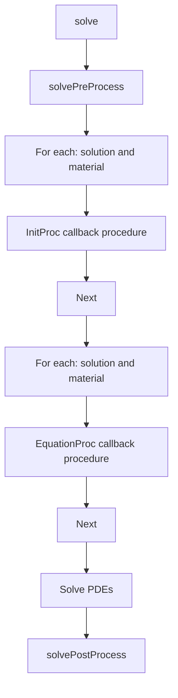
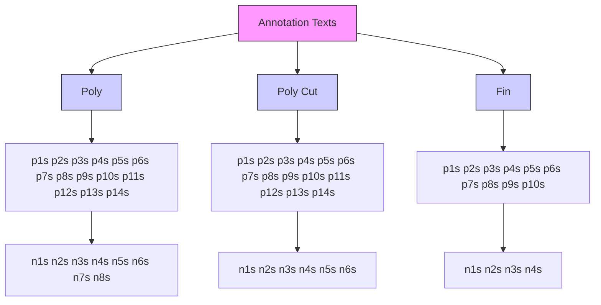

<!-- page:1 -->
# Sentaurus™ Interconnect User Guide

Version O-2018.06, June 2018

# Copyright and Proprietary Information Notice

<!-- page:2 -->
© 2018 Synopsys, Inc. This Synopsys software and all associated documentation are proprietary to Synopsys, Inc. and may only be used pursuant to the terms and conditions of a written license agreement with Synopsys, Inc. All other use, reproduction, modification, or distribution of the Synopsys software or the associated documentation is strictly prohibited.

# Destination Control Statement

All technical data contained in this publication is subject to the export control laws of the United States of America. Disclosure to nationals of other countries contrary to United States law is prohibited. It is the reader’s responsibility to determine the applicable regulations and to comply with them.

# Disclaimer

SYNOPSYS, INC., AND ITS LICENSORS MAKE NO WARRANTY OF ANY KIND, EXPRESS OR IMPLIED, WITH REGARD TO THIS MATERIAL, INCLUDING, BUT NOT LIMITED TO, THE IMPLIED WARRANTIES OF MERCHANTABILITY AND FITNESS FOR A PARTICULAR PURPOSE.

# Trademarks

Synopsys and certain Synopsys product names are trademarks of Synopsys, as set forth at https://www.synopsys.com/company/legal/trademarks-brands.html. All other product or company names may be trademarks of their respective owners.

# Free and Open-Source Licensing Notices

If applicable, Free and Open-Source Software (FOSS) licensing notices are available in the product installation.

# Third-Party Links

Any links to third-party websites included in this document are for your convenience only. Synopsys does not endorse and is not responsible for such websites and their practices, including privacy practices, availability, and content.

Synopsys, Inc.

Mountain View, CA 94043

www.synopsys.com

<!-- page:3 -->
# About This Guide xix

Related Publications . . xix

Conventions xix

Customer Support . . . xx

Accessing SolvNet. . . xx

Contacting Synopsys Support . . . xx

Contacting Your Local TCAD Support Team Directly. . . . xxi

Acknowledgments. . . . xxi

# Chapter 1 Working With the Simulator 1

Introduction to Sentaurus Interconnect . .

Simulation Projects . . .

Setting Up the Environment . . .

Environment Variables for Supporting Files . . . .

Starting Sentaurus Interconnect . . .

Command-Line Options . .

Interactive Mode . .

Batch Mode . .

Terminating Execution . . .

Fast Mode . 8

File Types . . .

Interactive Visualization . . 10

Interface to Sentaurus Visual . .

Setting Up the Interface . . . 12

Loading Command Files . . . 13

Inserting Breakpoints in the Flow . . 13

Deleting Breakpoints in the Flow . . . . . 14

Indicating Status of Steps . . . . . 14

Updating the Structure . . . 15

Controlling the Interface to Sentaurus Visual With the graphics Command . . . . . . . 15

Syntax for Creating Command Files. . . . . 15

Tcl Input. . . . 16

Specifying Materials . . . 18

Aliases . . . . 18

Default Simulator Settings: SINTERCONNECT.models File . . . . . 20

Compatibility With Previous Releases . . . . 20

Parameter Database. . . . 21

<!-- page:4 -->
Like Materials: Material Parameter Inheritance . . 22

Interpolation Between Like Materials . . . 23

Interface Parameters . . . 23

Regionwise Parameters and Region Name-Handling . . . . 23

Parameter Database Browser: Viewing the Defaults . . . 25

Starting the Parameter Database Browser . . . . 26

PDB Browser Functions . 27

Viewing Parameter Information . . . . 28

PDB Browser Preferences . . . 29

Viewing Parameters Stored in TDR Files . . . . 30

Understanding Coordinate Systems . . . . 31

Wafer Coordinate System . . . . 31

Simulation Coordinate System . . . 31

Creating and Loading Structures and Data . . . . 33

Defining the Structure: The line and region Commands . . . . 33

Creating the Structure and Initializing Data . . . . . 34

Defining the Crystal Orientation . . . . 35

Automatic Dimension Control. . . 36

Interpolating Field Data From an External Structure File Using the load Command . 37

Loading 1D Profiles: The profile Command . . . 38

Saving Structures . . . . 38

Saving a Structure for Restarting Simulations. . . . . 39

Saving a Structure for Device Simulation . . . . 40

Saving 1D Profiles for Inspect. . . . 41

Saving 1D TDR Files From 2D and 3D Simulations, and 2D TDR Files From 3D Simulations . . . 41

The select Command (More 1D Saving Options) . . . . 42

The datexcodes.txt File . . . . . 43

References . . . . 43

# Chapter 2 Computing Mechanical Stress 45

Overview of Mechanical Stress . . . . . 45

Material Models . . 46

Viscoelastic Materials . . . 47

Maxwell Model. . . . 47

Standard Linear Solid Model . . . 48

Purely Viscous Materials . . . 50

Shear Stress–Dependent Viscosity . . . . . 50

Purely Elastic Materials . . . . 51

Anisotropic Elastic Materials. . . . 51

Cubic Crystal Anisotropy . . . . . 52

<!-- page:5 -->
Hexagonal Crystal Anisotropy . . . . 52

Orthotropic Model . . . 53

Plastic Materials. . . 55

Incremental Plasticity . . . . 56

Deformation Plasticity . . . . 58

Viscoplastic Materials . . . . 59

Anand Model . . . 59

Power Law Creep . . . . . 62

Swelling . . . . . 65

Temperature-Dependent Mechanical Properties . . . . . . 66

Plane Stress Analysis . . . . 68

Equations: Global Equilibrium Condition . . . . 68

Second-Order Finite Element Analysis. . . . 69

Mechanics Simulations on Mixed or Hybrid Meshes . . . . 73

Mechanics Simulations With Composite Solid Shell Element. . . . 74

Boundary Conditions . . . . 75

Example: Applying Boundary Conditions. . . . 77

Deprecated Syntax . . . . 78

Variable Boundary Condition . . . . 78

Pressure Boundary Condition . . . . 79

Advanced Dirichlet Boundary Condition . . . . 80

Advanced Neumann Boundary Condition. . . . . 80

Point-Force Boundary Condition. . . . 81

Point-Displacement Rate Boundary Condition . . . . 81

Periodic Boundary Condition . . . . 82

Coupling Boundary Condition. . . . . 83

Stress-Causing Mechanisms . . . . 84

Densification . . . . 84

Selectively Switching Off Grid Movement . . . 85

Grain Growth . . . . . 85

Thermal Mismatch. . . 86

Gravity Force . . . . . 87

Edge Dislocation . . . . 88

Inverse Piezoelectric Effect . . . . . 90

Effective Surface Tension and Pressure due to Fluid . . . 91

Intrinsic Stress . . . . 92

Stress Rebalancing After Etching and Deposition. . . . . . 93

Automated Tracing of Stress History . . . . . 94

Saving Stress and Strain Components . . . . 94

Description of Output Fields . . . . . 95

Tracking Maximum Stresses . . 101

<!-- page:6 -->
Principal Stresses . . . . 101

Principal Strains . . . . . 103

Nodal Stress and Strain at Like-Material Interface . . . 104

Submodeling . . . . 104

Crack Analysis . . . . 106

V-Notch Cracks . . . . 107

Bulk Cracks . . . 108

Cohesive Zone Modeling . 109

Exponential Law . . . . . 109

Triangular Law . . . 110

Damage Variable . . . . 112

Stress Filtering . . . 114

References. . . 116

# Chapter 3 Mechanics Postprocessing 119

Stress-Induced Mobility Enhancement . . . . 119

Displacement Field . . . . 120

J-Integral . . . . 121

C(t)-Integral . . . . 124

Jv-Integral . . . . 124

References. . . . 125

# Chapter 4 Thermal Analysis 127

Overview of Thermal Analysis . . . . . 127

Thermal Model . . 127

Boundary Conditions . . . . . 129

Bottom Boundary Condition . . . . . . 130

Side Boundary Condition . . . . . . 130

Defining Thermal Contacts . . . . . 132

Applying Boundary Conditions to Thermal Contacts . . . . 132

Thermal Submodeling . . . . 133

Thermal Resistance Matrix . . . . . 133

Thermal RC Network . . 134

Output Data Fields . . . . . 134

Example: 2D Thermal Analysis With Joule Heating . . . . . . 135

References. . . . 136

# Chapter 5 Electrical Current Analysis 137

<!-- page:7 -->
Overview of Electrical Current Analysis . . . . 137

Electrical Current Model. . . 137

Electrical Conductivity Models . . . . 139

Proximity Field–Dependent Model . 139

Nearest Distance–Dependent Model . . 140

Wire Size–Dependent Model . . . . 141

Grain Size–Dependent Model . 142

Boundary Conditions . . . . . 143

Defining Electrical Contacts. . . . . . 143

Applying Boundary Conditions to Electrical Contacts . . . . 143

Resistance Matrix . . . 145

Output Data Fields . . . . 145

Example: 2D Electrical Current Analysis . . . . . 145

References. . . 148

# Chapter 6 Electrostatic Analysis 149

Overview of Electrostatic Analysis. . . . . 149

Electrostatic Model . . . 149

Boundary Conditions . . . . 151

Defining Electrodes . . . . . . 151

Applying Boundary Conditions to Electrodes . . . . 151

Capacitance Matrix . . . 152

Output Data Fields . . . . . 152

Example: Electrostatic Analysis of Strip Between Two Ground Planes . . . . . 152

References. . . 154

# Chapter 7 Mixed-Mode Analysis 155

Overview of Mixed-Mode Analysis . . . . . 155

Compact Models . . . . 156

Example: Compact Models . . . . . . 158

SPICE Circuit Files . . . . . . 160

System Section . . . . 161

Circuit Devices . 162

Temperature Dependency . . . . . 163

SPICE Circuit Models. . . . 164

SPICE Circuit Parameters . . . 164

User-Defined Circuit Models . . . . 165

Example: Mixed-Mode Electrical Current Analysis. . . . . 165

<!-- page:8 -->
# Chapter 8 Complementary Models 169

Grain Growth Model. . . 169

Initializing the Grain Size . . . . 171

Output Data Fields . . . . 171

References. . . 172

# Chapter 9 Advanced Calibration 173

Overview. . . . 173

Using Advanced Calibration. . . . 173

Additional Calibration by Users . . . . 174

# Chapter 10 Mesh Generation 175

Overview of Mesh Generation . . . 175

Mesh Refinement. . . 176

Viewing Mesh Refinement . . 177

Static Mesh Refinement . . . 177

Standard Refinement Boxes. . . . 177

Interface Axis-Aligned Refinement Boxes . . . . 178

Interface Offsetting Refinement Boxes . . . . 179

Refinement Inside a Mask . . . 179

Refinement Near Mask Edges or Mark Corners . . . . 180

Uniform Mesh Scaling. . . . . . 182

Adaptive Mesh Refinement . . . . . 183

Adaptive Refinement Criteria . . . . 183

Relative Difference Criteria . . . . . 184

Absolute Difference Criteria . . . . 185

Logarithmic Difference Criteria . . . . 185

Inverse Hyperbolic Sine (asinh) Difference Criteria . . . . . 186

Gradient Criteria . . . . . . 186

Local Dose Error Criteria . . . . 186

Interval Refinement Criteria . . . . . . 188

Summary of Refinement Parameters . . . . . 189

Localizing Adaptive Meshing Using refinebox Command . . . 189

Examples . . . . 190

Adaptive Meshing During Analysis . . . . . . 190

Tips for Adaptive Meshing . . . . . . 192

Manipulating Refinement Boxes: transform.refinement Command. . . . . 193

Settings for Sentaurus Mesh . . . . 194

Displaying Refinement Boxes . . . 199

<!-- page:9 -->
Controlling the Mesh During Moving-Boundary Problems . . . . 201

TSUPREM-4 Moving-Boundary Meshing Library. . . . . . 201

Control Parameters in TS4 Mesh Library. . . . . 201

Moving Mesh and Mechanics Displacements . . . . . 203

Controlling the Grid Spacing . . . . . . . 203

Cleaning Up the Grid . . . . . 203

Miscellaneous Tricks . . . . . 204

Meshing for 3D Moving-Boundary Problems . . . . . . 204

MovingMesh Algorithm . . . . . 205

UseLines: Keeping User-Defined Mesh Lines . . . . . 208

Using line Commands After init Command . 208

Dimension Within Current Spatial Dimension. . . . 209

Dimension Greater Than Current Spatial Dimension. . . . . 209

Using line Commands to Create Virtual Spacing . . . . 210

UseLines and the transform Command . . . 210

Reflection . . . 210

Stretch . . . 210

Rotation . . 211

Translation . . . 211

Cut . . 211

Example: Testing line Commands. . . . 211

Example: Showing Clearing Lines for a New Structure . . . . 212

Data Interpolation . . . . 212

Data Interpolation Near Boundaries . . . . 213

Troubleshooting . . . 214

Checking Mesh Quality . . . . 216

# Chapter 11 Structure Generation 217

Overview of Etching, Deposition, and Geometric Operations . . . . . 217

Etching . . 218

Isotropic Etching . . . . . 221

Anisotropic and Directional Etching . . . . . . 222

Polygonal Etching and CMP . . . 226

Fourier Etching . . . 227

The shadowing and shadowing.nonisotropic Options . . . . 229

Crystallographic Etching . . . . . . 230

Trapezoidal Etching . . . . . . 230

Two-Dimensional Trapezoidal Etching . . . . 231

Three-Dimensional Trapezoidal Etching . . . . 233

Trapezoidal Etching Using force.full.levelset Option . . . . . 234

Piecewise Linear Etching. . . . . 235

<!-- page:10 -->
Etching Beams . . . . 236

Etching Tips . . . . . . 236

Deposition . . . . . . 237

Isotropic Deposition. . . . . 240

Polygonal Deposition and Fill . . . . . 240

Crystallographic Deposition . . . . . . 241

Fourier Deposition . . . . 241

Trapezoidal Deposition . . . . . 242

Selective Deposition . . 243

Fields in Deposited Layers . . . . . 244

Handling Stress in Etching and Deposition . . . . 244

Suppressing Mesh Generation in 3D Simulations . . . . . 245

Shape Library . . . . . 246

PolyHedronSTI . . . 246

PolyHedronSTIaccc . . . . . 249

PolyHedronSTIaccv. . . . . 249

PolyHedronCylinder . . . . . 250

PolyHedronEllipticCylinder . . . . . 251

PolygonSTI . . . 252

PolygonWaferMask . . . . 253

PolyHedronEpiDiamond . . . 253

Tailored Structure Generation. . . . 254

Pillar Structure With Hexahedral Mesh. . . . 254

Examples of Generating Different Pillar Structures. . . . . 255

Multiple-Pillar Structure With Hexahedral Mesh . . . . 257

Masks and Lithographic Patterning . 259

Photoresist Masks . . . . . 262

Boolean Masks. . . . . 262

Line Edge Roughness Effect . . . . . 264

Mirror Boundary Conditions . . . . . 266

Geometric Transformations . . . . 267

Refinement Handling During Transformation. . . . 268

Contact Handling During Transformation. . . . 268

Reflection . . . . . 269

Refinement Handling During Reflection . . . . . 269

Stretch . . . 269

Refinement Handling During Stretch . . . . 270

Cut . . . 270

Refinement Handling During Cut. . . . . 271

Flip and Backside Processing . . . . . 271

Refinement Handling During Flip . . . . 272

<!-- page:11 -->
Rotation . . . . 272

Refinement Handling During Rotation. . . . . 272

Translation . . . . 272

MGOALS . . 273

MGOALS Boundary-Moving Algorithms. . . . . . . 273

MGOALS Boundary-Moving Parameters . . . . . 274

MGOALS 3D Boundary-Moving Algorithms. . . . . . 277

Summary of MGOALS Etching . . . 278

MGOALS Backward Compatibility . . . . . 279

Boundary Repair Algorithm . . . . . 279

Structure Assembly in MGOALS Mode . . . . . . 280

Multithreading . . . . . 281

Insertion: Internal Mode . . . 281

Inserting Segments. . . . . 281

Inserting Polygons . . . . . . 281

Inserting Polyhedra . . . . . . 282

Reading Polyhedra From TDR Boundary File . . . . . . 282

Creating a Cuboid (Brick) Polyhedron. . . . . . 283

Extruding 2D Polygons . . . . 283

Creating Polyhedron From Its Constituent Polygonal Faces . . . . . . 283

Insertion: External Mode . . . . 283

Inserting Polyhedra . . . . . 284

Sentaurus Structure Editor Interface . . . . 285

Sentaurus Topography Interface . . . . 288

Sentaurus Topography 3D Interface . . . . . . 290

References. . . . 291

# Chapter 12 ICWBEV Plus Interface for Layout-Driven Simulations 293

Introduction . . . . . 293

Introducing ICWBEV Plus for TCAD Users . . . . 294

Opening GDSII Layout Files . . . . . . 294

User Interface of ICWBEV Plus . . . . . 295

Sentaurus Markups . . 296

Stretch Utility. . . . 298

Renaming Markups . . . . . 300

Auxiliary Layers . . . . . 301

Text Labels . . 302

Editing Polygons . . . . . 303

Resizing a Rectangle . . . . . 303

Converting a Rectangle to a Polygon . . . . . . 303

Nonaxis-Aligned Simulation Domains . . . . 304

<!-- page:12 -->
Sentaurus Markup Files and TCAD Layout Files. . . . . 305

Saving the Sentaurus Markup File. . . . . . 306

Contents of Sentaurus Markup File . . . . . . 307

Reloading the Markup File . . . . . 308

Saving the TCAD Layout File . . . . . . . 309

Contents of TCAD Layout File . . . . . 310

Reloading the TCAD Layout File . . . . . 311

Starting ICWBEV Plus in Batch Mode and Using Macros . . . . 312

ICWBEV Plus Macros. . . . . 312

Tcl-Based Macros for Layout Parameterization . . . . . 312

TCAD Layout Reader . . . . . 313

Loading the TCAD Layout . . 314

Finding Simulation Domains . . . 314

Finding Layer Names and Layer IDs. . . . . . 314

Selecting the Simulation Domain . . . . 315

Loading a GDSII Layout . . . . . 315

Finding Domain Dimensions . . . 316

Finding Bounding Box of Domain . . . . 316

Interface With line Commands . . 317

Creating Masks . . . . . 317

Mask-Driven Meshing . . . . 320

Layout-Driven Contact Assignment . . . . 321

Aligning Wafer and Simulation Domain . . . . 324

Additional Query Functions. . . . . 324

# Chapter 13 Extracting Results 327

Overview. . . . 327

Saving Data Fields . . . . . 327

Selecting Fields for Viewing or Analysis . . . . . 328

Obtaining 1D Data Cuts . . . . 328

Examples . . . . . 329

Determining the Dose: Layers . . . . . . 330

Extracting Values and Level Crossings: interpolate . . . . . 331

Extracting Values During solve Step: extract . . . . . 332

Optimizing Parameters Automatically . . . . . . 333

Fitting Routines . . . . . . 333

FitArrhenius Command . . . 333

FitLine Command . 334

Storing Time Versus Resistance, Current, and Voltage . . . . . 334

<!-- page:13 -->
# Chapter 14 Numerics 337

Overview. . . . 337

Setting Parameters of the Iterative Solver ILS . . . 338

Partitioning and Parallel Matrix Assembly . . . . 340

Numeric Accuracy and Reproducibility of Results . . . . . 342

Matrix Size Manipulation . . . . 343

Node and Equation Ordering . . . . 343

Time Integration . . . . . 344

Time-Step Control. . . . 345

Time-Step Control for PDEs . . . . . 345

Error Control for PDEs . . . . . 347

Time-Step Control for Mechanics . . . 348

Convergence Criteria . . . . . . 348

Time-Step Adjustment . . . . . 350

Time-Step Cutback . . . . . 350

References. . . . 351

# Chapter 15 Writing Partial Differential Equations Using Alagator 353

Available Operators and Variables . . . . 353

Binary and Unary Operators . . . . . 353

Simple Functions . . . . . 355

Differential Functions . 355

String Names . . . . . 356

Solution Names and Subexpressions . . . . . 356

Constants and Parameters . . 356

Basics of Specifying Partial Differential Equations . . . . 357

Building Partial Differential Equations . . . . . 358

Setting the Boundary Conditions. . . . . . 359

Dirichlet Boundary Condition . . . . 359

Segregation Boundary Condition . . . . . . 359

Using Terms. . . . . 360

Modifying Built-in Equations and Terms . . . . 360

UserAddEqnTerm and UserSubEqnTerm . . . . . . 361

UserAddToTerm and UserSubFromTerm . . . . 362

Using Callback Procedures to Build Models . . . . 363

Callbacks During Execution of the solve Command . . 363

The solvePreProcess Procedure . . . . . . 364

Building and Solving PDEs . . . . . 365

The solvePostProcess Procedure . . . . 365

Specifying Callback Procedures Using Keywords . . . . . 366

<!-- page:14 -->
Common Features of Using Keywords . . . . . 366

Cleaning Up Equation Strings: InitProc . . . . . . 367

Constructing Equation Strings: EquationProc . . . . 368

Summary . . . . 368

References. . . . 369

# Appendix A Commands 371

Syntax Conventions . . 371

Example of Command Syntax . . . . . . 372

Common Arguments . . . . . 373

Quantities and Units for Command Arguments . . . . 374

alias . . . . 378

ArrBreak . . . . 379

Arrhenius. . . . 380

beam . . 381

bound. . . . 383

boundary . . . . . 384

circuit . . 388

Compatibility . . . . . 391

contact . . . 392

contour . . 398

crack . . . 400

current\_ramp . . . . . . 404

CutLine2D. . . . 406

CZM . . . 407

define. . . . . 409

defineproc . . . . . . 410

DeleteRefinementboxes . 411

deposit . . . . . 412

doping . . . . . 419

element . . . . 421

Enu2G . . . 422

Enu2K . . . 423

equation . . . . . 424

etch . . 425

exit. . . . . 433

extract . . . 434

fbreak . . . . . 437

fcontinue . . . . . 437

fexec . . 438

fproc . . . . 438

<!-- page:15 -->
fset . . . . 438

generic\_step . . . . . 439

graphics . . . . . . 441

grid . . 445

help . . . . . 457

icwb . . . . . 458

icwb.composite . . . . . 462

icwb.contact.mask. . . . 464

icwb.create.all.masks . . . 467

icwb.create.mask. . . . 468

init . . . 471

insert . . . 477

integrate. . . . . 480

interface. . . . 483

interpolate . . . . . . . 486

j\_integral . . . . . 489

KG2E . . 491

KG2nu. . . . 492

layers . . . . 493

line. . . . 495

line\_edge\_roughness. . . . . . 499

load . . . 501

LogFile . . . . . 505

mask . . 507

mater . . . 511

math. . . . 515

mgoals . . . . 524

mobility . . . . . . . . 530

mode . . . 532

optimize. . . . . 536

option . . . . . . 540

paste . . 545

pdbDelayDouble . . . . . 547

pdbdiff . . . . . 548

pdbExprDouble . . . . . . 549

pdbGet and Related Commands . . . . 550

pdbIsAvailable . . . . . 552

pdbLike . . . . . 553

pdbSet and Related Commands . . 554

pdbUnSet-Related Commands . . . 557

photo . . . . 558

<!-- page:16 -->
plot.1d . . . 560

plot.2d . . . . 563

plot.xy . . . . . 567

point . . 569

point.xy . . . . . 571

polygon . . . . . . 573

polyhedron . . . . . 577

power\_ramp . . . . 581

print.1d . . . . . 584

print.data . . . . . 586

printCapacitanceMatrix. . . . 587

printRC . . . 589

printResistanceMatrix . . . . 591

printThermalRC . . 593

printThermalResistanceMatrix . . . . . 595

profile . . . . . 597

RangeRefineboxes . . . . 602

rcnetgen . . . . . 605

rcnetgroup . . . . . 607

rcnetmerge. . . . . 608

rcnetvalidate . . . . . . 609

refinebox . . . . . . 610

region . . . . 620

resistance . . . . . 624

sde . . . . . 625

select . . . . 628

Set3DDeviceMeshMode . . . . 632

Set3DMovingMeshMode . . . . 634

SetFastMode . . . . 635

SetMechanicsMeshMode . . . . . 636

SetPerformanceMode . . . . . . 637

SetPlxList . . . . 638

SetTDRList . . . . 639

SetTemp . . . . . 640

SetTS4MechanicsMode . . . . . 641

slice . . . . 642

solution . . . . 645

solve . . . 648

sptopo . . . . . . 651

stdiff . . . . 652

stressdata . . . . 653

<!-- page:17 -->
strip . . 662

struct . . . 663

supply . . . . . 667

System . . . . . . 671

tclsel . . 673

temp\_ramp . . . . . . 675

term . . . . 678

topo . . . . 681

transform . . . . 682

transform.mask . . . 688

transform.refinement. . . . 692

translate . . . . . . 697

update\_hoop\_radial\_stress . . . . 698

update\_principal\_strain . . . . . 699

update\_principal\_stress . . . . . . . 699

voltage\_ramp. . . . . . 700

WritePlx . 702

# Appendix B Resistance, Capacitance, and Thermal Resistance 705

Overview. . . . 705

Electrical Current Analysis: Resistance Matrix . . . . 705

Electrostatic Analysis: Capacitance Matrix . . . . 707

Floating Conductors. . . . . 709

Merging Contacts. . . . . 709

Distributed RC Extraction. . . 710

Generating, Validating, and Merging Netlists . . . . 713

Generating Netlists . . . . . . 714

Grouping Netlists . . . . . 719

Validating Netlists . . . . . 720

Merging Netlists . . . 722

Thermal Analysis: Thermal Resistance Matrix . . . . 723

Thermal Analysis: Thermal RC Network . . . . 725

Example: Electrostatic Analysis With Floating Conductor . . . . 727

References. . . 729

<!-- page:18 -->
Contents

<!-- page:19 -->
The Synopsys Sentaurus™ Interconnect tool is an advanced 1D, 2D, and 3D simulator suitable for IC interconnect reliability analysis. It features modern software architecture and state-of-the-art models to address current and future interconnect technologies, and is capable of mechanical, thermal, and electrical analysis.

Sentaurus Interconnect simulates process simulation steps, etching, and deposition along with mechanical, thermal, and electrical analyses in 1D, 2D, and 3D. Three-dimensional capabilities include meshing of boundary files using the MGOALS module, and an interface to Sentaurus Structure Editor, which is the 3D geometry editing tool based on the ACIS solid modeling library.

Sentaurus Interconnect uses the Alagator scripting language that allows users to implement and solve their own nonmechanics partial differential equations. Alagator can be used to solve various electrical and thermal analysis equations. Three-dimensional simulations are handled in exactly the same way as for one dimension and two dimensions. Therefore, all of the advanced models and user programmability available in one dimension and two dimensions can be used in three dimensions.

# Related Publications

For additional information, see:

The TCAD Sentaurus release notes, available on the Synopsys SolvNet® support site (see Accessing SolvNet on page xx).   
■ Documentation available on SolvNet at https://solvnet.synopsys.com/DocsOnWeb.

# Conventions

The following conventions are used in Synopsys documentation.

<table><tr><td>Convention</td><td>Description</td></tr><tr><td>Blue text</td><td>Identifies a cross-reference (only on the screen).</td></tr><tr><td>Bold text</td><td>Identifies a selectable icon, button, menu, or tab. It also indicates the name of a field or an option.</td></tr><tr><td>Courier font</td><td>Identifies text that is displayed on the screen or that the user must type. It identifies the names of files, directories, paths, parameters, keywords, and variables.</td></tr><tr><td>Italicized text</td><td>Used for emphasis, the titles of books and journals, and non-English words. It also identifies components of an equation or a formula, a placeholder, or an identifier.</td></tr><tr><td>Menu &gt; Command</td><td>Indicates a menu command, for example, File &gt; New (from the File menu, select New).</td></tr></table>

<!-- page:20 -->
# Customer Support

Customer support is available through the Synopsys SolvNet customer support website and by contacting the Synopsys support center.

# Accessing SolvNet

The SolvNet support site includes an electronic knowledge base of technical articles and answers to frequently asked questions about Synopsys tools. The site also gives you access to a wide range of Synopsys online services, which include downloading software, viewing documentation, and entering a call to the Support Center.

To access the SolvNet site:

1. Go to the web page at https://solvnet.synopsys.com.

2. If prompted, enter your user name and password. (If you do not have a Synopsys user name and password, follow the instructions to register.)

If you need help using the site, click Help on the menu bar.

# Contacting Synopsys Support

If you have problems, questions, or suggestions, you can contact Synopsys support in the following ways:

■ Go to the Synopsys Global Support Centers site on synopsys.com. There you can find e-mail addresses and telephone numbers for Synopsys support centers throughout the world.

Go to either the Synopsys SolvNet site or the Synopsys Global Support Centers site and open a case online (Synopsys user name and password required).

# Contacting Your Local TCAD Support Team Directly

<!-- page:21 -->
# Send an e-mail message to:

■ support-tcad-us@synopsys.com from within North America and South America   
support-tcad-eu@synopsys.com from within Europe   
support-tcad-ap@synopsys.com from within Asia Pacific (China, Taiwan, Singapore, Malaysia, India, Australia)   
support-tcad-kr@synopsys.com from Korea   
support-tcad-jp@synopsys.com from Japan

# Acknowledgments

Sentaurus Interconnect is based on the 2000 and 2002 releases of FLOOPS written by Professor Mark Law and coworkers at the University of Florida. Synopsys acknowledges the contribution of Professor Law and his advice in the development of Sentaurus Interconnect. Go to http://swamp.mse.ufl.edu/ for more information about TCAD at the University of Florida.

<!-- page:22 -->
# About This Guide

# Acknowledgments

<!-- page:23 -->
This chapter describes the functionality of Sentaurus Interconnect, how to start the tool, and how Sentaurus Interconnect operates.

The syntax and features of the command file are described, followed by an overview of the parameter database, which contains all of the model parameters, and technical details regarding the running of the tool.

For new users, see Interactive Mode on page 6, Syntax for Creating Command Files on page 15, and Creating and Loading Structures and Data on page 33. For advanced users who need to adjust model parameters, see Parameter Database on page 21.

# Introduction to Sentaurus Interconnect

Sentaurus Interconnect is a complete and highly flexible, multidimensional, IC interconnect reliability analysis environment. With its modern software architecture and extensive breadth of capabilities, Sentaurus Interconnect is a state-of-the-art simulation tool. It offers unique predictive capabilities for modern silicon and nonsilicon technologies such as analyzing the reliability of semiconductor interconnect structures. In particular, Sentaurus Interconnect identifies hot spots in interconnect structures that are susceptible to void formation, de-bonding, and cracking due to physical phenomena such as stress and temperature excursions. These reliability concerns arise from both the manufacturing process and circuit operation.

Sentaurus Interconnect accepts as input a sequence of commands that is either entered from standard input (that is, at the command prompt) or composed in a command file. Simulations are performed by issuing a sequence of commands that corresponds to the individual process steps or analysis modes. In addition, several commands allow you to select physical models and parameters, grid strategies, and graphical output preferences, if required. You should place parameter settings in a separate file, which is sourced at the beginning of command files using the source command.

In addition, the Alagator scripting language allows you to describe and implement your own models, and thermal and electrical analysis equations.

<!-- page:24 -->
# Simulation Projects

The Sentaurus Interconnect module of the TCAD Sentaurus Tutorial provides various projects demonstrating the capabilities of Sentaurus Interconnect.

To access the TCAD Sentaurus Tutorial, open Sentaurus Workbench and either choose Help > Training or click the corresponding toolbar button.

Alternatively, to access the TCAD Sentaurus Tutorial, go to:

\$STROOT/tcad/\$STRELEASE/Sentaurus\_Training/index.html

where the STROOT environment variable indicates where the Synopsys TCAD distribution has been installed, and STRELEASE indicates the Synopsys TCAD release number.

# Setting Up the Environment

The STROOT environment variable is the TCAD Sentaurus root directory, and you must set this variable to the installation directory of TCAD Sentaurus.

You can set the STRELEASE environment variable to specify the version of the software to run. If you do not set STRELEASE, the default version is used, which is usually the last version installed.

To set the environment variables:

1. Set the TCAD Sentaurus root directory environment variable STROOT to the TCAD Sentaurus installation directory, for example:

```txt
* Add to .cshrc
setenv STROOT <Sentaurus directory>
* Add to .profile, .kshrc, or .bashrc
STROOT=<Sentaurus directory>; export STROOT 
```

2. Add the <Sentaurus directory>/bin directory to the user path.

For example:

```txt
* Add to .cshrc:
set path=(<Sentaurus directory>/bin $path)
* Add to .profile, .kshrc, or .bashrc: 
```

<!-- page:25 -->
PATH=<Sentaurus directory>/bin:\$PATH export PATH

# Environment Variables for Supporting Files

The Sentaurus Interconnect binary relies on several supporting files found using the environment variables SIHOME and SCHOME. To change default models and parameters without modifying the installed Sentaurus Interconnect files, copy the default SIHOME and SCHOME directories and set the environment variables (SIHOME and SCHOME) to the location of the modified directories.

By default, SIHOME and SCHOME are set based on the Synopsys standard environment variables STROOT and STRELEASE, and by the version number of Sentaurus Interconnect using:

```erb
SIHOME = $STROOT/tcad/$STRELEASE/lib/sinterconnect-<version number>
SCHOME = $STROOT/tcad/$STRELEASE/lib/score-<version number> 
```

Inside the SIHOME directory, there is the subdirectory TclLib. Inside the SCHOME directory, the two major subdirectories are TclLib and Params:

The subdirectory \$SIHOME/TclLib contains all the default model selections in the file SINTERCONNECT.models.   
■ The Tcl files are located in the subdirectories \$SIHOME/TclLib and \$SCHOME/TclLib.   
The subdirectory \$SCHOME/Params contains the parameter database (see Parameter Database on page 21).

# Starting Sentaurus Interconnect

The following syntax is used to start Sentaurus Interconnect on the command line:

```elixir
> sinterconnect [<options>] [<commandfile> | <commandfile.cmd>] 
```

If you do not specify a command file, Sentaurus Interconnect runs in interactive mode. In this mode, an entire process flow can be simulated by entering commands line-by-line as standard input (see Interactive Mode on page 6).

To start Sentaurus Interconnect in interactive mode, enter the following on the command line:

```txt
> sinterconnect 
```

<!-- page:26 -->
Version and host information is displayed, followed by the Sentaurus Interconnect command prompt, for example:

```txt
**********************************************************************
***    Sentaurus Interconnect    *** 
***    Version 0-2018.06    *** 
***    (1.563, x86_64, Linux)    *** 
***    Copyright (C) 1993-2002    *** 
***    The board of regents of the University of Florida    *** 
***    Copyright (C) 1994-2018    *** 
***    Synopsys, Inc.    *** 
***    This software and the associated documentation are confidential   *** 
***    and proprietary to Synopsys, Inc.   Your use or disclosure of this   *** 
***    software is subject to the terms and conditions of a written   *** 
***    license agreement between you, or your company, and Synopsys, Inc.   *** 
```

Compiled Fri Apr 27 04:45:36 PDT 2018 on tcadprod35

Started at: Fri Jan 26 14:23:45 2018 (CEST)

User name: jbrowne

Host name: topo3

PID: 43289

Architecture: x86\_64

Operating system: Linux rel. 2.6.32-642.13.1.el6.x86\_64 ver. #1 SMP Wed Nov 23 16:03:01 EST 2016

Loading models file: /u/isedist/sentaurus/tcad/O-2018.06/lib/sinterconnect-28.0.563/TclLib/SINTERCONNECT.models... done. sinterconnect>

This is a flexible way of working with Sentaurus Interconnect to test individual process steps or short sequences, but it is inconvenient for long process flows. It is more useful to compile the command sequence in a command file, which can be run in batch mode or inside Sentaurus Workbench.

To run Sentaurus Interconnect in batch mode, specify a command file when starting Sentaurus Interconnect, for example:

> sinterconnect input.cmd

See Batch Mode on page 7.

<!-- page:27 -->
# Command-Line Options

Table 1 lists the command-line options that are available in Sentaurus Interconnect.

Table 1 Command-line options 

<table><tr><td>Option</td><td>Description</td></tr><tr><td>-b | --batchMode</td><td>Switch off graphics.</td></tr><tr><td>--diff</td><td>Diff mode. See differences in data and Sentaurus Interconnect parameter settings between two TDR files. Interpolation is used to compare results from different meshes. Usage:sinterconnect --diff.whereandare TDR files.</td></tr><tr><td>-e | --encrypt</td><td>Read recipe file and encrypt it.</td></tr><tr><td>-f | --FastMode</td><td>Generate structure, no partial differential equation solve, and so on (see Fast Mode on page 8).</td></tr><tr><td>-h</td><td>Print usage and command-line options.</td></tr><tr><td>-n | --noSyntaxCheck</td><td>Switch off syntax checking.</td></tr><tr><td>-o | --home</td><td>Sets SIHOME to.</td></tr><tr><td>-p | --pdb</td><td>Run the Parameter Database Browser showing parameters as they are set during runtime. Include default parameters and parameters from the command file if specified.</td></tr><tr><td>--ponly</td><td>Same as -p, except only shows parameters set in the command file; does not show default parameters.</td></tr><tr><td>-q | --quickSyntaxCheck</td><td>Check only the syntax of branches that are true.</td></tr><tr><td>-r | --readProtectedFile</td><td>Read encrypted recipe file and run under restricted mode.</td></tr><tr><td>-rel</td><td>Select a specific release of Sentaurus Interconnect to launch. For example: sinterconnect -rel N-2017.09</td></tr><tr><td>-releases</td><td>List all available releases in the TCAD Sentaurus installation directory. Usage: sinterconnect -releases</td></tr><tr><td>-s | --syntaxCheckOnly</td><td>Only check the syntax; no execution.</td></tr><tr><td>--svi</td><td>Switch on the Sentaurus Visual interface mode. This option is usually specified in the User Preferences dialog box of Sentaurus Visual (see Setting Up the Interface on page 12).</td></tr><tr><td>-u | --GENESISeMode</td><td>Switch off the creation of the log file.</td></tr><tr><td>-v</td><td>Print header with version number.</td></tr><tr><td>-ver</td><td>Start Sentaurus Interconnect by specifying a particular version. For example: sinterconnect -ver 1.4</td></tr><tr><td>-versions</td><td>List all versions in a particular release directory. Usage: sinterconnect -versions</td></tr><tr><td>-x</td><td>Check catching of floating-point exceptions.</td></tr><tr><td>-X</td><td>Switch off catching of floating-point exceptions.</td></tr><tr><td>--xml</td><td>Switch on the creation of an XML-style marked-up log file for use in the TCAD Log File Browser (see Utilities User Guide, Chapter 2 on page 5).</td></tr></table>

# Example of Starting Different Version of Sentaurus Interconnect

<!-- page:28 -->
The following command starts the simulation of nmos\_sis.cmd using version 1.2 of release N-2017.09 as long as this version is installed:

> sinterconnect -rel N-2017.09 -ver 1.2 nmos\_sis.cmd

# Interactive Mode

Sentaurus Interconnect runs in interactive mode if no command file is given. In this mode, commands can be entered (at the command prompt) line-by-line and are executed immediately.

It is useful to run Sentaurus Interconnect in the interactive mode for the following reasons:

When debugging Tcl code, the program does not quit if a Tcl error is found. The error is displayed and you are prompted again for input. You can source a command file repeatedly if required.   
■ To easily obtain Parameter Database parameter names and defaults with the pdbGet command.   
To print the list of built-in functions with the help command, and to print the list of Tcl procedures with the info procs command.   
To obtain command parameter names and defaults for any built-in command by using the params flag available in all built-in functions.

Another use of the interactive mode is to pause the simulation using the fbreak command. When the simulation is paused in interactive mode, the state of the simulator can be queried using a number of commands including grid, mater, and select. Pausing the simulation can also be useful when using interactive graphics as described in Interactive Visualization on page 10.

<!-- page:29 -->
# Batch Mode

Instead of entering Sentaurus Interconnect commands line-by-line, the required sequence of commands can be saved to a command file, which can be written entirely by users. To save time and reduce syntax errors, you can copy and edit examples of command files available from the TCAD Sentaurus Tutorial or in this user guide.

If a command file has been prepared, run Sentaurus Interconnect by typing the following command:

sinterconnect <commandfile>

Alternatively, you can automatically start Sentaurus Interconnect through the Scheduler in Sentaurus Workbench. The command file has the extension .cmd. (This is the convention used in Sentaurus Workbench.)

The command file is checked for correct syntax and then commands are executed in sequence until the simulation is stopped by the command exit or the end of the file is reached. Since Sentaurus Interconnect is written as an extension of the tool command language (Tcl), all Tcl commands and functionalities (such as loops, control structures, creating and evaluating variables) are available in command files. This results in some limitations in syntax control if the command file contains complicated Tcl commands. You can switch off syntax-checking with the command-line option -n, for example:

sinterconnect -n commandfile

Sentaurus Interconnect ignores character strings starting with a hash (#) character (although Sentaurus Workbench interprets # as a special character for conditional statements). Therefore, this special character can be used to insert comments in the simulation command file.

A file with the extension .log is created automatically whenever Sentaurus Interconnect is run from a command line, that is, outside the Sentaurus Workbench environment. This file contains the runtime output, which is generated by Sentaurus Interconnect and is sent to standard output. When Sentaurus Interconnect is run using a command file <root\_filename>\_sis.cmd, the output file is named <root\_filename>\_sis.log.

When Sentaurus Interconnect is run from Sentaurus Workbench, the output file is named <root\_filename>\_sis.out.

For a complete list of commands, see Appendix A on page 371.

<!-- page:30 -->
# Terminating Execution

You can terminate a running Sentaurus Interconnect job in several ways. In some cases, the termination will take time or will fail for other reasons. The most fail-safe method is to use the UNIX command:

kill -9 <process\_id>

where <process\_id> is the process ID number of the running Sentaurus Interconnect job which can be obtained with the UNIX ps command. This sends a signal SIGKILL to the corresponding Sentaurus Interconnect job, which will cause the job to terminate immediately.

If Sentaurus Interconnect is run directly from a UNIX shell, usually you can terminate the run by using shortcut keys. The key sequence is interpreted by the shell command, which sends a signal to the job in the foreground. Usually, Ctrl+C sends a SIGINT signal and Ctrl+\ (backslash) sends a SIGQUIT signal. The running Sentaurus Interconnect job catches all SIGINT signals and waits for three signals to be caught (in case it was typed accidentally) before terminating itself.

However, Sentaurus Interconnect does not catch the SIGQUIT signal, so this signal will typically cause Sentaurus Interconnect to terminate immediately.

Because the exact behavior depends on your UNIX shell, the operating system, and the local configuration, refer to the manual for the UNIX shell you are running or contact your local systems administrator for more information.

# Fast Mode

When working on a new process flow, it is useful to run Sentaurus Interconnect a few times using the fast mode (-f command-line option). Developing a new process flow can be complex, involving many etch, deposit, and photo steps, some with masks; sometimes adjustments are required. In the fast mode, all 3D remeshing and all electrical, thermal, and solve commands are ignored. Only process commands for structure generation and analysis are performed. In this mode, when in three dimensions, all struct commands will write only a boundary into a TDR file, since the simulation mesh is not synchronized with the modified structure.

<!-- page:31 -->
# File Types

The following file types are the main ones used in Sentaurus Interconnect:

Command file (\*.cmd): This is the main input file for Sentaurus Interconnect and contains all the process steps, which can be edited. It is referred to as the command file or input file.   
Log file (\*.log and \*.out): Sentaurus Interconnect generates a .log file when it is run from the command line and an .out file when run from Sentaurus Workbench. Whichever file is written contains information about each processing step, and the models and values of physical parameters used in it. The amount of information written to the log file is controlled by the info argument, which is available for nearly all commands (see Common Arguments on page 373). The global default information level (0) can be changed with pdbSet InfoDefault <n>. Allowed values of InfoDefault are 0, 1, and 2 with higher values indicating more verbose output. Any value higher than 2 will be interpreted as 2.

There is a limit to the size of the log file. By default, it is 1.e9 (\~1 GB). The simulation terminates if the limit is reached. This limit can be changed using the double-parameter Log.File.Limit:

pdbSet Log.File.Limit <value>

In addition, you can set the simulation to continue without logging any more entries after the limit is reached using:

pdbSet Continue.Past.Log.Limit 1

Marked-up log file (\*.xml): When the --xml option is specified on the command line, Sentaurus Interconnect generates a separate log file containing XML-like tags. This file contains exactly the same information as the .log file. The additional XML-like tags are used to format the .log file for efficient access to the information by displaying the structure of the log file content in the TCAD Log File Browser. Tags for common modules are written automatically. You can add custom section tags to mark important processing units with the Section, SubSection.Start, and SubSection.End commands. Refer to the Utilities User Guide for information about the TCAD Log File Browser.   
TDR boundary file (\*\_bnd.tdr): This file stores the boundaries of the structure without the bulk mesh or fields. It can be used as the structure file for the Sentaurus Mesh meshing engine and can be loaded into Sentaurus Visual for viewing. The name of a TDR boundary file can be specified using the tdr argument of the init command, and then the loaded boundary will be meshed.   
TDR grid and doping file (\*\_sis.tdr): TDR files can be used to split and restart a simulation. Such restart files are saved using the struct tdr=<c> command because restarting requires interface data, parameter and command settings, mesh ordering information as well as bulk grid and data. If either !pdb or !interfaces is specified in the struct command, the TDR file will not be suitable for restarting. The TDR file can be loaded into Sentaurus Interconnect using the init command, but the results of the

<!-- page:32 -->
subsequent simulation steps might differ in the simulation with the split and restart compared to a simulation of the entire flow in one attempt. TDR files store the following types of information:

• Geometry of the device and the grid.   
• Distribution of doping and other datasets in the device.   
The internal structure of the mesh in Sentaurus Interconnect required to restore the simulation mesh to the same state in memory that is present at the time of saving the file. Restart files store coordinates and field values without scaling to prevent round-off errors.   
By default, Sentaurus Interconnect stores all changes to the parameter database made after initial loading of the database and all commands that create objects later referenced, such as refinement boxes and masks in the TDR file. A TDR file can be either reloaded into Sentaurus Interconnect to continue the simulation or loaded into Sentaurus Visual for visualization.

You can view the parameter settings stored in a TDR file by specifying the following:

pdbBrowser -nopdb -tdr <tdrfile>

See Viewing Parameters Stored in TDR Files on page 30.

For information about the TDR format, refer to the Sentaurus™ Data Explorer User Guide.

■ XGRAPH file (\*.plx): This file is used to save 1D distributions of the doping concentration or other fields in a specified 1D cross section. This file can be viewed by loading it into Inspect.

# Interactive Visualization

The options for interactive visualization in Sentaurus Interconnect are:

■ An X-Windows-based graphical display   
This viewer can be used for 1D and 2D simulations, and is launched with either the plot.1d or plot.2d command (see plot.1d on page 560 and plot.2d on page 563).   
■ An interface to Sentaurus Visual (which will eventually replace the X-Windows display)

<!-- page:33 -->
# Interface to Sentaurus Visual

The interface to Sentaurus Visual can visualize 1D, 2D, and 3D structures and data evolution while the simulation progresses (see Figure 1 on page 12). The interface is initiated and controlled from Sentaurus Visual, including control of the simulation.

Table 2 Buttons of the Simulation Control panel of Sentaurus Visual 

<table><tr><td>Button</td><td>Description</td></tr><tr><td></td><td>Load: Load a command file.When a command file is loaded, it is thereafter referred to as the flow.</td></tr><tr><td></td><td>Run: Run the flow.Use this button either to start running the flow or to continue execution after pausing the flow. The simulation continues at the location of the cursor (line with a light-yellow background).</td></tr><tr><td></td><td>Pause: Pause the running flow.The pause occurs either when the currently executing step (command) is finished or, for a long-running step, when the current time step is completed.</td></tr><tr><td></td><td>Reset: Reset the running flow.The running flow stops, the connection to the simulator is terminated, and you return to the start of the flow.</td></tr><tr><td></td><td>Run Step: Run the next step in the flow.When you click this button, either a single step (command) is executed or a group of commands enclosed in braces is executed. You must repeatedly click this button to execute the next steps.</td></tr><tr><td></td><td>Save: Save the flow.</td></tr><tr><td></td><td>Save As: Save the flow under a new name.</td></tr></table>

<!-- page:34 -->
In addition, the graphics command can be used to control the plot settings in Sentaurus Visual and to select which fields are visible (see graphics on page 441).


<details>
<summary>text_image</summary>

Sentaurus Visual
File Edit View Tools Data Window Help
File Edit View Tools Data Window Help
MisesStress (Pa) bulk
2.004e+10
1.670e+10
1.336e+10
1.002e+10
6.681e+09
3.341e+09
0.000e+00
boundary
46 deposit Nitride temperature= 250<C> coord=
-0.35 type= fill
47 deposit Oxide temperature= 250<C> thickness=
0.1 type= isotropic
48 deposit Photoresist thickness= 0.1 type=
isotropic mask= via_12
49 etch Oxide temperature= 25<C> thickness= 0.11
type= anisotropic
50 etch Nitride temperature= 25<C> thickness= 0.1
type= anisotropic
51 deposit Copper temperature= 250<C> coord= -0.46
type= fill
52 strip Photoresist
53 deposit Oxide temperature= 250<C> coord= -0.65
type= fill
54 deposit Photoresist thickness= 0.1 type=
isotropic mask= metal_2
55 etch Oxide temperature= 0<C> thickness= 0.2
type= anisotropic
56 deposit Copper temperature= 250<C> coord= -0.65
type= fill
57 strip Photoresist
58 deposit Nitride temperature= 250<C> coord= -0.7
type= fill
59 mode mechanics
60 solve temperature= 25
SetPlxList { StressEL_xx StressEL_yy
StressEL_zz }
WritePlx n2_via.plx y= 0.04 z= 0.35 Copper
struct tdr=n2
2 [lm
** Warning **
2]0mNo time has been specified. Only elastic solve will be done.
... continuing execution
Mechanics: temp: 25.0C
Elapsed time for solve 7.43s
simote/tcadreg/examples/pp2_sis.cmd
remote/tcadreg/examples/pp2_sis.cmd
</details>

Figure 1 Interface to Sentaurus Visual: upper pane of Simulation Control panel shows command file and lower pane of Simulation Control panel shows log file

# Setting Up the Interface

To set up and to run the interface:

1. Launch Sentaurus Visual with the following command-line options:

```txt
> svisual -spi & 
```

2. In Sentaurus Visual, choose Edit > Preferences.

3. In the User Preferences dialog box, expand the categories to Common > Miscellaneous.

<!-- page:35 -->
4. In the Simulator group box:

a) In the Command field, type the tool binary as well as any command-line option required, for example:   
sinterconnect -n   
b) In the Communication Option field, type --svi.

5. Click Save.

# Loading Command Files

To load a command file:

1. In the Simulation Control panel, click the Load button (see Figure 1 on page 12).   
The Load File dialog box is displayed.   
2. Select the command file to open.   
3. Click Open.

In addition, a command file can be loaded from the command line using:

svisual -spi <filename>

# Inserting Breakpoints in the Flow

To set breakpoints to pause the simulation at a particular step in the flow:

1. Click in the left margin, at the line corresponding to the step (command) where you want the flow to stop.

A red circle marks the breakpoint (see Figure 2 on page 14).

2. Click the Run button to execute the entire flow or the Run Step button to execute individual steps.

NOTE You can set multiple breakpoints in a flow.

<!-- page:36 -->
# Deleting Breakpoints in the Flow

To delete a breakpoint:

Click the red circle in the left margin.


<details>
<summary>text_image</summary>

# Testcase: SI Current Analysis, fixed potential biases
# Define regional contacts
contact region=contact1 name=ct1
contact region=contact2 name=ct2

# Bias the contacts
supply contact.name=ct1 voltage=1.0e-4<V>
supply contact.name=ct2 voltage=0<V>

# Grid settings
pdbSet Grid No3DMerge 1 ;# Test continuous BC's between same material interfaces
refinebox clear
refinebox interface.materials = {Copper Metal Oxide} min.normal.size = 0.02
normal.growth.ratio = 1.2

init bnd=dual_damasc_3d

mode current

# Start simulation
solve info=2

#struct tdr=res_new !Gas

struct tdr=res !Gas

set max_E_field [select name=ElectricField max]
set max_curr_dens [select name=ConductionCurrentDensity max]
LogFile "MAX(E-field) = $max_E_field V/cm"
LogFile "MAX(curr_dens) = $max_curr_dens A/cm^2"
set c1 [contact Potential name="ct1" current]
set c2 [contact Potential name="ct2" current]
LogFile "$c1\t$c2"
</details>

Figure 2 Setting a breakpoint in the flow (red circle indicates location of breakpoint)

# Indicating Status of Steps

In the Simulation Control panel, as the flow is being executed, a green triangle in the left margin (in the same location as breakpoints) indicates the step that will be executed next. A red triangle indicates the step that is currently being executed.

Already executed steps are indicated with a gray background. This part of the flow cannot be changed further.

In addition, wherever the cursor is in the flow, its position is indicated by highlighting the line with a light yellow background.

<!-- page:37 -->
# Updating the Structure

In 3D simulations, two plots are shown with the titles ‘bulk’ and ‘boundary’ (see Figure 1 on page 12). This is because, in 3D simulations, both the bulk and boundary are not always up to date. The plot with its title in bold shows the last updated information. For example, if the insert command is called in a 3D simulation, the boundary is updated; however, by default, the mesh is not updated. After the insertion operation is completed, the title of the ‘boundary’ plot will be bold, and the title of the ‘bulk’ plot will not be bold.

# Controlling the Interface to Sentaurus Visual With the graphics Command

To quickly visualize the evolution of a structure or data, the use of the graphics command is not necessary. Simply launch the interface to Sentaurus Visual and adjust the plot settings in Sentaurus Visual.

However, when setting up a flow for the first time or for calibration-type activities, the same command file might need to be run and rerun many times. In these cases, it is convenient to use the graphics command to specify the Sentaurus Visual plot settings directly into the command file to avoid having to repeatedly change the plot settings in Sentaurus Visual for each run.

Another case where the graphics command is needed is choosing the availability or selection of nonstandard fields for visualization.

In general, graphics commands are executed in the usual sequential order as specified in the command file; whereas, settings specified in Sentaurus Visual will be executed immediately. In either case, the latest command to be executed will determine the current settings.

Unless otherwise specified, the arguments of the graphics command are independent and can be used in any combination (see graphics on page 441).

# Syntax for Creating Command Files

This section describes how to create command files manually. It is important to remember that Sentaurus Interconnect is written as an extension of the tool command language (Tcl). This means that the full capability and features of Tcl are available in the command files as well as the interactive mode of Sentaurus Interconnect.

<!-- page:38 -->
Standard Tcl syntax must be followed; for example, a hash symbol (#) at the beginning of a line denotes a comment and the dollar sign (\$) is used to obtain the value of a variable. Major features of Tcl include for loops, while loops, if then else structures, switch statements, file input and output, sourcing external files, and defining procedures (functions). Variables can be numbers, strings, lists, or arrays. Refer to the literature for more information [1].

Before the command file is executed, its syntax is checked. This is accomplished by first modifying the command file so that all branches of control structures such as if then else and switch commands are executed. In addition, a special flag is set so that no structure operations or operations that depend on the structure are performed. This allows the syntax check to run quickly but thoroughly. Sometimes, the modifications made to the command file during syntax checking interfere with the definition or redefinition of Tcl variables, generating a false syntax error. In these cases, switch off syntax checking for the part of a command file using the special CHECKOFF and CHECKON commands:

```tcl
# Skip syntax check for part of command file
# The CHECKOFF/CHECKON commands must start at the beginning of the line
# and be the only command on the line
CHECKOFF
if { $mode } {
    array set arr $list1
} else {
    set arr $list2 ;# error only if both branches are executed
}
CHECKON
# further commands are syntax checked 
```

# Tcl Input

Sentaurus Interconnect has been designed to optimize the use of Tcl. Some examples of this interaction include:

■ Command parameter values are evaluated with Tcl. For example, expr can appear in the value of an expression, that is, parameter=[expr \$pp/10.0] is valid Sentaurus Interconnect syntax. This particular expression sets the parameter parameter to the value of pp/10 if the Tcl variable pp was previously defined with the Tcl set command.   
■ Tcl expressions can appear in model parameter values in the parameter database. In some cases, Sentaurus Interconnect parameters are set with Tcl commands to be a function of other parameters.   
Sentaurus Interconnect contains many callback procedures, which can be redefined by users to provide flexibility.   
Many modular built-in functions are available for postprocessing, which can be combined into a Tcl script to create powerful analytic tools.

<!-- page:39 -->
There are special Sentaurus Interconnect versions of set (fset) and proc (fproc), which are stored in TDR files. When simulations are restarted using a TDR file, the settings given by fset and fproc from the previous simulation will be available.

Other syntax rules to consider when writing command files are:

■ One command is entered on one line only. There are two exceptions to this rule:

• A backslash (\) is used to extend a command on to multiple lines if it appears as the last character on the line.   
• If there is an opening brace, Tcl will assume the command has not finished until the line containing the matching closing brace.

■ Command parameters have the following form:

Boolean parameters are true if the name appears on the line. They are false if they are preceded by an exclamation mark (!).   
• Parameters that are of type integer or floating point must appear as parameter=value pairs.   
String parameters are enclosed, in general, in double quotation marks (" "), for example, parameter="string".   
• Lists can be enclosed in double quotation marks or braces, for example:

```txt
parameter= {item1 item2 ...}
parameter= "item1 item2 ..." 
```

You must have a space between the equal sign and the opening brace.

NOTE It is important to separate the equal sign from the parameter value by a space because Tcl delimiters such as ‘"’ and ‘{’ are ignored if they appear in the middle of a string. Sentaurus Interconnect can handle no space between an equal sign and a double quotation mark, but it cannot correct the case where there is no space between an equal sign and an opening brace.

• Some parameters take a list of keyword=value pairs, for example:

```txt
epi.doping= {Boron = 1e20 Arsenic = 1e18} 
```

NOTE For convenience, all parameters that take a numeric value will have an extra Tcl eval applied to them. This means that even if the value of a parameter is enclosed in braces { }, the parameter will still be evaluated. For example:

```tcl
set val1 1.0
set val2 2.0
refinebox xrefine = {$val1 $val2} 
```

<!-- page:40 -->
will be evaluated as:

refinebox xrefine= {1.0 2.0}

# Specifying Materials

Materials are specified in the same way for all Parameter Database (PDB) commands that require a material parameter. For a bulk material, specify only one material. For an interface material, specify two materials combined with an underscore (\_).

Some examples of specifying materials with PDB commands are:

```txt
pdbSet ... Oxide ... ;# Command applies to oxide.
pdbSet ... Oxide_Silicon ... ;# Command applies to the Si-SiO2 interface. 
```

The order of materials for interfaces is lexical. However, some common material combinations have aliases. For example, Silicon\_Oxide is an alias for Oxide\_Silicon.

Materials are specified in the same way for all other commands that require a material parameter. For a bulk material, specify only one material. For an interface material, specify two materials: one without a slash and one with a slash (/).

Some examples of specifying materials with other commands are:

```txt
<command> ... oxide ;# Command applies to oxide.
<command> ... silicon /oxide ;# Command applies to the Si-SiO2 interface. 
```

The complete list of materials available can be found in the file:

```txt
$STROOT/tcad/$STRELEASE/lib/score-<version number>/TclLib/tcl/Mater.tcl 
```

In that file, the lines that contain mater add create a material. For more information about creating new materials, see mater on page 511.

NOTE Materials present in the Mater.tcl file do not necessarily have parameters in the parameter database. Attention must be paid to initializing parameters for a new material.

# Aliases

Sentaurus Interconnect allows more control over the names of command parameters, the abbreviations of parameter names, as well as interface names. These aliases only apply to parameters of built-in Sentaurus Interconnect commands, and the pdbSet and pdbGet family of commands.

<!-- page:41 -->
This permits clarity and uniformity to commonly used names. Another benefit is that it is easier to maintain backward compatibility for parameter names while not restricting future parameter names that could conflict with common abbreviations (that is, V could refer to either vacancy or void).

An explicit list of allowed aliases is maintained in the \$SCORE/TclLib directory (see File Types on page 9 for information about how the location of the TclLib directory is determined). The alias command is used to view and extend the list of allowed aliases (see alias on page 378).

To print the list of aliases:

```txt
sinterconnect> alias -list 
```

To view the alias of a parameter name, for example, Vac:

```txt
sinterconnect> alias Vac
Vacancy 
```

If an alias does not exist, the same parameter name is returned:

```txt
sinterconnect> alias NotAParam
NotAParam 
```

To create a new alias for a parameter name, for example, the alias Vaca for the parameter Vacancy:

```txt
sinterconnect> alias Vaca
Vaca
sinterconnect> alias Vaca Vacancy
sinterconnect> alias Vaca
Vacancy 
```

For interface names, aliases for the sides can be used irrespective of the order. For example, if Ox is an alias for Oxide and Si is an alias for Silicon, then Ox\_Si or Si\_Ox is automatically an alias for the Oxide\_Silicon interface. This flexibility does not apply to side-specific interface parameters. For example, TransferRate\_Si is not automatically an alias for TransferRate\_Silicon.

# Default Simulator Settings: SINTERCONNECT.models File

<!-- page:42 -->
Sentaurus Interconnect starts a simulation by reading the SINTERCONNECT.models file in the \$SIHOME/TclLib directory. This file defines various default parameters and directories used during the simulation such as:

The path for Tcl library files   
Default material names   
The math parameters for 1D, 2D, and 3D simulations   
Default solution names   
■ Default callback procedures

The SINTERCONNECT.models file is read once at the beginning of the simulation. You can override any of the default parameters after the file is read.

# Compatibility With Previous Releases

Occasionally, the default parameter and model settings change in Sentaurus Interconnect to ensure that the default behavior gives robust, accurate, and computationally efficient results on current production technologies. Usually, when new models and algorithms are developed, they are optional. After some experience is gained, the default can be changed to take advantage of the new model or algorithm.

The old model and algorithm settings are collected into a file for each release and are available so that you can recover results from previous releases. Each file contains only those parameter changes that occurred for that particular release, so that if the release specified in the Compatibility command is older than the most recent release, the most recent release parameters are set first, followed by older releases in reverse chronological order (see Compatibility on page 391).

NOTE The Compatibility command does not change the default parameter and algorithm settings for Sentaurus Mesh, Sentaurus Structure Editor, and the MGOALS module. To change the backward compatibility setting for MGOALS, see MGOALS Backward Compatibility on page 279.

Files with the compatibility parameter settings are stored in \$STROOT/tcad/\$STRELEASE/ lib/sinterconnect/TclLib/Compatibility. These files provide a list of all default parameter changes for each release.

<!-- page:43 -->
NOTE As a result of code corrections and numeric accuracy limitations, exact reproduction of results from previous releases is not always possible.

# Parameter Database

The parameter database stores all Sentaurus Interconnect material and model parameters as well as global information needed for save and reload capabilities. There is a hierarchical tree directory inside the Params directory, which stores the default values. (To locate the Params directory, see File Types on page 9.)

Data is retrieved using the pdbGet command and is set using the pdbSet command. The pdbGet and pdbSet commands are checked for correctness of syntax, and they print the allowed parameter names if a mistake is made. These commands are used to obtain and set all types of data stored in the parameter database: Boolean, string, double, double array, and switch.

The higher-level pdbSet and pdbGet commands call lower-level type-specific commands (pdbGetBoolean, pdbGetDouble, pdbGetDoubleArray, pdbGetString,

pdbGetSwitch, pdbGetSwitchString, pdbSetBoolean, pdbSetDouble,

pdbSetDoubleArray, pdbSetString, and pdbSetSwitch) that are not checked for errors and, therefore, are not recommended for typical use. These commands have a slight performance advantage and are used internally.

You can set some parameters in a region-specific manner. Regions can be named with the region and deposit commands and, if region-specific parameters exist, they will override the material-specific parameters if any. However, there are many circumstances where this will not give the desired behavior. In that case, you must create a new material that inherits its parameters from an existing material. Then, you must change the material properties of the new material as needed (see Like Materials: Material Parameter Inheritance on page 22).

Inside the Params directory are subdirectories that define the highest level nodes in the database. Inside each subdirectory is a file Info, which contains parameters of that level. In addition, directories in the database have named files that contain parameters, which are under the node defined by the file name. For example, in the Params database, there is a directory called Silicon, which contains a file Info. The parameters inside Info are located under the Silicon node. As another example, the Potential file inside the Silicon directory is another node. This node contains parameters that are related to the Potential under the Silicon node.

Inside the files of the parameter database are commands that set the database parameters. The commands have the form:

array set \$Base { <NAME> { <TYPE> <VALUE> } }

<!-- page:44 -->
# where:

<NAME> is the parameter name.   
<TYPE> is one of Boolean, String, Double, DoubleArray, or Switch.   
<VALUE> is a Tcl expression that sets the default value.

It is often necessary to enclose the <VALUE> expression in braces. Some Tcl procedures have been created to increase the usefulness of <VALUE> expressions, such as the Arrhenius function.

If you start Sentaurus Interconnect and call the pdbGet command of a parameter that contains an Arrhenius function, it will return the temperature-dependent Arrhenius function of that parameter. In Sentaurus Interconnect, temperature is a local variable and can be changed with the SetTemp command. In addition, the solve command changes the local temperature for each time step.

Other functions that appear in the pdb parameters are pdbGet\* functions, which allow parameters to be set as a function of other parameters.

For the DoubleArray type, a Tcl list is set that is ordered pairwise:

{key1 value1 key2 value2 ...} where the parameter setting for key1 is value1.

Material parameters can be stored under the known region name. To set and obtain the parameter value, use the region name instead of the material name. If the parameter is not found under the region name, it is taken from the material of that region.

Sentaurus Interconnect writes directly to the parameter database in a number of ways. Mostly this is performed to save information for reload capabilities using the TDR format. Data written by the program into the parameter database is not available within the default Params directory or the Parameter Database Browser, but can be read using the pdbGet command.

For information about the TDR format, refer to the Sentaurus™ Data Explorer User Guide.

# Like Materials: Material Parameter Inheritance

The parameters of a material can be inherited from the parameters of another material using the special Like parameter in the PDB. When this is the case, the two materials are referred to as like materials. This can be used to specify different settings in different regions. First, a new material is created and made to be like an existing material using:

mater add name=<c> new.like=<c>

<!-- page:45 -->
# where:

name specifies the name of the material to be created.   
new.like is the name of the existing material from which all default values are inherited.

NOTE It is important to use the mater command instead of directly creating the Like parameter because the mater command will make all interfaces to the new material like the appropriate interface to the existing material.

# Interpolation Between Like Materials

By default, data is interpolated between like materials, for example, when you insert a region that overlaps an existing region of a like material. The inheritance direction does not matter; either the inserted material is like the existing material, or the existing material is like the inserted material.

To prevent interpolation between a material and other materials that are like it, use:

mater name=<c> add !like.interpolate

# Interface Parameters

When using the Parameter Database commands and the Alagator language, interfaces are specified as a pair of materials separated by an underscore (\_), for example, Gas\_Oxide and Oxide\_Silicon. The official name follows alphabetic order, and the first letter is capitalized. However, aliases are provided that allow their order to be reversed; some shorter names are allowed; and all lowercase is generally available.

As an example of setting an interface parameter, the following command sets the numeric tolerance Abs.Error at the gas–silicon interface to 1e3:

pdbSet Gas\_Silicon Vac Abs.Error 1e3

# Regionwise Parameters and Region Name-Handling

Many parameters in the parameter database can be specified regionwise including parameters related to meshing and mechanics parameters. Those parameters used by Alagator as part of equations and terms, however, cannot be specified regionwise: this includes all solution-related parameters. For the rest of the parameters, internally, the program checks if there is a regionwise specification of the parameter; if not, the materialwise specification is used.

<!-- page:46 -->
The name of regions can be specified with the region command and deposit command; however, the name:

Must not contain an underscore (\_) or a period (.) because these characters have special meaning.   
■ Must be different than an existing material name.

During the course of the simulation, geometric operations such as etch and reflect can split regions in two. If this happens, the history of the region is maintained through its name. For example, if a region is originally named layer1 and it is etched into two pieces, they will be named layer1.1 and layer1.2 according to rules given below.

These two regions will inherit the parameters of layer1. Furthermore, parameters for layer1.1 and layer1.2 also can be specified separately. If a subsequent step such as a deposit reunites layer1.1 and layer1.2, the region will be given the name layer1. Conversely, if layer1.1 is split into two regions, the regions will be named layer1.1.1 and layer1.1.2, and so on. In this way, regionwise parameter specification is preserved for the life of the region or its parts.

The numbering of split regions is performed according to the spatial location of the pieces. The lowest point of each piece to be renamed is found (in the coordinate system of Sentaurus Interconnect, this would be the largest x-coordinate). To avoid numeric noise, the coordinates are compared with a specified epsilon given by pdbGet Grid RenameDelta (hereafter, referred to as RN). If the x-coordinates of the pieces to be renamed are not within RN of each other, the regions are ordered from lowest to highest, that is, from the highest x-coordinate to the lowest. If any piece has its lowest coordinate within RN, its y-coordinate is compared, that is, from the lowest coordinate to the highest.


<details>
<summary>text_image</summary>

layer1
deltax
layer1.1
layer1.2
</details>

Figure 3 Illustration of region-naming rules

For example, in Figure 3, layer1 is split into two regions and the quantity deltax is less than RN, so the region on the left is given the name layer1.1 and the region on the right is given the name layer1.2. If deltax had been greater than RN, the region on the right would have been given the name layer1.1 because it would have been considered lower than the region on the left. Similarly, in three dimensions, first x and y are compared, and if they are both within RN, z is used for ordering, that is, from the lowest coordinate to the highest.

<!-- page:47 -->
You can apply the above operation to the whole structure with grid rename. In this case, all the regions are renamed similarly to the above rules but, instead of the root being chosen by the user, all regions of the same material have the root given by the names of the materials and the extension is \_<n> where <n> is the region number, for example Silicon\_1, Silicon\_2, and so on. This should only be used as a postprocessing step because all region-specific parameters no longer apply when the name of a region has changed.

Sentaurus Interconnect automatically unites regions with the same material type. For example, if silicon is deposited on top of an existing silicon region, both regions are united, so there will be only one silicon region. If regions must be united and region names do not follow the rules mentioned in this section, the united region will take the name of one of the materials in the united region.

# Parameter Database Browser: Viewing the Defaults

The Parameter Database (PDB) Browser is a graphical representation of the parameter database that allows you to view and edit parameters. The PDB Browser has three distinct areas (see Figure 4 on page 26):

Parameter hierarchy overview in a tree structure representation.   
Parameter information in a spreadsheet representation. The columns are Parameter, Type, Value, Unit, Evaluate, Comment, Tool, and Info Level (hidden by default).   
■ Graphic window to plot the parameter dependency on the temperature.

The status bar has three indicators that show:

■ The temperature used in temperature-dependent functions such as Arrhenius.   
The temperature point set for the x-axis.   
The x-coordinate and y-coordinate of the pointer in the graphic window.

<!-- page:48 -->
# 1: Working With the Simulator

Parameter Database Browser: Viewing the Defaults

  
Figure 4 Parameter Database Browser

# Starting the Parameter Database Browser

To start the PDB Browser from the command line, type:

pdbBrowser

This searches for the parameter database in the same location as Sentaurus Interconnect.

You can set the environment variables SIHOME and SCHOME to change the location of the parameter database for the PDB Browser and Sentaurus Interconnect (see File Types on page 9).

You can select Tools > Filter to choose which parameters to display.

<!-- page:49 -->
To view parameters in a command file merged with defaults, use:

```txt
sinterconnect --pdb <command file> 
```

To view only the parameters specified as input in a command file, use:

```txt
sinterconnect --ponly <command file> 
```

# PDB Browser Functions

The following functions are available from the File and Tools menus:

# File > Export Node

Saves the selected node into a specified file in tab-delimited format.

# File > Export Tree

Saves the entire parameter database into a specified file in tab-delimited format. The fields of the file are Parameter Name, Type, Value Evaluation, Original Value, and Comments.

# Tools > Evaluate

Evaluates the value of the selected parameter and displays the result in the Evaluate column of the spreadsheet. Values can contain Tcl expressions.

# Tools > Plot

(Applies only to parameters of type double and double array.) Plots the dependency of the selected parameter on the temperature in logarithmic coordinates versus 1/T. The default set of temperature values is {700.0 800.0 900.0 1000.0 1100.0}. The resulting graphs are displayed in the graphic window; otherwise, an error message is displayed.

# Tools > Plot Over

The same as Plot but it does not clear the graphic window of previous graphs.

NOTE You can zoom in by dragging the mouse. To zoom out, use the middle mouse button, or click the Zoom Out and Zoom Off buttons.

# Tools > Arrhenius Fit

Using the Arrhenius Fit dialog box, you can find the best prefactor and energy for an Arrhenius fit of a given profile, taken from the list of temperature–value pairs.

<!-- page:50 -->
# 1: Working With the Simulator

Parameter Database Browser: Viewing the Defaults

The results can be plotted in the graphic window:


<details>
<summary>text_image</summary>

Pairs
Temperature
Value
Clear All
Input List
700 3.7
800 4.8
900 5.9
Results
57.33428593400796 0.229762945104335 -0.9999167691;
Plot	Plot Over	Cancel
</details>

# Tools > Find, Tools > Find Next

Matches the pattern entered against parameter names according to the options selected in the Find dialog box. Patterns can include regular Tcl expressions. The match is highlighted when found:


<details>
<summary>text_image</summary>

Find Goto
Find what: "Late
Whole Word Search In
Match Case Tree Table
OK Cancel
</details>

# Tools > Goto Line

Highlights a table row or tree node that corresponds to the number entered.

# Tools > Filter

Selects which parameters to display.

# Tools > Info Level

Chooses which parameters to display ranging from basic parameters to all parameters.

# Viewing Parameter Information

Double-clicking a nonempty cell in the spreadsheet allows you to view the corresponding parameter information in a separate window. To close the window, click the Close button.

NOTE To display a shortcut menu, right-click a parameter and select commands for editing, evaluating, or plotting.

<!-- page:51 -->
# PDB Browser Preferences

The PDB Browser allows you to reset the default settings for the following values using the Preferences menu, the shortcut keys, or the shortcut menu of the graphic window:

Preferences > Editor > Change Editor

Resets the default editor.

Preferences > Editor > Reset Update Time

Resets the update interval.

Preferences > Graph > Set Temperature

Sets the global temperature used in the temperature-dependent functions. Default: 1000.0.

Preferences > Graph > Reset X Points

Displays the Reset Temperature Points dialog box where you set the x-axis temperature points. The default set is {700.0 800.0 900.0 1000.0 1100.0}:


<details>
<summary>text_image</summary>

Temperature X Points: 700.0 800 900 ...
700.0 800.0 900.0 1000.0 1100.0
OK Cancel
</details>

Preferences > Graph > Data Point Symbol

Sets the symbol to use for data points.

Preferences > Graph > X Scale

Resets the x-scale to logarithmic or linear.

Preferences > Graph > Y Scale

Resets the y-scale to logarithmic or linear.

Preferences > Tree Node

Hides the node tip or shows the node tip.

Preferences > Info Level

Shows or hides the Info Level column of the spreadsheet.

<!-- page:52 -->
Preferences > Font > Family

Changes the font family.

Preferences > Font > Size

Changes the font size.

Preferences > Cursor

Changes the style of the cursor.

# Viewing Parameters Stored in TDR Files

Parameters stored in TDR files can be viewed using the pdbBrowser command run from the command line instead of through Sentaurus Interconnect. By default, the PDB Browser reads parameters from the Sentaurus Interconnect database directory (which can be changed with the SIHOME and SCHOME environment variables). In addition, parameters stored in a TDR file can be read in using the -tdr <filename> option of the PDB Browser. Parameters that appear in the parameter database are overwritten by those contained in the TDR file, so the resultant parameter set will be the same as if Sentaurus Interconnect had read in the file. On the other hand, it is also useful to know which parameters are only in the TDR file. To read only those parameters, the database reading can be switched off using the -nopdb command-line option.

For example, the following command reads the PDB Browser and then reads the parameters from the n10\_sis.tdr file, overwriting values contained in the parameter database:

```txt
> pdbBrowser -tdr n10_sis.tdr 
```

For example, the following command reads only the parameters in the n10\_sis.tdr file:

```batch
> pdbBrowser -nopdb -tdr n10_sis.tdr 
```

<!-- page:53 -->
# Understanding Coordinate Systems

Sentaurus Interconnect and related tools use different coordinate systems.

# Wafer Coordinate System

The wafer coordinate system is fixed with respect to the wafer flat or notch, and is used to define the relationship of all other coordinate systems to the physical wafer.

The wafer x- and y-axes form a naturally oriented coordinate system when the wafer is drawn with the flat pointing down as shown in Figure 5. This coordinate system is used for layout information, such as mask locations, and for setting a cutline using the CutLine2D command.


<details>
<summary>text_image</summary>

Zw
Yw
Xw
</details>

Figure 5 Wafer coordinate system


<details>
<summary>text_image</summary>

Y_W
Z_W
X_W
</details>

# Simulation Coordinate System

The simulation coordinate system is used to define the mesh for the simulation. The default coordinate system is the unified coordinate system (UCS).

The visualization coordinate system is the UCS as well.

<!-- page:54 -->
In the UCS, the x-axis points into the wafer and the y-axis is rotated with respect to the wafer y-axis. Figure 6 shows the UCS. Simulations in one dimension use only the x-axis. Simulations in two dimensions use only the x- and y-axes.


<details>
<summary>text_image</summary>

Z_W
Y_S
slice.angle
Y_W
Z_S
X_S
X_W
</details>


<details>
<summary>text_image</summary>

slice.angle
Yw
Ys
Zs
Xs
Xw
</details>

Figure 6 Unified coordinate system (slice.angle= 45)

The rotation of the simulation axes with respect to the wafer axes is given by the slice.angle parameter of the init command. The slice angle is measured from the wafer y-axis to the simulation y-axis with positive angles counterclockwise about the wafer z-axis.

The default value of slice.angle is . This causes the simulation y-axis to match the–90° wafer x-axis, which is the usual cut direction through the layout for 2D simulations (see Figure 7).


<details>
<summary>text_image</summary>

Zw
Yw
slice.angle
Zs
Xs
YS Xw
</details>


<details>
<summary>text_image</summary>

Yw
slice.angle
Xw
Xs
Ys
Zs
</details>

Figure 7 Unified coordinate system when using default value of slice.angle (–90o )

NOTE For backward compatibility, the DF–ISE coordinate system is still available, but it is not recommended.

# Creating and Loading Structures and Data

<!-- page:55 -->
The first step in most simulations is either to load an existing structure or to create a new one. New structures are created through a combination of the line, region, and init commands. The initial mesh is a tensor-product mesh where the density of lines is specified using the line command, and the regions are defined by specifying tags in the line commands and defined in the region command. The initial regions are always defined as axis-aligned rectangles in two dimensions and axis-aligned bricks in three dimensions.

# Defining the Structure: The line and region Commands

The line and region commands are used together to define the structure. In the init command, the structure is actually formed. Care must be taken when creating a structure because there are few checks for errors.

These rules must be followed to obtain a valid structure:

If this is not the first structure being created in a command file, the command line clear must be issued to remove line commands and stored mesh ticks.   
Line locations must be given in increasing order.   
The region boundaries are defined by tagged lines. Tagged lines are created with the line command where the parameter tag has been set (as well as the location parameter).   
■ At least one region command must be given to define the substrate.   
Regions must have a material specification, except for the substrate case described below.   
Regions must have the same dimensionality as the line commands used (that is, if line y is given, a 2D region is expected with ylo and yhi set in the region command).   
The spacing parameter of the line command is used to create lines between user-defined lines, so that not every line must be specified in the command file. Sentaurus Interconnect smoothly grades the line density between user-defined lines to match as closely as possible the spacing at each user-defined line. In addition, there will be lines at locations given by the location parameter of the line command. By default, the spacing parameter is extremely large, so that if it is not set, only lines given by the location parameter will be in the mesh.   
The \*lo parameter refers to the lowest coordinate value, that is, the location of the line corresponding to the xlo tag must be less than the coordinate corresponding to the xhi tag.   
■ The region command can be used to tag a region as a substrate in two ways:

• If the region is being defined with the material name and the parameters \*hi and \*lo, the Boolean keyword substrate will tag this region as the substrate.

<!-- page:56 -->
• If the structure is being loaded from a previously saved file, the command:

region name=<c> substrate

will tag the region with <c> as the name of the substrate. This is the only occasion when the region command will be called after the init command.

Considerations when creating structures are:

For 2D and 3D simulations, it is advantageous to create a coarse mesh in the lateral (that is, y- or z-directions) because lines created with the line command run all the way through the structure. Often, finer spacing in the y- or z-direction is required near the surface; whereas, further in the bulk, a coarser spacing is required (to minimize the size of the problem).   
When MGOALS is used for etching and deposition, it automatically creates a local refinement near interfaces that does not run the length of the structure.   
To specify refinement boxes, use the refinebox command.

# Creating the Structure and Initializing Data

The init command is used to create the structure. If the line and region commands have been given to create a structure from the beginning, the init command does not require any options. It will take the structure definition and create a new structure.

Many process steps such as etching and deposition require a gas mesh. By default, Sentaurus Interconnect does not add a gas mesh during the init command, but delays creating the gas mesh until it is needed. To add the gas mesh immediately, use the command:

pdbSet Grid AddGasMesh 1

NOTE The parameter must be set before the init command to generate the gas mesh during the init command.

There are different ways to initialize fields at the time the initial structure is created from line and region commands:

To initialize data everywhere in the structure, a field specification can be given in the init command.   
To initialize data in one particular region only, a field specification is given in the region command.

In both the init and region commands, the field parameter specifies the name of the data field that will be created, and the concentration parameter is used to specify the value created. The init command must not be used to initialize stress values (use instead either the stressdata command or the select command).

<!-- page:57 -->
The init command also can read a structure from a file, for example:

init tdr= file ;# Read geometry, data, and PDB parameters from file.tdr

The TDR format is the default format and can store all the information necessary to restart a simulation when using ‘splits’ in Sentaurus Workbench. This format stores all pdb parameter settings as well as numerous other settings coming from commands (see Saving a Structure for Restarting Simulations on page 39).

The init command specifies the principal wafer orientation (wafer.orient) and the lateral crystal orientation of the wafer flat or notch (notch.direction).

# Defining the Crystal Orientation

Generally, the orientation of a hexagonal crystal system can be described using four Miller indices <ijtk>; whereas, only three Miller indices <ijk> are needed for other systems. In a hexagonal crystal system, the sum of the first three indices equals zero (i+j+t = 0); therefore, the third index t is redundant and can be omitted. For simplicity and consistency, the wafer orientation and the flat orientation are specified using three Miller indices for all lattice systems including hexagonal.

The crystal orientation of the wafer is established by specifying the Miller indices of the wafer surface and the wafer flat. The wafer.orient and notch.direction (originally flat.orient) arguments of the init command specify the Miller indices of the wafer z-axis and negative y-axis, respectively. The wafer surface orientation (whose surface normal is chosen as the wafer z-axis) is set using wafer.orient= {<i> <j> <k>} where <i>, <j>, and <k> are the crystallographic (Miller) indices of the plane. The notch direction or the flat orientation (a direction that coincides with the wafer negative y-axis) can be set arbitrarily, but it must be orthogonal to the surface normal of the wafer orientation.

The default surface orientation is 100 and the default flat orientation is a 110 direction for all lattice systems.

NOTE The wafer.orient and notch.direction arguments of the init command apply to any crystalline systems in the structure. However, these settings are superseded by the material-specific wafer orientation (vertical.orient) and flat orientation (horizontal.orient) as specified in the mater command.

<!-- page:58 -->
Table 3 lists the crystallographic directions of the wafer axes for the most common crystallographic orientations of the wafer as shown in Figure 5 on page 31.

Table 3 Miller indices of wafer axes for each value of wafer.orient (wafer axes are defined in Figure 5) 

<table><tr><td>Wafer orientation</td><td> $X_{w}$ </td><td> $Y_{w}$ </td><td> $Z_{w}$ </td></tr><tr><td>100</td><td>[110]</td><td>[110]</td><td>[001]</td></tr><tr><td>110</td><td>[001]</td><td>[110]</td><td>[110]</td></tr><tr><td>111</td><td>[112]</td><td>[110]</td><td>[111]</td></tr></table>

To facilitate simulations of hybrid orientation technology, Sentaurus Interconnect predefines three materials (Silicon, Silicon110, and Silicon111) for crystalline silicon. These materials have exactly the same properties, except for the default crystal orientations that are <100>, <110>, and <111> for Silicon, Silicon110, and Silicon111, respectively.

# Automatic Dimension Control

The maximum dimension of a simulation is determined by the specified line commands:

line x commands define the extensions in the vertical direction and are required for 1D, 2D, and 3D simulations.   
■ If, in addition, line y commands are specified, the maximum dimension of the simulation will be at least two dimensions.   
If, in addition, line z commands are specified, the maximum dimension of the simulation will be three dimensions.

By default, Sentaurus Interconnect delays the creation of a full-dimensional structure until it becomes necessary. This means that if you specify a 2D structure where all regions span the entire simulation domain in the y-direction, Sentaurus Interconnect will create a 1D structure.

When a 2D or 3D mask is used in an etch, a deposit, or a photo command, Sentaurus Interconnect automatically extrudes the structure and the mesh into the appropriate dimension and copies the data. This delay of creating a full-dimensional structure can be switched off in the init command using the option !DelayFullD. To increase the dimension manually, use the grid command. If a 2D structure is required, that is, both the line x and line y commands but no line z commands have been specified, grid 2D or grid FullD will cause a 2D structure to be created.

Similarly, if line x, line y, and line z commands have been specified, grid 2D can be used to extrude a 1D structure to two dimensions, and a 1D or 2D structure is extruded to three dimensions using grid 3D or grid FullD. This functionality also can be used to increase the dimension of structures loaded from files. After the structure has been loaded, line commands can be issued and the dimension of the structure will increase automatically when necessary or manually using the grid command.

<!-- page:59 -->
Sentaurus Interconnect does not provide a facility to reduce the dimension of a simulation.

When structures are saved to TDR files (other than TDR restart files), the current maximum dimension as specified with line commands is used by default in the file. The dimension of the simulation itself is not affected. To save files in the current dimension, the !FullD parameter of the struct command can be used (see Saving Structures on page 38). TDR restart files are always saved in the dimension currently used in the simulation.

# Interpolating Field Data From an External Structure File Using the load Command

The load command can be used to interpolate data from a TDR file onto the current structure (see load on page 501). For 1D structures, 1D TDR files are allowed. For 3D structures, 3D TDR files are allowed. However, for 2D structures, either a 2D TDR file or a 3D TDR file is allowed.

When loading a 3D file to a 2D structure, the data on the 2D overlap cross-section, between the 3D structure and the 2D structure, is interpolated to the current 2D mesh. The 2D structure is assumed to be located at z=0.

Several options can handle the new and old datasets. For example, the merge option loads only datasets that do not currently exist in the structure, the sum option adds new datasets and sums the matching datasets, the replace option adds new datasets and replaces existing datasets with new datasets of the same name, and the rename option adds new datasets and renames them by adding the suffix \_\_load. These actions also can be applied individually to selected datasets using the species and actions arguments.

For example, the following command sums Potential\_Saved and the existing Potential\_Saved (if available), and replaces the existing Temperature data field by the one in the TDR file:

```txt
load tdr= in species= {Potential_Saved Temperature} actions= {sum replace} 
```

The external structure also can be translated or rotated before interpolation with the transform argument. This is especially useful when loading 3D data to a 2D structure since the cross section must be at z=0 (the 2D structure is assumed to be allocated at z=0). For example, the following command loads the 3D data at z=0.5 instead of z=0:

```txt
load tdr= source3d transform= { 1 0 0 0 1 0 0 0 1 0. 0. -0.5 } 
```

<!-- page:60 -->
While the following command loads the 3D data at y=0 since the 3D structure was rotated, and the y-axis and the z-axis were exchanged:

load tdr= source3d transform= { 1 0 0 0 0 1 0 1 0 0. 0. 0. }

To ensure the transformation is performed correctly, you can save a TDR file for the transformed structure with the save.transform argument.

# Loading 1D Profiles: The profile Command

The profile command can load a 1D profile into 1D, 2D, or 3D structures (see profile on page 597). The file to be read must contain one x-coordinate data pair per line. Both linear and logarithmic interpolation are available. For example, profiles are loaded using:

profile infile= file.dat name= Boron

In this case, Sentaurus Interconnect reads the file.dat file and sets the Boron field accordingly.

# Saving Structures

Sentaurus Interconnect uses the TDR file format for saving the structure geometry with and without the bulk mesh and data, and with contacts. TDR files contain simply connected regions to operate smoothly with other Synopsys TCAD tools. One important option available for saving files is to omit saving gas regions because this might cause problems for other tools.

The TDR format allows you to save and load geometry and data information along with pdb parameters (see File Types on page 9).

TDR files can be used to split a simulation, and to restart and continue the simulation as if no file save or file load was performed. Besides the simulation grid and data, additional information is stored to facilitate such a restart.

NOTE It is recommended to set the simulation coordinate system using the math coord.ucs command, which specifies the use of the unified coordinate system (UCS). When using the UCS, the visualization coordinates are identical to the simulation coordinates.

To select the fields stored in TDR files, use the SetTDRList command. Each field name in the SetTDRList command is added to the list of fields, which are usually saved (if the field is present in the structure). This command also takes a macro parameter Solutions. Solutions refers to variables of partial differential equations (PDEs). The solution variables must be stored in a TDR file if that file is to be used to continue a simulation. By default, TDR files are saved with Solutions names in SetTDRList. However, this requires many fields to be stored in the TDR files and, sometimes, it is more convenient to have fewer fields.

<!-- page:61 -->
To do this, set !Solutions in SetTDRList, which deselects all fields. Then, specify the field names to be stored in the TDR file.

# Saving a Structure for Restarting Simulations

When saving files using the TDR format, the current state of the parameter database is, by default, saved in the file. The parameter database contains all of the information necessary to restart a simulation including:

Model settings   
Parameter settings   
Geometric tolerance settings   
Refinement boxes from the refinebox command   
Temperature ramps from the temp\_ramp command   
■ Line specifications from the line command   
Region specifications from the region command   
Specifications for point, polygon, polyhedron   
User materials created with the mater command   
Contact definitions created with the contact command   
Mask definitions created with the mask command   
Solution commands can be optionally stored using the store parameter of the solution command   
Term commands can be optionally stored using the store parameter of the term command   
Global Tcl variables can be stored with fset   
■ Tcl procedures can be stored using fproc

By default, when loading a TDR file, the changes in the parameter database are read in from the TDR file and are applied. For information about the TDR format, refer to the Sentaurus™ Data Explorer User Guide.

When saving a TDR file, the simulation coordinate system used is also included in the file and is used by Sentaurus Visual when opening the file.

<!-- page:62 -->
The visualization coordinate system is the same as the simulation coordinate system. To change the coordinate system, use the math command. For the UCS, use:

math coord.ucs

NOTE It is recommended to always use the math coord.ucs command.

# Saving a Structure for Device Simulation

In general, the main steps to saving a structure appropriate for device simulation are:

1. Define contacts.   
2. Remesh the structure with appropriate refinement for device simulation.   
3. Save the structure with contacts and with Delaunay weights.

Contacts are defined using the contact command. To define contacts, you can either:

■ Use a box where the contact is created at the intersection of a material interface and a box.   
Use a region contact in which a region is specified by giving a point inside the region; then all boundaries of this region become a contact.

The contact is given a name and, if the command is executed multiple times with the same contact and the add parameter, the contact will include all parts specified. There are also options for creating a contact on the outer boundaries and so on (see contact on page 392).

Remeshing the structure is needed to create a mesh that is better suited to device simulation. Typically, this means discarding process-based refinements, creating a very fine mesh under the channel, and refining on the p-n junction. A typical sequence of steps is:

Clear the process mesh:   
Set high-quality Delaunay meshes:   
Specify refinement boxes, for example:

```txt
refinebox clear
line clear 
```

```txt
grid set.Delaunay.type= boxmethod 
```

```txt
refinebox min= <list> max= <list> xrefine= <list> \
    yrefine= <list> zrefine= <list> ;# gate refinement
refinebox Adaptive refine.fields= NetActive \
max.asinhdiff= {NetActive= 1.0} \
refine.min.edge= <list> Silicon ;# adaptive refinement on NetActive 
```

Set mesh spacing at silicon interfaces:   
Specify lines if necessary:   
If you use the IC WorkBench Edit/View Plus–TCAD Sentaurus interface, it might be helpful to consider using the mask argument of the refinebox command (see Chapter 12 on page 293 and refinebox on page 610).

```txt
refinebox interface.materials= {Silicon} min.normal.size=<n> \
normal.growth.ratio=<n> 
```

```txt
line y loc = $Ymin+0.001
line z loc = $Zmin+0.001 
```

<!-- page:63 -->
To save the structure for device simulation, use the command struct tdr=<c> !Gas. This command causes a remesh if necessary, stores any contacts that have been defined previously, and includes fields required for device simulation.

Delaunay weights can be saved in the structure intended for device simulation by setting these parameters before generating the mesh:

pdbSet Grid SnMesh StoreDelaunayWeight 1 pdbSet Grid Contacts.In.Brep 1

The first parameter StoreDelaunayWeight creates the field variable Delaunay–Voronoï weight (DelVorWeight) that is used in the weighted box method in Sentaurus Device. The second parameter Contacts.In.Brep switches on a feature that creates contacts in the boundary representation (brep) and prevents changes to the mesh that can locally invalidate the Delaunay weight.

# Saving 1D Profiles for Inspect

To store .plx files, use the WritePlx command. The command SetPlxList selects the fields to be stored in the .plx file. The SetPlxList command is similar to the SetTDRList command, except that no fields are selected by default. Only the field names specified in SetPlxList are stored in the .plx file (see SetPlxList on page 638 and WritePlx on page 702).

# Saving 1D TDR Files From 2D and 3D Simulations, and 2D TDR Files From 3D Simulations

The command struct also saves a 1D TDR file if the proper cutting coordinates are specified (see struct on page 663). In two dimensions, only one cutting coordinate is needed (either x or y; the z-coordinate makes no sense here). In three dimensions, the command saves the intersection of the planes specified by two cutting coordinates (for example, specifying x and z will save the y line containing those x- and z-coordinates). In addition to storing the mesh and data, these files save any contacts that apply at the cut point, so that the file can be loaded into Sentaurus Device for electrical analysis. This file can be visualized with Sentaurus Visual.

<!-- page:64 -->
For 3D simulations, the struct command also saves 2D TDR files when one cutting coordinate is specified.

For example, in a 2D simulation, the following command picks up all the x-coordinates with y=0.5 and saves them in a 1D TDR file:

struct tdr= filename y= 0.5

In addition, in a 3D simulation, the following command saves the y-coordinates with x=0.2 and z=0.1 as a 1D TDR file:

struct tdr= filename x= 0.2 z= 0.1

The following command saves a 2D cross section of the 3D structure to a 2D TDR file at x=0.2:

struct tdr= filename x= 0.2

# The select Command (More 1D Saving Options)

The select command is a versatile command for many operations such as viewing results, postprocessing, and initializing or changing datasets. The basic command is:

select z=<c>

where <c> is an Alagator expression (see Chapter 15 on page 353). A simple example of an expression is the name of a data field such as Potential and VTotal. The value of the expression is stored in the selected field.

This selected field can be viewed with print.data or print.1d, for example, or the integrated values can be obtained using the layers command. The select command can also be used to set an existing data field or create a new data field, for example:

select z= 1.0 name= MyDataField ;# create a new data field named MyDataField ;# and set it to 1.0 (everywhere)

select z= 0.1\*Vacancy name= Void store ;# Set Void equal to 0.1\*Vacancy

<!-- page:65 -->
# The datexcodes.txt File

The datexcodes.txt file is the Synopsys configuration database for materials, doping species, and other quantities that are used in semiconductor process and device simulations. Sentaurus Interconnect uses this file in two ways:

The "floops" property of each field is read in and is used as a conversion factor between short internal names and proper DATEX names expected by other tools.   
The unit field is read from the datexcodes.txt file and is used to convert internal units to those units expected by other tools.

For example, the distributed datexcodes.txt file contains the following field definition:

```hcl
VacancyConcentration {
    label = "total Vacancy concentration"
    symbol = "VTotal"
    unit = "cm^-3"
    factor = 1.000E+12
    precision = 4
    interpol = arsinh
    material = All
    alter1 = vacancy
    alter2 = 0
    property("floops") = "VTotal"
} 
```

From this definition, Sentaurus Interconnect reads property("floops") to enable conversion of the internally named field VTotal to VacancyConcentration in the TDR file and to save VacancyConcentration in cm

# References

[1] B. B. Welch, Practical Programming in Tcl & Tk, Upper Saddle River, New Jersey: Prentice Hall PTR, 3rd ed., 2000.

<!-- page:66 -->
1: Working With the Simulator References

<!-- page:67 -->
This chapter discusses the computation of mechanical stress in Sentaurus Interconnect.

# Overview of Mechanical Stress

Mechanical stress has an important role in process modeling. It controls the structural integrity of the device, the yield from the process depends on stresses, the mobility of charged carriers is changed by stresses, and leakage currents also are a function of the stress in the system.

In modern process flows, accurate computation of stress is important. However, there is a continual trend toward designing process flows that produce the right types of stress in the device. With appropriate stresses, device performance can be enhanced significantly.

Stress computation simulations are performed in the following distinct steps:

1. Define the equations for mechanics. The equations used in Sentaurus Interconnect define force equilibrium in the quasistatic regime.   
2. Define the boundary conditions for these equations. For the elliptic equations that arise from the equations of force equilibrium, boundary conditions are needed on all boundaries. Sentaurus Interconnect allows Dirichlet or Neumann boundary conditions, provided that certain criteria are met. The minimum criterion is to constrain the structure sufficiently so that it has no rigid body modes.   
3. Define material properties. This step defines the relationship between stresses and strains. Some materials can hold stresses for a given strain without relaxing; these are elastic materials. Other materials can relax the stresses away; these are viscous or viscoelastic materials. Sentaurus Interconnect provides viscoelastic constitutive equations for the computation of mechanical stresses. By setting parameters appropriately, the extreme cases of a purely viscous material and a purely elastic material can be simulated as well. The viscoelastic models used in Sentaurus Interconnect provide a choice between the Maxwell model and the standard linear solid model. The viscosity can depend on the local shear stresses, which make the viscosity a locally varying quantity and can lead to nonlinear mechanical behavior. In addition to elastic and viscoelastic materials, there are materials to model irreversible deformation and temperature-dependent volume change. Sentaurus Interconnect provides nonlinear material models for incremental plasticity, deformation plasticity, viscoplasticity and creep, and swelling.

<!-- page:68 -->
4. Define the mechanisms that drive the stresses. In Sentaurus Interconnect, this is performed through intrinsic stresses, thermal mismatch, and densification. All these processes are additive in the linear elastic regime. In the nonlinear regime, they must be updated from the available stress history.

Stress is solved in all materials. Parameters describing material behavior, which are introduced in this chapter, can be found in the parameter database:

<material> Mechanics

The following sections discuss the constitutive equations in detail. These tensor equations can be split into two components:

The dilatational component, which corresponds to the trace of the tensor, describes the material behavior in the case of a pure volume change.   
The deviatoric component describes an arbitrary deformation but without changing the volume.

For example, the strain tensor can be decomposed as follows:

$$
\varepsilon_ {i j} = \underbrace {\varepsilon_ {i j} ^ {\prime}} _ {\text { deviatoric }} + \underbrace {\frac {1}{3} \left(\sum_ {k} \varepsilon_ {k k}\right) \delta_ {i j}} _ {\text { dilatational }} \tag {1}
$$

This decomposition will be used in subsequent equations to discuss the constitutive equation for the dilatational and deviatoric components independently.

# Material Models

Sentaurus Interconnect implements the viscous, viscoelastic, and elastic models in a general manner, where the viscous model and elastic model can be derived from the viscoelastic model. The viscous and viscoelastic models use shear stress–dependent viscosity. The elastic model also has anisotropic elasticity where the elastic coefficients depend on the crystal orientation. The plasticity models describe the material behavior beyond yield, independent of the rate of loading. The viscoplasticity and creep models provide rate-dependent plastic behavior, while the swelling material models temperature-dependent volume change.

<!-- page:69 -->
# Viscoelastic Materials

The viscoelastic material response is characterized by elastic and viscous components. The combined response depends on how elastic and viscous stresses or strains are coupled. Sentaurus Interconnect provides two commonly used combinations:

Maxwell model   
■ Standard linear solid model

# Maxwell Model

The viscoelastic behavior for the Maxwell model is obtained by combining elastic and viscous responses in series. The stress–strain equations are written in terms of dilatational and deviatoric components. The equations for the volumetric component of the stress tensor1 take the form:

$$
\frac {\dot {\sigma} _ {v}}{K} + \frac {\sigma_ {v}}{\eta_ {v} (T , \sigma_ {s})} = 3 \dot {\varepsilon} _ {v} \tag {2}
$$

$$
\sum_ {k} \sigma_ {k k} = - 3 p = 3 \sigma_ {v}
$$

where $\boldsymbol { \mathsf { \Pi } } \boldsymbol { \mathsf { \Pi } } \boldsymbol { \mathsf { \Pi } } \boldsymbol { \mathsf { \Pi } }$ is the bulk viscosity. In addition, the relation of the stress and strain tensor to the hydrostatic pressure $p$ is shown. The bulk modulus can be computed from the Poisson ratioK (PoissRatio) and Young’s modulus (YoungsMod) as:

$$
K = \frac {\text { YoungsMod }}{3 (1 - 2 \cdot \text { PoissRatio })} \tag {3}
$$

The deviatoric component of the stress tensor is described by:

$$
\frac {\dot {\sigma} _ {i j} ^ {\prime}}{G} + \frac {\sigma_ {i j} ^ {\prime}}{\eta^ {\prime} (T , \sigma_ {\mathrm{s}})} = 2 \dot {\varepsilon} _ {i j} ^ {\prime} \tag {4}
$$

where $\boldsymbol \eta ^ { \prime }$ is the shear viscosity. The shear modulus can be computed from the Poisson ratioG and Young’s modulus as:

$$
G = \frac {\text { YoungsMod }}{2 (1 + \text { PoissRatio })} \tag {5}
$$

<!-- page:70 -->
By default, the viscoelastic response is applied to the deviatoric components. The linear elastic model is used for the pressure–volume response, that is:

$$
\sigma_ {v} = K \sum_ {k} \varepsilon_ {k k} \tag {6}
$$

To apply the viscoelastic response to both the deviatoric components and the volumetric component, use:

pdbSet Mechanics NoBulkRelax 0

The shear viscosity is a function of the shear stress and the temperature , where:η' T

$$
\eta^ {\prime} (T) = \text { Viscosity } 0 \cdot \exp \left(- \frac {\text { ViscosityW }}{k _ {\mathrm{B}} T}\right) \tag {7}
$$

Usually, the value of ViscosityW is negative and, therefore, the shear viscosity decreasesη' with increasing temperature. The bulk viscosity has a similar Arrhenius expression defined by the parameters Viscosity0.K and ViscosityW.K. The dependency on the shear stress $\sigma _ { \mathrm { { s } } }$ is discussed in Shear Stress–Dependent Viscosity on page 50.

# Standard Linear Solid Model

In the standard linear solid model, the material behavior is modeled by combining the elastic response in parallel with the Maxwell model–based viscoelastic response:

$$
\sigma_ {i j} = \sigma_ {i j} ^ {\mathrm{el}} + \sigma_ {i j} ^ {\mathrm{ve}} \tag {8}
$$

where ${ \sigma } _ { i j } ^ { { \mathrm { e l } } }$ is the elastic stress and ${ \sigma } _ { i j } ^ { \mathrm { v e } }$ is the viscoelastic stress. The difference compared to the Maxwell model allows the total stress to be nonzero even after the viscoelastic stress has relaxed away:

$$
\sigma_ {i j} (t \rightarrow \infty) = \sigma_ {i j} ^ {\mathrm{el}} \tag {9}
$$

The dilatational and deviatoric components of the elastic and viscoelastic stresses are written in the usual form:

$$
\sigma_ {v} ^ {\mathrm{el}} = 3 K _ {\text { base }} \varepsilon_ {v}
$$

$$
\sigma_ {i j} ^ {\mathrm{el}} = 2 G _ {\text { base }} \varepsilon_ {i j} ^ {\prime}
$$

$$
\frac {\dot {\sigma} _ {v} ^ {\mathrm{ve}}}{K} + \frac {\sigma_ {v} ^ {\mathrm{ve}}}{\eta_ {v} (T , \sigma_ {s} ^ {\mathrm{ve}})} = 3 \dot {\varepsilon} _ {v} \tag {10}
$$

$$
\frac {\dot {\sigma} _ {i j} ^ {\mathrm{ve}}}{G} + \frac {\sigma_ {i j} ^ {\mathrm{ve}}}{\eta^ {\prime} (T , \sigma_ {s} ^ {\mathrm{ve}})} = 2 \dot {\varepsilon} _ {i j} ^ {\prime}
$$

<!-- page:71 -->
# where:

■ $K _ { \mathrm { b a s e } }$ and $G _ { \mathrm { b a s e } }$ are the bulk and shear moduli for the elastic response, respectively.   
■ and are the bulk and shear moduli for the elastic component of the viscoelasticK G response, respectively.   
$\boldsymbol { \mathsf { \Pi } } _ { \mathsf { \tiny { l } } _ { \nu } }$ and $\boldsymbol \eta ^ { \prime }$ are the bulk and shear viscosities, respectively.   
$\mathfrak { E } _ { \nu }$ and $\mathfrak { E } _ { i j } ^ { \prime }$ are the dilatational and the deviatoric components of mechanical strain, respectively.

To enable the standard linear solid model, use:

pdbSetSwitch <material> Mechanics ViscoElasticity.Model SLS-Maxwell

The default value for the above parameter is Maxwell for the Maxwell model.

The elastic response for the standard linear solid model is inactive, by default, so that the material behavior is similar to that of the Maxwell model. The elastic response can be activated by providing nonzero values for the bulk and shear moduli:

pdbSetDouble <material> Mechanics BaseBulkModulus <n>

pdbSetDouble <material> Mechanics BaseShearModulus <n>

The material parameters for the viscoelastic response are specified in the same way as for the Maxwell model. By default, the dilatational component of viscoelastic stress is assumed to be purely elastic:

$$
\sigma_ {v} ^ {\mathrm{ve}} = 3 K \varepsilon_ {v} \tag {11}
$$

To activate the viscoelastic response for the dilatational component, use:

pdbSet Mechanics NoBulkRelax 0

To visualize elastic and viscoelastic responses, this model provides additional output fields. Stresses and strains for the elastic response can be viewed with the BaseStressEL and BaseElasticStrainEL fields, respectively. Creep strains $\mathfrak { E } _ { i j } ^ { \mathrm { { c r } } }$ for the viscoelastic response can be viewed with the CreepStrainEL field:

$$
\varepsilon_ {i j} ^ {\mathrm{cr}} = \int_ {0} ^ {t} \left(\frac {\sigma_ {v} ^ {\mathrm{ve}}}{2 \eta_ {v}} + \frac {\sigma_ {i j} ^ {\mathrm{ve}}}{2 \eta^ {\prime}}\right) d t \tag {12}
$$

The solution for viscoelastic stress is time dependent. It also becomes nonlinear when viscosity is a function of viscoelastic shear stress. Therefore, the Newton method is used to solve for stresses. At the end of each Newton iteration, a check is made on whether the convergence criteria have been satisfied. More iterations are performed until all the criteria are satisfied within the specified tolerance or until the maximum number of iterations is reached. For details about convergence criteria and time-stepping for mechanics, see Time-Step Control for Mechanics on page 348.

<!-- page:72 -->
# Purely Viscous Materials

Oxide and nitride, by default, are treated as viscoelastic materials. However, the viscosity is a function of temperature (see Eq. 7). With increasing temperature, the viscosity decreases, that is, the material becomes increasingly more liquid. When the viscosity reaches a very low value, the first term in Eq. 4 can be neglected:

$$
\frac {\sigma_ {j k} ^ {\prime}}{\eta^ {\prime} (T , \sigma_ {\mathrm{s}})} = 2 \dot {\varepsilon} _ {j k} ^ {\prime} \Leftrightarrow \sigma_ {j k} ^ {\prime} = 2 \eta^ {\prime} \dot {\varepsilon} _ {j k} ^ {\prime} \tag {13}
$$

Eq. 13 describes the deviatoric component of a purely viscous material. The relaxation time $\tau = \eta ^ { \prime } / G$ typically gives a good estimate of the behavior of a viscoelastic material. If isτ much greater than the process time, the material is in the elastic regime. The material behaves viscoelastically if is in the range of the process time. If is very small, the material is in theτ τ viscous regime.

# Shear Stress–Dependent Viscosity

For viscous and viscoelastic materials, the viscosity can depend on the temperature and the shear stress $\sigma _ { \mathrm { { s } } }$ . The temperature dependency is described by Eq. 7. The dependency on the shear stress is given by:

$$
\eta (\sigma_ {s}, T) = \eta (T) \cdot \frac {\sigma_ {s} / \sigma_ {\text { crit }}}{\sinh (\sigma_ {s} / \sigma_ {\text { crit }})} \tag {14}
$$

The shear stress $\sigma _ { \mathrm { { s } } }$ is computed from the local stress distribution based on the second invariant of the deviatoric component of the stress tensor:

$$
\sigma_ {s} = \sqrt {\frac {3}{2} \sum_ {j} \sum_ {k} \sigma_ {j k} ^ {\prime} \sigma_ {k j} ^ {\prime}} \tag {15}
$$

The viscosity breakdown value $\sigma _ { \mathrm { c r i t } }$ can be determined by:

$$
\sigma_ {\text { crit }} = \frac {2 k _ {\mathrm{B}} T}{v _ {\text { crit }}} \tag {16}
$$

where:

$$
v _ {\text { crit }} (T) = \mathrm{Vcrit} 0 \cdot \exp \left(- \frac {\mathrm{VcritW}}{k _ {\mathrm{B}} T}\right) \tag {17}
$$

<!-- page:73 -->
By default, oxide and nitride are treated as viscoelastic materials with shear stress–dependent viscosity. The values for Vcrit0 and VcritW also are set in the parameter database:

pdbSetDouble <material> Mechanics Vcrit0

pdbSetDouble <material> Mechanics VcritW

# Purely Elastic Materials

If the viscosity in Eq. 4, p. 47 is chosen high enough, the second term on the left can be neglected and the equation reads:

$$
\frac {\dot {\sigma} _ {j k} ^ {\prime}}{G} = 2 \dot {\varepsilon} _ {j k} ^ {\prime} \Leftrightarrow \sigma_ {j k} ^ {\prime} = 2 G \varepsilon_ {j k} ^ {\prime} \tag {18}
$$

This equation describes the deviatoric component of a purely elastic material. By default, silicon and polycrystalline silicon are treated as purely elastic materials. To achieve this, the viscosity of these materials is set to $1 \times { 1 0 } ^ { 4 0 }$ . poise

NOTE and are the primary parameters describing elastic materials, andK G not Young’s modulus and the Poisson ratio. When changing material properties with the pdb command, only a change to the primary parameters affects the simulation. To obtain Young’s modulus and the Poisson ratio, use the commands KG2E on page 491 and KG2nu on page 492, respectively.

When material data is given in terms of Young’s modulus and the Poisson ratio, use the commands Enu2G on page 422 and Enu2K on page 423 to convert them to the shear modulus and the bulk modulus, respectively.

# Anisotropic Elastic Materials

The stress and strain relations for anisotropic elastic materials can be described using:

$$
\sigma_ {i} = C _ {i j} \varepsilon_ {j} \tag {19}
$$

where $\sigma _ { i }$ and $\mathfrak { E } _ { j }$ are the components of the engineering stress and strain, respectively, and $C _ { i j }$ is the component of the stiffness matrix. The engineering stress $\sigma _ { i } ( i { = } 1 , . . . , 6 )$ corresponds to the stress-tensor components $\sigma _ { \mathrm { x x } } , \sigma _ { \mathrm { y y } } , \sigma _ { \mathrm { z z } } , \sigma _ { \mathrm { x y } } , \sigma _ { \mathrm { y z } } , \sigma _ { \mathrm { x z } } ,$ , and the engineering strain $\mathfrak { E } _ { j }$ $( j = 1 , . . . , 6 )$ corresponds to the strain-tensor components $\mathfrak { E } _ { \mathrm { x x } } , \mathfrak { E } _ { \mathrm { y y } } , \mathfrak { E } _ { \mathrm { z z } } , 2 \mathfrak { E } _ { \mathrm { x y } } , 2 \mathfrak { E } _ { \mathrm { y z } } , 2 \mathfrak { E } _ { \mathrm { x z } }$ .

NOTE The engineering shear-strain components differ from the shear-strain tensor components by a factor of 2.

<!-- page:74 -->
# Cubic Crystal Anisotropy

The mechanical responses of a crystalline solid vary along various crystal orientations. For a cubic crystal, the axes of reference are chosen to be parallel to the crystal axes. In a coordinate system with axes aligned along the crystal axes, the symmetric stiffness matrix has theC following nonzero components: $C _ { 1 1 } = C _ { 2 2 } = C _ { 3 3 } , C _ { 1 2 } = C _ { 2 3 } = C _ { 1 3 } , C _ { 4 4 } = C _ { 5 5 } = C _ { 6 6 }$ .

All other components are zeros. The anisotropic stress and strain relation is completely defined when three independent modulus parameters C11, C12, and C44 are specified.

The degree of anisotropy for a given material can be measured by the departure from unity of the ratio $A = 2 C _ { 4 4 } / ( C _ { 1 1 } - C _ { 1 2 } )$ . The anisotropic model reduces to the isotropic model if the ratio is equal to 1. When the simulation coordinate axes do not coincide with the crystal axes,A the stiffness matrix must be transformed accordingly. For this, note that is actually aC C rank-4 tensor.

By default, the anisotropic elasticity model is switched off. The following command switches on the model:

pdbSet Silicon Mechanics Anisotropic 1

The values of these three modulus parameters with respect to the cubic crystal axis can be defined using the following commands, which also show the default values for the crystalline silicon:

```batch
pdbSet Silicon Mechanics C11 16.57E11
pdbSet Silicon Mechanics C12 6.39E11
pdbSet Silicon Mechanics C44 7.96E11 
```

The unit for these default values is .dyn/cm2

This model depends on the wafer.orient and slice.angle parameters specified in the init command.

# Hexagonal Crystal Anisotropy

The mechanical responses of a crystalline solid vary along various crystal orientations. Hexagonal close-packed crystals contain a plane of isotropy. In a coordinate system with axes aligned along the crystal axes, the symmetric stiffness matrix has the following nonzeroC components: $C _ { 1 1 } = C _ { 2 2 } , C _ { 3 3 } , C _ { 1 2 } , C _ { 1 3 } = C _ { 2 3 } , C _ { 4 4 } = C _ { 5 5 } , C _ { 6 6 } = ( C _ { 1 1 } - C _ { 1 2 } ) / 2$ .

All other components are zeros. The anisotropic stress and strain relation is completely defined when five independent modulus parameters C11, C12, C13, C33, and C44 are specified.

<!-- page:75 -->
When the simulation coordinate axes do not coincide with the crystal axes, the stiffness matrix must be transformed accordingly. The transformation depends on the crystal orientationC information specified in the init command and the mater command.

The values of these five modulus parameters with respect to the crystal axis can be defined using the following commands, which also show the default values for crystalline GaN:

```batch
pdbSet <material> Mechanics C11 39.0E11
pdbSet <material> Mechanics C12 14.5E11
pdbSet <material> Mechanics C13 10.6E11
pdbSet <material> Mechanics C33 39.8E11
pdbSet <material> Mechanics C44 10.5E11 
```

The unit for these default values is dyn/cm2 .

The hexagonal anisotropic elasticity model is applied to certain wurtzite III–V nitride materials. The following command switches on the model:

pdbSet <material> Mechanics Anisotropic 1

The material must be set to crystalline with a hexagonal lattice type. For example:

pdbSetBoolean <material> Amorphous 0 mater name=<material> Hexagonal

# Orthotropic Model

Orthotropic materials have three planes of symmetry. In a coordinate system with axes aligned along the symmetry planes, the symmetric stiffness matrix has the following nonzeroC components: $C _ { 1 1 } , C _ { 2 2 } , C _ { 3 3 } , C _ { 4 4 } , C _ { 5 5 } , C _ { 6 6 } , C _ { 1 2 } = C _ { 2 1 } , C _ { 1 3 } = C _ { 3 1 } , C _ { 2 3 } = C _ { 3 2 }$ . The symmetry planes of the model coincide with the simulation coordinate system, and the axes 1, 2, and 3 become axes X, Y, and Z in the simulation coordinate system, respectively.

Orthotropic material properties can be described by specifying nine independent parameters, namely, the Young’s moduli in the symmetry planes $( E _ { x } , E _ { y } , E _ { z } )$ , the directional shear moduli $( G _ { x y } , G _ { x z } , G _ { y z } )$ , and the directional Poisson ratios $( \mathbf { \Delta v } _ { x y } , \mathbf { v } _ { x z } , \mathbf { v } _ { y z } \ )$ . The other directional Poisson ratios are calculated from:

$$
\frac {v _ {i j}}{E _ {i}} = \frac {v _ {j i}}{E _ {j}} \tag {20}
$$

where $i , j = x , y , z$

<!-- page:76 -->
The stiffness matrix components are calculated from the specified material properties as:

$$
\begin{array}{l} C _ {1 1} = E _ {x} (1 - v _ {y z} v _ {z y}) \times \gamma \\ C _ {2 2} = E _ {y} (1 - v _ {x z} v _ {z x}) \times \gamma \\ C _ {3 3} = E _ {z} \left(1 - v _ {x y} v _ {y x}\right) \times \gamma \\ C _ {1 2} = C _ {2 1} = E _ {x} \left(\mathrm{v} _ {y x} + \mathrm{v} _ {y z} \mathrm{v} _ {z x}\right) \times \gamma (21) \\ C _ {1 3} = C _ {3 1} = E _ {z} \left(v _ {x z} + v _ {x y} v _ {y z}\right) \times \gamma \\ C _ {2 3} = C _ {3 2} = E _ {y} \left(v _ {z y} + v _ {z x} v _ {x y}\right) \times \gamma \\ \gamma = \left(1 - v _ {x y} v _ {y x} - v _ {y z} v _ {z y} - v _ {x z} v _ {z x} - 2 (v _ {y x} v _ {x z} v _ {z y})\right) ^ {- 1} \\ C _ {4 4} = G _ {y z} \\ C _ {5 5} = G _ {x z} (22) \\ C _ {6 6} = G _ {x y} \\ \end{array}
$$

By default, the orthotropic model is switched off. It is switched on using the command:

pdbSet <material> Mechanics Orthotropic 1

The material properties can be specified by the command:

pdbSetDouble <material> Mechanics <material\_parameter> <n>

specifically:

```txt
pdbSetDouble <material> Mechanics YoungsModulusX <n>
pdbSetDouble <material> Mechanics YoungsModulusY <n>
pdbSetDouble <material> Mechanics YoungsModulusZ <n>
pdbSetDouble <material> Mechanics PoissonRatioXY <n>
pdbSetDouble <material> Mechanics PoissonRatioXZ <n>
pdbSetDouble <material> Mechanics PoissonRatioYZ <n>
pdbSetDouble <material> Mechanics ShearModulusXY <n>
pdbSetDouble <material> Mechanics ShearModulusXZ <n>
pdbSetDouble <material> Mechanics ShearModulusYZ <n> 
```

The units for Young’s modulus and the shear modulus are .dyn/cm2

Alternatively, you can simplify the moduli definition by specifying the following parameters [1]:

```txt
pdbSetDouble <material> Mechanics YoungsModulusX <n>
pdbSetDouble <material> Mechanics YoungsModulusY <n>
pdbSetDouble <material> Mechanics YoungsModulusZ <n>
pdbSetDouble <material> Mechanics OrthoPoissonRatio <n> 
```

<!-- page:77 -->
In addition to the three Young’s moduli, you only need to define a Poisson ratio between –1 and 0.5. If you do not specify the Poisson ratio, Sentaurus Interconnect issues a warning message and sets the Poisson ratio to 0.28.

NOTE To prevent silicon and materials derived from silicon from using default orthotropic modulus settings, you must unset the corresponding default Parameter Database (PDB) parameters.

Orthotropic thermal expansion also is considered in this material model, and different coefficients of thermal expansion can be specified along the three symmetry planes:

```txt
pdbSetDouble <material> Mechanics ThExpCoeffX <n>
pdbSetDouble <material> Mechanics ThExpCoeffY <n>
pdbSetDouble <material> Mechanics ThExpCoeffZ <n> 
```

Temperature-dependent material properties can be specified for all the material parameters specified above. The variation of a property can be specified as:ξ

$$
\xi (T) = \xi_ {\text { ref }} + \xi (T - T _ {\text { ref }}) \tag {23}
$$

where the reference value is the material parameter value specified in the command file.

The values can be specified as:

pdbSet <material> Mechanics <material parameter>Rate <n>

For example:

pdbSetDouble FR4 Mechanics ThExpCoeffXRate 0

These orthotropic parameter entries exist for silicon, and the shorthand pdbSet command can be used. The default values are set to replicate isotropic elastic behavior.

NOTE The older parameters using the 1, 2, 3 indices are deprecated and are replaced with the new parameters using the X, Y, Z indices.

Anisotropic elastic models and plastic or viscoplastic models must not be switched on simultaneously for the same material.

# Plastic Materials

Materials such as metals show linear elastic behavior at lower stresses but undergo permanent deformation at higher stresses. At low temperatures, permanent deformation in these materials is not sensitive to the rate of loading. Such material behavior is defined as plastic or elasticplastic. Depending on the type of loading, plastic deformations can be computed using incremental plasticity or deformation plasticity.

<!-- page:78 -->
To switch on the plastic material model, use the command:

pdbSet <material> Mechanics IsPlastic <n>

# Incremental Plasticity

Plastic material behavior under nonmonotonic loading is modeled using incremental formulation.

Incremental plasticity uses the von Mises yield criterion with associative flow and bilinear hardening. The von Mises yield criterion for isotropic solid materials takes the form:

$$
F \left(\sigma_ {i j} ^ {\prime}, q _ {i j}, \alpha\right) = \sqrt {\left(\sigma_ {i j} ^ {\prime} - q _ {i j}\right) \left(\sigma_ {i j} ^ {\prime} - q _ {i j}\right)} - Y (\alpha) = 0 \tag {24}
$$

where:

$q _ { i j }$ is the back stress.   
is an isotropic hardening variable.α

$Y ( \alpha )$ is a function describing the change of yield surface with progressive yielding. This function can be set to linear or exponential with:

pdbSetSwitch <material> Mechanics Incremental.Plasticity.Yield.Model <Linear | Exponential>

The linear relation takes the form $Y ( \alpha ) = \sqrt { \frac { 2 } { 3 } } ( \sigma _ { y } + H _ { \mathrm { i s o } } \alpha )$ $\sigma _ { y }$ uniaxial tension, and $H _ { \mathrm { i s o } }$ is the isotropic hardening modulus. $\sigma _ { y }$ and $H _ { \mathrm { i s o } }$ can be set respectively using the commands:

pdbSetDouble <material> Mechanics Incremental.Plasticity.SigmaY <n> pdbSetDouble <material> Mechanics Incremental.Plasticity.Hiso <n>

The exponential relation takes the form $Y ( \alpha ) \ = \ \sqrt { \frac { 2 } { 3 } ( \sigma _ { y } + R _ { \mathrm { i s o } } ( 1 - \exp ( - b _ { \mathrm { i s o } } \alpha ) ) ) }$ $R _ { \mathrm { i s o } }$ and $b _ { \mathrm { i s o } }$ are parameters for nonlinear (exponential) isotropic hardening. To set these3 parameters, use the commands:

pdbSetDouble <material> Mechanics Incremental.Plasticity.Riso <n> pdbSetDouble <material> Mechanics Incremental.Plasticity.Biso <n>

Under a small strain assumption, the strains (and strain rates) are decomposed additively:

$$
\varepsilon_ {i j} = \varepsilon_ {i j} ^ {\mathrm{e}} + \varepsilon_ {i j} ^ {\mathrm{p}} \tag {25}
$$

where $\mathfrak { E } _ { i j } ^ { \mathrm { { e } } }$ are the elastic strains, and $\mathfrak { E } _ { i j } ^ { \mathfrak { p } }$ are the plastic strains.

<!-- page:79 -->
For incremental plasticity, the plastic strains are determined by the plastic flow rule:

$$
\dot {\varepsilon} _ {i j} ^ {\mathrm{p}} = \dot {\gamma} \frac {\partial Q}{\partial \sigma_ {i j}} \tag {26}
$$

where $\dot { \gamma } \geq 0$ is the slip rate, and is the plastic potential. Plastic flow is assumed to be volumeQ preserving, so that plastic strain is purely deviatoric:

$$
\varepsilon_ {i j} ^ {\mathrm{p}} \delta_ {i j} = 0 \quad \Rightarrow \quad \varepsilon_ {i j} ^ {\prime \mathrm{p}} = \varepsilon_ {i j} ^ {\mathrm{p}} \tag {27}
$$

For associative plastic flow, the plastic potential is set equal to the yield function . TheQ F evolution of the isotropic hardening variable and the back-stress variable is given by:

$$
\begin{array}{l} \dot {\alpha} = \dot {e} ^ {\mathrm{p}} = \sqrt {\frac {2}{3}} \dot {\gamma} \\ \dot {q} _ {i j} = \frac {2}{3} \dot {\gamma} \left(H _ {\text {kin}} \frac {\left(\sigma_ {i j} ^ {\prime} - q _ {i j}\right)}{\sqrt {\left(\sigma_ {k l} ^ {\prime} - q _ {k l}\right) \left(\sigma_ {k l} ^ {\prime} - q _ {k l}\right)}} - \sqrt {\frac {3}{2}} H _ {\mathrm{NLkin}} q _ {i j}\right) \tag {28} \\ \end{array}
$$

where $H _ { \mathrm { k i n } }$ is the linear kinematic hardening modulus, · $H _ { \mathrm { { N L k i n } } }$ is the parameter for nonlinear kinematic hardening, and $\dot { \bar { e } } ^ { \mathfrak { p } }$ is the equivalent plastic strain rate. The Einstein summation convention is used to define the tensor product in this equation.

To set the kinematic hardening parameters, use the commands:

pdbSetDouble <material> Mechanics Incremental.Plasticity.Hkin <n> pdbSetDouble <material> Mechanics Incremental.Plasticity.HNLkin <n>

For linear isotropic hardening, the hardening modulus is interpreted as the slope of the stress versus the plastic strain curve (as obtained from uniaxial tension test) $H _ { \mathrm { { i s o } } } = { \frac { d { \hat { \sigma } } } { d \varepsilon ^ { \mathrm { { p } } } } }$ d ε p

It differs from the elastic-plastic tangent modulus, which is defined as the slope of the stress versus total strain curve Eep $E ^ { \mathrm { { \hat { e p } } } } = { \frac { d \sigma } { d \varepsilon } }$ .

To switch on the incremental plasticity model, use:

pdbSet <material> Mechanics Plasticity.Model Incremental

The rate equations are discretized using the backward Euler scheme and then are solved using a radial return mapping algorithm (see [1] for more details).

The nonlinear nature of the plasticity model requires Newton iterations to achieve the equilibrium state for each loading step. At the end of each iteration, a check on the satisfaction of convergence criteria is made. More Newton iterations are performed until all the convergence criteria are satisfied within the specified tolerance or until the maximum number of iterations is reached. For details about convergence criteria and time-stepping for mechanics, see Time-Step Control for Mechanics on page 348.

<!-- page:80 -->
NOTE To define the plastic model, use nonzero values for the isotropic or the kinematic hardening modulus along with yield stress. In the absence of hardening, the numeric simulation of plastic deformation might become unstable.

The PDB parameters FirstYield, Hardening.Modulus.Isotropic, and Hardening.Modulus.Kinematic are deprecated and are replaced by Incremental.Plasticity.SigmaY, Incremental.Plasticity.Hiso, and Incremental.Plasticity.Hkin, respectively.

# Deformation Plasticity

Plastic materials that do not have well-defined yield stress can be modeled using deformation plasticity. This model is based on the Ramberg–Osgood formula [3][4], which is only valid for monotonic loading. It is used mostly for plastic deformation around crack tips since it is well suited to the J-integral calculation.

For one dimension, an additive decomposition of strains under a small strain assumption is given as:

$$
\varepsilon = \varepsilon^ {\mathrm{e}} + \varepsilon^ {\mathrm{p}} = \frac {\sigma}{E} + \alpha \left(\frac {\sigma_ {y}}{E}\right) \left(\frac {\sigma}{\sigma_ {y}}\right) ^ {n} \tag {29}
$$

where and are material parameters, is the stress in one dimension, is the total strainα n σ ε in one dimension, and is Young’s modulus.E

Extending the formula to three dimensions, the strain components can be expressed as:

$$
\varepsilon_ {i j} = \varepsilon_ {i j} ^ {\mathrm{e}} + \varepsilon_ {i j} ^ {\mathrm{p}} = \overbrace {\frac {\sigma_ {i j} ^ {\prime}}{2 G} + \overbrace {\frac {\sigma_ {k k} \delta_ {i j}}{9 K}}} ^ {\text {elastic}} + \overbrace {\frac {3}{2} \alpha \left(\frac {\sigma_ {y}}{E}\right) \left(\frac {\sigma^ {\mathrm{eq}}}{\sigma_ {y}}\right) ^ {n} \frac {\sigma_ {i j} ^ {\prime}}{\sigma^ {\mathrm{eq}}}} ^ {\text {plastic}} \tag {30}
$$

where $\sigma ^ { \mathrm { e q } } = \sqrt { \frac { 3 } { 2 } \sigma _ { i j } ^ { \prime } \sigma _ { i j } ^ { \prime } }$ is the equivalent stress.

The plastic flow is assumed to be associative and is governed by the von Mises yield criterion.

Under monotonic loading, the total plastic strain can be written as:

$$
\varepsilon_ {i j} ^ {\mathrm{p}} = \frac {3}{2} e ^ {\mathrm{p}} \frac {\sigma_ {i j} ^ {\prime}}{\sigma^ {\mathrm{eq}}} \tag {31}
$$

where $e ^ { \mathrm { p } } = \alpha \bigg ( \frac { \sigma _ { y } } { E } \bigg ) \bigg ( \frac { \sigma ^ { \mathrm { e q } } } { \sigma _ { v } } \bigg ) ^ { n }$ is the total equivalent plastic strain.

<!-- page:81 -->
Inverting the plastic strain expression gives:

$$
\sigma^ {\mathrm{eq}} = \sigma_ {y} \left(\frac {E}{\alpha \sigma_ {y}}\right) ^ {m} (e ^ {\mathrm{p}}) ^ {m} \tag {32}
$$

with $m = { \frac { 1 } { n } }$ defining the work hardening exponent.

To set the material parameters, use the commands:

pdbSetDouble <material> Mechanics Deformation.Plasticity.sigmay <n> pdbSetDouble <material> Mechanics Deformation.Plasticity.n <n> pdbSetDouble <material> Mechanics Deformation.Plasticity.alpha <n>

To switch on the deformation plasticity model, use:

pdbSet <material> Mechanics Plasticity.Model Deformation

The deformation plasticity equations do not require any integration due to total stresses and strains. However, the nonlinear expressions require Newton iterations to achieve the equilibrium state for each loading step. At the end of each iteration, a check on the satisfaction of convergence criteria is made. More Newton iterations are performed until all the convergence criteria are satisfied within the specified tolerance or until the maximum number of iterations is reached. See Time-Step Control for Mechanics on page 348 for details on convergence criteria and time-stepping for mechanics.

NOTE Deformation plasticity must be used only with monotonic loading since the equations are not valid for unloading. This model must be used if the J-integral must be calculated around a crack tip with plastic strains.

# Viscoplastic Materials

Materials, such as metals at high temperatures, exhibit rate-dependent plasticity also known as viscoplasticity or creep. There are different ways to model such behavior:

Anand model   
Power law creep

# Anand Model

The Anand model [5][6] is used for rate-dependent plasticity that combines creep and plastic deformation.

<!-- page:82 -->
Assuming small strains, the strain rates and strains can be decomposed into elastic and viscoplastic components in an additive manner:

$$
\dot {\varepsilon} _ {i j} = \dot {\varepsilon} _ {i j} ^ {\mathrm{e}} + \dot {\varepsilon} _ {i j} ^ {\mathrm{vp}} \tag {33}
$$

$$
\varepsilon_ {i j} = \varepsilon_ {i j} ^ {\mathrm{e}} + \varepsilon_ {i j} ^ {\mathrm{vp}}
$$

The elastic strains are evaluated using Hooke’s law, while the Anand model is used to evaluate the viscoplastic component. The Anand model assumes that plastic deformation occurs at all values of strain, so instead of a yield function, a constitutive equation is used to relate stresses to viscoplastic strains.

The flow rule for evolution of viscoplastic strains (volume preserving) is assumed to be of the familiar form:

$$
\dot {\varepsilon} _ {i j} ^ {\mathrm{vp}} = \sqrt {\frac {3}{2}} e ^ {- \mathrm{vp}} \frac {\sigma_ {i j} ^ {\prime}}{\| \sigma^ {\prime} \|}; \| \sigma^ {\prime} \| = \sqrt {\sigma_ {i j} ^ {\prime} \sigma_ {i j} ^ {\prime}} \tag {34}
$$

The equivalent viscoplastic strain rate at constant temperature is given by a constitutive equation:

$$
\dot {e} ^ {\mathrm{vp}} = f \left(\| \sigma^ {\prime} \|, s\right) = A \exp \left(- \frac {Q}{k _ {\mathrm{B}} T}\right) \left[ \sinh \left(\xi \frac {\| \sigma^ {\prime} \|}{s}\right) \right] ^ {1 / m} \tag {35}
$$

where is the deformation resistance. It is defined in terms of an isotropic hardening functions as:

$$
\dot {s} = h (s) \dot {\bar {e}} ^ {\mathrm{vp}} = h _ {0} \left| \left(1 - \frac {s}{s ^ {*}}\right) \right| ^ {a} \operatorname{sgn} \left(1 - \frac {s}{s ^ {*}}\right) \dot {\bar {e}} ^ {\mathrm{vp}}; a \geq 1 \tag {36}
$$

The saturation value of deformation resistance at a given temperature and strain rate is expressed as:

$$
s ^ {*} = \tilde {s} \left[ \frac {\dot {e} ^ {\mathrm{vp}}}{A} \exp \left(\frac {Q}{k _ {\mathrm{B}} T}\right) \right] ^ {n} \tag {37}
$$

In the above formulation:

■ is a pre-exponential factor (1/s).A   
is the activation energy in eV.Q   
$k _ { \mathrm { B } }$ is the Boltzmann constant (8.617383e-5 eV/K).   
is the absolute temperature in kelvin.T   
■ is the stress multiplier (unitless).ξ   
is the strain rate sensitivity (unitless).m   
$h _ { 0 }$ is the constant of athermal hardening or softening in .dyn/cm2

■ is the exponent of athermal hardening or softening (unitless).a   
■ is the coefficient for the saturation value of deformation resistance in .s˜ dyn/cm2   
■ is the exponent for the saturation value of deformation resistance (unitless).n

<!-- page:83 -->
Values for the material parameters A, $Q , \xi , m , h _ { 0 } , a , \tilde { s } , n$ and the initial value for deformation resistance $s _ { 0 }$ are obtained by fitting experimental data for stress–strain (obtained from tension or compression tests conducted at various temperatures and strain rates) to the above equations. For details on how to obtain such data, refer to the literature [5][7][8][9].

To set these parameters, use the commands:

```kotlin
pdbSetDouble <material> Mechanics Viscoplasticity.A <n>
pdbSetDouble <material> Mechanics Viscoplasticity.Q <n>
pdbSetDouble <material> Mechanics Viscoplasticity.Xi <n>
pdbSetDouble <material> Mechanics Viscoplasticity.m <n>
pdbSetDouble <material> Mechanics Viscoplasticity.h0 <n>
pdbSetDouble <material> Mechanics Viscoplasticity.a <n>
pdbSetDouble <material> Mechanics Viscoplasticity.stilde <n>
pdbSetDouble <material> Mechanics Viscoplasticity.n <n>
pdbSetDouble <material> Mechanics Viscoplasticity.s0 <n> 
```

NOTE For other materials, use the long form of the pdb commands to set parameter values.

The material Solder in the PDB is used to model viscoplastic behavior. The default values for the above parameters for Solder material are based on 96.5Sn3.5Ag solder alloy as reported in [7].

To solve the above nonlinear equations, the rate terms are discretized using the backward Euler method, and the resulting algebraic equations are evaluated locally at every integration point using the Newton–Raphson iterative scheme.

To switch on the viscoplastic material model, use the command:

pdbSet <material> Mechanics IsViscoPlastic <n>

This flag must be switched on during the simulation if viscoplastic deformation exists. The nonlinear nature of the viscoplasticity model also requires Newton iterations to achieve equilibrium of mechanics equations at each loading step. At the end of each iteration, convergence criteria are checked. More iterations are performed until all the convergence criteria are satisfied within the specified tolerance or until the maximum number of iterations is reached. See Time-Step Control for Mechanics on page 348 for details on convergence criteria and time-stepping for mechanics.

<!-- page:84 -->
NOTE To avoid convergence problems, use small time steps at the beginning of the analysis. You can increase the number of time steps later, during the analysis, if it does not adversely affect the solution.

# Power Law Creep

Power law creep models primary (transient) and secondary (steady-state) creep behavior in metals at high temperatures. Depending on the microstructural processes being modeled, power law creep can be formulated as either Bailey–Norton creep or Mukherjee–Bird–Dorn creep.

To switch on the creep material model, use the command:

pdbSet <material> Mechanics IsCreep <n>

# Bailey–Norton Creep

Bailey–Norton creep [10] assumes creep strain to be of the following form:

$$
\dot {\varepsilon} ^ {\mathrm{cr}} = A \exp \left(- \frac {Q}{k _ {\mathrm{B}} T}\right) \bar {\sigma} ^ {n} m \tilde {t} ^ {(m - 1)} \tag {38}
$$

where, for multiaxial loading:

$\dot { \bf \mathfrak { E } } ^ { \mathrm { c r } } = \sqrt { \frac { 2 } { 3 } \dot { \mathfrak { E } } _ { i j } ^ { \mathrm { c r } } \dot { \mathfrak { E } } _ { i j } ^ { \mathrm { c r } } }$ is the equivalent creep strain rate (1/s).   
■ is a pre-exponential factor in A $\left( \mathrm { d y n / c m } ^ { 2 } \right) ^ { n } \cdot \mathrm { s } ^ { - m }$ .   
is the activation energy in eV.Q   
$k _ { \mathrm { B } }$ is the Boltzmann constant (8.617383e-5 eV/K).   
$T$ is the absolute temperature in kelvin.   
σ $\overline { { \boldsymbol { \sigma } } } = \sqrt { \frac { 3 } { 2 } } \boldsymbol { \sigma } _ { i j } ^ { \prime } \boldsymbol { \sigma } _ { i j } ^ { \prime }$ is the equivalent stress or the von Mises stress in $\mathrm { d y n / c m } ^ { 2 }$   
■ is the time (different from physical time) in s.˜t   
and are exponents (unitless).n m

The above form is referred to as a time hardening form. A more commonly used form called the strain hardening form is obtained by eliminating the time variable:

$$
\dot {\varepsilon} ^ {\mathrm{cr}} = m \left(A \exp \left(- \frac {Q}{k _ {\mathrm{B}} T}\right) \overline {{{\sigma}}} ^ {n} \left(\varepsilon^ {\mathrm{cr}}\right) ^ {(m - 1)}\right) ^ {\frac {1}{m}} \tag {39}
$$

<!-- page:85 -->
The material parameters , , , and are obtained by fitting experimental data. To selectA Q n m this creep model and to set these parameters, use the commands:

```txt
pdbSet <material> Mechanics Creep.Model PowerLawBN
pdbSet <material> Mechanics Creep.A <n>
pdbSet <material> Mechanics Creep.Q <n>
pdbSet <material> Mechanics Creep.n <n>
pdbSet <material> Mechanics Creep.m <n> 
```

NOTE For materials other than Solder, use the long form of these commands to set parameter values.

The default values for the above parameters have been added to the PDB to the Solder material based on the 96.5Sn3.5Ag solder alloy as reported in [11].

# Mukherjee–Bird–Dorn Creep

Mukherjee–Bird–Dorn creep [12][13] assumes creep strain to be of the following form:

$$
\dot {\varepsilon} ^ {\mathrm{cr}} = \frac {A G b}{k _ {\mathrm{B}} T} D _ {0} \exp \left(- \frac {Q}{k _ {\mathrm{B}} T}\right) \left(\frac {b}{d}\right) ^ {p} \left(\frac {\overline {{\sigma}}}{G}\right) ^ {n} \tag {40}
$$

where, for multiaxial loading:

$\dot { \mathfrak { E } } ^ { \mathrm { c r } } = \sqrt { \frac { 2 } { 3 } \dot { \mathfrak { E } } _ { i j } ^ { \mathrm { c r } } \dot { \mathfrak { E } } _ { i j } ^ { \mathrm { c r } } }$ ε is the equivalent creep strain rate (1/s).23-- ε· ijcr ε· ijcr   
■ is a dimensionless constant (unitless).A   
■ $D _ { 0 }$ is the frequency factor for diffusion in .cm 2 /s   
is the shear modulus in .G dyn/cm2   
$k _ { \mathrm { B } }$ is the Boltzmann constant (8.617383e-5 eV/K).   
is the activation energy in eV.Q   
■ is the absolute temperature in kelvin.T   
■ is the magnitude of the Burgers vector in cm.b   
■ is the grain size/diameter in cm.d   
and n $p$ are exponents (unitless).

$\overline { { \boldsymbol { \sigma } } } = \sqrt { \frac { 3 } { 2 } \sigma _ { i j } ^ { \prime } \sigma _ { i j } ^ { \prime } }$ is the equivalent stress or the von Mises stress in .dyn/cm2

The material parameters ,A $D _ { 0 } , b , Q , n$ , and are obtained by fitting experimental data. Top select this creep model and to set these parameters, use the commands:

```txt
pdbSetBoolean <material> Mechanics Creep.Model PowerLawMBD
pdbSetDouble <material> Mechanics Creep.A <n>
pdbSetDouble <material> Mechanics Creep.D0 <n>
pdbSetDouble <material> burgVectMod <n> 
```

```txt
pdbSetDouble <material> Mechanics Creep.Q <n>
pdbSetDouble <material> Mechanics Creep.n <n>
pdbSetDouble <material> Mechanics Creep.p <n> 
```

<!-- page:86 -->
The creep model uses the current grain size when the grain growth model is active (see Grain Growth Model on page 169). The grain size for the grain growth model is set using the command:

```txt
pdbSetDouble <material> GrainSize <n> 
```

When the grain growth model is not active, the grain size must be specified using GSize in the select command.

# Integrating Creep Equations

Under a small strain assumption, strains (and strain rates) can be decomposed additively as:

$$
\varepsilon_ {i j} = \varepsilon_ {i j} ^ {e} + \varepsilon_ {i j} ^ {p} + \varepsilon_ {i j} ^ {\mathrm{cr}} \tag {41}
$$

with creep strains being distinct from plastic strains.

Creep flow is assumed to be volume preserving $( \mathfrak { E } _ { i j } ^ { \mathrm { c r } } \delta _ { i j } = 0 )$ and is governed by:

$$
\dot {\varepsilon} _ {i j} ^ {\mathrm{cr}} = \frac {3}{2} \dot {\varepsilon} ^ {\mathrm{cr}} \left(\frac {\sigma_ {i j} ^ {\prime}}{\overline {{\sigma}}}\right) \tag {42}
$$

When incremental plasticity is also active, the creep flow rule is modified to account for hardening:

$$
\dot {\varepsilon} _ {i j} ^ {\mathrm{cr}} = \frac {3}{2} \dot {\varepsilon} ^ {\mathrm{cr}} \left(\frac {\sigma_ {i j} ^ {\prime} - q _ {i j}}{\overline {{\sigma}}}\right) \tag {43}
$$

where:

■ $\overline { { \mathfrak { O } } } = \sqrt { \frac { 3 } { 2 } ( { \mathbb { C } ^ { \prime } } _ { i j } - q _ { i j } ) ( { \mathbb { C } ^ { \prime } } _ { i j } - q _ { i j } ) }$ is the equivalent stress.   
$q _ { i j }$ is the back stress for kinematic hardening.   
■ Plastic flow equations are solved simultaneously with creep flow.

To solve the creep equations, the rate terms are discretized using the backward Euler method, and the resulting algebraic equations are evaluated locally at every integration point using the Newton–Raphson iterative scheme.

The nonlinear nature of the creep model also requires global Newton iterations to achieve equilibrium of the mechanics equations at each loading step. At the end of each iteration, convergence criteria are checked. More iterations are performed until all the convergence criteria are satisfied within the specified tolerance or until the maximum number of iterations is reached. For details about convergence criteria and time-stepping for mechanics, see Time-Step Control for Mechanics on page 348.

<!-- page:87 -->
NOTE To avoid convergence problems, use small time steps at the beginning of the analysis. You can increase the number of time steps later, during the analysis, if it does not adversely affect the solution.

# Swelling

Swelling refers to volumetric expansion of material. Swelling material behavior is defined by specifying strain rates at various temperatures that are interpolated linearly. To switch on the model, use the command:

```txt
pdbSetBoolean <material> Mechanics IsSwelling <n> 
```

The swelling strain rate data is specified with a double array:

```txt
pdbSetArray <material> Mechanics SwellingStrainRate
Temperature { <temp> {<SSR1> <SSR2> <SSR3>}
    <temp> {<SSR1> <SSR2> <SSR3>} ... } 
```

where <temp> is the temperature in degree Celsius, and <SSR1>, <SSR2>, and <SSR3> are strain rates in the x-, y-, and z-direction, respectively, in .s –1

Strain rates can be the same (isotropic) or different (anisotropic) in each of the three directions. For cyclic temperature loading, strain rate data must be given for loading (temperature increment) as well as unloading (temperature decrement). For example:

```txt
pdbSetArray Mold Mechanics SwellingStrainRate Temperature {
    27 {0.0 0.0 0.0}
    77 {0.001 0.001 0.001}
    127 {0.002 0.002 0.002}
    80 {0.0012 0.0012 0.0012}
    25 {0.0 0.0 0.0}
} 
```

If strain rate data is not given for unloading, loading data is used for increasing as well as decreasing temperatures.

Since strains are assumed to be small, swelling strain rates are added to other strain rates:

$$
\dot {\varepsilon} _ {i j} = \dot {\varepsilon} _ {i j} ^ {\mathrm{e}} + \dot {\varepsilon} _ {i j} ^ {\mathrm{sw}} \tag {44}
$$

<!-- page:88 -->
and are integrated over time to give total strains:

$$
\varepsilon_ {i j} = \varepsilon_ {i j} ^ {\mathrm{e}} + \varepsilon_ {i j} ^ {\mathrm{sw}} \tag {45}
$$

where $\mathfrak { E } _ { i j } ^ { \mathrm { s w } } = \dot { \mathfrak { E } } _ { i j } ^ { \mathrm { s w } } = 0$ for .i j ≠

For a given material, you can specify only one set of strain rate data for a solve step. If necessary, different strain rate data can be specified for the same material in a subsequent solve step.

# Temperature-Dependent Mechanical Properties

The mechanical properties of materials are different at high temperature from those at room temperature. The elastic modulus of typical materials decreases as temperature rises. Some materials show nonnegligible changes of mechanical properties at different temperatures.

The temperature dependency can be applied to:

The bulk modulus and the shear modulus for isotropic materials.   
$C _ { 1 1 } , C _ { 1 2 }$ , and $C _ { 4 4 }$ for cubic anisotropic elastic materials.   
■ $C _ { 1 1 } , C _ { 1 2 } , C _ { 1 3 } , C _ { 3 3 }$ , and $C _ { 4 4 }$ for hexagonal anisotropic elastic materials.   
The coefficient of thermal expansion for isotropic, cubic anisotropic, and hexagonal anisotropic elastic materials.

Table 4 Temperature-dependent mechanical parameters 

<table><tr><td>Material model</td><td>PDB parameters</td></tr><tr><td>Isotropic elasticity</td><td>BulkModulus, ShearModulus, ThExpCoeff</td></tr><tr><td>Cubic anisotropic elasticity</td><td>C11, C12, C44, ThExpCoeff</td></tr><tr><td>Hexagonal anisotropic elasticity</td><td>C11, C12, C13, C33, C44, ThExpCoeff1, ThExpCoeff2, ThExpCoeff3</td></tr><tr><td>Other</td><td>Refer to the corresponding sections for related parameters and syntax</td></tr></table>

The temperature dependency for the above-listed mechanical properties can be defined separately. The available options are:

■ The linear dependency is defined with the parameter <parameter>.T1, for example:

pdbSet <material> Mechanics BulkModulus.T1 <n>

Then, the parameter is calculated using $P ( T ) = P + P . T 1 ( T - 2 6 . 8 5 )$ , where the unit of temperature is degree Celsius.

<!-- page:89 -->
The piecewise linear dependency can be specified with:

```html
pdbSetDoubleArray SiliconGermanium Mechanics ShearModulus.TTable {<T1> <v1> ... <Tn> <vn>} 
```

The unit of temperature is degree Celsius. The linear dependency defined by <parameter>.T1 is ignored.

The temperature dependency can be switched off with:

pdbSet Mechanics Parameter.Interpolation 0

NOTE Do not mix new syntax with old syntax (see Plane Stress Analysis on page 68). Some of the old syntax might exist in the Advanced Calibration script.

Temperature dependency of yield stress for incremental plasticity (see Incremental Plasticity on page 56) can be modeled in different ways:

Linear dependency of yield stress on temperature is modeled as:

$$
\sigma_ {y} = \sigma_ {0} \left(1 - \frac {T}{T _ {0}}\right) \tag {46}
$$

where $\sigma _ { 0 }$ is the yield stress at zero absolute temperature ( ), andT = 0 $T _ { 0 }$ is the reference absolute temperature. These variables are specified, respectively, by the commands:

```txt
pdbSetDouble <material> Mechanics Incremental.Plasticity.SigmaY <n>
pdbSetDouble <material> Mechanics Incremental.Plasticity.RefTemp <n> 
```

Piecewise linear dependency is modeled by specifying:

```html
pdbSetDoubleArray <material> Mechanics Incremental.Plasticity.SigmaYTTable
{<T1><v1> ... <Tn><vn>} 
```

Exponential dependency on temperature is modeled using an Arrhenius expression. The prefactor and exponent of the Arrhenius expression are specified, respectively, by the following commands:

```txt
pdbSetDouble <material> Mechanics Incremental.Plasticity.SigmaY <n>
pdbSetDouble <material> Mechanics Incremental.Plasticity.ActEnergy <n> 
```

NOTE The linear, piecewise linear, and exponential models are mutually exclusive. The exponential model is the default, and the piecewise linear model has the highest precedence.

The PDB parameter FirstYieldW is deprecated and is replaced by Incremental.Plasticity.ActEnergy.

<!-- page:90 -->
# Plane Stress Analysis

In 2D problems, the elastic models implemented in Sentaurus Interconnect follow the plane strain formulation by default. Under the plane strain assumption:

$$
\varepsilon_ {z z} = 0; \sigma_ {z z} \neq 0 \tag {47}
$$

While this is good for structures where the strain in the third direction is very small compared to the cross section, it would give inaccurate results for thin structures.

Thin plate-like structures where one dimension is very small compared to the other two can be modeled under the plane stress assumption:

$$
\varepsilon_ {z z} \neq 0; \sigma_ {z z} = 0 \tag {48}
$$

The strain $\mathfrak { E } _ { z z }$ is obtained as a function of other strains, for example, for purely elastic structures:

$$
\varepsilon_ {z z} = - \nu (\varepsilon_ {x x} + \varepsilon_ {y y}) \tag {49}
$$

The plane stress model can be switched on for a particular region using:

pdbSetBoolean <material> Mechanics PlaneStress 1

NOTE You must switch on the plane stress model in all regions. Combining plane stress and plane strain formulations within a structure by switching on plane stress in only a few regions is not advisable.

# Equations: Global Equilibrium Condition

The equations for mechanics in Sentaurus Interconnect are the quasistatic equations of force equilibrium.

The strain rate tensor is related to the symmetric component of the velocity gradient and is given by:

$$
\dot {\varepsilon} _ {j k} = \frac {1}{2} \left(\frac {\partial v _ {j}}{\partial x _ {k}} + \frac {\partial v _ {k}}{\partial x _ {j}}\right) \tag {50}
$$

<!-- page:91 -->
Strain is then related to stresses through any of the models defined in Material Models on page 46. For all models, the global equilibrium condition is given by:

$$
\sum_ {k} \frac {\partial \sigma_ {j k} (\mathbf {v})}{\partial x _ {k}} = 0 \tag {51}
$$

The above equations are solved using the finite-element method. The solution is a vector representing the velocity components at each node. These velocities are used to compute the strain and stresses. The stresses and the boundary conditions determine the mechanical state of the system.

NOTE Stress and strain are derivatives of velocity. Therefore, they are computed at one order of accuracy lower than the solution variable. This also means that they are discontinuous across the elements. When visualized, stress values might appear poorly converged even if the linear solver has converged.

In addition, the quasistatic mechanics equations are elliptic in nature and, therefore, are prone to high levels of shape dependency. This is most frequently seen at structure corners and crack tips. These equations also exhibit a high sensitivity to the mesh modification algorithms at these corners or crack tips.

NOTE At sharp corners or crack tips, the mechanics equations have a singularity. Therefore, it is not possible to discretize at a corner correctly using regular types of element.

# Second-Order Finite Element Analysis

The first-order finite element method (FEM) might not always be accurate enough, depending on the problem, mesh, and so on. Other than mesh refinement, which might cause an order of magnitude increase in the computational cost, switching to a higher order method might be a better solution. Sentaurus Interconnect provides a second-order FEM and various elements to perform second-order simulations:

■ 2D elements: Triangle and quadrilateral   
■ 3D elements: Tetrahedral, hexahedral, prism, and pyramid

Mechanical stress analysis for linear elastic (isotropic and anisotropic), viscoelastic, elastoplastic, viscoplastic, and creep material models is available for second-order finite elements. In addition, they can be used for J-integral calculations and the cohesive zone model.

Second-order (or quadratic) elements use quadratic shape functions to provide a higher degree of accuracy and, in certain cases, they help avoid locking and convergence issues. Table 5 on page 70 lists the available second-order elements and the number of calculation nodes for each element. These nodes are located on vertices and in the middle of each edge. This type of element is referred to as serendipity.

Table 5 Available second-order elements 

<table><tr><td>Element name</td><td>Total number of nodes</td></tr><tr><td>Triangle</td><td>6</td></tr><tr><td>Quadrilateral</td><td>8</td></tr><tr><td>Tetrahedral</td><td>10</td></tr><tr><td>Pyramid</td><td>13</td></tr><tr><td>Prism</td><td>15</td></tr><tr><td>Hexahedral (Brick)</td><td>20</td></tr></table>

<!-- page:92 -->
Figure 8 shows the first-order or linear elements for triangles and tetrahedra. These elements have nodal degrees of freedom, and the figures show the associated shape functions.

  
Figure 8 Shape functions and locations of degrees of freedom for first-order (linear) elements

Second-order finite-element analysis is switched on using:

pdbSet Mechanics FiniteElementOrder 2

If a second-order simulation is performed, second-order elements are used throughout the entire structure and cannot be used regionwise. In addition, second-order finite-element analysis is more memory intensive. Given the higher accuracy of these elements, it is suggested to use fewer mesh points compared to linear elements.

<!-- page:93 -->
An additional field is available for visualizing second-order elements in Sentaurus Visual:

Displacement2 plots the displacement calculated over the nodes and edge centers. This field is quadratic in nature.

NOTE Second-order elements might give inaccurate solutions or cause convergence difficulties with the cohesive zone model when simulating a uniform pressure distribution on crack surfaces.


Figure 9 Shape functions and locations of degrees of freedom for quadratic elements   


<details>
<summary>text_image</summary>

4
7
3
8
6
1
5
2
</details>

Figure 10 Degrees of freedom for second-order quadrilateral element with 8 nodes


<details>
<summary>line</summary>

| Node | Value |
|---|---|
| 1 | 12 |
| 2 | 9 |
| 3 | 11 |
| 4 | 4 |
| 5 | 13 |
| 6 | 6 |
| 7 | 7 |
| 8 | 8 |
| 9 | 2 |
| 10 | 10 |
| 11 | 11 |
| 12 | 12 |
| 13 | 13 |
| 14 | 14 |
| 15 | 15 |
| 16 | 16 |
| 17 | 17 |
| 18 | 18 |
| 19 | 19 |
| 20 | 20 |
</details>

Figure 11 Degrees of freedom for second-order hexahedral element with 20 nodes


<details>
<summary>text_image</summary>

5
13
12
10
4
8
3
11
7
6
2
</details>

Figure 12 Degrees of freedom for second-order pyramid element with 13 nodes


<details>
<summary>text_image</summary>

6
11
5
12
4
10
15
13
3
8
2
9
7
1
</details>

Figure 13 Degrees of freedom for second-order prism element with 15 nodes

# Mechanics Simulations on Mixed or Hybrid Meshes

<!-- page:95 -->
Mechanics simulations can be performed on hybrid meshes including triangular and quadrilateral (axis-aligned) elements in two dimensions, and tetrahedral, brick, pyramid, and prism elements in three dimensions.

The hybrid mesh can be obtained in one of the following ways:

Use the line command to generate axis-aligned meshes.   
■ Read in a TDR file that contains hybrid elements.

To read in a hybrid mesh from a TDR file, specify the option mixed.mesh in the init command:

init tdr=<c> mixed.mesh

Hybrid mesh elements are only available for first-order mechanics simulations. Process steps such as etching and deposition are allowed. However, only mechanics simulations can be performed on these meshes and the results stored. The hybrid meshes support all material models as well as fracture mechanics (including J-integral calculations and cohesive zone modeling).

NOTE Not all postprocessing commands (for example, slice and interface) are supported in mixed-mesh mode. Data extraction using the interpolate command and data integration using the integrate command are supported only for nodal data fields. However, you can convert mixed-mesh structures to triangular or tetrahedral structures using either the !mixed.mesh option of the init command or external tools such as Sentaurus Mesh.

# Mechanics Simulations With Composite Solid Shell Element

<!-- page:96 -->
A composite solid shell element (CSSE) is a solid finite element that exhibits shell behavior in the thickness direction. The CSSE falls between thin shell and conventional solid elements and has the same degree-of-freedom configuration as solid elements. Conventional solid elements lock when subject to bending and require a very fine mesh for thin layers. CSSEs adopt a special constitutive formulation to reduce transverse shear locking, membrane locking, and Poisson thickness locking. It is useful to model shell-like behavior such as thin films subject to bending and multilayered thin films.

The CSSE is implemented with a first-order linear 3D brick element and supports isotropic and orthotropic elastic material models. An axis-aligned mesh with brick elements can be generated using the line command and the mixed.mesh option of the init command (see Mechanics Simulations on Mixed or Hybrid Meshes on page 73).

NOTE Typical loading types such as displacement loading and force loading are supported. Other stress-causing mechanisms and models except thermal mismatch are not supported.

The CSSE material is defined with the following command and is used to define the material of a CSSE region:

```objectivec
mater name=<c> add new.like=CSSEMaterial 
```

For example:

```objectivec
mater name=CSSEMat add new.like=CSSEMaterial 
```

The material behavior of the CSSE is isotropic elastic by default. If orthotropic elastic behavior is used, set:

```txt
pdbSet <CSSE_Material_Name> Mechanics Orthotropic 1 
```

For a CSSE with a single layer, specify the layer material with a relative thickness of 1.0 by setting:

```txt
pdbSet <CSSE_Material_Name> Mechanics CSSELayers {<material> 1.0}
```

In this case, a CSSE element behaves the same as a typical solid shell element.

<!-- page:97 -->
In addition, layered regions can be simulated with a single CSSE in the thickness direction through the thickness integration of the layered wall. Up to 20 layers are supported. The material and relative thickness of each layer must be defined layer-wise by setting:

```txt
pdbSet <CSSE_Material_Name> Mechanics CSSELayers {<material1> <thickness1> <material2> <thickness2> ...} 
```

If the material within each layer is orthotropic, an in-plane rotation angle can be specified with:

```txt
pdbSetDouble <material1> Mechanics Ortho.InPlane.Rot.Angle.Degree <angle> 
```

For a CSSE with multiple layers, the geometry and data fields for layer-by-layer visualization are saved to a TDR file using:

```txt
struct tdr=<c> csse 
```

With the csse option, each CSSE is split into multiple layers for visualization, and data fields from layered CSSEs are interpolated to each split layer. In the split CSSE case, each layer can be visualized individually.

# Boundary Conditions

Equations for stress equilibrium require boundary conditions to define the system completely. The default boundary conditions are zero velocities in the direction perpendicular to the boundary planes. Since velocities are set to fixed values along the boundaries, these boundary conditions are referred to as Dirichlet boundary conditions in directions perpendicular to boundary planes. The HomNeumann boundary condition is used when the plane must be free.


<details>
<summary>text_image</summary>

Vy=0
Vy=0
Vx=0
</details>

Figure 14 Default mechanics boundary conditions in the unified coordinate system

<!-- page:98 -->
Sentaurus Interconnect provides a general way to reset the default boundary conditions and specify boundary conditions for stress analysis using the stressdata command:

```txt
stressdata bc.location= Left | Right | Front | Back | Bottom | <c>
bc.value= {dx=<n> | dy=<n> | dz=<n> | fx=<n> | fy=<n> | fz=<n> |
sx=<n> | sy=<n> | sz=<n>} 
```

where:

■ dx, dy, and dz specify the displacement rates (default unit: cm/s).   
fx, fy, and fz specify the total forces (default unit: dyne).   
■ sx, sy, and sz specify the distributed forces (default unit: ).dyn/cm2

All the displacement rates, total forces, and distributed forces are applied to the area defined by bc.location, where Left, Right, Front, Back, and Bottom refer to the outer boundary surfaces of the simulation domain. If bc.location specifies a contact name (<c>), the corresponding contact must exist.

Sentaurus Interconnect checks whether the following fundamental boundary condition rules are violated in user-defined settings:

■ For any degree of freedom, only one boundary condition can be specified.   
At least at one point, the deformation along any coordinate system direction must be fixed through displacement boundary conditions, so that rigid body movement will not become a valid solution.

NOTE To obtain reaction forces at nodes with Dirichlet boundary conditions, specify:

pdbSetBoolean Mechanics Save.Reaction.Force 1

Any boundary condition defined with the stressdata command invalidates the default boundary conditions. If no boundary condition is defined, free boundary condition is applied by default.

Dirichlet boundary conditions are imposed using the penalty method, by default. To adjust the penalty factor, use the command:

pdbSet Mechanics Boundary.Penalty.Factor <n>

The default penalty factor is 1.0e12. The larger this factor, the more accurate the enforcement of Dirichlet boundary conditions. However, using an extremely large penalty factor could lead to an ill-conditioned matrix and, therefore, could slow down the linear equation solver.

<!-- page:99 -->
Alternatively, you can use the matrix reduction method to impose Dirichlet boundary conditions. To choose the penalty method or matrix reduction method, use the command:

pdbSet Mechanics Boundary.Method.Type <model>

where <model> is Penalty or MatrixReduction.

NOTE To ensure the structure is bounded by a perfect rectangle, the displacements computed by these general boundary conditions are not applied to the structure. However, they evaluate the stresses correctly. This assumption is consistent with the small deformation assumption within each mechanics time step.

# Example: Applying Boundary Conditions

This 2D example simulates silicon covered with oxide, with the right side free to move:

```ini
line x loc= -0.02 tag= e spacing= 0.005
line x loc= 0    tag= a spacing= 0.005
line x loc= 0.2    tag= b spacing= 0.05

line y loc= 0 tag= c spacing= 0.05
line y loc= 2 tag= d spacing= 0.05

region silicon xlo= a xhi= b ylo= c yhi= d
region oxide xlo= e xhi= a ylo= c yhi= d

init !DelayFullD

pdbSetDouble Mechanics RefThExpCoeff 0
stressdata bc.location= Bottom bc.value= { dx=0 }
stressdata bc.location= Left bc.value= { dy=0 }

pdbSet Oxide Mechanics Viscosity0 1e40
pdbSet Oxide Mechanics ViscosityW 0
mode mechanics

temp_ramp name= tr1 temperature= 600 ramprate= 30<K/min> time= 10<min>
solve temp.ramp= tr1

struct tdr= rampup

solve time= 10 temperature= 900

struct tdr= postout 
```

<!-- page:100 -->
# Deprecated Syntax

You can select various boundary conditions using:

pdbSet Mechanics <side> BoundaryCondition <model>

<!-- page:101 -->
where:

<side> is Left, Right, Front, or Back.

<model> is HomNeumann or Dirichlet.

The HomNeumann boundary condition is used when the plane must be free and implies a zero normal stress (shown in Figure 15).


<details>
<summary>text_image</summary>

Vy=0
sy=0
Vx=0
</details>

Figure 15 HomNeumann boundary condition on right boundary plane

For example, if you want to set the right plane to be free, use the command:

pdbSet Mechanics Right BoundaryCondition HomNeumann

NOTE Any boundary condition or loading condition defined with the stressdata command invalidates all boundary conditions defined with pdbSet Mechanics <side> ..., including the default ones.

# Variable Boundary Condition

To define values for displacement rates, total forces, and distributed forces that depend on temperature or time, use the command:

stressdata bc.location= Left | Right | Front | Back | Bottom | <c>

```txt
bc.proc = {dxP=<c> | dyP=<c> | dzP=<c> | fxP=<c> | fyP=<c> | fzP=<c> |
    sxP=<c> | syP=<c> | szP=<c>} 
```

# where:

dxP, dyP, and dzP specify the procedure names for the displacement rates.   
fxP, fyP, and fzP specify the procedure names for the total forces.   
sxP, syP, and szP specify the procedure names for the distributed forces.

An example of temperature-dependent boundary conditions is:   
```tcl
stressdata bc.location= Right bc.proc= {dxP=LookUpTable}
fproc LookUpTable { args } {
    set CurrTemp [lindex $args 0] ;# current temperature in C
    set PrevTemp [lindex $args 1] ;# previous temperature in C
    set Time [lindex $args 2] ;# previous time in s
    set TimeStep [lindex $args 3] ;# current time step in s
    set CurrTime [expr $Time + $TimeStep] ;# current time in s
    set PrevTime $Time
    set dy 0
    if { $CurrTemp < 27 }
    {
    set dy 1.0e-5 ;# velocity in cm/s
    } elseif { $CurrTemp > 27 && $CurrTemp < 127 } {
    set dy 1.0e-6 ;# velocity in cm/s
    } else {
    set dy 0 ;# velocity in cm/s
    }
    return $dy
} 
```

# Pressure Boundary Condition

The pressure boundary condition is used to apply uniform pressure on the exterior boundary. The direction of the loading depends on the normal of the exterior surface. To apply the pressure boundary condition, use the stressdata command, for example:

```txt
stressdata bc.location= Left | Right | Front | Back | Bottom | <c>
bc.value= {pressure=<n>} 
```

<!-- page:102 -->
# Advanced Dirichlet Boundary Condition

A more advanced Dirichlet-type boundary condition can be defined that specifies both the translational and rotational velocities on the boundaries. It is defined using the command:

```typescript
stressdata bc.location= Left | Right | Front | Back | Bottom | <c>
bc.rotation.axis= {xa=<n> | ya=<n> | za=<n>}
bc.value= {dx=<n> | dy=<n> | dz=<n> | rx=<n> | ry=<n> | rz=<n>} 
```

where:

■ dx, dy, and dz specify the displacement rates (default unit: cm/s).   
■ rx, ry, and rz specify the rotational velocities (default unit: rad/s).   
xa, ya, and za specify the coordinates of the point around which the rotation occurs (default unit: cm).

NOTE To obtain reaction forces and moments at an external point with Dirichlet boundary conditions, specify:

pdbSetBoolean Mechanics Save.Reaction.Force 1

# Advanced Neumann Boundary Condition

A Neumann-type boundary condition can be defined at an external point constrained to a face or contact. It is specified using the command:

```txt
stressdata bc.location= Left | Right | Front | Back | Bottom | <c>
bc.rotation.axis= {xa=<c> | ya=<c> | za=<c>}
bc.value= {fx=<n> | fy=<n> | fz=<n> | mx=<n> | my=<n> | mz=<n>} 
```

where:

fx, fy, and fz specify forces (default unit: dyne).   
mx, my, and mz specify moments (default unit: dyn cm).   
xa, ya, and za specify the coordinates of the external point about which the moments are applied (default unit: cm).

<!-- page:103 -->
# Point-Force Boundary Condition

Point-force boundary condition allows force to be applied directly on a bulk node. This boundary condition can be defined using the stressdata command:

```txt
stressdata bc.location=<c> bc.value= {pfx=<n> pfy=<n> pfz=<n>}
point coord= {<n> <n> <n>} 
```

where:

■ bc.location specifies the name of the defined point-force boundary condition.   
bc.value specifies the magnitude of the force to be applied in each direction (default unit: dyne).   
■ point.coord is the coordinate of the bulk node (default unit: ).μm

The point force is applied to the nearest node to the coordinate specified. The snap tolerance is default to 1 nm and can be changed with:

pdbSet Mechanics Point.Snap.Dist <n>

If the nearest node is farther than the snap tolerance, the point force is distributed to the two end nodes of the edge containing the point (in two dimensions) or three corner nodes of the face containing the point (in three dimensions). To switch from distributing the point force (default) to snapping it onto the nearest node when the node is farther than the snap tolerance (nondefault), use:

pdbSet Mechanics Point.Force.Distribute 0

Unspecified coordinate or force components default to zero. If a new point-force boundary condition is defined with an existing name, the old point-force boundary condition will be replaced.

# Point-Displacement Rate Boundary Condition

The point-displacement rate boundary condition allows velocity, that is, displacement rate, to be applied directly to a bulk node. This boundary condition can be defined using the stressdata command:

```txt
stressdata bc.location=<c> bc.value= {pdx=<n> pdy=<n> pdz=<n>}
    point coord= {<n> <n> <n>} 
```

where:

■ bc.location specifies the name of the defined point-displacement rate boundary condition.

bc.value specifies the magnitude of the displacement rate to be applied in each direction (default unit: cm/s).   
■ point.coord is the coordinate of the bulk node (default unit: ).μm

<!-- page:104 -->
The displacement rate is applied to the nearest node to the coordinate specified. Similar to the point-force boundary condition, the snap tolerance defaults to 1 nm and can be changed with:

pdbSet Mechanics Point.Snap.Dist <n>

If the nearest node is farther than the snap tolerance, the point displacement rate is distributed to the two end nodes of the edge containing the point (in two dimensions) or three corner nodes of the face containing the point (in three dimensions). To switch from distributing the point displacement rate (default) to snapping it onto the nearest node when the node is farther than the snap tolerance (nondefault), use:

pdbSet Mechanics Point.DispRate.Distribute 0

If no coordinate is specified, the default value is zero. If the displacement rate component is not specified, it is considered to be unconstrained. If a new point-displacement rate boundary condition is defined with an existing name, the old point-displacement rate boundary condition will be replaced.

# Periodic Boundary Condition

The periodic boundary condition is used for structures with a periodically repeating pattern. This condition is used on periodic structures with assigned master and slave boundaries. The slave boundary has the same deformation profile as the master boundary.

In Figure 16, the left and right boundaries are bound together by the periodic boundary condition.


<details>
<summary>text_image</summary>

U₁L
U₁R
U₂L
U₂R
U₁R = U₁L; U₂R = U₂L ...
</details>

Figure 16 Periodic boundary condition

<!-- page:105 -->
To apply the periodic boundary condition to the outer bounding surfaces, use the command:

pdbSet Mechanics <Left | Right | Front | Back> Periodic 1

If this command is specified on a sidewall, the opposite sidewall is defined automatically as a periodic boundary. Conflicts of boundary condition definitions are checked on all sidewalls. For example, to apply a periodic boundary condition on the left and right sidewalls, use one of the following commands:

pdbSet Mechanics Left Periodic 1 pdbSet Mechanics Right Periodic 1

Both the periodic and coupling boundary conditions are implemented using the penalty method. To adjust the penalty factor, use the command:

pdbSet Mechanics Constraint.Penalty.Factor <n>

The default penalty factor is . The larger this factor, the more accurately the periodic1.0 13×10 or coupling boundary conditions will be enforced. Using an extremely large penalty factor could lead to an ill-conditioned matrix and, therefore, slow down or even fail the linear equation solver.

NOTE If you choose to apply periodic boundary conditions, all other boundary conditions defined through the old pdbSet method will be ignored and must be redefined using the stressdata command.

# Coupling Boundary Condition

Depending on the structure and loading, certain degrees of freedom must be coupled. One particularly useful case is the coupling boundary condition. The coupling boundary condition on a sidewall enforces an equal displacement component at all nodes of this boundary, as shown in Figure 17.


<details>
<summary>text_image</summary>

U₁
→U₁
→U₂
U₁ = U₂ = U₃ = ... 
→U₃
</details>

Figure 17 Coupling boundary condition

<!-- page:106 -->
To switch on the coupling boundary condition, use:

```txt
pdbSet Mechanics <Left | Right | Back | Front> <Cx | Cy | Cz> 1 
```

For example, to apply the coupling boundary condition for the y-component of displacement on the right sidewall, use the command:

```txt
pdbSet Mechanics Right Cy 1 
```

The coupling boundary condition also is implemented through the penalty method.

NOTE If you choose to apply coupling boundary conditions, all other boundary conditions defined through the old pdbSet method will be ignored and must be redefined using stressdata command.

# Stress-Causing Mechanisms

Every mechanical system needs a set of stress-driving mechanisms to reach a stressed state. The stress-inducing mechanisms in Sentaurus Interconnect are described here.

# Densification

A typical densification process uses thermal heating to increase the density of a porous material. As the material density increases, its volume shrinks and the volume shrinkage generates stresses.

The densification-induced stress computation is switched on using the density.increase parameter in the solve command or the temp\_ramp command, such as:

```txt
solve temperature= 1000<C> time= 30<min> \
    density.increase= {<regionName>=<n> | <material>=<n>}
temp_ramp name= dens time= 1 temperature= 1000 density.increase= {oxide=0.02}
solve temp.ramp= dens 
```

The total amount of density increase can be specified per material or per region for a given solve (or temp\_ramp) step as shown above. A proportional amount of density increase is applied during each time step of the densification process.

<!-- page:107 -->
The densification operation can be performed for all existing materials, as well as new materials defined using the mater command:

```txt
mater add name= TEOS new.like= oxide
solve time= 1 temperature= 1000 density.increase= {TEOS= 0.03} 
```

For densification processes involving large amounts of volume shrinkage, the material boundaries and meshes can be updated using the following settings:

```txt
pdbSet Grid Modify.Mesh 1
pdbSetDouble TEOS Grid MinimumVelocity 0 
```

For a complete densification process that has distinguished density changes, multiple solve steps can be used with different density increases for each segment of the process.

# Selectively Switching Off Grid Movement

The parameter MinimumVelocity can be used to selectively switch off point or interface movement. This can be useful, for example, when a mechanics simulation computes a small amount of boundary movement that is either unwanted or could cause element quality to suffer in the vicinity, and the approximation of no movement is acceptable. In general, the command is:

```txt
pdbSet <material> Grid MinimumVelocity <speed> 
```

If <material> is a bulk material (no underscore), the parameter applies to bulk points. If the speed of the bulk points is less than <speed> (in cm/s), Sentaurus Interconnect truncates the speed to zero. This truncation is applied to material Silicon by default.

On the other hand, if <material> is an interface material (with an underscore, such as PolySilicon\_Silicon), the parameter only applies to points on that interface. This truncation is applied to material Silicon by default.

NOTE The moving mesh operations can become unstable for values of MinimumVelocity that are neither very large nor zero. Very large values stop all motion, and 0 allows all motion.

# Grain Growth

Grain growth means elimination of the grain boundary, which can lead to the evolution of stress. Using the model of spherical grains, the polycrystalline metal is dilated relative to the previous state with smaller grains by [12]:

$$
\Delta \varepsilon_ {i j} = \text { GISGeomFactor } \cdot \text { GB.Width } \cdot \left(\frac {1}{L _ {g}} - \frac {1}{L _ {g 0}}\right) \tag {52}
$$

<!-- page:108 -->
where the parameters GISGeomFactor and GB.Width are defined for a material.

The grain growth–induced stress model applies only to the grain growth model when the parameter GIS is switched on:

pdbSet Mechanics GIS 1

# Thermal Mismatch

Temperature changes during the process described by the temp\_ramp command or the keyword ramprate in the solve command lead to stress in the structure caused by the different coefficients of thermal expansion of the relevant materials.

When necessary, the stress computation can be switched off using the stress.relax flag:

solve temperature= 1000<C> time= 30<min> !stress.relax

NOTE If viscous or viscoelastic materials are present in the structure, the stress distribution might change even without a change in the temperature due to viscoelastic relaxation.

The coefficient of thermal expansion for certain materials can be found in the parameter database as follows:

pdbGet <material> Mechanics ThExpCoeff

Thermal expansion only affects the dilatational component of the constitutive equation. For isotropic elasticity, a small temperature change leads to a change in the dilatational stress component according to:

$$
\Delta \sigma_ {\mathrm{kk}} = - 3 K \alpha_ {\text {rel,kk}} \Delta T \tag {53}
$$

where is the bulk modulus at the current temperature. The change in the temperature isK described by and ΔT $\mathbf { \alpha } \mathbf { \alpha } \mathbf { \alpha } \mathbf { \alpha } \mathbf { \alpha } \mathbf { \alpha } \mathbf { \alpha } \mathbf { \alpha } \mathbf { \alpha } \mathbf { \alpha } \mathbf { \alpha } \mathbf { \alpha } \mathbf { \alpha } \mathbf { \alpha } \mathbf { \alpha } \mathbf { \alpha } \mathbf { \alpha } \mathbf { \alpha } \mathbf { \alpha } \mathbf { \alpha } \mathbf { \alpha } \mathbf { \alpha } \mathbf { \alpha } \mathbf { \alpha } \mathbf { \alpha } \mathbf { \alpha } \mathbf { \alpha } \mathbf { \alpha } \mathbf { \alpha } \mathbf { \alpha } \mathbf { \alpha } \mathbf { \alpha } \mathbf { \alpha } \mathbf { \alpha } \mathbf { \alpha } \mathbf { \alpha } \mathbf { \alpha } \mathbf { \alpha } \mathbf { \alpha } \mathbf { \alpha } \mathbf { \alpha } \mathbf { \alpha } \mathbf { \alpha } \mathbf { \alpha } \mathbf { \alpha } \mathbf { \alpha } \mathbf { \alpha } \mathbf { \alpha } \mathbf { \alpha } \mathbf { \alpha } \mathbf { \alpha } \mathbf { \alpha } \mathbf { \alpha } \mathbf { \alpha } \mathbf { \alpha } \mathbf { \alpha } \mathbf { \alpha } \mathbf { \alpha } \mathbf { \alpha } \mathbf { \alpha } \mathbf { \alpha \alpha } \mathbf { \alpha } \mathbf { \alpha } \mathbf { \alpha \alpha } \mathbf { \alpha } \mathbf { \alpha } \mathbf { \alpha \alpha } \mathbf { \alpha } \mathbf { \alpha } \mathbf  \alpha \mathbf { \alpha } \mathbf { \alpha } \mathbf \mathbf { \alpha } \mathbf { \alpha } \mathbf \mathbf { \alpha } \mathbf \mathbf { \alpha \alpha } \mathbf \mathbf { \alpha } \mathbf \mathbf { \alpha \alpha } \mathbf \mathbf \mathbf { \alpha \alpha } \mathbf \mathbf \mathbf { \alpha \alpha \alpha } \mathbf \mathbf \mathbf \mathbf \mathbf  \alpha \alpha \alpha \mathbf \mathbf \alpha \mathbf \alpha \mathbf \alpha \mathbf \mathbf \alpha \mathbf \mathbf \alpha \mathbf \alpha \mathbf \alpha \mathbf \mathbf \alpha \mathbf \alpha \mathbf \mathbf \alpha \mathbf \alpha \mathbf \mathbf \alpha \mathbf \mathbf \alpha \mathbf \mathbf \alpha \mathbf \mathbf \mathbf \alpha \mathbf \mathbf \alpha \mathbf \mathbf \mathbf \mathbf \alpha \alpha \mathbf \mathbf \mathbf \alpha \mathbf \mathbf \mathbf \mathbf \mathbf \alpha \mathbf \mathbf \mathbf \mathbf \mathbf \alpha \mathbf \mathbf \mathbf \mathbf \mathbf \mathbf \alpha \mathbf \mathbf \mathbf \mathbf \mathbf \mathbf \mathbf \alpha \mathbf \mathbf \mathbf \mathbf \alpha \mathbf \mathbf \mathbf \mathbf \mathbf \mathbf \mathbf $ is the relative coefficient of thermal expansion of a certain material with respect to the coefficient of thermal expansion of the substrate. The integration of thermal mismatch strain uses the midpoint rule. For anisotropic elasticity, the general tensor expression is used.

For hexagonal anisotropic materials, the coefficient of thermal expansion tensor has a symmetry plane and can be defined with:

```txt
pdbSet <material> Mechanics ThExpCoeff1 <n>
pdbSet <material> Mechanics ThExpCoeff2 <n>
pdbSet <material> Mechanics ThExpCoeff3 <n> 
```

<!-- page:109 -->
The first two coefficients of thermal expansion must be equal for hexagonal anisotropic materials.

In certain examples, like bending, you might want to use absolute coefficients of thermal expansion instead of relative coefficients of thermal expansion. This can be achieved by setting the parameter RefThExpCoeff as follows:

pdbSetDouble Mechanics RefThExpCoeff 0.

All coefficients of thermal expansion are computed with respect to the substrate. This reference value is changed by setting a certain region as the substrate and resetting the coefficient of thermal expansion. A region can be tagged as the substrate in different ways:

Use the substrate argument when defining regions with the region command before the init command.   
If a saved structure is being loaded into Sentaurus Interconnect, a region is tagged as the substrate with the command:

region name=<c> substrate

The reference coefficient of thermal expansion can be directly set with:

pdbSetDouble Mechanics RefThExpCoeff <n>

This command overwrites the reference coefficient of thermal expansion setting from the substrate.

# Gravity Force

Certain structures can deform significantly under their own weight. To account for such an effect, you must consider gravity force. The gravity force as a volume load depends on the mass density of the material. For a new material, you can set the mass density (in ) with:g/cm3

pdbSet <material> MassDensity <n>

The gravity acceleration is set to internally. The direction of the gravity force is980.665 cm/s2 along the x-axis of the unified coordinate system (UCS).

By default, the gravity body force is applied to all mesh regions and can be switched on with:

pdbSet Mechanics Apply.Body.Force 1

NOTE Changing the default value of the mass density might affect implantation and other modules that use the same PDB parameter MassDensity.

<!-- page:110 -->
There is no default mechanics boundary condition for simulations when gravity force is applied. Boundary conditions must be defined with the stressdata command.

# Edge Dislocation

The existence of crystal lattice defects, such as dislocation, affects the channel stress state. The impact of edge dislocation is included by superposing the dislocation-induced stress field for an isotropic infinite medium from elasticity theory. Each edge dislocation can be defined with:

```txt
stressdata <material> | region=<c>
apply.dislocation dislocation.origin= {<n> <n> <n>}
para.orient= {<n> <n> <n>} perp.orient= {<n> <n> <n>} stress.relax 
```

# where:

dislocation.origin is the location of the dislocation core.   
para.orient specifies the direction of the edge dislocation or the direction of the half plane.   
perp.orient is the Burgers vector in the perpendicular direction to the half plane. Here, the magnitude of perp.orient is the slip distance.   
stress.relax switches on the relaxation of stresses after superposing the dislocationinduced stress field.

You must supply either a region name or a material name. If region is specified, the stress field is superposed to this region. If a material is specified, the stress field is applied to all regions of crystalline material. To save the edge dislocation geometry information to a TDR file for visualization, specify saveTDR with the edge dislocation definition. The edge dislocation is displayed by the half plane of extra atoms. To save the half plane of the missing atoms, use:

pdbSet Mechanics Display.Missing.Plane 1

The Burgers vector can be stored in the vector data field BurgersVector by setting:

pdbSet Mechanics Display.Burgers.Vector 1

Singularity exists in the analytic solution at the dislocation core. Without using a nonlinear atomistic theory, the stresses in the core region within a few magnitudes of the Burgers vector to the dislocation core are smoothed away. The factor for this core radius can be defined with:

pdbSet Mechanics Dislocation.Coresize.Factor 2.0


<details>
<summary>text_image</summary>

n2
O
n1
</details>

Figure 18 Edge dislocation located at the origin O; n1 is the Burgers vector and n2 is the direction of the half plane

<!-- page:111 -->
A prototype model for positioning the edge dislocations is available by minimizing the elastic strain energy [14]. The stress field from each edge dislocation is superposed. The elastic strain energy is determined after force equilibrium with edge dislocations at their initial locations.

The initial location of edge dislocation serves as the initial guess and can be defined by:

```txt
stressdata region=<c> !apply.dislocation dislocation.origin= {<n> <n> <n>}
    para.orient= {<n> <n> <n>} perp.orient= {<n> <n> <n>}
```

where:

dislocation.origin is the initial location of the edge dislocation.   
!apply.dislocation is specified to delay applying the dislocation-induced stress field.

Multiple edge dislocations with different Burgers vectors can be defined separately with this syntax.

When all the edge dislocations for minimizing the elastic strain energy are specified, you can start the optimization with the command:

```html
stressdata origin.max = { <n> <n> <n>} origin.min = { <n> <n> <n>} optimize.dislocation 
```

where origin.max and origin.min define the range of dislocation positions in the specified region. Some additional parameters for optimization convergence control also can be defined in this command (see stressdata on page 653).

The movement of edge dislocations depends on the gradient of the total elastic strain energy computed from a discrete integral over all elements. The target of the optimization is set to -5 multiplied by the absolute value of the starting elastic strain energy.

<!-- page:112 -->
This factor can be changed with:

pdbSetDouble Mechanics Energy.Optimization.Factor <n>

The coordinates of the edge dislocations after optimization are returned in a Tcl list formatted as:

<x1> <y1> <x2> <y2> ... for two dimensions.   
<x1> <y1> <z1> <x2> <y2> <z2> ... for three dimensions.

The final stress state remains the same as before the edge dislocations are introduced. The edge dislocations might stop at the local minimum where the elastic strain energy has not reached the global minimum. In such a case, a new optimization step must be started with the initial guess of the edge dislocation positions adjusted based on the previous optimization result. It is also helpful to refine the mesh.

Resolved shear stress can be used to predict the dislocation nucleation. Slip in a grain occurs when the resolved shear stress exceeds the critical value.

The applied stress is resolved along a slip plane in the slip direction where the normal of the slip plane and the slip direction are defined with:

```txt
stressdata <material> | region=<c> slip.plane.normal= {<n> <n> <n>}
    slip.direction= {<n> <n> <n>} 
```

Both vectors are defined with Miller indices in crystal lattices. The actual calculation is switched on with:

stressdata resolved.shear.stress

This command will output a scalar field ResolvedShearStress. This calculation only applies to regions or materials with both the slip plane normal and the slip direction defined.

# Inverse Piezoelectric Effect

The effect of the electric field on stresses can be taken into account in simulations using the inverse piezoelectric effect. To include this effect in a stress simulation, the fields ElectricField and PrevElectricField are required to be used with only one solve step. These fields can be stored from a previous simulation or stored during the current simulation using the select command. Note that in Sentaurus Interconnect the ElectricField is obtained from the Potential solution.

The contribution of the inverse piezoelectric effect is given by:

$$
\sigma_ {j} ^ {\text { piezo }} = - e _ {i j} \left(E _ {i} ^ {\text { current }} - E _ {i} ^ {\text { prev }}\right) \tag {54}
$$

<!-- page:113 -->
where:

■ $\sigma _ { j } ^ { \mathrm { p i e z o } }$ are the components of stress due to the inverse piezoelectric effect ( to 6j = 1 corresponds to the xx, yy, zz, xy, yz, and xz components of the stress tensor, respectively).   
$e _ { i j }$ are the components of the piezoelectric tensor ( =1, 2, or 3).i   
aEicurrent $E _ { i } ^ { \mathrm { c u r r e n t } }$ nd $E _ { i } ^ { \mathrm { p r e v } }$ are the components of the current electric field and the previous electric field, respectively.

To include the effect of electric field on stresses, switch on the following parameter:

pdbSet Mechanics InversePiezoEffect 1

In addition, the piezoelectric tensor parameters must be set regionwise as:

pdbSetDouble <region> Mechanics PiezoElectricTensor<ij> <double>

where i=1, 2, or 3 and j=1, 2, 3, 4, 5, or 6. These piezoelectric tensor components are defined in the unified coordinate system (UCS). The default value and unit for the piezoelectric tensor components is 0 dyn/(V-cm).

NOTE The inverse piezoelectric effect is only included for elastic and viscoelastic materials. It is not available for nonlinear material models.

# Effective Surface Tension and Pressure due to Fluid

Residual fluid can cause pattern deformation by unbalanced capillary forces and surface tension. These effects are treated as effective surface tension with the line force boundary condition and effective pressure, respectively.

The line force boundary condition is applied at the gas–fluid–solid material interface. The fluid region must be defined with a fluid material derived from the material template Fluid, for example:

mater add name=<FluidMaterial> new.like=Fluid

The surface tension magnitude and the contact angle can be defined for each fluid material on a list of solid wall materials. Both parameters must be defined for each fluid material (with default units of dyn/cm and degree, respectively. For example:

```txt
pdbSetDoubleArray <FluidMaterial> SurfaceTension {<mat1> <n> <mat2> <n>}
pdbSetDoubleArray <FluidMaterial> ContactAngle
{<mat1> <angle1> <mat2> <angle2>} 
```

A vector data field TensionForce is created to save the nodal force due to effective surface tension.

<!-- page:114 -->
The contact angle specifies the angle between the fluid surface tangent and the solid wall. This angle is used to determine the direction of the effective surface tension loading. The fluid region is not required to match the actual curved fluid surface as long as the intersection with the gas region and the solid wall region is represented correctly. The surface tangent of the fluid region is not used to determine the direction of the effective surface tension.

The fluid pressure is applied as an average pressure to the fluid–solid interface. Average pressure can be defined for each fluid material on a list of solid wall materials (with default unit dyn/cm2 ). For example:

```txt
pdbSetDoubleArray <FluidMaterial> AveragePressure {<mat1><n><mat2><n>} 
```

Pressure of a positive value produces compressive stress in the normal direction.

NOTE There is no default mechanics boundary condition for simulations with fluid regions. Boundary conditions must be defined with the stressdata command.

# Intrinsic Stress

Certain process steps require the deposition of materials with intrinsic stresses. Sentaurus Interconnect can be used to model these process steps. The intrinsic stresses (StressELXX, StressELYY, StressELZZ, StressELXY, StressELYZ, StressELZX) can be prescribed in the deposit command (see deposit on page 412). After stress relaxation, the resulting stresses will be less than the prescribed ones by default. You can scale the prescribed stresses so that for a flat surface, the relaxed stress will be the same as the prescribed stress. To scale the stresses, use the command:

pdbSet Mechanics StressRelaxFactor 1

For deposition in three dimensions, you can specify stresses in specific layers using the stressdata command (see stressdata on page 653). For example, the following command sets the yy component of the intrinsic stress in the nitride to :1.4 10×10 dyn/cm2

stressdata nitride syyi= 1.4e10

For interconnect simulations, intrinsic stresses in metal lines can be modeled as width dependent [15] with either a linear relation or a logarithmic relation, using the parameters defined through the stressdata command:

■ If modeled as a linear relation, the total intrinsic stresses are given by:

$$
\sigma_ {x x} = \sigma_ {x x i} + \sigma_ {x x 1} \frac {w _ {x}}{w _ {b}} \quad \sigma_ {y y} = \sigma_ {y y i} + \sigma_ {y y 1} \frac {w _ {y}}{w _ {b}} \quad \sigma_ {z z} = \sigma_ {z z i} + \sigma_ {z z 1} \frac {w _ {z}}{w _ {b}}
$$

<!-- page:115 -->
■ If modeled as a natural logarithmic relation, the total intrinsic stresses are given by:

$$
\sigma_ {x x} = \sigma_ {x x i} + \sigma_ {x x 2} \ln \frac {w _ {x}}{w _ {b}} \quad \sigma_ {y y} = \sigma_ {y y i} + \sigma_ {y y 2} \ln \frac {w _ {y}}{w _ {b}} \quad \sigma_ {z z} = \sigma_ {z z i} + \sigma_ {z z 2} \ln \frac {w _ {z}}{w _ {b}}
$$

where $\sigma _ { x x i } , \sigma _ { x x 1 } , \sigma _ { x x 2 } , w _ { b }$ are defined through the parameters sxxi, sxx1, sxx2, and base of the stressdata command. The other two components ( and ) are defined in the sameyy zz way, and is calculated internally with respect to the region (not material) boundaries.w

The intrinsic stress introduced during material deposition or insertion can also be predefined per material with:

stressdata command options, for example:

```html
stressdata <material> deposit.intrinsic sxxi=<n> syyi=<n> szzi=<n> sxyi=<n>
syzi=<n> szxi=<n> 
```

The specified material must have been defined and will be checked against the list of existing materials.

PDB parameters, for example:

```cs
pdbSetDouble <material> Mechanics Deposit.Intrinsic.StressXX <n>
pdbSetDouble <material> Mechanics Deposit.Intrinsic.StressYY <n>
pdbSetDouble <material> Mechanics Deposit.Intrinsic.StressZZ <n>
pdbSetDouble <material> Mechanics Deposit.Intrinsic.StressXY <n>
pdbSetDouble <material> Mechanics Deposit.Intrinsic.StressYZ <n>
pdbSetDouble <material> Mechanics Deposit.Intrinsic.StressZX <n> 
```

There is no syntax check of the material name or the parameter name. The stress unit here is .dyn/cm2

To omit the above materialwise intrinsic stress definition, use:

pdbSet Mechanics Deposit.Intrinsic.Stress 0

# Stress Rebalancing After Etching and Deposition

When materials are removed from or added to a given structure, physical stress distributions generally change with the corresponding geometry and boundary changes. In simulations, a stress-rebalancing step is required to re-establish the stress equilibrium in the structure and to conform the stress distributions to the new boundaries. By default, a stress-rebalancing operation is called after etching or deposition is performed. To omit the stress-rebalancing step, use:

pdbSet Mechanics EtchDepoRelax 0

<!-- page:116 -->
By default, an elastic stress rebalancing is performed irrespective of the materials present. To perform stress rebalancing using other material models, the following PDB parameter must be switched on:

pdbSet Mechanics Full.Stress.Update 1

If stress balancing is switched on with the Full.Stress.Update parameter and inelastic materials (for example, viscoelastic, plastic, viscoplastic, and creep) are present, a time of 1.0 s is used for the nonlinear simulation. This is equivalent to switching off the stress balancing step and performing a solve step for 1.0 s immediately after the etching or deposition step. If a time other than 1.0 s is required for nonlinear material stress balancing, switch off EtchDepoRelax, and perform a solve step with the time specified.

# Automated Tracing of Stress History

Thermal residual stress in a given device structure is a function of its fabrication history, which consists of process steps at various temperatures and temperature ramps in between. To model stress evolution accurately, all temperature ramps should be traced. When the parameter StressHistory is switched on, for example:

pdbSet Mechanics StressHistory 1

the temperature gaps between process steps such as temperature ramp, deposition, and etching are detected and filled with instant stress rebalancing, solving for thermal mismatch strains and stresses.

When stress history is traced and rebalancing is performed, it is done elastically even if inelastic materials are present.

# Saving Stress and Strain Components

By default, stress-tensor components are saved on both elements and nodes. The elastic portions of the strain-tensor components also are saved on both elements and nodes by default. The elastic strains are computed from stresses using isotropic elasticity by default. The anisotropic elasticity also can be used for a given crystalline material when the corresponding pdb parameter Anisotropic is set. The elastic strain-field computing and saving operation can be omitted using the command:

pdbSet Mechanics saveElasticStrain 0

The stress tensor can be decomposed and the resulting dilatational and deviatoric stress components can be saved on nodes when the following parameter is switched on:

pdbSet Mechanics decomposeStress 1

<!-- page:117 -->
# Description of Output Fields

Sentaurus Interconnect assumes that stresses and strains are defined on element Gauss points. Values from the element Gauss points also are interpolated to the element centers using local averaging. However, not all tools can read or visualize element values. For this reason, Sentaurus Interconnect performs an element-to-node interpolation of stresses as a postprocessing step and writes both forms of stresses to output.

Element stresses have the prefix StressEL, Gauss point stresses have the prefix StressGP, and nodal stresses have the prefix Stress. The tensor components are given by the suffixes XX, XY, YY, YZ, ZX, and ZZ.

In history-dependent materials, you cannot create a simple closed-form relation between stresses and strains. It is useful, however, to compute the elastic component. The elastic component of the strain is an indicator of the stored strain energy in the system. In addition, the elastic component of the strain is the total strain in elastic materials such as silicon and polysilicon.

Pressure is one-third of the negative of the trace of the stress tensor:

$$
P = - \frac {1}{3} \sum_ {i} \sigma_ {i i} \tag {55}
$$

In Sentaurus Interconnect, the select command performs Tcl-level and Alagator-level operations. To access the stress components, use the select command.

The stresses and strains are represented as symmetric tensors. To access the xx, yy, and zz components of nodal stress values, the variable references for the select command are Stress\_xx, Stress\_yy, and Stress\_zz, respectively. To access the xy, yz, and zx components, use Stress\_xy, Stress\_yz, and Stress\_zx, respectively.

For element values, the Boolean keyword element of the select command must be set to true. To access the xx, yy, and zz components of the element stress values, the field references for the select command are StressEL\_xx, StressEL\_yy, and StressEL\_zz, respectively. To access the xy, yz, and zx components, use StressEL\_xy, StressEL\_yz, and StressEL\_zx, respectively.

The nodal fields NodalForce and ReactionForce are not saved in the output files by default. To save the NodalForce and ReactionForce fields, set the following parameters:

pdbSetBoolean Mechanics Save.Nodal.Force 1 pdbSetBoolean Mechanics Save.Reaction.Force 1

<!-- page:118 -->
Table 6 describes the mechanics-related fields that are defined on elements. Table 7 on page 98 describes the mechanics-related fields that are defined on nodes.

Table 6 Fields defined on elements 

<table><tr><td>Field name in Sentaurus Visual</td><td>Field name in Sentaurus Interconnect</td><td>Description</td></tr><tr><td>BaseElasticStrainEL-XX (unitless)</td><td>BaseElasticStrainEL_xx (unitless)</td><td>XX component of elastic element strain for standard linear solid viscoelasticity model</td></tr><tr><td>BaseElasticStrainEL-XY (unitless)</td><td>BaseElasticStrainEL_xy (unitless)</td><td>XY component of elastic element strain for standard linear solid viscoelasticity model</td></tr><tr><td>BaseElasticStrainEL-YY (unitless)</td><td>BaseElasticStrainEL_yy (unitless)</td><td>YY component of elastic element strain for standard linear solid viscoelasticity model</td></tr><tr><td>BaseElasticStrainEL-YZ (unitless)</td><td>BaseElasticStrainEL_yz (unitless)</td><td>YZ component of elastic element strain for standard linear solid viscoelasticity model</td></tr><tr><td>BaseElasticStrainEL-XZ (unitless)</td><td>BaseElasticStrainEL_zx (unitless)</td><td>ZX component of elastic element strain for standard linear solid viscoelasticity model</td></tr><tr><td>BaseElasticStrainEL-ZZ (unitless)</td><td>BaseElasticStrainEL_zz (unitless)</td><td>ZZ component of elastic element strain for standard linear solid viscoelasticity model</td></tr><tr><td>BaseStressEL-XX (Pa)</td><td>BaseStressEL_xx (dyn/cm^2)</td><td>XX component of elastic element stress for standard linear solid viscoelasticity model</td></tr><tr><td>BaseStressEL-XY (Pa)</td><td>BaseStressEL_xy (dyn/cm^2)</td><td>XY component of elastic element stress for standard linear solid viscoelasticity model</td></tr><tr><td>BaseStressEL-YY (Pa)</td><td>BaseStressEL_yy (dyn/cm^2)</td><td>YY component of elastic element stress for standard linear solid viscoelasticity model</td></tr><tr><td>BaseStressEL-YZ (Pa)</td><td>BaseStressEL_yz (dyn/cm^2)</td><td>YZ component of elastic element stress for standard linear solid viscoelasticity model</td></tr><tr><td>BaseStressEL-XZ (Pa)</td><td>BaseStressEL_zx (dyn/cm^2)</td><td>ZX component of elastic element stress for standard linear solid viscoelasticity model</td></tr><tr><td>BaseStressEL-ZZ (Pa)</td><td>BaseStressEL_zz (dyn/cm^2)</td><td>ZZ component of elastic element stress for standard linear solid viscoelasticity model</td></tr><tr><td>CreepEnergyDensEL (J/m^3)</td><td>CreepEnergyDensEL (erg/cm^3)</td><td>Creep strain energy density</td></tr><tr><td>CreepEnergyDensRtEL (W/m^3)</td><td>CreepEnergyDensRtEL (erg/cm^3/s)</td><td>Creep strain energy rate density</td></tr><tr><td>CreepStrainELEQV (unitless)</td><td>CreepStrainELEQV (unitless)</td><td>Equivalent creep strain</td></tr><tr><td>CreepStrainEL-XX (unitless)</td><td>CreepStrainEL_xx (unitless)</td><td>XX component of creep strain</td></tr><tr><td>CreepStrainEL-XY (unitless)</td><td>CreepStrainEL_xy (unitless)</td><td>XY component of creep strain</td></tr><tr><td>CreepStrainEL-YY (unitless)</td><td>CreepStrainEL_yy (unitless)</td><td>YY component of creep strain</td></tr><tr><td>CreepStrainEL-YZ (unitless)</td><td>CreepStrainEL_yz (unitless)</td><td>YZ component of creep strain</td></tr><tr><td>CreepStrainEL-XZ (unitless)</td><td>CreepStrainEL_zx (unitless)</td><td>ZX component of creep strain</td></tr><tr><td>CreepStrainEL-ZZ (unitless)</td><td>CreepStrainEL_zz (unitless)</td><td>ZZ component of creep strain</td></tr><tr><td>PseudoEnergyDensEL (J/m^3)</td><td>PseudoEnergyDensEL (erg/cm^3)</td><td>Pseudo strain energy density</td></tr><tr><td>StressEL-XX (Pa)</td><td>StressEL_xx (dyn/cm^2)</td><td>XX component of element stress</td></tr><tr><td>StressEL-XY (Pa)</td><td>StressEL_xy (dyn/cm^2)</td><td>XY component of element stress</td></tr><tr><td>StressEL-YY (Pa)</td><td>StressEL_yy (dyn/cm^2)</td><td>YY component of element stress</td></tr><tr><td>StressEL-YZ (Pa)</td><td>StressEL_yz (dyn/cm^2)</td><td>YZ component of element stress</td></tr><tr><td>StressEL-XZ (Pa)</td><td>StressEL_zx (dyn/cm^2)</td><td>ZX component of element stress</td></tr><tr><td>StressEL-ZZ (Pa)</td><td>StressEL_zz (dyn/cm^2)</td><td>ZZ component of element stress</td></tr><tr><td>SwellingStrainEL-XX (unitless)</td><td>SwellingStrainEL_xx (unitless)</td><td>XX component of swelling strain</td></tr><tr><td>SwellingStrainEL-XY (unitless)</td><td>SwellingStrainEL_xy (unitless)</td><td>XY component of swelling strain</td></tr><tr><td>SwellingStrainEL-YY (unitless)</td><td>SwellingStrainEL_yy (unitless)</td><td>YY component of swelling strain</td></tr><tr><td>SwellingStrainEL-YZ (unitless)</td><td>SwellingStrainEL_yz (unitless)</td><td>YZ component of swelling strain</td></tr><tr><td>SwellingStrainEL-XZ (unitless)</td><td>SwellingStrainEL_zx (unitless)</td><td>ZX component of swelling strain</td></tr><tr><td>SwellingStrainEL-ZZ (unitless)</td><td>SwellingStrainEL_zz (unitless)</td><td>ZZ component of swelling strain</td></tr><tr><td>ViscoPlasticEnerDensRtEL (W/m^3)</td><td>ViscoPlasticEnerDensRtEL (erg/cm^3/s)</td><td>Viscoplastic strain energy rate density</td></tr></table>

Table 7 Fields defined on nodes 

<table><tr><td>Field name in Sentaurus Visual</td><td>Field name in Sentaurus Interconnect</td><td>Description</td></tr><tr><td>DeformationResistance (Pa)</td><td>DeformationResistance (dyn/cm^2)</td><td>Deformation resistance</td></tr><tr><td>Displacement-X (um)</td><td>Displacement_x (cm)</td><td>X-component of displacement</td></tr><tr><td>Displacement-Y (um)</td><td>Displacement_y (cm)</td><td>Y-component of displacement</td></tr><tr><td>Displacement-Z (um)</td><td>Displacement_z (cm)</td><td>Z-component of displacement</td></tr><tr><td>ElasticEnergyDens (J/m^3)</td><td>ElasticEnergyDens (erg/cm^3)</td><td>Elastic strain energy density</td></tr><tr><td>ElasticStrain-XX (unitless)</td><td>ElasticStrain_xx (unitless)</td><td>XX component of elastic strain</td></tr><tr><td>ElasticStrain-XY (unitless)</td><td>ElasticStrain_xy (unitless)</td><td>XY component of elastic strain</td></tr><tr><td>ElasticStrain-YY (unitless)</td><td>ElasticStrain_yy (unitless)</td><td>YY component of elastic strain</td></tr><tr><td>ElasticStrain-YZ (unitless)</td><td>ElasticStrain_yz (unitless)</td><td>YZ component of elastic strain</td></tr><tr><td>ElasticStrain-XZ (unitless)</td><td>ElasticStrain_zx (unitless)</td><td>ZX component of elastic strain</td></tr><tr><td>ElasticStrain-ZZ (unitless)</td><td>ElasticStrain_zz (unitless)</td><td>ZZ component of elastic strain</td></tr><tr><td>MisesStress (Pa)</td><td>MisesStress (dyn/cm^2)</td><td>von Mises stress</td></tr><tr><td>NodalForce-X (N)</td><td>NodalForce_x (dyne)</td><td>X-component of the sum of forces at node</td></tr><tr><td>NodalForce-Y (N)</td><td>NodalForce_y (dyne)</td><td>Y-component of the sum of forces at node</td></tr><tr><td>NodalForce-Z (N)</td><td>NodalForce_z (dyne)</td><td>Z-component of the sum of forces at node</td></tr><tr><td>PlasticEnergyDens (J/m^3)</td><td>PlasticEnergyDens (erg/cm^3)</td><td>Plastic strain energy density</td></tr><tr><td>PlasticStrainEQV (unitless)</td><td>PlasticStrainEQV (unitless)</td><td>Equivalent plastic strain</td></tr><tr><td>PlasticStrain-XX (unitless)</td><td>PlasticStrain_xx (unitless)</td><td>XX component of plastic strain</td></tr><tr><td>PlasticStrain-XY (unitless)</td><td>PlasticStrain_xy (unitless)</td><td>XY component of plastic strain</td></tr><tr><td>PlasticStrain-YY (unitless)</td><td>PlasticStrain_yy (unitless)</td><td>YY component of plastic strain</td></tr><tr><td>PlasticStrain-YZ (unitless)</td><td>PlasticStrain_yz (unitless)</td><td>YZ component of plastic strain</td></tr><tr><td>PlasticStrain-XZ (unitless)</td><td>PlasticStrain_zx (unitless)</td><td>ZX component of plastic strain</td></tr><tr><td>PlasticStrain-ZZ (unitless)</td><td>PlasticStrain_zz (unitless)</td><td>ZZ component of plastic strain</td></tr><tr><td>Pressure (Pa)</td><td>Pressure (dyn/cm^2)</td><td>Pressure</td></tr><tr><td>PseudoDisplacement-X (um)</td><td>PseudoDisplacement_x (cm)</td><td>X-component of pseudo displacement</td></tr><tr><td>PseudoDisplacement-Y (um)</td><td>PseudoDisplacement_y (cm)</td><td>Y-component of pseudo displacement</td></tr><tr><td>PseudoDisplacement-Z (um)</td><td>PseudoDisplacement_z (cm)</td><td>Z-component of pseudo displacement</td></tr><tr><td>ReactionForce-X (N)</td><td>ReactionForce_x (dyne)</td><td>X-component of reaction force at node with Dirichlet boundary condition</td></tr><tr><td>ReactionForce-Y (N)</td><td>ReactionForce_y (dyne)</td><td>Y-component of reaction force at node with Dirichlet boundary condition</td></tr><tr><td>ReactionForce-Z (N)</td><td>ReactionForce_z (dyne)</td><td>Z-component of reaction force at node with Dirichlet boundary condition</td></tr><tr><td>Stress-XX (Pa)</td><td>Stress_xx (dyn/cm^2)</td><td>XX component of node stress</td></tr><tr><td>Stress-XY (Pa)</td><td>Stress_xy (dyn/cm^2)</td><td>XY component of node stress</td></tr><tr><td>Stress-YY (Pa)</td><td>Stress_yy (dyn/cm^2)</td><td>YY component of node stress</td></tr><tr><td>Stress-YZ (Pa)</td><td>Stress_yz (dyn/cm^2)</td><td>YZ component of node stress</td></tr><tr><td>Stress-XZ (Pa)</td><td>Stress_zx (dyn/cm^2)</td><td>ZX component of node stress</td></tr><tr><td>Stress-ZZ (Pa)</td><td>Stress_zz (dyn/cm^2)</td><td>ZZ component of node stress</td></tr><tr><td>ViscoPlasticEnergyDens (J/m^3)</td><td>ViscoPlasticEnergyDens (erg/cm^3)</td><td>Viscoplastic strain energy density</td></tr><tr><td>ViscoPlasticStrainEQV (unitless)</td><td>ViscoPlasticStrainEQV (unitless)</td><td>Equivalent viscoplastic strain</td></tr><tr><td>ViscoPlasticStrain-XX (unitless)</td><td>ViscoPlasticStrain_xx (unitless)</td><td>XX component of viscoplastic strain</td></tr><tr><td>ViscoPlasticStrain-XY (unitless)</td><td>ViscoPlasticStrain_xy (unitless)</td><td>XY component of viscoplastic strain</td></tr><tr><td>ViscoPlasticStrain-YY (unitless)</td><td>ViscoPlasticStrain_yy (unitless)</td><td>YY component of viscoplastic strain</td></tr><tr><td>ViscoPlasticStrain-YZ (unitless)</td><td>ViscoPlasticStrain_yz (unitless)</td><td>YZ component of viscoplastic strain</td></tr><tr><td>ViscoPlasticStrain-XZ (unitless)</td><td>ViscoPlasticStrain_zx (unitless)</td><td>ZX component of viscoplastic strain</td></tr><tr><td>ViscoPlasticStrain-ZZ (unitless)</td><td>ViscoPlasticStrain_zz (unitless)</td><td>ZZ component of viscoplastic strain</td></tr></table>

<!-- page:122 -->
NOTE The stresses and strains in the output file are according to the unified coordinate system (UCS).

Table 8 lists the mechanics-related fields available for use in the select command.

Table 8 Fields available in select command 

<table><tr><td>Field type</td><td colspan="3">Field name</td></tr><tr><td rowspan="2">Displacement</td><td>Displacement_x</td><td>Displacement_y</td><td>Displacement_z</td></tr><tr><td>StepDisplacement_x</td><td>StepDisplacement_y</td><td>StepDisplacement_z</td></tr><tr><td rowspan="6">Stress</td><td>StressEL_xx</td><td>StressEL_yy</td><td>StressEL_zz</td></tr><tr><td>StressEL_xy</td><td>StressEL_yz</td><td>StressEL_zx</td></tr><tr><td>MisesStress</td><td>Pressure</td><td></td></tr><tr><td>PrincipalStress1</td><td>PrincipalStress2</td><td>PrincipalStress3</td></tr><tr><td>Stress_xx</td><td>Stress_yy</td><td>Stress_zz</td></tr><tr><td>Stress_xy</td><td>Stress_yz</td><td>Stress_zx</td></tr><tr><td rowspan="4">Strain</td><td>ElasticStrainEL_xx</td><td>ElasticStrainEL_yy</td><td>ElasticStrainEL_zz</td></tr><tr><td>ElasticStrainEL_xy</td><td>ElasticStrainEL_yz</td><td>ElasticStrainEL_zx</td></tr><tr><td>PlasticStrainEL_xx</td><td>PlasticStrainEL_yy</td><td>PlasticStrainEL_zz</td></tr><tr><td>PlasticStrainEL_xy</td><td>PlasticStrainEL_yz</td><td>PlasticStrainEL_zx</td></tr><tr><td rowspan="4">Strain</td><td>ViscoPlasticStrainEL_xx</td><td>ViscoPlasticStrainEL_yy</td><td>ViscoPlasticStrainEL_zz</td></tr><tr><td>ViscoPlasticStrainEL_xy</td><td>ViscoPlasticStrainEL_yz</td><td>ViscoPlasticStrainEL_zx</td></tr><tr><td>ElasticStrain_xx</td><td>ElasticStrain_yy</td><td>ElasticStrain_zz</td></tr><tr><td>ElasticStrain_xy</td><td>ElasticStrain_yz</td><td>ElasticStrain_zx</td></tr><tr><td rowspan="2">Strain</td><td>PlasticStrainEQV</td><td>ViscoPlasticStrainEQV</td><td></td></tr><tr><td>PrincipalStrain1</td><td>PrincipalStrain2</td><td>PrincipalStrain3</td></tr></table>

<!-- page:123 -->
# Tracking Maximum Stresses

During a typical process flow, the maximum stresses might be reached in a process step and, subsequently, the stresses might fall. If the material is prone to failure through delamination or nucleation of dislocations, the failure might occur when the maximum stress is reached.

To always track the maximum stresses, set the following parameter:

pdbSet Mechanics SaveMaxStress 1

The StressMaxGP field is updated when the current stress is greater than the stored stress. In this way, the maximum is maintained throughout the process flow. The maximum element stresses and the von Mises stress are computed and stored.

Using the stressdata command (see stressdata on page 653), a list of maximum stresses (hot spots) and their locations can be obtained. The hot spots can be evaluated by one of the six stress components (sxx, syy, szz, sxy, syz, and szx), the von Mises stress, the principal stress, the principal strain, or the hydrostatic stress (negative pressure value or the pressure). The command returns a list of maximum stress values (largest magnitude, largest tensile, largest compressive) and the corresponding location coordinates.

# Principal Stresses

Principal stresses are normal stresses that act on the planes where shear stresses are zero, that is:

$$
(\sigma - \sigma_ {p} I) \hat {\boldsymbol {n}} = 0 \tag {56}
$$

<!-- page:124 -->
which implies that the determinant of the Cauchy relation in matrix form is zero:

$$
\sigma_ {p} ^ {3} - I _ {1} \sigma_ {p} ^ {2} + I _ {2} \sigma_ {p} - I _ {3} = 0 \tag {57}
$$

where the coefficients are known as the three stress invariants:

$$
\sigma_ {1} = \sigma_ {i i}
$$

$$
\sigma_ {2} = \frac {1}{2} \left(\sigma_ {i i} \sigma_ {j j} - \sigma_ {i j} \sigma_ {j i}\right) \tag {58}
$$

$$
\sigma_ {3} = \det (\sigma_ {i j})
$$

The three principal stresses are ordered from the largest tensile (positive) stress to the largest compressive (negative) stress, and are named:

First principal stress: $\sigma _ { 1 } = \mathrm { m a x } ( \sigma _ { p 1 } , \sigma _ { p 2 } , \sigma _ { p 3 } )$   
Second principal stress: $\pmb { \sigma } _ { 2 } = I _ { 1 } - \pmb { \sigma } _ { 1 } - \pmb { \sigma } _ { 3 }$   
■ Third principal stress: $\sigma _ { 3 } = \operatorname* { m i n } ( \sigma _ { p 1 } , \sigma _ { p 2 } , \sigma _ { p 3 } )$

The first and third principal stresses are also algebraically the largest and the smallest normal stresses that can be found at this point. Therefore, principal stresses are often adopted as measures to evaluate the integrity of structures.

To calculate the principal stresses, use:

pdbSet Mechanics Calculate.Principal.Stress 1

The resulting fields are:

PrincipalStress1 for the first principal stress.   
PrincipalStress2 for the second principal stress.   
PrincipalStress3 for the third principal stress.

If the maximum-stress tracking flag is switched on:

pdbSet Mechanics SaveMaxStress 1

Sentaurus Interconnect also tracks the maximum principal stresses that occurred during the entire simulation process and stores them as:

PrincipalStress1Max   
PrincipalStress2Max   
PrincipalStress3Max

<!-- page:125 -->
# Principal Strains

Principal strains are normal strains that act on the planes where shear strains are zero, that is:

$$
(\varepsilon - \varepsilon_ {p} I) \hat {\boldsymbol {n}} = 0 \tag {59}
$$

which implies that the determinant of the Cauchy relation in matrix form is zero:

$$
\varepsilon_ {p} ^ {3} - I _ {1} \varepsilon_ {p} ^ {2} + I _ {2} \varepsilon_ {p} - I _ {3} = 0 \tag {60}
$$

where the coefficients are known as the three strain invariants:

$$
\varepsilon_ {1} = \varepsilon_ {i i}
$$

$$
\varepsilon_ {2} = \frac {1}{2} (\varepsilon_ {i i} \varepsilon_ {j j} - \varepsilon_ {i j} \varepsilon_ {j i}) \tag {61}
$$

$$
\varepsilon_ {3} = \det (\varepsilon_ {i j})
$$

The three principal strains are ordered from the largest tensile (positive) strain to the largest compressive (negative) strain, and are named:

First principal strain: $\mathfrak { E } _ { 1 } = \operatorname* { m a x } ( \mathfrak { E } _ { p 1 } , \mathfrak { E } _ { p 2 } , \mathfrak { E } _ { p 3 } )$   
Second principal strain: $\mathfrak { E } _ { 2 } \ = \ I _ { 1 } - \mathfrak { E } _ { 1 } - \mathfrak { E } _ { 3 }$   
Third principal strain: $\mathfrak { E } _ { 3 } = \operatorname* { m i n } ( \mathfrak { E } _ { p 1 } , \mathfrak { E } _ { p 2 } , \mathfrak { E } _ { p 3 } )$

The first and third principal strains are also algebraically the largest and the smallest normal strains that can be found at this point.

To calculate the principal strains, use:

pdbSet Mechanics Calculate.Principal.Strain 1

The resulting fields are:

PrincipalStrain1 for the first principal strain.   
PrincipalStrain2 for the second principal strain.   
PrincipalStrain3 for the third principal strain.

If the maximum-stress tracking flag is switched on:

pdbSet Mechanics SaveMaxStress 1

<!-- page:126 -->
Sentaurus Interconnect also tracks the maximum principal strains that occurred during the entire simulation process and stores them as:

PrincipalStrain1Max   
PrincipalStrain2Max   
PrincipalStrain3Max

# Nodal Stress and Strain at Like-Material Interface

Nodal stress and strain data fields are interpolated regionwise from the corresponding element data fields. They are discontinuous across the interfaces of different materials. At the interface of like materials, the nodal fields Pressure and ElasticStrain are specially interpolated to have a continuous distribution. This list of nodal data fields can be changed with:

pdbSet Mechanics Like.Material Boundary Continuous {<list of fields>}

Each like-material interface can have its own list of continuous nodal data fields, for example:

pdbSetString <mat1\_mat2> Mechanics Boundary Continuous {<list of fields>}

# Submodeling

Submodeling is a technique to obtain accurate stress in a local region with mesh refinements, while the full model can be simulated with a coarser mesh. This technique extracts the displacement field from the global structure, interpolates the field onto the local refined model, and applies the displacement on the outer surfaces of the local model as boundary conditions. Submodeling is based on St. Venant’s principle [16], which states that the stress and strain fields of the original system and the statically equivalent system on parts of the body far away from the loading regions are approximately the same. The principle implies that accurate results can be obtained in the submodel if the boundaries of the submodel are far away from the stress concentration.

To initiate a submodeling analysis, use the command:

stressdata global.model=<c>

or equivalently, use:

pdbSet Mechanics Submodel <c>

where <c> is the name of the file that has both grid and field data of the global model. If submodeling is specified through either the stressdata command or pdb parameter, all other mechanics boundary condition definitions will be ignored. The global model should contain a step displacement field (StepDisplacement). In addition, the local model must be cuboid shaped, and all six boundaries must be within the domain of the global model.

<!-- page:127 -->
The local model with a cuboid shape also can be created by cutting the global structure with user-specified bounding box dimensions. To define the cuboid region for submodeling, use the command:

```txt
stressdata align.cut=<n> global.model=<c> min= {<n> <n> <n>} max= {<n> <n> <n>} 
```

NOTE Sometimes, due to round-off issues, the specified coordinates used to create the local model might deviate slightly from the coordinates already specified in the masks used to build the structure. This could lead to very short edges and failures in the simulation. To snap the local model coordinates to the existing mask edges, use the align.cut argument.

When the tool interpolates the step displacement field from the global model to the boundaries of the local model, it does not require the two materials at the same location of the global and local models to match. This facilitates choosing approximate materials for the global model as a representative unit cell (RUC) to perform a multiscale simulation [17]. When performing an RUC simulation, iterations between the global model approximation and the local model are necessary.

If the local model has a different material compared to the global model, for example, elastoplastic instead of linear elastic, multiple time steps might be needed to solve for stresses. In such cases, boundary conditions on the outer surfaces of the local model are scaled so that the total displacements at the end of the multiple-step analysis are the same as the displacements in the global model.

When simulating stresses due to thermal expansion, the local model can be analyzed in two ways. The first option is to use the temp\_ramp command to specify the same temperature profile as in the global model for a multiple-step analysis. The second option is to perform a single-step analysis after interpolating temperatures from the global model to the local model using the command:

```batch
pdbSet Mechanics Submodel.Add.Global.Temperature 1 
```

NOTE For the second option to give the same thermal strains in the local model as the global model, it is important that the initial temperature in the local model is the same as the global model, and the analysis must be limited to a single time step.

<!-- page:128 -->
NOTE Use absolute coefficients of thermal expansion instead of relative coefficients if the substrate is removed from the local model. This can be achieved by setting the parameter RefThExpCoeff as follows:

pdbSetDouble Mechanics RefThExpCoeff 0

When using the temp\_ramp command in the local model, you must first use temp\_ramp clear to remove any temp\_ramp commands defined in the global model.

In submodeling, the step displacements not the total displacements are extracted and used as boundary conditions for the local model.

# Crack Analysis

Crack analysis refers to introducing pre-existing cracks in structures and performing stress analysis. If no cohesive zone model (CZM) is used (see Cohesive Zone Modeling on page 109), the crack surfaces remain traction free. Depending on the type of loading on the structure, a crack opens up in one or a combination of the three failure modes: Mode I, Mode II, and Mode III.

In Sentaurus Interconnect, a crack can be defined at the interface of two materials for 2D or 3D structures. For a crack within a single material, an interface must be defined at the location of the crack, with one of the materials defined using the new.like parameter in the mater command.

A crack is defined using the crack command (see crack on page 400). The normal parameter defines the normal direction of the crack surfaces, as shown in Figure 24 on page 121. Then CZM parameter specifies the name of the CZM law defined using the CZM command. The CZM law name none is reserved to set an initial crack without any traction on crack surfaces.

When the CZM is used for a crack, tractions are assumed to be nonzero over the entire length of the crack. To apply the CZM over certain parts of the crack, use the CZM.box parameter to provide the minimum and the maximum coordinates of the bounding boxes. In addition, use CZM.polarity to specify whether the CZM is active inside or outside the bounding box.

A bounding box is used to define the location of the crack along the interface. In a 2D structure, the intersection of the bounding box (rectangle) with the interface (line) defines the crack tip (point). The crack extends along the interface from one crack tip to the other crack tip or the boundary. In a 3D structure, the intersection of the bounding box (cuboid) with the interface (surface) defines the crack front (line). The crack extends along the interface bounded by the crack front or the boundary. If the interface is smaller than the bounding box, the crack tip or crack front lies at the edge of the interface. If the interface contains a bubble-shaped crack, the crack front becomes a closed loop that lies completely inside the bounding box.

<!-- page:129 -->
Figure 19 shows how a crack is defined in 2D and 3D structures. The 2D structure has the same material on both sides of the interface. The 3D structure has different materials on the top and bottom. The top block also has an interface between two prismatic halves that have the same material. For the crack definition, materials for only one of the prisms and the bottom block are used for the crack command. Even though the bounding box extends over the entire interface between the top and bottom blocks, the crack is only defined in the triangular portion under the selected prism with the material specified in the crack command. The longer side of the triangle forms the crack front.


<details>
<summary>text_image</summary>

Interface
Crack Tip
Bounding Box
to Define Crack
</details>


<details>
<summary>text_image</summary>

Interface
Crack Front
Bounding Box
to Define Crack
</details>

Figure 19 Crack definition in (left) 2D structure and (right) 3D structure

To initiate a crack simulation, use:

pdbSet Mechanics Model Crack

# V-Notch Cracks

The notched specimen has been extensively used to study crack initiation. For structures with a V-shaped notch (see Figure 20 on page 108), the same syntax for crack definition can be applied. This will not affect stress analysis, but it is required for the J-integral calculation at the V-notch crack front.

A bounding box intersecting the gas–material interface is used to define the crack surface. The crack front is set automatically to be where the sharpest angle is on the crack surface.

  
Figure 20 V-notch crack definition in (left) 2D structure and (right) 3D structure

<!-- page:130 -->
# Bulk Cracks

A bulk crack is an alternative way of defining a crack in bulk material without creating an interface. In two dimensions, a bulk crack is defined using one or more line segments specified in terms of point coordinates. Multiple connected line segments define a segmented crack path.

In three dimensions, a bulk crack is defined using one or more previously specified polygons. Multiple connected polygons define a faceted crack surface. Figure 21 shows 2D and 3D cracks defined in bulk material.

  
Figure 21 Deformed configurations of (left) 2D bulk crack and (right) 3D bulk crack

Use segments and polygons in the crack command to define 2D and 3D bulk cracks, respectively. Use mat.1 in the crack command to specify the name of the bulk material containing the crack.

<!-- page:131 -->
NOTE Bulk cracks require boundary representation for contacts and 2D structures. The following parameters must be used for bulk cracks; if not defined, they will be switched on automatically:

pdbSet Grid Contacts.In.Brep 1 pdbSet Grid MGoals use.brep.2d 1

# Cohesive Zone Modeling

Cohesive zone modeling is a way to model propagation of a crack along a predefined path, for example, delamination or separation of material interfaces. It involves defining a CZM law to model the traction–separation behavior of cohesive surfaces. Sentaurus Interconnect provides two CZM laws: exponential law and triangular law.

To define a CZM law, use (see CZM on page 407):

```txt
CZM name=<c> (law= exponential | triangular) normal.stress.max=<n>
    shear.stress.max=<n> normal.toughness=<n> shear.toughness=<n>
    mat.1=<c> mat.2=<c> 
```

# Exponential Law

The exponential constitutive law for a cohesive surface is defined by the interface potential [18]:

$$
\phi (\delta) = \phi_ {n 0} + \phi_ {n 0} e ^ {- \frac {\delta_ {n}}{\delta_ {n 0}}} \left[ \left(1 - r + \frac {\delta_ {n}}{\delta_ {n 0}}\right) \cdot \frac {1 - q}{r - 1} - \left(q + \frac {r - q}{r - 1} \cdot \frac {\delta_ {n}}{\delta_ {n 0}}\right) e ^ {- \frac {\delta_ {t} ^ {2}}{\delta_ {t 0} ^ {2}}} \right] \tag {62}
$$

where:

■ $q = \Phi _ { t 0 } / \Phi _ { n 0 }$ is the ratio of the work of separation along the tangent direction over the normal direction.   
$r = \ S _ { n } { ^ * } / \ S _ { n 0 }$ is the ratio of the opening distance along the normal direction after complete shear separation over the maximum opening distance in the normal direction.   
$\ S _ { n }$ and $\ S _ { t }$ are the opening distances along the normal and tangent directions of a CZM surface, respectively.   
$\delta _ { n 0 }$ and $\ S _ { t 0 }$ are the maximum opening distances along the normal and tangent directions of a CZM surface, respectively.

The ratios and in Eq. 62 define the coupling parameters for the normal and tangentialr q directions. In Sentaurus Interconnect, the parameter is set to 1, so the work of separationq along the tangent direction is assumed to be equal to the work of separation along the normal direction. The exponential law also assumes the constitutive behavior of the cohesive surfaces to be elastic; therefore, loading and unloading occur along the same path.

<!-- page:132 -->
The tractions at a cohesive surface are defined accordingly as:

$$
T = \frac {\partial \phi}{\partial \delta} \tag {63}
$$

whose normal and shear components are shown in Figure 22.


<details>
<summary>line</summary>

| δ_n / δ_n0 | T_n / σ_0 |
| ---------- | --------- |
| -1         | -1.7      |
| 0          | 0.0       |
| 1          | 1.0       |
| 2          | 0.8       |
| 3          | 0.5       |
| 4          | 0.3       |
| 5          | 0.1       |
| 6          | 0.0       |
</details>


<details>
<summary>line</summary>

| δ_t/δ_10 | T_t/τ_0 |
| -------- | ------- |
| -2.0     | 0.0     |
| -1.5     | -0.5    |
| -1.0     | -1.0    |
| -0.5     | -1.5    |
| 0.0      | 0.0     |
| 0.5      | 1.5     |
| 1.0      | 1.0     |
| 1.5      | 0.5     |
| 2.0      | 0.0     |
</details>

Figure 22 Cohesive zone modeling: Exponential law

# Triangular Law

The triangular law for cohesive surfaces is defined by a bilinear curve with a specified peak. The constitutive behavior is assumed to be elastic but without any coupling between the normal and the tangential responses.

<!-- page:133 -->
The normal and shear components of traction for the triangular law can be expressed directly as:

$$
T _ {n} (\delta_ {n}) = \left\{ \begin{array}{l l} 2 \Big (\frac {\phi_ {n 0}}{\delta_ {n 0}} \Big) \Big (\frac {\delta_ {n}}{\delta_ {\mathrm{nc}}} \Big) & , (0 \leq \delta_ {n} \leq \delta_ {\mathrm{nc}}) \\ 2 \Big (\frac {\phi_ {n 0}}{\delta_ {n 0}} \Big) \Big (\frac {\delta_ {n 0} - \delta_ {n}}{\delta_ {n 0} - \delta_ {\mathrm{nc}}} \Big) & , (\delta_ {\mathrm{nc}} \leq \delta_ {n} \leq \delta_ {n 0}) \end{array} \right.
$$

$$
T _ {t} \left(\delta_ {t}\right) = \left\{ \begin{array}{l} 2 \left(\frac {\phi_ {t 0}}{\delta_ {t 0}}\right) \left(\frac {\delta_ {t}}{\delta_ {\mathrm{tc}}}\right), \left(\left| \delta_ {t} \right| \leq \delta_ {\mathrm{tc}}\right) \\ 2 \left(\frac {\phi_ {t 0}}{\delta_ {t 0}}\right) \left(\frac {\delta_ {t 0} - \delta_ {t}}{\delta_ {t 0} - \delta_ {\mathrm{tc}}}\right), \left(\delta_ {\mathrm{tc}} \leq \delta_ {t} \leq \delta_ {t 0}\right) \\ - 2 \left(\frac {\phi_ {t 0}}{\delta_ {t 0}}\right) \left(\frac {\delta_ {t 0} + \delta_ {t}}{\delta_ {t 0} - \delta_ {\mathrm{tc}}}\right), (- \delta_ {\mathrm{t} 0} \leq \delta_ {t} \leq - \delta_ {t c}) \end{array} \right. \tag {64}
$$

where:

$\Phi _ { n 0 }$ and $\Phi _ { t 0 }$ are the work of separation along the normal and tangent directions of a CZM surface, respectively.   
$\delta _ { n 0 }$ and $\ S _ { t 0 }$ are the maximum opening distances along the normal and tangent directions of a CZM surface, respectively.   
$\delta _ { \mathrm { n c } }$ and $\delta _ { \mathrm { t c } }$ are the critical opening distances corresponding to the peak along the normal and tangent directions of a CZM surface, respectively.

Figure 23 shows the traction–separation curves for the triangular law with the peak in the middle.   


<details>
<summary>line</summary>

| δₙ/δₙ₀ | Tₙ/σ₀ |
| ------ | ----- |
| -0.5   | -1.5  |
| 0.0    | 0.0   |
| 0.5    | 1.0   |
| 1.0    | 0.0   |
</details>


<details>
<summary>line</summary>

| δt/δt0 | Tt/τ0 |
| ------ | ----- |
| -1.0   | 0.0   |
| -0.5   | -1.0  |
| 0.5    | 1.0   |
| 1.0    | 0.0   |
</details>

Figure 23 Cohesive zone modeling: Triangular law

<!-- page:134 -->
When the cohesive surfaces close up on each other after separation, contact constraints are needed to prevent penetration. In Sentaurus Interconnect, these constraints are enforced along the normal direction using the penalty method; frictionless conditions are assumed for the tangent direction. The normal component of traction for the exponential law and the triangular law are defined as:

$$
T _ {n} \left(\delta_ {n}\right) = \left\{ \begin{array}{l l} (- a) \left(\frac {\phi_ {n 0}}{\delta_ {n 0}}\right) \left(\frac {\delta_ {n}}{\delta_ {n 0}}\right) & , \text { exponential } \\ (- 2 a) \left(\frac {\phi_ {n 0}}{\delta_ {n 0}}\right) \left(\frac {\delta_ {n}}{\delta_ {\mathrm{nc}}}\right) & , \text { triangular } \end{array} \right. \tag {65}
$$

where a negative sign indicates compression, and is an antipenetration factor that can bea defined using the command:

pdbSet Mechanics Anti.Penetration.Factor <n>

The default value for is 5.0. You can specify a larger value to reduce penetration, provideda it does not severely affect the convergence of the nonlinear solution.

The CZM name default is reserved to define the CZM law that will be applied to any interfaces where no CZM law is applicable. If you do not define the default CZM law, Sentaurus Interconnect automatically defines one, for example:

CZM name= default law= exponential normal.stress.max= 1e10 \ shear.stress.max= 1e10 normal.toughness= 1e6 shear.toughness= 1e6

A CZM simulation is invoked using:

pdbSet Mechanics Model CZM

NOTE A CZM simulation might give an inaccurate solution or might cause convergence difficulties with second-order finite elements when modeling uniform pressure distribution on crack surfaces. First-order finite elements should be used in such cases.

# Damage Variable

The damage variable is an indicator of the extent of material failure based on CZM element separation. Normal and shear damage variables are calculated independently and range between 0 (no damage) and 1 (complete damage). For both triangular law and exponential law, material failure starts when the maximum normal or shear stresses are reached.

<!-- page:135 -->
For triangular law, complete material failure occurs at the maximum opening and the damage variable takes the form:

$$
d _ {n} (\delta_ {n}) = \left\{ \begin{array}{c} 0, (0 \leq \delta_ {n} \leq \delta_ {\mathrm{nc}}) \\ \frac {\delta_ {n} - \delta_ {n c}}{\delta_ {n 0} - \delta_ {\mathrm{nc}}}, (\delta_ {\mathrm{nc}} \leq \delta_ {n} \leq \delta_ {n 0}) \\ 1, (\delta_ {\mathrm{n0}} \leq \delta_ {n}) \end{array} \right.
$$

$$
d _ {t} \left(\delta_ {t}\right) = \left\{ \begin{array}{c} 0, \left(\left| \delta_ {t} \right| \leq \delta_ {\mathrm{tc}}\right) \\ \frac {\delta_ {t} - \delta_ {t c}}{\delta_ {t 0} - \delta_ {\mathrm{tc}}}, \left(\delta_ {\mathrm{tc}} \leq \delta_ {t} \leq \delta_ {t 0}\right) \\ - \frac {\delta_ {t} + \delta_ {t c}}{\delta_ {t 0} - \delta_ {\mathrm{tc}}}, \left(- \delta_ {\mathrm{t0}} \leq \delta_ {t} \leq - \delta_ {t c}\right) \\ 1, \left(\delta_ {\mathrm{t0}} \leq \left| \delta_ {t} \right|\right) \end{array} \right. \tag {66}
$$

For exponential law, complete material failure is set to six times the maximum normal opening and three times the maximum tangential opening. The damage variable takes the form:

$$
d _ {n} (\delta_ {n}) = \left\{ \begin{array}{c} 0, (0 \leq \delta_ {n} \leq \delta_ {\mathrm{n0}}) \\ \frac {\delta_ {n} - \delta_ {n 0}}{5 \delta_ {n 0}}, (\delta_ {\mathrm{n0}} \leq \delta_ {n} \leq 6 \delta_ {n 0}) \\ 1, (6 \delta_ {\mathrm{n0}} \leq \delta_ {n}) \end{array} \right.
$$

$$
d _ {t} \left(\delta_ {t}\right) = \left\{ \begin{array}{c} 0, \left(\left| \delta_ {t} \right| \leq \delta_ {\mathrm{t} 0}\right) \\ \frac {\delta_ {t} - \delta_ {t 0}}{2 \delta_ {t 0}}, \left(\delta_ {\mathrm{t} 0} \leq \delta_ {t} \leq 3 \delta_ {t 0}\right) \\ - \frac {\delta_ {t} + \delta_ {t 0}}{2 \delta_ {t 0}}, (- 3 \delta_ {\mathrm{t} 0} \leq \delta_ {t} \leq - \delta_ {t 0}) \\ 1, (3 \delta_ {\mathrm{t} 0} \leq | \delta_ {t} |) \end{array} \right. \tag {67}
$$

<!-- page:136 -->
Normal and shear damage variables are calculated and stored on the interface elements that coincide with CZM elements. The internal field names are DamageVariableNEL and DamageVariableSEL, respectively. The damage variable fields defined on interface nodes are interpolated from interface elements and are written to TDR files as DamageVariableN and DamageVariableS.

# Stress Filtering

Stress anomalies, such as nonphysical values due to a singularity, are well known in finite element analysis. Examples of singularities include cracks, sharp corners, and point loads [19]. Most singularities are based on the unrealistic enforcement of geometry, which occurs only in a discretized domain (mesh) and not in reality. For example, you would not find a perfectly sharp corner in a real structure: all corners would be rounded to a small radius.

In a displacement-based finite element method (FEM), stress values never converge to a solution. Mesh refinement might be the first choice to handle this problem, but it only causes deterioration, because the stress increases to infinity with the refinement of the mesh.

NOTE St. Venant’s principle states that the difference between the effects of two different but statically equivalent loads becomes very small at sufficiently large distances from load.

Often when using the FEM, you are not interested in analyzing stress at the exact location of a singularity, but away from it. So, when looking at the maximum stress, you might not detect whether you are dealing with a singular point or a physical maximum or minimum value.

Considering St. Venant’s principle, you can ignore small regions where a singularity occurs. This is known as defeaturing in finite element analysis.

Filtering options, provided as postprocessing tools, can filter a stress field such that there are no small regions with sharp variations of stress. Therefore, you can safely ignore nonphysical maximum or minimum values, when analyzing the stress field.

NOTE Morphological filtering is a well established method in various applications including image processing, fluid dynamics, signal processing, and statistics. Its basic function is to remove unwanted noise, fluctuations, high-frequency data, and so on.

In morphological filtering, you selectively eliminate unwanted noise values within the filtering radius. Filtering takes two functions to produce a third one. It can also be referred to as convolving the original function by using a filter kernel over a filtering window . g W

<!-- page:137 -->
The following filter options (kernel ) are available and work in the following way:g

Close: [x] := erode (dilate , )g ( ) f W, W   
Dilate: [x] = max := dilate g { } W f { } [ ] x ( ) f W,   
Erode: [x] = min := erode g { } W f { } [ ] x ( ) f W,   
Median: [x] = median := median g { } W f { } [ ] x ( ) f W,   
Open: [x] := dilate (erode , )g ( ) f W, W

See the filter.type argument of the stressdata command (see stressdata on page 653).

NOTE The Open filter removes small regions that include maximum stress.

The Close filter removes small regions that include minimum stress.

The filtering operation might become very costly as the structure size and the number of elements increase. The computational cost arises from the need for a filtering window atW any position . The size of the filtering window also has an important role. You must considerx that both the Open and Close filters are double-filtering operations, where are more costly than the other filter options.

When performing a filter operation, you should consider the following factors:

Is regional filtering sufficient or do you need to filter over the entire structure? You can always use the stressdata command to find out which region includes the minimum or maximum value.   
Which filter should be used? The Median filter is the least expensive and gives sufficiently good results.   
What is a good size for the filtering window? You can use the filter.layers argument of the stressdata command to set the window size. This argument specifies the number of layers of nodes or elements to use, to expand the filtering window away from position .x

# Examples

```python
stressdata syy
stressdata syy filter.type=Open region.list= {PolySilicon_1}
stressdata syy filter.type=Open region.list= {Nitride_1} filter.layers=1 
```

<!-- page:138 -->
# References

[1] Y. Li and J. Barbic, “Stable Orthotropic Materials,” in Eurographics/ACM SIGGRAPH Symposium on Computer Animation, Copenhagen, Denmark, pp. 41–46, July 2014.   
[2] J. C. Simo and T. J. R. Hughes, Computational Inelasticity, vol. 7, New York: Springer, 1998.   
[3] W. Ramberg and W. R. Osgood, Description of Stress-Strain Curves by Three Parameters, National Advisory Committee for Aeronautics, Technical Note No. 902, Washington, DC, USA, July 1943.   
[4] J. Lubliner, Plasticity Theory, New York: Macmillan Publishing Company, 1990.   
[5] S. B. Brown, K. H. Kim, and L. Anand, “An Internal Variable Constitutive Model for Hot Working of Metals,” International Journal of Plasticity, vol. 5, no. 2 pp. 95–130, 1989.   
[6] G. G. Weber et al., “An Objective Time-Integration Procedure for Isotropic Rate-Independent and Rate-Dependent Elastic-Plastic Constitutive Equations,” International Journal of Plasticity, vol. 6, no. 6, pp. 701–744, 1990.   
[7] G. Z. Wang et al., “Applying Anand Model to Represent the Viscoplastic Deformation Behavior of Solder Alloys,” Journal of Electronic Packaging, vol. 123, no. 3, pp. 247– 253, 2001.   
[8] Q. Wang et al., “Anand Parameter Test for Pb-Free Material SnAgCu and Life Prediction for a CSP,” in 8th International Conference on Electronic Packaging Technology (ICEPT), Shanghai, China, pp. 1–9, August 2007.   
[9] J. Wilde et al., “Rate Dependent Constitutive Relations Based on Anand Model for 92.5Pb5Sn2.5Ag Solder,” IEEE Transactions on Advanced Packaging, vol. 23, no. 3, pp. 408–414, 2000.   
[10] H. J. Frost and M. F. Ashby, Deformation-Mechanism Maps, The Plasticity and Creep of Metals and Ceramics, Oxford: Pergamon Press, 1982.   
[11] S. Wiese, F. Feustel, and E. Meusel, “Characterisation of constitutive behaviour of SnAg, SnAgCu and SnPb solder in flip chip joints,” Sensors and Actuators A, vol. 99, no. 1–2, pp. 188–193, 2002.   
[12] B. Wilshire and C. J. Palmer, “Grain size effects during creep of copper,” Scripta Materialia, vol. 46, no. 7, pp. 483–488, 2002.   
[13] M. P. Phaniraj, M. J. N. V. Prasad, and A. H. Chokshi, “Grain-size distribution effects in plastic flow and failure,” Materials Science and Engineering: A, vol. 463, no. 1–2, pp. 231–237, 2007.   
[14] R. Gatti et al., “Dislocation engineering in SiGe heteroepitaxial films on patterned Si (001) substrates,” Applied Physics Letters, vol. 98, no. 12, p. 121908, 2011.

[15] Y.-C. Joo, J.-M. Paik, and J.-K. Jung, “Effect of Microstructure and Dielectric Materials on Stress-Induced Damages in Damascene Cu/Low-k Interconnects,” in MRS Symposium Proceedings, Materials, Technology and Reliability of Advanced Interconnects, vol. 863, San Francisco, CA, USA, p. B7.6/O11.6, March 2005.   
[16] S. Timoshenko and D. H. Young, Engineering Mechanics, New York: McGraw-Hill Book Company, 3rd ed., 1951.   
[17] V. Fiori et al., “Chip-Package Interactions: Some Combined Package Effects on Copper/Low-k Interconnect Delaminations,” in 2nd Electronics System-Integration Technology Conference, Greenwich, UK, pp. 713–718, September 2008.   
[18] X.-P. Xu and A. Needleman, “Numerical Simulations of Fast Crack Growth in Brittle Solids,” Journal of the Mechanics and Physics of Solids, vol. 42, no. 9, pp. 1397–1434, 1994.   
[19] B. Szabó and I. Babuška, “Saint-Venant’s principle,” Introduction to Finite Element Analysis: Formulation, Verification and Validation, Chichester, UK: John Wiley & Sons, pp. 337–344, 2011.

<!-- page:140 -->
2: Computing Mechanical Stress References

<!-- page:141 -->
This chapter introduces the stress analysis–related postprocessing and reliability evaluation capabilities of Sentaurus Interconnect.

# Stress-Induced Mobility Enhancement

The mobility enhancement induced by the stress field is defined through piezoresistance change [1]:

$$
\frac {\Delta \rho_ {i}}{\rho} = \pi_ {i k} \sigma_ {k} \tag {68}
$$

where $\pi _ { i k }$ is the piezoresistance coefficient tensor component, and $\sigma _ { k }$ is the stress component in compact form. Because of the cubic symmetry of silicon crystals, Sentaurus Interconnect only uses the three independent coefficients $\pi _ { 1 1 } , \pi _ { 1 2 }$ , and $\pi _ { 4 4 }$ . If the axes of the simulation coordinate system do not align with the crystal axes, a coordinate system transformation is performed to obtain the piezoresistance coefficients in the simulation coordinate system.

The piezoresistance coefficients P11/P12/P44 (unit: %/GPa) are defined through the following parameters:

pdbSetDouble <material> Mechanics <P11 | P12 | P44> <n>

For example:

pdbSet Silicon Mechanics P11 -102.2

NOTE Here, pdbSet is used instead of pdbSetDouble because P11 | P12 | P44 are predefined for the material silicon in the Parameter Database Browser.

The calculation of stress-induced mobility enhancement can be invoked during the solving process using a pdb Boolean parameter:

pdbSet Mechanics Calculate.Mobility 1

The resulting field is saved as MobilityEL (element data) and its unit is percent.

<!-- page:142 -->
The default device model is planar type. For FinFET-type 3D devices, set:

pdbSetBoolean Mechanics FinFET.Mobility 1

With this model, the channel orientation can be specified as either 1 for a (110) orientation of the fin or 2 for a (100) orientation of the fin with:

pdbSetDouble <material> Mechanics FinFET.Channel.Orientation <1 | 2>

The carrier type can be specified as either 0 for electrons or 1 for holes with:

pdbSetDouble <material> Mechanics FinFET.Carrier.Type <0 | 1>

Alternatively, it can be performed as a postprocess step after simulation using the mobility command (see mobility on page 530), for example:

mobility device.model=planar region.name=Silicon \ piezo.coefficients= {P11=-6.6, P12=1.1, P44=-138.1}

This command calculates the stress-induced mobility enhancement in the material Silicon using the psilicon material parameters (P11, P12, P44) and stores it in the field named MobilityEL.

The different device models available are planar-type and FinFET-type 3D devices. Details are available from mobility on page 530.

# Displacement Field

The stress analysis kernel in Sentaurus Interconnect solves the velocity at grid points of the given structure. The deformation is obtained by integrating the solution over time. By default, the displacement field is saved in the result file. Saving this field can be switched off by:

pdbSet Mechanics Save.Displacement.Field 0

Two displacement fields are saved:

Total displacement for the structure simulation – The displacement solution is stored as a vector field named Displacement. This displacement is the incremental total of displacement from all process steps carried out during the simulation. Saving this field can be switched off by:

pdbSet Mechanics Save.Total.Displacement 0

Incremental displacement for the last process step – This solution is stored as StepDisplacement. Saving this field can be turned off by:

pdbSet Mechanics Save.Step.Displacement 0

<!-- page:143 -->
If there are displacement fields in the result file, you can obtain a deformation plot of the current structure using the struct command.

You also can use this command to generate files for viewing the crack opening status after a crack simulation (see struct on page 663).

# J-Integral

J-integral is an expression to compute the strain-energy release rate, based on the distribution of stresses around a crack tip. It is defined as [2][3]:

$$
J = \lim _ {\Gamma \rightarrow 0} \int_ {\Gamma} \left(W \delta_ {1 j} - \sigma_ {i j} \frac {\partial u _ {i}}{\partial x _ {1}}\right) n _ {j} d s \tag {69}
$$

where:

is the strain energy density.W   
$\delta _ { i j }$ is the Kronecker operator.   
1 is the direction of the crack propagation (this is orthogonal to the plane containing the crack normal and the crack front as shown in Figure 24).


<details>
<summary>text_image</summary>

Crack Surfaces
Integration Area
x2
n
x1
Γ
Structure with Crack
</details>


<details>
<summary>text_image</summary>

Structure with Crack
Integration Volume
End Free Surface
Crack Front
End Free Surface
Crack Surface
</details>

Figure 24 Schematic of a crack definition: (left) two dimensions and (right) three dimensions

It can be easily shown that, for homogenous linear or nonlinear elastic materials, the J-integral value is independent of the integration path around the crack tip. In addition, by Gauss theorem, the contour integral can be converted to an area or a volume integral without any loss of accuracy. In finite-element models where element stress values are more accurate compared to nodal values, J-integral is generally computed over the area or volume around the crack tip or crack front. In 3D structures, J-integral is computed at each node along the crack front.

<!-- page:144 -->
As shown in Figure 24 on page 121, a crack has a fractured front (crack tip or crack front), which is the end of two open cracked surfaces. If the stress intensity exceeds the material toughness, the cracked surfaces extend, thereby releasing the strain energy.

When the J-integral value reaches the threshold value:

$$
J = J _ {c} \tag {70}
$$

the crack becomes unstable and starts to propagate. The critical energy release rate $J _ { c }$ is usually obtained through experiments.

The J-integral value gives a measure of stress intensity at the crack tip, or crack front, for linear elastic materials and elastic-plastic materials under small scale yielding: The size of the plastic zone around the crack tip or crack front is much smaller than the size of the crack [4][5]. If J-integral must be calculated for elastic-plastic materials with cracks, use Deformation Plasticity on page 58 to model plastic material behavior.

The J-integral value changes with time for viscoelastic and viscoplastic materials. At a shorter time after application of load, the value near the crack tip is close to that of purely elastic material. As stresses and strains change with time, the J-integral value also changes depending on the solve time for stress analysis. For viscoelastic materials, the reference elastic value at any time can be obtained by computing the Jv-integral (see Jv-Integral on page 124), which differs from the initial elastic value due to relaxation of stresses. For viscoplastic materials, the C(t)-integral (see C(t)-Integral on page 124) should be used to obtain a time-dependent value that becomes path independent after relaxation of stresses.

Use the j\_integral command (see j\_integral on page 489) to calculate the J-integral value for cracks in linear elastic materials in 2D and 3D structures under thermal or mechanical loading. This command calculates the J-integral at the crack tip of the specified crack and returns its value in units of N/m. The return value can be used in a Tcl expression. Use this command after a simulation or after loading a TDR file that contains the crack simulation results.

NOTE J-integral calculation requires the normal direction vector of the crack. Use the normal parameter to specify the crack surface normal in the crack command before specifying the j\_integral command.

Calculation of J-integral depends on the value of stress and strain-energy density in the region around the crack tip. As shown in Figure 25 on page 123, the region around the crack tip has very high stresses and stress gradients. Analytic solutions for stress fields around the crack tip show that stresses increase asymptotically in the radial direction as you approach the crack tip.

<!-- page:145 -->
To model such high stress gradients in Sentaurus Interconnect, a fine mesh must be used around the crack tip.


<details>
<summary>natural_image</summary>

Abstract blue gradient pattern with a central bright yellow-green core and symmetrical white lobes on the left side (no text or symbols)
</details>


<details>
<summary>heatmap</summary>

von Mises Stress [Pa]
| Color Scale |
|---|
| 3.4e+06 |
| 2.8e+06 |
| 2.1e+06 |
| 1.5e+06 |
| 8.7e+05 |
| 2.3e+05 |
</details>

Figure 25 von Mises stress in a 2D structure with crack

Stress gradients in the immediate neighborhood of the crack tip are generally too large to be modeled accurately with a refined mesh. Therefore, the J-integral calculation over elements close to the crack tip are not very accurate. More accurate values are obtained over larger domains that include elements farther away from the crack tip where the stresses are smoother. This is possible due to the path independency of the J-integral expression.

Use the number parameter of the j\_integral command to specify the number of domains over which the J-integral value will be calculated. The first domain includes the elements surrounding the crack tip. The second domain includes the first domain and the elements surrounding the first domain. Each subsequent domain is built in the same way as the second domain.


<details>
<summary>natural_image</summary>

Abstract geometric diagram with nested numbered lines and a vertical line, set against a blue grid background (no text or symbols)
</details>


<details>
<summary>text_image</summary>

6 5 4 3 2 1
1
2
</details>

Figure 26 Domains for J-integral calculation in a (left) 2D structure and (right) 3D structure

Figure 26 shows the domains around the crack tip and crack front in 2D and 3D structures. In 3D structures, J-integral values are computed at each node on the crack front. Use the x, y, and z parameters to specify the coordinates of the node on the crack front. As seen in Figure 26, domains in a 3D structure, for nodes in the interior of the crack front, include half the element thickness on either side of the node. Domains for nodes on either end of the crack front include only half the element thickness on one side. An average value of J-integral over all the nodes on the crack front also is computed for each domain and is reported along with the nodal value.

<!-- page:146 -->
By default, J-integral is computed for the first domain. When the number parameter is set to a value greater than 1, J-integral is calculated for all the domains starting from the first domain.

# C(t)-Integral

For viscoplastic materials (seeViscoelastic Materials on page 47), a time-dependent contour integral called C(t)-integral is used to characterize the amplitude of stresses around crack tips [6][7][8]. It is obtained by replacing strains with strain rates and displacements with velocities in the expression for J-integral:

$$
C (t) = \lim _ {\Gamma \rightarrow 0} \int_ {\Gamma} \left(\dot {W} \delta_ {1 j} - \sigma_ {i j} \frac {\partial \dot {u} _ {i}}{\partial x _ {1}}\right) n _ {j} d s \tag {71}
$$

where $\dot { W } = \int _ { 0 } ^ { \dot { \varepsilon } _ { i j } } \mathfrak { T } _ { i j } d \dot { \mathfrak { E } } _ { i j }$ is strain energy rate density.

For a short time after load is applied, creep strains dominate other strains in a small region around the crack tip. During this time C(t)-integral is path dependent. Its value changes at points away from the neighborhood of crack tip. Over time, as the stresses relax, creep strains spread through the material away from the crack tip. As time $t \to \infty$ , steady-state conditions prevail everywhere so C(t)-integral becomes path independent. The path independent, constant value is referred to as C\*.

C(t)-integral is calculated in a manner similar to J-integral, so a fine mesh must be defined around the crack tip to capture the high stress gradient. Use the CtIntegral parameter of the $\ j \_ { 1 }$ ntegral command to calculate the C(t)-integral value in units of N/ms. In addition, use the number parameter to specify the number of domains over which to calculate the value. At a shorter time after loading, the value should be computed over domains close to the crack tip; at a longer relaxation time, more domains should be used to obtain a path-independent value.

# Jv-Integral

For viscoelastic material (see Viscoelastic Materials on page 47), the J-integral value changes with time. At any time after applying the load, the value depends on stresses and strains at that time.

<!-- page:147 -->
To obtain the value in a reference elastic body with the same stresses, use the correspondence principle [8][9]:

$$
J _ {v} = \lim _ {\Gamma \rightarrow 0} \int_ {\Gamma} \left(W ^ {e} \delta_ {1 j} - \sigma_ {i j} \frac {\partial u _ {i} ^ {e}}{\partial x _ {1}}\right) n _ {j} d s \tag {72}
$$

where:

■ $\boldsymbol { W } ^ { e } = \int _ { 0 } ^ { \mathfrak { E } _ { i j } ^ { e } } \mathfrak { O } _ { i j } d \mathfrak { E } _ { i j } ^ { e }$ εi j is the pseudo-strain energy density.   
εi je $\mathfrak { E } _ { i j } ^ { e } = \frac { \mathfrak { T } _ { i j } } { E _ { R } } = \frac { 1 } { E _ { R } } \int _ { 0 } ^ { t } E ( ( t - \tau ) , t ) \frac { \partial \mathfrak { E } _ { i j } } { \partial \tau } d \tau$ σi j 1 1--- E t ( ( ) – τ ,  t is the pseudo-strain. ) t ∂τ∂εijdτ ER E R 0   
$u _ { i } ^ { e } = \frac { 1 } { E _ { R } } \int _ { 0 } ^ { t } E ( ( t - \tau ) , t ) \frac { \partial u _ { i } } { \partial \tau } d \tau$ -- E t ( ) ( ) – τ , t  ∂u is the pseudo-displacement. ER 0   
$E ( t )$ is the relaxation modulus.   
$E _ { R }$ is the reference elastic modulus.

Jv-integral is calculated in a manner similar to J-integral with a fine mesh around the crack tip to capture the high stress gradient. Use the JvIntegral parameter of the j\_integral command to calculate the Jv-integral value in units of N/m. In addition, use the number parameter to specify the number of domains over which to calculate the value. At a shorter time after loading, the value should be computed over domains close to the crack tip; at a longer relaxation time, more domains should be used to obtain a path-independent value.

# References

[1] Y. Kanda, “A Graphical Representation of the Piezoresistance Coefficients in Silicon,” IEEE Transactions on Electron Devices, vol. ED-29, no. 1, pp. 64–70, 1982.   
[2] C. F. Shih, B. Moran, and T. Nakamura, “Energy release rate along a three-dimensional crack front in a thermally stressed body,” International Journal of Fracture, vol. 30, no. 2, pp. 79–102, 1986.   
[3] J. R. Rice, “A Path Independent Integral and the Approximate Analysis of Strain Concentration by Notches and Cracks,” Journal of Applied Mechanics, vol. 35, no. 2, pp. 379–386, 1968.   
[4] J. W. Hutchinson, “Singular Behaviour at the End of a Tensile Crack in a Hardening Material,” Journal of the Mechanics and Physics of Solids, vol. 16, no. 1, pp. 13–31, 1968.   
[5] J. R. Rice and G. F. Rosengren, “Plane Strain Deformation Near a Crack Tip in a Power-Law Hardening Material,” Journal of the Mechanics and Physics of Solids, vol. 16, no. 1, pp. 1–12, 1968.

<!-- page:148 -->
# 3: Mechanics Postprocessing

References

[6] H. Riedel and J. R. Rice, “Tensile Cracks in Creeping Solids,” Fracture Mechanics: Twelfth Conference, ASTM STP 700, American Society for Testing Materials, pp. 112– 130, 1980.   
[7] J. L. Bassani and F. A. McClintock, “Creep Relaxation of Stress Around a Crack Tip,” International Journal of Solids and Structures, vol. 17, pp. 479–492, 1981.   
[8] T. L. Anderson, Fracture Mechanics, 3rd Edition, CRC Press, 2005.   
[9] R. A. Schapery, “Correspondence principles and a generalized J integral for large deformation and fracture analysis of viscoelastic media,” International Journal of Fracture, vol. 25, pp. 195–223, 1984.

<!-- page:149 -->
This chapter discusses the thermal analysis capability of Sentaurus Interconnect.

# Overview of Thermal Analysis

In a backend simulation tool, thermal analysis is a key requirement because the temperature distribution in a structure is an important entity. Moreover, many parameters used in other physical models depend on local temperature.

Thermal analysis, however, is optional in Sentaurus Interconnect. When thermal analysis is switched off during a simulation, the temperature does not evolved during the simulation but remains in whatever initial state it was at the start of the simulation.

To switch on thermal analysis, use (see mode on page 532):

mode thermal

# Thermal Model

The thermal analysis available in Sentaurus Interconnect is based on the time-dependent nonlinear heat equation with distributed heat sources:

$$
\rho C _ {P} \frac {\partial}{\partial t} T - \nabla \bullet (\kappa \nabla T) = P _ {f} + P _ {\mathrm{JH}} \tag {73}
$$

where is the temperature in kelvin. The first source term on the right side is a fixed powerT density term, and the second term is a power density term associated with Joule heating in the current-carrying regions.

The thermal conductivity, , is by default a simple floating-point number, although you canκ override this value with a general expression of solution variables for a given material. andρ $C _ { P }$ are the mass density and specific heat capacity:

pdbSet <material> MassDensity <n> pdbSet <material> SpecificHeatCapacity <string\_expression>

<!-- page:150 -->
The material parameter of main relevance for the state thermal analysis is the isotropic thermal conductivity, . For each material type, a default value for this parameter has been provided inκ the parameter database. To modify this parameter, use the command:

pdbSet <material> Temperature Conductivity <string\_expression>

For example:

pdbSet Copper Temperature Conductivity { 4.01 - 0.02\*(Temperature-300) }

If the thermal conductivity is anisotropic, it can be set with the command:

pdbSet <material> Temperature Aniso.Conductivity { X <string\_expression> Y <string\_expression> Z <string\_expression> }

where:

X, Y, and Z are the simulation domain x, y, and z, respectively.   
<string\_expression> is any valid Alagator thermal conductivity expression in that direction.

If thermal conductivity is set to zero in any direction, the value available for isotropic thermal conductivity is used in that direction.

Individual components of the anisotropic thermal conductivity can be set by:

pdbSet <material> Temperature Aniso.Conductivity X <string\_expression> pdbSet <material> Temperature Aniso.Conductivity Y <string\_expression> pdbSet <material> Temperature Aniso.Conductivity Z <string\_expression>

Setting any component of the anisotropic conductivity automatically activates the anisotropic model. To switch off the anisotropic conductivity model, all of its components must be set to zero.

NOTE For thermal analysis to converge, each noncontact material type in the structure must have a well-defined thermal conductivity.

The Joule heating term, , is expressed as:PJH

$$
P _ {\mathrm{JH}} = \sigma | E | ^ {2} \tag {74}
$$

where is the material-specific electrical conductivity, and is the electrical field in aσ E current-carrying region. To modify the electrical conductivity, use the command:

pdbSet <material> Potential Conductivity <string\_expression>

<!-- page:151 -->
The Joule heating term is switched off by default. To switch it on, use:

pdbSet <material> Temperature JouleHeating 1

When the Joule heating term is switched on, the current Laplace equation (see Eq. 83, p. 137) also must be solved. To solve the thermal equation and the current Laplace equation simultaneously, use (see mode on page 532):

mode thermal current

For details on configuring electrical current analysis, see Chapter 5 on page 137.

To define a fixed power-density term for any noncontact region, use the supply command (see supply on page 667), for example:

supply region.name= Copper\_1 power.density= 2.0e8<W/cm3>

NOTE The steady-state heat equation is solved if there are no time-dependent boundary conditions (for example, voltage ramp), or if Joule heating or circuit analysis is switched off.

# Boundary Conditions

To ensure that the heat equation has a well-defined steady-state solution, the problem must be properly constrained. This is done by applying thermal boundary conditions to a set of contacts (thermodes). To establish a fixed temperature reference in the system, at least one of the boundary conditions must be of constant temperature type. Additional boundary conditions can be either the constant temperature type or the constant heat flux type.

For all noncontact outer boundaries, by default simple reflective boundary conditions apply, while flux-conserving continuous boundary conditions apply at material interfaces:

$$
T _ {1} (x \rightarrow i) = T _ {2} (i \leftarrow x) \tag {75}
$$

$$
\left. \kappa_ {1 ^ {\prime}} \nabla T \right| _ {n 1} = \left. \kappa_ {2} \nabla T \right| _ {n 2} \tag {76}
$$

where:

■ Indices 1 and 2 indicate the two sides of the interface .i   
■ indicates the component of the temperature gradient normal to the interface.n   
is the thermal conductivity.κ

Noncontact boundary conditions are set up automatically by the system. The outer boundary conditions are user configurable and can be set to a nonreflective boundary condition.

<!-- page:152 -->
# Bottom Boundary Condition

At the bottom, the boundary condition depends on whether the thermal resistor is attached. The thermal resistor can be switched on using the command:

pdbSet <material> AttachThermalResistor 1

where <material> is the bottom material name. If the thermal resistor is switched on, the emission flux at bottom is calculated by:

$$
F = - \left(\frac {\kappa}{t _ {w} - x _ {b o t}}\right) (T - T _ {0}) \tag {77}
$$

where:

■ $t _ { w }$ is the wafer thickness.   
$x _ { b o t }$ is the bottom coordinate of a simulation structure.   
■ $T _ { 0 }$ is the environment temperature.

To set the wafer thickness and environment temperature, use:

pdbSet WaferThickness <n> pdbSet Env.Temp <n>

If the thermal resistor is not switched on, the emission flux at the bottom becomes:

$$
F = - H _ {T} (T - T _ {0}) \tag {78}
$$

where $H _ { T }$ is the heat sink transfer rate.

To specify the heat sink transfer rate, use:

pdbSet <material> HeatSinkTransfer <n>

By default, HeatSinkTransfer is set to zero for all materials.

# Side Boundary Condition

At the sides, the flux is calculated by:

$$
F = - H _ {S T} \left(T - T _ {0}\right) \tag {79}
$$

where $H _ { S T }$ is the side heat transfer rate.

<!-- page:153 -->
To specify the side heat transfer rate, use:

pdbSet <material> SideHeatTransfer <n>

By default, SideHeatTransfer is set to zero for all materials.

# Top Boundary Condition

At the top surface, that is, the gas interface, the boundary condition depends on whether the thermal resistor is attached. The thermal resistor can be switched on using the command:

pdbSet Gas AttachThermalResistor 1

If the thermal resistor is switched on, the emission flux at the top is calculated by:

$$
F = - \left(\frac {\kappa}{t _ {w} - x _ {\mathrm{top}}}\right) (T - T _ {0}) \tag {80}
$$

where $x _ { \mathrm { { t o p } } }$ is the top coordinate of a simulation structure.

At the top surface, if the radiation heat transfer boundary condition is selected using:

pdbSet Gas RadiationHeatTransfer 1

the heat emission flux from the top material is given by:

$$
F = - 5. 6 7 0 3 \cdot 1 0 ^ {- 1 2} \cdot \text { Emissivity } \cdot (T ^ {4} - T _ {0} ^ {4}) \tag {81}
$$

where Emissivity is the emissivity rate. To specify the emissivity rate, use:

pdbSet <material> Emissivity <n>

At the top interface, if the convective heat transfer boundary condition is selected using:

pdbSet Gas ConvectiveHeatTransfer 1

the emission flux from the top material is given by:

$$
F = - H _ {\mathrm{TT}} \left(T - T _ {0}\right) \tag {82}
$$

where $H _ { \mathrm { T T } }$ is the top heat transfer rate.

To specify the top heat transfer rate, use:

pdbSet <material> TopHeatSinkTransfer <n>

By default, TopHeatSinkTransfer is set to zero for all materials.

<!-- page:154 -->
It is also possible to set the heat emission flux boundary condition (see Eq. 78, p. 130) at any thermal contact using the supply command (see supply on page 667).

For example, the following command will set a heat emission boundary condition at the contact named therm1 with a rate of and the environment temperature 1 5×10 W/cm2 K $T _ { 0 }$ of 400 K. If the environment temperature is not given, it will be read from the PDB:

supply contact.name= therm1 heat.rate= 1e5 temperature= 400<K>

# Defining Thermal Contacts

To define thermal contacts, use the contact command (see contact on page 392), for example:

```html
contact box xlo=2<um> xhi=3<um> ylo=0<um> yhi=0<um> Silicon name=therm1 \ sidewall
contact box xlo=7<um> xhi=7<um> ylo=0<um> yhi=10<um> Silicon name=therm2 \ bottom 
```

# Applying Boundary Conditions to Thermal Contacts

To apply boundary conditions to the thermal contacts, use the supply command (see supply on page 667), for example:

```txt
supply contact.name = therm1 temperature=285<C>
supply contact.name = therm2 power=1.0e-5<W> 
```

The first command sets a fixed temperature on contact therm1, and the second command injects a constant power at contact therm2.

NOTE To establish an absolute temperature reference in the system, you must specify at least one constant temperature boundary condition for thermal analysis.

Ramped-up temperature sources can be specified using the temp\_ramp command (see temp\_ramp on page 675), for example:

```txt
temp_ramp name=Tramp1 time=0.06<s> temp=700<V> ramprate=(300.0/0.06)<C/s>
temp_ramp name=Tramp1 time=0.1<s> temp=1000<C>
supply contact.name=elect1 temp.ramp=Tramp1 
```

The first two commands set up a temperature ramp where the temperature increases from to in and remains at for . The third command700°C 1000.0°C 6 –2×10 s 1000.0°C 1 –1×10 s uses the specified temperature ramp on the contact elect1.

<!-- page:155 -->
# Thermal Submodeling

Thermal submodeling is a technique to obtain accurate thermal results in a local region with mesh refinements, while the full model can be simulated with a coarser mesh. This technique extracts the temperature from the global structure, interpolates the field on to the local refined model, and applies the temperature to the outer surfaces of the local model as boundary conditions using the mode command (see mode on page 532):

mode thermal.global.model=<c>

where <c> is the name of the global TDR file. The temperature field from <c> will be applied to the outer surfaces of the local model as boundary conditions during the execution of the next solve command. If the global model is not provided, the submodeling simulation will continue using the current temperature profile at the execution of the next solve command. This allows users to define temperature profiles using other commands such as select. For example:

mode thermal.global.model=Chip

will load the temperature field from a global model file named Chip as the outer boundary condition during the next solve command, and the thermal submodeling equations will be solved.

The following command will not load the temperature field but will use the current temperature field as the outer boundary condition at the next solve command, and the thermal submodeling equations will be solved:

mode thermal.global.model

NOTE In thermal submodeling mode, no thermal contacts for the outer boundary can be defined. In addition, no bottom, top, or sidewall boundary conditions with heat transfer are allowed.

# Thermal Resistance Matrix

Sentaurus Interconnect calculates the thermal resistance matrix for the listed contacts. If no contact information is given, conductors are treated as contacts. The resistances are calculated where resistances may be required. The mathematical relationship between the thermal resistances expressed in the schematic and corresponding short-circuit thermal resistances calculated by Sentaurus Interconnect.

Sentaurus Interconnect calculates the thermal resistance matrix among electrodes.

<!-- page:156 -->
To calculate thermal resistance matrix, the mode command (see mode on page 532) must be used, for example:

mode thermal.resistance

See Appendix B on page 705 for detailed explanation.

NOTE Thermal resistance matrix analysis requires a Raphael™ license.

# Thermal RC Network

Sentaurus Interconnect performs transient thermal analysis to calculate the thermal RC networks for the listed contacts.

To calculate the values of the elements of the thermal RC networks, the mode command must be used (see mode on page 532), for example:

mode thermal.RC.network= {"excitation.contact" "ambient.contact"}

See Appendix B on page 705 for detailed explanation.

NOTE Thermal RC network analysis requires a Raphael license.

# Output Data Fields

Table 9 lists the data fields pertinent to thermal analysis.   
Table 9 Data fields associated with thermal analysis 

<table><tr><td>Field name</td><td>Element/Node</td><td>Description</td><td>Unit</td></tr><tr><td>Temperature</td><td>Node</td><td>Final temperature profile</td><td>K</td></tr><tr><td>PrevTemperature</td><td>Node</td><td>Previous temperature profile</td><td>K</td></tr><tr><td>TemperatureGradient</td><td>Node</td><td>Final temperature gradient</td><td>K/cm</td></tr><tr><td>HeatFlux</td><td>Node</td><td>Heat flux</td><td>W/cm $^2$ </td></tr><tr><td>TotalHeat</td><td>Node</td><td>Right hand side of Eq. 73</td><td>W/cm $^3$ </td></tr><tr><td>JouleHeat</td><td>Node</td><td>Joule heating</td><td>K/cm $^3$ </td></tr></table>

In the trivial case where thermal analysis is switched off, the temperature profiles for Temperature and PrevTemperature are identical.

# Example: 2D Thermal Analysis With Joule Heating

<!-- page:157 -->
The following self-contained example runs a thermal analysis on a simple structure containing a current-carrying straight copper wire surrounded by oxide (see Figure 27 on page 136). Fixed temperature boundary conditions are applied to the sidewall and bottom contacts, and the Joule heating model is switched on to allow the wire to generate heat. Finally, the example demonstrates how to create a thermal hotspot map in a new data field that is exported to a file together with other simulations results.

```ini
# Set thermal conductivities [W/cm*K] (:approx value)
pdbSet Copper Temperature Conductivity 3.7e4

# Define thermal contacts and supplies
contact box xlo=10<um> xhi=10<um> ylo=0<um> yhi=10<um> Oxide name=thermBot \
    bottom
contact box xlo=0<um> xhi=3<um> ylo=0<um> yhi=0<um> Oxide name=thermSide \
    sidewall
supply contact.name=thermBot temperature=200<C>
supply contact.name=thermSide temperature=200<C>

# Define electrical contacts and supplies
contact box xlo=4.5<um> xhi=5.5<um> ylo=0<um> yhi=0<um> \
    Copper name=anode sidewall
contact box xlo=4.5<um> xhi=5.5<um> ylo=10<um> yhi=10<um> \
    Copper name=cathode sidewall
supply contact.name=anode voltage=2.0e-2<V>
supply contact.name=cathode voltage=0<V>

# Define the structure
line clear
line x location=0 spacing=0.1 tag=OxideTop
line x location=4.5 spacing=0.1 tag=wireTop
line x location=5.5 spacing=0.1 tag=wireBot
line x location=10 spacing=0.1 tag=OxideBot

line y location=0 spacing=0.1 tag=OxideLeft
line y location=10 spacing=0.1 tag=OxideRight

region Oxide xlo=OxideTop xhi=wireTop ylo=OxideLeft yhi=OxideRight
region Copper xlo=wireTop xhi=wireBot ylo=OxideLeft yhi=OxideRight
region Oxide xlo=wireBot xhi=OxideBot ylo=OxideLeft yhi=OxideRight

init !DelayFullD

# Switch on both electrical current analysis and thermal analysis as
# well as the Joule heating model, which will couple the heat equation
# and the current Laplace equation.
mode thermal current
pdbSet Copper Temperature JouleHeating 1 
```

```tcl
# Set initial temperature in degree Celsius
SetTemp [expr 300.0-273.156]

# Start simulation
solve info=2

# Set up a thermal failure criterion and store the hotspot areas in a
# separate field. Temperature unit is K.
select z="Temperature > 527" name=MaxTemperatureExceeded store
struct tdr=joule_heating_2d_out !Gas 
```

The final temperature distribution for the example is shown in Figure 27.   
  
Figure 27 Final temperature distribution for example with Joule heating source

<!-- page:158 -->
# References

[1] J. R. Cannon, The One-Dimensional Heat Equation, Encyclopedia of Mathematics and Its Applications, vol. 23, Menlo Park, California: Addison-Wesley, 1984.

<!-- page:159 -->
This chapter discusses the electrical current analysis capability of Sentaurus Interconnect.

# Overview of Electrical Current Analysis

In an interconnect reliability analysis tool, electrical analysis is a key requirement because the electric potential and the electric field are important entities in their own right.

The types of electrical analysis available in Sentaurus Interconnect are:

Electrical current analysis   
Electrostatic analysis (see Chapter 6 on page 149)

Both analyses are performed as steady-state problems and are mutually exclusive; in other words, only one of these two types of analysis can be performed in one simulation.

Electrical current analysis calculates the electric potential and the electric field in and around the current-carrying conducting regions biased between two or more contacts.

To switch on electrical current analysis, use (see mode on page 532):

mode current

# Electrical Current Model

Electrical current analysis in Sentaurus Interconnect is based on the continuity equation for conducting media [1]:

$$
\nabla \bullet (\sigma \nabla \varphi) = \nabla \bullet J _ {D} \tag {83}
$$

$$
J _ {D} = - \frac {\partial}{\partial t} (\varepsilon \nabla \varphi) \tag {84}
$$

<!-- page:160 -->
# where:

is the electric potentialϕ   
$J _ { D }$ is the displacement current.   
is the permittivity (see Electrostatic Model on page 149).ε

The displacement currents are only added when there is ramping boundary conditions (see current\_ramp on page 404 and voltage\_ramp on page 700). is the electrical conductivity,σ usually dependent on the local temperature. A simple temperature derating model is used for most materials by default:

$$
\sigma (T) = \frac {\sigma_ {3 0 0}}{(1 . 0 + \alpha [ T - 3 0 0 ])} \tag {85}
$$

# where:

$\sigma _ { 3 0 0 }$ is the electrical conductivity at 300 K.   
is a linear temperature coefficient.α

These parameters can be modified with the respective commands:

```txt
pdbSet <material> Potential SigmaRef <n>
pdbSet <material> Potential Alpha <n> 
```

The default model is defined with the Parameter Database parameter Conductivity. An additional parameter Conductivity.QMC is also provided to define any quantum-mechanical correction if needed. By default, it is zero:

$$
\sigma_ {\text { total }} = \sigma + \sigma_ {\mathrm{qmc}} \tag {86}
$$

The two parts of total conductivity in Eq. 86 can be overridden with the following commands:

```txt
pdbSet <material> Potential Conductivity <string_expression>
pdbSet <material> Potential Conductivity.QMC <string_expression> 
```

The unit for conductivity is S/cm.

NOTE For current analysis to converge, the material type of each noncontact region in the structure for which the current analysis is switched on must have a well-defined electrical conductivity.

For efficiency reasons, the current Laplace equation (see Eq. 83) is only solved in metal regions by default. Whenever you want to solve for the electric potential and the electric field in dielectric or semiconducting regions, switch on the solution in such material types with:

pdbSet <material> Conductor 1

<!-- page:161 -->
# Electrical Conductivity Models

Different semiempirical conductivity models for narrow wires are available to calculate conductivity:

Proximity field–dependent model   
Nearest distance–dependent model   
Wire size–dependent model   
Grain size–dependent model

# Proximity Field–Dependent Model

This model is based on the proximity effect. In this model, the resistivity $\rho _ { i }$ at the -th nodei of a conductor is expressed as:

$$
\frac {1}{\sigma_ {i}} = \rho_ {i} = \rho_ {\mathrm{b}} \cdot \frac {\sum_ {k} ^ {| \mathrm{r} _ {k} | <   \beta \lambda_ {\mathrm{q}}} \mathrm{V} _ {k} \cdot \mathrm{e} ^ {- \frac {| \mathrm{r} _ {k} |}{\lambda_ {\mathrm{q}}}}}{\sum_ {k} ^ {| \mathrm{r} _ {k} | <   \beta \lambda_ {\mathrm{q}}} \frac {\mathrm{V} _ {k}}{\rho_ {\mathrm{ck}}} \cdot \mathrm{e} ^ {- \frac {| \mathrm{r} _ {k} |}{\lambda_ {\mathrm{q}}}}} = \text {ProximityField} \tag {87}
$$

where:

$\sigma _ { i }$ is the conductivity, in S/nm, at the -th node.i   
$\mathrm { V } _ { k }$ is the volume, in $\mathrm { n m } ^ { 3 }$ , surrounding the -th node.k   
$\mathbf { r } _ { k }$ is the distance, in nm, from the -th node to the -th node.k i   
■ $\rho _ { \mathrm { b } }$ is the bulk resistivity correction. The default is .28.5 Ω ⋅ nm   
■ $\lambda _ { \mathrm { q } }$ is a control parameter for the range of the proximity effect. The default is 3.75 nm.   
$\rho _ { \mathrm { c k } }$ is set to 1 if the node is inside the conductor, or it is set to the boundary resistivity correction $\rho _ { \mathrm { { b c } } }$ if the node is outside the conductor. The default for $\rho _ { \mathrm { b c } }$ is 1000.   
■ $\beta$ is the proximity range factor that controls the size of the summation. The default is 5.

These parameters must be calibrated with the known empirical resistivity model or experimental data. You can modify the values for $\rho _ { \mathrm { { b } } } , \rho _ { \mathrm { { b c } } } , \lambda _ { \mathrm { { q } } }$ , and $\beta$ with their respective commands:

```txt
pdbSetDouble <material> Potential Bulk.Resistivity.Correction <n>
pdbSetDouble <material> Potential Boundary.Resistivity.Correction <n>
pdbSetDouble <material> Potential Proximity.Range <n>
pdbSetDouble <material> Potential Proximity.Range.Factor <n> 
```

<!-- page:162 -->
For example, to set these values for copper, you add the following settings to the command file:

pdbSetDouble Copper Potential Bulk.Resistivity.Correction 28.5

pdbSetDouble Copper Potential Boundary.Resistivity.Correction 1000

pdbSetDouble Copper Potential Proximity.Range 3.75

pdbSetDouble Copper Potential Proximity.Range.Factor 5.0

<!-- page:163 -->
To activate this model, you specify the keyword ProximityField in the Conductivity parameter. A field named ProximityField is calculated according to Eq. 87 for each node. For example:

pdbSet Copper Potential Conductivity "1e7/ProximityField"

The default units of all variables in this model are extracted assuming lengths in nanometers. Therefore, 1e7 must be used in the Conductivity parameter to convert from nm to cm.

The ProximityField is calculated according to regions. For each conductor region, any node outside of the conductor region is considered to be in a dielectric region. Therefore, adjacent conductor regions are not considered to be conductors when calculating the proximity field of this region.

In certain cases, such as when the conductor region is close to or on the boundary, the conductor region may need to be buried in dielectric to achieve the correct proximity effect. To do this, the structure can be first extended to ensure the conductor regions have a surrounding dielectric region of at least thickness. The structure will be restored after the fieldβλq ProximityField is calculated. To enable this extension, specify the following:

pdbSetBoolean Copper Potential Extend.Structure 1

By default, Extend.Structure is false (0), and the summation in Eq. 87 is calculated only up to the boundary when a conductor is near the boundary.

# Nearest Distance–Dependent Model

This model is based on the nearest distance to the conductor surface [2]. In this model, the resistivity is calculated using:

$$
\frac {1}{\sigma_ {i} (\mathrm{d})} = \rho_ {i} (\mathrm{d}) = \rho_ {\mathrm{b}} + \frac {\rho_ {\mathrm{q}}}{\cosh \left(\frac {\mathrm{d}}{\lambda_ {\mathrm{q}}}\right)} \tag {88}
$$

where:

■ $\sigma _ { i } ( \mathrm { d } )$ is the conductivity, in S/nm, at the -th node of the conductor.i

■ is the nearest distance, in nm, to the conductor surface from the -th node within thed i conductor.

■ $\rho _ { \mathrm { b } }$ is the bulk resistivity in units of .Ω ⋅ nm   
■ ${ \rho } _ { \mathrm { q } }$ is a control parameter for the quantum-mechanical effect in units of .Ω ⋅ nm   
■ $\lambda _ { \mathrm { q } }$ is a control parameter for the range of the quantum-mechanical effect in units of nm.

<!-- page:164 -->
To activate this model, you specify the keyword NearestDistance in the Conductivity parameter. A field named NearestDistance (in cm) is calculated for each conductor region. You can then use this field to define the nearest distance–based model according to Eq. 88. For example:

```powershell
proc Cosh1 { a } {
    return " (2*exp(-$a)/(1+exp(-2*$a)))"
}
pdbSet Copper Potential Conductivity
"1e7/(30.5+52.5*[Cosh1 (NearestDistance*1e7/3.5)])" 
```

The default units of all variables in this model are extracted assuming lengths in nanometers. Therefore, 1e7 must be used in the Conductivity parameter to convert from nm to cm.

# Wire Size–Dependent Model

This model depends solely on the size of the narrow wire. In this model, resistivity at a node is calculated with:

$$
\frac {1}{\sigma_ {i}} = \rho_ {i} = \max (A x _ {i} ^ {\alpha} + A y _ {i} ^ {\alpha} + A z _ {i} ^ {\alpha}, \rho_ {\mathrm{b}}) \tag {89}
$$

where:

$\sigma _ { i }$ is the conductivity, in S/nm, at the -th node of the conductor.i   
■ and are fitting parameters for a given process.A α   
■ $x _ { i } , y _ { i }$ , and $z _ { i }$ are the wire sizes, in nm, in three directions at the -th node of the conductor.i   
■ $\rho _ { \mathrm { b } }$ is the bulk resistivity in units of .Ω ⋅ nm

This model has uniform conductivity across the wire cross-section and, therefore, can be used with a coarse mesh. It also allows conductivity to vary along the wire to capture resistance changes due to optical proximity effects and line edge roughness.

The parameters of the model must be calibrated with known empirical resistivity models or experimental data.

To activate this model, you specify the WireSize\_x, WireSize\_y, and WireSize\_z keywords in the Conductivity parameter. Three fields named WireSize\_x, WireSize\_y, and WireSize\_z (in nm) are calculated for each conductor region. For example:

set bulkR 28.5
set pA 210
set pB -0.66
set model $pA*(WireSize_x)^{pB+(WireSize_y)^{pB+(WireSize_z)^{pB}}$ set modelF ( $model$ ) <( $bulkR$ )? ( $bulkR$ ): ( $model$ )
pdbSet Copper Potential Conductivity "1e7/( $modelF$ ")

The default units of all variables in this model are extracted assuming lengths in nanometers. Therefore, 1e7 must be used in the Conductivity parameter to convert from nm to cm.

# Grain Size–Dependent Model

Mayadas and Shatzkes [3] proposed a model of electron scattering due to a distribution of planar potentials, that is, grain boundaries, so that smaller grains cause more electron scattering, leading to greater resistivity:

$$
\sigma^ {\prime} = f _ {M S} \cdot \sigma_ {0} \tag {90}
$$

$$
f _ {M S} = 3 \left(\frac {1}{3} - \frac {\alpha}{2} + \alpha^ {2} - \alpha^ {2} \ln \left(1 + \frac {1}{\alpha}\right)\right) \tag {91}
$$

$$
\alpha = \frac {l _ {0}}{L _ {g}} \frac {R}{1 - R} \tag {92}
$$

where:

■ is the coefficient for the reflection from a single plane.R   
■ $l _ { 0 }$ is the background mean free path that is calculated by:

$$
l _ {0} = \sigma_ {0} \Omega m _ {e} e ^ {- 2} c \sqrt {\frac {2 \cdot E _ {F}}{m _ {e} c ^ {2}}} \tag {93}
$$

where is the atomic volume, and Ω $E _ { F }$ is the Fermi energy. is 1/LatticeDensity.Ω

andR $E _ { F }$ are specified on a material as follows:

pdbSet <material> GB.Reflectivity <n> ;# unitless

pdbSet <material> Fermi.Energy <n> ;# eV

<!-- page:165 -->
# Boundary Conditions

To ensure that the current Laplace equation (see Eq. 83, p. 137) has a well-defined steady-state solution, the problem must be properly constrained. This is performed by applying electrical boundary conditions to two or more contacts defined on the regions that constitute the currentcarrying path.

To establish a fixed reference potential in the system, at least one of these boundary conditions on the contacts must be of constant voltage (Dirichlet) type. Additional boundary conditions on the contacts can be either of constant current type, constant current density type, or constant voltage type.

For all noncontact outer boundaries, simple reflective boundary conditions apply, while the following charge flux–conserving continuous boundary conditions apply at noncontact material interfaces:

$$
\sigma_ {1} E _ {1 n} = \sigma_ {2} E _ {2 n} \tag {94}
$$

$$
E _ {1 t} = E _ {2 t} \tag {95}
$$

where $E _ { n }$ and $E _ { t }$ designate the normal component and the tangential component of the electric field, respectively.

Noncontact boundary conditions are established automatically by the system and are not user configurable.

# Defining Electrical Contacts

Use the contact command to define electrical contacts (see contact on page 392), for example:

```shell
contact box xlo=2<um> xhi=3<um> ylo=0<um> yhi=0<um> Copper name=elect1 \
sidewall
contact box xlo=7<um> xhi=7<um> ylo=0<um> yhi=10<um> Copper name=elect2 \
bottom 
```

# Applying Boundary Conditions to Electrical Contacts

Use the supply command to apply boundary conditions for electrical current analysis to contacts (see supply on page 667).

<!-- page:166 -->
# For example:

```txt
supply contact.name=elect1 voltage=1.0e-3<V>
supply contact.name=elect2 current.density=1.0e5<A/cm2>
supply contact.name=elect3 current=1.0e-4<A> 
```

The first command specifies a constant voltage type boundary condition on contact elect1.   
The second command specifies a constant current density type boundary condition on contact elect2.   
■ The third command specifies a constant current type boundary condition on contact elect3.

NOTE To establish an absolute reference potential in the system, at least one constant voltage (Dirichlet) type boundary condition must be specified when doing current analysis. The presence of a constant voltage boundary condition on at least one contact also ensures Kirchhoff compliance, absorbing any excess charge injected into the system by constant current or fixed current density boundary conditions set on the other contacts.

When applying the constant current density–type boundary condition to regional contacts, you should use the adjacent.material option of the contact command (see contact on page 392) to specify the type of material interfaces that the current is allowed to traverse. For example, to specify that current is to be injected only into copper regions that abut the regional contact affiliated with region Metal\_1, define the contact as:

contact region=Metal\_1 adjacent.material=Copper

Ramped-up current and voltage sources can be specified using voltage\_ramp command (see voltage\_ramp on page 700) and current\_ramp command (see current\_ramp on page 404), for example:

```txt
voltage_ramp name=Vramp1 time=1e-12<s> voltage=0<V> ramprate=(8.0/1e-12)<V/s>
voltage_ramp name=Vramp1 time=1e-08<s> voltage=8<V>
supply contact.name=elect1 voltage.ramp=Vramp1 
```

The first two commands set up a voltage ramp where the voltage increases from 0 V to 8.0 Vin and remains at 8.0 V for . The third command uses the specified voltage1 –12×10 s 1 –8×10 s ramp on contact elect1.

NOTE Whenever a voltage ramp or current ramp is applied to a contact, the displacement currents are added automatically.

<!-- page:167 -->
# Resistance Matrix

Sentaurus Interconnect calculates the resistance matrix among electrodes. To calculate the resistance matrix, use the mode command (see mode on page 532), for example:

mode resistance

For a detailed explanation, see Appendix B on page 705.

NOTE The resistance matrix analysis requires a Raphael user license.

# Output Data Fields

Table 10 lists the data fields relevant to electrical current analysis and whether the field applies to elements or nodes.

Table 10 Data fields pertinent to electrical current analysis 

<table><tr><td>Field name</td><td>Element/Node</td><td>Description</td><td>Unit</td></tr><tr><td>ElectrostaticPotential</td><td>Node</td><td>Electric potential</td><td>V</td></tr><tr><td>ElectricField</td><td>Node</td><td>Electric field</td><td>V/cm</td></tr><tr><td>ConductionCurrentDensity</td><td>Node</td><td>Current density</td><td> $A/cm^2$ </td></tr><tr><td>ElectricalConductivity</td><td>Node</td><td>Electrical conductivity</td><td>A/Vcm</td></tr></table>

# Example: 2D Electrical Current Analysis

The following self-contained example demonstrates electrical current analysis on a simple structure containing a copper T-junction embedded in oxide (see Figure 28 on page 147). Two constant current boundary conditions and one (mandatory) constant voltage boundary condition are applied to the sidewall and bottom contacts, respectively. The example demonstrates how to report currents and voltages on contacts as well as the maximum electric field and current density in the structure to the log file. Finally, the example shows how to generate a current-crowding hotspot map in a new data field that is exported to a file together with other simulations results.

```ini
# Comment out the next line to override the default
# electrical conductivity model for copper, for example:
# pdbSet Copper Potential Conductivity 0.25e5

# Define contacts
contact box xlo=4<um> xhi=5<um> ylo=0<um> yhi=0.0<um> sidewall name=C1 Copper
contact box xlo=4<um> xhi=5<um> ylo=10<um> yhi=10<um> sidewall name=C2 Copper
contact box xlo=10<um> xhi=10<um> ylo=5<um> yhi=6<um> bottom name=C3 Copper

# Bias the contacts: Two current BCs and one (mandatory) Dirichlet BC
supply contact.name=C1 current=5e-3<A>
supply contact.name=C2 current=2e-5<A>
supply contact.name=C3 voltage=0<V>

# Define and initialize the structure
line clear
line x location=0.0 spacing=0.2 tag=StructTop
line x location=4.0 spacing=0.2 tag=Wire1Top
line x location=5.0 spacing=0.2 tag=Wire1Bot
line x location=10.0 spacing=0.2 tag=StructBot
line y location=0.0 spacing=0.2 tag=StructLeft
line y location=5.0 spacing=0.2 tag=Wire2Left
line y location=6.0 spacing=0.2 tag=Wire2Right
line y location=10.0 spacing=0.2 tag=StructRight

region Oxide xlo=StructTop xhi=Wire1Top ylo=StructLeft yhi=StructRight
region Copper xlo=Wire1Top xhi=Wire1Bot ylo=StructLeft yhi=StructRight
region Oxide xlo=Wire1Bot xhi=StructBot ylo=StructLeft yhi=Wire2Left
region Copper xlo=Wire1Bot xhi=StructBot ylo=Wire2Left yhi=Wire2Right
region Oxide xlo=Wire1Bot xhi=StructBot ylo=Wire2Right yhi=StructRight

init !DelayFullD

# Specify current analysis
mode current

# Run the simulation
solve info=2

# Set up a current crowding failure criterion and store the
# hotspot areas in a separate field. The suffix '_mag' calculates
# the absolute value of the vector field 'ConductionCurrentDensity'.
select z="ConductionCurrentDensity_mag > 6.9e5" name=CurrDensHotspots store

# Save results
struct tdr=current_bc !Gas !interfaces

# Write max E-field and max current density to log file
set max_E_field [select name=ElectricField max]
set max_curr_dens [select name=ConductionCurrentDensity max]

LogFile "MAX(E-field) = $max_E_field V/cm"
LogFile "MAX(curr_dens) = $max_curr_dens A/cm^2" 
```

```tcl
# Write measured voltages and currents at contacts to log file
set v1 [contact Potential name=C1 voltage]
set c1 [contact Potential name=C1 current]
set v2 [contact Potential name=C2 voltage]
set c2 [contact Potential name=C2 current]
set v3 [contact Potential name=C3 voltage]
set c3 [contact Potential name=C3 current]

LogFile "MEASUREMENTS @ CONTACTS:"
LogFile "$v1\n$c1\n$v2\n$c2\n$v3\n$c3" 
```

<!-- page:169 -->
The electric potential and current density distributions for the example are shown in Figure 28 and Figure 29 on page 148, respectively.


<details>
<summary>heatmap</summary>

| X [μm] | Y [μm] | Electrostatic Potential [V] |
|--------|--------|----------------------------|
| 0      | 0      | 5.3e-03                    |
| 4      | 0      | 5.3e-03                    |
| 4      | 6      | 4.2e-03                    |
| 4      | 10     | 3.2e-03                    |
| 6      | 0      | 2.1e-03                    |
| 6      | 6      | 1.1e-03                    |
| 6      | 10     | 0.0e+00                    |
| 8      | 0      | 1.1e-03                    |
| 8      | 6      | 2.1e-03                    |
| 8      | 10     | 3.2e-03                    |
| 10     | 0      | 4.2e-03                    |
| 10     | 6      | 5.3e-03                    |
| 10     | 10     | 5.3e-03                    |
</details>

Figure 28 Electric potential distribution


<details>
<summary>heatmap</summary>

|        | 0    | 2    | 4    | 6    | 8    | 10   |
| ------ | ---- | ---- | ---- | ---- | ---- | ---- |
| Oxide  | 7.0e+02 | 7.0e+02 | 7.0e+02 | 7.0e+02 | 7.0e+02 | 7.0e+02 |
| Copper | 7.9e+05 | 1.9e+05 | 4.8e+04 | 1.2e+04 | 2.9e+03 | 7.0e+02 |
| C2     |      |      |      |      |      |      |
</details>

Figure 29 Current density distribution

<!-- page:170 -->
# References

[1] J. R. Reitz, F. J. Milford, and R. W. Christy, Foundations of Electromagnetic Theory, Chapters 3–4, Reading, Massachusetts: Addison-Wesley, 4th ed., 1993.   
[2] I. Ciofi et al., “Impact of Wire Geometry on Interconnect RC and Circuit Delay,” IEEE Transactions on Electron Devices, vol. 63, no. 6, pp. 2488–2496, 2016.   
[3] A. F. Mayadas and M. Shatzkes, “Electrical-Resistivity Model for Polycrystalline Films: the Case of Arbitrary Reflection at External Surfaces,” Physical Review B, vol. 1, no. 4, pp. 1382–1389, 1970.

<!-- page:171 -->
The chapter discusses the electrostatic analysis capability of Sentaurus Interconnect.

# Overview of Electrostatic Analysis

In an interconnect reliability analysis tool, electrical analysis is a key requirement because the electric potential and the electric field are important entities in their own right.

The types of electrical analysis available in Sentaurus Interconnect are:

Electrostatic analysis   
Electrical current analysis (see Chapter 5 on page 137)

Both analyses are performed as steady-state problems and are mutually exclusive; in other words, only one of these two types of analysis can be performed in one simulation.

Electrostatic analysis calculates the static electric potential and the electric field in the dielectric regions (including gas) between a set of biased metal electrodes.

To switch on electrostatic analysis, use (see mode on page 532):

mode electrostatic

NOTE The calculation of electrostatic potential can be switched off in gas regions using the following command:

mode electrostatic !gas

# Electrostatic Model

Electrostatic analysis in Sentaurus Interconnect is based on the Poisson equation [1]:

$$
\nabla \bullet (\varepsilon \nabla \varphi) = - \rho_ {f} \tag {96}
$$

<!-- page:172 -->
where:

is the electric potential.ϕ   
is the permittivity, which, in turn, is a product of the relative permittivity andε εrε= εr the electric constant . ε0 $\mathfrak { E } _ { 0 }$

The relative isotropic permittivity is a double-precision floating-point number that can be modified with the command:

```txt
pdbSet <material> Potential Permittivity <n> 
```

If the permittivity is anisotropic, it can be set with the command:

```txt
pdbSet <material> Potential Aniso.Permittivity { X<n> Y<n> Z<n> } 
```

where:

X, Y, Z are the simulation domain x, y, and z respectively.   
<n> is the permittivity in that direction.

If permittivity is set to zero in any direction, the value available for isotropic permittivity is used in that direction. Individual components of the anisotropic permittivity can be set by:

```txt
pdbSet <material> Potential Aniso.Permittivity X <n>
pdbSet <material> Potential Aniso.Permittivity Y <n>
pdbSet <material> Potential Aniso.Permittivity Z <n> 
```

Setting any component of the anisotropic permittivity automatically activates the anisotropic model. To switch off the anisotropic permittivity model, all of its components must be set to zero.

It is also possible to define a prefactor for the permittivity using the command:

```txt
pdbSet <material> Potential Permittivity.Factor <string_expression> 
```

where <string\_expression> can be any valid Alagator expression.

For example, the following command sets the isotropic permittivity to be 1x, 1.2x, and 3x in the x-, y-, and z-directions, respectively:

```txt
pdbSet Oxide Potential Permittivity.Factor "diag(1.0,1.2, 3.0)" 
```

NOTE For electrostatic analysis to converge, the material type of each nonelectrode region in the structure must have a well-defined relative permittivity.

<!-- page:173 -->
The source term $\rho _ { f }$ is an optional fixed-charge density term that can be set on a region with the supply command, for example:

supply region.name=Oxide\_1 charge.density=1.0e-3<C/cm3>

# Boundary Conditions

To ensure that the Poisson equation has a well-defined steady-state solution, the problem must be properly constrained. This is done by applying boundary conditions to a set of electrodes, one boundary condition per electrode.

For all nonelectrode outer boundaries, simple reflective boundary conditions apply, while following E-flux conserving continuous boundary conditions apply at nonelectrode material interfaces:

$$
D _ {2 n} - D _ {1 n} = \rho_ {s} \tag {97}
$$

$$
E _ {2 t} = E _ {1 t} \tag {98}
$$

where:

$D _ { n }$ is the normal component of the electric displacement   
■ $\rho _ { s }$ is the surface charge density.   
$E _ { t }$ is the tangential component of the electric field.

Nonelectrode boundary conditions are established automatically by the system and are not user configurable.

# Defining Electrodes

To define electrodes, use the contact command (see contact on page 392), for example:

```html
contact box xlo=2<um> xhi=3<um> ylo=0<um> yhi=0<um> Copper name=elect1 \
sidewall
contact box xlo=7<um> xhi=7<um> ylo=0<um> yhi=10<um> Copper name=elect2 bottom 
```

# Applying Boundary Conditions to Electrodes

To apply boundary conditions for electrostatic analysis to electrodes, use the supply command (see supply on page 667), for example:

```txt
supply contact.name = elect1 voltage=1.0e-3<V>
supply contact.name = elect2 charge=1e-18<Coulomb> 
```

<!-- page:174 -->
The first command specifies a constant voltage-type boundary condition on contact elect1 and sets it to $1 { \times } 1 0 ^ { - 3 } \mathrm { ~ V ~ }$ . The second command specifies a constant charge-type boundary condition on contact elect2 and sets it to $1 { \times } 1 0 ^ { - 1 8 } \mathrm { C }$ .

# Capacitance Matrix

Sentaurus Interconnect calculates the capacitance matrix among electrodes. To calculate the capacitance matrix, use the mode command (see mode on page 532), for example:

mode capacitance

For a detailed explanation, see Appendix B on page 705.

NOTE The capacitance matrix analysis requires a Raphael user license.

# Output Data Fields

Table 11 lists the data fields pertinent to electrostatic analysis, and whether the field applies to elements or nodes.

Table 11 Data fields pertinent to electrostatic analysis 

<table><tr><td>Field name</td><td>Element/Node</td><td>Description</td><td>Unit</td></tr><tr><td>ElectrostaticPotential</td><td>Node</td><td>Electric potential</td><td>V</td></tr><tr><td>ElectricField</td><td>Node</td><td>Electric field</td><td>V/cm</td></tr></table>

# Example: Electrostatic Analysis of Strip Between Two Ground Planes

The following self-contained example demonstrates electrostatic analysis on a simple structure containing a straight copper wire embedded in oxide between two metal ground planes (see Figure 30 on page 154). The wire and the ground planes are biased at 1.33 V and 0 V, respectively. The example demonstrates how to report the maximum magnitude of the electric field to the log file and how to generate a hotspot map of the electric field in a new data field that is exported to a file together with other simulations results.

```txt
# Override default relative permittivity for Oxide in database pdbSet Oxide Potential Permittivity 4.1
# Define electrodes 
```

```txt
contact region=Copper_1 name=electrode1 !replace
contact region=Metal_1 name=groundPlane1 !replace
contact region=Metal_2 name=groundPlane2 !replace

# Set boundary conditions on electrodes
supply contact.name=electrode1 voltage=1.33<V>
supply contact.name=groundPlane1 voltage=0<V>
supply contact.name=groundPlane2 voltage=0<V>

# Define the structure
line clear
line x location=0.0 spacing=0.25 tag=StructTop
line x location=0.5 spacing=0.25 tag=GrPl1Bot
line x location=2.7 spacing=0.1 tag=StripTop
line x location=3.3 spacing=0.1 tag=StripBot
line x location=5.5 spacing=0.25 tag=GrPl2Top
line x location=6.0 spacing=0.25 tag=StructBot

line y location=0.0 spacing=0.5 tag=StructLeft
line y location=4.0 spacing=0.1 tag=StripLeft
line y location=6.0 spacing=0.1 tag=StripRight
line y location=10.0 spacing=0.5 tag=StructRight

line z location=0.0 spacing=2.0 tag=front
line z location=20.0 spacing=2.0 tag=back
region Metal xlo=StructTop xhi=GrPl1Bot ylo=StructLeft yhi=StructRight \
zlo=front zhi=back
region Metal xlo=GrPl2Top xhi=StructBot ylo=StructLeft yhi=StructRight \
zlo=front zhi=back

region Oxide xlo=GrPl1Bot xhi=StripTop ylo=StructLeft yhi=StructRight \
zlo=front zhi=back
region Oxide xlo=StripBot xhi=GrPl2Top ylo=StructLeft yhi=StructRight \
zlo=front zhi=back
region Oxide xlo=StripTop xhi=StripBot ylo=StructLeft yhi=StripLeft \
zlo=front zhi=back
region Oxide xlo=StripTop xhi=StripBot ylo=StripRight yhi=StructRight \
zlo=front zhi=back
region Copper xlo=StripTop xhi=StripBot ylo=StripLeft yhi=StripRight \
zlo=front zhi=back

init !DelayFullD

# Specify electrostatic analysis
mode electrostatic

# Start simulation
solve info=2

# Set up a dielectric breakdown criterion for all oxide regions in
# units of V/cm and store the hotspot areas in a separate field. The suffix
# '_mag' calculates the absolute value of the vector field 'ElectricField'. 
```

<!-- page:176 -->
# 6: Electrostatic Analysis

# References

```txt
select z="ElectricField_mag > 1.2e4" Oxide name=Max_E_FieldExceeded store
# Save results
struct tdr=strip !Gas !interfaces !contacts
# Print maximum E-Field value to logfile
set max_E_field [select name=ElectricField max]
LogFile "MAX(E-field) = $max_E_field V/cm" 
```

Figure 30 shows the electrostatic potential distribution for the example.   


<details>
<summary>heatmap</summary>

| Electrostatic Potential [V] | Value        |
| -------------------------- | ------------ |
| 1.3e+00                    | Red          |
| 1.1e+00                    | Yellow       |
| 8.0e-01                    | Green        |
| 5.3e-01                    | Teal         |
| 2.7e-01                    | Blue         |
| 0.0e+00                    | Dark Blue    |
</details>

Figure 30 Electrostatic potential for a conducting strip embedded in an oxide region between two ground planes

# References

[1] J. R. Reitz, F. J. Milford, and R. W. Christy, Foundations of Electromagnetic Theory, Chapters 3–4, Reading, Massachusetts: Addison-Wesley, 4th ed., 1993.

<!-- page:177 -->
This chapter discusses the mixed-mode analysis capability of Sentaurus Interconnect.

# Overview of Mixed-Mode Analysis

Sentaurus Interconnect is an interconnect reliability analysis simulator with circuit simulator capabilities in mixed mode. For a mixed-mode simulation, the command file must include specifications of the mesh, the contacts, and the model parameters for the interconnect structure (physical device). A circuit netlist must be defined forming a whole system.

To solve the whole system of interconnect structure and circuits, use the solve command. Initialization of circuit nodes is automatic and can be switched on or off with the isolve parameter of the solve command (see solve on page 648). A command file can have only one interconnect structure.

To create a netlist and connect the circuit elements and the interconnect structure, the System section (see System Section on page 161) or the circuit command (see circuit on page 388) is required.


<details>
<summary>text_image</summary>

Interconnect Structure
Netlist
</details>

Figure 31 In mixed-mode simulation, an interconnect structure is connected to a circuit netlist

Sentaurus Interconnect also provides a number of compact models for use in mixed mode.

<!-- page:178 -->
# Compact Models

In Sentaurus Interconnect, each compact model is described by a three-level hierarchy:

■ Device: The device describes the basic properties of a compact model. This includes the names of the model, electrodes, thermodes, and internal variables, and the names and types of the internal states and parameters. Devices are predefined for SPICE models and builtin models. For user-defined models, you must specify the devices.   
Parameter set: Each parameter set is derived from a device. It defines default values for the parameters of a compact model. Usually, the parameters that are shared among several instances are defined in a parameter set. Most SPICE models and built-in models provide a default parameter set, which can be directly referenced in a circuit description. For more complicated models such as MOSFETs, you can introduce new parameter sets.   
■ Instance: Instances correspond to the elements in the Sentaurus Interconnect circuit. Each instance is derived from a parameter set. It can override the values of its parameters if necessary.

For SPICE models and built-in models, you define parameter sets and instances. For userdefined models, it is possible (and required) to introduce new devices. For more information, see the Compact Models User Guide

The parameter sets and instances in a circuit simulation are specified in external SPICE circuit files (see SPICE Circuit Files on page 160). These files are recognized by the extension .scf and are parsed by Sentaurus Interconnect at the beginning of a simulation.

Table 12 lists the built-in models, Table 13 on page 157 presents an overview of the SPICE models, and Table 14 on page 158 lists the available Synopsys HSPICE® models.

Table 12 Available built-in models 

<table><tr><td>Model</td><td>Device name</td><td>Name of default parameter set</td></tr><tr><td>Parameter interface</td><td>Param_Interface_Device</td><td>Param_Interface</td></tr></table>

Table 13 Available SPICE models 

<table><tr><td>Model</td><td>Device name</td><td>Name of default parameter set</td></tr><tr><td>Resistor</td><td>Resistor</td><td>Resistor_pset</td></tr><tr><td>Capacitor</td><td>Capacitor</td><td>Capacitor_pset</td></tr><tr><td>Inductor</td><td>Inductor</td><td>Inductor_pset</td></tr><tr><td>Coupled inductors</td><td>mutual</td><td>mutual_pset</td></tr><tr><td>Voltage-controlled switch</td><td>Switch</td><td>Switch_pset</td></tr><tr><td>Current-controlled switch</td><td>CSwitch</td><td>CSwitch_pset</td></tr><tr><td>Voltage source</td><td>Vsource</td><td>Vsource_pset</td></tr><tr><td>Current source</td><td>Isource</td><td>Isource_pset</td></tr><tr><td>Voltage-controlled current source</td><td>VCCS</td><td>VCCS_pset</td></tr><tr><td>Voltage-controlled voltage source</td><td>VCVS</td><td>VCVS_pset</td></tr><tr><td>Current-controlled current source</td><td>CCCS</td><td>CCCS_pset</td></tr><tr><td>Current-controlled voltage source</td><td>CCVS</td><td>CCVS_pset</td></tr><tr><td rowspan="9">MOSFET</td><td>Mos1</td><td>Mos1_pset</td></tr><tr><td>Mos2</td><td>Mos2_pset</td></tr><tr><td>Mos3</td><td>Mos3_pset</td></tr><tr><td>Mos6</td><td>Mos6_pset</td></tr><tr><td>BSIM1</td><td>BSIM1_pset</td></tr><tr><td>BSIM2</td><td>BSIM2_pset</td></tr><tr><td>BSIM3</td><td>BSIM3_pset</td></tr><tr><td>BSIM4</td><td>BSIM4_pset</td></tr><tr><td>B3SOI</td><td>B3SOI_pset</td></tr><tr><td>Diode</td><td>Diode</td><td>Diode_pset</td></tr><tr><td>Bipolar junction transistor</td><td>BJT</td><td>BJT_pset</td></tr><tr><td>Junction field effect transistor</td><td>JFET</td><td>JFET_pset</td></tr><tr><td>GaAs MESFET</td><td>MES</td><td>MES_pset</td></tr></table>

Table 14 Available HSPICE models 

<table><tr><td>Model</td><td>Device name</td></tr><tr><td>HSPICE Level 1</td><td>HMOS_L1</td></tr><tr><td>HSPICE Level 2</td><td>HMOS_L2</td></tr><tr><td>HSPICE Level 3</td><td>HMOS_L3</td></tr><tr><td>HSPICE Level 28</td><td>HMOS_L28</td></tr><tr><td>HSPICE Level 49</td><td>HMOS_L49</td></tr><tr><td>HSPICE Level 53</td><td>HMOS_L53</td></tr><tr><td>HSPICE Level 54</td><td>HMOS_L54</td></tr><tr><td>HSPICE Level 57</td><td>HMOS_L57</td></tr><tr><td>HSPICE Level 59</td><td>HMOS_L59</td></tr><tr><td>HSPICE Level 61</td><td>HMOS_L61</td></tr><tr><td>HSPICE Level 62</td><td>HMOS_L62</td></tr><tr><td>HSPICE Level 64</td><td>HMOS_L64</td></tr><tr><td>HSPICE Level 68</td><td>HMOS_L68</td></tr><tr><td>HSPICE Level 69</td><td>HMOS_L69</td></tr><tr><td>HSPICE Level 73</td><td>HMOS_L73</td></tr><tr><td>HSPICE Level 76</td><td>HMOS_L76</td></tr></table>

<!-- page:180 -->
# Example: Compact Models

Consider the following simple rectifier circuit:


<details>
<summary>text_image</summary>

in
out
</details>

The circuit comprises three compact models and can be defined in the file rectifier.scf as:

PSET D1n4148

DEVICE Diode

PARAMETERS

```asm
is = 0.1p // saturation current
rs = 16 // Ohmic resistance
cjo = 2p // junction capacitance
tt = 12n // transit time
bv = 100 // reverse breakdown voltage
ibv = 0.1p // current at reverse breakdown voltage
END PSET

INSTANCE v
PSET Vsource_pset
ELECTRODES in 0
PARAMETERS sine = [0 5 1meg 0 0]
END INSTANCE

INSTANCE d1
PSET D1n4148
ELECTRODES in out
PARAMETERS temp = 30
END INSTANCE

INSTANCE r
PSET Resistor_pset
ELECTRODES out 0
PARAMETERS resistance = 1000
END INSTANCE 
```

<!-- page:181 -->
The parameter set D1n4148 defines the parameters shared by all diodes of type 1n4148. Instance parameters are usually different for each diode, for example, their operating temperature.

NOTE A parameter set must be declared before it can be referenced by an instance.

The Compact Models User Guide further explains the SPICE parameters in this example. The command file for this simulation can be:

```txt
Grid1D
pdbSet Circuit SPICE.Model.Path "/spice/lib"
mode current
solve time=40e-9<s>
LogFile [circuit node Potential print] 
```

The SPICE.Model.Path is assigned a directory name for SPICE files. The directory is scanned for .scf files (SPICE circuit files).

Check the log file of Sentaurus Interconnect to see which circuit files were found and used in the simulation.

<!-- page:182 -->
The solve command (see solve on page 648) denotes the interconnect and circuit equations to be solved. The circuit command (see circuit on page 388) prints the voltage values at the circuit nodes.

The instances in a circuit also can appear directly in the System section of the command file, for example:

```hcl
System {
    Vsource_pset v (in 0) {sine = (0 5 1meg 0 0)}
    D1n4148 d1 (in out) {temp = 30}
    Resistor_pset r (out 0) {resistance = 1000}
} 
```

# SPICE Circuit Files

Compact models can be specified in an external SPICE circuit file, which is recognized by the extension .scf. The declaration of a parameter set can be:

```txt
PSET pset
DEVICE dev
PARAMETERS
parameter0 = value0
parameter1 = value1
...
END PSET 
```

This declaration introduces the parameter set pset that is derived from the device dev. It assigns default values for the given parameters. The device dev should have already declared the parameter names. Furthermore, the values assigned to the parameters must be of the appropriate type. Table 15 lists the possible parameter types.

Table 15 Parameters in SPICE circuit files 

<table><tr><td>Parameter type</td><td>Example</td><td>Parameter type</td><td>Example</td></tr><tr><td>char</td><td>c = &#x27;n&#x27;</td><td>char[]</td><td>cc = [&#x27;a&#x27; &#x27;b&#x27; &#x27;c&#x27;]</td></tr><tr><td>int</td><td>i = 7</td><td>int[]</td><td>ii = [1 2 3]</td></tr><tr><td>double</td><td>d = 3.14</td><td>double[]</td><td>dd = [1.2 -3.4 5e6]</td></tr><tr><td>string</td><td>s = &quot;hello world&quot;</td><td>string[]</td><td>ss = [&quot;hello&quot; &quot;world&quot;]</td></tr></table>

<!-- page:183 -->
Similarly, the circuit instances can be declared as:

```matlab
INSTANCE inst
    PSET pset
    ELECTRODES e0 e1 ...
    PARAMETERS
    parameter0 = value0
    parameter1 = value1
    ...
END INSTANCE 
```

According to this declaration, the instance inst is derived from the parameter set pset. Its electrodes are connected to the circuit nodes e0, e1. This instance also defines or overrides parameter values.

See Compact Models User Guide, Syntax of Compact Circuit (.ccf) Files on page 176 for the complete syntax of the input language for SPICE circuit files.

NOTE The tool spice2sdevice is available to convert Berkeley SPICE and HSPICE circuit files (extension .cir) to Sentaurus Interconnect circuit files (extension .scf) (see Utilities User Guide, Chapter 3 on page 11).

# System Section

The System section (see System on page 671) defines the netlist of the physical device and the circuit elements to be solved. The netlist is connected through circuit nodes. By default, a circuit node is electrical. Each electrical node is associated with a voltage variable. Node names are numeric or alphanumeric. The node 0 is predefined as the ground node ( ).0 V

Compact models can be defined in SPICE circuit files (see SPICE Circuit Files on page 160). However, instances of compact models also can appear directly in the System section of the command file:

```txt
parameter-set-name instance-name (node0 node1 ...) {
<attributes>
} 
```

The order of the nodes in the connectivity list corresponds to the electrodes and thermodes in the SPICE device definition (refer to the Compact Models User Guide).

The connectivity list is a list of contact-name=node-name connections, separated by space. Contact-name is the name of the contact from the grid file of the given device, and node-name is the name of the circuit netlist node as previously defined in the definition of a circuit element.

<!-- page:184 -->
The connectivity list of a physical device explicitly establishes the connection between a contact and node. For example, the following defines two circuit resistors:

```txt
Resistor_pset r1(1 0) {...} # circuit resistor
Resistor_pset r2(1 GC){...} # resistor connected to device and circuit node 
```

Both resistors have one of their terminals connected to node 1. Resistor r1 has its other terminal connected to ground (0), and resistor r2 has its other terminal connected to one of the following:

The physical device contact GC. The name GC of the contact is defined in the grid file of the physical device. For the complete syntax of the input language for SPICE circuit files, see Compact Models User Guide, Syntax of Compact Circuit (.ccf) Files on page 176.   
The node GC, which in turn is connected to the physical device contact by the circuit interconnect command (see Temperature Dependency on page 163).

To plot voltage and current values at circuit nodes, use the option and WritePlx commands (see option on page 540 and WritePlx on page 702).

NOTE A physical device, even if it is not part of the circuit netlist, must exist in order to solve circuit equations.

# Circuit Devices

SPICE instances can be declared in SPICE circuit files as discussed in SPICE Circuit Files on page 160. They also can appear directly in the System section of the command file, for example:

```txt
pset inst (e0 e1 ... t0 t1 ...) {
    parameter0 = value0
    parameter1 = value1
    ...
} 
```

This declaration in the command file provides the same information as the equivalent declaration in the SPICE circuit file.

Array parameters must be specified with parentheses, not braces, for example:

```lisp
dd = (1.2 -3.4 5e6)
ss = ("hello" "world") 
```

Certain SPICE models have internal nodes. For example, a SPICE inductance creates an internal node branch, which represents the current through the instance. Therefore, the expression l.branch can be used to gain access to the current through the inductor l.

<!-- page:185 -->
This is useful for plotting internal data (refer to the Compact Models User Guide for a list of the internal nodes for each model).

In addition, instances of compact models can appear outside the System section of the command file using the circuit command (see circuit on page 388):

```txt
circuit add name=<instance name> model.name = <parameter set name> \
electrodes = <nodes> instance.parameters = {<attributes>} 
```

The order of the nodes in the connectivity list corresponds to the electrodes and thermodes in the SPICE device definition as in the System section (see System Section on page 161).

# Temperature Dependency

You can perform coupled electrothermal analysis in compact models through the definition of thermal nodes in the circuit. Compact model instances are declared as before, however, the nodes associated with these instances can be specified as thermal nodes or thermodes.

As for electrical nodes, boundary conditions can be specified on the thermodes, and they can be connected to contacts. The only difference is that these nodes are solved for temperature, analogous to potential for electrical nodes.

Thermodes can be defined using the System command:

```verilog
System {
    Thermal (t0 t1 ...)
    ...
} 
```

or the circuit command:

```txt
circuit thermodes = {t0 t1 ...} 
```

A thermal instance also can be added as:

```txt
circuit add name=<instance name> model.name=<parameter set name> \
thermodes=<nodes> instance.parameters= {<attributes>} 
```

NOTE An instance can be attached to both electrodes and thermodes simultaneously.

You can connect electrical and thermal nodes to the contacts defined on the interconnect (TDR) structure using the circuit command. For example, the following command connects the contact MetalContact to the thermode (or electrode) t1:

```txt
circuit interconnect= { "MetalContact t1" } 
```

<!-- page:186 -->
This allows the connection of an electrode and a thermode to the same contact.

NOTE The circuit interconnect command must be specified explicitly to make a connection between the structure or contact and the circuit nodes. The contacts cannot be specified in the System command. Therefore, in the absence of the circuit interconnect command, a contact will not see the node to which it should be attached.

In addition, boundary conditions can be set on the thermodes using the System or circuit command (see circuit on page 388 and System on page 671).

# SPICE Circuit Models

Sentaurus Interconnect supports SPICE circuit models for mixed-mode simulations. These models are based on Berkeley SPICE 3 Version 3F5. Several frequently used HSPICE models also are available. For a detailed description of the SPICE models, see the Compact Models User Guide.

# SPICE Circuit Parameters

The SPICE circuit parameters, model path, model file extension, minimum conductivity, temperature, and nominal temperature can be specified using the pdb commands:

```txt
pdbSet Circuit SPICE.Model.Path <string>
pdbSet Circuit SPICE.Model.Extension <string>
pdbSet Circuit Potential SPICE.Minimum.Conductivity <n>
pdbSet Circuit Temperature SPICE.Temperature <n>
pdbSet Circuit Temperature SPICE.Nominal.Temperature <n> 
```

The value of SPICE.Temperature denotes the global SPICE circuit temperature. Its default value is . The value of SPICE.Nominal.Temperature denotes the nominal SPICE300.0 K circuit temperature. Its default value is .300.0 K

The parameter SPICE.Minimum.Conductivity refers to the minimum conductance in SPICE. The default value is .10–12 Ω–1

<!-- page:187 -->
# User-Defined Circuit Models

Sentaurus Interconnect provides a compact model interface (CMI) for user-defined circuit models. The models are implemented in C++ by users and are linked to Sentaurus Interconnect at runtime. Access to the source code of Sentaurus Interconnect is not required.

To implement a new user-defined model:

1. Provide a corresponding equation for each variable in the compact model. For electrode voltages, compute the current flowing from the device into the electrode. For an internal model variable, use a model equation.   
2. Write a formal description of the new compact model. Sentaurus Interconnect reads this compact circuit file before the model is loaded.   
3. Implement a set of interface subroutines C++. Sentaurus Interconnect provides a runtime environment.   
4. Compile the model code into a shared object file, which is linked at runtime to Sentaurus Interconnect. A cmi script executes this compilation.   
5. Use the variable CMI.Model.Path in the command file to define a search path.   
6. Reference user-defined compact models in compact circuit files (with the extension .ccf) or directly in the System section of the command file.

The CMI model path and the model file extension can be specified using the commands:

```txt
pdbSet Circuit CMI.Model.Path <string>
pdbSet Circuit CMI.Model.Extension <string> 
```

# Example: Mixed-Mode Electrical Current Analysis

The following self-contained example demonstrates mixed-mode electrical current analysis on a simple structure containing a copper wire, three resistors, and a sinusoidal voltage source (see Figure 32 on page 166). The example demonstrates how to include circuit components with the physical device. Finally, the example shows how to generate time-versus-voltage plots at circuit nodes and device contacts.

```markdown
# Define contacts
contact box xlo=0<um> xhi=0<um> ylo=0.0<um> yhi=6.0<um> Copper \
    name=MetalContact sidewall width = 1.0<cm> depth = 3.0<cm>
contact box xlo=8<um> xhi=8<um> ylo=0.0<um> yhi=6.0<um> Copper \
    name=GoldContact sidewall width = 1.0<cm> depth = 3.0<cm> 
```

<!-- page:188 -->
# 7: Mixed-Mode Analysis

Example: Mixed-Mode Electrical Current Analysis

```tcl
# Define and initialize the structure
line clear
line x location=0 tag=t1 spacing=4
line x location=8 tag=t4 spacing=4
line y location=0 tag=l1 spacing=.5
line y location=5 tag=l2 spacing=.5
line z location=0 tag=front spacing=.2
line z location=3 tag=back spacing=.2
region Copper xlo=t1 xhi=t4 ylo=l1 yhi=l2 zlo=front zhi=back init !DelayFullD

# Specify current analysis
mode current

# Specify the contact/node names where voltage will be stored and plotted option voltage = { GoldContact MetalContact 1 }

# Define the netlist of the circuit and device
System {
    Vsource_pset v (GoldContact 0) {sine = [0.2 0.4 0.25 0.5 0.01]}
    Resistor_pset r1 (MetalContact 1) {resistance = 1000}
    Resistor_pset r2 (1 0) {resistance = 1000}
    Resistor_pset r3 (1 0) {resistance = 1000}
}

# Run the simulation
solve time=5<s> maxstep=0.05<s> init=1e-2<s>

# Print the voltage values @ circuit nodes
circuit node Potential print

# Write "Out.plx" file to plot the voltages at circuit
# nodes GoldContact, MetalContact and 1
WritePlx Out voltage

# Save results
struct tdr=resistor 
```


<details>
<summary>text_image</summary>

GoldContact
Device
MetalContact
r1
1
v
r2
r3
0
</details>

Figure 32 Mixed-mode electrical current analysis circuit

Figure 33 shows the time-versus-voltage plots for GoldContact, MetalContact, and node 1.   


<details>
<summary>line</summary>

| Time [s] | Node 1 | MetalContact | GoldContact |
| -------- | ------ | ------------ | ----------- |
| 0.0      | 0.07   | 0.20         | 0.20        |
| 0.5      | 0.07   | 0.20         | 0.20        |
| 1.0      | 0.18   | 0.45         | 0.45        |
| 1.5      | 0.20   | 0.60         | 0.60        |
| 2.0      | 0.15   | 0.50         | 0.50        |
| 2.5      | 0.05   | 0.30         | 0.30        |
| 3.0      | -0.05  | 0.00         | 0.00        |
| 3.5      | -0.15  | -0.20        | -0.20       |
| 4.0      | -0.05  | -0.15        | -0.15       |
| 4.5      | 0.05   | 0.25         | 0.25        |
| 5.0      | 0.15   | 0.45         | 0.45        |
</details>

Figure 33 Time-versus-voltage plots for GoldContact, MetalContact, and node 1

<!-- page:190 -->
# 7: Mixed-Mode Analysis

Example: Mixed-Mode Electrical Current Analysis

<!-- page:191 -->
This chapter describes the complementary models that can be activated in Sentaurus Interconnect.

Grain growth in polycrystalline metals means elimination of the grain boundary, which can lead to the evolution of stress and a change in the electrical conductivity. Stress also can affect the grain growth. The grain growth model discussed here covers stress-dependent grain growth.

# Grain Growth Model

Grain growth during thermal processing can be simulated by setting:

pdbSet <material> Grain.Growth.Model Simple ;# default= None

The grain growth model is given by [1]:

$$
\frac {\partial L _ {\mathrm{g}}}{\partial t} = \text { GrainGrowthFactor   GISFactor } \cdot \frac {D _ {\mathrm{g}}}{L _ {\mathrm{g}}} \cdot \frac {E _ {\mathrm{gb}}}{k T} \tag {99}
$$

where:

■ $L _ { \mathrm { g } }$ is the grain size (GSize).   
$D _ { \mathrm { g } }$ is the effective vacancy diffusivity given by:   
pdbSet <material> Vacancy D0 <n> ;# cm^2sec^-1   
GrainGrowthFactor is a multiplier given by:   
pdbSet <material> GrainGrowthFactor <string expression> ;# unitless   
GISFactor is the grain size dependency on stress:

$$
\text { GISFactor } = \left(1 - \frac {2}{3} \frac {\left(\mathrm{GB.Width}\right) ^ {2}}{E _ {\mathrm{gb}}} \left(\frac {E}{1 - v}\right) \left(\frac {1}{L _ {\mathrm{g0}}} - \frac {1}{L _ {\mathrm{g}}}\right)\right) \tag {100}
$$

where is the Young’s modulus, is the Poisson ratio, and E υ $L _ { \mathrm { g 0 } }$ is the initial grain size.

GB.Width is defined per material and can be set by:

pdbSet <material> GB.Width <n>

<!-- page:192 -->
GISFactor is invoked by setting:

pdbSet Mechanics GIS 1

If it is not set, GISFactor becomes 1.

NOTE The value of $L _ { \mathrm { g 0 } }$ is important to see the stress effects. The smaller the value of $L _ { \mathrm { g 0 } }$ , the bigger the stress suppression on growth. GrainSize and GrainSizeFactor are used to set $L _ { \mathrm { g 0 } }$ .

$E _ { \mathrm { g b } }$ is the surface energy per atom associated with the grain boundary and is given by [1][2]:

$$
\begin{array}{l} E _ {\mathrm{gb}} = \frac {E _ {\mathrm{gb0}}}{1 + \mathrm{GBSurface.Energy.Density.h} \cdot f _ {n}} + E _ {\mathrm{gb1}} \cdot \frac {L _ {\mathrm{g}}}{t _ {m}} \\ E _ {\mathrm{gb0}} = \frac {\mathrm{GBSurface.Energy.Density}}{\mathrm{GBMaxDensity}} \\ E _ {\mathrm{gb} 1} = \text { GBSurface.Energy.Density. } 1 \cdot E _ {\mathrm{gb} 0} \tag {101} \\ \end{array}
$$

$$
f _ {n} = \left\{ \begin{array}{l l} \frac {L _ {\mathrm{g}}}{2 \cdot t _ {m} - L _ {\mathrm{g}}} & \text { if } L _ {\mathrm{g}} <   t _ {m} \\ \frac {L _ {\mathrm{g}}}{t _ {m}} & \text { if } L _ {\mathrm{g}} \geq t _ {m} \end{array} \right.
$$

where:

$t _ { m }$ is the thickness of the deposited layer.   
GBMaxDensity, GBSurface.Energy.Density, GBSurface.Energy.Density.h, and GBSurface.Energy.Density.1 are material properties:

```txt
pdbSet <material> Vacancy GBMaxDensity <n> ;# cm^-2
pdbSet <material> GBSurface.Energy.Density <n> ;# Jcm^-2
pdbSet <material> GBSurface.Energy.Density.h <n> ;# unitless
pdbSet <material> GBSurface.Energy.Density.1 <n> ;# unitless 
```

Grain growth induces new strains in affected regions. See Grain Growth on page 85 for details about the grain growth–induced stress model.

<!-- page:193 -->
# Initializing the Grain Size

The grain size is initialized when a polycrystalline material is first deposited. The initial grain size is set as:

$$
L _ {\mathrm{g}} = \left\{ \begin{array}{l l} \max (\text { Frac.TA } \cdot t _ {m}, \text { GrainSize }) & \text { if   } T \leq \text { GrainSizeTempC } \\ \text { GrainSize } + 2 \cdot \text { GrainSizeFactor } \cdot z & \text { if   } T > \text { GrainSizeTempC } \end{array} \right. \tag {102}
$$

where:

■ $t _ { m }$ is the thickness of the deposited layer.   
is the distance from the depositing surface.z   
Frac.TA, GrainSize, GrainSizeFactor, and GrainSizeTempC are material parameters:

```perl
pdbSet <material> Frac.TA <n> ;# unitless
pdbSet <material> GrainSize <n> ;# cm
pdbSet <material> GrainSizeFactor <n> ;# unitless
pdbSet <material> GrainSizeTempC <n> ;# degree Celsius 
```

Depending on the parameter settings, the initial grain-size field can be either uniform or nonuniform. When it is nonuniform, its value increases linearly from the depositing surface. The farther from the depositing surface, the larger the grain size.

# Output Data Fields

Table 16 lists the data fields pertinent to complementary models, and whether the field applies to elements or nodes.

Table 16 Data fields pertinent to complementary models 

<table><tr><td>Field name</td><td>Element/Node</td><td>Description</td><td>Unit</td></tr><tr><td>GSize</td><td>Node</td><td>Grain size</td><td>cm</td></tr><tr><td>GSizeAtto</td><td>Node</td><td>Solution name of grain size</td><td>am</td></tr></table>

<!-- page:194 -->
# References

[1] L. Mei and R. W. Dutton, “A Process Simulation Model for Multilayer Structures Involving Polycrystalline Silicon,” IEEE Transactions on Electron Devices, vol. ED-29, no. 11, pp. 1726–1734, 1982.   
[2] L. Mei et al., “Grain-Growth Mechanisms in Polysilicon,” Journal of the Electrochemical Society, vol. 129, no. 8, pp. 1791–1795, 1982.

<!-- page:195 -->
This chapter describes the use of Advanced Calibration in Sentaurus Interconnect.

# Overview

Synopsys’ Consulting and Engineering is working continually on improving the simulation models and optimizing the model parameters for the latest technology. This effort is based on long-standing experience of model calibration for customers and a comprehensive, growing database of state-of-the-art process flows.

The Advanced Calibration set of models and parameters is located in a single file. For the current version of Sentaurus Interconnect, it has the file name AdvCal\_2018.06.sis and is located in the directory \$STROOT/tcad/\$STRELEASE/lib/sinterconnect/TclLib/ AdvCal.

# Using Advanced Calibration

To use Advanced Calibration in Sentaurus Interconnect, at the beginning of the command file, insert the line:

AdvancedCalibration

or:

AdvancedCalibration 2018.06

This command sources the file \$STROOT/tcad/\$STRELEASE/lib/sinterconnect/ TclLib/AdvCal/AdvCal\_2018.06.sis.

You can use Advanced Calibration parameters and models from previous releases, for example:

AdvancedCalibration 2017.09

This command sources the file \$STROOT/tcad/\$STRELEASE/lib/sinterconnect/ TclLib/AdvCal/AdvCal\_2017.09.sis.

<!-- page:196 -->
# Additional Calibration by Users

Advanced Calibration is based on the assumption that all parameters that are not changed in the parameter files are the Sentaurus Interconnect default parameters. To use the Advanced Calibration file AdvCal\_2018.06.sis, it must be sourced before the real process description.

The best way to perform this is to put all additional calibration in a user calibration file, for example, user\_calibration.sis. This file includes all project-specific changes of physical parameters or callback procedures with respect to Advanced Calibration.

In the process simulation file, at the beginning of the process simulation, insert the lines:

AdvancedCalibration 2018.06 source ./user\_calibration.sis

This method has distinct advantages as follows:

There is a clear separation between the process flow, which is contained in the Sentaurus Interconnect command file, and the selection of physical models and parameters. During calibration of Sentaurus Interconnect for a specific technology, you can first set up the process flow in the command file of Sentaurus Interconnect and then improve the accuracy of the simulation by making changes only in its parameter file. Conversely, if you want to apply the same models and parameters to a different process, it is only necessary to change the file containing the process flow.   
The Advanced Calibration file is used as a starting point. The user calibration file is usually short and clear. You can see all parameter changes with respect to the original Advanced Calibration at a glance.

NOTE For detailed documentation of the contents and physical models included in Advanced Calibration as well as a discussion of its accuracy and limitations, refer to the relevant chapters in the Advanced Calibration for Process Simulation User Guide.

<!-- page:197 -->
This chapter describes the mesh algorithms and meshing parameters available in Sentaurus Interconnect.

# Overview of Mesh Generation

Sentaurus Interconnect automatically generates meshes as they are needed. The behavior of the automatic-meshing scheme differs depending on the dimension of the simulation because of the time required to generate meshes. In one dimension and two dimensions, meshes are generated after every geometry operation such as etching and deposition. In three dimensions, meshes are only generated immediately before steps that require a bulk mesh, such as a solve command and structure saving. This scheme can reduce the time spent when there are multiple geometry-changing steps without a solve command (or any other step requiring a mesh) in between.

Sentaurus Interconnect uses Sentaurus Mesh as its meshing engine. Since Sentaurus Mesh is a suite of tools, when discussing its different meshing algorithms, for simplification, Sentaurus Mesh will be used in this chapter.

The mesh generation process starts with a bisection algorithm, which places mesh points as instructed by the user. Afterwards, the mesh elements are created using a modified Delaunaymeshing algorithm. Refer to the Sentaurus™ Mesh User Guide for details.

The meshes generated within Sentaurus Interconnect can be refined adaptively, statically, or as a combination of adaptive and static refinements. The refinement can be specified using one of the major types of refinement box:

Field based (adaptive meshing)   
Mask based   
Uniform (standard)   
Interface axis-aligned   
■ Interface offsetting (offset normal to the interface)

All these refinement types are user controllable. In addition, Sentaurus Mesh enforces mesh smoothing to limit the changes in element size from one element to the next. This smoothing is important for mechanics accuracy and convergence behavior (see Mesh Refinement on page 176).

<!-- page:198 -->
One important algorithm affecting refinement behavior is the UseLines algorithm. This algorithm inserts lines created using the line command into the internal bisection algorithm before any other lines are introduced. Further mesh refinement proceeds by bisecting the boxes created by the UseLines lines. This has the effect of isolating static regions of a structure from regions where the boundaries are moving due to geometric operations. Geometry movement naturally causes perturbations to the mesh lines. The UseLines lines compartmentalize this mesh movement to minimize solution degradation from interpolation. See UseLines: Keeping User-Defined Mesh Lines on page 208.

NOTE Because the bisection algorithm in Sentaurus Interconnect differs from the one used to create mesh refinement in the standalone Sentaurus Mesh tool, it is not possible to create meshes identical to those created with Sentaurus Mesh. However, element quality, stability, and the Delaunay properties should be qualitatively the same.

# Mesh Refinement

By default, no mesh refinement is applied. You must add refinement to achieve accurate results.

Mesh refinement is a two-step process:

First, you define the refinement box.   
■ Second, the mesh is refined when the next remesh occurs either with an explicit grid remesh call or during standard geometry modifications such as etch, deposit, clip, or native layer formation.

The refinement boxes remain valid unless the list of refinement boxes is cleared with the refinebox clear command.

All refinement boxes have refinement criteria that add mesh and constraints that can be used to spatially limit where the mesh refinement occurs. One type of mesh refinement criteria is available for each type of refinement box, and the criteria essentially define the box type. The mesh refinement criteria and, therefore, the refinement box type can be either static or adaptive. All types of refinement box can be mixed in a command file as required.

NOTE Only one type of mesh refinement must be defined in one refinebox command.

The refinement box spatial constraints are specified along with the mesh refinement criteria in the refinebox command and can be combined in one command.

<!-- page:199 -->
The spatial constraints available include:

■ A material constraint using the materials argument that takes a list of materials.   
■ Region constraints using the regions argument that takes a list of region names.   
The min and max arguments that limit the size of the refinement box (which by default applies to all of the space).   
■ A mask constraint using the mask, extrusion.min, and extrusion.max arguments that limit the size of the refinement box.

Refinement information also can be extracted and written to a file readable by Sentaurus Mesh using the mshcmd flag in conjunction with the tdr or tdr.bnd argument of the struct command (see struct on page 663).

# Viewing Mesh Refinement

To aid in setting mesh refinement, you can store the current minimum edge length in each direction as a field using the command:

pdbSet Grid Set.Min.Edge 1

When specified, Sentaurus Interconnect computes the smallest edge length in each direction and saves it in three fields:

MinXEdgeLength   
MinYEdgeLength (for 2D or 3D structures)   
MinZEdgeLength (for 3D structures)

In addition, it prints the average edge length to the screen.

# Static Mesh Refinement

This section discusses static (not adaptive) mesh refinement.

# Standard Refinement Boxes

The standard refinement box allows you to specify a smoothly varying mesh density inside the refinement box at three locations in the x-, y- and z-directions using the xrefine, yrefine, and zrefine parameter lists, respectively.

<!-- page:200 -->
Each of the xrefine, yrefine, and zrefine parameters lists can contain from one to three values. If all three xrefine, yrefine, and zrefine values are specified, the mesh density varies quadratically in that direction. If two are specified, the variation is linear from top to bottom. If only one value is specified, a constant mesh density is assumed.

This example specifies two refinement boxes and performs a remesh:

```txt
refinebox min= {-0.25 0.4 0.0} max= {0.4 0.6 1.0} xrefine= {0.1 0.06 0.1} \
    yrefine= {0.1 0.01 0.1} zrefine = {0.01} oxide
refinebox min= {0.6 0.6} max= {0.8 0.8} xrefine= 0.1 silicon
grid remesh 
```

The first refinement box only applies to oxides within the cube delimited by ,–0.25 ≤ ≤ x 0.4 $0 . 4 \leq y \leq 0 . 6 , 0 . 0 \leq z \leq 1 . 0$ . It specifies a quadratically varying mesh density for x and y, and a constant mesh density for z.

NOTE Calculating the linear or quadratic variation of the mesh density when two or three x-, y-, or z-direction values are given requires the specification of min and max. If min and max are not specified and at least one region is specified, the minimum and maximum values of the bounding box for that region serve as min and max for the calculation. If more than one region is specified, only the bounding box of the first region is used for the calculation, although all regions are used as constraints to the refinement.

# Interface Axis-Aligned Refinement Boxes

Refinement near interfaces can be specified globally or constrained spatially inside a refinement box using the refinebox command. So it is possible to have a large global default minimum interface mesh-spacing, for example, and a smaller localized value inside a box. The parameters affecting interface refinement are demonstrated in the following examples:

Set the global mesh criteria near interfaces. This is the maximum size the first normal edge can be, and it is possible for the edge to be 0.5 min.normal.size:

```txt
pdbSet Grid SnMesh min.normal.size <n> 
```

Set the global growth rate of the edge size away from interfaces:

```java
pdbSet Grid SnMesh normal.growth.ratio.2d <n>
pdbSet Grid SnMesh normal.growth.ratio.3d <n> 
```

■ To constrain the interface mesh specification to a particular set of materials or material interfaces, set min.normal.size, or normal.growth.ratio, or both locally within a refinement box. You can also control the depth of the refinement with the normal.growth.depth argument:

```txt
refinebox min.normal.size=<n> normal.growth.ratio=<n> \ 
```

```txt
normal.growth.depth=<n> \
[interface.materials=<list> | interface.mat.pairs=<list>] 
```

<!-- page:201 -->
# Interface Offsetting Refinement Boxes

In addition, the Sentaurus Mesh offsetting algorithm can be used to create offsetting layers that are conformal to the interface rather than aligned to the coordinate axes by specifying the offsetting keyword, which also permits regionwise interface specification in addition to the materialwise possibility:

```txt
refinebox offsetting min.normal.size=<n> normal.growth.ratio=<n>
    [interface.materials=<list> | interface.mat.pairs=<list>]
    [interface.regions=<list> | interface.region.pairs=<list>] 
```

For Sentaurus Mesh offsetting, an additional argument offsetting.maxlevel=<i> defines the number of layers to be generated at the interface. It can be defined globally through the PDB parameter Grid SnMesh offsetting.maxlevel, or on a materialwise or regionwise basis using the refinebox command as shown in the following possibilities:

```txt
pdbSet Grid SnMesh offsetting.maxlevel <i>
refinebox offsetting.maxlevel=<i> interface.materials=<list>
refinebox offsetting.maxlevel=<i> interface.regions=<list> 
```

Offset-meshing parameters defined at interfaces using interface.mat.pairs or interface.region.pairs are interpreted in a symmetric way by default. This means that, given the specification of a material or region pair , the parameters are defined for bothx1 x2⁄ at the interface and at the interface. If !double.side is given, Sentaurus Meshx1 x2 x2 x1 interprets in a nonsymmetric way, that is, only for at the interface.x1 x2⁄ x1 x2

# Refinement Inside a Mask

Mask-based refinements are similar to standard refinements (see Standard Refinement Boxes on page 177), except that they have an additional constraint that is defined by a volume specified by a previously existing mask. This constraint is applied in addition to the normal box constraint defined by the min and max parameters. Mask-based refinements are a way to have layout-driven refinements.

For example, if you specify min and max, the refinement area will be the intersection of the specified rectangle and the mask. If you specify a material name, the final refinement will be the intersection of the regions with such a material and the mask.

<!-- page:202 -->
These constraints are specified using the refinebox command with the following options:

■ A mask name (mask).   
Minimum and maximum coordinates in the x-direction where the refinement will be applied (extrusion.min and extrusion.max).   
An optional parameter to see whether the refinement should extend some distance away from the mask (extend).

Negative masks are also allowed. Mask boundaries are never interpreted as being infinite in any direction, even if they extend far from the simulation boundary. Consequently, shrinking a refinement by specifying a negative extension parameter might leave a region uncovered, even if the mask originally extended past the boundary. For example, if a mask from (–0.010 to 1) covers a domain from (0 to 2), specifying extend=-0.02 will produce a refinement extending from (0.010 to 0.98), thereby leaving the region from 0 to 0.010 unrefined.

# Example

First, create a mask, and then a refinement box can be issued:

```txt
polygon name= pol segments= { -0.5 -0.5 -.25 -.5 -.25 -.05 .25 -.05 .25 -.5 \ .5 -.5 .5 0 -.5 0 }
mask name= "Mask" polygons= {pol}
# Now that there is a mask, it can be used to produce a refinement.
refinebox name= "refi_mask" mask= "Mask" xrefine= { .075 .075 .075 } \
yrefine= { .075 .075 .075 } extrusion.min= 0 extrusion.max= 0.05 \
extend= -0.1 
```

# Refinement Near Mask Edges or Mark Corners

Refinement also can be constrained to be near mask edges or mask corners. The following arguments are available in the refinebox command:

For mask edge–based refinement:

mask.edge.refine.extent   
mask.edge.mns   
mask.edge.ngr

For mask corner–based refinement:

mask.corner.refine.extent   
mask.corner.mns   
mask.corner.ngr

<!-- page:203 -->
The mask.edge.refine.extent argument must be specified to switch on mask edge–based refinement and to set the lateral extent of the refinement from the mask edge. Vertically, the mask edge–based refinement can be controlled with the x-coordinate of the min and max arguments. The minimum mesh spacing near the mask edge is set with mask.edge.mns (the default is taken from the PDB parameter Grid SnMesh min.normal.size), and the growth of the edge length away from the mask edge is specified with mask.edge.ngr (default is 1.0, meaning the constant edges of lengths mask.edge.mns in the normal direction).

Equivalently, the mask.corner.refine.extent argument must be specified to switch on mask corner–based refinement and to set the lateral extent of the refinement from the mask corner. Vertically, the mask corner–based refinement can be controlled with the x-coordinate of the min and max arguments. The minimum mesh spacing near the mask corner is set with mask.corner.mns (the default is taken from the PDB parameter Grid SnMesh min.normal.size), and the growth of the edge length away from the mask corner is specified with mask.corner.ngr (default is 1.0, meaning the constant edges of lengths mask.corner.mns in the normal direction).

NOTE Similar to the PDB parameter Grid SnMesh min.normal.size, actual edge lengths might be up to two times smaller than mask.edge.mns or mask.corner.mns at the mask edge or mask corner, respectively, because of the binary-tree refinement algorithm.

The refinebox command can specify either mask edge–based refinement, or mask corner–based refinement, or both at the same time.

An example of using mask edge–based refinement is:

```txt
polygon name= p1 segments= {1.0 1.0 1.0 5.0 3.0 5.0 3.0 2.5 2.0 2.5 2.0 1.0}
mask name= m1 polygons= p1

refinebox clear

# Prevent mesh propagation by defining regular coarse mesh
refinebox yrefine= 0.5 zrefine= 0.5

# Add edge-based refinement
refinebox mask= m1 mask.edge.mns= 0.08 mask.edge.refine.extent= 0.25

grid remesh 
```

The resist layer was created later using the command:

```txt
photo mask= m1 thickness= 0.05 
```

Figure 34 shows the result.   


<details>
<summary>natural_image</summary>

3D wireframe diagrams of two rectangular blocks with triangular mesh patterns, no text or symbols present
</details>

Figure 34 Mask edge–based refinement shown on the mask and in silicon

<!-- page:204 -->
# Uniform Mesh Scaling

Often in simulations, uniform mesh refinement is required to study mesh effects or convergence. After defining all of the other mesh refinement criteria, the mesh can be further split uniformly by a specified factor in each direction. This is achieved by a final split of the binary tree used in refinement.

To scale a mesh by a specified factor, you can use the binarytree.split.factor.x, binarytree.split.factor.y, and binarytree.split.factor.z parameters, for example:

```batch
pdbSet Grid SnMesh binarytree.split.factor.x 4
pdbSet Grid SnMesh binarytree.split.factor.y 2
pdbSet Grid SnMesh binarytree.split.factor.z 1
grid remesh 
```

In this example, the final mesh is refined by a factor of 4 in the x-direction and a factor of 2 in the y-direction, resulting in approximately 8 times more elements.

NOTE The split factors must be specified in powers of 2.

<!-- page:205 -->
In addition, you can apply the split factors over a specified box, which is defined in two dimensions by:

pdbSet Grid SnMesh binarytree.split.box {xmin 0.0 ymin 0.0 xmax 0.0 ymax 0.0}

and, in three dimensions by:

pdbSet Grid SnMesh binarytree.split.box {xmin 0.0 ymin 0.0 zmin 0.0 xmax 0.0 \ ymax 0.0 zmax 0.0}

# Adaptive Mesh Refinement

Tailoring a mesh to a specific problem with static refinement boxes can be tedious and timeconsuming. In addition, for some applications, solution profiles evolve so much during the process that the areas where a finer mesh was needed at the beginning are very different from the areas where a finer mesh is needed at the end.

To accurately capture the entire evolution with a static mesh, it is necessary to put a fine mesh over large areas of the structure leading to long simulation times and large memory use. Adaptive meshing in Sentaurus Interconnect addresses these issues.

For details, see Tips for Adaptive Meshing on page 192.

When adaptive meshing is switched on, field-based refinement is performed during every remesh step and for any dimension. This happens for all etching, deposition, native layer, regrid, and transform operations. In addition, during time-stepping at a specified step interval, a check of the current mesh is made to determine whether a remesh is required; then the remesh is performed if necessary. For details, see Adaptive Meshing During Analysis on page 190.

# Adaptive Refinement Criteria

Numerous refinement functions are available to deal with differing fields and situations. All functions involve some comparison between values on neighboring nodes and possible values between neighboring nodes. In some cases, the same refinement function is available in Sentaurus Mesh, and similar results to Sentaurus Mesh refinement will be obtained. The following refinement criteria are available:

Relative difference (default)   
■ Absolute difference   
■ Logarithmic difference   
■ Inverse hyperbolic sine (asinh) difference   
Gradient

<!-- page:206 -->
# 10: Mesh Generation

# Adaptive Mesh Refinement

■ Local dose error   
Interval refinement

These refinements can be applied globally (default) or they can be limited as follows:

Boxwise   
Materialwise   
Regionwise

Detailed descriptions of the refinement types, their respective control parameters, and instructions for applying refinement constraints are given in subsequent sections. The default adaptive meshing parameters have been set to apply only relative difference criteria to the entire structure, and they typically produce a fairly coarse mesh. It is necessary to set one criterion or more to produce a mesh sufficiently fine to reach a required accuracy.

Adaptive meshing is switched off by default. To switch on adaptive meshing, use:

```txt
pdbSet Grid Adaptive 1
pdbSet Grid SnMesh UseLines 1 ;# Recommended with adaptive meshing 
```

# Relative Difference Criteria

The relative difference between two neighboring nodes is computed as follows:

$$
2 \frac {\left| C _ {1} - C _ {2} \right|}{\left(C _ {1} + C _ {2} + \alpha\right)} \tag {103}
$$

where $C _ { i }$ is the field value on node , and is the field-specific refinement parameter set with:i α

pdbSet Grid <Field> Refine.Abs.Error <n>

or def.abs.error and abs.error, which are parameters of the refinebox command.

If the value of the expression in Eq. 103 is greater than the maximum relative difference, the edge between node 1 and node 2 is split. To set the maximum relative difference, use:

pdbSet Grid <Field> Refine.Rel.Error <n>

or def.rel.error and rel.error, which are parameters of the refinebox command.

The quantity <Field> is the name of the field, and <n> is a unitless number for Refine.Rel.Error and Refine.Abs.Error; the units are the same as those of the field. The default values for Refine.Abs.Error and Refine.Rel.Error are set from <Field> = AdaptiveField.

<!-- page:207 -->
The density of the mesh is sensitive to Refine.Rel.Error because it represents the target relative change of the field across an edge. For many standard situations, a number of the order of 1.25 gives a coarse mesh, and a number of approximately 0.5 often gives a fine mesh. The parameter sets a smooth cutoff such that values of the field below result in no refinement.α α

NOTE The relative difference criteria must only be used with fields that are always positive.

# Absolute Difference Criteria

The absolute difference between two neighboring nodes is computed simply:

$$
\left| C _ {1} - C _ {2} \right| \tag {104}
$$

where $C _ { i }$ is the field value on node . If the value of the expression in Eq. 104 is greater thani the maximum absolute difference, the edge between nodes 1 and 2 is split. The maximum allowable absolute difference can be set with:

pdbSet Grid <Field> Refine.Max.Difference <n>

# Logarithmic Difference Criteria

The logarithmic (base 10) difference between two neighboring nodes is computed as follows:

$$
\left| \log (C _ {1} + \alpha) - \log (C _ {2} + \alpha) \right| \tag {105}
$$

where $C _ { i }$ is the field value on node , and is the low value cutoff that can be set with:i α

pdbSet Grid <Field> Refine.Abs.Error <n>

or def.abs.error and abs.error, which are parameters of the refinebox command.

If the value of the expression in Eq. 105 is greater than the maximum logarithmic difference, the edge between nodes 1 and 2 is split. To set the maximum logarithmic difference, use:

pdbSet Grid <Field> Refine.Max.LogDiff <n>

or def.max.logdiff and max.logdiff, which are parameters of the refinebox command.

NOTE The logarithmic difference criteria must only be used with fields that are always positive. Use the inverse hyperbolic sine (asinh) difference criteria for fields that can have negative values such as stresses.

# Inverse Hyperbolic Sine (asinh) Difference Criteria

<!-- page:208 -->
The asinh difference between two neighboring nodes is computed as follows:

$$
\left| \operatorname{asinh} (C _ {1}) - \operatorname{asinh} (C _ {2}) \right| \tag {106}
$$

where is the field value on node . If the value of the expression in Eq. 106 is greater thanCi i the maximum asinh difference, the edge between nodes 1 and 2 is split. To set the maximum asinh difference, use:

pdbSet Grid <Field> Refine.Max.AsinhDiff <n>

or def.max.asinhdiff and max.asinhdiff, which are parameters of the refinebox command.

# Gradient Criteria

The gradient between two neighboring nodes is computed as follows:

$$
\frac {\left| C _ {1} - C _ {2} \right|}{l _ {1 2}} \tag {107}
$$

where $C _ { i }$ is the field value on node , andi $l _ { i j }$ is the length of the edge between nodes and .i j If the value of the expression in Eq. 107 is greater than the maximum gradient, the edge between the two nodes is split. To set the maximum gradient, use:

pdbSet Grid <Field> Refine.Max.Gradient <n>

or def.max.gradient and max.gradient, which are parameters of the refinebox command.

# Local Dose Error Criteria

If an edge between two neighboring nodes is not split, the local dose error is computed as follows:

$$
\left| 0. 5 C _ {1 2} - 0. 2 5 C _ {1} - 0. 2 5 C _ {2} \right| l _ {1 2} s _ {1 2} \tag {108}
$$

# where:

$C _ { i }$ is the field value on node .i   
$C _ { i j }$ is the concentration at the midpoint between nodes and .i j   
$l _ { i j }$ is the length of the edge between nodes and .i j   
■ $s _ { i j }$ is the box size perpendicular to the edge between nodes and (see Figure 35).i j


<details>
<summary>text_image</summary>

Cᵢ
Cᵢⱼ
Cⱼ
lᵢⱼ
</details>


<details>
<summary>text_image</summary>

i
s_ij
j
l_ij
</details>

Figure 35 (Left) One-dimensional and (right) 2D representation of dose loss criteria

<!-- page:209 -->
The function in Figure 35 (left) is taken from the previous mesh. The box with four points in Figure 35 (right) represents one cell of the mesh refinement tree. The shaded area is the part of the 2D field under consideration. The dose in the shaded area is computed in two ways:

As is   
■ If the edge between and is spliti j

If the difference between these two ways is greater than max.dose.error, the edge is split.

The box size is 1.0 (unitless) in 1D; it is the box width (in cm) in 2D; and it is the box area ( ) perpendicular to the edge – in 3D. If the value of the expression in Eq. 108 is greatercm–2 i j than the normalized maximum local dose error, the edge between the two nodes is split. The local dose error can be set with:

pdbSet Grid <Field> Refine.Max.DoseError <n>

where <n> has units of , or def.max.dose.error and max.dose.error, which arecm–2 parameters of the refinebox command.

The local dose error is first multiplied by the simulation size before comparing it to the expression in Eq. 108. The simulation size is 1.0 (unitless) in 1D, the simulation width (in cm) in 2D, and the simulation lateral area in 3D (in ).cm–2

To estimate the total dose loss, you must estimate how many nodes carry a significant concentration of the field in question and then multiply that number by the local dose error to obtain approximately the maximum total dose error expected. (In practice, the dose error is often considerably less than this.) This quantity is relatively easy to understand and is less sensitive than some other parameters to process conditions.

<!-- page:210 -->
# Interval Refinement Criteria

Interval refinement provides a way to refine the mesh such that field values within a certain interval are well resolved. Interval refinement produces mesh edges of a specified length wherever the field values are within a specified interval. Four parameters are required to define an interval refinement:

A minimum and maximum value   
$C _ { \mathrm { m i n } }$ and $C _ { \mathrm { m a x } }$   
■ A target length,  lt   
■ A target length scaling,  s

To preserve the anisotropy of the mesh, interval refinement examines each edge of a refinement cell and calculates an effective edge length $l _ { \mathrm { e f f } }$ defined by:

$$
l _ {\text { eff }} = \operatorname{abs} ((r _ {1} - r _ {2}) \cdot \nabla C) \tag {109}
$$

where $r _ { 1 }$ and $r _ { 2 }$ are the endpoints of the edge, and is the average gradient of the field in∇C the refinement cell. Edges that are nearly parallel to the contours of the field have effective edge lengths near zero. Edges that are nearly perpendicular to the contours have effective edge lengths near their actual edge length. Since edges are split only when they are longer than a given target length, edges that are parallel to the field contours are allowed to be longer than those that are perpendicular.

Interval refinement will split any edge whose effective edge length exceeds the effective target length. The effective target length is calculated differently depending on whether the field values on the edge overlap the interval specified by $C _ { \mathrm { m i n } }$ (refinebox min.value) and $C _ { \mathrm { m a x } }$ (refinebox max.value).

Let $C _ { 1 }$ and $C _ { 2 }$ be the values of the field on the endpoints of the edge. If the relation $C _ { \mathrm { m a x } } { > } C { > } C _ { \mathrm { m i n } }$ is satisfied for any value of between C $C _ { 1 }$ and $C _ { 2 }$ , the edge overlaps the interval.

For edges that overlap the interval, the effective target length is exactly the target length that you specify (refinebox target.length), that is:

$$
l t _ {\text { eff }} = l t \tag {110}
$$

For edges that do not overlap:

$$
l t _ {\text { eff }} = l t (1 + \log C _ {a} - \log C _ {b}) ^ {2} s \tag {111}
$$

where $C _ { a }$ is either $C _ { \mathrm { m i n } }$ or $C _ { \mathrm { m a x } } , C _ { b }$ is either $C _ { 1 }$ or $C _ { 2 }$ , and the values of $C _ { a }$ and $C _ { b }$ are chosen to minimize the difference.

<!-- page:211 -->
The formula for $l t _ { \mathrm { e f f } }$ outside the interval produces a graded mesh with an edge length that falls off parabolically with distance from the interval. Default values for the parameters of the interval refinements are defined in the Parameter Database (PDB).

# Summary of Refinement Parameters

Table 17 lists refinebox parameters in the left column that can be used to specify boxwise refinement. The right column lists the corresponding PDB parameters that can be used to specify refinement criteria globally.

Table 17 Summary of refinement parameters 

<table><tr><td>refinebox parameter</td><td>Corresponding entry in parameter database</td></tr><tr><td>def.rel.error, rel.error</td><td>Grid &lt;Field&gt; Refine.Rel.Error</td></tr><tr><td>def.abs.error, abs.error</td><td>Grid &lt;Field&gt; Refine.Abs.Error</td></tr><tr><td>def.max.difference, max.difference</td><td>Grid &lt;Field&gt; Refine.Max.Difference</td></tr><tr><td>def.max.logdiff, max.logdiff</td><td>Grid &lt;Field&gt; Refine.Max.LogDiff</td></tr><tr><td>def.max.asinhdiff, max.asinhdiff</td><td>Grid &lt;Field&gt; Refine.Max.AsinhDiff</td></tr><tr><td>def.max.gradient, max.gradient</td><td>Grid &lt;Field&gt; Refine.Max.Gradient</td></tr><tr><td>def.max.dose.error, max.dose.error</td><td>Grid &lt;Field&gt; Refine.Max.DoseError</td></tr><tr><td>min.value</td><td>Grid &lt;Field&gt; Refine.Min.Value</td></tr><tr><td>max.value</td><td>Grid &lt;Field&gt; Refine.Max.Value</td></tr><tr><td>target.length</td><td>Grid &lt;Field&gt; Target.Length</td></tr><tr><td>target.length.scaling</td><td>Grid &lt;Field&gt; Target.Length-scaling</td></tr></table>

# Localizing Adaptive Meshing Using refinebox Command

Adaptive meshing has been implemented through generalized refinement boxes. As such, adaptive refinement and the refinement parameters themselves can be set in a boxwise manner. The default adaptive refinement box covers the entire structure and relies on global parameters and field-based parameters for its default values. If you specify an adaptive refinement box, the default box is not created.

NOTE For field-based refinement, any adaptive refinebox that is manually created overrides the default adaptive refinebox. The default adaptive refinebox (that covers the entire structure) can be created explicitly with the refinebox adaptive command.

<!-- page:212 -->
You can create one or more adaptive refinement boxes with different parameters. The most commonly used parameters control the size of the box (min and max), and the minimum and maximum edge lengths (refine.min.edge and refine.max.edge).

The default list of fields upon which to refine includes all solution fields. This list can be modified in several ways. For example, the following command overrides the default list:

```txt
pdbSet Grid <field> DoNotAdapt 1 
```

The next example adds Field1 and Field2 to the default list for this particular box:

```txt
refinebox refine.add.fields= { Field1 Field2 ... } 
```

The following command redefines the list of fields to be used as the basis for refinement; if set, this command overrides any add or subtract settings for this particular box:

```txt
refinebox refine.fields= { Field1 Field2 ... } 
```

# Examples

To switch on adaptive meshing, use:

```txt
pdbSet Grid Adaptive 1 
```

To apply adaptive meshing only inside a box and to set the anisotropic edge minimum in the same box, use:

```javascript
refinebox min= {0.0 0.0} max= {0.01 0.5} refine.min.edge= {0.001 0.25} adaptive
```

To refine only considering arsenic and boron, use:

```txt
refinebox refine.fields= {Arsenic Boron} adaptive 
```

To create a default box and, in addition, to create a refinement box where $r _ { F }$ is modified locally for all species and ${ \bf \mathfrak { Q } } _ { F }$ is modified for only boron, use:

```txt
refinebox adaptive
refinebox min= {0.0 0.0} max= {0.01 0.5} def.rel.error= 0.9 \
abs.error= {Boron= 1.0e14} adaptive 
```

# Adaptive Meshing During Analysis

Adaptive meshing during thermal and electrical analysis is switched on by default when adaptive meshing is switched on (in other words, pdbGet Grid Adaptive returns 1). An additional control that prevents adaptive meshing at low temperatures is specified as:

```txt
pdbSet Grid Min.Adaptive.Temp <Temp C> 
```

<!-- page:213 -->
# The command:

pdbSet Compute Compute.Regrid.Steps 10 ;# during inert annealings

sets the fixed interval of time steps between meshing. The default value for the parameter Compute.Regrid.Steps is 4. After the specified number of steps, the mesh is checked to decide whether the refinement criteria are satisfied (within some tolerance); a remesh is performed if necessary.

The refinement criteria check is performed as follows: Axis-aligned edges are checked to see whether they satisfy:

$$
\text { actual } <   \text { Refine.Factor } * \text { error } / \text { maxerror } \tag {112}
$$

# where:

■ Refine.Factor is a direction-dependent parameter of the PDB under Grid.   
error is the error functions given in Eq. 103–Eq. 108.   
■ maxerror is the maximum error parameter associated with each refinement type.   
actual is the ‘actual’ edge length.

The parameter Grid Refine.Percent limits the percentage of edges that fail (Eq. 112) before a remesh is called. This check procedure is performed for every Compute Compute.Regrid.Steps whether a remesh is called or not. You can omit the refinement criteria check (which can be time-consuming for large meshes) and force a remesh by setting:

pdbSet Grid Refine.Check 0

Table 18 summarizes the parameters available for adaptive meshing.

Table 18 Adaptive meshing parameters 

<table><tr><td>Parameter</td><td>Comment</td></tr><tr><td>Compute Compute.Regrid.Steps</td><td>Number of solution steps before refinement criteria are checked to determine whether remeshing is required.</td></tr><tr><td>Grid Refine.Check</td><td>If this parameter is set to 1 (true), refinement criteria are checked and remeshing occurs if necessary.If it is set to 0 (false), remeshing occurs without a check.</td></tr><tr><td>Grid Refine.Factor</td><td>Tolerance factor for marking an edge as too long.</td></tr><tr><td>Grid Refine.Percent</td><td>Allowed percentage of edges that can be too long.</td></tr></table>

<!-- page:214 -->
# Tips for Adaptive Meshing

Some useful suggestions when using adaptive meshing are:

■ When setting boxwise meshing criteria, remember that any global criteria you have specified still apply inside the box. This means you cannot use boxwise meshing criteria to establish less stringent meshing criteria (such as a larger relative error) inside a box because the more stringent global criteria still apply. If you want to use different criteria for different parts of the structure, set the global criteria to the least stringent criteria and use boxes for more stringent criteria.   
To switch on adaptive meshing and use all the defaults, all that is needed is pdbSet Grid Adaptive 1. The main parameter for adjusting the amount of refinement is pdbSet Grid AdaptiveField Refine.Rel.Error, which defaults to 1.5. In many cases, this does not refine sufficiently. Decreasing the value causes more refinement. The number of mesh points is sensitive to this value, and it is not generally recommended to use a value less than 0.25. This parameter generally meshes doping gradients well, but might leave the peaks too coarse. To refine the peaks, the best criterion to use is maximum dose error (Grid AdaptiveField Max.Dose.Error).   
To override the default refinement box used for field-based refinement (which covers the whole structure and applies to all solution variables), you need only to create an adaptive refinement box. To add criteria in addition to the default criteria, for example, to add finer criteria under the gate while preserving standard parameters elsewhere, you can create your own default refinement box.

For example:

```txt
refinebox adaptive
refinebox min = {-0.01 -0.01} max = {0.15 0.05} adaptive def.rel.error = 0.75 
```

This command specifies refinement at all interfaces to both <material1> and <material2>.

```txt
refinebox interface.mat.pairs= {<material1> <material2>} 
```

This command specifies interface refinement at all interfaces where one side of the interface is <material1> and the other side is <material2>.

The interfaces that are refined are the union of interface.materials (all interfaces touching materials in the list) and interface.mat.pairs (only refined on material pairs found in the list first and second, third and fourth, and so on).

The default min.normal.size for all interface refinement boxes including the default ones is taken from the pdb parameter Grid SnMesh min.normal.size. Similarly, the default value of normal.growth.ratio for all interface refinement boxes is taken from the pdb parameter Grid SnMesh normal.growth.ratio.2d in two dimensions and from Grid SnMesh normal.growth.ratio.3d in three dimensions.

<!-- page:215 -->
To add an interface refinement, use the refinebox command.

To remove an existing interface refinement, first execute refinebox clear, and then start again.

# Examples

The interfaces to be refined are defined as follows:

```txt
# Change the default min.normal.size (in micrometers)
pdbSet Grid SnMesh min.normal.size 2.0e-3
# Now modify which materials to apply interface refinement
# refine at all interfaces to silicon and poly (use the global min.normal.size
# and normal.growth.ratio)
refinebox clear
refinebox interface.materials= {silicon poly} 
```

The next example shows refinement only at the silicon–oxide and polysilicon–oxide interfaces, and specifies a local value for interface refinement parameters:

```txt
refinebox clear
refinebox min.normal.size= 0.005 normal.growth.ratio= 3 \
interface.mat.pairs= {Silicon Oxide PolySilicon Oxide}
```

# Manipulating Refinement Boxes: transform.refinement Command

Transformations can be performed on refinement boxes using the transform.refinement command (see transform.refinement on page 692), which works like the transform command, except for refinement boxes.

The transform.refinement command accepts the following:

■ Transformation can be either cut, flip, reflect, rotate, stretch, or translate.   
Arguments depend on the type of transformation.   
name – applies the transformation to a particular refinement box if specified or to all refinement boxes otherwise.   
name.new – specifies the name of the transformed refinement box.   
keep.original – specifies whether to retain the original refinement box. Specifying keep.original preserves the original refinement box and creates a new transformed one. Specifying !keep.original transforms the specified refinement box, This option is useful when you want to ‘copy and paste’ refinements by, for example, translating them to a different position while keeping the original in place.

<!-- page:216 -->
For example, the following command creates a new refinement box called newRefBox, which is identical to refbox but is displaced in the x-direction:0.1 μm

transform.refinement name= "refbox" name.new= "newRefBox" \ translate= {0.1 0 0} keep.original

# Settings for Sentaurus Mesh

Table 19 lists the parameters available for Sentaurus Mesh. To set the parameters, use:

pdbSet Grid SnMesh <Parameter> <value>

Table 19 Parameters available for Sentaurus Mesh 

<table><tr><td>Parameter</td><td>Default</td><td>Description</td></tr><tr><td>AllowRegionMismatch</td><td>false</td><td>If this parameter is set to true, when Sentaurus Mesh checks whether the number of regions in the input boundary and the number of regions at the end of the meshing process are the same, if there is a difference between the numbers of regions, Sentaurus Mesh will ignore the discrepancy, and the meshing process will continue. If this parameter is set to true and MinimumRegionMismatchVolume has also been specified, Sentaurus Mesh checks the volumes of all deleted regions:If the volume of a deleted region is less than the value specified by MinimumRegionMismatchVolume, the meshing process will continue and the number of deleted regions is reported.If the volume of a deleted region is greater than the value specified by MinimumRegionMismatchVolume, the meshing process will stop.By default (when this parameter is set to false), when Sentaurus Mesh checks whether the number of regions in the input boundary and the number of regions at the end of the meshing process are the same, if there is a difference between the numbers of regions, the meshing process will stop.</td></tr><tr><td>Apply.Brep.DelPSC</td><td>false</td><td>Indicates whether the Delaunay refinement for piecewise smooth complex (DelPSC) algorithm is applied to the boundary at the beginning of a mesh generation step.DelPSC multithreading is controlled by:math numThreadsSnMesh</td></tr><tr><td>Apply.Brep.DelPSC.Accuracy</td><td>1e-4 μm</td><td>Specifies the accuracy used by the DelPSC algorithm when approximating high-curvature areas.In general, setting this parameter to 2% of the radius of curvature is appropriate. Larger values allow the DelPSC algorithm to run faster but generate coarser discretization on curved surfaces. Smaller values make the DelPSC algorithm run slower and generate finer discretization on curved surfaces.</td></tr><tr><td>Apply.Brep.DelPSC.Resolution</td><td>1e-2 μm</td><td>Controls the size of small triangles in the DelPSC algorithm. In general, setting this parameter to 10% of the radius of curvature is appropriate. Larger values allow the DelPSC algorithm to run faster but generate bigger triangles next to geometric features and triple lines on curved surfaces. Smaller values make the DelPSC algorithm run slower and generate smaller triangles next to geometric features and triple lines on curved surfaces.</td></tr><tr><td>Apply.Brep.DelPSC.Ridge.Angle</td><td>150 degrees</td><td>Angle threshold to detect geometric features.</td></tr><tr><td>Apply.Brep.DualContouring</td><td>false</td><td>Indicates whether to use the dual-contouring algorithm to resurface the boundary before mesh generation (3D only). Contacts are not preserved, so the algorithm must be used before adding contacts. Dual-contouring multithreading is controlled by math numThreadsSnMesh.</td></tr><tr><td>Apply.Brep.DualContouring.Decimation</td><td>false</td><td>Applies a decimation algorithm to reduce the number of nodes on the reconstructed surface.</td></tr><tr><td>Apply.Brep.DualContouring.MinAngle</td><td>5 degrees</td><td>Specifies the minimum planar angle on the reconstructed surface.</td></tr><tr><td>Apply.Brep.DualContouring.MinDihedral Angle</td><td>10 degrees</td><td>Specifies the minimum dihedral angle on the reconstructed surface.</td></tr><tr><td>Apply.Brep.DualContouring.Resolution</td><td>2e-3 μm</td><td>Specifies the feature size preserved by the dual-contouring algorithm. The smaller the value, the more accurately the new surface represents the original surface. A very high resolution can lead to an excessive number of triangles and a longer runtime. A value of at least 0.5% of the total bounding box size must be used.</td></tr><tr><td>binarytree.split.box</td><td></td><td>Specifies the region where the binary-tree split factors are applied.In two dimensions:pdbSet Grid SnMesh binarytree.split.box \{xmin 0.0 ymin 0.0 xmax 1.0 ymax 1.0\}In three dimensions:pdbSet Grid SnMesh binarytree.split.box \{xmin 0.0 ymin 0.0 zmin 0.0 xmax 1.0 ymax 1.0 \zmax 1.0\}</td></tr><tr><td>binarytree.split.factor.x</td><td>1</td><td>Splits the final binary tree used for refinement by the specified factor in the x-direction. Powers of 2 must be used.</td></tr><tr><td>binarytree.split.factor.y</td><td>1</td><td>Same as binarytree.split.factor.x but for the y-direction.</td></tr><tr><td>binarytree.split.factor.z</td><td>1</td><td>Same as binarytree.split.factor.x but for the z-direction.</td></tr><tr><td>CoplanarityAngle</td><td>175 degrees</td><td>Any pair of faces with an angle of CoplanarityAngle or more is considered coplanar by the delaunization algorithm.</td></tr><tr><td>CoplanarityDistance</td><td>1.0e-6 μm</td><td>Maximum deformation caused to the boundary when swapping the edge shared by a pair of adjacent faces.</td></tr><tr><td>DecimateBeforeImprint</td><td>true</td><td>Decimates the boundary before imprinting it with the axis-aligned mesh.</td></tr><tr><td>DecimationCoplanarityAngle</td><td>175 degrees</td><td>Any pair of faces with an angle of DecimationCoplanarityAngle or more is considered coplanar by the decimation algorithm.</td></tr><tr><td>DecimationMinAngle</td><td>3 degrees</td><td>When this angle is set, the decimation algorithm performs an extra check for minimum dihedral angles and does an extra pass with more expensive algorithms if necessary to avoid generating small angles.</td></tr><tr><td>DecimationMinEdge</td><td>1.0e-5 μm</td><td>When this value is set, the decimation algorithm performs an extra check for minimum dihedral angles and does an extra pass with more expensive algorithms if necessary to avoid generating small angles.</td></tr><tr><td>DelaunayTolerance</td><td>1.0e-4</td><td>Specifies how close the ridges and boundary faces conform to the Delaunay criterion.</td></tr><tr><td>DelaunayToleranceMat</td><td></td><td>Specifies an array pair of materials and tolerances to be used in those materials. For example: pdbSet Grid SnMesh DelaunayToleranceMat {Silicon 0.01 Oxide 1.0}</td></tr><tr><td>DelaunayToleranceReg</td><td></td><td>Specifies an array pair of regions and tolerances to be used in those regions.</td></tr><tr><td>DelaunayType</td><td>conformal</td><td>Types of mesh generated by Sentaurus Mesh. Available types are box method, conformal, or constrained.</td></tr><tr><td>DelPsc</td><td>false</td><td>Indicates whether the Delaunay refinement for piecewise smooth complex (DelPSC) algorithm is applied to the boundary at the beginning of a mesh generation step.</td></tr><tr><td>DelPscAccuracy</td><td>1e-4 μm</td><td>Specifies the accuracy used by the DelPSC algorithm when approximating high-curvature areas. This parameter is used during standard mesh generation (as opposed to using DelPSC during moving boundary).</td></tr><tr><td>EdgeProximity</td><td>0.05</td><td>Specifies the minimum ratio of the edges generated when an edge is split.</td></tr><tr><td>FaceProximity</td><td>0.05</td><td>Specifies the minimum ratio of the faces generated when a face is split.</td></tr><tr><td>ImprintAccuracy</td><td>1e-5 μm</td><td>Distance used to determine when two points are too close during imprinting.</td></tr><tr><td>ImprintCoplanarFacesOnly</td><td>true</td><td>Imprints the binary tree on the coplanar sets of faces. This is useful to avoid over-refinement in curved areas.</td></tr><tr><td>ImprintCoplanarityAngle</td><td>179 degrees</td><td>Angle used to decide when two faces are coplanar. If two adjacent faces have an angle greater than this value, they will be added to the set of faces to be imprinted with the binary refinement tree cells.</td></tr><tr><td>ImprintCoplanarityDistance</td><td>1e-4 μm</td><td>Distance used to determine when two faces are coplanar. If the distance from one face to the plane of the other face is less than this value, they will be added to the set of faces to be imprinted with the binary refinement tree cells.</td></tr><tr><td>LimitMaxConnectivity</td><td>1e37</td><td>Specifies the maximum number of elements that can share any vertex.</td></tr><tr><td>LimitMaxNonDelaunay</td><td>100</td><td>Specifies the maximum percentage of all elements that can be non-Delaunay elements.</td></tr><tr><td>LimitMinAngle</td><td>0 degrees</td><td>Specifies the minimum angle defined in any element.</td></tr><tr><td>LimitMinEdgeLength</td><td>0 μm</td><td>Specifies the minimum edge length (in μm) of any element.</td></tr><tr><td>LimitMinVolume</td><td>0 μm3</td><td>Specifies the minimum volume (in μm3) of any element.</td></tr><tr><td>max.box.angle.2d</td><td>120 degrees</td><td>Maximum angle in binary tree (2D only).</td></tr><tr><td>max.box.angle.3d</td><td>150 degrees</td><td>Maximum angle in binary tree (3D only).</td></tr><tr><td>max.lateral.size</td><td>10 μm</td><td>Specifies the maximum lateral spacing between elements in the direction parallel to the interface.</td></tr><tr><td>MaxAspectRatio</td><td>1e6</td><td>Specifies the maximum-allowed aspect ratio of an element in the binary tree.</td></tr><tr><td>MaxBoundaryCutRatio.2d</td><td>0.01</td><td>Specifies the maximum-allowed ratio between the lengths of adjacent axis-aligned edges cutting material boundaries (2D only).</td></tr><tr><td>MaxBoundaryCutRatio.3d</td><td>0.01</td><td>Specifies the maximum-allowed ratio between the lengths of adjacent axis-aligned edges cutting material boundaries (3D only).</td></tr><tr><td>MaxConnectivity</td><td>1e37</td><td>Specifies the maximum number of elements connected to a point in the final mesh.</td></tr><tr><td>MaxNeighborRatio</td><td>3.0</td><td>Binary-tree smoothing is performed after refinements have been added to the binary tree. This prevents sudden changes in the element size that can be especially detrimental to mechanics results. The ratio of neighboring collinear edges in the binary tree can be adjusted with this parameter.</td></tr><tr><td>MaxPoints</td><td>500000</td><td>Maximum number of points allowed by the Sentaurus Mesh delaunization module.</td></tr><tr><td>MaxSolidAngle</td><td>360 degrees</td><td>Specifies the maximum solid angle allowed in the elements of the mesh (3D only).</td></tr><tr><td>MaxTetQuality</td><td>1e37</td><td>Specifies the maximum circumscribed sphere radius-to-shortest edge ratio allowed in the mesh (3D only).</td></tr><tr><td>min.normal.size</td><td>8e-4 μm</td><td>Specifies the smallest normal (to the interface) mesh element size on either side of an interface.</td></tr><tr><td>MinAngle</td><td>0</td><td>Specifies the minimum angle allowed in the elements of the mesh (2D only).</td></tr><tr><td>MinDihedralAngleAllowed</td><td>0</td><td>Terminates the mesh generation algorithm if any dihedral angle on the boundary is shorter than the specified value.</td></tr><tr><td>minedge</td><td>2.0e-6 μm</td><td>Minimum edge length request.</td></tr><tr><td>MinEdgeLengthAllowed</td><td>0</td><td>Terminates the mesh generation algorithm if any edge on the boundary is shorter than the specified value.</td></tr><tr><td>MinimumRegionMismatchVolume</td><td>0</td><td>Specifies a region volume that Sentaurus Mesh uses when checking deleted regions. It is used in conjunction with AllowRegionMismatch set to true.</td></tr><tr><td>normal.growth.ratio.2d</td><td>2.0</td><td>Factor used to increase the size of the elements in the direction normal from the interface. The size of each layer equals the size of the previous layer multiplied by this factor (2D only).</td></tr><tr><td>normal.growth.ratio.3d</td><td>3.0</td><td>Factor used to increase the size of the elements in the direction normal from the interface. The size of each layer equals the size of the previous layer multiplied by this factor (3D only).</td></tr><tr><td>offsetting.maxlevel</td><td>3</td><td>Specifies the number of offsetting layers at an interface when Sentaurus Mesh offsetting is used at an interface.</td></tr><tr><td>SliverAngle</td><td>175 degrees</td><td>Limits the maximum dihedral angle on one element when the delaunizer performs the sliver removal step.</td></tr><tr><td>SliverDistance</td><td>1e-2 μm</td><td>Limits the amount of “damage” done to the standard Voronoï diagram by the sliver removal algorithm. Note that the grid produced by the sliver removal algorithm is weighted Delaunay, so the standard Voronoï diagram is “damaged” unless the Voronoï weights are stored (see the StoreDelaunayWeight parameter). When the box method library reads those weights, it calculates the correct Voronoï diagram and coefficients to solve the PDEs.</td></tr><tr><td>SliverRemovalAlgorithm</td><td>2</td><td>Algorithm for sliver removal, either 1 (original) or 2 (reduced non-Delaunay elements).</td></tr><tr><td>StoreDelaunayWeight</td><td>1</td><td>When set to 1, stores the Delaunay–Voronoï weight (DelVorWeight) for the box method library.</td></tr><tr><td>UseLines</td><td>true</td><td>Specify 1 or 0. UseLines is specified in the line command in the mesh generated by Sentaurus Mesh.</td></tr></table>

<!-- page:221 -->
# Displaying Refinement Boxes

Refinement boxes are saved to TDR files for displaying in Sentaurus Visual. When loading a TDR file in Sentaurus Visual, if refinement boxes are present, RefinementBox will be listed on the Materials tab (see Figure 36 (left)). The list of individual refinement boxes is found on the Lines/Particles tab (see Figure 36 (right)).


<details>
<summary>text_image</summary>

Materials
Regions
Lines/Particles
Name
RefinementBox
Gas
Interface
Nitride
</details>


<details>
<summary>text_image</summary>

Materials
Regions
Lines/Particles
Name
JunctionLine
BG
Ilbox2
drain
</details>

Figure 36 (Left) Materials tab showing RefinementBox and (right) Lines/Particles tab showing refinement boxes

By default, refinement boxes are not displayed. They can be displayed in bulk or with borders. Figure 37 on page 200 shows a 2D structure with two refinement boxes and its corresponding mesh. Figure 38 on page 200 shows a 3D structure with two refinement boxes and its corresponding mesh.

<!-- page:222 -->
# 10: Mesh Generation

Displaying Refinement Boxes


<details>
<summary>natural_image</summary>

Abstract geometric composition with two overlapping rectangles on a pink background (no text or symbols)
</details>


<details>
<summary>natural_image</summary>

Abstract geometric pattern with pink diagonal lines and black triangular shapes, no text or symbols present
</details>

Figure 37 (Left) Two-dimensional structure with two refinement boxes and (right) corresponding mesh


<details>
<summary>natural_image</summary>

3D illustration of two stacked rectangular blocks with a central hole, rendered in isometric view against a pink background (no text or symbols)
</details>


<details>
<summary>natural_image</summary>

3D wireframe model of a mechanical or architectural component with grid lines and central square (no text or symbols)
</details>

Figure 38 (Left) Three-dimensional structure with two refinement boxes and (right) corresponding mesh

# Controlling the Mesh During Moving-Boundary Problems

Moving-boundary problems create new regions and dramatically alter the shape of existing ones. Controlling the mesh is important. This section covers some mesh control methods.

NOTE The moving boundary in Sentaurus Interconnect is switched off by default. Use pdbSet Grid Modify.Mesh 1 to switch it on.

# TSUPREM-4 Moving-Boundary Meshing Library

The TSUPREM-4 moving-boundary meshing library is available from within Sentaurus Interconnect (hereafter, referred to as the TS4 mesh library). By default, the TS4 mesh library performs all mesh updates in 2D moving-boundary oxidation simulations.

# Control Parameters in TS4 Mesh Library

The control parameters of the TS4 mesh library are specified with:

pdbSet Grid TS4Mesh <control parameter> <value>

The available control parameters are:

MergeSubAndAdd <0|1> (default: 1)

It optimizes the speed performance by merging the grid subtraction and addition procedures.

DoSubAfterStep <0|1> (default: 0)

Grid points that are too close to the moving boundary are removed after each solve step, while grid addition is performed after each mechanics step followed by the solve step. Switching on this flag forces only one solve step per each mechanics step. When this flag is switched on, MergeSubAndAdd is ignored.

SubTimeFactor <double> (default: 1.5)

The time step given by mechanics for grid removal is scaled by SubTimeFactor.

NOTE Do not change the default.

MinSpaceOnInterface <double> (default: 2e-6 [ ])μm

The nodes on an interface mesh must be rebuilt after meshing on the moving boundary since the bulk meshes along the interface can be added or removed. Instead of destroying

# 10: Mesh Generation

<!-- page:223 -->
Controlling the Mesh During Moving-Boundary Problems

<!-- page:224 -->
and rebuilding the interface mesh, the TS4 mesh library tries to reuse the original node data on the interface mesh to minimize the interpolation error. The original nodes are detected when the location difference is less than MinSpaceOnInterface.

NOTE Do not change the default.

```typescript
ExactGridSpace <0 | 1> (default: 1) 
```

On the growing material side of the interface, the triangular mesh elements expand. To maintain solution accuracy in the material, you must add nodes to the growing material. The addition of nodes to the growing material is controlled by perp.add.dist, ExactGridSpace, and LocalGridSpace.

NOTE perp.add.dist is the grid control parameter of each material, for example: pdbSet Oxide Grid perp.add.dist 0.01e-4

Precise grid spacing is obtained by adding new nodes in a growing layer at the distance specified by perp.add.dist from the existing node in the layer. Because only one node can be added at each point on an interface during a simulation time step, the size of the time step might need to be reduced to achieve the required spacing. This reduction in the time step size can be disabled by specifying:

pdbSet Grid TS4Mesh ExactGridSpace 0

By default, ExactGridSpace is set to 1 to allow reducing the size of the time steps to control the grid spacing. The algorithm does not allow grid points to be added at spacings less than 1 Å, and control of the spacing might not be precise for spacings less than 2 Å.

```javascript
OrderFlatTri <0 | 1> (default: 1) 
```

When the area of a shrinking triangle becomes less than 1e-15 ( ) after a time step, thecm 2 triangle is removed. When the shrinking triangle to be removed is located at a material interface and the removal of the triangle will result in a bad mesh, the material type of the shrinking triangle is replaced with the type of the growing neighbor material, instead of removing it. When those triangles are adjacent to each other, the reordering algorithm for the replacements smooths the interface shape after conversion.

```txt
MinAreaRemovalRatio <double>(default: 10.0) 
```

When a region has only one triangle surrounded by neighbors of different materials and its area is less than MinAreaRemovalRatio multiplied by 1e-15 ( ), the material type ofcm 2 the triangle is replaced with the neighbor material that shares the longest edge with the triangle.

```txt
Min.Split.Distance <double>(default: 1e-8 [cm]) 
```

When multiple regions with the same material meet at one point, the point is split by inserting new elements. The parameter determines the minimum split distance.

# Moving Mesh and Mechanics Displacements

<!-- page:225 -->
The displacements computed by the mechanics solution are applied to the nodes after checking against the MinimumVelocity criterion defined for each region. Velocity is the computed solution variable and is multiplied by the time step to compute displacements. The nodes are moved by this amount.

The computed velocities are compared against MinimumVelocity and, if the computed velocity is greater than MinimumVelocity, the displacements are computed and applied. The MinimumVelocity is set with the command:

pdbSetDouble Silicon Grid MinimumVelocity <n>

The moving boundary is switched off by default. It can be switched on using the command:

pdbSet Grid Modify.Mesh 1

If the moving boundary is required, the mechanics step is performed before the solve step, since the mesh is moved during the solve step. In addition, if the heat equation is solved, a heat step is included before the mechanics step.

NOTE Moving mesh is not supported in high-order elements or mixed meshes.

# Controlling the Grid Spacing

Grid spacing in the growing region is controlled by perp.add.dist. Its unit is centimeter, and the edges in growing regions are checked to see whether they are nearly perpendicular to the interface.

If they are perpendicular, they are split if their length exceeds the value of perp.add.dist. This value is set with the command:

pdbSet Oxide Grid perp.add.dist 2e-7

# Cleaning Up the Grid

During boundary movement, a region can increase at the expense of a shrinking region. The shrinking regions then have a problem of small edges. Below a certain value, these edges must be removed entirely, and the mesh around them must be adjusted.

<!-- page:226 -->
The short edge criterion is specified by the Remove.Dist parameter, which is specified in centimeters and is set as follows:

pdbSet Silicon Grid Remove.Dist 3e-8

NOTE Due to mesh quality constraints, this value must be more than .2 –8×10 cm

# Miscellaneous Tricks

Since Sentaurus Interconnect moving boundary does not allow the interface to traverse more than one element thickness at a time, speed can be achieved by having elements with longer edge lengths near the interface.

This can be controlled by refinement boxes or the pdb parameter Grid SnMesh min.normal.size. Large structures, like those used in power devices, might need min.normal.size of , while submicron CMOS devices need .0.01 μm 8 Å

The parameter Grid SnMesh normal.growth.ratio.3d controls the mesh away from the interface. If the mesh spacing does not increase fast enough, this number can be increased.

In large structures, the interface fidelity might not need to be as tight as that of 45-nm or 32- nm gate transistors. The accuracy argument of the mgoals command can be increased to (mgoals accuracy= 1e-4), which will cause MGOALS to clean up interfaces of small1 Å (sub– ) features.1 Å

These options are available to simulation engineers; however, care must be exercised in varying these parameters since they might affect the final structure significantly.

# Meshing for 3D Moving-Boundary Problems

Maintaining a conformal high-quality mesh during the simulation of a 3D moving mesh is very difficult because of the following requirements: moving boundaries, accurate profiles, dose conservation, minimization of the number of mesh points, and maintaining high-quality mesh elements. In particular, handling the frequent collision of the moving front with points inside the other regions can cause intractable problems for the local mesh operations needed for maintaining dose conservation.

Before each time-step, the mesh is checked for the maximum-possible time step until the first tetrahedral element collapses (becomes flat) in the material being consumed (that is, silicon). If necessary, the time step is reduced. During simulation, all mesh points are moved using the velocity and the time step. The mesh topology is not changed during the solve time step. At the end of the solve time step, the mesh quality is improved and flat elements are removed, allowing the next time step to be sufficiently large.

<!-- page:227 -->
# MovingMesh Algorithm

NOTE The MovingMesh algorithm is experimental and requires careful parameter settings. Contact TCAD Support for technical assistance.

The MovingMesh algorithm is used for 3D moving-boundary problems such as mechanical bending. It can be switched on and off with the following command before a solve command:

pdbSet Grid Use.MovingMesh 1 ;# switched on by default

Three important parameters control MovingMesh:

```batch
pdbSet Oxide Grid perp.add.dist 0.005e-4 ;# centimeter
pdbSet Grid Remove.Dist 0.001e-4 ;# centimeter
pdbSet Grid MovingMesh Remove.Dist.On.Interface 0.0001e-4 ;# centimeter 
```

The perp.add.dist parameter specifies the distance (in cm) that the oxide interface can move before new mesh points are inserted in the oxide.

The Remove.Dist parameter specifies the shortest distance (in cm) the mesh vertices are allowed from the interface into the bulk. For lengths shorter than this distance, the vertices will be removed. Do not specify a distance larger than the minimum material thickness, which is typically the thickness of the native layer. For a typical example with 1.5 nm native layer, Remove.Dist of 1.0 nm or less is appropriate.

The Remove.Dist.On.Interface parameter controls small triangles on material interfaces. Triangles with an edge shorter than this distance will be removed. A smaller number makes the interfaces smoother, but results in a larger number of triangles.

The moving interfaces can develop problematic geometric features such as knife edges, noisy surfaces, or extremely thin gaps. You can enable geometry repair and surface remeshing by using:

pdbSet Grid MovingMesh Repair.Geometry 1 ;# switched on by default

The criteria to trigger geometry repair are based on the minimum dihedral angle and the maximum face angle:

```batch
pdbSet Grid MovingMesh Repair.Geometry.Min.Dihedral.Angle 5 ;# degree
pdbSet Grid MovingMesh Repair.Geometry.Max.Face.Angle 175 ;# degree 
```

<!-- page:228 -->
If the minimum dihedral angle between two triangles is below the threshold or the maximum face angle of a triangle is above the threshold, the geometry repair procedure starts.

The geometry repair procedure involves a multimaterial level-set (MLS) formulation. The resolution of the level-set cell size is controlled by:

pdbSet Grid MovingMesh Repair.Geometry.Resolution 0.001 ;# micrometer

NOTE The parameter Repair.Geometry.Resolution must be, at most, one-third the thickness of the thinnest region. Otherwise, the thin region might be considered noise, and it disappears.

The amount of geometry smoothing performed by the MLS algorithm depends on both the curvatures in the input and the level-set cell size. A noisy surface has a high curvature, so it will be smoothed to a large extent to remove noise. On the other hand, a planar surface has zero curvature and is well preserved. Unfortunately, a sharp corner has a theoretically infinite curvature, so it will become a rounded corner. When the corner is rounded, the next iteration of MLS smoothing will have less effect. The specified level-set cell size is the threshold to distinguish between the noise to be removed and the features to be preserved.

The boundary representation (brep) of the new geometry must go through a meshing algorithm for curved surfaces called the Delaunay refinement for piecewise smooth complex (DelPSC) that improves the quality of triangles on brep surfaces. This algorithm is enabled by:

pdbSet Grid MovingMesh Apply.Brep.DelPSC 1 ;# switched on by default

The DelPSC algorithm performs adaptive sampling on ridges (1D geometric feature) according to the refinement fields, the curvatures of the ridges, and the proximity among the ridges. On each surface patch (2D geometric feature), the DelPSC algorithm performs adaptive sampling according to the refinement fields and the curvatures of the surface. Multithreading in the DelPSC algorithm is controlled by math numThreadsSnMesh.

Ridge sampling also is controlled by:

pdbSet Grid MovingMesh Apply.Brep.DelPSC.Resolution 0.005 ;# micrometer

The above parameter ensures no ridge edge will be longer than the specification. It is useful, for example, when you have a straight line (no curvature) next to curved surfaces. You want the sampling points on the straight line to be fine enough to support the adjacent curved surfaces.

Note that you no longer require Apply.Brep.DelPSC.Resolution to be as small as the thin native layer thickness, because of the adaptive sampling based on proximity between nearby ridges.

<!-- page:229 -->
To control accuracy in high curvature areas, you can specify the acceptable distance between the old and new curved surfaces using:

pdbSet Grid MovingMesh Apply.Brep.DelPSC.Accuracy 0.0001 ;# micrometer

NOTE Every time the DelPSC algorithm is applied, the new curved surface can deviate from the old curved surface by, at most, the value of Apply.Brep.DelPSC.Accuracy. New vertices lie exactly on the old surface, but new triangles cannot lie exactly on the old surface unless the old surface is flat. In general, the smaller the value of Apply.Brep.DelPSC.Accuracy is, the smoother the new surface becomes, and the more accurate the new surface represents the old surface.

These are typical settings for a small transistor structure:

```txt
pdbSet Oxide Grid perp.add.dist 2e-7 ;# cm 2nm
pdbSet Silicon Grid perp.add.dist 1e-6 ;# cm 10nm
pdbSet Grid Remove.Dist 9e-8 ;# cm 9A
pdbSet Grid MovingMesh Remove.Dist.On.Interface 3e-8 ;# cm 3A
pdbSet Grid MovingMesh Repair.Geometry.Resolution 3e-4 ;# um 3A
pdbSet Grid MovingMesh Apply.Brep.DelPSC.Resolution 3e-3 ;# um 3nm
pdbSet Grid MovingMesh Apply.Brep.DelPSC.Accuracy 1e-4 ;# um 1A 
```

These are typical settings for a large power structure.

```txt
pdbSet Oxide Grid perp.add.dist 2e-6 ;# cm 20nm
pdbSet Silicon Grid perp.add.dist 1e-5 ;# cm 100nm
pdbSet Grid Remove.Dist 9e-7 ;# cm 9nm
pdbSet Grid MovingMesh Remove.Dist.On.Interface 3e-7 ;# cm 3nm
pdbSet Grid MovingMesh Repair.Geometry.Resolution 3e-3 ;# um 3nm
pdbSet Grid MovingMesh Apply.Brep.DelPSC.Resolution 3e-2 ;# um 30nm
pdbSet Grid MovingMesh Apply.Brep.DelPSC.Accuracy 1e-3 ;# um 1nm 
```

MovingMesh has facilities for troubleshooting runtime failures. A typical setting would be:

```txt
# Switch on level-1 diagnostics
pdbSetDouble debugLevel MovingMesh 1 ;# switched off by default
# Save intermediate result every 100 time steps
pdbSetDouble Grid MovingMesh Save.Interval 100 ;# switched off by default
# Save diagnostic files for Repair.Geometry and DelPSC
pdbSetBoolean Grid MovingMesh Repair.Geometry.Monitor 1 ;# switched off by default 
```

In level-1 diagnostics, the intermediate result will be saved after a certain number of time steps in the files:

<NodeName>\_MovingMeshGridTimeStep<xxxx>.tdr

<!-- page:230 -->
The frequency of saving is specified by the Save.Interval parameter. The files are written after mechanics and before diffusion to analyze the grid-limited time step.

In the event of failure in Repair.Geometry, the level-1 diagnostics will save files with names such as:

```txt
<NodeName>_remeshBrep{In, MLS, PSC, Out}.tdr
<NodeName>_applyBrepDelPSC{In, Out}.tdr 
```

They are useful for checking whether the resolution parameters are adequate. The most likely cause of failure is a too coarse resolution to capture thin oxide layers and other small geometric features.

If the parameter Repair.Geometry.Monitor is set to 1, the intermediate files with names such as:

```txt
<NodeName>_remeshBrep_<xxxx>_{In,MLS,PSC,Out}.tdr
<NodeName>_applyBrepDelPSC_<xxxx>_{In,Out}.tdr 
```

will be saved every time the repair geometry operation is triggered. These files are useful to monitor how the MLS and DelPSC algorithms perform at various points in a simulation.

# UseLines: Keeping User-Defined Mesh Lines

During the init command, the line location and spacing specifications given by line commands are expanded into ticks and stored in the PDB and in TDR files. This is performed by default.

By carefully placing lines, you can isolate areas of the structure that changed (because of etching, deposition, and so on) from those that do not (such as bulk silicon). In this way, the mesh in areas that do not change will have the least amount of change, the least interpolation, and the most accurate results. Even the mesh in regions that do change will have a similar starting point and should also have minimal mesh-point movement coming from remeshing.

In the simplest case, all the line commands are specified before the init command, and they are saved and reused every time a remesh is performed. However, there are other cases described in the following sections that allow this feature to be more powerful.

# Using line Commands After init Command

The expansion of lines from line commands into ticks (in other words, all starting mesh line locations) is performed only at the point that the lines in that direction are needed. For example, x-lines are always expanded in the init command, but y-lines are only expanded when the first etch with a mask is given. Therefore, it is possible to load a 1D structure, give y-lines, and then expand to 2D, or give both y- and z-lines and expand to 3D.

<!-- page:231 -->
After a particular direction or dimension is expanded, it is only possible to insert one tick at a time in that direction using the line command (in other words, the spacing parameter is thereafter ignored).

This is handled by specifying one of the following:

The line command in a dimension greater than the current dimension. For example, a yline specification when the simulation is one dimensional.   
The line command in a dimension at or less than the current dimension. For example, either an x-line or a y-line specified when the simulation is two dimensional.

For more information, see Automatic Dimension Control on page 36.

# Dimension Within Current Spatial Dimension

This is encountered if the user-specified x-lines and the current spatial dimension of analyses is 1D. Or, it could happen if you specify x- or y-lines in 2D, or x-, y-, or z- lines in 3D.

In this case, the line command ignores the spacing parameter and tries to insert only one tick as long as that tick (line) is not too close to an existing tick.

Inside the init command, the line commands are expanded into ticks using the spacing specifications for the dimension as they are needed. When additional line commands are given for dimensions where the ticks have already been expanded, the spacing parameter is ignored and one additional tick is added as long as it is not too close to an existing tick.

# Dimension Greater Than Current Spatial Dimension

This is encountered if you specified y- or z-lines, and the current spatial dimension of analyses is 1D. Or, it could happen if you specify z-lines and the current spatial dimension of analyses is 2D.

In this case, the line command is considered in its entirety, and the spacing parameter is used. All the intermediate lines are included in the list of ticks kept.

# Using line Commands to Create Virtual Spacing

<!-- page:232 -->
By default, the ticks created by the line command with the spacing argument are hard lines that Sentaurus Mesh enforces whenever possible. Since such lines traverse the entire structure, they can result in unnecessary refinement, especially if the spacing argument is used with small values.

Using the virtual.spacing option, the ticks created between line commands become soft lines. This means that the refinement lines created by Sentaurus Mesh, during the binary tree construction, will snap to these ticks, thereby building a more predictable pattern instead of the pattern generated by the default bisection algorithm.

For example, the following commands create a virtual spacing of 1 nm on the device between the (0, 0) and (1, 1) coordinates. All user-defined refinement will snap to the coordinates defined in this virtual grid:

```ini
line virtual.spacing
line x loc=0 spacing=0.001
line x loc=1 spacing=0.001
line y loc=0 spacing=0.001
line y loc=1 spacing=0.001 
```

NOTE The virtual.spacing option is applied globally and affects all lines at the same time.

# UseLines and the transform Command

The ticks must be handled in a special manner with the transform command (see transform on page 682).

# Reflection

Using transform reflect, in the reflected region, the ticks are created after applying lateral inversion along the appropriate plane.

# Stretch

On applying transform stretch at a given coordinate in a given direction, the existing ticks in the stretched area are translated by the amount of the stretch. You must insert lines in the stretched area appropriately.

<!-- page:233 -->
# Rotation

When applying transform rotate, the ticks also are rotated and properly transferred between x-ticks, y-ticks, and z-ticks.

# Translation

The transform translate command shifts the ticks by the specified amount.

# Cut

Using transform cut, the lines in the part of the structure that is cut are deleted.

# Example: Testing line Commands

Use the following example to test line commands:

```txt
line x loc=0 tag=a spacing=0.05
line x loc=0.1 spacing=0.05
line x loc=1 tag=b spacing=0.05
line y loc=0 tag=c spacing=0.01
line y loc=0.6 tag=d spacing=0.1

region silicon xlo=a xhi=b ylo=c yhi=d
init !DelayFullD

deposit oxide thickness=0.002 iso
grid remesh info=2

line y loc=0.026
line y loc=0.027
line y loc=0.028
line y loc=0.029
line y loc=0.025
line y loc=0.024
line y loc=0.023

grid remesh

deposit poly thickness=0.18 iso
mask name=m1 left=-0.1 right=0.025
etch aniso thickness=0.2 poly mask=m1

struct tdr=linetest 
```

# Example: Showing Clearing Lines for a New Structure

<!-- page:234 -->
Use the following example to show clearing lines and to prepare for another structure definition within the same command file:

```txt
line x loc=0 tag=a spa=0.125
line x loc=1 tag=b spa=0.125
line y loc=0 tag=c spa=0.125
line y loc=1 tag=d spa=0.125
region silicon xlo=a xhi=b ylo=c yhi=d init
grid FullD
line clear
line x loc=0 tag=a spa=0.125
line x loc=1 tag=b spa=0.125
line y loc=0 tag=c spa=0.125
line y loc=1 tag=d spa=0.125
region silicon xlo=a xhi=b ylo=c yhi=d init
line y loc=0.3 spa=0.01
grid FullD 
```

# Data Interpolation

Sentaurus Interconnect stores a copy of the mesh with all its data before performing any geometry-changing operation. This is the reference mesh used to interpolate data onto the new mesh. In three dimensions, a mesh is generated only when it is necessary, so you can have multiple etch, deposit, photo, and strip commands without the need to remesh in between. When a new mesh is required, data is interpolated from the stored mesh and data.

Data interpolation is performed materialwise. This is important because some nodal data can be discontinuous at material interfaces; for example, segregation causes a jump in concentration at the silicon–oxide interface. In addition, the precise location of an interface can change slightly due to numeric noise in geometry-moving algorithms. Therefore, it is necessary to allow the data to be interpolated from points in the old mesh nearby, but only from the same material.

Data also can be interpolated from materials that are Like materials (that is, the material in the old mesh is Like the material in the new mesh, or the material in the new mesh is Like the material in the old mesh). When interpolating data at an interface, the preference is to use data from the same region, then data from the same material, and finally data from Like materials. If no match is found, then 0 is set for all data at that point.

<!-- page:235 -->
For data defined on elements, the overlap of elements from the old mesh to the new mesh is used for weighting. Similar to nodal data, interpolation of elements near interfaces uses the region, material, and Like material preference order.

You can use multithreaded interpolation to speed up interpolation in large 3D structures. Because of the memory-intensive nature of interpolation, the performance benefit of multithreading might saturate, but it depends strongly on the example. If the performance degrades when using a large number of threads, the following command can be used to reduce the number of threads for interpolation:

math numThreadsInterp=<i>

# Data Interpolation Near Boundaries

Region boundaries in a mesh can move for various reasons, including:

1. Geometric changes such as etching or deposition.   
2. Boundary cleanup operations designed to reduce the number of boundary points and, therefore, the overall number of mesh points.   
3. Moving-boundary simulations such as oxidation, silicidation, and model 0 type epitaxy.

The interpolation module has no information about all the operations that might have occurred since the last bulk mesh was created. Therefore, a tolerance is used to distinguish between boundary points displaced by case (1) where the boundary is expected to move more than a small amount, so interpolated values should be taken from exact locations in the new mesh, and cases (2) and (3) where the boundary should move only a small amount, so the values at the boundary should be transferred by interpolating from the nearest location on the old boundary.

The tolerance is set with the following command, where the distance is measured in micrometers:

pdbSet Grid Interpolation.Search.Distance <n>

Figure 39 illustrates the meaning of this parameter.   


<details>
<summary>text_image</summary>

Node value transferred
Node value not transferred
Interpolation search distance
</details>

Figure 39 (Left) The new mesh (blue) has moved from its previous position, but the distance is smaller than Interpolation.Search.Distance, so values are interpolated from the green mesh to the blue mesh at the boundary. (Right) The distance is too large, so only those points in the blue mesh that are the same material as the green mesh are interpolated.

<!-- page:236 -->
# Troubleshooting

Sometimes, the mesh generation step fails and it is unclear what the problem could be. The following are recommendations of where to look when problems arise during meshing:

Set InfoDefault to 2 or higher, for example:

pdbSet InfoDefault 2

When Sentaurus Mesh prints the message:

"Short edge 1e-8 around points (x1, y1, z1) (x2, y2, z2)"

look at the input structure around the coordinates (x1, y1, z1) or (x2, y2, z2), and check whether there is a singularity in that area (such as a crack, fold, or surface overlap).

Sometimes, these singularities are the product of an etching or a deposition step, and action can be taken to improve the quality of the structure.

Check the quality of the boundary printed for the steps preceding the mesh generation process. In particular, the following line provides an indication of quality (this is output if InfoDefault is 2 or higher):

minDihedralAngle: <angle> [near (x1, y1, z1),(x2, y2, z2)] at region=Nitride\_1.

If you see an angle less than in the geometry, this might indicate a problem in the3° structure at the given coordinates. Look at the preceding process steps in Sentaurus Visual to see whether they can be modified to avoid creating the problem.

<!-- page:237 -->
To visualize the problem area in Sentaurus Visual, choose View > Camera Configuration to open the Camera Properties panel. On the panel, click the Rotation Point tab, enter one of the coordinates where the small dihedral angle is reported, and select the Show option under Point/Line. This will display a red 3D crosshair marker indicating the location of the center of rotation. You can hide all regions, except the one where the minimum dihedral angle is reported and zoom in around the red marker to locate the problem area. Sometimes you need to rotate the structure around the red marker to see what is happening to the geometry.

You might need to add !repair to the etch or deposit command to ensure the structure is not repaired. This makes it easier to find the problem in Sentaurus Visual.   
Frequently save snapshots of the boundary file of the structure, especially before all mesh generation operations. This will help you to investigate possible problems in the input to the mesh generator. To accomplish this, use the command:

struct tdr.bnd=<c>


<details>
<summary>natural_image</summary>

Architectural detail showing a pipe connection and a cylindrical pipe assembly (no text or symbols)
</details>

Figure 40 (Left) Example of artifact in geometry and (right) magnification of artifact (circled region)

Another way of troubleshooting problems in the mesh generator or artifacts in the geometry is to instruct the mesh generator to reject any boundary that contains a short edge or a very sharp dihedral angle. This can be accomplished with the MinEdgeLengthAllowed and MinDihedralAngleAllowed parameters. By default, these parameters are set to 0, so any geometry is accepted, even though they might cause problems later in the simulation.

<!-- page:238 -->
In the following example, you set these parameters to small values, and the mesh generator stops before attempting to generate a mesh:

pdbSet Grid SnMesh MinEdgeLengthAllowed 1e-5

pdbSet Grid SnMesh MinDihedralAngleAllowed 3

# Checking Mesh Quality

At the end of each mesh generation step, Sentaurus Interconnect checks the quality of the produced mesh and prints a report if the information level is 1 or higher.

The report includes statistics for the following criteria:

Minimum edge length: Length of the shortest mesh edge   
Minimum element volume: Volume of the smallest mesh element   
Minimum element angle: Smallest dihedral angle defined in a mesh element   
■ Maximum connectivity: Maximum number of elements connected to a node in the mesh   
■ Non-Delaunay elements: Percentage of non-Delaunay mesh elements

In addition, the mesh generation step can be terminated if the quality limits are not met. To set the limits, use any of the following commands:

```txt
pdbSet Grid SnMesh LimitMaxConnectivity <double>
pdbSet Grid SnMesh LimitMaxNonDelaunay <double>
pdbSet Grid SnMesh LimitMinAngle <double>
pdbSet Grid SnMesh LimitMinEdgeLength <double>
pdbSet Grid SnMesh LimitMinVolume <double> 
```

<!-- page:239 -->
This chapter describes etching, deposition, insertion, and other geometric transformations available in Sentaurus Interconnect.

<!-- page:240 -->
# Overview of Etching, Deposition, and Geometric Operations

During device fabrication, several etching and deposition steps are necessary. Such steps can be modeled in Sentaurus Interconnect by simple geometric operations or simple mathematical formulations in which no physical processing is simulated.

The creation of complex 3D shapes can be assisted by an interface to Sentaurus Structure Editor (see Sentaurus Structure Editor Interface on page 285) or the insertion of predefined pieces of a structure (see Inserting Polygons on page 281 and Inserting Polyhedra on page 282). A shape library is available for commonly used structures (such as shallow trench isolation). These shapes are already parameterized (see Shape Library on page 246).

For physical etching and deposition, Sentaurus Interconnect provides interfaces to Sentaurus Topography and Sentaurus Topography 3D (see Sentaurus Topography Interface on page 288 and Sentaurus Topography 3D Interface on page 290).

Sentaurus Interconnect provides several etching and deposition operations, in addition to purely geometric operations to help shape the geometry of devices:

Etching is described in Etching on page 218.   
Deposition is described in Deposition on page 237.   
Masks offer an effect (similar to a masking layer) to limit the etching or deposition process to a certain window or to provide a convenient way to mimic lithographic patterning (see Masks and Lithographic Patterning on page 259).   
Several geometric transformations are available (see Geometric Transformations on page 267).   
The internal module, MGOALS, which is used to perform geometric etching and deposition, is described in MGOALS on page 273.

# Etching

The main specifications required for all etching steps are:

Etching type   
Material or materials to be etched   
Amount of material to be removed

The supported etching types are specified using the type argument of the etch command.

Table 20 Supported etching types 

<table><tr><td>Etching type</td><td>Description</td></tr><tr><td>type=angles.rates</td><td>Etches according to a definition of a piecewise linear etching rate.See Piecewise Linear Etching on page 235.</td></tr><tr><td>type=anisotropic</td><td>Etches in the vertical direction only.See Anisotropic and Directional Etching on page 222</td></tr><tr><td>type=cmp</td><td>Performs chemical-mechanical polishing (CMP). The coordinate of the new surface must be specified as coord. See Polygonal Etching and CMP on page 226</td></tr><tr><td>type=cmp.flat</td><td>Similar to CMP, except the new surface specified by coord is flattened following stress relaxation and has zero displacement.</td></tr><tr><td>type=crystal</td><td>Performs angle-dependent etching where the etching rate depends on the crystallographic direction. See Crystallographic Etching on page 230</td></tr><tr><td>type=directional</td><td>Etches in one specific direction only.See Anisotropic and Directional Etching on page 222.</td></tr><tr><td>type=fourier</td><td>Performs angle-dependent etching where the etching rate is a cosine expansion of the etching angle. See Fourier Etching on page 227.</td></tr><tr><td>type=isotropic</td><td>Performs etching where the etching rate is uniform in all directions.See Isotropic Etching on page 221.</td></tr><tr><td>type=polygon</td><td>Etches according to a user-supplied polygon (2D operations only).See Polygonal Etching and CMP on page 226.</td></tr><tr><td>type=trapezoidal</td><td>Allows etching with undercut and taper angle specifications (2D operations only), or taper and bottom angle specifications (3D operations only).See Trapezoidal Etching on page 230</td></tr></table>

Some etching types have an option that can be used instead of specifying type:

anisotropic (instead of type=anisotropic)   
cmp (instead of type=cmp)   
isotropic (instead of type=isotropic)   
trapezoidal (instead of type=trapezoidal)

<!-- page:241 -->
Each etching type requires the setting of parameters particular to that type. Many options are available and some options are available only with certain etching types. Table 21 summarizes the syntax options for each etching type.

Table 21 Options for etch command syntax 

<table><tr><td>Area</td><td>Parameter name</td><td>angles.rates</td><td>anisotropic</td><td>cmp, cmp.flat</td><td>crystal</td><td>directional</td><td>fourier</td><td>isotropic</td><td>polygon</td><td>trapezoidal</td></tr><tr><td rowspan="5">Rate</td><td>rate</td><td></td><td>*</td><td></td><td></td><td>*</td><td></td><td>*</td><td></td><td>*</td></tr><tr><td>angles.rates</td><td>*</td><td></td><td></td><td></td><td></td><td></td><td></td><td></td><td></td></tr><tr><td>coeffs</td><td></td><td></td><td></td><td></td><td></td><td>*</td><td></td><td></td><td></td></tr><tr><td>mat.coeffs</td><td></td><td></td><td></td><td></td><td></td><td>*</td><td></td><td></td><td></td></tr><tr><td>crystal.rate</td><td></td><td></td><td></td><td>*</td><td></td><td></td><td></td><td></td><td></td></tr><tr><td rowspan="6">Stop criteria</td><td>time</td><td>*</td><td>*</td><td></td><td>*</td><td>*</td><td>*</td><td>*</td><td></td><td>*</td></tr><tr><td>thickness</td><td></td><td>*</td><td></td><td></td><td>*</td><td></td><td>*</td><td></td><td>*</td></tr><tr><td>etchstop</td><td>*</td><td>*</td><td>*</td><td>*</td><td></td><td>*</td><td>*</td><td></td><td></td></tr><tr><td>coord</td><td></td><td></td><td>*</td><td></td><td></td><td></td><td></td><td></td><td></td></tr><tr><td>etchstop.overetch</td><td>*</td><td>*</td><td>*</td><td>*</td><td></td><td>*</td><td>*</td><td></td><td></td></tr><tr><td>isotropic.overetch</td><td></td><td>*</td><td></td><td></td><td>*</td><td></td><td></td><td></td><td></td></tr><tr><td rowspan="7">Shape</td><td>polygon</td><td></td><td></td><td></td><td></td><td></td><td></td><td></td><td>*</td><td></td></tr><tr><td>angle</td><td></td><td></td><td></td><td></td><td></td><td></td><td></td><td></td><td>*</td></tr><tr><td>undercut</td><td></td><td></td><td></td><td></td><td></td><td></td><td></td><td></td><td>*a</td></tr><tr><td>bottom.angle</td><td></td><td></td><td></td><td></td><td></td><td></td><td></td><td></td><td>*b</td></tr><tr><td>bottom.thickness</td><td></td><td></td><td></td><td></td><td></td><td></td><td></td><td></td><td>*b</td></tr><tr><td>direction</td><td></td><td></td><td></td><td></td><td>*</td><td></td><td></td><td></td><td></td></tr><tr><td>ambient.rate</td><td></td><td></td><td></td><td></td><td></td><td></td><td></td><td></td><td>*c</td></tr><tr><td rowspan="3">Beam</td><td>sources</td><td>*</td><td></td><td></td><td></td><td></td><td>*</td><td></td><td></td><td></td></tr><tr><td>shadowing</td><td>*</td><td>*c</td><td></td><td></td><td>*</td><td>*</td><td></td><td></td><td></td></tr><tr><td>shadowing.nonisotropic</td><td></td><td></td><td></td><td></td><td></td><td>*</td><td></td><td></td><td></td></tr><tr><td rowspan="2">Mesh</td><td>remesh</td><td>*</td><td>*</td><td>*</td><td>*</td><td>*</td><td>*</td><td>*</td><td>*</td><td></td></tr><tr><td>Adaptive</td><td>*</td><td>*</td><td>*</td><td>*</td><td>*</td><td>*</td><td>*</td><td>*</td><td></td></tr><tr><td rowspan="2">Mode</td><td>1D</td><td></td><td></td><td></td><td></td><td></td><td></td><td></td><td>*</td><td></td></tr><tr><td>force.full.levelset</td><td></td><td>*</td><td></td><td>*d</td><td>*</td><td>*d</td><td>*</td><td></td><td>*</td></tr></table>

a. In 2D when not using force.full.levelset.

b. In 3D when not using force.full.levelset.

c. When used in conjunction with force.full.levelset.

d. Full level set is the default scheme for crystallographic and Fourier etching.

<!-- page:242 -->
# 11: Structure Generation

# Etching

NOTE To remove materials exposed to the top gas, use the strip command not the etch command. The strip command is used specifically for this purpose. It is more straightforward, less prone to user error, and more robust in delivering the expected results. For example:

strip Photoresist

Etching types have been implemented in Sentaurus Interconnect using different methods (analytic, fast level-set, and general time-stepping level-set), which are described in MGOALS on page 273.

These methods require different inputs to perform the steps and can take different effects into account. The method is selected depending on the specified parameters and the structure to be etched.

NOTE The simplest and fastest algorithm possible is chosen by default.

If simple isotropic, anisotropic, directional, or CMP etching of a single material is requested and for polygonal etching, an analytic method is used. The analytic method is the fastest and most accurate. However, in some cases, the resulting etching front might intersect itself. Sentaurus Interconnect detects such situations and switches to the fast level-set method.

NOTE Although analytic methods are fast and can handle most simple etching tasks, they do not consider shadowing or visibility effects, and they cannot etch more than one material at a time.

The general time-stepping level-set method is chosen if you specify any rate versus angle-type etching (Fourier or crystallographic), or if you choose to etch different materials at different rates, or if the option force.full.levelset is specified. In addition, the general timestepping level-set method can handle multiple etching beams and, optionally, shadowing.

The general time-stepping level-set method used in Sentaurus Interconnect has the same limitations as all level-set methods:

Sharp corners in the evolving front are rounded.   
Small front movement requires a fine level-set mesh, resulting in large memory use and long simulation times.   
The accuracy is limited by the size of the level-set mesh.

Besides the etching type, the materials to be etched and the amount of material to be removed must be specified. The amount of material to be etched can be specified in three ways:

Thickness   
Rate and time   
■ Using an etch stop

<!-- page:243 -->
The etching rate can be specified using etching beams that are created with the beam command. Beams can be used only with Fourier etching. If an etch stop is specified, the etching stops as soon as the specified material is exposed to gas.

In addition, a mask specification can be given for all etching types, except CMP and polygonal to limit the areas where material is removed.

NOTE Trapezoidal etching supports mask specification in 3D only.

# Isotropic Etching

Isotropic etching removes material at the same rate in all directions.

When isotropic etching uses either the fast level-set method or the general time-stepping levelset method, the final surface is obtained by solving a differential equation on a discrete mesh.

NOTE To control errors in the fast level-set method, use resolution in the mgoals command. For the general etch method, use either resolution or the dx and dy arguments of the mgoals command.

An example of a single-material isotropic etch is (see Figure 41):

etch silicon thickness= 0.05 type= isotropic


<details>
<summary>bar_stacked</summary>

| Category | Value |
|---|---|
| Pink Segment | -0.25 |
| Magenta Segment | -0.18 |
| Grey Segment | -0.05 |
| Pink Segment (Bottom) | 0.05 |
| Grey Segment (Top) | 0.05 |
</details>

Figure 41 Single-material isotropic etching

<!-- page:244 -->
# 11: Structure Generation Etching

An example of a multimaterial isotropic etch is (see Figure 42):

etch material= {Silicon Oxide Poly} rate= {1.0 1.5 1.0} time= 0.05 \ type= isotropic


<details>
<summary>area</summary>

| x    | y      |
| ---- | ------ |
| 0.0  | -0.2   |
| 0.2  | -0.2   |
| 0.6  | 0.1    |
</details>

Figure 42 Multimaterial isotropic etching

# Anisotropic and Directional Etching

Anisotropic etching is designed to work primarily with masks or masking layers. Anisotropic etching removes material in a direction that is purely vertically downwards (see Figure 43).


<details>
<summary>natural_image</summary>

Two geometric shapes with shaded blocks, one increasing and the other decreasing, connected by an arrow (no text or symbols)
</details>

Figure 43 Anisotropic etching

Anisotropic etching can take more than one material if the same rate is specified for all etched materials. This can be useful to create multiple spacers since it does not produce small gaps, which are difficult to avoid when etching one spacer at a time. If you want to use different rates for each material, a better alternative is Fourier etching.

<!-- page:245 -->
If anisotropic etching is performed to etch the shaded region in the structure shown in Figure 44, instabilities can arise. The resulting structure can be very different depending on the numeric round-off errors.


<details>
<summary>natural_image</summary>

Simple geometric shape composed of two stacked rectangles (no text or symbols)
</details>

Figure 44 For this structure, anisotropic etching would not be stable

# NOTE With regard to anisotropic etching:

Anisotropic operations are sensitive to numeric noise at vertical or nearly vertical walls.   
If the etch command is supposed to remove the entire layer, care must be taken to overetch by a small amount to prevent thin regions remaining due to numeric round-off errors.   
It is more robust and better to use the strip command to remove all exposed layers of a certain material.

In two dimensions, when anisotropic etching is performed, portions of the etched material lying underneath other material are protected by those materials and, therefore, no etching occurs in those areas. For example, in Figure 45 on page 224, when silicon is etched using anisotropic etching, the portion lying underneath oxide is not etched.

On the other hand, depending on the etching rate, in three dimensions, the silicon area underneath oxide can be etched away, as shown in Figure 46 on page 224. To make the behavior consistent with 2D anisotropic etching, you can specify the aniso.etching.protect.materials option of the mgoals command:

mgoals aniso.etching.protect.materials

<!-- page:246 -->
# 11: Structure Generation Etching


<details>
<summary>natural_image</summary>

Abstract color block composition with magenta, brown, and pink sections (no text or symbols)
</details>


<details>
<summary>natural_image</summary>

Abstract geometric shape with pink and red colors, no text or symbols present
</details>

Figure 45 Two-dimensional anisotropic etching with material providing protection: (left) original structure and (right) result after etching


<details>
<summary>natural_image</summary>

3D rendered illustration of a rectangular box with pink and purple sections, no text or symbols visible
</details>


<details>
<summary>natural_image</summary>

3D rendered illustration of a mechanical or electronic component with pink and purple sections, no text or symbols visible
</details>


<details>
<summary>natural_image</summary>

3D rendered mechanical component with pink and purple sections, no visible text or symbols
</details>

Figure 46 Three-dimensional anisotropic etching with material providing protection: (left) original structure, (middle) default behavior leaving a floating region, and (right) behavior with aniso.etching.protect.materials option

<!-- page:247 -->
Directional etching is similar to anisotropic etching. In this case, the specified etching rate is applied in the direction of the etching beam. Visibility effects are not considered. The etching window is determined from user-defined masks and from the exposed areas of the etched material (see Figure 47). For example:

etch silicon thickness= 0.05 type= anisotropic


<details>
<summary>bar_stacked</summary>

| Category | Value |
|---|---|
| Pink Segment | -0.25 |
| Magenta Segment | -0.18 |
| Grey Segment | -0.05 |
| Pink Segment (Bottom) | -0.05 |
| Pink Segment (Top) | -0.05 |
</details>

Figure 47 Anisotropic etching

In the next example of directional etching, the argument direction specifies the direction of the etching beam by setting values for $\{ \mathbf { x } \mathbf { \nabla } _ { \mathbf { X } } \mathbf { z } \}$ . This direction vector is normalized to 1.0 before the etch command is executed.

etch material= silicon rate= 0.05 time= 1.0 type= directional direction= {1 1}


<details>
<summary>bar_stacked</summary>

| Category | Value |
|---|---|
| Top Layer | -0.25 |
| Bottom Layer | 0.01 |
| Total | -0.30 |
</details>

Figure 48 Directional etching (angled wall)

etch material= silicon rate= 0.05 time= 1.0 type= directional direction= {1 -1}


<details>
<summary>bar_stacked</summary>

| Category | Value |
|---|---|
| Top Layer | -0.25 |
| Bottom Layer | 0.01 |
| Total | -0.30 |
</details>

Figure 49 Directional etching with undercut

<!-- page:248 -->
# Polygonal Etching and CMP

Polygonal etching provides a way of modifying a region without having to define etching rates or the direction of the etch. The parts of the region inside the polygon that is etched are replaced by gas.

CMP is handled as a special case of polygonal etching. Mesh elements are intersected at the specified coordinate. All elements of the specified material above the coordinate are reassigned to gas.

This example etches a polygon given as x1 y1 x2 y2 ... xn yn:

```txt
etch type= polygon material= silicon \
polygon= { -0.1 0.1 0.05 0.1 0.05 0.6 -0.1 0.6 } 
```


<details>
<summary>bar</summary>

| Category | Value |
|---|---|
| Pink Bar | -0.25 |
| Gray Bar | -0.05 |
</details>

Figure 50 Polygonal etching

For example:

```txt
etch type= cmp coord= 0.05 material= all 
```


<details>
<summary>bar_stacked</summary>

| Category | Value |
|---|---|
| Gray | -0.25 |
| Pink | -0.05 |
</details>

Figure 51 CMP

<!-- page:249 -->
# Fourier Etching

In Fourier etching, the etching rate is a function of the angle between the incident etching beam and the normal vector of the surface being etched. This allows for reasonably directional etching with control of the slope of sidewalls. The coefficients $A _ { n }$ are defined using coeffs (for a single-material etch) or mat.coeffs (for a multimaterial etch), and the etching rate is computed according to:

$$
\text { etch   rate } = \sum_ {i = 0} ^ {m} \text { factor } _ {i} \quad \sum_ {j = 0} ^ {n} A _ {j} \cos^ {j} \theta_ {i} \tag {113}
$$

where:

■ $\theta _ { i }$ is the angle between the incident beam and the normal to the surface being etched.i   
facto $\mathbf { r } _ { i }$ is the factor given in the beam command for beam .i

Any number of coefficients $A _ { j }$ can be given for each material. If the parameters $A _ { j }$ are chosen such that negative etching rates would result in some slope angles, no etching will occur on the parts of the surface that have that slope.

It is common to set the parameters $A _ { j }$ such that the etching rate for angles less than a certain angle are positive and drop below zero (resulting in no etching) above that angle. This produces a trench with a rounded bottom and a sidewall given by the angle where the etching rate drops to zero.

Fourier etching uses the full level-set method formulated after Lax–Friedrichs. This formulation shows good stability, leading to good accuracy of etch wall-angle control. The Lax–Friedrichs formulation results in slightly less corner sharpness.

The beam command defines the direction and the relative strength of etching beams to be used with Fourier etching. The syntax is:

$$
\text { beam   name } = <   c > \quad (\text { direction } = \{<   x > <   y > <   z > \} \mid \text { incidence } = <   n >) \text { factor } = <   n >
$$

You specify the angle of incidence of each beam using either direction (the specified direction vector is normalized automatically to unit length) or incidence (incidence=0 defines a vertical beam).

The angle $\theta _ { i }$ in Eq. 113 is measured from the surface perpendicular to the angle of incidence for beam . The relative strength factor is the weight (strength) of each beam. Each etchingi beam must be given a unique name.

Etching beams are assumed to be collimated, that is, a slight angular spread of beam direction is not considered.

<!-- page:250 -->
# 11: Structure Generation

# Etching

The sources argument of the etch command lists the names of etching beams to be used in an etching operation.

For example (see Figure 52):

beam name= src1 direction= {1 0 0} factor= 1 etch material= silicon type= fourier sources= src1 coeffs= {0 0 1.0} time= 0.05


<details>
<summary>bar_stacked</summary>

| Category | Value |
|---|---|
| Pink Segment | -0.25 |
| Magenta Segment | -0.25 |
| Grey Segment | -0.05 |
| Pink Segment | -0.05 |
| Grey Segment | -0.05 |
</details>

Figure 52 Fourier etching

Through the selection of Fourier coefficients, the angle of the etching wall can be controlled to a large degree. In particular, the first coefficient in the list, $A _ { 0 }$ , corresponds to the equivalent of the rate of isotropic etching. The second coefficient in the list, $A _ { 1 }$ , corresponds approximately to the equivalent of the rate of anisotropic or directional etching. The approximate formula for determining the etch wall angle is given as:

$$
\varphi \approx \cos^ {- 1} \frac {- A _ {0}}{A _ {1}} \tag {114}
$$

where is the angle of the etch wall measured from the horizontal plane. For example,ϕ $A _ { 0 } = - 0 . 5$ and $A _ { 1 } = 0 . 7 0 7 1$ result in an etch wall at an angle of approximately $4 5 ^ { \circ }$ from the horizontal as shown in Figure 53:

beam name= src1 direction= {0.1 0 0} factor= 1 etch material= {silicon} type= fourier sources= {src1} coeffs= {-0.5 0.7071} \ time= 1.0


<details>
<summary>text_image</summary>

Diagram showing a geometric structure with labeled angle φ and grid lines, likely from a physics or engineering context.
</details>

Figure 53 Fourier etching with etch wall angle of $4 5 ^ { \circ }$

<!-- page:251 -->
Another Fourier etching example shows the functionality in three dimensions and how multiple rates for multiple materials are specified using mat.coeffs. For 3D Fourier etching, also use the command sde off.

Etching coefficients chosen for this example are illustrative and might not be physically meaningful:

```txt
beam name= src1 direction= {1 0 0} factor= 1
etch sources= {src1} type= fourier remesh= false time= 1 \
mat.coeffs= { Silicon= {-1 2} Nitride= {-0.7 1.2} Oxide= {0.01} \
PolySilicon= {-0.05 0.2} } 
```


<details>
<summary>natural_image</summary>

3D diagram of a layered block structure with purple and gold components (no text or symbols)
</details>


<details>
<summary>natural_image</summary>

3D illustration of a microchip or electronic component with two colored blocks (purple and yellow) placed on a pink base (no text or symbols)
</details>

Figure 54 Three-dimensional multimaterial Fourier etching: (left) before etching and (right) after etching

# The shadowing and shadowing.nonisotropic Options

NOTE Shadowing is not implemented in 3D Fourier etching.

The shadowing.nonisotropic option is used instead of shadowing when you want to allow only the 0th-order Fourier coefficient to etch areas where the beam is shadowed.

The shadowing option prevents all Fourier etching in areas shadowed from the beam; while the shadowing.nonisotropic option prevents only the Fourier coefficients of order one and higher from etching in areas where the beam is shadowed.

Be aware that even when shadowing is specified, the 0th-order Fourier coefficient $A _ { 0 }$ should continue to etch areas where the beam is shadowed. This permits pseudo-isotropic etching that is independent of shadowing, while at the same time, full Fourier etching occurs only in areas where the beam is not shadowed.

<!-- page:252 -->
# Crystallographic Etching

The argument crystal.rate defines etching rates for different crystallographic orientations to be used in crystallographic etching (see Defining the Crystal Orientation on page 35).

Crystallographic etching rates are specified in crystal.rate as a list of one or more Miller indices , , and with corresponding etching rates. The supported indices <ijk> are <100>,i j k <110>, <111>, <311>, <511>, <911>, and <221>:

```hcl
crystal.rate = { "<100>" = <etch_rate> "<110>" = <etch_rate> "<111>" = <etch_rate>} 
```

NOTE You must add a space between the double quotation mark (") after the orientation and the equal sign.

Interpolation of the rate at a given point along the etch front is calculated as a linear combination of the <ijk> rates weighted by the component of the etch front normal vector along the corresponding crystallographic direction.

A crystallographic etching example is (see Figure 55):

```txt
etch material= silicon type= crystal \
crystal.rate= { "<100>" =1.0 "<110>" =0.5 "<111>" =0.001} time= 0.25 
```


<details>
<summary>natural_image</summary>

3D rendered diagram of a U-shaped mechanical component with pink and yellow sections (no text or symbols)
</details>

Figure 55 Crystallographic etching

# Trapezoidal Etching

Trapezoidal etching provides a simple but flexible approximation to a number of real etching processes. The location of the etch is determined by masking layers (that is, layers of nonetchable material that, if nonexistent, can be easily created with the photo command). In three dimensions, the etch location can be specified through the definition of a mask.

<!-- page:253 -->
Trapezoidal etching uses the following arguments to specify the shape of the region to be removed:

■ thickness specifies the vertical depth (or a combination of rate and time).   
angle specifies the angle (in degrees) of the resulting sidewalls.   
undercut specifies the horizontal penetration of the etch under the edges of the masking layer. It only works in two dimensions.   
bottom.angle and bottom.thickness specify the angle and thickness of the sidewalls for a second etching after thickness and angle are already etched (3D operations only).

These arguments can be used to approximate a number of real etching processes including:

Combinations of vertical and isotropic etches.   
V-groove etches.   
Etches that produce retrograde sidewall profiles.

# Two-Dimensional Trapezoidal Etching

Trapezoidal etching is performed as follows:

1. Perform vertical etching to depth thickness. This etching does not apply to portions of the surface that are masked by nonetchable materials or shadowed by etchable or nonetchable materials. In addition, it is not used on segments of the surface that form an angle greater than angle to the horizontal.   
2. Perform horizontal etching. Surfaces that were exposed at the start of Step 1 are etched horizontally by the distance undercut. Surfaces that were exposed during Step 1 are etched by a distance proportional to the length of time between when they first became exposed and the end of Step 1. Therefore, a sidewall exposed three-fourths of the way into Step 1 is etched horizontally by one-fourth of undercut. (An exception is made when an angle greater than is specified.)90°   
3. Perform a vertical upwards etch (that is, in the direction) where overhangs of etchable material are present at the end of Step 2. On surfaces that were exposed at the start of Step 2, this etching is to a distance undercut. On surfaces that were first exposed during Step 2, the distance of this etching is reduced in proportion to the time from the start of Step 2. This step approximates the undercutting of the mask due to the isotropic component of the etching.

NOTE Trapezoidal etching using a mask definition is not supported in 2D operations.

When the thickness, angle, and undercut arguments satisfy the following relationship, the etching approximates a vertical etching with an isotropic component:

$$
\text { thickness } = \text { undercut } \cdot \tan (\text { angle }) \tag {115}
$$

<!-- page:254 -->
# 11: Structure Generation Etching

This is the case whenever two or fewer of these arguments are specified with the Trapezoidal.Etch.Undercut parameter switched on (default is 0):

pdbSet Grid Trapezoidal.Etch.Undercut 1

# For example:

etch material= silicon type= trapezoidal thickness= 0.25 undercut= 0.1


<details>
<summary>area</summary>

| X [μm] | Y [μm] |
| ------ | ------ |
| 0.0    | 0.7    |
| 0.5    | 0.7    |
| 1.0    | 0.25   |
| 1.5    | 0.5    |
| 2.0    | 0.3    |
</details>

Figure 56 Basic trapezoidal etching example where the surface is nonplanar

The left half of Figure 56 shows the result when etching a planar substrate. The etch region is a trapezoid of depth thickness, extending a distance undercut beneath the mask edge. The right half of Figure 56 shows the result when etching a nonplanar surface.

Step 1 of the sequence etches the exposed surface vertically to a depth of thickness micrometers. Step 2 etches the resulting sidewall in the horizontal direction, producing an undercutting of the mask and the sloped sidewall. In this case, Step 3 also has an effect, etching upwards from the undercut region. Therefore, the hook in the final silicon profile is the result of approximating the isotropic component of the etch. In each case, the intersection between the bottom of the etched region and the sidewall occurs directly under the edge of the mask.

Figure 57 and Figure 58 on page 233 show what happens when Eq. 115 is not satisfied.

etch material= silicon type= trapezoidal thickness= 0.3 undercut= 0.1 angle= 45 etch material= silicon type= trapezoidal thickness= 0.3 undercut= 0.1 \ angle= 135


<details>
<summary>area</summary>

| X [μm] | Y [μm] |
| ------ | ------ |
| 0.0    | 0.5    |
| 0.5    | 0.5    |
| 1.0    | 0.5    |
| 1.5    | 0.5    |
| 2.0    | 0.5    |
</details>

Figure 57 Trapezoidal etching example generating a narrow trench bottom


<details>
<summary>area</summary>

| X [μm] | Y [μm] |
| ------ | ------ |
| 0.0    | 0.5    |
| 0.5    | 0.5    |
| 1.0    | 0.5    |
| 1.5    | 0.5    |
| 2.0    | 0.5    |
</details>

Figure 58 Trapezoidal etching example generating a wide trench bottom

<!-- page:255 -->
In Figure 57, thickness/undercut are less than tan(angle). In this case, the sloped sidewall of the etch extends out under the opening in the mask. The intersection between the bottom of the etch region and the sidewall is no longer directly beneath the edge of the mask. If the mask opening is narrow enough, the bottom of the etch region disappears entirely, resulting in a V-groove etch. To produce this etch shape, Step 1 of the etch process is modified to reduce the depth of the vertical etch near the edges of the mask opening. Note that, in this situation, even the smallest amount of nonetchable material can produce a triangular mound of unetched material in the final structure.

Figure 58 shows the case with an angle greater than . In this case, the bottom of the etched90° region is wider than the opening in the masking layer, producing overhanging sidewalls. This etch is accomplished by modifying Step 2 of the procedure to etch further horizontally at the bottom of the sidewalls formed by Step 1 than at the top. The apparent etch depth of  0.5 μm at the right side of the mask opening is the result of a vertical etch of the original0.3 μm sloped surface (Step 1) followed by a horizontal etch of the sloped ‘bottom wall’ that0.4 μm results from Step 1.

# Three-Dimensional Trapezoidal Etching

There are two possible cases for 3D trapezoidal etching:

■ Case 1: A thickness (or rate and time) and an angle (optional) are specified. If angle is not specified, it defaults to (vertical). In contrast with case 2, angle allows90° any value between and . Figure 59 on page 234 shows examples of both cases.0° 180°

■ Case 2: A thickness (or rate and time), an angle (optional), and bottom.thickness and bottom.angle (optional) are specified. If angle is not specified, it defaults to (vertical). Here, a special condition applies: angle must be90° greater than or equal to , while bottom.angle must be smaller than or equal to .90° 90° That is, the first etching penetrates behind the mask, while the second one does the opposite. Figure 60 on page 234 shows an example of this type.

<!-- page:256 -->
# 11: Structure Generation

# Etching

NOTE For 3D trapezoidal etching to succeed, the initial etching surface must be flat.


<details>
<summary>natural_image</summary>

3D diagram showing two identical views of a rectangular block with a central opening, each with a 3D coordinate axis (X, Y, Z) indicated by an arrow symbol.
</details>

Figure 59 Three-dimensional trapezoidal etching: (left) angle=45 thickness=0.3 and (right) angle=110 thickness=0.44


<details>
<summary>natural_image</summary>

3D diagram of a rectangular cavity with a horizontal plane and XYZ axis indicators (no text or symbols)
</details>

Figure 60 Three-dimensional trapezoidal etching produced with angle=110, thickness=0.3, bottom.angle=45, and bottom.thickness=0.400

# Trapezoidal Etching Using force.full.levelset Option

When the force.full.levelset option is specified for trapezoidal etching:

The etching depth is controlled by rate and time, not by thickness.   
■ The argument ambient.rate is used to approximate the underetch effect otherwise available in the non-force.full.levelset case controlled in two dimensions by undercut. If undercut is specified, ambient.rate will be approximated by undercut/time, and a warning message will be issued. The ambient.rate argument also approximates underetching, controlled in three dimensions in the nonforce.full.levelset case by the combination of angle, bottom.angle, and bottom.thickness.

■ The options supported by the level-set solver such as shadowing become available.   
An additional argument roundness (default 1.0) can be used to increase the curvature of etching sidewalls.

<!-- page:257 -->
# Piecewise Linear Etching

In piecewise linear etching, the etching rate is a user-defined piecewise linear function of the angle between the incident etching beam and the normal vector of the surface being etched. You define the points of angle versus rate on a material-by-material basis, as per the following syntax:

```lua
angles.rates = {
    matA = {angleA0 rateA0 angleA1 rateA1 ... angleAn rateAn}
    matB = {angleB0 rateB0 angleB1 rateB1 ... angleBn rateBn}
...
} 
```

where .anglen – 1 anglen≤

The rates and angles are interpreted as follows:

■ Angles are given in degrees in the range [ , ].0° 180°   
The rate for angle < angle0 is rate0.   
The rate for angle > anglen is 0.   
The rate is calculated as the linear interpolation of the nearest two angle–rate pairs within which the angle lies.

While Fourier etching and trapezoidal etching also define the etching rate according to the angle between the beam direction and the surface normal, a piecewise linear function is a more general parameterization of etching rate versus angle that users control directly.

For example (see Figure 61 on page 236):

```txt
beam name= src1 direction= {1 0 0} factor= 1
etch type= angles.rates sources= src1 time= 0.2 \
angles.rates= { Silicon= { 25 1.0 45 0.3 } } 
```


<details>
<summary>area</summary>

| X [μm] | Y [μm] |
| ------ | ------ |
| 0.0    | 0.0    |
| 0.5    | -0.2   |
| 1.0    | 0.0    |
</details>

Figure 61 Piecewise linear etching

<!-- page:258 -->
You must define the piecewise linear function as smoothly as possible, avoiding discontinuous changes, to ensure well-defined level-set results.

# Etching Beams

The beam command defines the direction and the relative strength of etching beams to be used with piecewise linear etching (see Fourier Etching on page 227).

The argument sources of the etch command lists the names of etching beams to be used in an etching operation.

# Etching Tips

# Some tips for etching are:

■ If the total etch thickness is exactly the same thickness as the layer to be etched, numeric round-off errors can cause thin pieces of the material to be retained. You should etch a little more (for example, 0.1%) than the thickness of the layer.   
■ Etching small thicknesses using a small isotropic.overetch or etching large structures can cause the simulation to allocate a large amount of memory and to increase the simulation time to solve the level-set equation. The argument resolution of the mgoals command can be increased for the simplified boundary movement mode, and the arguments dx and dy can be increased in the general boundary movement mode to reduce memory consumption. However, this might affect accuracy.

<!-- page:259 -->
# Deposition

Three main specifications are required for all deposition steps:

■ Deposition type   
Material to be deposited   
Amount of material to be deposited

The supported deposition types are specified using the type argument of the deposit command.

Table 22 Supported deposition types 

<table><tr><td>Deposition type</td><td>Description</td></tr><tr><td>type=anisotropic</td><td>Performs anisotropic deposition.</td></tr><tr><td>type=crystal</td><td>Performs crystallographic deposition. The crystal.rate argument must be specified. See Crystallographic Deposition on page 241.</td></tr><tr><td>type=directional</td><td>Performs anisotropic deposition using a specified direction.</td></tr><tr><td>type=fill</td><td>Performs a fill of the structure with the specified material up to the coordinate specified with the argument coord. See Polygonal Deposition and Fill on page 240.</td></tr><tr><td>type=fourier</td><td>Performs Fourier deposition. See Fourier Deposition on page 241.</td></tr><tr><td>type=isotropic</td><td>Performs isotropic deposition. See Isotropic Deposition on page 240.</td></tr><tr><td>type=polygon</td><td>Performs a polygonal deposition that requires the polygon argument. The specified polygon is used to intersect all mesh elements of material gas. Then, elements inside the polygon are assigned to the specified material. (Not available in 3D operations.) See Polygonal Deposition and Fill on page 240.</td></tr><tr><td>type=trapezoidal</td><td>Performs a trapezoidal deposition that requires the angle and thickness arguments (3D operations only). See Trapezoidal Deposition on page 242</td></tr></table>

Some deposition types have an option that can be used instead of specifying type:

anisotropic (instead of type=anisotropic)   
crystal (instead of type=crystal)   
fill (instead of type=fill)   
fourier (instead of type=fourier)   
isotropic (instead of type=isotropic)

<!-- page:260 -->
# 11: Structure Generation

# Deposition

Each deposition type requires the setting of parameters particular to that type. Many options are available and some options are available only with certain deposition types. Table 23 summarizes the syntax options for each deposition type.

Table 23 Options for deposit command syntax 

<table><tr><td>Area</td><td>Parameter name</td><td>anisotropic</td><td>crystal</td><td>directional</td><td>fill</td><td>fourier</td><td>isotropic</td><td>polygon</td><td>trapezoidal</td></tr><tr><td rowspan="4">Rate</td><td>rate</td><td>*</td><td></td><td>*</td><td></td><td></td><td>*</td><td></td><td></td></tr><tr><td>coeffs</td><td></td><td></td><td></td><td></td><td>*</td><td></td><td></td><td></td></tr><tr><td>mat.coeffs</td><td></td><td></td><td></td><td></td><td>*</td><td></td><td></td><td></td></tr><tr><td>crystal.rate</td><td></td><td>*</td><td></td><td></td><td></td><td></td><td></td><td></td></tr><tr><td rowspan="3">Stop criteria</td><td>time</td><td>*</td><td>*</td><td>*</td><td></td><td>*</td><td>*</td><td></td><td></td></tr><tr><td>thickness</td><td>*</td><td></td><td>*</td><td></td><td></td><td>*</td><td></td><td>*</td></tr><tr><td>coord</td><td></td><td></td><td></td><td>*</td><td></td><td></td><td></td><td></td></tr><tr><td rowspan="3">Shape</td><td>polygon</td><td></td><td></td><td></td><td></td><td></td><td></td><td>*</td><td></td></tr><tr><td>angle</td><td></td><td></td><td></td><td></td><td></td><td></td><td></td><td>*</td></tr><tr><td>direction</td><td></td><td></td><td>*</td><td></td><td></td><td></td><td></td><td></td></tr><tr><td rowspan="3">Beam</td><td>sources</td><td></td><td></td><td></td><td></td><td>*</td><td></td><td></td><td></td></tr><tr><td>shadowing</td><td>*</td><td></td><td>*</td><td></td><td>*</td><td></td><td></td><td></td></tr><tr><td>shadowing.nonisotropic</td><td></td><td></td><td></td><td></td><td>*</td><td></td><td></td><td></td></tr><tr><td rowspan="2">Mesh</td><td>remesh</td><td>*</td><td>*</td><td>*</td><td></td><td>*</td><td>*</td><td>*</td><td></td></tr><tr><td>Adaptive</td><td>*</td><td>*</td><td>*</td><td></td><td>*</td><td>*</td><td>*</td><td></td></tr><tr><td rowspan="2">Mode</td><td>1D</td><td></td><td></td><td></td><td></td><td></td><td></td><td>*</td><td></td></tr><tr><td>force.full.levelset</td><td></td><td>*a</td><td>*</td><td></td><td>*a</td><td>*</td><td></td><td></td></tr></table>

a. Full level set is the default scheme for crystallographic and Fourier deposition.

To specify the thickness of the deposited layer for anisotropic and isotropic deposition, use either thickness or rate and time. Besides the deposition type and thickness, you must specify the material to be deposited (only one material is allowed per deposit command). To do this, either specify the material name (<material>) or material=<c> in the command.

The number of steps for a deposition is specified using steps=<n>. The specified time or thickness is subdivided accordingly. Subdividing a deposition into several steps might be useful if stresses are initialized in the deposited layer. A stressed film of a given thickness can be deposited at the same time or in several steps. Sentaurus Interconnect simulates stress rebalancing after each deposition step.

Multistep deposition is known to generate more realistic stress profiles compared to depositing the entire layer and then performing one stress rebalancing calculation.

<!-- page:261 -->
By default, the material is deposited on the surface exposed to the upper gas region. If a structure has buried gas bubbles, they remain untouched. To deposit inside these gas bubbles:

Specify the fill.buried option in the deposit command to fill all gas bubbles with the deposited material.   
Specify the fill.buried.match.surrounding option in the deposit command to fill all gas bubbles with the material surrounding them, while leaving bubbles at a material interface filled with gas. This option will override the behavior of fill.buried if it also is specified.   
1 Specify fill.buried.interface=<material> in the deposit command to fill all gas bubbles at a material interface with the specified material, but only if the material is already present in the simulation (for example, silicon).

The name of a mask also can be specified in the deposit command. In this case, the material is deposited outside the specified mask. Deposition inside a mask requires the mask to be inverted by specifying negative in the mask command defining the mask (see Photoresist Masks on page 262).

For deposition, the analytic method, the fast level-set method, and the full level-set method are available.

In two dimensions, the analytic method is preferred for performing deposition, and the levelset method is used when the analytic method is not possible because a front collision is detected.

In three dimensions, the analytic method is used for anisotropic deposition, the fast level-set method is used for isotropic deposition, and the full level-set method is used for Fourier deposition.

In the newly deposited region, constant field values can be initialized. For isotropic deposition, you can define piecewise linear solution fields as a function of the distance from the original surface.

<!-- page:262 -->
# Isotropic Deposition

For simple, conforming, isotropic deposition, the boundary is offset an equal distance in all directions. For example (see Figure 62):

deposit nitride thickness= 0.05 type= isotropic


<details>
<summary>bar_stacked</summary>

| X-axis | Lower Segment | Middle Segment | Upper Segment |
|---|---|---|---|
| 0.0 | 0.0 | -0.25 | -0.05 |
| 0.2 | 0.0 | -0.18 | -0.04 |
| 0.3 | 0.0 | 0.0 | -0.15 |
| 0.6 | 0.0 | 0.0 | -0.15 |
The chart displays a single stacked area representing the total value of the sum of two components (lower and upper segments) at x=0.2. The y-axis is labeled as 'Y' with values ranging from -0.3 to 0.1.
</details>

Figure 62 Isotropic deposition

# Polygonal Deposition and Fill

Polygonal deposition allows you to deposit polygonal shapes. The corners must be specified as pairs of xy coordinates. Existing non-gas regions will not be overwritten.

NOTE Polygonal deposition is not available in 3D simulations.

For example (see Figure 63):

deposit type= polygon material= nitride polygon= {0.1 0.1 0.1 0.6 -0.31 \ 0.6 -0.31 0.1}


<details>
<summary>bar_stacked</summary>

| Category | Value |
|---|---|
| Pink | -0.01 |
| Magenta | -0.17 |
| Yellow | -0.29 |
</details>

Figure 63 Polygonal deposition

Fill is a special case of polygonal deposition. Only the topmost coordinate must be specified. The simulation domain will be filled up to that coordinate with the specified material.

<!-- page:263 -->
For example (see Figure 64):

deposit material= nitride type= fill coord= -0.31


<details>
<summary>bar_stacked</summary>

| Category | Value |
|---|---|
| Top | -0.25 |
| Bottom | 0.05 |
</details>

Figure 64 Fill deposition

# Crystallographic Deposition

Crystallographic deposition uses the full level-set method to grow single materials whose rate of growth is determined by the crystallographic directions. The crystal is assumed to be cubic regardless of the material being deposited. Deposition rates can be set for one or more of the directions <100>, <110>, <111>, <311>, <511>, <911>, and <221>. These rates will be applied to their respective equivalent directions based on cubic symmetry, for example, the <100> rate will apply to the <010>, <001>, <100>, <010>, and <001> directions.

For example (see Figure 65):

deposit type= crystal material= nitride time= 0.05 \ crystal.rate = {"<100>" =1.0 "<110>" =0.1 "<111>" =0.05}


<details>
<summary>bar_stacked</summary>

| Category | Value |
|---|---|
| Top Layer | -0.3 |
| Middle Layer | -0.15 |
| Bottom Layer | 0.05 |
| Bottom Segment | 0.05 |
| Right Segment | 0.05 |
</details>

Figure 65 Crystallographic deposition: vertical direction is <100>, lateral direction is <011>

# Fourier Deposition

Fourier deposition uses the full level-set method to grow single materials whose rate of growth is defined by a function of the angle between the surface normal of the material boundary and the deposition beams. The definition and calculation of the deposit shape are exactly analogous to Fourier etching (see Fourier Etching on page 227).

<!-- page:264 -->
For Fourier deposition, first, define the deposition beam in the same way as in Fourier etching:

```txt
beam name=<c> (direction= {<x><y><z>} | incidence=<n>) factor=<n> 
```

Use the sources and coeffs arguments in the same way as in Fourier etching, for example:

```txt
beam name= src1 direction= {1 0 0} factor= 1
deposit nitride time= 0.2 fourier sources= {src1} coeffs= {-0.3 0.7} 
```

The coeffs argument is given in units of /minute. By default, time is given in minutes.μm


<details>
<summary>bar_stacked</summary>

| X [μm] | Y [μm] |
| ------ | ------ |
| 0.0    | 1.0    |
| 0.25   | 1.0    |
| 0.5    | 1.0    |
| 0.75   | 1.0    |
| 1.0    | 0.6    |
| 1.25   | 0.5    |
| 1.5    | 1.0    |
| 1.75   | 1.0    |
| 2.0    | 1.0    |
</details>

Figure 66 Two-dimensional Fourier deposition for demonstration purposes, nitride is deposited selectively on silicon using Fourier deposition and, then, an additional Fourier deposition step adding polysilicon selectively on nitride is performed

# Trapezoidal Deposition

Trapezoidal deposition creates a shape with sidewalls of a defined height and angle. Height is defined by thickness. Angle is defined by angle, measured in degrees from the horizontal, where:

angle = is vertical.90°   
angle > spreads outward as height increases.90°   
angle < closes inward with increasing height.90°

NOTE Trapezoidal deposition is available only in three dimensions.

Separate outward and inward deposition steps can be used to create diamond-like shapes. Trapezoidal deposition requires a flat starting surface, for which type=fill can be used.

<!-- page:265 -->
The following example demonstrates the syntax, whose results are shown in Figure 67:

```python
# First step deposition
deposit material= PolySilicon type= trapezoidal \
    selective.materials= Silicon thickness= 0.25 angle= 120

# Provide flat surface for second step
deposit type= fill coord= -0.25 Resist

# Second step deposition
deposit material= PolySilicon type= trapezoidal \
    selective.materials= PolySilicon thickness= 0.25 angle= 60 
```


<details>
<summary>natural_image</summary>

Three 3D geometric shapes in different colors (gold, magenta, olive) with no text or symbols
</details>

Figure 67 Trapezoidal deposition: (left) before deposition, (middle) first deposition step with angle=120, and (right) second deposition step with angle=60

# Selective Deposition

Selective deposition is optionally available and can be used with isotropic, anisotropic, or Fourier deposition.

Using the selective.materials argument, you can select one or more materials to seed growth of the overlayer. In 3D SDE mode, only one material can be specified using selective.materials.

<!-- page:266 -->
# Fields in Deposited Layers

For isotropic deposition, piecewise linear fields can be specified in the deposited layer. For crystallographic deposition, piecewise linear fields with time also can be specified. A doping command must be used for each field; each doping command must assign a unique name.

For example, the following commands create a linear Ge field in the newly deposited oxide layer. Depth 0 corresponds to the initial surface (the bottom of the new layer):

```txt
doping name= strainGe field= Germanium depths= {0 0.1} values= {1e22 1e22}
deposit material= silicon doping= {strainGe} type= isotropic thickness= 0.1 
```

The following commands create a linear boron field in the newly deposited silicon layer:

```javascript
doping name=gradB field=Boron times= {0.0 0.015} values= {1e20 3e20}
deposit type=crystal doping= {gradB} material=Silicon time= 0.015 \
crystal.rate= {<100>=1.0 <110>=0.5 <111>=0.9} selective.materials=Silicon 
```

Constant field values can be defined for all deposition types as follows:

```txt
deposit material= silicon type= isotropic thickness= 0.1 \
fields.values= {Vacancy=1e10 Germanium=2e22} 
```

NOTE To create layers with intrinsic stress, use the field names StressELXX, StressELXY, StressELYY, StressELZZ, StressELYZ, and StressELXZ. It is not necessary to specify all components of stress. Those that are not specified are assumed to be initially at zero. If stresses are added in this way, they will be rebalanced after the deposition is completed. The actual value of the stress might differ from the value that was deposited.

Constant concentrations can be defined for known solution fields (known solution fields must have been defined before the deposit command, either in the SINTERCONNECT.models file or the command file of the user) as:

```txt
deposit material= {silicon} type= isotropic thickness= 0.1 Vacancy \
concentration= 1e10 
```

# Handling Stress in Etching and Deposition

In addition to optionally including an automatic ramp-up or ramp-down before etching and deposition, by default, Sentaurus Interconnect automatically rebalances the stresses after etching and deposition. This updates the stress fields at the temperature of the etching or deposition step based on the new geometry.

<!-- page:267 -->
For the best stress results, you must control the temperature history. This includes thermal ramp-up to process temperature, back to room temperature, and similarly ramp-up and rampdown for both etching and deposition. However, as a minimum, the elastic stress rebalancing can be handled automatically by switching on stress history (see Automated Tracing of Stress History on page 94).

It is sometimes useful to switch off this stress rebalancing step in 3D simulations because the rebalance triggers a new mesh to be created. Therefore, if you are more concerned about simulation time than stress accuracy, you should specify the following to allow multiple etching and deposition steps to be performed without a mesh being generated in between:

pdbSet Mechanics EtchDepoRelax 0

# Suppressing Mesh Generation in 3D Simulations

During typical operations in three dimensions, a new mesh is generated only when necessary to perform a task that requires a mesh. Operations such as etching and deposition are performed on the boundary representation and do not necessarily require a new mesh to be generated. However, mechanics steps such as stress rebalance and initializing fields in newly deposited layers do require a new mesh be generated.

By default, a mechanics step is performed after etching and deposition steps to balance the stresses after the structure has changed. The parameter Mechanics EtchDepoRelax controls this behavior. In addition, the parameter Mechanics StressHistory controls whether a stress rebalance step is added before etch, deposit, and solve commands. Either of these rebalance steps can trigger the generation of a new mesh.

If there are multiple etching and deposition steps in sequence, depending on the mechanics material models being used and the thermal history, it might be a good approximation to delay stress rebalancing until after the last step. This can be accomplished with the suppress.remesh option of the etch and deposit commands. Except for the case of deposition with field initialization, which requires a new mesh, this option will suppress mesh generation before and after etching and deposition steps.

NOTE When using suppress.remesh, be aware that stresses will not be rebalanced if the mesh is out-of-date because of a boundary change.

<!-- page:268 -->
# Shape Library

The shape library provides commands for generating special-shaped polyhedra in Sentaurus Interconnect. Sentaurus Structure Editor creates these shapes. The shape library is an interface to use those shapes in Sentaurus Interconnect.

There are two ways to use shapes from the shape library:

In MGOALS mode, polyhedra are created using Sentaurus Structure Editor. The generated polyhedra then can be inserted into a Sentaurus Interconnect structure using the insert command.   
In SDE mode, polyhedra are not created directly. Instead, the Sentaurus Structure Editor structure itself is modified by inserting the shapes (replacing other materials). To activate the SDE mode, use the command sde on.

The commands available in the shape library are:

■ PolyHedronSTI creates a shallow trench isolation (STI)–shaped polyhedron.   
■ PolyHedronSTIaccc creates an STI concave active corner-shaped polyhedron.   
■ PolyHedronSTIaccv creates an STI convex active corner-shaped polyhedron.   
PolyHedronCylinder creates a cylinder-shaped polyhedron.   
■ PolyHedronEllipticCylinder creates an elliptic cylinder-shaped polyhedron.   
PolygonSTI creates a 2D STI-shaped polygon.   
PolygonWaferMask creates a wafer mask polygon.   
■ PolyHedronEpiDiamond creates an epitaxial diamond-shaped polyhedron.

You can define additional commands that create parameterized custom shapes using the scripting capabilities of Sentaurus Interconnect and Sentaurus Structure Editor.

# PolyHedronSTI

The PolyHedronSTI command creates an STI-shaped polyhedron.

The syntax is:

PolyHedronSTI name direction X0 Y0 Depth Zmin Zmax Tsti Asti Hsti Rd Rb Ru [material]

<!-- page:269 -->
# where:

name is the name of the polyhedron.   
direction can be left, right, front, or back, which sets the facing direction of the STI polyhedron.   
material is optional and specifies the material of the inserted shape in SDE mode. In MGOALS mode, the material of the inserted shape can be specified in the insert command.   
Figure 68 describes the other parameters.


<details>
<summary>text_image</summary>

Depth
R_u
(X_0, Y_0)
H_sti
R_d
A_sti
T_sti
Y
X
R_b
</details>

Figure 68 Parameters for generating STI-shaped polyhedron

<!-- page:270 -->
# 11: Structure Generation

# Shape Library

Figure 69 shows some generated STI shapes in different directions.   


<details>
<summary>text_image</summary>

Zmin
Zmax
Left
Right
Front
Back
</details>

Figure 69 STI-shaped polyhedra in different directions

Figure 70 shows STI shapes with different Tsti and Rb values.   


<details>
<summary>natural_image</summary>

3D diagram of a mechanical component with green and yellow sections, showing internal features (no text or symbols)
</details>

Figure 70 STI-shaped polyhedra with different Tsti and Rb

<!-- page:271 -->
# PolyHedronSTIaccc

The PolyHedronSTIaccc creates an STI concave active corner-shaped polyhedron.

The syntax is:

PolyHedronSTIaccc name direction X0 Y0 Z0 Tsti Asti Hsti Rd Rb Ru Rac [material]

where:

name is the name of the polyhedron.   
■ direction can be rb (right back), lb (left back), lf (left front), or rf (right front).   
Rac is the radius of the STI concave corner.   
Figure 68 on page 247 describes the other parameters.

Figure 71 shows STI concave corner-shaped polyhedra in different directions.   


<details>
<summary>natural_image</summary>

Four yellow 3D-rendered conical objects with curved surfaces, shown from different angles (no text or symbols)
</details>

Figure 71 STI concave corner-shaped polyhedra in different directions: (from left to right) left back, right back, left front, and right front

# PolyHedronSTIaccv

The PolyHedronSTIaccv command creates an STI convex active corner-shaped polyhedron.

The syntax is:

PolyHedronSTIaccv name direction X0 Y0 Z0 Depth Tsti Asti Hsti Rd Rb Ru Rac [material]

where:

name is the name of the polyhedron.   
■ direction can be rb, lb, lf, or rf (as for the PolyHedronSTIaccc command).

<!-- page:272 -->
# 11: Structure Generation

# Shape Library

Rac is the radius of the convex corner.   
Figure 68 on page 247 describes the other parameters.

Figure 72 shows a generated STI convex corner-shaped polyhedron.   


<details>
<summary>natural_image</summary>

3D illustration of a yellow geometric object with a central depression (no text or symbols)
</details>

Figure 72 STI convex corner-shaped polyhedron

Figure 73 (left) shows a structure generated by combining the above three STI commands. Figure 73 (right) illustrates the directions of the STI shapes.   


<details>
<summary>natural_image</summary>

Two 3D-rendered green and yellow blocks with internal cavities, no text or symbols present
</details>


<details>
<summary>text_image</summary>

Back
lb
rb
Left
Right
If
Front
rf
</details>

Figure 73 (Left) STI structures and (right) polyhedron directions

# PolyHedronCylinder

The PolyHedronCylinder command creates a cylinder-shaped polyhedron.

The syntax is:

PolyHedronCylinder name X0 Y0 Z0 Rc Hc [material] [Rotate.Y | Rotate.Z] [angle]

where:

name is the name of the polyhedron.

If Rotate.Y is specified, the cylinder is rotated at position (X0,Y0,Z0) along the y-axis for angle degrees. If Rotate.Z is specified, the cylinder is rotated along the z-axis. The right-hand rule determines the direction of the rotation.   
angle is the rotation angle in degree.   
Other parameters give the center coordination, the radius, and the height for the cylinder (see Figure 74).


<details>
<summary>text_image</summary>

(Y₀,Z₀) R_c
H_c
X₀
</details>

Figure 74 Cylinder-shaped polyhedron

<!-- page:273 -->
# PolyHedronEllipticCylinder

The PolyHedronEllipticCylinder command creates an elliptic cylinder-shaped polyhedron.

The syntax is:

```txt
PolyHedronEllipticCylinder name X0 Y0 Z0 Y1 Z1 Ratio Hc [material] [Rotate.X | Rotate.Y | Rotate.Z] [angle] 
```

where:

name is the name of the polyhedron.   
X0,Y0,Z0 are the center coordinates of the base ellipse.   
Y1 and Z1 are the y- and z-coordinates of the major axis of the base ellipse. The base ellipse is on the yz plane.   
Ratio is the ratio of the minor axis to the major axis.   
■ Hc is the height for the cylinder. The cylinder is extruded in the –x-direction.   
If Rotate.X is specified, the cylinder is rotated at position (X0,Y0,Z0) along the x-axis for angle degrees.   
If Rotate.Y is specified, the cylinder is rotated at position (X0,Y0,Z0) along the y-axis for angle degrees.

<!-- page:274 -->
# 11: Structure Generation

# Shape Library

If Rotate.Z is specified, the cylinder is rotated along the z-axis. The right-hand rule determines the direction of the rotation.

angle is the rotation angle in degrees (see Figure 75).


<details>
<summary>text_image</summary>

Ratio=b/a
b
a
(X₀,Y₀,Z₀)
(X₁,Y₁,Z₁)
Hc
X
</details>

Figure 75 Elliptic cylinder-shaped polyhedron

# PolygonSTI

The PolygonSTI command creates a 2D STI-shaped polygon. The syntax is the same as for PolyHedronSTI, except it does not have the Zmin and Zmax parameters (see PolyHedronSTI on page 246).

The syntax is:

PolygonSTI name direction X0 Y0 Depth Tsti Asti Hsti Rd Rb Ru [material]

# where:

name is the name of the polygon.   
■ direction can be left or right only. This sets the facing direction of the STI polygon.   
material is optional and specifies the material of the inserted shape in SDE mode. In MGOALS mode, the material of the inserted shape can be specified using the insert command.   
Figure 68 on page 247 describes the other parameters.

<!-- page:275 -->
# PolygonWaferMask

The PolygonWaferMask command creates a wafer mask polygon.

The syntax is:

PolygonWaferMask name Y0 Z0 Rw Lf

where:

name is the name of the polygon.   
Other parameters give the location and the size of the mask (see Figure 76).

NOTE This command works only in MGOALS mode.


<details>
<summary>text_image</summary>

(Y₀,Z₀)
R_w
L_f
</details>

Figure 76 Wafer mask-shaped polygon

# PolyHedronEpiDiamond

The PolyHedronEpiDiamond command creates an epitaxial diamond-shaped polyhedron.

The syntax is:

PolyHedronEpiDiamond name X0 Y0 Z0 Wepi Lepi Hup Hdown Drecess [material]

where:

name is the name of the polyhedron.   
Figure 77 on page 254 describes the other parameters.


<details>
<summary>text_image</summary>

L_epi
W_epi
(Y_0,Z_0)
X_0
D_recess
H_up
H_down
</details>

Figure 77 Parameters for generating epitaxial diamond-shaped polyhedron

<!-- page:276 -->
# Tailored Structure Generation

This section describes how to generate a pillar structure and a multiple-pillar structure with a hexahedral mesh.

# Pillar Structure With Hexahedral Mesh

Various pillar structures with a hexahedral mesh can be generated quickly to be used for mechanical analysis. Figure 78 shows the geometry of a general pillar structure. One or more concentric or eccentric pillars are embedded in a surrounding material, the pillars can be straight or tapered, and the structure can have up to two pillar layers with three interfaces.


<details>
<summary>text_image</summary>

Ymax, Zmax
Y0, Z0
dz1
dy1
Ymin, Zmin
interface2
h2
interface1
h1
interface0
substrate
h0
</details>

Figure 78 Geometry of a general pillar structure

<!-- page:277 -->
To generate a pillar structure with a hexahedral mesh, you can use the init command with the unit.cell and unit.cell.param arguments. The syntax for these arguments is described in init on page 471.

The unit.cell argument indicates the structure is a pillar.

The unit.cell.param argument consists of a list of arguments that specify the geometry of the structure as shown in Figure 78 on page 254.

NOTE After a pillar structure with a hexahedral mesh is generated with the init command, no other process steps should be performed. Otherwise, the hexahedral mesh will be destroyed.

# Examples of Generating Different Pillar Structures

The following example generates an eccentric tapered pillar structure. The two interfaces are different and form a tapered pillar structure. There are three eccentric circles on each interface, which result in three pillar regions. The materials for the pillar regions from inside to outside are PolySilicon, Aluminum, and Copper, respectively. The substrate material is Silicon and the surrounding material is Oxide. The grid size in both the yz plane and the x-direction is (see Figure 79 on page 256 (a)):0.02 μm

```txt
init unit.cell=pillar unit.cell.param= { \
    setup= { {Silicon Oxide} {0. 1.5 -0.4 0.4 -0.4 0.4} 0.02} \
    thicknesses= {0.5 1.} \
    pillar.materials= {PolySilicon Aluminum Copper} \
    interface0= { {0. 0. 0.15} {0.02 0.02 0.2 } {-0.03 -0.03 0.35} } \
    interface1= { {0. 0. 0.1 } {0.02 0.02 0.15} {-0.03 -0.03 0.25} }
```

The following example generates an eccentric pillar structure with one straight part and one tapered part. It has two pillar layers with three interfaces. The interface1 argument is the same as interface0 to generate the straight part (see Figure 79 (b)):

```txt
init unit.cell=pillar unit.cell.param= { \
    setup= { {Silicon Oxide} {0. 1.5 -0.4 0.4 -0.4 0.4} 0.02} \
    thicknesses= {0.5 0.5 0.5} \
    pillar.materials= {PolySilicon Aluminum Copper} \
    interface0= { {0. 0. 0.15} {0.02 0.02 0.2 } {-0.03 -0.03 0.35} } \
    interface1= { {0. 0. 0.15} {0.02 0.02 0.2 } {-0.03 -0.03 0.35} } \
    interface2= { {0. 0. 0.1 } {0.02 0.02 0.15} {-0.03 -0.03 0.25} }
```

<!-- page:278 -->
# 11: Structure Generation

Tailored Structure Generation

The following example generates an eccentric pillar structure with two tapered parts, and three interfaces are required to define such a structure (see Figure 79 (c)):

```txt
init unit.cell=pillar unit.cell.param= { \
    setup= { {Silicon Oxide} {0 1.5 -0.4 0.4 -0.4 0.4} 0.02} \
    thicknesses= {0.5 0.5 0.5} \
    pillar.materials= {PolySilicon Aluminum Copper} \
    interface0= { {0. 0. 0.1 } {0.02 0.02 0.15} {-0.03 -0.03 0.25} } \
    interface1= { {0. 0. 0.15} {0.02 0.02 0.2 } {-0.03 -0.03 0.35} } \
    interface2= { {0. 0. 0.1 } {0.02 0.02 0.15} {-0.03 -0.03 0.25} }
```

The following example generates an eccentric straight pillar structure with varying spacing along the x-direction. For the straight pillar, since interface1 is the same as interface0, interface1 is not required. To specify the spacing along the x-direction, all the interface locations must be defined, including the top of the structure at , the interface between0.0 μm the substrate and the pillar region at , and the bottom of the structure at (see1.0 μm 1.5 μm Figure 79 (d)):

```txt
init unit.cell=pillar unit.cell.param= { \
    setup= { {Silicon Oxide} {0. 1.5 -0.4 0.4 -0.4 0.4} 0.02 \
    {0. 0.02 1.0 0.02 1.5 0.06} } \
    thicknesses= {0.5 1.} \
    pillar.materials= {PolySilicon Aluminum Copper} \
    interface0= { {0. 0. 0.1} {0.02 0.02 0.15} {-0.03 -0.03 0.25} } } 
```


<details>
<summary>natural_image</summary>

3D wireframe model of a conical object with orange top and purple base, no text or symbols present
</details>

(a)


<details>
<summary>natural_image</summary>

3D wireframe model of a conical object with a purple top, placed on a grid base (no text or symbols)
</details>

(b)


<details>
<summary>natural_image</summary>

3D wireframe model of a conical object placed on a grid base (no text or symbols)
</details>

(c)


<details>
<summary>natural_image</summary>

3D wireframe model of a cylindrical object with a grid base, no text or symbols present
</details>

(d)   
Figure 79 Examples of different pillar structures with hexahedral mesh

# Multiple-Pillar Structure With Hexahedral Mesh

<!-- page:279 -->
Structures that are composed of multiple-pillar cells can also be generated. All cells can be identical or can have process variability that allows you to vary the center locations and radii of pillars according to certain variation types.


<details>
<summary>natural_image</summary>

Four identical circular diagrams with concentric rings in green, red, and purple (no text or symbols)
</details>

Figure 80 Top view of a multiple-pillar structure: all cells have the same size and the materials in each cell are identical

All pillar cells can be identical or can have process variations. When a parameter has variation, a range must be provided, and the parameter values for different pillar cells will randomly vary within the range around the provided parameter value. For example, if the radius of the inner circle is $\mathtt { R } _ { 0 }$ for the single cell, then in the multiple cell structure, the radius of each inner circle for each pillar cell will randomly vary in the range of $[ \mathrm { R _ { 0 } - r a n g e }$ , R0+range]. The available variation types are Uniform, Linear, and Gaussian, as specified by variation.type of the multiple.cell.param argument of the init command. For example, Figure 81 shows different variation types of the inner circle radius $\mathbf { r } _ { 0 }$ around the provided radius value $\mathtt { R } _ { 0 }$ .


<details>
<summary>text_image</summary>

r₀
Lower Bound
Upper Bound
range
R₀
Linear
</details>


<details>
<summary>text_image</summary>

r₀
Lower Bound
Upper Bound
range
R₀
Uniform
</details>


<details>
<summary>text_image</summary>

2σ
Lower Bound
r₀
Upper Bound
range
R₀
Gaussian
</details>

Figure 81 Different variation types

<!-- page:280 -->
# 11: Structure Generation

Tailored Structure Generation

For Uniform variation, the values of radii in different cells are uniformly distributed between the lower bound and the upper bound.

For Linear variation, the values of radii in different cells vary piecewise linearly from the lower bound to the upper bound. The values of radii are calculated according to the following probability density function:

$$
p (x \mid R _ {0}, \text { range }) = \frac {\left| x - R _ {0} \right|}{\text { range } ^ {2}} \tag {116}
$$

For Gaussian variation, the values of radii are calculated according to a Gaussian distribution, which is described by the following probability density function:

$$
p (x | R _ {0}, \sigma) = \frac {1}{\sigma \sqrt {2 \pi}} \cdot e ^ {- \frac {(x - R _ {0}) ^ {2}}{2 \sigma^ {2}}} \tag {117}
$$

For Gaussian variation, only values between the lower bound and the upper bound are selected.

To generate a multiple-pillar structure, you can use the init command with the unit.cell, unit.cell.param, and multiple.cell.param arguments. See init on page 471 for the syntax of these arguments. The unit.cell.param argument specifies the geometry of the single pillar cell, and multiple.cell.param specifies the number of pillar cells in the structure and process variation parameters for all cells.

The following example generates a multiple-pillar structure composed of eccentric pillar3 2 × cells. The radii of all pillars vary uniformly in a range of . The interfaces interface10.01 μm and interface2 were not specified in the multiple.cell.param argument, which means they are the same as interface0:

```txt
init unit.cell=pillar \
    multiple.cell.param= { \
    number.pillars = { 3 2 } \
    variation.type = Uniform \
    interface0 = { {0.0 0.0 0.01} {0.0 0.0 0.01} {0.0 0.0 0.01} } } \
    unit.cell.param = { \
    setup= { {Silicon Oxide} {0. 7. -0.2 0.2 -0.2 0.2} 0.005} \
    thicknesses= {2. 2.5 2.5} \
    pillar.materials= {PolySilicon Oxide Nitride} \
    interface0= { {0.02 0. 0.05} {-0.01 0. 0.08} {-0.02 0. 0.11} } \
    interface1= { {0.04 0. 0.06} {-0.02 0. 0.12} {-0.04 0. 0.16} } \
    interface2= { {0.02 0. 0.05} {-0.01 0. 0.08} {-0.02 0. 0.11} } } 
```

<!-- page:281 -->
# Masks and Lithographic Patterning

The photo command can be used to mimic lithographic patterning. The photo command takes a mask and effectively performs a resist spin-on step followed by an exposure bake and etch. The resist layer produced has vertical walls and is a negative of the mask by default, but the positive sense can optionally be created as well.

In addition to the photo command, the etch and deposit commands allow you to use a mask directly. The mask argument in the etch, deposit, and photo commands specifies the name of one mask that has been previously defined using a mask command or by reading in masks from a layout using the IC WorkBench Edit/View Plus–TCAD Sentaurus interface (see Chapter 12 on page 293).

The mask will have an effect similar to a masking layer; it limits the etching or deposition process to a certain window. By default, etching is not performed for points inside the mask, unless the negative argument is used in the mask definition. Similarly, deposition of a new layer in the deposit command and deposition of the photoresist layer in the photo command are performed outside the mask unless the negative argument is specified in the mask command, in which case, deposition occurs inside the mask only.

NOTE Always specify the masks and the simulation domain such that masks do not end exactly on the boundary of the simulation domain, but end inside or extend safely beyond the boundary of the simulation domain.

The mask command creates a mask. You can define the geometry of the mask directly in the command file or can read masks from a layout file. Masks defined in the command file must be given a name; otherwise, the names are read from the layout file.

If list is specified in the mask command, information about the existing masks is printed. If name is specified as well, information about the specified mask is printed.

If clear is specified in the mask command, all previous mask definitions are removed. If name is specified as well, only the specified mask is removed.

A mask can be defined directly in the command file using different types of geometry object:

Segments   
Rectangles   
Polygons

Each mask can be composed of an arbitrary number of such objects. For example, segments are defined as:

```txt
mask name= pmask segments= { -0.1 0.6 0.7 1.1 } 
```

<!-- page:282 -->
# 11: Structure Generation

Masks and Lithographic Patterning

Pairs of subsequent values define the y-coordinates of the beginning and end of one mask segment. Therefore, an even number of coordinates must be specified in the segments argument. The pairs can be defined in arbitrary order, and the segments defined by pairs of coordinates can touch or overlap each other. In three dimensions, masks defined by segments are extended over the entire range of z-coordinates.

For example, a rectangular mask is defined as:

mask name= nimask left= 0.2 right= 1 front= 0.2 back= 1 negative

# where:

left and right define the minimum and maximum extensions of the mask along the y-axis, respectively.   
front and back define the minimum and maximum extensions of the mask along the z-axis, respectively.

NOTE Only one rectangle can be specified per mask command. The front and back arguments can be omitted; in this case, the mask is equivalent to a mask with one segment. Additional mask commands with the same name can be used to add rectangles. The rectangles defined for a mask might arbitrarily intersect or touch each other.

Masks also can be defined by a list of names of polygons. These named polygons must have been defined before the mask command using one polygon command for each named polygon:

```txt
polygon name= LShape2 segments= {0.0 -1.5 0.0 -0.5 0.5 -0.5 0.5 1.5 1.5 \ 1.5 1.5 -1.5}
mask name= Mask2 polygons= {LShape2} negative 
```

NOTE The segments in the polygon command are defined as a sequence of yand z-coordinates. The polygon is closed implicitly by connecting the last point to the first. Each polygon for a mask must not touch or intersect itself. The polygon can be specified with arbitrary orientation (clockwise or counterclockwise in the yz plane).

Masks also can be defined by a combination of segments, rectangles, and polygons. Different objects can touch or overlap each other.

In one dimension, the entire simulation domain is masked if the coordinate origin is masked. Any point along the y-axis in a 2D simulation and any point of the yz rectangle of the simulation domain in a 3D simulation are inside the mask if they are contained in any one of the geometry objects defined for the mask. Specifying negative inverts the mask. In other words, any point outside all the geometry objects defined for the mask is masked.

<!-- page:283 -->
Masks can be empty. With an empty mask, the entire simulation domain is unmasked. Correspondingly, with a negative empty mask, the entire simulation domain will be masked.

These commands can be used to invert a mask at any time after it has been defined:

```txt
mask name=<c> negative
mask name=<c> !negative 
```

NOTE In the etch command, the masked area is not etched. While in the photo and deposit commands, the photoresist or the specified material is deposited in the unmasked area.

Masks also can be combined using a set of Boolean operations, which are specified using the bool argument (see Boolean Masks on page 262).

Layouts that have been defined in the GDSII format can be read into Sentaurus Interconnect using the IC WorkBench Edit/View Plus–TCAD Sentaurus interface (see Chapter 12 on page 293).

When using a layout, the relation between the layout coordinate system and the Sentaurus Interconnect coordinate system might need to be defined. By default, the layout-x axis corresponds to the Sentaurus Interconnect z-axis. The layout-y axis corresponds to the Sentaurus Interconnect y-axis. This definition matches the default definition of the argument slice.angle of the init command and the coordinate x- and y-axes when displaying the Sentaurus Interconnect simulation results.

The coordinate transformation between the Sentaurus Interconnect coordinate system and the layout coordinate system can be defined in two ways:

In the mask command that specifies the layout file, the name of one mask can be specified. If a mask with the specified name is contained in the layout file, it is used to position and orientate the simulation domain in the layout.   
Otherwise, a mask with the specified name must have been defined before using a mask command. The specified mask is defined in layout coordinates. It can be defined as a rectangle or a polygon, containing at least two points.

In the case of a rectangle defined in a mask command, the point with the minimum layout-x and layout-y coordinate is used as the origin of the Sentaurus Interconnect coordinate system. The direction from (min.layout-x, min.layout-y) to (min.layout-x, max.layout-y) is used as the Sentaurus Interconnect y-axis.

If a polygon of at least two points is used (for example, a mask defined as a polygon), the first point defined is used to place the origin of the Sentaurus Interconnect coordinate system. The direction from the first to the second point of the mask is used as the orientation of the Sentaurus Interconnect y-axis.

<!-- page:284 -->
# 11: Structure Generation

Masks and Lithographic Patterning

The local coordinates of the specified mask with respect to the selected Sentaurus Interconnect y-axis and origin are used as default extensions of the simulation domain. If a polygon mask with only two points is used, the default extension in the z-direction is 0. The default extension in the y-direction is defined by the distance between the two points. The default extensions in the y- and z-directions as defined by the mask are reported. If no extensions have been defined using the line y command, or the line z command, or both commands, the default extensions are defined for the simulation when the layout file is read.

If a layout file is loaded, but no mask name is specified, the Cutline2D command that might have been specified in the init command to define the parameter slice.angle will be used to orientate the coordinate systems. The first point specified in the Cutline2D command is used as the origin of the Sentaurus Interconnect coordinate system. The direction from the first to the second point is chosen as the direction of the Sentaurus Interconnect y-axis. If Cutline2D is used, no default extensions of the simulation domain are defined.

# Photoresist Masks

To define photoresist layers, use the photo command and specify a mask. Sentaurus Interconnect defines photoresist layers by specifying the minimum thickness of the resist and selecting the name of a mask that has been defined by the mask command. By default, the photoresist will be deposited outside the specified mask and will have a flat top similar to resist spin-on. If negative has been specified when defining the mask, a photoresist is created inside the mask.

# Boolean Masks

Two masks can be combined using the bool argument of the mask command. Table 24 on page 263 presents the Boolean operations that can be specified in the bool argument as well as examples. The bool argument only accepts simple expressions.

Complex nested expressions (for example, bool= "(M1 + M2) – bias(–50, M3 + M4)") are not possible. Therefore, they must be reduced to simple operations using a single operator (for example, bool= "(M1 + M2)"). Masks requiring a combination of three or more masks must be created using temporary masks to store the intermediate results. In addition, the bool argument cannot be used together with polygon and negative.

Table 24 Boolean operations 

<table><tr><td>Operation</td><td>Example</td><td>Description</td></tr><tr><td>+</td><td>bool= "mask1+mask2"</td><td>Unites (merges) mask1 and mask2.</td></tr><tr><td>-</td><td>bool= "mask1-mask2"</td><td>Subtracts mask2 from mask1.Note that this is a geometric subtraction. Sentaurus Interconnect takes mask1 and removes from it the portion of mask2 that overlaps mask1.In particular, the operation mask1-mask2 is not equivalent to mask1+ (-mask2).</td></tr><tr><td>*</td><td>bool= "mask1*mask2"</td><td>Produces the intersection of mask1 and mask2.</td></tr><tr><td>^</td><td>bool= "mask1^mask2"</td><td>Produces a mask that contains the nonoverlapping portions of mask1 and mask2 (XOR operation).</td></tr><tr><td>-</td><td>bool= "-mask"</td><td>Produces a mask that is the complement of the input mask.</td></tr><tr><td>array</td><td>bool= "array(nx, ny, dx, dy, mask)"</td><td>Produces an array of  $n_x \times n_y$  masks separated by a distance specified with dx and dy.</td></tr><tr><td>bias</td><td>bool= "bias(delta,mask)"</td><td>All mask edges on the input mask are offset in the normal direction by the specified amount. A positive delta value expands the mask, while a negative delta shrinks it. Zero or negative area sections of the mask are eliminated from the output mask.Overlapping sections of the mask are merged.</td></tr><tr><td>mirror</td><td>bool= "mirror(axis,[coordinate,]mask)"</td><td>Mirrors a mask with respect to a local axis specified by x or y. The optional parameter coordinate defines the local intercept of the local axis-aligned reference line used for the mirror operation.</td></tr><tr><td>offset</td><td>bool= "offset(dy, dz, mask)"</td><td>Translates the mask by the specified amount. The dz parameter is ignored in two dimensions.</td></tr><tr><td>over_under</td><td>bool= "over_under(delta, mask)"</td><td>Expands and then shrinks the input mask by delta. This effectively merges areas in close proximity and is equivalent to bias(delta, bias(-delta, mask)).</td></tr><tr><td>rotate</td><td>bool= "rotate(direction,mask)"bool= "rotate(direction,x0, y0, mask)"</td><td>Produces a mask that is rotated with respect to the input mask. The direction parameter can be either left-90 or right-90.The optional x0 and y0 parameters specify the center of rotation. They are specified using the local mask coordinate system. If x0 and y0 are not specified, the rotation is performed with respect to the center of the bounding box of the mask.</td></tr><tr><td>scale</td><td>bool= "scale(factor,mask)"bool= "scale(factor,x0,y0,mask)"</td><td>Produces a mask that is scaled with respect to the input mask using the floating-point value of factor. The optional x0 and y0 parameters specify the center of scaling. They are specified using the local mask coordinate system. If x0 and y0 are not specified, the scaling is performed with respect to the center of the bounding box of the mask.</td></tr><tr><td>under_over</td><td>bool= "under_over(delta,mask)"</td><td>Shrinks and then expands the input mask by delta. This eliminates small areas and is equivalent to bias(delta,bias(-delta,mask)).</td></tr></table>

<!-- page:286 -->
NOTE The bias operation can generate extraneous masked regions if the delta parameter is negative and large compared to the distance between nearby masks. Similarly, the under\_over operation can create extraneous mask regions if the delta parameter is too large. To avoid these limitations, use the under\_over operation in Sentaurus Interconnect only with delta parameters that are smaller than the distance between neighboring mask regions. Alternatively, apply the under\_over operation in IC WorkBench Edit/View Plus instead.

# Line Edge Roughness Effect

Line edge roughness (LER) is the deviation of feature edges from ideal straight lines due to statistical fluctuations in photolithographic processes. Sentaurus Interconnect uses the line\_edge\_roughness command to apply randomized deviations to straight mask edges, for example:

```txt
line_edge_roughness normal = "Z" masks = {mask1} correlation.length = 25.00 < nm> \ standard.deviation = 5.00 < nm> max Oaksegment.length = 5.00 < nm> 
```

The random noise function $f _ { \mathrm { r a n d o m } }$ applied to mask edges by the line\_edge\_roughness command is generated from the power spectrum of a Gaussian autocorrelation function. The Gaussian autocorrelation shape is characterized by the standard deviation distance specifiedδ by the standard.deviation argument and the correlation length , specified by theλ correlation.length argument:

$$
\text { Autocorrelation } (f _ {\text { random }}) = \delta^ {2} \sqrt {\pi} \lambda e ^ {- (x ^ {2} / \lambda^ {2})} \tag {118}
$$

$f _ { \mathrm { r a n d o m } }$ is obtained by Fourier synthesis, applying the inverse Fourier transform to Eq. 118, after adding random phases. In this way, random deviations of the mask edges can be obtained from run to run, which correspond to LER profiles having the same standard deviation andδ correlation length .λ

<!-- page:287 -->
These random deviations are added in discrete form to the mask edges in question. First, the mask edge is subdivided into discrete segments complying with the max.segment.length argument. Second, the deviation at each segment endpoint is added in the direction normal to the initial mask edge orientation.

LER is applied to all edges of the mask by default. You can limit which edges in a named mask receive LER using normal, which specifies either the y-axis ("Y") or the z-axis ("Z"). If normal is specified, only those edges in the named masks normal to the given axis are chosen for LER to be applied. LER is applied only once per mask. Mask segments along the device bounding box do not receive LER.

The option !random.reseed bypasses the reseeding of the random number generator before the random phases are added. Using this option, the shape of the noise function and, therefore, the LER result, can be reproduced from one run to the next if needed for comparison.

The option random.seed can reproduce specific LER calculations from one run to the next by setting the same random seed in both runs. When stored in a TDR file in split simulations, random.seed is included when saving line\_edge\_roughness to the TDR file, even if it is not specified by users, to ensure proper reproduction of the same LER in a subsequent reload of the TDR file.

NOTE The structure is extruded automatically to three dimensions if it is less than three dimensions and the line\_edge\_roughness command is used.

The following strategy is used to address the problem of nearly collinear LER mask points that can trigger removal by decimation during meshing. Avoiding the decimation of nearly collinear LER mask points is desirable because removing such points might perturb the power spectrum of the Gaussian autocorrelation function represented by the mask shape and might also result in meshing difficulties.

If max.tries is set to a nonzero value, LER masks are checked for nearly collinear points, which would result in decimation by the mesher:

line\_edge\_roughness max.tries= 30

If any points in the LER mask are decimated by the mesher, based on the current mgoals accuracy=<n> setting, the LER mask is rejected and the LER generation process is restarted. After each restart, the detection and restart process is repeated until an acceptable LER mask is generated or until the number of attempts exceeds max.tries.

<!-- page:288 -->
# 11: Structure Generation

Masks and Lithographic Patterning

When max.tries is exceeded, Sentaurus Interconnect stops with an error message that suggests using a smaller value of mgoals accuracy=<n> or a larger value of max.segment.length in the line\_edge\_roughness command.

The default value of max.tries is 0, meaning no decimation check is performed, no retries are attempted, and the initial mask LER is accepted as it is, even with nearly collinear points.

  
Figure 82 Example of 3D structure with LER applied using different values of standard deviation and correlation length : (A) no LER applied, (B) LER applied withδ λ = 4 nm and = 20 nm, (C) LER applied with = 2 nm and = 20 nm, and δ λ δ λ (D) LER applied with = 2 nm and = 12 nmδ λ

# Mirror Boundary Conditions

The addition of LER is inherently 3D and nonsymmetric; therefore, it is not easily compatible as a simulation problem with the assumption of symmetry reduction. Adding LER to a structure reduced by symmetry might produce rough geometric transitions at joined geometric boundaries when pieces are reunited.

To accommodate the possibility of joining symmetry-reduced structures, an additional argument smooth.points defines the smoothing of LER at structure boundaries. The default value of smooth.points is 0, implying no smoothing.

The use of nonzero smooth.points alters the LER function that creates mirror boundary conditions at the structure boundaries. The smoothing occurs at the intersection of masks with the structure boundary sides. The argument smooth.points defines the number of segments in the discrete LER function, counting from the boundary edge of the mask that should be adjusted or smoothed. The length of segments in the discrete LER function is determined using max.segment.length.

<!-- page:289 -->
Smoothing is calculated by generating the LER function, then creating a virtual mirroring at the structure boundary edge where a cubic spline interpolation is applied with a mirror boundary condition. The spline fit is made with the LER at smooth.points from the boundary. The smoothed LER function is then applied to the mask.

Applying nonzero values of smooth.points affects the randomness and the power spectrum characteristics of the LER offset function at the boundaries as a trade-off for permitting the smooth joining of symmetry-reduced structures.

# Geometric Transformations

Transformations supported in Sentaurus Interconnect are reflection, stretch, cut, rotation, translation, and flip:

The transform reflect command is used with left, right, front, or back to perform the reflection centered on the outer boundary of the simulation domain. At the reflection side, regions are not merged immediately to allow a clean transform cut afterwards if required. The grid can be merged with the grid merge command manually, but if not, the structure will naturally be merged for any geometry-changing operation later (except transform reflect). It is also possible to discard the original structure when reflecting by specifying !keep.original.   
■ The transform stretch command is used to extend the structure. The algorithm cuts the mesh in two pieces using a cutplane defined by location and the left, right, front, or back arguments. The resulting pieces of mesh are translated perpendicular to the cutplane to create a gap of size length in the direction given by left, right, front, or back. After this translation, a set of new elements is inserted to connect both sections of the mesh.   
The transform cut command crops the structure. The algorithm cuts the structure in two pieces using a cutplane defined by location and the left, right, front, or back arguments. If location is omitted, the algorithm will cut the structure in the middle. The left, right, front, or back arguments instruct the algorithm to remove the portion of the structure along the given direction. For a more general crop operation, the cut argument can be used with min and max that specify the cropping box.   
The transform rotate command rotates the structure. The axis and angle arguments must be specified. Only , , and angles are allowed for the x-axis, and 90° 180° 270° 180° for the y- and z-axis. For 2D simulations, rotations will produce an extruded 3D simulation.   
■ The transform translate command shifts the structure by the specified quantity.

# Refinement Handling During Transformation

<!-- page:290 -->
All transformations apply to the existing refinements created with either the refinebox command or the line command by default.

To disable this feature, use:

pdbSet Grid Transform.Updates.Refinement 0

# Contact Handling During Transformation

The only special contact handling occurs during transform reflect. In this case, contacts that straddle or touch the reflecting plane are enlarged to the reflected area (only one contact remains). The remainder of the contacts are duplicated and are renamed by appending a suffix as follows:

■ For right or left reflection, the contact on the left after reflection will be named <original contact name>.1 (where <original contact name> was the name of the contact before the reflection operation), and the contact on the right after reflection will be named <original contact name>.2.   
Similarly, for front or back reflection, the front contact (which has a larger z-coordinate) will be named <original contact name>.2, and the back contact will be named <original contact name>.1.   
For up or down reflection, the upper contact will be named <original contact name>.1, and the lower contact will be named <original contact name>.2.

You can rename contacts after the transform reflect command, or at any time, using the command:

```txt
contact name=<c> new.name=<c> 
```

For example, after reflection, you can use the command:

```txt
contact name= SourceDrainContact.1 new.name= Source 
```

where the original contact name before reflection was SourceDrainContact.

To keep the same contact name for both the original and reflected contacts, you can specify the merge.contacts option with the transform reflect command directly (see transform on page 682).

NOTE It is recommended to specify all contacts after all transformation operations other than transform reflect to avoid problems during contact creation.

<!-- page:291 -->
# Reflection

The transform reflect command reflects the structure about the left, right, front, or back boundary (at minimum y, maximum y, maximum z, or minimum z). If any remeshing or other mesh modification operations are performed after a transform reflect command, the symmetry will be lost. Using !keep.original discards the original structure leaving only the reflected one.

# Examples:

```txt
transform reflect left
transform reflect ymin
transform reflect front
transform reflect left !keep.original 
```

NOTE The option remesh is disabled in transform reflect because it might disrupt the symmetry of the reflected structure. However, the command grid merge can be used afterwards to remove samematerial interfaces at the reflecting plane.

# Refinement Handling During Reflection

In the case of !keep.original, lines coming from both the line command and refinement boxes are reflected along with the structure. However, when the original structure is kept, some special handling is required.

Typically, during any geometry operation, lines created with the line command that have been defined outside the bounding box will be removed. Therefore, there is no danger of the reflected lines conflicting with the original lines.

For refinements created with refinement boxes, if the refinement box is constrained spatially (that is, min or max has been used in the definition), the box will be duplicated, and the name of the new box will be reflected\_<c>, where <c> is the name of the original refinement box. If the original and reflected refinement boxes overlap, there is no problem since the refinement criteria are the same.

# Stretch

The transform stretch command stretches the structure in the left, right, down, up, front, or back directions at a given coordinate location by offsetting one side of the structure by the specified length. If there is no vertical line of edges at the specified location, MGOALS creates such a line and then stretches the structure.

<!-- page:292 -->
The data at the two ends of the stretched region is exactly the same as that of the unstretched mesh.

Examples:

transform stretch location=0.001 length=5 right transform stretch down loc=0.5 length=200

NOTE Do not use a negative stretch length.

# Refinement Handling During Stretch

During the stretch operation, mesh lines that were created with the line command in the part of the structure being stretched are translated with the structure. No new lines are introduced into the expanded region. The refinement boxes that straddle the stretch location increase in size by the stretch distance to follow the structure.

# Cut

The transform cut command cuts at or near the requested coordinate location. The location defines a line in two dimensions, or a plane in three dimensions, that divides the structure into the left and right, or front and back, or up and down parts. You can select the left/right, or front/ back, or up/down region to be removed. If a line of element edges in two dimensions, or a plane of element faces in three dimensions, can be identified by MGOALS, the operation eliminates only the elements in the removed region. This works well if a structure had been reflected and needs to be cut back to the original (unreflected) structure. If a line of element edges in two dimensions, or a plane of element faces in three dimensions, cannot be found, a mesh-cutting operation is performed. By default, MGOALS tries to find a mesh line or plane near the specified coordinate. Then, MGOALS removes entire mesh elements rather than cutting mesh elements to avoid arbitrarily small edges and poor element quality.

To disable the search feature and to perform the operation exactly where specified, use !mesh.align in the transform command, which will invoke a remesh unless !remesh also is specified.

Example:

transform cut location=0.5 right

You also can use the transform cut command to crop the mesh by specifying a rectangle or brick defined by the upper-left-front and lower-right-back corners, specified with the min and max arguments. The cut operation retains the region enclosed by the rectangle or brick.

<!-- page:293 -->
By default, MGOALS tries to find a mesh line or plane near the specified coordinate and removes entire mesh elements instead of cutting the mesh (which could lead to arbitrarily small edges and poor element quality).

To disable searching of a nearby mesh line or plane, and to perform the operation exactly at the specified location, specify !mesh.align, which automatically invokes a remesh unless !remesh also is specified.

Example:

```txt
transform cut min= { -10 1.35 0.15 } max= {10 1.65 0.4 } 
```

# Refinement Handling During Cut

During the cut operation, lines created with the line command that are outside of the simulation domain after the cut are removed. Similarly, any refinement box that lies completely outside the simulation domain after the cut is removed as well.

# Flip and Backside Processing

The transform flip command provides a convenient way to perform process steps on the back of a wafer. During the transform flip command, the structure is rotated about180° a line by default in the center of the structure parallel to the y-axis. Therefore, the structure is upside down after the flip and in the same location.

Because most operations in Sentaurus Interconnect require a gas region on top, a gas region is added automatically. In addition, many meshing operations require a solid material at the bottom of the structure, so the Gas region that was previously on top of the structure is converted to an auxiliary material called BackMat. If the structure is flipped again, the reverse happens, namely, BackMat is converted to Gas, and Gas is converted to BackMat. Any operation is allowed on a structure that has been flipped one or more times; however, the current bottom of the structure is never an active surface for any operation such as etching and deposition.

There is great flexibility in handling the auxiliary material at the back of the structure. The material itself defaults to BackMat as mentioned, but you can choose another material using:

pdbSet Grid Back.Material <material>

The material BackMat inherits its parameters from (is Like) Gas so that it behaves like gas for thermal and electrical simulations. For mechanics, the only way to obtain Gas-like mechanics boundary conditions at interfaces to the back material is to use an actual Gas region. Therefore, the back material is converted automatically to Gas before each mechanics call and is converted back directly afterwards. Finally, when a region of material BackMat is saved in a structure, it is first converted to Gas, so that other tools reading the structure will have the proper material. However, it is also given a tag specific to Sentaurus Interconnect, so that Sentaurus Interconnect knows the region should actually be BackMat.

<!-- page:294 -->
# Refinement Handling During Flip

Refinements during a flip operation are handled in the same way as refinements during reflection in the case of !keep.original. Lines coming from both the line command and refinement boxes are reflected along with the structure.

# Rotation

The transform rotate command rotates the structure at the specified angle in the specified axis using (0,0,0) as the rotation center. It accepts two arguments angle and axis to specify the rotation angle and the rotation axis, respectively. For Y and Z, 180 degrees can be specified. For X, 90, 180, and 270 degrees are allowed.

It might happen that, during the rotation, the existing initial gas must be moved to a side or the bottom of the structure instead of being at the top. In these cases, new gas will be added to the top.

The transform rotate command applies to 2D and 3D simulations. For 2D simulations, a rotation in the z-axis will produce another 2D simulation. However, rotations in the x-axis and y-axis will produce a structure equivalent to extruding the z-axis and then performing the rotation.

# Refinement Handling During Rotation

During a rotation operation, lines coming from both the line command and refinement boxes are rotated along with the structure.

# Translation

The transform translate command does not change the aspect of the structure. It only adds the coordinate specified in the translate argument to all nodes, that is, it displaces the structure or shifts it in space. It is equivalent to changing the origin of coordinates by a fixed quantity.

<!-- page:295 -->
Similarly, mesh lines created with the line command and the bounding box of refinement boxes (which are specified with min and max of the refinebox command) are translated with the structure.

# MGOALS

By default, etching and deposition operations are performed using MGOALS in all dimensions. MGOALS operates as follows:

■ The starting structure is analyzed for the interfaces that will change during the operation.   
The geometry-changing operations are performed.   
In two dimensions, the entire structure is remeshed. During remeshing, nodes in the silicon region are retained as much as possible in their original locations. In most cases, a high percentage of nodes are retained after remeshing. This minimizes interpolation errors. In three dimensions, the structure is remeshed only if the next step requires an up-to-date mesh.

# MGOALS Boundary-Moving Algorithms

MGOALS uses either the analytic method or the fast level-set method to perform boundarymodifying operations. In general, the analytic method is fast, less memory intensive, and more accurate, and uses a simplified string algorithm. However, it cannot handle deposition in concave regions or etching of convex areas when there are boundary collisions and selfintersections.

Due to speed and accuracy advantages, MGOALS always tries to perform an analytic operation. If self-intersections are detected in the new boundary, MGOALS automatically switches from the analytic method to the fast level-set method. Both the analytic method and the fast level-set method can handle simple etching and deposition processes.

Besides the analytic method and the fast level-set method, the general time-stepping level-set method is available to handle more complex etching types such as Fourier, crystallographic, and multimaterial etching, and to include shadowing effects.

Both level-set methods use an approach similar to that described in [1]:

First, the level-set method identifies the interface or the part of an interface to be moved. This computation is based on nonetched overlayers, masks, and if necessary, visibility due to directional constraints specified by users.   
Second, evolution of the moving interface is performed using either the fast-marching scheme, which solves the time-independent boundary-value formulation of the Hamilton– Jacobi equation (or Eikonal equation), or the full level-set, which is a time dependent,

<!-- page:296 -->
# 11: Structure Generation MGOALS

initial-value formulation of the same equation. The fast-marching scheme computes the new boundary location for all times in a single step. The nature of the equation is such that it captures and handles collisions. However, the equation cannot identify when the collision actually occurred. The full level-set formulation is used for multimaterial, Fourier, and crystallographic etching, and for handling shadowing effects. Its time-stepping algorithm allows for recalculating the front velocity at every time step.

In MGOALS, the fast-marching scheme and the level-set equations are solved on a separate Cartesian mesh that is independent of the simulation grid. For a description of the parameters that control the Cartesian mesh, see MGOALS Boundary-Moving Parameters.

After solving the level-set equations, the newly created boundary is extracted from the levelset function on the Cartesian mesh and then incorporated into the simulation mesh. The exact replication of the extracted boundary in the mesh can be expensive and can transfer unwanted noise from the level-set solution into the structure. To resolve these issues, MGOALS allows a certain smoothing to be performed on the extracted boundary.

In two dimensions, to incorporate the new boundary into the simulation grid, a simplified meshing step is performed. A simple mesh is created for the modified regions and connected to the mesh in unchanged regions. Since this mesh is not suitable for process simulation, by default, a full remesh is performed after each etching and deposition step.

In three dimensions, almost all boundary-modifying operations performed by MGOALS use the analytic method. The only exceptions are isotropic deposition and etching, which are performed using the fast level-set method. The new material boundary is integrated into the structure using a set of polyhedral Boolean operations.

# MGOALS Boundary-Moving Parameters

Parameters to specify the resolution of the Cartesian mesh and the interface fidelity are defined in an mgoals command before the etch or deposit command. These parameters are applied to the entire structure. The interface quality and resolution are controlled by accuracy, resolution, and full.resolution. The actual size and the placement of the Cartesian mesh bounding box is calculated starting with the initial interface being etched, extended based on the time and rates given by the user, or in the case of etch stops, extended based on the distance from the initial front to the etch stops.

# The accuracy Argument

The accuracy argument controls the noise and features at an interface. A small value of accuracy allows only small deviations between the boundary extracted from the level-set method and the piecewise linear segments incorporated into the simulation mesh. As a result, a large number of small segments might be created. In addition, a value of accuracy that is too small might interpret numeric noise as surface features, which MGOALS requires to reproduce in the simulation mesh. The default value and unit for accuracy is .1.0 –5×10 μm

<!-- page:297 -->
NOTE The default value for accuracy works well for small structures that are approximately in size. For larger structures, you can1 μm 1 × μm scale up this argument to reduce geometric noise. However, using too large a value could lead to self-intersection around sharp features, to meshing failure, and to noticeable loss of curvature in rounded areas.


<details>
<summary>text_image</summary>

u
</details>

Figure 83 The curved surface represents the extracted new boundary and the piecewise linear segments represent the simplified boundary incorporated into the simulation mesh; the accuracy argument ensures that u accuracy≤

# The resolution Argument

The value of the resolution argument controls the element size in the Cartesian mesh used to perform level set–based etching and deposition. Since the thickness of the layer to be deposited or etched is user specified, the grid size is defined as a fraction of the thickness of the modified layer. The size of each grid element of the level-set mesh is given by the product of the value of resolution and the etching or deposition thickness.

The resolution is specified in the mgoals command, and the etching or deposition thickness is specified in the etch or deposit command, respectively. This scheme usually provides a good approximation of the required level-set resolution and is computationally efficient. The default value for resolution is 0.1.

NOTE Providing a small resolution for thin layers might lead to excessive time and memory consumption. For example, an isotropic deposition of 1 nm thickness with resolution=0.1 will result in facets of approximately 1Å in size. In this case, resolution=0.3 would lead to coarser facets in rounded areas.

For a thick etching or deposition, it might be necessary to reduce resolution. For example, resolution=0.1 for a deposition1 μm leads to a level-set grid size of 100 nm, which might lead to a poor approximation of sharp corners and rounded areas in the new boundary.

It is not recommended to set the resolution argument to a value greater than 0.3. Doing so might compromise the integrity of the layers being deposited or etched, since they might not be resolved by the levelset grid.

# General Time-Stepping Level-Set Parameters

<!-- page:298 -->
The general time-stepping level-set method has some additional parameters to control and balance accuracy, simulation time, and memory use.

Usually, the full time-stepping level-set method is used in situations where more intricate boundaries will be generated. This method is needed for Fourier, crystallographic, and multimaterial etching, and for etching with shadowing. It is also used if the option force.full.levelset is specified.

The full.resolution argument can be used for the time-stepping level-set method in the same way resolution is used for the fast level-set method. You also can specify the actual spacing of the Cartesian mesh in the x-direction, or y-direction, or both directions, with the dx and dy arguments (and the z-direction in three dimensions with dz). Reducing the mesh size causes the time-stepping level-set method to allocate more memory, to take smaller time steps, and to increase the solve time for each time step, thereby increasing the overall simulation time.

NOTE In previous releases, the Upwind formulation of the time-stepping levelset method provided users with the arguments reinitfrequency and reinititerations of the mgoals command to control the frequency and quality of level-set reinitialization. The implemented Lax– Friedrichs formulation does not provide these parameters to users, since reinitialization is performed at each time step.

# Level-Set Cartesian Mesh and Resolution: Internal Calculations

The Cartesian mesh extent or bounding box, the resolution and full.resolution criteria, and the grid spacing criteria dx, dy, and dz interplay in the following ways.

The Cartesian mesh encompasses the initial interface between the Gas and all the materials the user has defined to be etched. It also encompasses the entire movement of the etching front expected throughout the entire etching process. In the case of time-based etching with the time argument, an etching distance is computed, based on the requested etching time multiplied by the maximum expected etching rate. The resolution or full.resolution argument is then used as the approximate mesh spacing unless overridden by dx, dy, or dz. The number of resulting Cartesian mesh lines follows as required to achieve the required mesh spacing within the Cartesian mesh bounding box.

In the case of an etch stop, the bounding box of the Cartesian mesh is calculated based on the initial gas–etching material interface, and its extent is determined by the position of etch stops in the simulation domain, that is, the estimated maximum etching distance. The target mesh spacing in two dimensions is the resolution or full.resolution multiplied by the estimated maximum etching distance. In three dimensions, the target mesh spacing is set to min.levelset.size, because the estimated maximum etching distance is not calculated in three dimensions for this purpose. From the size of the Cartesian mesh bounding box and the target mesh spacing, possibly overridden by dx, dy, and dz, the number of Cartesian mesh lines is determined.

<!-- page:299 -->
# Limitations of Level Set

As a general approach, while the level-set method is especially useful for shadowing, multimaterial, sophisticated etch velocity functions (for example, surface normal dependent or crystal direction dependent), and for complex evolution of etch surfaces (that is, complicated structures), it is generally not a good choice when sharp or exact corners, and straight or exact etch walls, are required, such as in anisotropic etching.

This limitation is due to the implicit representation of the structure as a rectilinear grid of distance functions used to calculate the evolution of the moving surfaces.

# MGOALS 3D Boundary-Moving Algorithms

In three dimensions, a combination of level set, fast marching, and analytic techniques are used to perform geometric operations similar to the 2D mode. In three dimensions, MGOALS can reliably handle complicated polyhedral boundaries. This mode can perform any of the geometric operations contained in the deposit, etch, photo, polyhedron, and transform commands.

NOTE After any one of these process steps is performed in three dimensions, all subsequent geometric operations should be performed using MGOALS.

The use of the level-set method for thin etches or deposits can be prohibitively CPU intensive and memory intensive, especially for large structures or for very thin etching or deposition steps. To address this issue, etches and deposits less than 1 nm use the analytic method by default. The thickness of this cutoff can be modified using analytic.thickness of the mgoals command.

To produce meshes with the highest quality elements and the fewest points, you should reduce the number of interfaces in the structure. This is especially true for 3D simulations.

NOTE When the command sde off is specified, region-merging is switched on regardless of the previous setting.

<!-- page:300 -->
# Summary of MGOALS Etching

Table 25 summarizes the methods used internally to implement etching:

■ Level set (LF) – General time-stepping level-set method with Lax–Friedrichs formulation.   
This is the most general method. All level-set methods have the disadvantage of a certain amount of rounding at corners and edges. The LF formulation has added stability, which can result in slightly more rounding at corners and edges.   
Fastmarch – The fast level-set method is used in simple 1D or 2D directional and anisotropic etching.   
Geometric – Three-dimensional etching algorithm inserts an analytically calculated etching shape into the device structure.   
Analytic – One-dimensional or 2D etching algorithm calculates and inserts an analytically calculated etching shape into the device structure.

Table 25 Summary of etching algorithms used for different etching input parameters 

<table><tr><td rowspan="2">Material</td><td rowspan="2">Shadowing</td><td rowspan="2">Etching type</td><td rowspan="2">Structure dimension</td><td colspan="3">Etchstop mechanism</td></tr><tr><td>Time and rate</td><td>Material Etchstop</td><td>Thickness</td></tr><tr><td rowspan="13">Single material</td><td rowspan="8">No shadowing</td><td rowspan="3">Isotropic</td><td>1D</td><td>Analytic</td><td>Level set (LF)</td><td>Analytic</td></tr><tr><td>2D</td><td>Fastmarch</td><td>Level set (LF)</td><td>Fastmarch</td></tr><tr><td>3D</td><td>Geometric</td><td>Level set (LF)</td><td>Geometric</td></tr><tr><td>Fourier</td><td>1D/2D/3D</td><td>Level set (LF)</td><td>Level set (LF)</td><td>Not supported</td></tr><tr><td rowspan="2">Directional</td><td>1D/2D</td><td>Analytic</td><td>Analytic</td><td>Analytic</td></tr><tr><td>3D</td><td>Geometric</td><td>Level set (LF)</td><td>Geometric</td></tr><tr><td rowspan="2">Anisotropic</td><td>1D/2D</td><td>Analytic</td><td>Analytic</td><td>Analytic</td></tr><tr><td>3D</td><td>Geometric</td><td>Level set (LF)</td><td>Geometric</td></tr><tr><td rowspan="5">Shadowing</td><td rowspan="2">Isotropic</td><td>2D</td><td>Level set (LF)</td><td>Level set (LF)</td><td>Level set (LF)</td></tr><tr><td>3D</td><td>Level set (LF)</td><td>Level set (LF)</td><td>Level set (LF)</td></tr><tr><td>Fourier</td><td>2D/3D</td><td>Level set (LF)</td><td>Level set (LF)</td><td>Not supported</td></tr><tr><td>Directional</td><td>2D/3D</td><td>Level set (LF)</td><td>Level set (LF)</td><td>Level set (LF)</td></tr><tr><td>Anisotropic</td><td>2D/3D</td><td>Level set (LF)</td><td>Level set (LF)</td><td>Level set (LF)</td></tr></table>

Table 25 Summary of etching algorithms used for different etching input parameters 

<table><tr><td rowspan="2">Material</td><td rowspan="2">Shadowing</td><td rowspan="2">Etching type</td><td rowspan="2">Structure dimension</td><td colspan="3">Etchstop mechanism</td></tr><tr><td>Time and rate</td><td>Material Etchstop</td><td>Thickness</td></tr><tr><td rowspan="14">Multimaterial</td><td rowspan="7">No shadowing</td><td rowspan="2">Isotropic</td><td>2D</td><td>Level set (LF)</td><td>Level set (LF)</td><td>Fastmarch</td></tr><tr><td>3D</td><td>Level set (LF)</td><td>Level set (LF)</td><td>Geometric</td></tr><tr><td>Fourier</td><td>2D/3D</td><td>Level set (LF)</td><td>Level set (LF)</td><td>Not supported</td></tr><tr><td rowspan="2">Directional</td><td>2D</td><td>Level set (LF)</td><td>Analytic</td><td>Analytic</td></tr><tr><td>3D</td><td>Level set (LF)</td><td>Level set (LF)</td><td>Geometric</td></tr><tr><td rowspan="2">Anisotropic</td><td>2D</td><td>Level set (LF)</td><td>Analytic</td><td>Analytic</td></tr><tr><td>3D</td><td>Level set (LF)</td><td>Level set (LF)</td><td>Geometric</td></tr><tr><td rowspan="7">Shadowing</td><td rowspan="2">Isotropic</td><td>2D</td><td>Level set (LF)</td><td>Level set (LF)</td><td>Level set (LF)</td></tr><tr><td>3D</td><td>Level set (LF)</td><td>Level set (LF)</td><td>Geometric</td></tr><tr><td>Fourier</td><td>2D/3D</td><td>Level set (LF)</td><td>Level set (LF)</td><td>Not supported</td></tr><tr><td rowspan="2">Directional</td><td>2D</td><td>Level set (LF)</td><td>Level set (LF)</td><td>Level set (LF)</td></tr><tr><td>3D</td><td>Level set (LF)</td><td>Level set (LF)</td><td>Geometric</td></tr><tr><td rowspan="2">Anisotropic</td><td>2D</td><td>Level set (LF)</td><td>Level set (LF)</td><td>Level set (LF)</td></tr><tr><td>3D</td><td>Level set (LF)</td><td>Level set (LF)</td><td>Geometric</td></tr></table>

<!-- page:301 -->
# MGOALS Backward Compatibility

Default parameters and algorithm settings used by MGOALS can change from release to release in the pursuit of more accurate, more realistic, and more stable structure generation results. To use the default parameters and settings from a previous release, type the version as a string in the mgoals command (see <version> in mgoals on page 524).

# Boundary Repair Algorithm

Anisotropic or directional operations can produce residual material when the walls of the etched material are not perfectly vertical or aligned to the etching beam. These residual materials usually cause problems for the mesh generator since they contain sharp angles and small features that cannot be meshed. To correct this problem, the boundary repair algorithm can analyze the structure and eliminate small unwanted features.

<!-- page:302 -->
The boundary repair algorithm can be used with the deposit, etch, and photo commands. These commands include the repair option that controls this algorithm. The boundary repair algorithm is enabled by default in 3D and disabled in 2D.

To activate or deactivate the boundary repair algorithm, include repair or !repair in the command specification, for example:

etch material= {Silicon} anisotropic rate= 0.001 time= 1.0 !repair

The repair algorithm also can be controlled globally for the etch and deposit commands. To disable or enable repairs, use the following options in the mgoals command (see mgoals on page 524):

■ repair.2d, repair.2d.deposit, repair.2d.etch, repair.2d.photo   
■ repair.3d, repair.3d.deposit, repair.3d.etch, repair.3d.photo

# Structure Assembly in MGOALS Mode

Sentaurus Interconnect can read a 2D or 3D structure from a file and paste it into the current 2D or 3D simulation, respectively.

To perform structure assembly, use:

paste (direction= back | front | left | right) tdr=<c>

# where:

In two dimensions, direction can be left or right.   
In three dimensions, direction can be back, front, left, or right.   
■ tdr specifies the TDR file from which a structure will be read and pasted into a simulation.

Sentaurus Interconnect automatically shifts the structure read from the file to the appropriate quantity in x, y, and z to fit to the current structure. Nevertheless, Sentaurus Interconnect will not automatically stretch the incoming structure. Consequently, for the operation to succeed, the sizes of the pasting planes of the incoming structure and the existing one must be the same.

The values of the fields are conserved for each structure and are interpolated at the interface between the structures.

NOTE Structure assembly requires that the structure read from the file must have the same dimensionality, 2D or 3D, as the existing structure.

In three dimensions, structure assembly must be performed in MGOALS mode. That is, structure assembly is not available when sde on is specified.

<!-- page:303 -->
# Multithreading

Some of the more sophisticated etching and deposition types require the use of the level-set method (such as multimaterial etching, crystallographic etching and deposition, and Fourier etching and deposition). This can be time consuming, especially for 3D summations. To minimize simulation time, MGOALS allows for a multithreaded solution of the level-set equations.

The multithreaded operation can be invoked using:

math numThreads=<i>

or:

math numThreadsMGoals=<i>

where <i> is an integer. It is suggested to keep <i> at or below 4 to obtain reliable speed improvement.

# Insertion: Internal Mode

This section describes different insertion operations.

# Inserting Segments

The insert command defines and inserts regions defined by segments in one dimension (see insert on page 477). You can choose which materials or regions are replaced, and the name and the material of the new region.

Multiple regions can be inserted in one step. However, to insert multiple regions, the name cannot be specified. If multiple regions are inserted, machine-generated names are used.

# Inserting Polygons

Two-dimensional regions defined by polygons can be created and inserted directly into a 2D simulation. Polygons are created with the polygon command, which accepts several arguments to specify how to create the polygon:

■ points specifies a list of points defining the polygon.   
rectangle, with min and max, specifies the rectangle limits.

segments specifies pairs of numbers, which are the coordinates where each segment starts and the previous one finishes.   
xy specifies the polygon will be created in the xy plane.

<!-- page:304 -->
Since the standard use of the polygon command (see Masks and Lithographic Patterning on page 259) is to create masks for the deposit, etch, and photo commands, the default coordinates are y and z for the segments and min and max arguments. Consequently, the option xy must be specified in order for the polygon to be created in the xy plane instead of the yz plane.

tdr specifies the name of a TDR file from which to import the polygon, and the argument materials specifies the material or list of materials that will be read from the TDR file specified.

The insert command takes the mandatory polygon argument that specifies the name of the polygon and inserts it into the structure. It allows you to specify the replace.materials, new.material, replace.regions, and new.region arguments in a very similar way to the insertion in three dimensions (see Inserting Polyhedra on page 284).

# Inserting Polyhedra

Regions defined by polyhedra can be inserted into 3D structures. The polyhedron command creates a polyhedron and adds it to the internal polyhedron list.

You can build a polyhedron in different ways. However, only one of them can be used at a time in one polyhedron command (see polyhedron on page 577):

Reading polyhedra from a TDR boundary file.   
Creating a cuboid (brick) polyhedron.   
Extruding a 2D polygon in the x-dimension.   
Creating a polyhedron from the beginning using its constituent polygonal faces <pol1> to <poln>.

# Reading Polyhedra From TDR Boundary File

To read all the polyhedra included in a TDR boundary file called <c>, use the command:

```javascript
polyhedron name=<c> tdr=<c> [materials= {<mat1> ...<matn>}] [regions= {<reg1> ...<regn>}] 
```

The optional argument materials specifies which materials are included. In addition to explicit material names, you can use materials=bulk.materials to specify all nongaseous materials.

<!-- page:305 -->
The optional argument regions specifies which regions of the boundary are included.

If neither regions nor materials is specified, all regions are assumed to be included. If both regions and materials are specified, the union of the two is assumed.

Several polyhedra can be included in a TDR file. Any valid TDR boundary file is allowed, regardless of the tool used to create it.

# Creating a Cuboid (Brick) Polyhedron

To create a cuboid polyhedron given the coordinates of two diametrically opposite corners, use the command:

```txt
polyhedron name=<c> brick= {<minx><miny><minz><maxx><maxy><maxz>} 
```

# Extruding 2D Polygons

To take a 2D polygon (created with the polygon command) and to extrude it in the x-direction from min to max to build a 3D polyhedron, use the command:

```txt
polyhedron name=<c> polygons=<list> min=<n> max=<n> 
```

The command expects the polygon to be planar. Only one polygon name is expected in the polygons list.

# Creating Polyhedron From Its Constituent Polygonal Faces

To build a polyhedron given its definition as a set of polygons, use the command:

```txt
polyhedron name=<c> polygons= {<pol1><pol2> ... <poln>} 
```

The polygons are <pol1> to <poln>. Obviously, the command expects the polygon list to form a valid polyhedron, that is, a compact, enclosed, nonintersecting 3D space. The polygons can be created with the polygon command.

# Insertion: External Mode

This mode differs from the standard Sentaurus Structure Editor mode (see Sentaurus Structure Editor Interface on page 285) in that a structure can be created inside Sentaurus Structure Editor independently of the existing Sentaurus Interconnect structure. The minimum syntax needed for creating an external structure is:

```txt
sde external {<Sentaurus Structure Editor commands>} 
```

<!-- page:306 -->
where <Sentaurus Structure Editor commands> are Scheme commands that are sent directly to Sentaurus Structure Editor. As an option, a polyhedron can be specified to initialize the structure, and after sde external, further geometric commands such as etch, deposit, and transform operate on the external structure until the command sde off is specified. See sde on page 625.

To create a polyhedron from an external structure, the option external.sde of the polyhedron command must be given. In the following example, an aluminum sphere is inserted into a Sentaurus Interconnect structure:

```txt
math coord.ucs
sde external {
    (sdegeo:create-sphere (position 0.4 0.0 0.0) 0.9 "Aluminum" "Aluminum_1")
}
polyhedron name= sphere external.sde
sde off
insert polyhedron= sphere 
```

# Inserting Polyhedra

The insert command is:

```txt
insert polyhedron=<c> [replace.materials= {<mat1><mat2>...<matn>}]  
[replace.regions= {<reg1><reg2>...<reg2>}] [new.material=<c>]  
[new.region=<c>] 
```

NOTE The argument polyhedron is mandatory and specifies the name of the polyhedron with which to operate. This polyhedron must have been previously defined with the polyhedron command (see Inserting Polyhedra on page 282).

The optional argument replace.materials lists the materials to be replaced by the polyhedron. In addition to explicit material names, you can use replace.materials= bulk.materials. If replace.materials=bulk.materials is specified, all materials in the structure, except gas, will be replaced.

The optional argument replace.regions lists the regions to be replaced by the polyhedron. If neither replace.regions nor replace.materials is specified, all materials are replaced. If both replace.regions and replace.materials are specified, the union of the two is assumed.

If the optional argument new.material is specified, all the regions in the polyhedron will change to the specified material. This argument does not change the polyhedron information except temporarily for the duration of the insert command. The material name in the inserted polyhedron is inserted, but not in the original polyhedron.

<!-- page:307 -->
The optional argument new.region is valid only when there is one region. When set, the region name is set to the specified one after insertion. The region name in the inserted polyhedron is affected, but not the original polyhedron.

The insert command can perform polyhedron etching and polyhedron deposition as well as more general polyhedron insertion. Polyhedron etching is performed by specifying new.material=gas in the insert command or by creating a gas polyhedron. Polyhedron deposition is performed by specifying replace.materials=gas in the insert command as well as choosing one or more bulk regions or materials in the polyhedron command, such as materials=bulk.materials or new.material=Silicon.

NOTE The boundaries of the polyhedra to be inserted must not overlap any interfaces or outer boundaries of the structure. Otherwise, it is likely the operation will fail.

# Sentaurus Structure Editor Interface

Sentaurus Structure Editor can perform 3D etching, deposition, and geometric transformation operations. It uses the ACIS solid geometry modeling kernel and the Scheme scripting language. Structures are created using CAD operations and process emulation operations. All 3D etch, deposit, strip, photo, mask, and transform commands are translated into appropriate Scheme commands that are then dispatched to Sentaurus Structure Editor.

Sentaurus Interconnect provides an interface to Sentaurus Structure Editor.

Sentaurus Structure Editor also can be used as a standalone tool to build the final structure using both its user interface and scripting capability. Then, the final structure can be used in Sentaurus Interconnect either as a boundary file or after remeshing the structure. The mesh or the boundary for the final structure is loaded and, before each solve step, the material of all regions, not yet present in the structure for the process step, is changed to gas.

In addition, the Sentaurus Structure Editor external mode allows independent (that is, external) structures built in Sentaurus Structure Editor to be inserted into structures created with MGOALS (see Insertion: External Mode on page 283).

Hereafter, the standard Sentaurus Structure Editor mode (sde on) is referred to as the SDE mode.

As usual, simulations can start in one or two dimensions. If a 3D mask is encountered and if zlines have been defined, the structure will be extruded to three dimensions, and if the SDE mode is switched on, the Sentaurus Structure Editor interface will be initialized. All subsequent structure-modifying steps in the etch, deposit, strip, photo, and transform commands are dispatched to Sentaurus Structure Editor.

<!-- page:308 -->
# 11: Structure Generation

Sentaurus Structure Editor Interface

NOTE Reading a discretized 3D structure in Sentaurus Structure Editor can be unstable. Most isotropic operations (deposition or etching) will fail if this method to initialize Sentaurus Structure Editor is used. Therefore, when initializing a 3D simulation, you should store and load .sat files, rather than simply loading a 3D TDR boundary or grid file.

When the 3D structure has been initialized in Sentaurus Structure Editor, structure generation commands (mask, etch, deposit, photo, strip, and transform) are translated by Sentaurus Interconnect into appropriate Scheme commands and then dispatched to Sentaurus Structure Editor.

NOTE Some arguments of the etch command cannot be translated into appropriate Scheme constructs: Fourier etching, trapezoidal etching, crystallographic etching, and shadowing effects are not supported in three dimensions. The argument etchstop only works with CMP not with other etching types.

The modified structure will be retrieved from Sentaurus Structure Editor and remeshed when a command that requires the geometry and the mesh to be synchronized (for example, solve and struct commands that write the mesh to a file) is found in the Sentaurus Interconnect command file.

This ‘lazy’ remeshing (only when needed) minimizes the number of 3D remeshing operations and, therefore, increases both the robustness and speed of the 3D structure generation and remeshing.

The sde command is used to configure and control the Sentaurus Structure Editor interface and to specify Scheme commands directly (see sde on page 625).

You must specified the following command in each 3D simulation so that the simulation is performed using the Sentaurus Structure Editor interface:

sde on

To switch off the SDE mode, use:

sde off

The argument logfile of the sde command specifies a file name in which to record all Scheme commands that are dispatched to Sentaurus Structure Editor. At the end of the simulation, a complete Scheme script is generated that can be used in a standalone run for debugging, testing different algorithms, or fine-tuning a few command parameters for Sentaurus Structure Editor without rerunning the Sentaurus Interconnect simulation, for example:

sde -l logfile.scm

<!-- page:309 -->
These modified parameters and algorithm selections can later be incorporated into the etch, deposit, and other commands by specifying the argument sde in these commands:

```txt
deposit oxide thickness= 5<nm> isotropic \
sde= { "algorithm" "lopx" "adaptive" #t "radius" 0.075}

etch silicon thickness= 0.2<um> isotropic \
sde= { "algorithm" "lopx" "radius" 0.07 "vexity" "convex" \
"blend-global" "steps" 1 "overetch" 0.2}

deposit oxide thickness= 5<nm> isotropic sde= { "algorithm" "lopx"} 
```

NOTE The Scheme language is incompatible with the Tcl used by Sentaurus Interconnect. Therefore, all Scheme commands and parameter settings must be enclosed by a pair of braces. The opening brace must be on the same line as the sde argument.

In the sde command, the braces can contain any number of Scheme commands, each of which starts on a new line.

Since the braces protect the Scheme commands and parameter settings from being parsed by Tcl, they must not contain any calls to Tcl procedures in Tcl expressions. The Scheme language provides its own set of expressions, parameter definitions, and other language constructs.

You should increase the default verbosity level when working with the sde command:

pdbSet InfoDefault 1

Sentaurus Structure Editor does not provide any error-processing facility for errors that have occurred during the solid modeling operations. This can be time consuming if a structure generation step fails and a long solve simulation is performed for an incorrect structure. To avoid this, use a few runs with the -f command-line option to adjust the commands and to verify that the proper structure is created. In addition, by default, all boundary files that are written in struct commands in the fast mode and before remeshing are read and checked for any geometric inconsistencies. If any defects are observed, the simulation is stopped with an error. To prevent this checking, specify !SdeCheck.

NOTE By default, Sentaurus Interconnect performs stress relaxation at the end of each etching and deposition step. This requires that a boundary-fitted mesh be constructed at the end of each step. If you do not want to track the stress through all the process steps, use the following command before starting 3D structure generation:

pdbSet Mechanics EtchDepoRelax 0

<!-- page:310 -->
NOTE To prevent adjacent regions of the same material (for example, gas regions) from merging, switch off region-merging using the command pdbSet Grid No3DMerge 1. During the process, as more regions need to be considered (for example, nitride spacer), appropriate materials must be reverted from gas to the required materials.

The option Grid Auto3DMergeAndSeparate (off by default) adds the following commands at the end of photo and depo when switched on:

(sdegeo:bool-unite (find-material-id 'depositedMaterial'))

(sde:separate-lumps)

Only the second command is added after etching.

# Sentaurus Topography Interface

Sentaurus Interconnect provides an interface to Sentaurus Topography, which is a 2D physical etching and deposition simulator.

Each sptopo command first transfers the current 2D geometry from Sentaurus Interconnect to Sentaurus Topography. Then, it dispatches the command to Sentaurus Topography. Finally, it retrieves the modified 2D geometry from Sentaurus Topography and creates a mesh for it.

Sending a new geometry from Sentaurus Interconnect to Sentaurus Topography has been restricted to cases where the geometry has actually been modified in Sentaurus Interconnect after last retrieving the structure from Sentaurus Topography, for example, when using the Sentaurus Interconnect etch or deposit command. Provisions also are made to detect whether Sentaurus Topography has actually modified the structure or simply a definition of it, for example, a new machine has been added to Sentaurus Topography. Remeshing is restricted to the commands that actually have changed the structure.

During syntax checking, Sentaurus Topography commands are dispatched to Sentaurus Topography and are checked for syntactical correctness.

The syntax of the sptopo command is (see sptopo on page 651):

```txt
sptopo <Sentaurus Topography command>
sptopo <Sentaurus Topography command>
sptopo <Sentaurus Topography command> 
```

<!-- page:311 -->
or:

```txt
sptopo {
    <Sentaurus Topography command>
    <Sentaurus Topography command>
    ...
} 
```

The first form of the sptopo command allows use of all the usual Sentaurus Interconnect Tcl constructions in the parameter specifications of <Sentaurus Topography command>. This form of the command is parsed through the Tcl interpreter. Otherwise, the syntax used for the <Sentaurus Topography command> is the same as in each of the commands for a standalone Sentaurus Topography run. In Sentaurus Interconnect command files, each Sentaurus Topography command must start with sptopo.

In the second form of the command, the pair of braces prevents the Sentaurus Topography commands from being parsed by the Tcl interpreter. No Tcl expressions must be used in this form of the sptopo command. On the other hand, any number of Sentaurus Topography commands can be provided in the second form of the command, each on a separate command line. If necessary, the structure will be sent from Sentaurus Interconnect to Sentaurus Topography once at the beginning, and retrieved and remeshed once at the end of the entire command sequence.

# Example 1

The following command performs two planar deposition steps in Sentaurus Topography, where the first step fills the structure with oxide up to 5 nm above the top material position, and the second step adds a planar layer of 180 nm polysilicon:

```txt
sptopo {
    deposit material= Oxide thickness= 0.005
    deposit material= PolySilicon thickness= 0.180
} 
```

The structure is sent to Sentaurus Topography once, retrieved, and remeshed once at the end of both deposition steps.

# Example 2

If masks are required in a Sentaurus Topography simulation, segments can be specified in the sptopo command as shown here. Alternatively, you can use the Sentaurus Interconnect photo command with a mask to define a photoresist layer that will protect certain areas from being etched in an sptopo etch command.

<!-- page:312 -->
The Sentaurus Interconnect strip command, or the following sptopo command, can be used later to remove the entire photoresist layer:

sptopo etch material=Photoresist complete

# Example 3

The following example defines a mask in Sentaurus Topography including:

Geometric etching of polysilicon, which is strictly vertical and restricted to the outside of the specified mask segments.   
■ An anisotropic etching machine.   
■ Execution of an anisotropic oxide etching in Sentaurus Topography.

```hcl
sptopo {
    mask name=m1 s0=-1.1 e0=-0.3 s1=0.3 e1=1.1
    etch material=PolySilicon depth=0.185 mask=m1

    machetch name=oxe1 material=Oxide anisotropy=1 rate=1
    etch machname=oxe1 time= 0.02 dx=0.03 dy=0.03 mask=m1
} 
```

To increase the default verbosity level when working with the sptopo command, use:

pdbSet InfoDefault 1

For details about the commands, parameters, and syntax rules of Sentaurus Topography, refer to the Sentaurus™ Topography User Guide.

# Sentaurus Topography 3D Interface

Sentaurus Interconnect provides an interface to Sentaurus Topography 3D, which is a threedimensional physical etching and deposition simulator. Sentaurus Topography 3D can also act as a two-dimensional simulator for certain models. Therefore, the interface supports both 2D and 3D structures.

The Sentaurus Topography 3D interface makes advanced etching and deposition models of Sentaurus Topography 3D available from within Sentaurus Interconnect.

The subset of commands that are needed for etching and deposition is available through the interface. The topo command in Sentaurus Interconnect enables all the interface functionality (see topo on page 681). The topo command is followed by the respective Sentaurus Topography 3D commands:

topo <Sentaurus Topography 3D commands>

<!-- page:313 -->
For a list of the supported Sentaurus Topography 3D commands, refer to the Sentaurus™ Topography 3D User Guide.

# References

[1] J. A. Sethian, Level Set Methods and Fast Marching Methods: Evolving interfaces in computational geometry, fluid mechanics, computer vision, and materials science, Cambridge: Cambridge University Press, 1999.

<!-- page:314 -->
11: Structure Generation References

<!-- page:315 -->
This chapter describes how to use the IC WorkBench Edit/View Plus–TCAD Sentaurus interface.

# Introduction

The IC WorkBench Edit/View Plus (ICWBEV Plus)–TCAD Sentaurus interface drives the TCAD simulations from the GDSII or OASIS® layout file provided by designers, which could be at any level of integration in the hierarchy: full chip, test chip, or a single cell.

The TCAD simulation domain can be conveniently chosen using specific markups in the layout file. A single process flow can be defined for all devices in the layout and can be applied easily with minimal adjustments for 1D, 2D, and 3D simulation domains. For meshing, it provides the unique feature of layout-driven meshing. Electrical contacts can be defined easily using auxiliary masks.

This chapter includes the following sections:

<!-- page:316 -->
Introducing ICWBEV Plus for TCAD Users on page 294 provides basic ICWBEV Plus training, especially with relevance to TCAD.   
Sentaurus Markup Files and TCAD Layout Files on page 305 introduces the files and file formats used in the ICWBEV Plus–TCAD Sentaurus interface.   
Starting ICWBEV Plus in Batch Mode and Using Macros on page 312 introduces working with macros and running ICWBEV Plus in batch mode.   
TCAD Layout Reader on page 313 presents the TCAD layout reader of Sentaurus Interconnect that provides a file-based interface between ICWBEV Plus and Sentaurus Interconnect.

# Introducing ICWBEV Plus for TCAD Users

Before discussing the ICWBEV Plus–TCAD Sentaurus interface, it is important to have an understanding of ICWBEV Plus itself.

The general ICWBEV Plus training is a good starting point. Here, the focus is mainly on ICWBEV Plus operations that are most relevant to TCAD Sentaurus users.

For details, refer to the ICWBEV Plus documentation available from the Help menu. For user documentation, choose Help > Documentation.

The first step consists of opening a layout file, which is typically in GDSII format.

# Opening GDSII Layout Files

To open a GDSII or an OASIS layout file:

1. On the command line, set the environment variable ICWBEV\_USER to activate the ICWBEV Plus Sentaurus User Mode by typing:

setenv ICWBEV\_USER SENTAURUS

2. Launch ICWBEV Plus by typing:

icwbev

3. Select the file to be opened by choosing File > Open.

4. In the Open File dialog box, browse to the file you want to load.

5. Click Open.

<!-- page:317 -->
# User Interface of ICWBEV Plus

Figure 84 shows the user interface of ICWBEV Plus and illustrates the typical layout of work, panes, and toolbars. The panes can be moved and reconfigured as needed.   


<details>
<summary>text_image</summary>

Synopsys IC WorkBench Edit/View Plus
File Edit View Layout Tools Window Help
BV_LDMO BV_LDMO center Mirror Mag: 1 Angle: 0 X (nm)
Open Cells
Object Descriptio
Inverter Open Cell
Cell Layers Layers in this cell
Gauges List of gauges
PMOS2D [3] (2080.0000, 8150...
NMOS2D [4] (3182.0000, 4250...
BJTBE [5] (6200.0000, 8150...
BJTC [6] (8250.0000, 8800...
LDMOS2D ... (6300.0000, 3250...
Highlights List of highlights
NMOSesd... (550.0000, 3750.0...
NMOS3D [9] (2600.0000, 4250...
PMOS3D [... (1300.0000, 6700...
BJT3D [11] (6300.0000, 6600...
LDMOS3D ... (6300.0000, 3500...
Overlays List of overlays
Probe Probe of this cell
Stretches List of Stretches
Views List of views
Layout Layers
Cell Outline
NWELL(1:0)
NACTIVE(2:0)
PACTIVE(3:0)
NPLUS(4:0)
POLY(5:0)
PBASE(6:0)
EMIT(7:0)
CONT(9:0)
PWELL(10:0)
PPLUS(11:0)
PBODY(12:0)
NPLUG(14:0)
LDACTIVE...
source(16:0)
drain(17:0)
base(18:0)
collect(19:0)
gate(21:0)
BV_BJT(50:1)
BV_LDMO...
PMOS3D
BJT3D
PMOS2D
NMOS3D
NMOS2D
BJTBE
LDMOS3D
LDMOS2D
Command Pane
# -> 10
highlight add (6300.0 6600.0 7400.0 9800.0) BJT3D
# -> 11
highlight add (6300.0 3500.0 7750.0 3750.0) LDMOS3D
# -> 12
select clear
1dbu = 1e-09m -1751.2000, -183.8588 nm Browse
</details>

Figure 84 ICWBEV Plus main window with toolbar buttons specific to TCAD Sentaurus shown in red box at top

Figure 84 includes the following TCAD-relevant items in the GUI:

The Open Cells pane contains details about layers and markups including the TCADrelevant markups.   
The Layout Layers pane shows the list of layers.   
The Command Pane shows commands after GUI operations. Commands also can be entered directly in this pane.

<!-- page:318 -->
Table 26 describes the relevant buttons of the TCAD Sentaurus toolbar.

Table 26 TCAD Sentaurus–specific toolbar buttons 

<table><tr><td>Button</td><td>Description</td><td>Button</td><td>Description</td></tr><tr><td>[AY45]</td><td>Highlight (3D simulation domain)</td><td></td><td>Stretch utility</td></tr><tr><td>[HYBA]</td><td>Gauge (2D simulation domain)</td><td></td><td>Sentaurus Export for saving TCAD layout files or markup files</td></tr><tr><td>[K0-4Y]</td><td>Point (1D simulation domain)</td><td></td><td></td></tr></table>

# Sentaurus Markups

Sentaurus markups are used to add the simulation domain in 1D, 2D, and 3D domains as needed. The Command Pane in Figure 85 shows the commands after adding Sentaurus markups in the layout using GUI actions.


<details>
<summary>text_image</summary>

Synopsys IC WorkBench Edit/View Plus
File Edit View Layout Tools Window Help
Open Cells
Object	Description
Inverter	Open Cell
Cell Layers	Layers in this cell
Gauges	List of gauges
Highlights	List of highlights
NMOs3D... (550.0000, 3750.0...
NMOs3D [9] (2600.0000, 4250...
PMOS3D [...] (1300.0000, 6700...
BJT3D [11] (6300.0000, 6600...
LDMOS3D ... (6300.0000, 3500...
Overlays	List of overlays
Probe-Probe of this cell
Stretches.List of Stretches
Views.List of views
Layout Layers
Layout Layers	Layers in this layout
Command Pane
# -> 8
highlight add [2600.0 4250.0 3850.0 5700.0] NMOs3D
# -> 9
highlight add [1300.0 6700.0 3350.0 9800.0] PMOS3D
# -> 10
highlight add [6300.0 6600.0 7400.0 9800.0] BJT3D
Type highlight Parent Inverter
1dbu = 1e-09m	6559.1059, 8650.3059 nm	Browse
</details>

Figure 85 Adding Sentaurus markups to a layout

<!-- page:319 -->
To add a 3D simulation domain (highlight), a 2D simulation domain (gauge), or a 1D simulation domain (point), click the respective toolbar button and draw a rectangle, a line, or a point on the layout, respectively.

NOTE A 2D simulation domain (gauge) has a direction. The starting point is given as an open diamond, and the endpoint is given as a filled diamond. A gauge that runs parallel to an edge of a layer must have a finite orthogonal distance to that edge. If a gauge is collinear with the edges of a layer, this edge might not be included in the 2D mask.

The default naming convention is the following, where <n> is an automatically incremented number:

■ For a highlight: SIM3D<n>   
For a gauge: SIM2D<n>   
For a point: SIM1D<n>

For 2D TCAD simulations, it can be useful to work with composite simulation domains, for example, when the different contacts in a device layout cannot be connected by a single straight line. In this case, it is not possible to perform a 2D device simulation after a 2D process step using a single 2D simulation domain. However, a 2D TCAD simulation using a composite 2D simulation domain is feasible. In this case, the various 2D cuts in the layout are joined to form a composite 2D simulation domain.

An example of a composite simulation domain is shown in Figure 86, which shows a close-up of the layout of a bipolar transistor with two 2D TCAD simulation domains. The simulation domain labeled BJTBE cuts through two base–contact fingers and one emitter finger. The simulation domain labeled BJTC cuts through the collector contact.

NOTE The two simulation domains are orthogonal and not contiguous.


<details>
<summary>text_image</summary>

BJTBE
BJTBC
E=110
</details>

Figure 86 Layout of a bipolar transistor with two 2D simulation domains: BJTBE cuts through two base–contact fingers and one emitter finger, and BJTC cuts through the collector contact

# 12: ICWBEV Plus Interface for Layout-Driven Simulations

<!-- page:320 -->
Introducing ICWBEV Plus for TCAD Users

Figure 87 shows the 2D TCAD simulation results obtained with a composite simulation domain consisting of both the BJTBE and BJTC domains. Using a composite simulation domain allows simulating a functional bipolar junction transistor (BJT) even for a 2D TCAD simulation.


<details>
<summary>text_image</summary>

BJTBE
BJTC
</details>

Figure 87 Two-dimensional TCAD simulation results using composite simulation domain consisting of the 2D domains BJTBE and BJTC

# Stretch Utility

The stretch utility provides a convenient way to parameterize a layout by inserting a uniformly stretched segment into the layout. For example, this feature can be used to generate a set of transistors that have different gate lengths but are otherwise identical.


<details>
<summary>text_image</summary>

Stretch1
</details>


<details>
<summary>text_image</summary>

Stretch1
</details>

Figure 88 (Left) Snapshot of sample ICWBEV Plus layout with stretch utility line and (right) effective layout seen by Sentaurus Interconnect when the layout is loaded with a positive stretch amount

<!-- page:321 -->
A stretch line must be defined in ICWBEV Plus first. The stretch amount is set after loading the TCAD layout with the Sentaurus Interconnect command:

icwb stretch name= "<stretch-name>" value= <stretch-amount>

This feature can be used for simple parameterization of layouts for quantities such as wire length (Joule heat). Figure 89 shows a close-up of the layout containing an NMOS transistor. In addition, two stretch lines are shown. The stretch line labeled NMOS\_W is used to vary gate width, and the one labeled NMOS\_L is used to vary the gate length in an NMOS.

To add a stretch line:

Click the stretch utility toolbar button, and draw a line across the required region in the layout.

NOTE The stretch line must cross the entire simulation domain to which it should be applied. Stretch lines can be used for 2D and 3D simulation domains.


<details>
<summary>text_image</summary>

NMOS
NMOS_W
↑ NMOS_L
</details>

Figure 89 Adding stretch lines in a layout to vary gate width and gate length

Figure 90 on page 300 shows the resulting changes in the NMOS gate width and gate length. The default naming scheme for a stretch line is Stretch<n>.

For example, to apply a stretch at runtime in Sentaurus Interconnect, use a command such as:

icwb stretch name= "NMOS\_W" value= @Stretch@

# 12: ICWBEV Plus Interface for Layout-Driven Simulations

<!-- page:322 -->
Introducing ICWBEV Plus for TCAD Users

where NMOS\_W is the name of the stretch variable. Here, the amount of stretching is defined using the Sentaurus Workbench variable @Stretch@. A positive stretch value is used for expansion; a negative value leads to shrinkage.

  
L = 25 nm   
W = 50 nm   
L = 80 nm   
W = 50 nm   
L = 80 nm   
W = 100 nm

Figure 90 Effect of stretch utility on 3D NMOS structure showing variation in width and length

# Renaming Markups

Markups can be renamed and edited.

To rename markups:

1. Choose View > Views > Open Cells.   
2. Expand the markup type, for example, Highlights.   
3. Click the respective Sentaurus Interconnect markup to edit the name.   
4. Click the coordinates to edit the coordinate values.

Figure 91 on page 301 shows the Open Cells pane, displaying the list of Sentaurus Interconnect markups and their coordinates that can be edited as required.


<details>
<summary>text_image</summary>

Open Cells
Object
Description
Inverter
Cell Layers
Gauges
Open Cell
Layers in this cell
List of gauges
PMOS2D [3]
(2080.0000, 8150.0000)(2080.0000, 9900.0000) nm
NMOS2D [4]
(3182.0000, 4250.0000)(3182.0000, 5700.0000) nm
BJTBE [5]
(6200.0000, 8150.0000)(8400.0000, 8150.0000) nm
BJTC [6]
(8250.0000, 8800.0000)(8250.0000, 9900.0000) nm
LDMOS2D [7]
(6300.0000, 3250.0000)(7750.0000, 3250.0000) nm
Highlights List of highlights
NMOSesd [8]
(550.0000, 3750.0000)(1100.0000, 5800.0000) nm
NMOS3D [9]
(2600.0000, 4250.0000)(3850.0000, 5700.0000) nm
PMOS3D [10]
(1300.0000, 6700.0000)(3350.0000, 9800.0000) nm
BJT3D [11]
(6300.0000, 6600.0000)(7400.0000, 9800.0000) nm
LDMOS3D [...]
(6300.0000, 3500.0000)(7750.0000, 3750.0000) nm
Overlays List of overlays
Probe Probe of this cell
Stretches List of Stretches
Lg [1] (350.0000, 4750.0000) (350.0.475, 475.1.475)
Lg [2] (175.1.475, 865.1.475) (25.1.475, 865.1.475)
Views List of views
</details>

Figure 91 Open Cells pane showing list of objects with descriptions

<!-- page:323 -->
# Auxiliary Layers

Auxiliary layers are used, for example, to denote the position of electrical contacts in a layout. To add auxiliary layers, first a layer must be declared and attributes must be defined.

To add auxiliary layers, draw a polygon defining the region of the layer:

1. Open the layout for editing by choosing Edit > Cell.   
2. Select the active layer.   
3. Select the shape tool.   
4. Draw a polygon.

# 12: ICWBEV Plus Interface for Layout-Driven Simulations

<!-- page:324 -->
Introducing ICWBEV Plus for TCAD Users

Figure 92 illustrates how to define a layer and its attributes.   


<details>
<summary>text_image</summary>

Synopsys IC WorkBench Edit/View Plus
File Edit View Layout Tools Window Help
BV_LDMO
NPLUG...
LDACT...
sourc...
drain(...
base(...
collec...
gate(2...
BV_BJ...
BV_LD...
New Layer...
PMOS3D
PMOS2D
NMS3D
NMS3D
New Layer
Name
Layer: 20 : 0
Name: ngate
Fill Color and Pattern
More Colors...
#FF0000
Outline Color, Style, and Width
More Colors...
#FF0000
1 pixels
OK Cancel Apply
Command Pane
gui dockable undock layout::open_cel
select set 12
# -> 1
gui dockable dock layout::open_cells
gui dockable hide layout::open_cells
gui dockable hide layout::layout_lay
Layout Layers
Layers in this layout
Cell Outline
NWELL(1:0)
NACTIVE(2:0)
PACTIVE(3:0)
NPLUS(4:0)
POLY(5:0)
PBASE(6:0)
EMIT(7:0)
CONT(9:0)
PWELL(10:0)
PPLUS(11:0)
PBODY(12:0)
NPLUG(14:0)
LDACTIVE(15:0)
source(16:0)
drain(17:0)
base(18:0)
collect(19:0)
ngate(20:0)
gate(21:0)
BV_BJT(50:1)
BV_LDMOS(51:0)
1dbu = 1e-09m 3868.3765, 10483.8118 nm Browse
</details>

Figure 92 Defining a layer and its attributes: selecting New Layer, specifying attributes of layer, and Layout Layers panel showing new layer

# Text Labels

As an alternative to auxiliary layers, you can use text labels to denote the position of electrical contacts in a layout.

To add a text label:

1. Open the layout for editing by choosing Edit > Cell.   
2. Select the active layer.   
3. Select the text-adding tool by choosing Tools > Create > Text.

4. In the layout window, click at the location where you want to add the text label.   
5. Type the name of the text label in the entry box.

<!-- page:325 -->
# Editing Polygons

If required, polygons can be edited. You can edit polygons by either:

Resizing a rectangle.   
Converting a rectangle to a polygon.

# Resizing a Rectangle

To resize a rectangle:

1. If not already open, open the layout for editing by choosing Edit > Cell.   
2. Activate the selector tool.   
3. Click the polygon edge to select it.   
4. Move the edge as needed.

Figure 93 shows a rectangle highlighted for editing.   


<details>
<summary>natural_image</summary>

Abstract geometric pattern with blue and green dotted regions and a central green rectangle (no text or symbols)
</details>

Figure 93 Moving the edge of a rectangle: select the rectangle and drag an edge

# Converting a Rectangle to a Polygon

To convert a rectangle to a polygon:

1. Click the polygon edge to select it.   
2. Right-click and select Split Edge.   
3. Move the edge as needed.

Figure 94 illustrates the procedure.   


<details>
<summary>text_image</summary>

Move Edge
Split Edge
Paste	Ctrl+V
Probe
</details>

Figure 94 Converting a rectangle to a polygon

<!-- page:326 -->
# Nonaxis-Aligned Simulation Domains

The ICWBEV Plus–TCAD Sentaurus interface supports nonaxis-aligned domains. To realize nonaxis-aligned simulation domains, the GDSII layout is rotated by a given angle, and the TCAD simulation domain is added as discussed in Sentaurus Markups on page 296. Figure 95 on page 305 shows the transformation of a GDSII layout and the transformation parameters.

To rotate a GDSII layout:

1. Choose Layout > Transform.   
2. In the Transform dialog box, enter the values of the fields as required.   
3. Click OK.


<details>
<summary>text_image</summary>

Synopsys IC WorkBench Edit/View Plus
File Edit View Layout Tools Window Help
ngate(20:1) ngate(20:1) center Mirror Mag: 1 Angle: 0 X (nm)
Open Cells
Object	Description
Inverter	Open Cell
Cell Layers	Layers in this...
Gauges	List of gauges
PMOS2D [3](2080.0000, 8...
NMOS2D [4](3182.0000, 4...
BJTBE [5](6200.0000, 8...
BJTC [6](8250.0000, 8...
LDMOS2D [7](6300.0000, 3...
SIM2D14 [14](7131.0000, 6...
SIM2D15 [15](4344.0000, -4.
Highlights	List of highlight
Overlays	List of overlays
Probe-Probe of this ce
Stretches	List of Stretche
Views	List of views
Layout Layers
Layers in this layout
Cell Outline
NWELL(1:0)
NACTIVE(2:0)
PACTIVE(3:0)
NPLUS(4:0)
POLY(5:0)
PBASE(6:0)
EMIT(7:0)
CONT(9:0)
PWELL(10:0)
PLUS(11:0)
PBODY(12:0)
NPLUG(14:0)
LDAACTIVE(15:0)
source(16:0)
drain(17:0)
base(18:0)
collect(19:0)
ngate(20:0)
gate(21:0)
BV_BJT(50:1)
Transform
Scale: 1
Offset: X: 0 nm Y: 0 nm
Orientation
Standard: None
Custom: Rotation: -60 degrees
Mirror about x-axis
Orient Relative to
Cell origin
Window center
Command:
view zo
view zo
gui dia
gauge a
#-> 15
gui dia
OK	Cancel
ldbu = 1e-09m	4583.5457, -1201.1634 nm Gauge
</details>

Figure 95 Rotation of layout with transformation parameters

# Sentaurus Markup Files and TCAD Layout Files

After adding Sentaurus Interconnect markups in ICWBEV Plus, the markup information is saved in two different files:

Sentaurus markup file (\*\_mkp.mac): This file format is based on the standard ICWBEV Plus macro language. It can be used to reload and re-edit Sentaurus Interconnect markup. It also contains a reference to the original, potentially large, GDSII file.   
TCAD layout file (\*\_lyt.mac): This file format is used as an internal file format for the exchange of layout information between ICWBEV Plus and TCAD Sentaurus. It is based on the standard ICWBEV Plus macro language. This file is flat and does not contain a

reference to the GDSII file. It is a small file because it contains only the parts of the layout needed for TCAD Sentaurus.

After performing the necessary operations on the layout file, save the resulting Sentaurus markup file.

# Saving the Sentaurus Markup File

To save a Sentaurus markup file:

1. Click the Sentaurus Export button (see Table 26 on page 296) or choose Layout > Sentaurus Export.   
2. In the Sentaurus Export dialog box, select the Markups option (see Figure 96 on page 307).   
3. If you have added auxiliary layers, which you do not want to store in the GDSII file, select the Include new layers option.

NOTE Including new layers in the markup file keeps the original GDSII file intact.

4. To open a specific layout file when reloading the markup file, select the Open a layout file option:

a) Active layout: Select this option when using a centrally located GDSII layout. This option is particularly useful when working with a very large full-chip layout.   
b) Layout: Select this option when working with an edited or a local version of the GDSII layout. Specify the name of the layout.

5. Type the file name in the Output file field.

The recommended extension for saving the file is \_mkp.mac, for example, BiCMOS\_mkp.mac.

6. Click OK.

The corresponding script command is:

sentaurus export markups <name>\_lyt.mac [-newLayers] [-active | -reference <gdsfilename>]


<details>
<summary>text_image</summary>

Sentaurus Export
○ TCAD layout
□ Merge shapes
Margin: 10 nm
● Markups
✓ Include new layers
✓ Open a layout file
● Active layout
○ Layout: ...
Output file: BiCMOS_mkp.mac
OK Cancel
</details>

Figure 96 Sentaurus Export dialog box, showing options for saving markup file

# Contents of Sentaurus Markup File

This section describes a typical markup file with a brief explanation. For a description of keywords, refer to the IC WorkBench Edit/View Plus User Guide.

Version information:

```txt
# Sentaurus markups information - Tue Mar 20 15:43:47 2018
# Version - N-2017.09-SP2 (513586) 
```

Setting for treating self-intersection: By default, all layers are ORed. This convention is expected by all subsequent tools and, therefore, this setting should not be altered.

default winding 1

Pointer to layout file:

layout open [<path>]/BICMOSinverter.gds Inverter

Global transformations:

cell transform 1 0 0 0 0

Layer declarations and display settings:

```batch
layer configure 1:0 -name NWELL -fill #00ff00 -pattern fill12-a -outline #00ff00 -lineStyle solid -lineWidth 1
```

# 12: ICWBEV Plus Interface for Layout-Driven Simulations

<!-- page:327 -->
Sentaurus Markup Files and TCAD Layout Files

Open cell for editing (here, for adding new polygons):

cell edit\_state 1

Auxiliary layers:

```txt
polygon -layer 20:0 {950 5150 950 5350 1150 5350 1150 5150} 
```

Simulation domains:

```txt
point add {8900 8100} Emit1D
gauge add {2100 7900 2100 10000} PMOS
highlight add {7900 7550 9900 9900} BJT3D
... 
```

Text labels:

```txt
cell object add text {layer 9:3 string "gate" coords {750 150} mag 0.3 anchor c angle 0 mirror 0}
... 
```

File end:

```sql
select clear
catch {view default} 
```

# Reloading the Markup File

To edit a markup file, you must reload it.

To reload a markup file:

1. Choose File > Open.

The Open File dialog box is displayed (see Figure 97 on page 309).

2. In the Files of type field, select Flags Files (\*.mac) or Macro Files (\*.mac).

3. Select the file required.

4. Click Open.


<details>
<summary>text_image</summary>

Open File
Look in: /remote/ch10h7/repssich1/files
Computer
polmen
BCD.gds
BCD_ESD_mkp.mac
File name:
Files of type: All Supported Files (*.gds*.strm*.gds.gz*.strm.gz*.oas*.oasis*.oas.gz*.oa
All Supported Files (*.gds*.strm*.gds...p*.jpg*.jpeg*.png*.tif*.tiff*.tcl )
Layout Files (*.gds*.strm*.gds.gz*.strm.gz*.oas*.oasis*.oas.gz*.oasis.gz)
GDSII Files (*.gds*.strm)
GDSII.GZ Files (*.gds.gz*.strm.gz)
OASIS Files (*.oas*.oasis)
OASIS.GZ Files (*.oas.gz*.oasis.gz)
Contours Files (*.ctr)
Flags Files (*.mac)
Gauges Files (*.ggs)
Highlights Files (*.hl)
</details>

Figure 97 Open File dialog box for reloading markup file

# Saving the TCAD Layout File

To save the TCAD layout file:

1. Click the Sentaurus Export button (see Table 26 on page 296) or choose Layout > Sentaurus Export.   
2. In the Sentaurus Export dialog box, select the TCAD layout option (see Figure 98 on page 310).   
3. A layer in a layout can be defined by a large number of touching or overlapping polygons. To merge all these polygons into a smaller number of possibly more complex polygons, select the Merge shapes option.   
4. For better viewing, layers are padded 10 units (nm). To change the padding value, edit the Margin field.   
<!-- page:328 -->
5. Type the file name in the Output file field.   
The recommended extension for the TCAD layout file is \_lyt.mac, for example, BiCMOS\_lyt.mac.

6. Click OK.

# 12: ICWBEV Plus Interface for Layout-Driven Simulations

Sentaurus Markup Files and TCAD Layout Files

The corresponding script command is:

sentaurus export layout <name>\_lyt.mac [-merge | -noMerge] [-margin <number>]


<details>
<summary>text_image</summary>

Sentaurus Export
TCAD layout
Merge shapes
Margin: 10 nm
Markups
Include new layers
Open a layout file
Active layout
Layout:
Output file: BiCMOS_lyt.mac
OK Cancel
</details>

Figure 98 Sentaurus Export dialog box, showing options for saving TCAD layout file

# Contents of TCAD Layout File

This section describes the contents of the TCAD layout file and the differences between the contents of the Sentaurus markup file and TCAD layout file.

<!-- page:329 -->
Version information: Same as Contents of Sentaurus Markup File on page 307.

Setting for treating self-intersection: Same as Contents of Sentaurus Markup File.

Pointer to layout file: Commented out.

Global transformations: Commented out.

Initialization of this self-contained layout:

layout new <cell name> -dbu 1e-09

Layer declarations and display settings: Same as Contents of Sentaurus Markup File.

File end: same as Contents of Sentaurus Markup File.

Simulation domains in a layout file are described below. Point, gauge, and highlight coordinates are mentioned first, and all polygons associated with the given simulation domains are listed:

1D simulation domains:

```txt
point add {8900 8100} Emit1D
polygon -layer 1:0 {8890 8090 8910 8090 8910 8110 8890 8110}
... 
```

■ 2D simulation domains:

```txt
gauge add {2100 7900 2100 10000} PMOS
rectangle -layer 1:0 {2090 10010 2110 7890}
... 
```

3D simulation domains:

```txt
highlight add {7900 7550 9900 9900} BJT3D
polygon -layer 1:0 {7890 7540 9910 7540 9910 9910 7890 9910}
... 
```

<!-- page:330 -->
Text labels:

```txt
cell object add text {layer 9:3 string "gate" coords {750 150} mag 0.3 anchor c angle 0 mirror 0}
... 
```

<!-- page:333 -->
# Reloading the TCAD Layout File

For debugging purposes, reload the TCAD layout file.

To reload the file:

1. Choose File > Open.

The Open File dialog box is displayed (see Figure 97 on page 309).

2. In the Files of type field, select Macro Files (\*.mac).

3. Select the required file.

4. Click Open.

NOTE Do not extract a TCAD layout from a reloaded TCAD layout. TCAD layout files should always be extracted from the Sentaurus markup file.

# Starting ICWBEV Plus in Batch Mode and Using Macros

<!-- page:334 -->
To extract the TCAD layout file in batch mode, add the following command to the end of the markup file:

```typescript
sentaurus export layout <name>_lyt.mac [-merge | -noMerge] [-margin <number>]
exit 
```

To start ICWBEV Plus in batch mode, run the following command from the shell prompt:

```batch
> icwbev -nodisplay -run <name>_mkp.mac 
```

# ICWBEV Plus Macros

ICWBEV Plus macros can be used to create simple layouts. An example of a macro is:

```tcl
default winding 1
layout new a -dbu 1e-09
cell transform 1.0 0.0 0 0.0 0.0
layer add 0:0
layer configure 0:0 -name {} -fill #ff0000
layer add 1:0
layer configure 1:0 -name {} -fill #ff0000
cell edit_state 1
polygon -layer 0:0 {0 0 0 100 50 100 50 0}
polygon -layer 1:0 {-25 25 75 25 75 75 -25 75}
select clear
catch {view default} 
```

# Tcl-Based Macros for Layout Parameterization

The macro language of ICWBEV Plus is Tcl based. Figure 99 on page 313 shows a rectangle that has been replicated four times. The following Tcl command performed the replication:

```tcl
layout new a -dbu 1e-09
layer configure 0:0 -name {}
cell edit_state 1
set SHIFTS [list 0 100 200 300 400]
foreach SHIFT $SHIFTS {
    eval rectangle -layer 0:0 { $SHIFT 0 [expr 50+$SHIFT] 50 }
} 
```


<details>
<summary>text_image</summary>

Synopsys IC WorkBench Edit/View Plus - [Layout: New2 [2], Cell: a]
File Edit View Layout Tools Window Help
0
0
(0:0)
(0:0)
center Mirror Mag: 1 Angle: 0 X (nm)
Layout: New2 [2], Cell: a
0 objects selected
1dbu = 1e-09m 349.2880, 112.9701 nm Gauge
</details>

Figure 99 Shift operation using macros

<!-- page:335 -->
# TCAD Layout Reader

The TCAD layout reader of Sentaurus Interconnect provides a file-based interface between ICWBEV Plus and Sentaurus Interconnect. Some of its key features include:

■ Loading the TCAD layout (optional rescaling)   
■ Layout query functions   
Selecting a simulation domain   
■ Applying stretches   
Creating masks   
Mask-driven meshing   
Mask-driven contact assignment

The following sections discuss these features in detail.

<!-- page:336 -->
# Loading the TCAD Layout

To load a TCAD layout in Sentaurus Interconnect, use the command:

```txt
icwb filename=<c> [scale=<n>] 
```

Coordinates found in the TCAD layout file are multiplied by the value of the optional argument scale as the file is read.

For example, to load the TCAD layout file BiCMOS\_lyt.mac and to apply a rescaling factor of 1/1000 to convert the ICWBEV Plus default unit of nanometer to the Sentaurus Interconnect default unit of micrometer, use:

```txt
icwb filename="BiCMOS_lyt.mac" scale=1e-3 
```

# Finding Simulation Domains

To generate a list of the simulation domains, use:

```txt
icwb list domains 
```

For example:

```txt
set Domains [icwb list domains]
-> icwb: Domains -> Emit1D NBODY NMOS BJT3D PMOS3D 
```

# Finding Layer Names and Layer IDs

Each layer in the TCAD layout file has a unique ID of the form <integer>:<integer>, for example 3:0. A layer also can have an optional explicit layer name such as NWELL. If no explicit layer name has been set in ICWBEV Plus, the TCAD layout reader uses the layer ID as the default layer name. The TCAD layout reader refers to layers always by the layer name.

To find the layer names, use:

```txt
icwb list layerNames 
```

For example:

```txt
set LNames [icwb list layerNames]
-> icwb: LNames -> NWELL NPDIFF POLY EMIT METAL CONT ndrain ngate nsource base emitter collect 
```

<!-- page:337 -->
To find the layer IDs, use:

icwb list layerIDs

For example:

```txt
set LIDs [icwb list layerIDs]
-> icwb: LIDs -> 1:0 2:0 3:0 4:0 5:0 6:0 7:0 8:0 
```

# Selecting the Simulation Domain

To select a single or a composite simulation domain, use one of the following commands:

```ruby
icwb domain=<c> | <list-of-2d-domain-names>
icwb domain= { <domain_name1> <domain_name2> ...<domain_namen> }
```

For example, to select a single simulation domain (which can be 1D, 2D, or 3D), use:

```bib
icwb domain= {PMOS} 
```

To define a composite simulation in two dimensions, use:

```txt
icwb domain= { NBODY NMOS PMOS BJTBE BJTC } 
```

# Loading a GDSII Layout

To load a GDSII layout directly in Sentaurus Interconnect, use the command:

```txt
icwb gds.file=<c> cell=<c> layer.names= {<list>} layer.numbers= {<list>}
    sim2d | sim3d= {<n>} [domain.name=<c>] [scale=<n>]
    [stretches= {<c>= {<n>}}] 
```

For example:

```python
icwb gds.file= BCD.gds cell= Inverter \
layer.numbers= "1:0 2:0 3:0 4:0 5:0 6:0 7:0 8:0" \
layer.names= "NWELL NACTIVE PACTIVE NPLUS POLY PBASE EMIT CONT" \
sim3d = "6300 3500 7750 3750" \
stretches= {lgate= {7025 3400 7025 3850}} scale= 1e-3 
```

The domain.name argument defines the name of the simulation domain. If no name is specified, SIM3D is used for a 3D domain, and SIM2D is used for a 2D domain.

The domain will be set to be the current domain automatically, so you do not need to call icwb domain=<c> before using other icwb commands.

<!-- page:338 -->
NOTE The simulation domain and the stretches are defined using layout coordinates. This option does not require access to ICWBEV Plus. Twodimensional composite simulation domains are supported using a variation of the icwb command (see icwb.composite on page 462).

# Finding Domain Dimensions

To find the domain dimensions, use:

icwb dimension

This command returns 3 for 3D simulation domains (highlight), 2 for 2D simulation domains (gauge), and 1 for 1D simulation domains (point).

For example:

```txt
set DIM [icwb dimension]
-> icwb: dimension -> 3 
```

# Finding Bounding Box of Domain

To find the coordinates of the bounding box of the simulation domain in the global layout coordinates, use:

icwb bbox (xmin | xmax | ymin | ymax)

For example:

```txt
set LXmin [icwb bbox xmin] ; set LXmax [icwb bbox xmax]
set LYmin [icwb bbox ymin] ; set LYmax [icwb bbox ymax]
-> icwb: Layout Bounding Box -> 7.9 9.9 7.55 9.9 
```

To find the coordinates of the bounding box that automatically recenters the simulation domain to start at the origin, use:

icwb bbox (left | right | back | front)

For example:

```txt
set Ymin [icwb bbox left] ; set Ymax [icwb bbox right]
set Zmin [icwb bbox back] ; set Zmax [icwb bbox front]
-> icwb: Centered Bounding Box -> 0 2.35 0 2 
```

<!-- page:339 -->
NOTE Sentaurus Interconnect works with the centered coordinates. The coordinates in Sentaurus Interconnect correspond to left, right, front, and back. Whereas, GDS layout coordinates correspond to xmin, ymin, xmax, and ymax. In other words, (0, 0) corresponds to (7.9 9.9) on the layout. The option !recenter can be given with the gds.file or filename argument to switch off recentering, which is supported in 3D simulations.

# Interface With line Commands

After storing the bounding box of the simulation domain in the Tcl variables such as Ymin, Ymax, Zmin, and Zmax, these variables can be used in line commands to define the initial substrate and mesh in Sentaurus Interconnect. For example:

```tcl
if { $DIM == 3 } {
    line y location= $Ymin spacing=100.0 tag=left
    line y location= $Ymax spacing=100.0 tag=right
    line z location= $Zmin spacing=100.0 tag=back
    line z location= $Zmax spacing=100.0 tag=front
    set Ydim "ylo=left yhi=right"
    set Zdim "zlo=back zhi=front"
} elseif { $DIM == 2 } {
    line y location= $Ymin spacing=100.0 tag=left
    line y location= $Ymax spacing=100.0 tag=right
    set Ydim "ylo=left yhi=right"
    set Zdim ""
} else {
    line y location=-0.5 spacing=100.0 tag=left
    line y location= 0.5 spacing=100.0 tag=right
    set Ydim "ylo=left yhi=right"
    set Zdim ""
}
eval region silicon xlo=top xhi=bottom $Ydim $Zdim 
```

# Creating Masks

To create a mask from a layer, use the command:

```txt
icwb.create.mask
    layer.name= <c> | <list>
    [name= <string>] [polarity= positive | negative]
    [save.to.tdr= 0 | 1]
    [shift= {<dy> <dz>}]
    [stretchypos= {<yo> <dy>}] [stretchyneg= {<yo> <dy>}] 
```

# 12: ICWBEV Plus Interface for Layout-Driven Simulations

<!-- page:340 -->
# TCAD Layout Reader

```txt
[stretchzpos= {<zo> <dz>}] [stretchzneg= {<zo> <dz>}]
[reflecty= <yo>] [reflectz= <zo>] 
```

Masks can be created in the following ways:

Mask name defaults to the layer name:

```txt
icwb.create.mask layer.name= POLY 
```

Give an explicit name to the mask. For example, to distinguish between the positive mask and negative counterparts:

```txt
icwb.create.mask layer.name= NWELL name= NWELL polarity= positive
icwb.create.mask layer.name= NWELL name= NOTNWELL polarity= negative 
```

Several layers can be ORed to create a single mask. The following command illustrates the OR procedure:

```batch
icwb.create.mask layer.name="NPDIFF PPDIFF NPLUG PBASE" name=STI info=1 
```

The info argument directs more detailed information about the mask creation process to the log file.

To automatically create mask layers with both polarities, use the command:

```txt
icwb.create.all.masks 
```

The resulting mask names are <layername>\_p for the positive version and <layername>\_n for the negative version.

The optional arguments shift, stretchypos, stretchyneg, stretchzpos, and stretchzneg, reflecty, and reflectz allow you to modify individual layers during the mask generation with icwb.create.mask. For example, to generate a mask that corresponds to layer 1:0 shifted by along the y-direction and by along the z-direction,0.25 μm –0.1 μm use:

```txt
icwb.create.mask layer.name= 1:0 shift= {0.25 -0.1} 
```

For 2D simulation domains, the z-shift can be omitted.

The arguments starting with the word stretch allow you to stretch individual layers in a manner similar to the icwb stretch command. (The latter, however, is applied to all layers and takes the location of the stretch from the TCAD layout file.) The remaining part of the argument determines whether the stretch is applied along the y- or z-direction, and whether the layer is stretched to the positive or negative side of the stretch position. For example, to move the vertices of layer 1:0, which have a y-coordinate less than 1.2 by , use:–0.25 μm

```txt
icwb.create.mask layer.name= 1:0 stretchyneg= {1.2 -0.25} 
```

<!-- page:341 -->
This command operates on layer vertex coordinates and does not check if the resulting polygon is valid. When using these commands to shrink layers, you must ensure that the resulting polygons are still well defined, for example, not self intersecting.

More than one shift, stretch\*, and reflect\* argument can be used in the icwb.create.mask command. As these operations might not commute, you must note the order in which these operations are applied if more than one is used. First, shift is applied, and then stretchypos, stretchyneg, stretchzpos, stretchzneg, reflecty, and finally reflectz are applied.

NOTE This order is hard coded and not influenced by the order the arguments appear on the command line.

If you have a large layout with masks containing many polygons, it can take some time until the Tcl function icwb.create.all.masks parses and creates the masks. In this situation, you can use the command icwb create.all.masks to create all the masks (see icwb on page 458). This command works like the Tcl version but creates the masks much faster.

By default, all masks are saved into a TDR file and can be reused after reloading the TDR file in a different input file. Certain GDSII files can, however, contain layers with a very large number of points. Saving masks created from such GDSII layers in a TDR file is usually undesirable and is automatically suppressed. The default of the cut-off limit is 200 points per layer. If needed, you can increase this limit with:

pdbSet GDS Max.Points <n>

In addition, you can suppress the saving any mask created from GDSII layers by setting:

pdbSetBoolean GDS Save.To.TDR 0

To overwrite the default saving behavior for an individual mask, use the save.to.tdr argument, for example:

```python
icwb.create.all.masks save.to.tdr= 0 | 1
icwb.create.mask layer.name= L012 name= L012_n polarity= negative \
save.to.tdr= 0 | 1 
```

NOTE If you have a large layout with masks containing many polygons, it can take some time until the icwb.create.all.masks Tcl function parses and creates the masks. In this situation, you can use the command icwb create.all.masks to create all the masks (see icwb on page 458). This command works like the Tcl version but creates the masks much faster. Masks created with the icwb create.all.masks command are not saved to the TDR file.

<!-- page:342 -->
# Mask-Driven Meshing

To create a refinement box that is tied to a mask, use:

```txt
refinebox
[(mask=<c> extrusion.min=<n> extrusion.max=<n>) [extend=<n>]
([mask.corner.mns=<n>] [mask.corner.ngr=<n>]
[mask.corner.refine.extent=<n>] |
[mask.edge.mns=<n>] [mask.edge.ngr=<n>] [mask.edge.refine.extent=<n>])]
[<other_arguments>] 
```

Mask-driven meshing can be particularly useful when meshing in critical regions, such as the channel and emitter areas of BiCMOS devices. The following example illustrates the use of the POLY mask for meshing placement:

```lua
refinebox name= UnderPoly mask= POLY extend= 0.1 \
extrusion.min= -1.51 extrusion.max= -1.35 \
xrefine= 0.02 yrefine= 0.02

refinebox name= SiOxPo mask= POLY extend= 0.1 \
extrusion.min= -1.51 extrusion.max= -1.35 min.normal.size= 0.005 \
interface.mat.pairs= {Silicon Oxide Silicon Polysilicon} 
```

The extend argument provides the option to mesh in areas wider than the mask.

Figure 100 and Figure 101 on page 321 demonstrate the use of the extend argument in the emitter region of a BJT and the channel region of an NMOS, respectively.


<details>
<summary>natural_image</summary>

3D structural model of a cylindrical component with colored mesh overlay, showing layered deformation (no text or symbols)
</details>

Figure 100 Meshing in emitter region of BJT; the extend parameter is set to 0.1 μm


<details>
<summary>natural_image</summary>

3D structural model showing a blue bottom layer with a meshed blue and yellow triangular grid, enclosed by a white oval (no text or symbols)
</details>

Figure 101 Meshing in channel region of NMOS; the extend parameter is set to 0.1 μm

<!-- page:343 -->
# Layout-Driven Contact Assignment

The icwb.contact.mask command creates contacts for subsequent device simulations that are tied to a layer or a text label in the TCAD layout file. The command serves as an interface between the TCAD layout and the Sentaurus Interconnect contact command by automatically obtaining the lateral placement of the contact from the specified layout layer or text label, taking the vertical placement from the argument list and passing all other options directly to the contact command. The syntax of the command is:

```txt
icwb.contact.mask
  (label.name=<c> [distance=<n>] | layer.name=<c>)
  (box <material> [adjacent.material=<c>] [boxheight=<n>] [xhi=<n>] [xlo=<n>]
  |
  point <material> [replace] [x=<n>])
  [name=<c>] [<other_arguments>] 
```

The icwb.contact.mask command supports both box-type and point-type contacts:

A box-type contact consists of elements at the surface of one region or material inside the box. The lateral extent of the box is determined automatically from the layer segment (two dimensions) or the layer polygons (three dimensions), while the vertical extent is taken from the xlo and xhi arguments of the contact command. If the xlo argument is not explicitly given, the vertical extent is determined automatically, based on the topmost interface with the material mentioned in the command call. The vertical extent of the box is controlled by boxheight. If a text label name is given, the layer associated with that text label is used.   
A point-type contact contains all the boundary elements of one region. The lateral position of the point is determined automatically as a point inside the layer segment (two dimensions) or the polygon (three dimensions), while the vertical position is taken from the

# 12: ICWBEV Plus Interface for Layout-Driven Simulations

<!-- page:344 -->
TCAD Layout Reader

x argument of the contact command. If the x argument is not explicitly given, the vertical position is determined automatically, based on the interfaces with the material given in the command call. If a text label name is given, the anchor point of the text label is used.

Often, there is no layer or text label in the layout provided by designers that can be used readily for the creation of contacts. In this case, add auxiliary layers or text labels in ICWBEV Plus to be used as markups for device contacts.

The following example demonstrates the assignment of gate and drain contacts using layoutdriven contact assignment:

```txt
icwb.contact.mask layer.name= ndrain name= drain point aluminum \
replace x=-2.0 
```

```txt
icwb.contact.mask layer.name= ngate name= gate box polysilicon \
adjacent.material= oxide xlo= -2.05 xhi= -1.95 
```

```batch
icwb.contact.mask label.name="drain" point Aluminum replace 
```

Any other commands not explicitly handled by the icwb.contact.mask command are passed to the contact command. The argument name is optional. If no name is given, the label name or the layer name is used as the contact name, depending on whichever has been specified.

Figure 102 on page 323 shows a layout on which auxiliary layers have been added for layoutdriven contact assignment. Figure 103 on page 323 shows the 2D boundary after the process simulation with Sentaurus Interconnect depicting the gate, drain, and source contacts.


<details>
<summary>text_image</summary>

Synopsys IC WorkBench Edit/View Plus
File Edit View Layout Tools Window Help
Open Cells
Object	Description
Inverter	Open Cell
Cell Layers	Layers in this cell
Gauges	List of gauges
Highlights	List of highlights
Overlays	List of overlays
Probe-Probe of this cell
Stretches	List of Stretches
Views	List of views
Layout Layers
Layout Layers	Layers in this layout
NACTIVE(2:0)
PACTIVE(3:0)
NPLUS(4:0)
POLY(5:0)
PBASE(6:0)
EMIT(7:0)
CONT(9:0)
PWELL(10:0)
PPLUS(11:0)
PBODY(12:0)
NPLUG(14:0)
LDACTIVE(15:0)
source(16:0)
drain(17:0)
base(18:0)
collect(19:0)
ndrain(20:0)
ngate(21:0)
nsource(22:0)
RN 5 (50.1)
NMOSesd
1dbu = 1e-09m	770.5296, 5973.2577 nm	Browse
</details>

Figure 102 Auxiliary layers added for gate, source, and drain contacts are represented by rectangles of solid color in the layout


<details>
<summary>natural_image</summary>

Abstract geometric composition with red, white, and pink shapes and small colored dots (no text or symbols)
</details>

Figure 103 Final boundary after TCAD simulation showing gate (red), drain (blue), and source (green)

<!-- page:346 -->
# Aligning Wafer and Simulation Domain

To correctly support tilted process steps for 2D and 3D simulation domains, the alignment between the wafer and the simulation domain must be declared using the slice.angle argument of the init command.

The TCAD layout reader command icwb slice.angle.offset returns the relative angle of the active simulation domain so that the slice angle can be adjusted as needed.

Table 27 lists the returned slice.angle offset values for:

■ A 3D simulation domain (SIM3D1).   
A 2D domain along the layout x-axis extending from left to right (SIM2DXLR) and from right to left (SIM2DXRL), and along the layout y-axis from top to bottom (SIM2DYTD) and from bottom to top (SIM2DYDT).

Table 27 Values of slice.angle offset for different domains 

<table><tr><td>Domain</td><td>Offset value returned</td></tr><tr><td>SIM3D1</td><td>90</td></tr><tr><td>SIM2DXLR</td><td>0</td></tr><tr><td>SIM2DXRL</td><td>180</td></tr><tr><td>SIM2DYDT</td><td>90</td></tr><tr><td>SIM2DYTD</td><td>-90</td></tr></table>

The following commands realize a tilted process:

```txt
set SliceAngle -90
set SliceOffset [icwb slice.angle.offset]
init silicon field= Vacancy concentration= 1e13 \
slice.angle= [expr $SliceAngle+$SliceOffset] 
```

# Additional Query Functions

The TCAD layout reader of Sentaurus Interconnect provides additional layout query functions. For example, the following command returns a list of segments in the given layer for a 2D simulation domain:

set Segments [icwb list.segments layer.name= "<layer-name>"]

<!-- page:347 -->
For a 3D simulation domain, the following command returns a list containing the bounding boxes for all polygons in the given layer (this command also can be used for 2D):

set PolyBBoxes [icwb list polygon.bounding.boxes layer.name= "<layer-name>"]

For a 3D simulation domain, the following command returns a list containing a tessellated representation of polygons in the given layer (this command also can be used for 2D):

set PolyTessel [icwb list polygon.tessellations layer.name= "<layer-name>"]


<details>
<summary>text_image</summary>

SIM302
SIM201
</details>

Figure 104 Sample layout containing two polygons

For example, Figure 104 shows a simple layout containing two polygons in layer 0:0. The following commands:

■ Load the TCAD layout file (here, called ORG\_lyt.mac).   
Select the 2D simulation domain SIM2D1.   
Query the segment, the bounding boxes, and the tessellations:

```tcl
icwb filename="ORG_lyt.mac"
icwb domain="SIM2D1"

set Segments [icwb list.segments layer.name="0:0"]
LogFile "Segments $Segments"
# -> Segments 100 200 300 400 500 800

set BBoxes [icwb list polygon.bounding.boxes layer.name="0:0"]
LogFile "BBoxes: $BBoxes"
# -> BBoxes: {100 0 200 0} {300 0 400 0} {500 0 800 0}

set Tessellations [icwb list polygon.tessellations layer.name="0:0"]
LogFile "Tessellations: $Tessellations"
# -> Tessellations: {100 0 200 0} {300 0 400 0} {500 0 800 0} 
```

NOTE The bounding box and tessellation queries are supported for 2D, and they return flat rectangles. The returned y-values are the same as for the segment query; however, zeros are padded for the z-direction.

When loading the 3D simulation domain SIM3D2, the set of rectangles returned by the polygon.bounding.boxes query and the polygon.tessellations query are different:

icwb filename= "ORG\_lyt.mac"

# 12: ICWBEV Plus Interface for Layout-Driven Simulations

<!-- page:348 -->
# TCAD Layout Reader

```txt
icwb domain= "SIM3D2"
set BBoxes [icwb list polygon.bounding.boxes layer.name= "0:0"]
LogFile "BBoxes: $BBoxes"
# -> BBoxes: {100 100 300 400} {100 500 300 800}
set Tessellations [icwb list polygon.tessellations layer.name= "0:0"]
LogFile "Tessellations: $Tessellations"
# -> Tessellations: {100 100 150 200} {100 200 150 300} {100 300 150 400}
# {100 500 150 600} {100 700 150 800} {150 100 300 200} {150 300 300 400}
# {150 500 300 600} {150 600 300 700} {150 700 300 800} 
```

The polygon.bounding.boxes query returns the bounding box rectangle for each polygon in the layer, while the polygon.tessellations query breaks each polygon into a set of rectangles and then returns these rectangles. The set of rectangles covers the same area as the original polygon, while the bounding box rectangles can cover a larger area.

Figure 105 shows the rectangles returned by the two query functions as an ‘effective/ equivalent’ layout for better comparison with the original layout shown in Figure 104 on page 325.

NOTE The tessellation procedure supports only polygons with axis-aligned edges.


<details>
<summary>text_image</summary>

SIM3D2
SIM2D1
</details>


<details>
<summary>text_image</summary>

SIM3D2
SIM2D1
</details>

Figure 105 Set of rectangles returned by (left) polygon.bounding.boxes query and (right) polygon.tessellations query for polygons shown in Figure 104

<!-- page:349 -->
This chapter presents strategies for analyzing simulation results.

# Overview

This chapter covers basic tasks such as obtaining a list of materials currently in the structure, and obtaining 1D solution profiles from 2D or 3D structures to more complex ones, such as looping through all materials and extracting parameters for each material. The following commands perform these tasks: interface, interpolate, layers, mater, print.1d, select, slice, FitArrhenius, and FitLine.

All these commands are built-in procedures designed to work with the tool command language (Tcl). These commands allow you to take full advantage of the programmability of the Sentaurus Interconnect input language and provide a powerful framework for performing complex customized tasks.

These commands return or accept a Tcl list to perform their respective functions. The Tcl list can be viewed and processed by the user, passed to another function, written to a file, or read from a file. For example, the slice command returns a Tcl list of pairs where the valuexy x gives the depth and the value gives the value chosen with the select command. This[ ] μm y list can be viewed with the Tcl puts command, written to a file with the Tcl open and puts commands, or processed with another command.

An understanding of basic Tcl commands and Tcl lists is helpful to utilize fully the flexibility of these commands. For convenience, some basic aspects of Tcl are described to enable you to work efficiently with these commands, and examples of basic results analysis are provided.

# Saving Data Fields

Sentaurus Interconnect automatically saves all solutions along with mechanical stress results in a TDR file. You can control the fields that will be saved in the TDR file using the SetTDRList command (see SetTDRList on page 639).

You can create new data fields and store them in a TDR file. The following example divides the DataField by 2 and saves the results in a data field called MyField:

sel z= "DataField/2" name= MyField store

<!-- page:350 -->
The parameter store ensures that the newly created field will be saved in a TDR file. To see whether a field will be saved in a TDR file, the select command with the option permanent can be used (see select on page 628). The following example returns 1 if the field will be saved in a TDR file (otherwise, it returns 0):

sel name= MyField permanent

# Selecting Fields for Viewing or Analysis

Most analytic tasks begin with the select command, which is used to select a data field to be viewed or operated on (see select on page 628). A data field in Sentaurus Interconnect is a quantity that varies over the simulation domain, such as thermal or electrostatic potential distribution. The value of the data field is set with the z parameter of the select command.

The expression can be simply the name of a solution variable (such as Temperature or Potential) or it can be a complex expression depending on what is required. If the expression is the simple name of an existing data field, the select command selects this data field.

If it is more complex expression, the select command creates a corresponding data field and then selects it, for example:

```txt
select z= Potential ;# Select Potential concentration
select z= "Potential+2*Potential" ;# Create and select a data field using
;# solution variable 
```

The list of available data fields can be retrieved by using select list. The name that can appear in the expression of the z parameter can be either a data field or a term.

A term is defined with the term command and is also an expression containing solution variables, data fields, constants, and so on (see term on page 678). Numerous terms are created automatically in the solve command (see solve on page 648), and any of these terms can be selected.

When a data field is selected (or created and selected) with the select command, the data field can be viewed or operated on. The following commands can operate on the selected field: interpolate, layers, plot.1d, print.1d, print.data, and slice.

# Obtaining 1D Data Cuts

After a select command has been issued, you can obtain 1D cuts through the data along one of the principal axes using the slice or print.1d command. The slice command returns a list of coordinate data pairs. To make a cut perpendicular to x, specify the x parameter, similarly for y and z.

<!-- page:351 -->
The print.1d command returns a list of data-point lists. Each data-point list contains the coordinate, data value, and the material name at that coordinate. Again, a cut perpendicular to x is made by specifying the x parameter and, similarly, for the y and z cuts.

The plot.1d command can be used to view profiles with a temporary X11 graphics tool.

# Examples

Sentaurus Interconnect can run in interactive mode if there is no command file given on the command line. In this case, you are prompted with the sinterconnect> prompt for commands. If a command file is given, commands are read from this file. In interactive mode, the return value of the commands is always displayed. You can set variables to the return value of a command by using the syntax:

set var [command]

In this case, command is executed and a Tcl variable var is created if it does not already exist, and the value of var is set to the return value of command. In addition, the return value of command is displayed. It is also possible to write the return value to a user-defined file. The following examples demonstrate the differences and functionality of the slice and print.1d commands:

```txt
sinterconnect> select z= MyData
sinterconnect> slice y=0.6
{-1.000000e-02 4.804720e+16
-9.340278e-03 5.869015e+16
...
0.000000e+00 5.969905e+17
0.000000e+00 7.075867e+17
7.421875e-04 7.618894e+17
...
sinterconnect> print.1d y=0.6
{ Distance    Value    Material }
{ -1.00000e-02    4.80472e+16    Oxide }
{ -9.34028e-03    5.86902e+16    Oxide }
...
{ 0.00000e+00    5.96991e+17    Oxide }
{ 0.00000e+00    7.07587e+17    Silicon }
{ 7.42188e-04    7.61889e+17    Silicon }
... 
```

<!-- page:352 -->
Here, the slice command returns raw coordinate data pairs, whereas print.1d returns a header and coordinate data–material triplets. In both cases, the coordinates are given in micrometers and the concentration is in cm .

To illustrate how data from these functions can be manipulated with Tcl, suppose you require a 1D profile of MyData, which starts with 0.0 as the first coordinate, and the MyData concentration to be in μm–

First, create a Tcl list from the data returned by the slice, and convert data in that list to a new list, such as:

```tcl
set myList[lindex [slice y=0.6] 0] ;# Create a new list from slice
    # command called myList
set offset [lindex myList 0] ;# Grab the offset, that is, the
    # first coordinate
list modList ;# Create new Tcl list where
    # modified data will reside
foreach { coord data } $myList {
    lappend modList [expr $coord-$offset] ;# Convert coordinate by subtracting
    # the offset and append to modList
    lappend modList [expr $data*1.0e-12] ;# Convert data to um^-3 units and
    # append to modList
} 
```

The above example uses the following Tcl commands;

lindex retrieves a given element of a list.   
list creates a list.   
lappend appends an element to the end of a list.   
expr evaluates a math expression.   
foreach is used for looping.

For example, to write modList to a file called xy.dat:

```tcl
set fileID [open xy.dat w] ;# Use the Tcl open command
    # to open a file for writing
foreach { x y } $modList { puts $fileID "$x $y" } ;# Write modList line by line
close $fileID 
```

# Determining the Dose: Layers

The layers command computes the dose of the selected data field along one of the principal axes. The syntax to specify the cut is the same as the slice command (see slice on page 642).

<!-- page:353 -->
As with the other commands, the information is returned as a list of lists:

```txt
sinterconnect> sel z= MyData
sinterconnect> set layerInfo [layers y=0.5]; # For a 2d structure,
either x or y must be specified
{ Top    Bottom    Integral    Material}
{-2.06000e-01    -6.00000e-03    9.98843e+14    Silicon}
{-6.00000e-03    0.00000e+00    3.97970e+09e    Oxide)
{ 0.00000e+00    1.00000e+00    2.81858e+05    PolySilicon} 
```

The top and bottom coordinates are in micrometers. To obtain the total integrated dose along y=0.5, use:

```tcl
sinterconnect> set total 0
0
# Loop over layerInfo list of lists skipping header list,
# and retrieve the 3rd element of each list (first element has 0 index)
# which corresponds to the Integral for that layer.
sinterconnect> for { set i 1 } { $i < [llength $layerInfo] } { incr i } {
> set total [expr $total + [lindex [lindex $layerInfo $i] 2]]
> }
sinterconnect> puts $total
9.991288377e+14
sinterconnect> 
```

In addition to the Tcl commands used in the previous section, this example uses the following:

llength returns the size of a given list.   
incr increases an integer by 1.

For more information about the layers command, see layers on page 493.

# Extracting Values and Level Crossings: interpolate

The interpolate command has two purposes: to obtain the position at which a profile crosses a particular value and to retrieve a value at a particular location in space. Interpolation is used to accomplish both tasks.

The main arguments of this command are value, x, y, and z. The combination of these arguments determines how the command operates on a selected data field:

In 1D simulations, you must supply either x or value. If x is supplied, Sentaurus Interconnect returns the value at x. If value is supplied, Sentaurus Interconnect returns the locations at which the selected profile crosses value.   
■ In 2D simulations, two of these arguments must be given (not z).   
■ In 3D simulations, three of these arguments must be given.

<!-- page:354 -->
For example, in 2D simulations, if x and value are given, the locations along x where value is crossed are returned. If x and y are given, the value at this location is returned.

For more information, see interpolate on page 486.

# Extracting Values During solve Step: extract

The extract command is used to extract historical data during solve steps. This command allows you to define the data extraction script with the command parameter. The extraction script is composed typically of the select command for choosing the data field for extraction and the interpolate command for retrieving the value at a specified location. Only values returned by the interpolate command, at each time step, are stored in the historical data values.

For example, to extract the potential at the position in the silicon and the YY0.04 μm component of the element stress at the position in the oxide for each solve– 0.001 μm substep:

```txt
extract name=etest command={ sel z=Potential interpolate Silicon x=0.04 sel z=StressEL_yy element interpolate Oxide x=-0.001 } 
```

This command must be defined before the solve step. After the solve steps of interest, the following command retrieves the extracted data values for the defined extraction etest:

extract name=etest print

The values are returned as a Tcl list with the format:

```txt
<time1> <Potential> <Syy1> <time2> <Potential> <Syy2> ... 
```

The following script demonstrates how to manipulate this list for more formatted output:

```tcl
set extdata [extract name=etest print]
foreach { time bval sval } $extdata {
    puts "$time $bval $sval"
} 
```

Output from the above script is:

```csv
0.000000e+00 4.738727e+15 6.000000e+09
1.000000e-04 4.738727e+15 4.793201e+09
2.503231e-04 4.738727e+15 4.793201e+09 
```

<!-- page:355 -->
5.509694e-04 4.738727e+15 4.793201e+09

1.152262e-03 4.738727e+15 4.793201e+09

For more information, see extract on page 434.

# Optimizing Parameters Automatically

Previously, users relied on the Optimizer tool in Sentaurus Workbench to perform parameter optimization. Sentaurus Interconnect provides a built-in capability for automatic optimization of parameters using the optimize command (see optimize on page 536).

To use this feature, a Tcl procedure must be created that takes as input the current values of the parameters to be optimized, and returns a corresponding result. Although writing the procedure is a small extra task for users, this design allows greater flexibility in the types of optimization that can be performed. The procedure can specify anything from a simple analytic function to a complete process simulation flow. The form of the result is a vector of values from which an error is computed based on user-defined target data. This generic flow allows for various applications (such as dopant profiles resulting from multiple process steps or the thickness of an oxide layer).

To use the automatic parameter optimization feature, the Tcl procedure is introduced into an input file or sourced from an external file before calling the optimize command.

The optimize command also allows you to weigh target values, to log the history of optimization steps, and to specify the maximum number of iterations and other convergence criteria.

# Fitting Routines

The following commands provide fitting capabilities.

# FitArrhenius Command

This command is used to find the best prefactor and energy for an Arrhenius fit of a given profile, for example:

sinterconnect> list dat ;# This is the list to be passed to FitArrhenius sinterconnect> foreach temp { 700 800 900 1000 } { > SetTemp \$temp

<!-- page:356 -->
# 13: Extracting Results

Storing Time Versus Resistance, Current, and Voltage

```txt
> lappend dat $temp ;# dat will contain "temp" - "Arrhenius val" pairs
> lappend dat [Arrhenius 0.1 1.0]; ;# Arrhenius takes prefactor and
# activation energy
> }
sinterconnect> FitArrhenius $dat ;# Send the list to FitArrhenius
0.0999999308634 1.00030363776 -0.999999999866 ;# Return prefactor, energy
;# and corr factor
sinterconnect> 
```

This command takes a list of temperature–function pairs. The unit of temperature is degree Celsius. The return value is a list where the first member is the prefactor, the second member is the activation energy [eV], and the third member is the correlation factor. Absolute values of the correlation factor close to one are desirable.

# FitLine Command

This command is used to find the best offset and slope for a given set of data, for example:

```perl
sinterconnect> foreach temp { 700 800 900 1000 } {
> lappend dat $temp
> lappend dat [expr 110 + 10*$temp]
> }
sinterconnect> FitLine $dat ;# Get the slope, offset, and correlation factor
10.0 110.0 1.0 
```

# Storing Time Versus Resistance, Current, and Voltage

The option command allows you to store time versus resistance between two contacts, or current at a contact, or voltage at a contact for a time-dependent simulation, for example:

```handlebars
option resistance= { {upper lower} }
option current= {upper lower} voltage= {upper lower} 
```

The first command stores the resistance between the contacts upper and lower. The second command stores the current and voltage at the same contacts versus time. More than one contact name can be given in a list for the current and voltage options. For resistance, a list of contact pairs must be given. For resistance information of multiple pairs of contacts, use:

```txt
option resistance= { {upper lower} {c1 c2}} 
```

When the time-dependent simulation is completed, the result can be written to a .plx file using the WritePlx command (see WritePlx on page 702).

```txt
WritePlx TimeVsR resistance "upper lower"
WritePlx TimeVsI current "upper lower"
WritePlx TimeVsV voltage "upper lower" 
```

<!-- page:357 -->
The first command creates a file called TimeVsR.plx and writes time-versus-resistance values for the contacts upper and lower. The second command creates a file called TimeVsI.plx and writes time-versus-current values for the contacts upper and lower. The third command creates a file called TimeVsV.plx and writes time-versus-voltage values for the contacts upper and lower.

Optionally, file.name can be used in the option command to store the results in a file:

```txt
option resistance= { {upper lower} } file.name= TimeVsR.plx 
```

The option command also can be used to store circuit information. For circuit simulations, it can store time-versus-total current between a circuit element and a node, and time-versus-total voltage at a node, for example:

```hcl
option current= { {r1 left} {V2 grnd} }
option voltage= {left grnd} 
```

The first command stores time versus total current between the pairs, circuit element r1 and node left, and also between circuit element V2 and node grnd. The second command stores the time-versus-voltage values for the circuit nodes left and grnd. To write the results to a .plx file, use WritePlx:

```txt
WritePlx TimeVsI current "r1 left"
WritePlx TimeVsV voltage "left" 
```

The first command creates a TimeVsI.plx file and writes the time-versus-current between the circuit element r1 and circuit node left. The second command creates a TimeVsV.plx file and writes the time-versus-voltage values for the circuit node left.

NOTE When time-versus-variable files are written, they begin at time t=0. For mixed-mode simulations, isolve is switched on by default in the solve command and, therefore, a steady-state solution at t=0 is obtained, which is written to the file. However, when performing structure-only simulations, isolve is not switched on by default and, therefore, the solution at t=0 is the initial guess supplied to the simulation. If a more accurate representation of the starting point is needed using an initial steady-state solution, isolve must be switched on. However, consider that this could be computationally expensive.

<!-- page:358 -->
# 13: Extracting Results

Storing Time Versus Resistance, Current, and Voltage

<!-- page:359 -->
This chapter discusses numerics-related issues, time integration methods, and the linear solvers used in Sentaurus Interconnect.

# Overview

In Sentaurus Interconnect, during the simulation of solve steps, different sets of nonlinear partial differential equations must be solved:

Thermal   
Electrical   
Stress equations

These equations are solved on the simulation mesh using a trapezoidal rule/backward differentiation formula (TRBDF) time discretization, a finite volume (box) method for the spatial integration, and a Newton method to solve the nonlinear equations.

For the discretization of the nonlinear stress equations, piecewise linear finite elements are used. If stress history is tracked, the stress equations are solved, not only during the simulation of thermal and electrical solution steps, but also at the end of etch and deposit steps.

Various direct and iterative solvers are integrated in Sentaurus Interconnect to solve the large systems of linear equations in each Newton iteration. By default, for all equations in 1D simulations and for mechanics equations in 2D simulations, the parallel direct solver PARDISO is used. For diffusion equations in two dimensions and for all equations in three dimensions, the iterative solver ILS is used. The solver can be selected using the math command:

math ils

This command selects the solver ILS for all types of equation in 1D, 2D, and 3D. Separate selections can be made for the various spatial dimensions and for the solution of mechanics, thermal, and electrical equations.

The parameters Flow and compute select the type of equation, and the parameter dim specifies the spatial dimension:

```txt
math Flow dim=2 ils
math compute dim=2 pardiso
math Flow dim=3 pardiso 
```

<!-- page:360 -->
If a direct solver is used, a modified Newton method is used by default; Sentaurus Interconnect tries to avoid the recomputation and factorization of a new matrix and will reuse the last factorized matrix, as long as the convergence rate remains sufficiently high. For the iterative solvers, by default, a modified Newton scheme is used as well.

The math command is used to specify various parameters for the Newton iterations and to define resources and specifications for the linear solvers (see math on page 515).

For the default settings for ILS, refer to the Parameter Database (PDB). More detailed settings for ILS can be made using pdbSet commands as described in the next section.

# Setting Parameters of the Iterative Solver ILS

The iterative solver ILS is used by default to solve the linear systems for mechanics, thermal, and electrical analyses in 3D simulations. Default parameters for ILS have been added to the parameter database. To specify modified parameters for ILS, such as the type of iterative scheme, the number of iterations, the output verbosity, or the memory resources, use the pdbSet commands.

NOTE In the pdbSet commands, parameters must be specified separately for each type of problem (Flow or compute) and for each dimension (1D, 2D, or 3D).

ILS is not recommended for use in 1D simulations because of the simple structure of matrices arising in 1D cases. The default direct solver PARDISO is the correct choice for 1D simulations.

Different ILS parameters can be specified both in 2D or 3D. In general, the pdbSet command for the ILS parameters has the form:

pdbSet Math [compute | Flow] [2D | 3D] ILS.[command] [value]

The following ILS commands are available:

<table><tr><td>ILS.compact</td><td>Boolean</td></tr><tr><td>ILS.fgmres.restart</td><td>Double</td></tr><tr><td>ILS.gmres.restart</td><td>Double</td></tr><tr><td>ILS.fit</td><td>Double</td></tr><tr><td>ILS.ilut.tau</td><td>Double</td></tr><tr><td>ILS.leftPreconditioner</td><td>Boolean</td></tr><tr><td>ILS.maxit</td><td>Double</td></tr><tr><td>ILS.method</td><td>String</td></tr><tr><td>ILS.nonsymmOrdering</td><td>String</td></tr><tr><td>ILS.okayForModNewton</td><td>Boolean</td></tr><tr><td>ILS.preconditioner</td><td>String</td></tr></table>

```txt
ILS.recompute.ordering Double
ILS.refine.residual Double
ILS.refine.iterate Double
ILS.scaling String
ILS.symmOrdering String
ILS.tolabs Double
ILS.tolrel Double
ILS.tolunprec Double
ILS.useILSRCFile Boolean
ILS.verbose Double 
```

<!-- page:361 -->
To select the GMRES method, for example, gmres(60), use:

```batch
pdbSet Math compute 3D ILS.method gmres
pdbSet Math compute 3D ILS.gmres.restart 60 
```

To specify the FlexibleGMRES method, for example, fgmres(40), to solve the stress equations, use:

```txt
pdbSet Math Flow 3D ILS.method    fgmres
pdbSet Math Flow 3D ILS.fgmres.restart 40
pdbSet Math Flow 3D ILS.fit    5 
```

To select the efficient reuse mode (on each 3D solution time step, the costly reordering is applied only once to a first Jacobian system), specify:

pdbSet Math compute 3D ILS.recompute.ordering 2

and to return to reordering for every system, use:

pdbSet Math compute 3D ILS.recompute.ordering 1

To improve the accuracy and convergence of iterative linear solvers, use an enhanced option by specifying (default value is 0):

pdbSet Math [compute | Flow] [2D | 3D] ILS.refine.iterate 1

To select the solvers for mechanics, STS2 or STCG2 for 2D, and STS3 or STCG3 for 3D, for example, sts3, use:

```txt
pdbSet Math Flow 3D ILS.method sts3
pdbSet Math Flow 3D ILS.tolrel 1e-10
pdbSet Math Flow 3D ILS.ilut.tau 5e-4
pdbSet Math Flow 3D ILS.scaling diagsym
pdbSet Math Flow 3D ILS.nonsymmOrdering none 
```

For the mechanics solvers STS2, STS3, STCG2, and STCG3, it is mandatory to specify ILS.scaling as diagsym, and ILS.nonsymmOrdering as none. It is also recommended to specify the value for the parameter ILS.ilut.tau in the range of – . 5 –4×10 5 –5×10

<!-- page:362 -->
# 14: Numerics

Partitioning and Parallel Matrix Assembly

To improve convergence of the mechanics solver STS2 or STS3, use an enhanced version of the solver by specifying, respectively (default value is 0):

pdbSet Math Flow 2D ILS.refine.sts 1

or:

pdbSet Math Flow 3D ILS.refine.sts 1

The enhanced version takes advantage of results from previous solve steps, so the actual performance gain can vary depending on the simulation setup, and it performs best when there is a sequence of mechanical solve steps, as in temperature ramps.

To active the STS solver which improves robustness and speed, use:

pdbSet Math Flow 3D ILS.refine.sts 2

# Partitioning and Parallel Matrix Assembly

Sentaurus Interconnect can assemble the solution matrix in parallel on multicore machines. To switch on the parallel assembly, use:

math numThreads=<i> | numThreadsAssembly=<i>

where numThreads is the number of threads that would be used during the matrix assembly. numThreads is a general keyword (see math on page 515) used by linear solvers. If you want to use a different number of threads for matrix assembly, use the keyword numThreadsAssembly. If the number of threads is greater than 1, Sentaurus Interconnect first creates the threads.

To modify the thread stack size, use:

math threadStackSize=<i>

NOTE It is recommended that numThreadsAssembly equals the number of actual CPUs that the computer contains. Parallel assembly of the matrix is not recommended for moving-boundary problems.

Sentaurus Interconnect then partitions the mesh structure into levels, and each level is divided into different domains at the beginning of the solve step. For example, Figure 106 on page 341 shows a structure with three levels. The first level (blue) (L0) has four domains: D0, D1, D2, and D3. Elements belonging to each domain on the same level do not cross over to the other domains. The second level (orange) (L1) also has four domains: D0, D1, D2, and D3. Again, the elements on the same level do not cross over to the other domains. The third level (green) (L2) has only one domain: D0.

<!-- page:363 -->
This is the last level and contains all the elements not included in the previous levels.

To control the partitioning, use:

```txt
math maxNumberOfDomains=<i> | NumberOfElementsPerDomain=<i> 
```

NOTE The maxNumberOfDomains argument is the maximum number of domains that each level of partition can have. It is recommended that maxNumberOfDomains is equal to or greater than the number of threads used. The argument NumberOfElementsPerDomain is the number of elements that should go to each domain.


<details>
<summary>text_image</summary>

L0
D0
L1
D0
L0
D1
L2
D0
L1
D2
L1
D1
L0
D2
L0
D3
L1
D3
</details>

Figure 106 Partitioned mesh structure

The final number of domains at each level is determined by:

$$
\text { domains } = \min (\max \text { NumberOfDomains }, \frac {\text { Number   of   Edges }}{\text { NumberOfElementsPerDomain }}) \tag {119}
$$

To partition the mesh, based on material type, give weight to each material using the command:

```txt
pdbSet <material> PartitionWeight <n> 
```

<!-- page:364 -->
# 14: Numerics

Numeric Accuracy and Reproducibility of Results

# For example:

```txt
pdbSet Silicon PartitionWeight 10
pdbSet Gas PartitionWeight 0 
```

gives more weight to silicon mesh elements than the gas mesh elements during partitioning. This allows Sentaurus Interconnect to distribute the work among the threads more evenly since there is no matrix assembly for the gas mesh.

Partition weights for mechanics assembly can be specified separately with:

```txt
pdbSet <material> Mechanics PartitionWeight <n> 
```

This allows balancing the workload among threads according to the stress analysis methods for different material behaviors. If the partition weights for mechanics assembly are not defined, the partition weights for PDE assembly are used by default.

# Numeric Accuracy and Reproducibility of Results

Sentaurus Interconnect simulations might show different results due to different hardware or operating systems, its build-in libraries, different orders of operations, and different rounding.

Sentaurus Interconnect differentiates between the following types of reproducibility of results in serial mode:

Run-to-Run: Simulations are executed multiple times on the same machine configuration (same CPU, same operating system version, and so on).   
OS version: Simulations are executed on the same CPU model, but different operating system version (for example, RHEL 6.6 or 6.7).   
CPU model: Simulations are executed on different machines with different CPUs (for example, new Intel processor generations).

In multithreaded mode, simulation results might also differ because of different orders of operations and different rounding.

In addition, the latest Intel processors use the fused multiply–add (FMA) instruction and do not guarantee reproducibility of results for floating-point operations.

Sentaurus Interconnect provides a method to control Intel conditional numerical reproducibility (CNR). See the auto and compatible options in math on page 515.

<!-- page:365 -->
# Matrix Size Manipulation

The size of the matrix used during PDE assembly is automatically determined based on the number of solution variables and nodes in the structure. In most cases the allocated matrix size is more than sufficient. If the matrix size becomes insufficient during the assembly, the matrix size will be increased automatically by 10%. You can change the default 10% value by using the command:

pdbSet Math Matrix.Size.Scale <n>

where the value <n> should be greater than one.

You also can increase the automatically determined matrix size using the command:

pdbSet Math Assembly.Matrix.Size.Scale <n>

where the value <n> should be greater than one.

NOTE Be careful when choosing the matrix scaling values because it can exhaust the computer memory for large scaling values.

# Node and Equation Ordering

Because the order of nodes in meshes does not follow a specific order by default, adjacent nodes might be far from each other in the internal node list. The order might not have much effect on simulation time for small examples (such as 2D), but it might degrade 3D results. The nodes in the structure can be ordered meshwise or globally using the command:

pdbSet Math <1D | 2D | 3D> Reorder.Nodes <model>

where <model> is None (default), Mesh, or Global.

The default order of equation numbering in the structure is based on the meshes. Each node in the mesh receives an equation number from a solution variable and the same is repeated for the next solution. This might create many distributed entries in the assembly matrix. Again, the order might not greatly affect the simulation time for small examples (such as 2D), but it might degrade 3D results. It is possible to number equations based on solutions by taking a node in the mesh, numbering it for each solution variable, and moving to the next node in the mesh. This creates better-distributed entries in the assembly matrix. The order can be changed using the command:

pdbSet Math <1D | 2D | 3D> Reorder.Equations <model>

where <model> is None (default) or Solution.

<!-- page:366 -->
# Time Integration

The TRBDF method [1] is used for time integration by default for time-dependent problems. It also is possible to choose the backward Euler method for the time integration. The following command can be used to switch between methods:

```txt
math [tr_bdf | euler] 
```

A TRBDF integration step consists of a trapezoidal step followed by a backward difference step. A second trapezoidal solution is used to estimate the local truncation error and to determine the size of the next time step.

The local truncation error can be estimated by either a Milne’s device (the default method) or the divided difference method. The following command switches between methods:

```txt
math [milne | difference] 
```

The local truncation error for the next time-step estimation can be modified using the command:

```txt
pdbSet Math Time.Step.Function {<model>} 
```

where <model> is Damped, UnDamped, or Linear. The Damped model applies a logarithmic damping function to the truncation error if the error is greater than 1.0. The UnDamped model does not modify the error. The Linear model applies a linear damping function to the truncation error if the error is greater than 1.0. The Linear model matches that of TSUPREM-4.

When the geometry of a simulation structure evolves, one cycle of the TRBDF time integration requires the geometric coefficients at three incidents, that is, $t = t _ { 0 } , t _ { 0 } + \Delta t _ { \mathrm { T R } } , t _ { 0 } + \Delta t$ . To reduce the computational time to calculate the geometric coefficients, especially in three dimensions, the geometric coefficients at $t = t _ { 0 } + \Delta t _ { \mathrm { T R } }$ can be set to the interpolated values by assuming that the coefficients change linearly during , which reduces the number of the boxΔt method calls by one third:

```txt
pdbSet Math 3D Use.Interpolated.Geom.Coeff 1 
```

or:

```txt
math dimension=3 use.interpolated.geom.coeff 
```

<!-- page:367 -->
# Time-Step Control

This section discussed different time-step controls.

# Time-Step Control for PDEs

Sentaurus Interconnect provides automatic time-step control. You can modify some of the control parameters.

The first time step of the solve command uses the initial time given with the solve command (see solve on page 648).

In an ideal situation, mechanics and PDE solve time steps are equal to each other, and the next time step is increased by the IncreaseRatio:

$$
t _ {n + 1} = I _ {\text { ratio }} t _ {n} \tag {120}
$$

where $t _ { n + 1 }$ is the next time step, $t _ { n }$ is the current time step, and $I _ { \mathrm { r a t i o } }$ is the IncreaseRatio. The default for IncreaseRatio is 2.

Use the following command to change IncreaseRatio:

pdbSet Compute IncreaseRatio {<n>}

In some cases, the ideal time step can be solution limited or reduced:

Solution limited is the case when the time step is shortened to decrease the local truncation error; in a log file, such steps are marked by (s).   
Reduced is the case when the time step is reduced to prevent overstepping of mechanics steps; in log files, such steps are marked by (r).

If convergence is not achieved, the next time step is reduced by the ReduceRatio:

$$
\tilde {t} _ {n + 1} = R _ {\text { ratio }} t _ {n + 1} \tag {121}
$$

The following command can be used to change ReduceRatio:

pdbSet Compute ReduceRatio {<n>}

For more information about the convergence during solve steps, use the command:

pdbSet Compute Convergence.Info <1 | 0>

Typical output with information level=2 will look like:   
```txt
Iter Lin Potential Vacancy
1 8 1.526e-03 1.007e+01
Mesh: Copper_1 Mater: Copper
Org. Val. Org. Updt. Org.-Updt Apld. Updt. Error Location
Vac 3.5e+14 5.5e+13 2.9e+14 2.9e+14 1.5e+03 (4.82e-01 1.0e+00 1.00e+00) (UCS)
(1.00e+00 1.0e+00 -4.82e-01) (DFISE)
Largest update: Vac in Silicon @ (5.01e-01 1.00e+00 1.00e+00) (UCS)
(1.00e+00 1.00e+00 -5.01e-01) (DFISE) 
```

<!-- page:368 -->
# where:

Org.Val is the original value at the node.   
Org.Updt is the original update at the node.   
Org.-Updt is the Original Value – Original Update.   
Apld. Updt. is the applied update.   
Location is the location (in ) of the node in both the unified coordinate system (UCS)μm and the DF–ISE coordinate system.

Different time-step control models are available:

Two history-based models involving all previous time steps within the solve command: BPTS and NGLTS.

BPTS uses the biggest previous time step from the history, such that Eq. 120 is modified as:

$$
t _ {n + 1} = I _ {\text { ratio }} t _ {\mathrm{BPTS}, n} \tag {122}
$$

NGLTS uses the latest nongrid limited time step, and Eq. 120 is modified as:

$$
t _ {n + 1} = I _ {\text { ratio }} t _ {\mathrm{NGLTS}, n} \tag {123}
$$

Use the following command to choose the time-step control model:

pdbSet Compute TSEM <model>

where <model> can be None, BPTS, or NGLTS.

<!-- page:369 -->
# Error Control for PDEs

To control errors during transient simulation, Sentaurus Interconnect uses the following to calculate the error:

$$
e = \left(\frac {1}{N} \sum_ {i = 1} ^ {N} \left(\frac {\left| u _ {i} \right|}{\left| \operatorname{sol} _ {i} \right| \times \text {TransRelErr} + \text {AbsErr}}\right) ^ {2}\right) ^ {1 / 2} \tag {124}
$$

where the sum is taken over all solution variables, and $u _ { i }$ is the update for solution .sol TransRelErr and AbsErr are the transient relative error and absolute error for the solution variables, respectively.

They can be set using the commands:

pdbSetDouble <mater> <solution> Transient.Rel.Error <n> pdbSetDouble <mater> <solution> Abs.Error <n>

where <mater> is the material name.

To control errors during nonlinear Newton iterations, Sentaurus Interconnect uses the following to calculate the error:

$$
e = \left(\frac {1}{N} \sum_ {i = 1} ^ {N} \left(\frac {\left| u _ {i} \right|}{\left| \operatorname{sol} _ {i} \right| \times \text { RelErr } + \text { AbsErr }}\right) ^ {2}\right) ^ {1 / 2} \tag {125}
$$

where RelErr is the relative error for the solution variables. It can be set using the command:

pdbSetDouble <mater> <solution> Rel.Error <n>

NOTE If the error control parameter is not defined in the PDB for a material or a solution, the long-hand command pdbSetDouble must be used.

To debug a convergence problem, the error field of each solution variable can be created internally and saved to a TDR file when convergence is not achieved. The error field has the name of the solution variable with the suffix Err. To update the error field and to write it to a TDR file for solve, specify the following setting:

pdbSet Compute Write.Convergence.Diagnostics 1

<!-- page:370 -->
# Time-Step Control for Mechanics

Automatic time-step control for mechanics is activated only if the structure contains certain nonlinear features that require Newton iterations, such as CZM, plasticity, viscoplasticity, and creep. The size of the time step is adjusted based on satisfaction of certain convergence criteria.

# Convergence Criteria

To check the convergence of Newton iterations for mechanics equations [2][3], the criteria are:

Force residual   
Energy   
■ Displacement

The force residual criterion checks the satisfaction of force equilibrium by comparing the maximum norm of the residual $( R = F ^ { \mathrm { e x t e r n a l } } - F ^ { \mathrm { i n t e r n a l } } )$ ) against a reference value:

$$
\left\| R _ {n + 1} ^ {i} \right\| _ {\infty} \leq \varepsilon_ {R} \left\| \overline {{{R}}} _ {n + 1} ^ {- 1} \right\| \tag {126}
$$

The reference value of the force residual is computed automatically by taking a norm of the element force residual vector at the first Newton iteration in a time step.

The energy criterion checks the satisfaction of the minimization of energy at equilibrium by comparing the change in energy against a reference value:

$$
\sqrt {\left| \Delta u _ {n + 1} ^ {i} \cdot R _ {n + 1} ^ {i} \right|} \leq \varepsilon_ {E} \sqrt {\left| \Delta u _ {n} \cdot R _ {n + 1} ^ {1} \right|} \tag {127}
$$

The reference value of energy is computed automatically by taking a dot product of the force residual and the displacement increment $( \Delta u = \nu \Delta t )$ vector at the first Newton iteration in a time step.

The displacement criterion checks the satisfaction of the solution accuracy by comparing the maximum norm of the displacement increment against a reference value:

$$
\left\| \Delta u _ {n + 1} ^ {i} \right\| _ {\infty} \leq \varepsilon_ {u} \| \Delta u _ {n} \| \tag {128}
$$

The reference value of displacement is computed automatically by taking a norm of the displacement increment vector at the start of the first Newton iteration in a time step.

<!-- page:371 -->
The force residual and the energy criteria are checked by default. Optionally, the energy criterion can be replaced by the displacement criterion. Use the following parameters to activate or deactivate any of the convergence criteria:

```txt
pdbSet Mechanics Convergence.Force.Check <n>
pdbSet Mechanics Convergence.Energy.Check <n>
pdbSet Mechanics Convergence.Displacement.Check <n> 
```

where <n> is either 0 (deactivate) or 1 (activate).

The choices for the force residual and the displacement reference value norms that can be set using the following command are:

```txt
pdbSet Mechanics Convergence.Check.Norm [RMS | ABS] 
```

where RMS refers to the root mean square value (default) and ABS refers to the mean absolute value.

The reference values for any of the convergence criteria can be changed by using the commands:

```txt
pdbSet Mechanics Convergence.Force.RefVal <n>
pdbSet Mechanics Convergence.Energy.RefVal <n>
pdbSet Mechanics Convergence.Displacement.RefVal <n> 
```

where <n> is a suitable positive value.

By default, the tolerance for each of the convergence criteria is set to 0.001 and can be changed by using the commands:

```txt
pdbSet Mechanics Convergence.Force.Tolerance <n>
pdbSet Mechanics Convergence.Energy.Tolerance <n>
pdbSet Mechanics Convergence.Displacement.Tolerance <n> 
```

where <n> is a value between 0.0 and 1.0.

Convergence criteria are checked in every iteration until either they are satisfied or the maximum number of Newton iterations is reached. The default value for the maximum number of Newton iteration is 8, and this can be changed using the command:

```txt
pdbSet Mechanics MaxIterations <n> 
```

where <n> is a value greater than zero.

<!-- page:372 -->
# Time-Step Adjustment

The first time step for solving mechanics equations is set to the initial time given with the solve command. The size of subsequent time steps is decided based on the convergence history of the preceding time step. The time-step size is extended if the preceding time step converges quickly. The maximum value is limited to the maximum time given with the solve command. The time-step size is reduced if the preceding time step takes too many iterations to converge; it remains unchanged if the preceding time step takes a moderate number of iterations to converge.

The time-step size also is adjusted to keep the viscoplastic or creep strain error or value within tolerance when using such material models. The viscoplastic strain error or value is checked for the Anand model (see Anand Model on page 59), while the creep strain error or value is checked for power law creep and the standard linear solid model (see Power Law Creep on page 62 and Standard Linear Solid Model on page 48). Use the following commands to change the default settings for the viscoplastic or creep strain error or value:

```txt
pdbSet Mechanics StrainVP.Error.Tolerance <n>
pdbSet Mechanics StrainVP.Value.Tolerance <n>
pdbSet Mechanics StrainCr.Error.Tolerance <n>
pdbSet Mechanics StrainCr.Value.Tolerance <n> 
```

where <n> is a value between 0.0 and 1.0 for both. By default, only the viscoplastic or creep strain error criterion is used with a tolerance of 0.02.

# Time-Step Cutback

An automatic time-step cutback procedure interrupts the Newton iteration loop and restarts the time step with a smaller size when any of the following issues is encountered:

■ Convergence criteria are not satisfied within the maximum number of Newton iterations.   
The solution converges very slowly over several iterations.   
The solution diverges over several iterations.   
■ Convergence criteria are satisfied, but viscoplasticity equations fail to converge.   
Convergence criteria are satisfied, but the viscoplastic or creep strain error or value is greater than the tolerance.

To check convergence details during solve steps, specify info=1 in the solve command.

For more information about convergence during solve steps, use the command:

pdbSet Mechanics Convergence.Info <1 | 0>

Typical output with information level=2 is:   
-Iter 1
lin norm 4.6088e-13 vel err 27.792

Mesh: region_1 Mater: Metal
Org. Val. Update New Val. Error Location
Velocity_y 1.95e-05 -5.31e-05 -3.35e-05 5.20e+01 (0.00e+00 0.00e+00 4.64e-03) (UCS)
(4.64e-03 0.00e+00 0.00e+00) (DFISE)

Largest update: Velocity_y in Metal @ (-3.94e-02 0.40e+00 0.00e+00) (UCS)
( 0.00e-00 0.40e+00 3.94e-02) (DFISE)

Mechanics Assembly time: 0.09s
Maximum Residual 2.7020e+07 Reference Value 3.4748e+07 Tolerance 1.0000e-03
Energy 1.5095e+03 Reference Value 5.7383e+03 Tolerance 1.0000e-03   
where:

Org. Val. is the original value at the node.   
Update is the update at the node.   
New Val. is Org. Val. + Update.   
Maximum Residual is the maximum norm of the force residual over the entire structure.   
Energy is the square root of the maximum norm of change in energy over the entire structure.   
Location is the location (in ) of the node in both the UCS and the DF–ISE coordinateμm system.

<!-- page:373 -->
To debug a convergence problem, the error field can be created internally and saved to a TDR file when convergence is not achieved. The error field is saved as the vector data field ForceResidual. To update the error field and to write it to a TDR file, specify the following setting:

pdbSet Mechanics Write.Convergence.Diagnostics 1

# References

[1] R. E. Bank et al., “Transient Simulation of Silicon Devices and Circuits,” IEEE Transactions on Electron Devices, vol. ED-32, no. 10, pp. 1992–2007, 1985.   
[2] O. C. Zienkiewicz and R. L. Taylor, The Finite Element Method, Butterworth-Heinemann: Oxford, 5th ed., 2000.   
[3] K. J. Bathe and A. P. Cimento, “Some Practical Procedures for the Solution of Nonlinear Finite Element Equations,” Computer Methods in Applied Mechanics and Engineering, vol. 22, no. 1, pp. 59–85, 1980.

<!-- page:374 -->
14: Numerics

References

<!-- page:375 -->
This chapter discusses how to specify partial differential equations and boundary conditions for use in simulations using the Alagator scripting language.

The partial differential equations (PDEs) are expressed in a Newton iteration–ready form and are specified as strings that are assumed to equal zero. Most mathematical operators are supported, and operators for differential terms are available.

Care must be exercised with the Tcl expansion of variables and strings because, usually, users want variables to be evaluated at runtime, not when they are read.

# Available Operators and Variables

The operators and variables of the Alagator scripting language include binary operators, simple functions, differential functions, string names, solution names, subexpressions, constants, and parameters.

# Binary and Unary Operators

Most common binary algebraic operators are supported. Unary negation is also supported with the usual mathematical rules applying. Table 28 lists the supported binary and unary operators in order of precedence. Parentheses are supported for grouping operations.

NOTE The unary minus (-) and power (^) operators have nonstandard precedence.

Table 28 Precedence of supported binary and unary operators 

<table><tr><td>Operator</td><td>Description</td></tr><tr><td>-</td><td>Unary minus</td></tr><tr><td>^</td><td>Power; for example, to raise a to the b power, use:a^b</td></tr><tr><td>*, /</td><td>Multiplication, division</td></tr><tr><td>+, -</td><td>Addition, subtraction</td></tr><tr><td>&lt;, &lt;=, &gt;=, &gt;, ==, !=</td><td>Equality, inequalityNOTE Care must be used withequalsand not equals, since a comparison of floating-point values in this way can be problematic.</td></tr><tr><td>&amp;&amp;</td><td>Logical and</td></tr><tr><td>||</td><td>Logical or</td></tr><tr><td>?:</td><td>Conditional operator</td></tr><tr><td>,</td><td>Comma operator for lists</td></tr></table>

<!-- page:376 -->
Many comparison operators are implemented. These do not support derivative operations, so they cannot be used with the grad operator (see Differential Functions on page 355). However, they can be used in the select command (see select on page 628).

Logical operators and (&&) and or (||) are provided for use with callback procedures and initialization. When these operators are used as part of a PDE, care must be taken as the Newton method does not ensure convergence for problems that are not first-order continuous.

The conditional operator (?:) takes three operands:

The first operand is a condition.   
■ The second operand is the value of the entire conditional expression if the condition is true.   
■ The third operand is the value of the entire conditional expression if the condition is false.

NOTE When using the conditional operator (?:), use parentheses around the expressions to ensure the correct order of evaluation.

For example, the command:

```txt
select z = " (MyData > 1e15) ? (1e15) : (MyData)" name = MyData 
```

sets the value of MyData to $1 \times { 1 0 } ^ { 1 5 }$ on mesh points where MyData is greater than $1 \times { 1 0 } ^ { 1 5 }$ and does not change MyData on mesh points where MyData is smaller than $1 \times { 1 0 } ^ { 1 5 }$ . Since the select command works on mesh points, the conditional operator is very useful for truncating profiles.

<!-- page:377 -->
# Simple Functions

All simple functions take one argument that must be enclosed in parentheses. The argument can be any expression. Most common functions are available, including:

‘exp’ natural exponentiation   
‘log’ natural log   
‘log10’ log base 10   
‘sqrt’ square root

In addition, the complementary error function ‘erfc’ and error function ‘erf’ are provided to help build initial doping profiles. All of these functions have supported derivatives and can be used in the specification of PDEs.

The ‘abs’ function and the ‘sign’ function provide an absolute value and a sign operation, respectively. The sign operation returns +1 if the argument is greater than zero and returns –1 if the argument is less than zero. These functions do not provide derivatives and cannot be used as part of a PDE.

# Differential Functions

Differential functions are used in PDEs only and are not evaluated with the select command. The differential operators are ddt and grad.

Time derivatives are supported with the ddt operator. It takes a single argument and computes the first-time derivative of the argument for use in a PDE. Time-step integration is provided automatically using the Bank–Rose trapezoidal rule/backward differentiation formula (TRBDF) method [1].

A simple gradient is supported with the grad operator. Implied is the evaluation in a discrete sense and the integral around a control volume. For this reason, the divergence (div) operator is not required. For example, A\*B\*grad(C) is treated as div(A\*B\*grad(C)).

NOTE Sentaurus Interconnect automatically calculates the divergence if the term includes the grad operator.

<!-- page:378 -->
# String Names

Strings that are not recognized as real numbers, operators, or functions are compared to four sets of possible matches:

The first set is valid solution names created with the solution command (see solution on page 645).   
The second set is named subexpressions created with the term command (see term on page 678).   
The third set is the data field name.   
Finally, any remaining strings pass to the Tcl expression function to see whether they can be parsed to a real number constant. This allows parameters from the parameter database to be used in PDEs.

# Solution Names and Subexpressions

Solution names must match exactly the string specified in the solution name=<c> command (see solution on page 645). This is important because solution names link PDEs to the variables to be solved. Derivatives are taken automatically of all equations with respect to each solution name found in the PDE.

Terms are useful for common subexpressions (see Using Terms on page 360). The term name used in the PDEs must match exactly the string specified in the term name=<c> command (see term on page 678).

NOTE Terms and data fields with the same name can coexist in a structure. During equation parsing, the term name has higher priority than the data field name for a region.

# Constants and Parameters

Anything that does not match the name of a term or solution passes to the Tcl expression parser to see whether it evaluates as a valid expression. The result is treated as a constant. The evaluation of the expression is performed again in the code if the temperature or time changes, so that parameters can have explicit dependencies on these values.

When defining parameters, care must be given to nested declarations. Especially when parameters are derived using the pdbDelayDouble command from other parameters, the Tcl expression parser might be unable to expand the entire expression and evaluate it correctly.

<!-- page:379 -->
# For example:

```txt
pdbSetDouble Si Test Param1 { [Arrhenius 1 2] } (1)
pdbSetDouble Si Test Param2 {2.0* [pdbDelayDouble Si Test Param1] } (2)
pdbSetDouble Si Test Param3 {2.0* [pdbGetDouble Si Test Param1] } (3)
pdbGet Si Test Param2 (4)
pdbGet Si Test Param3 (5) 
```

Lines 1–3 set Param1, Param2, and Param3. Both Param2 and Param3 are derived parameters from Param1. While Param2 uses pdbDelayDouble to obtain the value of Param1, Param3 uses pdbGetDouble. When retrieving data, line 4 will return an error message, and line 5 will return a valid double number without an error message.

The error message is issued because pdbDelayDouble returns an expression of Param1, which is treated as a string by the Tcl expression parser during the evaluation of Param2.

To prevent such errors, Param2 can be encapsulated with the expr command, for example:

pdbSetDouble Si Test Param2 {[expr 2.0\*[pdbDelayDouble Si Test Param1]]}

NOTE If Sentaurus Interconnect cannot evaluate an expression correctly, it assumes that it is zero.

# Basics of Specifying Partial Differential Equations

In this section, an example is used to illustrate how to specify PDEs using the Alagator scripting language. The general expression for diffusion of species $C _ { X }$ is given by:

$$
\frac {\partial C _ {X}}{\partial t} = \nabla \bullet D \nabla C _ {X} \tag {129}
$$

This will be translated to the Alagator language as:

$$
\operatorname{ddt} (\mathrm{CX}) - \mathrm{D} ^ {*} \operatorname{grad} (\mathrm{CX}) = 0
$$

where CX is the solution variable and D is the diffusivity term (see Using Terms on page 360).

NOTE The divergence (div) operator is not specified in front of D\*grad(CX) because it is implied and computed as part of the discretization of PDEs. Whenever the grad operator is in a term, it is assumed that the divergence will be taken of that term during assembly.

The argument of the grad operator must be a function of the solution variable.

<!-- page:380 -->
NOTE Since the examples in this section use parameters that are not in the parameter database, long-hand pdbSet commands are used (see pdbSet and Related Commands on page 554).

# Building Partial Differential Equations

The simplest diffusion equation uses a constant diffusivity and can be described by Fick’s first law and second law. Two main steps are required to initialize and solve this equation:

1. A solution must be defined (see solution on page 645).   
2. An equation must be entered into the parameter database.

A minimum of two commands can accomplish this, for example:

solution name=CX add !negative !damp solve pdbSetString Silicon CX Equation "ddt(CX) - [Arrhenius 0.138 1.37]\*grad(CX)"

The first command creates a new solution named CX and adds it to the solution list. The solution cannot take negative values, and numeric damping is not applied to the updates of the Newton iteration. The solution must always be solved.

NOTE Aliases are defined only for pdb commands. The solution name used in PDEs must match exactly the one specified with the solution command.

The second command creates an entry in the parameter database for the material Silicon and the solution variable CX. An entry is made for an Equation, which is the predefined entry that Alagator looks for to find a PDE. The string value is the PDE that will be solved for this variable in this material.

In this example, the PDE to be solved is:

$$
d (C X) / d t - \text { div } (0. 1 3 8 * \exp (- 1. 3 7 / k T) * \text { grad } (C X)) = 0
$$

Here, k is the Boltzmann constant and T is the temperature.

NOTE In the second command, [Arrhenius 0.138 1.37] is evaluated and converted to "(0.138\*exp(-1.37/((Temperature)\* 8.617383e-05)))". The Arrhenius function is a predefined helper function that allows for the simple creation of Arrhenius expressions. It uses the local temperature.

<!-- page:381 -->
# Setting the Boundary Conditions

After defining a solution and entering the equation into the parameter database, you need to set boundary conditions.

# Dirichlet Boundary Condition

The previous example can be enhanced by adding a boundary condition. For simplicity, it is assumed that the surface concentration of variable CX is at the Gas\_Silicon5 19 ×10 cm–3 interface.

The following commands create this boundary condition, and both commands work on the gas–silicon interface for the CX variable:

```csv
pdbSetBoolean Gas_Silicon CX Fixed_Silicon 1
pdbSetString Gas_Silicon CX Equation_Silicon "CX_Silicon - 5.0e19" 
```

The first command indicates that the value will be set on the silicon side (with the \_Silicon option on Fixed), that is, a Dirichlet boundary condition will be applied. The keyword Fixed is used only with the Dirichlet boundary condition. Fluxes will be ignored at this node and the boundary condition will control the concentration. Specifying Fixed\_Silicon is critical because there can be three components on any interface: one for each material and one for the interface.

The second command sets the boundary condition equation. The CX variable has \_Silicon appended to indicate that the concentration of is set on the silicon side.5 19 ×10 cm–3

NOTE Equations are set to zero by definition.

Interface names are ordered alphabetically. Most interface names are set to the correct order using the alias command (for example, Silicon\_Gas will be interpreted as Gas\_Silicon). If a new interface name is introduced, the order must be followed.

# Segregation Boundary Condition

If a segregation-type boundary condition is needed, for example, at the oxide–silicon interface, use the following commands:

```powershell
pdbSetString Oxide_Silicon CX Equation_Oxide "(1.6e-7*(CX_Oxide - \ CX_Silicon/0.28))"
pdbSetString Oxide_Silicon CX Equation_Silicon "-(1.6e-7*(CX_Oxide - \ CX_Silicon/0.28))" 
```

<!-- page:382 -->
This boundary condition assumes that an equation for CX is solved in the oxide region as well. Otherwise, the equations would be unbalanced at this interface.

Both commands work on the oxide–silicon interface. The \_Silicon and \_Oxide options on Equation indicate the side of the interface to which the given flux will be applied. The same options on the solution variable CX indicate whether the solution variable value at this interface is taken from the oxide side or the silicon side.

NOTE The fluxes have opposite signs. The first number ( ) in the flux1.6 –7×10 equation is the transfer coefficient, and the second number (0.28) is the segregation coefficient.

# Using Terms

A term is a common subexpression that can be used in multiple instances or to retrieve information. When the term appears in multiple equations, it reduces the maintenance of equations, and the values are easily retrieved from memory and accumulated. The previous example can be modified in the following way (see term on page 678):

```txt
term name= D Silicon eqn=" [Arrhenius 0.138 1.37]" store pdbSetString Silicon CX Equation "ddt(CX) - D * grad(CX)" 
```

The first command creates the D term, not a local variable. The dollar sign (indicating a Tcl variable) is no longer needed for D in the subsequent equation.

The terms are retained until you exit the simulator, so they can be used in other PDEs or in a select command (if you want to monitor the diffusivity of CX).

# Modifying Built-in Equations and Terms

Sentaurus Interconnect builds equations and terms for known solution variables by default. If you want to add a new expression to an existing equation or term, or to subtract a new expression from an existing equation or term, you can use one of the following commands:

UserAddEqnTerm   
UserSubEqnTerm   
UserAddToTerm   
UserSubFromTerm

NOTE Do not use these commands within callback procedures. They are designed to change PDEs without using callback procedures (see Using Callback Procedures to Build Models on page 363).

<!-- page:383 -->
NOTE All commands are saved to TDR files. If the command file is split, the commands must not be included in the new command file. However, if a user-defined variable or term is used with these commands, the variable or term must be included in the new command file, or the variable must be saved with the define command (see define on page 409) and the term must be stored using the store argument (see term on page 678).

# UserAddEqnTerm and UserSubEqnTerm

The UserAddEqnTerm and UserSubEqnTerm commands allow you to add a new expression to an existing solution variable equation or to subtract the new expression from an existing solution variable equation. The commands have the format:

```txt
UserAddEqnTerm <material> <solution> <expression> <side> \
  overwrite | !overwrite
UserSubEqnTerm <material> <solution> <expression> <side> 
  overwrite | !overwrite 
```

where:

<material> is any valid material name.   
<solution> is any valid solution variable name.   
<expression> is the new expression to be added to or subtracted from the solution variable.   
<side> is the side of the interface material where the new expression will be added or subtracted.   
overwrite | !overwrite specifies whether or not to overwrite the previous setting. The default is not to overwrite (!overwrite).

For example, the following command adds the expression "{2e-15\*(CY\*CY-1e-16\*CX)}" to the CY equation in silicon by overwriting the previous settings during the PDE solve:

UserAddEqnTerm Silicon CY "{2e-15\*(CY\*CY-1e-16\*CX)}" overwrite

Since the equations can be set in three different ways for interfaces, you have the option to specify the side to which the expression will be added or subtracted.

For example, the commands:

UserAddEqnTerm Oxide\_Silicon CX "(CX\_Oxide - CX\_Silicon)" Silicon UserSubEqnTerm Oxide\_Silicon CX "(CX\_Oxide - CX\_Silicon)" Oxide add the expression "(CX\_Oxide - CX\_Silicon)" to the Oxide\_Silicon interface equation for CX on the Silicon side, and subtract the same expression from the Oxide\_Silicon interface equation for CX on the Oxide side, respectively. If no side information is given, the expression will be added to the Oxide\_Silicon interface equation for CX.

<!-- page:384 -->
NOTE The UserAddEqnTerm and UserSubEqnTerm commands apply to materials that are like the one given with the <material> option.

# UserAddToTerm and UserSubFromTerm

The UserAddToTerm and UserSubFromTerm commands add a new expression to an existing term or subtract the new expression from an existing term. The commands have the format:

```txt
UserAddToTerm <material> <term> <expression>
UserSubFromTerm <material> <term> <expression> 
```

where:

<material> is any valid material name.   
<term> is an existing term name.   
<expression> is the new expression to be added to or subtracted from the existing term.

For example, the following command adds the expression "2\*CX" to the term MyTerm in silicon:

UserAddToTerm Silicon MyTerm "2\*CX"

In the same way, the following command subtracts the expression "2\*CX" from the term MyTerm in silicon:

UserSubFromTerm Silicon MyTerm "2\*CX"

NOTE The UserAddToTerm and UserSubFromTerm commands do not apply to materials that are like the one given with the <material> option.

# Using Callback Procedures to Build Models

<!-- page:385 -->
NOTE Callback procedures involve complex operations. Only advanced users should use them.

Callbacks allow additional intelligence to be built into PDEs by allowing procedures to be called at runtime. These procedures build the Alagator equation strings according to userspecified options. By selecting model switches, you can choose between different physical models to be represented in the equation strings. By having callback procedures that use a material name and a solution name as arguments, the same type of equation can be built for several materials and solutions.

In Sentaurus Interconnect, all frequently used equations are built-in Tcl callback procedures. Using the pdbSet command, you can instruct Alagator to use various callback procedures.

You use specific keywords to create callback procedures. Table 29 lists the callback procedure– related keywords in Alagator.

Table 29 Keywords used to create callback procedures 

<table><tr><td>Keyword</td><td>Description</td></tr><tr><td>EquationProc</td><td>Specifies the name of the callback procedure to set up the PDEs (seeConstructing Equation Strings: EquationProc on page 368).</td></tr><tr><td>InitProc</td><td>Specifies the name of the callback procedure that usually resets or deletes existing parameter database equations or terms when the solve command is called (seeCleaning Up Equation Strings: InitProc on page 367).</td></tr></table>

# Callbacks During Execution of the solve Command

In addition to calling the callback procedures at various stages during the execution of a solve command, Sentaurus Interconnect calls the solvePreProcess procedure before executing the solve command and the solvePostProcess procedure after executing the solve command. Figure 107 on page 364 shows the flowchart of the process.


<details>
<summary>flowchart</summary>


</details>

Figure 107 Flowchart with calls to callback procedures during execution of a solve command

<!-- page:386 -->
# The solvePreProcess Procedure

Sentaurus Interconnect can initialize solution variable fields on the command line using commands such as select (see select on page 628) and profile (see profile on page 597). If the initialization can be standardized, it is better to use the solvePreProcess procedure because, by default, it initializes the data fields for potential and temperature.

The execution of each solve command starts with a call to the solvePreProcess procedure that initializes various data fields or preprocesses existing data fields. For example, the solvePreProcess procedure initializes solution variables. In this procedure, the potential and temperature equations are switched on or off according to the simulation models selected. In addition, the appropriate boundary conditions for each simulation model are set.

To enforce additional actions to be performed upon solve preprocessing, it is not necessary to overwrite the default implementation of the solvePreProcess procedure. Instead, to preserve the default initialization of data fields, you can redefine the UserSolvePreProcess procedure. By default, UserSolvePreProcess is an empty procedure and is called from the solvePreProcess procedure as one of the last commands.

<!-- page:387 -->
# Building and Solving PDEs

After the execution of the solvePreProcess procedure, Sentaurus Interconnect checks all material and solution names to see whether a callback procedure has been specified using the InitProc keyword (see Cleaning Up Equation Strings: InitProc on page 367). If a callback procedure is defined, it is called for the specified material name and solution name. Such a callback procedure usually sets the equation strings to empty strings and removes terms defined in previous steps. By having empty equation strings, the equations and terms can be built up piecewise, by adding expressions for each selected model that contributes to an equation or a term. This is necessary because different models can be used for different solve steps, and because additional solution variables can be added between solve steps, which might require terms to be added to the equations for existing species.

In the next step, Sentaurus Interconnect checks all material and solution names to see whether a callback procedure has been specified using the EquationProc keyword (see Constructing Equation Strings: EquationProc on page 368). If a callback procedure is defined, it is called with the material name and solution name as arguments. Such a procedure is used to set the PDEs for the solution variable. Alternatively, if no callback procedure is defined for a material and a solution, the equation string can be set on a command line without specifying any callback procedures.

NOTE If a callback procedure has been specified using the EquationProc keyword for a material name and solution name, this callback procedure typically overwrites any equation specified on the command line for that material and solution.

After the equations are set, Sentaurus Interconnect solves the equations using the local temperature.

# The solvePostProcess Procedure

Finally, the solvePostProcess procedure is called when the solve command is finished. By default, it deletes the data fields that are no longer needed and stores the conduction current density, the electric fields, and the temperature gradient.

The last command line of the solvePostProcess procedure calls the procedure UserSolvePostProcess, which is empty by default. To add commands to be executed after the solve command is finished, you can redefine the UserSolvePostProcess procedure.

NOTE The solvePreProcess and solvePostProcess procedures can be found in the TclLib directory in the SolveProcess.tcl file.

# Specifying Callback Procedures Using Keywords

<!-- page:388 -->
This section demonstrates how to use keywords to specify callback procedures.

# Common Features of Using Keywords

To avoid unnecessary repetition of content, this section describes common features that apply to all keywords described in the next sections.

Using the InitProc keyword as an example, here is a simple demonstration of how you would use this keyword to create a callback procedure:

```tcl
pdbSetString Silicon CX InitProc CleanEquations
proc CleanEquations { Mat Sol } {
    LogFile "This callback procedure unsets $Sol equation in $Mat."
    pdbUnSetString $Mat $Sol Equation
} 
```

where:

The first line specifies the name of the callback procedure in silicon for CX, which follows the keyword instance. In this case, the callback procedure is named CleanEquations.   
■ The second line defines the CleanEquations callback procedure.

The callback procedure takes two arguments: a material name (Mat) and a solution name (Sol). In this example, Sentaurus Interconnect calls the CleanEquations procedure with these two arguments: The first will be Silicon and the second will be CX.

NOTE The argument names Mat and Sol are arbitrary. They can be any valid Tcl variable but the first argument is always the material name and the second argument is always the solution name.

The third line defines the message string that will be printed to the log file when the callback procedure is executed. This is to inform users that the callback procedure is called. The \$Sol variable and \$Mat variable will be replaced with the solution name and the material name, respectively. In this case, the message would be:

This callback procedure unsets CX equation in Silicon.

The fourth and last line unsets the equation if it exists.

# Generic Procedure

When neither the material name nor the solution name is used in the implementation of a callback procedure, it is a generic procedure and can be used for several materials and solutions.

<!-- page:389 -->
The examples in the next sections demonstrate generic procedures.

# Cleaning Up Equation Strings: InitProc

The InitProc keyword specifies the name of the callback procedure that cleans up equation strings.

For example, the InitProc keyword defines the ResetEquations callback procedure of the solution variable CX in silicon:

```tcl
pdbSetString Silicon CX InitProc ResetEquations
proc ResetEquations { Mat Sol } {
    LogFile "This callback procedure unsets $Sol equation in $Mat."
    pdbUnSetString $Mat $Sol Equation
} 
```

Sentaurus Interconnect will call the ResetEquations procedure with two arguments: The first will be Silicon and the second will be CX.

The procedure is called every time the solutions are checked during the PDE solve. The ResetEquations procedure prints the message to the log file and removes the parameter database equation if it was defined.

This example can be extended with the following commands:

```txt
pdbSetString Silicon CX InitProc ResetEquations
pdbSetString Silicon CY InitProc ResetEquations
pdbSetString Oxide CX InitProc ResetEquations
pdbSetString Oxide CY InitProc ResetEquations 
```

In this case, the same ResetEquations callback procedure is used for the solution variables CX and CY in oxide and silicon. Sentaurus Interconnect will print the following messages:

```txt
This callback procedure unsets CX equation in Silicon.
This callback procedure unsets CY equation in Silicon.
This callback procedure unsets CX equation in Oxide.
This callback procedure unsets CY equation in Oxide. 
```

The advantage of callback procedures is clear. With four new command lines, the equations for CX and CY in both oxide and silicon can be unset. At the same time, there is only one callback procedure to maintain. If you change the callback procedure, the changes will apply to all four settings.

# Constructing Equation Strings: EquationProc

<!-- page:390 -->
The EquationProc keyword specifies the name of the callback procedure that constructs the equation string in the parameter database.

For example, the first command defines SetEquations as the callback procedure of the solution variable CX in silicon:

```tcl
pdbSetString Silicon CX EquationProc SetEquations
fproc SetEquations { Mat Sol } {
    LogFile "This callback procedure sets $Sol equation in $Mat."
    pdbSetString $Mat $Sol Equation "ddt($Sol) - [Arrhenius 0.138 1.37] \
    *grad($Sol)"
} 
```

Sentaurus Interconnect will call SetEquations with two arguments: The first will be Silicon and the second will be CX.

The SetEquations callback procedure is called every time the solutions are checked during the simulation. The SetEquations procedure prints the message to the log file and sets the parameter database equation for CX in silicon.

NOTE In this example, the SetEquations callback procedure is a generic procedure. The equation setting is similar to that explained in Building Partial Differential Equations on page 358. The only difference is that, instead of using a material name and solution name, only Tcl variables are used.

This example can be extended with the following commands:

pdbSetString Silicon CX EquationProc SetEquations pdbSetString Silicon CY EquationProc SetEquations

In this case, the same SetEquations callback procedure is used for the solution variables CX and CY in silicon. Sentaurus Interconnect will print the following messages:

This callback procedure sets CX equation in Silicon. This callback procedure sets CY equation in Silicon.

# Summary

You have been shown how to set up PDEs and boundary conditions, and to initialize solution variables. The example can be divided into three parts.

<!-- page:391 -->
The first part is the pdb entries for the models such as diffusivities and conductivity. These parameters correspond to the parameter database. All default Sentaurus Interconnect model parameters are stored in the parameter database.

The second part defines the names of the solution variables and the names of the callback procedures:

solution add name=CX !damp !negative solve pdbSetString Silicon CX EquationProc SetEquations pdbSetString Silicon CX InitProc ResetEquations

The third part defines the models.

# References

[1] R. E. Bank et al., “Transient Simulation of Silicon Devices and Circuits,” IEEE Transactions on Electron Devices, vol. ED-32, no. 10, pp. 1992–2007, 1985.

<!-- page:392 -->
15: Writing Partial Differential Equations Using Alagator References

<!-- page:393 -->
# Syntax Conventions

The commands are designed to optimize the use of the tool command language (Tcl).

The following conventions are used for the command syntax:

Each command starts on a new line.   
A backslash (\) is used to extend a command on to multiple lines if it appears as the last character on the line. It is not included on the last line of a command. For example:

```txt
refinebox name= SiOxPo mask= POLY extend= 0.1 \
extrusion.min= -1.51 extrusion.max= -1.35 min.normal.size= 0.005 \
interface.mat.pairs= {Silicon Oxide Silicon Polysilicon} 
```

■ Braces – { } – indicate a list. The braces are part of the syntax.

NOTE Usually, Tcl lists are created using braces, but Tcl does not typically evaluate expressions enclosed by braces. However, for convenience, Sentaurus Interconnect does evaluate all parameters that take numeric values even when enclosed by braces.

■ Brackets – [ ] – indicate an optional argument. The brackets are not part of the syntax.   
Parentheses – ( ) – indicate grouping of arguments. The parentheses are not part of the syntax.   
■ A vertical bar – | – indicates options, only one of which can be specified. Vertical bars are not part of the syntax.   
Angle brackets – < > – indicate specific type of input. The angle brackets are not part of the syntax.

NOTE An exception to this is that angle brackets must be included in the syntax if units are specified in a command. For example:

line x location= 0<um> spacing= 0.02<um> tag= surf

<!-- page:394 -->
■ The following type identifiers are used:

<c>: Replace with a string. In general, strings are enclosed in double quotation marks (" "), for example:   
<i>: Replace with an integer.   
<n>: Replace with a floating-point number.   
<list>: Replace with a Tcl list of values. The list must be enclosed in braces, for example, min= {-5.0 0.0 0.0}.   
<field>: Replace with the name of a field.   
<material>: Replace with the name of a material.   
<solution>: Replace with the name of a solution.

```txt
line_edge_roughness normal= "Z" masks= {mask1} \
correlation.length= 25.00<nm> standard.deviation= 5.00<nm> 
```

Boolean arguments are true (or on) if they appear on the command line (for example, negative).   
Boolean arguments are false (or off) if they appear on the command line preceded by an exclamation mark (for example, !negative).

# Example of Command Syntax

An example of command syntax is:

```txt
command
    argument1=<n>[<unit1>]
    argument2=<i>
    argument3=<i>
    argument4
... 
```

There are two types of argument:

Named arguments must be specified with a value, for example, name=Germanium.   
Unnamed arguments supply only the value, for example, <material> would be replaced by Oxide.

If you specify units for an argument:

■ Omit spaces between the value and unit.   
■ Include the angle brackets with the unit, for example, xlo=5<um>.

<!-- page:395 -->
If you specify lists:

■ Lists must be enclosed in braces.   
Elements in the list must be separated by space.   
■ You must insert space between the equal sign and the opening brace. For example:

```lua
transform translate= { -1 0 0 } 
```

# Common Arguments

Nearly all Sentaurus Interconnect commands (with the exception of those implemented as Tcl procedures as well as a few others) support two common optional arguments:

info=<i>

This argument sets the amount of information to be printed to the screen and the log file. It can take the value 0, 1, or 2. The default is 0, which is the minimum amount. Higher values give more details about the status of the simulation as well as model and parameter selection information. Any value greater than 2 will be interpreted as 2.

This argument can be used with any other argument combination for nearly all commands that are not Tcl procedures.

For example, to specify that more information should be printed to the screen and the log file for the etch command, use:

```txt
etch info= 2 
```

parameters

This argument prints all the available arguments for a command.

For example, to print the arguments for the extract command, use:

```txt
extract parameters 
```

NOTE When you use the parameters argument, the complete list of arguments for that command is generated. However, some of the arguments in this list are not documented. These parameters are used for debugging purposes only.

# Quantities and Units for Command Arguments

<!-- page:396 -->
Table 30 lists the quantities and units for arguments used in the commands. Many command arguments specify physical values. Such arguments are given a quantity, and any unit of a given quantity can be used. The factor listed is the value that is multiplied by the given value to convert to the default unit (which has a factor of 1).

Table 30 Quantities, units, and factors for command arguments 

<table><tr><td>Quantity</td><td>Unit</td><td>Factor</td></tr><tr><td rowspan="4">Time</td><td>s</td><td>1</td></tr><tr><td>ms</td><td>1.00e-03</td></tr><tr><td>min</td><td>60</td></tr><tr><td>hr</td><td>3600</td></tr><tr><td rowspan="5">Distance</td><td>cm</td><td>1</td></tr><tr><td>Angs</td><td>1.00e-08</td></tr><tr><td>nm</td><td>1.00e-07</td></tr><tr><td>um</td><td>1.00e-04</td></tr><tr><td>m</td><td>1.00e+02</td></tr><tr><td rowspan="5">Volume</td><td>cm3</td><td>1</td></tr><tr><td>Angs3</td><td>1.00e-24</td></tr><tr><td>nm3</td><td>1.00e-21</td></tr><tr><td>um3</td><td>1.00e-12</td></tr><tr><td>m3</td><td>1.00e+06</td></tr><tr><td>Dose</td><td>cm-2</td><td>1</td></tr><tr><td rowspan="5">Concentration</td><td>cm-3</td><td>1</td></tr><tr><td>m-3</td><td>1.00e-06</td></tr><tr><td>um-3</td><td>1.00e+12</td></tr><tr><td>nm-3</td><td>1.00e+21</td></tr><tr><td>Angs-3</td><td>1.00e+24</td></tr><tr><td rowspan="7">Velocity</td><td>cm/s</td><td>1</td></tr><tr><td>Angs/hr</td><td>2.78e-12</td></tr><tr><td>Angs/min</td><td>1.67e-10</td></tr><tr><td>Angs/s</td><td>1.00e-08</td></tr><tr><td>nm/min</td><td>1.67e-09</td></tr><tr><td>nm/s</td><td>1.00e-07</td></tr><tr><td>um/min</td><td>1.67e-06</td></tr><tr><td rowspan="2">Diffusivity</td><td>cm2/s</td><td>1</td></tr><tr><td>um2/min</td><td>1.67e-10</td></tr><tr><td>Flow</td><td>l/min</td><td>1</td></tr><tr><td rowspan="7">Stress</td><td>dyn/cm2</td><td>1</td></tr><tr><td>Pa</td><td>1.00e+01</td></tr><tr><td>kPa</td><td>1.00e+04</td></tr><tr><td>MPa</td><td>1.00e+07</td></tr><tr><td>GPa</td><td>1.00e+10</td></tr><tr><td>atm</td><td>1.01e+06</td></tr><tr><td>torr</td><td>1.33e+03</td></tr><tr><td rowspan="2">Viscosity</td><td>poise</td><td>1</td></tr><tr><td>Pa*s</td><td>1.00e+01</td></tr><tr><td rowspan="3">Energy</td><td>eV</td><td>1</td></tr><tr><td>keV</td><td>1.00e+03</td></tr><tr><td>MeV</td><td>1.00e+06</td></tr><tr><td rowspan="2">Temperature</td><td>C</td><td>1</td></tr><tr><td>K</td><td>1</td></tr><tr><td rowspan="4">Temperature rate</td><td>C/s</td><td>1</td></tr><tr><td>K/s</td><td>1</td></tr><tr><td>C/min</td><td>1.67e-02</td></tr><tr><td>K/min</td><td>1.67e-02</td></tr><tr><td>Inverted temperature</td><td>1/K</td><td>1</td></tr><tr><td>Angle</td><td>degree</td><td>1</td></tr><tr><td>Current</td><td>A</td><td>1</td></tr><tr><td>Current density</td><td>A/cm2</td><td>1</td></tr><tr><td rowspan="2">Current rate</td><td>A/s</td><td>1</td></tr><tr><td>A/min</td><td>1.67e-02</td></tr><tr><td>Charge</td><td>Coulomb</td><td>1</td></tr><tr><td rowspan="2">Charge density</td><td>C/cm3</td><td>1</td></tr><tr><td>Coulomb/cm3</td><td>1</td></tr><tr><td rowspan="2">Dose rate</td><td>cm-2/s</td><td>1</td></tr><tr><td>cm-2/min</td><td>1.67e-02</td></tr><tr><td>Electric potential</td><td>V</td><td>1</td></tr><tr><td rowspan="2">Electric potential rate</td><td>V/s</td><td>1</td></tr><tr><td>V/min</td><td>1.67e-02</td></tr><tr><td rowspan="4">Power</td><td>W</td><td>1</td></tr><tr><td>nW</td><td>1.00e-09</td></tr><tr><td>uW</td><td>1.00e-06</td></tr><tr><td>mW</td><td>1.00e-03</td></tr><tr><td rowspan="4">Power density</td><td>W/cm3</td><td>1</td></tr><tr><td>nW/cm3</td><td>1.00e-09</td></tr><tr><td>uW/cm3</td><td>1.00e-06</td></tr><tr><td>mW/cm3</td><td>1.00e-03</td></tr><tr><td rowspan="2">Power density rate</td><td>W/cm3/s</td><td>1</td></tr><tr><td>W/cm3/min</td><td>1.67e-02</td></tr><tr><td rowspan="2">Resistivity</td><td>ohm-cm</td><td>1</td></tr><tr><td>kohm-cm</td><td>1.00e+03</td></tr><tr><td rowspan="2">Force</td><td>dyn</td><td>1</td></tr><tr><td>N</td><td>1.00e+05</td></tr><tr><td rowspan="2">Toughness</td><td>dyn/cm</td><td>1</td></tr><tr><td>N/m</td><td>1.00e+03</td></tr><tr><td rowspan="2">Moment</td><td>dyncm</td><td>1</td></tr><tr><td>Nm</td><td>1.00e+07</td></tr><tr><td rowspan="2">Mass</td><td>g</td><td>1</td></tr><tr><td>amu</td><td>1.66e-24</td></tr></table>

<!-- page:400 -->
# alias

Sets and prints aliases.

# Syntax

```txt
alias <c> [<c>] [-list] 
```

# Arguments

```txt
<c> If one argument is specified, only one alias for this value is printed. If two arguments are specified, a new alias is set.  
-list Prints a list of allowed aliases. 
```

# Description

This interactive mode command sets and prints aliases.

If the first argument is -list, a list of allowed aliases is printed. Otherwise, only one alias corresponding to the first argument is printed.

# Examples

Set a new alias of Temperature:

```txt
alias Temp Temperature 
```

Print the list of allowed aliases:

```txt
alias -list 
```

Print an alias of Temp:

```txt
alias Temp 
```

<!-- page:401 -->
# ArrBreak

<!-- page:402 -->
Creates two Arrhenius expressions that depend on a break temperature.

# Syntax

```txt
ArrBreak <n> <n> <n> <n> <n> 
```

# Arguments

```txt
<n> 
```

The first argument is the prefactor and the second argument is the activation energy [eV] of the first Arrhenius expression.

The third argument is the prefactor and the fourth argument is the activation energy [eV] of the second Arrhenius expression.

The final argument is the break temperature $[ ^ { \circ } \mathbf { C } ]$ .

# Description

This command creates two Arrhenius expressions and switches from the first expression to the second one at the given break temperature.

The first Arrhenius expression is computed when the temperature is below the break temperature. The second Arrhenius expression is computed when the temperature is equal to or greater than the break temperature.

# Examples

Create two Arrhenius expressions – $3 . 0 ~ e ^ { - 0 . 5 / k _ { \mathrm { B } } T }$ and $2 . 0 ~ e ^ { - 0 . 4 / k _ { \mathrm { B } } T }$ – with a break temperature of $8 2 5 ^ { \circ } \mathrm { C }$ . The first Arrhenius expression is computed when $T < 8 2 5 ^ { \circ } \mathrm { C }$ , and the second Arrhenius expression is computed when $T \ge 8 2 5 ^ { \circ } \mathrm { C }$ :

ArrBreak 3.0 0.5 2.0 0.4 825.0

# Arrhenius

Creates an Arrhenius expression.

# Syntax

```txt
Arrhenius <n> <n> 
```

# Arguments

```txt
<n> 
```

The first argument is the prefactor and the second argument is the activation energy [eV] of the Arrhenius expression.

# Description

This command creates an Arrhenius expression.

# Examples

Create the Arrhenius expression $4 . 0 ~ e ^ { - 0 . 5 / k _ { \mathrm { B } } T } ;$

Arrhenius 4.0 0.5

<!-- page:403 -->
# beam

Creates a beam for multiple-beam etching.

# Syntax

```txt
beam
    name=<c>
    (direction= {<x> <y>} | incidence=<n>)
    factor=<n>
    [list] 
```

# Arguments

direction

Defines the angle of incidence of the beam using a direction vector. The specified direction vector is normalized automatically to unit length.

factor

If multiple beams are defined, factor defines the relative strength of each beam.

incidence

Defines the angle of incidence of the beam. An angle of 0 is vertical. The angle is measured counterclockwise, that is, a positive angle implies a beam ray entering from the upper left towards the lower right. A negative angle implies a beam ray entering from the upper right towards the lower left.

list

Returns a Tcl list of known beams.

name

Specifies the beam name to be referenced using sources of the etch command.

# Description

This command defines the direction and relative strength of etchant beams. The beam name is referenced in the etch command. The angle of incidence of the beam can be given using direction or incidence. The relative strength factor is used to mix the strength of different beams. Etchant beams are assumed to be collimated, that is, a slight angular spread of beam direction is not taken into account.

<!-- page:404 -->
# Examples

Define a vertical beam called source1 and a beam called source2 at half the strength of source1 at an angle of (positive angle implies that the beam travels from the upper left10° to the lower right). A third beam called source3 at one-tenth the strength of source1 enters from the upper right slightly towards the lower left:

```ini
beam name= source1 incidence= 0 factor= 1
beam name= source2 incidence= 10 factor= 0.5
beam name= source3 direction= {1 -0.1} factor= 0.1 
```

# See Also

etch on page 425

<!-- page:405 -->
# bound

<!-- page:406 -->
Extracts the boundary of a material or region, and returns the outline as a list of coordinates.

# Syntax

```txt
bound
    <material> | region=<c> [list.all] 
```

# Arguments

```txt
<material> 
```

Specifying a material extracts the boundary of all regions of the specified material. See Specifying Materials on page 18.

```txt
list.all 
```

This option lists all boundary coordinates of a region with no ordering. For regions with more than one boundary, only one closed boundary will be listed by default. If this option is switched on, all boundaries will be listed in one list but with no ordering. Default: false.

```txt
region 
```

Specifying a region extracts the boundary of that region.

# Description

This command is used to plot the limits of the regions for further processing. It returns a list of lists of coordinates of the boundary. The outer lists are distinct parts of the regions. Each outer list comprises a complete circle around that part. Each inner list contains coordinate pairs in order around the regions. The coordinate pairs are written in xy order around the material.

NOTE This command is not available for 3D simulations.

# Examples

Return the boundary of oxide material:

bound oxide

Return the boundary of the region named Silicon\_1:

bound region= Silicon\_1

# boundary

Controls the conversion of GC structures generated by Sentaurus Process Explorer into the boundary representation (brep) used by Sentaurus Interconnect.

# Syntax

```txt
boundary
[spx2brep.advanced.neighbor.ratio=<n>]
[spx2brep.advanced.smoothing]
[spx2brep.advanced.tolerance=<n>]
<!-- page:407 -->
[spx2brep.advanced.vertical.aspect.ratio=<n>]
[spx2brep.advanced.vertical.resolution=<n>]
[spx2brep.method= Advanced | MLS | Standard | VBE]
[spx2brep.mls.cellsize=<n>]
[spx2brep.mls.decimateblockbreps]
[spx2brep.mls.decimatebrep]
[spx2brep.mls.prefilterdecimation]
[spx2brep.mls.splinesmooth]
[spx2brep.standard.accuracy=<n>]
[spx2brep.standard.decimation]
[spx2brep.standard.decimation.accuracy=<n>]
[spx2brep.standard.decimation.ridge.angle=<n>]
[spx2brep.standard.decimation.shortest.edge=<n>]
[spx2brep.standard.tolerance=<n>] 
```

# Arguments

spx2brep.advanced.neighbor.ratio

Controls the size ratio between adjacent cells in the binary tree used to scan the GC structure. Values of this argument close to 2 provide a smooth transition between adjacent triangles in the output brep, at the expense of more points. Default: 4.

spx2brep.advanced.smoothing

If specified, it switches on a smoothing algorithm as part of the conversion undertaken by the Advanced algorithm. Default: false.

NOTE Deformations are limited to half a cell size, so sometimes they might not be very effective.

spx2brep.advanced.tolerance

Sets the internal tolerance used to avoid producing small features in the output brep. This value represents a factor of the GC cell size (small feature = ). Thecell size tolerance × largest tolerance allowed is . Default: 0.1.0.3 resolution ×

spx2brep.advanced.vertical.aspect.ratio

Controls the maximum height of the cells internally used by the Advanced algorithm. The higher the aspect ratio, the thinner the vertical surface triangles might be. This ratio is also related to the worst angle obtained in the final boundary. Smaller aspect ratios result in better angles. Default: 10.

spx2brep.advanced.vertical.resolution

Specifies the factor used to limit the thickness of thin layers. It is a factor of the cell size (smallest layer = ). Any layer thinner than the verticalcell size vertical resolution × resolution is collapsed. Default: 0.5.

spx2brep.method

Selects the conversion method from the following options:

Advanced provides a more accurate conversion, which tries to approximate vertical slopes by following the skyline of the interfaces between materials defined in GC. By default, this algorithm does not apply smoothing along the horizontal direction, so some surfaces might have a rough appearance.   
MLS uses a multimaterial level set–based conversion to smooth and filter out small features in the geometry. The MLS algorithm produces guaranteed well-defined breps that are suitable for simulation, but it is considerably slower than the standard algorithm. Internally, the algorithm first performs a standard brep conversion and then filters the resulting brep using the level-set algorithm.   
Standard provides a fast conversion, without applying any smoothing, resulting in a blocky appearance of the structure. The argument spx2brep.standard.tolerance controls this conversion method. After the conversion, the brep is decimated if the spx2brep.standard.decimation option is specified.   
VBE provides the same volume boundary extraction (VBE) method available in Sentaurus Topography 3D. The VBE algorithm produces a very smooth brep compared to the other conversion methods.

Default: Standard.

spx2brep.mls.cellsize

Sets the resolution of the cells used by the MLS algorithm. By default, the cells are four times the size of the resolution used in the GC structure.

spx2brep.mls.decimateblockbreps

If specified, the MLS algorithm decomposes the domain into blocks to improve the performance of the conversion. Default: false.

<!-- page:408 -->
# A: Commands boundary

spx2brep.mls.decimatebrep

If specified, a decimation step is performed after the brep has been processed by the MLS algorithm. Default: false.

spx2brep.mls.prefilterdecimation

If specified, a decimation step is performed before sending the brep to the MLS algorithm. Default: false.

spx2brep.mls.splinesmooth

If specified, a b-spline filter is applied to smooth the geometry during the MLS conversion. The smoothing radius is defined as , where is the height of the GC column.16 × h h Default: true.

spx2brep.standard.accuracy

Sets the vertical tolerance used to collapse thin layers and to eliminate small steps between adjacent columns. The specified value corresponds to a fraction of the column size defined in the GC structure. Default: 0.2.

spx2brep.standard.decimation

If specified, a decimation step is performed after the GC to brep conversion. Default: true.

spx2brep.standard.decimation.accuracy

Sets the accuracy used during decimation. Points are removed from the brep only if the deformation induced in the structure is less than the value specified by this argument. Default value and unit: .1.0 –8 ×10 μm

spx2brep.standard.decimation.ridge.angle

Sets the criterion used to detect feature ridges in the structure. Feature ridges are preserved and, if possible, not deformed during the decimation process. Default value and unit: 150°.

spx2brep.standard.decimation.shortest.edge

Sets the length of the shortest edge allowed in the final brep structure. Default value and unit: .1.0 –8×10 μm

spx2brep.standard.tolerance

Specifies how much smoothing is performed on the columns during conversion. The default value is 0.0, that is, no smoothing.

The following example sets the tolerance to 5.0, which represents reasonable smoothing:

boundary spx2brep.standard.tolerance=5.0

<!-- page:409 -->
NOTE Using the standard algorithm can result in nonconformal brep geometries for nonzero values of spx2brep.standard.tolerance. For this reason, it is recommended to set this argument only if the resulting brep structure is intended for visualization purposes.

# Description

Conversions occur when Sentaurus Interconnect reads a TDR GC file using the init command. After the init command is executed, Sentaurus Interconnect works as usual, using the MGOALS module to produce structures.

<!-- page:410 -->
# circuit

Defines a circuit for mixed-mode simulation.

# Syntax

```txt
circuit
[add] [clear] [contact] [current]
[electrodes= {<c> <c>}]
[element]
[instance.parameters= {<c>}]
<!-- page:411 -->
[interconnect= { {<c> <c>} {<c> <c>} }] 
[list] [model.name=<c>] [name=<c>] [node] [print]
[set= { {<c> <n>} {<c> <n>} }] 
[<solution>]
[thermodes= {<c> <c>}] 
```

# Arguments

add

Adds a new circuit element with specified details.

clear

Clears all circuit information.

contact

Retrieves circuit-to-contact connection information.

current

Retrieves the current between a node and an element.

electrodes

Specifies the electrodes of a circuit element.

element

Retrieves circuit element information.

instance.parameters

Specifies the parameters, such as resistance, of a circuit element.

interconnect

Connects a contact to an electrode or a thermode.

list

Prints a list of circuit nodes or elements.

model.name

Specifies the name of the model from which the element instance is derived.

name

Specifies the name of the circuit element or node.

node

Retrieves circuit node information.

print

Prints the node or element information requested.

set

Sets the boundary conditions on thermodes.

<solution>

Specifies the solution name for the circuit. It is used to retrieve information, such as voltage, regarding the specified solution name at the circuit.

thermodes

Specifies the thermodes of a circuit element.

# Description

This command adds circuit elements to a mixed-mode simulation. It also can be used to obtain information about circuit nodes and elements.

# Examples

Add a circuit element (resistor) that is derived from the model Resistor\_pset. The name of the element is r3, and its electrodes are 1 and 0. The circuit element resistance is 1000 units:

```ini
circuit add name= r3 model.name= Resistor_pset electrodes= {1 0} \
instance.parameters= {resistance= 1000} 
```

<!-- page:412 -->
# A: Commands

circuit

List all the circuit nodes:

circuit node list

List all the contacts of the physical device to which the circuit nodes are connected:

circuit node contact list

Print the current between the circuit element r3 and the node 1:

circuit node= 1 name= r3 current print

Clear all circuit information:

circuit clear

Set Dirichlet boundary conditions on the thermode t0 with the value 300 K:

circuit set= { {t0 300} }

<!-- page:413 -->
# Compatibility

Applies parameters consistent with the default values of a previous release.

NOTE If you use the Compatibility command, it must be the first command in a command file so that all subsequent commands that depend on the defaults take into account the compatibility setting (see Compatibility With Previous Releases on page 20).

# Syntax

Compatibility <c>

# Arguments

<c>

Specifies the release from which to apply parameters. Aliases are available for releases, so it is not necessary to use the release foundation letter. For example, you can use 2017.09 instead of N-2017.09.

# Description

The most recent release parameters are set first, followed by older releases in reverse chronological order. For example, the command Compatibility L-2016.03 issued for Version O-2018.06 first applies parameters consistent with N-2017.09, then parameters consistent with M-2016.12, and finally parameters consistent with L-2016.03.

# Examples

Apply parameters consistent with Version N-2017.09:

Compatibility 2017.09

<!-- page:414 -->
# contact

Defines a contact for subsequent simulation.

NOTE If the contacts are defined before the init command (see init on page 471) in mixed-mesh mode, you must switch on contacts in the boundary representation using the command:

pdbSet Grid Contacts.In.Brep 1

# Syntax

```txt
contact
[add] [clear] [charge | current | power | temperature | voltage]
[depth=<n>] [<um>]
[left] [right] [back] [front] [top] [bottom]
[list] [list.existing] [list.region]
[merge=<list>]
[name=<c>] [new.name=<c>]
[precision=<n>]
[print]
[region=<c>]
[sidewall]
[<solution>]
[width=<n>] [<um>]
(
    [box] [<material>] [adjacent.material=<c>] [cut.mesh]
    [xlo=<n>] [<m>|<cm>|<um>|<nm>]
    [xhi=<n>] [<m>|<cm>|<um>|<nm>]
    [ylo=<n>] [<m>|<cm>|<um>|<nm>]
    [yhi=<n>] [<m>|<cm>|<um>|<nm>]
    [zlo=<n>] [<m>|<cm>|<um>|<nm>]
    [zhi=<n>] [<m>|<cm>|<um>|<nm>]
    |
    [point]
    [x=<n>] [<m>|<cm>|<um>|<nm>]
    [y=<n>] [<m>|<cm>|<um>|<nm>]
    [z=<n>] [<m>|<cm>|<um>|<nm>]
    [replace]
) 
```

<!-- page:415 -->
# Arguments

add

If the contact command is called multiple times with the same name, it overwrites the previous definition by default. If add is specified, the contact command will instead add to the existing contact indicated by name or create a new contact if it does not already exist.

adjacent.material

Specifies a second material for the contact. Only elements at the interface between the two materials are allowed for the contact.

box, point

Selects one of the supported contact types:

box: Specifies a box-type contact that consists of elements at the surface of one region or material inside the box, defined for the contact. When choosing a box-type contact, the mesh is cut where the box intersects the chosen region to give an accurate size for the contact (see cut.mesh). Occasionally, this cutting produces poor quality mesh elements. In such cases, cutting can be switched off with pdbSet Grid Cut.At.Contacts 0. Use the line command to insert lines in the mesh to retain contact size accuracy if required.   
point: Specifies a region-type contact that contains all the boundary elements of one region. The region can be specified or the material and the x-, y-, and z-coordinates of one point can be specified to select the region.

NOTE Box-type contacts should be used to set up mechanical boundary conditions. Region-type contacts are not recommended for setting up mechanical boundary conditions.

clear

Clears the list of all contacts. If name is specified, clear removes only the specified contact.

charge, current, power, temperature, voltage

If specified, returns the total charge, or the total current, or the total power, or the average temperature, or the average voltage at the contact.

cut.mesh

By default, when a box contact is created, the mesh is cut at the contact borders to ensure accurate contact dimensions. Specifying !cut.mesh switches off mesh cutting, providing better element quality at the contact borders, but possibly sacrificing accuracy of the

<!-- page:416 -->
# A: Commands

contact

contact borders. The contact will only include nodes of the existing mesh within the contact borders.

depth

Depth of the contact in micrometers.

left, right, back, front, top, bottom

These arguments selectively switch on certain outer boundaries where contacts will be placed. Outer boundaries are those of the simulation domain, which includes gas regions.

By default, only top and bottom are switched on, and the rest are switched off. If any of these arguments are specified, internal interfaces are switched off. In addition, sidewall is equivalent to specifying all these arguments.

list

Prints a list of currently defined contacts.

list.existing

Returns a list of all contacts currently existing in the bulk structure. Adding contacts to the mesh is delayed by default. However, additional contacts that do not appear in the returned list can be read directly from a file and, therefore, exist in the structure.

list.region

Prints a list of regions adjacent to the named contact.

<material>

Specifies the material for the contact. Contacts in TDR files are always defined as a set of surface elements. Only elements at the surface of volume regions of the specified material are selected. See Specifying Materials on page 18.

merge

Specifies a list of contacts that must be electrically merged. If name is specified, a new contact with the name name is created, and contacts in the list are deleted.

name

Name of the contact. The name must not contain any special characters such as underscores (\_).

<!-- page:417 -->
new.name

Used with name to change the name of a contact from that specified by name to that specified by new.name. The name must not contain any special characters such as underscores (\_).

precision

Sets the number of digits after the decimal point for the printed value of the total charge, or the total current, or the total power, or the average temperature, or the average voltage at the contact. You also can use the following command for all contact commands:

pdbSet Compute Matrix.Precision <n>

print

Prints the contact information.

region

Name of the volume region or name of the interface region to be used for the contact. For volume regions, only surface elements of that region are selected for the contact. For interface regions, all elements of that region are selected for contacts.

replace

If specified, the material of the region of a contact is replaced by gas for point contacts in the TDR file.

NOTE Replacement of the contact material with gas occurs only when the TDR file is written. However, material replacement is not allowed for the boundary representation geometry that is included in the TDR file. This is needed to restart simulations from a saved TDR file. In addition, the internal structure remains unchanged while the TDR file is written. Therefore, no material replacement occurs for the internal structure.

sidewall

Allows only surface elements on the external boundary of the simulation domain (left, right, front, back) to be selected for a contact. By default, only surface elements at material interfaces and surface elements at the top and bottom of the simulation domain are selected for contacts. Default: false.

<solution>

Specifies the solution name for the contact. It retrieves information, such as current, regarding the specified solution name at the contact.

<!-- page:418 -->
# A: Commands

contact

width

Width of the contact in micrometers.

x, y, z

Define the coordinates of a point for a region-type contact. If some coordinates of the point are omitted, the region is selected using the specified coordinates only. Default unit: .μm

xlo, xhi, ylo, yhi, zlo, zhi

Define the low and high values in each of the coordinate directions for a box-type contact. If some coordinates are omitted, the current bounds of the simulation domain are used. Default unit: .μm

# Description

This command defines new contacts, deletes contacts, and prints contact information. The contact command can be called multiple times with the same name if the add argument is specified. In this case, the contact will have multiple parts.

NOTE Contacts are not transformed using the transform command, except for the transform reflect command.

If a TDR file containing a boundary or mesh is read into Sentaurus Interconnect (during the init command), contacts defined in this file are added to the list of contacts.

# Examples

List all available contacts:

contact list

Define a contact named gate, which will consist of boundary elements of the region containing the point (-0.05,0.0). The region material will be replaced by gas:

contact name= gate x= -0.05 y= 0.0 replace point

Define a box-type contact containing the surface elements of an aluminum region inside the specified box:

contact box Aluminum xlo= -0.01 ylo= -0.46 xhi= 0.1 yhi= -0.16 name= source

Define the substrate contact at the bottom of the simulation domain, and switch off interior interfaces:

contact bottom name= substrate

<!-- page:419 -->
Define a contact named lfcontact on the left side (minimum y-coordinate) and the front (maximum z-coordinate) of the simulation domain for that part of the simulation domain inside the box (0,0,0) -> (1,1,1) and not on any interior interfaces:

```txt
contact left front name= lfcontact xlo= 0 ylo= 0 zlo= 0 xhi= 1 yhi= 1 zhi= 1 
```

Merge contacts C1 and C2 so that the same supply value applies to both contacts:

```txt
contact merge= {C1 C2} 
```

# See Also

integrate on page 480

line on page 495

struct on page 663

<!-- page:420 -->
# contour

Plots a contour of the selected variable or named data field at the value specified on a 2D plot.

# Syntax

```txt
contour
    [color=<c>] [name=<c>] [print] [value=<n>]
    [x=<n>] [<m> | <cm> | <um> | <nm>]
    [y=<n>] [<m> | <cm> | <um> | <nm>]
    [z=<n>] [<m> | <cm> | <um> | <nm>] 
```

# Arguments

color

Specifies the line color of the contour. It can be any color supported by X11 hardware and named in the color database.

name

Name of the data field. It allows plots to be created without using the select command. Default: Z\_Plot\_Var.

print

Specifies that the contour values must be printed not plotted. The output is compatible with xgraph. In addition, a set of Tcl lists is returned.

value

Specifies the value at which the contour line should be plotted. If boron has been selected, a value of 1.0e16 would produce a line of constant boron concentration at that concentration.

x, y, z

Specify the plane on which contouring is performed. In two dimensions, they need not be specified. In three dimensions, two arguments must be specified to indicate the plane of calculation of the contour. Default unit: .μm

# Description

The value must be specified in the range of the computed variable. For example, if plotting log boron, the value must be in the range 10 to 20 not 1e10 to 1e20.

<!-- page:421 -->
The contour command assumes that the plot.2d command has been specified and that the screen is configured to plot a 2D graphic. If this has not been set, the routine most likely will produce unhelpful results.

# Examples

Draw a line at an isoconcentration of ${ 1 0 } ^ { 1 0 }$ :

contour value= 1e10

# See Also

Compatibility on page 391 plot.2d on page 563 slice on page 642

<!-- page:422 -->
# crack

Defines a crack and its characteristic parameters.

Syntax   
```txt
crack
[angle.tolerance=<n>][<degree>]
[clear] [CZM=<c>]
<!-- page:423 -->
[CZM.box= {
    xmin= {<n0>[<m>|<cm>|<um>|<nm>] <n1> ... <nn> [...]}
    ymin= {<n0>[<m>|<cm>|<um>|<nm>] <n1> ... <nn> [...]}
    zmin= {<n0>[<m>|<cm>|<um>|<nm>] <n1> ... <nn> [...]}
    xmax= {<n0>[<m>|<cm>|<um>|<nm>] <n1> ... <nn> [...]}
    ymax= {<n0>[<m>|<cm>|<um>|<nm>] <n1> ... <nn> [...]}
    zmax= {<n0>[<m>|<cm>|<um>|<nm>] <n1> ... <nn> [...]}
}]
[CZM.polarity= positive | negative]
[delete] [global] [list]
[mat.1=<c>] [mat.2=<c>]
[name=<c>]
[normal= {<n1> <n2> <n3>}]
<!-- page:424 -->
[polygons= <list>] [print] [segments= <list>]
[tolerance=<n>] [<m>|<cm>|<um>|<nm>]
[x.min=<n>] [<m>|<cm>|<um>|<nm>] [x.max=<n>] [<m>|<cm>|<um>|<nm>]
[y.min=<n>] [<m>|<cm>|<um>|<nm>] [y.max=<n>] [<m>|<cm>|<um>|<nm>]
[z.min=<n>] [<m|<cm>|<um>|<nm>] [z.max=<n>] [<m>|<cm>|<um>|<nm>] 
```

# Arguments

angle.tolerance

Sets the tolerance of a surface normal. A crack surface can be defined using normal. A surface is considered to be coplanar with the crack surface if the angle between the surface normal directions is within the tolerance.

clear

Clears all the crack definitions.

CZM

Specifies the name of the selected cohesive zone model (CZM), which must be defined using the CZM command before the simulation. To model initial cracks, use CZM=none.

CZM.box

Specifies the x-, y-, and z-coordinates at the upper-left back corners and lower-right front corners of the cubes enclosing parts of the crack where CZM is active. Default unit: .μm

CZM.polarity

Sets the CZM to be active inside CZM.box when set to positive or outside CZM.box when set to negative. Default: positive.

delete

Deletes the crack definition specified by name.

global

Sets the flag for a massive cohesive zone definition. When global is specified, other arguments in the command are ignored, and all other crack definitions are removed. Cohesive surfaces are specified for all surfaces defined by element boundaries. Default: false.

list

Lists the names of all crack definitions.

mat.1, mat.2

Specify the material names on the two sides of a crack interface.

name

Sets the name of the crack.

normal

Sets the normal direction vector of the crack surface being defined. This normal direction must have been normalized (the square root of the sum of squares of three components is 1.0).

polygons

Specifies a 2D surface in three dimensions as a list of named polygons. The named polygons must have been defined using polygon commands (see polygon on page 573). The list of polygons must form a continuous 2D surface.

print

Prints information about the specified crack.

# segments

Specifies a 1D line in two dimensions as a list of coordinates. Several coordinates can be specified at the same time. The first coordinate defines the beginning of a segment; the second coordinate defines the end of the segment; the third coordinate defines the beginning of the second segment, and so on. The list of coordinates must form a continuous 1D line. Coordinates are given in .μm

# tolerance

Controls the snapping distance when processing the geometry features. Default: .1.0 –6×10 μ m

x.max, y.max, z.max

Specify the x-, y-, and z-coordinates at the upper-left back corner of the cube enclosing the crack in the unified coordinate system (UCS). Default unit: .μm

x.min, y.min, z.min

Specify the x-, y-, and z-coordinates at the lower-right front corner of the cube enclosing the crack in the UCS. Default unit: .μm

# Description

This command defines a crack with a name, location, CZM law, material interface, normal direction to the crack surface, and tolerance.

# Examples

Define an initial crack along the interface between silicon and oxide. The crack is bounded by the specified minimum and maximum coordinates in the x-, y-, and z-directions with a snapping distance:

```txt
crack name= SiliconOxide mat.1= Silicon mat.2= Oxide CZM= none \
tolerance= 1.0e-6 x.min=-0.1 x.max=-0.05 y.min=-0.1 y.max=-0.05 \
z.min= 0.0 z.max= 0.4 
```

Define a V-notch in aluminum for crack analysis. The crack surface and the crack front are bounded by the specified minimum and maximum coordinates in the x-, y-, and z-directions with a snapping distance:

```txt
crack name= AluminumNotch mat.1= Gas mat.2= Aluminum CZM= none \
angle.tolerance= 1.0e-3 tolerance= 1.0e-3 normal= "0.0 -1.0 0.0" \
x.min= -0.1 x.max= -0.05 y.min= -0.1 y.max= -0.05 z.min= 0.0 z.max= 0.4 
```

<!-- page:425 -->
Define a bulk crack using segments in two dimensions. The first pair of coordinates is x and y of the beginning of the segment, and the second pair of coordinates is the end of the segment. The crack must be confined to one region and must not intersect another crack:

```ini
crack name= BulkCrack1 mat.1= Silicon segments= {3.0 1.2 1.0 4.0} \
angle.tolerance= 1.0e-2 
```

Define a bulk crack using polygons in three dimensions, where P1, P2, and P3 are predefined polygons. The crack must be confined to one region and must not intersect another crack. The polygons must form a continuous 2D surface:

```txt
crack name= BulkCrack2 mat.1= Silicon polygons= {P1 P2 P3} \
angle.tolerance= 1.0e-2 
```

NOTE Bulk cracks require that contacts be defined in the boundary representation (brep) mode (pdbSet Grid Contacts.In.Brep 1). If not, the brep mode will be switched on. In addition, the structure in two dimensions must use the brep mode (for example, pdbSet Grid MGoals use.brep.2d 1); otherwise, it will be switched on.

# See Also

CZM on page 407 polygon on page 573

<!-- page:426 -->
# current\_ramp

Defines a current profile for use with the supply command.

# Syntax

```erb
current_ramp
    (clear | list | name=<c>)
    [c.final=<n>] [<V>]
    [current=<n>] [<A>]
    [current.time=<n>] [<hr>|<min>|<s>]
    [delC=<n>[<A>] | delNC=<n>[<A>]]
<!-- page:427 -->
    [hold] [last]
    [ramprate=<n>] [<A/s>|<A/min>]
    [reset.init.time]
    [time=<n>][<hr>|<min>|<s>] 
```

# Arguments

c.final

Final current for a voltage ramp-up or ramp-down. It is used if ramprate is not specified. The ramp time is calculated automatically.

clear

Clears the global list of current ramps. When defining profiles, the action is to unite the new definition with any prior profiles of the same name.

current

Simulation current.

current.time

Returns the value of the ramp for the given time.

delC

Defines the maximum current step during a current ramp-up if specified.

delNC

Defines the maximum current step during a current ramp-down if specified.

hold

During this segment, allows the solve command time to specify the time of the segment.

last

Defines the final component of the current profile. There will be no more additions to the ramp.

list

Generates a list of current profiles. It returns a Tcl list and can be operated on as such. The default action for commands is to print the return, so if no handling is required, list prints a list of names of defined current profiles. If name is specified, current\_ramp only is listed along with details about the ramps.

name

Name of the parameter used to identify the current ramp and to specify it in a supply command.

ramprate

Specifies the current change during the simulation. Default value and unit: 0 A/s.

reset.init.time

Starts each current step with the same initial time step.

time

Simulation time. Default unit: minute.

# Description

This command specifies multiple-step current ramps and holds. It can be used to construct a complex current sequence to be simulated with the solve command.

# Examples

Define the current profile named cr1 with a current rate of 0.5e-3 V/s:

current\_ramp name= cr1 current= 0.1 ramprate= 0.5e-3<A/s> time= 1<s>

# See Also

solve on page 648

supply on page 667

<!-- page:428 -->
# CutLine2D

Computes the slice angle when given a cut in wafer coordinates.

# Syntax

```html
CutLine2D <x1> <y1> <x2> <y2> 
```

# Arguments

```html
<x1> <y1> <x2> <y2> 
```

Endpoints of the simulation cutline in wafer coordinates.

# Description

Given a cut in wafer coordinates defined by the endpoints (<x1>,<y1>) and $( < \mathbf { x } 2 > , < \mathbf { y } 2 > )$ , the CutLine2D command computes the slice angle.

# Examples

Set the cutline for the simulation from (0,0) to (1,0):

```txt
init slice.angle= [CutLine2D 0 0 1.0 0] 
```

# See Also

Wafer Coordinate System on page 31 init on page 471

<!-- page:429 -->
# CZM

Defines the parameters for a cohesive zone model (CZM).

# Syntax

```ini
CZM
[clear] [delete] [law=<c>] [list]
[mat.1=<c>] [mat.2=<c>]
[name=<c>]
<!-- page:430 -->
[normal.critical.length=<n>] [<um>|<cm>|<m>|<nm>]
[normal.stress.max=<n>] [<atm>|<GPa>|<MPa>|<KPa>|<Pa>|<dyn/cm2>]
[normal.toughness=<n>] [<N/m>|<dyn/cm>]
[print]
[shear.critical.length=<n>] [<um>|<cm>|<m>|<nm>]
[shear.stress.max=<n>] [<atm>|<GPa>|<MPa>|<KPa>|<Pa>|<dyn/cm2>]
[shear.toughness=<n>] [<N/m>|<dyn/cm>] 
```

# Arguments

clear

Clears all CZM definitions.

delete

Deletes the CZM definition specified by name.

law

Specifies a cohesive law: exponential (default) or triangular.

list

Lists the names of all CZM definitions.

mat.1, mat.2

Specify the material names on the two sides of the interface for the CZM. mat.1 and mat.2 can be identical. If either mat.1 or mat.2 is omitted, the CZM command defines a CZM at element boundary surfaces within the same material.

name

<!-- page:431 -->
Name of the cohesive law. A CZM defined by the name default will be applied to any element interface that has no CZM defined.

normal.critical.length

Sets the critical normal opening distance at the maximum normal material strength for the triangular law. If not specified, the critical normal opening distance is set to half of the maximum normal opening. Default unit: .μm

normal.stress.max

Sets the maximum material strength in the normal direction. Default unit: .dyn cm–2

normal.toughness

Sets the work of separation in the normal direction. Default unit: .dyn cm–1

print

Prints information about the specified CZM.

shear.critical.length

Sets the critical shear opening distance at the maximum shear material strength for the triangular law. If not specified, the critical shear opening distance is set to half of the maximum shear opening. Default unit: .μm

shear.stress.max

Sets the maximum material strength in the shear direction. Default unit: .dyn cm–2

shear.toughness

Sets the work of separation in the shear direction. Default unit: .dyn cm–1

# Description

This command defines the parameters (material, toughness, and maximum stresses for both normal and shear directions) for a CZM.

# Examples

Define an exponential CZM for cohesive surfaces within material Oxide. The material strength and the work of separation are given in both the normal and shear directions:

```txt
CZM name= CzmOxide law= exponential mat.1= oxide \
normal.stress.max= 1.0e3<MPa> shear.stress.max= 1.2e3<MPa> \
normal.toughness= 5<N/m> shear.toughness= 6<N/m>
normal.critical.length= 3e-3<um> shear.critical.length= 3e-3<um> 
```

# define

Defines a Tcl variable.

# Syntax

```erb
define <name> <value> 
```

# Arguments

```txt
<name> 
```

Any user-defined parameter name.

```txt
<value> 
```

Any number or string value.

# Description

The define command is equivalent to the Tcl command set, except that variables defined with set are not saved or re-stored in TDR files. Variables defined using the define command are saved or re-stored.

The define and fset commands are equivalent.

# Examples

Define the Tcl variable LG, which is stored in and loaded from a TDR file. It can be used in any Tcl expression:

define LG 0.02

# See Also

Tcl documentation for description of set syntax

<!-- page:432 -->
# defineproc

Defines a Tcl procedure.

# Syntax

```txt
defineproc <name> { <procedure_arguments> } {
    <body_of_procedure>
} 
```

# Arguments

```txt
<name> 
```

Name of the Tcl procedure.

```xml
<procedure_arguments> 
```

Lists the arguments of the named Tcl procedure.

```xml
<body_of_procedure> 
```

Describes the Tcl procedure.

# Description

The defineproc command is equivalent to the Tcl command proc, except that procedures defined with proc are not saved or re-stored in TDR files. Procedures defined using defineproc are saved or re-stored.

The defineproc and fproc commands are equivalent.

# Examples

Define the Tcl procedure relerr, which is stored in and loaded from a TDR file:

```tcl
defineproc relerr { newVal RefVal name my_err } {
    upvar my_err fl
    set denom [ expr abs($newVal)+abs($RefVal)+1e-20 ]
    set deviation [expr 100*abs(($RefVal - $newVal)/$denom)]
    if { $deviation > 0.5 } {
    LogFile IL0 "Compare: $name= $newVal, ref= $RefVal, relerr= $deviation\n --> failed\n"
    set fl [ expr $fl+1 ]
} else {
    LogFile IL0 "Compare: $name= $newVal, ref= $RefVal, relerr= $deviationok\n" 
```

```txt
}
} 
```

<!-- page:433 -->
# See Also

Tcl documentation for description of proc syntax

# DeleteRefinementboxes

Deletes a set of refinement boxes based on a pattern.

# Syntax

DeleteRefinementboxes pattern=<c>

# Arguments

pattern

Specifies the pattern to use.

# Description

This command finds all the refinement boxes with names that match the defined pattern and deletes them. The pattern is expanded according to standard Tcl rules.

# Examples

Delete all refinement boxes that have names such as root\_1, root\_2, and root\_3:

DeleteRefinementboxes pattern= "root\*"

<!-- page:434 -->
# deposit

Deposits a new layer.

# Syntax

```txt
deposit
( [<material>] [anisotropic | crystal | fill | fourier | isotropic]
    [coord=<n>] [<m>|<cm>|<um>|<nm>]
    [thickness=<n>] [<m>|<cm>|<um>|<nm>]
[1D] [Adaptive] [angle=<n>]
[coeffs= {<A0><A1><A2> ... <An>}]
[crystal.rate= { "<100>" =<n> "<110>" =<n> "<111>" =<n> "<311>" =<n>
    "<511>" =<n> "<911>" =<n> "<221>" =<n>}]
[direction=<list>]
[doping=<list>]
([<fieldname>] | [species=<c>]
    [concentration=<n>][<m-3>|<cm-3>|<um-3>|<nm-3>])
[fields.values=<list>]
[fill.buried] [fill.buried.interface=<material>]
[fill.buried.match.surrounding]
[force.full.levelset]
[mask=<c>]
[mat.coeffs= {
    <mat1>= {<A0><A1><A2> ... <An>}
    <mat2>= {<A0><A1><A2> ... <An>}
    ...
    <matn>= {<A0><A1><A2> ... <An>} }
}
[material=<c>]
[polygon=<list>]
[rate=<n>[<um/min>]]
[region.name=<c>]
[remesh] [repair]
[sde=<c>]
[selective.materials=<list>]
[shadowing] [shadowing.nonisotropic]
[sources= {<beam1><beam2> ... <beamn>}]
[steps=<n>] [Strained.Lattice]
[suppress.remesh]
[temperature=<n>][<C>|<K>]
[time=<n>][<hr>|<min>|<s>]
[type= anisotropic | crystal | directional | fill | fourier | isotropic |
polygon | trapezoidal] 
```

<!-- page:435 -->
# Arguments

1D

Usually, a polygon deposition automatically increases the dimension to two dimensions before performing the operation. Specify 1D to prevent this behavior.

Adaptive

If specified, Adaptive switches on adaptive meshing for deposition. Parameters for adaptive meshing are described in Adaptive Mesh Refinement on page 183. The default is the return value of pdbGet Grid Adaptive.

angle

Specifies the sidewall angle in degrees when using type=trapezoidal. An angle of  90° is vertical; an angle > spreads outward with increasing deposited thickness; and an90° angle < closes inward with increasing deposited thickness. Default unit: degree.90°

anisotropic, crystal, fill, fourier, isotropic

Specify the type of deposition:

anisotropic defaults to vertically downward deposition.   
crystal specifies crystal deposition.   
fill is used to fill the structure with the specified material up to the specified coordinate.   
fourier specifies Fourier-type deposition. When using Fourier deposition, the coefficients must be specified using coeffs or mat.coeffs.   
isotropic implies the same rate in all directions.

These deposition types must be used with thickness or coord, not with rate and time.

coeffs

List of single-material coefficients used in Fourier deposition.

coord

Specifies the x-coordinate for type=fill. Default unit: .μm

crystal.rate

List of deposition rates defined per crystallographic direction in the format:

```json
{"<100>" =<depo_rate> "<110>" =<depo_rate> "<111>" =<depo_rate>} 
```

There is no default value for any undefined rate in a given crystallographic direction.

<!-- page:436 -->
# A: Commands

deposit

# direction

Specifies the direction for directional deposition as a list of x- and y-coordinates of the deposition vector. The x-coordinate must be positive. Positive-y indicates a right-pointing deposition beam, and negative-y indicates a left-pointing beam.

# doping

List of names of doping profiles that have been previously defined with the doping command.

<fieldname>, species, concentration

These arguments allow a doped layer to be deposited. species specifies the name of the data field to be incorporated (you can add a new user species this way). Instead of specifying species, you can specify a field name (for example, boron, arsenic, phosphorus, and indium). The default value and unit for concentration is 1010 c m –3 .

# fields.values

List of parameters where the parameter name is the name of the field to be introduced in the deposited layer, and the value is the initial value, for example, fields.values= {Boron=1e18}. A list of fields of any name can be initialized with this argument and, for solution variables or stress components, units are accepted.

# fill.buried

By default, the material is deposited on the surface exposed to the upper gas region. If the structure has buried gas bubbles, they are untouched. Use fill.buried to deposit the deposition material inside those gas bubbles.

# fill.buried.interface

Specifies the material with which to fill gas bubbles present at a material interface.

NOTE The specified material must already be present in the simulation (for example, silicon).

# fill.buried.match.surrounding

Similar to fill.buried, but instead of depositing the deposition material inside gas bubbles, this option fills gas bubbles that are completely surrounded by a single material with that material, removing the bubbles from the domain entirely. Gas bubbles at material interfaces remain unfilled but can be filled using fill.buried.interface.

NOTE This option is available only for 3D deposition.

<!-- page:437 -->
force.full.levelset

By default, the simplest algorithm is chosen to perform the deposition. However, sometimes the algorithm chosen generates incorrect results if the topology of the structure is complicated. Specifying force.full.levelset switches on the general level-set time-stepping algorithm that correctly handles these structures.

mask

Name of a mask to be used for the deposition.

NOTE The material is deposited outside of the mask. If deposition inside the mask is required, negative must be specified in the mask command.

mat.coeffs

List of multimaterial coefficients $A _ { 0 } , A _ { 1 } , . . . , A _ { n }$ used in Fourier deposition with a different set of coefficients defined for each material.

<material>

Allows the specification of the deposited material. See Specifying Materials on page 18.

material

Specifies the material to be deposited. Overrides the <material> specification.

polygon

Specifies a list of x- and y-coordinates for the deposition. This is used only for 2D deposition with type=polygon. The list of coordinates must define a single polygon with no self-intersections. The first and last points are connected implicitly to close the polygon. The specified material is deposited inside the polygon. The default unit for the coordinates is .μ m

rate

Deposition rate. Default unit: /minute.μm

region.name

Name of the region created by the deposit command. The name must not contain an underscore (\_) or a period (.) because these characters have special meaning. The name must be different than an existing material name (see Regionwise Parameters and Region Name-Handling on page 23).

remesh

Performs a remeshing after the deposition.

<!-- page:438 -->
repair

In 3D MGOALS mode, small regions are removed automatically by default. Sometimes, this causes small gas bubbles in the structure or other problems. Use !repair to switch off the small region removal.

sde

Specifies the arguments and algorithms for 3D Sentaurus Structure Editor. By default, arguments such as rate, thickness, time, and type are translated into appropriate Sentaurus Structure Editor commands.

If an algorithm is specified, it overwrites the algorithm used by default for isotropic or anisotropic deposition, for example:

```txt
sde = {"algorithm" "lopx"}
sde = {"algorithm" "lopx" "radius" 0.07} 
```

selective.materials

Specifies that deposition will occur only on a list of selected materials. For 2D simulations, MGOALS is used and multiple materials can be selected. For 3D simulations, the Sentaurus Structure Editor interface is called and only one material can be selected. In either case, only one material can be deposited.

shadowing

In two dimensions, switches on the inclusion of shadowing effects if force.full.levelset is specified or for Fourier deposition. The visibility of each surface area to each beam is calculated at every level-set time step. In 3D MGOALS mode, this argument enables shadowing effects on both directional and anisotropic deposition. The interface to Sentaurus Structure Editor ignores shadowing.

shadowing.nonisotropic

Use instead of shadowing to allow the 0th-order Fourier coefficient to deposit in areas where the beam is shadowed.

sources

Defines the source beams for level-set deposition.

steps

Subdivides a deposition into more than one step. If necessary, stress relaxation is calculated at the end of each step. Default: 1.

Strained.Lattice

Specifies strained deposition.

<!-- page:439 -->
suppress.remesh

Suppresses mesh generation and stress rebalance operations before 3D deposition steps. It also suppresses mesh generation and stress rebalance after a 3D deposition, except when initializing fields in the newly deposited layer. See Suppressing Mesh Generation in 3D Simulations on page 245.

temperature

Deposition temperature used for stress relaxation only. Default value and unit: .26.85°C

thickness

Thickness of the deposited layers. Default unit: .μm

time

Deposition time. It must be specified if the rate argument is used. Default unit: minute.

type

Explicitly specifies the type of deposition to be performed:

type=anisotropic performs deposition in the vertical direction only, which must be used with the rate and time arguments.   
type=crystal performs crystallographic deposition. The crystal.rate argument also must be specified.   
type=directional performs anisotropic deposition using a specified direction.   
type=fill performs a fill of a specified material up to the coordinate specified with the coord argument.   
type=fourier performs Fourier deposition, which requires the coefficients to be specified with either coeffs or mat.coeffs.   
type=isotropic performs isotropic deposition, which must be used with the rate and time arguments.   
type=polygon performs a polygonal deposition (in two dimensions), which requires the polygon argument.   
type=trapezoidal performs a trapezoidal deposition, which requires the angle and thickness arguments, and using selective.materials is recommended. This is supported in 3D deposition only. When force.full.levelset is switched on, you can no longer use the thickness argument. Instead, you must set the rate and time arguments and define the sources argument.

<!-- page:440 -->
# Description

This command simulates a deposition step.

# Examples

Isotropic deposition of a oxide layer:0.2 μm

```txt
deposit thickness= 0.2 oxide isotropic 
```

Same as above; thickness is defined by rate and time:

```txt
deposit rate= {0.2} material= {oxide} type= isotropic time= 1 
```

Add an intrinsic isotropic stress of ${ 1 0 } ^ { 9 }$ to the deposited nitride layer before the post-Pa deposition mechanics rebalancing step:

```txt
deposit thickness= 0.1 nitride \
fields.values= {StressELXX= 1e9<Pa> StressELYY= 1e9<Pa> \
StressELZZ= 1e9<Pa>} 
```

Deposit ${ \mathrm { S i } } _ { 0 . 8 } { \mathrm { G e } } _ { 0 . 2 } \mathrm { . }$

```txt
deposit thickness= 0.1<um> SiliconGermanium \
fields.values= [MoleFractionFields SiGe 0.2] 
```

# See Also

<!-- page:441 -->
doping on page 419

mask on page 507

mgoals on page 524

# doping

Defines a named piecewise linear doping profile that can be used with the deposit command.

# Syntax

```coffeescript
doping
    field=<c> name=<c>
    (depths=<list> | times=<list>)
    stress.values=<list>
    values=<list>
    [clear] [list] [location= vertex | element] [log.grad] 
```

# Arguments

clear

Clears all doping specifications.

depths, times

You can use one of the following:

depths specifies a numeric list of the depths at which the values are applied. Default unit: .μm   
times specifies a numeric list of the times at which the values are applied. This argument works only for crystallographic and Fourier deposition. The unit is minutes and cannot be changed.

Only depths or times can be specified, but not both at the same time.

field

Name of the field. For stresses, use the field names:

StressELXX   
StressELXY   
StressELYY   
StressELZZ   
StressELXZ   
StressELYZ

It is not necessary to specify all stress components. Those not specified are assumed to be zero initially and are updated during the stress rebalance at the end of deposition.

<!-- page:442 -->
# A: Commands doping

list

Returns the names of all doping specifications.

location

Location where the field is to be applied. Default: vertex.

log.grad

Specifies a piecewise logarithmic doping profile.

name

Name of the profile to be used in the deposit command.

stress.values

Numeric list of the values of the stress field. Default unit: .dyn/cm2

values

Numeric list of the values of the data field. Default unit: .cm–3

# Description

This command allows a doping profile specification that can be used inside the deposit command to add doping and other fields to the newly deposited layer (on either vertices or elements).

# Examples

Create a doping profile definition with the name init\_boron that consists of a boron profile linearly increasing from at the starting surface to at and beyond in the1 10 ×10 1 20 ×10 0.1 μm deposited layer. This doping profile definition can be used with the deposit command to create the specified profile:

```txt
doping name= init_boron field= Boron values= {1e10 1e20} depths= {0 0.1} 
```

Add an intrinsic isotropic stress of to the deposited layer before the post-109 dyn/cm2 deposition mechanics rebalancing step:

```bib
doping name= film_Sxx field= StressELXX stress.values= {1e9 1e9} depths= {0 1}
doping name= film_Syy field= StressELYY stress.values= {1e9 1e9} depths= {0 1}
doping name= film_Szz field= StressELZZ stress.values= {1e9 1e9} depths= {0 1} 
```

# See Also

deposit on page 412

<!-- page:443 -->
# element

Extracts the grid for a specified material and returns the grid as a list of coordinates.

# Syntax

element <material> [region]

# Arguments

<material>

Name of the material. See Specifying Materials on page 18.

region

Limits output to only one region if specified.

# Description

This command can be used to plot the grid. It returns a list of coordinates that define the grid. Each of the outer lists makes up a continuous line through the grid. Each inner list contains coordinate pairs in order for that line.

NOTE This command is not available for 3D simulations.

# Examples

Return the grid of oxide material:

element oxide

<!-- page:444 -->
# Enu2G

Computes the shear modulus from Young’s modulus and the Poisson ratio.

# Syntax

```txt
Enu2G <n> <n> 
```

# Arguments

```txt
<n> 
```

The first value is Young’s modulus.

The second value is the Poisson ratio.

# Description

The same units are assumed for all moduli.

# Examples

Compute the shear modulus from Young’s modulus (1.620e12 dyn/cm2 ) and the Poisson ratio (0.28):

```txt
Enu2G 1.620e12 0.28 
```

<!-- page:445 -->
# Enu2K

Computes the bulk modulus from Young’s modulus and the Poisson ratio.

# Syntax

```txt
Enu2K <n> <n> 
```

# Arguments

```txt
<n> 
```

The first value is Young’s modulus.

The second value is the Poisson ratio.

# Description

The same units are assumed for all moduli.

# Examples

Compute the bulk modulus from Young’s modulus (1.620e12 dyn/cm2 ) and the Poisson ratio (0.28):

```txt
Enu2K 1.620e12 0.28 
```

<!-- page:446 -->
# equation

Allows test parsing and resolution of an equation string.

# Syntax

```txt
equation eqn=<c> [nodal] 
```

# Arguments

eqn

String to be checked.

nodal

If specified, nodal returns the nodal part of the string specified by eqn.

# Description

The equation string is parsed, broken into pieces, and derivatives are taken and printed. This command is useful for debugging problems with the resolver and parsing, as equation strings can be tried before being run.

# Examples

Parse and resolve the string exp(Potential\*\$Vti):

```txt
equation eqn="exp(Potential*$Vti)" 
```

# See Also

solution on page 645

<!-- page:447 -->
# etch

Removes part or all of an exposed layer.

Syntax   
```ini
etch
[1D] [Adaptive] [ambient.rate=<n>] [angle=<n>]
[angles.rates= {
    matA= {angleA0 rateA0 angleA1 rateA1 ... angleAn rateAn}
    matB= {angleB0 rateB0 angleB1 rateB1 ... angleBn rateBn}
    ... }] 
[anisotropic | cmp | isotropic | trapezoidal]
[bottom.angle=<n>] [bottom.thickness=<n>]
[coeffs= {<A0><A1><A2>... <An>}]
[coord=<n>][<m>|<cm>|<um>|<nm>]
[crystal.rate= { "<100>" =<n> "<110>" =<n> "<111>" =<n> "<311>" =<n>
    "<511>" =<n> "<911>" =<n> "<221>" =<n>}]
[direction=<list>]
[etch.rate.modifier=<c>]
[etchstop= {<mat1><mat2>...} [etchstop.overetch=<n>]]
[force.full.levelset]
[isotropic.overetch=<n>]
[levelset.upwind]
[mask=<c>]
[mat.coeffs= {
    <mat1>= {<A0><A1><A2>... <An>}
    <mat2>= {<A0><A1><A2>... <An>}
    ...
    <matn>= {<A0><A1><A2>... <An>} }]
[<material>]
[material=<list>]
[polygon=<list>]
[rate=<list>]
[remesh] [repair] [roundness=<n>]
[sde=<c>]
[shadowing] [shadowing.nonisotropic]
[sources= {<beam1><beam2>... <beamn>}]
[steps=<n>]
[suppress.remesh]
[temperature=<n>][<C>|<K>]
[thickness=<n>][<m>|<cm>|<um>|<nm>]
[time=<n>][<hr>|<min>|<s>]
[type= anisotropic | cmp | cmp.flat | crystal | directional | fourier |
    isotropic | polygon | trapezoidal]
[undercut=<n>] 
```

<!-- page:448 -->
# Arguments

1D

Usually, a polygon etching automatically increases the dimension to two dimensions before performing the operation. Set 1D to prevent this behavior.

Adaptive

If specified, Adaptive switches on adaptive meshing for this etching step. Parameters for adaptive meshing are described in Adaptive Mesh Refinement on page 183. The default is the return value of pdbGet Grid Adaptive.

ambient.rate

Used with type=trapezoidal and force.full.levelset to approximate the underetch effect. Default unit: .μm/minute

angle

Specifies the etching angle for type=trapezoidal. Default unit: degree.

angles.rates

Specifies a set of angle rate pairs that gives a piecewise linear etch rate versus angle. To be stable, smaller angles must have a higher etch rate. Specify the etching rate to go to zero above some angle produces facets.

anisotropic, cmp, isotropic, trapezoidal

Specifies the type of etching:

anisotropic: Anisotropic etching.   
cmp: Chemical-mechanical polishing (CMP).   
isotropic: Isotropic etching.   
• trapezoidal: Trapezoidal etching.

bottom.angle

Specifies the angle for the bottom of a trapezoidal etching in three dimensions. Default unit: degree.

bottom.thickness

Specifies the thickness for the bottom of a trapezoidal etching in three dimensions. Default unit: .μm

<!-- page:449 -->
coeffs

List of single-material coefficients $A _ { 0 } , A _ { 1 } , . . . , A _ { n }$ used in Fourier etching.

coord

The x-coordinate to work with type=cmp. Default unit: .μm

crystal.rate

List of etching rates defined per crystallographic direction in the format:

```json
{"<100>" =<etch_rate> "<110>" =<etch_rate> "<111>" =<etch_rate>} 
```

You must add a space between the double quotation mark (") after the crystallographic direction and the equal sign. There is no default value for any undefined rate in a given crystallographic direction. Default unit: .μm/minute

direction

Numeric list of x-, y-, and z-values specifying the etching direction for type=directional.

NOTE All three values must always be specified. In two dimensions, the zvalue must always be zero.

etch.rate.modifier

Specifies a scalar field to modify the etch rate. It is available only for 3D simulations and with the level set method. For the calibration of wet etching rate modification of oxide and nitride by a precedent ion implantation, refer to the Advanced Calibration for Process Simulation User Guide.

etchstop

Materials, instead of time, can be given as etch-stopping criteria. In this case, etching continues until any of the given etchstop materials is exposed. An additional overetch is performed, with a time equal to etchstop.overetch (default: 10%) multiplied by the accumulated time required to expose the first etchstop material.

In three dimensions, etchstop is ignored when Sentaurus Structure Editor is used.

NOTE Materials, in addition to time, can be given as etch-stopping criteria for Fourier etching. If both time and etchstop are given, Fourier etching stops when either of the two criteria is first met.

<!-- page:450 -->
# A: Commands

etch

etchstop.overetch

When etchstop is defined, an additional overetch is performed when the first etchstop material becomes exposed to gas. The duration of this overetch step is the already performed etching time multiplied by etchstop.overetch. Default: 0.1 (10%).

force.full.levelset

By default, the simplest algorithm is chosen to perform the etching. However, sometimes, the algorithm chosen generates incorrect results if the topology of the structure is complicated. Specifying force.full.levelset switches on the general level-set timestepping algorithm, which correctly handles these structures.

isotropic.overetch

Specifies a required amount of isotropic etching following anisotropic etching. The thickness is specified as a fraction of the anisotropic component. This argument is not implemented in 3D MGOALS mode.

levelset.upwind

Used with force.full.levelset to choose the Upwind formulation of the full levelset algorithm. The Upwind algorithm is less stable and less robust than the Lax–Friedrichs algorithm, which is the default.

mask

Name of the mask to be used for the etching.

mat.coeffs

List of multimaterial coefficients $A _ { 0 } , A _ { 1 } , . . . , A _ { n }$ used in Fourier etching with a different set of coefficients defined for each material.

<material>

Specifies the material to be etched. See Specifying Materials on page 18.

material

String list of materials for multimaterial etching.

polygon

Numeric list of x- and y-coordinates for type=polygon. The list of coordinates {x0 y0 x1 y1 x2 y2 ... xn yn} defines a single polygon that must not be self-intersecting. The first and last points are connected implicitly to close the polygon. The material inside the polygon is etched. The default unit of the coordinates is .μm

<!-- page:451 -->
rate

Numeric list of etching rates. Default unit: /minute.μm

remesh

Performs remeshing after the etching.

repair

In 3D MGOALS mode, small regions are removed automatically by default. Sometimes, this causes small gas bubbles in the structure or other problems. Use !repair to switch off the small region removal.

roundness

Tuning argument for the curvature of the etch sidewalls in the case of trapezoidal etching when force.full.levelset is used. The default value is 1.0. Increased values up to 2.0 or 3.0 increase the curvature of the etch sidewall calculated by the level-set solver.

sde

String used to specify parameters and algorithms for 3D Sentaurus Structure Editor. By default, arguments such as rate, thickness, time, and type are translated into appropriate Sentaurus Structure Editor commands. If an algorithm is specified using sde, it overwrites the algorithm used by default for isotropic or anisotropic etching, for example:

```txt
sde = {"algorithm" "lopx"}
sde = {"algorithm" "lopx" "radius" 0.07} 
```

shadowing

In two dimensions, shadowing switches on the inclusion of shadowing effects if force.full.levelset is specified or for Fourier etching. The visibility of each surface area to each beam is calculated at every level-set time step.

In 3D MGOALS mode, shadowing enables shadowing effects on both directional and anisotropic etching.

The Sentaurus Structure Editor interface ignores shadowing.

shadowing.nonisotropic

Used instead of shadowing to allow the 0th-order Fourier coefficient to etch areas where the beam is shadowed.

sources

Defines the etching source beams for level-set etching.

<!-- page:452 -->
# A: Commands

etch

steps

Subdivides an etching operation into more than one step. If necessary, stress relaxation is calculated at the end of each step. Default: 1.

suppress.remesh

Suppresses mesh generation and stress rebalance operations before and after 3D etching steps (see Suppressing Mesh Generation in 3D Simulations on page 245).

temperature

Etching temperature. Default value and unit: .26.85°C

thickness

Thickness that is removed in the etching. Default unit: .μm

time

Refers to the etching time. It must be specified if rate is used. Default value and unit: 1.0 minute.

NOTE If both time and etchstop are given for Fourier etching, the Fourier etching stops when either of these two criteria is met.

type

Specifies the type of etching to be performed:

type=anisotropic performs etching in the vertical direction only and must be used with the rate and time arguments.   
type=cmp performs CMP and is used with the argument coord.   
type=cmp.flat performs CMP, except the new surface specified by coord is flattened following stress relaxation and has zero displacement.   
type=crystal performs etching in two dimensions or three dimensions using etching rates dependent on the crystallographic direction defined by the crystal.rate argument.   
type=directional performs anisotropic etching in other directions and must be used with the direction, rate, and time arguments.   
type=fourier performs angle-dependent etching in two dimensions or three dimensions where the rate-versus-angle functions are defined by a cosine series using coeffs or mat.coeffs.   
type=isotropic performs isotropic etching, which must be used with the rate and time arguments.

type=polygon performs polygonal etching in two dimensions and is used with the polygon argument.   
type=trapezoidal performs trapezoidal etching like Taurus™ TSUPREM-4™ in two dimensions defined by the thickness, undercut, and angle arguments, and in three dimensions defined by the thickness, angle, bottom.thickness, and bottom.angle arguments. When force.full.levelset is switched on, you can no longer use the thickness, bottom.thickness, and bottom.angle arguments. Instead, you must set the rate and time arguments and define the sources argument.

<!-- page:453 -->
undercut

Distance to etch below the nonetchable material in 2D trapezoidal etching. Default unit: .μ m

# Description

This command etches a layer exposed to the top gas. Several materials can be etched at the same time. There are different modes to perform etching:

The MGOALS mode uses either an analytic or a level-set method performed by the MGOALS module.   
A general level-set time-stepping mode can handle more sophisticated etching capabilities such as multimaterial etching, Fourier etching, multiple beam, and shadowing.

# Examples

Etch a silicon layer anisotropically in the direction indicated by direction. A mask0.2 μm called m1 is used during etching:

```txt
etch time= 2.0 rate= {0.1} material= {silicon} type= directional \
direction= {1.0 1.0 0.0} mask= m1 
```

Etch silicon for 0.1 minute at a rate of per minute, using source1 as the etching beam,1 μm including shadowing effects, and with a Fourier response to the etchant defined by  A0 = 0.1 and :A3 = 1

```txt
beam name= source1 factor= 1.0 incidence= -30
etch material= {silicon} shadowing sources= {source1} type= fourier \
coeffs= {0.1 0 0 1} time= 0.1 
```

<!-- page:454 -->
# A: Commands

etch

Perform a trapezoidal-type etching for 0.4 minutes at a rate of per minute, using1 μm source1 as the etching beam, with the general level-set time-stepping algorithm, and with an ambient.rate of per minute, etching angle of 90°, and roundness of 1.0:0.5 μm

```txt
beam name= source1 factor= 1.0 direction= {1.0 0.0 0.0}
etch material= {Silicon} type= trapezoidal force.full.levelset time= 0.4 \
rate = 1.0 source= {source1} ambient.rate= 0.5 angle= 90. roundness= 1.0 
```

Define multimaterial Fourier etching for 0.2 minutes. The Fourier coefficients for each material are given separately within mat.coeffs:

```txt
beam name= source_beam factor= 1.0 incidence= -30
etch material= {Silicon Nitride Oxide PolySi} sources= {source_beam} \
mat.coeffs= { Silicon= {0 0.5} Nitride= {0 1} Oxide= {0 0.75} \
PolySilicon= {0.5} } type= fourier time= 0.2 
```

# See Also

deposit on page 412

mask on page 507

mgoals on page 524

<!-- page:455 -->
# exit

Terminates the execution of Sentaurus Interconnect.

# Syntax

exit

# Description

This command can be used in interactive mode as well as in command files.

# See Also

fbreak on page 437

fcontinue on page 437

<!-- page:456 -->
# extract

Extracts historical data during a solve step.

# Syntax

```txt
extract
    [clear]
    [command= {<c> <c> ...}]
    [extract.variable.names= {<c> <c> <c> ...}]
    [file.name=<c>]
    [name=<c>] [print]
    [syntax.check.value=<c>] 
```

# Arguments

clear

Clears the stored historical data.

command

List of commands for data interpolation.

extract.variable.names

Specifies a list of names for the output variables in the command list. If you do not specify this list, default names are used. See Examples section.

file.name

Name of the file that stores the output variables from the command list. The output file is a .plt file, which you can open and view in Sentaurus Visual and Inspect.

name

Name of data extraction.

print

Returns the extracted data values as a Tcl list with all interpolated variables.

syntax.check.value

Sets a value to be returned only during syntax-checking mode. Sometimes, the value returned by a command can cause a false syntax-check error because the value returned by the command would not be the value during the normal run mode. Setting this value avoids such problems.

<!-- page:457 -->
# Description

Specifies the commands for data extraction during a solve step.

The extracted historical data can be returned as a Tcl list. Typically, the extracted data is in internal units. Internal units are the centimeter-gram-second (CGS) system of units [s, cm, g, , poise, ]. For example, the unit for stress is .dyn/cm2 cm 2 /s dyn/cm2

# Examples

Extract and store the value of Potential at the position in the silicon for each solve0.04 μm step:

```txt
extract name= etest command= {select z= Potential interpolate Silicon x= 0.04} 
```

Save extracted data during solve steps in the files f1.plt, f2.plt, and f3.plt (and in f3.plt, save the variables listed in extract.variable.names):

```txt
extract name= dtest file.name= f1.plt \
    command= {
    select z= Stress_xx ; interpolate min
    select z= Stress_xy ; interpolate max report.location
    }

extract name= etest file.name= f2.plt \
    command= {
    select z= Stress_xx
    interpolate max report.location
    }

extract name= ftest file.name= f3.plt \
    extract.variable.names= {Temp1 Temp2 Dx} \
    command= {
    select z= Temperature ; interpolate max
    interpolate min report.location
    select z= Displacement_x ; interpolate max report.location
    } 
```

Return the extracted data values with the extraction name etest in a Tcl list (for example, if two values are extracted in etest, the Tcl list takes the format <time1> <value1\_1> <value2\_1> <time2> <value1\_2> <value2\_2> ...):

```txt
extract print name= etest 
```

Clear all stored historical data:

```txt
extract clear 
```

<!-- page:458 -->
# A: Commands

extract

# See Also

Extracting Values During solve Step: extract on page 332 interpolate on page 486

<!-- page:459 -->
# fbreak

Starts interactive mode.

# Syntax

fbreak

# Description

This command interrupts the execution of command files and starts the interactive mode.

# See Also

exit on page 433 fcontinue

# fcontinue

Resumes execution of command files.

# Syntax

fcontinue

# Description

This interactive mode command resumes the execution of command files in batch mode.

# See Also

exit on page 433 fbreak

<!-- page:460 -->
# fexec

Executes system commands.

# Syntax

fexec

# Description

Executes system calls through the Tcl command exec (with exactly the same syntax). Using fexec, the system calls are not executed during syntax-checking as they would be if the plain exec command were used. If there is an error in the execution, this command prints an Error in system call message, in addition to the error output of exec.

# Examples

List the contents of the current directory:

fexec ls

# See Also

Tcl documentation for description of exec syntax

# fproc

The defineproc and fproc commands are equivalent.

See defineproc on page 410.

# fset

The define and fset commands are equivalent.

See define on page 409.

<!-- page:461 -->
# generic\_step

Define a process step in a generalized way.

# Syntax

```txt
generic_step
    [<material>]
    [<par1>=<c>]    [<par2>=<c>] ... [<parn>=<c>]
    [sde_proc=<c>]
    [sxx=<n>] [<atm>|<GPa>|<MPa>|<KPa>|<Pa>|<dyn/cm2>]
    [syy=<n>] [<atm>|<GPa>|<MPa>|<KPa>|<Pa>|<dyn/cm2>]
    [szz=<n>] [<atm>|<GPa>|<MPa>|<KPa>|<Pa>|<dyn/cm2>]
    [temperature=<n>] [<C>|<K>] 
```

# Arguments

```txt
<material> 
```

Specifies the material to which the command applies. See Specifying Materials on page 18.

```txt
<par1>, <par2>, ... <parn> 
```

Parameters to be passed to user-defined Sentaurus Structure Editor procedures. The names of these parameters must exactly match the names used in the header of the user-defined procedure, although the order is insignificant.

```ignorefile
sde_proc
```

Specifies the name of the Sentaurus Structure Editor procedure for this step. The procedure must have been defined in the sde\_init file, which is assumed to be located in the current working directory.

```txt
sxx, syy, szz 
```

Specify the intrinsic stresses in the regions generated in this step. Default value and unit: .0.0 dyn/cm2

```txt
temperature 
```

Specifies the temperature of this process step. Default value and unit: .25°C

# Description

This command defines a process step that employs user-defined Sentaurus Structure Editor procedures for structure-geometry generation, and defines the temperature and intrinsic stresses for this step.

<!-- page:462 -->
NOTE Dimension-dependent intrinsic stresses can only be defined using the stressdata command.

# Examples

Define a process step at temperature of $2 0 0 ^ { \circ } \mathrm { C }$ , define which structure geometry is generated by the user-defined Sentaurus Structure Editor procedure named mydepo1, and pass values of oxide, 0.1, Copper, depo4 to the parameters mat, thickness, mat2, and region4 of the procedure mydepo1, respectively:

generic\_step temperature= 200.0 sde\_proc= mydepo1 mat= Oxide \ thickness= 0.1 mat2= Copper region4= depo4

# See Also

stressdata on page 653

<!-- page:463 -->
# graphics

Controls the user interface of Sentaurus Visual (both the plot and field selection) from the command file.

# Syntax

```toml
graphics
[add.active] [add.dopants] [add.total] [cmd=<c>]
[display.all= <list> | all]
[display.border= <list> | all]
[display.bulk= <list> | all]
[display.field= <list> | all]
[display.mesh= <list> | all]
[field.1d.max=<n>] [field.1d.min=<n>]
[field.max= {<c>=<n> ...}] [field.min= {<c>=<n> ...}]
[field.scale= asinh | linear | log]
[fields= <list>]
[keep.aspect.ratio] [off | on]
[svisual.cmd=<c>] [update]
[xmax=<n>] [xmin=<n>] [ymax=<n>] [ymin=<n>] 
```

# Arguments

add.active, add.dopants, add.total

These options are used to select the types of fields that will be displayed in one dimension and are available to be displayed in two and three dimensions. To switch off the active dopant concentrations and NetActive, use !add.active. To switch off the dopant fields, use !add.dopants. To switch off the total concentration fields, use !add.total. Default: true.

cmd

Whenever a graphics update is typically executed, a script defined by the value of cmd is executed in addition to the graphics updating.

display.all, display.border, display.bulk, display.field, display.mesh

These arguments switch on and off respective parts of a 2D or 3D structure. They all take a list of region names or material names, or all (meaning all regions or materials) as values. For each material or region in the list, that particular part of the structure will be visible. Using an exclamation mark in front of a material or region name will hide that part of the structure. In these lists, if all appears, it is processed first for convenience.

<!-- page:464 -->
For example, to switch on the mesh in all regions of material Silicon and to switch off the mesh in the region named Oxide\_1, set:

```txt
display.mesh= {Silicon !Oxide_1} 
```

This applies similarly to display.border, display.bulk, and display.field. Use display.all to switch on or off all bulk, field, mesh, and borders simultaneously.

For example, to switch off all regions except for the material Silicon, use the command:

```txt
graphics display.bulk= {!all Silicon} 
```

field.1d.max, field.1d.min

Set the data range for all fields in xy plots. These arguments specify the maximum and minimum of the y-axis of xy plots, and apply only when Sentaurus Visual displays an xy plot of field values versus depth.

For example, field.1d.min=1e10 sets the minimum value for an xy plot.

field.max, field.min

These arguments apply only to 2D and 3D simulations when Sentaurus Visual represents field values using color contours on the structure. These arguments adjust the field values corresponding to the maximum and minimum color contours.

For example, field.min= {Boron=1e10 Interstitial=1e7} sets the minimum of the color range to when boron is displayed and to when interstitial is1010 cm–3 107 cm–3 displayed.

field.scale

Changes the scaling of the contours (in 2D or 3D simulations) or the y-axis of the xy plot (1D simulation). Valid values are asinh, linear, or log.

fields

Specifies which fields to display. For 1D simulations, all fields in this list are displayed on an xy plot. For 2D and 3D simulations, the first field in the list is displayed, and the remaining fields are sent to Sentaurus Visual and can be displayed using the Data menu (Scalars tab).

In addition to this list, the options add.active, add.dopants, and add.total control the default availability of the fields. Since these options are true by default, the active, total, and dopant fields are sent in addition to fields specified by the fields argument.

keep.aspect.ratio

Applies to 2D simulations only. The plot range can be adjusted using xmin, xmax, ymin, and ymax. By default, the aspect ratio between the x-axis and y-axis is maintained, so that the specified plot range of those arguments is not necessarily used. To remove this restriction, specify !keep.aspect.ratio.

<!-- page:465 -->
off, on

By default, graphics updating is automatically switched on when in the Sentaurus Visual interface mode (command-line option --svi). These options can be used as follows:

• Set off to switch off automatic updating of graphics.   
• Set on to switch on automatic updating of graphics using the command given by cmd.

svisual.cmd

Specifies a Tcl command file to be sent directly to Sentaurus Visual. Refer to the Sentaurus™ Visual User Guide for commands, parameters, and syntax.

update

Forces a graphics update. Usually this is not necessary, as the graphics are updated automatically when the structure or data changes.

xmax, xmin, ymax, ymin

These arguments set the range of the plot and can be used independently if required. The xmin and xmax arguments apply to 1D and 2D simulations. The ymin and ymax arguments apply only to 2D simulations.

By default, the aspect ratio between the x-axis and the y-axis is maintained, so the specified plot range is not necessarily used. Specify !keep.aspect.ratio to remove this restriction. Default unit: .μm

# Description

The graphics command controls plot settings in Sentaurus Visual and selects which fields are available for visualization. Plot settings also can be controlled directly using the user interface of Sentaurus Visual. However, if for example, the same command file is to be run and rerun, it can be very convenient to add graphics commands to control the plot settings instead of making adjustments repeatedly in the user interface.

The graphics command also can be used to display or make available nonstandard fields. By default, standard fields will be sent to Sentaurus Visual. The fields argument is used to extend the available list (that is, to include fields not usually stored in the TDR file).

<!-- page:466 -->
# Examples

In one dimension, add Vacancy to the list of fields that are displayed (or, in two dimensions and three dimensions, display Vacancy):

```txt
graphics fields= {Vacancy} 
```

Set the display range in two dimensions without maintaining the xy aspect ratio (the values default to the outer simulation boundaries, so only specify those boundaries to zoom in from the outer boundary):

```html
graphics xmin=-0.05<um>xmax=0.1<um>ymax=1.0<um>!keep.aspect.ratio 
```

Specify the default minimum values for various species:

```txt
graphics field.min= {Vacancy=1e7 VacancyGbc=1e3 VTotal=1e7} 
```

Send a special command directly to Sentaurus Visual (in this case, to adjust the plot view):

```txt
graphics svisual.cmd="move_plot -position {0.09 -0.125}" 
```

# See Also

Sentaurus™ Visual User Guide

<!-- page:467 -->
# grid

Sets meshing parameters, performs grid operations, and computes statistics about the mesh.

# Syntax

```txt
grid
    [Gas]
    [get.bbox | get.bbox.cm | get.bbox.um | get.bulk.nodes | get.bulk.regions |
    get.dimension | get.elements | get.interface.nodes |
    get.interface.regions | get.max.angle | get.max.connectivity |
    get.max.edge | get.max.volume | get.max.volume.ratio |
    get.max.volume.ratio.location | get.min.angle | get.min.edge |
    get.min.edge.vertices | get.min.volume | get.min.volume.location |
    get.nodes | get.obtuse | get.total.nodes | get.total.volume | get.vertices]
    [get.brep.faces | get.brep.min.angle | get.brep.min.angle.location |
    get.brep.min.edge | get.brep.min.edge.location | get.brep.stats |
    get.brep.vertices]
    [get.interface.area] [get.mesh.stats]
    [interpolate]
    [<material>]
    [merge]
    [remesh [Adaptive] | (2D | 3D | FullD) | get.refine.check]
    [rename [print.names]]
    [save.min.edge] [save.volume]
    [set.Delaunay.type= boxmethod | conformal | constrained]
    [set.max.connectivity=<n>]
    [set.max.neighbor.ratio=<n>]
    [set.max.points=<n>]
    [set.min.angle=<n>]
    [set.min.edge=<n>[<m>|<cm>|<um>|<nm>]]
    [set.min.grid=<n>[<m>|<cm>|<um>|<nm>]]
    [set.min.normal.size=<n>[<m>|<cm>|<um>|<nm>]]
    [set.normal.growth.ratio.2d=<n>]
    [set.normal.growth.ratio.3d=<n>]
    [set-syntax.check.value=<c>]
    [smooth.brep [
    set.delpsc.accuracy=<n>[<m>|<cm>|<um>|<nm>]
    set.delpsc.resolution=<n>[<m>|<cm>|<um>|<nm>]
    set.repair.resolution=<n>[<m>|<cm>|<um>|<nm>]] 
```

# Arguments: Regridding, Renaming, Refinement

2D, 3D, FullD

Extrudes grid to higher dimension. The line commands must be issued before extruding to a higher dimension. For two dimensions, at least two y-lines must have been specified.

<!-- page:468 -->
# A: Commands grid

For three dimensions, two y-lines and two z-lines must have been specified. FullD extrudes to the highest possible dimension.

# Adaptive

If specified, Adaptive switches on adaptive meshing if remesh is specified. Parameters for adaptive meshing are described in Adaptive Mesh Refinement on page 183. The default is the return value of pdbGet Grid Adaptive.

get.refine.check

Returns 1 if remeshing is needed, based on refinement criteria. Otherwise, it returns 0.

interpolate

Performs interpolation if remesh is specified.

merge

Merges adjacent regions of the same material into one region.

NOTE Do not use in combination with other arguments.

print.names

Prints the region names if rename is specified.

remesh

If specified, the mesh is re-created using the active mesh generator.

rename

Renames all regions of the structure according to the material they contain and the smallest y-coordinate point of the region, that is, from the bottom of the structure upwards. Multiple regions of the same material with the smallest y-coordinate within the given coordinate interval will increase the associated index towards the positive x-axis, from left to right (see print.names).

save.min.edge

Must be used by itself. When specified, Sentaurus Interconnect computes the smallest edge length in each direction and saves it in three fields: MinXEdgeLength, MinYEdgeLength (for 2D or 3D structures), and MinZEdgeLength (for 3D structures). In addition, this argument stores the element volumes in the field ElementVolume. When set.min.edge is specified, the average edge length in each direction is returned and can be used to set a Tcl variable, for example:

set aveEdgeLength [grid save.min.edge]

<!-- page:469 -->
save.volume

Sets element volumes as element values over the mesh. This field is not updated automatically.

set.min.grid

Specifies the minimum-allowed grid spacing. Default unit: .μm

set.syntax.check.value

Sets a value to be returned only during syntax-checking mode. Sometimes, the value returned by a command can cause a false syntax-check error because the value returned by the command would not be the value during the normal run mode. Setting this value avoids such problems.

# Arguments: Setting Mesh Parameters

NOTE These arguments set the corresponding meshing parameters under pdbSet Grid SnMesh. See Table 19 on page 194 for more details.

set.Delaunay.type

Sets the meshing Parameter Database (PDB) parameter DelaunayType. Specifies the type of mesh generated by Sentaurus Mesh. Available types are boxmethod, conformal, or constrained. Default: constrained.

set.max.connectivity

Sets the meshing PDB parameter MaxConnectivity. Specifies the maximum number of elements connected to a point in the final mesh. Default: 1e37.

set.max.neighbor.ratio

Sets the meshing PDB parameter MaxNeighborRatio. Binary-tree smoothing is performed after refinements have been added to the binary tree. This prevents sudden changes in the element size that can be especially detrimental to mechanics results. The ratio of neighboring collinear edges in the binary tree can be adjusted with this argument. Default: 3.0.

set.max.points

Sets the meshing PDB parameter MaxPoints. Specifies the maximum number of points allowed by the delaunization module of Sentaurus Mesh. Default: 500000.

set.min.angle

Sets the meshing PDB parameter MinAngle. Specifies the minimum angle allowed in the elements of the mesh (2D only). Default value and unit: .0°

<!-- page:470 -->
# A: Commands

grid

set.min.edge

Sets the meshing PDB parameter minedge. Specifies the minimum edge length. Default value and unit: 2.0e-6 .μm

set.min.normal.size

Sets the meshing PDB parameter min.normal.size. Specifies the smallest normal (to the interface) mesh element size on either side of an interface. Default value and unit: 8.0e-4 .μm

set.normal.growth.ratio.2d

Sets the meshing PDB parameter normal.growth.ratio.2d. This factor is used to increase the size of the elements in the direction normal from the interface. The size of each layer equals the size of the previous layer multiplied by this factor (2D only). Default: 2.0.

set.normal.growth.ratio.3d

Sets the meshing PDB parameter normal.growth.ratio.3d. This factor is used to increase the size of the elements in the direction normal from the interface. The size of each layer equals the size of the previous layer multiplied by this factor (3D only). Default: 3.0.

# Arguments: Grid Statistics

Gas

By default, quality (except volume) and bbox measures include the gas mesh. To exclude gas in the quality or bbox measure, use !Gas.

<material>

If specified, limits the measured grid statistics to the specified material.

# Arguments: Reporting Grid Statistics

get.bbox

Prints the bounding box of the structure (coordinates in ).μm

get.bbox.cm

Prints the bounding box of the structure (coordinates in cm).

get.bbox.um

Prints the bounding box of the structure (coordinates in ).μm

<!-- page:471 -->
get.bulk.nodes

Returns the number of bulk nodes.

get.bulk.regions

Returns the number of bulk regions.

get.dimension

Returns the current simulation dimension.

get.elements

Returns the number of elements.

get.interface.area

Computes the area of interfaces. It can be limited to one particular interface by specifying a material interface such as "Silicon /Oxide" ( in two dimensions, in threeμm μm 2 dimensions).

get.interface.nodes

Returns the number of interface nodes.

get.interface.regions

Returns the number of interface regions.

get.max.angle

Returns the maximum angle in degrees between edges (two dimensions) or faces (three dimensions).

get.max.connectivity

Returns the maximum number of edges connected to a single node.

get.max.edge

Returns the maximum edge length in .μm

get.max.volume

Returns the maximum element volume $( \mu \mathrm { m } ^ { 2 }$ in two dimensions, $\mu \mathrm { m } ^ { 3 }$ in three dimensions).

<!-- page:472 -->
# A: Commands

grid

get.max.volume.ratio

Returns the maximum ratio of volumes of two elements that share the same node (three dimensions only).

get.max.volume.ratio.location

Returns the location where the maximum volume ratio occurs (coordinates in ).μm

get.mesh.stats

Indicates that all bulk mesh statistics must be printed. Here, all mesh statistics are listed as command arguments if they can be individually queried. They also are printed with get.mesh.stats or are listed below if they are available only by using get.mesh.stats:

• bbox: Bounding box (minimum and maximum extents) of the mesh.   
bulk.nodes: Number of nodes in mesh excluding those in the interface meshes (this gives two nodes for each vertex on an interface and one node for each bulk vertex).   
• bulk.regions: Number of regions in the mesh.   
dimension: Simulation dimension.   
elements: Number of elements in the mesh.   
interface.nodes: Number of interface nodes in mesh. This will be the same as the number of interface vertices.   
interface.regions: Number of interface regions in the mesh.   
max.angle: Maximum of all angles of all elements in the mesh.   
max.connectivity: Maximum number of edges sharing one vertex in the mesh.   
max.edge: Length of maximum edge in the mesh (in ).μm   
max.volume: Maximum element volume (in where D is the dimension).μm D   
max.volume.ratio: Maximum ratio of volumes (larger volume to smaller volume) of neighboring elements.   
max.volume.ratio.location: Location where maximum ratio of volumes occurs.   
min.angle: Minimum of all angles of all elements in the mesh.   
min.edge: Length of minimum edge in the mesh (in ).μm   
min.edge.vertices: Endpoints of minimum edge.   
• min.volume: Minimum element volume (in where D is the dimension).μm D   
min.volume.location: Location of the center of the element with the minimum volume.

nodes: Total number of nodes in mesh. At interfaces, there are three nodes for each vertex. In the bulk, there is one node for each vertex.   
• obtuse: Percentage of triangles or tetrahedra that have obtuse angles.   
total.nodes: Same as nodes, that is, the total number of nodes in mesh.   
• total.volume: Volume of mesh (in $\mu \mathrm { m } ^ { \mathrm { D } }$ where D is the dimension).   
vertices: Number of vertices in mesh.

<!-- page:473 -->
get.min.angle

Returns the minimum angle in degrees between edges (two dimensions) or faces (three dimensions).

get.min.edge

Returns the minimum edge length in .μm

get.min.edge.vertices

Returns the vertices of the minimum edge.

get.min.volume

Returns the element with the smallest area in two dimensions (in $\mathrm { c m } ^ { 2 } )$ or the smallest volume in three dimensions (in ).μm 3

get.min.volume.location

Prints the location of the smallest element (coordinates in ).μm

get.nodes

Same as get.bulk.nodes.

get.obtuse

Returns the percentage of triangles or tetrahedra that have obtuse angles.

get.total.nodes

Returns the total number of nodes in the mesh. Note the difference between points and nodes: There is a node for each region sharing an interface point in addition to each point not on an interface.

<!-- page:474 -->
# A: Commands

grid

get.total.volume

Returns the total volume of the bounding box (cm in one dimension, in twocm 2 dimensions, and in three dimensions). The unit of the angles reported is degree. Ifcm 3 none of these is chosen, all values are reported.

get.vertices

Returns the total number of vertices in the mesh.

# Arguments: Boundary Representation (Brep) Statistics Reporting

get.brep.faces

Returns the number of faces in the brep.

get.brep.min.angle

Returns the brep minimum angle in degrees.

get.brep.min.angle.location

Returns the coordinates of the minimum angle (coordinates in ).μm

get.brep.min.edge

Returns the minimum edge length (in ) (three dimensions only).μm

get.brep.min.edge.location

Returns the coordinates of the minimum edge length (three dimensions only) (coordinates in ).μm

get.brep.stats

Indicates that all brep statistics must be printed. Here, all brep statistics are listed as command arguments if they can be individually queried. They also are printed with get.brep.stats or are listed below if they are available only by using get.brep.stats:

brep.are.all.boundaries.on.bbox: Returns true if all outer boundaries are on a flat bounding box; otherwise, false.   
• brep.bbox: Returns the bounding box of the brep.   
brep.conformal: Returns true if the brep is conformal; otherwise, false.   
• brep.dimension: Returns the dimension of the brep.   
• brep.max.angle: Returns the brep maximum angle in degrees.

• brep.max.angle.from.flat: Returns -brep maximum angle (three180° dimensions only).   
brep.max.angle.location: Returns the coordinates (in ) of the maximumμm angle (three dimensions only).   
brep.min.dihedral.angle: Returns the minimum dihedral angle in degrees in the brep (three dimensions only).   
brep.min.dihedral.angle.location: Returns the coordinates (in ) of theμm minimum dihedral angle (three dimensions only).   
brep.min.dihedral.angle.material: Returns the material where the minimum dihedral angle is located (three dimensions only).   
• brep.regions: Returns the number of regions in the brep.   
brep.total.area: Returns the total brep interface area in three dimensions or the bulk area in two dimensions (in ).μm 2   
• brep.total.volume: Returns the brep volume (three dimensions only) (in ).μm 3

<!-- page:475 -->
get.brep.vertices

Returns the number of vertices in the brep.

# Arguments: Smoothing Boundary Representation (Brep)

smooth.brep

Removes noise and sharp features by smoothing the brep. First, a multimaterial level-set (MLS) algorithm removes any noise that might be present in the brep. Second, surface remeshing creates good-quality triangles on uneven surfaces using the Delaunay refinement for piecewise smooth complex (DelPSC) algorithm. Using multithreading with the MLS algorithm is controlled by math numThreadsMGoals, and using multithreading with the DelPSC algorithm is controlled by math numThreadsSnMesh.

set.delpsc.accuracy

Controls the deviation between the new surface from the DelPSC algorithm and the surface from the MLS algorithm. Default unit: .μm

The DelPSC surface can deviate from the MLS surface by, at most, the value of set.delpsc.accuracy. The DelPSC vertices lie exactly on the MLS surface, but DelPSC triangles cannot lie exactly on the MLS surface unless the MLS surface is flat. In general, the smaller the value of set.delpsc.accuracy is, the smoother the DelPSC surface becomes, and the more accurate the DelPSC surface represents the MLS surface. It uses the default value from:

pdbGet Grid Apply.Brep.DelPSC.Accuracy

<!-- page:476 -->
set.delpsc.resolution

Controls the size of small triangles in the DelPSC algorithm. Default unit: . It uses theμm default value from:

pdbGet Grid Apply.Brep.DelPSC.Resolution

set.repair.resolution

Specifies the level-set cell size to remove noise and sharp features by the MLS algorithm. Default unit: .μm

It must be, at most, one-third of the thickness of the thinnest region. Otherwise, the thin region might be considered noise and might disappear. It uses the default value from:

pdbGet Grid Repair.Geometry.Resolution

The amount of geometry smoothing performed by the MLS algorithm depends on both the curvatures in the input and the level-set cell size. A noisy surface has a high curvature, so it is smoothed to a large extent to remove noise. On the other hand, a planar surface has zero curvature and is well preserved. Unfortunately, a sharp corner has a theoretically infinite curvature, so it becomes a rounded corner. The specified level-set cell size is the threshold to distinguish between the noise to be removed and the features to be preserved.

# Description

This command allows you to:

Remesh.   
Setting meshing parameters.   
Merge regions.   
Extrude.   
Rename regions.   
Measure and report on various mesh statistics.   
■ Measure and report on various boundary representation (referred to as brep) statistics.

To retrieve mesh or brep statistics, you can either:

In a single pass, all statistics can be computed and returned in a Tcl array that can be accessed by the name of the measured value, for example:

array set returnArray [grid get.mesh.stats] set numNodes \$returnArray(get.total.nodes) set numElements \$returnArray(get.elements)

■ To retrieve only the required parameter, use:

set numNodes [grid get.nodes]

<!-- page:477 -->
NOTE If you are interested in several mesh statistics, it is more efficient to retrieve all statistics in one pass and read them from a Tcl array.

To limit grid or brep statistics to a particular material or interface, specify the material on the command line. For example:

■ To limit brep statistics to silicon, use:   
grid get.brep.stats Silicon   
■ To limit brep statistics to the oxide–silicon interface, use:   
grid get.brep.stats Silicon /Oxide

Several mesh statistics parameters compute a measure of element quality including:

avg.element.quality (average element quality)   
best.element.quality   
worst.element.quality   
■ lt3.element.quality (percentage of elements whose quality is less than 0.3)   
■ gt6.element.quality (percentage of elements whose quality is greater than 0.6)

These arguments are computed and returned as part of get.mesh.stats, but they are not separately available.

NOTE For the purpose of this command, quality is defined as:

• Triangles: 4.0 \* sqrt(3.0) \* area (sum of side lengths)2 .   
Tetrahedra: The ratio of the radius of the inscribed sphere to the radius of the circumsphere.

# Examples

Recreate the mesh using currently specified refinements:

grid remesh

Report the percentage of obtuse elements in silicon:

grid get.obtuse silicon

Compute all mesh statistics, and then read the number of nodes and the number of elements from the statistics array into numNodes and numElements, respectively:

array set returnArray [grid get.mesh.stats] set numNodes \$returnArray(get.total.nodes) set numElements \$returnArray(get.elements)

<!-- page:478 -->
# A: Commands grid

Remove noise and sharp features from the brep:

grid smooth.brep set.delpsc.resolution= 0.02 set.delpsc.accuracy= 0.0002 \ set.repair.resolution= 0.003

# See Also

line on page 495

<!-- page:479 -->
# help

Prints a list of all commands available in Sentaurus Interconnect.

# Syntax

help

# Description

This command can be used in interactive mode as well as in command files.

<!-- page:480 -->
# icwb

IC WorkBench (ICWB)–related functions.

Syntax   
```txt
icwb bbox (xmin | xmax | ymin | ymax | left | right | front | back)
<!-- page:481 -->
icwb create.all.masks
icwb dimension
icwb domain=<c>
icwb domain= [list "<domain_name1>" "<domain_name2>" ... "<domain_namen>"]
icwb filename=<c> [scale=<n>] [!recenter]
icwb gds.file=<c> cell=<c> layer.names= {<list>} layer.numbers= {<list>} sim2d | sim3d= {<n>} [domain.name=<c>] [stretches= {<c>= {<n>}}] [scale=<n>] [!recenter]
icwb layer.name=<c> list polygon.names
icwb list domains
icwb list (layerIDs | layerNames)
icwb list polygon.bounding.boxes layer.name=<c>
icwb list polygon.inside.points layer.name=<c>
icwb list polygon.tessellations layer.name=<c>
icwb list polygon.tessellations layer.text=<c> [distance=<n>]
icwb polygon.name=<c> list.segments
icwb slice.angle.offset
icwb stretch name=<c> value=<n> 
```

# Description

The keyword icwb introduces commands used to operate with ICWB TCAD layout files. The different uses of the keyword icwb are given here, along with their syntax and corresponding descriptions:

icwb bbox (xmin | xmax | ymin | ymax | left | right | front | back)

Returns the corresponding coordinate, which can be one of the following in either ICWB coordinates (xmin, xmax, ymin, ymax) or Sentaurus Interconnect coordinates (left, right, front, back).

icwb create.all.masks

Faster version of the icwb.create.all.masks command; intended to create large masks from complex layouts.

icwb dimension

Returns the dimension of the current domain. For the following domain types, the corresponding value for dimension is returned:

Point: 1   
• Gauge: 2   
• Highlight: 3

icwb domain=<c>

icwb domain= [list "<domain\_name1>" "<domain\_name2>" ... "<domain\_namen>"]

Defines the current domain. Setting the name of the current domain is a prerequisite for other ICWB commands that implicitly depend on the current domain being defined.

The second variation allows for the concatenation of multiple gauge domains, reorientated into one linear simulation domain.

icwb filename=<c> [scale=<n>] [!recenter]

Reads an ICWB TCAD layout file with the extension .mac. Coordinates in the ICWB file are multiplied by the optional scale argument as the file is read. Translation of the ICWB file coordinates to the (0,0) origin is switched off when the !recenter option is specified, which is supported in 3D simulations. The ICWB TCAD layout file must be read as a prerequisite to other ICWB commands that act on the domains and masks defined in that file.

icwb gds.file=<c> cell=<c> layer.names= {<list>} layer.numbers= {<list>} sim2d | sim3d= {<n>} [domain.name=<c>] [stretches= {<c>= {<n>}}] [scale=<n>] [!recenter]

Reads a GDSII layout file:

The gds.file argument specifies the input GDSII file name, and cell specifies the cell name. You can use ? for the cell name, in which case, the first root cell will be used. The layer.numbers is a list of selected layers from the cell, and layer.names is a list of names for those layers.

The domain.name argument defines the name of the simulation domain. If no name is specified, SIM3D is used for a 3D domain, and SIM2D is used for a 2D domain. The domain will be set to be the current domain automatically, so you do not need to call icwb domain=<c> before using other ICWB commands. However, you can call icwb domain=<c> to set another preferred current domain.

<!-- page:482 -->
sim2d | sim3d indicates whether it is a 2D or 3D simulation domain. The simulation domain is defined by two points, with each point defined by x- and y-coordinates in the GDSII coordinate system. For two dimensions, the two points are endpoints of a segment. The segment must be horizontal or vertical in the GDSII coordinate system. For three dimensions, the two points are the two opposite corners of the simulation domain. The first point is the left-back corner and the second point is the right-front corner in the UCS.

The stretches argument is a list of stretches, with each stretch having a name and being defined by a segment with two points. For a 3D domain, the segment must cross the bounding box of the domain. For a 2D domain, the segment must intersect with the 2D domain.

The scale argument is the same as that in the icwb filename=<c> [scale=<n>] command. Coordinates in the GDSII file are multiplied by scale as the file is read in to Sentaurus Interconnect.

Translation of the ICWB file coordinates to the (0,0) origin is switched off when the !recenter option is specified, which is supported in 3D simulations.

This command can be called multiple times to set multiple simulation domains. The GDSII layout file or the ICWB TCAD layout file must be read as a prerequisite to other ICWB commands that act on the domains and masks defined in that file.

icwb layer.name=<c> list polygon.names

Lists polygon names given a layer name.

icwb list domains

Queries the names of the current domains.

icwb list (layerIDs | layerNames)

Returns a list of layer IDs or layer names of the ICWB TCAD layout file.

icwb list polygon.bounding.boxes layer.name=<c>

Returns the bounding box rectangle for each polygon in the layer.

icwb list polygon.inside.points layer.name=<c>

Returns a point from inside each polygon in the layer.

icwb list polygon.tessellations layer.name=<c>

Breaks each polygon in the layer into a set of rectangles, and then returns these rectangles.

<!-- page:483 -->
icwb list polygon.tessellations layer.text=<c> [distance=<n>]

Breaks each polygon that has the layer text into a set of rectangles, and then returns the triangles. The text must be associated with a layer within the current domains.

Only the text within the given distance of the active 2D simulation domain is recognized. The default for distance is . Simulation domain units are used (not layout units).0.03 μm The distance argument has no effect for 3D simulation domains.

icwb polygon.name=<c> list.segments

Lists polygon segments given a polygon name.

icwb slice.angle.offset

Returns the relative angle of the active simulation domain.

icwb stretch name=<c> value=<n>

Applies the given stretch by the given amount to the current domains. The order of applied stretches is important since the location of other stretches can change given the application of one stretch.

<!-- page:484 -->
# icwb.composite

Loads a GDSII file for a 2D TCAD simulation based on composite simulation domains.

# Syntax

```txt
icwb.composite
cell=<c>
composite.domain.name= {<list>}
gds.file=<c>
layer.names= {<list>}
layer.numbers= {<list>}
<!-- page:485 -->
sim2d.list= {{<n>} {<n>}}
[scale=<n>]
[stretches= {<c>= {<n>}}] 
```

# Arguments

cell

Specifies the cell name.

composite.domain.name

Defines the name of the composite simulation domain. The name must consist of one alphanumeric name for each 2D simulation domain. The names are combined with a plus sign. No whitespace is allowed.

gds.file

Specifies the name of the input GDSII file.

layer.names

List of the names for the layers specified using layer.numbers.

layer.numbers

List of the selected layers from the GDSII file specified by gds.file.

scale

Coordinates in the GDSII file are multiplied by the optional scale argument as the file is read.

sim2d.list

Defines a sequence of 2D simulation domains that are joined to form a composite 2D simulation domain.

stretches

List of stretches, with each stretch having a name and being defined by a segment with two points. For a 2D domain, the segment must intersect with the 2D domain.

# Description

This command is similar to the icwb gds.file=<c> command, but it applies to 2D composite simulation domains.

# Examples

The following command loads the BCD.gds GDSII file and activates a 2D composite simulation domain consisting of two regular simulation domains called BJT1 and BJT2:

```txt
set LAYERS "1:0 2:0 3:0 4:0 5:0 6:0 7:0 9:0"
set NAMES "NWELL NACTIVE PACTIVE NPLUS POLY PBASE EMIT CONT"
icwb.composite \
gds.file= "BCD.gds" cell= "Inverter" scale= 1e-3 \
layer.numbers= $LAYERS layer.names= $NAMES \
composite.domain.name= "BJT1+BJT2" \
sim2d.list= {{6200.0 8150.0 8400.0 8150.0} {8250.0 8800.0 8250.0 9900.0}} 
```

<!-- page:486 -->
# icwb.contact.mask

Creates contacts for subsequent device simulations that are tied to a layer in the ICWB TCAD layout file.

# Syntax

```txt
icwb.contact.mask
  (label.name=<c> [distance=<n>] [label.in.polygon= 0 | 1] | layer.name=<c>)
  (box <material> [adjacent.material=<c>] [boxheight=<n>] [xhi=<n>] [xlo=<n>]
  |
  point <material> [replace] [x=<n>])
  [name=<c>] [<other_arguments>] 
```

# Arguments

box, <material>, adjacent.material, boxheight, xhi, xlo

When you specify the box option, the part of the interface between the <material> and the adjacent.material that intersect the box given by the lateral extent of the layout polygon and the vertical extent given by xhi and xlo is turned into a contact.

If xlo is not specified, the vertical location of the interface is determined automatically, and the vertical extent of the box is controlled by boxheight. The default for boxheight is .0.1 μm

label.name, distance, label.in.polygon

Name of a text label in the ICWB TCAD layout file.

Only the text label within the given distance of the active 2D simulation domain is recognized. The default for distance is . Simulation domain units are used (not0.03 μm layout units). The distance argument has no effect for 3D simulation domains.

The label.in.polygon argument determines whether the contact is constructed from polygons that contain the position of the label text. When label.in.polygon=0, the contact is created from all polygons in the layer referred to by the label. Otherwise, the contact is constructed only from polygons that contain the required label. The default value for label.in.polygon is 0.

layer.name

Name of a layer in the ICWB TCAD layout file.

name

Name of the contact. If name is not specified, the default value is either the label name or the layer name, whichever is specified.

<!-- page:487 -->
point, <material>, replace, x

A point-type contact contains all the boundary elements of one or more regions. The regions are identified by the specified material and the spatial coordinate of a set of one or more points.

If layer.name is specified, the lateral coordinates of these points are taken as a point inside each lump of the layer (if there is more than one lump).

If label.name is specified, the lateral coordinates are taken as the anchor points of all text labels with the given label name.

The height coordinate can be either specified explicitly with the x argument or computed automatically. If the replace option is specified, the original material of the region of the contact is replaced by gas in the TDR file.

<other\_arguments>

Any other arguments supported by the contact command.

# Description

This command serves as an interface between the ICWB TCAD layout and the contact command by automatically obtaining the lateral placement of the contact from the specified ICWB layer or text label location, taking the vertical placement from either the x argument (point type) or the xhi and xlo arguments (box type) (or, if not specified, computing it internally), and passing all other options directly to the contact command.

The icwb.contact.mask command supports both box-type and point-type contacts:

A box-type contact consists of elements at the surface of one region or material inside the box. The lateral extent of the box is determined automatically from the layer segment (two dimensions) or the layer polygons (three dimensions), while the vertical extent is taken from the xlo and xhi arguments of the contact command. If the xlo argument is not explicitly given, the vertical extent is determined automatically, based on the topmost interface with the material mentioned in the command call. The vertical extent of the box is controlled by boxheight. If a text label name is given, the layer associated with that text label is used. Furthermore, if label.in.polygon=1, then only segments or polygons in the associated layer that contain the text label are used.

■ A point-type contact contains all the boundary elements of one region. The lateral position of the point is determined automatically as a point inside the layer segment (two dimensions) or the polygon (three dimensions), while the vertical position is taken from the x argument of the contact command. If the x argument is not explicitly given, the vertical position is determined automatically, based on the interfaces with the material given in the command call. If a text label name is given, the anchor point of the text label is used.

For details on how to define contacts, see contact on page 392.

<!-- page:488 -->
NOTE It might be advantageous to create auxiliary layers or text labels in IC WorkBench Edit/View Plus for the placement of contacts.

For 3D simulations, sometimes the placement of contacts in Sentaurus Interconnect causes meshing problems. Consider using the !cut.mesh option of the contact command (see contact on page 392).

# Examples

The following commands create contacts for subsequent device simulations tied to the layers named emitter and pdrain, and the text label drain, in the example ICWB TCAD layout file:

```txt
icwb.contact.mask layer.name= emitter box polysilicon \
adjacent.material= oxide xlo= -2.05 xhi= -1.95
icwb.contact.mask layer.name= pdrain name= drain point aluminum replace \
x= -2.0
icwb.contact.mask label.name= "drain" point Aluminum replace 
```

<!-- page:489 -->
# icwb.create.all.masks

Creates positive and negative mask versions for all layers found in the currently active ICWB simulation domain.

# Syntax

```txt
icwb.create.all.masks
[save.to.tdr= 0 | 1]
[shift= {<dy> <dz>}]
[stretchypos= {<yo> <dy>}] [stretchyneg= {<yo> <dy>}]
[stretchzpos= {<zo> <dz>}] [stretchzneg= {<zo> <dz>}]
[reflecty= <yo>] [reflectz= <zo>] 
```

# Arguments

<!-- page:490 -->
See icwb.create.mask on page 468.

# Description

The names of the masks are given by the layer names and the suffix \_p for the positive and \_n for the negative version of the mask.

For example, if the TCAD layout contains a layer with the name TRENCH, the corresponding mask names are TRENCH\_p and TRENCH\_n.

This command makes two calls to the icwb.create.mask command for each layer it finds in the layout file. Therefore, this command supports the reflect\*, save.to.tdr, shift, and stretch\* arguments of the icwb.create.mask command.

NOTE Use the command-line option -n to suppress automatic syntaxchecking in Sentaurus Interconnect when using this feature. The syntaxchecker cannot determine which masks are available. Therefore, it might incorrectly flag the use of an unknown mask.

# icwb.create.mask

Creates a mask for subsequent use in etch, deposit, or photo commands from one or more ICWB layers.

# Syntax

```txt
icwb.create.mask
layer.name= <c> | <list>
[name=<c>] [polarity= positive | negative]
<!-- page:491 -->
[save.to.tdr= 0 | 1]
[shift= {<dy> <dz>}]
[stretchypos= {<yo> <dy>}] [stretchyneg= {<yo> <dy>}]
[stretchzpos= {<zo> <dz>}] [stretchzneg= {<zo> <dz>}]
[reflecty= <yo>] [reflectz= <zo>] 
```

# Arguments

layer.name

Name of one or more layers in the ICWB TCAD layout file. If more than one layer name is given, the resulting mask is the union of the polygons (3D) or segments (2D) from all the layers listed. (Use the icwb list layerNames command to obtain a list of all layer names.)

name

Name of the mask. The mask name defaults to the layer name. If the layer name list contains more than one entry, the first layer name is used.

polarity

Sets the polarity. Select negative to invert a mask. The polarity is assumed to be positive by default, that is, points inside the mask are considered masked.

reflecty

Reflects the layer around the y-axis defined by the given coordinate before creating the mask.

reflectz

Reflects the layer around the z-axis defined by the given coordinate before creating the mask.

save.to.tdr

If save.to.tdr=0, the created masks are not saved in a TDR file. If save.to.tdr=1, the mask is saved in a TDR file if – and only if – the total number points in the mask is less than or equal to the limit set in the PDB by the GDS Max.Points parameter. The default value of save.to.tdr is 200. If needed, you can increase this limit with:

pdbSet GDS Max.Points <n>

In addition, you can suppress the saving of any mask created from GDSII layers by setting:

pdbSetBoolean GDS Save.To.TDR 0

shift

Shifts the layers by the specified amount before creating the mask.

stretchyneg, stretchypos, stretchzneg, stretchzpos

Stretches the layer before creating the mask. The last four characters of the arguments determine whether the stretch is applied along the y- or z-direction and whether the layer is stretched to the positive or negative side of the stretch position.

NOTE More than one shift, stretch\*, and reflect\* argument can be used in the icwb.create.mask command. As these operations might not commute, you must note the order in which these operations are applied if more than one is used. First, shift is applied, and then stretchypos, stretchyneg, stretchzpos, stretchzneg, reflecty, and finally reflectz are applied.

# Description

This command serves as an interface between the ICWB TCAD layout and the mask and polygon commands, and provides a convenient way to generate 1D, 2D, and 3D masks consisting of the points, segments, or polygons from one or more ICWB layers based on a dimension-independent syntax. The command automatically determines the dimension of the currently active ICWB simulation domain.

# Examples

The following commands create masks from the corresponding layers named by layer.name:

```txt
icwb.create.mask layer.name= NWELL polarity= negative
icwb.create.mask layer.name= NWELL name= NOTNWELL
icwb.create.mask layer.name= "NPDIFF PPDIFF NPLUG PBASE" name=STI info=1
icwb.create.mask layer.name= 1:0 stretchyneg= {1.2 -0.25} 
```

<!-- page:492 -->
# See Also

deposit on page 412

etch on page 425

mask on page 507

photo on page 558

polygon on page 573

<!-- page:493 -->
# init

Sets up the mesh and background doping levels.

Syntax   
```txt
init
[Adaptive]
[concentration=<n>] [<m-3>|<cm-3>|<um-3>|<nm-3>]
[DelayFullD] [done]
[field=<c>]
[fields.values=<list>]
[load.commands] [<material>]
[mixed.mesh]
[multiple.cell.param= {
    interface0 = { {rangeY0 rangeZ0 rangeR0} {{rangedy1 rangedz1 rangeR1}
    {rangedy2 rangedz2 rangeR2}} ...}
    [interface1 = { {rangeY0 rangeZ0 rangeR0} {rangedy1 rangedz1 rangeR1}
    {rangedy2 rangedz2 rangeR2} ...}]
    [interface2 = { {rangeY0 rangeZ0 rangeR0} {rangedy1 rangedz1 rangeR1}
    {rangedy2 rangedz2 rangeR2} ...}]
    number.pillars = {Ny Nz}
    variation.type = Gaussian | Linear | Uniform
}]
[notch.direction=<list>]
[pdb] [pdb.only]
[sat=<c>]
[slice.angle=<n>][<degree>]
[tdr=<c>] [top]
[unit.cell=pillar]
[unit.cell.param= {
    setup = {
    {<substrate_mat><surround_mat>}
    {Xmin Xmax Ymin Ymax Zmin Zmax}
    {yz.spacing=<n>}
    [{Xmin s0 x1 s1 ... Xmax s}]
    }
    thicknesses = {h0 h1 h2 ...}
    pillar.materials = {mat1 mat2 mat3 ...}
    interface0 = { {Y0 Z0 R0} {{dy1 dz1 R1} {dy2 dz2 R2}} ...}
    [interface1 = { {Y0 Z0 R0} {dy1 dz1 R1} {dy2 dz2 R2}} ...}]
    [interface2 = { {Y0 Z0 R0} {dy1 dz1 R1} {dy2 dz2 R2}} ...}]
}]
[wafer.orient=<list>] 
```

<!-- page:494 -->
# Arguments

# Adaptive

When loading a TDR file containing geometry but no mesh, a mesh is generated automatically. This argument determines whether adaptive meshing is used. The default is the return value of pdbGet Grid Adaptive.

# concentration

Concentration of the incorporated data field. The only available unit is , but any nodalcm–3 quantity (with any internal unit) can be initialized with this argument if no unit is specified. Default value and unit: .0.0 cm–3

# DelayFullD

By default, Sentaurus Interconnect generates a minimum-dimensional structure, which will be extruded to higher dimensions when Sentaurus Interconnect encounters a mask. To generate a full-dimensional structure, use !DelayFullD.

# done

Returns 1 if the initialization is performed; otherwise, returns 0.

# field

Name of the data field to be initialized everywhere in the structure.

# fields.values

Specifies a list of parameters where the parameter name is the name of the field to be introduced in the bulk regions of the new structure, and the value is the initial value, for example, fields.values= {Boron=1e18}. A list of fields of any name can be initialized with this argument and, for solution variables or stress components, units are accepted.

# load.commands

Loads the commands in the TDR format file. Default: true.

# <material>

Specifies a material for doping. It must be used with the field argument.

# mixed.mesh

Sets the simulation structure to mixed-mesh mode, that is, it allows the presence of rectangles, bricks, prisms, and pyramids without converting them to triangles or tetrahedra.

<!-- page:495 -->
NOTE This mode is only available for mechanics.

multiple.cell.param

Specifies fields to define a structure having multiple pillar cells. Each pillar cell is defined as in unit.cell.param, with process variation specified by this parameter (see Multiple-Pillar Structure With Hexahedral Mesh on page 257).

The number.pillars field specifies the number of pillar cells along the y- and zdirections, respectively. By default, both numbers are 1.

The variation.type field specifies the variation type for all parameters that are allowed to be varied. These include the radii of all circles, the centers of inner circles, and the center shifts for all outer circles. Default: Uniform.

The interface0, interface1, and interface2 fields define the variation range for each parameter on the interface. If all the variation ranges are zero, all pillar cells are identical. For a pillar structure, there are at least two interfaces. Identical to unit.cell.param, when the number of interfaces is less than the number of thicknesses, this command will assume the next interface has the same variation ranges as the previous one. For example, if only interface0 is defined, it assumes interface1 (and interface2 if there are three interfaces) has the same variation ranges. When no interface is defined, all pillar cells will be identical.

NOTE The variation of each parameter must not violate any limitations that are set for one-pillar cells. Circles inside each cell must be well separated. The simulation will exit with an error message if any overlap exists between circles.

notch.direction

NOTE This was originally the flat.orient argument.

Specifies a direction from the wafer center to the notch using a list of three Miller indices, or specifies an orientation that is normal to the wafer flat (imagine that a wafer flat is a plane parallel to wafer.orient). Default: {1 1 0}.

pdb

Loads pdb parameters along with geometry and data in the TDR file. Default: true.

pdb.only

Loads only pdb parameters without geometry and data in the TDR file. Default: false.

sat

Specifies to read the structure file in the Sentaurus Structure Editor format.

<!-- page:496 -->
slice.angle

Angle of the simulation domain with respect to the wafer coordinate system. Default value and unit: .–90°

The slice.angle can be specified using a CutLine2D command:

init slice.angle= [CutLine2D 1.65 0.15 1.95 0.6]

tdr

Specifies the TDR format file to read.

In general, a TDR file can contain a variety of information depending on which tool was used to generate the file. By default, Sentaurus Interconnect writes files with sufficient information to restart a simulation. This includes current parameter settings, stored commands (such as polygon, mask, contact), bulk mesh and data, and, in three dimensions, a boundary (see Saving a Structure for Restarting Simulations on page 39). If such a file is specified, all this data is read and used to restart the simulation. It is also possible to read TDR files that include only bulk mesh and data, or only a boundary. If only a boundary is available, Sentaurus Interconnect creates a mesh using current refinement criteria. However, TDR files generated by Sentaurus Device do not contain information to restart a simulation and might not be read correctly.

For information about the TDR format, refer to the Sentaurus™ Data Explorer User Guide.

Specifies that the gas is found at the smallest x-value (at the top of the structure). If !top is specified, the gas is added at the highest x-value (at the bottom). Default: true.

unit.cell

When unit.cell=pillar, this argument specifies that a pillar structure with a hexahedral mesh will be generated (see Pillar Structure With Hexahedral Mesh on page 254).

unit.cell.param

Specifies a list of arguments that define the geometry of a pillar structure (see Pillar Structure With Hexahedral Mesh on page 254):

setup defines:

The substrate material and the surrounding material:

{<substrate\_mat> <surround\_mat>}.

The structure bounding box: {Xmin Xmax Ymin Ymax Zmin Zmax}.

The grid spacing in the yz plane: {yz.spacing=<n>}.

The grid spacing along the x-direction: {Xmin s0 x1 s1 x2 s2 ... Xmax s}.

<!-- page:497 -->
The specification for the grid spacing along the x-direction is optional. If it is used, Xmin,Xmax and all the interface locations must be included. Xmin, x1, x2 … Xmax are locations, and s0, s1, s2 … s are spacings. Values must be paired, and each location is followed by a spacing. It works like the line command.

If the grid spacing along the x-direction is not defined, yz.spacing is used to determine the grid size along the x-direction. In the yz plane, yz.spacing determines the grid size around the center of the inside circle on the top interface as well as the parts that are meshed independently, for example, the four corners of the top interface. Grid sizes in some parts depend on the meshing of other parts, for example, the grid size of eccentric circles depends on the grid size of the inner circle, and the grid size of other interfaces depends on the meshing of the top interface. The default value of yz.spacing is .0.02 μm

thicknesses defines the thickness of each layer, starting with the thickness of the substrate. At least two thicknesses are required and, at most, three thicknesses can be specified.   
pillar.materials defines the material for each pillar region, starting with the innermost pillar. Up to five concentric or eccentric pillars are allowed.   
interface0 defines the first interface between the pillars and the substrate. The values {Y0 Z0 R} are the center coordinates and radius that define the inside circle. The values {dy1 dz1 R1},{dy2 dz2 R2} are optional and define the concentric or eccentric circles around the inside circle. They are the center shifts from the inside circle and its radius. For concentric circles, set dy1=dz1=dy2=dz2= ... = 0. You can define up to five circles. At least one interface is required.   
. interface1 and interface2 are optional. The number of interfaces must be as same as the number of thicknesses, or one less than the number of thicknesses. When the number of interfaces is one less than the number of thicknesses, the command assumes that the next interface is the same as the previous one. For example, if only interface0 is defined, interface1 is assumed to be the same as interface0. The circles on interfaces define the tops or bottoms of pillars.

wafer.orient

Wafer orientation specified as three Miller indices. Default: wafer.orient= {0 0 1}.

# Description

Sets up the mesh from either a rectangular specification or a file. The command also allows initialization of the background doping concentration and type.

<!-- page:498 -->
# Examples

Read in a structure previously saved using struct tdr=temp, which produces the file tmp\_sis.tdr:

```txt
init tdr= temp 
```

Create a structure with the current mesh parameters and a uniform boron doping of :1 15×10

```txt
init field= Boron concentration= 1e15 
```

Initialize a structure and set the Germanium and Silicon fields so that the mole fraction is 0.2, that is, $\mathrm { S i 0 } _ { 0 . 8 } \mathrm { G e } _ { 0 . 2 } \mathrm { : }$

```txt
init fields.values= [MoleFractionFields SiliconGermanium 0.2] 
```

Initialize a structure with a (110) wafer and an miscut towards the <110> direction:

```lua
init wafer.orient = {1 1 0} notch.direction = {1 -1 0} miscut.tilt = 8 \
    miscut.toward = {1 -1 0} 
```

# See Also

CutLine2D on page 406

line on page 495

region on page 620

struct on page 663

<!-- page:499 -->
# insert

Inserts segments into 1D structures, polygons into 2D structures, and polyhedra into 3D structures.

# Syntax

```ini
insert
polygon=<c> | polyhedron=<c> | segments= {<n1> <n2> ...}
[Adaptive]
[fields.values=<list>]
[new.material=<c>] [new.region=<c>]
[repair]
[replace.materials= {<mat1> ... <matn>}]
[replace.regions= {<reg1> ... <regn>} 
```

# Arguments

Adaptive

If specified, Adaptive switches on adaptive meshing if remeshing. Parameters for adaptive meshing are described in Adaptive Mesh Refinement on page 183. The default is the return value of pdbGet Grid Adaptive.

fields.values

Specifies a list of parameters where the parameter name is the name of the field to be introduced in the inserted geometry and the value is the initial value, for example, fields.values= {Boron=1e18}. A list of fields of any name can be initialized with this argument and, for solution variables or stress components, units are accepted.

new.material

Sets the material for the inserted segment, polyhedron, or polygon. This argument is mandatory for all but TDR polyhedra or polygons.

new.region

Sets the name of the inserted region. It works with one segment, polygon, or polyhedron only, that is, it does not work if the segment, polygon, or polyhedron contains more than one region.

NOTE This argument is not allowed for TDR polyhedra.

<!-- page:500 -->
# A: Commands

insert

polygon

Specifies the polygon to insert. Only polygons created with the xy argument of the polygon command are allowed. The polygon argument fails if the simulation is three dimensional, or if it is one dimensional and cannot be extruded to two dimensions because there are no y-lines available.

polyhedron

Specifies the polyhedron to insert. It needs a 3D simulation or a simulation that can be extruded to three dimensions.

repair

If specified, this option enables an algorithm that tries to repair sharp features or geometric artifacts produced by polyhedron insertion. Repair operations can be disabled either globally by setting mgoals !repair.3d or locally for each insert command by specifying !repair. Default: true.

replace.materials

Specifies a list that indicates the materials to be replaced by the polyhedron. In addition to explicit materials, the argument bulk.materials is allowed. If bulk.materials is used, it means that all materials in the structure, except gas, will be replaced.

replace.regions

Specifies a list of regions to be replaced by the polyhedron.

segments

Segments are defined as a list of an even number of coordinates (in ). If more than twoμm coordinates are specified, unique region names are generated for each segment or region.

# Description

Segments are defined using the segments argument, but polygons and polyhedra must be defined using the polygon and polyhedron commands, respectively. You must specified one of the segments, polyhedron, or polygon arguments.

When specified, replace.materials and replace.regions provide a list of materials and regions to be replaced. If neither is specified, all materials will be replaced. If both are specified, the union of them will be replaced. The new.material argument changes the polyhedron material temporarily.

The insert command can be used to perform polyhedron or polygon etching and deposition as well as the more general polyhedron or polygon insert functionality. Polyhedron or polygon etching is performed by specifying new.material=gas or by creating a gas polyhedron. You also can do the same in one dimension with segments, but this is the same as CMP or fill. Polyhedron or polygon deposition is performed by specifying replace.materials=gas as well as having one or more bulk materials in the polyhedron or polygon, or defining them temporarily with new.material.

<!-- page:501 -->
The insert command operates only in the 3D MGOALS mode for polyhedra. If the SDE mode is switched on, calling this command will set sde off.

NOTE It is recommended that no faces of the polyhedron overlap material interfaces or the outermost simulation boundary. This might cause failures due to round-off errors or might create poor mesh elements such as slivers.

# Examples

Etch the structure using a polyhedron called prism:

insert polyhedron= prism new.material= Gas

Replace all materials in the structure with a polyhedron called smallCube, and fill the polyhedron with oxide:

insert polyhedron= smallCube new.material= Oxide

Replace the nitride, and only the nitride, in the simulation with oxide inside the polyhedron called smallCube:

insert polyhedron= smallCube replace.materials= {Nitride} new.material= Oxide

Replace all materials in the structure with a polygon called Channel, and fill the polygon with material Silicon2, and the region is named ChannelRegion. This polygon can be inserted without merging with neighboring silicon regions:

mater add name= Silicon2 new.like= Silicon alt.matername= Silicon

insert polygon= Channel new.material= Silicon2 new.region= ChannelRegion

# See Also

Inserting Polyhedra on page 282

polygon on page 573

polyhedron on page 577

<!-- page:502 -->
# integrate

Returns the volume integration of the named quantity.

# Syntax

```txt
integrate
    [absolute] [average] [element] [interfaces]
    [<material>]
    [max= {<n> <n> <n>}]
<!-- page:503 -->
    [min= {<n> <n> <n>}]
    [mode= mesh | boundary | jagged]
    [name=<c>] [region=<c>]
    [skipgas] [syntax.check.value=<c>] 
```

# Arguments

absolute

Specifies that integration is performed with the absolute values of the named quantity.

average

Specifies that the average value of the named quantity is computed and added to the returned Tcl list.

element

Specifies that integration is performed elementwise. In this case, it is expected that the quantity specified by name is an elemental quantity.

interfaces

Specifies that integration is performed on interface meshes.

<material>

Used to limit integration to regions of the specified material. See Specifying Materials on page 18.

max

List of numbers defining the x-, y-, and z-coordinates of the lower-right front corner of the cutting box. For 1D, 2D, and 3D structures, a list of one, two, or three numbers is required, respectively. The possible maximum number is used for missing numbers.

min

List of numbers defining the x-, y-, and z-coordinates of the upper-left back corner of the cutting box. For 1D, 2D, and 3D structures, a list of one, two, or three numbers is required, respectively. The possible minimum number is used for missing numbers.

mode

Specifies the integration mode within a given box:

• The mesh mode (default) uses a mesh-cutting algorithm.   
The boundary mode for three dimensions cuts the boundary to a cuboid and remeshes the cuboid using the given mesh refinements. The boundary mode is for 3D simulations only.   
• The jagged mode includes all nodes contained entirely within the given box for integration.

name

Quantity to be integrated. Default: Z\_Plot\_Var.

region

Limits integration to only the region specified.

skipgas

Specifies that integration is omitted on invisible meshes.

syntax.check.value

Sets a value to be returned only during syntax-checking mode. Sometimes, the value returned by a command can cause a false syntax-check error because the value returned by the command would not be the value during the normal run mode. Setting this value avoids such problems.

# Description

This command integrates the field specified with the name argument (by default, the last unnamed select command field) over the entire structure or within a given box specified by min and max. If material is specified, the integration is limited to regions of the given material. If a region is specified, the integration is limited to only the named region.

The command by default expects the quantity to be nodal and the integration is performed nodewise, but if element is given, an elemental quantity is expected and the integration proceeds elementwise.

<!-- page:504 -->
A Tcl list is returned where the first value is the integrated value.

The second value is the volume of the computed regions:

■ In <value\_unit>\*cm for one dimension   
■ In <value\_unit>\* for two dimensionscm 2   
■ In <value\_unit>\* for three dimensionscm 3

where <value\_unit> is the unit of the named quantity.

The third value is the dose (the integrated value divided by the simulated area in in allcm–2 dimensions). The fourth and fifth values are the minimum and maximum of the named quantity, respectively. If average is specified, the averaged result for the named quantity is appended to the returned Tcl list.

# Examples

Return the integral boron in all silicon regions in the structure, the volume of all silicon regions, and the combined boron dose in all silicon regions:

```txt
integrate silicon name= Boron 
```

Return the integrated pressure elementwise in the entire structure (excluding gas) and the volume of the structure (excluding gas):

```sql
select z = "1.0/3*(StressEL_xx + StressEL_yy + StressEL_zz)"
integrate element 
```

Return a list of integral, volume, dose, minimum, maximum, and average values of boron within the box defined by the upper-left corner (0.0, 0.0) and the lower-right corner (10.0, 0.2):

```txt
integrate name= Boron average min= {0. 0.} max= {10. 0.2} 
```

Return the integrated term BActive, the volume, and the combined dose in all silicon regions in the structure. The term BActive is first converted to a temporary data field before integration:

```sql
select z= BActive
integrate silicon 
```

Return a list of integral, volume, dose, minimum, and maximum of boron within the cuboid defined by the upper-left back corner (0.0, 0.0, 0.0) and the lower-right front corner (0.4, 0.4, 0.4):

```txt
integrate name= Boron mode= jagged min= {0. 0. 0.} max= {0.4 0.4 0.4} 
```

<!-- page:505 -->
# interface

Returns the location or the value of the selected data field at a material interface.

# Syntax

```txt
interface
[All] [data] [<material>] [name=<c>]
[p1= {<n> <n> <n>} p2= {<n> <n> <n>}]
[precision=<n>]
[region=<c>]
[side=<c>]
[syntax.check.value=<c>]
[thickness]
[x=<n>] [<m>| <cm>| <um>| <nm>]
[y=<n>] [<m>| <cm>| <um>| <nm>]
[z=<n>] [<m>| <cm>| <um>| <nm>] 
```

# Arguments

All

If specified, all interface locations are returned. Otherwise, only the first value is returned.

data

If specified, the value of the selected data field at the interface is returned.

<material>

Usually works with an interface description and returns the location or value of the selected quantity at the interface. See Specifying Materials on page 18. When the thickness option is specified, a material name can be used.

NOTE If the thickness option is not specified and an interface is not specified, an error occurs. If the specified interface does not exist in the current structure, an error is reported.

name

Name of the data field to be returned when data is specified. Default: Z\_Plot\_Var.

p1, p2

Specify the two endpoints of a cutline. Both p1 and p2 must be specified together as a list of numeric values. Only the first <dim> numbers from each list is read, where <dim> is the spatial dimension of the simulation. Specifying the endpoints with p1 and p2 allows for

<!-- page:506 -->
# A: Commands

interface

nonaxis-aligned cuts. Endpoints also can be used to limit axis-aligned cuts instead of cutting through the entire structure.

precision

Controls the number of precision digits of floating values (in scientific notation). Default: 6.

region

When the thickness option is specified, you can specify the name of a region from which to extract its thickness.

side

Takes its value from one of the two bulk materials consisting of the interface or the ‘interface’ (literally) itself. If side is not specified, the ‘interface’ itself is assumed. If side is specified as one of the bulk materials, the value of the selected data field for the bulk material is returned. This argument is effective only if data is specified.

syntax.check.value

Sets a value to be returned only during syntax-checking mode. Sometimes, the value returned by a command can cause a false syntax-check error because the value returned by the command would not be the value during the normal run mode. Setting this value avoids such problems.

thickness

Specify this option to extract the thickness of a region. The thickness of the first region along the cutline will be returned. The unit of the returned thickness is micrometer. When you specify this option, you can specify a material or region, but not an interface. If a material is specified, the thickness of the first material region will be returned. If a region is specified, the thickness of the region will be returned.

x, y, z

Provide the description of a line to look for the interface. These arguments are unnecessary in 1D simulations. In 2D simulations, one of x and y must be specified. In 3D simulations, two of these must be specified. Default value and unit: .0.0 μm

# Description

This command returns the position of an interface or returns the value of the selected data field if data is specified. Therefore, the command can be used to prepare plots of material thickness, silicon consumption, or material growth. It also is used to provide an argument to the interpolate command, which returns a list if there is more than one interface. The listprocessing commands of Tcl, particularly lindex, are very helpful.

<!-- page:507 -->
# Examples

Return the silicon–oxide interface at a lateral position of :1.0 μm

interface y= 1.0 silicon /oxide

Return the top position of the oxide:

interface oxide /gas

Return any oxide–nitride interfaces between (1.0, 1.0) and (1.1, 1.1). This specification is valid for one or two dimensions, but not three dimensions. In one dimension, it returns the interfaces between 1.0 and 1.1:

interface p1= {1.0 1.0} p2= {1.1 1.1} Nitride /Oxide

# See Also

<!-- page:508 -->
interpolate on page 486

plot.xy on page 567

point.xy on page 571

# interpolate

Returns the requested position or value at a specified location.

# Syntax

```txt
interpolate
    <material>
    [extract.variable.names= {<c> <c> <c> ...}]
    [max | min]
    [name=<c>]
    [report.location]
    [syntax.check.value=<c>]
    [value=<n>]
    [x=<n>] [<m>| <cm>| <um>| <nm>]
    [y=<n>] [<m>| <cm>| <um>| <nm>]
    [z=<n>] [<m>| <cm>| <um>| <nm>] 
```

# Arguments

```txt
<material> 
```

Limits the search to a single material. See Specifying Materials on page 18.

```txt
extract.variable.names 
```

Specifies a list of names of the output variables in the command list. If you do not specify this list, default names are used.

```txt
max, min 
```

Specify either option to report the maximum or minimum of the specified field.

```txt
name 
```

Name of a data field. This allows printing without using the select or tclsel commands. Default: Z\_Plot\_Var.

```txt
report.location 
```

Specify this option to report the coordinates where the maximum or minimum of the specified field occurs.

```txt
syntax.check.value 
```

Sets a value to be returned only during syntax-checking mode. Sometimes, the value returned by a command can cause a false syntax-check error because the value returned by the command would not be the value during the normal run mode. Setting this value avoids such problems.

<!-- page:509 -->
value, x, y, z

The combination of these arguments determines how the command operates:

In 1D simulations, you must supply either x or value. If x is supplied, Sentaurus Interconnect returns the value at x. If value is supplied, Sentaurus Interconnect returns the locations at which the selected profile crosses value.   
• In 2D simulations, two of the four arguments must be given (not z).   
• In 3D simulations, three of the four arguments must be given.

For example, in two dimensions, if x and value are given, the locations along x where value is crossed are returned. If x and y are given, the value at the location (x,y) is returned. The default unit of x, y, and z is .μm

# Description

This powerful command analyzes simulation results. It returns the interpolated value of one coordinate given the other two coordinates in three dimensions defined by x- and y-variables, and the data field. It also works for 1D simulations by returning values as a function of one coordinate.

This command returns a Tcl list of values if more than one is found. For example, there might be several junctions found along a given line. All of these are returned and can be processed by standard Tcl list operations. In most cases, this command returns a single value. The returned value is in internal units. Internal units are CGS; for example, the unit for stress is .dyn/cm2

In addition, this command can return the data value at a specified position in the structure or return the position at which a specified data value occurs.

# Examples

Return the value of the data field at the position ( , ) in the oxide:1.0 μm 1.0 μm

interpolate oxide x= 1.0 y= 1.0

Return a list of zero crossings in silicon of the data field along the vertical line y = :0.0 μm

interpolate y= 0.0 silicon value= 0.0

Return a list of zero crossings in silicon along a horizontal line at a depth of :2.0 μm

interpolate silicon x= 2.0 value= 0.0

<!-- page:510 -->
# A: Commands interpolate

Return the value of the data field at :1.0 μm

interpolate x= 1.0 silicon

Return the yy component of the element stress field at :1.0 μm

interpolate x= 1.0 oxide name= StressEL\_yy

Return a list of zero crossings in silicon material:

interpolate silicon value= 0.0

# See Also

interface on page 483

plot.xy on page 567

point.xy on page 571

<!-- page:511 -->
# j\_integral

Calculates the J-integral of a crack and returns its value.

# Syntax

```txt
j_integral
    crack=<c>
    x=<n>[<m>|<cm>|<um>|<nm>]
    y=<n>[<m>|<cm>|<um>|<nm>]
    z=<n>[<m>|<cm>|<um>|<nm>]
    [CtIntegral | JvIntegral] [number=<n>] 
```

# Arguments

crack

Name of the crack. The crack must have been defined and solved.

CtIntegral, JvIntegral

Specifies the type of contour integral to compute, either:

CtIntegral is used to compute the C(t)-integral for viscoplastic materials.   
JvIntegral is used to compute the J -integral for viscoelastic materials.

These contour integral types must be used only for cracks in viscoplastic or viscoelastic materials.

number

Specifies the number of contours around the crack tip where the J-integral is evaluated. By default, the J-integral is evaluated over the first contour. When two or more contours are specified, the J-integral is evaluated for every contour starting from the first contour.

x, y, z

Specify the x-, y-, and z-coordinates of the point where the J-integral is evaluated. The point must be located at the crack tip. If the point is not located at the crack tip, a point that is on the crack tip and is closest to the requested point is used to perform the calculation.

Default unit: . μm

<!-- page:512 -->
# Description

The return value can be used in a Tcl expression. The command must be used after a simulation, or after loading a TDR file that contains crack simulation results. For 3D cracks, an average value of the J-integral over the crack front is returned in addition to the value at the specified point.

# Examples

Calculate the J-integral of crack crk01 at point (4.0, 5.0, 0.0) over the first three contours, and assign the results to a Tcl variable the\_j:

set the\_j [j\_integral crack= crk01 x= 4.0 y= 5.0 z= 0.0 number= 3]

<!-- page:513 -->
# KG2E

Computes Young’s modulus from the bulk modulus and the shear modulus.

# Syntax

```txt
KG2E <n> <n> 
```

# Arguments

```txt
<n> 
```

The first value is the bulk modulus.

The second value is the shear modulus.

# Description

The same units are assumed for all moduli.

# Examples

Compute Young’s modulus from the bulk modulus 1.2272e12 dyn/cm2 and the shear modulus 6.328e11 dyn/cm2 :

KG2E 1.2272e12 6.328e11

<!-- page:514 -->
# KG2nu

Computes the Poisson ratio from the bulk modulus and the shear modulus.

# Syntax

```txt
KG2nu <n> <n> 
```

# Arguments

```txt
<n> 
```

The first value is the bulk modulus.

The second value is the shear modulus.

# Description

The same units are assumed for all moduli.

# Examples

Compute the Poisson ratio from the bulk modulus 1.2272e12 dyn/cm2 and the shear modulus 6.328e11 dyn/cm2 :

```txt
KG2nu 1.2272e12 6.328e11 
```

<!-- page:515 -->
# layers

Prints material interfaces and integrated data field values.

# Syntax

```ini
layers
[<material>] [merge] [name]
[precision=<n>] [print.logfile]
[region.names] [syntax.check.value=<c>]
[x=<n>] [<m>|<cm>|<um>|<nm>]
[y=<n>] [<m>|<cm>|<um>|<nm>]
[z=<n>] [<m>|<cm>|<um>|<nm>] 
```

# Arguments

```txt
<material> 
```

Used to limit the reporting of layers to regions of the specified material. See Specifying Materials on page 18.

```txt
merge 
```

Specifies that the adjacent regions with the same material should be merged. Default: false.

```txt
name 
```

Name of a data field. This allows printing without using the select or tclsel commands. Default: Z\_Plot\_Var.

```txt
precision 
```

Controls the number of precision digits of floating values (in scientific notation). Default: 12.

```txt
print.logfile 
```

Allows output to be written to the log file.

```txt
region.names 
```

Specifies that region names must be printed in addition to the material names for each region in the structure.

<!-- page:516 -->
# A: Commands layers

syntax.check.value

Sets a value to be returned only during syntax-checking mode. Sometimes, the value returned by a command can cause a false syntax-check error because the value returned by the command would not be the value during the normal run mode. Setting this value avoids such problems.

x, y, z

<!-- page:517 -->
Specify the constant values of a line along which sectioning will be performed. In one dimension, these arguments are not necessary. In two dimensions, only one of x or y can be specified for a given device. Specifying x produces a horizontal slice through the device, and y specifies a vertical slice. An easy way to remember this is that the cross section is taken at the constant value specified. For a 3D simulation, two of these three arguments must be specified. Default unit: .μm

# Description

This command prints the material interfaces and integrates the selected data field in each region. It is most useful for examining doping because it gives the integrated doping in each layer. This command can be simulated with the integrate and interface commands, and it returns a Tcl list of each material.

# Examples

In a 1D simulation, list all material interfaces:

layers

In a 2D simulation, list all material interfaces at a lateral position of and integrate the0.0 μm data field named Boron:

layers y= 0.0 name= Boron

# See Also

integrate on page 480

interface on page 483

select on page 628

System on page 671

# line

Specifies the position and spacing of mesh lines.

# Syntax

```ini
line
location=<n>[<m>|<cm>|<um>|<nm>] (x | y | z)
[clear] [mgoals]
[spacing=<n>][<m>|<cm>|<um>|<nm>]
[spacing.method= even | regular | smooth]
[tag=<c>] [virtual.spacing] 
```

# Arguments

clear

Clears lines in preparation for a new structure definition, or removes all ticks stored for the UseLines method (see UseLines: Keeping User-Defined Mesh Lines on page 208).

location

Location along the chosen axis. Default unit: .μm

mgoals

Lines for Sentaurus Mesh (continuum) meshes are stored separately. By default, line commands are applied to continuum meshes. Use negative values for these arguments to not apply mesh lines. For example, for a line command to apply only to a continuum mesh, use !mgoals.

spacing

Local grid spacing. Each mesh line has a characteristic required spacing. Lines are graded from one spacing to the next over the interval. The default is a spacing equal to the largest interval between the neighboring lines. Default unit: .μm

spacing.method

Specifies the method to use when distributing the ticks created by the spacing argument:

even: Distributes the ticks evenly, trying to approximate the spacing specified at the beginning of the interval.

regular: Distributes the ticks evenly using the exact spacing specified at the beginning of the interval, and leaving the last interval with an approximate size if there is no more room to accommodate the requested size.

<!-- page:518 -->
# A: Commands

line

smooth: Distributes the ticks to have a smooth grading of spacing between lines.

Default: smooth.

tag

Lines can be labeled for later reference by region commands. The label can be any word.

virtual.spacing

If specified, this option enables the creation of virtual ticks between lines. The mesh refinement will snap to these virtual ticks whenever possible. When Sentaurus Mesh attempts to produce a refinement that is finer than the spacing provided by the virtual ticks, it will proceed to split the spacing in half using the default bisection algorithm.

x, y, z

Orientation of the mesh line. Specifying x places a mesh line at a constant x-value. A series of line x commands would specify the horizontal grid locations during the simulation.

# Description

The line command is used with the init and region commands to create the initial mesh. Only rectilinear structures can be specified with the line and region commands, that is, rectangular regions in two dimensions and cuboid-shaped regions in three dimensions.

Sentaurus Interconnect uses the unified coordinate system (UCS):

■ x is the direction normal to the wafer with positive-x oriented into the bulk of wafer.   
■ y is perpendicular to the x-direction and lies along the wafer surface; y is in the lateral direction.   
■ The z-direction is used for three dimensions, and the direction is given by .X Y ×

By default, Sentaurus Interconnect delays promoting a structure until it is necessary (by use of a higher dimensional mask). The lines specifying the higher dimensions are stored until they are needed. During the init command, the line and spacing information is expanded into mesh ‘ticks’ that are stored in the PDB. These ticks are used every time a mesh is created if UseLines is switched on (see UseLines: Keeping User-Defined Mesh Lines on page 208).

When you specify the spacing argument, the line command generates a series of lines or ticks that is incorporated into the mesh refinement as lines that completely cut through the device. This is useful to generate the spacing for the initial structures generated by the init and the region commands. After the init command, however, if new lines are specified and UseLines is switched on, the spacing argument is ignored, and only one tick or mesh line can be added at a time.

<!-- page:519 -->
However, if the virtual.spacing option is specified, the spacing argument will be used to build a series of soft lines or ticks. All user-defined refinement coordinates will snap to those lines, thereby creating a more predictable spacing pattern compared to the one generated by the default bisection algorithm.

To create an entirely new structure, the command line clear must first be issued to remove old lines and mesh ticks before issuing new line, region, and init commands.

# Examples

There are three user-specified y-lines and two user-specified x-lines. Taking the y-lines as an example, there is a finer spacing in the center than at the edges. After processing, Sentaurus Interconnect produces a mesh with x-lines at 0.0, 0.42, 0.69, 0.88, 1.0, 1.12, 1.31, 1.58, and 2.0. Around the center, the spacing is 0.12, approximately what will be requested. At the edge, the spacing is 0.42 because that is as coarse as it could become without having an interval ratio greater than 1.5 (a fixed quantity). If the interval ratio was allowed to be 9, for example, there would be one interval of 0.9 and one interval of 0.1 on each side. In this example, specifying a spacing of 1 at the edges is redundant because that is what the spacing of the user-specified lines was already:

```txt
line x location= 0 spacing= 0.02 tag= surf
line x location= 3 spacing= 0.5 tag= back
line y location= 0 spacing= 1 tag= left
line y location= 1 spacing= 0.1
line y location= 2 spacing= 1 tag= right 
```

In the following example, a structure with two bricks is created using the line and region commands. After the structure is created, a set of virtual lines is enabled to guide the refinement. If the virtual.spacing option is not used, the default bisection algorithm would place the refinement at powers of 2 between the given line locations:

```txt
mgoals accuracy=0.002
line x loc=0.0 spacing=0.1 tag=top
line x loc=0.2 spacing=0.1 tag=siflat
line x loc=1.0 spacing=0.1 tag=bottom
line y loc=0.0 spacing=0.1 tag=left
line y loc=0.1 spacing=0.1 tag=mid
line y loc=0.2 spacing=0.1 tag=right
region Silicon xlo=siflat xhi=bottom
region Silicon xlo=top xhi=siflat ylo=left yhi=mid
init !DelayFullD
line clear
line virtual.spacing
line x loc=0.0 spacing=0.01
line x loc=0.2 spacing=0.01 
```

<!-- page:520 -->
# A: Commands

line

```ini
line x loc=1.0 spacing=0.01
line y loc=0.0 spacing=0.01
line y loc=0.1 spacing=0.01
line y loc=0.2 spacing=0.01

refinebox clear
refinebox xrefine = 0.1 yrefine = 0.1
refinebox interface.materials = Silicon min.normal.size = 0.0075 \
normal.growth.ratio = 1.5

deposit oxide iso thickness =0.1
struct tdr=virtualspacing 
```

# See Also

init on page 471

region on page 620

<!-- page:521 -->
# line\_edge\_roughness

Adds line edge roughness (LER) to named masks.

# Syntax

```txt
line_edge_roughness
correlation.length=<n>[<m>|<cm>|<um>|<nm>]
masks=<list>
max Active segment length=<n>[<m>|<cm>|<um>|<nm>]
<!-- page:522 -->
normal="Y" | "Z"
standard deviation=<n>[<m>|<cm>|<um>|<nm>]
[max tries=<n>] [min.radius=<n>]
[random reseed] [random.seed=<n>] [smooth.points=<n>] 
```

# Arguments

correlation.length

Specifies the correlation length of the randomized LER. Corresponds approximately to the concept of wavelength. Default value and unit: .20 μm

masks

Specifies as a list the names of masks to receive LER defined by the other arguments in the line\_edge\_roughness command.

max.segment.length

Specifies the maximum segment length. Mask edges are subdivided into segments that are approximately this size or smaller before LER deviation is added to each. Default value and unit: .1 μm

max.tries

Specifies the maximum number of LER mask generation attempts. For nonzero values, detection of nearly collinear points is performed after LER generation, and the LER process is restarted if decimation occurs based on the mgoals accuracy value. The default value is 0, meaning that the LER mask is accepted as it is, with no decimation detection.

min.radius

When normal is not specified, where two mask edges receiving LER meet, the corner is first rounded before LER is applied. This allows a well-defined application of LER and avoids discontinuous jumps in the resulting mask shape. The rounding radius is the greater of min.radius and twice the correlation.length. Default unit: .μm

normal

Defines the normal axis. Only mask segments normal to this axis receive LER. This axis is also the reference axis along which the LER deviation is added to the given mask segment. The default is to add LER to all edges of the mask.

random.reseed

Before the calculation of LER, the random number generator is reseeded to ensure each call of line\_edge\_roughness results in randomized noise that is uncorrelated with other calls of line\_edge\_roughness.

To switch off random reseeding, use !random.reseed to reproduce the same LER from call to call. Default: true.

random.seed

Used to reproduce specific LER calculations from one run to the next by setting the same random seed in both runs. Ignored when !random.reseed is used.

smooth.points

Alters the LER function at the structure boundaries, allowing for better mirror boundary conditions when uniting symmetry-reduced structure parts at those boundaries. Defines the number of segments in the discrete LER function, counting from the boundary edge of the mask, which must be adjusted or smoothed. Default: 0 (implying no smoothing).

standard.deviation

Specifies the standard deviation of the randomized LER. Corresponds approximately to the concept of added noise amplitude. Default value and unit: .2 μm

# Description

This command adds LER to the named masks, along the mask edges normal to the given normal axis ("Y" or "Z"). LER can be added to a mask only once. See Boolean Masks on page 262.

# Examples

Add LER to the mask named mask1 along mask segments normal to the z-axis. These segments are subdivided into smaller segments of length smaller than or equal to 5 nm. LER is characterized by a correlation.length of 25 nm and standard.deviation of 5 nm. The random number generator is reseeded automatically before LER is calculated:

```txt
line_edge_roughness normal = "Z" masks = {mask1} \
correlation.length = 25.00 < nm > standard.deviation = 5.00 < nm > \
max Active Segment Length = 5.00 < nm > 
```

<!-- page:523 -->
# See Also

Line Edge Roughness Effect on page 264

# load

Interpolates data from a TDR file onto the current mesh.

# Syntax

```txt
load
tdr=<c> (merge | rename | replace | sum)
[fast.tdr.ave=<list>]
[flip (left | right | front | back | up | down)]
[keep.outside] [material.specic] [offset= {<n> <n>}]
[save.transform=<c>]
[shift=<n>]
[species=<list> actions=<list>]
[transform= {<n> <n> <n> <n> <n>} 
```

# Arguments

fast.tdr.ave

Averages the data from a list of TDR files (all with identical meshes to the current mesh) and replaces the current data with the averaged data from the files.

NOTE Do not use fast.tdr.ave with any other argument. To use it, specify a list of files, for example:

```css
fast.tdr.ave= {mydata1.tdr mydata2.tdr mydata3.tdr} 
```

flip (left | right | front | back | up | down)

Performs a flip of the data in the indicated direction about the outer boundary before interpolation. This argument must be used with a direction, for example, flip front.

keep.outside

Specifies that the fields outside the bounding box of the loaded TDR file will remain unchanged. If this option is switched off (false) and the replace option is specified, the fields outside the TDR bounding box will be deleted (assuming the TDR bounding box is smaller than the current device bounding box). Default: false.

<!-- page:524 -->
# A: Commands

load

material.specific

By default, interpolation is material specific, so that data is interpolated from the file if the material in the existing structure matches. Use !material.specific to allow interpolation regardless of material.

merge

Adds only new datasets that do not currently exist in the structure.

offset

For 2D structures only. Offsets the data by a vector before loading it.

rename

Adds new datasets and renames them by adding the suffix \_\_load.

replace

Adds new datasets and replaces existing datasets with new datasets of the same name.

<!-- page:525 -->
save.transform

Saves a TDR file for the transformed structure. You can examine the saved TDR file to ensure the loaded structure is in the required location.

shift

Shifts the data laterally before loading it.

species, actions

These lists specify field-by-field actions. The field name must be one of those in the loaded TDR file. The actions in the actions list can be merge, rename, replace, and sum.

sum

Adds new datasets and sums matching datasets.

tdr

Specifies the name of the command file in the TDR format. Sentaurus Interconnect checks for standard file names with the .tdr extension. For 2D structures, a 3D TDR command file is also allowed. The data on the 2D overlap cross-section between the 3D structure and the 2D structure will be interpolated to the current 2D mesh. When calculating the intersection, the 2D structure is assumed to be located at z=0.

# transform

Provides a general interface for translating or rotating the structure to be loaded before interpolation. When loading 3D results to a 2D structure, since the 2D structure is assumed to be located at z=0, to obtain 3D data other than on the cross section at z=0 of the 3D structure, this argument can be used to transform the 3D structure to a required location.

In one dimension, one value must be specified: the shift in the x-coordinate.

In two dimensions, six values must be specified: rxx, ryx, rxy, ryy, offsetx, offsety.

In three dimensions, 12 values must be specified: rxx, ryx, rzx, rxy, ryy, rzy, rxz, ryz, rzz, offsetx, offsety, and offsetz. First, the offset is applied, and then the rotation matrix is applied. Sentaurus Interconnect uses a right-hand coordinate system, so the rotation must follow the right-hand rule and the rotation matrix should be specified correctly. For example, in three dimensions, for a 90° rotation about the x-axis, the rotation matrix should have rxx=1, rzy=-1, ryz=1, and the remaining values should be zero.

# Description

This command interpolates data from TDR files onto the current mesh. There are several options for handling the new and old datasets. First, the actions can be applied individually to selected datasets using species and actions. If the species list appears, the actions list must be specified and must have the same number of members as the species list. If this is the case, only the species in the species list are taken from the external datasets. If the species list does not appear, one of the global actions is used. The default behavior is a global sum where new datasets are added and, if there is an existing dataset with the same name, the external data is added (summed) with the existing dataset.

The other actions that can be performed are:

merge takes only the new datasets that do not currently exist in the structure.   
rename renames new datasets by appending \_\_load to the name, which can be manipulated with the select command as required.   
replace replaces current datasets with new datasets of the same name.

# Examples

Replace all existing datasets with those in the file in\_sis.tdr:

load tdr= in replace

Load the TDR file in\_sis.tdr, sum Potential\_User and the existing Potential\_User (if available), and replace the existing Temperature data field by the one in the in\_sis.tdr file:

load tdr= in species= {Potential\_User Temperature} actions= {sum replace}

<!-- page:526 -->
A: Commands

load

# See Also

select on page 628

<!-- page:527 -->
# LogFile

Prints a message to the screen and to the log file.

# Syntax

```txt
LogFile
<c>
[IL0 | IL1 | IL2 | IL3] [PrintCommands] 
```

# Arguments

<c> Specifies the message to be printed to the screen and to the log file.

IL0, IL1, IL2, IL3 Specifies the information level.

PrintCommands

Specifies whether commands are printed to both the screen and the log file. To stop the printing of commands, use !PrintCommands. Default: true.

# Description

This command prints messages to the terminal window in which Sentaurus Interconnect is running and to the log file. If IL0, IL1, IL2, or IL3 is given and this command is called from within a Sentaurus Interconnect command, the message is printed only if the information level is equal to or greater than the one specified.

# Examples

Print the string "Step 25" to the screen and the log file:

LogFile "Step 25"

Print the contents of the Tcl variable DebugInfo only if info=1 or higher has been specified in the calling command:

LogFile IL1 "\$DebugInfo"

<!-- page:528 -->
# A: Commands

LogFile

Do not print the sel z=1e10 name=Test command and subsequent commands to the screen and the log file:

LogFile !PrintCommands

sel z=1e10 name=Test

<!-- page:529 -->
# mask

Creates a mask for subsequent use in etch, deposit, or photo commands.

Syntax   
```txt
mask
[bbox] [bool=<c>] [clear] [covered.status]
[cut.x=<n> (materials=<list> | regions=<list>)]
[get.segments] [get.segments.z]
[list] [name=<c>] [negative] [positive]
(
    [polygons=<list>] [segments=<list>] |
    [left=<n>] [<m>|<cm>|<um>|<nm>]
    [right=<n>] [<m>|<cm>|<um>|<nm>]
    [front=<n>] [<m>|<cm>|<um>|<nm>]
    [back=<n>] [<m>|<cm>|<um>|<nm>]
) 
```

# Arguments

bbox

Returns the mask bounding box. The command returns a list of lists where the values are in centimeters: {ymin zmin} {ymax zmax}.

bool

Performs Boolean operations between masks. It cannot be used with polygons and negative. See Boolean Masks on page 262.

clear

Clears the list of all masks. If name is specified, it clears only that mask.

covered.status

Used to obtain information about the coverage of the simulation domain. The following strings can be returned:

covered: The mask completely covers the simulation domain.   
• uncovered: The mask does not cover the simulation domain at all.

<!-- page:530 -->
# A: Commands

mask

partial.2d: The mask partially covers the domain, but in a way that the mask does not promote the simulation dimension (that is, the mask does not vary in the z-direction over the simulation domain).   
partial: The mask partially covers the simulation domain, and its use in etching or deposition forces the simulation to three dimensions.

cut.x, materials, regions

The cut.x argument is only available in two dimensions. It must be used with either regions or materials to create a mask. The mask is created by taking a cut through the set of regions created by a union of regions listed in regions and regions of one of the materials listed in materials. The cut is taken at the x-coordinate specified by cut.x, and the resulting outline is used to create the mask. Default unit of cut.x: .μm

get.segments, get.segments.z

Retrieves segments that result from cutting the mask at z=get.segments.z. The default value of get.segments.z is the midpoint of the simulation domain in the z-direction.

left, right, front, back

Specify the corners of one rectangle. The rectangle is added to the current list for the mask. If several rectangles must be specified for a mask, several mask commands must be used with the same name. Default unit: .μm

list

Prints a list of all currently defined masks. If name is specified, it prints information for that mask only.

name

Name of a mask. If used with clear or list, only the specified mask will be reported or removed. If defining a new mask, name must be specified.

negative

Inverts the type of mask. By default, points inside the mask are considered masked. For example, the command mask name=xyz negative inverts an existing mask xyz.

For an empty negative mask, all points are considered masked, and the simulation domain is fully covered by the mask.

polygons

Specifies a mask as a list of named polygons. The named polygons must have been defined using polygon commands.

<!-- page:531 -->
positive

Sets the mask type to be positive.

segments

Specifies a list of coordinates of mask segments. Several mask segments can be specified at the same time. The first coordinate defines the beginning of a segment, the second coordinate defines the end of the segment, the third defines the beginning of the second segment, and so on. In 3D simulations, mask segments are extended across the entire structure in the z-direction. Default unit: .μm

# Description

This command manages and creates masks for use with subsequent etch, deposit, or photo commands. Mask definitions are stored in TDR files and re-stored when loading a TDR file in the init command. Masks can be defined by rectangles, polygons, and segments, or they can be read using the IC WorkBench Edit/View Plus–TCAD Sentaurus interface (see Chapter 12 on page 293).

Masks are created additively. If more than one mask command is issued with the same name, the union of the specified masks is assumed. To change a mask, first clear it and then assign a new specification (in two separate calls to the mask command).

# Examples

Define a mask named field:

```txt
mask name= field left= 0.0 right= 10.0 
```

The position of this mask is the same as in the previous example:

```lua
mask name= mgoals segments= {0.0 10.0} 
```

Return information about all masks in array format:

```txt
mask list 
```

Return a list of mask names:

```txt
array set maskinfo [mask list]
LogFile "Mask names: [array names maskInfo]" 
```

Print all information about the mask named PolygonMask:

```powershell
array set polyInfo $maskInfo(PolygonMask)
LogFile "Contents of PolygonMask: [array names polyInfo]" 
```

<!-- page:532 -->
# A: Commands mask

Print the number of polygons in the mask named PolygonMask:

LogFile "Number of polygons in PolygonMask: [llength \$polyInfo(polygons)]"

Print the first polygon in the mask named PolygonMask:

LogFile "polygon 0 in PolygonMask: [lindex \$polyInfo(polygons) 0]"

# See Also

deposit on page 412

etch on page 425

photo on page 558

point on page 569

polygon on page 573

<!-- page:533 -->
# mater

Returns a list of all materials in the current structure, and adds new materials to a global list.

# Syntax

```txt
mater
[add] [alt.matername=<c>]
[bbox | bbox.cm | bbox.um] [cropped.bbox]
[cubic | hexagonal | orthorhombic]
[horizontal.orient= {<n> <n> <n>}]
[Interface]
[lattice.const=<n>] [lattice.const.b=<n>] [lattice.const.c=<n>]
[like.interpolate] [list.all]
[max= {<n> <n> <n>}][min= {<n> <n> <n>}]
[name=<c>] [new.like=<c>]
[polytype=<c>]
[syntax.check.value=<c>]
(vertical.orient= {<n> <n> <n>}] 
```

# Arguments

add

Adds a new material specified by name to the global material list.

alt.matername

Specifies the name of the material that should be written in the TDR file for regions of the newly defined material.

For example, when writing the TDR file, if the newly defined material is called MySilicon and alt.matername=Silicon, Sentaurus Interconnect uses Silicon for those regions of MySilicon.

This is useful when transferring the structure to device simulation.

bbox, bbox.cm, bbox.um

If specified, the mater command returns the maximum extents of the material in two points in centimeter or micrometer.

cropped.bbox

Returns the cropped bounding box of a material within a user-defined bounding box.

<!-- page:534 -->
cubic, hexagonal, orthorhombic

Specifies the lattice system as either cubic, hexagonal, or orthorhombic for a crystalline material as specified by name.

horizontal.orient

Specifies the flat orientation for crystalline material as three Miller indices. The default value of horizontal.orient depends on the wafer orientation:

• If vertical.orient= {0 0 1}, horizontal.orient= {1 1 0}.   
• If vertical.orient= {1 1 0} or {1 1 1}, horizontal.orient= {1 -1 0}.

For all other nonstandard wafer orientations, a flat orientation that is orthogonal to the wafer orientation must be specified.

NOTE The arguments horizontal.orient and vertical.orient supersede notch.direction and wafer.orient specified in the init command for this particular material (as specified by name).

Interface

Returns a list of interface materials in the current structure.

lattice.const

Specifies the lattice constant for the crystalline material. Default value and unit: .5.431 –4×10 μm

lattice.const.b

Specifies the lattice constant for the crystalline material. If lattice.const.b is notb specified, it is assumed to be the same as lattice.const. Default unit: .μm

lattice.const.c

Specifies the lattice constant for the crystalline material. If lattice.const.c is notc specified, it is assumed to be the same as lattice.const. Default unit: .μm

like.interpolate

Usually, the interpolation code interpolates data from and to materials that are like each other. Use !like.interpolate to prevent such interpolation. See Like Materials: Material Parameter Inheritance on page 22.

list.all

Lists all the materials defined.

<!-- page:535 -->
max, min

Specify the bounding box of a material. These arguments compute the cropped bounding box of a material.

name

Name of the material.

new.like

Name of the existing material from which all default values are inherited. For newly created materials, pdb parameters for this material are checked first and, if not found, the ‘Like’ material parameters are used (see Like Materials: Material Parameter Inheritance on page 22).

polytype

Specifies the polytype for the crystalline material as specified by name. For cubic or orthorhombic lattice systems, the valid polytypes are Sc, Bcc, Fcc, and Zincblende. For a hexagonal lattice system, the valid polytypes are 2H, 3C, 4H, and 6H.

syntax.check.value

Sets a value to be returned only during syntax-checking mode. Sometimes, the value returned by a command can cause a false syntax-check error because the value returned by the command would not be the value during the normal run mode. Setting this value avoids such problems.

vertical.orient

Specifies the wafer orientation for crystalline material as three Miller indices. Default value: vertical.orient= {0 0 1}.

NOTE The arguments vertical.orient and horizontal.orient supersede wafer.orient and notch.direction specified in the init command for this particular material (as specified by name).

# Description

This command returns a list of all materials in the current structure. The format of the list is compatible with the material specification for the program. Bulk material names are returned if no arguments are given. Interface materials can be obtained by using Interface.

This command also computes the cropped bounding box of a material that lies within a userspecified bounding box defined by max and min. The name argument is given as input.

<!-- page:536 -->
# A: Commands

mater

# Examples

Add germanium material to the global material list and make it inherit the default values from silicon material:

```txt
mater add name= Germanium new.like= Silicon 
```

Specify the crystal properties for hexagonal GaN:

```txt
mater name= GaN hexagonal polytype= 2H \
lattice.const= 3.189e-4 lattice.const.c= 5.185e-4 \
vertical.orient= {0 0 1} horizontal.orient= {1 1 0} 
```

<!-- page:537 -->
# math

Sets the numeric and matrix parameters. Parameters set with the math command are stored in TDR files by default.

Syntax   
```txt
math
[AMS.NegErrCntrl] [FTS.NegErrCntrl] [LocTrnErrCntrl] [NegErrCntrl]
[auto | compatible]
[compute | Flow]
[dimension= 1 | 2 | 3]
[extrapolate]
[pardiso | ils] [scale]

[fullNewton | modNewton]
[newtonDeriv] [newtonRate1=<n>] [newtonRate2=<n>]
[newtonStats=<i>] [newtonSteps1=<i>] [newtonTries1=<i>]

[coord.dfise]
[coord.transform coord.translate (coord.read | coord.write)]
[coord.ucs] [coord.xyz] [coord.yxz] [coord.-zyx]

[maxNumberOfDomains=<i>]
[NumberOfElementsPerDomain=<i>]
[numThreads=<i>]
[numThreadsAssembly=<i>]
[numThreadsBoxMethod=<i>]
[numThreadsILS=<i>]
[numThreadsInterp=<i>]
[numThreadsMGoals=<i>]
[numThreadsPardiso=<i>]
[numThreadsSnMesh=<i>]
[parallel.license= go.serial | go.abort | go.keep | go.recheck | go.wait]
[threadStackSize=<i>]

[milne | difference] [tr_bdf | euler]
[use.interpolated.geom.coeff] [voronoitriangle] 
```

# Arguments: Solver Selection

AMS.NegErrCntrl

Allows stricter error control for each solve time step after an adaptive meshing step by calculating the error from negative updates instead of damped results.

<!-- page:538 -->
auto, compatible

These options modify the conditional numerical reproducibility (CNR) for Intel CPUs. Floating-point computations on an Intel processor might not give bit-for-bit identical results for equivalent computations, even though the same hardware and binary are used. The fused multiply–add (FMA) instruction is a common source of differences. A small difference can be amplified in applications where the boundary moves (for example, oxidation). Therefore, differences can be minimized by specifying the compatible option. See Numeric Accuracy and Reproducibility of Results on page 342. Default: compatible.

NOTE The CNR value can be set only at the beginning of the simulation before any arithmetic operation is performed. The compatible mode can significantly degrade the performance of the simulation if the PARDISO solver is used.

compute, Flow

Specifies the type of equation to which the command specification applies. If omitted, it applies to all equation types.

dimension

Specifies the dimensionality to which the command specification applies. If omitted, it applies to all dimensions.

extrapolate

If this option is specified, extrapolated solutions can be used as the initial guess for the backward differentiation formula (BDF) step. Extrapolated solutions are calculated using solutions at the previous time step and at the first trapezoidal rule (TR1) step.

<!-- page:539 -->
FTS.NegErrCntrl

Allows stricter error control for the first solve time step by calculating the error from negative updates instead of damped results.

LocTrnErrCntrl

Allows stricter error control for each solve time step by modifying the handling of negative updates:

• 1 (|upd|/org\*lte+abs)   
• 0 (|upd|/org+lte\*abs)

LocTrnErrCntrl can be switched on for individual solution variables in specific materials using:

pdbSetBoolean <mater> <solution> LocTrnErrCntrl 1

# NegErrCntrl

Allows stricter error control at each Newton iteration step by calculating the error from negative updates instead of damped results. NegErrCntrl can be switched on for individual solution variables in specific materials using:

pdbSetBoolean <mater> <solution> NegErrCntrl 1

# pardiso, ils

Specifies the type of linear solver to apply to the system:

pardiso selects the parallel direct solver PARDISO, which is based on the LU factorization with pivoting of the matrix. PARDISO decomposes the matrix.   
ils selects the iterative linear solver ILS, including preconditioners, iterative methods, scaling, and convergence criteria. (You can change the default settings of ILS parameters by specifying pdbSet Math commands.) To set ILS parameters in the parameter database, see Setting Parameters of the Iterative Solver ILS on page 338.

# scale

Applies row/column scaling to the matrix in an attempt to make it better conditioned. This is a recommended argument. No scaling is performed if the modified Newton scheme (modNewton) is used.

# Arguments: Newton Method

fullNewton, modNewton

Specifies the type of nonlinear equation solver to use:

fullNewton performs a matrix factorization at each step.   
modNewton tries to reuse one matrix factorization for several solve steps.

The full Newton method can be more robust, but it can use more solution time than the modified Newton method:

modNewton is the default in two dimensions for both PARDISO and ILS.   
modNewton is the default for ILS in three dimensions.

# newtonDeriv

Allows the Jacobian computation to be switched on during the modified Newton step. Default: false.

# newtonRate1

For the modified Newton method, if the solution for any of the Newton steps 1 through newtonSteps1 is newtonRate1 or more times better than the previous step, the next step

<!-- page:540 -->
# A: Commands

math

can be a solve-only step. Otherwise, the next step will perform a matrix factorization. Default: 4.0.

# newtonRate2

For the modified Newton method, if the solution for any of the Newton steps newtonSteps1+1 onwards is newtonRate2 or more times better than the previous step, the next step can be a solve-only step. Otherwise, the next step will perform a matrix factorization. Default: 32.0.

# newtonStats

Prints information on Newton iterations.

# newtonSteps1

For the modified Newton method, any of the Newton steps 1 through newtonSteps1 must improve the solution by the factor newtonRate1 over the previous step. Otherwise, the next step will be a full Newton step. For Newton steps newtonSteps1+1 onwards, the solution at each step must improve by the factor newtonRate2. Otherwise, the next step will be a full Newton step. Default: 12.

# newtonTries1

Number of first modified Newton step breakdowns allowed before switching to the full Newton method. Default: 2.

# Arguments: Time Discretization

milne, difference

Controls whether the next time step is estimated using the Milne’s device or the divided difference method. Default: milne.

tr\_bdf, euler

Specifies the type of time discretization scheme to use. The options are TR-BDF(2) or the backward Euler method. Default: tr\_bdf.

# Arguments: Parallel Processing

Sentaurus Interconnect provides parallel processing for the matrix assembly, the box method, and the linear solvers by generating multiple threads to accelerate simulations on multicore shared-memory computers. By default, only one processor (thread) is used.

<!-- page:541 -->
# NOTE The following limitations apply:

The number of threads must not exceed the number of actual CPUs (cores) of the computer.   
Observe the following general recommendations to obtain the best results from a parallel run: Speedup is only obtained for sufficiently large problems. In general, the mesh should have at least 10000 nodes. Three-dimensional problems are good candidates for parallelization.   
You must run a parallel job on an unloaded computer. As soon as multiple jobs compete for processors, performance decreases significantly (a parallel job could run even longer than a serial one).   
The parallel execution of the matrix assembly on the solvers PARDISO and ILS produces different rounding errors. Therefore, the number of Newton iterations in particular might change.   
Parallel performance scalability of the different modules (such as assembly and linear solver) can vary dramatically.   
You do not need to set the OpenMP environment variable OMP\_NUM\_THREADS. You need only specify the number of threads required in the math command.

To use more than one thread, specify the following arguments of the math command in the command file:

maxNumberOfDomains

Modifies the maximum number of domains each level of partition can have (see Partitioning and Parallel Matrix Assembly on page 340).

NumberOfElementsPerDomain

Modifies the number of elements that must go to each domain (see Partitioning and Parallel Matrix Assembly on page 340).

numThreads

Specifies the number of parallel threads for Sentaurus Interconnect. Applies to matrix assembly, the box method, and the solvers PARDISO and ILS.

To run matrix assembly, the box method, or the solvers with a different number of threads, specify the following arguments:

numThreadsAssembly   
• numThreadsBoxMethod

<!-- page:542 -->
# A: Commands

math

numThreadsILS   
numThreadsInterp   
numThreadsMGoals   
numThreadsPardiso  
numThreadsSnMesh

Separately, these arguments have priority over numThreads.

numThreadsAssembly

Number of threads used for matrix assembly.

numThreadsBoxMethod

Number of threads used for the box method.

numThreadsILS

Number of threads for the ILS solver.

numThreadsInterp

Number of threads used for interpolation. Because of the memory-intensive nature of interpolation, the performance benefit of multithreading might saturate, but it depends strongly on the simulation. If you observe saturation, reduce the value of this argument.

numThreadsMGoals

Number of threads used for MGOALS-related operations.

numThreadsPardiso

Number of threads when running PARDISO.

numThreadsSnMesh

Number of threads used when running Sentaurus Mesh.

parallel.license

If you run a simulation in parallel mode but the number of parallel licenses is insufficient, Sentaurus Interconnect proceeds in serial mode (default behavior or if parallel.license=go.serial is specified), or waits for parallel licenses (parallel.license=go.wait), or aborts (parallel.license=go.abort). The option parallel.license=go.recheck checks for parallel licenses at each parallel step, regardless of whether or not the licenses were available at the previous step.

<!-- page:543 -->
If parallel.license=go.keep, Sentaurus Interconnect checks out a number of parallel licenses using the current value of numThreads=<i> at the next parallel step, but it will not return the parallel licenses to the server until the end of the simulation flow. In other words, the subsequent parallel license check will be disabled, and all modules will use the same number of parallel licenses in the entire run.

NOTE When the parallel licenses have been checked out, the new command math numThreads=<i> will not change the number of parallel licenses currently in use.

threadStackSize

Stack size for each thread. Default stack size is bytes (see Partitioning and218 = 262144 Parallel Matrix Assembly on page 340).

# Arguments: Coordinate System Input and Output Selection

coord.dfise

Reads or writes files using the DF–ISE coordinate system. This must be used only to revert coordinate systems. If the dimension of the structure changes, math coord.dfise must be recalled.

coord.transform, coord.translate, coord.read, coord.write

Both coord.transform and coord.translate allow a general coordinate transformation through specification of a rotation matrix defined as follows:

```txt
coord.transform= {a11 a12 a13 a21 a22 a23 a31 a32 a33} 
```

where aij (i=row, j=column) are the members of the rotation matrix, and:

```txt
coord.translate= {x y z} 
```

specifies a translation vector.

Both coord.transform and coord.translate must be used with either coord.read or coord.write to indicate the transformation is specifying the transformation for reading or writing, respectively. When specifying coord.write, the inverse of the specified transformation is applied when reading. When coord.read is specified, the inverse transformation is applied when writing.

coord.ucs, coord.xyz

Reads and writes files in the UCS.

coord.yxz

Same as coord.dfise in two dimensions.

<!-- page:544 -->
coord.-zyx

Same as coord.dfise in three dimensions.

# Arguments: General

use.interpolated.geom.coeff

Switches on the method to be used for interpolating geometric coefficients for TRBDF, which reduces the number of box method calls by one third.

voronoitriangle

Switches on the internal box method calculation.

# Description

This command is used to specify the:

Different coordinate systems.   
■ Number of threads and the arguments used for parallel processing on shared-memory computers.   
■ Default options on the matrix packages to be used for different equations.   
Arguments for the Newton method.   
■ Different time discretization schemes.

# Examples

Use the ILS solver for mechanics in the 2D case:

math flow dim= 2 ils

Use the PARDISO solver with two threads for the PDE system in the 2D case and specify nested dissection (ND) ordering for PARDISO:

math compute dim= 2 pardiso numThreadsPardiso= 2 scale pdbSetDouble Pardiso.Ordering 2

NOTE To run in parallel mode, the solvers PARDISO and ILS must be used with ND ordering for both the 2D and 3D cases. For example, to specify ND ordering, use:

pdbSetDouble Pardiso.Ordering 2 pdbSet Math compute 2D ILS.symmOrdering nd

<!-- page:545 -->
Select the solver ILS for all equations in two dimensions. Print Newton statistics at the end of each compute command. In the first case, the modified Newton method and the TR-BFDF(2) methods are used. In the second case, the Euler and the full Newton methods are specified:

```txt
math dimension= 2 ils newtonStats= 1
math dimension= 2 ils newtonStats= 1 euler fullNewton 
```

<!-- page:546 -->
# mgoals

Modifies the default parameters for geometric operations available in the MGOALS module.

# Syntax

```ini
mgoals
[accuracy=<n>][<m>|<cm>|<um>|<nm>]
[analytic.thickness=<n>][<m>|<cm>|<um>|<nm>]
[aniso.etching.fragment.tol=<n>]
[aniso.etching.protect.materials]
[dx=<n> dy=<n> dz=<n>]
[fill.buried] [fill.buried.interface=<material>]
[fill.buried.match.surrounding]
[force.analytic | force.full.levelset | force.full.levelset.depo | force.full.levelset.etch]
[fourier.local.diffusivity]
[full.resolution=<n>]
[keep.closed.voids]
[max.number.levelset.cells=<n>]
[min.gas.thickness=<n>][<m>|<cm>|<um>|<nm>]
[min.levelset.size=<n>][<m>|<cm>|<um>|<nm>]
[print.params]
[reinitfrequency=<n>][reinititerations=<n>]
[remove.floating.regions]
[repair.2d] [repair.2d.deposit] [repair.2d.etch] [repair.2d.photo]
[repair.3d] [repair.3d.deposit] [repair.3d.etch] [repair.3d.photo]
[repair.angle=<n>] [repair.crystal.depo.facets]
[resolution=<n>]
[trapezoidal.algorithm=<n>] [use.brep.2d]
[<version>] 
```

# Arguments

accuracy

Specifies the error that can be tolerated in transferring the new interface definition from the level-set grid to the simulation grid. There is a compromise between smoothness and the number of grid points. Smoother grids need more points on curved regions. Default value and unit: $1 . \mathrm { \bar { 0 } } { \times } 1 \mathrm { \bar { 0 } } ^ { - 5 } { \mu } \mathrm { m }$ .

analytic.thickness

For etching and deposition steps of layers of thickness of 1 nm or less, an analytic method performs the etching because thin etches using the level-set method can be prohibitively CPU and memory intensive.

<!-- page:547 -->
For very large or very small structures, a 1-nm cutoff might be inappropriate, so this argument can be used to modify the thickness where the analytic method is used. Default unit: .μm

aniso.etching.fragment.tol

Removes fragments remaining from 3D anisotropic etching. The tolerance measures the ratio of the volume and the surface of a region. Default: 1.0e-6.

aniso.etching.protect.materials

When switched on, the 3D anisotropic algorithm attempts to protect areas shadowed by buried materials. Default: false.

dx, dy, dz

Explicitly set the level-set grid spacing in each direction. If set, these arguments override the automatic setting of dx, dy, and dz, which uses resolution.

fill.buried

For deposition, material is deposited on the surface exposed to the upper gas region. With fill.buried specified, deposition also occurs inside the buried gas bubbles that might exist.

fill.buried.interface

Specifies the material to fill gas bubbles at material interfaces. The material must already be present in the simulation.

NOTE This argument applies only to 3D deposition.

fill.buried.match.surrounding

Similar to fill.buried, but instead of depositing the deposition material in gas bubbles, this option fills gas bubbles that are completely surrounded by a single material with that material, removing the bubbles from the domain entirely. Gas bubbles at material interfaces remain unfilled but can be filled using fill.buried.interface.

NOTE This argument applies only to 3D deposition.

force.analytic

When performing isotropic etching or deposition, this argument permits the use of an analytic algorithm even when a boundary collision will occur. Otherwise, self-intersections will force the use of the level-set algorithm. For very large structures or very small etching or deposition thicknesses, the level-set algorithm might consume too much memory and time.

<!-- page:548 -->
# A: Commands mgoals

force.full.levelset, force.full.levelset.depo, force.full.levelset.etch

Defines the general level-set time-stepping algorithm as the default algorithm for both etching and deposition, or etching only, or deposition only, respectively.

fourier.local.diffusivity

Controls the artificial diffusion parameter. If fourier.local.diffusivity is specified, the solution is more accurate but the corners are less sharp. For complex Fourier rates, switch off fourier.local.diffusivity to enhance stability.

full.resolution

Usually, the full-time stepping level-set method is used in situations where more intricate boundaries will be generated. Default unit: .μm

The full-time stepping level-set method is needed for Fourier, crystallographic, and multimaterial etching types, and for etching with shadowing on. This argument allows a separate resolution setting for these cases. The default value is 0.025 compared to 0.1 for resolution.

keep.closed.voids

In the case of crystallographic deposition, enclosed voids might continue to grow and fill up. For efficiency, the algorithm checks for such voids only at the beginning of the deposition. Specifying this option instructs the algorithm to check for enclosed voids at each deposition time step, but at the cost of additional computational time.

max.number.levelset.cells

Specifies the maximum number of cells used by the level-set mesh. If this limit is exceeded, a warning message is issued. Default: (or cells).1.0 9 ×10 1000 1000 × × 1000

min.gas.thickness

Minimum thickness of the gas layer at the top of the simulation structure. Default value and unit: .0.1 μm

min.levelset.size

Specifies the minimum size for the level-set mesh. Usually, the level-set mesh size scales with the operation according to the resolution factor and the etching or deposition thickness. However, for thin etching or deposition steps, this might lead to a small level-set mesh causing excessive memory use and simulation time. Often, it is not necessary (for thin layers, a mesh size between thickness/2.0 and thickness/3.0 is usually sufficient). This argument limits the mesh size and, therefore, limits computational expense. Default value and unit: .1.0 –4×10 μm

<!-- page:549 -->
print.params

Prints the current MGOALS parameters.

reinitfrequency

Level-set reinitialization is performed every reinitfrequency time step in level-set operations. A reinitialization algorithm is run to condition the level-set distance function to reduce the effect of contour bunching, which can cause etching distances to be less than expected. The default value is 0, which means that no reinitialization is performed.

reinititerations

The internal reinitialization algorithm reinitializes first the 0 level set and works outwards from the front with higher numbers of iterations. Default: 1. This argument only comes into operation if reinitfrequency is nonzero.

remove.floating.regions

Determines whether MGOALS automatically removes regions that are not attached to the bottom of the structure. Default: true.

repair.2d, repair.2d.deposit, repair.2d.etch, repair.2d.photo

repair.3d, repair.3d.deposit, repair.3d.etch, repair.3d.photo

Controls the default behavior of the boundary repair operation in two and three dimensions. The options also control whether repairs are enabled in etching and deposition. By default, boundary repairs are disabled in two dimensions and enabled in three dimensions.

repair.angle

Controls the dihedral angle at which repairs are performed. The algorithm attempts to repair any surface section with a dihedral angle less than repair.angle. Default value and unit: .1°

repair.crystal.depo.facets

During crystallographic deposition, boundary conditions near neutral walls can lead to a moving front that is perpendicular to the wall, resembling a break in facets. This option allows additional control by adding a repair step to make the surface near neutral walls more smooth.

resolution

Specifies the minimum number of level-set cells across the thickness of a deposited or etched layer. For example, resolution=0.2 implies five cells. Default: 0.1.

<!-- page:550 -->
trapezoidal.algorithm

Sets the algorithm used for trapezoidal etching:

• A value of 1 selects the earlier algorithm.   
• A value of 2 selects the preferred, newer algorithm, which improves the quality of produced shapes, resulting in better meshes after etching.

Default: 2.

use.brep.2d

Switches on the brep structure mode for two dimensions when handling structural changes such as 2D etching and 2D deposition. Default: false.

The boundary representation (brep) structure mode in two dimensions handles structural changes similarly to how structural changes are handled by default in three dimensions. A brep of the structure is used and modified rather than the volume mesh.

Using brep reduces runtimes by avoiding unnecessary meshing operations and increases stability and accuracy by eliminating both boundary simplification and variable interpolation associated with remeshing between structural modification operations.

<version>

Sets the backward compatibility of parameters and algorithms to a specific version. Partial support for this backward compatibility is available starting with Version D-2010.03 with more complete support starting with Version E-2010.12. For example:

mgoals "N-2017.09-SP1"

# Arguments: Deprecated

The following arguments are deprecated since they belong to the deprecated MGOALS mesh generator: max.box.angle, max.lateral.size, max.neighbor.ratio, minedge, min.normal.size, normal.growth.ratio, and offsetting.maxlevel.

Instead, use the equivalent Sentaurus Mesh pdb parameters (see Table 19 on page 194).

The following arguments are deprecated and have no equivalent parameters in Sentaurus Mesh: maxangle, nlayers, sliver.split, sliver.smooth, and sliver.swap.

NOTE You should remove these arguments from command files since they might not be accepted in future releases.

# Description

This command allows you to define parameters for MGOALS-related operations.

<!-- page:551 -->
# Examples

Explicitly set the vertical level-set mesh spacing to and the horizontal level-set mesh0.01 μm spacing to . Reinitialization of the level-set distance function is performed every five0.02 μm time steps, and every reinitialization is performed to an internal iteration accuracy of four iterations:

mgoals dx= 0.01 dy= 0.02 reinitfrequency= 5 reinititerations= 4

<!-- page:552 -->
# mobility

Calculates the mobility enhancement for a planar device type or a 3D FinFET device type.

# Syntax

```ini
mobility
device.model= finfet | planar
region.name=<c>
[carrier.type= 0 | 1]
[channel.orient= 1 | 2]
[piezo.coefficients= {P11=<n>, P12=<n>, P44=<n>}] 
```

# Arguments

carrier.type

Specifies the carrier type as either electron (0) or hole (1). Default: 0.

channel.orient

Specifies the fin orientation. Use channel.orient=1 for a (110) orientation of the fin. Use channel.orient=2 for a (100) orientation of the fin. Default: 1.

NOTE If a planar device type is specified, channel.orient and carrier.type are not required.

device.model

Specifies the type of device as either a planar device or 3D FinFET.

piezo.coefficients

Specifies the piezo coefficients P11, P12, and P44 for the material.

region.name

Specifies the name of the region where the mobility enhancement is calculated.

# Description

The mobility command calculates the mobility enhancement for a planar device type or a 3D FinFET device type.

<!-- page:553 -->
# Examples

Calculate the mobility enhancement in region Silicon using the planar model and the specified piezo coefficients:

```txt
<!-- page:554 -->
mobility device.model=planar region.name=Silicon \
piezo.coefficients={P11=-6.6, P12=1.1, P44=-138.1} 
```

# mode

Specifies the simulation mode.

# Syntax

```clojure
mode
    [current | electrostatic] [gas] [mechanics] [thermal]
    (
    [autosegment] |
    [bias.type=<c>] |
    ([capacitance | capacitance= {<c> <c> ...}] |
    [resistance | resistance= {<c> <c> ...}] |
    [thermal.RC.network= {("<c>[=<power>]") ("<ci> ... <cm>") |
    [("<cn> ... <cp>")]} |
    [thermal.resistance | thermal.resistance= {<c> <c> ...}] | 
    [ground] |
    [thermal.global.model=<c>]
) 
```

# Arguments

auto.segment

Use with resistance analysis to automatically segment the structure and to place contacts automatically at conductor–conductor interfaces. If boundary.contacts is specified in the option command, contacts are also created automatically at the outer boundary of conductor regions.

bias.type

If no value is set or is set to ground, each contact in the listed contacts is solved with an unit supply and all the rest are set to ground. If the value is set to !ground, each pair of contacts in the listed contact is solved with a unit and zero supplies, and all the rest are set to !ground. This argument can be used for capacitance, resistance, or thermal resistance simulations. Default: ground.

NOTE The simulation time might increase significantly due to more solving combinations when the value is set to !ground.

capacitance

Calculates the capacitance matrix for the listed contacts. All unused contacts are grounded and lumped into one contact called GROUND\_RCX. If no contact list is given, that is, only capacitance is specified, it calculates the capacitance matrix between conducting layers in the structure.

<!-- page:555 -->
NOTE The contact list must consist of only region names or only contact names.

current, electrostatic

Select current to perform electrical current analysis in conducting regions.

Select electrostatic to perform electrostatic analysis in dielectric regions.

NOTE The current and electrostatic modes cannot be set simultaneously. All other simulation modes can be set with other modes.

gas

Sentaurus Interconnect solves the equation for Potential in the materials Gas and BackMat in the electrostatic and capacitance modes (in the current and resistance modes, the equation for Potential in those materials is never solved). If !gas is specified, the equation for Potential in the materials Gas and BackMat is also not solved in the electrostatic and capacitance modes. Default: true.

ground

If specified, this option grounds all unused contacts during capacitance, resistance, or thermal resistance extraction. Default: true.

mechanics

Performs stress analysis.

resistance

Calculates the resistance matrix for the listed contacts. All unused contacts are grounded and lumped into one contact called GROUND\_RCX. If no contact list is given, that is, only resistance is specified, it calculates the resistance matrix between user-defined contacts in the structure.

NOTE The contact list must consist of only region names or only contact names.

thermal

Performs thermal analysis in all regions.

thermal.global.model

Extracts the temperature field from the global model, interpolates the field on to the local refined model, applies the temperature to the outer surfaces of the local model as boundary conditions, and performs thermal analysis in all regions.

<!-- page:556 -->
thermal.RC.network

Calculates the thermal RC networks for the listed contacts. Contacts that are not listed are excluded from the simulation. The position of the contact groups in the list of contact names is important:

The first group of contacts must consist of one contact name ("<c>[=<power>]"), which is the name of the excitation contact. Only one excitation contact must be given. The optional value <power> can be specified after the name of the excitation contact. It corresponds to the excitation power (in W) and must be a positive number. Default value and unit: 1.0e-3 W.

The second group of contacts is a list of ambient contacts ("<ci> ... <cm>"), which stay at ambient temperature. The ambient temperature is taken from the PDB parameter Env.Temp, which is 26.844°C by default. You can obtain this value by specifying the pdbGet Env.Temp command. At least one ambient contact must be specified. The list must not include the name of the excitation contact.

The third group is an optional list of floating contacts ("<cn> ... <cp>") for which interactive-heating thermal RC networks are calculated. They stay at a condition of zero heat flux. It must not include the name of the excitation contact or the names of any ambient contacts. If no floating contact is specified, all other contacts except the excitation contact and the ambient contacts are ignored and only a self-heating thermal RC network for the excitation contact is calculated.

thermal.resistance

Calculates the thermal resistance matrix for the listed contacts. All unused contacts are grounded and lumped into one contact called GROUND\_RCX. If no contact list is given, that is only thermal.resistance is specified, it calculates the thermal resistance matrix between user-defined contacts in the structure.

NOTE The contact list must consist of only region names or only contact names.

# Description

Electric current analysis, electrostatic analysis, mechanics (stress analysis), and thermal analysis are solved.

# Examples

Perform stress analysis and electrical current analysis:

mode mechanics current

<!-- page:557 -->
Perform stress analysis and thermal analysis:

mode thermal mechanics

# See Also

Chapter 2 on page 45

Chapter 4 on page 127

Chapter 5 on page 137

solve on page 648

<!-- page:558 -->
# optimize

Optimizes the specified parameters to achieve the required target values.

# Syntax

```txt
optimize
<!-- page:559 -->
    model.function=<c>
    model.parameters= {<c1><c2><c3> ...}
<!-- page:560 -->
    (target=<list> | target.file=<c>)
    [history=<c>]
    [max.iter=<n>]
    [min.abs=<list>]
    [min.rel=<list>]
    [param.init= {<c1>=<n><c2>=<n><c3>=<n> ...}]
    [param.log= {<c1><c2> ...}]
    [param.lower= {<c1>=<n><c2>=<n><c3>=<n> ...}]
    [param.upper= {<c1>=<n><c2>=<n><c3>=<n> ...}]
    [tolerance=<n>]
    [weight=<list>] 
```

# Arguments

history

Specifies the file where the history of the optimization is stored. The history of the parameters, the corresponding target results, and the RMS errors are displayed in columns with each row corresponding to a loop.

max.iter

Specifies the maximum number of iterations allowed in the optimization loop. Default: 500.

min.abs

Lists the minimum absolute error for each target. If specified, the list must be the same length as the number of targets. It is the minimum target value for which the absolute error is used to calculate the target error during optimization. This value is compared with the absolute target value. The default is given by pdbGetDouble Optimizer min.abs, which defaults to 1.e-10 for all targets.

min.rel

Lists the minimum relative error for each target. If specified, the list must be the same length as the number of targets. It is the minimum target ratio for which the relative error is used to calculate the target error during optimization. This value is compared with the ratio of the absolute target value to the maximum absolute target value. The default is given by pdbGetDouble Optimizer min.rel, which defaults to 1.e-10 for all targets.

model.function

Name of a user-defined Tcl procedure. The arguments of the procedure are those specified in model.parameters and are in the same order as in model.parameters. The procedure computes and returns the results of the model.

model.parameters

Lists the names of the parameters to be optimized.

param.init

Lists the initial values of the parameters to be optimized. If not specified, the default value is 0.5.

param.log

Lists the names of any parameter whose value you want to vary logarithmically during optimization.

param.lower

Lists the lower bound values of the parameters to be optimized. If not specified, the default value is 0.0.

param.upper

Lists the upper bound values of the parameters to be optimized. If not specified, the default value is 1.0.

target

Lists the required target data that the optimization will attempt to achieve by varying the values of parameters listed in model.parameters.

NOTE If you use target for a fitting problem, you can set up the independent variable data using a global Tcl variable and use it in your user-defined Tcl procedure specified by model.function.

You can specify either target or target.file, but not both.

target.file

Specifies a text file (SIMS data, for example) that can be used to set target values. The file has two columns of data: The first column contains independent variable data, and the second column contains the corresponding target data. The independent variable and the target data must be in pairs. For convenience, the independent variable is saved in a global Tcl variable named opt.independent.var when loading the target file. You can use it directly in your used-defined Tcl procedure specified by model.function.

You can specify either target or target.file, but not both.

tolerance

Specifies the root-mean-square (RMS) error for convergence criterion. The optimization terminates when the RMS error of targets is smaller than tolerance. The default value is given by pdbGetDouble Optimizer Tolerance, which defaults to 0.1.

weight

Lists the weighting factors for targets. If specified, the list must be the same length as the number of targets. The weights control the importance of individual targets in calculations of the error during optimization. For a fitting problem, you do not need to specify weight because all targets have the same importance.

The default is given by pdbGetDouble Optimizer Weight, which defaults to 1.0 for all targets.

# Description

This command optimizes the specified parameters to achieve the required target values. Before using the optimize command, you must define a Tcl procedure that computes the results of the model, given a set of valid model parameters. The result of the command is a Tcl list with the optimized parameters in the format:

```txt
{ <c1> <n> <c2> <n> ... rmsError(%) <n> TotalLoops <n>} 
```

# Examples

The following example is a procedure for a fitting problem. The global Tcl variable opt.independent.var was set to store the independent variable data after the input target file is loaded. You can use it directly in the user-defined Tcl procedure:

```txt
fproc optFunc {cja vja mja} {
    global {opt.independent.var}
    foreach value ${opt.independent.var} {
    lappend z [expr $cja/(1+$value/$vja)**$mja]
    }
    return $z
} 
```

The optimize command with the above procedure would be:   
```txt
optimize model.function= optFunc model.parameters= {cja vja mja} \
param.init= {cja=0.2 vja=5. mja=0.5} \
param.lower= {cja=0.1 vja=2. mja=0.1} \
param.upper= {cja=0.4 vja=7. mja=0.9} \
target.file= model.dat \
max.iter= 500 \
tolerance= 0.1 \
history= test.dat 
```

<!-- page:562 -->
# option

Sets the storage and run options.

# Syntax

```txt
option
    [boundary.contacts]
    [current=<list>]
<!-- page:563 -->
    [file.name=<c>]
    [lumped.materials=<list>]
    [max.optimization.iter=<i>]
    [optimization.history.file=<c>]
    [optimization.tolerance=<n>]
    [param.init={R1=<n>C1=<n>R2=<n>C2=<n>}]
    [param.log={R<i>C<i>}]
    [param.lower={R1=<n>C1=<n>R2=<n>C2=<n>}...}]
    [param.upper={R1=<n>C1=<n>R2=<n>C2=<n>}...}]
    [probe.time{<n><n>}]
    [resistance=<list>]
    [struct=["not set"] |
    [
    {
    [Adaptive][alt.maternames][bnd][contacts][csse]
    [deform][deform.scale=<n>]
    [FullD][Gas][interfaces]
    [mshcmd][pdb][pdb.only]
    [sat][satfile=<c>] [simplify=<n>]
    [tdr=<c>] [tdr.bnd=<c>]
    [visual.1D]
    ([x=<n>][<m>|<cm>|<um>|<nm>]
    [y=<n>][<m>|<cm>|<um>|<nm>]
    [z=<n>][<m>|<cm>|<um>|<nm>]) }] ]
    [temperature=<list>]
    [thermal.RC.network.size=<i>]
    [voltage=<list>] 
```

# Arguments

boundary.contacts

Specify this option to create contacts automatically at the outer boundary of conductor regions in distributed RC simulations. Default: false.

current

List of contacts or pair of circuit element and a node, where total current-versus-time information will be stored.

file.name

Name of output file to store data (or use WritePlx on page 702).

lumped.materials

Specifies a list of conductor materials to be merged in a distributed RC simulation.

max.optimization.iter

Maximum number of iterations for fitting the parameters of thermal RC networks. Default: 500.

optimization.history.file

Specifies the prefix of the file name for storing the optimization logs and used during thermal RC network extraction. For example, the optimization logs are saved in files with the following names:

```erb
<file_name_prefix>_<ci>-<cj>_opt_sis.log 
```

Here, <ci> is the name of the excitation contact, and <cj> is the name of the response contact (<ci> can be equal to <cj>).

If this argument is not specified, the optimization logs are not saved.

optimization.tolerance

Specifies the optimization precision (tolerance) for computing the thermal RC network elements in rms%. Default: (0.1 rms%).

param.init

Specifies a list of initial parameter values for thermal RC network extraction. R<i> are specified in K/W, and C<i> are specified in J/K. If this argument is not specified, the initial parameter values are set according to the thermal impedance result. If some initial values are set manually and some are not, the remaining parameters, which were not set manually, receive values that are the default for param.init of the optimize command, that is, 0.5.

param.log

Specifies a list of names of any parameter for thermal RC network extraction whose value you want to vary logarithmically during optimization. The remaining parameters that are not specified here are varied linearly. If param.log is not specified, all R<i> and C<i> are varied logarithmically.

param.lower

Specifies a list of the lower bound values of parameters during thermal RC network extraction. R<i> are specified in K/W, and C<i> are specified in J/K. If this argument is not specified, all R<i> = 1.0e-6 K/W and all C<i> = 1.0e-20 J/K. If some lower bound

<!-- page:564 -->
# A: Commands option

values are set manually and some are not, the remaining parameters, which were not set manually, receive the values that are the default for param.lower of the optimize command, that is, 0.0.

# param.upper

Specifies a list of the upper bound values of parameters during thermal RC network extraction. R<i> are specified in K/W, and C<i> are specified in J/K. If this argument is not specified, all R<i> = 1.0e6 K/W and all C<i> = 1.0e4 J/K. If some upper bound values are set manually and some are not, the remaining parameters, which were not set manually, receive the values that are the default for param.upper of the optimize command, that is, 1.0.

# probe.time

List of time points the solution will be forced to move through if specified.

# resistance

List of pair of contacts where resistance-versus-time information will be stored.

# struct

Specifies a list of arguments for the struct command that will be executed at the simulation times specified by the probe.time argument of the option command. The names of the saved files will have the suffix \_<time>s, where <time> is the current simulation time (in seconds) in exponential format without a decimal point, consisting of its first seven significant digits.

If no value is given for the struct argument, the previously specified value will be used. To completely switch off the struct command that was previously set by an option command, specify struct= "not set". All standard arguments of the struct command are supported in the option command. For descriptions of the arguments that can be listed in the struct argument, see struct on page 663.

NOTE If zero time is specified for probe.time, the corresponding TDR file saved at time=0 might not have the mechanics solution properly updated at zero time. For example, internal stresses set by the stressdata command will not be rebalanced at zero time. Whereas, thermal stresses will be rebalanced when Mechanics StressHistory 1 is set in the PDB. In addition, for moving-mesh problems, the mechanics solution corresponding to the first time step will be saved at zero time.

# temperature

List of contacts or circuit nodes where temperature-versus-time information will be stored.

<!-- page:565 -->
thermal.RC.network.size

Specifies the number of RC cells in the thermal RC network. Default: 3.

voltage

List of contacts or circuit nodes where total voltage-versus-time information will be stored.

# Description

This command stores time-versus-total current, or time-versus-total voltage at contacts, or time-versus-resistance between pairs of contacts. For circuit simulations, it stores time-versustotal current between a circuit element and node and time-versus-total voltage at a node. It can save TDR and SAT files at simulation times equal to probe.time values. In addition, the size of the thermal RC network and the optimization parameters for extraction of the elements of the thermal RC networks can be specified.

# Examples: Usage for Structure Only

Store time-versus-resistance information between the contacts upper and lower during timedependent simulations:

```txt
option resistance= { {upper lower} {c1 c2}} 
```

For resistance information of multiple pairs of contacts, use:

```txt
option resistance= { {upper lower} } 
```

Store time-versus-total current at the contacts upper and lower, and time-versus-total voltage at the contacts upper and lower:

```txt
option current= {upper lower} voltage= {upper lower} 
```

Store time-versus-total temperature at the contacts tm0 and tm1:

```txt
option temperature= {tm0 tm1} 
```

# Examples: Usage for Mixed Mode

Store time-versus-total current between the pairs of circuit element r1 and node left, and also between circuit element V2 and node grnd:

```txt
option current= { {r1 left} {V2 grnd} } 
```

Store time-versus-total voltage at the nodes n1 and n2:

```txt
option voltage= {n1 n2} 
```

<!-- page:566 -->
# A: Commands option

Store time-versus-temperature at the nodes n1 and n2:

option temperature= {n1 n2}

Force the solution to move through the time points specified:

option probe.time= {0.08<s> 0.2<min>}

# Examples: Usage of struct argument

Store TDR files at certain simulation times, and save the test\_8000000e-09s\_sis.tdr and test\_1200000e-05s\_sis.tdr files (without using the PDB) during the corresponding subsequent solve command:

option probe.time= {0.08<s> 0.2<min>} struct= {tdr=test !pdb}

solve time=1.0<min>

Completely suppress the struct argument in the option command:

option struct= "not set"

# See Also

optimize on page 536

struct on page 663

WritePlx on page 702

<!-- page:567 -->
# paste

Assembles 2D or 3D simulations by incorporating fragments from a TDR file.

# Syntax

```txt
paste
tdr=<c>
direction="left" | "right" | "front" | "back"
[Adaptive] 
```

# Arguments

Adaptive

If specified, Adaptive switches on adaptive meshing. Parameters for adaptive meshing are described in Adaptive Mesh Refinement on page 183. The default is the return value of pdbGet Grid Adaptive.

direction

Selects the side where to paste the incoming simulation. In three dimensions, the new structure can be pasted on the left, right, front, or back side. In two dimensions, only the left or right sides are used.

tdr

Name of the file to be imported and pasted into the current simulation.

# Description

This command reads a TDR file containing valid geometry and appends it (pastes it) to the current structure. The new structure is displaced automatically by the correct amount to properly fit at the specified side, but the structures are not stretched automatically. If the dimensions of nongas materials at the pasting sides are not the same, the command fails and quits.

The dimension of all parts must match: You cannot mix two and three dimensions. In addition, in two dimensions, only the direction values "left" and "right" are supported.

The paste command allows for the assembly of complex 2D or 3D structures by reading the different pieces from TDR files and putting all of them together.

<!-- page:568 -->
# A: Commands

paste

# Examples

Append the structure from the file propertyx\_sis.tdr to the right side (maximum ycoordinate) of the current structure:

paste tdr= "propertyx" direction= "right"

# See Also

Inserting Polygons on page 281

struct on page 663

<!-- page:569 -->
# pdbDelayDouble

Retrieves an expression for a double parameter that will be evaluated at each time step during the solution of the thermal and electrical equations.

# Syntax

```txt
pdbDelayDouble <c> <c> ... 
```

# Arguments

```txt
<C> 
```

This argument can be any double parameter declared in the parameter database and any double parameter declared by the user in user-defined models. In all cases, the argument must be specified with the full hierarchical path for the double parameter.

# Description

This command is typically called from Alagator to retrieve a parameter expression. Since among other things, the temperature can change during a solve step, the evaluation of Arrhenius expressions must be delayed until the temperature is known. This command provides this functionality.

# Examples

Return an expression for D0 (not a value):

```txt
pdbDelayDouble Si B D0 
```

<!-- page:570 -->
# pdbdiff

Compares the current structure with one from a TDR file.

# Syntax

```txt
pdbdiff <c> <c> 
```

# Arguments

```txt
<C> 
```

Specifies the full path or prefix of the TDR files to be compared. The prefix is the file name without \_sis.tdr.

# Description

The command reports any differences between the parameters stored and any differences in value.

# Examples

Compare the pdb differences between n1\_sis.tdr and n2\_sis.tdr:

```txt
pdbdiff n1 n2 
```

<!-- page:571 -->
# pdbExprDouble

Retrieves an expression for a double parameter without evaluating.

# Syntax

```txt
pdbExprDouble <c> <c> ... 
```

# Arguments

```txt
<C> 
```

This argument can be any double parameter declared in the parameter database and any double parameter declared by the user in user-defined models. In all cases, the argument must be specified with the full hierarchical path for the double parameter.

# Description

This command is typically called from Alagator to retrieve a parameter expression. If the parameter depends on solution names, data fields, and so on, the evaluation of the expression must be delayed until the solution time. This command provides this functionality.

# Examples

Return an expression for Bulk (not a value):

pdbExprDouble Si Mechanics BulkModulus

<!-- page:572 -->
# pdbGet and Related Commands

All these commands retrieve database parameters:

pdbGet   
pdbGetArray   
pdbGetBoolean   
pdbGetDouble   
pdbDelayDouble   
pdbGetDoubleArray   
pdbGetElement   
pdbGetFunction   
pdbGetString   
pdbGetSwitch   
pdbGetSwitchString

Only pdbGet has syntax checking.

# Syntax

```txt
pdbGet <c> <c> ... 
```

# Arguments

```txt
<C> 
```

This argument can be any double parameter declared in the parameter database and any double parameter declared by the user in user-defined models. In all cases, the argument must be specified with the full hierarchical path for the double parameter.

# Description

These commands are used to obtain parameters that reside in the property database, which is hierarchical and is indicated by passing a series of strings to the command. In the command file, the command pdbGet must replace all other pdbGet\* commands because the type of the parameter and the syntax are checked automatically.

If a parameter does not exist in the directory, the tool exits and prints a list of parameters that can be found. Normal aliasing is applied to each string before the parameter is retrieved from the database.

<!-- page:573 -->
The following commands all return 0 if the parameter is not found:

pdbGetArray   
pdbGetBoolean   
pdbGetDouble   
pdbDelayDouble   
pdbGetDoubleArray   
pdbGetElement   
pdbGetFunction   
pdbGetString   
pdbGetSwitch

The command pdbGetSwitchString returns nothing if the parameter is not found.

These commands have a slight performance advantage and will not exit if a parameter has not been defined, so they are preferred for Alagator scripting.

The command pdbGetSwitch returns an integer value of a switch, and the command pdbGetSwitchString returns the string value. For example, if a switch has the choices a, b, or c, and a is chosen, pdbGetSwitch returns 0, and pdbGetSwitchString returns a.

# Examples

Retrieve the current value of StressHistory. The parameter StressHistory is known, but if it is spelled incorrectly, Sentaurus Interconnect exits and prints a list of known parameters at the Mechanics level:

pdbGet Mechanics StressHistory

Retrieve StressHistory without syntax-checking. The command returns 0 if not found. Sentaurus Interconnect exits if there is a type mismatch between StressHistory and Boolean (which is not the case in this example):

pdbGetBoolean Mechanics StressHistory

<!-- page:574 -->
# pdbIsAvailable

Checks whether the given pdb command is available.

# Syntax

pdbIsAvailable <c> <c> ...

# Arguments

<c>

Specifies the pdb command.

# Description

If the pdb command exists, the pdbIsAvailable command returns 1; otherwise, it returns 0.

# Examples

Return 1 if the command "Silicon MyData" is available:

pdbIsAvailable Silicon MyData

<!-- page:575 -->
# pdbLike

Creates a new pdb parameter like an existing parameter in a material.

# Syntax

```txt
pdbLike <c> <c> <c> 
```

# Arguments

```txt
<C> 
```

The first argument must be the name of the material.

The second argument must be the name of the new pdb parameter.

The third argument must be the name of an existing pdb parameter.

# Description

This command is used to create a new node in the parameter database where the subparameters of this node are inherited from an existing node in the database. It is typically used when creating a new solution variable to inherit parameters from an existing solution variable.

# Examples

Create a new parameter called MyPotential in silicon:

pdbLike Silicon MyPotential Potential

MyPotential inherits all the parameters defined for Potential in silicon including the userdefined ones.

# See Also

solution on page 645

<!-- page:576 -->
# pdbSet and Related Commands

All of the following commands set database parameters:

pdbSet   
pdbSetArray   
pdbSetBoolean   
pdbSetDouble   
pdbSetDoubleArray   
pdbSetElement   
pdbSetFunction   
pdbSetString   
pdbSetSwitch

Only pdbSet has syntax checking.

# Syntax

```txt
pdbSet <c> <c> ... <value> 
```

# Arguments

```txt
<C> 
```

This argument can be any parameter declared in the parameter database and any parameter declared by users in user-defined models. In all cases, the argument must be specified with the full hierarchical path for the parameter.

```txt
<value> 
```

The value associated with the type of the parameter. For example, a double value must be given for a Double parameter type.

# Description

These commands are used to set parameters that reside in the property database, which is hierarchical and is indicated by passing a series of strings to the command. In the command file, the command pdbSet must replace all other pdbSet\* commands because the type of the parameter and the syntax are checked automatically. If a parameter does not exist in the directory, the tool exits and prints a list of parameters that can be found. Normal aliasing is applied to each string before the parameter is retrieved from the database for all these commands.

<!-- page:577 -->
The following commands all create a new parameter if one does not already exist:

pdbSetArray   
pdbSetBoolean   
pdbSetDouble   
pdbSetDoubleArray   
pdbSetFunction   
pdbSetString

These commands have a slight performance advantage, and Sentaurus Interconnect does not exit if a parameter has not been defined, so they are preferred for Alagator scripting. The property database uses the CGS system of units, except for activation energies [eV].

The command pdbSet checks the type of variable trying to be set and checks that type against the <value> passed. The command pdbSetDouble takes a double for a value and, similarly, pdbSetString takes a string and pdbSetBoolean takes a Boolean (1 or 0). The command pdbSetSwitch will set a value for existing switches. If a switch is not found, a new one will be created.

The command pdbSetArray defines the array for string data.

The data type DoubleArray has a special format and can be modified in several different ways depending on the changes required.

The command pdbSetElement modifies the value of one element in an array.

NOTE The arguments for pdbSetDouble, pdbSetDoubleArray, and pdbSetBoolean must evaluate to numeric data. Calls to procedures or to the pdbDelayDouble command in the arguments might cause errors if they are not constructed correctly.

# Examples

Set the Emissivity parameter in copper, and exit with a list if it is not found:

pdbSet Copper Emissivity 1

Now, for the non-syntax-checked version:

Set Emissivity, and create Emissivity if it does not already exist (in this example, Emissivity would exist):

pdbSetDouble Copper Emissivity 1

<!-- page:578 -->
# A: Commands

pdbSet and Related Commands

Create a new DoubleArray, index 0 = 0.1, and so on:   
```txt
pdbSetDoubleArray Si MyVar MyArray {0 0.1 1 0.2 3 0.3}
pdbSetArray MyArray {0 abc 1 def 2 ghi}
pdbGetArray MyArray ;# print "0 abc 1 def 2 ghi"
pdbGetElement MyArray 1 ;# print "def"
pdbSetElement MyArray 1 jkl ;# modifies A[1] data from "def" to "jkl" 
```

<!-- page:579 -->
# pdbUnSet-Related Commands

All these commands unset database parameters:

pdbUnSetBoolean   
pdbUnSetDouble   
pdbUnSetDoubleArray   
pdbUnSetString

# Syntax

```txt
pdbUnSetBoolean <c> <c> ...
pdbUnSetDouble <c> <c> ...
pdbUnSetDoubleArray <c> <c> ...
pdbUnSetString <c> <c> ... 
```

# Arguments

```txt
<C> 
```

This argument can be any parameter declared in the parameter database and any parameter declared by users in user-defined models. In all cases, the argument must be specified with the full hierarchical path for the parameter.

# Description

This command temporarily removes parameters from the parameter database during the simulation.

# Examples

Remove the Derived.Materials list of InGaAs material:

pdbUnSetString InGaAs Derived.Materials

<!-- page:580 -->
# photo

Creates a photoresist layer of the specified thickness outside the mask.

# Syntax

```txt
photo
[Adaptive] [mask=<c>] [repair] [sde= {<c>}]
[thickness=<n>] [<m>|<cm>|<um>|<nm>] 
```

# Arguments

Adaptive

If specified, Adaptive switches on adaptive meshing. Parameters for adaptive meshing are described in Adaptive Mesh Refinement on page 183. The default is the return value of pdbGet Grid Adaptive.

mask

Name of the mask to be used to create the photoresist. The photoresist is deposited in the openings of the mask.

repair

In 3D MGOALS mode, small regions are removed automatically by default. Sometimes, this causes small gas bubbles in the structure or other problems. Use !repair to switch off the small region removal.

sde

String used to specify parameters and algorithms for 3D simulations using Sentaurus Structure Editor. By default, mask and thickness are translated into appropriate Sentaurus Structure Editor commands. If an algorithm is specified using sde, it overwrites the algorithm used by default for isotropic or anisotropic etching, for example:

```txt
photo thickness= 2<um> mask= mask1 sde= {"algorithm" "lopx"} 
```

thickness

Specifies the thickness of the photoresist. Default value and unit: .2.0 μm

# Description

The mask must have been defined using a mask command. If the photoresist must be deposited inside of the mask, the negative argument must be defined in the mask command.

<!-- page:581 -->
# Examples

Create a resist layer of thickness. The resist layer material will appear in open areas of1 μm the mask mask1, that is, it will be the negative of mask1:

photo thickness= 1<um> mask= mask1

Create a resist layer of thickness. The resist layer will have the same polarity as mask2:2 μm

photo mask= mask2

# See Also

mask on page 507

<!-- page:582 -->
# plot.1d

Plots a 1D cross section.

# Syntax

```html
plot.1d
    [boundary] [clear] [close] [color=<c>] [fix.ratio] [label=<c>]
<!-- page:583 -->
    [max=<list>] [min=<list>]
    [name=<c>] [rescale] [symb=<c>] [title=<c>]
    [x=<n>] [<m>|<cm>|<um>|<nm>]
    [y=<n>] [<m>|<cm>|<um>|<nm>]
    [z=<n>] [<m>|<cm>|<um>|<nm>] 
```

# Arguments

boundary

Specifies that any material boundaries that are crossed must be drawn in as vertical lines on the plot. Default: false.

clear

Specifies whether the graphics screen must be cleared before the graph is drawn. Default: true (the screen is cleared).

close

Closes the plot window.

color

Specifies the line color for the plot. It can be any color supported by X11 hardware and named in the color database.

fix.ratio

Specifies the x-, y-axis ratio to be fixed. Default: false.

label

Specifies the name of the line in the legend of the plot window. The default is the name of the current dataset.

max

List of numeric values that will be the ends of the x- and y-axis. The first argument is the x-value and the second is the y-value. A single value is always interpreted as the x-value. The default is the maximum extent of the current structure.

min

List of numeric values that will be the ends of the x- and y-axis. The first argument is the x-value and the second is the y-value. A single value is always interpreted as the x-value. The default is the minimum extent of the current structure.

name

Name of a data field. This allows plots to be created without using the select command. Default: Z\_Plot\_Var.

rescale

Rescales the plot to fit the entire simulation domain.

symb

Specifies a symbol type to be drawn on the cross-sectional line. Each point is drawn with the specified symbol. It defaults to no symbol. Whatever character is entered is placed at each data point on the plot.

title

Specifies the title of the plot window.

x, y, z

Specify the constant values of a line along which sectioning is performed. In one dimension, these arguments are not necessary. In two dimensions, only one of x or y can be specified for a given device. Specifying x produces a horizontal slice through the device and y specifies a vertical slice. An easy way to remember is that the cross section is taken at the constant value specified. For a 3D simulation, two of these three values must be specified. Default unit: .μm

# Description

This command plots cross sections vertically or horizontally through the device with arguments to provide for initialization of the graphics device and plotting of axes. This command can optionally draw vertical lines whenever a material boundary is crossed.

<!-- page:584 -->
# Examples

Clear the screen, draw a set of axes, and draw the data along a horizontal cross section at $\mathbf { x } = 1 . 0 \mu \mathrm { m }$ . Each point is drawn with symbol 1:

```txt
plot.1d x= 1.0 symb= 1 clear 
```

Draw a horizontal cross section at x = on the previous set of axis. The line is labeled2.0 μm Lateral in the legend:

```txt
plot.1d x= 2.0 clear label= Lateral 
```

# See Also

select on page 628

slice on page 642

<!-- page:585 -->
# plot.2d

Plots a 2D xy graphic.

# Syntax

```txt
plot.2d
[boundary] [clear] [close] [col.bound=<c>] [col.grid=<c>]
<!-- page:586 -->
[edges] [faces] [fill] [fix.ratio] [gas] [grid] [label.bound]
[max=<list>] [min=<list>]
[nodes] [rescale] [title=<c>]
<!-- page:587 -->
[vector=<c>]
[vlength=<n>] [<m>|<cm>|<um>|<nm>]
[vmax=<n>] [<m>|<cm>|<um>|<nm>]
[x=<n>|y=<n>|z=<n>][<m>|<cm>|<um>|<nm>] 
```

# Arguments

boundary

Specifies that the device outline and material interfaces must be drawn. Default: false.

clear

Specifies that the graphics screen must be cleared before the graph is drawn. Default: true (the screen is cleared).

close

Closes the plot window.

col.bound

Specifies the color of the boundary. Any valid X11 color can be specified.

col.grid

Specifies the color of the grid. Any valid X11 color can be specified.

edges

Prints the edge indices on the plot. Default: false.

faces

Prints the face indices on the plot. Default: false.

# fill

Specifies that the device must be drawn with the proper aspect ratio. If fill is false, the device is drawn with the proper aspect ratio. If fill is true, the device is expanded to fill the screen. Default: false.

# fix.ratio

By default, the x to y ratio is now fixed. This can be switched off using !fix.ratio.

# gas

Specifies that the grid in the gas must also be plotted. Default: false (no gas grid is shown).

# grid

Specifies that the numeric grid on which the problem was solved must be drawn. Default: false.

# label.bound

Name of the material in the lower-left corner of the material region.

# max

List of numeric values that will be the ends of the x- and y-axis, respectively. The first argument is the x-value and the second is the y-value. A single value is always interpreted as the x-value. The default is the maximum extent of the current structure. Default unit: .μ m

# min

List of numeric values that will be the ends of the x- and y-axis, respectively. The first argument is the x-value and the second is the y-value. A single value is always interpreted as the x-value. The default is the minimum extent of the current structure. Default unit: .μ m

# nodes

Prints the node indices on the plot. Default: false.

# rescale

Rescales the plot to fit the whole simulation domain.

# title

Specifies the title of the plot window.

vector

Name of a vector field. This indicates arrows proportional to the size of the vector and in the direction of the vector at each node. This argument does not work in 3D simulations.

vlength

Scales the length of the vectors so that the maximum vector has length vlength. Default value and unit: .0.1 μm

vmax

Use this as the maximum velocity instead of searching for it. Default unit: .μm

x, y, z

For 2D simulations, these arguments are unnecessary. In three dimensions, one of these three must be specified to indicate the cutline through the structure. Default unit: .μm

# Description

Usually, this command is used to look at material boundaries and grids; however, it also can be used to plot a flow field. This command can be executed immediately before a contour command to allow isoconcentration lines to be plotted in context with the structure.

To obtain standard color and other settings for the plot.2d window, use the following command from the command line:

```perl
unix:> xrdb -merge ${STROOT}/tcad/${STRELEASE}/lib/score/XFloops 
```

# Examples

Draw the triangular grid and axis. Each material is plotted in a different color:

```txt
plot.2d grid 
```

Draw the material interfaces with the minimum x- and y-values of and :2.0 μm 5.0 μm

```txt
plot.2d boundary min= {2 5} 
```

Draw the material interfaces and place symbols at each coordinate in the mesh:

```txt
plot.2d boundary diamonds 
```

Plot the Velocity vector field. The maximum arrow drawn will have a length of . The0.1 μm plot surface will not be cleared:

```txt
plot.2d vector= Velocity vlength= 0.1 !clear 
```

<!-- page:588 -->
# A: Commands

plot.2d

# See Also

bound on page 383

Compatibility on page 391

contour on page 398

select on page 628

slice on page 642

<!-- page:589 -->
# plot.xy

Prepares an xy plot to draw on.

# Syntax

```txt
plot.xy
    [clear]
    [max=<list>] [min=<list>]
    [x.axis=<c>] [y.axis=<c>] [x.log] [y.log] 
```

# Arguments

clear

Clears the existing plot surface. Default: true.

max

List of numeric values that will be the ends of the x- and y-axis, respectively. The first argument is the x-value and the second is the y-value. A single value is always interpreted as the x-value. The default is the maximum extent of the current structure.

min

List of numeric values that will be the ends of the x- and y-axis, respectively. The first argument is the x-value and the second is the y-value. A single value is always interpreted as the x-value. The default is the minimum extent of the current structure.

x.axis, y.axis

Specify the labels for the x-axis and y-axis.

x.log, y.log

Specify whether there is a linear or log axis. If x.log or y.log is selected, the logarithm of the values on the point.xy command are taken. The axis also will have log scale form.

# Description

This command configures a 2D plot surface for use with the point.xy command. This prepares the axis scaling and labels, and controls the log axes.

Using this command and the point.xy command could simulate all other commands in this section.

<!-- page:590 -->
# A: Commands

plot.xy

# Examples

Prepare a plot area:

plot.xy min= {1 0.0} max= {3600 0.75} x.axis= Time y.axis= Thickness

# See Also

<!-- page:591 -->
point.xy on page 571

select on page 628

# point

Creates a point, for example, for a mask polygon.

# Syntax

```txt
point
    [clear]
    [coord = {
    <n> [<m> | <cm> | <um> | <nm>]
    <n> [<m> | <cm> | <um> | <nm>]
    <n> [<m> | <cm> | <um> | <nm>] }
    ]
    [list] [name=<c>] 
```

# Arguments

clear

Clears the list of all points. If name is specified, it clears only this point information.

coord

Defines the coordinates of the point. For a 3D point, all three coordinates must be specified. If only two are defined, a 2D layout point in the yz plane is assumed. Default unit: .μm

list

Returns the list of currently defined points. If name is given, it prints the information for this point only.

name

Name of the point.

# Description

This command defines a point in three dimensions or a 2D point in the yz plane. It can be used to construct polygons to define masks.

# Examples

Define a 2D point with the coordinates y = 0 and z = –1.5:

```txt
point name= p1 coord= {0 -1.5} 
```

<!-- page:592 -->
# A: Commands

point

Print the list of defined points:

LogFile [point list]

# See Also

mask on page 507

polygon on page 573

<!-- page:593 -->
# point.xy

Adds a line segment to a plot.

# Syntax

```txt
point.xy
    x=<n> y=<n>
    [color=<c>] [move] [name=<c>] [symb=<c>] 
```

# Arguments

color

Specifies the color for the line. It can be any color supported by X11 hardware and named in the color database.

move

Instead of drawing from the last point, the graphics pen is placed at this point without moving. Using move with symb draws scatter plots.

name

Name of a line, so that points can be added to the line at a later time. The name can be any valid character string and is used in the plot legend. If the named line does not exist, it is created.

symb

The first character of this string is used to mark the line. If no symbol is specified, none will be used. If a symbol is specified once for a line, it is used for all lines. Default: x.

x, y

Specify the values to be added to the plot.

# Description

This command adds segments to a specified line on a plot surface using X-windows-based plotting (plot.1d or plot.2d). The command is used to plot calculated values, data, or direct outputs from the simulation. The values can be added to any named line.

<!-- page:594 -->
# A: Commands

point.xy

# Examples

Add x- and y-values to the line named Thickness:

point.xy x= 60.0 y= 0.1 name= Thickness

# See Also

interface on page 483

interpolate on page 486

plot.xy on page 567

select on page 628

<!-- page:595 -->
# polygon

Creates a polygon, for example, for a mask.

Syntax   
```txt
polygon
    clear |
    list |
    (name=<c>
    [external.sde] |
    [tdr=<c>] [materials= {<mat1> ... matn}] |
    [max = {
    <y>[<m>|<cm>|<um>|<nm>]
    <z>[<m>|<cm>|<um>|<nm>]}]
    [min = {
    <y>[<m>|<cm>|<um>|<nm>]
    <z>[<m>|<cm>|<um>|<nm>]}]
    [rectangle] |
    [points= {<point1> <point2> ... <pointn>}] [rectangle] |
    [tdr=<c>] [regions= {<reg1> ... <regn>}] |
    [segments= {
    <y_1>[<m>|<cm>|<um>|<nm>]
    <z_1>[<m>|<cm>|<um>|<nm>]
    <y_2>[<m>|<cm>|<um>|<nm>]
    <z_2>[<m>|<cm>|<um>|<nm>]
    ...
    <y_n>[<m>|<cm>|<um>|<nm>]
    <z_n>[<m>|<cm>|<um>|<nm>]}]
    )
    [xy] 
```

# Arguments

clear

Clears the list of all polygons. If name is specified, it clears only the named polygon.

external.sde

Creates a polygon from an external Sentaurus Structure Editor structure (see Sentaurus Structure Editor Interface on page 285).

list

Returns a list of all polygons. If name is given, it returns the information for this polygon only.

<!-- page:596 -->
# A: Commands

polygon

materials

Specifies a material or list of materials that will be read when using tdr.

max

Maximum point for a rectangular box. It must be used with rectangle to create a rectangular polygon. The default is the structure bounding box maximum. Default unit: .μ m

min

Minimum point for a rectangular box. It must be used with rectangle to create a rectangular polygon. The default is the structure bounding box minimum. Default unit: .μ m

name

Name of the polygon.

points

Lists the point names used to specify the polygon. A minimum of three must be specified. The points must have been specified using the point command. The polygon is closed implicitly by connecting the first and last points.

points also can be used with rectangle to specify a rectangular polygon. In this case, two points must be given: the minimum and maximum points of the rectangle.

rectangle

Must be specified with max and min to define a rectangular box. Alternatively, two named points can be given (using points) corresponding to the minimum and maximum of the rectangle.

regions

Specifies a region or list of regions to be used when reading the polygon when using tdr.

segments

Lists the line segments in the yz plane (or the xy plane when xy is specified) used to specify a polygon in three dimensions. The polygon is closed implicitly by connecting the first and last points. A minimum of three segments must be given. Default unit: .μm

tdr

Name of the file from which to read the polygon. If you use tdr, you must specify xy. It allows you to use materials and regions to further specify which polygon to be read from the TDR file.

<!-- page:597 -->
xy

Defines the polygon in the xy plane instead of the default yz plane. When using xy, the segments are defined as {x\_1 y\_1 ... x\_n y\_n}, and min and max as x y. You must use xy when specifying tdr. Specifying xy typically means that the polygon will be used for insertion rather than for masking.

# Description

This command defines a mask or uses the polygon during an insertion. One of the following must be used to create a polygon:

points   
rectangle   
segments   
tdr

If named points are not given explicitly when forming polygons, they are generated automatically during the creation of the polygon.

# Examples

Create three identical rectangles using points and coordinates:

```txt
point name= p1 coord= {0.0 0.0}
point name= p2 coord= {0.0 -0.5}
point name= p3 coord= {0.5 -0.5}
point name= p4 coord= {0.5 0.0}
polygon name= Box1 points= {p1 p2 p3 p4}
polygon name= Box2 points= {p2 p4} rectangle
polygon name= Box3 min= {0.0 -0.5} max= {0.5 0.0} rectangle 
```

Define an L-shaped polygon using 1D line segments:

```txt
polygon name= LShape \
segments= {0.0 -1.5 0.0 -0.5 0.5 -0.5 0.5 1.5 1.5 1.5 -1.5} 
```

Read the aluminum material structure in the file points\_bnd.tdr as a polygon called box:

```txt
polygon name="box" xy tdr="points_bnd.tdr" materials="Aluminum" 
```

Print the list of polygons that have been defined:

```txt
LogFile [polygon list] 
```

Delete Box3:

```txt
polygon name= Box3 clear 
```

<!-- page:598 -->
# A: Commands

polygon

# See Also

Inserting Polygons on page 281

insert on page 477

mask on page 507

point on page 569

<!-- page:599 -->
# polyhedron

Creates and stores 3D polyhedra, for later insertion with the insert command or for use with the profile command.

Syntax   
```txt
polyhedron
clear |
list |
(
    name=<c>
    (
    brick= {
    <minx>[<m>|<cm>|<um>|<nm>]
    <miny>[<m>|<cm>|<um>|<nm>]
    <minz>[<m>|<cm>|<um>|<nm>]
    <maxx>[<m>|<cm>|<um>|<nm>]
    <maxy>[<m>|<cm>|<um>|<nm>]
    <maxz>[<m>|<cm>|<um>|<nm>]} |
    original.polyhedron=<c> |
    (polygons= <list> |
    min=<n>[<m>|<cm>|<um>|<nm>]
    max=<n>[<m>|<cm>|<um>|<nm>]) |
    (tdr=<c> [materials= <list>] | [regions= <list>])
    )
    [bbox | bbox.cm | bbox.um]
    [external.sde]
    [offset= {<x> <y> <z>}]
    ([rotate.angles= {<psi> <theta> <phi>}] [rotate.center= {<x> <y> <z>})]
    ([scale=<n>] [scale.center= {<x> <y> <z>})]
    ([stretch] [direction= x | -x | y | -y | z | -z] [length=<n>]
    [location=<n>])
) 
```

# Arguments

bbox, bbox.cm, bbox.um

If bbox is specified, the polyhedron command returns the maximum extents of the named polyhedron in two points. If bbox.cm is specified, the command returns the maximum extents of the polyhedron in centimeter. If bbox.um is specified, the command returns the maximum extents of the polyhedron in micrometer.

<!-- page:600 -->
# A: Commands

polyhedron

brick

Creates a rectangular prism, given its two corners as <minx> <miny> <minz> and <maxx> <maxy> <maxz>. Default unit: .μm

clear

Removes all the previously defined polyhedra from memory.

external.sde

Creates a polyhedron from an external Sentaurus Structure Editor structure (see Sentaurus Structure Editor Interface on page 285).

list

Lists the currently defined polyhedra.

materials

It is used only with tdr and lists the materials to be included in the file. In addition to explicit material names, bulk.materials is available to specify all nongas materials.

max

Maximum x-coordinate for extrusion (see polygons). Default unit: .μm

min

Minimum x-coordinate for extrusion (see polygons). Default unit: .μm

name

Name of the polyhedron to be created.

offset

Specifies the offset to be applied before saving the named polyhedron.

original.polyhedron

Creates a new polyhedron from the specified original polyhedron before applying the transformation.

polygons

This argument can be used in two contexts:

• When specifying a list of polygons that form a polyhedron, it builds such a polyhedron.

<!-- page:601 -->
When specifying one planar axis-oriented polyhedron, it extrudes (using min and max) that polygon in the x-direction to form a polyhedron.

regions

It is used only with tdr and lists which regions of the TDR boundary file are included.

rotate.angles, rotate.center

By default, the location of the rotation center is the geometric center of the polyhedron, which is {(xmin+xmax)/2 (ymin+ymax)/2.0 (zmin+zmax)/2.0}. The minimum and maximum coordinates of the polyhedron can be found using the bbox option. You can redefine the rotation center using the rotate.center argument.

The rotation uses the so-called intrinsic rotation of the Tait–Bryan angles, where <psi>, <theta>, and <phi> are angles rotated around the x-, y'-, and z''-axis, respectively. For more information, go to https://en.wikipedia.org/wiki/Euler\_angles.

scale, scale.center

If scale is specified, the polyhedron is enlarged or reduced proportionally. By default, the scale center is the geometric center of the polyhedron, but you can redefine the scale center using the scale.center argument.

stretch, direction, length, location

If the stretch option is specified, the polyhedron is stretched a specified length, along the specified direction, at the specified location. By default, direction=x, length=0, and location=0.

tdr

Name of the TDR boundary file from which to read all the polyhedra.

# Description

This command creates a polyhedron and stores it under the name specified. Different mechanisms can be used to create the polyhedron. It can be read from an existing polyhedron or from a TDR boundary file; it can be defined as a brick or defined from the beginning using polygonal faces; it can be created as an extruded polygon. In addition, several transformations can be applied to the polyhedron, such as offset, rotate, scale, and stretch. When a polyhedron is defined, it can be used to perform polyhedron insertion using the insert command, or it can be used as a geometric parameter in the polyhedron argument of the profile command.

NOTE If a polyhedron is created from a TDR file (tdr=<c>) and is intended for use in the profile command, you must specify either the materials or regions argument. If no materials or regions are specified, materials=bulk.materials is required.

<!-- page:602 -->
NOTE The final result depends on the order of the transformations, if any. If offset, rotate, scale, and stretch are all specified in the same command, Sentaurus Interconnect executes the transformations in the following sequence starting with offset, then rotate, scale, and finally stretch.

# Examples

Load the polyhedra containing silicon and gas from the boundary file sphere\_bnd.tdr with the name sphere:

polyhedron name= sphere tdr= sphere\_bnd.tdr materials= {Silicon Gas}

Create a polyhedron named prism and extrude from x = to x = an already–6 μm 2 μm existing polygon called triangle:

polyhedron name= prism polygons= {triangle} min= -6 max= 2

Using the polygons face1, face2, face3, and face4 (they must be correctly defined), build a polyhedron called tetrahedron:

polyhedron name= tetrahedron polygons= {face1 face2 face3 face4}

Define a rectangular prism (brick shape) called smallPrism by using its two corners, that is, <minx>= , <miny>= , <minz>= , <maxx>= , <maxy>= ,–6 μm –4 μm –2 μm –1 μm 4.5 μm <maxz>= :1 μm

polyhedron name= smallPrism brick= {-6 -4 -2 -1 4.5 1}

Stretch and scale a prism:

polyhedron name=new\_prism original.polyhedron=prism scale=2 stretch \ length= 0.5 direction= -x

Rotate a prism:

polyhedron name= prism polygons= {triangle} min= -6 max= 2 \ rotate.angles= {30 60 90}

# See Also

Inserting Polyhedra on page 282 insert on page 477 profile on page 597

<!-- page:603 -->
# power\_ramp

Defines a power or power-density profile for use with the supply command.

# Syntax

```txt
power_ramp
    (clear | list | name=<c>)
    [current.time=<n>][<hr>|<min>|<s>]
    ([delNP=<n>[<W>] | delNPD=<n>[<W/cm3>]] |
    [delP=<n>[<W>] | delPD=<n>[<W/cm3>]])
    [density.ramprate=<n>[<W/cm3/s>] | ramprate=<n>[<W/s>]]
    [hold] [last]
    [p.density.final=<n>[<W/cm3>] | p.final=<n>[<W>]]
    [power=<n>[<W>] | power.density=<n>[<W/cm3>]]
    [reset.init.time]
    [time=<n>][<hr>|<min>|<s>] 
```

# Arguments

clear

Deletes the global list of power or power-density ramps. When defining profiles, this operation unites the new definition with any prior profiles of the same name.

current.time

Returns the value of the ramp for the specified time. Default unit: minute.

delNP, delNPD

Specify either:

• delNP to define the maximum power step during a power ramp-down.   
delNPD to define the maximum power-density step during a power-density rampdown.

Default unit: W for delNP and for delNPD.Wcm–3

delP, delPD

Specify either:

• delP to define the maximum power step during a power ramp-up.   
. delPD to define the maximum power-density step during a power-density ramp-up.

Default unit: W for delP and for delPD.Wcm–3

<!-- page:604 -->
density.ramprate, ramprate

Specify either:

density.ramprate to set the power-density change during the simulation. Default value and unit: 0 W cm–3 s –1   
ramprate to set the power change during the simulation. Default value and unit: .0 W s–1

hold

During this segment, allows the solve command the opportunity to specify the time of the segment.

last

Defines the final component of the power or power-density profile. After this final component, no more additions to the ramp are permitted.

list

Generates a list of power or power-density profiles. It returns a Tcl list and can be operated on as such. The default action for commands is to print the return. If no handling is required, this option prints a list of names of defined power or power-density profiles. If name is specified, only the power\_ramp command is listed along with details about the ramps.

name

Specifies the name of the parameter used to identify the power or power-density ramp. This name is specified in a supply command.

p.density.final, p.final

Specify either:

p.density.final to set the final power density for a power-density ramp-up or ramp-down.   
• p.final to set the final power for a power ramp-up or ramp-down.

Either argument is used if ramprate is not given. The ramp time is calculated automatically.

power, power.density

Specify either:

power to set the simulation power rate.   
power.density to set the simulation power-density rate.

<!-- page:605 -->
reset.init.time

Starts each power or power-density step with the same initial time step.

time

Specifies the simulation time. Default unit: minute.

# Description

This command specifies multiple power or power-density ramps and holds. It can be used to construct a complex power or power-density sequence to be simulated with the solve command.

# Examples

Define the power profile named pr1 with a power rate of $0 . 5 ~ \mathrm { W s } ^ { - 1 }$ :

```txt
power_ramp name= pr1 power= 0.1 ramprate= 0.5<W/s> time= 1<S> 
```

Define the power-density profile named pdr1 with a power-density rate of $0 . 5 \mathrm { w c m } ^ { - 3 } \mathrm { s } ^ { - 1 }$

```txt
power_ramp name= pdr1 power.density= 0.2<W/cm3> ramprate= 0.5<W/cm3/s> \
time= 1<S> 
```

# See Also

supply on page 667

<!-- page:606 -->
# print.1d

Prints values along a 1D cross section.

# Syntax

```html
print.1d
[gas] [interfaces] [<material>] [name=<c>] [region=<c>]
<!-- page:607 -->
[syntax.check.value=<c>]
[x=<n>] [<m>|<cm>|<um>|<nm>]
[y=<n>] [<m>|<cm>|<um>|<nm>]
[z=<n>] [<m>|<cm>|<um>|<nm>] 
```

# Arguments

gas

By default, gas values are not reported. This argument allows the gas mesh to be included in the extracted data.

interfaces

Prints interface data from the field specified by name. Values from all interfaces are displayed on the screen and are organized by interface. For each point on the interface, a set of numbers is displayed as follows:

• {x value} in one dimension   
• {x y value} in two dimensions   
• {x y z value} in three dimensions

where x, y, and z are the coordinates of the interface point, and value is the value of the specified field.

<material>

Name of the material for which the data fields are printed.

name

Name of a data field. This allows printing without using the select command. The default is to use the field specified in the most recent select command.

region

Name of the region for which the data fields are printed.

syntax.check.value

Sets a value to be returned only during syntax-checking mode. Sometimes, the value returned by a command can cause a false syntax-check error because the value returned by the command would not be the value during the normal run mode. Setting this value avoids such problems.

x, y, z

Specify the constant values of a line along which sectioning is performed. In one dimension, these parameters are not necessary. In two dimensions, only one of x or y can be specified for a given device. Specifying x produces a horizontal slice through the device and y specifies a vertical slice. An easy way to remember this is that the cross section is taken at the constant value specified. For a 3D simulation, two of these three arguments must be specified. Default unit: .μm

# Description

This command is particularly useful for creating input for another xy plot. A Tcl list is returned for all values. This allows subsequent processing (for example, integration) of the resulting profile.

# Examples

Print the selected value at x equal to :1.0 μm

```txt
print.1d x= 1.0 
```

Print the data field named Arsenic along a vertical line at a lateral position of :1.0 μm

```txt
print.1d y= 1.0 name= Arsenic 
```

# See Also

plot.1d on page 560

select on page 628

System on page 671

<!-- page:608 -->
# print.data

Writes data in x-, y-, and z-format.

# Syntax

```txt
print.data
[name=<c>] [NODE | EDGE] [outfile=<c>]
[xlo=<n>] [<m>|<cm>|<um>|<nm>] [xhi=<n>] [<m>|<cm>|<um>|<nm>]
[ylo=<n>] [<m>|<cm>|<um>|<nm>] [yhi=<n>] [<m>|<cm>|<um>|<nm>]
[zlo=<n>] [<m>|<cm>|<um>|<nm>] [zhi=<n>] [<m>|<cm>|<um>|<nm>] 
```

# Arguments

name

Name of a data field. This allows printing without using the select command. Default: Z\_Plot\_Var.

NODE, EDGE

Specifies either a node-based field or an edge-based field. Default: NODE.

outfile

Name of output file. The file is opened for writing, and any previous content is destroyed.

xlo, ylo, zlo, xhi, yhi, zhi

Specify a 3D bounding box. Only data within these limits is printed. Default value and unit: .0 μm

# Description

The file format is the x-position, y-position, and z-position. This command is used primarily to write a data field for use with more sophisticated 3D plotting tools.

# Examples

Print the data field named Boron:

```txt
print.data outfile= foo name= Boron 
```

# See Also

select on page 628

<!-- page:609 -->
# printCapacitanceMatrix

Prints the capacitance matrix for the listed contacts.

# Syntax

```txt
printCapacitanceMatrix
(capacitance.matrix [<c1> <c2>] | charge.matrix | spice.matrix |
spice.total [<c1>])
[<filename>.csv] [<filename>.spi] [simple.print] 
```

# Arguments

```txt
capacitance.matrix [<c1> <c2>] 
```

Specifies that only capacitance matrix must be displayed and returned. If the contact names <c1> and <c2> are given, it returns the capacitance value between <c1> and <c2>.

```txt
charge.matrix 
```

Specifies that only the charge matrix must be displayed and returned.

```txt
<filename>.csv 
```

Specifies the name of the comma-separated value (CSV) file to which information is written. The file name must include the .csv extension.

```txt
<filename>.spi 
```

Specifies the name of the SPICE-formatted file to which information is written. The file name must include the .spi extension.

```txt
simple.print 
```

Displays and returns the results without separators.

```txt
spice.matrix 
```

Specifies that only the SPICE matrix must be displayed and returned.

```txt
spice.total [<c1>] 
```

Specifies that only the total SPICE values must be displayed and returned. If the contact name <c1> is specified, it returns the SPICE value at <c1>.

<!-- page:610 -->
# Description

This command displays and returns the capacitance matrix along with the charge and SPICE model capacitances. It must be used after capacitance analysis is finished.

# Examples

Display and return the capacitance matrix along with the charge and SPICE model capacitances:

printCapacitanceMatrix

Display the capacitance matrix and return an array of capacitance(contact,contact) values to userArray:

array set userArray [printCapacitanceMatrix capacitance.matrix]

Display and return the SPICE value for topContact:

printCapacitanceMatrix spice.total topContact

Display and return the values without separators:

printCapacitanceMatrix simple.print

Display and write the capacitance matrix in CSV format to the file cMatrix.csv:

printCapacitanceMatrix capacitance.matrix cMatrix.csv

# See Also

Electrostatic Analysis: Capacitance Matrix on page 707

<!-- page:611 -->
# printRC

Prints the resistance or capacitance netlist in distributed RC simulations.

# Syntax

```txt
printRC
[exclude.C= <list>]
[<filename>.csv] [<filename>.spi]
[model1 | model2 | model3 | model4] 
```

# Arguments

exclude.C

Specifies a list of materials–regions or material–region pairs whose capacitance should be excluded.

<filename>.csv

Specifies the name of the CSV file to which information is written. The file name must include the .csv extension.

<filename>.spi

Specifies the name of the SPICE-formatted file to which information is written. The file name must include the .spi extension.

model1, model2, model3, model4

Selects a model to link resistance and capacitance netlists. Default: model1.

# Description

This command displays and returns the linked RC netlist in a distributed RC simulation. It must be used after the distributed RC analysis is finished.

# Examples

Display the linked RC netlist:

printRC

Display and write the linked RC netlist in SPICE format to the file fRC.spi:

printRC fRC.spi

<!-- page:612 -->
# A: Commands printRC

Display the linked RC netlist excluding capacitance between Cu1 and Cu3, between Region\_1 and Region\_3, and between Cu2 and any other regions:

```txt
printRC exclude.C = {"Cu1 Cu3" "Region_1 Region_3" "Cu2"} 
```

Display the linked RC netlist with model2:

```txt
printRC model2 
```

# See Also

Distributed RC Extraction on page 710

<!-- page:613 -->
# printResistanceMatrix

Prints the resistance matrix for the listed contacts.

# Syntax

```txt
printResistanceMatrix
(current.matrix [<c1> <c2>] | resistance.matrix | spice.matrix |
spice.total [<c1>])
[<filename>.csv] [<filename>.spi] [simple.print] 
```

# Arguments

```txt
current.matrix [<c1> <c2>] 
```

Specifies that only the current matrix must be displayed and returned. If the contact names <c1> and <c2> are given, it returns the current value between <c1> and <c2>.

```txt
<filename>.csv 
```

Specifies the name of the CSV file to which information is written. The file name must include the .csv extension.

```txt
<filename>.spi 
```

Specifies the name of the SPICE-formatted file to which information is written. The file name must include the .spi extension.

```txt
resistance.matrix 
```

Specifies that only the resistance matrix must be displayed and returned.

```txt
simple.print 
```

Displays and returns the results without separators.

```txt
spice.matrix 
```

Specifies that only the SPICE matrix must be displayed and returned.

```txt
spice.total [<c1>] 
```

Specifies that only the total SPICE values must be displayed and returned. If the contact name <c1> is specified, it returns the SPICE value at <c1>.

<!-- page:614 -->
# Description

This command displays and returns the resistance matrix along with the conductance and SPICE model resistances. It must be used after resistance analysis is finished.

# Examples

Display and return the resistance matrix along with the conductance and SPICE model resistances:

printResistanceMatrix

Display the resistance matrix and return an array of resistance(contact,contact) values to userArray:

array set userArray [printResistanceMatrix resistance.matrix]

Display and return the SPICE value for topContact:

printResistanceMatrix spice.total topContact

Display and return the values without separators:

printResistanceMatrix simple.print

Display and write the current matrix in CSV format to the file rMatrix.csv:

printResistanceMatrix current.matrix rMatrix.csv

# See Also

Electrical Current Analysis: Resistance Matrix on page 705

<!-- page:615 -->
# printThermalRC

Computes and prints the parameters of thermal RC networks for the listed contacts, and prints the thermal impedances to files for the listed contacts.

# Syntax

```txt
printThermalRC
[{<c1> <c2> <c3>}][<c>.csv] [<c>.plx] [<c>.spi] [simple.print] 
```

# Arguments

$\{< c1> < c2> < c3>\}$

Specifies a list of contacts for which the parameters of the thermal RC network will be extracted and printed to the screen or (as well as thermal impedance versus time curves) can be saved to files. If not specified, all of the available contacts (that is, the excitation contact and all the floating contacts specified in the corresponding mode command) are used. Default: false.

```txt
<C>.CSV 
```

Specifies the name of the CSV file to which the extracted thermal RC network parameters are written. The file name must include the .csv extension.

```txt
<c>.plx 
```

Specifies the name of the PLX-formatted file to which thermal impedance versus time (in seconds) curves and thermal RC network model curves are written.

```txt
<c>.spi 
```

Specifies the name of the SPICE-formatted file to which the extracted thermal RC network parameters are written. The file name must include the .spi extension.

```txt
simple.print 
```

Specify this option to display the results on screen and put them in the log file without separators. When this option is not specified, the default is to display the results on screen and to put the results in the log file with separators.

<!-- page:616 -->
# Description

This command computes and prints the extracted parameters of thermal RC networks for the listed contacts. In addition, it prints the thermal impedance versus time (in seconds) curves to a specified .plx file for the listed contacts.

NOTE This command must be executed in the thermal.RC.network mode after the corresponding transient thermal analysis is finished.

# Examples

Extract parameters of thermal RC networks for all available contacts, and print them to the screen and to the log file:

printThermalRC

# See Also

Thermal Analysis: Thermal RC Network on page 725

<!-- page:617 -->
# printThermalResistanceMatrix

Prints the thermal resistance matrix for the listed contacts.

# Syntax

```txt
printThermalResistanceMatrix
(heat.matrix [<c1> <c2>] | resistance.matrix | spice.matrix | spice.total [<c1>])
[<filename>.csv] [<filename>.spi] [simple.print] 
```

# Arguments

```txt
<filename>.csv 
```

Specifies the name of the CSV file to which information is written. The file name must include the .csv extension.

```txt
<filename>.spi 
```

Specifies the name of the SPICE-formatted file to which information is written. The file name must include the .spi extension.

```json
heat.matrix [<c1> <c2>] 
```

Specifies that only the heat matrix must be displayed and returned. If the contact names <c1> and <c2> are given, it returns the value between <c1> and <c2>.

```txt
resistance.matrix 
```

Specifies that only the resistance matrix must be displayed and returned.

```txt
simple.print 
```

Displays and returns the results without separators.

```txt
spice.matrix 
```

Specifies that only the SPICE matrix must be displayed and returned.

```txt
spice.total [<c1>] 
```

Specifies that only the total SPICE values must be displayed and returned. If the contact name <c1> is specified, it returns the SPICE value at <c1>.

<!-- page:618 -->
# Description

This command displays and returns the thermal resistance matrix along with the thermal conductance and SPICE model thermal resistances. It must be used after thermal resistance analysis is finished.

# Examples

Display and return the thermal resistance matrix along with the thermal conductance and SPICE model thermal resistances:

printThermalResistanceMatrix

Display the thermal resistance matrix and return an array of thermalresistance(contact,contact) values to userArray:

array set userArray [printThermalResistanceMatrix resistance.matrix]

Display and return the SPICE value for topContact:

printThermalResistanceMatrix spice.total topContact

Display and return the values without separators:

printThermalResistanceMatrix simple.print

Display and write the heat matrix in CSV format to the file tMatrix.csv:

printThermalResistanceMatrix heat.matrix tMatrix.csv

# See Also

Thermal Analysis: Thermal Resistance Matrix on page 723

<!-- page:619 -->
# profile

Reads a data file and constructs a data field.

# Syntax

```coffeescript
profile
    name=<c>
    [Adaptive] [concentration=<n>] [delay.doping.3d] [gaussian.blur]
    [infile=<c>]
    [lateral.function= {xlo= {<n> ...} xhi= {<n> ...} sigma= {<n> ...}
    LDF.reshape= {<c> ...}}]
    [logarithmic | linear | arsinh]
    [mask=<n>] [mask.discretization.size=<n>]
    [<material>] [material.specic]
    [max= {<n> <n> <n>}] [min= {<n> <n> <n>}]
    [offset= {<n> <n> <n>}][<m>|<cm>|<um>|<nm>]
    [polyhedron=<c>]
    [region=<c>] [replace | sum]
    [x.sigma=<n>] [xcoord=<n>] [xscale=<n>]
    [y.sigma=<n>] [ymin=<n>] [yscale=<n>] [z.sigma=<n>] 
```

# Arguments

# Adaptive

Specifies whether this profile step is performed with adaptive remeshing. This functionality is not supported when infile is a TDR file, or when the polyhedron argument is specified. Default: [pdbGet Grid Adaptive].

# concentration

Specifies the concentration of the field at the specified xcoord or inside the specified polyhedron. When it is paired with the xcoord argument, the concentration argument is a list in which the number of list elements must match that of xcoord. When it is specified with the polyhedron argument, the concentration argument is a simple numeric value.

# delay.doping.3d

Specifies whether the placement of the dopant concentration is delayed until the next remeshing step in the 3D simulation. This might be useful if there are several consecutive profile commands, which can be put together and performed in one adaptive remeshing step.

This functionality is not supported when infile is a TDR file, or when the polyhedron argument is specified. Default: false.

<!-- page:620 -->
gaussian.blur

Specifies whether the 2D or 3D doping distribution is generated by combining the 1D depth profile (specified by infile) with 2D mask information (specified by mask). The lateral distribution is computed by convolving the mask information with the Gaussian function.

infile

Name of the file to be read. If it is an ASCII data file, the file must be in a two-column format with depth (in ) in column 1 and the variable in column 2. It also will read theμm output of the print.1d command, which includes Tcl braces for list processing and the material name. If it is a TDR file, it must be in the same dimension as the simulated device structure and requires .tdr as the file extension.

lateral.function

Specifies the lateral straggling (sigma’s) and the lateral distribution function (LDF) for the profile reshaping (LDF.reshaping) as a function of depth in a piecewise step manner.

The xlo, xhi, and sigma arguments specify that, between xlo and xhi, the lateral straggling is sigma. These three lists must have exactly the same number of items and must cover the entire depth of the device. For simplicity, however, if sigma is a constant (that is, a single value), xlo and xhi can be omitted.

The LDF.reshaping argument specifies the file names of the LDF correction factors in .plx file format. The first item of the list specifies the file name for the first pair of xlo and xhi, and the second item specifies the file name for the second pair of xlo and xhi, and so on (the file names can be repeated if they are the same). For simplicity, however, if the correction factor is 1 (that is, no correction), the file name can be omitted.

logarithmic, linear, arsinh

Interpolates data using logarithmic, linear, or arsinh (inverse hyperbolic sine) interpolation. The default is logarithmic, which is usually more accurate for concentration profiles.

mask

Specifies the name of the mask used for Gaussian blurring.

mask.discretization.size

During computation of the Gaussian convolution, a 2D mask is divided into small slices in the z-direction. This argument specifies the maximum discretization size for each slice. Default value and unit: 1e-6 cm.

<material>

Name of the material to which the field profile is applied. See Specifying Materials on page 18.

<!-- page:621 -->
material.specific

By default, when loading a TDR file, interpolation is material specific, so that data is interpolated from the file only if the material in the existing structure matches. Use !material.specific to allow interpolation regardless of material.

max

List of numeric values defining the x-, y-, and z- coordinates of the lower-right front corner of the 1D, 2D, or 3D rectangular box into which the profile is imported. For 1D, 2D, and 3D structures, a list of one, two, or three numbers is required, respectively. The possible maximum number is used for missing numbers. Default unit: .μm

min

List of numeric values defining the x-, y-, and z- coordinates of the upper-left back corner of the 1D, 2D, or 3D rectangular box into which the profile is imported. For 1D, 2D, and 3D structures, a list of one, two, or three numbers is required, respectively. The possible minimum number is used for missing numbers. Default unit: .μm

name

Name of the data field. This argument allows for the creation of arbitrary fields, for example, a field called Measured.

offset

List of numeric values that specify the offsets in the x-, y-, and z-direction, respectively. The missing values are treated as 0. These values will be subtracted from the x-, y-, and zcoordinate, respectively, when creating the data field from the imported field. This argument allows a profile to be shifted. Default value and unit: .0 μm

polyhedron

Specifies a name as defined by the following polyhedron command (see polyhedron on page 577):

```txt
polyhedron name=<c> (brick= {...} | original.polyhedron=<c> |
    polygons= {...} | tdr=<c>) 
```

If a polyhedron is created by specifying brick, you can use different values of standard deviations (x.sigma, y.sigma, and z.sigma) in each of the three principal axes. However, if a polyhedron is created by specified either tdr or polygons, only a single roll-off function (x.sigma) is allowed. The roll-off is computed using the nearest distance to the polyhedron.

region

Name of the region to which the profile is applied.

<!-- page:622 -->
# A: Commands

profile

replace, sum

These options specify how a newly added profile concentration is used:

Specify replace to replace the existing dataset with the new concentration of the same name inside the polyhedron or in the rectangular box (specified by the min and max arguments). Outside the polyhedron or the rectangular box, to ensure a smooth transition, the roll-off profile replaces the existing concentration only if the concentration of the roll-off profile is greater than the existing concentration.

• Specify sum to add the new concentration to the matching dataset. This is the default.

x.sigma

Standard deviation of erfc falloff from a rectangular box in the x-direction. It must be specified if a rectangular box or polyhedron is specified. Default unit: .μm

xcoord

Coordinate in the x-direction where the concentration will be defined. Default unit: .μm

xscale

The profile command assumes the x-dimension is in micrometers. This argument allows you to scale the depth dimension if necessary. For example, if the depth is in ångströms, must be specified. Default: 1.0.1 –4×10

y.sigma

Standard deviation of erfc falloff from a rectangular box in the y-direction. If it is not specified, it takes the value of x.sigma. Default unit: .μm

ymin

Minimum-acceptable value of the data field. Values less than ymin in the data field are set to ymin. This is useful for data that might approach zero when using logarithmic interpolation.

yscale

The scaling factor for the y-dimension (usually, the concentration) of the 1D profile. Default: 1.0.

z.sigma

Standard deviation of erfc falloff from a rectangular box in the z-direction. If it is not specified, it takes the value of y.sigma. Default unit: .μm

<!-- page:623 -->
# Description

This command provides different ways of introducing dopant concentration into a device:

It reads data fields from an ASCII data file or a TDR file, and replaces or adds them to the structure. It allows you to read a doping profile from a SIMS measurement. In this case, if the simulated structure is 2D or 3D, the data field is created uniformly in the lateral direction. This command also allows you to read a field from a TDR file with the same dimension as the simulated structure. You also can limit the extent of the imported profile within a rectangular box by specifying min or max, or both. Outside this box, the profile falls off with a complementary error function (erfc) with standard deviations given by x.sigma, y.sigma, and z.sigma in the x-, y-, and z-direction, respectively.   
It places a uniform dopant concentration inside a polyhedron without triggering remeshing. The dopant and concentration are specified by the name and concentration arguments, respectively. The polyhedron must be already defined using the polyhedron command:

```txt
polyhedron name=<c> (brick= {...} | original.polyhedron=<c> |
polygons= {...} | tdr=<c>) 
```

If a polyhedron is created by specifying brick, you can use different values of standard deviations (x.sigma, y.sigma, and z.sigma) in each of the three principal axes. However, if a polyhedron is created by specifying either tdr or polygons, only a single roll-off function (x.sigma) is allowed. The roll-off is computed using the nearest distance to the polyhedron.

It computes a 2D or 3D dopant distribution by combining a 1D depth profile (specified by either infile or both the xcoord and concentration arguments) and 2D mask information. The 1D depth profile is obtained elsewhere (for example, a 1D process simulation or from a SIMS profile) and is stored in a file specified by infile in ASCII format. The 2D lateral dopant profile is generated by convolving the mask with a Gaussian function in two dimensions1 , essentially smoothing the sharp edges of the mask. Depthdependent lateral straggling and profile reshaping are specified as lists inside the lateral.function argument. The doping profile placement can be adaptive or nonadaptive. In three dimensions and with Adaptive specified, you can delay the profile placement until the next remeshing step by specifying the delay.doping.3d option.

# Examples

Read a temperature profile, and scale the depth by $1 \times { 1 0 } ^ { - 4 }$ to convert ångström to micrometer:

profile name= Temperature infile= temp.pro xscale= 1.0e-4

# See Also

print.1d on page 584

1. For more information, go to https://en.wikipedia.org/wiki/Gaussian\_blur.

<!-- page:624 -->
# RangeRefineboxes

Creates a set of refinement boxes based on a mask, and a set of range and extent parameters. All boxes share a set of global refinement settings, but each box can have additional local refinement settings.

# Syntax

```txt
RangeRefineboxes
boxes = {
    drange=<drange1> [<box-specific_arguments>]
    [drange=<drange2> [<box-specific_arguments>]]
    ...
}
mask=<c>
name=<c>
range=<c>
[<other_arguments>] 
```

# Arguments

```xml
<box-specific_arguments>
```

Any argument of the refinebox command. These arguments are applied only to the individual refinement box. They can overwrite global parameters defined in the <other\_arguments> section.

```txt
boxes 
```

A Tcl list containing a set of Tcl lists. Each Tcl list contains specific parameter settings for one individual refinement box.

```txt
drange 
```

Specifies the primary extent of an individual refinement box, which extends from xmin = range – drange to xmax = range + drange.

```txt
mask 
```

Specifies the mask under which the refinement is to be applied.

```txt
name 
```

Specifies the root name for the set of refinement boxes. Each individual refinement box inherits a name of the form <c>\_<n>, where <c> is the value of the name argument and <n> is a counter.

<!-- page:625 -->
<other\_arguments>

Any valid argument of the refinebox command.

range

Specifies the center of the primary extent for all refinement boxes in the set.

# Description

The refinement is applied to the area under the specified mask. The lateral extent is controlled by the same arguments as in the refinebox command, for example, mask.edge.refine.extent and mask.edge.mns.

The primary extent is defined by range and drange. The range argument is common to all refinement boxes. The drange argument can be set for each related refinement box separately.

As optional global default arguments, any argument from the refinebox command is allowed. These arguments are applied to all refinement boxes of the set. For each individual refinement box, an additional refinebox command can be set, which can overwrite globally defined arguments or add new arguments. There are no limits on how many refinement boxes can be in the set. The individual refinement boxes inherit the root name (specified by the name argument) with a numeric suffix counter.

NOTE The RangeRefineboxes command makes one call to the refinebox command per individual refinement box.

You can use the DeleteRefinementboxes command to remove the entire set of refinement boxes created with the RangeRefineboxes command.

# Examples

Create a set of refinement boxes:

```tcl
mask name= M1_p segments= {6 10}
array set moments "model dualpearson rp 0.078379 stdev 0.029416 gamma 0.607428 beta 3.812230 ratio 0.712042 rp2 0.267171 stdev2 0.181446 gamma2 2.819940 beta2 25.463300"
set range $moments(rp)
set sigma $moments(stdev)
eval RangeRefineboxes name= "RM1" mask= "M1_p" range= $range \
boxes= \{ \
{drange= $sigma xrefine= [expr $sigma/4.0] yrefine= [expr $sigma/4.0] \
extend= 0} \
{drange= [expr 4*$sigma] xrefine= $sigma yrefine= $sigma \
extend= [expr 2*$sigma]} \ 
```

<!-- page:626 -->
# A: Commands

RangeRefineboxes

```ini
{drange= [expr 2* $sigma] mask.edge.mns= [expr $sigma/8.0] \
mask.edge.refine.extent= [expr 2* $sigma] mask.edge.ngr= 1} } \ extend= 1.0 xrefine= 0.5 yrefine= 0.5 info= 2 
```

# See Also

DeleteRefinementboxes on page 411

refinebox on page 610

<!-- page:627 -->
# rcnetgen

Identifies CMOS transistors in a layout, forms a transistor netlist containing identified transistors, and annotates the terminals of the transistors in the layout with text labels (see Generating Netlists on page 714).

# Syntax

```txt
rcnetgen
    layout.layers= <list>
    layout.params= <list>
    netlist.params= <list>
    [contact.params= <list>] 
```

# Arguments

contact.params

Defines the properties of annotation texts in the output layout file. It has one parameter sdtextdisplacement that defines the separation distance of the source/drain text from the gate text in nanometers.

layout.layers

Defines the required layers (active, fin, nwell, and poly) and other optional layers as key–value pairs. The following parameters can be defined in this argument: active, bbox, fin, fincut, gatetext, nwell, pins, poly, polycut, and sdtext.

layout.params

Defines the input layout file, the output layout files, the cell name, the bounding box of the cell, and the pin labels associated with the cell. The following parameters can be defined in this argument: bbox, cell, inputgds, outputgds, and pins. For bbox and pins, the definition in layout.layers supersedes the definition in this argument.

netlist.params

Defines the name of the output transistor netlist file and the key components of the netlist. The following parameters can be defined in this argument: mosla, moslb, moswa, moswb, nmos, nname, outputnetlist, pmos, pname, rcnet, vbn, and vbp.

<!-- page:628 -->
# Description

The input layout must be a standard logic cell layout containing at least the following layers: active, fin, nwell, and poly. You must specify the bounding box of the cell, either as a list of coordinates or as a layer in the layout from which the pins are extracted. The annotations are saved in a GDSII layout file for use in subsequent RC extractions.

The return value is a list of three lists, for example:

```txt
{9 4 5} {0.0 0.0 405.0 432.0} {A1 A2 B1 B2 X VDD VSS VBP VBN} 
```

The first list includes three numbers, representing the total number of transistors, the number of the PMOS transistor, and the number of NMOS transistors, respectively. The second list is the coordinates of the bounding box. The third list is the pin settings of the cell.

<!-- page:629 -->
# rcnetgroup

Identifies the nets in a netlist that are electrically connected, and labels the nets by a common prefix (see Grouping Netlists on page 719).

# Syntax

```txt
rcnetgroup
output.net=<c>
raphael.net=<c> 
```

# Arguments

output.net

Defines the name of the output netlist file.

raphael.net

Defines the name of the input netlist file.

# Description

The connected nets are labeled by a common prefix. If the net is connected to a pin, the prefix is the pin name. Adding a prefix does not change connections in a netlist but makes them easier to read.

<!-- page:630 -->
# rcnetmerge

Validates the connections of two netlists, and merges compact model parameters from the reference netlist into the Raphael™ netlist (see Merging Netlists on page 722).

# Syntax

```txt
rcnetmerge
output.net=<c>
raphael.net=<c>
reference.net=<c> 
```

# Arguments

output.net

Defines the name of the merged output netlist file.

raphael.net

Defines the name of the input Raphael netlist file.

reference.net

Defines the name of the reference SPICE netlist file.

# Description

This command merges the RC components of a netlist generated by Sentaurus Interconnect and the compact model parameters of a user-specified netlist.

Merging occurs only if the two netlists are equivalent, that is, they have identical networking.

<!-- page:631 -->
# rcnetvalidate

Compares two netlists to check whether they have identical connections (see Validating Netlists on page 720).

# Syntax

```txt
rcnetvalidate
raphael.net=<c>
reference.net=<c> 
```

# Arguments

raphael.net

Defines the name of the input file in which the netlist will be validated.

reference.net

Defines the name of the reference netlist file.

# Description

It is useful to validate the connections of one netlist, for example, a netlist generated by Sentaurus Interconnect, against connections of another user-specified netlist.

<!-- page:632 -->
# refinebox

Sets the local grid parameters and performs a grid refinement using the MGOALS module.

# Syntax

```ini
refinebox
[3d] [Adaptive] [clear] [double.side]
[list]
[(mask=<c> extrusion.min=<n> extrusion.max=<n>) [extend=<n>]
([mask.corner.mns=<n>] [mask.corner.ngr=<n>]
[mask.corner.refine.extent=<n>] |
[mask.edge.mns=<n>] [mask.edge.ngr=<n>] [mask.edge.refine.extent=<n>])]
[<material>] [materials= <list>]
[max= <list>] [min= <list>]
[name=<c>]
[print]
[regions= <list>]
[xrefine= <list>] [<m>|<cm>|<um>|<nm>]
[yrefine= <list>] [<m>|<cm>|<um>|<nm>]
[zrefine= <list>] [<m>|<cm>|<um>|<nm>]

[interface.mat.pairs= <list>]
[interface.materials= <list>]
[interface.region.pairs= <list>]
[interface.regions= <list>]
[max.lateral.size=<n>] [<m>|<cm>|<um>|<nm>]
[min.normal.size=<n>] [<m>|<cm>|<um>|<nm>]
[normal.growth.depth=<n>]
[normal.growth.ratio=<n>]
[offsetting]
[offsetting.maxlevel=<i>]

[DelPSC
    [interface.mat.pairs= <list>]
    [interface.materials= <list>]
    [interface.region.pairs= <list>]
    [interface.regions= <list>]
]

[abs.error= {<field1>=<n> <field2>=<n> ...}]
[def.abs.error=<n>]
[def.max.asinhdiff=<n>]
[def.max.difference=<n>]
[def.max.dose.error=<n>]
[def.max.gradient=<n>]
[def.max.logdiff=<n>] 
```

```ini
[def.rel.error=<n>]
[max.asinhdiff= {<field1>=<n> <field2>=<n> ...}]
[max.difference= {<field1>=<n> <field2>=<n> ...}]
[max.dose.error= {<field1>=<n> <field2>=<n> ...}]
[max.gradient= {<field1>=<n> <field2>=<n> ...}]
[max.logdiff= {<field1>=<n> <field2>=<n> ...}]
[max.value=<n>] [min.value=<n>]
[refine.add.fields=<list>]
[refine.dir.factor=<list>]
[refine.expr=<c>]
[refine.field.expr= {<field1>=<c> <field2>=<c> ...}
[refine.fields=<list>]
[refine.max.edge=<list>]
[refine.min.edge=<list>]
[refine.rm.fields=<list>]
[refine.type=<c>]
[rel.error= {<field1>=<n> <field2>=<n> ...}]
[target.length=<n>] [<um>] [target.length.scaling=<n>] 
```

<!-- page:633 -->
# Arguments

3d

Specifies the refinement box for only three dimensions, or for only one dimension and two dimensions. The default behavior is to always apply the refinement box. If 3d is specified, the refinement box only applies to three dimensions. If !3d is specified, the refinement box only applies to one dimension and two dimensions.

Adaptive

Specifies an adaptive refinement box. Adaptive refinement boxes are used during all remeshing operations (such as deposit, etch, photo, transform) but will not be used during solve unless adaptive meshing is switched on (by using pdbSet Grid Adaptive 1).

NOTE If you specify any adaptive setting parameters, then adaptive mesh refinement is active unless you specify !Adaptive explicitly. If only Adaptive is specified and no adaptive parameters are given, then the default values of these parameters are used.

clear

When used without other arguments, clear deletes all previously defined refinement boxes. When used with name, only the named refinement box is deleted.

<!-- page:634 -->
# A: Commands

refinebox

double.side

If !double.side is specified with offsetting, Sentaurus Mesh interprets interface.mat.pairs and interface.region.pairs in a nonsymmetric fashion. The default is double.side, that is, the specification of a material or region pair $x _ { 1 } / x _ { 2 }$ is interpreted by Sentaurus Mesh as if the parameters were defined symmetrically for both $x _ { 1 } / x _ { 2 }$ and $x _ { 2 } / x _ { 1 }$ .

extend

Optional extension when using a mask-driven refinement. This value can be positive (or negative) and extends (shrinks) the refinement isotropically in y and z. The original mask remains unchanged. Default unit: .μm

extrusion.max, extrusion.min

Maximum and minimum coordinates in the x-axis where the refinement will be applied when using mask. Default unit: .μm

list

Lists the defined refinement boxes.

mask

Uses an existing mask name as an extra constraint to where the refinement will be applied. If the refinement contains another spatial constraint (for example, using min and max), the final application region is the intersection of the other constraints and the specified extruded mask.

This argument requires specifying the box length in x (lacked by the mask) using extrusion.min and extrusion.max, and optionally allows the use of extend, which allows for the definition of layout (mask)-driven refinements.

mask.corner.mns

Specifies the minimum mesh size near the mask corner (actual edge length can be up to two times smaller than this setting). This argument must be used with mask.corner.refine.extent to have an effect. Default unit: .μm

mask.corner.ngr

Specifies the growth rate of refinement away from the mask corner. This argument must be used with mask.corner.refine.extent to have an effect. Default value and unit: (no growth).1.0 μm

<!-- page:635 -->
mask.corner.refine.extent

Specifies the distance from the mask corner over which corner-based refinement occurs. It must be specified to obtain mask corner–based refinement. Default unit: .μm

mask.edge.mns

Specifies the minimum mesh size near the mask edge (actual edge length can be up to two times smaller than this setting). This argument must be used with mask.edge.refine.extent to have an effect. Default unit: .μm

mask.edge.ngr

Specifies the growth rate of refinement away from the mask edge This argument must be used with mask.edge.refine.extent to have an effect. Default value and unit:  1.0 μm (no growth).

mask.edge.refine.extent

Specifies the distance from the mask edge over which edge-based refinement occurs. It must be specified to obtain mask edge–based refinement. Default unit: .μm

<material>

Limits the refinement box to a particular material. By default, the refinement box applies to all materials. See Specifying Materials on page 18.

materials

Limits the refinement box to a list of materials. By default, the refinement box applies to all materials. See Specifying Materials on page 18.

max, min

Limits the extent of the refinement box. Both arguments take a Tcl list of numbers defining the refinement box extent in the x-, y-, and z-axes. You can specify either one or both min and max with a Tcl list of one, two, or three numbers for each argument. If one number is specified, it is taken to be the limit in the x-axis. If two numbers are specified, they set limits for the x-axis and y-axis. Similarly, three numbers specify a limit in all three axes. Default unit: .μm

name

Name of the refinement box.

print

Prints information for all refinement boxes. If name is specified, only the named refinement box information is printed.

<!-- page:636 -->
# A: Commands

refinebox

regions

Limits the refinement box to a list of regions. By default, the refinement box applies to all regions.

xrefine

List of three numbers defining the element sizes in the x-direction at the top, middle, and bottom of the box. Default unit: .μm

yrefine

List of three numbers defining the element sizes in the y-direction at the left, middle, and right of the box. Default unit: .μm

zrefine

List of three numbers defining the element sizes in the z-direction at the front, middle, and back of the box. Default unit: .μm

# Arguments: Interface Refinement Control

interface.mat.pairs

A set of pairs of materials where interface meshing will be switched on (1st and 2nd, 3rd and 4th, and so on).

interface.materials

All interfaces that contain any of the materials listed here are refined using the min.normal.size criterion. By default, no interface refinement is applied.

interface.region.pairs

A set of pairs of regions where interface meshing will be switched on (1st and 2nd, 3rd and 4th, and so on). This region-based interface specification is supported only for Sentaurus Mesh offsetting, that is, when offsetting also is given.

interface.regions

Used only in conjunction with offsetting or offsetting.maxlevel to switch on Sentaurus Mesh offsetting or to specify offsetting.maxlevel on a regionwise basis for Sentaurus Mesh offsetting.

max.lateral.size

Specifies the maximum lateral spacing at the interface. Default unit: .μm

<!-- page:637 -->
min.normal.size

Specifies the minimum edge spacing at interfaces for this box. Default unit: .μm

normal.growth.depth

Specifies the maximum depth of the refinement away from an interface. By default, the refinement progression grows indefinitely. Default unit: .μm

normal.growth.ratio

Specifies the edge-to-edge growth ratio moving away from an interface.

offsetting

When offsetting is specified along with interface.materials, interface.mat.pairs, interface.regions, or interface.region.pairs, the Sentaurus Mesh offsetting algorithm is used to generate offsetting layers at the given interface.

offsetting.maxlevel

Specifies the number of offsetting layers at the interface when Sentaurus Mesh offsetting is used, specified either by material or region using interface.materials or interface.regions, respectively.

# Arguments: Boundary Rediscretization Using DelPSC Algorithm

DelPSC

Specify this option to apply the Delaunay refinement for piecewise smooth complex (DelPSC) algorithm to rediscretize curved surfaces on the boundary at the beginning of the Sentaurus Mesh simulation. This is equivalent to the following setting:

pdbSet Grid SnMesh Apply.Brep.DelPSC true

interface.mat.pairs

Restricts the application of the DelPSC algorithm to interfaces specified by pairs of materials (first and second, third and fourth, and so on). For example:

interface.mat.pairs= {Silicon Oxide}

interface.materials

Restricts the application of the DelPSC algorithm to interfaces of the specified materials. For example:

interface.materials = {Silicon}

<!-- page:638 -->
interface.region.pairs

Restricts the application of the DelPSC algorithm to interfaces specified by pairs of regions (first and second, third and fourth, and so on). For example:

interface.region.pairs= {Substrate field\_ox}

interface.regions

Restricts the application of the DelPSC algorithm to interfaces of the specified regions. For example:

interface.regions= {Substrate}

# Arguments: Adaptive Meshing

abs.error

Sets a field-dependent value of the minimum significant field value.

def.abs.error

Sets the field-independent default value of the minimum significant field value.

<!-- page:639 -->
def.max.asinhdiff

Sets the field-independent default value of the maximum inverse hyperbolic sine (asinh) difference criteria.

def.max.difference

Sets the field-independent default value of the maximum absolute difference criteria.

def.max.dose.error

Sets the field-independent default value of the maximum local dose error criteria.

def.max.gradient

Sets the field-independent default value of the maximum gradient criteria.

def.max.logdiff

Sets the field-independent default value of the maximum logarithmic difference criteria.

def.rel.error

Sets the field-independent default value of the required relative change of a field across an edge.

max.asinhdiff

Sets a field-dependent value of the inverse hyperbolic sine difference criteria.

max.difference

Sets a field-dependent value of the maximum absolute difference criteria.

max.dose.error

Sets a field-dependent value of the maximum local dose error criteria.

max.gradient

Sets a field-dependent value of the maximum gradient criteria.

max.logdiff

Sets a field-dependent value of the maximum logarithmic difference criteria.

max.value

Maximum interval value for interval refinement.

min.value

Minimum interval value for interval refinement.

refine.add.fields

List of fields to be added to the default list of fields considered for adaptive refinement.

refine.dir.factor

Applies adaptive refinement more strongly in one direction than another. A factor of 1 has no effect. A factor less than 1 causes smaller edges in that direction.

For example, refine.dir.factor= {0.1 1.0} requests that, for a given adaptive refinement expression value, edges in the x-direction be 10 times smaller than edges in the y-direction.

refine.expr

Specifies a refinement expression. It takes any valid Alagator expression that produces a node-based result.

NOTE Earlier releases required the diff() operator, but now, the diff operator must not be used. Similar results can be obtained for earlier releases by removing the diff operator.

<!-- page:640 -->
# A: Commands

refinebox

refine.field.expr

Sets a field-dependent refinement expression.

refine.fields

Replaces the default list of fields considered for adaptive refinement. Solution variables and terms can appear in the refine.fields list. (For a description of a term, see term on page 678.)

refine.max.edge

Sets the direction-dependent maximum edge length.

refine.min.edge

Sets the direction-dependent minimum edge length.

refine.rm.fields

Removes the specified fields from the default list of fields considered for adaptive meshing.

refine.type

Specifies the type of criteria to apply for adaptive refinement. Allowed values are interval and error (default).

rel.error

Sets a field-dependent value of the required relative change of the refined field across an edge.

target.length

Target length for interval refinement. Default unit: .μm

target.length.scaling

Scaling factor used in the calculation of the effective target length for interval refinement.

# Description

This command specifies mesh refinement. The following types of refinement box are available:

Standard: Independent xrefine, yrefine, zrefine settings.   
Interface: Refinement near one or more interfaces.   
■ Adaptive: Adaptive refinement on fields.   
■ Plane: Planar refinement for crystal boundaries.

■ Bulk mask: Confine refinement to an extruded boundary defined by a mask.   
■ Mask edge: Confine refinement to a specified distance from a specified mask.

<!-- page:641 -->
All refinement boxes can be limited by material or spatially by specifying x-, y-, or z- minimum or maximum limits.

# Examples

Define two refinement boxes:

```lua
refinebox min= {-0.25 0.4} max= {0.4 0.6} xrefine= {0.1 0.06 0.1} \
    yrefine= {0.1 0.01 0.1} oxide
refinebox min= {0.6 0.6} max= {0.8 0.8} xrefine= {0.1 0.03 0.1} \
    yrefine= {0.1 0.03 0.1} silicon 
```

Create an adaptive refinement box that applies maximum dose error criteria to the default list of adaptive species, and effectively switch off relative error criteria, which is on by default:

```python
refinebox adaptive def.rel.error= 100 def.max.dose.error= 5e9 
```

Form the boundary for the refinement by extending (by ) an existing mask called0.2 μm Mask1 extruded from to :0 μm 0.05 μm

```txt
polygon name= pol segments= {-.5 -.5 .5 -.5 .5 .5 0 .5 0 0 -.5 0}
mask name= Mask1 polygons= {pol}
refinebox name= "ref1" mask= Mask1 yrefine= {0.05 0.075 0.075} \
extrusion.min= 0 extrusion.max= 0.05 extend= 0.2 
```

# See Also

Mesh Refinement on page 176 mask on page 507 mgoals on page 524

<!-- page:642 -->
# region

Creates regions, marks substrates, and changes region materials.

# Syntax

```txt
region
    <material>
    xlo=<c> [ylo=<c>] [zlo=<c>]
    xhi=<c> [yhi=<c>] [zhi=<c>]
    [alt.matername=<c>] [bbox | bbox.cm | bbox.um]
<!-- page:643 -->
    [change.material] [cropped.bbox] [exact.name]
    [field=<c> concentration=<n>]
    [left | right | back | front | top | bottom]
    [list | list.bulk | list.gas | list.interface]
    [material]
    [max= {<n> <n> <n>} min= {<n> <n> <n>}]
    [name=<c>] [new.name=<c> point= {<n> <n> <n>}]
    [substrate] [syntax.check.value=<c>] [volume] [zero.data] 
```

# Arguments

alt.matername

Specifies the name of the material that should be written in the TDR file for regions of the newly defined material.

For example, when writing the TDR file, if the newly defined material is called MySilicon and alt.matername=Silicon, Sentaurus Interconnect uses Silicon for those regions of MySilicon.

This is useful when transferring the structure to device simulation.

bbox, bbox.cm, bbox.um

If specified, the region command returns the maximum extents of the region in two points. If bbox.cm is specified, it returns the maximum extents of the region in centimeter. If bbox.um is specified, it returns the maximum extents of the region in micrometer.

change.material

Changes the material of an existing region (must be used with name). Changing the material of selected regions (to and from gas) can be used to change the structure without remeshing. Meshes of material gas are ignored in most steps.

concentration

Specifies the value of the field directly. Default unit: . cm–3

cropped.bbox

If specified, returns the cropped bounding box of a region that lies within a user-specified bounding box.

exact.name

Usually when changing the material of a region, all ancestors of the named region (if there are any) are converted as well as the named region if it exists (see Regionwise Parameters and Region Name-Handling on page 23).

If exact.name is switched on, only a region whose name exactly matches the name argument will have its material changed. Default: false.

field

Name of a field to be initialized within this region.

left | right | back | front | top | bottom

If specified, returns the region names on either the left, right, back, front, top, or bottom of the structure.

list, list.bulk, list.gas, list.interface

Used to obtain a Tcl list of regions:

list returns a list of all regions.   
• list.bulk returns a list of nongas, noninterface regions (that is, all bulk regions).   
list.gas returns a list of gas regions.   
list.interface returns a list of interface regions.

<material>

Material of the region. See Specifying Materials on page 18.

material

If specified, it returns the material name of the named region.

max, min

User-specified bounding box.

name

Name of the region. The name must not contain an underscore (\_) or a period (.) because these characters have special meaning. The name must be different than an existing material name (see Regionwise Parameters and Region Name-Handling on page 23).

<!-- page:644 -->
new.name, point

Used together to change the name of a region, where point must specify a point (a list of doubles) within a region. The point must not be on or very near a border. The argument new.name specifies the new name of the region. The name must be different than an existing material name (see Regionwise Parameters and Region Name-Handling on page 23).

substrate

Tags a named region as the substrate for subsequent analysis. Setting !substrate clears the substrate tag. If no region name is specified and !substrate is set, all substrate tags are cleared.

syntax.check.value

Sets a value to be returned only during syntax-checking mode. Sometimes, the value returned by a command can cause a false syntax-check error because the value returned by the command would not be the value during the normal run mode. Setting this value avoids such problems.

xlo, ylo, zlo, xhi, yhi, zhi

Specify the bounds of the region. The <c> value must be one of the tags created in a preceding line command.

volume

If specified, the region command returns the volume of the named region. The units will be in cmD, where D is the simulation dimension.

zero.data

Usually when the material of a region is changed using change.material, all data in that region is set to 0. Setting !zero.data leaves the data untouched. The default value for this parameter is taken from pdbGet Grid default.zero.data, which allows a global setting for this argument.

# Description

The region command has different applications:

At the beginning of a simulation, the initial regions are created with the region command in concert with the line command and the init command. The line command defines where mesh lines go.   
The region command specifies between which mesh lines the regions are created and what material the regions will be, and whether this region will be a substrate. It is used to

<!-- page:645 -->
change the material of a region at any point in the simulation after the structure has been initialized.

The region command can be used to return a cropped bounding box of a region, specified within a user-specified bounding box, defined by min and max along with a region name.

# Examples

Create a new material MySilicon, and then change the material of a region named bulk to MySilicon without changing the data:

```txt
mater name= MySilicon new.like= Silicon add
region name= bulk MySilicon change.material !zero.data 
```

Change the region Gate to Gas before setting all fields to zero in Gate (zero.data defaults to true):

```txt
region name= Gate Gas change.material 
```

Create a 2D silicon region using the statements from the example for the line command:

```txt
region silicon ylo= left yhi= right xlo= surf xhi= back 
```

Return a cropped bounding box of the region bulk that lies within the specified bounding box defined by min and max:

```txt
region name= bulk min= {-5.0 0.0 0.0} max= {5.0 1.0 1.0} cropped.bbox 
```

# See Also

integrate on page 480 line on page 495

<!-- page:646 -->
# resistance

Prints the resistance between two contacts.

# Syntax

```txt
resistance <c> <c> 
```

# Arguments

```txt
<C> 
```

Names of the two contacts.

# Description

If electrical analysis is not performed, the resistance command returns an error message.

# Examples

Display the resistance between electrical contacts C1 and C2:

```txt
resistance C1 C2 
```

# See Also

Electrical Current Analysis: Resistance Matrix on page 705

<!-- page:647 -->
# sde

Dispatches commands to Sentaurus Structure Editor (only available for 3D simulations).

# Syntax

```txt
sde
{<Sentaurus Structure Editor commands>}
[Adaptive] [external] [logfile=<c>] [off] [on]
<!-- page:648 -->
[polyhedron=<c>] [polyhedron.material=<c>]
[remesh] [SdeCheck] 
```

# Arguments

# Adaptive

If specified, Adaptive switches on adaptive meshing if remesh is given. Parameters for adaptive meshing are described in Adaptive Mesh Refinement on page 183. The default is the return value of pdbGet Grid Adaptive.

# external

Puts the Sentaurus Structure Editor interface in external mode, which can be used to create polyhedra to be inserted into a Sentaurus Interconnect structure using the 3D MGOALS mode. When the external mode is switched on, all geometry transformations such as etching and deposition are applied to the external Sentaurus Structure Editor structure (see Insertion: External Mode on page 283).

# logfile

Name of the file that will log all the Scheme commands dispatched to Sentaurus Structure Editor. The recommended file extension is .scm. The file will contain both the Scheme commands translated from Sentaurus Interconnect etch, deposit, strip, photo, and transform commands, and the user-specified Scheme commands inside the sde command.

The log file can be used for fine-tuning and debugging in a standalone run of Sentaurus Structure Editor such as:

sde -l mylogfile.scm

# off

Switches off the Sentaurus Structure Editor mode if it has been switched on previously. By default, the Sentaurus Structure Editor mode is off. Operations will be performed by MGOALS instead.

on

Switches on Sentaurus Structure Editor for 3D geometry modeling.

polyhedron

Used for external mode only (see external). This polyhedron is used to initialize the external Sentaurus Structure Editor interface. The material to be used for this polygon is chosen using polyhedron.material.

polyhedron.material

Selects the material of the polyhedron that is used to initialize the external mode (see external and polyhedron). Default: Silicon.

remesh

Forces a remesh at the end of the sde command.

<Sentaurus Structure Editor commands>

Any number of sde commands in the Scheme scripting language. You must enclose the Scheme commands in a pair of braces to protect them from the Tcl command interpreter. The opening brace must be on the same line as the sde command, for example:

```txt
sde {
(sdepe:depo "thickness" 0.01 "type" "iso" "algorithm" "pt" "max-chamfer-angle" 30 "steps" 1 "material" "Oxide")
(sdeio:save-tdr-bnd "all" "out1_sde.tdr")
} 
```

NOTE Commands to orientate Sentaurus Structure Editor based on Sentaurus Interconnect settings are sent first through the interface before user commands. These settings can be deleted if sde:clear is specified. Therefore, never specify sde:clear in this set of commands.

SdeCheck

Performs a geometry check of every boundary file that is created by Sentaurus Structure Editor. This helps to detect failures in the geometry-modeling part and prevents the Sentaurus Interconnect simulation from continuing after an incorrect boundary representation is found.

# Description

This command enables and configures the interface between Sentaurus Interconnect and Sentaurus Structure Editor. When sde on is specified, all 3D geometry modeling is performed using Sentaurus Structure Editor. Sentaurus Interconnect will translate geometry-modifying commands to the Sentaurus Structure Editor language and retrieve the resulting modified structure when necessary. The supported commands are deposit, etch, photo, strip, and transform.

<!-- page:649 -->
NOTE Scheme commands can be sent directly to Sentaurus Structure Editor using the sde command, but they must be enclosed in a pair of braces to prevent syntax errors in the Tcl interpreter. Several Scheme commands can be specified inside one sde command; each of them must start on a new line.

# Examples

Enable the use of Sentaurus Structure Editor or geometry modeling, specify the log file for the Scheme commands, and check all boundary files written by Sentaurus Structure Editor:

```txt
sde logfile= depo.scm on SdeCheck pdbSet InfoDefault 1 
```

Create a cuboid in Sentaurus Structure Editor with tapered sidewalls and save the structure to a TDR file:

```lisp
sde {
(sdegeo:set-default-boolean "ABA")
(define r1 (sdegeo:create-cuboid (position 0 0.6 0)
(position 0.2 0.3 0.5) "Silicon" "Silicon_2"))
(define facelist (list (car (find-face-id (position 0.1 0.3 0.25)))
(car (find-face-id (position 0.2 0.5 0.25))))
(sdegeo:taper-faces facelist (position 0.2 0.3 0.5) (gvector 0 0 1) 5)
(sdeio:save-tdr-bnd "all" "out1_sde.tdr")
} 
```

# See Also

For details about Scheme commands, refer to the Sentaurus™ Structure Editor User Guide.

<!-- page:650 -->
# select

Selects the variable for display in all postprocessing commands.

# Syntax

```txt
select
    [copy.bulk.to.interface=<c>] [copy.interface=<c>]
    [delete] [edge.vector] [element] [element.to.gauss] [interfaces]
    [list] [list.all] [<material>]
    ([min | max] | [report.location])
    [name=<c>] [node.evaluate] [permanent] [present]
    [region=<c>] [store] [syntax.check.value=<c>] [value=<c>] [z=<c>] 
```

# Arguments

copy.bulk.to.interface

Copies the field at the specified interface from the bulk node to the adjacent interface node. The field is specified with the argument name. You can copy the field materialwise or regionwise.

copy.interface

Copies the field at the specified interface from the interface node to the adjacent bulk region node. The field is specified with the argument name. You can copy the field materialwise or regionwise.

delete

Deletes the data field specified by name.

edge.vector

Computes the weighted field with respect to the edge orientation strongly favoring axisoriented edges. Used with adaptive meshing.

element

Computes the field on elements interpolating fields in the z expression if necessary. If !element is specified and element fields appear in the z expression, those values are interpolated to the nodes first.

element.to.gauss

Computes the field on Gaussian points from the element data field specified in name. New data fields on Gaussian points will be created if the data field is not found.

<!-- page:651 -->
# interfaces

Computes the field or minimum or maximum on interfaces as well as bulk. Default: true (include interfaces).

# list

Returns a list of currently defined and named real data fields. This returns a full Tcl list for use with those commands that require list variables.

# list.all

Returns a list of currently defined and named data fields (for example, real data and vector data). This returns a full Tcl list for use with commands that require list variables.

# <material>

Specifies the material to which the command applies. Different expressions for the data field initialization in different materials can be used. See Specifying Materials on page 18.

# min, max

Used with the name argument. When min or max is specified, the select command returns the minimum or maximum of the field name. You can limit the query to either a specific material using <material> or a specific region using region.

# name

Name of the new data field. Default: Z\_Plot\_Var. This name is used by all the commands when a plot name is not specified. This is a powerful feature, as solution fields also can be created.

# node.evaluate

Computes the divergence of a vector field at a node.

# permanent

Returns 1 if the data field is written into permanent storage. If not, it returns 0.

# present

Returns 1 if the data field with the name defined by name exists. If it does not exist, it returns 0.

# region

Name of the region. Specifies the region to which the command applies. Different expressions for the data field initialization in different regions can be used.

<!-- page:652 -->
# A: Commands

select

report.location

Works with min and max. Reports the coordinate of the minimum or maximum value of the selected field.

store

Sets the data field with the name defined by name to be written into permanent storage when a structure file is output. Default: false.

syntax.check.value

Sets a value to be returned only during syntax-checking mode. Sometimes, the value returned by a command can cause a false syntax-check error because the value returned by the command would not be the value during the normal run mode. Setting this value avoids such problems.

value, z

Accepts an expression of data fields that are used to build a new data field. The operators \*, /, +, –, and ^ all work as expected. The vector variables are listed here. The data fields available can be listed using the list argument. In addition to the listed data fields, the xand y-coordinates can be specified. Several functions also are available to operate on data fields:

abs: Absolute value   
. erf: Error function   
erfc: Complementary error function   
exp: Exponential   
• log: Logarithm   
• log10: Logarithm base 10   
sqrt: Square root

# Description

Data can be selected directly in most commands, but it is usually more effective to specify it with the select command, which allows for manipulation of data fields and also will list all currently defined data fields. The quantity can be computed on nodes (default) or elements using the element argument. In either case, if necessary, interpolation will be performed to obtain the proper value type (to obtain element values from nodal ones or vice versa).

<!-- page:653 -->
NOTE The select command can be abbreviated to sel.

The select command always sets or retrieves data in internal units. Internal units are CGS, for example, pressure is .dyn/cm2

# Examples

Select as the plot variable the base 10 logarithm of the MyData concentration:

```sql
select z = log10(MyData) 
```

Select as the plot variable the MyData concentration minus a constant value of :5 14×10

```sql
select z= (MyData - 5.0e14) 
```

Select as the plot variable the difference between the MyData profile and an analytic profile. This data field will be named MyField. The store argument indicates that the doping field must be written into any saved structure files:

```txt
sel z = (MyData - 1.0e18 * exp (y * y / 1.0e-8)) name = MyField store 
```

Set the value of the data field Pressure to (CGS units are used internally for109 dyn/cm2 mechanics):

```txt
sel z= 1.0e9 name= Pressure store 
```

Delete the MyField data field:

```sql
select name= MyField delete 
```

Calculate the electric field in a new data field called ElectricField. The store argument ensures that the new data field is stored to disk in subsequent calls of the struct command:

```sql
select z = "-diff(Potential)" edge.vector store name = ElectricField 
```

List all available real data fields:

```txt
select list 
```

Calculate the total heat field in a new data field called TotalHeat:

```txt
select z = "grad(Temperature)" node.evaluate store name = TotalHeat 
```

Copy the values of the field DeepLevels from the Oxide\_Silicon interface to Silicon:

```txt
select name= DeepLevels copy.interface=Oxide_Silicon Silicon 
```

# See Also

All postprocessing commands

<!-- page:654 -->
# Set3DDeviceMeshMode

Sets the meshing parameters for the device simulation of complex 3D structures with curved surfaces.

# Syntax

Set3DDeviceMeshMode

# Description

This command is used when remeshing for device simulation of complex 3D structures with curved surfaces. It adjusts axis-aligned meshes to be more flexible on curved surfaces in three dimensions. The Set3DDeviceMeshMode command sets the following parameters:

For device simulations requiring a box-method Delaunay mesh:

pdbSet Grid SnMesh DelaunayType boxmethod

For axis-aligned imprinting:

```csv
pdbSet Grid SnMesh ImprintCoplanarFacesOnly 1 ;# <boolean>
pdbSet Grid SnMesh ImprintCoplanarityAngle 179.9 ;# <degree>
pdbSet Grid SnMesh ImprintAccuracy 1e-4 ;# <um>
pdbSet Grid SnMesh ImprintCoplanarityDistance 1e-6 ;# <um> 
```

For axis-aligned refinement:

```txt
pdbSet Grid SnMesh EdgeProximity 0.2 ;# <unitless> default 0.05
pdbSet Grid SnMesh FaceProximity 0.2 ;# <unitless> default 0.05
pdbSet Grid SnMesh CoplanarityAngle 175 ;# <degree>
pdbSet Grid SnMesh CoplanarityDistance 1e-4 ;# <um> 
```

# Examples

Use this command with the DelPSC algorithm to create high-quality triangulation on curved surfaces:

```htaccess
Set3DDeviceMeshMode
pdbSet Grid SnMesh Apply.Brep.DelPSC 1
pdbSet Grid SnMesh Apply.Brep.DelPSC.Resolution 1e-2 ;# <um>
pdbSet Grid SnMesh Apply.Brep.DelPSC.Accuracy 1e-4 ;# <um>
grid remesh info= 1 
```

<!-- page:655 -->
# Limitation

Some complex structures have problematic geometric features that the DelPSC algorithm cannot tolerate. In such cases, you can use the Set3DDeviceMeshMode command without the DelPSC algorithm, for example:

Set3DDeviceMeshMode

grid remesh info= 1

<!-- page:656 -->
# Set3DMovingMeshMode

Sets the meshing parameters and relevant parameters for 3D MovingMesh applications.

# Syntax

Set3DMovingMeshMode <n>

# Arguments

```txt
<n> 
```

Specifies the minimum feature size in micrometer. Typically, it is the smallest layer thickness of all regions.

# Description

This command simplifies the setup of moving-boundary problems by setting several parameters automatically. It checks the size of the structure and sets the appropriate parameters for the length scale. The argument <n> protects small geometric features from removal by geometry cleanup.

# Examples

Set up fin bending of a structure with fin tip:0.1 μm 0.01 μm

Set3DMovingMeshMode 0.01

# See Also

MovingMesh Algorithm on page 205

<!-- page:657 -->
# SetFastMode

Omits the solution of the thermal and electrical equations to simulate the device geometry quickly.

# Syntax

SetFastMode

# Description

This command runs the simulation quickly without simulating thermal and electrical effects. This can be useful when setting up a command file to confirm quickly that the geometry is satisfactory before simulating more computationally expensive steps.

<!-- page:658 -->
# SetMechanicsMeshMode

Sets the meshing parameters for 3D mechanics simulations.

# Syntax

SetMechanicsMeshMode

# Description

This command sets the meshing parameters for 3D mechanics simulation in large structures such as chip-package interfaces. It switches on the DelPSC algorithm for curved surfaces, minimizes axis-aligned imprinting on curved surfaces, prefers isotropic elements when refining surface meshes to conform to volume meshes, and adjusts distance tolerances to appropriate scales.

After this command is executed, subsequent mesh generation commands (for example, grid remesh) will generate meshes that are suitable for stress analysis.

NOTE This command only works in 3D simulations.

<!-- page:659 -->
# SetPerformanceMode

Modifies the automatic time-step control method and the parameters to improve simulation time.

# Syntax

SetPerformanceMode

# Description

Some of the algorithms are experimental and might not be suitable for all applications. Backward compatibility might not be available from release to release, since algorithms are refined constantly.

# Examples

Change the default time-stepping scheme and the controls to allow more aggressive timestepping:

SetPerformanceMode

<!-- page:660 -->
# SetPlxList

Sets a list of solution and term names to be passed to the WritePlx command.

# Syntax

SetPlxList [<solution/term names>]

# Arguments

<solution/term names>

Defines the name list to be passed to the WritePlx command.

# Description

This command sets the list of fields to be saved in the next call to WritePlx. The list can contain solutions or term names.

# Examples

Write a .plx file with the data fields Temperature and Potential:

```txt
SetPlxList {Temperature Potential}
WritePlx T_and_P.plx 
```

# See Also

WritePlx on page 702

<!-- page:661 -->
# SetTDRList

Sets a list of solution or term names to be included when saving TDR format files.

# Syntax

```txt
SetTDRList
[<solution/term names>]
[Solutions] 
```

# Arguments

```twig
<solution/term names> 
```

Any known fields listed on the command line are added to files saved with struct tdr=<c>.

Solutions

Stores all solution variables (necessary for restarting a simulation). Using !Solutions switches off all default savings (only fields specified by name will be saved to TDR files). Default: true.

# Description

This command stores solution or term names in a TDR format file.

<!-- page:662 -->
# SetTemp

Sets the temperature value.

# Syntax

```txt
SetTemp
<n>[<C>|<K>] 
```

# Arguments

```txt
<n> 
```

Specifies the temperature. Default unit: degree Celsius.

# Description

This command sets the temperature value. The value also is saved in a TDR file.

# Examples

Set the temperature to :1000°C

SetTemp 1000.0

<!-- page:663 -->
# SetTS4MechanicsMode

Sets mechanics-related parameters and models to match those of TSUPREM-4.

# Syntax

SetTS4MechanicsMode [2008.09 | advanced]

# Arguments

2008.09

Used for backward compatibility.

advanced

Sets TSUPREM-4 advanced settings.

# Description

This command sets mechanics-related parameters and models in Sentaurus Interconnect to match TSUPREM-4 settings. This includes:

Viscoelastic model and parameters   
Elastic moduli   
Stress relaxation factor setting   
■ Stress smoothing setting   
Thermal mismatch coefficients

The above parameters are set to match TSUPREM-4 defaults. The results might differ due to different numeric methods.

<!-- page:664 -->
# slice

Extracts a 1D data slice through a 2D to 3D simulation object.

# Syntax

```txt
slice
    [include.interfaces] [<material>]
    [mdist] [mx] [my] [mz] [name=<c>]
    [only.interfaces]
    [p1=<list>]
    [p2=<list>]
    [side=<c>] [syntax.check.value=<c>]
    [value=<n>]
    [x=<n>] [<m>|<cm>|<um>|<nm>]
    [y=<n>] [<m>|<cm>|<um>|<nm>]
    [z=<n>] [<m>|<cm>|<um>|<nm>] 
```

# Arguments

include.interfaces

Includes interface values with the returned data. At an interface, the distance coordinate of the three nodes (two bulk and one interface) will be the same, and the interface value will be inserted between the two neighboring bulk values.

<material>

Specifies the material. See Specifying Materials on page 18.

mdist, mx, my, mz

Changes the reporting information when interface materials are selected. The interface distance can be reported as projected along one of the three primary axes (mx, my, mz). Alternately, it can be reported as the distance along the extracted line (mdist).

name

Name of the data field. Default: Z\_Plot\_Var.

only.interfaces

Returns interface values exclusively in the returned data. When specified, no bulk values are returned.

<!-- page:665 -->
p1, p2

Specify the start point and endpoint for the cutline. Each argument takes a list of numeric values.

The first, second, and third values in the list are taken as the x-, y-, and z-value, respectively. The missing value will be treated as zero. These arguments allow the slice command to extract data along an arbitrary line. The output from the slice command is a list of (distance, value) pairs, where distance is measured from the p1 point, and value is the extracted value of the selected quantity along the line.

NOTE Error messages will be generated if p1 and p2 are mixed with x, y, z, or value.

side

Takes the value from one of the two bulk materials consisting of the interface or ‘interface’ (literally) itself. If side is not specified, ‘interface’ itself is assumed. If side is specified as one of the bulk materials, the value of the selected quantity for the bulk material at the interface is returned. This argument is effective only if an interface material is specified.

syntax.check.value

Sets a value to be returned only during syntax-checking mode. Sometimes, the value returned by a command can cause a false syntax-check error because the value returned by the command would not be the value during the normal run mode. Setting this value avoids such problems.

value, x, y, z

Specify a cutline for up to a four-dimensional solid, so that a 2D return is provided. For 1D simulations, none of these arguments is required. For 2D simulations, one is required. For 3D simulations, two are required. These requirements are reduced by one if an interface material has been specified. The default unit for x, y, and z is .μm

# Description

This is an extremely powerful data analysis command. It extracts xy data along a slice through a specified material. It returns a Tcl list of coordinate–value pairs, where the coordinate is the distance [ ] along the reference segment, and the value is the local value of the argumentμm specified either with the -name option or, if that is not provided, in the most recent select command. For example:

```txt
select z= Boron
set sliceRet [slice y= 0.5]
foreach { x value } $sliceRet {
    LogFile "$x\t$value\n"
} 
```

<!-- page:666 -->
This command will print and send to the log file the boron profile in x-coordinate value pairs at y=0.5.

The command extracts the selected variables as a function of position along a constant line. In one dimension, the command returns the concentration versus depth, for example. It also can extract a constant contour of the data selected and returns the coordinates of the isoconcentration line.

# Examples

Return the selected variable as a function of depth at a constant lateral position of :0.01 μm

```txt
slice silicon y= 0.01 
```

Return the x- and y-positions of a contour of the selected variable at 16.0:

```txt
slice silicon value= 16.0 
```

Return the value of the selected quantity at the silicon side of the interface as a function of distance from the start of the interface:

```txt
slice silicon /oxide mdist side= silicon 
```

Return the boron concentration along a line passing through points (0, 0) and (1, 2):

```txt
slice name= Boron p1= {0 0} p2= {1. 2} 
```

# See Also

select on page 628

System on page 671

<!-- page:667 -->
# solution

Obtains and sets solution parameters for generic solutions using the Alagator language.

# Syntax

```txt
solution
[add] [damp]
[DiffStep] [linear | logarithmic] [list]
[material.list= <list>]
[name=<c>] [needsolution] [negative]
[nosolve | solve | ifpresent=<c>]
[present] [store] [unit=<c>] 
```

# Arguments

add

Creates a new solution.

damp

Applies a damping algorithm to the Newton iteration.

DiffStep

Determines in which solver the solution variable will be solved. DiffStep variables are solved with the PDE solver.

linear, logarithmic

Use linear or logarithmic extrapolation when extrapolating solution results for the next time step (see math on page 515).

list

Lists all the currently defined solutions.

material.list

List of materials where the solution variable will be solved. If the list is empty, the solution variable will be solved only if the equations are set for a specific material.

name

The character string used for the solution. Capitalization is not ignored, for example, Potential and potential are different. Abbreviations of names are not accepted.

<!-- page:668 -->
# A: Commands

solution

needsolution

Returns true if the solution must be solved.

negative

Allows the specified solution to have negative values.

nosolve, solve, ifpresent

Only one of these options can be used at a time. They control the solution status for the next command:

nosolve means do not solve.   
solve switches on the solution status for the next command.   
ifpresent sets up a conditional solve.

If all the solutions in the specified list also are being solved, this solution is solved.

present

Returns true if the solution is defined and a data field matches the name.

store

Allows the solution command to be stored in a TDR file.

unit

Unit of the solution variable. Default: .cm–3

# Description

This command creates and modifies solution names, and sets conditions for their inclusion in the matrix assembly. Solutions also can be listed and checked.

# Examples

Create a solution named Potential and always solve for it. Allow the solution to have negative values and use damping on the Newton iteration updates:

solution name= Potential damp negative solve add

Create a solution name Vac and always solve for it. Do not use damping and do not allow values to become negative:

solution name= Vac !damp !negative solve add

<!-- page:669 -->
Return a list of all solutions:

solution list

Return a Boolean true if Vac has been defined and if there is a data field with the name Vac:

solution name= Vac present

# See Also

math on page 515 term on page 678

<!-- page:670 -->
# solve

Simulates thermal, electrical, and mechanical analyses.

# Syntax

```toml
solve
(temp.ramp=<c> | time=<n>[<hr>|<min>|<s>] temperature=<n>[<C>|<K>])
[Adaptive]
[delNT=<n>] [<C>|<K>] [delT=<n>] [<C>|<K>]
[density.increase=<regionName>=<n> | <material>=<n>] [eqnInfo]
<!-- page:671 -->
[init=<n>] [<hr>|<min>|<s>] [isolve]
[maxstep=<n>] [<hr>|<min>|<s>]
[minT=<n>] [<C>|<K>] [movie=<c>]
[ramprate=<n>] [<C/s>|<K/s>|<C/min>|<K/min>]
[reload] [stress.relax]
[t.final=<n>] [<C>|<K>] [t.final.profile=<c>] [write.temp.file=<c>] 
```

# Arguments

Adaptive

If specified, Adaptive switches on adaptive meshing for this solution step. Parameters for adaptive meshing are described in Adaptive Meshing During Analysis on page 190. The default is the return value of pdbGet Grid Adaptive.

delNT

Defines the maximum temperature step during a temperature ramp-down if specified. Default unit: degree Celsius. It also can be defined globally with the command:

pdbSet Compute delNT <n>

delT

Defines the maximum temperature step during a temperature ramp-up if specified. Default unit: degree Celsius. It also can be defined globally with the command:

pdbSet Compute delT <n>

density.increase

Value of density increase, which can be specified either per region <regionName>=<n> or per material <material>=<n>.

eqnInfo

Allows equation updates to be printed to the log file during the Newton iteration.

# init

First time step. The default is 0.0001 s, which is sometimes inappropriate for defect simulations, particularly in cases of damage. Default unit: minute.

# isolve

Switches on or off the initial solve for models that require an equation solved to set the initial conditions. It is used mainly to initialize SCM circuit nodes.

# maxstep

Maximum time step. Default unit: minute.

# minT

Minimum simulation temperature. If the simulation temperature falls below this value, the thermal and electrical solver is switched off. If it occurs during a ramp, the time-stepping is altered such that the solver switches on or off exactly at this temperature. Default value and unit: $0 ^ { \circ } \mathrm { C }$ .

# movie

Specifies actions that occur during the anneal step. For every time step of the solution, the character string value of this argument is executed. Do not use the movie argument to specify operations that can change meshes. For example, movie= {grid remesh} must not be used.

# ramprate

Temperature change during anneal. Default value and unit: $0 ^ { \circ } \mathrm { C } / \mathrm { s }$ .

# reload

Allows thermal and electrical equations to be parsed at each time step.

# stress.relax

Switches off relaxation of stresses during solution with an inert ambient. Default: true.

# t.final

Final temperature for a temperature ramp-up or ramp-down. It is used if ramprate is not given. The ramp time is calculated automatically. Default unit: degree Celsius.

# t.final.profile

Name of the final temperature profile for a local temperature ramp-up or ramp-down. The temperature at each node is ramped up or down linearly, in the given time, from the current value to the value specified with the final profile. Default unit: kelvin.

<!-- page:672 -->
temp.ramp

Name of a temperature ramp created with the temp\_ramp command.

temperature

Annealing temperature. Default unit: degree Celsius.

time

Annealing time. Default unit: minute.

write.temp.file

Name of the file where the thermal profile created during laser annealing is stored. The format of the file is two columns: time (in seconds) and temperature (in degree Celsius). This file can be used to create a temp\_ramp to allow subsequent simulations to use the computed temperature profile without the need to resimulate laser annealing.

# Description

The arguments of the solve command set the simulation conditions as well as time-stepping options. Analysis models and parameter settings are performed with the pdbSet command or mode command. Temperature ramps are specified by first creating a list of ramping steps using the temp\_ramp command. Then, the ramp is applied with temp.ramp. All temp\_ramp command arguments can be specified with the solve command.

# Examples

Perform a simple low-temperature solve for 30 s:

```txt
solve time= 30<s> temp= 900 
```

Perform a solve step using the temperature ramp named spike:

```txt
solve temp.ramp= spike 
```

Perform a solve step using the current temperature:

```txt
solve 
```

# See Also

temp\_ramp on page 675

<!-- page:673 -->
# sptopo

Transfers structures and dispatches commands to Sentaurus Topography.

# Syntax

```txt
sptopo {<Sentaurus Topography commands>} 
```

# Arguments

```txt
<Sentaurus Topography commands> 
```

Any number of Sentaurus Topography commands. Enclose the commands in a pair of braces to protect them from interpretation by the Tcl interpreter.

# Description

This command transfers the boundary representation of the current structure and dispatches the commands to Sentaurus Topography. After executing the commands in Sentaurus Topography, the modified structure is retrieved and remeshed in Sentaurus Interconnect.

NOTE A license for Sentaurus Topography must be available, and a version of the Sentaurus Interconnect binary with Sentaurus Topography included must be installed.

# Examples

Use Sentaurus Topography to deposit two layers isotropically, that is, oxide with a thickness of (5 nm) and polysilicon with a thickness of :0.005 μm 0.18 μm

```txt
sptopo {
    deposit material= Oxide thickness= 0.005
    deposit material= PolySilicon thickness= 0.180
} 
```

# See Also

Sentaurus™ Topography User Guide

For 3D operations, see topo on page 681.

<!-- page:674 -->
# stdiff

Compares the current structure with one from a TDR file.

# Syntax

```txt
stdiff <c> 
```

# Arguments

```txt
<C> 
```

Specifies the full path or the prefix of a TDR file. The prefix is the file name without \_sis.tdr.

# Description

This command reads the external TDR file, interpolates the data onto the current structure, compares data, and reports if data exceeds the relative error criteria (subject to the absolute error minimum value).

# Examples

Compare field values in the current structure in memory with those contained in the file n1\_sis.tdr:

```txt
stdiff n1_sis.tdr 
```

<!-- page:675 -->
# stressdata

# This command:

■ Defines the intrinsic stress of materials for use in stress calculations.   
■ Defines boundary or loading conditions for stress analysis.   
Reports the maximum stress values and their locations.   
Prints the anisotropic material matrix.   
■ Defines edge dislocation settings.   
■ Defines submodeling settings.

# Syntax

```txt
stressdata
[<material> | region=<c> | region.list= {<c> <c> ...}]
[deposit.intrinsic]
[sxxi=<n>] [<atm> | <GPa> | <MPa> | <KPa> | <Pa> | <dyn/cm2>]
[syyi=<n>] [<atm> | <GPa> | <MPa> | <KPa> | <Pa> | <dyn/cm2>]
[szzi=<n>] [<atm> | <GPa> | <MPa> | <KPa> | <Pa> | <dyn/cm2>]
[sxyi=<n>] [<atm> | <GPa> | <MPa> | <KPa> | <Pa> | <dyn/cm2>]
[syzi=<n>] [<atm> | <GPa> | <MPa> | <KPa> | <Pa> | <dyn/cm2>]
[szxi=<n>] [<atm> | <GPa> | <MPa> | <KPa> | <Pa> | <dyn/cm2>]

[syntax.check.value]

[base=<n>] [<m>|<cm>|<um>|<nm>]
[sxx1=<n>] [<atm> | <GPa> | <MPa> | <KPa> | <Pa> | <dyn/cm2>]
[syy1=<n>] [<atm> | <GPa> | <MPa> | <KPa> | <Pa> | <dyn/cm2>]
[szz1=<n>] [<atm> | <GPa> | <MPa> | <KPa> | <Pa> | <dyn/cm2>]
[sxx2=<n>] [<atm> | <GPa> | <MPa> | <KPa> | <Pa> | <dyn/cm2>]
[syy2=<n>] [<atm> | <GPa> | <MPa> | <KPa> | <Pa> | <dyn/cm2>]
[szz2=<n>] [<atm> | <GPa> | <MPa> | <KPa> | <Pa> | <dyn/cm2>]

[bc.location= Left | Right | Front | Back | Bottom | <c>]
[bc.proc= {
    [dxP=<c>] | [dyP=<c>] | [dzP=<c>] |
    [fxP=<c>] | [fyP=<c>] | [fzP=<c>] |
    [sxP=<c>] | [syP=<c>] | [szP=<c>] }
    ]
[bc.rotation.axis= { [xa=<n>] | [ya=<n>] | [za=<n>] }
[bc.unset]
[bc.unset.params= {<c> <c> <c> ...}]
[bc.value= {
    [dx=<n>] | [dy=<n>] | [dz=<n>] | [pressure=<n>] |
    [fx=<n>] | [fy=<n>] | [fz=<n>] |
    [mx=<n>] | [my=<n>] | [mz=<n>] 
```

<!-- page:676 -->
# A: Commands

# stressdata

```ini
[pdx=<n>] | [pdy=<n>] | [pdz=<n>] |
[pfx=<n>] | [pfy=<n>] | [pfz=<n>] |
[rx=<n>] | [ry=<n>] | [rz=<n>]
[sx=<n>] | [sy=<n>] | [sz=<n>] }
(point coord= {<n> <n> <n>})

[filter] [filter.layers=<i>] [filter.ps.components={<c> [<c>] [<c>]}]
[filter.type=Close | Dilate | Erode | Median | Open]
[number=<n>]
[sxx] [syy] [szz] [sxy] [syz] [szx] [hs] [pr] [ps] [vms]

[print.anisotropic.matrix]
[print.equiv.Poisson.matrix]
[print.equiv.ShearMod.xy] [print.equiv.ShearMod.yz]
[print.equiv.ShearMod.zx]
[print.equiv.YoungsMod.x] [print.equiv.YoungsMod.y]
[print.equiv.YoungsMod.z]

[apply.dislocation]
[dislocation.origin = {<n> <n> <n>}]
[name=<c>]
[para.orient = {<n> <n> <n>}]
[perp.orient = {<n> <n> <n>}]
[saveTDR] [stress.relax]

[opt.maxiter=<n>] [opt.mindnrm=<n>] [opt.mindssq=<n>] [opt.tolerance=<n>]
[optimize.dislocation]
[origin.max = {<n> <n> <n>}]
[origin.min = {<n> <n> <n>}] 

[resolved.shear.stress]
[slip.direction = {<n> <n> <n>}]
[slip.plane.normal = {<n> <n> <n>}] 

[align.cut=<n>] [global.model=<c>] [max = {<n> <n> <n>}] [min = {<n> <n> <n>}] 
```

# Arguments

<material>

Material in which the stress parameters are to be set.

region

Region where the stresses are to be applied.

region.list

List of regions where the stresses are to be reported.

<!-- page:677 -->
deposit.intrinsic

Specifies that the intrinsic stress introduced during material deposition or insertion will be defined.

sxxi, syyi, szzi, sxyi, syzi, szxi

Intrinsic stresses. Default unit: .dyn/cm2

syntax.check.value

Sets a value to be returned only during syntax-checking mode. Sometimes, the value returned by a command can cause a false syntax-check error because the value returned by the command would not be the value during the normal run mode. Setting this value avoids such problems.

# Arguments: Width-Dependent Intrinsic Stress

base

Base width. Default unit: .μm

sxx1, syy1, szz1

Scale factors in linear width-dependent intrinsic stress. Default unit: .dyn/cm2

sxx2, syy2, szz2

Scale factors in natural logarithmic width-dependent intrinsic stress. Default unit: .dyn/cm2

# Arguments: Boundary or Loading Conditions

bc.location

Specifies the area where the boundary or loading conditions are applied.

Left | Right | Front | Back | Bottom refer to the outer boundary surfaces of the simulation domain. If bc.location specifies a contact name, the corresponding contact defined through this contact name must exist. If a point-force boundary condition is required, bc.location specifies the name of the point-force boundary condition. If a point-displacement rate boundary condition is required, bc.location specifies the name of the point-displacement rate boundary condition.

bc.proc

Specifies procedure names for loading conditions. The type can be:

dxP/dyP/dzP for the name of the displacement rate procedure.

<!-- page:678 -->
# A: Commands

# stressdata

fxP/fyP/fzP for the name of the total force procedure.   
sxP/syP/szP for the name of the distributed force procedure.

# bc.rotation.axis

Specifies the coordinates of the point around which rotational boundary conditions or moment boundary conditions are applied. Default unit: cm.

# bc.unset

Specify this option to remove the boundary conditions and constraints defined using the bc.location argument, as if they were not defined. If needed, you can redefine new boundary conditions after calling the stressdata command with this option. If bc.location is not specified, this option resets all previously defined boundary conditions.

# bc.unset.params

Removes the boundary conditions for the parameters specified in this list. If only bc.unset.params is specified without any parameters, all the previously specified parameters have their boundary conditions removed. If bc.location is not specified, this argument resets all previously defined boundary conditions.

# bc.value

Specifies the boundary or loading condition types and values. The type can be:

dx/dy/dz for the displacement rate (default unit: cm/s).   
pressure for pressure (default unit: ).dyn/cm2   
fx/fy/fz for total force (default unit: dyne).   
mx/my/mz for the moment (default unit: dyn cm).   
• pdx/pdy/pdz for the point displacement rate (default unit: cm/s).   
pfx/pfy/pfz for point force (default unit: dyne).   
rx/ry/rz for rotational velocity (default unit: rad/s).   
sx/sy/sz for distributed force (default unit: ).dyn/cm2

# point.coord

Specifies the location where the point force or the point displacement rate is applied. Default unit: .μm

<!-- page:679 -->
# Arguments: Maximum Stress List

filter

Activates filtering, when reporting one of the following stress components:

sxx, syy, szz, sxy, syz, szx, hs, pr, ps, vms

Sentaurus Interconnect filters the selected field and generates additional TDR outputs for that field. The reported value in the log file corresponds to the filtered field.

filter.layers

Specifies the number of layers of nodes or elements on which the filtering operation is performed. Only 1, 2, or 3 layers are supported. Default: 1.

NOTE If you set values less than 1 or greater than 3, they are reset to 1 or 3, respectively, with a warning message.

filter.ps.components

Lists the principal stress components to be filtered. You can select one, two, or three components. This might be helpful when computation performance is more important than filtering. By default, all three components of the principal stress are filtered. The list can take only the values ps1, ps2, and ps3. For example:

filter.ps.components= {ps1 ps2 ps3}

filter.type

Specifies the type of filtering operation performed on the selected field. Available options are Close, Dilate, Erode, Median, and Open (see Stress Filtering on page 114).

Default: Median.

number

Specifies the number of the largest stress values to report.

sxx, syy, szz, sxy, syz, szx, hs, pr, ps, vms

Specifies from which stress component (sxx, syy, szz, sxy, syz, szx) or which derived stress (vms is the von Mises stress, ps is the principal stress, hs is the hydrostatic stress, and pr is the pressure) to extract the maximum stress values. Values for stress components and principal stresses are computed at element centroid, while values for von Mises stresses, hydrostatic stresses, and pressures are computed at nodes.

NOTE To extract maximum principal stresses, use:

pdbSet Mechanics Calculate.Principal.Stress 1

<!-- page:680 -->
# Arguments: Anisotropic Material Matrix

print.anisotropic.matrix

Prints the anisotropic material matrix.

print.equiv.Poisson.matrix

Prints the equivalent Poisson ratio matrix.

print.equiv.ShearMod.xy

Prints the equivalent shear modulus in the xy plane.

print.equiv.ShearMod.yz

Prints the equivalent shear modulus in the yz plane.

print.equiv.ShearMod.zx

Prints the equivalent shear modulus in the zx plane.

print.equiv.YoungsMod.x

Prints the equivalent Young’s modulus in the x-direction.

print.equiv.YoungsMod.y

Prints the equivalent Young’s modulus in the y-direction.

print.equiv.YoungsMod.z

Prints the equivalent Young’s modulus in the z-direction.

# Arguments: Edge Dislocation

apply.dislocation

Indicates that an edge dislocation will be defined.

dislocation.origin

Specifies the location of the dislocation core.

name

Specifies the name of the edge dislocation.

para.orient

Specifies the direction of the edge dislocation.

<!-- page:681 -->
perp.orient

Specifies the Burgers vector in the perpendicular direction to the half plane. The magnitude is the slip distance.

saveTDR

Saves the currently defined edge dislocation into a TDR file for visualization.

stress.relax

Switches on relaxation of stresses after superposing the dislocation-induced stress field. Default: true.

# Arguments: Edge Dislocation–Induced Strain Energy Minimization

opt.maxiter

Specifies the maximum number of iterations allowed in the optimization loop. Default: 500.

opt.mindnrm

Specifies the change in norm of the parameter vector for convergence. Default: 5e-3.

opt.mindssq

Specifies the relative change in the sum of the squares for convergence. Default:1e-5.

opt.tolerance

Specifies the tolerance of target errors. Default: 1e-3.

optimize.dislocation

Switches on the elastic strain energy minimization of edge dislocations defined with !apply.dislocation.

origin.max

List of numbers defining the x-, y-, and z-coordinates of the lower-right front corner of the bounding box for the location of the edge dislocation core.

origin.min

List of numbers defining the x-, y-, and z-coordinates of the upper-left back corner of the bounding box for the location of the edge dislocation core.

<!-- page:682 -->
# Arguments: Resolved Shear Stress

resolved.shear.stress

Switches on the calculation of resolved shear stress.

slip.direction

Specifies the slip direction.

slip.plane.normal

Specifies the normal of the slip plane.

# Arguments: Submodeling

align.cut

Specifies the tolerance to be used when performing the cut. When this argument is specified, the cutting algorithm looks for mask edges close to the min and max coordinates and snaps these coordinates to the mask-edge coordinates if they are closer than <n> from each other.

global.model

Specifies the file name of the global model from which to submodel; off is reserved to switch off submodeling.

max

List of numbers defining the x-, y-, and z-coordinates of the lower-right front corner of the cutting box in the unified coordinate system (UCS).

min

List of numbers defining the x-, y-, and z-coordinates of the upper-left back corner of the cutting box in the UCS.

# Description

This command provides stress analysis parameters for input and output. Zero is the default value for all intrinsic stress parameters. Wherever possible, use the deposit command with specified stresses to apply intrinsic stresses.

# Examples

Set the yy component of the intrinsic stress in nitride to :1.4 10×10 dyn/cm2

stressdata nitride syyi= 1.4e10

<!-- page:683 -->
Report the maximum stress for sxx only in regions si1 and ni2:

stressdata sxx region.list= {si1 ni2}

Assume a boundary condition defined by contact right0:

stressdata bc.location=right0 bc.value = {dx=0 dy=1e-6}

Then, remove the constraint on dx:

stressdata bc.location=right0 bc.unset.params= {dx}

Then, remove the constraint on all the parameters:

stressdata bc.location=right0 bc.unset

Finally, define a new point-force boundary condition:

stressdata bc.location=right0 bc.value = {fy=1.0e5}

Remove all boundary conditions:

stressdata bc.unset

Report the maximum stress for sxx, filtering one layer using the Median filter:

stressdata sxx filter.type=Median

Report the maximum stress for vms, filtering two layers using the Open filter:

stressdata vms filter filter.type=Open filter.layers=2

Define the cuboid region for submodeling with the upper-left back corner (–0.6, 0.04, 0.25) and the lower-right front corner (0.0, 0.16, 0.45), and set the global model to global3d:

stressdata global.model= global3d min= {-0.6 0.04 0.25} max= {0.0 0.16 0.45}

<!-- page:684 -->
# strip

Completely removes a layer exposed to the top gas region.

# Syntax

strip <material> [remesh] [stress.relax]

# Arguments

<material>

The specified material, if exposed, is completely removed. See Specifying Materials on page 18.

remesh

<!-- page:685 -->
By default, the structure is remeshed in two dimensions after strip. Setting !remesh prevents remeshing. In three dimensions, the boundary is changed without generating a mesh, so this argument has no effect in three dimensions. Preventing remeshing can save time for very large structures.

stress.relax

Specify this option to switch on relaxation of stresses after the removal operation. Default: false.

# Description

In two dimensions, the mesh is regenerated immediately. In three dimensions, only the boundary is modified and the mesh is regenerated later when necessary.

# Examples

Remove all oxide regions exposed to the top gas region:

strip oxide

# struct

Writes files containing the structure or the mesh and solutions.

# Syntax

```ini
struct
[Adaptive] [alt.maternames] [compress.TDR] [contacts]
[csse] [deform] [deform.scale=<n>]
[FullD] [Gas] [interfaces]
[mshcmd] [pdb] [pdb.only]
[sat] [satfile=<c>] [simplify=<n>]
[tdr=<c>] [tdr.bnd=<c>] [tdr.spx=<c>]
[visual.1D]
([x=<n>] [<m>|<cm>|<um>|<nm>]
[y=<n>] [<m>|<cm>|<um>|<nm>]
[z=<n>] [<m>|<cm>|<um>|<nm>]) 
```

# Arguments

Adaptive

In three dimensions, meshing is delayed until it is needed; to save a file, a mesh might need to be created. Adaptive controls whether adaptive meshing is used. The default value is the return of pdbGet Grid Adaptive.

alt.maternames

If you had chosen alternative names for materials using mater alt.matername=<c> or region alt.matername=<c>, they are written to the TDR file in addition to the Sentaurus Interconnect material name.

For example, a Silicon region containing a high concentration of Germanium is given the alt.matername of SiliconGermanium automatically. When writing a TDR file, the material name of this region is SiliconGermanium, but the name Silicon is stored as well, so that when reloading the TDR file, Sentaurus Interconnect again recognizes this as a Silicon region.

compress.TDR

Applies secondary compression to TDR files. Default: false.

It can also be switched on globally using the command:

pdbSet Compress.TDR 1

<!-- page:686 -->
# A: Commands

struct

contacts

Writes contacts defined in the contact command into the boundary file. Default: true.

csse

Splits a composite solid shell element (CSSE) into multiple layers for visualization (see Mechanics Simulations With Composite Solid Shell Element on page 74).

deform

Saves the deformation applied structure. By default, the gas mesh is not saved.

deform.scale

Defines the scale by which the deformation will be magnified in the calculation. Default: 1.

FullD

If FullD is specified, the mesh is extruded to the maximum dimension allowed in the simulation temporarily before saving the file. After saving the file, the simulation continues in the same dimension as before.

If !FullD is specified, the saved files contain mesh and data in the dimension currently used in the simulation.

NOTE When TDR restart files are saved, by default, no extrusion is performed.

Gas

By default, Sentaurus Interconnect writes regions of material gas to TDR files. If !Gas is specified, regions of material gas are not saved.

interfaces

Saves interface data in TDR files. Specify !interfaces to prevent storing interface data. Default: true.

mshcmd

When specified with tdr or tdr.bnd, mshcmd writes a command (.cmd) file with refinement information readable by Sentaurus Mesh. Gas, interface, and PDB parameters are not stored. Only selected data fields are stored.

pdb

Saves pdb parameters along with the geometry and data in a TDR file.

pdb.only

Saves only pdb parameters (without geometry and data) in a TDR file.

<!-- page:687 -->
sat

Enforces or prevents the saving of a Sentaurus Structure Editor restart file. This option works only when Sentaurus Structure Editor is switched on internally or is used as an external tool.

satfile

When using Sentaurus Structure Editor for 3D geometry-modeling steps, a Sentaurus Structure Editor restart file is saved by default. The argument satfile defines the file name. The default file extension is .sat. This argument works only when Sentaurus Structure Editor is switched on internally or is used as an external tool.

simplify

When saving a 2D or 3D boundary in TDR files, the extracted geometry is simplified before being saved. The simplify argument defines the maximum deviation of the simplified boundary from the extracted geometry.

tdr

Saves a file in TDR format. The extension \_sis.tdr is added automatically. By default, all modifications to the parameter database are written to the TDR file to support splitting and restarting simulations.

By default, TDR files can be used to split and restart simulations. Coordinates and field values are stored with their unscaled internal values.

For information about the TDR format, refer to the Sentaurus™ Data Explorer User Guide.

tdr.bnd

Writes a TDR file that contains only the boundary representation.

tdr.spx

Writes a TDR file that contains only the GC boundary representation from Sentaurus Process Explorer.

visual.1D

Applies only to 1D simulations. If specified, Sentaurus Interconnect orders the nodes when writing them in a TDR file, so that the file can be easily visualized with Sentaurus Visual.

NOTE Only nodal data, not vector or tensor data, is stored in the saved file when this option is specified.

<!-- page:688 -->
# A: Commands

struct

x, y, z

Saves a 2D cross section of a 3D structure, or a 1D cutline of any dimension structure in a TDR file. Since the file is stored in TDR format, the tdr argument must be used together with these arguments.

For 1D simulations, none of these arguments is required.

For 2D simulations, to save a 1D cutline, one of these arguments is required.

For 3D simulations, to save a 1D cutline, two of these arguments are needed. To save a 2D cross section, one of these arguments is required. The saved 2D cross-section TDR file can be used to restart a simulation if it is a z-cut. If you want to use other cuts for restarting simulations, rotate the structure first and then perform a z-cut.

Default unit: .

NOTE Only nodal data, not vector or tensor data, is stored in the saved file for 1D cutlines.

# Description

This command writes the structure and the simulation mesh and field data to one or several files. The data saved is from the current set of solution values.

# Examples

Write a TDR file with the current simulation mesh and data. By default, a restart file is written:

struct tdr= output

Write two files (output\_sis.tdr and output\_bnd.tdr) and apply secondary compression to the files:

struct tdr= output compress.TDR

# See Also

contact on page 392

integrate on page 480

math on page 515

<!-- page:689 -->
# supply

Sets the boundary conditions on contacts and the distributed sources on regions.

Syntax   
```txt
supply
    (clear | delete | list | name=<c> | print)
    [ charge=<n>[<Coulomb>] |
    charge.density=<n>[<C/cm3>] power=<n>[<W>|<mW>|<uW>|<nW>] |
    current=<n>[<A>] | current.density=<n>[<A/cm2>] | current.ramp=<c> |
    heat.flux=<n>[<W/cm2>] | power.density=<n>[<W/cm3>] | power.ramp=<c> |
    temp.ramp=<c> | temperature=<n>[<C>|<K>]]
    [contact.name=<c>]
    [heat.transfer=<n><W/cm2/K>]
    [region.name=<c>]
    [<solution>]
    [voltage=<n>[<V>] | voltage.ramp=<c>] 
```  
Arguments

```txt
charge
    Specifies a constant charge supply.

charge.density
    Specifies a constant charge density–distributed source.

clear
    Deletes all supplies in the system.

contact.name
    Adds a supply to the specified contact.

current
    Specifies a constant current supply.

current.density
    Specifies a constant current density supply.

current.ramp
    Specifies a ramping current supply. 
```

<!-- page:690 -->
# A: Commands supply

delete

Deletes a specified supply.

heat.flux

Specifies a constant heat flux supply.

heat.transfer

Specifies the heat emission transfer rate at the contact given with the contact.name argument. If temperature is specified as well, it is used as the environment temperature.

list

Lists the supplies in the system.

name

Name of a supply. The name is always composed of a solution variable name followed by a contact name or region name.

power

Specifies a constant power supply.

power.density

Specifies a constant power density–distributed source.

power.ramp

Specifies a ramping power or power-density supply. The power-density supply must be used with a region instead of a contact.

print

Prints information about a specified supply.

region.name

Adds a heat source to the specified region.

<solution>

Specifies the solution name for the supply.

temp.ramp

<!-- page:691 -->
Specifies a ramping temperature supply.

temperature

Specifies a constant temperature supply.

voltage

Specifies a constant voltage supply.

voltage.ramp

Specifies a ramping voltage supply.

# Description

This command adds, deletes, lists, and prints:

Boundary conditions (biases) on contacts.   
Heat sources on noncontact bulk regions.

Each solution variable can have, at most, one supply object associated with any one contact. The name of a supply object is generated automatically by concatenating the name of the pertinent solution variable with the name of the contact or region to which the supply is applied, for example, TemperatureMyThermalContact.

# Examples

Apply a 0.1 mV constant voltage to contact Cont1:

```txt
supply contact.name= Cont1 voltage= 1.0e-4<V> 
```

Inject a constant power of 1 mW into thermode therm1:

```txt
supply contact.name= therm1 power= 1.0e-3<W> 
```

Add a constant heat source of $2 { \times } 1 0 ^ { 8 } \mathrm { W / c m } ^ { 3 }$ to the region named Copper\_1:

```txt
supply region.name= Copper_1 power.density= 2.0e8<W/cm3> 
```

Add a constant heat emission flux with a rate of $1 { \times } 1 0 ^ { 5 } \mathrm { W / c m } ^ { 2 } \mathrm { K }$ at a contact named thermode using an environment temperature of 300 K:

```txt
supply contact.name= thermode temperature= 300<K> heat.transfer= 1e5 
```

Generate a Tcl list of all supplies in the system:

```txt
supply list 
```

Delete all supplies in the system:

```txt
supply clear 
```

<!-- page:692 -->
# A: Commands supply

Erase the supply affiliated with the solution variable Potential on contact Cont1, that is, erase any electrical boundary condition set on this contact:

supply delete name= PotentialCont1

Print all information about supply object PotentialCont1:

supply print name= PotentialCont1

# See Also

Chapter 4 on page 127 Chapter 5 on page 137 contact on page 392 current\_ramp on page 404 temp\_ramp on page 675 voltage\_ramp on page 700

<!-- page:693 -->
# System

Adds a circuit element to the simulation.

Syntax   
```txt
System {
    <model> <name> (<electrode> <electrode>) {<parameters>}
    Set (<c>=<n>)
    Thermal (<c> <c> ...)
} 
```  
Arguments

```txt
<electrode>
    Specifies the electrodes. The parentheses are part of the syntax in this case.
<model>
    Specifies the model instance from which the circuit element is derived.
<name>
    Name of the circuit element.
<parameters>
    Specifies the parameters associated with the circuit element.
Set
    Sets Dirichlet boundary conditions on the thermodes.
Thermal
    Specifies the nodes to be thermal nodes. 
```

# Description

This command allows you to add and to describe a circuit element.

Each System command can specify multiple instances within the braces. A circuit element is defined by the model instance from which it is derived, a name, its electrodes, and the parameters associated with the circuit element.

<!-- page:694 -->
# Examples

Define a resistor r3 derived from model Resistor\_pset. The element r3 is placed between electrodes 1 and 0, and has a resistance of :1000 Ω

```hcl
System {
    Resistor_pset r3 (1 0) {resistance= 1000}
} 
```

<!-- page:695 -->
# tclsel

Selects the plot variable for the postprocessing routines.

# Syntax

```txt
tclsel
[list] [<material>] [name=<c>]
[store] [vec] [z=<c>] 
```

# Arguments

list

Returns a list of currently defined and named data fields. The real data fields are listed by default. Vector data fields can be listed using vec. This returns a Tcl list for use with those commands that require list variables.

<material>

Specifies the material to which the command applies. Different expressions for the data field initialization in different materials can be used. See Specifying Materials on page 18.

name

Name of the new data field. Default: Z\_Plot\_Var.

This is used by all commands when a plot name is not specified. This is a powerful feature, as solution fields also can be created.

store

Controls whether the data field is written into permanent storage when a structure file is output. Default: false.

vec

Lists the vector data fields. Default: false.

z

Accepts a Tcl expression that are used to build a new data field. All valid Tcl expressions can be used in the string. Existing data fields are defined as Tcl variables, and the expression is evaluated node-by-node with the updated value of the variable. In general, this argument must be enclosed in braces, so that variable substitution is performed when the string is parsed.

<!-- page:696 -->
# Description

This command specifies the plot variable for almost all other plot commands. It is a companion to the select command, but it differs from the select command in that it accepts any general Tcl expression. Data fields are made into Tcl variables and can be accessed with standard Tcl variable methods.

# Examples

Select as the plot variable the base 10 logarithm of the arsenic concentration:

```txt
tclsel z= {log10($Arsenic)} 
```

Select as the plot variable the phosphorus concentration minus a constant value of :5 14×10

```txt
tclsel z= {($Phosphorus - 5.0e14)} 
```

Select as the plot variable the difference between the phosphorus and an analytic profile. This data field will be named Doping. The store argument indicates that the doping field must be written into any saved structure files:

tclsel z = {( $Phosphorus - 1.0e18 * exp (\ y * y / 1.0e-8 )$ } \
name= Doping store

List all available real and vector data fields:

```txt
tclsel list vec 
```

# See Also

All postprocessing commands

<!-- page:697 -->
# temp\_ramp

Defines a temperature profile for use with the solve or supply command.

# Syntax

```txt
temp_ramp
    (clear | list | name=<c>)
    [current.time=<n>][<hr>|<min>|<s>]
    [delNT=<n>[<C>|<K>] | delT=<n>[<C>|<K>]]
    [density.increase= <regionName>=<n> | <material>=<n>]
    [hold]
    [last]
    [ramprate=<n>][<C/s>|<K/s>|<C/min>|<K/min>]
    [read.temp.file=<c>]
    [reset.init.time]
    [t.final=<n>][<C>|<K>]
    [temperature=<n>][<C>|<K>] |
    [time=<n>][<hr>|<min>|<s>] 
```

# Arguments

clear

Clears the global list of temperature ramps. When defining profiles, the action is to unite the new definition with any prior profiles of the same name.

current.time

Returns the value of the ramp for the given time. Default unit: minute.

delNT

Defines the maximum temperature step during a temperature ramp-down if specified. Default unit: degree Celsius. It also can be defined globally with the command:

pdbSet Compute delNT <n>

delT

Defines the maximum temperature step during a temperature ramp-up if specified. Default unit: degree Celsius. It also can be defined globally with the command:

pdbSet Compute delT <n>

density.increase

Applies densification model where the density increases in percentage. The increase value can be specified per region <regionName>=<n> (where regionName is the name of an

<!-- page:698 -->
# A: Commands

temp\_ramp

existing region in the current structure) or per material <material>=<n> (where material is the name of a material in the current structure).

hold

During this segment of the temperature ramp, hold gives the solve command the opportunity to specify the time of the segment.

last

Defines the final component of the temperature profile. There will be no more additions to the ramp.

list

Generates a list of temperature profiles. It returns a Tcl list and can be operated on as such. The default action for commands is to print the return, so if no handling is required, this prints a list of names of defined temperature profiles. If a name is specified, the temp\_ramp command only is listed along with details about the ramps.

name

Name used to identify the temperature ramp. Use this name in a subsequent solve command.

ramprate

Temperature change during anneal. Default value and unit: .0.0°C/s

read.temp.file

Reads a thermal profile from a file. It must not be used with any other thermal specification. To create this profile file during laser annealing, use write.temp.file of the solve command. The format of the file is two columns: time (in seconds) and temperature (in degree Celsius). Lines beginning with a hash (#) are ignored.

<!-- page:699 -->
reset.init.time

Starts each annealing step with the same initial time step.

t.final

Final temperature for a temperature ramp-up or ramp-down. It is used if ramprate is not given. The ramp time is calculated automatically. Default unit: degree Celsius.

temperature

Annealing temperature. Default unit: degree Celsius.

time

Annealing time. Default unit: minute.

# Description

This command specifies multiple-step temperature ramps and holds. It can be used to construct a complex temperature sequence to be simulated with the solve command (by specifying temp.ramp of the solve command).

# Examples

Define the temperature profile named tr1 with a temperature rate of 10 K/s:

temp\_ramp name= tr1 temp= 20 ramprate= 10<K/s> time= 100<s>

# See Also

solve on page 648

<!-- page:700 -->
# term

Defines a new subexpression for use in the equation specification of the Alagator language.

# Syntax

```ini
term
[add] [clear] [delete] [eqn=<c>] [list]
[<material>]
<!-- page:701 -->
[name=<c> [present]]
[print] [store] 
```

# Arguments

add

Creates a new term. A term with that name will be overwritten.

clear

Removes a term from the current set if the term exists. Otherwise, it clears the content of all terms.

delete

Removes a term from the current set.

eqn

The string defines the equation part of the term. The equation must conform to all the standard constraints of the Alagator language. Terms can be nested; the equation specified here can refer to other terms. Parsing of the equation is performed during the solve command, so there is no need for everything to be predefined.

list

Lists all the names of the current terms. This is returned as a Tcl list, so it can be used in conjunction with all the list functionality.

<material>

If a material is specified, the term becomes specific for this material only. This allows the same name to have different equations in different materials. See Specifying Materials on page 18.

name

Reference name for the term. This name is defined and is compared to strings found in the equation parsing. Capitalization is important, and only exact matches are allowed.

present

If specified, this option returns true if the term given by the name argument is defined.

print

Prints the equation for the term matching the name specified. If no term matches, 0.0 is returned. If the material name is not given, the first term with the matching name is returned (for example, you can obtain VTotal in oxide instead of silicon).

store

Allows the term command to be stored in a TDR file.

# Description

Terms are never required but can offer substantial computational benefit. Each term is evaluated only once during assembly, and the results are cached. If multiple equations refer to a term, the first equation to use it evaluates the expression and the remainder use the cached values. Terms are usually used for expressions that need to appear in several partial differential equations.

Terms can be created, searched, and printed, which allow inquiries about terms to be made in the various callback procedures.

# Examples

Create a term named VTotal in silicon only. The keyword VTotal will be replaced with the subexpression Vacancy+VacancyGbc:

term name= VTotal add silicon eqn= "Vacancy+VacancyGbc" store

Create a term named Noni in silicon only. The equation will be the exponential of Potential multiplied by \$Vti. The normal rules for Tcl string variables and executions apply, so that Vti must be a currently defined variable. The value will be replaced when the term command is executed:

term name= Noni add silicon eqn= exp(Potential\*\$Vti)

Return a list of all the current term names defined:

term list

<!-- page:702 -->
# A: Commands

term

Return the currently defined equation corresponding to the name Charge:

term name= Charge print

# See Also

solution on page 645

<!-- page:703 -->
# topo

Performs 2D or 3D etching and deposition using Sentaurus Topography 3D.

# Syntax

topo <Sentaurus Topography 3D commands>

# Arguments

<Sentaurus Topography 3D commands>

All arguments of the topo command are described in the Sentaurus™ Topography 3D User Guide.

# Description

Physical etching and deposition are available through the interface to Sentaurus Topography 3D and are executed using the topo command.

Commands entered into the topo command are passed directly to the Sentaurus Topography 3D library. The exchange of the boundary between Sentaurus Interconnect and Sentaurus Topography 3D is handled automatically and only when required.

NOTE A licence for Sentaurus Topography 3D must be available, and a version of the Sentaurus Interconnect binary with Sentaurus Topography 3D included must be installed.

# Examples

Define a new machine for a deposition process and perform deposition:

topo define\_deposit\_machine model=simple material=Oxide rate=1 anisotropy=0.5 topo deposit spacing={0.01} time=0.1

<!-- page:704 -->
# transform

Cuts, flips, reflects, rotates, stretches, or translates a structure and currently defined refinement boxes.

Syntax   
```txt
transform
<!-- page:705 -->
cut [Adaptive] [location=<n>[<m>|<cm>|<um>|<nm>] (left | right | front | back | up | down)]
[max= {
    <n>[<m>|<cm>|<um>|<nm>]
    <n>[<m>|<cm>|<um>|<nm>]
    <n>[<m>|<cm>|<um>|<nm>]} 
    min= {
    <n>[<m>|<cm>|<um>|<nm>]
    <n>[<m>|<cm>|<um>|<nm>]
    <n>[<m>|<cm>|<um>|<nm>]} ]
[mesh.align] [remesh] |

flip [Adaptive] [location=<n>][<m>|<cm>|<um>|<nm>] |

reflect [Adaptive] [keep.original] [merge.contacts]
(left | right | front | back) | (ymin | ymax | zmin | zmax) |

rotate [Adaptive] [angle=<n> axis="X" | "Y" | "Z"] |

stretch [Adaptive] (left | right | front | back)
[length=<n>][<m>|<cm>|<um>|<nm>]
[location=<n>][<m>|<cm>|<um>|<nm>] [remesh] |

translate = {
    <n>[<m>|<cm>|<um>|<nm>]
    <n>[<m>|<cm>|<um>|<nm>]
    <n>[<m>|<cm>|<um>|<nm>]} 

[masks] 
```

# Arguments: Cut

Adaptive

If specified, Adaptive switches on adaptive meshing if remesh is given. Parameters for adaptive meshing are described in Adaptive Mesh Refinement on page 183. The default is the return value of pdbGet Grid Adaptive.

cut

Selects the cut operation. Crops a structure using either the max and min arguments, or the location argument.

location (left | right | front | back | up | down)

Specifies the coordinate where the cut will be made. In addition, you must select one of left, right, front, back, up, or down to specify an axis-aligned cut at the coordinate given by location. Default value and unit: .0.0 μm

NOTE You cannot use location with the max and min arguments.

max, min

Use these two arguments to specify the new bounding box:

```txt
max= { <maxx> <maxy> <maxz>} min= { <minx> <miny> <minz>} 
```

Default unit: .μm

NOTE You cannot use max and min with the location argument.

mesh.align

By default, MGOALS cuts the structure at the nearest mesh line and does not perform a remesh. If !mesh.align is specified, MGOALS cuts precisely at the specified coordinates and remeshes the structure.

remesh

Available only for two dimensions. Forces a remesh after the transformation. However, remeshing is always possible using the grid remesh command if required.

# Arguments: Flip

Adaptive

If specified, Adaptive switches on adaptive meshing. Parameters for adaptive meshing are described in Adaptive Mesh Refinement on page 183. The default is the return value of pdbGet Grid Adaptive.

flip

Selects the flip operation (flips from top to bottom). See Flip and Backside Processing on page 271.

<!-- page:706 -->
# A: Commands

transform

# location

Selects the x-coordinate about which the structure will be flipped. By default, the middle of the structure is chosen. Subsequent transform flip commands will, by default, use the same location for flipping whether the default is used or a chosen location is used. In three dimensions, the z-coordinate of the rotation is the middle of the structure in the zdirection. The location of the flip is also the fixed coordinate for mechanics simulations, which is otherwise at the bottom of the structure when no flip has occurred.

# Arguments: Reflection

# Adaptive

If specified, Adaptive switches on adaptive meshing. Parameters for adaptive meshing are described in Adaptive Mesh Refinement on page 183. The default is the return value of pdbGet Grid Adaptive.

# keep.original

Retains the original structure after reflection (having both the original and the reflected structure), or stores only the reflected structure when disabled with !keep.original. Default: true.

left, right, front, back

Selects the side of the simulation domain at which the reflection is performed.

merge.contacts

Specifies whether the original and reflected contacts have the same name.

reflect

Selects the reflection operation.

ymin, ymax, zmin, zmax

Specifies the location where the reflection is performed:

ymin is the same as left.   
ymax is the same as right.   
zmin is the same as back.   
zmax is the same as front.

<!-- page:707 -->
# Arguments: Rotation

# Adaptive

If specified, Adaptive switches on adaptive meshing. Parameters for adaptive meshing are described in Adaptive Mesh Refinement on page 183. The default is the return value of pdbGet Grid Adaptive.

# angle

Rotation angle. It must be one of 90, 180, or 270. Angles leading to structures having gas in a side are not allowed. This means that for axis= "Y" and axis= "Z", only 180 is allowed. For axis= "X", 90, 180, or 270 are allowed. Two-dimensional simulations are extruded into three dimensions and are then rotated.

# axis

Rotation axis. It must be the x-axis, y-axis, or z-axis.

# rotate

Specifies the rotation operation.

# Arguments: Stretch

# Adaptive

If specified, Adaptive switches on adaptive meshing. Parameters for adaptive meshing are described in Adaptive Mesh Refinement on page 183. The default is the return value of pdbGet Grid Adaptive.

left, right, front, back

Indicates which side of the structure will be moved.

# length

Length of stretching. Default value and unit: .0 μm

# location

The y- or z-coordinate where the structure will be stretched. Default value and unit: .0 μm

# remesh

Specifies that a remesh will be performed. Default: true.

# stretch

Specifies the stretch operation.

<!-- page:708 -->
# Arguments: Translation

translate

Translates the entire structure by specifying a translation vector:

```txt
translate= {<translate_x> <translate_y> <translate_z>} 
```

Default unit: .μm

# Arguments: Transform Masks

masks

If this option is specified, masks will be transformed as well if present. If the keep.original option is specified with the reflect option, the reflected mask and the original mask will be combined into one mask. Otherwise, the reflected masks will replace the original ones. Default: false.

# Description

Previously, the cut and clip commands had slightly different behavior. Now, they are identical and are referred to as the cut command. All these transformations work in both two and three dimensions.

# Examples

Both commands reflect the structure and refinement boxes to the right side:

```txt
transform reflect right
transform reflect ymax 
```

Reflect the structure and refinement boxes to the right side and keep the reflected part only:

transform reflect right !keep.original

Stretch the structure and refinement boxes to the right side. The structure and refinement boxes left of 0.7 remain unchanged; the structure and refinement boxes to the right of 0.7 will be moved by 20 nm:

transform stretch location= 0.7 length= 0.02 right remesh

<!-- page:709 -->
Cut the structure and refinement boxes at y=0.7. The left part will be removed without remeshing:

transform cut location= 0.7 left !remesh

Cut the structure and refinement boxes at x between and , and y between 0 μm 1 μm 0 μm and :3 μm

```txt
transform cut min= {0<um> 0<um>} max= {1<um> 3<um>} 
```

Shift the structure and refinement boxes up in the x-direction by :1 μm

```lua
transform translate= { -1 0 0 } 
```

Flip the structure and refinement boxes from top to bottom about their midpoint if it is the first flip, or store the flip location for subsequent flips:

```txt
transform flip 
```

Rotate the structure and refinement boxes $9 0 ^ { \circ }$ in the x-axis:

```txt
transform rotate axis="X" angle=90 
```

# See Also

Handling Stress in Etching and Deposition on page 244 mgoals on page 524

<!-- page:710 -->
# transform.mask

Cuts, flips, reflects, rotates, stretches, or translates a given mask or all masks.

# Syntax

```txt
transform.mask
(cut | flip | reflect | rotate | stretch)
[angle=<n> axis="X" | "Y" | "Z"]
[keep.original]
[length=<n>] [<m>|<cm>|<um>|<nm>]
[name=<c>] [name.new=<c>]
[[location=<n>][<m>|<cm>|<um>|<nm>]
(left | right | front | back) | (ymin | ymax | zmin | zmax)]
[max= {
<n>[<m>|<cm>|<um>|<nm>]
<n>[<m>|<cm>|<um>|<nm>]
<n>[<m>|<cm>|<um>|<nm>]}]
min= {
<n>[<m>|<cm>|<um>|<nm>]
<n>[<m>|<cm>|<um>|<nm>]
<n>[<m>|<cm>|<um>|<nm>]}]
[translate=
<n>[<m>|<cm>|<um>|<nm>]
<n>[<m>|<cm>|<um>|<nm>]
<n>[<m>|<cm>|<um>|<nm>]} 
```

# Arguments: General

keep.original

Specifies whether to keep the original mask after a reflection operation. This option only works with the reflect option. The reflected mask and the original mask will be combined into one mask if specified. Default: true.

name

Name of the mask to apply the transformation.

name.new

Name of the transformed mask. If not specified, the transformed mask will replace the original one. If specified, a new mask will be created, and the original one will be retained.

<!-- page:711 -->
# Arguments: Cut

cut

Crops the mask to a new bounding box (using max and min), or crops half of the mask (using either the left, right, front, or back option).

left, right, front, back

Indicates a cut at a location given by location, and specifies which half to remove. These options must not be used with max and min.

location

Specifies the y- or z-coordinate where the cut is to be performed. The location argument is used with left, right, front, or back to indicate which direction and side to cut. Default value and unit: .0.0 μm

max, min

The cut box can be specified by either:

• Both the max and min arguments:   
max= {maxx maxy maxz} min= {minx miny minz}

One of left, right, front, or back to specify an axis-aligned cut at the coordinate given by the location argument.

Default unit: .μm

NOTE The max and min arguments must be used together. Do not use them with any of the left, right, front, or back options.

# Arguments: Flip

flip

Flips a mask (top to bottom).

location

Selects the x-coordinate about which the mask will be flipped. By default, the middle of the structure is chosen. Subsequent transform flip commands will, by default, use the same location for flipping whether the default is used or a chosen location is used. In three dimensions, the z-coordinate of the rotation is the middle of the structure in the zdirection.

<!-- page:712 -->
# Arguments: Reflection

left, right, front, back

Selects the side of the simulation domain at which the reflection is performed.

reflect

Indicates that a reflection will be performed.

ymin, ymax, zmin, zmax

Specify the location where the mask reflection is performed:

ymin is the same as left.   
• ymax is the same as right.   
zmin is the same as back.   
zmin is the same as front.

# Arguments: Rotation

angle

Rotation angle.

axis

Rotation axis. It must be x, y, or z. If the rotation axis is y or z, the rotation angle must be 180.

rotate

Indicates that a rotation will be performed.

# Arguments: Stretch

left, right, front, back

Indicates which side of the mask will be moved.

length

<!-- page:713 -->
Length of stretching. Default value and unit: .0 μm

location

Specifies the y- or z-coordinate where the mask will be stretched. Default value and unit: .0 μm

stretch

Indicates that a stretch operation will be performed.

# Arguments: Translation

translate

Translates the mask by specifying a translation vector:

```txt
translate= {translate_x translate_y translate_z} 
```

Default unit: .μm

# Description

A transformed mask is created and replaces the old one by default. The transformation applies to all existing masks, except if name is specified. In this case, a transformed mask name also can be specified using name.new. If name.new is specified, the original mask will be retained, and a new one will be created. The keep.original option can be used with reflect to combine the reflected mask and the original mask into one mask.

# Examples

Reflect all the current masks to the right side:

transform.mask reflect right

Create a new mask called smask1 by stretching the existing mask mask1 to the right side. The area left of 0.7 remains unchanged; the structure to the right of 0.7 will be moved by 20 nm:

```txt
transform.mask stretch location= 0.7 length= 0.02 right name= mask1 \
name.new= smask1 
```

Cut all the existing masks at y = 0.7. The left part will be removed:

```txt
transform.mask cut location= 0.7 
```

Create a new mask named new2 by copying and shifting mask2 up in the x-direction by :1 μm

```txt
transform.mask translate= {-1 0 0} name= mask2 name.new= new2 
```

Rotate the mask named mask3 around the y-axis without changing its name:180°

```txt
transform.mask rotate axis="Y" angle=180 name=mask3 
```

<!-- page:714 -->
# transform.refinement

Reflects, stretches, cuts, flips, rotates, or translates a given refinement box or all refinement boxes.

Syntax   
```txt
transform.refinement
(cut | flip | reflect | rotate | stretch)
[angle=<n> axis="X" | "Y" | "Z"]
[keep.original]
[length=<n>] [<m>|<cm>|<um>|<nm>]
[[location=<n>] [<m>|<cm>|<um>|<nm>]
(left | right | front | back | up | down) | (ymin | ymax | zmin | zmax)]
[max= {
    <n>[<m>|<cm>|<um>|<nm>]
    <n>[<m>|<cm>|<um>|<nm>]
    <n>[<m>|<cm>|<um>|<nm>]} 
    min= {
    <n>[<m>|<cm>|<um>|<nm>]
    <n>[<m>|<cm>|<um>|<nm>]
    <n>[<m>|<cm>|<um>|<nm>]} ]
[name=<c>] [name.new=<c>]
[translate=
    <n>[<m>|<cm>|<um>|<nm>]
    <n>[<m>|<cm>|<um>|<nm>]
    <n>[<m>|<cm>|<um>|<nm>]} 
```

# Arguments: General

keep.original

Specifies whether to keep the original after the transformation. When keeping the original refinement, the original is untouched, and a new one is created by transforming the original refinement. Otherwise, the refinement itself is transformed.

name

Name of the refinement to apply the transformation.

name.new

Name of the transformed refinement. If not specified, a default name is given.

<!-- page:715 -->
# Arguments: Cut

cut

Crops the refinement to a new bounding box (using max and min) or crops half of it (using the left, right, front, back, up, or down arguments).

left, right, front, back, up, down

Indicates a cut at a location given by location, and specifies which half is to be removed. These arguments must not be used with max and min.

location

Specifies the x-, y-, or z-coordinate where the cut is to be performed. The location argument is used with left, right, front, back, up, or down to indicate which direction and side to cut. Default: .0.0 μm

max, min

The cut box can be specified by either:

• Both the max and min arguments:   
max= {maxx maxy maxz} min= {minx miny minz}

One of left, right, front, back, up, or down to specify an axis-aligned cut at the coordinate given by the location argument.

Default unit: .μm

NOTE The max and min arguments must be used together. Do not use them with any of the left, right, front, back, up, or down options.

# Arguments: Flip

flip

Flips a refinement (top to bottom).

location

Selects the x-coordinate about which the refinement will be flipped. By default, the middle of the structure is chosen. Subsequent transform flip commands will, by default, use the same location for flipping whether the default is used or a chosen location is used. In three dimensions, the z-coordinate of the rotation is the middle of the structure in the zdirection.

<!-- page:716 -->
# Arguments: Reflection

left, right, front, back

Selects the side of the simulation domain at which the reflection is performed.

reflect

Indicates that a reflection will be performed.

ymin, ymax, zmin, zmax

Specify the location where the refinement reflection is performed:

ymin is the same as left.   
• ymax is the same as right.   
zmin is the same as back.   
zmin is the same as front.

# Arguments: Rotation

angle

Rotation angle. It must be 90, 180, or 270. Default unit: degree.

axis

Rotation axis. It must be x, y, or z.

rotate

Indicates that a rotation will be performed.

# Arguments: Stretch

left, right, front, back

Indicates which side of the refinement will be moved.

length

<!-- page:717 -->
Length of stretching. Default value and unit: .0 μm

location

Specifies the y- or z-coordinate where the refinement will be stretched. Default value and unit: .0 μm

stretch

Indicates that a stretch operation will be performed.

# Arguments: Translation

translate

Translates the refinement by specifying a translation vector:

```txt
translate= {translate_x translate_y translate_z} 
```

Default unit: .μm

# Description

A new transformed refinement box is created by default, while the old one is kept. This can be overridden with !keep.original. The transformation applies to all existing refinements, except if a name is specified. In this case, a transformed refinement name also can be specified by using name.new.

# Examples

Create a set of new refinements as reflections of all the current refinements to the right side:

transform.refinement reflect right

Create a new refinement called sbox1 by stretching the existing refinement box1 to the right side. The area left of 0.7 remains unchanged; the structure to the right of 0.7 will be moved by 20 nm:

```txt
transform.refinement stretch location= 0.7 length= 0.02 right name= box1 \
name.new= sbox1 
```

Cut all the existing refinements at y = 0.7. The left part will be removed:

```txt
transform.refinement cut location= 0.7 !keep.original 
```

Create a new refinement new2 by copying and shifting r1 up in the x-direction by :1 μm

```txt
transform.refinement translate= {-1 0 0} name= r1 name.new= new2 
```

Rotate the refinement refbox around the y-axis without changing its name:270°

```txt
transform.refinement rotate axis="Y" angle=270 name=refbox \
name.new=refbox !keep.original 
```

<!-- page:718 -->
# See Also

Mesh Refinement on page 176

Handling Stress in Etching and Deposition on page 244

refinebox on page 610

transform on page 682

<!-- page:719 -->
# translate

Translates a named dataset with the specified offset.

# Syntax

```txt
translate
    [<material>]
    [min=<n>]
    [name=<c>]
    [offset= {<n> <n> <n>}] 
```

# Arguments

```txt
<material> 
```

If a material is specified, the dataset is translated in the specified material only. Otherwise, the dataset is translated in all materials. See Specifying Materials on page 18.

```txt
min 
```

Minimum value to fill the points with undefined value. Default: 0.0.

```txt
name 
```

Name of a dataset. Default: Z\_Plot\_Var.

```txt
offset 
```

List of numeric values, where the first, second, and third values in the list are taken as the x-, y-, and z-value, respectively. The missing value is treated as zero.

# Description

This command spatially shifts a profile (dataset) with the specified offset. If a material is specified, the profile is shifted in the specified material only. Otherwise, the profile is shifted in all materials. When a profile is shifted, the value at some points might become undefined, in which case, these points are filled with a minimum value as specified by the min argument.

# Examples

Shift the Boron data field with a shifting vector ( , , ):0.01 μm 0.02 μm 0.0 μm

```txt
translate name= Boron offset= {0.01 0.02} 
```

<!-- page:720 -->
# update\_hoop\_radial\_stress

Calculates the hoop and radial stresses with an axis of symmetry in the x-direction.

# Syntax

```txt
update_hoop_radial_stress [<n> <n>] 
```

# Arguments

```txt
<n> <n> 
```

The first value is the y-center and second value is the z-center for the calculation. Default value and unit: .0 μm

# Description

This command calculates the hoop stress and the radial stress from a user-specified center point. The fields are saved under Stress\_Theta and Stress\_R, respectively. The calculations are valid when there is rotational symmetry.

# Examples

Calculate hoop and radial stresses with an axis of symmetry in the x-direction at  y = 0.2 μm and :z = 0.1 μm

```batch
update_hoop_radial_stress 0.2 0.1 
```

<!-- page:721 -->
# update\_principal\_strain

Calculates the principal strains.

# Syntax

update\_principal\_strain

# Description

This command calculates the first, second, and third principal strains, and stores them as the fields PrincipalStrain1, PrincipalStrain2, and PrincipalStrain3, respectively.

# update\_principal\_stress

Calculates the principal stresses.

# Syntax

update\_principal\_stress

# Description

This command calculates the first, second, and third principal stresses, and stores them as the fields PrincipalStress1, PrincipalStress2, and PrincipalStress3, respectively.

<!-- page:722 -->
# voltage\_ramp

Defines a voltage profile for use with the supply command.

# Syntax

```txt
voltage_ramp
<!-- page:723 -->
    (clear | list | name=<c>)
    [current.time=<n>][<hr>|<min>|<s>]
    [delNV=<n>[<V>] | delV=<n>[<V>]]
    [hold] [last]
    [ramprate=<n>][<V/s>|<V/min>]
    [reset.init.time]
    [time=<n>][<hr>|<min>|<s>]
    [v.final=<n>][<V>]
    [voltage=<n>][<V>] 
```

# Arguments

clear

Deletes the global list of voltage ramps. When defining profiles, the action is to unite the new definition with any prior profiles of the same name.

current.time

Returns the value of the ramp for the given time. Default unit: minute.

delNV

Defines the maximum voltage step during a voltage ramp-down if specified.

delV

Defines the maximum voltage step during a voltage ramp-up if specified.

hold

During this segment, allows the solve command the opportunity to specify the time of the segment.

last

Defines the final component of the voltage profile. There will be no more additions to the ramp.

# list

Generates a list of voltage profiles. It returns a Tcl list and can be operated on as such. The default action for commands is to print the return. If no handling is required, this prints a list of names of defined voltage profiles. If a name is specified, voltage\_ramp only is listed along with details about the ramps.

# name

Name of the parameter used to identify the voltage ramp and specify it in a supply command.

# ramprate

Voltage change during simulation. Default value and unit: 0 V/s.

# reset.init.time

Starts each voltage step with the same initial time step.

# time

Simulation time. Default unit: minute.

# v.final

Final voltage for a voltage ramp-up or ramp-down. It is used if ramprate is not given. The ramp time is calculated automatically.

# voltage

Simulation voltage.

# Description

This command specifies multiple voltage ramps and holds. It can be used to construct a complex voltage sequence to be simulated with the solve command.

# Examples

Define the voltage profile named vr1 with a voltage rate of 0.5 V/s:

voltage\_ramp name= vr1 voltage= 0.1 ramprate= 0.5<V/s> time= 1<s>

# See Also

supply on page 667

<!-- page:724 -->
# WritePlx

Writes a 1D .plx file.

# Syntax

```txt
WritePlx
    <filename>
    [<circuit_instances> | <contact_list>]
    [current | resistance | voltage]
    [include.interfaces]
    [<material>]
<!-- page:725 -->
    [only.interfaces]
    [x=<n>] [y=<n>] [z=<n>] 
```

# Arguments

```txt
<circuit_instances>, <contact_list> 
```

List of circuit instances or contact names for which the data will be written to the file. The list must be a pair of contacts for the resistance option. The circuit instances must be a pair of a circuit element and a circuit node for the current option if current is being used for the circuit.

```txt
current, resistance, voltage 
```

Specifies the data type to be written to the file (see Storing Time Versus Resistance, Current, and Voltage on page 334).

```twig
<filename> 
```

Name of the output file.

NOTE This must be the first argument on the WritePlx command line.

```txt
include.interfaces 
```

Includes interface values with the returned data. At an interface, the distance coordinate of the three nodes (two bulk and one interface) will be the same, and the interface value will be inserted between the two neighboring bulk values.

```txt
<material> 
```

If a material is specified, only the plot from the given material is created. See Specifying Materials on page 18.

only.interfaces

Returns interface values exclusively in the returned data. When specified, no bulk values are returned.

x, y, z

Specify the cut position. For 1D simulations, no cut specification is necessary. For 2D simulations, either x or y must be specified. For 3D simulations, two axes must be specified. It is also possible to shift .plx output files by specifying PlxShift variables. Default unit: .μm

# Description

This command makes a 1D profile along a given cutline and writes a .plx file of the solutions and terms given in the list provided by the SetPlxList command. If the list is not provided, only present solution names are written. If a material is specified, only data from the given material is used to create the plot.

NOTE The <filename> argument must be the first argument on the WritePlx command line.

# Examples

Write a 1D .plx file at the y = cutline:1.5 μm

```txt
WritePlx 1.5.plx y= 1.5 
```

Shift the axis by and write a 1D .plx file:0.2 μm

set PlxShift 0.2

WritePlx test.plx

# See Also

SetPlxList on page 638

<!-- page:726 -->
A: Commands

WritePlx

<!-- page:727 -->
This appendix describes the resistance, capacitance, and thermal resistance analyses and netlist generation capabilities of Sentaurus Interconnect.

# Overview

There are different simulation categories in Sentaurus Interconnect depending on the type of analysis:

■ Electrical current analysis extracts the resistance matrix (see Chapter 5 on page 137).   
■ Electrostatic analysis extracts the capacitance matrix (see Chapter 6 on page 149).   
■ Thermal analysis extracts the thermal resistance matrix (see Chapter 4 on page 127).   
■ Thermal RC analysis calculates the thermal RC networks (see Chapter 4 on page 127).

Resistance, capacitance, and thermal resistance analyses are mutually exclusive, that is, only one type of analysis can be performed at a time. One exception is that resistance and capacitance analyses can be performed together for a distributed RC extraction simulation.

# Electrical Current Analysis: Resistance Matrix

Sentaurus Interconnect calculates the resistance matrix for the listed contacts by solving the Laplace equation (Eq. 83, p. 137) without the displacement currents. If no contact information is given with the mode command, all user-defined contacts are used in the analysis. The resistances are calculated using:

$$
I = G \Delta V \tag {130}
$$

# where:

is the total current.I   
is the conductance.G   
■ is the voltage difference at the contact with respect to the reference point.ΔV

<!-- page:728 -->
Since is set to 1 V, the absolute values of total current correspond to the conductanceΔV values. The inverse value of conductance corresponds to resistance. The absolute value of the diagonal terms in the matrix always represents the total conductance of the corresponding contact with respect to all other contacts (as if only that contact is biased and all others are grounded).

The absolute value of the off-diagonal terms represents the conductances between both contacts (for currents, the signs change). Figure 108 represents a typical structure where resistances may be required.


<details>
<summary>text_image</summary>

C₁
C₂
C₃
</details>


<details>
<summary>text_image</summary>

R₁₂
1
R₁₃
R₂₃
2
3
</details>

Figure 108 (Left) Structure formed by two conductors parallel to a plane and (right) corresponding schematic for the resistance matrix simulation

The mathematical relationship between the resistances expressed in the schematic and the corresponding short-circuit resistances calculated by Sentaurus Interconnect is expressed as:

$$
\left[ \begin{array}{l l l} \mathrm{C} _ {1} & \mathrm{C} _ {2} & \mathrm{C} _ {3} \end{array} \right] = \left[ \begin{array}{l l l} \mathrm{C} _ {1} & \mathrm{C} _ {2} & \mathrm{C} _ {3} \end{array} \right] = \left[ \begin{array}{l l l} \mathrm{C} _ {1} & \mathrm{G} _ {1 1} & \mathrm{G} _ {1 2} \\ \mathrm{C} _ {2} & \mathrm{G} _ {2 1} & \mathrm{G} _ {2 2} \\ \mathrm{C} _ {3} & \mathrm{G} _ {3 1} & \mathrm{G} _ {3 2} \end{array} \right] = \left[ \begin{array}{l l l} \mathrm{C} _ {1} & \left| \mathrm{I} _ {1 1} \right| & \left| \mathrm{I} _ {1 2} \right| \\ \mathrm{C} _ {2} & \left| \mathrm{I} _ {2 1} \right| & \left| \mathrm{I} _ {2 2} \right| \\ \mathrm{C} _ {3} & \left| \mathrm{I} _ {3 1} \right| & \left| \mathrm{I} _ {3 2} \right| \end{array} \right] \tag {131}
$$

$$
\left| \mathrm{I} _ {1 3} \right| = \left| \mathrm{I} _ {1 1} + \mathrm{I} _ {1 2} \right| \quad \mathrm{I} _ {1 3} = \mathrm{I} _ {3 1} \quad \mathrm{G} _ {1 1} = \left| \mathrm{I} _ {1 1} \right| \quad \mathrm{G} _ {1 2} = \mathrm{G} _ {2 1} = \left| \mathrm{I} _ {1 2} \right|
$$

$$
\left| \mathrm{I} _ {2 3} \right| = \left| \mathrm{I} _ {2 2} + \mathrm{I} _ {2 1} \right| \quad \mathrm{I} _ {2 3} = \mathrm{I} _ {3 2} \quad \mathrm{G} _ {2 2} = \left| \mathrm{I} _ {2 2} \right| \quad \mathrm{G} _ {2 3} = \mathrm{G} _ {3 2} = \left| \mathrm{I} _ {2 3} \right| \tag {132}
$$

$$
\left| \mathrm{I} _ {1 2} \right| = \left| \mathrm{I} _ {1 3} + \mathrm{I} _ {1 1} \right| \quad \mathrm{I} _ {1 2} = \mathrm{I} _ {2 1} \quad \mathrm{G} _ {3 3} = \left| \mathrm{I} _ {3 3} \right| \quad \mathrm{G} _ {3 1} = \mathrm{G} _ {1 3} = \left| \mathrm{I} _ {3 1} \right|
$$

$$
\left[ \begin{array}{l l l} C _ {1} & C _ {2} & C _ {3} \end{array} \right] = \left[ \begin{array}{l l l} C _ {1} & C _ {2} & C _ {3} \end{array} \right] \tag {133}
$$

$$
\mathrm{R} _ {1 1} = \mathrm{G} _ {1 1} ^ {- 1} \quad \mathrm{R} _ {1 2} = \mathrm{R} _ {2 1} = \mathrm{G} _ {1 2} ^ {- 1}
$$

$$
\mathrm{R} _ {2 2} = \mathrm{G} _ {2 2} ^ {- 1} \quad \mathrm{R} _ {2 3} = \mathrm{R} _ {3 2} = \mathrm{G} _ {2 3} ^ {- 1} \tag {134}
$$

$$
\mathrm{R} _ {3 3} = \mathrm{G} _ {3 3} ^ {- 1} \quad \mathrm{R} _ {3 1} = \mathrm{R} _ {1 3} = \mathrm{G} _ {3 1} ^ {- 1}
$$

<!-- page:729 -->
The matrix should be symmetric. Due to regridding or the solver tolerance, the final results may not be exactly symmetric.

To calculate the resistance matrix, use the mode command (see mode on page 532), for example:

```txt
mode resistance
mode resistance= { C1 C2 } 
```

The first command calculates the resistance matrix between user-defined contacts in the structure. The second command calculates the resistance matrix between the contacts C1 and C2, which are user defined. All other unused contacts are grounded and lumped into one contact called GROUND\_RCX. When the simulation is completed, the resistance matrix is printed in the log file. To print the resistance matrix, use the printResistanceMatrix command (see printResistanceMatrix on page 591).

# Electrostatic Analysis: Capacitance Matrix

Sentaurus Interconnect calculates the capacitance matrix for the listed contacts by solving the Poisson equation (Eq. 96, p. 149) with zero charge density in the regions. If no contact information is given, conductors are treated as contacts. The short-circuit capacitances are calculated using:

$$
Q = C \Delta V \tag {135}
$$

where:

is the total charge.Q   
is the capacitance.C   
■ is the voltage difference at the contact with respect to the reference point.ΔV

NOTE The Poisson equation (Eq. 96, p. 149) is not solved in the gas mesh.

Since is set to 1 V, the absolute values of total charges correspond to the capacitanceΔV values. The absolute value of the diagonal terms in the matrix always represents the total capacitance of the corresponding contact with respect to all other contacts (as if only that contact is biased and all others are grounded).

<!-- page:730 -->
The absolute value of the off-diagonal terms represents the capacitances between both contacts (for charges, the signs change). Figure 109 represents a typical structure where capacitances may be required.


<details>
<summary>text_image</summary>

C₁
C₂
C₃
</details>


<details>
<summary>chemical</summary>

Electrical circuit diagram with capacitors C12, C13, and C23 connected between terminals 1, 2, and 3
</details>

Figure 109 (Left) Structure formed by two conductors parallel to a plane and (right) corresponding schematic for the capacitance matrix simulation

The mathematical relationship between the capacitances expressed in the schematic and the corresponding short-circuit capacitances calculated by Sentaurus Interconnect is expressed as:

$$
\left[ \begin{array}{l l l} \mathrm{C} _ {1} & \mathrm{C} _ {2} & \mathrm{C} _ {3} \end{array} \right] = \left[ \begin{array}{l l l} \mathrm{C} _ {1} & \mathrm{C} _ {2} & \mathrm{C} _ {3} \end{array} \right] = \left[ \begin{array}{l l l} \mathrm{C} _ {1 1} & \mathrm{C} _ {1 2} & \mathrm{C} _ {1 3} \\ \mathrm{C} _ {2 1} & \mathrm{C} _ {2 2} & \mathrm{C} _ {2 3} \\ \mathrm{C} _ {3 1} & \mathrm{C} _ {3 2} & \mathrm{C} _ {3 3} \end{array} \right] = \left[ \begin{array}{l} \mathrm{C} _ {1} \\ \mathrm{C} _ {2} \\ \mathrm{C} _ {3} \end{array} \right] \left[ \begin{array}{l l l} | Q _ {1 1} | & | Q _ {1 2} | & | Q _ {1 3} | \\ | Q _ {2 1} | & | Q _ {2 2} | & | Q _ {2 3} | \\ | Q _ {3 1} | & | Q _ {3 2} | & | Q _ {3 3} | \end{array} \right] \tag {136}
$$

$$
\left| Q _ {1 3} \right| = \left| Q _ {1 1} + Q _ {1 2} \right| \quad Q _ {1 3} = Q _ {3 1} \quad C _ {1 1} = \left| Q _ {1 1} \right| \quad C _ {1 2} = C _ {2 1} = \left| Q _ {1 2} \right|
$$

$$
\left| \mathrm{Q} _ {2 3} \right| = \left| \mathrm{Q} _ {2 2} + \mathrm{Q} _ {2 1} \right| \quad \mathrm{Q} _ {2 3} = \mathrm{Q} _ {3 2} \quad \mathrm{C} _ {2 2} = \left| \mathrm{Q} _ {2 2} \right| \quad \mathrm{C} _ {2 3} = \mathrm{C} _ {3 2} = \left| \mathrm{Q} _ {2 3} \right| \tag {137}
$$

$$
\left| \mathrm{Q} _ {1 2} \right| = \left| \mathrm{Q} _ {1 3} + \mathrm{Q} _ {3 3} \right| \quad \mathrm{Q} _ {1 2} = \mathrm{Q} _ {2 1} \quad \mathrm{C} _ {3 3} = \left| \mathrm{Q} _ {3 3} \right| \quad \mathrm{C} _ {3 1} = \mathrm{C} _ {1 3} = \left| \mathrm{Q} _ {3 1} \right|
$$

The matrix should be symmetric. Due to regridding or the solver tolerance, the final results may not be exactly symmetric.

To calculate the capacitance matrix, use the mode command (see mode on page 532), for example:

```txt
mode capacitance
mode capacitance= { C1 C2 } 
```

The first command calculates the capacitance matrix between conducting layers in the structure. User-defined contacts are ignored. The second command calculates the capacitance matrix between the contacts C1 and C2, which are user defined. All other unused contacts are grounded and lumped into one contact called GROUND\_RCX. When the simulation is completed, the capacitance matrix is printed in the log file. To print the capacitance matrix, use the printCapacitanceMatrix command (see printCapacitanceMatrix on page 587).

<!-- page:731 -->
# Floating Conductors

Floating contacts or conductors refer to contacts or conductors with either charge boundary conditions or charge density–type boundary conditions specified on them (see Applying Boundary Conditions to Electrodes on page 151). When performing electrostatic analysis, floating conductors are omitted from the capacitance matrix, and the analysis is performed assuming 0<C> charge supply on the conductor.

For example, in the previous example, if the charge supply was specified on C2:

supply contact.name = C2 charge=1e-18<Coulomb>

the capacitance matrix would be:

$$
\left[ \begin{array}{l l} C _ {1 1} & C _ {1 3} \\ C _ {3 1} & C _ {3 3} \end{array} \right] = \left[ \begin{array}{l l} | Q _ {1 1} | & | Q _ {1 3} | \\ | Q _ {3 1} | & | Q _ {3 3} | \end{array} \right] \tag {138}
$$

with the magnitude of charge on C2 ignored and set to zero during the analysis.

# Merging Contacts

Contacts, when defined, can be merged before performing an electrostatic or a capacitance calculation. Merged contacts behave as one and, therefore, supply should be defined on only one of them.

When merging contacts, either conducting regions or user-defined contacts should be merged, but they must not be mixed. For example, if contacts are defined as:

```txt
contact region=AA name=EA
contact region=BB name=EB
contact region=CC name=EC 
```

the allowed merge syntaxes are:

```hcl
contact merge= {AA CC}
contact merge= {EA EC} 
```

If only contact merge is specified, regions that are physically in contact with each other are merged.

<!-- page:732 -->
NOTE When mode capacitance is used with contact merge, ensure that they both specify either regions or user-defined contacts. Both of the following examples are allowed:

(1) mode capacitance = {AA BB CC} contact merge = {AA BB}   
(2) mode capacitance = {EA EB EC} contact merge = {EA EB}

In addition, the default capacitance mode can only be used when merging conducting regions:

```txt
mode capacitance
contact merge = {AA BB} 
```

Multiple contact merge commands can be used within a given simulation. The following examples are the same:

(1) contact merge = {AA BB} contact merge = {CC DD}   
(2) contact merge = {"AA BB" "CC DD"}

To clear previous merge information before a contact merge command, you must call contact merge clear.

# Distributed RC Extraction

Sentaurus Interconnect structures can be segmented automatically for distributed resistance analysis. Structures are segmented automatically, placing contacts at conductor–conductor interfaces. Distributed resistance analysis also takes into account user-defined contacts. To switch on automatic structure segmentation and contact placement, specify the option auto.segment with the option resistance in the mode command, for example:

mode resistance auto.segment

You can also create contacts automatically at the outer boundary of conductor regions using the option boundary.contacts of the option command (see Figure 110 on page 711), for example:

option boundary.contacts


<details>
<summary>natural_image</summary>

3D architectural model of a complex building structure with stepped and rectangular elements (no text or symbols visible)
</details>


<details>
<summary>natural_image</summary>

3D architectural model of a complex building structure with green structural elements (no text or symbols)
</details>


<details>
<summary>text_image</summary>

User-defined contacts
Auto contacts (interface)
Auto contacts (outer boundary)
</details>

Figure 110 (Left) Contact placement with user-defined contacts and (right) automatic contact placement with outer boundary contacts

<!-- page:733 -->
In many cases, it is useful to lump several materials, such as a metal with its liner or filler materials, into one material to simplify the distributed RC extraction. For this reason, you can use the lumped.materials argument of the option command to lump materials (see Figure 111), for example:

$\begin{array} { r l } { \mathrm { o p t i o n ~ \mathsf { \mathsf { 1 } u m p e d . } m a t e r i a l s = ~ \left\{ ~ { ^ { n } C u l } ~ { ^ { n } } \right\} ~ { ^ { n } C a N 1 } ^ { \textsf { n } } { ^ { \textsf { n } } C u 2 } ~ { ^ { T a N 2 } } ^ { \textsf { n } } { ^ { \textsf { n } } C u 3 } ~ { ^ { T a N 3 } } ^ { \textsf { n } } } } \end{array}$

In each list, all materials will be lumped into the first material. In this example, TaN1 will be lumped into Cu1, TaN2 will be lumped into Cu2, and TaN3 will be lumped into Cu3.


<details>
<summary>text_image</summary>

Cu3
TaN3
Cu2
TaN2
Cu1
TaN1
Auto Contacts
Auto Contacts
</details>

Figure 111 (Left) Before automatic segmentation and contact placement and (right) after automatic segmentation and contact placement

When auto.segment is specified, capacitance analysis can be performed with resistance analysis as follows:

mode resistance capacitance auto.segment

<!-- page:734 -->
With or without automatic structure segmentation, capacitance analysis is distributed to the active conductor regions. Sentaurus Interconnect calculates capacitance using the total surface charge on each active conductor region.

At the end of the simulation, the resistance matrix and capacitance matrix are calculated independently. You can print a linked resistance and capacitance netlist with the printRC command (see printRC on page 589), for example:

printRC

printRC filename.spi

In the linked RC netlist, resistance for open circuits and capacitance for short circuits are discarded. Furthermore, any resistance values greater than 1e5 are excluded. You can setΩ and change this cut-off value with:

pdbSet Solve R.Max.Limit <value>

NOTE When you set R.Max.Limit explicitly, printResistanceMatrix also uses the value to cut off resistance values during printing.

In addition, you can use exclude.C to exclude certain capacitances specified by material or region pairs, for example:

```lua
printRC exclude.C = {"Cu1 Cu3" "Region_1 Region_3"}
printRC exclude.C = {"Cu1"} 
```

Capacitance between materials Cu1 and Cu3 and between regions Region\_1 and Region\_3 are excluded in the first command, and capacitance between material Cu1 and any other materials are excluded in the second command.

To link capacitance and resistance netlists, the capacitance associated with a conductor region is further distributed to the contacts that are attached to the conductor region, using one of the following models (default is model1):

model1: Capacitance fully divided per contact pairs   
model2: Capacitance partially divided per region with more contacts   
model3: Capacitance partially divided per region with fewer contacts   
model4: Capacitance lumped into one contact pair

For example:

printRC filename.spi model3

  
Figure 112 Examples of using the models to distribute capacitance and to link to the resistance netlist

# Generating, Validating, and Merging Netlists

Sentaurus Interconnect provides functions to facilitate the generation of SPICE netlists following RC extractions. The SPICE netlist generated in Sentaurus Interconnect includes both transistors and parasitic RC components, and is ready for the next stage of SPICE simulations.

Transistors in the netlist are extracted from a standard cell layout by logical Boolean operations. Sentaurus Interconnect extracts the RC components using a structure created in Sentaurus Process Explorer based on a user-specified process flow and the layout used for transistor extractions. The netlist generation functions identify and label transistor terminals in the layout. The labels bridge the connections between the transistor network and the RC network in the netlist, making the combined network a fully functional netlist.

Functions are limited to standard cell applications. The layout must contain the following layers: active, fin, nwell, and poly. The shapes in the poly and fin layers must be simple rectangles. In addition, the shapes in the poly layer must align in the vertical direction, and the shapes in the fin layer must align in the lateral direction.

# Generating Netlists

The netlist generation function identifies CMOS transistors in a layout, forms a transistor netlist containing identified transistors, and annotates the terminals of the transistors in the layout by text labels. The annotations are saved in a GDSII layout file for use in subsequent RC extractions.

The input layout must be a standard logic cell layout containing at least the following layers: active, fin, nwell, and poly. You must specify the bounding box of the cell, either as a list of coordinates or as a layer in the layout from which the pins are extracted.

Use the rcnetgen command to generate netlists as follows (see rcnetgen on page 605):

```ini
rcnetgen layout.layers= <list> layout.params= <list> netlist.params= <list> \
[contact.params = <list>] 
```

You define the required layers (active, fin, nwell, and poly) and other optional layers in the layout.layers argument as keyword–value pairs. All parameter names in Table 31 are case sensitive and must be specified exactly as shown.

Table 31 Parameters that can be defined in the layout.layers argument 

<table><tr><td>Parameter</td><td>Definition</td><td>Example</td><td>Default</td><td>Comment</td></tr><tr><td>active</td><td>Number of active layer</td><td>3:0</td><td>none</td><td>Required</td></tr><tr><td>bbox</td><td>Number of bounding box layer</td><td>108:0</td><td>none</td><td>Specify in layout.layers or layout.params</td></tr><tr><td>fin</td><td>Number of fin layer</td><td>3:203</td><td>none</td><td>Required</td></tr><tr><td>fincut</td><td>Number of fin cut layer</td><td>106:32</td><td>none</td><td>Optional. Must specify if the layer is present.</td></tr><tr><td>gatetext</td><td>Number of gate annotation texts anchor layer</td><td>5:0</td><td>Poly layer</td><td>Optional</td></tr><tr><td>nwell</td><td>Number of n-well layer</td><td>1:0</td><td>none</td><td>Required</td></tr><tr><td>pins</td><td>Number of pin labels layer</td><td>161:0</td><td>none</td><td>Specify in layout.layers or layout.params</td></tr><tr><td>poly</td><td>Numbers of poly layer</td><td>5:0</td><td>none</td><td>Required</td></tr><tr><td>polycut</td><td>Number of poly cut layer</td><td>"5:11 106:32"</td><td>none</td><td>Optional. Must specify if the layer is present.</td></tr><tr><td>sdtext</td><td>Number of source/drain annotation texts anchor layer</td><td>60:0</td><td>Active layer</td><td>Optional</td></tr></table>

You can define the input layout file, the output layout file, the cell name, the bounding box of the cell, and the pin labels associated with the cell in the layout.params argument. All parameter names in Table 32 are case sensitive and must be specified exactly as shown.

NOTE For bbox and pins, the definition in layout.layers supersedes the definition in layout.params.

Table 32 Parameters that can be defined in the layout.params argument 

<table><tr><td>Parameter</td><td>Definition</td><td>Example</td><td>Default</td><td>Comment</td></tr><tr><td>bbox</td><td>Bounding box coordinates</td><td>{0 0 405 432}</td><td>none</td><td>Specify in layout.layers or layout.params</td></tr><tr><td>cell</td><td>Cell name</td><td>AOI221</td><td>none</td><td>Required</td></tr><tr><td>inputgds</td><td>Name of input layout file</td><td>aoi221.gds</td><td>none</td><td>Required</td></tr><tr><td>outputgds</td><td>Name of output layout file</td><td>n4_rph.gds</td><td>none</td><td>Required</td></tr><tr><td>pins</td><td>Pin labels</td><td>&quot;A X VDD VSS&quot;</td><td>none</td><td>Specify in layout.layers or layout.params</td></tr></table>

You can define the properties of annotation texts in the output layout file using the contact.params argument. The parameter name in Table 33 is case sensitive and must be specified exactly as shown.

Table 33 Parameter that can be defined in the contact.params argument 

<table><tr><td>Parameter</td><td>Definition</td><td>Example</td><td>Default</td><td>Comment</td></tr><tr><td>sdtextdisplacement</td><td>Separation distance of source/drain text from gate text in nanometers</td><td>20</td><td>25</td><td>Optional</td></tr></table>


<details>
<summary>text_image</summary>

sdtextdisplacement
p 1 s
p 1 g
</details>

Figure 113 Illustration of the separation of the source/drain text from the gate text defined by the sdtextdisplacement parameter

You can define the name of the output transistor netlist file and the key components of the netlist using the netlist.params argument. All parameter names in Table 34 are case sensitive and must be specified exactly as shown. Figure 114 on page 717 illustrates the gate length and channel width extracted from the layout.

Table 34 Parameters that can be defined in the netlist.params argument 

<table><tr><td>Parameter</td><td>Definition</td><td>Example</td><td>Default</td><td>Comment</td></tr><tr><td>mosla</td><td rowspan="2">Gate length modeling constant</td><td>1</td><td>1</td><td rowspan="2">Optional.gatelength = mosla*extractedgatelength + moslb</td></tr><tr><td>moslb</td><td>0</td><td>0</td></tr><tr><td>moswa</td><td rowspan="2">Channel width modeling constant</td><td>1</td><td>1</td><td rowspan="2">Optional.channelwidth = moswa*extractedchannelwidth + moswb</td></tr><tr><td>moswb</td><td>0</td><td>0</td></tr><tr><td>nmos</td><td>Name of NMOS compact model</td><td>nmos1</td><td>nmos</td><td>Optional</td></tr><tr><td>nname</td><td>Prefix for NMOS instance name</td><td>MN</td><td>XMN</td><td>Optional</td></tr><tr><td>outputnetlist</td><td>Name of output transistor netlist file</td><td>n4_rph.spi</td><td>none</td><td>Required</td></tr><tr><td>pmos</td><td>Name of PMOS compact model</td><td>pmos1</td><td>pmos</td><td>Optional</td></tr><tr><td>pname</td><td>Prefix for PMOS instance name</td><td>MP</td><td>XMP</td><td>Optional</td></tr><tr><td>rcnet</td><td>Name of RC netlist file</td><td>rcMatrix.spi</td><td>none</td><td>Optional. Placeholder for the RC netlist in the transistor netlist.</td></tr><tr><td>vbn</td><td>Name of NMOS body contact</td><td>VSS</td><td>VSS</td><td>Optional</td></tr><tr><td>vbp</td><td>Name of PMOS body contact</td><td>VBP</td><td>VDD</td><td>Optional</td></tr></table>


<details>
<summary>text_image</summary>

Channel Width
Gate Length
</details>

Figure 114 Extraction of gate length and channel width

The return value is a list of three lists, for example:

```txt
{9 4 5} {0.0 0.0 405.0 432.0} {A1 A2 B1 B2 X VDD VSS VBP VBN} 
```

The first list includes three numbers, representing the total number of transistors, the number of PMOS transistors, and the number of NMOS transistors, respectively. The second list is the coordinates of the bounding box. The third list is the pin settings of the cell.

The following example demonstrates the use of the rcnetgen command:

```txt
set layoutlayers {
    nwell 1:0
    active 3:0
    poly 5:0
    polycut "5:11 106:32"
    fin 3:203 
```

# B: Resistance, Capacitance, and Thermal Resistance

<!-- page:735 -->
Generating, Validating, and Merging Netlists

```tcl
sdttext 60:0
gatetext 5:0
pins 161:0
bbox 108:0
}
set layoutparams {
    inputgds aoi221.gds
    outputgds n4_rph.gds
    cell AOI221
}
set contactparams {
    sdtextdisplacement 20
}
set netlistparams {
    vbp VBP
    vbn VBN
    pmos pmos1
    nmos nmos1
    mosla 1
    moslb 0
    moswa 1
    moswb 0
    rcnet n5_14aoi_RCX_meas_RC.rcMatrix.spi
    outputnetlist n4_rph.spi
}
rcnetgen layout.layers= $layoutlayers layout.params= $layoutparams \
netlist.params= $netlistparams contact.params= $contactparams 
```  
Figure 115 on page 719 shows the annotated layout with text labels placed at transistor terminals. Figure 116 on page 719 shows the generated transistor netlist in a subcircuit. The netlist includes all identified transistors from the cell layout with terminals that match the text labels that Sentaurus Interconnect places in the layout at transistor terminals. The netlist also includes the body contact and compact model names defined in the netlist.params argument. The gate length, the channel width, and the number of fins in the netlist are extracted from the layout and are modeled according to user-specified parameters in the netlist.params argument.


<details>
<summary>flowchart</summary>


</details>

Figure 115 Annotated layout with text labels placed at transistor terminals

```asm
.subckt A0I221 A1 A2 B1 B2 VDD VSS X VBP VBN
XMP1 p1d p1g p1s VBP pmos1 l=0.012u w=0.14u m=1 nfin=4
XMP2 p2d p2g p2s VBP pmos1 l=0.012u w=0.14u m=1 nfin=4
XMP3 p3d p3g p3s VBP pmos1 l=0.012u w=0.14u m=1 nfin=4
XMP4 p4d p4g p4s VBP pmos1 l=0.012u w=0.14u m=1 nfin=4
XMN1 n1d n1g n1s VBN nmos1 l=0.012u w=0.14u m=1 nfin=4
XMN2 n2d n2g n2s VBN nmos1 l=0.012u w=0.14u m=1 nfin=4
XMN3 n3d n3g n3s VBN nmos1 l=0.012u w=0.14u m=1 nfin=4
XMN4 n4d n4g n4s VBN nmos1 l=0.012u w=0.14u m=1 nfin=4
XMN5 n5d n5g n5s VBN nmos1 l=0.012u w=0.14u m=1 nfin=4
.include n5_14aoi_RCX_meas_RC.rcMatrix.spi
.ends A0I221 
```  
Figure 116 Generated transistor netlist contained in a subcircuit

# Grouping Netlists

The netlist grouping function identifies nets in a netlist that are electrically connected and labels the nets using a common prefix. The prefix is either a pin name if the net is connected to a pin or an automatically assigned name if the net is not connected to any pin. Adding a prefix does not change connections in a netlist but makes them easier to read.

Use the rcnetgroup command to group netlists as follows (see rcnetgroup on page 607):

rcnetgroup raphael.net=<c> output.net=<c>

The raphael.net argument defines the name of the input netlist file and the output.net argument defines the name of the output netlist file.

The following example demonstrates how to use this command:

rcnetgroup raphael.net=n4\_rhp.spi output.net=n6\_rph.spi

Prefixes were added to the netlist in the output file, which make it easier to read and identify the connections among transistor terminals.

```asm
.subckt A0I221 A1 A2 B1 B2 VDD VSS X VBP VBN
XMP1 p1d p1g p1s VBP pmos1 l=0.012u w=0.14u m=1 nfin=4
XMP2 p2d p2g p2s VBP pmos1 l=0.012u w=0.14u m=1 nfin=4
XMP3 p3d p3g p3s VBP pmos1 l=0.012u w=0.14u m=1 nfin=4
XMP4 p4d p4g p4s VBP pmos1 l=0.012u w=0.14u m=1 nfin=4
XMN1 n1d n1g n1s VBN nmos1 l=0.012u w=0.14u m=1 nfin=4
XMN2 n2d n2g n2s VBN nmos1 l=0.012u w=0.14u m=1 nfin=4
XMN3 n3d n3g n3s VBN nmos1 l=0.012u w=0.14u m=1 nfin=4
XMN4 n4d n4g n4s VBN nmos1 l=0.012u w=0.14u m=1 nfin=4
XMN5 n5d n5g n5s VBN nmos1 l=0.012u w=0.14u m=1 nfin=4
.include n5_14aoi_RCX_meas_RC.rcMatrix.spi
.ends A0I221 
```  
Figure 117 Example of contents of an input netlist file

```txt
.subckt A0I221 A1 A2 B1 B2 VDD VSS X VBP VBN
XMP1 iQ1:p1d B2:p1g VDD:p1s VBP pmos1 l=0.012u w=0.14u m=1 nfin=4
XMP2 VDD:p2d B1:p2g iQ1:p2s VBP pmos1 l=0.012u w=0.14u m=1 nfin=4
XMP3 X:p3d A1:p3g iQ1:p3s VBP pmos1 l=0.012u w=0.14u m=1 nfin=4
XMP4 iQ1:p4d A2:p4g X:p4s VBP pmos1 l=0.012u w=0.14u m=1 nfin=4
XMN1 iQ2:n1d B2:n1g VSS:n1s VBN nmos1 l=0.012u w=0.14u m=1 nfin=4
XMN2 X:n2d B1:n2g iQ2:n2s VBN nmos1 l=0.012u w=0.14u m=1 nfin=4
XMN3 X:n3d X:n3g X:n3s VBN nmos1 l=0.012u w=0.14u m=1 nfin=4
XMN4 iQ3:n4d A1:n4g X:n4s VBN nmos1 l=0.012u w=0.14u m=1 nfin=4
XMN5 VSS:n5d A2:n5g iQ3:n5s VBN nmos1 l=0.012u w=0.14u m=1 nfin=4
.ends A0I221 
```  
Figure 118 Example of contents of an output netlist with added prefixes

# Validating Netlists

The netlist validation function compares two netlists and checks whether they have identical connections. It is useful to validate the connections of one netlist, for example, a netlist generated by Sentaurus Interconnect, against connections of another user-specified netlist.

Use the rcnetvalidate command to validate netlists (see rcnetvalidate on page 609):

rcnetvalidate raphael.net=<c> reference.net=<c>

The raphael.net argument defines the input file in which the netlist will be validated, and the reference.net argument defines the name of the reference netlist file.

The following example demonstrates how to use this command:

rcnetvalidate raphael.net= n6\_rph.spi reference.net= AOI221.lvs

```txt
.subckt A0I221 A1 A2 B1 B2 VDD VSS X VBP VBN
XMP1 iQ1:p1d B2:p1g VDD:p1s VBP pmos1 l=0.012u w=0.14u m=1 nfin=4
XMP2 VDD:p2d B1:p2g iQ1:p2s VBP pmos1 l=0.012u w=0.14u m=1 nfin=4
XMP3 X:p3d A1:p3g iQ1:p3s VBP pmos1 l=0.012u w=0.14u m=1 nfin=4
XMP4 iQ1:p4d A2:p4g X:p4s VBP pmos1 l=0.012u w=0.14u m=1 nfin=4
XMN1 iQ2:n1d B2:n1g VSS:n1s VBN nmos1 l=0.012u w=0.14u m=1 nfin=4
XMN2 X:n2d B1:n2g iQ2:n2s VBN nmos1 l=0.012u w=0.14u m=1 nfin=4
XMN3 X:n3d X:n3g X:n3s VBN nmos1 l=0.012u w=0.14u m=1 nfin=4
XMN4 iQ3:n4d A1:n4g X:n4s VBN nmos1 l=0.012u w=0.14u m=1 nfin=4
XMN5 VSS:n5d A2:n5g iQ3:n5s VBN nmos1 l=0.012u w=0.14u m=1 nfin=4
.ends A0I221 
```

Figure 119 Example of contents of an input netlist file   
```asm
.subckt HDBSVT16_A0I22_1 VDD VSS VBP VBN X A1 A2 B1 B2
MNB2 X_N2 B2 VSS VBN nch_svt_mac W=0.154u L=0.016u M=1 nfin=4
MNB1 X_B1 X_N2 VBN nch_svt_mac W=0.154u L=0.016u M=1 nfin=4
MNA2 X_N1 A2 VSS VBN nch_svt_mac W=0.154u L=0.016u M=1 nfin=4
MNA1 X_A1 X_N1 VBN nch_svt_mac W=0.154u L=0.016u M=1 nfin=4
MPA1 X_A1 X_P1 VBP pch_svt_mac W=0.154u L=0.016u M=1 nfin=4
MPB1 X_P1 B1 VDD VBP pch_svt_mac W=0.154u L=0.016u M=1 nfin=4
MPA2 X_A2 X_P1 VBP pch_svt_mac W=0.154u L=0.016u M=1 nfin=4
MPB2 X_P1 B2 VDD VBP pch_svt_mac W=0.154u L=0.016u M=1 nfin=4
MNDUMMY X_X_X    VBN nch_svt_mac W=0.154u L=0.016u M=1 nfin=4
.ends 
```  
Figure 120 Example of contents of a reference netlist file (input netlist two)

```asm
*** validate netlist n6_rph.spi against A0I221.lvs
*** PASS: the two netlists match
matched devices:
    XMN1 MNB2
    XMN2 MNB1
    XMN3 MNDUMMY
    XMN4 MNA1
    XMN5 MNA2
    XMP1 MPB2
    XMP2 MPB1
    XMP3 MPA1
    XMP4 MPA2 
```  
Figure 121 Example of output message when two netlists match

```txt
*** validate netlist n6_rph.spi against A0I221.lvs
*** FAIL: pin configurations do not match: {B1 B2 VDD VBP} vs {VDD VBP B1 B2} 
```  
Figure 122 Example of output message when two netlists do not match

# Merging Netlists

The netlist merging function merges the RC components of a netlist generated by Sentaurus Interconnect into the compact model parameters of a user-specified netlist. Merging occurs only if the two netlists are equivalent, that is, they have identical networking.

Use the rcnetmerge command to merge netlists as follows (see rcnetmerge on page 608):

```txt
rcnetmerge raphael.net=<c> reference.net=<c> output.net=<c> 
```

The raphael.net argument defines the name of the input Raphael netlist file, reference.net defines the name of the reference SPICE netlist file, and output.net defines the name of the merged output netlist file.

The following example shows how to use this command:

```batch
rcnetmerge raphael.net=n6_rph.spi reference.net=A0I221.lvs \
output.net=n6_rph.spf 
```

```txt
.subckt A0I221 A1 A2 B1 B2 VDD VSS X VBP VBN
XMP1 iQ1:p1d B2:p1g VDD:p1s VBP pmos1 l=0.012u w=0.14u m=1 nfin=4
XMP2 VDD:p2d B1:p2g iQ1:p2s VBP pmos1 l=0.012u w=0.14u m=1 nfin=4
XMP3 X:p3d A1:p3g iQ1:p3s VBP pmos1 l=0.012u w=0.14u m=1 nfin=4
XMP4 iQ1:p4d A2:p4g X:p4s VBP pmos1 l=0.012u w=0.14u m=1 nfin=4
XMN1 iQ2:n1d B2:n1g VSS:n1s VBN nmos1 l=0.012u w=0.14u m=1 nfin=4
XMN2 X:n2d B1:n2g iQ2:n2s VBN nmos1 l=0.012u w=0.14u m=1 nfin=4
XMN3 X:n3d X:n3g X:n3s VBN nmos1 l=0.012u w=0.14u m=1 nfin=4
XMN4 iQ3:n4d A1:n4g X:n4s VBN nmos1 l=0.012u w=0.14u m=1 nfin=4
XMN5 VSS:n5d A2:n5g iQ3:n5s VBN nmos1 l=0.012u w=0.14u m=1 nfin=4
.ends A0I221 
```  
Figure 123 Example of contents of an input Raphael netlist file

```asm
.subckt HDBSVT16_A0I22_1 VDD VSS VBP VBN X A1 A2 B1 B2
MNB2 X_N2 B2 VSS VBN nch_svt_mac W=0.154u L=0.016u M=1 nfin=4
MNB1 X B1 X_N2 VBN nch_svt_mac W=0.154u L=0.016u M=1 nfin=4
MNA2 X_N1 A2 VSS VBN nch_svt_mac W=0.154u L=0.016u M=1 nfin=4
MNA1 X A1 X_N1 VBN nch_svt_mac W=0.154u L=0.016u M=1 nfin=4
MPA1 X A1 X_P1 VBP pch_svt_mac W=0.154u L=0.016u M=1 nfin=4
MPB1 X_P1 B1 VDD VBP pch_svt_mac W=0.154u L=0.016u M=1 nfin=4
MPA2 X A2 X_P1 VBP pch_svt_mac W=0.154u L=0.016u M=1 nfin=4
MPB2 X_P1 B2 VDD VBP pch_svt_mac W=0.154u L=0.016u M=1 nfin=4
MNDUMMY X X X VBN nch_svt_mac W=0.154u L=0.016u M=1 nfin=4
.ends 
```  
Figure 124 Example of contents of a reference netlist file

```txt
.subckt HDBSVT16_A0I22_1 VDD VSS VBP VBN X A1 A2 B1 B2
XMP1 iQ1:p1d B2:p1g VDD:p1s VBP pch_svt_mac W=0.154u L=0.016u M=1 nfin=4
XMP2 VDD:p2d B1:p2g iQ1:p2s VBP pch_svt_mac W=0.154u L=0.016u M=1 nfin=4
XMP3 X:p3d A1:p3g iQ1:p3s VBP pch_svt_mac W=0.154u L=0.016u M=1 nfin=4
XMP4 iQ1:p4d A2:p4g X:p4s VBP pch_svt_mac W=0.154u L=0.016u M=1 nfin=4
XMN1 iQ2:n1d B2:n1g VSS:n1s VBN nch_svt_mac W=0.154u L=0.016u M=1 nfin=4
XMN2 X:n2d B1:n2g iQ2:n2s VBN nch_svt_mac W=0.154u L=0.016u M=1 nfin=4
XMN3 X:n3d X:n3g X:n3s VBN nch_svt_mac W=0.154u L=0.016u M=1 nfin=4
XMN4 iQ3:n4d A1:n4g X:n4s VBN nch_svt_mac W=0.154u L=0.016u M=1 nfin=4
XMN5 VSS:n5d A2:n5g iQ3:n5s VBN nch_svt_mac W=0.154u L=0.016u M=1 nfin=4
.ends HDBSVT16_A0I22_1 
```  
Figure 125 Example of contents of a merged output netlist file

# Thermal Analysis: Thermal Resistance Matrix

Sentaurus Interconnect calculates the thermal resistance matrix for the listed contacts by solving the heat equation (Eq. 73, p. 127) with no time dependency and no distributed heat sources at ambient temperature, which is defined by the Parameter Database (PDB) parameter Env.Temp and is set to 26.844°C (300 K) by default. If no contact information is given with the mode command, all user-defined contacts are used in the analysis. The resistances are calculated using:

$$
H = G \Delta T \tag {139}
$$

where:

is the total heat flow.H   
is the thermal conductance.G   
■ is the temperature difference at the contact with respect to the reference point.ΔT

Since is set to 1 K, the absolute values of total heat correspond to the thermal conductanceΔT values. The inverse value of thermal conductance corresponds to thermal resistance. The absolute value of the diagonal terms in the matrix always represents the total thermal conductance of the corresponding contact with respect to all other contacts (as if only that contact is thermally biased and all others are thermally grounded).

The absolute value of the off-diagonal terms represents the thermal conductances between both contacts (for heat flows, the signs change). Figure 126 represents a typical structure where resistances may be required.


<details>
<summary>text_image</summary>

C₁
C₂
C₃
</details>


<details>
<summary>chemical</summary>

Electrical circuit diagram with resistors Rθ12, Rθ13, and Rθ23 between terminals 1, 2, and 3
</details>

Figure 126 (Left) Structure formed by two conductors parallel to a plane and (right) corresponding schematic for the thermal resistance matrix simulation

The mathematical relationship between the thermal resistances expressed in the schematic and the corresponding short-circuit thermal resistances calculated by Sentaurus Interconnect is expressed as:

$$
\begin{array}{r l} & {\left[ \begin{array}{l l l} \mathrm{C} _ {1} & \mathrm{C} _ {2} & \mathrm{C} _ {3} \end{array} \right] \quad \left[ \begin{array}{l l l} \mathrm{C} _ {1} & \mathrm{C} _ {2} & \mathrm{C} _ {3} \end{array} \right]} \\ & {\left[ \begin{array}{l} \mathrm{C} _ {1} \\ \mathrm{C} _ {2} \\ \mathrm{C} _ {3} \end{array} \right] \left[ \begin{array}{l l l} \mathrm{G} _ {1 1} & \mathrm{G} _ {1 2} & \mathrm{G} _ {1 3} \\ \mathrm{G} _ {2 1} & \mathrm{G} _ {2 2} & \mathrm{G} _ {2 3} \\ \mathrm{G} _ {3 1} & \mathrm{G} _ {3 2} & \mathrm{G} _ {3 3} \end{array} \right] = \left[ \begin{array}{l} \mathrm{C} _ {1} \\ \mathrm{C} _ {2} \\ \mathrm{C} _ {3} \end{array} \right] \left[ \begin{array}{l l l} | \mathrm{H} _ {1 1} | & | \mathrm{H} _ {1 2} | & | \mathrm{H} _ {1 3} | \\ | \mathrm{H} _ {2 1} | & | \mathrm{H} _ {2 2} | & | \mathrm{H} _ {2 3} | \\ | \mathrm{H} _ {3 1} | & | \mathrm{H} _ {3 2} | & | \mathrm{H} _ {3 3} | \end{array} \right]} \end{array} \tag {140}
$$

$$
\begin{array}{l} \left| \mathrm{H} _ {1 3} \right| = \left| \mathrm{H} _ {1 1} + \mathrm{H} _ {1 2} \right| \quad \mathrm{H} _ {1 3} = \mathrm{H} _ {3 1} \quad \mathrm{G} _ {1 1} = \left| \mathrm{H} _ {1 1} \right| \quad \mathrm{G} _ {1 2} = \mathrm{G} _ {2 1} = \left| \mathrm{H} _ {1 2} \right| \\ \left| \mathrm{H} _ {2 3} \right| = \left| \mathrm{H} _ {2 2} + \mathrm{H} _ {2 1} \right| \quad \mathrm{H} _ {2 3} = \mathrm{H} _ {3 2} \quad \mathrm{G} _ {2 2} = \left| \mathrm{H} _ {2 2} \right| \quad \mathrm{G} _ {2 3} = \mathrm{G} _ {3 2} = \left| \mathrm{H} _ {2 3} \right| \tag {141} \\ \left| \mathrm{H} _ {1 2} \right| = \left| \mathrm{H} _ {1 3} + \mathrm{H} _ {1 1} \right| \quad \mathrm{H} _ {1 2} = \mathrm{H} _ {2 1} \quad \mathrm{G} _ {3 3} = \left| \mathrm{H} _ {3 3} \right| \quad \mathrm{G} _ {3 1} = \mathrm{G} _ {1 3} = \left| \mathrm{H} _ {3 1} \right| \\ \end{array}
$$

$$
\left[ \begin{array}{l l l} \mathrm{C} _ {1} & \mathrm{C} _ {2} & \mathrm{C} _ {3} \end{array} \right] = \left[ \begin{array}{l l l} \mathrm{C} _ {1} & \mathrm{C} _ {2} & \mathrm{C} _ {3} \end{array} \right] \tag {142}
$$

$$
\mathrm{R} _ {\theta 1 1} = \mathrm{G} _ {1 1} ^ {- 1} \quad \mathrm{R} _ {\theta 1 2} = \mathrm{R} _ {\theta 2 1} = \mathrm{G} _ {1 2} ^ {- 1}
$$

$$
\mathrm{R} _ {\theta 2 2} = \mathrm{G} _ {2 2} ^ {- 1} \quad \mathrm{R} _ {\theta 2 3} = \mathrm{R} _ {\theta 3 2} = \mathrm{G} _ {2 3} ^ {- 1} \tag {143}
$$

$$
\mathrm{R} _ {\theta 3 3} = \mathrm{G} _ {3 3} ^ {- 1} \quad \mathrm{R} _ {\theta 3 1} = \mathrm{R} _ {\theta 1 3} = \mathrm{G} _ {3 1} ^ {- 1}
$$

The matrix should be symmetric. Due to regridding or the solver tolerance, the final results may not be exactly symmetric.

To calculate the thermal resistance matrix, use the mode command (see mode on page 532), for example:

```txt
mode thermal.resistance
mode thermal.resistance= { C1 C2 } 
```

The first command calculates the thermal resistance matrix between user-defined contacts in the structure. The second command calculates the thermal resistance matrix between the contacts C1 and C2, which are user defined. All other unused contacts are grounded and lumped into one contact called GROUND\_RCX. When the simulation is completed, the thermal resistance matrix is printed in the log file. To print the thermal resistance matrix, use the printThermalResistanceMatrix command (see printThermalResistanceMatrix on page 595).

# Thermal Analysis: Thermal RC Network

Thermal RC networks are widely used for SPICE and mixed-mode device simulations to account for self-heating and interactive heating of electronic devices on a chip or in a package. Unlike thermal networks, which consist of thermal resistances only, thermal RC networks allow you to simulate the dynamic and transient thermal behavior of electronic devices, in particular, fast-switching power devices in a package.

A methodology for the automated extraction of such thermal RC networks has been developed and presented in publications [1][2][3].

Sentaurus Interconnect extracts thermal RC network elements using transient thermal analysis. Initially, the entire structure is set to the ambient temperature. Step-like power excitation of value Pexcitation $P _ { \mathrm { e x c i t a t i o n } }$ (in W) is applied to a specified excitation contact. Some contacts (at least one) in the structure are maintained at a constant ambient temperature, and the remaining contacts are floating (that is, the heat flux through them is zero). The time-dependent thermal impedance of the response contact $< \mathbf { C } { \dot { \mathbf { J } } } > Z _ { j } ( t )$ is computed using:

$$
Z _ {j} (t) = \frac {\left(T _ {j} (t) - T _ {\text { ambient }}\right)}{P _ {\text { excitation }}} \tag {144}
$$

where $T _ { j } ( t )$ is the averaged temperature of contact <cj> at time , andt $T _ { \mathrm { a m b i e n t } }$ is the ambientTambient contact temperature. The value of the excitation power influences the results when the system is nonlinear (for example, its materials have nonconstant thermal conductivities or specific heats).

The parameters of the thermal RC network are extracted for the Foster model using the builtin optimizer. The following model function is used to fit the thermal impedances:

$$
Z _ {j} (t) = \sum_ {i = 1} ^ {n} R _ {i} \cdot \left(1 - \exp \left(\frac {- t}{R _ {i} \cdot C _ {i}}\right)\right) \tag {145}
$$

where is the rank (size) of the thermal RC network, and n $R _ { i }$ and $C _ { i }$ are the values of the thermal resistance and the thermal capacitance, respectively.

To calculate the values of the elements of thermal RC networks, use the mode command (see mode on page 532), for example:

```txt
mode thermal.RC.network = {"C1" "C2"}
mode thermal.RC.network = {"C1=1.0e-4" "C2" "C3 C4"} 
```

The first command calculates the parameters of the thermal RC network between the excitation contact C1 and the only response contact C1 (only self-heating is considered), with the ambient contact C2 and the default excitation power of 1.0e-3 W.

The second command includes the computation of the floating contacts C3 and C4, which will be used as additional response contacts (interactive heating); therefore, three thermal RC networks will be computed at the same time. In addition, the excitation power has been set to 1.0e-4 W for this computation.

The thermal impedances are computed during the solution of the transient heat equation (Eq. 73, p. 127) with no distributed heat sources. To perform this, use the solve command (see solve on page 648), for example:

```txt
solve
solve time=1e-3<s> init=1e-9<s> 
```

The first command solves the transient heat equation for the default time from 0 to 1 s, with the default time-step settings.

The second command changes the final time to 1e-3 s and the initial time step to 1e-9 s.

NOTE The final time and the time-stepping often require adjustments to better resolve the time-dependent thermal impedances in a particular structure.

The ambient temperature is taken from the PDB parameter Env.Temp, which is set to 26.844°C (that is, 300 K) by default.

To extract the parameters of the thermal RC network from the precomputed thermal impedances and to print the extracted parameters to the screen and to specified files, use the printThermalRC command (see printThermalRC on page 593). This command also can print the previously computed thermal impedances and the thermal RC network model to a specified .plx file for control purposes.

The default optimization parameters for extracting the thermal RC network are chosen according to the precomputed thermal impedances and, generally, generate reasonable RC network results. However, the RC network result is not unique, so the optimizer might not achieve the best result. To change the thermal RC network size or the optimization parameters, such as the initial and bounding values of the thermal RC network parameters or the maximum number of iterations for optimization loops, use the option command before the printThermalRC command (see option on page 540).

After the thermal impedance is calculated and saved to a TDR file, there is no need to rerun the entire simulation if you want to try different optimization parameters to achieve better optimization results. You can simply initialize a new simulation with the saved TDR file and then use the option and printThermalRC commands to perform the extraction again.

# Example: Electrostatic Analysis With Floating Conductor

The following self-contained example demonstrates electrostatic analysis (calculating the capacitance matrix) with a floating conductor on a simple structure containing a straight copper wire embedded in oxide between two metal planes (see Figure 127). The wire is the floating conductor with zero charge, and the planes are used to calculate the capacitance matrix.


<details>
<summary>text_image</summary>

Cu EA
SiO₂
Cu EB
Cu EC
</details>

Figure 127 Copper wire embedded in oxide between two copper planes   
```ini
# Define the structure
line clear
line x location= 0.0 spacing= 1.0<nm> tag= Bottom
line x location= 2.0<nm> spacing= 1.0<nm> tag= Mid1
line x location= 4.0<nm> spacing= 1.0<nm> tag= Mid2
line x location= 6.0<nm> spacing= 1.0<nm> tag= Mid3 
```

```ini
line x location= 8.0<nm> spacing= 1.0<nm> tag= Mid4
line x location= 10.0<nm> spacing= 1.0<nm> tag= Top

line y location= 0.0 spacing= 1.0<nm> tag= Left
line y location= 2.0<nm> spacing= 1.0<nm> tag= YMid1
line y location= 8.0<nm> spacing= 1.0<nm> tag= YMid2
line y location= 10.0<nm> spacing= 1.0<nm> tag= Right

region Copper name=AA xlo=Bottom xhi=Mid1 ylo=YMid1 yhi=YMid2
region Copper name=BB xlo=Mid2 xhi=Mid3 ylo=YMid1 yhi=YMid2
region Copper name=CC xlo=Mid4 xhi=Top ylo=YMid1 yhi=YMid2

region Oxide name=O1 xlo=Bottom xhi=Top ylo=Left yhi=YMid1
region Oxide name=O2 xlo=Mid1 xhi=Mid2 ylo=YMid1 yhi=YMid2
region Oxide name=O3 xlo=Mid3 xhi=Mid4 ylo=YMid1 yhi=YMid2
region Oxide name=O4 xlo=Bottom xhi=Top ylo=YMid2 yhi=Right

init !DelayFullD

# Define contacts
contact region=AA name=EA !replace
contact region=BB name=EB !replace
contact region=CC name=EC !replace

# Define the floating contact with 0 charge
supply contact.name=EB charge=0

# Specify capacitance matrix calculation
mode capacitance

# Start simulation
solve info=2

# Print the capacitance matrix and save results
printCapacitanceMatrix
struct tdr=cap-auto 
```

The capacitance matrix output generated for this example is shown here (the floating wire conductor is not included in the output):

<table><tr><td colspan="2">Capacitance (Farad)</td><td></td></tr><tr><td>Calculation (C) (V) = (Q)</td><td>AA</td><td>CC</td></tr><tr><td>AA</td><td>+7.5052e-17</td><td>-7.5052e-17</td></tr><tr><td>CC</td><td>-7.5052e-17</td><td>+7.5052e-17</td></tr></table>

<table><tr><td>Capacitance Matrix(Farad)</td><td>AA</td><td>CC</td></tr><tr><td>AA</td><td>7.5052e-17</td><td>7.5052e-17</td></tr><tr><td>CC</td><td>7.5052e-17</td><td>7.5052e-17</td></tr></table>

<table><tr><td colspan="4">+----+----+----+----+</td></tr><tr><td>SPICE Models for Total</td><td></td><td></td><td></td></tr><tr><td>Capacitance (F)</td><td></td><td></td><td></td></tr><tr><td>C_0_0</td><td>AA</td><td>others</td><td>7.5052e-17</td></tr><tr><td>C_1_1</td><td>CC</td><td>others</td><td>7.5052e-17</td></tr><tr><td colspan="4">+----+----+----+</td></tr></table>

<table><tr><td>SPICE Models for Entire</td><td></td><td></td><td></td></tr><tr><td>Capacitance Matrix (F)</td><td></td><td></td><td></td></tr><tr><td>C_0_1</td><td>AA</td><td>CC</td><td>7.5052e-17</td></tr></table>

To verify this result, the same simulation is performed without floating the wire. Figure 128 shows the resulting circuit model with three capacitors. After floating the wire, these three capacitors can be reduced to a single capacitor from contact EA to contact EC, and the value of this equivalent capacitor is 0.07505 fF.


<details>
<summary>chemical</summary>

Electronic circuit diagram with fF values and equivalent capacitance symbols
</details>

Figure 128 Circuit model of Figure 127 on page 727 (left) before floating the wire and (right) after floating the wire

# References

[1] Y. Yu, T.-Y. T. Lee, and V. A. Chiriac, “Compact Thermal Resistor-Capacitor-Network Approach to Predicting Transient Junction Temperatures of a Power Amplifier Module,” IEEE Transactions on Components, Packaging and Manufacturing Technology, vol. 2, no. 7, pp.1172–1181, 2012.   
[2] G. Greco et al., “Generation of Electro-Thermal Models of Integrated Power Electronics Modules Using a Novel Synthesis Technique,” in 19th International Workshop on Thermal Investigations of ICs and Systems, Berlin, Germany, pp. 216–221, September 2013.   
[3] D. Schweitzer, “Generation of Multisource Dynamic Compact Thermal Models by RC-Network Optimization,” in 29th Semiconductor Thermal Measurement and Management Symposium (SEMI-THERM), San Jose, CA, USA, pp. 116–121, March 2013.

<!-- page:740 -->
B: Resistance, Capacitance, and Thermal Resistance References
