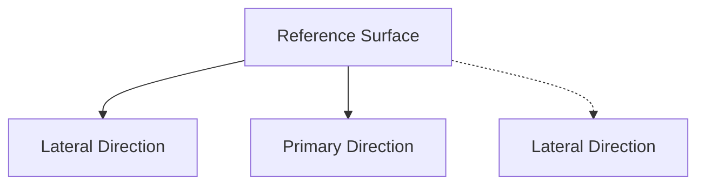

<!-- page:1 -->
# Sentaurus™ Mesh User Guide

Version O-2018.06, June 2018

# Copyright and Proprietary Information Notice

<!-- page:2 -->
© 2018 Synopsys, Inc. This Synopsys software and all associated documentation are proprietary to Synopsys, Inc. and may only be used pursuant to the terms and conditions of a written license agreement with Synopsys, Inc. All other use, reproduction, modification, or distribution of the Synopsys software or the associated documentation is strictly prohibited.

# Destination Control Statement

All technical data contained in this publication is subject to the export control laws of the United States of America. Disclosure to nationals of other countries contrary to United States law is prohibited. It is the reader’s responsibility to determine the applicable regulations and to comply with them.

# Disclaimer

SYNOPSYS, INC., AND ITS LICENSORS MAKE NO WARRANTY OF ANY KIND, EXPRESS OR IMPLIED, WITH REGARD TO THIS MATERIAL, INCLUDING, BUT NOT LIMITED TO, THE IMPLIED WARRANTIES OF MERCHANTABILITY AND FITNESS FOR A PARTICULAR PURPOSE.

# Trademarks

Synopsys and certain Synopsys product names are trademarks of Synopsys, as set forth at https://www.synopsys.com/company/legal/trademarks-brands.html.

All other product or company names may be trademarks of their respective owners.

# Third-Party Links

Any links to third-party websites included in this document are for your convenience only. Synopsys does not endorse and is not responsible for such websites and their practices, including privacy practices, availability, and content.

Synopsys, Inc.

690 E. Middlefield Road

Mountain View, CA 94043

www.synopsys.com

<!-- page:3 -->
# About This Guide vii

Related Publications . . . vii

Conventions . vii

Customer Support . . . . vii

Accessing SolvNet. . . viii

Contacting Synopsys Support . . . viii

Contacting Your Local TCAD Support Team Directly. . . . viii

# Chapter 1 Introduction to Sentaurus Mesh 1

Overview. .

Applications of Different Mesh Generators . . .

Starting Sentaurus Mesh . . .

Command-Line Options . . .

References . .

# Chapter 2 Command File 5

Overview. .

IOControls Section . . .

Definitions Section . .

Defining Refinement Regions . . .

Defining Multibox Regions . . . .

Defining Constant Profiles. . . . 12

Defining Analytic Profiles . . . . 12

Specifying a Gaussian Function . . . . . 14

Specifying an Error Function . . . . 14

Specifying a 1D External Profile . . . . 14

Using the General Function Evaluator . . . . . 15

Defining Submeshes . . . 17

Defining Particle Profiles. . . . 17

Placements Section . . . . 19

Geometric Elements. . . . . 20

Placing Refinement Regions . . . . 22

Placing Multibox Regions . . . . . 23

Placing Constant Profiles. . . . 24

Placing Analytic Profiles . . . . 25

Placing Submeshes . . . . 27

<!-- page:4 -->
Placing Particle Profiles. . . . 28

Interpolate Section . 29

AxisAligned Section . . . . 30

Offsetting Section . . . . 38

Delaunizer Section . . . 40

Delaunay Tolerance . . . . . 44

Tensor Section. . . . 45

Mesh Subsection for Controlling Mesh Generation . 45

EMW Subsection for Computing Cell Size Automatically . . . . . 49

Box Subsection for Plotting . . . . 53

Tools Section. . . . 54

Appending the Input Structure. . . . 55

Creating Profiles . . . . 55

Setting a Transformation . . . 56

Removing Short Features. . . . 56

Rediscretizing the Boundary Using the DelPSC Algorithm . . . . 57

Rediscretizing the Boundary Using the Dual-Contouring Algorithm . . . . . 57

Interpolating a Source Mesh to a Destination Mesh . . . . 58

Performing a 2D Slice of 3D Mesh or Boundary . . . . 59

Cutting a Mesh With a Plane . . . . 60

Reflecting a Mesh . . 60

Extruding a Mesh. . . . 61

Stretching a Mesh . . . 62

Placing Individual Dopant of Species . . . . 62

Extracting a Boundary From a Mesh. . . . 63

Converting a Tetrahedral Mesh to a Hybrid Mesh . . . . 63

Specifying Algorithm for Smoothing Noise . . . . 64

Creating Structures With Randomized Doping Profiles . . . . . 64

Adding or Removing Interfaces From a Mesh . . . 68

QualityReport Section . . . . . . 68

References. . . 71

# Chapter 3 Doping and Refinement Examples 73

Command File for a Simple Diode . . . . 73

Refinement and Evaluation Windows. . . 74

Using Refinement Polygons . . . . . 74

Using Composite Elements . . . 76

Regionwise and Materialwise Refinement . . . 77

Using Analytic Functions for Doping Specification. . . . . 78

Creating 3D Profiles From 2D Cross Sections . . . . 79

Using Particle Profiles to Specify Doping . . . . . 81

<!-- page:5 -->
Generating 2D Mesh With Continuous Doping Obtained From 3D KMC File Containing Particle Information . 84

Performing Interface Refinement . . 85

Ignoring Interfaces Between Regions of the Same Material . . . . . 86

Offsetting Mesh Generation . . . . 87

Simple Example. . . . 87

Layering From All Boundaries . . . . 90

Localizing the Refinement Using Cuts . . . . . 91

Using Analytic Functions for Refinement I . . . 94

Using Analytic Functions for Refinement II. . . 95

# Chapter 4 Tensor-Product Examples 97

Simple Cube . . . . 97

Using Boundary and Command Files to Generate Doping and Refinement . . . . . 99

Thin Regions . . . . 100

Computing Cell Size Automatically (EMW Applications) . . . . 101

# Chapter 5 Tools Section 103

Activating the Tools Section. . . . 103

Reflecting and Sweeping Mesh. . . . . . . 103

Slicing a 3D Mesh Using a Plane and Its Location. . . . . 105

Cutting a 3D Mesh . . . 106

Converting a Tetrahedral Mesh to a Hybrid Mesh . . . . . 107

Generating Randomized Doping From Continuous Doping. . . . . 108

Slicing a 3D Mesh Using a Segment and a Direction. . . . 110

Creating Profiles in an Existing Mesh . . . 1

Stretching a Mesh . . . . 112

# Chapter 6 Delaunization Algorithm 113

Overview. . . 113

Generating Ridges and Corners . . . . 114

Protecting Ridges and Corners . . . . 114

Conforming Delaunay Triangulation Algorithm . . . . 114

Optimizing Elements. . . . . 115

Eliminating Slivers . . . . 115

References . . . 115

# Appendix A Formulas for Analytic Profiles 117

<!-- page:6 -->
General Concepts . . . 117

Local Coordinate Systems, Valid Domains, and Reference Regions . . . . 117

One-Dimensional Profiles . . . . 118

Two-Dimensional Profiles . . . . 118

Three-Dimensional Profiles . . . . 119

General Implantation Models . . 119

Gaussian Function . 120

Error Function. . . . . 120

Other Relevant Parameters . 121

Dose . . . . 121

Values at the Junction. . . . 122

Length . . . . . . 122

Available Models Along the Primary Direction . . . 122

Gaussian Functions . . . 123

Error Functions . . . 124

Constant Functions . 125

1D External Profiles. . . . 125

Lateral or Decay Functions . . . . 125

Lateral Gaussian Function . . . . 126

Lateral Error Function . . 126

No Lateral Function . . . 128

# Appendix B Doping Function for Discrete Dopants 129

Doping Function . . . . 129

Cut-off Parameter . . . 130

References . . . . 131

<!-- page:7 -->
The Synopsys Sentaurus™ Mesh tool is a mesh generator that incorporates different mesh generation engines: an axis-aligned mesh generator, an offsetting mesh generator, and a tensorproduct mesh generator that produces rectangular or hexahedral elements. Sentaurus Mesh is designed to be used in a wide range of simulators, including the Synopsys TCAD products Sentaurus Device, Sentaurus Process, Sentaurus Device Electromagnetic Wave Solver, and Sentaurus Interconnect. Local mesh refinement is performed using the doping and refinement information in the mesh command file.

# Related Publications

For additional information, see:

The TCAD Sentaurus release notes, available on the Synopsys SolvNet® support site (see Accessing SolvNet on page viii).   
■ Documentation available on SolvNet at https://solvnet.synopsys.com/DocsOnWeb.

# Conventions

The following conventions are used in Synopsys documentation.

<table><tr><td>Convention</td><td>Description</td></tr><tr><td>Blue text</td><td>Identifies a cross-reference (only on the screen).</td></tr><tr><td>Bold text</td><td>Identifies a selectable icon, button, menu, or tab. It also indicates the name of a field or an option.</td></tr><tr><td>Courier font</td><td>Identifies text that is displayed on the screen or that the user must type. It identifies the names of files, directories, paths, parameters, keywords, and variables.</td></tr><tr><td>Italicized text</td><td>Used for emphasis, the titles of books and journals, and non-English words. It also identifies components of an equation or a formula, a placeholder, or an identifier.</td></tr></table>

# Customer Support

Customer support is available through the Synopsys SolvNet customer support website and by contacting the Synopsys support center.

<!-- page:8 -->
# Accessing SolvNet

The SolvNet support site includes an electronic knowledge base of technical articles and answers to frequently asked questions about Synopsys tools. The site also gives you access to a wide range of Synopsys online services, which include downloading software, viewing documentation, and entering a call to the Support Center.

To access the SolvNet site:

1. Go to the web page at https://solvnet.synopsys.com.   
2. If prompted, enter your user name and password. (If you do not have a Synopsys user name and password, follow the instructions to register.)

If you need help using the site, click Help on the menu bar.

# Contacting Synopsys Support

If you have problems, questions, or suggestions, you can contact Synopsys support in the following ways:

Go to the Synopsys Global Support Centers site on synopsys.com. There you can find email addresses and telephone numbers for Synopsys support centers throughout the world.   
Go to either the Synopsys SolvNet site or the Synopsys Global Support Centers site and open a case online (Synopsys user name and password required).

# Contacting Your Local TCAD Support Team Directly

Send an e-mail message to:

support-tcad-us@synopsys.com from within North America and South America   
support-tcad-eu@synopsys.com from within Europe   
support-tcad-ap@synopsys.com from within Asia Pacific (China, Taiwan, Singapore, Malaysia, India, Australia)   
support-tcad-kr@synopsys.com from Korea   
support-tcad-jp@synopsys.com from Japan

<!-- page:9 -->
This chapter describes how to start Sentaurus Mesh and provides a general explanation of its functionality.

# Overview

Sentaurus Mesh is a suite of tools that produce finite-element meshes for use in applications such as semiconductor device simulations, process simulations, and electromagnetic simulations. It has three mesh generation engines: an axis-aligned mesh generator, an offsetting mesh generator, and a tensor-product mesh generator. Sentaurus Mesh also provides a set of tools that perform operations on boundary representations and meshes.

The axis-aligned and offsetting mesh generators produce Delaunay meshes, which are suitable for use in Sentaurus Device and Sentaurus Process. In one dimension, the meshes contain segments only. In two dimensions, the meshes contain triangles only, while in three dimensions, the meshes comprise tetrahedra. For information about the algorithm used to generate Delaunay meshes, see Chapter 6 on page 113.

The offsetting mesh generator can produce layered meshes in two and three dimensions. The layers are located at the device interfaces and follow the contours of the interface. They can be combined with axis-aligned elements to produce high-quality meshes for nonplanar structures. As such, the offsetting mesh generator is a superset of the axis-aligned mesh generator, where layering takes precedence over axis-aligned mesh generation.

The tensor-product mesh generator is intended to generate meshes for Sentaurus Device Electromagnetic Wave Solver and for some applications in Sentaurus Device. The meshes contain rectangular elements in two dimensions and cuboid elements in three dimensions.

Sentaurus Mesh reads the input geometry from a boundary file stored in the TDR format with the \_bnd.tdr file extension. Some TDR files from Sentaurus Process and Sentaurus Interconnect with the \_fps.tdr and \_sis.tdr file extensions, respectively, contain two geometry objects: one for the volumetric data and one for the boundary representation. Sentaurus Mesh reads the boundary object in these TDR files, but it ignores other geometry objects.

See Sentaurus™ Data Explorer User Guide, Appendix B on page 117 for details about the TDR file structure.

<!-- page:10 -->
Impurity concentrations and user-required element sizes can be described using a mesh command file. The grid can be adapted to analytic profiles generated by Sentaurus Structure Editor or profiles generated by Sentaurus Process. (All references to concentrations in this document imply ‘active’ or ‘substitutional’ concentrations, since calculations in Sentaurus Device use concentrations in this form.)

The required point density is obtained by refining the elements in an anisotropic way. Therefore, unnecessary point propagation due to quadtrees, octrees, or tensor-product grid techniques is avoided.

A delaunization process allows Sentaurus Mesh to obtain high-quality conforming Delaunay grids, suitable for control volume discretization methods that are used in device simulation. For more information, refer to the literature [1][2][3][4][5].

The output of Sentaurus Mesh depends on the mesh generation engine used. The axis-aligned and offsetting mesh generators always produce a TDR unstructured mesh; the tensor-product mesh generator will select the type of mesh depending on the target application.

# Applications of Different Mesh Generators

The choice of which mesh generator to use for a particular application depends largely on the geometry of the device.

For devices where the most important surfaces are axis aligned, the recommendation is to use the axis-aligned mesh generator, since it produces the highest quality elements with minimal node count for such devices.

For devices where the main surfaces are nonaxis-aligned or curved (for example, a MOS-type structure where the channel is nonplanar), the recommendation is to use the offsetting mesh generator, since it produce meshes containing layers that better conform to the curved surfaces, thereby reducing the number of elements in the final mesh (see Offsetting Section on page 38).

For electromagnetic simulations using Sentaurus Device Electromagnetic Wave Solver, use the tensor-product mesh generator.

<!-- page:11 -->
# Starting Sentaurus Mesh

In Sentaurus Mesh, a mesh is created from two input files, namely, the boundary file and the command file. If the input project is called project\_name, a mesh can be created using the command:

snmesh [<options>] project\_name

Sentaurus Mesh automatically adds the extensions \_bnd.tdr and .cmd to the base name project\_name. Sentaurus Mesh creates the output file project\_name\_msh.tdr that contains mesh geometry information and doping information. Another file, project\_name\_msh.log, is created and is used as the log file for the mesh generation.

# Command-Line Options

The binary of Sentaurus Mesh is snmesh. It is executed using the syntax:

snmesh [<options>] <command\_file\_name>

Table 1 Command-line options available for Sentaurus Mesh 

<table><tr><td>Option</td><td>Description</td></tr><tr><td>-backcompat</td><td>Changes the behavior of the mesh generation and solid-modeling algorithms and variable defaults to those of a specified previous release. For example:-backcompat N-2017.09-SP1</td></tr><tr><td>-h</td><td>Displays help information.</td></tr><tr><td>-v</td><td>Displays version information only.</td></tr></table>

# References

[1] L. Villablanca, Mesh Generation Algorithms for Three-Dimensional Semiconductor Process Simulation, Series in Microelectronics, vol. 97, Konstanz, Germany: Hartung-Gorre, 2000.   
[2] P. Conti, M. Tomizawa, and A. Yoshii, “Generation of Oriented Three-Dimensional Delaunay Grids Suitable for the Control Volume Integration Method,” International Journal for Numerical Methods in Engineering, vol. 37, no. 19, pp. 3211–3227, 1994.   
[3] G. Garretón et al., “A New Approach for 2-D Mesh Generation for Complex Device Structures,” in International Workshop on Numerical Modeling of Processes and Devices for Integrated Circuits (NUPAD V), Honolulu, HI, USA, pp. 159–162, June 1994.

<!-- page:12 -->
# 1: Introduction to Sentaurus Mesh

References

[4] G. Garretón et al., “Unified Grid Generation and Adaptation for Device Simulation,” in Simulation of Semiconductor Devices and Processes (SISDEP), vol. 6, Erlangen, Germany, pp. 468–471, September 1995.   
[5] G. Heiser, Design and Implementation of a Three-Dimensional General Purpose Semiconductor Device Simulator, Series in Microelectronics, vol. 13, Konstanz, Germany: Hartung-Gorre, 1991.

<!-- page:13 -->
This chapter describes the sections of the command file of Sentaurus Mesh.

# Overview

In the command file (.cmd), you can specify different parameters for the generation of a mesh as follows:

Sections are delimited by opening and closing braces.   
Only one keyword must be specified per line.   
Keywords used in the command file are not case sensitive.   
■ Strings are enclosed in double quotation marks.   
Comments start with \* or #.

Different types of information can be given in the command file. You can specify refinement information, doping profile information, and control parameters for the different mesh generators and tools provided in Sentaurus Mesh.

Refinement information is required to control mesh generation according to user requirements (local element size). This information is specified in the Definitions section. Profile information is required to define the fields, for example, doping profiles, which are used in grid adaptation. Doping profiles can be specified with different types of information:

External simulation results   
Constant data   
Analytic formulas and predefined functions describing a profile

The command file has the following sections:

The command file can start with an optional title statement, which consists of the Title keyword followed by a string in double quotation marks. By default, Title "" is used.   
IOControls specifies an explicit input file containing the structure and an output file to which the generated mesh will be saved.   
Definitions defines the sets of refinement parameters and profile definitions to be used in the Placements section. These sets are referred to using their unique reference name.   
Placements defines instances of the definitions given in the Definitions section, placed with respect to the current device.

Interpolate controls data interpolation.   
AxisAligned controls the axis-aligned mesh generator.   
Offsetting controls the offsetting mesh generator.   
Delaunizer controls the behavior of the delaunizer in Sentaurus Mesh.   
Tensor controls the tensor-product mesh generator.   
Tools specifies additional meshing utilities available in Sentaurus Mesh.   
QualityReport specifies the mesh quality statistics to be reported and the limits for the mesh quality criteria.

The syntax of the command file is:   
```txt
Title ""
IOControls {input/output information}
Definitions {defining information}
Placements {placing information}
Interpolate {data interpolation information}
AxisAligned {axis alignment information}
Offsetting {offsetting information}
Delaunizer {delaunizer information}
Tensor {tensor information}
Tools {tools information}
QualityReport {mesh quality information} 
```

<!-- page:14 -->
The different sections of the command file of Sentaurus Mesh are described in the next sections.

# IOControls Section

The IOControls section is used to specify the names of input files describing the structure and the name of the output file with the generated result. The input and boundary files can contain either a boundary or a mesh in TDR format.

You can use the EnableOffset, EnableSections, EnableTensor, and EnableTools options to enable different algorithms based on the contents of the command file. The result after enabling unrelated sections in the command file is undefined.

The syntax of this section is:   
```txt
IOControls {
EnableEMW
EnableOffset
EnableSections
EnableTensor 
```

```hcl
EnableTools
inputFile = "string"
numThreads = integer
outputFile = "string"
useDFISEcoordinates
useUCScoordinates
verbosity = 0 | 1 | 2 | 3
} 
```

<!-- page:15 -->
where (default values are given in parentheses if applicable):

EnableEMW

Generates meshes suitable for Sentaurus Device Electromagnetic Wave Solver (EMW) applications using the tensor-product mesh generator (see EMW Subsection for Computing Cell Size Automatically on page 49).

EnableOffset

Enables the Offsetting section of the command file and the offsetting mesh generator (see Offsetting Section on page 38).

EnableSections

Parses the command file and activates the mesh generators associated with the sections present in the command file. If the command file contains the AxisAligned, Tools, Tensor, or Offsetting sections, the EnableSections option activates automatically the corresponding mesh generators.

EnableTensor

Enables the tensor-product mesh generator (see Tensor Section on page 45).

EnableTools

Enables the operations that can be specified in the Tools section (see Tools Section on page 54).

inputFile

The name of the default input file is based on the name of the command file. If an input file is specified, it is used as the input file instead of the default input file based on the name of the command file.

numThreads (1)

Sets the number of threads to be used by the mesh generators (axis-aligned, offsetting, and tensor-product).

<!-- page:16 -->
outputFile

Specifies the name of the output file.

useDFISEcoordinates

Converts all coordinates to the DF–ISE coordinate system (except the coordinates from the command file).

useUCScoordinates

Uses the unified coordinate system (UCS). With the exception of the command file, the coordinates from all files read by Sentaurus Mesh are converted to the UCS.

verbosity

Sets the verbosity level of the output messages. At level 0, only basic messages are displayed. At level 3, all messages are displayed.

# Definitions Section

The Definitions section is composed of sets of refinement and profile subsections. Each subsection consists of a reference name, an opening brace, the specification of parameters, and a closing brace.

The order of definitions in the Definitions section is not important since these definitions are used as references in the Placements section.

The syntax of this section is:

```tcl
Definitions {
Refinement "reference name" {parameters}
Multibox "reference name" {parameters}
Constant "reference name" {parameters}
AnalyticalProfile "reference name" {parameters}
SubMesh "reference name" {parameters}
Particle "reference name" {parameters}
...
} 
```

<!-- page:17 -->
# Defining Refinement Regions

The syntax to define a refinement region is:

```txt
Refinement "reference name" {
    MaxElementSize = value | vector
    MinElementSize = value | vector
    RefineFunction = MaxGradient(parameters) | MaxTransDifference(parameters) |
    MaxInterval(parameters) | MaxLengthInterface(parameters)
} 
```

where (default values are given in parentheses if applicable):

MaxElementSize (1)

Controls the maximum size of the grid elements (you also can use its abbreviation MaxElemSize). A real number or a vector $\vec { \boldsymbol { x } } = [ x _ { 1 } , . . . , x _ { d } ]$ can be specified, where isd the dimension and $x _ { d }$ represents the maximum edge lengths along the coordinate axes. A vector can be used to refine nonisotropically. Only values greater than zero are considered.

MinElementSize (0.02)

Controls the minimum size of the grid elements (you also can use its abbreviation MinElemSize). A real number or a vector $\vec { \boldsymbol { x } } = [ x _ { 1 } , . . . , x _ { d } ]$ can be specified, where $x _ { d }$ represents the minimum edge lengths along the coordinate axes. Grid elements can be refined in one direction if their edge length in that direction is greater than the specified value. Only values greater than zero are considered.

RefineFunction (MaxTransDifference)

Different functions can be used to select grid elements for refinement:

MaxGradient (or use its abbreviation MaxGrad): The gradient of a profile (Variable) in the element is evaluated. If the gradient is greater than Value and the edge lengths are large enough, the element is refined. The syntax is:

```txt
RefineFunction = MaxGradient(Variable = "Dataset name", Value = value | vector | tensor) 
```

MaxTransDifference (or use its abbreviation MaxTransDiff): The maximum difference of the transformed values of a profile at the vertices of the element is evaluated. If the difference is greater than Value and the edge lengths are large enough, the element is refined. The syntax is:

```txt
RefineFunction = MaxTransDifference(Variable = "Dataset name", Value = value | vector | tensor) 
```

<!-- page:18 -->
The transformation applied to the values used in the refinement functions (linear, logarithmic, arsinh) is defined in the datexcodes.txt file for each Variable (see Utilities User Guide, Variables on page 2).

RefineFunction can be repeated for different variables in the same Refinement section. If Variable is not defined, the default is "DopingConcentration". If Value is not specified, it defaults to 1; however, no RefineFunction is assigned by default.

Variable defines the dataset used to adapt the grid. The grid can be adapted according to species or any type of variable defined in the output file. The values are computed from the analytic formulas, constant data, and external simulation results defined in the command file. Therefore, the name of a variable must match the name of a variable stored in the output file. The variable name must be enclosed in double quotation marks.

The parameter Value can be used to refine scalar, vector, or tensor variables.

To refine on a vector variable, use a vector of values, one per direction. For example, in two dimensions, you can refine on ElectricField as follows:

```lua
RefineFunction = MaxTransDiff(Variable = "ElectricField", Value = (100, 100)) 
```

To refine on a tensor variable, use an array of 9 elements where each component is represented like this: (xx xy xz yx yy yz zx zy zz). Alternatively, if the tensor field has symmetric components, you can use a 6-element array like this: {xx xy yy yz zx zz}. For example, you can refine on Stress as follows:

```lua
RefineFunction = MaxTransDiff(Variable = "Stress", Value = (1e10 2e10 1e10 1e8 1e10 1e10 2e10 1e10 1e8)) 
```

The refinement is applied independently to each component of the vectors and tensors.

MaxInterval: This function analyzes each edge in a refinement tree cell and refines the edge if the data values at the endpoints overlap a given interval and the edge is longer than the maximum edge length defined on the interval. The syntax is:

```txt
RefineFunction = MaxInterval(Variable = "Dataset name", cmin = value | vector | tensor, cmax = value | vector | tensor, targetLength = value, scaling = value, rolloff) 
```

If the values at the edge endpoints overlap the range given by cmin and cmax, the algorithm checks only whether the edge length is shorter than the targetLength value. If this happens, the edge will be split.

When the edge is outside the value range, and the rolloff variable is true, the tool adjusts targetLength to have a smooth transition into the coarser areas. To do this, the tool applies the following formula:

```txt
targetLengthOutside = targetLength*(1 + log(Ca) - log(Cb))^2 * scaling 
```

<!-- page:19 -->
where Ca and Cb are the variable values at the endpoints of the edge.

MaxLengthInterface (or use its abbreviation MaxLenInt): This function produces refinement at the interfaces. The syntax is:

```txt
RefineFunction =MaxLengthInterface(Interface("Material1", "Material2"), Value = value, Factor = value, DoubleSide, UseRegionNames) 
```

RefineFunction can be repeated for different interfaces in the same Refinement section.

The material specified in the Interface statement must be a valid DATEX material. The first material indicates the side of the interface on which the refinement is performed. To apply the refinement to both sides of the interface, specify the DoubleSide option.

By default, interfaces are defined by a pair of materials. However, if the option UseRegionNames is used, the interface is interpreted as a regionwise specification.

The material "All" can be used to specify all interfaces of a given material and an empty string can be used to specify outer interfaces. In addition, the second argument in an interface specification can be a contact indicated by either the string "Contact" or the name of the contact (if UseRegionNames is specified).

If Interface is not defined, no interface will be refined. If Value is not specified, it defaults to 1. The Factor parameter must be a number greater than or equal to 1. If Factor is not defined, it defaults to a huge number, so only one layer is produced.

# Defining Multibox Regions

NOTE Using the Multibox subsection is no longer recommended. Instead, use interface refinement with MaxLengthInterface (see Performing Interface Refinement on page 85).

A multibox is a special refinement box that specifies a graded refinement along the x-, y-, or z-direction. You can specify the required minimum and maximum element sizes, and an additional refinement ratio in all directions. The created mesh is graded using the specified ratios (also observing the minimum and maximum element sizes). The syntax to define a multibox refinement region is:

```hcl
Multibox "reference name" {
    MaxElementSize = value | vector
    MinElementSize = value | vector
    Ratio = (ratio_width, ratio_height, ratio_depth)
} 
```

<!-- page:20 -->
# where:

MaxElementSize and MinElementSize are the same as described in Defining Refinement Regions on page 9.   
Ratio controls the grading of the element sizes:   
ratio\_width is the grading factor in the x-direction.   
ratio\_height is the grading factor in the y-direction.   
ratio\_depth is the grading factor in the z-direction (3D only).

# Defining Constant Profiles

The syntax to define a constant profile is:

```hcl
Constant "reference name" {
    Species = "string"
    Value = value
} 
```

where:

Species

Specifies the species or variables for the constant profile.

Value

Specifies the value of the constant profile.

# Defining Analytic Profiles

Profiles can be defined using simple analytic expressions, which have two components. The first component Function represents the values along a direction defined as the normal direction of the ReferenceElement. This is the primary direction. These values are smoothed along the direction perpendicular to the normal, or lateral direction, using the second component LateralFunction.

These expressions can be of the following types:

■ Predefined functions: Gaussian and error function   
One-dimensional external profile   
Your own function (using the general function evaluator)

<!-- page:21 -->
The formulas used for these analytic profiles are described in Appendix A on page 117.

The syntax to define an analytic profile is (instead of AnalyticalProfile, you can use its abbreviation AnaProf):

```txt
AnalyticalProfile "reference name" {
    Species = "string"
    Function = Gauss(primary parameters) | Erf(primary parameters) |
    subMesh1D(primary parameters) |
    Eval(primary parameters) | General(primary parameters)
    LateralFunction = Gauss(lateral parameters) | Erf(lateral parameters) |
    Eval(lateral parameters)
} 
```

where:

Species

Specifies the species for the analytic profile.

Function

Indicates the type of function and the parameters used along the primary direction, the direction normal to the ReferenceElement.

LateralFunction

Defines the lateral component of the analytic profile (you also can use its abbreviation LatFunc). A Gaussian function, an error function, or a general analytic function can be specified using the following lateral parameters:

```txt
LateralFunction = Gauss(Factor = value)
LateralFunction = Gauss(StandardDeviation = value)
LateralFunction = Gauss(Length = value)
LatFunc = Erf(Factor = value)
LatFunc = Erf(Length = value)
LatFunc = Eval(init = "..." function = "..."") 
```

NOTE The default LateralFunction is the error function Erf.

If you use General to specify the analytic profile, there is no separate LateralFunction since the definition of the analytic profile using General includes both the primary and the lateral directions in its formulation.

<!-- page:22 -->
# Specifying a Gaussian Function

A Gaussian function can be specified with the following primary parameters:

```txt
Function = Gauss(PeakPosition = value, PeakValue = value, StandardDeviation = value)
Function = Gauss(PeakPosition = value, Dose = value, StdDev = value)
Function = Gauss(PeakPosition = value, PeakValue = value, Length = value)
Function = Gauss(PeakPosition = value, Dose = value, Length = value)
Function = Gauss(PeakPosition = value, PeakValue = value, ValueAtDepth = value, Depth = value)
Function = Gauss(PeakPos = value, Dose = value, ValAtDepth = value, Depth = value) 
```

By default, PeakPosition=0. There are no default values for the other parameters.

If Function=Gauss, Factor=0.8 in LateralFunction by default.

Some parameters have abbreviations (provided in parentheses) you can use, including: StandardDeviation (StdDev), PeakPosition (PeakPos), PeakValue (PeakVal), and ValueAtDepth (ValAtDepth).

# Specifying an Error Function

An error function can be specified with the following primary parameters:

```txt
Function = Erf(SymmetryPosition = value, MaxValue = value, Length = value)
Function = Erf(SymmetryPosition = value, Dose = value, Length = value)
Function = Erf(SymPos = value, MaxVal = value, ValAtDepth = value,
    Depth = value)
Function = Erf(SymPos = value, Dose = value, ValAtDepth = value,
    Depth = value) 
```

By default, SymmetryPosition=0.

If Function=Erf, Factor=0.8 in LateralFunction by default.

Some parameters have abbreviations (provided in parentheses) you can use, including: SymmetryPosition (SymPos) and MaxValue (MaxVal).

# Specifying a 1D External Profile

To specify a 1D external profile, the syntax is:

```lua
Function = subMesh1D(Datafile = "string", DataScale = value, Scale = value, Range = line [(x1), (x2)]) 
```

<!-- page:23 -->
The Datafile parameter specifies a file in XGRAPH format, which consists of a title enclosed in double quotation marks and a list of "x y" values. More than one profile can be included in Datafile.

The DataScale parameter scales the data values contained in the data file. Each input value is multiplied by the DataScale factor. By default, DataScale=1.

The Scale parameter scales the coordinate values from the file. By default, Scale=1.

The optional Range parameter selects a range of values from the file. The keywords x1 and x2 must be given in the file coordinate system. Range is applied to all profiles inside the file. By default, the entire data range is selected.

If Function=subMesh1D, StandardDeviation=0.8 in LateralFunction by default.

# Using the General Function Evaluator

The general function evaluator can be used in either of two ways:

Using Eval: A user-specified analytic function in the primary direction (normal to the reference window) and a separate decay function (Gaussian, error function, or a userdefined function with Eval) in the lateral direction. The syntax is:

```hcl
AnalyticalProfile "reference name" {
Function = Eval(init = "string", function = "string", value = value)
LateralFunction = Eval(init = "string", function = "string")
} 
```

Using General: A user-defined function specified directly in device coordinates. There is no concept of primary and lateral directions because the General function is specified directly as a function of the x-, y-, and z-direction. The syntax is:

```hcl
AnalyticalProfile "reference name" {
Function = General(init = "string", function = "string", value = value)
} 
```

NOTE General does not require LateralFunction since the General function is evaluated directly in all device coordinates.

Both the Eval and General functions use the same syntax for the primary parameters. The difference is that General uses spatial coordinates and Eval uses coordinates that are measured in the primary or lateral profile direction when used to define the primary or lateral profile, respectively.

<!-- page:24 -->
The keywords init, function, and value correspond to the initialization formula, the evaluation formula, and the default value (in the case of a failed formula evaluation at a data point) (for the use of General functions, see Using Analytic Functions for Refinement I on page 94):

init

Specifies a semicolon-separated list of assignments for variables that are used later, for example, init = "a=2;b=4". This string is evaluated only once.

function

Specifies an expression that is evaluated for every query. The variable that replaces the primary or lateral distance must be called x, for example:

```txt
function = "sin(x)"
function = "exp(4*x)*sin(x)" 
```

In general, 1D, 2D, and 3D simple analytic functions can be specified here. The variables x, y, and z can be used to refer to the respective x-, y-, and z-spatial coordinates.

value

Specifies the default return value if the evaluation fails. The default is 1.0e18 for the primary direction and 1 when used as LateralFunction.

# Note that:

■ All defined variables are global variables. This means that, if init="a=1" is defined in one function, the same value will be used in all functions. Resetting the variable value in another function command will have no effect.   
You can freely mix Eval with Gauss, Erf, and subMesh1D functions.   
The symbols "pi" and "e" can be used in the expressions.   
The functions that can be used are:

```javascript
"sin", "cos", "tan", "asin", "acos", "atan", "sinh", "cosh", "tanh", "exp", "log", "log10", "sqrt", "floor", "ceil", "abs", "hypot", "deg", "rad" 
```

■ Numeric exponential constants can be specified as either "2\*10^18" or "2e18".

As an extension to the Eval function, the General function assesses device coordinates directly, (x, y) and (x, y, z), and does not use primary and lateral distances. Any lateral functions and reference geometries (in the Placements section) are ignored.

<!-- page:25 -->
# Defining Submeshes

External simulation results given on a mesh can be used to define profiles in the device. The external mesh must have the same spatial dimension as the device. The datasets defined on the external mesh are interpolated to the newly generated mesh. The external profiles are called submeshes.

The syntax to define a submesh is:   
```hcl
SubMesh "reference name" {
    Geofile = "string"
    ...
    Fields = "string", "string", ...
} 
```

where:

Geofile

Specifies the name of a file with an external mesh. The file must be in TDR format. The dimension of the external mesh must be the same as the dimension of the device.

NOTE Sentaurus Mesh uses a simplified version of the submesh syntax where only the Geofile parameter must be specified.

Fields

Specifies a list of fields to be extracted from the submesh. The other fields are ignored and are not used in the calculations or written to the output file.

# Defining Particle Profiles

Particle definitions can be used to define profiles associated with discrete dopant distributions obtained from kinetic Monte Carlo (KMC) simulations using Sentaurus Process Kinetic Monte Carlo (Sentaurus Process KMC). A continuous profile is obtained from the discrete dopant distribution by associating a doping function with each discrete dopant (see Appendix B on page 129).

The syntax to define a particle profile is:   
```hcl
Particle "reference name" {
    AutoScreeningFactor
    BoundaryExtension = value
    Divisions = value
    DopingAssignment = "CIC" | "NGP" | "Sano"
} 
```

```lua
Normalization
NumberOfThreads = integer
ParticleFile = "string"
ScreeningFactor = value
ScreeningScalingFactor = value
Species = "string"
} 
```

<!-- page:26 -->
where (default values are given in parentheses if applicable):

# AutoScreeningFactor

If this option is specified, Sentaurus Mesh calculates automatically a screening factor for each discrete dopant based on the local density of dopants using $k _ { c } = 2 N ( x _ { 0 } , y _ { 0 } , z _ { 0 } ) ^ { 1 / 3 }$ , where $N ( x _ { 0 } , y _ { 0 } , z _ { 0 } )$ is the density at the location of the discrete dopant.

Even when this option is specified, ScreeningFactor also must be specified because, when calculating the local density, the integration box size (in micrometers) is determined using .( ) 4.4934/ScreeningFactor 104×

# BoundaryExtension

This parameter applies to 2D structures only and is used to obtain continuous doping on a 2D structure from a 3D KMC TDR file containing particle information.

The value given in micrometers is a thickness that is used internally to create an imaginary 3D structure by extruding the input 2D structure. This 3D structure is used to compute doping information, and this information is transferred to the 2D mesh.

# Divisions (10)

This parameter applies to 2D structures only and is used in conjunction with the BoundaryExtension parameter. For each mesh point in a 2D structure, a number of points equal to a number of divisions, each separated by an equal amount, is created in the z-direction. The amount of separation is obtained by dividing the boundary extension with the number of divisions. The doping is computed on all of these points, and an average doping is assigned for the corresponding 2D mesh point.

# DopingAssignment ("Sano")

The basic refinement method is the Sano method, but this parameter allows you to choose a method by which doping is assigned to a mesh immediately before saving the mesh:

• The cloud-in-cell ("CIC") method distributes the doping of a particle to the vertex nodes of the element in which the particle is located.   
• The nearest grid point ("NGP") method assigns the doping of a particle to the nearest mesh node.

<!-- page:27 -->
• The "Sano" method uses a doping function described in Appendix B on page 129 to distribute the doping of a particle to surrounding nodes.

# Normalization

Specifying this option compensates for doping loss of dopants located near the boundary.

# NumberOfThreads (1)

Parallelizes the local screening factor computation. Multithreading is recommended if the simulation contains thousands of particles.

# ParticleFile

Specifies the name of the KMC TDR file that contains the particle (discrete dopant) information.

# ScreeningFactor

This is the cut-off parameter, $k _ { c }$ , for the doping function associated with each discrete dopant (see Appendix B on page 129). The ScreeningFactor (given in units of )cm–1 can be used as a fitting parameter; however, a value for it can be estimated from $k _ { c } = 2 N ^ { 1 / 3 }$ , where is the impurity concentration.N

# ScreeningScalingFactor

Controls the degree of smoothness of the profile. It is applied to the screening factor when AutoScreeningFactor is specified.

# Species

Specifies the name of an active impurity concentration to associate with this definition, for example, ArsenicActiveConcentration and BoronActiveConcentration.

If Species is not specified, all active impurities that are found in the KMC particle file will be associated with this definition.

# Placements Section

The Placements section is composed of sets of refinement and profile instances. Their positions in the device must be specified, and they must reference a definition given in the Definitions section. In other words, each instance or subsection consists of the instance name, an opening brace, the specification of parameters, and a closing brace.

The order of the refinement regions in this section is important. The mesh generators select which refinement condition will be applied depending on the order of the refinement regions described in the Placements section.

The syntax of this section is:   
```txt
Placements {
Refinement "instance name" {parameters}
Multibox "instance name" {parameters}
Constant "instance name" {parameters}
AnalyticalProfile "instance name" {parameters}
SubMesh "instance name" {parameters}
Particle "instance name" {parameters}
...
} 
```

<!-- page:28 -->
NOTE The order of the profile instances in the Placements section is important only when the Replace option is used.

# Geometric Elements

To specify Placements sections, you must use geometric elements. These elements are geometric objects used to select or locate data, and they are not part of the grid elements. The coordinates of these objects are defined relative to the coordinates of the device.

The allowed geometric elements and the number of coordinate values that must be specified depend on the dimension of the device.n

Let $\vec { \mathbf { \Phi } } _ { x } ^ { \prime } = [ x _ { 1 } , . . . , x _ { d } ]$ denote a point. The following geometric elements are defined:

Point $( \stackrel { \triangledown } { x } _ { 1 } )$

Line $( \stackrel { \triangledown } { x } _ { 1 } , \stackrel { \triangledown } { x } _ { 2 } )$

Rectangle ( )x1, x2

Polygon ( ), x1, , … xm m > 2

Complex polygon ( lump1( ) polygon1( ) x1, , ... xm , , ... polygonp( ) x1, , ... xm

), lump1( ) po ly gon1( ) x1, , ... xm , , ... polygo np( ) x1, , ... xm m > 2

》 Cuboid ( )x1, x2

Polyhedron , { } polygon1( ) … x1, , … xm , , polygonp( ) x1, , … xm m > 2

Simple polygons are closed internally by adding the line segment between $\vec { \bf \Phi } _ { x _ { 1 } } ^ { \prime } = [ x _ { 1 } , . . . , x _ { d } ]$ and $\mathbf { \widehat { x } } _ { m } = [ { x } _ { 1 } , . . . , { x } _ { d } ]$ . Only simple closed polyhedra are allowed. All their faces must be described.

<!-- page:29 -->
Complex polygons are composed of lumps. Each lump represents a separate subpolygon, possibly containing holes. The first polygon inside a lump is the outer contour of the lump, while the subsequent polygons represent holes inside the lump.

The following is an example of the use of the complexPolygon element. The example represents two separate loops, the first of which has a hole inside:

```txt
AnalyticalProfile "buried n-channel" {
    Reference = "buried n-channel"
    ReferenceElement {
    Element = complexPolygon [
    lump [polygon [(1.0 0.0 2.0) (2.0 0.0 2.0) (2.0 1.0 2.0) (1.0 1.0 2.0)]
    polygon [(1.3 0.3 2.0) (1.6 0.3 2.0) (1.6 0.6 2.0) (1.3 0.6 2.0)]
    ]
    lump [polygon [(0.0 1.5 2.0) (0.5 1.5 2.0) (0.5 2.0 2.0) (0.0 2.0 2.0)]
    ]
    ]
    Direction = negative
    }
} 
```

NOTE All polygons defined inside a complexPolygon element must be coplanar.

To describe a polyhedron with arbitrarily oriented faces, use polygons instead of rectangles.

Table 2 lists the geometric elements that can be used to specify different kinds of window in each dimension.

Table 2 Geometric elements for specifying windows 

<table><tr><td>Function</td><td>1D</td><td>2D</td><td>3D</td></tr><tr><td>EvaluateWindow in Placements section for profiles</td><td>Line</td><td>Rectangle, Polygon</td><td>Cuboid, Polyhedron</td></tr><tr><td>ReferenceElement in Placements section for analytic profiles</td><td>Point</td><td>Line</td><td>Rectangle, Polygon</td></tr><tr><td>RefineWindow in Placements section for refinements</td><td>Line</td><td>Rectangle, Polygon</td><td>Cuboid, Polyhedron</td></tr></table>

<!-- page:30 -->
In addition to the above-defined geometric elements, Table 3 lists other non-geometric elements that can be used to specify windows in the command file.

Table 3 Non-geometric elements for specifying windows 

<table><tr><td>Element</td><td>Syntax</td></tr><tr><td>Material element</td><td>material []</td></tr><tr><td>Region element</td><td>region []</td></tr><tr><td>Composite element</td><td>element {}</td></tr><tr><td>Sweep element</td><td>sweepElement {}</td></tr></table>

Refinement or evaluation windows can be restricted to work on a particular material or region using the keyword material or region. For material, the argument is a valid DATEX material name in brackets. For region, the argument is a valid (existing) region name in brackets (see Regionwise and Materialwise Refinement on page 77).

In addition, elements can be combined to build more complex elements called composite elements, which are useful when defining complex reference elements for analytic profiles (see Using Composite Elements on page 76).

Sweep elements can be used to create 3D profiles by sweeping 2D profiles in 3D space. There are two types of sweep element: path sweep and angle sweep (see Creating 3D Profiles From 2D Cross Sections on page 79).

# Placing Refinement Regions

In the Placements section, a refinement instance is specified by a name, an opening brace, the specification of parameters, and a closing brace. Several refinement instances can refer to the same set of refinement parameters.

The syntax for a refinement instance is:

```txt
Refinement "instance name" {
    Reference = "string"
<!-- page:31 -->
    RefineWindow = geometric element | material [<list>] | region [<list>]
} 
```

where:

Reference

Specifies the reference to a previously defined refinement.

# RefineWindow

Defines the location of the refinement instance in the device. (Instead of RefineWindow, you can use its abbreviation RefineWin.) By default, RefineWindow is the bounding box of the device. Table 2 on page 21 lists the geometric elements that can be used. In addition, you can specify regionwise or materialwise refinement, or both refinements (see Regionwise and Materialwise Refinement on page 77).

You can specify RefineWindow multiple times in a Refinement section. When more than one RefineWindow is present, Sentaurus Mesh only refines the common sections of the refinement windows. This can be used to restrict the refinement to the part of a refinement box lying inside a region or material. For example:

```hcl
Refinement "Refinement along current flow under the oxide" {
    Reference = "Refinement along current flow only in Silicon"
    RefineWin = cuboid [ ( 4.4 0 1 ) , ( 7.6 1.8 3.5 ) ]
    RefineWin = material ["Silicon"]
} 
```

NOTE If no RefineWindow is specified, the refinement instance is used as the default region for the entire device.

# Placing Multibox Regions

In the Placements section, a multibox instance is specified by the keyword Multibox, followed by the name of the multibox window and an opening brace. After the specification of parameters, a closing brace is placed. Several multibox instances can refer to the same set of multibox parameters.

The syntax for a multibox instance is:

```hcl
Multibox "instance name" {
    Reference = "string"
    RefineWindow = geometric element
} 
```

where:

Reference

Specifies the reference to a previously defined multibox.

RefineWindow

Defines the location of the refinement instance in the device. Table 2 on page 21 lists the geometric elements that can be used. By default, RefineWindow is the bounding box of the device.

<!-- page:32 -->
NOTE If RefineWindow is not specified, the refinement instance is used as the default region for the entire device.

# Placing Constant Profiles

The syntax for constant profiles is:   
```hcl
Constant "instance name" {
    Reference = "string"
    EvaluateWindow {
    Element = geometric element | material [<list>] | region [<list>]
    DecayLength = value | GaussDecayLength = value
    }
    LocalReplace
    Replace
} 
```

where:

Reference

Specifies the reference constant to use. Only references to constant profiles are allowed.

EvaluateWindow

Defines the domain where the profile is evaluated and a decay length is applied in the vicinity of the window boundaries. The domain can be specified using a geometric element (see Table 2 on page 21), as well as by referring to materials or regions. (Instead of EvaluateWindow, you can use its abbreviation EvalWin.)

The decay function reduces round-off errors. It can be either an error function or a Gaussian function. To use an error function, specify DecayLength (or you can use its abbreviation DecayLen). For a Gaussian decay function, specify GaussDecayLength.

If EvaluateWindow is not defined, the transition between profiles is abrupt. If DecayLength=0, no decay function is applied and the transition between EvaluateWindow and its vicinity is abrupt. If DecayLength is negative, the profile is not applied to points on the border of Element. By default, DecayLength=0 for all the profiles.

For analytic, constant, and particle profiles, the default value of Element is the bounding box of the device. For submeshes, the default value of Element is the bounding box of the submesh. See the equations in Appendix A on page 117 for details.

<!-- page:33 -->
NOTE Avoid using EvaluateWindow when the profile is valid in the entire device and no decay function is required. The evaluation of a geometric element is time consuming.

The DecayLength and GaussDecayLength parameters do not apply to particle profiles.

# LocalReplace

With the Replace option, all the computed species are set to zero and are set with the value corresponding to the given profile instance. With the LocalReplace option, only species defined in the corresponding Definitions section are set exclusively to zero and are recomputed using the current profile instance. The other species are not updated. Accordingly, the net doping contribution is updated. By default, LocalReplace is switched off.

# Replace

In general, the values for each profile at each point of the newly generated mesh are computed as the sum of all profile instances defined in the Placements section. The instances are inspected in the same order as they are defined in the command file. If Replace is specified for a given instance, all current summed values are replaced by the value corresponding to the given profile instance. By default, Replace is switched off.

# Placing Analytic Profiles

The syntax for an analytic profile is:

```txt
AnalyticalProfile "instance name" {
    Reference = "string"
    ReferenceElement {
    Element = element
    Direction = positive | negative
    }
    EvaluateWindow {
    Element = geometric element | material [<list>] | region [<list>]
    DecayLength = value | GaussDecayLength = value
    }
    LocalReplace
    NotEvalLine
    Replace
} 
```

<!-- page:34 -->
where:

Reference

Specifies the analytic profile to use. Only references to analytic profiles are allowed.

ReferenceElement

The direction of the normal to the ReferenceElement defines the direction of the analytic profile (instead of ReferenceElement, you can use its abbreviation RefElem). When evaluating the function values, the mesh points of the newly generated mesh are projected to the Element. The distance in the normal direction is used to evaluate the Function. The distance of the projection to the boundary of Element is used to compute the LateralFunction. By default, values are computed on both sides of the Element. If Direction is specified, function values are computed only on the positive or negative side of the Element.

In 1D devices, Element is a point, and the positive and negative directions are given by the coordinate axis. In 2D devices, Element is a line and the positive direction is taken to the right of the line.

In 3D devices, Element can be either a rectangle or polygon. The normal for a rectangle must be one of the coordinate axes. The positive and negative directions are defined from this axis. A (planar) polygon can be arbitrarily oriented in three dimensions. The direction is defined by the order of the points defining the polygon. A polygon is considered correctly oriented if the side of the polygon, which is surrounded by points in a positive orientation, defines the positive direction. There is no default value for Element and Direction.

EvaluateWindow

Restricts the placement of the analytic profile to a particular window, material, or region. See description in Placing Constant Profiles on page 24.

LocalReplace

See description in Placing Constant Profiles on page 24.

NotEvalLine

If this option is specified, the profile is not evaluated at the location of the reference element. This can be useful for placing two identical analytic profiles back-to-back using opposite directions, but without evaluating the reference element twice.

Replace

See description in Placing Constant Profiles on page 24.

<!-- page:35 -->
# Placing Submeshes

The syntax for references to submeshes in the Placements section is:   
```hcl
SubMesh "instance name" {
    Reference = "string"
    Reflect = X | Y | Z
    Rotation {
    Angle = value
    Axis = value
    }
<!-- page:36 -->
    ShiftVector = vector
    EvaluateWindow {
    Element = geometric element | material [<list>] | region [<list>]
    DecayLength = value | GaussDecayLength = value
    }
    Ignoremat
    LocalReplace
    MatchMaterialType
    Replace
} 
```

where:

Reference

Specifies the reference submesh to use. Only references to profiles that are defined as SubMesh are allowed.

Reflect

Specifies a reflection perpendicular to the specified coordinate axis. The allowed axes depend on the dimension of the device. The reflection point (or line or plane) is placed at the specified coordinate axis.

Rotation

Performs a counterclockwise rotation around the axis. The center of the rotation is the origin of the coordinate system. By default, Angle=0. By default, Axis=Z (for two and three dimensions). In one dimension, Rotation is not supported.

NOTE The ShiftVector, Reflect, and Rotation operations are performed in the order they appear in the command file. The final location and orientation of the submesh depends on this order.

# ShiftVector

Translates a submesh to a new location. The vector is specified as two or three coordinates enclosed by parentheses.

# EvaluateWindow

Restricts the placement of the submesh to a particular window, material, or region. See description in Placing Constant Profiles on page 24.

# Ignoremat

If this option is specified, the material in submeshes is ignored. The standard behavior of submesh interpolation is that the interpolated value is only accepted if the point is in a region with the same material.

The option Ignoremat allows Sentaurus Mesh to always accept the interpolation. (By default, if the materials do not match, the closest region with the correct material is searched.) The default behavior is not checked. For example:

```hcl
Placements {
SubMesh "NoName_0" {
Reference = "NoName_0"
Ignoremat
}
} 
```

# LocalReplace

See description in Placing Constant Profiles on page 24.

# MatchMaterialType

When this option is specified, the submesh attempts to match equivalent material types (for example, semiconductor, insulator, conductor) instead of trying to match material names when looking up values from which to interpolate.

# Replace

See description in Placing Constant Profiles on page 24.

# Placing Particle Profiles

The syntax for placing particle profiles in the Placements section is:

```hcl
Particle "instance name" {
    Reference = "string"
    EvaluateWindow {
    Element = material [<list>] | region [<list>]
} 
```

```txt
}
LocalReplace
Replace
}

where:

Reference
    Specifies the reference particle to use. Only references to particle profiles are allowed.
EvaluateWindow
    See description in Placing Constant Profiles on page 24.
LocalReplace
    See description in Placing Constant Profiles on page 24.
Replace
    See description in Placing Constant Profiles on page 24. 
```

<!-- page:37 -->
# Interpolate Section

The optional Interpolate section controls data interpolation that is performed after the mesh generators have finished.

The syntax of this section is:

```hcl
Interpolate {
    interpolateElements = true | false
    keepTotalConcentration = true | false
    lateralDiffusion = true | false
} 
```

where (default values are given in parentheses if applicable):

interpolateElements (false)

Interpolates element-type (scalar and vector) datasets. The element-type datasets of the input submesh are interpolated on the generated grid. The default value ignores elementtype datasets.

<!-- page:38 -->
keepTotalConcentration (false)

Saves the TotalConcentration field in the output file. By default, Sentaurus Mesh does not save this field in the output file. Sentaurus Device can calculate this field, if necessary, based on the available dopants.

lateralDiffusion (false)

Enables lateral extension on analytic profiles like that performed by the Synopsys Taurus™ Medici tool. This parameter affects only profiles with rectangular reference elements and attenuates the lateral decay factor by taking into account the distance from the interpolated points to all sides of the rectangle (see Lateral Error Function on page 126).

# AxisAligned Section

The AxisAligned section controls the axis-aligned mesh generator in Sentaurus Mesh.

The axis-aligned mesh generator takes a boundary representation of the device and a series of user-defined refinement criteria, and follows these steps to create a mesh:

1. It attempts to repair the boundary using a combination of decimation and reconstruction algorithms. The algorithms are controlled by the geometricAccuracy parameter as well as parameters related to the Delaunay refinement for piecewise smooth complex (DelPSC) algorithm.   
2. It produces an initial coarse discretization of the bounding box of the structure by applying the xCuts, yCuts, and zCuts parameters. This creates an initial tensor-like structure that is used as the basis for the user-defined refinement.   
3. The basic mesh is refined using user-defined criteria described in Chapter 3 on page 73. Each box is bisected recursively until all resulting boxes meet the criteria specified by the user. During this process, the mesh generator ensures that criteria such as maxAngle, maxAspectRatio, and maxNeighborRatio are satisfied.   
4. After the boxes have been refined, they are imprinted on the boundary, producing a surface axis-aligned pattern. At this stage, short surface edges and poor angles are eliminated using a combination of boundary decimation and boundary repair algorithms.   
5. As the last step before delaunization, the boxes are merged with the boundary, ensuring that intersecting the boxes with the boundary does not produce an unbalanced mesh (that is, a short edge next to a long one). To control this, the algorithm uses the parameter maxBoundaryCutRatio.

The syntax of the AxisAligned section is:   
```txt
AxisAligned {
    allowRegionMismatch = true | false
    binaryTreeSplitBox = (floatlist)
    binaryTreeSplitFactorX = integer
    binaryTreeSplitFactorY = integer
    binaryTreeSplitFactorZ = integer
    convexTriangulation = true | false
    coplanarityAngle = float
    decimate = true | false
    DelPSC = true | false
    DelPSCAccuracy = float
    DelPSCRidgeAngle = float
    DelPSCRidgeSampling = float
    DualContouring = true | false
    DualContouringDecimation = true | false
    DualContouringMinAngle = float
    DualContouringMinDihedralAngle = float
    DualContouringResolution = float
    fitInterfaces = true | false
    geometricAccuracy = float
    hintBoxSize = float
    imprintAccuracy = float
    imprintCoplanarFacesOnly = true | false
    imprintCoplanarityAngle = float
    imprintCoplanarityDistance = float
    latticeCellSize = (float float float)
    latticeDimensions = (integer integer integer)
    maxAngle = float
    maxAspectRatio = float
    maxBoundaryCutRatio = float
    maxNeighborRatio = float
    minEdgeLength = float
    minimumRegionMismatchVolume = float
    overscan = true | false
    overscanResolution = float
    skipSameMaterialInterfaces = true | false
    smoothing = true | false
    spacingMethod = even | regular | smooth
    splitDisconnectedRegions = true | false
    virtualSpacing = true | false
    xCuts = (floatlist)
    yCuts = (floatlist)
    zCuts = (floatlist)
} 
```

<!-- page:40 -->
where (default values are given in parentheses if applicable):

allowRegionMismatch (false)

If allowRegionMismatch = true, when Sentaurus Mesh checks whether the number of regions in the input boundary and the number of regions at the end of the meshing process are the same, if there is a difference between the numbers of regions, Sentaurus Mesh will ignore the discrepancy, and the meshing process will continue.

If allowRegionMismatch = true and minimumRegionMismatchVolume has also been specified, Sentaurus Mesh checks the volumes of all deleted regions:

If the volume of a deleted region is less than the value specified by minimumRegionMismatchVolume, the meshing process will continue and the number of deleted regions is reported.   
• If the volume of a deleted region is greater than the value specified by minimumRegionMismatchVolume, the meshing process will stop.

If allowRegionMismatch = false, when Sentaurus Mesh checks whether the number of regions in the input boundary and the number of regions at the end of the meshing process are the same, if there is a difference between the numbers of regions, the meshing process will stop.

binaryTreeSplitBox

Specifies a box that defines the region where binaryTreeSplitFactorX, binaryTreeSplitFactorY, and binaryTreeSplitFactorZ are applied. By default, no box is used.

For 2D simulations, binaryTreeSplitBox is set to:

(xmin <float> ymin <float> xmax <float> ymax <float>)

For 3D simulations, binaryTreeSplitBox is set to:

(xmin <float> ymin <float> zmin <float> xmax <float> ymax <float> zmax <float>)

binaryTreeSplitFactorX (1)

Instructs Sentaurus Mesh to split the final binary tree used in the refinement step by a specified factor in the x-direction. This factor must be a power of 2; otherwise, the nearest power of 2 will be used. This parameter can be used to achieve an approximately uniform mesh refinement in the x-direction.

binaryTreeSplitFactorY (1)

Same as binaryTreeSplitFactorX but in the y-direction.

<!-- page:41 -->
binaryTreeSplitFactorZ (1)

Same as binaryTreeSplitFactorX but in the z-direction.

convexTriangulation (false)

Creates a minimum triangulation of a 3D model containing convex regions. The input 3D boundary must be a convex model. Since the goal is to create a minimum triangulation of the convex model, the refinement specifications in the command file (if any) are ignored. If the input model contains nonconvex regions, the meshing terminates with a corresponding message.

coplanarityAngle (175)

Specifies the angle used during boundary decimation to determine whether two faces are coplanar.

decimate (true)

Specifies whether the 3D boundary is decimated. The decimation process removes nodes from the surface, thereby generating a simpler structure. A node is removed only if the deformation caused by removing the node is less than the value specified by the geometricAccuracy parameter.

DelPSC (false)

Instructs Sentaurus Mesh to apply the DelPSC algorithm to boundary surfaces. It is useful for curved surfaces. If you specify IOControls{numThreads=integer}, the DelPSC algorithm uses multithreading. See [1][2] for a description of the algorithm.

DelPSCAccuracy (0.0001)

Controls the deviation (given in ) between the new curved surface and the originalμm curved surface in the DelPSC algorithm. The new curved surface can deviate from the original curved surface by, at most, the value of DelPSCAccuracy. New vertices lie exactly on the original surface, but new triangles cannot lie exactly on the original surface unless the original surface is flat. In general, the smaller the value of DelPSCAccuracy is, the smoother the new surface becomes, and the more accurate the new surface represents the original surface.

In general, setting DelPSCAccuracy to 2% of the radius of curvature is appropriate. Larger values allow the DelPSC algorithm to run faster but generate coarser discretization on curved surfaces. Smaller values make the DelPSC algorithm run slower and generate finer discretization on curved surfaces.

DelPSCRidgeAngle (150)

Angle used by the DelPSC algorithm to determine geometric features.

<!-- page:42 -->
DelPSCRidgeSampling (0.01)

Controls the size (given in ) of small triangles on curved surfaces in the DelPSCμm algorithm.

In general, setting DelPSCRidgeSampling to 10% of the radius of curvature is appropriate. Larger values allow the DelPSC algorithm to run faster but generate bigger triangles next to geometric features and triple lines on curved surfaces. Smaller values make the DelPSC algorithm run slower and generate smaller triangles next to geometric features and triple lines on curved surfaces.

DualContouring (false)

Instructs Sentaurus Mesh to use the dual-contouring algorithm to reconstruct the boundary. Dual contouring can be useful when the input surface is low quality, that is, it contains triangles with small planar or dihedral angles. Dual contouring preserves sharp edges as much as possible and avoids generating small features that cannot be meshed. The highquality reconstructed surface can then be passed to the mesher for volume mesh generation. See [3][4][5] for a description of the algorithm.

DualContouringDecimation (false)

Instructs Sentaurus Mesh to apply a decimation algorithm to reduce the number of nodes produced by the dual-contouring algorithm.

DualContouringMinAngle (5)

Determines the minimum planar angle (in degrees) on the surface produced by the dualcontouring algorithm.

DualContouringMinDihedralAngle (10)

Determines the minimum dihedral angle (in degrees) on the surface produced by the dualcontouring algorithm.

DualContouringResolution (0.002)

Specifies the minimum spacing (given in ) of an octree grid used for the surfaceμm generation. The higher the resolution (smaller spacing), the more accurate the boundary reconstruction. A very high resolution can result in an excessive number of triangles and a longer runtime.

fitInterfaces (false)

Instructs Sentaurus Mesh to calculate the xCuts, yCuts, and zCuts automatically by first refining along the axis-aligned interfaces.

<!-- page:43 -->
geometricAccuracy (1e-6)

Restricts the changes to the boundary, which are undertaken by the decimation algorithm. The decimation algorithm is not allowed to modify the boundary more than the value of geometricAccuracy given in .μm

hintBoxSize (1.0)

When overscanning analytic profiles, Sentaurus Mesh calculates a hint box containing the peak value. The size of this box is a number of standard deviations from the peak. The default is one standard deviation around the peak value.

imprintAccuracy (1e-5)

Distance used to determine whether two points are too close during axis-aligned imprinting.

imprintCoplanarFacesOnly (true)

If this option is switched on, Sentaurus Mesh imprints the axis-aligned refinement only on faces that are away from curved regions of the boundary. This is useful to avoid overrefinement in curved areas.

imprintCoplanarityAngle (179.9)

Angle used by the face-imprinting algorithm to determine whether two boundary faces are coplanar.

imprintCoplanarityDistance (1e-5)

Distance used by the face-imprinting algorithm to determine whether two faces are coplanar.

latticeCellSize

Specifies a tensor-like tessellation of the structure with a spacing that is as close as possible to the defined cell size. If the virtualSpacing parameter is used, the generated lines guide the refinement algorithm, but not all of these lines will necessarily be present in the final mesh.

latticeDimensions

Specifies a tensor-like tessellation of the structure with the defined number of lines along each direction. If the virtualSpacing parameter is used, the generated lines guide the refinement algorithm, but not all of these lines will necessarily be present in the final mesh.

<!-- page:44 -->
maxAngle (90 in 2D, 165 in 3D)

Determines the maximum angle produced in the binary tree. In two dimensions, the default is .90°

maxAspectRatio (1e6)

Specifies the maximum aspect ratio allowed in the elements of the binary tree at the end of the refinement step.

maxBoundaryCutRatio (0.01)

Defines the maximum-allowed ratio between adjacent segments on an axis-aligned box intersecting the boundary. When a segment belonging to an axis-aligned box intersects the boundary and the resulting cuts have a higher ratio than specified by this parameter, all axis-aligned faces associated with this segment are disabled and are not allowed in the final mesh.

For example, in the following figure, a candidate axis-aligned segment AC can intersect a boundary edge at point B such that the AC segment becomes two colinear segments AB and BC.


<details>
<summary>text_image</summary>

A
B
C
</details>

In the absence of maxBoundaryCutRatio (value 0), the ratio of the lengths of these edges would be unconstrained. With this parameter, the ratio between the short segment and the long segment are determined: either AB/AC or BC/AC. If either of these lengths is less than maxBoundaryCutRatio, the AC segment and any other segment connected to it are rejected and do not appear in the final mesh. In the case of a 3D mesh, this means that any axis-aligned face touching this segment is disabled and cannot appear in the final mesh.

Setting maxBoundaryCutRatio to a high value (closer to 1) reduces the possibility of having sharp changes in mesh sizes across the boundary. However, at the same time, it may create holes in the mesh since, potentially, many axis-aligned faces or segments may be disabled. Setting maxBoundaryCutRatio to a small value reduces the possibility of holes around the boundary of the device, but it will produce sharp transitions in the mesh size at the boundary.

maxNeighborRatio (2 in 2D, 4 in 3D)

Specifies the size ratio between adjacent elements.

<!-- page:45 -->
minEdgeLength (1e-7)

Specifies the minimum edge length (given in ) produced on the boundary before theμm delaunization step.

minimumRegionMismatchVolume (0)

Specifies a region volume that Sentaurus Mesh uses when checking deleted regions. It is used in conjunction with allowRegionMismatch=true.

overscan (false)

Instructs Sentaurus Mesh to scan the axis-aligned cells for field changes that justify more refinement based on the user parameters. The algorithm creates a small tensor mesh with the resolution indicated by the overscanResolution parameter and uses it to check for fine variations in the field profiles.

To avoid scanning all cells, the tool obtains ‘hints’ from the profiles as to where the interesting areas are located. For this purpose, the tool internally calculates the location of the peak values and p-n junctions, and gives them as a hint to the mesh generator.

overscanResolution (0.3)

Resolution used to scan the device for field changes. The algorithm takes each unrefined cell and virtually subdivides it into smaller cells. Then, these small cells are checked for changes in the field values that justify more refinement.

skipSameMaterialInterfaces (false)

During refinement, if this parameter is set to true, Sentaurus Mesh ignores interfaces that have the same material on both sides.

smoothing (true)

Specifies whether the binary tree will be graded using the maxAspectRatio and maxNeighborRatio parameters.

spacingMethod (even)

Specifies the type of progression used by the refinement algorithm when expanding the refinement specified between lines:

even: Distributes the cuts evenly, trying to approximate the spacing specified at the beginning of the interval.   
regular: Distributes the cuts evenly using the exact spacing specified at the beginning of the interval, and leaving the last interval with an approximate size if there is no more room to accommodate the requested size.   
smooth: Distributes the cuts to have a smooth grading of spacing between lines.

<!-- page:46 -->
splitDisconnectedRegions (false)

If an input boundary contains regions with multiple disconnected parts, this parameter specifies whether these regions should be split into multiple disconnected regions and renamed according to Sentaurus Process naming rules, or whether these regions and their names should be preserved.

virtualSpacing (false)

Specifies whether the expansion lines produced by pairs of values defined by the xCuts, yCuts, and zCuts parameters will be either explicit lines or virtual lines that guide the refinement algorithm. When the lines are virtual, the refinement algorithm snaps the refinement coordinates to these lines instead of using the standard bisection algorithm. This allows the refinement to conform to a more user-defined pattern.

xCuts, yCuts, zCuts

These values represent refinement lines that are introduced into the mesh before any userdefined refinement. The lines define a rectilinear grid from which to start the refinement. Since each box in the initial grid is refined independently, different regions of the device can be isolated, thereby obtaining a more predictable refinement in each one of them. The cuts in each direction are specified as a list of cut points enclosed in parentheses.

Each cut point can be either a single floating-point value or a pair of floating-point values. A single value indicates the position of the cut point. When a pair of values is used, the first value indicates the position of the cut point, and the second value indicates the expansion of the cuts into a sequence of lines to be generated between adjacent pairs of lines.

The following example creates a series of grid lines located at 0, 1, and . Between 0 and2 μm , the series of lines should have a spacing of 0.1 (10 lines). Between 1 and , the1 μm 2 μm series of lines should have a spacing of 0.2 (5 lines):

```txt
xCuts = ( (0 0.1) (1 0.2) 2)
spacingMethod = even 
```

The spacingMethod and virtualSpacing parameters control the refinement algorithm.

By default, no cuts are introduced into the mesh unless the xCuts, yCuts, or zCuts parameter is used.

# Offsetting Section

The offsetting mesh generator uses the Offsetting section to create meshes with layers that follow the device interfaces. The layers are combined with the axis-aligned mesh generated by the axis-aligned mesh generator (see AxisAligned Section on page 30). The offsetting mesh generator first produces an axis-aligned mesh and then adds the offsetting layers on top of that mesh, clearing the axis-aligned elements that overlap the layers.

<!-- page:47 -->
NOTE Specify either the EnableOffset or EnableSections option in the IOControls section of the command file to enable the offsetting mesh generator (see IOControls Section on page 6).

The syntax of the Offsetting section is:   
```hcl
Offsetting {

    # offsetting-global-section:
    noffset {
    factor = float
    hlocal = float
    maxlevel = integer
    }

    # offsetting-interface-section:
    noffset material | region "string" "string" {
    factor = float
    hlocal = float
    window = [(float float float) (float float float)]
    }
    # offsetting-region-section:
    noffset material | region "string" {
    maxlevel = integer
    }
} 
```

where (default values are given in parentheses if applicable):

factor (1.3)

As the front progresses, the thickness of the layers increases by this factor.

hlocal (0)

Thickness of first layer in . The default hlocal=0 means no layering at all.μm

maxlevel (200)

Specifies the number of layers that offsetting creates. If the front collides with other fronts or surfaces, the mesh generator stops prematurely.

window

Specifies the cuboid used to confine the creation of layering. For a large interface, this parameter allows you to limit the layering to a spatial region of interest, thereby reducing the size of the grid. Note that window controls only the start of the layering and, therefore, the layers may grow outside of the window. Multiple windows can be specified within the offsetting-interface section.

<!-- page:48 -->
The parameters hlocal and factor affect the material interfaces and surfaces. They can be specified on an interface basis using the syntax with two region names. The syntax is not symmetric:

noffset region "A" "B" {} applies to the layers in region A where it borders region B.   
noffset region "B" "A" {} sets parameters for the other side of the same interface.

At places where contacts are defined, their names are used to define interfaces. The pseudo–region name Exterior is used for surfaces.

The parameter maxlevel can be set only per region using the syntax with one region name.

NOTE In both cases, you can use region names (keyword region) or the material property (keyword material). Since the material property is more persistent, it is advisable to use it instead of region names.

It is recommended to specify refinement criteria in the Definitions and Placements sections of the command file. Otherwise, the resulting mesh will be very coarse.

It is recommended to use a small number of layers to reduce spurious refinements near the curved interfaces during delaunization of the mesh.

# Delaunizer Section

The Delaunizer section controls the behavior of the delaunization algorithms in Sentaurus Mesh. The syntax of this section is:

```kotlin
Delaunizer {
    coplanarityAngle = float
    coplanarityDistance = float
    delaunayTolerance = float
    edgeProximity = float
    faceProximity = float
    maxAngle = float
    maxConnectivity = float
    maxNeighborRatio = float
    maxPoints = integer
    maxSolidAngle = float
    maxTetQuality = float
    minAngle = float 
```

```hcl
minDihedralAngleAllowed = float
minEdgeLength = float
minEdgeLengthAllowed = float
sliverAngle = float
sliverDistance = float
sliverRemovalAlgorithm = integer
storeDelaunayWeight = true | false
type = boxmethod | conforming | constrained
} 
```

<!-- page:49 -->
where (default values are given in parentheses if applicable):

coplanarityAngle (175)

Determines whether two adjacent boundary faces are coplanar. The floating-point number represents the angle between the faces.

coplanarityDistance (1e-5)

Determines whether two adjacent boundary faces are coplanar. The floating-point number (given in ) represents the absolute deformation made to the surface when the commonμm edge is flipped.

delaunayTolerance (1e-4)

Specifies how close the ridges and boundary faces conform to the Delaunay criterion. A value of 0 everywhere implies a very strict Delaunay criterion. A value of 1 everywhere is equivalent to the construction of a constrained Delaunay triangulation (CDT). See Delaunay Tolerance on page 44.

edgeProximity (0.05)

Specifies the minimum ratio of the length of a new edge to the length of the parent edge from which it was generated. If an edge AB will be refined at point C and one of the ratios AC/AB or CB/AB is smaller than edgeProximity, point C is moved to the center of AB. When this value approaches 0.5, the edges will be more isotropically refined and the final mesh may contain many more points.

faceProximity (0.05)

Specifies the minimum ratio of the area of a new face to the area of the parent face from which it was generated. If a face ABC will be refined at point D and one of the ratios AD/ r, BD/r, or CD/r is smaller than edgeProximity (where r is the radius of the circumscribed sphere), point D is moved to the Voronoï center of ABC. When this value approaches 0.5, the faces will be more isotropically refined and the final mesh may contain many more points.

```txt
maxAngle (180) 
```

<!-- page:50 -->
Specifies the maximum angle allowed in the elements of the mesh (2D only).

```txt
maxConnectivity (1000) 
```

Specifies the number of edges that can be connected to a mesh point.

```txt
maxNeighborRatio (1e+30) 
```

Specifies the maximum-allowed ratio between the circumscribed spheres of neighboring elements. Values close to 2 should give a better grading, but they may also increase the mesh size considerably.

```txt
maxPoints (500000) 
```

Sets a limit on the maximum number of points that the delaunizer generates. The limit is observed after the ridges have been recovered.

```txt
maxSolidAngle (360) 
```

Specifies the maximum solid angle allowed in the elements of the mesh (3D only).

```txt
maxTetQuality (1e37) 
```

Specifies the maximum circumscribed sphere radius–to–shortest edge ratio allowed in the mesh (3D only).

```txt
minAngle (360) 
```

Specifies the minimum angle allowed in the elements of the mesh (2D only).

```javascript
minDihedralAngleAllowed (0) 
```

Checks that the 3D input boundary has a minimum dihedral angle greater than the value of minDihedralAngleAllowed. Otherwise, Sentaurus Mesh terminates with an error message (for 3D structures only).

```txt
minEdgeLength (1e-9) 
```

A floating-point number (given in ) used to display a warning when the surface edgesμm become too short.

```javascript
minEdgeLengthAllowed (0) 
```

Checks that the 3D input boundary has a minimum edge length greater than the value of minEdgeLengthAllowed. Otherwise, Sentaurus Mesh terminates with an error message (for 3D structures only).

<!-- page:51 -->
sliverAngle (175)

Controls the elimination of slivers. The sliver elimination algorithm removes all elements where the maximum dihedral angle exceeds this value (given in degrees). The algorithm endeavors to achieve this goal but, in general, it may not be possible. In practice, the final meshes contain elements where the maximum dihedral angle is approximately .179°

sliverDistance (1e-2)

Controls the amount of damage performed by the sliver elimination algorithm (see Eliminating Slivers on page 115). The value specifies the maximum weight used at a given node.

sliverRemovalAlgorithm (2)

Selects the sliver elimination algorithm:

• 1 selects the original algorithm.   
2 selects the new algorithm that reduces the number of non-Delaunay elements by assigning more appropriate weights to vertices (see Eliminating Slivers on page 115).

storeDelaunayWeight (true)

Stores the nodal weight from the sliver elimination algorithm in the output file as a field variable when set to true. By supplying the Delaunay weight to Sentaurus Device, the box method library will have better convergence. This field variable is called the Delaunay–Voronoï weight (DelVorWeight) with the unit of in the TDR file.μm 2

type (boxmethod)

Specifies the type of Delaunay mesh that the delaunization algorithm constructs:

The boxmethod option imposes very strict conditions on the boundaries. The smallest circumscribed sphere around the boundary faces and ridges must be free of points.   
With the conforming option, the conditions at the boundary are more relaxed. This means that there exists a circumscribed sphere around a boundary face, which is free of points. This is equivalent to the standard Delaunay condition.   
When the constrained option is specified, the boundary faces are inserted into a Delaunay mesh of the input points using a CDT algorithm. This option produces the least refinement of all options, but it produces meshes that are not suitable for device simulation.

<!-- page:52 -->
# Delaunay Tolerance

The tolerance used to calculate the Delaunay criterion can be adjusted locally based on region, material, or window information:

```hcl
boundary material | region "string" "string" {
    delaunayTolerance = float
    window = { (float, float, float) (float, float, float) }
}

surface material | region "string" {
    delaunayTolerance = float <WINDOW>
}

interior material | region "string" {
    delaunayTolerance = float <WINDOW>
} 
```

The delaunayTolerance parameter in the boundary, surface, and interior subsections must always be specified. The window parameter is optional. These subsections do not accept any other parameters (that is, you cannot restrict the values of parameters such as maxPoints and minEdgeLength in regions or materials individually).

The following examples show the use of the Delaunay tolerance parameters:

```hcl
Delaunizer {
    # relax the tolerance at the boundary between any two materials
    boundary {
    delaunayTolerance=1
    }

    # restrict the tolerance at the boundary between silicon and oxide
    boundary material "Oxide" "Silicon" {
    delaunayTolerance = 1e-4
    }

    # relax the tolerance in the interior of the device
    interior {
    delaunayTolerance = 1
    }

    # restrict the tolerance around the gate area
    interior region "gate" {
    delaunayTolerance = 1
    window = {(0.1,0,0) (0.2,0.1,0.1)}
    }
} 
```

<!-- page:53 -->
# Tensor Section

The Tensor section can contain the following subsections and controls the tensor-product mesh generator:

```txt
Tensor {
    Mesh {parameters}
    EMW {parameters}
    Box {parameters}
} 
```

NOTE To activate the Tensor section, specify the EnableTensor option in the IOControls section of the command file (see IOControls Section on page 6).

# Mesh Subsection for Controlling Mesh Generation

Various parameters can be defined in the Mesh subsection of a Tensor section of the command file. These parameters control mesh generation. The syntax of a Mesh subsection is:

```hcl
Tensor {
    Mesh {
    axisAlignedFeatureAngle = float
    doping
    grading = {float float float}
    grading off
    maxCellSize = float
    minCellSize = float
    maxBndCellSize = float
    minBndCellSize = float
    minNumberOfCells = integer
    numPoints = integer
    numPointsX = integer
    numPointsY = integer
    numPointsZ = integer
    scale = {float float float}
    window "string" float float float float float float
    xCuts = (floatlist)
    yCuts = (floatlist)
    zCuts = (floatlist)
    }
} 
```

<!-- page:54 -->
where (default values are given in parentheses if applicable):

axisAlignedFeatureAngle (0.5 degrees)

Part of the process of generating the refinement involves refining the grid at the location of axis-aligned interfaces found on the boundary. If there are boundary faces that are not nearly axis-aligned, the refinement algorithm ignores them, leading to unexpected holes in the refinement.

The axisAlignedFeatureAngle parameter allows you to specify a tolerance to indicate to the tool which faces should be considered axis aligned. The tool measures the deviation between the face normal and the nearest coordinate axis. If the deviation is smaller than axisAlignedFeatureAngle, the face is considered a feature and one of its points will be added to the coordinates used when refining the mesh.

doping

For EMW applications, doping is generally not required.

When the EnableEMW option is specified in the IOControls section of the command file, doping is switched off to avoid unnecessary doping operations that may take too much CPU time. If doping is required, the doping option can be used in the Mesh subsection to trigger doping. By default, for typical applications, doping is switched on.

grading (1.25)

Specifies the grading in each direction. The default is 1.25 in each direction. This can be specified in the following way:

• In three dimensions: grading = {gradx grady gradz}   
• In two dimensions: grading = {gradx grady}

NOTE If the grading parameter is specified in both the Mesh subsection and the EMW subsection, the EMW subsection takes precedence.

grading off

This statement switches off the grading refinement. By default, grading is switched on.

maxCellSize

Specifies the maximum cell size allowed in a region. The default cell size in each direction is 10% of the geometry model size in that direction.

minCellSize (1e-4)

Specifies the minimum cell size (given in ) allowed in a region. μm

<!-- page:55 -->
maxBndCellSize

Specifies the maximum cell size (given in ) perpendicular to each material interface onμm the boundary. For this parameter, a normal vector is computed for each material interface on the boundary, and a direction of the maximum projection is found. Cells are clustered next to the material interface in the direction of the maximum projection. The default cell size in each direction is 10% of the geometry model length in that direction.

In addition, you can restrict maxBndCellSize to an interface by specifying an interface option as follows:

maxBndCellSize interface material | region "string" "string" float

To address external boundaries, you can use the keyword "Exterior" as one of the materials or regions of an interface. For example:

maxBndCellSize interface material "Silicon" "Exterior" float maxBndCellSize interface region "substrate" "Exterior" float

By default, if neither material "Exterior" nor region "Exterior" is specified, exterior interfaces are not affected.

minBndCellSize (1e-4)

Specifies the minimum cell size (given in ) perpendicular to a material interface on theμm boundary. For this parameter, a normal vector is computed for each material interface on the boundary, and a direction of the maximum projection is found. The cell size next to the material interface in the direction of the maximum projection will be, at least, the value of minBndCellSize.

In addition, you can restrict minBndCellSize to an interface in the same way as for maxBndCellSize.

minNumberOfCells (0)

Specifies the minimum number of cells required in each region and in each direction. The actual number of cells is not necessarily the same as the value of minNumberOfCells due to other parameters such as maxCellSize (default 10% of the entire structure) and minCellSize (default 1e-4 ). The refinement algorithm for minNumberOfCells isμm based on adaptive bisection, so cell sizes are not necessarily equidistant. If you want the cell sizes to be equidistant, use maxCellSize.

numPoints

Specifies the fixed number of points in all directions.

numPointsX

Specifies the fixed number of points in the x-direction.

<!-- page:56 -->
numPointsY

Specifies the fixed number of points in the y-direction.

numPointsZ

Specifies the fixed number of points in the z-direction.

scale (1)

Specifies a mesh scaling factor. This parameter can be used to convert the mesh into different units and can be specified in the following way:

• In three dimensions: scale = {sx sy sz}   
• In two dimensions: scale = {sx sy}

window

Restricts the effects of the refinement parameters. The syntax for defining a window is the following way:

• In three dimensions: window "windowname" xmin xmax ymin ymax zmin zmax   
• In two dimensions: window "windowname" xmin xmax ymin ymax

xCuts, yCuts, zCuts

The values represent cuts in the tensor mesh where the refinement starts. These cuts are kept as part of the final tensor mesh. The cuts in each direction are specified as a list of double-precision values enclosed in parentheses. By default, no cuts are introduced into the tensor mesh.

You can specify these refinement parameters (except for numPoints, numPointsX, numPointsY, and numPointsZ) for a region, material, direction, or window, in any of the following ways:

For all regions, in all directions parameter = floatOrint

<table><tr><td>In a region, in all directions</td><td>parameter region &quot;regionname&quot; floatOrint</td></tr><tr><td>In a material, in all directions</td><td>parameter material &quot;materialname&quot; floatOrint</td></tr><tr><td>In a window, in all directions</td><td>parameter window &quot;windowname&quot; floatOrint</td></tr><tr><td>For all regions, in a direction</td><td>parameter direction &quot;x | y | z&quot; floatOrint</td></tr><tr><td>In a region, in a direction</td><td>parameter region direction &quot;regionname&quot; &quot;x | y | z&quot; floatOrint</td></tr></table>

```txt
In a material, in a direction parameter material direction "materialname" "x | y | z" floatOrint
In a window, in a direction parameter window direction "windowname" "x | y | z" floatOrint 
```

<!-- page:57 -->
Sometimes, the same parameter is assigned a value multiple times, in which case, the last assignment is taken into consideration.

Before specifying a parameter to be applied to a window, that window must be defined inside a Mesh subsection of the command file. If a parameter specified through the window option overlaps parameters specified with other options, the smallest of these parameters is considered while meshing.

# EMW Subsection for Computing Cell Size Automatically

When generating tensor meshes, the maximum cell sizes are computed automatically when the EnableEMW option is specified in the IOControls section of the command file. This application applies to Sentaurus Device Electromagnetic Wave Solver (EMW). The size computed is a function of wavelength, nodes per wavelength, and the magnitude of a complex refractive index (CRI).

The required parameters are specified in the EMW subsection of the Tensor section of the command file. The syntax of the EMW subsection is:

```hcl
Tensor {
    EMW {
    parameter filename = "string"
    CRIMIPATH = "string"
    CRIMODEL = "string"
    CRI WavelengthDep Real Imag
    grading = {float float float}
    grading off
    NoEMWSolverConstraintsCheck
    wavelength = float
    wavefrequency = float
    CRI region "regionName" WavelengthDep Real Imag
    CRI material "materialName" WavelengthDep Real Imag
    CRI region "regionName" CRIMODEL "string"
    CRI material "materialName" CRIMODEL "string"
    npw | nodeperwavelength {
    material "materialName" value
    material direction "materialName" "x | y | z" float
    region "regionName" float
    region direction "regionName" "x | y | z" float
    } 
```

```txt
npw | nodeperwavelength = integer
npwx | nodeperwavelengthX = integer
npwy | nodeperwavelengthY = integer
npwz | nodeperwavelengthZ = integer
} 
```

<!-- page:58 -->
where (default values are given in parentheses if applicable):

```toml
parameter filename = "string" 
```

This statement sets the parameter filename that contains the CRI table of materials that are present in the input structure.

```txt
CRIMIPATH 
```

(Optional) Specifies the location of the CRI model.

```txt
CRIMODEL 
```

(Optional) Specifies the name of the CRI model.

```txt
CRI WavelengthDep Real Imag 
```

This statement sets the wavelength dependency on the real part, or the imaginary part, or both parts of the CRI values. The specification of real and imaginary statements is optional. Some examples are:

• Set the wavelength dependency only on the real part of the CRI:   
CRI WavelengthDep Real   
• Set the wavelength dependency only on the imaginary part of the CRI:   
CRI WavelengthDep Imag   
• Set the wavelength dependency on both the real and imaginary parts of the CRI:   
CRI WavelengthDep

```txt
grading (1.25) 
```

Specifies the grading in each direction. The default is 1.25 in each direction. This can be specified in the following way:

• In three dimensions: grading = {gradx grady gradz}   
• In two dimensions: grading = {gradx grady}

NOTE If the grading parameter is specified in both the Mesh subsection and the EMW subsection, the EMW subsection takes precedence.

<!-- page:59 -->
grading off

This statement switches off the grading refinement. By default, grading is switched on.

NoEMWSolverConstraintsCheck

Sentaurus Device Electromagnetic Wave Solver (EMW) has two limitations in handling tensor meshes:

• It cannot handle tensor meshes with holes inside the structure.   
• There must be at least one cell in each direction in a region.

By default, if these conditions are not met after generating the mesh, Sentaurus Mesh exits with an error message.

During preprocessing, the tensor-product mesh generator attempts to determine whether there will be at least one cell along a given direction inside a region before the tensor mesh is constructed. This is not always possible, especially if regions have complicated geometries.

This check is performed to save time before generating a tensor mesh, especially for large structures.

If the tensor-product mesh generator detects a problem during preprocessing, it will continue with mesh generation while issuing a warning message such as:

Warning: EMW applications require a minimum of 1 cell in each direction. Region gate of material Oxide might not satisfy this condition in X direction. Make sure that minCellSizeX for this region is at most 0.01 (or slightly smaller) to account for round-off errors. You can do that by explicitly setting minCellSizeX, or through \_numPointsX.

Using the NoEMWSolverConstraintsCheck option disables all of these checks.

wavelength (0.555)

Specifies the wavelength in micrometers.

wavefrequency

Specifies the value of the wavelength frequency. The wavelength is computed using this value and the speed of light.

CRI region "regionName" WavelengthDep Real Imag

This statement sets the wavelength dependency for a specified region. Some examples are:

• Set the wavelength dependency for this region only on the real part of the CRI:

<!-- page:60 -->
CRI region "Silicon\_0" WavelengthDep Real

• Set the wavelength dependency for this region only on the imaginary part of the CRI:   
CRI region "Silicon\_0" WavelengthDep Imag   
Set the wavelength dependency for this region on both the real and imaginary parts of the CRI:

CRI region "Silicon\_0" WavelengthDep

CRI material "materialName" WavelengthDep Real Imag

This statement sets the wavelength dependency for this material.

CRI region "regionName" CRIMODEL "string"

This statement sets a CRI model for a specified region.

CRI material "materialName" CRIMODEL "string"

This statement sets a CRI model for a specified material.

npw | nodeperwavelength (10)

This subsection defines the nodes per wavelength according to region or material, and in a direction. If the direction is not used, the value is used in all directions. For example, the following statement defines nodes per wavelength in silicon material in the x-direction:

npw { material direction "Silicon" "x" 20 }

The default value of the nodes per wavelength is 10 in all directions for each material.

For a given material, the cell size is computed using the formulas:

$$
\lambda_ {\mathrm{mat}} = \frac {\text { wavelength }}{R _ {\mathrm{mod}}} \tag {1}
$$

$$
\text { cellsize } _ {\mathrm{mat}} = \frac {\lambda_ {\mathrm{mat}}}{\mathrm{npw}} \tag {2}
$$

The parameter $R _ { \mathrm { m o d } } \quad \mathrm { E q . ~ 1 }$ is computed depending on the settings of the ComplexRefractiveIndex model:

If WavelengthDep Real is used, $R _ { \mathrm { m o d } } = | { \mathrm { n } } |$ .   
If WavelengthDep Imag is used, $R _ { \mathrm { m o d } } = | { \bf k } |$ .   
If WavelengthDep Real Imag is used, $R _ { \mathrm { m o d } } = { \sqrt { { \bf n } ^ { 2 } + { \bf k } ^ { 2 } } }$

Here, n is the real part and k is the imaginary part of the CRI.

```txt
npwx | nodeperwavelengthX 
```

<!-- page:61 -->
Sets the nodes per wavelength similar to npw but only in the x-direction for all materials.

```txt
npwy | nodeperwavelengthY 
```

Sets the nodes per wavelength similar to npw but only in the y-direction for all materials.

```txt
npwz | nodeperwavelengthZ 
```

Sets the nodes per wavelength similar to npw but only in the z-direction for all materials.

# Box Subsection for Plotting

New regions can be added to the tensor mesh that can be used for plotting purposes in EMW applications. The new regions are specified by the Box subsection of the Tensor section of the command file.

Any number of Box subsections can be specified in the Tensor section of the command file.

The Box subsections are added outside the Mesh subsection.

The syntax of the Box subsection is:

```hcl
Tensor {
Box {
    boundingBox
    boundingBox region = "string"
    endPoint = {float float float}
    exact = "yes" | "no"
    material = "string"
    name = "string"
    startPoint = {float float float}
    tolerance = float
}
} 
```

where (default values are given in parentheses if applicable):

boundingBox

This option can be used instead of specifying startPoint and endPoint. It automatically sets the minimum and maximum of the structure bounding box as the startPoint and endPoint, respectively.

```txt
boundingBox region = "string" 
```

<!-- page:62 -->
This statement can be used instead of specifying startPoint and endPoint. It automatically sets the minimum and maximum of the region bounding box as the startPoint and endPoint, respectively.

```txt
endPoint 
```

Specifies the highest point of the bounding box used for the plot (xmax ymax zmax).

```txt
exact ("no") 
```

If exact="yes", the resultant mesh should contain nodes whose coordinates match startPoint and endPoint. If exact="no", the nodes that are closest to startPoint and endPoint are written in the tensor mesh.

```txt
material ("none") 
```

If not specified, the name of the material defaults to "none".

```txt
name 
```

Name of this region.

```txt
startPoint 
```

Specifies the lowest point of the bounding box used for the plot (xmin ymin zmin).

```txt
tolerance 
```

The tolerance is used only if exact="yes". The tolerance value indicates that the box should be aligned to any existing boundary or cell interface within this tolerance distance. This avoids unnecessary small cells locally. A value of model length in each direction multiplied by 1e-4 is used as the default.μm

In two dimensions, tolerance= {tx, ty}.

In three dimensions, tolerance= {tx, ty, tz}.

# Tools Section

The Tools section is used to execute geometric operations on either a boundary file or a mesh file. The input mesh can be either a tetrahedral mesh or a hybrid (mixed-element) mesh.

If a hybrid mesh is used, it must be converted to a tetrahedral mesh before applying the tool (see Converting a Tetrahedral Mesh to a Hybrid Mesh on page 63). The mesh is converted back to a hybrid mesh after all operations have been executed. If an operation such as a simple transformation is applied, the resulting mesh might differ slightly from the original mesh, despite no topological changes.

<!-- page:63 -->
The operations are executed according to their order in the Tools section. The output of one operation becomes the input for the next operation.

The syntax of the Tools section is:

```hcl
Tools {
    parameters
} 
```

NOTE To use the Tools section, you must specify the EnableTools option in the IOControls section of the command file (see IOControls Section on page 6).

# Appending the Input Structure

This section appends the input structure periodically at the specified position:

```hcl
Tools {
    Append {
    axis = xmin | ymin | zmin | xmax | ymax | zmax
    map "stringA" = "stringB"
    }
} 
```

NOTE It works only for 2D and 3D boundaries.

# Creating Profiles

This section creates profiles in the input mesh with the description given in the command file:

```hcl
Tools {
    CreateProfiles {
    SrcMesh = "string"
    CmdFile = "string"
    }
} 
```

The mesh is not modified in this process as the refinement specifications in the command file are ignored. During profile creation, the existing profiles in the input mesh, which are again specified in the command file, will only be recreated. The rest of the profiles are untouched.

<!-- page:64 -->
# Setting a Transformation

This section sets a transformation matrix to a mesh or a boundary:   
```hcl
Tools {
    Set Transformation {
    translation = (float float [float])
    scale = float | scale = (float float float)

    rotation {
    axis = (float float float)
    angle = float
    } |
    rotation {
    matrix (float float float float float float float float float)
    }
}

Apply Transformation
} 
```

NOTE The Set Transformation operation applies to both the mesh and boundary.

A translation vector is used to set a translation. The rotation can be set by either an axis vector and an angle in degrees, or a matrix. A mesh or a boundary also can be scaled by specifying a floating-point value or a vector.

The Apply Transformation statement applies the transformation that is set.

# Removing Short Features

This section removes unwanted short features in a boundary:   
```hcl
Tools {
    Decimate {
    accuracy = float
    shortedge = float
    }
} 
```

The accuracy parameter indicates the deviation of a structure from its original location. The default is 1e-8.

<!-- page:65 -->
The shortedge parameter removes short edges. All edges that are shorter than this parameter are eliminated. This parameter does not have a default value and is activated only when it has a nonzero value.

# Rediscretizing the Boundary Using the DelPSC Algorithm

This section rediscretizes the boundary by surface remeshing using the DelPSC algorithm that creates good-quality triangles on non-flat surfaces of the boundary:

```hcl
Tools {
    DelaunaySurfaceRemeshing {
    DelPSCAccuracy = float
    DelPSCRidgeAngle = float
    DelPSCRidgeSampling = float
    }
} 
```

<!-- page:66 -->
The following parameters control the quality of the discretization:

■ DelPSCAccuracy controls the deviation between the new curved surfaces and the original curved surfaces. The new curved surface can deviate from the original curved surface by, at most, the value of DelPSCAccuracy. New vertices lie exactly on the original surface, but new triangles cannot lie exactly on the original surface unless the original surface is flat. In general, the smaller the value of DelPSCAccuracy is, the smoother the new surface becomes, and the more accurate the new surface represents the original surface.   
DelPSCRidgeAngle is an angle computed at each edge. It is a dihedral angle between two shared faces. This parameter identifies the geometric features. Default is .95°   
DelPSCRidgeSampling discretizes the ridges and controls the size of small triangles. Default is .0.01 μm

NOTE The DelPSC algorithm uses multithreading if you specify IOControls{numThreads=integer}.

# Rediscretizing the Boundary Using the Dual-Contouring Algorithm

This section rediscretizes the boundary by surface remeshing using the dual-contouring algorithm. Dual contouring can be useful when the input boundary is low quality, that is, it contains triangles with small planar or dihedral angles. Dual contouring preserves sharp edges as much as possible and avoids generating small features that cannot be meshed. See [3][4][5] for a description of the algorithm.

```hcl
Tools {
    DualContouring {
    decimation = true | false
    minAngle = float
    minDihedralAngle = float
    resolution = float
    }
} 
```

The following parameters control the quality of the discretization:

decimation applies a decimation algorithm to reduce the number of nodes on the rediscretized boundary. Default: false.   
minAngle is the minimum planar angle on the boundary after rediscretization. Default: 5°.   
minDihedralAngle is the minimum dihedral angle on the boundary after rediscretization. Default: 10°.   
resolution defines the minimum spacing of an octree grid used for the boundary rediscretization. In general, the smaller the value of resolution, the more accurately the new surface represents the original surface.

NOTE The dual-contouring algorithm uses multithreading if you specify IOControls{numThreads=integer}.

# Interpolating a Source Mesh to a Destination Mesh

This section allows interpolation from the source mesh to the destination mesh:

```hcl
Tools {
    InterpolateMesh {
    DstMesh = "string"
    Conservative
    Extrapolate = true | false
    IgnoreMaterials
    Species { "string" "string" ... }
    SrcMesh = "string"
    Tolerance = float
    }
} 
```

The SrcMesh parameter specifies the file name of the source mesh, and the DstMesh parameter specifies the file name of the destination mesh. By default, if no species is specified, all the fields in the source mesh are considered for interpolation.

If the Conservative option is specified, a second-order method described in [6] is used to perform the interpolation. If any species is specified inside the Species subsection, only those species will be interpolated. If the species is already present in the destination mesh, the values will be overwritten with new interpolated values. By default, the interpolation is performed between two identical materials, and the IgnoreMaterials option can be used to override this behavior.

<!-- page:67 -->
When the boundary of the source and the destination meshes do not coincide exactly, Extrapolate=true (default) will perform the extrapolation by assigning the field value for the destination point from the closest point on the source mesh. For some applications, extrapolation is not wanted, in which case, set Extrapolate=false and set the appropriate Tolerance for searching for source elements that contain destination points.

# Performing a 2D Slice of 3D Mesh or Boundary

This section performs a 2D slice of a 3D mesh or boundary:

```hcl
Tools {
    Slice {
    location = (float float float)
    normal = (float float float)
    } |
    Slice {
    Direction = X | Y | Z
    Endpoint = (float float)
    Startpoint = (float float)
    }
} 
```

NOTE The Slice operation applies to both the mesh and boundary.

The 2D slice is defined by a plane normal and a location (see Slicing a 3D Mesh Using a Plane and Its Location on page 105).

Alternatively, the slice can be obtained by restricting a plane by a segment. For this interface, a direction parameter indicating the plane in which the segment lies, and a starting point and an endpoint of a segment are needed. The starting point and endpoint are represented by only two coordinates of the segment, and the third coordinate is computed from the input structure. For example, if the direction is the z-plane, the coordinates of Startpoint and Endpoint represent the x- and y-values of the segment. If the direction is the y-plane, the coordinates of Startpoint and Endpoint represent the x- and z-values of the segment. Similarly, if the direction is the x-plane, the coordinates of Startpoint and Endpoint represent the y- and z-values of the segment.

<!-- page:68 -->
# Cutting a Mesh With a Plane

This section cuts a mesh with a plane:

```hcl
Tools {
    Cut {
    normal = (float float float)
    location = (float float float)
    }
} 
```

The mesh that is to the right of the plane is removed. The right side of the plane is defined as the one to which the normal points.

NOTE This operation is limited to 3D meshes and 3D boundaries. For hybrid meshes, cutting through elements will result in significant topological changes around the cutplane.

# Reflecting a Mesh

This section mirrors a mesh about a location and appends it to the original mesh:

```txt
Tools {
    Reflection {
    axis = xmin | ymin | zmin | xmax | ymax | zmax
    map "stringA" = "stringB"
    }
} 
```

NOTE This operation is limited to meshes.

The map statement specifies the name that corresponds an input region to the mirrored region. By default, if map is not specified, the new region names are given the \_mirrored file extension.

<!-- page:69 -->
# Extruding a Mesh

This section extrudes a planar 2D mesh along a nonuniform 1D grid to generate a 3D mesh:

```hcl
Tools {
    Extrude {
    spacingMethod = even | regular | smooth
    zCuts = (floatlist)
    }
} 
```

The following parameters control extrusion of a mesh:

spacingMethod specifies the type of progression used when a sequence of cutplanes is generated between adjacent pair of planes. The available options are:

even distributes the cuts evenly, trying to approximate the spacing specified at the beginning of the interval.   
regular distributes the cuts evenly, using the exact spacing specified at the beginning of the interval, and leaves the last interval with an approximate size if there is no more room to accommodate the requested size.   
smooth distributes the cuts to have a smooth grading of spacing between planes.

Default: even.

zCuts represents the cutplanes for extrusion. Each cutplane can be either a single floatingpoint number that represents the distance of the cut parallel to the 2D planar mesh or a pair of floating-point numbers. In the latter case, the first number indicates the distance of the cut from the 2D mesh, and the second number indicates the expansion of the cuts into a sequence of planes to be generated between adjacent pair of planes.

For example, zCuts = (0.2 0.5 0.8) generates three cutplanes at distances 0.2, 0.5, and 0.8 from the input 2D mesh.μm

The following example creates a series of cutplanes at distances 1.2, 2.5, and 2.9 from theμm input 2D mesh:

```txt
zCuts = ( (1.2 0.3) (2.5 0.2) (2.9)) 
```

However, in this case, between 1.2 and 2.5 , additional cutplanes are generated withinμm 0.3 intervals. Between 2.5 and 2.9 , additional cutplanes are generated within 0.2μm μm μm intervals (depending on the value of the spacingMethod parameter).

<!-- page:70 -->
# Stretching a Mesh

This section stretches an existing mesh by adding a new column of elements at the specified location in the specified direction:

```txt
Tools {
    Stretch {
    direction = X | Y | Z
    length = float
    location = (float float float)
    }
} 
```

The unit of length is the same as that of the input mesh. A negative length indicates a stretch in the opposite direction. This operation is limited to meshes.

# Placing Individual Dopant of Species

This section allows you to place an individual dopant of a species at a specified location:

```hcl
Tools {
    Dopants {
    Species "string" {
    DopantLocation = (float float float)
    ...
    DopantLocation = (float float float)
    Replace
    }
    }
} 
```

If the specified location matches the mesh point, the discrete dopant will be assigned to that particular point or it will snap to the nearest mesh point. By default, the specified dopants for each species are added to the input continuous doping. If you specify the Replace option, the input continuous doping is reinitialized to zero for a user-specified species only in those regions that contain the specified single dopants. The other species of this region are untouched.

For example, if you specify single dopants of BoronActiveConcentration with the Replace option, only the input BoronActiveConcentration of the region that contains these single dopants is reinitialized to zero, and the contribution from single dopants is considered in that region. The other species of this region are untouched.

<!-- page:71 -->
# Extracting a Boundary From a Mesh

You can specify the Mesh2bnd option to extract a boundary from a mesh, or you can set the geometric accuracy and short edge to clean up unwanted small features of the input geometry:

```hcl
Tools {
    Mesh2bnd |
    Mesh2bnd {
    accuracy = float
    shortedge = float
    }
} 
```

The default value of accuracy is 1e-8 . The geometric accuracy cleans up the coplanarμm mesh points. By default, this operation does not remove the short edges.

# Converting a Tetrahedral Mesh to a Hybrid Mesh

Hybrid meshes (also referred to as mixed-element meshes) contain hexahedra, prisms, pyramids, and tetrahedra. They are used in some tools such as Sentaurus Device because, compared to tetrahedral meshes, hybrid meshes have fewer elements, thereby allowing the tools to perform simulations on larger structures. Hybrid meshes are also used in Sentaurus Interconnect to increase the accuracy of the simulation.

The Mesh2Hybrid option converts an input mesh containing only tetrahedral elements to a hybrid mesh:

```txt
Tools {
    Mesh2Hybrid
} 
```

NOTE Sentaurus Mesh cannot use hybrid meshes directly as input for any operation specified in the Tools section.

When the Mesh2Hybrid option is processed, the output is written out directly, thereby ignoring the operations that follow in the Tools section.

# Specifying Algorithm for Smoothing Noise

<!-- page:72 -->
This section uses a multimaterial level-set (MLS) algorithm to smooth any noise that may be present in the boundary file:

```hcl
Tools {
    MultiLevelSetBrepFilter {
    CellSize = float
    numThreads = integer
    }
} 
```

The output of this section may contain a large number of poor-quality triangles on non-flat surfaces. You should use the DelaunaySurfaceRemeshing section afterwards to eliminate poor-quality triangles (see Rediscretizing the Boundary Using the DelPSC Algorithm on page 57).

The CellSize parameter specifies the level-set cell size, which should be, at most, one-third the thickness of the thinnest region. Otherwise, the thin region may be considered noise and it disappears. The coarser the cell size, the more features may be smoothened. Default is .0.001 μm

The amount of geometry smoothing performed by the MLS algorithm depends on both curvatures in the input and the level-set cell size. A noisy surface has a high curvature, so it will be smoothed to a large extent to remove noise. On the other hand, a planar surface has zero curvature, so it will be well preserved. Unfortunately, a sharp corner has a theoretically infinite curvature, so it will become a rounded corner. The specified level-set cell size is the threshold to distinguish between the noise to be removed and the features to be preserved.

The numThreads parameter specifies the number of threads to use. Default is 1.

# Creating Structures With Randomized Doping Profiles

This section creates structures with randomized doping profiles based on an original structure obtained from process simulation or created analytically. The section works by atomizing the original continuous doping distribution to create discrete dopants and then reassigning the doping associated with these discrete dopants back to the surrounding mesh nodes. Different atomizations or randomized structures can be obtained from one original structure.

NOTE This section does not change the mesh but reassigns the randomized doping.

The syntax is:   
```hcl
Tools {
    RandomizeDoping {
    ContinuousContactDoping
    DopingAssignment = "Sano" | "CIC" | "NGP"
    FileIndex = integer
    NumberOfRandomizedProfiles = integer
    SaveDiscreteDopants

    Material "Material name 1" {
    Species "Dataset name 1" {
    Ignore | Randomize
    ScreeningFactor = value
    AutoScreeningFactor
    }
    Species "Dataset name 2" {
    Ignore | Randomize
    ScreeningFactor = value
    AutoScreeningFactor
    }
    ...
    }

    Material "Material name 2" {
    Species "Dataset name 1" {
    Ignore | Randomize
    ScreeningFactor = value
    AutoScreeningFactor
    }
    Species "Dataset name 2" {
    Ignore | Randomize
    ScreeningFactor = value
    AutoScreeningFactor
    }
    ...
    }

    Region "Region name 1" {
    Species "Dataset name 1" {
    Ignore | Randomize
    ScreeningFactor = value
    AutoScreeningFactor
    }
    Species "Dataset name 2" {
    Ignore | Randomize
    ScreeningFactor = value
    AutoScreeningFactor
    }
} 
```

```txt
...
}
Cuboid [ (value value value) (value value value) ] {
    Species "Dataset name 1" {
    ScreeningFactor = value
    ScreeningScalingFactor = value
    AutoScreeningFactor
    }
    Species "Dataset name 2" {
    ScreeningFactor = value
    ScreeningScalingFactor = value
    AutoScreeningFactor
    }
    ...
}
...
} 
```

<!-- page:74 -->
where:

ContinuousContactDoping

Specifying this option discards the randomized doping assigned to the contact nodes and, instead, it uses the contact doping obtained from the original structure.

```toml
DopingAssignment = "Sano" | "CIC" | "NGP" 
```

Specifies the method used to assign doping from the discrete dopants created during atomization to the mesh nodes:

• The cloud-in-cell ("CIC") method distributes the doping of a particle to the vertex nodes of the element in which the particle is located.   
• The nearest grid point ("NGP") method assigns the doping of a particle to the nearest mesh node.   
• The "Sano" method uses a doping function described in Appendix B on page 129 to distribute the doping of a particle to surrounding nodes.

```txt
FileIndex (0) 
```

Specifies the name of output files and also is used as a random seed during randomization. The names of output files are created automatically using the following convention:

```txt
<root>_<DopingAssignment><FileIndex + Randomized_Profile_Number>_msh.tdr where <root> is a base name of the input TDR file. 
```

<!-- page:75 -->
For example, if DopingAssignment = "Sano", FileIndex = 1000, and NumberOfRandomizedProfiles = 3, and the command line is:

snmesh nmos

then the following output files are created:

```ignorefile
nmos_sano1000_msh.tdr
nmos_sano1001_msh.tdr
nmos_sano1002_msh.tdr 
```

NumberOfRandomizedProfiles (1)

Specifies the number of randomized profiles to be generated.

SaveDiscreteDopants

This option saves active discrete dopants along with the randomized dopant profiles. The active discrete dopants can be visualized as well as the mesh. This file also can be specified as a ParticleFile in the particle profile section of the Definitions section (see Defining Particle Profiles on page 17).

Ignore | Randomize

Two choices are provided for each specified species. By default, all specified species are randomized. With the Ignore option, a species is not randomized and is not copied to the output file. All species that are not specified in the command file for a specified material are copied to the output file.

In the RandomizeDoping section, only materials that are specified in the command file will have their doping randomized. Materials found in the input structure that are not specified in the command file will have their original continuous doping written to the output file. If a species is not specified for a material, it is simply copied to the output without randomizing.

For example, if the input structure contains the material "Silicon" with the species "ArsenicActiveConcentration" and "BoronActiveConcentration", and the command file only specifies "BoronActiveConcentration", the randomized species "BoronActiveConcentration" and original "ArsenicActiveConcentration" will contribute to the silicon doping in the final output structure.

The ScreeningFactor parameter and the AutoScreeningFactor option are used only with DopingAssignment = "Sano". If "Sano" is selected, ScreeningFactor must be specified. The AutoScreeningFactor calculation is invoked only if specified.

In addition to materials, randomization can be restricted solely to a region or a cuboid.

<!-- page:76 -->
NOTE When the RandomizeDoping section is processed, the output is written out directly, thereby ignoring the operations that follow in the Tools section.

# Adding or Removing Interfaces From a Mesh

Some TCAD Sentaurus tools produce meshes that contain an explicit description of the interface between adjacent regions. This description is not understood by some tools and is not produced by other tools, so it is sometimes necessary to add or remove it from a mesh file.

You can specify either the addInterfaceRegions or the removeInterfaceRegions option to add interfaces or to remove interfaces, respectively.

The syntax is:

```typescript
Tools {
    addInterfaceRegions | removeInterfaceRegions
} 
```

# QualityReport Section

The QualityReport section is optional and is used to specify mesh quality limits for mesh generation. Sentaurus Mesh produces a report regardless of whether the limits are satisfied or not. This section of the command file can help to ensure that the mesh is suitable for device simulation.

NOTE The QualityReport section applies only to 3D axis-aligned meshes and 3D offsetting meshes. The specified limits are used only to report on the mesh quality and do not affect how meshes are generated.

If any limits are not satisfied, Sentaurus Mesh saves additional field variables in the output \_msh.tdr file:

■ AngleElements: The angle of an element as defined by the box method.   
■ DelaunayInsphere3D: The number of elements that are non-Delaunay elements.   
ElementsPerVertex: The number of elements that share a vertex.   
ElementVolume: The volume of an element.   
ShortestEdge: The length of the shortest edge of an element.

The syntax of this section is:   
```txt
QualityReport {
    Global
    Material = {stringList}
    Region = {stringList}
    {
    limitMaxConnectivity = integer
    limitMaxNonDelaunay = float
    limitMinAngle = float
    limitMinEdgeLength = float
    limitMinVolume = float
    }
} 
```

<!-- page:77 -->
where (default values are given in parentheses if applicable):

Global

If specified, the limits are evaluated on the entire mesh.

Material

If specified, the limits are evaluated on the list of materials only.

Region

If specified, the limits are evaluated on the list of regions only.

limitMaxConnectivity (0)

Specifies the maximum number of elements that can share any vertex. If this limit is exceeded, Sentaurus Mesh saves the ElementsPerVertex field variable in the output mesh file. The default value of 0 means this parameter has no effect.

limitMaxNonDelaunay (100.0)

Specifies the maximum percentage of all elements that can be non-Delaunay elements. If this limit is exceeded, Sentaurus Mesh saves the DelaunayInsphere3D field variable in the output mesh file.

limitMinAngle (0.0)

Specifies the minimum angle (given in degrees), defined using the box method, of any element. If this limit is exceeded, Sentaurus Mesh saves the AngleElements field variable in the output mesh file. See Utilities User Guide, AngleElements on page 32.

<!-- page:78 -->
limitMinEdgeLength (0.0)

Specifies the minimum edge length (given in ) of any element. If this limit is exceeded,μm

Sentaurus Mesh saves the ShortestEdge field variable in the output mesh file.

limitMinVolume (0.0)

Specifies the minimum volume (given in ) of any element. If this limit is exceeded,μm 3

Sentaurus Mesh saves the ElementVolume field variable in the output mesh file.

# Examples

Generate a report on the mesh quality of the entire mesh using the default limits:

```txt
QualityReport {
    Global
} 
```

Generate a report on the mesh quality of the entire mesh using the default limits, followed by a report on the mesh quality of the materials Silicon and Oxide using the default limits:

```txt
QualityReport {
    Global
    Material = {"Silicon" "Oxide"}
} 
```

Generate a report on the mesh quality of the entire mesh using the default limits, followed by a report on the mesh quality of the regions Substrate and Oxide\_1 using the default limits:

```hcl
QualityReport {
    Global
    Region = {"Substrate" "Oxide_1"}
} 
```

Generate a report on the mesh quality of the entire mesh with two specific limits:

```txt
QualityReport {
    Global {
    limitMaxNonDelaunay = 0.1
    limitMinAngle = 1e-2
    }
} 
```

Generate a report on the mesh quality of the entire mesh with one set of limits, followed by a report on the mesh quality of the material Silicon with a different set of limits:

```kotlin
QualityReport {
    Global {
    limitMaxNonDelaunay = 0.1
    limitMinAngle = 1e-2 
```

```txt
}
Material = { "Silicon" } {
    limitMinVolume = 1e-18
    limitMinEdgeLength = 1e-5
}
} 
```

<!-- page:79 -->
# References

[1] S.-W. Cheng, T. K. Dey, and J. A. Levine, “A Practical Delaunay Meshing Algorithm for a Large Class of Domains,” in Proceedings of the 16th International Meshing Roundtable, Seattle, WA, USA, pp. 477–494, October 2007.   
[2] T. K. Dey and J. A. Levine, “Delaunay Meshing of Piecewise Smooth Complexes without Expensive Predicates,” Algorithms, vol. 2, no. 4, pp. 1327–1349, 2009.   
[3] T. Ju et al., “Dual Contouring of Hermite Data,” ACM Transactions on Graphics (TOG), vol. 21, no. 3, pp. 339–346, 2002.   
[4] S. Schaefer and J. Warren, Dual Contouring: “The Secret Sauce”, Technical Report, Department of Computer Science, Rice University, Houston, TX, USA, March 2003.   
[5] Y. Zhang and J. Qian, “Dual Contouring for domains with topology ambiguity,” Computer Methods in Applied Mechanics and Engineering, vol. 217–220, pp. 34–45, April 2012.   
[6] F. Alauzet and M. Mehrenberger, “P1 -conservative solution interpolation on unstructured triangular meshes,” International Journal for Numerical Methods in Engineering, vol. 84, no. 13, pp. 1552–1588, 2010.

<!-- page:80 -->
2: Command File References

<!-- page:81 -->
This chapter illustrates how to use the Definitions and Placements sections of the command file, as well as how to use the Offsetting section to generate layered meshes in Sentaurus Mesh.

# Command File for a Simple Diode

This section describes the command file diode.cmd that is used as an example for the rest of this chapter. The command file contains two types of information: dimension-independent data and dimension-dependent data. The dimension-independent part of the command file diode.cmd, for this example, is:

```hcl
Title "minimal example: simple diode"
Definitions {
    # Profiles
    Constant "n-type region" {
    Species = "PhosphorusActiveConcentration" Value = 1e+18
    }
    Constant "p-type region" {
    Species = "BoronActiveConcentration" Value = 1e+17
    }
} 
```

The optional keyword Title is used for a short description of the device and mesh. The Definitions section specifies the dimension-independent part of the command file and can be used for all dimensions without modifications.

Two constant profiles for doping are described using the keyword Constant followed by the profile name in double quotation marks. The keyword Species is used to declare the doping species used in the region. The constant concentration is specified by the number following the keyword Value. The sign is intrinsic to the species.

Now, the doping profiles must be placed in the device. The placement of these profiles depends on the device geometry. Since, for this example, ‘solid’ regions are to be filled with constant doping, these instructions are added to the command file:

```txt
Placements {
    # Profiles
    Constant "n-type region instance" {
    Reference = "n-type region"
    EvaluateWindow { 
```

<!-- page:82 -->
# 3: Doping and Refinement Examples

Refinement and Evaluation Windows

```hcl
Element = cuboid [(1 0 0), (2 3 2)] # for 3D
}
Constant "p-type region instance" {
    Reference = "p-type region"
    EvaluateWindow {
    Element = cuboid [(0 0 0), (1 3 2)] # for 3D
    }
} 
```

The keyword Placements starts the dimension-dependent section where the instances of the definitions given in the Definitions section are defined. The Reference parameter specifies a profile defined in the Definitions section. The EvaluateWindow defines the valid domain for the profiles. In this example, the valid domains are lines in 1D, rectangles in 2D, and cuboids in 3D. If EvaluateWindow is not defined in the file, the profile is valid in the entire domain of the device.

For the 3D case, the valid domain of the p-type region is the lower half of the device, given by the cuboid [(0 0 0), (1 2 3)]. In 2D, this domain is given by the rectangle [(0 0), (1 2)] and in 1D, by the line [(0), (1)]. However, the doping profile defined for 3D can be used for the lower dimensions and, for the rest of this chapter, only the command file for the 3D case will be used.

In the example, there is an abrupt decay function between the two constant profiles. The doping associated with points outside the EvaluateWindow is zero. This situation can be modified if the parameter DecayLength is used. By setting DecayLength in EvaluateWindow, an error function can be used as a decay profile.

# Refinement and Evaluation Windows

The refinement conditions specified inside a Refinement statement can be restricted using refinement windows. The windows can be simple rectangles, polygons, polyhedra, regions, or materials.

# Using Refinement Polygons

Figure 1 on page 76 illustrates the use of polygonal domains for specifying a polygonal RefineWindow and for using a polygonal domain as an EvaluateWindow. The domain is a simple rectangular boundary and the command file is:

```txt
Title "Refinement Polygon"
Definitions {
Refinement "global" { 
```

```hcl
MaxElementSize = (4, 4)
MinElementSize = (.04 .04)
RefineFunction = MaxTransDiff(Variable="DopingConcentration", Value=0.5)
}
Refinement "refpol" {
MaxElementSize = (0.3 0.1)
}
Constant "bor" {
Species = "BoronConcentration" Value=1e+17
}
}
Placements {
Refinement "global" {
Reference = "global"
RefineWindow = rectangle [( -2 -2 ), ( 14 14 )]
}
Refinement "refpol" {
Reference = "refpol"
RefineWindow = polygon [( 1 2 ) ( 0.75 2 ) ( 1 2.5 ) ( 1.25 3 )
( 1.5 3.5 ) ( 1.75 4 ) ( 2 4.25 ) ( 2.25 4.5 ) ( 2.5 4.75 ) ( 2.75 5 )
( 2.75 5.5 ) ( 3 5.75 ) ( 3.5 5.5 ) ( 4 5.75 ) ( 4.5 5.5 ) ( 5 5.5 )
( 5.5 5.75 ) ( 5.5 6 ) ( 6 6.25 ) ( 6.5 6 ) ( 7 6 ) ( 7.5 5.25 )
( 8 5.5 ) ( 8 5 ) ( 7.5 4.5 ) ( 8 4.25 ) ( 8.5 4 ) ( 9 3.75 ) ( 9.5 4 )
( 9.5 3.5 ) ( 9.5 3 ) ( 9 3 ) ( 8.5 2.75 ) ( 8.75 2.5 ) ( 8.5 2.25 )
( 8 2.25 ) ( 7.5 2.25 ) ( 7.5 2.5 ) ( 7 2.5 ) ( 7 2 ) ( 6.75 1.5 )
( 6.75 1 ) ( 6.25 1 ) ( 6 1.5 ) ( 5.5 2 ) ( 5.5 2.5 ) ( 5 2 )
( 4.75 1.5 ) ( 4.5 1 ) ( 4 1.25 ) ( 3.5 1.25 ) ( 3 1 ) ( 2.5 1.5 )
( 2.5 2 ) ( 2.5 2.5 ) ( 2 2.5 ) ( 1.5 2.5 ) ( 1.5 2 ) ( 1 2 )]
}
Constant "bor" {
Reference = "bor"
EvaluateWindow {
Element = polygon [( 1 2 ) ( 0.75 2 ) ( 1 2.5 ) ( 1.25 3 ) ( 1.5 3.5 )
( 1.75 4 ) ( 2 4.25 ) ( 2.25 4.5 ) ( 2.5 4.75 ) ( 2.75 5 )
( 2.75 5.5 ) ( 3 5.75 ) ( 3.5 5.5 ) ( 4 5.75 ) ( 4.5 5.5 ) ( 4
( 8   [    ]    [    ]    [    ]    [    ]    [    ]    [    ]    [    ]    [    ]    [    ]    [    ]    [    ]    [    ]    [    ]    [    ]    [    ]    [    ]    [    ]    [    ]    [    ]    [    ]    [    ]    [    ]    [    ]    [    ]    [    ]    [    ] 
```


<details>
<summary>natural_image</summary>

Abstract geometric pattern with black polygonal shape and grid lines on pink background (no text or symbols)
</details>


<details>
<summary>natural_image</summary>

Abstract geometric pattern with black dots on a pink grid background (no text or symbols)
</details>

Figure 1 Polygonal refinement

<!-- page:84 -->
# Using Composite Elements

Geometric elements can be combined to form more complex elements. This can be used to define curved reference elements for analytic profiles, which otherwise cannot be correctly defined using the standard elements. An example of the use of a composite element is:

```groovy
AnalyticalProfile "MyProfile" {
    Reference = "MyProfileReference"
    ReferenceElement {
    Element = {
    line [( -1 2 ), ( 4 2 ) ]
    line [( 4 2 ), ( 6 4 ) ]
    line [( 6 4 ), ( 7 4 ) ]
    }
    }
} 
```

NOTE For the composite element to be effective, all components must be adjacent to each other, without leaving gaps between them.

Composite elements are available only in Sentaurus Mesh.


<details>
<summary>heatmap</summary>

| X [μm] | Y [μm] | Value |
|--------|--------|-------|
| -1.0   | -1.0   | Low   |
| -0.5   | -0.5   | Medium|
| 0.0    | 0.0    | High  |
| 0.5    | 0.5    | Medium|
| 1.0    | 1.0    | Low   |
</details>

Figure 2 Profile built by combining several reference elements

<!-- page:85 -->
# Regionwise and Materialwise Refinement

Figure 3 on page 78 illustrates the effect of using regionwise and materialwise refinement. The following command file segment shows the relevant part of the command file:

```hcl
Placements {
    Refinement "A" {
    Reference = "A"
    RefineWindow = region ["Ox_Region"]
    }
    Refinement "B" {
    Reference = "B"
    RefineWindow = material ["Oxide"]
    }
} 
```


<details>
<summary>natural_image</summary>

3D finite element mesh model of a mechanical component with a highlighted cavity and coordinate axes (X, Z) — no text or symbols present.
</details>


<details>
<summary>natural_image</summary>

3D geometric structure with layered triangular mesh pattern (no text or symbols)
</details>

Figure 3 (Left) Regionwise and (right) materialwise refinement

# Using Analytic Functions for Doping Specification

<!-- page:86 -->
This example illustrates the use of general analytic functions for defining doping profiles. To use the primary and lateral directions as x and y, the keyword Eval must be specified (instead of General), that is, by using global spatial coordinates. Figure 4 shows the generated meshes.

```hcl
AnalyticalProfile "NoName_0" {
    Species = "BoronActiveConcentration"
    Function = Eval(init="a=10", function = "a*sin(x)*cos(y)", value = 0)
}
ReferenceElement {
    Element = line [(0 0), (10 10)]
    # Element = line [(0 5), (10 5)]
    # Element = line [(5 0), (5 10)]
} 
```


<details>
<summary>natural_image</summary>

Colorful geometric pattern with grid lines and triangular shapes (no text or symbols)
</details>

Element=line[(0 0),(10 10)]


<details>
<summary>natural_image</summary>

Color gradient square with alternating red, green, yellow, and blue squares (no text or symbols)
</details>

Element=line[(0 5),(10 5)]


<details>
<summary>natural_image</summary>

Color gradient heatmap with vertical bands of red, yellow, green, and blue transitioning from red to blue (no text or symbols)
</details>

Element=line[(5 0),(5 10)]   
Figure 4 Use of analytic refinement functions for doping

# Creating 3D Profiles From 2D Cross Sections

A 2D profile can be extended into three dimensions by using an EvaluateWindow containing a sweepElement, which is an advanced type of element that allows a 2D geometric element to be either swept along a path or swept about a reference axis.

A sweepElement is composed of a base element, which can be either a polygon or a rectangle, and a path, which can be represented in several ways. When a 3D profile is evaluated, the sweepElement takes the 3D coordinate and follows the path in reverse, calculating a local 2D coordinate on the base element. This 2D coordinate is then used to evaluate the 2D profile and to provide the values in 3D.

NOTE A sweepElement can be used only in EvaluateWindow statements. Using it in a ReferenceElement or RefinementWindow statement will generate error messages.

To sweep a 2D profile along a path, use the one of the following syntax templates:

```toml
# Sweep the base element a distance along the normal to the ele
sweepElement {
    base = <2D Element>
    distance = <double>
}

# Sweep the base element along a vector. The vector must be
# normal to the base element.
sweepElement {
    base = <2D Element>
    vector = (x1,y1,z1)
}

# Sweep the base element along a polygonal path. The origin of
# the path must be normal to the base element.
sweepElement {
    base = <2D Element>
    path = [(x1,y1,z1)...(xn,yn,zn)]
}

# Rotate the base element about an axis parallel to the z-axis.
# The axis will be placed at the center of the base element.
sweepElement {
    base = <2D Element>
    angle = <double>
}

# Rotate the base element about an axis parallel to the z-axis
# which is placed at a point "p". 
```

# 3: Doping and Refinement Examples

<!-- page:87 -->
Creating 3D Profiles From 2D Cross Sections

```hcl
sweepElement {
    base = <2D Element>
    point = p
    angle = <double>
}

# Rotate the base element about an axis.
sweepElement {
    base = <2D Element>
    point = (x, y, z)
    axis = (dx, dy, dz)
    angle = <double>
} 
```

In some cases, the normal of the base element is used to determine the direction of the sweep. This normal is calculated in the following way:

For a polygonal base element described using the sequence $[ { \mathfrak { p } } _ { 1 } , { \mathfrak { p } } _ { 2 } , \ldots , { \mathfrak { p } } _ { \mathrm { n } } ]$ , the normal is calculated as $( { \tt p } _ { 3 } - { \tt p } _ { 2 } ) \star ( { \tt p } _ { 1 } - { \tt p } _ { 2 } )$ .   
For a rectangular base element described by $[ \mathsf { p } _ { 1 } , \mathsf { p } _ { 2 } ]$ , the normal calculation is extremely complicated and is not described here. The recommendation is to use polygonal elements, or to swap $\mathtt { p _ { 1 } }$ and $\mathtt { p } _ { 2 }$ if the profile is being produced in the wrong direction.

More considerations arise when rotating an element about an axis (see Figure 5). Since there are some degrees of freedom to perform the rotation, additional rules must be applied:

Only the right side of the profile is used in the sweep. This is to avoid double-defined values, which occur when the rotation axis is contained inside the base element and the rotation angle is more than .180°

■ The direction of the rotation is adjusted to match the direction of the normal.


<details>
<summary>text_image</summary>

axis
normal
angle
</details>

Figure 5 Rotation of a profile about an axis; the gray portion is ignored during the sweep

The angle can be set to a negative value, or the orientation of the axis can be reversed, to obtain the required profile.

When a 2D submesh profile is loaded into a 3D simulation, the default is to place it along the xy coordinate plane. The ShiftVector and Rotation parameters must be used to place the profile at the desired location.

For example, to place a submesh on the xz plane, passing through the point (0, 50, 50), and then to sweep it along a path, the following can be used:

```hcl
SubMesh "profile" {
    Reference = "SubMesh"
    Rotation {
    angle = -90
    axis = X
    }
    ShiftVector = (0 50 50)
    EvaluateWindow {
    Element = sweepElement {
    base = rectangle [(0 45 0), (15 45 50)]
    path = [(15 45 0) (15 35 0) (30 45 0) (35 25 0)]
    }
    DecayLength = 1
    }
} 
```

# Using Particle Profiles to Specify Doping

This example illustrates the use of particle profiles for specifying the doping for a 30-nm n-channel MOSFET. The particle information is generated by Sentaurus Process Kinetic Monte Carlo and is stored in a TDR file named 30nm\_end6.tdr. Figure 6 on page 82 shows the results of the kinetic Monte Carlo (KMC) simulation with the gate material and gate oxide removed. The light blue dots represent arsenic point defects, and the dark blue dots represent boron point defects.

The command file nmos.cmd shown below is used to generate the mesh and doping for the structure.

NOTE Before running nmos.cmd, a 3D boundary file named nmos\_bnd.tdr should exist that is consistent with the KMC particle file. If the final generated structure is to be used in Sentaurus Device, the boundary file must also contain the proper electrodes needed for device simulation.


<details>
<summary>scatter_3d</summary>

| x | y |
|---|---|
| 0.0 | 0.0 |
| 0.1 | 0.1 |
| 0.2 | 0.2 |
| 0.3 | 0.3 |
| 0.4 | 0.4 |
| 0.5 | 0.5 |
| 0.6 | 0.6 |
| 0.7 | 0.7 |
| 0.8 | 0.8 |
| 0.9 | 0.9 |
| 1.0 | 1.0 |
</details>

Figure 6 Discrete dopant positions generated by Sentaurus Process Kinetic Monte Carlo

The Definitions section of the command file defines the profiles and refinements that will later be used (in the Placements section) to create the mesh and doping for the structure:

```hcl
Title "Specifying doping with particle profiles"
Definitions {
    Constant "PolyGateDoping" {
    Species = "ArsenicActiveConcentration"
    Value = 8e+19
    }
    Particle "BoronParticles" {
    ParticleFile = "30nm_end6.tdr"
    Species = "BoronActiveConcentration"
    ScreeningFactor = 2.5e6
    AutoScreeningFactor
    Normalization
    }
    Particle "ArsenicParticles" {
    ParticleFile = "30nm_end6.tdr"
    Species = "ArsenicActiveConcentration"
    ScreeningFactor = 1.0e7
    AutoScreeningFactor
    Normalization
    }
    Refinement "GlobalRefinement" {
    MaxElementSize = (.020 .020 .020)
    MinElementSize = (.002 .002 .002)
    RefineFunction = MaxTransDiff (Variable = "DopingConcentration", Value = 1)
    }
    Refinement "InterfaceRefinement" {
    MaxElementSize = (.008 .004 .0002)
    MinElementSize = (.002 .002 .0001) 
```

```lua
RefineFunction = MaxTransDiff(Variable = "SpatialCoordinates", Value = 1e-10)
} 
```

The Constant definition defines the doping that will be used for the polysilicon gate. Two Particle profiles are used to obtain separately the boron and arsenic discrete dopants from the KMC particle file. Separate ScreeningFactor values are specified for these two Species. Specifying AutoScreeningFactor generally results in a smoother and more accurate final profile in structures where there are large changes in dopant density. The Normalization option compensates for doping loss of dopants located near the boundary. The command file also includes a global refinement definition based on doping and an interface refinement definition based on spatial coordinates. The latter definition is intended to force a grid refinement using the specified element sizes.

The Placements section of the command file specifies how the profile and refinement definitions should be used to create the structure:

```hcl
Placements {
    Constant "PolyGateDopingPlacement" {
    Reference = "PolyGateDoping"
    EvaluateWindow { Element = material ["PolySilicon"] }
    }
    Particle "ArsenicParticlesPlacement" {
    Reference = "ArsenicParticles"
    EvaluateWindow { Element=material ["Silicon"] }
    }
    Particle "BoronParticlesPlacement" {
    Reference = "BoronParticles"
    EvaluateWindow { Element=material ["Silicon"] }
    }
    Refinement "GlobalRefinementPlacement" {
    Reference = "GlobalRefinement"
    RefineWindow = material ["Silicon"]
    }
    Refinement "InterfaceRefinementPlacement" {
    Reference = "InterfaceRefinement"
    RefineWindow = Cuboid [(0.00 0.060 0.0000) (0.05 0.090 -0.0008)]
    }
} 
```

The gate material (polysilicon) is uniformly doped using the Constant profile given in the Definitions section. The Particle profiles are only placed in the silicon portion of the structure. The global refinement (based on doping) is also only performed in silicon. The interface refinement is confined to the channel region of the structure and to within of the8 Å interface.

<!-- page:88 -->
# 3: Doping and Refinement Examples

Generating 2D Mesh With Continuous Doping Obtained From 3D KMC File Containing Particle Information

Execution of this command file will generate a TDR file named nmos\_msh.tdr. The generated structure is shown in Figure 7.


<details>
<summary>other</summary>

| Doping Concentration [cm⁻³] | Value Range |
| -------------------------- | ----------- |
| 1.2e+21                    | Red to Yellow |
| 6.0e+17                    | Orange to Yellow |
| 2.9e+14                    | Green to Yellow |
| -1.6e+12                   | Blue to Green |
| -3.7e+15                   | Blue to Green |
| -7.6e+18                   | Blue to Green |
</details>

Figure 7 Mesh and doping for the structure generated by Sentaurus Mesh

# Generating 2D Mesh With Continuous Doping Obtained From 3D KMC File Containing Particle Information

This example illustrates the use of the feature that generates a continuous profile on a 2D mesh from a 3D KMC file containing particle information. This feature allows you to evaluate the 3D doping profile and to transfer those onto a 2D mesh.

The following are the Particle subsections of the Placements section of the command file:

```hcl
Placements {
    Particle "BoronParticles" {
    ParticleFile = "n26_final.tdr"
    Species = "BoronActiveConcentration"
    ScreeningFactor = 3.5e6
    AutoScreeningFactor
    Normalization
    BoundaryExtension = 0.05
    Divisions = 10
    }
    Particle "ArsenicParticles" {
    ParticleFile = "n26_final.tdr"
    Species = "ArsenicActiveConcentration"
} 
```

```txt
ScreeningFactor = 1.1e7
AutoScreeningFactor
Normalization
BoundaryExtension = 0.05
Divisions = 10
} 
```

The parameter boundary extension is used internally as the thickness of a 3D structure generated by extruding a 2D structure in the z-direction. The KMC file containing the particle information is mapped onto this 3D structure. For each 2D mesh point, a number of points equal to the number of divisions is created, each separated by an equal amount in the zdirection, and doping is computed on these points. The average doping is computed and is assigned to a 2D mesh point. Figure 8 shows the input boundary and generated mesh with particle profile.


<details>
<summary>heatmap</summary>

| Value Range | Color Scale |
|-------------|-------------|
| 1.0E+21     | Red         |
| 6.4E+17     | Yellow      |
| 4.0E+14     | Green       |
| -7.2E+11    | Blue        |
| -1.5E+15    | Dark Blue   |
| -2.4E+18    | Dark Blue   |
</details>

Figure 8 Two-dimensional boundary and mesh with doping obtained from a 3D KMC file

# Performing Interface Refinement

Interface refinement is specified in a similar way to the refinement on analytic functions. To perform interface refinement, define a RefineFunction of type MaxLengthInterface and specify the pair of materials defining the interface, the initial thickness, and a factor used to define how this thickness should grow into the material.

The following examples illustrate the use of this function:

This function refines silicon at the oxide interface, starting with a layer of and0.02 μm gradually increasing the thickness by 1.4 times:   
■ This function refines all interfaces, creating a single layer of :0.01 μm   
This function refines all contacts in the mesh:   
This function refines around a single contact:

```txt
RefineFunction = MaxLenInt(Interface("Silicon", "Oxide"), Value = 0.02, Factor = 1.4) 
```

```txt
RefineFunction = MaxLengthInterface(Interface("All", "All"), Value=0.01) 
```

```txt
RefineFunction = MaxLenInt(Interface("All", "Contact"), Value=0.01) 
```

```txt
RefineFunction = MaxLengthInterface(Interface("All", "Gate"), Value=0.01, UseRegionNames) 
```

By default, the interface refinement is performed only on the first material of the specified pair of materials describing the interface. To refine on both sides of the interface, use the DoubleSide keyword:

```txt
RefineFunction = MaxLenInt(Interface("Silicon", "Contact"), Value=0.01, DoubleSide) 
```

# Ignoring Interfaces Between Regions of the Same Material

When Sentaurus Mesh performs refinement across interfaces, it internally splits the edges crossing the interfaces into segments that are contained completely inside each region. Then, it proceeds to analyze the refinement criteria on each segment independently. In some applications, the doping concentration on each region is constant, so no refinement is applied since the gradient along each segment is zero.

However, sometimes, you may want to define different doping concentrations on adjacent regions of the same material and may want the code to ignore the interface between those regions so that Sentaurus Mesh can refine across the interface. In this case, specify the parameter skipSameMaterialInterfaces in the AxisAligned section of the command file to obtain the required effect.

# Offsetting Mesh Generation

This section presents examples that illustrate using the offsetting mesh generator.

# Simple Example

This example shows all the relevant parameters in the Offsetting section that are supported by Sentaurus Mesh. The input structure is shown in Figure 9.


<details>
<summary>natural_image</summary>

Geometric diagram with concentric circles and triangular facets, no text or symbols present
</details>

Figure 9 Simple structure

```hcl
Title ""
IOControls {
    EnableSections
}
Definitions {
    Refinement "R5" {
    MaxElementSize = (0.026 0.026 0.026)
    }
}
Placements {
    Refinement "GDJ_RP" {
    Reference = "R5"
    RefineWindow = Cuboid [(-0.2 -0.2 0) (0.20 0.2 0.5)]
    }
} 
```

<!-- page:92 -->
# 3: Doping and Refinement Examples

<!-- page:95 -->
# Offsetting Mesh Generation

```hcl
Offsetting {
    noffset {
    hlocal=0
    }
    noffset material "Silicon" {
    maxlevel = 5
    }
    noffset material "Oxide" {
    maxlevel = 5
    }
    noffset material "Silicon" "Oxide" {
    hlocal=0.002
    factor=1.5
    }
    noffset material "Oxide" "Silicon" {
    hlocal=0.002
    factor=1.5
    }
    noffset region "RTrench" "RBulk" {
    hlocal=0.002
    factor=1.5
    }
    noffset region "RBulk" "RTrench" {
    hlocal=0.002
    factor=1.5
    }
} 
```

In this command file, the global hlocal value is set to zero. Later, a nonzero hlocal value and factor are set using the material interface section. The default maxlevel value of 200 is also reset to 5 using a material section.

If the command file only includes the Offsetting section, without specifying any refinement criteria in the Definitions and Placements sections, the resultant mesh will be coarse as shown in Figure 10 on page 89.


<details>
<summary>natural_image</summary>

Abstract geometric diagram with concentric diamond and triangular mesh, no text or symbols present
</details>

Figure 10 Coarse mesh generated with layers and without refinement criteria

With the refinement specified in the command file, the generated mesh is shown in Figure 11.


<details>
<summary>natural_image</summary>

3D geometric mesh model with concentric layers and a central pink sphere, no text or symbols present
</details>

Figure 11 Mesh generated with layers along with refinement criteria

Layering From All Boundaries   
```hcl
Title ""
IOControls {
    EnableSections
}

Definitions {
    Refinement "RefinementDefinition_1" {
    MaxElementSize = (0.2 0.2 0.2)
    MinElementSize = (0.001 0.001 0.001)
    }
}

Placements {
    Refinement "RefinementPlacement_1" {
    Reference = "RefinementDefinition_1"
    RefineWindow = region ["R_Silicon"]
    }
    Refinement "RefinementPlacement_2" {
    Reference = "RefinementDefinition_1"
    RefineWindow = region ["R_Oxide"]
    }
}

Offsetting {
    noffset {
    hlocal=0.01
    maxlevel=6
    }
    noffset material "Oxide" "Silicon" {
    factor=2
    }
} 
```

In this command file, the global parameter maxlevel is set to 6 and the global hlocal is a nonzero value. This results in layering only from interfaces excluding exterior boundaries. If layering is required from all interfaces including boundaries that do not share any, the Offsetting section can be modified as shown:

```hcl
Offsetting {
    noffset {
    maxlevel=6
    }
    noffset material "All" "All" {
    hlocal=0.01
    factor=2
    }
}
```

The string "All" refers to all materials in the input structure. The resultant meshes that are generated using the original Offsetting section and the modified Offsetting section are shown in Figure 12.


<details>
<summary>natural_image</summary>

Two 3D geometric models with meshed surfaces, one dark red and one pink, displayed side by side (no text or symbols)
</details>

Figure 12 (Left) Mesh with layering from all interfaces and from boundaries with nonzero global hlocal value and (right) mesh generated with modified Offsetting section having layering only at interfaces

# Localizing the Refinement Using Cuts

By design, the axis-aligned algorithm always creates the mesh by refining an initial box, which contains the whole device. This creates problems when the external shape of the device must be modified, because this will change the bounding box of the device, thereby altering the location of the mesh nodes.

To help resolve this situation, the axis-aligned algorithm offers the possibility of defining an initial array of boxes from which to start the refinement. This is performed through the xCuts, yCuts, and zCuts parameters in the AxisAligned section.

Each cut defines and initial refinement line that runs throughout the whole device. The boxes created with these initial lines can be refined independently of each other. Therefore, if the shape of the device changes and the cuts are adjusted accordingly, the mesh should stay the same in the sections where the boxes have remained unchanged.

The following example uses two lines to generate a total of three initial boxes. The lines are placed on either side of the channel and can be used to parameterize a set of structures where the only difference is the channel length:

```txt
AxisAligned {
    xCuts = (4.837 7.156)
} 
```

Figure 13 displays the channel of an NMOS structure that has been refined using the standard refinement parameters.   


<details>
<summary>heatmap</summary>

| X [μm] | Y [μm] | Doping Concentration [cm⁻³] |
|--------|--------|-----------------------------|
| 4.2    | -1.5   | 1.6e+20                     |
| 4.4    | -1.0   | 3.8e+17                     |
| 4.6    | -0.5   | 9.1e+14                     |
| 4.8    | 0.0    | 2.1e+12                     |
| 5.0    | 0.5    | -4.7e+13                    |
| 5.2    | 1.0    | -2.0e+16                    |
| 5.4    | 1.5    | 3.8e+17                     |
| 5.6    | 2.0    | 9.1e+14                     |
| 5.8    | 2.5    | 2.1e+12                     |
| 6.0    | 3.0    | 1.6e+20                     |
| 6.2    | 3.5    | 3.8e+17                     |
| 6.4    | 4.0    | 9.1e+14                     |
| 6.6    | 4.5    | 2.1e+12                     |
| 6.8    | 5.0    | -4.7e+13                    |
| 7.0    | 5.5    | -2.0e+16                    |
| 7.2    | 6.0    | 3.8e+17                     |
| 7.4    | 6.5    | 9.1e+14                     |
| 7.6    | 7.0    | 2.1e+12                     |
| 7.8    | 7.5    | 1.6e+20                     |
</details>

Figure 13 NMOS structure refined using standard refinement

When the xCuts parameter is used, two refinement lines are placed at locations x=4.837 and x=7.156 (see Figure 14 on page 93). If the channel length is increased by , the second0.01 μm x-line could be placed at 7.157, thereby preserving the mesh on either side of the channel.

  
Figure 14 NMOS structure refined using the xCuts option

Another possibility is to use the fitInterfaces parameter in the AxisAligned section of the command file. This parameter works best on simple devices where all interfaces are axis aligned. Figure 15 shows that the device can be overrefined when the interfaces are not simple.


<details>
<summary>heatmap</summary>

| X [μm] | Y [μm] | Doping Concentration [cm⁻³] |
|--------|--------|-----------------------------|
| 4.2    | -1.5   | 1.6e+20                     |
| 4.4    | -1.0   | 3.7e+17                     |
| 4.6    | -0.5   | 8.9e+14                     |
| 4.8    | 0.0    | 2.0e+12                     |
| 5.0    | 0.5    | -5.0e+13                    |
| 5.2    | 1.0    | -2.1e+16                    |
| 5.4    | 1.5    | 2.0e+12                     |
| 5.6    | 2.0    | 3.7e+17                     |
| 5.8    | 2.5    | 8.9e+14                     |
| 6.0    | 3.0    | 2.0e+12                     |
| 6.2    | 3.5    | 3.7e+17                     |
| 6.4    | 4.0    | 8.9e+14                     |
| 6.6    | 4.5    | 2.0e+12                     |
| 6.8    | 5.0    | -5.0e+13                    |
| 7.0    | 5.5    | -2.1e+16                    |
| 7.2    | 6.0    | 2.0e+12                     |
| 7.4    | 6.5    | 3.7e+17                     |
| 7.6    | 7.0    | 8.9e+14                     |
| 7.8    | 7.5    | 2.0e+12                     |
</details>

Figure 15 NMOS structure refined using the fitInterfaces parameter

# Using Analytic Functions for Refinement I

Figure 16 illustrates the use of general analytic functions to specify profiles.

The function is used as a profile and linear interpolation0.1 sin ( ) x sin ( ) y ("ElectrostaticPotential") is used to compute the required local element size. The following command file segment illustrates the syntax:

```hcl
Definitions {
    Refinement "Region_1" {
    MaxElementSize = (1 1)
    MinElementSize = (0.01 0.01)
    RefineFunction = MaxTransDiff(Variable = "ElectrostaticPotential", Value = 0.01)
    }
    AnalyticalProfile "Profile_1" {
    Species = "ElectrostaticPotential"
    Function = General(init="a=0.1", function = "a*sin(x)*sin(y)", value = 0)
    }
}

Placements {
    Refinement "Region_1" {
    Reference = "Region_1"
    }
    AnalyticalProfile "Profile_1" {
    Reference = "Profile_1"
    EvaluateWindow {
    Element = rectangle [(0 0), (9.43 9.43)]
    }
    }
} 
```


<details>
<summary>text_image</summary>

Analytic function
Generated mesh
</details>

Figure 16 Use of analytic refinement functions

# Using Analytic Functions for Refinement II

This example illustrates the use of a general analytic function to prescribe 3D refinement based on a 3D analytic function. The domain is a cube. Figure 17 shows the generated mesh.


<details>
<summary>natural_image</summary>

3D mesh surface plot with color gradient from blue to red, no text or symbols present
</details>

Figure 17 Use of analytic refinement functions

```hcl
Definitions {
    Refinement "Region_1" {
    MaxElementSize = (4 4 4)
    MinElementSize = (0.01 0.01 0.01)
    RefineFunction = MaxTransDiff(Variable = "ElectrostaticPotential", Value = 10000.0)
    }
    AnalyticalProfile "Profile_1" {
    Species = "ElectrostaticPotential"
    Function = General(init="a=0.1", function = "a*x*x*y*y*z*z", value = 0)
    }
}

Placements {
    Refinement "Region_1" {
    Reference = "Region_1"
    }
    AnalyticalProfile "Profile_1" {
    Reference = "Profile_1"
    EvaluateWindow {
    Element = cuboid [(0 0 0), (10 10 10)]
    }
    }
} 
```

<!-- page:96 -->
# 3: Doping and Refinement Examples

<!-- page:102 -->
Using Analytic Functions for Refinement II

<!-- page:105 -->
This chapter uses various examples to demonstrate the applications of the Tensor section of the command file.

# Simple Cube

This example illustrates the effectiveness of various features such as maxBndCellSize, maxCellSize, refinement using window, and grading. The following is the command file used to generate the tensor-product mesh:

```txt
Tensor {
    Mesh {
    maxBndCellSize direction "x" 0.001
    maxCellSize region "Region_0" 0.1
    window "testbox" 0.8 1.2 0.8 1.2 0.8 1.2
    minNumberOfCells window "testbox" 20
    grading = { 1.1 1.1 1.1 }
    }
} 
```

Figure 18 shows the geometry of this example. In the above command file, the first parameter is maxBndCellSize, which is constrained in the x-direction by specifying the direction option. As a result, clustering is obtained only near the boundaries that are normal to the x-axis (see Figure 18, right).


<details>
<summary>natural_image</summary>

Two 3D geometric cubes: one solid pink with diagonal lines, one meshed with a grid pattern (no text or symbols)
</details>

Figure 18 Geometry of a cube with a width of 2.0 units in each direction: (left) the input geometry and (right) corresponding tensor mesh

<!-- page:106 -->
# 4: Tensor-Product Examples

Simple Cube

The second parameter maxCellSize is specified within a region. Since no direction option is used in this parameter, the mesh generator will try to obtain the same cell size in all three directions. To obtain refinement in the center of the geometry, the third parameter window is defined. The required refinement within a window can be obtained by specifying either maxCellSize or minNumberOfCells.

In this example, minNumberOfCells is used to specify the refinement. As a result of this refinement parameter, clustering of lines is visible in Figure 18 on page 97. The grading parameter is also defined in this command file. This is used to obtain a smooth variation of the cell sizes between various cell sizes (see Figure 19).

In Figure 18, the clustering of cells normal to the x-axis is visible as per the specification of the minimum boundary cell size parameter in the command file. The refinement in the center of the cube is due to the specification of the minNumberOfCells parameter in the command file. This refinement is constrained to a "testbox" window.


<details>
<summary>natural_image</summary>

Abstract grid pattern with pink and black vertical lines forming a symmetrical pattern (no text or symbols)
</details>

Figure 19 Smooth variation of cell size from minimum to maximum cell size according to specified grading factor

# Using Boundary and Command Files to Generate Doping and Refinement

<!-- page:107 -->
This example shows how to use the tensor-product mesh generator to represent an approximation of the actual regions defined in a boundary file. The geometry is shown in Figure 20. In this case, the default mesh generation parameters are used. A doping refinement section is provided in the command file.


<details>
<summary>natural_image</summary>

Geometric diagram with pink rectangle, black diagonal lines, and a small yellow rectangle on top (no text or symbols)
</details>

Figure 20 Geometry of an input file

Figure 21 shows the tensor mesh and the corresponding doping data. Note that the axis-aligned interfaces are represented accurately by the tensor mesh. However, if the geometry has a curved region, the resulting mesh will be an approximation of the boundary, as shown in Figure 22 on page 100.


<details>
<summary>heatmap</summary>

| Doping Concentration [cm⁻³] | Value Range |
| --------------------------- | ----------- |
| 1.1e+20                     | Red         |
| 1.2e+17                     | Orange      |
| 1.2e+14                     | Green       |
| -1.8e+12                    | Light Green |
| -1.8e+15                    | Cyan        |
| -1.7e+18                    | Blue        |
</details>

Figure 21 (Left) Tensor mesh and (right) the doping data interpolated onto tensor mesh


  
Figure 22 (Left) Actual curve region in the geometry and (right) corresponding approximation of this region in tensor mesh

<!-- page:108 -->
# Thin Regions

This example shows how insufficient cell resolution in a region will result in elements that are one dimension less than the model dimension. The geometry contains a thin aluminum region shown in Figure 23. Since the local cell size is not small enough to resolve this aluminum region, this region is represented as one-dimensional elements in the output as shown in Figure 24 on page 101.


<details>
<summary>natural_image</summary>

Abstract color block design with a horizontal light blue stripe on a dark red background, no text or symbols present.
</details>

Figure 23 (Left) Geometry of the example and (right) detail of thin aluminum region

In Figure 24, the aluminum region is not resolved properly as the locally cell size is larger than the aluminum region. As a result, this region contains two faces and rest of the region is represented as a set of edges connecting the two faces. Similarly, in three-dimensional models, unresolved regions and contacts will be written as thin surface sheets. You will be given a warning indicating the presence of completely or partially unresolved regions.

<!-- page:109 -->
The following is the command file used to generate the tensor-product mesh:

```txt
Tensor {
    Mesh {
    maxCellSize material "Oxide" 0.08
    maxCellSize material "Silicon" 0.08
    grading = {1.1 1.1 1.1}
    }
} 
```


<details>
<summary>heatmap</summary>

| Color  | Value |
|--------|-------|
| Green  | 1     |
| Yellow | 2     |
| Purple | 3     |
| Pink   | 4     |
| Red    | 5     |
| Brown  | 6     |
| Dark Green | 7   |
| Dark Red | 8   |
| Dark Blue | 9   |
| Light Blue | 10  |
| Light Blue | 11  |
| Light Blue | 12  |
| Light Blue | 13  |
| Light Blue | 14  |
| Light Blue | 15  |
| Light Blue | 16  |
| Light Blue | 17  |
| Light Blue | 18  |
| Light Blue | 19  |
| Light Blue | 20  |
| Light Blue | 21  |
| Light Blue | 22  |
| Light Blue | 23  |
| Light Blue | 24  |
| Light Blue | 25  |
| Light Blue | 26  |
| Light Blue | 27  |
| Light Blue | 28  |
| Light Blue | 29  |
| Light Blue | 30  |
| Light Blue | 31  |
| Light Blue | 32  |
| Light Blue | 33  |
| Light Blue | 34  |
| Light Blue | 35  |
| Light Blue | 36  |
| Light Blue | 37  |
| Light Blue | 38  |
| Light Blue | 39  |
| Light Blue | 40  |
| Light Blue | 41  |
| Light Blue | 42  |
| Light Blue | 43  |
| Light Blue | 44  |
| Light Blue | 45  |
| Light Blue | 46  |
| Light Blue | 47  |
| Light Blue | 48  |
| Light Blue | 49  |
| Light Blue | 50  |
| Light Blue | 51  |
| Light Blue | 52  |
| Light Blue | 53  |
| Light Blue | 54  |
| Light Blue | 55  |
| Light Blue | 56  |
| Light Blue | 57  |
| Light Blue | 58  |
| Light Blue | 59  |
| Light Blue | 60  |
| Light Blue | 61  |
| Light Blue | 62  |
| Light Blue | 63  |
| Light Blue | 64  |
| Light Blue | 65  |
| Light Blue | 66  |
| Light Blue | 67  |
| Light Blue | 68  |
| Light Blue | 69  |
| Light Blue | 70  |
| Light Blue | 71  |
| Light Blue | 72  |
| Light Blue | 73  |
| Light Blue | 74  |
| Light Blue | 75  |
| Light Blue | 76  |
| Light Blue | 77  |
| Light Blue | 78  |
| Light Blue | 79  |
| Light Blue | 80  |
| Light Blue | 81  |
| Light Blue | 82  |
| Light Blue | 83  |
| Light Blue | 84  |
| Light Blue | 85  |
| Light Blue | 86  |
| Light Blue | 87  |
| Light Blue | 88  |
| Light Blue | 89  |
| Light Blue | 90  |
| Light Blue | 91  |
| Light Blue | 92  |
| Light Blue | 93  |
| Light Blue | 94  |
| Light Blue | 95  |
| Light Blue | 96  |
| Light Blue | 97  |
| Light Blue | 98  |
| Light Blue | 99  |
| Light Blue | <10000|
The chart displays a color-coded grid with no explicit labels. The color values are not explicitly labeled in the image.
</details>

Figure 24 (Left) Corresponding tensor mesh and (right) detail of tensor mesh near aluminum region

# Computing Cell Size Automatically (EMW Applications)

This example shows the command file structure that is used to compute cell sizes automatically using the tensor mesh generator. The tensor mesh generator reads the Mesh section of the command file first and then reads the EMW section. Since the cell size for the material Insulator1 is defined in this section, it is not recomputed. The cell sizes for the rest of the materials are computed using the optical database table, which is defined in either the userdefined Sentaurus Device parameter file or the default Sentaurus Device parameter file.

<!-- page:110 -->
# 4: Tensor-Product Examples

Computing Cell Size Automatically (EMW Applications)

The computed cell size is a function of the:

Wavelength   
■ Nodes per wavelength   
■ Norm of a complex refractive index

In this example, the wavelength is equal to and the nodes per wavelength is 5. The cell2.0 μm size is computed for all materials except Insulator since its cell size is specified in the Mesh section.

Among the materials present in the shown structure (see Figure 25), the computed cell size is smallest for Aluminum. Because of this, the mesh lines are more clustered in the corresponding region:

```txt
Tensor {
    Mesh {
    maxCellSize material "Insulator1" 0.1
    }
    EMW {
    wavelength = 2.0
    npw = 5
    }
} 
```


<details>
<summary>natural_image</summary>

Abstract geometric composition with overlapping colored shapes and triangles (no text or symbols)
</details>


<details>
<summary>natural_image</summary>

Abstract geometric pattern with colored squares and grid lines (no text or symbols)
</details>

Figure 25 (Left) Boundary and (right) corresponding tensor mesh generated using the EnableEMW option in the IOControls section of the command file

<!-- page:111 -->
This chapter illustrates the use of the Tools section of the command file for Sentaurus Mesh.

# Activating the Tools Section

To activate the Tools section in the command file of Sentaurus Mesh, specify either the EnableSections or the EnableTools option in the IOControls section of the command file (see IOControls Section on page 6).

# Reflecting and Sweeping Mesh

In this example, a two-dimensional (2D) structure is taken and reflected. A three-dimensional (3D) mesh is then generated by sweeping the reflected mesh. The command file is:

```hcl
Tools {
    Reflection {
    axis = xmin
    map "R.PolyReox" = "R.PolyReox_new"
    }
    Sweepmesh {
    extension = 0.1
    steps = 5
    }
} 
```

The input mesh is shown in Figure 26 on page 104. The first step reflects the mesh structure about the xmin coordinate. The map statement renames the mirrored region R.PolyReox to R.PolyReox\_new.


<details>
<summary>heatmap</summary>

| DopingConcentration [cm⁻³] | Value Range |
| ------------------------- | ----------- |
| 1.1e+20                   | Red         |
| 1.2e+17                   | Orange      |
| 1.2e+14                   | Green       |
| -1.8e+12                  | Blue        |
| -1.8e+15                  | Cyan        |
| -1.6e+18                  | Dark Blue   |
</details>

Figure 26 Input structure

<!-- page:112 -->
The reflected mesh is shown in Figure 27. Since Sweepmesh is specified in the command file, the reflected mesh becomes input to this tool.


<details>
<summary>heatmap</summary>

| DopingConcentration [cm⁻³] |
| ------------------------- |
| 1.1e+20                   |
| 1.2e+17                   |
| 1.2e+14                   |
| -1.8e+12                  |
| -1.8e+15                  |
| -1.6e+18                  |
</details>

Figure 27 Reflected mesh

A 3D mesh is generated by sweeping the reflected mesh in the z-direction by . Then,0.1 μm this mesh is divided into five sections along the z-direction as shown in Figure 28.


<details>
<summary>surface_3d</summary>

| Doping Concentration [cm⁻³] | Value        |
| -------------------------- | ------------ |
| 1.1e+20                    | 1.1e+20      |
| 1.2e+17                    | 1.2e+17      |
| 1.2e+14                    | 1.2e+14      |
| -1.8e+12                   | -1.8e+12     |
| -1.8e+15                   | -1.8e+15     |
| -1.6e+18                   | -1.6e+18     |
</details>

Figure 28 Mesh after being swept in the z-direction

# Slicing a 3D Mesh Using a Plane and Its Location

<!-- page:113 -->
In this example, a 3D mesh is sliced to obtain a 2D mesh. The command file is:

```hcl
Tools {
Slice {
    normal = (0 1 0)
    location = (0 0.0075 0)
}
} 
```

The input mesh is shown in Figure 29. The mesh is sliced with the y-plane placed at the specified location (0 0.0075 0). This results in a 2D mesh slice shown in Figure 30 on page 106.


<details>
<summary>natural_image</summary>

3D diagram of a layered structure with blue, black, and yellow components (no text or symbols)
</details>

Figure 29 The input 3D mesh to be sliced


<details>
<summary>natural_image</summary>

Thermal or heat map visualization with color gradient from blue to red, no text or symbols present
</details>

Figure 30 The 2D mesh slice generated from the mesh shown in Figure 29 on page 105

<!-- page:114 -->
# Cutting a 3D Mesh

In this example, a cube mesh is taken as an input and three cutting planes are used to create a wedge. The command file used in this example is:

```txt
Tools {
    Cut {
    normal = (0 0 1)
    location = (0.05 0.05 0.05)
    }
    Cut {
    normal = (0 -0.70711 0.70711)
    location = (0.05 0.05 0.05)
    }
    Cut {
    normal = (0 1 0)
    location = (0.05 0.05 0.05)
    }
} 
```

<!-- page:115 -->
In this code block, three cutting planes are specified. The input mesh is processed with the first cutting plane, and its output is given as an input to the next cutting plane. The input mesh and the final output mesh are shown in Figure 31.


<details>
<summary>natural_image</summary>

Two 3D geometric solid models with triangular mesh patterns, one solid and one folded, shown without any text or symbols.
</details>

Figure 31 (Left) Input mesh and (right) final wedge created by using three cutting planes

# Converting a Tetrahedral Mesh to a Hybrid Mesh

The following example translates a mesh and converts it to a hybrid mesh. The command file used in this example is:

```hcl
Tools {
    Set Transformation {
    translation = (3 7 1)
    }
    Apply Transformation
    Mesh2Hybrid
} 
```

The log file contains information about a number of different element types in the converted mesh. In this example, approximately 55% of element reduction is achieved when compared to the input mesh.


<details>
<summary>natural_image</summary>

3D wireframe model of a layered structure with purple and pink triangular mesh (no text or symbols)
</details>


<details>
<summary>natural_image</summary>

3D wireframe model of a mechanical or structural component with purple and pink regions, no visible text or symbols
</details>

Figure 32 (Left) Tetrahedral mesh and (right) corresponding hybrid element produced by Mesh2Hybrid algorithm

# Generating Randomized Doping From Continuous Doping

<!-- page:116 -->
The following example illustrates a utility that randomizes a continuous doping. A mesh with continuous doping, along with a command file, is given as input. The command file for this example is:

```hcl
Title "DopingRandomizer Example"
# Use "snmesh nmos00.cmd" to run. Assumes nmos00.tdr exists.

IOControls {
    EnableSections
}

Tools {
    RandomizeDoping {
    DopingAssignment = "Sano"
    # ContinuousContactDoping
    NumberOfRandomizedProfiles = 1
    FileIndex = 1
    Material "Silicon" {
    Species "BoronActiveConcentration" {
    ScreeningFactor = 2.5e6
    AutoScreeningFactor
    }
    Species "ArsenicActiveConcentration" {
    ScreeningFactor = 1.3e7
    AutoScreeningFactor
    }
    }
    }
} 
```

<!-- page:117 -->
The method chosen in this example is "Sano". The number of randomized profiles is 1, and FileIndex is set to 1. Since only the material "Silicon" is specified, only silicon regions will be randomized. Other materials will retain their original continuous doping. Figure 33 shows the input structure mesh with continuous doping.


<details>
<summary>heatmap</summary>

| DopingConcentration [cm^-3] |
| -------------------------- |
| 4.4E+20                    |
| 2.8E+17                    |
| 1.8E+14                    |
| -2.0E+12                   |
| -3.3E+15                   |
| -5.2E+18                   |
</details>

Figure 33 Input mesh with continuous doping

Figure 34 (left) shows the randomized doping generated using DopingAssignment="Sano". Later, the command file is modified to use the other available methods. The middle structure in Figure 34 is generated using the NGP method, and third structure is generated using the CIC method.


<details>
<summary>heatmap</summary>

| Panel | Concentration Range (cm^-3) |
|-------|-----------------------------|
| Top   | 1.2E+21                     |
| Top   | 5.7E+17                     |
| Top   | 2.8E+14                     |
| Top   | -1.7E+12                    |
| Top   | -3.8E+15                    |
| Top   | -7.9E+18                    |
| Bottom | 6.2E+21                     |
| Bottom | 8.4E+17                     |
| Bottom | 1.1E+14                     |
| Bottom | -1.7E+13                    |
| Bottom | -1.2E+17                    |
| Bottom | -9.3E+20                    |
| Top Right | 6.2E+21                   |
| Top Right | 8.4E+17                   |
| Top Right | 1.1E+14                     |
| Top Right | -1.7E+13                    |
| Top Right | -1.2E+17                    |
| Top Right | -9.3E+20                   |
</details>

Figure 34 Meshes with randomized doping generated using the (left) Sano method, (middle) NGP method, and (right) CIC method

# Slicing a 3D Mesh Using a Segment and a Direction

<!-- page:118 -->
In this example, a 3D mesh is sliced to obtain a 2D mesh using a segment feature. The command file is:

```hcl
Tools {
Slice {
Direction = Z
Startpoint = (0.15 0.0)
Endpoint = (0.15 0.75)
}
} 
```

In the above Tools section, a segment with a starting point and an endpoint on a constant Zplane is specified. With this information, a bounding box of the input structure (shown in Figure 35 (left)) is computed and used in the construction of a plane defined by the bounding box coordinates of [(0.15 0.0 zmin) (0.15 0.75 zmax)]. The input boundary is sliced with this plane and the result is shown in Figure 35 (right). This boundary slice file also contains transformation information that can be used to place this slice back into 3D space for later applications.


<details>
<summary>natural_image</summary>

3D diagram of a layered electronic component with pink and brown sections, no visible text or symbols
</details>


<details>
<summary>natural_image</summary>

Geometric diagram with diagonal lines and shaded regions, no text or symbols present
</details>

Figure 35 (Left) Input boundary and (right) 2D slice generated using slice utility

<!-- page:119 -->
# Creating Profiles in an Existing Mesh

This example shows the usage of the creating profiles utility. The command file contains information about an existing mesh and a mesh command file containing profile information. The profiles specified in the command file are created in the input mesh without changing the mesh itself. The command file for this example is:

```hcl
Tools {
    CreateProfiles {
    SrcMesh = "n6_0_msh.tdr"
    CmdFile = "n6_msh.cmd"
    }
} 
```

In the above CreateProfiles section, the source mesh file (shown in Figure 36 (left)) and the mesh command file are specified.


<details>
<summary>heatmap</summary>

| BoronActive Concentration [cm⁻³] | Value        |
| ------------------------------- | ------------ |
| 3.0e+18                         | 3.0e+18      |
| 9.6e+17                         | 9.6e+17      |
| 3.1e+17                         | 3.1e+17      |
| 9.8e+16                         | 9.8e+16      |
| 3.1e+16                         | 3.1e+16      |
| 1.0e+16                         | 1.0e+16      |
| 1.0e+20                         | 1.0e+20      |
</details>

Figure 36 (Left) Input mesh showing BoronActiveConcentration profile before update and (right) mesh with updated BoronActiveConcentration

The mesh command file contains the following information related to BoronActiveConcentration:

```hcl
Title "Untitled"
Definitions {
    Constant "substrateDop" {
    Species = "BoronActiveConcentration"
    Value = 1e+20
    }
}
Placements {
    Constant "substrateDop" {
    Reference = "substrateDop"
    EvaluateWindow { Element = region ["substrate"] }
    }
} 
```

<!-- page:120 -->
The BoronActiveConcentration profile in the input mesh is recreated without changing other profiles and, accordingly, the doping concentration is updated. The output mesh file is shown in Figure 36 on page 111 (right).

# Stretching a Mesh

This example shows the usage of the stretch utility. The command file contains information about the location of the starting point of the stretch, the direction of the stretch, and the length of the stretch. The command file for this example is:

```hcl
Tools {
    Stretch {
    location = (0.12 0.005 0)
    direction = X
    length = 0.05
    }
} 
```

The input mesh is shown in Figure 37 (left). With the information in the command file, a new column of elements is added at the specified location. The output stretch mesh is shown in Figure 37 (right). After stretching, the length of the mesh in the specified direction is increased by a specified length. The unit of length is the same as the input mesh.


<details>
<summary>natural_image</summary>

Abstract geometric pattern with blue and cyan triangular shapes arranged in a grid (no text or symbols)
</details>


<details>
<summary>natural_image</summary>

Abstract geometric pattern with blue and cyan gradient fill, no text or symbols present
</details>

Figure 37 (Left) Input mesh before stretch and (right) mesh after stretch

<!-- page:121 -->
This chapter describes the delaunization algorithm used by Sentaurus Mesh.

# Overview

A delaunization algorithm is available for 3D models in Sentaurus Mesh. This algorithm is based on a conforming Delaunay triangulation–type of algorithm, but it is more stable, generating meshes for complex structures with sharp input angles that could not previously be handled. This delaunizer also produces fewer mesh nodes than the previous algorithm. Reference [1] is an excellent book on Delaunay mesh generation.

The algorithm uses two independent structures to generate the final mesh: a set of surface faces (for example, the input boundary and some isosurfaces, or rectangular faces originating from user-defined refinement inside Sentaurus Mesh) and a background three-dimensional generic Delaunay triangulation.

The algorithm works in the following way:

Ridges and corners are classified.   
■ A set of protection spheres is generated around ridges and corners.   
■ A 2D surface delaunization algorithm is applied. This algorithm flips all nonridge edges that do not meet the Delaunay criterion.   
Each ridge that does not meet the Delaunay criterion is refined (see [2]).   
■ Each surface face that does not meet the Delaunay criterion is refined (see [2]).   
Each element that does not meet the quality criteria is refined.   
The surface faces that have not been recovered by refinement are recovered using a constrained Delaunay triangulation (CDT) algorithm (see [3][4]).   
Slivers are removed (see [5][6]).   
■ A material is assigned to each tetrahedron in the final triangulation.

<!-- page:122 -->
# Generating Ridges and Corners

During the first stage, the algorithm detects the faces that are coplanar. Every edge that bounds a coplanar set of faces is labeled a ridge. Every point that connects two non-collinear ridges is labeled a corner.

By default, two faces are coplanar if the angle between them is less than coplanarityAngle and the surface deformation that can result from flipping the common edge is less than coplanarityDistance.

# Protecting Ridges and Corners

In general, conforming Delaunay algorithms do not perform well if the input contains sharp angles between adjacent faces on the surface (in general, of less than ). A generic algorithm60° would refine excessively around ridges and corners that define a very sharp angle. Occasionally, generic algorithms do not stop and the algorithms collapse.

The algorithm for ridge and corner refinement carefully refines around sharp corners and ridges, defining a set of spheres that protect these entities. Refinement points that are inside these spheres are snapped to the surface of the sphere. This produces constructions that resemble isosceles triangles, which are well suited to Delaunay-type algorithms because isosceles triangles contain their circumscribed centers inside them.

# Conforming Delaunay Triangulation Algorithm

The conforming Delaunay triangulation (CDT) algorithm enables the delaunizer to produce meshes that are near-Delaunay after relaxing the Delaunay criterion.

After the faces have been refined to meet the (possibly relaxed) Delaunay criterion, some surface faces may be missing from the background 3D Delaunay mesh. The CDT algorithm inserts those faces into the background triangulation using a sequence of 3D face flips.

This algorithm is very complex, therefore, you can expect long runtimes if the Delaunay criterion is relaxed too much at locations with many faces to be recovered (such as locations with a lot of refinement in Sentaurus Mesh).

<!-- page:123 -->
# Optimizing Elements

After the CDT algorithm is finished, the quality of the elements in the mesh may not be optimal. Therefore, the algorithm performs an extra refinement step, which eliminates all elements that do not meet the quality criteria specified by users. Two quality criteria are available:

The maximum solid angle inside an element.   
■ The maximum ratio between the circumscribed spheres of neighboring elements.

Any element that does not meet the quality criteria will be refined. The algorithm used to refine the elements is based on the Delaunay refinement technique, which inserts a node at the Voronoï center of the element and updates the neighboring triangulation. If the Voronoï center of the element lies too close to the surface, the surface will be refined.

# Eliminating Slivers

The last step in the delaunization involves the elimination of sliver elements. To perform this, the algorithm uses a variation of the sliver exudation technique. This technique assigns weights to the nodes in the triangulation and uses them to compute a weighted Delaunay triangulation. The weights are increased selectively to eliminate slivers locally in the triangulation.

The sliver elimination step changes the regular Voronoï diagram, producing Voronoï cells that have negative sides.

The amount of damage is proportional to the weight applied to the mesh nodes. Therefore, the algorithm includes a parameter, called sliverDistance, to control the amount of damage to the mesh. This parameter represents the maximum weight applied to a mesh node.

# References

[1] S.-W. Cheng, T. K. Dey, and J. R. Shewchuk, Delaunay Mesh Generation, Boca Raton, Florida: CRC Press, 2013.   
[2] J. R. Shewchuk, “Mesh Generation for Domains with Small Angles,” in 16th Annual Symposium on Computational Geometry, Hong Kong, pp. 1–10, June 2000.   
[3] J. R. Shewchuk, “Constrained Delaunay Tetrahedralizations and Provably Good Boundary Recovery,” in Proceedings of the 11th International Meshing Roundtable, Ithaca, NY, USA, pp. 193–204, September 2002.

<!-- page:124 -->
# 6: Delaunization Algorithm

References

[4] J. R. Shewchuk, “Updating and Constructing Constrained Delaunay and Constrained Regular Triangulations by Flips,” in 19th Annual Symposium on Computational Geometry, San Diego, CA, USA, pp. 181–190, June 2003.   
[5] S.-W. Cheng et al., “Sliver Exudation,” Journal of the ACM, vol. 47, no. 5, pp. 883–904, 2000.   
[6] H. Edelsbrunner and D. Guoy, “An Experimental Study of Sliver Exudation,” in Proceedings of the 10th International Meshing Roundtable, Newport Beach, CA, USA, pp. 307–316, 2001.

<!-- page:125 -->
Sentaurus Mesh implements a complete set of analytic models to describe a wide range of different situations. The reason for implementing analytic profiles is to have a flexible tool to substitute process simulation results efficiently and within a reasonable time.

This appendix discusses:

General concepts   
Models that are available along the primary direction   
■ Models that are available along the lateral direction

Although the formulas are designed according to the models associated with impurity concentrations, analytic profiles can be used for any type of variable defined in the output files.

# General Concepts

The impurity concentrations can be represented by a set of 1D, 2D, and 3D analytic models. To describe each analytic model, two main directions must be defined: the primary direction that is perpendicular to the reference region and the lateral direction that is parallel to the reference region.

Along each direction, one function is defined, that is, the primary function and lateral function. The correct combination of both functions allows you to have an analytic description of a species concentration.

# Local Coordinate Systems, Valid Domains, and Reference Regions

The valid domain for the analytic models depends on the reference region, which is defined using a dimension-dependent geometric element, and it is placed along the lateral direction. By combining the reference region and primary direction, it is possible to define a local coordinate system for each analytic function.

<!-- page:126 -->
# One-Dimensional Profiles

One-dimensional profiles require only the definition of the primary function, which is applied along the x-axis. The primary direction and valid domain are defined using a vector. The reference region for a profile is defined by using a geometric element, that is, a point. Figure 38 shows the scheme used for the 1D case.


<details>
<summary>text_image</summary>

Reference Point
Valid Domain and Direction
</details>

Figure 38 Primary direction in one dimension

# Two-Dimensional Profiles

For 2D profiles, the reference region is defined using a baseline. The primary direction is the normal vector to the baseline and the lateral direction is parallel to the baseline. Figure 39 shows the general scheme of the local coordinate system and the valid domain. The valid domain for both the primary and lateral functions is defined by sweeping the primary direction vector along the lateral direction.


<details>
<summary>text_image</summary>

Reference Line or Baseline
Lateral Direction
Primary Direction
Lateral Direction
Primary Domain
Lateral Domain
</details>

Figure 39 Primary and lateral directions in two dimensions

<!-- page:127 -->
# Three-Dimensional Profiles

For 3D profiles, the reference region is defined using a surface. The primary direction is the normal vector to the surface and the lateral direction is the plane perpendicular to the primary direction. Figure 40 shows the general scheme of the local coordinate system and the valid domain. The valid domain for both primary and lateral functions is defined by sweeping the primary direction vector along the surface.


<details>
<summary>flowchart</summary>


</details>

Figure 40 Primary and lateral directions in three dimensions

# General Implantation Models

In general, impurity concentrations can be expressed as:

$$
\operatorname{doping} \left(\vec {x} _ {p}, \vec {x} _ {l}\right) = g \langle \vec {x} _ {p} \rangle \cdot f \langle \vec {x} _ {l} \rangle \tag {3}
$$

where:

■ $g \langle \vec { x } _ { p } \rangle$ represents the primary function in the local coordinate system.   
■ $f \langle \stackrel { \triangledown } { x } _ { l } \rangle$ represents the lateral function in the local coordinate system.

The most important functions used as models are Gaussian functions and error functions. For the remainder of this appendix, functions along the primary direction are referred to as $g \left. y \right.$ and functions along the lateral direction, as $f \langle x \rangle$ . The indices y and x are important to distinguish parameters among the different directions.

Each model is defined by the minimum set of parameters. This section presents a basic formulation of each model by using the minimum set of parameters. Subsequent sections show how to obtain this minimum set from different input or initial conditions.

<!-- page:128 -->
# Gaussian Function

The minimum set of parameters to define a Gaussian function is:

Peak concentration $( C _ { \mathrm { p e a k } } ) [ \mathrm { c m } ^ { - 3 } ]$   
■ Peak position $( y _ { \mathrm { p e a k } } ) [ \mu \mathrm { m } ]$   
■ Length ( ) [ ] or standard deviation ( ) [ ]GLengthy μm stdDevy μm

Using these parameters, the Gaussian is defined by:

$$
g (y) = C _ {\text { peak }} \cdot \exp \left(- \frac {1}{2} \cdot \left[ \frac {y - y _ {\text { peak }}}{\operatorname{stdDev} _ {y}} \right] ^ {2}\right) = C _ {\text { peak }} \cdot \exp \left(- \left[ \frac {y - y _ {\text { peak }}}{\operatorname{GLength} _ {y}} \right] ^ {2}\right) \tag {4}
$$

Figure 41 shows the model schematically.   


<details>
<summary>line</summary>

| yPeak [μm] | Concentration (y) [cm⁻³] |
| ---------- | ------------------------ |
| 0          | 9.0                      |
| 1          | 10.0                     |
| 2          | 9.5                      |
| 3          | 8.0                      |
| 4          | 4.0                      |
| 5          | 2.0                      |
| 6          | 1.0                      |
| 7          | 0.5                      |
| 8          | 0.2                      |
| 9          | 0.1                      |
| 10         | 0.0                      |
</details>

Figure 41 General shape of Gaussian functions

# Error Function

The minimum set of parameters to define an error function as a doping profile is:

Maximum concentration $( C _ { \mathrm { m a x } } ) [ \mathrm { c m } ^ { - 3 } ]$   
■ Symmetry position $( y _ { \mathrm { s y m } } ) [ \mu \mathrm { m } ]$   
■ Length ( ) [ ]ELengthy μm

Using these parameters, the error function is defined by:

$$
g (y) = \frac {C _ {\max}}{2} \cdot \left(1 + e r f \left[ \frac {y _ {\text {sym}} - y}{\mathrm{ELength} _ {y}} \right]\right) = \frac {C _ {\max}}{2} \cdot \left(1 - e r f \left[ \frac {y - y _ {\text {sym}}}{\mathrm{ELength} _ {y}} \right]\right) \tag {5}
$$

<!-- page:129 -->
The function is symmetric with respect to the inflection point. Figure 42 shows the feature.


<details>
<summary>line</summary>

| y value [µm] | Concentration (y) [cm⁻³] |
| ------------ | ------------------------ |
| 0            | 10                       |
| 2            | 1                        |
| 4            | 0.1                      |
| 6            | 0.01                     |
| 8            | 0.001                    |
| 10           | 0.0001                   |
</details>

Figure 42 General shape of error functions

# Other Relevant Parameters

To have flexible models, some special parameters must be considered. These are not included in the standard formulation. However, by applying some definitions, the basic set can be obtained from them.

# Dose

From a process simulation perspective, implantation functions are determined giving the dose concentration of the profiles. The peak concentration value can be obtained from the Dose (see Available Models Along the Primary Direction on page 122). Dose is given in atoms per cm–2

The general definition of Dose is:

$$
\text { Dose } = \int_ {0} ^ {\infty} g (y) d y \tag {6}
$$

For Gaussian functions, the Dose is represented as:

$$
\text { Dose } = \int_ {0} ^ {\infty} C _ {\text { peak }} \cdot \exp \left(- \frac {1}{2} \cdot \left[ \frac {y - y _ {\text { peak }}}{\operatorname{stdDev} _ {y}} \right] ^ {2}\right) d y \tag {7}
$$

$$
\text { Dose } = \frac {C _ {\text { peak }} \cdot \sqrt {\pi} \cdot \operatorname{stdDev} _ {y}}{\sqrt {2}} \cdot \left(1 + \operatorname{erf} \left[ \frac {y _ {\text { peak }}}{\sqrt {2} \cdot \operatorname{stdDev} _ {y}} \right]\right) \tag {8}
$$

<!-- page:130 -->
For error functions, the Dose is defined as:

$$
\text { Dose } = \int_ {0} ^ {\infty} \frac {C _ {\max}}{2} \cdot \left(1 + \operatorname{erf} \left[ \frac {y _ {\text { sym }} - y}{\mathrm{ELength} _ {y}} \right]\right) d y \tag {9}
$$

$$
\text { Dose } = \frac {C _ {\max} \cdot \mathrm{ELength} _ {y}}{2} \cdot \left(\frac {y _ {\text { sym }}}{\mathrm{ELength} _ {y}} \cdot \left[ 1 + \operatorname{erf} \left(\frac {y _ {\text { sym }}}{\mathrm{ELength} _ {y}}\right) \right] + \frac {1}{\sqrt {\pi}} \cdot \exp \left[ - \left(\frac {y _ {\text { sym }}}{\mathrm{ELength} _ {y}}\right) ^ {2} \right]\right) \tag {10}
$$

# Values at the Junction

Junction Concentration and Depth are parameters used to define either Gaussian or error functions. A complete description of these parameters and how they can replace the standard deviation in the basic formulation is explained in Available Models Along the Primary Direction.

# Length

For Gaussian functions, GLength represents the distance between the peak position and a place where the concentration decays by a factor of exp(–1) (36%) with respect to the peak concentration (see Figure 41 on page 120). The relationship between the length and standard deviation for Gaussian functions is:

$$
\mathrm{GLength} _ {y} = \sqrt {2} \cdot \text { stdDev } _ {y} \tag {11}
$$

# Available Models Along the Primary Direction

The following models in Sentaurus Mesh are applied along the primary direction:

Gaussian functions   
Error functions   
Constant functions   
■ 1D external profiles

<!-- page:131 -->
# Gaussian Functions

The basic set for Gaussian functions is formed by $C _ { \mathrm { p e a k } } , y _ { \mathrm { p e a k } }$ , and . According to userstdDevy input, the basic set of parameters can be specified in different ways depending on the parameters used to calculate $C _ { \mathrm { p e a k } }$ and :stdDevy

Peak Concentration and Standard Deviation

The basic set is complete (see Eq. 4) and no basic parameters are computed.

■ Peak Concentration and Length

Standard Deviation is computed from GLength using:

$$
\mathrm{stdDev} _ {y} = \frac {\mathrm{GLength} _ {y}}{\sqrt {2}} \tag {12}
$$

Dose and Standard Deviation

Given Dose and Standard Deviation, the Peak Concentration value is calculated using:

$$
C _ {\text { peak }} = \frac {\text { Dose } \cdot \text { factor } \cdot \sqrt {2}}{\sqrt {\pi} \cdot \text { stdDev } _ {y} \cdot \left(1 + e r f \left[ \frac {y _ {\text { peak }}}{\sqrt {2} \cdot \text { stdDev } _ {y}} \right]\right)} \tag {13}
$$

where factor $= \ { 1 0 } ^ { 4 }$ because Dose is in $\mathrm { c m } ^ { - 2 }$ .

■ Dose and Length

Given Dose and GLength, the Standard Deviation is computed from Eq. 12, and the Peak Concentration is computed from Eq. 13.

Peak Concentration and values at the junction

Standard Deviation is computed from the values at the junction using:

$$
\mathrm{stdDev} _ {y} = \frac {y _ {\text {depth}} - y _ {\text {peak}}}{\sqrt {- 2 \cdot \ln (C _ {\text {atDepth}} / C _ {\text {peak}})}} \tag {14}
$$

NOTE $C _ { \mathrm { p e a k } }$ must be greater than $C _ { \mathrm { a t D e p t h } }$

■ Dose and values at the junction

First, Standard Deviation is computed from:

$$
\frac {C _ {\text { atDepth }} \cdot \sqrt {\pi} \cdot \operatorname{stdDev} _ {y} \cdot \left(1 + \operatorname{erf} \left[ \frac {y _ {\text { peak }}}{\sqrt {2} \cdot \operatorname{stdDev} _ {y}} \right]\right)}{\sqrt {2} \cdot \text { Dose } \cdot \text { factor }} = \exp \left(- \frac {1}{2} \cdot \left[ \frac {y _ {\text { depth }} - y _ {\text { peak }}}{\operatorname{stdDev} _ {y}} \right] ^ {2}\right) \tag {15}
$$

<!-- page:132 -->
Second, using , Peak Concentration is computed as in .stdDevy C

NOTE Eq. 15 is an implicit equation and Dose is in .cm–2

# Error Functions

For error functions, the basic set of parameters includes $C _ { \mathrm { m a x } } , y _ { \mathrm { s y m } }$ , and and can beELengthy computed in different ways:

Maximum Concentration and Length

The basic set is complete and no parameters are computed (see Eq. 5).

■ Dose and Length

Maximum Concentration is computed from Dose using:

$$
C _ {\max} = \frac {2 \cdot \text {Dose}}{\text {ELength} _ {y}} \cdot \text {factor} \cdot \left(\frac {y _ {\text {sym}}}{\text {ELength} _ {y}} \cdot \left[ 1 + \operatorname{erf} \left(\frac {y _ {\text {sym}}}{\text {ELength} _ {y}}\right) \right] + \frac {1}{\sqrt {\pi}} \cdot \exp \left[ - \left(\frac {y _ {\text {sym}}}{\text {ELength} _ {y}}\right) ^ {2} \right]\right) ^ {- 1} \tag {16}
$$

where factor $= \ { 1 0 } ^ { 4 }$ because Dose is in $\mathrm { c m } ^ { - 2 }$

Maximum Concentration and values at the junction

ELength can be computed from:

$$
\operatorname{erf} \left(\frac {y _ {\text {sym}} - y _ {\text {depth}}}{\text {ELength} _ {y}}\right) = \frac {2 \cdot C _ {\text {atDepth}}}{C _ {\max}} - 1 \tag {17}
$$

NOTE Eq. 17 is an implicit equation.

Dose and values at the junction

Maximum Concentration and ELength are computed using the following implicit equations, which follow from Eq. 16 and:

$$
\text { Dose } \cdot \text { factor } \cdot \left(1 + \operatorname{erf} \left[ \frac {y _ {\text { sym }} - y _ {\text { depth }}}{\mathrm{ELength} _ {y}} \right]\right) = C _ {\text { atDepth }} \cdot \mathrm{ELength} _ {y} \cdot \tag {18}
$$

$$
\left(\frac {y _ {\text {sym}}}{\text {ELength} _ {y}} \cdot \left[ 1 + e r f \left(\frac {y _ {\text {sym}}}{\text {ELength} _ {y}}\right) \right] + \frac {1}{\sqrt {\pi}} \cdot \exp \left(- \left(\frac {y _ {\text {sym}}}{\text {ELength} _ {y}}\right) ^ {2}\right)\right)
$$

$$
C _ {\max} = \frac {2 \cdot \text {Dose}}{\mathrm{ELength} _ {y}} \cdot \text {factor} \cdot \left(\frac {y _ {\text {sym}}}{\mathrm{ELength} _ {y}} \cdot \left[ 1 + \operatorname{erf} \left(\frac {y _ {\text {sym}}}{\mathrm{ELength} _ {y}}\right) \right] + \frac {1}{\sqrt {\pi}} \cdot \exp \left[ - \left(\frac {y _ {\text {sym}}}{\mathrm{ELength} _ {y}}\right) ^ {2} \right]\right) ^ {- 1} \tag {19}
$$

<!-- page:133 -->
# Constant Functions

Constant functions are useful to define substrate doping mathematically:

$$
g (y) = \text { Constant } \tag {20}
$$

# 1D External Profiles

Real 1D process simulation results can be read along the primary direction. To complete the 2D profile and 3D profile, you add an analytic lateral function.

The values that do not appear in the file are interpolated using an interpolation function. Every species has a corresponding interpolation function predefined in the datexcodes.txt file. These functions can be linear, arsinh, or logarithmic.

If is an interpolation function, the value at point is computed from an external 1D profileh y as follows:

$$
g (y) = \left\{ \begin{array}{c} \text {data} _ {i} \quad y = y _ {i} \\ h ^ {- 1} \left(\frac {y - y _ {i}}{y _ {i + 1} - y _ {i}} \cdot h (\text {data} _ {i + 1}) + \frac {y - y _ {i + 1}}{y _ {i + 1} - y _ {i}} \cdot h (\text {data} _ {i})\right) \quad y _ {i} <   y <   y _ {i + 1} \end{array} \right. \tag {21}
$$

# Lateral or Decay Functions

Lateral or decay functions are evaluated on the valid lateral domain (see Figure 39 on page 118 and Figure 40 on page 119). They are defined as the decay along the lateral direction and depend on the distance from the valid primary domain of the point to evaluate. For 2D simulations, this distance is calculated using the baseline as reference. For 3D simulations, the distance is computed using the surface as reference. The following models are available:

■ Lateral Gaussian function   
Lateral error function   
No lateral function

NOTE Lateral or decay functions are not valid for 1D simulations.

<!-- page:134 -->
# Lateral Gaussian Function

The equation applied is:

$$
f (x) = \exp \left(- \frac {1}{2} \cdot \left[ \frac {x _ {\text { closest } P} - x}{\operatorname{stdDev} _ {x}} \right] ^ {2}\right) \tag {22}
$$

According to Eq. 22, the required value from the user is the standard deviation, , alongstdDevx the lateral direction. You can define it in one of the following ways:

Provide the value explicitly   
■ Provide a factor with respect to the standard deviation along the primary direction:

$$
\operatorname{stdDev} _ {x} = \text { Factor } _ {x} \cdot \operatorname{stdDev} _ {y} \tag {23}
$$

Give the length of the Gaussian function:

$$
\mathrm{GLength} _ {x} = \operatorname{stdDev} _ {x} \cdot \sqrt {2} \tag {24}
$$

Using this function, the decay begins outside the primary domain, that is, the overlap between the primary, lateral, and decay domains is zero. Figure 43 shows this effect.


<details>
<summary>line</summary>

| Baseline (window mask) | Value |
| ----------------------- | ----- |
| 0                       | 0     |
| Low                     | Low   |
| Mid                     | High  |
| High                    | Low   |
</details>

Figure 43 Using Gaussian function as lateral function in two dimensions

# Lateral Error Function

By default, when specifying an error function as a lateral function in an analytic profile, the following equation is applied:

$$
f (x) = \frac {1}{2} \cdot \left(1 + e r f \left[ \frac {x _ {\text { closest } P} - x}{\mathrm{ELength} _ {x}} \right]\right) \tag {25}
$$

<!-- page:135 -->
According to Eq. 25, the required value from the user is the length for the error function, , along the lateral direction. You can define it in one of the following ways:ELengthx

Provide the value explicitly   
■ Provide a factor with respect to the length along the primary direction:

$$
\mathrm{ELength} _ {x} = \text { Factor } _ {x} \cdot \mathrm{ELength} _ {y} \tag {26}
$$

For this model, the overlap of the primary, lateral, and decay domains is not zero. The lateral decay starts inside the primary domain as shown in Figure 44.


<details>
<summary>line</summary>

| Baseline (window mask) | Value |
| ----------------------- | ----- |
| 0                       | 0     |
| 1                       | Low   |
| 2                       | High  |
| 3                       | High  |
| 4                       | Low   |
| 5                       | 0     |
</details>

Figure 44 Using error function as lateral function in two dimensions

In some situations, the previous formulation can lead to a change in the total dose defined by the analytic profile. In those cases, you can use the lateralDiffusion parameter in the Interpolate section of the Sentaurus Mesh command file to change the formula used to calculate the error function (see Interpolate Section on page 29):

$$
f (x) = \frac {1}{2} \cdot \left(\operatorname{erfc} \left[ \frac {x - x _ {\max}}{\mathrm{ELength} _ {x}} \right] - \operatorname{erfc} \left[ \frac {x - x _ {\min}}{\mathrm{ELength} _ {x}} \right]\right) \tag {27}
$$

For higher dimensions:

$$
f (x, y, z) = f (x) \cdot f (y) \cdot f (z) \tag {28}
$$

These formulas are used only if the reference element is rectangular. In this case, $x _ { \mathrm { m i n } }$ and $x _ { \mathrm { m a x } }$ are the minimum and the maximum coordinates of the reference element, respectively.

<!-- page:136 -->
# No Lateral Function

This property is valid when Factor is equal to zero. In this case, the value of the lateral function is given by:

$$
f (x) = \left\{ \begin{array}{l l} 1 & x \in \text { PrimaryDomain } \\ 0 & x \notin \text { PrimaryDomain } \end{array} \right. \tag {29}
$$

The lateral domain is null.

<!-- page:137 -->
This appendix describes the doping function that is used to transform discrete dopants into a continuous doping profile.

Sentaurus Mesh can create continuous doping profiles from discrete dopant distributions obtained from Sentaurus Process Kinetic Monte Carlo (Sentaurus Process KMC). This is accomplished by associating a doping function with each discrete dopant. The union of all such doping functions defines the final doping profile for the structure.

# Doping Function

It has been suggested [1] that the charge density associated with a discrete dopant be can separated into short-range and long-range portions, and that the long-range portion is appropriate for inclusion in drift-diffusion device simulators. Sentaurus Mesh uses the longrange portion of the number density associated with a discrete dopant suggested in [1]:

$$
n (r) = N _ {f} \cdot \frac {k _ {c} ^ {3}}{2 \pi^ {2}} \frac {\sin (k _ {c} r) - (k _ {c} r) \cos (k _ {c} r)}{(k _ {c} r) ^ {3}} \tag {30}
$$

In this expression, is the distance from the discrete dopant,r $k _ { c }$ is the inverse of the screening length, and $N _ { f }$ is a normalization factor such that the integral of $n ( r )$ over the entire simulation space becomes unity. Note that the above function is oscillatory and becomes negative for certain values of $k _ { c } r$ (see Figure 45 on page 130). In Sentaurus Mesh, however, the above function is cut off at the first zero of $n ( r )$ . That is:

$$
\begin{array}{l} n (r) = N _ {f} \cdot \frac {k _ {c} ^ {3}}{2 \pi^ {2}} \frac {\sin \left(k _ {c} r\right) - \left(k _ {c} r\right) \cos \left(k _ {c} r\right)}{\left(k _ {c} r\right) ^ {3}}, k _ {c} r <   4. 4 9 3 4 \tag {31} \\ = \quad 0, k _ {c} r \geq 4. 4 9 3 4 \\ \end{array}
$$

In this case, the normalization factor is taken to be $N _ { f } = 0 . 5 9 6 8 8$ .

NOTE This normalization factor assumes that the function given in Eq. 31 does not extend outside the simulation space. In general, this will not be true for discrete dopants located near boundaries.


<details>
<summary>line</summary>

| k_c r | n(r)/(k_c^3 / 2\pi^2) |
| ----- | --------------------- |
| 0     | 0.33                  |
| 2     | 0.22                  |
| 4     | 0.04                  |
| 6     | -0.04                 |
| 8     | 0.01                  |
| 10    | 0.00                  |
</details>

Figure 45 Long-range number density associated with a discrete dopant

<!-- page:138 -->
# Cut-off Parameter

The inverse of the cut-off parameter, $1 / k _ { c }$ , is the screening length. Different charge screening models suggest different expressions for $k _ { c }$ as a function of impurity concentration. One model suggests that $k _ { c }$ is the inverse of the Debye length:

$$
k _ {c} = \sqrt {\frac {N e ^ {2}}{\varepsilon_ {\mathrm{Si}} k _ {B} T}} \tag {32}
$$

where is the impurity concentration, is the electronic charge, N e $\mathfrak { E } _ { \mathrm { S i } }$ is the permittivity of silicon, $k _ { B }$ is the Boltzmann constant, and is temperature. However, the paper [1] prefers aT charge screening model that gives $k _ { c }$ simply as:

$$
k _ {c} \approx 2 N ^ {1 / 3} \tag {33}
$$

In practice, $k _ { c }$ can be used as a fitting parameter, for example, by comparing the threshold voltage for a large MOSFET when the present doping model is used with the threshold voltage obtained with a standard continuum doping model.

In Sentaurus Mesh, $k _ { c }$ is a user-adjustable parameter and is called the ScreeningFactor. It is part of the Particle definition and it can be specified separately for each Species.

<!-- page:139 -->
# References

[1] N. Sano et al., “On discrete random dopant modeling in drift-diffusion simulations: physical meaning of ‘atomistic’ dopants,” Microelectronics Reliability, vol. 42, no. 2, pp. 189–199, 2002.

<!-- page:140 -->
B: Doping Function for Discrete Dopants References
