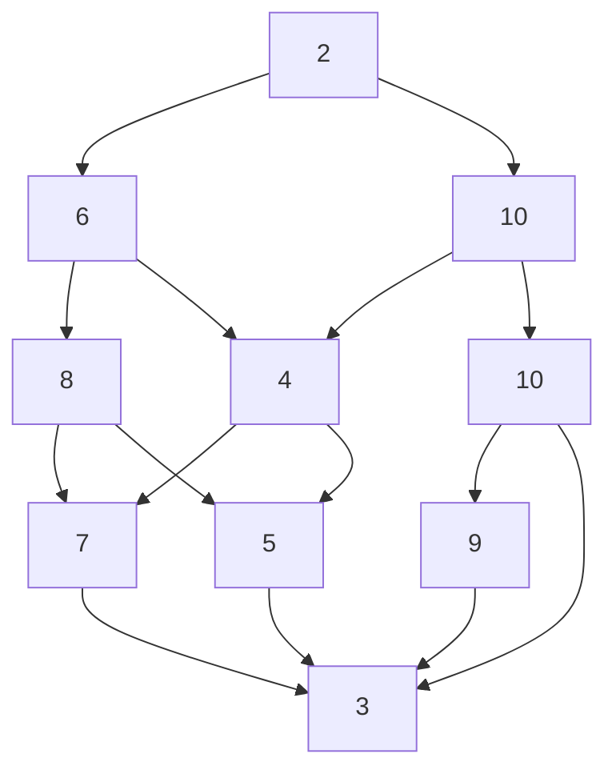
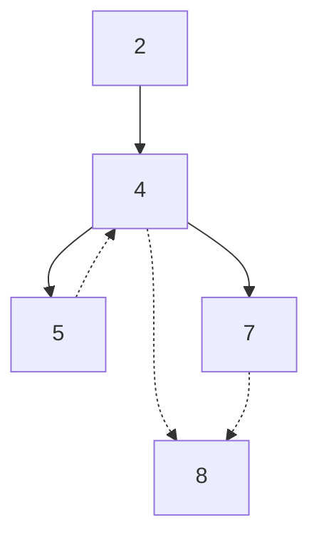

<!-- page:1 -->
# Solvers User Guide

Version O-2018.06, June 2018

# Copyright and Proprietary Information Notice

<!-- page:2 -->
© 2018 Synopsys, Inc. This Synopsys software and all associated documentation are proprietary to Synopsys, Inc. and may only be used pursuant to the terms and conditions of a written license agreement with Synopsys, Inc. All other use, reproduction, modification, or distribution of the Synopsys software or the associated documentation is strictly prohibited.

# Destination Control Statement

All technical data contained in this publication is subject to the export control laws of the United States of America. Disclosure to nationals of other countries contrary to United States law is prohibited. It is the reader’s responsibility to determine the applicable regulations and to comply with them.

# Disclaimer

SYNOPSYS, INC., AND ITS LICENSORS MAKE NO WARRANTY OF ANY KIND, EXPRESS OR IMPLIED, WITH REGARD TO THIS MATERIAL, INCLUDING, BUT NOT LIMITED TO, THE IMPLIED WARRANTIES OF MERCHANTABILITY AND FITNESS FOR A PARTICULAR PURPOSE.

# Trademarks

Synopsys and certain Synopsys product names are trademarks of Synopsys, as set forth at https://www.synopsys.com/company/legal/trademarks-brands.html. All other product or company names may be trademarks of their respective owners.

# Free and Open-Source Licensing Notices

If applicable, Free and Open-Source Software (FOSS) licensing notices are available in the product installation.

# Third-Party Links

Any links to third-party websites included in this document are for your convenience only. Synopsys does not endorse and is not responsible for such websites and their practices, including privacy practices, availability, and content.

Synopsys, Inc.

Mountain View, CA 94043

www.synopsys.com

<!-- page:3 -->
# About This Guide v

Related Publications . .

Conventions

Customer Support . . .

Accessing SolvNet. . . vi

Contacting Synopsys Support . . . vi

Contacting Your Local TCAD Support Team Directly. . . . vi

Acknowledgments. . . . . vii

# Part I PARDISO 1

# Chapter 1 Using PARDISO 3

Algorithms . . .

Parallel Solution on Shared-Memory Multiprocessors . . . .

Selecting PARDISO in Sentaurus Device . . .

Selecting PARDISO in Sentaurus Process . . .

Selecting PARDISO in Sentaurus Interconnect . .

References . .

# Part II SUPER 11

# Chapter 2 Using SUPER 13

Features of the SUPER Solver . . . 13

Customizing SUPER: The .superrc File . . . . 14

Grammar of the Input Language . . . 15

References. . 16

# Chapter 3 Implementing SUPER 17

Algorithms . . . 17

Structure Input . . . . 18

Reordering . . . . 18

Symbolic Factorization . . . 18

Numeric Value Input . . . . 18

Numeric Factorization . . . . 19

Numeric Solution . . . . 20

<!-- page:4 -->
How Multiple Minimum Degree Works . . . . . 20

Example of Executing Multiple Minimum Degree . . . . . 22

Sparse Supernodal Factorization Algorithms . . . 25

Column Supernode Algorithms . . . . 26

The column\_supernode\_0 Algorithm. . . . . 26

The column\_supernode\_1 Algorithm. . . . . . 29

The column\_supernode\_2 Algorithm. . . . . 30

The column\_supernode\_3 Algorithm. . . . . 31

Summary of Column Supernode Algorithms . . . . . 32

Block Supernode Algorithms. . . . 33

The block\_supernode\_0 Algorithm . . . . 33

The block\_supernode\_1 Algorithm . . . . . 34

The block\_supernode\_2 Algorithm . . . 35

The block\_supernode\_3 and block\_supernode\_4 Algorithms . . . . . 36

References . . . 38

# Part III ILS

41

# Chapter 4 Using ILS 43

Features of the ILS Solver . . . 43

Selecting ILS in Sentaurus Device . . . . . 43

ILSrc Statement . . . 44

Parallel Execution . . 46

Selecting ILS in Sentaurus Process. . . . 46

Selecting ILS in Sentaurus Interconnect. . . 48

References. . . 49

# Chapter 5 Customizing ILS 51

Configuration of ILS . . . 51

General Remarks . . . 52

Iterative Methods . . . 52

Stopping Criteria for Iterative Methods . . . . 53

Preconditioners . 54

Incomplete LU Factorization Preconditioners . . . . 54

Sparse Approximate Inverse Preconditioners. . . . . 55

Other Preconditioners . . . 55

Nonsymmetric Ordering . . . . 55

Symmetric Ordering . . . 56

Additional Options. . . . . 57

References. . . 58

<!-- page:5 -->
This user guide provides information about the solvers that are available as part of Synopsys TCAD software. These solvers can be used with the Synopsys Sentaurus™ Device, Sentaurus Interconnect, and Sentaurus Process tools.

# Related Publications

For additional information, see:

The TCAD Sentaurus release notes, available on the Synopsys SolvNet® support site (see Accessing SolvNet on page vi).   
■ Documentation available on SolvNet at https://solvnet.synopsys.com/DocsOnWeb.

# Conventions

The following conventions are used in Synopsys documentation.

<table><tr><td>Convention</td><td>Description</td></tr><tr><td>Blue text</td><td>Identifies a cross-reference (only on the screen).</td></tr><tr><td>Bold text</td><td>Identifies a selectable icon, button, menu, or tab. It also indicates the name of a field or an option.</td></tr><tr><td>Courier font</td><td>Identifies text that is displayed on the screen or that the user must type. It identifies the names of files, directories, paths, parameters, keywords, and variables.</td></tr><tr><td>Italicized text</td><td>Used for emphasis, the titles of books and journals, and non-English words. It also identifies components of an equation or a formula, a placeholder, or an identifier.</td></tr></table>

# Customer Support

Customer support is available through the Synopsys SolvNet customer support website and by contacting the Synopsys support center.

<!-- page:6 -->
# Accessing SolvNet

The SolvNet support site includes an electronic knowledge base of technical articles and answers to frequently asked questions about Synopsys tools. The site also gives you access to a wide range of Synopsys online services, which include downloading software, viewing documentation, and entering a call to the Support Center.

To access the SolvNet site:

1. Go to the web page at https://solvnet.synopsys.com.   
2. If prompted, enter your user name and password. (If you do not have a Synopsys user name and password, follow the instructions to register.)

If you need help using the site, click Help on the menu bar.

# Contacting Synopsys Support

If you have problems, questions, or suggestions, you can contact Synopsys support in the following ways:

Go to the Synopsys Global Support Centers site on synopsys.com. There you can find email addresses and telephone numbers for Synopsys support centers throughout the world.   
Go to either the Synopsys SolvNet site or the Synopsys Global Support Centers site and open a case online (Synopsys user name and password required).

# Contacting Your Local TCAD Support Team Directly

Send an e-mail message to:

support-tcad-us@synopsys.com from within North America and South America   
support-tcad-eu@synopsys.com from within Europe   
support-tcad-ap@synopsys.com from within Asia Pacific (China, Taiwan, Singapore, Malaysia, India, Australia)   
support-tcad-kr@synopsys.com from Korea   
support-tcad-jp@synopsys.com from Japan

<!-- page:7 -->
# Acknowledgments

ILS was codeveloped by Integrated Systems Laboratory of ETH Zurich in the joint research project NUMERIK II with financial support by the Swiss funding agency CTI.

<!-- page:8 -->
# About This Guide

# Acknowledgments

<!-- page:9 -->
# Part I PARDISO

This part contains chapters regarding the direct linear solver PARDISO and is intended for users of Sentaurus Device, Sentaurus Process, and Sentaurus Interconnect:

Chapter 1 Using PARDISO on page 3 provides background information on PARDISO.

<!-- page:11 -->
PARDISO [1][2] is a high-performance, robust, and easy to use software package for solving large sparse symmetric or nonsymmetric systems of linear equations in parallel.

The rapid and widespread acceptance of shared-memory multiprocessors has created a demand for parallel semiconductor device and process simulation on such shared-memory multiprocessors.

PARDISO can be used as a serial package, or in a shared-memory multiprocessor environment as an efficient, scalable, parallel, direct solver. PARDISO is tuned for general use in Sentaurus Device, Sentaurus Process, and Sentaurus Interconnect, which means user intervention is not necessary.

# Algorithms

The process of obtaining a direct solution of a sparse system of linear equations of the form consists of the following important phases [3][4]:Ax b =

Nonsymmetric matrix permutation and scaling places large matrix entries on the diagonal and aims to maximize the elements on the diagonal of the matrix.

This step greatly enhances the reliability and accuracy of the numeric factorization process. More details can be found in the literature [5][6][7].

Ordering determines the permutation of the coefficient matrix such that the factorizationA incurs low fill-in.

The reordering strategy of PARDISO features state-of-the-art techniques, for example, multilevel recursive bisection from METIS [8] or minimum degree–based approaches [9][10] for the fill-in reduction. The nested dissection approach integrated in PARDISO is substantially better than the multiple minimum degree algorithm for large problem sizes. This applies especially to three-dimensional problems.

Numeric factorization is the actual factorization step that performs arithmetic operations on the coefficient matrix to produce the factors and such that . CompleteA L U A LU = block diagonal supernode pivoting allows for dynamic interchanges of columns and rows.

PARDISO exploits the memory hierarchy of the architecture by using the clique structure of the elimination graph by supernode algorithms, thereby improving memory locality [11]. The numeric factorization algorithm of the package utilizes the supernode structure of the numeric factors and to reduce the number of memory references with Level 3L U BLAS [12][13]. The result is a greatly increased, sequential, factorization performance.

<!-- page:12 -->
Furthermore, PARDISO uses an integrated, scalable, left-right-looking, supernode algorithm [14][15] for the parallel sparse numeric factorization on shared-memory multiprocessors. This left-right-looking supernode algorithm significantly reduces the communication rate for pipelining parallelism.

■ Solution of triangular systems produces the solution by performing forward and backward eliminations.

The combination of block techniques, parallel processing, and global fill-in reduction methods for 3D semiconductor devices results in a significant improvement in computational performance.

# Parallel Solution on Shared-Memory Multiprocessors

The use of vendor-optimized BLAS and LAPACK subroutines ensures high computational performance on a large scale of different computer architectures. The parallelization technique is based on OpenMP [16], which is an industrywide standard for directive-based parallel programming of shared-memory parallelization (SMP) systems. Most SMP vendors are committed to OpenMP, thereby making OpenMP programs portable across an increasing range of SMP platforms.

A parallel version of PARDISO is available on Red Hat Enterprise Linux (64-bit).

Multiple cores on machines that support hyperthreading are treated in the same way as multiple CPUs.

A sufficient process stack size is required for the proper execution of PARDISO. To check the UNIX stack size limit, in csh, type the command:

limit

or, in bash or sh, type the command:

ulimit -a

The stack size limit can be increased, in csh, by using the command:

limit stacksize unlimited

or, in bash or sh, by typing the command:

ulimit -s unlimited

<!-- page:13 -->
# Selecting PARDISO in Sentaurus Device

PARDISO is activated in Sentaurus Device by specifying in the command file:

```txt
Math {
    ...
    Method = Blocked
    SubMethod = Pardiso
    WallClock
    ...
} 
```

For single-device simulations only, you can specify Method=Pardiso instead of Method=Blocked SubMethod=Pardiso.

The keyword WallClock is used to print the wallclock times of the Newton solver. This is useful and recommended when investigating the performance of the parallel execution.

PARDISO accepts options that can be specified in parentheses:

Pardiso (<options>)

Table 1 PARDISO options 

<table><tr><td>Option</td><td>Description</td><td>Default</td></tr><tr><td>IterativeRefinement</td><td>Performs up to two iterative refinement steps to improve the accuracy of the solution.</td><td>off</td></tr><tr><td>MultipleRHS</td><td>PARDISO solves linear systems with multiple right-hand sides. This option applies to AC analysis only. It might produce minor performance improvements.</td><td>off</td></tr><tr><td>NonsymmetricPermutation</td><td>Computes an initial nonsymmetric matrix permutation and scaling, which places large matrix entries on the diagonal.</td><td>on</td></tr><tr><td>RecomputeNonsymmetricPermutation</td><td>Computes a nonsymmetric matrix permutation and scaling before each factorization.</td><td>off</td></tr></table>

To switch off any option, use a minus sign, for example, -NonsymmetricPermutation.

The default options -IterativeRefinement, NonsymmetricPermutation, and -RecomputeNonsymmetricPermutation provide the best compromise between speed and accuracy. However, note the following:

■ To improve speed, use -NonsymmetricPermutation.

To improve accuracy at the expense of speed, use IterativeRefinement, or RecomputeNonsymmetricPermutation, or both.

<!-- page:14 -->
The number of threads for PARDISO can be specified in the Math section of the Sentaurus Device command file as follows:

```hcl
Math {
    ...
    Number_of_Threads = 2
    Number_of_Solver_Threads = 2
    ...
} 
```

The keyword Number\_of\_Threads defines the number of threads for both the matrix assembly and PARDISO, and Number\_of\_Solver\_Threads defines only the number of threads for PARDISO itself. Instead of a constant number of threads, you can specify maximum. In this case, the number of threads is set equal to the number of processors available on the execution platform.

If no specification appears in the Math section, Sentaurus Device checks the values of the following UNIX environment variables (in order of decreasing priority):

```txt
SDEVICE_NUMBER_OF_SOLVER_THREADS
SDEVICE_NUMBER_OF_THREADS
SNPS_NUMBER_OF_THREADS
OMP_NUM_THREADS 
```

For example, to obtain parallel execution with two threads, you can define OMP\_NUM\_THREADS as follows (in a C shell):

```txt
setenv OMP_NUM_THREADS 2 
```

In a Bourne shell, the equivalent commands are:

```txt
OMP_NUM_THREADS=2
export OMP_NUM_THREADS 
```

# Selecting PARDISO in Sentaurus Process

In Sentaurus Process, the PARDISO solver is the default for 1D simulations and 2D mechanics simulations, and also can be used in 2D diffuse simulations and some 3D simulations by specifying:

```batch
math diffuse dim=2 pardiso
math diffuse dim=3 pardiso 
```

<!-- page:15 -->
or:

math flow dim=3 pardiso

for diffusion simulations or mechanics simulations, respectively.

The number of threads must be specified in the math command, for example:

math numThreadsPardiso=2

NOTE For Sentaurus Process, PARDISO no longer depends on the OpenMP environment variable OMP\_NUM\_THREADS, and you no longer need to specify this variable.

For Sentaurus Process, by default, PARDISO uses multiple minimum degree (MMD) ordering in 2D simulations and nested dissection (ND) ordering in 3D simulations. You can change the ordering using the Pardiso.Ordering parameter to specify ND ordering (2) or MMD ordering (0):

pdbSetDouble Pardiso.Ordering 2

pdbSetDouble Pardiso.Ordering 0

# Selecting PARDISO in Sentaurus Interconnect

In Sentaurus Interconnect, the PARDISO solver is the default for 1D simulations and 2D mechanics simulations, and also can be used in 2D solve steps and some 3D simulations by specifying:

math compute dim=2 pardiso

math compute dim=3 pardiso

or:

math flow dim=3 pardiso

for solve steps in 2D, 3D, or mechanics simulations, respectively.

The number of threads must be specified in the math command, for example:

math numThreadsPardiso=2

For Sentaurus Interconnect, by default, PARDISO uses MMD ordering in 2D simulations and ND ordering in 3D simulations. You can change the ordering using the Pardiso.Ordering parameter to specify ND ordering (2) or MMD ordering (0):

pdbSetDouble Pardiso.Ordering 2

pdbSetDouble Pardiso.Ordering 0

<!-- page:16 -->
# References

[1] O. Schenk, Scalable Parallel Sparse LU Factorization Methods on Shared Memory Multiprocessors, Series in Microelectronics, vol. 89, Konstanz, Germany: Hartung-Gorre, 2000.   
[2] O. Schenk, K. Gärtner, and W. Fichtner, “Efficient Sparse LU Factorization with Left-Right Looking Strategy on Shared Memory Multiprocessors,” BIT, vol. 40, no. 1, pp. 158–176, 2000.   
[3] P. Matstoms, “Parallel sparse QR factorization on shared memory architectures,” Parallel Computing, vol. 21, no. 3, pp. 473–486, 1995.   
[4] A. George and J. W.-H. Liu, Computer Solution of Large Sparse Positive Definite Systems, Englewood Cliffs, New Jersey: Prentice-Hall, 1981.   
[5] O. Schenk, M. Hagemann, and S. Röllin, “Recent advances in sparse linear solver technology for semiconductor device simulation matrices,” in International Conference on Simulations of Semiconductor Processes and Devices (SISPAD), Boston, MA, USA, pp. 103–108, September 2003.   
[6] O. Schenk, S. Röllin, and A. Gupta, “The Effects of Unsymmetric Matrix Permutations and Scalings in Semiconductor Device and Circuit Simulation,” IEEE Transactions on Computer-Aided Design of Integrated Circuits and Systems, vol. 23, no. 3, pp. 400–411, 2004.   
[7] O. Schenk and K. Gärtner, “Solving unsymmetric sparse systems of linear equations with PARDISO,” Future Generation Computer Systems, vol. 20, no. 3, pp. 475–487, 2004.   
[8] G. Karypis and V. Kumar, Analysis of Multilevel Graph Partitioning, Technical Report 95-037, University of Minnesota, Department of Computer Science/Army HPC Research Center, Minneapolis, USA, 1995.   
[9] J. W. H. Liu, “Modification of the Minimum-Degree Algorithm by Multiple Elimination,” ACM Transactions on Mathematical Software, vol. 11, no. 2, pp. 141–153, 1985.   
[10] M. Yannakakis, “Computing the Minimum Fill-in Is NP-Complete,” SIAM Journal on Algebraic and Discrete Methods, vol. 2, no. 1, pp. 77–79, 1981.   
[11] E. Rothberg, Exploiting the Memory Hierarchy in Sequential and Parallel Sparse Cholesky Factorization, Ph.D. thesis, Stanford University, Stanford, CA, USA, 1992.   
[12] J. J. Dongarra et al., “A Set of Level 3 Basic Linear Algebra Subprograms,” ACM Transactions on Mathematical Software, vol. 16, no. 1, pp. 1–17, 1990.   
[13] C. L. Lawson et al., “Basic Linear Algebra Subprograms for Fortran Usage,” ACM Transactions on Mathematical Software, vol. 5, no. 3, pp. 308–323, 1979.

[14] O. Schenk, K. Gärtner, and W. Fichtner, “Scalable Parallel Sparse Factorization with Left-Right Looking Strategy on Shared Memory Multiprocessors,” in High-Performance Computing Networking, 7th International Conference, HPCN Europe, Amsterdam, The Netherlands, pp. 221–230, April 1999.   
[15] O. Schenk, K. Gärtner, and W. Fichtner, Application of Parallel Sparse Direct Methods in Semiconductor Device and Process Simulation, Technical Report 99/7, Integrated Systems Laboratory, ETH, Zurich, Switzerland, 1999.   
[16] L. Dagum and R. Menon, “OpenMP: An Industry-Standard API for Shared-Memory Programming,” IEEE Computational Science & Engineering, vol. 5, no. 1, pp. 46–55, 1998.

<!-- page:18 -->
1: Using PARDISO

References

<!-- page:19 -->
# Part II SUPER

This part contains chapters regarding the direct linear solver SUPER and is intended for users of Sentaurus Device:

Chapter 2 Using SUPER on page 13 provides background information on SUPER.

Chapter 3 Implementing SUPER on page 17 discusses the algorithms used in SUPER.

<!-- page:21 -->
SUPER is a library that contains a set of block-oriented and nonblock-oriented, supernodal, factorization algorithms for the direct solution of sparse structurally symmetric linear systems.

# Features of the SUPER Solver

SUPER is a fast direct solver for the semiconductor device simulator Sentaurus Device, where the solution of sparse structurally symmetric linear systems of equations (typically written in the form ) is the main task consuming most of the processor time.Ax b =

Advances in sparse matrix technology have resulted in supernodal linear solvers. The key concept behind this technique is based on the concept of a supernode [1]. In the course of the factorization of the coefficient matrix, supernodes are identified as a set of consecutive columns in the factor of the decomposition with the following structural properties.L LU

Assume is a set of consecutive columns and denotes the number of{k k, + 1 …, , k r + } η( ) k nonzero entries in column of the factor . If all columns share the samek L k i+ 0…, i = r sparsity structure below row and k r + $\mathfrak { N } ( k + i ) = \mathfrak { N } ( k + r ) + r - i , i = 0 . . . r$ , then the set $\{ k , k + 1 , . . . , k + r \}$ forms a supernode [2].

In other words, a supernode formed by adjacent columns consists of two blocks: a denses diagonal block of size and a block of width below the diagonal block where all columnss s × s share the same sparsity pattern. Due to structural symmetry, the term supernode can also apply to the rows of the factor . For simplification, this user guide restricts its considerationsU mainly to the columns of factor . Figure 1 on page 14 illustrates a supernode.L

Supernodes offer a significant advantage for numeric factorization: a column beingj computed is modified by either all or none of the columns of a supernode , which updatesS column [3]. In addition, if column has an identical sparsity structure compared to thej j columns of supernode below row , updating column is a dense operation, meaning thatS j j no index list is needed to reference the various elements. This is also true for column updates within the same supernode. The fact that dense linear algebra operations can be performed in those cases reduces memory traffic and increases computational efficiency. This is documented in a number of papers [1][4][5].

<!-- page:22 -->
SUPER incorporates the advances in supernodal sparse matrix technology towards the most efficient solution of a given linear system. SUPER provides different supernodal factorization methods that give excellent performance on both RISC and vector machines.

$$
\left( \begin{array}{c c c c c c c c c} \cdot & & & & & & \\ & \cdot & & & & & \\ & & \bullet & & & & \\ & & \bullet & \bullet & & & \\ & & \bullet & \bullet & \bullet & & \\ & & \bullet & \bullet & \bullet & \cdot & \\ & & \bullet & \bullet & \bullet & \cdot & \\ & & \bullet & \bullet & \bullet & \cdot & \\ & & \bullet & \bullet & \bullet & \cdot & \\ & & \bullet & \bullet & \bullet & \cdot & \end{array} \right)
$$

Figure 1 Example of a supernode

You can fine-tune SUPER although this is not necessary, since all tunable parameters have built-in default values or are set automatically during execution. Some parameters relate to measured times during execution; therefore, they influence the computational behavior on different hardware platforms.

# Customizing SUPER: The .superrc File

You can tailor SUPER behavior to your own preferences by modifying the parameters specific to SUPER in the .superrc file. The software uses the following procedure to search for this configuration file. First, SUPER checks whether the environment variable SUPERRC is set. This environment variable must contain the absolute path of the directory, which contains the .superrc file. SUPER checks whether the .superrc file exists; if so, the configuration file is used. If the environment variable SUPERRC is not set or the directory specified does not contain a .superrc file, the home directory of the user is sought. Finally, if neither location contains a .superrc file, the configuration file is sought in the current directory. This hierarchical concept allows for the following:

■ A group of users can share a common .superrc file by specifying its location in the SUPERRC environment variable.   
■ Individual users can have their own personal global .superrc file in their home directory.   
■ Individual configuration files can be used when put into the current working directories.

SUPER uses default settings if no configuration file is found.

<!-- page:23 -->
# Grammar of the Input Language

Terminal symbols are presented in Courier font and nonterminal symbols are uppercase and italicized:

```txt
STATEMENTS ← STATEMENT
| STATEMENTS, STATEMENT
STATEMENT ← factorization_type = FACTORIZATION_METHOD
| write { INTEGER_LIST }
| write ( FORMAT )
| write ( FORMAT ) { INTEGER_LIST }
| write
FACTORIZATION_METHOD ← column_supernode_0
| column_supernode_1
| column_supernode_2
| column_supernode_3
| block_supernode_0
| block_supernode_1
| block_supernode_2
| block_supernode_3
| block_supernode_4
FORMAT ← blsmp
| matlab
INTEGER_LIST ← INTEGER
| INTEGER_LIST : INTEGER 
```

The value of factorization\_type specifies the factorization to be used. The factorization within SUPER is performed using supernodal algorithms. Generally, two types of supernodal algorithms are available: column supernode and block supernode (see Sparse Supernodal Factorization Algorithms on page 25).

There are four column supernode algorithms and five block supernode algorithms. In terms of memory consumption, column supernode algorithms are preferred over block supernode algorithms. The algorithm column\_supernode\_2 uses minimal space and the algorithm block\_supernode\_1 requires maximal space. Conversely, if speed is an important consideration, block supernode algorithms should be considered because they reduce memory traffic and support data locality. By default, SUPER uses column\_supernode\_1.

The write statement is used to write linear systems in ASCII representation to files. The parameter INTEGER\_LIST must contain nonnegative numbers separated by colons. It determines at which invocation of SUPER the output files should be generated. The list does not have to be in increasing order. If INTEGER\_LIST is missing, the first ten invocations of SUPER generate the file output.

<!-- page:24 -->
The parameter FORMAT determines the format of the output:

1 If blsmp is selected, then the matrix (the right-hand side) and the solution of the linear system are written to either the nsuper\_blsmp\_real\_index.txt file or the nsuper\_blsmp\_complex\_index.txt file.   
If matlab is selected, then output is sent to either the nsuper\_matlab\_real\_index.m file or the nsuper\_matlab\_complex\_index.m file.

By default, no output is generated.

In many cases, you can completely ignore setting up a special .superrc file and can rely on the defaults. Conversely, there is no way to change the default settings without modifying the corresponding parameter in the .superrc file. In addition, the .superrc file is read only once, at the initial invocation of SUPER.

# Example of a .superrc File

```txt
factorization_type = block_supernode_4, write (blsmp) {5:9} 
```

These settings instruct SUPER to use the factorization algorithm block\_supernode\_4 and to generate ASCII files, in blsmp format, of the fifth and ninth linear systems solved.

# References

[1] C. C. Ashcraft et al., “Progress in Sparse Matrix Methods for Large Linear Systems on Vector Supercomputers,” The International Journal of Supercomputer Applications, vol. 1, no. 4, pp. 10–30, 1987.   
[2] J. W. H. Liu, E. Ng, and B. W. Peyton, On Finding Supernodes for Sparse Matrix Computations, Technical Report ORNL/TM-11563, Oak Ridge National Laboratory, Oak Ridge, TN, USA, June 1990.   
[3] E. Rothberg and A. Gupta, An Evaluation of Left-Looking, Right-Looking and Multifrontal Approaches to Sparse Cholesky Factorization on Hierarchical-Memory Machines, Technical Report STAN-CS-91-1377, Department of Computer Science, Stanford University, Stanford, CA, USA, August 1991.   
[4] P. Arbenz and W. Gander, A Survey of Direct Parallel Algorithms for Banded Linear Systems, Technical Report 221, Institute of Scientific Computing ETH, Zurich, Switzerland, October 1994.   
[5] E. G. Ng and B. W. Peyton, A Supernodal Cholesky Factorization Algorithm for Shared-Memory Multiprocessors, Technical Report ORNL/TM-11814, Oak Ridge National Laboratory, Oak Ridge, TN, USA, April 1991.

<!-- page:25 -->
# Algorithms

Typically, you want to solve a linear system of the form:

$$
A x = b \tag {1}
$$

where is the structurally symmetric coefficient matrix of the system, denotes the solutionA b vector or the right-hand side, and is the vector of all unknowns, commonly referred to as thex solution. A permutation matrix is used to apply row and column permutations to theP coefficient matrix . Now, the linear system Eq. 1 becomes:A

$$
P A P ^ {T} \tilde {x} = \tilde {b} \tag {2}
$$

where $\tilde { x } = P x$ and $\tilde { b } \ = \ P b$ . The permuted coefficient matrix $P A P ^ { T }$ is decomposed into two triangular factors and , for example:L U

$$
P A P ^ {T} = L U \tag {3}
$$

Eventually, the linear system Eq. 2 is solved by forward and backward substitution:

$$
\begin{array}{l} L y = P b \\ \text {又} \end{array} \tag {4}
$$

$$
U \tilde {x} = y
$$

Finally, the solution of the original linear system Eq. 1 is obtained by left-multiplyingx $\tilde { x }$ , the solution of Eq. 2, with $P ^ { T }$ [1].

Technically, the solution process of SUPER has the following distinct phases leading to a modular code that is easier to maintain and optimize (this approach has been used in other solver packages such as SPARSPAK [2] and YSMP [3]):

Structure input   
Reordering   
■ Symbolic factorization   
■ Numeric value input   
■ Numeric factorization   
Numeric solution

<!-- page:26 -->
# Structure Input

During the structure input phase, the solver reads the nonzero structure of the lower triangle of the coefficient matrix and generates a full adjacency structure of , which passes to theA A reordering phase.

# Reordering

Reordering is a very important phase in the solution process. The goal of applying row and column permutations to the coefficient matrix is to minimize the size of its factors and .L U Any additional nonzero entry in the decomposition is called a fill-in entry. In terms of computational cost (that is, memory consumption and execution time), you might want to retain the nonzero structure of the coefficient matrix in its factors or at least to reduce growth to a minimum. Although there is no minimum fill-in reordering scheme [4], a number of heuristics, mainly using graph theoretical approaches, produce near-to-optimal reorderings. Among these approaches, the minimum degree reordering heuristic has proven to be most effective [5].

The SUPER solver uses an enhanced minimum degree algorithm called the multiple minimum degree (MMD) algorithm [6][7]. Its motivation is based on the observation that in the course of elimination, expensive degree updates can be saved if nodes of the same degree are eliminated simultaneously, thereby producing supernodes as a side effect [8]. See How Multiple Minimum Degree Works on page 20.

# Symbolic Factorization

When the coefficient matrix is reordered, you want to predetermine the structure of its factors and . This process is referred to as symbolic factorization [9]. Knowing the factorL U structure, you can preallocate the necessary memory space for the remainder of the solution process.

# Numeric Value Input

So far, only preliminary steps toward the numeric solution of the linear system have been performed. The numeric value input phase is the preparation step for numeric computation. The numeric values of the coefficient matrix are read into their memory locations,A simultaneously applying the row and column permutations found in the reordering phase.

<!-- page:27 -->
# Numeric Factorization

Numeric factorization is the most time-consuming phase of the solution process. Extensive research to find optimal performance in terms of speed and memory requirements has lead to supernodal techniques [10]. Column supernode and block supernode algorithms are implemented (see Figure 2).


<details>
<summary>text_image</summary>

D
v
M
j
L
K
</details>


<details>
<summary>text_image</summary>

U
D
M_U
L K J
U
</details>

Figure 2 Illustration of (left) column supernode and (right) block supernode updating

Column supernode updating describes a technique where only one column of the factor isL computed at a time. Consider Figure 2 (left): column is updated by supernode . Computingj S this update is expressed mathematically in the term:

$$
j = j - M (D v) \tag {5}
$$

This is known as a DGEMV operation in BLAS terminology [11]. Computing is aM Dv ( ) dense operation that requires no indirect addressing.

When the result of this matrix–vector product is subtracted from vector , the elements of thej resulting vector must be scattered into their corresponding positions only.

Block supernode factorization operates on groups of columns or a complete supernode at the same time instead of merely focusing on a single column. It must compute:

$$
J = J - M _ {L} \left(D M _ {U}\right) \tag {6}
$$

This represents a DGEMM operation [12]. Block supernode algorithms mainly involve dense matrix–matrix multiplications, thereby reducing memory traffic. Analogous to column supernode algorithms, indirect addressing is necessary when the results of the dense matrix–matrix multiplication are scattered into the updated supernode. Since DGEMV and

<!-- page:28 -->
DGEMM operations are highly efficient computational kernel routines, their use during numeric factorization significantly speeds up decomposition. Sparse Supernodal Factorization Algorithms on page 25 describes all the supernodal algorithms implemented in SUPER.

# Numeric Solution

The numeric solution phase is the final step in the solution process. The solution is found using forward and backward substitution to exploit the supernodal partitioning of the factors. Detailed discussions of this are documented in the literature [8][13][14][15].

# How Multiple Minimum Degree Works

Before going into detail, a few preliminary terms must be defined for subsequent use.

Let $G = ( V , E )$ be a graph.

# Def.: adjacency set

Let ; v V ∈ adj v( ) = { } w V v w ∈ ( ) , ∈ E

The adjacency set for any consists of all nodes adj v( ) v V ∈ $w \in V _ { : }$ , which are directly connected with through an edge from set .v E

# Def.: indistinguishable1

Let $\nu , w \in V ; \nu$ is indistinguishable from $w : \Longleftrightarrow a d j ( \nu ) \cup \lbrace \nu \rbrace = a d j ( w ) \cup \lbrace w \rbrace$

Two nodes $\nu , w \in \ V$ are said to be indistinguishable if and only if and have identicalv w adjacency sets and each node is contained in the other’s adjacency set2 .

As previously mentioned, multiple minimum degree (MMD) is a variant of the minimum degree (MD) ordering algorithm. Its concept is based on the observation that, during elimination, expensive degree updates can be saved if nodes of the same MD are eliminated simultaneously. For indistinguishable nodes, it can be shown that they are eliminated consecutively when MD is used.

<!-- page:29 -->
Algorithm 1 lists the MMD algorithm. Initially, is set equal to the empty set and the degreesS of all nodes in are computed. Next, a set is determined, which contains all nodes from V T V to that have MD. Mass elimination is performed over all elements of . On entry, allS T elements (nodes) are unflagged (unmarked). Next, a node must be selected. The criteriay T ∈ that set out how to select elements from are called tie-breaking strategies.T

$S = \emptyset$ for $x \in V$ do $\delta(x) = |adj(x)|$ end for

while $S \neq V$ do

    set $T = \{y \in V - S | \delta(x) = \min_{x \in V - S} \delta(x)\}$ for $y \in T$ do

    if $y$ is not marked do

    set $Y = \{x \in T | x \text{ indistinguishable from } y\}$ for all nodes $x \in Y$ do

    order $x$ next

    end for

    mark all nodes in $adj(Y)$ and $Y$ $S = S \cup Y$ end if

    end for

    eliminate all marked nodes in $S$ from the graph

    for all marked nodes $x \in V - S$ do $\delta(x) = |adj(x)|$ end for

    unmark all nodes

end while

# Algorithm 1 Multiple minimum degree (MMD) algorithm

Effective tie-breaking is known to improve numeric factorization since the fill-in of the factor can be reduced significantly [5]. SUPER does not implement any of the commonly used tie-L breaking strategies used in other well-known solver packages1 . Instead, SUPER uses random tie-breaking, which is the selection of elements without intelligence; mostly implied by the underlying data structure.

After an element is chosen, the algorithm determines the set that contains all elementsy T ∈ Y of indistinguishable from 2 . When is computed, all elements of and the adjacency setT y Y Y of , , are flagged. There are two reasons for this. First, flagging the nodes of set Y adj Y( ) Y prevents double-accessing indistinguishable nodes, that is, nodes found to be indistinguishable from , the current node, do not have to be looked at while mass elimination proceeds, becausey they are eliminated with . Second, nodes that lie in must be marked for a degreey adj Y( ) update, because some of their neighbors, some or all elements of , are eliminated. This meansY their current degree was modified.

<!-- page:30 -->
Finally, set is unified with set and mass elimination starts over with another elementS Y $y \in T$ until no unflagged element remains. Then, the graph representation of the remaining nodes from to is computed. Simultaneously, all flagged nodes in to undergo a degreeV S V S update. Finally, the non-eliminated nodes are unmarked and the algorithm continues until $S ~ = ~ V$ .

# Example of Executing Multiple Minimum Degree

Figure 3 provides the symmetric pattern of the matrix where • denotes a nonzero entry. A

$$
\mathbf {A} = \left( \begin{array}{c c c c c c c c} 1 & & \bullet & \bullet & & \bullet & & \\ & 2 & & \bullet & & & & \bullet \\ & & 3 & & \bullet & & \bullet & \\ \bullet & \bullet & & 4 & & \bullet & \bullet & \\ \bullet & & \bullet & & 5 & & \bullet & \\ & \bullet & & & & 6 & \bullet & \bullet \\ \bullet & & \bullet & \bullet & & 7 & \bullet \\ & & & \bullet & & \bullet & & 8 \\ & & \bullet & & \bullet & & 9 \\ & \bullet & & & \bullet & & 1 0 \\ \bullet & & & & \bullet & & \end{array} \right)
$$

Figure 3 Sample sparse matrix A

Figure 4 illustrates the graph representation of .A


<details>
<summary>flowchart</summary>


</details>

Figure 4 Graph representation of sample matrix A

<!-- page:31 -->
The numbering in the graph is equal to the line numbering of the matrix. The initial minimum degree of the graph is 31 . Therefore, the ordering algorithm starts with:

$$
S = \varnothing \quad T = \{1 0, 9, 8, 6, 3, 2, 1 \} \tag {7}
$$

Now, $y = 1 0$ is chosen from . The only indistinguishable node from T $y = 1 0$ is the node with the number 6, yielding $Y = \{ ( 1 0 , 6 ) \} ^ { 2 }$ . The adjacency set contains the nodes 2adj Y( ) and 8 that, therefore, are flagged (indicated by +). becomesS $S = \{ ( 1 0 , 6 ) \}$ . After the first} loop through the mass elimination step:

$$
S = \{(1 0, 6) \} \quad T = \{1 0 ^ {+}, 9, 8 ^ {+}, 6 ^ {+}, 3, 2 ^ {+}, 1 \} \tag {8}
$$

The second loop finds and y = 9 $Y = \{ ( 9 , 3 ) \}$ , since node 3 is indistinguishable from node 9. Nodes 7 and 5 are marked because they are adjacent to . By the end of the loop:Y

$$
S = \{(1 0, 6), (9, 3) \} \quad T = \{1 0 ^ {+}, 9 ^ {+}, 8 ^ {+}, 6 ^ {+}, 3 ^ {+}, 2 ^ {+}, 1 \} \tag {9}
$$

Node $y = 1$ is the only unflagged node left in . has no indistinguishable nodesT y = 1 besides itself. Therefore, only is eliminated, leaving adjacent node 4 flagged. Ally = 1 elements of are now flagged and the algorithm proceeds to the degree update step.T

Figure 5 shows the graph representation of the remaining nodes all of which had their degree updated because they were all flagged.


<details>
<summary>flowchart</summary>


</details>

Figure 5 Elimination graph after first loop through multiple mass elimination

The new minimum degree is 2, which yields:

$$
S = \{(1 0, 6), (9, 3), 1 \} \quad T = \{7, 8, 5, 2 \} \tag {10}
$$

<!-- page:32 -->
The algorithm finds nodes 7 and 5 as well as nodes 8 and 2 to be indistinguishable, respectively. They are eliminated leaving only node 4. The reordering sequence or permutation is now computed to be:

$$
P = (1 0, 6, 9, 3, 1, 7, 5, 8, 2, 4) \tag {11}
$$

Applying this permutation to the matrix results in the structure shown in Figure 6. A

$$
\boldsymbol {P A P} ^ {T} = \left( \begin{array}{c c c c c c c c c} 1 0 & \yen & & & & & \yen & \yen \\ \yen & 6 & & & & & \yen & \yen \\ & & 9 & \yen & \yen & \yen \\ & & \yen & 3 & \yen & \yen \\ & & & 1 & \yen & \yen & & \yen \\ & & \yen & \yen & \yen & 7 & \yen & & \yen \\ & & \yen & \yen & \yen & \yen & 5 \\ \yen & \yen & & & & & 8 & & \yen \\ \yen & \yen & & & & & & 2 & \yen \\ & & & \yen & \yen & & \yen & \yen & 4 \end{array} \right)
$$

Figure 6 Sample matrix A reordered with MMD

Performing symbolic factorization on this matrix reveals the sparsity pattern of the factor ,L which is depicted in Figure 7 where the columns have been renumbered.


<details>
<summary>other</summary>

| Row | Column | Value |
|---|---|---|
| 1 | 10 | 10 |
| 1 | 6 | 6 |
| 2 | 9 | 9 |
| 2 | 3 | 3 |
| 3 | 1 | 3 |
| 3 | 7 | 7 |
| 3 | 5 | 5 |
| 4 | 8 | 8 |
| 4 | 2 | 2 |
| 4 | 4 | 4 |
</details>

Figure 7 Sparsity structure of factor L of A

NOTE The sparsity structures for $P A P ^ { T }$ and are similar. has twoL L additional nonzero fill-in entries (indicated by ‘o’) and consists of groups of columns that share the same sparsity pattern, such as columns 10 and 6, or 9 and 3 (indicated by the dashed rectangles).

These groups of columns correspond to the sets of indistinguishable nodes as they are foundY in the course of the mass elimination step. These groups form supernodes [8], which have an important role in improving the performance of the numeric factorization. SUPER focuses entirely on the supernodal update scheme. You can take advantage of the fact that a column update depends on all previous columns of the same supernode and on all nodes of other supernodes that update this column.

<!-- page:33 -->
Using BLAS terminology [11][12][16], the first type of update mentioned involves dense SAXPY operations, while the second type performs so-called indexed SAXPY or SAXPYI operations [13][17].

In addition, updating a column by a supernode requires one gather and one scatterj S operation, while node–node updates require as many operations as there are nodes in of eachS [13]. Therefore, memory traffic is reduced and numeric factorization is accelerated, especially on machines with hardware-supported gather-and-scatter operations.

# Sparse Supernodal Factorization Algorithms

Generally, matrix reordering and numeric factorization are the parts of a direct solver package where most of the execution time is spent. Depending on the algorithm and its implementation, the time necessary to reorder the input matrix can vary significantly and might even dominate the factorization time. Nevertheless, these are rare cases, since the reordering algorithm does not have to deal with any fill-in that occurs during decomposition. This leaves numericLU factorization as the part to focus on for performance improvements.

Factorization algorithms based on supernodal techniques have proven to be superior over former general approaches [8][13][18][19].

The next subsections describe the supernodal factorization algorithms implemented in SUPER. These algorithms fall into two types of approaches: column supernode and block supernode.

Table 2 Symbols used in algorithms 

<table><tr><td>Symbol</td><td>Description</td></tr><tr><td> $J, K$ </td><td>Supernodes of the LDU decomposition</td></tr><tr><td> $j, k$ </td><td>Nodes, that is, columns or rows of a supernode</td></tr><tr><td> $N_S$ </td><td>Number of supernodes</td></tr><tr><td> $t_L, t_U$ </td><td>Temporary work vectors</td></tr><tr><td> $T_L, T_U$ </td><td>Temporary blocks of workspace</td></tr><tr><td> $A_{*,j}, A_{j,*}$ </td><td>A column or row of the coefficient matrix  $A$ </td></tr><tr><td> $A_{*,J}, A_{J,*}$ </td><td>A column or row block of the coefficient matrix  $A$ </td></tr><tr><td> $L_{*,j}(L_{*,J})$ </td><td>A (block) column of the factor  $L$ </td></tr><tr><td> $U_{j,*}(U_{J,*})$ </td><td>A (block) row of the factor  $U$ </td></tr><tr><td> $c_{i}(r_{i})$ </td><td> $i$ -th element of column (row) vector  $c(r)$ </td></tr><tr><td> $d_{j}$ </td><td> $j$ -th diagonal element of the matrix  $D$  of the LDU decomposition</td></tr><tr><td> $im, ri$ </td><td>Index vectors</td></tr><tr><td> $[L_{*,j}]_{im}$ </td><td>Scattering into column  $L_{*,j}$  is performed using index map  $im$ </td></tr><tr><td> $n$ </td><td>Number of equations of the linear system</td></tr><tr><td> $ne$ </td><td>Number of off-diagonal nonzero entries in the lower-half or upper-half of  $A$ </td></tr><tr><td> $|L|$ </td><td>Number of nonzero entries in the factor  $L$ </td></tr><tr><td> $|S|$ </td><td>Number of supernodes</td></tr><tr><td>maxcol</td><td>Maximum number of nonzero entries in a column of  $L$ </td></tr><tr><td>maxsup</td><td>Maximum number of columns in a supernode</td></tr></table>

<!-- page:34 -->
# Column Supernode Algorithms

Column supernode updating describes a technique where only one column or row of the factors and is computed at a time, although the corresponding supernode can consist of severalL U columns or rows.

# The column\_supernode\_0 Algorithm

Algorithm 2 on page 27 lists the column\_supernode\_0 algorithm. Initially, the algorithm reveals the general form of column supernode algorithms: a triple-nested for-loop (indicated with indices c0.1 to c0.3). The outermost loop runs over all supernodes that were generatedJ in the reordering and symbolic factorization steps. The next for-loop (c0.2) proceeds one level deeper and scans over all nodes of the current supernode starting with the smallest index.j J

NOTE The product of the loop lengths for loop c0.1 and c0.2 is always equal to the dimension of the matrix .A

Finally, the innermost loop (c0.3) handles the contribution of all updating supernodes to theK current node . j

Furthermore, three computationally intensive kernels CRmod\_{i,d} and CRdiv (see Algorithm 3, Algorithm 4, and Algorithm 5 on page 28) are typical for decompositionLU methods [8][20].

$t_{L} \leftarrow 0; t_{U} \leftarrow 0$ for $J = 1$ to $N_{S}$ do (c0.1)

    for $j \in J$ (in order) do (c0.2) $[t_{L}]_{ind} \leftarrow A_{*,j}$ $[t_{U}]_{ind} \leftarrow A_{j,*}$ for all K updating j do (c0.3)

    if (K and J have same sparsity pattern) (c0.4)

    collect dense updates

    else

    for $k \in K$ do (c0.5) $CRmod\_i(t_{L}, t_{U}, ind, j, k)$ end for

    end if

end for $[L_{*,j}]_{ind} \leftarrow t_{L}; t_{L} \leftarrow 0$ $[U_{j,*}]_{ind} \leftarrow t_{U}; t_{U} \leftarrow 0$ for all dense updates k do (c0.6) $CRmod\_d(L_{*,j}, U_{j, *}, j, k)$ end for $CRdiv(j)$ end for

end for

<!-- page:35 -->
# Algorithm 2 column\_supernode\_0

CRmod\_i and CRmod\_d describe the necessary operations to calculate the update of column $L _ { * , k }$ and row $U _ { k , \ast }$ on the current column using indexed SAXPY [13][21] and dense SAXPYj [16] operations, respectively. The contribution of these two vectors is then accumulated into the column vector and the row vector . CRdiv describes the scaling procedure after column orc r row has been updated. All of these kernel routines can be vectorized, thereby running veryj efficiently on machines with vector capabilities.

A third task, which is also common to all algorithms implemented in SUPER, is the determination of the row structure of the factor (or, identically, the determination of theL column structure of ). This row structure is required to find all supernodes updating theU current column (see loop c0.3 in Algorithm 2). As described [8], it is not necessary toj calculate the row structure of beforehand, since it can be efficiently generated duringL factorization.

Specific to this algorithm is the use of the temporary vectors $t _ { L }$ and $t _ { U }$ , and, as a result, the implementation of CRmod\_{i,d} and CRdiv. Vectors $t _ { L }$ and $t _ { U }$ contain intermediate results for the factors and , respectively. Both vectors are of length where is the dimension ofL U n n the matrix of the linear system. Initially, A $t _ { L }$ and $t _ { U }$ are set to zero. Then, for every column or row to be computed (loop c0.2), columnj $A _ { * , j }$ is loaded into $t _ { L }$ and row $A _ { j , \ l }$ is loaded into\* $t _ { U }$ .

<!-- page:36 -->
$\pounds \circ \mathtt { r } i = j \ \mathtt { t o } \ \mathtt { n } \ \mathtt { d o }$

$$
c _ {i} = c _ {i} - l _ {i, k} d _ {k} u _ {k, j}
$$

$$
r _ {i} = r _ {i} - u _ {k, i} d _ {k} l _ {j, k}
$$

end for

Algorithm 3 CRmod\_d kernel

$$
d _ {j} = l _ {j, j}
$$

for to n doi j = + 1

$$
l _ {i, j} = l _ {i, j} / d _ {j}
$$

$$
u _ {j, i} = u _ {j, i} / d _ {j}
$$

end for

Algorithm 5 CRdiv kernel

$\pounds \circ \mathtt { r } i = j \ \mathtt { t o } \ \mathtt { n } \ \mathtt { d o }$

$$
l = i n d (i)
$$

$$
c _ {l} = c _ {l} - l _ {i, k} d _ {k} u _ {k, j}
$$

$$
r _ {l} = r _ {l} - u _ {k, i} d _ {k} l _ {j, k}
$$

end for

Algorithm 4 CRmod\_i kernel

$$
i = 0
$$

for all row indices of dok j

$$
i m (k) = i
$$

$$
i = i + 1
$$

end for

Algorithm 6 Setup of vector im

This is performed by expanding (scattering) the densely stored column or row elements of  A into their corresponding positions into $t _ { L }$ and $t _ { U }$ . Hereby, it is possible to accumulate all indexed updates to column without repeatedly storing the contents of the temporary vectorsj $t _ { L }$ and $t _ { U }$ into factor storage and simultaneously zeroing out both vectors. Additionally, the index vector ind (loop c0.5) simply holds the row structure of the current column , which doesj not have to be computed, since it is provided by the symbolic factorization. Doing this significantly reduces memory traffic at the cost of comparably little storage overhead1 .

In addition to saving memory transfers, algorithm column\_supernode\_0 increases computational efficiency by collecting all dense updates (collected in statement c0.4) and executing them in one block in loop c0.6. This requires additional storage to keep track of all nodes that share the same sparsity pattern as column/row , but provides for a compact densej update procedure. After column has been computed, it must be scaled by its diagonal .j dj This is performed in the kernel routine CRdiv.

NOTE The computation of the scaling diagonal is performed along with thedj column/row $L _ { * , j } / U _ { j , }$ instead of calculating its value separately. The\* data structures used were dimensioned to have extra space for the diagonal element, thus exploiting vectorization capabilities on the different hardware platforms.

<!-- page:37 -->
# The column\_supernode\_1 Algorithm

Algorithm 7 is an enhanced version of the previous algorithm. In this case, it was feasible to reduce the storage overhead introduced by the temporary vectors $t _ { L }$ and $t _ { U }$ .

$t_{L} \leftarrow 0$ $t_{U} \leftarrow 0$ $im \leftarrow 0$ for J = 1 to $N_{S}$ do

    setup vector im (c1.1)

    for $j \in J$ (in order) do $[t_{L}]_{im} \leftarrow A_{*,j}$ (c1.2) $[t_{U}]_{im} \leftarrow A_{j,*}$ for all K updating j do

    if (K and J have same sparsity pattern)

    collect dense updates

    else

    for $k \in K$ do (c1.3) $CRmod\_i(t_{L}, t_{U}, im, j, k)$ end for

    end if

    end for $L_{*,j} \leftarrow t_{L}$ $t_{L} \leftarrow 0$ (c1.4) $U_{j,*} \leftarrow t_{U}$ $t_{U} \leftarrow 0$ for all dense updates k do $CRmod\_d(L_{*,j}, U_{j,*,j}, k)$ end for $CRdiv(j)$ end for

end for

# Algorithm 7 column\_supernode\_1

Instead of occupying space for $2 ^ { * } n$ real numbers, algorithm column\_supernode\_1 needs only $2 ^ { * } ( M A X C O L + 1 ) ^ { 1 }$ where denotes the maximal number of nonzero entriesMAXCOL in a column of excluding the diagonal element. In 2D and 3D device simulations, where L n is typically greater than 5000, 2 is much smaller than [22].MAXCOL n

Conversely, the relative indexing technique was utilized [15][23] so that the algorithm column\_supernode\_1 can use smaller temporary vectors. Relative indexing introduced an additional vector $i m ^ { 3 }$ of length (c1.1). Nevertheless, the total amount of overhead storagen required for algorithm column\_supernode\_1 is approximately 60% of that used in column\_supernode\_0.

<!-- page:38 -->
Algorithm 6 on page 28 shows the vector setup. Basically, the row index vector for the firstim column of supernode is scanned and the corresponding position in vector is set to thej J im value of the integer variable , which is incremented by one after each assignment starting withi zero. Thereby, referencing $i m _ { k }$ for a row index returns the relative position of theK corresponding column element $c _ { k }$ within $t _ { L }$ .

NOTE The row index vector is stored in decreasing order (looking at the column from the bottom) by the symbolic factorization phase of the solver.

Vector is then used to copy the nonzero elements of column or rowim $A _ { * , j } / A _ { j , }$ into \* $t _ { L }$ and $t _ { U }$ (c1.2) and to perform the indexed updates in loop c1.3. Both operations take advantage of the fact that the set of row indices for $A _ { * , j }$ and the updating supernodes up to row from aK j subset of column ’s set of row indices in the factor [24].j L

This is also the reason why does not have to be reset to zero when all nodes of supernodeim j have been computed; this reduces memory traffic. Finally, storing the contents ofJ $t _ { L }$ and $t _ { U }$ into factor storage (c1.4) does not require indirect addressing and can be performed one by one, because $t _ { L } / t _ { U }$ and $L _ { * , j } / U _ { j , : }$ share the same sparsity pattern.\*

# The column\_supernode\_2 Algorithm

The algorithm column\_supernode\_2 (see Algorithm 8 on page 31) implements a major change compared to algorithm column\_supernode\_1. Instead of loading column or row $A _ { * , j } / A _ { j , }$ of the coefficient matrix into a temporary work space, the contents are directly\* A transferred into the appropriate places of $L _ { * , j }$ and $U _ { j , \ast }$ , respectively (see c2.1).

In this case, since the temporary work vectors $t _ { L }$ and $t _ { U }$ are not required, it is possible to further reduce memory consumption. Since all computation is performed within factor space, additional data transfers, and scatter and add operations caused by intermediate results can also be saved (see c1.4 in Algorithm 7 on page 29). Consequently, algorithm column\_supernode\_2 uses the least amount of memory of all algorithms considered in this section.

im ← 0
for J = 1 to $N_{S}$ do
    setup vector im
    for j ∈ J (in order) do $[L_{*,j}]_{im} \leftarrow A_{*,j}$ (c2.1) $[U_{j,*}]_{im} \leftarrow A_{j,*}$ for all K updating j do
    if (K and J have same sparsity pattern)
    collect dense updates
    else
    for k ∈ K do (c2.2)
    CRmod_i(L_{*,j}, U_{j, *}, im, j, k)
    end for
    end if
    end for
    for all dense updates k do
    CRmod_d(L_{*,j}, U_{j, *}, j, k)
    end for
    CRdiv(j)
    end for
end for

<!-- page:39 -->
Algorithm 8 column\_supernode\_2

# The column\_supernode\_3 Algorithm

Algorithm 9 on page 32 shows another variant of column supernode factorization. ThisLU algorithm requires the same amount of storage overhead as algorithm column\_supernode\_1, but implements two significant changes computing supernode $K \ ' s$ update on column (seej c3.2 and c3.3).

First, like algorithm column\_supernode\_2, column or row $A _ { * , j } / A _ { j , }$ of the coefficient\* matrix are not loaded into the temporary work space but into their appropriate places inA $L _ { * , j }$ and $U _ { j , : }$ , respectively (see c3.1). This is not necessarily advantageous concerning memory\* traffic, since the algorithm still uses temporary work vectors $( t _ { L }$ and $t _ { U } )$ , which must be merged into factor storage. The advantage over the other algorithms is assumed to unfold in the fact that you can compute supernode $K \ ' s$ contribution updating column as a dense SAXPYj operation (see c3.2), therefore revealing the second major difference mentioned earlier.

Unfortunately, after $t _ { L }$ and $t _ { U }$ have been computed, their contents must be scattered and added to column or row $L _ { * , j } / U _ { j , }$ using the index map of supernode . This is the cost when using\* im J dense SAXPY operations to calculate $t _ { L }$ and $t _ { U }$ . Experiments with real device simulation test cases have shown that computational efficiency suffers from the resulting memory transfers. In addition, $t _ { L }$ and $t _ { U }$ must be reset to zero for the next supernode to update column (see c3.3).j

<!-- page:40 -->
The remainder of algorithm column\_supernode\_3 is identical to the algorithms previously discussed.

$t_{L} \leftarrow 0$ $t_{U} \leftarrow 0$ $im \leftarrow 0$ for J = 1 to $N_{S}$ do

    setup vector im

    for $j \in J$ (in order) do $[L_{*,j}]_{im} \leftarrow A_{*,j}$ (c3.1) $[U_{j,*}]_{im} \leftarrow A_{j,*}$ for all K updating j do

    if (K and J have same sparsity pattern)

    collect dense updates

    else

    for $k \in K$ do (c3.2)

    CRmod_d( $t_{L}, t_{U}, j, k$ )

    end for $[L_{*,j}]_{im} \leftarrow t_{L}$ $t_{L} \leftarrow 0$ (c3.3) $[U_{j,*}]_{im} \leftarrow t_{U}$ $t_{U} \leftarrow 0$ end if

    end for

    for all dense updates k do

    CRmod_d( $L_{*,j}, U_{j,*,j}, k$ )

    end for

    CRdiv(j)

    end for

end for

Algorithm 9 column\_supernode\_3

# Summary of Column Supernode Algorithms

Looking at all the column supernode algorithms discussed reveals that, in all cases, dense updates and column or row scaling are treated equally. Therefore, you can conclude that the data structures involved as well as the execution time necessary for the two operations do not differ (at least not significantly) in all four cases. This leaves the indexed updates and the memory references through gather-and-scatter operations for the temporary vectors $t _ { L }$ and $t _ { U }$ as the critical points for measuring how efficiently the algorithms run on different machines.

In terms of storage overhead and memory transfers, algorithm column\_supernode\_2 clearly is the first choice. Although, if execution time is important, most machines seem to prefer algorithm column\_supernode\_1 to the others.

In the next section, the number of gather-and-scatter operations is reduced by working on blocks of columns of the same supernode simultaneously.

<!-- page:41 -->
# Block Supernode Algorithms

Block supernode factorization operates on groups of columns or rows, or an entire supernode at the same time instead of merely focusing on a single node. This does not reduce the number of references to memory, but by grouping them together, memory fetch and store can be more efficient, that is, using the same index map only once throughout a loop cycle. In addition, in terms of vectorization, block supernode factorization does not lengthen the vectorizable loops, thereby increasing the average vector length, but it nests the vectorizable loops one level deeper, which collapses vector work and avoids vector startup overhead.

On the other hand, block supernode factorization increases storage overhead considerably, since the intermediate results for more than one column or row must be retained and, to support this technique, other data structures must be added. Furthermore, the time needed to perform the setup and administration of these data structures cannot be neglected.

# The block\_supernode\_0 Algorithm

Algorithm 10 shows the first approach implementing the block supernode factorization technique. Obviously, the algorithms in this section consist of a double-nested loop construct compared to the three-level nesting of column supernode algorithms. The third level of nesting has not vanished but is hidden in the kernels CRmod\_d and CRmod\_i.

$T_{L} \leftarrow 0$ $T_{U} \leftarrow 0$ $im \leftarrow 0$ for J = 1 to $N_{S}$ do

    set up vector im $[T_{L}]_{im} \leftarrow A_{*,J}$ (b0.1) $[T_{U}]_{im} \leftarrow A_{J,*}$ for all K updating J do

    determine all $j \in J$ being updated by K (b0.2) $CRmod\_d(T_{L}, T_{U}, J, K)$ (b0.3) $CRmod\_i(T_{L}, T_{U}, im, J, K)$ end for

    for $j \in J$ (in order) do (b0.4) $CRmod\_d(T_{L}, T_{U}, j, J)$ $L_{*,j} \leftarrow L_{*,j} + T_{L}(j)$ $T_{L}(j) \leftarrow 0$ $U_{j,*} \leftarrow U_{j,*} + T_{U}(j)$ $T_{U}(j) \leftarrow 0$ $CRdiv(j)$ end for

end for

Algorithm 10 block\_supernode\_0

<!-- page:42 -->
These kernels now consist of a double-nested loop where the inner loop remains the same as in Algorithm 3 and Algorithm 4 on page 28; the outer loop usually runs over all nodes beingj updated by a supernode $K ^ { 1 }$ . The temporary vectors $t _ { L }$ and $t _ { U }$ had to be enlarged to hold a complete supernode.

Their counterparts in this section are denoted by $T _ { L }$ and $T _ { U }$ ; both of length where holds the size of the largest system supernode.( ) MAXCOL + 1 \*MAXSUP MAXSUP For each supernode being updated, $T _ { L }$ and $T _ { U }$ are loaded with the corresponding values from the coefficient matrix (denotedA $A _ { ^ * , j } / A _ { j , ^ { * } } )$ using the index vector .imap

When this is finished, block\_supernode\_0 determines the set of nodes of supernode ,j J which are updated by supernode (see b0.2). This set is formed by reverse scanning allK column indices of supernode and adding the corresponding node of supernode to theK j J set. At the same time, the algorithm marks those nodes , which can be computed using densej operations. Then, the dense and indexed updates are performed where the order of execution is merely implied by the underlying data structures (see b0.3).

After all supernodes updating supernode have been processed, supernode needs toK J J update itself (see b0.4). This is a dense operation involving each node of . Loop b0.4 showsJ all operations necessary to complete the factorization of supernode . Unfortunately, theseJ operations cannot be applied to all nodes of at the same time.J

# The block\_supernode\_1 Algorithm

In the block\_supernode\_1 algorithm (see Algorithm 11 on page 35), an attempt has been made to increase computational efficiency by collecting the dense updates from all updating supernodes and process them in one separate loop (see b1.1 and b1.2). K

It is clear that this approach costs more in terms of both storage and computation to implement. As a result, this algorithm is only efficient if the amount of dense updates is (much) greater than the indexed one to trade off for the additional storage and computing overhead.

$T_{L} \leftarrow 0$ $T_{U} \leftarrow 0$ $im \leftarrow 0$ for J = 1 to $N_{S}$ do
    set up vector im $[T_{L}]_{im} \leftarrow A_{*,J}$ $[T_{U}]_{im} \leftarrow A_{J,*}$ for all K updating J do
    determine all $j \in J$ being updated by K (b1.1)
    and collect dense updates $CRmod\_i(T_{L}, T_{U}, im, J, K)$ end for
    for all dense updates do (b1.2) $CRmod\_d(T_{L}, T_{U}, J, K)$ end for
    for $j \in J$ (in order) do $CRmod\_d(T_{L}, T_{U}, j, J)$ $L_{*,j} \leftarrow L_{*,j} + T_{L}(j)$ $T_{L}(j) \leftarrow 0$ $U_{j,*} \leftarrow U_{j,*} + T_{U}(j)$ $T_{U}(j) \leftarrow 0$ $CRdiv(j)$ end for
end for

<!-- page:43 -->
Algorithm 11 block\_supernode\_1

# The block\_supernode\_2 Algorithm

The block\_supernode\_2 algorithm (see Algorithm 12 on page 36) is designed so that it does not need to perform any indexed updates. Primarily, the matrix elements of supernode  J are stored into factor storage using the index map (see b2.1). In the next loop over allim updating supernodes , first, another index vector is set up. Vector comprises the relativeK ri ri indices of supernode ’s column structure in relation to supernode ’s column structure. K J $r i _ { k }$ provides an offset from the bottom of a node of , which maps the -th element of a nodej J k of to the corresponding position within . The index vector can, therefore, be regardedK j ri as a compact form of applied to some supernode updating (see b2.2).im K J

After is set up, the contribution of supernode K to the factorization of supernode isri J accumulated as a dense operation in the temporary work arrays $T _ { L }$ and $T _ { U }$ as a dense operation. The result is then scattered and added into factor storage using (see b2.3 andri b2.4)1 .

<!-- page:44 -->
Finally, the factorization of supernode is completed by dense computations in factor storageJ (see b2.5). The algorithm is most efficient when there are only a few large supernodes updating another supernode. Otherwise, memory access penalties will decrease performance.

$T_{L} \leftarrow 0$ $T_{U} \leftarrow 0$ $im_{1} \leftarrow 0$ for J = 1 to $N_{S}$ do

    set up vector im $[L_{*,J}]_{im_{1}} \leftarrow A_{*,J}$ $[U_{j,*}]_{im_{1}} \leftarrow A_{J,*}$ for all K updating J do

    determine all $j \in J$ being updated by K (b2.2)

    simultaneously setting up vector $CRmod\_d(T_{L}, T_{U}, J, K)$ (b2.3) $[L_{*,J}]_{ri} \leftarrow [L_{*,J}]_{ri} + T_{L}$ $T_{L} \leftarrow 0$ (b2.4) $[U_{J,*}]_{ri} \leftarrow [U_{J,*}]_{ri} + T_{U}$ $T_{U} \leftarrow 0$ end for

for $j \in J$ (in order) do $CRmod\_d(L_{*,J}, U_{J, *}, j, J)$ (b2.5) $CRdiv(j)$ end for

end for

Algorithm 12 block\_supernode\_2

# The block\_supernode\_3 and block\_supernode\_4 Algorithms

The block\_supernode\_3 algorithm is a variant of block\_supernode\_2 (see Algorithm 13 on page 37). In this case, the second index map is omitted and indirect addressing is usedri explicitly (see b3.1). Furthermore, a modified version of the CRmod\_{d,i} kernels is used.

In the previously mentioned algorithms, the products $d _ { k } ^ { \ast } U _ { k , j }$ and $d _ { k } { } ^ { * } L _ { j , k }$ are precomputed immediately after setting up the index map , and their results are stored in a temporary workim space for later use. This has been changed for algorithms block\_supernode\_3 and block\_supernode\_4 (see Algorithm 14 on page 37). Both algorithms use the kernels CRmod\_d and CRmod\_i as shown in Algorithm 3 and Algorithm 4 on page 28. This leads to reduced memory requirements. Consequently, algorithms block\_supernode\_3 and block\_supernode\_4 use less space than the other block supernode algorithms.

$T_{L} \leftarrow 0$ $T_{U} \leftarrow 0$ $im \leftarrow 0$ for J = 1 to $N_{S}$ do

    set up vector im $[L_{*,J}]_{im} \leftarrow A_{*,J}$ $[U_{j,*}]_{im} \leftarrow A_{J,*}$ for all K updating J do

    determine all $j \in J$ being updated by K

    simultaneously setup vector ri $CRmod\_d(T_{L}, T_{U}, J, K)$ $[L_{*,J}]_{im_{ind}} \leftarrow [L_{*,J}]_{im_{ind}} + T_{L}$ $T_{L} \leftarrow 0$ $[U_{J,*}]_{im_{ind}} \leftarrow [U_{J,*}]_{im_{ind}} + T_{U}$ $T_{U} \leftarrow 0$ end for

    for $j \in J$ (in order) do $CRmod\_d(L_{*,J}, U_{J, *}, j, J)$ $CRdiv(j)$ end for

end for   
Algorithm 13 block\_supernode\_3

$T_{L} \leftarrow 0$ $T_{U} \leftarrow 0$ $im \leftarrow 0$ for J = 1 to $N_{S}$ do
    set up vector im $[T_{L}]_{im} \leftarrow A_{*,J}$ $[T_{U}]_{im} \leftarrow A_{J,*}$ for all K updating J do
    determine all $j \in J$ being updated by K $CRmod\_i(T_{L}, T_{U}, im, J, K)$ (b4.1)
    end for
    for $j \in J$ (in order) do $CRmod\_d(T_{L}, T_{U}, j, J)$ $L_{*,j} \leftarrow L_{*,j} + T_{L}(j)$ $T_{L}(j) \leftarrow 0$ $U_{j,*} \leftarrow U_{j,*} + T_{U}(j)$ $T_{U}(j) \leftarrow 0$ $CRdiv(j)$ end for
end for   
Algorithm 14 block\_supernode\_4

<!-- page:46 -->
# References

[1] I. S. Duff, A. M. Erisman, and J. K. Reid, Direct Methods for Sparse Matrices, Oxford: Clarendon Press, 1986.   
[2] A. George and J. W.-H. Liu, Computer Solution of Large Sparse Positive Definite Systems, Englewood Cliffs, New Jersey: Prentice-Hall, 1981.   
[3] S. C. Eisenstat et al., “The (New) Yale Sparse Matrix Package,” in Elliptic Problem Solvers II (Proceedings of the Elliptic Problem Solvers Conference), Monterey, CA, USA, pp. 45–52, January 1983.   
[4] H. A. van der Vorst, Lecture notes on iterative methods, Utrecht, The Netherlands: University Utrecht, 1993.   
[5] A. George and J. W. H. Liu, “The Evolution of the Minimum Degree Ordering Algorithm,” SIAM Review, vol. 31, no. 1, pp. 1–19, 1989.   
[6] J. W. H. Liu, “Modification of the Minimum-Degree Algorithm by Multiple Elimination,” ACM Transactions on Mathematical Software, vol. 11, no. 2, pp. 141–153, 1985.   
[7] A. Liegmann, The Application of Supernodal Techniques on the Solution of Structurally Symmetric Systems, Technical Report 92/5, Integrated Systems Laboratory, ETH, Zurich, Switzerland, 1992.   
[8] E. G. Ng and B. W. Peyton, A Supernodal Cholesky Factorization Algorithm for Shared-Memory Multiprocessors, Technical Report ORNL/TM-11814, Oak Ridge National Laboratory, Oak Ridge, TN, USA, April 1991.   
[9] E. Ng, Supernodal Symbolic Cholesky Factorization on a Local-Memory Multiprocessor, Technical Report ORNL/TM-11836, Oak Ridge National Laboratory, Oak Ridge, TN, USA, June 1991.   
[10] J. M. Ortega, Introduction to Parallel and Vector Solution of Linear Systems, New York: Plenum Press, 1988.   
[11] J. J. Dongarra et al., “An Extended Set of FORTRAN Basic Linear Algebra Subprograms,” ACM Transactions on Mathematical Software, vol. 14, no. 1, pp. 1–17, 1988.   
[12] J. J. Dongarra et al., “A Set of Level 3 Basic Linear Algebra Subprograms,” ACM Transactions on Mathematical Software, vol. 16, no. 1, pp. 1–17, 1990.   
[13] C. C. Ashcraft et al., “Progress in Sparse Matrix Methods for Large Linear Systems on Vector Supercomputers,” The International Journal of Supercomputer Applications, vol. 1, no. 4, pp. 10–30, 1987.

[14] A. Liegmann and W. Fichtner, The Application of Supernodal Factorization Algorithms for Structurally Symmetric Linear Systems in Semiconductor Device Simulation, Technical Report 92/17, Integrated Systems Laboratory, ETH, Zurich, Switzerland, 1992.   
[15] E. G. Ng and B. W. Peyton, Block Sparse Cholesky Algorithms on Advanced Uniprocessor Computers, Technical Report ORNL/TM-11960, Oak Ridge National Laboratory, Oak Ridge, TN, USA, December 1991.   
[16] A. George, J. W. H. Liu, and E. Ng, “Communication results for parallel sparse Cholesky factorization on a hypercube,” Parallel Computing, vol. 10, no. 1, pp. 287–298, 1989.   
[17] J. G. Lewis and H. D. Simon, “The Impact of Hardware Gather/Scatter on Sparse Gaussian Elimination,” SIAM Journal on Scientific and Statistical Computing, vol. 9, no. 2, pp. 304–311, 1988.   
[18] E. Rothberg and A. Gupta, “Techniques for Improving the Performance of Sparse Matrix Factorization on Multiprocessor Workstations,” in Proceedings of Supercomputing ‘90, New York, NY, USA, pp. 232–241, November 1990.   
[19] E. Rothberg and A. Gupta, “Efficient Sparse Matrix Factorization on High-Performance Workstations—Exploiting the Memory Hierarchy,” ACM Transactions on Mathematical Software, vol. 17, no. 3, pp. 313–334, 1991.   
[20] A. George, M. T. Heath, and J. Liu, “Parallel Cholesky Factorization on a Shared-Memory Multiprocessor,” Linear Algebra and Its Applications, vol. 77, pp. 165–187, 1986.   
[21] D. S. Dodson, R. G. Grimes, and J. G. Lewis, “Sparse Extensions to the FORTRAN Basic Linear Algebra Subprograms,” ACM Transactions on Mathematical Software, vol. 17, no. 2, pp. 253–263, 1991.   
[22] C. Pommerell, Solution of Large Unsymmetric Systems of Linear Equations, Ph.D. thesis, ETH, Zurich, Switzerland, 1992.   
[23] R. Schreiber, “A New Implementation of Sparse Gaussian Elimination,” ACM Transactions on Mathematical Software, vol. 8, no. 3, pp. 256–276, 1982.   
[24] J. W. H. Liu, “The Role of Elimination Trees in Sparse Factorization,” SIAM Journal on Matrix Analysis and Applications, vol. 11, no. 1, pp. 134–172, 1990.

<!-- page:48 -->
3: Implementing SUPER

References

<!-- page:49 -->
This part contains chapters regarding the iterative linear solver ILS and is intended for users of Sentaurus Device, Sentaurus Process, and Sentaurus Interconnect:

Chapter 4 Using ILS on page 43 describes how to select ILS in Sentaurus Device, Sentaurus Process, and Sentaurus Interconnect, and how to control the parallel execution.

Chapter 5 Customizing ILS on page 51 describes the parameters of ILS.

<!-- page:51 -->
The package ILS (iterative linear solver) is a library to solve sparse linear systems iteratively.

# Features of the ILS Solver

ILS provides several iterative methods and different kinds of preconditioner. Recent techniques to reorder and scale the linear systems are used in the package to achieve good convergence results and high performance.

On shared-memory architectures, you can run ILS in parallel. Similar techniques to those in direct methods are used to achieve good accelerations. Parallelization of ILS is performed with OpenMP [1], which is an industry standard for parallel programming on shared-memory parallelization (SMP) systems. Most vendors of shared-memory architectures support OpenMP.

A parallel version of ILS is available on Red Hat Enterprise Linux (64-bit).

Multiple cores on machines that support hyperthreading are treated in the same way as multiple CPUs.

# Selecting ILS in Sentaurus Device

You can enable ILS in Sentaurus Device by specifying:

```txt
Math {
...
Method = Blocked
SubMethod = ILS
ILSrc = "
    set (...) {
    iterative (...);
    preconditioning (...);
    ordering (...);
    options (...);
    };
...
" 
```

```txt
WallClock
...
} 
```

<!-- page:52 -->
For single-device simulations only, you can specify Method=ILS instead of Method=Blocked SubMethod=ILS.

The keyword WallClock is used to print the wallclock times of the Newton solver. This is useful and recommended when investigating the performance of parallel execution.

ILS accepts options that can be specified in parentheses:

```cmake
ILS (<options>) 
```

Table 3 ILS options 

<table><tr><td>Option</td><td>Description</td><td>Default</td></tr><tr><td>MultipleRHS</td><td>ILS solves linear systems with multiple right-hand sides. This option applies to AC analysis only. It might produce minor performance improvements or slightly more accurate results.</td><td>off</td></tr><tr><td>Set=</td><td>Uses the ILS options from the specified set.</td><td>1</td></tr></table>

# ILSrc Statement

The optional ILSrc statement allows you to specify all ILS options within the Math section of Sentaurus Device. If the ILSrc statement is missing, Sentaurus Device uses the following built-in defaults:

```txt
set (1) { // default
    iterative (gmres(100), tolrel=1e-8, tolunprec=1e-4, tolabs=0, maxit=200);
    preconditioning (ilut(0.001,-1));
    ordering (symmetric=nd, nonsymmetric=mpsilst);
    options (compact=yes, refineresidual=0);
};
set (2) { // improved accuracy for AC analysis
    iterative (gmres(150), tolrel=1e-11, tolunprec=1e-8, tolabs=0, maxit=300);
    preconditioning (ilut(0.0001,-1), left);
    ordering (symmetric=nd, nonsymmetric=mpsilst);
    options (compact=yes, refineresidual=1);
};
set (3) { // for spherical harmonics expansion (SHE) distribution model
    iterative (gmres(150), tolrel=1e-11, tolunprec=1e-8, tolabs=0, maxit=150);
    preconditioning (ilut(0.0001,-1));
    ordering (symmetric=rcm, nonsymmetric=mpsilst);
    options (compact=yes, refinebasis=1);
}; 
```

```txt
set (4) { // for SHECoupled statement
    iterative (gmres(150), tolrel=1e-7, tolunprec=1e-4, tolabs=0, maxit=150);
    preconditioning (ilut(0.001,-1));
    ordering (symmetric=rcm, nonsymmetric=mpsilst);
    options (compact=yes, verbose=0, refinebasis=1, refineresidual=0);
};
set (5) { // for difficult 3D simulations (such as power devices)
    iterative (gmres(150), tolrel=1e-11, maxit=250);
    preconditioning (ilut(5e-5,-1), left);
    ordering (symmetric=nd, nonsymmetric=mpsilst);
    options (compact=yes, refineresidual=5);
};
set (6) { // for difficult 3D device simulations (stronger version of set=5)
    iterative (gmres(150), tolrel=1e-11, maxit=250);
    preconditioning (ilut(2e-6,-1), left);
    ordering (symmetric=nd, nonsymmetric=mpsilst);
    options (compact=yes, refineresidual=30);
};
set (7) { // for 3D wide-bandgap simulations (for 2D, use ilut.tau=5e-7)
    iterative (gmres(150), tolrel=1e-10, maxit=200);
    preconditioning (ilut(5e-6,-1), right);
    ordering (symmetric=nd, nonsymmetric=mpsilst);
    options (compact=yes, refineresidual=30);
}; 
```

<!-- page:53 -->
The parameters in set 1 give good results for most simulations.

Sets 1–19 are reserved for the built-in defaults. User-defined sets can be assigned to numbers 20 and higher.

If an ILSrc statement is specified in the Math section, it also must include the default sets as documented here.

NOTE Starting from Version O-2018.06, it is no longer required to include build-in default sets in the ILSrc statement. A user-defined ILSrc statement will be merged with the default sets, and both sets are available at runtime.

To improve the accuracy for AC analysis, set 2 is selected as follows:

```hcl
Math {
    ACMethod = Blocked
    ACSubMethod = ILS (Set=2)
    ...
} 
```

<!-- page:54 -->
# Parallel Execution

The number of threads for ILS can be specified in the Math section of the Sentaurus Device command file as follows:

```hcl
Math {
    ...
    Number_of_Threads = 2
    Number_of_Solver_Threads = 2
    ...
} 
```

The keyword Number\_of\_Threads defines the number of threads for both the matrix assembly and ILS, and Number\_of\_Solver\_Threads defines only the number of threads for ILS itself. Instead of a constant number of threads, you can specify maximum. In this case, the number of threads is set equal to the number of processors available on the execution platform.

If no specification appears in the Math section, Sentaurus Device checks the values of the following UNIX environment variables (in order of decreasing priority):

```txt
SDEVICE_NUMBER_OF_SOLVER_THREADS
SDEVICE_NUMBER_OF_THREADS
SNPS_NUMBER_OF_THREADS
OMP_NUM_THREADS 
```

For example, to obtain parallel execution with two threads, you can define OMP\_NUM\_THREADS as follows (in a C shell):

```txt
setenv OMP_NUM_THREADS 2 
```

In a Bourne shell, the equivalent commands are:

```txt
OMP_NUM_THREADS=2
export OMP_NUM_THREADS 
```

# Selecting ILS in Sentaurus Process

You can enable ILS in Sentaurus Process by specifying the following commands for either diffusion simulations or mechanics simulations, respectively:

```txt
math diffuse dim=3 ils
math flow dim=3 ils 
```

<!-- page:55 -->
Use dim=3 for 3D simulations or dim=2 for 2D simulations.

You can set the parameters of the ILS solver using pdbSet commands. For details, see Sentaurus™ Process User Guide, Setting Parameters of the Iterative Solver ILS on page 904.

The default set of ILS parameters used in Sentaurus Process is specified in the Parameter Database. These default parameters give good results for most simulations.

You can fine-tune some default parameters to improve convergence. In such cases, you should fine-tune the ILS.ilut.tau parameter, or the ILS.gmres.restart parameter, or both.

The ILS.ilut.tau parameter can be reduced, for example, from 2.e-3 (default for 3D diffusion) to 2e-4, all the way to 1e-5. You can increase the parameter ILS.gmres.restart from 60 to 100 (default is 60 for 3D diffusion). However, these two actions will increase memory use.

You can use the pdbSet command to activate the parameter ILS.refine.sts, which improves the convergence of the iterative mechanical solver STS3 in 3D simulations. The default value of ILS.refine.sts is 0, while the values 1 and 2 activate improvements made in Version H-2013.03 and Version I-2013.12, respectively. For example:

pdbSet Math Flow 3D ILS.refine.sts 2

# Examples

pdbSet Math diffuse 3D ILS.ilut.tau 5e-5

pdbSet Math diffuse 2D ILS.ilut.tau 1e-5

pdbSet Math diffuse 3D ILS.gmres.restart 80

The number of threads must be specified in the math command, for example:

math numThreadsILS=2

For better ILS parallelization, you can specify the pdbSet command to activate the parameter ILS.hpc.mode, which is a high-performance computation mode that addresses multicore computers. This parameter helps to boost a parallel diffuse solver in Sentaurus Process when using many threads. The following values are available:

The default value is 0 (no activation).   
■ A value of 1 activates algorithmic improvements made in Version E-2010.12.   
■ A value of 2 activates parallel improvements made in Versions F-2011.09 and G-2012.06.   
■ A value of 3 activates improvements made in Versions H-2013.03 and I-2013.12.   
■ A value of 4 activates algorithmic improvements made from Versions J-2014.09 to O-2018.06.

<!-- page:56 -->
NOTE For Sentaurus Process, ILS no longer depends on the OpenMP environment variable OMP\_NUM\_THREADS, and you no longer need to specify this variable.

# Example

pdbSet Math diffuse 3D ILS.hpc.mode 4

# Selecting ILS in Sentaurus Interconnect

You can enable ILS in Sentaurus Interconnect by specifying the following commands for either solve steps or mechanics simulations, respectively:

math compute dim=3 ils

math flow dim=3 ils

Use dim=3 for 3D simulations or dim=2 for 2D simulations.

You can change the parameters of the ILS solver using pdbSet commands. For details, see Sentaurus™ Interconnect User Guide, Setting Parameters of the Iterative Solver ILS on page 338.

The default set of ILS parameters used in Sentaurus Interconnect is specified in the Parameter Database. These default parameters give good results for most simulations.

You can fine-tune some default parameters to improve convergence. In such cases, you should fine-tune the ILS.ilut.tau parameter, or the ILS.gmres.restart parameter, or both.

The ILS.ilut.tau parameter can be reduced, for example, from 2.e-3 (default for 3D simulations) to 2e-4, all the way to 1e-5. You can increase the parameter ILS.gmres.restart to 120. However, these two actions will increase memory use.

# Examples

pdbSet Math compute 3D ILS.ilut.tau 5e-5

pdbSet Math compute 2D ILS.ilut.tau 1e-5

pdbSet Math compute 3D ILS.gmres.restart 120

The number of threads must be specified in the math command, for example:

math numThreadsILS=4

<!-- page:57 -->
For Sentaurus Interconnect, some ILS parameters have been tightened to provide better and faster convergence of iterative solvers (refer to the file sinterconnect/sinterconnect/ TclLib/SINTERCONNECT.models):

```batch
pdbSet Math compute 1D ILS.refine.residual 3
pdbSet Math compute 2D ILS.refine.residual 2
pdbSet Math compute 3D ILS.refine.residual 2
pdbSet Math compute 1D ILS.ilut.tau 2.e-5
pdbSet Math compute 2D ILS.ilut.tau 5.e-5
pdbSet Math Flow 3D ILS.ilut.tau 1.0e-4 
```

You can use the pdbSet command to activate the parameter ILS.refine.sts, which improves the convergence of the iterative mechanical solver STS3 in 3D simulations. The default value of ILS.refine.sts is 0, while the values 1 and 2 activate improvements made in Version H-2013.03 and Version I-2013.12, respectively.

# Example

pdbSet Math Flow 3D ILS.refine.sts 2

# References

[1] L. Dagum and R. Menon, “OpenMP: An Industry-Standard API for Shared-Memory Programming,” IEEE Computational Science & Engineering, vol. 5, no. 1, pp. 46–55, 1998.

<!-- page:58 -->
4: Using ILS

References

<!-- page:59 -->
This chapter discusses the customization that is possible for ILS.

# Configuration of ILS

In Sentaurus Process and Sentaurus Interconnect, the parameters of ILS are specified using pdbSet commands (see Chapter 4 on page 43).

In Sentaurus Device, the behavior of ILS is controlled using an ILSrc statement in the Math section, for example:

```txt
Math {
    Method = Blocked
    SubMethod = ILS
    ILSrc = "
    set (1) {
    iterative (gmres(100), tolrel=1e-8, tolunprec=1e-4, tolabs=0, maxit=200);
    preconditioning (ilut(0.001,-1));
    ordering (symmetric=nd, nonsymmetric=mpsilst);
    options (verbose=0);
    };
    " 
```

In ILS, the solution of a linear system consists of the following steps:

■ Computation of a nonsymmetric ordering to improve the condition of the matrix   
■ Determination of a symmetric ordering to reduce the fill-in in the preconditioner   
■ Creation of a preconditioner to accelerate the convergence in the iterative method   
Calling an iterative method

ILS allows you to define sets of parameters. A configuration string defines one or more sets. Each set is identified with a number.

In Sentaurus Device, you can select a set with the following line in the command file:

Method = Blocked SubMethod = ILS (set = <integer>)

<!-- page:60 -->
If a set is omitted, the number one (1) is taken as the default. The syntax of a set specification is:

```javascript
set(<integer>) {
    [ parent(<integer>); ]
    [ iterative(...)]
    [ preconditioning(...) ]
    [ ordering(...) ]
    [ options(...) ]
}; 
```

where <...> represents a subspecification, [...] is an optional block, and a vertical bar (|) defines a choice. The meaning of parent(i) is that all the parameters of the set i are copied into the current set. This instruction can be used if two similar sets are specified, with only minor changes between them.

NOTE The source set must be defined beforehand and parent must be the first statement of a set.

# General Remarks

The parser of the configuration string is case insensitive. You can add comments in the configuration string, as in a C++ or C source file, that is, text that follows // up to the end of the line is ignored. Text between /\* and \*/ is disregarded.

# Iterative Methods

Unsymmetric sparse linear systems can be solved with different Krylov subspace methods. The most famous methods are the biconjugate gradients stabilized (BiCGSTAB) method [1] and the generalized minimal residual (GMRES(m)) method [2], which are both implemented in ILS. Usually, they give the best results in terms of the number of iterations and the time to compute the solution. In semiconductor device simulations, GMRES demonstrates better reliability.

In addition, general iterative methods, CGS [3], BiCGxMR2 [4], and FGMRES(m) (FlexibleGMRES), are available.

NOTE In Sentaurus Device, GMRES(100) is the default iterative solver.

Sentaurus Process has additional special iterative methods:

■ STCG2 and STS2 for solving 2D stress problems   
STCG3 and STS3 for solving 3D stress problems

<!-- page:61 -->
Both STS2 and STS3, which are based on improved orderings and preconditioners, are recommended for mechanics simulations in Sentaurus Process.

NOTE In Sentaurus Process, GMRES(60) is the default iterative solver for 3D diffusion, and STS3 is the default for 3D stress problems.

In the GMRES(m) method, the parameter m, which is the number of backvectors, is required to limit the memory demands of the method. After m iterations, GMRES restarts. The default value m is 100 in Sentaurus Device and 50 in Sentaurus Process. Larger values of m usually help GMRES to converge, but at the expense of higher memory and execution time.

If you encounter convergence problems, decrease the threshold parameter <eps>, or increase the number of backvectors m, or do both. Conversely, for very large simulations, decrease m to fit the available memory of the computer.

# Syntax

```typescript
iterative(< bicgstab | bicgxm2r2 | cgs | fgmres(<integer>) |
    gmres(<integer>) | stcg2 | stcg3 | sts2 | sts3 >
    [, tolrel = <double> ]
    [, tolabs = <double> ]
    [, tolunprec = <double> ]
    [, maxit = <integer> ] ); 
```

# Stopping Criteria for Iterative Methods

Different stopping criteria are available for the iterative methods. If one of these is satisfied, the iterative method stops. The first criterion specifies the relative tolerance of the norm of the preconditioned residual, that is, the iteration stops if the norm of the preconditioned residual is reduced by tolrel. The second criterion checks whether the preconditioned residual becomes smaller than tolabs. The option tolunprec monitors the reduction of the unpreconditioned residual (the left preconditioned gmres controls only a preconditioned residual). This option makes sense only if the preconditioner is applied from the left. Otherwise, the unpreconditioned and preconditioned residuals are the same and, therefore, this option corresponds to the first one. You can use maxit to limit the number of iterations.

Table 4 Default values for stopping criteria of the iterative methods 

<table><tr><td>Option</td><td>Value</td><td>Option</td><td>Value</td></tr><tr><td>maxit</td><td>200</td><td>tolrel</td><td>1e-8</td></tr><tr><td>tolabs</td><td>0</td><td>tolunprec</td><td>1e-4</td></tr></table>

# Example

iterative( gmres(100), tolrel=1e-8, tolunprec=1e-4, maxit=200 );

<!-- page:62 -->
# Preconditioners

Iterative methods are usually combined with preconditioners to improve convergence rates. Especially for ill-conditioned matrices, iterative methods fail without the application of a preconditioner. Several preconditioners exist in ILS, ranging from simple techniques such as a diagonal preconditioner, over different incomplete LU factorizations, to sparse approximate inverse preconditioners.

# Syntax

```javascript
preconditioning(<none|diagonal|ilu0|ilut(<double>,<integer>) | spai0|spai1 | spai(<double>,<integer>,<integer>,<integer>) > [, <left | right>]); 
```

If you specify none, the linear system is solved without a preconditioner. If a preconditioner is used, it can be applied from either the left (default) or right. In the former case, the unpreconditioned residuals and the preconditioned residuals do not correspond, but the error is the same for both the preconditioned and unpreconditioned linear system. In the latter case, the situation is reversed.

# Example

preconditioning( ilut(0.001,-1), right );

# Incomplete LU Factorization Preconditioners

Direct solvers for linear systems decompose a given matrix into triangular factors and ,A L U whose product is equal to the original matrix, that is, . One of the main concerns ofLU A = direct methods is the high demand of memory to perform the factorization. As the factors  L and are not computed exactly, but some elements are disregarded, it is more economical toU work with them.

Several strategies have been proposed in the literature to determine which elements should be dropped or kept. In ILS, different incomplete LU factorizations are implemented: ILU(0) and ILUT( , ) (see Table 5 on page 55). Parallel versions of both incomplete LU factorizationsε q exist.

Table 5 Incomplete LU factorizations 

<table><tr><td>Factorization</td><td>Description</td></tr><tr><td>ILU(0)</td><td>The simplest incomplete LU factorization, where all elements but the entries from the linear system are dropped.</td></tr><tr><td>ILUT( $\varepsilon , q$ )</td><td>Incomplete LU factorization where the dropping of elements is based on the values. Elements smaller than  $\varepsilon$  are dropped during the elimination. The second parameter is intended to limit the number of elements in a row in the triangular factors, but this value is ignored. The smaller  $\varepsilon$  is, the more accurate the preconditioner becomes. However, the computation, memory requirements, and application of the preconditioner increase in this case.</td></tr></table>

# Sparse Approximate Inverse Preconditioners

<!-- page:63 -->
These preconditioners approximate directly the inverse of the given linear system. Different versions are available in ILS: SPAI(0), SPAI(1), and SPAI( ) [5]. These preconditioners differε in their structure. The first preconditioner consists solely of a diagonal, the second has the same structure as the given linear system, and the structure of the third preconditioner is computed dynamically during the computation of the approximation. SPAI( ) requires four arguments:ε spai(epsilon, bs, ns, mn), as described in Table 6.

Table 6 Parameters for SPAI( )ε 

<table><tr><td>Parameter</td><td>Description</td></tr><tr><td>bs</td><td>Block size to use.</td></tr><tr><td>epsilon</td><td>Threshold to limit fill-in.</td></tr><tr><td>mn</td><td>Maximum number of columns to add during one improvement step.</td></tr><tr><td>ns</td><td>Number of improvement steps.</td></tr></table>

These preconditioners have the advantage that they can be computed and applied in parallel. However, their quality is not good enough to use them for semiconductor device simulations. For this reason, they are not available as parallel versions.

# Other Preconditioners

A simple diagonal preconditioner is also available in ILS. This preconditioner is equal to the inverse of the diagonal of the given matrix.

# Nonsymmetric Ordering

The first step in the solution process of a linear system is the computation of a nonsymmetric ordering and scaling [6][7][8], such that the reordered and scaled system is better conditioned.

<!-- page:64 -->
Available options for this step are column orientated (nonsymmetric=mpsilst) (default), row oriented (nonsymmetric=mpsils), or omitting the step (nonsymmetric=none). The syntax to select nonsymmetric ordering is given in Symmetric Ordering.

# Symmetric Ordering

As in direct methods, linear systems are reordered before the preconditioner is computed. The purpose of symmetric ordering is twofold. The quality of the preconditioner depends on the ordering. On the other hand, the ordering also influences the amount of fill-in in the preconditioners and, therefore, the time for the application of the preconditioner in the iterative method.

The following options are available in ILS:

Reverse Cuthill–McKee (RCM) (symmetric=rcm) [9]   
Multiple minimum degree (MMD) (symmetric=mmd) [10]   
■ Multilevel nested dissection (ND) (symmetric=nd) [11]   
Combination of ND and RCM (NDRCM) (symmetric=ndrcm)

The ordering to be used depends on the preconditioner and an application. The best choice for an ILU(0) factorization is often RCM ordering [12][13]. For an incomplete LU factorization, where the dropping is entirely based on the numeric values (ILUT), ND and NDRCM orderings are preferable. The approximate inverse preconditioners are independent of a symmetric ordering and, therefore, this step can be omitted for these preconditioners.

In parallel mode, you must use either ND (default) or NDRCM, since these orderings allow for the parallel computation and application of incomplete LU factorizations. You can also use MMD for the parallel solver, but the performance is better using the other orderings.

# Syntax

```txt
ordering ( [ nonsymmetric = < none | mpsils | mpsilst > ]
[ , symmetric = < none | mmd | nd | ndrcm | rcm > ] ); 
```

# Example

```txt
ordering( nonsymmetric=mpsilst, symmetric=nd ); 
```

<!-- page:65 -->
# Additional Options

You should use the compact option if the linear system to be solved contains many entries that are numerically zero. Especially for simulations with Sentaurus Device, this option should be switched on. The default is compact=yes.

The option refineresidual=m, with a specified positive m, forces the GMRES method to perform m additional iterations and, on exiting, improves iteratively the final residual for the original (unpreconditioned or non-reordered) linear system. This option is recommended if you encounter convergence problems in Sentaurus Device or Sentaurus Process.

It is also useful in Sentaurus Process when diffusion steps converge in a few iterations. In such a situation, specifying additional m=1,2 iterations might improve the accuracy of the solution. The default is refineresidual=0.

The option refineiterate=1 is used to improve the final iteration, that is, the computed approximate solution of the original (unpreconditioned or non-reordered) linear system. This option differs from refineresidual=m, but it is recommended if you encounter convergence problems in Sentaurus Device or Sentaurus Process. The default is refineiterate=0.

The option refinebasis=1 forces a partial reorthogonalization in the GMRES method, helping to improve the orthonormality of the backvectors and to obtain a more accurate solution. It is recommended if device simulations have convergence problems. In typical cases, these extra refinements are not required. The default is refinebasis=0.

You control the verbosity of ILS with the option verbose. If verbose=0, all output is suppressed. If verbose=1, the accumulated numbers of calls, iterations, and execution times are printed to standard output. The most basic information is printed with verbose=2, which should be sufficient for the needs of most users. Higher values print additional information about the solution and preconditioners.

# Syntax

```txt
options([ compact=<no | yes> [, refineresidual=<integer>] [, refineiterate=<integer>] [, refinebasis=<integer>] [, verbose=<integer>]]); 
```

# Examples

```matlab
options(compact=yes, verbose=1);
options( compact=yes, refineresidual=2, verbose=1 ); 
```

<!-- page:66 -->
# References

[1] H. A. van der Vorst, “BI-CGSTAB: A Fast and Smoothly Converging Variant of BI-CG for the Solution of Nonsymmetric Linear Systems,” SIAM Journal on Scientific and Statistical Computing, vol. 13, no. 2, pp. 631–644, 1992.   
[2] Y. Saad and M. H. Schultz, “GMRES: A Generalized Minimal Residual Algorithm for Solving Nonsymmetric Linear Systems,” SIAM Journal on Scientific and Statistical Computing, vol. 7, no. 3, pp. 856–869, 1986.   
[3] P. Sonneveld, “CGS, A Fast Lanczos-type Solver for Nonsymmetric Linear Systems,” SIAM Journal on Scientific and Statistical Computing, vol. 10, no. 1, pp. 36–52, 1989.   
[4] S. Röllin and M. H. Gutknecht, “Variations of Zhang’s Lanczos-type product method,” Applied Numerical Mathematics, vol. 41, pp. 119–133, 2002.   
[5] M. J. Grote and T. Huckle, “Parallel Preconditioning with Sparse Approximate Inverses,” SIAM Journal on Scientific Computing, vol. 18, no. 3, pp. 838–853, 1997.   
[6] O. Schenk, S. Röllin, and A. Gupta, “The Effects of Unsymmetric Matrix Permutations and Scalings in Semiconductor Device and Circuit Simulation,” IEEE Transactions on Computer-Aided Design of Integrated Circuits and Systems, vol. 23, no. 3, pp. 400–411, 2004.   
[7] M. Benzi, J. C. Haws, and M. Tuma, “Preconditioning Highly Indefinite and Nonsymmetric Matrices,” SIAM Journal on Scientific Computing, vol. 22, no. 4, pp. 1333–1353, 2000.   
[8] I. S. Duff and J. Koster, “On Algorithms for Permuting Large Entries to the Diagonal of a Sparse Matrix,” SIAM Journal on Matrix Analysis and Applications, vol. 22, no. 4, pp. 973–996, 2001.   
[9] E. Cuthill and J. McKee, “Reducing the bandwidth of sparse symmetric matrices,” in Proceedings of the 24th National Conference, ACM, New York, USA, pp. 157–172, August 1969.   
[10] A. George and J. W. H. Liu, “The Evolution of the Minimum Degree Ordering Algorithm,” SIAM Review, vol. 31, no. 1, pp. 1–19, 1989.   
[11] G. Karypis and V. Kumar, “A Fast and High Quality Multilevel Scheme for Partitioning Irregular Graphs,” SIAM Journal on Scientific Computing, vol. 20, no. 1, pp. 359–392, 1998.   
[12] M. Benzi, W. Joubert, and G. Mateescu, “Numerical Experiments with Parallel Orderings for ILU Preconditioners,” Electronic Transactions on Numerical Analysis, vol. 8, pp. 88–114, 1999.   
[13] M. Benzi, D. B. Szyld, and A. van Duin, “Orderings for Incomplete Factorization Preconditioning of Nonsymmetric Problems,” SIAM Journal on Scientific Computing, vol. 20, no. 5, pp. 1652–1670, 1999.
